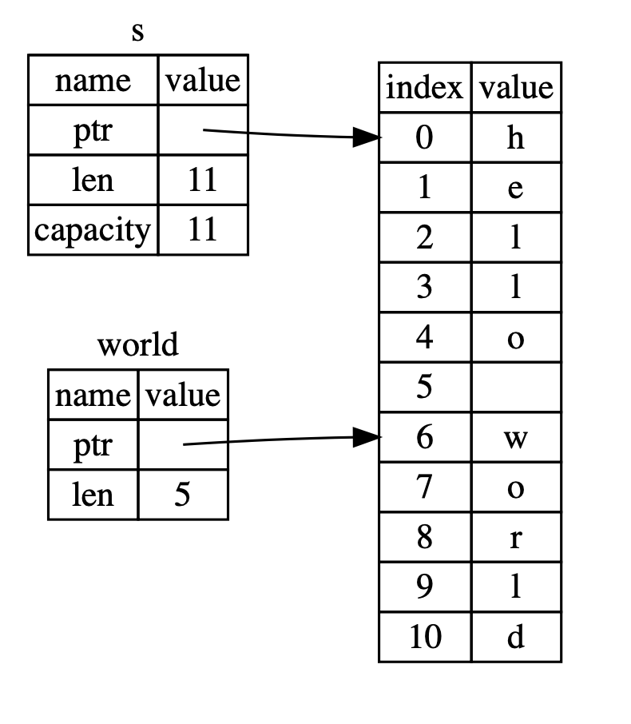

### 内容整理整理自：https://kaisery.github.io/trpl-zh-cn/
<span id="catalog"></span>
- [基本使用](#基本使用)
- [常见编程概念](#常见编程概念)
    - [变量和可变性](#变量和可变性)
    - [数据类型](#数据类型)
        - [基本数据类型](#基本数据类型)
        - [其他数据类型](#其他数据类型)
            - [String类型](#string类型)
            - [Slice类型](#slice类型)
    - [语句和表达式](#语句和表达式)
    - [函数](#函数)
    - [控制流](#控制流)
- [所有权](#所有权)
    - [为什么需要所有权](#为什么需要所有权)
    - [引用与借用](#引用与借用)
- 结构体
    - [结构体的基本使用](#结构体的基本使用)
        - [结构体的使用](#结构体的使用)
        - [元祖结构体](#元祖结构体)
        - [类单元结构体](#类单元结构体)
        - [空结构体](#空结构体)
    - [结构体的方法](#结构体的方法)
    - [结构体的关联函数](#结构体的关联函数)
    - [多个impl块](#多个impl块)
- 枚举和模式匹配
    - [枚举](#枚举)
        - [基本使用](#基本使用)
        - [标准库的枚举Option](#标准库的枚举option)
    - [模式匹配](#模式匹配)
        - [match控制流运算符](#match控制流运算符)
        - [iflet简单控制流](#iflet简单控制流)
- 模块系统
    - [包和crate](#包和crate)
    - [定义模块来控制作用域与私有性](#定义模块来控制作用域与私有性)
    - [通过路径来引用模块树中的项](#通过路径来引用模块树中的项)
    - [使用use关键字将名称引入作用域](#使用use关键字将名称引入作用域)
    - [分割模块](#分割模块)
    - [采用发布配置来自定义构建](#采用发布配置来自定义构建)
    - [cargo工作空间](#cargo工作空间)
- [常见集合](#常见集合)
    - [Vector](#vector)
    - [字符串](#字符串)
        * dev
    - [hashmap](#hashmap)
- [错误处理](#错误处理)
    - [painc和不可恢复错误](#painc和不可恢复错误)
    - [Result与可恢复错误](#result与可恢复错误)
    - [是否需要使用panic](#是否需要使用panic)
    - [是否需要使用panic](#是否需要使用panic)
- [泛型&trait&生命周期](#泛型&trait&生命周期)
    - [泛型](#泛型)
    - [trait定义共享的行为](#trait定义共享的行为)
    - [生命周期与引用有效性](#生命周期与引用有效性)
- 测试
    - [编写测试](#编写测试)
    - [运行测试](#运行测试)
    - [测试的组织结构](#测试的组织结构)
- [构建命令行程序](#构建命令行程序)
- 迭代器与闭包
    - [闭包](#闭包)
    - [迭代器](#迭代器)
    - [循环与迭代器的性能比较](#循环与迭代器的性能比较)
- 智能指针
    - [使用Box指向堆上的数据](#使用box指向堆上的数据)
    - [通过Deref将智能指针当作常规引用处理](#通过deref将智能指针当作常规引用处理)
        - [函数和方法的隐式解引用强制多态](#函数和方法的隐式解引用强制多态)
    - [使用Drop运行清理代码](#使用Drop运行清理代码)
    - [Rc引用计数智能指针](#Rc引用计数智能指针)
    - [RefCell和内部可变性模式](#RefCell和内部可变性模式)
    - [引用循环与内存泄露](#引用循环与内存泄露)
- 并发
    - [线程](#线程)
    - [使用消息传递在线程间传送数据](#使用消息传递在线程间传送数据)
    - [共享状态并发](#共享状态并发)
    - [使用Sync和   的可扩展并发](#使用sync和  的可扩展并发)
- 面向对象特性
    - [为使用不同类型的值而设计的trait对象](#为使用不同类型的值而设计的trait对象)
    - [面向对象设计模式的实现](#面向对象设计模式的实现)
- 模式
    - [所有可能会用到模式的位置](#所有可能会用到模式的位置)
    - [Refutability可反驳性--模式是否会匹配失败](#refutability可反驳性--模式是否会匹配失败)
    - [所有模式的语法](#所有模式的语法)
- 高级特征
    - [不安全的Rust](#不安全的Rust)
    - [高级trait](#高级trait)
    - [高级类型](#高级类型)
    - [高级函数与闭包](#高级函数与闭包)
    - [宏](#宏)

# 基本使用
[top](#catalog)
* Rust是一种**预编译静态类型**语言
* 安装Rust：
    * 检测安装成功
        * 检测Rust：`rustc --version`
        * 检测Cargo：`cargo --version`
* Rust的代码以`.rs`为文件后缀
* Rust的代码包称为**crates**
* 基本的编译与运行
    * 编译指令：`rustc xxx.rs`
    * 编译后生成：`xxxx.exe/xxxx`可执行文件，使用CMD时会有一个包含调试信息的文件`xxxx.pdb`

* 使用Cargo
    * 创建项目
        * 创建指令:`cargo new 项目名`
        * 生成的结果
            ```
            项目名
            |--- .gitignore
            |--- Cargo.toml
            |--- src
                |--- main.rs
            ```
        * Cargo期望用户**将代码放在src下**，根目录下放**README、license 信息、配置文件和其他跟代码无关的文件**
        * Cargo.toml文件的内容
            ```xml
            [package]
            name = "xxxx"
            version = "0.1.0"
            authors = ["Your Name <you@example.com>"]
            edition = "Rust版本"

            [dependencies]
            //在下面添加工程依赖
            ```
    * 创建库crate
        * 创建指令：`cargo new --lib lib名`
        * 生成的结果
            ```
            项目名
            |--- Cargo.toml
            |--- src
                |--- lib.rs
            ```
    * 编译、运行项目
        * 编译指令:`cargo build`
            * 在工程目录下执行该指令
            * 构建之后，会在工程目录下创建一个可执行文件：`target/debug/工程名`
            * 第一次运行该指令，将会在项目的根目录下创建一个新文件`Cargo.lock`
                * 该文件记录了依赖的实际版本，不需要做修改
        * 编译并运行:`cargo run`
            * 如果Cargo发现代码没有修改将不会重新构建项目，而是直接运行旧的二进制文件
        * 快速检测代码:`cargo check`
            * 该指令会快速检查代码确保它可以编译
            * 执行该指令**不会产生可执行文件**
            * `cargo check`比`cargo build`快，因为他忽略了生成可执行文件的步骤
    * 发布项目(release)
        * `cargo build --release`
            * 该指令视为了构建最终程序，编译速度比较慢
    * 当不使用`--release`参数运行`cargo build`或`cargo run`时debug表示会默认启动
    * 测试项目
        * `cargo test` 
            * Rust会构建一个测试执行程序来调用标记了`test`属性的函数，并报告每一个测试是通过还是失败

* Rust和Cargo的指令在各系统中都相同

* 编译与运行相互独立
* 每一行以`;`结尾
* 调用方法/宏
    * `method!(...);`，如果方法名后面有`!`，表示调用宏
    * `method(...);`，表示调用方法

# 常见编程概念
## 变量和可变性
[top](#catalog)
* 不可变变量
    * 创建常量：`let x = 5`
    * 常量只能赋值一次，否则会产生编译错误
    * 可以通过**隐藏特性**来创建新的同名的新变量
* 可变变量
    * `let mut x = 5;`
    * 值可以改，类型不可以改
* 常量
    * `const xxx: 类型 = xxxx;`
* 变量后可以增加类型声明：`let x: i8 = 5`
* 隐藏 Shadowing
    * 通过重复使用`let`来隐藏之前设定的变量值
    * 可以进行多次隐藏
        ```rust
        fn main() {
            let x = 5;
            println!("the value of x is:{}", x);
            let x = x+1;
            println!("the value of x is:{}", x);
            let x = x*2;
            println!("the value of x is:{}", x);
        }
        ```
    * 隐藏时，实际上是**创建了一个新变量，可以改变变量的类型，并复用这个变量名**

* **常量命名规范：使用下划线分隔大写字母单词**
* **可以在数字字面值中插入下划线来提升可读性**

## 数据类型
### 基本数据类型
[top](#catalog)
* Rust中的每一个值都属于某一个数据类型
* **基本数据类型都是存储在栈上的，并且当其离开作用域时被移除栈**(元祖？？？)
* 转换数据类型时必须设定数据类型注解
    * `let x: u32 = "42".parse().expect("Not a number!");`
* 标量类型
    * 标量类型代表一个单独的值
    * 四种基本的标量类型
        1. 整型
            * 可用类型

                |长度|有符号|无符号|
                |-|-|-|
                |8-bit|i8|u8|
                |16-bit|i16|u16|
                |32-bit|i32|u32|
                |64-bit|i64|u64|
                |arch|isize|usize|
            * `isize` 和 `usize`依赖于运行程序的计算机架构
                * 64位架构上是64位
                * 32位架构上是32位
            * 默认的整型类型是i32，通常是最快的？？？
            * 在64位系统上，`isize`、`usize`主要作为某些集合的索引
            * byte以外的所有数字字面值，**允许使用类型后缀**，如u8类型的数字：`57u8`
            * 整型字面值示例

                |数字字面值|例子|
                |-|-|
                |Decimal|98_222|
                |Hex|0xff|
                |Octal|0o77|
                |Binary|0b1111_0000|
                |Byte(u8 only)|b'A'|

            * 整型溢出
                * 在debug模式编译时，Rust会检查这类问题并使程序panic
                * 在release构建中，Rust不检测溢出，会转换成二进制补码
        2. 浮点型
            * 表示带小数点的数字
            * 两种浮点类型：`f32`、`f64`
            * 默认类型是:`f64`
                * 该类型在现代CPU中与`f32`速度机会一样，不过精度更高
            ```rust
            fn main() {
                let x = 2.0; // 默认为f64
                let y: f32 = 3.0; // f32
            }
            ```
        3. 布尔型
            * `bool`表示布尔型变量
            * 两个可能的值：`true`、`false`
            ```rust
            fn main() {
                let t = true;
                let f: bool = false;
            }
            ```
        4. 字符类型
            * `char`表示字符型
            * 字符类型表示**语言中最原生的字母类型**
            * 大小为4byte
            * 代表了一个Unicode标量值
            * Rust中，中文、日文、韩文、emoji字符、0长度的空字符 等，都是有效char值
            * 表示的范围：`U+0000~U+D7FF` 和 `U+E000`
* 复合类型
    * 将多个值组合成一个类型
    * Rust的两个原生复合类型
        1. 元组tuple
            * `(,)`创建元祖
            * 每个位置都有一个类型，这些**类型可以不相同，可以使用类型注解**
                ```rust
                let tup: (i32, f64, u8) = (500, 6.4, 1);
                ```
            * 元祖的解构赋值(模式匹配)
                ```rust
                let tup = (500, 6.4, 1);
                let (x, y, z) = tup;
                ```
            * 直接访问方式:`元祖名.index`
                ```rust
                let x:(i32, f64, u8) = (500, 6.4, 1);
                let y = x.0;
                ```
        2. 数组array
            * `[,]`创建数组
            * **数组每个元素的类型必须相同**
            * Rust中的数组是**固定长度**的，长度不能变化: `let a = [1,2,3,4,5];`
            * 数组的类型：`[type; number]`
                `let a [i32; 5] = [1, 2, 3, 4, 5];`
            * **当想要在栈上为数据分配空间、或者想要确保总是有固定数量的元素时，应该使用数组**
            * 如果不确定数组大小应该使用vector
            * 数组是**分配在栈上的连续内存**，可以使用索引来访问数组元素，访问方式：`数组名[index]`
                ```rust
                let a = [1, 2, 3, 4, 5];
                let first = a[0];
                ```
            * 越界访问，编译时不会产生异常，执行时会产生一个panic
                * 通过index访问数组时，**会检查索引是否小于数组的长度，超过了会产生panic，不会指向无效内存**
            * 默认初始化
                ```rust
                //创建一个长度为4的数组，每个元素默认为-1
                let arr:[i32;4] = [-1;4];
                ```

### 其他数据类型
#### String类型
[top](#catalog)
* 该类型被分配到堆上，能够存储在编译时未知大小的文本
* 使用`from()`函数基于字符串字面量来创建String：`let s = String::from("test");`
    * `::`允许将`from`置于`String`类型的命名空间 TODO
* 向**可变**字符串变量的末尾添加新字符串
    ```rust
    let mut s = String::from("this");
    s.push_str(" is test");
    println!("{}", s); // this is test
    ```
* 字符串字面量不可变，如`let s = "test";`；**可变的字符串变量**可变
    * 字符串字面量的内存分配
        * 字符串字面量是**编译时就知道的内容**,所以字面量会**被直接硬编码到最终的可执行文件中**，这使得字符串字面量快速、高效
    * 可变字符串变量
        * 为了支持一个可变、可增长的文本片段，需要**分配一块在编译时未知大小的内存来存放内容**，包含两点
            1. 必须在运行时向操作系统请求内存
                * 由`String::from`的实现来申请内存
            2. 需要有一个方法，在String使用完之后，将内存释放回操作系统
                * 一般GC系统的策略：自动记录并清除不再使用的内存
                * 没有GC系统的编程策略：精确的为每一个`allocate`配对一个`free`
                    * free早了，会浪费内存
                    * free晚了，会出现无效变量
                    * 如果重复回收，会产生异常
                * Rust的策略
                    * **在变量离开作用域后自动释放**
                        ```rust
                        {
                            let s = String::from("hello");  // 从此处起，s 是有效的

                            // 使用 s
                        }  // 此作用域已结束，
                        // s 不再有效(内存已被释放)
                        ```
                    * 当s离开作用域时，即末尾的`}`处，Rust会自动调用特殊函数`drop`
* String的底层
    * 基本结构，这部分存储在栈上
    
    |name|value|
    |-|-|
    |ptr|指针，指向存储字符串内容的数据|
    |len|长度，String当前使用了多少字节的内存|
    |capacity|容量，String从操作系统获取了多少字节的内存|

    * 存储字符串内容的数据，这部分存储在堆上

    |index|val|
    |-|-|
    |0|t|
    |1|e|
    |2|s|
    |3|t|

#### Slice类型
[top](#catalog)
* slice本身是一个不可变引用
* slice类型没有所有权
* slice运行引用集合中一段连续的元素序列，而不用引用这个集合
* 通过slice来关联原始数据和索引
* 语法1：`&变量名/引用名[start..end]`，表示从start开始，但不包含end的range
* 语法2：`&变量名/引用名[start..=end]`，表示从start开始，到end的range
* 语法3--从0开始：`&变量名/引用名[..end]`
* 语法4--直到结束：`&变量名/引用名[start..]`
* 语法5--获取整体：`&变量名/引用名[..]`
* 在slice的数据结构中存储了：开始位置的**引用**和长度
* 字符串slice
    * 字符串slice的类型声明：`&str`
    * 字符串slice是String中一部分值的引用
        ```rust
        let s = String::from("hello world");

        let hello = &s[0..=4];
        let world = &s[6..=10]; //对String的部分引用
        ```
    * slice的结构示例：
    * **字符串slice的索引必须位于有效的UTF-8字符边界内，如果尝试从一个多字节字符的中间位置创建字符串slice，程序会因错误而退出**
    * 通过字符串slice来返回第一个单词
    ```rust
    fn first_word(s: &String) -> &str {
        let bytes = s.as_bytes();
        for (i,&item) in bytes.iter().enumerate(){
            if item == b' ' {
                return &s[0..i];
            }
        }

        return &s[..];
    }
    ```
    * 字符串字面值就是slice，类型就是`&str`，所以字符串字面值是不可变的，他是一个指向二进制程序特定位置的slice
        * **因为字面量本身就是字符串slice，所以可以直接作为字符串slice类型的函数参数**
    * 字符串slice作为函数参数
        ```rust
        fn first_word(s &str) -> &str{...}
        fn main() {
            let my_string = String::from("hello world");

            // first_word 中传入 `String` 的 slice
            let word = first_word(&my_string[..]);

            let my_string_literal = "hello world";

            // first_word 中传入字符串字面值的 slice
            let word = first_word(&my_string_literal[..]);

            // 因为字符串字面值就是字符串 slice，
            // 这样写也可以，即不使用 slice 语法！
            let word = first_word(my_string_literal);
        }
        ```
* 其他类型的slice
    * 数组的slice，与字符串slice相似，类型是`&[数值类型]`
        * 内部存储指向的第一个元素的引用和slice的长度
        ```rust
        let a = [1, 2, 3, 4, 5];

        let slice = &a[1..3];
        ```
    

## 语句和表达式
[top](#catalog)
* 语句
    * 执行一些操作但不返回值的指令
    * 如：`let y = 6;`
    * 语句不能赋给另一个变量
    * 以`;`结尾
* 表达式
    * 能够计算并产生一个值
    * **表达式的结尾没有`;`**，加上`;`就变成了语句
    * 表达式可以是语句中的一部分
    * `let y = 6;`中`6`是一个表达式
    * 函数调用是一个表达式
    * 宏调用是一个表达式
    * 代码块`{...}`是一个表达式
        * 如
            ```rust
            let y = {
                let x = 3;
                x + 1 //表达式，返回x+1的结果
            }; //结尾必须有分号
            ```
        * 代码块的值是其最后一个表达式的值
## 函数
[top](#catalog)
* 声明函数的形式
    * 一个返回值:`fn 函数名(参数1: 类型, 参数2: 类型,....) -> 返回值类型`
    * 多个返回值，使用元祖：`fn 函数名(参数1: 类型, 参数2: 类型,....) -> (返回值类型1, 返回值类型2,....)`

* 函数的返回值等同于**函数体的最后一个表达式的值**
    * 所以返回值可以变成某种类型的**转移**
* 使用`return`指定返回值，**可以从函数中提前返回**
* 大部分函数**隐式的返回最后的表达式**
    ```rust
    fn five() -> i32{
        5 //没有';'，是表达式，且是最后一个表达式，会作为返回值返回
    }

    fn main(){
        let x = five();
        println!("{}", x)
    }
    ```
* 控制台的错误信息中会使用空元祖`()`来表示不返回值
* `fn main(){}`，在可运行的rust程序中，`main`总是最先运行的代码，并且**没有参数，也没有返回值**
* 函数和变量使用snake case风格，所有字母都是小写并使用下划线分隔单词
* 函数的参数**是函数签名的一部分**

## 控制流
[top](#catalog)
* if表达式
    * 基本格式
        ```rust
        if exp {
            ...
        } else if exp{
            ...
        } else {
            ...
        }
        ```
    * **每个分支的判断exp的结果必须是`bool`类型**
    * if 是有一个表达式，可以在let语句的右侧使用它
        ```rust
        let condition = true;
        let number = if condition {
            5
        } else {
            6
        }; //必须以';'结尾

        println!("{}", number);
        ```
        * 每个分支的数据类型必须相同，否则代码无法编译
            ```rust
            let number = if condition {
                5
            } else {
                "xxxx" //将会产生编译异常
            };
            ```
* 循环
    * loop 循环
        * **loop是一个表达式**
        * 可以使用break来停止循环
            * break可以添加返回值：`break 返回值;`
        ```rust
        let mut count = 0;
        let result = loop {
            count += 1;
            if count == 10{
                break count + 2;
            }
        };

        println!("{}", result)
        ```
    * while循环
        * while条件为真时继续循环
            ```rust
            let mut x = 10;
            while x > 0 {
                println!("{}", x);
                x = x-1;
            }
            println!("end");
            ```
        * 使用这种方式，每次系统都会检查index是否越界，使程序变慢
    * for 循环
        * 使用for遍历集合
            ```rust
            let a = [1,2,3,4,5];
            for e in a.iter() {
                println!("{}", e);
            }
            println!("end");
            ```
        * 使用for变量集合可以防止越界
        * 遍历range类型
            ```rust
            // 只输出1 2 3 end
            for num in (1..4) {
                println!("{}", num);
            }
            println!("end");
            ```


# 所有权
## 为什么需要所有权
[top](#catalog)
* 所有权让 Rust 无需垃圾回收即可保障内存安全，不需要经常考虑栈和堆的问题
* 堆和栈
    * 堆和栈都是运行时可供使用的内存，但是结构不同
    * 栈
        * 栈的操作非常快，因为数据存储的位置总是在栈顶，不需要寻找数据存储的位置
        * 另一个提升栈速度的属性是：**栈中的所有数据都必须占用已知且固定的大小**
    * 堆
        * **在编译时大小未知或大小可能变化的数据，应该存在堆上**
        * 堆是缺乏组织的
        * **在堆上分配内存(简称分配)**:操作系统在堆的某处找到一块足够大的空位，并标记为**已使用**，并**返回一个表示该地址的指针**
            * 简单来说：向堆中放入数据时，需要**请求一定大小的空间**
        * 访问栈的数据比堆慢，**因为必须通过指针来访问**
            * **现代处理器在内存中跳转越少就越快**
    * 数据保存到栈中不是分配，因为数据的大小是已知且固定的。数据的指针可以存储在栈上，但是需要数据时必须访问数据

* 所有权系统需要处理的问题：
    * 跟踪哪些代码正在使用堆上的哪些数据
    * 最大限度减少堆上**重复数据**的数量
    * 清理堆上不再使用的数据，确保不会耗尽空间

## 所有权规则
[top](#catalog)
* 规则
    * Rust中的每一个值都有一个被称为其所有者(owner)的变量
    * 值有且只有一个所有者
    * 当所有者(变量)离开作用域，这个值将被丢弃

* 变量作用域
    * 示例
        * 从s进入作用域到s离开为止，它是有效的，
        ```rust
        {                      // s 在这里无效, 它尚未声明
            let s = "hello";   // 从此处起，s 是有效的
            // 使用 s
        }                      // 此作用域已结束，s 不再有效
        ```

* 变量内存的释放
    * 一般GC系统的策略：自动记录并清除不再使用的内存
    * 没有GC系统的编程策略：精确的为每一个`allocate`配对一个`free`
        * free早了，会浪费内存
        * free晚了，会出现无效变量
        * 如果重复回收，会产生异常
    * Rust的策略
        * **在变量离开作用域后自动释放**
            ```rust
            {
                let s = String::from("hello");  // 从此处起，s 是有效的

                // 使用 s
            }  // 此作用域已结束，
            // s 不再有效(内存已被释放)
            ```
        * 当s离开作用域时，即末尾的`}`处，Rust会自动调用特殊函数`drop`

* 变量与数据的交互方式--移动
    * 对于基本数据类型的整型变量
        ```rust
        let x = 5; //将整形变量5绑定到x
        let y = x; //生成一个x的拷贝，并绑定到y上
        //最终两个5被放入栈中
        ```
    * 对于String
        ```rust
        {
            let s1 = String::from("test");
            let s2 = s1;
            //println!("{}", s1); //会产生编译异常
            println!("{}", s2);
        }
        ```
        * s1复制给s2时，没有执行复制，而是将栈的内容移动到s2名下
        * **移动(move)，而不是拷贝**:在这种使用场景下，Rust将会认为**s1不再有效**，所以`let s2 = s1;`后，无法打印s1，因为s1被当作无效变量
        * 在s2离开作用域时，会分别释放：基本结构、堆中的字符串内容数据
            * 堆中的字符串内容数据 只会释放一次，因为s1已经无效了，防止了二次free的bug

* 变量与数据的交互方式--克隆
    * 使用`clone()`来执行数据的深拷贝
        ```rust
        let s1 = String::from("test");
        let s2 = s1.clone();
        println!("{},{}", s1, s2);
        ```
    * 对于基本数据类型，可以通过直接赋值来完成克隆，而不会造成移动
        * 因为基本数据类型的长度是已知的，并且在栈上做拷贝非常快
            ```rust
            let x = 5; //将整形变量5绑定到x
            let y = x; //直接拷贝，不会产生变量的移动
            //最终两个5被放入栈中
            ```
* Copy特性
    * Copy可以用在存储在栈上的类型上
    * 如果一个类型拥有Copy，则在将其赋值给另一个变量后仍然可以使用
    * Rust不允许自身或部分拥有Drop的类型使用Copy，如果使用了会产生编译异常
        * 拥有Drop特性的如果有Copy，对于String这种类型，会产生二次free
    * Copy的一个通用规则
        * 任何简单标量值的组合可以是Copy
            * 对于元祖，当且仅当其包含的类型都是Copy时是Copy的，如`(i8,i32)`，但是`(i8,String)`不是
        * 不需要分配内存或某种形式资源的类型是Copy的

* 所有权与函数
    ```rust
    fn main() {
        let s = String::from("hello");  // s 进入作用域

        takes_ownership(s);             // s 的值移动到函数里 ...
                                        // ... 所以到这里不再有效

        let x = 5;                      // x 进入作用域

        makes_copy(x);                  // x 应该移动函数里，
                                        // 但 i32 是 Copy 的，所以在后面可继续使用 x

    } // 这里, x 先移出了作用域，然后是 s。但因为 s 的值已被移走，
    // 所以不会有特殊操作

    fn takes_ownership(some_string: String) { // some_string 进入作用域
        println!("{}", some_string);
    } // 这里，some_string 移出作用域并调用 `drop` 方法。占用的内存被释放

    fn makes_copy(some_integer: i32) { // some_integer 进入作用域
        println!("{}", some_integer);
    } // 这里，some_integer 移出作用域。不会有特殊操作
    ```

* 返回值与作用域(所有权的变化)
    ```rust
    fn main() {
        let s1 = gives_ownership();         // gives_ownership 将返回值
                                            // 移给 s1

        let s2 = String::from("hello");     // s2 进入作用域
                                            // s2 不能再使用

        let s3 = takes_and_gives_back(s2);  // s2 被移动到
                                            // takes_and_gives_back 中, 
                                            // 它也将返回值移给 s3
    } // 这里, s3 移出作用域并被丢弃。s2 也移出作用域，但已被移走，
    // 所以什么也不会发生。s1 移出作用域并被丢弃

    fn gives_ownership() -> String {             // gives_ownership 将返回值移动给
                                                // 调用它的函数

        let some_string = String::from("hello"); // some_string 进入作用域.

        some_string                              // 返回 some_string 并移出给调用的函数
    }

    // takes_and_gives_back 将传入字符串并返回该值
    fn takes_and_gives_back(a_string: String) -> String { // a_string 进入作用域

        a_string  // 返回 a_string 并移出给调用的函数
    }
    ```

## 引用与借用
[top](#catalog)
* 引用没有所有权
* (不可变)引用
    * 使用`&变量名`表示该变量的引用
    * 通过引用可以使用变量的值，但是不获取其所有权
        ```rust
        fn main() {
            let s1 = String::from("hello");

            let len = calculate_length(&s1);//创建s1的引用

            println!("The length of '{}' is {}.", s1, len);
        }

        fn calculate_length(s: &String) -> usize {
            s.len()
        }//因为s只是一个引用，没有变量的所有权，所以离开作用域时什么也不会发生
        //离开后，将引用的变量归还

        ```
    * 类似于指向变量的指针，但只是指向，不能修改指向的值，**因为没有所有权**
* 借用
    * 将引用作为函数参数称为**借用**
    * 无法通过借用来修改原始变量，这会导致编译异常---引用不可变

* 可变引用
    * 使用`&mut 变量名` 来表示可变引用
        ```rust
        fn main() {
            let mut s = String::from("hello");

            change(&mut s);
            println!("{}", s)
        }

        fn change(some_string: &mut String) {
            some_string.push_str(", world");
        }
        ```
    * 可变引用的限制
        * 特定作用域中的特定数据**有且只有一个可变引用**
        * 通过限制来防止数据竞争(主要防止以下三种行为)
            * 两个或更多指针同时访问同一数据
            * 没有同步数据访问的机制
            * 至少有一个指针被用来写入数据
        * 可以通过多个作用域来拥有多个可变引用
            ```rust
            let mut s = String::from("hello");

            {
                let r1 = &mut s;

            } // r1 在这里离开了作用域，所以我们完全可以创建一个新的引用

            let r2 = &mut s;
            ```

* 可变和不可变引用
    * 在一个作用域中：**要么只有一个可变引用，要么只能有多个不可变引用**
    * 引用的作用域从声明的地方开始一直持续到**最后一次使用为止**，在最后一次使用之后可以继续声明可变引用
        ```rust
        let mut s = String::from("hello");

        let r1 = &s; // 没问题
        let r2 = &s; // 没问题
        println!("{} and {}", r1, r2);
        // 此位置之后 r1 和 r2 不再使用

        let r3 = &mut s; // 没问题
        println!("{}", r3);
        ```
* 悬垂引用
    * **编译器会确保数据不会在其引用之前离开作用域**，防止了悬垂引用
        ```rust
        fn dangle() -> &String { // dangle 返回一个字符串的引用

            let s = String::from("hello"); // s 是一个新字符串

            &s // 返回字符串 s 的引用
        } // 这里 s 离开作用域并被丢弃。其内存被释放。会产生编译异常
        ```

# 结构体
## 结构体的使用
### 结构体的基本使用
[top](#catalog)
* 定义结构体：
    ```rust
    struct User {
        username: String,
        email: String,
        sign_in_count: u64,
        active: bool,
    } //结构体定义后没有';'
    ```
* 创建结构体
    ```rust
    let user1 = User {
        email: String::from("someone@example.com"),
        username: String::from("someusername123"),
        active: true,
        sign_in_count: 1,
    };
    ```
* 如果要修改结构体，则必须是可变的结构体
    ```rust
    let mut user1 = User {
        email: String::from("someone@example.com"),
        username: String::from("someusername123"),
        active: true,
        sign_in_count: 1,
    };

    user.email = String::from("xxxx");
    ```
    * Rust不支持某个字段被标记为可变
    * 参数名和字段名相同时，可以直接使用**字段初始化间简写法**
        ```rust
        fn build_user(email: String, username: String) -> User {
            User {
                email, //不需要写成  email:email
                username,
                active: true,
                sign_in_count: 1,
            }
        }
        ```
    * 结构体更新语法：通过一个结构体实例来创建另一个实例
        ```rust
        let mut user1 = User {
            email: String::from("someone@example.com"),
            username: String::from("someusername123"),
            active: true,
            sign_in_count: 1,
        };

        // 只有email和username是新的值，剩余的值来自user1中的实例字段
        let user2 = User {
            email: String::from("another@example.com"),
            username: String::from("anotherusername567"),
            ..user1
        };
        ```

### 元祖结构体
[top](#catalog)
* 类似于元组，元祖结构体没有字段，只有类型
    * black和origin内部的值相同，但是数据类型不同
    ```rust
    //定义元祖结构体
    struct Color(i32, i32, i32); //元祖结构体的定义后需要添加';'
    struct Point(i32, i32, i32);

    //使用
    let black = Color(0, 0, 0);
    let origin = Point(0, 0, 0);
    ```
* 使用方法和访问方法与元素相同
    * 使用`.index`来访问元素
    * 可以进行解构

### 类单元结构体
* 类单元结构体没有任何字段，类似于`()`，即unit类型
* 用于在某个类型上实现trait，但不需要在类型中存储数据

### 空结构体
* `struct XXX;`

## 结构体的方法
[top](#catalog)
* 方法被定义才结构体的上下文中：`impl 结构体名{...}`
* 方法的第一个参数总是self，代表调用该方法的结构体实例
    * 只使用实例的字段：`&self`
    * 需要修改实例字段：`&mut self`
    * 很少直接使用`self`来获取实例的所有权
        * 通常用在将self转换为其他实例，同时防止在转换之后再使用原始的实例
* 实例：计算面积
    ```rust
    #[derive(Debug)]
    struct Rectangle{
        width:u32,
        height:u32,
    }

    impl Rectangle {
        fn area(&self) -> u32 {
            return self.width * self.height;
        }

    }

    fn main(){
        let rect1 = Rectangle{
            width:30,
            height:50,
        };

        println!("arear = {}", rect1.area());

        println!("{:#?}", rect1);
    }
    ```
* 调用的机制
    * Rust使用**自动引用和解引用**来完成方法调用
    * Rust会自动为实例添加`&`,`&mut`,`*`，使实例对象与方法签名相匹配
        * 在给出明确的对象和方法名的前提下，Rust可以明确的计算出方法对对象的调用方式：`&self`,`&mut self`,`self`
    * 两种等价的写法
        ```rust
        p1.distance(&p2);
        (&p1).distance(&p2);
        ```

## 结构体的关联函数
[top](#catalog)
* 关联函数：在impl块中定义，但不以self作为参数的函数
* **关联函数最终位于结构体的命名空间中，但是调用是不会依赖于某个具体的实例对象**
* 关联函数虽然与结构体关联了，但仍然是函数不是方法
* 关联函数不作用于某个结构体的实例
* **关联函数经常同于结构体的构造函数**
* 关联函数的使用方法：`结构体::关联函数(参数列表);`
    * `::`语法用于关联函数和某块创建的命名空间

## 多个impl块
[top](#catalog)
* 多个方法可以写在一个impl块中，也可以分散在多个impl块中
* 范型和trait ？？？？？

# 枚举和模式匹配
## 枚举
### 基本使用
[top](#catalog)
* 定义枚举
    * V4,V6被称为**枚举成员**
    * 定义后，IpAddrKind成为一个可以在代码中使用的**自定义数据类型**
        ```rust
        enum IpAddrKind {
            V4,
            V6,
        }
        ```
* 枚举成员
    * 枚举成员位于其标识符的命名空间中，并使用`::`分隔
        ```rust
        let four = IpAddrKind::V4;
        let six = IpAddrKind::V6;
        ```
    * 枚举成员都是相同的，都是所属的枚举类型
        * `V4,V6`的类型都是`IpAddrKind`
        * **可以使用枚举类型作为函数参数来接收任意枚举成员**
            ```rust
            fn route(ip_type: IpAddrKind) { }

            // 调用时，可以使用任何一个枚举成员
            route(IpAddrKind::V4);
            route(IpAddrKind::V6);
            ```
    * 将数据与枚举成员关联，以此来替代结构体
        ```rust
        //struct IpAddr{
        //    kind:IpAddrKind,
        //    address:String,
        //}

        //替代结构体
        enum IpAddr {
            V4(String),
            V6(String),
        }

        let home = IpAddr:V4(String::from("...."))
        let loopback = IpAddr:V6(String::from("...."))
        ```
    * 枚举成员的关联数据可以是任意类型，包括基本数据类型、结构体、其他枚举等等
        ```rust
        enum Message {
            Quit, //没有关联数据
            Move { x: i32, y: i32 }, //包含一个匿名结构体
            Write(String), //包含一个字符串的元祖
            ChangeColor(i32, i32, i32), //包含3个i32的元祖
        }
        ```
* impl
    * 使用方法和结构体相同
        ```rust
        enum Message {
            Quit,
            Move { x: i32, y: i32 },
            Write(String),
            ChangeColor(i32, i32, i32),
        }

        impl Message {
            fn call(&self) {
                ...
            }
        }

        let m = Message::Write(String::from("hello"));
        m.call();
        ```

### 标准库的枚举Option
[top](#catalog)
* Option的定义
    ```rust
    enum Option<T> {
        Some(T),
        None,
    }
    ```
* 无需`Option<T>`前缀，可以直接使用`Some`和`None`
* T意味着Some可以包含任意类型的数据
    ```rust
    let some_number = Some(5);
    let some_string = Some("a string");

    let absent_number: Option<i32> = None;
    ```
* 只要一个值不是`Option<T>`类型，**就可以安全的认定它的值不为空** 
* 在对`Option<T>`进行T的运算之前必须将其转换为T
    * 通过这种方式可以防止：假设某个值不为空，但实际为空
    * 如果可能拥有一个会为空的值，必须显示的将其放入对应类型的`Option<T>`中，在使用时，如果这个值不是`Option<T>`，就**可以安全的认定它的值不为空(为空)？？？？？**

## 模式
### match控制流运算符
[top](#catalog)
* **模式可由：字面量、变量、通配符和许多其他内容构成**
* **Rust的匹配是穷尽的(exhaustive)，必须穷举到最后的可能行来使代码有效**
* match的能力来源于以下两点，它确保了所有可能的情况都能得到处理
    1. 模式的表现力
    2. 编译器检查
* match类似于`switch...case`
* match分支必须返回相同的类型
* 基本使用方法：
    ```rust
    enum Coin {
        Penny,
        Nickel,
        Dime,
        Quarter,
    }

    fn value_in_cents(coin: Coin) -> u32 {
        match coin {
            Coin::Penny => {
                println!("Lucky penny!");
                1
            }, //如果需要运行多行代码，需要使用大括号
            Coin::Nickel => 5,
            Coin::Dime => 10,
            Coin::Quarter => 25,
        }
    }
    ```
* 绑定值的模式
    ```rust
    #[derive(Debug)] // 这样可以可以立刻看到州的名称
    enum UsState {
        Alabama,
        Alaska,
        // --snip--
    }

    enum Coin {
        Penny,
        Nickel,
        Dime,
        Quarter(UsState),
    }

        
    fn value_in_cents(coin: Coin) -> u32 {
        match coin {
            Coin::Penny => 1,
            Coin::Nickel => 5,
            Coin::Dime => 10,
            Coin::Quarter(state) => { //state 绑定了UsState类型的值
                match state{
                    UsState::Alabama => 200,
                    UsState::Alaska => 300,
                }
        }
    }

    fn main(){
        let a = value_in_cents(Coin::Quarter(UsState::Alabama));
        println!("{}",a); //输出 200
    }
    ```

* 匹配`Option<T>`
    * 基本使用
        ```rust
        fn plus_one(x: Option<i32>) -> Option<i32> {
            match x {
                None => None,
                Some(i) => Some(i + 1), //i将会绑定数据5
            }
        }

        fn main(){
            let five = Some(5);
            let six = plus_one(five);
            let none = plus_one(None);

            println!("{:?}", five); //Some(5)
            println!("{:?}", six); //Some(6)
            println!("{:?}", none); //None
        }
        ```
    * 如果`Option<T>`匹配忽略的`None`，会产生编译异常
        ```rust
        fn plus_one(x: Option<i32>) -> Option<i32> {
            match x {
                Some(i) => Some(i + 1),//模式必须穷举到所有的可能性
            }
        }
        ```
* `_`通配符
    * 用于不想列出所有可能值的场景
    * 通过将`_`放在其他分支后，`_`将会匹配所有之前没有指定的值
        ```rust
        let some_u8_value = 0u8;
        match some_u8_value {
            1 => println!("one"),
            3 => println!("three"),
            5 => println!("five"),
            7 => println!("seven"),
            _ => (),
        }
        ```
    * `()`是unit值，所以在`_`的情况下什么也不会发生，即不做任何处理

### iflet简单控制流
[top](#catalog)
* 通过`if let`简单的结合if和let，来处理只匹配一个模式的值而忽略其他模式的情况
    * match的写法:通过通配符`_`，来满足match的穷尽性
        ```rust
        let some_u8_value = Some(0u8);
        match some_u8_value {
            Some(3) => println!("three"),
            _ => (),
        }
        ```
    * `if let`的写法
        ```rust
        if let Some(3) = some_u8_value {
            println!("three");
        }
        ```
* `if let`的工作方式
    * 通过**等号**分隔一个模式和一个表达式
        * 表达式对应match
        * 模式对应一个分支
* `else`表示和`_`一样的处理
    ```rust
    let mut count = 0;
    if let Coin::Quarter(state) = coin {
        println!("State quarter from {:?}!", state);
    } else {
        count += 1;
    }
    ```

# 模块系统
## 包和crate
[top](#catalog)
* crate
    * crate是一个二进制项或者库
    * crate root是一个源文件，Rust编译器以它为起始点，并构成crate的根模块
    * 一个crate会将一个作用域内的相关功能分组到一起，使该功能可以在多个项目之间共享
    
* 包
    * 包是提供一系列功能的一个或者多个crate
    * 一个包会包含有**一个Cargo.toml文件**，来表明如何去构建这些crate
    * 包的规则
        * 一个包必须包含一个crate库或不包含crate库，不能拥有多个
        * 一个包必须包含一到多个crate(库或者二进制项)

* `main.rs`和`lib.rs`
    * 基本认识
        * `src/main.rs`是二进制crate，与包同名
        * `src/lib.rs`是库crate，与包同名
    * `src/main.rs`和`src/lib.rs`都是crate的根
        * 这两个文件的内容都是从一个名为crate的模块作为根的crate模块结构
    * 如果只包含一个`src/main.rs`，则它只含有一个**和包同名的二进制crate**
    * 如果同时包含`src/main.rs`和`src/lib.rs`，则它有两个crate：一个库create和二进制crate
    
* 将文件放在`src/bin`目录下，一个包可以享有多个二进制crate，即每个文件都是一个分离出来的二进制crate
* crate根文件将由Cargo传递给rustc来实际构建库或者二进制项目

## 定义模块来控制作用域与私有性
[top](#catalog)
* 模块
    * 模块可以将一个crate中的代码进行分组，来提高可读性与重用性
    * 模块可以控制项的私有性，即public/private/内部实现？？？
    * 通过`mod`关键字来创建模块，模块可以嵌套
        ```rust
        //src/lib.rs
        mod front_of_house {
            mod hosting {
                fn add_to_waitlist() {}

                fn seat_at_table() {}
            }

            mod serving {
                fn take_order() {}

                fn server_order() {}

                fn take_payment() {}
            }
        }
        ```
    * 多个模块构成模块树结构，类似于文件系统的目录树
        ```xml
        crate
        └── front_of_house
            ├── hosting
            │   ├── add_to_waitlist
            │   └── seat_at_table
            └── serving
                ├── take_order
                ├── serve_order
                └── take_payment
        ```

## 通过路径来引用模块树中的项
[top](#catalog)
* 调用模块树中的一个函数，需要知道它的路径
* 路径的两种形式
    * 绝对路径：从crate根开始，以crate名或者字面值crate开头
        * 从crate根开始类似于shell系统的从`/`开始
    * 相对路径：从当前模块开始，以`self`, `super`，或者当前模块的标识符开头
* 路径都要后跟一个或多个`::`分隔的标识符
* Rust中默认所有项：函数、方法、结构体、枚举、模块、常量，**都是私有的**
* Rust默认隐藏内部实现细节
    * 父模块中的项不能使用子模块的私有项，子模块可以使用父模块中的项(不限于pub)
    * 可以使用`pub`来创建公共项，将子模块的内部部分暴露给上级模块
    ```rust
    mod front_of_house {
        pub mod hosting {
            pub fn add_to_waitlist() {}
        }
    }

    pub fn eat_at_restaurant() {
        // Absolute path
        crate::front_of_house::hosting::add_to_waitlist();

        // Relative path
        front_of_house::hosting::add_to_waitlist();
    }
    ```

* 使用super起始的相对路径
    * `super`类似与文件系统中以`..`开头的语法
    * 通过`super`可以进入当前模块的父模块
        ```rust
        fn serve_order() {}

        mod back_of_house {
            fn fix_incorrect_order() {
                cook_order();
                super::serve_order(); //使用super进入crate
            }

            fn cook_order() {}
        }
        ```
* 创建公有的结构体和枚举
    * 可以使用`pub`创建公有结构体，但是其字段仍是私有的，需要更具使用情况在字段上添加`pub`
        ```rust
        mod back_of_house {
            pub struct Breakfast {
                pub toast: String,
                seasonal_fruit: String,
            }

            impl Breakfast {
                pub fn summer(toast: &str) -> Breakfast {
                    Breakfast {
                        toast: String::from(toast),
                        seasonal_fruit: String::from("peaches"),
                    }
                }
            }
        }

        pub fn eat_at_restaurant() {
            let mut meal = back_of_house::Breakfast::summer("Rye");
            meal.toast = String::from("Wheat");
            println!("I'd like {} toast please", meal.toast);
        }
        ```
    * 可以使用`pub`创建公有枚举，所有的**枚举成员默认为公有成员**

## 使用use关键字将名称引入作用域
[top](#catalog)
* 使用use将绝对路径下的模块引入作用域
    * **通过use引入作用域的路径也会检查私有性**
    * 不直接将函数引入作用域：`use crate::front_of_house::hosting::add_to_waitlist;`，是为了：
        1. **清晰的表明函数不是在本地定义的**
        2. 使完整路径的重复度最小化
        ```rust
        mod front_of_house {
            pub mod hosting {
                pub fn add_to_waitlist() {}
            }
        }

        //使hosting成为作用域中的有效名称
        use crate::front_of_house::hosting;

        pub fn eat_at_restaurant() {
            hosting::add_to_waitlist();
            hosting::add_to_waitlist();
            hosting::add_to_waitlist();
        }
        ```
* 使用use将相对路径下的模块引入作用域
    ```rust
    mod front_of_house {
        pub mod hosting {
            pub fn add_to_waitlist() {}
        }
    }

    //引入相对路径
    use front_of_house::hosting;

    pub fn eat_at_restaurant() {
        hosting::add_to_waitlist();
        hosting::add_to_waitlist();
        hosting::add_to_waitlist();
    }
    ```
* 使用use引入结构体、枚举、其他项时，习惯是指定它们的完整路径
    ```rust
    // 引入HashMap结构体
    use std::collections::HashMap;

    fn main() {
        let mut map = HashMap::new();
        map.insert(1, 2);
    }
    ```
* 引入两个来自不同父模块名称相同的项
    ```rust
    use std::fmt;
    use std::io;

    fn function1() -> fmt::Result {
        // --snip--
    }

    fn function2() -> io::Result<()> {
        // --snip--
    }
    ```
* 使用as给项重命名
    ```rust
    use std::fmt::Result;
    use std::io::Result as IoResult;

    fn function1() -> Result {
        // --snip--
    }

    fn function2() -> IoResult<()> {
        // --snip--
    }
    ```
* 使用`pub use`重导出名称？？？？？？
    * 使用`use`引入名称后，在新作用域中的可用名称是私有的
    * 通过`pub use`使名称可引入任何代码的作用域中
    ```rust
    mod front_of_house {
        pub mod hosting {
            pub fn add_to_waitlist() {}
        }
    }

    pub use crate::front_of_house::hosting;

    pub fn eat_at_restaurant() {
        hosting::add_to_waitlist();
        hosting::add_to_waitlist();
        hosting::add_to_waitlist();
    }
    ```

* 使用外部包
    * 在`Cargo.toml`的`dependencies`下添加依赖
        * 依赖名="版本号"
    * 使用：`use 依赖名::项名称;`
    * 标准库也属于外部crate，不需要向`Cargo.toml`添加`dependencies`，直接通过`use`来引用
        ```rust
        // 通过路径来引用标准库
        use std::collections::HashMap;
        ```
* 嵌套路径来消除大量的use行
    * 引入很多定义与相同包或相同模块的项时，为每一项单独列处一行会占用源码很大的空间
    * 嵌套路径：指定路径的相同部分，在`{}`中添加不同的路径部分
        ```rust
        use std::cmp::Ordering;
        use std::io;

        //嵌套路径
        use std::{cmp::Ordering, io};
        ```
    * 组合两个共享子路径
        ```rust
        use std::io;
        use std::io::Write;

        //self表示 std::io
        use std::io::{self, Write};
        ```

* 通过glob运算符将所有的公有定义引入作用域
    * 使用glob运算符：`*`，将一个路径下**所有公有项**引入作用域
        ```rust
        use std::collections::*;
        ```
    * 使用glob运算符会导致无法推到作用域中有什么名称、它们是在何处定义的
    * glob常用与测试模块tests中，有时也用于**prelude模式**？？？

## 分割模块
[top](#catalog)
* `mod`声明了模块，Rust会在与模块同路径同名的文件中查找模块的代码
* `mod 模块名;`，模块名后不添加代码块，使用分号，Rust会在另一个与模块同名的文件中加载模块的内容
* 模块分割后对use不会有任何影响
    ```rust
    // src/front_of_house/hosting.rs
    pub fn add_to_waitlist() {}

    // src/front_of_house.rs
    pub mod hosting;

    // src/lib.rs
    mod front_of_house;

    pub use crate::front_of_house::hosting;

    pub fn eat_at_restaurant() {
        hosting::add_to_waitlist();
        hosting::add_to_waitlist();
        hosting::add_to_waitlist();
    }
    ```
    ```xml
    src
    |--- lib.rs
    |--- front_of_house.rs
    |--- front_of_house
            |--- hosting.rs
    ```

## 采用发布配置来自定义构建
[top](#catalog)
* Cargo的两种主要配置
    * 执行`cargo build`时采用的`dev`配置
        * `dev`配置被定义为开发时的默认配置
    * 执行`cargo build --release`时采用的`release`配置
        * `release`是发布构建的默认配置
* 当`Cargo.toml`文件中没有任何`[profile.*]`部分时，Cargo会对每一个配置都采用默认设置
* `opt-level`的设置
    * 控制Rust会对代码进行何种程度的优化
    * 该配置的可用值：0，1，2，3
        * 值越大需要的编译时间更多
        * 值越大，编译结果的运行就更快
        * 所以默认dev是0，release是3
    * 默认值
        ```rust
        [profile.dev]
        opt-level = 0

        [profile.release]
        opt-level = 3
        ```
* 将create发布到Crates.io
    * crates.io用来分发包的源代码，它主要托管开源代码
    * 文档注释
        * 文档注释会生成HTML文档
        * 文档注释使用`///`
        * 支持md注解来格式化文本
        * 文档注释位于需要文档的项之前
        * 可以运行`cargo doc`来生成这个文档注释的HTNL文档
            * 该命令有Rust的分发工具`rustdoc`执行
            * 生成的HTML文档会放入`target/doc`目录
        * `cargo doc --open`会构建当前crate文档和所有crate依赖的文档的HTML，并会在浏览器中打开
        * 文档注释中的常用部分
            * Examples
            * Panic：函数可能会`panic!`的场景
            * Errors：如果函数返回Result，描述会出现何种错误及原因
            * Safety：如果函数使用unsafe代码，这一部分应该会涉及到期望函数调用这支持的确保`unsafe`块中代码正常工作的不变条件
        * 示例
            ```rust
            /// 将给定的数字加一
            ///
            /// # Examples
            ///
            /// ```
            /// let five = 5;
            ///
            /// assert_eq!(6, my_crate::add_one(5));
            /// ```
            pub fn add_one(x: i32) -> i32 {
                x + 1
            }
            ```
        * 文档注释作为测试
            * `cargo test`也会向测试那样运行文档中的示例代码
        * 注释包含项的结构：`//!`
            * 通常用于crate根文件，通常是`src/lib.rs`
            * 对于描述整个crate和模块特别有用
    * 使用`pub use`导出合适的公有API
        * 使用`pub use`重导出一个顶级结构
            ```rust
            //art/src/lib.rs
            pub use kinds::PrimaryColor;
            pub use kinds::SecondaryColor;
            pub use utils::mix;

            //! # Art
            //!
            //! 一个描述美术信息的库。

            pub mod kinds {
                /// 采用 RGB 色彩模式的主要颜色。
                pub enum PrimaryColor {
                    Red,
                    Yellow,
                    Blue,
                }

                /// 采用 RGB 色彩模式的次要颜色。
                pub enum SecondaryColor {
                    Orange,
                    Green,
                    Purple,
                }
            }

            pub mod utils {
                use kinds::*;

                /// 等量的混合两个主要颜色
                /// 来创建一个次要颜色。
                pub fn mix(c1: PrimaryColor, c2: PrimaryColor) -> SecondaryColor {
                    // --snip--
                }
            }
            ```
            ```rust
            //src/main.rs
            use art::PrimaryColor;
            use art::mix;

            fn main() {
                // --snip--
            }
            ```

## cargo工作空间
[top](#catalog)
* 工作空间是一系列共享同样的`Cargo.lock`和输出目录的包
* 工作空间中的crate之间相互依赖
* 共享target目录，避免其他crate多余的重复构建
# 常见集合
[top](#catalog)
* 集合指向的数据是存储在堆上的
    * 这意味着数据的数量不必在编译时就已知
    * 数据的数量可以随着程序的运行增长或缩小
## Vector
[top](#catalog)
* `Vec<T>`，也被称为vector
* vector会在内存中彼此相邻的排列所有的值
* vector只能存储相同类型的值
* vector是用泛型实现的
* 创建vector
    * 使用new根据泛型创建vector。如果没有指定泛型，则会根据插入的数据进行类型推断
        ```rust
        let v: Vec<i32> = Vec::new();
        ```
    * 使用宏根据初始值创建vector，自动推断类型
        ```rust
        let v = vec![1, ,2, 3]; //创建了一个Vec<i32>
        ```
* 修改vector
    * 使用push向vector添加元素，但是vec本身必须是可变变量
    ```rust
    let mut v = Vec::new();
    v.push(5);
    v.push(6);
    v.push(7);
    ```
    * 修改vector时，如果没有足够的空间时，将会请求分配新内存并将数据拷贝到新内存中
* 清除vector时，也会清除其内部元素
* 读取vector
    * 使用`&`和`[]`返回一个引用
        * 越界时，会产生panic
        * 引用存在时，不能进行`push`操作，会与所有权系统规则相悖
    * 使用`get(index)`返回一个Option<&T>
        * 越界时，会返回None
    ```rust
    let v = vec![1, 2, 3, 4, 5];

    let third: &i32 = &v[2];
    println!("The third element is {}", third);

    match v.get(2) {
        Some(third) => println!("The third element is {}", third),
        None => println!("There is no third element."),
    }
    ```
* 遍历
    * 遍历每个元素的不可变引用
        ```rust
        let v = vec![100, 32, 57];
        for i in &v {
            println!("{}", i);
        }
        ```
    * 遍历每个元素的可变引用，并对元素进行修改
        * 修改之前必须使用解引用运算符
        ```rust
        let mut v = vec![100, 32, 57];
        for i in &mut v {
            *i += 50; //修改之前必须使用解引用运算符
        }
        ```

* 使用枚举来存储多种类型
    * 通过枚举，在vector中保存不同类型的值
        ```rust
        enum SpreadsheetCell {
            Int(i32),
            Float(f64),
            Text(String),
        }

        let row = vec![
            SpreadsheetCell::Int(3),
            SpreadsheetCell::Text(String::from("blue")),
            SpreadsheetCell::Float(10.12),
        ];
        ```
## 字符串
[top](#catalog)
* 创建空字符串：`let mut s = String::new();`
* 使用`to_string()`创建字符串，可用于任何实现了Display trait的类型，字符串也实现了Display
    ```rust
    let data = "initial contents";

    let s = data.to_string();

    // 该方法也可直接用于字符串字面值：
    let s = "initial contents".to_string();
    ```
* 使用`String::from("...")`从字面值创建字符串
* 更新字符串
    * String的大小可以增长
    * 使用`push_str(&str)`来附加字符串
        ```rust
        let mut s1 = String::from("foo");
        let s2 = "bar";
        s1.push_str(s2);
        println!("s2 is {}", s2) // bar
        ```
    * 使用`push`来附加字符
        ```rust
        let mut s = String::from("lo");
        s.push('l'); // s="lol"
        ```
    * 可以使用`+`运算符来拼接String
        ```rust
        let s1 = String::from("Hello, ");
        let s2 = String::from("world!");
        let s3 = s1 + &s2; // 注意 s1 被移动了，不能继续使用
        ```
        * `+`的函数签名：`fn add(self, s: &str) -> String {`
            * `&s2`是`&String`类型的，参数s是`&str`类型的，`&String`可以被强转成`&str`
                * Rust使用了**解引用强制多态**的技术来完成强转
                * 最终add没有获取参数的所有权
            * 第一个参数self，获取了s1的所有权，所以s1被移动到了add中，调用之后，无法再使用s1
            * 执行后返回拼接结果的所有权
            * 实际上并没有生成很多数据的拷贝，所以这个实现比拷贝要更高效
        * 连续多个`+`会比较笨重，应该使用`format!`宏
    * 可以使用`format!`宏来拼接String
        * `format!`和`println!`的工作原理相同
        * 会返回一个String
        * **不会获取任何参数的所有权**
        ```rust
        let s1 = String::from("tic");
        let s2 = String::from("tac");
        let s3 = String::from("toe");

        //tic-tac-toe
        let s = format!("{}-{}-{}", s1, s2, s3);
        ```
* 字符串的内部表现
    * String是一个`Vec<u8>`的封装
        * `len=4`表示存储字符串的`Vec`的长度是四个**字节**
            * 每一个字面的UTF-8编码都占用**1个字节**
            ```rust
            let len = String::from("Hola").len(); //len=4
            ```
        * `len=24`，每个Unicode标量值需要两个字节存储，所以**一个字符串字节值的索引并不总是对应一个有效的Unicode标量值**
            ```rust
            let len = String::from("Здравствуйте").len();
            ```
    * Rust内部提供了三种理解字符串的方式：字节、标量值、字形簇
* 索引字符串
    * Rust的字符串不支持索引
    * 原因：索引操作预期总是需要常数时间O(1)，但是String不能保证这样的性能
        * Rust不得不检查从字符串的开头位置到索引位置的内容来确定有多少又在哦的字符
    * 直接索引时，返回类型是不明确的：字节值、字符、字形簇、字符串slice
    * 通过字符串slice来索引
        ```rust
        let hello = "Здравствуйте";
        let s = &hello[0..4];
        //&hello[0..1]运行时会产生panic，因为2个字节是一个有效字符，不能分割
        ```
 * 遍历字符串
    * 使用`chars()`返回字符串中的每个Unicode标量值
        ```rust
        for c in "नमस्ते".chars() {
            println!("{}", c);
        }
        ```
    * 使用`bytes()`来返回每一个原始字节
        ```rust
        for b in "नमस्ते".bytes() {
            println!("{}", b);
        }
        ```
    * 标准库没有提供获取字形簇的功能

## hashmap
[top](#catalog)
* `HashMap<K, V>`类型存储了一个K类型对应一个值类型V的映射
    * 内部通过hash函数来实现映射
* hashmap没有被prelude自动引用，需要手动引入`use std::collections::HashMap;`
* hashmap是同质的，所有键的类型必须相同，值也必须都是相同类型
* 创建一个空的HashMap，使用insert添加元素
    ```rust
    use std::collections::HashMap;

    let mut scores = HashMap::new();

    scores.insert(String::from("Blue"), 10);
    scores.insert(String::from("Yellow"), 50);
    ```
* 使用一个元祖的vector的`collect()`方法，其中每个元祖包含一个键值对
    * 必须指定类型`HashMap<_, _>`，key和value的类型可以使用`_`，Rust可以自动推断
    ```rust
    use std::collections::HashMap;

    let teams  = vec![String::from("Blue"), String::from("Yellow")];
    let initial_scores = vec![10, 50];

    let scores: HashMap<_, _> = teams.iter().zip(initial_scores.iter()).collect();
    ```
* hashmap和所有权
    * 对于`i32`这种实现了`Copy`trait的类型，其值可以拷贝到hashmap中
    * 对于String这样拥有所有权的值，**其值将被移动，hashmap会成为这些值的所有者**
        * 如果将值的引用插入hashmap，这些值本身将不会移动到hashmap。但是**这些引用指向的值必须至少在hashmap有效时也是有效的**，这一点无法保证
        ```rust
        use std::collections::HashMap;

        let field_name = String::from("Favorite color");
        let field_value = String::from("Blue");

        let mut map = HashMap::new();
        map.insert(field_name, field_value);
        // 这里 field_name 和 field_value 不再有效，再使用会产生编译异常
        ```
* 访问hashmap中的值
    * 通过` get<Q: ?Sized>(&self, k: &Q) -> Option<&V>`来从hashmap中获取值
        ```rust
        use std::collections::HashMap;

        let mut scores = HashMap::new();

        scores.insert(String::from("Blue"), 10);
        scores.insert(String::from("Yellow"), 50);

        let team_name = String::from("Blue");
        let score = scores.get(&team_name);

        println!("{}",score.unwrap());
        ```
* for循环遍历map
    ```rust
    use std::collections::HashMap;

    let mut scores = HashMap::new();

    scores.insert(String::from("Blue"), 10);
    scores.insert(String::from("Yellow"), 50);

    for (key, value) in &scores {
        println!("{}: {}", key, value);
    }
    ```
* 更新hashmap
    * 直接覆盖一个值，重复对一个key使用insert会对值进行覆盖
        ```rust
        use std::collections::HashMap;

        let mut scores = HashMap::new();

        scores.insert(String::from("Blue"), 10);
        scores.insert(String::from("Blue"), 25);

        println!("{:?}", scores);
        ```
    * 只在键没有对应值时插入
        * `entry()`，获取要检查的键，返回一个枚举：`Entry`
            * `Entry`代表了可能存在也可能不存在
            * `or_insert`会返回值的一个引用
            * `Entry`的`or_insert`方法在键对应的值存在时，返回这个值的Entry；如果不存在，则将参数作为新值插入如并返回修改过的Entry
            ```rust
            use std::collections::HashMap;

            let mut scores = HashMap::new();
            scores.insert(String::from("Blue"), 10);

            scores.entry(String::from("Yellow")).or_insert(50);
            scores.entry(String::from("Blue")).or_insert(50);

            println!("{:?}", scores);
            ```
        * 根据旧值更新一个值
            ```rust
            use std::collections::HashMap;

            let text = "hello world wonderful world";

            let mut map = HashMap::new();

            for word in text.split_whitespace() {
                let count = map.entry(word).or_insert(0); //如果没有key就添加0
                *count += 1; //先解引用，在+1
            } //每次循环结束时，count这个引用会在此离开作用用

            println!("{:?}", map);//{"world": 2, "hello": 1, "wonderful": 1}
            ```

* hash函数
    * hashmap默认使用一种密码学安全的hash函数，可以抵抗拒绝服务攻击，然是不是最快的算法
    * 可以手动指定一个不同的hasher来切换成其他函数
    * hasher是一个实现了`BuildHasher`trait的类型

# 错误处理
[top](#catalog)
## painc和不可恢复错误
* **如果代码panic就没有恢复的可能了**
* 当出现panic时的两种选择
    * **程序默认会开始展开(unwinding)**,
        * 展开：Rust会回溯栈并清理它遇到的每一个函数的数据，不过这个回溯、清理的过程有很多工作
    * 直接**终止(abort)**
        * 直接终止将会：**不清理数据就退出程序**。程序所使用的内存需要由操作系统来清理。
* 如果需要项目的**最终二进制文件越小越好**，panic时通过`Cargo.toml`的`[profile]`部分增加`panic='abort'`，将展开切换为终止
* 如果需要在release模式中panic时直接终止，可以在`Cargo.toml`中添加配置
    ```xml
    [profile.release]
    panic='abort'
    ```
* backtrace
    * backtrace是一个执行到目前位置所有被调用的函数的列表
    * 阅读backtrace的关键是从头开始读知道发现自己编写的文件，这就是问题的发源地
        * 总是下方的代码调用上方的代码
* 可以将环境变量`RUST_BACKTRACE`设为任何不是`0`的值来查看backtrace

## Result与可恢复错误
[top](#catalog)
* Result
    * Result枚举和其成员默认被导入到了`prelude`中
    * T、E是泛型类型参数
    * T代表成功时返回的OK成员中的数据的类型
    * E代表失败时返回的Err成员中的错误的类型
    ```rust
    enum Result<T, E> {
        Ok(T),
        Err(E),
    }
    ```
* 实例：打开文件
    * `File::open`会返回一个`Result`，Result表示：
        * 方法的调用可能会成功并返回一个可以进行读写的**文件具柄**
        * 方法的调用也可能会失败，如文件不存在，或者没有文件的访问权限
    * 最终，方法通过`Result`来告知使用者，执行结果是成功还是失败，并同时提供文件句柄或者错误信息

    ```rust
    use std::fs::File;

    fn main() {
        let f = File::open("hello.txt");

        let f = match f {
            Ok(file) => file,
            Err(error) => {
                panic!("There was a problem opening the file: {:?}", error)
            },
        };
    }
    ```
* `ErrorKind`匹配不同的错误
    ```rust
    use std::fs::File;
    use std::io::ErrorKind;

    fn main() {
        let f = File::open("hello.txt");

        let f = match f {
            Ok(file) => file,
            Err(error) => match error.kind() {
                ErrorKind::NotFound => match File::create("hello.txt") {
                    Ok(fc) => fc,
                    Err(e) => panic!("Tried to create file but there was a problem: {:?}", e),
                },
                other_error => panic!("There was a problem opening the file: {:?}", other_error),
            },
        };
    }
    ```

* 失败时panic的简写：`unwrap`和`expect`
    * `match`在处理的时候比较冗长，`Result<T,E>`类型定义了很多辅助方法来处理各种情况
    * 辅助方法`unwrap`
        * 如果是`Ok`则返回Ok中的值，如果是Err，则会调用`panic!`
        * 类似于
            ```rust
            let f = File::open("hello.txt");
            match f {
            Ok(file) => file,
            Err(error) => {
                panic!("There was a problem opening the file: {:?}", error)
            },
            ```
        * 实例
            ```rust
            let f = File::open("hello.txt").unwrap();
            ```
        * 内部实现
            ```rust
            #[inline]
            #[stable(feature = "rust1", since = "1.0.0")]
            pub fn unwrap(self) -> T {
                match self {
                    Ok(t) => t,
                    Err(e) => unwrap_failed("called `Result::unwrap()` on an `Err` value", &e),
                }
            }
            ```
    * 辅助方法`expect`
        * 使用方法和与`unwrap`的方式相同：返回文件句柄或调用`panic!`
        * expect用来参数将会作为调用`panic!`参数，出现异常时，更容易根据错误信息来定位
        * 实例
            ```rust
            use std::fs::File;

            fn main() {
                let f = File::open("hello.txt").expect("Failed to open hello.txt");
            }
            ```
* 传播错误
    * 可以不在函数中处理错误，而是将选择权让给调用者
    * 实例
        ```rust
        use std::io;
        use std::io::Read;
        use std::fs::File;

        fn read_username_from_file() -> Result<String, io::Error> {
            let f = File::open("hello.txt");

            let mut f = match f {
                Ok(file) => file,
                Err(e) => return Err(e), //如果出现异常则立刻返回异常
            };

            let mut s = String::new(); //创建一个可变的空字符串

            // 函数中的最后一个表达式
            match f.read_to_string(&mut s) { //从文件中读取内容
                Ok(_) => Ok(s),
                Err(e) => Err(e), //如果出现异常则将异常返回
            }
        }
        ```
    * 传播错误的简写：`?`
        * `?`会向调用者返回错误的函数
            * 如果`Result`的值是`Ok`，这个表达式将会返回`Ok`中的值而程序将继续执行
            * **如果是`Err`，则将作为整个函数的返回值返回，并将错误传播给调用者**
        * `?`所使用的错误值被传递给了`from`函数
            * 该函数定义于标准库的`From`trait，用来将错误从一种类型转换为另一种类型
            * 当`?`调用`from`时，**收到的错误类型被转换为当前函数返回的类型**
            * 只要错误类型都实现了`from`函数来定义如何将其转换为返回的错误类型，`?`会自动处理这些转换
        * 实例的改造
            ```rust
            fn read_username_from_file() -> Result<String, io::Error> {
                let mut f = File::open("hello.txt")?;
                let mut s = String::new();
                f.read_to_string(&mut s)?;
                Ok(s)
            }
            ```
        * `?`后可再接链式调用
            ```rust
            use std::io;
            use std::io::Read;
            use std::fs::File;

            fn read_username_from_file() -> Result<String, io::Error> {
                let mut s = String::new();

                File::open("hello.txt")?.read_to_string(&mut s)?;

                Ok(s)
            }
            ```
        * `?`只能被用于返回值为：`Result`的函数
            * 原因：`?`的工作方式与`match`相同
            * 如果在不返回`Result`的函数中，当调用其它返回Result的函数时，需要使用`match`或`Result`的方法之一来处理，不能用`?`将潜在的错误传播给代码的调用方
        * 在`main()`中使用`?`
            * 返回值类型是`()`
            * 在编译时会产生编译异常
                ```rust
                use std::fs::File;

                fn main() {
                    let f = File::open("hello.txt")?;
                }
                ```
            * 可以给`main()`添加`Result`返回值
                * `Box<dyn Error>`是trait对象，可以理解为**任何类型的错误**
                ```rust
                use std::error::Error;
                use std::fs::File;

                fn main() -> Result<(), Box<dyn Error>> {
                    let f = File::open("hello.txt")?;

                    Ok(())
                }
                ```
* 读取文件更加简洁的方式
    ```rust
    use std::io;
    use std::fs;

    fn read_username_from_file() -> Result<String, io::Error> {
        fs::read_to_string("hello.txt")
    }
    ```

## 是否需要使用panic
[top](#catalog)
* 如果代码panic就无法恢复了
* 返回`Result`是定义可能会失败的函数的一个好的默认选择
* 示例、代码原型和测试都非常适合panic
* 能够确保不会出现`Err`，如硬编码

# 泛型&trait&生命周期
## 泛型
[top](#catalog)
* 在函数中定义泛型: 
    * 当在函数签名中使用一个类型参数时，必须在使用它之前就声明它
    * 类型参数声明位于函数名称与参数列表中间的尖括号`<>`中
    ```rust
    // 当前代码会出现异常
    // 因为比较方法不能使用于所有类型的T
    // 需要实现trait [std::cmp::PartialOrd]
    fn largest<T>(list: &[T]) -> T {
        let mut largest = list[0];

        for &item in list.iter() {
            if item > largest {
                largest = item;
            }
        }

        largest
    }
    ```
* 在结构体中使用泛型
    * 必须在结构体名后的`<>`内声明泛型参数的名称
    * 基本实例
        * 在`Point { x: 5, y: 10 }`中，将5赋值给x时，就告诉了编译器`T`是整型的
        ```rust
        struct Point<T> {
            x: T,
            y: T,
        }

        fn main() {
            let integer = Point { x: 5, y: 10 };
            let float = Point { x: 1.0, y: 4.0 };
            //let wont_work = Point { x: 5, y: 4.0 }; // x和y的类型不同会引发编译异常
        }
        ```
    * 在结构体中使用多个泛型
        ```rust
        struct Point<T, U> {
            x: T,
            y: U,
        }

        fn main() {
            let both_integer = Point { x: 5, y: 10 };
            let both_float = Point { x: 1.0, y: 4.0 };
            let integer_and_float = Point { x: 5, y: 4.0 };
        }
        ```
* 在枚举中使用泛型
    ```rust
    // 一个泛型
    enum Option<T> {
        Some(T),
        None,
    }

    // 多个泛型
    enum Result<T, E> {
        Ok(T),
        Err(E),
    }
    ```

* 在方法中使用泛型
    * 需要在`impl`后声明泛型`<T>`，使编译器能够识别出`Point<T>`中的`<T>`是泛型
        * 这里使用的`T`应该和结构体声明时所使用的泛型名称和数量相同
        ```rust
        struct Point<T> {
            x: T,
            y: T,
        }

        impl<T> Point<T> {
            fn x(&self) -> &T {
                &self.x
            }
        }

        fn main() {
            let p = Point { x: 5, y: 10 };

            println!("p.x = {}", p.x());
        }
        ```
    * 为一个拥有泛型的结构体声明一个具体类型的方法
        ```rust
        struct Point<T> {
            x: T,
            y: T,
        }

        impl Point<f32> {
            fn distance_from_origin(&self) -> f32 {
                (self.x.powi(2) + self.y.powi(2)).sqrt()
            }
        }
        ```

    * 方法中使用的泛型可以和结构体定义中的不同
        ```rust
        struct Point<T, U> {
            x: T,
            y: U,
        }

        // impl后的泛型应该与结构体定义相同
        impl<T, U> Point<T, U> {
            //方法中可以使用结构体定义之外的泛型声明
            fn mixup<V, W>(self, other: Point<V, W>) -> Point<T, W> {
                Point {
                    x: self.x, //T
                    y: other.y, //W
                }
            } //执行后原始的结构体对象失效
        }

        fn main() {
            let p1 = Point { x: 5, y: 10.4 };
            let p2 = Point { x: "Hello", y: 'c'};

            let p3 = p1.mixup(p2);

            println!("p3.x = {}, p3.y = {}", p3.x, p3.y);
        }
        ```
* 泛型代码的生成
    * Rust通过在编译时进行泛型代码的**单态化**来保证效率
        * 单态化：通过填充编译时使用的具体类型，将**通用代码转换为特定代码**
        * 编译器会找到所有范型代码被调用的位置，使用泛型代码**针对具体类型生成代码**
            ```rust
            let integer = Some(5); //范型定义展开并替换为：Option_i32
            let float = Some(5.0); //范型定义展开并替换为：Option_f64
            ``` 
        * 展开结果
            * Rust会为每一个实例编译器特定类型的代码
            * 展开后，在使用泛型时**没有运行开销，执行效率和单个代码相同**
            ```rust
            enum Option_i32 {
                Some(i32),
                None,
            }

            enum Option_f64 {
                Some(f64),
                None,
            }

            fn main() {
                let integer = Option_i32::Some(5);
                let float = Option_f64::Some(5.0);
            }
            ```
        * 单态是Rust泛型代码在运行时及其高效的原因

## trait定义共享的行为
[top](#catalog)
* 类似于接口，但是：
    * trait中可以有默认实现
* trait的声明
    ```rust
    pub trait Summary {
        fn summarize(&self) -> String; //方法声明后必须要根';'
    }
    ```
* trait的实现:`impl trait名 for 结构体名`
    ```rust
    pub struct NewsArticle {
        pub headline: String,
        pub location: String,
        pub author: String,
        pub content: String,
    }

    impl Summary for NewsArticle {
        fn summarize(&self) -> String {
            format!("{}, by {} ({})", self.headline, self.author, self.location)
        }
    }

    pub struct Tweet {
        pub username: String,
        pub content: String,
        pub reply: bool,
        pub retweet: bool,
    }

    impl Summary for Tweet {
        fn summarize(&self) -> String {
            format!("{}: {}", self.username, self.content)
        }
    }
    ```
* trait的使用和方法的使用相同
    ```rust
    let tweet = Tweet {
        username: String::from("horse_ebooks"),
        content: String::from("of course, as you probably already know, people"),
        reply: false,
        retweet: false,
    };

    println!("1 new tweet: {}", tweet.summarize());
    ```
* 孤儿规则
    * 只有当**trait**或者**要实现trait的类型**位于crate的本地作用域时，才可以为该类型实现trait
    * 不能为外部类型实现外部trait

* 默认实现
    * 基本使用
        ```rust
        pub trait Summary {
            fn summarize(&self) -> String { //为每个实现类型提供一个默认的字符串
                String::from("(Read more...)")
            }
        }
        ```
    * 类型如何使用trait的默认实现? 为类型指定一个空的`impl`块：`impl trait名 for 结构体名 {}`
        ```rust
        pub trait Summary {
            fn summarize(&self) -> String {
                String::from("(Read more...)")
            }
        }

        pub struct NewsArticle {
            pub headline: String,
            pub location: String,
            pub author: String,
            pub content: String,
        }

        impl Summary for NewsArticle{}

        fn main(){
            let article = NewsArticle {
                headline: String::from("Penguins win the Stanley Cup Championship!"),
                location: String::from("Pittsburgh, PA, USA"),
                author: String::from("Iceburgh"),
                content: String::from("The Pittsburgh Penguins once again are the best
            hockey team in the NHL."),
            };

            println!("New article available! {}", article.summarize());
        }
        ```
    * **默认实现允许调用相同trait中的其他方法，即使这些方法没有默认实现**
        * 通过这种调用的方式，trait可以提供很多的功能，而只需要实现指定的一小部分内容
        ```rust
        pub trait Summary {
            fn summarize_author(&self) -> String;

            fn summarize(&self) -> String {
                format!("(Read more from {}...)", self.summarize_author())
            }
        }

        pub struct Tweet {
            pub username: String,
            pub content: String,
            pub reply: bool,
            pub retweet: bool,
        }

        impl Summary for Tweet {
            fn summarize_author(&self) -> String {
                format!("@{}", self.username)
            }
        }
        ```

* trait 作为参数
    * 基本使用：在参数类型中声明：`impl trait名`，即参数是一个**实现**了某个trait的类型
    ```rust
    pub fn notify(item: impl Summary) {
        println!("Breaking news! {}", item.summarize());
    }
    ```

    * trait Bounds，即`impl trait名`形式，一种语法糖
        * 类似于下面的实现
            ```rust
            pub fn notify<T: Summary>(item: T) {
                println!("Breaking news! {}", item.summarize());
            }
            ```
        * `trait Bounds`与泛型参数声明在一起，即`<T: Summary>`
            * T的`trait Bounds`，可以传递任何实现了Summary trait的类型
        * 使用的情况
            * 两个任意实现了指定trait的参数
                ```rust
                pub fn notify(item1: impl Summary, item2: impl Summary) {
                ```
            * 强制实现trait的类型是同一个类型
                * item1，item2的类型必须相同
                ```rust
                pub fn notify<T: Summary>(item1: T, item2: T) {
                ```
        * `+`:令参数必须实现多个指定的trait
            * `impl trait名`
                ```rust
                pub fn notify(item: impl Summary + Display) {
                ```
            * trait Bounds
                ```rust
                pub fn notify<T: Summary + Display>(item: T) {
                ```
        * 通过`where`指定trait，简化代码
            * 通过where来防止 trait Bounds过长
                ```rust
                //原始写法
                fn some_function<T: Display + Clone, U: Clone + Debug>(t: T, u: U) -> i32 {

                //where写法
                fn some_function<T, U>(t: T, u: U) -> i32
                    where T: Display + Clone,
                        U: Clone + Debug
                {
                ```            

* 返回trait
    * 使用`impl trait名`作为返回值，返回某个实现了trait类型的实例
        * 但是使用`impl trait名`作为返回值时，方法中不能有两种返回的类型，会产生编译异常
        ```rust
        fn returns_summarizable() -> impl Summary {
            Tweet {
                username: String::from("horse_ebooks"),
                content: String::from("of course, as you probably already know, people"),
                reply: false,
                retweet: false,
            }
        }
        ```
* 通过trait Bounds有条件的实现方法：blanket implementations
    * 基本实例
        * 只有同时实现了`Display + PartialOrd`的类型，在作为Pair的泛型时，Pair才拥有`cmp_display`方法
        ```rust
        use std::fmt::Display;

        struct Pair<T> {
            x: T,
            y: T,
        }

        impl<T> Pair<T> {
            fn new(x: T, y: T) -> Self {
                Self {
                    x,
                    y,
                }
            }
        }

        impl<T: Display + PartialOrd> Pair<T> {
            fn cmp_display(&self) {
                if self.x >= self.y {
                    println!("The largest member is x = {}", self.x);
                } else {
                    println!("The largest member is y = {}", self.y);
                }
            }
        }
        ```
    * 有条件的实现trait
        * 对于任何实现了Display的类型自动实现ToString trait
        ```rust
        impl<T: Display> ToString for T {
            // --snip--
        }
        ```

## 生命周期与引用有效性
* Rust的每一个引用都有其声明周期，即引用保持有效的作用域
* 大部分时候生命周期是隐含并可以推断的
* 当引用的生命周期以一些不同方式相关联是，Rust需要我们使用泛型声明周期参数来著名它们的关系，来确保运行时实际使用的引用是绝对有效的
* 生命周期避免了悬垂引用
    * 生命周期的主要目标是避免悬垂引用，悬垂引用会导致引用了非预期的数据
* 借用检查器
    * Rust编译器使用借用检查器来比较作用域，确保所有的借用都是有效的
        * 带有借用检查器的注释
            * `'a`,`'b`分别表示r和x的**生命周期注解**，`'b`小于`'a`
            * Rust比较两个生命周期的大小，发现r拥有`'a`，但是引用了一个`'b`
            * 编译器拒绝编译，因为：`'b`小于`'a`，**被引用对象比它的引用者的存在时间更短**
            ```rust
            {
                let r;                // ---------+-- 'a
                                      //          |
                {                     //          |
                    let x = 5;        // -+-- 'b  |
                    r = &x;           //  |       |
                }                     // -+       |
                                      //          |
                println!("r: {}", r); //          |
            }                         // ---------+
            ```
* 函数中的泛型生命周期
    * 无法识别返回值的生命周期
        ```rust
        fn main() {
            let string1 = String::from("abcd");
            let string2 = "xyz";

            let result = longest(string1.as_str(), string2);
            println!("The longest string is {}", result);
        }

        // Rust并不清楚将要返回的引用是指向x或y
        // 无法直观的确定【返回的引用】的具体声明周期，借用检查器也无法确定
        //因为不知道x、y的生命周期是如何与返回值的生命周期相关联的
        fn longest(x: &str, y: &str) -> &str {
            if x.len() > y.len() {
                x
            } else {
                y
            }
        }
        ```
* 生命周期注解语法
    * 生命周期注解并不改变任何引用的生命周期的长短
    * 生命周期注解描述了**引用生命周期的相互关系**，而不影响其生命周期
    * 当指定了泛型生命周期后，函数也能接收任何生命周期的引用
    * 生命周期参数：
        * 以`'`开头，通常全是小写
        * 大多数人默认使用：`'a`
        * 参数注解位于引用符号`&`之后，注解后使用` `空格来与类型分开
        * 实例 
            ```rust
            &i32        // 引用
            &'a i32     // 带有显式生命周期的引用
            &'a mut i32 // 带有显式生命周期的可变引用
            ```
* 函数签名中的生命周期注解
    * 函数签名中指定的生命周期参数表示：**指出任何不遵守这个协议的传入值都将被借用检查器拒绝**
        * `longest`函数并不需要知道 x 和 y 具体会存在多久，而只需要知道有某个可以被`'a`替代的作用域将会满足这个签名
            ```rust
            fn longest<'a>(x: &'a str, y: &'a str) -> &'a str {
                if x.len() > y.len() {
                    x
                } else {
                    y
                }
            }
            ```
    * 多个生命周期注解的意义
        * 引用多个生命周期参数**必须与这些参数存在的一样久**
            ```rust
            fn longest<'a>(x: &'a str, y: &'a str) 
            ```
    * 生命周期注解只会出现在函数签名中，而不会存在于函数体中的任何代码
    * 为什么需要生命周期注解
        * Rust只能独立分析函数内部的代码
        * Rust无法分析引用和函数返回的引用的生命周期
    * `fn longest<'a>(x: &'a str, y: &'a str) `中的`'a`具体是什么：
        * `'a`替代的是x和y中**重叠的那部分生命周期**
        * `'a`总是等于生命周期较小的那一个
    * 函数的调用
        ```rust
        fn main() {
            let string1 = String::from("long string is long");

            {
                let string2 = String::from("xyz");
                let result = longest(string1.as_str(), string2.as_str());
                println!("The longest string is {}", result);
            }// 到该作用域结束时，string1、string2的引用，和result都是有效的
        }
        ```
    * 无效的调用
        ```rust
        fn main() {
            let string1 = String::from("long string is long");
            let result;
            {
                let string2 = String::from("xyz");
                result = longest(string1.as_str(), string2.as_str());
            }
            //在此，string2已经离开了作用域，result中会产生无效的调用
            //所以会产生编译异常
            println!("The longest string is {}", result);
        }
        ```

    * 函数签名中的生命周期语法的目的
        * 将函数的多个参数与返回值的生命周期进行关联
        * 当参数与返回值形成了某种关联，Rust就有了足够的信息来:
            * 允许内存安全的操作
            * 防止产生悬垂引用
            * 防止违反内存安全的行为

* 结构体中的生命周期注解
    * 包含引用的结构体
        * 这个注解表示:`ImportantExcerpt`的实例不能比`part`存在的更久
        ```rust
        struct ImportantExcerpt<'a> {
            part: &'a str,
        }

        fn main() {
            let novel = String::from("Call me Ishmael. Some years ago...");
            let first_sentence = novel.split('.')
                .next()
                .expect("Could not find a '.'");
            let i = ImportantExcerpt { part: first_sentence };
        }
        ```

* **输入声明周期:**函数或方法的参数的生命周期
* **输出生命周期:**函数或方法的返回值的生命周期

* 生命周期省略规则
    * 该规则是一系列特定的场景，编译器会考虑，并无需指定生命周期注解
    * Rust不会对模糊的生命周期关系进行推断，如果有，会产生一个编译异常

* 编译器判断使用生命周期省略的**三条规则**
    * 三条规则
        1. 每一个引用的参数都有自己的生命周期参数
            * 即编译器会默认按照参数的顺序，来给每个引用添加**不同的**生命周期参数
                * 一个参数的转化
                    ```rust
                    
                    fn first_word(s: &str) -> &str {
                    fn first_word<'a>(s: &'a str) -> &str {
                    ```
                * 两个参数的转化
                    ```rust
                    fn longest(x: &str, y: &str) -> &str {
                    fn longest<'a, 'b>(x: &'a str, y: &'b str) -> &str {
                    ```
        2. 如果只有一个输入生命周期参数，那么它被赋予所有输出生命周期参数
        3. 如果方法有多个输入生命周期参数，不过其中之一因为方法的缘故为`&self`或`&mut self`，那么`self`的生命周期被赋给所有输出生命周期参数。
            * 该规则值能适用于**方法签名**
    * 三条规则在编译时的转化
        * 转化实例1
            ```rust
            //原始方法签名
            fn first_word(s: &str) -> &str {

            //应用第一条规则
            fn first_word<'a>(s: &'a str) -> &str {
            
            //应用第二条规则
            fn first_word<'a>(s: &'a str) -> &'a str {
            ```
        * 转化实例2
            ```rust
            //原始方法签名
            fn longest(x: &str, y: &str) -> &str {

            //应用第一条规则
            fn longest<'a, 'b>(x: &'a str, y: &'b str) -> &str {

            //无法应用第二条，没有self也不能应用第三条
            //Rust编译器不会主动的推断生命周期注解，会引发编译异常
            ```

* 方法中的生命周期注解
    * `impl`和类型名之后的生命周期注解是必须的，因为**这些生命周期是结构体的一部分**
        ```rust
        impl<'a> ImportantExcerpt<'a> {
            fn level(&self) -> i32 {
                3
            }
        }
        ```
    * `impl`中的引用可以与结构体中的引用关联，也可以是独立的
    * 使用第三条规则的场景
        ```rust
        struct ImportantExcerpt<'a> {
            part: &'a str,
        }

        // 应用第一条规则 &self, announcement被添加生命周期参数
        // 应用第三条规则，返回值被赋予self的生命周期
        impl<'a> ImportantExcerpt<'a> {
        fn announce_and_return_part(&self, announcement: &str) -> &str {
                println!("Attention please: {}", announcement);
                self.part
            }
        }
        ```

* 静态生命周期
    * 一种特殊的生命周期：`'static`
    * 这种生命周期存活与整个程序期间
    * 所有的字符串字面值都拥有`'static`生命周期
        * 可以在类型中标出：`let s: &'static str = "..."`
        * 字符串的文本会被直接存储在程序的二进制文件中，而这个文件总是可用的，所以所有的字符串字面值都是`'static`的
    * 大部分情况，手动创建的静态生命周期有两种可能：
        * 在尝试创建一个悬垂引用
        * 可用的生命周期不匹配

* 结合泛型类型参数、trait Bounds 和 生命周期
    ```rust
    use std::fmt::Display;

    fn longest_with_an_announcement<'a, T>(x: &'a str, y: &'a str, ann: T) -> &'a str
        where T: Display
    {
        println!("Announcement! {}", ann);
        if x.len() > y.len() {
            x
        } else {
            y
        }
    }
    ```

# 测试
## 编写测试
[top](#catalog)
* 测试函数
    * Rust的测试是一个带有`test`属性注解的函数
    * `cargo new xxx --lib`生成的测试函数
        * `fn`上的`#[test]`这个属性表明这是一个测试函数
            * 因为在测试模块中可以有非测试方法，所以需要`#[test]`来标注哪些测试方法
        * 断言宏`assert_eq!`,
        ```rust
        #[cfg(test)]
        mod tests {
            #[test]
            fn it_works() {
                assert_eq!(2 + 2, 4);
            }
        }
        ```
* 使用`assert!`宏来检查结果
    * `assert!`由标准库提供
        * 需要向`assert!`提供一个bool值，true通过，false失败
    * `assert_eq!`测试相等
        * 比较的值必须实现：`PartialEq`和`Debug`trait
            * PartialEq用于判断相等
            * Debug负责在断言失败时打印它们的值
    * `assert_ne!`测试不相等
        * 比较的值必须实现：`PartialEq`和`Debug`trait

* 自定义失败信息
    * 任何在`assert!`的一个必需参数和`assert_eq!`和`assert_ne!`的两个必需参数之后指定的参数都会传递给`format!`宏
    * 自定义的信息中可以包含带占位符的格式字符串
        ```rust
        pub fn greeting(name: &str) -> String {
            format!("Hello {}!", name)
        }

        #[cfg(test)]
        mod tests {
            use * *::*;

            #[test]
            fn greeting_contains_name() {
                let result = greeting("Carol");
                assert!(
                    result.contains("Carol"),
                    "Greeting did not contain name, value was `{}`", result
                );
            }
        }
        ```
    
* 使用should_panic来检查panic
    * `#[should_panic]`属性：测试方法应该产生panic，如果没有panic则测试失败
    * `#[should_panic]`属性应该在`#[test]`之后
    * 通过增加expected参数，**确保错误信息中包含提供的文本**，`#[should_panic(expected = "错误信息")]`
        ```rust
        pub struct Guess {
            value: i32,
        }

        impl Guess {
            pub fn new(value: i32) -> Guess {
                if value < 1 {
                    panic!("Guess value must be greater than or equal to 1, got {}.",
                        value);
                } else if value > 100 {
                    panic!("Guess value must be less than or equal to 100, got {}.",
                        value);
                }

                Guess {
                    value
                }
            }
        }

        #[cfg(test)]
        mod tests {
            use * *::*;

            #[test]
            #[should_panic(expected = "Guess value must be less than or equal to 100")]
            fn greater_than_100() {
                Guess::new(200);
            }
        }
        ```

* 将`Result<T, E>`用于测试
    * 不能对这些使用`Result<T, E>`的测试使用 `#[should_panic]` 注解
    ```rust
    #[cfg(test)]
    mod tests {
        #[test]
        fn it_works() -> Result<(), String> {
            if 2 + 2 == 4 {
                Ok(())
            } else {
                Err(String::from("two plus two does not equal four"))
            }
        }
    }
    ```

## 运行测试
[top](#catalog)
* `cargo test`在测试模式下会：编译代码，并运行生成的**测试二进制文件**
* 如何控制运行
    * 将一部分命令参数传递给`cargo test`，而另一部分传递给生成的测试二进制文件
    * 为了分隔这两种参数，需要先列出`cargo test`的参数，再使用`--`分隔，最后是传递给测试二进制文件的参数
* 并行或连续的运行测试
    * 当运行多个测试时，Rust默认使用多线程来并行运行
    * 因为测试是同时运行的，**应该确保测试不能相互依赖，或依赖任何共享的状态，包括依赖共享的唤醒，如当前工作目录或者环境变量**
    * 控制测试线程的数量的参数:`--test-threads`
        * 设为1时则不使用并行机制：`cargo test -- --test-threads`
            * 存在共享状态是，测试不会有干扰
* 显示函数输出
    * 默认Rust的测试库会拦截打印到标准输出的内容，如不会看到`println!`输出的内容
        * 如果测试失败了，则会看到所有的标准输出和其他错误
    * `--nocapture`来禁用测试库的拦截行为：`cargo test -- --nocapture`
* 通过指定名字来运行部分测试
    * 执行后会在`filtered out`处显示过滤的测试方法
    * `cargo test xxx`
        * 如果`xxx`是某个测试函数的全名，则只会执行这一个测试方法
        * 如果`xxx`是多个测试函数的部分名称，则会运行这些测试函数
        * 测试所在模块也是测试名称的一部分，所以可以通过**模块名来运行一个模块中的所有测试**
* 忽略某些测试
    * 通过在方法上添加`[ignore]`属性来忽视某些测试方法，执行`cargo test`是会将这些方法忽略
    * `cargo test -- --ignore`来只执行那些有`[ignore]`属性的测试方法

## 测试的组织结构
[top](#catalog)
* 可以根据测试的两个主要分类来考虑问题：单元测试与集成测试
    * 单元测试更小更集中，在隔离的环境中一次测试一个模块，或者测试私有接口
    * 集成测试对于库来说完全是外部的
* 单元测试
    * 单元测试与它们要测试的代码共同存放在src目录下相同的文件中
        * 规范：每个文件中创建包含测试函数的`tests`模块，并使用`#[cfg(test)]`标注模块
    * 测试模块和`#[cfg(test)]`
        * `#[cfg(test)]`告诉Rust
            * 只在执行`cargo test`时才编译和运行测试代码    
                * 需要编译的包括：`#[test]`标注的函数，测试模块中可能存在的帮助函数
            * 执行`cargo build`时则不编译，在构建库的时候可以节省编译时间
    * 测试私有函数
        * 
        ```rust
        pub fn add_two(a: i32) -> i32 {
            internal_adder(a, 2)
        }

        fn internal_adder(a: i32, b: i32) -> i32 {
            a + b
        }

        #[cfg(test)]
        mod tests {
            //在这里子模块可以导入父模块的全部内容，可以对私有函数进行测试
            use super::*;

            #[test]
            fn internal() {
                assert_eq!(4, internal_adder(2, 2));
            }
        }
        ```

* 集成测试
    * 测试时，只能使用一部分库中的公有API
    * 为了创建集成测试，需要在**项目根目录**创建一个`tests`目录，与`src`同级
    * tests目录
        * Cargo知道如何去寻找这个目录中的集成测试文件，并且只会在运行`cargo test`时编译该目录中的文件
        * 可以在该目录下创建任意多个测试文件，**Cargo会将每个文件当作单独的crate来编译**
            * 应该将每个测试文件当作其自身的crate环境
        * 需要在每个测试文件的开头添加crate的引用`use ....;`
        * 测试文件中不需要标注`#[cfg(test)]`
    * 指定测试部分
        1. `cargo test xxx`通过`xxx`指定测试函数的名称来运行特定集成测试
        2. `cargo test --test tests目录下的文件名称`，通过指定文件名来运行某个特定集成测试文件中的所有测试
    * 集成测试中的子模块
        * 子模块不应该放在文件中，应该单独创建一个目录来存放，否则测试结果中就会有测试结果
            ```rust
            use adder;

            mod common;

            #[test]
            fn it_adds_two() {
                common::setup();
                assert_eq!(4, adder::add_two(2));
            }
            ```
    * 二进制crate的集成测试
        * 如果只有`main.rs`，没有`lib.rs`，则不可能在`tests`目录创建集成测试并使用`extern crate`导入`main.rs`中定义的函数
            * 因为**只有库crate才会向其他crate暴露可供调用的函数**
            * 二进制crate只是单独运行

# 构建命令行程序
[top](#catalog)
* 基本程序
    ```rust
    use std::env;
    use std::fs;

    fn main() {
        //接收命令行参数
        let args: Vec<String> = env::args().collect();
        println!("{:?}",args);
        //将参数保存到变量
        let query = &args[1];
        let filename = &args[2];

        println!("searching for {}", query);
        println!("in file {}", filename);

        //读取文件
        let contents = fs::read_to_string(filename)
            .expect("Something went wrong redaing the file");

        println!("With text:\n{}", contents);
    }
    ```
* 二进制项目的分离
    1. 将程序拆分成`main.rs`和`lib.rs`并将程序的逻辑放入 lib.rs 中
    2. 当命令行解析逻辑比较小时，可以保留在`main.rs`中
    3. 当命令行解析开始变得复杂时，也同样将其从`main.rs`提取到`lib.rs`中
    4. 经过这些过程之后保留在`main`函数中的责任应该被限制为：
        * 使用参数值调用命令行解析逻辑
        * 设置任何其他的配置
        * 调用`lib.rs`中的`run`函数
        * 如果`run`返回错误，则处理这个错误
* 基本流程
    * 实现基本功能
    * 分包
    * 测试

* 基本构成
    * main.rs
        ```rust
        use std::env;
        use std::process;

        use minigrep;
        use minigrep::Config;


        fn main() {
            //接收命令行参数
            let args: Vec<String> = env::args().collect();
            println!("{:?}",args);

            let config = Config::new(&args).unwrap_or_else(|err|{
                println!("Problem parsing arguments: {}", err);
                process::exit(1);
            });

            if let Err(e) =minigrep::run(config){
                println!("Application err: {}", e);
                process::exit(1);
            }
        }
        ```
    * lib.rs
        ```rust
        use std::fs;
        use std::error::Error;

        pub struct Config{
            query:String,
            filename:String,
        }

        impl Config{
            pub fn new(args: &[String]) -> Result<Config, &'static str> {
                //检查参数数量
                if args.len() < 3 {
                    return Err("not enougth arguments");
                }

                let query = args[1].clone();
                let filename = args[2].clone();

                Ok(Config{query, filename})
            }

        }

        pub fn run(config: Config) -> Result<(), Box<dyn Error>>{
            //读取文件(进行异常传播)
            let contents = fs::read_to_string(config.filename)?;

            for line in search(&config.query, &contents){
                println!("{}", line);
            }

            Ok(())
        }


        fn search<'a> (query: &str, contents: &'a str) -> Vec<&'a str>{
            let mut results = Vec::new();
            for line in contents.lines(){
                if line.contains(query){
                    results.push(line);
                }
            }

            results
        }

        // 测试方法
        #[cfg(test)]
        mod tests{
            use super::*;

            #[test]
            fn one_result(){
                let query = "duct";
                let contents = "\
        Rust:
        safe, fast, productive.
        Pick three.";

                assert_eq!(
                    vec!["safe, fast, productive."],
                    search(query, contents)
                );
            }
        }
        ```
* 处理环境变量
    * 大小写敏感处理
        * 测试部分
            ```rust
            #[cfg(test)]
            mod tests {
                use super::*;

                #[test]
                fn case_sensitive() {
                    let query = "duct";
                    let contents = "\
            Rust:
            safe, fast, productive.
            Pick three.
            Duct tape.";

                    assert_eq!(
                        vec!["safe, fast, productive."],
                        search(query, contents)
                    );
                }

                #[test]
                fn case_insensitive() {
                    let query = "rUsT";
                    let contents = "\
            Rust:
            safe, fast, productive.
            Pick three.
            Trust me.";

                    assert_eq!(
                        vec!["Rust:", "Trust me."],
                        search_case_insensitive(query, contents)
                    );
                }
            }
            ```
        * 处理函数
            ```rust
            fn search_case_insensitive<'a>(query: &str, contents: &'a str)->Vec<&'a str>{
                let query = query.to_lowercase();
                let mut results = Vec::new();

                for line in contents.lines(){
                    if line.to_lowercase().contains(&query){
                        results.push(line);
                    }
                }

                results
            }
            ```
        * 在`run`中调用
            ```rust
            pub struct Config {
                pub query: String,
                pub filename: String,
                pub case_sensitive: bool,
            }
            ```
            ```rust
            pub fn run(config: Config) -> Result<(), Box<dyn Error>>{
                //读取文件(进行异常传播)
                let contents = fs::read_to_string(config.filename)?;

                let results = if config.case_sensitive {
                    search(&config.query,&contents)
                } else {
                    search_case_insensitive(&config.query,&contents)
                };

                for line in results{
                    println!("{}", line);
                }

                Ok(())
            }
            ```

* 使用迭代器进行改造
    ```rust
    fn main() {
        //接收命令行参数
        let config = Config::new(env::args()).unwrap_or_else(|err|{
            println!("Problem parsing arguments: {}", err);
            process::exit(1);
        });

        if let Err(e) =minigrep::run(config){
            println!("Application err: {}", e);
            process::exit(1);
        }
    }

    impl Config {
        pub fn new(mut args: std::env::Args) -> Result<Config, &'static str> {
            args.next();

            let query = match args.next() {
                Some(arg) => arg,
                None => return Err("Didn't get a query string"),
            };

            let filename = match args.next() {
                Some(arg) => arg,
                None => return Err("Didn't get a file name"),
            };

            Ok(Config { query, filename })
        }
    }

    pub fn search<'a>(query: &str, contents: &'a str) -> Vec<&'a str> {
        contents.lines()
            .filter(|line| line.contains(query))
            .collect()
    }
    ```

# 迭代器与闭包
## 闭包
[top](#catalog)
* 闭包是：可以保存变量或作为参数传递给其他函数的匿名函数
* 闭包的目的：一个位置定义代码并储存代码，然后在不同的上下文中执行闭包运算
* 使用闭包创建行为的抽象
    * 创建语法：
        * 单行
            ```rust
            let xxx =|闭包参数1, 闭包参数2,...| ...;
            ```
        * 多行
            ```rust
            let xxx =|闭包参数1, 闭包参数2,...|{
                ...
            };
            ```
    * 闭包的调用
        ```rust
        fn generate_workout(intensity: u32, random_number: u32) {
            //创建闭包
            let expensive_closure = |num| {
                println!("calculating slowly...");
                thread::sleep(Duration::from_secs(2));
                num
            };

            if intensity < 25 {
                println!(
                    "Today, do {} pushups!",
                    expensive_closure(intensity)//使用闭包
                );
                println!(
                    "Next, do {} situps!",
                    expensive_closure(intensity)
                );
            } else {
                if random_number == 3 {
                    println!("Take a break today! Remember to stay hydrated!");
                } else {
                    println!(
                        "Today, run for {} minutes!",
                        expensive_closure(intensity)
                    );
                }
            }
        }
        ````
* 闭包类型推断和注解
    * 闭包不要求和`fn`函数一样在参数和返回值上注明类型
        * 函数中需要类型注解是因为他们是暴露给用户的显示接口的一部分
        * 闭包不会作为暴露给外部的接口
        * 闭包会存储在变量中并被使用，不用命名他们或暴露给库的用户调用
    * 闭包一般很短，用于相对任意的且场景较小的上下文中
        * 在这些有限制的上下文中，编译器能够推断参数和返回值的类型
    * 可以手动添加类型注解
        ```rust
        let expensive_closure = |num: u32| -> u32 {
            println!("calculating slowly...");
            thread::sleep(Duration::from_secs(2));
            num
        };
        ```
    * 闭包定义会为每个参数和返回值推断一个具体类型
        * 第一次使用String作为参数时，编译器会尝试推断该闭包的参数和返回值都是String
            * 此时String类型已经被锁定进闭包内部
        * 第二次再使用i32作为参数时，编译器会对同一个闭包使用不同类型的推断，引发编译异常
        ```rust
        let example_closure = |x| x;

        let s = example_closure(String::from("hello"));
        let n = example_closure(5);//产生编译异常
        ```

* 使用带有泛型和`Fn` trait的闭包
    * 防止重复调用，可以创建一个存放闭包和调用闭包结果的结构体
        * 该结构体只会在需要结果时执行闭包，并缓存结果值
    
    * 为了定义使用闭包的**结构体，枚举，函数参数**，需要使用范型和trait bound
        * 每个闭包实例都有自己独特的匿名类型
            * 即两个闭包的签名相同，两者的类型仍然可以认为是不同的
    * `Fn` trait由标准库提供
        * 所有闭包都实现了trait：`Fn`,`FnMut`,`FnOnce`**中的一个**
            * **如果不需要捕获环境中的值，则可以使用实现了`Fn`trait的函数而不是闭包**
        * 为了满足`Fn` trait，需要增加参数和返回值的类型
            ```rust
            struct Cacher<T>
                where T: Fn(u32) -> u32
            {
                calculation: T, //一个闭包字段
                value: Option<u32>, //在闭包执行之前，该字段将是None
            }
            ```
        * 方法的实现
            ```rust
            impl<T> Cacher<T>
                where T: Fn(u32) -> u32
            {
                fn new(calculation: T) -> Cacher<T> {
                    Cacher {
                        calculation,
                        value: None,
                    }
                }

                fn value(&mut self, arg: u32) -> u32 {
                    match self.value {
                        Some(v) => v,
                        None => {
                            let v = (self.calculation)(arg);
                            self.value = Some(v);
                            v
                        },
                    }
                }
            }
            ```
* 闭包会捕获其环境
    * 闭包周围的作用域被成为其环境
    * 闭包可以捕获其环境并访问被定义的作用域的变量
        ```rust
        fn main() {
            let x = 4;

            let equal_to_x = |z| z == x; //使用周围环境中的变量x

            let y = 4;

            assert!(equal_to_x(y));
        }
        ```
    * 闭包会在闭包体中保存环境中的值，以供使用
        * 这会使用内存，并产生额外的开销
    * 闭包可以通过三种方式捕获环境，三种方式直接对应函数的三种获取参数的方式
        1. `FnOnce`---获取所有权
            * 由于所有闭包都可以被调用至少一次，所以所有闭包都实现了`FnOnce`
            * FnOnce会消费从周围作用域捕获的变量
            * 为了消费捕获到的变量，闭包**必须获取变量的所有权**，并在**定义闭包时将其移动进闭包**
            * Once部分代表：闭包不能多次获取相同变量的所有权，**只能被调用一次**
        2. `FnMut`---获取可变借用，**可以改变其环境**
            * 没有移动变量所有权，但是通过引用修改了变量值的闭包，实现了`FnMut`
        3. `Fn`---不可变借用
            * 不需要对捕获的变量进行可变访问的闭包则实现了`Fn`
    * 如果希望**强制闭包获取环境值的所有权可以在参数列表前使用`move`关键字**
        * 该方法在将闭包传递给新线程，来将数据移动到新线程中最为实用
        ```rust
        let x = vec![1, 2, 3];
        let equal_to_x = move |z| z == x;
        ```
## 迭代器
[top](#catalog)
* 迭代器负责遍历序列中的每一项和决定序列何时结束
* Rust中的迭代器是惰性的，即只创建而不调用是没有效果的
    ```rust
    let v1 = vec![1, 2, 3];
    let v1_iter = v1.iter();    
    ```

* `Iterator`trait和`next`方法
    * `Iterator`trait位于标准库
    * `Iterator`的定义
        * 实现`Iterator`trait要求同时定义一个`Item`类型
        * `Item`类型被用作`next`方法的返回值类型
        * `next`是`Iterator`的实现类型必须实现的方法
        * **每次调用`next`都会消费迭代器中的一个项**
        * `iter`方法会生成一个**不可变引用的迭代器**
        * `iter_mut`方法会生成一个**可变引用的迭代器**
        * `into_iter`方法会返回一个**拥有所有权的迭代器**
        ```rust
        trait Iterator {
            type Item;

            fn next(&mut self) -> Option<Self::Item>;

            // 此处省略了方法的默认实现
        }
        ```
    * 迭代器都实现了`Iterator`trait
    * 实现`Iterator`trait来创建自定义迭代器
        ```rust
        struct Counter {
            count: u32,
        }

        impl Counter {
            fn new() -> Counter {
                Counter { count: 0 }
            }
        }

        impl Iterator for Counter {
            type Item = u32;

            fn next(&mut self) -> Option<Self::Item> {
                self.count += 1;

                if self.count < 6 {
                    Some(self.count)
                } else {
                    None
                }
            }
        }

        // next测试
        #[test]
        fn calling_next_directly() {
            let mut counter = Counter::new();

            assert_eq!(counter.next(), Some(1));
            assert_eq!(counter.next(), Some(2));
            assert_eq!(counter.next(), Some(3));
            assert_eq!(counter.next(), Some(4));
            assert_eq!(counter.next(), Some(5));
            assert_eq!(counter.next(), None);
        }

        // 测试标准库的默认实现
        #[test]
        fn using_other_iterator_trait_methods() {
            let sum: u32 = Counter::new().zip(Counter::new().skip(1))
                                        .map(|(a, b)| a * b)
                                        .filter(|x| x % 3 == 0)
                                        .sum();
            assert_eq!(18, sum);
        }
        ```

* 消费迭代器的方法
    * 主动调用`next`方法的方法被称为：**消费适配器**
        * `sum()`
            * 该方法获取迭代器的所有权，并反复调用`next`来遍历迭代器
            * 每次调用会进行求和，最后返回一个总和
            ```rust
            #[test]
            fn iterator_sum() {
                let v1 = vec![1, 2, 3];

                let v1_iter = v1.iter();

                let total: i32 = v1_iter.sum();
                // 之后不允许再使用v1_iter，因为sum已经获取了它的所有权
                assert_eq!(total, 6);
            }
            ```
    * **迭代器适配器**：将当前迭代器转换为不同类型的迭代器
        * 可以链式调用多个迭代器适配器
        * 所有的迭代器都是**惰性的**，必须调用一个消费适配器方法，以便获取迭代器适配器调用的结果
        * `map(闭包)`，使用闭包调用每个元素来生成新的迭代器
            ```rust
            let v1: Vec<i32> = vec![1, 2, 3];

            // 必须使用消费适配器：collect来获取迭代器中的项，否则会
            let v2: Vec<_> = v1.iter().map(|x| x + 1).collect();

            assert_eq!(v2, vec![2, 3, 4]);
            ```
        * `filter(闭包)`，闭包结果是`true`的项会留在迭代器里，结果是`false`会被删除
    * for遍历
        * **使用for时，不需要使迭代器可变，因为for会获取迭代器的所有权，并在后台使迭代器可变**
        ```rust
        let v1 = vec![1, 2, 3];
        let v1_iter = v1.iter();

        for val in v1_iter {
            println!("Got: {}", val);
        }
        ```

* 使用闭包获取环境
    ```rust
    #[derive(PartialEq, Debug)]
    struct Shoe {
        size: u32,
        style: String,
    }

    fn shoes_in_my_size(shoes: Vec<Shoe>, shoe_size: u32) -> Vec<Shoe> {
        shoes.into_iter()
            .filter(|s| s.size == shoe_size)
            .collect()
    }

    #[test]
    fn filters_by_size() {
        let shoes = vec![
            Shoe { size: 10, style: String::from("sneaker") },
            Shoe { size: 13, style: String::from("sandal") },
            Shoe { size: 10, style: String::from("boot") },
        ];

        let in_my_size = shoes_in_my_size(shoes, 10);

        assert_eq!(
            in_my_size,
            vec![
                Shoe { size: 10, style: String::from("sneaker") },
                Shoe { size: 10, style: String::from("boot") },
            ]
        );
    }
    ```

## 循环与迭代器的性能比较
[top](#catalog)
* 迭代器是Rust的**零成本抽象**之一
    * 即抽象并不会引入运行时开销

# 智能指针
* 智能指针通常使用结构体实现
* 智能结构体区别于常规结构体的特性
    * 实现了`Deref`trait
        * 允许智能指针结构体实例表现的像引用一样
            * 便于编写既用于引用、又用于智能指针的代码
    * 实现了`Drop`trait
        * 当智能指针离开作用域时运行的代码
## 使用Box指向堆上的数据
[top](#catalog)
* 最简单直接的智能指针是`Box`，类型是`Box<T>`
* box允许将一个值**放在堆上，留在栈上的则是指向堆数据的指针**
* box没有性能损失，也没有很多额外的功能
* `Box<T>`本身是一个指针
* `Box<T>`被定义为包含一个元素的元素结构体
* box常用于
    * 有一个在编译时未知大小的类型，又想要在**需要确切大小的上下文中**使用这个类型值
    * 有大量数据，并希望在**确保数据不被拷贝的情况下转移所有权**
    * 希望拥有一个值，并**只关心它的类型是否实现了特定trait，而不是具体类型**
        * 即trait对象
* 使用`Box<T>`在堆上存储数据
    * 使用Box在堆上存储一个`i32`数据
    * 在作用域结尾，进行释放时，会分别释放：box本身(栈数据)，box指向的数据(堆数据)
        ```rust
        fn main() {
            let b = Box::new(5);
            println!("b = {}", b);
        }
        ```
* Box允许创建递归类型
    * Rust需要在编译时知道类型占用多少空间，但是递归类型无法知道
    * 递归类型：值的一部分是相同类型的另一个值，这种值的嵌套理论上可以无限进行下去
    * 枚举所需空间的判别
        * Quit不需要空间，Move=两个i32空间，Write=1个String空间，ChangeColor=3个i32空间
        * 所需的空间等于存储其最大成员的空间大小
        ```rust
        enum Message {
            Quit,
            Move { x: i32, y: i32 },
            Write(String),
            ChangeColor(i32, i32, i32),
        }
        ```
    * 使用`Box<T>`给递归类型一个已知的大小
        * `Box<T>`本身是一个指针，总是能知道它所需的空间大小
            * 指针的大小并不会根据其指向的数据量而改变
        * 实例
            * Nil不占用空间
            * Cons占用的空间=i32 + usize(指针的空间大小，取决于计算机架构)
            ```rust
            enum List {
                Cons(i32, Box<List>),
                Nil,
            }

            use crate::List::{Cons, Nil};

            fn main() {
                let list = Cons(1,
                    Box::new(Cons(2,
                        Box::new(Cons(3,
                            Box::new(Nil))))));
            }
            ```

## 通过Deref将智能指针当作常规引用处理
[top](#catalog)
* 实现`Deref`trait允许重载**解引用运算符**`*`
    * **只有实现了Deref，才能启用`*`的解引用功能**
    * 通过这种方式实现`Deref`trait的智能指针可以被当作常规引用对待，可以编写操作引用的代码并用于智能指针

* 通过解引用运算符追踪指针的值
    * 常规引用是一个指针类型
    * 使用解引用运算符来跟踪引用的数据
        ```rust
        fn main() {
            let x = 5;
            let y = &x;

            assert_eq!(5, x);
            assert_eq!(5, *y); //不能直接比较数据与数字的引用，需要解引用
        }
        ```
* 像引用一样使用`Box<T>`
    * 通过解引用运算符以y为引用时相同的方式追踪box的指针
    ```rust
        fn main() {
            let x = 5;
            let y = Box::new(x);

            assert_eq!(5, x);
            assert_eq!(5, *y); //不能直接比较数据与数字的引用，需要解引用
        }
        ```
* 智能指针会获得内部值的所有权????
* 自定义智能指针
    * 定义
        ```rust
        struct MyBox<T>(T);

        impl<T> MyBox<T>{
            fn new(x: T) -> MyBox<T> {
                MyBox(x)
            }
        }
        ```
    * 实现`Deref`trait
        * `Deref`trait由标准库提供
        * 需要实现名为`deref`的方法：
            * 需要实现的内容
                ```rust
                trait Deref {
                    type Target;

                    fn deref(&self) -> &T {
                        ...
                    }

                    // 此处省略了方法的默认实现
                }
                ```
        * MyBox的具体实现
            ```rust
            use std::ops::Deref;

            impl<T> Deref for MyBox<T> {
                type Target = T; //定义用于trait的关联类型

                fn deref(&self) -> &T {
                    &self.0 //返回希望通过 * 运算符访问的值的引用
                }
            }
            ```
        * 实现`Deref`之后使用`*`运算符时，底层会运行如下的代码
            ```rust
            *(y.deref()) //返回一个引用&T，在使用 * 运算符来解引用
            ```
        * 如果`fn deref`不返回一个引用而是直接返回具体的值，该值的所有权将被移出`self`
            * 使用智能指针时，并不希望获取内部值的所有权
### 函数和方法的隐式解引用强制多态
[top](#catalog)
* 函数和方法的隐式解引用强制多态
    * **解引用强制多态**是Rust表现在函数或方法传参上的一种便利
        * 实现了`Deref`的类型的**引用**转换为**原始类型通过`fn deref`后返回的引用类型**
        * 当实现了`Deref`的引用作为实参时，如果和形参类型不同，会自动触发**解引用强制多态**
            * 此时会有一系列的`deref`方法被调用
    * 实例：String
        * MyBox类型的引用&m 经过deref后会转换为&String类型
        * String实现了Deref，&String经过deref后会转换为&str
        * 经过两次deref，从&MyBox转换为hello的参数类型：&str
        * 如果没有解引用强制多态，为了使用`&MyBox<String>`类型调用hello，需要编写：`hello(&(*m)[..])`
            * 先解引用为String，再获取字符串slice
        ```rust
        fn hello(name: &str) {
            println!("Hello, {}!", name);
        }

        fn main() {
            let m = MyBox::new(String::from("Rust"));
            hello(&m); 
        }
        ```
    * 解引用强制多态的解析都发生在编译期，所以在运行时并没有额外的消耗
* 解引用强制多态如何与可变性交互
    * Rust提供了`DerefMut`trait用于**重载可变引用**的`*` 运算符
    * Rust在发现类型和trait实现满足三种情况时会进行解引用强制多态
        * 当`T:Deref<Target=U>`时，从&T到&U
        * 当`T:DerefMut<Target=U>`时，从&mut T到&mut U
        * 当`T:Deref<Target=U>`时，从&mut T到&U
            * 将不可变引用转换为可变引用则需要数据只能有一个不可变引用？？？？，而借用规则无法保证这一点

## 使用Drop运行清理代码
[top](#catalog)
* Drop会在值离开作用域时执行一些代码
* 可以为任何类型提供Drop实现
* 需要实现:`fn drop(&mut self) {`
* 实例
    ```rust
    struct CustomSmartPointer {
        data: String,
    }

    impl Drop for CustomSmartPointer {
        fn drop(&mut self) {
            println!("Dropping CustomSmartPointer with data `{}`!", self.data);
        }
    }

    //输出
    //CustomSmartPointers created.
    //Dropping CustomSmartPointer with data `other stuff`!
    //Dropping CustomSmartPointer with data `my stuff`!
    //依赖栈的顺序，先drop d，再drop c
    fn main() {
        let c = CustomSmartPointer { data: String::from("my stuff") };
        let d = CustomSmartPointer { data: String::from("other stuff") };
        println!("CustomSmartPointers created.");
    }
    ```
* Rust不允许主动调用`Drop`的drop方法
    * 因为Rust仍然会在作用域结束时对值自动调用drop，会导致重复free的异常
    * **无法禁止**Rust在作用域结束时自动调用drop
* 可以使用`std::mem::drop`在作用域结束之前**强制释放变量**
    * 该方法位于`prelude`中，可以直接使用

## Rc引用计数智能指针
[top](#catalog)
* `Rc<T>`用于希望在堆上分配一些内存供程序的多个部分读取，并且无法在编译时确定程序的哪一部分会最后使用
* `Rc<T>`只能用于单线程场景
* Rc允许一个值有多个所有者，引用计数则确保只要任何所有者依然存在其值也保持有效
* Rc负责：记录一个值引用的数量来知晓这个值是否仍在被使用
* 使用`Rc<T>`共享数据
    * 无法编译的共享列表实例
        ```rust
        enum List {
            Cons(i32, Box<List>),
            Nil,
        }

        use crate::List::{Cons, Nil};

        fn main() {
            let a = Cons(5,
                Box::new(Cons(10,
                    Box::new(Nil))));
            let b = Cons(3, Box::new(a)); //a的所有权已经被移动到b中
            let c = Cons(4, Box::new(a)); //a的所有权已经被移动，无法创建c，会产生编译异常
        }
        ```
    * 使用`Rc<T>`改造共享列表
        ```rust
        enum List {
            Cons(i32, Rc<List>),
            Nil,
        }

        use crate::List::{Cons, Nil};
        use std::rc::Rc;

        fn main() {
            let a = Rc::new(Cons(5, Rc::new(Cons(10, Rc::new(Nil)))));
            let b = Cons(3, Rc::clone(&a)); //clone后Rc的引用计数变为2
            let c = Cons(4, Rc::clone(&a));//clone后Rc的引用计数变为3
        }
        ```

## RefCell和内部可变性模式
[top](#catalog)
* **内部可变性**是Rust中的一个设计模式，允许在有不可变引用时改变数据，这是借用规则所不允许的
* 内部可变性模式：在不可变值内部改变值
* `RefCell<T>`本身在运行时会产生损耗
* 为了改变数据，该模式在数据结构中使用`unsafe`代码来模糊Rust通常的可变性和借用规则
* 通过`RefCell<T>`在运行时检查借用规则
    * 对于引用和`Box<T>`，不可变性作用于编译时
        * 如果违反规则，会产生编译异常
        * 用来在开发过程中捕获
    * 对于`RefCell<T>`，不可变性作用于运行时
        * 如果违反规则，程序会panic并退出
        * 在运行时检查借用规则的好处是允许出现特定内存安全的场景，而它们在编译是检查中是不允许的
        * `RefCell<T>`正是用于确信代码遵守借用规则，而编译器不能理解和确定的时候
* `RefCell<T>`只能用于单线程场景
    * 如果在多线程上下文中使用`RefCell<T>`，会得到一个编译错误
* 选择`Box<T>`，`Rc<T>`或`RefCell<T>`的理由
    * `Rc<T>`允许相同数据有多个所有者；`Box<T>`和`RefCell<T>`有单一所有者。
    * `Box<T>`允许在编译时执行不可变或可变借用检查；`Rc<T>`仅允许在编译时执行不可变借用检查；`RefCell<T>`允许在运行时执行不可变或可变借用检查。
    * 因为`RefCell<T>`允许在运行时执行可变借用检查，所以我们可以在即便 `RefCell<T>`自身是不可变的情况下修改其内部的值。

* 内部不可变性：不可变值的可变借用
    * 借用规则的一个推论：当有一个不可变值时，不能可变的借用它
        ```rust
        let x = 5;
        let y = &mut x; //产生编译异常
        ```
    * 内部可变性的用例：mock对象
        * 测试替身：一个通用编程概念，代表一个在测试中替代某个类型的类型
        * mock对象是特定类型的测试替身，负责记录测试过程中发生了什么，以便可以断言操作是正确的
* `RefCell<T>`在运行时记录借用
    * `&`不可变引用，`&mut`可变引用
    * 对于RefCell
        * `borrow`获取不可变引用，返回`Ref`类型的智能指针
        * `borrow_mut()`获取可变引用，返回`RefMut`类型的智能指针
    * `RefCell<T>`会记录当前有多少个活动的`Ref<T>`和`RefMut<T>`
        * 每次调用borrow，会将活动的不可变借用计数加1，当Ref离开作用域时，不变借用计数减1
    * `RefCell<T>`在任何时候都只允许有多个不可变借用和一个可变借用
* 结合`Rc<T>`和`RefCell<T>`来拥有多个可变数据所有者

## 引用循环与内存泄露
* `Weak<T>`创建弱引用
    * 使用`Rc::downgrade`来创建弱引用
    * `use std::rc::Weak`
    * 调用`Weak<T>`实例的`upgrade`方法，这会返回`Option<Rc<T>>`
    * 如果`Rc<T>`值还未被丢弃则结果是`Some`，如果`Rc<T>`已经被丢弃则结果是 `None`

# 并发
## 线程
[top](#catalog)
* Rust标准库只提供了1:1线程模型实现
* 使用`spawn`创建新线程
    * 向函数传递一个闭包，其包含希望在新线程运行的代码
        ```rust
        use std::thread;
        use std::time::Duration;

        fn main() {
            thread::spawn(|| {
                for i in 1..10 {
                    println!("hi number {} from the spawned thread!", i);
                    thread::sleep(Duration::from_millis(1));
                }
            });

            for i in 1..5 {
                println!("hi number {} from the main thread!", i);
                thread::sleep(Duration::from_millis(1));
            }
        }
        ```
    * 主线程结束时，新线程也会结束
    * 使用join等待所有线程结束
        * 可以通过将`thread::spawn`的返回值存储在变量中来修复新建线程部分没有执行或完全没有执行的问题
            * `thread::spawn`的返回值类型`JoinHandle`
            * `JoinHandle`是一个拥有所有权的值，当对其调用`join`方法时，会等待该线程结束
        * join会阻塞当前线程，直到JoinHandle线程结束
            ```rust
            use std::thread;
            use std::time::Duration;

            fn main() {
                let handle = thread::spawn(|| {
                    for i in 1..10 {
                        println!("hi number {} from the spawned thread!", i);
                        thread::sleep(Duration::from_millis(1));
                    }
                });

                for i in 1..5 {
                    println!("hi number {} from the main thread!", i);
                    thread::sleep(Duration::from_millis(1));
                }

                handle.join().unwrap();
            }
            ```
* 线程与move闭包
    * move闭包，运行在一个线程使用另一个线程的数据
    * 在闭包的参数列表前使用move关键字，强制闭包获取其使用的环境值的所有权，将闭包传递给新线程以便数据移动到新线程中
    ```rust
    fn main() {
        let v = vec![1, 2, 3];

        let handle = thread::spawn(move || {
            println!("Here's a vector: {:?}", v);
        });

        handle.join().unwrap();
    }
    ```

## 使用消息传递在线程间传送数据
[top](#catalog)
* Rust中一个实现消息传递并发的主要工具是：**通道**
* 创建通道
    * 使用`mpsc::channel`函数创建一个新的通道
        * `mpsc`是**多个生产者，单个消费者**的缩写（multiple producer, single consumer）
        * 标准库的实现方式意味着：一个通道可以有**多个发送端**，但只能有**一个接收端**
    * 创建一个通道，并将：发送端赋给`tx`(transmitter)，接收端赋给`rx`(receiver)
    * 使用`let`对`mpsc::channel`的返回值进行解构
        ```rust
        use std::sync::mpsc;

        fn main() {
            let (tx, rx) = mpsc::channel();
        }
        ```
* 使用通道来进行通信
    * 通过move，将发送端的所有权移动到新建线程中
    * 发送端通过`   `来发送元素，返回一个`Result<T,E>`类型
        * 如果接收端已经被丢弃了，将没有发送值的目标，所以发送操作会返回错误
    * 接收端使用`recv`、`try_recv`
        * `recv`
            * 方法会阻塞接收端所在的线程，直到从通道中接收一个值，返回一个`Result<T,E>`
            * 当发送端关闭，会返回一个错误，表明不会再有新的值到来了
        * `try_recv`
            * 方法不会阻塞，会立刻返回一个`Result<T,E>`
                * Ok值包含可用的信息，Err值代表**此时没有任何消息**
                * 如果在等待消息过程中还有其他工作时，`try_recv`很有用
                    * 可以使用循环来频繁调用`try_recv`，在有可用消息时进行处理，其他时间则处理其他工作
        ```rust
        use std::thread;
        use std::sync::mpsc;

        fn main() {
            let (tx, rx) = mpsc::channel();

            thread::spawn(move || {
                let val = String::from("hi");
                tx. (val).unwrap();
            });

            let received = rx.recv().unwrap();
            println!("Got: {}", received);
        }
        ```
* 通道与所有权转移
    * 发送端的` `会获取参数的所有权，并移动这个值归接受者所有
    * 在`   `方法之后，无法再使用发送的值，否则会引发编译异常
* 发送多个值并观察接受者的等待
    ```rust
    use std::thread;
    use std::sync::mpsc;
    use std::time::Duration;

    fn main() {
        let (tx, rx) = mpsc::channel();

        thread::spawn(move || {
            let vals = vec![
                String::from("hi"),
                String::from("from"),
                String::from("the"),
                String::from("thread"),
            ];

            for val in vals {
                tx. (val).unwrap();
                thread::sleep(Duration::from_secs(1));
            }
        });

        for received in rx {
            println!("Got: {}", received);
        }
    }
    ```

* 通过克隆发送者来创建多个生产者
    ```rust
    let (tx, rx) = mpsc::channel();

    let tx1 = mpsc::    er::clone(&tx);
    thread::spawn(move || {
        let vals = vec![
            String::from("hi"),
            String::from("from"),
            String::from("the"),
            String::from("thread"),
        ];

        for val in vals {
            tx1.    (val).unwrap();
            thread::sleep(Duration::from_secs(1));
        }
    });

    thread::spawn(move || {
        let vals = vec![
            String::from("more"),
            String::from("messages"),
            String::from("for"),
            String::from("you"),
        ];

        for val in vals {
            tx. (val).unwrap();
            thread::sleep(Duration::from_secs(1));
        }
    });

    for received in rx {
        println!("Got: {}", received);
    }
    ```

## 共享状态并发
[top](#catalog)
* 互斥器一次只运行一个线程访问数据
    * 互斥器, mutex, mutual exclusion
    * 任意时刻，只允许一个线程访问某些数据
    * 为了访问互斥器中的数据，线程首先需要通过获取互斥器的锁(lock)来表明其希望访问数据
        * 锁是互斥器的部分数据结构
        * 锁可以记录谁有数据的排他访问权
* `Mutex<T>`的API
    * `Mutex<T>`是一个智能指针
    * 在单线程上下文使用互斥器
        * 使用`new`来创建一个`Mutex<T>`
        * 使用`lock`方法获取锁，以访问互斥器中的数据
            * 该调用会阻塞当前线程，**直到拥有锁为止**
            * `lock`方法会返回一个`MutexGuard`的智能指针
                * 该指针实现了`Deref`，来指向内部数据
                * 该指针实现了`Drop`，当`MutexGuard`**离开作用域时自动释放锁**
        * 如果另一个线程拥有锁，并且那个线程panic了，则lock调用会失败
            * 该情况下，没有线程能够再获取锁，
        * 如果获取了锁，就可以将返回值视为一个：**内部数据的可变引用**
        ```rust
        use std::sync::Mutex;

        fn main() {
            let m = Mutex::new(5);

            {
                let mut num = m.lock().unwrap();
                *num = 6;
            }

            println!("m = {:?}", m);
        }
        ```
* 不能直接将互斥锁通过move移动到某个线程中，会导致其他线程无法使用
* 多线程和多所有权
    * 原子引用计数`Arc<T>` (atomically reference counted)
        * 类似`Rc<T>`，可以安全的用于并发环境
        ```rust
        use std::sync::{Mutex, Arc};
        use std::thread;

        fn main() {
            let counter = Arc::new(Mutex::new(0));
            let mut handles = vec![];

            for _ in 0..10 {
                let counter = Arc::clone(&counter);
                let handle = thread::spawn(move || {
                    let mut num = counter.lock().unwrap();

                    *num += 1;
                });
                handles.push(handle);
            }

            for handle in handles {
                handle.join().unwrap();
            }

            println!("Result: {}", *counter.lock().unwrap());
        }
        ```

## 使用Sync和   的可扩展并发
[top](#catalog)
* 内嵌于语言中的两个并发概念：`std::marker`中的`Sync`和`    `trait
* 通过  允许在线程间转移所有权
    * ` `trait表明类型的所有权可以在线程间传递
    * 几乎所有的Rust类型都是    的
        * 不包括`Rc<T>`
            * 因为如果克隆了`Rc<T>`并将克隆的所有权转移到另一个线程，这两个线程可能同时更新引用计数，导致计数的更新不正确
    * 任何由    类型组成的类型也会自动被标记为  
* `Sync`允许多线程访问
    * 实现了`Sync`trait的类型可以安全的在多个线程中拥有其值的引用
    * 对于任意类型T，如果&T是   ，T就是Sync的
    * 任何由Sync类型组成的类型也会自动被标记为Sync
    * `Rc<T>`、`RefCell<T>`、`Cell<T>`不是Sync的
* 手动实现  和Sync是不安全的
    * 通常不需要手动实现    和Sync，因为    和Sync的类型组成的类型，自动被标记为    和Sync
    *   和Sync是标记trait，甚至不需要实现任何方法，只是用来加强并发相关的不可变性的
    * 手动实现这些标记trait涉及到编写不安全的Rust代码

# 面向对象特性
## 为使用不同类型的值而设计的trait对象
[top](#catalog)
* 定义通用行为的trait
    * `Box<dyn Draw>`:这是一个trait对象：它是 Box 中任何实现了 Draw trait 的类型的替身
        * 与泛型不同，泛型一次只能替代一个具体的类型，trait对象允许在运行时替代多种类型

    ```rust
    pub trait Draw {
        fn draw(&self);
    }

    pub struct Screen {
        pub components: Vec<Box<dyn Draw>>,
    }
    ```
* trait对象要求对象安全
    * 只有对象安全的trait才可以组成trait对象
    * 对象安全的trait的两条规则
        * 返回值类型不为`Self`
            * `Self`是要实现的trait或方法的类型的别名
            * 因为一旦有了trait对象，就无法确定该trait的具体类型是什么了
            * 如果trait方法返回具体的`Self`类型，但是trait对象忘记了其真正的类型，那么不可能使用已经忘却的原始具体类型
        * 方法没有任何泛型类型参数
            * 对于泛型类型参数，使用trait时，会放入具体的类型参数，这个具体类型变成了实现该trait的类型的一部分
            * 当使用trait对象时具体类型被抹去了，所以无法得知放入泛型参数类型的类型是什么
    * 违反两条规则的示例：标准库的`Clone`trait
        ```rust
        pub trait Clone {
            fn clone(&self) -> Self;
        }
        ```
## 面向对象设计模式的实现
[top](#catalog)


# 模式匹配
## 所有可能会用到模式的位置
[top](#catalog)
* 需要匹配的内容需要写在前边，但是match除外
* match
    * match必须是穷尽的
    * `_`可以匹配所有情况，不会绑定任何变量
    ```rust
    match VALUE {
        PATTERN => EXPRESSION,
        PATTERN => EXPRESSION,
        PATTERN => EXPRESSION,
    }
    ```
* `if let`表达式
    * 组合`if let`，`else if`，`else if let`，`else`
    * 不能将两个条件组合为`if let Ok(age) = age && age > 30`，因为我们希望与30进行比较的被覆盖的`age`直到大括号开始的新作用域才是有效的。
    * `if let`的缺点是：编译器不会进行穷尽性检查
    ```rust
    fn main() {
        let favorite_color: Option<&str> = None;
        let is_tuesday = false;
        let age: Result<u8, _> = "34".parse();

        if let Some(color) = favorite_color {
            println!("Using your favorite color, {}, as the background", color);
        } else if is_tuesday {
            println!("Tuesday is green day!");
        } else if let Ok(age) = age {
            if age > 30 {
                println!("Using purple as the background color");
            } else {
                println!("Using orange as the background color");
            }
        } else {
            println!("Using blue as the background color");
        }
    }
    ```
* `while let`条件循环
    * 只要条件匹配就一直循环
    ```rust
    let mut stack = Vec::new();

    stack.push(1);
    stack.push(2);
    stack.push(3);

    //返回None时，循环停止
    while let Some(top) = stack.pop() {
        println!("{}", top);
    }
    ```
* for循环
    * 通过for来获取模式
        ```rust
        let v = vec!['a', 'b', 'c'];

        // 使用模式来结构元祖
        for (index, value) in v.iter().enumerate() {
            println!("{} is at index {}", value, index);
        }
        ```
* let语句
    * let的赋值就是一种模式：`let PATTERN = EXPRESSION;`
        * `let x = 5;`,这个模式表示：将匹配到的值绑定到变量`x`
            * 因为名称`x`是整个模式，这个模式实际上等于:将任何值绑定到变量 x，不管值是什么
    * 使用let和模式来解构元祖
        * 可以将这个元组模式看作是3个独立的变量模式结合在一起
        ```rust
        let (x, y, z) = (1, 2, 3);
        ```
    * 如果元素的数量与元组的数量不匹配，**则整个类型不匹配**，并且会引发编译异常
        ```rust
        let (x, y) = (1, 2, 3);
        ```
* 函数参数
    * 基本的模式使用:参数x就是一个模式
        ```rust
        fn foo(x: i32) { //函数获取一个i32类型的参数
            // 代码
        }
        ```
    * 在函数参数中匹配元组
        ```rust
        fn print_coordinates(&(x, y): &(i32, i32)) {
            println!("Current location: ({}, {})", x, y);
        }

        fn main() {
            let point = (3, 5);
            print_coordinates(&point);
        }
        ```

## Refutability可反驳性--模式是否会匹配失败
[top](#catalog)
* 模式的两种形式
    * refutable(可反驳的)
        * 对某些值进行匹配可能会失败的模式
        * 如`if let Some(x) = a_value`，如果`a_value`的值是`None`而不是`Some`，则`Some(x)`无法匹配
    * irrefutable(不可反驳的)
        * 能匹配任何传递的可能值的模式
        * 如`let x = ....;`，无论右边是什么，`x`都能匹配，所以不可能会失败
* **let语句、函数参数、for循环**只能接受**不可反驳的模式**,如果是可反驳的，即可以匹配失败，则无法进行有意义的处理
* `if let`、`while let`表达式被限制为只能**接受可反驳的模式**，因为它们需要处理可能的失败
* 在不可反驳的模式中使用可反驳的模式
    * let本身是不可反驳模式，但是`Some(x)`是可反驳模式，会引发编译异常
        * 如果some_option_value是None，则不会匹配`Some(x)`,表名这是个可反驳模式
        ```rust
        let Some(x) = some_option_value;
        ```
    * 修复错误使用的模式
        * 使用`if let`转化为可反驳模式
        ```rust
        if let Some(x) = some_option_value{
            ...
        }
        ```
* 在可反驳模式中使用不可反驳模式
    * 会引发编译异常
    ```rust
    if let x = 5 {
        ...
    }
    ```
* 匹配分支时，必须使用可反驳模式
    * 最后一个分支需要使用**能匹配任何剩余值的不可反驳模式**
    * **允许将不可反驳模式用于只有一个分支的match**，不过可以使用`let`语句替代，并且这中做法不是特别有用

## 所有模式的语法
[top](#catalog)
* 匹配字面值
    * 用途：代码得到某个具体值时进行的操作 
    ```rust
    let x = 1;

    match x {
        1 => println!("one"),
        2 => println!("two"),
        3 => println!("three"),
        _ => println!("anything"),
    }
    ```
* 匹配变量名
    * match会开始一个新的作用域，match中作为模式的一部分声明的变量会覆盖外部的同名变量
    ```rust
    fn main() {
        let x = Some(5);
        let y = 10;

        match x {
            Some(50) => println!("Got 50"),
            Some(y) => println!("Matched, y = {:?}", y),
            _ => println!("Default case, x = {:?}", x),
        }

        println!("at the end: x = {:?}, y = {:?}", x, y);
    }
    ```
* 多个模式
    * match中可以使用`|`语法来匹配多个模式
    * `|`表示或(`or`)
    ```rust
    let x = 1;

    // 输出：one or two
    match x {
        1 | 2 => println!("one or two"),
        3 => println!("three"),
        _ => println!("anything"),
    }
    ```
* 通过`...`匹配值的范围
    * `...`允许匹配一个**闭区间**范围内的值(整数值)
        * 范围只允许使用**数字或char**
        * 因为编译器会在编译时检查范围不空，**数字或char是Rust中仅有的可以判断范围是否为空的类型**
    * 比`|`更加方便
    * 使用数字范围
        ```rust
        let x = 5;

        match x {
            // 匹配的范围是[1，5]中的所有整数
            1 ... 5 => println!("one through five"),
            _ => println!("something else"),
        }
        ```
    * 使用字符范围
        ```rust
        let x = 'c';

        //输出：early ASCII letter
        match x {
            'a' ... 'j' => println!("early ASCII letter"),
            'k' ... 'z' => println!("late ASCII letter"),
            _ => println!("something else"),
        }
        ```
* 解构并分解值
    * 可以使用模式来解构结构体、枚举、元组和引用，以便使用这些值的的不同部分
    * 解构结构体
        * 通过带有模式的let语句将结构体分解
            ```rust
            struct Point {
                x: i32,
                y: i32,
            }

            fn main() {
                let p = Point { x: 0, y: 7 };

                let Point { x: a, y: b } = p;
                assert_eq!(0, a);
                assert_eq!(7, b);
            }
            ```
        * 使用结构体字段简写来解构结构体字段
            * 通过`Point { x, y }`创建了变量`x`和`y`与结构体变量`p`中的字段相匹配
            ```rust
            struct Point {
                x: i32,
                y: i32,
            }

            fn main() {
                let p = Point { x: 0, y: 7 };

                let Point { x, y } = p;
                assert_eq!(0, x);
                assert_eq!(7, y);
            }
            ```
        * 将字面值作为结构体模式的一部分进行解构，而不是为所有的字段创建变量
            ```rust
            fn main() {
                let p = Point { x: 0, y: 7 };

                match p {
                    Point { x, y: 0 } => println!("On the x axis at {}", x),
                    Point { x: 0, y } => println!("On the y axis at {}", y),
                    Point { x, y } => println!("On neither axis: ({}, {})", x, y),
                }
            }
            ```
    * 解构枚举
        * 解构枚举的模式需要对应枚举所定义的存储数据的方式
            * 结构包含不同类型值成员的枚举
            ```rust
            enum Message {
                Quit,
                Move { x: i32, y: i32 },
                Write(String),
                ChangeColor(i32, i32, i32),
            }

            fn main() {
                let msg = Message::ChangeColor(0, 160, 255);

                //输出：Change the color to red 0, green 160, and blue 255
                match msg {
                    Message::Quit => {
                        println!("The Quit variant has no data to destructure.")
                    },
                    Message::Move { x, y } => {
                        println!(
                            "Move in the x direction {} and in the y direction {}",
                            x,
                            y
                        );
                    }
                    Message::Write(text) => println!("Text message: {}", text),
                    Message::ChangeColor(r, g, b) => {
                        println!(
                            "Change the color to red {}, green {}, and blue {}",
                            r,
                            g,
                            b
                        )
                    }
                }
            }
            ```
    * 解构嵌套的结构体和枚举
        ```rust
        enum Color {
            Rgb(i32, i32, i32),
            Hsv(i32, i32, i32)，
        }

        enum Message {
            Quit,
            Move { x: i32, y: i32 },
            Write(String),
            ChangeColor(Color),
        }

        fn main() {
            let msg = Message::ChangeColor(Color::Hsv(0, 160, 255));

            //输出：Change the color to hue 0, saturation 160, and value 255",
            match msg {
                Message::ChangeColor(Color::Rgb(r, g, b)) => {
                    println!(
                        "Change the color to red {}, green {}, and blue {}",
                        r,
                        g,
                        b
                    )
                },
                Message::ChangeColor(Color::Hsv(h, s, v)) => {
                    println!(
                        "Change the color to hue {}, saturation {}, and value {}",
                        h,
                        s,
                        v
                    )
                }
                _ => ()
            }
        }
        ```
    * 解构结构体和元组
        ```rust
        let ((feet, inches), Point {x, y}) = ((3, 10), Point { x: 3, y: -10 });
        ```
* 忽略模式中的值
    * 使用`_`来忽略整个值
        * 可以用于：实现某个trait时，只需要具体的函数签名，但不需要某个具体的参数。
            * 这样可以避免编译器报告有未使用的函数参数
        ```rust
        //忽略了方法的第一个参数
        fn foo(_: i32, y: i32) {
            println!("This code only uses the y parameter: {}", y);
        }

        fn main() {
            foo(3, 4);
        }
        ```
    * 使用嵌套的`_`忽略部分值
        * 使用`_`忽略Some中的值，只匹配Some这种模式
        * 使用`_`时，Some中的值不会移动
            ```rust
            let mut setting_value = Some(5);
            let new_setting_value = Some(10);

            match (setting_value, new_setting_value) {
                (Some(_), Some(_)) => {
                    println!("Can't overwrite an existing customized value");
                }
                _ => {
                    setting_value = new_setting_value;
                }
            }

            println!("setting is {:?}", setting_value);

            //输出：
            //Can't overwrite an existing customized value
            //setting is Some(5)
            ```
        * 在一个模式中使用多个`_`来忽略特定的值
            ```rust
            let numbers = (2, 4, 8, 16, 32);

            match numbers {
                (first, _, third, _, fifth) => {
                    println!("Some numbers: {}, {}, {}", first, third, fifth)
                },
            }

            //输出：Some numbers: 2, 8, 32
            ```
    * 通过在名字前以一个`_`开头来忽略未使用的变量
        * `_x`不会引发编译异常、编译器会将它忽略，`y`会引发编译异常
            ```rust
            fn main() {
                let _x = 5;
                let y = 10;
            }
            ```
        * `_x`这样的以`_`开头的变量仍然会绑定变量，`_`则不会绑定变量
    * 用`..`忽略剩余值
        * 对于有多个部分的值，可以用`..`来只使用部分并忽略剩余值
        * 可以将`..`理解为多个连续的`_`
        * 忽略结构体中的值
            ```rust
            struct Point {
                x: i32,
                y: i32,
                z: i32,
            }

            let origin = Point { x: 0, y: 0, z: 0 };

            match origin {
                Point { x, .. } => println!("x is {}", x),
                //等同于
                //Point { x, y:_, z:_ } => println!("x is {}", x),
            }
            ```
        * 忽略元组中的值
            ```rust
            fn main() {
                let numbers = (2, 4, 8, 16, 32);

                match numbers {
                    (first, .., last) => {
                        println!("Some numbers: {}, {}", first, last);
                    },
                }
            }
            ```
        * 使用`..`必须是无歧义的，如果期望匹配和希望忽略的值是不明确的，Rust会报错
            * Rust不能确定`second`之前应该忽略多少个值，以及在`second`之后应该忽略多少个值
            ```rust
            fn main() {
                let numbers = (2, 4, 8, 16, 32);

                match numbers {
                    (.., second, ..) => {
                        println!("Some numbers: {}", second)
                    },
                }
            }
            ```

* 匹配守卫
    * 匹配守卫是`match`分支之后的额外`if`条件
    * 匹配守卫的条件必须被满足才能选择此分支
        ```rust
        let num = Some(4);

        //输出：less than five: 4
        match num {
            Some(x) if x < 5 => println!("less than five: {}", x),
            Some(x) => println!("{}", x),
            None => (),
        }
        ```
    * 使用匹配守卫来解决变量覆盖的问题
        ```rust
        fn main() {
            let x = Some(5);
            let y = 10;

            //输出
            //Default case, x = 5
            //at the end: x = Some(5), y = 10
            match x {
                Some(50) => println!("Got 50"),
                Some(n) if n == y => println!("Matched, n = {:?}", n),
                _ => println!("Default case, x = {:?}", x),
            }

            println!("at the end: x = {:?}, y = {:?}", x, y);
        }
        ```
    * 匹配守卫与多个模式的结合
        * `4 | 5 | 6 if y`可以理解为：`(4 | 5 | 6) if y`
        ```rust
        let x = 4;
        let y = false;

        match x {
            4 | 5 | 6 if y => println!("yes"),
            _ => println!("no"),
        }
        ```

* `@`绑定
    * `@`运算符允许创建一个变量的同时**测试其是否匹配模式**
        ```rust
        enum Message {
            Hello { id: i32 },
        }

        let msg = Message::Hello { id: 5 };

        match msg {
            Message::Hello { id: id_variable @ 3...7 } => {
                println!("Found an id in range: {}", id_variable)
            },
            Message::Hello { id: 10...12 } => {
                println!("Found an id in another range")
            },
            Message::Hello { id } => {
                println!("Found some other id: {}", id)
            },
        }
        ```

# 高级特征
## 不安全的Rust
[top](#catalog)
* 可以使用`unsafe`关键字来切换到不安全Rust，并存放不安全的代码块
* 四类可以使用的不安全特性：
    * 解引用裸指针
    * 调用不安全的函数或方法
    * 访问或修改可变静态变量
    * 实现不安全 trait
* 解引用裸指针
    * 裸指针是可变的或不可变的：`*const T`和`*mut T`
    * 裸指针的特性
        * 允许忽略借用规则，可以同时拥有不可变和可变的指针，或多个指向相同位置的可变指针
        * 不保证指向有效的内存
        * 允许为空
        * 不能实现任何自动清理功能
    * 从引用同时创建可变和不可变裸指针
        * 使用`as`将不可变/可变引用强转为对于的
        * 因为直接从保证安全的引用来创建他们，可以知道这些特定的裸指针是有效，但是不能对任何裸指针做出如此假设。
        ```rust
        let mut num = 5;

        let r1 = &num as *const i32;//强转为裸指针类型
        let r2 = &mut num as *mut i32;//强转为裸指针类型
        ```
    * 可以在安全代码中**创建**裸指针，只是不能在不安全块之外**解引用**裸指针和读取其指向的数据
    * 创建指向任意内存地址的裸指针
        * 尝试使用任意内存是未定义行为
        * 此地址可能有数据也可能没有，编译器可能会优化掉这个内存访问，或者程序可能会出现段错误（segmentation fault）
        ```rust
        let address = 0x012345usize;
        let r = address as *const i32;
        ```
    * 在`safe`中使用`*`来解引用
        ```rust
        let mut num = 5;

        let r1 = &num as *const i32;
        let r2 = &mut num as *mut i32;

        unsafe {
            println!("r1 is: {}", *r1);
            println!("r2 is: {}", *r2);
        }
        ```
* 调用不安全函数或方法
    * 使用`unsafe`修饰的函数是`不安全函数`
    * 不安全函数只能在`unsafe`中调用
        ```rust
        unsafe fn dangerous() {}

        unsafe {
            dangerous();
        }
        ```
    * 不安全函数体也是有效的`unsafe`块
        * 在不安全函数中进行另一个不安全操作时无需添加`unsafe`
    * 使用不安全代码构造安全抽象
        ```rust
        use std::slice;

        fn split_at_mut(slice: &mut [i32], mid: usize) -> (&mut [i32], &mut [i32]) {
            let len = slice.len();
            let ptr = slice.as_mut_ptr();//获取slice的裸指针

            assert!(mid <= len);

            unsafe {
                (slice::from_raw_parts_mut(ptr, mid),
                slice::from_raw_parts_mut(ptr.offset(mid as isize), len - mid))
            }
        }
        ```
    * 使用`extern`函数调用外部代码
        * 可以通过`extern`创建外部函数接口
        * `extern`块中声明的函数在Rust中总是不安全的
            * 因为其他语言不会强制执行Rust的规则，且Rust无法检查他们
        * 示例：继承`C`标准库中的`abs`函数
            * `C`部分定义了外部函数所使用的`应用程序接口ABI`
                * `ABI`定义了如何在汇编语言层面调用次函数
            ```rust
            extern "C" {
                fn abs(input: i32) -> i32;
            }

            fn main() {
                unsafe {
                    println!("Absolute value of -3 according to C: {}", abs(-3));
                }
            }
            ```
        * 使用`extern`来创建一个允许其他语言调用Rust函数的接口
            * 需要添加注解：`#[no_mangle]`，来防止编译器将函数名修改为不同的名称
            ```rust
            #[no_mangle]
            pub extern "C" fn call_from_c() {
                println!("Just called a Rust function from C!");
            }
            ```
* 访问或修改可变静态变量
    * `全局变量`在Rust中被成为`静态变量`
        * 全局变量一般使用全大写
        * 全局变量必须标注类型
        * 全局变量只能存储拥有`'static`生命周期的引用
        ```rust
        static HELLO_WORLD: &str = "Hello, world!";

        fn main() {
            println!("name is: {}", HELLO_WORLD);
        }
        ```
    * 一般常量于静态变量的区别
        * 数据访问
            * 全局变量中的值又一个固定的内存地址，使用这个值总会访问相同的地址
            * 一般的常量则会在使用时复制数据
        * 可变/不可变
            * 静态变量**可以是可变的**，但是访问和修改静态变量都是不安全的，需要在`unsafe`中操作
                ```rust
                static mut COUNTER: u32 = 0;

                fn add_to_count(inc: u32) {
                    unsafe {
                        COUNTER += inc;
                    }
                }

                fn main() {
                    add_to_count(3);

                    unsafe {
                        println!("COUNTER: {}", COUNTER);
                    }
                }
                ```
* 实现不安全trait
    ```rust
    unsafe trait Foo {
        // methods go here
    }

    unsafe impl Foo for i32 {
        // method implementations go here
    }
    ```

## 高级trait
[top](#catalog)
* 关联类型在trait定义中指定占位符类型
    * 关联类型是一个`将类型占位符与trait关联的方式`
    * 与trait关联之后，trait的方法签名中就可以使用这些占位符类型
    * 示例：`Iterator`
        ```rust
        pub trait Iterator {
            type Item;

            fn next(&mut self) -> Option<Self::Item>;
        }
        ```
        ```rust
        impl Iterator for Counter {
            type Item = u32;

            fn next(&mut self) -> Option<Self::Item> {
                // --snip--
        ```
* 默认泛型类型参数和运算符重载
    * 使用泛型类型参数时，可以为泛型指定一个默认的具体类型
        * 如果默认类型就足够，这消除了为具体类型实现trait的需要
        * 为泛型类型指定默认类型的语法是在声明泛型类型时使用
            ```rust
            <PlaceholderType=ConcreteType>
            ```
    * Rust**不允许创建自定义运算符或重载任意运算符**
        * `std::ops`中列出的运算符和相应的trait可以通过实现运算符相关trait来重载
        * 示例：
            * 重载`+`
                ```rust
                use std::ops::Add;

                #[derive(Debug, PartialEq)]
                struct Point {
                    x: i32,
                    y: i32,
                }

                //通过实现Add来重载 + 运算符
                impl Add for Point {
                    type Output = Point;

                    fn add(self, other: Point) -> Point {
                        Point {
                            x: self.x + other.x,
                            y: self.y + other.y,
                        }
                    }
                }

                fn main() {
                    assert_eq!(Point { x: 1, y: 0 } + Point { x: 2, y: 3 },
                            Point { x: 3, y: 3 });
                }
                ```
            * `Add`的定义
                * `RHS=Self`是默认类型参数
                * 如果实现`Add`时不指定`RHS`的具体类型，则RHS时默认的Self类型，即实现`Add`的类型
                ```rust
                trait Add<RHS=Self> {
                    type Output;

                    fn add(self, rhs: RHS) -> Self::Output;
                }
                ```
            * 自定义`Add`的泛型类型
                ```rust
                use std::ops::Add;

                struct Millimeters(u32);
                struct Meters(u32);

                impl Add<Meters> for Millimeters {
                    type Output = Millimeters;

                    fn add(self, other: Meters) -> Millimeters {
                        Millimeters(self.0 + (other.0 * 1000))
                    }
                }
                ```

* 完全限定语法与消歧义：调用相同名称的方法
    * 示例：两个trait的方法同名
        ```rust
        trait Pilot {
            fn fly(&self);
        }

        trait Wizard {
            fn fly(&self);
        }

        struct Human;

        impl Pilot for Human {
            fn fly(&self) {
                println!("This is your captain speaking.");
            }
        }

        impl Wizard for Human {
            fn fly(&self) {
                println!("Up!");
            }
        }

        impl Human {
            fn fly(&self) {
                println!("*waving arms furiously*");
            }
        }

        fn main(){
            let person = Human;
            //默认调用Human的fly，也可以写做：Human::fly(&person);
            person.fly();


            // 调用trait中的fly
            // 通过指定trait名来确定方法
            Pilot::fly(&person);
            Wizard::fly(&person);
        }
        ```
    * 完全限定语法：`<类型 as Trait>::方法名(参数列表)`
        * 示例
            ```rust
            trait Animal {
                fn baby_name() -> String;
            }

            struct Dog;

            impl Dog {
                fn baby_name() -> String {
                    String::from("Spot")
                }
            }

            impl Animal for Dog {
                fn baby_name() -> String {
                    String::from("puppy")
                }
            }

            fn main() {
                // 调用Dog中的方法
                // 输出：A baby dog is called a Spot
                println!("A baby dog is called a {}", Dog::baby_name());

                //完全限定语法，指定调用哪个方法
                println!("A baby dog is called a {}", <Dog as Animal>::baby_name());
            }
            ```

* 在trait添加父trait
    * 在trait添加父trait后，可以在trait中调用父trait中的方法
    ```rust
    use std::fmt;

    trait OutlinePrint: fmt::Display {
        fn outline_print(&self) {
            let output = self.to_string();
            let len = output.len();
            println!("{}", "*".repeat(len + 4));
            println!("*{}*", " ".repeat(len + 2));
            println!("* {} *", output);
            println!("*{}*", " ".repeat(len + 2));
            println!("{}", "*".repeat(len + 4));
        }
    }

    struct Point {
        x: i32,
        y: i32,
    }

    impl OutlinePrint for Point {}

    // 为point实现Display
    use std::fmt;

    impl fmt::Display for Point {
        fn fmt(&self, f: &mut fmt::Formatter) -> fmt::Result {
            write!(f, "({}, {})", self.x, self.y)
        }
    }
    ```

* newtype模式用以在外部类型上实现外部trait
    * 通过newtype来绕过孤儿规则
    * 通过`元组结构体`来实现
    * 示例：为外部trait:`Vec`实现外部trait:`Display`
        ```rust
        use std::fmt;

        struct Wrapper(Vec<String>);

        impl fmt::Display for Wrapper {
            fn fmt(&self, f: &mut fmt::Formatter) -> fmt::Result {
                write!(f, "[{}]", self.0.join(", "))
            }
        }

        fn main() {
            let w = Wrapper(vec![String::from("hello"), String::from("world")]);
            println!("w = {}", w);
        }
        ```
    * 如果需要使用原始外部类型的方法，可以实现`Deref`，来将newtype当作引用处理
        * 如果要限制原始外部类型的方法，只能手动的在newtype中实现

## 高级类型
[top](#catalog)
* 类型别名
    * 如: `type Kilometers = i32;`
        * `Kilometers`和`i32`是同一类型，可以将两者进行混合运算
        * `Kilometers`可以传递给参数为`i32`的函数
* 从不返回的`never type`
    * Rust的一个特殊类型: `!`，被称为`empty type`
    * 在函数从不返回的时候充当返回值，从不返回的函数被称为 `发散函数`
        * 不能创建 `!` 类型的值，所以 `bar` 也不可能返回值。
        ```rust
        fn bar() -> ! {
            // --snip--
        }
        ```
    * `!`可以被强转为其他类型
    * 应用
        * continue的值是`!`
            * `continue`并不真正返回一个值；相反它把控制权交回上层循环，所以在`Err`的情况，事实上并未对`guess`赋值。
            ```rust
            let guess: u32 = match guess.trim().parse() {
                Ok(num) => num,
                Err(_) => continue,
            };
            ```
        * `panic!`
            * `panic!`并不产生一个值，会直接终止程序
            * 对于`None`的情况，`unwrap`并不返回值，所以代码是有效的
                ```rust
                impl<T> Option<T> {
                    pub fn unwrap(self) -> T {
                        match self {
                            Some(val) => val,
                            None => panic!("called `Option::unwrap()` on a `None` value"),
                        }
                    }
                }
                ```
        * `loop`
            * 该循环永远也不结束，所以此表达式的值是 `!`
            * 如果引入`break`这就不为真了，因为循环在执行到`break`后就会终止。
            ```rust
            print!("forever ");

            loop {
                print!("and ever ");
            }
            ```
* 动态大小类型和`Sized` trait
    * 动态大小类型（dynamically sized types）, 这有时被称为`DST`或`unsized types`
    * 动态大小类型允许我们**处理只有在运行时才知道大小的类型**
    * 动态大小类型的规则：**必须将动态大小类型的值置于某种指针之后**
        * 对于字符串切片`&str`
            * `str`部分的长度在编译时无法确定，需要借助引用，变为切片
            * `str`可以与所有类型的指针结合： `Box<str>` 或 `Rc<str>`
    * 每一个`trait`都是一个可以通过`trait`名称来引用的动态大小类型
        * 为了将`trait`用于`trait对象`，必须将他们放入指针之后，比如`&Trait`或`Box<Trait>`
        * `Sized` trait, 为了处理`DST`，Rust通过`Sized trait`来决定一个类型的大小是否在编译时可知
            * `Sized` trait 是在**编译时就知道大小的类型**实现
            * Rust 隐式的为每一个泛型函数增加了`Sized` bound
                ```rust
                fn generic<T>(t: T) {
                    // --snip--
                }

                //会转换为如下处理
                fn generic<T: Sized>(t: T) {
                    // --snip--
                }
                ```
    * 泛型函数默认只能用于在编译时已知大小的类型，可以使用`?Sized`来放宽这个限制
        * 表明`T`可能是也可能不是`Sized`的
        * 这种语法只能用于`Sized`
        * `t`类型使用`&T`,因为其类型可能不是`Sized`，所以需要将其放在某种指针之后
        ```rust
        fn generic<T: ?Sized>(t: &T) {
            // --snip--
        }
        ```
## 高级函数与闭包
[top](#catalog)
* 函数指针
    * 通过`函数指针`允许我们使用函数作为另一个函数的参数
    * 函数类型是`fn`，被称为`函数指针`
        * `fn`是一种类型，不是trait
        * 区别于闭包：`Fn`
        ```rust
        fn add_one(x: i32) -> i32 {
            x + 1
        }

        fn do_twice(f: fn(i32) -> i32, arg: i32) -> i32 {
            f(arg) + f(arg)
        }

        fn main() {
            let answer = do_twice(add_one, 5);

            println!("The answer is: {}", answer);
        }
        ```
    * `函数指针`实现了三个闭包trait：`Fn`, `FnMut`, `FnOnce`
        * 可以向参数是闭包的函数传递函数指针
        * 应该编写使用泛型和闭包trait的函数，这样就能接受闭包和函数指针
    * 一个只期望接受`fn`的情况：**与不存在闭包的外部代码交互**
        * 如`C`，没有闭包，只有函数
* 返回闭包
    * 闭包表现为trait，意味着不能直接返回闭包
    * Rust并不知道需要多少空间来存储闭包，可以使用`Sized`对象
        ```rust
        fn returns_closure() -> Box<dyn Fn(i32) -> i32> {
            Box::new(|x| x + 1)
        }
        ```

## 宏
[top](#catalog)
* 基本概念
    * 宏是指Rust中的一系列功能
        * 声明（Declarative）宏，使用 `macro_rules!`
        * 过程（Procedural），其有三种类型：
            * 自定义 `#[derive]` 宏
            * 类属性（Attribute）宏
            * 类函数宏
    * 宏是一种为写其他代码而写代码的方式，即`元编程`
    * 宏与函数的区别
        1. 函数必须声明参数的个数和类型；宏可以接受可变数量参数
        2. 宏可以在编译代码前展开
            * 如，可以通过宏给某个类型实现trait，函数是运行时调用，trait需要在运行时实现????????，所以函数无法提供这种功能
        3. 宏的定义比函数更复杂
            * 因为写宏相当于在写：**生产Rust代码的Rust代码**
        4. 在调用宏之前必须定义并将其引入作用域，而函数则可以在任何地方定义和调用。
* 使用`macro_rules!`的声明宏用于元编程
    * 声明宏允许我们编写一些类似 Rust match 表达式的代码
        * 宏也将一个值和包含相关代码的模式进行比较
            * 值是传递给宏的 `Rust 源代码字面值`
            * 模式用于和传递给宏的源代码进行比较
                * 每个模式的相关代码则用于替换传递给宏的代码
            * 所有这一切都发生于编译时
        * 示例：`vec!`的实现
            * `#[macro_export]` 注解说明宏应该是可用的
                * 如果没有该注解，这个宏不能被引入作用域
            * `macro_rules! 宏名称 {定义体}`, 定义宏
                * 定义的宏不需要`!`
            ```rust
            #[macro_export]
            macro_rules! vec {
                ( $( $x:expr ),* ) => {
                    {
                        let mut temp_vec = Vec::new();
                        $(
                            temp_vec.push($x);
                        )*
                        temp_vec
                    }
                };
            }
            ```

# 标准库提供的类型
## Range
## 可派生trait
## 读取参数值
* `std::env::args`
    * 该函数会返回一个命令行参数的**迭代器(iterator)**
    * 第一个参数为二进制文件的路径
* 迭代器
    * 迭代器生成一系列的值
    * 可以在迭代器上调用`collect`方法将其转换为一个集合，比如包含所有迭代器产生元素的`vector`

* `Box<dyn Error>`
    * dyn(dynamic):无需指定具体将会返回的值的类型。这提供了在不同的错误场景可能有不同类型的错误返回值的灵活性

* println!()
    * `{}`:使用Display输出格式
    * `{:?}`:使用Debug的输出格式，需要有注解`#[derive(Debug)]`
    * `{:#?}`:使用Debug的输出格式，输出的形式比`{:?}`更易读，需要有注解`#[derive(Debug)]`
    
* trait的关联类型:`type Item`,`Self::Item`

