<span id="catalog"></span>

### 目录
- [算法复杂度](#算法复杂度)
    - [如何分析算法复杂度](#如何分析算法复杂度)
    - [时间复杂度](#时间复杂度)
        - [时间频度](#时间频度)
        - [渐进时间复杂度的概念](#渐进时间复杂度的概念)
        - [推导时间复杂度的原则](#推导时间复杂度的原则)
        - [常见的时间复杂度形式](#常见的时间复杂度形式)
        - [平均时间复杂度与最坏时间复杂度](#平均时间复杂度与最坏时间复杂度)
    - [空间复杂度](#空间复杂度)
- [递归](#递归)
    - [递归简介](#递归简介)
    - [迷宫问题](#迷宫问题)
    - [八皇后问题](#八皇后问题)
        - [八皇后问题简介](#八皇后问题简介)
        - [八皇后问题的算法分析](#八皇后问题的算法分析)
        - [八皇后问题的实现](#八皇后问题的实现)
- [排序算法](#排序算法)
- [排序算法--冒泡排序](#排序算法-冒泡排序)
    - [冒泡排序基本思想](#冒泡排序基本思想)
    - [冒泡排序的实现](#冒泡排序的实现)
- [排序算法--选择排序](#排序算法--选择排序)
    - [选择排序基本思想](#选择排序基本思想)
    - [选择排序的分步求解](#选择排序的分步求解)
    - [选择排序的实现](#选择排序的实现)
- [排序算法--插入排序](#排序算法--插入排序)
    - [插入排序基本思想](#插入排序基本思想)
    - [插入排序的分步求解](#插入排序的分步求解)
    - [插入排序的实现](#插入排序的实现)
- [排序算法--希尔排序](#排序算法--希尔排序)
    - [希尔排序简介](#希尔排序简介)
    - [希尔排序基本思想](#希尔排序基本思想)
    - [希尔排序的分步求解](#希尔排序的分步求解)
    - [希尔排序的实现--交换式](#希尔排序的实现--交换式)
    - [希尔排序的实现--移动式](#希尔排序的实现--移动式)
- [排序算法--快速排序](#排序算法--快速排序)
    - [快速排序基本思想](#快速排序基本思想)
    - [快速排序的实现--右侧pivot](#快速排序的实现--右侧pivot)
- [排序算法--归并排序](#排序算法--归并排序)
    - [归并排序的思想](#归并排序的思想)
    - [归并排序的实现](#归并排序的实现)
- [](#)
- [](#)
- [](#)
- [](#)


# 算法复杂度
## 如何分析算法复杂度
[top](#catalog)
- 在做算法分析时，**主要讨论的是时间复杂度**
- 从用户体验上看，更注重时间
- 一些缓存产品和算法本质就是**用空间换时间**

## 时间复杂度
### 时间频度
[top](#catalog)
- 什么是时间频度?
    - 一个算法中的**语句执行次数**称为**语句频度或时间频度**，记为 `T(n)`
    - n 表示程序的规模
    - 一个算法花费的时间与算法中语句的执行次数成正比例
    - 哪个算法中语句执行次数多，它花费时间就多
- 4种常见的时间频度形式
    - 4种形式
        - 线性: `T(n)= n`
        - 对数: `T(n)= log(n)`
        - 常数: `T(n)= 1`
        - 多项式:`T(n)= n^2 + n`
    - 每种形式的示例
        - 线性: `T(n)=3n`
            ```java
            for(int i=0; i<n; i++){
                System.out.println(n);
                System.out.println(n);
                System.out.println(n);
            }
            ```
        - 对数: `T(n)=5log(n)`。5表示输出次数，`log(n)`表示整体次数
            ```java
            // i使用了位运算，相当于 log操作
            for(int i=n; i<1; i >> 1){
                System.out.println(n);
                System.out.println(n);
                System.out.println(n);
                System.out.println(n);
                System.out.println(n);
            }
            ```
        - 常数`T(n)=3`
            ```java
            void method(int n){
                System.out.println(n);
                System.out.println(n);
                System.out.println(n);
            }
            ```
        - 多项式`T(n)=0.5n^2 + 0.5n`
            ```java
            for (int i=0; i<n; i++){
                for (int j=0; j<i; j++){
                    System.out.println(j);
                }
                System.out.println(n);
            }
            ```

### 渐进时间复杂度的概念
[top](#catalog)
- 渐进时间复杂度的概念
    - 若存在函数`f(n)`，使得当n趋近于无穷大时，`T(n)/f(n)`的极限值为**不等于0的常数**，则称`f(n)`是`T(n)`的**同数量级函数**
    - 记作：`T(n)=O(f(n))`，`O`为算法的渐进时间复杂度，简称**时间复杂度**
    - 即：将`T(n)`简化为一个数量级，数量级可以是：`n, n^2, n^3`等等
- `T(n)`不同，但时间复杂度可能相同

### 推导时间复杂度的原则
[top](#catalog)
- 推导时间复杂度的几个原则
    - 用常数1代替运行时间中的所有加法常数
    - 只保留`T(n)`函数中的最高阶项
    - 去除最高阶项前面的系数

- 推导示例
    - `T(n)=3n` ==> `T(n)=O(n)`，即把`3n`视作数量级`n`
        1. 没有常数，则`3n ==> 3n`
        2. 保留最高阶项，则`3n ==> 3n`
        3. 忽略系数，则`3n ==> n`
    - `T(n)=5log(n)` ==> `T(n)=O(logn)`
        1. 没有常数，则`5log(n) ==> 5log(n)`
        2. 保留最高阶项，则`5log(n) ==> 5log(n)`
        3. 忽略系数，则`log(n) ==> log(n)`
    - `T(n)=3` ==> `T(n)=O(1)`
        1. 常数变为1:`3 ==> 1`
    - `T(n)=0.5n^2 + 0.5n` ==> `T(n)=O(n^2)`
        1. 没有常数，则`0.5n^2 + 0.5n ==> 0.5n^2 + 0.5n`
        2. 保留最高阶项，则`0.5n^2 + 0.5n ==> 0.5n^2`
        3. 忽略系数，则`0.5n^2 ==> n^2`    
  
### 常见的时间复杂度形式  
- 常见的时间复杂度形式
    
    |形式|时间复杂度|
    |-|-|
    |常数阶|`O(1)`|
    |对数阶|`O(logn)`|
    |线性阶级|`O(n)`|
    |线性对数阶|`O(nlogn)`|
    |平方阶|`n^2`|
    |立方阶|`n^3`|
    |k次方阶|`n^k`|
    |指数阶|`2^n`|

- 常见形式的时间长短
    - `O(1)<O(logn)<O(n)<O(nlogn)<O(n^2)<O(n^3)<O(n^k)<O(2^n)`
    
- 常数阶 `O(1)`
    - 无论代码执行了多少行，只要没有循环等复杂结构，那么这个代码的时间复杂度都是`O(1)`
    - 示例
        ```java
        int i=1;
        int j=2;
        int m = i * j;
        ```
    - 在执行示例代码时，需要的时间并不会随着某个变量的增长而增长
    - 对于这类代码，即使有几十万行，都可以用 `O(1)`来表示它的时间复杂度

- 对数阶 `O(logn)`
    - 示例
        ```java
        int i = 1;
        int n = 1024;
        while(i < n){
            i = i * 2;
        }
        ```
- 线性阶 `O(n)`
    - 示例
        ```java
        for(int i=1; i <= n; i++){
            j = i;
            j++;
        }
        ```
    - 线性阶就是简单的for循环
    - 线性阶的时间消耗随着 n 的变化而变化
    
- 线性对数阶 `O(nlogn)`
    - 示例
        ```java
        // 整体为: O(nlogn) 阶
        for (m=1; m<n; m++){ // O(n) 阶
            i = 1;
            while(i<n){      // O(logn) 阶
                i = i * 2;
            }
        }
        ```
    - 线性对数阶本质就是: 将 `O(logn)` 阶的代码循环n次

- 平方阶、立方阶、k次方阶
    - 平方阶示例
        ```java
        for (int i=1; i<n; i++){
             for (int j=1; j<n; j++){ //如果将 n 换成 m，复杂度变为 O(m*n) 
               x++;
             }
        }
        ```
    - 平方阶、立方阶、k次方阶的本质就是: 循环嵌套的次数

### 平均时间复杂度与最坏时间复杂度
[top](#catalog)
- 平均时间复杂度
    - 指所有可能的输入实例均以等概率出现的情况下，算法的运行时间
- 最坏时间复杂度
    - 一般讨论的时间复杂度都是最坏时间复杂度
    - 最坏时间复杂度是算法在任何输入实例上运行的界限，保证了算法的运行时间不会比最坏的情况更长
- 常见排序算法中平均时间与最坏时间

    |排序方法|平均时间|最差时间|稳定度|额外空间|备注|
    |-|-|-|-|-|-|
    |冒泡|`O(n^2)`|`O(n^2)`|稳定|`O(1)`|n小时较好|
    |交换|`O(n^2)`|`O(n^2)`|不稳定|`O(1)`|n小时较好|
    |选择|`O(n^2)`|`O(n^2)`|不稳定|`O(1)`|n小时较好|
    |插入|`O(n^2)`|`O(n^2)`|稳定|`O(1)`|大部分已排序时较好|
    |基数|`O(log_R_B)`|`O(log_R_B)`|稳定|`O(n)`|B是真数(0-9)<br>R是基数(个十百)|
    |Shell|`O(nlogn)`|`O(n^s) 1<s<2`|不稳定|`O(n)`||
    |快速|`O(nlogn)`|`O(n^2)`|不稳定|`O(nlogn)`|n大时较好|
    |归并|`O(nlogn)`|`O(nlogn)`|稳定|`O(1)`|n大时较好|
    |堆|`O(nlogn)`|`O(nlogn)`|不稳定|`O(1)`|n大时较好|

## 空间复杂度
[top](#catalog)
- 算法的空间复杂度
    - 指算法所需的存储空间，也是一个问题规模n的函数
- 空间复杂度是对一个算法在运行过程中临时占用空间大小的度量
- 有的算法需要占用的临时空间与解决问题的规模n相关
    - 随着n的增大而增大，当n较大时，会占用较多的空间，如：快速排序和归并排序

# 递归
## 递归简介
[top](#catalog)
- 什么是递归
    - 方法自己调用自己
- 递归需要遵守的规则
    - 需要有退出条件，否则会无限递归
    - 方法使用的变量最好是局部变量，使用全局变量或引用类型变量会相互影响
- 递归可以解决的问题
    - 一些数学问题
        - 8皇后问题
        - 汉诺塔
        - 阶乘问题
        - 迷宫问题
        - 球和篮子的问题
    - 使用到递归的算法，如
        - 快速排序
        - 归并排序
        - 二分查找
        - 分治算法
    - 将使用栈解决的问题，转化为用递归解决，可以简化代码

## 迷宫问题
[top](#catalog)
- 实现方式
    - 搜索中使用的标记
        1. 当 `map[i][j] == 0`，表示该点没有走过
        2. 当 `map[i][j] == 1`，表示墙壁
        3. 当 `map[i][j] == 2`，表示通路
        4. 当 `map[i][j] == 3`，表示该点已经走过，但是是死路
    - 停止条件
        - 终点已经被标记为 `2` 
    - 搜索策略
        - 走迷宫时的方向：下 -> 右 -> 上 -> 左
        - 通路时，返回true，路不通返回false
        - 如果某个点的值不为 0，则返回false，即路不通
            - `map[i][j] = 1`，表示碰到墙壁
            - `map[i][j] = 2`，表示已经走过了，不要重复再走一步，**防止死循环**
            - `map[i][j] = 3`，表示是已经走过的死路
        - 走不通时，再回溯

- 如何得到迷宫问题的最短路径
    - 尝试不同的走迷宫的方向，如：上右下左、下右上左 等
    - 对一个迷宫尝试不同的方向策略，然后统计 迷宫中 `2` 的数量。数量越少，路径越短
    
- 实现内容
    - 参考代码
        - [/algorithm/src/java-algorithm/myalgorithm/src/main/java/com/ljs/learn/myalgorithm/recursion/Maze.java](/algorithm/src/java-algorithm/myalgorithm/src/main/java/com/ljs/learn/myalgorithm/recursion/Maze.java)
    - 实现代码
        ```java
        public class Maze {
            public static void main(String[] args) {
                // 创建一个二维数组，模拟迷宫
                // 使用 1 表示墙
                int[][] maze = {
                        {1,1,1,1,1,1,1},
                        {1,0,0,0,0,0,1},
                        {1,0,0,0,0,0,1},
                        {1,1,1,0,0,0,1},
                        {1,0,0,0,0,0,1},
                        {1,0,0,0,0,0,1},
                        {1,0,0,0,0,0,1},
                        {1,1,1,1,1,1,1},
                };
        
                setWay(maze, 1, 1);
        
                // 打印搜索结果
                for (int[] row : maze) {
                    System.out.println(Arrays.toString(row));
                }
                // 输出
                // [1, 1, 1, 1, 1, 1, 1]
                // [1, 2, 0, 0, 0, 0, 1]
                // [1, 2, 2, 2, 0, 0, 1]
                // [1, 1, 1, 2, 0, 0, 1]
                // [1, 0, 0, 2, 0, 0, 1]
                // [1, 0, 0, 2, 0, 0, 1]
                // [1, 0, 0, 2, 2, 2, 1]
                // [1, 1, 1, 1, 1, 1, 1]
            }
        
            /**
             * 使用递归搜索路径
             */
            public static boolean setWay(int[][] map, int i, int j){
                if (map[6][5] == 2){
                    // 结束条件，即通路已经找到
                    return true;
                }
        
                // 1. 检查当前路径走没走过
                if (map[i][j] == 0){
                    // 如果当前点没有走过，按照搜索策略走：下 -> 右 -> 上 -> 左
                    map[i][j] = 2; //先假设该点可以走通
                    if (setWay(map, i+1, j)){ // 下
                        return true;
                    } else if (setWay(map, i, j+1)){ // 右
                        return true;
                    } else if (setWay(map, i-1, j)) { // 上
                        return true;
                    } else if (setWay(map, i, j-1)) { // 左
                        return true;
                    } else {
                        // 都走不通说明该点是死路
                        map[i][j] = 3;
                        return false;
                    }
                } else {
                    // map[i][j] = 1, 2, 3
                    // map[i][j] = 1 --> 表示碰到墙壁
                    // map[i][j] = 2 --> 表示已经走过了，不要重复再走一步，防止死循环
                    // map[i][j] = 3 --> 表示已经走过的死路
        
                    // 每一种情况都是不能走的状态，所以返回false
                    return false;
                }
            }
        }
        ```

## 八皇后问题
### 八皇后问题简介
[top](#catalog)
- 八皇后问题是递归算法的典型应用
- 问题内容
    - 假设:
        - 在8X8格的国际象棋上摆放8个皇后，使其不能冲突
        - 即任意两个皇后都不能处于：同一行、同一列、同一斜线
    - 问题: **有多少种摆法**

### 八皇后问题的算法分析
[top](#catalog)
- 算法分析
    1. 第 1 个皇后放在 第一行第一列 (0, 0)
    2. 第 2 个皇后放在 第二行第一列 (1，0)，然后判断与其他皇后冲突
        - 如果冲突，继续尝试放在不同的列 (1, 1)、(1, 2)、(1, 3)...(1, 7)
    3. 第 3 至 8 个皇后，重复 第 2 步，分别测试每一列，直到找到一个个正确位置
    4. 当得到一个正确解时，在栈回退到上一个栈时，就会开始回溯。
        - 回退到上一个栈后，将下一个棋子，在前一个结果的基础上继续移动，是看是否还有其他解
        - 每次回退到上一个栈时，都执行这个步骤
    5. 最终，会回溯到 (0, 0)，也得到了第一个皇后放在 (0, 0) 处的所有解的数量
    6. 将 第一个皇后放在  (0, 1) 重复 2 至 5，直到 (0, 7)

- 理论上需要创建一个二维数组来表示棋盘，但是实际上可以通过算法，用一个一维数组解决问题
    - 如某个结果可以表示为: `arr[8] = [0, 2, 4, 1, 3, 5, 7, 6]`
        - 表示：`(0,0)、(1,2)、(2,4)、(3,1)、(4,3)、(5,5)、(6,7)、(7,6)`
        - 数组元素表示列，数组索引表示行

- 检测皇后是否冲突的方法
    - `array[i] == array[n]`: 判断第n个皇后是否会和 前面的 n-1个皇后在同一列
    - `Math.abs(n-i) == Math.abs(array[n] - array[i])`，判断皇后在斜线上是否冲突
        - 即两个皇后的行间距是否等于列间距，也可以理解为斜率的绝对值不等于 1
        - 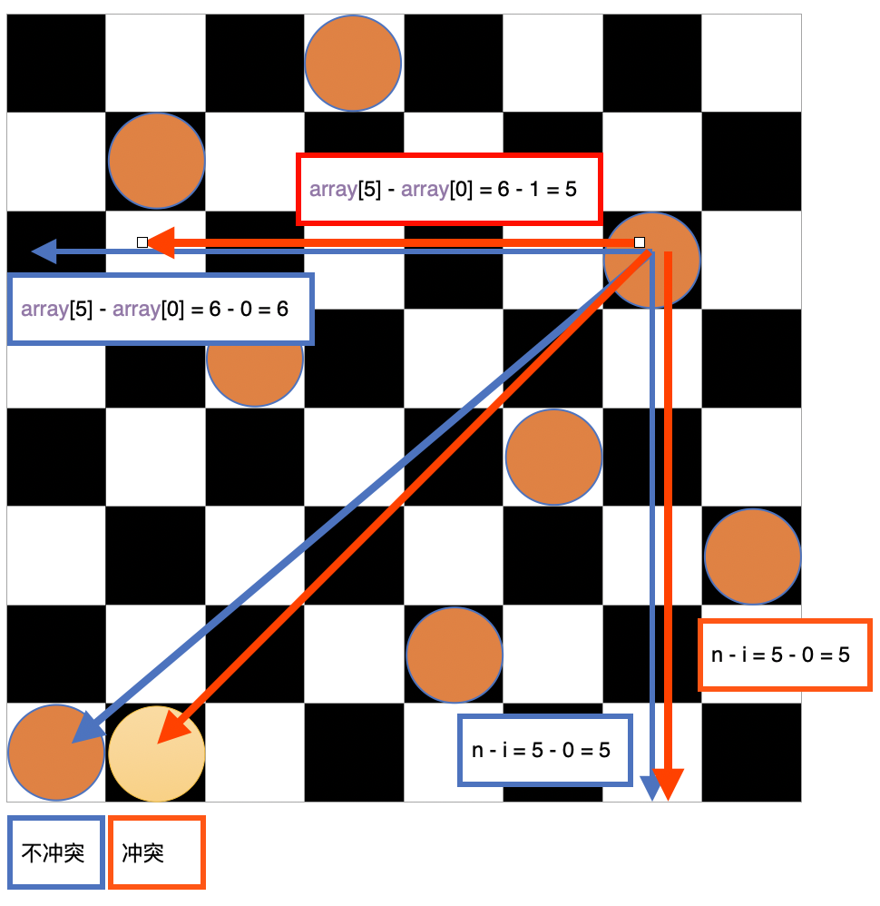

### 八皇后问题的实现
[top](#catalog)
- 实现内容
    - 参考代码
        - [/algorithm/src/java-algorithm/myalgorithm/src/main/java/com/ljs/learn/myalgorithm/recursion/Queen.java](/algorithm/src/java-algorithm/myalgorithm/src/main/java/com/ljs/learn/myalgorithm/recursion/Queen.java)
    - 实现代码
        ```java
        public class Queen {
            // 定义一个MAX，表示共有多少个皇后
            private int max = 8;
            // 定义数组array，保存皇后的位置，如: arr[8] = [0, 2, 4, 1, 3, 5, 7, 6]
            private int[] array = new int[max];
            // 记录有效的摆放次数
            public int count = 0;
        
            // 1. 放置第n个皇后
            public void check(int n){
                if (n == max){ // n = 8时，正在放第9个皇后，说明前面8个皇后已经放好了
                    print(); //输出摆放结果
                    return ;
                }
                // 1. 从第0列到第7类依次尝试放入皇后，并判断是否冲突
                // 循环中没有 break，所以会不停的回溯直到找出：所有的摆放方法
                for (int i = 0; i < max; i++) {
                    array[n] = i;
                    if (judge(n)){ // 2. 如果不冲突，再放第n+1个皇后
                        check(n+1);
                    }
                    // 3. 如果冲突，尝试将皇后放到下一列
                }
            }
        
            // 2. 检测第n个皇后，是否与前面的皇后冲突
            private boolean judge(int n){
                for (int i = 0; i < n; i++) {
                    // 1. array[i] == array[n]: 判断第n个皇后是否会和 前面的 n-1个皇后在同一列
                    // 2. Math.abs(n-i) == Math.abs(array[n] - array[i])，在斜线上是否冲突
                    //      即两个皇后的行间距是否等于列间距，也可以理解为斜率的绝对值不等于 1
                    // 3. n 每次都在递增，即行在递增，所以不需要判断行是否冲突
                    if(array[i] == array[n] || Math.abs(n-i) == Math.abs(array[n] - array[i])){
                        return false;
                    }
                }
                return true;
            }
        
            // 打印皇后摆放的位置
            private void print(){
                count++; // 每次打印时，统计有效的摆放次数
                for (int i = 0; i < array.length; i++) {
                    System.out.print(array[i] + " ");
                }
                System.out.println();
            }
        }
        ```
- 测试内容
    - 参考代码
        - [/algorithm/src/java-algorithm/myalgorithm/src/test/java/com/ljs/learn/myalgorithm/recursion/QueenTest.java](/algorithm/src/java-algorithm/myalgorithm/src/test/java/com/ljs/learn/myalgorithm/recursion/QueenTest.java)
    - 测试代码
        ```java
        @Test
        public void test(){
            Queen queen = new Queen();
            queen.check(0);
            System.out.println("count = " + queen.count);
        }
        ```

# 排序算法
[top](#catalog)
- 排序算法分类
    - 内部排序
        - 将需要处理的所有数据都加载到内存中进行排序
    - 外部排序
        - 数据量过大，无法全部加载到没存，需要借助外部存储进行排序
- 常见的排序算法分类
    - 内部排序（使用内存）
        - 插入排序
            - 直接插入排序
            - 希尔排序
        - 选择排序
            - 简单选择排序
            - 堆排序
        - 交换排序
            - 冒泡排序
            - 快速排序
        - 归并排序
        - 基数排序
    - 外部排序（使用内存和外存结合）

# 排序算法--冒泡排序
## 冒泡排序基本思想
[top](#catalog)
- 基本思想
    1. 从前向后依次比较相邻元素的值
    2. 如果发现当前值更大，则进行交换
    3. 将值较大的元素逐渐从前面移到后面

- 每一轮排序之后，序列**尾部**都趋于有序

- 冒泡排序的实现方式（升序排列为例）
    - 轮数: 一共进行`序列大小n - 1`次的大循环
        - 最后一次只有第一个元素，不需要在比较，所以大循环次数要减 1
    - 排序过程
        1. 第1次，从 `arr[0]` 开始，与下一个元素比较大小，如果比下一个元素大，则交换元素，一直比较到 `arr[n-1-1]`
            - 空出末尾的一个位置，即最后一个元素不需要比较    
        2. 第2次，从 `arr[0]` 开始，与下一个元素比较大小，如果比下一个元素大，则交换元素，一直比较到 `arr[n-1-2]`
            - 空出末尾的两个位置，即最后一个元素已经是最大元素，倒数第二个元素不需要和最后一个元素比较
        3. 重复上述步骤
        4. 第`n-1`次，从 `arr[0]` 开始，与`arr[1]`比较，如果`arr[0]`较大，则交换元素
        5. 序列整体有序

    - 每一趟排序的次数在逐渐减少
        - 因为尾部的数据已经有序，所以不参与后续的比较

    - 排序过程中的优化
        - 当某一趟循环中没有发生元素交换，中说明序列有序
        - 需要在排序过程中设置一个flag，判断元素是否进行过交换，从而提前停止排序
- 示例
    - 原始序列：`[5, 2, 4, 1, 3]`
    - 第一趟排序
        ```
        5, 2, 4, 1, 3
        2, 5, 4, 1, 3
        2, 4, 5, 1, 3
        2, 4, 1, 5, 3
        2, 4, 1, 3, 5
        ```
    - 第二趟排序
        ```
        2, 4, 1, 3, 5
        2, 1, 4, 3, 5
        2, 1, 3, 4, 5
        ```
    - 第三趟排序
        ```
        2, 1, 3, 4, 5
        1, 2, 3, 4, 5
        ```

## 冒泡排序的实现
[top](#catalog)
- 实现内容
    - 参考代码
        - [/algorithm/src/java-algorithm/myalgorithm/src/main/java/com/ljs/learn/myalgorithm/sort/BubbleSort.java](/algorithm/src/java-algorithm/myalgorithm/src/main/java/com/ljs/learn/myalgorithm/sort/BubbleSort.java)
    - 实现代码
        ```java
        public class BubbleSort {
            // 只进行排序
            public static void sort01(int[] array){
                int n  = array.length;
                int temp;
                boolean isSwap=false;
                // 整体大循环次数为 n-1
                // i可以理解跳过末尾的i个数字
                for (int i = 1; i < n; i++) {
                    // 检查元素大小，并交换元素
                    for (int j = 0; j < n-i; j++) { // 比较 n-i 次，跳过最后 i 个数字
                        if (array[j] > array[j+1]){
                            temp = array[j+1];
                            array[j+1] = array[j];
                            array[j] = temp;
                        }
                    }
                }
            }
        
            // 排序并优化
            public static void sort02(int[] array){
                int n  = array.length;
                int temp;
                boolean isSwap=false;
                // 整体大循环次数为 n-1
                // i可以理解跳过末尾的i个数字
                for (int i = 1; i < n; i++) {
                    // 1. 初始化元素交换标记
                    isSwap = false;
                    // 2. 检查元素大小，并交换元素
                    for (int j = 0; j < n-i; j++) { // 比较 n-i 次，跳过最后 i 个数字
                        if (array[j] > array[j+1]){
                            temp = array[j+1];
                            array[j+1] = array[j];
                            array[j] = temp;
        
                            // 每次发生元素交换后，修改标记
                            isSwap = true;
                        }
                    }
        
                    // 3. 检查是否发生了元素交换，如果没有，则序列有序，停止排序
                    if (!isSwap){ break; }
                }
            }
        }
        ```
      
- 测试内容
    - 参考代码
        - [/algorithm/src/java-algorithm/myalgorithm/src/test/java/com/ljs/learn/myalgorithm/sort/BubbleSortTest.java](/algorithm/src/java-algorithm/myalgorithm/src/test/java/com/ljs/learn/myalgorithm/sort/BubbleSortTest.java)
    - 测试代码
        ```java
        @Test
        public void testSort01(){
            int[] array = {5, 2, 4, 1, 3};
            BubbleSort.sort01(array);
            System.out.println(Arrays.toString(array));
            // 输出: [1, 2, 3, 4, 5]
        }
    
        @Test
        public void testSort02(){
            int[] array = {5, 2, 4, 1, 3};
            BubbleSort.sort02(array);
            // 输出: [1, 2, 3, 4, 5]
        }
        ```

# 排序算法--选择排序
## 选择排序基本思想
[top](#catalog)
- 基本思想
    - 每一趟都搜索最小/大值
    - 然后与这一趟的第一个元素交换
    - 最终使序列有序

- 每一轮排序之后，序列**头部**都趋于有序

- 选择排序的实现方式（升序排列为例）
    1. 轮数: 一共进行`序列大小n - 1`次的大循环
    2. 排序过程
        1. 第1次，从 `arr[0]~ arr[n-1]` 中选取最小值， 与 `arr[0]` 交换
        2. 第2次，从 `arr[1]~ arr[n-1]` 中选取最小值， 与 `arr[1]` 交换
        3. 第3次，从 `arr[2]~ arr[n-1]` 中选取最小值， 与 `arr[2]` 交换
        4. 重复上述过程，如果较小元素中有重复的，使用靠后的元素进行交换
        5. 第n-1次，从 `arr[n-2]~ arr[n-1]` 中选取最小值， 与 `arr[2]` 交换
        6. 最终得到一个从小到大排列的有序序列
    3. 如何找到这一轮的最小值
        1. 先假设当前这个数是最小值，并记录当前数的索引
        2. 最小值后后面的每个值进行比较，如果有更小的数据，重新设置最小值，和索引
        3. 遍历到最后一个元素，就得到最小值和下标
    
- 说明示例
    - 初始状态
        ```
        5 3 2 1 7 4 6 5
        ```
    - 第1次
        ```
        5 3 2 1 7 4 6 5
        └─────┘
  
        1 3 2 5 7 4 6 5
        ```
    - 第2次
        ```
        1 | 3 2 5 7 4 6 5
            └─┘
  
        1 | 2 3 5 7 4 6 5
        ```
    - 第3次，没有更小的元素，跳过
        ```
        1 2 | 3 5 7 4 6 5
              └┘
        ```
    - 第4次
        ```
        1 2 3 | 5 7 4 6 5
                └───┘
        1 2 3 | 4 7 5 6 5
        ```
    - 第5次
        ```
        1 2 3 4 | 7 5 6 5
                  └─┘
        1 2 3 4 | 5 7 6 5
        ```
    - 第6次
        ```
        1 2 3 4 5 | 7 6 5
                    └───┘
        1 2 3 4 5 5 | 6 7
        ```
    - 第7次，已经有序
        ```
        1 2 3 4 5 5 | 6 7
                      └─┘
        ```

## 选择排序的分步求解
[top](#catalog)
- 参考代码
    - [/algorithm/src/java-algorithm/myalgorithm/src/main/java/com/ljs/learn/myalgorithm/sort/SelectSort.java](/algorithm/src/java-algorithm/myalgorithm/src/main/java/com/ljs/learn/myalgorithm/sort/SelectSort.java)
- 分步求解
    ```java
    public static void sort_step(int[]array){
        int n = array.length;
        int minValueIdx, temp;

        // 1. 第 1 次
        // 假设当前元素是这一趟的最小值
        minValueIdx = 0;
        for (int i = minValueIdx + 1; i < n; i++) {
            // 搜索更小的元素
            if (array[minValueIdx] > array[i]){
                minValueIdx = i;
            }
        }

        // 检查最小值索引是否发生变化
        // 如果发生变化，说明后面有更小的元素，则交换元素
        if (minValueIdx != 0){
            temp = array[0];
            array[0] = array[minValueIdx];
            array[minValueIdx] = temp;
        }

        // 2. 第 2 次
        // 假设当前元素是这一趟的最小值
        minValueIdx = 1;
        for (int i = minValueIdx + 1; i < n; i++) {
            // 搜索更小的元素
            if (array[minValueIdx] > array[i]){
                minValueIdx = i;
            }
        }

        // 检查最小值索引是否发生变化
        // 如果发生变化，说明后面有更小的元素，则交换元素
        if (minValueIdx != 1){
            temp = array[1];
            array[1] = array[minValueIdx];
            array[minValueIdx] = temp;
        }
    }
    ```

## 选择排序的实现
[top](#catalog)
- 实现内容
    - 参考代码
        - [/algorithm/src/java-algorithm/myalgorithm/src/main/java/com/ljs/learn/myalgorithm/sort/SelectSort.java](/algorithm/src/java-algorithm/myalgorithm/src/main/java/com/ljs/learn/myalgorithm/sort/SelectSort.java)
    - 实现代码
        ```java
        public static void sort(int[] array){
            int n = array.length;
    
            int minValueIdx, temp;
            for (int i = 0; i < n - 1; i++) {
                // 1. 假设当前元素是这一趟的最小值
                minValueIdx = i;
                for (int j = i+1; j < n; j++) {
                    // 2. 如果有更小的元素，则重置索引
                    if (array[minValueIdx] > array[j]){
                        minValueIdx = j;
                    }
                }
    
                // 3. 检查最小值索引是否发生变化
                // 如果发生变化，说明后面有更小的元素，则交换元素
                if (minValueIdx != i){
                    temp = array[i];
                    array[i] = array[minValueIdx];
                    array[minValueIdx] = temp;
                }
            }
        }
        ```
- 测试内容
    - 参考代码
        - [/algorithm/src/java-algorithm/myalgorithm/src/test/java/com/ljs/learn/myalgorithm/sort/SelectSortTest.java](/algorithm/src/java-algorithm/myalgorithm/src/test/java/com/ljs/learn/myalgorithm/sort/SelectSortTest.java)
    - 测试代码
        ```java
        @Test
        public void test01(){
            int[] array = {5, 3, 2, 1, 7, 4, 6, 5};
            SelectSort.sort(array);
            System.out.println(Arrays.toString(array));
            // 输出: [1, 2, 3, 4, 5, 5, 6, 7]
        }
        ```

# 排序算法--插入排序
## 插入排序基本思想
[top](#catalog)
- 基本思想
    - 将待排序序列划分为一个有序表部分和一个无序表部分
    - 开始时，有序表只包含第一个元素，无序表中包含 n-1 个元素
    - 每次从无序表中取出第一个元素，在有序表中，从后向前依次比较，并插入合适位置

- 每一轮排序之后，序列**头部**都趋于有序

- 插入排序的实现方式（升序排列为例）
    1. 轮数: 一共进行`序列大小n - 1`次的大循环
        - 初始化时，会取出第一个元素，所以要减1
    2. 排序过程
        1. 取出无序表的第一个元素 x，用于比较
        2. 将搜索的起始位置定位到有序表的最后一个元素
        3. 在有序表中，从后向前，依次与 x 比较大小
        4. 每次发现有序表元素比 x 大时，将有序表元素**后移**
        5. 比较停止的条件
            - 索引越界，即等于 -1时。此时有序表的每个元素都比 x 大，先需要插入到有序表的第一个位置
            - 有序表中的第 index 个元素比 x 小，此时将 x 插入 index 的后面。即插入 `index + 1`
        6. 每一轮结束后，将 x 插入到指定的 index 位置
- 说明示例
    - 初始状态
        ```
        (5), 3, 2, 1, 7, 4, 6, 5
        ```
    - 第 1 轮
        ```
        (5), 3, 2, 1, 7, 4, 6, 5
         ┌───┘
        (3, 5), 2, 1, 7, 4, 6, 5
        ```
    - 第 2 轮
        ```
        (3, 5), 2, 1, 7, 4, 6, 5
         ┌──────┘
        (2, 3, 5), 1, 7, 4, 6, 5
        ```
    - 第 3 轮
        ```
        (2, 3, 5), 1, 7, 4, 6, 5
         ┌─────────┘
        (1, 2, 3, 5), 7, 4, 6, 5
        ```
    - 第 4 轮
        ```
        (1, 2, 3, 5), 7, 4, 6, 5
                     ┌┘
        (1, 2, 3, 5, 7), 4, 6, 5
        ```
    - 第 5 轮
        ```
        (1, 2, 3, 5, 7), 4, 6, 5
                  ┌──────┘
        (1, 2, 3, 4, 5, 7), 6, 5
        ```
    - 第 6 轮
        ```
        (1, 2, 3, 4, 5, 7), 6, 5
                        ┌───┘
        (1, 2, 3, 4, 5, 6, 7), 5
        ```
    - 第 7 轮
        ```
        (1, 2, 3, 4, 5, 6, 7), 5
                     ┌─────────┘
        (1, 2, 3, 4, 5, 5, 6, 7)
        ```

## 插入排序的分步求解
[top](#catalog)
- 分步求解内容
    - 参考代码
        - [/algorithm/src/java-algorithm/myalgorithm/src/main/java/com/ljs/learn/myalgorithm/sort/InsertSort.java](/algorithm/src/java-algorithm/myalgorithm/src/main/java/com/ljs/learn/myalgorithm/sort/InsertSort.java)
    - 分步求解代码
        ```java
        // 插入排序--分步求解
        public static void sortStep(int[] array){
            // 1. 第1轮
            // 定义待插入的数
            int insertVal = array[1];
            // 将搜索的起始位置定位到有序表的最后一个元素
            int insertIndex = 1 - 1;
    
            // 搜索 insertVal的插入位置
            // insertIndex >= 0 保证不越界
            // insertVal < array[insertIndex] 表示待插入的数还没有找到插入位置
            // 每次将 insertIndex元素 前移
            while(insertIndex >= 0 && insertVal < array[insertIndex]){
                array[insertIndex + 1] = array[insertIndex];
                insertIndex--;
            }
    
            // 退出循环时，说明已找到插入位置，插入元素
            array[insertIndex + 1] = insertVal;
    
            System.out.println("第1轮" + Arrays.toString(array));
    
            // 2. 第2轮
            insertVal = array[2];
            insertIndex = 2 - 1;
            while(insertIndex >= 0 && insertVal < array[insertIndex]){
                array[insertIndex + 1] = array[insertIndex];
                insertIndex--;
            }
    
            array[insertIndex + 1] = insertVal;
            System.out.println("第2轮" + Arrays.toString(array));
    
            // 3. 第3轮
            insertVal = array[3];
            insertIndex = 3 - 1;
            while(insertIndex >= 0 && insertVal < array[insertIndex]){
                array[insertIndex + 1] = array[insertIndex];
                insertIndex--;
            }
    
            array[insertIndex + 1] = insertVal;
            System.out.println("第3轮" + Arrays.toString(array));
        }
        ```
- 测试内容
    - 参考代码
        - [/algorithm/src/java-algorithm/myalgorithm/src/test/java/com/ljs/learn/myalgorithm/sort/InsertSortTest.java](/algorithm/src/java-algorithm/myalgorithm/src/test/java/com/ljs/learn/myalgorithm/sort/InsertSortTest.java)
    - 测试代码
        ```java
        @Test
        public void testSortStep(){
            int[] array = {5, 3, 2, 1, 7, 4, 6, 5};
            InsertSort.sortStep(array);
            // 输出
            // 第1轮[3, 5, 2, 1, 7, 4, 6, 5]
            // 第2轮[2, 3, 5, 1, 7, 4, 6, 5]
            // 第3轮[1, 2, 3, 5, 7, 4, 6, 5]
        }
        ```
      
## 插入排序的实现
[top](#catalog)
- 实现内容
    - 参考代码
        - [/algorithm/src/java-algorithm/myalgorithm/src/main/java/com/ljs/learn/myalgorithm/sort/InsertSort.java](/algorithm/src/java-algorithm/myalgorithm/src/main/java/com/ljs/learn/myalgorithm/sort/InsertSort.java)
    - 实现代码
        ```java
        // 插入排序实现（升序排列）
        public static void sort(int[] array){
            int n = array.length;
            int insertVal, insertIndex;
            for (int i = 1; i < n; i++) {
                // 1. 初始化数据
                insertVal = array[i];  // 无序表的第一个元素
                insertIndex = i - 1;   // 将搜索的起始位置定位到有序表的最后一个元素
    
                // 2. 搜索 insertVal的插入位置，并移动元素
                // insertIndex >= 0 保证不越界
                // insertVal < array[insertIndex] 表示待插入的数还没有找到插入位置
                // 每次将 insertIndex元素 后移
                while (insertIndex >= 0 && insertVal < array[insertIndex]){
                    array[insertIndex + 1] = array[insertIndex];
                    insertIndex--;
                }
    
                // 3. 插入元素
                array[insertIndex + 1] = insertVal;
            }
        }
        ```
- 测试内容
    - 参考代码
        - [/algorithm/src/java-algorithm/myalgorithm/src/test/java/com/ljs/learn/myalgorithm/sort/InsertSortTest.java](/algorithm/src/java-algorithm/myalgorithm/src/test/java/com/ljs/learn/myalgorithm/sort/InsertSortTest.java)
    - 测试代码
        ```java
        @Test
        public void testSort(){
            int[] array = {5, 3, 2, 1, 7, 4, 6, 5};
            InsertSort.sort(array);
            System.out.println(Arrays.toString(array));
            // 输出
            // [1, 2, 3, 4, 5, 5, 6, 7]
        }
        ```

# 排序算法--希尔排序
## 希尔排序简介
[top](#catalog)
- 简单插入排序可能存在的问题
    - 当插入元素比有序表的所有值都小时，有序表需要进行大量元素后移操作，影响效率
    - 问题示例
        - 对于数组 `[2, 3, 4, 5, 6, 1]`，要是数组有序，需要将末尾的 1 移动到第一位
        - 有序的过程
            ```
            (2, 3, 4, 5, 6), 1
            (2, 3, 4, 5, 1, 6)
            (2, 3, 4, 1, 5, 6)
            (2, 3, 1, 4, 5, 6)
            (2, 1, 3, 4, 5, 6)
            (1, 2, 3, 4, 5, 6)
            ```
- 什么是希尔排序
    - 希尔排序是一种插入排序，是插入排序改进后的更高效的版本
    - 也称为**缩小增量排序**
- 希尔排序的目的
    - 降低插入排序的元素移动次数

## 希尔排序基本思想
[top](#catalog)
- 基本思想
    - 把记录按下标的一定增量分组，对每组使用插入排序算法排序
    - 每次一前一次的增量为基准，减小增量
    - 随着增量逐渐减少，每组包含的关键词越来越多
    - 当增量减到1时，整个序列被分为一组，排序后，算法终止

- 增量的计算方式
    - 初始增量: `序列长度/2`
    - 增量的变化: `当前增量 = 上一次的增量/2`
    - 直到整除的结果为1
    
- 希尔排序的实现方式(升序排列)
    1. 计算增量
    2. 从增量位置的元素开始遍历，遍历到最后一个元素 
    3. 保存每个元素的值，并从该元素的位置开始，以增量为步长，依次与前面的元素比较
    4. 如果当前元素比前面的元素小，则将前面的元素向后移动 增量 个位置
    5. 如果当前元素比前面的元素大，则说明前面的序列已经有序，并保存这个位置的索引
    6. 将索引位置的值设置当前位置的值，完成插入操作
    7. 再次计算增量，直到增量减小为1

- 说明示例
    - 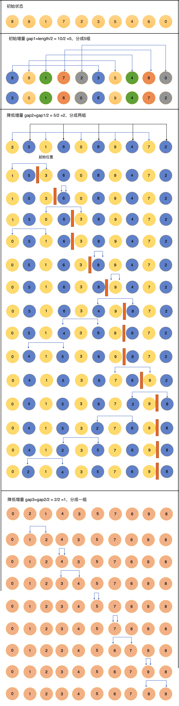

## 希尔排序的分步求解
[top](#catalog)
- 分步实现
    - 参考代码
        - [/algorithm/src/java-algorithm/myalgorithm/src/main/java/com/ljs/learn/myalgorithm/sort/ShellSort.java](/algorithm/src/java-algorithm/myalgorithm/src/main/java/com/ljs/learn/myalgorithm/sort/ShellSort.java)
    - 分步实现代码
        ```java
        public static void sortStep(int[] array){
            int temp;
            int n = array.length;
    
            // 1. 第 1 轮
            
            for (int i=5; i<n; i++){
                // 按照步长为5，倒序扫描前面所有的元素
                for(int j=i-5; j>=0; j-=5){
                    // 当前元素，与加步长后的元素进行比较
                    // 如果当前元素步后面的元素大，则交换
                    if (array[j] > array[j + 5]){
                        temp = array[j];
                        array[j] = array[j + 5];
                        array[j + 5] = temp;
                    } else {
                        break;
                    }
                }
            }
    
            System.out.println("第1轮: "+Arrays.toString(array));
    
            // 2. 第2轮
            for (int i=2; i<n; i++){
                // 按照步长为2，倒序扫描前面所有的元素
                for(int j=i-2; j>=0; j-=2){
                    // 当前元素，与加步长后的元素进行比较
                    // 如果当前元素步后面的元素大，则交换
                    if (array[j] > array[j + 2]){
                        temp = array[j];
                        array[j] = array[j + 2];
                        array[j + 2] = temp;
                    } else {
                        break;
                    }
                }
            }
    
            System.out.println("第2轮: "+Arrays.toString(array));
    
            // 第3轮
            for (int i=1; i<n; i++){
                // 按照步长为1，倒序扫描前面所有的元素
                for(int j=i-1; j>=0; j-=1){
                    // 当前元素，与加步长后的元素进行比较
                    // 如果当前元素步后面的元素大，则交换
                    if (array[j] > array[j + 1]){
                        temp = array[j];
                        array[j] = array[j + 1];
                        array[j + 1] = temp;
                    } else {
                        break;
                    }
                }
            }
    
            System.out.println("第3轮: "+Arrays.toString(array));
        }
        ```
- 测试内容
    - 参考代码
        - [/algorithm/src/java-algorithm/myalgorithm/src/test/java/com/ljs/learn/myalgorithm/sort/ShellSortTest.java](/algorithm/src/java-algorithm/myalgorithm/src/test/java/com/ljs/learn/myalgorithm/sort/ShellSortTest.java)
    - 测试代码
        ```java
        @Test
        public void testSortStep(){
            int[] array = {8,9,1,7,2,3,5,4,6,0};
            ShellSort.sortStep(array);
            // 输出
            // 第1轮: [3, 5, 1, 6, 0, 8, 9, 4, 7, 2]
            // 第2轮: [0, 2, 1, 4, 3, 5, 7, 6, 9, 8]
            // 第3轮: [0, 1, 2, 3, 4, 5, 6, 7, 8, 9]
        }
        ```

## 希尔排序的实现--交换式
[top](#catalog)
- 交换式希尔排序实现
    - 参考代码
        - [/algorithm/src/java-algorithm/myalgorithm/src/main/java/com/ljs/learn/myalgorithm/sort/ShellSort.java](/algorithm/src/java-algorithm/myalgorithm/src/main/java/com/ljs/learn/myalgorithm/sort/ShellSort.java)
    - 实现代码
        ```java
        public static void sortBySwap(int[] array){
            int temp;
            int n = array.length;
            // 计算增量，直到增量减小为1
            for (int gap=n/2; gap > 0; gap/=2){
                // 从增量位置的元素开始遍历，遍历到最后一个元素
                for (int i=gap; i<n; i++){
                    // 依照步长遍历元素前面的元素，比较大小，并执行插入操作
                    for (int j=i-gap; j>=0; j-=gap){
                        // 当前元素，与加步长后的元素进行比较
                        // 如果当前元素步后面的元素大，则交换
                        if (array[j] > array[j + gap]){
                            // 移动元素
                            temp = array[j];
                            array[j] = array[j + gap];
                            array[j + gap] = temp;
                        } else {
                            break;  // 前面的元素已经有序，立刻停止
                        }
                    }
                }
            }
        }
        ```
- 测试内容
    - 参考代码
        - [/algorithm/src/java-algorithm/myalgorithm/src/test/java/com/ljs/learn/myalgorithm/sort/ShellSortTest.java](/algorithm/src/java-algorithm/myalgorithm/src/test/java/com/ljs/learn/myalgorithm/sort/ShellSortTest.java)
    - 测试代码
        ```java
        @Test
        public void testSortBySwap(){
            int[] array = {8,9,1,7,2,3,5,4,6,0};
            ShellSort.sortBySwap(array);
            System.out.println(Arrays.toString(array));
            // 输出: [0, 1, 2, 3, 4, 5, 6, 7, 8, 9]
        }
        ```

## 希尔排序的实现--移动式
[top](#catalog)
- 交换式排序的问题
    - 交换式排序中的元素交换操作会浪费大量的性能
    - 将交换操作转化为移动操作，提升性能
- 移动希尔排序实现
    - 参考代码
        - [/algorithm/src/java-algorithm/myalgorithm/src/main/java/com/ljs/learn/myalgorithm/sort/ShellSort.java](/algorithm/src/java-algorithm/myalgorithm/src/main/java/com/ljs/learn/myalgorithm/sort/ShellSort.java)
    - 实现代码
        ```java
        public static void sortByMove(int[] array){
            int insertVal, insertIndex;
            int n = array.length;
    
            // 计算增量，直到增量减小为1
            for (int gap=n/2; gap > 0; gap/=2){
                // 从步长位置的元素开始遍历，遍历到最后一个元素
                for (int i=gap; i < n; i++){
                    insertVal = array[i];
                    insertIndex = i-gap;
                    while(insertIndex >= 0 && insertVal < array[insertIndex]){
                        array[insertIndex + gap] = array[insertIndex]; // 移动元素
                        insertIndex -= gap;
                    }
                    array[insertIndex + gap] = insertVal;
                }
            }
        }
        ```
- 测试内容
    - 参考代码
        - [/algorithm/src/java-algorithm/myalgorithm/src/test/java/com/ljs/learn/myalgorithm/sort/ShellSortTest.java](/algorithm/src/java-algorithm/myalgorithm/src/test/java/com/ljs/learn/myalgorithm/sort/ShellSortTest.java)
    - 测试代码
        ```java
        @Test
        public void testSortByMove(){
            int[] array = {8,9,1,7,2,3,5,4,6,0};
            ShellSort.sortByMove(array);
            System.out.println(Arrays.toString(array));
            // 输出: [0, 1, 2, 3, 4, 5, 6, 7, 8, 9]
        }
        ```

# 排序算法--快速排序
## 快速排序基本思想 
[top](#catalog)
- 快速排序是对冒泡排序的一种改进
- 基本思想
    1. 从整个序列中选定中心轴Pivot，一般会选择序列的最后一个元素
    2. 通过一轮排序，将需要排序的数据分割成独立的两部分
        - 左边全部小于Pivot，右边全部大雨Pivot
    3. 再分别对每个部分的数据执行快速排序，直到整个序列有序
    4. 这个过程可以递归进行

- 中心轴只代表一个具体的值，与值在序列中的索引无关，它可以在任何位置

- 说明示例 （以最后一个元素为pivot）
    - 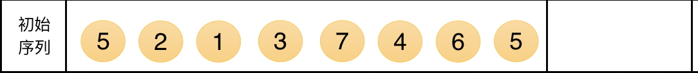
    - 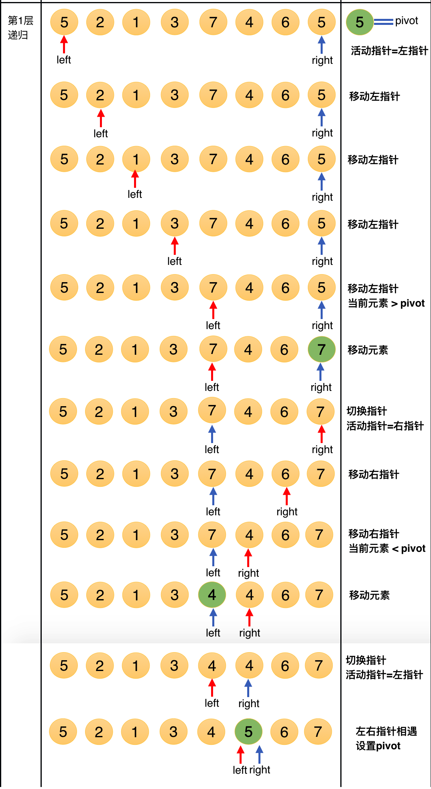
    - 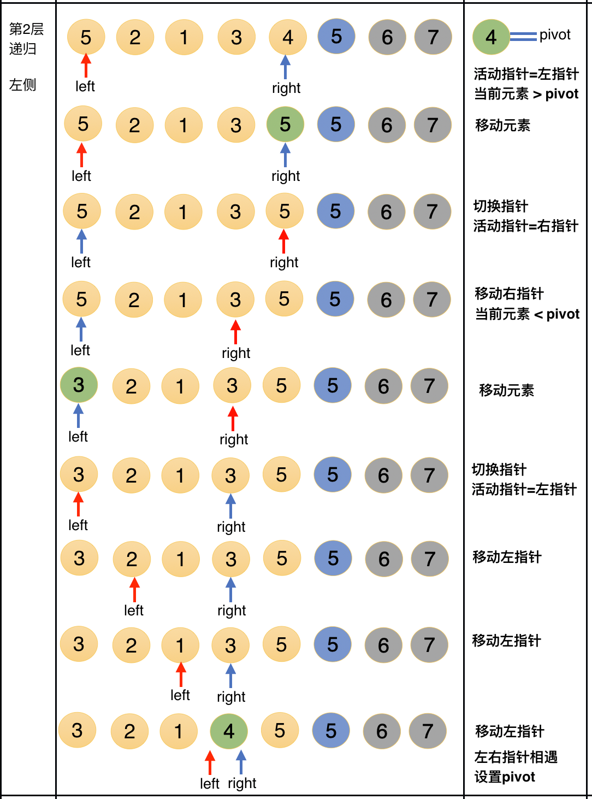
    - 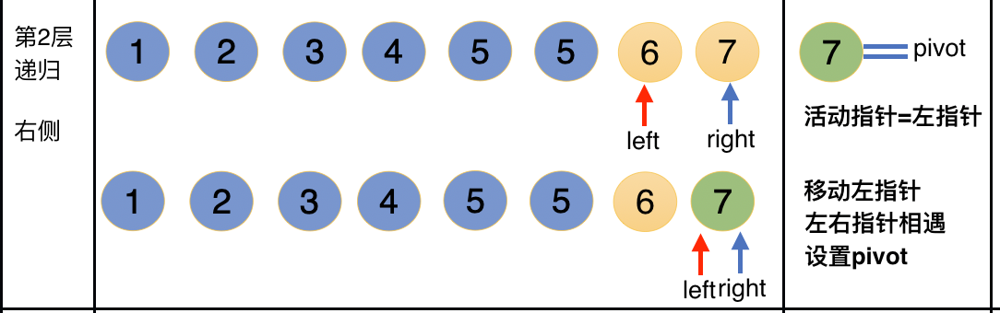
    - 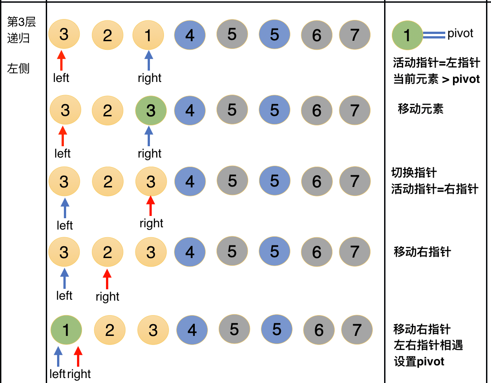
    - 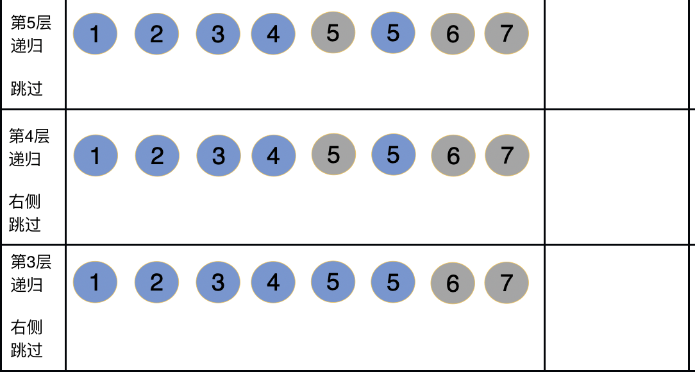
    - 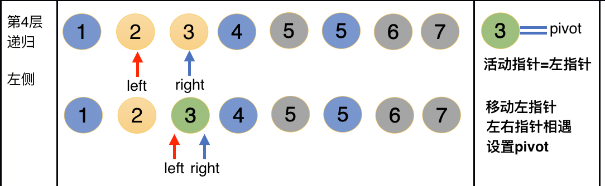
    - 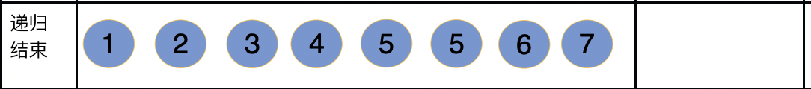

## 快速排序的实现--右侧pivot
[top](#catalog)
- 实现内容
    - 参考代码
        - [/algorithm/src/java-algorithm/myalgorithm/src/main/java/com/ljs/learn/myalgorithm/sort/QuickSort.java](/algorithm/src/java-algorithm/myalgorithm/src/main/java/com/ljs/learn/myalgorithm/sort/QuickSort.java)
    - 实现代码
        ```java
        public static void sortByRight(int[] array, int left, int right){
            // 分别保存左右下标
            int l = left;
            int r = right;
    
            // 保存中轴值
            int pivot = array[r];
    
            // 比 pivot小的，放在 pivot 的左边; 比 pivot大的，放在 pivot 的右边
            while(l < r){
                // 从左边开始，从左向右，搜索比 pivot 大的值，准备放到 pivot的右侧
                // 与pivot相等时，保持原位
                while( array[l] <= pivot && l < r ) l++;
                array[r] = array[l];
    
                // 从右边开始，从右向左，搜索比 pivot 小的值，准备放到 pivot的左侧
                // 与pivot相等时，保持原位
                while( array[r] >= pivot && l < r ) r--;
                array[l] = array[r];
            }
    
            // 设置 pivot
            array[r] = pivot;
            
            // 左侧递归
            if (left < r-1) {
                sortByRight(array, left, r-1);
            }
    
            // 右侧递归
            if (r+1 > right){
                sortByRight(array, r+1, right);
            }
        }
        ```
- 测试内容
    - 参考代码
        - [/algorithm/src/java-algorithm/myalgorithm/src/test/java/com/ljs/learn/myalgorithm/sort/QuickSortTest.java](/algorithm/src/java-algorithm/myalgorithm/src/test/java/com/ljs/learn/myalgorithm/sort/QuickSortTest.java)
    - 测试代码
        ```java
        @Test
        public void testSortByRight(){
            int[] array = {5, 2, 1, 3, 7, 4, 6, 5};
            QuickSort.sortByRight(array, 0, array.length-1);
            System.out.println(Arrays.toString(array));
            // 输出: [1, 2, 3, 4, 5, 5, 6, 7]
        }
        ```

# 排序算法--归并排序
## 归并排序的思想
[top](#catalog)
- 归并排序采用分治策略
    - 分：将问题分成一些小的问题，然后递归求解
    - 治：将分阶段的答案按照规则拼接在一起
- 归并排序的两个阶段
    - 拆分阶段
        - 就是通过递归将序列拆分为不可再分的子序列
        - 拆分的结果类似于一颗完全二叉树
    - 合并阶段
        - 将两个已经有序的子序列合并成一个有序序列
        - 总体合并次数 = `序列长度 - 1`，是线性增长的

- 拆分于合并的总体示例
    - 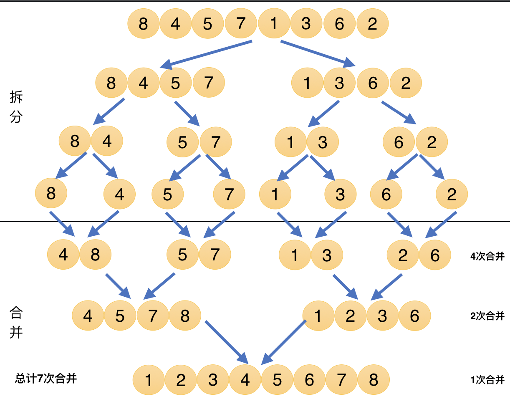

- 序列合并的示例
    - 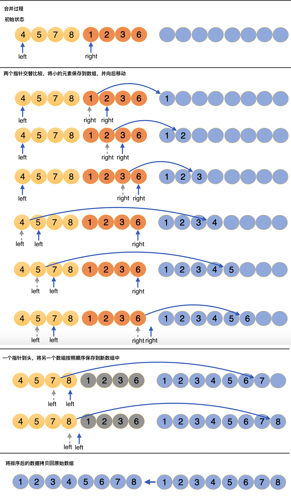
    
## 归并排序的实现
[top](#catalog)
- 合并阶段的实现
    1. 计算4个位置
        1. left的起始位置
        2. left的结束位置
        3. right的起始位置
        4. right的结束位置
    2. left、right依次比较，将较小的元素保存到临时数组，然后向后移动指针
    3. 持续比较、移动指针，直到left或right用完
    4. 将 left 或 right 中剩余的数据一次保存到临时数组中
        - 剩余数据本身就是有序的，所以可以直接保存
    5. 将临时数组中的数据拷贝到原始数组中
- 拆分阶段的实现
    1. 计算left的结束位置，即中间位置: `(left + right)/2`
    2. 迭代的向左拆分
    3. 迭代的向右拆分
    4. 拆分到每个子序列只剩一个元素时，回溯，同时进行合并
    
- 实现内容
    - 参考代码
        - [/algorithm/src/java-algorithm/myalgorithm/src/main/java/com/ljs/learn/myalgorithm/sort/MergeSort.java](/algorithm/src/java-algorithm/myalgorithm/src/main/java/com/ljs/learn/myalgorithm/sort/MergeSort.java)
    - 合并阶段
        ```java
        /** 归并排序的合并阶段
         *
         * @param array     原始数组
         * @param startIdx  左指针的起始位置
         * @param midIdx    左指针的结束位置
         * @param endIdx    右指针的结束位置
         * @param temp      保存数据的临时数组
         */
        public static void merge(int[] array, int startIdx, int midIdx, int endIdx, int[] temp){
            // 划分左右指针
            int left = startIdx;
            int right = midIdx + 1;
            //  初始化 temp 的起始索引
            int t = 0;
    
            // 比较left和right所指向的元素，并保存到temp中
            // 直到左侧或右侧结束
            while (left <= midIdx && right <= endIdx){
                if(array[left] <= array[right]){
                    temp[t] = array[left];
                    t++;
                    left++;
                } else {
                    temp[t] = array[right];
                    t++;
                    right++;
                }
            }
    
            // 将left或right中剩余的部分保存到temp中
            while ( left <= midIdx ){
                temp[t] = array[left];
                t++;
                left++;
            }
            while ( right <= endIdx ){
                temp[t] = array[right];
                t++;
                right++;
            }
    
            // 将temp中有序的数据拷贝到原始数组中
            left = startIdx;
            t = 0;
            while (left <= endIdx){
                array[left] = temp[t];
                t++;
                left++;
            }
        }
        ```
    - 拆分阶段
        ```java
        public static void split(int[] array, int startIdx, int endIdx, int[] temp){
            // startIdx < endIdx，说明当前要拆分的子序列中还有至少2个元素
            // 如果不满足，则说明当前子序列中只有一个元素
            if (startIdx < endIdx) {
                int midIdx = (startIdx + endIdx) / 2;
                // 向左拆分
                split(array, startIdx, midIdx, temp);
    
                // 向右拆分
                split(array, midIdx + 1, endIdx, temp);
    
                // 左边和右边拆分完成之后，执行合并
                merge(array, startIdx, midIdx, endIdx, temp);
            }
        }
        ```
    - 启动排序
        ```java
        public static void sort(int[] array){
            // 根据原始序列的大小创建临时数组
            int[] temp = new int[array.length];
            // 开始拆分，拆分到不可分后，回溯并执行合并
            split(array, 0, array.length-1, temp);
        }
        ```
- 测试内容
    - 参考代码
        - [/algorithm/src/java-algorithm/myalgorithm/src/test/java/com/ljs/learn/myalgorithm/sort/MergeSortTest.java](/algorithm/src/java-algorithm/myalgorithm/src/test/java/com/ljs/learn/myalgorithm/sort/MergeSortTest.java)
    - 测试代码
        - 合并阶段测试  
            ```java
            @Test
            public void testMerge(){
                int[] array = {4,8,  5,7  ,1,3,  2,6};
        
                int[] temp = new int[array.length];
                //合并 0 ～ 3
                MergeSort.merge(array, 0, 1, 3, temp);
                System.out.println("合并 0 ～ 3: " + Arrays.toString(array));
                //合并 4 ～ 7
                MergeSort.merge(array, 4, 5, 7, temp);
                System.out.println("合并 4 ～ 7: " + Arrays.toString(array));
                //合并 0 ～ 7
                MergeSort.merge(array, 0, 3, 7, temp);
                System.out.println("合并 0 ～ 7: " + Arrays.toString(array));
        
                // 输出
                // 合并 0 ～ 3: [4, 5, 7, 8, 1, 3, 2, 6]
                // 合并 4 ～ 7: [4, 5, 7, 8, 1, 2, 3, 6]
                // 合并 0 ～ 7: [1, 2, 3, 4, 5, 6, 7, 8]
            }
            ```    
        - 排序测试
            ```java
            @Test
            public void testSort(){
                int[] array = {8,4,5,7,1,3,6,2};
                MergeSort.sort(array);
                System.out.println(Arrays.toString(array));
                // 输出
                // [1, 2, 3, 4, 5, 6, 7, 8]
            }
            ```


[top](#catalog)