<span id="catalog"></span>
- 参考
    - https://www.bilibili.com/video/BV1E4411H73v

### 目录
- [数据结构与算法概述](#数据结构与算法概述)
- [数据结构-数据结构分类](#数据结构-数据结构分类)
- 数据结构-稀疏数组
    - [引入问题-五子棋程序](#引入问题-五子棋程序)
    - [稀疏数组简介](#稀疏数组简介)
    - [稀疏数组原理](#稀疏数组原理)
    - [稀疏数组的实现](#稀疏数组的实现)
- 数据结构-队列
    - [队列简介](#队列简介)
    - [数组模拟队列](#数组模拟队列)
    - [环状队列](#环状队列)
- 数据结构-单链表
    - [单链表简介](#单链表简介)
    - [单链表的注意事项](#单链表的注意事项)
    - [单链表的基本实现](#单链表的基本实现)
    - [有序单链表的实现](#有序单链表的实现)
    - [单链表常见问题](#单链表常见问题)
        - [单链表常见问题汇总](#单链表常见问题汇总)
        - [求单链表中有效结点的个数](#求单链表中有效结点的个数)
        - [查找单链表中的倒数第k个结点](#查找单链表中的倒数第k个结点)
        - [单链表的反转](#单链表的反转)
        - [逆序打印单链表](#逆序打印单链表)
        - [合并两个有序的单链表](#合并两个有序的单链表)
- 数据结构-双向链表
    - [双向链表简介](#双向链表简介)
    - [双向链表的基本实现](#双向链表的基本实现)
    - [有序双向链表的实现](#有序双向链表的实现)
- 数据结构-单向环形链表
    - [单向环形链表的实现](#单向环形链表的实现)
    - [单向环形链表的应用--Josephu问题](#单向环形链表的应用--Josephu问题)
- 数据结构-栈
    - [栈简介](#栈简介)
    - [使用数组实现栈](#使用数组实现栈)
    - [使用单链表实现栈](#使用单链表实现栈)
- 栈的应用--前缀中缀后缀表达式
    - [前缀中缀后缀表达式简介](#前缀中缀后缀表达式简介)
    - [中缀表达式应用--中缀表达式计算器](#中缀表达式应用--中缀表达式计算器)
        - [中缀表达式计算器--实现方式1--存在减号问题](#中缀表达式计算器--实现方式1--存在减号问题)
        - [中缀表达式计算器的求解示例](#中缀表达式计算器的求解示例)
        - [中缀表达式计算器--实现方式2--解决减号问题](#中缀表达式计算器--实现方式2--解决减号问题)
    - [后缀表达式应用--后缀表达式计算器](#后缀表达式应用--后缀表达式计算器)
        - [中缀表达式转后缀表达式的方法](#中缀表达式转后缀表达式的方法)
        - [中缀表达式转后缀表达式的实现](#中缀表达式转后缀表达式的实现)
        - [后缀表达式计算器的实现](#后缀表达式计算器的实现)
- 数据结构-哈希表
    - [哈希表简介](#哈希表简介)
    - [哈希表-引入问题及其实现](#哈希表-引入问题及其实现)
- 数据结构-树
    - [树简介](#树简介)
    - [二叉树简介](#二叉树简介)
    - [二叉树遍历](#二叉树遍历)
        - [二叉树的三种遍历](#二叉树的三种遍历)
        - [二叉树遍历的实现](#二叉树遍历的实现)
    - [二叉树查找](#二叉树查找)
    - [二叉树删除结点](#二叉树删除结点)
    - [顺序存储二叉树](#顺序存储二叉树)
    - [线索化二叉树](#线索化二叉树)
        - [线索化二叉树--引入问题](#线索化二叉树--引入问题)
        - [线索化二叉树简介](#线索化二叉树简介)
        - [树结点线索化的实现](#树结点线索化的实现)
        - [线索化二叉树的遍历](#线索化二叉树的遍历)
- 数据结构-堆
    - [堆简介](#堆简介)
    - [构建大顶堆的方法](#构建大顶堆的方法)
    - [构建大顶堆的实现](#构建大顶堆的实现)
- 数据结构-霍夫曼树
    - [霍夫曼树简介](#霍夫曼树简介)
    - [霍夫曼树的构建方法](#霍夫曼树的构建方法)
    - [霍夫曼树的实现](#霍夫曼树的实现)
- 霍夫曼编码
    - [霍夫曼编码简介](#霍夫曼编码简介)
    - [前缀编码](#前缀编码)
    - [通信领域中信息的处理方式](#通信领域中信息的处理方式)
    - [霍夫曼编码的原理](#霍夫曼编码的原理)
    - [霍夫曼编码的编码过程](#霍夫曼编码的编码过程)
    - [霍夫曼编码的解码过程](#霍夫曼编码的解码过程)
    - [霍夫曼编码实现参考](#霍夫曼编码实现参考)
    - [霍夫曼编码的注意事项](#霍夫曼编码的注意事项)
- [二叉排序树](#二叉排序树)
    - [二叉排序树--引入问题](#二叉排序树--引入问题)
    - [二叉排序数简介](#二叉排序数简介)
    - [二叉排序树的构建与实现](#二叉排序树的构建与实现)
    - [二叉排序树删除结点](#二叉排序树删除结点)
            - [删除结点的情况分析](#删除结点的情况分析)
            - [二叉排序树删除结点的实现](#二叉排序树删除结点的实现)
    - [二叉平衡树](#二叉平衡树)
        - [引入问题--二叉排序树的问题](#引入问题--二叉排序树的问题)
        - [二叉平衡树说明](#二叉平衡树说明)
        - [平衡二叉树--旋转方式的分析](#平衡二叉树--旋转方式的分析)
            - [二叉平衡树的左旋](#二叉平衡树的左旋)
            - [二叉平衡树的右旋](#二叉平衡树的右旋)
            - [二叉平衡树的双旋](#二叉平衡树的双旋)
        - [二叉平衡树--旋转的实现](#二叉平衡树--旋转的实现)
- [图](#图)
    - [图简介](#图简介)
    - [图的表示方式](#图的表示方式)
    - [图的创建--使用邻接矩阵](#图的创建--使用邻接矩阵)
    - [DFS--图的深度优先遍历](#DFS--图的深度优先遍历)
    - [BFS--图的广度优先遍历](#BFS--图的广度优先遍历)
[top](#catalog)

- [](#)

# 数据结构与算法概述
[top](#catalog)
- 程序 = 数据结构 + 算法
- 数据结构是算法的基础
- 两种类型的数据结构
    - 线性结构
    - 非线性结构

# 数据结构-数据结构分类
[top](#catalog)
- 两种类型的数据结构
    - 线性结构
    - 非线性结构
    
- 线性结构
    - 最常用的数据结构
    - 特点
        - 数据元素之间存在一对一的线性关系
    - 线性结构的两种**存储结构**
        - 顺序存储结构--顺序表
            - 表中的元素是顺序的
        - 链式存储结构--链表
            - 表中存储的元素不一定连续
            - 元素结点中存放数据元素以及相邻元素的地址信息
    - 常见线性结构
        - 数组
        - 队列
        - 链表
        - 栈
- 非线性结构
    - 常见非线性结构
        - 二维数组
        - 多维数组
        - 广义表
        - 树结构
        - 图结构

# 数据结构-稀疏数组
## 引入问题-五子棋程序
[top](#catalog)
- 五子棋程序的需求
    - 要有 存盘退出 和 续上盘 的功能
    - 棋盘大小为：11 x 11
    - 两种棋子：黑子和白子
- 传统的解决方法
    - 使用 11 x 11 的二维数组记录棋盘
    - 使用数值表示棋盘上某个位置的状态
        - 0，表示没有棋子
        - 1，表示黑子
        - 2，表示白子
- 传统方式的问题
    - 在一局棋的很长时间内，绝大部分位置是空白的，使用二维数组会存储很多无意义的数据，即 `0`
- 解决方法
    - 使用稀疏数组对数据进行压缩

## 稀疏数组简介
[top](#catalog)
- 稀疏数组，sparse array
- 适用场景
    - 一个数组中大部分元素为0、或者同一个值
- 稀疏数组的作用
    - 把具有不同值的元素的行列及值记录在一个小规模的数组中，缩小程序的规模

## 稀疏数组原理
[top](#catalog)
- 稀疏数组中保存的内容
    1. 第一个元素记录：
        - 数组的行数
        - 数组的列数
        - 有多少不同的值
    2. 之后的元素以 `行idnex, 列index, value` 的方式记录元素

- 稀疏数组示例
    - 原始数组：7 x 6
    
        ||||||||
        |-|-|-|-|-|-|-|
        |0|0|0|22|0|0|15|
        |0|11|0|0|0|17|0|
        |0|0|0|-6|0|0|0|
        |0|0|0|0|0|39|0|
        |91|0|0|0|0|0|0|
        |0|0|28|0|0|0|0|

    - 转换后的稀疏数组

        ||行|列|值|
        |-|-|-|-|
        |`[0]`|6|7|8|
        |`[1]`|0|3|22|
        |`[2]`|0|6|22|
        |`[3]`|1|1|11|
        |`[4]`|1|5|17|
        |`[5]`|2|3|-6|
        |`[6]`|3|5|39|
        |`[7]`|4|0|91|
        |`[8]`|5|2|28|

- 二维数组 与 稀疏数组的相互转换方法
    - 二维数组 --> 稀疏数组
        1. 遍历原始的二维数组，获取有效数据的个数 sum
        2. 根据 sum 就可以创建稀疏数组 `sparseArray[sum + 1][3]`
        3. 将二维数组中的有效数据保存到稀疏数组中
    - 稀疏数组 --> 二维数组
        1. 根据稀疏数组的第一行，创建原始的二维数组
        2. 再读取稀疏数组剩余行的数组，并赋值给原始的二维数组
        
## 稀疏数组的实现
[top](#catalog)
- 实现部分
    - 参考代码
        - [/algorithm/src/java-algorithm/datastructure/src/main/java/com/ljs/learn/datastructure/sparsearray/SparseArray.java](/algorithm/src/java-algorithm/datastructure/src/main/java/com/ljs/learn/datastructure/sparsearray/SparseArray.java)
    - 代码内容
        ```java
        public class SparseArray {
            // - 二维数组 --> 稀疏数组
            public static int[][] arrayToSparse(int[][] array) {
                // 1. 遍历原始的二维数组，获取有效数据的个数 sum
                int sum = 0;
                for (int[] row : array) {
                    for (int node : row) {
                        if (node != 0)
                            sum++;
                    }
                }
        
                // 2. 根据 sum 就可以创建稀疏数组 `sparseArray[sum + 1][3]`
                int[][] sparse = new int[sum + 1][3];
        
                // 3. 将二维数组中的有效数据保存到稀疏数组中
                // 3.1. 第一个元素记录：
                // - 数组的行数
                sparse[0][0] = array.length;
                // - 数组的列数
                sparse[0][1] = array[0].length;
                // - 有多少不同的值
                sparse[0][2] = sum;
        
                // 3.2. 之后的元素以 `行idnex, 列index, value` 的方式记录元素
                int num = 0;
                for (int r = 0; r < array.length; r++) {
                    for (int c = 0; c < array[r].length; c++) {
                        if (array[r][c] != 0){
                            num++;
                            sparse[num][0] = r;
                            sparse[num][1] = c;
                            sparse[num][2] = array[r][c];
                        }
                    }
                }
        
                return sparse;
            }
        
            // - 稀疏数组 --> 二维数组
            public static int[][] sparseToArray(int[][] sparse){
                // 1. 根据稀疏数组的第一行，创建原始的二维数组
                int[][] array = new int[sparse[0][0]][sparse[0][1]];
        
                // 2. 再读取稀疏数组剩余行的数组，并赋值给原始的二维数组
                for (int i = 1; i< sparse.length; i++) {
                    array[sparse[i][0]][sparse[i][1]] = sparse[i][2];
                }
        
                return array;
            }
        }
        ```
- 测试部分
    - 参考代码
        - [/algorithm/src/java-algorithm/datastructure/src/test/java/com/ljs/learn/datastructure/sparsearray/SparseArrayTest.java](/algorithm/src/java-algorithm/datastructure/src/test/java/com/ljs/learn/datastructure/sparsearray/SparseArrayTest.java)
    - 测试内容
        ```java
        @Test
        public void test01(){
            // 1. 创建 11 x 11的二维数组
            // - 0，表示没有棋子
            // - 1，表示黑子
            // - 2，表示白子
            int originArr[][] = new int[11][11];
            originArr[1][2] = 1;
            originArr[2][4] = 2;
    
            // 2. 输出二维数组
            for (int[] row : originArr) {
                System.out.println(Arrays.toString(row));
            }
    
            // 3. 将二维数组转换为稀疏数组
            int[][] sparse = SparseArray.arrayToSparse(originArr);
            for (int[] row : sparse) {
                System.out.println(Arrays.toString(row));
            }
    
            // 4. 将稀疏数组转换为二维数组
            int[][] array02 = SparseArray.sparseToArray(sparse);
            for (int[] row : array02) {
                System.out.println(Arrays.toString(row));
            }
        }
        ```

# 数据结构-队列
## 队列简介
[top](#catalog)
- 队列属于有序列表，可以用数组或链表来实现
- 队列遵循先入先出的原则

## 数组模拟队列
[top](#catalog)
- 数组模拟队列的示意图
    - 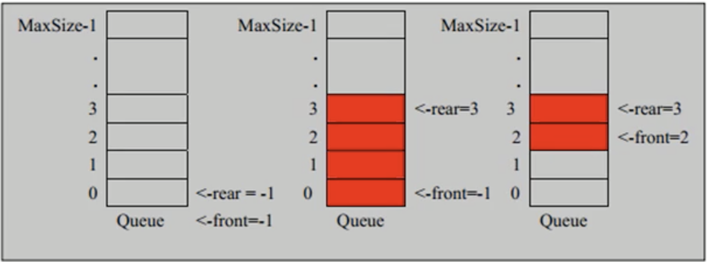
- 标记参数
    - maxSize，该队列的最大容量
    - front，表示队头的前一个位置
        - 随着数据输出而改变
        - 初始化为 -1，**指向队列头元素的前一个位置**
    - rear，表示队尾
        - 随着数据输入而改变
        - 初始化为 -1，**指向队列的尾部，就是指向队列的最后一个数据**
- 实现方法
    - 根据 maxSize 创建数组
    - 入队
        1. 检查队列是否已满
            - 如果 `rear == maxSize - 1`，则队列已满
        2. 入队时，rear 指针往后移动: `rear+1`，然后保存数据
    - 出队
        1. 检查队列是否为空
            - 当 `front == rear` 时，队列为空
        2. 出队时，front 指针往后移动: `front+1`，然后返回指向的元素
            - front指向的位置是对头的前一个位置
- 实现方法的问题
    - 队列只能被使用一次，无法复用
        - front 只负责向后移动，元素并没有清空
        - 当 `rear = maxSize - 1` 后，再也无法添加新的元素
    - 解决方法：环状队列
- 基本实现
    - 参考代码
        - [/algorithm/src/java-algorithm/datastructure/src/main/java/com/ljs/learn/datastructure/queue/BaseArrayQueue.java](/algorithm/src/java-algorithm/datastructure/src/main/java/com/ljs/learn/datastructure/queue/BaseArrayQueue.java)
    - 实现内容
        ```java
        public class BaseArrayQueue<T> {
            // 标记参数
            // maxSize，该队列的最大容量
            private int maxSize;
            // front，表示队头。随着数据输出而改变
            private int front;
            // rear，表示队尾。随着数据输入而改变
            private int rear;
            // 保存队列元素
            private T[] container;
        
            public BaseArrayQueue(int maxSize) {
                this.maxSize = maxSize;
                // 根据 maxSize 创建数组
                container = (T[])new Object[maxSize];
                // 指向队列头的前一个位置
                front = -1;
                // 指向队列的尾部，就是队列的最后一个数据
                rear = -1;
            }
              
            // 检查队列是否已满
            public boolean isFull(){
                return rear == maxSize - 1;
            }
        
            // 检查队列是否为空
            public boolean isEmpty(){
                return front == rear;
            }
        
            // 入队
            public void add(T item){
                // 判断队列是否已满
                if (isFull()){
                    return ;
                }
        
                // 每次入队时，rear 指针往后移动: `rear+1`，然后保存数据
                rear++;
                container[rear] = item;
            }
        
            // 出队
            public T take(){
                // - 当 `front == rear` 时，队列为空
                if (isEmpty()){
                    return null;
                }
        
                // 每次出队时，front 指针往后移动: `front+1`，指向最新的元素
                front++;
                return container[front];
            }
        
            // 返回队头元素
            public T peek(){
                return container[front + 1];
            }
        
            public void showQueue(){
                for (int i = front+1; i<=rear; i++){
                    System.out.println(container[i]);
                }
            }
        }
        ```
- 测试内容
    - 参考代码
        - [/algorithm/src/java-algorithm/datastructure/src/test/java/com/ljs/learn/datastructure/queue/ArrayQueueTest.java](/algorithm/src/java-algorithm/datastructure/src/test/java/com/ljs/learn/datastructure/queue/ArrayQueueTest.java)
    - 测试代码
        ```java
        @Test
        public void test01(){
            BaseArrayQueue<Integer> queue = new BaseArrayQueue<>(4);
            queue.add(55);
            queue.add(33);
            queue.add(77);
            queue.add(66);
            queue.add(88);
    
            System.out.println("----showQueue----");
            queue.showQueue();
    
            System.out.println("----peek----");
            System.out.println(queue.peek());
    
            System.out.println("----take----");
            System.out.println(queue.take());
            System.out.println(queue.take());
            System.out.println(queue.take());
            System.out.println(queue.take());
            System.out.println(queue.take());

            // 队列已经失效
            queue.add(111);
            queue.add(222);

            System.out.println("----showQueue----");
            queue.showQueue();

            // ----showQueue----
            // 55
            // 33
            // 77
            // 66
            // ----peek----
            // 55
            // ----take----
            // 55
            // 33
            // 77
            // 66
            // null
        }
        ```

## 环状队列
[top](#catalog)
- 标记参数
    - maxSize，该队列的最大容量
    - front，表示队头
        - 随着数据输出而改变
        - 初始化为 0，**指向队列头元素**
    - rear，表示队尾的后一个位置
        - 随着数据输入而改变
        - 初始化为 0，**指向 `队尾元素 + 1` 的位置**
        - **会空出一个元素的空间**
- 实现方法
    - 根据 maxSize 创建数组
    - 队列中的有效数据个数：`(rear + maxSize - front) % maxSize`
    - 入队
        1. 检查队列是否已满
            - 如果 `(rear + 1) % maxSize == front`，则队列已满
        2. 入队时，先保存数据，然后 rear 指针往后移动: `rear+1`，保证能够空一个元素
    - 出队
        1. 检查队列是否为空
            - 当 `front == rear` 时，队列为空
        2. 出队时，front 指针往后移动: `front+1`，然后返回指向的元素

- 注意事项
    - 队列是否已满与 front 或 rear 的位置无关。只要 `front == rear`，即二者重叠时，队列为空
    - 因为会空出一个元素，所以队列的实际容量为 maxsize - 1
- 基本实现
    - 参考代码
        - [/algorithm/src/java-algorithm/datastructure/src/main/java/com/ljs/learn/datastructure/queue/CycleArrayQueue.java](/algorithm/src/java-algorithm/datastructure/src/main/java/com/ljs/learn/datastructure/queue/CycleArrayQueue.java)
    - 代码内容
        ```java
        public class CycleArrayQueue<T> {
            private int maxSize;
            private int front;
            private int rear;
            private T[] container;

            public CycleArrayQueue(int maxSize) {
                this.maxSize = maxSize;
                front = 0;
                rear = 0;
                container = (T[])new Object[maxSize];
            }

            public boolean isFull(){
                return (rear + 1) % maxSize == front;
            }

            public boolean isEmpty(){
                return front == rear;
            }

            public void add(T elem){
                if (isFull()){return;}

                container[rear] = elem;

                // 需要取余，防止溢出
                rear = (rear + 1) % maxSize;
            }

            public T take(){
                if (isEmpty()){return null;}
                T elem = container[front];

                front = (front + 1) % maxSize;
                return elem;
            }

            public T peek(){
                if (isEmpty()){return null;}

                return container[front];
            }

            public void showQueue(){
                for (int i = front; i< front + size(); i++){
                    System.out.println(container[i % maxSize]);
                }
            }

            // 返回队列中的有效数据个数
            public int size(){
                return (rear + maxSize - front) % maxSize;
            }
        }
        ```

- 测试内容
    - 参考代码
        - [/algorithm/src/java-algorithm/datastructure/src/test/java/com/ljs/learn/datastructure/queue/ArrayQueueTest.java](/algorithm/src/java-algorithm/datastructure/src/test/java/com/ljs/learn/datastructure/queue/ArrayQueueTest.java)

# 数据结构-单链表
## 单链表简介
[top](#catalog)
- 链表，Linked List
- 链表是有序的列表
- 链表的存储结构
    - 头结点部分
    
        |头指针|next域|
        |-|-|
        |HEAD|150|
    
    - 链表部分
    
        |地址|data域|next域|
        |-|-|-|
        |110|a1|180|
        |120||
        |130|a3|170|
        |140|a5|NULL|
        |150|a1|110|
        |160|||
        |170|a4|140|
        |180|a2|130|

- 链表的存储方式
    - 链表以节点的方式存储
    - 每个节点包含一个 data域、next域
    - next域 指向下一个结点
    - 链表的各个节点间不一定是顺序保存的
    - **链表分为：带头节点的链表、不带头节点的链表**
        - 是否需要头结点，需要根据需求来确定

- 单链表的缺点
    - 查找结点时的方向是单向的，只能从前到后查找
    - 结点不能自我删除，需要辅助结点记录目标结点的前一个结点

## 单链表的注意事项
[top](#catalog)
- 遍历时，**使用的结点 与 遍历的起点**
    1. 如果要使用当前结点的下一个结点，或者搜索目标结点的前一个结点
        - 使用的结点: `temp.next`
        - 遍历的起点: `temp = head`
    2. 使用的结点是本次遍历时的结点
        - 使用的结点: `temp`
        - 遍历的起点: `temp = head.next`

## 单链表的基本实现
[top](#catalog)
- 头结点 head
    - 不保存具体的数据
    - 只用于表示单链表的头部
    - next域 指向链表部分的起点
- 判断链表为空
    - `head.next == null`
- 链表的遍历
    - 通过一个辅助元素 `temp`，来遍历整个链表
    - 判断是否到达链表的最后一个元素
        - `temp.next == null`
    - 判断链表是否遍历完
        - `temp == null`
- 增删改查操作
    - 链表的添加操作
        1. 先创建一个 head 头节点，用于表示链表的头部
        2. 每次添加一个节点时，最后一个元素的next域指向新节点
    - 链表元素的更新
        - 遍历每一个结点，并与目标数据进行比较，直到找到目标元素
        - 遍历的起点: `temp = head.next`
        - 比较方式: 当前结点与目标数据进行比较，`temp.compareTo(data)`
    - 链表元素的删除
        1. 遍历链表，找到目标结点的前一个结点 `temp`
        2. 遍历的起点: `temp = head`
        3. 比较方式: 当前结点的下一个结点与目标数据进行比较，`temp.next.compareTo(data)`
        4. 重新构建链表关： `temp.next = temp.next.next`

- 示例
    - 实现代码
        - 参考代码
            - [/algorithm/src/java-algorithm/datastructure/src/main/java/com/ljs/learn/datastructure/linkedlist/single/base/BaseSingleLinkedList.java](/algorithm/src/java-algorithm/datastructure/src/main/java/com/ljs/learn/datastructure/linkedlist/single/base/BaseSingleLinkedList.java)
        - 结点
            ```java
            // 定义LinkedNode，每个 LinkedNode 对象就是一个节点
            class LinkedNode<T extends Comparable> implements Comparable{
                T data;
                LinkedNode<T> next;
            
                public LinkedNode(T data) {
                    this.data = data;
                    next = null;
                }
            
                @Override
                public String toString() {
                    return data.toString();
                }
            
                @Override
                public int compareTo(Object o) {
                    return this.data.compareTo(o);
                }
            }
            ```
        - 链表
            ```java
            public class BaseSingleLinkedList<T extends Comparable> {
                // 初始化一个头结点，不保存具体数据
                private LinkedNode<T> head = new LinkedNode<>(null);
            
                // 添加结点
                public void add(T data){
                    LinkedNode<T> temp = head;
            
                    // 搜索当前链表中的最后一个结点
                    while (temp.next != null){ // 表示是否到达链表的最后一个元素
                        temp = temp.next;
                    }
            
                    temp.next = new LinkedNode<>(data);
                }
            
                // 更新结点
                public void update(T data){
                    // 进入第一个结点，
                    LinkedNode<T> temp = head.next;
                    
                    // 搜索目标结点，并直接替换数据
                    while (temp != null){ // 如果链表为空，将直接退出
                        if (temp.compareTo(data) == 0){
                            temp.data = data;
                            break;
                        }
                        temp = temp.next;
                    }
                }
            
                // 删除结点
                public void delete(T data){
                    //从头结点开始，搜索目标结点的前一个结点
                    LinkedNode<T> temp = head;
                    
                    while (temp.next != null){ // 如果链表为空，将直接退出
                        if (temp.next.compareTo(data) == 0){
                            // 重建构建链表关系
                            temp.next = temp.next.next;
                            break;
                        }
                        temp = temp.next;
                    }
                }
            
                // 遍历链表
                public void showList(){
                    // 判断链表是否为空
                    if (head.next == null){
                        System.out.println("null list");
                        return;
                    }
            
                    // 进入第一个结点
                    LinkedNode<T> temp = head.next;
                    while(temp != null){
                        // 执行遍历操作
                        System.out.println(temp);
            
                        // 移动指针
                        temp = temp.next;
                    }
                }
            }
            ```
    - 测试内容
        - 参考代码
            - [/algorithm/src/java-algorithm/datastructure/src/test/java/com/ljs/learn/datastructure/linkedlist/SingleLinkedListTest.java](/algorithm/src/java-algorithm/datastructure/src/test/java/com/ljs/learn/datastructure/linkedlist/SingleLinkedListTest.java)
        - 测试代码
            ```java
            @Test
            public void test01(){
                // 1. 测试添加和遍历
                BaseSingleLinkedList<Student> list = new BaseSingleLinkedList<>();
                list.add(new Student(1, "test01", 11));
                list.add(new Student(4, "test04", 14));
                list.add(new Student(2, "test02", 12));
        
                list.showList();
                // 输出
                // Student{num=1, name='test01', age=11}
                // Student{num=4, name='test04', age=14}
                // Student{num=2, name='test02', age=12}
        
                // 2. 测试修改结点
                list.update(new Student(4, "newName", 20));
                list.showList();
        
                // 输出
                // Student{num=1, name='test01', age=11}
                // Student{num=4, name='newName', age=20}
                // Student{num=2, name='test02', age=12}
        
                // 3. 测试删除结点
                list.delete(new Student(4, "newName", 20));
                list.showList();
        
                // 输出
                // Student{num=1, name='test01', age=11}
                // Student{num=2, name='test02', age=12}
            }
            ```

## 有序单链表的实现
[top](#catalog)
- 链表的添加操作
    1. 通过辅助结点 `temp`，首先找到新结点的前一个位置
    2. 重新设置链表的顺序
        1. 设置新结点与后结点的关系: `新结点.next = temp.next`
        2. 设置前结点与新结点的关系: `temp.next = 新结点`
- 其他操作与[单链表的基本实现](#单链表的基本实现)现相同
    - 链表的遍历
        - 通过一个辅助元素 `temp`，来遍历整个链表
        - 判断是否到达链表的最后一个元素
            - `temp.next == null`
        - 判断链表是否遍历完
            - `temp == null`
    - 链表元素的更新
        - 遍历每一个结点，并与目标数据进行比较，直到找到目标元素
        - 遍历的起点: `temp = head.next`
        - 比较方式: 当前结点与目标数据进行比较，`temp.compareTo(data)`
        
    - 链表元素的删除
        1. 遍历链表，找到目标结点的前一个结点 `temp`
        2. 遍历的起点: `temp = head`
        3. 比较方式: 当前结点的下一个结点与目标数据进行比较，`temp.next.compareTo(data)`
        4. 重新构建链表关： `temp.next = temp.next.next`

    
- 示例
    - 实现代码
        - 参考代码
            - [/algorithm/src/java-algorithm/datastructure/src/main/java/com/ljs/learn/datastructure/linkedlist/single/base/OrderSingleLinkedList.java](/algorithm/src/java-algorithm/datastructure/src/main/java/com/ljs/learn/datastructure/linkedlist/single/base/OrderSingleLinkedList.java)
        - 结点
            ```java
            class OrderLinkedNode<T extends Comparable> implements Comparable{
                T data;
                OrderLinkedNode<T> next;
            
                public OrderLinkedNode(T data) {
                    this.data = data;
                    next = null;
                }
            
                @Override
                public int compareTo(Object o) {
                    return this.data.compareTo(o);
                }
            
                @Override
                public String toString() {
                    return data.toString();
                }
            }
            ```
        - 链表
            ```java
            public class OrderSingleLinkedList<T extends Comparable> {
                private OrderLinkedNode<T> head = new OrderLinkedNode<>(null);
                public void add(T data){
                    OrderLinkedNode<T> temp = head;
                    // 1. 搜索新结点的前一个结点
                    while(temp.next != null){ // 表示是否到达链表的最后一个元素
                        // 如果后结点比新结点大，则执行拆入。链表整体是升序排列
                        if (temp.next.compareTo(data) > 0){
                            break;
                        }
            
                        temp = temp.next;
                    }
            
                    // 2. 插入新结点
                    OrderLinkedNode<T> newNode = new OrderLinkedNode<>(data);
                    newNode.next = temp.next;
                    temp.next = newNode;
                }
            
                // 更新结点
                public void update(T data){
                    // 进入第一个结点，
                    OrderLinkedNode<T> temp = head.next;
            
                    // 搜索目标结点，并直接替换数据
                    while (temp != null){ // 如果链表为空，将直接退出
                        if (temp.compareTo(data) == 0){
                            temp.data = data;
                            break;
                        }
                        temp = temp.next;
                    }
                }
            
                // 删除结点
                public void delete(T data){
                    //从头结点开始，搜索目标结点的前一个结点
                    OrderLinkedNode<T> temp = head;
                    
                    while (temp.next != null){ // 如果链表为空，将直接退出
                        if (temp.next.compareTo(data) == 0){
                            // 重新构建链表关系
                            temp.next = temp.next.next;
                            break;
                        }
            
                        temp = temp.next;
                    }
                }
            
                public void showList(){
                    if (head.next == null){
                        System.out.println("null list");
                        return;
                    }
            
                    OrderLinkedNode<T> temp = head.next;
                    while(temp != null){
                        // 执行遍历操作
                        System.out.println(temp);
            
                        temp = temp.next;
                    }
                }
            }
            ```
    - 测试内容
        - 参考代码
            - [/algorithm/src/java-algorithm/datastructure/src/test/java/com/ljs/learn/datastructure/linkedlist/SingleLinkedListTest.java](/algorithm/src/java-algorithm/datastructure/src/test/java/com/ljs/learn/datastructure/linkedlist/SingleLinkedListTest.java)
        - 测试代码
            ```java
            @Test
            public void test02(){
                // 1. 测试添加和遍历
                OrderSingleLinkedList<Student> list = new OrderSingleLinkedList<>();
                list.add(new Student(1, "test01", 11));
                list.add(new Student(4, "test04", 14));
                list.add(new Student(2, "test02", 12));
        
                list.showList();
                // 输出
                // Student{num=1, name='test01', age=11}
                // Student{num=4, name='test04', age=14}
                // Student{num=2, name='test02', age=12}
        
                // 2. 测试修改结点
                list.update(new Student(4, "newName", 20));
                list.showList();
        
                // 输出
                // Student{num=1, name='test01', age=11}
                // Student{num=4, name='newName', age=20}
                // Student{num=2, name='test02', age=12}
        
                // 3. 测试删除结点
                list.delete(new Student(4, "newName", 20));
                list.showList();
        
                // 输出
                // Student{num=1, name='test01', age=11}
                // Student{num=2, name='test02', age=12}
            }
            ```

## 单链表常见问题
[top](#catalog)
### 单链表常见问题汇总
- 求单链表中有效结点的个数
- 查找单链表中的倒数第k个结点
- 单链表的反转
- 逆序打印单链表
    - 方式1：反向遍历
    - 方式2：stack栈
- 合并两个有序的单链表，合并之后仍然有序

### 求单链表中有效结点的个数
[top](#catalog)
- 实现方式
    - 从 `temp = head.next` 开始遍历，并记录遍历次数
    - 直到 `temp == null` 时，遍历结束，并返回结果
- 实现代码
    - 参考代码
        - [/algorithm/src/java-algorithm/datastructure/src/main/java/com/ljs/learn/datastructure/linkedlist/single/forproblem/BaseSingleLinkedList02.java](/algorithm/src/java-algorithm/datastructure/src/main/java/com/ljs/learn/datastructure/linkedlist/single/forproblem/BaseSingleLinkedList02.java)
        - [/algorithm/src/java-algorithm/datastructure/src/main/java/com/ljs/learn/datastructure/linkedlist/single/forproblem/OrderSingleLinkedList02.java](/algorithm/src/java-algorithm/datastructure/src/main/java/com/ljs/learn/datastructure/linkedlist/single/forproblem/OrderSingleLinkedList02.java)
    - 代码内容
        ```java
        // 获取单链表中有效结点的个数
        public int length(){
            LinkedNode<T> temp = head.next;
            int length = 0;
            while(temp != null){
                length++;
                temp = temp.next;
            }
            return length;
        }
        ``` 
- 测试内容
    - 参考代码
        - [/algorithm/src/java-algorithm/datastructure/src/test/java/com/ljs/learn/datastructure/linkedlist/SingleLinkedListTest.java](/algorithm/src/java-algorithm/datastructure/src/test/java/com/ljs/learn/datastructure/linkedlist/SingleLinkedListTest.java)
    - 测试代码
        ```java
        @Test
        public void testLength(){
            BaseSingleLinkedList02<Integer> list = new BaseSingleLinkedList02<>();
            list.add(111);
            list.add(222);
            list.add(333);
    
            assert (list.length() == 3);
    
            OrderSingleLinkedList02<Integer> list2 = new OrderSingleLinkedList02<>();
            list2.add(111);
            list2.add(222);
            list2.add(333);
    
            assert (list2.length() == 3);
        }
        ```

### 查找单链表中的倒数第k个结点
[top](#catalog)
- 实现方式
    1. 方法接收一个index，index表示的是倒数第index结点
    2. 遍历链表获取链表中有效元素的个数: length
    3. 校验index的范围: `(0, length]`
    4. 计算到达目标元素需要的遍历次数: `n = length - index`
    5. 从 `head.next` 开始再遍历 `n` 次，获取目标元素
    6. 如果链表为空，或者index越界，则返回null
- 说明示例
    - 如链表有4个元素
    - 求倒数第 1 个元素，`length - index = 3`，需要从 `head.next` 开始遍历3次
    - 求倒数第 4 个元素，`length - index = 0`，直接返回 `head.next`，即遍历0次
- 实现代码
    - 参考代码
        - [/algorithm/src/java-algorithm/datastructure/src/main/java/com/ljs/learn/datastructure/linkedlist/single/forproblem/BaseSingleLinkedList02.java](/algorithm/src/java-algorithm/datastructure/src/main/java/com/ljs/learn/datastructure/linkedlist/single/forproblem/BaseSingleLinkedList02.java)
        - [/algorithm/src/java-algorithm/datastructure/src/main/java/com/ljs/learn/datastructure/linkedlist/single/forproblem/OrderSingleLinkedList02.java](/algorithm/src/java-algorithm/datastructure/src/main/java/com/ljs/learn/datastructure/linkedlist/single/forproblem/OrderSingleLinkedList02.java)
    - 代码内容
        ```java
        // 获取链表中倒数第k个结点
        public T findLastIndexNode(int index){
            // 1. 如果链表为空，则返回null
            if (head.next == null){ return null; }
    
            // 2. 遍历链表获取链表中有效元素的个数: length
            int length = this.length();
    
            // 3. 校验index的范围: `(0, length]`
            if (index <=0 || index > length){ return null; }
    
            // 4. 计算目标元素的位置: `length - index`
            // 5. 再次遍历，获取目标元素
            LinkedNode<T> temp = head.next;
            for(int i=0; i < length - index; i++){
                temp = temp.next;
            }
    
            return temp.data;
        }
        ```
- 测试内容
    - 参考代码
        - [/algorithm/src/java-algorithm/datastructure/src/test/java/com/ljs/learn/datastructure/linkedlist/SingleLinkedListTest.java](/algorithm/src/java-algorithm/datastructure/src/test/java/com/ljs/learn/datastructure/linkedlist/SingleLinkedListTest.java)
    - 测试代码
        ```java
        // 测试获取单链表的倒数第index个结点
        @Test
        public void testFindLastIndexNode(){
            BaseSingleLinkedList02<Integer> list = new BaseSingleLinkedList02<>();
            list.add(111);
            list.add(222);
            list.add(333);
            list.add(444);
    
            assert(list.findLastIndexNode(1) == 444);
            assert(list.findLastIndexNode(4) == 111);
            assert(list.findLastIndexNode(0) == null);
    
            OrderSingleLinkedList02<Integer> list2 = new OrderSingleLinkedList02<>();
            list2.add(111);
            list2.add(222);
            list2.add(333);
            list2.add(444);
    
            assert(list2.findLastIndexNode(1) == 444);
            assert(list2.findLastIndexNode(4) == 111);
            assert(list2.findLastIndexNode(0) == null);
        }
        ```
    

### 单链表的反转
[top](#catalog)
- 实现方式
    1. 如果链表为空、或链表只有一个元素时，则不需要执行反转
    2. 创建三个临时遍历
        - currentNode，保存当前的结点
        - nextNode，保存当前结点的下一个结点
            - 用于防止当前结点连接到反转链表后，丢失原始的后结点
        - reversedList，反转后的链表
            - 本身就是链表中的第一个有效元素，不是head结点
            - 初始化为null，相当于链表的结束
    3. 将 currentNode 定位到第一有效元素 `head.next`
    4. 遍历链表，并开始反转链表中的结点
        1. `nextNode = currentNode.next`
            - nextNode 保存 currentNode 的下一个结点
            - 防止重新设置链表顺序后，丢失原始的后结点
        2. `currentNode.next = reversedList`
            - currentNode 的后结点连接 reversedList 
        3. `reversedList = currentNode`
            - 将 reversedList 重新指向为 currentNode
            - 保证 reversedList 一直是反转后的一个元素
        4. `currentNode = nextNode`，将元素定位到下一个元素
        5. 重复执行 1- 4，直到 `currentNode == null，即遍历完成
    5. 将头结点指向反转后链表：`head.next = reversedList`
- 实现代码
    - 参考代码
        - [/algorithm/src/java-algorithm/datastructure/src/main/java/com/ljs/learn/datastructure/linkedlist/single/forproblem/BaseSingleLinkedList02.java](/algorithm/src/java-algorithm/datastructure/src/main/java/com/ljs/learn/datastructure/linkedlist/single/forproblem/BaseSingleLinkedList02.java)
        - [/algorithm/src/java-algorithm/datastructure/src/main/java/com/ljs/learn/datastructure/linkedlist/single/forproblem/OrderSingleLinkedList02.java](/algorithm/src/java-algorithm/datastructure/src/main/java/com/ljs/learn/datastructure/linkedlist/single/forproblem/OrderSingleLinkedList02.java)
    - 代码内容
        ```java
        public void reverse(){
            if (head.next == null || head.next.next == null){return;}

            // 1. 将 currentNode 定位到第一个有效结点
            LinkedNode<T> currentNode = head.next;
            LinkedNode<T> nextNode = null;
            LinkedNode<T> newList = null;
    
            while(currentNode != null){
                // 2. 保存当前结点的原始后结点
                nextNode = currentNode.next;
                // 3. 将当前元素的next连接到反转链表上
                currentNode.next = reversedList;
                // 4. 重新设定反转链表的指向
                reversedList = currentNode;
                // 5. 重新设置当前结点为原始的后结点
                currentNode = nextNode;
            }
    
            // 6. 将头结点的指向反转后的链表
            head.next = reversedList;
        }
        ```
- 测试内容
    - 参考代码
        - [/algorithm/src/java-algorithm/datastructure/src/test/java/com/ljs/learn/datastructure/linkedlist/SingleLinkedListTest.java](/algorithm/src/java-algorithm/datastructure/src/test/java/com/ljs/learn/datastructure/linkedlist/SingleLinkedListTest.java)
    - 测试代码
        ```java
        @Test
        public void testReverse(){
            BaseSingleLinkedList02<Integer> list = new BaseSingleLinkedList02<>();
            list.add(111);
            list.add(222);
            list.add(333);
            list.add(444);
    
            list.showList();
            list.reverse();
            list.showList();
            // 输出
            // 444 、333 、222 、111
            System.out.println("---------------");
    
            OrderSingleLinkedList02<Integer> list2 = new OrderSingleLinkedList02<>();
            list2.add(111);
            list2.add(222);
            list2.add(333);
            list2.add(444);
    
            list2.showList();
            list2.reverse();
            list2.showList();
            // 输出
            // 444 、333 、222 、111
        }
        ```
    
- 代码执行过程分析（等号表示复制，箭头表示next的指向）
    1. 初始化变量，将 `currentNode` 指向链表的第一个有效结点
        - 
    2. 遍历链表，并开始创建反转链表
        - 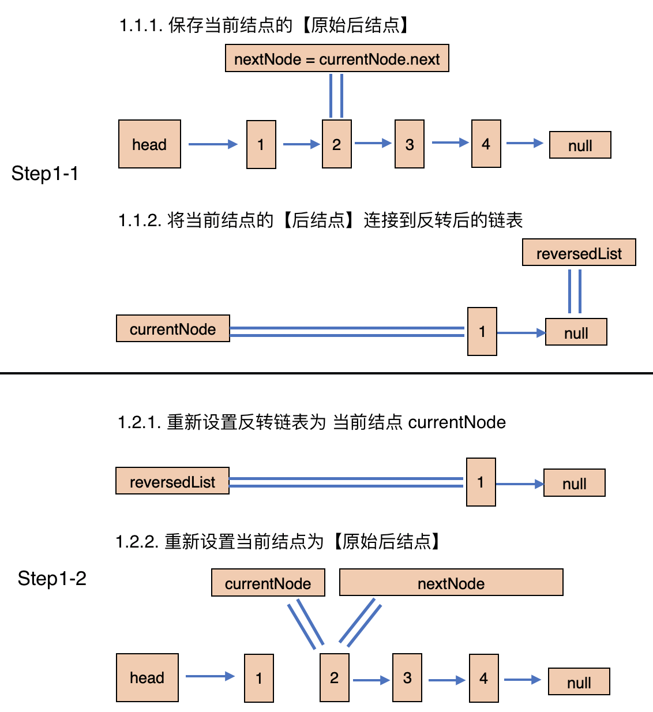
        - 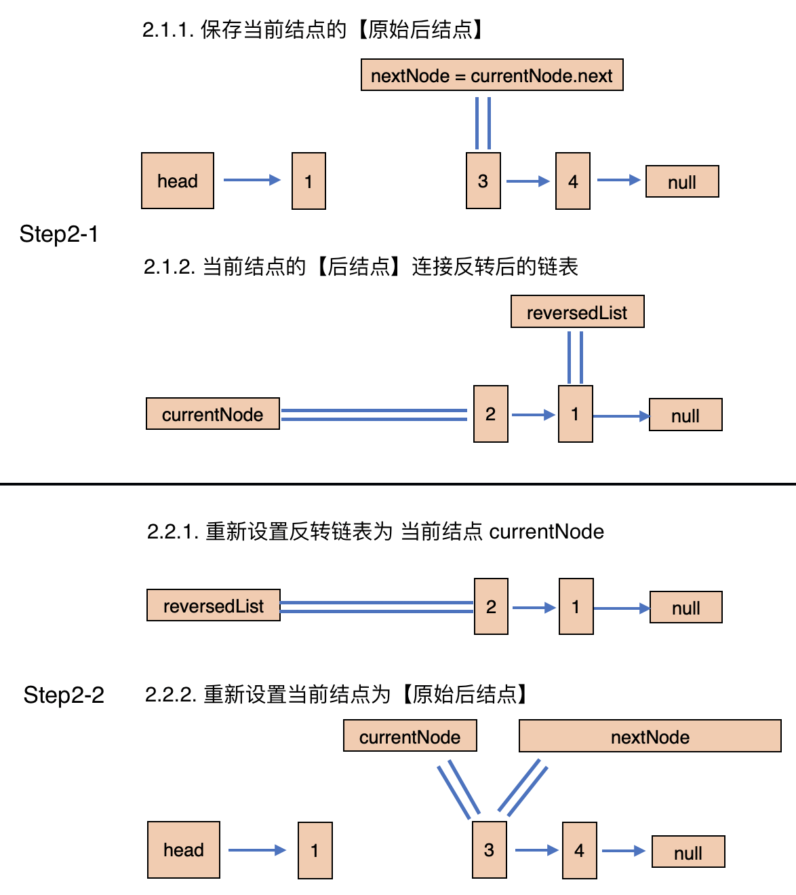
        - 
        - 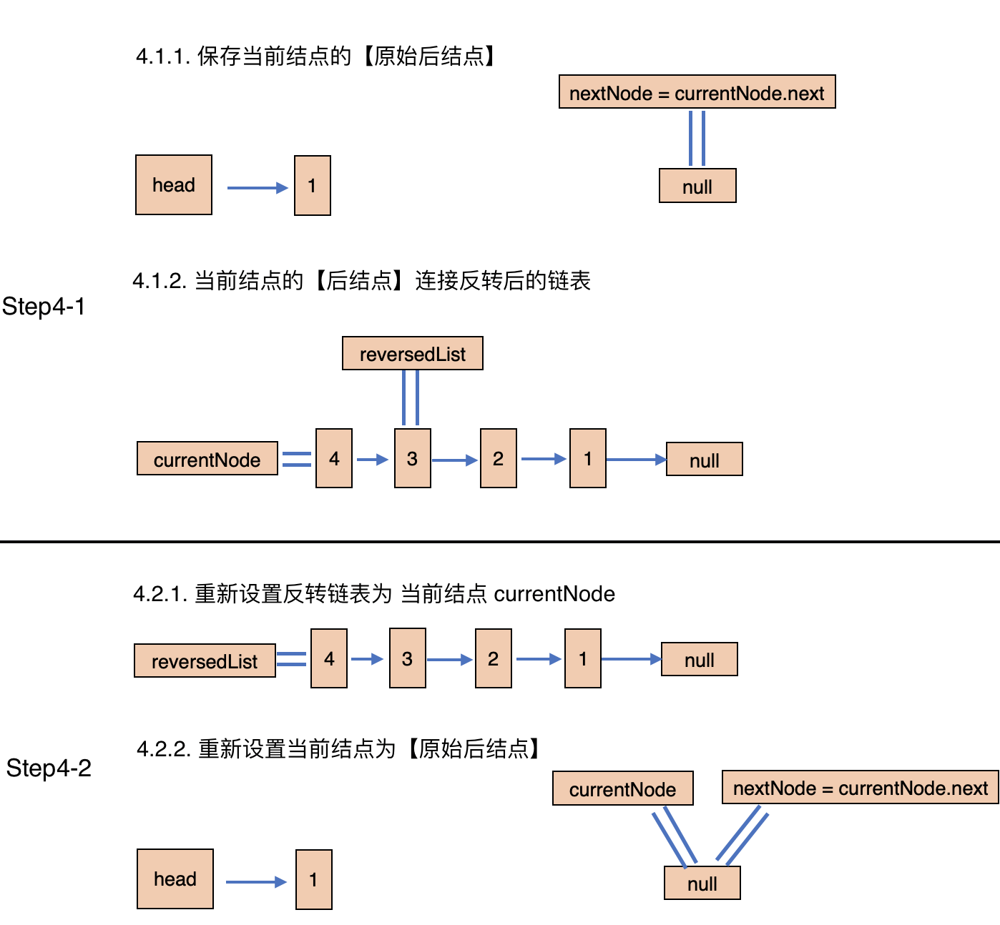
    3. 遍历结束后，将头结点连接到反转链表
        - 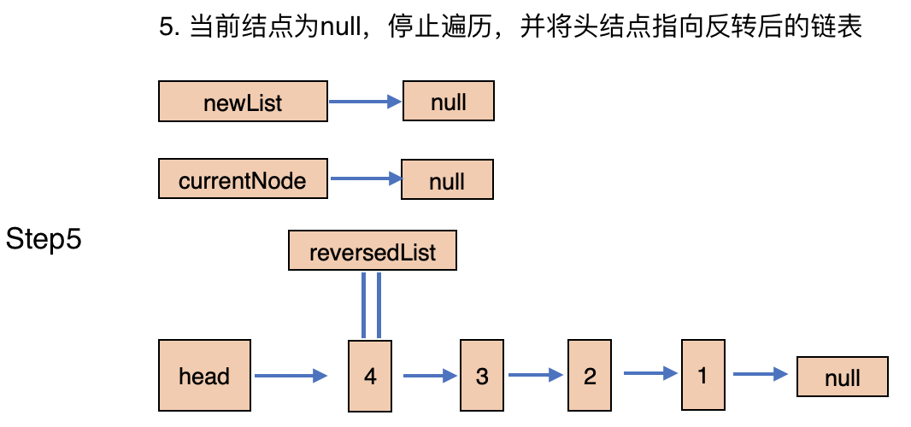

### 逆序打印单链表
[top](#catalog)
- 方式1：反向遍历
    - 将链表反转后，再进行遍历
    - 缺点
        - 会改变链表的结构，**不推荐使用**
- 方式2：stack栈
    1. 遍历链表，并将每个结点的引用保存到栈中
    2. 利用栈后进先出的特性，依次弹出栈中的元素，实现逆序遍历
    
- 方式2的实现
    - 参考代码
        - [/algorithm/src/java-algorithm/datastructure/src/main/java/com/ljs/learn/datastructure/linkedlist/single/forproblem/BaseSingleLinkedList02.java](/algorithm/src/java-algorithm/datastructure/src/main/java/com/ljs/learn/datastructure/linkedlist/single/forproblem/BaseSingleLinkedList02.java)
        - [/algorithm/src/java-algorithm/datastructure/src/main/java/com/ljs/learn/datastructure/linkedlist/single/forproblem/OrderSingleLinkedList02.java](/algorithm/src/java-algorithm/datastructure/src/main/java/com/ljs/learn/datastructure/linkedlist/single/forproblem/OrderSingleLinkedList02.java)
    - 代码内容
        ```java
        public void reverseShowList(){
            if (head.next == null){
                System.out.println("null list");
                return;
            }
    
            Stack<LinkedNode<T>> stack = new Stack<>();
    
            // 1. 遍历链表，并压入栈中
            LinkedNode<T> temp = head.next;
            while (temp != null){
                stack.push(temp);
                temp = temp.next;
            }
    
            // 2. 依次弹出栈中的元素，实现逆序遍历
            while (stack.size() > 0){
                System.out.println(stack.pop());
            }
        }
        ```

- 测试内容
    - 参考代码
        - [/algorithm/src/java-algorithm/datastructure/src/test/java/com/ljs/learn/datastructure/linkedlist/SingleLinkedListTest.java](/algorithm/src/java-algorithm/datastructure/src/test/java/com/ljs/learn/datastructure/linkedlist/SingleLinkedListTest.java)
    - 测试代码
        ```java
        @Test
        public void testReverseShowList(){
            BaseSingleLinkedList02<Integer> list = new BaseSingleLinkedList02<>();
            list.add(111);
            list.add(222);
            list.add(333);
            list.add(444);
    
            System.out.println("-------逆序输出--------");
            list.reverseShowList();
            // 输出
            // 444 、333 、222 、111
            System.out.println("-------正常输出--------");
            list.showList();
    
            OrderSingleLinkedList02<Integer> list2 = new OrderSingleLinkedList02<>();
            list2.add(111);
            list2.add(222);
            list2.add(333);
            list2.add(444);
    
            System.out.println("-------逆序输出--------");
            list2.reverseShowList();
            // 输出
            // 444 、333 、222 、111
            System.out.println("-------正常输出--------");
            list2.showList();
        }
        ```

### 合并两个有序的单链表
[top](#catalog)
- 实现方式
    1. 设置两个变量，分别定位到两个链表的第一个有效元素
        - `temp01 = head.next`
        - `temp02 = otherList.head.next`
    2. 设置一个变量指向当前链表的头结点: `newListNode = head`
    3. 遍历两个链表，并比较两个链表的结点的大小，按照顺序将目标结点，接入 newListNode 的结点
        - `newListNode.next = temp01/temp02`
    4. 遍历两个链表，直到其中一个链表遍历完
    5. 将未遍历完的链表的剩余部分添加到 `newListNode`
- 实现代码
    - 参考代码
        - [/algorithm/src/java-algorithm/datastructure/src/main/java/com/ljs/learn/datastructure/linkedlist/single/forproblem/OrderSingleLinkedList02.java](/algorithm/src/java-algorithm/datastructure/src/main/java/com/ljs/learn/datastructure/linkedlist/single/forproblem/OrderSingleLinkedList02.java)
    - 代码内容
        ```java
        public void merge(OrderSingleLinkedList02<T> otherList){
            // 如果当前链表为空，则直接使用另外一个链表
            if (head.next == null){
                head = otherList.head;
                return ;
            }
    
            // 如果另一个链表是空，则停止合并
            if (otherList.head.next == null){
                return;
            }
    
            OrderLinkedNode<T> temp01 = head.next;
            OrderLinkedNode<T> temp02 = otherList.head.next;
            OrderLinkedNode<T> newListNode = head;
            while (temp01 != null && temp02 != null){
                // 两个列表的结点比较大小，将小的结点设置到 链表中，保持链表的升序特性
                if (temp01.compareTo(temp02.data) < 0 ){
                    newListNode.next = temp01;
                    newListNode = newListNode.next;
                    temp01 = temp01.next;
                } else {
                    newListNode.next = temp02;
                    newListNode = newListNode.next;
                    temp02 = temp02.next;
                }
            }
    
            // 将两个链表剩余的部分补充到新链表中
            if (temp01 != null){
                newListNode.next = temp01;
            } else if (temp02 != null) {
                newListNode.next = temp02;
            }
        }
        ```
- 测试内容
    - 参考代码
        - [/algorithm/src/java-algorithm/datastructure/src/test/java/com/ljs/learn/datastructure/linkedlist/SingleLinkedListTest.java](/algorithm/src/java-algorithm/datastructure/src/test/java/com/ljs/learn/datastructure/linkedlist/SingleLinkedListTest.java)
    - 测试代码
        ```java
        @Test
        public void testMerge(){
            OrderSingleLinkedList02<Integer> list = new OrderSingleLinkedList02<>();
            list.add(222);
            list.add(444);
    
            OrderSingleLinkedList02<Integer> list2 = new OrderSingleLinkedList02<>();
            list2.add(111);
            list2.add(333);
            list2.add(666);
            
            list.merge(list2);
    
            list.showList();
            // 输出
            // 111 、222 、333 、444 、666
        }
        ```

# 数据结构-双向链表
## 双向链表简介
[top](#catalog)
- 双向链表包含两个引用: next、prev，分别指向当前元素的前一个结点和后一个结点
- 双向链表的优点
    - 查找结点时的方向是双向的，可以向前或这向后查找
    - 双向链表可以自我删除，不需要借助辅助结点
    
## 双向链表的基本实现
[top](#catalog)
- 双向链表的遍历
    - 遍历方式与单链表相同
    - 通过一个辅助元素 `temp`，来遍历整个链表
    - 判断是否到达链表的最后一个元素
        - `temp.next == null`
    - 判断链表是否遍历完
        - `temp == null`
- 双向链表的增删改查
    - 链表的添加操作（与单链表相同）
        1. 先创建一个 head 头节点，用于表示链表的头部
        2. 每次添加一个节点时，最后一个元素的next域指向新节点
        3. 新结点的prev域指向最后一个元素
    - 链表元素的更新（与单链表相同）
        - 遍历每一个结点，并与目标数据进行比较，直到找到目标元素
        - 遍历的起点: `temp = head.next`
        - 比较方式: 当前结点与目标数据进行比较，`temp.compareTo(data)`
    - 链表的删除
        1. 遍历链表，找到目标结点 `temp`
        2. 连接目标结点的前结点和后结点: 
            1. `temp.prev.next = temp.next`
            2. `temp.next.prev = temp.prev`
                - 如果当前temp结点是最后一个结点，则不执行，防止空指针异常
- 双向链表的实现
    - 参考代码
        - [/algorithm/src/java-algorithm/datastructure/src/main/java/com/ljs/learn/datastructure/linkedlist/doublelinked/DoubleLinkedList.java](/algorithm/src/java-algorithm/datastructure/src/main/java/com/ljs/learn/datastructure/linkedlist/doublelinked/DoubleLinkedList.java)

    - 结点
        ```java
        class DoubleLinkedNode<T extends Comparable> implements Comparable{
            T data;
            DoubleLinkedNode<T> prev;
            DoubleLinkedNode<T> next;
        
            public DoubleLinkedNode(T data) {
                this.data = data;
                next = null;
                prev = null;
            }
        
            @Override
            public String toString() {
                return data.toString();
            }
        
            @Override
            public int compareTo(Object o) {
                return this.data.compareTo(o);
            }
        }
        ```
    - 双向链表
        ```java
        public class DoubleLinkedList<T extends Comparable> {
            private DoubleLinkedNode<T> head = new DoubleLinkedNode<>(null);
        
            // 添加元素
            public void add(T data){
                DoubleLinkedNode<T> temp = head;
        
                // 遍历链表，找到最后一个结点
                while (temp.next != null){
                    temp = temp.next;
                }
        
                // 将结点添加到链表末尾
                DoubleLinkedNode<T> node = new DoubleLinkedNode<>(data);
                temp.next = node;
                node.prev = temp;
            }
        
            // 遍历链表
            public void showList(){
                if (head.next == null) {
                    System.out.println("null list");
                    return;
                }
        
                DoubleLinkedNode<T> temp = head.next;
                while (temp != null){
                    System.out.println(temp);
                    temp = temp.next;
                }
            }
        
            // 更新元素
            public void update(T data){
                if (head.next == null){ return; }
                DoubleLinkedNode<T> temp = head.next;
        
                while (temp != null){
                    if (temp.compareTo(data) == 0){
                        temp.data = data;
                        break;
                    }
        
                    temp = temp.next;
                }
            }
        
            // 删除结点
            public void delete(T data){
                if (head.next == null){ return; }
        
                DoubleLinkedNode<T> temp = head.next;
                while (temp != null){
                    if (temp.compareTo(data) == 0){
                        // 连接目标结点的前结点和后结点
                        temp.prev.next = temp.next;
        
                        // 如果当前temp结点是最后一个结点，则不执行，防止空指针异常
                        if (temp.next != null){
                            temp.next.prev = temp.prev;
                        }
                        break;
                    }
        
                    temp = temp.next;
                }
            }
        }
        ```
- 测试内容
    - 参考代码
        - [/algorithm/src/java-algorithm/datastructure/src/test/java/com/ljs/learn/datastructure/linkedlist/DoubleLinkedListTest.java](/algorithm/src/java-algorithm/datastructure/src/test/java/com/ljs/learn/datastructure/linkedlist/DoubleLinkedListTest.java)
    - 测试代码
        ```java
        @Test
        public void testShowList(){
            DoubleLinkedList<Integer> list = new DoubleLinkedList<>();
            list.add(111);
            list.add(333);
            list.add(555);
    
            list.showList();
        }
    
        @Test
        public void testUpdate(){
            DoubleLinkedList<Student> list = new DoubleLinkedList<>();
            list.add(new Student(1, "test01", 11));
            list.add(new Student(4, "test04", 14));
            list.add(new Student(2, "test02", 12));
    
            // 修改结点
            list.update(new Student(4, "newName", 20));
            list.showList();
    
            // 输出
            // Student{num=1, name='test01', age=11}
            // Student{num=4, name='newName', age=20}
            // Student{num=2, name='test02', age=12}
        }
    
        @Test
        public void testDelete(){
            DoubleLinkedList<Student> list = new DoubleLinkedList<>();
            list.add(new Student(1, "test01", 11));
            list.add(new Student(4, "test04", 14));
            list.add(new Student(2, "test02", 12));
    
            System.out.println("------删除前------");
            list.showList();
    
            System.out.println("------删除后------");
            // 删除结点
            list.delete(new Student(2, "test04", 14));
            list.showList();
    
            // 输出
            // Student{num=1, name='test01', age=11}
            // Student{num=2, name='test02', age=12}
        }
        ```
      
## 有序双向链表的实现
[top](#catalog)
- 实现方式
    - 添加操作
        1. 从 head 结点开始遍历链表，搜索**目标结点的前一个结点 temp**
        2. 分别建立前结点: temp、后结点: temp.next 与 新结点之间的关系
            - 创建结点关系时，先创建新结点与后结点的关系
            - 如果先创建前结点与新结点的关系，会丢失原始后结点的引用
        3. 如果已经遍历到链表最后一个结点，`temp.next == null`，为了防止空指针异常，不能执行 `temp.next.prev = node`
    - 其他操作与普通的双向链表相同
- 实现代码
    - 参考代码
        - [/algorithm/src/java-algorithm/datastructure/src/main/java/com/ljs/learn/datastructure/linkedlist/doublelinked/OrderDoubleLinkedList.java](/algorithm/src/java-algorithm/datastructure/src/main/java/com/ljs/learn/datastructure/linkedlist/doublelinked/OrderDoubleLinkedList.java)
    - 代码内容--添加元素部分
        ```java
        // 添加元素
        public void add(T data){
            OrderDoubleLinkedNode<T> temp = head;
    
            // 遍历链表，找到最后一个结点
            while (temp.next != null){
                // 如果后结点比新结点大，则将新结点添加到后结点前面，保持链表的升序特性
                if (temp.next.compareTo(data) > 0){
                    break;
                }
                temp = temp.next;
            }
    
            // 将结点添加到链表中
            OrderDoubleLinkedNode<T> node = new OrderDoubleLinkedNode<>(data);
    
            // 建立新结点与后结点的关系
            node.next = temp.next;
            if (temp.next != null){
                temp.next.prev = node;
            }
    
            // 建立前结点与新结点的关系
            temp.next = node;
            node.prev = temp;
        }
        ```

- 测试内容
    - 参考代码
        - [/algorithm/src/java-algorithm/datastructure/src/test/java/com/ljs/learn/datastructure/linkedlist/OrderDoubleLinkedListTest.java](/algorithm/src/java-algorithm/datastructure/src/test/java/com/ljs/learn/datastructure/linkedlist/OrderDoubleLinkedListTest.java)
    - 测试代码
        ```java
        @Test
        public void testOrderDoubleLinkedList(){
            OrderDoubleLinkedList<Integer> list = new OrderDoubleLinkedList<>();
            list.add(222);
            list.add(111);
            list.add(444);
            list.add(333);
            
            list.showList();
            // 输出
            // 111
            // 222
            // 333
            // 444
        }
        ```

# 数据结构-单向环形链表
## 单向环形链表的实现
[top](#catalog)
- 实现方式
    1. 不使用head结点，使用变量 first、end 分别保存第一个结点和最后一个结点
        - 通过 end 来避免添加元素时的遍历操作
    2. 添加第一个结点时，将 first、end 同时设置为新结点，然后构成环状 `end.next = first`
    3. 后续添加新结点时，将新结点接到 `end.next`，然后将 end 移动到新结点，再重新构成环状 `end.next = first`
- 实现内容
    - 参考代码
        - [/algorithm/src/java-algorithm/datastructure/src/main/java/com/ljs/learn/datastructure/linkedlist/cycle/CycleLinkedList.java](/algorithm/src/java-algorithm/datastructure/src/main/java/com/ljs/learn/datastructure/linkedlist/cycle/CycleLinkedList.java)
    - 结点
        ```java
        class LinkedNode<T extends Comparable> implements Comparable{
            T data;
            LinkedNode<T> next;
        
            public LinkedNode(T data) {
                this.data = data;
                next = null;
            }
        
            @Override
            public String toString() {
                return data.toString();
            }
        
            @Override
            public int compareTo(Object o) {
                return this.data.compareTo(o);
            }
        }
        ```
    - 环形链表
        ```java
        public class CycleLinkedList<T extends Comparable> {
            private LinkedNode<T> first;
            private LinkedNode<T> end;
            
            // getter
            // ...

            public void add(T data){
                LinkedNode<T> newNode = new LinkedNode<>(data);
                // 1. end连接newNode，然后重置end结点
                if (first == null){
                    first = newNode;
                    end = newNode;
                } else {
                    end.next = newNode;
                    end = newNode;
                }
        
                // 2. 重置 end 和 first 的关系
                end.next = first;
            }
        
            public void showList(){
                if (first == null){
                    System.out.println("null list");
                    return;
                }
        
                LinkedNode<T> temp = first;
                do{
                    System.out.println(temp);
                    temp = temp.next;
                }while(temp != first);
            }
        }
        ```

## 单向环形链表的应用--Josephu问题
[top](#catalog)
- Josephu问题
    1. 设编号为: 1, 2,... n 的n个人围坐在一圈
    2. 编号为k的人从 1 开始报数( 1<=k<=n )，数到m的那个人出列
    3. 从出列者的下一个人开始，从 1 报数，数到m的那个人再次出列
    4. 重复执行3，直到所有人出列
    5. 最终会产生一个出队编号的序列
- 实现方式
    1. 使用环形链表解决Josephu问题
    2. 创建一个有n个结点的环形链表，由第k个结点开始从 1 计数，计数到m时，将结点删除
    3. 重复2，直到链表为空
- 示例说明
    - 
- 实现内容
    - 参考代码
        - [/algorithm/src/java-algorithm/datastructure/src/main/java/com/ljs/learn/datastructure/linkedlist/cycle/Josephu.java](/algorithm/src/java-algorithm/datastructure/src/main/java/com/ljs/learn/datastructure/linkedlist/cycle/Josephu.java)
    - 实现代码
        ```java
        public class Josephu {
            public static <T extends Comparable> void print(
                    CycleLinkedList<T> list, int start, int step){
                LinkedNode<T> temp = list.getEnd();
                // 检查链表是否为空
                if (temp == null){
                    System.out.println("null list");
                    return ;
                }
        
                // 检查参数
                if (start < 1){
                    System.out.println("error start");
                    return ;
                }
                if (step < 1){
                    System.out.println("error step");
                    return ;
                }
        
                // 从end开始，遍历到 start 结点的前结点
                for (int i=1; i<start; i++){
                    temp = temp.next;
                }
        
                // 从 start 的前结点开始遍历，直到链表中还剩一个结点 temp == temp.next
                while(temp != temp.next){
                    for (int i = 1; i < step; i++){
                        temp = temp.next;
                    }
        
                    // 输出结点
                    System.out.println(temp.next);
                    // 将结点删除
                    temp.next = temp.next.next;
                }
        
                // 输出最后一个结点
                System.out.println(temp);
            }
        }
        ```
- 测试内容
    - 参考代码
        - [/algorithm/src/java-algorithm/datastructure/src/test/java/com/ljs/learn/datastructure/linkedlist/JosephuTest.java](/algorithm/src/java-algorithm/datastructure/src/test/java/com/ljs/learn/datastructure/linkedlist/JosephuTest.java)
    - 测试代码
        ```java
        @Test
        public void test01(){
            CycleLinkedList<Integer> list = new CycleLinkedList<>();
            list.add(11);
            list.add(22);
            list.add(33);
            list.add(44);
            list.add(55);
    
            Josephu.print(list, 1, 2);
            // 输出
            // 22 、44 、11 、55 、33
        }
        ```

# 数据结构-栈
## 栈简介
[top](#catalog)
- 栈 stack
- 栈是一个**先入后出**的**有序列表**（FILO，First In Last Out）
- 栈是一种特殊的线性表
    - 它限制的元素的插入和删除只能在线性表的一端进行
    - **栈顶**: 允许插入和删除的一端
    - **栈底**: 固定的一端
- 栈的应用场景
    - 子程序的调用
        - 在指向子程序前，将下个指令的地址存到栈中
        - 子程序执行完后再将地址取出，回到原来的程序中
    - 处理递归调用
        - 和子程序调用类似，除了存储下一个指令的地址外，还需要保存参数、变量的数据
    - 表达式的转换与求值
        - 中缀表达式转后缀表达式
    - 二叉树的遍历
    - 图结构的深度优先搜索算法（depth--first）

## 使用数组实现栈
[top](#catalog)
- 实现方式
    - 定义一个 top 表示栈顶，初始化为 -1
    - 入栈
        - 需要判断数组是以满: `top == maxSize - 1`
        - 移动栈顶: `top++`
        - 添加元素`stack[top] = data`
    - 出栈
        - 需要判断栈是否为空: `top == -1`
        - 将栈顶元素保存到临时变量中: `temp = stack[top]`
        - 移动栈顶: `top--`
        - 返回保存的栈顶元素

- 实现代码
    - 参考代码
        - [/algorithm/src/java-algorithm/datastructure/src/main/java/com/ljs/learn/datastructure/stack/arraystack/ArrayStack.java](/algorithm/src/java-algorithm/datastructure/src/main/java/com/ljs/learn/datastructure/stack/arraystack/ArrayStack.java)
    - 代码内容
        ```java
        public class ArrayStack<T> {
            private int maxSize;
            private T[] stack;
            private int top = -1;
        
            public ArrayStack(int maxSize) {
                this.maxSize = maxSize;
                stack = (T[])new Object[maxSize];
            }
        
            // 检查栈是否已满
            public boolean isFull(){
                return top + 1 == maxSize;
            }
        
            // 检查栈是否为空
            public boolean isEmpty(){
                return top == -1;
            }
        
            // 入栈
            public void push(T data){
                if (isFull()){
                    System.out.println("full stack");
                    return ;
                }
        
                top++;
                stack[top] = data;
            }
        
            // 出栈
            public T pop(){
                if (isEmpty()){
                    System.out.println("empty stack");
                    return null;
                }
        
                T temp = stack[top];
                top--;
                return temp;
            }
        
            // 从栈顶开始遍历栈
            public void showStack(){
                if (isEmpty()){
                    System.out.println("empty stack");
                    return;
                }
        
                for (int i=top; i>= 0; i--){
                    System.out.println(stack[i]);
                }
            }
        }
        ```
- 测试代码
    - 参考代码
        - [/algorithm/src/java-algorithm/datastructure/src/test/java/com/ljs/learn/datastructure/stack/ArrayStackTest.java](/algorithm/src/java-algorithm/datastructure/src/test/java/com/ljs/learn/datastructure/stack/ArrayStackTest.java)
    - 测试内容
        ```java
        @Test
        public void test01(){
            ArrayStack<Integer> stack = new ArrayStack<>(3);
            assert (stack.pop() == null); // 输出: empty stack 
    
            stack.push(111);
            stack.push(222);
            stack.push(333);
            stack.push(444); // 输出: full stack 
    
            stack.showStack();
            // 输出: 
            // 333
            // 222
            // 111
        }
        ```

## 使用单链表实现栈
[top](#catalog)
- 实现方式
    - 创建一个没有head的链表，用first标识第一个有效结点
        - first 初始化为 null，**表示当前栈为空**
    - 链表的 first元素 表示**栈顶**
    - 链表的最后一个元素表示**栈底**
    - 入栈
        1. 将 first 设置为新结点的后结点
        2. 将 first 重置为新结点
    - 出栈
        1. 将 first 结点保存到临时遍历中
        2. 将 first 后移 `first = first.next`
        3. 返回临时变量中的数据
    - 链表实现与数组不同的地方
        - 链表没有最大的范围，可以一直添加
        - 链表只需要在 出栈 时，判断栈是否为空即可
        - 入栈时，不需要判断栈是否已满
    - 判断栈为空
        - `first == null`

- 实现代码
    - 参考代码
        - [/algorithm/src/java-algorithm/datastructure/src/main/java/com/ljs/learn/datastructure/stack/linkedstack/LinkedListStack.java](/algorithm/src/java-algorithm/datastructure/src/main/java/com/ljs/learn/datastructure/stack/linkedstack/LinkedListStack.java)
    - 代码内容
        ```java
        public class LinkedListStack<T> {
            private LinkedNode<T> first;
        
            public boolean isEmpty(){
                return first == null;
            }
        
            public void push(T data){
                LinkedNode<T> newNode = new LinkedNode<T>(data);
                // 1. 将 first 设置为新结点的后结点
                newNode.next = first;
                // 2. 将 first 重置为新结点
                first = newNode;
            }
        
            public T pop(){
                if (isEmpty()){
                    System.out.println("empty stack");
                    return null;
                }
        
                // 获取第一个结点，然后将 first 结点向后移动
                LinkedNode<T> temp = first;
                first = first.next;
        
                return temp.data;
            }
        
            // 从栈顶开始遍历栈
            public void showStack(){
                if (isEmpty()){
                    System.out.println("empty stack");
                    return ;
                }
        
                LinkedNode<T> temp = first;
                while (temp != null){
                    System.out.println(temp);
                    temp = temp.next;
                }
            }

            // 查看栈顶的元素
            public T peek(){
                if (isEmpty()){ return null; }
                return first.data;
            }
        }
        ```
- 测试代码
    - 参考代码
        - [/algorithm/src/java-algorithm/datastructure/src/test/java/com/ljs/learn/datastructure/stack/LinkedListStackTest.java](/algorithm/src/java-algorithm/datastructure/src/test/java/com/ljs/learn/datastructure/stack/LinkedListStackTest.java)
    - 测试内容
        ```java
        @Test
        public void test01(){
            LinkedListStack<Integer> stack = new LinkedListStack<>();
            assert (stack.pop() == null); // 输出: empty stack
    
            stack.showStack(); // 输出: empty stack
    
            stack.push(111);
            stack.push(222);
            stack.push(333);
            stack.push(444);
    
            stack.showStack();
            // 输出:
            // 444
            // 333
            // 222
            // 111
        }
        ```

# 栈的应用--前缀中缀后缀表达式
## 前缀中缀后缀表达式简介
[top](#catalog)
- 前缀表达式
    - 前缀表达式又称**波兰表达式**
    - 运算符位在操作数之前
    - 说明示例
        - 原始公式:  `(3 + 4) x 5 - 6`
        - 前缀表达式:`- x + 3 4 5 6`
    - 求解过程
        1. **从右向左**扫描表达式
        2. 遇到数字时，将数字压入栈
        3. 遇到运算符时，弹出栈顶的两个数，进行运算。再将结果入栈
        4. 重复上述过程直到最左边，得到的结果即为表达式的结果

- 中缀表达式
    - 中缀表达式就是常见的运算表达式，如`(3 + 4) x 5 - 6`
    - 中缀表达式对于计算机不好操作，需要判断运算符的优先级
    - 计算时，会将中缀表达式转换为其他表达式，一般转成**后缀表达式**

- 后缀表达式
    - 后缀表达式又称**逆波兰表达式**
    - 运算符位在操作数之后
    - 说明示例
        - 原始公式:  `(3 + 4) x 5 - 6`
        - 前缀表达式:`3 4 + 5 x 6 -`
    - 求解过程
        1. **从左向右**扫描表达式
        2. 遇到数字，压入栈
        3. 遇到运算符，弹出栈顶的两个数，进行运算。再将结果入栈
        4. 重复上述过程直到最右边，栈中只有一个数，即为表达式的结果

## 中缀表达式应用--中缀表达式计算器
### 中缀表达式计算器--实现方式1--存在减号问题
[top](#catalog)
- 需求
    - 输入一个表达式，如: `3 - 1 + 2 * 3 - 4 / 2`
    - 自动计算表达式的结果
- 实现方式1--不考虑减号问题
    1. 创建两个栈
        - s1 符号栈: 保存表达式中的运算符
        - s2 数栈: 保存表达式中的值、计算过程中产生的中间值
    2. 通过索引遍历表达式字符串
        1. 如果是数字，就放入 s2
        2. 如果是一个运算符
            - 如果 s1 为空，直接压入 s1
            - 如果 s1 不为空，与栈顶符号比较优先级
                - `当前符号 <= 栈顶符号`
                    - 从 s2 中pop两个数值，从 s2 弹出一个运算符，进行计算
                    - 计算时，**s2 的栈顶是右值，下一个元素是左值**
                    - 将计算结果压入 s1 
                    - 将当前符号压入 s2
                - `当前符号 > 栈顶符号`
                    - 将当前符号直接放入 s1
                    - 这表示：当前符号优先级过高，**需要等待当前运算符号的右值入栈**之后再计算
                        - 即通过与下一个符号的优先级比较结果来判断是否计算
    3. 表达式遍历完后
        1. 从 s2 弹出两个数，从 s1 弹出一个运算符，进行运算
        2. 运算后，将结果再次保存到 s2 的栈顶
        3. 重复上述操作， 直到 s1 为空
    4. 最终，s1 为空，s2 中只有一个元素，即表达式的计算结果

- 实现内容
    - 参考代码
        - 通用工具
            - [/algorithm/src/java-algorithm/datastructure/src/main/java/com/ljs/learn/datastructure/stack/usage/calculator/Operator.java](/algorithm/src/java-algorithm/datastructure/src/main/java/com/ljs/learn/datastructure/stack/usage/calculator/Operator.java)
            - [/algorithm/src/java-algorithm/datastructure/src/main/java/com/ljs/learn/datastructure/stack/usage/calculator/CalculatorUtils.java](/algorithm/src/java-algorithm/datastructure/src/main/java/com/ljs/learn/datastructure/stack/usage/calculator/CalculatorUtils.java)
        - 实现代码
            - [/algorithm/src/java-algorithm/datastructure/src/main/java/com/ljs/learn/datastructure/stack/usage/calculator/InfixCalculator.java](/algorithm/src/java-algorithm/datastructure/src/main/java/com/ljs/learn/datastructure/stack/usage/calculator/InfixCalculator.java)
- 测试内容
    - 参考代码
        - [/algorithm/src/java-algorithm/datastructure/src/test/java/com/ljs/learn/datastructure/stack/usage/InfixCalculatorTest.java](/algorithm/src/java-algorithm/datastructure/src/test/java/com/ljs/learn/datastructure/stack/usage/InfixCalculatorTest.java)

### 中缀表达式计算器的求解示例
[top](#catalog)
1. 遍历表达式
    - 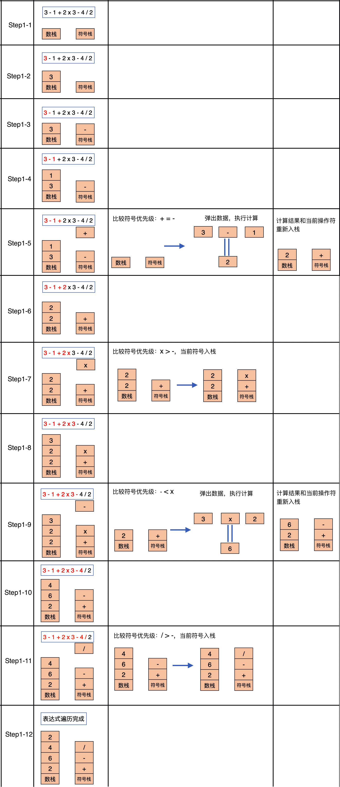
2. 计算栈中的数据
    - 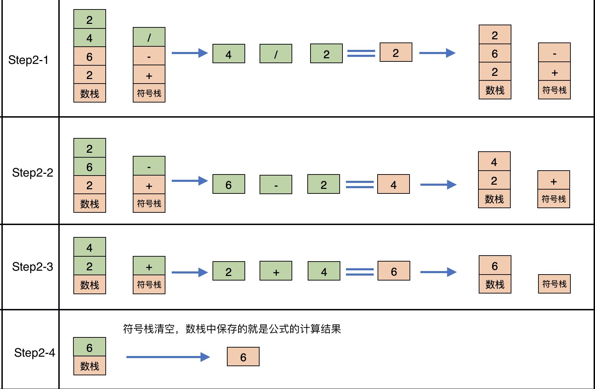

### 中缀表达式计算器--实现方式2--解决减号问题
[top](#catalog)
- 实现方式1中的**减号问题**
    - 减号问题的示例：`1 - 5 * 6 + 1`
        - 遍历之后，栈中的数据
            ```
            1
            30   +
            1    -
            数栈  符号栈
            ```
        - 如果按照之前的算法，计算过程为：`30 + 1 = 31; 1 - 31 = -30`
        - 这种情况下的计算结果是错误的，正确的计算过程为：`1 - 30 = -29; -29 + 1 = -28`
    - 出现减号问题的情况
        - 当符号栈的**非栈顶**结点是减号时，会出现计算顺序异常的问题
    - 出现减号问题的原因
        - 如执行: `30 + 1 = 31` 时，按照正常顺序计算时，包含减号时，应该考虑结合律，转化为: `1 - (30 - 1)` 来计算
        - 但是方案1中没有这种策略，同时这种策略在应用时也比较复杂，要查看栈中的多个元素
    - 减号问题的解决方案
        - 解决思路
            - **将减法转化为加法**
        - 操作方法
            - 将减号转为加号，将减号自身作为**下一个**数字的符号
            - 这样在计算时，减号操作已经包含在数值中，不会出现异常

- **实现方案2--解决减号问题**
    1. 初始化变量
        - 创建两个栈
            - s1 符号栈: 保存表达式中的运算符
            - s2 数栈: 保存表达式中的值、计算过程中产生的中间值
        - 创建一个符号保存参数: `sign`，初始化为 1
            - `sign = 1`，表示前一个符号不是减号
            - `sign = -1`，表示前一个符号是减号
    2. 通过索引遍历表达式字符串
        1. 如果是数字
            1. 执行 `sign * 数字`，为数字设置符号，即将减号操作移动到数值本身
            2. 保存到 s2
            3. 重置 `sign = 1`
        2. 如果是一个运算符
            - <label style='color:red'>解决减号问题</label>
                - 如果是减号，则将减号变为加号，然后设置 `sign = -1`
                - sign 将会在数值入栈时使用
            - 如果 s1 为空，直接压入 s1
            - 如果 s1 不为空，与栈顶符号比较优先级
                - `当前符号 <= 栈顶符号`
                    - 从 s2 中pop两个数值，从 s2 弹出一个运算符，进行计算
                    - 计算时，**s2 的栈顶是右值，下一个元素是左值**
                    - 将计算结果压入 s1 
                    - 将当前符号压入 s2
                - `当前符号 > 栈顶符号`
                    - 将当前符号直接放入 s1
                    - 这表示：当前符号优先级过高，**需要等待当前运算符号的右值入栈**之后再计算
                        - 即通过与下一个符号的优先级比较结果来判断是否计算
    3. 表达式遍历完后
        1. 从 s2 弹出两个数，从 s1 弹出一个运算符，进行运算
        2. 运算后，将结果再次保存到 s2 的栈顶
        3. 重复上述操作， 直到 s1 为空
    4. 最终，s1 为空，s2 中只有一个元素，即表达式的计算结果

- 实现内容
    - 参考代码
        - 通用工具
            - [/algorithm/src/java-algorithm/datastructure/src/main/java/com/ljs/learn/datastructure/stack/usage/calculator/Operator.java](/algorithm/src/java-algorithm/datastructure/src/main/java/com/ljs/learn/datastructure/stack/usage/calculator/Operator.java)
            - [/algorithm/src/java-algorithm/datastructure/src/main/java/com/ljs/learn/datastructure/stack/usage/calculator/CalculatorUtils.java](/algorithm/src/java-algorithm/datastructure/src/main/java/com/ljs/learn/datastructure/stack/usage/calculator/CalculatorUtils.java)
        - 实现代码
            - [/algorithm/src/java-algorithm/datastructure/src/main/java/com/ljs/learn/datastructure/stack/usage/calculator/InfixCalculator2.java](/algorithm/src/java-algorithm/datastructure/src/main/java/com/ljs/learn/datastructure/stack/usage/calculator/InfixCalculator2.java)
    - 实现代码
        ```java
        public class InfixCalculator2 {
            public static int interpret(String expression) throws InvocationTargetException, IllegalAccessException {
                // 1. 使用单链表实现的栈来创建
                // 创建两个栈: 数栈、符号栈
                Stack<Integer> numStack = new Stack<>();
                Stack<Character> operatorStack = new Stack<>();
        
                // 2. 通过索引遍历表达式字符串
                char[] expressionChars = expression.toCharArray();
                int rightValue, leftValue, result;
                char c;
                String num = ""; // 多位数时临时保存高位数
                int sign = 1; // 如果是减号，则将sign设置为 -1，设置到下一个数字中，然后将减号转换为加号，并重置为 1
        
                for (int i = 0; i < expressionChars.length; i++) {
                    c = expressionChars[i];
                    // 如果是空格则跳过
                    if ( CalculatorUtils.isSpace(c) ){ continue; }
        
                    if ( CalculatorUtils.isNum(c) ){
                        num += c;
                        // 处理多位数
                        // 如果 已经到达最后一个字符，则直接入栈，或者下一位不是数值
                        if ( i == expressionChars.length - 1 || !CalculatorUtils.isNum(expressionChars[i + 1])){
                            // 保存数值的同时，设置符号
                            numStack.push(Integer.parseInt(num) * sign);
                            // 将符号重置为 1
                            sign = 1;
                            // 清空多位数的缓存
                            num = "";
                        }
                    } else if ( CalculatorUtils.isOperator(c) ){
                        // 如果是符号，需要判断当前符号与栈顶符号的优先级
        
                        // 如果是减号，则将sign置为 -1，并转换为 加号
                        if (c == '-'){
                            sign = -1;
                            c = '+';
                        }
        
                        // 如果符号栈为空，直接入栈
                        if (operatorStack.isEmpty()){
                            operatorStack.push(c);
                        } else {
                            // 如果符号栈不为空，需要比较操作符的优先级
                            // 当前符号 <= 栈顶符号
                            if ( CalculatorUtils.compareOperatorLevel(c, operatorStack.peek()) <= 0 ){
                                // 从数栈中pop两个数值
                                // 栈顶元素是右值，下一个元素是左值
                                rightValue = numStack.pop();
                                leftValue = numStack.pop();
        
                                // 从符号栈pop一个运算符，进行计算
                                result = CalculatorUtils.calculate(operatorStack.pop(), leftValue, rightValue);
                                // 将计算结果放入数栈
                                numStack.push(result);
        
                                // 将当前符号放入符号栈
                                operatorStack.push(c);
                            } else {
                                // 当前符号 > 栈顶符号
                                // 将当前符号直接放入符号栈
                                operatorStack.push(c);
                            }
                        }
                    } else {
                        throw new RuntimeException("未知字符: " + c);
                    }
                }
        
                // 3. 表达式遍历完后，顺序的从数栈和符号栈中pop出数据进行计算，**直到符号栈为空**
                while ( !operatorStack.isEmpty() ){
                    // 从数栈中pop两个数值
                    // 栈顶元素是右值，下一个元素是左值
                    rightValue = numStack.pop();
                    leftValue = numStack.pop();
        
                    // 从符号栈pop一个运算符，进行计算
                    result = CalculatorUtils.calculate(operatorStack.pop(), leftValue, rightValue);
                    // 将计算结果放入数栈
                    numStack.push(result);
                }
        
                // 4. 最终，符号栈为空，数栈中只有一个元素，即表达式的计算结果
                return numStack.pop();
            }
        }
        ```
- 测试内容
    - 参考代码
        - [/algorithm/src/java-algorithm/datastructure/src/test/java/com/ljs/learn/datastructure/stack/usage/InfixCalculator2Test.java](/algorithm/src/java-algorithm/datastructure/src/test/java/com/ljs/learn/datastructure/stack/usage/InfixCalculator2Test.java)
    - 测试代码
        ```java
        // 基本示例测试
        @Test
        public void testCalculator() throws InvocationTargetException, IllegalAccessException {
            int result = InfixCalculator2.interpret("3 - 1  + 2 * 3 - 4 / 2");
            System.out.println(result);
            // 输出: 6
        }
    
        // 多位数测试
        @Test
        public void testCalculator02() throws InvocationTargetException, IllegalAccessException {
            int result = InfixCalculator2.interpret("30 - 1  + 2 * 3 - 4 / 2");
            System.out.println(result);
            // 输出: 6
        }
    
        // 异常字符测试
        @Test
        public void testErrorChar() throws InvocationTargetException, IllegalAccessException {
            int result = InfixCalculator2.interpret("3 - 1 + a + 2 * 3 - 4 / 2");
            System.out.println(result);
            // 产生异常
            // java.lang.RuntimeException: 未知字符: a
        }
    
        // 单数字测试
        @Test
        public void testOneNumber() throws InvocationTargetException, IllegalAccessException {
            int result = InfixCalculator2.interpret("3");
            System.out.println(result);
            // 输出: 3
        }
    
        // 减号问题测试
        @Test
        public void testMinus01() throws InvocationTargetException, IllegalAccessException {
            int result = InfixCalculator2.interpret("1 - 5 * 6 + 1");
            // 表达式遍历结束后的栈
            // 1
            // 30 -
            // 1  -
    
            System.out.println(result);
            // 输出: -28
        }
        ```

## 后缀表达式应用--后缀表达式计算器
### 中缀表达式转后缀表达式的方法
[top](#catalog)
- 变换示例
    - 中缀表达式: `1 + ((2 + 3) X 4) - 5`
    - 后缀表达式: `1 2 3 + 4 X + 5 -`
- 实现步骤
    1. 初始化两个栈
        - s1 符号栈
        - s2 中间结果栈
    2. 从左向右扫描中缀表达式
    3. 遇到数值时，将其压入 s2
    4. 遇到运算符时
        1. 如果 s1 为空，或栈顶运算符为 `(`，则压入 s1
        2. 如果 s1 不为空，与 s1 栈顶比较优先级
            - `当前运算符 > s1 栈顶` 时，将当前运算符压入 s1
            - `当前运算符 <= s1 栈顶` 时，
                - 将 s1 栈顶的运算符弹出，压入 s2
                - 跳转到 4-1，继续检查当前运算符
    5. 遇到括号时
        - 如果是左括号 `(`，压入 s1
        - 如果是右括号 `)`，依次弹出 s1 栈顶，并压入 s2，直到s1弹出的是 `(`
            - 右括号 `)`，和弹出的左括号 `(`，不需要压入 s2
    6. 重复 2至5，直到表达式结束
    7. 将 s1 中剩余的运算符依次弹出，并压入 s2
    8. 依次弹出 s2 中的元素，并输出，**结果的逆序**即为后缀表达式
- 注意事项
    - s2 中间结果栈 的问题
        - 在整个转化过程中，没有出栈操作，只有入栈操作
        - 最后需要逆序输出
    - 所以 s2 一般会**使用数组代替**
        - 入栈时，将数据添加到数组末尾
        - 使用时，从前向后遍历

- 转化说明示例: `1 + ((2 + 3) * 4) - 5`

    |公式|当前字符|s2栈|s1栈|
    |-:|-:|:-|:-|
    |`1 + ((2 + 3) * 4) - 5`|` `|`                 `|`       `|
    |`  + ((2 + 3) * 4) - 5`|`1`|`1                `|`       `|
    |`    ((2 + 3) * 4) - 5`|`+`|`1                `|`+      `|
    |`     (2 + 3) * 4) - 5`|`(`|`1                `|`+ (    `|
    |`      2 + 3) * 4) - 5`|`(`|`1                `|`+ ( (  `|
    |`        + 3) * 4) - 5`|`2`|`1 2              `|`+ ( (  `|
    |`          3) * 4) - 5`|`+`|`1 2              `|`+ ( ( +`|
    |`           ) * 4) - 5`|`3`|`1 2 3            `|`+ ( ( +`|
    |`             * 4) - 5`|`)`|`1 2 3 +          `|`+ (    `|
    |`               4) - 5`|`*`|`1 2 3 +          `|`+ ( *  `|
    |`                ) - 5`|`4`|`1 2 3 + 4        `|`+ ( *  `|
    |`                  - 5`|`)`|`1 2 3 + 4 *      `|`+      `|
    |`                    5`|`-`|`1 2 3 + 4 * +    `|`-      `|
    |`                     `|`5`|`1 2 3 + 4 * + 5  `|`-      `|
    |`                     `|` `|`1 2 3 + 4 * + 5 -`|`       `|

     
### 中缀表达式转后缀表达式的实现   
[top](#catalog)
- 实现内容
    - 参考代码
        - 通用工具
            - [/algorithm/src/java-algorithm/datastructure/src/main/java/com/ljs/learn/datastructure/stack/usage/calculator/Operator.java](/algorithm/src/java-algorithm/datastructure/src/main/java/com/ljs/learn/datastructure/stack/usage/calculator/Operator.java)
            - [/algorithm/src/java-algorithm/datastructure/src/main/java/com/ljs/learn/datastructure/stack/usage/calculator/CalculatorUtils.java](/algorithm/src/java-algorithm/datastructure/src/main/java/com/ljs/learn/datastructure/stack/usage/calculator/CalculatorUtils.java)
        - 实现代码
            - [/algorithm/src/java-algorithm/datastructure/src/main/java/com/ljs/learn/datastructure/stack/usage/calculator/SuffixCalculator.java](/algorithm/src/java-algorithm/datastructure/src/main/java/com/ljs/learn/datastructure/stack/usage/calculator/SuffixCalculator.java)
    - 实现代码
        ```java
        public class SuffixCalculator {
            public static List<String> toSuffixExpression(String expr){
                // 1. 初始化两个栈
                // s1 符号栈
                Stack<String> s1 = new Stack<>();
                // s2 中间结果栈
                List<String> s2 = new LinkedList<>();
        
                // 2. 从左向右扫描中缀表达式
                char[] exprChars = expr.toCharArray();
                String num = "";
                char c;
                for (int i = 0; i < exprChars.length; i++) {
                    c = exprChars[i];
                    if ( c == ' '){ continue; }
        
                    if (CalculatorUtils.isNum(c)){
                        // 3. 遇到数值时，将其压入 s2
                        num += c;
                        if (i == exprChars.length - 1 || !CalculatorUtils.isNum(exprChars[i+1])){
                            s2.add(num);
                            num = "";
                        }
                    } else if (CalculatorUtils.isOperator(c)) {
                        // 4. 遇到运算符时
                        while (true) {
                            if (s1.isEmpty() || "(".equals(s1.peek())) {
                                // 4.1. 如果 s1 为空，或栈顶运算符为 `(`，则压入 s1
                                s1.push(String.valueOf(c));
                                break;
                            } else {
                                // 4.2. 如果 s1 不为空，与 s1 栈顶比较优先级
                                if (CalculatorUtils.compareOperatorLevel(c, s1.peek()) > 0) {
                                    // 4.2.1 `当前运算符 > s1 栈顶` 时，将当前运算符压入 s1
                                    s1.push(String.valueOf(c));
                                    break;
                                } else {
                                    // 4.2.2 `当前运算符 <= s1 栈顶` 时，
                                    // 4.2.2.1 将 s1 栈顶的运算符弹出，压入 s2
                                    s2.add(s1.pop());
                                    // 4.2.2.2 跳转到 4-1，继续检查当前运算符
                                }
                            }
                        }
                    } else if (CalculatorUtils.isBrackets(c)){
                        // 5. 遇到括号时
                        // 5.1 如果是 `(`，压入 s1
                        if (c == '('){
                            s1.push(String.valueOf(c));
                        } else {
                            // 5.2 如果是 `)`，依次弹出 s1 栈顶，并压入 s2，直到s1弹出的是 `(`
                            String operator;
                            while ( !"(".equals(operator = s1.pop()) ){
                                s2.add(operator);
                            }
                        }
                    } else {
                        throw new RuntimeException("未知字符: " + c);
                    }
                }
                // 6. 重复 2至5，直到表达式结束
        
                // 7. 将 s1 中剩余的运算符依次弹出，并压入 s2
                while (!s1.isEmpty()){
                    s2.add(s1.pop());
                }
        
                // 8. 将中间结果栈作为结果返回
                return s2;
            }
        }
        ```
- 测试内容
    - 参考代码
        - [/algorithm/src/java-algorithm/datastructure/src/test/java/com/ljs/learn/datastructure/stack/usage/SuffixCalculatorTest.java](/algorithm/src/java-algorithm/datastructure/src/test/java/com/ljs/learn/datastructure/stack/usage/SuffixCalculatorTest.java)
    - 测试代码
        ```java
        // 基本测试
        @Test
        public void testToSuffixExpression(){
            List<String> list = SuffixCalculator.toSuffixExpression("1 + ((2 + 3) * 4) - 5");
            String[] result = {"1", "2", "3", "+", "4", "*", "+", "5", "-"};
    
            assert (list.toString().equals(Arrays.toString(result)));
        }
    
        // 多数字测试
        @Test
        public void testToSuffixExpressionMultiNum(){
            List<String> list = SuffixCalculator.toSuffixExpression("10 + ((21 + 3) * 4) - 5");
            String[] result = {"10", "21", "3", "+", "4", "*", "+", "5", "-"};
    
            assert (list.toString().equals(Arrays.toString(result)));
        }
        ```

### 后缀表达式计算器的实现
[top](#catalog)
- 实现方式
    - 接收一个普通的表达式作为参数，即接收一个中缀表达式 
    - 将中缀表达式转化为后缀表达式，如
        - `1 + ((2 + 3) * 4) - 5`
        - `1 2 3 + 4 * + 5 -`
    - 遍历后缀表达式
        1. 创建一个数值栈
        2. 如果是数字，则压入栈
        3. 如果是符号，从栈中弹出两个数进行运算
            - 栈顶是右值，栈顶的下一个元素是左值
        4. 重复 2 到 3，直到表达式扫描完
        5. 数值栈中还剩一个数，即计算结果

- 实现内容
    - 参考代码
        - 通用工具
            - [/algorithm/src/java-algorithm/datastructure/src/main/java/com/ljs/learn/datastructure/stack/usage/calculator/Operator.java](/algorithm/src/java-algorithm/datastructure/src/main/java/com/ljs/learn/datastructure/stack/usage/calculator/Operator.java)
            - [/algorithm/src/java-algorithm/datastructure/src/main/java/com/ljs/learn/datastructure/stack/usage/calculator/CalculatorUtils.java](/algorithm/src/java-algorithm/datastructure/src/main/java/com/ljs/learn/datastructure/stack/usage/calculator/CalculatorUtils.java)
        - 实现代码
            - [/algorithm/src/java-algorithm/datastructure/src/main/java/com/ljs/learn/datastructure/stack/usage/calculator/SuffixCalculator.java](/algorithm/src/java-algorithm/datastructure/src/main/java/com/ljs/learn/datastructure/stack/usage/calculator/SuffixCalculator.java)
    - 实现代码
        ```java
        public class SuffixCalculator {
            public static int interpret(String expression) throws InvocationTargetException, IllegalAccessException {
                return calculateSuffixExpr(toSuffixExpression(expression));
            }
        
            public static int calculateSuffixExpr(List<String> expr) throws InvocationTargetException, IllegalAccessException {
                // 1. 从左向右扫描表达式
                Stack<Integer> numStack = new Stack<>();
                int leftValue,rightValue, result;
                for (String node : expr) {
                    if (node.matches("\\d+")){
                        // 2. 遇到数字，压入栈
                        numStack.push(Integer.parseInt(node));
                    } else if (CalculatorUtils.isOperator(node)){
                        // 3. 遇到运算符，弹出栈顶的两个数，进行运算。再将结果入栈
                        rightValue = numStack.pop();
                        leftValue = numStack.pop();
                        result = CalculatorUtils.calculate(node, leftValue, rightValue);
                        numStack.push(result);
                    } else {
                        throw new RuntimeException("未知字符: " + node);
                    }
                }
                // 4. 重复上述过程直到最右边，栈中只有一个数，即为表达式的结果
                return numStack.pop();
            }
            // ...
        }
        ```
- 测试内容
    - 参考代码
        - [/algorithm/src/java-algorithm/datastructure/src/test/java/com/ljs/learn/datastructure/stack/usage/SuffixCalculatorTest.java](/algorithm/src/java-algorithm/datastructure/src/test/java/com/ljs/learn/datastructure/stack/usage/SuffixCalculatorTest.java)
    - 测试代码
        ```java
        // 计算测试
        @Test
        public void testInterpret() throws InvocationTargetException, IllegalAccessException {
            int result = SuffixCalculator.interpret("1 + ((2 + 3) * 4) - 5");
            assert (result == 16);
        }
    
        // 多数字计算测试
        @Test
        public void testInterpretMultiNum() throws InvocationTargetException, IllegalAccessException {
            int result = SuffixCalculator.interpret("10 + ((21 + 3) * 4) - 5");
            assert (result == 101);
        }
        ```

# 数据结构-哈希表
## 哈希表简介
[top](#catalog)
- 什么是哈希表？
    - 哈希表也称为散列表，HashTable
    - 底层结构：
        - 数组
        - 数组的每个元素保存一个链表
    - 存储方式
        1. 将关键字的码值映射到数组的某个index
        2. 将数据保存到这个index的链表中
    - 使用方式
        1. 将关键字的码值映射到数组的某个index
        2. 通过index获取链表，然后通过关键字在链表中搜索数据
    - 设计数组操作的两个概念
        - 散列函数: 从关键字码值到数组index的映射函数
        - 散列表: 就是底层保存数据的数组
- 哈希表示例图
    - 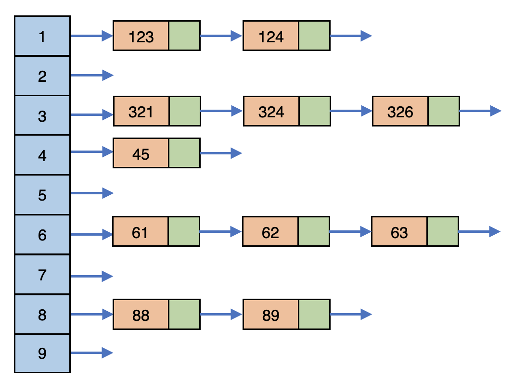

## 哈希表-引入问题及其实现
[top](#catalog)
- 需求
    - 有一个公司，当有新员工来报道时，需要添加员工的信息
    - 当输入员工id时，要求查找到该员工的所有信息
    - 不能使用数据库
    - 查询的速度越快越好
    - 添加时，按照id的属性，从低到高插入

- 需求实现
    - `Employee`
        - 用于保存某个员工信息
    - `EmpLinkedList`
        - 用链表保存多个员工信息，提供增删改查的基本功能
        - 没有头指针 head，每个结点都是一个有效的`Employee` 
    - `EmpHashTable`
        - 本身是一个数组，每个元素保存一个`EmpLinkedList`
        - 用户通过 `HashTable` 来操作内部的链表，需要提供对应的链表的功能
            - `put`， 增加元素
            - `list`，遍历链表的雇员信息
            - `get`，获取元素
            
        - 提供一个散列函数，来确定数据保存在哪个index下的链表中

- 实现代码
    - 参考代码
        - [/algorithm/src/java-algorithm/datastructure/src/main/java/com/ljs/learn/datastructure/hashtable/demo1/Employee.java](/algorithm/src/java-algorithm/datastructure/src/main/java/com/ljs/learn/datastructure/hashtable/demo1/Employee.java)
        - [/algorithm/src/java-algorithm/datastructure/src/main/java/com/ljs/learn/datastructure/hashtable/demo1/EmpLinkedList.java](/algorithm/src/java-algorithm/datastructure/src/main/java/com/ljs/learn/datastructure/hashtable/demo1/EmpLinkedList.java)
        - [/algorithm/src/java-algorithm/datastructure/src/main/java/com/ljs/learn/datastructure/hashtable/demo1/EmpHashTable.java](/algorithm/src/java-algorithm/datastructure/src/main/java/com/ljs/learn/datastructure/hashtable/demo1/EmpHashTable.java)
    - 链表结点
        ```java
        public class Employee {
            private String name;
            int id;
            Employee next;
        
            public Employee(int id, String name) {
                this.id = id;
                this.name = name;
            }
        
            // toString()
            // equals(Object o)
        }
        ```
    - 链表
        ```java
        public class EmpLinkedList {
            private Employee head;
        
            // 向链表中添加或修改元素
            public void add(Employee node) {
                if (head == null) {
                    head = node;
                } else {
                    Employee temp = head;
                    while (temp.next != null) {
                        temp = temp.next;
                    }
        
                    temp.next = node;
                }
            }
        
            // 遍历输出链表
            public void list() {
                if (head == null) return;
                Employee temp = head;
                while (temp != null) {
                    System.out.println(temp);
                    temp = temp.next;
                }
            }
        
            // 获取元素
            public Employee get(int id) {
                if (head == null) return null;
                Employee temp = head;
                while (temp != null) {
                    if (id == temp.id) {
                        return temp;
                    }
                }
        
                // 如果没有找到，则返回null
                return null;
            }
        }
        ```
    - 哈希表
        ```java
        public class EmpHashTable {
            // 数组的最大长度
            private int size;
            // 保存链表的数组
            private EmpLinkedList[] rows;
        
            public EmpHashTable(int size) {
                this.size = size;
                rows = new EmpLinkedList[size];
                // 创建数组后，初始化每个链表
                for (int i = 0; i < size; i++) {
                    rows[i] = new EmpLinkedList();
                }
            }
        
            // 提供一个hash函数，来将id映射为数组索引
            private int hash(int id) {
                return id % size;
            }
        
            // 添加元素
            public void add(Employee node) {
                // 确定添加到哪条链表中
                int idx = hash(node.id);
                // 执行添加
                rows[idx].add(node);
            }
        
            // 遍历元素，遍历每个链表
            public void list(){
                for (EmpLinkedList row : rows) {
                    row.list();
                }
            }
        
            // 获取元素，如果没有找到则返回 null
            public Employee get(int id){
                // 确定元素在哪条链表中
                int idx = hash(id);
                // 从链表中获取元素
                return rows[idx].get(id);
            }
        }
        ```

- 测试内容
    - 参考代码
        - [/algorithm/src/java-algorithm/datastructure/src/test/java/com/ljs/learn/datastructure/hashtable/demo1/EmpHashTableTest.java](/algorithm/src/java-algorithm/datastructure/src/test/java/com/ljs/learn/datastructure/hashtable/demo1/EmpHashTableTest.java)
    - 测试代码
        ```java
        // 添加测试
        @Test
        public void testAdd(){
            EmpHashTable empHashTable = new EmpHashTable(5);
            empHashTable.add(new Employee(1,"aaa"));
            empHashTable.add(new Employee(7,"erth"));
            empHashTable.add(new Employee(2,"sdf"));
            empHashTable.add(new Employee(3,"bbb"));
            empHashTable.add(new Employee(6,"ccc"));

            empHashTable.list();
            // 输出
            // Employee{name=aaa, id=1}
            // Employee{name=ccc, id=6}
            // Employee{name=erth, id=7}
            // Employee{name=sdf, id=2}
            // Employee{name=bbb, id=3}
        }

        // 查询测试
        @Test
        public void testGet(){
            EmpHashTable empHashTable = new EmpHashTable(5);
            empHashTable.add(new Employee(1,"aaa"));
            empHashTable.add(new Employee(7,"erth"));
            empHashTable.add(new Employee(2,"sdf"));
            empHashTable.add(new Employee(3,"bbb"));
            empHashTable.add(new Employee(6,"ccc"));

            assert empHashTable.get(2).equals( new Employee(2,"sdf") );

            assert empHashTable.get(4) == null;
        }
        ```

# 数据结构-树
## 树简介
[top](#catalog)
- 数组存储的优缺点
    - 优点
        - 通过下标方式访问元素，速度快
        - 对于有序数组，可以使用二分查找、插值查找的方法提高检索速度
    - 缺点
        - 如果要检索某个值，或者将数据插入到某个位置，会使数组部分元素产生移动，效率低
        - 如果数组容量不足，需要扩容
- 链式存储的优缺点
    - 优点
        - 优化了数组的存储方式，不需要扩容
        - 插入、删除的效率更高，只要修改next的执行即可
    - 缺点
        - 检索效率比较低，需要从头开始比较搜索
- 树存储
    - 树能够提高数据存储、读取的效率
    - 如果利用二叉排序树，既可以保证数据检索速度，又可以保证数据的插入、删除、修改速度

- 树的常用术语
    - 节点
    - 根节点
    - 父节点
    - 叶节点: 没有任何子节点的节点
    - 节点的权: 节点的值
    - 路径: 从根节点找到该节点的路线
    - 层
    - 子树
    - 树的高度: 树的最大层数
    - 森林: 多棵子树构成森林
- 树的示意图
    - 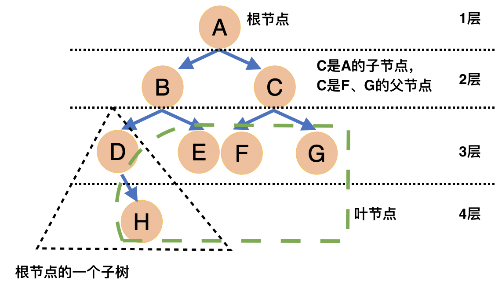

## 二叉树简介
[top](#catalog)
- 每个节点最多只能有两个子节点的树称为二叉树
- 二叉树的子节点分为：左子节点、右子节点
- 满二叉树
    - 所有叶子节点都在最后一层
    - 结点总数为 `2^n - 1`， n为层数
    - 示例
        - 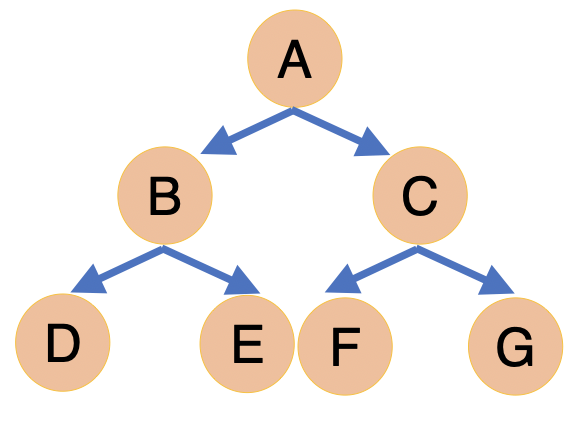
- 完全二叉树
    - 所有叶子结点都在最后一次或倒数第二层
    - 最后一层的叶子节点在左边**连续**
    - 倒数第二层的叶子结点在右边**连续**
    - 示例
        - 如果删除了F，会导致倒数第二层的右侧不连续，则不是完全二叉树
        - 如果删除了I，会导致倒数第一层的右侧不连续，则不是完全二叉树
        - 

## 二叉树遍历
### 二叉树的三种遍历
[top](#catalog)
- 3中遍历的顺序
    - 前序遍历
        - 输出: 父节点、左子树、右子树
    - 中序遍历
        - 输出: 左子树、父节点、右子树
    - 后序遍历
        - 输出: 左子树、右子树、父节点
- 遍历顺序主要看父节点什么时候遍历
- 3中遍历的步骤
    - 前序步骤
        1. 创建一个二叉树
        2. 输出当前结点
        3. 如果左子节点不为空，则递归，继续前序遍历
        4. 如果右子节点不为空，则递归，继续前序遍历
    - 中序步骤
        1. 创建一个二叉树
        2. 如果左子节点不为空，则递归，继续中序遍历
        3. 输出当前结点
        4. 如果右子节点不为空，则递归，继续中序遍历
    - 后序步骤
        1. 创建一个二叉树
        2. 如果左子节点不为空，则递归，继续后序遍历
        3. 如果右子节点不为空，则递归，继续后序遍历
        4. 输出当前结点

### 二叉树遍历的实现
[top](#catalog)
- 实现内容
    - 参考代码
        - [/algorithm/src/java-algorithm/datastructure/src/main/java/com/ljs/learn/datastructure/tree/binary/demo1/BinaryTree.java](/algorithm/src/java-algorithm/datastructure/src/main/java/com/ljs/learn/datastructure/tree/binary/demo1/BinaryTree.java)
        - [/algorithm/src/java-algorithm/datastructure/src/main/java/com/ljs/learn/datastructure/tree/binary/demo1/TreeNode.java](/algorithm/src/java-algorithm/datastructure/src/main/java/com/ljs/learn/datastructure/tree/binary/demo1/TreeNode.java)

    - 二叉树结点
        ```java
        public class TreeNode<T> {
            private T data;
            private TreeNode left;
            private TreeNode right;
        
            public TreeNode(T data) {
                this.data = data;
            }
        
            // 前序遍历
            public void preOrder() {
                System.out.println(this);
                if (this.left != null) {
                    this.left.preOrder();
                }
        
                if (this.right != null) {
                    this.right.preOrder();
                }
            }
        
            // 中序遍历
            public void infixOrder() {
                if (this.left != null) {
                    this.left.infixOrder();
                }
        
                System.out.println(this);
        
                if (this.right != null) {
                    this.right.infixOrder();
                }
            }
        
            // 后序遍历
            public void postOrder(){
                if(this.left != null){
                    this.left.postOrder();
                }
        
                if(this.right != null){
                    this.right.postOrder();
                }
        
                System.out.println(this);
            }
        
            @Override
            public String toString() {
                return data.toString();
            }
        
            // getter、setter
        }
        ```
    - 二叉树
        ```java
        public class BinaryTree<T> {
            private TreeNode<T> root; // 保存根结点
        
            public BinaryTree(TreeNode<T> root) {
                this.root = root;
            }
        
            // 启动前序遍历
            public void preOrder(){
                if (root == null) return ;
                root.preOrder();
            }
        
            // 启动中序遍历
            public void infixOrder(){
                if (root == null) return ;
                root.infixOrder();
            }
        
            // 启动后序遍历
            public void postOrder(){
                if (root == null) return ;
                root.postOrder();
            }
            // getter、setter
        }
        ```

- 测试内容
    - 参考代码
        - [/algorithm/src/java-algorithm/datastructure/src/test/java/com/ljs/learn/datastructure/tree/binary/demo1/BinaryTreeTest.java](/algorithm/src/java-algorithm/datastructure/src/test/java/com/ljs/learn/datastructure/tree/binary/demo1/BinaryTreeTest.java)
    - 测试代码
        ```java
        public static BinaryTree<Integer> tree;
        static {
            /** 创建一个二叉树
             *       1
             *     2   3
             *   4       5
             */
            TreeNode<Integer> node1 = new TreeNode<>(1);
            TreeNode<Integer> node2 = new TreeNode<>(2);
            TreeNode<Integer> node3 = new TreeNode<>(3);
            TreeNode<Integer> node4 = new TreeNode<>(4);
            TreeNode<Integer> node5 = new TreeNode<>(5);
            node1.setLeft(node2);
            node1.setRight(node3);
            node2.setLeft(node4);
            node3.setRight(node5);
    
            tree = new BinaryTree<>(node1);
        }
        @Test
        public void preOrder() {
            tree.preOrder();
            // 输出: 1 2 4 3 5
        }
    
        @Test
        public void infixOrder() {
            tree.infixOrder();
            //输出: 4 2 1 3 5
        }
    
        @Test
        public void postOrder() {
            tree.postOrder();
            //输出: 4 2 5 3 1
        }
        ```

## 二叉树查找
[top](#catalog)
- 实现内容
    - 参考代码
        - [/algorithm/src/java-algorithm/datastructure/src/main/java/com/ljs/learn/datastructure/tree/binary/demo1/TreeNode.java](/algorithm/src/java-algorithm/datastructure/src/main/java/com/ljs/learn/datastructure/tree/binary/demo1/TreeNode.java)
        - [/algorithm/src/java-algorithm/datastructure/src/main/java/com/ljs/learn/datastructure/tree/binary/demo1/BinaryTree.java](/algorithm/src/java-algorithm/datastructure/src/main/java/com/ljs/learn/datastructure/tree/binary/demo1/BinaryTree.java)
    - 遍历查找
        ```java
        public class TreeNode<T> {
            // 前序查找
            public T preOrderSearch(T findVal) {
                // 1. 与当前结点比较，相同则返回
                if (this.data.equals(findVal)) {
                    return this.data;
                }
        
                T temp = null;
                // 2. 判断左子树是否为空，不为空，则向左递归前序遍历
                if (this.left != null) {
                    temp = (T) this.left.preOrderSearch(findVal);
        
                    // 如果找到则返回
                    if (temp != null) return temp;
                }
        
                // 3. 如果左边没找到，则判断右子树是否为空，不为空则向右递归前序遍历
                if (this.right != null) {
                    temp = (T) this.right.preOrderSearch(findVal);
                }
        
                // 4. 不对结果进行判断，直接返回，有上一层的遍历来进行判断
                return temp;
            }
        
            // 中序查找
            public T infixOrderSearch(T findVal) {
                T temp = null;
        
                // 1. 判断左子树是否为空，不为空则向左递归遍历
                if (this.left != null) {
                    temp = (T) this.left.infixOrderSearch(findVal);
        
                    // 如果找到则返回
                    if (temp != null) return temp;
                }
        
                // 2. 与当前结点比较，相同则返回
                if (this.data.equals(findVal)) {
                    return this.data;
                }
        
                // 3. 判断右子树是否为空，不为空则向右递归遍历
                if (this.right != null) {
                    temp = (T) this.right.infixOrderSearch(findVal);
                }
        
                // 4. 不对结果进行判断，直接返回，有上一层的遍历来进行判断
                return temp;
            }
        
            // 后续查找
            public T postOrderSearch(T findVal) {
                T temp = null;
        
                // 1. 判断左子树是否为空，不为空则向左递归遍历
                if (this.left != null) {
                    temp = (T) this.left.postOrderSearch(findVal);
        
                    // 如果找到则返回
                    if (temp != null) return temp;
                }
        
                // 2. 判断右子树是否为空，不为空则向右递归遍历
                if (this.right != null) {
                    temp = (T) this.right.postOrderSearch(findVal);
        
                    // 如果找到则返回
                    if (temp != null) return temp;
                }
        
                // 3. 与当前结点比较，相同则返回
                if (this.data.equals(findVal)) {
                    return this.data;
                } else {
                    // 不同则直接返回null
                    return null;
                }
            }
        }
        ```
    - 启动查找
        ```java
        public class BinaryTree<T> {
            private TreeNode<T> root; // 保存根结点
            // 启动前序查找
            public T preOrderSearch(T findVal){
                if (root == null) return null;
                return root.preOrderSearch(findVal);
            }
            // 启动中序查找
            public T infixOrderSearch(T findVal){
                if (root == null) return null;
                return root.infixOrderSearch(findVal);
            }
            // 启动后序查找
            public T postOrderSearch(T findVal){
                if (root == null) return null;
                return root.postOrderSearch(findVal);
            }
        }
        ```

- 测试代码
    - 参考代码
        - [/algorithm/src/java-algorithm/datastructure/src/test/java/com/ljs/learn/datastructure/tree/binary/demo1/BinaryTreeTest.java](/algorithm/src/java-algorithm/datastructure/src/test/java/com/ljs/learn/datastructure/tree/binary/demo1/BinaryTreeTest.java)
    - 测试代码
        ```java
        // 前序查找测试
        @Test
        public void preOrderSearch(){
            assert tree.preOrderSearch(5) == 5;
            assert tree.preOrderSearch(6) == null;
        }
    
        // 中序查找测试
        @Test
        public void infixOrderSearch(){
            assert tree.infixOrderSearch(5) == 5;
            assert tree.infixOrderSearch(6) == null;
        }
    
        // 后序查找测试
        @Test
        public void postOrderSearch(){
            assert tree.postOrderSearch(5) == 5;
            assert tree.postOrderSearch(6) == null;
        }
        ```

## 二叉树删除结点
[top](#catalog)
- 删除结点的要求
    1. 如果删除的结点是叶子结点，则删除该结点
    2. 如果删除的结点是非叶子结点，则删除该子树

- 需要判断**当前结点的子节点**是否需要删除
    - 不直接使用当前结点判断的原因
        - 因为二叉树是单向的，删除当前结点时无法找到父结点，所以不能直接通过当前结点来判断
    - 即判断: 当前结点的左子节点和右子节点是否需要删除

- 实现思路
    1. 如果是空树，则跳过
    2. 检查root结点，如果 `root结点 == findVal`，则将二叉树置空
    3. 开始递归删除
    4. 如果: `左子节点 != null`，并且`左子节点 == findVal`，删除左子节点
       - 即: 设左子节点为空 `this.left=null`
       - 删除后，结束递归
    5. 如果: `右子节点 != null`，并且`右子节点 == findVal`，删除右子节点
       - 即: 设右子节点为空 `this.right=null`
       - 删除后，结束递归
    6. 如果没有找到目标结点，并且 `左子节点 != null`，继续向左递归删除
    7. 如果左递归删除没有成功，并且 `右子节点 != null`，继续向右递归删除

- 实现内容
    - 参考代码
        - [/algorithm/src/java-algorithm/datastructure/src/main/java/com/ljs/learn/datastructure/tree/binary/demo1/BinaryTree.java](/algorithm/src/java-algorithm/datastructure/src/main/java/com/ljs/learn/datastructure/tree/binary/demo1/BinaryTree.java)
        - [/algorithm/src/java-algorithm/datastructure/src/main/java/com/ljs/learn/datastructure/tree/binary/demo1/TreeNode.java](/algorithm/src/java-algorithm/datastructure/src/main/java/com/ljs/learn/datastructure/tree/binary/demo1/TreeNode.java)
    - 树启动删除结点， `BinaryTree.java`
        ```java
        public void delNode(int findVal){
            // 1. 如果是空树，则跳过
            if (root == null) {
                return ;
            } else if ( root.getData().equals(findVal)){
                // 2. 检查root结点，如果 `root结点 == findVal`，则将二叉树置空
                root = null;
            } else {
                root.delNode(findVal);
            }
        }
        ```
    - 结点删除，`TreeNode.java`
        ```java
        public void delNode(int findVal){
            // 1. 如果: `左子节点 != null`，并且`左子节点 == findVal`，删除左子节点
            if (this.left != null && this.left.getData().equals(findVal)){
                this.left = null;
            }
    
            // 2. 如果: `右子节点 != null`，并且`右子节点 == findVal`，删除右子节点
            if (this.right != null && this.right.getData().equals(findVal)){
                this.right = null;
            }
    
            // 3. 如果没有找到目标结点，并且 `左子节点 != null`，继续向左递归删除
            if (this.left != null){
                this.left.delNode(findVal);
            }
            // 4. 如果左递归删除没有成功，并且 `右子节点 != null`，继续向右递归删除
            if (this.right != null){
                this.right.delNode(findVal);
            }
        }
        ```
- 测试内容
    - 参考代码
        - [/algorithm/src/java-algorithm/datastructure/src/test/java/com/ljs/learn/datastructure/tree/binary/demo1/BinaryTreeTest.java](/algorithm/src/java-algorithm/datastructure/src/test/java/com/ljs/learn/datastructure/tree/binary/demo1/BinaryTreeTest.java)
    - 测试代码
        ```java
        @Test
        public void delNode(){
            tree.preOrder();
            // 输出: 1 2 4 3 5 6
    
            // 删除结点
            tree.delNode(5);
    
            System.out.println("------");
    
            tree.preOrder();
            // 输出: 1 2 4 3 6
        }
        ```

## 顺序存储二叉树
[top](#catalog)
- 数组存储方式和树的存储方式可以相互转换
    - 数组可以转换成树
    - 树可以转换成数组
- 顺序存储二叉树的要求
    - 遍历数组时，仍然可以以前序遍历、中序遍历、后序遍历的方式遍历
- 顺序存储二叉树示例
    - 
- <label style='color:red'>顺序存储的特点</label>
    - 顺序二叉树通常只考虑完全二叉树
    - n表示二叉树中的第几个元素。从 0 开始，与数组保持一直
    - 第n个元素的左子节点为: `2 * n + 1`
    - 第n个元素的右子节点为: `2 * n + 2`
    - 第n个元素的父节点为: `( n -1 ) / 2`

- 实现内容
    - 参考代码
        - [/algorithm/src/java-algorithm/datastructure/src/main/java/com/ljs/learn/datastructure/tree/binary/arrbinary/ArrayBinaryTree.java](/algorithm/src/java-algorithm/datastructure/src/main/java/com/ljs/learn/datastructure/tree/binary/arrbinary/ArrayBinaryTree.java)
    - 代码内容
        ```java
        /**
        * 启动前序遍历
        */
        public void preOrder(){
            // 如果数组为空，或者 arr.length = 0，则退出
            if(array == null || array.length == 0){
                System.out.println("null array");
                return;
            }
            this.preOrder(0);
        }

        /** 完成顺序存储二叉树的前序遍历
        * @param index 数组下标
        */
        public void preOrder(int index){
            // 1. 输出当前的元素
            System.out.println(array[index]);

            // 2. 向左递归遍历，需要防止越界
            if ((index * 2 + 1) < this.array.length){
                preOrder(index * 2 + 1);
            }

            // 3. 向右递归遍历，需要防止越界
            if ((index * 2 + 2) < this.array.length){
                preOrder(index * 2 + 2);
            }
        }
        ```
- 测试内容
    - 参考代码
        - [/algorithm/src/java-algorithm/datastructure/src/test/java/com/ljs/learn/datastructure/tree/binary/arrbinary/ArrayBinaryTreeTest.java](/algorithm/src/java-algorithm/datastructure/src/test/java/com/ljs/learn/datastructure/tree/binary/arrbinary/ArrayBinaryTreeTest.java)
    - 测试代码
        ```java
        @Test
        public void preOrder() {
            ArrayBinaryTree tree = new ArrayBinaryTree(new int[]{1, 2, 3, 4, 5, 6, 7});
            tree.preOrder();
            // 输出: 1 2 4 5 3 6 7
        }
        ```

## 线索化二叉树
### 线索化二叉树--引入问题
[top](#catalog)
- 将数组 `[1, 3, 6, 8, 10, 14]` 构建成一颗二叉树
    - 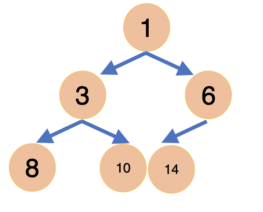

- 该二叉树的问题
    - 二叉树的终须遍历结果为: `8 3 10 1 14 6`
    - 6，8，10，14 这几个结点的左右指针没有完全利用
    - 如果充分利用各个结点的左右指针，让各个结点指向自己的前后结点？
        - 使用线索二叉树

### 线索化二叉树简介
[top](#catalog)
- n个结点的二叉链表中含有 `n+1`个空指针域
    - 计算公式: `2n - (n - 1)`
        - `2n` 表示所有的结点一共有`2n`个指针（左指针 + 右指针）
        - `n - 1` 表示已经使用的指针个数
- 什么是线索?
    - 利用二叉树链表中的空指针域，存放指向该结点在**某种遍历方式**下的前驱和后继结点的指针
    - 这种附加的指针称为**线索**

- 附加了线索的二叉树称为**线索链表**，相应的二叉树称为**线索二叉树**
- 根据不同的线索性质，线索二叉树可以分为
    - 前序二叉树
    - 中序二叉树
    - 后序二叉树

### 树结点线索化的实现
[top](#catalog)
- 线索化示例-中序线索化二叉树
    - 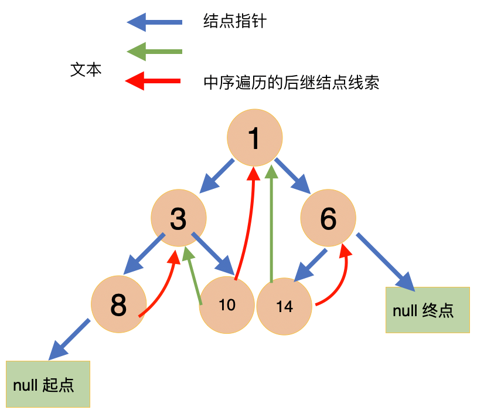

- 线索化时的问题
    - left指针
        - 指向的可能是左子树，也可能指向前驱结点
    - right指针
        - 指向的可能是右子树，也可能是后继结点
    - 需要一个指针指向当前结点的前一个结点，才能创建结点之间的关系

- 实现内容
    - 参考代码
        - [/algorithm/src/java-algorithm/datastructure/src/main/java/com/ljs/learn/datastructure/tree/binary/threaded/ThreadedBinaryTree.java](/algorithm/src/java-algorithm/datastructure/src/main/java/com/ljs/learn/datastructure/tree/binary/threaded/ThreadedBinaryTree.java)
        - [/algorithm/src/java-algorithm/datastructure/src/main/java/com/ljs/learn/datastructure/tree/binary/threaded/ThreadedNode.java](/algorithm/src/java-algorithm/datastructure/src/main/java/com/ljs/learn/datastructure/tree/binary/threaded/ThreadedNode.java)
    - 树结点 `ThreadedNode.java`
        ```java
        // 中序遍历线索二叉树结点
        public class ThreadedNode<T>{
            T data;
            ThreadedNode<T> left;
            ThreadedNode<T> right;
        
            // leftType == 0 表示指向的是左子树
            // leftType == 1 表示指向的中序遍历的前驱结点
            int rightType;
            // rightType == 0 表示指向的是右子树
            // rightType == 1 表示指向的中序遍历的后继结点
            int leftType;
        
            public ThreadedNode(T data) {
                this.data = data;
            }
        
            // 其他代码
            // ...
        }
        ```
    - 树 `ThreadedBinaryTree.java`
        ```java
        public class ThreadedBinaryTree<T> {
            private ThreadedNode<T> root;
        
            // 为了实现线索化，需要创建指向当前结点的前驱结点的指针
            // 在递归进行线索化时，总是保存前一个结点
            private ThreadedNode<T> pre = null;
        
            public ThreadedBinaryTree(ThreadedNode<T> root) {
                this.root = root;
            }
        
            // 启动二叉树中序线索化
            public void infixThreadedNodes(){
                this.infixThreadedNodes(root);
            }
        
            /**
             * 对二叉树进行中序线索化
             * @param node 需要线索化的结点
             */
            public void infixThreadedNodes(ThreadedNode<T> node){
                // 如果是空结点，则跳过
                if (node == null) return ;
        
                // 1. (递归的)线索化左子树
                infixThreadedNodes(node.left);
        
                // 2. 线索化当前结点
                // 2.1 处理【当前结点】的前驱结点
                // 如果当前结点的左结点为空，则线索化
                if (node.left == null){
                    // 让当前结点的左指针指向前驱结点
                    node.left = pre;
                    // 设置左指针的类型为线索
                    node.leftType = 1;
                }
        
                // 2.2 处理【前驱结点】的后继结点（因为当前结点无法处理后继结点，所以放在再一次迭代中处理）
                // 如果前驱结点的右结点为空，则线索化
                // 需要防止第一次为空
                if (pre != null && pre.right == null){
                    // 将前驱结点的右结点设置为当前结点
                    pre.right = node;
                    pre.rightType = 1;
                }
        
                // 每处理一个个结点后，将前驱结点更新为当前结点
                pre = node;
        
                // 3. (递归的)线索化右子树
                infixThreadedNodes(node.right);
            }
        }
        ```

- 测试内容
    - 参考代码
        - [/algorithm/src/java-algorithm/datastructure/src/test/java/com/ljs/learn/datastructure/tree/binary/threaded/ThreadedBinaryTreeTest.java](/algorithm/src/java-algorithm/datastructure/src/test/java/com/ljs/learn/datastructure/tree/binary/threaded/ThreadedBinaryTreeTest.java)
    - 测试代码
        ```java
        @Test
        public void infixThreadedNodes() {
            // 创建二叉树 [1, 3, 6, 8, 10, 14]
            ThreadedNode<Integer> node1 = new ThreadedNode<>(1);
            ThreadedNode<Integer> node3 = new ThreadedNode<>(3);
            ThreadedNode<Integer> node6 = new ThreadedNode<>(6);
            ThreadedNode<Integer> node8 = new ThreadedNode<>(8);
            ThreadedNode<Integer> node10 = new ThreadedNode<>(10);
            ThreadedNode<Integer> node14 = new ThreadedNode<>(14);
    
            node1.left = node3;
            node1.right = node6;
            node3.left = node8;
            node3.right = node10;
            node6.left = node14;
    
            ThreadedBinaryTree<Integer> tree = new ThreadedBinaryTree<>(node1);
    
            //执行线索化
            tree.infixThreadedNodes();
    
            assertEquals( node10.left, node3);
            assertEquals( node10.right, node1);
    
            assertEquals( node14.left, node1);
            assertEquals( node14.right, node6);
    
            // 中序遍历时 8 第一个执行线索化，pre = null，
            assertEquals(node8.left, null);
            assertEquals(node8.right, node3);
        }
        ```

### 线索化二叉树的遍历
[top](#catalog)
- 线索化后，各个结点相互关联，用原来的方式遍历会导致死循环
- 线索化二叉树的遍历方法
    - 各个结点通过线性方式遍历
    - 不需要使用递归，有更高的遍历效率
    - 遍历的次序需要和线索化顺序保持一致
    
- 实现内容
    - 参考代码
        - [/algorithm/src/java-algorithm/datastructure/src/test/java/com/ljs/learn/datastructure/tree/binary/threaded/ThreadedBinaryTreeTest.java](/algorithm/src/java-algorithm/datastructure/src/test/java/com/ljs/learn/datastructure/tree/binary/threaded/ThreadedBinaryTreeTest.java)
    - 实现代码
        ```java
        // 遍历中序线索化二叉树
        public void infixThreadedList(){
            // 存储当前遍历的结点，从root开始
            ThreadedNode<T> node = root;
            
            // 当 node == null 时，即遍历到终点 
            while (node != null){
                // 1. 循环找到leftType == 1的结点
                while (node.leftType == 0) node = node.left;
    
                // 打印当前结点
                System.out.println(node);
    
                // 如果当前结点的右指针指向的是后继结点，就一直输出
                while(node.rightType == 1){
                    node = node.right;
                    System.out.println(node);
                }
    
                // 更新结点
                node = node.right;
            }
        }
        ```

# 数据结构-堆
## 堆简介
[top](#catalog)
- 堆是具有以下性质的完全二叉树
    - 大顶堆
        - 每个结点的值都大于或等于其左右子节点的值
        - 左右子节点的大小没有特殊要求
    - 小顶堆
        - 每个结点的值都小于或等于其左右子节点的值
        - 左右子节点的大小没有特殊要求

- 堆的底层使用**顺序存储二叉树**来保存数据，即数组

- 大顶堆
    - 大顶堆的特点
        - `arr[i] >= arr[2 * i + 1] && arr[i] >= arr[2 * i + 2]`
    - 大顶堆示例
        - 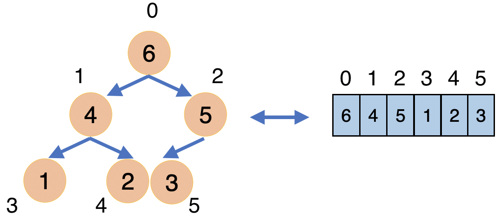
- 小顶堆
    - 小顶堆的特点
        - `arr[i] <= arr[2 * i + 1] && arr[i] <= arr[2 * i + 2]`
    - 小顶堆示例
        - 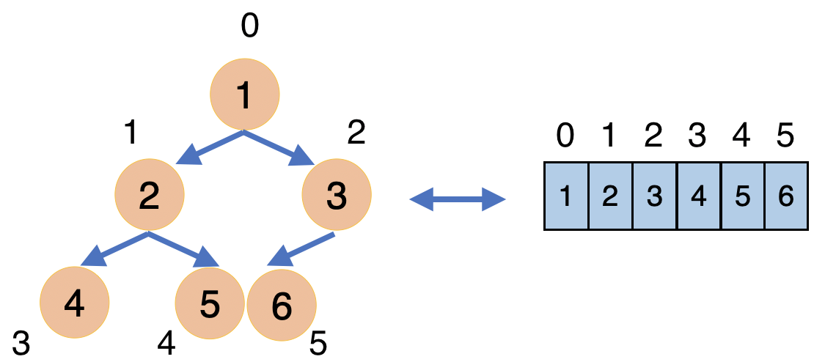

## 构建大顶堆的方法
[top](#catalog)
- 构建方法
    1. 使用给定的序列作为树结构
    2. 计算非叶子结点
        - 非叶子结点的个数: `arr.length  / 2`
        - 最后一个非叶子结点的索引: `arr.length  / 2 - 1`
    3. 从**最后一个非叶子**结点开始，按照从后往前的顺序，直到根结点，对每个子树进行构建
        1. 检查左子节点和右子节点哪个更大，并获取最大值 `max`
            - 如果已经没有有结点，则左结点为 `max`
        2. 将 `max` 与非叶子结点的值进行比较
        3. 如果非叶子结点较小
            - 交换非叶子结点与子节点的数据
            - 将构建的目标从当前结点移动到子节点
            - 判断子节点是否为叶子节点（子节点的结点索引是否已经超过底层数组的索引范围）
                - 如果不是叶子节点从 3.1 开始重新循环
                - 如果是叶子结点，则停止循环，当前的子树构建完成
        4. 如果 `max` 较小
            - 说明子树都已有序，停止循环，当前的子树构建完成
        5. 对前一个非叶子结点执行循环

- 构建示例，将 `[1, 2, 3, 4, 5, 6, 7, 8, 9, 10, 11]` 构建为大顶堆
    - 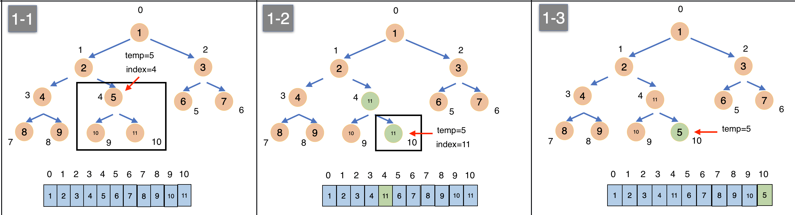
    - 
    - 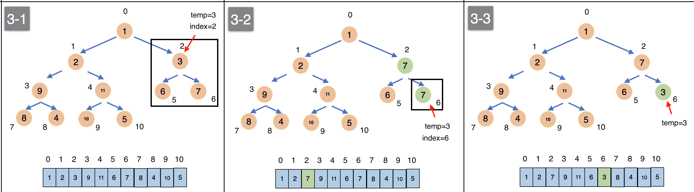
    - 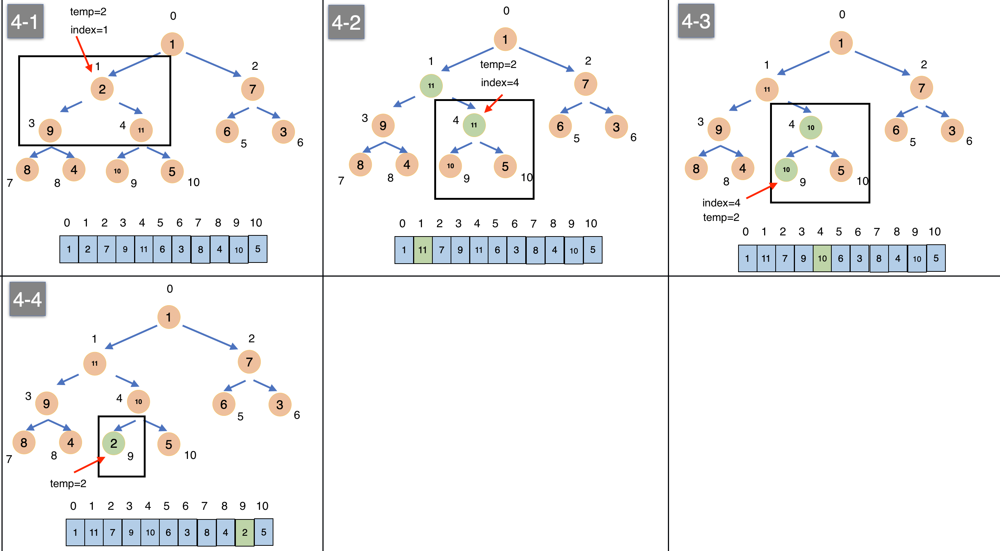
    - 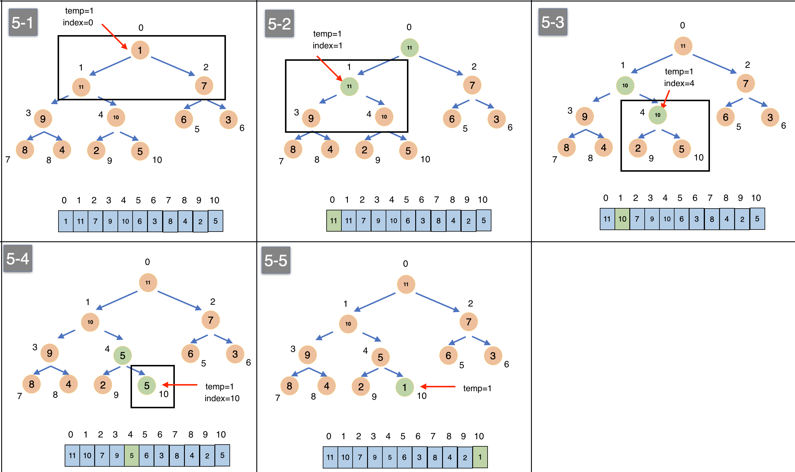

## 构建大顶堆的实现
[top](#catalog)
- 实现内容
    - 参考内容
        - [/algorithm/src/java-algorithm/datastructure/src/main/java/com/ljs/learn/datastructure/heap/MaxHeap.java](/algorithm/src/java-algorithm/datastructure/src/main/java/com/ljs/learn/datastructure/heap/MaxHeap.java)
    - 实现代码
        ```java
        /** 1. 启动大顶堆的构建，构建整个树
        * 
        * @param array 需要构建大顶堆的数组
        */
        public static void adjustHeap(int[] array){
            adjustHeap(array, array.length);
        }

        /** 2. 启动大顶堆的构建，可以部分构建
        *
        * @param array 需要构建大顶堆的数组
        * @param length 构建的最大长度，可以设置只将树的一部分构建为大顶堆
        */
        public static void adjustHeap(int[] array, int length){
            // 1. 计算最后一个非叶子结点的索引
            int lastNoLeafNodeIdx = array.length / 2 - 1;

            // 2. 从后向前遍历所有非叶子结点
            for (int i = lastNoLeafNodeIdx; i >= 0 ; i--) {
                adjustHeapForSubTree(array, i, length);
            }
        }

        /**
        * 3. 将 i 结点开始的子树调整为一个大顶堆
        * @param array 待调整的数组
        * @param i   表示非叶子结点在数组中的索引
        * @param length 对多少个元素进行调整
        */
        public static void adjustHeapForSubTree(int array[], int i, int length){
            // 1. 取出当前非叶子结点的值，并保存。在整体调整完成之后，设置到最终的索引处
            int temp = array[i];

            // 2. 开始调整
            // 从当前结点的左结点开始
            for (int k = i*2+1; k<length; k=k*2+1){
                // 2.1 如果还有右子节点，并且右子节点更大，将k指向右子节点
                // 否则使用左结点
                if (k+1<length && array[k] < array[k+1]){
                    k++;
                }

                // 2.2 如果子节点大于  temp，交换位置
                if (array[k] > temp){
                    array[i] = array[k];
                    i=k;
                } else {
                    // 否则，整个子树已经是大顶堆，退出构建
                    break;
                }
            }

            // 3. 以i为父节点子树构建完成，将temp保存到调整后的位置
            array[i] = temp;
        }
        ```

- 测试内容
    - 测试代码
        - [/algorithm/src/java-algorithm/datastructure/src/test/java/com/ljs/learn/datastructure/heap/MaxHeapTest.java](/algorithm/src/java-algorithm/datastructure/src/test/java/com/ljs/learn/datastructure/heap/MaxHeapTest.java)
    - 测试内容
        ```java
        // 测试整个树的大顶堆构建
        @Test
        public void adjustHeap() {
            int[] array = {1, 2, 3, 4, 5, 6, 7, 8, 9, 10, 11};
            MaxHeap.adjustHeap(array);
            int[] result = {11, 10, 7, 9, 5, 6, 3, 8, 4, 2, 1};

            assertArrayEquals(array, result);
        }

        // 测试子树部分的大顶堆构建
        @Test
        public void adjustHeapForSubTree() {
            int[] array = {1, 2, 3, 4, 5, 6, 7, 8, 9, 10, 11};
            // 计算最后一个非叶子结点的索引
            int lastNoLeafNodeIdx = array.length / 2 - 1;
            MaxHeap.adjustHeapForSubTree(array, lastNoLeafNodeIdx, array.length);

            int[] result = {1, 2, 3, 4, 11, 6, 7, 8, 9, 10, 5};

            assertArrayEquals(array, result);
        }
        ```

# 数据结构-霍夫曼树
## 霍夫曼树简介
[top](#catalog)
- 霍夫曼树也称为**最优二叉树**
- 霍夫曼树中的几个概念
    - 路径
        - 在一颗树中，从一个结点往下可以到达的其他结点之间的通路，称为路径
    - 路径长度
        - 从结点到目标结点的层数差
        - 如果根结点的层数为1，从根结点到第L层结点的路径长度为`L-1`
    - 结点的权
        - 如果结点中有某种含义的数值，则称这个数值为该结点的权
    - 结点带权路径长度
        - 从**根结点**到目标结点之间的路径长度与该结点权的乘积
        - 示例
            - 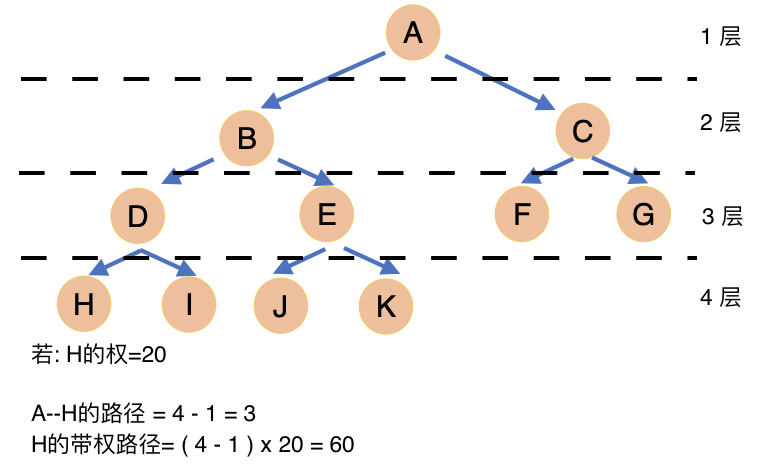
    - 树的带权路径（WPL，weighted path length）
        - 所有**叶子结点**的带权路径长度之和
        - 示例
            - 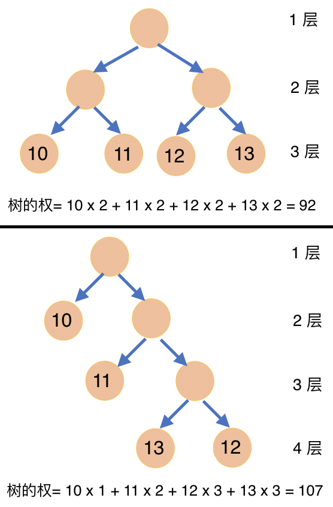
        
- 什么是霍夫曼树
    - 构造一颗二叉树，给定n个权值作为n个叶子结点的权
    - 若该树的**带权路径长度（WPL）**达到最小，则称为霍夫曼树
- 霍夫曼树的特点
    - 树的带权路径最小的树
    - **所有权值较大**的结点离根较近
        - 只有权值较大的结点靠近根结点时，与路径长度乘积后的值才不会被过度放大
- 霍夫曼树与非霍夫曼树的对比
    - 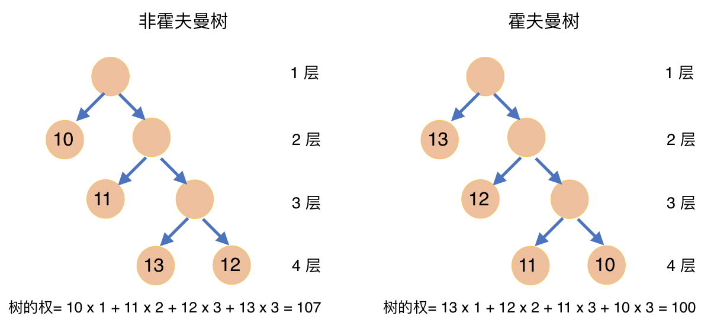

## 霍夫曼树的构建方法
[top](#catalog)
- 构造霍夫曼树的步骤
    1. 序列预处理
        - 对序列**升序排序**
        - 序列的每个元素视为一个结点
        - 每个元素可以视作一颗最简单的二叉树
    2. 取出根结点权值最小的两个二叉树，即排序后的第一、第二个元素
    3. 将两个权值最小的二叉树组成一颗新的二叉树
        - 新二叉树的根结点是前两个二叉树根结点权值的和
    4. 将新的二叉树的**根结点**放入序列，再次对序列做升序排列
    5. 重复 1--4，直到所有数据都被处理，就得到一颗霍夫曼树

- 构造示例
    - 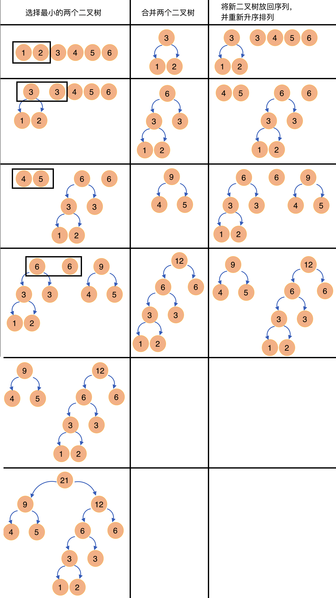

- 注意事项
    - 构建霍夫曼树时，不同的排序方法最终得到的树结构可能不同
        - 尤其是多个字符的权值相同时，使用稳定排序和非稳定排序的结果将会不同
    - 虽然树结构不同，但是**带权路径长度（WPL）**最终仍然是相同的
## 霍夫曼树的实现
[top](#catalog)
- 实现内容
    - 参考代码
        - [/algorithm/src/java-algorithm/datastructure/src/main/java/com/ljs/learn/datastructure/tree/huffman/HuffmanNode.java](/algorithm/src/java-algorithm/datastructure/src/main/java/com/ljs/learn/datastructure/tree/huffman/HuffmanNode.java)
        - [/algorithm/src/java-algorithm/datastructure/src/main/java/com/ljs/learn/datastructure/tree/huffman/HuffmanTree.java](/algorithm/src/java-algorithm/datastructure/src/main/java/com/ljs/learn/datastructure/tree/huffman/HuffmanTree.java)
    - 树的结点
        ```java
        // 为了能够对结点排序，需要实现 Comparable 接口
        public class HuffmanNode implements Comparable<HuffmanNode> {
            int weight; //结点的权值
            HuffmanNode left;
            HuffmanNode right;
        
            @Override
            public int compareTo(HuffmanNode o) {
                return this.weight - o.weight;
            }
        }
        ```
    - 构建树
        ```java
        public static HuffmanNode createTree(int[] array) {
            // 将数组转换为结点数组
            List<HuffmanNode> nodes = new ArrayList<>(array.length);
            for (int i : array) {
                nodes.add(new HuffmanNode(i));
            }
    
            while (nodes.size() > 1) {
                // 1. 将结点数组进行排序（升序）
                Collections.sort(nodes);
    
                // 2. 抽取最小的两个结点，并从数组中删除
                HuffmanNode left = nodes.get(0);
                HuffmanNode right = nodes.get(1);
    
                // 3. 使用两个最小结点创建新的树
                HuffmanNode newNode = new HuffmanNode(left.weight + right.weight);
                newNode.left = left;
                newNode.right = right;
    
                // 4. 将新的树保存到数组中
                // 4.1 方式1，将树设置到index=1的位置直接替换旧的树。然啊后删除index=0的树
                nodes.set(1, newNode);
                nodes.remove(0);
                // 4.2 方式2，删除第一个和第二个元素，然后将新的树添加到数组末尾
                // nodes.remove(left);
                // nodes.remove(right);
                // nodes.add(newNode);
    
                // 5. 重新循环：排序-->抽最小的两个值-->创建树-->保存树
                // 直到数组中只剩下一个元素
            }
    
            return nodes.get(0);
        }
        ```
- 测试内容
    - 参考代码
        - [/algorithm/src/java-algorithm/datastructure/src/test/java/com/ljs/learn/datastructure/tree/huffman/HuffmanTreeTest.java](/algorithm/src/java-algorithm/datastructure/src/test/java/com/ljs/learn/datastructure/tree/huffman/HuffmanTreeTest.java)
    - 测试代码
        ```java
        @Test
        public void createTree() {
            // 创建树并指向前序遍历
            int[] array = {1,2,3,4,5,6};
            HuffmanNode tree = HuffmanTree.createTree(array);
    
            tree.preOrder();
            // 21 9 4 5 12 6 3 1 2 3 6
        }
        ```

# 霍夫曼编码
## 霍夫曼编码简介
[top](#catalog)
- 霍夫曼编码是在电讯通信中的经典应用之一
- 霍夫曼编码广泛的应用与数据文件压缩，压缩率通常在 20%～90%之间
- 霍夫曼编码是可变字长编码（VLC）的一种，也称为最佳编码

## 前缀编码
[top](#catalog)
- 什么是前缀编码？
    - 即字符的编码都不能是其他字符的前缀，不会造成匹配的二意性

## 通信领域中信息的处理方式
[top](#catalog)
- 定长编码
    - 编码方式
        - 将所有信息分解为字符，包括空格，然后将字符转换为ASCII码
    - 缺点
        - 转换后的数据过长，1个字符需要1byte的容量来存储
- 变长编码
    - 编码方式
        - 将每个字符用不同的 1、0组合来表示，然后按照字符出现的顺序进行表示
        - 字符编码的原则: 出现次数越多的字符，编码越小
        - 示例
            - 数据: `i like java`
            - 每个字符的值
                - 0 = 空格
                - 1 = a
                - 10 = i
                - 11 = e
                - 100 = k
                - 101 = l
                - 110 = j
                - 111 = v
            - 数据编码: 
                ```
                10 0   101 10 100 11 0   110 1 111 1
                 i " " l   i  k   e  " "  j  a  v  a
              
                1001011010011011011111
                ```
        - 缺点
            - 不是前缀编码，如 `10 = i`，`100 = k`，i的编码是k编码的前缀
            - 在解码时，无法准确的划分编码，容易造成解码错误
                - 如 `like` 的编码是: `101 10 100 11`
                - 也可以划分为: `10 110 100 11` ,即 ivke

- 霍夫曼编码

## 霍夫曼编码的原理
[top](#catalog)
- 霍夫曼编码的特点
    - 霍夫曼编码是**前缀编码**，解码时不会有二意性
    - 无损压缩
- 编码原理
    1. 统计数据中各个字符出现的次数
    2. 按照字符出现的次数构建一个霍夫曼树，次数作为权值
    3. 根据霍夫曼树，给各个字符设定编码
        - 编码规则，向左为0，向右为1
    4. 然后按照霍夫曼编码，编码整个数据
    5. 编码后每8个 0、1 组成一个字节，然后整体发送给
- 注意事项
    - 构建霍夫曼树时，不同的排序方法最终得到的树结构可能不同
        - 尤其是多个字符的权值相同时，使用稳定排序和非稳定排序的结果将会不同
    - 编码长度总是相同的
        - 树结构可能不同，但是**带权路径长度（WPL）**总是相同的
        - 因为WPL相同，所以字符编码可能不同，但是最终的到的编码总长是相同的

## 霍夫曼编码的编码过程
[top](#catalog)
- 霍夫曼树结点需要保存的数据
    - 权值: 字符出现的次数
    - data: 字符
- 编码过程
    1. 通过数据构建霍夫曼树
        1. 将数据转化为字节数组 `byte[]`
        2. 统计字符及字符个数
        3. 根据统计结果，创建树的结点
        4. 将所有结点保存在一个数组中，然后构建霍夫曼树
    2. 根据树生成霍夫曼编码表
        1. 使用`Map<Byte, String>` 的形式保存编码表
            - Byte 表示字符
            - String 表示字符对应的编码
        2. 遍历树，生成编码表
        3. 遍历过程中，使用一个字符串来存储**叶子节点**的路径
            - 如果数据是`null`，是非叶子结点，需要继续递归
            - 如果数据不是`null`，是叶子结点，需要保存到编码表中
    3. 根据编码表压缩数据
        1. 按照编码表将数据的每个字符编码，并组成一个**编码字符串**（字符串中只有0、1）
        2. 从左到右，按照8位一个byte，将字符串转换位byte数组
            - 每8位都是**补码**。需要 `-1，再取反，转化成源码
            - 每次截取字符串时，需要检查是否越界
        3. 计算转换后的byte数组的长度
            - 计算方法: `( 编码字符串 + 7 ) / 8`
    4. 将压缩后的 byte 数组返回

- 注意事项
    - 需要保存编码后的编码字符串的长度，防止在解码时，最后不足 8 位时，丢位的情况
        - 如编码字符串最后剩余5位: `00100`
        - 解码时，从byte转换会string时，会变成 `100`
        - 所以需要保存编码字符串的长度，在最后不足八位时，进行补位

## 霍夫曼编码的解码过程
[top](#catalog)
- 需要使用编码后的字节数组，参照编码表来解码
- 解码过程
    1. 将 huffmanBytes 解析为对应的二进制字符串
        - 转换时，需要将每个二进制数补高位，补成8位
            - 因为编码时，是每8位进行转换，单有些值比较小，转换后不能变成8为，需要补位
        - 最后一个字节不需要补高位
            - 因为最后一位在编码时的具体长度是不确定的，所以不需要编码
    2. 将编码表的key、value 反转
        - 编码时，通过字符来获取编码
        - 解码时，通过编码来获取字符，所以要反转
    3. 遍历编码字符串，并在反转后的编码表中搜索对应的字符

- byte转二进制字符串的注意事项
    - 编码时，是按照补码来操作的
    - 解码时，也是按照补码来操作的
    - 解码时，可能会出现结果不足8位的情况，需要通过 `256 | 解码结果` 的方式补位
        - 256 可转换为 `1 0000 0000`，可以用于补位
    - 解码结果可能会超过 8 位需要截取低八位
    - 编码时，可能会有不足8位的情况。在截位时，需要注意是否要补位

## 霍夫曼编码实现参考
[top](#catalog)
- 实现参考
    - [/algorithm/src/java-algorithm/myalgorithm/src/main/java/com/ljs/learn/myalgorithm/encoding/huffman/HuffmanEncodingUtils.java](/algorithm/src/java-algorithm/myalgorithm/src/main/java/com/ljs/learn/myalgorithm/encoding/huffman/HuffmanEncodingUtils.java)
    - [/algorithm/src/java-algorithm/myalgorithm/src/main/java/com/ljs/learn/myalgorithm/encoding/huffman/HuffmanEncoding.java](/algorithm/src/java-algorithm/myalgorithm/src/main/java/com/ljs/learn/myalgorithm/encoding/huffman/HuffmanEncoding.java)
    - [/algorithm/src/java-algorithm/myalgorithm/src/main/java/com/ljs/learn/myalgorithm/encoding/huffman/HuffmanEncodingUtils.java](/algorithm/src/java-algorithm/myalgorithm/src/main/java/com/ljs/learn/myalgorithm/encoding/huffman/HuffmanEncodingUtils.java)

- 测试内容
    - [/algorithm/src/java-algorithm/myalgorithm/src/test/java/com/ljs/learn/myalgorithm/encoding/huffman/HuffmanEncodingTest.java](/algorithm/src/java-algorithm/myalgorithm/src/test/java/com/ljs/learn/myalgorithm/encoding/huffman/HuffmanEncodingTest.java)

## 霍夫曼编码的注意事项
[top](#catalog)
- 如果文件本身已经被压缩过，则用霍夫曼编码再压缩不会有明显的变化
    - 如: 视频、ppt 等文件
- 霍夫曼编码是按字节来处理的，所以可以处理所有的二进制文件
- 如果一个文件中，重复的珊瑚礁不多，压缩效果不会很好

# 二叉排序树
## 二叉排序树--引入问题
[top](#catalog)
- 需求
    - 数列（7， 3， 10， 12， 5， 1， 9）
    - 要求能够高效的完成对数据的查询和添加

- 使用数组实现
    
    |类型|优点|缺点|
    |-|-|-|
    |未排序数组|添加速度快：直接在数组末尾添加|查找速度慢|
    |已排序数组|查找速度快：可以使用二分查找|插入速度慢: 为了保证有序，在插叙时，需要找到插入位置，并将后面的所有元素进行移动|

- 使用链表实现
    - 优点
        - 添加数据速度快，并且不需要移动元素
        - 不需要扩容
    - 缺点
        - 物理链表是否需有序，查找速度都很慢

## 二叉排序数简介
[top](#catalog)
- 二叉排序树，BST，Binary Sort Tree
- 特点
    - 对任何一个非叶子结点，都要求:
        1. `左结点的值 < 当前结点的值`
        2. `右结点的值 > 当前结点的值`
        3. 如果值相同，可以保存在左边或右边
    - 插入速度快，查找速度快

## 二叉排序树的构建与实现
[top](#catalog)
- 构建思路
    1. 新结点与当前结点的值比较
    2. 如果 `新结点 < 当前结点`，准备在左子树上添加新结点
        - 判断`当前结点.left == NULL`
        - 如果为空，则将新结点添加为左子节点
        - 如果不为空，则向左递归，继续在左子树上搜索添加位置
    3. 如果 `新结点 >= 当前结点`，准备在左子树上添加新结点
        - 判断`当前结点.right == NULL`
        - 如果为空，则将新结点添加为右子节点
        - 如果不为空，则向左递归，继续在右子树上搜索添加位置
        
- 构建示例
    - [binary_sort_tree_demo](imgs/data_structure/tree/binary_tree/binary_sort_tree_demo.png)

- 实现内容
    - 参考代码
        - [/algorithm/src/java-algorithm/datastructure/src/main/java/com/ljs/learn/datastructure/tree/binary/sorttree/BinarySortNode.java](/algorithm/src/java-algorithm/datastructure/src/main/java/com/ljs/learn/datastructure/tree/binary/sorttree/BinarySortNode.java)
        - [/algorithm/src/java-algorithm/datastructure/src/main/java/com/ljs/learn/datastructure/tree/binary/sorttree/BinarySortTree.java](/algorithm/src/java-algorithm/datastructure/src/main/java/com/ljs/learn/datastructure/tree/binary/sorttree/BinarySortTree.java)
    - 实现代码
        - 二叉排序树结点
            ```java
            public class BinarySortNode {
                int value;
                BinarySortNode left;
                BinarySortNode right;
            
                public BinarySortNode(int value) {
                    this.value = value;
                }
            
                // 添加结点
                // 以递归的形式添加结点，需要满足二叉排序树的规则
                public void add(BinarySortNode node){
                    if (node == null){
                        return ;
                    }
            
                    // 判断结点与当前结点的大小
                    if (node.value < this.value){
                        // 如果当前结点的左子节点为null，则直接添加结点
                        if (this.left == null){
                            this.left = node;
                        } else {
                            // 递归的向左子树添加
                            this.left.add(node);
                        }
                    } else {
                        //
                        if (this.right == null){
                            this.right = node;
                        } else {
                            // 递归的向右子树添加
                            this.right.add(node);
                        }
                    }
                }
            }
            ```
        - 二叉排序树
            ```java
            public class BinarySortTree {
                private BinarySortNode root;
            
                // 将数组的每个元素添加到树中
                public void addArray(int[] array){
                    for (int n : array) {
                        addNode(n);
                    }
                }
            
                // 添加结点
                public void addNode(int value){
                    if (root == null){
                        root = new BinarySortNode(value);
                    }else {
                        root.add(new BinarySortNode(value));
                    }
                }
                // 中序遍历
                public void infixOrder(){
                    if (root == null) {
                        System.out.println("empty tree");
                    } else {
                        root.infixOrder();
                    }
                }
            }
            ```
- 测试内容
    - 参考代码
        - [/algorithm/src/java-algorithm/datastructure/src/test/java/com/ljs/learn/datastructure/tree/binary/sorttree/BinarySortTreeTest.java](/algorithm/src/java-algorithm/datastructure/src/test/java/com/ljs/learn/datastructure/tree/binary/sorttree/BinarySortTreeTest.java)
    - 测试内容
        ```java
        @Test
        public void addArray() {
            int[] array = {7, 3, 10, 12, 5, 1, 9};
            BinarySortTree binarySortTree = new BinarySortTree();
            binarySortTree.addArray(array);

            binarySortTree.infixOrder();
            // 输出: 1 3 5 7 9 10 12
        }
        ```

## 二叉排序树删除结点
### 删除结点的情况分析
[top](#catalog)
- 删除结点的几种情况
    - 删除根结点
    - 删除非根结点
        1. 删除叶子结点
            - 直接删除结点
        2. 删除只有一颗子树的结点
            - 将目标结点的子树设置到父节点中
        3. 删除有两颗子树的结点
- 删除根结点
    1. 如果没有左子结点，也没有右子节点，则将根结点删除
    2. 如果有左子结点，和右子节点
        - 在右子树搜索最小的结点，将该结点删除，并将值赋给根结点
        - 在左子树搜索最大的结点，将该结点删除，并将值赋给根结点
    3. 如果只有左子结点，或只有右子节点
        - 将根结点设置为左子节点，或右子节点
- 删除非根结点
    1. 删除叶子结点
        1. 在树中搜索需要删除的结点 targetNode
        2. 找到 targetNode 的父节点 parent
        3. 确定 targetNode 是 parent 的左子节点，还是右子节点
        4. 将 parent 对应的结点设置为 null，来删除结点
    
    2. 删除只有一颗子树的结点
        1. 在树中搜索需要删除的结点 targetNode
        2. 找到 targetNode 的父节点 parent
        3. 确定 targetNode 是 parent 的左子节点，还是右子节点
        4. 确定 targetNode 的子树是的左子结点，还是右子节点
        5. 根据子树和父节点的情况进行设置
            - targetNode:parent的左结点、子树: 左结点
                - parent.left = targetNode.left
            - targetNode:parent的左结点、子树: 右结点
                - parent.left = targetNode.right
            - targetNode:parent的右结点、子树: 左结点
                - parent.right = targetNode.left
            - targetNode:parent的右结点、子树: 右结点
                - parent.right = targetNode.right
    
    3. 删除有两颗子树的结点
        1. 在树中搜索需要删除的结点 targetNode
        2. 找到 targetNode 的父节点 parent
        3. 从 targetNode 的**右子树**找到**最小的结点**，或者左子树的最大值
            - 最小值结点一定是叶子结点
        4. 用一个临时变量temp保存最小结点的值
        5. 删除最小结点
        6. 将 targetNode 中的数据替换为 temp

- 删除示例
    - 删除根结点
        - 根结点只有右子结点
            - 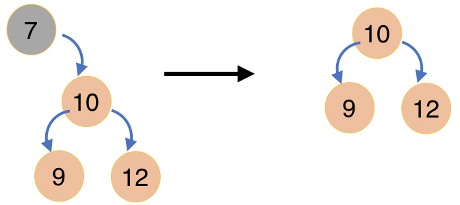
        - 根结点有左子节点和右子节点
            - 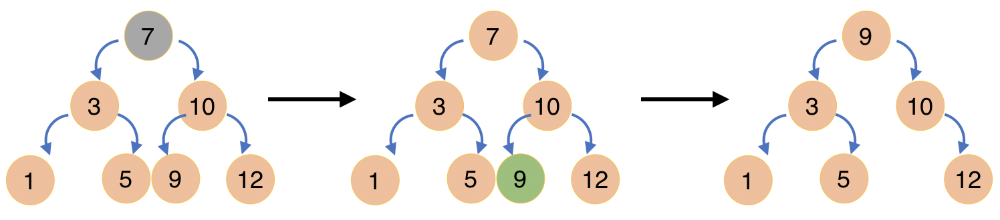
    - 删除非根结点
        1. 删除叶子结点
            - 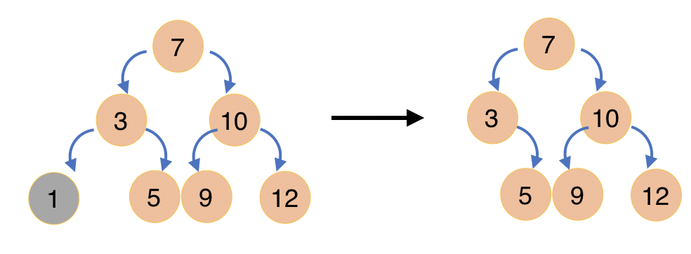
        2. 删除只有一颗子树的结点
            - 
        3. 删除有两颗子树的结点
            - 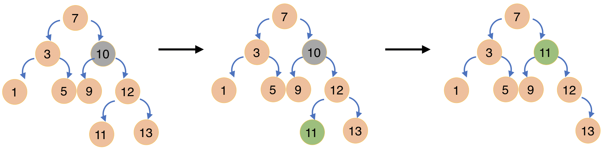

### 二叉排序树删除结点的实现
[top](#catalog)
- 每种情况都有的两个通用操作
    1. 在树中搜索需要删除的结点 targetNode
    2. 找到 targetNode 的父节点 parent
 
- 通用操作实现
    - 参考代码
        - [/algorithm/src/java-algorithm/datastructure/src/main/java/com/ljs/learn/datastructure/tree/binary/sorttree/BinarySortNode.java](/algorithm/src/java-algorithm/datastructure/src/main/java/com/ljs/learn/datastructure/tree/binary/sorttree/BinarySortNode.java)
    - 代码内容
        ```java
        // 在树中搜索需要删除的结点 targetNode
        public BinarySortNode searchNode(int value) {
            if (this.value == value) {   // 如果和目标值相等，在直接返回
                return this;
            } else if (value < this.value) { // 如果比当前值小，则继续左继续递归搜索
                if (this.left == null) return null;
                return this.left.searchNode(value);
            } else { // 如果比当前值大，则继续右继续递归搜索
                if (this.right == null) return null;
                return this.right.searchNode(value);
            }
        }
    
        // 找到 targetNode 的父节点 parent
        public BinarySortNode searchParentNode(int value) {
            // 如果当前结点的左结点或右结点等于 value，则找到父节点
            if ((this.left != null && this.left.value == value) ||
                    (this.right != null && this.right.value == value)) {
                return this;
            }
    
            if (value < this.value && this.left != null) {
                // 如果value比当前结点小，则继续左递归
                return this.left.searchParentNode(value);
            } else if (value > this.value && this.right != null){
                // 如果value比当前结点大，则继续左递归
                return this.right.searchParentNode(value);
            } else {
                return null; // 无法找到父节点
            }
        }
        ```

- 删除结点
    - 参考代码
        - [/algorithm/src/java-algorithm/datastructure/src/main/java/com/ljs/learn/datastructure/tree/binary/sorttree/BinarySortTree.java](/algorithm/src/java-algorithm/datastructure/src/main/java/com/ljs/learn/datastructure/tree/binary/sorttree/BinarySortTree.java)
    - 代码内容
        ```java
        // 删除结点
        public void deleteNode(int value) {
            if (root == null) return;
            // 1. 搜索结点
            // 1.1 搜索目标结点
            BinarySortNode targetNode = searchNode(value);
            // 如果没有找到则返回
            if (targetNode == null) return;
    
            // 1.2 搜索父节点
            BinarySortNode parentNode = searchParentNode(value);
    
            if (parentNode == null) {
                // 2. 如果该结点没有父节点，则说明该结点是根结点
                // 2.1 如果左右子结点都是 null，则将root设为空
                if (targetNode.left == null && targetNode.right == null) {
                    root = null;
                } else if (targetNode.left != null && targetNode.right != null) {
                    // 2.2 如果左右子节点都存在
                    // 获取右子树的最小值，并删除该结点
                    int rightMinVal = delRightTreeMin(targetNode.right);
                    // 将当前结点的值替换为右子树的最小值
                    targetNode.value = rightMinVal;
                } else {
                    // 2.3 如果只有左子树或只有右子树，则将根结点替换为子树
                    if (targetNode.left != null) {
                        root = targetNode.left;
                    } else if (targetNode.left != null) {
                        root = targetNode.right;
                    }
                }
            } else {
                // 3. 删除叶子结点
                if (targetNode.left == null && targetNode.right == null) {
                    // 判断目标结点是父节点的左结点还是右结点
                    if (targetNode == parentNode.left) {
                        parentNode.left = null;
                    } else {
                        parentNode.right = null;
                    }
                } else if (targetNode.left != null && targetNode.right != null) {
                    // 5. 删除有两颗子树的结点
                    // 5.1 获取右子树的最小值，并删除该结点
                    int rightMinVal = delRightTreeMin(targetNode.right);
                    // 5.2 将当前结点的值替换为右子树的最小值
                    targetNode.value = rightMinVal;
                } else {
                    // 4. 删除只有一个子树的结点
                    if (targetNode.left != null) {
                        // 4.1 如果目标结点只有左子树
                        if (parentNode.left == targetNode) {
                            parentNode.left = targetNode.left;
                        } else {
                            parentNode.right = targetNode.left;
                        }
                    } else {
                        // 4.2 如果目标结点只有右子树
                        if (parentNode.left == targetNode) {
                            parentNode.left = targetNode.right;
                        } else {
                            parentNode.right = targetNode.right;
                        }
                    }
                }
            }
        }
    
        /**
         * 1. 获取以 node 为根结点的子树的最小结点
         * 2. 删除node为结点的二叉排序树的最小结点
         *
         * @param node 二叉排序树结点
         * @return 返回以node为根结点的二叉树的最小结点的值
         */
        public int delRightTreeMin(BinarySortNode node) {
            BinarySortNode target = node;
    
            // 1. 循环查找左结点，找到最小结点
            while (target.left != null) {
                target = target.left;
            }
    
            // 2. 删除该结点
            deleteNode(target.value);
            return target.value;
        }
        ```
      
- 测试内容
    - 参考代码
        - [/algorithm/src/java-algorithm/datastructure/src/test/java/com/ljs/learn/datastructure/tree/binary/sorttree/BinarySortTreeTest.java](/algorithm/src/java-algorithm/datastructure/src/test/java/com/ljs/learn/datastructure/tree/binary/sorttree/BinarySortTreeTest.java)
    - 测试代码
        ```java
        // 删除叶子结点
        @Test
        public void deleteLeafNode(){
            int[] array = {7, 3, 10, 12, 5, 1, 9};
            BinarySortTree binarySortTree = new BinarySortTree();
            binarySortTree.addArray(array);
            binarySortTree.infixOrder();
            System.out.println("------------");
    
            binarySortTree.deleteNode(1);
            binarySortTree.deleteNode(9);
            binarySortTree.infixOrder();
    
            // 输出: 3 5 7 10 12
        }
    
        // 删除只有一颗子树的结点
        @Test
        public void deleteOneSubNode(){
            int[] array = {7, 3, 10, 12, 5, 1, 9, 2};
            BinarySortTree binarySortTree = new BinarySortTree();
            binarySortTree.addArray(array);
            binarySortTree.infixOrder();
            System.out.println("------------");
    
            binarySortTree.deleteNode(1);
            binarySortTree.infixOrder();
    
            // 输出: 2 3 5 7 9 10 12
        }
    
        // 删除包含两颗子树的结点
        @Test
        public void deleteDoubleSubNode(){
            int[] array = {7, 3, 10, 12, 5, 1, 9, 11, 13};
            BinarySortTree binarySortTree = new BinarySortTree();
            binarySortTree.addArray(array);
            binarySortTree.infixOrder();
            System.out.println("------------");
    
            binarySortTree.deleteNode(10);
            binarySortTree.infixOrder();
            
            // 输出: 1 3 5 7 9 11 12 13
        }
        ```

# 二叉平衡树
## 引入问题--二叉排序树的问题
[top](#catalog)
- 将数列: `[1, 2, 3, 4, 5, 6]` 构造成一个二叉排序树
    ```
    1
     \
      2
       \
        3
         \
          4
           \
            5
    ```
- 该二叉树的问题
    - 左子树全部为空，退化成了一个单链表
    - 对插入速度没有影响
    - 查询速度降低
        - **每次都需要检查左子树**
        - 查询速度比单链表更慢

## 平衡二叉树说明
[top](#catalog)
- 二叉平衡树，Self-balancing binary search tree
- 二叉平衡树可以保证较高的查询效率
- 二叉平衡树的特点
    - 它是一颗空树或者左右两颗子树的高度的差的绝对值不超过1
    - 左右子树都是一颗二叉平衡树
- 二叉平衡树的常用实现方法
    - 红黑树
    - AVL
    - 替罪羊树
    - Treap
    - 伸展树

## 平衡二叉树--旋转方式的分析
### 二叉平衡树的左旋
[top](#catalog)
- 左旋的条件
    - 根结点的右子树的高度 > 根结点的左子树的高度
- 左旋的目的
    - 降低右子树的高度
- 左旋的过程
    1. 当前结点为 `curNode`
    2. 创建一个新结点 `newNode`，并且: `newNode.vlaue = curNode.vlaue`
    3. `newNode.left = curNode.left`
        - 新结点的左结点指向当前结点的左结点
    4. `newNode.right = curNode.right.left`
        - 将新结点的右子树设置为当前结点的右子树的左子树
        - 即搜索比当前结点大的最小值
    5. `curNode.value = curNode.right.value`
        - 将当前结点的值设为当前结点的右结点的值
    6. `curNode.right = curNode.right.right`
        - 将当前结点的右子树设置为右子树的右子树
    7. `curNode.left = newNode`
        - 将当前结点的左子树设置为新结点

- <label style='color:red'>什么时候执行左旋？</label>
    1. 添加结点后
    2. 右子树的高度 - 左子树的高度 > 1

- 左旋过程示例
    - 原始数组：`[4, 3, 6, 5, 7, 8]`
    - 左旋步骤
        1. 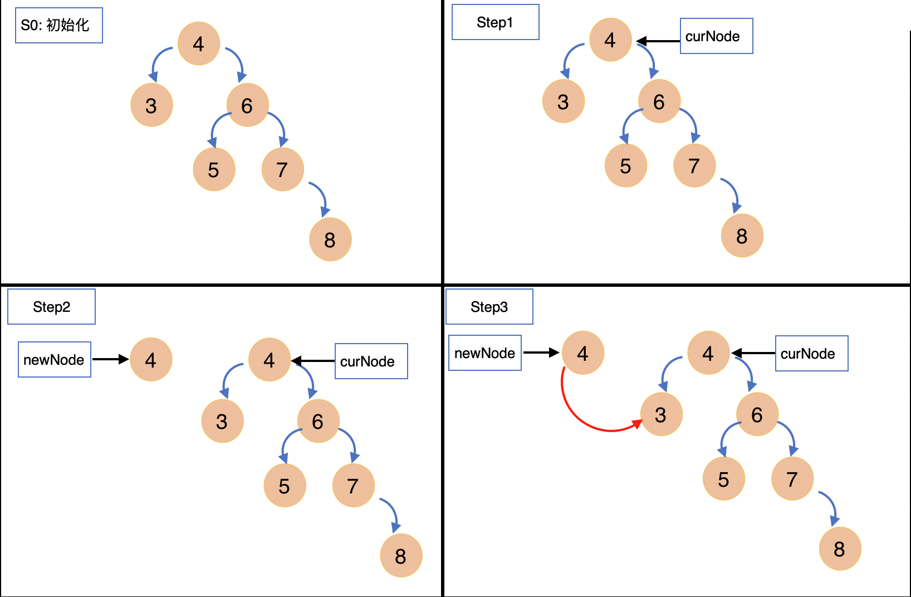
        2. 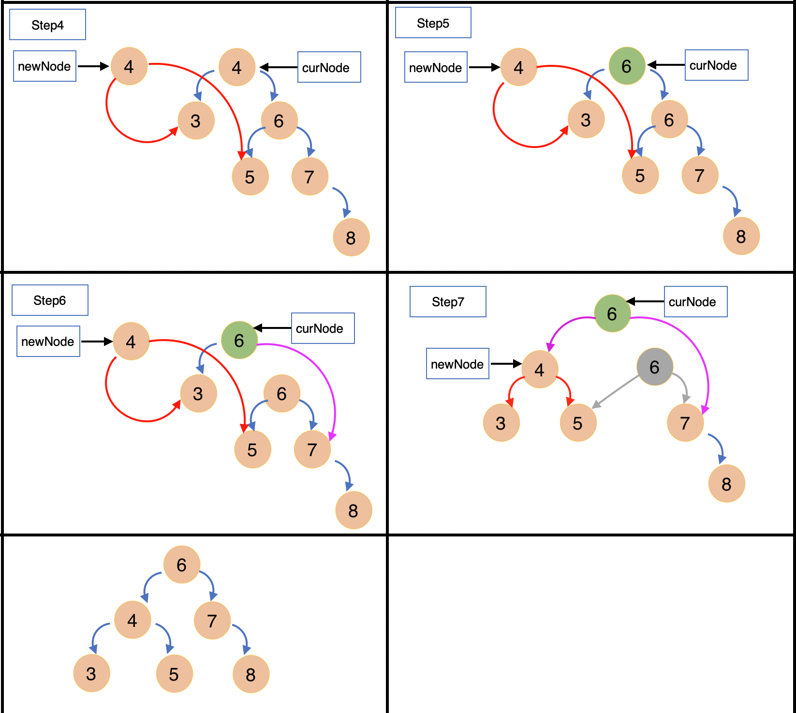

### 二叉平衡树的右旋
[top](#catalog)
- 示例
    - 如数组: `[10, 12, 8, 9, 7, 6]`
    - 构建后的二叉排序树
        ```
            10
            / \
           8   12
          / \
         7   9
        /
       6 
        ```

- 右旋的条件
    - 根结点的左子树的高度 > 根结点的右子树的高度
- 右旋的目的
    - 降低左子树的高度
- 右旋的过程
    1. 当前结点为 `curNode`
    2. 创建一个新结点 `newNode`，并且: `newNode.vlaue = curNode.vlaue`
    3. `newNode.right = curNode.right`
        - 新结点的右结点指向当前结点的右结点
    4. `newNode.left = curNode.left.right`
        - 将新结点的左子树设置为当前结点的左子树的右子树
        - 即搜索比当前结点小的最大值
    5. `curNode.value = curNode.right.value`
        - 将当前结点的值设为当前结点的左结点的值
    6. `curNode.left = curNode.left.left`
        - 将当前结点的左子树设置为左子树的左子树
    7. `curNode.right = newNode`
        - 将当前结点的右子树设置为新结点

- <label style='color:red'>什么时候执行左旋？</label>
    1. 添加结点后
    2. 左子树的高度 - 右子树的高度 > 1

- 右旋过程示例
    - 原始数组：`[10, 12, 8, 9, 7, 6]`
    - 右旋步骤
        1. 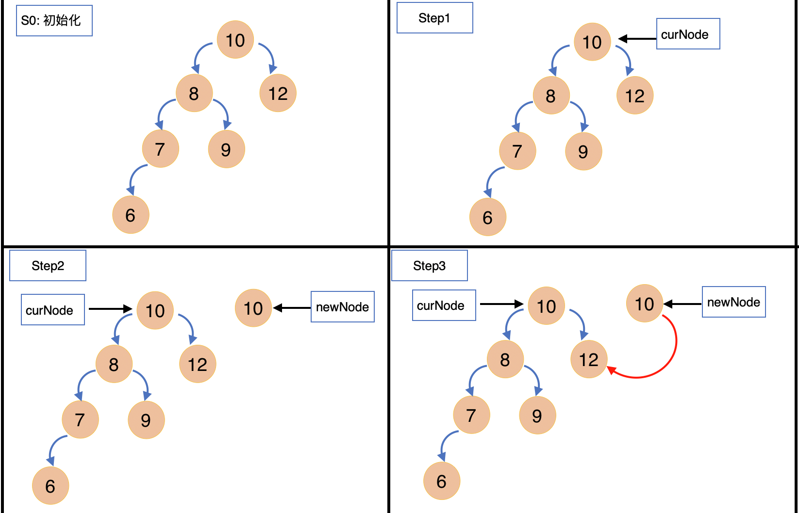 
        2. 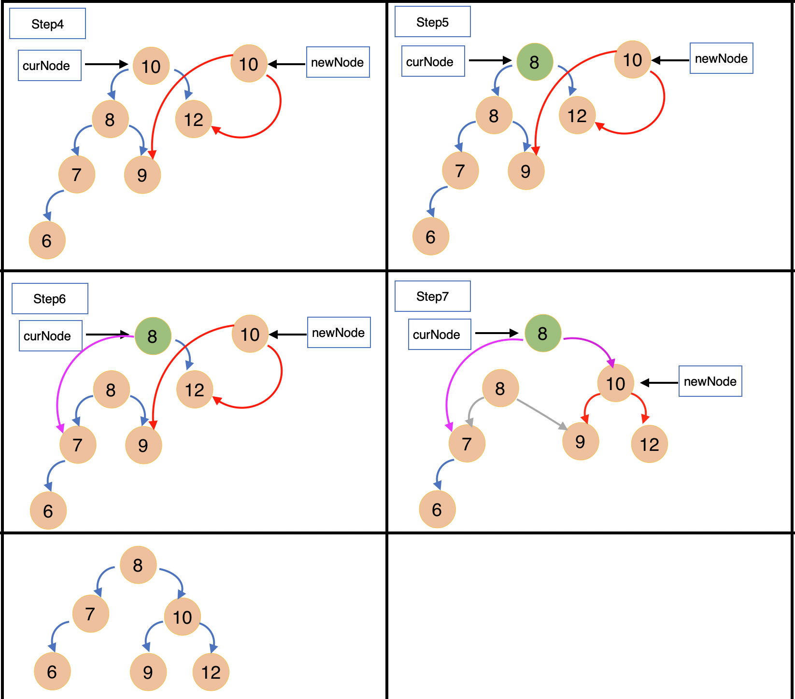

### 二叉平衡树的双旋
[top](#catalog)
- 在某些情况下单向旋转不能完成二叉树的转换
    - 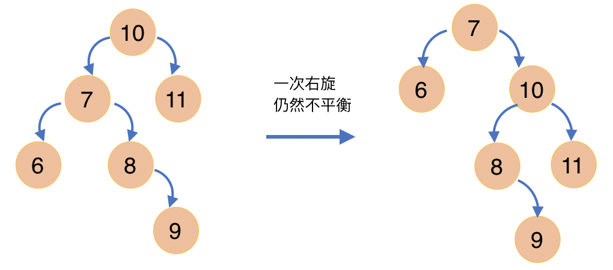
- 单向旋转不能解决问题的条件
    - 当前结点的左子树或右子树的左右两颗子树的高度差大于0
    - 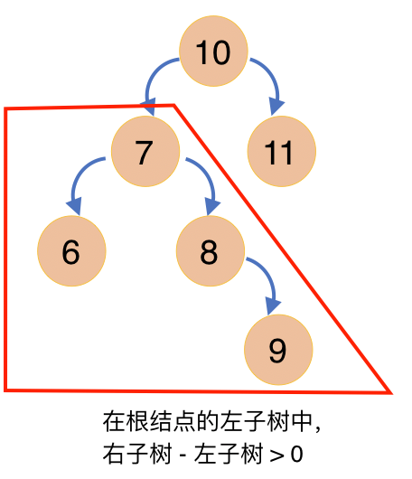

- 解决方法--双旋
    - 出现问题的子树是: 子树的左子树高度 < 子树的右子树高度
        1. 对出现问题的子树进行左旋
        2. 再对子树的父节点解析右旋
    - 出现问题的子树是: 子树的左子树高度 > 子树的右子树高度
        1. 对出现问题的子树进行右旋
        2. 再对子树的父节点解析左旋
- 双旋示例
    - 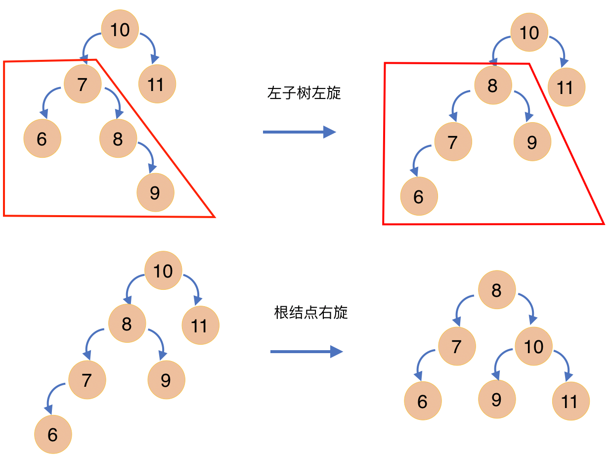

## 二叉平衡树--旋转的实现
[top](#catalog)
- 参考代码
    - 结点
        - [/algorithm/src/java-algorithm/datastructure/src/main/java/com/ljs/learn/datastructure/tree/binary/avl/AVLNode.java](/algorithm/src/java-algorithm/datastructure/src/main/java/com/ljs/learn/datastructure/tree/binary/avl/AVLNode.java)
    - 树
        - [/algorithm/src/java-algorithm/datastructure/src/main/java/com/ljs/learn/datastructure/tree/binary/avl/AVLTree.java](/algorithm/src/java-algorithm/datastructure/src/main/java/com/ljs/learn/datastructure/tree/binary/avl/AVLTree.java)
- 测试代码
    - [/memobook/algorithm/src/java-algorithm/datastructure/src/test/java/com/ljs/learn/datastructure/tree/binary/avl/AVLTreeTest.java](/memobook/algorithm/src/java-algorithm/datastructure/src/test/java/com/ljs/learn/datastructure/tree/binary/avl/AVLTreeTest.java)

- 实现旋转的条件: 计算左右子树的高度差
    - 在结点中递归计算子树高度，AVLNode.java
        ```java
        // 返回以当前结点为根结点的树的高度
        public int height() {
            // 比较左右子树的高度，返回最大的高度
            return Math.max(
                    left == null ? 0 : left.height(),
                    right == null ? 0 : right.height()
            ) + 1;  // +1 表示当前结点作为根结点也算一层
        }
    
        // 返回左子树的高度
        public int leftHeight() {
            if (left == null) return 0;
            return left.height();
        }
    
        // 返回右子树的高度
        public int rightHeight() {
            if (right == null) return 0 ;
            return right.height();
        }
        ```
    - 在树中启动高度计算，AVLTree.java
        ```java
        public int height(){
            if (root == null) return 0;
            return root.height();
        }
        ```
    - 测试内容
        ```java
        @Test
        public void height(){
            int[] array = {4, 3, 6, 5, 7, 8};
            AVLTree avlTree = new AVLTree();
            avlTree.addArray(array);
    
            assertEquals(avlTree.height(), 4);
        }
        ```

- 左旋的实现
    ```java
    // 左旋
    public void leftRotate(){
        AVLNode newNode = new AVLNode(this.value);
        newNode.left = this.left;
        newNode.right = this.right.left;
        this.value = this.right.value;
        this.right = this.right.right;
        this.left = newNode;
    }
    ```
- 右旋的实现
    ```java
    // 右旋
    public void rightRotate(){
        AVLNode newNode = new AVLNode(this.value);
        newNode.right = this.right;
        newNode.left = this.left.right;
        this.value = this.left.value;
        this.left = this.left.left;
        this.right = newNode;
    }
    ```
- 在添加结点时，判断具体的旋转方式
    ```java
    // 添加结点，并且每次添加后，检查子树高度，并通过旋转来优化树结构
    public void addWithRotate(AVLNode node){
        // 判断结点与当前结点的大小
        if (node.value < this.value) {
            // 如果当前结点的左子节点为null，则直接添加结点
            if (this.left == null) {
                this.left = node;
            } else {
                // 递归的向左子树添加
                this.left.add(node);
            }
        } else {
            //
            if (this.right == null) {
                this.right = node;
            } else {
                // 递归的向右子树添加
                this.right.add(node);
            }
        }

        // 检查子树高度
        int leftTreeHeight = leftHeight();
        int rightTreeHeight = rightHeight();
        if ((rightTreeHeight - leftTreeHeight) > 1){
            // 左子树 < 右子树，则左旋

            // 双旋检查: 在右子树中，如果子树的左子树高度 > 子树的右子树的高度，则右旋
            if (right != null && right.leftHeight() > right.rightHeight()){
                right.rightRotate();
            }

            // 再做左旋
            leftRotate();
        } else if ((leftTreeHeight - rightTreeHeight) > 1){
            // 左子树 > 右子树，则右旋

            // 双旋检查: 在左子树中，如果子树的左子树高度 < 子树的右子树的高度，则左旋
            if (left != null && left.rightHeight() > left.leftHeight()){
                left.leftRotate();
            }

            // 再做右旋
            rightRotate();
        }
    }
    ```

# 图
## 图简介
[top](#catalog)
- 为什么需要图？
    - 线性表的局限
        - 只有一个直接前驱和一个直接后继的关系
    - 树的局限
        - 只有一个父节点
    - 为了表示**多对多关系**，所以需要图
- 图的每一个结点可以有0个或多个相邻的元素

- 图的概念
    - 边 edge: 连接两个结点之间的称为边
    - 顶点 vertex: 结点也称为顶点
    - 路径: 一个顶点到另一个顶点的路线
- 三种图
    - 无向图: 顶点之间的连接没有方向
    - 有向图: 顶点之间的连接是有方向的
    - 带权图: 边带有权值
        - 带权图也称为网
- 示例
    - 无向图
        - 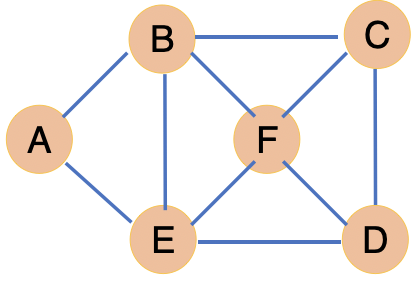
    - 有向图
        - 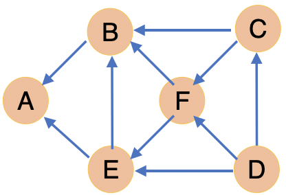
    - 带权图
        - 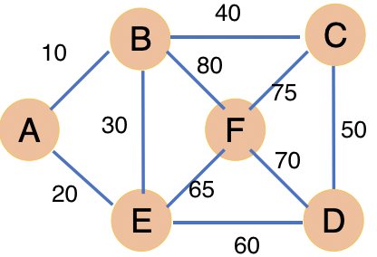

## 图的表示方式
[top](#catalog)
- 图的两种表示方式
    1. 二维数组表示，即: 邻接矩阵
    2. 链表表示，即: 邻接表

- 邻接矩阵
    - 主要表示顶点之间的相邻关系
    - 对于n个顶点的图，矩阵大小是 `n x n`，每个值表示两个顶点是否能够相连
    - 存在的边用 1 表示，不存在的边用 0 表示
    - 邻接矩阵是对称的，即`arr[i][j] == arr[j][i]`
    - 邻接矩阵的缺点
        - 邻接矩阵需要为每个顶点都分配n个边的空间，有很多边是不存在的，会浪费空间
    - 示例
        - 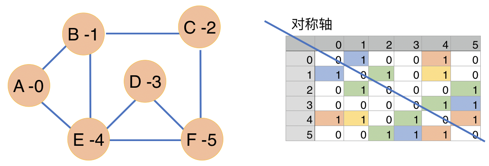
- 邻接表
    - 邻接表只描述存在的边，没有空间浪费
    - 邻接表由数组和链表组成
        - 数组的索引表示顶点的值
        - 链表不表示连接顺序，只表示与当前顶点相连的顶点
    - 示例
        - 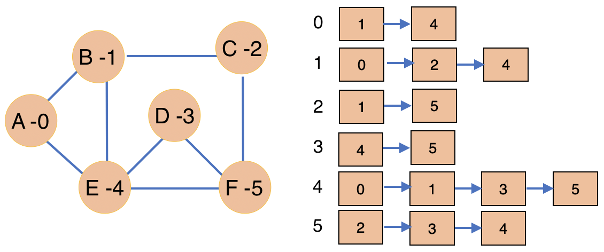

## 图的创建--使用邻接矩阵
[top](#catalog)
- 图的保存方式
    1. 使用`字符串数组`保存顶点的数据
    2. 使用`二维数组`保存邻接矩阵
- 创建过程
    1. 使用**顶点个数**初始化图
        - 用顶点个数初始化保存邻接矩阵的二维数组
    2. 将顶点数据添加到`字符串数组`中
    3. 手动添加边到字符串数组中
        - 添加时，应该说明是那两个顶点之间的边，以及边的权

- 实现内容
    - 参考代码
        - [/algorithm/src/java-algorithm/datastructure/src/main/java/com/ljs/learn/datastructure/graph/matrix/Graph.java](/algorithm/src/java-algorithm/datastructure/src/main/java/com/ljs/learn/datastructure/graph/matrix/Graph.java)
    - 代码内容
        ```java
        public class Graph {
            private ArrayList<String> vertexList; // 存储顶点集合
            private int[][] edges;  // 存储邻接矩阵
            private int numOfEdges; // 记录边的数量
        
            // 通过结点个数初始化图
            public Graph(int n){
                // 初始化矩阵和vertexList
                edges = new int[n][n];
                vertexList = new ArrayList<String>(n);
                // 初始化时不知道有多少条边，所以初始化为0
                numOfEdges = 0;
            }
        
            // 插入结点
            public void addVertex(String vertex){
                vertexList.add(vertex);
            }
        
            /**
             * 添加边
             * @param v1 一个顶点对应的下标
             * @param v2 另一个顶点对应的下标
             * @param weight 表示边(的权值)
             */
            public void addEdge(int v1, int v2, int weight){
                edges[v1][v2]=weight;
                edges[v2][v1]=weight;
                numOfEdges++;
            }
        }
        ```

- 测试内容
    - 参考代码
        - [/algorithm/src/java-algorithm/datastructure/src/test/java/com/ljs/learn/datastructure/graph/matrix/GraphTest.java](/algorithm/src/java-algorithm/datastructure/src/test/java/com/ljs/learn/datastructure/graph/matrix/GraphTest.java)
    - 测试内容
        ```java
        @Test
        public void createGraph(){
            // 1. 定义顶点中的数据
            String vertexes[] = {"A", "B", "C", "D", "E", "F"};
    
            // 2. 使用顶点个数初始化图
            Graph graph = new Graph(vertexes.length);
    
            // 3. 添加结点
            for (String vertex : vertexes) {
                graph.addVertex(vertex);
            }
    
            // 4. 添加边
            graph.addEdge( 0, 1, 1);
            graph.addEdge( 0, 4, 1);
            graph.addEdge( 1, 4, 1);
            graph.addEdge( 1, 2, 1);
            graph.addEdge( 2, 5, 1);
            graph.addEdge( 3, 4, 1);
            graph.addEdge( 3, 5, 1);
            graph.addEdge( 4, 5, 1);
    
            // 5. 输出图
            graph.showGraph();
    
            // 输出:
            // [0, 1, 0, 0, 1, 0]
            // [1, 0, 1, 0, 1, 0]
            // [0, 1, 0, 0, 0, 1]
            // [0, 0, 0, 0, 1, 1]
            // [1, 1, 0, 1, 0, 1]
            // [0, 0, 1, 1, 1, 0]
        }
        ```

## DFS--图的深度优先遍历
[top](#catalog)
- 遍历方法
    1. 访问初始结点A，并标记结点A为已访问
    2. 查找结点A的第一个邻接结点B
    3. 若B存在，则继续执行4，如果B不存在，则回到第1步，将从邻接矩阵中A的下一个结点D继续
    4. 若B未被访问，对B进行深度优先遍历递归(把B当作另一个A，然后进行步骤123)
    5. 如果B已经访问过，从结点A的邻接结点B开始，查找下一个邻接结点C，转到步骤3

- 实现内容
    - 参考代码
        - [/algorithm/src/java-algorithm/datastructure/src/main/java/com/ljs/learn/datastructure/graph/matrix/Graph.java](/algorithm/src/java-algorithm/datastructure/src/main/java/com/ljs/learn/datastructure/graph/matrix/Graph.java)
    - 代码内容
        1. 搜索邻接结点
            ```java
            // 定义一个数据，记录某个结点是否被访问过
            private boolean[] isVisited;
            
            /**
             * 遍历矩阵的第 index 行，搜索第一个有效的邻接结点
             * @param index 邻接矩阵的行index
             * @return 如果存在则返回列 index， 如果不存在则返回 -1
             */
            public int getFirstNeighbor(int index){
                //
                for (int i = 0; i < vertexList.size(); i++) {
                    if (edges[index][i] > 0){
                        return i;
                    }
                }
        
                // 如果没有找到则返回 -1
                return -1;
            }
        
            /**
             * 搜索一个邻接结点的下一个邻接结点
             * @param lineIndex 邻接矩阵的行index
             * @param startIndex 搜索的起始邻接结点（应该从它的下一个开始搜索）
             * @return 下一个邻接结点的index，没有则返回 -1
             */
            public int getNextNeighbor(int lineIndex, int startIndex){
                // 从目标结点的下一个结点开始搜索
                for (int i = startIndex + 1; i < vertexList.size(); i++) {
                    if (edges[lineIndex][i] > 0){
                        return i;
                    }
                }
        
                // 如果没有找到则返回 -1
                return -1;
            }
            ```
        2. 深度优先遍历
            ```java
            /**
             * 深度优先遍历
             * @param isVisited 访问状态列表
             * @param lineIndex 从哪个结点开始遍历
             */
            public void dfs(boolean[] isVisited, int lineIndex){
                // 1. 访问当前结点
                System.out.println(getValueByIndex(lineIndex));
        
                // 2. 将当前结点设置为已访问
                isVisited[lineIndex] = true;
        
                // 3. 查找当前结点的第一个邻接结点
                int b = getFirstNeighbor(lineIndex);
        
                while (b != -1){
                    // 4. 如果邻接结点存在，并且未被访问，则对该结点进行深度优先遍历
                    if(!isVisited[b]){
                        dfs(isVisited, b);
                    }
                    // 5. 如果 B 已被访问，则搜索B的下一个邻接结点
                    b = getNextNeighbor(lineIndex, b);
                }
            }
        
            // 启动深度优先遍历
            public void dfs(){
                // 定义一个数组，记录某个结点是否被访问过
                boolean[] isVisited = new boolean[vertexList.size()];
                // 遍历每一个结点，并做深度优先遍历
                // 即：如果B不存在，则回到第1步，将从邻接矩阵中A的下一个结点D继续
                for (int i = 0; i < getNumOfVertex(); i++) {
                    if (!isVisited[i]){
                        dfs(isVisited, i);
                    }
                }
            }
            ```

## BFS--图的广度优先遍历
[top](#catalog)
- BFS的基本思想
    - BFS类似于一个分层搜索的过程
    - 遍历过程中需要使用一个队列以保持访问过的结点的顺序
    - 当一层被遍历完，通过队列，按照顺序继续访问结点的邻接结点
- 实现内容
    - 参考代码
        - [/algorithm/src/java-algorithm/datastructure/src/main/java/com/ljs/learn/datastructure/graph/matrix/Graph.java](/algorithm/src/java-algorithm/datastructure/src/main/java/com/ljs/learn/datastructure/graph/matrix/Graph.java)
    - 代码内容
        ```java
        public void bfs(){
            // 初始化访问状态数组
            boolean[] isVisited = new boolean[vertexList.size()];
    
            // 1. 将第一个顶点放入队的队尾
            LinkedList<Integer> queue = new LinkedList<>();
            queue.addLast(0);
            isVisited[0] = true;
    
            // 2. 从第一个顶点开始遍历，直至遍历到队列为空
            int curNode;
            int[] curRow;
            while (!queue.isEmpty()){
                // 3. 从队列的对头弹出一个顶点A
                curNode = queue.poll();
    
                // 4. 输出该结点
                System.out.println(vertexList.get(curNode));
                // 应该在顶点被添加到队列时，设置为已访问
                // 防止多个结点与目标结点有关系，导致结点的重复访问
                // isVisited[i] = true;
    
                // 5. 顺次访问顶点A的邻接结点
                curRow = edges[curNode];
                for (int i = 0; i < curRow.length; i++) {
                    // 6. 如果邻接结点没有被访问过，则将邻接结点添加到队列中
                    // tips:邻接矩阵的每列也是结点的index，将列的index当作结点添加到队列
                    if (curRow[i] == 1 && isVisited[i] == false){
                        queue.addLast(i);
                        // 7. 将该结点设置为已访问
                        isVisited[i] = true;
                    }
                }
            }
        }
        ```

[top](#catalog)