<span id="catalog"></span>

- 参考
    - https://www.bilibili.com/video/BV1t4411B7Rh

<span style='font-size:18px'>目录<span>

- [概述](#概述)
- [安装](#安装)
- [实战](#实战)
    - [azkaban内置支持的任务类型](#azkaban内置支持的任务类型)
    - [单一job](#单一job)
    - [调度shell脚本](#调度shell脚本)
    - [多任务调度](#多任务调度)
    - [java任务](#java任务)
    - [HDFS操作任务](#HDFS操作任务)
    - [执行MapReduce任务](#执行MapReduce任务)
    - [Hive任务](#Hive任务)
    - [设置command模式的任务参数](#设置command模式的任务参数)
- [](#)


# 概述
[top](#catalog)

- azkaban的特点
    - 兼容任何版本的hadoop
    - 可以在 Web 页面进行监控，或修改任务单元
    - 上传工作流比较简单
    - 方便设置任务之间的关系
    - 调度工作流
    - 模块化和可插拔的插件机制
    - 认证/授权(权限设置)
    - 能够杀死并重新启动工作流
    - 有关失败和成功的电子邮件提醒
- 常见工作流调度系统
    - 简单的任务调度：crontab
    - 复杂的任务调度：开发调度平台或使用现成的开源调度系统
        - 如 ooize、azkaban 等
- 基础架构
    - 架构图
    - 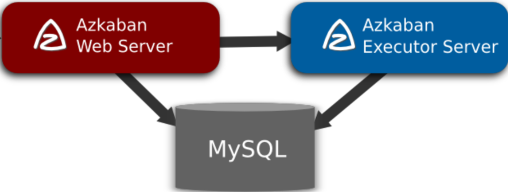
    - Azkaban Web Server
        - 整个 Azkaban 工作流系统的主要管理者
        - 负责用户登录认证、project 管理、定时执行工作流、跟踪工作流执行进度等任务
        - 与mysql数据库进行交互
            - 用mysql保存配置
            - 从mysql中读取 Executor 写入的执行结果
    - Azkaban Executor Server
        - 负责具体的工作流的提交、执行
        - 通过 mysql 数据库来协调任务的执行
            - 需要从数据库中读取配置文件
            - 将执行结果写入mysql
    - 关系型数据库(MySQL)
        - 存储大部分执行流状态
        - WebServer 和 ExecutorServer 都需要访问数据库

# 安装

[top](#catalog)

- 各个组件的安装包
    - azkaban-web-server-2.5.0.tar.gz
    - azkaban-executor-server-2.5.0.tar.gz
    - azkaban-sql-script-2.5.0.tar.gz 
        - Azkaban的建表语句

# 实战

## azkaban内置支持的任务类型

[top](#catalog)

- commond
    - 用于执行shell脚本
- java
    - 将java程序打包上传服务器，由azkaban负责执行

## 单一job

[top](#catalog)

- 编写 `test01.job`文件

    ```
    type=command
    command=echo 'azkaban test'
    ```

- 将`*.job`文件压缩成 zip 包

-  创建任务

    1. 点击 CreateProject 按钮创建job
        - 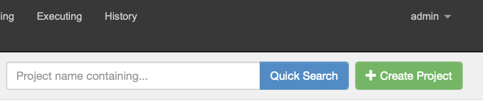
    2. 填写信息并创建 Job
        - 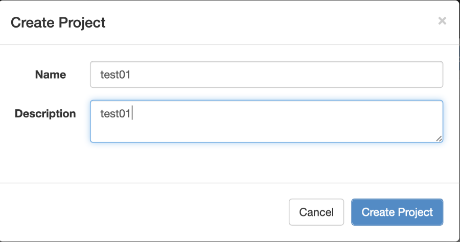
        - 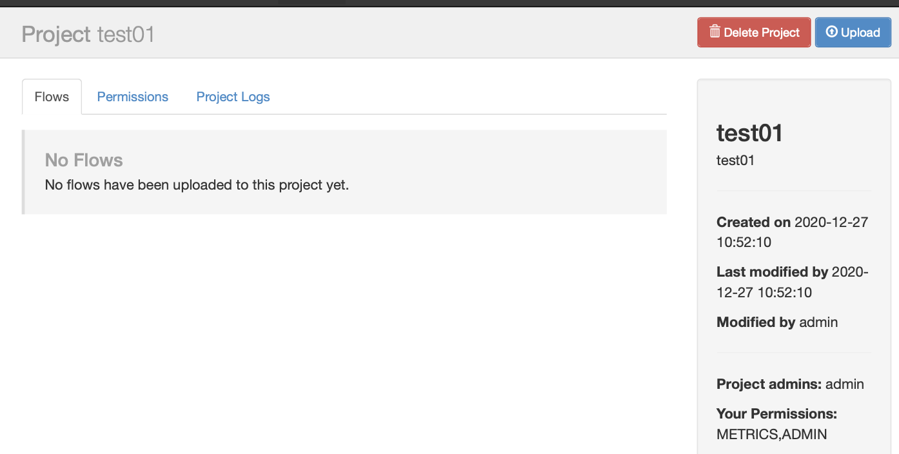
    3. 点击 `Upload`按钮上传zip包
        - 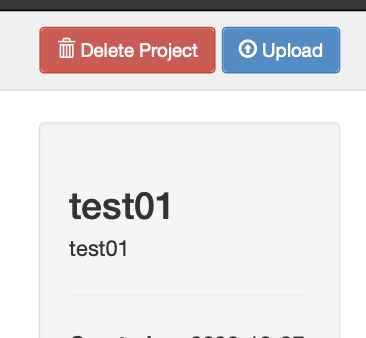
        - 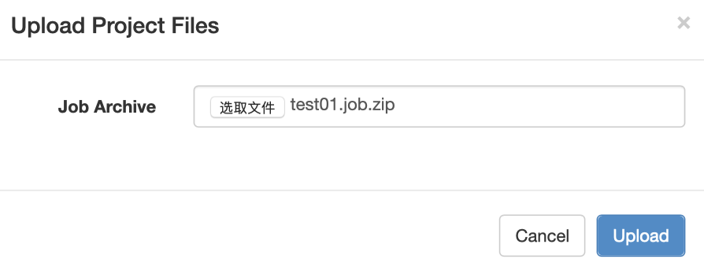
        - 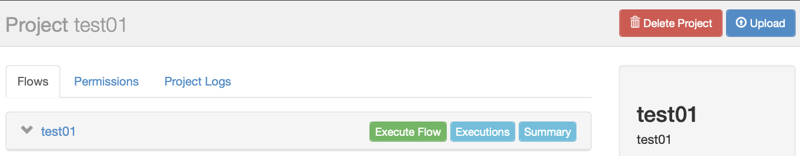

- 执行任务
    1. 点击 `Execute Flow`按钮
    2. 点击 `Execute`按钮执行任务
        - 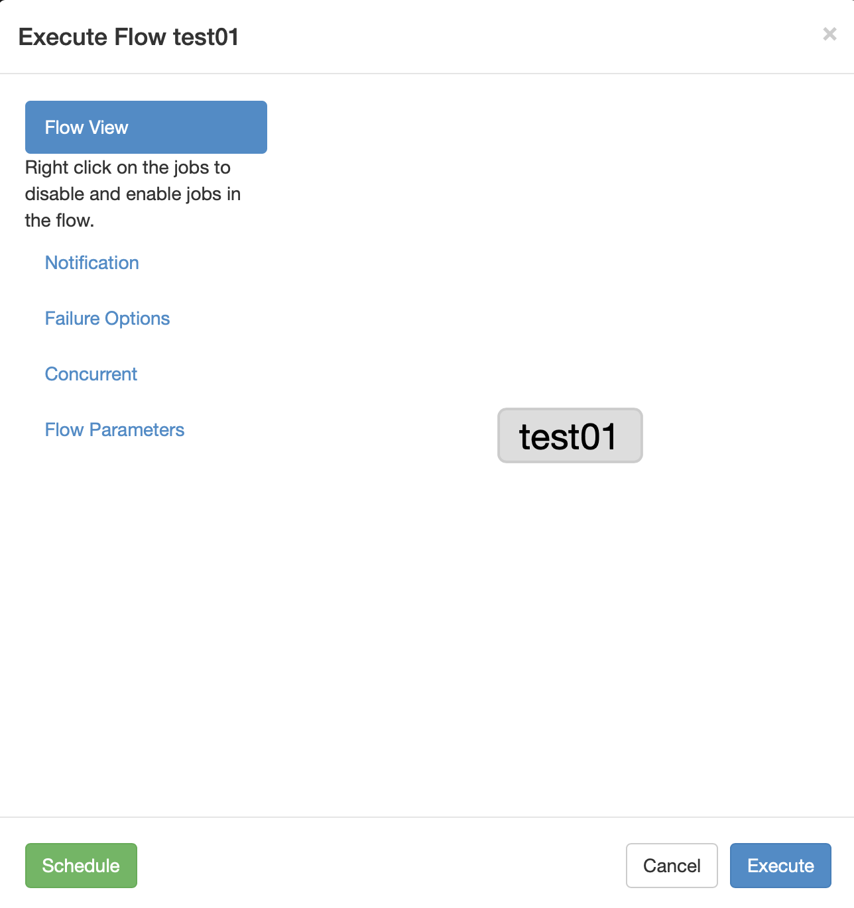
    3. 点击continue查看结果
        - 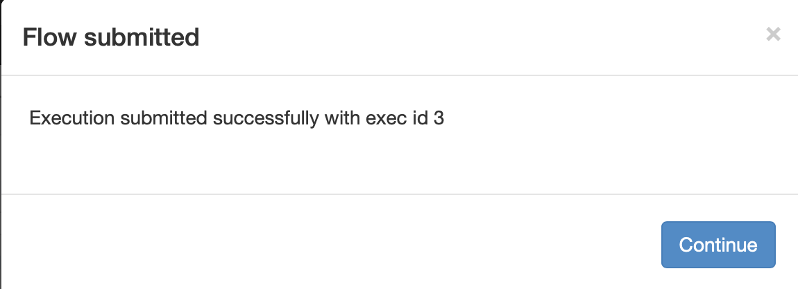
    4. 任务单元变为绿色，则执行成功
        - 
    5. 从`Job List` 中，点击 `Details`查看任务单元的执行结果
        - 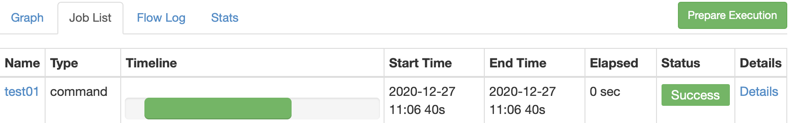
        - 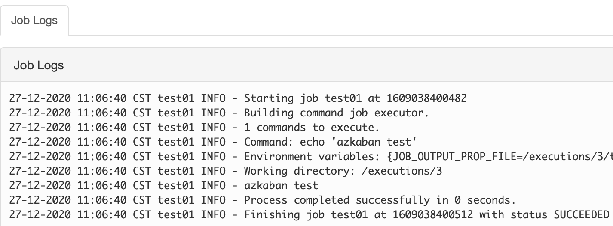

- 设置定时任务
    1. 点击 `Execute Flow`按钮
    2. 点击 `Schedule` 按钮
        - 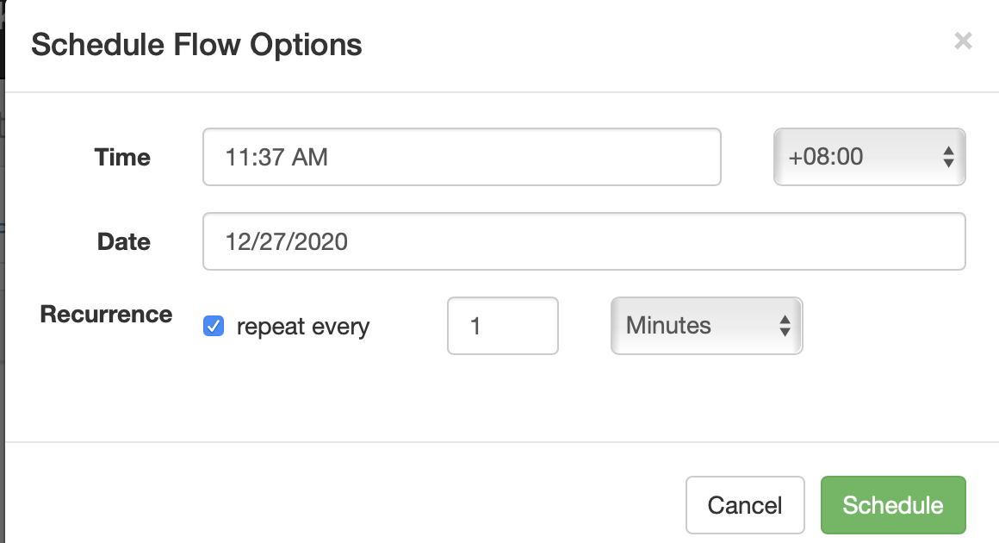
        - 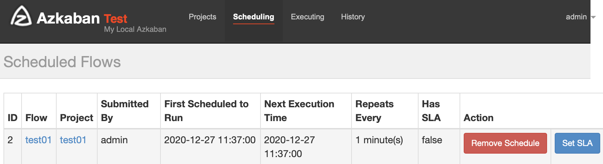

## 调度shell脚本

[top](#catalog)

- 打包方式

    1. 方式1：`*.job + *.sh` 一起放在一个目录下，然后将目录打包
    2. 方式2:  将`*.sh` 上传到服务器，在 `*.job` 内设置 shell的绝对路径

- 创建任务

    1. 创建 `test02.sh`，输出日期到文件

        ```
        date >> /opt/module/date.txt
        ```

    2. 创建 `test02.job`

        ```
        type=command
        command=sh test02.sh
        ```

    3. 将 `test02.job + test02.sh` 打包成zip

    4. 创建任务，并上传zip包
    
    5. 执行任务
    

## 多任务调度

[top](#catalog)

- 编写多任务

    - job1.job

        ```
        type=command
        command=echo 'job1'
        ```

    - job2.job

        ```
        type=command
        command=echo 'job2'
        dependencies=job1
        ```

    - job3.job

        ```
        type=command
        command=echo 'job3'
        dependencies=job1
        ```

    - job4.job

        ```
        type=command
        command=echo 'jo4'
        dependencies=job2,job3
        ```

- 编写多任务时

    - 将多个任务放在一个目录下进行打包
    - 通过 `dependencies` 来描述任务间的依赖关系
        - 依赖关系中指标注**job文件的名字**即可，不需要文件后缀

- 在web上创建任务

    - 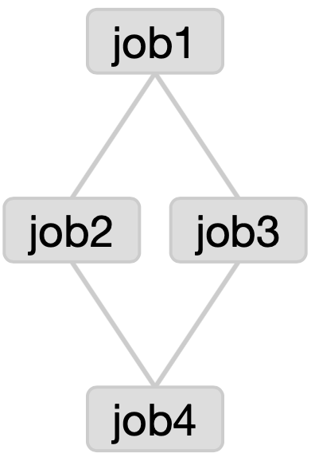

## java任务

[top](#catalog)

- 打包方式

    1. 方式1
        - jar包 + job文件一起打包
        - 在job文件中设置jar包在zip包内的路径，可以是
            - `./*`，在所有的jar包中扫描
            - `./jar包名`
        - 在job文件中包含main方法的类的全类名
    2. 方式2
        - jar包上传服务器
        - 只打包job文件
        - 在job文件中设置jar包在服务器上的绝对路径
        - 在job文件中包含main方法的类的全类名

- 编写java任务

    1. 创建java代码，并打成jar包

        - 参考 [src/azkaban-learn/azkaban-java-job-sample/src/main/java/com/ljs/learn/javasample/JavaJobSample.java](src/azkaban-learn/azkaban-java-job-sample/src/main/java/com/ljs/learn/javasample/JavaJobSample.java)

            ```java
            public class JavaJobSample {
                // 向文件末尾添加字符串
                public static void main(String[] args) {
                    FileWriter f = null;
            
                    try {
                        f = new FileWriter("/opt/module/java_output.txt", true);
                        f.write("azkaban java job test\n");
                    } catch (IOException e) {
                        e.printStackTrace();
                    } finally {
                        if (f != null){
                            try {
                                f.close();
                            } catch (IOException e) {
                                e.printStackTrace();
                            }
                        }
                    }
                }
            }
            
            ```

    2. 创建job文件

        - 参考 [src/test04-java/test04.job](src/test04-java/test04.job)

            ```
            type=javaprocess
            java.class=com.ljs.learn.javasample.JavaJobSample
            classpath=./azkaban-java-job-sample-1.0-SNAPSHOT.jar
            ```

    3. 打成zip包，创建任务并执行

## HDFS操作任务

[top](#catalog)

- 使用command任务，用命令执行HDFS操作

    ```
    type=command
    command=hdfs dfs -mkdir -p hdfs://nn01:9000/azkaban/aztest
    ```

## 执行MapReduce任务

[top](#catalog)

- 使用 command 任务，通过指令执行MR任务

- 需要实现准备数据和输入目录，并删除输出目录

    ```
    type=command
    command=hadoop jar /opt/module/hadoop/share/hadoop/mapreduce/hadoop-mapreduce-examples-2.10.1.jar wordcount hdfs://nn01:9000/azkaban/wordcount/input hdfs://nn01:9000/azkaban/wordcount/output
    ```

## Hive任务

[top](#catalog)

- 通过 commond 的方式执行hive命令

- 通过 `hive -f xxx.sql` 的方式执行hive程序

- hive的sql需要保存到 sql 文件中

    - sql文件可以保存到服务器，**需要在job中写绝对路径**
    - sql文件可以和job文件一起打包，需要在job中写相对于job文件的向度路径

- 导入hive表中的数据**如果数据量比较大**

    1. **不要添加到 zip 包中，因为 zip 包内的内容回写入 mysql 数据库**
    2. 应该将数据保存到服务器，或hdfs

- 示例

    - 提前创建目录和数据

        - /opt/module/datas/student.txt

            ```
            1	st01
            2	st02
            3	st03
            4	st04
            5	st05
            ```

    - 编写任务

        - [src/test07-hive/hive.sql](src/test07-hive/hive.sql)

            ```sql
            use default;
            
            drop table student;
            
            create table student(
                id int, 
                name string
            )
            row format delimited fields terminated by '\t';
            
            load data local inpath '/opt/module/datas/student.txt' into table student;
            
            insert overwrite local directory '/opt/module/datas/student_result'
            row format delimited fields terminated by '\t'
            select * from student;
            ```

        - [src/test07-hive/test07.job](src/test07-hive/test07.job)

            ```
            type=command
            command=hive -f ./hive.sql
            ```

## 设置command模式的任务参数

[top](#catalog)

- 在command的指令中包含参数，如: ${param}
- 在执行任务时，通过 `Flow Parameters` 中的 `Add Row` 来添加参数
    - 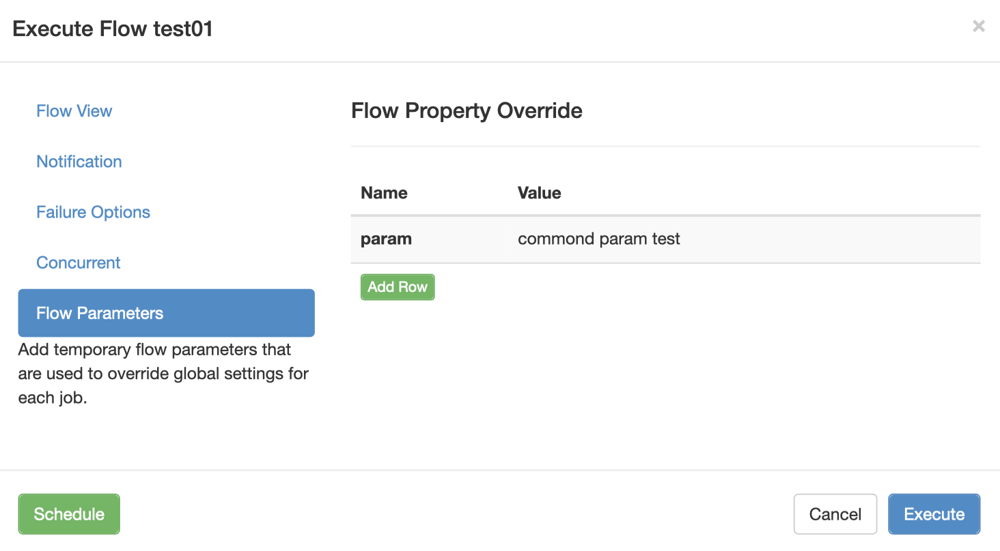


[top](#catalog)

