<span id="catalog"></span>
- 参考
    - https://www.bilibili.com/video/BV184411B7kU

<span style='font-size:18px'>目录<span>

- [概述](#概述)
- [安装](#安装)
- [flume中的组件](#flume中的组件)
    - [Agent](#Agent)
    - [Event](#Event)
    - [Source](#Source)
    - [Sink](#Sink)
    - [Channel](#Channel)
- [基本使用](#基本使用)
    - [监控端口数据](#监控端口数据)
    - [ExecSource实时监控单个文件](#ExecSource实时监控单个文件)
    - [ExecSource实时监控单个文件并上传HDFS](#ExecSource实时监控单个文件并上传HDFS)
    - [SpooldirSource监听目录并上传新文件到HDFS](#SpooldirSource监听目录并上传新文件到HDFS)
    - [TaildirSource实现断点续传](#TaildirSource实现断点续传)
- [flume的3中监控方式的比较](#flume的3中监控方式的比较)
- [常用sink](#常用sink)
- [Agent内部原理](#Agent内部原理)
    - [flume事务](#flume事务)
    - [数据传输的流程](#数据传输的流程)
        - [传输流程图](#传输流程图)
        - [ChannelSelector](#ChannelSelector)
        - [SinkProcessor](#SinkProcessor)
    - [flume的拓扑结构](#flume的拓扑结构)
        - [拓扑结构---串联](#拓扑结构---串联)
        - [拓扑结构---复制和多路复用](#拓扑结构---复制和多路复用)
        - [拓扑结构---负载均衡和故障转移](#拓扑结构---负载均衡和故障转移)
        - [拓扑结构---聚合](#拓扑结构---聚合)
- [实际应用](#实际应用)
    - [复制](#复制)
    - [sink组应用---故障转移](#sink组应用---故障转移)
    - [sink组应用---负载均衡](#sink组应用---负载均衡)
    - [聚合---单个端口单个source](#聚合---单个端口单个source)
    - [聚合---多个端口多个source](#聚合---多个端口多个source)
- [自定义](#自定义)
    - [自定义Interceptor---多路复用](#自定义Interceptor---多路复用)
    - [自定义Source](#自定义Source)
    - [自定义Sink](#自定义Sink)
- [Sink组应用](#Sink组应用)
- [flume可能会丢失数据的情况](#flume可能会丢失数据的情况)
- [](#)

# 概述
[top](#catalog)
- flume 是 Cloudera 提供的一个高可用、高可靠的，分布式的海量日志采集、聚合和传输的系统
- flume 基于流式架构，灵活简单

- flume的主要作用
    - 实时读取服务器本地磁盘的数据，将数据写入到HDFS
    - <span style='color:red'>只能处理文本数据</span>
- 下载
    - http://flume.apache.org

- flume 基础架构
    - 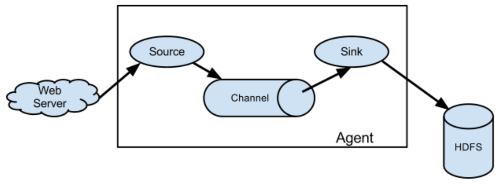

# 安装
[top](#catalog)
- 安装并复制启动文件
    ```
    docker cp "apache-flume-1.7.0-bin.tar.gz" nn01:/opt/software

    tar -zxvf apache-flume-1.7.0-bin.tar.gz  -C /opt/module/

    cd /opt/module/apache-flume-1.7.0-bin/conf
    mv flume-env.sh.template flume-env.sh
    ```
- 修改 flume-env.sh 内的javahome
    - echo $JAVA_HOME
    - vi flume-env.sh
        - export JAVA_HOME=/opt/module/jdk1.8.0_144

- 不需要启动任务，有任务时，启动一个进程即可


# flume中的组件
## Agent
[top](#catalog)
- 本质是一个 JVM 进程
- Agent 以 `Event` 的形式将数据从数据源发送到目的地
- Agent的 3 个组成部分
    - Source
    - Channel
    - Sink

## Event
[top](#catalog)
- 功能
    - flume 中的数据传输的基本单元
- flume 以 Event 的形式将数据从数据源送到目的地
- 组成
    - Event = Header + Body
    - Header
        - 保存内容： event 的一些属性
        - 保存结构：kv
    - Body
        - 保存内容：数据
        - 保存结构：字节数组

## Source
[top](#catalog)
- 功能
    - 负责接收数据到
- Source可以处理各种类型、各种格式的日志数据
    - 包括 avro、thrift、exec、jms、spooling directory、netcat、sequence generator、syslog、http、legacy

## Sink
[top](#catalog)
- 功能
    - 轮询 Channel 中的 Event
    - 批量的删除 Event，并将 Event 批量的写入到存储或索引系统，或者被发送到另一个 Agent
- Sink 的目的地包括； hdfs、logger、avro、thrift、ipc、file、HBase、solr、自定义目的地

## Channel
[top](#catalog)
- 功能
    - Source 和 Sink 之间的缓冲区
- 特点
    - Channel 允许 Source 和 Sink 的处理性能不同
    - 线程安全
        - 可以同时处理多个 Source 的写入和多个 Sink 的读取
- flume自带的 Channel

    |chanel|特性|
    |-|-|
    |Memory Channel，内存队列|数据不安全，程序终止、机器宕机、重启都会导致数据丢失|
    |File Channel|数据安全，会将所有事件写到磁盘，不会丢失数据|
    |Kafka Channel||
- **sink 与 channel 是 1:n 的关系**

# 基本使用
## 监控端口数据
[top](#catalog)
- 参考； http://flume.apache.org/FlumeUserGuide.html
- 需求
    - 使用 flume 监听端口，收集该端口数据，并打印到控制台
- 实现方式
    1. 通过 netcat 向本地的 44444 端口发送数据
    2. flume 监控本地的 44444 端口，通过 source 读取数据
    3. sink 将数据写到控制台
- 参考配置
    - [src/conf/base/flume-netcat-logger.conf](src/conf/base/flume-netcat-logger.conf)
- 实现步骤
    1. 创建 flume agent 配置文件 `flume-netcat-logger.conf`
        ```
        # example.conf: A single-node Flume configuration

        # Name the components on this agent
        # 1. 声明所有组件命名 agent 中的组件
        a1.sources = r1
        a1.sinks = k1
        a1.channels = c1

        # Describe/configure the source
        # 2. source: 指定 source 监听类型、ip、端口号
        a1.sources.r1.type = netcat
        a1.sources.r1.bind = localhost
        a1.sources.r1.port = 44444

        # Describe the sink
        # 3. sink
        a1.sinks.k1.type = logger

        # Use a channel which buffers events in memory
        # 4. channels
        a1.channels.c1.type = memory
        # 配置channel中的event容量，表示最多可以有 1000 个event
        a1.channels.c1.capacity = 1000
        # 每个事务中的event容量
        a1.channels.c1.transactionCapacity = 100

        # Bind the source and sink to the channel
        # 5. 关联 Source、Channel、Sink
        a1.sources.r1.channels = c1
        # sink 与 channel 是 1:n 的关系
        a1.sinks.k1.channel = c1
        ```
    2. 启动flume（相当于开启了一个服务端）
        - 启动指令
            ```
            bin/flume-ng agent \
            --conf conf \
            --conf-file job/flume-netcat-logger.conf \
            --name a1 \
            -Dflume.root.logger=INFO,console
            ```
        - **简写指令**
            ```
            bin/flume-ng agent \
            -n a1 \
            -c conf \
            -f job/flume-netcat-logger.conf \
            -Dflume.root.logger=INFO,console
            ```
    3. 在本地启动 nc
        ```
        nc localhost 44444
        ```
    4. 在nc端发送数据
    5. flume接收数据
        ```
        2020-10-24 08:08:34,411 (SinkRunner-PollingRunner-DefaultSinkProcessor) [INFO - org.apache.flume.sink.LoggerSink.process(LoggerSink.java:95)] Event: { headers:{} body: 74 65 73 74                                     test }
        ```

## ExecSource实时监控单个文件
[top](#catalog)
- 需求
    - 实时监控Hive日志
- 基本实现
    1. 创建 flume 配置文件
    2. 执行配置文件，开始监控

- 整体的执行流程
    ```
    hive: 产生新的日志
           │
           │
           V
    日志写入文件: hive.log
           │
           │
           V
    flume---Exec Source: 监听 hive.log 文件
           │
           │
           V
    flume---Memory Channel
           │
           │
           V
    flume---logger Sink
    ```

- 参考配置
    - [src/conf/base/file-flume-logger.conf](src/conf/base/file-flume-logger.conf)

- 实现
    1. 添加配置
        - touch job/file-flume-logger.conf
        - 配置内容
            ```
            # 1. define source, channel, sink
            a1.sources = r1
            a1.sinks = k1
            a1.channels = c1

            # 2. source
            a1.sources.r1.type = exec
            # 监控hive日志的变化。 -f 如果日志发生滚动会失败，不会重启；-F 失败时会重启
            a1.sources.r1.command = tail -F /tmp/root/hive.log

            # 3. sink
            a1.sinks.k1.type = logger

            # 4. channels
            a1.channels.c1.type = memory
            a1.channels.c1.capacity = 1000
            a1.channels.c1.transactionCapacity = 100

            # 5. connect source、channel、sink
            a1.sources.r1.channels = c1
            a1.sinks.k1.channel = c1
            ```
    2. 启动flume任务
        ```
        bin/flume-ng agent \
        -n a1 \
        -c conf \
        -f job/file-flume-logger.conf \
        -Dflume.root.logger=INFO,console
        ```

## ExecSource实时监控单个文件并上传HDFS
[top](#catalog)
- 需求
    - 实时监控Hive日志，并上传到HDFS
- 基本实现
    1. 创建 flume 配置文件
    2. 执行配置文件，开始监控
    3. 开启 hive 生成日志
    4. 查看HDFS上的数据

- 整体的执行流程
    ```
    hive: 产生新的日志
           │
           │
           V
    日志写入文件: hive.log
           │
           │
           V
    flume---Exec Source: 监听 hive.log 文件
           │
           │
           V
    flume---Memory Channel
           │
           │
           V
    flume---HDFS Sink
           │
           │
           V
    将数据写入 HDFS
    ```

- 参考配置
    - [src/conf/base/file-flume-hdfs-logger.conf](src/conf/base/file-flume-hdfs-logger.conf)

- flume需要将数据上传到HDFS，所以**flume必须包含Hadoop的相关jar包**
    - 将 jar 包拷贝到 `lib/` 目录下 
        - hadoop-auth-2.x.x.jar
        - commons-io-2.4.jar
        - commons-configuration-1.6.jar
        - hadoop-common-2.x.x.jar
        - htrace-core-3.1.0-incubating.jar
        - hadoop-hdfs-2.x.x.jar
    - flume 1.7 + hadoop 2.10 环境 可以不用单独拷贝jar包
- 实现
    1. 添加配置
        - touch job/file-flume-hdfs-logger.conf
        - 配置内容
            ```
            # 1. define source, channel, sink
            a1.sources = r1
            a1.sinks = k1
            a1.channels = c1

            # 2. source
            a1.sources.r1.type = exec
            a1.sources.r1.command = tail -F /tmp/root/hive.log

            # 3. sink
            # 将输出的目的地改为hdfs
            a1.sinks.k1.type = hdfs
            a1.sinks.k1.hdfs.path = hdfs://nn01:9000/flume/%Y%m%d/%H
            # 文件的前缀 + 后缀
            a1.sinks.k1.hdfs.filePrefix = logs-
            #a1.sinks.k1.hdfs.fileSuffix
            # 文件的滚动周期，滚动大小，滚动数量
            # 滚动大小应该配置成hdfs数据块的大小，而且应该小一点，防止上传时的数据量超过数据块的大小
            # 配置周期，防止长时间没有数据时，能够按照日、时等单位进行滚动
            # 数量一般会关闭（=0）
            a1.sinks.k1.hdfs.rollInterval = 30
            a1.sinks.k1.hdfs.rollSize = 134217700
            a1.sinks.k1.hdfs.rollCount = 0
            # 目录的滚动，可以按照日、时进行目录的滚动，在用hive处理时，相当于数据已经做好了分区，可以直接在hive中使用
            a1.sinks.k1.hdfs.round = true
            a1.sinks.k1.hdfs.roundValue = 1
            a1.sinks.k1.hdfs.roundUnit = hour
            # 使用本地时间戳
            a1.sinks.k1.hdfs.useLocalTimeStamp = true
            # 积攒多少个 Event 才向 HDFS 输出一次
            a1.sinks.k1.hdfs.batchSize = 1000
            # 设置文件类型，可支持压缩
            a1.sinks.k1.hdfs.fileType = DataStream

            # 4. channels
            a1.channels.c1.type = memory
            a1.channels.c1.capacity = 1000
            a1.channels.c1.transactionCapacity = 100

            # 5. connect source、channel、sink
            a1.sources.r1.channels = c1
            a1.sinks.k1.channel = c1
            ```
    2. 启动flume任务，如果HDFS上没有正常生成文件，可以添加`-Dflume.root.logger=INFO,console` 来监视异常
        ```
        bin/flume-ng agent \
        -n a1 \
        -c conf \
        -f job/file-flume-hdfs-logger.conf
        ```

## SpooldirSource监听目录并上传新文件到HDFS
[top](#catalog)
- 需求
    - 实时监控 upload/ 目录，并将新文件上传到HDFS
- 注意事项
    - <span style='color:red'>不能</span>在目录中<span style='color:red'>持续修改文件</span>，只能持续的添加新文件
    - 上传完成的文件会以 `.COMPLETED` 后缀结尾
        - flume会自动添加后缀
        - 后缀可以在配置中修改
    - <span style='color:red'>每 500 毫秒</span>扫描一次目录下的文件变动
    - 如果添加一个 A 文件，将会上传并更名为：`A.COMPLETED`，如果在添加一个 A 文件，则数据可以上传到HDFS，但是本地目录下的文件名无法更改
- 基本实现
    1. 创建 flume 配置文件
    2. 执行配置文件，开始监控
    3. 开启 hive 生成日志
    4. 查看HDFS上的数据

- 整体的执行流程
    ```
      新的文件
           │
           │
           V
      被监控的目录: xxx/
           │
           │
           V
    flume---Spooldir Source: 监听 xxx/ 目录
           │
           │
           V
    flume---Memory Channel
           │
           │
           V
    flume---HDFS Sink
           │
           │
           V
    将文件写入 HDFS
    ```

- 参考配置
    - [src/conf/base/dir-flume-hdfs-logger.conf](src/conf/base/dir-flume-hdfs-logger.conf)

- 实现
    1. 添加配置
        - touch job/dir-flume-hdfs-logger.conf
        - 配置内容
            ```
            # 1. define source, channel, sink
            a1.sources = r1
            a1.sinks = k1
            a1.channels = c1

            # 2. source
            a1.sources.r1.type = spooldir
            a1.sources.r1.spoolDir = /opt/module/apache-flume-1.7.0-bin/upload
            # 表示已上传的文件的后缀名，如果被上传的文件中包含该后缀，则不会被上传
            a1.sources.r1.fileSuffix = .COMPLETED 
            # 忽略以 .tmp 结尾的文件
            a1.sources.r1.ignorePattern = ([^ ]*\.tmp)

            # 3. sink
            # 将输出的目的地改为hdfs
            a1.sinks.k1.type = hdfs
            a1.sinks.k1.hdfs.path = hdfs://nn01:9000/flume/%Y%m%d/%H
            # 文件的前缀 + 后缀
            a1.sinks.k1.hdfs.filePrefix = logs-
            #a1.sinks.k1.hdfs.fileSuffix
            # 文件的滚动周期，滚动大小，滚动数量
            # 滚动大小应该配置成hdfs数据块的大小，而且应该小一点，防止上传时的数据量超过数据块的大小
            # 配置周期，防止长时间没有数据时，能够按照日、时等单位进行滚动
            # 数量一般会关闭（=0）
            a1.sinks.k1.hdfs.rollInterval = 30
            a1.sinks.k1.hdfs.rollSize = 134217700
            a1.sinks.k1.hdfs.rollCount = 0
            # 目录的滚动，可以按照日、时进行目录的滚动，在用hive处理时，相当于数据已经做好了分区，可以直接在hive中使用
            a1.sinks.k1.hdfs.round = true
            a1.sinks.k1.hdfs.roundValue = 1
            a1.sinks.k1.hdfs.roundUnit = hour
            # 使用本地时间戳
            a1.sinks.k1.hdfs.useLocalTimeStamp = true
            # 积攒多少个 Event 才向 HDFS 输出一次
            a1.sinks.k1.hdfs.batchSize = 1000
            # 设置文件类型，可支持压缩
            a1.sinks.k1.hdfs.fileType = DataStream

            # 4. channels
            a1.channels.c1.type = memory
            a1.channels.c1.capacity = 1000
            a1.channels.c1.transactionCapacity = 100

            # 5. connect source、channel、sink
            a1.sources.r1.channels = c1
            a1.sinks.k1.channel = c1
            ```
    2. 启动flume任务
        ```
        bin/flume-ng agent \
        -n a1 \
        -c conf \
        -f job/dir-flume-hdfs-logger.conf
        ```

## TaildirSource实现断点续传
[top](#catalog)
- 整体的执行流程
    ```
      向被监控的文件添加内容
           │
           │
           V
      被监控的目录及文件: xxx/A.txt, yyy/B.txt
           │
           │
           V
    flume---Taildir Source: 监听目录
           │
           │
           V
    flume---Memory Channel
           │
           │
           V
    flume---HDFS Sink
           │
           │
           V
    将文件写入 HDFS
    ```

- 参考配置
    - [src/conf/base/tail-flume-hdfs-logger.conf](src/conf/base/tail-flume-hdfs-logger.conf)

- 实现
    1. 添加配置
        - touch job/tail-flume-hdfs-logger.conf
        - 配置内容
            ```
            # 1. define source, channel, sink
            a1.sources = r1
            a1.sinks = k1
            a1.channels = c1

            # 2. source
            a1.sources.r1.type = TAILDIR
            # 可以配置多个组，每个组只能对应一个文件
            a1.sources.r1.filegroups = f1 f2
            a1.sources.r1.filegroups.f1 = /opt/module/apache-flume-1.7.0-bin/taildir/A.txt
            a1.sources.r1.filegroups.f2 = /opt/module/apache-flume-1.7.0-bin/taildir/B.txt
            # 保存数据文件中的写入位置，提供断点续传的依据
            a1.sources.r1.positionFile = /opt/module/apache-flume-1.7.0-bin/tail_dir.json

            # 3. sink
            # 将输出的目的地改为hdfs
            a1.sinks.k1.type = hdfs
            a1.sinks.k1.hdfs.path = hdfs://nn01:9000/flume/%Y%m%d/%H
            # 文件的前缀 + 后缀
            a1.sinks.k1.hdfs.filePrefix = logs-
            #a1.sinks.k1.hdfs.fileSuffix
            # 文件的滚动周期，滚动大小，滚动数量
            # 滚动大小应该配置成hdfs数据块的大小，而且应该小一点，防止上传时的数据量超过数据块的大小
            # 配置周期，防止长时间没有数据时，能够按照日、时等单位进行滚动
            # 数量一般会关闭（=0）
            a1.sinks.k1.hdfs.rollInterval = 30
            a1.sinks.k1.hdfs.rollSize = 134217700
            a1.sinks.k1.hdfs.rollCount = 0
            # 目录的滚动，可以按照日、时进行目录的滚动，在用hive处理时，相当于数据已经做好了分区，可以直接在hive中使用
            a1.sinks.k1.hdfs.round = true
            a1.sinks.k1.hdfs.roundValue = 1
            a1.sinks.k1.hdfs.roundUnit = hour
            # 使用本地时间戳
            a1.sinks.k1.hdfs.useLocalTimeStamp = true
            # 积攒多少个 Event 才向 HDFS 输出一次
            a1.sinks.k1.hdfs.batchSize = 1000
            # 设置文件类型，可支持压缩
            a1.sinks.k1.hdfs.fileType = DataStream

            # 4. channels
            a1.channels.c1.type = memory
            a1.channels.c1.capacity = 1000
            a1.channels.c1.transactionCapacity = 100

            # 5. connect source、channel、sink
            a1.sources.r1.channels = c1
            a1.sinks.k1.channel = c1
            ```
    2. 创建 filegroups 的跟踪目录：`taildir/`
    3. 创建断点文件的保存路径：`tail_dir.json`
    4. 启动flume任务
        ```
        bin/flume-ng agent \
        -n a1 \
        -c conf \
        -f job/tail-flume-hdfs-logger.conf \
        -Dflume.root.logger=INFO,console
        ```

# flume的3中监控方式的比较
[top](#catalog)
- Exec source 适用于监控一个实时追加的文件。因为每次读取多条，可能会导致数据丢失
- Spooldir Source 能够保证数据不丢失，且能够实现断点续传，但延迟较高，不能实时监控
- Taildir Source 既能够实现断点续传，又可以保证数据不丢失，还能够进行实时监控
    - <span style='color:red'>需要设置 position 文件，来保存断点的位置</span>

# 常用sink
[top](#catalog)
- logger 常用与测试
- hdfs
- file，输出到本地
- avro-flume，用于连接其他的flume-agent

# Agent内部原理
## flume事务
[top](#catalog)
- 事务结构
    - 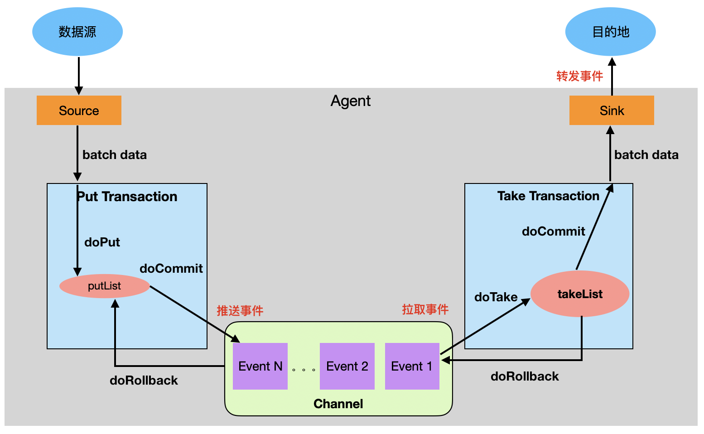

- Put事务
    1. doPut：先将数据写入临时缓冲区putList
    2. doCommit： 检查 channel 内存队列是否充足
    3. doRollback：如果channel空间不足，回滚数据到putList

- Take事务
    1. doTake：将数据写入临时缓冲区takeList
    2. doCommit：sink拉取数据，将数据发送给sink
    ，如果发送成功，则清空tableList
    3. doRollback：数据发送如果发生异常，则将 tabkelist
的数据回滚到channel队列

## 数据传输的流程
### 传输流程图
[top](#catalog)
- 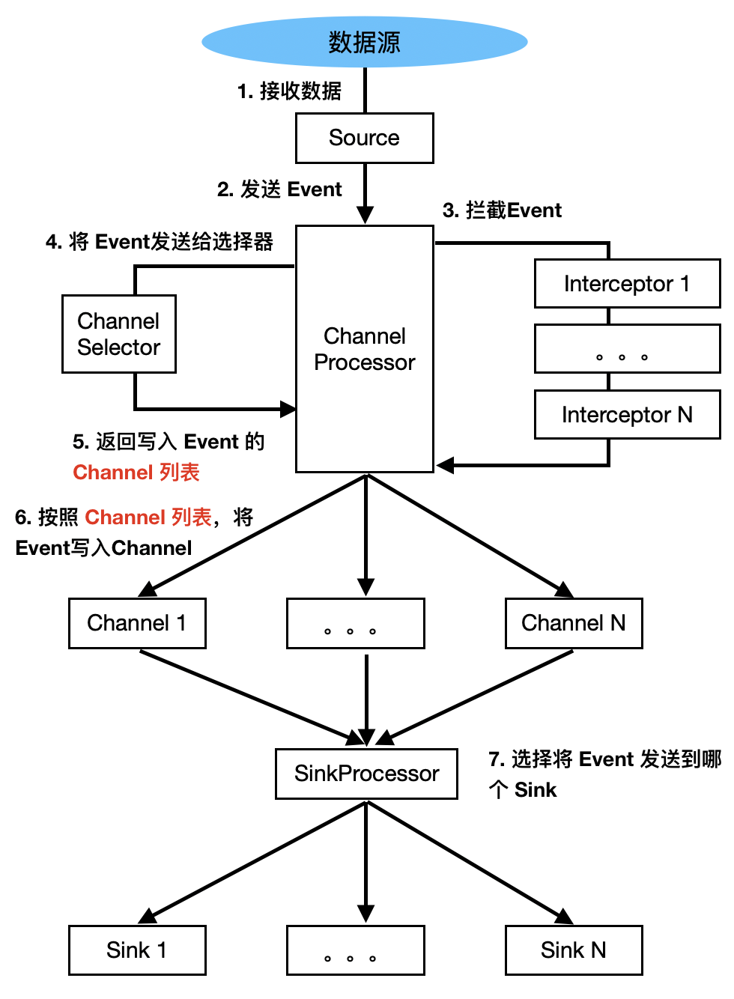

### ChannelSelector
[top](#catalog)
- 作用
    - 选出写入 Event 的 Channel 列表
- 两种类型
    - Replicating，副本完全拷贝，**默认选择器**
    - Multiplexing，多路复用

- Replicating，副本完全拷贝
    - 将 Event 拷贝到所有已绑定的 Channel
    - 示例
        ```
        a1.sources = r1
        a1.channels = c1 c2 c3
        a1.sources.r1.selector.type = replicating
        a1.sources.r1.channels = c1 c2 c3
        a1.sources.r1.selector.optional = c3
        ```
-  Multiplexing---多路复用
    - 会在 N 个已绑定的 Channel 中进行选择
    - 需要在配置文件中添加**选择策略**
    - 需要配合**拦截器**使用，来添加`state`头信息
    - 示例
        ```
        a1.sources = r1
        a1.channels = c1 c2 c3 c4
        a1.sources.r1.selector.type = multiplexing
        # 在 Event 的 header 中添加数据: state，来辅助选择策略的执行
        # {state: CZ/US}，根据state具体的数据来选择，如果没有设置，则使用 Default 中指定的 channel
        a1.sources.r1.selector.header = state
        a1.sources.r1.selector.mapping.CZ = c1
        a1.sources.r1.selector.mapping.US = c2 c3
        a1.sources.r1.selector.default = c4
        ```

### SinkProcessor
[top](#catalog)
- DefaultSinkProcessor，对应 1 个的 Sink，**默认选择器**
- LoadBalancingSinkProcessor，对应SinkGroup
    - 可以实现负载均衡
    - 无法一次将整个数据发送到一个 sink，会对数据进行切分
- FailoverSinkProcessor，对应SinkGroup
    - 可以实现故障转移
    - 实际对应的目标仍然是 1 个 sink
    - 优先往某一个sink发送，如果sink挂了，再向其他sink发送
        - flume会定期尝试访问已经挂掉的sink。每次尝试后**重新访问的时间加倍**

## flume的拓扑结构
### 拓扑结构---串联
[top](#catalog)
- 顺序连接多个 agent，从第一个 source 开始到最终 sink 传送的目的地
- 不建议桥接过多的 agent
    - agent 数量过多不仅会影响传输速率
    - 如果某个节点的 agent 宕机，会影响整个传输系统
- 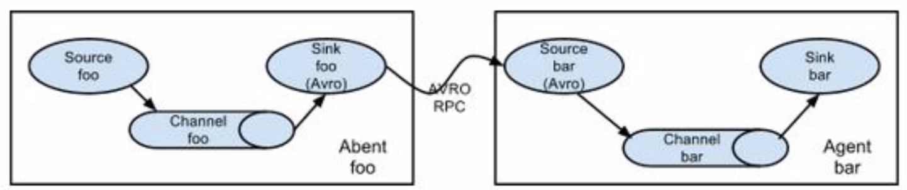

### 拓扑结构---复制和多路复用
[top](#catalog)
- 将相同数据复制到多个 channel 中，或者将不同数据分发到不同的 channel 中
- 在 sink 端可以选择传送到不同的目的地
- 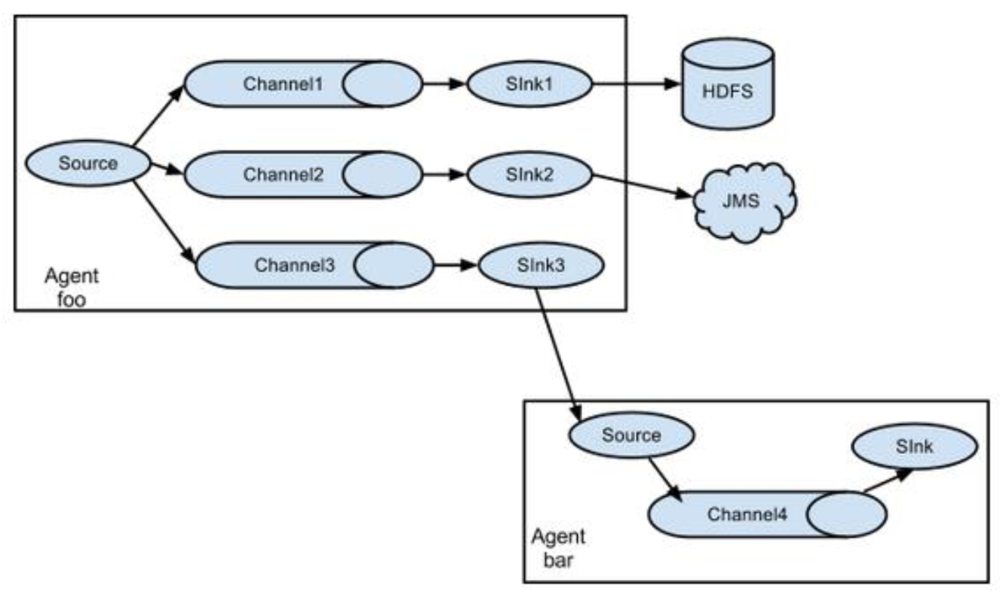

### 拓扑结构---负载均衡和故障转移
[top](#catalog)
- 将多个 sink 逻辑上分到一个 sink 组
- sink 组配合不同的 SinkProcessor 可以实现负载均衡和错误恢复
- 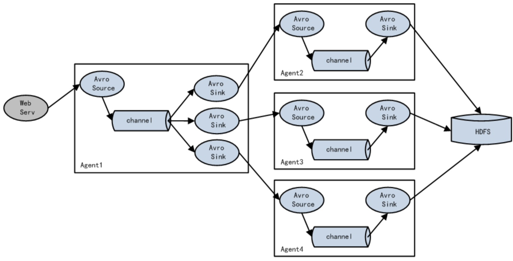

### 拓扑结构---聚合
[top](#catalog)
- 最常见、最实用的结构
- web 应用通常分布在成百上千个服务器，日志处理和复杂。可以通过**聚合结构**来处理
- 处理方式
    1. 每台服务器部署一个 flume 采集日志
    2. 每个服务器再将日志**传送**到一个**集中收集日志**的 flumeX
    3. 再由 flumeX 将数据上传到 hdfs、hive、hbase 等，进行日志分析
- 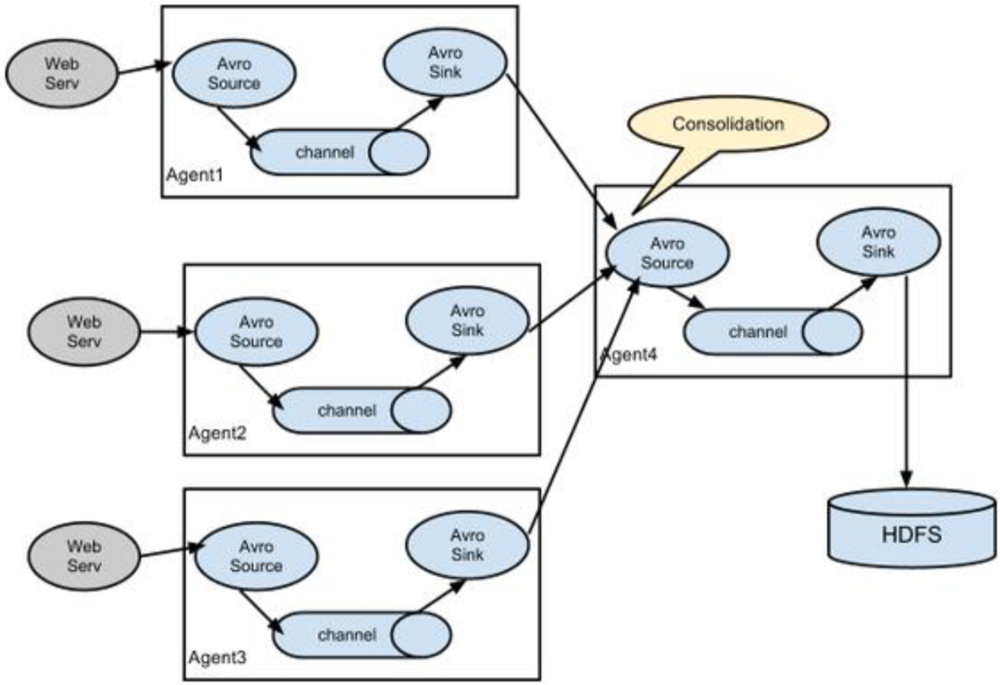

# 实际应用
## 复制
[top](#catalog)
- 需求
    - 使用 flume1 监控hive日志的变化
    - flume1 将变化的内容发送给 flume2、flume3
    - flume2 将数据存储到 hdfs
    - flume3 将数据输出到本地
- 流程图
    - 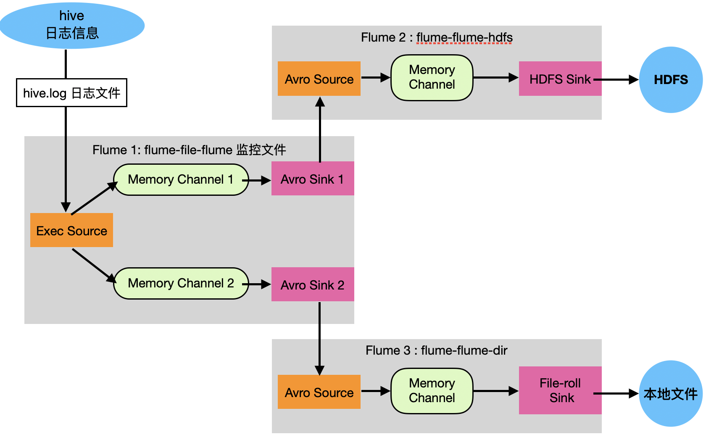
- 配置文件
    - 参考
        - [src/conf/inaction/reaplace_multiplex/flume1.conf](src/conf/inaction/reaplace_multiplex/flume1.conf)
        - [src/conf/inaction/reaplace_multiplex/flume2.conf](src/conf/inaction/reaplace_multiplex/flume2.conf)
        - [src/conf/inaction/reaplace_multiplex/flume3.conf](src/conf/inaction/reaplace_multiplex/flume3.conf)
    - flume1
        ```
        # 1. define source, channel, sink
        a1.sources = r1
        # 同时定义多个 sink
        a1.sinks = k1 k2
        # 同时定义多个 channel
        a1.channels = c1 c2

        # 2. source，监控本地hive.log
        a1.sources.r1.type = TAILDIR
        a1.sources.r1.filegroups = f1
        a1.sources.r1.filegroups.f1 = /tmp/root/hive.log
        a1.sources.r1.positionFile = /opt/module/apache-flume-1.7.0-bin/tail_dir.json

        # 3. avro sink，将数据传递到其他 flume
        # 设置两个sink分别将数据传输到不同的 flume 中
        a1.sinks.k1.type = avro
        a1.sinks.k1.hostname = nn01
        a1.sinks.k1.port = 5001

        a1.sinks.k2.type = avro
        a1.sinks.k2.hostname = nn01
        a1.sinks.k2.port = 5002

        # 4. channels
        a1.channels.c1.type = memory
        a1.channels.c1.capacity = 1000
        a1.channels.c1.transactionCapacity = 100

        a1.channels.c2.type = memory
        a1.channels.c2.capacity = 1000
        a1.channels.c2.transactionCapacity = 100

        # 5. connect source、channel、sink
        a1.sources.r1.channels = c1 c2
        a1.sinks.k1.channel = c1
        a1.sinks.k2.channel = c2
        # 默认将数据拷贝到每一个 channel
        a1.sources.r1.selector.type = replicating
        ```
    - flume2
        ```
        # 1. define source, channel, sink
        a2.sources = r1
        a2.sinks = k1
        a2.channels = c1

        # 2. source，从 flume1 的第一个 sink 中接收数据
        a2.sources.r1.type = avro
        a2.sources.r1.bind = nn01
        a2.sources.r1.port = 5001

        # 3. hdfs sink，将数据写入hdfs
        a2.sinks.k1.type = hdfs
        a2.sinks.k1.hdfs.path = hdfs://nn01:9000/flume-group1/%Y%m%d/%H
        a2.sinks.k1.hdfs.filePrefix = logs-
        a2.sinks.k1.hdfs.rollInterval = 30
        a2.sinks.k1.hdfs.rollSize = 134217700
        a2.sinks.k1.hdfs.rollCount = 0
        a2.sinks.k1.hdfs.round = true
        a2.sinks.k1.hdfs.roundValue = 1
        a2.sinks.k1.hdfs.roundUnit = hour
        a2.sinks.k1.hdfs.useLocalTimeStamp = true
        a2.sinks.k1.hdfs.batchSize = 1000
        a2.sinks.k1.hdfs.fileType = DataStream

        # 4. channels
        a2.channels.c1.type = memory
        a2.channels.c1.capacity = 1000
        a2.channels.c1.transactionCapacity = 100

        # 5. connect source、channel、sink
        a2.sources.r1.channels = c1
        a2.sinks.k1.channel = c1
        ```
    - flume3
        ```
        # 1. define source, channel, sink
        a3.sources = r1
        a3.sinks = k1
        a3.channels = c1

        # 2. source，从 flume1 的第二个 sink 中接收数据
        a3.sources.r1.type = avro
        a3.sources.r1.bind = nn01
        a3.sources.r1.port = 5002

        # 3. file_roll sink
        a3.sinks.k1.type = file_roll
        a3.sinks.k1.sink.directory = /opt/datas/group1

        # 4. channels
        a3.channels.c1.type = memory
        a3.channels.c1.capacity = 1000
        a3.channels.c1.transactionCapacity = 100

        # 5. connect source、channel、sink
        a3.sources.r1.channels = c1
        a3.sinks.k1.channel = c1
        ```

- 实现
    1. 创建配置目录
        ```
        mkdir /opt/module/apache-flume-1.7.0-bin/job/group1
        ```
    2. sink的本地写入目录
        ```
        mkdir /opt/datas/group1
        ```
    3. 创建3个配置文件
        ```
        touch job/group1/flume1.conf
        touch job/group1/flume2.conf
        touch job/group1/flume3.conf
        ```
    4. 按照<span style='color:red'>从下游到上游</span>的顺序依次启动3个flume
        - 因为 avro source 相当于服务端，所以应该先开启下游的flume
        - 指令
            ```
            bin/flume-ng agent \
            -n a2 \
            -c conf \
            -f job/group1/flume2.conf
            ```
            ```
            bin/flume-ng agent \
            -n a3 \
            -c conf \
            -f job/group1/flume3.conf
            ```
            ```
            bin/flume-ng agent \
            -n a1 \
            -c conf \
            -f job/group1/flume1.conf
            ```
    5. 关闭时，先关闭上游，再关闭下游

## sink组应用---故障转移
[top](#catalog)
- 参考
    - http://flume.apache.org/FlumeUserGuide.html#failover-sink-processor
- 需求
    - 使用 flume 监控一个端口
    - sink 组中分别连接 flume2、flume3
    - flume2、flume3 分别设置优先级，发送数据时，往优先级高的sink发送数据
    - 采用 FailoverSinkProcess 策略实现故障转移
- 流程图
    - 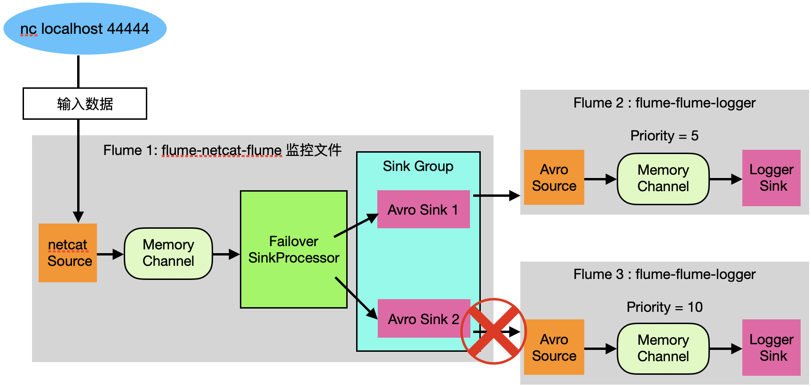

- 故障转移的方式
    - 假设有 3 台 sink，`processor.maxpenalty` 默认为30s
        ```
        sink : k1  k2  k3
        优先级: 3   2   1
        ```
    - 按照优先级，先访问 k1
    - 如果 k1 挂了，则进入`失败队列`
    - 然后按照优先级，使用 k2
    - k1 重启后
        - 如果时间在 `processor.maxpenalty` 的范围内，则不考虑使用，仍然放在`失败队列`中
        - 如果在 `processor.maxpenalty` 时间外，k1重启并可用，则将 k1 从 `失败队列` 中删除，继续使用 k1

- 配置文件
    - 参考
        - [src/conf/inaction/failover/flume1.conf](src/conf/inaction/failover/flume1.conf)
        - [src/conf/inaction/failover/flume2.conf](src/conf/inaction/failover/flume2.conf)
        - [src/conf/inaction/failover/flume3.conf](src/conf/inaction/failover/flume3.conf)
    - flume1
        ```
        a1.sources = r1
        # 同时设置多个 sink，作为sink组
        a1.sinks = k1 k2
        a1.channels = c1

        # Describe/configure the source
        a1.sources.r1.type = netcat
        a1.sources.r1.bind = localhost
        a1.sources.r1.port = 44444

        # channel
        a1.channels.c1.type = memory
        a1.channels.c1.capacity = 1000
        a1.channels.c1.transactionCapacity = 100

        # sink
        a1.sinks.k1.type = avro
        a1.sinks.k1.hostname = nn01
        a1.sinks.k1.port = 5001

        a1.sinks.k2.type = avro
        a1.sinks.k2.hostname = nn01
        a1.sinks.k2.port = 5002

        # bind
        a1.sources.r1.channels = c1
        a1.sinks.k1.channel = c1
        a1.sinks.k2.channel = c1

        # sink group，配置sink组与failover的策略
        a1.sinkgroups = g1
        a1.sinkgroups.g1.sinks = k1 k2
        a1.sinkgroups.g1.processor.type = failover
        a1.sinkgroups.g1.processor.priority.k1 = 5
        # 优先使用 k2
        a1.sinkgroups.g1.processor.priority.k2 = 10
        a1.sinkgroups.g1.processor.maxpenalty = 10000
        ```
    - flume2
        ```
        # 1. define source, channel, sink
        a2.sources = r1
        a2.sinks = k1
        a2.channels = c1

        # 2. source，关联sink组中的第一个sink
        a2.sources.r1.type = avro
        a2.sources.r1.bind = nn01
        a2.sources.r1.port = 5001

        # 3. logger sink
        a2.sinks.k1.type = logger

        # 4. channels
        a2.channels.c1.type = memory
        a2.channels.c1.capacity = 1000
        a2.channels.c1.transactionCapacity = 100

        # 5. connect source、channel、sink
        a2.sources.r1.channels = c1
        a2.sinks.k1.channel = c1
        ```
    - flume3，只是关联的sink不同，其他与 flume2 完全相同
        ```
        # 1. define source, channel, sink
        a3.sources = r1
        a3.sinks = k1
        a3.channels = c1

        # 2. source，关联sink组中的第一个sink
        a3.sources.r1.type = avro
        a3.sources.r1.bind = nn01
        a3.sources.r1.port = 5002

        # 3. logger sink
        a3.sinks.k1.type = logger

        # 4. channels
        a3.channels.c1.type = memory
        a3.channels.c1.capacity = 1000
        a3.channels.c1.transactionCapacity = 100

        # 5. connect source、channel、sink
        a3.sources.r1.channels = c1
        a3.sinks.k1.channel = c1
        ```

- 实现
    1. 创建配置目录
        ```
        mkdir /opt/module/apache-flume-1.7.0-bin/job/group2
        ```
    2. 创建3个配置文件
        ```
        touch job/group2/flume1.conf
        touch job/group2/flume2.conf
        touch job/group2/flume3.conf
        ```
    3. 启动 flume。先启动下游，再启动上游
        ```
        bin/flume-ng agent \
        -n a2 \
        -c conf \
        -f job/group2/flume2.conf \
        -Dflume.root.logger=INFO,console
        ```
        ```
        bin/flume-ng agent \
        -n a3 \
        -c conf \
        -f job/group2/flume3.conf \
        -Dflume.root.logger=INFO,console
        ```
        ```
        bin/flume-ng agent \
        -n a1 \
        -c conf \
        -f job/group2/flume1.conf
        ```
    4. 启动nc
        ```
        nc localhost 44444
        ```
    5. 切断 k2 （flume3）来测试故障转移

## sink组应用---负载均衡
[top](#catalog)
- 参考
    - http://flume.apache.org/FlumeUserGuide.html#load-balancing-sink-processor
- 需求
    - 使用 flume 监控一个端口
    - sink 组中分别连接 flume2、flume3
    - 采用 Load balancing SinkProcess 策略实现负载均衡
- 流程图
    - 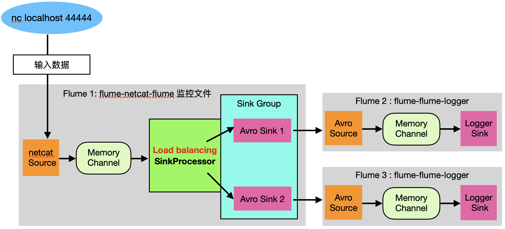

- 配置内容
    - <span style='color:red'>与负载均衡配置的区别</spam>
        - 将sink组的策略改为 `load_balance`
    - 参考
        - [src/conf/inaction/balance/flume1.conf](src/conf/inaction/balance/flume1.conf)
        - [src/conf/inaction/balance/flume2.conf](src/conf/inaction/balance/flume2.conf)
        - [src/conf/inaction/balance/flume3.conf](src/conf/inaction/balance/flume3.conf)
    - flume1
        ```
        a1.sources = r1
        a1.sinks = k1 k2
        a1.channels = c1

        # Describe/configure the source
        a1.sources.r1.type = netcat
        a1.sources.r1.bind = localhost
        a1.sources.r1.port = 44444

        # channel
        a1.channels.c1.type = memory
        a1.channels.c1.capacity = 1000
        a1.channels.c1.transactionCapacity = 100

        # sink
        a1.sinks.k1.type = avro
        a1.sinks.k1.hostname = nn01
        a1.sinks.k1.port = 5001

        a1.sinks.k2.type = avro
        a1.sinks.k2.hostname = nn01
        a1.sinks.k2.port = 5002

        # bind
        a1.sources.r1.channels = c1
        a1.sinks.k1.channel = c1
        a1.sinks.k2.channel = c1

        # sink group，在sink组内使用负载均衡策略
        a1.sinkgroups = g1
        a1.sinkgroups.g1.sinks = k1 k2
        a1.sinkgroups.g1.processor.type = load_balance
        a1.sinkgroups.g1.processor.backoff = true
        a1.sinkgroups.g1.processor.selector = random
        ```
- 实现
    1. 创建配置目录
        ```
        mkdir /opt/module/apache-flume-1.7.0-bin/job/group3
        ```
    2. 创建3个配置文件
        ```
        touch job/group3/flume1.conf
        touch job/group3/flume2.conf
        touch job/group3/flume3.conf
        ```
    3. 启动 flume。先启动下游，再启动上游
        ```
        bin/flume-ng agent \
        -n a2 \
        -c conf \
        -f job/group3/flume2.conf \
        -Dflume.root.logger=INFO,console
        ```
        ```
        bin/flume-ng agent \
        -n a3 \
        -c conf \
        -f job/group3/flume3.conf \
        -Dflume.root.logger=INFO,console
        ```
        ```
        bin/flume-ng agent \
        -n a1 \
        -c conf \
        -f job/group3/flume1.conf
        ```
    4. 启动nc
        ```
        nc localhost 44444
        ```
    5. 通过在nc的上输出数据来测试负载均衡

## 聚合---单个端口单个source
[top](#catalog)
- 需求
    - dn01 上的flume1监控文件 `/opt/module/group.log`
    - dn02 上的flume2监控某个端口的数据
    - flume1、flume2 将数据发送给 dn03 上的flume3
    - flume3 将收集到的数据输出到控制台
- 流程图
    - 
- 配置内容
    - 参考
        - 
        - 
        - 
    - flume1
        ```
        a1.sources = r1
        a1.sinks = k1
        a1.channels = c1

        # Describe/configure the source
        a1.sources.r1.type = TAILDIR
        a1.sources.r1.filegroups = f1
        a1.sources.r1.filegroups.f1 = /opt/module/group.log
        a1.sources.r1.positionFile = /opt/module/apache-flume-1.7.0-bin/tail_dir.json

        # channel
        a1.channels.c1.type = memory
        a1.channels.c1.capacity = 1000
        a1.channels.c1.transactionCapacity = 100

        # sink，将sink绑定到另一台机器 dn03
        a1.sinks.k1.type = avro
        a1.sinks.k1.hostname = dn03
        a1.sinks.k1.port = 5001

        # bind
        a1.sources.r1.channels = c1
        a1.sinks.k1.channel = c1
        ```
    - flume2
        ```
        a2.sources = r1
        a2.sinks = k1
        a2.channels = c1

        # Describe/configure the source
        a2.sources.r1.type = netcat
        a2.sources.r1.bind = localhost
        a2.sources.r1.port = 44444

        # channel
        a2.channels.c1.type = memory
        a2.channels.c1.capacity = 1000
        a2.channels.c1.transactionCapacity = 100

        # sink，将sink绑定到另一台机器 dn03
        a2.sinks.k1.type = avro
        a2.sinks.k1.hostname = dn03
        a2.sinks.k1.port = 5001

        # bind
        a2.sources.r1.channels = c1
        a2.sinks.k1.channel = c1
        ```
    - flume3
        ```
        # 1. define source, channel, sink
        a3.sources = r1
        a3.sinks = k1
        a3.channels = c1

        # 2. source，绑定本地机器，来获取其他机器上的sink发送的数据
        a3.sources.r1.type = avro
        a3.sources.r1.bind = dn03
        a3.sources.r1.port = 5001

        # 3. logger sink
        a3.sinks.k1.type = logger

        # 4. channels
        a3.channels.c1.type = memory
        a3.channels.c1.capacity = 1000
        a3.channels.c1.transactionCapacity = 100

        # 5. connect source、channel、sink
        a3.sources.r1.channels = c1
        a3.sinks.k1.channel = c1
        ```

- 实现
    1. dn03
        - 在dn03上创建配置
            ```
            mkdir job/group4
            touch job/group4/flume3.conf
            ```
        - 作为下游，先启动 flume3
            ```
            bin/flume-ng agent \
            -n a3 \
            -c conf \
            -f job/group4/flume3.conf \
            -Dflume.root.logger=INFO,console
            ```
    2. dn01
        - 创建配置
            ```
            mkdir job/group4
            touch job/group4/flume1.conf
            ```
        - 创建被监控的文件
            ```
            touch /opt/module/group.log
            ```
        - 作为上游启动 flume1
            ```
            bin/flume-ng agent \
            -n a1 \
            -c conf \
            -f job/group4/flume1.conf
            ```
        - 向文件中写入数据
            ```
            echo 'test' >> /opt/module/group.log
            ```

    3. dn02
        - 创建配置
            ```
            mkdir job/group4
            touch job/group4/flume2.conf
            ```
        - 作为上游启动 flume1
            ```
            bin/flume-ng agent \
            -n a2 \
            -c conf \
            -f job/group4/flume2.conf
            ```
        - 启动nc
            ```
            nc localhost 44444
            ```
        - 在nc控制台中输出数据
    4. 在 dn01 上监视数据的输出

## 聚合---多个端口多个source
[top](#catalog)
- 与 [聚合---单个端口单个source](#聚合---单个端口单个source) 基本相同
- 配置方式
    - dn03
        - 在 flume3 上，设置多个source来监听多个端口的数据
            - source1: 5001
            - source2: 5002
        - flume3 的多个 source 全部连接到一个 channel
    - dn01
        - 将 sink 绑定到 dn03 的 5001 端口
    - dn02
        - 将 sink 绑定到 dn03 的 5002 端口

- 配置内容
    - 参考
        - [src/conf/inaction/reduce_mutilsource/flume1.conf](src/conf/inaction/reduce_multisource/flume1.conf)
        - [src/conf/inaction/reduce_multisource/flume2.conf](src/conf/inaction/reduce_multisource/flume2.conf)
        - [src/conf/inaction/reduce_multisource/flume3.conf](src/conf/inaction/reduce_multisource/flume3.conf)
    - flume3 上配置多个 source，监听多个端口
        ```
        # 1. define source, channel, sink
        # 设置多个 source
        a3.sources = r1 r2
        a3.sinks = k1
        a3.channels = c1

        # 2. source，每个source监听不同的端口
        a3.sources.r1.type = avro
        a3.sources.r1.bind = dn03
        a3.sources.r1.port = 5001

        a3.sources.r2.type = avro
        a3.sources.r2.bind = dn03
        a3.sources.r2.port = 5002

        # 3. logger sink
        a3.sinks.k1.type = logger

        # 4. channels
        a3.channels.c1.type = memory
        a3.channels.c1.capacity = 1000
        a3.channels.c1.transactionCapacity = 100

        # 5. connect source、channel、sink
        a3.sources.r1.channels = c1
        a3.sources.r2.channels = c1
        a3.sinks.k1.channel = c1
        ```
- 实现方式
    - 参考：[聚合---单个端口单个source](#聚合---单个端口单个source)

# 自定义
## 自定义Interceptor---多路复用
[top](#catalog)
- 需求
    - 使用 flume 采集服务器本地日志
    - 需要按照日志类型，将不同的日志发送到不同的分析系统
- 需求分析
    - 使用 flume 拓扑图结构中的多路复用结构（Mutiplexing）
    - 根据 event 中 header 的某个 key，将不同的event 发送到不同的 channel，每个channel绑定处理不同类型日志的 sink
    - 需要自定义一个 Interceptor，为不同类型的 event 的 header 中的 key 设值
- 实现方式
    - 以端口数据模拟日志
    - 根据数据中的内容做区分，来模拟不同类型的日志
        - 包含 hello 的为 str 日志
        - 其他为 num 日志
    - 自定义 Interceptor区分数字和字母，将 event 发送到不同的 channel，再送到不同的分析系统
- 流程图
    - 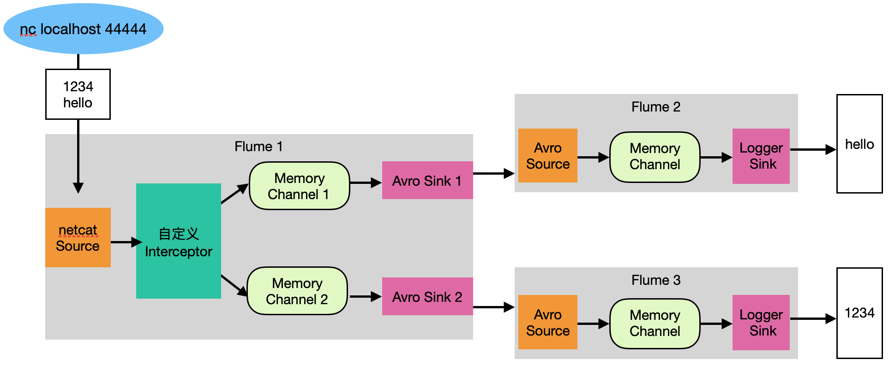

- 需要添加 maven 依赖
    ```xml
    <dependency>
      <groupId>org.apache.flume</groupId>
      <artifactId>flume-ng-core</artifactId>
      <version>1.7.0</version>
    </dependency>
    ```

- 自定义 interceptor
    - 参考
        - [src/flume-learn/flume-base/src/main/java/com/ljs/learn/flumebase/interceptor/TypeInterceptor.java](src/flume-learn/flume-base/src/main/java/com/ljs/learn/flumebase/interceptor/TypeInterceptor.java)
    - 需要实现 `Interceptor` 接口
    - 代码内容
        ```java
        public class TypeInterceptor implements Interceptor {
            // 创建一个集合来保存 event
            private List<Event> events;

            @Override
            public void initialize() {
                events = new ArrayList<>();
            }

            // 单个 event 拦截
            @Override
            public Event intercept(Event event) {
                // 1. 获取 event 中的 header
                Map<String, String> headers = event.getHeaders();

                // 2. 获取 event 中的body。需要将 []byte 转换为字符串
                String body = new String(event.getBody());

                // 3. 根据body中的数据添加头信息
                if (body.contains("hello")){
                    headers.put("type", "str");
                } else {
                    headers.put("type","num");
                }

                return event;
            }

            // 批量 event 拦截
            @Override
            public List<Event> intercept(List<Event> list) {
                // 1. 清空集合
                events.clear();

                // 2. 遍历 event，给每一个 event 添加头信息
                for (Event e : list) {
                    events.add(intercept(e));
                }

                // 3. 返回结果
                return events;
            }

            @Override
            public void close() {

            }

            // 启动类
            public static class Builder implements Interceptor.Builder{

                @Override
                public Interceptor build() {
                    return new TypeInterceptor();
                }

                @Override
                public void configure(Context context) {

                }
            }
        }
        ```

- 配置内容
    - 参考
        - [src/conf/customise/interceptor/flume1.conf](src/conf/customise/interceptor/flume1.conf)
        - [src/conf/customise/interceptor/flume2.conf](src/conf/customise/interceptor/flume2.conf)
        - [src/conf/customise/interceptor/flume3.conf](src/conf/customise/interceptor/flume3.conf)
    - 在 flume 中配置多路复用，与拦截器
        ```
        # 1. define source, channel, sink
        a1.sources = r1
        a1.sinks = k1 k2
        a1.channels = c1 c2

        # 2. source，监控本地hive.log
        a1.sources.r1.type = netcat
        a1.sources.r1.bind = localhost
        a1.sources.r1.port = 44444

        # 3. avro sink，将数据传递到其他 flume
        a1.sinks.k1.type = avro
        a1.sinks.k1.hostname = nn01
        a1.sinks.k1.port = 5001

        a1.sinks.k2.type = avro
        a1.sinks.k2.hostname = nn01
        a1.sinks.k2.port = 5002

        # 4. channels
        a1.channels.c1.type = memory
        a1.channels.c1.capacity = 1000
        a1.channels.c1.transactionCapacity = 100

        a1.channels.c2.type = memory
        a1.channels.c2.capacity = 1000
        a1.channels.c2.transactionCapacity = 100

        # 5. connect source、channel、sink
        a1.sources.r1.channels = c1 c2
        a1.sinks.k1.channel = c1
        a1.sinks.k2.channel = c2

        # 6. 配置channel 选择器
        a1.sources.r1.selector.type = multiplexing
        a1.sources.r1.selector.header = type
        # 将不同的键值绑定到不同的 channel
        a1.sources.r1.selector.mapping.str = c1
        a1.sources.r1.selector.mapping.num = c2
        a1.sources.r1.selector.default = c2

        # 配置 Interceptor，来配合 channel 选择器
        a1.sources.r1.interceptors = i1
        # 设置自定义拦截器的内部静态类
        a1.sources.r1.interceptors.i1.type = com.ljs.learn.flumebase.interceptor.TypeInterceptor$Builder
        ```

- 实现过程
    1. 开发自定义 Interceptor
    2. 打包并上传到 `/opt/module/apache-flume-1.7.0-bin/lib`
    3. 创建配置文件目录
        ```
        mkdir /opt/module/apache-flume-1.7.0-bin/job/interceptor
        ```

    4. 创建3个配置文件
        ```
        touch job/interceptor/flume1.conf
        touch job/interceptor/flume2.conf
        touch job/interceptor/flume3.conf
        ```
    5. 启动 flume。先启动下游，再启动上游
        ```
        bin/flume-ng agent \
        -n a2 \
        -c conf \
        -f job/interceptor/flume2.conf \
        -Dflume.root.logger=INFO,console
        ```
        ```
        bin/flume-ng agent \
        -n a3 \
        -c conf \
        -f job/interceptor/flume3.conf \
        -Dflume.root.logger=INFO,console
        ```
        ```
        bin/flume-ng agent \
        -n a1 \
        -c conf \
        -f job/source/flume.conf \
        -Dflume.root.logger=INFO,console
        ```
    6. 启动nc
        ```
        nc localhost 44444
        ```
    7. 通过在nc的上输出数据来测试interceptor

## 自定义Source
[top](#catalog)
- 参考
    - http://flume.apache.org/releases/content/1.9.0/FlumeDeveloperGuide.html#source
- 自定义 Source
    - 参考
        - [src/flume-learn/flume-base/src/main/java/com/ljs/learn/flumebase/source/MySource.java](src/flume-learn/flume-base/src/main/java/com/ljs/learn/flumebase/source/MySource.java)
    - 代码内容
        ```java
        public class MySource extends AbstractSource implements Configurable, PollableSource {
            // 定义全局的前缀和后缀
            private String prefix;
            private String suffix;

            @Override
            public void configure(Context context) {
                // 读取配置信息
                // 没有默认值
                prefix = context.getString("prefix");

                // 有默认值
                suffix = context.getString("suffix", "testsuf");
            }

            // 处理正常需要返回 Status.READY
            // 处理异常需要返回 Status.BACKOFF
            @Override
            public Status process() throws EventDeliveryException {
                Status status = null;

                // 1. 手动创建数据，来模拟接收数据
                try {
                    for (int i = 0; i < 5; i++) {
                        // 2. 将数据封装为 event
                        // 创建 event 对象
                        SimpleEvent event = new SimpleEvent();
                        // 设置 body
                        event.setBody((prefix + "---" + i + "-----"+suffix).getBytes());
                        // 3. 将 event 发送到 channel
                        getChannelProcessor().processEvent(event);
                    }
                    status = Status.READY;
                } catch (Exception e) {
                    status = Status.BACKOFF;
                    e.printStackTrace();
                }


                // 每2s 输出5条数据
                try {
                    Thread.sleep(2000);
                } catch (InterruptedException e) {
                    e.printStackTrace();
                }
                return status;
            }

            @Override
            public long getBackOffSleepIncrement() {
                return 0;
            }

            @Override
            public long getMaxBackOffSleepInterval() {
                return 0;
            }

        }
        ```

- 配置
    - 参考
        - [src/conf/customise/source/flume1.conf](src/conf/customise/source/flume1.conf)
    - 配置内容
        ```
        # 1. define source, channel, sink
        a1.sources = r1
        a1.sinks = k1
        a1.channels = c1

        # 2. source，使用自定义source
        a1.sources.r1.type = com.ljs.learn.flumebase.source.MySource
        a1.sources.r1.prefix = aaaa
        a1.sources.r1.suffix = bbbb

        # 3. logger sink
        a1.sinks.k1.type = logger

        # 4. channels
        a1.channels.c1.type = memory
        a1.channels.c1.capacity = 1000
        a1.channels.c1.transactionCapacity = 100

        # 5. connect source、channel、sink
        a1.sources.r1.channels = c1
        a1.sinks.k1.channel = c1
        ```

- 实现过程
    1. 开发自定义 source
    2. 打包并上传到 `/opt/module/apache-flume-1.7.0-bin/lib`
    3. 创建配置文件目录
        ```
        mkdir /opt/module/apache-flume-1.7.0-bin/job/source
        ```
    4. 创建配置文件
        ```
        touch job/source/flume.conf
        ```
    5. 启动flume
        ```
        bin/flume-ng agent \
        -n a1 \
        -c conf \
        -f job/source/flume1.conf
        ```

## 自定义Sink
[top](#catalog)
- 参考
    - http://flume.apache.org/releases/content/1.9.0/FlumeDeveloperGuide.html#sink
- sink 如何运行
    - sink 不断轮询 channel 中的 event，并**批量**的删除 event
    - event 会被 sink 批量的写入存储或索引系统，或者发送到另一个 flume
- sink 批量删除 event 的事务流程
    1. 批量删除 channel 内的 event 之前，sink 用 channel 启动一个事务
    2. 批量 event 一旦成功写出，sink 通过 channel 提交事务
    3. 事务被提交后，channel 从内部缓冲区中删除 event

- 自定义 sink
    - 参考
        - [src/flume-learn/flume-base/src/main/java/com/ljs/learn/flumebase/sink/MySink.java](src/flume-learn/flume-base/src/main/java/com/ljs/learn/flumebase/sink/MySink.java)
    - 代码内容
        ```java
        public class MySink extends AbstractSink implements Configurable {
            // 定义前缀、后缀
            private String prefix;
            private String suffix;

            // 获取 logger 对象
            private Logger logger = LoggerFactory.getLogger(MySink.class);

            @Override
            public void configure(Context context) {
                prefix = context.getString("prefix");
                suffix = context.getString("suffix", "xxxx");
            }

            @Override
            public Status process() throws EventDeliveryException {
                Status status = null;

                // 1. 获取 channel
                Channel channel = getChannel();

                // 2. 从 channel 获取事务及数据
                Transaction transaction = channel.getTransaction();

                // 3. 开启事务
                transaction.begin();
                
                try {
                    // 4. 从 channel 获取数据
                    Event event = channel.take();

                    // 5. 处理 event
                    // 获取数据
                    if (event != null){
                        String body = new String(event.getBody());
                        logger.info(prefix + body + suffix);
                    }

                    // 6. 提交事务
                    transaction.commit();

                    // 7. 成功提交
                    status = Status.READY;
                } catch (ChannelException e) {
                    e.printStackTrace();

                    // 8. 提交失败，回滚事务
                    transaction.rollback();

                    // 9. 返回失败状态
                    status = Status.BACKOFF;
                } finally {
                    // 10. 关闭事务
                    transaction.close();
                }
                return status;
            }
        }
        ```

- 配置
    - 参考
        - [src/conf/customise/sink/flume1.conf](src/conf/customise/sink/flume1.conf)
    - 配置内容
        ```
        a1.sources = r1
        a1.sinks = k1
        a1.channels = c1

        a1.sources.r1.type = netcat
        a1.sources.r1.bind = localhost
        a1.sources.r1.port = 44444

        # sink，设置自定义 sink，并设置前缀、后缀
        a1.sinks.k1.type = com.ljs.learn.flumebase.sink.MySink
        a1.sinks.k1.prefix = start---
        a1.sinks.k1.suffix = ---end

        a1.channels.c1.type = memory
        a1.channels.c1.capacity = 1000
        a1.channels.c1.transactionCapacity = 100

        a1.sources.r1.channels = c1
        a1.sinks.k1.channel = c1
        ```

- 实现过程
    - 创建配置文件
        ```
        mkdir job/sink
        touch job/sink/flume1.conf
        ```
    - 开发自定义 sink，打包并上传到lib目录
    - 启动flume1
        ```
        bin/flume-ng agent \
        -n a1 \
        -c conf \
        -f job/sink/flume1.conf \
        -Dflume.root.logger=INFO,console
        ```
# Sink组应用
[top](#catalog)
- [sink组应用---故障转移](#sink组应用---故障转移)
- [sink组应用---负载均衡](#sink组应用---负载均衡)
- default 情况，只接收 1 个 sink

# flume可能会丢失数据的情况
[top](#catalog)
- flume 是不可能丢失数据的，其内部有完善的事务机制
- source 到 channel 是事务性的，channel 到 sink 是事务性的，因此这两个环节不会出现数据的丢失
- 唯一可能丢失数据的情况是 channel 采用 memoryChannel
    - agent 宕机导致数据丢失
    - 或者 channel 存储数据已满，导致 source 不再写入，未写入的数据丢失。
- flume 不会丢失数据，但是有可能造成数据的重复
    - 当数据已经成功由 sink 发出，如果没有接收到响应，sink 会再次发送数据，这可能会导致数据的重复

# 其他
[top](#catalog)
- 启动 nc
    - nc 启动服务端
        - nc -lk 44444
    - nc 启动客户端
        - nc 主机名 44444
- 启动时，应该先启动下游，再启动上游
- tail 是按行读取数据的，效率比较低
a1.sources.r1.command = tail -F /tmp/root/hive.log
- replacing的缺点
    - 每增加一个 下游，上游都需要增加一个 channel + sink
    - 不能动态增加
