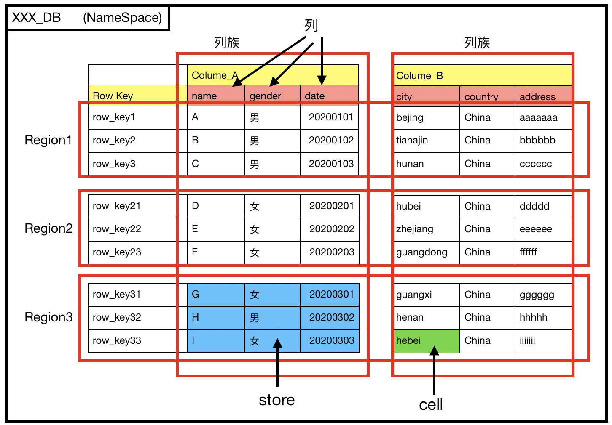
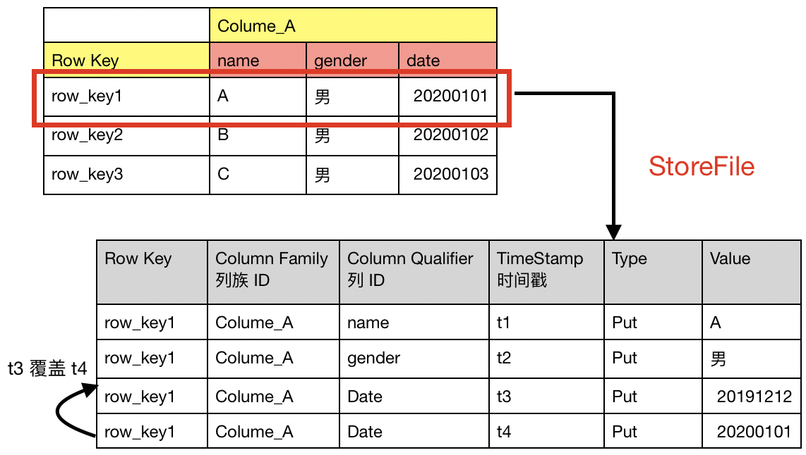
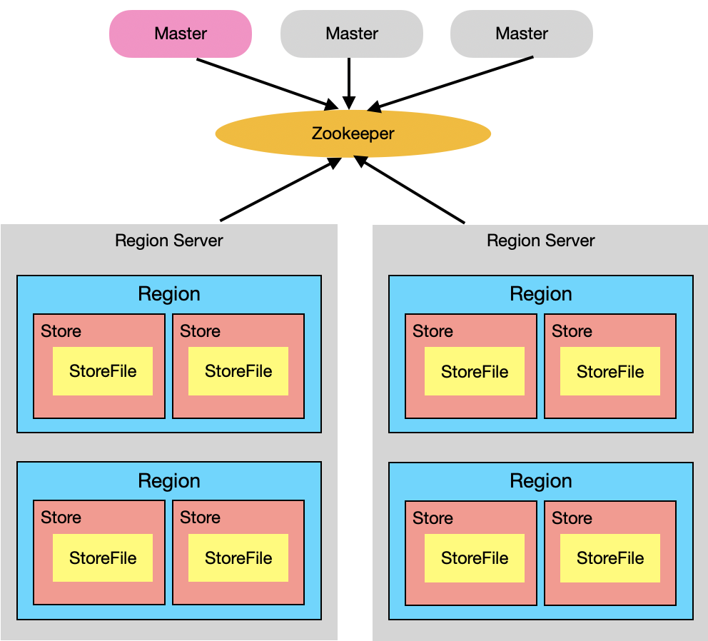
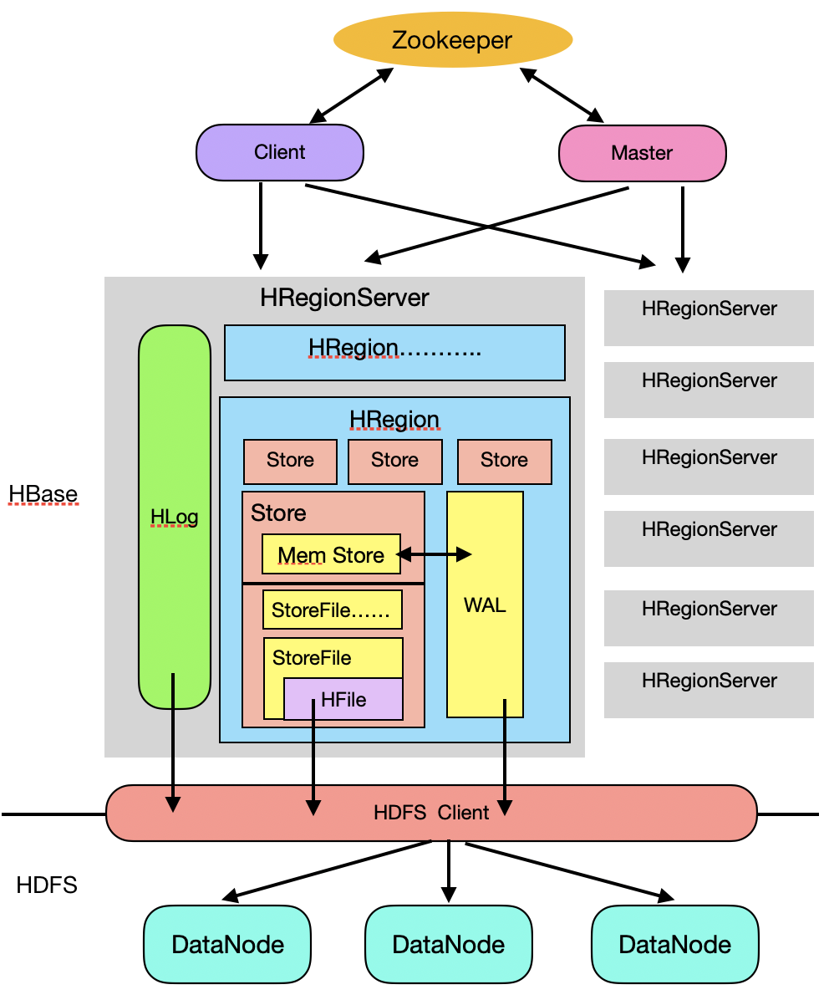
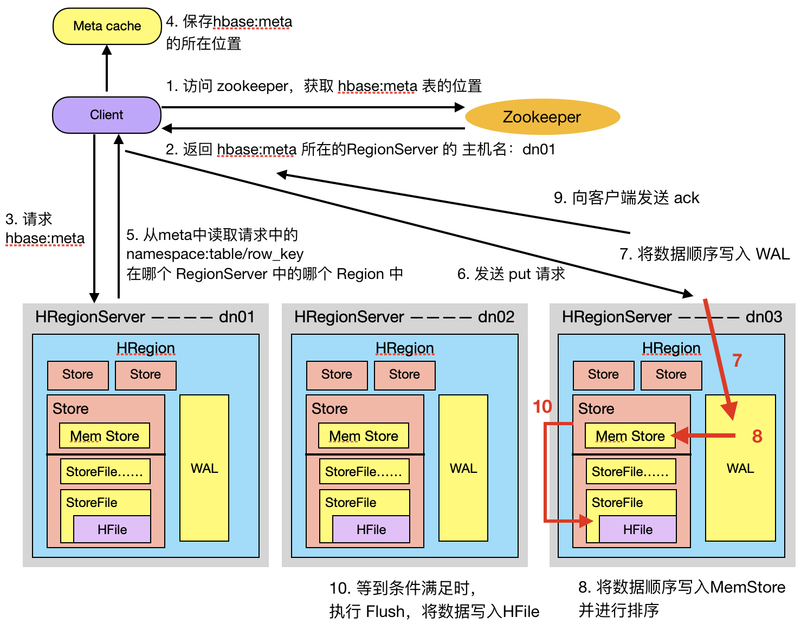
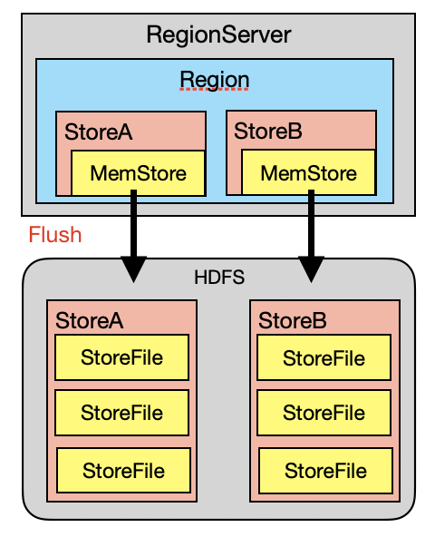
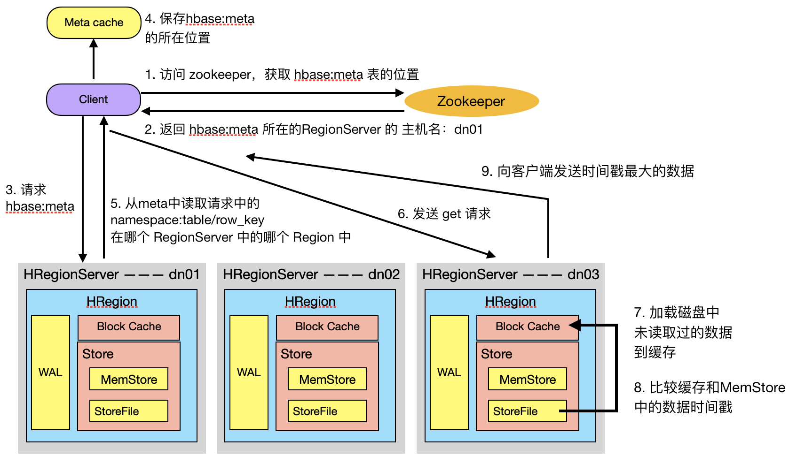

<span id="catalog"></span>

<span style='font-size:18px'>目录<span>

- [HBase数据模型](#HBase数据模型)
    - [HBase的逻辑结构](#HBase的逻辑结构)
    - [HBase的物理结构](#HBase的物理结构)
    - [数据模型](#数据模型)
- [HBase基本架构](#HBase基本架构)
    - [基本架构](#基本架构)
    - [架构角色](#架构角色)
- [安装](#安装)
- [shell操作](#shell操作)
    - [常用指令](#常用指令)
    - [命名空间操作](#命名空间操作)
    - [DDL命令](#DDL命令)
    - [DML命令](#DML命令)
- [架构原理图](#架构原理图)
    - [架构原理图](#架构原理图)
    - [读取HFile数据](#读取HFile数据)
    - [写数据流程](#写数据流程)
    - [MemStore_Flush流程](#MemStore_Flush流程)
    - [读数据流程](#读数据流程)
    - [StoreFile_Compaction---文件合并](#StoreFile_Compaction---文件合并)
    - [数据删除的时间](#数据删除的时间)
    - [Region_Split](#Region_Split)
- [API](#API)
    - [DDL--API](#DDL--API)
        - [判断表是否存在](#判断表是否存在)
        - [创建表](#创建表)
        - [删除表](#删除表)
        - [创建命名空间](#创建命名空间)
    - [DML--API](#DML--API)
        - [插入数据](#插入数据)
        - [扫描表](#扫描表)
        - [删除数据](#删除数据)
- [MapReduce](#MapReduce)
    - [添加MR配置](#添加MR配置)
    - [读取文件数据并插入表](#读取文件数据并插入表)
    - [将一个表的数据写入另一个表](#将一个表的数据写入另一个表)
- [对接Hive](#对接Hive)
    - [hive与hbase的区别](#hive与hbase的区别)
    - [配置hive-hbase](#配置hive-hbase)
    - [使用hive创建表并导入数据](#使用hive创建表并导入数据)
    - [创建外部表](#创建外部表)
- [HBase优化](#HBase优化)
    - [高可用](#高可用)
    - [预分区](#预分区)
        - [划分分区的依据](#划分分区的依据)
        - [通过指令创建预分区](#通过指令创建预分区)
        - [API创建预分区](#API创建预分区)
    - [RowKey的设计](#RowKey的设计)
- [](#)

# HBase数据模型

## HBase的逻辑结构

[top](#catalog)

- hbase 是一种分布式、可扩展、支持海量数据存储的NoSQL数据库
- 逻辑结构示意图
    - 
- 逻辑上，HBase的数据模型与关系型数据库类似
    - 数据存储在一张表内
    - 有行有列
- 从HBase的底层物理结构来看，更像个一个 `mult-dimensional map`，即多维度的表
- `row_key`
    - 每一条数据都有一个 `row_key`，每一条数据的 `row_key`都是**唯一的**
    - `row_key`  是属于一行的，一行的多个列族都是用同一个`row_key`
- 列族
    - 纵向切分
    - 一个列族一个文件夹，列族可以扩展。一个列族有多个列
- `region`
    - 横向切分
    - `region` 一个表的多个**横向**切片
    - 列族也会被划分
    - 可以防止数据量过大，导致的性能下降
- store 存储表数据
    - 都会保存在HDFS中
    - 列名等元数据会保存在内存中


## HBase的物理结构

[top](#catalog)

- 物理结构示意图
    - 

- StoreFile
    - 表中的每一行数据，都是由 StoreFile 中的多条数据来描述的
    - 表中的所有数据，实际上都是存储在 StoreFile 中的

- TimeStamp
    - 用于区分不同版本的数据，每次更新都会有一个版本
    - 用于实现 HDFS 的随机写操作，对于 HBase 十分重要
    - 操作之前，最好将所有的操作机器的时间同步
        - 因为可以通过 API 来操作，如果时间不同步，很可能造成时间戳不一致
    - 查询**某个列**的数据时，默认返回<span style='color:red'>时间戳最大的那一条数据</span>
- Type
    - 表示操作的类型
    - Put 插入，Delete 删除，Get 查询
        - 通过多次的 Put 来实现数据更新
    - 对于被 Delete 的数据，只有当这条数据的 **TimeStamp 是最大值时**，才能被认定为**已删除**
        - 具体什么时候删除，由HBase自己决定

## 数据模型

[top](#catalog)

- 以下为**从大到小排列**的数据模型

- Name Space，命名空间
    - 类似于关系型数据库中的 DatabBase
    - 每个命名空间下有多个表
    - HBase 的两个自带的命名空间
        - hbase
            - 用于保存 HBase 的内置表，类似于 kafka 的 `__consumer_offset`
        - default
            - 用户默认使用的命名空间
    
- Region，表的切片
    - 类似于关系型数据库的 Table
    - 与关系数据库的不同点
        - HBase <span style='color:red'>定义表时只需要声明列族，不需要声明具体的列</span>
            - 即：往 HBase 写入数据时，字段可以动态、按需指定
                - 每次写入的时候都是一组值，如:`name:XXX`，即在数据上表明列
            - 因此，HBase 能够轻松应对字段变化的场景
    - 刚创建表时，只有1个region。当数量增大时，会进行数据切分，切分成多个region
- Row，行
    - 表中的每行数据的组成: 一个 RowKey + 多个 Column(列)
    - 数据按照 RowKey 的字典顺序存储
    - 查询数据时<span style='color:red'>只能根据 RowKey 进行检索</span>，所以 RowKey 的设计十分重要

- Column，列
    - 如何限定 HBase 中的一个列
        - `HBase 中的每个列 = Column Family 列族 + Column Qualifier 列限定符`
    - 建表时，只需指明列族，而列限定符无需预先定义

- Time Stamp
    - 用于标识数据的不同版本(version)
        - 对于一个列族中的一个列的值，在多次修改时，StoreFile中的内容除了 `Value` 可以发生修改，其他的都不能修改
    - 数据写入时，如果未指定时间戳，系统会自动添加该字段，值 = 写入 HBase 的时间

- Cell
    - 由 `{Rowkey, Column Family:Column Qualifier, Time Stamp}` 唯一确定的单元
    - cell 中的数据没有类型
    - <span style='color:red'>存储方式: **字节码**，即字节数组: `byte[]`</span>
        - HBase 有自带的 `byte[]` 工具类，可以进行转换

# HBase基本架构
## 基本架构
[top](#catalog)

- 

## 架构角色
[top](#catalog)

- Master 和 Region Server

    ||功能|类似于|实现类|作用|
    |-|-|-|-|-|
    |Region Server|Region 的管理者|DML|HRegionServer|对于数据的操作: get, put, delete<br>对于 Region 的操作: <br>         splitRegion，切分<br>         compactRegion，合并|
    |Master| **所有** Region Server 的管理者|DDL|HMaster|对于表的操作: create, delete, alter<br>对于 Region Server 的操作:<br>      **分配** regions 到每个 RegionServer<br>      **监控**每个 RegionServer 的状态，做负载均衡和故障转移|
    
- Master 的补充
    - 对于 Region Server 的操作:
        - **分配** regions 到每个 RegionServer
            - 即决定一个 **region 分配到哪个服务器结点**
            - 需要根据结点的负载情况来判断
        - **监控**每个 RegionServer 的状态，做负载均衡和故障转移

    - Master 如果挂了，不会影响数据查询，但是会影响表级别的操作
    - 单结点的 Master 会存在单点故障问题，所以需要配置高可用 

- Zookeeper
    - 作用
        - 实现 Master 的高可用
        - 监控 RegionServer
        - 元数据的入口以及集群配置的维护等工作
- HDFS
  
    - 为 HBase 提供底层数据存储服务，同时为 HBase 提供高可用的支持

# 安装

[top](#catalog)

- 安装HBase

    1. 解压hbase

        ```sh
        tar -zxvf hbase-1.3.1-bin.tar.gz -C /opt/module
        mv /opt/module/hbas* /opt/module/hbase
        ```
    
    2. 设置环境变量
    
        ```sh
        export HBASE_HOME=/opt/module/hbase
        export PATH=$PATH:$HBASE_HOME/bin
        ```
    
    3. 修改配置文件  `$HBASE_HOME/conf/hbase-env.sh`

        - 添加 `JAVA_HOME`

            ```sh
            export JAVA_HOME=/opt/module/jdk1.8.0_144
            ```

        - 关闭 HBase 内置的 zookeeper 信息，将其放到外部

            ```sh
            export HBASE_MANAGES_ZK=false
            ```

        - 注释以下两个配置

            ```sh
            # Configure PermSize. Only needed in JDK7. You can safely remove it for JDK8+
            export HBASE_MASTER_OPTS="$HBASE_MASTER_OPTS -XX:PermSize=128m -XX:MaxPermSize=128m"
            export HBASE_REGIONSERVER_OPTS="$HBASE_REGIONSERVER_OPTS -XX:PermSize=128m -XX:MaxPermSize=128m"
            ```
    
    4. 设置 `$HBASE_HOME/conf/hbase-site.xml`

        ```xml
        <configuration>
            <!--- 指定 namenode 主机路径 --->
            <property>
                <name>hbase.rootdir</name>
                <value>hdfs://nn01:9000/HBase</value>
            </property>
            <!--- 设置 zookeeper 集群 --->
            <property>
                <name>hbase.zookeeper.quorum</name>
                <value>zk01,zk02,zk03</value>
            </property>
            <!--- 内部端口 16000，外部端口 16010 --->
            <property>
                <name>hbase.master.port</name>
                <value>16000</value>
            </property>
            <!--- zookeeper 的 data 路径需要和 zk 的配置相同 --->
            <property>
                <name>hbase.zookeeper.property.dataDir</name>
                <value>/zkdata</value>
            </property>
            <!--- 使用分布式 hbase --->
            <property>
                <name>hbase.cluster.distributed</name>
            <value>true</value>
            </property>
        </configuration>
        ```
    
    5. 添加 hadoop 配置的软连接到 HBase
    
        ```sh
        ln -s $HADOOP_HOME/etc/hadoop/core-site.xml $HBASE_HOME/conf/core-site.xml
        
        ln -s $HADOOP_HOME/etc/hadoop/hdfs-site.xml $HBASE_HOME/conf/hdfs-site.xml
        ```
    
    6. 设置 `$HBASE_HOME/conf/regionservers`

        - 类似于 hadoop 的 slaves，用于群起集群，一行写一个主机名
        - 一般应该写 hadoop 的 dataNode 的主机名
    
            ```
            dn01
            dn02
            dn03
            ```
    
- 启动HBase

    1. 启动 zookeeper 集群

        ```sh
        zkServer.sh start
        ```

    2. 启动hadoop

        ```sh
        start-dfs.sh
        start-yarn.sh
        ```

    3. 启动 HBase之前，需要保证集群的时间同步

        - 如果不同步，可能会导致启动后自动下线

    4. 启动 HBase

        1. 启动方式1: 单结点启动

            ```sh
            # 启动 master 结点
            hbase-daemon.sh start master
            # 启动 regionserver 结点
            hbase-daemon.sh start regionserver
            ```

        2. 启动方式2: 群起

            ```sh
            # 启动
            start-hbase.sh
            # 关闭
            stop-hbase.sh
            ```

- 在web上查看

    - http://nn01:16010

- web 中的内容

    - system tables

        - 表内容

            | Table Name      | Description                                                  |
            | :-------------- | :----------------------------------------------------------- |
            | hbase:meta      | The hbase:meta table holds references to all User Table regions. |
            | hbase:namespace | The hbase:namespace table holds information about namespaces. |

        - 对于 `hbase:namespace`，hbase 表示的是命名空间，namespace 表示的是 hbase 命名空间下的一张表

# shell操作

## 常用指令

[top](#catalog)

- 进入hbase客户端

    ```sh
    bin/hbase shell
    ```

- 只输入名，可以显示示例

- 可以使用 tab 自动补全命令

- 表操作命令--ddl

    - 可用内容

        ```
        Group name: ddl
          Commands: alter, alter_async, alter_status, create, describe, disable, disable_all, drop, drop_all, enable, enable_all, exists, get_table, is_disabled, is_enabled, list, locate_region, show_filters
        ```

    - 增: create

    - 删: drop

    - 改: alter

    - 查: list，查看所有表，但是无法查看系统表

    - 查: descrilbe，查看某个表的详细信息

- 数据操作命令--dml

    - 可用内容

        ```
        Group name: dml
          Commands: append, count, delete, deleteall, get, get_counter, get_splits, incr, put, scan, truncate, truncate_preserve
        ```

    - 增: put

    - 删: delete, deleteall, truncate

    - 改: put (增、改都是 put)

    - 查: get, scan

- 命名空间操作命令

    ```
    Group name: namespace
      Commands: alter_namespace, create_namespace, describe_namespace, drop_namespace, list_namespace, list_namespace_tables
    ```

- 辅助工具命令

    - 可用内容

        ```
        Group name: tools
          Commands: assign, balance_switch, balancer, balancer_enabled, catalogjanitor_enabled, catalogjanitor_run, catalogjanitor_switch, close_region, compact, compact_rs, flush, major_compact, merge_region, move, normalize, normalizer_enabled, normalizer_switch, split, splitormerge_enabled, splitormerge_switch, trace, unassign, wal_roll, zk_dump
        ```

    - 合并: compact, major_compact

    - 切分: split

    - 刷新: flush

## 命名空间操作

[top](#catalog)

- `list_namespace` 显示所有命名空间

- 创建命名空间

    ```sh
    create_namespace '命名空间名'
    ```

- 删除命名空间，**只能删除空的命名空间**

    ```sh
    drop_namespace '命名空间名'
    ```

    

## DDL命令

[top](#catalog)

- create

    - 使用方法

        ```sh
        # 创建表时，至少需要 1 个列族信息
        # 默认在 default 命名空间内创建
        create '表名', '列族名1', '列族名2'
        
        # 在指定的命名空间下创建
        create '命名空间名:表名', '列族名1', '列族名2'
        ```

    - 示例

        ```sh
        create 'student', 'info'
        create 'student2', 'info1', 'info2'
        
        create 'mydata:student', 'info'
        ```

    - 获取表信息

        ```sh
        hbase(main):025:0> describe 'student'
        Table student is ENABLED                                                                                                                                               
        student                                                                                                                                                                
        COLUMN FAMILIES DESCRIPTION                                                                                                                                            
        {NAME => 'info', BLOOMFILTER => 'ROW', VERSIONS => '1', IN_MEMORY => 'false', KEEP_DELETED_CELLS => 'FALSE', DATA_BLOCK_ENCODING => 'NONE', TTL => 'FOREVER', COMPRESSI
        ON => 'NONE', MIN_VERSIONS => '0', BLOCKCACHE => 'true', BLOCKSIZE => '65536', REPLICATION_SCOPE => '0'}                                                               
        1 row(s) in 0.2710 seconds
        ```

    - versions = 1，访问这一个单元格时，如果有多条只会返回一个
    - versions = 2，访问这一个单元格时，如果有3条，会忽略时间戳最小的那一条，返回其他 2 个

- alter

    - 使用方法

        ```sh
        alter '命名空间名:表名	', {NAME=>'列族名', XXX=>yyy}
        ```

    - 示例

        ```sh
        alter 'student', {NAME=>'info', VERSIONS=>3}
        ```

- drop

    - 使用方法

        ```sh
        drop '命名空间名:表名'
        ```

    - 删除表之前，需要先禁用表。否则无法删除

        ```sh
        disable '表名'
        ```

- 在HDFS中存储的表结构

    - 目录结构

        ```sh
        [root@nn01 /]# hdfs dfs -ls -R /HBase/data/mydata/student
        /HBase/data/mydata/student/.tabledesc
        /HBase/data/mydata/student/.tabledesc/.tableinfo.0000000001
        /HBase/data/mydata/student/.tmp
        /HBase/data/mydata/student/906a3f68481328c7821ed598189fe496
        /HBase/data/mydata/student/906a3f68481328c7821ed598189fe496/.regioninfo
        /HBase/data/mydata/student/906a3f68481328c7821ed598189fe496/info1
        /HBase/data/mydata/student/906a3f68481328c7821ed598189fe496/info2
        /HBase/data/mydata/student/906a3f68481328c7821ed598189fe496/recovered.edits
        /HBase/data/mydata/student/906a3f68481328c7821ed598189fe496/recovered.edits/2.seqid
        ```

    - 命名空间会保存在 `/HBase/data/` 下

    - 每个表下会按照 `region` 创建目录:

        - `/HBase/data/mydata/student/906a3f68481328c7821ed598189fe496`
        - `906a3f68481328c7821ed598189fe496` 表示 `region` id

    - 在每个 region 下，又会为每个列族创建目录:

        -  `/HBase/data/mydata/student/906a3f68481328c7821ed598189fe496/info1`
        - `/HBase/data/mydata/student/906a3f68481328c7821ed598189fe496/info1`

    - 当HBase没有执行 flush 时，数据全部都在内存中。各表目录下没有数据，都是空目录

## DML命令

[top](#catalog)

- put

    - 使用方法

        ```sh
        put 'NS名:表名', 'row_key', '列族:列名', '插入内容'
        put 'NS名:表名', 'row_key', '列族:列名', '插入内容', 时间戳
        ```

    - 示例

        ```sh
        put 'mydata:student', '1234', 'info:name', 'st01'
        ```

- scan

    - 使用方法

        ```sh
        scan 'NS名:表名', {过滤条件}
        
        # 范围查询，左闭右开
        scan 'NS名:表名', {STARTROW=>'row_key', STOPROW=>'row_key'}
        
        # 查询所有数据，包括被覆盖的部分
        scan 'NS名:表名', {RAW => true, VERSIONS => 10}
        ```

- get

    - 使用方法

        ```sh
        get 'NS名:表名', 'row_key'
        get 'NS名:表名', 'row_key', '列族'
        get 'NS名:表名', 'row_key', '列族:列名'
        ```

- delete

    - 删除某一行(将会按照列族来删除)

        ```sh
        deleteall 'NS名:表名', 'row_key'
        ```

    - 删除某一列

        ```sh
        delete 'NS名:表名','row_key','info:sex'
        ```

        

# 架构原理

## 架构原理图

[top](#catalog)

- 

- HRegionServer
    - 一个 Server 可以维护多个 Region
- HRegion
    - 一个表由一个或多个 Region 组成，就对应多个 HRegion
    - 在 HDFS 上，表现为表目录下的一个 `tableID/RegionID/` 目录
- Store
    - 一个 Store 对应一个**列族**
    - 在 HDFS 上，表现为，`tableID/RegionID/列族ID/` 目录
    - 类似于 Hive 的 partition

- StoreFile
    - 保存实际数据的物理文件
    - StoreFile 以 `HFile` 的形式存储在 HDFS 上
    - 每个 Store 有一个或多个 StoreFile(HFile)，数据在每个 StoreFile 中都是**有序的**
- MemStore
    - 写缓存
    - 因为 HFile 中的数据是有序的，所以数据**先保存在MemStore** ，并**排序**。等到Flush 时，才写入 HFile
    - 每次 Flush 都会形成一个新的 HFile
    - Flush 由 时间，或者数据量阈值决定

- WAL，Write-Ahead logfile
    - 因为数据要再 MemStore 中排序后才能写入 HFile，全部操作都是**在内存中进行的**，**数据丢失的可能性很大**
    - 为了解决数据丢失的问题
        1. 数据先写入一个  Write-Ahead logfile 文件
        2. 然后再写入 MemStore
        3. <span style='color:red'>系统出现故障时，数据可以通过 WAL 进行重建</span>
- HDFS Client
    - 执行 Flush 时，需要调用 HDFS Client

## 写数据流程

[top](#catalog)

- <span style='color:red'>HBase 支持HDFS的随机写</span>
    - 下载到本地修改，然后删除hdfs上的文件，并重新上传
- HBase 是一个 <span style='color:red'>读比写慢</span>的框架
- 写数据流程图
    - 


- 写数据流程

    1. 访问 zookeeper，获取 hbase:meta 表的位置
        - 会先访问 `Meta cache`，如果已经有 meta 的位置了，则直接使用；没有则向zookeeper发送请求
    2. 返回 hbase:meta 所在的RegionServer 的 主机名：dn01
    3. 请求 hbase:meta
    4. 保存 hbase:meta 的所在位置
    5. 从meta中读取请求中的 namespace:table/row_key 在哪个 RegionServer 中的哪个 Region 中
    6. 向目标 Region 发送 put 请求
    7. 将数据顺序写入 WAL
    8. 将数据顺序写入MemStore，并进行排序
    9. 向客户端发送 ack
    10. 等到条件满足时，执行 Flush，将数据写入HFile

- 获取 hbase:meta 的位置

    - 在 http://nn01:16010 上查看

    - 在 zookeeper 结点中 get 相关信息

        ```sh
        get /hbase/meta-region-server
        ```

- 查看指定表所在的 Region

    - 在 http://nn01:16010 上查看

    - 在hbase中使用 scan 检索 hbase:meta 的数据

        ```sh
        hbase(main):017:0> scan 'hbase:meta'
        
        mydata:student,,1607763763208.906a3f68481 column=info:regioninfo, timestamp=1607763763878, value={ENCODED => 906a3f68481328c7821ed598189fe496, NAME => 'mydata:student
         328c7821ed598189fe496.                    ,,1607763763208.906a3f68481328c7821ed598189fe496.', STARTKEY => '', ENDKEY => ''}                                           
         mydata:student,,1607763763208.906a3f68481 column=info:seqnumDuringOpen, timestamp=1607763763878, value=\x00\x00\x00\x00\x00\x00\x00\x02                               
         328c7821ed598189fe496.                                                                                                                                                
         mydata:student,,1607763763208.906a3f68481 column=info:server, timestamp=1607763763878, value=dn03:16020                                                               
         328c7821ed598189fe496.                                                                                                                                                
         mydata:student,,1607763763208.906a3f68481 column=info:serverstartcode, timestamp=1607763763878, value=1607753619044                                                   
         328c7821ed598189fe496.  
        ```

    - 表所在的位置，保存在 `column=info:server` 中

- 从 WAL 到 MemStore 的流程（参考 `HRegion.java`）

    1. 获取各种锁，至少获取到一个后开始操作
    2. 设置时间戳，如果没有传时间戳，会用服务器上的时间戳
    3. 先在内存中构建 WAL 的内容
    4. 将构建结果追加到上一次 WAL 的最后，**但是操作内容不会写入HDFS**
    5. 然后写入 MemStore
    6. 释放锁
    7. 同步 WAL，写入 HDFS
        - 如果同步失败，回滚（就是删除）MemStore中的内容 

## MemStore_Flush流程

[top](#catalog)

- Flush 流程图
    - 

- flush 会阻塞读写
- 容量设置
    - `hbase.regionserver.global.memstore.size` 
        -  <span style='color:red'>regionserver 级别的 memstore 容量</span>
        - 表示regionserver 内，所有 memstore 的总和
        - 默认值为 Java 堆内存的 40%
        - 达到该值时，会出发 flush
    - `hbase.regionserver.global.memstore.size.lower.limit`
        -  <span style='color:red'>相当于一个 regionserver 级别的**安全设置**</span>
        - 默认值为: 0.95
        - 有时候集群的写负载非常高，写入量一直超过 flush 量，此时需要保证 memstore 不超过一定的安全限制
            - 这种情况下，**写操作需要被阻塞**，直到 memstore 恢复到拥有一个可管理的容量
            - 如果没有这种保护机制，允许写操作一直执行，可能会使程序挂掉
            - 这个容量就是 `堆内存 * 0.4 * 0.95`
            - 即：当 regionserver 级别的 flush 发生时，会阻塞写操作，知道整体容量下降到  `堆内存 * 0.4 * 0.95`
    - `hbase.hregion.memstore.flush.size` 
        -  <span style='color:red'>单个 region 中 memstore 的缓存大小。如果超过该值，会自动 flush</span>
        - 默认为 128M
- 时间设置
    - `hbase.regionserver.optionalcacheflushinterval` 
        - 自动刷新前，数据的存活时间
        - **该属性指的是：最后一条数据的编辑时间到当前时间的差值**
        - 默认为 1h
        - 如果不设置，则视为关闭**自动刷新**

## 读取HFile数据

[top](#catalog)

- 直接读取某个HFile文件的内容

    ```sh
    bin/hbase org.apache.hadoop.hbase.io.hfile.HFile -a -b -e -k -p -f HFile的路径
    ```


## 读数据流程

[top](#catalog)

- 千亿条数据秒级查询
- 读取数据流程图
- 
- HBase 的内存和磁盘是<span style='color:red'>同时读取</span>的，所以为了<span style='color:red'>加速磁盘的读取速度，添加了 `BlockCache` </span>

    -  `BlockCache` 中缓存的数据遵守 LRU 算法，用于去除最久未访问的数据
- 读数据的流程

    1. 访问 zookeeper，获取 hbase:meta 表的位置
        - 会先访问 `Meta cache`，如果已经有 meta 的位置了，则直接使用；没有则向zookeeper发送请求
    2. 返回 hbase:meta 所在的RegionServer 的 主机名：dn01
    3. 请求 hbase:meta
    4. 保存 hbase:meta 的所在位置
    5. 从meta中读取请求中的 namespace:table/row_key 在哪个 RegionServer 中的哪个 Region 中
    6. 向目标 Region 发送 get 请求
    7. 加载磁盘中未读取过的数据到缓存
    8. 比较缓存和MemStore中的数据时间戳，取最大值
    9. 向客户端发送时间戳最大的数据
- Hbase的<span style='color:red'>读比写慢，是因为读一定会走磁盘</span>

## StoreFile_Compaction---文件合并

[top](#catalog)

- 为什么需要合并？
    - memstore 每次刷写都会生成一个新的 HFile
        - 默认大小为 64KB
        - 同一个字段的不同版本(timestamp) 和不同类型(Put/Delete)有可能会分布在不同的 HFile 中
        - 多次 flush后，会产生**大量的、分散的**小文件
        - 查询时需要遍历所有的 HFile
    - 为了减少 HFile 的个数，需要清理过期和删除的数据，所以需要合并

- 合并流程图
    - 

- 两种合并方式
    - Minor compaction
        - 将临近的若干个较小的 HFile 合并成一个较大的 HFile
        - 不会清理过期和删除的数据
        - 当 `合并后的 HFile 数量 > 3` 时，会触发 Major compaction
    - Major compaction
        - 将一个 Store 下的**所有的** HFile 合并成一个大 HFile
        - 会清理掉过期和删除的数据
        - 这种合并非常耗费资源，生产中应该关闭（`hbase.hregion.majorcompaction`=0），在需要时通过手动出发
- 相关配置
    - `hbase.hregion.majorcompaction`
        - region 进行 major compaction 合并的周期
        - 默认值为7天
        - <span style=color:red>在生产环境下，应该设置为0</span>
    - `hbase.hstore.compactionThreshold`
        - 表示一个store的最大 HFile 数量
        - 默认为 3
        - 当 memstore 做 fulsh 时，如果超过该数量时，会执行合并，生成新的HFile
            - 合并时不会立刻执行会等一会
            - 合并后，之前的数据也会在一定时间后删除
        - 值越大可以减少触发合并的时间，但是每次合并的时间就会越长

## 数据删除的时间

[top](#catalog)

- flush、major compaction 会导致数据被删除
- flush 只能清除同一个内存中的被删除的文件，如果是跨越了多个 HFile 的数据则无法删除
    - 因为 flush 只能操作内存，无法操作磁盘文件
- 被执行 delete 的数据
    - 执行 delete 后，这个 row_key 会产生一个 删除标记
    - 执行flush 时，实际数据会被删除，但是 删除标记 会被保留
    - 当执行 major compaction 时，会将删除标记，及标记时间戳之前的 row_key 下的数据都删除

## Region_Split

[top](#catalog)

- 相关配置
    - `hbase.hregion.max.filesize`
        - HStoreFile最大的容量
        - 默认为10G
- 切分方法，每次将一个region分成两个
- 切分时机
    - 0.94 版本之前
        - 当某个 region 的某个列族超过 `hbase.hregion.max.filesize` ，会进行 region 拆分
    - 0.94 版本之后
        - 当某个 region 的某个列族超过 `Min(R^2 * hbase.hregion.memstore.flush.size ,  hbase.hregion.max.filesize)`，会拆分
            - R 表示当前表的 region 数量
        - 这种分割方式容易产生数据倾斜
            1. 第一次分割的阈值: 128
                - 128 --> 64 + 64
            2. 第二次分割的阈值: 512
                - 假设数据全部写入的第二个 region ：64 + 512
                - 拆分： 64 + 256 + 256
            3. 第三次分割的阈值: 9 * 128，仍然假设每次都写入最后一个 region 中，直到最大值10G
            4. 最终store会变成: 64 + 256 + 576 + .... + 10G + 10G + ...
            5. 整体上，初始的 region 只有64M，最后会有 10G，很容易产生数据倾斜
        - 为了防止数据倾斜，会在创建表时，进行**预分区**
            - 提前规划每个 region 的数据范围
            - 写入数据时，尽量按照顺序、均匀的写入

- 官方不建议使用多个列族
    - 原因
        - 假设一个表有多个列族：c1, c2, c3
        - 写入数据时，不均匀，c1比较多（如几千几百条），c2、c3比较少（如5～6条）
        - 切分后，如果触发了**全局 flush** ，c2、c3 会产生大量小文件
            - 全局 flush 只看 regionserver 的总量，c2、c3被切分后数据量更少了，会产生很多小文件
    - <span style='color:red'>如果能够控制写入数据时，每个列族都能同步的、均匀的写入数据，也可以使用多个列族</span>


# API

## DDL--API

### 判断表是否存在

[top](#catalog)

- `Admin` 对象负责 DDL 操作

- 判断表是否存在，**旧API**

    - 参考代码

        - [src/hbase-learn/hbase-base/src/main/java/com/ljs/learn/hbasebase/TableExist.java](src/hbase-learn/hbase-base/src/main/java/com/ljs/learn/hbasebase/TableExist.java)

    - 代码内容

        ```java
        public class TableExist {
            // 判断表是否存在
            public static boolean isTableExist(String tableName) throws IOException {
                // 1. 设置配置信息
                HBaseConfiguration conf = new HBaseConfiguration();
                conf.set("hbase.zookeeper.quorum", "zk01");
        
                // 2. 获取管理员对象
                HBaseAdmin admin = new HBaseAdmin(conf);
        
                // 3. 检查表是否存在
                boolean exist = admin.tableExists(tableName);
        
                // 4. 关闭资源
                admin.close();
        
                // 5. 返回结果
                return exist;
            }
            public static void main(String[] args) throws IOException {
                System.out.println(isTableExist("mydata:student"));
                System.out.println(isTableExist("student2"));
                System.out.println(isTableExist("xxxxx"));
            }
        }
        ```

- 判断表是否存在，**新API**

    - 代码内容

        ```java
        // 1. 判断表是否存在
        public static boolean isTableExist(String tableName) throws IOException {
          // 1. 设置配置信息
          Configuration conf = HBaseConfiguration.create();
          conf.set("hbase.zookeeper.quorum", "zk01");
        
          // 2. 获取管理员对象
          Connection connection = ConnectionFactory.createConnection(conf);
          Admin admin = connection.getAdmin();
        
          // 3. 检查表是否存在
          // 需要手动创建表对象
          TableName t = TableName.valueOf(tableName);
          boolean exist = admin.tableExists(t);
        
          // 4. 关闭资源
          admin.close();
        
          // 5. 返回结果
          return exist;
        }
        ```

        

### 创建通用工具

[top](#catalog)

- 工具内容

    - 参考

        - [src/hbase-learn/hbase-base/src/main/java/com/ljs/learn/hbasebase/HBaseUtils.java](src/hbase-learn/hbase-base/src/main/java/com/ljs/learn/hbasebase/HBaseUtils.java)

    - 代码内容
        ```java
        public class HBaseUtils {
            private static Connection connection;
            private static Admin admin;
        
            static {
                // 1. 设置配置信息
                Configuration conf = HBaseConfiguration.create();
                conf.set("hbase.zookeeper.quorum", "zk01");
        
                // 2. 获取管理员对象
                try {
                    connection = ConnectionFactory.createConnection(conf);
                    admin = connection.getAdmin();
                } catch (IOException e) {
                    e.printStackTrace();
                }
            }
        
            // 关闭资源
            public static void close() {
                if (admin != null) {
                    try {
                        admin.close();
                    } catch (IOException e) {
                        e.printStackTrace();
                    }
                }
        
                if (connection != null) {
                    try {
                        connection.close();
                    } catch (IOException e) {
                        e.printStackTrace();
                    }
                }
            }
        
             /** 
             * 判断表是否存在
             * @param tableName 表名
             * @return 表是否存在
             * @throws IOException
             */
            public static boolean isTableExist(String tableName) throws IOException {
                // 检查表是否存在
                // 需要手动创建表对象
                TableName t = TableName.valueOf(tableName);
                boolean exist = admin.tableExists(t);
        
                // 返回结果
                return exist;
            }
        
        }
        ```

- 调用工具检查表是否存在

    - 参考

        - [src/hbase-learn/hbase-base/src/main/java/com/ljs/learn/hbasebase/TableExistByUtils.java](src/hbase-learn/hbase-base/src/main/java/com/ljs/learn/hbasebase/TableExistByUtils.java)

    - 代码内容

        ```java
        public static void main(String[] args) throws IOException {
          System.out.println(HBaseUtils.isTableExist("mydata:student"));
          System.out.println(HBaseUtils.isTableExist("student2"));
          System.out.println(HBaseUtils.isTableExist("xxxxx"));
        
          // 关闭资源
          HBaseUtils.close();
        }
        ```

### 创建表

[top](#catalog)

- 参考

    - [src/hbase-learn/hbase-base/src/main/java/com/ljs/learn/hbasebase/HBaseUtils.java](src/hbase-learn/hbase-base/src/main/java/com/ljs/learn/hbasebase/HBaseUtils.java)

- 代码内容

    ```java
    /**
     * 创建表
     *
     * @param tableName 表名
     * @param cfs       列族名
     */
    public static void createTable(String tableName, String... cfs) throws IOException {
        // 1. 判断是否传入了列族信息
        if (cfs.length <= 0) {
            System.out.println("not set the info of column family");
            return;
        }
    
        // 2. 判断表是否已经存在
        if (isTableExist(tableName)) {
            System.out.println(tableName + " is exist");
            return;
        }
    
        // 3. 创建表描述器
        HTableDescriptor hTableDescriptor = new HTableDescriptor(TableName.valueOf(tableName));
    
        for (String cf : cfs) {
            // 4. 添加列族
            hTableDescriptor.addFamily(new HColumnDescriptor(cf));
    
        }
        // 5. 创建表
        admin.createTable(hTableDescriptor);
    }
    ```

- 测试内容

    - 参考
    
- [src/hbase-learn/hbase-base/src/main/java/com/ljs/learn/hbasebase/CreateTable.java](src/hbase-learn/hbase-base/src/main/java/com/ljs/learn/hbasebase/CreateTable.java)
  
- 代码内容
  
        ```java
        public class CreateTable {
            public static void main(String[] args) throws IOException {
                // 1. 检查是否存在
                System.out.println(HBaseUtils.isTableExist("person"));
        
                // 2. 创建表
                HBaseUtils.createTable("person", "info1", "info2");
        
                // 3. 检查是否创建成功
                System.out.println(HBaseUtils.isTableExist("person"));
        
                // 4. 关闭资源
                HBaseUtils.close();
            }
        }
        ```

### 删除表

[top](#catalog)

- 参考

    - [src/hbase-learn/hbase-base/src/main/java/com/ljs/learn/hbasebase/HBaseUtils.java](src/hbase-learn/hbase-base/src/main/java/com/ljs/learn/hbasebase/HBaseUtils.java)

- 代码内容

    ```java
    /**
    * 删除表
    * @param tableName 表名
    */
    public static void dropTable(String tableName) throws IOException {
        // 1. 如果表不存在，则异常高
        if (!isTableExist(tableName)) {
            System.out.println(tableName + " not exist");
            return;
        }
    
        TableName t = TableName.valueOf(tableName);
    
        // 2. 使表 disable
        admin.disableTable(t);
    
        // 3. 删除表
        admin.deleteTable(t);
    }
    ```

### 创建命名空间

[top](#catalog)

- 参考

    - [src/hbase-learn/hbase-base/src/main/java/com/ljs/learn/hbasebase/HBaseUtils.java](src/hbase-learn/hbase-base/src/main/java/com/ljs/learn/hbasebase/HBaseUtils.java)

- 代码内容

    ```java
    /**
     * 创建命名空间
     * @param name 命名空间名
     */
    public static void createNamespace(String name) {
        try {
            admin.createNamespace(NamespaceDescriptor.create(name).build());
        }catch (NamespaceExistException e){
            System.out.println(name + " is exist");
        } catch (IOException e) {
            e.printStackTrace();
        }
    }
    ```

## DML--API

### 插入数据

[top](#catalog)

- 参考

    - [src/hbase-learn/hbase-base/src/main/java/com/ljs/learn/hbasebase/HBaseUtils.java](src/hbase-learn/hbase-base/src/main/java/com/ljs/learn/hbasebase/HBaseUtils.java)

- 代码内容

    ```java
    public static void putData(String tableName, String rowKey, String family, Map<String,String> cells) throws IOException {
        // 1. 获取表对象
        Table table = connection.getTable(TableName.valueOf(tableName));
    
        // 2. 创建put对象，需要将数据转换为字节数组
        Put put = new Put(Bytes.toBytes(rowKey));
    
        // 3. 给put对象赋值，插入多个列
        for (Map.Entry<String, String> entry : cells.entrySet()) {
            put.addColumn(
                    Bytes.toBytes(family),
                    Bytes.toBytes(entry.getKey()),
                    Bytes.toBytes(entry.getValue())
            );
        }
    
        // 4. 插入数据
        table.put(put);
    
        // 5. 关闭与表的连接
        table.close();
    }
    ```

### 获取数据

- 参考

    - [src/hbase-learn/hbase-base/src/main/java/com/ljs/learn/hbasebase/HBaseUtils.java](src/hbase-learn/hbase-base/src/main/java/com/ljs/learn/hbasebase/HBaseUtils.java)

- 代码内容

    ```java
    /**
        * 获取所有一个 rowkey 中的所有数据
        * @param tableName
        * @param rowKey
        * @throws IOException
        */
    public static void getData(String tableName, String rowKey) throws IOException {
        // 1. 获取表对象
        Table table = connection.getTable(TableName.valueOf(tableName));
    
        // 2. 创建 get 对象
        Get get = new Get(Bytes.toBytes(rowKey));
    
        // 3. 获取数据
        Result result = table.get(get);
    
        // 4. 解析 result
        for (Cell cell : result.rawCells()) {
            // 输出数据
            String family = Bytes.toString(CellUtil.cloneFamily(cell));
            String name = Bytes.toString(CellUtil.cloneQualifier(cell));
            String value = Bytes.toString(CellUtil.cloneValue(cell));
    
            System.out.println("family=" + family + ", name=" + name + ", value=" + value);
        }
    
        // 关闭表连接
        table.close();
    }
    
    /**
        * 获取表中指定行、指定列族的数据
        * @param tableName
        * @param rowKey
        * @param family
        * @throws IOException
        */
    public static void getData(String tableName, String rowKey, String family) throws IOException {
        // 1. 获取表对象
        Table table = connection.getTable(TableName.valueOf(tableName));
    
        // 2. 创建 get 对象
        Get get = new Get(Bytes.toBytes(rowKey));
        // 设置列族
        get.addFamily(Bytes.toBytes(family));
    
        // 3. 获取数据
        Result result = table.get(get);
    
        // 4. 解析 result
        for (Cell cell : result.rawCells()) {
            // 输出数据
            String cellFamily = Bytes.toString(CellUtil.cloneFamily(cell));
            String name = Bytes.toString(CellUtil.cloneQualifier(cell));
            String value = Bytes.toString(CellUtil.cloneValue(cell));
    
            System.out.println("family=" + cellFamily + ", name=" + name + ", value=" + value);
        }
    
        // 关闭表连接
        table.close();
    }
    
    /**
        * 获取表中指定行、指定列族、指定列的数据
        * @param tableName
        * @param rowKey
        * @param family
        * @throws IOException
        */
    public static void getData(String tableName, String rowKey, String family, String name) throws IOException {
        // 1. 获取表对象
        Table table = connection.getTable(TableName.valueOf(tableName));
    
        // 2. 创建 get 对象
        Get get = new Get(Bytes.toBytes(rowKey));
        // 设置列族和列名
        get.addColumn(Bytes.toBytes(family), Bytes.toBytes(name));
    
        // 3. 获取数据
        Result result = table.get(get);
    
        // 4. 解析 result
        for (Cell cell : result.rawCells()) {
            // 输出数据
            String cellFamily = Bytes.toString(CellUtil.cloneFamily(cell));
            String cellName = Bytes.toString(CellUtil.cloneQualifier(cell));
            String value = Bytes.toString(CellUtil.cloneValue(cell));
    
            System.out.println("family=" + cellFamily + ", name=" + cellName + ", value=" + value);
        }
    
        // 关闭表连接
        table.close();
    }
    
    /**
        * 获取所有一个 rowkey 中，指定 Version 数量的数据
        * @param tableName
        * @param rowKey
        * @throws IOException
        */
    public static void getData(String tableName, String rowKey, int versions) throws IOException {
        // 1. 获取表对象
        Table table = connection.getTable(TableName.valueOf(tableName));
    
        // 2. 创建 get 对象
        Get get = new Get(Bytes.toBytes(rowKey));
        // 设置versions
        get.setMaxVersions(versions);
    
        // 3. 获取数据
        Result result = table.get(get);
    
        // 4. 解析 result
        for (Cell cell : result.rawCells()) {
            // 输出数据
            String family = Bytes.toString(CellUtil.cloneFamily(cell));
            String name = Bytes.toString(CellUtil.cloneQualifier(cell));
            String value = Bytes.toString(CellUtil.cloneValue(cell));
    
            System.out.println("family=" + family + ", name=" + name + ", value=" + value);
        }
    
        // 关闭表连接
        table.close();
    }
    ```

### 扫描表

[top](#catalog)

- 参考

    - [src/hbase-learn/hbase-base/src/main/java/com/ljs/learn/hbasebase/HBaseUtils.java](src/hbase-learn/hbase-base/src/main/java/com/ljs/learn/hbasebase/HBaseUtils.java)

- 代码内容

    ```java
    /**
        * scan "Ns:tableName"
        * @param tableName
        */
    public static void scanTable(String tableName) throws IOException {
        // 1. 创建表对象
        Table table = connection.getTable(TableName.valueOf(tableName));
    
        // 2. 创建 scan 对象，空参构造器做全表扫描
        Scan scan = new Scan();
    
        // 3. 扫描表
        ResultScanner resultScanner = table.getScanner(scan);
    
        // 4. 解析结果
        for (Result result : resultScanner) {
            for (Cell cell : result.rawCells()) {
                // 输出数据
                String rowKey = Bytes.toString(CellUtil.cloneRow(cell));
                String family = Bytes.toString(CellUtil.cloneFamily(cell));
                String name = Bytes.toString(CellUtil.cloneQualifier(cell));
                String value = Bytes.toString(CellUtil.cloneValue(cell));
    
                System.out.println("rowKey="+rowKey+", family=" + family + ", name=" + name + ", value=" + value);
            }
        }
    
        // 5. 关闭表连接
        table.close();
    }
    ```

### 删除数据

[top](#catalog)

- 删除方式
    - 指定 rowkey ，为每一个列族添加`deleteFamily`，删除VERSIONS所有版本
    - 指定 rowkey + cf ，为指定列族添加`deleteFamily`，删除VERSIONS所有版本
    - 指定 rowkey + cf + cn
        - 使用`delete.addColumn()`时
            - 添加 `deleteColumn` 标记
            - 删除指定列的所有版本
            - 如果指定了时间戳，则删除 **小于等于**时间戳的所有数据
        - 使用`delete.addColumns()`时
            - 添加 `delete` 标记
            - 只会删除单个版本
            - 如果没有设置时间戳，则删除最新的数据
            - 如果指定了时间戳，则删除与该时间戳相同的数据
            - <span style='color:red'>该方法尽量少用，会出现查询的不一致性</span>
                - 删了最新的，在flush前查，旧的数据又会出现；在flush后查，数据又都删除了

# MapReduce

## 添加MR配置

[top](#catalog)

- 由 MR 操作 HBase，所以MR需要包含 HBase 的 jar 包

- 查看 Hbase 的MapReduce 任务的执行

    ```sh
    bin/hbase mapredcp
    ```

- 配置方式

    1. 导入环境变量

        - 临时生效

            ```sh
            export HBASE_HOME=/opt/module/hbase
            export HADOOP_HOME=/opt/module/hadoop
            export HADOOP_CLASSPATH=`${HBASE_HOME}/bin/hbase mapredcp`
            ```

        - 永久生效，配置：`/etc/profile`

            ```sh
            export HBASE_HOME=/opt/module/hbase
            export HADOOP_HOME=/opt/module/hadoop
            ```

    2. 在hadoop-env.sh 中添加配置
    
        ```sh
        # Extra Java CLASSPATH elements.  Automatically insert capacity-scheduler.
        for f in $HADOOP_HOME/contrib/capacity-scheduler/*.jar; do
          if [ "$HADOOP_CLASSPATH" ]; then
            export HADOOP_CLASSPATH=$HADOOP_CLASSPATH:$f
          else
            export HADOOP_CLASSPATH=$f
          fi
        done
        
        # 在For循环后面添加
        export HADOOP_CLASSPATH=$HADOOP_CLASSPATH:/opt/module/hbase/lib/*
        ```

## 读取文件数据并插入表

[top](#catalog)

- 创建表数据到文件

    - 数据格式，以空格分割

        ```
        rowkey family name value
        ```

    - 数据内容 /test/file.txt

        ```
        0001 info1 name st01
        0001 info1 age 11
        0001 info1 sex male
        0002 info1 name st02
        0002 info1 age 12
        0002 info1 sex male
        ```

- 上传到hdfs

    ```sh
    hdfs dfs -put test/file.txt /test/file.txt
    ```

- 开发MR程序

    - Mapper

        - 参考

            - [src/hbase-learn/hbase-base/src/main/java/com/ljs/learn/hbasemr/file2table/FileToTableMapper.java](src/hbase-learn/hbase-base/src/main/java/com/ljs/learn/hbasemr/file2table/FileToTableMapper.java)

        - 代码内容

            ```java
            import org.apache.hadoop.io.LongWritable;
            import org.apache.hadoop.io.Text;
            import org.apache.hadoop.mapreduce.Mapper;
            
            import java.io.IOException;
            
            public class FileToTableMapper extends Mapper<LongWritable, Text, LongWritable, Text> {
                @Override
                protected void map(LongWritable key, Text value, Context context) throws IOException, InterruptedException {
                    // map阶段不解析，直接将数据写出到 reducer
                    context.write(key, value);
                }
            }
            ```

    - Reducer

        - 参考

            - [src/hbase-learn/hbase-base/src/main/java/com/ljs/learn/hbasemr/file2table/FileToTableReducer.java](src/hbase-learn/hbase-base/src/main/java/com/ljs/learn/hbasemr/file2table/FileToTableReducer.java)

        - 代码内容

            ```java
            public class FileToTableReducer extends TableReducer<LongWritable, Text, NullWritable> {
                @Override
                protected void reduce(LongWritable key, Iterable<Text> values, Context context) throws IOException, InterruptedException {
                    for (Text value : values) {
                        // 1. 切分字符串
                        String[] fields = value.toString().split(" ");
            
                        // 2. 创建 Put 对象
                        Put put = new Put(Bytes.toBytes(fields[0]));
                        put.addColumn(
                                Bytes.toBytes(fields[1]),
                                Bytes.toBytes(fields[2]),
                                Bytes.toBytes(fields[3])
                        );
            
                        // 3. 写出
                        context.write(NullWritable.get(), put);
                    }
                }
            }
            ```

    - Driver

        - 参考

            - [src/hbase-learn/hbase-base/src/main/java/com/ljs/learn/hbasemr/file2table/FileToTableDriver.java](src/hbase-learn/hbase-base/src/main/java/com/ljs/learn/hbasemr/file2table/FileToTableDriver.java)

        - 代码内容

            ```java
            public class FileToTableDriver implements Tool {
                private Configuration configuration;
            
                @Override
                public int run(String[] args) throws Exception {
                    // 1. 获取job对象
                    Job job = Job.getInstance(getConf());
            
                    // 2. 设置 Driver 的 jar 的存储位置（通过反射）
                    job.setJarByClass(FileToTableDriver.class);
            
                    // 3. 关联 Mapper、Reducer
                    job.setMapperClass(FileToTableMapper.class);
            
                    // 4. 设置 Mapper 阶段输出的数据的 key、value类型
                    job.setMapOutputKeyClass(LongWritable.class);
                    job.setMapOutputValueClass(Text.class);
            
                    // 5. 设置Reducer
                    TableMapReduceUtil.initTableReducerJob(args[1], FileToTableReducer.class, job);
            
                    // 6. 设置输入路径
                    FileInputFormat.setInputPaths(job, new Path(args[0]));
            
                    // 7. 提交 job，输出信息
                    boolean result = job.waitForCompletion(true);
            
                    // 8. 输出执行是否成功
                    return result ? 0 : 1;
                }
            
                @Override
                public void setConf(Configuration configuration) {
                    this.configuration = configuration;
                }
            
                @Override
                public Configuration getConf() {
                    return configuration;
                }
            
                // arg[0]=filepath arg[1]=tablename
                // yarn jar hbase-base-1.0-SNAPSHOT.jar com.ljs.learn.hbasemr.file2table.FileToTableDriver /test/file.txt student
                public static void main(String[] args) {
                    Configuration configuration = new Configuration();
                    configuration.set("hbase.zookeeper.quorum", "zk01");
                    try {
                        int run = ToolRunner.run(configuration, new FileToTableDriver(), args);
                        System.exit(run);
                    } catch (Exception e) {
                        e.printStackTrace();
                    }
                }
            }
            ```


- maven打包并上传服务器

- 执行MR程序

    ```sh
    yarn jar hbase-base-1.0-SNAPSHOT.jar com.ljs.learn.hbasemr.file2table.FileToTableDriver /test/file.txt student
    ```

## 将一个表的数据写入另一个表

[top](#catalog)

- 开发MR程序

    - Mapper

        - 参考

            - [src/hbase-learn/hbase-base/src/main/java/com/ljs/learn/hbasemr/table2table/TableToTableMapper.java](src/hbase-learn/hbase-base/src/main/java/com/ljs/learn/hbasemr/table2table/TableToTableMapper.java)

        - 代码内容

            ```java
            // 将表A的info1:name 插入到表B
            public class TableToTableMapper extends TableMapper<ImmutableBytesWritable, Put> {
                // ImmutableBytesWritable key 就是 rowkey
                @Override
                protected void map(ImmutableBytesWritable key, Result value, Context context) throws IOException, InterruptedException {
                    Put put = new Put(key.get());
            
                    // 获取数据
                    for (Cell cell : value.rawCells()) {
            
                        if ("info1".equals(Bytes.toString(CellUtil.cloneFamily(cell))) &&
                                "name".equals(Bytes.toString(CellUtil.cloneQualifier(cell)))) {
                            put.add(cell);
                            break;
                        }
                    }
            
                    // 写出
                    context.write(key, put);
                }
            }
            ```

    - Reducer

        - 参考

            - [src/hbase-learn/hbase-base/src/main/java/com/ljs/learn/hbasemr/table2table/TableToTableReducer.java](src/hbase-learn/hbase-base/src/main/java/com/ljs/learn/hbasemr/table2table/TableToTableReducer.java)

        - 代码内容

            ```java
            public class TableToTableReducer extends TableReducer<ImmutableBytesWritable, Put, NullWritable> {
                @Override
                protected void reduce(ImmutableBytesWritable key, Iterable<Put> values, Context context) throws IOException, InterruptedException {
                    for (Put value : values) {
                        context.write(NullWritable.get(), value);
                    }
                }
            }
            ```

    - Driver

        - 参考

            - [src/hbase-learn/hbase-base/src/main/java/com/ljs/learn/hbasemr/table2table/TableToTableDriver.java](src/hbase-learn/hbase-base/src/main/java/com/ljs/learn/hbasemr/table2table/TableToTableDriver.java)

        - 代码内容

            ```java
            public class TableToTableDriver implements Tool {
                private Configuration configuration;
            
                @Override
                public int run(String[] args) throws Exception {
                    // 1. 获取job对象
                    Job job = Job.getInstance(getConf());
            
                    // 2. 设置 Driver 的 jar 的存储位置（通过反射）
                    job.setJarByClass(TableToTableDriver.class);
            
                    // 3. 关联 Mapper
                    TableMapReduceUtil.initTableMapperJob(
                            args[0],
                            new Scan(),
                            TableToTableMapper.class,
                            ImmutableBytesWritable.class,
                            Put.class,
                            job
                    );
            
                    // 4. 设置 Reducer
                    TableMapReduceUtil.initTableReducerJob(
                            args[1],
                            TableToTableReducer.class,
                            job
                    );
            
                    // 5. 提交 job，输出信息
                    boolean result = job.waitForCompletion(true);
            
                    // 6. 输出执行是否成功
                    return result ? 0 : 1;
                }
            
                @Override
                public void setConf(Configuration configuration) {
                    this.configuration = configuration;
                }
            
                @Override
                public Configuration getConf() {
                    return configuration;
                }
            
                // arg[0]=fromTable arg[1]=toTable
                // yarn jar hbase-base-1.0-SNAPSHOT.jar com.ljs.learn.hbasemr.table2table.TableToTableDriver student student2
                public static void main(String[] args) {
                    Configuration configuration = new Configuration();
                    configuration.set("hbase.zookeeper.quorum", "zk01");
                    try {
                        int run = ToolRunner.run(configuration, new TableToTableDriver(), args);
                        System.exit(run);
                    } catch (Exception e) {
                        e.printStackTrace();
                    }
                }
            }
            ```

- maven打包并上传服务器

- 执行MR程序

    ```sh
    yarn jar hbase-base-1.0-SNAPSHOT.jar com.ljs.learn.hbasemr.table2table.TableToTableDriver student student2
    ```

# 对接Hive

## hive与hbase的区别

[top](#catalog)

- 本质区别
    - <span style='color:red'>hive是分析框架</span>
    - <span style='color:red'>hbase是存储框架</span>

- hive 
    - 作为数据仓库
        - hive相当于将HDFS中的存储内容，在MySql中做了一个映射，以便HQL查询
        - hive本身不存储任何内容，全部由HDFS、MySql存储
    - 用途
        - 离线数据分析、清洗
    - 存储基于HDFS，计算引擎（默认）基于MR
        - 默认情况下，计算引擎会将SQL转换为MR程序
    - 缺点
        - 计算延迟较高
- hbase
    - 作为数据库、数据存储
        - 是一种面向<span style='color:red'>列族</span>存储的<span style='color:red'>非关系型数据库</span>
    - 适用于单表非关系型数据的存储，不适合做关联查询，如JOIN
    - 存储基于HDFS
        - 通过HFile存储数据，保存在DataNode中
        - 存储的内容由 RegionServer 以region的形式管理
    - 延迟低
        - HBase可以做单表大量数据的存储，并且能提供高速的数据访问

## 配置hive-hbase

[top](#catalog)

- hive版本：2.3.1

- 添加hive操作hbase的jar包的引用

    ```sh
    ln -s $HBASE_HOME/lib/hbase-common-1.3.1.jar $HIVE_HOME/lib/hbase-common-1.3.1.jar
    ln -s $HBASE_HOME/lib/hbase-server-1.3.1.jar $HIVE_HOME/lib/hbase-server-1.3.1.jar
    ln -s $HBASE_HOME/lib/hbase-client-1.3.1.jar $HIVE_HOME/lib/hbase-client-1.3.1.jar
    ln -s $HBASE_HOME/lib/hbase-protocol-1.3.1.jar $HIVE_HOME/lib/hbase-protocol-1.3.1.jar
    ln -s $HBASE_HOME/lib/hbase-it-1.3.1.jar $HIVE_HOME/lib/hbase-it-1.3.1.jar
    # 2.3.1 不需要改引用
    #ln -s $HBASE_HOME/lib/htrace-core-3.1.0-incubating.jar $HIVE_HOME/lib/htrace-core-3.1.0-incubating.jar
    ln -s $HBASE_HOME/lib/hbase-hadoop2-compat-1.3.1.jar $HIVE_HOME/lib/hbase-hadoop2-compat-1.3.1.jar
    ln -s $HBASE_HOME/lib/hbase-hadoop-compat-1.3.1.jar $HIVE_HOME/lib/hbase-hadoop-compat-1.3.1.j
    
    ```

- 在 `hive-site.xml` 中配置zookeeper

    ```xml
    <property>
      <name>hive.zookeeper.quorum</name>
      <value>zk01,zk02,zk03</value>
    </property>
    <property>
      <name>hive.zookeeper.client.port</name>
      <value>2181</value>
    </property>
    ```

## 使用hive创建表并导入数据

[top](#catalog)

- 创建表

    - Sql

        ```
        CREATE TABLE hive_hbase_emp_table(
        	empno int,
        	ename string,
        	job string,
        	mgr int,
        	hiredate string,
        	sal double,
        	comm double,
        	deptno int)
        STORED BY 'org.apache.hadoop.hive.hbase.HBaseStorageHandler'
        WITH SERDEPROPERTIES ("hbase.columns.mapping" = ":key,info:ename,info:job,info:mgr,info:hiredate,info:sal,info:co
        mm,info:deptno")
        TBLPROPERTIES ("hbase.table.name" = "hbase_emp_table");
        ```

    - 执行之后，会在hive和hbase中生成表

    - `:key` 必须有，其他的列需要和hbase中的`列族:列名`相对应

- 导入数据

    - 不能通过 load 的方式导入数据，只能通过 `insert into` 的方式导入
        - 因为 HBase 需要 `HFile` 格式的数据
    - 一个表在HDFS上同时在hive和hbase的目录下都存在，但是实际数据保存在 HBase 中

## 创建外部表

[top](#catalog)

- 在hbase下创建表和数据

    ```sh
    create 'student', 'info'
    ```

    ```sh
    put 'student', '0001', 'info:name', 'st01'
    put 'student', '0001', 'info:age', '80'
    put 'student', '0001', 'info:score', '10'
    put 'student', '0002', 'info:name', 'st02'
    put 'student', '0002', 'info:age', '12'
    put 'student', '0002', 'info:score', '90'
    ```

- 在hive中创建外部表

    ```
    CREATE EXTERNAL TABLE relevance_student(
        id string,
        name string,
        age int,
        score int)
    STORED BY 'org.apache.hadoop.hive.hbase.HBaseStorageHandler'
    WITH SERDEPROPERTIES ("hbase.columns.mapping" = ":key,info:name,info:age,info:score")
    TBLPROPERTIES ("hbase.table.name" = "student");
    ```

- 建立表之后，可以在hive中进行操作

    ```
    select * from relevance_student;
    ```

# HBase优化

## 高可用

[top](#catalog)

- HBase 自带高可用，可以直接通过指令启动多个 master

    ```sh
    hbase-daemon.sh start master
    ```

- 通过配置群起高可用集群

    - 创建配置 `conf/backup-masters`

    - 在配置内写入多个master结点的结点名

        - 不需要添加执行启动的结点

    - 将配置分发到各个结点

    - 启动结点需要与其他master结点建立ssh连接

    - 辅助的master结点不需要与 regionserver 建立ssh 连接

    - 在启动结点，群起集群

        ```sh
        start-hbase.sh
        ```

## 预分区

### 划分分区的依据

[top](#catalog)

- 划分分区的参考
    1. 数据量
    2. 集群规模
- 一个结点上<span style='color:red'>最多保存 2 到 3 个 region</span>
- 即使手动设置分区，但是实际上还是会遵守 region split 的规则

### 通过指令创建预分区

[top](#catalog)

- 分区的依据：分区键

    - Start Key
    - End Key

- 手动设定预分区

    - 示例

        ```
        create 'student', 'info', SPLITS=>['1000', '2000', '3000', '4000']
        ```

    - 通过数组进行分区

        - 一共分为5个区

            ```
            - ~ 1000
            1000 ~ 2000
            2000 ~ 3000
            3000 ~ 4000
            4000 ~ 5000
            ```

        - 使用时，将会按位比较插入

            - 如4123456，将会插入到 `4000~5000`
            - 400 比4000小，因为少0，所以会被分到 `3000~4000`

        - 为了使能对应开头的key，可以进入对应的分区，最好在所有的key之前添加对应的分区边界，如：`1000-12345`

- 使用16进制数分区（实际使用时比较少）

    - 示例

        ```
         create 'student2','info',{NUMREGIONS => 20, SPLITALGO => 'HexStringSplit'}
        ```

    - 将会划分为 20 个区，以16进制数为边界

- 将分区规则写入文件，用文件创建分区

    - 示例

        - 创建分区规则文件 `split.txt`

            ```
            aaa
            bbb
            ccc
            ddd
            ```

        - 创建分区

            ```
            create 'student3', 'info', SPLITS_FILE => '/split.txt'
            ```

        - 创建分区时，会先对分区规则按照字符排序

### API创建预分区

[top](#catalog)

## RowKey的设计

[top](#catalog)

- 设计的原则
    - <span style='color:red'>散列性</span>
        - 使用数据均匀的分布在各个 region 中
        - 前提是：必须要有多个分区
        - 同时还要考虑集中性，这样在抽取相关的业务数据时，比较方便
    - 唯一性
    - rowkey的长度
        - 70～100 位
        - 需要能够满足几十亿条数据量的需求

[top](#catalog)

