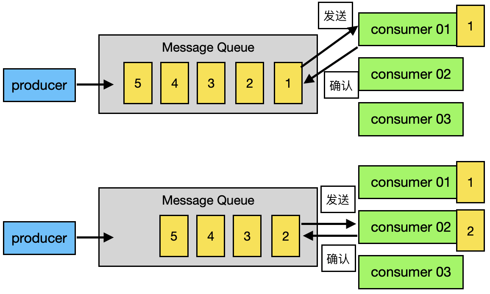
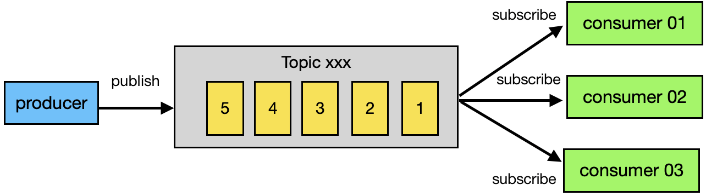
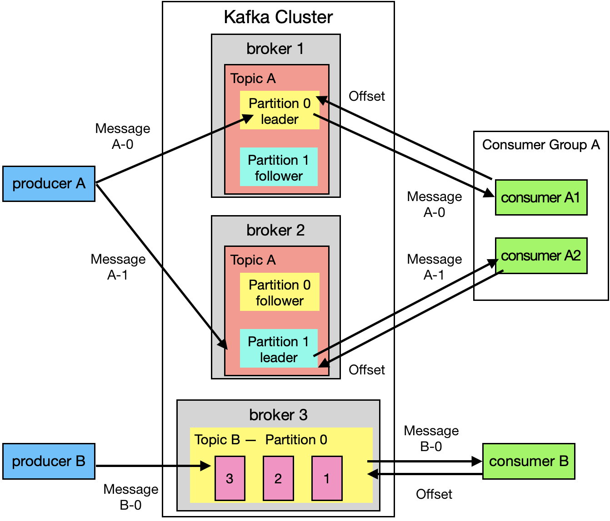
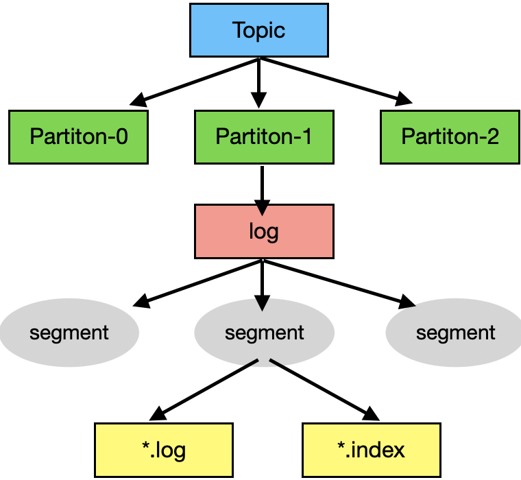
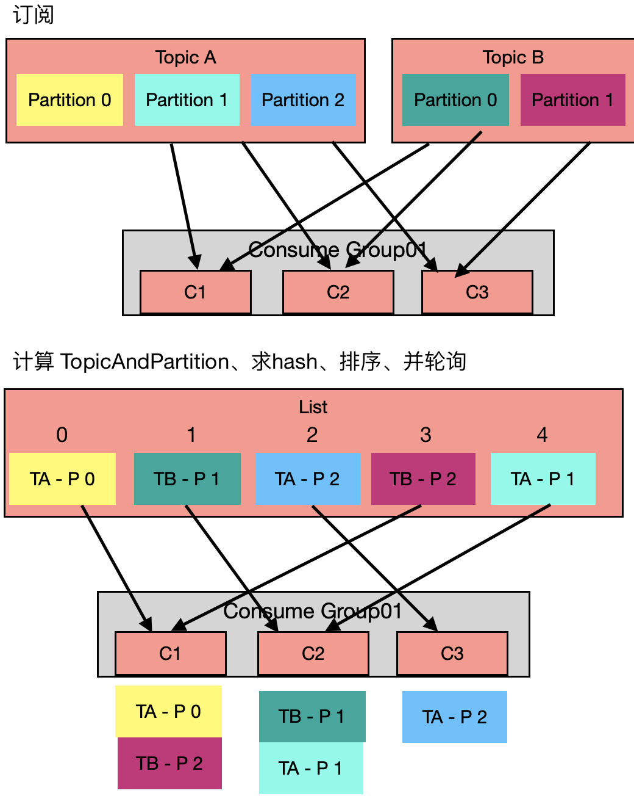
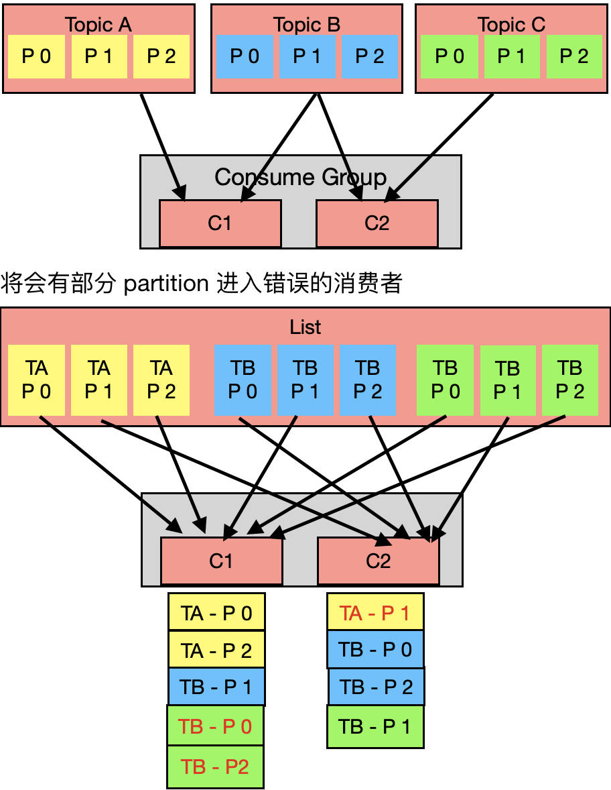
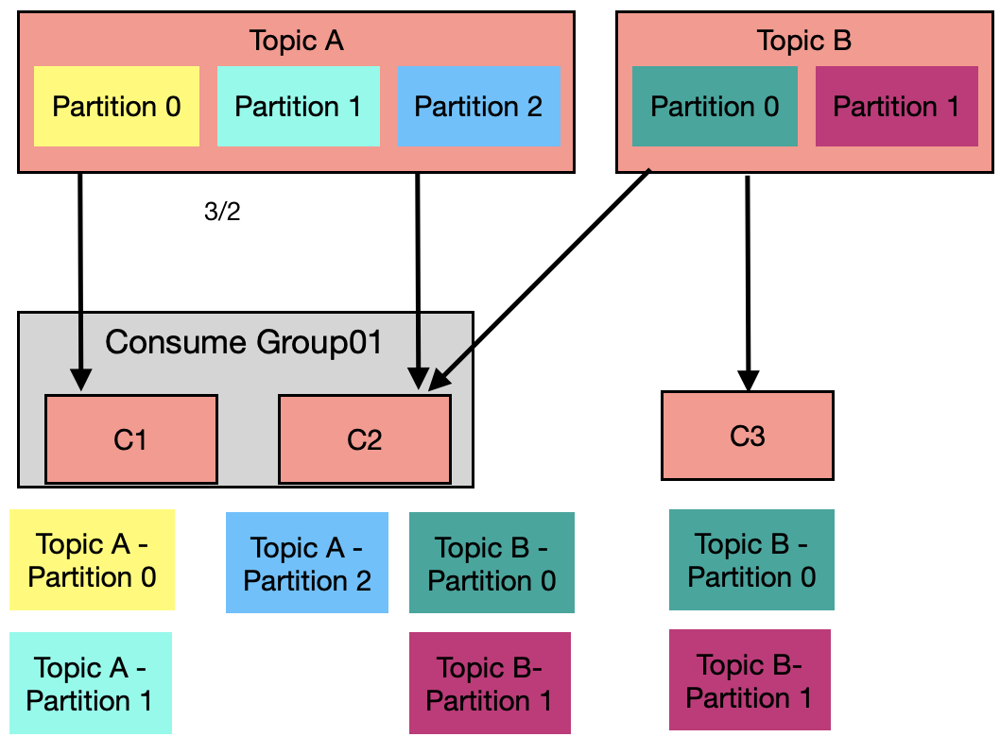
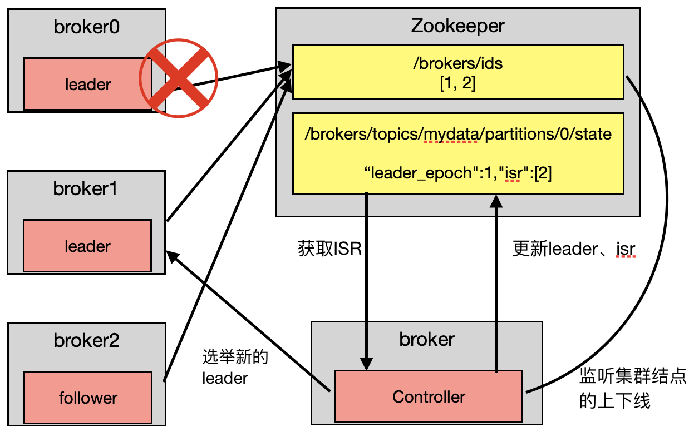
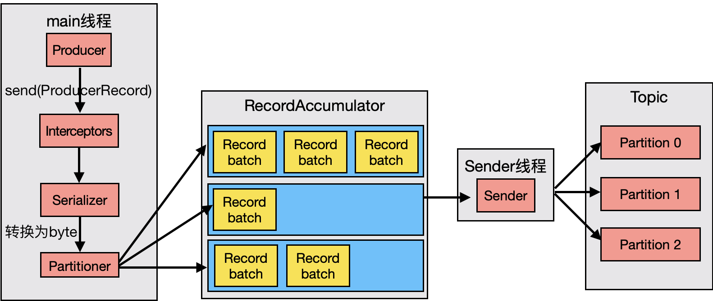

<span id="catalog"></span>

- 参考
    - https://www.bilibili.com/video/BV1a4411B7V9
    - https://blog.csdn.net/qq_41587243/article/details/80452343

<span style='font-size:18px'>**目录**<span>

- [概述](#概述)
- [架构](#架构)
- [安装](#安装)
- [命令行操作](#命令行操作)
    - [topic命令](#topic命令)
    - [控制台生产者与控制台消费者](#控制台生产者与控制台消费者)
- [删除kafka在服务器上的所有数据](#删除kafka在服务器上的所有数据)
- [工作流程与文件存储机制](#工作流程与文件存储机制)
    - [工作流程](#工作流程)
    - [数据的存储---日志的目录结构](#数据的存储---日志的目录结构)
- [生产者](#生产者)
    - [生产者分区策略](#生产者分区策略)
    - [生产者的数据可靠性保证](#生产者的数据可靠性保证)
        - [ack---保证数据可靠性的方式](ack---保证数据可靠性的方式)
        - [ISR---保持同步的动态follower集合](#ISR---保持同步的动态follower集合)
        - [ack应答机制](#ack应答机制)
        - [数据一致性处理](#数据一致性处理)
        - [生产者总结](#生产者总结)
    - [Exactly_Once语义](#Exactly_Once语义)
- [消费者](#消费者)
    - [消费方式](#消费方式)
    - [分区分配策略](#分区分配策略)
        - [RoundRobin](#RoundRobin)
        - [Range---默认策略](#Range---默认策略)
    - [offset的维护](#offset的维护)
    - [消费者组示例](#消费者组示例)
- [高效读写数据](#高效读写数据)
- [zookeeper的作用](#zookeeper的作用)
- [API](#API)
    - [消息发送流程](#消息发送流程)
    - [生产者API](#生产者API)
        - [异步发送API---没有回调](#异步发送API---没有回调)
        - [异步发送API---有回调](#异步发送API---有回调)
        - [异步发送API---指定partition或key](#异步发送API---指定partition或key)
        - [默认分区类分析](#默认分区类分析)
        - [使用定义分区的生产者](#使用自定义分区的生产者)
        - [同步发送](#同步发送)
    - [消费者API](#消费者API)
        - [简单消费者---自动提交offset](#简单消费者---自动提交offset)
        - [消费者重置offset](#消费者重置offset)
        - [手动提交offset](#手动提交offset)
        - [自定义存储offset](#自定义存储offset)
    - [拦截器](#拦截器)
        - [拦截器原理](#拦截器原理)
        - [拦截器示例](#拦截器示例)
- [监控](#监控)
    - [Kafka-Eagle](#Kafka-Eagle)
- [对接flume](#对接flume)
    - [对接flume的基本方法](#对接flume的基本方法)
    - KafkaSink做数据分类---替代flume多路复用？？？
- [其他](#其他)


# 概述
[top](#catalog)

- Kafka 是一个分布式的基于**发布/订阅**模式（主动拉取消息）的消息队列(Message Queue)，主要应用于 大数据实时处理领域
    - 消费者的消费速度，可以由消费者自己决定
    - 消费者内部会创建一个轮询来维持数据的拉取操作，但是会导致一定的性能消耗

- kafka依赖于zookeeper。必须先启动zookeeper，才能运行kafka
- kafka <span style='color:red'>不是一个存储框架</span>，但是有一定的数据存储功能

- 消息队列的优势
    - 解耦
        - 可以独立的扩展、修改生产者、消费者，只要使用同一组接口
    - 可恢复性 / 动态上下线
        - 系统的一部分组件失效时，不会影响到整个系统
        - 消息队列降低了进程间的耦合度
            - 当某个消息处理进程挂了，已加入队列的消息仍然可以在系统恢复后被重新处理
    - 缓冲
        - 能辅助控制数据流经过系统的速度
        - 解决生产者、消费者消息处理速度不一致的问题
    - 流量削峰
        - 控制流量，来处理突发流量。使关键组件顶住突发的访问压力
    - 异步通信
        - 可以将消息放入队列，在需要的时候进行处理
- 消息队列的两种模式
    - 点对点模式
        - 消息 : 消费者 = 1 : 1
            - 消费者主动拉取数据，消费者获取到数据后，再从队列中删除数据
        - 运行流程
            1. 生产者将消息发送到 Message Queue 中
            2. 消费者从 Queue 中取出消息，并消费
            3. 消息被消费后，从 Queue 中删除，不做存储
        - Queue 支持多个消费者，但是<span style='color:red'>一个消息只能被一个消费者消费</span>
        - 流程图
            - 
    - 发布订阅模式
        - 消息 : 消费者 = 1 : N
            - 消费者消费数据之后<span style='color:red'>不会清除消息</span>
        - 运行流程
            1. 消费者订阅某个 topic
            2. 生产者将消息发布到 topic
            3. 同时会有多个消费者消费 topic 中的消息
        - 流程图
            - 

# 架构

[top](#catalog)

- 组成结构图
  
    - 
- zookeeper
    - kafka 运行基础
    - 用于消息注册
    - 对于消费者，会保存消费了哪些数据
        - 类似于 flume 的 taildir，会保存访问的数据的位置 offset
        - 0.9 版本之前，保存在 zk
        - 0.9 版本之后，保存在本地
    - 帮助 kafka 集群保存一些信息

- kafka 集群内部的组件

    |组成部分|功能|
    |-|-|
    |Broker|一台 kafka 服务器 = 一个 broker<br>一个 cluster = N个 broker<br>一个 broker 可以包含 N 个 topic|
    |Topic|**逻辑上的概念**，可以理解为一个队列<br>所有消息在逻辑上都由 Topic 管理<br>生产者和消费者面向的都是一个 topic<br>不同类型的数据放在不同的 topic 中，如点赞的数据、浏览网页的数据等|
    |Partition|Topic**在物理上的概念**<br>一个 topic 可以分为多个 partition，每个 partition 是一个**有序的队列**<br>为了更好的扩展性，一个非常大的 topic 可以分布到多个 broker<br>**可以提高操作的负载均衡**<br>可以提高读写的并行度|
    |Replica|topic 中的每个 partition 的副本数量<br>在副本内，划分为: 1 leader + N follower<br>可以保证当集群中某个节点故障时，该节点上的 partition 数据不丢失，且 kafka仍然能够工作|

- 每个 partition 的组成
    - 1 leader + N follower

    - leader
        - 多个副本时，每个 partition <span style='color:red'>只有一个 leader</span>
        - 生产者发送数据的目标、消费者消费数据的来源都是 leader
    - follower
        - 多个副本时，每个 partition 会有多个 follower
        - follower 会与 leader <span style='color:red'>实时同步</span>数据
        - leader 发生故障时，某个 follower 会成为新的 leader
    - 注意事项
        - leader、follower 只作用于一个 partition
        - leader、follower 需要分布在不同的结点上
        - 使用信息时，**只从 leader 获取，follower 只用于备份**

- 消息的输入输出
    - Producer: 生产者，是向 broker 发消息的**客户端**
    - Consumer: 消费者，是从 broker 取消息的**客户端**
        - 消费者是主动拉取模式
    - Consumer Group (CG)
        - Group 的组成
            - 消费者组，由多个 Consumer 组成
            - 可以把一个消费者组当作一个消费整体，用于提高并发性
            - **所有的 Consumer 都属于某个 Group**，即 Group 是逻辑上的一个订阅者
        - 多个 Group 之间互不影响
        - 数据的消费方式
            - 一个 partition 中的数据
                - 在一个组内，同时只能够被一个 Consumer 使用
                - 在多个组间，互不影响
            - 在 Group 内，**每个 Consumer 负责消费不同 partition 的数据**
                - 可以提升性能，防止某个partition的负载过大
- 创建 consumer 时，如果没有指定 Group，将会<span style='color:red'>自动为这个 consumer 创建一个组</span>
  
- 注意事项
    - `Count( Consumer ) > Count( 某个topic的partiton )` 是没有意义的
        - 因为没有足够的数据，会导致某些消费者空转

    - 并发度最好的时候：`Count( Consumer ) = Count( 某个 topic 的 partiton )`


# 安装
[top](#catalog)
1. 创建一个zookeeper集群，并启动
2. 拷贝安装包
    ```
    docker cp kafka_2.11-0.11.0.0.tgz zk01:/opt/software
    ```
3. 解压
    ```
    tar -zxvf /opt/software/kafka_2.11-0.11.0.0.tgz -C /opt/module/
    ```
4. 修改配置
    - /opt/module/kafka/config/server.properties
    - 需要修改的配置内容

        |属性|功能|
        |-|-|
        |`broker.id`|必须是唯一的**整数**，不能重复|
        |`delete.topic.enable=true`|可以删除topic|
        |`log.dirs=/opt/module/kafka/data`|保存kafka中暂存的数据<br>为了实现数据日志分离，应该设置`kafka/logs`以外的目录|
        |`zookeeper.connect=zk01:2181,zk02:2181,zk03:2181`|设置zookeeper集群|

5. 将 kafka 目录分发到其他节点
6. 配置环境变量
    ```sh
    export KAFKA_HOME=/opt/module/kafka
    export PATH=$PATH:$KAFKA_HOME/bin
    ```
7. 修改各个结点配置中的 `broker.id`
8. 启动各个结点的kafka
    ```sh
    # 阻塞式启动
    kafka-server-start.sh /opt/module/kafka/config/server.properties

    # 守护进程启动
    kafka-server-start.sh -daemon /opt/module/kafka/config/server.properties
    ```
9. 检查java进程
    ```
    [root@zk02 /]# jps
    36 QuorumPeerMain
    999 Jps
    937 Kafka  <<<<< kafka正常启动
    ```
10. 停止kafka
    ```
    kafka-server-stop.sh /opt/module/kafka/config/server.properties
    ```

# 命令行操作

## topic命令

[top](#catalog)

- 操作前提
  
  - 需要启动 `zookeeper.connect` 配置中的各个结点上的 kafka
  
- topic操作

    - 命令选项

        |选项|功能|
        |-|-|
        |--list|显示已有的 topic|
        |--create|创建 topic|
        |--alert|修改 topic 的某些设置|

    - 辅助选项

        |选项|功能|
        |-|-|
        |--zookeeper|设置指令使用的 zookeeper 节点 `ip:port`|
        |--topic|设置 topic 的名字|
        |--partitions|设置 topic 的分区数|
        |--replication-factor|设置当前 topic 的每个分区的备份数|
        |--describe|显示指定 zk 节点上的某个 topic 的相关信息|

    - 注意事项
      
      - topic 的副本数，不能超过 broker 数，与 hdfs 不同
      
    - 查看当前服务器的所有topic
        ```sh
        kafka-topics.sh --list --zookeeper zk01:2181
        ```

    - 创建topic，需要指定分区数，副本数
        ```sh
        kafka-topics.sh --create \
        --zookeeper zk01:2181 \
        --topic mytest \
        --partitions 2 \
        --replication-factor 2
        ```
    - 删除topic
        ```sh
        kafka-topics.sh --delete --zookeeper zk01:2181 --topic mytest
        ```
    - 查看topic的详细信息
        ```sh
        kafka-topics.sh --describe \
        --topic mytest \
        --zookeeper zk01:2181
        ```
    - 修改分区数
        ```sh
        kafka-topics.sh --alert \
        --topic mytest \
        --partitions 6 \
        --zookeeper zk01:2181
        ```

## 控制台生产者与控制台消费者

[top](#catalog)

- 创建一个控制台生产者
    ```sh
    kafka-console-producer.sh --topic mytest --broker-list zk01:9092
    ```
    
- 创建一个控制台消费者
    - 通过zookeeper来启动，将数据保存到zookeeper，<span style='color:red'>已经过时</span>
        ```sh
        # 只获取最新的消息
        kafka-console-consumer.sh --topic mytest --zookeeper zk01:2181
        
        # `--from-beginning` 从头开始获取过去的所有的消息
        kafka-console-consumer.sh --topic mytest --zookeeper zk01:2181 --from-beginning
        ```

    - 通过 broker 启动，将数据保存到kafka内部。kafka新版本推荐使用
        ```sh
        # --bootstrap-server 应该使用 server.properties
        # listeners=PLAINTEXT://xxx:9092
        # 如果没有设置listeners，可以使用 zookeeper 结点
        # 只获取最新的消息
        kafka-console-consumer.sh --topic mytest --bootstrap-server zk01:9092
        
        # `--from-beginning` 从头开始获取过去的所有的消息
        kafka-console-consumer.sh \
    --topic mytest \
        --bootstrap-server zk01:9092\
    --from-beginning
        ```
        
    - 可以在指令中附加 `--consumer.config config/consumer.properties` 来指定启动时的消费者配置
    
        - 在配置内可以设置**消费者组**等信息
    
- 在控制台生产者中输入数据，会在其他的消费者中获取到

- `Consumer 数 > partition 数` 时，后加入的消费者将无法获取消息


# 删除kafka在服务器上的所有数据
[top](#catalog)

1. 停止所有节点上的 kafka
   
- 只关闭 kafka，zookeeper集群仍然要开启
  
2. 先删除 kafka 内部的日志与数据
    ```
    cd /opt/module/kafkas
    rm -rf logs/ data/
    ```

3. 检查zookeeper中是否有为 kafka 保存的数据
    - `zkCli.sh`，进入zookeeper
    - `ls /`，所有 `[zookeeper]` 之外的都是kafka的数据，需要删除

4. 停止 zookeeper 集群中的所有节点
5. 删除 zookeeper 中为 kafka 保存的数据
    - 删除 `zkdata/version-2` 下的所有数据
        - ????? 指令 ?????


# 工作流程与文件存储机制
## 工作流程
[top](#catalog)
- 每个分区独立维护一个offset，可以<span style='color:red'>保证分区内有序，但是不保证topic内有序</span>
- kafka的消息以 topic 分类，生产者生产消息，消费者消费消息，都是面向 topic 的
- topic 是逻辑上的概念，partition 是物理上的概念

## 数据的存储---日志的目录结构
[top](#catalog)

- 数据文件的存储结构 = *.index + *.log
  
- 
  
- 数据的存储
    - 每个 partition 对应一个 log 文件，文件中保存 producer 生产的数据
    - producer 生产的数据添加到 log 文件末尾
    - <span style='color:red'>每一条数据</span>都有自己的 offset
- 数据的消费
    - 消费者组中的每个 consume 都会实时记录自己消费到了哪个 offset
    - 通过记录 offset，可以在出错时恢复，**从上次失败的位置开始重新消费**
- 数据的分割
    - 因为数据会不断的添加到 log 文件末尾，为了防止log文件过大导致**数据定位效率低下**，需要对文件进行分割
    - kafka 对数据文件的分割方法
        - **分片** + **索引**机制
            - 分片: 按照 `log.segment.bytes` 对文件大小做切分
            - 索引: 上一个 log 文件中的`offset+1`，是下一个log文件的文件名与起始位置
        - 将每个 partition 分为多个 segment
    - segment
        - 每个 segment = `*.index` 文件 + `*.log` 文件
        
        - 文件保存**目录**的命名规则
            - topic名 + 分区序号
            - 如: partitions = 3，则有3个目录
                ```
                mytest-0
                mytest-1
                mytest-2
                ```
            
        - `*.index`、`*.log` 的命名规则
          
            - 从 0 开始
            - 使用 上一个 log 文件中的数据数量作为索引
            
        - *.index 中保存的**主要**内容
          
            ```
            000000.index                         000000.log
            数据No， offset                  生产的数据
            0          0                    Message-0
            1        200                    Message-1
            2        400                    Message-2
            3        800                    Message-3
            ------------------------------------------------------------
            000004.index                         000004.log
            数据No， offset                  生产的数据
            0          0                    Message-4
            1        100                    Message-5
            2        200                    Message-6
            3        400                    Message-7
            4        400                    Message-8
            ```
            
        - *.index 文件中的元数据指向对应的 log 文件中数据的**物理偏移量**
        
        - *.log 的大小
            - 依照属性: `log.segment.bytes`，默认为 1G
            - 如果超过 1G，会自动创建新的 *.log 文件
    
- 数据的定位 ?????
    - 二分查找定位 *.index
    - 定位No，
    - 定位偏移量
    - 到 *.log 中抽取数据

- 每条数据大小固定，有利于加速查询

# 生产者
## 生产者分区策略
[top](#catalog)

- **每个分区内的数据是有序的**

- 分区好处
    - 方便在集群中扩展
        - 每个 topic 由多个 Partition 组成，可以根据数据量来设置
    - 提高读写并行度
        - 以 Partition 为单位读写

- 分区的原则
    - 需要将 producer 发送的数据封装成一个 `ProducerRecord` 对象
    - 不同情况下，分区的计算

        |设置的内容|分区的计算方式|
        |-|-|
        |如果设置了 `partition`|将数据写入指定 partition，并忽略其他设置|
        |没有设置`partition`，设置了 `key`|`partition = hash( key ) % Count( partition )`|
        |什么也没有设置|`round-robin` 算法<br><span style='color:red'>第一次调用时</span>随机生成一个整数`X`(每次调用将在`X`上自增，<span style='color:red'>包括第一次</span>)<br>`partition = X % Count( partition )`|
        
        

## 生产者的数据可靠性保证
### ack---保证数据可靠性的方式

[top](#catalog)

- ack，acknowledgement，确认收到
    - topic 的每个 partition 收到 producer 发送的数据后，都需要向 producer 发送 ack
    - 如果 producer 收到 ack，就会进行下一轮的发送，否则重新发送数据

- 发送方向
  
    - Partition leader ----> producer
    
- 目的 
  
    - 保证 producer 发送的数据，能发送到指定的 topic、<span style='color:red'>不丢失</span>
    
- 发送条件
    - 已经有 follower 与 leader 完成同步。然后 leader 再发送 ack
    - 在这种条件下，如果 leader 挂了，才能在 follower 中选出新的 leader，并且数据不变

- **需要多少个 follower 完成同步，才能发送 ack ？**

    - 不同的副本数据同步策略

        |策略|优点|缺点|
        |-|-|-|
        |半数以上 follower 完成同步，发送ack|延迟低|选举新的 leader 时，如果要容忍 n 台节点的故障，需要 2n+1 个副本|
        |所有 follower 完成同步，发送ack|选举新的 leader 时，容忍 n 台节点的故障，只需要 n+1 个副本|延迟高|

    - <span style='color:red'>kafka选择了策略2</span>，全部 follower 完成同步后，发送ack

        - 因为策略1需要**双倍**的结点，kafka的每个分区都由大量的数据，策略1 会造成大量的数据冗余
        - 虽然策略2的网络延迟更高，但是网络延迟对kafka的影响比较小

### ISR---保持同步的动态follower集合

[top](#catalog)

- in-sync replica set
  
- 表示与 leader 保持同步的 follower **动态集合**，由 leader 自己维护

- 作用
    1. <span style='color:red'>优先</span>和 ISR 内 folloewr 的<span style='color:red'>保持同步</span>，防止 follower 故障影响集群运行
        - kafka 使用了全部 follower 同步的策略
        - 如果某个 follower 发生故障，不能与 leader 通信，会导致无法向 producer 发送 ack
        - 通过维持 ISR 可以保证集群的运行
            - 满足条件的进入 ISR，不满足条件的从 ISR 中删除
    2. **leader 故障时，从 ISR 中选择新的 leader**

- 进入 ISR 的条件
    - 2 种条件
        - 通信时间，以更快的速度来同步，丢失数据的可能性更小
        - 已经同步的数据量
    - kafka **只保留 通信时间 (0.9以后)**
    - 时间由 `replica.lag.time.max.ms` 控制

### ack应答机制
[top](#catalog)

- 通过 `acks` 来设置 **数据可靠性级别**

- kafka提供的三种**数据可靠性级别**，可以根据对**可靠性和延迟**的要求来选择
  
    |acks|功能|优点|缺点|
    |-|-|-|-|
    |0，At Most Once 语义|producer 不等待 broker 的 ack|提供最低的延迟<br>生产者的每条消息只会发送一次|broker 接收到的数据还没有写入磁盘就返回了<br>**无法保证数据不丢失**：当 partition 故障时有可能丢失数据|
    |1|producer 等待 broker 的 ack<br>partition 的 leader 落盘成功后返回 ack||如果在 follower 同步成功之前 leader 故障，那么将会丢失数据|
    |-1， At Least Once 语义|producer 等待 broker 的 ack<br>partition 的 leader 和 follower 全部落盘成功后才 返回 ack<br /><span style='color:red'>需要有 ISR 的辅助</span>|保证 Producer 到 Server 之间不会丢失数据|如果在 follower 同步完成后，broker 发送 ack 之前，leader 发生故障，**producer 会重新发送数据到新的leader**，导致**数据重复**<br/>**无法保证数据不重复**|
    
- 如果对数据**可靠性**要求不高，能够容忍数据的**少量丢失**时，不需要等 ISR 中的 follower 全部接收成功

### 数据一致性处理
[top](#catalog)

- 需要保证的两种一致性
    - 消费一致性
    - 存储一致性
- Log文件中的 HW 和 LEO
    - LEO，Log End Offset，每个副本的最后一个offse
        - 即：<span style='color:red'>每个副本最大的Offset</span>
    - HW，High Watemark，所有副本中最小的 LEO
        - 即：<span style='color:red'>消费者可见的最大的Offset</span>
    - 只有 offset **小于** HW 的数据才对 consumer 可见
- leader 故障时的处理
    1. 会从 ISR 中选出一个新的 leader
    2. 其余的 follower 将自己的 log 文件高于 HW 的部分截掉
    3. 从新的 leader 同步数据，**同步比HW高的数据**
        - 同步 leader 比 HW 高的部分
- follower 故障时的处理
    1. 从 ISR 中删除
    2. 恢复后，读取最近一次的 `Partition.HW`
    3. 将 log 中高于 HW 的部分截取掉
    4. 从 HW 开始向 leader 进行同步
    5. 当 `follower.LEO >= Partition.HW` 时，可以重 新加入 ISR
- 数据一致性处理<span style='color;red'>只能保证副本之间的数据一致性，并不能保证数据不丢失或者不重复</span>

## Exactly_Once语义
[top](#catalog)

- `acks` 设置为 `0` 会导致数据丢失，`acks` 设置为 `-1` 会导致数据重复
- Exactly Once 语义
    - 对于一些重要的信息，如交易数据，下游的数据消费者**要求数据既不重复**
    - At Lease Once + 幂等性 = Exactly Once （0.11 版本之后）
    - 0.11 版本之前，需要在下游的所有 consumer 中做**全局去重**
- 启用幂等性
    - 设置 producer 参数 : `enable.idompotence=true`
    - 开启该参数后，将自动设置 : `acks=-1`
- 实现原理
    1. 开启幂等性的 producer ，在初始化时，会被分配一个 `PID`
    2. 向同一个 partition 发送的消息会附带 `Sequence Number`
    3. 在 broker 端会对数据进行缓存，**主键**为 : `<PID, Partition, SeqNumber>`
    4. 当具有相同**主键**的消息提交时， broker 只会缓存一条
- Exactly Once **只能解决** : <span style='color:red'>单次会话、单个 partition 内的数据重复问题</span>
    - 每次 producer 重启，`PID`就会变化
    - 不同的 partition 也有不同的id，所以无法保证跨分区的 Exactly Once

## 生产者总结

[top](#catalog)

- 由ack策略决定如何响应 producer，保证数据不丢失
- `acks = -1`时，需要有 ISR 的辅助，维护一个动态的与 leader 同步的 follower 列表
- ISR 中的每个备份都会有 HW、LEO，来保证数据的一致性
    - 包括消费和存储的一致性

# 消费者
## 消费方式
[top](#catalog)
- <span style='color:red'>consumer 采用 pull</span>，拉模式从 broker 中读取数据
    - pull模式可以根据 consumer 的消费能力，以合适的速度消费消息
    - 缺点
        - 如果kafka没有数据，consumer 可能会循环返回空数据
            - 这对这一问题，kafka的消费者在消费数据时，会传入一个时长参数 `timeout`
            - 如果某次拉取时，发现kafka没有数据，consumer会等待 `timeout`时长之后，再返回
- <span style='color:red'>不使用push模式</span>，推模式**很难适应消费速率不同的消费者**
    - 因为消息发送速率是由 broker 决定的
    - push 的目标是以最快的速度传递消息，但是容易造成 consumer 来不及处理消息
        - consumer表现为：拒绝服务、网络阻塞

## 分区分配策略

### RoundRobin

[top](#catalog)

- 前提，Consumer Group 中的所有 consumer 都订阅<span style='color:red'>相同</span>Topic
- 分配时，轮询一个组内的所有消费者，一次一个partition
- 一个组订阅多个 topic 时，会<span style='color:red'>将多个 topic 当作整体</span>作 hash 运算、排序，然后做轮询
    - 在kafka内部，分配的内容表现为类 : `TopicAndPartition`
- 示例
    - 
- 错误示例，如果RoundRobin策略中，一个组中订阅了不同的 Topic，会导致部分 partition 进入错误的消费者
    - 

### Range---默认策略

[top](#catalog)

- 按 topic 划分
- 可能会产生分配不均匀的问题
- 消息分配时，先看消费者，然后看组
    - 如果一个组有多个消费者订阅了相同的 Topic，则需要做运算，计算消息发送到哪里
    - 如果组里只有一个消费者，则全部发送给该消费者
- 分配示例
    - 

## offset的维护

[top](#catalog)

- <span style='color:red'>唯一确认一个 offset : Consumer Group + Topic + Potition</span>

    - 不是以某个消费者为标识，而是以**消费者组**为标识
    - 这中方式下，如果组内的某个消费者挂了，组内的其他成员可以继续消费

- Offset 如何保存

    - 需要由消费者定期将**其内存中维护的 offset** 提交到 borker，并保存到磁盘
    - 对于每一个正在运行的消费者线程
        - 第一次启动 或 重启时，会读取磁盘中的 offset
        - 会定期提交 offset
        - 会在内存中维护当前的 offset，每次只使用内存中的offset，不会访问磁盘
            - 如果每次都访问磁盘会降低性能

- Offset 的保存位置

    - 0.9 版本之前，consumer 默认将 offset 保存在 Zookeeper 中
    - 0.9 版本开始， consumer 默认将 offset 保存在 Kafka 一个内置的 topic 中
        - 该 topic 为`__consumer_offset`
        - 该 topic 默认属于消费者组 `test-consumer-group`

- 启用 `__consumer_offset`

    - 修改配置 `consumer.properties`

        ```
        exclude.internal.topics=false
        ```

    - 修改该消费者所属的组

        ```
        group.id=test-consumer-group
        ```

    - 读取offset

        - 0.11 之前
            ```sh
            kafka-console-consumer.sh --topic __consumer_offsets --zookeeper zk01:2181 --formatter "kafka.coordinator.GroupMetadataManager\$OffsetsMessageFormatter" --consumer.config /opt/module/kafka/config/consumer.properties --from-beginning
            ```

        - 0.11 之后
            ```sh
            kafka-console-consumer.sh --topic __consumer_offsets --zookeeper zk01:2181 --formatter "kafka.coordinator.group.GroupMetadataManager\$OffsetsMessageFormatter" --consumer.config /opt/module/kafka/config/consumer.properties --from-beginning  --delete-consumer-offsets
            ```

        - 关闭 `__consumer_offset` 之后如果再次启动，需要添加参数 ` --delete-consumer-offsets`，来删除旧的元数据

        - 此时的 `__cosumer_offsets` 相当于一个生产者，读取该 offset 就是消费者，所以需要绑定到 zookeeper

- 测试

    - 创建 topic，并启动生产者和消费者

        ```sh
        # 创建 topic
        kafka-topics.sh --create --topic mydata --zookeeper zk01:2181 --partitions 2 --replication-factor 2
        # 启动生产者
        kafka-console-producer.sh --broker-list zk01:9092 --topic mydata
        # 启动消费者
        kafka-console-consumer.sh --bootstrap-server zk01:9092 --topic mydata
        ```

    - 监听 offset

        ```sh
        kafka-console-consumer.sh --topic __consumer_offsets --zookeeper zk01:2181 --formatter "kafka.coordinator.group.GroupMetadataManager\$OffsetsMessageFormatter" --consumer.config /opt/module/kafka/config/consumer.properties --from-beginning
        ```

    - 在生产者中输入数据，观察 offset
    - 将会轮询，并以 <span style='color:red'>KV 形式 </span>每一行输出 `组id, topic, partition` 的offset数据

        ```
        [console-consumer-98538,mydata,1]::[OffsetMetadata[7,NO_METADATA],CommitTime 1604841302408,ExpirationTime 1604927702408]
        [console-consumer-98538,mydata,0]::[OffsetMetadata[8,NO_METADATA],CommitTime 1604841302408,ExpirationTime 1604927702408]
        [console-consumer-98538,mydata,1]::[OffsetMetadata[8,NO_METADATA],CommitTime 1604842007622,ExpirationTime 1604928407622]
        [console-consumer-98538,mydata,0]::[OffsetMetadata[9,NO_METADATA],CommitTime 1604842007622,ExpirationTime 1604928407622]
        [console-consumer-98538,mydata,1]::[OffsetMetadata[9,NO_METADATA],CommitTime 1604842012622,ExpirationTime 1604928412622]
        [console-consumer-98538,mydata,0]::[OffsetMetadata[10,NO_METADATA],CommitTime 1604842012622,ExpirationTime 1604928412622]
        ```

    - 因为没有指定生产者的数据分区，所以会使用 Round-Robin 方式，来轮询每个 partition，并写入数据。所以各个 partition 的 offset 会随着输入数据依次递增

## 消费者组示例

[top](#catalog)

- 需求

    - 测试同一个消费者组中的消费者，同一时刻只能有一个消费者消费

- 测试步骤

    - 组内测试

        - 修改 zk02 上的 `config/consumer.properties`，修改`group.id`
        - 启动生产者

            ```
            kafka-console-producer.sh --broker-list zk01:9092 --topic mydata
            ```

        - 在 zk02 启动两个消费者，属于同一个组

            ```
            kafka-console-consumer.sh --bootstrap-server zk01:9092 --topic mydata --consumer.config /opt/module/kafka/config/consumer.properties
            ```

        - 在生产者中输入数据，将会使用 range 策略，两个消费者交替显示消息

    - 组间测试
    
        - 在 zk03 启动一个消费者，属于不同的组
    
        - 在生产者输入数据时，也会在 zk03 上显示


# 高效读写数据

[top](#catalog)

- 分布式、分区的情况下，并发读写

- 顺序写磁盘

    - 顺序写

        - producer 生产数据，写入到 log 文件时，会一直写到文件末尾
        - 官网数据表明，同样的磁盘，顺序写能到 600M/s，而随机写只有 100K/s

        - 这与磁盘有关，顺序写节省了大量的磁头寻址时间，提升了速度

- 零拷贝


# zookeeper的作用

[top](#catalog)

- Kafka 集群中的 Controller
    - 集群中有一个 broker 会被选举为 Controller
    - 负责管理
        - 集群中 broker 的上下线
        - 所有 topic 的分区副本分配和 leader 选举等工作
- Controller 的管理工作都依赖于 Zookeeper
- Controller 选举新的 leader
    - 选举策略：竞争资源
    - 


# 事务

[top](#catalog)

- 从 0.11 版本开始支持事务
- 事务可以保证 Kafka 在 Exactly Once 语义的基础上，生产和消费可以跨分区和跨会话。要么全部成功，要么全部失败。
- Producer 事务
    - 实现方式
        - 引入一个全局唯一的 Transaction ID
        - 将 Producer 获得的 PID 和 Transaction ID 绑定
        - 当 Producer 重启后，通过Transaction ID 获得原来的 PID
    - 事务的管理
        - Kafka 引入了一个新的组件 Transaction Coordinator
        - Producer 通过和 Transaction Coordinator 交互获得 Transaction ID 对应的任务状态
        - Transaction Coordinator 负责将事务所有写入 Kafka 的一个内部 Topic，即使整个服务重启，由于事务状态得到保存，进行中的事务状态可以得到恢复，从而继续进行
- Consumer 事务
    - <span style='color:red'>事务机制主要是从 Producer 方面考虑，对于 Consumer 而言，事务的保证就会相对较弱</span>
    - 事务无法保证 Commit 的信息被精确消费
        - 这是由于 Consumer 可以通过 offset 访问任意信息，而且不同的 Segment File 生命周期不同，同一事务的消息可能会出现重启后被删除的情况
        - 如需要消费 100条数据，可能这100条数据跨 segment 了。如果前一个 segment因为到期被删除，并且事务未完成，数据也无法再次读取


# API
## 消息发送流程
[top](#catalog)
- Kafka 的 Producer 采用是异步方式发送消息
- 在消息发送的过程中，涉及
    - 两个线程
        - main 线程
        - Sender 线程
    - 一个线程共享变量——RecordAccumulator
        - 用于保存中间数据
- 发送流程
    1. main 线程将消息发送给 RecordAccumulator
        - 进入累计器之前需要依次经过
            1. 拦截器 Interceptors
            2. 序列化器 Serializer
            3. 分区器 Partitioner
    2. 数据在 RecordAccumulator 内累积
    3. 数据量达到 `batch.size` 之后，Sender 线程从 RecordAccumulator 中拉取消息发送到 broker
    4. 如果数据量在 ` linger.time` 时间内未达到 `batch.size`，sender 也会将数据发送给到 broker
- 两个参数
    - `batch.size` ，发送数据的数据量
    - ` linger.time` ，等待数据量到达  ` batch.size` 的最大时间 
- 消息发送流程图
    - 

## 生产者API
### 异步发送API---没有回调
[top](#catalog)

- 流程
    1. 编写生产者
    
    2. 在本地，将kafka集群中的ip和主机名配置到 /etc/hosts
    
    3. 在集群上创建 topic，并启动消费者
        ```sh
        kafka-console-consumer.sh --topic mytest --bootstrap-server zk01:9092
    kafka-console-consumer.sh --topic mytest --bootstrap-server zk01:9092
        ```
        
    4. 执行生产者
    
- 需要使用的类及其功能

    - `KafkaProducer`，生产者对象
    - `ProducerConfig`，包含了各种配置的参数名
    - `ProducerRecord`，每条数据都要封装为 ProducerRecord 对象

- 编写生产者
    - 参考
      
        - [src/kafka/kafkaapi/src/main/java/com/ljs/learn/kafkaapi/producer/MyProducer.java](src/kafka/kafkaapi/src/main/java/com/ljs/learn/kafkaapi/producer/MyProducer.java)
    - 代码内容
        ```java
        public class MyProducer {
            public static void main(String[] args) {
                // 1. 创建 producer 的配置信息
                Properties properties = new Properties();
        
                // 指定需要连接的kafka集群
                // properties.put("bootstrap.servers", "127.0.0.1:9092");
                properties.put(ProducerConfig.BOOTSTRAP_SERVERS_CONFIG, "127.0.0.1:9092");
                // ack 应答级别
                // properties.put("acks","all");
                properties.put(ProducerConfig.ACKS_CONFIG,"all");
                // 重试次数
                properties.put("retries", "2");
                // 批次的大小，16k
                properties.put("batch.size", 16384);
                // 等待的时间
                properties.put("linger.ms", 1);
                // RecordAccumulator的缓冲区大小
                properties.put("buffer.memory", 33554432);
                // kv的序列化类
                properties.put("key.serializer", "org.apache.kafka.common.serialization.StringSerializer");
                properties.put("value.serializer", "org.apache.kafka.common.serialization.StringSerializer");
        
                // 2. 创建生产者
                KafkaProducer<String, String> producer = new KafkaProducer<>(properties);
        
                // 3. 生产者发送数据
                for (int i = 0; i < 10; i++) {
                    // 生产者对象已经固定了类型，所以 ProducerRecord 可以省略类型
                    producer.send(new ProducerRecord<>("mytest", "testdata" + i));
                }
        
                // 4. 关闭资源
                producer.close();
            }
        }
        ```
    
- 执行结果

    - 消费者将会按照 partition 分别读取

        ```java
        testdata0
        testdata2
        testdata4
        testdata6
        testdata8
        testdata1
        testdata3
        testdata5
        testdata7
        testdata9
        ```

### 异步发送API---有回调

[top](#catalog)

- 在调用`producer.send`时设置回调类 : `org.apache.kafka.clients.producer.Callback`，也可以使用lambda表达式

- 编写生产者

    - 参考

        - [src/kafka/kafkaapi/src/main/java/com/ljs/learn/kafkaapi/producer/CallbackProducer.java](src/kafka/kafkaapi/src/main/java/com/ljs/learn/kafkaapi/producer/CallbackProducer.java)

    - 代码内容

        ```java
        public class CallbackProducer {
            public static void main(String[] args) {
                // 1. 设置配置
                Properties props = new Properties();
                props.put(ProducerConfig.BOOTSTRAP_SERVERS_CONFIG, "127.0.0.1:9092");
                props.put(ProducerConfig.ACKS_CONFIG, "all");
                props.put(ProducerConfig.KEY_SERIALIZER_CLASS_CONFIG, "org.apache.kafka.common.serialization.StringSerializer");
                props.put(ProducerConfig.VALUE_SERIALIZER_CLASS_CONFIG, "org.apache.kafka.common.serialization.StringSerializer");
        
                // 2. 创建生产者
                KafkaProducer<String, String> producer = new KafkaProducer<String, String>(props);
        
                // 3. 发送消息
                for (int i = 0; i < 10; i++) {
                    producer.send(
                            new ProducerRecord<>("mytest", "callback---" + i),
                            // ########## 编写回调函数 #############
                            (metaData, e) -> {
                                if (e == null) {
                                    System.out.println("offset=" + metaData.offset() + ", partition=" + metaData.partition());
                                } else {
                                    e.printStackTrace();
                                }
                            }
                    );
                }
        
                // 4. 关闭生产者
                producer.close();
            }
        }
        
        ```

- 调用结果

    ```
    offset=37, partition=1
    offset=38, partition=1
    offset=39, partition=1
    offset=40, partition=1
    offset=41, partition=1
    offset=36, partition=0
    offset=37, partition=0
    offset=38, partition=0
    offset=39, partition=0
    offset=40, partition=0
    ```

### 异步发送API---指定partition或key

[top](#catalog)

- 指定发送的分区

    - 参考

        - [src/kafka/kafkaapi/src/main/java/com/ljs/learn/kafkaapi/producer/CallbackProducerByPartition.java](src/kafka/kafkaapi/src/main/java/com/ljs/learn/kafkaapi/producer/CallbackProducerByPartition.java)

    - 主要内容

        ```java
        for (int i = 0; i < 10; i++) {
          producer.send(
            // 设置数据发送的分区: 0
            new ProducerRecord<>("mytest", 0,"testData","callback---" + i),
            (metaData, e) -> {
              if (e == null) {
                System.out.println("offset=" + metaData.offset() + ", partition=" + metaData.partition());
              } else {
                e.printStackTrace();
              }
            }
          );
        }
        ```

    - 执行结果

        ```
        offset=41, partition=0
        offset=42, partition=0
        offset=43, partition=0
        offset=44, partition=0
        offset=45, partition=0
        offset=46, partition=0
        offset=47, partition=0
        offset=48, partition=0
        offset=49, partition=0
        offset=50, partition=0
        ```

- 不指定 partition，只指定 key

    - 参考

        - [src/kafka/kafkaapi/src/main/java/com/ljs/learn/kafkaapi/producer/CallbackProducerByKey.java](src/kafka/kafkaapi/src/main/java/com/ljs/learn/kafkaapi/producer/CallbackProducerByKey.java)

    - 代码内容

        ```java
        for (int i = 0; i < 10; i++) {
            producer.send(
                    // 设置数据发送的分区
                    new ProducerRecord<>("mytest", Integer.toString(i%3),"callback---" + i),
                    (metaData, e) -> {
                        if (e == null) {
                            System.out.println("offset=" + metaData.offset() + ", partition=" + metaData.partition());
                        } else {
                            e.printStackTrace();
                        }
                    }
            );
        }
        ```

    - 执行结果

        ```
        offset=60, partition=1
        offset=61, partition=1
        offset=62, partition=1
        offset=73, partition=0
        offset=74, partition=0
        offset=75, partition=0
        offset=76, partition=0
        offset=77, partition=0
        offset=78, partition=0
        offset=79, partition=0
        ```

### 默认分区类分析

[top](#catalog)

- `org.apache.kafka.clients.producer.internals.DefaultPartitioner`

- 代码分析

    ```java
    public class DefaultPartitioner implements Partitioner {
        private final ConcurrentMap<String, AtomicInteger> topicCounterMap = new ConcurrentHashMap();
    
        public DefaultPartitioner() {
        }
    
        public void configure(Map<String, ?> configs) {
        }
        
        // key、value 已经是【序列化后的对象】
        // 在该方法内部，可以用 key 分区，也可用 value 分区
        public int partition(String topic, Object key, byte[] keyBytes, Object value, byte[] valueBytes, Cluster cluster) {
            // 能够进入该方法，一定是生产者发送消息时，没有指定 partition
        		// 该方法对应了 【生产者分区策略】中的第二种和第三种
          
            // 1. 通过 cluster ，从集群中获取 topic 中的 partition 数量
            List<PartitionInfo> partitions = cluster.partitionsForTopic(topic);
            int numPartitions = partitions.size();
    
            // 2. 如果没有指定 key
            if (keyBytes == null) {
                // 4. 获取计算的基准
                int nextValue = this.nextValue(topic);
    
                // 5. 获取 topic 中，当前可用的 parititon 信息，防止将数据发送到不可用的 partition 上
                List<PartitionInfo> availablePartitions = cluster.availablePartitionsForTopic(topic);
    
                if (availablePartitions.size() > 0) {
                    // 6. 如果有可用的分区
                    // 按照 `partition = X % Count( partition )` 计算分区的 【index】
                    // 这里的 Count(partition) 是可用的 paritition 数量
                    int part = Utils.toPositive(nextValue) % availablePartitions.size();
    
                    // 7. 用 index 从 partition 数组中获取 partition 对象，并得到这个 partition 的 ID
                    return ((PartitionInfo)availablePartitions.get(part)).partition();
                } else {
                    // 6. 如果没有可用的 partition，则将数据发送到一个【空的】paritition，在后续的处理中会跑出异常
                    return Utils.toPositive(nextValue) % numPartitions;
                }
            } else {
                // 3. 如果指定了 key，则按照 `partition = hash( key ) % Count( partition )` 计算分区
                return Utils.toPositive(Utils.murmur2(keyBytes)) % numPartitions;
            }
        }
    
        private int nextValue(String topic) {
            // 如果生产者发送消息时，没有设置 partition 和 key
            // 1. 尝试获取计算的基准
            AtomicInteger counter = (AtomicInteger)this.topicCounterMap.get(topic);
            if (null == counter) {
                // 2. 如果还没有计算基准，即第一次接收到时，生成一个【随机数】，作为计算基准
                counter = new AtomicInteger(ThreadLocalRandom.current().nextInt());
                AtomicInteger currentCounter = (AtomicInteger)this.topicCounterMap.putIfAbsent(topic, counter);
                if (currentCounter != null) {
                    counter = currentCounter;
                }
            }
            // 3. 每次调用时，自增
            return counter.getAndIncrement();
        }
    
        public void close() {
        }
    }
    ```

    ```java
    public class Utils {
        // 通过与运算，防止hash值溢出
        public static int toPositive(int number) {
            return number & 2147483647;
        }
    }
    ```

    

### 使用自定义分区的生产者

[top](#catalog)

- 自定义分区

    - 参考

        - [src/kafka/kafkaapi/src/main/java/com/ljs/learn/kafkaapi/partition/CustomizePartition.java](src/kafka/kafkaapi/src/main/java/com/ljs/learn/kafkaapi/partition/CustomizePartition.java)

    - 代码内容

        ```java
        public class CustomizePartition implements Partitioner {
        
            @Override
            public int partition(String topic, Object key, byte[] keyBytes, Object value, byte[] valueBytes, Cluster cluster) {
                // 获取 topic 中的分区数量
                Integer integer = cluster.partitionCountForTopic(topic);
        
                // 计算分区
                return key.toString().hashCode() % integer;
            }
        
            @Override
            public void close() {
        
            }
        
            @Override
            public void configure(Map<String, ?> map) {
        
            }
        }
        ```

- 生产者使用自定义分区

    - 参考

        - [src/kafka/kafkaapi/src/main/java/com/ljs/learn/kafkaapi/producer/PartitionProducer.java](src/kafka/kafkaapi/src/main/java/com/ljs/learn/kafkaapi/producer/PartitionProducer.java)

    - 需要通过配置 : `ProducerConfig.PARTITIONER_CLASS_CONFIG`，来关联自定义分区

    - 代码内容

        ```java
        public class PartitionProducer {
            public static void main(String[] args) {
                // 1. 设置配置
                Properties props = new Properties();
                props.put(ProducerConfig.BOOTSTRAP_SERVERS_CONFIG, "127.0.0.1:9092");
                props.put(ProducerConfig.ACKS_CONFIG, "all");
                props.put(ProducerConfig.KEY_SERIALIZER_CLASS_CONFIG, "org.apache.kafka.common.serialization.StringSerializer");
                props.put(ProducerConfig.VALUE_SERIALIZER_CLASS_CONFIG, "org.apache.kafka.common.serialization.StringSerializer");
        
                // 2. 关联自定义分区
                props.put(ProducerConfig.PARTITIONER_CLASS_CONFIG, "com.ljs.learn.kafkaapi.partition.CustomizePartition");
        
                // 3. 创建生产者
                KafkaProducer<String, String> producer = new KafkaProducer<>(props);
        
                // 4. 发送消息
                for (int i = 0; i < 10; i++) {
                    producer.send(
                            new ProducerRecord<>("mytest", Integer.toString(i % 3), "customize---" + i),
                            (metaData, e) -> {
                                if (e == null) {
                                    System.out.println("offset=" + metaData.offset() + ", partition=" + metaData.partition());
                                } else {
                                    e.printStackTrace();
                                }
                            }
                    );
                }
        
                // 5. 关闭生产者
                producer.close();
            }
        }
        ```

### 同步发送

[top](#catalog)

- 实现方式

    - 在异步发送时，调用 `get()` 方法，阻塞线程

- 参考

    - [src/kafka/kafkaapi/src/main/java/com/ljs/learn/kafkaapi/producer/SyncProducer.java](src/kafka/kafkaapi/src/main/java/com/ljs/learn/kafkaapi/producer/SyncProducer.java)

    - 代码内容

        ```java
        public class SyncProducer {
            public static void main(String[] args) {
                // 1. 创建 producer 的配置信息
                Properties props = new Properties();
                props.put(ProducerConfig.BOOTSTRAP_SERVERS_CONFIG, "127.0.0.1:9092");
                props.put(ProducerConfig.ACKS_CONFIG, "all");
                props.put(ProducerConfig.KEY_SERIALIZER_CLASS_CONFIG, "org.apache.kafka.common.serialization.StringSerializer");
                props.put(ProducerConfig.VALUE_SERIALIZER_CLASS_CONFIG, "org.apache.kafka.common.serialization.StringSerializer");
        
                // 2. 创建生产者
                KafkaProducer<String, String> producer = new KafkaProducer<>(props);
        
                // 3. 生产者发送数据
                for (int i = 0; i < 10; i++) {
                    Future<RecordMetadata> mytest = producer.send(new ProducerRecord<>("mytest", "syncdata" + i));
                    // 阻塞线程完成同步发送
                    try {
                        mytest.get();
                    } catch (InterruptedException e) {
                        e.printStackTrace();
                    } catch (ExecutionException e) {
                        e.printStackTrace();
                    }
                }
        
                // 4. 关闭资源
                producer.close();
            }
        }
        ```

    - 执行结果。因为是同步发送，所以消费者会按照发送顺序接收到数据

        ```
        syncdata0
        syncdata1
        syncdata2
        syncdata3
        syncdata4
        syncdata5
        syncdata6
        syncdata7
        syncdata8
        syncdata9
        ```

        

## 消费者API

### 简单消费者---自动提交offset

[top](#catalog)

- 需要的类

    - `KafkaConsumer`，消费者对象
    - `ConsumerConfig`，消费者的配置参数
    - `ConsumerRecords`、`ConsumerRecord`，所有从broker拉取的数据都是一个`ConsumerRecords`，是`ConsumerRecord`类型的可迭代对象，需要手动遍历

- 自动提交 offset 的配置

    - `enable.auto.commit`，开启自动提交
    - `auto.commit.interval.ms`，自动提交的延迟时间

- 示例

    - 参考

        - [src/kafka/kafkaapi/src/main/java/com/ljs/learn/kafkaapi/consumer/MyConsumer.java](src/kafka/kafkaapi/src/main/java/com/ljs/learn/kafkaapi/consumer/MyConsumer.java)

    - 相当于指令

        ```sh
        kafka-console-consumer.sh --topic mytest --bootstrap-server zk01:9092
        ```

    - 代码内容

        ```java
        public class MyConsumer {
            public static void main(String[] args) {
                // 1. 配置参数
                Properties props = new Properties();
                props.put(ConsumerConfig.BOOTSTRAP_SERVERS_CONFIG, "127.0.0.1:9092");
                // 开启自动提交
                props.put(ConsumerConfig.ENABLE_AUTO_COMMIT_CONFIG, true);
                // 自动提交的延迟，提交的是 offset
                props.put(ConsumerConfig.AUTO_COMMIT_INTERVAL_MS_CONFIG, "1000");
                // 设置 key、value 的反序列化
                props.put(ConsumerConfig.KEY_DESERIALIZER_CLASS_CONFIG, "org.apache.kafka.common.serialization.StringDeserializer");
                props.put(ConsumerConfig.VALUE_DESERIALIZER_CLASS_CONFIG, "org.apache.kafka.common.serialization.StringDeserializer");
        
                // 设置消费者组
                props.put(ConsumerConfig.GROUP_ID_CONFIG, "MyConsumer-Group");
        
                // 2. 创建消费者
                KafkaConsumer<String, String> consumer = new KafkaConsumer<>(props);
        
                // 3. 订阅主题
                consumer.subscribe(Arrays.asList("mytest"));
        
                // 直接做 close 会导致 消费者立即停止，所以需要在一个轮询中获取数据
                while(true) {
                    // 4. 获取数据
                    // 需要设置轮询时，发现kafka没有数据时的等待时间
                    ConsumerRecords<String, String> records = consumer.poll(100);
        
                    // 5. 解析数据
                    // ConsumerRecords 是一个迭代器，可以进行迭代
                    for (ConsumerRecord<String, String> record : records) {
                        System.out.println(record.key() + ":" + record.value());
                    }
                }
        
                // 6. 不需要关闭连接
                // consumer.close();
            }
        }
        ```

        
        

### 消费者重置offset

[top](#catalog)

- 相关配置
  
- `ConsumerConfig.AUTO_OFFSET_RESET_CONFIG = auto.offset.reset`
  
- 配置的可选值
    - `latest`，默认值
        - 从最新的数据开始消费
        - 所以从控制台直接启动消费者，并且没有添加 `--from-beginning` 时，只会消费最新的数据
    - `earlist`
        - 从最开始的数据开始消费，相当于添加了 `--from-beginning` 
- 配置生效条件
    - kafka中没有初始化 offset，即**消费者组**第一次消费
        - 如某个新的消费者组开始消费某个 topic 的数据
    - offset 在所有的服务器上都不存在了，即数据过期时，被删除了
- 因为需要满足条件，所以不是每次重置 offset 都能生效
- <span style='color:red'>引申问题：如何重新消费某一个 topic 的数据</span>
    1. 换一个新的消费者组
    2. 添加 `--from-beginning` ，即属性 `auto.offset.reset`

- 示例

    - 参考

        - [src/kafka/kafkaapi/src/main/java/com/ljs/learn/kafkaapi/consumer/ResetOffsetConsumer.java](src/kafka/kafkaapi/src/main/java/com/ljs/learn/kafkaapi/consumer/ResetOffsetConsumer.java)

    - 代码内容

        ```java
        public class ResetOffsetConsumer {
            public static void main(String[] args) {
                // 1. 配置参数
                Properties props = new Properties();
                props.put(ConsumerConfig.BOOTSTRAP_SERVERS_CONFIG, "127.0.0.1:9092");
        
                props.put(ConsumerConfig.ENABLE_AUTO_COMMIT_CONFIG, true);
                props.put(ConsumerConfig.AUTO_COMMIT_INTERVAL_MS_CONFIG, "1000");
        
                props.put(ConsumerConfig.KEY_DESERIALIZER_CLASS_CONFIG, "org.apache.kafka.common.serialization.StringDeserializer");
                props.put(ConsumerConfig.VALUE_DESERIALIZER_CLASS_CONFIG, "org.apache.kafka.common.serialization.StringDeserializer");
        
                // 重置offset
                props.put(ConsumerConfig.AUTO_OFFSET_RESET_CONFIG, "earliest");
                // 需要设置一个新的消费者组
                props.put(ConsumerConfig.GROUP_ID_CONFIG, "newGroup");
        
                // 2. 创建消费者
                KafkaConsumer<String, String> consumer = new KafkaConsumer<>(props);
        
                // 3. 订阅主题
                consumer.subscribe(Arrays.asList("mytest"));
        
                // 直接做 close 会导致 消费者立即停止，所以需要在一个轮询中获取数据
                while(true) {
                    // 4. 获取数据
                    // 需要设置轮询时，发现kafka没有数据时的等待时间
                    ConsumerRecords<String, String> records = consumer.poll(100);
        
                    // 5. 解析数据
                    // ConsumerRecords 是一个迭代器，可以进行迭代
                    for (ConsumerRecord<String, String> record : records) {
                        System.out.println(record.key() + ":" + record.value());
                    }
                }
            }
        }
        
        ```


### 手动提交offset

[top](#catalog)

- 关闭offset

    - 配置内容

        ```java
        props.put(ConsumerConfig.ENABLE_AUTO_COMMIT_CONFIG, false);
        ```

    - 关闭 offset 后，如果没有及时的提交 offset，重启 consumer 时，可能不会从最新的数据开始消费

- 为什么需要手动提交 offset ？

    - 自动提交准确无法控制，可能会导致**消费过程中丢数据**
    - 如当前 offset 为 x
        1. consumer 开始操作新的数据
        2. offset 被更新为 x + 1
        3. consumer 宕机
        4. 重启consumer，将会从 x + 1 开始重新消费，第 x 个数据没有被正常消费，产生了数据丢失

- 两种手动提交offset的方式

    - 两种方式
        1. 同步提交，commitSync
        2. 异步提交，commitAsync
    - 相同点
        - 提交当前最高的offset
    - 不同点
        - 同步提交
            - 阻塞当前线程，一直到提交成功。如果提交失败，会自动重试
            - 也有可能提交失败
            - 因为会阻塞线程，所以会影响吞吐量
        - 异步提交
            - 提交后，直接处理下一个数据，没有失败重试，可能会提交失败

- 实际中，更多会使用到 异步提交

- 两种提交方式的问题：<span style='color:red'>都有可能会造成数据丢失或者重复消费</span>

    - 先提交 offset 后消费，有可能造成数据丢失
        - 消费过程中宕机，再次重启后，因为 offset 已经移动，导致未消费完的数据无法再次消费，导致数据丢失

    - 先消费后提交 offset，有可能会造成数据的重复消费
        - 假设第 5s 时消费完数据，第 10s 时提交 offset，如果 6s～10s时宕机，再次重启时，会重新消费之前的数据，导致重复消费

- 同步提交 offset 示例

    - 参考

        - [src/kafka/kafkaapi/src/main/java/com/ljs/learn/kafkaapi/consumer/SyncOffsetConsumer.java](src/kafka/kafkaapi/src/main/java/com/ljs/learn/kafkaapi/consumer/SyncOffsetConsumer.java)

    - 代码内容

        ```java
        public class SyncOffsetConsumer {
            public static void main(String[] args) {
                Properties props = new Properties();
                props.put(ConsumerConfig.BOOTSTRAP_SERVERS_CONFIG, "127.0.0.1:9092");
        
                props.put(ConsumerConfig.KEY_DESERIALIZER_CLASS_CONFIG, "org.apache.kafka.common.serialization.StringDeserializer");
                props.put(ConsumerConfig.VALUE_DESERIALIZER_CLASS_CONFIG, "org.apache.kafka.common.serialization.StringDeserializer");
        
                // 关闭自动提交
                props.put(ConsumerConfig.ENABLE_AUTO_COMMIT_CONFIG, true);
                // 需要设置一个新的消费者组
                props.put(ConsumerConfig.GROUP_ID_CONFIG, "syncGroup");
        
                KafkaConsumer<String, String> consumer = new KafkaConsumer<>(props);
        
                consumer.subscribe(Arrays.asList("mytest"));
        
                while(true) {
                    ConsumerRecords<String, String> records = consumer.poll(100);
        
                    for (ConsumerRecord<String, String> record : records) {
                        System.out.println(record.key() + ":" + record.value());
                    }
        
                    // 同步提交，直到提交成功
                    consumer.commitSync();
                }
            }
        }
        ```

- 异步提交 offset 示例

    - 参考

        - [src/kafka/kafkaapi/src/main/java/com/ljs/learn/kafkaapi/consumer/AsyncOffsetConsumer.java](src/kafka/kafkaapi/src/main/java/com/ljs/learn/kafkaapi/consumer/AsyncOffsetConsumer.java)

    - 代码内容

        ```java
        public class AsyncOffsetConsumer {
            public static void main(String[] args) {
                Properties props = new Properties();
                props.put(ConsumerConfig.BOOTSTRAP_SERVERS_CONFIG, "127.0.0.1:9092");
        
                props.put(ConsumerConfig.KEY_DESERIALIZER_CLASS_CONFIG, "org.apache.kafka.common.serialization.StringDeserializer");
                props.put(ConsumerConfig.VALUE_DESERIALIZER_CLASS_CONFIG, "org.apache.kafka.common.serialization.StringDeserializer");
        
                // 关闭自动提交
                props.put(ConsumerConfig.ENABLE_AUTO_COMMIT_CONFIG, true);
                // 需要设置一个新的消费者组
                props.put(ConsumerConfig.GROUP_ID_CONFIG, "asyncGroup");
        
        
                KafkaConsumer<String, String> consumer = new KafkaConsumer<>(props);
                consumer.subscribe(Arrays.asList("mytest"));
        
                while(true) {
                    ConsumerRecords<String, String> records = consumer.poll(100);
        
                    for (ConsumerRecord<String, String> record : records) {
                        System.out.println(record.key() + ":" + record.value());
                    }
        
                    // 6. 异步提交，需要设置回调
                    consumer.commitAsync(new OffsetCommitCallback() {
                        @Override
                        public void onComplete(Map<TopicPartition, OffsetAndMetadata> offsets, Exception exception) {
                            // 如果提交异常，则输出异常信息
                            if (exception != null){
                                System.out.println("commit error:" + offsets);
                            }
                        }
                    });
                }
            }
        }
        ```

        

### 自定义存储offset

[top](#catalog)

- offset 的维护很繁琐，需要考虑到消费者的 Rebalance

- Rebalace，分区的重新分配

    - 触发 Rebalance 的条件
        - 新的消费者加入消费者组
        - 已有的消费者推出消费者组
        - 消费者订阅的 topic 的 partition 发生变化
    - 功能：重新定位定位 offset
        - 消费者发生 Rebalance 之后，每个消费者消费的分区会发生变化
        - 消费者要首先获取到自己被重新分配到的分区，并且定位到每个分区最近提交的 offset 位置继续消费

- 自定义存储 offset 需要通过 `ConsumerRebalanceListener` 实现

    - 参考

        - [src/kafka/kafkaapi/src/main/java/com/ljs/learn/kafkaapi/consumer/RebalanceConsumer.java](src/kafka/kafkaapi/src/main/java/com/ljs/learn/kafkaapi/consumer/RebalanceConsumer.java)

    - 代码内容

        ```java
        public class RebalanceConsumer {
            // 维持当前内存中的 offset
            private static Map<TopicPartition, Long> currentOffset = new HashMap<>();
        
            public static void main(String[] args) {
                // 1. 配置参数
                Properties props = new Properties();
                props.put(ConsumerConfig.BOOTSTRAP_SERVERS_CONFIG, "127.0.0.1:9092");
        
                props.put(ConsumerConfig.KEY_DESERIALIZER_CLASS_CONFIG, "org.apache.kafka.common.serialization.StringDeserializer");
                props.put(ConsumerConfig.VALUE_DESERIALIZER_CLASS_CONFIG, "org.apache.kafka.common.serialization.StringDeserializer");
        
                // 关闭自动提交
                props.put(ConsumerConfig.ENABLE_AUTO_COMMIT_CONFIG, true);
                // 需要设置一个新的消费者组
                props.put(ConsumerConfig.GROUP_ID_CONFIG, "asyncGroup");
        
                // 2. 创建消费者
                KafkaConsumer<String, String> consumer = new KafkaConsumer<>(props);
        
                // 3. 订阅主题，并自定义 rebalance 策略
                consumer.subscribe(Arrays.asList("mytest"), new ConsumerRebalanceListener() {
        
                    // 在 rebalance 之前执行
                    @Override
                    public void onPartitionsRevoked(Collection<TopicPartition> partitions) {
                        commitOffset(currentOffset);
                    }
        
                    // 在 rebalance 之后执行
                    @Override
                    public void onPartitionsAssigned(Collection<TopicPartition> partitions) {
                        currentOffset.clear();
                        for (TopicPartition partition : partitions) {
                            // 定位到最近提交的 offset 位置继续消费
                            consumer.seek(partition, getOffset(partition));
                        }
                    }
                });
        
                while (true) {
                    // 4. 获取数据
                    ConsumerRecords<String, String> records = consumer.poll(100);
        
                    // 5. 解析数据
                    for (ConsumerRecord<String, String> record : records) {
                        System.out.println(record.key() + ":" + record.value());
                    }
        
                    // 6. 异步提交，需要设置回调
                    consumer.commitSync();
                }
            }
        
            //获取某分区的最新 offset
            private static long getOffset(TopicPartition partition) {
                return 0;
            }
        
            //提交该消费者所有分区的 offset
            private static void commitOffset(Map<TopicPartition, Long> currentOffset) {
            }
        }
        ```

        

## 拦截器

### 拦截器原理

[top](#catalog)

- 拦截器用于 producer

- 拦截器使用户在**发送消息前**以及**producer回调前**，有机会对消息做一些处理

- producer 允许对于同一条消息指定多个拦截器按顺序形成一条**拦截器链**

- 需要实现接口: `org.apache.kafka.clients.producer.ProducerInterceptor`

    - `configure(configs)`

        -  调用时机
            - 在获取配置信息和初始化数据时

    - `close()`

        - 调用时机
            - 生产者对象调用 `close()` 方法时
        - 功能
            -  关闭 interceptor，主要用于执行一些资源清理工作
        - 注意事项
            -  interceptor 可能被<span style='color:red'>运行在多个线程中</span>，所以在具体实现时<span style='color:red'>需要确保线程安全</span>
            - 如果指定了**多个** interceptor，则 producer 将按照指定顺序调用它们
            - 如果某个 interceptor 抛出的异常，<span style='color:red'>异常只会记录到错误日志中，不会再向上传递</span>

    - `onSend(ProducerRecord)`

        - 调用时机
            - 在消息被序列化以及计算分区前
        - 调用位置
            - 该方法在 `KafkaProducer.send` 方法中调用，即它运行在用户主线程中
        - 功能
            - 可以对消息做任何操作
        - 注意事项
            - <span style='color:red'>最好不要修改消息的 topic 和分区，否则会影响目标分区的计算</span>

    - `onAcknowledgement(RecordMetadata, Exception)`

        - 调用时机
            - 消息发送之后
                - 发送成功：消息从 `RecordAccumulator` 成功发送到 broker 之后
                - 发送失败：发送过程中失败时 
            - <span style='color:red'>通常都是在 producer 回调逻辑触发之前</span>

        - 调用位置
            - 该方法运行在 producer 的 IO 线程中
        - 注意事项
            - 不要在该方法中放入很重的逻辑，否则会拖慢 producer 的消息**发送效率**

### 拦截器示例

[top](#catalog)

- 需求

    - 由两个 interceptor 组成拦截器链
    - 第一个 interceptor，在消息发送前，将时间戳添加到 value 前
    - 第二个 interceptor，在消息发送后，更新发送成功消息数、发送失败消息数

- 拦截器实现

    - 参考

        - [src/kafka/kafkaapi/src/main/java/com/ljs/learn/kafkaapi/interceptor/TimeInterceptor.java](src/kafka/kafkaapi/src/main/java/com/ljs/learn/kafkaapi/interceptor/TimeInterceptor.java)
        - [src/kafka/kafkaapi/src/main/java/com/ljs/learn/kafkaapi/interceptor/CounterInterceptor.java](src/kafka/kafkaapi/src/main/java/com/ljs/learn/kafkaapi/interceptor/CounterInterceptor.java)

    - 拦截器1：为消息附加时间戳

        ```java
        public class TimeInterceptor implements ProducerInterceptor {
            @Override
            public ProducerRecord onSend(ProducerRecord record) {
                // 在 value 前附加时间戳
                String newValue = System.currentTimeMillis() + ":" + record.value();
                // 用 record 创建一个新的 ProducerRecord 对象，并返回
                return new ProducerRecord(record.topic(), record.partition(), record.key(), newValue);
            }
        
            @Override
            public void onAcknowledgement(RecordMetadata metadata, Exception exception) {
        
            }
        
            @Override
            public void close() {
        
            }
        
            @Override
            public void configure(Map<String, ?> configs) {
        
            }
        }
        ```

    - 拦截器2：统计成功和失败的消息数

        ```java
        public class CounterInterceptor implements ProducerInterceptor {
            // 添加统计数量的属性
            private int successCount = 0;
            private int errorCount = 0;
        
            @Override
            public ProducerRecord onSend(ProducerRecord record) {
                // 返回原始消息
                return record;
            }
        
            @Override
            public void onAcknowledgement(RecordMetadata metadata, Exception exception) {
                // 统计数量
                if (exception == null){
                    // 发送成功
                    successCount++;
                } else {
                    // 发送失败
                    errorCount++;
                }
            }
        
            @Override
            public void close() {
                // 结束时，输出数量
                System.out.println("successCount = " + successCount);
                System.out.println("errorCount = " + errorCount);
            }
        
            @Override
            public void configure(Map<String, ?> configs) {
        
            }
        }
        ```

- 生产者实现

    - 参考

        - [src/kafka/kafkaapi/src/main/java/com/ljs/learn/kafkaapi/producer/UseInterceptorProducer.java](src/kafka/kafkaapi/src/main/java/com/ljs/learn/kafkaapi/producer/UseInterceptorProducer.java)

    - 代码内容

        ```java
        public class UseInterceptorProducer {
            public static void main(String[] args) {
                // 1. 设置配置
                Properties props = new Properties();
                props.put(ProducerConfig.BOOTSTRAP_SERVERS_CONFIG, "127.0.0.1:9092");
                props.put(ProducerConfig.ACKS_CONFIG, "all");
                props.put(ProducerConfig.KEY_SERIALIZER_CLASS_CONFIG, "org.apache.kafka.common.serialization.StringSerializer");
                props.put(ProducerConfig.VALUE_SERIALIZER_CLASS_CONFIG, "org.apache.kafka.common.serialization.StringSerializer");
        
                // 按顺序添加拦截器
                List<String> interceptors = new ArrayList<>(2);
                interceptors.add("com.ljs.learn.kafkaapi.interceptor.TimeInterceptor");
                interceptors.add("com.ljs.learn.kafkaapi.interceptor.CounterInterceptor");
                props.put(ProducerConfig.INTERCEPTOR_CLASSES_CONFIG, interceptors);
        
        
                // 2. 创建生产者
                KafkaProducer<String, String> producer = new KafkaProducer<String, String>(props);
        
                // 3. 发送消息
                for (int i = 0; i < 10; i++) {
                    producer.send(new ProducerRecord<>("mytest", "interceptor---" + i));
                }
        
                // 4. 关闭生产者
                producer.close();
            }
        }
        ```

        

# 监控

## Kafka-Eagle

[top](#catalog)

- 修改 `kafka-server-start.sh` 启动命令

    ```
    if [ "x$KAFKA_HEAP_OPTS" = "x" ]; then
    	export KAFKA_HEAP_OPTS="-Xmx1G -Xms1G"
    fi
    
    if [ "x$KAFKA_HEAP_OPTS" = "x" ]; then
    	export KAFKA_HEAP_OPTS="-server -Xms2G -Xmx2G -XX:PermSize=128m -XX:+UseG1GC -XX:MaxGCPauseMillis=200 -XX:ParallelGCThreads=8 -XX:ConcGCThreads=5 -XX:InitiatingHeapOccupancyPercent=70"
    	
    	// 最好不要使用 9999 端口，否则可能会无法启动
    	export JMX_PORT="9998"
    fi
    ```

- 将`kafka-server-start.sh`分发到其他结点

- 上传 kafka-eagle 的压缩包 `kafka-eagle-bin-1.4.8.tar.gz`

    - **只上传到一个结点即可，集群中的其他结点只需要拷贝 `kafka-server-start.sh` **
    - 压缩包有两层，需要两次解压，然后保存到 `/opt/module`
    - 需要1.4以上版本，否则会产生异常

- 修改 kafka-eagle 的目录名为 `eagle` 

- 添加环境变量

    ```
    export KE_HOME=/opt/module/eagle
    export PATH=$PATH:$KE_HOME/bin
    ```

- 为 eagle 的 启动shell添加权限

    ```
    chmod 777 $KE_HOME/bin/ke.sh
    ```

- 修改配置文件

    ```
    kafka.eagle.zk.cluster.alias=cluster1
    
    cluster1.kafka.eagle.offset.storage=kafka
    
    kafka.eagle.metrics.charts=true
    
    kafka.eagle.driver=com.mysql.jdbc.Driver
    kafka.eagle.url=jdbc:mysql://kemysql:3306/ke?useUnicode=true&characterEncoding=UTF-8&zeroDateTimeBehavior=convertToNull
    kafka.eagle.username=root
    kafka.eagle.password=1234
    ```

- 启动 `bin/ke.sh start`

- 在web查看监控 `xxxx:8048/ke`

# 对接flume

## 对接flume的基本方法

[top](#catalog)

- 为什么需要对接 flume

    - 用于采集日志
    - 可以通过kafka动态增加消费者

- 对接流程

  1. 创建Kafka-flume配置

      ```
      a1.sources = r1
      a1.sinks = k1
      a1.channels = c1

      # 使用 netcat 发送消息
      a1.sources.r1.type = netcat
      a1.sources.r1.bind = localhost
      a1.sources.r1.port = 44444

      a1.sinks.k1.type = org.apache.flume.sink.kafka.KafkaSink
      a1.sinks.k1.kafka.topic = flumekafka
      a1.sinks.k1.kafka.bootstrap.servers = ka01:9092,ka02:9092,ka03:9092
      a1.sinks.k1.kafka.flumeBatchSize = 20
      a1.sinks.k1.kafka.producer.acks = 1
      #a1.sinks.k1.kafka.producer.linger.ms = 1
      #a1.sinks.k1.kafka.producer.compression.type = snappy

      a1.channels.c1.type = memory
      a1.channels.c1.capacity = 1000
      a1.channels.c1.transactionCapacity = 100

      a1.sources.r1.channels = c1
      a1.sinks.k1.channel = c1
      ```

  2. 创建 flume 配置中所需的 kafka 的 topic

      ```shell
      kafka-topics.sh --create \
      --zookeeper zk01:2181 \
      --topic flumekafka \
      --partitions 2 \
      --replication-factor 2
      ```

  3. 启动kafka消费者

      - 不需要生产者，因为flume的sink相当于一个kafka生产者

      ```shell
      kafka-console-consumer.sh \
      --topic flumekafka \
      --bootstrap-server ka01:9092
      ```

  4. 启动 flume 

      ```
      bin/flume-ng agent
      -n a1 \
      -c conf \
      -f conf/base.conf
      ```
      
  5. `nc localhost 44444`向端口发送数据

## KafkaSink做数据分类---替代flume多路复用

[top](#catalog)

- 替代方法

    - 添加 flume---source 的拦截器
    - 在拦截器中，添加head: topic

- 开发流程

    1. 开发flume拦截器，根据消息中是否包含指定的字段，来添加不同的 topic 头信息

        - 参考
          
            - [/data/flume/src/flume-learn/flume-base/src/main/java/com/ljs/learn/flumebase/interceptor/KafkaInterceptor.java](/data/flume/src/flume-learn/flume-base/src/main/java/com/ljs/learn/flumebase/interceptor/KafkaInterceptor.java)
            
        	- 主要代码
    
            ```java
            @Override
            public Event intercept(Event event) {
              // 1. 获取 event 中的 header
              Map<String, String> headers = event.getHeaders();
            
              // 2. 获取 event 中的body。需要将 []byte 转换为字符串
              String body = new String(event.getBody());
            
              // 3. 根据body中的数据topic信息
              if (body.contains("hello")){
                headers.put("topic", "testA");
              } else {
                headers.put("topic","testB");
              }
            
              return event;
            }
            ```
    
        
    
    2. 打包，并上传到 `flume/lib`目录下
    
    3. 在flume中配置拦截器

        ```
        a1.sources = r1
        a1.sinks = k1
        a1.channels = c1
        
        # 使用 netcat 发送消息
        a1.sources.r1.type = netcat
        a1.sources.r1.bind = localhost
        a1.sources.r1.port = 44444
        
        # 配置拦截器
        a1.sources.r1.interceptors = i1
        a1.sources.r1.interceptors.i1.type = com.ljs.learn.flumebase.interceptor.KafkaInterceptor$Builder
        
        a1.sinks.k1.type = org.apache.flume.sink.kafka.KafkaSink
        a1.sinks.k1.kafka.topic = testA
       a1.sinks.k1.kafka.bootstrap.servers = ka01:9092,ka02:9092,ka03:9092
       a1.sinks.k1.kafka.flumeBatchSize = 20
       a1.sinks.k1.kafka.producer.acks = 1
       #a1.sinks.k1.kafka.producer.linger.ms = 1
       #a1.sinks.k1.kafka.producer.compression.type = snappy
        
       a1.channels.c1.type = memory
       a1.channels.c1.capacity = 1000
       a1.channels.c1.transactionCapacity = 100
        
       a1.sources.r1.channels = c1
       a1.sinks.k1.channel = c1
       ```
    
    4. 创建 flume 配置中所需的 kafka 的 topic
    
        ```shell
        kafka-topics.sh --create \
        --zookeeper zk01:2181 \
        --topic flumekafka \
        --partitions 2 \
        --replication-factor 2
        ```
    
    5. 启动**两个**kafka消费者
    
        - 消费者的数量应该和flume中设置的`topic`头信息的数量相同
    
        - 不需要生产者，因为flume的sink相当于一个kafka生产者
    
            ```shell
            # 第一个消费者
            kafka-console-consumer.sh \
            --topic testA \
            --bootstrap-server ka01:9092
            
            # 第二个消费者
            kafka-console-consumer.sh \
            --topic testB \
            --bootstrap-server ka02:9092
            ```
        
    6. 启动 flume 
    
        ```
        bin/flume-ng agent \
        -n a1 \
        -c conf \
        -f conf/base.conf
        ```
    
    7. `nc localhost 44444`向端口发送数据


# 其他

[top](#catalog)

- kafka是用来暂存数据的

- 重要的日志
  
  - log.dirs/server.log
  
- 保存的数据内容，数据都已经被序列化了

    ```
    [root@zk01 kafka]# ll data/mytest-1/
    total 0
    -rw-r--r-- 1 root root 10485760 Nov  5 22:26 00000000000000000000.index
    -rw-r--r-- 1 root root        0 Nov  5 22:26 00000000000000000000.log
    -rw-r--r-- 1 root root 10485756 Nov  5 22:26 00000000000000000000.timeindex
    -rw-r--r-- 1 root root        0 Nov  5 22:26 leader-epoch-checkpoint
    ```

- kafka集群在zk中
    - ls /brokers/ids，根据保存的id自动组成一个kafka集群
    - ls /brokers/topics，kafka集群中的topic
    - ls /consumers，kafka集群中的消费者组
    
- kafka中如何体现消息的顺序性
  
    - 保证分区内有序，但是不保证topic内有
    
- 消费者提交消费位移时提交的是当前消费到的最新消息的 offset 还是 offset+1 ?
  
    - Offset + 1
    
- 什么时候会造成重复消费

    - 先处理数据，后提交Offset

- 什么时候会造成消息漏消费

    - 先提交Offset，后处理数据
    - 参考
        - [手动提交offset](#手动提交offset)
        - [简单消费者---自动提交offset](#简单消费者---自动提交offset)

- 使用 kafka-topic.sh 创建一个 topic后，kafka将会执行的逻辑
    1. 在 zookeeper 的 /brokers/topic 结点下创建一个新的 topic 结点
    2. 出发 Controller 的监听程序
    3. kafka Controller 负责创建 topic，并更新 metadata cache
- topic可增，**不可减**
    - 不可减，是因为已经存在的数据无法处理
- kafka哪些地方需要选举
    - kafka Controller
        - 策略：资源竞争
    - partition Leader
        - 策略：从ISR中选择
- kafka为什么性能高
    - 分布式
    - **顺序写磁盘**
    - 零拷贝
- kafka中的数据量计算
    - 每天数据量 100g，每天产生1亿条日志，10000万/24/60/60=1150条/s
    - 平均每秒钟；1150条
    - 低谷每秒钟：400条
    - 高峰每秒钟：1150 条 * （2～20倍）= 2300条～2300条
    - 每条日志大小：0.5k～2k
    - 每秒数据量：2.3M～20M
- kafka消息积压、kafka消费能力不足怎么处理
    - 如果是kafka消费能力不足
        - 可以考虑增加topic的分区数 + 消费者组的消费者数量
        - 需要保证 消费者数 = 分区数
    - 如果是下游的数据处理不及时
        - 提高每批次拉取的数量，批次拉取数据过少，会使`处理的数据量 < 生产的数据量`，会造成数据积压 
            - 即：拉取数据量/处理时间 < 生产速度