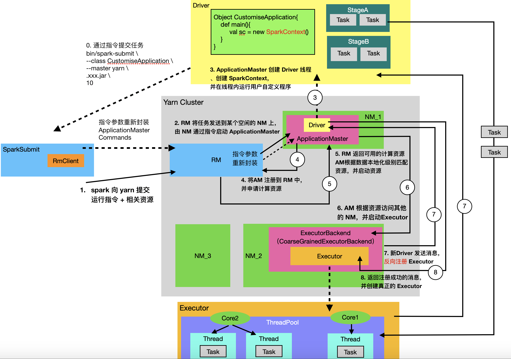
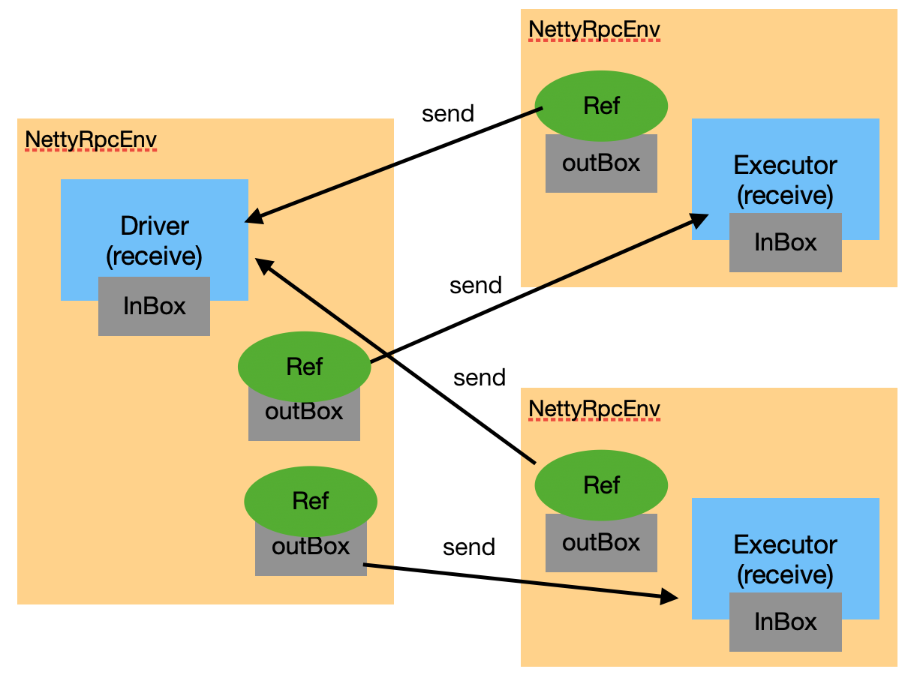

<span id="catalog"></span>

<span style='font-size:18px'>目录---内核代码分析</span>

- [整体执行流程](#整体执行流程)
    - [基本流程](#基本流程)
    - [详细流程](#详细流程)
- [执行流程图](#执行流程图)
- [执行流程--应用提交](#执行流程--应用提交)
    - [提交指令分析](#提交指令分析)
    - [任务提交的流程](#任务提交的流程)
    - [在Yarn上启动任务](#在Yarn上启动任务)
    - [在AppplicationMaster中启动Driver并获取资源](#在AppplicationMaster中启动Driver并获取资源)
        - [启动Driver](#启动Driver)
        - [注册AM并分配计算资源](#注册AM并分配计算资源)
        - [分配计算资源](#分配计算资源)
- [Executor反向注册--启动完成](#Executor反向注册--启动完成)
- [执行流程--Driver向Executor发送Task并执行](#执行流程--Driver向Executor发送Task并执行)
- [注意事项](#注意事项)
- [Spark的通信](#Spark的通信)
    - [通信架构图](#通信架构图)
    - [Driver中的通信](#Driver中的通信)
    - [Executor中的通信](#Executor中的通信)
- [](#)


# 整体执行流程
## 基本流程
[top](#catalog)
1. Spark 应用提交
    1. spark 向 Yarn 提交需要执行的应用
        - 本质是: 使用 `bin/java` 执行 java 程序
        - 执行时，会生成一次JVM
    2. 相关对象: ApplicationMaster, Driver，Executor
2. Spark 内部组件与通信
    1. 通信原理，IO、RPC
        - Socket，ServerSocker
        - AKKA，Netty(AIO)
        - IO,NIO,AIO
        - Linux(epoll)
    2. 组件内部
        - Driver
        - Executor
    3. 组件间
        - Endpoint
        - RpcEndpoint(receive)
        - RpcEndpointRef(send, ask)
3. Spark 作业的提交（作业的调度）
    1. Application
    2. 逻辑代码 RDD
    3. job 行动算子
    4. state 划分 -> 转换算子 -> 依赖关系
    5. Task （分区），每个阶段有多少个分区
4. 任务的执行
    1. 任务的内容
    2. 序列化（累加器， keyro）
    3. 调度
    4. 计算
    5. shuffle
    6. 内存，cache （memory only）
    7. 累加器

## 详细流程
[top](#catalog)
- ?????

1. 执行指令提交任务
2. `org.apache.spark.deploy.SparkSubmit` 提交任务
    1. 调用 `SparkSubmit.main` 函数
    2. 创建 SparkSubmit 匿名类的实例对象
    3. 调用 doSubmit 方法执行任务
    4. 调用 `SparkSubmit.doSubmit` 提交任务
        1. 调用 `parseArguments` 解析参数
            - 由 `SparkSubmitArguments.parse` 负责解析指令中的参数
                - 如: `--master yarn`、`--deploy-mode cluster`
                - 每次处理一个 KV 对
            - 由 `SparkSubmitArguments.handle` 负责具体的解析
        2. 调用 `SparkSubmit.submit` 提交任务
            1. `SparkSubmit.doRunMain`，在 Yarn 上运行
            2. `runMain`，执行调用
                1. 准备提交环境 `prepareSubmitEnvironment`
                    - 如果是 Yarn 环境: `"org.apache.spark.deploy.yarn.YarnClusterApplication"`
                    - 如果是 client 环境: `args.mainClass`
                        - 即 `--class` 对应的属性值: `org.apache.spark.examples.SparkPi`
                2. 加载主类 `mainClass = Utils.classForName(childMainClass)`
                3. 实例化主类 `app = mainClass.newInstance().asInstanceOf[SparkApplication]`
                4. 启动任务 `YarnClusterApplication.start`

- 启动 Driver 、注册 AM，并分配计算资源
    1. **第三次**封装参数 `ApplicationMasterArguments`
    2. 创建 AM 对象 `new ApplicationMaster`
    3. 启动 AM `run`
        - 本地模式 `runExecutorLauncher()`
        - 集群模式下，启动Driver: `runDriver()`，<span style='color:red'>相当于开始执行自定义Driver类</span>
            - 加载类，并获取 main 方法 `userClassLoader.loadClass(args.userClass).getMethod("main", classOf[Array[String]])`
                - `userClass` 是通过 `--class` 指定的类
            - 创建用户线程 `val userThread = new Thread {`
            - 将用线程的**名字**设置为 Driver:  `userThread.setName("Driver")`
            - 执行main 方法 `mainMethod.invoke`
        - 注册 AM
            - 向 RM 注册 AM `registerAM(host, port, userConf, sc.ui.map(_.webUrl))`
            - 获取资源 `createAllocator(driverRef, userConf)`
                - 调用 RM 客户端，申请分配计算资源
                    - `allocator = client.createAllocator`
                    - `allocator.allocateResources()`
                        - 获取可用的资源列表 `allocateResponse.getAllocatedContainers()`
                    - 处理可用资源 `handleAllocatedContainers`
                        - 启动资源 `runAllocatedContainers(containersToUse)`
                            - 如果 实际的 Executor 数据量 < 需要的数量，则手动创建 Executor，并添加到线程池
                                - `launcherPool.execute( ExecutorRunnable )`，一个 container 对应一个 ExecutorRunnable
                                    - 创建 NM 连接 `nmClient`
                                    - 启动容器 `startContainer`
                                - run
                                    - 封装指令对象 `prepareCommand`
                                        - `{JAVA_HOME}/bin/java -server org.apache.spark.executor.CoarseGrainedExecutorBackend`
                                    - 通过 NM 启动其他容器，**启动 Executor** `nmClient.startContainer(container.get, ctx)`
                                        - 会执行 ctx 中的指令对象
                                        - 因为是通过指令执行的，所以 `Executor` 是一个<span style='color:red'>进程</span>

# 执行流程图
[top](#catalog)
- 

# 执行流程--应用提交
## 提交指令分析
[top](#catalog)
- `--master yarn` 默认是 client 模式，即 ``
    ```
    bin/spark-submit \
    --class org.apache.spark.examples.SparkPi \
    --master yarn \
    ./examples/jars/spark-examples_2.12-2.4.5.jar \
    10
    ```

- `--deploy-mode cluster` 在集群上运行
    ```
    bin/spark-submit \
    --class org.apache.spark.examples.SparkPi \
    --master yarn \
    --deploy-mode cluster \
    ./examples/jars/spark-examples_2.12-2.4.5.jar \
    10
    ```

- 指令调用代码分析
    1. bin/spark-submit
        ```shell script
        if [ -z "${SPARK_HOME}" ]; then
          source "$(dirname "$0")"/find-spark-home
        fi

        # disable randomized hash for string in Python 3.3+
        export PYTHONHASHSEED=0

        # 调用 SparkSubmit 提交任务
        exec "${SPARK_HOME}"/bin/spark-class org.apache.spark.deploy.SparkSubmit "$@"
        ```

    2. bin/spark-class，启动 `JAVA_HOME`，执行java程序，并调用 `SparkSubmit` 提交任务
        ```shell script
        # 1. 设置 RUNNER 为 java 路径
        if [ -n "${JAVA_HOME}" ]; then
          RUNNER="${JAVA_HOME}/bin/java"
        else
          if [ "$(command -v java)" ]; then
            RUNNER="java"
          else
            echo "JAVA_HOME is not set" >&2
            exit 1
          fi
        fi

        # 2. 绑定执行参数
        build_command() {
          "$RUNNER" -Xmx128m $SPARK_LAUNCHER_OPTS -cp "$LAUNCH_CLASSPATH" org.apache.spark.launcher.Main "$@"
          printf "%d\0" $?
        }

        # 3. 将指令参数添加到 CMD 数组中
        CMD=()
        DELIM=$'\n'
        CMD_START_FLAG="false"
        while IFS= read -d "$DELIM" -r ARG; do
          if [ "$CMD_START_FLAG" == "true" ]; then
            CMD+=("$ARG")
          else
            if [ "$ARG" == $'\0' ]; then
              # After NULL character is consumed, change the delimiter and consume command string.
              DELIM=''
              CMD_START_FLAG="true"
            elif [ "$ARG" != "" ]; then
              echo "$ARG"
            fi
          fi
        done < <(build_command "$@")

        # 4. 执行指令
        exec "${CMD[@]}"
        ```

## 任务提交的流程
[top](#catalog)
- `org.apache.spark.deploy.SparkSubmit` 的整体执行流程
    1. 调用 `SparkSubmit.main` 函数
    2. 创建 SparkSubmit 匿名类的实例对象
    3. 调用 doSubmit 方法执行任务
    4. 调用 `SparkSubmit.doSubmit` 提交任务
        1. 调用 `parseArguments` 解析参数
            - 由 `SparkSubmitArguments.parse` 负责解析指令中的参数
                - 如: `--master yarn`、`--deploy-mode cluster`
                - 每次处理一个 KV 对
            - 由 `SparkSubmitArguments.handle` 负责具体的解析
        2. 调用 `SparkSubmit.submit` 提交任务
            1. `SparkSubmit.doRunMain`，在 Yarn 上运行
            2. `runMain`，执行调用
                1. 准备提交环境 `prepareSubmitEnvironment`
                    - 如果是 Yarn 环境: `"org.apache.spark.deploy.yarn.YarnClusterApplication"`
                    - 如果是 client 环境: `args.mainClass`
                        - 即 `--class` 对应的属性值: `org.apache.spark.examples.SparkPi`
                2. 加载主类 `mainClass = Utils.classForName(childMainClass)`
                3. 实例化主类 `app = mainClass.newInstance().asInstanceOf[SparkApplication]`
                4. 启动任务 `YarnClusterApplication.start`

- `org.apache.spark.deploy.SparkSubmit` 代码分析
    ```scala
    override def main(args: Array[String]): Unit = {

      // 1. 创建 SparkSubmit 匿名类的实例对象
      val submit = new SparkSubmit() {
        self =>

        override protected def parseArguments(args: Array[String]): SparkSubmitArguments = {
          new SparkSubmitArguments(args) {
            override protected def logInfo(msg: => String): Unit = self.logInfo(msg)

            override protected def logWarning(msg: => String): Unit = self.logWarning(msg)
          }
        }

        override protected def logInfo(msg: => String): Unit = printMessage(msg)

        override protected def logWarning(msg: => String): Unit = printMessage(s"Warning: $msg")

        override def doSubmit(args: Array[String]): Unit = {
          try {
            // 3. 调用父类 SparkSubmit 中的方法提交任务
            super.doSubmit(args)
          } catch {
            case e: SparkUserAppException =>
              exitFn(e.exitCode)
          }
        }

      }

      // 2. 提交任务
      submit.doSubmit(args)
    }
    ```
    ```scala
    private[spark] class SparkSubmit extends Logging {
      // 4. 提交任务
      def doSubmit(args: Array[String]): Unit = {
        val uninitLog = initializeLogIfNecessary(true, silent = true)

        // 4. 解析参数，即指令中的参数，如: --class、--master
        val appArgs = parseArguments(args)
        if (appArgs.verbose) {
          logInfo(appArgs.toString)
        }
        appArgs.action match {
          // 9. 默认执行 SUBMIT
          case SparkSubmitAction.SUBMIT => submit(appArgs, uninitLog)
          case SparkSubmitAction.KILL => kill(appArgs)
          case SparkSubmitAction.REQUEST_STATUS => requestStatus(appArgs)
          case SparkSubmitAction.PRINT_VERSION => printVersion()
        }
      }
    }

    protected def parseArguments(args: Array[String]): SparkSubmitArguments = {
      // 5. 生成参数解析结果对象
      new SparkSubmitArguments(args)
    }
    ```
    ```scala
    private[deploy] class SparkSubmitArguments(args: Seq[String], env: Map[String, String] = sys.env)
           extends SparkSubmitArgumentsParser with Logging {
       // 6. 在当前类初始化时，解析参数
       parse(args.asJava)
       // ...
    }
    ```
    ```java
    class SparkSubmitOptionParser {
        // 6. 解析参数
        protected final void parse(List<String> args) {
            Pattern eqSeparatedOpt = Pattern.compile("(--[^=]+)=(.+)");
            int idx = false;

            int idx;
            for(idx = 0; idx < args.size(); ++idx) {
                String arg = (String)args.get(idx);
                String value = null;
                Matcher m = eqSeparatedOpt.matcher(arg);
                if (m.matches()) {
                    arg = m.group(1);
                    value = m.group(2);
                }

                String name = this.findCliOption(arg, this.opts);
                if (name != null) {
                    if (value == null) {
                        if (idx == args.size() - 1) {
                            throw new IllegalArgumentException(String.format("Missing argument for option '%s'.", arg));
                        }

                        ++idx;
                        value = (String)args.get(idx);
                    }
                    // 7. 处理参数
                    if (!this.handle(name, value)) {
                        break;
                    }
                } else {
                    name = this.findCliOption(arg, this.switches);
                    if (name != null) {
                        if (!this.handle(name, (String)null)) {
                            break;
                        }
                    } else if (!this.handleUnknown(arg)) {
                        break;
                    }
                }
            }

            if (idx < args.size()) {
                ++idx;
            }

            this.handleExtraArgs(args.subList(idx, args.size()));
        }
    }
    ```
    ```scala
    private[deploy] class SparkSubmitArguments(args: Seq[String], env: Map[String, String] = sys.env)
      extends SparkSubmitArgumentsParser with Logging {
      override protected def handle(opt: String, value: String): Boolean = {
        opt match {
          // 8. 对参数名进行模式匹配并处理...
        }
        action != SparkSubmitAction.PRINT_VERSION
      }
    }
    ```
    ```scala
    private[spark] class SparkSubmit extends Logging {
        @tailrec
        private def submit(args: SparkSubmitArguments, uninitLog: Boolean): Unit = {
          // 11.1 定义闭包函数
          def doRunMain(): Unit = {
            if (args.proxyUser != null) {
              // 其他处理
            } else {
              // 11.2 执行调用
              runMain(args, uninitLog)
            }
          }

          if (args.isStandaloneCluster && args.useRest) {
            // 10.1 StandaloneCluster 模式处理
            try {
              logInfo("Running Spark using the REST application submission protocol.")
              doRunMain()
            } catch {
              // Fail over to use the legacy submission gateway
              case e: SubmitRestConnectionException =>
                logWarning(s"Master endpoint ${args.master} was not a REST server. " +
                  "Falling back to legacy submission gateway instead.")
                args.useRest = false
                submit(args, false)
            }
          // In all other modes, just run the main class as prepared
          } else {
            // 10.2 Yarn 运行模式处理
            doRunMain()
          }
        }
    }
    ```
    ```scala
    private[spark] class SparkSubmit extends Logging {
      private def runMain(args: SparkSubmitArguments, uninitLog: Boolean): Unit = {
        // 13. 准备提交环境
        val (childArgs, childClasspath, sparkConf, childMainClass) =
           prepareSubmitEnvironment(args)
        // 其他处理...
        // 14. 设置类加载器
        val loader =
          if (sparkConf.get(DRIVER_USER_CLASS_PATH_FIRST)) {
            new ChildFirstURLClassLoader(new Array[URL](0),
            Thread.currentThread.getContextClassLoader)
          } else {
            new MutableURLClassLoader(new Array[URL](0),
            Thread.currentThread.getContextClassLoader)
          }
        Thread.currentThread.setContextClassLoader(loader)

        // 15. 加载主类
        try {
          mainClass = Utils.classForName(childMainClass)
        }
        // 其他处理...

        // 16. 实例化主类，并赋值给 app
        val app: SparkApplication = if (classOf[SparkApplication].isAssignableFrom(mainClass)) {
          mainClass.newInstance().asInstanceOf[SparkApplication]
        }

        // 17. 在 Yarn 上执行任务: `YarnClusterApplication.start`
        // 需要 spark-yarn 依赖，才能找到该类
        try {
          app.start(childArgs.toArray, sparkConf)
        } catch {
          case t: Throwable =>
            throw findCause(t)
        }
    }
    ```

- `prepareSubmitEnvironment`，如何准备提交环境
    ```scala
    private[spark] class SparkSubmit extends Logging {
      // 在 Yarn 集群上运行时，使用的类
      private[deploy] val YARN_CLUSTER_SUBMIT_CLASS =
        "org.apache.spark.deploy.yarn.YarnClusterApplication"

      private[deploy] def prepareSubmitEnvironment(
          args: SparkSubmitArguments,
          conf: Option[HadoopConfiguration] = None)
          : (Seq[String], Seq[String], SparkConf, String) = {

          // 本地模式
          if (deployMode == CLIENT) {
            childMainClass = args.mainClass
            if (localPrimaryResource != null && isUserJar(localPrimaryResource)) {
              childClasspath += localPrimaryResource
            }
            if (localJars != null) { childClasspath ++= localJars.split(",") }
          }

          // 设置 Yarn 环境
          if (isYarnCluster) {
            childMainClass = YARN_CLUSTER_SUBMIT_CLASS
            if (args.isPython) {
              childArgs += ("--primary-py-file", args.primaryResource)
              childArgs += ("--class", "org.apache.spark.deploy.PythonRunner")
            } else if (args.isR) {
              val mainFile = new Path(args.primaryResource).getName
              childArgs += ("--primary-r-file", mainFile)
              childArgs += ("--class", "org.apache.spark.deploy.RRunner")
            } else {
              if (args.primaryResource != SparkLauncher.NO_RESOURCE) {
                childArgs += ("--jar", args.primaryResource)
              }
              childArgs += ("--class", args.mainClass)
            }
            if (args.childArgs != null) {
              args.childArgs.foreach { arg => childArgs += ("--arg", arg) }
            }
          }
      }
    }
    ```

## 在Yarn上启动任务
[top](#catalog)

- `YarnClusterApplication` 执行流程
    1. 启动任务 `start`
        - **第二次**封装参数 `new ClientArguments(args)`
        - 利用参数对象创建 yarn client 对象 `new Client(new ClientArguments(args), conf)`
            - `yarnClient = YarnClient.createYarnClient`
            - 在内部创建 RM 对象
        - client 运行 `client.run()`
            - 提交应用 `submitApplication`
                1. 启动并初始化 yarn 客户端
                2. 在 yarn 上创建应用 `yarnClient.createApplication()`
                3. 创建容器上下文 `val containerContext = createContainerLaunchContext(newAppResponse)`
                    - 配置 JVM 的启动参数
                    - 封装 ApplicationMaster 指令
                        - 集群模式 `{JAVA_HOME}/bin/java --server org.apache.spark.deploy.yarn.ApplicationMaster`
                        - 本地模式 `{JAVA_HOME}/bin/java --server org.apache.spark.deploy.yarn.ExecutorLauncher`

                4. 创建应用上下文 `val appContext = createApplicationSubmissionContext(newApp, containerContext)`
                5. 提交应用 `yarnClient.submitApplication(appContext)`

- `YarnClusterApplication` 代码分析
    ```scala
    private[spark] class YarnClusterApplication extends SparkApplication {
      // 1. 在 Yarn 上执行任务
      override def start(args: Array[String], conf: SparkConf): Unit = {
        // SparkSubmit would use yarn cache to distribute files & jars in yarn mode,
        // so remove them from sparkConf here for yarn mode.
        conf.remove("spark.jars")
        conf.remove("spark.files")

        // 1. 封装参数、实例化 Client 对象，并启动
        new Client(new ClientArguments(args), conf).run()
      }

    }
    ```
    ```scala
    private[spark] class Client(
        val args: ClientArguments,
        val sparkConf: SparkConf)
      extends Logging {
      // 2. 创建 client 对象
      private val yarnClient = YarnClient.createYarnClient
    }
    ```
    ```java
    @Public
    @Stable
    public abstract class YarnClient extends AbstractService {
        @Public
        public static YarnClient createYarnClient() {
            // 3. 实例化 yarn client 对象
            YarnClient client = new YarnClientImpl();
            return client;
        }
    }
    ```
    ```java
    @Private
    @Unstable
    public class YarnClientImpl extends YarnClient {
        private static final Log LOG = LogFactory.getLog(YarnClientImpl.class);
        // 创建 ResourceManager 代理对象
        protected ApplicationClientProtocol rmClient;
        // 其他属性...

        // 4. 实例化 yarn client 对象
        public YarnClientImpl() {
            super(YarnClientImpl.class.getName());
        }
    }
    ```
    ```scala
    private[spark] class Client(
        val args: ClientArguments,
        val sparkConf: SparkConf)
      extends Logging {

      def run(): Unit = {
        // 5. 提交应用
        this.appId = submitApplication()
        // 其他处理...
      }

      def submitApplication(): ApplicationId = {
        var appId: ApplicationId = null
        try {
          launcherBackend.connect()
          // 6. 根据 hadoop 的配置进行初始化
          yarnClient.init(hadoopConf)
          // 7. 启动 yarn 客户端
          yarnClient.start()

          logInfo("Requesting a new application from cluster with %d NodeManagers"
            .format(yarnClient.getYarnClusterMetrics.getNumNodeManagers))

          // 8. 在 yarn 上 通过 RM 创建应用程序，并获取应用的ID
          val newApp = yarnClient.createApplication()
          val newAppResponse = newApp.getNewApplicationResponse()
          appId = newAppResponse.getApplicationId()

          new CallerContext("CLIENT", sparkConf.get(APP_CALLER_CONTEXT),
            Option(appId.toString)).setCurrentContext()

          // Verify whether the cluster has enough resources for our AM
          verifyClusterResources(newAppResponse)

          // Set up the appropriate contexts to launch our AM
          // 9. 创建容器上下文
          val containerContext = createContainerLaunchContext(newAppResponse)
          // 10. 创建应用上下文
          val appContext = createApplicationSubmissionContext(newApp, containerContext)

          // Finally, submit and monitor the application
          logInfo(s"Submitting application $appId to ResourceManager")
          // 11. 提交应用
          yarnClient.submitApplication(appContext)
          launcherBackend.setAppId(appId.toString)
          reportLauncherState(SparkAppHandle.State.SUBMITTED)

          appId
        } catch {
          case e: Throwable =>
            if (appId != null) {
              cleanupStagingDir(appId)
            }
            throw e
        }
      }
    }
    ```

- `createContainerLaunchContext` 创建容器上下文的流程
    ```scala
    private[spark] class Client(
        val args: ClientArguments,
        val sparkConf: SparkConf)
      extends Logging {

      private def createContainerLaunchContext(newAppResponse: GetNewApplicationResponse)
        : ContainerLaunchContext = {
        val javaOpts = ListBuffer[String]()
        // 1. 设置 JVM 参数
        javaOpts += "-Xmx" + amMemory + "m"
        // 更多的 JVM 参数 ...

        // 2. 设置 ApplicationMaster 的类
        val amClass =
          if (isClusterMode) {// 集群模式
            Utils.classForName("org.apache.spark.deploy.yarn.ApplicationMaster").getName
          } else {  // 本地模式
            Utils.classForName("org.apache.spark.deploy.yarn.ExecutorLauncher").getName
          }

        // 3. 封装 ApplicationMaster 指令参数
        val amArgs =
          Seq(amClass) ++ userClass ++ userJar ++ primaryPyFile ++ primaryRFile ++ userArgs ++
          Seq("--properties-file", buildPath(Environment.PWD.$$(), LOCALIZED_CONF_DIR, SPARK_CONF_FILE))

        // 4. 封装 ApplicationMaster 的启动指令
        val commands = prefixEnv ++
          Seq(Environment.JAVA_HOME.$$() + "/bin/java", "-server") ++
          javaOpts ++ amArgs ++
          Seq(
            "1>", ApplicationConstants.LOG_DIR_EXPANSION_VAR + "/stdout",
            "2>", ApplicationConstants.LOG_DIR_EXPANSION_VAR + "/stderr")

        // 5. 封装 commands
        val printableCommands = commands.map(s => if (s == null) "null" else s).toList
        // 6. 将 commands 添加到 ApplicationMaster 容器中
        amContainer.setCommands(printableCommands.asJava)
        // 其他处理...

        // 7. 返回容器对象
        amContainer
      }
    }
    ```

## 在AppplicationMaster中启动Driver并获取资源
### 启动Driver
[top](#catalog)
- 启动 Driver 的三个主要操作
    1. 指令创建 ApplicationMaster
    2. ApplicationMaster 创建 Driver 线程
    3. 在 Driver 线程内，执行用户自定义类

- 如何理解 Driver 类
    - <span style='color:red'>Driver 是 ApplicationMaster 中的一个线程</span>
    - 本身并没有 Driver 类
    - ApplicationMaster 启动时，会添加一个线程，名为 `Driver`
    - `Driver` 内会通过反射调用**用户自定义的启动类中的 main 方法**来启动程序
    - 所以只要是 `main` 函数里使用了 `SparkContext` 对象，就可以称为 `Driver` 类

- ApplicationMaster 的功能
    - 用于解耦合 RM 和 Driver
    - AM 既能获取 Driver，又能与 RM 之间交互

- Driver 的启动流程
    1. **第三次**封装参数 `ApplicationMasterArguments`
    2. 创建 AM 对象 `new ApplicationMaster`
    3. 启动 AM `run`
        - 本地模式 `runExecutorLauncher()`
        - 集群模式下，启动Driver: `runDriver()`，<span style='color:red'>相当于开始执行自定义Driver类</span>
            - 加载类，并获取 main 方法 `userClassLoader.loadClass(args.userClass).getMethod("main", classOf[Array[String]])`
                - `userClass` 是通过 `--class` 指定的类
            - 创建用户线程 `val userThread = new Thread {`
            - 将用线程的**名字**设置为 Driver:  `userThread.setName("Driver")`
            - 执行main 方法 `mainMethod.invoke`
        - 注册 AM
            - 向 RM 注册 AM `registerAM(host, port, userConf, sc.ui.map(_.webUrl))`
            - 获取资源 `createAllocator(driverRef, userConf)`
                - 调用 RM 客户端，申请分配计算资源
                    - `allocator = client.createAllocator`
                    - `allocator.allocateResources()`
                        - 获取可用的资源列表 `allocateResponse.getAllocatedContainers()`
                    - 处理可用资源 `handleAllocatedContainers`
                        - 启动资源 `runAllocatedContainers(containersToUse)`
                            - 如果 实际的 Executor 数据量 < 需要的数量，则手动创建 Executor，并添加到线程池
                                - `launcherPool.execute( ExecutorRunnable )`，一个 container 对应一个 ExecutorRunnable
                                    - 创建 NM 连接 `nmClient`
                                    - 启动容器 `startContainer`
                                - run
                                    - 封装指令对象 `prepareCommand`
                                        - `{JAVA_HOME}/bin/java -server org.apache.spark.executor.CoarseGrainedExecutorBackend`
                                    - 通过 NM 启动其他容器，**启动 Executor** `nmClient.startContainer(container.get, ctx)`
                                        - 会执行 ctx 中的指令对象
                                        - 因为是通过指令执行的，所以 `Executor` 是一个<span style='color:red'>进程</span>

- NM 通过指令，调用 `org.apache.spark.deploy.yarn.ApplicationMaster` 的 main 方法启动
    ```scala
    object ApplicationMaster extends Logging {
      def main(args: Array[String]): Unit = {
        SignalUtils.registerLogger(log)
        // 1. 封装参数
        val amArgs = new ApplicationMasterArguments(args)
        master = new ApplicationMaster(amArgs)
        System.exit(master.run())
      }
    }
    ```
    ```scala
    class ApplicationMasterArguments(val args: Array[String]) {
      // 2. 实例化对象时，封装参数
      parseArgs(args.toList)

      // 2. 根据参数名，来封装参数
      private def parseArgs(inputArgs: List[String]): Unit = {
        val userArgsBuffer = new ArrayBuffer[String]()

        var args = inputArgs

        while (!args.isEmpty) {
          // --num-workers, --worker-memory, and --worker-cores are deprecated since 1.0,
          // the properties with executor in their names are preferred.
          args match {
            case ("--jar") :: value :: tail =>
              userJar = value
              args = tail

            case ("--class") :: value :: tail =>
              userClass = value
              args = tail

            case ("--primary-py-file") :: value :: tail =>
              primaryPyFile = value
              args = tail

            case ("--primary-r-file") :: value :: tail =>
              primaryRFile = value
              args = tail

            case ("--arg") :: value :: tail =>
              userArgsBuffer += value
              args = tail

            case ("--properties-file") :: value :: tail =>
              propertiesFile = value
              args = tail

            case _ =>
              printUsageAndExit(1, args)
          }
        }

        if (primaryPyFile != null && primaryRFile != null) {
          // scalastyle:off println
          System.err.println("Cannot have primary-py-file and primary-r-file at the same time")
          // scalastyle:on println
          System.exit(-1)
        }

        userArgs = userArgsBuffer.toList
      }
    }
    ```
    ```scala
    private[spark] class ApplicationMaster(args: ApplicationMasterArguments) extends Logging {
      // 3. 启动 ApplicationMaster
      final def run(): Int = {
        doAsUser {
          runImpl()
        }
        exitCode
      }

      private def runImpl(): Unit = {
        if (isClusterMode) {
          // 4. 如果是集群模式，则启动 Driver
          runDriver()
        } else {
          runExecutorLauncher()
        }
      }

      private def runDriver(): Unit = {
        addAmIpFilter(None)
        // 5. 启动用户应用
        userClassThread = startUserApplication()

        // This a bit hacky, but we need to wait until the spark.driver.port property has
        // been set by the Thread executing the user class.
        logInfo("Waiting for spark context initialization...")
        val totalWaitTime = sparkConf.get(AM_MAX_WAIT_TIME)
        try {
          // 6. 阻塞线程，并等待 SparkContext 对象返回
          val sc = ThreadUtils.awaitResult(sparkContextPromise.future,
            Duration(totalWaitTime, TimeUnit.MILLISECONDS))
        }

        if (sc != null) {
          rpcEnv = sc.env.rpcEnv

          val userConf = sc.getConf
          val host = userConf.get("spark.driver.host")
          val port = userConf.get("spark.driver.port").toInt
          // 7. 注册 AM 到 RM
          registerAM(host, port, userConf, sc.ui.map(_.webUrl))

          val driverRef = rpcEnv.setupEndpointRef(
            RpcAddress(host, port),
            YarnSchedulerBackend.ENDPOINT_NAME)
          createAllocator(driverRef, userConf)
        } else {
          // Sanity check; should never happen in normal operation, since sc should only be null
          // if the user app did not create a SparkContext.
          throw new IllegalStateException("User did not initialize spark context!")
        }
        resumeDriver()
        userClassThread.join()
        // 其他处理...
      }

      // 5. 启动用户应用
      // 5.1 获取用户类的类加载器
      private val userClassLoader = {
        // 获取类在本地的绝对路径
        val classpath = Client.getUserClasspath(sparkConf)
        val urls = classpath.map { entry =>
          new URL("file:" + new File(entry.getPath()).getAbsolutePath())
        }

        // 加载类
        if (isClusterMode) {
          if (Client.isUserClassPathFirst(sparkConf, isDriver = true)) {
            new ChildFirstURLClassLoader(urls, Utils.getContextOrSparkClassLoader)
          } else {
            new MutableURLClassLoader(urls, Utils.getContextOrSparkClassLoader)
          }
        } else {
          new MutableURLClassLoader(urls, Utils.getContextOrSparkClassLoader)
        }
      }

      private def startUserApplication(): Thread = {
        // 其他处理...

        // 5.2 获取用户自定义类，即通过 `--class` 指定的类
        // 并获取 main 方法
        val mainMethod = userClassLoader.loadClass(args.userClass)
          .getMethod("main", classOf[Array[String]])

        // 5.3 创建线程
        val userThread = new Thread {
          override def run() {
            try {
              if (!Modifier.isStatic(mainMethod.getModifiers)) {
                // 5.3.1 如果自定义类【不是】静态类，则异常
                logError(s"Could not find static main method in object ${args.userClass}")
                finish(FinalApplicationStatus.FAILED, ApplicationMaster.EXIT_EXCEPTION_USER_CLASS)
              } else {
                // 5.3.2 如果自定义类是静态类，则执行
                mainMethod.invoke(null, userArgs.toArray)
                finish(FinalApplicationStatus.SUCCEEDED, ApplicationMaster.EXIT_SUCCESS)
                logDebug("Done running user class")
              }
            }
            // 其他处理...
          }
        }

        // 5.4 将类加载器添加到线程
        userThread.setContextClassLoader(userClassLoader)
        // 5.5 将线程名设为 Driver
        userThread.setName("Driver")
        // 5.6 启动线程
        userThread.start()
        userThread
      }
    }
    ```

### 注册AM并分配计算资源
[top](#catalog)
- AM 的注册流程分析
    1. 向 RM 注册 AM `registerAM(host, port, userConf, sc.ui.map(_.webUrl))`
    2. 获取资源 `createAllocator(driverRef, userConf)`
        - 调用 RM 客户端，申请分配计算资源
            - `allocator = client.createAllocator`
            - `allocator.allocateResources()`
                - 获取可用的资源列表 `allocateResponse.getAllocatedContainers()`
            - 处理可用资源 `handleAllocatedContainers`
                - 启动资源 `runAllocatedContainers(containersToUse)`

- 源码分析
    ```scala
    // RM 客户端类
    private[spark] class YarnRMClient extends Logging {
      // 负责注册 AM 到 RM
      private var amClient: AMRMClient[ContainerRequest] = _
      private var uiHistoryAddress: String = _
      private var registered: Boolean = false
    }
    ```
    ```scala
    private[spark] class ApplicationMaster(args: ApplicationMasterArguments) extends Logging {
      private def runDriver(): Unit = {
        // 其他处理...
        // 7. 注册 AM
        registerAM(host, port, userConf, sc.ui.map(_.webUrl))

        // 9. 获取 Driver 的引用
        val driverRef = rpcEnv.setupEndpointRef(
          RpcAddress(host, port),
          YarnSchedulerBackend.ENDPOINT_NAME)
        // 10. 向 RM 申请资源
        createAllocator(driverRef, userConf)
      }

      // 8.1 创建客户端类，用于向 RM 中注册 AM
      private val client = doAsUser { new YarnRMClient() }

      private def registerAM(
          host: String,
          port: Int,
          _sparkConf: SparkConf,
          uiAddress: Option[String]): Unit = {
        val appId = client.getAttemptId().getApplicationId().toString()
        val attemptId = client.getAttemptId().getAttemptId().toString()
        val historyAddress = ApplicationMaster
          .getHistoryServerAddress(_sparkConf, yarnConf, appId, attemptId)

        // 8.2 向客户端注册 AM
        client.register(host, port, yarnConf, _sparkConf, uiAddress, historyAddress)
        registered = true
      }

      private def createAllocator(driverRef: RpcEndpointRef, _sparkConf: SparkConf): Unit = {
        val appId = client.getAttemptId().getApplicationId().toString()
        val driverUrl = RpcEndpointAddress(driverRef.address.host, driverRef.address.port,
          CoarseGrainedSchedulerBackend.ENDPOINT_NAME).toString
        // 其他处理...

        // 9. 调用 RM 客户端，申请分配计算资源
        allocator = client.createAllocator(
          yarnConf,
          _sparkConf,
          driverUrl,
          driverRef,
          securityMgr,
          localResources)

        credentialRenewer.foreach(_.setDriverRef(driverRef))

        // Initialize the AM endpoint *after* the allocator has been initialized. This ensures
        // that when the driver sends an initial executor request (e.g. after an AM restart),
        // the allocator is ready to service requests.
        rpcEnv.setupEndpoint("YarnAM", new AMEndpoint(rpcEnv, driverRef))
        // 9.2 申请分配资源
        allocator.allocateResources()
        val ms = MetricsSystem.createMetricsSystem("applicationMaster", sparkConf, securityMgr)
        val prefix = _sparkConf.get(YARN_METRICS_NAMESPACE).getOrElse(appId)
        ms.registerSource(new ApplicationMasterSource(prefix, allocator))
        // do not register static sources in this case as per SPARK-25277
        ms.start(false)
        metricsSystem = Some(ms)
        reporterThread = launchReporterThread()
      }
    }
    ```
    ```scala
    private[yarn] class YarnAllocator{
      def allocateResources(): Unit = synchronized {
        updateResourceRequests()

        val progressIndicator = 0.1f
        // Poll the ResourceManager. This doubles as a heartbeat if there are no pending container
        // requests.
        val allocateResponse = amClient.allocate(progressIndicator)

        // 10. 获取可用的资源列表，即容器
        val allocatedContainers = allocateResponse.getAllocatedContainers()
        allocatorBlacklistTracker.setNumClusterNodes(allocateResponse.getNumClusterNodes)

        if (allocatedContainers.size > 0) {
          logDebug(("Allocated containers: %d. Current executor count: %d. " +
            "Launching executor count: %d. Cluster resources: %s.")
            .format(
              allocatedContainers.size,
              runningExecutors.size,
              numExecutorsStarting.get,
              allocateResponse.getAvailableResources))
          // 11. 如果容器的数量 > 0，选择使用哪些资源
          handleAllocatedContainers(allocatedContainers.asScala)
        }
      }

      // 12. 处理可用资源
      def handleAllocatedContainers(allocatedContainers: Seq[Container]): Unit = {
        val containersToUse = new ArrayBuffer[Container](allocatedContainers.size)

        // Match incoming requests by host
        val remainingAfterHostMatches = new ArrayBuffer[Container]
        for (allocatedContainer <- allocatedContainers) {
          matchContainerToRequest(allocatedContainer, allocatedContainer.getNodeId.getHost,
            containersToUse, remainingAfterHostMatches)
        }

        // Match remaining by rack. Because YARN's RackResolver swallows thread interrupts
        // (see SPARK-27094), which can cause this code to miss interrupts from the AM, use
        // a separate thread to perform the operation.
        val remainingAfterRackMatches = new ArrayBuffer[Container]
        if (remainingAfterHostMatches.nonEmpty) {
          var exception: Option[Throwable] = None
          // 13. 创建线程，用于计算【首选位置】
          val thread = new Thread("spark-rack-resolver") {
            override def run(): Unit = {
              try {
                for (allocatedContainer <- remainingAfterHostMatches) {
                  val rack = resolver.resolve(conf, allocatedContainer.getNodeId.getHost)
                  matchContainerToRequest(allocatedContainer, rack, containersToUse,
                    remainingAfterRackMatches)
                }
              } catch {
                case e: Throwable =>
                  exception = Some(e)
              }
            }
          }
          thread.setDaemon(true)
          thread.start()

          try {
            thread.join()
          } catch {
            case e: InterruptedException =>
              thread.interrupt()
              throw e
          }

          if (exception.isDefined) {
            throw exception.get
          }
        }

        // 14. 继续匹配结点本地化、机架本地化
        // Assign remaining that are neither node-local nor rack-local
        val remainingAfterOffRackMatches = new ArrayBuffer[Container]
        for (allocatedContainer <- remainingAfterRackMatches) {
          matchContainerToRequest(allocatedContainer, ANY_HOST, containersToUse,
            remainingAfterOffRackMatches)
        }

        if (!remainingAfterOffRackMatches.isEmpty) {
          logDebug(s"Releasing ${remainingAfterOffRackMatches.size} unneeded containers that were " +
            s"allocated to us")
          for (container <- remainingAfterOffRackMatches) {
            internalReleaseContainer(container)
          }
        }

        // 15. 启动资源
        runAllocatedContainers(containersToUse)

        logInfo("Received %d containers from YARN, launching executors on %d of them."
          .format(allocatedContainers.size, containersToUse.size))
      }
    }
    ```

### 分配计算资源
[top](#catalog)
- 一个 container 对应一个 ExecutorRunnable

- `runAllocatedContainers` 分析
    ```scala
    // 创建线程池，保存 Executor
    private val launcherPool = ThreadUtils.newDaemonCachedThreadPool(
       "ContainerLauncher", sparkConf.get(CONTAINER_LAUNCH_MAX_THREADS))
    ```
    ```scala
  private[yarn] class YarnAllocator
    private def runAllocatedContainers(containersToUse: ArrayBuffer[Container]): Unit = {
      // 其他处理
      // 1. 如果正在运行的 Executor < 目标 Executor 数 （可以手动设置）
      if (runningExecutors.size() < targetNumExecutors) {
        numExecutorsStarting.incrementAndGet()
        if (launchContainers) {
          // 2. 手动创建 Executor 线程，并添加到线程池中
          launcherPool.execute(new Runnable {
            override def run(): Unit = {
              try {
                new ExecutorRunnable(
                  Some(container),
                  conf,
                  sparkConf,
                  driverUrl,
                  executorId,
                  executorHostname,
                  executorMemory,
                  executorCores,
                  appAttemptId.getApplicationId.toString,
                  securityMgr,
                  localResources
                ).run() // 3. 调用 Run 方法
                updateInternalState()
              } 
  
              // 其他处理
            }
          })
        } else {
          // For test only
          updateInternalState()
        }
      } else {
        logInfo(("Skip launching executorRunnable as running executors count: %d " +
          "reached target executors count: %d.").format(
          runningExecutors.size, targetNumExecutors))
      }
    }
    }
    ```
    ```scala
    private[yarn] class ExecutorRunnable(
      container: Option[Container],
      conf: YarnConfiguration,
      sparkConf: SparkConf,
      masterAddress: String,
      executorId: String,
      hostname: String,
      executorMemory: Int,
      executorCores: Int,
      appId: String,
      securityMgr: SecurityManager,
      localResources: Map[String, LocalResource]) extends Logging {
  
      // 4. 创建 Yarn RPC 对象
      // AM 将根据资源通过 RPC 访问其他的 NM
      var rpc: YarnRPC = YarnRPC.create(conf)
      // 5. 用于连接 其他 NM 结点 
      var nmClient: NMClient = _
    
      def run(): Unit = {
        logDebug("Starting Executor Container")
        // 6. 创建 NM
        nmClient = NMClient.createNMClient()
        // 7. 初始化 NM
        nmClient.init(conf)
        // 8. 启动 NM，即建立连接
        nmClient.start()
        // 9. 启动容器
        startContainer()
      }
  
      def startContainer(): java.util.Map[String, ByteBuffer] = {
        // 其他处理...
        // 10. 封装指令对象，并放入 ctx
        val commands = prepareCommand()
  
        ctx.setCommands(commands.asJava)
  
        // Send the start request to the ContainerManager
        // 11. 通过 NM 启动其他容器
        try {
          nmClient.startContainer(container.get, ctx)
        } catch {
          case ex: Exception =>
            throw new SparkException(s"Exception while starting container ${container.get.getId}" +
              s" on host $hostname", ex)
        }
      }
   
      private def prepareCommand(): List[String] = {
        // 其他处理
        // 10.1 封装指令，启动
        // {JAVA_HOME}/bin/java -server org.apache.spark.executor.CoarseGrainedExecutorBackend
        val commands = prefixEnv ++
          Seq(Environment.JAVA_HOME.$$() + "/bin/java", "-server") ++
          javaOpts ++
          Seq("org.apache.spark.executor.CoarseGrainedExecutorBackend",
            "--driver-url", masterAddress,
            "--executor-id", executorId,
            "--hostname", hostname,
            "--cores", executorCores.toString,
            "--app-id", appId) ++
          userClassPath ++
          Seq(
            s"1>${ApplicationConstants.LOG_DIR_EXPANSION_VAR}/stdout",
            s"2>${ApplicationConstants.LOG_DIR_EXPANSION_VAR}/stderr")
    
        // TODO: it would be nicer to just make sure there are no null commands here
        commands.map(s => if (s == null) "null" else s).toList

      }
    }
    ```

# Executor反向注册--启动完成
[top](#catalog)
- AM 向其他 NM 发送指令对象，并通过指令对象启动 CoarseGrainedExecutorBackend
- 整体流程
    1. 通过指令启动，会创建一个 java 进程，并调用调用 main 方法
    2. CoarseGrainedExecutorBackend.main
    3. 关联 driver
    4. 设置真正的 Executor 为通信终端
        - 会创建一个新的 `CoarseGrainedExecutorBackend` 对象作为通信终端
        - 即 `CoarseGrainedExecutorBackend` 就是 Executor
    5. 向终端发送消息
        - 会收到信息 OnStart
        - 收到消息后，执行通信对象的 onStart 方法，`CoarseGrainedExecutorBackend.onStart`
            - 获取 driver 引用 `driver = Some(ref)`
            - 向 driver 发送请求，反向注册 Executor `ref.ask[Boolean](RegisterExecutor(...))`
    6. driver 中的 SparkContext
        -  driver 向 Executor 返回注册成功的消息
    7. 接收到注册成功的消息后，创建真正的 Executor

- `CoarseGrainedExecutorBackend` 分析
    ```scala
    private[spark] class CoarseGrainedExecutorBackend(
      override val rpcEnv: RpcEnv,
      driverUrl: String,
      executorId: String,
      hostname: String,
      cores: Int,
      userClassPath: Seq[URL],
      env: SparkEnv)
    extends ThreadSafeRpcEndpoint with ExecutorBackend with Logging {
      def main(args: Array[String]) {
        // 其他参数解析处理...
  
        // 1. 启动 Executor
        run(driverUrl, executorId, hostname, cores, appId, workerUrl, userClassPath)
        System.exit(0)
      }

      private def run(
            driverUrl: String,
            executorId: String,
            hostname: String,
            cores: Int,
            appId: String,
            workerUrl: Option[String],
            userClassPath: Seq[URL]) {
        // 其他处理...
       
        SparkHadoopUtil.get.runAsSparkUser { () =>
          // 2. 关联 driver
          val driver = fetcher.setupEndpointRefByURI(driverUrl)
          // 3. 设置真正的 Executor 为通信终端
          env.rpcEnv.setupEndpoint("Executor", new CoarseGrainedExecutorBackend(
            env.rpcEnv, driverUrl, executorId, hostname, cores, userClassPath, env))
          workerUrl.foreach { url =>
            env.rpcEnv.setupEndpoint("WorkerWatcher", new WorkerWatcher(env.rpcEnv, url))
              
        }
      }  
    }
    ```
    ```scala
    private[netty] class NettyRpcEnv(
      val conf: SparkConf,
      javaSerializerInstance: JavaSerializerInstance,
      host: String,
      securityManager: SecurityManager,
      numUsableCores: Int) extends RpcEnv(conf) with Logging {
      // 4.  注册通信终端
      override def setupEndpoint(name: String, endpoint: RpcEndpoint): RpcEndpointRef = {
        dispatcher.registerRpcEndpoint(name, endpoint)
      }
    }
    ```
    ```scala
    private[netty] class Dispatcher(nettyEnv: NettyRpcEnv, numUsableCores: Int) extends Logging {
      def registerRpcEndpoint(name: String, endpoint: RpcEndpoint): NettyRpcEndpointRef = {
        val addr = RpcEndpointAddress(nettyEnv.address, name)
        val endpointRef = new NettyRpcEndpointRef(nettyEnv.conf, addr, nettyEnv)
        synchronized {
          if (stopped) {
            throw new IllegalStateException("RpcEnv has been stopped")
          }
          
          // 5. 向终端发送消息
          if (endpoints.putIfAbsent(name, new EndpointData(name, endpoint, endpointRef)) != null) {
            throw new IllegalArgumentException(s"There is already an RpcEndpoint called $name")
          }
          val data = endpoints.get(name)
          endpointRefs.put(data.endpoint, data.ref)
          receivers.offer(data)  // for the OnStart message
        }
        endpointRef
      }
    }
    ```
    ```scala
    private[netty] class Dispatcher(nettyEnv: NettyRpcEnv, numUsableCores: Int) extends Logging {
      private class EndpointData(
          val name: String,
          val endpoint: RpcEndpoint,
          val ref: NettyRpcEndpointRef) {
        // 6. 内部包含一个收件箱，会接收一个消息
        val inbox = new Inbox(ref, endpoint)
      }
    }
    ```
    ```scala
    private[netty] class Inbox(
        val endpointRef: NettyRpcEndpointRef,
        val endpoint: RpcEndpoint)
      extends Logging {
      // 7. 初始化时，会收到一个信息 OnStart
      inbox.synchronized {
        messages.add(OnStart)
      }
      
      def process(dispatcher: Dispatcher): Unit = {
        while (true) {
          safelyCall(endpoint) {
            message match {
              case OnStart =>
                // 8. 接收到 OnStart 之后，调用通信终端的 onStart
                // 即调用: CoarseGrainedExecutorBackend.onStart
                endpoint.onStart()
                if (!endpoint.isInstanceOf[ThreadSafeRpcEndpoint]) {
                  inbox.synchronized {
                    if (!stopped) {
                      enableConcurrent = true
                    }
                  }
                }              
            }
            // 其他 match 处理...
          }
        }
      }
    }
    ```
    ```scala
    private[spark] class CoarseGrainedExecutorBackend{
      override def onStart() {
        logInfo("Connecting to driver: " + driverUrl)
        ，
        rpcEnv.asyncSetupEndpointRefByURI(driverUrl).flatMap { ref =>
          // 9.1 获取 driver 引用
          driver = Some(ref)
          // 9.2 向 driver 发送请求（RPC），反向注册 Executor
          ref.ask[Boolean](RegisterExecutor(executorId, self, hostname, cores, extractLogUrls))
        }(ThreadUtils.sameThread).onComplete {
          // This is a very fast action so we can use "ThreadUtils.sameThread"
          case Success(msg) =>
            // Always receive `true`. Just ignore it
          case Failure(e) =>
            exitExecutor(1, s"Cannot register with driver: $driverUrl", e, notifyDriver = false)
        }(ThreadUtils.sameThread)
      }  
    }
    ```

- 发送注册 Executor 请求后，由 Driver 中的 `SparkContext` 对象进行处理
    ```scala
    class SparkContext(config: SparkConf) extends Logging {
      // 10. 用于后台通信，可以在 driver 端响应 Executor 端的请求
      // `ref.ask[Boolean](RegisterExecutor())`
      private var _schedulerBackend: SchedulerBackend = _ 
    }
    ```
    ```scala
    class CoarseGrainedSchedulerBackend(scheduler: TaskSchedulerImpl, val rpcEnv: RpcEnv)
      extends ExecutorAllocationClient with SchedulerBackend with Logging {
      override def receiveAndReply(context: RpcCallContext): PartialFunction[Any, Unit] = {
        // 11. 响应 Executor 端的反向注册请求
        case RegisterExecutor(executorId, executorRef, hostname, cores, logUrls) =>
          if (executorDataMap.contains(executorId)) {
            executorRef.send(RegisterExecutorFailed("Duplicate executor ID: " + executorId))
            context.reply(true)
          } else if (scheduler.nodeBlacklist.contains(hostname)) {
            // If the cluster manager gives us an executor on a blacklisted node (because it
            // already started allocating those resources before we informed it of our blacklist,
            // or if it ignored our blacklist), then we reject that executor immediately.
            logInfo(s"Rejecting $executorId as it has been blacklisted.")
            executorRef.send(RegisterExecutorFailed(s"Executor is blacklisted: $executorId"))
            context.reply(true)
          } else {
            // If the executor's rpc env is not listening for incoming connections, `hostPort`
            // will be null, and the client connection should be used to contact the executor.
            val executorAddress = if (executorRef.address != null) {
                executorRef.address
              } else {
                context.senderAddress
              }
            logInfo(s"Registered executor $executorRef ($executorAddress) with ID $executorId")
            addressToExecutorId(executorAddress) = executorId
            // 11.1 增加和数、增加 Executor
            totalCoreCount.addAndGet(cores)
            totalRegisteredExecutors.addAndGet(1)
            val data = new ExecutorData(executorRef, executorAddress, hostname,
              cores, cores, logUrls)
            // This must be synchronized because variables mutated
            // in this block are read when requesting executors
            CoarseGrainedSchedulerBackend.this.synchronized {
              executorDataMap.put(executorId, data)
              if (currentExecutorIdCounter < executorId.toInt) {
                currentExecutorIdCounter = executorId.toInt
              }
              if (numPendingExecutors > 0) {
                numPendingExecutors -= 1
                logDebug(s"Decremented number of pending executors ($numPendingExecutors left)")
              }
            }
            // 12. driver 向 Executor 返回注册成功的消息
            executorRef.send(RegisteredExecutor)
            // Note: some tests expect the reply to come after we put the executor in the map
            context.reply(true)
            listenerBus.post(
              SparkListenerExecutorAdded(System.currentTimeMillis(), executorId, data))
            makeOffers()
          }
      }
    }
    ```
  
- driver 将注册消息发送回 Executor
    ```scala
    private[spark] class CoarseGrainedExecutorBackend{
      override def receive: PartialFunction[Any, Unit] = {
        case RegisteredExecutor =>
          logInfo("Successfully registered with driver")
          try {
            // 13. 接收到注册成功的消息后，创建真正的 Executor
            executor = new Executor(executorId, hostname, env, userClassPath, isLocal = false)
          } catch {
            case NonFatal(e) =>
              exitExecutor(1, "Unable to create executor due to " + e.getMessage, e)
          }
    }
    ```

# 执行流程--Driver向Executor发送Task并执行
[top](#catalog)
- SparkContext
    ```scala
    def runJob[T, U: ClassTag](
        rdd: RDD[T],
        func: (TaskContext, Iterator[T]) => U,
        partitions: Seq[Int],
        resultHandler: (Int, U) => Unit): Unit = {
      if (stopped.get()) {
        throw new IllegalStateException("SparkContext has been shutdown")
      }
      val callSite = getCallSite
      val cleanedFunc = clean(func)
      logInfo("Starting job: " + callSite.shortForm)
      if (conf.getBoolean("spark.logLineage", false)) {
        logInfo("RDD's recursive dependencies:\n" + rdd.toDebugString)
      }
      // 1. 执行任务
      dagScheduler.runJob(rdd, cleanedFunc, partitions, callSite, resultHandler, localProperties.get)
      progressBar.foreach(_.finishAll())
      rdd.doCheckpoint()
    }
    ```
- DAGScheduler
    ```scala
    def runJob[T, U](
      rdd: RDD[T],
      func: (TaskContext, Iterator[T]) => U,
      partitions: Seq[Int],
      callSite: CallSite,
      resultHandler: (Int, U) => Unit,
      properties: Properties): Unit = {
    val start = System.nanoTime
    // 2. 提交job
    val waiter = submitJob(rdd, func, partitions, callSite, resultHandler, properties)
    ThreadUtils.awaitReady(waiter.completionFuture, Duration.Inf)
    // 其他处理...
    ```
    ```scala
    def submitJob[T, U](
        rdd: RDD[T],
        func: (TaskContext, Iterator[T]) => U,
        partitions: Seq[Int],
        callSite: CallSite,
        resultHandler: (Int, U) => Unit,
        properties: Properties): JobWaiter[U] = {
      // 其他处理...
      // 3. 封装消息
      eventProcessLoop.post(JobSubmitted(
        jobId, rdd, func2, partitions.toArray, callSite, waiter,
        SerializationUtils.clone(properties)))
      waiter
    }
    ```
    ```scala
    private[scheduler] def handleJobSubmitted(jobId: Int,
        finalRDD: RDD[_],
        func: (TaskContext, Iterator[_]) => _,
        partitions: Array[Int],
        callSite: CallSite,
        listener: JobListener,
        properties: Properties) {
      // 其他处理 ...
      val stageInfos = stageIds.flatMap(id => stageIdToStage.get(id).map(_.latestInfo))
      listenerBus.post(
        SparkListenerJobStart(job.jobId, jobSubmissionTime, stageInfos, properties))
      // 4. 提交 Stage
      submitStage(finalStage)
    }
    ```
    ```scala
    private def submitStage(stage: Stage) {
      val jobId = activeJobForStage(stage)
      if (jobId.isDefined) {
        logDebug(s"submitStage($stage (name=${stage.name};" +
          s"jobs=${stage.jobIds.toSeq.sorted.mkString(",")}))")
        if (!waitingStages(stage) && !runningStages(stage) && !failedStages(stage)) {
          val missing = getMissingParentStages(stage).sortBy(_.id)
          logDebug("missing: " + missing)
          if (missing.isEmpty) {
            logInfo("Submitting " + stage + " (" + stage.rdd + "), which has no missing parents")
            // 5. 提交任务
            submitMissingTasks(stage, jobId.get)
          } else {
            for (parent <- missing) {
              submitStage(parent)
            }
            waitingStages += stage
          }
        }
      } else {
        abortStage(stage, "No active job for stage " + stage.id, None)
      }
    }
    ```
    ```scala
    private def submitMissingTasks(stage: Stage, jobId: Int) {
      // 其他处理...

      // 6. 尝试创建任务
      val tasks: Seq[Task[_]] = try {
        val serializedTaskMetrics = closureSerializer.serialize(stage.latestInfo.taskMetrics).array()
        stage match {
          case stage: ShuffleMapStage =>
            // ...

          case stage: ResultStage =>
            // ...
        }
      }
      
      // 6.1 如果任务数量 > 0
      if (tasks.size > 0) {
        logInfo(s"Submitting ${tasks.size} missing tasks from $stage (${stage.rdd}) (first 15 " +
          s"tasks are for partitions ${tasks.take(15).map(_.partitionId)})")
        // 6.2 如果任务数量 > 0，会提交任务
        taskScheduler.submitTasks(new TaskSet(
          tasks.toArray, stage.id, stage.latestInfo.attemptNumber, jobId, properties))
      } else {
        // ...
      }
    }
    ```
- TaskSchedulerImpl
    ```scala
    override def submitTasks(taskSet: TaskSet) {
      val tasks = taskSet.tasks
      logInfo("Adding task set " + taskSet.id + " with " + tasks.length + " tasks")
      this.synchronized {
        val manager = createTaskSetManager(taskSet, maxTaskFailures)
        val stage = taskSet.stageId
        val stageTaskSets =
          taskSetsByStageIdAndAttempt.getOrElseUpdate(stage, new HashMap[Int, TaskSetManager])

        stageTaskSets.foreach { case (_, ts) =>
          ts.isZombie = true
        }
        stageTaskSets(taskSet.stageAttemptId) = manager
        // 7. 进行准备工作，开始封装task
        // 当前task已经有了，但是资源不一定够用
        // 如: Executor还没有准备好
        schedulableBuilder.addTaskSetManager(manager, manager.taskSet.properties)
  
        if (!isLocal && !hasReceivedTask) {
          starvationTimer.scheduleAtFixedRate(new TimerTask() {
            override def run() {
              if (!hasLaunchedTask) {
                logWarning("Initial job has not accepted any resources; " +
                  "check your cluster UI to ensure that workers are registered " +
                  "and have sufficient resources")
              } else {
                this.cancel()
              }
            }
          }, STARVATION_TIMEOUT_MS, STARVATION_TIMEOUT_MS)
        }
        hasReceivedTask = true
      }
      // 8. 在后台将task去除
      backend.reviveOffers()
    }
    ```
- CoarseGrainedSchedulerBackend
    ```scala
    override def receive: PartialFunction[Any, Unit] = {
        case ReviveOffers =>
        makeOffers()
    }
    ```
    ```scala
    private def makeOffers() {
      // 9. 取出任务
      val taskDescs = withLock {
        // Filter out executors under killing
        val activeExecutors = executorDataMap.filterKeys(executorIsAlive)
        val workOffers = activeExecutors.map {
          case (id, executorData) =>
            new WorkerOffer(id, executorData.executorHost, executorData.freeCores,
              Some(executorData.executorAddress.hostPort))
        }.toIndexedSeq
        scheduler.resourceOffers(workOffers)
      }
      // 10. 如果取出的任务不为空，则启动任务
      if (!taskDescs.isEmpty) {
        launchTasks(taskDescs)
      }
    }
    ```
    ```scala
    private def launchTasks(tasks: Seq[Seq[TaskDescription]]) {
      // 11. 遍历并启动所有获取到的任务
      for (task <- tasks.flatten) {
        // 11.1 序列化任务
        val serializedTask = TaskDescription.encode(task)
        if (serializedTask.limit() >= maxRpcMessageSize) {
          Option(scheduler.taskIdToTaskSetManager.get(task.taskId)).foreach { taskSetMgr =>
            try {
              var msg = "Serialized task %s:%d was %d bytes, which exceeds max allowed: " +
                "spark.rpc.message.maxSize (%d bytes). Consider increasing " +
                "spark.rpc.message.maxSize or using broadcast variables for large values."
              msg = msg.format(task.taskId, task.index, serializedTask.limit(), maxRpcMessageSize)
              taskSetMgr.abort(msg)
            } catch {
              case e: Exception => logError("Exception in error callback", e)
            }
          }
        }
        else {
          val executorData = executorDataMap(task.executorId)
          executorData.freeCores -= scheduler.CPUS_PER_TASK

          logDebug(s"Launching task ${task.taskId} on executor id: ${task.executorId} hostname: " +
            s"${executorData.executorHost}.")
          // 11.2 封装任务，并发送给
          executorData.executorEndpoint.send(LaunchTask(new SerializableBuffer(serializedTask)))
        }
      }
    }
    ```
- CoarseGrainedExecutorBackend，在Executor端接收task并启动
    ```scala
    override def receive: PartialFunction[Any, Unit] = {
      case LaunchTask(data) =>
        if (executor == null) {
          // 12.1 防止task已经准备好，但是executor没有准备好的情况
          exitExecutor(1, "Received LaunchTask command but executor was null")
        } else {
          // 12.2 反序列化（在11处序列化），并得到任务
          val taskDesc = TaskDescription.decode(data.value)
          logInfo("Got assigned task " + taskDesc.taskId)
          // 12.3 计算对象启动task
          executor.launchTask(this, taskDesc)
        }
    }
    ```
- Executor
    ```scala
    def launchTask(context: ExecutorBackend, taskDescription: TaskDescription): Unit = {
      // 13. 创建taskRunner，并添加到线程池中运行
      val tr = new TaskRunner(context, taskDescription)
      runningTasks.put(taskDescription.taskId, tr)
      threadPool.execute(tr)
    }
    ```
- TaskRunner
    ```scala
    override def run(): Unit = {
      val value = Utils.tryWithSafeFinally {
        // 14. 启动线程中的 task 对象
        val res = task.run(
          taskAttemptId = taskId,
          attemptNumber = taskDescription.attemptNumber,
          metricsSystem = env.metricsSystem)
        threwException = false
        res
      } {
    }
    ```

# 注意事项
[top](#catalog)
- 1个 hadoop 的NM 中不一定只有一个 Executor
    - Executor是创建在 NM 的 Container 下的
    - 一个 Executor 是一个 进程
- 1个 Executor 可以执行多个 Task
    - 一个 Task 是执行在一个 线程中的
    - Executor 并行执行 task 时，并行度与和数有关
- spark启动任务的两条分支路线
    - 两条分支
        - 分配资源
            - 包括任务调度，即task的分配
        - 执行计算
    - task负责计算，Executor负责资源
        - 所以 `CoarseGrainedExecutorBackend` 中，在执行 task 之前，会先检查 Executor 是否已经准备好
- 独立的进程
    - SparkSubmit
    - ApplicationMaster
    - CoarseGrainedExecutorBackend
- 独立的线程
    - driver
- Executor、YarnCLusterApplication 是对象

# Spark的通信
## 通信架构图
[top](#catalog)
- 

- Spark 通信框架中各个组件可以当做一个独立的实体
- 各个实体之间通过**消息**进行通信，通过收件箱和发件箱来实现
- 每个组件只有一个收件箱，可以有多个发件箱

## Driver中的通信
[top](#catalog)
- SparkContext
    ```scala
    // 1. 创建Spark环境
    _env = createSparkEnv(_conf, isLocal, listenerBus)

    private[spark] def createSparkEnv(
        conf: SparkConf,
        isLocal: Boolean,
        listenerBus: LiveListenerBus): SparkEnv = {
      // 2. 创建 Driver 环境
      SparkEnv.createDriverEnv(conf, isLocal, listenerBus, SparkContext.numDriverCores(master, conf))
    }
    ```

- SparkEnv
    ```scala
    private[spark] def createDriverEnv(...){
      create(
        conf,
        SparkContext.DRIVER_IDENTIFIER,
        bindAddress,
        advertiseAddress,
        Option(port),
        isLocal,
        numCores,
        ioEncryptionKey,
        listenerBus = listenerBus,
        mockOutputCommitCoordinator = mockOutputCommitCoordinator
      )
    }

    private def create(...){
      // 3. 创建RPC通信环境
      val rpcEnv = RpcEnv.create(systemName, bindAddress, advertiseAddress, port.getOrElse(-1), conf,
        securityManager, numUsableCores, !isDriver)
    }
    ```

- RpcEnv
    ```scala
    def create(
        name: String,
        bindAddress: String,
        advertiseAddress: String,
        port: Int,
        conf: SparkConf,
        securityManager: SecurityManager,
        numUsableCores: Int,
        clientMode: Boolean): RpcEnv = {
      val config = RpcEnvConfig(conf, name, bindAddress, advertiseAddress, port, securityManager,
        numUsableCores, clientMode)
      // 4. 通过工厂创建 Netty 的 RPC通信环境
      new NettyRpcEnvFactory().create(config)
    }
    ```

## Executor中的通信
[top](#catalog)
- CoarseGrainedExecutorBackend
    ```scala
    private def run(
        driverUrl: String,
        executorId: String,
        hostname: String,
        cores: Int,
        appId: String,
        workerUrl: Option[String],
        userClassPath: Seq[URL]) {
        // 其他处理...
  
        // 1. 创建Executor的Env
        val env = SparkEnv.createExecutorEnv(
          driverConf, executorId, hostname, cores, cfg.ioEncryptionKey, isLocal = false)
  
        env.rpcEnv.setupEndpoint("Executor", new CoarseGrainedExecutorBackend(
          env.rpcEnv, driverUrl, executorId, hostname, cores, userClassPath, env))
        workerUrl.foreach { url =>
          env.rpcEnv.setupEndpoint("WorkerWatcher", new WorkerWatcher(env.rpcEnv, url))
        }
        env.rpcEnv.awaitTermination()
      }
    }
    ```

- object SparkEnv
    ```scala
    private[spark] def createExecutorEnv(
        conf: SparkConf,
        executorId: String,
        hostname: String,
        numCores: Int,
        ioEncryptionKey: Option[Array[Byte]],
        isLocal: Boolean): SparkEnv = {
      val env = create(
        conf,
        executorId,
          hostname,
        hostname,
        None,
        isLocal,
        numCores,
        ioEncryptionKey
      )
      SparkEnv.set(env)
      env
    }
    ```

- CoarseGrainedExecutorBackend
    ```scala
    private[spark] class CoarseGrainedExecutorBackend(
      override val rpcEnv: RpcEnv,
      driverUrl: String,
      executorId: String,
      hostname: String,
      cores: Int,
      userClassPath: Seq[URL],
      env: SparkEnv)
    // 2. 在继承关系上 Executor 本身就是一个 线程安全的 RPC 终端
    extends ThreadSafeRpcEndpoint with ExecutorBackend with Logging {
    ```

- 从`env.rpcEnv.setupEndpoint` 跳转到 NettyRpcEnv
    ```scala
    // 3. 注册通信终端
    override def setupEndpoint(name: String, endpoint: RpcEndpoint): RpcEndpointRef = {
      dispatcher.registerRpcEndpoint(name, endpoint)
    }

    def registerRpcEndpoint(name: String, endpoint: RpcEndpoint): NettyRpcEndpointRef = {
      val addr = RpcEndpointAddress(nettyEnv.address, name)
      // 4. 创建终端引用
      val endpointRef = new NettyRpcEndpointRef(nettyEnv.conf, addr, nettyEnv)
      // 5. 往终端中放入消息
      synchronized {
        if (stopped) {
          throw new IllegalStateException("RpcEnv has been stopped")
        }
        if (endpoints.putIfAbsent(name, new EndpointData(name, endpoint, endpointRef)) != null) {
          throw new IllegalArgumentException(s"There is already an RpcEndpoint called $name")
        }
        val data = endpoints.get(name)
        endpointRefs.put(data.endpoint, data.ref)
        receivers.offer(data)  // for the OnStart message
      }
      endpointRef
    }
    ```

- EndpointData
    ```scala
    private class EndpointData(
        val name: String,
        val endpoint: RpcEndpoint,
        val ref: NettyRpcEndpointRef) {
      // 创建收件箱
      val inbox = new Inbox(ref, endpoint)
    }
    ```

[top](#catalog)