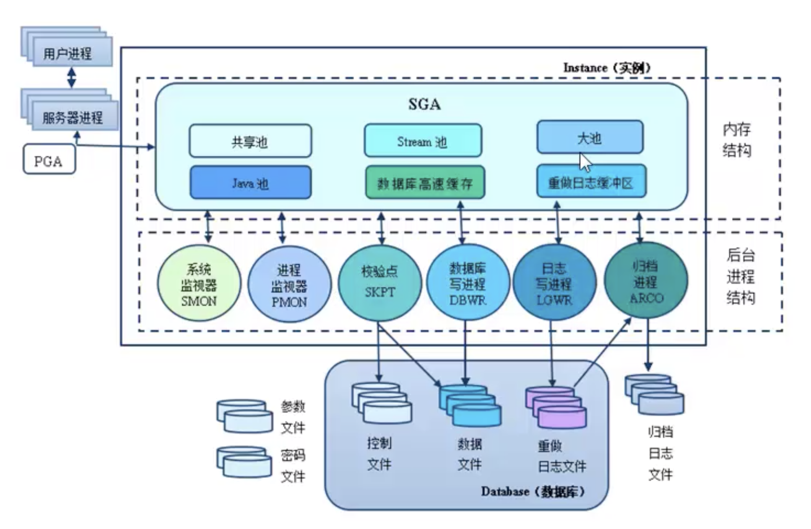
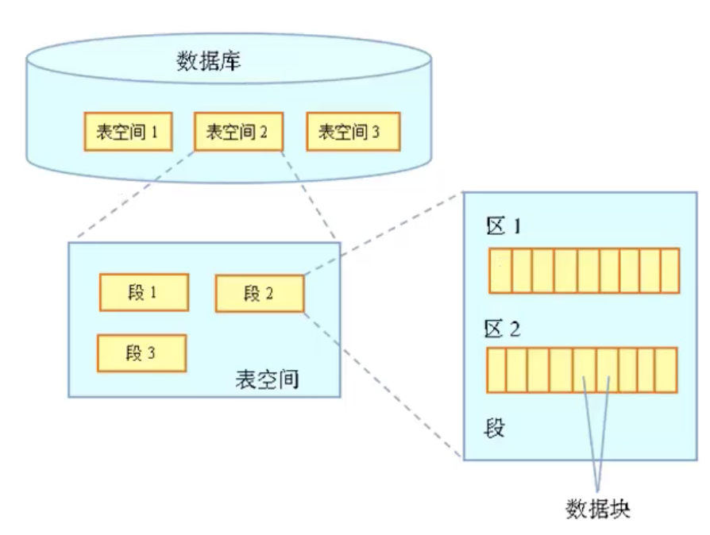
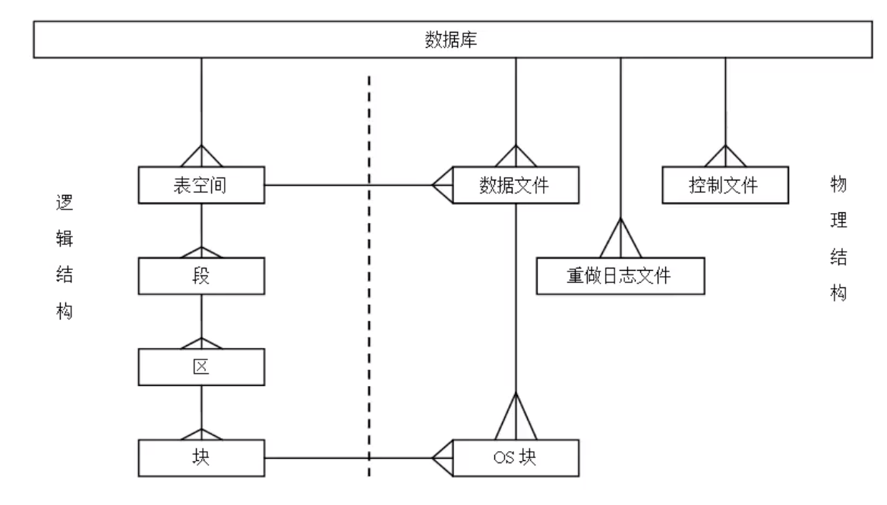
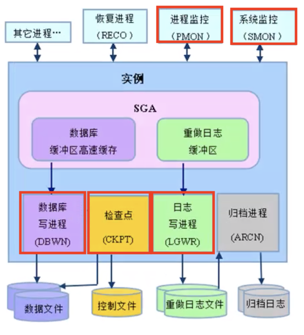
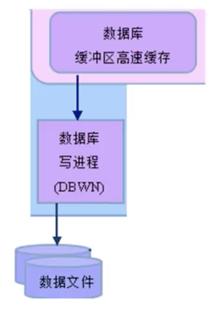
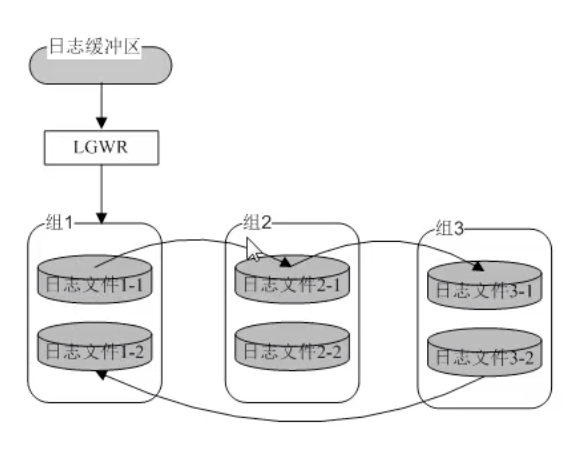
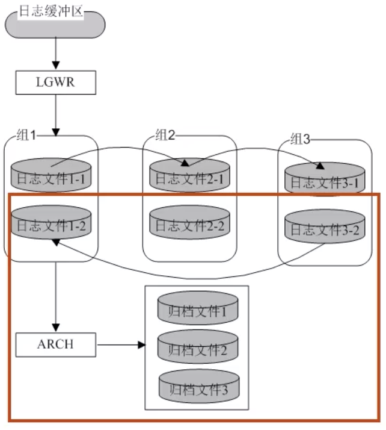
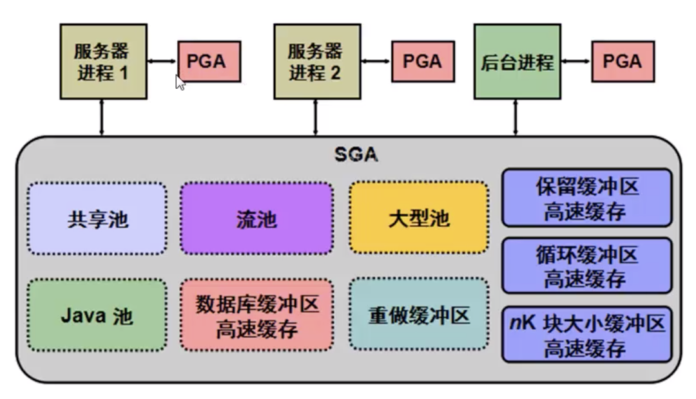
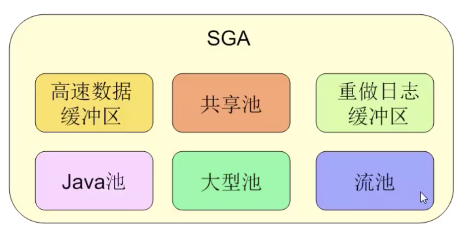
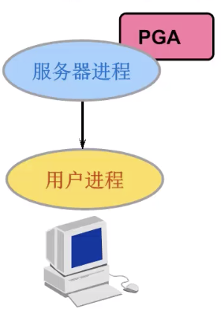

<span id="catalog"></span>
- 参考
    - https://www.mingrisoft.com

### 目录
- [oracle体系结构概述](#oracle体系结构概述)
- [存储结构](#存储结构)
    - [逻辑存储结构](#逻辑存储结构)
    - [物理存储结构](#物理存储结构)
        - [物理存储结构基本说明](#物理存储结构基本说明)
        - [DBF数据文件](#DBF数据文件)
        - [CTL控制文件](#CTL控制文件)
        - [LOG日志文件?????](#LOG日志文件)
- [进程结构](#进程结构)
    - [进程分类](#进程分类)
    - [用户进程与服务器进程](#用户进程与服务器进程)
    - [后台进程](#后台进程)
    - [后台进程](#后台进程)
        - [后台进程简介](#后台进程简介)
        - [主要的后台进程](#主要的后台进程)
        - [数据库写入进程--DBWR](#数据库写入进程--DBWR)
        - [检查点进程--CKPT](#检查点进程--CKPT)
        - [日志写入进程--LGWR](#日志写入进程--LGWR)
        - [归档进程--ARCH](#归档进程--ARCH)
        - [系统监控进程--SMON](#系统监控进程--SMON)
        - [进程监控进程--PMON](#进程监控进程--PMON)
- [内存结构](#内存结构)
    - [内存结构简介](#内存结构简介)
    - [系统全局区SGA](#系统全局区SGA)
    - [程序全局区PGA](#程序全局区PGA)
    - [select语句的执行过程分析](#select语句的执行过程分析)
- [数据字典](#数据字典)
    - [数据字典简介](#数据字典简介)
    - [数组字典分类](#数组字典分类)
    - [常用的数据字典](#常用的数据字典)
- []()
- []()

# oracle体系结构概述
[top](#catalog)
- oracle体系结构图
    - 
- oracle基本体系
    ```
    oracle 数据库服务器
      ├─ 动态: 实例，用于连接数据库和操作系统
      │     │
      │     ├─ 内存结构（SGA）
      │     │
      │     └─ 后台进程
      │
      └─ 静态: 数据库，物理结构
    ```

- oracle体系结构图的3大组成部分
    1. 存储结构
    2. 进程结构
    3. 内存结构

- sql的整体执行过程
    ```
    用户进程
     ^  │
     │  V
    服务器进程
     ^ │
     │ V
     内存 ──> 语法分析 ──> 执行sql ──> 修改后的内容
      ^                                     │
      │   ┌─────────────────────────────────┘
      │   │
      │   V
     后台程序 ───────────┐
      ^   │       　    │ 修改内容写入
      │   │       　    V
      │   V       　  物理文件
    oracle数据库
    ```

# 存储结构
## 逻辑存储结构
[top](#catalog)
- 逻辑存储结构是oracle存储结构的核心
- 逻辑存储结构是一种层次结构
    - 
- 逻辑存储结构说明
    - 数据库由一个或多个`表空间`组成
        - 每个表空间只能属于一个数据库
    - 表空间可以包含一个或多个`段`
    - 段由一个或多个`区`组成
    - 区由一个或多个`数据块`组成

- 数据块 Data Blocks
    - 数据库是Oracle逻辑存储结构中的最小的逻辑单位
    - 一个数据块对应一个或多个物理块，大小由参数: `DB_BLOCK_SIZE` 决定
        - 一般数据块的大小是操作系统块的**整数倍**
        - 查询数据块大小
            ```sql
            select name, value from v$parameter where name = 'db_block_size';
            ```
    - 数据块的结构 = 块头 + 存储区
        - 块头
            - 数据块标题
                - 保存数据块的基本信息：块的物理地址、所属的段的信息
            - 表目录
            - 行目录
                - 保存 数据块中各行的物理地址
        - 存储区
            - 自由空间
                - 第一次分配空间时，只有自由空间。随着数据插入会减小
            - 行数据
- 区 Extent
    - 数据区是由**连续的**数据块组成的
    - 区 是oracle存储分配的最小单位

- 段 Segment
    - 段就是数据库中的数据对象
        - 数据对象包括: 表、索引等等
        - 可以说 **表、索引等就是段**
    - 一个段只属于一个特定的数据对象
    - 如果一个段的空间已经被使用完，oracle会为这个段分配新的区
    - 常见的数据对象
        - 数据段
            - 存储内容: 表中所有数据
            - 创建表时，oracle会创建**以表名命名的**数据段
            - 当表的数据增大，数据段就增大了 
            - 通过向段中添加 区，来增大段
        - 索引段
            - 存储内容: 表上最佳查询的所有索引数据
            - 创建索引时，oracle会创建**以索引名命名的**数据段
        - 临时段
            - 存储内容: 表排序期间建立的临时表的数据
        - 回滚段
            - 存储内容: 修改之前的位置和值

- 表空间 TableSpace
    - 表空间是数据库的**最大逻辑划分区域**
    - 一个表空间由一个或多个**数据文件**组成，一个数据文件只属于一个表空间
    - 表空间的大小 = 数据文件大小的总和
    - 默认创建的表空间
        - 系统表空间，system tablespace
            - 系统表空间是每个oracle数据库必须具备的
            - 保存的内容
                - 表空间名，表名，列名，用户名等名称
                - oracle管理的数据文件、控制文件等，重要的物理文件
        - 辅助表空间， sysaux tablespace
        - 撤销表空间，undo tablespace
            - 即保存回滚段
        - 用户表空间，users tablespace
            - oracle用户所使用的表空间
            - 可以在该空间创建数据对象
            - 创建数据对象时，最好将表创建在用户表空间和自定义表空间
                - 不要放在系统表空间中，减小系统压力

## 物理存储结构
### 物理存储结构基本说明
[top](#catalog)
- 物理存储结构
    - 

- 存储文件分类
    - 三种重要的文件
        - `*.CTL`，控制文件
        - `*.DBF`，数据文件
        - `*.LOG`，日志文件

    - 其他文件
        - `$ORACLE_HOME/dbs/init.ora`，服务器初始化参数文件
        - `PWDorcl.ora`，密码文件
        - `alert_orcl.log`，警告文件
        - 跟踪文件

### DBF数据文件
[top](#catalog)
- 数据文件和表空间的关系
    - 1个表空间可以包含多个数据文件
    - 一个数据文件只能对应一个表空间    
- 查询数据文件和表空间的关系
    - 查询sql
        ```sql
        col file_name format a50
        select file_name, tablespace_name from dba_data_files;
        ```
    - 查询结果
        - SYSTEM，系统数据文件
        - SYSAUX，辅助表空间
        - UNDOTBS1，是撤销表空间，保存回滚段
        - USERS，是用户表空间
        - MYUSER，是用户myuse的自定义表空间
        ```
        FILE_NAME                                          TABLESPACE_NAME
        -------------------------------------------------- ---------------
        /u01/app/oracle/oradata/orcl/system01.dbf          SYSTEM
        /u01/app/oracle/oradata/orcl/sysaux01.dbf          SYSAUX
        /u01/app/oracle/myuser.dbf                         MYUSER
        /u01/app/oracle/oradata/orcl/users01.dbf           USERS
        /u01/app/oracle/oradata/orcl/undotbs01.dbf         UNDOTBS1
        ```
- 系统数据文件
    - 包含
        - system01.dbf 
        - sysaux01.dbf 
    - 保存的内容
        - 存放特殊的用户数据和oracle本身的数据
        - 特殊的用户数据：表空间名，表名，列名，用户名，字段类型等名称
        - 系统内部的数据字典和系统数据表
- 回滚数据文件
    - 包含
        - undotbs01.dbf
- 用户数据文件
    - 包含
        - users01.dbf
        - 其他自定义dbf文件
- 临时数据文件
    - 用于排序
        - 当数据量比较大，超过内存容量时，会将一部分数据转义到临时数据文件中

### CTL控制文件
[top](#catalog)
- 控制文件是数据库中**最重要**的文件
- 控制文件是数据库中最小的文件
- 控制文件是一个二进制文件
- 记录内容
    - 数据库名、数据文件名、日志文件名，以及它们的存放位置
- 如果控制文件损坏，运行中的实例会立刻崩溃
- 启动一个实例，一定会用到控制文件
    - oracle通过控制文件来找到数据文件和重做日志文件的路径，找到后才能启动实例
    - 控制文件的路径在启动实例之前必须在**初始化参数文件**中设置好
        - 控制文件记录在 `control_files` 属性中，是一个**数组**
- 创建数据库时，oracle会默认创建两个控制文件，用于备份

### LOG日志文件
[top](#catalog)
- 两种日志文件
    - 重做日志文件
    - 归档日志文件
- 重做日志文件
    - 用途
        - 记录所有的数据变化
        - 用于恢复
    - 日记记录的过程
        1. 在日志文件1记录
        2. 如果日志文件1已满，则在日志文件2中记录
        3. 如果日志文件2已满，则在日志文件3中记录
        4. 如果日志文件3已满，则将清空日志文件1并记录
        5. 清空日志文件1之前，将文件内容保存到归档日志文件中
    - 
- 归档日志文件
    - 两种归档日志模式
        - 归档模式，ARCHIVELOG
            - 将日志文件写满时，将文件内容写到归档文件中
        - 非归档模式，NOARCHIVELOG
            - 不会将文件内容写到归档文件中
            - 减小了数据备份的开销，但是会导致数据的不可恢复
    - 查询归档模式
        ```sql
        select dbid, name, log_mode from v$database;
        ```
    - 开启归档模式，ARCHIVELOG
        1. 在初始化参数文件中，设置日志文件的路径
            - 配置属性：
                ```
                db_recovery_file_dest='<ORACLE_BASE>/fast_recovery_area'
                db_recovery_file_dest_size=2G
                ```
        2. ?????

# 进程结构
## 进程分类
[top](#catalog)
- oracle进程
    - 用户进程
    - 服务器进程
    - 后台进程

## 用户进程与服务器进程
[top](#catalog)
- 用户进程
    - 用户进程是一个请求连接oracle服务器的程序
    - 如：
        - sqlplus
        - sqldevelop
- 服务器进程
    - 服务器进程负责与oracle服务器交互，执行sql
    - **用户进程并不直接与Oracle服务器交互，而是通过服务器进程与oracle服务器交互**

- 连接与会话
    - **连接**是在用户进程与oracle服务器之间建立的通信渠道
    - **会话**是在建立连接之后，形成的用户与数据库的交互方式
        - 用户发出请求，数据库实例返回结果

- 用户进程和服务器进程是如何产生的？
    - 登录数据库口，会建立一个**连接**，然后才会创建用户进程
    - 创建用户进程的同时，会创建一个与用户进程对应的服务器进程

- 用户进程与服务器进程之间的关系
    ```
    用户进程
        │
        V
    服务器进程： 服务器进程类似一个中间人
        │
        V
    oracle数据库
    ```

- 用户与oracle实例进行交互的过程
    1. 登录数据库，建立一个连接，产生用户进程
    2. 当用户登录成功后，会为用户进程创建一个相应的服务器进程
    3. 用户向用户进程发送需要执行的sql
    4. 用户进程向服务器进程发送请求
    5. 服务器进程对数据库进行实际操作，并将操作结果返回给用户进程

## 后台进程
### 后台进程简介
[top](#catalog)
- 实例中的后台进程结构
    - 
- 什么是后台进程？
    - 运行于oracle服务端的后台程序

- 后台进程的作用
    - 用于协调内存与磁盘的一致性
    - 将内存和磁盘内容进行相互读写

- 后台进程分类
    - **必须启动的5种后台进程**：如果任何一个无法启动，都会导致数据库实例无法启动或崩溃
        1. 系统监控进程 SMON
        2. 进程监视进程 PMCN
        3. 检查点进程 CKPT
        4. 数据库写入进程 DBWR
        5. 日志写进程 LGWR
    - 辅助进程
        - 辅助进程用于完成相关的辅助功能
        - 辅助进程出问题时，只会影响辅助功能，不会导致数据库实例的甭哭

### 数据库写入进程--DBWR
[top](#catalog)
- 结构图
    - 
- DBWN与DBWR
    - 一个数据库实例中可以启动多个DBWR，最多为10个，即：DBW0～DBW9
    - 所以一般也会写作DBWN，N表示一个1～9的未知数字
- 作用
    - 将高速缓冲区中的**被修改过的**数据写入到数据文件中
        - 也可以理解为**脏数据**，但是是相对于数据文件的脏数据，对于业务只是做的数据的更新
    - 即将用户对**数据的操作结果**写入数据文件
- 触发 DBWR 执行的条件  
    - DBWR 不是一直执行的，需要满足一定条件才能执行，这是oracle为了保证性能的一种策略
    - 触发条件
        - 脏数据在高速缓存中的时间 超过3s
        - 缓冲区容量不足
            - 如：插入数据时，需要暂存到缓存区。如果缓冲区容量不足，会将之前的脏数据写入数据文件，来获取足够的内容
        - 检查点进程（CKPT）触发 DBWR
            - 检查点进程触发后，会强制要求 DBWR 将某些脏数据写入数据文件

### 检查点进程--CKPT
[top](#catalog)
- 作用
    - 维护数据库的一致性
    - oracle需要检查点进程定期同步：控制文件、数据文件、日志文件的**时间点**，以保持一致性
- 触发条件
    - 日志切换

### 日志写入进程--LGWR
[top](#catalog)
- 结构图
    - 
- 作用
    - 将重做日志缓冲区的数据写入重做日志文件中
- 日志是如何操作的
    1. 从数据文件中读取的数据都保存在高速缓冲区中
    2. 用户的操作也是在高速缓冲区进行的
    3. 用户操作数据时，会产生大量的日志信息，会先被保存在**重做日志缓冲区**
    4. 满足 LGWR 触发条件时，LGWR 会将日志缓冲区中的信息写入重做日志文件中
- LGWR 的触发条件
    - 用户发出 commit 命令
    - 重做日志缓冲区的容量达到总容量的 1/3 
    - 日志信息的保存时间超过3s
- 日志文件写入方式
    1. 先将日志写入日志文件组1
    2. 日志文件组1写满后，再写日志文件组2
    3. 当日志文件组全部被写满之后，再次使用**日志文件组1**，直接覆盖
- **什么是日志切换？**
    - 一个日志文件组被写满，切换到另一个日志文件组的过程
    - 日志切换时，会触发 **检查点进程 CKPT**
    数据操作过程写入日志
    操作结果写入数据文件

### 归档进程--ARCH
[top](#catalog)
- 结构图
    - 
- 作用
    - 发生日志切换时，把写满的日志文件拷贝到归档目录中
- 触发条件
    - 日志切换时被 LGWR 唤醒

### 系统监控进程--SMON
[top](#catalog)
- 作用
    - 负责实例恢复
    - <label style="colro:red">处理rollback操作</label>
        - 即清理临时段，释放空间
- 触发条件
    - 定期被唤醒
    - 被其他事务主动唤醒

### 进程监控进程--PMON
[top](#catalog)
- 作用
    - 发现用户进程异常终止，并进行清理。释放占用的资源
    - 向监听程序动态的注册实例
- 触发条件
    - 定时被唤醒
    - 其他进程主动唤醒

# 内存结构
## 内存结构简介
[top](#catalog)
- oracle使用的两种内存结构

    |分类|分类名|描述|
    |-|-|-|
    |SGA|系统全局区|所有服务器进程和后台进程共享的内存部分|
    |PGA|程序全局区|进程专有的内存部分|
- oracle的整体内存结构
    - 

## 系统全局区SGA
[top](#catalog)
- sga中的数据资源可以被多个用户进程共同使用
- sga的组成部分
    - 

- 必须的sga组件
    - 高速数据缓冲区：负责数据结果
    - 共享池：负责sql解析结果
    - 重做日志缓冲区：负责日志

- 高速数据缓冲区
    - 作用
        - 用来存放oracle系统**最近访问过**的数据块
        - 通过高速缓存缓解数据库与磁盘IO交互的时间，提升性能
    - 使用高速数据缓冲区的过程
        1. 接收用户请求，分析用户需要哪些数据
        2. 到高速数据缓冲区中搜素，如果有，则返回给用户
        3. 如果没有，则从数据文件中读取指定的数据，并保存到高速缓冲区中
        4. 然后将高速缓冲区的数据再返回给用户
    - 经常被访问的数据会被放在缓冲区的前端，不经常被访问的数据会被放在缓冲区的末端
    - 当高速缓冲区被填满时，会自动删除一些不被经常访问的数据块，提高数据读取速度

- 共享池
    - 共享池作用
        - 存储最近执行过的SQL语句和最近使用过的数据定义
    - 共享池的组成
        - 库高速缓冲区
            - 共享SQL区
            - 私有SQL区
        - 字典高速缓冲区
    - 库高速缓冲区
        - 库高速缓冲区的作用
            - 保存sql语句及执行计划
            - 下一次执行相同的sql时，就可以直接在库高速缓存中找到之前生成的执行计划，不需要再次解析相同的sql，提高系统的执行效率
        - sql在库高速缓冲区中**如何存储**？

            |存储位置|存储内容|
            |-|-|
            |共享SQL区|sql的执行结果和执行计划|
            |私有SQL区|sql中绑定的变量、环境、会话等信息。这些信息是属于执行sql的用户的，其他用户无法共享|
    - 共享池属于内存资源，需要根据系统需要，按需分配，平衡系统性能与数据自身的性能

- 重做日志缓冲区
    - 作用
        - 用于记录数据改变的日志信息
        - 当满足 LGWR的触发条件时，会将日志信息写入重做日志文件
    - 参考
        - [日志写入进程--LGWR](#日志写入进程--LGWR)

- java池
    - java池是一个可选的组件
    - 作用
        - 提供空间给java虚拟机使用
        - 用于支持在数据库中运行java程序包
- 大型池
    - 作用
        - 用于数据库备份、恢复
        - 在 执行大数据量的排序时，会用到
    - 是否可以不为大型池分配空间？
        - 应该尽量在创建SGA时，为大型池分配好空间
        - 当实例需要时大型池时，如果没有，oracle会在**共享池**或**PGA**中分配一定的空间，这样会影响共享池和PGA的工作效率
    
- 流池
    - 流池是一个可选的组件
    - 作用
        - 在多个数据库之间进行信息共享 

## 程序全局区PGA
[top](#catalog)
- 程序全局区是进程一个服务器进程专用的内存区
    - 
- PGA的组成
    - 私有SQL区
    - 会话区

## select语句的执行过程分析
[top](#catalog)
- 如 select * from emp;
- 编译
    1. 编译
        1. 服务器进程将sql放入共享池的库高速缓冲区中
        2. 在缓冲区中搜索是否有相同的sql，如果有则直接使用
        3. 如果没有，则开始执行编译
        4. 检查语法，如果语法有误，则直接返回错误信息
        5. 通过数据字典查看使用的表和表的定义是否正确
        6. 检查使用的列是否在对应的表中
        7. 检查使用的表是否在当前的用户中
        8. 对表加编译锁，保证编译时，表定义不会改变 ?????
        9. 检查用户对表是否有访问权限 ?????
        10. 生成该语句的执行步骤
        11. 将sql和执行步骤放入共享SQL区
    2. 执行
    3. 提取数据
        - 服务器进程将检索结果返回给用户进程

# 数据字典
## 数据字典简介
[top](#catalog)
- 数据字典保存了oracle的内部信息
- 数据字典的内容
    - 数据库的逻辑结构、物理结构
        - 如表空间，及其使用的数据文件
    - 数据库对象
        - 表
        - 索引
        - 视图
        - 同义词 ?????
        - 过程
        - 函数
        - 包 ?????
        - 触发器
    - 列的约束信息
    - 空间分配信息
        - 如：一个表被分配了多少空间，使用了多少空间
    - oracle用户名
    - 权限、角色信息
        - 权限：用户可以执行哪些命令
        - 角色：是一组权限的集合

## 数组字典分类
[top](#catalog)
- 数组字典分类及其命名方式

    |分类|命名方式|
    |-|-|
    |内部表|`x$...`|
    |数据字典表|`...$`|
    |数据字典视图|<ul><li>`user_...`</li><li>`all_...`</li><li>`dba_...`</li></ul>|
    |动态性能视图|<ul><li>`gv$...`</li><li>`v$...`</li></ul>|

- 内部表
    - **内部表无法直接使用和查询，需要通过动态性能视图来使用**
    - 内部表是数据字典以及oracle数据库的**核心部分**
    - 作用
        - 跟踪数据库的内部信息来维护数据库的正常运行
    - 内部表的表名和内容都是加密的并且也很少有官方说明
    - 常见的内部表
        - x$bh
        - x$ksmsp
    - oracle不允许dba以外的用户访问，权限也不能赋给其他用户

- 数据字典表 
    - **数据字典表无法直接使用和查询，需要通过数据字典视图来使用**
    - 保存的内容
        - 表、索引、约束，以及其他数据库结构的信息 
    - 数据字典表和用户创建的普通表的比较

        |比较内容|数据字典表|普通表|
        |-|-|-|
        |存储内容|系统数据|用户数据|
        |表明特征|$结尾|尽量不要以$结尾|
        |表的所有者|sys|用户|

- 数据字典视图
    - 数据字典视图建立在**数据字典表**上，可以使用和查询
    - 数据字典视图是**静态的**

- 动态性能视图
    - 动态性能视图建立在 **x$内部表** 上，可以使用和查询
    - 动态性能视图是**动态的**
    - 记录的是一个实例的信息
    - 生存时间
        - 启动实例时创建
        - 关闭实例时销毁

## 常用的数据字典
[top](#catalog)
- 数据字典视图的内容都是静态内容，所以也被称为**静态数据字典视图**
- 数据字典视图的分类

    |分类|包含内容|访问权限|
    |-|-|-|
    |`dba_`|包含整个数据库中的对象信息|dba|
    |`all_`|用户可以访问的对象的信息，不用考虑对象的所有者|任何用户|
    |`user_`|当前用户拥有的数据库对象|任何用户|

- 查看哪些用户有dba权限
    ```sql
    select * from dba_role_privs where granted_role = 'DBA';
    ```

- `user_` 视图中的常用数据字典视图

    |视图|包含内容|示例|
    |-|-|-|
    |user_tables|表名、列数，及其他关于表的信息|`select table_name, tablespace_name from user_tables;`|
    |user_objects|数据库对象的名称、类型及其他信息|`select object_name, object_type from user_objects where object_name like '%A%';`|
    |user_triggers|触发器的名称、类型及其他信息|`select trigger_name, trigger_type from user_triggers;`|
    |user_indexes|索引的名称、索引所属的数据表的名称|`select index_name, table_name from user_indexes;`|

- `all_` 视图中的常用数据字典视图

    |视图|包含内容|示例|
    |-|-|-|
    |all_tables|数据表信息(表名, 所有者...)|`select owner, table_name, tablespace_name from all_tables;`|
    |all_users|用户信息(用户名, 创建日期...)|`select * from all_users where user_id > 4 and user_id < 50;`|
    |all_constraints|约束信息(约束名, 表名...)|`select constraint_name, owner, table_name from all_constraints;`|
    |all_procedures|存储过程信息(过程名, 所有者...)||
    select owner, procedure_name from all_procedures;

- `dba_` 视图中的常用数据字典视图
    |视图|包含内容|示例|
    |-|-|-|
    |dba_catalog|表、视图、同义词|`select owner, table_name, table_type from dba_catalog;`|
    |dba_tab_columns|表、视图的列|`select owner, table_name, column_name from dba_tab_columns where owner='SYSTEM';`|
    |dba_tablespaces|表空间信息(表空间名、块大小、状态...)|`select tablespace_name, block_size, status from dba_tablespaces;`|
    |dba_source|存储函数、触发器、包的源代码、所有者、类型等信息|`select owner, name, type from dba_source where owner='SYSTEM';`|
    
[top](#catalog)