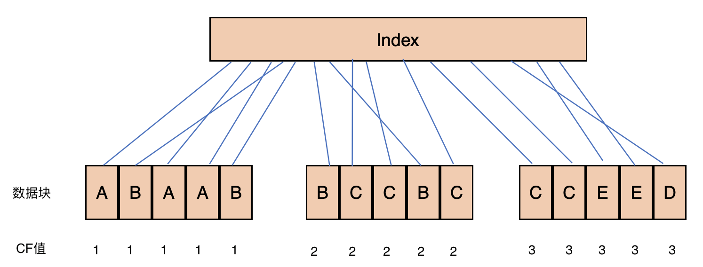

<span id="catalog"></span>

### 目录
- [构建测试环境](#构建测试环境)
- [性能优化中的一些问题](#性能优化中的一些问题)
    - [什么时候需要做性能优化](#什么时候需要做性能优化)
    - [为什么很难写出高效的SQL](#为什么很难写出高效的SQL)
    - [常见的性能问题及原因](#常见的性能问题及原因)
    - [性能问题的定位方法](#性能问题的定位方法)
    - [不要过渡依赖优化器](#不要过渡依赖优化器)
- [Lock](#Lock)
    - [Lock简介](#Lock简介)
    - [Lock的原则](#Lock的原则)
    - [单表上的两种主要锁](#单表上的两种主要锁)
    - [查看Lock的信息](#查看Lock的信息)
    - [TM锁--单表上的锁](#TM锁--单表上的锁)
    - [单表阻塞的示例分析](#单表阻塞的示例分析)
        - [单表阻塞示例准备](#单表阻塞示例准备)
        - [update操作的Lock阻塞示例](#update操作的Lock阻塞示例)
        - [insert操作的Lock阻塞示例](#insert操作的Lock阻塞示例)
    - [RI锁--基于引用关系的锁](#RI锁--基于引用关系的锁)
    - [RI锁--主表子表各操作的加锁情况示例](#RI锁--主表子表各操作的加锁情况示例)
        - [RI锁示例准备](#RI锁示例准备)
        - [主表insert操作的加锁情况](#主表insert操作的加锁情况)
        - [主表update操作的加锁情况](#主表update操作的加锁情况)
        - [主表delete操作的加锁情况](#主表delete操作的加锁情况)
        - [子表insert操作的加锁情况](#子表insert操作的加锁情况)
        - [子表update操作的加锁情况](#子表update操作的加锁情况)
        - [子表delete操作的加锁情况](#子表delete操作的加锁情况)
    - [BI锁和外键索引](BI锁和外键索引)
    - [死锁](#死锁)
- [Latch????????](#Latch)
- [执行计划与优化器](#执行计划与优化器)
    - [创建执行计划与查看方式](#创建执行计划与查看方式)
    - [执行计划中需要关注的内容](#执行计划中需要关注的内容)
        - [执行计划--数据访问方式](#执行计划--数据访问方式)
        - [执行计划--数据处理](#执行计划--数据处理)
        - [执行计划--数据的关联处理](#执行计划--数据的关联处理)
    - [优化器](#优化器)
        - [两种优化器](#两种优化器)
        - [CBO的工作模式](#CBO的工作模式)
        - [影响CBO的几个重要的概念](#影响CBO的几个重要的概念)
        - [成本的计算内容](#成本的计算内容)
        - [执行计划中成本的查看方法](#执行计划中成本的查看方法)
- [hints](#hints)
    - [hints简介](#hints简介)
    - [访问路径相关的hints](#访问路径相关的hints)

# 
## 

# 构建测试环境
1. 拉取镜像
    - `docker pull absolutapps/oracle-12c-ee`
2. 创建容器
    1. 创建容器
        - `docker run -d -p 8080:8080 -p 1521:1521 --name oracle-12cR1-ee --privileged absolutapps/oracle-12c-ee`

    2. 监视容器启动日志，直到容器编译启动完成
        - 出现 【100% complete】时编译完成
        - `docker logs -f oracle-12cR1-ee`
3. 进入容器
    - `docker exec -it oracle-12cR1-ee /bin/bash`
4. 构建数据库环境
    2. 检查oracle实例名
        - `echo $ORACLE_SID`
        - 结果为 `orcl`
    3. 使用root登录
        - `sqlplus system/oracle@//localhost:1521/orcl`
    4. 创建名为 myuser 的表空间
        ```sql
        create tablespace myuser datafile '/u01/app/oracle/myuser.dbf' size 200M;
        ```
    5. 创建dba用户 myuser，并授权
        ```sql
        create user myuser identified by myuser default tablespace myuser;
        grant create session to myuser;
        grant connect,resource to myuser;
        grant dba to myuser;
        ```
    6. 退出，并使用 myuser 用户重新登录
        - `sqlplus myuser/myuser@//localhost:1521/orcl`
    7. 开启/关闭执行计划
        - `set autotrace on`
        - `set autotrace off`
    8. 显示/关闭执行时间
        - `set timing on`
        - `set timing off`

# 性能优化中的一些问题
## 什么时候需要做性能优化
[top](#catalog)
- 什么时候需要做性能优化？
    - <label style="color:red">系统运行缓慢的时候才需要优化</label>

- 系统运行缓慢的两种原因

    |原因|外部表现|解决方法|
    |-|-|-|
    |系统资源严重不足|CPU不足，IO耗尽，系统吞吐量到达瓶颈|扩充硬件性能|
    |阻塞|系统资源充足，但是业务没有被立刻执行|与业务设计有关，需要调整设计|

## 为什么很难写出高效的SQL
[top](#catalog)
1. SQL的操作复杂，影响因素多
    - 集合的操作方式：访问与结合
        - SQL语言本质上是集合的操作
        - 不同的集合有不同的访问方式
        - 集合与集合之间有不同的结合方式
        - 不同的集合访问方式，不同的结合方式有各自的适用的场景
    - 并行操作
    - 数据块的分布
    - 一种策略无法适用与所有的场景
2. 优化器机制开发者无法掌握

- SQL中的集合访问方式
    - table scan
    - index range scan
    - index fast scan
- 表关联方式
    - nested loop join
    - mergge join
    - hash join

## 常见的性能问题及原因
[top](#catalog)

|问题|原因|
|-|-|
|表没有正确的创建索引|错误的执行计划|
|表没有及时的分析|错误的执行计划|
|热块|数据块的竞争|
|锁的阻塞|业务设计缺陷|
|SQL解析消耗大量CPU|变量绑定|
|低效SQL|SQL自身的问题|
|数据库整体负载过重|架构设计的问题|

## 如何定位性能问题
[top](#catalog)
- 原则：尽可能从小范围分析问题
- 3个分析层面
    1. SQL层
        - 如果能定位到SQL，就不要再分析会话层
        - 工具：执行计划，10053事件，10046事件
    2. 会话层
        - 如果能定位到会话层，就不要再分析系统层
        - 工具：
            - V$SESSION 视图
                - 包含：会话执行时间，是否有阻塞
            - V$SESSTAT 视图
                - 提供会话资源的一些统计信息。如：消耗了多少CPU，产生了多少redo、undo
                - 通过将 V$SESSION 和 V$SESSTAT 关联起来可以查看资源的消耗情况
            - V$SESSION_WAIT
                - session等待事件
            - V$SQL
            - V$LOCK
            - SQL_TRACE
    3. 系统层
        - 如果违法定位任何性能问题，从系统层入手
        - 工具
            - AWR（STATSPACK）
                - 不要随便做
                - 系统负载重，不代表有问题
            - OS tools（TOP，IOSTAT）

## 不要过渡依赖优化器
[top](#catalog)
- 不要完全依赖优化器
    - 优化器并不了解业务，无法安按照业务需求来重写SQL语句
    - 优化器只能在数学（集合）逻辑上做SQL的重写

- **高效的SQL来自于对于业务的理解和对SQL执行过程的理解**

- 示例
    - 需求
        1. 有以下三条数据
            
            |id|value|
            |-|-|
            |1|10|
            |2|20|
            |3|30|
        2. 需要按照id，进行累加。即 1=1，2=1+2，3=1+2+3
        3. 预期结果
            |id|value|
            |-|-|
            |1|10|
            |2|30|
            |3|60|
    - 创建表即数据
        1. 创建表 demo01
            ```sql
            create table demo01 (id int, value int);
            ```
        2. 插入数据
            ```sql
            insert into demo01 values(1, 10);
            insert into demo01 values(2, 20);
            insert into demo01 values(3, 30);
            commit;
            ```
    - 传统实现方式
        - 实现方式：
            - demo01进行自连接
            - T1中的每一行与比T2中id更小的行连接，在每个id中构成递归效果。然后执行分组求和
        - 实现SQL
            ```sql
            select T1.id, T1.value, SUM(T2.value)
            from demo01 T1
            inner join demo01 T2
            on T1.id >= T2.id
            group by T1.id, T1.value;
            ```
        - 执行计划分析
            - 对 表demo01 执行了 2 次 `全表扫描`，TABLE ACCESS FULL
            - 一致性读的次数为14，`consistent gets=14`
                - 一致性读的次数越少性能越好
            ```shell 
            Execution Plan
            ----------------------------------------------------------
            Plan hash value: 386696983
            
            -------------------------------------------------------------------------------
            | Id  | Operation            | Name   | Rows  | Bytes | Cost (%CPU)| Time     |
            -------------------------------------------------------------------------------
            |   0 | SELECT STATEMENT     |        |     1 |    52 |     9  (34)| 00:00:01 |
            |   1 |  HASH GROUP BY       |        |     1 |    52 |     9  (34)| 00:00:01 |
            |   2 |   MERGE JOIN         |        |     1 |    52 |     8  (25)| 00:00:01 |
            |   3 |    SORT JOIN         |        |     3 |    78 |     4  (25)| 00:00:01 |
            |   4 |     TABLE ACCESS FULL| DEMO01 |     3 |    78 |     3   (0)| 00:00:01 |
            |*  5 |    SORT JOIN         |        |     3 |    78 |     4  (25)| 00:00:01 |
            |   6 |     TABLE ACCESS FULL| DEMO01 |     3 |    78 |     3   (0)| 00:00:01 |
            -------------------------------------------------------------------------------

            Predicate Information (identified by operation id):
            ---------------------------------------------------

            5 - access(INTERNAL_FUNCTION("T1"."ID")>=INTERNAL_FUNCTION("T2"."ID")
                        )
                filter(INTERNAL_FUNCTION("T1"."ID")>=INTERNAL_FUNCTION("T2"."ID")
                        )

            Note
            -----
            - dynamic statistics used: dynamic sampling (level=2)


            Statistics
            ----------------------------------------------------------
                    0  recursive calls
                    0  db block gets
                    14  consistent gets
                    0  physical reads
                    0  redo size
                    758  bytes sent via SQL*Net to client
                    552  bytes received via SQL*Net from client
                    2  SQL*Net roundtrips to/from client
                    2  sorts (memory)
                    0  sorts (disk)
                    3  rows processed
            ```
        - <label style="color:red">有更好的执行方式，但是优化器不知道具体业务，所以无法优化</label>
    - 优化后的实现方式
        - 实现SQL
            ```sql
            select id, value, sum(value) over(order by id)
            from demo01;
            ```
        - 执行计划
            - 只执行了一次`全表扫描`
            - 一致性读 `consistent gets` 只有 7次
            ```
            Elapsed: 00:00:00.00

            Execution Plan
            ----------------------------------------------------------
            Plan hash value: 790520785

            -----------------------------------------------------------------------------
            | Id  | Operation          | Name   | Rows  | Bytes | Cost (%CPU)| Time     |
            -----------------------------------------------------------------------------
            |   0 | SELECT STATEMENT   |        |     3 |    78 |     4  (25)| 00:00:01 |
            |   1 |  WINDOW SORT       |        |     3 |    78 |     4  (25)| 00:00:01 |
            |   2 |   TABLE ACCESS FULL| DEMO01 |     3 |    78 |     3   (0)| 00:00:01 |
            -----------------------------------------------------------------------------

            Note
            -----
            - dynamic statistics used: dynamic sampling (level=2)


            Statistics
            ----------------------------------------------------------
                    0  recursive calls
                    0  db block gets
                    7  consistent gets
                    0  physical reads
                    0  redo size
                    770  bytes sent via SQL*Net to client
                    552  bytes received via SQL*Net from client
                    2  SQL*Net roundtrips to/from client
                    1  sorts (memory)
                    0  sorts (disk)
                    3  rows processed
            ```

# Lock
## Lock简介
[top](#catalog)
- 为什么需要锁？
    - 解决并发问题，保证数据一致性
    - 但是并发操作时，锁会造成阻塞

- 锁的定位
    - 锁是一个开发的范畴
    - 通过锁可以达到预期的业务需求
    - 通过对业务深入的分析，可以最大程度的避免不必要的锁定发生

- 锁产生的位置与类型
    - TM锁，针对单张表
    - RI锁，针对引用关系的锁
    - BI锁，针对外键索引

- 锁的分类
    
    |分类|用途|
    |-|-|
    |Enqueues|队列类型的锁，通常和业务相关。一般也被直接成为Lock|
    |Latches|系统资源方面的锁，比如内存结构，SQL解析|

- 查看oracle中锁的所有类型
    ```sql
    select type, name from V$lock_type;
    ```

- 执行 `commit;` 或 `rollback;` 后，会自动释放锁
- 可以通过 `lock table` 语句来手动加锁
    - 参考：[TM锁的模式](#TM锁的模式)

## Lock的原则
[top](#catalog)
- 在Oracle中不存在锁升级 ????
- 只有被修改时，行才会被锁定
- 当一条sql修改了一条记录，只有这条记录被锁定，它将阻塞别人对它的修改
- 当一个事务修改一行时，将在这个行上加行锁（TX），用于阻止其他事务对相同行的修改
- 读不会加锁，不会阻止写
    - 一个例外：`select ..for update`
- 写操作不会阻塞读操作
- 当一行被修改后，Oracle通过回滚端提供给数据的一致性读
    - 在已发生修改，但没有提交时，原始数据会保存在回滚段中
    - 在已发生修改，但没有提交时，如果执行读操作，oracle会从回滚段中获取数据来保证一致性

## 单表上的两种主要锁
[top](#catalog)
- 单表锁的类型与功能

    |类型|级别|功能|
    |-|-|-|
    |TM|表锁|发生在insert、update、delete、select for update 操作时，目的是保证操作能够正常进行，并且阻止其他人对表执行DDL操作|
    |TX|事务锁、行锁|对于正在修改的数据，阻止其他会话进行修改|

- 在对一个表执行insert、update、delete、select...for update 操作时，会产生两个锁
    1. TM锁，保证操作不会被其他DDL操作干扰
    2. TX锁，保证当前被修改数据行的排他性

## 查看Lock的信息
[top](#catalog)
- 示例参考：[单表阻塞的示例分析](#单表阻塞的示例分析)

- 通过 `v$lock` 表来查看表的锁定信息，包括有哪些锁与锁的模式
    - 查询sql
        ```sql
        select sid, type, id1, id2, lmode, request, block from v$lock where type in ('TX', 'TM') order by sid;
        ```
    - 查询结果中的信息内容
        - LMODE，表示锁的模式
        - REQUEST，表示请求数据上的锁的模式
            - `REQUEST = 6`，在update、delete中，表示在请求一个锁，会话间操作的是同一条数据
            - `REQUEST = 4`，在insert中，表示主键约束要求数据的主键必须不同
            - **oracle中会尽可能的降低锁的模式，锁的模式越高级限制性越高**
        - `BLOCK = 1`，表示当前session阻塞了其他会话
        - 事务锁TX上的id1、id2表示的是回滚段上的一个地址
        - SID表示会话的SID，可以在 session 内，通过语句查询
            ```sql
            select distinct sid from v$mystat;
            ```
    - 查询结果的示例
        - 发生update阻塞时的信息
            ```sql
                SID TY        ID1        ID2      LMODE    REQUEST      BLOCK
            ---------- -- ---------- ---------- ---------- ---------- ----------
                245 TM      91993          0          3          0          0
                245 TX     524318       1691          6          0          1
                321 TM      91993          0          3          0          0
                321 TX     524318       1691          0          6          0
            ```
        - 发生insert阻塞时的信息
            ```sql
                    SID TY        ID1        ID2      LMODE    REQUEST      BLOCK
            ---------- -- ---------- ---------- ---------- ---------- ----------
                245 TX      65545       1429          6          0          1
                245 TM      91993          0          3          0          0
                321 TX     524304       1692          6          0          0
                321 TX      65545       1429          0          4          0
                321 TM      91993          0          3          0          0
            ```
- 查看ID1对应的表名
    ```sql
    select object_name from dba_objects where object_id = <id1>;
    ```

- `v$session_wait`
    - 查询sql
        ```sql
        select sid, event from v$session_wait where sid in (<sid>, <sid>);
        ```
    - 
        ```sql
            SID EVENT
        ---------- ----------------------------------------------------------------
            245 SQL*Net message from client
            321 enq: TX - row lock contention
        ```

## TM锁--单表上的锁
[top](#catalog)
- TM锁的模式--lock mode，级别越高，限制性越高

    |模式|名称|含义|
    |-|-|-|
    |2|Row Share (RS)|行共享锁|
    |3|Row Exclusive Table Lock (RX)|行排他锁|
    |4|Share Table Lock (S)|表级共享锁|
    |5|Share Row Exclusive Table Lock (SRX)|行级共享、表级排他锁|
    |6|Exclusive Table Lock (X)|表级排他锁|

- TM锁几种模式的互斥关系

    |模式|手动锁定表的SQL|排斥的模式|允许的DML|
    |-|-|-|-|
    |2|`lock table <表名> in row share mode;`|6|select, insert, update, delete, for update|
    |3|`lock table <表名> in row exclusive mode;`|4,5,6|select, insert, update, delete, for update|
    |4|`lock table <表名> in share mode;`|3,4,6|select|
    |5|`lock table <表名> in share row exclusive mode;`|3,4,5,6|select|
    |6|`lock table <表名> in exclusive mode;`|2,3,4,5,6|select|

- TM锁 4、5、6的优点
    - 保证数据的一致性
    - 保证默写操作的串行执行
- TM锁 4、5、6的缺点
    - 并发性问题
        - 在每个会话处理之前，都强制锁表
        - 如果并发更新比较多，并且单次处理的时间比较长，会导致很长的等待时间

- 手动锁定的示例
    ```sql
    -- 添加 4 表级共享锁，阻塞其他session
    lock table dept in share mode;

    -- 通过dept表的数据执行其他表的更新
    update emp set sal = sal*1.1
    where deptno in (
        select deptno from dept where loc='DALLAS'
    );

    -- 再次通过dept表的数据执行其他表的更新
    -- 通过 4 表级共享锁，阻塞其他更新操作的session，保证操作的串行
    update budget set totsal = totsal*1.1
    where deptno in (
        select deptno from dept where loc='DALLAS'
    );

    -- 执行commit，释放锁
    commit;
    ```

## 单表阻塞的示例分析
### 单表阻塞示例准备
[top](#catalog)
- 创建表
    ```sql
    create table locktable01 (id int primary key);
    ```
- 插入2条数据并提交
    ```sql
    insert into locktable01 values(1);
    insert into locktable01 values(20);
    ```

### update操作的Lock阻塞示例
[top](#catalog)
1. 使用 myuser 登录，开启session1，并检查进程ID
    ```sql
    SQL> select distinct sid from v$mystat;

        SID
    ----------
        245
    ```
2. 在 session1 中执行 update，但**不提交**
    ```sql
    SQL> update locktable01 set id=2 where id=1;

    1 row updated.
    ```
3. 使用 myuser 登录，开启session2，并检查进程ID
    ```sql
    SQL> select distinct sid from v$mystat;

        SID
    ----------
        321
    ```
4. 在 session2 中对同一调数据执行update
    - 因为 session1 没有提交，所以会被阻塞
5. 使用 myuser 登录，开启session3
6. 在 session3 中通过 `v$lock` 查看表的锁定信息
    - `REQUEST = 6`，表示在请求一个锁，会话间操作的是同一条数据
    - `REQUEST = 0`，表示在不是在请求一个锁
    - `BLOCK = 1`，表示当前session阻塞了其他会话
    - 事务锁TX上的id1、id2表示的是回滚段上的一个地址
    ```sql
    SQL> select sid, type, id1, id2, lmode, request, block from v$lock where type in ('TX', 'TM') order by sid;

        SID TY        ID1        ID2      LMODE    REQUEST      BLOCK
    ---------- -- ---------- ---------- ---------- ---------- ----------
        245 TM      91993          0          3          0          0
        245 TX     524318       1691          6          0          1
        321 TM      91993          0          3          0          0
        321 TX     524318       1691          0          6          0
    ```
7. 在session3中，通过 `v$session_wait` 来查看阻塞信息
    - session2执行过程中，发现了已经存在了行锁
    ```sql
    SQL> select sid, event from v$session_wait where sid in (245, 321);

        SID EVENT
    ---------- ----------------------------------------------------------------
        245 SQL*Net message from client
        321 enq: TX - row lock contention
    ```
8. 在session1中执行提交，session2中显示更新0行
    ```sql
    SQL> update locktable01 set id=2 where id=1;

    0 rows updated.
    ```

### insert操作的Lock阻塞示例
[top](#catalog)
1. 使用 myuser 登录，开启session1，并检查进程ID
    ```sql
    SQL> select distinct sid from v$mystat;

        SID
    ----------
        245
    ```
2. 使用 myuser 用户向表中添加数据，但**不提交**
    ```sql
    SQL> insert into locktable01 values(10);
    1 row created.
    ```
3. 使用 myuser 登录，开启session2，并检查进程ID
    ```sql
    SQL> select distinct sid from v$mystat;

        SID
    ----------
        321
    ```
4. 在session2中，执行同样的插入sql，会发生阻塞
5. 使用 myuser 登录，开启 session3
6. 在 session3 中通过 `v$lock` 查看表的锁定信息
    - 被阻塞的session2中，有两个TX锁，第一个TX的Request=0，表示插入数据时，没有被阻塞
    - 第二个TX的request=4，表示主键约束要求数据的主键必须不同
    ```sql
    SQL> select sid, type, id1, id2, lmode, request, block from v$lock where type in ('TX', 'TM') order by sid;

        SID TY        ID1        ID2      LMODE    REQUEST      BLOCK
    ---------- -- ---------- ---------- ---------- ---------- ----------
        245 TX      65545       1429          6          0          1
        245 TM      91993          0          3          0          0
        321 TX     524304       1692          6          0          0
        321 TX      65545       1429          0          4          0
        321 TM      91993          0          3          0          0
    ```

7. 在session1中，执行提交，提交成功
    ```
    SQL> commit;

    Commit complete.
    ```
8. session2中，解除阻塞，发生异常
    ```sql
    insert into locktable01 values(10)
    *
    ERROR at line 1:
    ORA-00001: unique constraint (MYUSER.SYS_C009996) violated
    ```

### select_for_update操作的Lock阻塞示例
[top](#catalog)
1. 使用 myuser 登录，开启session1，并检查进程ID
    ```sql
    SQL> select distinct sid from v$mystat;

        SID
    ----------
        245
    ```
2. 执行检索
    ```sql
    SQL> select * from locktable01 where id=20 for update;

            ID
    ----------
            20
    ```
3. 使用 myuser 登录，开启session2，并检查进程ID
    ```sql
    SQL> select distinct sid from v$mystat;

        SID
    ----------
        321
    ```
4. 在session2中，对同一条数据执行更新，会发生阻塞
    ```sql
    update locktable01 set id=21 where id=20;
    ```
5. 使用 myuser 登录，开启 session3
6. 在 session3 中通过 `v$lock` 查看表的锁定信息
    - select for update 对数据进行了加锁，级别为6，导致update操作被阻塞
    ```sql
    SQL> select sid, type, id1, id2, lmode, request, block from v$lock where type in ('TX', 'TM') order by sid;

        SID TY        ID1        ID2      LMODE    REQUEST      BLOCK
    ---------- -- ---------- ---------- ---------- ---------- ----------
        245 TX     589851       1520          6          0          1
        245 TM      91993          0          3          0          0
        321 TX     524304       1692          6          0          0
        321 TX     589851       1520          0          6          0
        321 TM      91993          0          3          0          0
    ```

7. 在session1中，执行与session2相同的更新操作，并**提交**
    ```sql
    SQL> update locktable01 set id=21 where id=20;

    1 row updated.

    SQL> COMMIT;

    Commit complete.
    ```

8. 在session2中，会因为没有数据而无法更新
    ```sql
    SQL> update locktable01 set id=21 where id=20;

    0 rows updated.
    ```

## RI锁--基于引用关系的锁
[top](#catalog)
- 当对具有主外键关系的表做DML操作时，锁定不单单发生在操作表上，引用表上也可能加上相应的锁
- 主表操作与加锁情况
    - 在主表上执行insert时，会同时对主表和从表加TM锁，防止对从表的DDL操作
    - 在主表上执行update、delete时，只会对主表加锁

- 从表操作与加锁情况
    - 在主表上执行insert、update、delete时，会同时对主表和从表加TM锁，防止对主表的DDL操作

## RI锁--主表子表各操作的加锁情况示例
### RI锁示例准备
[top](#catalog)
- 创建主表和子表
    ```sql
    create table rimain(id int primary key);
    create table risub(id references rimain(id));
    ```

### 主表insert操作的加锁情况
[top](#catalog)
1. 在主表上执行insert，但不提交
    ```sql
    insert into rimain values(1);
    ```
2. 通过 `v$lock` 查看表的锁定信息
    ```sql
    SQL> select sid, type, id1, id2, lmode, request, block from v$lock where type in ('TX', 'TM') order by sid;

        SID TY        ID1        ID2      LMODE    REQUEST      BLOCK
    ---------- -- ---------- ---------- ---------- ---------- ----------
        245 TM      92024          0          3          0          0
        245 TX     196633       1540          6          0          0
        245 TM      92026          0          2          0          0
    ```

3. 通过ID1检查加锁的表
    - 在主表执行`insert`时，会**同时对主表和子表进行加锁**
    ```sql
    SQL> select object_name from dba_objects where object_id in (92024, 196633, 92026);

    OBJECT_NAME
    --------------------------------------------------------------------------------
    RIMAIN
    RISUB
    ```

### 主表update操作的加锁情况
[top](#catalog)
1. 插入一条数据，并提交
    ```sql
    insert into rimain values(1);
    ```
2. 修改主表数据，但不提交
    ```sql
    update rimain set id=2 where id=1;
    ```
3. 通过 `v$lock` 查看表的锁定信息
    ```sql
    SQL> select sid, type, id1, id2, lmode, request, block from v$lock where type in ('TX', 'TM') order by sid;

        SID TY        ID1        ID2      LMODE    REQUEST      BLOCK
    ---------- -- ---------- ---------- ---------- ---------- ----------
        245 TM      92024          0          3          0          0
        245 TX     458781       1398          6          0          0
    ```
4. 通过ID1检查加锁的表
    - 在主表执行`update`时，不会对子表加锁
    ```sql
    SQL> select object_name from dba_objects where object_id in (92024, 458781);

    OBJECT_NAME
    --------------------------------------------------------------------------------
    RIMAIN
    ```

### 主表delete操作的加锁情况
[top](#catalog)
1. 插入一条数据，并提交
    ```sql
    insert into rimain values(1);
    ```
2. 删除主表数据，但不提交
    ```sql
    delete from rimain;
    ```
3. 通过 `v$lock` 查看表的锁定信息
    ```sql
    SQL> select sid, type, id1, id2, lmode, request, block from v$lock where type in ('TX', 'TM') order by sid;

        SID TY        ID1        ID2      LMODE    REQUEST      BLOCK
    ---------- -- ---------- ---------- ---------- ---------- ----------
        245 TX     327686       1680          6          0          0
        245 TM      92024          0          3          0          0
    ```
4. 通过ID1检查加锁的表
    - 在主表执行`delete`时，不会对子表加锁
    ```sql
    SQL> select object_name from dba_objects where object_id in (92024, 327686);

    OBJECT_NAME
    --------------------------------------------------------------------------------
    RIMAIN
    ```

### 子表insert操作的加锁情况
[top](#catalog)
1. 在主表插入一条数据，并提交
    ```sql
    insert into rimain values(1);
    ```
2. 在子表上执行insert，但不提交
    ```sql
    insert into risub values(1);
    ```
3. 通过 `v$lock` 查看表的锁定信息
    ```sql
    SQL> select sid, type, id1, id2, lmode, request, block from v$lock where type in ('TX', 'TM') order by sid;

        SID TY        ID1        ID2      LMODE    REQUEST      BLOCK
    ---------- -- ---------- ---------- ---------- ---------- ----------
        245 TM      92024          0          3          0          0
        245 TX     262160       1360          6          0          0
        245 TM      92026          0          3          0          0
    ```

4. 通过ID1检查加锁的表
    - 在子表执行`insert`时，会**同时对主表和子表进行加锁**
    ```sql
    SQL> select object_name from dba_objects where object_id in (92024, 262160, 92026);

    OBJECT_NAME
    --------------------------------------------------------------------------------
    RIMAIN
    RISUB
    ```

### 子表update操作的加锁情况
[top](#catalog)
1. 分别在主表和子表中插入数据，并提交
    ```sql
    insert into rimain values(1);
    insert into rimain values(2);
    insert into risub values(1);
    ```
2. 修改子表数据
    ```sql
    update risub set id=2 where id=1;
    ```
3. 通过 `v$lock` 查看表的锁定信息
    ```sql
    SQL> select sid, type, id1, id2, lmode, request, block from v$lock where type in ('TX', 'TM') order by sid;

        SID TY        ID1        ID2      LMODE    REQUEST      BLOCK
    ---------- -- ---------- ---------- ---------- ---------- ----------
        245 TX     196615       1542          6          0          0
        245 TM      92024          0          3          0          0
        245 TM      92026          0          3          0          0
    ```
4. 通过ID1检查加锁的表
    - 在子表执行`update`时，会**同时对主表和子表进行加锁**
    ```sql
    SQL> select object_name from dba_objects where object_id in (196615, 92024, 92026);

    OBJECT_NAME
    --------------------------------------------------------------------------------
    RIMAIN
    RISUB
    ```

### 子表delete操作的加锁情况
[top](#catalog)
1. 分别在主表和子表中插入数据，并提交
    ```sql
    insert into rimain values(1);
    insert into risub values(1);
    ```

2. 删除子表数据
    ```sql
    delete from risub;
    ```

3. 通过 `v$lock` 查看表的锁定信息
    ```sql
    SQL> select sid, type, id1, id2, lmode, request, block from v$lock where type in ('TX', 'TM') order by sid;

        SID TY        ID1        ID2      LMODE    REQUEST      BLOCK
    ---------- -- ---------- ---------- ---------- ---------- ----------
        245 TM      92024          0          2          0          0
        245 TX     655388       1283          6          0          0
        245 TM      92026          0          3          0          0
    ```

4. 通过ID1检查加锁的表
    - 在子表执行`delete`时，会**同时对主表和子表进行加锁**
    ```sql
    SQL> select object_name from dba_objects where object_id in (92024, 655388, 92026);

    OBJECT_NAME
    --------------------------------------------------------------------------------
    RIMAIN
    RISUB
    ```

## BI锁和外键索引
[top](#catalog)
- 主外键索引操作时，通常需要扫描外键
    1. 主表修改某个主键时，首先要到子表中搜索是否有对应的外键，来执行级联修改
    2. 当外键没有建立索引时，会对子表加锁，并进行全表扫描，是非常费时的过程
        - 因为加锁会阻塞其他session的操作，影响并发性
    3. 如果为外键建立了索引，则**只会对外键的索引加锁**

- 一般情况下**应该为外键建立索引**
- 主键的值最好不要修改，主键值修改是一种代价很大的操作。如果出现了主键修改的情况，可能是业务设计的问题

## 死锁
[top](#catalog)
- 什么是死锁：
    - 两个 session 都持有对方的需要的资源，僵持不下
- oracle中会自动发现死锁，并**强制让另一个session出错**

- 示例
    1. 创建表
        ```sql
        create table dltable01(id int primary key);
        ```
    2. 使用 myuser 登录，开启session1、session2
    3. 在 session1 中执行 insert，但是并不提交
        ```sql
        insert into dltable01 values(2);
        ```
    4. 在 session2 中执行 insert，但是并不提交
        ```sql
        insert into dltable01 values(3);
        ```
    5. 在 session1 中执行和 第4步 相同的insert语句，发生阻塞
        ```sql
        insert into dltable01 values(3);
        ```
    6. 在 session2 中执行和 第3步 相同的insert语句，发生阻塞
        ```sql
        insert into dltable01 values(2);
        ```
    7. session1 中，oracle发现了死锁，自动解除了死锁状态，**session2中仍处于阻塞状态**
        ```sql
        insert into dltable01 values(3)
            *
        ERROR at line 1:
        ORA-00060: deadlock detected while waiting for resource
        ```

# Latch
[top](#catalog)
- Latch的目的
    1. 保证资源的串行访问
        - 保护SGA的资源访问
        - 保护内存的分配
    2. 保证执行的串行化
        - 保护关键资源的串行执行
        - 防止内存结构损坏

# 执行计划与优化器
## 创建执行计划与查看方式
[top](#catalog)
- 创建执行计划
    - 在sqlplus中，执行以下命令，会在sql执行后，生成执行计划
        ```sql
        set autotrace on
        -- 或者
        set autotrace trace exp
        ```
- 查看方式
    - 先执行缩进靠右侧
    - 缩进相同时，从上到下执行
    - 示例
        1. 先执行4，再执行6
        2. 然后执行3，再执行5
        3. 最后按照顺序执行 2、1、0
        ```
        -------------------------------------------------------------------------------
        | Id  | Operation            | Name   | Rows  | Bytes | Cost (%CPU)| Time     |
        -------------------------------------------------------------------------------
        |   0 | SELECT STATEMENT     |        |     1 |    52 |     9  (34)| 00:00:01 |
        |   1 |  HASH GROUP BY       |        |     1 |    52 |     9  (34)| 00:00:01 |
        |   2 |   MERGE JOIN         |        |     1 |    52 |     8  (25)| 00:00:01 |
        |   3 |    SORT JOIN         |        |     3 |    78 |     4  (25)| 00:00:01 |
        |   4 |     TABLE ACCESS FULL| DEMO01 |     3 |    78 |     3   (0)| 00:00:01 |
        |*  5 |    SORT JOIN         |        |     3 |    78 |     4  (25)| 00:00:01 |
        |   6 |     TABLE ACCESS FULL| DEMO01 |     3 |    78 |     3   (0)| 00:00:01 |
        -------------------------------------------------------------------------------
        ```

## 执行计划中需要关注的内容
### 执行计划--数据访问方式
[top](#catalog)
- 访问方式有很多种，每种访问方式的适用场景和性能都是不同的，**不能很直观的找到一种性能最高的访问方式**
- 访问方式
    - 基于表
        - PX，并行
        - 多数据块

    - 基于索引
        - index unique scan
            - 唯一键索引，速度非常快
            - 示例
            - `id`是唯一索引，执行搜索指定id的sql
                ```sql
                select * from table where id = 10;
                ```
        - index range scan
            - 在检索条件是索引上的一个范围时使用
            - 适用场景
                - 适用于范围检索，并且范围不易过大。
                - 如果范围过大不如使用全表扫描
            - 示例
                - `id`列是索引，搜索某个范围的id，因为索引是有序的所以会在索引中从1扫描到10
                    ```sql
                    select * from table where id < 10;
                    ```
        - index full scan
            - 全索引扫描，比全表扫描更快
            - 索引比表更加紧凑，从数据文件中读取的IO消耗更加小
        - index fast full scan
            - 可以用并行的，或多数据块的方式进行扫描
            - 适用场景
                - 在不考虑索引顺序，只考虑数据量的时候，此时不需要按照顺序扫描，可以用并行的，或多数据块的方式快速的获取结果
        - index skip scan
            - 用于用于替代全表扫描的一种数据访问方式。全索引扫描，并跳过联合索引中的为使用的列 ??????
            - 适用场景
                - 在表上有联合索引时，没有使用第一个字段，只使用了第二个字段作为条件时，使用全索引扫描，但是会跳过没使用的那些列
                - 对于前导列重复率高(选择性低)的联合索引，性能会更好

- 通过索引访问的执行计划示例
    - 创建测试表、索引、数据
        ```sql
        -- 创建表
        create table mytrace01(id int, name char(20));
        -- 创建唯一索引
        create unique index mytrace01_uidx_id on mytrace01(id);
        -- 插入数据
        insert into mytrace01 values(1, 'aaa');
        insert into mytrace01 values(2, 'bbb');
        insert into mytrace01 values(3, 'sfdf');
        insert into mytrace01 values(4, 'ergf');
        insert into mytrace01 values(5, 'fgh');
        insert into mytrace01 values(6, 'try');
        insert into mytrace01 values(7, 'vxcb');
        insert into mytrace01 values(8, 'tyu');
        ```
    - index unique scan
        - sql与执行计划
            ```sql
            select * from mytrace01 where id=8;
            ```
            ```
            -------------------------------------------------------------------------------------------------
            | Id  | Operation                   | Name              | Rows  | Bytes | Cost (%CPU)| Time     |
            -------------------------------------------------------------------------------------------------
            |   0 | SELECT STATEMENT            |                   |     1 |    35 |     1   (0)| 00:00:01 |
            |   1 |  TABLE ACCESS BY INDEX ROWID| MYTRACE01         |     1 |    35 |     1   (0)| 00:00:01 |
            |*  2 |   INDEX UNIQUE SCAN         | MYTRACE01_UIDX_ID |     1 |       |     0   (0)| 00:00:01 |
            -------------------------------------------------------------------------------------------------
            ```
        - 执行步骤
            1. `INDEX UNIQUE SCAN`
                - 通过索引快速定位到目标数据，获得了该行数据的rowid
            2. `TABLE ACCESS BY INDEX ROWID BATCHED`
                - 因为是 `select *`，需要通过rowid来获取数据块
                - 获取数据块后，从数据块中获取这一行的所有字段
        -  如果执行的是 `select id` 将不会有第二部数据块的访问，而是直接返回
        - 如果执行的是 `select name`，也会执行第二部的数据块访问。因为需要从数据块中获取 name字段
    - index range scan
        - sql与执行计划
            ```sql
            select * from mytrace01 where id<5;
            ```
            ```
            ---------------------------------------------------------------------------------------------------------
            | Id  | Operation                           | Name              | Rows  | Bytes | Cost (%CPU)| Time     |
            ---------------------------------------------------------------------------------------------------------
            |   0 | SELECT STATEMENT                    |                   |     4 |   140 |     2   (0)| 00:00:01 |
            |   1 |  TABLE ACCESS BY INDEX ROWID BATCHED| MYTRACE01         |     4 |   140 |     2   (0)| 00:00:01 |
            |*  2 |   INDEX RANGE SCAN                  | MYTRACE01_UIDX_ID |     4 |       |     1   (0)| 00:00:01 |
            ---------------------------------------------------------------------------------------------------------
            ```
        - 执行步骤
            1. `INDEX RANGE SCAN`
                - 通过索引快速定位所有 `id<10` 的数据对应的rowid
            2. `TABLE ACCESS BY INDEX ROWID BATCHED`
                - 因为是 `select *`，需要通过rowid来获取数据块
                - 获取数据块后，从数据块中获取这一行的所有字段

    - index fast full scan
        - 直接通过index可以产生结果时，fast full scan才会比较有意义
        - ?????
    - index full scan
        - sql与执行计划
            ```sql
            select count(id) from mytrace01;
            ```
            ```
            --------------------------------------------------------------------------------------
            | Id  | Operation        | Name              | Rows  | Bytes | Cost (%CPU)| Time     |
            --------------------------------------------------------------------------------------
            |   0 | SELECT STATEMENT |                   |     1 |    13 |     1   (0)| 00:00:01 |
            |   1 |  SORT AGGREGATE  |                   |     1 |    13 |            |          |
            |   2 |   INDEX FULL SCAN| MYTRACE01_UIDX_ID |     8 |   104 |     1   (0)| 00:00:01 |
            --------------------------------------------------------------------------------------
            ```
        - 索引不存null，所以索引数量与数据数量相同，此时统计数据的数量直接通过索引数即可
    - index skip scan
        - ?????
        - select id from mytrace01 order by id;

### 执行计划--数据处理
[top](#catalog)
- 什么是数据的处理方式？
    - 数据从数据文件中检索出来之后，对数据集、数据列执行的操作
- 数据处理方式包括
    - order
    - group by
    - 聚合函数

### 执行计划--数据的关联处理
[top](#catalog)
- 3种数据的关联方式
    - nested loop join，嵌套循环
    - hash join，执行hash，然后使用hash值进行比较
    - merge join，先排序，再关联。因为要排序，所以性能不会很好

- 三种关联方式是有交集的，在某些场合一种方式的性能与另一种可能会相同
    - 最终会选择哪种关联方式，**由CBO的数学模型计算结果决定**，哪种方式的cost最低，选哪种

- nested loop join
    - NL的适用条件
        - 关联中有一个表较小
            - 通常小表会被作为外部表
        - 被关联表的关联字段上有索引
            - NL中被关联表（大表）的必须要有索引，否则嵌套循环`n*m`次的性能会很低
        - 索引键值的重复率不是特别高，即具有一定程度的选择性
        - 返回的结果集不宜过大
    - NL的关联机制
        - 

- hash join
    - hash join的适用条件
        - 一个大表，一个小表
        - **表上没有索引**
        - 返回的结果集比较大
    - hash join的关联机制
        1. 处理小表
            - 小表会被做成hash表，hash到内存中，如果内存中放不下，则会放到磁盘的临时空间中
            - 内存中保存的是hash分区，每个分区有一部分结果集，这些结果集中的hash是处在相同范围的
        2. 处理大表
            - 对大表的关联字段做hash
            - 处理结果也保存到hash分区中
        3. 进行比较
            - 从大表的hash分区中提取数据到小表的hash分区中比较


- merge join
    - merge join的关联机制
        - 先对两个表进行排序
        - 对排序后的结果集进行连接
    - **因为存在排序操作，所以如果关联的两个表比较大，会导致成本比较高**
    - merge join的适用场景
        - 连接两个结果集之前已经进行了排序，如:
            ```sql
            select * from
                (select * from table01 order by id) t1,
                (select * from table02 order by id) t2,
            where t1.id=t2.id
            ```


- 三种关联方式是有交集的地方
    - NL、HJ都适用与关联中有一个表较小的情况


## 优化器
### 两种优化器
[top](#catalog)
- 执行计划是由优化器产生的
- RBO（8i之前），Rule based optimizer
    - 通过一套规则来控制数据的访问。该规则不考虑数据量，只考虑规则
    - 如直接通过索引扫描
        - 假如表中有一百万数据，通过sql检索90万条数据
        - 如果直接使用索引会有90万*2的IO（索引IO，rowid到具体数据块的IO）
        - 使用索引不如直接在表上查询
- CBO（8i之后），Cost based optimizer
    - 依据一套数据模型，计算数据访问和处理的成本，选择最优成本为执行方案

### CBO的工作模式
[top](#catalog)
- CBO的两种工作模式
    - all_rows，以结果集的全部处理完毕为目的
        - 适用于OLAP类型的sql，即汇总统计
        - 示例
            ```sql
            select id, count(*) from table group by id 
            order by id
            ```
    - first_rows(n)，以最快返回n行为目的
        - 如分页
        - 示例
            ```sql
            select object_name from (
                select rownum rn, object_name from (
                    select object_name from table order object_name
                )
                where rownum <= 20
            )
            ```

- 如何设置优化器的工作模式
    1. 初始化参数设置，**不推荐**
        - 直接设置初始化参数，但是会使所有sql都使用一种方式，不灵活
        - 设置方法
            ```
            optimizer_mode string ALL_ROWS
            ```
    2. 当前会话设置，***不推荐***
        ```sql
        alter session set optimizer_mode=all_rows;
        ```
    3. SQL设置，推荐
        ```
        select /*+ all_rows*/ count(*) from table;
        ```
### 影响CBO的几个重要的概念
[top](#catalog)
- 表的选择性，selecitivity
    - 获取分析数据
        - 当一个表被分析之后，在数据字典 `user_tab_col_statistics` 中表的相关统计信息就有了，可以根据统计信息来计算选择性
            ```sql
            -- num_distinct 表示有多少个不重复的值
            select column_name, num_distinct from user_tab_col_statistics where table_name='<表名>' order by 2 desc;
            ```
        - 获取索引的分析数据
            ```sql
            select index_name, distinct_keys from user_indexes where table_name='表名';
            ```
    - selecitivity 的计算方式
        - count(某列的值为 a 数据) / 该列的 num_distinct
        - 计算结果在 `[0, 1]` 的范围内
    - 某列的计算结果**值越低**，选择性越高，越适合创建 **B-tree 索引**
        - 在选择性高的列上创建索引之后，sql中的条件精确定位数据的速度就越快
        - 选择性越高，也表示数据的重复性越低，这样有了索引之后，定位的速度就越快，**索引对数据的标识性越好**

- 基数，cardinality
    - 在执行计划中，表示每一步操作可能返回的记录数
        - 这个数据是CBO猜测出来的数值，不是最终结果
    - CBO通过对这个值的权重计算，决定CBO使用哪一种工作模式访问数据
    - 执行计划中的显示内容
        - 在10gR2以后，会在执行计划表格中，通过 `Row` 列来显示
        - 但是 `Rows` 列不代表真正返回的函数，是优化器猜测的一个数值

- selecitivity 与 cardinality 是如何帮助CBO评估 执行计划的
    - 实际的 cardinality 计算是十分复杂的，干扰因素也十分复杂，很多因素也无法直接量化
    - 一种最简单情况的计算方式
        - 假设表中**没有索**引，只有6个键值，并且数据结果如下
            ```sql
            select x, count(*) from table group by x order by 1;
            ```
            ```
            X    COUNT(*)
            ----  ---------
            1          1
            2        100
            3        500
            4       2500
            5      10000
            6      30000
            ```
        - 表中数据的总数: 43101
        - 对表执行分析
            - 计算时，不计算直方图，防止结果中参杂直方图的计算结果
            - 使 cardinality 的值全部来源于 selecitivity
                ```sql
                exec dbms_stats.gather_table_stats(use,'t', method_opt=>'for all columns size 1')
                ```
        - 计算sql的 cardinality 
            - sql
                ```sql
                select * from table x=1
                ```
            - 计算方式: `cardinality = 43101/6`
                - 由于没有做直方图，所以CBO并不知道每个键值有多少条数据
                - 对于该表，CBO唯一知道的就是该表有6个键值，所以selecitivity为： 1/6
                - 在用总量乘以 selecitivity 即可得到结果：7184

- 聚簇因子 clustering factor/CF
    - 检查某个表的聚簇因子
        ```sql
        select index_name, clustering_factor from user_indexed where table_name='表名';
        ```
    - 什么是聚簇因子
        - 索引与表上存储数据在顺序上的相似程度
        - 因为索引中的值是有序排列，如果表上的数据也是有序的，在全表扫描时，可以减少在索引数据块之间的跳转次数，从而减少I/O
        - 在 index full scan时，CF的值基本上等于物理I/O，如果相同的块被连续读，则Oracle认为只需要1次物理I/O
        - 好的CF接近表上的块数，差的CF接近与表的行数
    - CF的值越低，索引顺序与表顺序越接近；越高 ，差异越大
        - **如果CF值过高，则扫描索引的代价过大，CBO会考虑不使用索引**
    - 示例
        - 好的CF，表的有序程度接近索引
            - 
        - 差的CF，表的有序程度太低
            - 

- 其他影响因素
    - 直方图
    - CPU
    - multi_blocks
    - 并行
    - 参数设置

### 成本的计算内容
[top](#catalog)
- 两种成本计算内容
    1. 数据访问成本的估算
        - I/O成本的估算
            - 全表扫描（多数据块）
            - 索引（单数据库，多数据块）
        - CPU成本的估算
    2. 数据处理成本的估算
        - CPU成本的估算

- I/O成本估算容易，并且是主要的成本部分
- CBO成本不容易控制

### 执行计划中成本的查看方法
[top](#catalog)
- sql与执行计划示例
    ```sql
    select * from mytrace01 where id<5;
    ```
    ```
    ---------------------------------------------------------------------------------------------------------
    | Id  | Operation                           | Name              | Rows  | Bytes | Cost (%CPU)| Time     |
    ---------------------------------------------------------------------------------------------------------
    |   0 | SELECT STATEMENT                    |                   |     4 |   140 |     2   (0)| 00:00:01 |
    |   1 |  TABLE ACCESS BY INDEX ROWID BATCHED| MYTRACE01         |     4 |   140 |     2   (0)| 00:00:01 |
    |*  2 |   INDEX RANGE SCAN                  | MYTRACE01_UIDX_ID |     4 |       |     1   (0)| 00:00:01 |
    ---------------------------------------------------------------------------------------------------------
    ```
- 执行计划中，cost的计算方式
    - 每一步的cost=当前操作的cost + 前一优先级别级的所有cost总和
    - 如 1 的 `TABLE ACCESS BY INDEX ROWID BATCHED` 的cost是4，表示：
        - `TABLE ACCESS BY INDEX ROWID BATCHED`的代价是2
        - 上一步 `INDEX RANGE SCAN` 的代价是2
        - 两步的操作结果是 4

# hints
## hints简介
[top](#catalog)
- hints是用来约束优化器行为的一种技术
- hints可约束的内容，包括（但不限于）
    - 优化器模式
        - all_rows
        - first_rows
    - 数据访问路径
        - 基于数据的访问
        - 基于索引的访问方式
    - 数据管理的方式
        - NL
        - MJ
        - HJ
    - 输出处理的方式

- hints的使用范畴
    - 应该尽量避免在开发中私用
    - 用于辅助DBA做性能排查和优化

## 访问路径相关的hints
[top](#catalog)
- `/* full(表名) */`，全表扫描
    - 全表扫描的性能不总是差的
    - 如果读取的数据量比较大，全表扫描更适合
    - 全表扫描相对于索引的优势：可以多块读、并行度
- `/* index(表名 索引名) */`，使用某个索引
- `/* no_index(表名 索引名) */`，不使用某个索引
- `/* index_ffs(表名 索引名) */`，使用index fast full scan
- `/* index_ss(表名 索引名) */`，使用index skip scan

## 表关联的hints
[top](#catalog)
- 指定sql使用3种关联方式
    - `/*+ use_nl */`，使用 nested loop joins
    - `/*+ use_hash */`，使用 hash joins
    - `/*+ use_merge */`，使用 merge joins

- `/*+ leading(表名1, 表名2, 表名3...)*/`
    - 功能
        - 指定表连接的顺序
        - 可以按照需求来指定**驱动表**和**被驱动表**
    - 设置 leading 后，会按照表的指定顺序，依次关联，即:
            1. 表名1 与 表名2 关联，得到结果集1
            2. 结果集1 与 表名3关联，得到结果集2
            3. 以此类图直到结束
    - 在CBO下，优化器会把每一个表都作为驱动表分别计算成本，最后选择最优的结果

- `/*+ append*/`
    - 功能
        - 以**直接加载**的方式插入数据
        - 提高 `insert into` 的效率
            - 但是在归档模式下，需要将表设置为nologging，减少redo，才能真正提高效率
    - 传统加载数据 与 append 直接加载数据
        - 传统加载数据
            - 加载过程
                1. 先找到数据对象的高水位
                2. 在高水位以下搜索空的块 (在oracle文件头中会标注哪些块可以插数据)
                3. 定位到指定的块，然后将数据插入到空块中
                    - 如果块是分散的，需要拆分数据
                    - 如果块中还有其他人在插入，还要考虑竞争问题?????
            - 示意图
                - 
        - append 直接加载数据
            - 加载过程
                1. 先找到数据对象的高水位
                2. 将数据直接插入到高水位的位置
                3. 在提交之后，调整高水位的位置到新插入数据的末尾
            - 示意图
                - 
        -  两种加载方式的区别
            - 传统方式需要考虑很多问题，性能不如直接加载好
                - 包括搜索、定位、如何插入、如何解决竞争问题
            - 直接加载没有数据块的搜索，并且忽略了高水位，性能比较好
                - 在提交之前，直接加载的数据对任何人不可见
                - 因为一般读数据时，只会扫描到高水位处停止，所以不会看到直接加载的数据

- `/*+ dynamic sampling */`
    - 功能
        - 设置动态采样的级别
    - 级别越高，采集的数据越多，结果越准确。但是也会消耗更多的资源

- `/*+ parallel(表名 并行度) */`
    - 功能
        - 指定并行度
- 

[top](#catalog)
# 其他
- 表数据量大，访问结果集也比较大，索引的数据量接近结果集，此时不要使用索引，防止2次IO
