- 参考
    - https://www.bilibili.com/video/av57936239

<span id="catalog"></span>

### 目录
- [设计模式简介](#设计模式简介)
- 设计原则
    - [设计模式七大原则](#设计模式七大原则)
    - [设计原则核心思想](#设计原则核心思想)
    - [单一职责原则](#单一职责原则)
    - [接口隔离原则](#接口隔离原则)
    - [依赖倒转原则](#依赖倒转原则)
        - [如何使用依赖倒转原则](#如何使用依赖倒转原则)
        - [依赖关系传递的三种方式和应用案例](#依赖关系传递的三种方式和应用案例)
        - [依赖倒转原则的注意事项和细节](#依赖倒转原则的注意事项和细节)
    - [里氏替换原则](#里氏替换原则)
        - [什么是里氏替换原则](#什么是里氏替换原则)
        - [OO中的继承性思考和说明](#OO中的继承性思考和说明)
    - [开闭原则](#开闭原则)
    - [迪米特法则](#迪米特法则)
    - [合成复用原则](#合成复用原则)
- [UML类图](#UML类图)
    - [UML图简介](#UML图简介)
    - [UML类图](#UML类图)
    - [UML类图的6种实体关系](#UML类图的6种实体关系)
- [设计模式的分类](#设计模式的分类)
- 创建型-单例设计模式
    - [单例设计模式简介](#单例设计模式简介)
    - [单例模式形式1-饿汉式-静态常量](#单例模式形式1-饿汉式-静态常量)
    - [单例模式形式2-饿汉式-静态代码块](#单例模式形式2-饿汉式-静态代码块)
    - [单例模式形式3-懒汉式-线程不安全](#单例模式形式3-懒汉式-线程不安全)
    - [单例模式形式4-懒汉式-线程安全-同步方法](#单例模式形式4-懒汉式-线程安全-同步方法)
    - [单例模式形式5-懒汉式-线程不安全-同步代码块](#单例模式形式5-懒汉式-线程不安全-同步代码块)
    - [单例模式形式6-懒汉式-双重检查](#单例模式形式6-懒汉式-双重检查)
    - [单例模式形式7-静态内部类中的静态属性](#单例模式形式7-静态内部类中的静态属性)
    - [单例模式形式7-枚举](#单例模式形式7-枚举)
    - [单例模式在JDK中的应用](#单例模式在JDK中的应用)
- 创建型-工厂模式
    - [工厂模式-引入问题-pizza订购](#工厂模式-引入问题-pizza订购)
    - [简单工厂模式](#简单工厂模式)
    - [静态工厂模式](#静态工厂模式)
    - [工厂方法模式](#工厂方法模式)
    - [抽象工厂模式](#抽象工厂模式)
    - [工厂模式总结](#工厂模式总结)
- 创建型-原型模式
    - [原型模式-引入问题-克隆羊](#原型模式-引入问题-克隆羊)
    - [原型模式的基本原理](#原型模式的基本原理)
    - [浅拷贝和深拷贝](#浅拷贝和深拷贝)
    - [原型模式的注意事项和细节](#原型模式的注意事项和细节)
- 创建型-建造者模式
    - [建造者模式-引入问题-盖房子](#建造者模式-引入问题-盖房子)
    - [建造者模式简介](#建造者模式简介)
    - [建造者模式实现引入问题](#建造者模式实现引入问题)
    - [建造者模式的注意事项和细节](#建造者模式的注意事项和细节)
    - [建造者模式在JDK中的使用-StringBuilder](#建造者模式在JDK中的使用-StringBuilder)
- 结构型-适配器模式
    - [适配器模式简介](#适配器模式简介)
    - [类适配器模式](#类适配器模式)
        - [类适配器模式的使用方法](#类适配器模式的使用方法)
        - [类适配器模式的注意事项和细节](#类适配器模式的注意事项和细节)
    - [对象适配器](#对象适配器)
        - [对象配器模式的使用方法](#对象配器模式的使用方法)
        - [对象配器模式的注意事项和细节](#对象配器模式的注意事项和细节)
    - [接口适配器模式](#接口适配器模式)
        - [接口配器模式的使用方法](#接口配器模式的使用方法)
    - [适配器模式在SpringMVC中的应用](#适配器模式在SpringMVC中的应用)
- 结构型-桥接模式
    - [桥接模式-引入问题-多品牌手机管理](#桥接模式-引入问题-多品牌手机管理)
    - [桥接模式简介](#桥接模式简介)
    - [桥接模式实现引入问题](#桥接模式实现引入问题)
    - [桥接模式的注意事项和细节](#桥接模式的注意事项和细节)
    - [JDBC中的桥接模式](#JDBC中的桥接模式)
- 结构型-装饰器模式
    - [装饰器模式-引入问题-咖啡订单](#装饰器模式-引入问题-咖啡订单)
    - [装饰者模式简介](#装饰者模式简介)
    - [装饰者模式实现引入问题](#使用装饰者模式改进引入问题)
    - [装饰者模式在JDK中的应用-FilterInputStream](#装饰者模式在JDK中的应用-FilterInputStream)
- 结构型-组合模式
    - [组合模式-引入问题-学校院系展示](#组合模式-引入问题-学校院系展示)
    - [组合模式简介](#组合模式简介)
    - [组合模式实现引入问题](#组合模式实现引入问题)
    - [组合模式在JDK源码中的应用-HashMap](#组合模式在JDK源码中的应用-HashMap)
- 结构型-代理模式
    - [代理模式简介](#代理模式简介)
    - [静态代理](#静态代理)
    - [动态代理](#动态代理)
    - [Cglib代理](#Cglib代理)
    - [代理模式的变体](#代理模式的变体)
- 结构型-外观模式
    - [外观模式-引入问题-组件家庭影院](#外观模式-引入问题-组件家庭影院)
    - [外观模式简介](#外观模式简介)
    - [外观模式的注意事项和细节](#外观模式的注意事项和细节)
    - [外观模式实现引入问题](#外观模式实现引入问题)
- 结构型-享元模式
    - [享元模式-引入问题-展示网站](#享元模式-引入问题-展示网站)
    - [享元模式简介](#享元模式简介)
    - [享元模式的原理](#享元模式的原理)
    - [享元模式的注意事项和细节](#享元模式的注意事项和细节)
    - [享元模式实现引入问题](#享元模式实现引入问题)
    - [享元模式在JDK中的使用-Integer源码解析](#享元模式在JDK中的使用-Integer源码解析)
- 行为型-模版方法模式
    - [模版模式-引入问题-制作豆浆](#模版模式-引入问题-制作豆浆)
    - [模版方法模式简介](#模版方法模式简介)
    - [模版方法模式原理](#模版方法模式原理)
    - [模版方法模式实现引入问题](#模版方法模式实现引入问题)
    - [模版方法模式的钩子方法](#模版方法模式的钩子方法)
    - [模版方法模式在Spring中的应用-IOC源码解析](#模版方法模式在Spring中的应用-IOC源码解析)
- 行为型-命令模式
    - [命令模式-引入问题-智能生活项目需求](#命令模式-引入问题-智能生活项目需求)
    - [命令模式简介](#命令模式简介)
    - [命令模式原理](#命令模式原理)
    - [命令模式在Spring中的应用-JdbcTempate源码解析](#命令模式在Spring中的应用-JdbcTempate源码解析)
- 行为型-访问者模式
    - [访问者模式-引入问题-测评系统](#访问者模式-引入问题-测评系统)
    - [访问者模式简介](#访问者模式简介)
    - [访问者模式的原理](#访问者模式的原理)
    - [访问者模式实现引入问题](#访问者模式实现引入问题)
    - [访问者模式的注意事项和细节](#访问者模式的注意事项和细节)
- 行为型-迭代器模式
    - [迭代器模式-引入问题-学校院系展示](#迭代器模式-引入问题-学校院系展示)
    - [迭代器模式简介](#迭代器模式简介)
    - [迭代器模式原理](#迭代器模式原理)
    - [迭代器模式实现引入问题](#迭代器模式实现引入问题)
    - [迭代器模式在JDK中的应用--ArrayList分析](#迭代器模式在JDK中的应用--ArrayList分析)
    - [迭代器模式的注意实事项和细节](#迭代器模式的注意实事项和细节)
- 行为型-观察者模式
    - [观察者模式-引入问题-天气预报项目](#观察者模式-引入问题-天气预报项目)
    - [传统方案-自动推送方式的实现](#传统方案-自动推送方式的实现)
    - [观察者模式原理](#观察者模式原理)
    - [观察者模式实现引入问题](#观察者模式实现引入问题)
- 行为型-中介者模式
    - [中介者模式-引入问题-智能家庭管理项目](#中介者模式-引入问题-智能家庭管理项目)
    - [中介者模式原理](#中介者模式原理)
    - [中介者模式实现引入问题](#中介者模式实现引入问题)
    - [中介者模式的注意事项和细节](#中介者模式的注意事项和细节)
- 行为型-备忘录模式
    - [备忘录模式-引入问题-游戏角色恢复状态](#备忘录模式-引入问题-游戏角色恢复状态)
    - [备忘录模式简介](#备忘录模式简介)
    - [备忘录模式原理](#备忘录模式原理)
    - [备忘录模式实现引入问题](#备忘录模式实现引入问题)
    - [备忘录模式的注意事项和细节](#备忘录模式的注意事项和细节)
- 行为型-解析器模式
    - [解析器模式-引入问题-四则运算问题](#解析器模式-引入问题-四则运算问题)
    - [解析器模式简介](#解析器模式简介)
    - [解析器模式原理](#解析器模式原理)
    - [解释器模式实现引入问题](#解释器模式实现引入问题)
    - [解释器模式在Spring中的应用--SpelExpressionParser分析](#解释器模式在Spring中的应用--SpelExpressionParser分析)
- 行为型-状态模式
    - [状态模式-引入问题-APP抽奖活动](#状态模式-引入问题-APP抽奖活动)
    - [状态模式简介](#状态模式简介)
    - [状态模式原理](#状态模式原理)
    - [状态模式实现引入问题](#状态模式实现引入问题)
- 行为型-策略模式
    - [策略模式-引入问题-鸭子问题](#策略模式-引入问题-鸭子问题)
    - [传统方式实现鸭子问题](#传统方式实现鸭子问题)
    - [策略模式简介](#策略模式简介)
    - [策略模式原理](#策略模式原理)
    - [策略模式实现引入问题](#策略模式实现引入问题)
    - [策略模式在JDK中的应用--Arrays分析](#策略模式在JDK中的应用--Arrays分析)
- 行为型-责任链模式
    - [责任链模式-引入问题-OA系统采购审批](#责任链模式-引入问题-OA系统采购审批)
    - [责任链模式简介](#责任链模式简介)
    - [责任链模式原理](#责任链模式原理)
    - [责任链模式实现引入问题](#责任链模式实现引入问题)
- [](#)

# 设计模式简介
[top](#catalog)
- 经常会被问到的问题：用过什么设计模式，怎么使用的，解决了什么问题
- 软件使用设计模式的目的

    |No|目的|实际意义|
    |-|-|-|
    |1|代码重用|相同功能的代码，不用多次编写|
    |2|可读性|待的规范性，便于其他人的阅读和理解|
    |3|可扩展性|当需要添加新的功能是，非常的方便，也称为可维护性|
    |4|可靠性|当增加新的功能后，对原来的功能没有影响|
    |5|高内聚，低耦合||
    
- 设计模式需要思考内容：**如何使用项目结构更加合理**，而不是如何实现
- 设计模式包含了面向对象的精髓
- 设计模式在软件中的那些位置会用到？
    - 功能模块 = 设计模式 + 算法(数据结构)
    - 框架 = 多种设计模式

# 设计原则
## 设计模式七大原则
[top](#catalog)
- 什么是设计原则
    - 设计原则就是**编写程序时，应该遵守的原则**
    - 设计原则是**各种设计模式的基础**，即各个模式的设计依据
    
- 设计模式常用的七大原则
    1. 单一职责原则
    2. 接口隔离原则
    3. 依赖倒转原则
    4. 里氏替换原则
    5. 开闭原则ocp
    6. 迪米特法则
    7. 合成复用原则

## 设计原则核心思想
[top](#catalog)
- 分离应用中经常变化和固定不变的部分
- 针对接口编程，而不是针对实现编程
- 为了交互对象之间的松耦合设计而努力

## 单一职责原则
[top](#catalog)
- SingleReponsibility
- 基本介绍：对类来说，即<label style="color:red">一个类应该只负责一项职责</label>
- 多职责的问题？
    - 如果存在A负责两个不同职责：`职责1`、`职责2`，当`职责1`需要改变A时，可能会造成`职责2`的执行错误
    - 为了避免问题，可以将类A分解为A1、A2
    
- 结合实例说明:交通工具的功能分解
    - 方案1
        - 参考：[/designPattern/dplearn/dplearn-base/src/test/java/com/ljs/learn/principle/singleresponsibility/SingleResponsibility1.java](/designPattern/dplearn/dplearn-base/src/test/java/com/ljs/learn/principle/singleresponsibility/SingleResponsibility1.java)
        - 打印结果的问题：`vehicle.run("飞机");`，打印了飞机正在路上行驶，这不符合常识
        - 方案1的问题：所有功能集中在run方法中，违反了单一职责原则，导致了不符合常识的打印内容
        - 解决方案：根据交通工具的运行方法，分解成不同类 --> 方案2
        - 代码
            ```java
            // 客户端
            public class SingleResponsibility1 {
                public static void main(String[] args) {
                    Vehicle vehicle = new Vehicle();
                    vehicle.run("摩托车");//摩托车正在路上行驶
                    vehicle.run("汽车"); //汽车正在路上行驶
                    vehicle.run("飞机"); //打印：飞机正在路上行驶，不符合常识
                }
            }
            
            // 交通工具
            class Vehicle{
                public void run(String vehicle){
                    System.out.println(vehicle + "正在路上行驶");
                }
            }
            ```
    - 方案2
        - 参考：[/designPattern/dplearn/dplearn-base/src/test/java/com/ljs/learn/principle/singleresponsibility/SingleResponsibility2.java](/designPattern/dplearn/dplearn-base/src/test/java/com/ljs/learn/principle/singleresponsibility/SingleResponsibility2.java)
        - 方案2的优点：不同的类负责不同的功能，遵守了单一职责原则
        - 方案2的问题：在方案1的基础上**做了非常大的改动**，同时修改了类和客户端
        - 解决方案：直接修改Vehicle类，改动的代码会比较少 --> 方案3
        - 代码：
            ```java
            // 客户端
            public class SingleResponsibility2 {
                public static void main(String[] args) {
                    RoadVehicle roadVehicle = new RoadVehicle();
                    roadVehicle.run("摩托车");//摩托车正在路上行驶
            
                    AirVehicle airVehicle = new AirVehicle();
                    airVehicle.run("飞机");//飞机正在飞行
            
                    WaterVehicle waterVehicle = new WaterVehicle();
                    waterVehicle.run("船"); //船正在水中行驶
                }
            }
            
            // 交通工具
            class RoadVehicle{
                public void run(String vehicle){
                    System.out.println(vehicle + "正在路上行驶");
                }
            }
            
            class AirVehicle{
                public void run(String vehicle){
                    System.out.println(vehicle + "正在飞行");
                }
            }
            
            class WaterVehicle{
                public void run(String vehicle){
                    System.out.println(vehicle + "正在水中行驶");
                }
            }
            ```
    - 方案3
        - 参考：[/designPattern/dplearn/dplearn-base/src/test/java/com/ljs/learn/principle/singleresponsibility/SingleResponsibility3.java](/designPattern/dplearn/dplearn-base/src/test/java/com/ljs/learn/principle/singleresponsibility/SingleResponsibility3.java)
        - 方案3的优点：这种修改方法没有对原来的类做过多的修改，只是增加了方法
        - 方案3的问题：没有在类这个级别上遵守单一职责原则，**只是在方法级别上，遵守了单一职责**
        - 代码
            ```java
            // 客户端
            public class SingleResponsibility3 {
                public static void main(String[] args) {
                    Vehicle2 vehicle2 = new Vehicle2();
                    vehicle2.run("汽车");
                    vehicle2.runAir("飞机");
                    vehicle2.runWater("船");
                }
            }
            
            // 交通工具
            class Vehicle2{
                public void run(String vehicle){
                    System.out.println(vehicle + "正在路上行驶");
                }
            
                public void runAir(String vehicle){
                    System.out.println(vehicle + "正在飞行");
                }
            
                public void runWater(String vehicle){
                    System.out.println(vehicle + "正在水中行驶");
                }
            }
            ```
        
- **单一原则的注意事项和细节**
    - 降低类的复杂度，一个类只负责一项职责
    - 提高类的可读性，可维护性
    - 降低变更带来的风险
        - 如果使用的是`方式2`，则哪种类别需要变更就改哪个类，不会影响其他类的功能
        - 如果使用的是`方式3`，则哪种别需要变更就改哪个方法，不会影响其他方法的功能
        - 如果使用方式1，则改动都集中在一个方法中，会降低可维护性
    - 通常情况下，应当遵守单一职责原则，但是特殊情况下可以进行**退化**
        1. 只有在逻辑足够简单时，才能在代码级别违反单一职责原则
        2. 只有类中方法数量足够少时，才可以在方法级别保持单一职责原则，如`方式2`
    
## 接口隔离原则
[top](#catalog)
- Interface Segregation Principle
- 基本介绍：客户端不应该依赖他不需要的接口，即<label style="color:red">一个类对另一个类的依赖应该建立在最小的接口上</label>
- 接口冗余的示例说明
    - 示例的UML图
        - 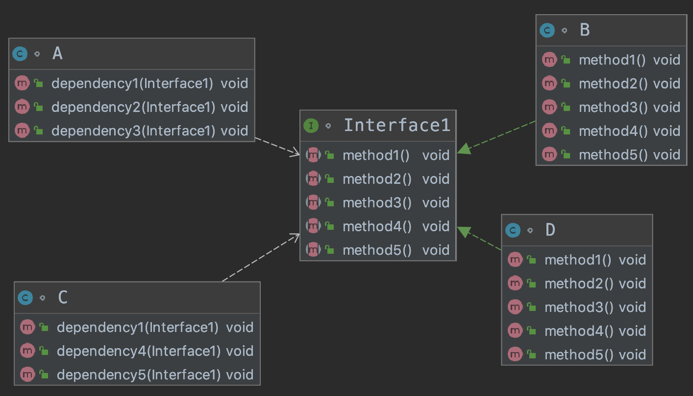
    - 示例代码：[/designPattern/dplearn/dplearn-base/src/test/java/com/ljs/learn/principle/interfaceSegregation/origian/Segregation1.java](/designPattern/dplearn/dplearn-base/src/test/java/com/ljs/learn/principle/interfaceSegregation/origian/Segregation1.java)
    - 依赖关系
        1. B、D是接口Interface1的实现
        2. A通过Interface1依赖B，但是A只会使用到接口中的1、2、3方法；4、5方法没有使用，导致B中产生了多余的实现
        3. C通过Interface1依赖D，但是C只会使用到接口中的1、4、5方法；2、3方法没有使用，导致D中产生了多余的实现
    - 接口冗余的问题
        - 类A通过接口Interface1依赖类B，类C通过接口Interface1依赖D，**如果接口Interface1对于类A和类C不是最小接口，那么类B和类B必须去实现他们不需要的方法**
- 接口隔离原则的处理方式
    - 将接口Interface1拆分为独立的几个接口，类A和类C分别与他们需要的接口建立依赖关系
    - 将接口Interface1中出现的方法，根据实际情况拆分为3个接口
- 接口冗余的改进
    - 改进的UML图
        - 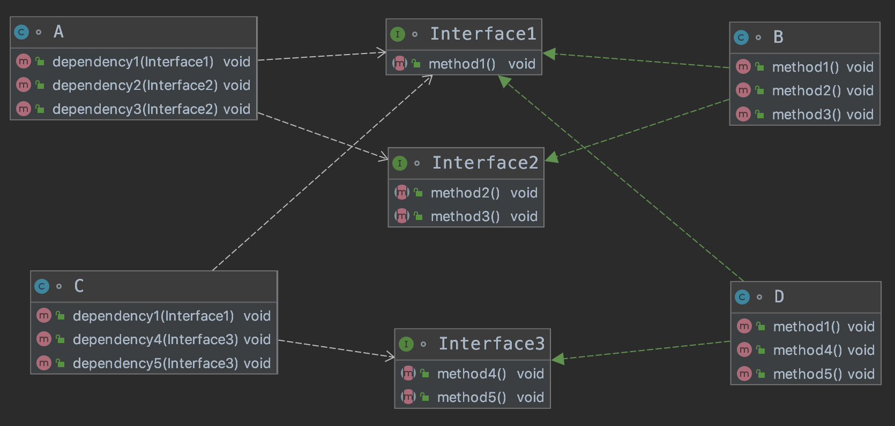
    - 示例代码：[/designPattern/dplearn/dplearn-base/src/test/java/com/ljs/learn/principle/interfaceSegregation/improve/Segregation2.java](/designPattern/dplearn/dplearn-base/src/test/java/com/ljs/learn/principle/interfaceSegregation/improve/Segregation2.java)
    - 依赖关系
        - B实现了`Interface1`和`Interface2`
        - D实现了`Interface1`和`Interface3`
        - A通过`Interface1`和`Interface2`接口来依赖B
        - C通过`Interface1`和`Interface2`接口来依赖D
    - 改进后的优点
        - 接口实现类中没有多余的实现
        - 类之间的依赖都建立在最小的接口上


## 依赖倒转原则
### 如何使用依赖倒转原则
[top](#catalog)
- Dependency Inversion Principle
- 中心思想
    - 中心思想是面向接口编程
    - 高层模块不应该依赖低层模块，二者都应该依赖抽象
    - 抽象不应该依赖细节，细节应该依赖抽象
- 依赖倒转原则的设计理念
    - 相对于细节的多变性，抽象的东西要稳定的多，以抽象为基础搭建的架构比以细节为基础搭建的架构要稳定的多。
- 依赖倒转原则在java中的体现
    - `抽象=接口、抽象类`
    - `细节=具体的实现类`
    - 使用接口或抽象类的目的是制定好规范，**而不涉及任何具体的操作**，把展现细节的任务交给他们的实现类去完成

- 直接依赖的示例说明：接受消息的功能
    - 示例的UML图
        - 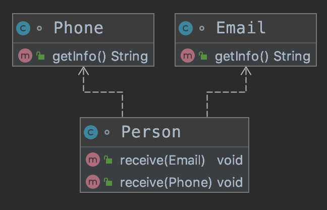
    - 代码：[/designPattern/dplearn/dplearn-base/src/test/java/com/ljs/learn/principle/dependencyInversion/origian/DependencyInversion1.java](/designPattern/dplearn/dplearn-base/src/test/java/com/ljs/learn/principle/dependencyInversion/origian/DependencyInversion1.java)
        
        ```java
        public class DependencyInversion1 {
            public static void main(String[] args) {
                Person person = new Person();
                person.receive(new Email());
                person.receive(new Phone());
            }
        }
        
        class Email{
            public String getInfo(){
                return "email Info ";
            }
        }
        
        class Phone{
            public String getInfo(){
                return "phone Infor";
            }
        }
        
        // 完成接受消息的功能
        class Person {
            // 分别接收不同信息
            public void receive(Email email){
                System.out.println(email.getInfo());
            }
        
            public void receive(Phone phone){
                System.out.println(phone.getInfo());
            }
        }
        ```
    - 直接依赖的问题
        - 每当新增信息源时，都需要新增一个对应类，并且在Person中也要增加相应的接收方法重载
    - 解决方案：
        - 引入一个接口IReceive，表示接收者，使Person类只与接口IReceive发生依赖
        - Email，Wexin等等都属于接收者的范畴，这些类分别实现IReceive接口，来完成依赖的倒转

- 通过依赖倒转原则来解决示例的问题
    - 改善后的UML图
        - 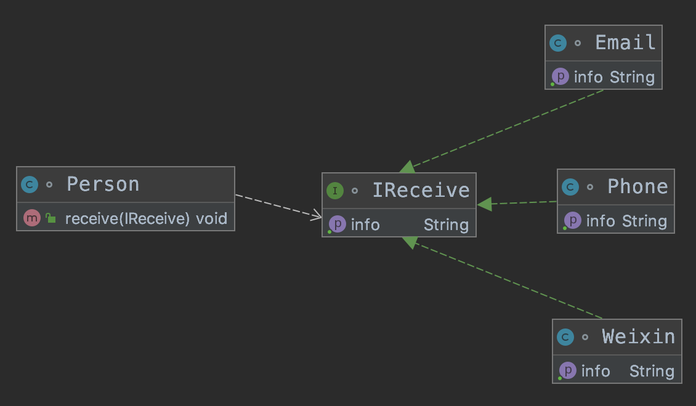
        - 代码：[/designPattern/dplearn/dplearn-base/src/test/java/com/ljs/learn/principle/dependencyInversion/improve/DependencyInversion2.java](/designPattern/dplearn/dplearn-base/src/test/java/com/ljs/learn/principle/dependencyInversion/improve/DependencyInversion2.java)
            ```java
            public class DependencyInversion2 {
                public static void main(String[] args) {
                    Person person = new Person();
                    person.receive(new Email());
                    person.receive(new Phone());
                    person.receive(new Weixin());
                }
            }
            
            // 引入一个接口IReceive，表示接受者
            interface IReceive{
                String getInfo();
            }
            class Email implements IReceive{
                public String getInfo(){
                    return "email Info ";
                }
            }
            
            class Phone implements IReceive{
                public String getInfo(){
                    return "phone Infor";
                }
            }
            
            class Weixin implements IReceive{
                public String getInfo(){
                    return "weixin Infor";
                }
            }
            
            // 完成接受消息的功能
            class Person {
                // 与接口IReceive发生依赖，来接收不同的信息
                public void receive(IReceive receiver){
                    System.out.println(receiver.getInfo());
                }
            }
            ```
    - 改进后的优点
        - Person依赖于接口IReceive，每次增加新的信息源时，不需要修改Person，只需要添加IReceive的实现类
        - 由于Person依赖于接口IReceive，自需要一个方法来处理接口的实例对象，减少了不必要的重载方法
        
### 依赖关系传递的三种方式和应用案例
[top](#catalog)
- 三种传递方式
    1. 接口传递
    2. 构造方法传递
    3. setter方式传递

- **接口传递**的应用
    - 使用方法：在主要方法中声明接口参数，来传递依赖
    - 参考代码：[/designPattern/dplearn/dplearn-base/src/test/java/com/ljs/learn/principle/dependencyInversion/threePattern/first/DeliverByInterface.java](/designPattern/dplearn/dplearn-base/src/test/java/com/ljs/learn/principle/dependencyInversion/threePattern/first/DeliverByInterface.java)
        ```java
        public class DeliverByInterface {
            public static void main(String[] args) {
                //创建一个电视机
                ITV mytv = new MyTV();
                //创建一个开关
                IOpenAndClose openAndClose = new OpenAndClose();
        
                //通过接口将依赖传递到类中
                openAndClose.open(mytv);
            }
        }
        
        //电视机接口
        interface ITV{
            void play();
        }
        
        //电视机开关接口 通过接口来传递依赖
        interface IOpenAndClose {
           void open(ITV tv);
        }
        
        //电视机开关接口的实现
        class OpenAndClose implements IOpenAndClose{
        
            // 通过接口将依赖传递到了类内部
            @Override
            public void open(ITV tv) {
                tv.play();
            }
        }
        
        // 电视机接口
        class MyTV implements ITV {
        
            @Override
            public void play() {
                System.out.println("myTV is showing");
            }
        }
        ```
    - UML类图
        - 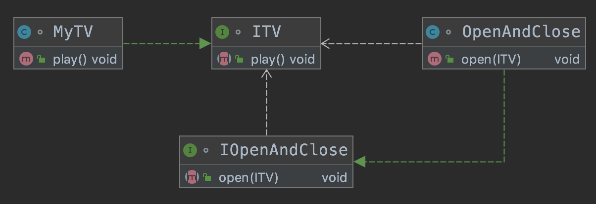
        
- 构造方法传递
    - 接口之间完全看不出依赖关系，只是通过实现类的构造器来关联
    - 使用方法：
        1. 在实现类中添加用来保存依赖接口对象的属性
        2. 创建带参数的构造器，将依赖传入，并保存在对象中
        3. 使用时，直接使用对象内部保存的依赖对象
    - 参考代码：[/designPattern/dplearn/dplearn-base/src/test/java/com/ljs/learn/principle/dependencyInversion/threePattern/second/DeliverByConstructor.java](/designPattern/dplearn/dplearn-base/src/test/java/com/ljs/learn/principle/dependencyInversion/threePattern/second/DeliverByConstructor.java)
        ```java
        // 依赖关系传递的三种方式和应用案例
        // 构造方法传递
        public class DeliverByConstructor {
            public static void main(String[] args) {
                // 创建一个电视
                ITV mytv = new MyTV();
                // 创建一个开关
                // 创建时，将电视作为依赖传递到开关中
                IOpenAndClose openAndClose = new OpenAndClose(mytv);
        
                // 直接调用方法
                openAndClose.open();
            }
        }
        
        // 从接口上看，两个接口ITV和IOpenAndClose没有直接的关系
        interface ITV {
            void play();
        }
        
        interface IOpenAndClose{
            void open();
        }
        
        // 在实现类中，将ITV的实现类对象作为私有属性，通过构造方法传递依赖
        class OpenAndClose implements IOpenAndClose{
            private ITV tv;
        
            public OpenAndClose(ITV tv) {
                this.tv = tv;
            }
        
            // 调用依赖对象的方法
            @Override
            public void open() {
                tv.play();
            }
        }
        
        class MyTV implements ITV{
        
            @Override
            public void play() {
                System.out.println("MyTV is showing");
            }
        }
        ```
    - UML类图
        - 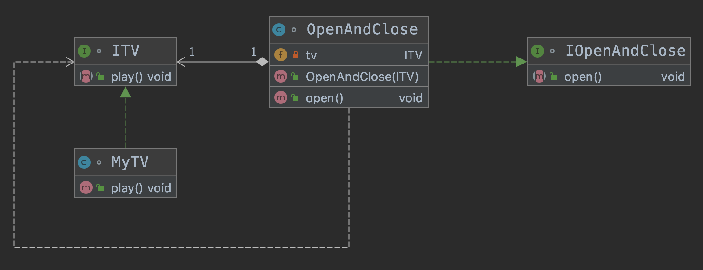
        
- setter方式传递
    - 使用方法
        1. 在实现类中添加用来保存依赖接口对象的属性
        2. 在接口中添加一个setter方法，用来保存依赖
        3. 使用时，直接使用对象内部保存的依赖对象
    - 与`构造方法传递`类似，只不过**传递依赖的时间被推迟了**
    - 参考代码：[/designPattern/dplearn/dplearn-base/src/test/java/com/ljs/learn/principle/dependencyInversion/threePattern/third/DeliverBySetter.java](/designPattern/dplearn/dplearn-base/src/test/java/com/ljs/learn/principle/dependencyInversion/threePattern/third/DeliverBySetter.java)
        ```java
        public class DeliverBySetter {
            public static void main(String[] args) {
                //创建一个电视机
                ITV mytv = new MyTV();
                //创建一个开关
                IOpenAndClose openAndClose = new OpenAndClose();
        
                //通过setter将依赖传递到开关中
                openAndClose.setTv(mytv);
                //执行fangf
                openAndClose.open();
            }
        }
        
        interface ITV {
            void play();
        }
        
        interface IOpenAndClose{
            void open();
            void setTv(ITV tv);
        }
        
        // 在实现类中，将ITV的实现类对象作为私有属性，通过setter方法传递依赖
        class OpenAndClose implements IOpenAndClose{
            private ITV tv;
        
            public void setTv(ITV tv) {
                this.tv = tv;
            }
        
            @Override
            public void open() {
                tv.play();
            }
        }
        
        class MyTV implements ITV {
        
            @Override
            public void play() {
                System.out.println("MyTV is showing");
            }
        }
        ```
    - UML类图
        - 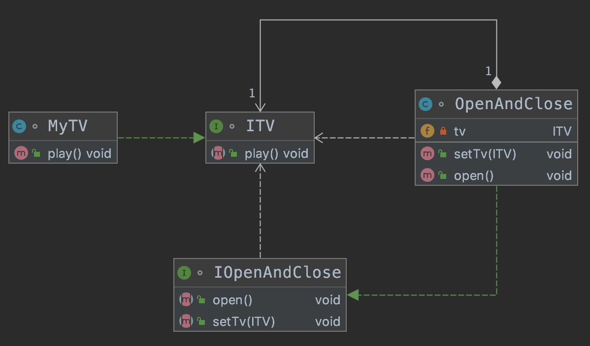
        
### 依赖倒转原则的注意事项和细节
[top](#catalog)
- 底层模块尽量都要有抽象类或接口，或者两者都有，程序的稳定性更好
- **变量的声明类型尽量使用抽象类或接口**，这样我们的变量引用和实际对象间，就存在一个缓冲层，利于程序扩展和优化
- 继承时需要遵守里氏替换原则

## 里氏替换原则
### OO中的继承性思考和说明
[top](#catalog)
- 继承包含的另一层含义
    - 父类中已经实现的方法，实际上是在设定一些规范和契约。但是不强制子类必须遵守这些规范
    - 如果子类对已经实现的方法进行**任意修改，将会破坏整个继承体系**
- 继承带来的弊端
    - 使用继承会给程序带来侵入性，导致程序的可移植性降低、增加对象间的耦合度
    - 如果一个类A被其他的类所继承，当类A需要修改时，**必须考虑到所有的子类**。并且父类修改后，**所有涉及到子类的功能都可能产生故障**
- 在编程中，如何正确的使用继承：里氏替换原则

### 什么是里氏替换原则
[top](#catalog)
- 里氏替换原则的概念
    - 详细描述：如果对每个类型为T1的对象o1，都有类型为T2的对象o2，使得以T1定义的所有程序P在所有的对象o1都代换成o2时，程序P的行为没有发生变化，那么类型T2是类型T1的子类型
    - 简单来说，即：所有引用基类的地方必须能透明的使用其子类的对象
- 里氏替换原则的中心思想： **在子类中尽量不要重写父类的方法**
- 继承实际上使两个类耦合性增强了，在适当的情况下，可以通过**聚合、组合、依赖、抽象出更高阶的父类**来解决问题

### 示例说明里氏替换原则
[top](#catalog)
- 不实用里氏替换原则
    - 参考代码：[/designPattern/dplearn/dplearn-base/src/test/java/com/ljs/learn/principle/liskov/LiskovOrigian.java](/designPattern/dplearn/dplearn-base/src/test/java/com/ljs/learn/principle/liskov/LiskovOrigian.java)
    - B继承了A，但是重写方法时，更改了父类方法的功能，导致调用时会有不同的结果
    - 代码
        ```java
        public class LiskovOrigian {
            public static void main(String[] args) {
                A a = new A();
                B b = new B();

                // 虽然有继承关系，但是B重写了父类的方法，导致同样的方法结果不同
                a.func1(11,8);
                b.func1(11,8);
            }
        }


        class A{
            public int func1(int num1, int num2){
                return num1 - num2;
            }
        }

        class B extends A {
            //B无意中重写了A的方法，并且两个方法的含义完全不同
            public int func1(int a, int b){
                return a + b;
            }

            public int func2(int a, int b){
                return func1(a, b) + 9;
            }
        }
        ```

- 使用里氏替换原则来改进：抽象出更高阶的父类
    - 参考：[/designPattern/dplearn/dplearn-base/src/test/java/com/ljs/learn/principle/liskov/LiskovImprove.java](/designPattern/dplearn/dplearn-base/src/test/java/com/ljs/learn/principle/liskov/LiskovImprove.java)
    - 抽象出一个更基本的类Base，A和B都继承Base，并提供相同的方法，但实现内容各不相同。
    - 在调用A和B的功能时更加清晰，不会被A和B的继承关系误导
    - 在B中组合A，使得通过B也能完成A的功能
    - 改进之后的UML图
        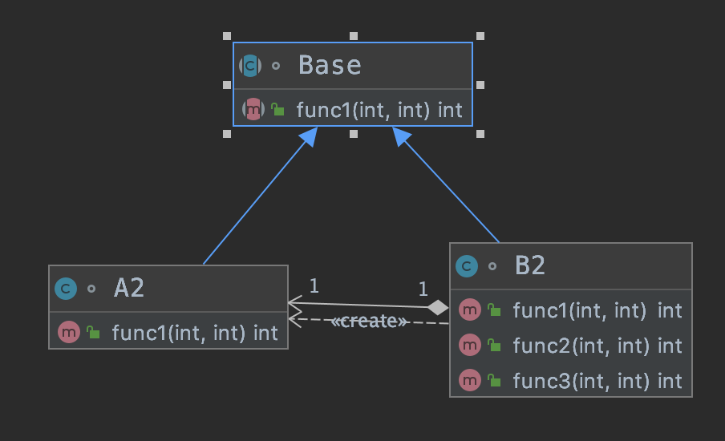
    - 代码
        ```java
        public class LiskovImprove {
            public static void main(String[] args) {
                A2 a = new A2();
                B2 b = new B2();

                // A和B通过父类Base进行了解耦，在调用时，各方法的意义更加明确
                a.func1(11,8);
                b.func1(11,8);

                // 如果在B中仍然想使用A的方法，可以通过组合关系来调用
                b.func3(11, 8);
            }
        }

        // 构造更基础的类，来降低耦合
        abstract class Base{
            public abstract int func1(int num1, int num2);
        }

        class A2 extends Base{
            public int func1(int num1, int num2){
                return num1 - num2;
            }
        }

        // 在B中，与A使用组合关系，并通过A来实现部分功能
        class B2 extends Base {
            private A2 a = new A2();
            //B无意中重写了A的方法，并且两个方法的含义完全不同
            public int func1(int a, int b){
                return a + b;
            }

            public int func2(int a, int b){
                return func1(a, b) + 9;
            }

            //使用A的方法来实现功能
            public int func3(int a, int b){
                return this.a.func1(a, b);
            }
        }
        ```

## 开闭原则
[top](#catalog)
- Open Closed Principle
- 开闭原则是编程中最基础，最重要的设计原则
- **基本原则**
    - 一个软件实体如类、模块、函数应该对扩展开放(**对提供方**)，对修改关闭(**对使用方**)。用抽象构建框架，用实现扩展细节
    - 当软件需要变化时，尽量通过扩展软件实体的行为来实现变化，而不是通过修改已有的代码来实现变化
    - 编程中遵循其他原则，以及使用设计模式的目的就是遵循开闭原则
    
- 结合示例说明
    - 参照：[/designPattern/dplearn/dplearn-base/src/test/java/com/ljs/learn/principle/openClose/origian/OcpOrigian.java](/designPattern/dplearn/dplearn-base/src/test/java/com/ljs/learn/principle/openClose/origian/OcpOrigian.java)
    - 该示例的问题
        - 没有遵守ocp原则，当新增一个三角形时，绘图类(即使用方)需要修改判断逻辑，并添加相应的处理方法，修改比较大
    - 代码
        ```java
        public class OcpOrigian {
            public static void main(String[] args) {
                GraphicEditor graphicEditor = new GraphicEditor();
        
                graphicEditor.drawShape(new Rectangle());
                graphicEditor.drawShape(new Circle());
        
                graphicEditor.drawShape(new Triangle());
        
            }
        }
        
        class Shape{
            int m_type;
        }
        
        class Rectangle extends Shape{
            public Rectangle() {
                super.m_type = 1;
            }
        }
        
        class Circle extends Shape {
            public Circle() {
                super.m_type = 2;
            }
        }
        
        // 新增一个三角形
        class Triangle extends Shape{
            public Triangle() {
                super.m_type = 3;
            }
        }
        
        // 一个用于绘图的类
        class GraphicEditor{
            //根据Shape的值，来绘制不通过的图形
            public void drawShape(Shape s){
                if (s.m_type == 1)
                    drawRectangle(s);
                else if (s.m_type == 2)
                    drawCircle(s);
                //如果新增了一个三角形，则需要添加判断逻辑
                else if (s.m_type == 3)
                    drawTriangle(s);
            }
        
            public void drawRectangle(Shape r){
                System.out.println("Rectangle");
            }
        
            public void drawCircle(Shape r){
                System.out.println("Circle");
            }
        
            //如果新增了一个三角形，则需要单独添加处理方法
            public void drawTriangle(Shape s){
                System.out.println("Triangle");
            }
        }
        ```
      
- 使用开闭原则来修改示例
    - 参考：[/designPattern/dplearn/dplearn-base/src/test/java/com/ljs/learn/principle/openClose/improve/OcpImprove.java](/designPattern/dplearn/dplearn-base/src/test/java/com/ljs/learn/principle/openClose/improve/OcpImprove.java)
    - 解决方案
        1. 将Shape类作为抽象类，提供一个抽象的draw方法，让子类去实
        2. 当出现新的图形类别时，让图形继承Shape，并实现draw方法，防止修改使用方的代码
    - 修改后的UML图
        - 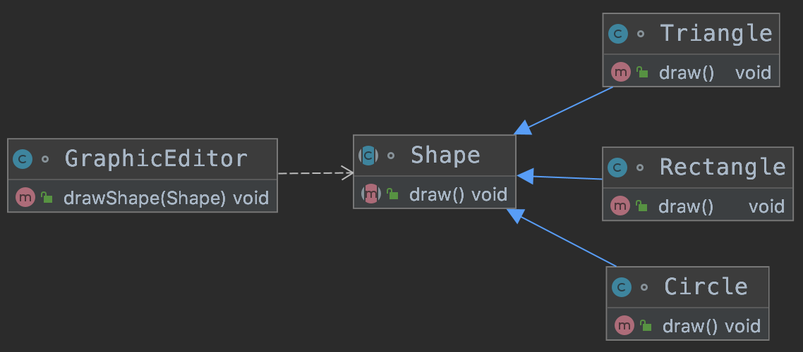
    - 代码
        ```java
        public class OcpImprove {
            public static void main(String[] args) {
                GraphicEditor graphicEditor = new GraphicEditor();
        
                graphicEditor.drawShape(new Rectangle());
                graphicEditor.drawShape(new Circle());
        
                graphicEditor.drawShape(new Triangle());
        
            }
        }
        
        // 创建抽象类
        abstract class Shape{
            public abstract void draw();
        }
        
        // 个图形分别实现绘制方法
        class Rectangle extends Shape {
            @Override
            public void draw() {
                System.out.println("Rectangle");
            }
        }
        
        class Circle extends Shape {
            @Override
            public void draw() {
                System.out.println("Circle");
            }
        }
        
        //如果新增了一个三角形，则只需要添加图形类即可，不需要修改绘图类
        class Triangle extends Shape {
            @Override
            public void draw() {
                System.out.println("Triangle");
            }
        }
        
        // 一个用于绘图的类
        class GraphicEditor{
            //根据Shape的值，来绘制不通过的图形
            public void drawShape(Shape s) {
                s.draw();
            }
        }
        ```

## 迪米特法则
[top](#catalog)
- Demeter Principle
- 迪米特法则也称为**最少知道原则**，即一个类对自己依赖的类知道的越少越好
    - 类与类关系越密切，耦合度越大
    - 即：对于被依赖的类不管多么复杂，都尽量将逻辑封装在类的内部，对外除了提供public方法，不对外暴露任何信息
    - 类与类之间只通过public方法来通信
- 迪米特法则的简单定义：**只与直接的朋友通信**
- 朋友类
    - 什么是朋友关系
        - 每个对象都会与其他对象有耦合关系，只要两个对象之间有耦合关系，就称这两个对象是朋友关系
        - 耦合的方式很多：依赖、关联、组合、聚合等等
    - 直接的朋友：出现在成员变量、方法参数、方法返回值中的类
    - 不是直接的朋友：出现在局部变量中的类
    - 陌生的类最好不要以局部变量的形式出现在类的内部
- 迪米特法则注意事项和细节
    - 迪米特法则的核心是是**降低类之间的耦合**
    - 由于每个类都减少了不必要的依赖，因此迪米特法则只是要求**降低**类之间的耦合关系，**并不是要求完全没有依赖关系**

- 违反迪米特法则的示例
    - 参考代码：[/designPattern/dplearn/dplearn-base/src/test/java/com/ljs/learn/principle/demeter/origian/Demeter.java](/designPattern/dplearn/dplearn-base/src/test/java/com/ljs/learn/principle/demeter/origian/Demeter.java)
    - 基本功能
        - 通过`CollegeManager`创建`CollegeEmployee`
        - 通过`SchooleManager`创建`Employee`
        - `SchooleManager`可以打印所有`CollegeEmployee`和`Employee`的信息
    - `SchooleManager`的分析
        - 直接朋友类：Employee，CollegeManager
        - 非直接朋友：CollegeEmployee，
            - CollegeEmployee以局部变量的形式出现在printAllEmployee方法中，违背了迪米特法则
    - 代码
        ```java
        //学校员工类
        class Employee{
            private String id;
        
            public String getId() {return id;}
        
            public void setId(String id) {this.id = id;}
        }
        
        //学院员工
        class CollegeEmployee{
            private String id;
        
            public String getId() {return id;}
        
            public void setId(String id) {this.id = id;}
        }
        
        // 学院员工管理类
        class CollegeManager{
            //返回所有员工
            public List<CollegeEmployee> getAllEmployee(){
                List<CollegeEmployee> list = new ArrayList<>();
                for (int i = 0; i < 10; i++) {//添加10个员工
                    CollegeEmployee emp = new CollegeEmployee();
                    emp.setId("collegeID="+i);
                    list.add(emp);
                }
                return list;
            }
        }
        
        // 学校员工管理类
        class SchooleManager{
            // 返回所有总部员工
            public List<Employee> getAllEmployee(){
                List<Employee> list = new ArrayList<>();
                for (int i = 0; i < 5; i++) {
                    Employee emp = new Employee();
                    emp.setId("schoolID="+i);
                    list.add(emp);
                }
                return list;
            }
        
            // 输出学校总部和学院员工学校的方法
            void printAllEmployee(CollegeManager cm){
                //输出学院员工
                List<CollegeEmployee> list1 = cm.getAllEmployee();
                System.out.println("----------CollegeEmployee-----------");
                for (CollegeEmployee e : list1) {
                    System.out.println(e.getId());
                }
        
                //输出学校员工
                List<Employee> list2 = this.getAllEmployee();
                for (Employee e : list2) {
                    System.out.println(e.getId());
                }
            }
        }
        ```
    - 示例UML图
        - `SchooleManager`与`CollegeEmployee`产生了依赖，增加了耦合度
        - 
        
- 示例的改进
    - 参考代码：[/designPattern/dplearn/dplearn-base/src/test/java/com/ljs/learn/principle/demeter/improve/Demeter.java](/designPattern/dplearn/dplearn-base/src/test/java/com/ljs/learn/principle/demeter/improve/Demeter.java)
    - 改进方法
        - 将`CollegeEmployee`的打印逻辑从`SchooleManager`抽出，移动到直接朋友类`CollegeManager`中
    - 代码
        ```java
        // 学院员工管理类
        class CollegeManager {
            //返回所有员工
            public List<CollegeEmployee> getAllEmployee() {
                List<CollegeEmployee> list = new ArrayList<>();
                for (int i = 0; i < 10; i++) {//添加10个员工
                    CollegeEmployee emp = new CollegeEmployee();
                    emp.setId("collegeID=" + i);
                    list.add(emp);
                }
                return list;
            }
        
            //输出学院员工
            public void printAllEmployee() {
                List<CollegeEmployee> list1 = this.getAllEmployee();
                System.out.println("----------CollegeEmployee-----------");
                for (CollegeEmployee e : list1) {
                    System.out.println(e.getId());
                }
            }
        
        }
        
        // 学校员工管理类
        // 直接朋友类：Employee，CollegeManager
        // 非直接朋友：CollegeEmployee，
        // CollegeEmployee以局部变量的形式出现在printAllEmployee方法中，违背了迪米特法则
        class SchooleManager{
            // 返回所有总部员工
            public List<Employee> getAllEmployee(){
                List<Employee> list = new ArrayList<>();
                for (int i = 0; i < 5; i++) {
                    Employee emp = new Employee();
                    emp.setId("schoolID="+i);
                    list.add(emp);
                }
                return list;
            }
        
            // 输出学校总部和学院员工学校的方法
            void printAllEmployee(CollegeManager cm){
                //输出学院员工
                // 使用迪米特法则将逻辑封装在被依赖类中
                cm.printAllEmployee();
        
                //输出学校员工
                List<Employee> list2 = this.getAllEmployee();
                for (Employee e : list2) {
                    System.out.println(e.getId());
                }
            }
        }
        ```
    - UML图
        - 去除了`SchooleManager`与`CollegeEmployee`之间的依赖
        - 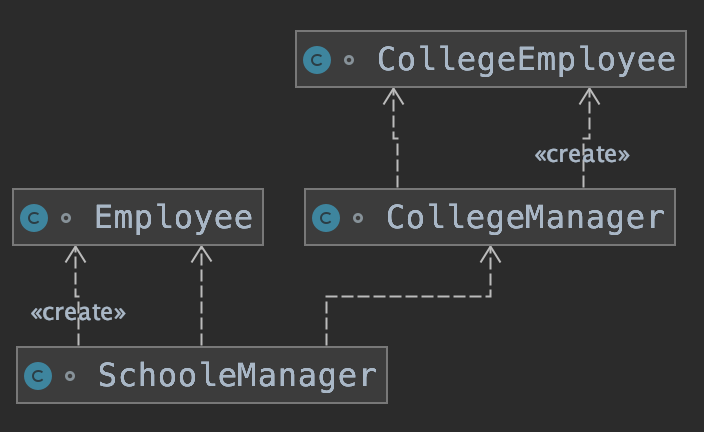

## 合成复用原则
[top](#catalog)
- Composite Reuse Priciple
- 基本原则：尽量使用合成/聚合的方式，而不是使用继承
- 示例
    - 参考代码：[/designPattern/dplearn/dplearn-base/src/test/java/com/ljs/learn/principle/compositeReuse/CompositeReuse.java](/designPattern/dplearn/dplearn-base/src/test/java/com/ljs/learn/principle/compositeReuse/CompositeReuse.java)
    - 功能类`A`
        ```java
        class A{
            public void method01(){}
            public void method02(){}
        }
        ```
    - 类B使用A的方法的几种方式
        1. 继承
            - 继承后B可以直接使用A的方法
            - 继承使得B和A的耦合性增强
            - 如果A增加了其他方法，B也会增加
            - 如果A发生了修改，可能会A影响到B
            ```java
            class B1 extends A{
            }
            ```
        2. 依赖
            ```java
            class B2{
                public void method01(A a){
                    a.method01();
                }
            }
            ```

        3. 聚合
            ```java
            class B3{
                private A a;
            
                public A getA() {
                    return a;
                }
            
                public void setA(A a) {
                    this.a = a;
                }
            
                public void method01(){
                    a.method01();
                }
            }
            ```

        4. 组合
            - 创建B时，A也被创建好了
            ```java
            class B4{
                private A a = new A();
            
                public void method01(){
                    a.method01();
                }
            }
            ```
    - 四种合成方式的UML图
        - 


# UML类图
## UML图简介
[top](#catalog)
- UML，Unified modeling language，统一建模语言
- UML是一种用于软件系统分析和设计的语言工具。UML本身是一套符号的规定，这些符号用于描述软件模型中的各个元素和他们之间的关系 
- UML图分类
    - 用例图(use case)
    - 静态结构图: 类图、对象图、包图、组件图、部署图
    - 动态行为图: 交互图(时序图与协作图)、状态图、活动图

## UML类图
[top](#catalog)
- 类图是UML图中最核心的图
- 类图用于描述系统中的类(对象)本身的组成和类(对象)之间的各种静态关系
- UML实体
    - 类 Class
    - 实体 Interface
- 实体间6种关系
    - 依赖
    - 关联
    - 继承/泛化（类）
    - 实现(接口) 
    - 聚合
    - 组合

- 实体间关系的表示方法
    - 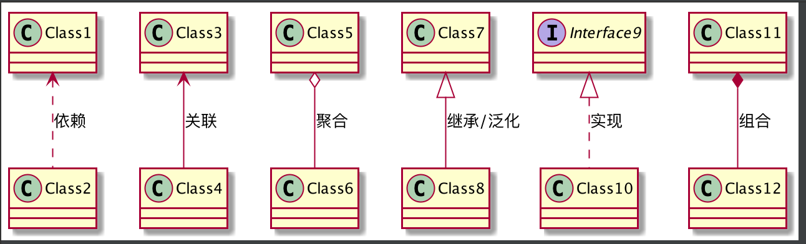
    
## UML类图的6种实体关系
[top](#catalog)
1. 依赖关系：Dependence
    - 表示方式：**箭头+虚线**
    - **只要在类图中用到了对方，那么他们之间就存在依赖关系**，如果没有对方连就无法编译
    - 产生依赖关系的前提：类中用到了对方
    - 会产生依赖关系的情况
        - 类的成员属性
        - 方法的返回值类型
        - 方法的参数
        - 方法中的局部变量

2. 继承/泛化关系：Generalization
    - 表示方式：**三角+实线**
    - 继承/泛化关系是依赖关系的特例
    
3. 实现关系：Implementation
    - 表示方式：**三角+虚线**
    - 实现关系是依赖关系的特例
    - 实际上就是A类实现B类
    
4. 关联关系：Association
    - 表示方式：**箭头+实线**
    - 关联关系实际上是类与类之间的关系，它是依赖关系的特例
        - 这种关系经常表现为<label style="color:red">类的成员属性</label>
    - 关联关系具有**导航性**，即双向关系或单向关系
    - 关联关系的多重性：1:1、1:n、n:m的关系
    - 单向1:1关系
        - 参考：[/designPattern/dplearn/dplearn-base/src/test/java/com/ljs/learn/UML/association/oneway/OneWay.java](/designPattern/dplearn/dplearn-base/src/test/java/com/ljs/learn/UML/association/oneway/OneWay.java)
            ```java
            //一个人对应一个身份证ID
            class Person{
                private IDCard card; 
            }
            
            class IDCard{}
            ```
        - 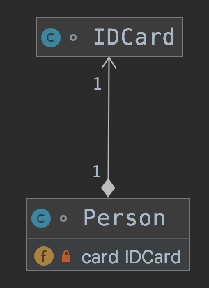
        
    - 双向1:1关系
        - 参考：[/designPattern/dplearn/dplearn-base/src/test/java/com/ljs/learn/UML/association/twoway/TwoWay.java](/designPattern/dplearn/dplearn-base/src/test/java/com/ljs/learn/UML/association/twoway/TwoWay.java)
            ```java
            class Person{
                private IDCard card; 
            }
            
            class IDCard{
                private Person person;
            }
            ```
        - 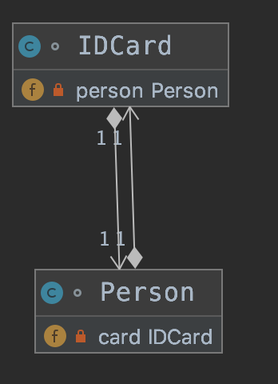
    
5. 聚合关系：Aggregation
    - 表示方式：**空心菱形+实线**
        - 菱形指向整体
    - 聚合关系表示的是整体和部分的关系，整体与部分可以分开
    - **聚合关系是关联关系的特例**，所以他具有关联关系的导航性与多重性
    - 示例
        - 参考代码：[/designPattern/dplearn/dplearn-base/src/test/java/com/ljs/learn/UML/aggregation/Aggregation.java](/designPattern/dplearn/dplearn-base/src/test/java/com/ljs/learn/UML/aggregation/Aggregation.java)
            ```java
            class Computer{
                private Mouse mouse;
                private Monitor monitor1;
            }
            
            class Mouse{}
            class Monitor{}
            ```
        - `Computer`与`Mouse`、`Monitor`具有1:1的聚合关系
        - UML图
            - 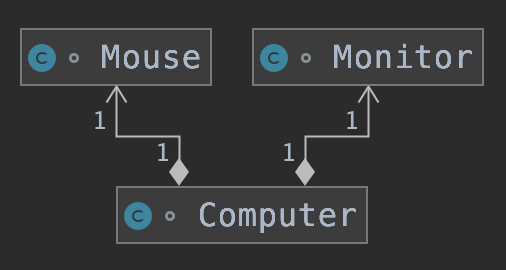
6. 组合关系：Composition
    - 表示方式：**实心菱形+实线**
        - 菱形指向整体
    - 组合关系也是整体和部分的关系，但是**整体和部分不可分开**
        - 不可分开即同时创建，同时销毁，无法相互分离
    - 示例
        - 参考代码：[/designPattern/dplearn/dplearn-base/src/test/java/com/ljs/learn/UML/composition/Composition.java](/designPattern/dplearn/dplearn-base/src/test/java/com/ljs/learn/UML/composition/Composition.java)
            ```java
            class Laptop {
                private Mouse mouse;
                private Monitor monitor = new Monitor();
            }
            
            class Monitor {}
            class Mouse{}
            ```
        - `Computer`与`Monitor`同时创建、同时销毁，两者不可分离，是组合关系
        - `Computer`与`Mouse`可以分离，是聚合关系
        - UML图
            - 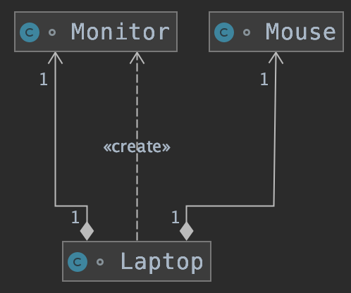
        

# 设计模式的分类
[top](#catalog)
- 设计模式分为三种类型，共23种
    1. 创建型模式：**如何创建对象**
    2. 结构型模式：**提高软件整体的扩展性**
    3. 行为型模式：**如何设计类的方法，使得方法的调用和开发更加合理**

- 创建型模式
    1. <labe style="color:red">单例模式</label>
    2. <labe style="color:red">工厂模式</label>
    3. 抽象工厂模式
    4. 原型模式
    5. 建造者模式
    
- 结构型模式
    1. <labe style="color:red">代理模式</label>
    2. <labe style="color:red">装饰器模式</label>
    3. 适配器模式
    4. 桥接模式
    5. 组合模式
    6. 外观模式
    7. 享元模式
    
- 行为型模式
    1. <labe style="color:red">观察者模式</label>
    2. 模版方法模式
    3. 命令模式
    4. 访问者模式
    5. 迭代器模式
    6. 中介者模式
    7. 备忘录模式
    8. 解释器模式/Interpreter模式
    9. 状态模式
    10. 策略模式
    11. 职责链模式/责任链模式

# 创建型-单例设计模式
## 单例设计模式简介
[top](#catalog)
- 什么是单例模式
    - 采取一定的方法保证在整个软件系统中，类只存在一个实例对象，并且该类只提供一个取得实例的方法(一般是静态方法)

- 单例模式保证了系统内存中该类只存在一个对象，节省了系统资源，对于一些需要频繁创建销毁的对象，使用单例模式可以提高系统性能
- 实例化一个单例类时，必须使用对应的方法来获取，不能使用`new`来创建
- 单例模式的使用场景：
    - 需要频繁的进行创建和销毁的对象
    - 创建对象时耗时过多，即重量级对象
    - 经常用到的对象
    - 工具类对象
    - 频繁访问数据库或文件的对象，如数据源、session工厂等

- **单例模式的8中形式**
    1. 饿汉式（静态常量）
    2. 饿汉时（静态代码块）
    3. 懒汉式（线程不安全）
    4. 懒汉式（线程安全，同步方法）
    5. 懒汉式（线程不安全，同步代码块）
    6. 双重检查
    7. 静态内部类
    8. 枚举
    
## 单例模式形式1-饿汉式-静态常量
[top](#catalog)
- 创建步骤
    1. **构造器私有化**，防止调用方通过`new`来创建实例对象
    2. 在类的内部实例化一个**私有的、静态的**(不可变的)对象`instance`
        - 私有：防止外部的直接访问
        - 静态：使得该对象可以通过静态方法访问
        - 不可变：防止外部对该对象的直接替换
    3. 向外暴露一个静态的公共方法，一般写作：`getInstance()`

- 饿汉式的优缺点<span id="singleton_hungry_advantages_and_disadvantages"></span>
    - 优点：写法简单，在类装载时就完成了实例化，避免了线程同步的问题
    - 缺点：
        - 在类装载时就完成了实例化，没有达到`Lazy Loading`的效果
        - 如果一直没有使用过这个实例，则会造成内存的浪费
    - 这种方式基于`classloader`机制，避免了多线程的同步问题。不过，instance在类装载时就实例化，在单例模式中大多数都是调用`getInstance`方法，但是导致类装载的原因有很多种，因此不能确定有其他的方式或者其他的静态方法导致类装载，这时候初始化instance就没有达到`Lazy Loading`的效果

- 结论：饿汉式-静态常量<label style="color:red">可以用，可能会造成内存浪费</label>
    - 如果确定类装载方式，则没有问题
    - 如果无法确定类装载方式，则可能会造成内存浪费

- 示例
    - 参考代码：[/designPattern/dplearn/dplearn-base/src/test/java/com/ljs/learn/pattern/singleton/type1/SingletonType01Test.java](/designPattern/dplearn/dplearn-base/src/test/java/com/ljs/learn/pattern/singleton/type1/SingletonType01Test.java)
    - 单例模式类
        ```java
        // 饿汉式-静态变量
        class Singleton{
            // 创建步骤
        
            // 1. 构造器私有化，防止调用方通过`new`来创建实例对象
            private Singleton() {
        
            }
        
            // 2. 在类的内部实例化一个：私有的、静态的、不可变的 对象
            private final static Singleton instance = new Singleton();
        
            // 3. 向外暴露一个静态的公共方法，一般写作：`getInstance`
            public static Singleton getInstance(){
                return instance;
            }
        }
        ```
    - 测试内容
        ```java
        Singleton instance1 = Singleton.getInstance();
        Singleton instance2 = Singleton.getInstance();

        // output:true
        System.out.println(instance1 == instance2);

        // 两个实例的hashCode是相同的
        System.out.println("instance1 hashCode = " + instance1.hashCode());
        System.out.println("instance2 hashCode = " + instance2.hashCode());
        ```

## 单例模式形式2-饿汉式-静态代码块
[top](#catalog)
- 创建步骤
    1. 构造器私有化，防止调用方通过`new`来创建实例对象
    2. 添加一个**私有的、静态的**(不可变的)成员属性`instance`
        - 私有：防止外部的直接访问
        - 静态：使得该对象可以通过静态方法访问
        - 不可变：防止外部对该对象的直接替换
    3. 在静态代码块中为`instance`提供实例化对象
    4. 向外暴露一个静态的公共方法，一般写作：`getInstance()`
    
- 优缺点与[饿汉式-静态常量](#singleton_hungry_advantages_and_disadvantages)相同
- 结论：这种单例模式<label style="color:red">可用，但是可能会造成内存浪费</label>
- 示例
    - 参考代码：[/designPattern/dplearn/dplearn-base/src/test/java/com/ljs/learn/pattern/singleton/type2/SingletonType02Test.java](/designPattern/dplearn/dplearn-base/src/test/java/com/ljs/learn/pattern/singleton/type2/SingletonType02Test.java)
    - 单例模式类
        ```java
        class Singleton{
            // 创建步骤
        
            // 1. 构造器私有化，防止调用方通过`new`来创建实例对象
            private Singleton() {
        
            }
        
            // 2. 添加一个私有的、静态的、不可变的成员属性instance
            private final static Singleton instance;
        
            // 3. 在静态代码块中为instance提供实例化对象
            static{
                instance = new Singleton();
            }
        
            // 4. 向外暴露一个静态的公共方法，一般写作：`getInstance`
            public static Singleton getInstance(){
                return instance;
            }
        }
        ```
    - 测试内容
        ```java
        Singleton instance1 = Singleton.getInstance();
        Singleton instance2 = Singleton.getInstance();

        // output:true
        System.out.println(instance1 == instance2);

        // 两个实例的hashCode是相同的
        System.out.println("instance1 hashCode = " + instance1.hashCode());
        System.out.println("instance2 hashCode = " + instance2.hashCode());
        ```

## 单例模式形式3-懒汉式-线程不安全
[top](#catalog)
- 创建步骤
    1. 构造器私有化，防止调用方通过`new`来创建实例对象
    2. 添加一个**私有的、静态的**成员属性`instance`
        - 私有：防止外部的直接访问
        - 静态：使得该对象可以通过静态方法访问
    3. 向外暴露一个静态的公共方法，一般写作：`getInstance()`
    4. 在`getInstance()`方法中，进行`懒汉式`判断。即当使用到`instance`时，才进行创建
        - 如果`instance`尚未创建，则创建实例化对象并返回
        - 如果`instance`已创建，则直接返回
        
- 懒汉式的优缺点
    - 优点：懒汉式起到了`Lazy Loading`的效，但是**只能在单线程下使用**
    - 缺点：可能同时产生多个实例，违背单例模式的基本原则
        - 在多线程下，如果一个线程进入了`if(singleton==null)`判断语句，还未开始创建对象时，另一个线程也通过了这个判断语句，这时便**会产生多个实例**。所以多线程环境下不可以使用这种方式

- 结论：<label style="color:red">在实际开发中，不可以使用这种方式</label>

- 示例
    - 参考代码：[/designPattern/dplearn/dplearn-base/src/test/java/com/ljs/learn/pattern/singleton/type3/SingletonType03Test.java](/designPattern/dplearn/dplearn-base/src/test/java/com/ljs/learn/pattern/singleton/type3/SingletonType03Test.java)
    - 单例模式代码
        ```java
        class Singleton{
            // - 创建步骤
            // 1. 构造器私有化，防止调用方通过`new`来创建实例对象
            private Singleton() {
            }
            // 2. 添加一个**私有的、静态的**成员属性`instance`
            private static Singleton instance;
        
            // 3. 向外暴露一个静态的公共方法，一般写作：`getInstance()`
            public static Singleton getInstance(){
                // 4. 在`getInstance()`方法中，进行`懒汉式`判断。即当使用到`instance`时，才进行创建
                if (instance == null){
                    instance = new Singleton();
                }
                return instance;
            }
        }
        ```
    - 测试内容
        ```java
        public static void main(String[] args) {
            Callable<Singleton> r = () -> {
                Singleton instance = Singleton.getInstance();
                System.out.println(
                        Thread.currentThread().getName() +
                                " : instance hashCode = " +
                                instance
                );
                return instance;
            };
    
            FutureTask<Singleton> f1 = new FutureTask<>(r);
            FutureTask<Singleton> f2 = new FutureTask<>(r);
            FutureTask<Singleton> f3 = new FutureTask<>(r);
            FutureTask<Singleton> f4 = new FutureTask<>(r);
    
            // 创建线程对象
            Thread t1 = new Thread(f1);
            Thread t2 = new Thread(f2);
            Thread t3 = new Thread(f3);
            Thread t4 = new Thread(f4);
    
            // 启动线程
            t1.start();
            t2.start();
            t3.start();
            t4.start();
    
            // 获取线程的返回单例对象并比较
            try {
                Singleton singleton1 = f1.get();
                Singleton singleton2 = f2.get();
                Singleton singleton3 = f3.get();
                Singleton singleton4 = f4.get();
                System.out.println(singleton1 == singleton2);
                System.out.println(singleton1 == singleton3);
                System.out.println(singleton1 == singleton4);
            } catch (InterruptedException e) {
                e.printStackTrace();
            } catch (ExecutionException e) {
                e.printStackTrace();
            }
        }
        ```
    - 测试结果
        - 可能需要多次测试才能测出单例对象被多次创建了
        - 
      
## 单例模式形式4-懒汉式-线程安全-同步方法
[top](#catalog)
- 创建步骤
    1. 构造器私有化，防止调用方通过`new`来创建实例对象
    2. 添加一个**私有的、静态的**成员属性`instance`
        - 私有：防止外部的直接访问
        - 静态：使得该对象可以通过静态方法访问
    3. 向外暴露一个**线程同步的**静态的公共方法，一般写作：`getInstance()`，
    4. 在`getInstance()`方法中，进行`懒汉式`判断。即当使用到`instance`时，才进行创建
        - 如果`instance`尚未创建，则创建实例化对象并返回
        - 如果`instance`已创建，则直接返回
        
- 使用同步方法的懒汉式的优缺点
    - 优点
        - 起到了`Lazy Loading`的效
        - 可以在多线程下使用，<label style="color:red">解决了线程不安全的问题</label>
    - 缺点
        - 同步方法的效率低，每个线程在获取`instance`时，都需要同步。其实这个同步方法只需要同步一次即可，后面想获取`instance`时，直接`return`即可
        
- 结论：在实际开发中，<label style="color:red">不推荐使用这种方式</label>

- 示例
    - 参考代码：[/designPattern/dplearn/dplearn-base/src/test/java/com/ljs/learn/pattern/singleton/type4/SingletonType04Test.java](/designPattern/dplearn/dplearn-base/src/test/java/com/ljs/learn/pattern/singleton/type4/SingletonType04Test.java)
    - 单例代码
        ```java
        class Singleton{
            // - 创建步骤
            // 1. 构造器私有化，防止调用方通过`new`来创建实例对象
            private Singleton() {
            }
            // 2. 添加一个**私有的、静态的**成员属性`instance`
            private static Singleton instance;
        
            // 3. 向外暴露一个**线程同步的**静态的公共方法，一般写作：`getInstance()`，
            public static synchronized Singleton getInstance(){
                // 4. 在`getInstance()`方法中，进行`懒汉式`判断。即当使用到`instance`时，才进行创建
                if (instance == null){
                    instance = new Singleton();
                }
                return instance;
            }
        }
        ```
    - 测试内容
        ```java
        public static void main(String[] args) {
            Callable<Singleton> r = () -> {
                Singleton instance = Singleton.getInstance();
                System.out.println(
                        Thread.currentThread().getName() +
                                " : instance hashCode = " +
                                instance
                );
                return instance;
            };
    
            FutureTask<Singleton> f1 = new FutureTask<>(r);
            FutureTask<Singleton> f2 = new FutureTask<>(r);
            FutureTask<Singleton> f3 = new FutureTask<>(r);
            FutureTask<Singleton> f4 = new FutureTask<>(r);
    
            // 创建线程对象
            Thread t1 = new Thread(f1);
            Thread t2 = new Thread(f2);
            Thread t3 = new Thread(f3);
            Thread t4 = new Thread(f4);
    
            // 启动线程
            t1.start();
            t2.start();
            t3.start();
            t4.start();
    
            // 获取线程的返回单例对象并比较
            try {
                Singleton singleton1 = f1.get();
                Singleton singleton2 = f2.get();
                Singleton singleton3 = f3.get();
                Singleton singleton4 = f4.get();
                System.out.println(singleton1 == singleton2);
                System.out.println(singleton1 == singleton3);
                System.out.println(singleton1 == singleton4);
            } catch (InterruptedException e) {
                e.printStackTrace();
            } catch (ExecutionException e) {
                e.printStackTrace();
            }
        }
        ```
    - 测试结果
        - 
        
## 单例模式形式5-懒汉式-线程不安全-同步代码块  
[top](#catalog)
- 将[单例模式形式4-懒汉式-线程安全-同步方法](#单例模式形式4-懒汉式-线程安全-同步方法)中的同步方法变成了同步代码快
    ```java
    public static Singleton getInstance(){
        if(instance == null){
            // 将同步方法改为同步代码块
            synchronized (Singleton.class){
                instance = new Singleton();
            }
        }

        return instance;
    }
    ```
- <label style="color:red">这种方式无法做到线程同步，无法解决线程安全的问题</label>
- 同步代码块的问题分析
    1. 当两个线程同时进入`if(instance == null){`
    2. 一个线程拿到同步监视器，创建了一个单例对象A，然后释放同步监视器
    3. 另一个线程获取到同步监视器，又创建了一个单例对象B
    4. 最终导致单例对象被多次创建
- 结论：<label style="color:red">在实际开发中不能使用这种方式</label>
- 示例
    - 参考代码：[/designPattern/dplearn/dplearn-base/src/test/java/com/ljs/learn/pattern/singleton/type4/SingletonType04Test.java](/designPattern/dplearn/dplearn-base/src/test/java/com/ljs/learn/pattern/singleton/type4/SingletonType04Test.java)
    - 代码内容
        ```java
        class Singleton{
            private static Singleton instance;
        
            private Singleton() {
            }
        
            public static Singleton getInstance(){
                if(instance == null){
                    synchronized (Singleton.class){
                        instance = new Singleton();
                    }
                }
                return instance;
            }
        }
        ```
    - 测试内容
        ```java
        public static void main(String[] args) {
            Callable<Singleton> r = ()-> {
                Singleton instance = Singleton.getInstance();
                System.out.println(
                        Thread.currentThread().getName() +
                                " : instance hashCode = " +
                                instance
                );
                return instance;
            };
    
            FutureTask<Singleton> f1 = new FutureTask<>(r);
            FutureTask<Singleton> f2 = new FutureTask<>(r);
            FutureTask<Singleton> f3 = new FutureTask<>(r);
            FutureTask<Singleton> f4 = new FutureTask<>(r);
    
            // 创建线程对象
            Thread t1 = new Thread(f1);
            Thread t2 = new Thread(f2);
            Thread t3 = new Thread(f3);
            Thread t4 = new Thread(f4);
    
            // 启动线程
            t1.start();
            t2.start();
            t3.start();
            t4.start();
    
            // 获取线程的返回单例对象并比较
            try {
                Singleton singleton1 = f1.get();
                Singleton singleton2 = f2.get();
                Singleton singleton3 = f3.get();
                Singleton singleton4 = f4.get();
                System.out.println(singleton1 == singleton2);
                System.out.println(singleton1 == singleton3);
                System.out.println(singleton1 == singleton4);
            } catch (InterruptedException e) {
                e.printStackTrace();
            } catch (ExecutionException e) {
                e.printStackTrace();
            }
        }
        ```
    - 测试结果
        - 
        
## 单例模式形式6-懒汉式-双重检查  
[top](#catalog)
- 多重检查的方式
    ```java
    if (instance == null){
        synchronized(Singleton.class){
            if (instance == null){
                instance = new Singleton();
            }
        }
    }
    ```

- 多重检查是多线程开发中经常使用到的，通过两个检查`if (instance == null){`就可以保证线程安全
- 实例化代码只执行一次，后面再执行到`if (instance == null){`(无论是第一层还是第二层)，都直接`return`实例化对象，避免了重复进行方法同步
- 这种方法是线程安全的，能做到延迟加载，效率比较高
- 结论：<label style="color:red">在实际开发中，推荐使用这种单例设计模式</label>
- 示例
    - 参考代码：[/designPattern/dplearn/dplearn-base/src/test/java/com/ljs/learn/pattern/singleton/type6/SingletonType06Test.java](/designPattern/dplearn/dplearn-base/src/test/java/com/ljs/learn/pattern/singleton/type6/SingletonType06Test.java)
    - 代码内容
        ```java
        class Singleton{
            private static volatile Singleton instance;
        
            private Singleton() {
            }
        
            public static Singleton getInstance(){
                if (instance == null){
                    synchronized(Singleton.class){
                        if (instance == null){
                            instance = new Singleton();
                        }
                    }
                }
        
                return instance;
            }
        }
        ```
    - 测试内容
        ```java
        public static void main(String[] args) {
            Callable<Singleton> r = ()-> {
                Singleton instance = Singleton.getInstance();
                System.out.println(
                        Thread.currentThread().getName() +
                                " : instance hashCode = " +
                                instance
                );
                return instance;
            };
    
            FutureTask<Singleton> f1 = new FutureTask<>(r);
            FutureTask<Singleton> f2 = new FutureTask<>(r);
            FutureTask<Singleton> f3 = new FutureTask<>(r);
            FutureTask<Singleton> f4 = new FutureTask<>(r);
    
            // 创建线程对象
            Thread t1 = new Thread(f1);
            Thread t2 = new Thread(f2);
            Thread t3 = new Thread(f3);
            Thread t4 = new Thread(f4);
    
            // 启动线程
            t1.start();
            t2.start();
            t3.start();
            t4.start();
    
            // 获取线程的返回单例对象并比较
            try {
                Singleton singleton1 = f1.get();
                Singleton singleton2 = f2.get();
                Singleton singleton3 = f3.get();
                Singleton singleton4 = f4.get();
                System.out.println(singleton1 == singleton2);
                System.out.println(singleton1 == singleton3);
                System.out.println(singleton1 == singleton4);
            } catch (InterruptedException e) {
                e.printStackTrace();
            } catch (ExecutionException e) {
                e.printStackTrace();
            }
        }
        ```

## 单例模式形式7-静态内部类中的静态属性
[top](#catalog)
- 静态内部类的特点
    - 外部类被加载时，静态内部类不会被加载
    - 当调用该类的属性或方法时，静态内部类才会被加载
    - 类的装载只会发生一次，并且是**线程安全的**
    
- 使用静态内部类中的静态属性的优点
    - 延迟加载，效率高：
        - 加载外部类时，不会加载内部类
        - 保证单例对象只在需要时进行实例化，即只在调用`getInstance()`时才会装载静态内部类，并完成对象的实例化
    - 线程安全：
        - 这种方式采用了类装载机制来保证初始化实例时只有一个线程
        - 类的静态属性只会在第一次加载时初始化，所以间接的通过JVM来实现了线程的安全性。**在类初始化时，其他线程时无法进入的**
- 结论：<labe style="color:red">推荐使用</label>
- 示例
    - 参考代码：[/designPattern/dplearn/dplearn-base/src/test/java/com/ljs/learn/pattern/singleton/type7/SingletonType07Test.java](/designPattern/dplearn/dplearn-base/src/test/java/com/ljs/learn/pattern/singleton/type7/SingletonType07Test.java)
    - 代码内容
        ```java
        class Singleton{
            private Singleton() {
            }
            
            // 创建静态内部类及其静态属性
            private static class SingletonInstance{
                public static final Singleton INSTANCE = new Singleton();
            }
        
            // 直接返回静态内部类中的静态属性
            public static Singleton getInstance(){
                return SingletonInstance.INSTANCE;
            }
        }
        ```

## 单例模式形式7-枚举
[top](#catalog)
- 通过使用枚举，**不仅能避免多线程同步问题，而且还能防止反序列化重新创建新的对象**
- 这种方式也是Effective Java作者所提倡的方式
- 结论：<label style="color:red">推荐使用</label>
- 示例
    - 参考代码：[/designPattern/dplearn/dplearn-base/src/test/java/com/ljs/learn/pattern/singleton/type8/SingletonType08Test.java](/designPattern/dplearn/dplearn-base/src/test/java/com/ljs/learn/pattern/singleton/type8/SingletonType08Test.java)
    - 代码内容
        ```java
        enum Singleton{
            INSTANCE;
        
            public void work(){
                System.out.println("singleton instance is working");
            }
        }
        ```
    - 测试内容
        ```java
        public static void main(String[] args) {
            Singleton instance = Singleton.INSTANCE;
            Singleton instance2 = Singleton.INSTANCE;
    
            System.out.println(instance == instance2);
    
            instance.work();
        }
        ```

## 单例模式在JDK中的应用
[top](#catalog)
- JDK中 `java.lang.Runtime`就是经典的单例模式
- 源码分析
    ```java
    public class Runtime {
        private static final Runtime currentRuntime = new Runtime();
    
        private static Version version;
    
        public static Runtime getRuntime() {
            return currentRuntime;
        }
    
        private Runtime() {}
        
        ...
    }
    ```
- `java.lang.Runtime`采用的是饿汉式-静态常量的方式

# 创建型-工厂模式
## 工厂模式-引入问题-pizza订购
[top](#catalog)
- 需求
    - 披萨店项目：要便于披萨种类的扩展，要便于维护
    - 基本流程：披萨店去订购，然后制作披萨
    - 披萨有很多种类，但基本制作流程相同：prepare、bake、cut、box
    
- 传统设计
    - UML图：
        - 
    - 披萨类及其子类
        - 参考代码
            - [/designPattern/dplearn/dplearn-base/src/test/java/com/ljs/learn/pattern/factory/pizzastore/pizza/Pizza.java](/designPattern/dplearn/dplearn-base/src/test/java/com/ljs/learn/pattern/factory/pizzastore/pizza/Pizza.java)
            - [/designPattern/dplearn/dplearn-base/src/test/java/com/ljs/learn/pattern/factory/pizzastore/pizza/SubPizza01.java](/designPattern/dplearn/dplearn-base/src/test/java/com/ljs/learn/pattern/factory/pizzastore/pizza/SubPizza01.java)
            - [/designPattern/dplearn/dplearn-base/src/test/java/com/ljs/learn/pattern/factory/pizzastore/pizza/SubPizza02.java](/designPattern/dplearn/dplearn-base/src/test/java/com/ljs/learn/pattern/factory/pizzastore/pizza/SubPizza02.java)
        - 代码内容
            ```java
            public abstract class Pizza {
                private String name;
            
                public Pizza(String name) {
                    this.name = name;
                }
            
                public abstract void prepare();
            
                public void bake(){
                    System.out.println("is baking");
                }
            
                public void cut(){
                    System.out.println("is cutting");
                }
            
                public void box(){
                    System.out.println("is boxing");
                }
            }
          
            public class SubPizza01 extends Pizza {
            
                public SubPizza01() {
                    super("SubPizza01");
                }
            
                @Override
                public void prepare() {
                    System.out.println("SubPizza01 is preparing");
                }
            }
          
            public class SubPizza02 extends Pizza{
                public SubPizza02() {
                    super("SubPizza02");
                }
            
                @Override
                public void prepare() {
                    System.out.println("SubPizza02 is preparing");
                }
            }
            ```
    - 订单类
        - 参考代码：[/designPattern/dplearn/dplearn-base/src/test/java/com/ljs/learn/pattern/factory/pizzastore/order/OrderPizza.java](/designPattern/dplearn/dplearn-base/src/test/java/com/ljs/learn/pattern/factory/pizzastore/order/OrderPizza.java)
        - 代码内容：
            ```java
            public class OrderPizza {
                public void order(){
                    Pizza p = null;
                    String orderType;
            
                    do{
                        orderType = getType();
                        //创建pizza对象
                        if (orderType.equals("sub01")){
                            p = new SubPizza01();
                        }else if (orderType.equals("sub02")){
                            p = new SubPizza02();
                        }else{
                            break;
                        }
                        //制作pizza
                        p.prepare();
                        p.bake();
                        p.cut();
                        p.box();
                    }while(true);
                }
            
                // 从控制台获取pizza种类
                private String getType(){
                    try {
                        BufferedReader is = new BufferedReader(new InputStreamReader(System.in));
                        System.out.println("input pizza type : ");
                        String type= is.readLine();
                        return type;
                    } catch (IOException e) {
                        e.printStackTrace();
                    }
                    return "";
                }
            }
            ```
    - 披萨店类
        - 参考代码：[/designPattern/dplearn/dplearn-base/src/test/java/com/ljs/learn/pattern/factory/pizzastore/store/PizzaStore.java](/designPattern/dplearn/dplearn-base/src/test/java/com/ljs/learn/pattern/factory/pizzastore/store/PizzaStore.java)
        - 代码内容：
            ```java
            public class PizzaStore {
                public static void main(String[] args) {
                    //作为客户端发出pizza的定做任务
                    OrderPizza order = new OrderPizza();
                    order.order();
                }
            }
            ```
          
- 传统设计的优缺点
    - 优点：理解容易，操作简单
    - 缺点
        - 违反了设计模式的ocp原则，没有对修改关闭。当新增一个Pizza子类时，需要在订单类`OrderPizza`中的构造器中添加处理逻辑
        - 如果有多个`OrderPizza`类，当添加Pizza子类时，会造成大量的修改
                
## 简单工厂模式
[top](#catalog)
- 简单工厂模式
    - 基本思路：定义一个创建对象的工厂类，封装创建对象的逻辑
    - 简单工厂模式是最简单实用的工厂模式
- 在软件开发中，当我们会用到大量的创建某些对象时，就会使用工厂模式

- 披萨店项目的改进方法
    - 问题分析：`OrderPizza`类负责创建pizza，使得增加pizza时，`OrderPizza`会产生大量的修改
    - 解决方法：将创建Pizza的逻辑封装到一个工厂类中，当新增pizza，只需要修改该工厂类即可，其他类不需要修改

- 使用简单工厂模式来修改萨店项目
    - 修改方法：将创建`OrderPizza`中的创建pizza的逻辑封装到工厂类`PizzaFactory`中，并组合`PizzaFactory`
    - 改进后的UML
        - 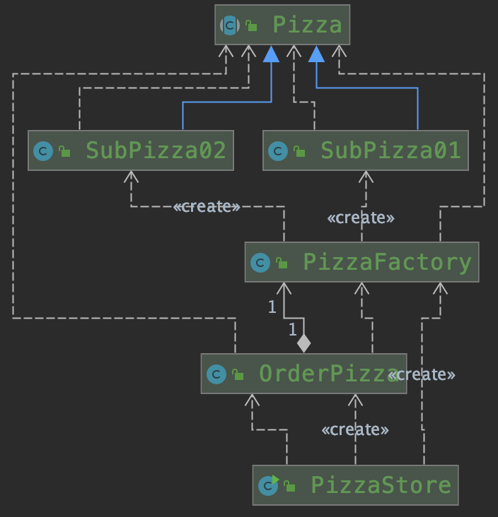
    - 工厂类
        - 参考代码：[/designPattern/dplearn/dplearn-base/src/test/java/com/ljs/learn/pattern/factory/simplefactory/factory/PizzaFactory.java](/designPattern/dplearn/dplearn-base/src/test/java/com/ljs/learn/pattern/factory/simplefactory/factory/PizzaFactory.java)
        - 代码内容
            ```java
            public class PizzaFactory {
                public Pizza create(String orderType){
                    Pizza p = null;
            
                    if (orderType.equals("sub01")){
                        p = new SubPizza01();
                    }else if (orderType.equals("sub02")){
                        p = new SubPizza02();
                    }
                    return p;
                }
            }
            ```
    - 订单类
        - 参考代码：[/designPattern/dplearn/dplearn-base/src/test/java/com/ljs/learn/pattern/factory/simplefactory/order/OrderPizza.java](/designPattern/dplearn/dplearn-base/src/test/java/com/ljs/learn/pattern/factory/simplefactory/order/OrderPizza.java)
            ```java
            public class OrderPizza {
                private PizzaFactory pf;
                public OrderPizza(PizzaFactory pf) {
                    this.pf = pf;
                }
            
                public void order(){
                    Pizza p = null;
                    String orderType;
            
                    do{
                        orderType = getType();
                        // 使用工厂创建pizza
                        p = pf.create(orderType);
                        // 制作pizza
                        if (p != null){
                            p.prepare();
                            p.bake();
                            p.cut();
                            p.box();
                        }else {
                            break;
                        }
                    }while(true);
                }
            
                // 从控制台获取pizza种类
                private String getType(){
                    try {
                        BufferedReader is = new BufferedReader(new InputStreamReader(System.in));
                        System.out.println("input pizza type : ");
                        String type= is.readLine();
                        return type;
                    } catch (IOException e) {
                        e.printStackTrace();
                    }
                    return "";
                }
            }
            ```
    - 披萨店类
        - 参考代码:[/designPattern/dplearn/dplearn-base/src/test/java/com/ljs/learn/pattern/factory/simplefactory/store/PizzaStore.java](/designPattern/dplearn/dplearn-base/src/test/java/com/ljs/learn/pattern/factory/simplefactory/store/PizzaStore.java)
        - 代码内容
            ```java
            public class PizzaStore {
                public static void main(String[] args) {
                    //作为客户端发出pizza的定做任务
                    OrderPizza order = new OrderPizza(new PizzaFactory());
                    order.order();
                }
            }
            ```

## 静态工厂模式
[top](#catalog)
- 基本思路与：[简单工厂模式](#简单工厂模式)基本相同，只是提供逻辑的方法是**静态方法**
- 在使用工厂类的类中，不需要再聚合或组合工厂类对象，直接通过调用工厂类的静态方法来创建对象
- 使用静态工厂模式来修改萨店项目
    - 工厂类
        - 参考代码：[/designPattern/dplearn/dplearn-base/src/test/java/com/ljs/learn/pattern/factory/staticfactory/factory/PizzaFactory.java](/designPattern/dplearn/dplearn-base/src/test/java/com/ljs/learn/pattern/factory/staticfactory/factory/PizzaFactory.java)
        - 代码内容
            ```java
            public class PizzaFactory {
                // 通过静态方法对外提供创建方式
                public static Pizza create(String orderType){
                    Pizza p = null;
            
                    if (orderType.equals("sub01")){
                        p = new SubPizza01();
                    }else if (orderType.equals("sub02")){
                        p = new SubPizza02();
                    }
                    return p;
                }
            }
            ```
    - 订单类
        - 参考代码：[/designPattern/dplearn/dplearn-base/src/test/java/com/ljs/learn/pattern/factory/staticfactory/order/OrderPizza.java](/designPattern/dplearn/dplearn-base/src/test/java/com/ljs/learn/pattern/factory/staticfactory/order/OrderPizza.java)
        - 代码内容
            ```java
            public class OrderPizza {
            
                public void order(){
                    Pizza p = null;
                    String orderType;
            
                    do{
                        orderType = getType();
                        // 使用静态工厂创建pizza
                        p = PizzaFactory.create(orderType);
                        // 制作pizza
                        if (p != null){
                            p.prepare();
                            p.bake();
                            p.cut();
                            p.box();
                        }else {
                            break;
                        }
                    }while(true);
                }
            
                // 从控制台获取pizza种类
                private String getType(){
                    try {
                        BufferedReader is = new BufferedReader(new InputStreamReader(System.in));
                        System.out.println("input pizza type : ");
                        String type= is.readLine();
                        return type;
                    } catch (IOException e) {
                        e.printStackTrace();
                    }
                    return "";
                }
            }
            ```

## 工厂方法模式
[top](#catalog)
- 工厂方法模式：
    - 定义一个创建对象的抽象方法，由子类决定要实例化的类。
    - 工厂方法模式将**对象的实例化推迟到子类中**

- pizza项目中应用工厂方法模式
    - 新需求
        - 原始的需求：客户可以点不同类型的披萨
        - 新需求：客户在点披萨时，可以点**不同地区**的各种披萨

    - 改进方式
        - 方法1：使用简单工厂模式
            - 对应不同的地区，创建不同的简单工厂类，如`ChinaPizzaFactory`、`AmericanPizzaFactory`
            - 但是这种方式**会产生大量的简单工厂类，不利于扩展与维护**
        - 方法2：使用工厂方法模式
            - 不直接使用工厂类，将披萨的实例化功能抽象成抽象方法，在不同口味的订单子类中具体实现
            
- 修改示例
    - 修改方法
        1. 去除工厂类
        2. 在`OrderPizza`中添加抽象方法来创建pizza，创建方法有该类的子类提供实现
        3. 添加`OrderPizza`的子类，并提供方法实现
    - UML图：
        - 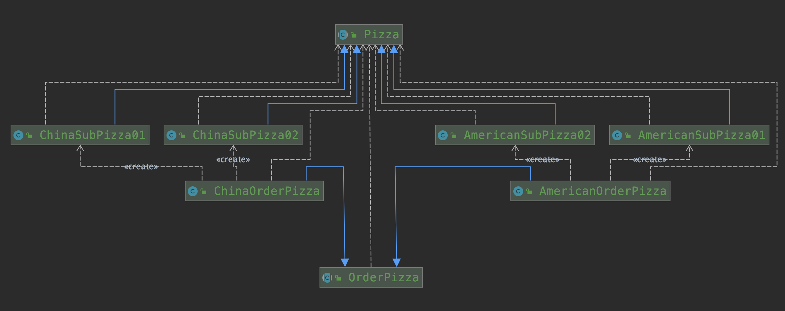
    - 抽象类`OrderPizza`
        - 参考代码：[/designPattern/dplearn/dplearn-base/src/test/java/com/ljs/learn/pattern/factory/factoryMethod/order/OrderPizza.java](/designPattern/dplearn/dplearn-base/src/test/java/com/ljs/learn/pattern/factory/factoryMethod/order/OrderPizza.java)
        - 代码内容
            ```java
            public abstract class OrderPizza {
                // 工厂方法模式，将实现交给子类
                public abstract Pizza createPizza(String orderType);
            
                public void order(){
                    Pizza p = null;
                    String orderType;
            
                    do{
                        orderType = getType();
                        // 使用静态工厂创建pizza
                        p = createPizza(orderType);
                        // 制作pizza
                        if (p != null){
                            p.prepare();
                            p.bake();
                            p.cut();
                            p.box();
                        }else {
                            break;
                        }
                    }while(true);
                }
            
                // 从控制台获取pizza种类
                private String getType(){
                    try {
                        BufferedReader is = new BufferedReader(new InputStreamReader(System.in));
                        System.out.println("input pizza type : ");
                        String type= is.readLine();
                        return type;
                    } catch (IOException e) {
                        e.printStackTrace();
                    }
                    return "";
                }
            }
            ```
    - `OrderPizza`的子类实现
        - 参考代码：[/designPattern/dplearn/dplearn-base/src/test/java/com/ljs/learn/pattern/factory/factoryMethod/order/ChinaOrderPizza.java](/designPattern/dplearn/dplearn-base/src/test/java/com/ljs/learn/pattern/factory/factoryMethod/order/ChinaOrderPizza.java)
        - 代码内容
            ```java
            public class ChinaOrderPizza extends OrderPizza {
                @Override
                public Pizza createPizza(String orderType) {
                    Pizza p = null;
            
                    if (orderType.equals("sub01")){
                        p = new ChinaSubPizza01();
                    }else if (orderType.equals("sub02")){
                        p = new ChinaSubPizza02();
                    }
                    return p;
                }
            }
            ```
        
## 抽象工厂模式
[top](#catalog)
- 什么是抽象工厂模式
    - **定义一个interface用于创建相关或有依赖的对象簇，而无需指明具体的类**
    - 抽象工厂模式可以将简单工厂模式和工厂方法模式进行整合
    - 从设计层面看，抽象工厂模式就是对简单工厂模式和工厂方法模式的进一步抽象
    - 使用时，根据创建对象的类型使用对应的工厂子类，从而将单个简单工厂类变成了工厂簇，更利于维护和扩展
    
- pizza项目中应用工厂方法模式
    - 新需求
        - 原始的需求：客户可以点不同类型的披萨
        - 新需求：客户在点披萨时，可以点**不同地区**的各种披萨
    - 改进方式
        1. 提供一个创建pizza的抽象工厂`AbsFactory`
        2. 提供抽象工厂的实例，分别对应不同地区的pizza：`ChinaFactory`、`AmericanFactory`
        3. 在订单类`OrderPizza`中通过注入不同的工厂实例，来创建不同地区的披萨

- 修改示例
    - UML图
        - 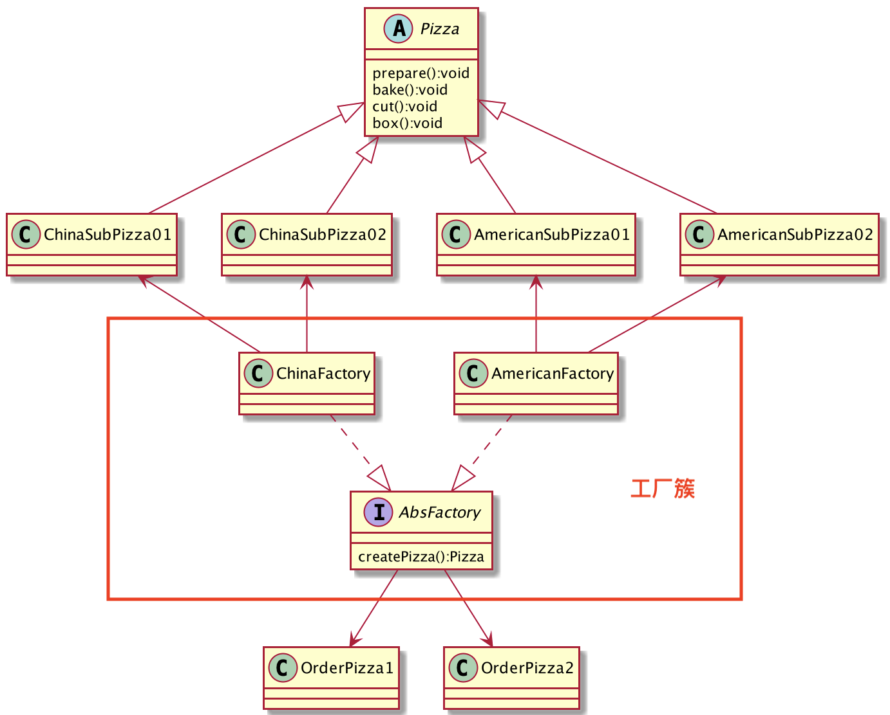
    - 修改之后，当添加新的`OrderPizza`类时，只需要注入抽象工厂`AbsFactory`的实现类即可
    - 抽象工厂及其实现类
        - 参考代码：
            - [/designPattern/dplearn/dplearn-base/src/test/java/com/ljs/learn/pattern/factory/abstractFactory/factory/AbsFactory.java](/designPattern/dplearn/dplearn-base/src/test/java/com/ljs/learn/pattern/factory/abstractFactory/factory/AbsFactory.java)
            - [/designPattern/dplearn/dplearn-base/src/test/java/com/ljs/learn/pattern/factory/abstractFactory/factory/AmericanFactory.java](/designPattern/dplearn/dplearn-base/src/test/java/com/ljs/learn/pattern/factory/abstractFactory/factory/AmericanFactory.java)
            - [/designPattern/dplearn/dplearn-base/src/test/java/com/ljs/learn/pattern/factory/abstractFactory/factory/ChinaFactory.java](/designPattern/dplearn/dplearn-base/src/test/java/com/ljs/learn/pattern/factory/abstractFactory/factory/ChinaFactory.java)
        - 代码内容
            ```java
            // 抽象工厂
            public interface AbsFactory {
                Pizza createPizza(String orderType);
            }
          
            // 抽象工厂的实现类
            public class ChinaFactory implements AbsFactory {
                @Override
                public Pizza createPizza(String orderType) {
                    System.out.println("use ChinaFactory");
                    Pizza p = null;
            
                    if (orderType.equals("sub01")){
                        p = new ChinaSubPizza01();
                    }else if (orderType.equals("sub02")){
                        p = new ChinaSubPizza02();
                    }
                    return p;
                }
            }
          
            // 抽象工厂的实现类
            public class AmericanFactory implements AbsFactory {
                @Override
                public Pizza createPizza(String orderType) {
                    System.out.println("use AmericanFactory");
                    Pizza p = null;
            
                    if (orderType.equals("sub01")){
                        p = new AmericanSubPizza01();
                    }else if (orderType.equals("sub02")){
                        p = new AmericanSubPizza02();
                    }
                    return p;
                }
            }
            ```
    - 订单类
        - 参考代码：[/designPattern/dplearn/dplearn-base/src/test/java/com/ljs/learn/pattern/factory/abstractFactory/order/OrderPizza.java](/designPattern/dplearn/dplearn-base/src/test/java/com/ljs/learn/pattern/factory/abstractFactory/order/OrderPizza.java)
        - 代码内容
            ```java
            public class OrderPizza {
                // 聚合一个抽象工厂子类
                private AbsFactory factory;
            
                public OrderPizza(AbsFactory factory) {
                    this.factory = factory;
                }
            
                public void order(){
                    Pizza p = null;
                    String orderType;
            
                    do{
                        orderType = getType();
                        // 使用抽象工厂的实现类创建pizza
                        p = factory.createPizza(orderType);
                        // 制作pizza
                        if (p != null){
                            p.prepare();
                            p.bake();
                            p.cut();
                            p.box();
                        }else {
                            break;
                        }
                    }while(true);
                }
            
                // 从控制台获取pizza种类
                private String getType(){
                    try {
                        BufferedReader is = new BufferedReader(new InputStreamReader(System.in));
                        System.out.println("input pizza type : ");
                        String type= is.readLine();
                        return type;
                    } catch (IOException e) {
                        e.printStackTrace();
                    }
                    return "";
                }
            }
            ```
        - 披萨店类
            - 参考代码：[/designPattern/dplearn/dplearn-base/src/test/java/com/ljs/learn/pattern/factory/abstractFactory/store/PizzaStore.java](/designPattern/dplearn/dplearn-base/src/test/java/com/ljs/learn/pattern/factory/abstractFactory/store/PizzaStore.java)
            - 代码内容
                ```java
                public class PizzaStore {
                    public static void main(String[] args) {
                        //创建抽象工厂并注入订单类中
                        AbsFactory f = new ChinaFactory();
                        OrderPizza orderPizza = new OrderPizza(f);
                        orderPizza.order();
                    }
                }
                ```     

## 工厂模式在JDK中的应用
[top](#catalog) 
- JDK中的`java.util.Calendar`类中，使用了简单工厂模式
- 使用`Calendar cal = Calendar.getInstance();`获取对象时的创建过程
    ```java
    // 1. 创建单例
    public static Calendar getInstance()
    {
        Locale aLocale = Locale.getDefault(Locale.Category.FORMAT);
        return createCalendar(defaultTimeZone(aLocale), aLocale);
    }
    
    // 2. 通过简单工厂创建实例，但是这里没有直接创建简单工厂类，而是直接通过私有方法封装所有创建逻辑
    private static Calendar createCalendar(TimeZone zone,
                                               Locale aLocale)
    {
        // 根据参数情况，分别封装实例化的逻辑
        CalendarProvider provider =
            LocaleProviderAdapter.getAdapter(CalendarProvider.class, aLocale)
                                 .getCalendarProvider();
        if (provider != null) {
            try {
                return provider.getInstance(zone, aLocale);
            } catch (IllegalArgumentException iae) {
                // fall back to the default instantiation
            }
        }
    
        Calendar cal = null;
    
        if (aLocale.hasExtensions()) {
            String caltype = aLocale.getUnicodeLocaleType("ca");
            if (caltype != null) {
                switch (caltype) {
                case "buddhist":
                cal = new BuddhistCalendar(zone, aLocale);
                    break;
                case "japanese":
                    cal = new JapaneseImperialCalendar(zone, aLocale);
                    break;
                case "gregory":
                    cal = new GregorianCalendar(zone, aLocale);
                    break;
                }
            }
        }
        if (cal == null) {
            // If no known calendar type is explicitly specified,
            // perform the traditional way to create a Calendar:
            // create a BuddhistCalendar for th_TH locale,
            // a JapaneseImperialCalendar for ja_JP_JP locale, or
            // a GregorianCalendar for any other locales.
            // NOTE: The language, country and variant strings are interned.
            if (aLocale.getLanguage() == "th" && aLocale.getCountry() == "TH") {
                cal = new BuddhistCalendar(zone, aLocale);
            } else if (aLocale.getVariant() == "JP" && aLocale.getLanguage() == "ja"
                       && aLocale.getCountry() == "JP") {
                cal = new JapaneseImperialCalendar(zone, aLocale);
            } else {
                cal = new GregorianCalendar(zone, aLocale);
            }
        }
        return cal;
    }
    ```

## 工厂模式总结
[top](#catalog)
- 工厂模式的意义
    - <label style="color:red">将实例化对象的代码提取出来</label>，放到一个类中统一管理和维护，将实例化对象的逻辑与主项目的逻辑解耦，从而提高项目的扩展性和维护性
- 三种工厂模式
    - 简单工厂（可以改造成静态工厂）
    - 工厂方法模式
    - 抽象工厂模式

- 需要遵循设计模式的**依赖倒转**原则
    - 创建对象实例时，将new对象的逻辑封装到工厂的方法中，并返回对象
    - 不要让类继承具体类，而是继承抽象类或者实现interface接口
    - 不要覆盖基类中已经实现的方法
 
# 创建型-原型模式
## 原型模式-引入问题-克隆羊
[top](#catalog)
- 需求
    1. 创建一只羊
    2. 使用第一只羊来克隆其他羊

- 传统方式完成需求
    - UML图
        - 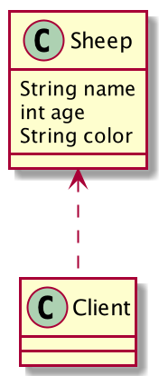
    - Sheep类
        - 提供基本的属性
        - 参考代码：[/designPattern/dplearn/dplearn-base/src/test/java/com/ljs/learn/pattern/prototype/cloneSheep/Sheep.java](/designPattern/dplearn/dplearn-base/src/test/java/com/ljs/learn/pattern/prototype/cloneSheep/Sheep.java)
        - 代码内容
            ```java
            public class Sheep {
                private String name;
                private int age;
                private String color;
            
                public Sheep(String name, int age, String color) {
                    this.name = name;
                    this.age = age;
                    this.color = color;
                }
            
                @Override
                public String toString() {
                    return "Sheep{" +
                            "name='" + name + '\'' +
                            ", age=" + age +
                            ", color='" + color + '\'' +
                            '}';
                }
            
                public String getName() {
                    return name;
                }
            
                public void setName(String name) {
                    this.name = name;
                }
            
                public int getAge() {
                    return age;
                }
            
                public void setAge(int age) {
                    this.age = age;
                }
            
                public String getColor() {
                    return color;
                }
            
                public void setColor(String color) {
                    this.color = color;
                }
            }
            ```
    - Client类
        ```java
        public class ClientTest {
            @Test
            public void test01(){
                // 创建1只羊
                Sheep sheep = new Sheep("aa", 1, "aaaa");
        
                // 克隆2只
                Sheep clone1 = new Sheep(sheep.getName(), sheep.getAge(), sheep.getColor());
                Sheep clone2 = new Sheep(sheep.getName(), sheep.getAge(), sheep.getColor());
        
                System.out.println(sheep);
                System.out.println(clone1);
                System.out.println(clone2);
            }
        }
        ```

- 传统方式的优缺点
    - 优点：容易理解，操作简单
    - 缺点
        - 使用原始对象来克隆新对象时，总是需要获取原始对象的属性，如果对象比较复杂，效率会比较低
        - 每次克隆对象时都需要重新初始化，而不是动态的获取原始对象运行时的状态，当原始对象发生改变时，克隆对象无法作出相同的改变。整体不够灵活


## 原型模式的基本原理
[top](#catalog)
- 什么是原型模式？
    - 用原型实例指定创建对象的种类，并且通过拷贝这些原型来创建新的对象
    - 原型模式允许一个对象再创建另一个可定制的对象，并且无需知道创建的细节
- 原型模式的工作原理
    - 将一个原型对象传给要执行创建的对象，并通过请求原型对象拷贝自身来完成创建过程，即：`原型对象.clone()`
- 原型模式的UML
    - 
- java中原型模式的使用方法
    - 实现`Cloneable`接口，该接口表示该类能够复制且具有复制的能力
    - 可以重写`clone()`方法
        - Object类是所有类的根类，`Object`类提供了一个`clone()`方法，该方法可以将一个Java对象复制一份
    - 使用`clone()`方法克隆对象
    
- 使用原型模式改造克隆羊项目
    - 改造方法
        - `Sheep`实现`Cloneable`接口，并重写`clone()`方法
        - 在`ClientTest`中通过`clone()`方法来克隆对象
    - Sheep类
        - 参考代码：[/designPattern/dplearn/dplearn-base/src/test/java/com/ljs/learn/pattern/prototype/base/Sheep.java](/designPattern/dplearn/dplearn-base/src/test/java/com/ljs/learn/pattern/prototype/base/Sheep.java)
        - 代码内容
            ```java
            public class Sheep implements Cloneable {
                private String name;
                private int age;
                private String color;
            
                public Sheep(String name, int age, String color) {
                    this.name = name;
                    this.age = age;
                    this.color = color;
                }
            
                // 克隆该实例，使用默认的clone方法来完成
                @Override
                protected Object clone()  {
                    Sheep sheep = null;
                    try {
                        sheep = (Sheep) super.clone();
                    } catch (CloneNotSupportedException e) {
                        e.printStackTrace();
                    }
                    return sheep;
                }
              ...
              ...
            }
            ```
    - ClientTest类
        - 参考代码：[/designPattern/dplearn/dplearn-base/src/test/java/com/ljs/learn/pattern/prototype/base/ClientTest.java](/designPattern/dplearn/dplearn-base/src/test/java/com/ljs/learn/pattern/prototype/base/ClientTest.java)
        - 代码内容
            ```java
            @Test
            public void test01(){
                // 创建1只羊
                Sheep sheep = new Sheep("aa", 1, "aaaa");
        
                // 克隆2只
                Sheep clone1 = (Sheep) sheep.clone();
                Sheep clone2 = (Sheep) sheep.clone();
        
                System.out.println(sheep);
                System.out.println(clone1);
                System.out.println(clone2);
            }
            ```

## 浅拷贝和深拷贝
[top](#catalog)
- 浅拷贝
    - 对于基本数据类型的成员变量，浅拷贝会直接进行值传递，也就是将该属性值复制一份给新对象
    - 对于引用数据类型的成员变量，比如成员变量是数组、某个类的对象等，那么浅拷贝会进行引用传递，也就是将该成员变量的引用值(内存地址)复制一份给新的对象
        - 复制后两个对象的成员变量都会指向同一个实例。当一方修改成员变量内部的属性值时会影响到另一方
    - 使用默认的`clone()`就是浅拷贝

- 深拷贝
    - 对于基本数据类型的成员变量直接复制
    - 对于引用数据类型的成员变量，申请内存空间，并复制每个引用数据类型成员变量所引用的对象，直到该对象可达的所有对象。即拷贝整个对象
    - 实现方式
        1. 重写`clone()`方法来实现深拷贝
        2. 通过对象序列化实现深拷贝(**推荐使用**)
            - 类及其内部的引用对象的类可以不实现`Cloneable`接口，但是必须都实现`Serializable`接口
        
- 重写`clone()`方法来实现深拷贝
    - 深拷贝实现类
        - 参考代码：[/designPattern/dplearn/dplearn-base/src/test/java/com/ljs/learn/pattern/prototype/deepCopy/type01/DeepProtoType.java](/designPattern/dplearn/dplearn-base/src/test/java/com/ljs/learn/pattern/prototype/deepCopy/type01/DeepProtoType.java)
        - 该类需要实现序列化接口
        - 代码内容
            ```java
            public class DeepProtoType implements Serializable, Cloneable {
                private static final long serialVersionUID = 1940210468835235379L;
            
                public String name;
                // 一个引用类型的成员属性
                public DeepCloneableTarget target;
            
                public DeepProtoType(String name, DeepCloneableTarget target) {
                    this.name = name;
                    this.target = target;
                }
            
                // 深拷贝方式1：重写clone()方法
                @Override
                protected Object clone()  {
                    // 克隆自身的基本数据类型的成员对象
                    DeepProtoType result = null;
                    try {
                        result = (DeepProtoType) super.clone();
                        // 逐一克隆引用数据类型的成员对象
                        result.target = (DeepCloneableTarget) target.clone();
                    } catch (CloneNotSupportedException e) {
                        e.printStackTrace();
                    }
            
                    return result;
                }
            }
            ```
    - 成员对象类
        - 参考代码：[/designPattern/dplearn/dplearn-base/src/test/java/com/ljs/learn/pattern/prototype/deepCopy/type01/DeepCloneableTarget.java](/designPattern/dplearn/dplearn-base/src/test/java/com/ljs/learn/pattern/prototype/deepCopy/type01/DeepCloneableTarget.java)
        - 成员对象类中也需要实现`Cloneable`接口
        - 代码内容
            ```java
            public class DeepCloneableTarget implements Serializable, Cloneable {
            
                private static final long serialVersionUID = 4688066927065335857L;
                String param1;
                String param2;
            
                public DeepCloneableTarget(String param1, String param2) {
                    this.param1 = param1;
                    this.param2 = param2;
                }
            
                @Override
                protected Object clone(){
                    DeepCloneableTarget result = null;
                    try {
                        result = (DeepCloneableTarget) super.clone();
                    } catch (CloneNotSupportedException e) {
                        e.printStackTrace();
                    }
                    return result;
                }
            }
            ```
    - 测试方法
        - 参考代码：[/designPattern/dplearn/dplearn-base/src/test/java/com/ljs/learn/pattern/prototype/deepCopy/type01/ClientTest.java](/designPattern/dplearn/dplearn-base/src/test/java/com/ljs/learn/pattern/prototype/deepCopy/type01/ClientTest.java)
        - 代码内容
            ```java
            @Test
            public void deepCopyType01(){
                DeepProtoType d1 = new DeepProtoType("aa", new DeepCloneableTarget("bb", "cc"));
                DeepProtoType clone1 = (DeepProtoType) d1.clone();
        
                System.out.println(d1.target.hashCode() == clone1.target.hashCode());
            }
            ```

- 通过对象序列化实现深拷贝
    - 深拷贝实现类
        - 参考代码：[/designPattern/dplearn/dplearn-base/src/test/java/com/ljs/learn/pattern/prototype/deepCopy/type02/DeepProtoType.java](/designPattern/dplearn/dplearn-base/src/test/java/com/ljs/learn/pattern/prototype/deepCopy/type02/DeepProtoType.java)  
        - 代码内容
            ```java
            public class DeepProtoType implements Serializable {
                private static final long serialVersionUID = 1940210468835235379L;
            
                public String name;
                // 一个引用类型的成员属性
                public DeepCloneableTarget target;
            
                public DeepProtoType(String name, DeepCloneableTarget target) {
                    this.name = name;
                    this.target = target;
                }
            
                // 深拷贝方式2：通过对象序列化实现深拷贝
                public Object deepClone(){
                    try (
                        ByteArrayOutputStream bos = new ByteArrayOutputStream();
                        ObjectOutputStream oos = new ObjectOutputStream(bos);
                    ){
                        // 将数据写如临时区
                        oos.writeObject(this);
            
                        try(
                            ByteArrayInputStream bis = new ByteArrayInputStream(bos.toByteArray());
                            ObjectInputStream ois = new ObjectInputStream(bis);
                        ) {
                            // 使用序列化属性重新构造对象
                            return (DeepProtoType)ois.readObject();
                        } catch (ClassNotFoundException e) {
                            e.printStackTrace();
                        }
                    } catch (IOException e) {
                        e.printStackTrace();
                    }
            
                    return null;
                }
            }
            ```
    - 成员对象类
        - 参考代码：[/designPattern/dplearn/dplearn-base/src/test/java/com/ljs/learn/pattern/prototype/deepCopy/type02/DeepCloneableTarget.java](/designPattern/dplearn/dplearn-base/src/test/java/com/ljs/learn/pattern/prototype/deepCopy/type02/DeepCloneableTarget.java)
        - 代码参考
            ```java
            public class DeepCloneableTarget implements Serializable {
                private static final long serialVersionUID = 4688066927065335857L;
                String param1;
                String param2;
            
                public DeepCloneableTarget(String param1, String param2) {
                    this.param1 = param1;
                    this.param2 = param2;
                }
            }
            ```    
    - 测试内容
        - 参考代码：[/designPattern/dplearn/dplearn-base/src/test/java/com/ljs/learn/pattern/prototype/deepCopy/type02/ClientTest.java](/designPattern/dplearn/dplearn-base/src/test/java/com/ljs/learn/pattern/prototype/deepCopy/type02/ClientTest.java)
        - 代码内容
            ```java
            @Test
            public void deepCopyType02(){
                DeepProtoType d1 = new DeepProtoType("aa", new DeepCloneableTarget("bb", "cc"));
                DeepProtoType clone1 = (DeepProtoType) d1.deepClone();
        
                System.out.println(d1.target.hashCode() == clone1.target.hashCode());
            }
            ```
        
## 原型模式的注意事项和细节
[top](#catalog)
- 创建的对象比较复杂时，可以利用原型模式简化创建的过程
- 不用重新始化对象，而是动态地获取对象运行时的状态
- ~~如果原始对象发生变化，如增加或减少属性时，其他克隆对象也会发生相应的变化，无需修改代码~~
- Java原型模式的缺点
    - 需要为每一个类实现`Cloneable`接口，对于已有的类，需要直接修改源代码，违反了ocp原则   

# 创建型-建造者模式
## 建造者模式-引入问题-盖房子
[top](#catalog)
- 需求
    - 需要建房子：这一过程为打桩、砌墙、封顶
    - 房子有各种各样的，如普通房、高楼、别墅，各种房子的过程虽然一样，但是要求不同
- 传统的实现方法
    - 实现方法
        1. 创建接口或抽象类来规范创建过程
        2. 创建接口或抽象类的实现类来负责不同类型房子的创建
        3. 客户端使用不同的实现类来创建房子
    - UML图
        - 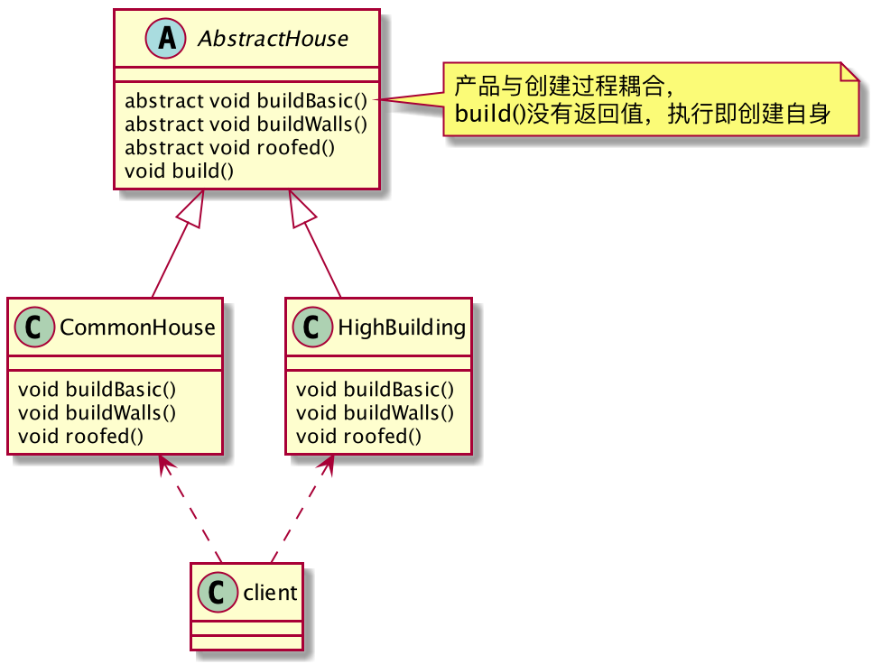
    - 抽象类
        - 参考代码：[/designPattern/dplearn/dplearn-base/src/test/java/com/ljs/learn/pattern/builder/buildHouse/AbstractHouse.java](/designPattern/dplearn/dplearn-base/src/test/java/com/ljs/learn/pattern/builder/buildHouse/AbstractHouse.java)
        - 代码内容
            ```java
            public abstract class AbstractHouse {
                public abstract void buildBasic();
                public abstract void buildWalls();
                public abstract void roofed();
            
                public void build(){
                    buildBasic();
                    buildWalls();
                    roofed();
                }
            }
            ```
    - 实现类
        - 参考代码：[/designPattern/dplearn/dplearn-base/src/test/java/com/ljs/learn/pattern/builder/buildHouse/CommonHose.java](/designPattern/dplearn/dplearn-base/src/test/java/com/ljs/learn/pattern/builder/buildHouse/CommonHose.java)
        - 代码内容
            ```java
            public class CommonHose extends AbstractHouse {
                @Override
                public void buildBasic() {
                    System.out.println("CommonHose buildBasic");
                }
            
                @Override
                public void buildWalls() {
                    System.out.println("CommonHose buildWalls");
                }
            
                @Override
                public void roofed() {
                    System.out.println("CommonHose roofed");
                }
            }
            ```
    - 测试类
        - 参考代码：[/designPattern/dplearn/dplearn-base/src/test/java/com/ljs/learn/pattern/builder/buildHouse/ClientTest.java](/designPattern/dplearn/dplearn-base/src/test/java/com/ljs/learn/pattern/builder/buildHouse/ClientTest.java)
        - 代码内容
            ```java
            @Test
            public void test01(){
                CommonHose commonHose = new CommonHose();
                commonHose.build();
            }
            ```
        
- 传统方法的问题
    - 优点：容易理解，操作简单
    - 缺点
        - 程序结果过于简单，没有设计**缓存层**对象
        - 产品和产品的创建过程被封装在一起，耦合性强，不利于扩展和维护
- 解决的方法
    - 使用建造者模式，将产品和产品的创建过程解耦
    
## 建造者模式简介
[top](#catalog)
- 建造者模式相对与传统方式的优点
    1. 产品与创建过程的解耦
        - 建造者模式**可以将复杂对象的建造过程抽象出来，变成抽象类**，这个抽象类的不同实现方法可以构造出不同表现(属性)的对象
    2. 产品的创建比较方便
        - 建造者模式会一步一步创建一个复杂的对象，它允许用户通过指定复杂对象的类型和内容就可以构建他们，用户不需要知道内部的具体构建细节
    3. 扩展容易
        - 扩展时，无需修改产品类，直接添加一个新的具体建造者
- 建造者模式的4个角色
    1. Product，产品：一个具体的产品对象
    2. Builder，抽象建造者：接口/抽象类，负责指定创建Product对象的流程
    3. ConcreteBuilder，具体建造者：实现Builder，负责各个创建流程的实现，但是**不包含整体的创建流程**
    4. Director，指挥者：
        - 控制建造者，完成产品的整体创建流程（即按顺序调用建造者的方法）
        - 指挥者的两个主要作用：
            1. 隔离客户与产品的生产过程
            2. 控制产品的生产过程

- 建造者模式的原理图
    - 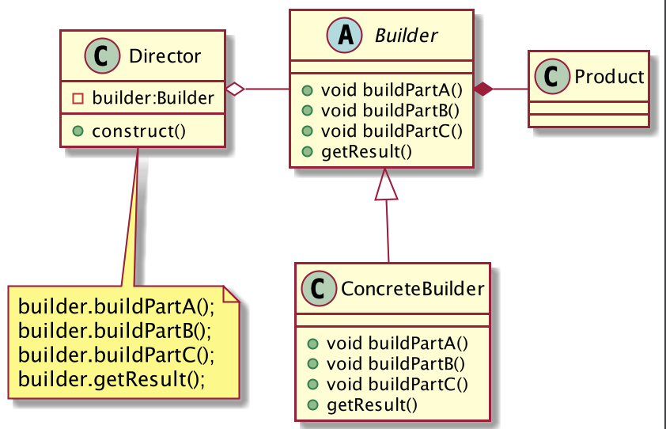
    
## 建造者模式实现引入问题
[top](#catalog)
- 改进方式
    - 将房子作为产品类：`House`
    - 创建一个抽象建造者：`HouseBuilder`，负责指定`House`的各个创建流程
    - 构造具体建造者：`CommonHouseBuilder`、`HightBuildingBuilder`负责具体的创建流程
    - 创建指挥者：`HouseDirector`，通过方法`constructHouse()`来创建具体类型的House
    - 在`Client`中，通过向指挥者`HouseDirector`注入不同的具体建造者，来创建不同的`House`

- UML图
    - 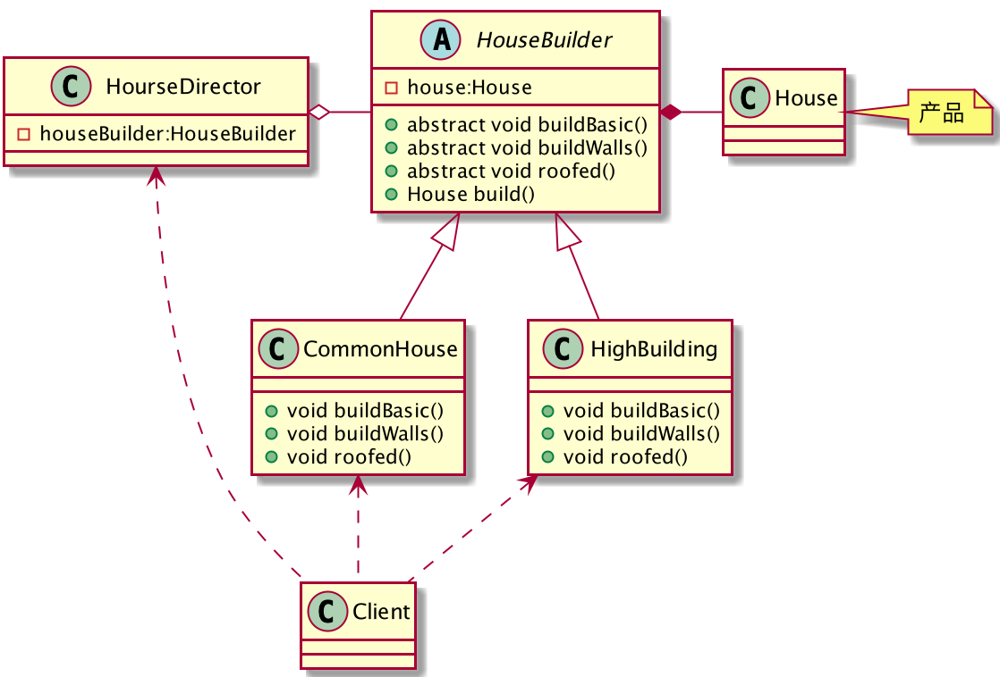

- `Product`产品类
    - 参考代码：[/designPattern/dplearn/dplearn-base/src/test/java/com/ljs/learn/pattern/builder/base/House.java](/designPattern/dplearn/dplearn-base/src/test/java/com/ljs/learn/pattern/builder/base/House.java)
    - 代码内容
        ```java
        public class House {
            private String basic;
            private String wall;
            private String roofed;
        
            @Override
            public String toString() {
                return "House{" +
                        "basic='" + basic + '\'' +
                        ", wall='" + wall + '\'' +
                        ", roofed='" + roofed + '\'' +
                        '}';
            }
        
            public String getBasic() {
                return basic;
            }
        
            public void setBasic(String basic) {
                this.basic = basic;
            }
        
            public String getWall() {
                return wall;
            }
        
            public void setWall(String wall) {
                this.wall = wall;
            }
        
            public String getRoofed() {
                return roofed;
            }
        
            public void setRoofed(String roofed) {
                this.roofed = roofed;
            }
        }
        ```

- `Builder`抽象建造者
    - 参考代码：[/designPattern/dplearn/dplearn-base/src/test/java/com/ljs/learn/pattern/builder/base/HouseBuilder.java](/designPattern/dplearn/dplearn-base/src/test/java/com/ljs/learn/pattern/builder/base/HouseBuilder.java)
    - 代码内容
        ```java
        public abstract class HouseBuilder {
            protected House house = new House();
        
            // 构建流程
            public abstract void buildBasic();
            public abstract void buildWalls();
            public abstract void roofed();
        
            // 获取产品
            public House getHouse (){
                return house;
            }
        }
        ```
    
- `ConcreteBuilder`具体建造者
    - `CommonHouseBuilder`
        - 参考代码：[/designPattern/dplearn/dplearn-base/src/test/java/com/ljs/learn/pattern/builder/base/CommonHouseBuilder.java](/designPattern/dplearn/dplearn-base/src/test/java/com/ljs/learn/pattern/builder/base/CommonHouseBuilder.java)
        
        - 代码内容
            ```java
            public class CommonHouseBuilder extends HouseBuilder {
                @Override
                public void buildBasic() {
                    System.out.println("CommonHouse buildBasic");
                    this.house.setBasic("basic from CommonHouse");
                }
            
                @Override
                public void buildWalls() {
                    System.out.println("CommonHouse buildWalls");
                    this.house.setWall("walls from CommonHouse");
                }
            
                @Override
                public void roofed() {
                    System.out.println("CommonHouse roofed");
                    this.house.setRoofed("roofed from CommonHouse");
                }
            }
            ```
    - `HightBuildingBuilder`
        - 参考代码：[/designPattern/dplearn/dplearn-base/src/test/java/com/ljs/learn/pattern/builder/base/HightBuildingBuilder.java](/designPattern/dplearn/dplearn-base/src/test/java/com/ljs/learn/pattern/builder/base/HightBuildingBuilder.java)
        - 代码内容
            ```java
            public class HightBuildingBuilder extends HouseBuilder {
                @Override
                public void buildBasic() {
                    System.out.println("HightBuilding buildBasic");
                    this.house.setBasic("basic from HightBuilding");
                }
            
                @Override
                public void buildWalls() {
                    System.out.println("HightBuilding buildWalls");
                    this.house.setWall("walls from HightBuilding");
                }
            
                @Override
                public void roofed() {
                    System.out.println("HightBuilding roofed");
                    this.house.setRoofed("roofed from HightBuilding");
                }
            }
            ```

- 指挥者 `HouseDirector`
    - 参考代码
        - [/designPattern/dplearn/dplearn-base/src/test/java/com/ljs/learn/pattern/builder/base/HouseDirector.java](/designPattern/dplearn/dplearn-base/src/test/java/com/ljs/learn/pattern/builder/base/HouseDirector.java)
    - 代码内容
        ```java
        public class HouseDirector {
            private HouseBuilder houseBuilder;

            // 使用构造器聚合Builder
            public HouseDirector(HouseBuilder houseBuilder) {
                this.houseBuilder = houseBuilder;
            }

            // 使用getter、setter聚合Builder
            public HouseBuilder getHouseBuilder() {
                return houseBuilder;
            }

            public void setHouseBuilder(HouseBuilder houseBuilder) {
                this.houseBuilder = houseBuilder;
            }

            // 由指挥者负责处理建造房子的流程
            public House constructHouse(){
                houseBuilder.buildBasic();
                houseBuilder.buildWalls();
                houseBuilder.roofed();

                return houseBuilder.getHouse();
            }

        }
        ```

- 测试内容
    - 参考代码
        - [designPattern/dplearn/dplearn-base/src/test/java/com/ljs/learn/pattern/builder/base/ClientTest.java](designPattern/dplearn/dplearn-base/src/test/java/com/ljs/learn/pattern/builder/base/ClientTest.java)
    - 代码内容
        ```java
        @Test
        public void test01(){
            // 创建普通房子
            CommonHouseBuilder commonBuilder = new CommonHouseBuilder();
            // 准备创建房子的指挥者
            HouseDirector houseDirector = new HouseDirector(commonBuilder);
            // 创建并返回产品对象
            House house01 = houseDirector.constructHouse();

            System.out.println(house01);

            // 创建高楼
            HightBuildingBuilder hightBuilder = new HightBuildingBuilder();
            // 重置指挥者
            houseDirector.setHouseBuilder(hightBuilder);
            House house02 = houseDirector.constructHouse();
            System.out.println(house02);
        }
        ```

## 建造者模式的注意事项和细节
[top](#catalog)
- 客户端不必知道产品内部的组成细节，将产品本身与产品的创建过程解耦，使相同的创建过程可以创建不同的产品对象
- 每一个具体建造者都相对独立，且与其他的建造者无关，因此可以很方便的替换或增加具体建造者。客户端使用不同的具体建造者即可得到不同的产品对象
- 可以更加精细的控制产品的创建过程，将复杂产品的创建步骤分解在不同的方法中，使创建过程更加清晰、更方便使用程序来控制创建过程
- 新增具体建造者无需修改原有代码，指挥者针对抽象建造者编程，系统扩展方便，符合开闭原则
- 建造者模式所创建的<label style="color:red">产品一般具有较多的共同点，其组成部分相似，如果产品之间的差异性很大，则不适合使用建造者模式</label>，因此使用范围受限
- 如果产品的**内部变化复杂**，可能会导致需要**定义很多具体建造者类**来实现这种变化，导致系统变得很庞大。这种情况下，需要考虑是否选择建造者模式
- 抽象工厂 与 建造者
    - 抽象工厂是对一系列产品的创建，具有不同分类纬度的产品组合。采用抽象工厂是不需要关心构建过程，更注重由什么工厂生产产品
    - 建造者是对相似产品的创建，更注重按照指定的构建过程来生产产品
          
## 建造者模式在JDK中的使用-StringBuilder
[top](#catalog)
- StringBuilder的类图
    - 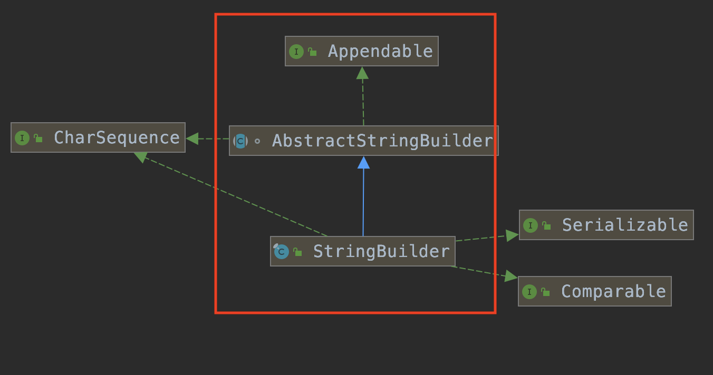
- StringBuilder中的角色分析
    - 产品类：`String`    
    - 抽象建造者：`Appendable`
        - 接口中定义了多个`append`方法，相当于具体的创建流程
            - 方法返回自身，是为了对象复用或链式调用 
        - 源码
            ```java
            public interface Appendable {
                Appendable append(CharSequence csq) throws IOException;
                Appendable append(CharSequence csq, int start, int end) throws IOException;
                Appendable append(char c) throws IOException;
            }
            ```
    - 具体建造者：`AbstractStringBuilder`
        - 该抽象类已经实现了`Appendable`，只是不能实例化
        - 源码
            ```java
            abstract class AbstractStringBuilder implements Appendable, CharSequence {
                  @Override
                  public AbstractStringBuilder append(CharSequence s) {
                      if (s == null) {
                          return appendNull();
                      }
                      if (s instanceof String) {
                          return this.append((String)s);
                      }
                      if (s instanceof AbstractStringBuilder) {
                          return this.append((AbstractStringBuilder)s);
                      }
                      return this.append(s, 0, s.length());
                  }
          
                  @Override
                  public AbstractStringBuilder append(CharSequence s, int start, int end) {
                      if (s == null) {
                          s = "null";
                      }
                      checkRange(start, end, s.length());
                      int len = end - start;
                      ensureCapacityInternal(count + len);
                      if (s instanceof String) {
                          appendChars((String)s, start, end);
                      } else {
                          appendChars(s, start, end);
                      }
                      return this;
                  }
          
                @Override
                public AbstractStringBuilder append(char c) {
                    ensureCapacityInternal(count + 1);
                    if (isLatin1() && StringLatin1.canEncode(c)) {
                        value[count++] = (byte)c;
                    } else {
                        if (isLatin1()) {
                            inflate();
                        }
                        StringUTF16.putCharSB(value, count++, c);
                    }
                    return this;
                }
            }
            ```
          
    - 指挥者：`StringBuilder`
        - `StringBuilder`即是指挥者，又是建造者
        - 建造方法的实现是由`AbstractStringBuilder`提供的
        - 源码
            ```java
            public final class StringBuilder
                extends AbstractStringBuilder
                implements java.io.Serializable, Comparable<StringBuilder>, CharSequence{
          
                @Override
                public StringBuilder append(CharSequence s) {
                    super.append(s);
                   return this;
                }
          
                @Override
                public StringBuilder append(CharSequence s, int start, int end) {
                    super.append(s, start, end);
                    return this;
                }
          
                @Override
                @HotSpotIntrinsicCandidate
                public StringBuilder append(char c) {
                    super.append(c);
                    return this;
                }
            }
            ```


# 结构型-适配器模式
## 适配器模式简介
[top](#catalog)
- 适配器模式也被称为包装器(Wrapper)
- 适配器模式（Adapter Pattern）的作用
    - 将某个类的接口转化成客户端希望的另一个接口，主要目的是兼容性，让原本接口不匹配、不能一起工作的两个类可以协同工作
- 适配器模式中的角色
    - 被适配者：src
    - 适配器：adapter
    - 目标类接口：dst
- 适配器模式的3种经典分类，是根据src是如何交给Adapter来区分的，**但是实际开发中不只限于这3中方式**
    1. 类适配器模式
    2. 对象适配器模式
    3. 接口适配器模式
    
- 适配器模式的工作原理
    - 将一个类的接口转换成另一种接口，让原本接口不兼容的类可以兼容
        - 即：dst<--adapter<--src
    - 从用户角度，看不到被适配者，是解耦的
    - 用户调用适配器转换后的目标接口方法，然后适配器再调用被适配者的相关接口方法
    - 用收到反馈结果，感觉只是和目标接口交互
    
## 类适配器模式
### 类适配器模式的使用方法
[top](#catalog)
- 使用方法
    - Adapter类，通过继承src类，实现dst类接口，完成src-->dst的适配
- 示例：手机充电器
    - 需求
        - 默认提供的电压是220V，手机充电需要的是5V
        - 通过充电器将220V电压转化为5V的电压，为手机供电
    - 实现方法
        - 创建被适配者，220V电压类：`Voltage220V`
        - 创建目标接口，5V电压接口：`IVoltage5V`
        - 手机类：`Phone`，`charging`方法只能接收**5V电压接口实现类的供电**
        - 创建适配器，`VoltageAdapter`，同时继承`Voltage220V`，并实现`IVoltage5V`接口，在内部完成220V-->5V的转化
    - UML图
        - 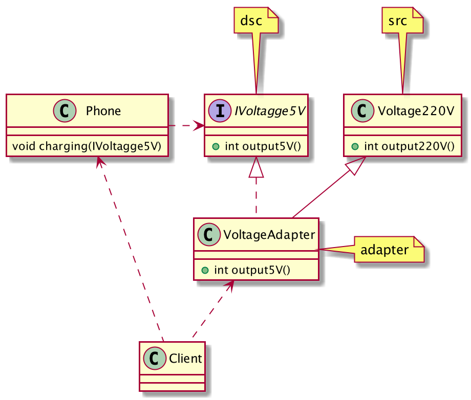

    - 被适配者`Voltage220V`
        - 参考代码：[/designPattern/dplearn/dplearn-base/src/test/java/com/ljs/learn/pattern/adapter/classAdapter/chargePhone/Voltage220V.java](/designPattern/dplearn/dplearn-base/src/test/java/com/ljs/learn/pattern/adapter/classAdapter/chargePhone/Voltage220V.java)
        - 代码内容
            ```java
            public class Voltage220V {
                public int output220V(){
                    int src = 220;
                    System.out.println("Voltage220V output");
                    return src;
                }
            }
            ```
    - 目标接口
        - 参考代码:[/designPattern/dplearn/dplearn-base/src/test/java/com/ljs/learn/pattern/adapter/classAdapter/chargePhone/IVoltagge5V.java](/designPattern/dplearn/dplearn-base/src/test/java/com/ljs/learn/pattern/adapter/classAdapter/chargePhone/IVoltagge5V.java)
        - 代码内容
            ```java
            public interface IVoltagge5V {
                public int output5V();
            }
            ```
    - 适配器
        - 参考代码：[/designPattern/dplearn/dplearn-base/src/test/java/com/ljs/learn/pattern/adapter/classAdapter/chargePhone/VoltageAdapter.java](/designPattern/dplearn/dplearn-base/src/test/java/com/ljs/learn/pattern/adapter/classAdapter/chargePhone/VoltageAdapter.java)
        - 代码内容
            ```java
            public class VoltageAdapter extends Voltage220V implements IVoltagge5V {
                @Override
                public int output5V() {
                    // 获取被适配对象的电压
                    int src = output220V();
                    //将电压转换为5伏
                    int dst = src/44;
            
                    System.out.println("Adapter = " + dst + "V");
                    return dst;
                }
            }
            ```
    - 手机类
        - 参考代码：[/designPattern/dplearn/dplearn-base/src/test/java/com/ljs/learn/pattern/adapter/classAdapter/chargePhone/Phone.java](/designPattern/dplearn/dplearn-base/src/test/java/com/ljs/learn/pattern/adapter/classAdapter/chargePhone/Phone.java)
        - 代码内容
            ```java
            public class Phone {
                public void charging(IVoltagge5V iVoltagge5V){
                    if (iVoltagge5V.output5V() == 5)
                        System.out.println("Voltagge = 5V,charging");
                    else
                        System.out.println("Voltagge != 5V,can't charge");
                }
            }
            ```
    - 测试类
        - 参考代码：[/designPattern/dplearn/dplearn-base/src/test/java/com/ljs/learn/pattern/adapter/classAdapter/chargePhone/ClientTest.java](/designPattern/dplearn/dplearn-base/src/test/java/com/ljs/learn/pattern/adapter/classAdapter/chargePhone/ClientTest.java)
        - 代码内容
            ```java
            @Test
            public void test01(){
                Phone phone = new Phone();
                // 直接提供适配器对象，将220V电压转化为5V
                phone.charging(new VoltageAdapter());
            }
            ```
        
### 类适配器模式的注意事项和细节
[top](#catalog)   
- 缺点
    - 适配器需要继承src类，dst必须是接口，有一定的局限性
    - src类的方法在Adapter中都会暴露出来，增加了使用的成本
- 优点
    - adapter继承了src类，所以可以根据需要重写src类的方法，增加了adapter类的灵活性 
    
## 对象适配器
### 对象配器模式的使用方法
[top](#catalog)
- 使用方法
    - adapter**聚合src类的实例**，并实现dst接口，完成src-->dst的适配
- adapter放弃了继承，而是聚合被适配者。符合合成复用原则，使用关联关系来替代继承关系
- **对象适配器是适配器模式常用的一种**
- 示例：手机充电器
    - 需求
        - 默认提供的电压是220V，手机充电需要的是5V
        - 通过充电器将220V电压转化为5V的电压，为手机供电
    - 实现方法
        - 创建被适配者，220V电压类：`Voltage220V`
        - 创建目标接口，5V电压接口：`IVoltage5V`
        - 手机类：`Phone`，`charging`方法只能接收**5V电压接口实现类的供电**
        - 创建适配器，`VoltageAdapter`，实现`IVoltage5V`接口。内部聚合`Voltage220V`实例对象，完成220V-->5V的转化
    - UML图
        - 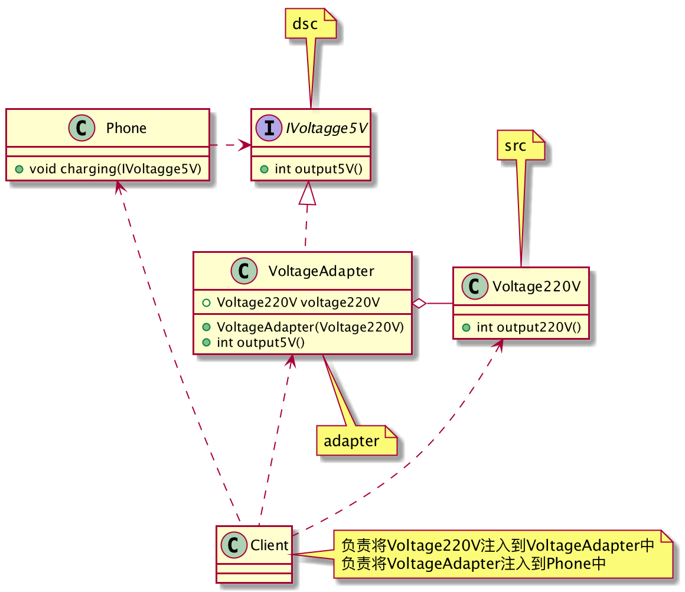

    - 被适配者`Voltage220V`
        - 参考代码：[/designPattern/dplearn/dplearn-base/src/test/java/com/ljs/learn/pattern/adapter/objAdapter/chargePhone/Voltage220V.java](/designPattern/dplearn/dplearn-base/src/test/java/com/ljs/learn/pattern/adapter/objAdapter/chargePhone/Voltage220V.java)
        - 代码内容
            ```java
            public class Voltage220V {
                public int output220V(){
                    int src = 220;
                    System.out.println("Voltage220V output");
                    return src;
                }
            }
            ```
    - 目标接口
        - 参考代码:[/designPattern/dplearn/dplearn-base/src/test/java/com/ljs/learn/pattern/adapter/objAdapter/chargePhone/IVoltagge5V.java](/designPattern/dplearn/dplearn-base/src/test/java/com/ljs/learn/pattern/adapter/objAdapter/chargePhone/IVoltagge5V.java)
        - 代码内容
            ```java
            public interface IVoltagge5V {
                public int output5V();
            }
            ```
    - 适配器
        - 参考代码：[/designPattern/dplearn/dplearn-base/src/test/java/com/ljs/learn/pattern/adapter/objAdapter/chargePhone/VoltageAdapter.java](/designPattern/dplearn/dplearn-base/src/test/java/com/ljs/learn/pattern/adapter/objAdapter/chargePhone/VoltageAdapter.java)
        - 代码内容
            ```java
            public class VoltageAdapter implements IVoltagge5V {
                private Voltage220V voltage220V;
            
                public VoltageAdapter(Voltage220V voltage220V) {
                    this.voltage220V = voltage220V;
                }
            
                @Override
                public int output5V() {
                    // 获取被适配对象的电压
                    int src = voltage220V.output220V();
                    //将电压转换为5伏
                    int dst = src/44;
            
                    System.out.println("Adapter = " + dst + "V");
                    return dst;
                }
            }
            ```
    - 手机类
        - 参考代码：[/designPattern/dplearn/dplearn-base/src/test/java/com/ljs/learn/pattern/adapter/objAdapter/chargePhone/Phone.java](/designPattern/dplearn/dplearn-base/src/test/java/com/ljs/learn/pattern/adapter/objAdapter/chargePhone/Phone.java)
        - 代码内容
            ```java
            public class Phone {
                public void charging(IVoltagge5V iVoltagge5V){
                    if (iVoltagge5V.output5V() == 5)
                        System.out.println("Voltagge = 5V,charging");
                    else
                        System.out.println("Voltagge != 5V,can't charge");
                }
            }
            ```
    - 测试类
        - 参考代码：[/designPattern/dplearn/dplearn-base/src/test/java/com/ljs/learn/pattern/adapter/objAdapter/chargePhone/ClientTest.java](/designPattern/dplearn/dplearn-base/src/test/java/com/ljs/learn/pattern/adapter/objAdapter/chargePhone/ClientTest.java)
        - 代码内容
            ```java
            @Test
            public void test01(){
                Phone phone = new Phone();
                // 将Voltage220V注入到VoltageAdapter中
                // 将VoltageAdapter注入到Phone中
                phone.charging(new VoltageAdapter(new Voltage220V()));
            }
            ```
### 对象配器模式的注意事项和细节
[top](#catalog)
- 对象适配器和类适配器是用一种思想，只是现实方式不同
- 对象适配器根据合成复用原则，使用聚合替代继承，所以它解决了类适配器必须继承src的局限性问题，也不再要求dst必须是接口
- 对象适配器的成本更低，更灵活

## 接口适配器模式
### 接口配器模式的使用方法
[top](#catalog)
- 接口适配器也被成为缺省适配器
- 使用场景
    - 只使用目标接口的部分方法，不需要实现目标接口的全部方法
- 使用方法
    1. 创建一个抽象类实现目标接口的所有方法，并为接口中的每个方法提供一个默认实现，即**空方法**
    2. 创建抽象类的子类，有选择的覆盖父类中的部分方法来实现需求

- UML
    - 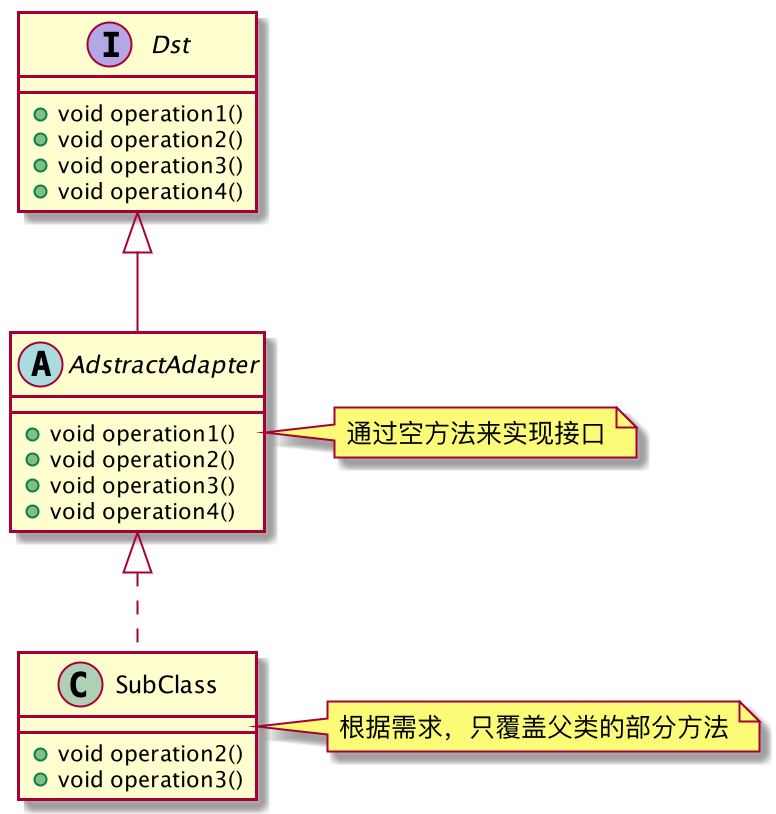


## 适配器模式在SpringMVC中的应用
[top](#catalog)

??????
P64


# 结构型-桥接模式
## 桥接模式-引入问题-多品牌手机管理
[top](#catalog)
- 需求
    - 实现对不同手机类型的不同品牌实现操作编程，包括：开机、关机、上网、打电话等
    - 不同手机类型及其品牌
        - 折叠式
            - 华为
            - 小米
            - vivo
        - 直立式
            - 华为
            - 小米
            - vivo
        - 滑盖式
            - 华为
            - 小米
            - vivo
            
- 传统的设计方式
    - UML图
        - 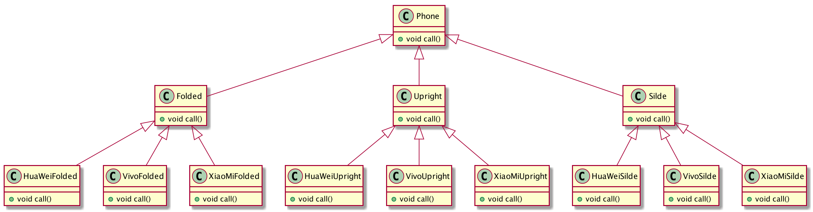 

- 传统设计方式的缺点
    - 扩展性问题，类爆炸
        - 每次新增一种手机类型时，都需要为该类型编写所有品牌的子类
        - 当新增一个手机品牌时，需要同时在每个手机类型下添加子类
    - 违反单一职责原则
        - 当增加手机样式时，需要同时增加所有品牌的手机，增加了代码维护的成本
           
## 桥接模式简介
[top](#catalog)
- 桥接模式的目的
    - 分离抽象与实现，并放在不同的层次中，保持两个层次的独立性和扩展性
- 桥接模式基于**单一职责原则**，使用封装、聚合、继承等行为让不同类承担不同的职责
- 桥接模式的原理
    - 原理UML图
        - 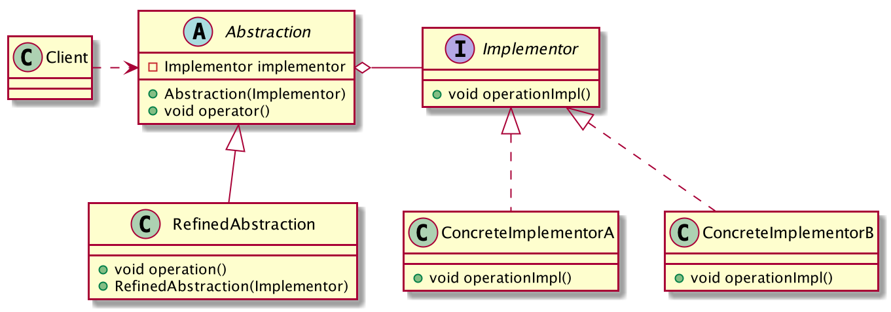

    - 角色说明
        - `Client`：桥接模式的调用者
        - `Abstraction`，抽象类
            - `Abstraction`和`Implementor`是聚合关系，`Abstraction`维护了`Implementor`的实现类
            - `Abstraction`充当桥接类
        - `RefinedAbstraction`：`Abstraction`的子类
        - `Implementor`：行为实现类的接口
        - `ConcreteImplementor`：行为的具体实现类
    - 原理说明
        - 在UML图中，抽象类和接口是聚合的关系，本质是调用者和被调用关系
        
## 桥接模式实现引入问题
[top](#catalog)
- 改进方式
    - 实现部分
        - 创建手机品牌接口：`Brand`，并创建该接口的实例:`XiaoMi`、`Vivo`
    - 抽象部分
        - 创建手机(类型)抽象类`Phone`，内部聚合手机品牌`Brand`
        - 创建抽象类`Phone`的子类：`FoldedPhone`、`UprightPhone`，实现不同的手机类型
    - 抽象与实现之间的桥接
        - `Brand`、`Brand`的实现类，Phone`、Phone`的子类，都实现相同的方法，其中使用`Phone`充当Bridge，在`Phone`子类的方法中直接调用父类的方法，然后`Phone`在调用聚合的`Brand`实例的对应方法
        - 最终将手机的类型、品牌分离，并通过`Phone`进行桥接
    - 使用Client时，将`Brand`注入到`Phone`的子类中
- UML图
    - 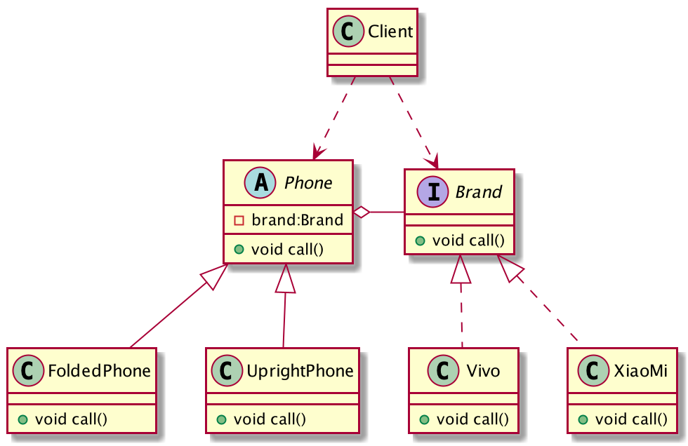

- `Brand`及其实现类
    - 参考代码
        - [/designPattern/dplearn/dplearn-base/src/test/java/com/ljs/learn/pattern/bridge/base/Brand.java](/designPattern/dplearn/dplearn-base/src/test/java/com/ljs/learn/pattern/bridge/base/Brand.java)
        - [/designPattern/dplearn/dplearn-base/src/test/java/com/ljs/learn/pattern/bridge/base/Vivo.java](/designPattern/dplearn/dplearn-base/src/test/java/com/ljs/learn/pattern/bridge/base/Vivo.java)
        - [/designPattern/dplearn/dplearn-base/src/test/java/com/ljs/learn/pattern/bridge/base/XiaoMi.java](/designPattern/dplearn/dplearn-base/src/test/java/com/ljs/learn/pattern/bridge/base/XiaoMi.java)
    - 代码内容
        ```java
        public interface Brand {
            void open();
            void close();
            void call();
        }
      
        public class XiaoMi implements Brand {
            @Override
            public void open() {
                System.out.println("XiaoMi open");
            }
        
            @Override
            public void close() {
                System.out.println("XiaoMi close");
            }
        
            @Override
            public void call() {
                System.out.println("XiaoMi call");
            }
        }
      
        public class Vivo implements Brand {
            @Override
            public void open() {
                System.out.println("Vivo open");
            }
        
            @Override
            public void close() {
                System.out.println("Vivo close");
            }
        
            @Override
            public void call() {
                System.out.println("Vivo call");
            }
        }
        ```

- `Phone`及其子类
    - 参考代码
        - [/designPattern/dplearn/dplearn-base/src/test/java/com/ljs/learn/pattern/bridge/base/Phone.java](/designPattern/dplearn/dplearn-base/src/test/java/com/ljs/learn/pattern/bridge/base/Phone.java)
        - [/designPattern/dplearn/dplearn-base/src/test/java/com/ljs/learn/pattern/bridge/base/FoldedPhone.java](/designPattern/dplearn/dplearn-base/src/test/java/com/ljs/learn/pattern/bridge/base/FoldedPhone.java)
        - [/designPattern/dplearn/dplearn-base/src/test/java/com/ljs/learn/pattern/bridge/base/UprightPhone.java](/designPattern/dplearn/dplearn-base/src/test/java/com/ljs/learn/pattern/bridge/base/UprightPhone.java)
    - 代码内容
        ```java
        public abstract class Phone {
            private Brand brand;
        
            public Phone(Brand brand) {
                this.brand = brand;
            }
        
            protected void open(){
                this.brand.open();
            }
        
            protected void close(){
                this.brand.close();
            }
        
            protected void call(){
                this.brand.call();
            }
        }
      
        // 折叠手机类
        public class FoldedPhone extends Phone {
            public FoldedPhone(Brand brand) {
                super(brand);
            }
        
            @Override
            protected void open() {
                super.open();
                System.out.println("FoldedPhone open");
            }
        
            @Override
            protected void close() {
                super.close();
                System.out.println("FoldedPhone close");
            }
        
            @Override
            protected void call() {
                super.call();
                System.out.println("FoldedPhone call");
            }
        }
        
        // 直立式手机类
        public class UprightPhone extends Phone {
            public UprightPhone(Brand brand) {
                super(brand);
            }
        
            @Override
            protected void open() {
                super.open();
                System.out.println("UprightPhone open");
            }
        
            @Override
            protected void close() {
                super.close();
                System.out.println("UprightPhone close");
            }
        
            @Override
            protected void call() {
                super.call();
                System.out.println("UprightPhone call");
            }
        }
        ```
      
- 测试类
    - 参考代码:[/designPattern/dplearn/dplearn-base/src/test/java/com/ljs/learn/pattern/bridge/base/ClientTest.java](/designPattern/dplearn/dplearn-base/src/test/java/com/ljs/learn/pattern/bridge/base/ClientTest.java)
    - 代码内容
        ```java
        @Test
        public void test01(){
            Phone foldedPhone = new FoldedPhone(new XiaoMi());
            foldedPhone.open();
            foldedPhone.call();
            foldedPhone.close();
    
            System.out.println("-----------------");
    
            FoldedPhone foldedPhone2 = new FoldedPhone(new Vivo());
            foldedPhone2.open();
            foldedPhone2.call();
            foldedPhone2.close();
    
            System.out.println("-----------------");
    
            UprightPhone uprightPhone = new UprightPhone(new XiaoMi());
            uprightPhone.open();
            uprightPhone.call();
            uprightPhone.close();
        }
        ```
      
## 桥接模式的注意事项和细节
[top](#catalog)
- **桥接模式完成了抽象与实现的分离**，提高了系统的灵活性，有助于系统进行分层设计
- 对于系统高层部分，只需要知道抽象部分和实现部分接口就可以了，其他部分有具体业务完成
- 桥接模式替代多层继承方案，可以减少子类的个数，降低系统的管理和维护成本
- 桥接模式的引入增加了系统给的理解和设计难度，由于聚合关联关系建立在抽象层，要求开发者针对抽象进行设计和编程
- 桥接模式要求正确识别出系统中两个独立变化的纬度，因此使用范围有一定的局限性，即需要有这样的应用场景
- 桥接模式的应用场景
    - 对于那些不希望使用继承或因为多层次继承导致系统类的个数急剧增加的系统
    - 常见场景
        - JDBC驱动
        - 银行转账
            - 转账分类(抽象部分):网上转账、柜台转账、ATM转账
            - 转账用户类型(实现部分):普通用户，Vip用户
        - 消息管理
            - 消息类型(抽象部分):即使消息、延时消息
            - 消息分类(实现部分):手机短信、邮件、qq信息
            


## JDBC中的桥接模式
[top](#catalog)
- UML类图
    - 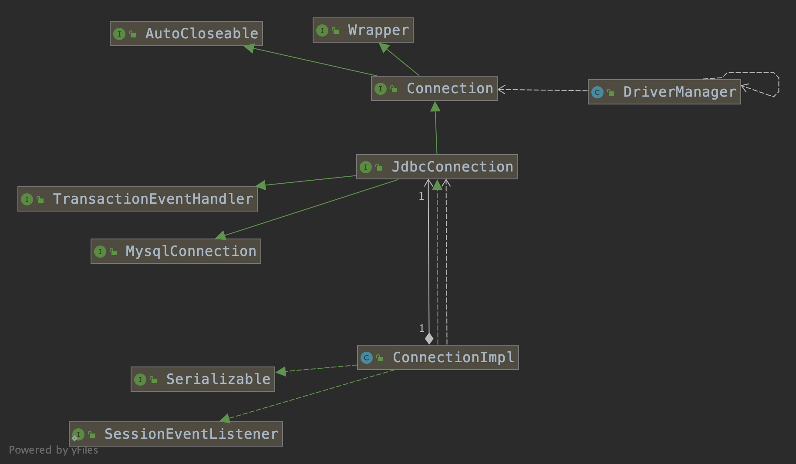
- 分析
    - `Connection`接口及其子类(各种数据库的实现)相当于桥接模式的接口部分
    - `DriverManage`类相当于桥接模式中的类及其子类，只不过这里没有子类，全部子类的功能和桥接的部分全部由`DriverManage`负责
    - 执行`DriverManage.registerDriver(driver)`时，相当于实例化时的接口类注入


# 结构型-装饰器模式
## 装饰器模式-引入问题-咖啡订单
[top](#catalog)
- 需求
    - 咖啡：Espresso(意大利浓咖啡)、ShortBlack、LongBlack(美式咖啡)、Decaf(无因咖啡)
    - 调料：Milk、Soy(豆浆)、Chocolate
    - 要求在扩展新的咖啡种类时，具有良好的扩展性、改动方便、维护方便
    - 使用OO来计算不同种类咖啡的费用：用户可以点咖啡、也可以点咖啡+调料的组合
- 解决方案
    - 解决方案1
        - UML
            - 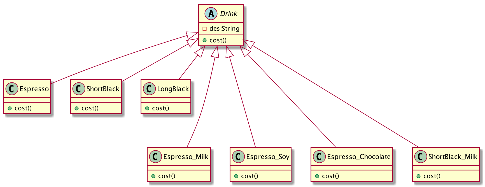
        - 分析
            - 抽象类`Drink`表示饮料
                - `des`表示对咖啡的描述
                - `cost()`计算费用
            - 咖啡作为子类继承`Drink`并提供`cost`的实现
            - 咖啡+调料也作为子类继承`Drink`并提供`cost`的实现
        - 方案1的问题
            - 咖啡和调料的组合会产生大量的类
            - 当增加一种咖啡或新的调料时，类的数量会倍增，会导致类爆炸
    - 解决方案2
        - UML
            - 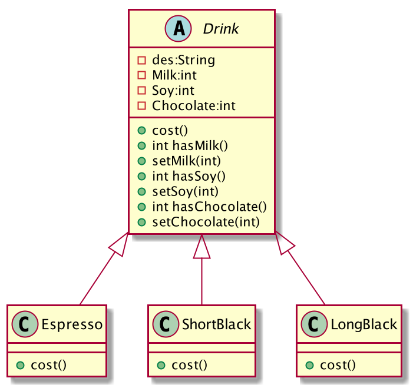
        - 分析
            - 在Drink中内置调料，并添加对应的方法设置调料数量，和返回调料数量
            - 各子类在各自的子类中设置计算方式，并对调料进行逐个的判断、计算
        - 方案2的优缺点
            - 优点：可以控制类的数量，不会导致类爆炸
            - 缺点： 在增加或者删除调料种类时，代码的维护量很大，需要从各个子类中清除对应的调料计算方法
            
## 装饰者模式简介
[top](#catalog)
- 装饰者模式的目的：**动态的将新功能附加到对象上**
    - 在对象功能扩展方面，比继承更有弹性。装饰者模式体现了开闭原则
- 装饰者模式的原理
    - 装饰者模式中的角色
        - `Component`: 抽象主体
        - `ConcreteComponent`: 具体的主体
        - `Decorator`: 装饰者
        - `ConcreteDecorator`: 具体的装饰者
    - 原理UML图
        - 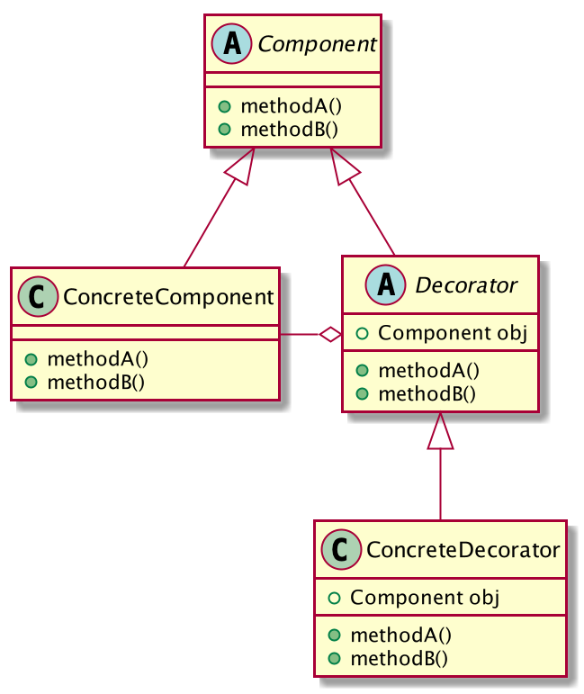
    - Decorator是装饰类，含有一个被装饰的对象，即Component类对象
    - 通过在装饰者中聚合一个主体，可以直接为主体添加新的功能
        - **每次实例化一个装饰者，并传入被装饰者，即可获取新的功能**
    
    - Decorotar的`cost()`方法进行费用计算。使用时会递归的计算价格

    - 进行多层装饰之后，调用发方法时，会通过递归调用来完成
    
## 装饰者模式实现引入问题
[top](#catalog)
- 改进方法
    - 构建主体部分
        - `Drink`作为抽象主体
        - 提供各种咖啡作为`Drink`的子类。在中间额外添加一层`Coffee`，封装通用部分
    - 构建装饰者
        - `Decorator`继承`Drink`类，内部聚合另一个`Drink`类对象，作为抽象装饰者。并对`cost`进行重写，添加新的功能
        - 调味料作为`Decorator`的子类   
    - 使用时，将调味料作为装饰者，包装咖啡，来动态提供新的功能
- UML图
    - 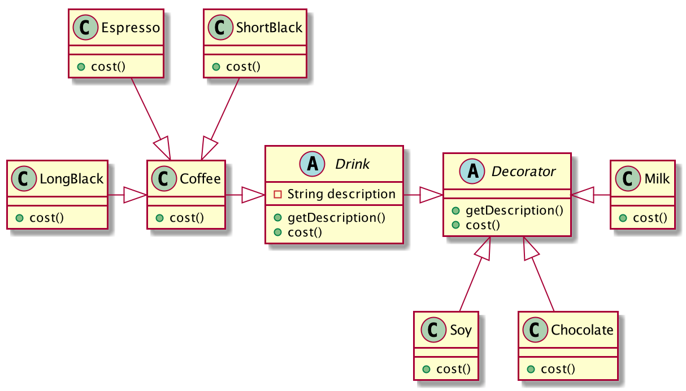

- 使用装饰者模式后的订单示例:2份巧克力+1份牛奶的LongBlack
    - 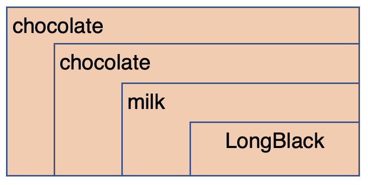
    - 说明
        - Milk包含了LongBlack
        - 一个Chocolate包含了：Milk + LongBlack
        - 另一个Chocolate包含了：Chocolate + Milk + LongBlack
- 通过层层包含的方式，无论是什么形式的咖啡+调料，都可以通过递归方式来组合和维护
    
- 抽象主体及具体主体
    - 参考代码
        - [/designPattern/dplearn/dplearn-base/src/test/java/com/ljs/learn/pattern/decorator/base/Drink.java](/designPattern/dplearn/dplearn-base/src/test/java/com/ljs/learn/pattern/decorator/base/Drink.java)
        - [/designPattern/dplearn/dplearn-base/src/test/java/com/ljs/learn/pattern/decorator/base/Coffee.java](/designPattern/dplearn/dplearn-base/src/test/java/com/ljs/learn/pattern/decorator/base/Coffee.java)
        - [/designPattern/dplearn/dplearn-base/src/test/java/com/ljs/learn/pattern/decorator/base/Espresso.java](/designPattern/dplearn/dplearn-base/src/test/java/com/ljs/learn/pattern/decorator/base/Espresso.java)
        - [/designPattern/dplearn/dplearn-base/src/test/java/com/ljs/learn/pattern/decorator/base/LongBlack.java](/designPattern/dplearn/dplearn-base/src/test/java/com/ljs/learn/pattern/decorator/base/LongBlack.java)
        - [/designPattern/dplearn/dplearn-base/src/test/java/com/ljs/learn/pattern/decorator/base/ShortBlack.java](/designPattern/dplearn/dplearn-base/src/test/java/com/ljs/learn/pattern/decorator/base/ShortBlack.java)
    - 代码内容
        ```java
        public abstract class Drink {
            // 描述
            public String des;
            // 单价
            private float price = 0.0f;
        
            public String getDes() {
                return des;
            }
        
            public void setDes(String des) {
                this.des = des;
            }
        
            public float getPrice() {
                return price;
            }
        
            public void setPrice(float price) {
                this.price = price;
            }
        
            // 计算费用的抽象方法
            public abstract float cost();
        }
        ```
        ```java
        public class Coffee extends Drink {
            // 金额默认是父类的单价
            @Override
            public float cost() {
                return super.getPrice();
            }
        }
        ```
        ```java
        public class Espresso extends Coffee {
            public Espresso() {
                setDes("Espresso");
                setPrice(10.0f);
            }
        }
        ```
        ```java
        public class LongBlack extends Coffee {
            public LongBlack() {
                setDes("LongBlack");
                setPrice(30.0f);
            }
        }
        ```
        ```java
        public class ShortBlack extends Coffee {
            public ShortBlack() {
                setDes("ShortBlack");
                setPrice(20.0f);
            }
        }
        ```  
      
- 装饰者
    - 参考代码
        - [/designPattern/dplearn/dplearn-base/src/test/java/com/ljs/learn/pattern/decorator/base/Decorator.java](/designPattern/dplearn/dplearn-base/src/test/java/com/ljs/learn/pattern/decorator/base/Decorator.java)
        - [/designPattern/dplearn/dplearn-base/src/test/java/com/ljs/learn/pattern/decorator/base/Milk.java](/designPattern/dplearn/dplearn-base/src/test/java/com/ljs/learn/pattern/decorator/base/Milk.java)
        - [/designPattern/dplearn/dplearn-base/src/test/java/com/ljs/learn/pattern/decorator/base/Soy.java](/designPattern/dplearn/dplearn-base/src/test/java/com/ljs/learn/pattern/decorator/base/Soy.java)
        - [/designPattern/dplearn/dplearn-base/src/test/java/com/ljs/learn/pattern/decorator/base/Coffee.java](/designPattern/dplearn/dplearn-base/src/test/java/com/ljs/learn/pattern/decorator/base/Coffee.java)
    - 代码内容
        ```java
        public class Decorator extends Drink {
            private Drink obj;
        
            public Decorator(Drink obj) {
                this.obj = obj;
            }
        
            @Override
            public float cost() {
                return super.getPrice() + obj.cost();
            }
        
            @Override
            public String getDes() {
                return this.des +getPrice() + "&&" + obj.getDes();
            }
        }
        ```
        ```java
        public class Milk extends Decorator {
            public Milk(Drink obj) {
                super(obj);
                setDes("Milk");
                setPrice(2.0f);
            }
        }
        ```
        ```java
        public class Soy extends Decorator {
            public Soy(Drink obj) {
                super(obj);
                setDes("Soy");
                setPrice(3.0f);
            }
        }
        ```
        ```java
        public class Chocolate extends Decorator {
            public Chocolate(Drink obj) {
                super(obj);
                setDes("Chocolate");
                setPrice(5.0f);
            }
        }
        ```
      
- 测试类
    - 参考代码：[/designPattern/dplearn/dplearn-base/src/test/java/com/ljs/learn/pattern/decorator/base/ClientTest.java](/designPattern/dplearn/dplearn-base/src/test/java/com/ljs/learn/pattern/decorator/base/ClientTest.java)
    - 代码内容
        ```java
        @Test
        public void test01(){
            Drink coffee = new LongBlack();
    
            //添加1份牛奶
            coffee = new Milk(coffee);
            //添加2份巧克力
            coffee = new Chocolate(new Chocolate(coffee));
    
            System.out.println(coffee.cost());
            System.out.println(coffee.getDes());
        }
        ```
    
## 装饰者模式在JDK中的应用-FilterInputStream
[top](#catalog)   
- `FilterInputStream`的子类`BufferedInputStream`基本使用
    ```java
    // 将FileInputStream作为被装饰者，使用BufferedInputStream来包装并提供新的功能
    BufferedInputStream bis = new BufferedInputStream(new FileInputStream(...));
    ```
- UML图
    - 
    
- 模式分析
    - `Component`抽象主体：抽象类`InputStream`
    - `ConcreteComponent`具体主体：`InputStream`的实现类，包括：`FileInputStream`等等
    - `Decorator`抽象装饰者：`FilterInputStream`也是`InputStream`子类，并且在内部聚合了`InputStream`实例，及包含了被装饰者
        ```java
        public
        class FilterInputStream extends InputStream {
            /**
            * The input stream to be filtered.
            */
            protected volatile InputStream in;
        
            /**
            * Creates a <code>FilterInputStream</code>
            * by assigning the  argument <code>in</code>
            * to the field <code>this.in</code> so as
            * to remember it for later use.
            *
            * @param   in   the underlying input stream, or <code>null</code> if
            *          this instance is to be created without an underlying stream.
            */
            protected FilterInputStream(InputStream in) {
                this.in = in;
            }
            ...
        }
        ```
    
    - `ConcreteDecorator`具体装饰者：`FilterInputStream`的子类，如：`BufferedInputStream`等
    - 所以在jdk的io体系中，使用了装饰者模式增加了抽象主体`InputStream`的功能

# 结构型-组合模式
## 组合模式-引入问题-学校院系展示
[top](#catalog)
- 需求
    - 在一个页面中展示出学校的院系组成
    - 一个学校有多个学院，一个学院有多个系
        - 级别关系：学校 --> 学院 --> 系
    
- 传统解决方式
    - UML图
        - 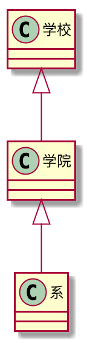
    - 学校、学院、系之间是继承的关系
    
- 传统方式的问题
    - 按照组织大小进行分层：将学院作为学校的子类，将系作为学院的子类
    - 实际情况是：一个学校有多个学院，一个学院有多个系，所以传统方案不能实现**管理操作**，如对学院、系的增删改查
- 改进方法
    - 将学校、学院、系作为组织结构，没有继承关系，3者之间是一个树形结构，可以实现更好的管理操作

# 结构型-组合模式
## 组合模式简介
[top](#catalog)
- 组合模式的概念
    - 组合模式又叫**部分整体模式**
    - 组合模式会创建对象组的树形结构，将对象组合成树状结构以表示整体/部分的层次关系
    - 组合模式能让客户以一致的方式处理个别对象以及组合对象
- 组合模式可以解决的问题
    - 可解决问题的两大特征
        1. 需要处理的对象可以生成一颗树型结构 
        2. 需要统一的方式操作树干上的节点和叶子，而不用考虑是节点还是叶子
    - 问题抽象图
        - 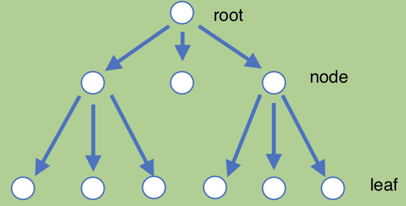

- 组合模式的原理
    - Component(抽象部分)：组合中对象的接口，在适当情况下，实现所有类共有的接口默认行为，用于访问和管理Component子部件
        - Component可以是抽象类，也可以是接口
    - Leaf(被管理者)：在组合中表示叶子节点，没有子节点。用于定义组合内元素的行为
    - Composite(管理者)：非叶子节点，用于存储子部件，在Component接口中实现子部件的相关操作，如：增加、删除等

- 原理UML图
    - 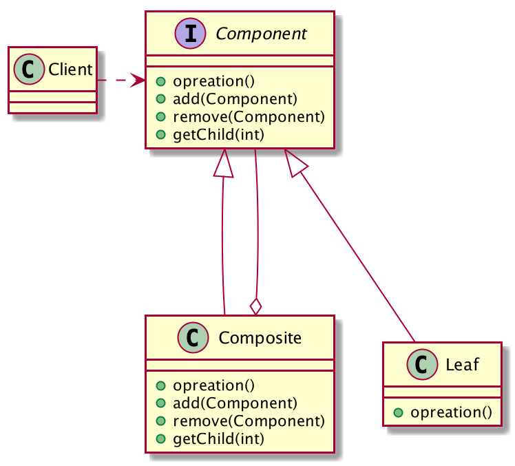

- 组合模式的优点
    - 组合模式可以简化客户端操作
        - 客户端只需要面对一致的对象而不用考虑整体/部分、节点/叶子的问题
    - 具有较强的扩展性
        - 当需要更改内部的对象组合方式时，只需要调整内部的层次关系，客户端不需要改变
    - 方便创建出复杂的层次结构，客户端不用参与组合的细节，容易添加节点/叶子来创建更加复杂的树形结构
    - <label style="color:red">需要遍历组织机构、或者处理的对象就有树形结构时，非常适合使用组合模式</label>
- 组合模式的缺点
    - 要求较高的抽象性
        - 如果节点和叶子有很多的差异性，如方法、属性都不一样，则不适合使用组合模式

## 组合模式实现引入问题
[top](#catalog)
- 实现方法
    - 创建叶子和节点的抽象类：`OrganizationComponent`，提供添加、删除、打印方法
    - 分别实现学校、学院、系三个类
    - 在学校类中组合一个`OrganizationComponent`型数组用来管理学院
    - 在学院中组合一个`OrganizationComponent`型数组用来管理系
    - 学校、学院分别有各自的下一级的管理对象，所以在打印方法中需要循环打印内部的管理对象

- UML图
    - 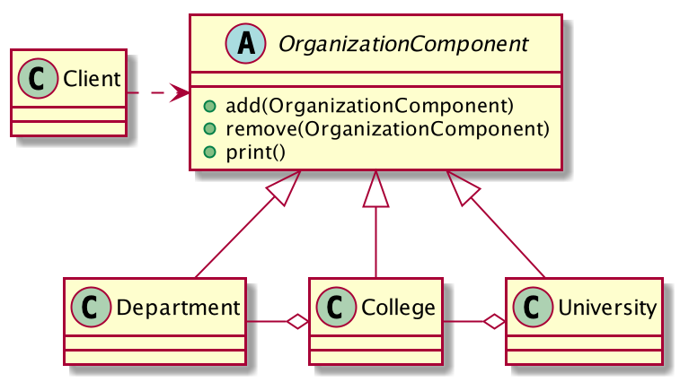

- 抽象类`OrganizationComponent`
    - 参考代码
        - [/designPattern/dplearn/dplearn-base/src/test/java/com/ljs/learn/pattern/composite/base/OrganizationComponent.java](/designPattern/dplearn/dplearn-base/src/test/java/com/ljs/learn/pattern/composite/base/OrganizationComponent.java)
    - 代码内容
        ```java
        package com.ljs.learn.pattern.composite.base;
        
        public abstract class OrganizationComponent {
            private String name;
        
            public OrganizationComponent(String name) {
                this.name = name;
            }
        
            public String getName() {
                return name;
            }
        
            public void setName(String name) {
                this.name = name;
            }
        
            // 提供默认实现，在叶子上不做重写，防止在叶子上添加管理对象
            public void add (OrganizationComponent node){
                throw new UnsupportedOperationException();
            }
        
            // 提供默认实现，在叶子上不做重写，防止在叶子上添加管理对象
            public void remove(OrganizationComponent node){
                throw new UnsupportedOperationException();
            }
        
            public abstract void print();
        }
        ```

- 学校、学院、系
    - 参考代码
        - [/designPattern/dplearn/dplearn-base/src/test/java/com/ljs/learn/pattern/composite/base/University.java](/designPattern/dplearn/dplearn-base/src/test/java/com/ljs/learn/pattern/composite/base/University.java)
        - [/designPattern/dplearn/dplearn-base/src/test/java/com/ljs/learn/pattern/composite/base/College.java](/designPattern/dplearn/dplearn-base/src/test/java/com/ljs/learn/pattern/composite/base/College.java)
        - [/designPattern/dplearn/dplearn-base/src/test/java/com/ljs/learn/pattern/composite/base/Department.java](/designPattern/dplearn/dplearn-base/src/test/java/com/ljs/learn/pattern/composite/base/Department.java)
    - 代码内容
        ```java
        public class University extends OrganizationComponent {
            // 保存下一级的管理对象：学院
            List<OrganizationComponent> componentList = new ArrayList<>();
        
            public University(String name) {
                super(name);
            }
        
            @Override
            public void add(OrganizationComponent node) {
                componentList.add(node);
            }
        
            @Override
            public void remove(OrganizationComponent node) {
                componentList.remove(node);
            }
        
            @Override
            public void print() {
                System.out.println("-----University:" + super.getName() + "------");
                // 循环输出下一级的节点信息
                for (OrganizationComponent node : componentList) {
                    node.print();
                }
            }
        }
      
        public class College extends OrganizationComponent {
            // 保存下一级的管理对象：系
            List<OrganizationComponent> componentList = new ArrayList<>();
        
            public College(String name) {
                super(name);
            }
        
            @Override
            public void add(OrganizationComponent node) {
                componentList.add(node);
            }
        
            @Override
            public void remove(OrganizationComponent node) {
                componentList.remove(node);
            }
        
            @Override
            public void print() {
                System.out.println("---College:" + super.getName() + "---");
                // 循环输出下一级的节点信息
                for (OrganizationComponent node : componentList) {
                    node.print();
                }
            }
        }
      
        public class Department extends OrganizationComponent {
            public Department(String name) {
                super(name);
            }
        
            @Override
            public void print() {
                System.out.println(getName());
            }
        }
        ```

- 测试类
    - 参考代码
        - [/designPattern/dplearn/dplearn-base/src/test/java/com/ljs/learn/pattern/composite/base/Client.java](/designPattern/dplearn/dplearn-base/src/test/java/com/ljs/learn/pattern/composite/base/Client.java)
    - 代码内容
        ```java
        @Test
        public void test01(){
            // 创建大学
            University university01 = new University("University01");
    
            // 创建学院
            College college01 = new College("College01");
            College college02 = new College("College02");
    
            // 创建系
            Department department01 = new Department("Department01");
            Department department02 = new Department("Department02");
    
            Department department03 = new Department("Department03");
            Department department04 = new Department("Department04");
    
            // 将三中对象组合成树形结构
            college01.add(department01);
            college01.add(department02);
    
            college02.add(department03);
            college02.add(department04);
    
            university01.add(college01);
            university01.add(college02);
    
            // 从学校级别开始输出
            university01.print();
            System.out.println("##########################");
    
            // 从学院级别开始输出
            college02.print();
            
            // 输出结果
            // -----University:University01------
            // ---College:College01---
            // Department01
            // Department02
            // ---College:College02---
            // Department03
            // Department04
            // ###################
            // ---College:College02---
            // Department03
            // Department04
            // ###################
        }
        ```
      
## 组合模式在JDK源码中的应用-HashMap
[top](#catalog)
- 集合类`HashMap`中就使用到了组合模式
- 组合方式：Map --> AbstracMap --> HashMap --> HashMap.Node
- `HashMap`相当于`Composite`，实现了`put`、`putAll`方法，统一的添加叶子
- `HashMap.Node`是静态内部类，相当于`Left`叶子节点，内部没有`put`、`putAll`方法
- UML图
    - 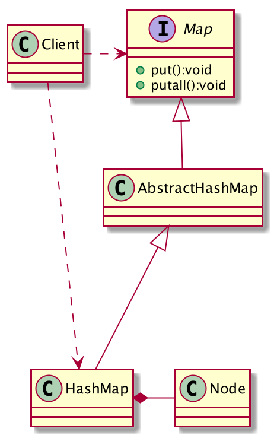

# 结构型-代理模式
## 代理模式简介
[top](#catalog)
- 什么是代理模式？
    - 为一个对象提供一个替身，以控制对这个对象的访问。即通过代理对象访问目标对象
- 代理模式的好处：
    - 可以在目标对象实现的基础上，增强额外的功能操作，即扩展目标对象的功能
    - 可以使被代理对象的功能更加纯粹，不用去关注一些公共的任务
        - 将公共任务交给代理对象，实现功能上的解耦
        - 当公共任务发生变化时，被代理对象不需要改变，直接修改代理类即可
- 被代理的对象：远程对象、创建开销大的对象、需要安全控制的对象
- 代理模式的形式
    1. 静态代理
    2. 动态代理(JDK代理、接口代理)
    3. Cglib代理，可以在内存中动态的创建对象，而不需要实现接口，他是属于动态代理的范畴

## 静态代理
[top](#catalog)
- 完成静态代理的要点
    1. 需要定义接口或者父类
    2. 被代对象(即目标对象)、代理对象一起实现相同的接口或者是继承相同的父类
- 静态代理的优缺点
    - 优点：在不修改目标对象的功能前提下，通过代理对象对目标功能扩展
    - 缺点：
        - 代理对象与目标对象需要实现相同的接口，会导致存在很多的代理类
        - 如果接口增加了方法，则目标对象和代理对象都需要维护
- 应用示例
    - 具体要求
        - 定义一个接口：`ITeacherDao`
        - 目标对象`TeacherDAO`实现接口`ITeacherDAO`
        - 代理对象`TeacherDAOProxy`实现接口`ITeacherDAO`
        - 通过代理对象来调用目标对象
        - 代理对象于目标对象实现相同的接口，然后通过调用相同的方法来调用目标对象的方法
    - UML图
        - 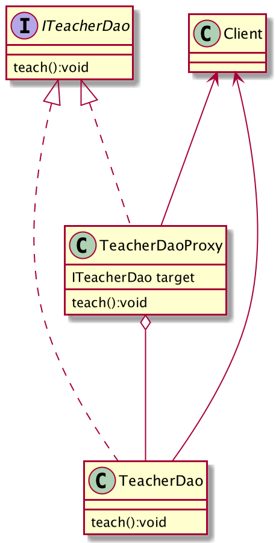
    - 接口
        - 参考代码:[/designPattern/dplearn/dplearn-base/src/test/java/com/ljs/learn/pattern/proxy/staticProxy/ITeacherDao.java](/designPattern/dplearn/dplearn-base/src/test/java/com/ljs/learn/pattern/proxy/staticProxy/ITeacherDao.java)
                  
        - 代码内容
            ```java
            public interface ITeacherDao {
                public void teach();
            }
            ```
    - 被代理类
        - 参考代码:[/designPattern/dplearn/dplearn-base/src/test/java/com/ljs/learn/pattern/proxy/staticProxy/TeacherDao.java](/designPattern/dplearn/dplearn-base/src/test/java/com/ljs/learn/pattern/proxy/staticProxy/TeacherDao.java)
        - 代码内容
            ```java
            public class TeacherDao implements ITeacherDao{
                @Override
                public void teach() {
                    System.out.println("teacher is teaching");
                }
            }
            ```
    - 代理类
        - 参考代码:[/designPattern/dplearn/dplearn-base/src/test/java/com/ljs/learn/pattern/proxy/staticProxy/TeacherDaoProxy.java](/designPattern/dplearn/dplearn-base/src/test/java/com/ljs/learn/pattern/proxy/staticProxy/TeacherDaoProxy.java)
        - 代码内容
            ```java
            public class TeacherDaoProxy implements ITeacherDao {
                private ITeacherDao target;
            
                public TeacherDaoProxy(ITeacherDao target) {
                    this.target = target;
                }
            
                @Override
                public void teach() {
                    System.out.println("proxy start");
                    target.teach();
                    System.out.println("proxy end");
                }
            }
            ```
    - 测试类
        - 参考代码：[/designPattern/dplearn/dplearn-base/src/test/java/com/ljs/learn/pattern/proxy/staticProxy/ClientTest.java](/designPattern/dplearn/dplearn-base/src/test/java/com/ljs/learn/pattern/proxy/staticProxy/ClientTest.java)
        - 代码内容
            ```java
            public class ClientTest {
                @Test
                public void test01(){
                    // 创建被代理对象
                    ITeacherDao teacherDao = new TeacherDao();
            
                    // 创建代理对象，同时将被代理对象作为参数传递给代理对象
                    TeacherDaoProxy proxy = new TeacherDaoProxy(teacherDao);
            
                    // 通过代理对象调用被代理对象的方法
                    // 即执行的是代理对象的方法，内部执行的是被代理对象的方法
                    proxy.teach();
                }
            }
            ```
        - 测试结果
            ```
            proxy start
            teacher is teaching
            proxy end
            ```
          
## 动态代理
[top](#catalog)
- 动态代理的特点
    - 代理对象不需要实现接口，但是目标对象要实现接口，否则不能使用动态代理
    - 代理对象的生成，是利用JDK的API，动态的在内存中构建代理对象
    - 动态代理也叫做：JDK代理，接口代理
    
- <label style="color:red">动态代理的本质：反射</label>

- JDK中生成代理对象的API
    - 代理类所在包：`java.lang.reflect.Proxy`
    - JDK实现代理需要使用newProxyInstance方法，该方法需要三个参数
        - `ClassLoader loader`: 指定当前目标对象使用的类加载器
        - `Class<?>[] interfaces`:目标对象实现的接口类型，使用泛型方法确认类型
        - `InvocationHandler h`:事件处理器。执行目标对象的方法时，会触发事件处理器方法，会把当前执行的目标对象方法作为参数传入
        ```java
        static Object newProxyInstance(ClassLoader loader, Class<?>[] interfaces, InvocationHandler h)
        ```

- 示例
    - 具体要求
        - 定义一个接口：`ITeacherDao`
        - 目标对象`TeacherDAO`实现接口`ITeacherDAO`
        - 通过工厂`ProxyFactory`来创建代理对象
        - 实例化`ProxyFactory`对象并获取代理对象，通过代理对象调用方法
    - UML图
        - 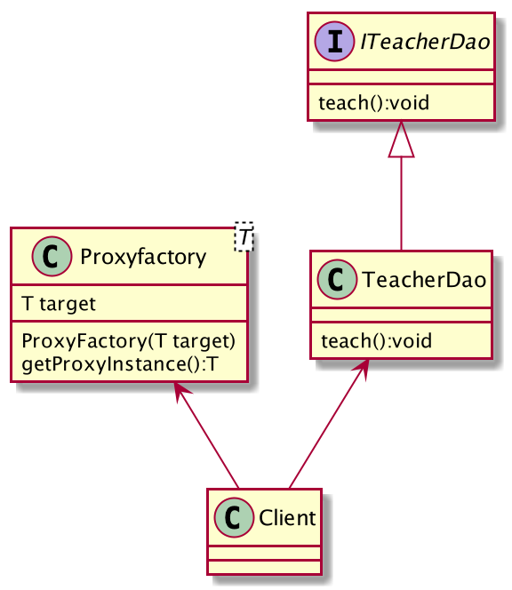
    - 接口
        - 参考代码：[/designPattern/dplearn/dplearn-base/src/test/java/com/ljs/learn/pattern/proxy/dynamic/ITeacherDao.java](/designPattern/dplearn/dplearn-base/src/test/java/com/ljs/learn/pattern/proxy/dynamic/ITeacherDao.java)
        - 代码内容
            ```java
            public interface ITeacherDao {
                void teach();
            }
            ```
    - 目标对象
        - 参考代码：[/designPattern/dplearn/dplearn-base/src/test/java/com/ljs/learn/pattern/proxy/dynamic/TeacherDao.java](/designPattern/dplearn/dplearn-base/src/test/java/com/ljs/learn/pattern/proxy/dynamic/TeacherDao.java)
        - 代码内容
            ```java
            public class TeacherDao implements ITeacherDao {
                @Override
                public void teach() {
                    System.out.println("is teaching");
                }
            }
            ```
    - 工厂类
        - 参考代码：[/designPattern/dplearn/dplearn-base/src/test/java/com/ljs/learn/pattern/proxy/dynamic/ProxyFactory.java](/designPattern/dplearn/dplearn-base/src/test/java/com/ljs/learn/pattern/proxy/dynamic/ProxyFactory.java)
        - 代码内容
            ```java
            public class ProxyFactory<T> {
                //维护一个目标对象
                private T target;
            
                public ProxyFactory(T target) {
                    this.target = target;
                }
            
                //给目标对象生成一个代理对象
                public T getProxyInstance(){
                    return (T)Proxy.newProxyInstance(
                            target.getClass().getClassLoader(),
                            target.getClass().getInterfaces(),
                            new InvocationHandler() {
                                @Override
                                public Object invoke(Object proxy, Method method, Object[] args) throws Throwable {
                                    System.out.println("proxy start");
                                    // 通过反射调用目标对象的方法
                                    Object invoke = method.invoke(target, args);
            
                                    System.out.println("proxy end");
                                    return invoke;
                                }
                            }
                    );
                }
            }
            ```
    - 测试类
        - 参考代码：[/designPattern/dplearn/dplearn-base/src/test/java/com/ljs/learn/pattern/proxy/dynamic/ClientTest.java](/designPattern/dplearn/dplearn-base/src/test/java/com/ljs/learn/pattern/proxy/dynamic/ClientTest.java)
        - 代码内容
            ```java
            @Test
            public void test01(){
                // 创建目标对象
                ITeacherDao target = new TeacherDao();
                
                // 通过com.sun.proxy.$Proxy4在内存中动态生成代理对象
                ITeacherDao proxyInstance = new ProxyFactory<ITeacherDao>(target).getProxyInstance();
        
                System.out.println(proxyInstance);
                System.out.println(proxyInstance.getClass());
        
                // 通过代理对象，调用目标对象的方法
                proxyInstance.teach();
            }
            ```
        - 测试结果
            ```java
            proxy start
            proxy end
            com.ljs.learn.pattern.proxy.dynamic.TeacherDao@5679c6c6
            class com.sun.proxy.$Proxy4
            proxy start
            is teaching
            proxy end
            ```
          
## Cglib代理
[top](#catalog)
- 什么是Cglib代理
    - Cglib代理也叫做子类代理
    - 当目标对象只是一个单独的对象，没有实现一个接口时，这个时候可以使用目标对象的子类来实现代理
    - Cglib代理会在内存中创建一个子类对象从而实现对目标对象功能的扩展
- Cglib包
    - Cglib包是一个高性能的代码生成包，底层是通过使用字节码处理框架ASM来转换字节码并生成新的类
    - Cglib包可以在运行期扩展java类与实现java接口，它广泛的被许多AOP框架使用，例如SpringAOP，实现方法拦截
- 在AOP编程中如何选择代理模式
    1. 目标对象需要实现接口，用JDK代理，即`Proxy`动态代理
    2. 目标对象不需要实现接口，用Cglib代理
- 使用Cglib代理的步骤
    1. 引入cglib的jar包
    2. 在内存中动态构建子类，并且**目标类不能是final**
        1. 创建一个工具类`Enhancer`对象
        2. 使用工具类对象设置父类
        3. 设置回调函数
        4. 创建子类，即代理对象
    3. 实现`MethodInterceptor`接口的`intercept`方法，通过反射来调用目标对象的方法
    4. 目标对象的方法如果为`final`、`static`，不会被拦截，即不会执行目标对象额外的业务方法
    
- 示例
    - 具体要求
        - 定义目标对象`TeacherDAO`
        - 工厂`ProxyFactory`实现`MethodInterceptor`
        - 实例化`ProxyFactory`对象并获取代理对象，通过代理对象调用方法
    - UML图
        - 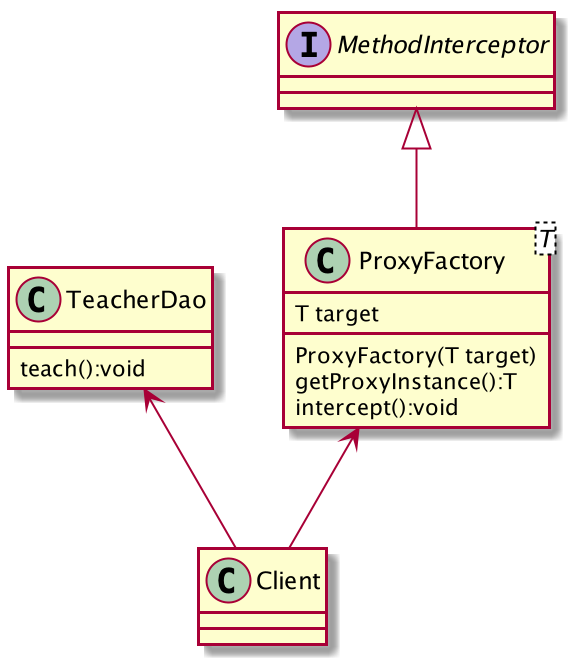
    - 目标对象
        - 参考代码：[/designPattern/dplearn/dplearn-base/src/test/java/com/ljs/learn/pattern/proxy/cglibProxy/TeacherDao.java](/designPattern/dplearn/dplearn-base/src/test/java/com/ljs/learn/pattern/proxy/cglibProxy/TeacherDao.java)
        - 代码内容：
            ```java
            public class TeacherDao {
                public void teach(){
                    System.out.println("is teaching");
                }
            }
            ```
    - 工厂类
        - 参考代码：[/designPattern/dplearn/dplearn-base/src/test/java/com/ljs/learn/pattern/proxy/cglibProxy/ProxyFactory.java](/designPattern/dplearn/dplearn-base/src/test/java/com/ljs/learn/pattern/proxy/cglibProxy/ProxyFactory.java)
        - 代码内容
            ```java
            public class ProxyFactory<T> implements MethodInterceptor {
                private T target;
            
                public ProxyFactory(T target) {
                    this.target = target;
                }
            
                // 返回一个target的代理对象
                public T getProxyInstance(){
                    // 1. 创建一个工具类
                    Enhancer enhancer = new Enhancer();
                    // 2. 设置父类
                    enhancer.setSuperclass(target.getClass());
                    // 3. 设置回调函数
                    enhancer.setCallback(this);
                    // 4. 创建子类，即代理对象
                    return (T)enhancer.create();
                }
            
                // 重写intercept方法，实现对目标对象方法的调用
                @Override
                public Object intercept(Object o, Method method, Object[] args, MethodProxy methodProxy) throws Throwable {
                    System.out.println("proxy is start");
                    Object invoke = method.invoke(target, args);
                    System.out.println("prroxy is end");
                    return invoke;
                }
            }
            ```
    - 测试类
        - 参考代码：[/designPattern/dplearn/dplearn-base/src/test/java/com/ljs/learn/pattern/proxy/cglibProxy/ClientTest.java](/designPattern/dplearn/dplearn-base/src/test/java/com/ljs/learn/pattern/proxy/cglibProxy/ClientTest.java)
        - 代码内容
            ```java
            @Test
            public void test01(){
                // 创建目标对象
                TeacherDao target = new TeacherDao();
        
                // 创建cglib代理对象
                TeacherDao proxyInstance = new ProxyFactory<TeacherDao>(target).getProxyInstance();
                proxyInstance.teach();
            }
            ```
        - 测试结果
            ```
            proxy is start
            is teaching
            prroxy is end
            ```

## 代理模式的变体
[top](#catalog)
- 防火墙代理
    - 内网通过代理穿透防火墙，实现对公网的访问
- 缓存代理
    - 如请求图片文件等资源时，先带缓存代理获取，如果没取到再到公网或者数据库取，然后缓存
- 远程代理
    - 远程对象的本地代表，通过它**可以把远程对象当本地对象**来调用，远程代理通过网络和真正的远程对象沟通信息
- 同步代理
    - 主要使用在多线程编程中，完成多线程间同步工作

# 结构型-外观模式
## 外观模式-引入问题-组件家庭影院
[top](#catalog)
- 所需内容
    - DVD播放器、投影仪、自动屏幕、环绕立体声、爆米花机
- 要求完成使用家庭影院的功能，使用的过程为：
    1. 使用各设备遥控器来启动
    2. 开爆米花机
    3. 放下屏幕
    4. 开投影仪
    5. 开音响
    6. 开DVD、选DVD
    7. 去拿爆米花
    8. 调暗灯光
    9. 播放DVD
    10. 观影结束后，关闭各种设备

- 传统方式解决影院管理
    ```java
    class ClientTest{
        public static void main(){
            //1. 创建相关对象
            //2. 调用创建的各个对象(子系统)的一系列方法
            //3. 调用DVDplayer对象的play方法
        }
    }
    ```

- 传统方法的问题
    1. 调用过程混乱
        - 在 `ClientTest` 的 main 方法中，创建各个子系统的对象，并直接调用子系统的相关方法
    2. 不利于在 `ClientTest` 中，维护子系统的操作

- 解决方法
    - 定义一个高层接口，给子系统中的一组接口提供一个**一致的界面**，访问子系统中的一群接口
        - 如，在高层接口中创建4个方法作为**界面**
            1. ready
            2. play
            3. pause
            4. end
- 修改后的特点（外观模式的特点）
    - 通过一致的界面，屏蔽子系统内部的细节
    - 调用端只通过界面进行调用，无需关系子系统内部的细节
    
## 外观模式简介
[top](#catalog)
- 外观模式，Facade
    - 也称为：过程模式
    - 外观模式为子系统中的**一组接口**提供一个**一致的界面**
    - 该模式定义了一个高层接口，这个接口使得子系统更容易使用
    - 子系统内部实现被界面屏蔽，调用直通界面进行调用，无需关系子系统的内部细节

## 外观模式原理
[top](#catalog)
- 原理类图
    - uml代码
        - [/designPattern/dplearn/dplearn-base/src/test/java/com/ljs/learn/pattern/facade/principle_uml.puml](/designPattern/dplearn/dplearn-base/src/test/java/com/ljs/learn/pattern/facade/principle_uml.puml)
    - 图
        - 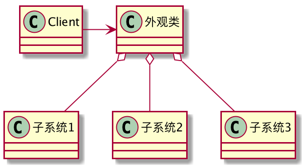

- 外观模式角色分析
    1. 外观类（Facade） 
        - 为调用端提供统一的调用接口
        - 将调用端的请求代理给适当的子系统对象进行处理
            - 只负责请求分发，不提供实际功能。实际功能仍然有各个子系统负责
    2. 调用者（Client）
        - 外观接口的调用者
    3. 子系统的集合
        - 指模块或者子系统
        - 用于处理Facade对象指派的任务，是**功能的实际提供者**

## 外观模式的注意事项和细节
[top](#catalog)
- 外观模式屏蔽了子系统的细节，降低了客户端对子系统使用的复杂性
- 外观模式对客户端与子系统的耦合关系，让子系统内部的模块更易维护和扩展
- 通过合理的外观模式，<label style="color:red">可以更好的划分访问的层次</label>
- 当系统需要进程分层设计时，可以考虑使用 Facade 模式
- 在维护一个遗留的大系统时，可能系统已经变得非常难以维护和扩展，此时可以考虑为新系统开发一个Facade类，让新系统与Facade类交互，提高复用性
- 需要合理使用外观模式
    - 如果子系统比较少，并且调用简单，则不必创建一个外观类，直接使用即可
- **外观模式的目的是让系统有层次，利于维护**

## 外观模式实现引入问题
[top](#catalog)
- 改进后的url图
    - 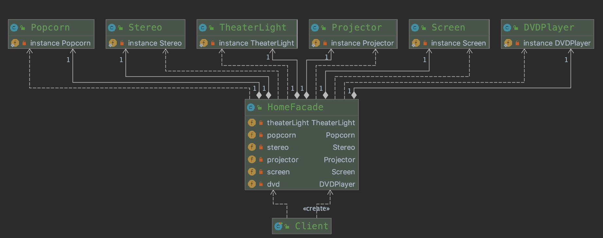

- 测试类
    - 参考代码
        - [/designPattern/dplearn/dplearn-base/src/test/java/com/ljs/learn/pattern/facade/improve/Client.java](/designPattern/dplearn/dplearn-base/src/test/java/com/ljs/learn/pattern/facade/improve/Client.java)
    - 代码内容
        ```java
        @Test
        public void test01(){
            HomeFacade homeFacade = new HomeFacade();
            homeFacade.ready();
            homeFacade.play();
            homeFacade.end();
        }
        ```

- 外观类
    - 参考代码
        - [/designPattern/dplearn/dplearn-base/src/test/java/com/ljs/learn/pattern/facade/improve/HomeFacade.java](/designPattern/dplearn/dplearn-base/src/test/java/com/ljs/learn/pattern/facade/improve/HomeFacade.java)

    - 代码内容
        ```java
        public class HomeFacade {
            // 定义各个子系统对象
            private TheaterLight theaterLight;
            private Popcorn popcorn;
            private Stereo stereo;
            private Projector projector;
            private Screen screen;
            private DVDPlayer dvd;
        
            public HomeFacade() {
                this.theaterLight = TheaterLight.getInstance();
                this.popcorn = Popcorn.getInstance();
                this.stereo = Stereo.getInstance();
                this.projector = Projector.getInstance();
                this.screen = Screen.getInstance();
                this.dvd = DVDPlayer.getInstance();
            }
        
            // 操作分成4步
            public void ready(){
                // 2. 开爆米花机
                popcorn.on();
                popcorn.pop();
                // 3. 放下屏幕
                screen.down();
                // 4. 开投影仪
                projector.on();
                // 5. 开音响
                stereo.on();
                // 6. 开DVD、选DVD
                dvd.on();
                // 7. 去拿爆米花
                // 8. 调暗灯光
                theaterLight.dim();
                // 9. 播放DVD
            }
        
            public void play(){
                dvd.play();
            }
        
            public void pause(){
                dvd.pause();
            }
        
            public void end(){
                // 关闭爆米花机
                popcorn.off();
                // 调亮灯光
                theaterLight.bright();
                // 升起屏幕
                screen.down();
                // 关闭影仪
                projector.off();
                // 关闭音响
                stereo.off();
                // 关闭dvd
                dvd.off();
            }
        }
        ```
- 各子系统
    - 参考代码
        - [designPattern/dplearn/dplearn-base/src/test/java/com/ljs/learn/pattern/facade/improve/Projector.java](designPattern/dplearn/dplearn-base/src/test/java/com/ljs/learn/pattern/facade/improve/Projector.java)
        - [designPattern/dplearn/dplearn-base/src/test/java/com/ljs/learn/pattern/facade/improve/DVDPlayer.java](designPattern/dplearn/dplearn-base/src/test/java/com/ljs/learn/pattern/facade/improve/DVDPlayer.java)
        - [designPattern/dplearn/dplearn-base/src/test/java/com/ljs/learn/pattern/facade/improve/Screen.java](designPattern/dplearn/dplearn-base/src/test/java/com/ljs/learn/pattern/facade/improve/Screen.java)
        - [designPattern/dplearn/dplearn-base/src/test/java/com/ljs/learn/pattern/facade/improve/Stereo.java](designPattern/dplearn/dplearn-base/src/test/java/com/ljs/learn/pattern/facade/improve/Stereo.java)
        - [designPattern/dplearn/dplearn-base/src/test/java/com/ljs/learn/pattern/facade/improve/TheaterLight.java](designPattern/dplearn/dplearn-base/src/test/java/com/ljs/learn/pattern/facade/improve/TheaterLight.java)
        - [designPattern/dplearn/dplearn-base/src/test/java/com/ljs/learn/pattern/facade/improve/Popcorn.java](designPattern/dplearn/dplearn-base/src/test/java/com/ljs/learn/pattern/facade/improve/Popcorn.java)
    - 代码内容
        ```java
        // DVD播放器
        public class DVDPlayer {
            //...
            // 单例模式获取实例对象
        
            public void on() { System.out.println("dvd on"); }
            public void off() { System.out.println("dvd off"); }
            public void play() { System.out.println("dvd is playing"); }
            public void pause() { System.out.println("dvd pause"); }
        }
        ```
        ```java
        // 爆米花机
        public class Popcorn {
            //...
            // 单例模式获取实例对象
            public void on() { System.out.println("popcorn on"); }
            public void off() { System.out.println("popcorn off"); }
            public void pop() { System.out.println("popcorn is poping"); }
        }
        ```
        ```java
        // 投影仪
        public class Projector {
            //...
            // 单例模式获取实例对象
            public void on() { System.out.println("Projector on"); }
            public void off() { System.out.println("Projector off"); }
            public void focus() { System.out.println("Projector focus"); }
        }
        ```
        ```java
        // 显示器
        public class Screen {
            //...
            // 单例模式获取实例对象
            public void up() { System.out.println("Screen up"); }
            public void down() { System.out.println("Screen down"); }
        }
        ```
        ```java
        // 音响
        public class Stereo {
            //...
            // 单例模式获取实例对象
            public void on() { System.out.println("Stereo on"); }
            public void off() { System.out.println("Stereo off"); }
        }
        ```
        ```java
        // 灯光
        public class TheaterLight {
            //...
            // 单例模式获取实例对象
            public void on() { System.out.println("TheaterLight on"); }
            public void off() { System.out.println("TheaterLight off"); }
            public void dim() { System.out.println("TheaterLight dim"); }
            public void bright() { System.out.println("TheaterLight bright"); }
        }
        ```

# 结构型-享元模式
## 享元模式-引入问题-展示网站
[top](#catalog)
- 同样的一套展示网站架构，不同用户有不同的需求，包括
    - 以新闻的形式发布展示内容
    - 以博客的形式发布展示内容
    - 以微信公众号的形式发布展示内容
- 传统的解决需求的方式
    1. 复制项目，根据不同的需求进行定制
    2. 在服务器上进行划分空间，不同需求的用户访问不同空间中的资源

- 传统方式的问题: 服务器资源浪费
    - 网站的**相似度很高**，并且都不是高访问量的网站
    - 如果在服务器上分出多个虚拟空间来处理，相当于一个相同网站的多个实例

- 问题的解决方法
    - 整合到一个网站中，**即只有一个实例**，共享相关的代码和数据，减少资源浪费
        - 硬盘、内存、cpu等资源都可以共享
    - 只有一个网站实例后，维护和扩展都更加容易
    - 即通过**享元模式**解决 

## 享元模式简介
[top](#catalog)
- 享元模式 Flyweight Pattern
    - 也称为蝇量模式
    - 享元模式可以运用共享技术有效的支持大量细粒度的对象
    - 在享元模式中，享表示共享，元表示对象

- 享元模式的应用
    - 系统中有大量对象，这些对象会消耗大量内存，并且对象的状态大部分可以外部化
    - 解决重复对象的内存浪费问题
    - 当系统中有大量相似对象，并需要缓冲池时，不需要总是创建新对象，可以从缓冲池中获取，降低系统内存，同时提高效率

- 享元模式的经典应用场景
    - **池技术**，**享元模式是池技术的重要实现方式**
        - 数据库连接池
        - String常量池
        - 缓冲池
        
    - 如数据库连接池
        - 连接池中都是创建好的连接对象
        - 如果有需要的连接对象，拿来直接使用
        - 如果没有需要的连接对象，则创建一个

## 享元模式的原理
[top](#catalog)
- 原理类图
    - uml代码
        - [/designPattern/dplearn/dplearn-base/src/test/java/com/ljs/learn/pattern/flyweight/principle_uml.puml](/designPattern/dplearn/dplearn-base/src/test/java/com/ljs/learn/pattern/flyweight/principle_uml.puml)
    - 图
        - 

- 享元模式的两个要求：细粒度、共享对象
    - 需要将对象的信息分为两部分
        - 内部状态
        - 外部状态

- 外部状态与内部状态
    - 内部状态
        - 对象共享出来的信息，**存储在享元对象内部**，不会随环境而改变
    - 外部状态
        - 对象依赖的一个标记，随环境而改变，不可共享的状态
        
- 类图中的角色与职责
    - Flyweight
        - 抽象享元角色，是产品的抽象类
        - 它会同时定义出对象的**外部状态**和**内部状态**的接口或实现
    - ConcreteFlyweight
        - 具体的享元角色，是具体的产品类
            - 对于引入问题，即不同的需求，有不同的产品类
        - Flyweight 的实现类，实现抽象角色定义的相关任务 
    - UnSharedConcreteFlyweight
        - 不可共享的角色
        - 一般不会出现在享元工厂中
    - FlyweightFactory
        - 享元工厂类
        - 用于构建一个池容器（集合），并提供获取对象的相关方法
        - 在工厂中会有一个保存实例对象的集合，充当<label style="color:red">缓冲池</label>
        - 获取实例对象时，先访问工厂内的集合，如果有就使用；如果没有就创建一个，完成资源共享的效果

- 示例分析：下棋
    - 棋子的颜色是固定的，但是位置/坐标不固定
        - 位置=外部状态
        - 颜色=内部状态
    - 如果为一盘棋的每个棋子都创建一个对象，则一台服务器很难支持更多的玩家玩游戏
        - 使用享元模式处理棋子，则棋子对象可以减少为2个实例对象，简写的对象的内存开销

## 享元模式的注意事项和细节
[top](#catalog)
- 共享内容的存储方式
    - HashMap/HashTable存储
- 优点
    - 享元模式减少了对象的创建，降低了程序内存的占用，提高效率
- 缺点
    - 提高了系统的复杂度
    - 需要分离出内部状态和外部状态
- 享元模式的注意事项
    - 使用享元模式时，需要划分内部状态和外部状态，并用一个工厂类来控制
    - 如果内部状态和外部状态容易划分可以使用享元模式；如果不容易划分，最好不要使用享元模式
    - 外部状态具有固化特性，不应该随着内部状态的改变而改变

        
## 享元模式实现引入问题 
[top](#catalog)
- 改进后的UML图
    - uml代码
        - [/designPattern/dplearn/dplearn-base/src/test/java/com/ljs/learn/pattern/flyweight/improve/improve_uml.puml](/designPattern/dplearn/dplearn-base/src/test/java/com/ljs/learn/pattern/flyweight/improve/improve_uml.puml)
    - 图
        - 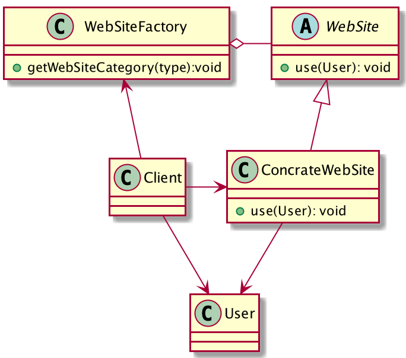
- 状态划分
    - 内部状态  
        - 网站类型: ConcreteWebSite.type
    - 外部状态
        - 不同的用户: User

- 享元模式的构成
    - 参考代码
        - [/designPattern/dplearn/dplearn-base/src/test/java/com/ljs/learn/pattern/flyweight/improve/WebSite.java](/designPattern/dplearn/dplearn-base/src/test/java/com/ljs/learn/pattern/flyweight/improve/WebSite.java)
        - [/designPattern/dplearn/dplearn-base/src/test/java/com/ljs/learn/pattern/flyweight/improve/ConcreteWebSite.java](/designPattern/dplearn/dplearn-base/src/test/java/com/ljs/learn/pattern/flyweight/improve/ConcreteWebSite.java)
        - [/designPattern/dplearn/dplearn-base/src/test/java/com/ljs/learn/pattern/flyweight/improve/WebSiteFactory.java](/designPattern/dplearn/dplearn-base/src/test/java/com/ljs/learn/pattern/flyweight/improve/WebSiteFactory.java)
        - [/designPattern/dplearn/dplearn-base/src/test/java/com/ljs/learn/pattern/flyweight/improve/User.java](/designPattern/dplearn/dplearn-base/src/test/java/com/ljs/learn/pattern/flyweight/improve/User.java)

    - User，外部状态
        ```java
        public class User {
            private String name;
        
            public User(String name) {
                this.name = name;
            }
        
            public String getName() {
                return name;
            }
        
            public void setName(String name) {
                this.name = name;
            }
        }
        ```

    - WebSite，网站抽象类
        ```java
        public abstract class WebSite {
            // 表示哪个用户在使用什么类型的网站
            public abstract void use(User user);
        }
        ```
        
    - ConcreteWebSite，具体享元角色
        ```java
        public class ConcreteWebSite extends WebSite {
            // 共享的部分，内部状态
            private String type=""; // 网站发布的形式
        
            public ConcreteWebSite(String type) {
                this.type = type;
            }
        
            @Override
            public void use(User user) {
                System.out.println("site type=" + type + ", user=" + user.getName());
            }
        }
        ```
      
    - WebSiteFactory，享元工厂类
        ```java
        // 网站工厂类，根据需要返回一个网站实例
        public class WebSiteFactory {
            // 集合，充当池
            private Map<String, ConcreteWebSite> pool = new HashMap<>();
        
            // 根据网站类型，返回一个网站实例
            // 如果池中有，则直接返回；如果池中没有，则创建一个实例，并保存到pool
            public WebSite getWebSiteCategory(String type){
                if (!pool.containsKey(type)){
                    pool.put(type, new ConcreteWebSite(type));
                }
        
                return pool.get(type);
            }
        
            public int getWebSiteCount(){
                return pool.size();
            }
        }
        ```

- 测试类
    - 参考代码
        - [/designPattern/dplearn/dplearn-base/src/test/java/com/ljs/learn/pattern/flyweight/improve/Client.java](/designPattern/dplearn/dplearn-base/src/test/java/com/ljs/learn/pattern/flyweight/improve/Client.java)

    - 测试内容
        ```java
        @Test
        public void test01(){
            // 创建一个工厂类
            WebSiteFactory factory = new WebSiteFactory();
    
            // 用户需要一个以新闻形式发布的网站
            WebSite ws1 = factory.getWebSiteCategory("News");
            ws1.use(new User("aaaa"));
    
            // 用户需要一个以博客形式发布的网站
            WebSite ws2 = factory.getWebSiteCategory("Blogs");
            ws2.use(new User("bbb"));
    
            // 用户需要一个以博客形式发布的网站
            WebSite ws3 = factory.getWebSiteCategory("Blogs");
            ws3.use(new User("cccc"));
    
            // factory获取了三次，但是实际对象只有两个
            System.out.println(factory.getWebSiteCount());
        }
        ```

## 享元模式在JDK中的使用-Integer源码解析
[top](#catalog)
- 测试代码
    - 参考代码
        - [/designPattern/dplearn/dplearn-base/src/test/java/com/ljs/learn/pattern/flyweight/jdk/IntegerTest.java](/designPattern/dplearn/dplearn-base/src/test/java/com/ljs/learn/pattern/flyweight/jdk/IntegerTest.java)
    - 测试内容
        ```java
        @Test
        public void test01(){
            Integer x = Integer.valueOf(127);
            Integer y = new Integer(127);
            Integer z = Integer.valueOf(127);
            Integer w = new Integer(127);
            System.out.println(x.equals(y));    // true
            System.out.println(x == y);         // false
            // [-128,127]范围内使用valueOf创建的实例使用享元模式
            System.out.println(x == z);         // true
            System.out.println(w == x);         // false
            System.out.println(w == y);         // false
    
            // [-128,127]范围外，使用new创建新的实例并返回
            Integer x1 = Integer.valueOf(200);
            Integer x2= Integer.valueOf(200);
            System.out.println(x1 == x2);       // false, 在 -127～128的范围外
        }
        ```

- 源码分析
    - 在valueOf方法中，先判断值是否在IntegerCache中，如果不在就创建新的Integer对象，否则就从缓存池中返回
        ```java
        @HotSpotIntrinsicCandidate
        public static Integer valueOf(int i) {
            // 如果数值是在 -128～127范围内，则使用享元模式返回结果
            // 如果超出范围，则使用new实例化对象并返回
            if (i >= IntegerCache.low && i <= IntegerCache.high)
                return IntegerCache.cache[i + (-IntegerCache.low)];
            return new Integer(i);
        }
        ```
    - 在静态类中，创建缓存池，并固定缓存池的范围
        ```java
        private static class IntegerCache {
            static final int low = -128;
            static final int high;
            static final Integer[] cache;
            static Integer[] archivedCache;
        
            static {
                // high value may be configured by property
                int h = 127;
                String integerCacheHighPropValue =
                    VM.getSavedProperty("java.lang.Integer.IntegerCache.high");
                if (integerCacheHighPropValue != null) {
                    try {
                        h = Math.max(parseInt(integerCacheHighPropValue), 127);
                        // Maximum array size is Integer.MAX_VALUE
                        h = Math.min(h, Integer.MAX_VALUE - (-low) -1);
                    } catch( NumberFormatException nfe) {
                        // If the property cannot be parsed into an int, ignore it.
                    }
                }
                high = h; // 初始化时，将 high 设置为127
        
                // Load IntegerCache.archivedCache from archive, if possible
                VM.initializeFromArchive(IntegerCache.class);
                int size = (high - low) + 1; //创建数组，容量为 -128 ～ 127
        
                // Use the archived cache if it exists and is large enough
                if (archivedCache == null || size > archivedCache.length) {
                    Integer[] c = new Integer[size];
                    int j = low;
                    for(int i = 0; i < c.length; i++) {
                        c[i] = new Integer(j++);
                    }
                    archivedCache = c;
                }
                cache = archivedCache;
                // range [-128, 127] must be interned (JLS7 5.1.7)
                assert IntegerCache.high >= 127;
            }
        
            private IntegerCache() {}
        }
        ```

# 行为型-模版方法模式
## 模版模式-引入问题-制作豆浆
[top](#catalog)
- 编写制作豆浆的程序
    1. 制作流程：选材 --> 添加配料 --> 浸泡 --> 放入豆浆机打磨
    2. 通过添加配料，可以制作出不同口味的豆浆，如红豆豆浆、花生豆浆
    3. 选材、浸泡、放入豆浆机打磨，这三个步骤对于每种口味的豆浆都是相同的
    
## 模版方法模式简介
[top](#catalog)
- 模版方法模式（Template Method Pattern），也叫模版模式（Template Pattern）

- 实现方式
    1. 在抽象类中定义模版方法，保存算法骨架，子类可以按需重写方法实现
    2. 调用时，通过抽象类中定义的方法来调用
 
- 模版方法模式的本质
    - 抽象类中定义一个操作中的算法骨架
    - 将一些步骤的实现延迟到子类中，使得子类可以不改变算法结构，就可以重新定义某些特定的步骤

- 模版方法的优点与缺点
    - 优点
        1. 实现最大化代码复用
            - 父类的模版方法和已经实现的某些步骤会被子类继承，子类可以直接使用
        2. 统一了算法，也提供了很大的灵活性
            - 父类确保算法算法结果不变
            - 子类可以提供部分实现
    - 缺点
        - 要求每一个不同的实现都需要一个子类实现，导致类数量增加，是系统更加庞大

## 模版方法模式原理
[top](#catalog)
- 基本思想
    - 算法只存在于一个地方，即父类的模版方法中，更容易修改
    - 发生修改时，只修改父类的模版方法或者已经实现的某些步骤，子类就会继承这些修改

- 原理类图
    - uml代码
        - [/designPattern/dplearn/dplearn-base/src/test/java/com/ljs/learn/pattern/template/principle_uml.puml](/designPattern/dplearn/dplearn-base/src/test/java/com/ljs/learn/pattern/template/principle_uml.puml)
    - 图
        - 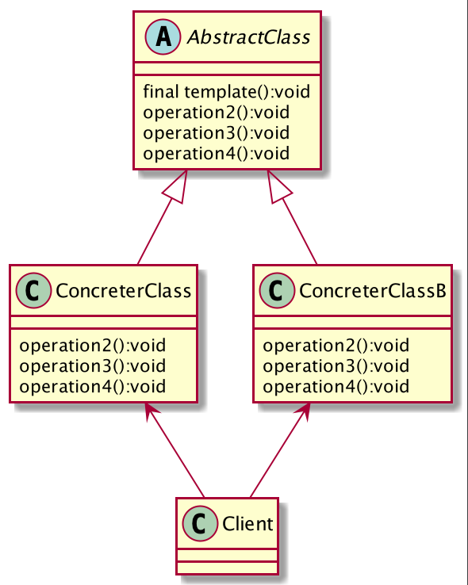

- 角色划分
    - AbstractClass，抽象类
        - 类中实现了模版方法template，定义了算法的骨架
            - **一般会将模版方法做成final，不让子类覆盖**
        - 抽象方法: operation2、3、4，需要由子类提供具体的实现
    - ConcreterClas，实现类
        - 实现抽象方法operation2、3、4

## 模版方法模式实现引入问题
[top](#catalog)
- UML图
    - uml代码
        - [/designPattern/dplearn/dplearn-base/src/test/java/com/ljs/learn/pattern/template/base/improve_uml.puml](/designPattern/dplearn/dplearn-base/src/test/java/com/ljs/learn/pattern/template/base/improve_uml.puml)
    - 图
        - 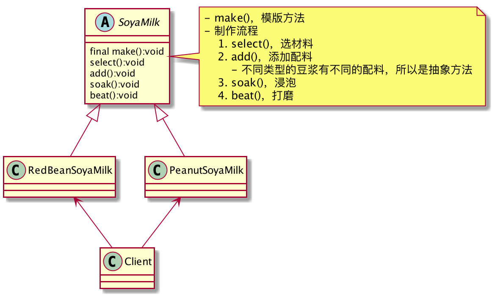
- 实现代码
    - 参考代码
        - [/designPattern/dplearn/dplearn-base/src/test/java/com/ljs/learn/pattern/template/base/SoyaMilk.java](/designPattern/dplearn/dplearn-base/src/test/java/com/ljs/learn/pattern/template/base/SoyaMilk.java)
        - [/designPattern/dplearn/dplearn-base/src/test/java/com/ljs/learn/pattern/template/base/PeanutSoyaMilk.java](/designPattern/dplearn/dplearn-base/src/test/java/com/ljs/learn/pattern/template/base/PeanutSoyaMilk.java)
        - [/designPattern/dplearn/dplearn-base/src/test/java/com/ljs/learn/pattern/template/base/RedBeanSoyaMilk.java](/designPattern/dplearn/dplearn-base/src/test/java/com/ljs/learn/pattern/template/base/RedBeanSoyaMilk.java)
    - 代码内容
        ```java
        // 抽象类，表示豆浆
        public abstract class SoyaMilk {
            // 模版方法
            public final void make(){
                select();
                add();
                soak();
                beat();
            }
        
            // 选材料
            public void select(){
                System.out.println("SoyaMilk select");
            }
        
            // 添加配料
            public abstract void add();
        
            // 浸泡
            public void soak(){
                System.out.println("SoyaMilk soak");
            }
        
            // 打磨
            public void beat(){
                System.out.println("SoyaMilk beat");
            }
        }
        ```
        ```java
        // 花生豆浆
        public class PeanutSoyaMilk extends SoyaMilk {
            @Override
            public void add() {
                System.out.println("add Peanut");
            }
        }
        ```
        ```java
        // 红豆豆浆
        public class RedBeanSoyaMilk extends SoyaMilk {
            @Override
            public void add() {
                System.out.println("add RedBean");
            }
        }    
        ```
- 测试代码
    - 参考代码
        - [/designPattern/dplearn/dplearn-base/src/test/java/com/ljs/learn/pattern/template/base/Client.java](/designPattern/dplearn/dplearn-base/src/test/java/com/ljs/learn/pattern/template/base/Client.java)
    - 测试内容
        ```java
        @Test
        public void test01(){
            // 制作红豆豆浆
            System.out.println("-----redBeanSoyaMilk-----");
            SoyaMilk redBeanSoyaMilk = new RedBeanSoyaMilk();
            redBeanSoyaMilk.make();
    
            // 制作花生豆浆
            System.out.println("-----peanutSoyaMilk-----");
            SoyaMilk peanutSoyaMilk = new PeanutSoyaMilk();
            peanutSoyaMilk.make();
        }
        ```
    - 测试结果
        ```
        -----redBeanSoyaMilk-----
        SoyaMilk select
        add RedBean
        SoyaMilk soak
        SoyaMilk beat
        -----peanutSoyaMilk-----
        SoyaMilk select
        add Peanut
        SoyaMilk soak
        SoyaMilk beat
        ```
    
## 模版方法模式的钩子方法
[top](#catalog)
- 钩子方法的特征
    1. 在模版方法模式的父类中，一个默认不做任何实际操作的方法
        - 不一定是空方法，可以是控制某部分流程的方法
    2. 子类可以视情况决定是否覆盖该方法
- 在引入问题中实现钩子方法
    - 添加需求
        - 不加配料时，获取纯豆浆
    - 实现代码
        - 参考代码
            - [/designPattern/dplearn/dplearn-base/src/test/java/com/ljs/learn/pattern/template/hook/SoyaMilk.java](/designPattern/dplearn/dplearn-base/src/test/java/com/ljs/learn/pattern/template/hook/SoyaMilk.java)
            - [/designPattern/dplearn/dplearn-base/src/test/java/com/ljs/learn/pattern/template/hook/PureSoyaMilk.java](/designPattern/dplearn/dplearn-base/src/test/java/com/ljs/learn/pattern/template/hook/PureSoyaMilk.java)
        - 在抽象类中添加钩子函数
            ```java
            public abstract class SoyaMilk {
                // 模版方法
                public final void make(){
                    select();
                    // 通过钩子函数的返回值，控制算法流程
                    if (wantAdd()){
                        add();
                    }
                    soak();
                    beat();
                }
            
                // ...
                // 钩子方法，决定是否需要添加配料
                boolean wantAdd(){
                    return true;
                }
            }
            ```
        - 纯豆浆类
            ```java
            public class PureSoyaMilk extends SoyaMilk {
                // 使用空方法完成继承
                @Override
                public void add() { }
            
                @Override
                boolean wantAdd() {
                    return false;
                }
            }
            ```
    - 测试代码
        - 参考代码
            - [/designPattern/dplearn/dplearn-base/src/test/java/com/ljs/learn/pattern/template/hook/Client.java](/designPattern/dplearn/dplearn-base/src/test/java/com/ljs/learn/pattern/template/hook/Client.java)
        - 测试内容
            ```java
            @Test
            public void test01(){
                // 制作红豆豆浆
                System.out.println("-----redBeanSoyaMilk-----");
                SoyaMilk redBeanSoyaMilk = new RedBeanSoyaMilk();
                redBeanSoyaMilk.make();
        
                // 制作纯豆浆
                System.out.println("-----pureSoyaMilk-----");
                SoyaMilk pureSoyaMilk = new PureSoyaMilk();
                pureSoyaMilk.make();
            }
            ```
        - 测试结果
            ```
            -----redBeanSoyaMilk-----
            SoyaMilk select
            add RedBean
            SoyaMilk soak
            SoyaMilk beat
            -----pureSoyaMilk-----
            SoyaMilk select
            SoyaMilk soak
            SoyaMilk beat
            ```
          
## 模版方法模式在Spring中的应用-IOC源码解析
[top](#catalog)
- UML图
    - uml代码
        - [/designPattern/dplearn/dplearn-base/src/test/java/com/ljs/learn/pattern/template/spring/uml.puml](/designPattern/dplearn/dplearn-base/src/test/java/com/ljs/learn/pattern/template/spring/uml.puml)

    - 图
        - 
- 代码说明
    - 接口定义模版方法
        ```java
        public interface ConfigurableApplicationContext extends ApplicationContext, Lifecycle, Closeable {
            void refresh() throws BeansException, IllegalStateException;
        }
        ```
    - 实现接口的抽象类，提供抽象方法和钩子函数，并实现模版方法
        ```java
        public abstract class AbstractApplicationContext extends DefaultResourceLoader implements ConfigurableApplicationContext {
            // 内部调用两个抽象方法，需要由子类提供实现
            protected ConfigurableListableBeanFactory obtainFreshBeanFactory() {
                this.refreshBeanFactory();
                return this.getBeanFactory();
            }
        
            protected abstract void refreshBeanFactory() throws BeansException, IllegalStateException;
            
            public abstract ConfigurableListableBeanFactory getBeanFactory() throws IllegalStateException;
            
            // 钩子方法
            protected void postProcessBeanFactory(ConfigurableListableBeanFactory beanFactory) {
            }
            
            // 钩子方法
            protected void onRefresh() throws BeansException {
                // For subclasses: do nothing by default.
            }
                
            // 模版方法
            public void refresh() throws BeansException, IllegalStateException {
                synchronized(this.startupShutdownMonitor) {
                    this.prepareRefresh();
                    ConfigurableListableBeanFactory beanFactory = this.obtainFreshBeanFactory();
                    this.prepareBeanFactory(beanFactory);
        
                    try {
                        // 调用钩子方法
                        this.postProcessBeanFactory(beanFactory);
                        this.invokeBeanFactoryPostProcessors(beanFactory);
                        this.registerBeanPostProcessors(beanFactory);
                        this.initMessageSource();
                        this.initApplicationEventMulticaster();
                        // 调用钩子方法
                        this.onRefresh();
                        this.registerListeners();
                        this.finishBeanFactoryInitialization(beanFactory);
                        this.finishRefresh();
                    } catch (BeansException var9) {
                        if (this.logger.isWarnEnabled()) {
                            this.logger.warn("Exception encountered during context initialization - cancelling refresh attempt: " + var9);
                        }
        
                        this.destroyBeans();
                        this.cancelRefresh(var9);
                        throw var9;
                    } finally {
                        this.resetCommonCaches();
                    }
        
                }
            }
        }
        ```
    - 实现类
        ```java
        public class GenericApplicationContext extends AbstractApplicationContext implements BeanDefinitionRegistry {
            // 实现抽象方法
            @Override
            public final ConfigurableListableBeanFactory getBeanFactory() {
                return this.beanFactory;
            }
            
            // 实现抽象方法
            @Override
            protected final void refreshBeanFactory() throws IllegalStateException {
                if (!this.refreshed.compareAndSet(false, true)) {
                    throw new IllegalStateException(
                            "GenericApplicationContext does not support multiple refresh attempts: just call 'refresh' once");
                }
                this.beanFactory.setSerializationId(getId());
            }
        }
        ```
    - 抽象实现类
        ```java
        public abstract class AbstractRefreshableApplicationContext extends AbstractApplicationContext {
            // 实现抽象方法
            @Override
            protected final void refreshBeanFactory() throws BeansException {
                if (hasBeanFactory()) {
                    destroyBeans();
                    closeBeanFactory();
                }
                try {
                    DefaultListableBeanFactory beanFactory = createBeanFactory();
                    beanFactory.setSerializationId(getId());
                    customizeBeanFactory(beanFactory);
                    loadBeanDefinitions(beanFactory);
                    synchronized (this.beanFactoryMonitor) {
                        this.beanFactory = beanFactory;
                    }
                }
                catch (IOException ex) {
                    throw new ApplicationContextException("I/O error parsing bean definition source for " + getDisplayName(), ex);
                }
            }
            
            // 实现抽象方法 
            @Override
            public final ConfigurableListableBeanFactory getBeanFactory() {
                synchronized (this.beanFactoryMonitor) {
                    if (this.beanFactory == null) {
                        throw new IllegalStateException("BeanFactory not initialized or already closed - " +
                                "call 'refresh' before accessing beans via the ApplicationContext");
                    }
                    return this.beanFactory;
                }
            }
        }
        ```

# 行为型-命令模式
## 命令模式-引入问题-智能生活项目需求
[top](#catalog)
- 需求
    - 购买一套智能家电，包括照明灯、风扇、冰箱、洗衣机，只要在手机上安装app就能控制智能家电工作
    - 智能家电来自不同的厂家，希望**只用一个app就可以控制全部智能家电**
- 实现一个app控制所有智能家电，需要每个智能家电厂家都提供一个统一的接口给app调用，这种情况就可以使用**命令模式**
- 角色划分
    - 请求发送者：手机app
    - 请求执行者：每个厂商的家电产品

## 命令模式简介
[top](#catalog)
- 命令模式 Command Pattern

- <label style="color:red">命令模式的一种通俗理解</label>
    - 将军发布命令，士兵执行命令
    - 角色划分
        - 请求发送者: 将军
        - 请求执行者: 士兵
        - 连接发送者与执行者: **命令**
 
- 命令模式的适用条件
    1. 经常需要向某些对象发送请求
    2. 不知道请求的接受者和请求的操作是什么
    3. 需要在程序运行时指定具体的请求接受者
        
- 相关概念
    - 什么是命令
        - 一个请求被封装为一个对象。通过使用不同的参数来表示不同的请求，即命令
    - 空命令模式
        - 本质：类内部的方法什么都不执行，是一个空方法
        - 可以在初始化时使用空命令为对象赋值
        - 使用空命令对象，可以避免判空
        - 如果没有空命令，每次执行都要判空，会给影响编码
    - 命令队列
        - 可以通过命令队列保存多个命令，以便多线程执行命令
    - **撤销操作**
    - 一个严格的命令模式需要**支持可撤销的操作**

- 命令模式的作用
    - 将**请求发送者**和**请求接受者**解耦
    - 使对象之间的调用关系更加灵活

- 命令模式的缺点
    - 系统可能会有过多的具体命令类，增加了系统的复杂度
    
- 命令模式的经典应用场景
    - 界面，界面中的每一个按钮都是一条命令
    - 模拟CMD（DOS命令）    
    - 订单的撤销/恢复
    - 触发-反馈机制
  
## 命令模式原理
[top](#catalog)
- 原理类图
    - uml代码
        - [/designPattern/dplearn/dplearn-base/src/test/java/com/ljs/learn/pattern/command/principle_uml.puml](/designPattern/dplearn/dplearn-base/src/test/java/com/ljs/learn/pattern/command/principle_uml.puml)
    - 图
        - 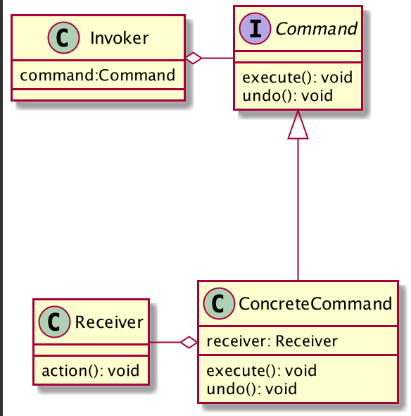

- 角色划分
    - Invoker: 请求发送者/调用者 
    - Receiver: 请求执行者/请求接受者/被调用者
        - 包含如何执行一个命令的相关操作 
    - Command: 抽象命令
        - 可以是接口或抽象类
        - 包含需要执行的所有命令
        - 用于连接 Invoker、Receiver
    - ConcreteCommand: 命令实现
        - 将一个接受者对象与某个命令绑定，调用接受者的相关操作，实现`execute`方法
        - 在类内部，聚合请求执行者
        
- 调用过程
    1. 请求调用者调用命令对象的execute()方法
    2. 命令对象会负责让接受者执行请求的动作
- 在调用过程中，请求发送者不需要知道请求执行者是谁，通过命令对象来进行解耦
- 命令对象在发送者和执行者之间起到了桥梁的作用

## 命令模式实现引入问题
[top](#catalog)
- UML图
    - uml代码
        - [/designPattern/dplearn/dplearn-base/src/test/java/com/ljs/learn/pattern/command/base/uml.puml](/designPattern/dplearn/dplearn-base/src/test/java/com/ljs/learn/pattern/command/base/uml.puml)
    - 角色图
        - 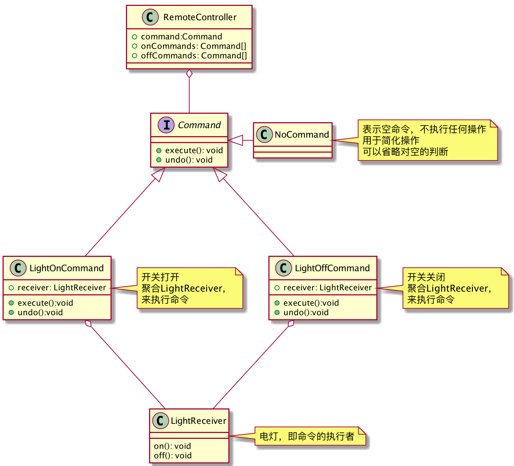
    - client调用图
        - 

- 请求的接受者/执行者:
    - 参考代码
        - [/designPattern/dplearn/dplearn-base/src/test/java/com/ljs/learn/pattern/command/base/LightReceiver.java](/designPattern/dplearn/dplearn-base/src/test/java/com/ljs/learn/pattern/command/base/LightReceiver.java)
    - 代码内容   
        ```java
        public class LightReceiver {
            public void on(){
                System.out.println(" light on ");
            }
            public void off(){
                System.out.println(" light off ");
            }
        }
        ```
- 命令
    - 参考代码
        - [/designPattern/dplearn/dplearn-base/src/test/java/com/ljs/learn/pattern/command/base/command/Command.java](/designPattern/dplearn/dplearn-base/src/test/java/com/ljs/learn/pattern/command/base/command/Command.java)
        - [/designPattern/dplearn/dplearn-base/src/test/java/com/ljs/learn/pattern/command/base/command/LightOffCommand.java](/designPattern/dplearn/dplearn-base/src/test/java/com/ljs/learn/pattern/command/base/command/LightOffCommand.java)
        - [/designPattern/dplearn/dplearn-base/src/test/java/com/ljs/learn/pattern/command/base/command/LightOnCommand.java](/designPattern/dplearn/dplearn-base/src/test/java/com/ljs/learn/pattern/command/base/command/LightOnCommand.java)
    - 代码内容
        ```java
        // 命令接口
        public interface Command {
            // 执行某个操作
            void execute();
            // 撤销操作
            void undo();
        }
        ```
        ```java
        // 开按钮命令
        public class LightOnCommand implements Command {
            LightReceiver receiver;
        
            public LightOnCommand(LightReceiver receiver) {
                this.receiver = receiver;
            }
        
            @Override
            public void execute() {
                // 由命令调用接收者的方法
                receiver.on();
            }
        
            @Override
            public void undo() {
                // 由命令调用接收者的方法
                receiver.off();
            }
        }
        ```
        ```java
        // 关按钮命令
        public class LightOffCommand implements Command {
            LightReceiver receiver;
        
            public LightOffCommand(LightReceiver receiver) {
                this.receiver = receiver;
            }
        
            @Override
            public void execute() {
                // 由命令调用接收者的方法
                receiver.off();
            }
        
            @Override
            public void undo() {
                // 由命令调用接收者的方法
                receiver.on();
            }
        }
        ```
- 请求的发送者
    - 参考代码
        - [/designPattern/dplearn/dplearn-base/src/test/java/com/ljs/learn/pattern/command/base/RemoteController.java](/designPattern/dplearn/dplearn-base/src/test/java/com/ljs/learn/pattern/command/base/RemoteController.java)
    - 代码内容
        ```java
        // 请求发送者：手机app
        public class RemoteController {
            // 保存按钮的命令
            private Command[] onCommand;
            private Command[] offCommand;
        
            // 保存最近一次的命令，以便执行撤销操作
            private Command undoCommand;
        
            public RemoteController() {
                onCommand = new Command[5];
                offCommand = new Command[5];
        
                for (int i = 0; i < 5; i++) {
                    onCommand[i] = new NoCommand();
                    offCommand[i] = new NoCommand();
                }
            }
        
            // 给按钮设置需要的命令
            // 同时设置开、关的命令
            public void setCommand(int no, Command onCommand, Command offCommand){
                this.onCommand[no] = onCommand;
                this.offCommand[no] = offCommand;
            }
        
            // 开按钮操作
            public void onButtonWasPushed(int no){
                onCommand[no].execute();
                // 记录按钮，以便执行撤销
                undoCommand = onCommand[no];
            }
        
            // 关按钮操作
            public void offButtonWasPushed(int no){
                offCommand[no].execute();
                // 记录按钮，以便执行撤销
                undoCommand = offCommand[no];
            }
        
            // 撤销操作
            public void undo(){
                undoCommand.undo();
            }
        }
        ```     
- 测试代码
    - 参考代码
        - [/designPattern/dplearn/dplearn-base/src/test/java/com/ljs/learn/pattern/command/base/Client.java](/designPattern/dplearn/dplearn-base/src/test/java/com/ljs/learn/pattern/command/base/Client.java)
    - 代码内容
        ```java
        @Test
        public void test01(){
            // 1. 创建一个app，即创建一个请求发送者
            RemoteController app = new RemoteController();
    
            // 2. 创建命令
            // 2.1 创建与light相关的命令
            // 创建请求接受者
            LightReceiver lightReceiver = new LightReceiver();
    
            // 创建命令
            LightOnCommand lightOnCommand = new LightOnCommand(lightReceiver);
            LightOffCommand lightOffCommand = new LightOffCommand(lightReceiver);
    
            // 2.2 创建与TV相关的命令
            TVReceiver tvReceiver = new TVReceiver();
            TVOnCommand tvOnCommand = new TVOnCommand(tvReceiver);
            TVOffCommand tvOffCommand = new TVOffCommand(tvReceiver);
    
            // 3. 为app设置命令
            app.setCommand(0, lightOnCommand, lightOffCommand);
            app.setCommand(1, tvOnCommand, tvOffCommand);
    
            // 4. 通过app的安装来执行操作
            // light 操作
            app.onButtonWasPushed(0);
            app.offButtonWasPushed(0);
            app.undo();
    
            // tv 操作
            app.onButtonWasPushed(1);
            app.offButtonWasPushed(1);
            app.undo();
        }
        ```

## 命令模式在Spring中的应用-JdbcTempate源码解析
[top](#catalog)
- 角色划分
    - command接口类：StatementCallback
    - 调用者：JdbcTemplate
    - 命令对象: ExecuteStatementCallback
    - 执行者：ExecuteStatementCallback
- Command接口
    ```java
    @FunctionalInterface
    public interface StatementCallback<T> {
        @Nullable
        T doInStatement(Statement var1) throws SQLException, DataAccessException;
    }
    ```

- 其他对象分析
    ```java
    class JdbcTemplate{
        // 调用者：JdbcTemplate对象下的 `execute`方法，相当于请求调用者：Invoker
        public void execute(final String sql) throws DataAccessException {
            if (this.logger.isDebugEnabled()) {
                this.logger.debug("Executing SQL statement [" + sql + "]");
            }
    
            // 内部定义了实现Command接口的局部类：ExecuteStatementCallback
            // 相当于 ConcreteCommand + Reveicer
            // 同时是命令对象，并在内部自动继承 Reveicer
            class ExecuteStatementCallback implements StatementCallback<Object>, SqlProvider {
                ExecuteStatementCallback() {
                }
    
                @Nullable
                public Object doInStatement(Statement stmt) throws SQLException {
                    stmt.execute(sql);
                    return null;
                }
    
                public String getSql() {
                    return sql;
                }
            }
    
            // 创建命令对象并执行命令，
            // 相当于  Invoker
            this.execute((StatementCallback)(new ExecuteStatementCallback()));
        }
        
        @Nullable
        public <T> T execute(StatementCallback<T> action) throws DataAccessException {
            Assert.notNull(action, "Callback object must not be null");
            Connection con = DataSourceUtils.getConnection(this.obtainDataSource());
            Statement stmt = null;
    
            Object var11;
            try {
                stmt = con.createStatement();
                this.applyStatementSettings(stmt);
                // 相当于 Invoker 执行了指令中的方法，然后给其他资源使用
                T result = action.doInStatement(stmt);
                this.handleWarnings(stmt);
                var11 = result;
            } catch (SQLException var9) {
                String sql = getSql(action);
                JdbcUtils.closeStatement(stmt);
                stmt = null;
                DataSourceUtils.releaseConnection(con, this.getDataSource());
                con = null;
                throw this.translateException("StatementCallback", sql, var9);
            } finally {
                JdbcUtils.closeStatement(stmt);
                DataSourceUtils.releaseConnection(con, this.getDataSource());
            }
    
            return var11;
        }
    }
    ```

# 行为型-访问者模式
## 访问者模式-引入问题-测评系统
[top](#catalog)
- 需求
    - 将观众分为男人和女人，对歌手进行测评。当看完某个歌手表演后，给出对该歌手的评价
    - 评价有不同的种类，如成功、失败等
- 传统方案
    - 实现方式
        - 子类继承父类，并在子类中提供返回结果的方法 
        ```
              Person
                │
           ┌────┴────┐
         man        woman
        ```
    - 存在的问题
        - 随着系统增加越来越多的新功能时，对代码改动较大，违反了ocp原则
        - 扩展性不好。比如增加了新的人员类型、管理方法、评价方式等，都不太容易

## 访问者模式简介
[top](#catalog)
- 什么是 访问者模式 （Visitor Pattern）
    - 封装一些作用于某种数据结构元素的操作。在不改变数据结构的前提下，定义作用于这些元素的新操作
- 作用 
    - 用于将数据结构和数据操作分离，解决数据结构和操作耦合性问题

- 应用场景
    - 需要对一个对象结构中的对象进行很多不同操作，同时需要避免让这些操作影响这些类 
    
## 访问者模式的原理
[top](#catalog)
- 在被访问的类中，添加一个对外提供接待访问者的接口
- 原理类图
    - uml代码
        - [/dplearn/dplearn-base/src/test/java/com/ljs/learn/pattern/visitor/principle_uml.puml](/dplearn/dplearn-base/src/test/java/com/ljs/learn/pattern/visitor/principle_uml.puml)
        
    - 图
        - 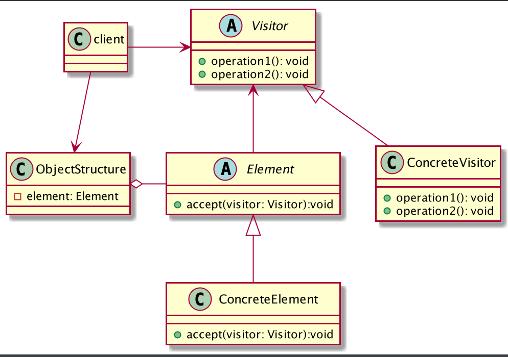

- 角色划分
    - Visitor，抽象访问者
        - 为所有子类添加一个visit方法
    - ConcreteVisitor，具体访问者
        - 实现 Visitor 声明的操作，是每个操纵的实现部分
    - ObjectStructure，对象结构
        - 可以枚举它的元素
        - 可以提供一个高层的接口，用来**允许访问者访问内部元素**
    - Element，抽象元素
        - 定义了一个`accept`方法，接收一个访问者对象
    - ConcreteElement，具体元素
        - 实现了`accept`方法

- Element 提供的功能
    - 向外部暴露一个方法，来接收访问者。
    - 在暴露的方法内将 Element 自身作为参数提供给访问者，使访问者完成访问
- ObjectStructure 提供的功能
    - 将 Element 保存到 ObjectStructure 中
    - 暴露一个方法接收访问者，并以统一的方法，使访问者访问内部的每一个 Element

- 对于调用者
    - 调用者关联 ObjectStructure 和 访问者
    - 通过 ObjectStructure 对外暴露的方法，使访问者统一访问内部的 Element 

- 模式的整体---双分派的应用
    1. 第一次分派：在Client中，将访问者传入 对象结构
    2. 第二次分派：在ConcreteElement内部，将 自身作为参数传递给访问者，使访问者完整访问操作

- 什么是双分派
    - 双分派是指无论类如何变化，都能找到期望的方法运行
    - 双分派意味着得到执行的操作取决于请求的种类和接受者两个类型

## 访问者模式实现引入问题
[top](#catalog)
- UML图
    - uml代码
        - [/designPattern/dplearn/dplearn-base/src/test/java/com/ljs/learn/pattern/visitor/base/base_uml.puml](/designPattern/dplearn/dplearn-base/src/test/java/com/ljs/learn/pattern/visitor/base/base_uml.puml)
    - 图
        - 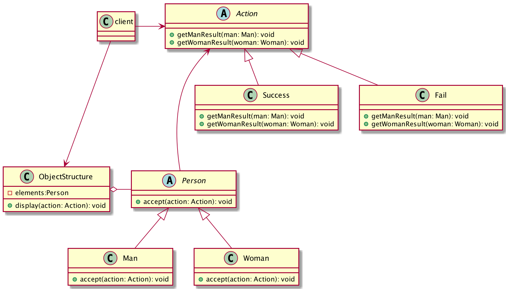
- 角色分析
    - 访问者：
        - 接口/抽象类：Action
        - 实现类：Success、Fail
    - 元素
        - 接口/抽象类：Person
        - 实现类：Man、Woman
    - 对象结构
        - ObjectStructure

- 如果添加了新投票方式 Wait，即新的访问者
    - Wait 只需要继承并实现 Action，不用修改 Person 部分，
    - 使用时，直接通过 ObjectStructure 注入 Wait 即可

- 访问者
    - 参考代码
        - [/designPattern/dplearn/dplearn-base/src/test/java/com/ljs/learn/pattern/visitor/base/Action.java](/designPattern/dplearn/dplearn-base/src/test/java/com/ljs/learn/pattern/visitor/base/Action.java)
        - [/designPattern/dplearn/dplearn-base/src/test/java/com/ljs/learn/pattern/visitor/base/Fail.java](/designPattern/dplearn/dplearn-base/src/test/java/com/ljs/learn/pattern/visitor/base/Fail.java)
        - [/designPattern/dplearn/dplearn-base/src/test/java/com/ljs/learn/pattern/visitor/base/Success.java](/designPattern/dplearn/dplearn-base/src/test/java/com/ljs/learn/pattern/visitor/base/Success.java)
    - 代码内容
        ```java
        public abstract class Action {
            // 得到男性的测评
            public abstract void getManResult(Man  man);
            // 得到女性的测评
            public abstract void getWomanResult(Woman  woman);
        }
        ```
        ```java
        public class Fail extends Action {
            @Override
            public void getManResult(Man man) {
                System.out.println("man fail");
            }
        
            @Override
            public void getWomanResult(Woman woman) {
                System.out.println("woman fail");
            }
        }
        ```
        ```java
        public class Success extends Action {
            @Override
            public void getManResult(Man man) {
                System.out.println("man success");
            }
        
            @Override
            public void getWomanResult(Woman woman) {
                System.out.println("woman  success");
            }
        }
        ```

- 元素
    - 参考代码
        - [/designPattern/dplearn/dplearn-base/src/test/java/com/ljs/learn/pattern/visitor/base/Person.java](/designPattern/dplearn/dplearn-base/src/test/java/com/ljs/learn/pattern/visitor/base/Person.java)
        - [/designPattern/dplearn/dplearn-base/src/test/java/com/ljs/learn/pattern/visitor/base/Man.java](/designPattern/dplearn/dplearn-base/src/test/java/com/ljs/learn/pattern/visitor/base/Man.java)
        - [/designPattern/dplearn/dplearn-base/src/test/java/com/ljs/learn/pattern/visitor/base/Woman.java](/designPattern/dplearn/dplearn-base/src/test/java/com/ljs/learn/pattern/visitor/base/Woman.java)
    - 代码内容
        ```java
        public abstract class Person {
            // 提供一个方法，让访问者可以访问
            public abstract void accept(Action action);
        }
        ```
        ```java
        // 双分派的第二次分派
        // 1. 第一次分派：在客户端程序中，将具体状态作为参数传递到Woman中
        // 2. 第二次分派：Woman类调用作为参数的具体方法 getWomanResult，
        //              同时将自己作为参数传入
        public class Man extends Person {
            @Override
            public void accept(Action action) {
                action.getManResult(this);
            }
        }
        ```
        ```java
        // 双分派的第二次分派
        // 1. 第一次分派：在客户端程序中，将具体状态作为参数传递到Woman中
        // 2. 第二次分派：Woman类调用作为参数的具体方法 getWomanResult，
        //              同时将自己作为参数传入
        public class Woman extends Person {
            @Override
            public void accept(Action action) {
                action.getWomanResult(this);
            }
        }
        ```
- Client
    - 参考代码
        - [/designPattern/dplearn/dplearn-base/src/test/java/com/ljs/learn/pattern/visitor/base/Client.java](/designPattern/dplearn/dplearn-base/src/test/java/com/ljs/learn/pattern/visitor/base/Client.java)
    - 代码内容
        ```java
        @Test
        public void test01(){
            ObjectStructure os = new ObjectStructure();
    
            os.attach(new Man());
            os.attach(new Woman());
            os.attach(new Woman());
            os.attach(new Man());
    
            Success success = new Success();
    
            // 双分派的第一次分派
            // 1. 第一次分派：在客户端程序中，将具体状态作为参数传递到Woman中
            // 2. 第二次分派：Woman类调用作为参数的具体方法 getWomanResult，
            //              同时将自己作为参数传入
            os.display(success);
        }
        ```

## 访问者模式的注意事项和细节
[top](#catalog)
- 优点
    - 访问者模式符合单一职责原则，让程序具有优秀的扩展性，灵活性非常高
    - 访问者可以对功能进行统一，适用于：报表、UI、拦截器、过滤器
- 缺点
    - 违反了迪米特法则
        - 具体元素对访问者公布细节，即访问者知道了类的内部细节
        - 在修改具体元素时，比较困难
    - 违背了依赖倒转原则
        - 访问者依赖的是具体元素，而不是抽象元素
            - 如下的两个方法依赖了具体元素，但是可以通过接口化来解决
                ```java
                public void getManResult(Man man)
                public void getWomanResult(Woman woman)
                ```
- 适用的场景
    - **数据结构相对稳定**的，同时又有经常变化的功能需求的系统
        - 数据结构相对稳定 ---> 具体 Element 稳定
        - 经常变化的功能需求 ---> 多样化的访问者
        - 即在稳定的数据结构之上，通过方法的扩展

# 行为型-迭代器模式
## 迭代器模式-引入问题-学校院系展示
[top](#catalog)
- 与组合模式的引入问题类似
    - 参考：[组合模式-引入问题-学校院系展示](#组合模式-引入问题-学校院系展示)
- 编写程序展示一个学校院系结构
    - 要在一个页面中展示出学校的院系组成
    - 一个学校有多个学院
    - 一个学院有多个系

- 实现中的问题
    - 将需求转化为树型结构之后，每个结点中保存子节点的方式不同
    - 保存方式包括：数组、集合、Map等等，无法提供统一的遍历方式
    
- 解决方法
    - 使用迭代器模式

## 迭代器模式简介
[top](#catalog)
- 迭代器模式，Iterator Pattern
- 迭代器模式的作用
    - 提供一种遍历元素的统一接口，用一致的方法遍历集合元素
    - 遍历时，不需要知道集合对象的底层结构，即不会暴露元素的内部结构
- 适用场景
    - 集合元素是用不同方式实现的，需要统一的方式来遍历集合

## 迭代器模式原理
[top](#catalog)
- 原理类图
    - uml代码
        - [/designPattern/dplearn/dplearn-base/src/test/java/com/ljs/learn/pattern/iterator/principle_uml.puml](/designPattern/dplearn/dplearn-base/src/test/java/com/ljs/learn/pattern/iterator/principle_uml.puml)
    - 图
        - 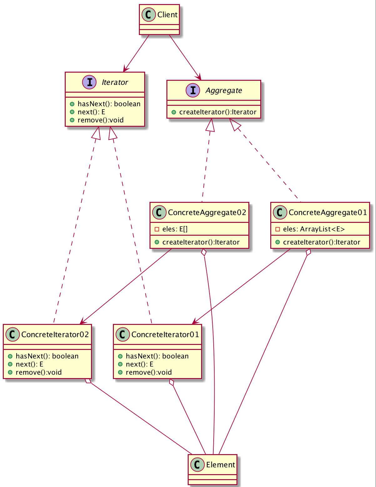
        
- 角色划分
    - Iterator: 迭代器接口
        - 由java提供
    - ConcreteIterator: 具体迭代器类
        - 负责迭代
    - Aggregate: 聚合器接口
        - 一个统一的集合聚合接口，实现类内部需要聚合了一个集合
        - 负责将客户端和具体集合解耦
    - ConcreteAggregate: 聚合器实现类
        - 具体的集合持有类，
        - 对外提供一个方法，**返回/生成一个迭代器**，该迭代器可以进行集合遍历

## 迭代器模式实现引入问题
[top](#catalog)
- UML图
    - uml代码
        - [/designPattern/dplearn/dplearn-base/src/test/java/com/ljs/learn/pattern/iterator/base/base_uml.puml](/designPattern/dplearn/dplearn-base/src/test/java/com/ljs/learn/pattern/iterator/base/base_uml.puml)
    - 图
        - 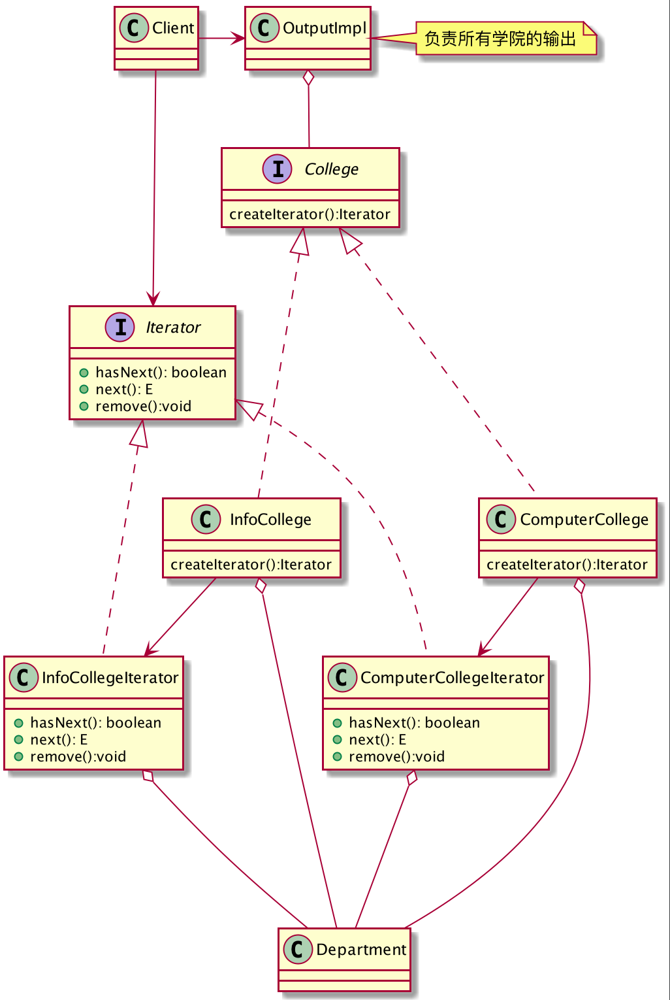
- 聚合器与迭代器接口
    - 参考代码
        - [/designPattern/dplearn/dplearn-base/src/test/java/com/ljs/learn/pattern/iterator/base/aggregate/College.java](/designPattern/dplearn/dplearn-base/src/test/java/com/ljs/learn/pattern/iterator/base/aggregate/College.java)
    - 代码内容
        ```java
        public interface College {
            Iterator createIterator();
        
            // 返回当前学院的名称
            String getName();
        
            // 增加系的方法
            void addDepartment(String name, String desc);
        }
        ```
- 聚合器与迭代器实现--迭代数组
    - 参考代码
        - [/designPattern/dplearn/dplearn-base/src/test/java/com/ljs/learn/pattern/iterator/base/aggregate/ComputerCollege.java/Users/liujinsuo/myGit/memobook/designPattern/dplearn/dplearn-base/src/test/java/com/ljs/learn/pattern/iterator/base/aggregate/ComputerCollege.java](/designPattern/dplearn/dplearn-base/src/test/java/com/ljs/learn/pattern/iterator/base/aggregate/ComputerCollege.java/Users/liujinsuo/myGit/memobook/designPattern/dplearn/dplearn-base/src/test/java/com/ljs/learn/pattern/iterator/base/aggregate/ComputerCollege.java)
        - [/designPattern/dplearn/dplearn-base/src/test/java/com/ljs/learn/pattern/iterator/base/iter/ComputerCollegeIterator.java](/designPattern/dplearn/dplearn-base/src/test/java/com/ljs/learn/pattern/iterator/base/iter/ComputerCollegeIterator.java)
    - 代码内容
        ```java
        public class ComputerCollege implements College {
            Department[] ds;
            // 保存当前数组的对象个数
            int numOfDs = 0;
        
            public ComputerCollege() {
                ds = new Department[5];
            }
        
            @Override
            public Iterator createIterator() {
                return new ComputerCollegeIterator(this.ds);
            }
        
            @Override
            public String getName() {
                return "Computer College";
            }
        
            @Override
            public void addDepartment(String name, String desc) {
                Department d = new Department(name, desc);
                ds[numOfDs] = d;
                numOfDs++;
            }
        }
        ```
        ```java
        public class ComputerCollegeIterator implements Iterator {
            // 需要知道Department是以怎样过的方式保存的
            Department[] ds;
            int position=0; //遍历的位置
        
            public ComputerCollegeIterator(Department[] ds) {
                this.ds = ds;
            }
        
            // 判断是否还有下一个元素
            @Override
            public boolean hasNext() {
                if (position >= ds.length || ds[position] == null){
                    return false;
                } else {
                    return true;
                }
            }
        
            @Override
            public Object next() {
                Department d = ds[position];
                position ++;
                return d;
            }
        
            // 删除方法，默认空实现
            @Override
            public void remove() {
        
            }
        }
        ```
- 聚合器与迭代器实现--迭代ArrayLost
    - 参考代码
        - [/designPattern/dplearn/dplearn-base/src/test/java/com/ljs/learn/pattern/iterator/base/aggregate/InfoCollege.java](/designPattern/dplearn/dplearn-base/src/test/java/com/ljs/learn/pattern/iterator/base/aggregate/InfoCollege.java)
        - [/designPattern/dplearn/dplearn-base/src/test/java/com/ljs/learn/pattern/iterator/base/iter/InfoCollegeIterator.java](/designPattern/dplearn/dplearn-base/src/test/java/com/ljs/learn/pattern/iterator/base/iter/InfoCollegeIterator.java)
    - 代码内容
        ```java
        public class InfoCollege implements College {
            List<Department> ds;
            // 保存当前数组的对象个数
            int numOfDs = 0;
        
            public InfoCollege() {
                ds = new ArrayList<>();
            }
        
            @Override
            public Iterator createIterator() {
                return new InfoCollegeIterator(this.ds);
            }
        
            @Override
            public String getName() {
                return "Info College";
            }
        
            @Override
            public void addDepartment(String name, String desc) {
                Department d = new Department(name, desc);
                ds.add(d) ;
            }
        }
        ```
        ```java
        public class InfoCollegeIterator implements Iterator {
            // 需要知道Department是以怎样过的方式保存的
            List<Department> ds;
            int position=-1; //遍历的位置
        
            public InfoCollegeIterator(List<Department> ds) {
                this.ds = ds;
            }
        
            // 判断是否还有下一个元素
            @Override
            public boolean hasNext() {
                if (position >= ds.size() - 1){
                    return false;
                } else {
                    position++;
                    return true ;
                }
            }
        
            @Override
            public Object next() {
                Department d = ds.get(position);
                return d;
            }
        
            // 删除方法，默认空实现
            @Override
            public void remove() {
        
            }
        }
        ```
- 输出器
    - 参考代码
        - [/designPattern/dplearn/dplearn-base/src/test/java/com/ljs/learn/pattern/iterator/base/OutputImpl.java](/designPattern/dplearn/dplearn-base/src/test/java/com/ljs/learn/pattern/iterator/base/OutputImpl.java)
    -  代码内容
        ```java
        public class OutputImpl {
            // 学院的集合
            List<College> cs;
        
            public OutputImpl(List<College> cs) {
                this.cs = cs;
            }
        
            // 遍历所有学院，然后调用printDepartment遍历学院下的系
            public void printCollege(){
                // 取出所有学院
                // java中的List已经实现了Iterator
                Iterator<College> iterator = cs.iterator();
                while (iterator.hasNext()){
                    // 取出一个学院
                    College c = iterator.next();
                    System.out.println(c.getName());
                    // 得到对应的迭代器
                    printDepartment(c.createIterator());
                }
            }
        
            // 输出系
            public void printDepartment(Iterator iter){
                while (iter.hasNext()){
                    Department d =(Department) iter.next();
                    System.out.println(d.getName());
                }
            }
        }
        ```
- 测试类
    - 参考代码
        - [/designPattern/dplearn/dplearn-base/src/test/java/com/ljs/learn/pattern/iterator/base/Client.java](/designPattern/dplearn/dplearn-base/src/test/java/com/ljs/learn/pattern/iterator/base/Client.java)
    - 测试内容
        ```java
        @Test
        public void test01(){
            // 创建学院和系
            ComputerCollege computerCollege = new ComputerCollege();
            computerCollege.addDepartment("Da", "Da");
            computerCollege.addDepartment("Db", "Db");
            computerCollege.addDepartment("Dc", "Dc");
            computerCollege.addDepartment("Dd", "Dd");
    
            InfoCollege infoCollege = new InfoCollege();
            infoCollege.addDepartment("ia", "ia");
            infoCollege.addDepartment("ib", "ib");
            infoCollege.addDepartment("ic", "ic");
            infoCollege.addDepartment("id", "id");
    
            // 创建学院集合
            List<College> cs = new ArrayList<>();
            cs.add(computerCollege);
            cs.add(infoCollege);
    
            // 创建输出器，并打印
            OutputImpl output = new OutputImpl(cs);
            output.printCollege();
        }
        ```

## 迭代器模式在JDK中的应用--ArrayList分析
[top](#catalog)
- 使用示例
    - 参考代码
        - [/designPattern/dplearn/dplearn-base/src/test/java/com/ljs/learn/pattern/iterator/jdkAnalyze/ArrayListTest.java](/designPattern/dplearn/dplearn-base/src/test/java/com/ljs/learn/pattern/iterator/jdkAnalyze/ArrayListTest.java)
    - 代码内容
        ```java
        @Test
        public void tet01(){
            // 1. 获得一个聚合器接口实例
            List<String> a = new ArrayList<>();
            a.add("aaaa");
            a.add("bbbb");
            a.add("cccc");
    
            // 2. 创建迭代器
            Iterator<String> iter = a.iterator();
    
            // 3. 开始迭代
            while( iter.hasNext() ){
                System.out.println(iter.next());
            }
        }
        ```
- 原理类图
    - uml代码
        - [/designPattern/dplearn/dplearn-base/src/test/java/com/ljs/learn/pattern/iterator/jdkAnalyze/arraylist_uml.puml](/designPattern/dplearn/dplearn-base/src/test/java/com/ljs/learn/pattern/iterator/jdkAnalyze/arraylist_uml.puml)
    - 图
        - 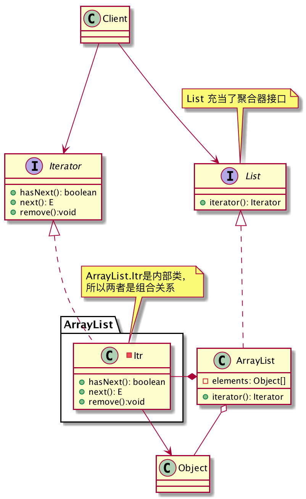

- 原理说明
    - ArrayList是聚合器，List接口是聚合器 接口
        ```java
        public class ArrayList<E> extends AbstractList<E>
                implements List<E>, RandomAccess, Cloneable, java.io.Serializable
        {
            // 集合对象
            transient Object[] elementData;
            
            // // 调用内部类生成迭代器
            public Iterator<E> iterator() {
                return new Itr();
            }
        }
        ```
    - Itr是迭代器实现，以内部类的方式存在于ArrayList
        - 由于是内部类，所以没有通过构造器或setter来设置集合对象，而是直接使用父类中的集合对象
        ```java
        private class Itr implements Iterator<E> {
            int cursor;       // index of next element to return
            int lastRet = -1; // index of last element returned; -1 if no such
            int expectedModCount = modCount;
        
            // prevent creating a synthetic constructor
            Itr() {}
        
            public boolean hasNext() {
                return cursor != size;
            }
        
            @SuppressWarnings("unchecked")
            public E next() {
                checkForComodification();
                int i = cursor;
                if (i >= size)
                    throw new NoSuchElementException();
                // 直接使用父类中的集合对象来进行迭代
                Object[] elementData = ArrayList.this.elementData;
                if (i >= elementData.length)
                    throw new ConcurrentModificationException();
                cursor = i + 1;
                return (E) elementData[lastRet = i];
            }
        
            public void remove() {
                //....
            }
            // 其他方法
            // ...
        }
        ```

## 迭代器模式的注意实事项和细节
[top](#catalog)
- 适用场景
    - 当需要展示一组相似对象，或者遍历相同对象时
- 优点
    - 提供统一的方法遍历对象，使用时不用考虑聚合对象的类型
        - 聚合对象的类型及其遍历方法全部封装在迭代器内部，所以可以通过统一的方法遍历
    - 隐藏了聚合对象的内部结构。在遍历时，只会获取到迭代器，而不会知道聚合器的具体组成
    - 提供了一种设计思想：一个类应该只有一个引起变化的原因，即单一职责原则
        - 即一个对象负责遍历，一个对象负责存储数据
        - 在聚合器中，将迭代器分开，就是要把集合管理器、集合迭代器的责任分开
            - 如数据存储在 ArrayList，遍历由 Itr 来执行
        - 如果集合发生变化，只会影响到聚合器；如果遍历方式发生变化，只会影响迭代器

- 缺点
    -  每个聚合对象都需要一个迭代器，会生成多个迭代器不好管理

# 行为型-观察者模式
## 观察者模式-引入问题-天气预报项目
[top](#catalog)
- 需求
    - 气象站可以将每天测量到的数据以公告的形式发布出去
        - 数据包括：温度、湿度、气压等等
        - 发布方式包括：自己的网站，或第三方机构发布
    - 需要设计开发的API，便于其他点放也能介入气象站获取数据
    - 提供获取温度、湿度、气压的接口
    - **测试数据更新时，要能够实时的通知给第三方**

- 传统设计方案-方案1: 手动获取数据
    - uml图
        - uml代码
            - [/designPattern/dplearn/dplearn-base/src/test/java/com/ljs/learn/pattern/observer/base/plan01_base_uml.puml](/designPattern/dplearn/dplearn-base/src/test/java/com/ljs/learn/pattern/observer/base/plan01_base_uml.puml)
        - 图
            - 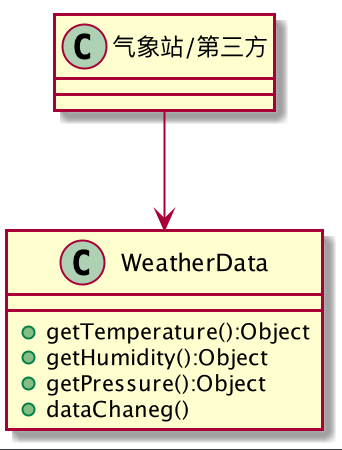

    - 设计方法
        - 通过 `getXxxx` 方法，让第三方接入，并获取相关信息
        - 气象站也可以通过调用 `dataChange()` 更新数据，统一获得所有的最新数据  

- 传统设计方案-方案2: 自动推送
    - uml图
        - uml代码
            - [/designPattern/dplearn/dplearn-base/src/test/java/com/ljs/learn/pattern/observer/base/plan02_push_uml.puml](/designPattern/dplearn/dplearn-base/src/test/java/com/ljs/learn/pattern/observer/base/plan02_push_uml.puml)
        - 图
            - 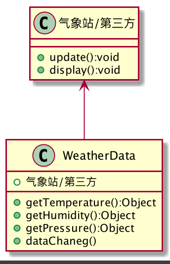
    - 设计方法
        - 由 `WeatherData` 保存获取数据的对象
        - 在有新数据时，`WeatherData` 主动推送给各个对象


- 传统方案的问题
    1. 其他第三方接入时，需要修改WeatherData中保存的类
    2. 无法在运行时动态的添加第三方
    3. 违反了ocp原则

## 传统方案-自动推送方式的实现
[top](#catalog)
- 参考代码
    - [/designPattern/dplearn/dplearn-base/src/test/java/com/ljs/learn/pattern/observer/base/plan02/CurrentConditions.java](/designPattern/dplearn/dplearn-base/src/test/java/com/ljs/learn/pattern/observer/base/plan02/CurrentConditions.java)
    - [/designPattern/dplearn/dplearn-base/src/test/java/com/ljs/learn/pattern/observer/base/plan02/WeatherData.java](/designPattern/dplearn/dplearn-base/src/test/java/com/ljs/learn/pattern/observer/base/plan02/WeatherData.java)
- 代码内容
    - 气象站/第三方
        ```java
        // 显示天气信息状况，相当于气象站/第三方
        public class CurrentConditions {
            private float temperature;
            private float pressure;
            private float humidity;
        
            // 由 WeatherData 对象来调用，使用推送模式
            public void update(float temperature, float pressure, float humidity){
                this.temperature = temperature;
                this.pressure = pressure;
                this.humidity = humidity;
                display();
            }
        
            public void display(){
                System.out.println("temperature = " + temperature);
                System.out.println("pressure = " + pressure);
                System.out.println("humidity = " + humidity);
            }
        }
        ```
    - WeatherData
        ```java
        // 保存最新的天气情况信息
        // 包含一个 CurrentConditions 对象，作为接入方，可以接收数据
        // 当数据更新时，调用 CurrentConditions.update方法，推送数据
        public class WeatherData {
            private float temperature;
            private float pressure;
            private float humidity;
            private CurrentConditions currentConditions;
        
            public WeatherData(CurrentConditions currentConditions) {
                this.currentConditions = currentConditions;
            }
        
            // 将最新的数据推送给 CurrentConditions
            public void dataChange(){
                currentConditions.update(getTemperature(), getPressure(), getHumidity());
            }
        
            public void setData(float temperature, float pressure, float humidity){
                this.temperature = temperature;
                this.pressure = pressure;
                this.humidity = humidity;
                // 将最新的数据推送给 CurrentConditions
                dataChange();
            }
        
            public float getTemperature() {
                return temperature;
            }
        
            public float getPressure() {
                return pressure;
            }
        
            public float getHumidity() {
                return humidity;
            }
        }
        ```
    - 测试类
        - 参考代码
            - [/designPattern/dplearn/dplearn-base/src/test/java/com/ljs/learn/pattern/observer/base/plan02/Client.java](/designPattern/dplearn/dplearn-base/src/test/java/com/ljs/learn/pattern/observer/base/plan02/Client.java)
        - 测试内容
            ```java
            @Test
            public void test01(){
                // 创建接入方
                CurrentConditions currentConditions = new CurrentConditions();
                WeatherData weatherData = new WeatherData(currentConditions);
        
                // 更新并推送数据
                weatherData.setData(10, 20, 30);
                weatherData.setData(60, 30, 10);
            }
                ```

## 观察者模式原理
[top](#catalog)
- 原理类图
    - uml代码
        - [/designPattern/dplearn/dplearn-base/src/test/java/com/ljs/learn/pattern/observer/principle_uml.puml](/designPattern/dplearn/dplearn-base/src/test/java/com/ljs/learn/pattern/observer/principle_uml.puml)
    - 图
        - 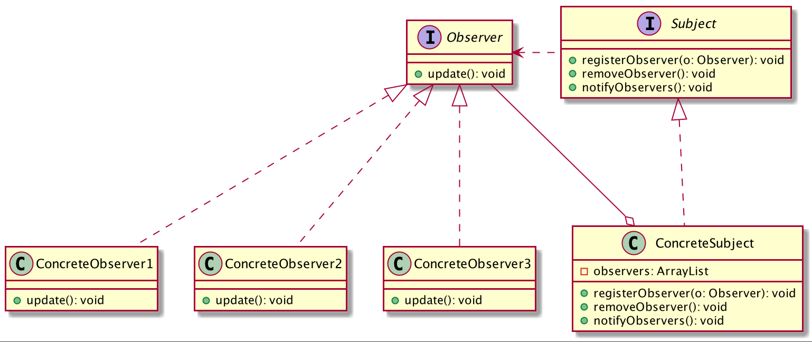

- 角色划分
    - subject：可观察对象
        - 用于注册、删除、通知 observer，并以**集合的方式**统一管理Obersver
        - `registerObserver()`，注册observer
        - `removeObserver()`，删除observer
        - `notifyObservers()`，通知所有注册的observer
            - 根据不同需求，有不同的数据获取方式
                1. 可以是更新数据，让用户来取
                2. 主动推送数据
    - observer：输入接收者，观察者
    
- 观察者模式---多对一依赖的一种设计方案
    - Subject: 被依赖的对象
    - Observer: 依赖的对象。subject通知observer变化
    - subject是一，obverser是多

- 观察者模式的好处
    - 观察者模式会议集合的方式管理用户（Observer）
    - 每次增加 Observer时 ，不需要修改 Subject，遵守了ocp原则

## 观察者模式实现引入问题
[top](#catalog)
- UML图
    - uml代码
        - [/designPattern/dplearn/dplearn-base/src/test/java/com/ljs/learn/pattern/observer/improve/Baidu.java](/designPattern/dplearn/dplearn-base/src/test/java/com/ljs/learn/pattern/observer/improve/Baidu.java)
    - 图
        - 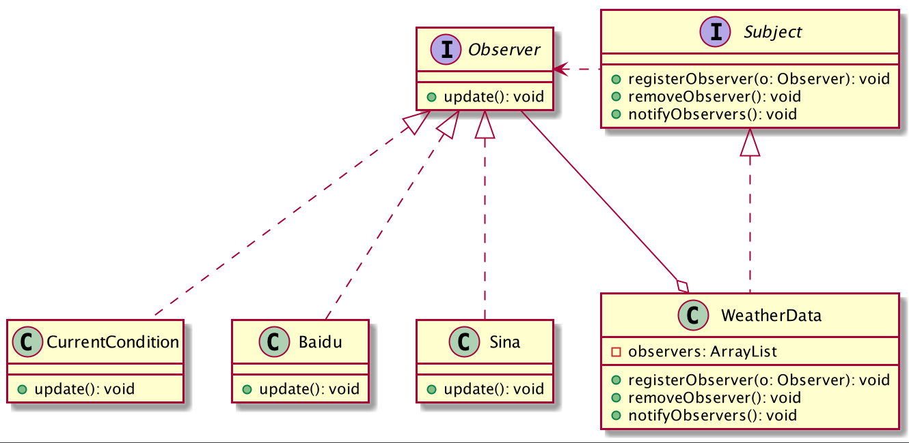

- 观察者接口及实现
    - 参考代码
        - [/designPattern/dplearn/dplearn-base/src/test/java/com/ljs/learn/pattern/observer/improve/Observer.java](/designPattern/dplearn/dplearn-base/src/test/java/com/ljs/learn/pattern/observer/improve/Observer.java)
        - [/designPattern/dplearn/dplearn-base/src/test/java/com/ljs/learn/pattern/observer/improve/CurrentCondition.java](/designPattern/dplearn/dplearn-base/src/test/java/com/ljs/learn/pattern/observer/improve/CurrentCondition.java)
        - [/designPattern/dplearn/dplearn-base/src/test/java/com/ljs/learn/pattern/observer/improve/Baidu.java](/designPattern/dplearn/dplearn-base/src/test/java/com/ljs/learn/pattern/observer/improve/Baidu.java)
    - 代码内容
        ```java
        public interface Observer {
            void update(float temperature, float pressure, float humidity);
        }
        ```
        ```java
        public class CurrentCondition implements Observer {
            private float temperature;
            private float pressure;
            private float humidity;
        
            // 由 WeatherData 对象来调用，使用推送模式
            @Override
            public void update(float temperature, float pressure, float humidity){
                this.temperature = temperature;
                this.pressure = pressure;
                this.humidity = humidity;
                display();
            }
        
            public void display(){
                System.out.println("CurrentCondition temperature = " + temperature);
                System.out.println("CurrentCondition pressure = " + pressure);
                System.out.println("CurrentCondition humidity = " + humidity);
            }
        }
        ```
        ```java
        public class Baidu implements Observer{
            // 实现内容 与 CurrentCondition 相同
        }
        ```
- 可观察对象接口及其实现
    - 参考代码
        - [/designPattern/dplearn/dplearn-base/src/test/java/com/ljs/learn/pattern/observer/improve/Subject.java](/designPattern/dplearn/dplearn-base/src/test/java/com/ljs/learn/pattern/observer/improve/Subject.java)
        - [/designPattern/dplearn/dplearn-base/src/test/java/com/ljs/learn/pattern/observer/improve/WeatherData.java](/designPattern/dplearn/dplearn-base/src/test/java/com/ljs/learn/pattern/observer/improve/WeatherData.java)
    - 代码内容
        ```java
        public interface Subject {
            void registerObserver(Observer o);
            void removeObserver(Observer o);
            void notifyObservers();
        }
        ```
        ```java
        /*
            保存最新的天气情况信息
            包含观察者，使用ArrayList管理
            当数据更新时，调用 CurrentConditions.update方法，推送数据
            
            使用时的流程
                1. 创建 WeatherData
                2. 注册 Observer
                3. 调用 setData() 设置数据
                4. 内部调用 notifyObservers() 通知观察者
         */
        public class WeatherData implements Subject {
            private float temperature;
            private float pressure;
            private float humidity;
            private ArrayList<Observer> observers;
        
            public WeatherData() {
                observers = new ArrayList<Observer>();
            }
        
            // 设置最新的数据，并推送给 所有的 Observer
            public void setData(float temperature, float pressure, float humidity){
                this.temperature = temperature;
                this.pressure = pressure;
                this.humidity = humidity;
                
                // 将最新的数据推送给每个 Observer
                notifyObservers();
            }
        
            // 注册观察者
            @Override
            public void registerObserver(Observer o) {
                observers.add(o);
            }
        
            // 删除观察者
            @Override
            public void removeObserver(Observer o) {
                if (observers.contains(o)){
                    observers.remove(o);
                }
            }
        
            // 遍历并通知所有的观察者
            @Override
            public void notifyObservers() {
                for (Observer observer : observers) {
                    observer.update(temperature, pressure, humidity);
                }
            }

            // getter
            // ...
        }
        ```
- 测试类
    - 参考代码
        - [/designPattern/dplearn/dplearn-base/src/test/java/com/ljs/learn/pattern/observer/improve/Client.java](/designPattern/dplearn/dplearn-base/src/test/java/com/ljs/learn/pattern/observer/improve/Client.java)
    - 代码内容
        ```java
        @Test
        public void test01(){
            WeatherData weatherData = new WeatherData();
    
            // 创建观察者
            CurrentCondition c1 = new CurrentCondition();
            Baidu c2 = new Baidu();
    
            // 注册观察者
            weatherData.registerObserver(c1);
            weatherData.registerObserver(c2);
    
            weatherData.setData(10,20,30);
        }
        ```

# 行为型-中介者模式
## 中介者模式-引入问题-智能家庭管理项目
[top](#catalog)
- 需求
    - 智能家庭包括各种设备: 闹钟、咖啡机、电视机、窗帘等等
    - 看电视时，各个设备可以协同工作，自动完成看电视的准备
        - 如工作流程为
            1. 闹钟响起
            2. 咖啡机开始做咖啡
            3. 窗帘自动落下
            4. 电视机开始播放

- 传统方式实现时，可能会产生的调用关系的UML图
    -  uml代码
         - [/designPattern/dplearn/dplearn-base/src/test/java/com/ljs/learn/pattern/mediator/base/base_uml.puml](/designPattern/dplearn/dplearn-base/src/test/java/com/ljs/learn/pattern/mediator/base/base_uml.puml)
    - 图
        - 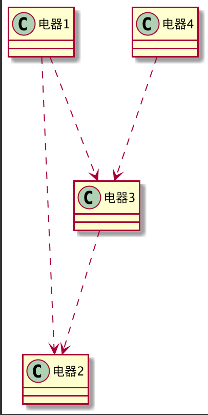

- 传统方式的问题
    - 当各个电器对象有多种状态改变时，相互之间的调用关系会比较复杂
    - 各个电器对象之间彼此关联、引用
    - 各个电器对象之间传递参数，容易混乱
    - 当系统新增一个电器对象时，或者执行流程改变时，代码的可维护性、可扩展性都不好
    
## 中介者模式原理
[top](#catalog)
- 中介者模式 Mediator Pattern
- 中介者模式的作用
    - 将复杂的**对象间交互操作**封装到中介对象中，将对象解耦
    - 中介者使各个对象不需要显示的相互引用，降低系统的耦合性，可以独立改变对象间的交互方式

- 经典应用--MVC模式 
    - Controller 是 Model 和 View 之间交互时的中介者。在前后端交互时起到了中间人的作用
    
- 原理类图
    - uml代码
        - [/designPattern/dplearn/dplearn-base/src/test/java/com/ljs/learn/pattern/mediator/principle_uml.puml](/designPattern/dplearn/dplearn-base/src/test/java/com/ljs/learn/pattern/mediator/principle_uml.puml)
    - 图
        - 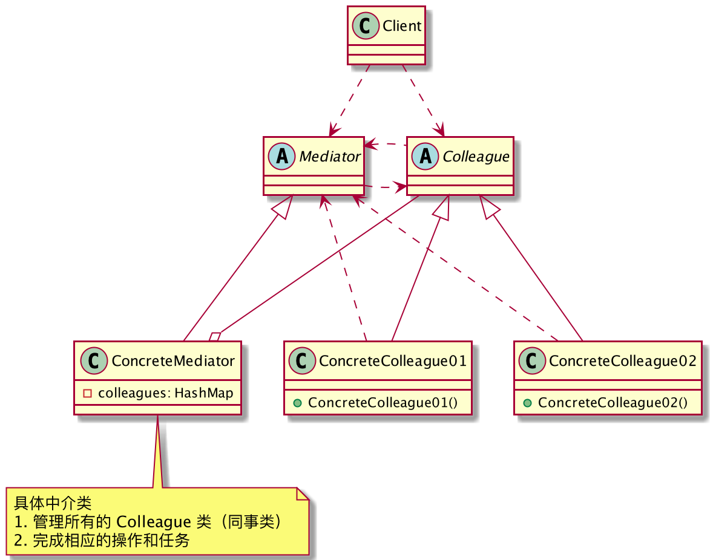

- 角色划分
    - Mediator，抽象中介
        - 定义了 Colleague 到中介对象的接口
    - ConcreteMediator，具体中介者
        - 用一个集合来管理具体同事
        - 可以接收某个同事对象的消息，完成相应的任务
    - Colleague，抽象同事类
    - ConcreteColleague，具体同事类
        - 每个同事类之间是没有任何关联的
        - 每个具体同事类都依赖中介者对象

- Mediator 和 ConcreteColleague 之间需要相互关联，才能完成**管理和消息发送**

## 中介者模式实现引入问题
[top](#catalog)
- UML图
    - uml代码
        - [/designPattern/dplearn/dplearn-base/src/test/java/com/ljs/learn/pattern/mediator/imporve/improve_uml.puml](/designPattern/dplearn/dplearn-base/src/test/java/com/ljs/learn/pattern/mediator/imporve/improve_uml.puml)
    - 图
        - 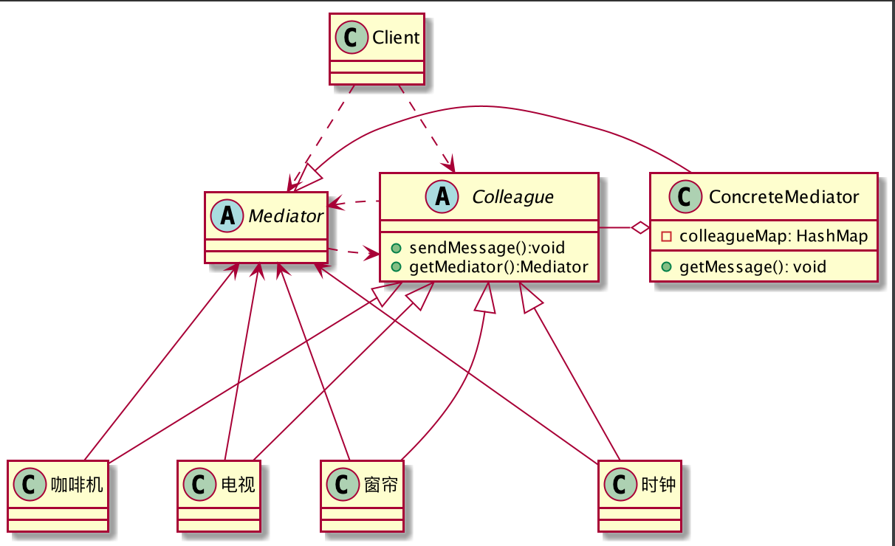

- 操作流程
    1. 创建一个 ConcreteMediator 对象
    2. 创建各个 Coleague类
    3. 在创建 Colleague对象的同时，就通过构造器，将自身添加到 `colleagueMap`
    4. Colleague对象 可以调用 sendMessage，最终会去调用 ConcreteMediator 的getMessage方法
    5. getMessage 会根据接收到的 Colleague对象 发出的消息来协调、调用其他的 Colleague对象

- 注意事项
    - `getMessage()` 方法是核心方法，完成相应的任务
    - 各个 Colleague对象 不会直接相互引用，而是通过中介者来通信

- 中介者
    - 参考代码
        - [/designPattern/dplearn/dplearn-base/src/test/java/com/ljs/learn/pattern/mediator/imporve/mediator/Mediator.java](/designPattern/dplearn/dplearn-base/src/test/java/com/ljs/learn/pattern/mediator/imporve/mediator/Mediator.java)
        - [/designPattern/dplearn/dplearn-base/src/test/java/com/ljs/learn/pattern/mediator/imporve/mediator/ConcreteMediator.java](/designPattern/dplearn/dplearn-base/src/test/java/com/ljs/learn/pattern/mediator/imporve/mediator/ConcreteMediator.java)
    - 代码内容
        ```java
        public abstract class Mediator {
            // 将中介者对象保存到集合中
            public abstract void register(String colleagueName, Colleague colleague);
            // 接收由具体同事对象发出的消息
            public abstract void getMessage(int stateChange, String colleagueName);
            //
            public abstract void sendMessage();
        }
        ```
        ```java
        public class ConcreteMediator extends Mediator{
            // 管理所有的同事对象
            public HashMap<String, Colleague> colleagueMap;
            public HashMap<String, String> interMap;
        
            public ConcreteMediator() {
                colleagueMap = new HashMap<String, Colleague>();
                interMap = new HashMap<String, String>();
            }
        
            @Override
            public void register(String colleagueName, Colleague colleague) {
                colleagueMap.put(colleagueName, colleague);
        
                if (colleague instanceof Alarm){
                    interMap.put("Alarm", colleagueName);
                } else if (colleague instanceof CoffeeMachine) {
                    interMap.put("CoffeeMachine", colleagueName);
                } else if (colleague instanceof TV) {
                    interMap.put("TV", colleagueName);
                } else if  (colleague instanceof Curtains){
                    interMap.put("Curtains", colleagueName);
                }
            }
        
            // 具体中介者中的核心方法
            // 根据得到的消息，完成对应的任务
            @Override
            public void getMessage(int stateChange, String colleagueName) {
                if (colleagueMap.get(colleagueName) instanceof Alarm){
                    if (stateChange == 0){
                        ((CoffeeMachine) (colleagueMap.get(
                                interMap.get("CoffeeMachine")))).startCoffee();
        
                        ((TV) (colleagueMap.get(interMap.get("TV")))).startTV();
                    } else if (stateChange == 1){
                        ((TV) (colleagueMap.get(interMap.get("TV")))).stopTV();
                    }
                } else if (colleagueMap.get(colleagueName) instanceof CoffeeMachine){
                    ((Curtains)(colleagueMap.get(interMap.get("Curtains")))).upCurtains();
                } else if (colleagueMap.get(colleagueName) instanceof TV){
        
                } else if (colleagueMap.get(colleagueName) instanceof Curtains) {
        
                }
        
            }
        
            @Override
            public void sendMessage() {
        
            }
        }
        ```
- 同事类
    - 参考代码
        - [/designPattern/dplearn/dplearn-base/src/test/java/com/ljs/learn/pattern/mediator/imporve/colleague/Colleague.java](/designPattern/dplearn/dplearn-base/src/test/java/com/ljs/learn/pattern/mediator/imporve/colleague/Colleague.java)
        - [/designPattern/dplearn/dplearn-base/src/test/java/com/ljs/learn/pattern/mediator/imporve/colleague/Alarm.java](/designPattern/dplearn/dplearn-base/src/test/java/com/ljs/learn/pattern/mediator/imporve/colleague/Alarm.java)
        - [/designPattern/dplearn/dplearn-base/src/test/java/com/ljs/learn/pattern/mediator/imporve/colleague/CoffeeMachine.java](/designPattern/dplearn/dplearn-base/src/test/java/com/ljs/learn/pattern/mediator/imporve/colleague/CoffeeMachine.java)
        - [/designPattern/dplearn/dplearn-base/src/test/java/com/ljs/learn/pattern/mediator/imporve/colleague/Curtains.java](/designPattern/dplearn/dplearn-base/src/test/java/com/ljs/learn/pattern/mediator/imporve/colleague/Curtains.java)
        - [/designPattern/dplearn/dplearn-base/src/test/java/com/ljs/learn/pattern/mediator/imporve/colleague/TV.java](/designPattern/dplearn/dplearn-base/src/test/java/com/ljs/learn/pattern/mediator/imporve/colleague/TV.java)
    - 代码内容
        ```java
        // 抽象同事类
        public abstract class Colleague {
            private Mediator mediator;
            public String name;
        
            public Colleague(Mediator mediator, String name) {
                this.mediator = mediator;
                this.name = name;
            }
        
            public Mediator getMediator() {
                return mediator;
            }
        
            public abstract void sendMessage(int stateChange);
        }
        ```
        ```java
        // 具体同事类
        public class Alarm extends Colleague {
            public Alarm(Mediator mediator, String name) {
                super(mediator, name);
        
                // 创建对象的同事，将自己注册到 中介者中
                mediator.register(name, this);
            }
        
            public void sendAlarm(int stateChange){
                sendMessage(stateChange);
            }
        
            @Override
            public void sendMessage(int stateChange) {
                // 调用中介者对象
                this.getMediator().getMessage(stateChange, this.name);
            }
        }
        ```
        ```java
        public class TV extends Colleague {
            public TV(Mediator mediator, String name) {
                super(mediator, name);
                mediator.register(name, this);
            }
        
            @Override
            public void sendMessage(int stateChange) {
                this.getMediator().getMessage(stateChange, this.name);
            }
        
            public void startTV(){
                System.out.println("startTV");
            }
            public void stopTV(){
                System.out.println("stopTV");
            }
        }
        ```
- 测试类
    - 参考代码
        - [/designPattern/dplearn/dplearn-base/src/test/java/com/ljs/learn/pattern/mediator/imporve/Client.java](/designPattern/dplearn/dplearn-base/src/test/java/com/ljs/learn/pattern/mediator/imporve/Client.java)
    - 测试内容
        ```java
        @Test
        public void test01(){
            // 1. 创建 中介者
            ConcreteMediator mediator = new ConcreteMediator();
            // 创建 Colleague 并注册到中介者
            Alarm alarm = new Alarm(mediator, "alarm");
            CoffeeMachine coffeeMachine = new CoffeeMachine(mediator, "coffeeMachine");
            Curtains curtains = new Curtains(mediator, "curtains");
            TV tv = new TV(mediator, "TV");
    
            // 3. 向中介者发送消息，并执行具体任务
            alarm.sendAlarm(0);
            coffeeMachine.finishCoffee();
            alarm.sendAlarm(1);
        }
        ```

## 中介者模式的注意事项和细节
[top](#catalog)
- 多个类相互耦合，会形成网状结构，使用中介者模式将网状结构分离为星型结构，进行解耦
- 减少类间依赖，降低了耦合性，符合迪米特法则
- 中介者承担了较多的责任，一旦中介者出现了问题，整个系统都会收到影响
- 如果设计不当，中介者对象本身会变得过于复杂

# 行为型-备忘录模式
## 备忘录模式-引入问题-游戏角色恢复状态
[top](#catalog)
- 需求
    - 游戏角色有攻击力和防御力
    - 在作战前保存自身的状态，即攻击力和防御力
    - 在作战后，攻击力和防御力下降，从备忘录对象恢复到大战前的状态
- 传统解决方案：一个角色对应一个状态对象
    ```java
      角色
       ^
       │
    状态对象
    ```

- 传统方式的问题
    - 一个角色对应一个状态对象，当角色很多时，会存在大量状态对象。不利于管理，开销也大
    - 只是简单的备份：new出另外一个状态对象，再把数据拷贝到状态对象中，**会暴露对象的内部细节**
        - 因为需要知道被保存对象的一些实现细节来完成备份

## 备忘录模式简介
[top](#catalog)
- 备忘录模式，Memento Pattern
- 作用
    - 在不破坏封装性的前提下，捕获一个对象的内部状态，并在对象之外保存状态
    - 在需要回退时，可以通过保存的状态来恢复对象

## 备忘录模式原理
[top](#catalog)
- 原理类图
    - uml代码
        - [/designPattern/dplearn/dplearn-base/src/test/java/com/ljs/learn/pattern/memento/principle_uml.puml](/designPattern/dplearn/dplearn-base/src/test/java/com/ljs/learn/pattern/memento/principle_uml.puml)
    - 图
        - 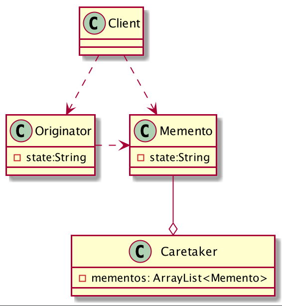

- 角色划分
    - Originato，需要保存状态的原始对象
    - Memento，备忘录对象
        - 负责保存 Originator 的内部状态
    - Caretaket，守护者对象
        - 负责保存多个备忘录对象
        - 可以通过 `HashMap<String, 集合>` 的方式，保存多个 Originator 对象的不同时间的状态

- 适用场景
    - 游戏存档
    - windows撤销快捷键：ctrl+z
    - 浏览器中的后退
    - 数据库的事务管理

## 备忘录模式实现引入问题
[top](#catalog)
- UML类图
    - uml代码
        - [/designPattern/dplearn/dplearn-base/src/test/java/com/ljs/learn/pattern/memento/improve/improve_uml.puml](/designPattern/dplearn/dplearn-base/src/test/java/com/ljs/learn/pattern/memento/improve/improve_uml.puml)
    - 图
        - 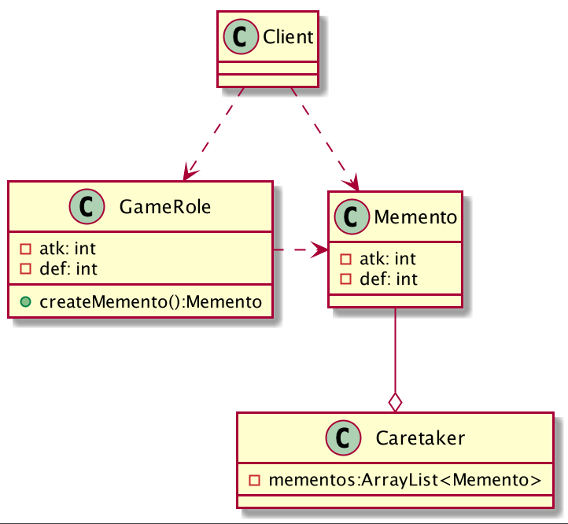

- 原始对象
    - 参考代码
        - [/designPattern/dplearn/dplearn-base/src/test/java/com/ljs/learn/pattern/memento/improve/GameRole.java](/designPattern/dplearn/dplearn-base/src/test/java/com/ljs/learn/pattern/memento/improve/GameRole.java)
    - 代码内容
        ```java
        public class GameRole {
            private int atk;
            private int def;
        
            public GameRole(int atk, int def) {
                this.atk = atk;
                this.def = def;
            }
        
            // 创建Memento
            public Memento createMemento(){
                return new Memento(atk, def);
            }
        
            // 使用Memento恢复
            public void recover(Memento memento){
                atk = memento.getAtk();
                def = memento.getDef();
            }
        
            // 显示当前角色的状态
            public void display(){
                System.out.println("atk=" + atk + ", def=" + def);
            }
            //...
            // getter、setter
        }
        ```
- 备忘录对象
    - 参考代码
        - [/designPattern/dplearn/dplearn-base/src/test/java/com/ljs/learn/pattern/memento/improve/Memento.java](/designPattern/dplearn/dplearn-base/src/test/java/com/ljs/learn/pattern/memento/improve/Memento.java)
    - 代码内容
        ```java
        public class Memento {
            private int atk;
            private int def;
        
            public Memento(int atk, int def) {
                this.atk = atk;
                this.def = def;
            }
        
            public int getAtk() {
                return atk;
            }
        
            public int getDef() {
                return def;
            }
        }
        ```

- 守护者对象
    - 参考代码
        - [/designPattern/dplearn/dplearn-base/src/test/java/com/ljs/learn/pattern/memento/improve/Caretaker.java](/designPattern/dplearn/dplearn-base/src/test/java/com/ljs/learn/pattern/memento/improve/Caretaker.java)
    - 代码内容
        ```java
        public class Caretaker {
            // 只保存一次状态
            private Memento memento;
            // 保存多次状态
            // private ArrayList<Memento> mementos;
            // 保存多个角色的多个状态
            // private HashMap<String, ArrayList<Memento>> rolesMementos;
        
            public Memento getMemento() {
                return memento;
            }
        
            public void setMemento(Memento memento) {
                this.memento = memento;
            }
        }
        ```
- 测试嗲吗
    - 参考代码
        - [/designPattern/dplearn/dplearn-base/src/test/java/com/ljs/learn/pattern/memento/improve/Client.java](/designPattern/dplearn/dplearn-base/src/test/java/com/ljs/learn/pattern/memento/improve/Client.java)
    - 测试内容
        ```java
        @Test
        public void test01(){
            // 创建角色
            GameRole role = new GameRole(100, 100);
    
            // 保存状态对象
            Caretaker caretaker = new Caretaker();
            caretaker.setMemento(role.createMemento());
    
            // 1. 显示状态
            role.display();
    
            // 2. 修改状态，并显示状态
            role.setAtk(50);
            role.setAtk(60);
            role.display();
    
            // 3. 恢复并显示状态
            role.recover(caretaker.getMemento());
            role.display();
        }
        ```
## 备忘录模式的注意事项和细节
[top](#catalog)
- 备忘录模式给用户提供了一种可以恢复状态的机制，可以恢复到某个历史状态
- 实现了信息的封装，使得用户不需要关心状态的保存细节
- 如果类的成员遍历过多，会占用比较大的资源
- 每次保存都会消耗一定的内存
- 为了节约内存，**备忘录模式可以和原型模式配合使用**

# 行为型-解析器模式
## 解析器模式-引入问题-四则运算问题
[top](#catalog)
- 需求：实现四则运算，如计算: a+b-c 的值
    1. 先输入表达式的形式，如：a+b+c-d+e，要求表达式的字母不能重复
    2. 再分别输入 a、b、c、d、e
    3. 依照表达式计算结果  

- 传统解决方案
    1. 编写一个方法，接收表达式的形式
    2. 然后根据用户输入的数值进行解析，计算并得到结果

- 传统方案的问题
    - 如果加入新的运算符，如： *、/ 等等，不利于扩展
    - 用一个方法来解析会造成程序结构混乱，不够清晰

- 解决方法
    - 使用解析器模式，即：表达式 -> 解析器(可以有多种) -> 结果 

## 解析器模式简介
[top](#catalog)
- 解释器，Interpreter Pattern
- 解释器的功能
    - 指定一个语言（表达式的形式），定义它的文法的一种表示，并定义一个解释器，使用该解释器来解释语言中的句子（表达式）
- 编译原理中的解释器
    - 编译原理中的编译过程
        1. 一个算数表达式通过**词法分析器**形成词法单元
        2. 然后这些词法单元再通过**语法分析器**构建语法分析树
        3. 最终形成一颗抽象的语法分析树
    - 在编译原理中，词法分析器、语法分析器 都可以视作解释器

- 适用场景
    - 当一个语言需要解释执行，可将该语言中的句子表示为一个抽象语法树时，就可以考虑使用解释器模式，让程序具有良好的扩展性
        - 前提
            1. 将一个需要解释执行的语言中的句子表示为一个抽象语法树
            2. 一些重复出现的问题可以用一种简单的语言来表达
            3. 一些简单语法需要解释的场景
    - 一般会用来处理比较复杂的问题，如: 编译器、表达式计算、正则表达式、机器人等
  
- 解释器可能带来的问题
    - 解释器模式会引起类膨胀
    - 解释器模式采用递归调用，将会导致调试复杂、执行效率降低
    
## 解析器模式原理
[top](#catalog)
- 原理类图
    - uml代码
        - [/designPattern/dplearn/dplearn-base/src/test/java/com/ljs/learn/pattern/interpreter/principle_uml.puml](/designPattern/dplearn/dplearn-base/src/test/java/com/ljs/learn/pattern/interpreter/principle_uml.puml)
    - 图
        - 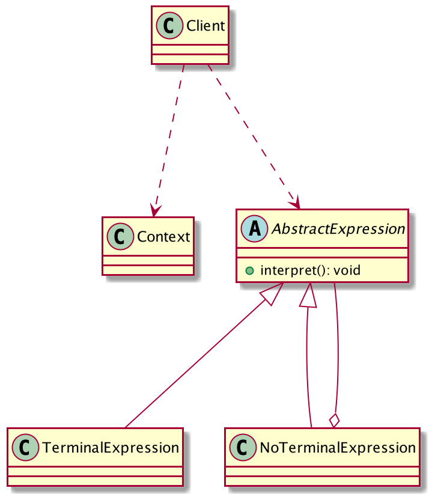

- 角色划分
    - Context: 环境角色
        - 含有解释器之外的全局信息
    - AbstractExpression: 抽象表达式
        - 声明一个抽象的解释操作
        - 解释操作为抽象语法树中所有的结点所共享
    - TerminalExpression: 终结符表达式
        - 实现文法中与终结符相关的解释操作
    - NoTerminalExpression: 非终结符表达式
        - 实现文法中与非终结符相关的解释操作
    - Context 和 TerminalExpression 的信息通过Client输入 

## 解释器模式实现引入问题
[top](#catalog)
- UML类图
    - uml代码
        - [/designPattern/dplearn/dplearn-base/src/test/java/com/ljs/learn/pattern/interpreter/imporve/improve_uml.puml](/designPattern/dplearn/dplearn-base/src/test/java/com/ljs/learn/pattern/interpreter/imporve/improve_uml.puml)
    - 图
        - 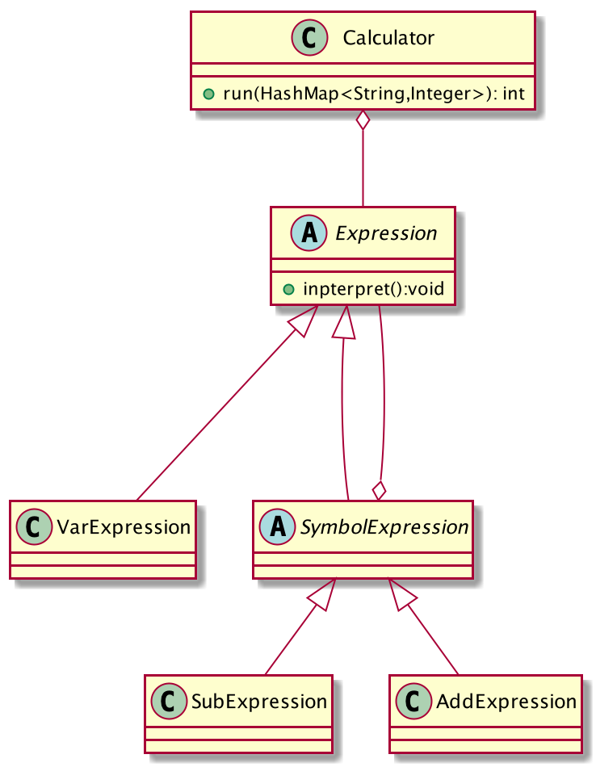
- 表达式
    - 参考代码
        - [/designPattern/dplearn/dplearn-base/src/test/java/com/ljs/learn/pattern/interpreter/imporve/Expression.java](/designPattern/dplearn/dplearn-base/src/test/java/com/ljs/learn/pattern/interpreter/imporve/Expression.java)
        - [/designPattern/dplearn/dplearn-base/src/test/java/com/ljs/learn/pattern/interpreter/imporve/VarExpression.java](/designPattern/dplearn/dplearn-base/src/test/java/com/ljs/learn/pattern/interpreter/imporve/VarExpression.java)
        - [/designPattern/dplearn/dplearn-base/src/test/java/com/ljs/learn/pattern/interpreter/imporve/SymbolExpression.java](/designPattern/dplearn/dplearn-base/src/test/java/com/ljs/learn/pattern/interpreter/imporve/SymbolExpression.java)
        - [/designPattern/dplearn/dplearn-base/src/test/java/com/ljs/learn/pattern/interpreter/imporve/AddExpression.java](/designPattern/dplearn/dplearn-base/src/test/java/com/ljs/learn/pattern/interpreter/imporve/AddExpression.java)
        - [/designPattern/dplearn/dplearn-base/src/test/java/com/ljs/learn/pattern/interpreter/imporve/SubExpression.java](/designPattern/dplearn/dplearn-base/src/test/java/com/ljs/learn/pattern/interpreter/imporve/SubExpression.java)
    - 代码内容
        ```java
        // 抽象类表达式，通过HashMap键值对，可以获取到变量的值
        public abstract class Expression {
            // 解释公式和数值，key就是公式中的参数
            // 如公式是 a+b+c
            // HashMap是：{a:1, b:3, c:5}
            public abstract int interpret(HashMap<String, Integer> var);
        }
        ```
        ```java
        // 终结符解析器
        // 变量解析器
        public class VarExpression extends Expression {
            // key 就是公式中的参数
            // 如公式是：a+b+c
            // key就是：a、b、c
            private String key;
        
            public VarExpression(String key) {
                this.key = key;
            }
        
            // var 是 {a=1, b=3, c=5}
            // 根据对象内部的key，返回对应值
            @Override
            public int interpret(HashMap<String, Integer> var) {
                return var.get(key);
            }
        }
        ```
        ```java
        /**
         * 非终结符解析器
         * 抽象运算符号解析器
         * 每个运算符都只和自己左右两个数字有关系，但左右两个数字有可能也是一个解析的结果，
         * 无论何种类型，都是Expression的实现类
         * */
        public abstract class SymbolExpression extends Expression {
            protected Expression left;
            protected Expression right;
        
            public SymbolExpression(Expression left, Expression right) {
                this.left = left;
                this.right = right;
            }
        }

        // 加法解释器
        public class AddExpression extends SymbolExpression {
            public AddExpression(Expression left, Expression right) {
                super(left, right);
            }
        
            // 处理加法运算
            // var 仍然是 {a=1, b=3, c=5} 形式的运算参数集合
            @Override
            public int interpret(HashMap<String, Integer> var) {
                return super.left.interpret(var) + super.right.interpret(var);
            }
        }

        // 减法解释器
        public class SubExpression extends SymbolExpression {
            public SubExpression(Expression left, Expression right) {
                super(left, right);
            }
        
            // 处理剑法运算
            // // var 仍然是 {a=1, b=3, c=5} 形式的运算参数集合
            @Override
            public int interpret(HashMap<String, Integer> var) {
                return super.left.interpret(var) - super.right.interpret(var);
            }
        }
        ```

- Calculator，类似于Context类
    - 参考代码
        - [/designPattern/dplearn/dplearn-base/src/test/java/com/ljs/learn/pattern/interpreter/imporve/Calculator.java](/designPattern/dplearn/dplearn-base/src/test/java/com/ljs/learn/pattern/interpreter/imporve/Calculator.java)
    - 代码内容
        ```java
        public class Calculator {
            // 定义表达式
            private Expression expression;
        
            public Calculator(String expStr) {
                Stack<Expression> stack = new Stack<>();
                // 将表达式拆分成字符数组
                char[] chars = expStr.toCharArray();
        
                Expression left = null;
                Expression right = null;
        
                for (int i = 0; i < chars.length; i++) {
                    switch (chars[i]) {
                        case '+':
                            // 从栈中获取左值
                            left = stack.pop();
                            // 创建右值，并调整遍历的index
                            right = new VarExpression(String.valueOf(chars[++i]));
                            // 创建加法表达式，并保存到栈
                            stack.push(new AddExpression(left, right));
                            break;
                        case '-':
                            // 从栈中获取左值
                            left = stack.pop();
                            // 创建右值
                            right = new VarExpression(String.valueOf(chars[++i]));
                            // 创建减法表达式，并保存到栈
                            stack.push(new SubExpression(left, right));
                            break;
                        default:
                            // 参数部分
                            stack.push(new VarExpression(String.valueOf(chars[i])));
                            break;
                    }
                }
                // 遍历后得到最后一个表达式对象，
                this.expression = stack.pop();
            }
        
            public int run(HashMap<String,Integer> var){
                // var 仍然是 {a=1, b=3, c=5} 形式的运算参数集合
                return this.expression.interpret(var);
            }
        }
        ```
- 测试类
    - 参考代码
        - [/designPattern/dplearn/dplearn-base/src/test/java/com/ljs/learn/pattern/interpreter/imporve/Client.java](/designPattern/dplearn/dplearn-base/src/test/java/com/ljs/learn/pattern/interpreter/imporve/Client.java)
    - 测试内容
        ```java
        public static void main(String[] args) throws IOException {
            // 1. 获取表达式
            System.out.println("请输入表达式：");
            String expStr = new BufferedReader(new InputStreamReader(System.in)).readLine();
    
            // 2. 输入表达式中的参数值
            HashMap<String, Integer> map = new HashMap<>();
            for (char c : expStr.toCharArray()) {
                if (c != '+' && c != '-'){
                    System.out.println("请输入" + c + ":");
                    String param = new BufferedReader(new InputStreamReader(System.in)).readLine();
                    map.put(String.valueOf(c), Integer.valueOf(param));
                }
            }
            System.out.println(map);
    
            // 3. 创建计算器
            Calculator calculator = new Calculator(expStr);
    
            // 4. 执行计算
            System.out.println("计算结果：" + calculator.run(map));
        }
        ```
      
## 解释器模式在Spring中的应用--SpelExpressionParser分析
[top](#catalog)
- 示例代码
    - 参考代码
        - [/designPattern/dplearn/dplearn-base/src/test/java/com/ljs/learn/pattern/interpreter/spring/SpringTest.java](/designPattern/dplearn/dplearn-base/src/test/java/com/ljs/learn/pattern/interpreter/spring/SpringTest.java)
    - 代码内容
        ```java
        @Test
        public void test01(){
            SpelExpressionParser parser = new SpelExpressionParser();
            Expression expression = parser.parseExpression("10 * 20 * (2+1) -15");
            int result = (Integer)expression.getValue();
            System.out.println(result); // 585
        }
        ```
- Expression 与 ExpressionParser 之间的依赖关系
    - 依赖关系图
        - uml代码
            - [/designPattern/dplearn/dplearn-base/src/test/java/com/ljs/learn/pattern/interpreter/spring/ExpressionParser.uml](/designPattern/dplearn/dplearn-base/src/test/java/com/ljs/learn/pattern/interpreter/spring/ExpressionParser.uml)
        - 图
            - 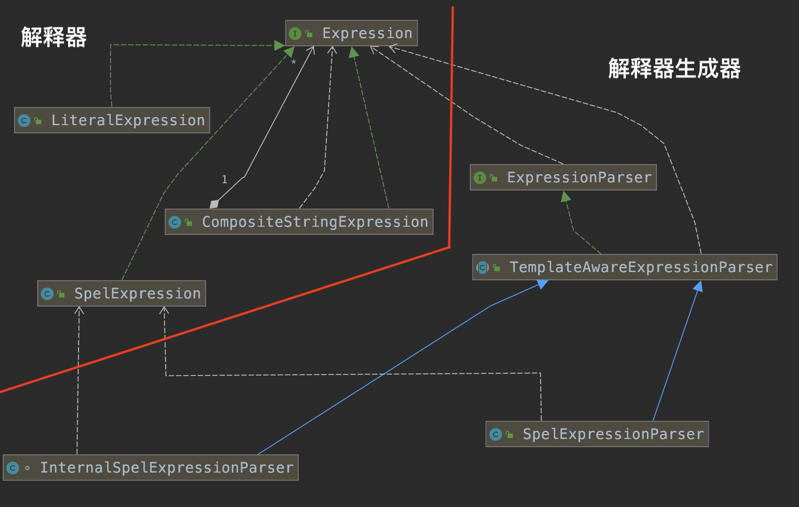

    - 使用时，根据不同的parser对象，返回不同的Expression对象
    - Expression就是解释器接口，可以执行并返回结果。下面有不同类型的解释器实现类
    - ExpressionParser接口， 用来生成解释器

# 行为型-状态模式
## 状态模式-引入问题-APP抽奖活动
[top](#catalog)
- APP抽奖活动的需求
    1. 加入每参加一次这个活动要扣除用户50积分，中奖概率是10%
    2. 奖品数量固定，抽完就不能抽奖
    3. 活动有4个状态
        - 可以抽奖
        - 不能抽奖
        - 发放奖品
        - 奖品领完
    4. 活动的四个状态转化关系图
        ```
            已扣除50积分
           ┌────────────>>  可以抽奖 
           │         　  　　　│  │
           │   90%不会中奖     │  │  
        不能抽奖 <<────────────┘  │  点击抽奖，并中奖，概率10%
           ^            　　  　　│
           ^            　　　  　V
           │            　　　  　V
           └───<<───<<─────── 发放奖品
                奖品数 > 0        │
                           　 　　│ 奖品数 = 0
                           　 　　V
                               奖品领完
                           　 　　│
                           　 　　│
                           　 　　V
                               活动结束
        ```
       
- 传统解决方式
    - 将状态保存在一个全局变量中
    - 通过：if-else判断状态，来执行不同的逻辑

- 传统方式的缺点
    - 代码难以应对业务变化
        - 在添加一种状态时，需要手动添加 if-else
        - 在添加一种功能时，要对所有的状态进行判断
    - 代码会变的难以维护，一旦没有处理某个状态，可能会导致严重的Bug
## 状态模式简介
[top](#catalog)
- 状态模式，State Pattern
- 作用/功能
    - 主要用来解决：**对象在多种状态转换时，需要对外输出不同行为的问题**
- 状态模式中的状态
    - 状态和行为是**一一对应的**，状态之间可以相互转换
    - 当一个对象的内在状态改变时，允许改变其行为，这个对象看起来像是改变了其类
        - 如：处于状态A时，只能使用操作A；处于状态B时，只能使用操作B

- 状态模式的优缺点
    - 优点
        - 代码有很强的可读性，状态模式将每个状态的行为封装到一个类中
        - 方便维护
            - 删除了容易产生问题的 if-else 语句
        - 符合开闭原则，容易增删状态
    - 缺点
        - 每个状态都需要一个对应的类，当状态过多时会产生大量的类，增加维护难度

- **适用场景**
    - 一个事件或对象有很**多种状态**，**状态之间会相互转换**，并且对不同的状态要求不同的行为
        
## 状态模式原理
[top](#catalog)
- 原理图
    - uml代码
        - [/designPattern/dplearn/dplearn-base/src/test/java/com/ljs/learn/pattern/state/principle_uml.puml](/designPattern/dplearn/dplearn-base/src/test/java/com/ljs/learn/pattern/state/principle_uml.puml)
    - 图
        - 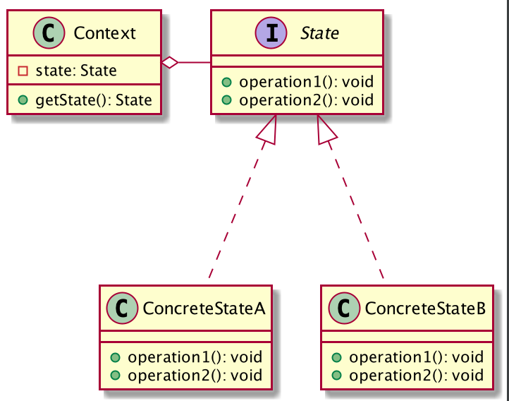

- 角色划分
    - Context类：环境角色
        - 用于维护 State 接口实例，并且定义了当前状态
        - 通过 Context 来执行操作，并驱动State的变化
        - 为了保证方法一致，可以让Context类实现 State接口
    - State接口：抽象状态角色
        - 定义一个接口与Context的一个特定接口相关的行为
    - ConcreteState类：具体的状态角色
        - 每个类实现一个与 Context 的一个状态相关的行为
        
## 状态模式实现引入问题
[top](#catalog)
- UML类图
    - uml代码
        - [/designPattern/dplearn/dplearn-base/src/test/java/com/ljs/learn/pattern/state/improve/improve_uml.puml](/designPattern/dplearn/dplearn-base/src/test/java/com/ljs/learn/pattern/state/improve/improve_uml.puml)
    - 图
        - 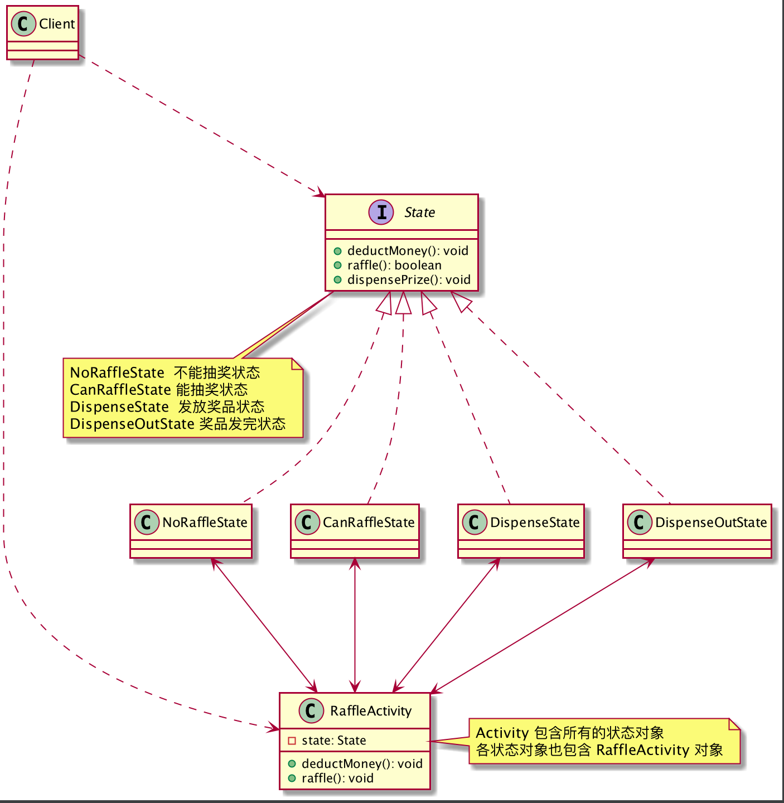
- 实现思路
    - 将所有状态保存在 Activity 类中
    - 由 Activity 类执行操作，驱动状态改变
    - 状态类中执行相应操作，并修改 Activity 类中的状态

- 活动类 / 环境角色 
    - 参考代码
        - [/designPattern/dplearn/dplearn-base/src/test/java/com/ljs/learn/pattern/state/improve/RaffleActivity.java](/designPattern/dplearn/dplearn-base/src/test/java/com/ljs/learn/pattern/state/improve/RaffleActivity.java)
    - 代码内容
        ```java
        // 抽奖活动
        public class RaffleActivity {
            // 表示活动的当前状态。状态会不断变化
            private State state;
        
            // 奖品数量
            private int count = 0;
        
            // 包含可变化的几种状态
            private State noRaffleState =  new NoRaffleState(this);
            private State canRaffleState = new CanRaffleState(this);
            private State dispenseState = new DispenseState(this);
            private State dispenseOutState = new DispenseOutState(this);
        
            // 构造器初始化：奖品数量 和 并初始化为【不能抽奖】的状态
            public RaffleActivity(int count) {
                this.state = getNoRaffleState();
                this.count = count;
            }
        
            // 扣除积分
            public void deductMoney(){
                state.deductMoney();
            }
        
            // 是否抽中奖品
            public void raffle(){
                // 如果当前状态是：抽奖成功，则领取奖品
                if (state.raffle()){
                    state.dispensePrize();
                }
            }

            // 每次获取数量时，将数量减1
            public int getCount() {
                int curCount = count;
                count--;
                return curCount;
            }
            // getter、setter
            // ...
        }
        ```
- 状态类
    - 参考代码
        - [/designPattern/dplearn/dplearn-base/src/test/java/com/ljs/learn/pattern/state/improve/State.java](/designPattern/dplearn/dplearn-base/src/test/java/com/ljs/learn/pattern/state/improve/State.java)
        - [/designPattern/dplearn/dplearn-base/src/test/java/com/ljs/learn/pattern/state/improve/NoRaffleState.java](/designPattern/dplearn/dplearn-base/src/test/java/com/ljs/learn/pattern/state/improve/NoRaffleState.java)
        - [/designPattern/dplearn/dplearn-base/src/test/java/com/ljs/learn/pattern/state/improve/CanRaffleState.java](/designPattern/dplearn/dplearn-base/src/test/java/com/ljs/learn/pattern/state/improve/CanRaffleState.java)
        - [/designPattern/dplearn/dplearn-base/src/test/java/com/ljs/learn/pattern/state/improve/DispenseState.java](/designPattern/dplearn/dplearn-base/src/test/java/com/ljs/learn/pattern/state/improve/DispenseState.java)
        - [/designPattern/dplearn/dplearn-base/src/test/java/com/ljs/learn/pattern/state/improve/DispenseOutState.java](/designPattern/dplearn/dplearn-base/src/test/java/com/ljs/learn/pattern/state/improve/DispenseOutState.java)
    - 代码内容
        ```java
        // 抽象状态
        public interface State {
            // 扣除50积分
            void deductMoney();
            // 是否抽中奖品
            boolean raffle();
            // 发放奖品
            void dispensePrize();
        }
        ```
        ```java
        // 不能抽奖状态
        public class NoRaffleState implements State {
            private RaffleActivity activity;
        
            public NoRaffleState(RaffleActivity activity) {
                this.activity = activity;
            }
        
            // 当前状态可以扣积分，将状态设置为可以抽奖状态
            @Override
            public void deductMoney() {
                System.out.println("扣除50积分，可以抽奖");
                activity.setState(activity.getCanRaffleState());
            }
        
            // 当前状态不能抽奖
            @Override
            public boolean raffle() {
                System.out.println("未扣积分，不能抽奖");
                return false;
            }
        
            // 当前状态不能发放奖品
            @Override
            public void dispensePrize() {
                System.out.println("不能发放奖品");
            }
        }
        ```
        ```java
        // 可以抽奖的状态
        public class CanRaffleState implements State {
            private RaffleActivity activity;
        
            public CanRaffleState(RaffleActivity activity) {
                this.activity = activity;
            }
        
            // 已经扣除积分，进入抽奖状态，不能再次扣除积分
            @Override
            public void deductMoney() {
                System.out.println("积分已扣除，可以抽奖");
            }
        
            // 执行抽奖。抽奖后，根据抽奖结果，改变状态
            @Override
            public boolean raffle() {
                System.out.println("正在抽奖，请稍等");
                int num = new Random().nextInt(10);
                // 10%的中奖几率
                if (num == 0){
                    // 改变状态为发放奖品
                    activity.setState(activity.getDispenseState());
                    return true;
                } else {
                    System.out.println("未中奖");
                    // 改变状态为不能抽奖
                    activity.setState(activity.getNoRaffleState());
                    return false;
                }
            }
        
            @Override
            public void dispensePrize() {
                System.out.println("不能发放奖品");
            }
        }
        ```
        ```java
        // 发放奖品的状态
        public class DispenseState implements State {
            private RaffleActivity activity;
        
            public DispenseState(RaffleActivity activity) {
                this.activity = activity;
            }
        
            @Override
            public void deductMoney() {
                System.out.println("积分已扣除，可以抽奖");
            }
        
            @Override
            public boolean raffle() {
                System.out.println("不能抽奖");
                return false;
            }
        
            // 发放奖品
            @Override
            public void dispensePrize() {
                if (activity.getCount() > 0){
                    System.out.println("您中奖了");
                    // 将状态设置为不能抽奖
                    activity.setState(activity.getNoRaffleState());
                } else {
                    System.out.println("奖品已经发送完了");
                    // 将状态设置为奖品发送完毕
                    activity.setState(activity.getDispenseOutState());
                }
            }
        }
        ```
        ```java
        // 奖品发完状态
        public class DispenseOutState implements State{
            private RaffleActivity activity;
        
            public DispenseOutState(RaffleActivity activity) {
                this.activity = activity;
            }
        
            @Override
            public void deductMoney() {
                System.out.println("奖品已发完，活动结束");
            }
        
            @Override
            public boolean raffle() {
                System.out.println("奖品已发完，活动结束");
                return false;
            }
        
            @Override
            public void dispensePrize() {
                System.out.println("奖品已发完，活动结束");
            }
        }
        ```
- 测试类
    - 参考代码
        - [/designPattern/dplearn/dplearn-base/src/test/java/com/ljs/learn/pattern/state/improve/Client.java](/designPattern/dplearn/dplearn-base/src/test/java/com/ljs/learn/pattern/state/improve/Client.java)
    - 测试内容
        ```java
        @Test
        public void test01(){
            // 创建活动
            RaffleActivity activity = new RaffleActivity(1);
    
            // 执行抽奖
            for (int i = 0; i < 30; i++) {
                System.out.println("-----第" + (i+1) + "次抽奖---");
                activity.deductMoney();
                activity.raffle();
            }
        }
        ```

# 行为型-策略模式
## 策略模式-引入问题-鸭子问题
[top](#catalog)
- 鸭子项目需求
    - 有各种鸭子，如野鸭、北京鸭等等
    - 鸭子有各种行为，如：叫、飞行等
    - 能够显示鸭子的信息

## 传统方式实现鸭子问题
[top](#catalog)
- 传统的实现方式
    - 继承与重写父类方法
- 传统方法的问题
    - 继承带来的问题
        - 所有鸭子都继承了Duck类，每个子类都拥有所有方法
            - 如：fly 方法让所有鸭子都会飞
        - 对类的局部改动，尤其是超类的局部改动，会影响其他部分
        - 可以通过子类重写父类方法来解决
    - 对于ToyDuck，需要覆盖父类所有的方法

- UML类图
    - uml代码
        - [/designPattern/dplearn/dplearn-base/src/test/java/com/ljs/learn/pattern/strategy/base/base_uml.puml](/designPattern/dplearn/dplearn-base/src/test/java/com/ljs/learn/pattern/strategy/base/base_uml.puml)
    - 图
        - 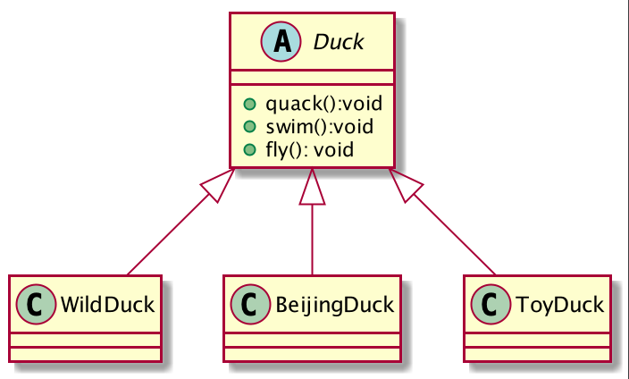
- 实现代码
    - 参考代码
        - [/designPattern/dplearn/dplearn-base/src/test/java/com/ljs/learn/pattern/strategy/base/Duck.java](/designPattern/dplearn/dplearn-base/src/test/java/com/ljs/learn/pattern/strategy/base/Duck.java)
        - [/designPattern/dplearn/dplearn-base/src/test/java/com/ljs/learn/pattern/strategy/base/WildDuck.java](/designPattern/dplearn/dplearn-base/src/test/java/com/ljs/learn/pattern/strategy/base/WildDuck.java)
        - [/designPattern/dplearn/dplearn-base/src/test/java/com/ljs/learn/pattern/strategy/base/BeijingDuck.java](/designPattern/dplearn/dplearn-base/src/test/java/com/ljs/learn/pattern/strategy/base/BeijingDuck.java)
        - [/designPattern/dplearn/dplearn-base/src/test/java/com/ljs/learn/pattern/strategy/base/ToyDuck.java](/designPattern/dplearn/dplearn-base/src/test/java/com/ljs/learn/pattern/strategy/base/ToyDuck.java)
    - 代码内容
        ```java
        public abstract class Duck {
            // 显示鸭子的信息
            public abstract void display();
        
            public void quack(){
                System.out.println("鸭子叫");
            }
            public void swim(){
                System.out.println("鸭子游泳");
            }
            public void fly(){
                System.out.println("鸭子飞行");
            }
        }
        ```
        ```java
        public class WildDuck extends Duck {
            @Override
            public void display() {
                System.out.println("WildDuck");
            }
        }
        ```
        ```java
        public class BeijingDuck extends Duck {
            @Override
            public void display() {
                System.out.println("BeijingDuck");
            }
        
            @Override
            public void fly() {
                System.out.println("北京鸭不能飞行");
            }
        }
        ```
        ```java
        public class ToyDuck extends Duck {
            @Override
            public void display() {
                System.out.println("ToyDuck");
            }
            public void quack(){
                System.out.println("玩具鸭不能叫");
            }
            public void swim(){
                System.out.println("玩具鸭不能游泳");
            }
            public void fly(){
                System.out.println("玩具鸭不能飞行");
            }
        }
        ```

## 策略模式简介
[top](#catalog)
- 策略模式，Strategy Pattern
- 作用/功能
    - 定义算法族，分别封装起来，让它们之间可以互相替换
    - 该模式让算法的变化独立于使用算法的用户

- 策略模式的关键：**分析项目中变化与不变化的部分**
- 策略模式的设计原则
    1. 把变化的代码从不必变代码中分离出来
    2. 针对接口编程而不是具体类（定义了策略接口）
    3. 多用组合/聚合，少用继承（通过组合方式使用过策略）
    4. 用行为类组合，而不是行为的继承，使用结构更有弹性

- 策略模式的优缺点
    - 优点
        - 提供了可以替换继承关系的办法
        - 策略模式将算法封装在独立的Strategy类中，可以独立于Context改变，易于切换和扩展
        - 实现了开闭原则
            - 客户端增加行为不用修改源代码，只需要添加一种策略
            - 可以避免使用 if...else 语句
    - 缺点
        - 每一个策略都要对应一个类
        - 当策略过多时会导致类过多，不好维护
        
## 策略模式原理
[top](#catalog)
- 原理类图
    - uml代码
        - [/designPattern/dplearn/dplearn-base/src/test/java/com/ljs/learn/pattern/strategy/principle_uml.puml](/designPattern/dplearn/dplearn-base/src/test/java/com/ljs/learn/pattern/strategy/principle_uml.puml)
    - 图
        - 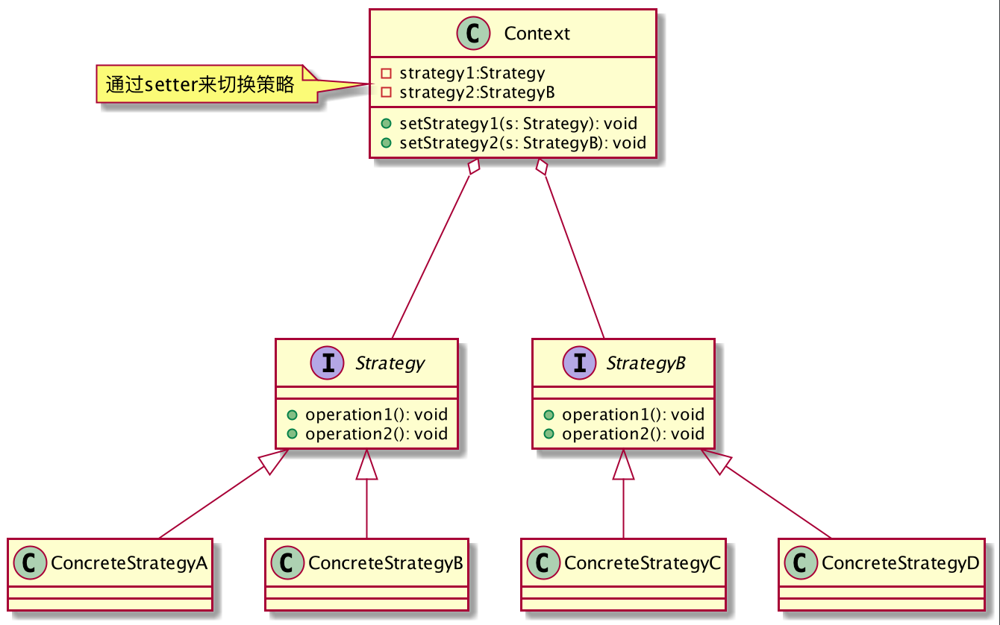

- **context 中可以包含很多种策略接口，至于需要使用哪个策略，需要在构造器中指定**

## 策略模式实现引入问题
[top](#catalog)
- UML类图
    - uml代码
        - [/designPattern/dplearn/dplearn-base/src/test/java/com/ljs/learn/pattern/strategy/improve/improve_uml.puml](/designPattern/dplearn/dplearn-base/src/test/java/com/ljs/learn/pattern/strategy/improve/improve_uml.puml)
    - 图
        - 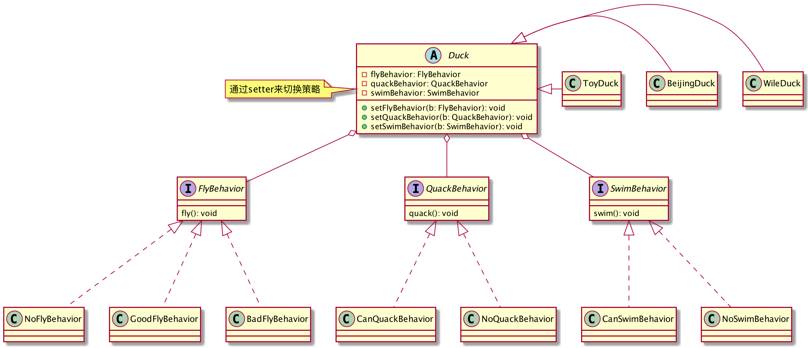
- 实现思路
    - 将各种行为编码到不同类型的策略中
    - 初始化Duck对象时，装载不同类型的策略对象
    - 主要功能全部封装在Duck类中，子类只负责提供策略对象来完成继承
    - 可以通过setter，单独为某个实例对象设置不同的策略对象
- 策略接口及其实现:Fly
    - 参考代码
        - [/designPattern/dplearn/dplearn-base/src/test/java/com/ljs/learn/pattern/strategy/improve/behavior/fly/FlyBehavior.java](/designPattern/dplearn/dplearn-base/src/test/java/com/ljs/learn/pattern/strategy/improve/behavior/fly/FlyBehavior.java)
        - [/designPattern/dplearn/dplearn-base/src/test/java/com/ljs/learn/pattern/strategy/improve/behavior/fly/GoodFlyBehavior.java](/designPattern/dplearn/dplearn-base/src/test/java/com/ljs/learn/pattern/strategy/improve/behavior/fly/GoodFlyBehavior.java)
        - [/designPattern/dplearn/dplearn-base/src/test/java/com/ljs/learn/pattern/strategy/improve/behavior/fly/BadFlyBehavior.java](/designPattern/dplearn/dplearn-base/src/test/java/com/ljs/learn/pattern/strategy/improve/behavior/fly/BadFlyBehavior.java)
        - [/designPattern/dplearn/dplearn-base/src/test/java/com/ljs/learn/pattern/strategy/improve/behavior/fly/NoFlyBehavior.java](/designPattern/dplearn/dplearn-base/src/test/java/com/ljs/learn/pattern/strategy/improve/behavior/fly/NoFlyBehavior.java)
    - 代码内容
        ```java
        public interface FlyBehavior {
            void fly();
        }
        ```
        ```java
        public class GoodFlyBehavior implements FlyBehavior {
            @Override
            public void fly() {
                System.out.println("飞行技术好");
            }
        }
        ```
        ```java
        public class BadFlyBehavior implements FlyBehavior {
            @Override
            public void fly() {
                System.out.println("飞行技术一般");
            }
        }
        ```
        ```java
        public class NoFlyBehavior implements FlyBehavior {
            @Override
            public void fly() {
                System.out.println("无法飞行");
            }
        }
        ```
- 其他策略接口及其实现:Quack、Swim
    - 参考代码
        - [/designPattern/dplearn/dplearn-base/src/test/java/com/ljs/learn/pattern/strategy/improve/behavior/quack](/designPattern/dplearn/dplearn-base/src/test/java/com/ljs/learn/pattern/strategy/improve/behavior/quack)
        - [/designPattern/dplearn/dplearn-base/src/test/java/com/ljs/learn/pattern/strategy/improve/behavior/swim](/designPattern/dplearn/dplearn-base/src/test/java/com/ljs/learn/pattern/strategy/improve/behavior/swim)
- Duck及其实现类
    - 参考代码
        - [/designPattern/dplearn/dplearn-base/src/test/java/com/ljs/learn/pattern/strategy/improve/duck/Duck.java](/designPattern/dplearn/dplearn-base/src/test/java/com/ljs/learn/pattern/strategy/improve/duck/Duck.java)
        - [/designPattern/dplearn/dplearn-base/src/test/java/com/ljs/learn/pattern/strategy/improve/duck/WildDuck.java](/designPattern/dplearn/dplearn-base/src/test/java/com/ljs/learn/pattern/strategy/improve/duck/WildDuck.java)
        - [/designPattern/dplearn/dplearn-base/src/test/java/com/ljs/learn/pattern/strategy/improve/duck/BeijingDuck.java](/designPattern/dplearn/dplearn-base/src/test/java/com/ljs/learn/pattern/strategy/improve/duck/BeijingDuck.java)
    - 代码内容
        ```java
        public abstract class Duck {
            // 策略接口
            FlyBehavior flyBehavior;
            QuackBehavior quackBehavior;
            SwimBehavior swimBehavior;
        
            // 显示鸭子的信息
            public abstract void display();
        
            // 调用策略对象实现功能
            public void quack(){
                if (quackBehavior != null){
                    quackBehavior.quack();
                }
            }
            public void swim(){
                if (swimBehavior != null){
                    swimBehavior.swim();
                }
            }
            public void fly(){
                if (flyBehavior != null){
                    flyBehavior.fly();
                }
            }
        }
        ```
        ```java
        public class WildDuck extends Duck {
            public WildDuck() {
                flyBehavior = new GoodFlyBehavior();
                quackBehavior = new CanQuackBehavior();
                swimBehavior = new CanSwimBehavior();
            }
        
            @Override
            public void display() {
                System.out.println("WildDuck");
            }
        }
        ```
        ```java
        public class ToyDuck extends Duck {
            public ToyDuck() {
                flyBehavior = new NoFlyBehavior();
                quackBehavior = new NoQuackBehavior();
                swimBehavior = new NoSwimBehavior();
            }
        
            @Override
            public void display() {
                System.out.println("ToyDuck");
            }
        }
        ```
- 测试类
    - 参考代码
        - [/designPattern/dplearn/dplearn-base/src/test/java/com/ljs/learn/pattern/strategy/improve/Client.java](/designPattern/dplearn/dplearn-base/src/test/java/com/ljs/learn/pattern/strategy/improve/Client.java)
    - 测试内容
        ```java
        @Test
        public void test01(){
            // 1. 创建并使用对象
            Duck wildDuck = new WildDuck();
            wildDuck.display();
            wildDuck.fly();
            wildDuck.quack();
            wildDuck.swim();
    
            Duck toyDuck = new ToyDuck();
            toyDuck.display();
            toyDuck.fly();
            toyDuck.quack();
            toyDuck.swim();
    
            // 2. 创建对象，并修改某个策略对象
            Duck wildDuck02 = new WildDuck();
            wildDuck02.setFlyBehavior(new BadFlyBehavior());
            wildDuck02.setSwimBehavior(new NoSwimBehavior());
            wildDuck02.display();
            wildDuck02.fly();
            wildDuck02.quack();
            wildDuck02.swim();
        }
        ```
      
## 策略模式在JDK中的应用--Arrays分析
[top](#catalog)
- Arrays.sort 中的 Comparator 使用了策略模式
- 测试代码
    - 参考代码
        - [/designPattern/dplearn/dplearn-base/src/test/java/com/ljs/learn/pattern/strategy/jdk/ArraysTest.java](/designPattern/dplearn/dplearn-base/src/test/java/com/ljs/learn/pattern/strategy/jdk/ArraysTest.java)
    - 测试内容
        ```java
        @Test
        public void test01(){
            Integer[] data = {3,2,6,4,8,2,4};
            // 创建匿名类对象，按照降序排序
            // 相当于一个策略接口的对象
            // 在compare中执行策略
            Comparator<Integer> comparator = new Comparator<Integer>() {
                @Override
                public int compare(Integer o1, Integer o2) {
                    if (o1 < o2) {
                        return 1;
                    } else {
                        return -1;
                    }
                }
            };
    
            // [3, 2, 6, 4, 8, 2, 4]
            System.out.println(Arrays.toString(data));
            Arrays.sort(data, comparator);
            // [8, 6, 4, 4, 3, 2, 2]
            System.out.println(Arrays.toString(data));
        }
        ```

- Arrays.sort 源码
    ```java
    // 调用时，指定策略对象
    public static <T> void sort(T[] a, Comparator<? super T> c) {
        if (c == null) {
            // 如果没有指定策略，则使用默认排序方式
            sort(a);
        } else {
            // 使用策略对象完成排序
            if (LegacyMergeSort.userRequested)
                legacyMergeSort(a, c);
            else
                TimSort.sort(a, 0, a.length, c, null, 0, 0);
        }
    }
    ```

# 行为型-责任链模式
## 责任链模式-引入问题-OA系统采购审批
[top](#catalog) 
- OA系统的需求
    1. 采购员采购教学器材
    2. 如果金额 <= 5000，由教学主任审批 （0 <= x <= 5000）
    3. 如果金额 <= 10000，由院长审批 （5000 <= x <= 10000）
    4. 如果金额 <= 30000，由副校长审批 （10000 <= x <= 30000）
    5. 如果金额 > 30000，由校长审批 （ x > 30000）
- 传统解决方案
    - 接收到一个请求后，根据采购金额来调用对应的审批者 Approver
    - UML类图
        - uml代码
            - [/designPattern/dplearn/dplearn-base/src/test/java/com/ljs/learn/pattern/responsibility/base/base_uml.puml](/designPattern/dplearn/dplearn-base/src/test/java/com/ljs/learn/pattern/responsibility/base/base_uml.puml)  
        - 图
            - 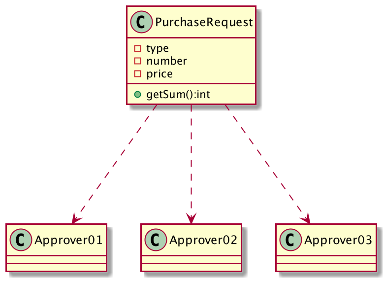

- 传统方式的问题
    - 需要使用 if-else 来根据不同的金额进行处理 
    - 如果各个级别的审批解发生变化，代码也需要变化
    - 编码时，必须明确知道有多少个审批级别
    - 采购处理本身 和 审批者 Approver 存在强耦合关系，不利于代码的扩展和维护

## 责任链模式简介
[top](#catalog) 
- 责任链模式，Chain of Responsibility pattern
- 功能/作用
    - 责任链模式为请求创建了一个接受者对象的链，将请求的接收者和发送者解耦
    - 将多个接受者组成一条链，并沿着这条链传递请求，直到有一个对象处理它为止
- 在责任链模式中，通常每个接受者都包含对另一个接受者的引用。如果一个对象不能处理该请求，则会将请求传给下一个接受者

- 责任链模式的优点和缺点 
    - 优点
        - 将请求和处理分开，实现解耦，提高系统的灵活性
        - 简化了对象，使对象不需要知道链的结构
    - 缺点
    - 性能会受到影响
        - 如果链比较长，会影响性能
        - 需要控制链中最大结点的数量，在 Handler 之间建立连接时，需要判断是否已经超阀值，避免责任链过长
    - 调试不方便
        - 责任链采用了类似递归的方式调用，调试逻辑比较复杂
- 适用场景
    - 有多个对象可以处理同一个请求
    - 如：
        - 多级请求
        - 请加/加薪等审批流程
        - java web中 Tomcat对Encoding的处理
        - 拦截器

## 责任链模式原理
[top](#catalog) 
- 原理类图
    - uml代码
        - [/designPattern/dplearn/dplearn-base/src/test/java/com/ljs/learn/pattern/responsibility/principle_uml.puml](/designPattern/dplearn/dplearn-base/src/test/java/com/ljs/learn/pattern/responsibility/principle_uml.puml)
    - 图
        - 
- 角色划分
    - Handler：抽象处理者
        - 定义了一个处理请求的接口
        - 在内部包含另外一个Handler
    - ConcreteHandler：具体处理者
        - 处理自己负责的请求，可以访问它的后继者，即下一个处理者
        - 如果可以处理当前请求，则进行处理，否则将请求交给后继者处理，从而形成一个责任链
    - Request
        - 含有很多属性，表示一个请求
        
- 责任链的形式
    - 单条责任链
        - 一般情况下会从起点位置开始传入 Request，直到无法搜索到可以处理的 Handler
    - 环状责任链
        - 如果希望：从任何位置的 Approver 开始都能够寻找到可以处理请求的 Handler，则需要构建一个环状责任链


## 责任链模式实现引入问题
[top](#catalog) 
- UML类图
    - uml代码
        - [/designPattern/dplearn/dplearn-base/src/test/java/com/ljs/learn/pattern/responsibility/improve/improve_uml.puml](/designPattern/dplearn/dplearn-base/src/test/java/com/ljs/learn/pattern/responsibility/improve/improve_uml.puml)
    - 图
        - 
- 实现思路
    - 每个 Approver 相当于一个 Handler，内部包含下一个 Approver
    - 初始化时，手动构成责任链
    - 将 Request 作为请求，传入 Approver 的方法中，启动责任链，并搜索可以处理请求的 Approver

- Request
    - 参考代码
        - [/designPattern/dplearn/dplearn-base/src/test/java/com/ljs/learn/pattern/responsibility/improve/PurchaseRequest.java](/designPattern/dplearn/dplearn-base/src/test/java/com/ljs/learn/pattern/responsibility/improve/PurchaseRequest.java)
    - 代码内容
        ```java
        // 请求类
        public class PurchaseRequest {
            private int type = 0 ;// 请求类型
            private float price = 0.0f;//请求金额
            private int id = 0;
        
            public PurchaseRequest(int type, float price, int id) {
                this.type = type;
                this.price = price;
                this.id = id;
            }
            // getter、setter
        }
        ```
- Approver及其实现类，即 Handler
    - 参考代码
        - [/designPattern/dplearn/dplearn-base/src/test/java/com/ljs/learn/pattern/responsibility/improve/Approver.java](/designPattern/dplearn/dplearn-base/src/test/java/com/ljs/learn/pattern/responsibility/improve/Approver.java)
        - [/designPattern/dplearn/dplearn-base/src/test/java/com/ljs/learn/pattern/responsibility/improve/DepartmentApprover.java](/designPattern/dplearn/dplearn-base/src/test/java/com/ljs/learn/pattern/responsibility/improve/DepartmentApprover.java)
        - [/designPattern/dplearn/dplearn-base/src/test/java/com/ljs/learn/pattern/responsibility/improve/CollegeApprover.java](/designPattern/dplearn/dplearn-base/src/test/java/com/ljs/learn/pattern/responsibility/improve/CollegeApprover.java)
        - [/designPattern/dplearn/dplearn-base/src/test/java/com/ljs/learn/pattern/responsibility/improve/ViceSchoolMasterApprover.java](/designPattern/dplearn/dplearn-base/src/test/java/com/ljs/learn/pattern/responsibility/improve/ViceSchoolMasterApprover.java)
        - [/designPattern/dplearn/dplearn-base/src/test/java/com/ljs/learn/pattern/responsibility/improve/SchoolMasterApprover.java](/designPattern/dplearn/dplearn-base/src/test/java/com/ljs/learn/pattern/responsibility/improve/SchoolMasterApprover.java)
    - 代码内容
        ```java
        public abstract class Approver {
            // 下一个处理者
            Approver approver;
            // 名字
            String name;
        
            public Approver(String name) {
                this.name = name;
            }
        
            public void setApprover(Approver approver) {
                this.approver = approver;
            }
        
            // 处理请求的方法，得到一个请求
            // 处理是由子类完成的，需要一个抽象方法
            public abstract void processRequest(PurchaseRequest request);
        }
        ```
        ```java
        public class DepartmentApprover extends Approver {
            public DepartmentApprover(String name) {
                super(name);
            }
        
            @Override
            public void processRequest(PurchaseRequest request) {
                if (request.getPrice() <= 5000){
                    System.out.println("request id = " + request.getId() + ", processed by: " + name);
                } else {
                    approver.processRequest(request);
                }
            }
        }
        ```
        ```java
        public class CollegeApprover extends Approver {
            public CollegeApprover(String name) {
                super(name);
            }
        
            @Override
            public void processRequest(PurchaseRequest request) {
                if (request.getPrice() > 5000 && request.getPrice() <= 10000){
                    System.out.println("request id = " + request.getId() + ", processed by: " + name);
                } else {
                    approver.processRequest(request);
                }
            }
        }
        ```
        ```java
        public class ViceSchoolMasterApprover extends Approver {
            public ViceSchoolMasterApprover(String name) {
                super(name);
            }
        
            @Override
            public void processRequest(PurchaseRequest request) {
                if (request.getPrice() > 10000 && request.getPrice() <= 30000){
                    System.out.println("request id = " + request.getId() + ", processed by: " + name);
                } else {
                    approver.processRequest(request);
                }
            }
        }
        ```
        ```java
        public class SchoolMasterApprover extends Approver {
            public SchoolMasterApprover(String name) {
                super(name);
            }
        
            @Override
            public void processRequest(PurchaseRequest request) {
                if (request.getPrice() > 30000){
                    System.out.println("request id = " + request.getId() + ", processed by: " + name);
                } else {
                    approver.processRequest(request);
                }
            }
        }
        ```
- 测试代码
    - 参考代码
        - [/designPattern/dplearn/dplearn-base/src/test/java/com/ljs/learn/pattern/responsibility/improve/Client.java](/designPattern/dplearn/dplearn-base/src/test/java/com/ljs/learn/pattern/responsibility/improve/Client.java)
    - 测试内容
        ```java
        @Test
        public void test01() {
            // 1. 创建一个请求
            PurchaseRequest request = new PurchaseRequest(1, 35000, 1);

            // 2. 创建各级审批者
            Approver department = new DepartmentApprover("Department A");
            Approver college = new CollegeApprover("College A");
            Approver viceSchoolMaster = new ViceSchoolMasterApprover("ViceSchoolMaster A");
            Approver schoolMaster = new SchoolMasterApprover("SchoolMaster A");

            // 3. 将审批着组成责任链
            // 如果希望从任何一个级别开始都能够处理，则需要处理人构成环形
            department.setApprover(college);
            college.setApprover(viceSchoolMaster);
            viceSchoolMaster.setApprover(schoolMaster);
            schoolMaster.setApprover(department);

            // 4. 处理请求
            department.processRequest(request);
        }
        ```

[top](#catalog)