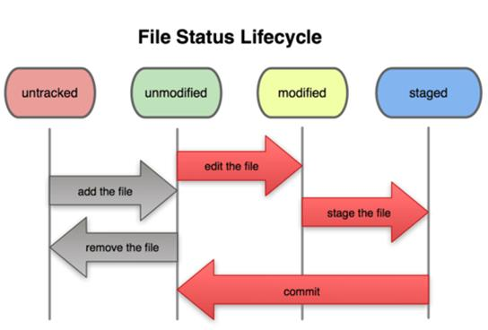

- 参考
    - https://git-scm.com/book/zh/v2
    - https://abcops.cn/archives/458

<span id="catalog"></span>

### 目录
- [安装](#安装)
- [版本控制](#版本控制)
- [git简介](#git简介)
- [git配置](#git配置)
    - [git配置的基本知识](#git配置的基本知识)
    - [git配置的crud操作](#git配置的crud操作)
    - [忽略版本管理的配置](#忽略版本管理的配置)
- [创建git仓库](#创建git仓库)
- [git底层概念及底层命令](#git底层概念及底层命令)
    - [区域与对象](#区域与对象)
    - [git对象](#git对象)
    - [树对象](#树对象)
    - [提交对象](#提交对象)
- [git高层命令-基本crud命令](#git高层命令-基本crud命令)
    - [crud命令命令概述](#crud命令命令概述)
    - [status指令及文件状态](#status指令及文件状态)
    - [add指令](#add指令)
    - [commit指令](#commit指令)
    - [diff指令](#diff指令)
    - [mv指令](#mv指令)
    - [log指令](#log指令)
- [git高层命令-分支操作](#git高层命令-分支操作)
    - [分支操作的基本知识](#分支操作的基本知识)
    - [分支操作的指令](#分支操作的指令)
    - [切换分支时需要注意的问题](#切换分支时需要注意的问题)
    - [HEAD指针](#HEAD指针)
        - [HEAD指针的基本知识](#HEAD指针的基本知识)
        - [分离的HEAD指针](#分离的HEAD指针)
- [git高层命令-git存储](#git高层命令-git存储)
- [git高层命令-git重置](#git高层命令-git重置)
    - [3个区域间的重置](#3个区域间的重置)
    - [重置最新版本的提交信息](#重置最新版本的提交信息)
    - [变基](#变基)
        - [重置旧版本的提交信息](#重置旧版本的提交信息)
        - [合并多个连续的commit](#合并多个连续的commit)
        - [合并多个不连续的commit](#合并多个不连续的commit)
- [git高层命令-远程仓库操作](#git高层命令-远程仓库操作)
    - [传输协议](#传输协议)
    - [克隆仓库](#克隆仓库)
        - [备份本地的git项目](#备份本地的git项目)
        - [克隆远程仓库](#克隆远程仓库)
    - [远程分支操作](#远程分支操作)
        - [查询远程分支信息](#查询远程分支信息)
        - [添加远程仓库引用到当前项目](#添加远程仓库引用到当前项目)
        - [拉取远程仓库](#拉取远程仓库)
        - [分支推送到远程仓库](#分支推送到远程仓库)
        - [跟踪分支](#跟踪分支)
- [](#)
- [总结](#总结)

# 安装
[top](#catalog)
- 参考：https://git-scm.com/book/zh/v2/起步-安装-Git
- 两种安装方式
    1. 通过包管理命令安装，**但是版本可能会滞后**
        - linux
            ```
            sudo dnf install git-all -y
            ```
        - Ubuntu
            ```
            sudo apt install git-all
            ```
    2. 源码安装
        1. 安装 Git 依赖的库：autotools、curl、zlib、openssl、expat 和 libiconv
            ```
            sudo dnf install dh-autoreconf curl-devel expat-devel gettext-devel \
            openssl-devel perl-devel zlib-devel
            ```
        2. 为了添加文档的多种格式（doc、html、info），需要以下附加的依赖
            ```
            sudo dnf install asciidoc xmlto docbook2X
            ```
        3. 如果使用基于 RPM 的发行版
            ```
            sudo dnf install getopt
            ```
        4. 如果使用 Fedora/RHEL/RHEL衍生版，解决二进制文件名的不同
            - 检查目标文件是否存在
                ```
                /usr/bin/db2x_docbook2texi
                ```
            - 如果该文件不存在需要安装.如果不安装,执行`make all doc info`是会报错：`docbook2x-texi: command not found`
                ```
                rpm -Uvh http://dl.fedoraproject.org/pub/epel/7/x86_64/Packages/d/docbook2X-0.8.8-17.el7.x86_64.rpm
                ```
            - 解决二进制文件名的不同
                ```
                sudo ln -s /usr/bin/db2x_docbook2texi /usr/bin/docbook2x-texi
                ```
        5. 从git上下载某个版本的镜像文件:`git-XXXXXX.tar.gz`
            - https://github.com/git/git/releases

        6. 编译并安装
            ```
            tar -zxf git-XXXXXX.tar.gz
            cd git-XXXXXX
            make configure
            ./configure --prefix=/usr
            make all doc info
            make install install-doc install-html install-info
            ```
        7. 安装后会在 `/usr/bin/` 目录下生成几个可执行文件
            ```
            [root@ea284d43453a bin]# ll /usr/bin/ |grep git
            -rwxr-xr-x 130 root root   15847808 Apr  4 07:28 git
            -rwxr-xr-x   2 root root     162731 Apr  4 07:28 git-cvsserver
            -rwxr-xr-x 130 root root   15847808 Apr  4 07:28 git-receive-pack
            -rwxr-xr-x   2 root root    9284840 Apr  4 07:28 git-shell
            -rwxr-xr-x 130 root root   15847808 Apr  4 07:28 git-upload-archive
            -rwxr-xr-x 130 root root   15847808 Apr  4 07:28 git-upload-pack
            -rwxr-xr-x   1 root root     353477 Apr  4 07:28 gitk
            ```

- 查看 git 版本
    ```
    git version
    ```

- 配置个人用户的用户名和邮箱（参考：[git配置](#git配置)）
    ```
    git config --global user.name "ljs"
    git config --global user.email "@qq.com"
    ```


# 版本控制
[top](#catalog)
- 什么是版本控制
    - 版本控制是一种记录文件内容变化，以便将来查阅特定版本修订情况的系统
- 使用版本控制可以：
    - 回滚文件
    - 比较文件变化细节

- 两种版本控制系统
    - 集中化的版本控制系统，如：SVN
    - 分布式的版本控制系统，如：Git、BItKeeper
            
- 两种版本控制系统的比较

    ||集中化|分化式|
    |-|-|-|
    |**管理位置**|单一的中央服务器|本地、服务器|
    |**如何管理**|<ul><li>连接服务器，通过客户端来操作</li><li>每个人都可以一定程度上看到其他人的工作内容</li><li>管理员可以控制每个开发者的权限</li></ul>|创建代码仓库的**完整镜像**，可以在本地和远程仓库中进行版本管理|
    |**如何保存版本差异**|保存版本与版本之间的差异内容，即文件快照|保存索引|
    |**存储特点**|占用的磁盘空间小，但是<label style="color:red">回滚速度慢</label>|占用的磁盘空间大，但是<label style="color:red">回滚速度快</label>|
    |**单点故障处理**|<ol><li>网络故障 <ul><li>出现网络故障时，会导致无法提交文件操作，影响开发进度</li></ul> </li><li>磁盘故障<ul><li>如果磁盘故障时，没即时备份，可能会导致数据丢失</li><li>存在丢失整个项目历史记录的风险</li></ul></li></ol>|<ol><li>网络故障<ul><li>可以继续开发，通过本地镜像来管理</li></ul></li><li>磁盘故障<ul><li>出现磁盘故障时，可以用其他客户端的镜像进行恢复</li></ul></li></ol>|
    |**多项目协作**|-|可以和不同的远端代码仓库进行交互，可以和不同项目的人进行相互协作|

# git简介
[top](#catalog)
- git是世界上最先进的分布式版本控制系统
- git的特点
    - 分支快速切换
    - 容量小（压缩）
    - 设计简单
    - 完全分布式
    - 支持非线性开发模式，允许上千个并行开发的分支
    - 有能力高效管理类似Linux内核一样的超大规模项目

# git配置
## git配置的基本知识
[top](#catalog)
- `git config`：git通过该命令来配置或读取工作环境变量
- git提供了三个文件来存放不同级别的配置，<label style="color:red">高级别会覆盖低级别的相同配置</label>

    |级别|文件路径|适用范围|指令选项|
    |-|-|-|-|
    |1|`/etc/gitconfig`|对当前系统中所有用户都适用的配置|`git config --system`|
    |2|`~/.gitconfig`|只适用于当前用户的|`git config --global`|
    |3|`.git/config`|当前项目的git目录中的配置文件，只针对当前项目有效|`git config [--local]`，默认就是`--local`|

## git配置的crud操作
[top](#catalog)
- crud操作
    - 查看所有配置内容
        - `git config [--system/global] --list`
        - `git config [--system/global] -l`
    - 添加/更改配置
        - `git config [--system/global] 配置名 "配置值"`
            - 配置值最好用 `""` 括起来，防止特殊字符导致的异常
    - 删除配置
        - `git config --global --unset "配置名"`


- 为复杂的指令添加别名：`git config [--system/global] alias.指令别名 "指令内容，去掉开头的git"`
    - 通过：`git 指令别名`，来调用指令
    - 示例：为查看详细分支图的指令设置别名
        ```
        git config --global alias.hpic \
        "log --oneline --decorate --graph --all"
        ```

- 设置用户名和邮箱
    ```
    git config --global user.name "ljs"
    git config --global user.email "xxx@qq.com"
    ```

## 忽略版本管理的配置
[top](#catalog)
- 创建 `.gitignore` 文件，并添加需要git忽略的文件，可以使用通配符
- 如果要忽略某个目录，后面必须有`/`，如忽略`doc`目录：`doc/`


# 创建git仓库
[top](#catalog)
- `git init`，创建仓库
    - 需要在项目目录下执行该指令
    - 执行后会生成一个隐藏目录：`.git`，即**版本库**
        - 在项目目录下进行的任何操作都会记录到`.git`中
- `.git`目录下的内容
    - 目录

        |目录|描述|
        |-|-|
        |<label style="color:red">objects</label>|存储所有数据内容|
        |<label style="color:red">refs</label>|存储指向数据的提交对象指针（分支）|
        |hooks|目录包含客户端或服务端的钩子脚本，即执行某些git操作前的一些操作|
        |info|包含一个全局性排除文件|
        |logs|保存日志信息|

    - 文件

        |文件|描述|
        |-|-|
        |<label style="color:red">HEAD</label>|表示当前正在使用的分支|
        |<label style="color:red">index</label>|保存暂存区信息|
        |config|包含当前项目所使用的配置信息|
        |description|仓库的描述信息|

# git底层概念及底层命令
## 区域与对象
[top](#catalog)
- 区域
    - git的3种区域
        - 工作区
        - 暂存区
        - 版本区
    - 区域的一般使用流程：工作区--> 暂存区--> 版本区

- 对象
    - git的三种对象
        - git对象
        - 树对象
        - 提交对象

    - git对象，对应文件版本
    - 树对象，对应项目快照
    - 提交对象，对应项目版本

## git对象
[top](#catalog)
- git对象的本质是：blob类型的键值对
- git对象表示的是文件的一次版本

- git的核心部分是一个简单的键值对数据库
    - 可以向该数据库插入任意类型的内容，包括数据和文件等等，git会返回一个键值
    - 通过键值可以在任意时刻再次检索该内容
    - 所有的数据都保存在`.git/objects`目录下，即版本区
    - <label style="color:red">git对象的操作都是在本地数据库进行的，即工作区与版本区产生交互，不涉及暂存区</label>

- git对象/键值对的读写指令
    - `echo 'test01' | git hash-object -w --stdin`
        - 用途：向数据库写入内容，并返回键值
            - 可以写入数据，也可以写入文件内容
        - 选项说明
            - `-w`，执行指令后，存储数据对象；如果不使用则只返回键值
                - 执行后会在`./.git/objects/hash值前两位/hash值剩余位` 路径创建压缩文件
                - 使用 `cat` 指令会打印出乱码
            - `--stdin`，从标准输入读取内容；如果不指定，需要在命令末尾给出特定文件的路径
        - 选项组合用法
            - `git hash-object -w 文件路径`，用于存储文件
            - `git hash-object 文件路径`，用于返回对应文件的键值
        - 指令的返回值
            - 40个字符的检验和，是一个`SHA-1`哈希值

    - `git cat-file [option] 键值`
        - 用途：根据键值拉取数据
        - 选项说明
            - `-p`，自动判断内容的类型，并显示格式友好的内容
            - `-t`，查看对象类型

- **对于内容相同的文件，git只会生成一份git对象，并连接到不同的文件名，一次来降低容量**

- 简单的版本控制
    1. 创建文件：`echo "SDFFE XCcvb  fbef" > my01.txt`
    2. 创建git对象/键值对：`git hash-object -w my01.txt`，生成一个键值
    3. 检查git对象/键值对的内容：`git cat-file -p 2的键值`
    4. 修改文件：echo "xcvcbvb ythytj" >> my01.txt 
    5. 重新保存键值对：`git hash-object -w my01.txt`，生成一个**新的键值**
    6. 检查git对象/键值对的内容：`git cat-file -p 5的键值`

- 只使用 `git hash-object` 和 `git cat-file` 做版本管理的问题
    1. 无法记住文件的每一个版本对于的SHA-1值
    2. 一个键值对只能代表一个文件的一个版本，不能代表整个项目的快照
    3. 文件名没有被保存，只保存了文件的内容

## 树对象
[top](#catalog)
- 树对象的本质是：tree类型的键值对，也是一种git对象
- 树对象表示的是项目的一次快照，暂存区中的所有内容都会保存到树对象中

- git使用类似uninx文件系统的方式存储内容。所有内容以树对象和git对象的形式存储
    - 树对象表示unix的目录
    - git对象表示文件内容

- 树对象的特点
    - 组织多个文件
    - 一个树对象可以包含另一个树对象
    - 一个树对象包含了一条或多条记录，每条记录含有一个指向git对象或者子树对象的 SHA-1 指针、文件mode、类型、文件信息

- 树对象的操作指令
    - `git upate-index [option] 文件名`，将文件添加到暂存区
        - 该指令不会创建任何对象，只是将git对象添加到暂存区中
        - 执行后会将暂存区的信息保存到: `.git/index`文件中
        - 选项说明
            - `--add`
                - 如果某个文件不再暂存区，第一次使用时需要添加该属性
                - 第一次使用时，如果使用了：`git undate-index -add 文件名`，没有附加`-cacheinfo 键值`，则会自动执行两步操作
                    1. `git hash-object -w 文件名`，为文件生成git对象
                    2. `git update-index --add --cacheinfor 1生成的键值 文件名`，将git对象添加到暂存区
            - `--cacheinfo 文件模式 键值`
                - 将文件的git对象添加到暂存区，即当前文件已经位于git数据库中
            
        - 文件模式
            - 6位数字表示
            - 前三位表示文件类型
                - 100 表示文件
                - 120 表示符号连接
            - 后三位表示ugo用户的rwx权限
        - 对于同一个文件
            - 第一次使用需要附加 `--add` 选项，在暂存区创建该文件的快照
            - 后续使用时，不需要附加 `--add` 选项，需要使用相同的文件名和新的键值
            - 执行之后会更新暂存区中的文件版本，即新版本覆盖旧版本
                - 通过`git ls-files -s`，看到的只有最新版本
        - 常用组合
            - `git update-index -add new.txt`
            - `git update-index -add --cacheinfor 文件对应的SHA-1值 文件名`

    - `git write-tree`，生成树对象，即创建一个当前暂存区的快照
        - 执行后创建一个git对象，并返回一个键值
        - <label style="color:red">执行后不会清空暂存区</label>
    - `git read-tree [选项] 另一个树对象hash值`，将一个树对象加入当前最新的树对象
        - 执行后需要执行：`git write-tree`来创建新的树对象
        - 选项说明
            - `-prefix=bak`

- 树对象的问题
    - 每个树对象代表了暂存区不同阶段的快照，都有自己的SHA-1值
    - 重用树对象时，必须记住每个对象的版本内容及SHA-1值，非常繁琐

- 示例
    - 示例内容
        1. 创建文件 `my01.txt` 的git对象，添加到暂存区，然后生成树对象
            1. 为文件 `my01.txt` 创建第一个版本git对象
                ```
                root@ea284d43453a testpag]# git hash-object -w my01.txt 
                6623d299f5de2adfb57f23f579f35a3cb6e7b30f
                ```
            2. 为文件创建暂存区
                ```
                [root@ea284d43453a testpag]# git update-index --add \
                 --cacheinfo 100755 6623d299f5de2adfb57f23f579f35a3cb6e7b30f my01.txt 
                ```
            3. 检查暂存区内容，与创建的内容一致
                ```
                [root@ea284d43453a testpag]# git ls-files -s
                100755 6623d299f5de2adfb57f23f579f35a3cb6e7b30f 0       my01.txt
                ```
            4. 检查 obejct 目录下的git对象，只有 `my01.txt` 文件的git对象
                ```
                [root@ea284d43453a testpag]# find .git/objects/ -type f
                .git/objects/66/23d299f5de2adfb57f23f579f35a3cb6e7b30f
                [root@ea284d43453a testpag]# 
                ```
            5. 生成一个树对象，对暂存区进行快照
                ```
                [root@ea284d43453a testpag]# git write-tree
                d1b27968fb9a42f524dd6889bdb405eb20c95009
                ```
            6. 检查`write-tree`的键值类型
                ```
                [root@ea284d43453a testpag]# git cat-file -t d1b27968fb9a42f524dd6889bdb405eb20c95009
                tree
                ```
            7. 检查 obejct 目录下的git对象，包含 `my01.txt` 文件和工作区的两个git对象
                ```
                [root@ea284d43453a testpag]# find .git/objects/ -type f
                .git/objects/d1/b27968fb9a42f524dd6889bdb405eb20c95009
                .git/objects/66/23d299f5de2adfb57f23f579f35a3cb6e7b30f
                ```
        2. 修改 `my01.txt` 文件，并更新暂存区
            1. 修改 `my01.txt` 文件，生成新的git对象
                ```
                [root@ea284d43453a testpag]# echo "version v2" >> my01.txt
                [root@ea284d43453a testpag]# git hash-object -w my01.txt 
                06521ff6147d10f913cf7b6984592c7dea618dbb
                ```
            2. 检查 obejct 目录下的git对象，增加了一个新的git对象文件
                ```
                [root@ea284d43453a testpag]# find .git/objects/ -type f
                .git/objects/d1/b27968fb9a42f524dd6889bdb405eb20c95009
                .git/objects/06/521ff6147d10f913cf7b6984592c7dea618dbb
                .git/objects/66/23d299f5de2adfb57f23f579f35a3cb6e7b30f
                ```
            3. 更新暂存区
                ```
                [root@ea284d43453a testpag]# git update-index \
                --cacheinfo 100755  06521ff6147d10f913cf7b6984592c7dea618dbb my01.txt
                ```
            4. 检查暂存区
                ```
                [root@ea284d43453a testpag]# git ls-files -s
                100755 06521ff6147d10f913cf7b6984592c7dea618dbb 0       my01.txt
                [root@ea284d43453a testpag]# 
                ```
        3. 添加新的文件 `my02.txt`，并加入暂存区
            1. 创建新文件 `my02.txt`
                ```
                [root@ea284d43453a testpag]# echo "version v1 :weretysdfg" > my02.txt
                ```
            2. 直接将 `my02.txt` 添加到暂存区，由git自动创建git对象
                ```
                [root@ea284d43453a testpag]# git update-index --add my02.txt
                ```
            3. 检查生成的git对象
                ```
                [root@ea284d43453a testpag]# find .git/objects/ -type f
                .git/objects/d1/b27968fb9a42f524dd6889bdb405eb20c95009
                .git/objects/0c/fcc731008852cee8ab9398d4db19a32d7529e4
                .git/objects/06/521ff6147d10f913cf7b6984592c7dea618dbb
                .git/objects/66/23d299f5de2adfb57f23f579f35a3cb6e7b30f
                ```
            4. 检查暂存区
                ```
                [root@ea284d43453a testpag]# git ls-files -s
                100755 06521ff6147d10f913cf7b6984592c7dea618dbb 0       my01.txt
                100644 0cfcc731008852cee8ab9398d4db19a32d7529e4 0       my02.txt
                ```
        4. 生成 `my02.txt` 和 新版 `my01.txt` 的树对象
            1. 创建树对象
                ```
                [root@ea284d43453a testpag]# git write-tree
                4197ea266921c903ff40d3b1f1b095edb3e1487e
                [root@ea284d43453a testpag]# 
                ```
            2. 检查git对象
                ```
                [root@ea284d43453a testpag]# find .git/objects/ -type f
                .git/objects/d1/b27968fb9a42f524dd6889bdb405eb20c95009
                .git/objects/41/97ea266921c903ff40d3b1f1b095edb3e1487e
                .git/objects/0c/fcc731008852cee8ab9398d4db19a32d7529e4
                .git/objects/06/521ff6147d10f913cf7b6984592c7dea618dbb
                .git/objects/66/23d299f5de2adfb57f23f579f35a3cb6e7b30f
                [root@ea284d43453a testpag]# 
                ```
        5. 将第一个树对象添加到第二个树对象(当前最新的树对象)中
            1. 将第一个树对象添加到第二个树对象
                ```
                [root@ea284d43453a testpag]# git read-tree --prefix=bak d1b27968fb9a42f524dd6889bdb405eb20c95009
                [root@ea284d43453a testpag]# git write-tree
                d5f79d82cf046ee2a06095ad28f041ef6ec057b7
                [root@ea284d43453a testpag]# 
                ```
            2. 检查暂存区的内容，添加了：my01.txt version_v1 的git对象
                ```
                [root@ea284d43453a testpag]# git ls-files -s
                100755 6623d299f5de2adfb57f23f579f35a3cb6e7b30f 0       bak/my01.txt
                100755 06521ff6147d10f913cf7b6984592c7dea618dbb 0       my01.txt
                100644 0cfcc731008852cee8ab9398d4db19a32d7529e4 0       my02.txt
                [root@ea284d43453a testpag]# 
                ```
            3. 检查git对象，生成了一个新的git对象：d5f79d82cf046ee2a06095ad28f041ef6ec057b7
                ```
                [root@ea284d43453a testpag]# find .git/objects/ -type f
                .git/objects/d1/b27968fb9a42f524dd6889bdb405eb20c95009
                .git/objects/41/97ea266921c903ff40d3b1f1b095edb3e1487e
                .git/objects/0c/fcc731008852cee8ab9398d4db19a32d7529e4
                .git/objects/06/521ff6147d10f913cf7b6984592c7dea618dbb
                .git/objects/66/23d299f5de2adfb57f23f579f35a3cb6e7b30f
                .git/objects/d5/f79d82cf046ee2a06095ad28f041ef6ec057b7
                [root@ea284d43453a testpag]# 
                ```
            4. 检查树对象中的内容: 包含两个文件最新版本的git对象，和新加入的树对象
                ```
                [root@ea284d43453a testpag]# git cat-file -p d5f79d82cf046ee2a06095ad28f041ef6ec057b7
                040000 tree d1b27968fb9a42f524dd6889bdb405eb20c95009    bak
                100755 blob 06521ff6147d10f913cf7b6984592c7dea618dbb    my01.txt
                100644 blob 0cfcc731008852cee8ab9398d4db19a32d7529e4    my02.txt
                [root@ea284d43453a testpag]# 
                ```

    - 操作结果分析
        - 生成的git对象
            ```
            d1b27968fb9a42f524dd6889bdb405eb20c95009 my01.txt v1 的树对象 : 树对象01
            6623d299f5de2adfb57f23f579f35a3cb6e7b30f my01.txt v1 的git对象
            06521ff6147d10f913cf7b6984592c7dea618dbb my01.txt v2 的git对象
            0cfcc731008852cee8ab9398d4db19a32d7529e4 my02.txt v1 的git对象
            4197ea266921c903ff40d3b1f1b095edb3e1487e my02.txt v1、my01.txt v2的树对象 : 树对象02
            d5f79d82cf046ee2a06095ad28f041ef6ec057b7 树对象02<--树对象01 : 树对象03
            ```
        - git对象、树对象的结果关系
            - 树对象02中只有；my01.txt v2、my02.txt v1
            - 向树对象02中加入树对象01后生成了树对象03
            ```
            树对象03
            ┌──────────────────────────────────────┐
            │          树对象02─────────────┐       │
            │             │                │       │
            │     ┌───────┴──────┐         │       │
            │     │              │         V       │
            │ my01.txt v2   my02.txt v1   bak      │
            │                              │       │
            │                            树对象01   │
            │                              │       │
            │                          my01.txt v1 │
            └──────────────────────────────────────┘
            ```

## 提交对象
[top](#catalog)
- 提交对象的本质是：commit类型的键值对，也是一种git对象
- 提交象表示的是项目的一个版本
- **提交对象是链式的，创建条对象时必须要有父提交对象的 SHA-1 值**
- 因为每个提交对象都包含当前版本的全部内容(保存在树对象中)，所以切换版本时，只需要**指定提交对象的 SHA-1 值，就可以快速切换**

- 提交对象的操作指令
    - `git commit-tree 树对象的SHA-1值 [option]`
        - 创建一个提交对象
        - 选项说明
            - `-p 父提交对象的SHA-1值`
                - 第一个版本可以不用指定，后续的版本必须指定父提交对象，才能完成一个完成的版本链
            - `-m 提交信息`
            - `-F 文件名`，从指定文件中读取提交信息
        - <label style="color:red">执行后不会清空暂存区</label>

- 示例，接：[树对象](#树对象)
    - 示例内容
        1. 创建树对象01的提交对象
            1. 创建提交对象
                ```
                [root@ea284d43453a testpag]# git commit-tree d1b27968fb9a42f524dd6889bdb405eb20c95009 -m "first commit"
                dd292f24bebab06712cd00fa7ecbcd9193ef243b
                [root@ea284d43453a testpag]# 
                ```
            2. 查看提交对象的内容：树对象01的SHA-1、用户信息、提交信息
                ```
                [root@ea284d43453a testpag]# git cat-file -p dd292f24bebab06712cd00fa7ecbcd9193ef243b
                tree d1b27968fb9a42f524dd6889bdb405eb20c95009
                author ljs <---------@qq.com> 1586149714 +0000
                committer ljs <---------@qq.com> 1586149714 +0000

                first commit
                [root@ea284d43453a testpag]# 
                ```
        2. 创建树对象02的提交对象
            1. 创建提交对象
                ```
                [root@ea284d43453a testpag]# git commit-tree 4197ea266921c903ff40d3b1f1b095edb3e1487e \
                -p dd292f24bebab06712cd00fa7ecbcd9193ef243b -m "second commit"
                77253a978b58f132feeb5318b134e9eae950cdbf
                [root@ea284d43453a testpag]# 
                ```
            2. 查看提交对象的内容：树对象02的SHA-1、父提交对象的SHA-1，用户信息、提交信息
                ```
                [root@ea284d43453a testpag]# git cat-file -p 77253a978b58f132feeb5318b134e9eae950cdbf
                tree 4197ea266921c903ff40d3b1f1b095edb3e1487e
                parent dd292f24bebab06712cd00fa7ecbcd9193ef243b
                author ljs <---------@qq.com> 1586150151 +0000
                committer ljs <---------@qq.com> 1586150151 +0000

                second commit
                [root@ea284d43453a testpag]# 
                ```
        3. 创建树对象03的提交对象
            1. 创建提交对象
                ```
                [root@ea284d43453a testpag]# git commit-tree d5f79d82cf046ee2a06095ad28f041ef6ec057b7 \
                -p 77253a978b58f132feeb5318b134e9eae950cdbf -m "third commit"
                6b759319f2e2ba73ddb174474c96cbf1339c9d91
                [root@ea284d43453a testpag]# 
                ```
            2. 查看提交对象的内容：树对象03的SHA-1、父提交对象的SHA-1，用户信息、提交信息
                ```
                [root@ea284d43453a testpag]# git cat-file -p 6b759319f2e2ba73ddb174474c96cbf1339c9d91
                tree d5f79d82cf046ee2a06095ad28f041ef6ec057b7
                parent 77253a978b58f132feeb5318b134e9eae950cdbf
                author ljs <---------@qq.com> 1586150457 +0000
                committer ljs <--------@qq.com> 1586150457 +0000

                third commit
                [root@ea284d43453a testpag]# 
                ```
    - 各对象之间的关系
        ```
        ┌─────────────┐
        │　提交对象03　 ├───>> 树对象03 ───────────┬─────────bak──┐
        │third commit │                         │              │
        └────┬────────┘                         │              │
             │                                  │              │
             │                                  ├────────────┐ │
             V                                  │            │ │
        ┌─────────────┐                         V            │ │
        │　提交对象02　 ├───>> 树对象02 ─┬───>> my01.txt v2     │ │
        │second commit│               └───>> my02.txt v1 <<──┘ │
        └────┬────────┘                                        │
             │                                                 │
             │                                                 │
             V                                                 │
        ┌─────────────┐                                        │
        │　提交对象01　 ├───>> 树对象01 ───>> my01.txt v1         │    
        │first commit │         ^                              │
        └─────────────┘         ^                              │
                                └──────────────────────────────┘
        ```

# git高层命令-基本crud命令
## crud命令命令概述
[top](#catalog)
- 所有高层命令都是由多个底层命令组合而成
- git操作的最基本流程
    1. 创建工作目录：`git init`
    2. 修改工作区文件（工作目录下的文件）
    3. `git add 文件路径`，将修改后的文件放入暂存区（工作区-->版本区-->暂存区）
    4. `git commit -m 提交信息`
- 一次git提交只会有一个树对象、一个提交对象、多个git对象。如果是删除文件，则目标文件的git对象会从暂存区删除

-  crud命令

    |指令|说明|
    |-|-|
    |`git status`|[status指令](#status指令及文件状态)|
    |`git add 文件路径`|[add指令](#add指令)|
    |`git commit -m 提交信息`|[commit指令](#commit指令)|
    |`git diff`|[diff指令](#diff指令)|
    |`git mv 旧文件名 新文件名`|[mv指令](#mv指令)|
    |`git rm 文件路径`|删除文件|
    |`git log`|[log指令](#log指令)|

## status指令及文件状态
[top](#catalog)
- 指令：`git status`
    - 检查工作目录下文件的状态

- 工作目录下所有文件都有两种状态：`已跟踪`、`未跟踪`
    - `已跟踪` 状态文件
        - 即已经纳入版本管理的文件，在上次的项目快照中存在记录（树对象中有记录）
        - 这些文件的实际状态可能是
            - 已提交
            - 已修改
            - 已暂存
    - `未跟踪` 状态文件
        - 所有未纳入版本管理的文件，在上次的项目快照中不存在记录（树对象中没有记录），也不在当前暂存区（没有执行`git update-index`/`git add`）

- 使用git时的文件状态变化
    - 
    - 文件状态

        |标识|含义|
        |-|-|
        |untracked|未跟踪|
        |unmodified|未修改|
        |modified|已修改|
        |staged|已暂存|


- 使用: `git status`指令后，提示信息中的内容
    - `Untracked files`: 表示文件未跟踪
        ```
        Untracked files:
        (use "git add <file>..." to include in what will be committed)
                xxxx.txt
        ```
    - `Changes to be committed`: 表示文件都已暂存，但是未提交
        ```
        Changes to be committed:
        (use "git rm --cached <file>..." to unstage)
                new file:   XXXX
        ```

- 特殊情况：文件已跟踪，且未提交时，如果再次修改文件，`git status`指令会显示文件同时是已修改和未暂存的状态
    - 控制台信息
        ```
        On branch master

        No commits yet

        Changes to be committed:
        (use "git rm --cached <file>..." to unstage)
                new file:   file01.txt

        Changes not staged for commit:
        (use "git add <file>..." to update what will be committed)
        (use "git restore <file>..." to discard changes in working directory)
                modified:   file01.txt
        ```
    - 原因分析
        - git只暂存了执行`git add`指令时的版本，所以`Changes to be committed`中会有文件的提示
            - 如果此时提交，**将会提交未修改的版本，而不是已修改的版本**
        - 因为文件尚未提交，只有暂存区有，**修改后的版本和暂存区的版本无法相互比较**，所以修改后的文件，仍然被认为是未暂存的状态
        - 对于这种情况需要**重新执行** `git add`，来更新暂存区，否则将会提交修改前的版本

## add指令
[top](#catalog)
- 用途：将新文件和已修改文件添加到暂存区
- 指令：`git add 文件路径`
    - 如果路径是一个目录，则会递归执行
    - `git add ./`，将当前目录下的所有文件放入暂存区

- add指令执行后，数据在git区域中的流动
    - 表面：工作区-->暂存区
    - <label style="color:red">底层：工作区-->版本区-->暂存区</label>

- 指令的工作流程
    1. 检测有哪些文件发生了修改
    2. 为**每个**发生修改的文件创建git对象：工作区-->版本区
        - 即执行：`git hash-object -w 文件名`
    3. 将git对象添加到暂存区：版本区-->暂存区
        - 即执行：`git update-index [--add] --cacheinfo 文件mode 键值 文件名`

- add指令在底层是**增量式**的，而不是覆盖式的
    - <label style="color:red">所以git是绝对安全的，即使暂存区的数据没有被提交、或丢失，都可以从版本区找到对应的内容</label>


## commit指令
[top](#catalog)
- 用途：将暂存区的记录提交到版本区
- 指令：`git commit [option]`
    - 选项说明
        - `-m 提交信息`，添加版本信息
            - 如果不使用 `-m` 参数，将会自动启动vi编辑器
        - `-a`，跳过暂存区，直接提交所有已跟踪已修改的文件
            - 使用`-a`之后，在已跟踪的文件中搜索所有已更改的文件，自动进行暂存并提交
        - `--amend`
            - 如果没有任何文件修改，可以修改最后一次的提交信息
            - 如果有文件修改，会重新提交文件，参考：[重置最新版本的提交信息](#重置最新版本的提交信息)
- commit指令执行后，数据在git区域中的流动
    - 表面：暂存区-->版本区
    - 底层：
        ```
        暂存区-->创建树对象-->版本区-->取出树对象-->创建提交对象-->版本区
        ```
- 指令的工作流程
    1. 为当前暂存区创建一个快照，即树对象
        - 即执行：`git write-tree`
        - 执行后将树对象保存到了版本区中
    2. 为新的树对象创建一个提交对象
        - 即执行：`git commit-tree 树对象的SHA-1值 [-p 父提交对象的SHA-1值] -m 提交信息`
        - 执行后从版本区获取树对象，然后创建提交对象，再保存到版本区中

- 一次git提交只会有一个树对象、一个提交对象、多个git对象。如果是删除文件，则目标文件的git对象会从暂存区删除

## diff指令
[top](#catalog)
- 用途：比较文件的修改内容
- 指令：`git diff [文件路径]`
- 当前分支内的比较
    - 工作区 与 暂存区 比较：`git diff [文件路径]`
    - 暂存区 与 版本区 比较
        - `git diff --cached [文件路径]`
        - `git diff --staged [文件路径]`（需要git 1.6.1以上）

- 不同分支之间的比较
    - `git diff 分支名1 分支名2 [比较的文件名]`
    - 这种方式只能比较两个分支最近的一次提交

- 不同提交之间的比较
    - `git diff 提交1的SHA-1 提交2的SHA-1 [比较的文件名]`

## mv指令
[top](#catalog)
- 用途：为工作区路径重命名
- 指令：`git mv 旧路径(from) 新路径(to)`
- 运行`git mv`指令相当于执行下面3条指令
    1. `mv from to`
    2. `git rm from`
    3. `git add to`
- mv指令的执行流程
    1. 修改工作目录的文件名
    2. 将修改添加到暂存区
- 如果重命名前，文件有其他修改但是未暂存，在重命名后需要重新执行add指令
    - 示例：将：file01.txt 重命名为 newfile.txt，但是工作区的修改内容未暂存
        ```
        [root@ea284d43453a testpag02]# git status
        On branch master
        Changes to be committed:
        (use "git restore --staged <file>..." to unstage)
                renamed:    file01.txt -> newfile.txt

        Changes not staged for commit:
        (use "git add <file>..." to update what will be committed)
        (use "git restore <file>..." to discard changes in working directory)
                modified:   newfile.txt

        [root@ea284d43453a testpag02]# git diff --cacheinfo
        ```

## log指令
[top](#catalog)
- 用途：显示提交历史记录
- 指令：`git log [option] [分支名]`，查看有效的历史记录
    - 如果不指定分支名，则默认显示的是当前分支的历史记录
    - 选项说明
        - `git log -nX`：显示最近X次的记录
    - 每次修改的内容输出到一行
        - `git log --pretty=oneline`
        - `git log --oneline`，输出时提交对象的 SHA-1 值之后显示前几位
    - 查看详细的图形化分支历史
        - `git log --oneline --decorate --graph --all`
- 指令：`git reflog`，查看所有分支历史，包括删除的分支

# git高层命令-分支操作
## 分支操作的基本知识
[top](#catalog)
- git的分支模型极其高效和轻量，切换速度快

- 涉及分支操作的两个文件/目录
    - `refs/head`，存储指向提交对象的指针（分支）
        - 每个分支对应一个文件，文件中保存的是版本区中**提交对象的 SHA-1 值**
        - 每次产生提交，都会修改某个分支文件中保存的提交对象的 SHA-1值
    - `HEAD`，表示当前正在使用的分支
        - 该文件中保存的是`refs`目录下的一个文件地址
            - 如:当前指向`master`分支，文件中的内容是
                ```
                [root@ea284d43453a testpag02]# cat ./.git/HEAD
                ref: refs/heads/master
                [root@ea284d43453a testpag02]# 
                ```

- 分支的实现方式
    1. 一个分支对应一个 `refs/heads` 目录下的文件，文件中记录当前指向的提交对象的 SHA-1值
    2. HEAD 文件中保存 `refs/heads` 目录下的一个文件路径，表示当前HEAD指针所指向的分支
    3. 通过修改这两类文件中的内容来实现分支的切换与管理

- 分支的本质
    - git分支的本质：**指向提交对象的可移动指针**
    - 创建分支的本质：创建文件`refs/heads/分支名`，文件内容是某个提交对象的 SHA-1值
    - 切换分支的本质：修改 `HEAD` 中保存的 `refs/heads/分支名` 文件路径
    - 分支提交的本质：修改 `refs/heads/文件名` 文件中记录的提交对象的SHA-1值
        - 通过指令来看，每次产生提交时，是 `HEAR` 和 分支一起移动，实际只有分支移动了，即`refs/heads/文件名`文件被修改了，`HEAD`仍然指向相同的文件
    - 每次提交都相当于一个无名的分支，区别就是有没有指针指向


## 分支操作的指令
[top](#catalog)
- 显示分支列表：
    - 查看本地仓库的分支：`git branch`
    - 查看远程仓库的分支：
        - `git branch --remote`
        - `git branch -r`
    - 查看所有的分支：`git branch -a`

- 创建分支：
    - `git branch 分支名`
        - 创建一个分支，并指向当前版本的提交对象
        - **该指令只负责创建分支，但是不会切换到新分支**
    - `git branch 分支名 提交对象的SHA-1值`
        - 创建一个分支，并指向指定的提交对象
    - `git checkout -b 分支名 [其他分支]`
        - 在其他分支的基础上创建一个新的分支，默认使用当前的分支，并切换到该分支
        - 这条指令相当于以下的两条指令
            ```
            git branch 分支名
            git checkout 分支名
            ```
- 切换分支：`git checkout 分支名`
- 删除分支：
    - `git branch -d 分支名`
        - 删除分支时，需要切换到其他分支才能进行删除
        - 删除分支后，分支下的提交信息也会删除，但是所有的git对象不会删除
    - `git branch -D 分支名`，强制删除分支
        - 如果分支没有合并到master，需要使用该指令来强制删除分支
- 查看所有分支的最后一次提交：`git branch -v`
- 查看详细的分支历史：`git log --oneline --decorate --graph --all`
- 合并分支：`git merge 被合并的分支名`
    - 合并分支之前，需要切换到需要合并的分支，然后合并被合并的分支
    - 如果合并时产生了冲突(conflect)，需要手动修改冲突文件，并提交修改


## 切换分支时需要注意的问题
[top](#catalog)
- 切换分支时，会修改3个地方
    1. HEAD
    2. 暂存区
    3. 工作目录
- 如果当前分支上存在未提交的内容，包括：未暂存的修改、已暂存但未提交的内容，<label style="color:red">切换分支时，会将这些部分带到其他分支，污染其他分支的内容。</label>所以切换之前，最好进行提交，保证工作区、暂存区是干净的
- 如果git不能正常完成分支切换的任务，它将禁止切换分支
    - 如：当前分支中有一个其他分支中没有的文件，做了一些修改，处于已修改、未暂存的状态，此时切换分支，会引发异常，无法切换。这种情况必须**提交或者存储**
        ```
        [root@ea284d43453a testpag02]# git checkout b05
        error: Your local changes to the following files would be overwritten by checkout:
                other.txt
        Please commit your changes or stash them before you switch branches.
        Aborting
        [root@ea284d43453a testpag02]#
        ```

## 工作流
[top](#catalog)
- 一般的工作流示意图
    ```
    c1  ────────────────────────────>> master
     │
     └── c2 ── c3 ── c4     ────────>> develop
                     │
                     └── c6 ── c7 ──>> topic
    ```
- 当更新具有一定的稳定性后，再将更新合并到具有更高级别稳定性的分支中
- 工作流是非必须的，但是对于一个非常庞大的项目很有益处

## HEAD指针
### HEAD指针的基本知识
[top](#catalog)
- HEAD指针的两种状态
    - 默认状态：指向一个branch
    - 分离头指针状态：直接指向一个提交对象

- HEAD指针的本质
    - `.git/HEAD` 文件
    - 文件中保存的是`refs`目录下的一个文件地址，即指向一个branch

- HEAD 的指代作用
    - `HEAD`，表示当前的branch，并指代某个提交对象(SHA-1)
    - `HEAD~n`、`HEAD^n`，表示当前HEAD的前第n个父提交对象

### 分离的HEAD指针
[top](#catalog)
- 分离的HEAD指针：`git checkout 某个提交对象的SHA-1值`
    - 只是单独的切换到了某一个提交对象，即HEAD指针指向该对象，但是没有具体的branch
    - 可以在此基础上继续开发，继续提交
    - **从当前的提交对象切换到其他branch时，之前的修改内容、提交内容可能会被git视作垃圾**

- `git branch 分支名 分离的HEAD指向的提交对象的SHA-1值`，通过该指令创建一个分支，并将分离的HEAD指针指向的提交对象赋值给这个新的分支

- 应用场景
    - 一般用于临时调整，并且不需要创建一个具体的分支
    - `git rebase` 指令，调整提交时，会创建一个分离的HEAD指针，然后在此基础上进行修改，再执行`git branch 分支名 分离的HEAD指向的提交对象的SHA-1值`，然后HEAD再指向分支
- 示例
    1. 创建文件 file01.txt的三个版本
        - `echo "file01 v1" > file01.txt`，`git commit -m 'file01 v1'`
        - `echo "file01 v2" >> file01.txt`，`git commit -m 'file01 v2'`
        - `echo "file01 v3" >> file01.txt`，`git commit -m "file01 v3"`
    2. 检查提交历史
        ```
        [root@ea284d43453a testpag02]# git hpic      
        * 5eec1cc (HEAD -> master) file01 v3
        * 1f5df85 file01 v2
        * 0f15db3 file01 v1
        [root@ea284d43453a testpag02]# 
        ```
    3. 直接checkout第二个提交对象，制造HEAD指针分离
        ```
        [root@ea284d43453a testpag02]# git checkout 1f5df85
        Note: switching to '1f5df85'.

        You are in 'detached HEAD' state. You can look around, make experimental
        changes and commit them, and you can discard any commits you make in this
        state without impacting any branches by switching back to a branch.

        If you want to create a new branch to retain commits you create, you may
        do so (now or later) by using -c with the switch command. Example:

        git switch -c <new-branch-name>

        Or undo this operation with:

        git switch -

        Turn off this advice by setting config variable advice.detachedHead to false

        HEAD is now at 1f5df85 file01 v2
        [root@ea284d43453a testpag02]# 
        ```

    4. 查看所有的提交历史，HEAD指针只是指向了一个具体的提交对象，但是没有指向一个branch
        ```
        [root@ea284d43453a testpag02]# git hpic
        * 5eec1cc (master) file01 v3
        * 1f5df85 (HEAD) file01 v2          <----没有指向一个branch
        * 0f15db3 file01 v1
        [root@ea284d43453a testpag02]# 
        ```
    5. 在该版本上修改文件并提交
        - `echo "file v2.2" >> file01.txt`
        - `git commit -m "file01 v2.2"`
    6. 查看所有的分支历史，新创建了提交对象：9f3d957。可以正常提交，但是没有具体的branch
        ```
        [root@ea284d43453a testpag02]# git hpic
        * 9f3d957 (HEAD) file01 v2.2
        | * 5eec1cc (master) file01 v3
        |/  
        * 1f5df85 file01 v2
        * 0f15db3 file01 v1
        [root@ea284d43453a testpag02]#
        ```
    7. 尝试切换到master分支，会产生一个警告，并提示：如果要通过创建新的branch来保存提交，可以使用：`git branch <new-branch-name> 9f3d957`，将提交对象与某个branch相关联
        ```
        [root@ea284d43453a testpag02]# git checkout master
        Warning: you are leaving 1 commit behind, not connected to
        any of your branches:

        9f3d957 file01 v2.2

        If you want to keep it by creating a new branch, this may be a good time
        to do so with:

        git branch <new-branch-name> 9f3d957

        Switched to branch 'master'
        [root@ea284d43453a testpag02]# 
        ```
    8. 查看所有的提交历史，分离头指针时产生的提交都没有了
        ```
        [root@ea284d43453a testpag02]# git hpic
        * 5eec1cc (HEAD -> master) file01 v3
        * 1f5df85 file01 v2
        * 0f15db3 file01 v1
        [root@ea284d43453a testpag02]# 
        ```
    9. 为分离头指针时产生的提交创建一个branch，并重新查看提交历史
        ```
        [root@ea284d43453a testpag02]# git branch tempb 9f3d957
        [root@ea284d43453a testpag02]# git hpic
        * 9f3d957 (tempb) file01 v2.2
        | * 5eec1cc (HEAD -> master) file01 v3
        |/  
        * 1f5df85 file01 v2
        * 0f15db3 file01 v1
        [root@ea284d43453a testpag02]# 
        ```

# git高层命令-git存储
[top](#catalog)
- 通过git存储，可以将部分修改保存到栈中
- `git stash list`，列出当前所有的存储列表
- `git stash`，将未提交的修改保存到一个栈中
    - 如果当前分支没有任何修改，则不会产生存储
- `git stash apply [stash@{index}]`，对当前分支应用git存储
    - **应用的分支，可以是任何分支，不只限于创建该存储的分支，所以应用git存储前，需要确认分支是否正确**
    - 如果没有指定应用哪个存储，则默认使用最近的存储
- `git stash drop stash@{index}`，通过存储的名字来删除某个存储
- `git stash pop`，应用最新的存储，然后将该存储删除
    - 该指令相当于先执行：`git stash apply`，再执行：`git stash drop`


# git高层命令-git重置
## 3个区域间的重置
[top](#catalog)
- git重置的范围
    1. 工作区 -----> 当前的暂存区
        - 撤回当前在工作目录中作出的修改
    2. 暂存区 -----> 版本区
        - 重置暂存
    3. 版本区的版本A -----> 版本区的版本B
        - 重置提交内容

- 工作区 -----> 当前的暂存区：
    - `git restore 文件名`
    - 旧命令：`git checkout -- 文件名`
- 暂存区 -----> 版本区
    - `git reset HEAD 文件名`

- 版本区的版本A -----> 版本区的版本B
    - 需要执行两条指令
        ```
        git add 文件名
        git commit --amend
        ```
    - 通过add指令将文件更新到暂存区
    - 通过`git commit --amend`，重新覆盖提交对象
    - 如果没有任何文件修改，可以通过 `git commit --amend` 修改最后一次的提交信息

- reset
    - git reset --soft HEAD~, git commit --amend
        - reset 会移动HEAD指向的分支
    - ?????

- 丢弃多次提交
    - 使用该操作之前，必须保证丢弃的提交不会再被使用
    - `git reset --hard 丢弃提交的父提交对象的SHA-1`

## 重置最新版本的提交信息
[top](#catalog)
- 指令：`git commit -amend`
    
- 修改的本质
    - 创建一个新的提交对象，并指向同一个树对象，并使用新的message
    - 在使用`git log`查看历史的时候，旧的提交不会显示

- 示例
    1. 将最新版本的提交信息从：file01.txt 改为 file01.txt v5
        ```bash
        [root@ea284d43453a testpag02]# git log --oneline --graph
        * 35e42fc (HEAD -> master) file01.txt
        * 635a71b file01 v4
        * 5eec1cc file01 v3
        * 1f5df85 file01 v2
        * 0f15db3 file01 v1
        [root@ea284d43453a testpag02]# 
        ```
    2. 重置信息：
        ```bash
        [root@ea284d43453a testpag02]# git commit --amend
        [master 25dc53b] file01.txt v5
        Date: Tue Apr 7 22:00:11 2020 +0000
        1 file changed, 1 insertion(+)
        ```
    3. 在vim界面重新输入提交信息
        ```bash
        file01.txt v5

        # Please enter the commit message for your changes. Lines starting
        # with '#' will be ignored, and an empty message aborts the commit.
        #
        # Date:      Tue Apr 7 22:00:11 2020 +0000
        #
        # On branch master
        # Changes to be committed:
        #       modified:   file01.txt
        #
        ```
    4. 重新查看提交历史。虽然成功修改了提交信息，但是提交对象从 【35e42fc】变为 【25dc53b】
        ```bash
        [root@ea284d43453a testpag02]# git log --oneline --graph
        * 25dc53b (HEAD -> master) file01.txt v5
        * 635a71b file01 v4
        * 5eec1cc file01 v3
        * 1f5df85 file01 v2
        * 0f15db3 file01 v1
        [root@ea284d43453a testpag02]# 
        ```
    5. 查看所有的提交历史，两次提交【35e42fc】、【25dc53b】都存在
        ```bash
        [root@ea284d43453a testpag02]# git reflog
        25dc53b (HEAD -> master) HEAD@{0}: commit (amend): file01.txt v5
        35e42fc HEAD@{1}: commit: file01.txt
        635a71b HEAD@{2}: commit: file01 v4
        5eec1cc HEAD@{3}: checkout: moving from 9f3d95744246ae72822464df0e12380efb5de5f8 to master
        9f3d957 (tempb) HEAD@{4}: commit: file01 v2.2
        1f5df85 HEAD@{5}: checkout: moving from master to 1f5df85
        5eec1cc HEAD@{6}: commit: file01 v3
        1f5df85 HEAD@{7}: commit: file01 v2
        0f15db3 HEAD@{8}: commit (initial): file01 v1
        [root@ea284d43453a testpag02]
        ```
    6. 分别查看两个提交对象【35e42fc】、【25dc53b】的内容。**两个提交对象指向同一个树对象，只是提交信息不同**
        ```bash
        [root@ea284d43453a testpag02]# git cat-file -p 35e42fc
        tree 9b0010d8bd0dc6885383f38534f9cf5ab5f7b776
        parent 635a71b92d4c76b678b7505944512c29a0a1c7cc
        author ljs <---------@qq.com> 1586296811 +0000
        committer ljs <---------@@qq.com> 1586296811 +0000

        file01.txt
        [root@ea284d43453a testpag02]# git cat-file -p 25dc53b
        tree 9b0010d8bd0dc6885383f38534f9cf5ab5f7b776
        parent 635a71b92d4c76b678b7505944512c29a0a1c7cc
        author ljs <---------@@qq.com> 1586296811 +0000
        committer ljs <---------@@qq.com> 1586296989 +0000

        file01.txt v5
        [root@ea284d43453a testpag02]# 
        ```

## 变基
### 重置旧版本的提交信息
[top](#catalog)
- 使用方法
    - 指令：`git rebase -i 重置分支的父提交对象的SHA-1`
    - 执行后需要在vim界面中设置重置分支的策略为`reword`
- 修改的本质
    - 以**重置分支的父提交对象**为基准，对提交链上后续的所有树对象重新应用提交策略，并重新生成新的提交对象。
    - 新旧提交对象指向相同的树对象，并根据提交链，调整父提交对象
    - 在使用`git log`查看历史的时候，旧的提交不会显示
- 底层的实现方式
    1. 创建[分离的HEAD指针](#分离的HEAD指针)指向父提交对象
    2. 对[分离的HEAD指针](#分离的HEAD指针)应用所有提交策略，来创建一整条新的提交链
    3. 将`refs/heads/master`文件中指向内容更新为 分离的HEAD指针 所指向的提交对象，即完成了信息的修改

- <label style="color:red">重置分支提交信息的功能最好只在自己的开发分支上使用，如果在master分支上使用，会影响项目中的其他成员</label>

- 示例
    1. 查看当前分支的提交历史
        ```bash
        root@ea284d43453a testpag02]# git log --oneline --graph
        * 25dc53b (HEAD -> master) file01.txt v5
        * 635a71b file01 v4
        * 5eec1cc file01 v3
        * 1f5df85 file01 v2
        * 0f15db3 file01 v1
        [root@ea284d43453a testpag02]#
        ```

    2. 修改 1f5df85 的提交信息：`git rebase -i 0f15db3`，需要指定该版本的父提交对象：`0f15db3`
    
    3. 进入rebase界面，修改各分支的策略。将 1f5df85 的策略修改为：`reword`，提交修改同时修改提交信息
        ```bash
        reword 1f5df85 file01 v2
        pick 5eec1cc file01 v3
        pick 635a71b file01 v4
        pick 25dc53b file01.txt v5
        ```
    4. 调入提交对象的界面，重新编辑提交信息
    5. 修改成功
        ```bash
        [root@ea284d43453a testpag02]# git rebase -i 0f15db3
        [detached HEAD d291ed1] file01 v2 rebasee log
        Date: Tue Apr 7 15:50:09 2020 +0000
        1 file changed, 1 insertion(+)
        Successfully rebased and updated refs/heads/master.
        [root@ea284d43453a testpag02]# 
        ```
    6. 查看提交历史，**整个提交链全变成了新的**
        ```bash
        [root@ea284d43453a testpag02]# git log --oneline --graph
        * 8433fc8 (HEAD -> master) file01.txt v5
        * cfb9745 file01 v4
        * cf2700c file01 v3
        * d291ed1 file01 v2 rebasee log
        * 0f15db3 file01 v1
        [root@ea284d43453a testpag02]# 
        ```
    7. 查看所有的提交历史。该指令对这一条提交链上的每一次提交都应用对应的修改策略，并生成一个新的提交对象
        ```bash
        [root@ea284d43453a testpag02]# git reflog
        8433fc8 (HEAD -> master) HEAD@{0}: rebase (finish): returning to refs/heads/master
        8433fc8 (HEAD -> master) HEAD@{1}: rebase (pick): file01.txt v5
        cfb9745 HEAD@{2}: rebase (pick): file01 v4
        cf2700c HEAD@{3}: rebase (pick): file01 v3
        d291ed1 HEAD@{4}: rebase (reword): file01 v2 rebasee log
        1f5df85 HEAD@{5}: rebase: fast-forward
        0f15db3 HEAD@{6}: rebase (start): checkout 0f15db3
        ```
    8. 查看v2的新旧两个提交对象的内容。两个提交对象指向的同一个树对象
        ```bash
        [root@ea284d43453a testpag02]# git cat-file -p 1f5df85
        tree ea26379f38ae550ee75f04e8d3b843e4b5027036
        parent 0f15db301efe3fbcff3995dd2397ef5e5822233c
        author ljs <710419489@qq.com> 1586274609 +0000
        committer ljs <710419489@qq.com> 1586274609 +0000

        file01 v2
        [root@ea284d43453a testpag02]# git cat-file -p d291ed1
        tree ea26379f38ae550ee75f04e8d3b843e4b5027036
        parent 0f15db301efe3fbcff3995dd2397ef5e5822233c
        author ljs <710419489@qq.com> 1586274609 +0000
        committer ljs <710419489@qq.com> 1586298461 +0000

        file01 v2 rebasee log
        [root@ea284d43453a testpag02]# 
        ```

### 合并多个连续的commit
[top](#catalog)
- 使用方法
    - 指令：`git rebase -i 父提交对象的SHA-1值`
    - 执行后需要在vim界面中，将需要合并的分支设置为：`squash`
    - 对于合并的基础分支，需要设置为：`pick`
    - 在第二个vim界面中，重新编辑合并后的提交信息

- 示例
    1. 查看提交记录，共有5个分支，需要和并v2--v4的3次提交，即 v2 = v2+v3+v4
        ```bash
        [root@ea284d43453a testpag02]# git hpic
        * 5fb16bb (HEAD -> master) file01 v5
        * 5a433c6 file01 v4
        * fe81308 file01 v3
        * b871362 file01 v2
        * 2fabf96 file01 v1
        ```
    2. 执行指令：`git rebase -i 2fabf96`，以 v1 为父提交对象
    3. 修改v3、v4策略为：`squash`，将这两个合并到 v2上
        ```bash
        pick b871362 file01 v2
        squash fe81308 file01 v3
        squash 5a433c6 file01 v4
        pick 5fb16bb file01 v5
        ```
    4. 重新编辑提交信息
        ```bash
        # This is a combination of 3 commits.
        file01 v2 = v2+v3+v4
        # This is the 1st commit message:

        file01 v2

        # This is the commit message #2:

        file01 v3

        # This is the commit message #3:

        file01 v4
        ```
    5. 合并完成
        ```bash
        [root@ea284d43453a testpag02]# git rebase -i 2fabf96
        [detached HEAD dda4a66] file01 v2 = v2+v3+v4
        Date: Wed Apr 8 14:55:52 2020 +0000
        1 file changed, 3 insertions(+)
        Successfully rebased and updated refs/heads/master.
        [root@ea284d43453a testpag02]# 
        ```
    6. 查看合并后的提交历史
        ```bash
        [root@ea284d43453a testpag02]# git hpic
        * 945dcae (HEAD -> master) file01 v5
        * dda4a66 file01 v2 = v2+v3+v4
        * 2fabf96 file01 v1
        [root@ea284d43453a testpag02]# 
        ```

### 合并多个不连续的commit
[top](#catalog)
- 使用方法
    - 指令：`git rebase -i 父提交对象的SHA-1值`
    - 执行后需要在vim界面中，将需要合并的分支设置为：`squash`，不需要合并的设置为`pick`
    - 调整各个提交的相对位置
        - **被合并提交与基础提交是不连续的，所以必须修改提交的顺序**，如
            - 修改前
                ```
                pick v1
                pick v2
                pick v3
                ```
            - 合并 
                ```
                pick v1
                squash v3
                pick v2
                ```
        - 不需要调整的提交，顺次排序
        - 如果要合并到第一个分支，第一个分支一定会成为`git rebase -i 第一个分支` 指令中的基准提交，**不会自动出现**在调整策略中，需要**手动添加第一个分支的信息**
    - **合并不连续的commit时，不能和间隔的commit有冲突的部分，否则需要在合并时需要解决冲突，最终的效果仍然是全部合并**
    - 在第二个vim界面中，重新编辑合并后的提交信息

- 示例：无冲突不连续合并
    - 示例提交过程
        - v1 创建 file01.txt、file02.txt
        - v2 修改 file01.txt
        - v3 修改 file02.txt
        - v4 修改 file01.txt
        - v5 修改 file01.txt
    - 合并过程
        - 合并 v2 和v4 两次对 file01.txt 的修改
    - 操作步骤
        1. 查看提交历史，合并v2+v5
            ```bash
            [root@ea284d43453a testpag0]# git hpic
            * 409a42c (HEAD -> master) file01 v5
            * ff9fc63 file01 v4
            * 2a43cb4 file02 v3
            * 7666166 file01 v2
            * 431fb82 file01 v1, file02 v1
            [root@ea284d43453a testpag0]#
            ```
        2. 执行命令：`git rebase -i 431fb82`
        3. 修改每个提交对象的策略，将v4移动到v2后面，并将v4的策略设置为squash，即与v2合并，其余的提交顺次排列
            ```bash
            pick 7666166 file01 v2
            squash ff9fc63 file01 v4
            pick 2a43cb4 file02 v3
            pick 409a42c file01 v5
            ```
        4. 修改合并后的提交信息
            ```bash
            # This is a combination of 2 commits.
            file v2 = v2+v4
            # This is the 1st commit message:

            file01 v2

            # This is the commit message #2:

            file01 v4
            ```
        5. 合并成功
            ```bash
            [root@ea284d43453a testpag0]# git rebase -i 431fb82
            [detached HEAD 0e45644] file v2 = v2+v4
            Date: Thu Apr 9 12:18:13 2020 +0000
            1 file changed, 2 insertions(+)
            Successfully rebased and updated refs/heads/master.
            [root@ea284d43453a testpag0]# 
            ```
        6. 查看提交历史
            ```bash
            [root@ea284d43453a testpag0]# git hpic
            * acfaa0e (HEAD -> master) file01 v5
            * eaa8215 file02 v3
            * 0e45644 file v2 = v2+v4
            * 431fb82 file01 v1, file02 v1
            [root@ea284d43453a testpag0]# 
            ```
        7. 查看所有提交历史，与合并过程
            ```bash
            [root@ea284d43453a testpag0]# git reflog
            acfaa0e (HEAD -> master) HEAD@{0}: rebase (finish): returning to refs/heads/master
            acfaa0e (HEAD -> master) HEAD@{1}: rebase (pick): file01 v5
            eaa8215 HEAD@{2}: rebase (pick): file02 v3
            0e45644 HEAD@{3}: rebase (squash): file v2 = v2+v4
            7666166 HEAD@{4}: rebase (start): checkout 431fb82   <--开始合并，创建一个分离HEAD指针
            409a42c HEAD@{5}: commit: file01 v5         <-----------正常提交
            ff9fc63 HEAD@{6}: commit: file01 v4
            2a43cb4 HEAD@{7}: commit: file02 v3
            7666166 HEAD@{8}: commit: file01 v2
            431fb82 HEAD@{9}: commit (initial): file01 v1, file02 v1
            [root@ea284d43453a testpag0]# 
            ```
- 示例：有冲突的不连续合并
    - 示例提交过程
        - v1 创建 file01.txt
        - v2 修改 file01.txt
        - v3 修改 file01.txt
        - v4 修改 file01.txt
        - v5 修改 file01.txt
    - 合并过程
        - 合并 v2 和v4 两次对 file01.txt 的修改
    - 操作过程
        1. 查看所有提交历史，合并v2+v4
            ```bash
            [root@ea284d43453a testpag02]# git hpic
            * 312c8aa (HEAD -> master) file01 v5
            * 763528d file01 v4
            * 8ea8763 file01 v3
            * 973d635 file01 v2
            * 7fd0827 file01 v1
            [root@ea284d43453a testpag02]# 
            ```
        2. 执行指令 `git rebase -i 7fd0827`
        3. 手动调整提交策略
            ```bash
            pick 973d635 file01 v2 
            squash 763528d file01 v4
            pick 8ea8763 file01 v3
            pick 312c8aa file01 v5
            ```
        4. 提交后产生冲突
            ```bash
            [root@ea284d43453a testpag02]# git rebase -i 7fd0827
            Auto-merging file01.txt
            CONFLICT (content): Merge conflict in file01.txt
            error: could not apply 763528d... file01 v4
            Resolve all conflicts manually, mark them as resolved with
            "git add/rm <conflicted_files>", then run "git rebase --continue".
            You can instead skip this commit: run "git rebase --skip".
            To abort and get back to the state before "git rebase", run "git rebase --abort".
            Could not apply 763528d... file01 v4
            [root@ea284d43453a testpag02]# 
            ```
        5. 清除冲突
            ```
            file01 v1
            file01 v2
            <<<<<<< HEAD
            =======
            file01 v3
            file01 v4
            >>>>>>> 763528d... file01 v4
            ```
        6. 清除后，执行：`git add file01.txt`，`git rebase --continue`，然后添加合并的信息
            ```bash
            # This is a combination of 2 commits.
            file01 v2 = v2+ v4
            # This is the 1st commit message:
            ```
        7. 再次发生冲突，无法重新提交v3
            ```bash
            [detached HEAD 4092a99] file01 v2 = v2+ v4
            Date: Thu Apr 9 12:41:22 2020 +0000
            1 file changed, 3 insertions(+)
            Auto-merging file01.txt
            CONFLICT (content): Merge conflict in file01.txt
            error: could not apply 8ea8763... file01 v3
            Resolve all conflicts manually, mark them as resolved with
            "git add/rm <conflicted_files>", then run "git rebase --continue".
            You can instead skip this commit: run "git rebase --skip".
            To abort and get back to the state before "git rebase", run "git rebase --abort".
            Could not apply 8ea8763... file01 v3
            [root@ea284d43453a testpag02]# 
            ```
        8. 清除冲突
            ```bash
            file01 v1
            file01 v2
            file01 v3
            <<<<<<< HEAD
            file01 v4
            =======
            >>>>>>> 8ea8763... file01 v3
            ```
        9. 执行：`git add file01.txt`，`git rebase --continue`
        10. 合并成功
            ```bash
            [root@ea284d43453a testpag02]# git rebase --continue
            Successfully rebased and updated refs/heads/master.
            [root@ea284d43453a testpag02]# 
            ```
        11. 查看提交历史。实际合并结果与连续合并相同
            ```bash
            [root@ea284d43453a testpag02]# git hpic
            * 1381ad6 (HEAD -> master) file01 v5
            * 4092a99 file01 v2 = v2+ v4
            * 7fd0827 file01 v1
            [root@ea284d43453a testpag02]# 
            ```
        12. 查看全部历史，与提交过程
            ```bash
            [root@ea284d43453a testpag02]# git reflog
            1381ad6 (HEAD -> master) HEAD@{0}: rebase (finish): returning to refs/heads/master
            1381ad6 (HEAD -> master) HEAD@{1}: rebase (pick): file01 v5
            4092a99 HEAD@{2}: rebase (continue): file01 v2 = v2+ v4
            973d635 HEAD@{3}: rebase (start): checkout 7fd0827  <---开始合并，创建一个分离HEAD指针
            312c8aa HEAD@{4}: commit: file01 v5       <-------------正常提交
            763528d HEAD@{5}: commit: file01 v4
            8ea8763 HEAD@{6}: commit: file01 v3
            973d635 HEAD@{7}: commit: file01 v2
            7fd0827 HEAD@{8}: commit (initial): file01 v1
            [root@ea284d43453a testpag02]# 
            ```

# git高层命令-远程仓库操作
## 传输协议
[top](#catalog)
- 常用的传输协议

    |常用协议|语法格式|说明|
    |-|-|-|
    |本地协议-1|`/path/to/repo.git`|哑协议|
    |本地协议-2|`file:///path/to/repo.git`|智能协议。需要使用完整路径|
    |http/https协议|`http://git-server.com:port/path/to/repo.git`<br>`https://git-server.com:port/path/to/repo.git`|智能协议|
    |ssh协议|`ssh://[user@]server/project.git`<br>scp式写法：`[user@]server:project.git`|最常用的智能协议|

- 哑协议与智能协议的区别
    - 可见性：哑协议的传输进度不可见，智能协议传输可见并且会显示相关信息
    - 传输速度：智能协议比哑协议传输速度快

## 克隆仓库
### 备份本地的git项目
[top](#catalog)
- `git clone --bare 本地的.git目录 备份目标`，备份一个不带工作区的仓库
    - 使用哑协议备份
        ```bash
        [root@ea284d43453a ljs]# git clone --bare testpro/.git newclone.git
        Cloning into bare repository 'newclone.git'...
        done.
        ```
    - 使用本地智能协议备份
        ```bash
        [root@ea284d43453a ljs]# git clone file:///ljs/testpro/.git newclone02.git --bare
        Cloning into bare repository 'newclone02.git'...
        remote: Enumerating objects: 3, done.
        remote: Counting objects: 100% (3/3), done.
        remote: Total 3 (delta 0), reused 0 (delta 0), pack-reused 0
        Receiving objects: 100% (3/3), done.
        [root@ea284d43453a ljs]# 
        ```

### 克隆远程仓库
[top](#catalog)
- <label style="color:red">远程仓库的本质：一个项目的`.git`目录，没有工作目录</label>
- `git clone <remote地址>`
    - 克隆远程仓库后，远程仓库自动命名为 `origin`，并且创建一个主分支的指针，命名为：`origin/master`
    - 克隆后，git会创建一个指向 `origin/master` 的本地`master`分支，**作为工作基础**

- `git clone -o 自定义远程仓库的别名 <remote>`
    - 克隆远程仓库，并指定仓库的名字

## 远程分支操作
### 查询远程分支信息
[top](#catalog)
- 远程分支的表示方法：`<remote>/<branch>`
- `git remote show <remote>`，获得远程分支的详细信息
- `git ls-remote <remote>`，查看某个远程备份的分支、标签信息
- `git remote -v`，查看当前项目与其他远端的关系

- 示例
    ```
    [root@ea284d43453a testpro]# git remote -v
    newclone        file:///ljs/newclone.git (fetch)
    newclone        file:///ljs/newclone.git (push)
    [root@ea284d43453a testpro]#

    [root@ea284d43453a testpro]# git ls-remote newclone
    4d5449ef9ab6e7c0e9c8d74a7172b9ce93f03f88        HEAD
    4d5449ef9ab6e7c0e9c8d74a7172b9ce93f03f88        refs/heads/master
    [root@ea284d43453a testpro]#

    [root@ea284d43453a testpro]# git remote show newclone
    * remote newclone
    Fetch URL: file:///ljs/newclone.git
    Push  URL: file:///ljs/newclone.git
    HEAD branch: master
    Remote branch:
        master tracked
    Local ref configured for 'git push':
        master pushes to master (up to date)
    [root@ea284d43453a testpro]#
    ```

### 添加远程仓库引用到当前项目
[top](#catalog)
- `git remote add <remote> 远端的地址`，建立当前git项目与远端的连接

### 拉取远程仓库
[top](#catalog)
- 拉取远程仓库的方法
    1. `git fetch <remote>`，抓取远程分支
        - 通过这种方式拉取远程分支时，本地**没有生成对应的可操作分支**
    2. 创建远程分支的本地工作目录
        - 方式1：`git checkout -b 本地分支名 <remote>/<远程分支名>`
        - 方式2：`git checkout <branch>`
            - 自动尝试检出分支，如果本地不存在该分支，但是远程仓库中存在一个名字相同的分支，git会自动创建一个跟踪分支

- 抓取远程仓库的所有分支信息
    - `git fecth --all`

### 分支推送到远程仓库
[top](#catalog)
- `git push <remote> 分支名`，上传本地的某个分支到远程仓库的同名仓库中
- `git push <remote> 本地分支名:远程仓库分支名`，上传本地的某个分支到远程仓库的指定分支中
- `git push <remote> [--all]`，上传所有分支

### 跟踪分支
[top](#catalog)
- 什么是跟踪分支?
    - 跟踪分支是**与远程分支有直接关系的本地分支**
    - 在一个跟踪分支上执行 `git pull` 时，git能自动识别操作哪个远程仓库的分支
    - 克隆一个远程仓库时，通常会**自动的创建 `origin/master` 的跟踪分支 `master`**

- 跟踪一个远程分支的方法
    - 快捷方式1: `git checkout --track <remote>/<branch>`，设置远程分支的跟踪分支
    - 快捷方式2: 与本地工作分支进行关联
        - 一个远程跟踪分支检出一个本地分支时，会自动创建跟踪分支
        - 方式1: `git checkout <branch>`
            - 尝试检出某个分支，如果不存在并且**只有一个名字相同的远程分支时**，会自动创建跟踪分支
        - 方式2: `git checkout -b 本地分支名 <remote>/远程分支名`

- 修改远程分支的跟踪分支
    - `git branch -u <remote>/<branch>`，将跟踪分支设置为当前正在使用的分支
        - `-u` 的替代参数 `--set-upstream-to`

- `git branch -vv`，查看所有跟踪分支与对应的本地分支
    - 信息中的 `ahead` 和 `behind`
        - `ahead`，表示本地分支领先，有n个本地的提交没有推送到远程分支
        - `behind`，表示服务器上有n次提交没有合并到本地

- 合并代码：`git merge 远端的分支名`
    - 

- 将当前git项目中的修改备份到某个远端
    - `git push <remote> [分支名]`，上传指定分支
    - `git push --set-upstream 自定义连接名 [分支名]`，可以通过`--set-upstream`参数设置上游信息，在该分支时，直接使用`git push`就可以备份到当前连接中对应的远端的分支中

- 与github交互
    - 创建连接: `git remote  add 自定义连接名 github的路径`
    - 初始创建时，如果github中有文件，需要使用`git merge --allow-unrelated-histories 远端的分支名` 来合并两个没有关联的分支

# 总结
[top](#catalog)
- 要点
    - `git write-tree`、`git commit-tree` 都不会清空暂存区
    - `git add`的实际区域流动：工作区-->版本区--暂存区
    - `git commit`的实际区域流动：
        ```
        暂存区-->创建树对象-->版本区-->取出树对象-->创建提交对象-->版本区
        ```
    - 分支的本质
        - git分支的本质：**指向提交对象的可移动指针**
        - 创建分支的本质：创建一个可移动的指针，并指向某一个提交对象
        - 切换分支的本质：让 `HEAD` 切换为不同的指针，来指向不同的提交对象
            - 类似与指向指针的指针
        - 分支提交的本质：每次有新的提交时，`HEAD`与分支一起向前移动

- 底层命令
    - git对象/键值对的读写指令
        - `echo 'test01' | git hash-object -w --stdin`
        - `git cat-file [option] 键值`
    - 暂存区：
        - `git ls-files -s`，查看暂存区
        - 更新暂存区
            - `git update-index --add 文件名`，第一次添加，自动创建git对象并添加到暂存区
            - `git update-index --add --cacheinfo 文件模式 键值 文件名`，直接将文件对应的git对象添加到暂存区
            - `git update-index --cacheinfo 文件模式 键值 文件名`，更新暂存区的某个文件
            - `git update-index 文件名`，自动创建文件当前版本的git对象，并更新到暂存区
    - 树对象
        - `git write-tree`
        - `git read-tree [选项] 另一个树对象hash值`，将一个树对象加入当前最新的树对象
            - 执行后需要执行：`git write-tree`来创建新的树对象
    - 提交对象
        - `git commit-tree 树对象的SHA-1值 [-p 父提交对象的SHA-1值] [-m 提交信息]`

- `git version`, 查看 git 版本
- 配置
    - 3种配置
        |级别|文件路径|适用范围|指令选项|
        |-|-|-|-|
        |1|`/etc/gitconfig`|对当前系统中所有用户都适用的配置|`git config --system`|
        |2|`~/.gitconfig`|只适用于当前用户的|`git config --global`|
        |3|`.git/config`|当前项目的git目录中的配置文件，只针对当前项目有效|`git config [--local]`，默认就是`--local`|

    - 配置个人用户的用户名和邮箱
        ```sh
        git config --global user.name "ljs"
        git config --global user.email "@qq.com"
        ```
    - `git config [--system/global] --list`，查看所有配置内容
    - `git config [--system/global] -l`，查看所有配置内容
    - `git config [--system/global] 配置名 "配置值"`，添加/更改配置
    - `git config --global --unset "配置名"`，删除配置
    - `git config [--system/global] alias.指令别名 "指令内容，去掉开头的git"`，为复杂的指令添加别名
        - `git config  --list |grep alias`，查看所有已经设置的别名

- crud命令
    - `git status`，检查状态
    - `git init`，初始化git项目
    - `git add 文件路径`，添加到暂存区
    - `git commit -m "提交信息"`
    - `git commit -a -m "提交信息"`，跳过暂存区直接提交，只能提交已跟踪的文件
    - `git diff [路径]`，工作区与暂存区差异比较
    - `git diff --staged [路径]`，暂存区与版本区差异比较
    - `git diff --cached [路径]`，暂存区与版本区差异比较
    - `git mv 旧文件名 新文件名`，暂存区文件重命名
    - `git mv 文件路径`，删除文件
    - `git log`，输出提交历史
        - `git log --pretty=oneline`，在一行显示条历史: `SHA-1值, 提交信息`
        - `git log --oneline`，在一行显示条历史: `SHA-1值的前几位, 提交信息`
        - `git log --oneline --decorate --graph --all`，查看详细的分支历史
    - `git reflog`，查看所有分支历史，包括删除的分支
    - `git ls-files`，查看暂存区中的文件
    - `git rm 文件路径`，删除指定路径下的文件
        - 撤销 `rm`
            1. `git restore --staged 文件路径`
            2. `git restore 文件路径`
    - `git rm --cached 文件路径`，删除对指定文件的追踪（从暂存区删除），但是不会删除文件
        - 撤销 `rm --cached`
            - `git restore --staged 文件路径`

- 常用别名
    - `git config alias.st "status"`，检查当前暂存区状态的别名
    - `git config alias.hpic "log --oneline --graph --all"`，查看分支图
    - `git config alias.ollog "log --oneline"`，在一行显示历史记录
    - `git config alias.endv "log -1 --pretty"`，查看当前分支的最后一次提交对象信息
- 本地分支命令
    - `git branch`，显示分支列表
    - `git branch 分支名`，创建分支
    - `git branch 分支名 提交对象的SHA-1值`，创建一个分支，并指向某个提交对象
    - `git switch 分支名`，切换分支
    - `git checkout 分支名`，切换分支
    - `git branch -d 分支名`，删除分支
    - `git branch -D 分支名`，强制删除分支
    - `git branch -v`，查看所有分支的最后一次提交
    - `git log --oneline --decorate --graph --all`，查看详细的分支历史
    - `git merge 被合并的分支名`，将目标分支合并到**当前活动分支**

- git临时存储栈
    - `git stash`，将已跟踪且未提交的修改保存到一个栈中，栈顶为0
    - `git stash list`，列出当前所有的存储列表
    - `git stash apply `，相当于 `git stash pop`
    - `git stash apply stash@{index}`，对当前分支应用第`index`个存储，
    - `git stash drop stash@{index}`，通过存储的`index`删除某个存储
    - `git stash pop`，弹出栈顶元素，并应用到当前分支，然后将该存储删除

- 重置commit
    - `git commit --amend -m 新的提交信息`，修改最近一次提交
    - `git rebase -i 重置分支的父提交对象的SHA-1值`，重置旧版本的提交信息，在需要重置的版本前标注 `reword`

- 版本调整
    - `git restore 文件名`，工作区 -----> 当前的暂存区
    - `git reset HEAD 文件名`，暂存区 -----> 版本区
        - 撤销 `git add`
    - `git rebase -i 变基的父对象的SHA-1值`，合并多个提交，合并的标注`squash`，不合并的标注`pick`

- 非git辅助命令
    - `cat .git/HEAD`，查看当前HEAD的指向

- 远程分支命令
    - `git branch -a`，查看所有分支，包括远程分支和本地分支
    - `git branch -vv`，查看所有跟踪分支与对应的本地分支
    - `git branch -u <remote>/<branch>`，修改远程分支的跟踪分支为当前分支
    - `git push <remote> 分支名`，上传本地的某个分支到远程仓库的同名仓库中
    - `git push <remote> 本地分支名:远程仓库分支名`，上传本地的某个分支到远程仓库的指定分支中
    - `git push <remote> [--all]`，上传所有分支
    - `git pull origin 分支名`，拉取远程分支，并合并到当前分支
    - `git remote add origin http://xxxxx.git` 关联远程仓库