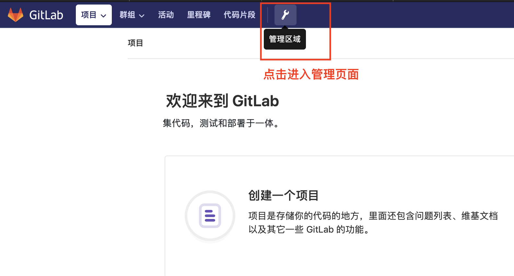
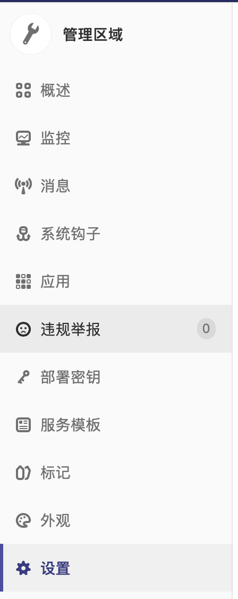
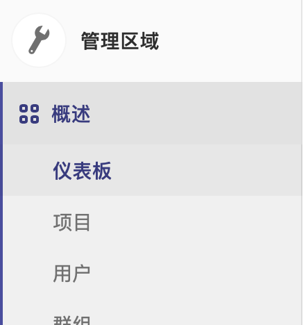
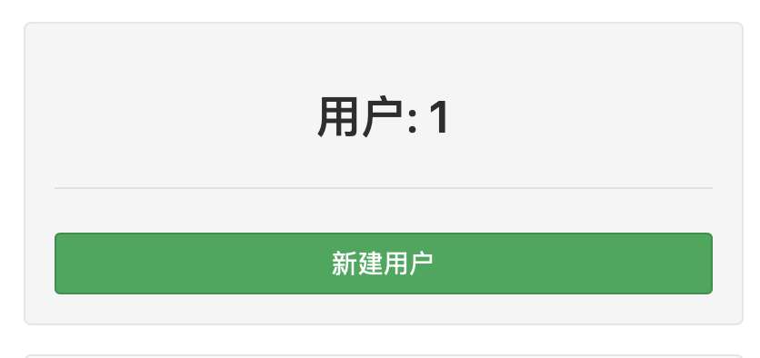
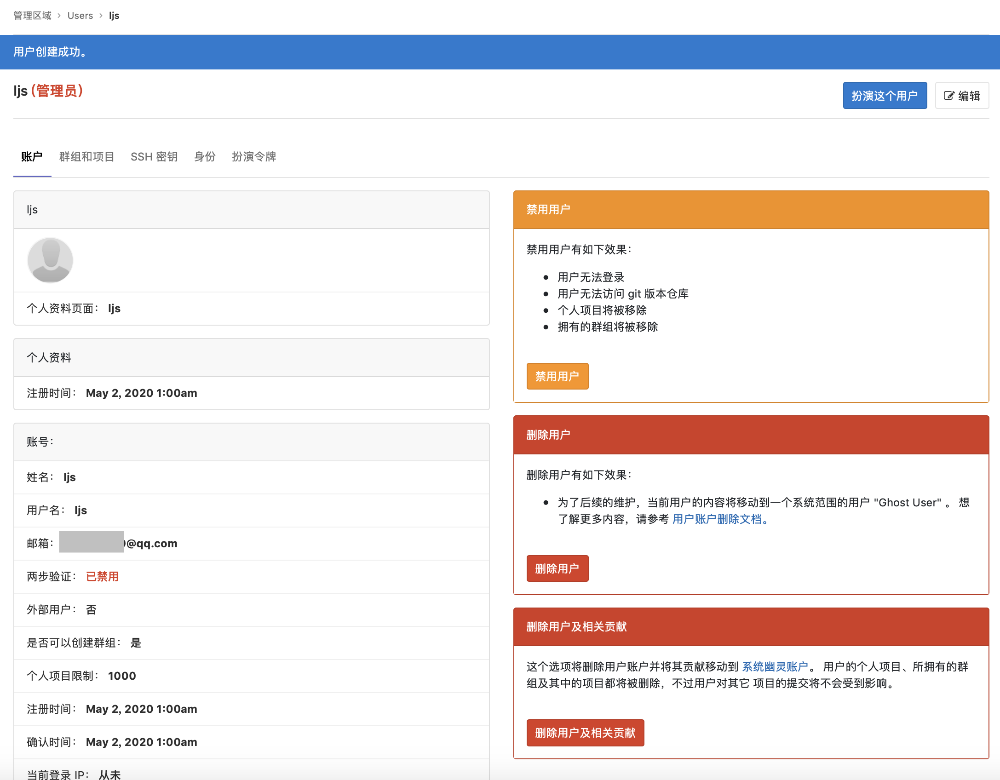
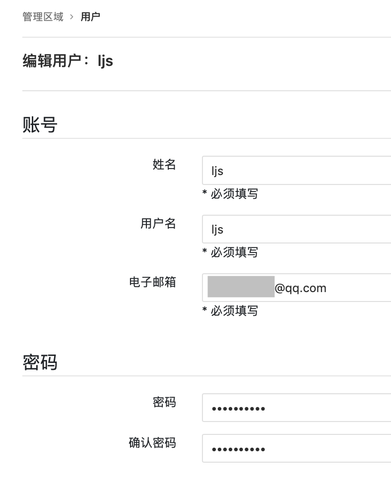
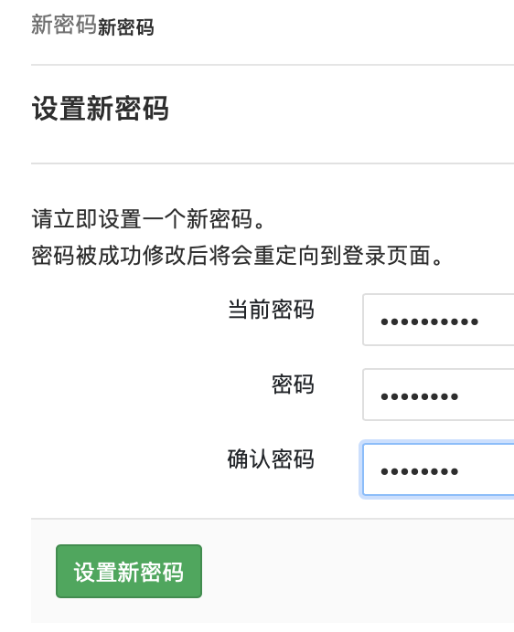
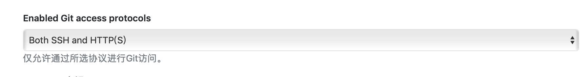
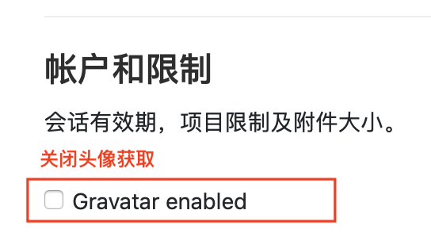

<span id="catalog"></span>

### 目录
- [gitlab概述](#gitlab概述)
- [gitlab安装](#gitlab安装)
    - [通过rpm包手动安装](#通过rpm包手动安装)
    - [使用Docker_Compose制作gitlab容器](#使用Docker_Compose制作gitlab容器)
    - [添加主机映射](#添加主机映射)
- [客户端的使用](#客户端的使用)
    - [第一次进入gitlab](#第一次进入gitlab)
    - [管理区域](#管理区域)
    - [设置账户](#设置账户)
    - [通过客户端来设置gitlab](#通过客户端来设置gitlab)
- [gitlab配置文件](#gitlab配置文件)
- [gitlab的维护](#gitlab的维护)
- [gitlab指令](#gitlab指令)
- [](#)

# gitlab概述
[top](#catalog)
- 什么是gitlab
    - gitlab是一个分布式的版本控制系统，使用Ruby开发
- github的优势
    - 开源免费，搭建简单，维护成本较低，适合中小型公司
    - 权限管理，能实现代码对部分人可见，确保项目的安全性
    - 离线同步，保证不再实时依赖网络环境提交代码

# gitlab安装
## 通过rpm包手动安装
[top](#catalog)
1. 安装预安装包
    ```
    yum install -y curl policycoreutils-python openssh-server wget postfix
    ```
2. 手动下载gitlab-ce的rpm包
    - 国内镜像：https://mirror.tuna.tsinghua.edu.cn/gitlab-ce/

3. 安装gitlab-ce的rpm包
    ```bash
    yum localinstall -y gitlab-ce的rpm包路径
    ```

4. 修改文件：`vim /etc/gitlab/gitlab.rb`
    - 配置Gitlba服务、访问域名、邮箱

5. 初始化gitlab服务器：`gitlab-ctl reconfigure`
    - 每次修改 `/etc/gitlab/gitlab.rb`，都需要执行该指令

6. gitlab服务器的启动与停止：`gitlab-ctl start|restart|stop|status`

7. [添加主机映射](#添加主机映射)

## 使用Docker_Compose制作gitlab容器
[top](#catalog)
1. 拉取 `gitlab-ce` 的镜像
    ```
    docker search gitlab-ce
    # 可以使用汉化的镜像，也可以使用官方的镜像
    docker pull
    ```
2. 编写 `docker-compose.yml`文件
    - 参考文件
        - [src/docker-compose.yml](src/docker-compose.yml)
    - yml内容
        ```yaml
        version: '3'
        services: 
            gitlab: 
                image: 'twang2218/gitlab-ce-zh'
                hostname: 'gitlab.ljs.com'
                environment: 
                  TZ: 'Asia/Shanghai'
                  GITLAB_OMNIBUS_CONFIG: |
                    external_url 'http://gitlab.ljs.com:9999'
                    gitlab_rails['gitlab_shell_ssh_port'] = 2222 #配置ssh的端口
                    gitlab_rails['gitlab_email_enabled'] = true
                    gitlab_rails['gitlab_email_from'] = '邮箱地址'
                    gitlab_rails['gitlab_email_display_name'] = 'Gitlba发件时的发件人的显示名称'
                    gitlab_rails['smtp_enable'] = true
                    gitlab_rails['smtp_address'] = "smtp.qq.com"
                    gitlab_rails['smtp_port'] = 465
                    gitlab_rails['smtp_user_name'] = "邮箱地址"
                    gitlab_rails['smtp_password'] = "邮箱授权码"
                    gitlab_rails['smtp_domain'] = "qq.com"
                    gitlab_rails['smtp_authentication'] = "login"
                    gitlab_rails['smtp_enable_starttls_auto'] = true
                    gitlab_rails['smtp_tls'] = true
                    #unicorn['port'] = 8888
                    #nginx['listen_port'] = 9999
                ports: 
                  - '9999:9999' #http 端口
                  - '8443:443'  #https 端口
                  - '2222:22'   #ssh端口
                volumes:
                  - $HOME/mydocker/myvolumes/gitlabfile/config:/etc/gitlab
                  - $HOME/mydocker/myvolumes/gitlabfile/data:/var/opt/gitlab
                  - $HOME/mydocker/myvolumes/gitlabfile/logs:/var/log/gitlab
        ```
3. 创建容器：`docker-compose -f xxx.yml up`
4. [添加主机映射](#添加主机映射)

## 添加主机映射
[top](#catalog)
- 如果是本机的docker，配置127.0.0.1
- 如果是虚拟机，则配置虚拟机的地址
- 配置dns服务
    - ?????

# 客户端的使用
## 第一次进入gitlab
[top](#catalog)
1. 进入gitlab的web客户端
    - 地址：external_url
    - 如果使用docker创建gitlab容器时设置了端口，需要在地址中附加端口
2. 设置root用户密码
    - 
3. 使用root用户登录
    - 

## 管理区域
[top](#catalog)
- 进入管理区域
    - 

- 管理区域的相关管理项目
    - 


## 设置账户
[top](#catalog)
1. 使用root用户登录
2. 进入管理区域，找到用户管理
    - 
3. 点击添加用户按钮
    - 
4. 输入用户信息，点击创建用户。可以选择普通用户或管理者
    - 
5. 创建用户成功
    - 
6. 点击编辑，设置该用户的初始密码
    - 
7. 退出root用户并使用新用户登录
8. 新用户初次登录需要修改密码
    - 
9. 重新登录


## 通过客户端来设置gitlab
[top](#catalog)
- 进入管理区域，然后选择`设置`，打开设置页面
- 设置gitlab
    - 配置项目：可见性与访问控制
        - `Enabled Git access protocols`，设置访问方式
            - 可以选择方式，https、ssh，还是两者都可以
            - 
    - 配置项目：帐户和限制
        - `Gravatar enabled`，设置 Gravatar 头像
            - 一般关闭该选项
            - Gravatar头像就是用户的头像，默认访问Gravatar服务来获取
            - 因为Gravatar头像是通过请求外部服务来获取头像图片的，如果无法连接到相关服务，会导致gitlab的web页面非常慢，所以一般需要关闭
            - 
            
    - 配置项目：注册限制
        - `启用注册`，是否开启登录页面的注册功能
            - 个人或内网使用，应该关闭注册功能
            - 关闭注册功能后，登录页面中将会去除注册功能
            - 
    - 配置项目：帮助页面
        - `Help page text`，通过markdown格式的内容来设置登录页面的提示信息


# gitlab配置文件
[top](#catalog)
- 配置文件的路径：`/etc/gitlab/gitlab.rb`
- 修改访问域名
    - `external_url "http://gitlab.ljs.com:9999"`
- 配置邮箱
    - 配置内容
        ```
        gitlab_rails['gitlab_email_enabled'] = true
        gitlab_rails['gitlab_email_from'] = '发件人邮箱'
        gitlab_rails['gitlab_email_display_name'] = 'Gitlba发件时的发件人的显示名称'
        
        gitlab_rails['smtp_enable'] = true
        gitlab_rails['smtp_address'] = "smtp.qq.com"
        gitlab_rails['smtp_port'] = 465
        gitlab_rails['smtp_user_name'] = "邮箱地址"
        gitlab_rails['smtp_password'] = "授权码"
        gitlab_rails['smtp_domain'] = "qq.com"
        gitlab_rails['smtp_authentication'] = "login"
        gitlab_rails['smtp_enable_starttls_auto'] = true
        gitlab_rails['smtp_tls'] = true
        ```
    - 为什么要配置邮箱
        - 注册账号时，进行邮件验证
        - 修改密码时，通过邮件修改
    - 邮箱授权码的获取
        1. 邮箱登陆
        2. 设置-->账户
        3. POP3/IMAP/SMTP/Exchange/CardDAV/CalDAV服务
            - 开启一下三个服务
                - POP3/SMTP服务
                - IMAP/SMTP服务
                - Exchange服务

- 设置监控
    - 配置内容
        ```
        prometheus['enable'] = true
        ```
    - 监控会极大的消耗内存，如果只是简单使用可以关闭监控


# gitlab的维护
[top](#catalog)
- 备份
    - 备份策略
        ```bash
        # 开启备份
        gitlab_rails['manage_backup_path'] = true
        # 备份路径
        gitlab_rails['backup_path'] = "/var/opt/gitlab/backups"
        # 备份时间，默认7天
        gitlab_rails['backup_keep_time'] = 604800
        ```
    - 备份命令
        - `gitlab-rake gitlab:backup:create`
        - 备份结果将存储到 `backup_path` 目录下

    - 备份结果
        - 生成一个由时间戳、版本、`gitlab_backup.tar` 构成名字的压缩包
            ```
            1588412986_2020_05_02_11.1.4_gitlab_backup.tar
            ```
- 使用备份恢复
    - 停止服务
        - `gitlab-ctl stop unicorn`
        - `gitlab-ctl stop sidekip`
    - 使用备份文件恢复，文件名不需要：`_gitlab_backup.tar`
        - `gitlab-rake gitlab:backup:restore BACKUP=<时间戳+版本部分>`


# gitlab指令
[top](#catalog)

|指令|描述|备注|
|-|-|-|
|`gitlab-ctl reconfigure`|重新编译，每次修改|`/etc/gitlab/gitlab.rb` 都要执行|
|`gitlab-ctl start`|启动gitlab||
|`gitlab-ctl restart`|重启||
|`gitlab-ctl stop`|停止||
|`gitlab-ctl status`|检查gitlab状态|?????|
|`gitlab-ctl tail`|显示日志||
|`gitlab-rake gitlab:backup:create`|备份||
|`gitlab-rake gitlab:backup:restore BACKUP=<时间戳+版本部分>`|使用备份文件恢复|文件名不需要：`_gitlab_backup.tar`|
||||
