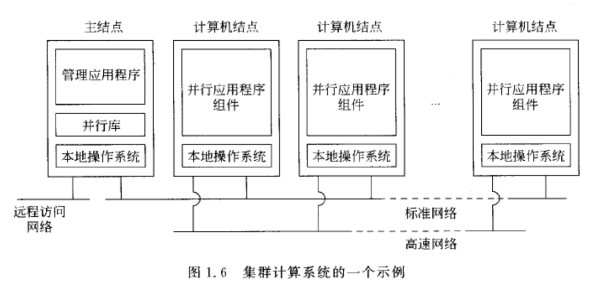
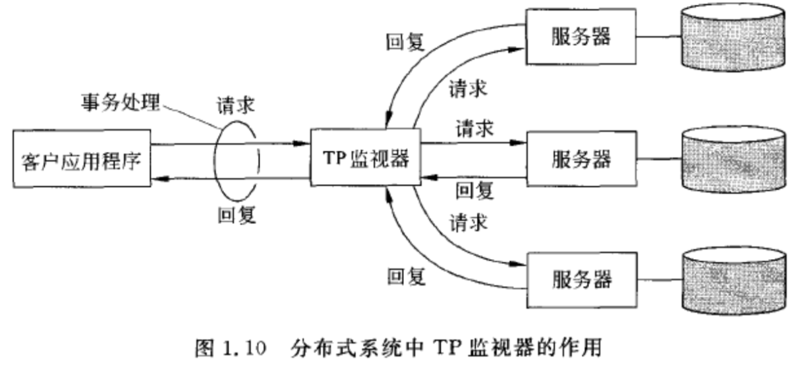
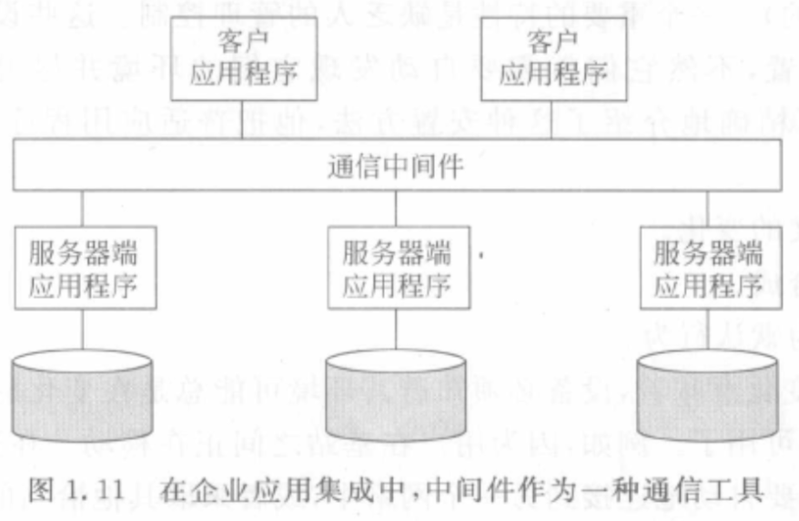
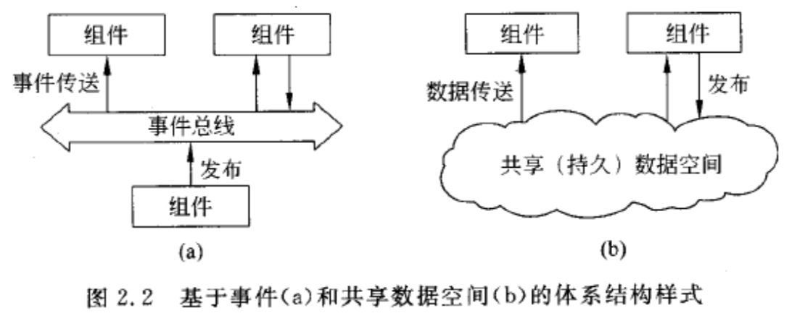
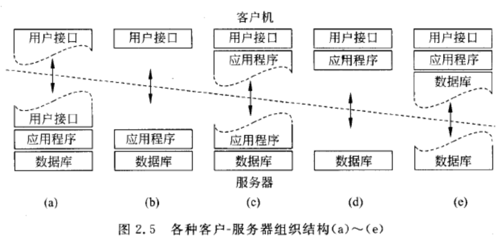
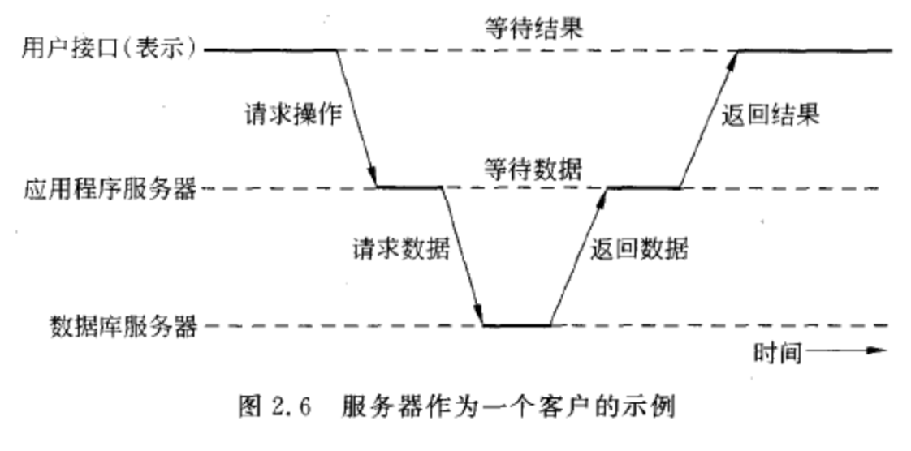

<span id="catalog"></span>

### 目录
- [分布式系统概述](#分布式系统概述)
    - [分布式系统的定义](#分布式系统的定义)
    - [分布式系统的目标](#分布式系统的目标)
    - [分布式系统的类型](#分布式系统的类型)
- [体系结构](#体系结构)
    - [体系结构的样式](#体系结构的样式)
    - [系统体系结构](#系统体系结构)
- [](#)
- [](#)
- [](#)


# 分布式系统概述
## 分布式系统的定义
[top](#catalog)
- 分布式系统定义
    - 硬件上：若干独立计算机的集合
    - 软件上：对于用户，与操作单个系统相似

- 分布式系统的重要特性
    - 用户透明性：
        - 机器间的差别、机器间的通信方式、多机器内部的组织结构对用户隐藏
        - 用户不会感知那些部分在替换、维修，或添加功能添加
    - 交互一致性：任何时间、任何地点，都以一致、统一的方式与系统交互
    - 易扩展性
    - 可用性：整个系统隐藏了单个节点的任务，某个部分发生故障时，也能保证总体可用

- 中间件/分布式系统层 概念
    - 在逻辑上，架设在 用户和应用程序 与 操作系统 之间
    - 用途：连接不同的 机器 与 网络，将相异的资源连接为一个整体

- 分布式系统的重要目标：通过一个中间件层，把应用程序与底层平台分开
    - 通过中间件层来提供分布式透明性

- 一个分布式系统的示例
    - 工作站网络
        - 硬件：每个用户的工作站 + 机房内的一个处理器池
        - 软件：一个单一的文件系统
        - 处理器池根据需要动态分配资源
        - 所有用户以相同的方式、相同的路径访问文件
        - 用户输入命令时，系统自动决定执行命令的位置，包括
            - 自己的机器
            - 别人的空闲机器
            - 处理器池中未被分配的处理器
        - **整体行为与单机相同**
    - 万维网
        - 用户只需要输入url即可获得相同的资源
        - 用户无需关心资源保存在哪
        - 实际的数据资源保存在不同的地点、不同的处理器

## 分布式系统的目标
[top](#catalog)
- 如果只是有能力组建分布式系统就组建它，这并没有什么实际意义
- 分布式系统的4个关键目标
    1. 资源的受限可访问可共享能力
    2. 资源透明性
    3. 开放性
    4. 可扩展性

- 资源的定义
    - 资源可以是任何东西
    - 资源可以包括
        - 硬件：打印机、计算机、存储设备
        - 软件：数据、文件、网络

- 资源透明性
    - 透明的类型
        |透明性|说明|备注|
        |-|-|-|
        |访问|隐藏数据表示形式的不同、资源访问方式的不同|如不同文件系统的文件命名方式的差异、数据处理格式的差异||
        |位置|隐藏资源的**物理**位置|可以通过只为资源分配逻辑名来使用，逻辑名与物理位置完全无关|
        |迁移|隐藏资源是否发生过移动||
        |重定位|隐藏资源是否在使用过程中移动到另一个位置|可以理解为移动通信时从一个地点移动到另一个地点时，通信不会中断、不会有地点差异|
        |复制|隐藏是否对资源进行复制|为了对用户隐藏复制行为，所有副本的名字必须相同<br>复制透明的前提是位置透明，否则系统无法引用不同位置的多个副本|
        |并发|隐藏资源是否正在被若干相互竞争的用户共享|需要保证并发访问不能破坏资源的一致状态<br>一致性状态可以通过锁机制、事务机制来处理|
        |故障|隐藏资源的故障与恢复|难点是无法区分故障资源和反应速度极慢的资源<br>如浏览器超时时，无法判断服务器故障还是等待超时|
        |持续性|隐藏资源是位于临时存储中（如内存）、还是永久存储上（如磁盘）||

    - 透明度
        - 需要在高度的透明性和系统性能之间进行权衡
        - 如：多副本文件修改
            - 文件有多个副本
            - 当文件修改时，必须将修改操作传递给所有副本以保证一致性
            - 如果副本分布在不同地区，可能会花费很长时间才能完成，这是不可能对用户隐藏的

- 开放性
    - 什么是开发的分布式系统？
        - 它根据一系列准则来提供服务，这些准则描述了所提供的与和语义
        - 在网络中，准则可以理解为协议
    - 服务基于接口开发
        - 接口应该是中立的、完整的
            - 中立的，不应描述接口的实现是什么样的
            - 完整的，及服务的必备内容已经规定好了
        - 通过良好的接口，不同厂商的实现何以并存并写作，并且能够进行移植
    - 策略与机制分离
        - 开发的分布式系统要获得足够的灵活性，需要：**把系统组织成规模相对较小而且容易修改、容易替换的组件的集合**
        - 提供两中级别的接口
            - 外层的口定义，面向应用与用户
            - 内存接口定义，提供系统内部各组成部分的接口定义，并描述其交互方式
        - 实际应用中，可以通过为用户提供大量可动态设置的参数来实现

- 可扩展性
    - 扩展的三个纬度
        1. 规模上可扩展：添加更多的用户与资源
        2. 地域上可扩展：用户与资源相隔很远的距离
        3. 管理上可扩展：系统跨越多个独立的管理机构（如：网络服务商）
    - 扩展的三个纬度中，扩展两个以上时，常常还是系统的性能下降
    - 扩展性的问题
        - 规模扩展
            - 分布式算法的问题
            - 各节点的时钟无法完全同步
        - 地域扩展的问题
            - 通信问题：广域网中通信的性能和可靠性
            - 集中式组件导致的网络资源浪费
        - 管理扩展的问题
            - 不同管理区域的资源使用、管理和按照问题上的策略不同
    - 扩展技术
        - 隐藏通信等待时间：适用于地域扩展
            - 使用**异步通信**
            - 将后端的部分验证移动到客户端
        - 分布技术
            - 将组件分割成多个部分，然后再分散到整个系统中。形成一种分散的树型结构
        - 复制技术
            - 复制组件的副本并分布到系统各处
                - 复制可以增加可用性，有助于组件间的负载均衡，提升性能
                - 当系统在地域上比较分散时，请求这附加有一份副本可以**隐藏通信等待时间**
            - 缓存技术
                - 这是复制的一种特殊形式
                - 与复制的异同
                    - 相同点：在访问资源的客户附加创建副本
                    - 不同点：是否缓存，有客户决定 ?????
            - 复制的严重缺点
                - 数据一致性问题：不同副本的修改可能没有及时同步
                - 数据一致性问题导致的可扩展性降低
    
## 分布式系统的类型
[top](#catalog)
- 3中类型
    - 分布式计算系统
    - 分布式信息系统
    - 分布式嵌入系统
- 分布式计算系统
    - 主要任务：高性能计算任务
    - 2个子类
        - 集群计算系统（cluster computing）
        - 网格计算系统（grid computing）
    - 集群计算系统
        - 特点
            - 底层硬件：工作站或PC集群
            - 连接方式：高速的局域网
            - **同构性**：机器相似、操作系统相同、使用同一网络连接
        - 著名示例：Beowulf 集群
            - 基于 Linux
            - 示意图
                - 
            - 常见设置
                - 一个群 + 单个主结点
                - 一个群 = 一个计算机结点集合
            - 单个主结点的功能
                - 控制和访问结点
                - 定位特定并行程序的结点
                - 维护已经提交工作的队列
                - 为系统用户提供接口
            - 主结点的本质
                - 相当于**中间件**
                - 有运行并行程序的库构成
                    - 很多库只是基于消息的通信工具
                    - 这些库大多**不能处理故障、安全问题**
    - 网格计算系统
        - 特点
            - **异构性**：硬件、操作系统、网络、管理域、安全策略都不大相同
            - 通过 **虚拟组织** 来协调不同的资源
        - 一种体协结构：Foster结构
            - 示意图
                ```
                     应用层
                       │
                       V
                ┌───────────────┐
                │     汇集层     │ 中间件层
                │       │       │
                │   ┌───┴───┐   │
                │   V       V   │
                │ 连接层   资源层 │
                └─────┬───┬─────┘
                      │   │
                      V   V
                      光纤层
                ```
            - **网络中间件层的核心**：汇集层、连接层、资源层
            - 连接层（connectivity layer）
                - 本质：通信协议 + 安全协议
                - 用途：传输数据、从远程地点访问资源
                - 安全一般有程序负责，但是需要用户给程序委托权
            - 资源层（resource layer）
                - 用途：管理单个资源
                - 通过：连接层 --> 光纤层 获取资源
            - 汇集层（collective layer）
                - 用途：管理对多个资源的访问
                    - 资源分配、调度
                    - 任务分配、调度
                    - 数据复制
                - 本质：不同用途的协议的集合
            - 应用层（application layer）
                - 由应用程序组成
                - 应用运行在**虚拟组织**中
                    - 同一虚拟组织的人，可以访问提供给该组织的资源
        - Foster结构的复杂演化：开放式网格服务体系结构（ Open Grid Services Architecture，OGSA）
        
- 分布式信息系统
    - 组成：客户端+服务器
    - 基本功能：多请求封装为单个大请求，并作为**分布式事务处理**来运行
    - 执行特点：所有请求全部执行，或这全不执行
    - 事务处理系统
        - 对程序的要求
            - 有特定的原函数
            - 能被底层的分布式系统或编程语言的运行时系统支持
        - 原函数
            - 示例
              
                |原函数|说明|
                |-|-|
                |BEGIN_TRANSACTION|标识一个事务处理的开始|
                |END_TRANSACTION|终止事务处理并尝试提交|
                |READ|从文件、标或其他地方读取数据|
                |WRITE|从文件、标或其他地方写入数据|

        - 事务处理的4个特性
            - A 原子性
            - C 一致性
            - I 隔离性
            - D 持久性
        - 嵌套式事务处理
            - 每一层的事务处理可以分解成下一层的多个子事务，子事务还可以继续再分解
            - 各事务可以在不同的机器上运行，来提高性能、简化程序
            - 如果高层的事务中止了，所有子事务必须中止
            - 如果某个子事务提交了，提交结果对后续的其他子事务可见
            - 子事务提交后必须可以回滚，以保证顶层事务的 ACID 特性
        - 事务处理监视器/TP监视器 （transaction processing monitor）
            - 提供事务处理编程模型，允许应用程序访问多个服务器/数据库
            - 
    - 企业应用集成
        - 产生的原因：应用程序过于复杂，分割成各自独立的组件
        - 集成方式：应用程序直接与其他程序通信
        - 应用间的通信方式：**通信中间件**
            - 通过通信中间件来满足各应用间不同的通信模式
            - 
        - 通信中间件
            - RPC，远程过程调用，操作对象
            - RMI，远程方法调用，操作方法
        - 通信中间件的缺点
            - 通信时，通信双方必须正在运行
            - 通信双方必须知道如何引用对方
            - 通信双方严格配对
        - 面向消息的中间件
            - 应用程序只负责发送消息给逻辑意义上的联系点
            - **发布/订阅系统**
                - 应用注册某种消息，通信中间件再将消息返回给应用

# 体系结构
## 体系结构的样式
[top](#catalog)
- 样式的定义方式
    - 根据组件、组件间的互联方式、组件间的数据交换，和这些组件如何集成到一个系统

- 体系结构的组成元素
    - 组件
    - 链接器

- 组件
    - 一个模块单元
    - 提供良好定义的接口
    - 可替换的

- 链接器
    - 一种机制：在组件之间通信，使组件相互协调、协调
    - 可以利用 RMI、消息传递、数据流等方式形成

- 不同的组件 + 不同的链接器 = 不同的体系结构
- **重要的分布式系统体系结构**
    - 分层体系结构
    - 基于对象的体系结构
    - 以数据为中心的体系结构
    - 基于事件的体系结构

- 分层体系结构
    - 例如网络通信模型
    - L_i 层 只能调用 L_(i-1)层
    - 请求从上往下，响应从下往上
- 基于对象的体系结构
    - 一种松散的组织结构
    - 一个对象 = 一个组件
    - 对象间通过 RMI 来链接

- 以数据为中心的体系结构
    - 进程间通信方式：一个共有的仓库
    - 基于web的分布式系统大部分是以数据为中心的
        -进程通信使用了共享的基于web的数据服务

- 基于事件的体系结构
    - 进程间通信方式：事件的传播
    - 事件传播通常与 `发布/订阅系统` 相关
    - 基本思想
        - 进程发布事件
        - 中间件确保只有订阅了对应个事件的进程才能获取数据
    - 优点：引用去耦
        - 进程间的耦合性低
        - 各进程间无需明确的引用对方
    - 与以数据为中心的体系结构结合
        - 示意图
            - 
        - 通过共享数据使进程去耦
            - 进程不需要同时是活动的
            - 数据空间使用类似sql的接口于共享仓库交互
            - 通过共享数据，不需要明确引用，只要使用描述符就可以访问数据
                - 类似于使用文件

## 系统体系结构
[top](#catalog)
- 什么是系统体系结构？
    - 确定的：软件组件、组件的交互方式、组件的位置

- 集中式体系结构
    - **垂直分布分布性**
        - 按逻辑将不同的组件放在不同的机器上，通过访问不同的机器来获取不同的服务
        - 例如：数据库把相关业务的表放在同一台机器上
        - 优点
            - 从逻辑上和物理上将功能划分到不同的机器上
            - 每台机器可以按照特定的功能组进行定制
    - 客户-服务器模型
        - 一种具有**垂直分布分布性**的体系结构
        - 服务器：实现特定的服务进程
        - 客户端：一个向服务器发送请求，并等待服务器响应的进程
        - 通信方式：无连接协议，可靠的基于连接的协议
        - 客户-服务端的交互也称为：`请求-回复行为`
        - 该模型的问题
            - 无法检测原始请求是否丢失
            - 无法检测响应的传输是否发生了故障
                - 如果响应丢失，重新发送请求会导致两次相同的操作
        - 基于连接通信的问题
            - 如果通信是基于连接的协议，发送请求之前需要创建一个到服务的连接
            - 创建连接、断开连接的开销较大
        - **应用分层**
            - 用户接口层：处理与用户的交互
            - 处理层：负责应用重新的核心功能
            - 数据层：负责操作数据库和文件系统
        - 模型的组织方式
            1. 两层结构
                - 只区分客户端和服务器
                - 
            2. 三层结构
                - 单个服务器上运行的程序被放到多个服务器上运行
                - 各服务器上的程序会互相调用。除了真实的客户，某个机器上的程序也会充当用户的角色，来发出请求
                - 


- 非集中式体系结构
    - 水平分布性
        - 只在物理上进行划分
        - 例如：数据库按照数据量将一个表划分成多个小表
        - 优点
            - 物理上划分，但是**逻辑上相等**
            - 每个部分只操作数据集中自己共享的部分，可以实现负载均衡
    - 点对点系统
        - 一种现代的、支持水平分布性的体系结构
        - 服务器客户
            - 构成系统的进程全部相等
                - 即需要执行的功能由构成分布式系统的每个进程来表示
            - 进程间的很多交互是对称的，可以绕过**覆盖网络**中如何组织进程的问题
            - 每个进程即是客户、又是服务器
        - 两种点对点体系
            - 结构化点对点体系
            - 非结构化点对点体系
        - 结构化点对点体系
            - **覆盖网络**通过一个确定性的过程来构成
            - **覆盖网络**的构成
                - 最常用的是：`分布式哈希表` 来组织进程 （DHT系统）
                - DHT的做法
                    - 从一个大的标识符空间中随机选取值，并赋值给机器节点和数据项
                    - 数据项依据某种距离尺，将自身的 key 映射到节点
                    - 访问时，将数据项的请求路由发送给节点，节点再进行处理
                - DHT系统示例---Chord系统
                    - 系统示例
                        - 
                    - 节点按逻辑组成环
                    - ?????
                    
        - 非结构化点对点体系
            - **覆盖网络**通过随机化算法来构造
                - 每个结点维护一个临结点的列表
                    - 列表通过随机方法构造
                    - 该列表也称为**部分视图**
                - 数据项假定随机放在结点中
                - 当结点定位数据项时，通过查找查询来**泛洪**网络
        - 覆盖网络的拓扑管理
            - 

- 幂等性
    - 如果某个操作可以重复多次执行而没有副作用，就是幂等性
