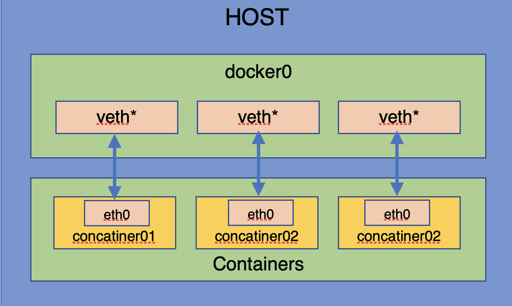

<span id="catalog"></span>

### 目录
- [为什么需要Docker](#为什么需要Docker)
- [Docker的组成](#docker的组成)
    - [架构图](#架构图)
    - [Docker的3元素](#docker的3元素)
- [Docker安装](#docker安装)
    - [在CentOS6中安装](#在CentOS6中安装)
    - [在CentOS7中安装](#在CentOS7中安装)
    - [获取镜像加速](#获取镜像加速)
    - [helloworld测试](#helloworld测试)
- [Docker运行原理](#Docker运行原理)
    - [为什么Docker比虚拟机快](#为什么Docker比虚拟机快)
    - [Docker是如何工作的](#Docker是如何工作的)
- [Docker帮助命令](#Docker帮助命令)
- [Docker镜像命令](#Docker镜像命令)
    - [获取镜像](#获取镜像)
    - [查看本地镜像](#查看本地镜像)
    - [删除镜像](#删除镜像)
    - [镜像commit](#镜像commit)
    - [镜像推送](#镜像推送)
- [Docker容器命令](#Docker容器命令)
    - [容器的创建与退出](#容器的创建与退出)
    - [管理容器](#管理容器)
    - [从外部操作容器内部](#从外部操作容器内部)
    - [容器内部和宿主机之间的文件拷贝](#容器内部和宿主机之间的文件拷贝)
- [Docker镜像原理](#docker镜像原理)
- [Docker容器数据卷Volume](#docker容器数据卷volume)
    - [数据卷的基本概念](#数据卷的基本概念)
    - [数据卷的使用](#数据卷的使用)
    - [数据卷容器](#数据卷容器)
- [DockerFile](#dockerfile)
    - [DockerFile简介](#dockerfile简介)
    - [DockerFile的解析过程](#dockerfile的解析过程)
    - [DockerFile保留字指令](#DockerFile保留字指令)
    - [编译镜像](#编译镜像)
    - [自定义centos](#自定义centos)
    - [自定义tomcat9](#自定义tomcat9)
- [常用应用安装](#常用应用安装)
    - [安装mysql](#安装mysql)
    - [安装redis](#安装redis)
- [容器的网络连接](#容器的网络连接)
    - [Linux虚拟网桥的概念](#Linux虚拟网桥的概念)
    - [默认docker0](#默认docker0)
    - [自定义docker0](#自定义docker0)
    - [自定义虚拟网桥](#自定义虚拟网桥)
    - [](#)
- [总结](#总结)
- [](#)

# 为什么需要Docker
[top](#catalog)
- 环境配置比较麻烦，费时费力，需要从根本上解决问题
    - 安装的时候，把原始环境一模一样的复制过来，利用Docker消除开发和运维之间的问题
    - 以前交代码，现在交环境
- Docker的定位
    - 是什么：
        - Docker是一种**Linux容器**
        - 从Docker组成来讲，它是一个`容器运行载体`或`管理引擎`
        - Docker**解决了运行环境和配置问题，方便做持续集成并有助于整体发布的容器虚拟化技术**
        - 可以理解为：一个精细版的Linux系统
    - 能做什么：
        - 开发/运维DevOps
            - 更简单的系统运维
        - 一次开发，到处运行
        - 更快的交付和部属
        - 更便捷的升级和扩缩容
        - 更高效的计算资源利用
    - 优势
        - 更轻量：基于**容器虚拟化**，仅包含业务运行所需的runtime环境
            - 如CentOs/Ubuntu**基础镜像**仅需170M，宿主机可以部属100～1000个
        - 更高效
            - 无操作系统虚拟化开销
            - 计算上，轻量无额外开销
            - 存储：系统盘、数据盘
            - 网络：使用宿主机网络，NS隔离
        - 更敏捷、更灵活
            - 分层的存储和包管理、devops理念
            - 支持多种网络配置

- 虚拟机和Linux容器的区别
    - 虚拟机
        - 在架构上
            - 虚拟机是在一个操作系统里运行另一个操作系统，如Windows中使用镜像创建Linux系统
            - 应用程序无法感知部属在哪里--真实机器or虚拟机，因为虚拟机和真实机器看起来相同
            - 对于底层系统虚拟机就是一个普通文件，如果不需要就可以删掉，对其他部分没有影响
            - 通过虚拟机，可以使应用程序、操作系统、硬件三者的关系不变
        - 在虚拟化方式上
            - 直接虚拟出一套硬件，然后在其上运行一个完整的操作系统，并在该系统上运行所需的应用程序
        - 在使用效率上
            - 资源占用多
            - 使用的冗余步骤多
            - 虚拟机的启动慢，是分钟级的
    - Linux容器，Linux Containers，LXC
        - 在架构上
            - Linux容器不是模拟一个完整的操作系统，而是**对进程进行隔离**
            - 容器与虚拟机不同，**不需要绑定一整套操作系统**，只需要软件工作所需的库资源和设置，**系统因此变得高效轻量，并且可以部属在任何环境中**
                - 库资源和设置可以放到仓库中，共用
            - 通过容器，可以将软件运行的所有资源打包到一个隔离的容器中
            - 每个容器之间相互隔离，每个容器都有自己的文件系统，容器之间进程不会相互影响，能够区分计算资源
        - 在虚拟化方式上
            - 容器内的应用进程直接运行在宿主内核，容器没有自己的内核，也没有进行硬件虚拟，所以容器更加轻量
        - 在使用效率上
            - 资源占用少
            - 启动快，是秒级的

- Docker包含的两方面技术
    - **镜像技术:镜像即应用**
        - 镜像的**内容**包括
            - 运行文档
            - 配置环境
            - 运行环境
            - 运行依赖包
            - 操作系统发行版本
            - 内核

# Docker的组成
## 架构图
[top](#catalog)
- Docker的基础架构图
    - 
- 架构组成
    - client ，命令终端
    - docker_host，Docer主机，宿主机
    - repository，仓库
- 需要时，直接从仓库`pull`到本地，即`images`

## Docker的3元素
[top](#catalog)
- 3元素
    - 镜像`image`
        - 可以理解为Java中的类
        - **将应用程序和配置依赖打包成一个可交付的运行环境，这个运行环境就是镜像`image`**
        - 一个**只读模板**
        - `image`可以用来创建Docker `container`，一个镜像可以创建多个个`container`
    - 容器`container`
        - 可以理解为Java中的对象
        - 由`images`的创建的一个**运行实例**，它运行一种服务(数据存储、web等))
        - `container`是**独立运行的一个或一组应用**
        - `container`可以被启动、开始、停止、删除，每个容器都是互相隔离的、保证安全的平台
        - `container`可以看作:一个简易版Linux环境(包括root权限、进程空间、用户空间、网络空间) + 运行在环境中的应用程序
        - **`container`和`images`几乎一样，都是一堆层的统一视角，唯一区别在于`container`的最上面那一层是可读可写的**
    - 仓库`repository`
        - `repository`是集中式存放`image`文件的场所
        - 仓库`repository`和仓库注册服务器`registry`是有区别的，仓库注册服务器上往往存放多个仓库，每个仓库中又包含了多个镜像，每个镜像有不同的表情(tag)
        - 仓库分为公开仓库`Public`和私有仓库`Private`两种形式
        - 最大的公开仓库:`Docker Hub`(https://hub.docker.com)
- **3元素如何合作**
    - 打包好的运行环境是`image`，`image`可以保持在`repository`，可以从`repository`拉取，Docker通过`image`可以创建多个`container`

# Docker安装
## 在CentOS6中安装
[top](#catalog)
- 对系统的要求
    - CentOS6.5(64-bit) 或更高版本，系统内核版本为`2.6.32-431`以上
- 检查Centos的版本
    - `cat /etc/redhat-release`
    - 查看安装的CentOS6.X版本信息:`lsb_release -b`
- 安装步骤
    1. yum install -y epel-release
        - Docker使用EPEL发布，RHEL系的OS首先要确保已经持有EPEL仓库，否则先检查OS的版本，然后安装相应的EPEL包
    2. yum install -y docker-io
    3. 安装后的配置文件:`/etc/sysconfig/docker`
        - 配置镜像加速地址
    4. `docker version`验证
    5. 配置本地Docker运行镜像加速器
        - `/etc/sysconfig/docker`
            - `other_args="--registry-mirror=https://加速地址"`
    6. 启动docker后台服务:`service docker start`
    7. 检查docker进程:`ps -ef | grep docker`

## 在CentOS7中安装
[top](#catalog)
    - 官方参考：https://docs.docker.com/install/linux/docker-ce/centos/
    - 详细安装流程参考：[/docker/install/centos7/centos7Install.md](/docker/install/centos7/centos7Install.md)
    - 对系统的要求
        - CentOS7(64-bit)，系统内核版本为`3.10`以上
    - 安装步骤
        1. 检查Centos的版本
            - `cat /etc/redhat-release`
        2. yum安装gcc相关工具
            - `yum -y install gcc`
            - `yum -y install gcc-c++`
        3. 卸载旧版本的docker 
            ```
            yum remove docker \
                docker-client \
                docker-client-latest \
                docker-common \
                docker-latest \
                docker-latest-logrotate \
                docker-logrotate \
                docker-engine
            ```
        4. 安装需要的软件包
            - `yum install -y yum-utils device-mapper-persistent-data lvm2`
        5. 设置稳定的镜像仓库
            - **只有设定了仓库，才能继续获取docker资源并安装和更新**
            - **可以重复设置，新的地址会覆盖旧的地址**
            - 设置及确认方式
                1. 两种地址设置
                    - 直接使用官方镜像地址，改地址可能无法连接，最好使用镜像加速地址
                        - `yum-config-manager --add-repo https://download.docker.com/linux/centos/docker-ce.repo`
                    - 使用过aliyun镜像
                        - `yum-config-manager --add-repo https://mirrors.aliyun.com/docker-ce/linux/centos/docker-ce.repo`
                2. 执行后查看设置结果：`cat /etc/yum.repos.d/docker-ce.repo`

        6. 更新yum软件包索引
            - `yum makecache fast`
        7. 安装docker社区版
            - `yum install docker-ce docker-ce-cli containerd.io`
        8. 启动docker
            - `systemctl start docker`
        9. 测试
            - `docker version`
            - `docker run hello-world`
                - 初次使用时会自动从仓库拉去测试镜像，并创建容器来进行测试
        10. 配置镜像加速
            - `mkdir -p /etc/docker`
            - `vim /etc/docker/daemon.json`
                ```
                #阿里云镜像
                {
                    "registry-mirrors":["https://{用户编码}.mirror.aliyuncs.com"],
                }
                ```
            - `systemctl daemon-reload`
            - `systemctl restart docker`
        10. 卸载
            - `systemctl stop docker`
            - `yum remove docker-ce`
            - `rm -rf /var/lib/docker`
    
## 获取镜像加速
[top](#catalog)
- 阿里云镜像
    - dev.aliyun.com
    - 注册一个阿里云开发平台
    - 获得加速器地址链接
        - 登录阿里云
        - 左侧选择`镜像加速器`-->右侧选择系统-->获取加速地址

## helloworld测试
[top](#catalog)
- `hello-world`测试是`Docker Hub`提供的一个测试镜像
-  启动docker，测试运行`hello-world`
    - `ducker run hello-world`

# Docker运行原理
## Docker是如何工作的
[top](#catalog)
- Docker是一个`Client-Server`结构的系统
- Docker的守护进程运行在主机上，通过Socket连接客户端访问，守护进程从客户端接收命令并管理运行在主机上的容器

## 为什么Docker比虚拟机快
- docker有比虚拟机更少的抽象层
    - docker不需要`Hypervisor`实现硬件资源虚拟化，运行在docker容器上的程序直接使用的都是实际物理机的硬件资源，所以docker在CPU、内存利用率上更有优势
- docker利用的是宿主机的内核，而不需要虚拟机`GuestOS`
    - 新建一个虚拟机时，虚拟机软件需要加载`GuestOS`，新建过程是分钟级别的
        - 需要引寻、加载操作系统内核返回比较费时费资源的过程
    - 当新建一个容器时，docker直接利用操作系统内核，没有了硬件负担，省略了加载操作系统内核的步骤

- Docker和虚拟机的特性

    ||Docker|虚拟机|
    |-|-|-|
    |操作系统|与宿主机共享OS|宿主机OS上运行虚拟机OS|
    |存储大小|镜像小，便于存储与传输|镜像庞大(vmdk、vdi等)|
    |运行性能|几乎无额外性能损失|操作系统额外的CPU、内存消耗|
    |移植性|轻便、灵活，适应于Linux|笨重，与虚拟化技术耦合度高|
    |硬件亲和性|面向软件开发|面向硬件运维|
    |部属速度|快速，秒级|较慢，10s以上|

# Docker帮助命令
[top](#catalog)
- `docker version`:查看版本信息
- `docker info`:当前docker中的信息
- `docker --help`

# Docker镜像命令
## 获取镜像
[top](#catalog)
- 检索镜像：`docker search [options] 镜像名`
    - 从`https://hub.docker.com/`查询镜像
        - 与镜像加速配置无关
    - 标题列`OFFICIAL`表示是否是官方版本
    - options
        - `--no-trunc`，显示完整的镜像描述
        - `-s 数量`，列出收藏数不小于指定值的镜像
        - `--automated`，只列出`automated build`类型的镜像
- 拉取镜像：`docker pull 镜像名[:TAG]`
    - `docker pull 镜像名`等于`docker pull 镜像名:latest`

## 查看本地镜像
[top](#catalog)
- 列出**本地主机**上的镜像：`docker images [options] [镜像名]`
    - 列出的内容
        - REPOSITORY:镜像在仓库中的名称
        - TAG:镜像的标签
            - 默认是`latest`
        - IMAGE ID:镜像ID，相当于镜像的`主键`
        - CREATED:镜像创建时间
        - SIZE:镜像大小
    - 同一个仓库源可以有多个TAG，代表这个仓库源的不同版本
    - 使用`REPOSITORY:TAG`来定义不同的镜像
        - 如果不指定镜像的标签，docker将默认使用：`xxxx:latest`镜像
    - 常用参数
        - `-a`，列出本地所有的镜像,包括**中间映像层**`<none>`
        - `-q`，只显示镜像ID
        - `--digests`，显示镜像的摘要信息
        - `--no-trunc`，显示完整的镜像信息

- 查看镜像的变更历史：`docker history 镜像名`

## 删除镜像
[top](#catalog)
- 删除镜像命令：`docker rmi [options] 镜像ID[:TAG]`
    - options
        - `-f`,强制删除
- 删除单个镜像：`docker rmi xxx`
- 删除多个镜像：`docker rmi xxx yyy`
- 删除全部镜像：`docker rmi -f $(docker images -q)`
    - 将所有`image`的ID作为参数传递给`docker rmi`指令，来完成全部删除

## 镜像commit
[top](#catalog)
- `docker commit -m='描述信息' -a='作者' 容器ID 包名/镜像名:[TAG]`
    - 提交容器副本，作为一个新的镜像

- 示例：启动tomcat容器，并在容器中进行修改，就可以`commit`，来得到一个新的自定义镜像
    - 获取镜像：`docker pull tomcat`
    - 启动容器：`docker run -it -p 8888:8080 tomcat`，`docker run -d -p 8888:8080 tomcat`
        - 8080是docker中运行的tomcat的端口，8888是映射到宿主机的端口，在宿主机上通过`localhost:8888`来访问
        - `-p`，主机端口:docker容器端口
        - `-P`，随机分配端口
            - 通过`docker ps`后的PORT自动来查看
    - 进入容器：`docker exec -it tomcat容器ID /bin/bash`
        - 直接进入`tomcat`的执行目录下
    - 修改容器
        1. `cd webapps`
        2. `rm -rf doc`，删除tomcat的说明文档
    - 提交：`docker commit -m='no doc tomcat' -a='xxxx' 容器ID 包名/tomcat:1`

## 镜像推送
[top](#catalog)
- 推送到阿里云
    - 镜像列表
        - 创建镜像仓库
        - 选择本地仓库
    - docker tag 目标镜像id 命名空间/镜像名:[版本号] ???????
    - docker push 命名空间/镜像名:[版本号] ???????

# Docker容器命令
## 容器的创建与退出
[top](#catalog)
- 基本指令：`docker run [options] image [command][arg...]`
    - 执行后，会**新建**并**启动**容器
    - 常用`options`
        - `--name 容器的新名字`，为容器指定一个名称
        - `-d`，后台运行容器，并返回容器ID，即启动守护式容器
        - **`-i`，以交互模式运行容器，通常与`-t`同时使用**
        - **`-t`，为容器重新分配一个伪输入终端，通常与`-i`同时使用**
        - `-P`，随机端口映射
        - `-p`，指定端口映射，有以下4种格式
            - `id:hostPort:containerPort`
            - `id::containerPort`
            - `hostPort:containerPort`
            - `containerPort`
        - `-e`，设置环境变量
    - 常用参数组合
        - `docker run -it --name NewName 镜像名`，交互式模式创建并启动容器

- 守护式启动
    - `docker run -d 镜像名`
    - 守护式启动的容器，执行`docker ps -a`，会发现容器已经退出
    - Docker的机制：
        1. **Docker容器后台运行，就必须有一个前台进程**
        2. 如果没有前台进程，后台进程启动后，会认为自己没有任务可做，直接kill
        3. 容器运行的命令如果不是那些一直挂起的命令(如top，tail)，就会自动退出的
    
- 退出容器
    - 退出方法1：`exit`
        - 容器停止退出
        - 直接在容器的交互式终端中使用
    - 退出方式2：`ctrl+P+Q`
        - 离开但不关闭当前容器
        - 使用后会退回宿主机

- 从外部进入容器并以命令行交互
    1. 方式1: `docker attach 容器`
        - 直接进入指定容器，不会启动新的进程
    2. 方式2: `docker exec -it 容器 /bin/bash`，也可以进入终端        

- 示例：下载一个centos
    - `docker pull centos`
    - 交互式模式启动：`docker run -it centos`
        - 通过选项`-it`启动后，命令终端自动切换到`centos`容器的根目录
        - 可以使用：`ps -ef`，查看进程
        - 离开但不关闭当前`centos`容器：`ctrl+P+Q`

## 管理容器
[top](#catalog)
- 列出当前所有正在运行的容器：`docker ps [options]`
    - 列出的内容
        - CONTAINER ID:容器ID
        - IMAGE：创建容器的镜像ID
        - COMMAND：以什么命令格式进入容器
        - STATUS：当前容器的状态
            - UP:正在运行
            - Exit:退出
        - PORTS：容器与宿主机的端口映射
        - NAMES:
            - 如果使用了`--name`,会显示指定的名字；如果没有使用，docker会随机分配一个容器名
    - 常用`options`
        - `-a`:列出全部**已有容器**
        - `-l`:显示最近创建的容器
        - `-n m`:显示最近创建的m个容器
        - **`-q`:静默模式，只显示容器编号**
        - `--no-trunc`，不截断输出

- 启动**已有容器**:`docker start 容器名/容器ID`
- 重启**已有容器**:`docker restart 容器名/容器ID`
- 停止正在运行的容器:`docker stop 容器名/容器ID`
- 强制停止正在运行的容器:`docker kill 容器名/容器ID`
- 删除容器
    - 删除已停止的容器:`docker rm 容器名/容器ID`
    - 删除多个容器:
        - `docker rm -f $(docker ps -a -q)`
        - `docker ps -a -q | xargs docker rm`

## 从外部操作容器内部
[top](#catalog)
- 查看日志指令:`docker logs -f -t -tail m 容器ID`
    - `-t`，加入时间
    - `-f`，跟随最新的日志打印
    - `-tail`，数字显示最后`m`条
- 查看容器内部正在执行的进程:`docker top 容器名/容器ID`
- 查看容器内部细节:`docker inspect 容器ID`
    - 通过json串来描述
- 可以在容器外部执行指令: `docker exec [-dit] 容器 指令 指令参数`
    - 在容器中打开新的终端，并且可以启动新的进程
    - `options`
        - `-d` :分离模式: 在后台运行
        - `-i` :即使没有附加也保持STDIN 打开
        - `-t` :分配一个伪终端

## 容器内部和宿主机之间的文件拷贝
[top](#catalog)
- `docker cp 容器ID:容器内路径 宿主机路径`
- `docker cp 宿主机路径 容器ID:容器内路径`


# Docker镜像原理
[top](#catalog)
- Docker镜像的概念：镜像是一种轻量级、可执行的独立软件包，可以**打包软件运行环境和基于运行环境开发的软件**
    - 它包含运行某个软件所需的所有内容，包括：
        - 代码
        - 库
        - 环境变量
        - 配置文件

- 镜像的**基础**：`UnionFs`--联合文件系统
    - 一种分层、轻量级并且高性能的文件系统
    - 它支持**对文件系统的修改作为一次提交来一层层叠加**，同时**可以将不同目录挂在到同一个虚拟文件系统下**
    - `UnionFs`是镜像的基础，镜像可以通过分层来进行**继承**，**基于基础镜像可以制作各种具体的应用镜像**
    - `UnionFs`的特性：
        - 一次加载多个文件系统，但从外部只能看到一个文件系统，**联合加载**会把各层文件系统叠加起来，最终文件系统会包含所有底层的文件和目录

- Docker镜像加载原理
    - docker镜像由一层层`UnionFs`组成
    - 两个主要的部分
        - `bootfs`--boot file system
            - **在Docker镜像的最底层是`bootfs`**
            - 主要包含`bootloader`和`kernel`
            - `bootloader`
                - 负责引导和加载`kernel`
                - Linux刚启动时会加载bootfs文件系统，加载完成之后，整个`kernel`就都在内存中了，并将内存的使用权有bootfs交给`kernel`，然后系统会卸载bootfs
            - `kernel`
        - `rootfs`--root file system
            - 在`bootfs`之上，包含的是典型Linux系统中的/dev, /proc, /bin, /etc等标准目录和文件
            - `rootfs`就是各种不同的操作系统发行版
    - <label style="color:red">为什么操作系统的镜像很小</label>
        - docker下的操作系统镜像是一个精简版的OS
        - 对于这种精简的OS，`rootfs`可以很小，只需要包括最基本的命令、工具、程序库就可以了
        - 底层直接使用宿主机的`kernel`，只需要提供`rootfs`就可以
        - 对于不同的Linux发行版，`bootfs`基本是一致的，`rootfs`会有差别，因此不同的发行版可以**共用**`bootfs`

- 镜像的分层结构
    - 分层的镜像
        - 示例：为什么docker的tomcat镜像有400M？
            - tomcat是有多层`UnionFs`叠加而成
                - kernel(bootfs)+centos(rootfs)+jdk+tomcat
    - 为什么Docker镜像要采用分层结构
        - **可以共享资源，包括存储资源和运行时资源**
        - 如：多个镜像都是从相同的base镜像构建的
            - 存储资源: 在宿主机上只需要在磁盘上保存一份base镜像
            - 运行时资源: 运行时，内存中也只需要加载一份base镜像，就可以为所有容器服务了，**而且镜像的每一层都可以被共享**

- Docker镜像的特点
    - Docker镜像都是<label style="color:red">只读的</label>
        - 所有的修改只能是容器层面上的
    - 当容器启动时，一个**新的可写层**会被加载到**镜像的顶部**，这一层通常被称为**容器层**，容器层之下的都是镜像层

- `docker run`做了什么
    - 在本地找`image`
        - 如果没有从`Hub`查找
            - 如果找到，将镜像下载到本地
            - 如果没有，则执行失败
        - 如果本地有，则直接使用
    - 使用`image`创建容器实例，并运行


# Docker容器数据卷Volume
## 数据卷的基本概念
[top](#catalog)
- 数据卷是什么
    - 卷就是目录或文件，存在于一个或多个容器中，由docker挂载到容器，但**不属于UnionFs**，所以可以绕过UnionFs提供一些用于持续存储或共享数据的特性
    - 卷的设计目的是数据持久化，完全独立于容器的生存周期，因此Docker不会在删除容器时删除其挂载的数据卷
- 特点
    - 数据卷可以在容器之间共享或重用数据，也可以在容器和宿主机直接共享数据(可以互相拷贝)
    - 卷中的更改可以直接生效
    - 数据卷中的更改不会包含在镜像的更新中
    - **数据卷的生命周期一直持续到没有容器使用它为止**
- 能做什么
    - 容器的持久化
    - 容器间继承，共享数据
## 数据卷的使用
[top](#catalog)
- 容器内添加数据卷
    - 使用命令添加
        - 添加：`docker run -it -v /宿主机绝对路径:/容器内目录 镜像名`
            - 如果路径不存在，docker会自动新建
        - 查看数据卷是否挂载成功:`docker inspect 容器ID`
            1. `Volumes`中会显示挂在结果
                - `"容器中的挂载位置":"宿主机的目录"`
            2. `HostConfig`查看数据是否绑定
                - `/宿主机路径 /容器中的路径`
            3. `VolumesRM`显示`true`,当前容器对数据卷是可读可写的
        - 如果出现:cannot open directory .:Permission denied，可以在指令后添加参数`--privileged=true`
    - 使用带有读写权限的命令添加
        - 添加只读数据卷：`docker run -it -v /宿主机绝对路径:/容器内目录:ro 镜像名`
        - 查看数据卷是否挂载成功:`docker inspect 容器ID`
            1. `Volumes`中会显示挂在结果
                - `"容器中的挂载位置":"宿主机的目录"`
            2. `HostConfig`查看数据是否绑定
                - `/宿主机路径 /容器中的路径:ro`
            3. `VolumesRM`显示`false`,当前容器对数据卷是可读的

    - DockerFile添加
        - 根目录下新建mydocker文件夹进入
        - 可以在DockerFile中使用VOLUME指令给镜像添加一个或多个数据卷
            - 出于可移植性和分析的考虑，`-v /宿主机绝对路径:/容器内目录 镜像名`的方式不能直接在DockerFile中使用
            - 因为宿主机目录是依赖于特定主机的，并不能够保证在所有的宿主机上都存在这样的特定目录
            ```
            VOLUME["/数据卷绝对路径1", "/数据卷绝对路径2"......]
            ```
        - 构建DockerFile
            ```
            # volume test
            FROM centos
            VOLUME ["/dv1", "dv2"]
            CMD echo "finshed......."
            CMD /bin/bash
            ```
        - build后生成镜像
        - 启动容器:`docker run`
        - 启动后可以查询到数据卷
        - 因为没有指定和宿主机上的那个路径绑定，docker会自动分配
            - 通过`docker inspect`来查看`HostConfig`

- 在容器中的挂载目录下进行操作，操作结果将会同步到宿主机中
- 容器关闭后，如果在宿主机中修改数据卷目录，容器重新启动后，也能够同步数据卷的修改内容
- 示例
    - `docker run -it -v /mydata:/centosMydata centos`
    - `docker inspect 容器ID`

## 数据卷容器
[top](#catalog)
- 挂载数据卷的容器，即数据卷容器
    - 命名的容器挂载数据卷，其他容器通过挂载这个父容器实现数据共享
- 创建方式
    - 先创建一个挂在数据卷的容器:`docker run -it -name 一级容器名 容器A`
    - 在一级数据卷容器上创建二级容器：`docker run it -name 二级容器名 --volumes-from 一级容器名 容器A`
- 多个二级容器和一级容器之间可以**共享数据卷中的数据**，任何一个容器中的数据修改都可以在其他的容器中观测到
    - 可以理解为
        ```java
        class 一级容器{
            public 数据卷 data;
            ...
        }

        class 二级容器A extend 一级容器{
            ...
        }

        class 二级容器B extend 一级容器{
            ...
        }
        ```
- 容器之间配置信息会自动传递，**数据卷的生命周期会一直持续到没有容器使用它为止**
    - 如，删除的父级容器，其他容器还是能够继续共享数据卷，直到没有容器再使用该容器

# DockerFile
## DockerFile简介
[top](#catalog)
- DockerFile是用来构建Docker镜像的构建文件，是由一系列命令和参数构成的脚本
- DockerFile定义了进程需要的一切东西，Docker涉及的内容包括：
    - 执行代码或文件
    - 环境变量
    - 依赖包
    - 运行时环境
    - 动态链接库
    - 操作系统的发行版
    - 服务进程
    - 内核进程
        - 当应用进程需要和系统服务、内核进程交互时，需要考虑如何设计`namespace`的权限控制
- 从应用软件的角度来看，Dockerfile、Docker镜像、Docker容器分别代表软件的3个不同阶段
    - DockerFile是软件的原材料
    - Docker镜像是软件的交付品
    - Docker容器则可以认为是软件的运行态
- Dockerfile面向开发、Docker镜像是交付标准、Docker容器则设计部署于运维，三者缺一不可，是Docker体系的基石

## DockerFile的解析过程
[top](#catalog)
- 构建步骤：编写DockerFile文件-->docker build-->docker run
- DockerFile内容的基本知识
    - 每条保留字指令必须为大写字母且后面要跟随至少一个参数
    - 指令按照从上到下，顺序执行
    - `#`表示注释
    - 每条指令都会创建一个新的镜像层，并对镜像进行提交
- Docker执行DockerFile的大致流程
    1. docker从**基础镜像**运行一个容器
    2. 执行一条指令并对容器作出修改
    3. 执行类似`docker commit`的操作来提交一个新的镜像层
    4. docker在基于刚提交的镜像运行一个新容器
    5. 执行dockerfile中的下一条指令 

## DockerFile保留字指令
[top](#catalog)
- FROM:基础镜像，当前新镜像是基于那个镜像的
- MAINTAINER:镜像的作者+邮箱
- RUN:容器构建时需要运行的额外的命令
- EXPOSE:容器对外暴露的端口号
- WORKDIR:创建容器后，终端默认登录的工作目录
- ENV:在构建镜像过程中设置环境变量
    - 使用后，可以在后续其他的指令中使用环境变量
- ADD:拷贝+解压；将宿主机目录下的文件拷贝进镜像，ADD会自动处理URL和解压
- COPY:拷贝
    - 功能
        - 拷贝文件和目录到镜像中
        - 将从构建上下文目录中<源路径>的文件/目录复制到新的一层的镜像内的<目标路径>位置
    - 指令
        - COPY src dest
        - COPY ["src", "dest"]
- VOLUME:容器数据卷
- CMD:
    - 功能
        - 指定一个容器启动时要运行的命令
        - DockerFile中可以有多个CMD指令，但**只有最后一个生效**，CMD会被`docker run`之后的参数替换
    - 指令
        - shell格式：CMD<命令>
        - exec格式：CMD["可执行文件", "参数1", "参数2",....]
        - 参数列表格式：CMD["参数1", "参数2",....]，在指定了`ENTRYPOINT`指令后，用CMD指定具体的参数
- ENTRYPOINT:
    - 功能
        - 指定一个容器启动时要运行的命令
        - `ENTRYPOINT`的目的和CMD一样，都是在指定容器启动程序及参数
        - `docker run`之后的参数会被当作参数传递给`ENTRYPOINT`，之后形成新的命令组合
- ONBUILD:当构建一个被继承的DockerFile时运行命令，父镜像在被继承后，`build`子镜像时会触发`ONBUILD`

## 编译镜像
[top](#catalog)
- 通过DockerFile文件编译镜像： `docker build -f DockerFile的保存路径 -t image的命名空间 .`
    - `.`表示当前目录
    - 如果当前目录下存在名为:`DockerFile`的文件，则指令可以省略`-f`部分：- `docker build -t image的命名空间 .`


## 自定义centos
[top](#catalog)
- Base镜像：scratch
- 自定义1，功能
    - 设定启动目录`/tmp`
    - 安装vim编辑器
    - 安装ifconfig查看网络配置

    ```
    FROM centos
    ENV mypath /tmp
    WORKDIR $mypath

    RUN yum -y install vim
    RUN yum -y install net-tools

    EXPOSE 80
    CMD /bin/bash
    ```
- 自定义2，功能：查询ip
    - 通过执行:`curl http://ip.cn`来查询ip
    - 镜像启动命令:`docker run -it 镜像名`
        - myip
            ```
            FROM centos
            RUN yum -y install curl
            CMD ["curl", "-s", "http://ip.cn"]
            ```
    - 由于内部使用了`CMD`执行命令，导致无法在启动时传递`curl`指令的其他参数，使用`ENTRYPOINT`来改写
        - myip
            ```
            FROM centos
            RUN yum -y install curl
            ENTRYPOINT ["curl", "-s", "http://ip.cn"]
            ```
- 自定义3：父镜像、子镜像
    - 父镜像:myip_parent
        ```
        FROM centos
        RUN yum -y install curl
        ENTRYPOINT ["curl", "-s", "http://ip.cn"]
        ONBUILD RUN echo "this is parent image"
        ```
    - 子镜像
        ```
        FROM myip_parent
        RUN yum -y install curl
        ENTRYPOINT ["curl", "-s", "http://ip.cn"]
        ```

## 自定义tomcat9
[top](#catalog)
- 创建编译目录
- 将tomcat、jdk包拷贝到编译目录
- 编写Dockerfile文件
    ```
    FROM centos
    # maintainer xxx
    
    # 将tomcat和jdk添加到容器中
    ADD tomcat /usr/local/
    ADD jdk /usr/local/

    # 安装vim
    RUN yum -y install vim

    # 设置工作目录
    ENV MYPATH /usr/local
    WORKDIR $MYPATH

    # 将tomcat和jdk添加到容器中
    ENV JAVA_HOME /usr/local/jdk???????
    ENV CLASSPATH $JAVA_HOME/lib/dt.jar:$JAVA_HOME/lib/tools.jar
    ENV CATALINA_HOME /usr/local/apache-tomcat- ????????
    ENV CATALINA_BASE /usr/local/apache-tomcat- ???????
    ENV PATH $PATH:$JAVA_HOME/bin:$CATALINA_HOME/lib:$CATALINA_HOME/bin

    #监听端口
    EXPOSE 8080
    #启动时运行tomcat
    #ENTRYPOINT["/usr/local/apache-tomcat-?????/bin/startup.sh"]
    #CMD["/usr/local/apache-tomcat-?????/bin/catalina.sh", "run"]
    CMD /usr/local/apache-tomcat-?????/bin/startup.sh && tail -F /usr/local/apache-tomcat-?????/bin/logs/catalina.out
    ```
- 编译:`docker build -t mytomcat9`
- 新建并启动容器
    - `docker run -d -p 8888:8080 --name mytomcat901 -v /.../test:/usr/local/apache-tomcat-????/webadds/test -v /.../tomcat9log/:/usr/local/apache-tomcat-????/logs mytomcat9`
        - 创建两个容器卷


# 常用应用安装
## 安装mysql
[top](#catalog)
- 拉取mysql镜像???????????????
- 创建容器 
    - `docker run -d -p 3333:3306 --name mysql -v /???/mysql/conf:/etc/mysql/conf.d -v /???/mysql/logs:/logs -v /???/mysql/data:/var/lib/mysql -e MYSQL_ROOT_PASSWORD=1234 mysql:版本号`
- 执行数据库备份
    - `docker exec 容器ID sh -C 'mysqldump --all-databases -u root -p1234' >/tmp/all.sql`

## 安装redis
[top](#catalog)
- 拉取???????????????
- 创建容器
    - `docker run -d -p 6379:6379 -v /???/myredis/data:/data -v /???/myredis/conf/redis.conf:/usr/local/etc/redis/redis.conf redis:版本号 redis-server /usr/local/etc/redis/redis.conf --appendonly yes`
- 在宿主机的数据卷上添加配置文件
    - 添加基本配置，但是要注释`binds`部分，不绑定到本机
- 测试：连接redis
    - `docker exec -it 容器ID redis-cli`
- 测试：持久化文件生成
    - 执行`shutdown`
    - 在`/data`容器卷内，存在文件`appendonly.aof`

# 容器的网络连接
## Linux虚拟网桥的概念
[top](#catalog)
- 网桥
    - 是OSI七层模型中数据链路层的一种设备
        ```
        应用层
        表示层
        会话层
        传输层
        网络层
        数据链路层  <--　网桥
        物理层
        ```
    - 网桥通过mac地址，即网络设备的物理地址来对网络进行划分，并且在不同的网络之间传递数据
- Linux虚拟网桥的特点
    - 可以设置IP地址
        - 通常IP地址是网络层的内容
        - Linux虚拟网桥属于通用网络设备抽象的一种，只要是网络设备就能够设置IP地址
    - 相当于拥有一个隐藏的虚拟网卡
        - 当虚拟网桥拥有IP后，Linux就可以通过路由表或IP表规则在网络层定位网桥
    - 这个虚拟网卡的名字就是虚拟网桥的名字

## 默认docker0
[top](#catalog)
- docker0本身是一个Linux虚拟网桥
- docker0 的地址划分
    - IP：172.17.0.1
    - 子网掩码：255.255.0.0
    - ~~MAC：02:42:ac:11:00:00到02:42:ac:11:ff:ff~~  ?????
    - 总共提供了65534个地址
- docoker守护进程在一个容器启动时会创建网络连接的两端
    - 一端是在容器中的网络设备
        - 一般是`eth0`
    - 一端是运行在docker守护进程的主机上，用于容器连接docker0的网络接口
        - 一般是名为：`veth*`的接口，用来实现docker0与容器的网络通信
    - 结构图
        - 

- 示例说明
    - host中docker0的信息
        ```
        [root@myhd001 docker]# ifconfig
        docker0: flags=4163<UP,BROADCAST,RUNNING,MULTICAST>  mtu 1500
                inet 172.17.0.1  netmask 255.255.0.0  broadcast 172.17.255.255
                inet6 fe80::42:eff:fefb:45f1  prefixlen 64  scopeid 0x20<link>
                ether 02:42:0e:fb:45:f1  txqueuelen 0  (Ethernet)
                RX packets 1668  bytes 71064 (69.3 KiB)
                RX errors 0  dropped 0  overruns 0  frame 0
                TX packets 2097  bytes 12560223 (11.9 MiB)
                TX errors 0  dropped 0 overruns 0  carrier 0  collisions 0
        ```
    - host中没有镜像运行时的网桥信息，没有生成任何网络接口
        ```
        [root@myhd001 ljs]# brctl show  
        bridge name     bridge id               STP enabled     interfaces
        docker0         8000.02420efb45f1       no
        virbr0          8000.525400fc3625       yes             virbr0-nic
        [root@myhd001 ljs]# 
        ```
    - 启动一个centos容器后网桥中的interface增加了`veth*`接口，即docker为容器连接docker0而创建的网络接口
        ```
        [root@myhd001 docker]# brctl show
        bridge name     bridge id               STP enabled     interfaces
        docker0         8000.02420efb45f1       no              veth2c353d0
        virbr0          8000.525400fc3625       yes             virbr0-nic
        [root@myhd001 docker]# 
        ```
    - 容器中的网卡信息：网卡是`eth0`，IP地址是
        ```
        [root@7c05c35366f7 /]# ifconfig
        eth0: flags=4163<UP,BROADCAST,RUNNING,MULTICAST>  mtu 1500
                inet 172.17.0.2  netmask 255.255.0.0  broadcast 172.17.255.255
                ether 02:42:ac:11:00:02  txqueuelen 0  (Ethernet)
                RX packets 2100  bytes 12560517 (11.9 MiB)
                RX errors 0  dropped 0  overruns 0  frame 0
                TX packets 1667  bytes 94374 (92.1 KiB)
                TX errors 0  dropped 0 overruns 0  carrier 0  collisions 0

        lo: flags=73<UP,LOOPBACK,RUNNING>  mtu 65536
                inet 127.0.0.1  netmask 255.0.0.0
                loop  txqueuelen 1000  (Local Loopback)
                RX packets 0  bytes 0 (0.0 B)
                RX errors 0  dropped 0  overruns 0  frame 0
                TX packets 0  bytes 0 (0.0 B)
                TX errors 0  dropped 0 overruns 0  carrier 0  collisions 0

        [root@7c05c35366f7 /]# 
        ```


## 自定义docker0
[top](#catalog)
- **在Centos中，不要使用`ifconfig`指令来修改`docker0`的IP，因为重启后仍然会还原**
- 在`/etc/docker/daemon.json`中修改docker0的IP地址，
    ```
    {
        "bip":"192.168.200.1/16",
        #/16 表示16个1 子网掩码即255.255.0.0
    }
    ```
- 修改后的docker0网卡信息
    ```
    [root@myhd001 ljs]# ifconfig
    docker0: flags=4099<UP,BROADCAST,MULTICAST>  mtu 1500
            inet 192.168.200.1  netmask 255.255.0.0  broadcast 192.168.255.255
            inet6 fe80::42:eff:fefb:45f1  prefixlen 64  scopeid 0x20<link>
            ether 02:42:0e:fb:45:f1  txqueuelen 0  (Ethernet)
            RX packets 3301  bytes 140566 (137.2 KiB)
            RX errors 0  dropped 0  overruns 0  frame 0
            TX packets 4120  bytes 25115312 (23.9 MiB)
            TX errors 0  dropped 0 overruns 0  carrier 0  collisions 0
    ```
- 重启docker服务:
    - `systemctl daemon-reload`
    - `systemctl restart docker`
- docker容器中的网卡信息，ip地址也会同时变化
    ```
    [root@c3aa0ea7ba3a /]# ifconfig
    eth0: flags=4163<UP,BROADCAST,RUNNING,MULTICAST>  mtu 1500
            inet 192.168.0.1  netmask 255.255.0.0  broadcast 192.168.255.255
            ether 02:42:c0:a8:00:01  txqueuelen 0  (Ethernet)
            RX packets 7  bytes 586 (586.0 B)
            RX errors 0  dropped 0  overruns 0  frame 0
            TX packets 0  bytes 0 (0.0 B)
            TX errors 0  dropped 0 overruns 0  carrier 0  collisions 0

    lo: flags=73<UP,LOOPBACK,RUNNING>  mtu 65536
            inet 127.0.0.1  netmask 255.0.0.0
            loop  txqueuelen 1000  (Local Loopback)
            RX packets 0  bytes 0 (0.0 B)
            RX errors 0  dropped 0  overruns 0  frame 0
            TX packets 0  bytes 0 (0.0 B)
            TX errors 0  dropped 0 overruns 0  carrier 0  collisions 0

    [root@c3aa0ea7ba3a /]# 
    ```

## 自定义虚拟网桥
[top](#catalog)
- 添加虚拟网桥
    - sudo brctl addbr br0
    - sudo ifconfig br0 192.168.100.1 netmask 255.255.255.0
- 更改守护进程的启动配置
    DOCKER_OPS :"-b=br0"


# 总结
[top](#catalog)
- 启动docker:`service docker start`
- 指令使用`\`来换行连接
- 镜像命令
    - 增:`docker pull 镜像名[:TAG]`
    - 删:`docker rmi [options] 镜像ID[:TAG]`
    - 改:`docker commit -m='描述信息' -a='作者' 容器ID 包名/镜像名:[TAG]`
    - 查:
        - 查Hub:`docker search [options] 镜像名`
        - 查本地:`docker images [options] [镜像名]`
        - 查看镜像的变更历史：`docker history 镜像名`
- 容器基本命令
    - 新建+启动:`docker run [options] image [command][arg...]`
        - 常用:`docker run -it --name NewName 镜像名`
    - 查:`docker ps [options]`
    - 退出:`exit`
    - 暂离:`ctrl+P+Q`
    - 启动**已有容器**:`docker start 容器名/容器ID`
    - 重启**已有容器**:`docker restart 容器名/容器ID`
    - 停止正在运行的容器:`docker stop 容器名/容器ID`
    - 强制停止正在运行的容器:`docker kill 容器名/容器ID`
    - 删除已停止的容器:`docker rm 容器名/容器ID`
    - 删除多个容器:
        - `docker rm -f $(docker ps -aq)`
        - `docker ps -aq | xargs docker rm`
    - 查看日志指令:`docker logs -f -t -tail m 容器ID`
    - 查看容器内部正在执行的进程:`docker top 容器名/容器ID`
    - 查看容器内部细节:`docker inspect 容器ID`
    - 直接进入指定容器:`docker attach 容器ID`
    - 在外部执行指令`docker exec [-dit] 容器 指令 指令参数`
        - 进入某个容器控制台：`docker exec -it 容器 /bin/bash`
    - 从容器内部拷贝文件到宿主机上:`docker cp 容器ID：容器内路径 宿主机路径`
- 数据卷操作
    - `docker run -it -v /宿主机绝对路径:/容器内目录[:ro] 镜像名`
- 数据卷容器
    - `docker run -it -name 一级容器名 容器A`
    - `docker run it -name 二级容器名 --volumes-from 一级容器名 容器A`
- build后生成镜像
    - `docker build -f DockerFile的保存路径 -t image的命名空间 生成目录`
        - `.`表示当前目录
- 列出**本地主机**上的镜像：

    - 检索镜像：
    - 拉取镜像：
    - 删除镜像：

[top](#catalog)
