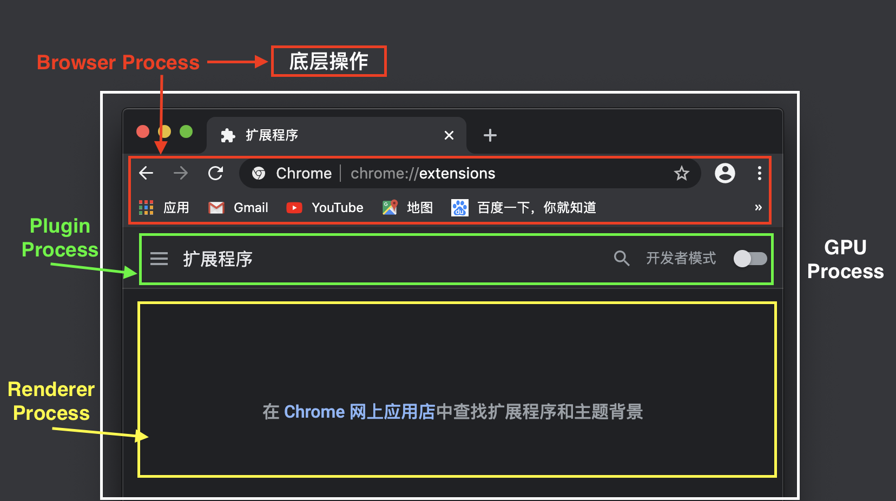
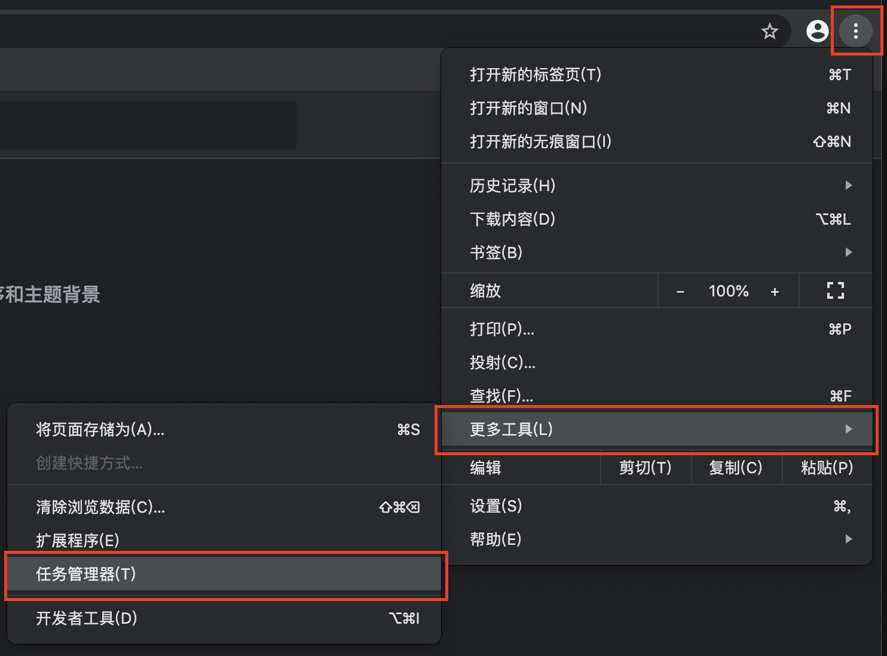
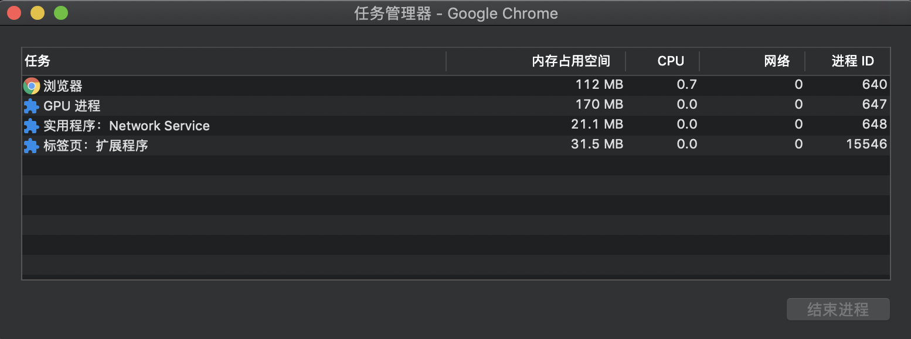

<span id="catalog"></span>

- 参考
    - https://zhuanlan.zhihu.com/p/47407398
    - https://www.bilibili.com/video/BV1A4411F753

### 目录
- [浏览器中的线程](#浏览器中的线程)
- [浏览器界面的基本结构](#浏览器界面的基本结构)
- [常见浏览器内核](#常见浏览器内核)
- [chrome浏览器的架构模型简介](#chrome浏览器的架构模型简介)
    - [chrome浏览器的多进程架构](#chrome浏览器的多进程架构)
    - [chrome对iframe的渲染](#chrome对iframe的渲染)
    - [browser_process中的任务拆分](#browser_process中的任务拆分)
    - [chrome导航过程分析](#chrome导航过程分析)
- [渲染进程的工作方式](#渲染进程的工作方式)
- [](#)

# 浏览器中的线程
[top](#catalog)
- 线程分类
    - js是单线程的
    - 浏览器是多线程的
        - 一个页面(标签)就是一个线程
        - 每个页面都运行js，这种情况下可以认为js是多线程的
            - 与js的延时器 `setTimeout` 产生的多线程本质上是不同的

- 浏览器中的几种线程
    - 几种线程
        |线程|描述|备注|
        |-|-|-|
        |js线程|基于事件驱动，单线程执行||
        |gui渲染线程|绘制浏览器界面|与js线程互斥|
        |事件线程|由浏览器事件触发的线程|事件触发时，会将事件添加到浏览器任务队列的队尾|

    - js阻塞页面加载
        - 原理：gui线程与js线程互斥，当js线程执行时，gui线程会被挂起
        - gui线程的更新会被保存到一个队列中，当js的主引擎空闲时，才会有机会检查该队列，并继续gui线程

# 浏览器界面的基本结构
[top](#catalog)
- 基本结构
    - 用户界面
    - 浏览器引擎
        - 管理控制下一级的渲染引擎
    - 渲染引擎
    - 网络
        - 用于处理与网络相关的内容，如：http请求
    - UI后端的接口
        - 如提示框，弹出的窗口等等，都是由操作系统的底层来调用的
    - js解释器
    - 数据存储
        - 如cookies、缓存等

- 整体结构图
    ```
                ┌──────────┐
                │　用户界面　├───────┐
                └─────┬────┘       │
                      │            │
                      V            │
              ┌───────────────┐    │         ┌──────────┐
              │　　浏览器引擎　　├────┼─────>>> │　数据存储　│
              └───────┬───────┘    │         └──────────┘
                      │            │         
                      V            │            
                 ┌──────────┐      │
        ┌────────┤　渲染引擎　├──────┤
        │        └────┬─────┘      │
        │             │            │
        V             V            V
    ┌──────────┐ ┌──────────┐ ┌──────────┐
    │  js解释器 │ │　　网络　　│ │  UI后端 　│
    └──────────┘ └──────────┘ └──────────┘
    ```

# 常见浏览器内核
[top](#catalog)
- Trident内核：IE
- Webkit内核：Chrome Safari
- Gecko内核：Firefox

# chrome浏览器的架构模型简介
## chrome浏览器的多进程架构
[top](#catalog)
- chrome 采用多进程架构
- chrome 在顶层 使用 `Browser process` 来协调浏览器的其他**进程**
- chrome的主要进程及其任务
    - 进程与职责
        
        |进程|进程Browse|任务|
        |-|-|-|
        |Browser Process|浏览器进程|<ul><li>负责地址栏、书签拦、前进后台按钮等部分的工作</li><li>负责处理器的一些不可见的底层操作，如网络请求和文件请求</li></ul>|
        |Renderer Process|渲染进程|负责一个浏览器标签(tab)内关于网页呈现的所有工作|
        |Plugin Process|插件进程|负责控制一个网页用到的所有插件|
        |GPU Process|GPU进程|负责处理GPU的相关任务|
    
    - 进程及其任务的示意图
        - 

    - 通过chrome任务管理器来查看进程
        - 打开方法：
            - 
        - 查看进程
            - 
        
- chrome多进程架构的优缺点
    - 优点
        - 某一个渲染进程出问题不会影响其他进程
        - 更加安全，在系统层面上限定了不同进程的权限
    - 缺点
        - 不同进程间的内存不共享，不同进程的**内存会包含相同的内容**
        - 为了节省内存，chrome限制了最大进程数
            - 最大进程数由内存和CPU绝对
            - 当到达最大进程数限制时，新打开的Tab会**共用之前同一个站点的渲染进程**

- 服务/功能的分割与合并
    - chrome将不同程序的**功能看作服务**
    - **根据硬件状况**，服务可以分割为不同的进程、也可以合并为一个进程
    - 如 Browser Process 会根据硬件状况来分割服务
        - 如果运行在好的硬件上，会将多个服务分割到不同的进程中，使chrome整体运行更加稳定
        - 如果运行在差的硬件上，会将多个服务分割到同一个进程中运行，以节省内存

## chrome对iframe的渲染
[top](#catalog)
- chrome使用 `Site Isolation` 机制来渲染 iframe
- `Site Isolation`机制
    - 该机制从 chrome67 开始默认启用
    - 该机制允许在同一个tab下，**跨站iframe** 使用一个单独的进程来渲染，提升安全性
    - 该机制不是简单的叠加多个进程，并且在底层改变了 iframe之间的通信方法
    - 该机制导致了许多其他功能的调整，如：
        - devtools需要相应的支持
        - ctrl + F 的支持

## browser_process中的任务拆分
[top](#catalog)
- 所有浏览器tab外的工作，都由Browser Process控制
    - 包括：地址栏部分的功能、网络功能、存储功能等
- Browser Process **使用不同的线程处理不同的任务**

    |线程id|线程名|任务|
    |-|-|-|
    |UI thread|UI线程|控制浏览器上的按钮及输入框|
    |network thread|网络线程|处理网络请求，从网上获取数据|
    |storage thread|存储线程|控制文件等的访问|

## chrome导航过程分析
### 手动输入来执行chrome导航的过程分析
[top](#catalog)
- 从地址栏手动输入地址来导航到页面显示的整体过程分析
    1. 处理地址栏的输入内容
        - `UI thread` 判断用户输入的是 URL 还是 query
    2. 用户按下回车，开始导航
        - `UI thread` 控制 tab 上的 spinner 显示，表示页面正在加载
        - `UI thread` 通知 `network thread` 获取网页内容
            - network thread 会执行 DNS 查询，随后为请求建立 TLS 连接
            - 如果 network thread 接收到了重定向请求头，如301，network thread 会通知 UI thread 需要重定向，然后另外一个URL请求会被触发
    3. 读取响应
        1. 响应返回，`network thread` 依据 Content-Type 及 MIME Type sniffing 判断响应内容的格式
        2. 不同的响应内容格式执行不同的处理
            - 如果 Content-Type 是 `text/html`，则将数据传递给 `renderer process`
            - 如果是zip文件或其他文件，会将数据发送到下载管理器

    4. 触发安全检查
        - `Safe Browsing`检查：如果域名或者请求内容匹配到已知的恶意网站，`network thread` 会展示一个警告页面
        - `CORB`检测：确保敏感数据不会被传递给 渲染进程
   
    5. 查找渲染进程
        1. 前提：安全检查完成，`network thread`可以确保可以导航到请求的页面
        2. network thread 通知 UI thread 数据已经准备好
        3. UI thread在查找一个 renderer process 进行网页渲染
    
    6. 确认导航，并开始渲染页面
        1. 前提：到5为止的 **数据**、**渲染进程** 都可用了
        2. `Browser Process` 给 renderer process 发送 IPC 消息来确认导航
        3. 当 `Browser Process` 收到来自renderer process 的渲染确认消息之后，**导航结束、开始页面加载**
        4. 地址栏更新，展示新页面的内容
        5. history tab 更新
            - 可以通过后退按钮返回之前的页面
            - 为了实现关闭tab或窗口之后还能够恢复，这些消息会保存到**硬盘中**
    7. 渲染网页
    8. 网页首桢渲染完成
        1. renderer process 渲染结束，发送 IPC 信号给 `Browser process`
        2. Browser process 命令 `UI thread` 停止 tab 中的 spinner
    9. 如果客户端还需要下载额外的资源，将会渲染出新的视图
 
### 由Renderer_Process触发导航时的整体过程分析
[top](#catalog)
1. 用户在页面中点击某个链接，或者通过js的bom对象重新设置地址：`location = "https://...."`
2. `renderer process` 检查是否有 `beforeunload` 事件处理器
3. 导航请求传递：renderer process --->> Browser process
4. 进行导航
5. 导航到新网站
6. 渲染新页面
    1. 启动一个新的 new renderer process
    2. Browser Proecss 发送 IPC 信号给 new renderer process
    3. new renderer process 渲染新页面
    4. **旧的进程会被保留，来处理类似 `unload` 等事件**

### 包含Service_Worker的页面的导航过程分析
[top](#catalog)
- service worker 
    - 让开发者更多的控制本地缓存及判断何时从网络上获取信息
    - service worker 是运行在 renderer process 的js代码
    - 从本地cache中加载数据
        - 如果 Service Worker 被设置为从本地cache中加载数据，那么就不要再从网络上获取数据了
        - 如果Service worker 从 cache 中加载数据，会终止对网络的请求，也可能向网络请求新的数据
    - 当页面中包含了 service worker 时，导航的流程会有些不同

- 包含 Service Worker 的页面的导航过程
    1. 导航之前，Service Worker 被注册，作用域会被保存
    2. 导航开始，判断获取数据的方式
        -  `newwork thread` 在已注册的 `Service Worker` 的作用域中检查相关域名
            - 如果存在对应的Service worker，UI thread 会找到一个 renderer process 来处理相关代码
        - 如果Service worker 从 cache 中加载数据，会终止对网络的请求，也可能向网络请求新的数据
    
    3. Service Worker 决定从网络上获取数据
        - Browser process 和 renderer process 的交互其实会延后数据的请求时间

- Navigation Preload 是一种与 Service Worker 并行的加速加载资源的机制，服务端通过请求头可以识别这类请求，而做出相应的处理


js代码其实都是由renderer Process控制
所以在浏览网页内容的过程中，大部分时间不会涉及到其他进程

- 例外：beforeunload事件
    - 该事件涉及 Browser Process 和 renderer Process 的交互
    - 关闭当前页面涉及到 Browser Proecss 和 renderer Process 的交互
        1. Browser Proecss 通过 IPC 通知 rendderer Process 要离开页面
        2. rendderer Process 进行相关的检查，处理相关事件
    - 关闭页面的操作，如关闭tab、刷新页面等

# 渲染进程的工作方式
[top](#catalog)
- 渲染进程 renderer process 几乎负责tab内的所有事情
- 渲染进程的核心目的
    - 将 HTML、CSS、JS 转换为用户可交互的web页面
- 渲染进程中的线程
    
    |线程id|线程名|
    |-|-|
    |Main thread|主线程|
    |Worker thread|工作线程|
    |Compositor thread|排版线程|
    |Raster thread|光栅线程|

- 渲染的流程分析
    1. 构建DOM
        - Browser process 向 renderer process 发送确认导航信息后，开始接收HTML数据
        - `Main thread` 会将html文本字符串解析为DOM
    2. 加载次级的资源
        - 次级资源包括
            - 图片、css、js等额外资源
        - 次级资源需要从网络或者 cache 中获取
        - `Main thread` 可以在构建 DOM的过程中**逐一请求**
        - 同时运行 preload scanner， 来加速次级资源的加载
            - 遇到 ``，`<link>` 等标签时， preload scanner 会把请求传递给 Browser process 中的 network thread 进行相关资源的下载
    3. js的下载与执行
        - 遇到 `<script>` 标签时，renderer process 的工作
            1. 暂停解析html
            2. 加载、解析、执行 JS代码
        - 暂停解析html的原因
            - JS可能会改变DOM的结构，如：`document.write()`等API
        - 开发者可以手动指定浏览器如何应对某个资源
            - 如，在 `<script>` 标签上添加了 async、defer 等属性。浏览器贵
            - https://developers.google.com/web/fundamentals/performance/resource-prioritization
                - ?????

- 渲染流程示意图
```
Browser process 向 renderer process 发送确认导航信息
renderer process 的 Main thread 开始将html解析为DOM
   
   <!doctype html>
   <html>
    <head>
        <meta charset="utf-8">
        <title>...</title>
        <style>...</style>
        <link rel="stylesheet" href=".../*.css">
        <script type="text/javascript">
        </script>
    </head>
        <body>
        </body>
   </html>
构建
```

# 页面加载的过程
[top](#catalog)
- 呈现引擎一开始会从网络获取请求文档的内容，然后进行如下的基本流程
    1. 解析HTML并生成DOM tree
    2. 渲染tree的控制器
    3. 布局渲染 tree
    4. 绘制

# 其他
[top](#catalog)
js代码其实都是由renderer Process控制
所以在浏览网页内容的过程中，大部分时间不会涉及到其他进程