- 参考
    - https://www.bilibili.com/video/av77217003

<span id="catalog"></span>

### 目录
- [CSS简介](#CSS简介)
- [CSS的使用方式](#CSS的使用方式)
    - [内联样式](#内联样式)
    - [内部css](#内部css)
    - [外部css](#外部css)
- [css语法](#css语法)
- [常用CSS选择器](#常用CSS选择器)
    - [基本选择器](#基本选择器)
    - [复合选择器](#复合选择器)
    - [关系选择器](#关系选择器)
    - [属性选择器](#属性选择器)
    - [伪类选择器](#伪类选择器)
    - [伪元素选择器](#伪元素选择器)
- [选择器的权重](#选择器的权重)
- [继承](#继承)
- [web页面中的单位](#web页面中的单位)
    - [页面的长度单位](#页面的长度单位)
    - [颜色单位](#颜色单位)
- [文档流](#文档流)
    - [文档流简介](#文档流简介)
    - [元素在文档流中](#元素在文档流中)
    - [元素脱离文档流](#元素脱离文档流)
- [盒子模型](#盒子模型)
    - [盒子模型的基本组成](#盒子模型的基本组成)
    - [内容区content](#内容区content)
    - [边框border](#边框border)
    - [内边距padding](#内边距padding)
    - [外边距margin](#外边距margin)
    - [盒子模型中可以设置为auto的属性](#盒子模型中可以设置为auto的属性)
    - [块元素盒子模型的水平方向布局](#块元素盒子模型的水平方向布局)
    - [元素的高度](#元素的高度)
    - [处理子元素的溢出](#处理子元素的溢出)
    - [垂直外边距的折叠](#垂直外边距的折叠)
    - [行内元素的盒子模型](#行内元素的盒子模型)
    - [盒子的大小](#盒子的大小)
    - [盒子的轮廓](#盒子的轮廓)
    - [盒子的阴影](#盒子的阴影)
    - [盒子的圆角](#盒子的圆角)
- [浏览器的默认样式](#浏览器的默认样式)
- [常用的通用属性](#常用的通用属性)
    - [display](#display)
    - [visibility](#visibility)
- [元素浮动](#元素浮动)
    - [元素浮动基本知识](#元素浮动基本知识)
    - [元素浮动示例-导航条](#元素浮动示例-导航条)    
- [解决浮造成的问题-高度塌陷](#解决浮造成的问题-高度塌陷)
    - [高度塌陷的分析](#高度塌陷的分析)
    - [解决方式1-BFC块级格式化环境](#解决方式1-BFC块级格式化环境)
        - [BFC元素的特点](#BFC元素的特点)
        - [开启BFC](#开启BFC)
    - [解决方式2-clear属性](#解决方式2-clear属性)
        - [clear属性简介](#clear属性简介)
        - [使用clear解决高度塌陷](#使用clear解决高度塌陷)
    - [解决方式3-自定义类选择器解决高度塌陷和父子元素间的外边距折叠（强烈推荐使用）](#解决方式3-自定义类选择器解决高度塌陷和父子元素间的外边距折叠)
- [定位](#定位)
    - [定位简介](#定位简介)
    - [相对定位](#相对定位)
    - [绝对定位](#绝对定位)
        - [绝对定位的基本使用](#绝对定位的基本使用)
        - [启动绝对定位后必须满足的水平垂直等式](#启动绝对定位后必须满足的水平垂直等式)
    - [固定定位](#固定定位)
    - [粘滞定位](#粘滞定位)
    - [元素的层级](#元素的层级)
- [字体font](#字体font)
    - [字体的格式](#字体的格式)
    - [图标字体](#图标字体)
        - [图标字体的基本知识](#图标字体的基本知识)
        - [开源图标字体库FontAwesome](#开源图标字体库FontAwesome)
    - [行高与字体框](#行高与字体框)
        - [行高](#行高)
        - [字体框](#字体框)
        - [行高与字体框的应用](#行高与字体框的应用)
    - [字体的简写属性](#字体的简写属性)
    - [文本的样式](#文本的样式)
    - [文本的居中与对齐](#文本的居中与对齐)
- [背景](#背景)
- [](#)
- [](#)
- [](#)
- [网页布局](#网页布局)
    - [基本的页面布局思路](#基本的页面布局思路)
- [总结](#总结)
- [练习](#练习)


# CSS简介
[top](#catalog)
- 层叠样式表
- 网页实际上是一个多层的结构，通过CSS可以分别为网页的每一个层来设置样式，最终看到的只是网页最上边的一层

# CSS的使用方式
## 内联样式
[top](#catalog)
- 使用方法：
    - 在标签内部通过`style`属性来设置元素的样式
    - 通过`样式名:样式值`的方式设置样式
    - 可以同时设置多个样式，使用`;`来分割
    ```html
    <tag style="样式1:value1; 样式2:value2; 样式3:value3;">
    ```

- 示例
    - 参考：[/frontend/css/base/src/usage/usage.html](/frontend/css/base/src/usage/usage.html)
    - 代码
        ```html
        <p style="color:red; font-size: 20px;">
            p tab css test
        </p>
        ```
- 在实际开发中不推荐使用
    - 维护困难
    - css和html耦合在一起

## 内部css
[top](#catalog)
- 使用方法
    - 将css写到`<head>`中的`<style>`标签中
    - 通过css选择器为元素设置样式，可以同时设置多种元素的样式
    ```html
    <head>
        <style>
            选择器{
                样式1:value1;
                样式2:value2;
                样式3:value3;
            }
            
        </style>  
    </head>
    ```
- **内联样式可以覆盖内部css**
- 内部css不能跨页面使用
- 示例
    - 代码：[/frontend/css/base/src/usage/usage.html](/frontend/css/base/src/usage/usage.html)
      
        ```html
        <head>
            <style>
                p{
                    color:green; 
                    font-size: 20px;
                }
            </style>
        </head>
        <body>
            <p style="color:red; font-size: 20px;">
                p tab css test
            </p>

            <p>p tab common test01</p>
            <p>p tab common test02</p>
            <p>p tab common test03</p>
        </body>
        ```
    - 结果：
        - 按照设置显示，但是第一个`<p>`被覆盖了
        - 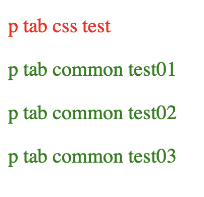
        
## 外部css
[top](#catalog)
- 使用方法：   
    1. 需要将css样式写到一个外部`*.css`文件中
    2. 通过`<head>`下的`<link>`来引入外部的css文件，引入之后css会自动生效

    ```html
    <head>
        <link rel="stylesheet" href="*.css文件路径">
    </head>
    ```
- **内联样式可以覆盖内部css**
- 外部css和内部css同时存在时的原则：**后加载的优先**
    - 如果外部css和内部css中有相同的css选择器，则后声明的覆盖先声明的
- 优点：
    1. 使用外部css可以在不同页面之间进行复用
    2. 将css写到外部文件中，可以使用浏览器的缓存机制，从而加快页面的加载速度
        - 第一次某个`*.css`文件被加载过之后，会保存到浏览器缓存中，之后再次需要时，直接从缓存中获取
- 示例
    - css文件：[/frontend/css/base/src/usage/usage.css](/frontend/css/base/src/usage.css)

        ```css
        p{
            color: blueviolet;
            font-size: 30px;
        }
        ```

    - 页面：[/frontend/css/base/src/usage/usage.html](/frontend/css/base/src/usage/usage.html)

        ```html
        <!doctype html>
        <html>
            <head>
                <link rel="stylesheet" href="mystyle.css">
            </head>
            <body>
                <!-- 覆盖外部css -->
                <p style="color:red; font-size: 20px;">
                    p tab css test
                </p>

                <p>p tab common test01</p>
                <p>p tab common test02</p>
                <p>p tab common test03</p>
            </body>
        </html>
        ```
    - 页面结果
        - 按照设置显示，但是第一个`<p>`被覆盖了
        - 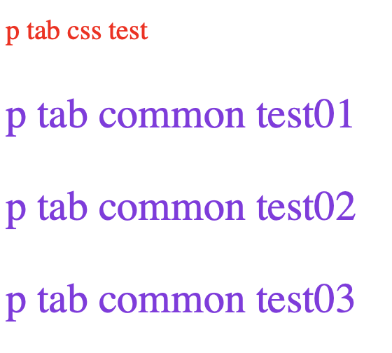

# css语法
[top](#catalog)
- 注释：`/* .... */`
- css的基本语法：`选择器{ 声明块 }`
- 选择器
    - 通过选择器可以选择页面中的指定元素
        - 如：`p{....}`，表示选择页面中所有的p元素

- 声明块
    - 通过声明块指定需要为元素设置的样式
    - 声明块有多个声明组成
    - 声明是一个名值对结构，`样式名:样式值;`

- **多个css中如果出现的重复的部分，则使用后声明的部分**

# 常用CSS选择器
## 基本选择器
[top](#catalog)
- 4中基本选择器
    1. 元素选择器
    2. id选择器
    3. class选择器
    4. 通配选择器

- 元素选择器
    - 根据标签名来选择指定元素
    - 语法：`标签名{ 声明块 }`

- id选择器
    - 根据元素的id属性值选中元素
    - 语法：`#id属性值{ 声明块 }`
    - id选择器的缺点，只能设置一个元素

- class选择器
    - 根据标签的class属性来选择(一组)元素，**开发中比较常用**
    - 语法：`.class值{ 声明块 }`
    - class可以重复使用
    - **可以为一个元素指定多个class，多个class之间通过空格分割**

- 通配选择器
    - 选中页面中的**所有元素**
    - 语法：`*`

- 示例
    - 代码：[/frontend/css/base/src/selector/base.html](/frontend/css/base/src/selector/base.html)
    - css
        ```css
        /* 4.通配选择器 */
        * {
            /* 斜体字符 */
            font-style: italic; 
        }

        /* 1.元素选择器*/
        p{
            color:green; 
            font-size: 20px;
        }

        /* 2.id选择器 */
        #redPTag{
            color: red;
        }

        /* 3.class选择器 */
        .blue{
            color:blue;
            /* 斜体字符 */
            font-style: normal;
        }

        .font30{
            font-size: 30px;
        }
        ```
    - html
        ```html
        <body>
            <!-- 2.id选择器测试 -->
            <p id='redPTag'>p 01 test</p>

            <!-- 3.class选择器测试 -->
            <p class='blue'>p 02 test</p>
            
            <!-- 3.多个class选择器 测试 -->
            <p class='blue font30'>p 03 test</p>
            
            <!-- 1.元素选择器 -->
            <p>p 04 test</p>
            <p>p 05 test</p>
        </body>
        ```
    - 页面结果
        - 由于先设定了通配符选择器，所以`p01`、`p04`、`p05`是斜体；在后边的`.blue`选择器中，又重新设定了字体格式，覆盖了前面的样式，所以`p02`、`p03`是正常显示
        - 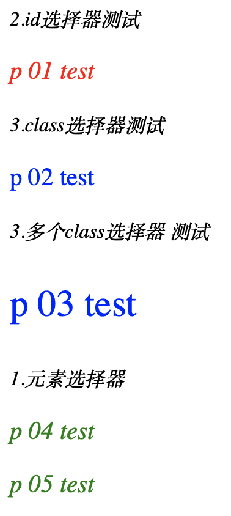

## 复合选择器
[top](#catalog)
- 两种复合选择器
    1. 交集选择器
    2. 并集选择器

- 交集选择器
    - 选中同时包含多个选择器的元素
    - 语法：`选择器1选择器2选择器3{ 声明块 }`
        - 选择器中**如果有元素选择器，则必须以元素选择器开头**
- 并集选择器 (选择器分组)
    - 同时选择多种选择器对应的元素
    - 语法：`选择器1, 选择器2, 选择器3{ 声明块 }`

- 并集选择器中混合交集选择器
    - 如：
        ```css
        h2.complex, h3.complex, h4.complex {
            color:coral;
            font-style: normal;
        }
        ```

- 示例
    - 参考：[/frontend/css/base/src/selector/complex.html](/frontend/css/base/src/selector/complex.html)
    - css 
        ```css
        /* 1.交集选择器 */
        /* 条件：使用blue类，并且是div */
        div.blue{
            /* 加粗字符 */
            font-style: italic;
            font-size: 30px;
        }

        /* 2.并集选择器 */
        h1, span{
            color: green;
        }

        /* 3.并集选择器中混合交集选择器 */
        h2.complex, h3.complex, h4.complex {
            color:coral;
            font-style: normal;
        }
        ```
    - html
        ```html
        <body>
            <!-- 1.交集选择器测试 -->
            <div class="blue">div 01 test</div>
            <p class="blue">p 01 test</p>

            <!-- 2.并集选择器测试 -->
            <H1> h1 test</H1>
            <span>span 01 test</span>

            <!-- 3.并集选择器中混合交集选择器测试 -->
            <h2 class="complex">h2 complex test</h2>
            <h3 class="complex">h3 complex test</h3>
            <h4 class="complex">h4 complex test</h4>
        </body>
        ```
    - 页面结果
        - 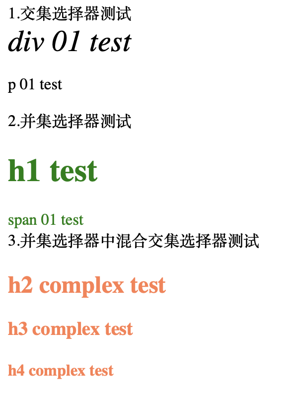

## 关系选择器
[top](#catalog)
- 三种关系选择器
    1. 子元素选择器
    2. 后代选择器
    3. 兄弟选择器

- 子元素选择器
    - 语法：
        - 1级：`选择器1 > 子元素 {声明块}`
        - 多级：`选择器1 > 选择器2 > ... > 子元素 {声明块}`
    - 子元素选择器可以可复合选择器进行混合
    - 示例
        - 参考：[/frontend/css/base/src/selector/relation_son.html](/frontend/css/base/src/selector/relation_son.html)
        - css
            ```css
            /* 1. 子元素选择器 */
            /* 1.1 子元素选择器：设置 div 下 span 的样式 */
            div > span {
                color: orange;
            }

            /* 1.2 子元素选择器混合复合选择器：设置 class是red的div 下 span 的样式 */
            div.red > span {
                color: red;
                font-style: italic;
                font-size: 30px;
            }

            /* 1.3 多级子元素选择器：设置 div 下 p 下 span 的样式 */
            div > p > span  {
                color: green;
                font-size: 30px;
            }
            ```
        - html
            ```html
            <body>
                <section>0. 不符合任何选择器</section>
                <span>out span</span>

                <section>1.1 子元素选择器测试</section>
                <div>
                    <span>div - span1 </span>
                </div>
                <br>

                <section>1.2 子元素选择器混合复合选择器</section>
                <div class="red">
                    <span>div - span2 </span>
                </div>
                <br>

                <section>1.3 多级子元素选择器</section>
                <div>
                    <p>
                        div - p - 3
                        <span>div - p - span - 3 </span>
                    </p>
                </div>
                <br>

            </body>
            ```
        - 页面结果
            - 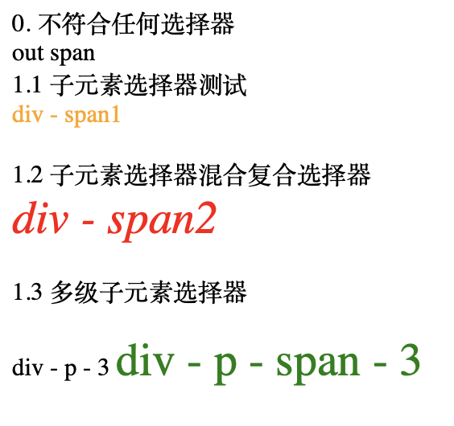

- 后代选择器
    - 语法：`祖先元素选择器 后代元素选择器{声明块}`
    - 使用后，**所有的后代元素**都会应用样式，无论元素之间有多少嵌套关系
    - 子元素选择器可以可复合选择器进行混合
    - 示例
        - 参考：[/frontend/css/base/src/selector/relation_later.html](/frontend/css/base/src/selector/relation_later.html)
        - css
            ```css
            /* 2. 后代选择器 */
            /* 选择 div下的所有p后代元素 */
            div p{
                color: mediumblue;
                font-weight: bold;
            }
            ```
        - html
            ```html
            <body>
                <section>0. 不符合任何选择器</section>

                <section>2. 后代选择器</section>
                <div>
                    <div>
                        <p>div - p - 4 - 1 </p>
                    </div>
                    <p>div - p - 4 - 2</p>
                </div>
                <br>
            </body>
            ```
        - 页面结果
            - 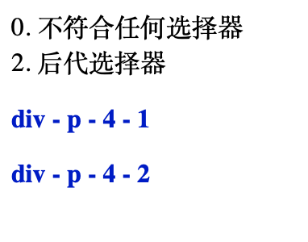


- 兄弟选择器
    - 语法
        - 选择`兄弟元素1选择器`**后边紧挨的第一个兄弟元素**：`兄弟元素1选择器 + 兄弟元素2选择器{ 声明块 }`
            - 兄弟元素1和兄弟元素2之间必须紧挨，如果出现其他元素则无法选择
        - 选择`兄弟元素1选择器`**后边的所有兄弟元素**：`兄弟元素1选择器 ~ 兄弟元素2选择器{ 声明块 }`
            - 兄弟元素之间可以有其他元素，不会影响选择结果
    - **兄弟选择器只能选择`兄弟元素1`后面的元素，无法选择前面的元素**
    - 可以混合复合选择器
    - 示例
        - 参考：[/frontend/css/base/src/selector/relation_brother.html](/frontend/css/base/src/selector/relation_brother.html)
        - css
            ```css
            /* 3. 兄弟选择器 */
            /* 3.1 选择 兄弟元素1选择器 后边紧挨的第一个兄弟元素 */
            /* 选择p后面的第一个span */
            p + span{
                color:mediumpurple;
                text-decoration:underline;
                font-size: 20px;
            }

            /* 3.2 选择 兄弟元素1选择器 后边的所有兄弟元素 */
            /* 选择 p 后边所有的 ul 和 ol 兄弟元素 */
            p ~ ul,ol{
                color:red;
                text-decoration:underline;
                font-size: 20px;
            }
            ```
        - html
            ```html
            <body>
                <section>0. 不符合任何选择器</section>
                
                <section>3. 兄弟选择器</section>
                <section>3.1-1 选择 兄弟元素1选择器后边紧挨的第一个兄弟元素，选择p后面的第一个span</section>
                <p>p1</p>
                <span>p1 - span1</span><br>
                <span>p1 - span2</span><br>
                <br>

                <section>3.1-2 兄弟元素1与兄弟元素2之间有其他元素，选择p后面的第一个span</section>
                <p>p2</p>
                <div>p2 - div</div>
                <span>p2 - span1</span><br>
                <span>p2 - span2</span><br>
                <br>

                <section>3.1-2 兄弟元素1与兄弟元素2之间有其他元素，选择 p 后边所有的 ul 和 ol 兄弟元素 </section>
                <p>p2</p>
                <div></div>
                <ul>
                    <li>p2-list1-item1</li>
                    <li>p2-list1-item2</li>
                </ul>
                <div></div>
                <ol>
                    <li>p2-list2-item1</li>
                    <li>p2-list2-item2</li>
                </ul>
                <ul>
                    <li>p2-list3-item1</li>
                    <li>p2-list3-item2</li>
                </ul>
                <br>

            </body>
            ```
        - 页面结果
            - 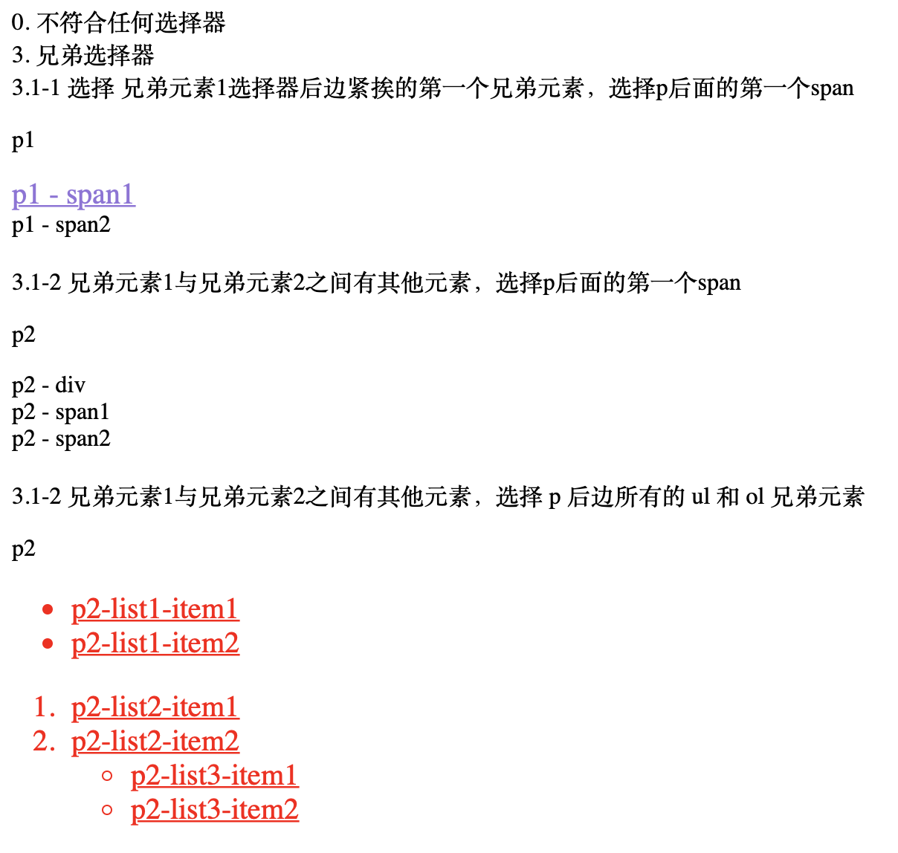

## 属性选择器
[top](#catalog)
- 语法
    1. `元素[属性名] {声明块}`， 选择含有指定属性的元素
    2. `元素[属性名=属性值] {声明块}`， 选择含有指定属性、指定属性值的元素
    3. `元素[属性名^=属性值] {声明块}`， 选择含有指定属性、以指定属性值**开头**的元素
    4. `元素[属性名$=属性值] {声明块}`， 选择含有指定属性、以指定属性值**结尾**的元素
    5. `元素[属性名*=属性值] {声明块}`， 选择含有指定属性、**包含**指定属性值的元素

- `属性值`是否需要加引号
    - 可以加引号也可以不加
    - 单引号、双引号都可以
    - <label style="color:red">如果属性值是数字，则必须加引号，否则选择无法选中元素</labe>
- 示例
    - 代码：[/frontend/css/base/src/selector/property.html](/frontend/css/base/src/selector/property.html)
    - css
        ```css
        /* 1. 选择含有指定属性的元素 */
        p[title] {
            color: green;
        }

        /* 2. 选择含有指定属性、属性值=abc的元素 */
        p[title="abc"] {
            color:red;
        }
        
        /* 3. 选择含有指定属性、属性值以 1234 开头的元素 */
        p[title^='1234']{
            color:blue;
        }

        /* 4. 选择含有指定属性、属性值以 xyz 结尾的元素 */
        p[title$="xyz"]{
            font-size: 20px;
            color: rebeccapurple;
        }

        /* 5. 选择含有指定属性、属性值中包含 qwe 元素 */
        p[title*="qwe"]{
            font-style: italic;
            color: orange;
        }
        ```
    
    - html
        ```html
        <body>
            <section>0. 没有title属性，无法被任何选择器选择</section>
            <p>no title test</p>

            <section>1. 选择含有指定属性的元素</section>
            <p title="qqqq">title=qqqq test</p>
            <p title="zzzz">title=zzzz test</p>

            <section>2. 选择含有指定属性、属性值=abc的元素</section>
            <p title="abc">title=abc test</p>
            
            <section>3. 选择含有指定属性、属性值以 1234 开头的元素</section>
            <p title="1234">title=1234 test</p>
            <p title="12346789">title=12346789 test</p>
            
            <section>4. 选择含有指定属性、属性值以 xyz 结尾的元素</section>
            <p title="xyz">title=xyz test</p>
            <p title="zxcvbxyz">title=zxcvbxyz test</p>
            <p title="1234xyz">title=1234xyz test</p>
            
            <section>5. 选择含有指定属性、属性值中包含 qwe 元素</section>
            <p title="qwe">title=qwe test</p>
            <p title="asdfqwerty">title=asdfqwerty test</p>
        </body>
        ```
    
    - 页面结果
        - 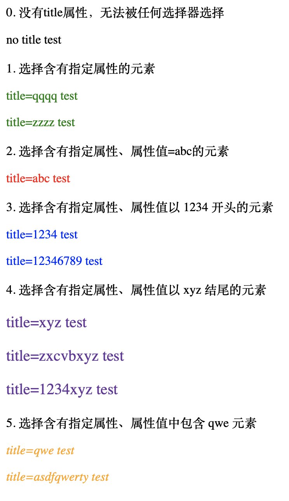

## 伪类选择器
[top](#catalog)
- 什么是伪类
    - 不存在的类，是特殊的类
- 伪类的用途
    - 用来描述一个**元素的特殊状态**。如：第一个子元素，被点击的元素，鼠标移入的元素
- 伪类的语法，`其他选择器:伪类名`
- 伪类

    |伪类|描述|备注|
    |-|-|-|
    |`:first-child`|所有子元素中的第一个子元素|将对所有的子元素进行排序,如果多个元素中间有不符合规则的元素，将会影响显示结果|
    |`:last-child`|所有子元素中的最后一个子元素|将对所有的子元素进行排序,如果多个元素中间有不符合规则的元素，将会影响显示结果|
    |`:nth-child(index)`|所有子元素中的第n个子元素|将对所有的子元素进行排序,如果多个元素中间有不符合规则的元素，将会影响显示结果<br>index从0开始<br>`index=n`时，选中所有子元素，表示从1到正无穷<br>`index=2n`、`index=even`时，表示选择偶数位置的子元素<br>`index=2n+1`、`index=odd`时，表示选择奇数数位置的子元素|
    |`:first-of-type`|同类元素中的第一个子元素|仅对同类元素进行排序,如果多个元素中间有不符合规则的元素，则忽略这些元素|
    |`:last-of-type`|同类元素中的最后一个子元素|仅对同类元素进行排序,如果多个元素中间有不符合规则的元素，则忽略这些元素|
    |`:nth-of-type(index)`|同类元素中的第n个子元素|仅对同类元素进行排序,如果多个元素中间有不符合规则的元素，则忽略这些元素<br>index从0开始<br>`index=n`时，选中所有子元素，表示从1到正无穷<br>`index=2n`、`index=even`时，表示选择偶数位置的子元素<br>`index=2n+1`、`index=odd`时，表示选择奇数数位置的子元素|
    |`:not(选择器|伪类)`|否定伪类，将符合条件的元素从选择器中删除|如果使用`属性选择器`，只写`[属性名=属性值]`部分即可|

- 示例
    - 参考代码
        - [/frontend/css/base/src/selector/pseudo_class.html](/frontend/css/base/src/selector/pseudo_class.html)

    - 对所有元素排序
        1. 选择 ul下的第一个和最后一个li子元素（与并集选择器混合）
            - css
                ```css
                ul.test1 > li:first-child {
                    color:blue;
                }

                ul.test1 > li:last-child {
                    color:orange;
                }
                ```

            - html
                ```html
                <section>
                    1. 选择 ul下的第一个和最后一个li子元素
                    <br>
                    2. 选择 ul下的第3个li子元素
                </section>
                <ul class="test1">
                    <li>ul1 item 01</li>
                    <li>ul1 item 02</li>
                    <li>ul1 item 03</li>
                    <li>ul1 item 04</li>
                    <li>ul1 item 05</li>
                </ul>
                ```
            
            - 页面结果
                - 
        2. 选择 ul下的第3个li子元素
            - css
                ```css
                ul.test1 > li:nth-child(3){
                    color:red
                }
                ```

            - html
                ```html
                <section>
                    1. 选择 ul下的第一个和最后一个li子元素
                    <br>
                    2. 选择 ul下的第3个li子元素
                </section>
                <ul class="test1">
                    <li>ul1 item 01</li>
                    <li>ul1 item 02</li>
                    <li>ul1 item 03</li>
                    <li>ul1 item 04</li>
                    <li>ul1 item 05</li>
                </ul>
                ```
            
            - 页面结果
                - 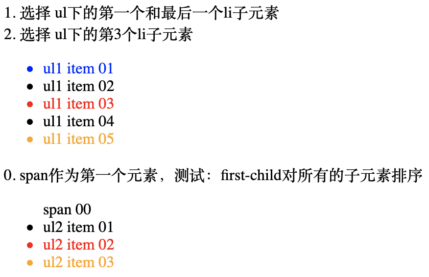
        3. 选择 ol下的所有li子元素
            - css
                ```css
                ol.test1 > li:nth-child(n){
                    color:green
                }
                ```

            - html
                ```html
                <section>3. 选择 ol下的所有li子元素</section>
                <ol class="test1">
                    <li>ol1 item 01</li>
                    <li>ol1 item 02</li>
                    <li>ol1 item 03</li>
                    <li>ol1 item 04</li>
                    <li>ol1 item 05</li>
                    <li>ol1 item 06</li>
                </ol>
                ```
            
            - 页面结果
                - 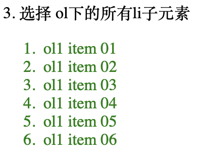

        4. 选择ul下的所有偶数li子元素，通过2n的方式
            - css
                ```css
                ul.test2 > li:nth-child(2n){
                    color:hotpink;
                }
                ```

            - html
                ```html
                <section>4. 选择ul下的所有偶数li子元素，通过2n的方式</section>
                <ul class="test2">
                    <li>ul.test2 01 item01</li>
                    <li>ul.test2 01 item02</li>
                    <li>ul.test2 01 item03</li>
                    <li>ul.test2 01 item04</li>
                </ul>
                ```
            
            - 页面结果
                - 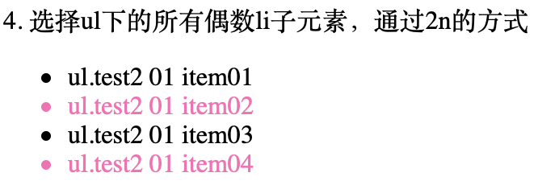

        5. 选择ul下的所有偶数li子元素，通过even的方式
            - css
                ```css
                ul.test3 > li:nth-child(even){
                    color:hotpink;
                }
                ```

            - html
                ```html
                <section>5. 选择ul下的所有偶数li子元素，通过even的方式</section>
                <ul class="test3">
                    <li>ul.test3 01 item01</li>
                    <li>ul.test3 01 item02</li>
                    <li>ul.test3 01 item03</li>
                    <li>ul.test3 01 item04</li>
                </ul>
                ```
            - 页面结果
                - 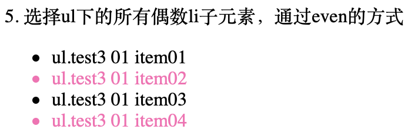
        
        6. 选择ul下的所有奇数li子元素，通过2n+1的方式
            - css
                ```css
                ul.test4 > li:nth-child(2n+1){
                    font-size: 20px;
                }
                ```

            - html
                ```html
                <section>6. 选择ul下的所有奇数li子元素，通过2n+1的方式</section>
                <ul class="test4">
                    <li>ul.test4 01 item01</li>
                    <li>ul.test4 01 item02</li>
                    <li>ul.test4 01 item03</li>
                    <li>ul.test4 01 item04</li>
                </ul>
                ```
            
            - 页面结果
                - 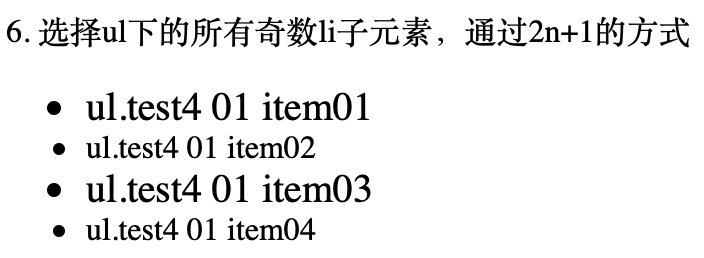
        
        7. 选择ul下的所有奇数li子元素，通过odd的方式
            - css
                ```css
                ul.test5 > li:nth-child(odd){
                    font-size: 20px;
                }
                ```

            - html
                ```html
                <section>7. 选择ul下的所有奇数li子元素，通过odd的方式</section>
                <ul class="test5">
                    <li>ul.test5 01 item01</li>
                    <li>ul.test5 01 item02</li>
                    <li>ul.test5 01 item03</li>
                    <li>ul.test5 01 item04</li>
                </ul>
                ```
            - 页面结果
                - 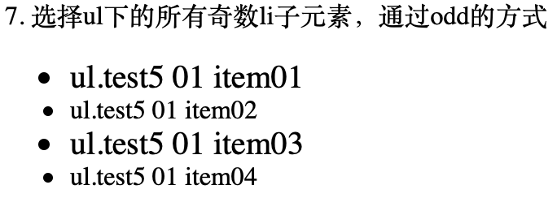


    - 只对同类元素排序
        1. 选择ul下的所有li元素中的第一个和最后一个li子元素
            - css
                ```css
                ul.test6 > li:first-of-type{
                    color:red;
                }

                ul.test6 > li:last-of-type{
                    color:blue;
                }
                ```

            - html
                ```html
                <section>8. 选择ul下的所有li元素中的第一个li子元素</section>
                <section>9. 选择ul下的所有li元素中的最后一个li子元素</section>
                <ul class="test6">
                    <span>span01</span>
                    <span>span02</span>
                    <li>ul.test6 01 item01</li>
                    <li>ul.test6 01 item02</li>
                    <span>span03</span>
                    <li>ul.test6 01 item03</li>
                </ul>
                ```
            
            - 页面结果
                - 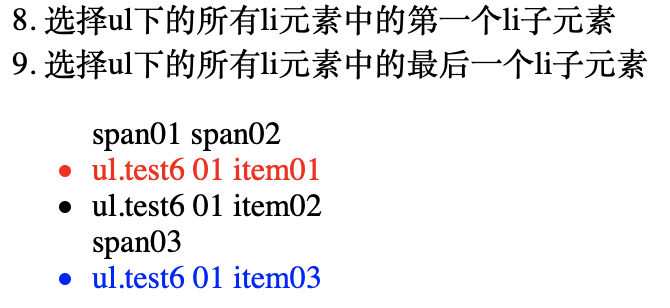
        
        2. 选择ul下的所有的li元素，忽略其他元素
            - css
                ```css
                ul.test7 > li:nth-of-type(n){
                    color:green;
                }
                ```

            - html
                ```html
                <section>10. 选择ul下的所有的li元素，忽略其他元素</section>
                <ul class="test7">
                    <span>span01</span>
                    <span>span02</span>
                    <li>ul.test7 01 item01</li>
                    <li>ul.test7 01 item02</li>
                    <span>span03</span>
                    <li>ul.test7 01 item03</li>
                    <li>ul.test7 01 item04</li>
                </ul>
                ```
            
            - 页面结果
                - 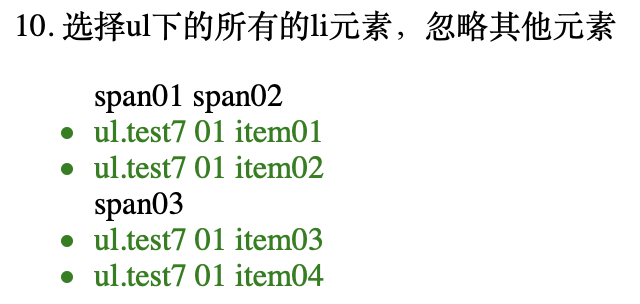
        
        3. 选择ul下的所有的偶数li元素，忽略其他元素，使用2n方式
            - css
                ```css
                ul.test8 > li:nth-of-type(2n){
                    color:hotpink;
                }
                ```

            - html
                ```html
                <section>11. 选择ul下的所有的偶数li元素，忽略其他元素</section>
                <ul class="test8">
                    <span>span01</span>
                    <span>span02</span>
                    <li>ul.test8 01 item01</li>
                    <li>ul.test8 01 item02</li>
                    <span>span03</span>
                    <li>ul.test8 01 item03</li>
                    <li>ul.test8 01 item04</li>
                </ul>
                ```
            
            - 页面结果
                - 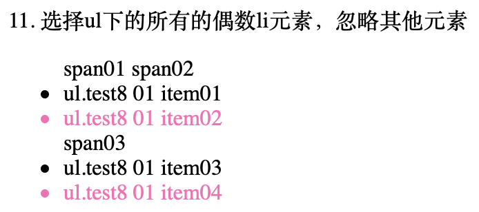
        
        4. 选择ul下的所有的偶数li元素，忽略其他元素，使用event方式
            - css
                ```css
                ul.test9 > li:nth-of-type(even){
                    color:hotpink;
                }
                ```

            - html
                ```html
                section>12. 选择ul下的所有的偶数li元素，忽略其他元素，使用odd方式</section>
                <ul class="test9">
                    <span>span01</span>
                    <span>span02</span>
                    <li>ul.test9 01 item01</li>
                    <li>ul.test9 01 item02</li>
                    <span>span03</span>
                    <li>ul.test9 01 item03</li>
                    <li>ul.test9 01 item04</li>
                </ul>
                ```
            
            - 页面结果
                - 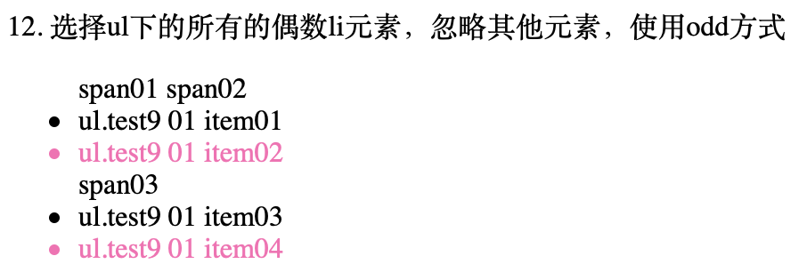
        
        5. 选择ul下的所有的奇数li元素，忽略其他元素，使用2n+1方式
            - css
                ```css
                ul.test10 > li:nth-of-type(2n+1){
                    font-size: 20px;
                }
                ```

            - html
                ```html
                <section>13. 选择ul下的所有的奇数li元素，忽略其他元素，使用2n+1方式</section>
                <ul class="test10">
                    <span>span01</span>
                    <span>span02</span>
                    <li>ul.test10 01 item01</li>
                    <li>ul.test10 01 item02</li>
                    <span>span03</span>
                    <li>ul.test10 01 item03</li>
                    <li>ul.test10 01 item04</li>
                </ul>
                ```
            
            - 页面结果
                - 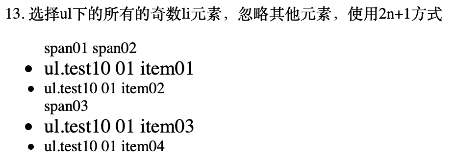
        
        6. 选择ul下的所有的奇数li元素，忽略其他元素，使用odd方式
            - css
                ```css
                ul.test11 > li:nth-of-type(odd){
                    font-size: 20px;
                }
                ```

            - html
                ```html
                <section>14. 选择ul下的所有的奇数li元素，忽略其他元素，使用odd方式</section>
                <ul class="test11">
                    <span>span01</span>
                    <span>span02</span>
                    <li>ul.test11 01 item01</li>
                    <li>ul.test11 01 item02</li>
                    <span>span03</span>
                    <li>ul.test11 01 item03</li>
                    <li>ul.test11 01 item04</li>
                </ul>
                ```
            
            - 页面结果
                - 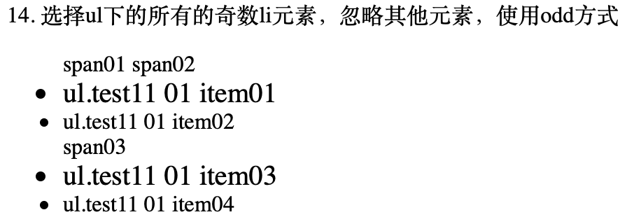
    
    - 否定伪类
        - 否定伪类，将title属性是 abcd 的li去除

            - css
                ```css
                ul.test12 > li:not([title="abcd"]){
                    color: red;
                }
                ```

            - html
                ```html
                <section>15. 否定伪类，将title属性是 abcd的li去除</section>
                <ul class="test12">
                    <li>ul.test12 01 item01</li>
                    <li title="abcd">ul.test12 01 item02 :title="abcd"</li>
                    <li>ul.test12 01 item03</li>
                    <li>ul.test12 01 item04</li>
                </ul>
                ```
            
            - 页面结果
                - 


## 伪元素选择器
[top](#catalog)
- 伪元素表示页面中一些特殊的但不存在的元素或特殊位置
- 伪元素的语法, `其他选择器::伪元素名`
- 常用伪元素
    
    |伪元素|描述|备注|
    |-|-|-|
    |`::first-letter`|表示第一个字母||
    |`::first-line`|表示第一行||
    |`::selection`|表示选中的内容||
    |`::before`|表示元素的开始|<ol><li>该元素的位置处于开始标签后，标签内容之前<ul><li>如：`<tag>|文字`，假设`|`不真实存在，`|`就是`::before`的位置</li></ul></li><li>**`before`必须结合`content`属性来使用，所有的样式都是在设置`content`中的内容**</li><li>如果使用了`content`属性，在控制台可以看到该元素；如果不使用`content`属性则无法看到</li></ol>|
    |`::after`|表示元素的最后|<ol><li>该元素的位置处于标签内容之后，结束标签之前<ul><li>如：`文字|<tag>`，假设`|`不真实存在，`|`就是`::after`的位置</li></ul></li><li>**`after`必须结合`content`属性来使用，所有的样式都是在设置`content`中的内容**</li><li>如果使用了`content`属性，在控制台可以看到该元素；如果不使用`content`属性则无法看到</li></ol>|

- 在短引用标签`<q>`中，页面中自动出现的`""`或`[]`，就是通过在css中设置`::before`和`::after`来实现的

- 示例
    - 参考代码
        - [/frontend/css/base/src/selector/pseudo_element.html](/frontend/css/base/src/selector/pseudo_element.html)
    - css
        ```css
        /* 1. 设置所有p标签的第一个字符的大小 */
        p::first-letter{
            font-size: 20px;
        }

        /* 2. 设置所有p标签的第一行的颜色 */
        p::first-line{
            color: green;
        }

        /* 3. 设置p标签中，文字被选中时的颜色 */
        p::selection{
            background:orange;
        }

        /* 4. 在div的内容之前和之后添加文字及样式 */
        div.test01::before{
            content: "be";
            color:red;
        }

        div.test01::after{
            content:"af";
            color: green;
        }
        
        /* 5. 为div中的文字添加书名号 */
        div.test02::before{
            content:"【"
        }
        div.test02::after{
            content:"】"
        }

        /* 6. 测试::before 和 ::after 中不是用content的效果（没有任何效果） */
        div.test03::before{
            color:green;
        }
        div.test03::after{
            color:green;
        }
        ```
    - html
        ```html
        <section>
            1. 设置所有p标签的第一个字符的大小
            <br>
            2. 设置所有p标签的第一行的颜色
            <br>
            3. 设置p标签中，文字被选中时的颜色
        </section>
        <p>Lorem ipsum dolor sit amet consectetur adipisicing elit. Cumque cupiditate voluptates libero. Tempora porro id libero laboriosam, reiciendis modi rem beatae itaque facilis provident rerum numquam, aperiam, fugiat quod quae!</p>
        <br>

        <section>4. 在div的内容之前和之后添加文字及样式</section>
        <div class="test01">div test01</div>
        <br>

        <section>5. 为div中的文字添加书名号</section>
        <div class="test02">div test02</div>
        <br>

        <section>6. 测试::before 和 ::after 中不是用content的效果(没有任何效果)</section>
        <div class="test03">div test03</div>
        ```
    - 页面结果
        - 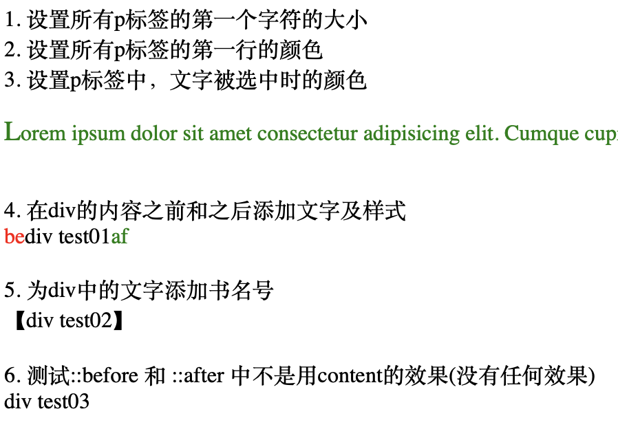

    - 控制台中的页面元素
        - 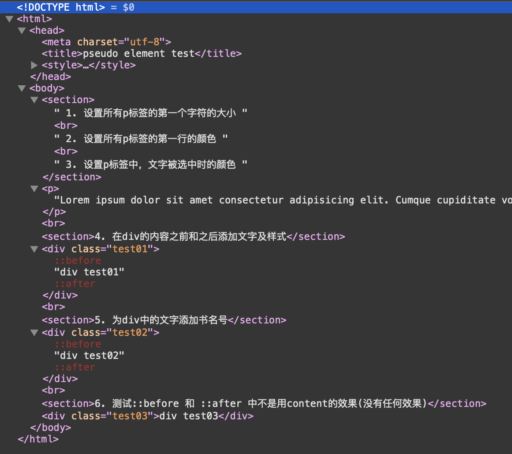


# 选择器的权重
[top](#catalog)
- 样式冲突
    - 发生样式冲突的条件：<label style="color:red">不同的选择器，选中相同的元素，为相同的样式设置不同的值</label>
- 发生样式冲突时，由选择器的权重来决定。如果权重相同，则使用后声明的选择器中的样式（可以理解为后声明的内容覆盖了先声明的内容）

- 选择器类型及其对应的权重
    |选择器|权重|
    |-|-|
    |内联样式|`1,0,0,0`|
    |id|`0,1,0,0`|
    |类和伪类选择器|`0,0,1,0`|
    |元素选择器|`0,0,0,1`|
    |通配符选择器|`0,0,0,0`|
    |从祖先元素继承的样式|没有权重|

- 复合选择器的权重计算方式
    - 对于交集选择器，它的权重=所有的选择器的权重相加
        - 选择器的累加不会超过其最大的数量级。如有n个类选择器，无论n多大，权重求和的结果也不会超过id选择器，即数量级无法从`10`跨越到`100`

    - 对于并集选择器，每个选择器单独计算，各算各的

- 关系选择器
    - 将关系分解，各部分分别计算再相加
    - ?????

- 强制最大权重：`!important`
    - 可以在<label style="color:red">样式的后面</label>添加`!important`。该样式将会获得最高的权重，比内联样式还高
    - 语法
        ```css
        选择器{
            样式名:样式值 !important;
        }
        ```

- 示例
    - 参考代码
        - [/frontend/css/base/src/selector/selector_level.html](/frontend/css/base/src/selector/selector_level.html)
    
    - 权重大小测试 id > 类选择 > 元素选择器
        - css
            ```css
            #box1{
                color:blue;
            }
            div{
                color:blueviolet;
            }

            .red{
                color:red;
            }
            ```
        - html
            ```html
            <section>1.1 测试基本的权重大小</section>
            <div id="box1" class="red">div id=box1 class=red</div>
            <div class="red">div class=red</div>
            <div>only div</div>
            <section>1.2. 测试内联样式</section>
            <div id="box1" style="color:green">div with inner css</div>
            ```
        - 页面结果
            - 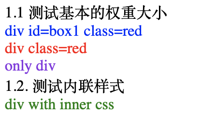

    - 测试交集选择器的权重
        - css
            ```css
            div.aa.bb.cc.dd.ee.ff.gg.hh.ii.jj{
                color:orange;
            }

            #box2{
                color: green;
            }
            ```
        - html
            ```html
            <section>2. 测试交集选择器的权重相加</section>
            <div class='aa bb cc dd ee ff gg hh ii jj'>
                div class='aa bb cc dd ee ff gg hh ii jj'
                <br>
                权重【10个class+div】=101 > id的100，但实际上没有跨越数量级
            </div>
            <div id="box2" class='aa bb cc dd ee ff gg hh ii jj'>div id="box2" class='aa bb cc dd ee ff gg hh ii jj'</div>
            <br>
            ```
        - 页面结果
            - 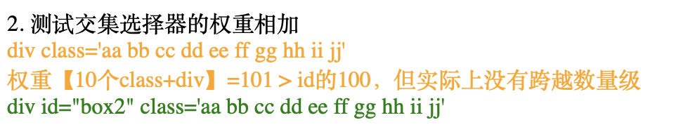

    - 测试 `!important`
        - css
            ```css
            .test01{
                color:indigo !important;
            }
            ```
        - html
            ```html
            <section>4. 测试!important</section>
            <div class="test01" style="color:orange">div class="test01" style="color:orange"</div>
            <div style="color:orange">div style="color:orange"</div>
            ```
        - 页面结果            
            - 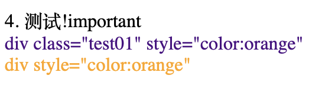

    - 测试权重相同的选择器
        - css
            ```css
            .test0201{
                color:orange;
            }

            .test0202{
                color:green;
            }
            ```

        - html
            ```html
            <section>5. 测试权重相同的选择器</section>
            <div class="test0201">div class="test0201"</div>
            <div class="test0202">div class="test0202"</div>
            <div class="test0201 test0202">div class="test0201 test0202"</div>
            <br>
            ```
        - 页面结果
            - 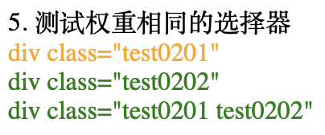

    - 测试通配符选择器和继承样式的权重
        - css
            ```css
            /* 设置 div.test03 下的所有后代元素的样式 */
            div.test03 *{
                color:green;
            }
            
            /* 仅设置 div.test03的样式 */
            div.test03 {
                color:red;
            }
            ```
        - html
            ```html
            <section>6. 测试通配符选择器和继承样式的权重</section>
            <div class="test03">
                div class="test03"，
                <br>
                只有这里是红色，其他的子元素因为通配选择器的样式，都是绿色
                <br>
                <span>div - span</span>
                <br>
                <div>div - div<p>div - div - p </p>
                </div>
            </div>
            ```
        - 页面结果
            - 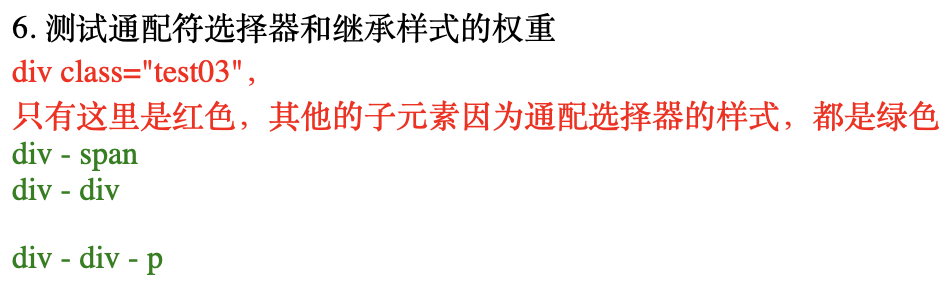

# 继承
[top](#catalog)
- 样式的继承
    - 为一个元素设置的样式同时也会应用到它的**后代元素**
    - 继承是发生在祖先元素和后代元素上的
- 继承的目的
    - 为了方便开发，利用继承可以将一些通用的样式设置到祖先元素中，只设置一次，就可以使所有后代元素都能获取到该样式

- 不会自动继承的样式
    - 背景相关的样式，如背景色、背景图片
    - 布局相关等样式

- 示例
    - 参考代码
        - [/frontend/css/base/src/inherit/inherit.html](/frontend/css/base/src/inherit/inherit.html)

    - css
        ```css
        p{
            color: blue;

        }

        div{
            color:green;
        }
        ```
    - html
        ```html
        <section>继承测试--只设置祖先元素的样式，后代元素也能获取到该样式</section>
        <p>
            p element
            <span>span inner p</span>
        </p>

        <span>span outer p</span>

        <div>
            div element
            <span>
                span inner div ：level1
                <em>em inner div:level2</em>
            </span>

        </div>
        ```
    - 页面结果
        - 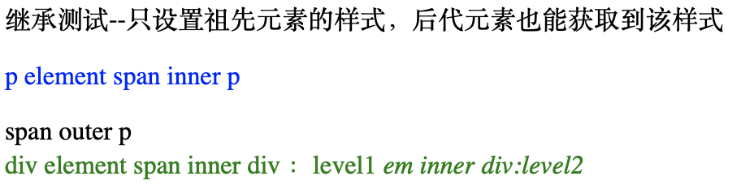

# web页面中的单位
## 页面的长度单位
[top](#catalog)
- 像素
    - 单位：`px`
    - 不同屏幕的像素大小是不同的，像素越小的屏幕显示的效果越清晰
        - 相同的像素值在不同分辨率设备下的显示效果不同
- 百分比
    - 百分比会自动将属性值设置为相对其父元素属性的百分比
    - 设置百分比可以使子元素跟随父元素的改变而改变
    - 如果设置的是`div`元素，并且`div`元素**没有文字内容和父元素**，页面上将会没有任何显示
- em
    - `1em = 1font-size`
    - em 是相对于自身字体大小而计算的，即`font-size`是当前元素默认的或适用了某个样式的字体大小
    - em将会根据字体大小的改变而改变
    - 使用场景
        - ??????

- rem
    - rem是相对于根元素`<html>`的字体大小而计算的

- 示例
    - 参考代码
        - [/frontend/css/base/src/sizeunit/sizeunit.html](/frontend/css/base/src/sizeunit/sizeunit.html)

    - 百分比自动变化测试
        - css
            ```css
            .box1{
                width: 200px;
                height: 200px;
                background-color: green;
            }
            
            .box2{
                width:50%;
                height:50%;
                background-color: orange;
            }
            ```
        - html
            ```html
            <section>1.1. 百分比自动变化测试(包含父元素)</section>
            <div class="box1">
                <div class="box2"></div>
            </div>
            <br>

            <section>1.2. 百分比自动变化测试(不包含父元素，直接使用)</section>
            <div class="box2">dddd</div>
            <br>
            ```
        - 页面结果
            - 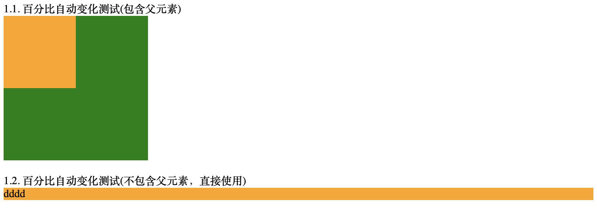

    - em测试: 分别使用不同的文字大小
        - css
            ```css
            .box3{
                font-size:5px;
                width:10em;
                height: 10em;
                background-color: green;
            }

            .box4{
                font-size:10px;
                width:10em;
                height: 10em;
                background-color: orange;
            }
            ```
        - html
            ```html
            <section>2. em测试: 分别使用不同的文字大小</section>
            <div class="box3"></div>
            <div class="box4"></div>
            ```

        - 页面结果
            - 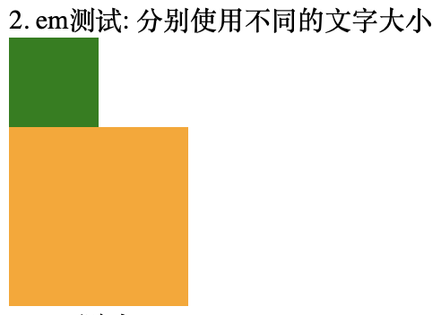
    
    - 3. rem测试 
        - css
            ```css
            html{
                font-size: 15px;
            }

            .box5{
                width:10rem;
                height:10rem;
                background-color:green;
            }

            .box6{
                width:15rem;
                height:15rem;
                background-color:green;
            }
            ```
        - html
            ```html
            <section>3. rem测试</section>
            <div class="box5"></div>
            <div class="box6"></div>
            ```
        - 页面结果
            - 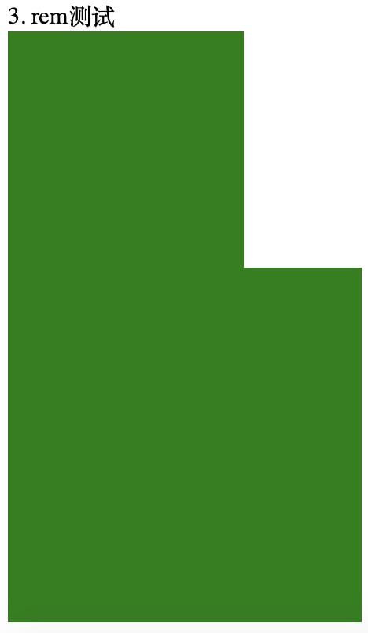

## 颜色单位
[top](#catalog)
- 在css中可以使用颜色名来设置颜色，如：red、green、yellow等，但是不方便使用
- RGB值
    - RGB通过三种颜色的不同浓度来调配出不同的颜色
    - R-red，G-green，B-blue
    - 每一种颜色的范围是：`[0, 255]`
        - 值越大，对应的颜色越深
    - 颜色的范围也可以使用百分数：`[0%, 100%]`
    - 语法:`RGB(红色值, 绿色值, 蓝色值)`
    - `RGB(0,0,0)`是黑色，`RGB(255,255,255)`是白色

- 16进制RGB值
    - 语法：`#红色绿色蓝色`
    - 颜色的范围：`[00, ff]`
    - 如果RGB都是重复的两位数则可以简写，如`#aabbcc`可以简写为`#abc`

- RGBA值
    - 在RGB的基础上添加了一个A，即不透明度
    - R、G、B的范围参照RGB
    - A的范围：`[0, 1]`
        - `1`是不透明，`0`是完全透明
    - 语法：`RGBA(R, G, B, A)`

- HSL值、HSLA值
    - 表示的含义
        - H，色相，范围：`[0, 360]`
        - S，饱和度，表示颜色的浓度，范围`[0%, 100%]`，必须使用百分数
        - L，亮度，颜色的亮度，范围`[0%, 100%]`，必须使用百分数
        - A，表示透明度

- 示例
    - 参考代码
        - [/frontend/css/base/src/sizeunit/color.html](/frontend/css/base/src/sizeunit/color.html)

    - 颜色名测试
        - css
            ```css
            .box1{
                width: 200px;
                height: 200px;
                background-color: green;
            }
            ```
        - html
            ```html
            <section>1. 颜色名测试</section>
            <div class="box1"></div>
            ```
        - 页面结果
            - 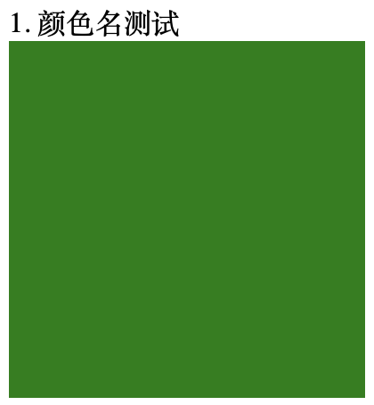

    - RGB颜色值测试 
        - css
            ```css
            .box2{
                width: 200px;
                height: 200px;
                background-color: rgb(50,100,200)
            }
            ```
        - html
            ```html
            <section>2.RGB颜色值测试</section>
            <div class="box2"></div>
            ```
        - 页面结果
            - 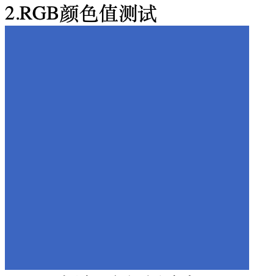

    - RGB颜色百分比测试
        - css
            ```css
            .box3{
                width: 200px;
                height: 200px;
                background-color: rgb(10%,20%,30%)
            }
            ```
        - html
            ```html
            <section>3.RGB颜色百分比测试</section>
            <div class="box3"></div>
            ```
        - 页面结果
            - 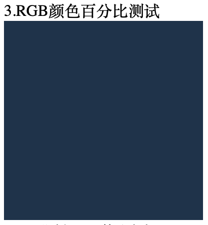

    - 4. 16进制RGB值 测试
        - css
            ```css
            .box4{
                width:200px;
                height:200px;
                background-color: #aabbcc;
            }
            ```
        - html
            ```html
            <section>4. 16进制RGB值 测试</section>
            <div class="box4"></div>
            ```
        - 页面结果
            - 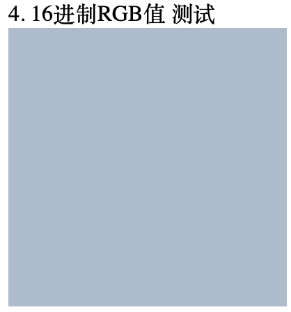


    - RGBA测试
        - css
            ```css
            .box5{
                width: 200px;
                height:200px;
                background-color: rgba(100, 100, 100, 0.5)
            }
            .box6{
                width: 200px;
                height:200px;
                background-color: rgba(100, 100, 100, 1)
            }
            ```
        - html
            ```html
            <section>5. RGBA测试</section>
            <div class="box5"></div>
            <div class="box6"></div>
            ```
        - 页面结果
            - 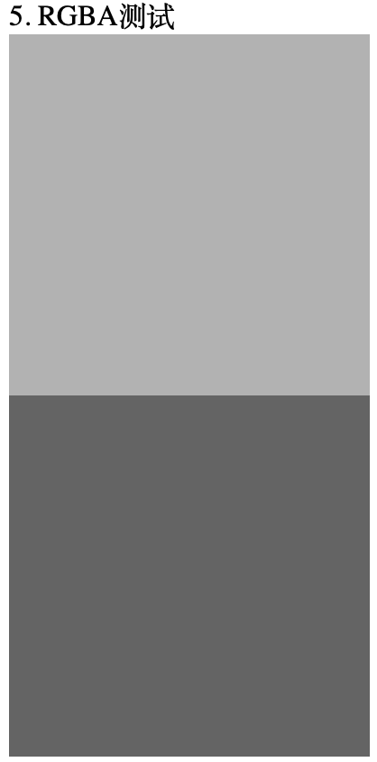

    - HSL值 测试
        - css
            ```css
            .box7{
                width: 200px;
                height:200px;
                background-color: hsl(20, 50%, 70%)
            }
            ```
        - html
            ```html
            <section>6. HSL值 测试</section>
            <div class="box7"></div>
            ```
        - 页面结果
            - 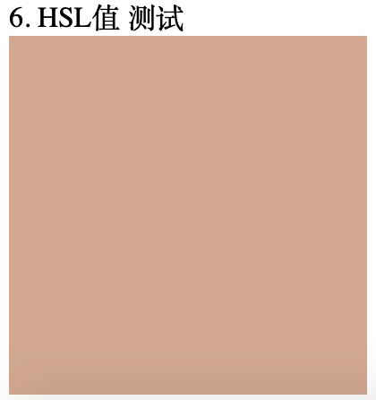

# 文档流
## 文档流简介
[top](#catalog)
- 文档流：normal flow
- 什么是文档流：网页是一个多层次的结构，通过css可以分别为每一层设置样式，但是作为用户只能看到最上面的一层，最下面的一层被称为文档流
- <label style="color:red">文档流是网页的基础，所有元素默认都是在文档流中进行排列</label>
- 元素相对于文档流的两种状态
    - 在文档流中
    - 不再文档流中，即脱离文档流
        - 使用[浮动](#浮动)属性后，元素将脱离文档流

## 元素在文档流中
[top](#catalog)
- **文档流中的元素需要严格区分块元素和行内元素**
- 块元素
    - 块元素在页面内独占一行
        - 参考：[为什么块元素独占一行](#reasonofblockelementuseline)
    - 多个块元素在页面内从上到下垂直排列
    - 默认宽度是父元素的的宽度，会将父元素撑满
    - 默认高度是元素内容的高度，即子元素
    - 如`<div></div>`元素，没有元素内容时，不会在页面中显示;有内容时，默认宽度与页面块度相同
- 行内元素
    - 行内元素不会独占页面的一行，只占自身的大小
    - 多个行内元素在页面中从左到右水平排列，如果一行无法容纳多个行内元素，则自动切换到第二行显示
    - **行内元素的宽和高默认都是该元素内容的宽和高**

## 元素脱离文档流
[top](#catalog)
- **块元素和行内元素脱离文档流之后，就不划分块元素和行内元素了，两者的属性相同**

- 元素脱离文档流的方法
    1. [元素浮动](#元素浮动)
    2. [绝对定位](#绝对定位)

- 元素脱离文档流之后的特点
    - 元素不会独占一行
    - 元素的宽、高等于元素内容的宽、高
    - `height`、`width`对于所有元素都有效
- 示例
    - 参考代码
        - [/frontend/css/base/src/float/outNormalFlow.html](/frontend/css/base/src/float/outNormalFlow.html)

    - 块元素脱离文档流 测试: 不再独占一行，宽高=元素内容的宽高
        - css
            ```css
            /* 1. 块元素脱离文档流 测试 */
            .box101{
                background-color: orange;
                /* 块元素脱离文档流 */
                float: left;
            }

            .box102{
                background-color: green;
            }

            .box103{
                width:100px;
                height: 100px;
                background-color: green;
            }
            ```
        
        - html
            ```html
            <section>1. 块元素脱离文档流 测试: 不再独占一行，宽高=元素内容的宽高 </section>
            <section>1.1 </section>
            <div class="box101">123456</div>
            <div class="box102">qwet</div>
            <br>
            
            <section>1.2 </section>
            <div class="box101">123456</div>
            <div class="box103"></div>
            ```
        - 页面结果
            - 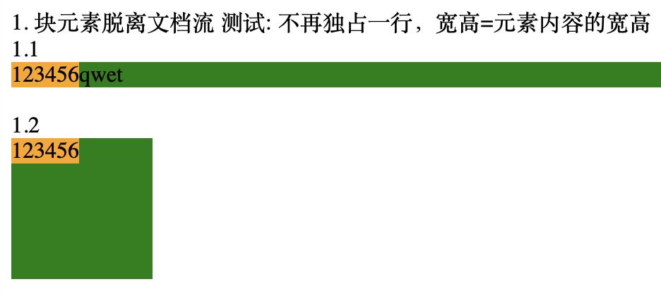


# 盒子模型
## 盒子模型的基本组成
[top](#catalog)
- box model
- 为了方便页面布局，css将页面中的每个元素都设置为一个矩形盒子。将元素设置为矩形盒子后，页面的布局就变成了如何安排这些盒子的位置

- 盒子模型的示例
    - 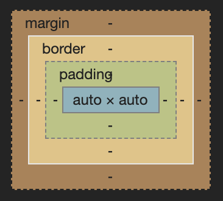

- 盒子的组成
    - 组成元素

        |名称|含义|描述|
        |-|-|-|
        |`context`|内容区||
        |`border`|边框||
        |`padding`|内边距|表示是内容区与边框的内容|
        |`margin`|外边距|当两个盒子放在一起时，两个盒子的间距|
    
- <label style="color:red">盒子的可见大小 = `width/height` + `border`×2 + `padding`×2</label>
    - 计算方式与属性设置的关系：[盒子的大小](#盒子的大小)

## 内容区content
[top](#catalog)
- 元素中的所有**子元素和文本内容**都在内容区中排列
- 内容区的大小由`width`、`height`属性来设置
- <label style="color:red">width的默认值为auto。如果不写，会由浏览器自动计算</labe>

## 边框border
[top](#catalog)
- 边框至少要设置三个属性
    1. 边框的宽度：`border-width`
        - 默认值为`3px`，所以不指定该属性也能显示边框
    2. 边框的颜色：`border-color`
        - 默认值为黑色，所以不指定该属性也能显示边框
    3. 边框的样式：`border-style`
        - `style`的默认值为`none`，即表示没有边框。所以**如果要显示边框，该属性必须写**
        - 如实线solid、虚线dashed、点线dotted等等

- 对于设置4个边的统一属性，如：`border-width`、`border-color`、`border-style`，参数值有如下的规定
    - 1个值：上下左右
    - 2个值：上下 左右
    - 3个值：上 左右 下
    - 4个值：上 右 下 左
            
- 单边的各种属性。使用时不方便，所以使用的比较少
    - 上:`border-top-xxx`
    - 下:`border-bottom-xxx`
    - 左:`border-left-xxx`
    - 右:`border-right-xxx`

- 简写属性（**最常用的方法**）
    - 语法：
        - 统一设置4个边框的属性：`border: color width style`
        - 分别设置4个边框的属性
            - `border-top: color width style`
            - `border-bottom: color width style`
            - `border-left: color width style`
            - `border-right: color width style`
    - 该属性可以同时设置边框的所有相关样式，并且**没有顺序的要求**

- 通过设置统一属性和单边属性来控制边框的整体的样式，同时可以还可以对某个边框作微调
    - 如，用统一属性设置边框整体样式，通过单边属性来隐藏某个边框
        ```css
        border: color width style;
        border-top: none;
        ```

- 示例
    - 参考代码
        - [/frontend/css/base/src/boxModel/border.html](/frontend/css/base/src/boxModel/border.html)
    - 通过border-width设置边框的宽度
        - css
            ```css
            /* 2. 通过border-width设置边框的宽度 */
            /* 2.1. 1个参数设置边框宽度，统一设置4个边框的宽度*/
            .box2{
                /* 内容区设置 */
                /* 设置内容区的宽 */
                width: 200px; 
                /* 设置内容区的高 */
                height:200px;
                background-color: rgb(124, 200, 61);
                
                /* 边框设置 */
                border-width: 5px;
                border-color: orange;
                border-style: dashed;
            }

            /* 2.2. 2个参数设置边框宽度，分别设置：上下、左右 */
            .box3{
                width: 200px;
                height:200px;
                background-color: rgb(124, 200, 61);

                /* 设置边框 */
                border-width: 10px 20px;
                border-color: orange;
                border-style: solid;
            }
            
            /* 2.3. 3个参数设置边框宽度，分别设置：上、左右、下 */
            .box4{
                width: 200px;
                height:200px;
                background-color:  rgb(124, 200, 61);

                /* 设置边框 */
                border-width: 10px 20px 30px;
                border-color: orange;
                border-style: solid;
            }
            
            /* 2.4. 4个参数设置边框宽度，分别设置：上、右、下、左 */
            .box5{
                width: 200px;
                height:200px;
                background-color:  rgb(124, 200, 61);

                /* 设置边框 */
                border-width: 10px 20px 30px 40px;
                border-color: orange;
                border-style: solid;
            }
            ```
        - html
            ```html
            <section>2. 通过border-width设置边框的宽度</section>
            <section>2.1. 1个参数设置边框宽度</section>
            <div class="box2"></div>
            <section>2.2. 2个参数设置边框宽度，分别设置：上下、左右</section>
            <div class="box3"></div>
            <section>2.3. 3个参数设置边框宽度，分别设置：上、左右、下</section>
            <div class="box4"></div>
            <section>4个参数设置边框宽度，分别设置：上、右、下、左</section>
            <div class="box5"></div>
            ```
        - 页面结果
            - 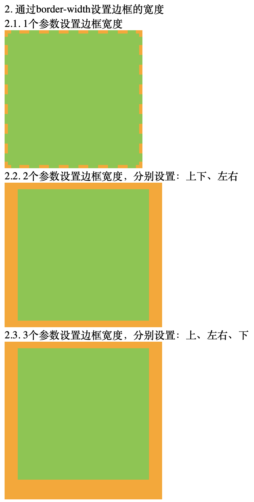
            - 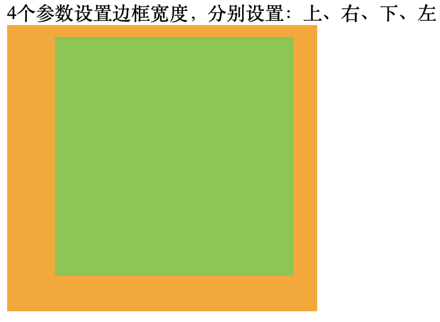

    - 通过4个边的宽度属性来设置边框
        - css
            ```css
            /* 3. 通过4个边的宽度属性来设置边框 */
            /* 3.1. 分别设置4个边框的属性 */
            .box6{
                width:200px;
                height:200px;
                background-color: rgb(83, 150, 218);

                /* 设置边框 */
                /* 分别设置4个边框 */
                /* 上 */
                border-top-width: 10px;
                border-top-color: orange;
                border-top-style: dashed;
                /* 下 */
                border-bottom-width: 20px;
                border-bottom-color: green;
                border-bottom-style: solid;
                /* 左 */
                border-left-width:40px;
                border-left-color: blueviolet;
                border-left-style: double;
                /* 右 */
                border-right-width: 80px;
                border-right-color: rgb(194, 154, 21);
                border-right-style: groove;
            }

            /* 3.2. 只设置3个边框 */
            .box7{
                width:200px;
                height:200px;
                background-color: rgb(83, 150, 218);

                /* 设置边框 */
                /* 分别设置4个边框 */
                /* 上 */
                border-top-width: 10px;
                border-top-color: orange;
                border-top-style: dashed;
                /* 下 */
                border-bottom-width: 20px;
                border-bottom-color: green;
                border-bottom-style: solid;
                /* 左 */
                border-left-width:40px;
                border-left-color: blueviolet;
                border-left-style: double;
                /* 右 */
            }
            ```
        - html
            ```html
            <section>3. 通过4个边的属性分别设置边框</section>
            <section>3.1. 分别设置4个边框的属性</section>
            <div class="box6"></div>
            <section>3.2. 只设置3个边框</section>
            <div class="box7"></div>
            ```
        - 页面结果
            - 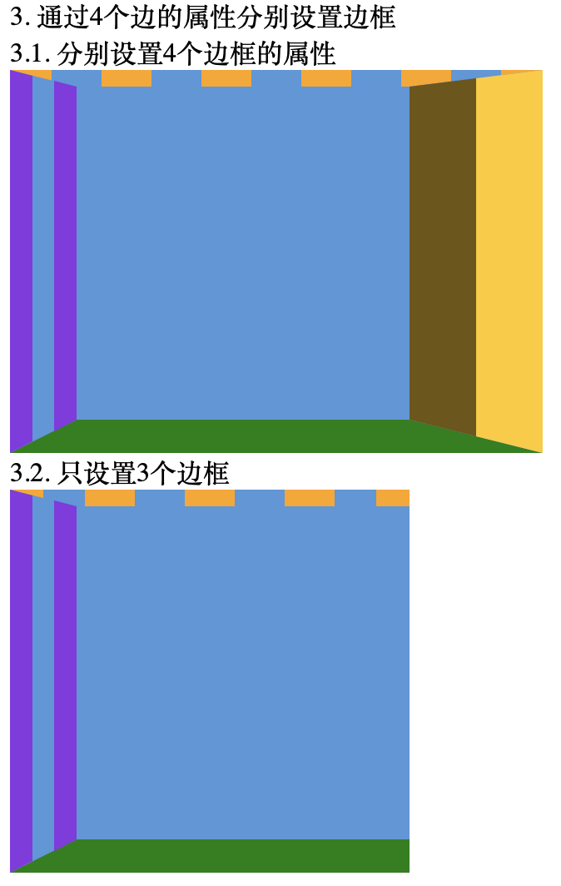

    - 简写属性测试
        - css
            ```css
            /* 4. 简写属性测试*/
            /* 4.1. 通过简写属性同时设置4个边框 */
            .box8{
                width:200px;
                height:200px;
                background-color: rgb(83, 150, 218);

                /* 通过简写属性同时设置4个边框 */
                border:rgb(124, 200, 61) 20px solid;
            }

            /* 4.2. 分别设置4个边框的属性 */
            .box9{
                width:200px;
                height:200px;
                background-color: rgb(83, 150, 218);

                /* 通过简写属性同时设置4个边框 */
                border-top:rgb(124, 200, 61) 10px solid;
                border-bottom:rgb(245, 109, 172) 20px dashed;
                border-left:rgb(200, 174, 61) 30px double;
                border-right:rgb(75, 178, 219) 40px dotted;
            }
            ```
        - html
            ```html
            <section>4. 简写属性测试</section>
            <section>4.1. 通过简写属性同时设置4个边框</section>
            <div class="box8"></div>
            <section>4.2. 分别设置4个边框的属性</section>
            <div class="box9"></div>
            ```
        - 页面结果
            - 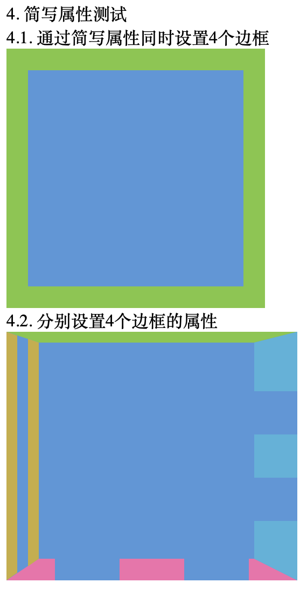

    - 统一属性和单边属性的配合
        - css
            ```css
            /* 5. 统一属性和单边属性的配合 */
            .box10{
                width:200px;
                height:200px;
                background-color: coral;

                /* 使用统一属性设置边框的整体样式 */
                border:green 20px solid;
                /* 使用单边属性来隐藏某个边 */
                border-right:none;
            }
            ```
        - html
            ```html
            <section>5. 统一属性和单边属性的配合</section>
            <div class="box10"></div>
            ```
        - 页面结果
            - 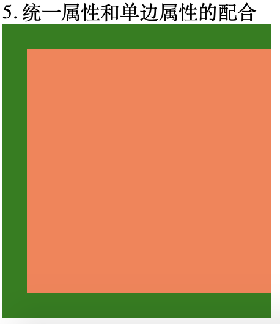

## 内边距padding
[top](#catalog)
- 内容区和边框的距离
- 内边距的颜色默认与内容区相同
- 内边距的4个单边属性，分别是:
    - padding-top
    - padding-bottom
    - padding-left
    - padding-right
- 内边距的简写属性：
    - `padding:上 右 下 左`
    - 内边距属性值的设置方式与内容区的设置方式相同
        - 1个值：上下左右
        - 2个值：上下 左右
        - 3个值：上 左右 下
        - 4个值：上 右 下 左        

- 示例
    - 参考代码
        - [/frontend/css/base/src/boxModel/padding.html](/frontend/css/base/src/boxModel/padding.html)
      
    - 通过单边属性分别设置4个方向的内边距
        - css
            ```css
            .box1{
                /* 设置内容区 */
                width: 200px;
                height:200px;
                background-color: green;

                /* 设置边框 */
                border:orange 20px solid;

                /* 设置内边距 */
                padding-top: 10px;
                padding-bottom: 20px;
                padding-left: 30px;
                padding-right: 40px;
            }

            /* 通过在div内部嵌套class=inner的块元素来显示内边距 */
            .inner{
                width:100%;
                height: 100%;
                background-color: rgb(56, 150, 212);
            }
            ```
        - html
            ```html
            <section>1. 通过单边属性分别设置4个方向的内边距</section>
            <div class="box1">
                <div class="inner"></div>
            </div>
            ```
        - 页面结果
            - 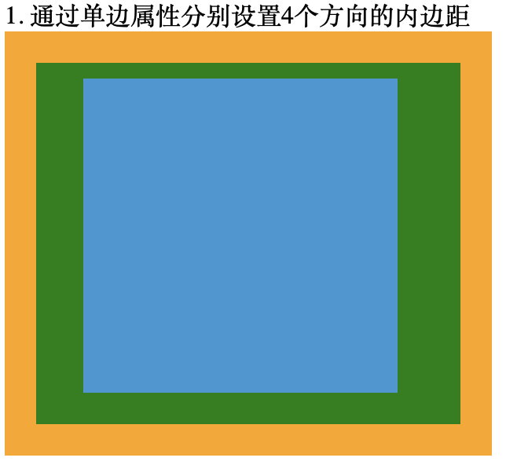
    
    - 通过简写属性统一设置内边距
        - css
            ```css
            .box2{
                /* 设置内容区 */
                width: 200px;
                height:200px;
                background-color: green;

                /* 设置边框 */
                border:orange 20px solid;
                
                /* 设置内边距 */
                padding: 10px 20px 30px 40px;
            }

            /* 通过在div内部嵌套class=inner的块元素来显示内边距 */
            .inner{
                width:100%;
                height: 100%;
                background-color: rgb(56, 150, 212);
            }
            ```
        - html
            ```html
            <section>2. 通过简写属性统一设置内边距</section>
            <div class="box2">
                <div class="inner"></div>
            </div>
            ```
        - 页面结果
            - 

## 外边距margin
[top](#catalog)
- 外边距表示当前盒子与其他盒子之间的距离
- 外边距不会影响盒子可见部分的大小，只会**影响盒子的位置**
- 外边距的4个单边属性，分别是:
    - `margin-top`
    - `margin-bottom`
    - `margin-left`
    - `margin-right`
- 外边距的简写属性
    - `margin:上 右 下 左`
    - 外边距属性值的设置方式与内容区的设置方式相同
        - 1个值：上下左右
        - 2个值：上下 左右
        - 3个值：上 左右 下
        - 4个值：上 右 下 左  

- margin的单边设置对元素的影响
    - 设置`top`、`left`时，会移动元素自身
    - 设置`bottom`时，会移动其他元素
    - `right`默认情况下，不会产生任何效果

- margin的值可以是正数，也可以是负数。负数表示向相反的方向移动
- 示例
    - 参考内容：[/frontend/css/base/src/boxModel/margin.html](/frontend/css/base/src/boxModel/margin.html)
    - 测试margin的单边属性
        - css
            ```css
            /* 1. 测试margin的单边属性 */
            .box1{
                /* 设置内容区 */
                width:200px;
                height:200px;
                background-color: green;
                
                /* 设置边框 */
                border:orange 20px solid;

                /* 设置外边距 */
                margin-top: 10px;
                margin-bottom: 20px;
                margin-left: 30px;
                margin-right: 40px;
            }
            .box2{
                /* 设置内容区 */
                width:200px;
                height: 200px;
                background-color:rgb(51, 114, 230);

                /* 设置边框 */
                border:orange 20px solid;
            }
            ```
        - html
            ```html
            <section>1. 测试margin的单边属性</section>
            <div class="box1"></div>
            <div class="box2"></div>
            ```
        - 页面结果
            - 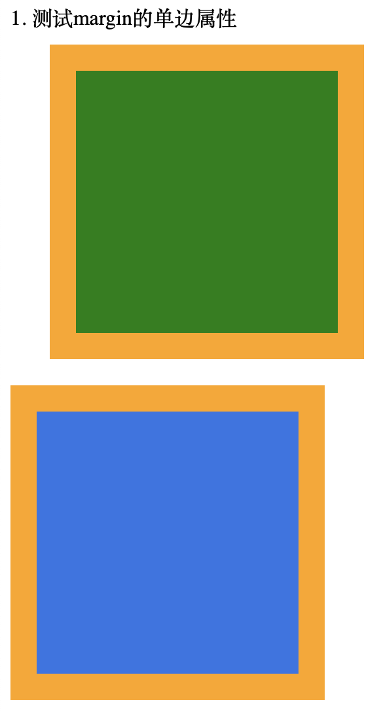
    
    - 通过简写属性设置外边距
        - css
            ```css
            .box3{
                /* 设置内容区 */
                width: 200px;
                height: 200px;
                background-color: green;

                /* 设置边框 */
                border:orange 20px solid;

                /* 通过简写属性设置外边距 */
                margin: 10px 20px 30px 40px;
            }
            ```
        - html
            ```html
            <section>2. 通过简写属性设置外边距</section>
            <div class="box3"></div>
            <div class="box2"></div>
            ```
        - 页面结果
            - 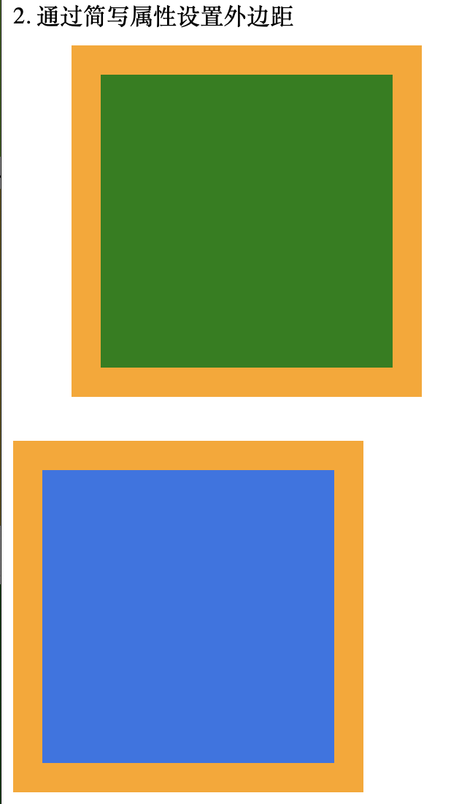

    - 测试负数的margin值
        - css
            ```css
            .box4{
                /* 设置内容区 */
                width: 200px;
                height: 200px;
                background-color: green;

                /* 设置边框 */
                border:orange 20px solid;

                /* 通过简写属性设置外边距 */
                margin: -10px -20px -30px -40px;
            }
            ```
        - html
            ```html
            <section>3. 测试负数的margin值</section>
            <div class="box4"></div>
            <div class="box2"></div>
            ```
        - 页面结果
            - 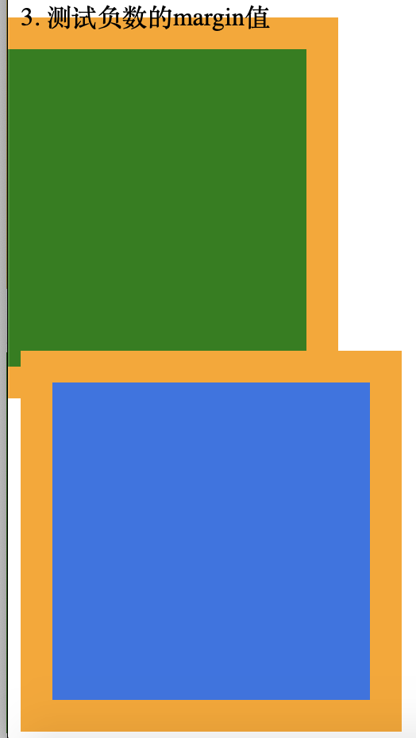

## 盒子模型中可以设置为auto的属性
[top](#catalog)
- 如果某个属性为auto，则浏览器会自动计算属性值，来满足页面布局的各种规则
- 可以设置为auto的属性
    - `width`
    - `margin-left`
    - `margin-right`
    - `left` (定位的偏移量属性)
    - `right` (定位的偏移量属性)

## 块元素盒子模型的水平方向布局
[top](#catalog)
- 子元素在其父元素中水平方向的位置的决定因素。方向是从左到右、从外到内
    1. `margin-left`
    2. `border-left`
    3. `padding-left`
    4. `width`
    5. `padding-right`
    6. `border-right`
    7. `margin-right`

- 一个子元素在父元素中，水平布局<label style="color:red">必须满足以下等式</label>
    - `父元素.width = 子元素.sum(margin-left, border-left, padding-left, width, padding-right, border-right, margin-right)`
        - 即：父元素内容区的宽度 = 子元素盒子模型的整体宽度
    - 当计算结果不成立时，浏览器会自动调整，使等式成立
        - `父元素.width > 子元素.sum`时，称为**过度约束**，调整方法：
            - 在子元素的7个属性中，如果没有auto，则浏览器会自动调整`margin-right`
            - 在子元素的7个属性中，如果有auto，则浏览器会自动计算该属性值
                - 存在多个多个auto的属性时
                    - 如果包含`width`，则只计算`width`的值，其他属性值=0
                    - 如果只有`margin-left`和`margin-right`，则将剩余的宽度区平均，使得`margin-left = margin-right`
        - `父元素.width < 子元素.sum`时，调整方法：
            - 浏览器会将`margin-right`设为负数，来满足等式

    - <label style="color:red"><span id="reasonofblockelementuseline">为什么块元素会独占一行？</span></label> 
        - 因为需要强制满足**水平布局等式**

- 示例
    - 参考代码
        - [/frontend/css/base/src/boxModel/horizontalLayout.html](/frontend/css/base/src/boxModel/horizontalLayout.html)
    - 过度约束测试。子元素的各属性中没有auto
        - css
            ```css
            .inner1{
                width: 200px;
                height: 200px;
                background-color: rgb(129, 226, 112);

                margin-left:100px;
            }

            .outter{
                width: 800px;
                height:200px;
                border:rgb(63, 124, 238) 10px solid;
            }
            ```
        - html
            ```html
            <section>1. 过度约束测试。子元素的各属性中没有auto</section>
            <section>等式：800 = 100 + 0 + 0 + 200 + 0 + 0 + 0，等式不满足，浏览器会自动调整margin-right=500</section>
            <div class="outter">
                <div class="inner1"></div>
            </div>
            ```
        - 页面结果
            - 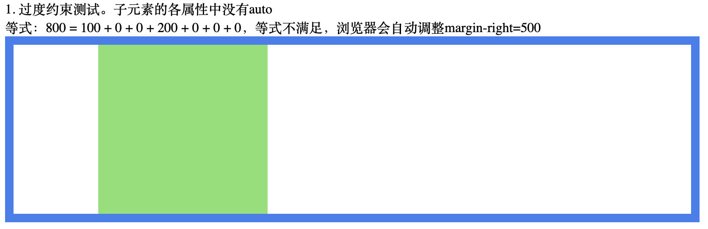

    - 过度约束测试。子元素.width = auto
        - css
            ```css
            .inner2{
                width: auto;
                height: 200px;
                background-color: rgb(129, 226, 112);

                margin-left:100px;
            }
            .outter{
                width: 800px;
                height:200px;
                border:rgb(63, 124, 238) 10px solid;
            }
            ```
        - html
            ```html
            <section>2. 过度约束测试。子元素.width = auto</section>
            <section>等式：800 = 100 + 0 + 0 + auto + 0 + 0 + 0，浏览器会自动计算width=700</section>
            <div class="outter">
                <div class="inner2"></div>
            </div>
            ```
        - 页面结果
            - 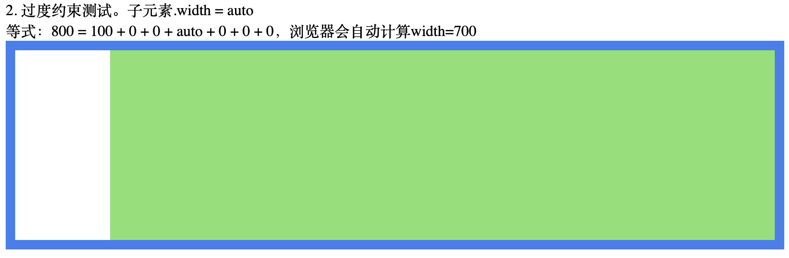

    - 过度约束测试。子元素中包含多个auto
        - css
            ```css
            /* 3.1. margin-left = auto; width = auto */
            .inner3{
                width: auto;
                height: 200px;
                background-color: rgb(129, 226, 112);

                margin-left:auto;
                margin-right: 100px;
            }

            /* 3.2. margin-left = auto; margin-right = auto */
            .inner4{
                width: 200px;
                height: 200px;
                background-color: rgb(129, 226, 112);

                margin-left:auto;
                margin-right: auto;
            }
            .outter{
                width: 800px;
                height:200px;
                border:rgb(63, 124, 238) 10px solid;
            }
            ```
        - html
            ```html
            <section>3. 过度约束测试。子元素中包含多个auto</section>
            <br>
            <section>3.1. margin-left = auto; width = auto</section>
            <section>等式：800 = auto + 0+ 0 + auto + 0 + 0 + 100，浏览器会自动计算width=700，margin-left=0</section>
            <div class="outter">
                <div class="inner3"></div>
            </div>
            <br>
            
            <section>3.2. margin-left = auto; margin-right = auto</section>
            <section>等式：800 = auto + 0+ 0 + 200 + 0 + 0 + auto，剩余600px，浏览器会自动除2，设置成相同的值：margin-left = margin-right = 300px</section>
            <div class="outter">
                <div class="inner4"></div>
            </div>
            ```
        - 页面结果
            - 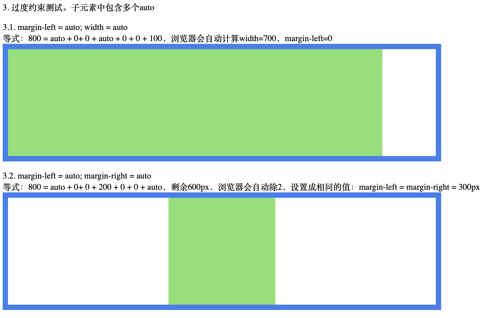
    
    - 父元素.width < 子元素.sum
        - css
            ```css
            .inner5{
                width: 1000px;
                height: 200px;
                background-color: rgb(129, 226, 112);
            }
            .outter{
                width: 800px;
                height:200px;
                border:rgb(63, 124, 238) 10px solid;
            }
            ```
        - html
            ```html
            <section>4. 父元素.width &lt; 子元素.sum</section>
            <section>等式：800 = 0 + 0+ 0 + 1000 + 0 + 0 + 0，浏览器会设置：margin-left = -200</section>
            <div class="outter">
                <div class="inner5"></div>
            </div>
            ```
        - 页面结果
            - 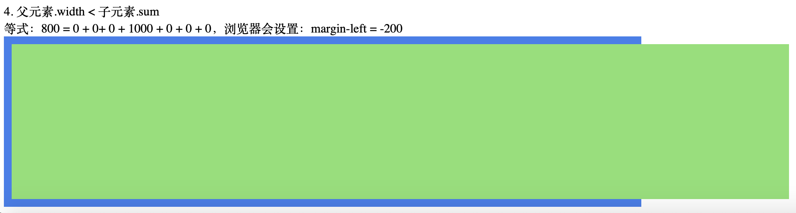
                    
## 元素的高度
[top](#catalog)
- 元素的高度
    - 如果元素没有设置高度，则`元素.height = 子元素/文字内容.height`
    - 如果元素设置了高度，则使用自身的高度
    - 子元素是在父元素的内容区排列的，如果子元素的高度超过了父元素的高度，则子元素会从父元素中溢出

## 处理子元素的溢出
[top](#catalog)
- 通过`overflow`属性，设置父元素如何处理溢出的子元素

    |属性值|说明|
    |-|-|
    |visible|默认值，子元素会从父元素中溢出，并在父元素的外部显示|
    |hidden|隐藏溢出的部分|
    |scroll|在父元素上同时生成水平和垂直方向的两个滚动条，可以通过滚动条来查看子元素的完整内容|
    |auto|在父元素上，根据需要生成水平或垂直方向的滚动条，可以通过滚动条来查看子元素的完整内容|
    |inherit|?????|
    |initial|?????|
    |unset|?????|
    |-moz-hidden-unscrollable|?????|

- `overflow-x`，处理水平方向的溢出
- `overflow-y`，处理垂直方向的溢出

- 示例
    - 参考代码
        - [/frontend/css/base/src/boxModel/verticalLayout.html](/frontend/css/base/src/boxModel/verticalLayout.html)
    - 父元素没有设置高度
        - css
            ```css
            .outer1{
                background-color: rgb(121, 219, 56);
            }

            .inner1{
                height:100px;

                width:100px;
                background-color: orange;
                
                /* 如果当前元素下方没有其他元素，则该属性没有显示效果 */
                margin-bottom:50px;
            }
            ```
        - html
            ```html
            <section>1. 父元素没有设置高度，子元素设置了高度</section>
            <div class="outer1">
                <div class="inner1">outer1.inner1 01</div>
                <div class="inner1">outer1.inner1 02</div>
            </div>
            ```
        - 页面结果
            - [html_result_01](imgs/boxModel/verticalLayout/html_result_01.png)

    - 父元素设置高度
        - css
            ```css
            .outer2{
                width:300px;
                height: 300px;
                background-color: rgb(121, 219, 56);
            }

            .inner2{
                height:100px;

                width:100px;
                background-color: orange;
                
                /* 如果当前元素下方没有其他元素，则该属性没有显示效果 */
                margin-bottom:50px;
            }
            ```
        - html
            ```html
            <section>2. 父元素设置高度，子元素设置了高度</section>
            <div class="outer2">
                <div class="inner2">outer2.inner2 01</div>
                <div class="inner2">outer2.inner2 02</div>
            </div>
            ```
        - 页面结果
            - [html_result_02](imgs/boxModel/verticalLayout/html_result_02.png)

    - 子元素没有设置高度
        - css
            ```css
            /* 3. 子元素没有设置高度 */
            .outer3{
                width:200px;
                height: 200px;
                background-color: rgb(121, 219, 56);
            }

            .inner3{
                background-color: orange;
            }
            ```
        - html
            ```html
            <section>3. 父元素设置高度，子元素没有设置高度</section>
            <section>(子元素中如果没有文字内容或下一层的子元素，则这个子元素不会显示)</section>
            <div class="outer3">
                <div class="inner3">outer3.inner3</div>
                <div class="inner3"></div>
            </div>
            ```
        - 页面结果
            - [html_result_03](imgs/boxModel/verticalLayout/html_result_03.png)

    - 子元素的高度 > 父元素的高度
        - css
            ```css
            .outer4{
                width:200px;
                height: 200px;
                background-color: rgb(121, 219, 56);
            }

            .inner4{
                height:250px;

                width:100px;
                background-color: orange;
                
            }
            ```
        - html
            ```html
            <section>4. 子元素的高度 > 父元素的高度，子元素会从父元素中溢出</section>
            <div class="outer4">
                <div class="inner4">outer4.inner4</div>
            </div>
            ```
        - 页面结果
            - [html_result_04](imgs/boxModel/verticalLayout/html_result_04.png)

    - 处理子元素溢出，`overflow=hidden`
        - css
            ```css
            .outer5{
                width:200px;
                height: 200px;
                background-color: rgb(121, 219, 56);
                overflow: hidden;
            }

            .inner5{
                height:300px;

                width:100px;
                background-color: orange;
            }
            ```
        - html
            ```html
            <section>5. 处理子元素溢出，overflow=hidden</section>
            <div class="outer5">
                <div class="inner5">outer5.inner5</div>
            </div>
            ```
        - 页面结果
            - [html_result_05](imgs/boxModel/verticalLayout/html_result_05.png)

    - 处理子元素溢出，`overflow=scroll`
        - css
            ```css
            .outer6{
                width:200px;
                height: 200px;
                background-color: rgb(121, 219, 56);
                overflow: scroll;
            }

            .inner6{
                height:300px;

                width:100px;
                background-color: orange;
            }
            ```
        - html
            ```html
            <section>6. 处理子元素溢出，overflow=scroll</section>
            <div class="outer6">
                <div class="inner6">outer6.inner6</div>
            </div>
            ```
        - 页面结果
            - [html_result_06](imgs/boxModel/verticalLayout/html_result_06.png)

    - 处理子元素溢出，`overflow=auto`
        - css
            ```css
            .outer7{
                width:200px;
                height: 200px;
                background-color: rgb(121, 219, 56);
                overflow:auto;
            }

            .inner7{
                height:300px;

                width:100px;
                background-color: orange;
            }
            ```
        - html
            ```html
            <section>7. 处理子元素溢出，overflow=auto</section>
            <div class="outer7">
                <div class="inner7">outer7.inner7</div>
            </div>
            ```
        - 页面结果
            - [html_result_07](imgs/boxModel/verticalLayout/html_result_07.png)


## 垂直外边距的折叠
[top](#catalog)
- 垂直方向的、相邻的外边距会发生折叠
- 兄弟元素
    - 两个兄弟元素在垂直方向上相邻的外边距属性：上边元素的`margin-bottom`与下边元素的`margin-top`
    - 计算方式
        
        |外边距的值|计算方法|公式|
        |-|-|-|
        |如果两者都是正数|取最大值|`外边距 = Max(elem1.margin-bottom, elem2.margin-top)`|
        |如果一正一负|求和|`外边距 = elem1.margin-bottom + elem2.margin-top`|
        |如果两者都是负数|取绝对值的最大值|`外边距 = Max(abs(elem1.margin-bottom), abs(elem2.margin-top))`|

    - 兄弟元素之间的重叠对开发是有利的，一般不需要进行处理

- 父子元素
    - 父子元素在垂直方向上相邻的外边距属性：`margin-top`
    - 子元素的**margin-top**会传递给父元素，所以父子元素间的外边距折叠会影响整个页面的布局，**必须要进行处理**
    - 为什么子元素的`margin-top`会传递给父元素？
        - 父元素中**没有设置边框**来隔离，导致了`margin-top`的传递
    - 解决方式
        - 方式1：子元素不使用`margin-top`，同时调整父元素
            - 子元素
                - 删除：`margin-top`
            - 父元素
                - 增加`padding-top`
                - 从`height`中减去与`padding-top`相同的值，维持整体的布局不变

        - 方式2：在父元素中添加边框来隔离父子元素
            - 父元素：
                - `border-top`增加`1px`的，隔离父子元素
                - `height`减去`1px`，维持整体的布局不变
            - 子元素：
                - `margin-top`减去`1px`，抵消父元素增加`1px`边框导致的子元素布局下移
        - 方式3：
            - 参考： [自定义类选择器解决高度塌陷和父子元素间的外边距折叠（强烈推荐使用）](#解决方式3-自定义类选择器解决高度塌陷和父子元素间的外边距折叠)

- 示例
    - 参考代码
        - [/frontend/css/base/src/boxModel/marginFold.html](/frontend/css/base/src/boxModel/marginFold.html)
    - 兄弟元素之间的外边距折叠，两者都是正数
        - css
            ```css
            .box1{
                width:100px;
                height:100px;
                background-color: rgb(113, 212, 46);
                
                margin-bottom: 50px;
            }

            .box2{
                width:100px;
                height:100px;
                background-color: orange;

                margin-top:100px;
            }
            ```
        - html
            ```html
            <section>1. 兄弟元素之间的外边距折叠，两者都是正数</section>
            <div class="box1"></div>
            <div class="box2"></div>
            ```
        - 页面结果
            - 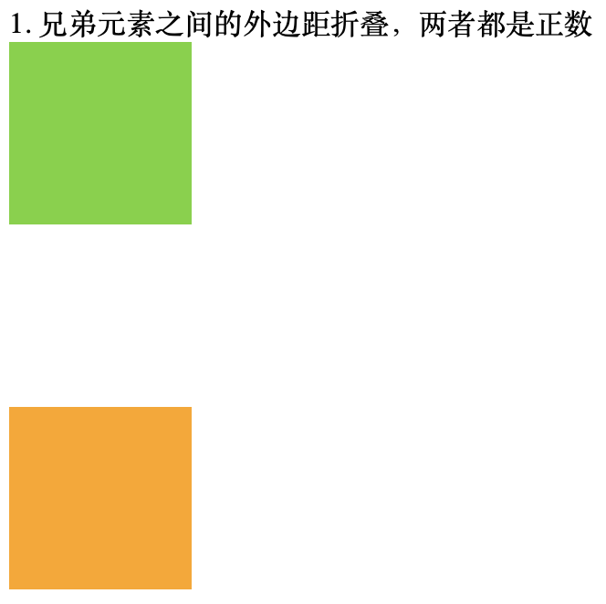

    - 兄弟元素之间的外边距折叠，一正一负
        - css
            ```css
            .box3{
                width:100px;
                height:100px;
                background-color: rgb(113, 212, 46);
                
                margin-bottom: 50px;
            }

            .box4{
                width:100px;
                height:100px;
                background-color: orange;

                margin-top:-20px;
            }
            ```
        - html
            ```html
            <section>2. 兄弟元素之间的外边距折叠，一正一负</section>
            <div class="box3"></div>
            <div class="box4"></div>
            ```
        - 页面结果
            - 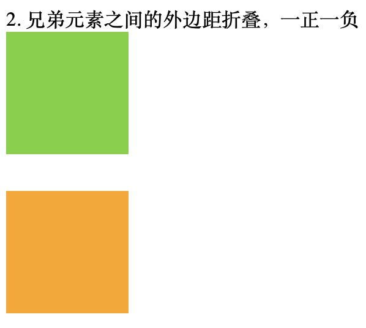

    - 兄弟元素之间的外边距折叠，两者都是负数
        - css
            ```css
            .box5{
                width:200px;
                height:200px;
                background-color: rgb(113, 212, 46);
                
                margin-bottom: -50px;
            }

            .box6{
                width:200px;
                height:200px;
                background-color: orange;

                margin-top:-100px;
            }
            ```
        - html
            ```html
            <section>3. 兄弟元素之间的外边距折叠，两者都是负数</section>
            <div class="box5"></div>
            <div class="box6"></div>
            ```
        - 页面结果
            - 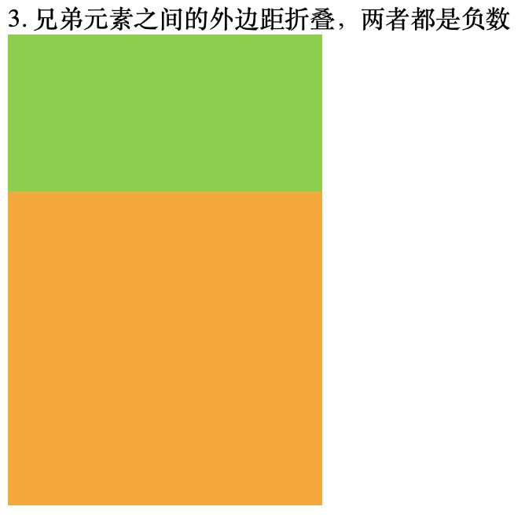

    - 父子元素之间的外边距折叠，子元素的外边距会传递给父元素
        - css
            ```css
            .box7{
                width:100px;
                height:100px;
                background-color: rgb(113, 212, 46);
                
                /* margin-bottom: -50px; */
            }

            .box8{
                width:50px;
                height:50px;
                background-color: orange;

                margin-top:50px;
            }
            ```
        - html
            ```html
            <section>4. 父子元素之间的外边距折叠</section>
            <div class="box7">
                <div class="box8"></div>
            </div>
            ```
        - 页面结果
            - 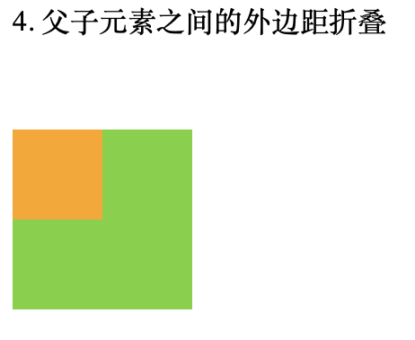

    - 父子元素之间的外边距折叠。解决方式1：子元素不使用margin-top，同时调整父元素
        - css
            ```css
            .box9{
                width:100px;
                /* 父元素同时从height中减去与padding-top相同的值 */
                /* height:100px; */
                height:50px;
                background-color: rgb(113, 212, 46);
                
                /* 父元素，增加`padding-top` */
                padding-top:50px;
            }

            .box10{
                width:50px;
                height:50px;
                background-color: orange;

                /* 子元素，删除：`margin-top` */
                /* margin-top:50px; */
            }
            ```
        - html
            ```html
            <section>5. 父子元素之间的外边距折叠。解决方式1：子元素不使用margin-top，同时调整父元素</section>
            <div class="box9">
                <div class="box10"></div>
            </div>
            ```
        - 页面结果
            - 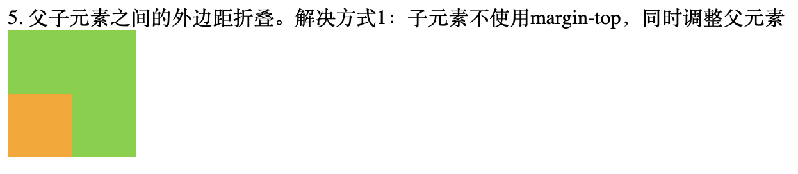

    - 父子元素之间的外边距折叠。解决方式2：在父元素中添加边框来隔离父子元素
        - css
            ```css
            .box11{
                width:100px;
                /* height减去1px，维持整体的布局不变 */
                /* height:100px; */
                height:99px;
                background-color: rgb(113, 212, 46);
                
                /* border-top增加1px的，隔离父子元素 */
                border-top: red 1px solid;          
            }

            .box12{
                width:50px;
                height:50px;
                background-color: orange;

                /* margin-top减去1px，抵消父元素增加1px边框导致的子元素布局下移 */
                /* margin-top:50px; */
                margin-top:49px;
            }
            ```
        - html
            ```html
            <section>6. 父子元素之间的外边距折叠。解决方式2：在父元素中添加边框来隔离父子元素</section>
            <div class="box11">
                <div class="box12"></div>
            </div>
            ```
        - 页面结果
            - 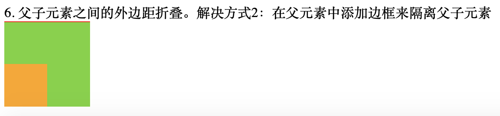

## 行内元素的盒子模型
[top](#catalog)
- 行内元素的内容区content不支持`width`和`height`属性，行内元素的宽、高由元素中的内容决定
- 行内元素可以设置`padding`，并且垂直方向的属性不会影响页面布局，但是可能会覆盖某些元素
- 行内元素可以设置`border`，并且垂直方向的属性不会影响页面布局，但是可能会覆盖某些元素
- 行内元素可以设置`margin`，并且垂直方向的属性不会影响页面布局，但是垂直方向的margin看不到
- 通过[通用属性：display](#display)可以将行内模型转换为块元素

## 盒子的大小
[top](#catalog)
- 默认情况下
- 可以通过`box-sizing`属性来设置盒子大小的计算方式，即设置`width`和`height`的作用范围
    - `content-box`，默认值，宽度和高度设置内容区的大小
        - 盒子的可见大小 = `width/height` + `border`×2 + `padding`×2
    - `border-box`，宽度和高度用来设置整个盒子的可见大小
        - 盒子的可见大小 = `width/height`
        - `width/height` = `content + padding*2 + border*2`

- 示例
    - 参考代码
        - [/frontend/css/base/src/boxModel/boxsize.html](/frontend/css/base/src/boxModel/boxsize.html)
    - `content-box`和`border-box`的区别
        - css
            ```css
            /* 1. box-sizing: content-box;使用width/height 设置内容区的大小 */
            .box1{
                width:100px;
                height: 100px;
                background-color: rgb(117, 218, 23);
                padding:10px;
                border:10px red solid;

                /* 设置内容区的大小 */
                box-sizing: content-box;
            }
            /* 2. box-sizing:border-box; 使用width/height 设置整个盒子的可见大小 */
            .box2{
                width:100px;
                height: 100px;
                background-color: rgb(117, 218, 23);
                padding:10px;
                border:10px red solid;

                /* 设置整个盒子的可见大小 */
                box-sizing:border-box;
            }
            ```
        - html
            ```html
            <section>1. box-sizing: content-box;使用width/height 设置内容区的大小</section>
            <div class="box1"></div>
            <br>
            
            <section>2. box-sizing:border-box; 使用width/height 设置整个盒子的可见大小</section>
            <div class="box2"></div>
            <br>
            ```
        - 页面结果
            - [html_result_01](imgs/boxModel/boxsize/html_result_01.png)


## 盒子的轮廓
[top](#catalog)
- 轮廓的语法： `outline : 宽度 颜色 样式`，与`border`属性的设置方法相同
- 轮廓与边框的不同点
    - 在默认情况下(`box-sizing:content-box`)，添加边框会增加盒子可见框的大小，会使后边的元素向下移动，影响页面布局
    - 轮廓不会影响**可见框**的大小，**不会影响布局**
- 常用的使用场景
    - 鼠标移入某个元素时，给元素添加边框
- 轮廓属性在实际开发中不太常用
- 示例
    - 参考代
        - ：[/frontend/css/base/src/boxModel/outline.html](/frontend/css/base/src/boxModel/outline.html)
    - `outline`和`border`的比较
        - css
            ```css
            /* 0. 测试基准 */
            .box0{
                width:200px;
                height:200px;
                background-color: rgb(170, 226, 80);
            }
            
            /* 1. 给box1添加border，会导致span中的文字下移，破坏页面整体布局 */
            .box1{
                width:200px;
                height:200px;
                background-color: rgb(170, 226, 80);
                border: 10px red solid;
            }

            /* 2. 给box0添加轮廓outline */
            .box2{
                width:200px;
                height:200px;
                background-color: rgb(170, 226, 80);

                /* 设置元素的轮廓线 */
                outline: 10px red solid;
            }
            ```
        - html
            ```html
            <section>0. 测试基准</section>
            <div class="box0"></div>
            <span>test string0</span>
            <br>
            <br>
            
            <section>1. 给box0添加border，会导致span中的文字下移，破坏页面整体布局</section>
            <div class="box1"></div>
            <span>test string1</span>
            <br>
            <br>
            
            <section>2. 给box0添加轮廓outline</section>
            <br>
            <div class="box2"></div>
            <span>test string2</span>
            ```
        - 页面结果
            - [html_result_01](imgs/boxModel/outline/html_result_01.png)


    - outline的使用场景：当鼠标移入时，为元素添加边框
        - css
            ```css
            .box3{
                width:200px;
                height:200px;
                background-color: rgb(170, 226, 80);
            }

            .box3:hover{
                outline:10px red solid;
            }
            ```
        - html
            ```html
            <section>3. outline的使用场景：当鼠标移入时，为元素添加边框</section>
            <div class="box3"></div>
            <span>test string3</span>
            ```
        - 测试结果
            - 正常显示
                - [html_result_02](imgs/boxModel/outline/html_result_02.png)

            - 鼠标移入
                - [html_result_02_mousein](imgs/boxModel/outline/html_result_02_mousein.png)

## 盒子的阴影
[top](#catalog)
- 语法：`box-shadow: 水平偏移量 垂直偏移量 阴影的模糊半径 阴影颜色 `
    - 偏移量
        - 正数：阴影向右/下偏移
        - 负数：阴影向左/上偏移
    - 阴影的模糊半径越大越模糊
    - 一般情况下，为了使阴影具有透明效果，阴影颜色会使用`rgba`来设定
- **阴影不会影响页面布局**
- 阴影默认是在盒子的正下方，即：`box-shadow: 0px 0px`
- 示例
    - 参考代码
        - [/frontend/css/base/src/boxModel/boxshadow.html](/frontend/css/base/src/boxModel/boxshadow.html)
    - 阴影在盒子的正下方
        - css
            ```css
            .box1{
                width: 100px;
                height: 100px;
                background-color: rgb(139, 235, 49);
                box-shadow:0px 0px orange ;
            }
            ```
        - html
            ```html
            <section>1. 阴影在盒子的正下方</section>
            <div class="box1"></div>
            ```
        - 页面结果
            - 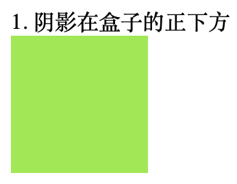

    - 阴影偏移-正数，阴影向右/下偏移
        - css
            ```css
            .box2{
                width:100px;
                height:100px;
                background-color: rgb(139, 235, 49);
                box-shadow:10px 10px 0px rgba(253, 190, 0, 0.6) ;
            }
            ```
        - html
            ```html
            <section>2. 阴影偏移-正数，阴影向右/下偏移</section>
            <div class="box2"></div>
            ```
        - 页面结果
            - 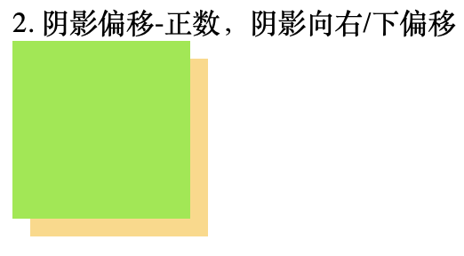

    - 阴影偏移-负数，阴影向左/上偏移
        - css
            ```css
            .box3{
                width:100px;
                height:100px;
                background-color: rgb(139, 235, 49);
                box-shadow:-10px -10px 0px rgba(253, 190, 0, 0.6) ;
            }
            ```
        - html
            ```html
            <section>3. 阴影偏移-负数，阴影向左/上偏移</section>
            <br>
            <div class="box3"></div>
            ```
        - 页面结果
            - 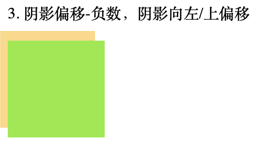

    - 阴影的模糊半径
        - css
            ```css
            .box4{
                width:100px;
                height:100px;
                background-color: rgb(139, 235, 49);
                box-shadow:10px 10px 10px rgba(253, 190, 0, 0.6) ;
            }
            ```
        - html
            ```html
            <section>4. 阴影的模糊半径</section>
            <div class="box4"></div>
            ```
        - 页面结果
            - 

    - 使用0偏移量和阴影的模糊半径来制造羽化效果
        - css
            ```css
            .box5{
                width:100px;
                height:100px;
                background-color: rgb(139, 235, 49);
                box-shadow:0px 0px 10px rgba(253, 190, 0, 0.6) ;
            }
            ```
        - html
            ```html
            <section>5. 使用0偏移量和阴影的模糊半径来制造羽化效果</section>
            <br>
            <div class="box5"></div>
            ```
        - 页面结果
            - 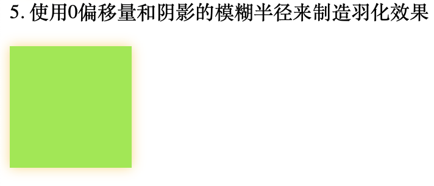
    

## 盒子的圆角
[top](#catalog)
- 语法：
    - 统一属性
        - `border-radius: 4个方向的正圆圆角半径`
        - `border-radius: 左上 右上 右下 左下`，仍然遵守顺时针的顺序
        - `border-radius: 左上 右上/左下 右下`，仍然遵守顺时针的顺序
        - `border-radius: 左上/右下 右上/左下 `，仍然遵守顺时针的顺序
        - 在统一属性设置椭圆
            - `border-radius: 正圆圆角半径 / 椭圆圆角半径`

    - 单角属性
        - `border-top-left-radius: 正圆圆角半径，椭圆圆角半径`
        - `border-top-right-radius: 正圆圆角半径，椭圆圆角半径`
        - `border-bottom-left-radius: 正圆圆角半径，椭圆圆角半径`
        - `border-bottom-right-radius: 正圆圆角半径，椭圆圆角半径`

- 当`正圆圆角半径=椭圆圆角半径`时，页面显示的仍然是圆角
- 常用方式
    - 可以直接使用：`border-radius: 50%`将盒子设置为圆

- 示例
    - 参考代码
        - [/frontend/css/base/src/boxModel/borderRadius.html](/frontend/css/base/src/boxModel/borderRadius.html)
    - 使用单角属性来设置正圆圆角
        - css
            ```css
            .box1{
                width: 150px;
                height: 150px;
                background-color: rgb(142, 224, 49);
                
                border-top-left-radius: 20px;
                border-top-right-radius: 30px;
                border-bottom-left-radius: 40px;
                border-bottom-right-radius: 50px;
            }
            ```
        - html
            ```html
            <section>1. 使用单角属性来设置正圆圆角</section>
            <div class="box1"></div>
            ```
        - 页面结果
            - 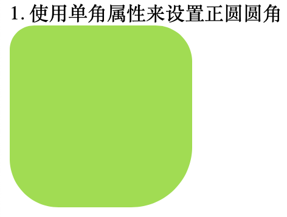

    - 使用单角属性来设置椭圆圆角
        - css
            ```css
            .box2{
                width: 150px;
                height: 150px;
                background-color: rgb(142, 224, 49);
                
                border-top-left-radius: 30px 60px;
            }
            ```
        - html
            ```html
            <section>2. 使用单角属性来设置椭圆圆角</section>
            <div class="box2"></div>
            ```
        - 页面结果
            - 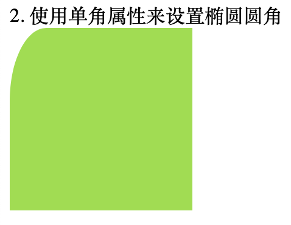

    - 使用统一属性，给4个角设置相同的半径
        - css
            ```css
            .box3{
                width: 100px;
                height: 100px;
                background-color: rgb(142, 224, 49);

                border-radius: 30px;
            }
            ```
        - html
            ```html
            <section>3. 使用统一属性，给4个角设置相同的半径</section>
            <div class="box3"></div>
            ```
        - 页面结果
            - 

    - 使用统一属性，分别设置：左上 右上 右下 左下
        - css
            ```css
            .box4{
                width: 150px;
                height: 150px;
                background-color: rgb(142, 224, 49);

                border-radius: 20px 30px 40px 50px;
            }
            ```
        - html
            ```html
            <section>4. 使用统一属性，分别设置：左上 右上 右下 左下</section>
            <div class="box4"></div>
            ```
        - 页面结果
            - 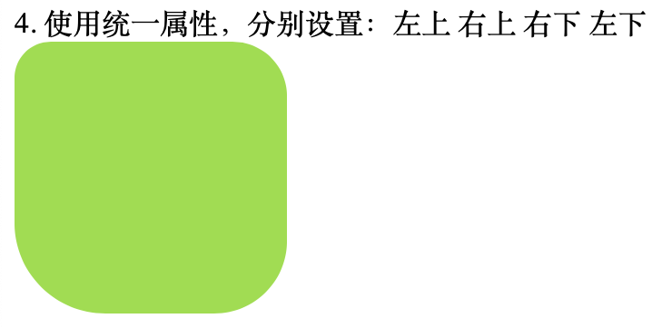

    - 使用统一属性，分别设置：左上 右上/左下 右下
        - css
            ```css
            .box5{
                width: 200px;
                height: 200px;
                background-color: rgb(142, 224, 49);

                border-radius: 30px 50px 70px;
            }
            ```
        - html
            ```html
            <section>5. 使用统一属性，分别设置：左上 右上/左下 右下</section>
            <div class="box5"></div>
            ```
        - 页面结果
            - 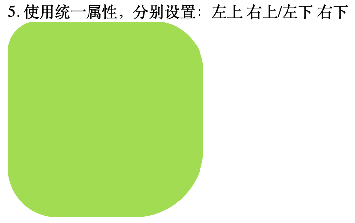

    - 使用统一属性，分别设置：左上/右下 右上/左下
        - css
            ```css
            .box6{
                width: 200px;
                height: 200px;
                background-color: rgb(142, 224, 49);

                border-radius: 30px  70px;
            }
            ```
        - html
            ```html
            <section>6. 使用统一属性，分别设置：左上/右下 右上/左下</section>
            <div class="box6"></div>
            ```
        - 页面结果
            - 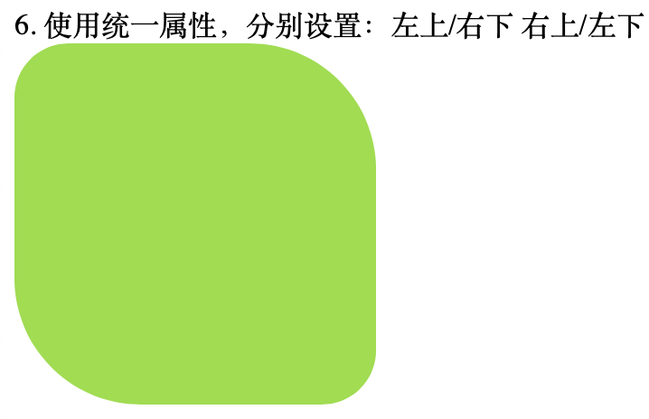

    - 在统一属性设置椭圆
        - css
            ```css
            .box7{
                width: 200px;
                height: 200px;
                background-color: rgb(142, 224, 49);

                border-radius: 30px / 70px;
            }
            ```
        - html
            ```html
            <section>7. 在统一属性设置椭圆</section>
            <div class="box7"></div>
            ```
        - 页面结果
            - 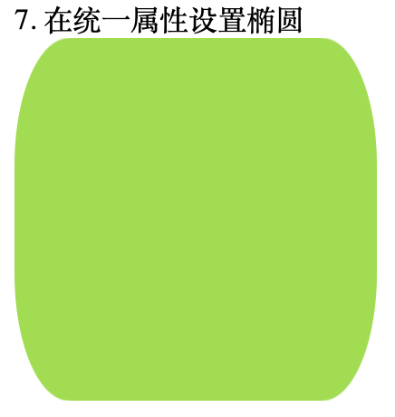

    - 通过：border-radius: 50%，将盒子设置为50%
        - css
            ```css
            .box8{
                width: 200px;
                height: 200px;
                background-color: rgb(142, 224, 49);

                border-radius:50%;
            }
            ```
        - html
            ```html
            <section>8. 通过：border-radius: 50%，将盒子设置为50%</section>
            <div class="box8"></div>
            ```
        - 页面结果
            - 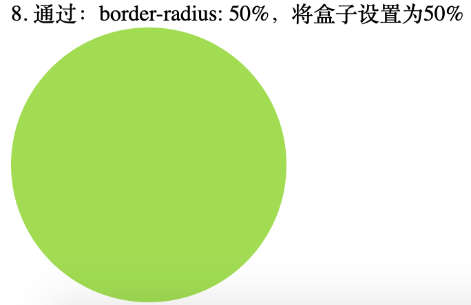


# 浏览器的默认样式
[top](#catalog)
- 默认样式
    - 一般情况下，浏览器都会为元素设置默认样式
    - html控制结构，css控制页面显示，如果只有html没有css，则页面无法显示任何信息。所以浏览器为了在没有css的情况下能正常显示，会使用默认样式
    - 通常情况下，默认样式会影响页面布局，所以要去除默认样式（主要是在pc端）
        - 主要希望去除的是：`margin`、`padding`这些会影响页面布局的属性

- 去除默认样式的方法
    - 方法1：可以使用通配符来统一去除默认样式
        ```css
        /* 统一出去默认样式的 外边距和内边距 */
        *{
            margin: 0px;
            padding: 0px;
        }
        ```
    - 方法2：手动调整某个标签的样式
    - 方法3：从外部引入重置样式表：
        - `reset.css`
            - **去除**所有的默认样式
        - `nomalize.css`
            - **统一**所有的默认样式

- 示例
    - 去除body的默认css
        - 参考代码
            - [/frontend/css/base/src/browserDefalutCss/defalutCss.html](/frontend/css/base/src/browserDefalutCss/defalutCss.html)
        - css
            ```css
            body{
                margin:0px;
            }
            .box1{
                width: 100px;
                height: 100px;
                
                border:black 1px solid;
            }
            ```
        - html
            ```html
            <section>1. 去除body的默认css</section>
            <div class="box1"></div>
            <p>p1</p>
            <p>p2</p>
            ```
        - 页面结果
            - 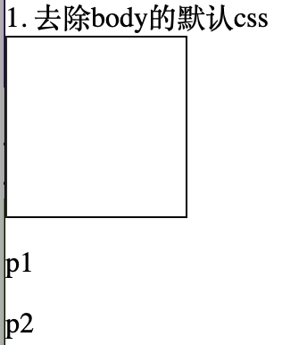

    - 去除ul的样式
        - 参考代
            - [/frontend/css/base/src/browserDefalutCss/defalutCss.html](/frontend/css/base/src/browserDefalutCss/defalutCss.html)
        - css
            ```css
            ul{
                list-style: none;
            }
            ```
        - html
            ```html
            <section>2. 去除ul的样式</section>
            <ul>
                <li>aaaa</li>
                <li>bbbb</li>
                <li>cccc</li>
                <li>dddd</li>
            </ul>
            ```
        - 页面结果
            - 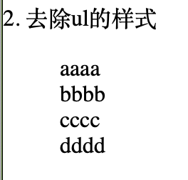

    - 使用通配符统一去除浏览器的默认样式
        - 参考代码
            - [/frontend/css/base/src/browserDefalutCss/deleteDefaultCss.html](/frontend/css/base/src/browserDefalutCss/deleteDefaultCss.html)
        - css
            ```css
            *{
                margin: 0px;
                padding: 0px;
            }
            ```
        - html
            ```html
            <body>
                <p>p1</p>
                <p>p2</p>
                <p>p3</p>
                <p>p4</p>

                <ul>
                    <li>li01</li>
                    <li>li02</li>
                    <li>li03</li>
                    <li>li04</li>
                    <li>li05</li>
                </ul>
            </body>
            ```
        - 页面结果
            - 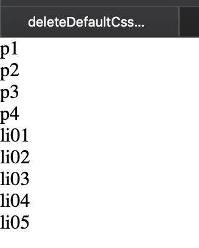
            
# 常用的通用属性
## display
[top](#catalog)
- `display`，用来设置元素的显示类型
- 常用的属性值

    |属性值|描述|备注|
    |-|-|-|
    |inline|将元素设置为行内元素||
    |block|将元素设置为块元素||
    |inline-block|行内块元素|<ul><li>优缺点<ul><li>同时兼具行内元素和块元素的优点：既可以设置`width`和`height`(块元素)，又**不会独占一行**（行内元素）</li><li>同时兼具行内元素和块元素的缺点：换行符会被解析为空白距离。即如果行内块元素间有换行，页面上的两个元素之间会产生一个空白的距离</li></ul></li><li>一般开发时尽量不要使用</li></ul>|
    |table|将元素设置为表格元素||
    |none|元素不再页面中显示。|可以用来隐藏元素，在需要的时候，通过页面控制再显示出来|

- 示例
    - 参考代码
        - [/frontend/css/base/src/commonProperties/display.html](/frontend/css/base/src/commonProperties/display.html)
    - 测试行内元素转化为`display:block`
        - css
            ```css
            .s1{
                background-color: rgb(214, 177, 54);
                /* 转化为块元素之后可以设置 width 和 height */
                width: 100px;
                height:100px;

                display: block;
            }
            .box1{
                width:50px;
                height:50px;
                background-color: green;
            }
            ```
        - html
            ```html
            <section>1. 测试行内元素的 display:block</section>
            <span class="s1">this is span5</span>
            <div class="box1"></div>
            <br>
            ```
        - 页面结果
            - 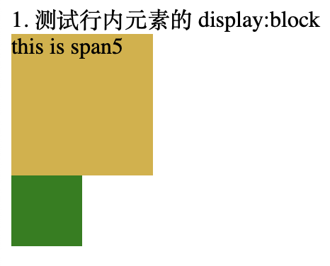

    - 测试行内块元素`display:inline-block`
        - css
            ```css
            .s2{
                background-color: rgb(214, 177, 54);

                width: 50px;
                height:50px;

                display: inline-block;
            }
            .box2{
                width:200px;
                height:200px;
                background-color: green;
            }
            ```
        - html
            ```html
            <section>2. 测试行内块元素 display:inline-block</section>
            <section>2.1. 多个行内块元素之间有换行</section>
            <span class="s2">span2 01</span>
            <span class="s2">span2 02</span>
            <span class="s2">span2 03</span>

            <br>
            <br>
            <section>2.2. 多个行内块元素之间没有换行</section>
            <span class="s2">span2 04</span><span class="s2">span2 05</span><span class="s2">span2 06</span>
            <div class="box2"></div>
            <br>
            ```
        - 页面结果
            - 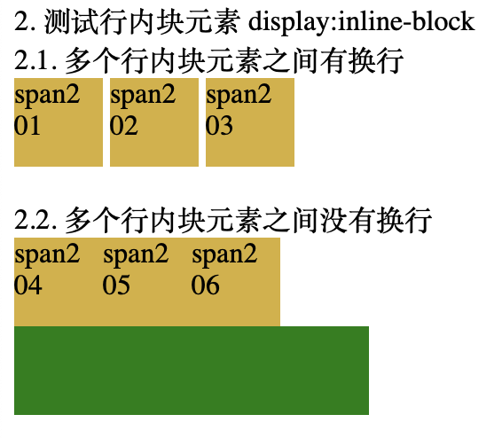

    - 测试元素隐藏`display:none`
        - css
            ```css
            .s3{
                background-color: rgb(214, 177, 54);

                width: 50px;
                height:50px;

                display: none;
            }
            .box3{
                width:200px;
                height:200px;
                background-color: green;
            }
            ```
        - html
            ```html
            <section>3. 测试元素隐藏 display:none</section>
            <span class="s7">span6 04</span>
            abcdefg
            <span class="s7">span6 05</span>
            <div class="box7"></div>
            ```
        - 页面结果
            - 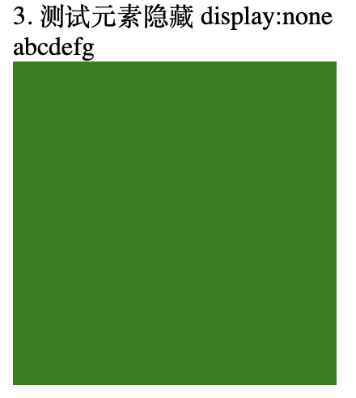

## visibility
[top](#catalog)
- visible
    - 默认值，显示元素
- hidden
    - 隐藏元素，但是元素仍然会占据页面的位置

- 示例
    - 参考代
        - [/frontend/css/base/src/commonProperties/visibility.html](/frontend/css/base/src/commonProperties/visibility.html)
    - 1. 测试元素隐藏`visibility:hidden`
        - css
            ```css
            .s1{
                background-color: rgb(214, 177, 54);

                width: 100px;
                height:100px;

                visibility: hidden
            }
            .box1{
                width:200px;
                height:200px;
                background-color: green;
            }
            ```
        - html
            ```html
            <section>1. 测试元素隐藏 visibility:hidden</section>
            <span class="s1"></span>
            <div class="box1"></div>
            ```
        
        - 页面结果
            - [html_result_01](imgs/commonProperties/visibility/html_result_01.png)


# 元素浮动
## 元素浮动基本知识
[top](#catalog)
- 通过浮动可以使一个元素向其**父元素**的左侧或右侧移动
- 语法： `float: 属性值`
    - 属性值包括
        - `none`，默认值元素不会浮动
        - `left`，元素向左浮动
        - `right`，元素向右浮动

- 如果同时对多个子元素使用`float:left`，子元素会**逆序排列**
- 使用`float:left`或`float:right`之后，<label style="color:red">元素将脱离文档流</label>，使得[块元素盒子模型的水平方向布局](#块元素盒子模型的水平方向布局)中的水平布局等式不再强制成立
    - 如：对一个`div`使用了`float`属性之后，在元素检查器中会发现，盒子模型中不会强制产生用于满足水平布局等式的`margin-right`或`margin-left`
        - 参考代码
            - [/frontend/css/base/src/float/floatBase.html](/frontend/css/base/src/float/floatBase.html)
        - css
            ```css
            /* 0. 不使用float 的div盒子模型 */
            .box0{
                width:100px;
                height:100px;
                background-color: rgb(80, 207, 7);
            }
            
            /* 1. 使用float:left 后 的div盒子模型 */
            .box1{
                width:100px;
                height:100px;
                background-color: rgb(80, 207, 7);
                float:left;
            }
            ```
        
        - html
            ```html
            <section>0. 不使用float 的div盒子模型</section>
            <div class="box0"></div>
            
            <section>1. 使用float:left 后的div盒子模型</section>
            <div class="box1"></div>
            ```
        - 元素检查器中的结果
            - 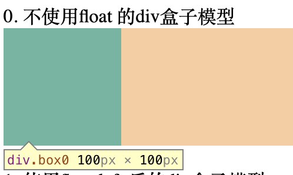
            - 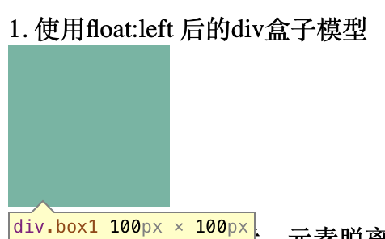


- 浮动元素的特点
    - 脱离文档流：浮动元素会脱离文档流，不用遵守水平布局的等式
    - 无法脱离父元素：设置浮动之后，浮动元素会向父元素的左/右侧移动。默认情况下，不会从父元素中移出
    - 浮动元素紧挨：默认情况下，浮动元素不会覆盖/超过其前面的兄弟浮动元素，会接在前一个浮动元素的后面
    - 如果浮动元素前面不是浮动元素，则无法移动
    - 如果浮动元素后面是仍然是文档流中的元素，则该元素会接在浮动元素的后边
    - 文字环绕：浮动元素不会覆盖文字，**文字会自动环绕**在浮动元素周围
    
- **通过浮动元素可以进行水平布局**

- 示例
    - 参考代码
        - [/frontend/css/base/src/float/floatBase.html](/frontend/css/base/src/float/floatBase.html)
    - 测试使用float属性后，元素脱离文档流
        - css
            ```css
            .box201{
                width:100px;
                height: 100px;
                background-color: green;
                float: left;
            }
            .box202{
                width:200px;
                height: 200px;
                background-color: orange;
            }
            ```
        - html
            ```html
            <section>2. 测试使用float属性后，元素脱离文档流</section>
            <div class="box101"></div>
            <div class="box102"></div>
            ```
        - 页面结果
            - 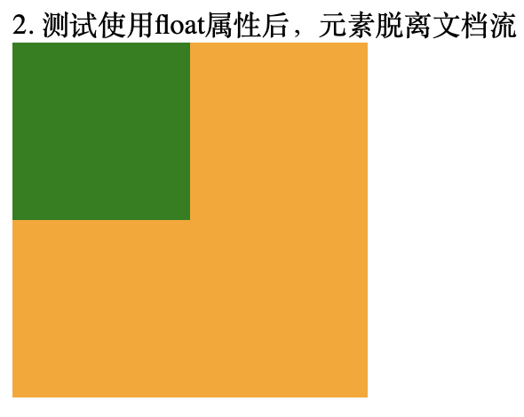

    - 多个使用float属性的元素横向排列
        - css
            ```css
            .box301{
                width:100px;
                height: 100px;
                background-color: green;
                float: left;
            }
            .box302{
                width:100px;
                height: 100px;
                background-color: orange;
                float: left;
            }
            .box303{
                width:100px;
                height: 100px;
                background-color: yellow;
                float: left;
            }
            ```
        - html
            ```html
            <section>3. 多个使用float属性的元素横向排列</section>
            <div class="box301"></div>
            <div class="box302"></div>
            <div class="box303"></div>
            ```
        - 页面结果
            - 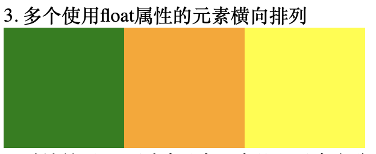

    - 默认情况下，浮动元素不会从父元素中移出
        - css
            ```css
            .box401{
                width:200px;
                height: 200px;
                background-color: green;
            }
            
            .box402{
                width:50px;
                height: 50px;
                background-color: orange;
                float: left;
            }
            
            .box403{
                width:50px;
                height: 50px;
                background-color: orange;
                float:right;
            }
            ```
        - html
            ```html
            <section style="clear:both">4. 默认情况下，浮动元素不会从父元素中移出</section>
            <div class="box401">
                <div class="box402"></div>
                <div class="box403"></div>
            </div>
            ```
        - 页面结果
            - 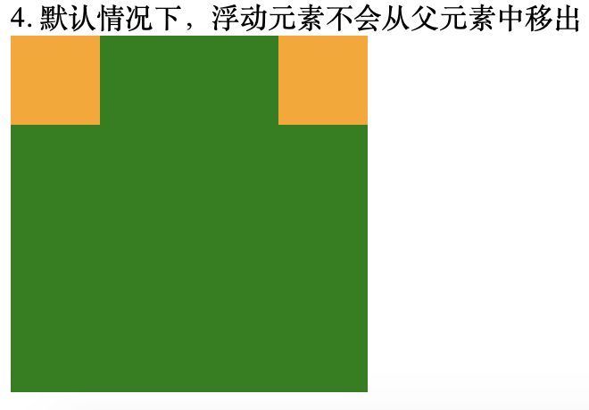

    - 浮动不会覆盖文字--文字自动环绕效果
        - css
            ```css
            .box5{
                width:50px;
                height: 50px;
                background-color: orange;
                float:left;
            }
            ```
        - html
            ```html
            <section>5. 浮动不会覆盖文字--文字自动环绕效果</section>
            <div class="box5"></div>
            <p>Lorem, ipsum dolor sit amet consectetur adipisicing elit. Cumque adipisci doloribus praesentium similique dignissimos eaque velit accusantium nisi, dolores facilis dolorem inventore non, eos placeat. Molestias rerum odio esse culpa.</p>
            <br>
            ```
        - 页面结果
            - 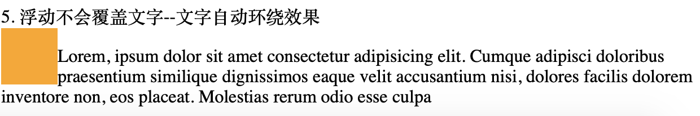

## 元素浮动示例-导航条
[top](#catalog)
- 参考代码
    - [/frontend/css/base/src/exercise/float/w3c_navigationBar.html](/frontend/css/base/src/exercise/float/w3c_navigationBar.html)

- css
    ```css
    /* 导航条样式 */
    /* 设置ul的长宽 */
    .naviBar{
        /* 设置宽高 */
        width:900px;
        height:100px;
        
        /* 设置外边距:上下100px，左右通过auto使用水平公式做自动适应 */
        margin:100px auto;
        /* 设置背景 */
        background-color:rgb(179, 179, 179);
    }
    
    .naviBar li{
        /* 将li转换成浮动元素，来完成横向布局*/
        float:left;
        /* 水平垂直居中 */
        line-height: 100px;
        text-align: center;
    }

    .naviBar a{
        /* 转换成块元素，来为a标签设置宽和高 */
        display: block;

        /* 设置a标签的宽高，使其在整个区域内都可以点击，而不是只有文字部分可以点击 */
        width:300px;
        height:100%;

        /* 设置连接的字体 */
        color: rgb(39, 36, 36);
        font-size: 15px;

        /* 设置整个链接区域的颜色 */
        background-color:rgb(179, 179, 179);
    }

    /* 设置链接区域的选中效果 */
    .naviBar a:hover{
        background-color:rgb(104, 104, 104);
        color:white;
    }
    ```

- html
    ```html
    <ul class="naviBar">
        <li>
            <a href="javascript:;" >AAA</a>
        </li>
        <li>
            <a href="javascript:;" >BBB</a>
        </li>
        <li>
            <a href="javascript:;" >CCC</a>
        </li>
    </ul>
    ```

- 页面结果
    - 普通显示
        - 
    - 鼠标移入
        - 


# 解决浮造成的问题-高度塌陷
## 高度塌陷的分析
[top](#catalog)
- 高度塌陷：父元素的`height`和`width`变为0
    - 当块元素没有设定`height`和`width`的时候，该块元素的宽和高等于子元素的块和高的总和。如果将子元素全部设置元素浮动，会导致块元素`content`区的`height`和`width`变为0，后续的其他块元素向上移动，并且会被浮动的元素盖住，破坏页面布局
        
- 因为高度塌陷而产生的另一个问题：元素间的遮盖        
    - 产生元素遮盖的两点前提
        - 浮动元素脱离的文档流，但是仍外无法脱离父元素；
        - 父元素中因为全部是浮动元素，`height`和`width`变为0导致后续元素上移
    - 产生的原因：浮动元素、浮动元素的父元素、后续的块元素仍然在同一个**布局空间**。
        - 由于浮动元素无法脱离父元素，会保持在父元素的范围内，遮挡后面自动上移的其他元素

- 可以解决高度塌陷的几种方法
    - 使用BFC（块级格式化环境）
    - 设置clear属性

- 示例
    - 代码路径：
        - [/frontend/css/base/src/bfc/usageBfc.html](/frontend/css/base/src/bfc/usageBfc.html)

    - 外部块元素 跟随内部块元素自动变化
        - css
            ```css
            .outter1{
                border: black 5px solid;
            }

            .inner1{
                width: 50px;
                height: 50px;
                background-color: #bfa;
            }
            ```
        - html
            ```html
            <section>1. 外部块元素 跟随内部块元素自动变化</section>
            <div class="outter1">
                <div class="inner1"></div>
            </div>
            <div class="other"></div>
            ```
        - 页面结果
            - 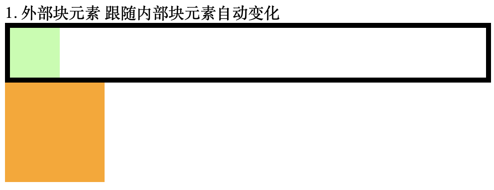

    - 外部块元素自动变化，内部元素设置多个浮动元素来进行水平排列
        - css
            ```css
            .outter2{
                border: black 5px solid;
            }

            .inner201{
                float: left;
                width: 50px;
                height: 50px;
                background-color: #bfa;
            }
            .inner202{
                float: left;
                width: 50px;
                height: 50px;
                background-color: rgb(205, 133, 253);
            }
            ```
        - html
            ```html
            <section>2. 外部块元素自动变化，内部元素设置多个浮动元素来进行水平排列</section>
            <section> 使用浮动后，外部的块元素因为没有子元素所以height、width变为0，后续元素上移，并被浮动元素覆盖</section>
            <div class="outter2">
                <div class="inner201"></div>
                <div class="inner202"></div>
            </div>
            <div class="other"></div>
            ```

        - 页面结果
            - 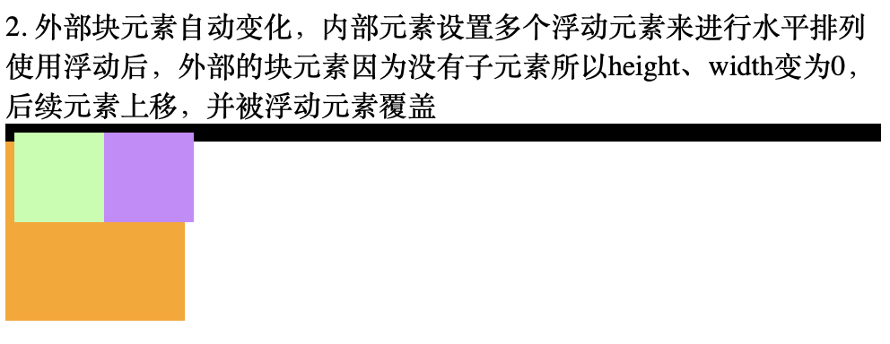


## 解决方式1-BFC块级格式化环境
### BFC元素的特点
[top](#catalog)
- BFC(Block Formatting Context)块级格式化环境
- BFC是CSS中的一个隐含属性
- 可以为一个元素开启BFC
- <label stlye="color:red">开启BFC的元素会处于一个独立的布局空间，与文档流所处的布局空间相隔离</label>
- 开启BFC之后，元素的特点
    - 开启BFC的元素不会被浮动元素覆盖
    - 开启BFC的子元素和它的父元素的外边距不会重叠
    - 开启BFC的元素可以包含浮动元素

### 开启BFC
[top](#catalog)
- **BFC都是间接开启的，所以会产生副作用，使用时需要使用副作用最小的**
- 几种开启的特殊方法
    1. 父子元素都设置浮动（**不推荐**）
        - 副作用
            - 父元素也脱离文档流，父元素后面的元素自动上移，仍然会有元素间遮盖和破坏页面布局的问题
            - 因为父元素脱离文档流，所以父元素的宽度没有了
    2. 子元素设置浮动，父元素设置为`行内块元素`（**不推荐**）
        - 副作用
            - 行内块元素本身的特性不适合于页面布局 ??????
            - 父元素元素的宽度没有了
    3. 子元素设置浮动，父元素使用`overflow`并设置一个非`visible`的属性值（[处理子元素的溢出](#处理子元素的溢出)）（**推荐**）

    4. 其他方式： ??????????????????????????????

- 最常用的方式
    - <label style="color:red">子元素设置浮动，父元素设置：`overflow:hidden`</label>

- 开启bfc的示例
    - 参考代码
        - [/frontend/css/base/src/bfc/usageBfc.html](/frontend/css/base/src/bfc/usageBfc.html)
    - 开启BFC的特殊方法1：父子元素都设置float
        - css
            ```css
            .outter3{
                border: black 5px solid;
                float:left;
            }
            .inner3{
                float: left;
                width: 50px;
                height: 50px;
                background-color: #bfa;
            }
            ```
        
        - html
            ```html
            <section>3. 开启BFC的特殊方法1：父子元素都设置float</section>
            <div class="outter3">
                <div class="inner3"></div>
            </div>
            <div class="other"></div>
            ```
        - 页面结果
            - 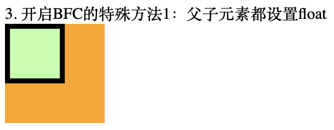

    - 开启BFC的特殊方法2：将元素设置为行内块元素
        - css
            ```css
            .outter4{
                border: black 5px solid;
                display: inline-block;
            }

            .inner4{
                float: left;
                width: 50px;
                height: 50px;
                background-color: #bfa;
            }
            ```
        
        - html
            ```html
            <section>4. 开启BFC的特殊方法2：将元素设置为行内块元素</section>
            <div class="outter4">
                <div class="inner4"></div>
            </div>
            <div class="other"></div>
            ```
        - 页面结果
            - 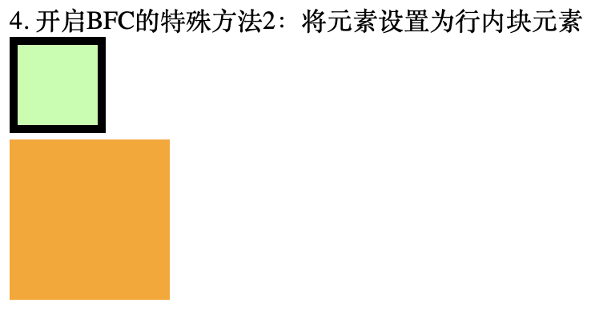

    - 开启BFC的特殊方法3：使用`overflow:hidden;`
        - css
            ```css
            .outter5{
                border: black 5px solid;
                overflow: hidden;
            }

            .inner5{
                float: left;
                width: 50px;
                height: 50px;
                background-color: #bfa;
            }
            ```
        
        - html
            ```html
            <div class="outter5">
                <div class="inner5"></div>
            </div>
            <div class="other"></div>
            ```
        
        - 页面结果
            - 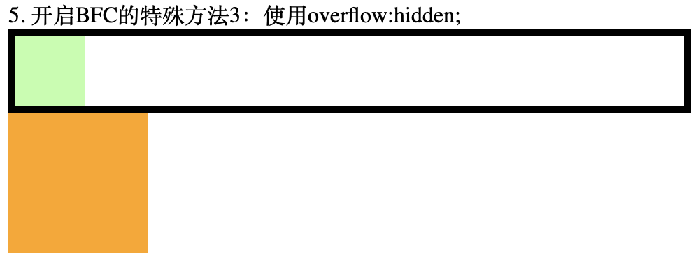
    
    - 开启BFC的特殊方法3：使用`overflow:auto;`
        - css
            ```css
            .outter6{
                border: black 5px solid;
                overflow: auto;
            }

            .inner6{
                float: left;
                width: 50px;
                height: 50px;
                background-color: #bfa;
            }
            ```
        
        - html
            ```html
            <section>6. 开启BFC的特殊方法3：使用overflow:auto; </section>
            <div class="outter6">
                <div class="inner6"></div>
            </div>
            <div class="other"></div>
            ```
        
        - 页面结果
            - 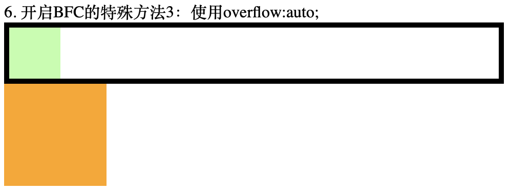

    - 开启BFC后，子元素和父元素的外边距不会重叠
        - css
            ```css
            /* 7.1 不开启bfc，测试子元素的margin-top向父元素传递 */
            .outter701{
                width: 100px;
                height: 100px;
                background-color: burlywood;
            }
            .inner701{
                width:50px;
                height: 50px;
                background-color: #bfa;
                margin-top: 50px;
            }

            /* 7.2 开启BFC */
            .outter702{
                width: 100px;
                height: 100px;
                background-color: burlywood;
                overflow:hidden;
            }

            .inner702{
                float: left;
                width:50px;
                height: 50px;
                background-color: #bfa;
                margin-top:50px;
            }
            ```
        
        - html
            ```html
            <section>7. 开启BFC后，子元素和父元素的外边距不会重叠</section>
            <section>7.1 不开启BFC，子元素的margin会传递个给父元素</section>
            <div>
                <div class="outter701">
                    <div class="inner701"></div>
                </div>
                <div class="other"></div>
            </div>
            <br>

            <section>7.2 开启BFC</section>
            <div class="outter702">
                <div class="inner702"></div>
            </div>
            <div class="other"></div>
            <br>
            ```
        - 页面结果
            - 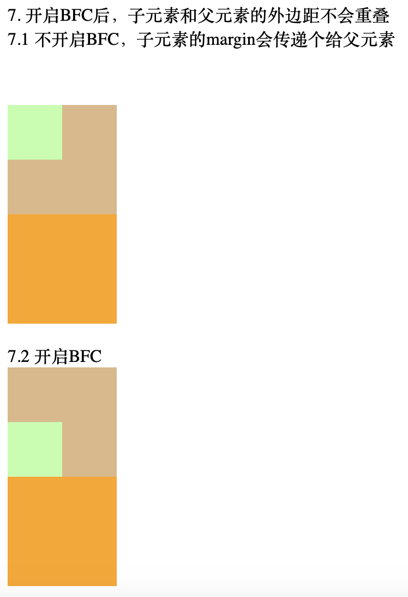


## 解决方式2-clear属性
### clear属性简介
[top](#catalog)
- `clear`属性
    - 作用：清楚浮动元素对其他元素产生的影响
    - 可选值
        - `left`：清除`float:left`元素对当前元素的影响
        - `right`：清除`float:right`元素对当前元素的影响
        - `both` : 清除`left`、`right`中较大的那一侧
    - 原理
        - 设置该属性之后，浏览器会自动为该元素添加`margin`，使该元素避免其他浮动元素的干扰。**但是这一点无法在控制台内进行观察**

- 示例
    - 参考代码
        - [/frontend/css/base/src/heightCollapse/clear.html](/frontend/css/base/src/heightCollapse/clear.html)

    - 使用`clear:left`清除`float:left`浮动元素的影响
        - css
            ```css
            .box0201{
                width:50px;
                height: 50px;
                background-color: #bfc;
                float:left;
            }

            .box0202{
                width: 80px;
                height: 80px;
                background-color: orange;
                clear:left;
            }
            ```
        
        - html
            ```html
            <section>2. 使用 clear:left 清除 float:left浮动元素的影响</section>
            <div class="box0201">box0201</div>
            <div class="box0202">box0202</div>
            ```

        - 页面结果
            - 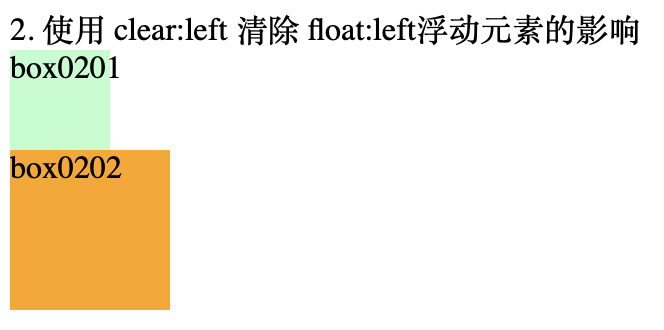

    - 使用`clear:right`清除`float:right`浮动元素的影响
        - css
            ```css
            .outter3{
                width:250px;
                background-color: rgb(184, 184, 184);
                overflow: hidden;
            }
            .box0301{
                width:50px;
                height: 50px;
                background-color: #bfc;
                float:right;
            }

            .box0302{
                width: 80px;
                height: 80px;
                background-color: orange;
                clear:right;
            }
            ```
        
        - html
            ```html
            <section>3. 使用 clear:right 清除 float:right 浮动元素的影响</section>
            <div class="outter3">
                <div class="box0301">box0301</div>
                <div class="box0302">box0302</div>
            </div>
            ```

        - 页面结果
            - 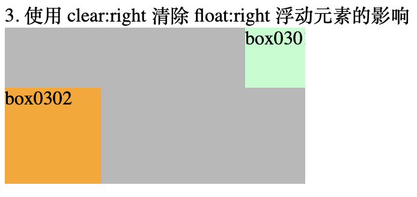

    - 使用`clear：both`清楚`left`和`right`中较大的那一侧
        - css
            ```css
            .outter4{
                width:250px;
                background-color: rgb(184, 184, 184);
                overflow: hidden;
            }

            .box0401{
                width:50px;
                height: 50px;
                background-color: #bfc;
                float:left;
            }

            .box0402{
                width:100px;
                height: 100px;
                background-color: rgb(82, 149, 255);
                float:right;
            }

            .box0403{
                width: 80px;
                height: 80px;
                background-color: orange;
                clear:right;
            }
            ```
        
        - html
            ```html
            <section>4. 使用 clear：both 清除 left和right中较大的那一侧</section>
            <div class="outter4">
                <div class="box0401">box0401</div>
                <div class="box0402">box0402</div>
                <div class="box0403">box0403</div>
            </div>
            ```
        - 页面结果
            - 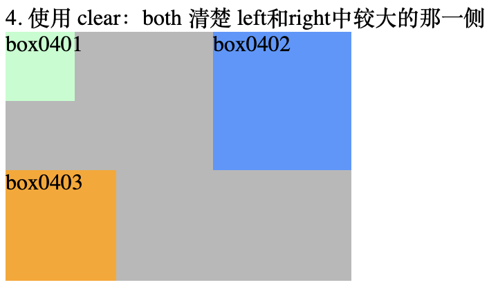

### 使用clear解决高度塌陷
[top](#catalog)
- 解决方式1：添加clear子元素 (**不推荐**)
    - 原理
        - 父元素和浮动子元素的设置不变
        - 在浮动子元素后边**添加一个新的子元素**，并使用`clear`属性
        - 添加新子元素后，父元素和浮动子元素的样式保持不变。新子元素会因为`clear`属性而产生`margin-top`将整个父元素的高度撑开，并且高度等于浮动元素的高度
    - 这种方式的问题
        - 正确的解决问题的宗旨：高度塌陷本身是表示上的问题，即CSS自身导致的问题，应该由CSS本身来解决
        - 方式1通过添加子元素的方式，即通过html在**结构上的变化来处理表示上的问题**，这种方式虽然可以解决高度塌陷的问题，但是并不是很好

    - 参考示例
        - 参考代码
            - [/frontend/css/base/src/heightCollapse/improveProblem.html](/frontend/css/base/src/heightCollapse/improveProblem.html)

        - css
            ```css
            .outter1{
                border: black 5px solid;
            }

            .inner101{
                width:50px;
                height: 50px;
                background-color: #bfa;
                float: left;
            }

            /* 清除浮动元素的影响 */
            .inner102{
                clear:left;
            }
            ```

        - html
            ```html
            <section>1. 使用clear解决高度塌陷，方式1：添加clear子元素</section>
            <div class="outter1">
                <div class="inner101"></div>
                <div class="inner102"></div>
            </div>
            ```
        - 页面结果
            - 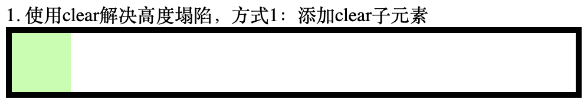

- 解决方式2：通过伪元素`after`来隔离(**推荐使用**)
    - 基本css代码
        ```css
        .父元素类选择器::after{
            /* 1. 通过clear属性清除浮动元素的影响 */
            clear:both;
            /* 2. 设置空content使伪元素生效 */
            content: "";
            /* 3. 伪元素本身是行内元素，通过display属性转换成块元素 */
            display:block;
        }
        ```
    - 原理
        - 与方式1类似，但是完全通过css自身来解决问题，不借助html
        - 在**父元素**的伪元素`::after`中添加`clear`属性来自动适应浮动子元素
        - 通过`content:""`来是伪元素生效，同时
        - 由于伪元素都是行内元素，所以需要使用`display:block`将伪元素转换为块元素
            - 使用`display:table`也可以生效
    - 参考示例
        - 参考代码
            - [/frontend/css/base/src/heightCollapse/improveProblem.html](/frontend/css/base/src/heightCollapse/improveProblem.html)

        - css
            ```css
            .outter2{
                border: black 5px solid;
            }

            .inner2{
                width:50px;
                height: 50px;
                background-color: orange;
                float: left;
            }
            
            .outter2::after{
                /* 1. 通过clear属性清除浮动元素的影响 */
                clear:both;
                /* 2. 设置空content使伪元素生效 */
                content: "";
                /* 3. 伪元素本身是行内元素，通过display属性转换成块元素 */
                display:block;
            }
            ```
        
        - html
            ```html
            <section>2. 使用clear解决高度塌陷，方式2：通过伪元素来隔离</section>
            <div class="outter2">
                <div class="inner2"></div>
            </div>
            ```
        - 页面结果
            - 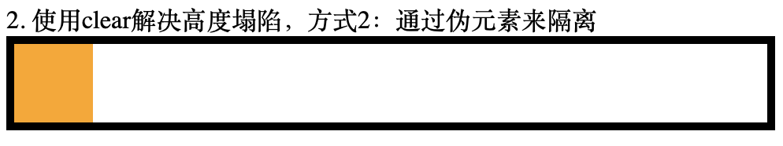

## 解决方式3-自定义类选择器解决高度塌陷和父子元素间的外边距折叠
- 基本css代码
    ```css
    .clearfix::before,
    .clearfix::after{
        /* 1. 通过clear属性清除浮动元素的影响 */
        clear:both;
        /* 2. 设置空content使伪元素生效 */
        content: "";
        /* 3. 分割元素，并且不会占用像素位置；同时解决 高度塌陷和父子元素间的外边距折叠 */
        display:table;
    }
    ```
- 原理
    - 自定义类选择器，同时设置伪元素：`::before`、`::after`，在css层面解决问题
    - 使用`clear:both`属性清除浮动元素的影响
    - 使用`display: table`可以分割元素，并且不会占用像素位置
        - `display: inline-block`也可以分割元素，但是会占用一些像素位置，影响页面布局
        - `display: block`可以解决高度塌陷，但是无法解决父子元素外边距折叠的问题

- 示例
    - 参考代码
        - [/frontend/css/base/src/heightCollapse/improveProblem.html](/frontend/css/base/src/heightCollapse/improveProblem.html)
    
    - css
        ```css
        /* 高度塌陷测试 */
        .outter301{
            border: black 5px solid;
        }

        .inner301{
            width:50px;
            height: 50px;
            background-color:rgb(45, 136, 255);
            float: left;
        }

        /* 父子元素间外边距折叠测试 */
        .outter302{
            width: 100px;
            height: 100px;
            background-color:#bfa;
        }

        .inner302{
            width: 50px;
            height: 50px;
            background-color: orange;
            margin-top: 50px;
        }

        /* 自定义类选择器 */
        .clearfix::before,
        .clearfix::after{
            /* 1. 通过clear属性清除浮动元素的影响 */
            clear:both;
            /* 2. 设置空content使伪元素生效 */
            content: "";
            /* 3. 分割元素，并且不会占用像素位置；同时解决 高度塌陷和父子元素间的外边距折叠 */
            display:table;
        }
        ```
    
    - html
        ```html
        <section>3. 自定义样式解决高度塌陷和父子元素间的外边距折叠</section>
        <section>3.1. 解决高度塌陷</section>
        <div class="outter301 clearfix">
            <div class="inner301"></div><br>
            <div class="inner301"></div>
        </div>
        <br>
        
        <section>3.2. 解决高度塌陷</section>
        <div class="outter302 clearfix">
            <div class="inner302"></div>
        </div>
        ```

    - 页面结果
        - 

# 定位
## 定位简介
[top](#catalog)
- 通过定位可以将元素放到页面的任意位置
- 属性`position`
    - `static`表示没有开启定位，其他所有非`static`属性都表示开启定位
    - 可选值

        |可选值|描述|
        |-|-|
        |static|默认值，元素**没有开启定位**。写不写都没有区别|
        |relative|相对定位|
        |absolute|绝对定位|
        |fixed|固定定位，一种特殊的绝对定位|
        |sticky|粘滞定位|
        |inherit|?????|
        |initial|?????|
        |unset|?????|
        |-ms-page|?????|
        |-webkit-sticky|?????|

- 偏移量(offset)
    - 开启定位后，可以通过offset来移动元素（类似于`margin`，可以移动元素）
    - 偏移量只会影响当前元素自身，不会影响其他元素（与`margin`不同，`margin`会影响其他元素）
    - 4个方向的偏移量属性
        - `top` : 定位元素到定位位置上边的距离
        - `bottom` : 定位元素到定位位置下边的距离
        - `left` : 定位元素到定位位置左边的距离
        - `right` : 定位元素到定位位置右边的距离
    - 偏移量的定位位置会根据`position`的属性值变化

- 浮动与定位都可以进行页面布局，两者的使用规范是：<label style="color:red">大范围使用浮动，小范围微调使用定位</label>
    - 如果页面中使用的全都是定位，当需要调整页面布局的时候，可能会需要调整每一个元素，非常低效非常麻烦

## 相对定位
[top](#catalog)
- `position:relative`开启相对定位
- **偏移量的定位位置：元素在文档流中的位置,即相对于自己的位置**
- 相对定位的特点
    - 开启相对定位后，如果没有设置偏移量，则元素不会发生任何变化
    - 相对定位不会使元素脱离文档流
    - 相对定位会提升元素的层级
        - 层级 > float浮动 > 文档流
        - 使用后，会产生元素遮盖
    - 相对定位不会改变元素的性质
        - 块元素仍然是块元素，行内元素仍然是行内元素
- 示例
    - 参考代码
        - [/frontend/css/base/src/position/relative.html](/frontend/css/base/src/position/relative.html)

    - css
        ```css
        .box1{
            width: 50px;
            height: 50px;
            background-color: #bfa;
        }
        .box2{
            width: 50px;
            height: 50px;
            background-color: orange;
            /* 使用相对定位移动元素 */
            position:relative;
            top:-50px;
            left:50px;
        }
        .box3{
            width: 50px;
            height: 50px;
            background-color: yellow;
        }
        ```

    - html
        ```html
        <div class="box1">1</div>
        <div class="box2">2</div>
        <div class="box3">3</div>
        ```
    
    - 页面结果
        - 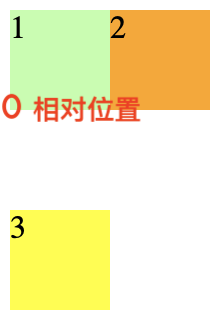

## 绝对定位
### 绝对定位的基本使用
[top](#catalog)
- `position:absolute`开启绝对定位
- **偏移量的定位位置：包含块**
    - 一般情况包含块是离当前元素**最近的**、**开启定位的**、**祖先块元素**
    - 如果所有的祖先元素都没有开启定位，则根元素就是包含块
    - `<html>`作为初始包含块

- 绝对定位的特点
    - 绝对定位会**使元素脱离文档流**
    - 开启绝对定位后，如果没有设置偏移量，则元素的位置不会发生任何变化
    - 绝对定位会改变元素的性质（因为脱离了文档流）
        - 块元素的宽高消失
    - 绝对定位会提升元素的层级

- 示例
    - 参考代码
        - [/frontend/css/base/src/position/absolute01.html](/frontend/css/base/src/position/absolute01.html)
        - [/frontend/css/base/src/position/absolute02.html](/frontend/css/base/src/position/absolute02.html)
    
    - 开启绝对定位，设置：偏移量=0
        - css
            ```css
            .box0101{
                width: 50px;
                height: 50px;
                background-color: #bfa;
            }
            .box0102{
                width: 50px;
                height: 50px;
                background-color: orange;
                /* 使用绝对定位 */
                position: absolute;
                /* 偏移量 = 0 */
                top:0;
                left:0;
            }
            .box0103{
                width: 100px;
                height: 100px;
                background-color: rgb(42, 102, 240);
            }
            ```
        
        - html
            ```html
            <section>&nbsp;&nbsp;&nbsp;&nbsp;&nbsp;&nbsp;&nbsp;&nbsp;
                1. 开启绝对定位，设置：偏移量=0</section>
            <div class="box0101">1</div>
            <div class="box0102">2</div>
            <div class="box0103">3</div>
            ```
        - 页面结果
            - 
    
    - 开启绝对定位，没有设置偏移量，元素的位置不会发生变化
        - css
            ```css
            .box0201{
                width: 50px;
                height: 50px;
                background-color: #bfa;
            }
            .box0202{
                width: 50px;
                height: 50px;
                background-color: orange;
                /* 使用绝对定位 */
                position: absolute;
                /* 不设置偏移量 */
            }
            .box0203{
                width: 100px;
                height: 100px;
                background-color: rgb(42, 102, 240);
            }
            ```
        
        - html
            ```html
            <section>2. 开启绝对定位，没有设置偏移量，元素的位置不会发生变化</section>
            <div class="box0201">1</div>
            <div class="box0202">2</div>
            <div class="box0203">3</div>
            ```
        - 页面结果
            - 
    
    - 在多层嵌套的块元素中，开启绝对定位，设置：偏移量=0
        - css
            ```css
            .box0301{
                width: 150px;
                height: 150px;
                background-color: #bfa;
            }
            .box0302{
                width: 100px;
                height: 100px;
                background-color: orange;
            }
            .box0303{
                width: 50px;
                height: 50px;
                background-color: rgb(42, 102, 240);
                /* 使用绝对定位 */
                position: absolute;
                top:0;
                left:0;
            }
            ```
        
        - html
            ```html
            <section>&nbsp;&nbsp;&nbsp;&nbsp;&nbsp;&nbsp;&nbsp;&nbsp;&nbsp;
                3. 在多层嵌套的块元素中，开启绝对定位，设置：偏移量=0</section>
            <div class="box0301">1
                <div class="box0302">2
                    <div class="box0303">3</div>
                </div>
            </div>
            ```
        - 页面结果
            - 
    
    - 在2层嵌套的块元素中，2层全部开启相对定位，设置：偏移量=0
        - css
            ```css
            .outter0401{
                width: 150px;
                height: 150px;
                background-color: #bfa;
                position:relative;
            }
            .outter0402{
                width: 100px;
                height: 100px;
                background-color: orange;
                position:relative;
            }
            .inner0401{
                width: 50px;
                height: 50px;
                background-color: rgb(42, 102, 240);
                /* 使用绝对定位 */
                position: absolute;
                top:0;
                left:0;
            }
            ```
        
        - html
            ```html
            <section>4. 在2层嵌套的块元素中，2层全部开启相对定位，设置：偏移量=0</section>
            <div class="outter0401">1
                <div class="outter0402">2
                    <div class="inner0401">3</div>
                </div>
            </div>
            ```
        - 页面结果
            - 
    
    - 在2层嵌套的块元素中，只有第1层开启相对定位，设置：偏移量=0
        - css
            ```css
            .outter0501{
                width: 150px;
                height: 150px;
                background-color: #bfa;
                position:relative;
            }
            .outter0502{
                width: 100px;
                height: 100px;
                background-color: orange;
                /* position:relative; */
            }
            .inner0501{
                width: 50px;
                height: 50px;
                background-color: rgb(42, 102, 240);
                /* 使用绝对定位 */
                position: absolute;
                top:0;
                left:0;
            }
            ```
        
        - html
            ```html
            <section>5. 在2层嵌套的块元素中，只有第1层开启相对定位，设置：偏移量=0</section>
            <div class="outter0501">1
                <div class="outter0502">2
                    <div class="inner0501">3</div>
                </div>
            </div>
            ```
        - 页面结果
            - 


### 启动绝对定位后必须满足的水平垂直等式
[top](#catalog)
- 启动绝对定位后，水平等式、垂直等式**必须满足**
- 偏移量：`left`、`right`、`top`、`bottom`的默认值是`auto`
- 水平等式：`包含块.width = 元素.sum(left, margin-left, border-left, padding-left, width, padding-right, border-right, margin-right, right)`
    - 当发生过度约束时
        - 如果有`auto`，则自动调整`auto`来满足等式
            - 自动调整时的优先级：`偏移量 > width > margin`
    - 如果需要通过`margin-left`和`margin-right`来自动设置元素居中，必须设置`left:0`、`right:0`

- 垂直等式：`包含块.height = 元素.sum(top, margin-top, border-top, padding-top, height, padding-bottom, border-bottom, margin-bottom, bottom`
    - 当发生过度约束时
        - 如果有`auto`，则自动调整`auto`来满足等式
            - 自动调整时的优先级：`偏移量 > height > margin`
    - 如果需要通过`margin-top`和`margin-bottom`来自动设置元素居中，必须设置`top:0`、`bottom:0`

- 通过`margin:auto`、`top:0`、`bottom:0`、`left:0`、`right:0`，可以使元素在包含块中水平垂直居中

- 示例
    - 参考代码
        - [/frontend/css/base/src/position/absoluteLayout.html](/frontend/css/base/src/position/absoluteLayout.html)

    - auto优先级测试：开启绝对定位，width、margin、偏移量全部设为auto
        - css
            ```css
            .outter01{
                width: 100px;
                height: 100px;
                background-color: #bfa;
                position: relative;
            }

            .inner01{
                width: auto;
                height: 50px;
                background-color: orange;
                position:absolute;

                margin-left:auto;
                margin-right:auto;
            }
            ```

        - html
            ```html
            <section>1. 水平等式：开启绝对定位，但是不设置left、right，只设置margin-left、margin-right为auto</section>
            <div class="outter01">
                <div class="inner01"></div>
            </div>
            ```
        
        - 页面结果
            - 

    - 水平等式：开启绝对定位，通过margin:auto、left:0、right:0来设置水平居中效果
        - css
            ```css
            .outter02{
                width: 100px;
                height: 100px;
                background-color: #bfa;
                position: relative;
            }
            .inner02{
                width: 50px;
                height: 50px;
                background-color: #47e;

                margin-left: auto;
                margin-right: auto;

                position:absolute;
                left:0px;
                right:0px;
            }
            ```

        - html
            ```html
            <section>2. 水平等式：开启绝对定位，通过margin:auto、left:0、right:0来设置水平居中效果</section>
            <div class="outter02">
                <div class="inner02"></div>
            </div>
            ```
        
        - 页面结果
            - 

    - 垂直等式：开启绝对定位，通过margin:auto、top:0、bottom:0来设置垂直居中效果
        - css
            ```css
            .outter03{
                width: 100px;
                height: 100px;
                background-color: #bfa;
                position: relative;
            }

            .inner03{
                width: 50px;
                height: 50px;
                background-color: orange;

                margin-top: auto;
                margin-bottom: auto;

                position:absolute;
                top:0px;
                bottom:0px;
            }
            ```

        - html
            ```html
            <section>3. 垂直等式：开启绝对定位，通过margin:auto、top:0、bottom:0来设置垂直居中效果</section>
            <div class="outter03">
                <div class="inner03"></div>
            </div>
            ```
        
        - 页面结果
            - 

    - 开启绝对定位，水平垂直居中
        - css
            ```css
            .outter04{
                width:100px;
                height: 100px;
                background-color: #bfa;
                position:relative;
            }
            
            .inner04{
                width: 50px;
                height:50px;
                background-color:#47e;
                position: absolute;
                margin:auto;
                top:0px;
                bottom:0px;
                left:0px;
                right:0px;
            }
            ```

        - html
            ```html
            <section>4. 开启绝对定位，水平垂直居中</section>
            <div class="outter04">
                <div class="inner04"></div>
            </div>
            ```
        
        - 页面结果
            - 


## 固定定位
[top](#catalog)
- `position:fixed`开启固定定位
- 固定定位是一种特殊的绝对定位
- **偏移量的定位位置：浏览器的视口（可视窗口）**
    - 固定定位不会跟随滚动条移动，会一直固定在可是窗口的指定位置
    - 与`<html>`定位位置不同，产生滚动条时，元素只会在原有的结构位置上

- 固定定位的特点，**与绝对定位相同**
    - 绝对定位会**使元素脱离文档流**
    - 开启绝对定位后，如果没有设置偏移量，则元素的位置不会发生任何变化
    - 绝对定位会改变元素的性质（因为脱离了文档流）
        - 块元素的宽高消失
    - 绝对定位会提升元素的层级

- 示例
    - 参考代码
        - [/frontend/css/base/src/position/fixed.html](/frontend/css/base/src/position/fixed.html)

    - 固定定位：居右、居中
        - css
            ```css
            body{
                height: 2000px;
            }
            .box1{
                width: 50px;
                height: 50px;
                background-color: #bfa;
                /* 固定定位：居右、居中 */
                position: fixed;
                right:0px;
                top:50%;
            }
            ```
        - html
            ```html
            <div class="box1"></div>
            ```
        
        - 页面结果
            - 

## 粘滞定位
[top](#catalog)
- 粘滞定位是新的定位方式，有些浏览器版本不支持
- `position:sticky`开启粘滞定位
- **偏移量的定位位置：`<body>`**
- 粘滞定位的特点与相对定位相似
- 粘滞定位可以在元素到达页面的某个位置时，开始固定到指定位置
- 因为兼容性问题，实际使用的比较少。一般开发时使用js来完成相应的功能

- 示例：导航条固定
    - 参考代码
        - [/frontend/css/base/src/position/sticky.html](/frontend/css/base/src/position/sticky.html)
    - css
        ```css
        /* 导航条样式 */
        /* 设置ul的长宽 */
        .naviBar{
            /* 设置宽高 */
            width:900px;
            /* 设置外边距:上下100px，左右通过auto使用水平公式做自动适应 */
            margin:100px auto;
            /* 设置背景 */
            background-color:rgb(179, 179, 179);
            /* 设置粘滞定位 */
            position:sticky;
            top:10px;
        }
        ```

    - html
        ```html
        <ul class="naviBar clearfix">
            <li>
                <a href="javascript:;" >AAA</a>
            </li>
            <li>
                <a href="javascript:;" >BBB</a>
            </li>
            <li>
                <a href="javascript:;" >CCC</a>
            </li>
        </ul>
        <div class="otherbox"></div>
        ```

    - 页面结果
        - 页面初始化
            - 
        - 拖动滚动条，触发粘滞定位
            - 


## 元素的层级
[top](#catalog)
- 对于开启了定位的元素，可以通过`z-index`属性来指定元素的层级
    - `z-index`即3维空间中`z轴`的值
- `z-index`需要一个整数作为参数，值越大元素的层级越高，层级越高越优先显示

- 元素层级的特点
    - **所有类型定位的默认层级都是相同的**
    - 如果元素的层级相同，则优先显示html中靠下的元素或内部的子元素，可以引申为
        1. 后面的元素优先
        2. 祖先元素的层级再高也不会遮盖后代元素

- 示例
    - 参考代码
        - [/frontend/css/base/src/position/zindex.html](/frontend/css/base/src/position/zindex.html)

    - 全部开启绝对定位,优先显示靠下的元素
        - css
            ```css
            .outter01{
                position: relative;
                width:300px; height:300px;
            }
            .box0101{
                width:100px; height:100px;
                background-color: #bfa;
                position: absolute;
                top:0px;
                left:0px;
            }
            .box0102{
                width:100px; height:100px;
                background-color: #47e;
                position: absolute;
                top:50px;
                left:50px;
            }
            .box0103{
                width:100px; height:100px;
                background-color: orange;
                position: absolute;
                top:100px;
                left:100px;
            }
            /* box0103的子元素 */
            .box0104{
                width:50px; height:50px;
                background-color: rgb(218, 140, 252);
                position: absolute;
            }
            ```
        - html
            ```html
            <section>1. 全部开启绝对定位,优先显示靠下的元素或内部的子元素</section>
            <div class="outter01">
                <div class="box0101">1</div>
                <div class="box0102">2</div>
                <div class="box0103">3
                    <div class="box0104">4</div>
                </div>
            </div>
            ```
        - 页面结果
            - 
        
    - 全部开启绝对定位,并分别设置层级,层级越大越优先显示
        - css
            ```css
            .outter02{
                position: relative;
                width:300px; height:300px;
            }
            .box0201{
                width:100px; height:100px;
                background-color: #bfa;
                position: absolute;
                top:0px;
                left:0px;
                z-index: 3;
            }
            .box0202{
                width:100px; height:100px;
                background-color: #47e;
                position: absolute;
                top:50px;
                left:50px;
                z-index: 2;
            }
            .box0203{
                width:100px; height:100px;
                background-color: orange;
                position: absolute;
                top:100px;
                left:100px;
                z-index: 1;
            }
            ```
        - html
            ```html
            <section>2. 全部开启绝对定位,并分别设置层级,层级越大越优先显示</section>
            <div class="outter02">
                <div class="box0201">1</div>
                <div class="box0202">2</div>
                <div class="box0203">3</div>
            </div>
            ```
        - 页面结果
            - 
        
    - 全部开启绝对定位，父元素的层级 > 子元素，但是父元素不会遮盖子元素
        - css
            ```css
            .outter03{
                position: relative;
                width:300px; height: 300px;
            }
            .box0301{
                width:100px; height:100px;
                background-color: #bfa;
                position: absolute;
                top:0px;
                left:0px;
            }
            .box0302{
                width:100px; height:100px;
                background-color: #47e;
                position: absolute;
                top:50px;
                left:50px;
                z-index: 4;
            }
            .box0303{
                width: 50px; height: 50px;
                background-color: orange;
                position: absolute;
                z-index:1;
            }
            ```
        - html
            ```html
            <section>3. 全部开启绝对定位，父元素的层级 > 子元素，但是父元素不会遮盖子元素</section>
            <div class="outter03">
                <div class="box0301">1</div>
                <div class="box0302">2
                    <div class="box0303">3</div>
                </div>
            </div>
            ```
        - 页面结果
            - 
        
# 字体font
## 字体的格式
[top](#catalog)
- 与字体的格式相关的属性
    
    |属性|说明|
    |-|-|
    |`color`|一般用于设置字体颜色，严格说`color`用来设置前景色|
    |`font-size`|<ul>  <li>用于设置文字大小</li>  <li>与文字大小相关的单位：`em`，`rem`，参考：[页面的长度单位](#页面的长度单位)</li>  </ul>|
    |`font-weigth`|<ul><li>字重，字体的加粗</li><li>常用属性值可选值<ul><li>`normal`: 默认值不加错</li><li>`bold`：加粗</li><li>100-900：9个加粗级别，能否加粗取决于用户电脑中是否存在对应的加粗字体(一般没什么用)</li></ul></li><ul>|
    |`font-style`|字体风格|
    |`font-family`|<ul>   <li>设置字体格式（字体族） <ul><li>可以指定多个字体，字体间用`,`分割 <ul>  <li>如：`Arial, Helvetica, sans-serif;`</li>  <li>指定多个字体时，按照顺序来设置：先使用第一中字体，如果第一中没有则尝试第二种</li>  <li>一般会在最后写一个字体分类，以保证其他字体未找到时，使用浏览器下的某种类型的默认字体</li>   </ul>  </li>  <li>字体名中如果有空格等特殊字符，需要使用`''`来包裹</li>  </ul>   </li>   <li>几种字体分类，使用后浏览器会自动使用该类别下的字体<ul><li>`serif` : 衬线字体</li><li>`sans-serif` : 非衬线字体</li> <li>`monospace` : 等宽字体，字母大小相同，方便对齐</li>  <li>`cursive` : 草书字体，类似于艺术字，很少使用</li>  <li>`fantasy` : 类似于艺术字，很少使用</li> </ul> </li> </ul>|


- 设置字体格式时，用户的电脑中必须要有对应的字体文件，否则无法正常显示，所以大多使用微软雅黑
- `@font-face`，指定从服务器下载字体文件
    - 用户使用时，如果本地有相应的字体文件，则使用本地的，如果没有则从服务器下载
    - `@font-face`的设置方法
        ```css
        @font-face {
            /* 指定字体的名字 */
            font-family: "myfont";
            /* 服务器中字体文件的路径，可以指定多个，按照顺序使用 */
            src: url("..."),url("...");
        }
        ```
    - `@font-face`中字体的使用方法：直接通过字体名字来使用
        ```css
        font-family: myfont;
        ```
    - `@font-face`带来的问题
        1. 第一次加载时比较慢
        2. 可能会产生版权问题

- 示例
    - 参考代码
        - [/frontend/css/base/src/font/font.html](/frontend/css/base/src/font/font.html)
    - css
        ```css
        .pstyle01{
            /* 设置字体颜色 */
            color:#47e; 
            /* 设置字体大小 */
            font-size:15px;
            /* 设置字体格式 */
            font-family:Arial, Helvetica, sans-serif;
        }

        .pstyle02{
            font-family: serif;
        }
        .pstyle03{
            font-family:sans-serif;
        }
        .pstyle04{
            font-family:monospace;
        }
        .pstyle05{
            font-family:cursive;
        }
        .pstyle06{
            font-family:fantasy;
        }

        /* 7. 字体加粗 */
        .pstyle07{
            font-weight:bold;
        }

        /* 8. 字体风格 */
        .pstyle08{
            font-style: italic;
        }

        @font-face {
            /* 指定字体的名字 */
            font-family: "myfont";
            /* 服务器中字体文件的路径 */
            src: url();
        }
        ```
    - html
        ```html
        <section>1. 设置字体颜色和字体大小</section>
        <p class="pstyle01">
            Lorem ipsum dolor sit, amet consectetur adipisicing elit. Obcaecati rerum adipisci animi culpa nobis ex numquam aperiam delectus incidunt harum eius, eum, commodi repellat ad libero illo, repudiandae quae exercitationem!
        </p>

        <section>2. font-family: serif;</section>
        <p class="pstyle01">abcdefghijklmn</p>

        <section>3. font-family:sans-serif;</section>
        <p class="pstyle02">abcdefghijklmn</p>

        <section>4. font-family:monospace;</section>
        <p class="pstyle03">abcdefghijklmn</p>
        <p class="pstyle03">aaaaaaaaaaaaaaaa</p>
        
        <section>5. font-family:cursive;</section>
        <p class="pstyle04">qwrerttyu</p>
        
        <section>6. font-family:fantasy;</section>
        <p class="pstyle05">tgbnhyujm</p>

        <section>7. 字体加粗</section>
        <p class="pstyle06">asdfghj</p>

        <section>8. 字体风格</section>
        <p class="pstyle08">zxcvbnm</p>
        ```
    - 页面结果
        - 


## 图标字体
### 图标字体的基本知识
[top](#catalog)
- 字体相对于图片的优势：
    1. 放大字体时，不会失真
    2. 字体可以改变颜色
- 为什么使用图标字体？
    - 在网页中需要使用一些图标，这些图标可以使用图片，但是图片本身的容量比较大，并且不灵活
    - 使用图标时，将图标设置为字体，通过`@font-face`来引入，这样将字体作为图标使用更加灵活

- 一般会使用`<i>`标签来表示图标字体（该标签本身是表示斜体）

- 开源图标字体引入后的三种通用使用方法
    1. 类
    2. 字符code + 伪元素
    3. html实体

### 开源图标字体库FontAwesome
[top](#catalog)
- 开源的图标字体库:`Font Awesome`的使用
    - 引入`Font Awesome`
        1. 地址：https://fontawesome.com/
        2. 下载解压
        3. 将css和webfonts目录拷贝到工作目录（如放到fa目录下，html文件与fa目录同级）
            - css和webfonts必须在同级目录下
        4. 引入css目录下的外部css：`all.css`，或`all.min.css`(min是压缩过的文件), 如：
            ```html
            <link rel="stylesheet" href="./fa/css/all.css">
            ```
        5. 使用图标字体
    - 3种使用方法
        1. 类：通过类来使用，如：`<i class="fas fa-bell"></i>`
            - `fas`是一个字体引入样式，`fa-bell`是实际的图标样式
            - `fa-bell`的css内容，直接设置伪元素来设置图标
                ```css
                .fa-bell:before {
                    content: "\f0f3"; }
                ```
            - `fas`的css内容：通过`@font-face`设置webfonts下字体文件的地址，然后在`fas`中通过`font-family`属性来引用字体
                ```css
                @font-face {
                    font-family: 'Font Awesome 5 Free';
                    font-style: normal;
                    font-weight: 900;
                    font-display: block;
                    src: url("../webfonts/fa-solid-900.eot");
                    src: url("../webfonts/fa-solid-900.eot?#iefix") format("embedded-opentype"), url("../webfonts/fa-solid-900.woff2") format("woff2"), url("../webfonts/fa-solid-900.woff") format("woff"), url("../webfonts/fa-solid-900.ttf") format("truetype"), url("../webfonts/fa-solid-900.svg#fontawesome") format("svg"); }

                .fa,
                .fas {
                    font-family: 'Font Awesome 5 Free';
                    font-weight: 900; }
                ```

        2. 字符code + 伪元素 ： 在css中通过Font Awesome的字符编码code与伪元素来定制图标字体
            1. 设置目标元素的伪元素：`before`或`after`
            2. 找到需要使用的图标字体的字符编码
            3. 通过`font-family`属性引入其对应的字体，使字体生效
            4. 在类中进行其他内容的定制
        
        3. html实体：通过html实体来使用图标字体
            - 使用方法:
                - 类中指定字体引入样式，如`fas`
                - 通过html实体引入图标：`&#x字符编码;`,如
                    ```html
                    <i class="fas">&#xf647;</i>
                    ```

- 示例
    - 使用前需要手动导入css与webfont目录
    - 参考代码
        - [/frontend/css/base/src/font/fontAwesome.html](/frontend/css/base/src/font/fontAwesome.html)
    - css
        ```css
        /* 2. 在css中通过Font Awesome的字符编码code与伪元素来定制图标字体 */
        li{
            list-style: none;
        }

        .iconlist li::before{
            content: "\f236";
            font-family: "Font Awesome 5 Free";
            font-weight: 900;
            margin-right:10px;
        }
        ```
        
    - html
        ```html
        <section>1. 通过类使用图标字体</section>
        <i class="fas fa-bell" style="color:#47e; font-size:20px;"></i>
        <br>
        <br>

        <section>2. 在css中通过字符Font Awesome的字符编码code与
            <br>伪元素来定制图标字体：fa-bed</section>
        <ul class="iconlist">
            <li>aaa</li>
            <li>bbb</li>
            <li>ccc</li>
        </ul>

        <section>3. 通过html实体来使用图标字体：fa-bible</section>
        <i class="fas">&#xf647;</i>
        ```
    - 页面结果
        - 

## 行高与字体框
### 行高
[top](#catalog)  
- 行高指文字占用的实际高度
- 可以通过`line-height`属性来指定行高
    - 属性的可用单位
        1. `px`
        2. `em`，[页面的长度单位](#页面的长度单位)
        3. `rem`，[页面的长度单位](#页面的长度单位)
        4. 数字，表示当前文字大小的倍数
    - 默认行高：1.333

- 示例
    - 参考代码
        - [/frontend/css/base/src/font/lineHeight.html](/frontend/css/base/src/font/lineHeight.html)
    - 查看默认行高
        - css
            ```css
            .box01{
                border:#47e 2px solid;
            }
            ```
        - html
            ```html
            <section>
                <p>1. 查看默认行高</p>
                <p>div是宽元素，宽高由子元素和内容决定，一次来观察默认行高</p>
            </section>
            <div class="box01">1234556</div>
            ```
        - 页面结果
            - 
            
    - 手动设置行高
        - css
            ```css
            .box02{
                border:#47e 2px solid;
                line-height: 100px;
            }
            ```
        - html
            ```html
            <section>2. 设置行高 line-height: 100px;</section>
            <div class="box02">qwertyyuu</div>
            ```
        - 页面结果
            - 

    - 使用数字设置行高，即文字大小的倍数
        - css
            ```css
            .box0301{
                font-size:20px;
                border: #47e 2px solid;
                line-height: 1;
            }
            .box0302{
                font-size:20px;
                border: #47e 2px solid;
                line-height: 2;
            }
            ```
        - html
            ```html
            <section>3. 使用数字设置行高，即文字大小的倍数</section>
            <section>3.1. 1倍</section>
            <div class="box0301">sdfgdfgf</div>
            <section>3.2. 2倍</section>
            <div class="box0302">sdfgdfgf</div>
            ```
        - 页面结果
            - 

### 字体框
[top](#catalog)
- 字体框就是字体存在的格子，每一个字都是存在于一个格子中的
- 给字体设置`font-size`属性时，实际上就是在设置字体框的高度
    - 如`font-size:50px`可以理解为：将字体放入一个大小为50px的框中
    - 严格来说，字体的最终大小会**小于**`font-size`

- 行高会在**字体框的上下**平均分配，这样会使文字默认在一行的中间位置
    - 利用这个特性一般会设置`line-height = hegiht`来使**单行文字**垂直居中

### 行高与字体框的应用
[top](#catalog)
1. 单行文字垂直居中：利用**行高会在字体框的上下平均分配**的特性，通过设置`height = line-height`，或者只设置`line-height`，来制作**单行文字垂直居中**的效果
    - 参考：[文字水平垂直居中](#文字水平垂直居中)

2. 设置行间距：`行间距=line-height - font-size`
    - 示例
        - 参考代码
            - [/frontend/css/base/src/font/fontCenter.html](/frontend/css/base/src/font/fontCenter.html)
        - 测试行间距
            - css
                ```css
                .box04{
                    width: 200px;
                    height: 200px;
                    background-color: #bfa;
                    font-size: 20px;
                    line-height: 40px;
                }
                ```
            - html
                ```html
                <section>4. 测试行间距</section>
                <div class="box04">
                    <p>asdfdfdfg</p>
                    <p>asdfdfdfg</p>
                    <p>asdfdfdfg</p>
                </div>
                ```
            - 页面结果
                -   

## 字体的简写属性
[top](#catalog)
- 通过简写属性：`font`可以设置与字体相关的所有属性
- 语法： `font: [font-style font-weigth] font-size[/line-height] font-family`
    - 字体大小后可以指定行高：`font: 字体大小/行高 字体族`
    - `font-style`、`font-weigth`、`line-height`，这三个属性可以不设置，但是简写属性会使用**默认值**
        - 如果这三个属性没有设置，并且在简写属性之前这三个属性有单独的设置，则会被默认值覆盖
        - `font-style`的默认值：`normal`
        - `font-weight`的默认值：`normal`
        - `line-height`的默认值：1.333

- 示例
    - 参考代码
        - [/frontend/css/base/src/font/simpleProperty.html](/frontend/css/base/src/font/simpleProperty.html)
    - css
        ```css
        /* 1. 设置公共的字体属性： */
        p{
            font-style: italic;
            font-weight: bold;
            line-height: 2;
            size:20px;
            border: #47e 2px solid;
        }
        
        /* 2. 测试简写属性的默认值覆盖
            font-style，font-weight，line-height 使用默认值*/
        .pstyle02{
            font: 20px serif;
        }
        
        /* 3. 测试简写属性的默认值覆盖
            font-style，font-weight，使用默认值*/
        .pstyle03{
            font: 20px/3 serif;
        }

        /* 4. 所有属性值使用简写属性设置 */
        .pstyle04{
            font: oblique 900 15px/2.5 monospace;
        }
        ```
    - html
        ```html
        <section>1. 设置公共的字体属性作为参照</section>
        <p>Lorem ipsum dolor sit amet consectetur, adipisicing elit. Dignissimos fugit voluptates, esse praesentium repudiandae iure nulla maiores itaque minima magnam blanditiis labore eius libero facere ratione voluptate ipsum veritatis maxime.</p>

        <section>
            2. 测试简写属性的默认值覆盖
            <br>
            font-style，font-weight，line-height 使用默认值
        </section>
        <p class="pstyle02">Lorem ipsum dolor sit amet consectetur adipisicing elit. Fugit, quaerat! Blanditiis repellat deserunt aperiam quos, error eum vel reprehenderit laudantium aspernatur nobis, deleniti reiciendis. Vitae tenetur quisquam quia assumenda nemo.</p>

        <section>
            3. 测试简写属性的默认值覆盖
            <br>
            font-style，font-weight，使用默认值
        </section>
        <p class="pstyle03">Lorem ipsum dolor sit amet consectetur adipisicing elit. Minus dolorum ad ipsa libero veniam expedita iure alias quia quae, impedit aliquam illo accusamus, aliquid porro, a voluptates accusantium. Cum, architecto.</p>

        <section>4. 所有属性值使用简写属性设置</section>
        <p class="pstyle04">Lorem ipsum dolor sit amet consectetur adipisicing elit. Exercitationem quidem aperiam eum pariatur nostrum fugit laborum perspiciatis esse, ea error sapiente delectus. Inventore pariatur ex voluptatibus cum, reiciendis expedita saepe!</p>
        ```
    
    - 页面结果
        - 

## 文本的样式
[top](#catalog)
- `text-decoration:修饰内容`，设置文本修饰
    - 常用属性值/修饰内容

        |属性值/修饰内容|描述|
        |-|-|
        |none|没有修饰，默认值|
        |underline|下划线|
        |overline|上划线|
        |line-through|删除线|

    - 除了属性值，还可以同时设置文本修饰内容的颜色和样式：`text-align:修饰内容 颜色 样式`
        - **这中设置方法在IE中无效**

- `white-space`，设置网页如何处理空白
    - 常用属性值

        |属性值/修饰内容|描述|
        |-|-|
        |normal|正常显示，默认值|
        |nowrap|文本不换行，会产生滚动条|
        |pre|<ul><li>保留文本样式</li><li>将文本按照html中的书写格式输出</li><li>多个空格、多个换行不会被解析成一个，将会全部保留</li><ul>|
        |||

- `text-overflow`，设置文本溢出时的处理方式
    - ?????

- 常用的文本属性组合
    1. 文本过长时，截断文本并且在末尾显示`...`。
        - `white-space`、`overflow`、`text-overflow`，这三个属性必须同时设置，否则无法生效
        - css
            ```css
            .box{
                /* 使文本不换行,在一行显示 */
                white-space: nowrap;
                /* 文本超过父元素的宽度时，隐藏超出的部分 */
                overflow: hidden;
                /* 如果文本过长，被隐藏了，则在末尾显示`...` */
                text-overflow: ellipsis;
            }
            ```

- 示例
    - 参考代码
        - [/frontend/css/base/src/font/text.html](/frontend/css/base/src/font/text.html)
    - 给字体添加文本修饰
        - css
            ```css
            /* 1.1. 不设置文本修饰 */
            .box0101{
                text-decoration:none;
            }

            /* 1.2. 给文本设置下划线 */
            .box0102{
                text-decoration:underline;
            }

            /* 1.3. 给文本设置上划线 */
            .box0103{
                text-decoration:overline;
            }

            /* 1.4. 给文本设置删除线 */
            .box0104{
                text-decoration:line-through;
            }
            
            /* 1.5. 给字体添加下划线，并设置下滑线的颜色及样式 */
            .box0105{
                text-decoration: underline red solid;
            }
            ```
        - html
            ```html
            <section>1. 给字体添加文本修饰</section>
            <section>1.1. 给字体添加下划线</section>
            <p class="box0101">asdfghjkl</p>
            <section>1.2. 给文本设置下划线</section>
            <p class="box0102">asdfghjkl</p>
            <section>1.3. 给文本设置上划线</section>
            <p class="box0103">asdfghjkl</p>
            <section>1.4. 给文本设置删除线</section>
            <p class="box0104">asdfghjkl</p>
            <section>1.5. 给字体添加下划线，并设置下滑线的颜色及样式</section>
            <p class="box0105">asdfghjkl</p>
            ```
        - 页面结果
            - 

    - 处理页面空白
        - css
            ```css
            /* 2.1. 正常显示 */
            .box0201{
                white-space:normal;
            }
            /* 2.2. 不换行 */
            .box0202{
                white-space:nowrap;
            }
            
            /* 2.3. 保留文本的书写格式 */
            .box0203{
                border:#47e 2px solid;
                white-space:pre;
            }
            ```

        - html
            ```html
            <section>2. 处理页面空白</section>
            <section>2.1. 正常显示</section>
            <p class="box0201">Lorem ipsum dolor sit amet consectetur adipisicing elit. Delectus debitis dignissimos cum corrupti provident voluptate magni, ipsa laboriosam accusamus.</p>
            <section>2.2. 文本不换行，会产生滚动条</section>
            <p class="box0202">Lorem ipsum dolor sit amet consectetur adipisicing elit. Delectus debitis dignissimos cum corrupti provident voluptate magni, ipsa laboriosam accusamus.</p>
            <section>2.3. 保留文本样式，将文本按照html中的书写格式输出</section>
            <div class="box0203">sdfdsfsffsfsfd
                    xcvvxv
                        cbvb


                            bbvnghj
            </div>
            ```
        - 页面结果
            - 

    - 文本过长时，截断文本并且在末尾显示`...`
        - css
            ```css
            .box03{
                width:200px;
                border: #47e 2px solid;
                /* 使文本不换行,在一行显示 */
                white-space: nowrap;
                /* 文本超过父元素的宽度时，隐藏超出的部分 */
                overflow: hidden;
                /* 如果文本过长，被隐藏了，则在末尾显示`...` */
                text-overflow: ellipsis;
            }
            ```
        - html
            ```html
            <section>3. 文本过长时，截断文本并且在末尾显示`...`</section>
            <section>3.1. 正常文本</section>
            <p class="box03">abcdefg</p>
            <section>3.2. 文本过长</section>
            <p class="box03">Lorem ipsum dolor, sit amet consectetur adipisicing elit.</p>    
            ```

        - 页面结果
            - 
        
## 文本的居中与对齐
[top](#catalog)
- 文本的水平对齐：`text-align`
    - 常用属性值/修饰内容

        |属性/修饰内容|说明|
        |-|-|
        |left|左对齐|
        |right|右对齐|
        |center|居中对齐|
        |justify|两端对齐|

- 文本的垂直对齐:`vertical-align`
    - 常用属性值

        |属性|说明|
        |-|-|
        |baseline|基线对齐，默认值|
        |top|顶部对齐|
        |bottom|底部对齐|
        |middle|居中对齐。不是真的居中对齐，是以基线+`x`字符的一半高度作为对齐标准|

- 单行文字垂直居中：需要`height = line-height`，或者只设置`line-height`
    - 引用字体框的特性，行高会在文字框的上下平均分配，来达到垂直居中的效果

- 示例：
    - 参考代码
        - [/frontend/css/base/src/font/fontCenter.html](/frontend/css/base/src/font/fontCenter.html)
    
    - 测试水平对齐
        - css
            ```css
            /* 1. 水平对齐*/
            /* 1.1. 水平对齐：文本的左对齐 */
            .box0101{
                width: 500px;
                border: #47e 2px solid;
                text-align: left;
            }

            /* 1.2. 水平对齐：文本的右对齐 */
            .box0102{
                width: 500px;
                border: #47e 2px solid;
                text-align: right;
            }
            
            /* 1.3. 水平对齐：文本的居中对齐 */
            .box0103{
                width: 500px;
                border: #47e 2px solid;
                text-align:center;
            }
            
            /* 1.4. 水平对齐：文本的两端对齐 */
            .box0104{
                width: 500px;
                border: #47e 2px solid;
                text-align:justify;
            }
            ```
        - 页面结果
            - 
    
    - 测试垂直对齐
        - css
            ```css
            /* 2. 垂直对齐 */
            .box02{
                width: 500px;
                border: #47e 2px solid;
                font-size: 20px;
            }
            /* 2.1. 垂直对齐：文本的基线对齐 */
            .spanSmall0201{
                font-size: 10px;
                border: red 1px solid;
                vertical-align:baseline;
            }
            
            /* 2.2. 垂直对齐：文本的顶部对齐 */
            .spanSmall0202{
                font-size: 10px;
                border: red 1px solid;
                vertical-align:top;
            }
            
            /* 2.3. 垂直对齐：文本的底部对齐 */
            .spanSmall0203{
                font-size: 10px;
                border: red 1px solid;
                vertical-align:bottom;
            }
            
            /* 2.4. 垂直对齐：文本的居中对齐 */
            .spanSmall0204{
                font-size: 10px;
                border: red 1px solid;
                vertical-align:middle;
            }
            ```
        - html
            ```html
            <section>2. 垂直对齐</section>
            <section>2.1. 垂直对齐：文本的基线对齐</section>
            <div class="box02">
                lorem<span class="spanSmall0201">asdfg</span>
            </div>

            <section>2.2. 垂直对齐：文本的顶部对齐</section>
            <div class="box02">
                lorem<span class="spanSmall0202">asdfg</span>
            </div>
            
            <section>2.3. 垂直对齐：文本的底部对齐</section>
            <div class="box02">
                lorem<span class="spanSmall0203">asdfg</span>
            </div>

            <section>2.4. 垂直对齐：文本的居中对齐</section>
            <div class="box02">
                loremx<span class="spanSmall0204">asdfg</span>
            </div>
            ```
        - 页面结果
            - 
    
    - 测试单行文字垂直居中
        - css
            ```css
            .box03{
                width: 200px;
                height: 100px;
                background-color: #bfa;
                line-height: 100px;
            }
            ```
        - html
            ```html
            <section>3. 测试单行文字垂直居中</section>
            <div class="box03">asdfdfdfg</div>
            ```
        - 页面结果
            - 
    
# 背景
[top](#catalog)
- 常用属性
    - `background-color`, 设置元素的背景色
    - `background-image: url("背景图片路径");`，设置元素的背景图片
        - 默认状态下，背景图片与元素的大小关系对显示的影响
            - `背景图片 < 元素`，背景图片会在元素内部平铺
            - `背景图片 > 元素`，一部分背景图片无法显示
            - `背景图片 = 元素`，背景图片正常显示
        - 可以同时设置背景色`background-color`和背景图片`background-image`
            - 设置后，元素的背景色将变成背景图片的背景色

    - `background-repeat`，设置图片的重复方式
        - 常用属性值

            |属性值|描述|
            |-|-|
            |repeat|在水平和垂直方向上进行重复|
            |repeat-x|沿x轴/水平方向上重复|
            |repeat-y|沿y轴/垂直方向上重复|
            |no-repeat|不重复|

    - `background-position: x轴位置 y轴位置`，设置背景图片的位置
        - 设置方式
            1. 通过方位词作为x/y轴的位置
                - 方位词：left、right、top、bottom、center
                - 语法1：`background-position: 方位词1 方位词2;`
                    - 将一个元素划分成一个9宫格，方位词两类组合来设置位置
                - 语法2：`background-position: 方位词;`
                    - 只使用一个方位词，相当与该方位词的重复
                    - 如`background-position: left;`，相当于`background-position: left left;`
            2. 通过偏移量设置
                - 写法：`background-position: 10px 30px;`
                - 如果偏移量是负数，则图片会向反方向移动
    
    - `background-clip`，设置背景的范围
        - 默认状态下，当设置`border`属性时，背景大小也会自动扩大，然后扩大的部分再被`border`覆盖
        - 在设置`border`属性时，可以通过`background-clip`设置背景的范围，即**如何处理背景扩大的部分**
        - 常用属性值

            |属性值|描述|
            |-|-|
            |||


# 网页布局
## 基本的页面布局思路
[top](#catalog)
- 基本布局思路
    - 垂直排列：堆砌块元素
    - 水平排列：设置浮动`float`

- 示例：使用h5中的`header`、`main`、`footer`来创建一个`上中下`的页面布局(也可以替换成多个div)
    - 布局思路
        - 使用多个块元素，划分垂直方向的布局
        - 在`main`标签内部继续划分，使用`float`进行水平方向的布局
    - **该示例中的缺点**
        - 在外部的块元素`main`中已经固定了`height`和`width`，不能跟随内容进行变化
    - 参考代码
        - [/frontend/css/base/src/layout/baseLayout.html](/frontend/css/base/src/layout/baseLayout.html)
        
    - css
        ```css
        /* 设置外层的整体布局，垂直布局，堆砌块元素 */
        header, main, footer{
            width:400px;
            margin-left: auto;
            margin-right: auto;
            margin-top: 0px;
            margin-bottom: 0px;
        }
        header{
            background-color: rgb(168, 168, 168);
            height: 50px;
        }

        main{
            background-color: #bfa;
            height: 250px;
            
            /* 添加上下外边距，将上中下三部分分开 */
            margin-top:10px;
            margin-bottom: 5px;
        }

        footer{
            background-color: rgb(245, 198, 69);
            height: 75px
        }

        /* 设置main部分的布局，水平布局，设置元素浮动 */
        /* 抽取通用属性 */
        nav, article, aside{
            float:left;
            box-sizing: border-box;
            height: 100%;
            border: black 1px solid;
        }

        nav{
            width: 90px;
            background-color: rgb(94, 158, 241);
            
        }

        article{
            width: 200px;
            background-color: rgb(168, 137, 96);
            margin:0 10px;
        }

        aside{
            width: 90px;
            background-color: rgb(94, 116, 241);
        }
        ```

    - html
        ```html
        <header></header>
        <main>
            <nav></nav>
            <article></article>
            <aside></aside>
        </main>
        <footer></footer>
        ```
    
    - 页面结果
        - 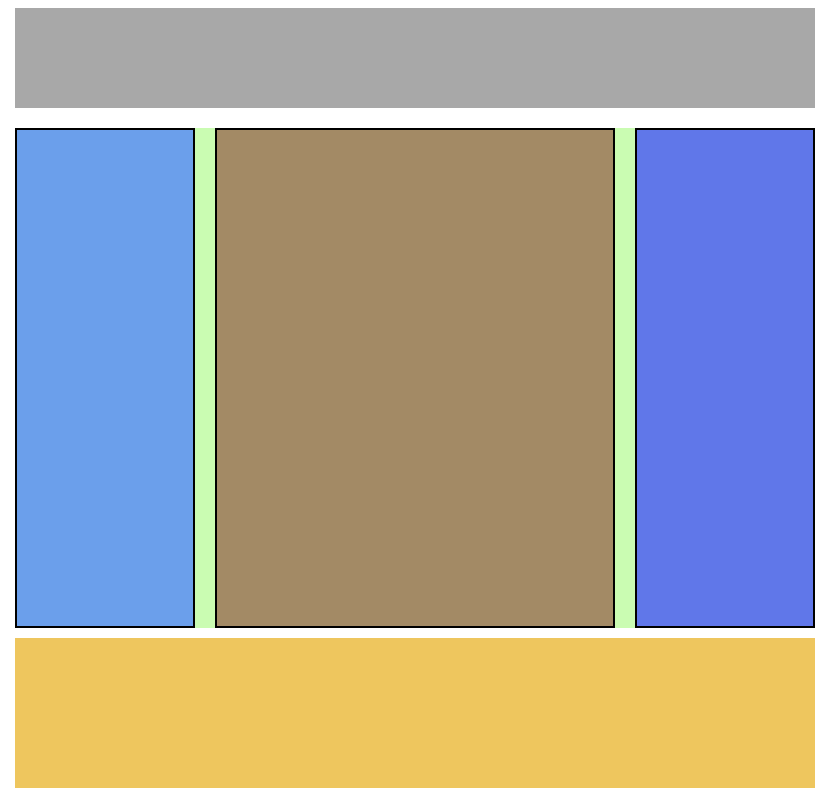


# 总结
[top](#catalog)
- width的默认值为auto。如果不写，会由浏览器自动计算
- 一个子元素在父元素中，水平布局<label style="color:red">必须满足以下等式</label>
    - `父元素.width = 子元素.sum(margin-left, border-left, padding-left, width, padding-right, border-right, margin-right)`

- 行内元素的宽和高默认都是元素内容的宽和高
- 如果父元素中没有设置`height`，当子元素中使用负数的`margin`时，会导致下方的元素向上移动。

- 阴影不会影响页面布局
- 轮廓不会影响**可见框**的大小，**不会影响布局**

- **行内元素的`width`、`height`是无效的，必须使用`display:block`转化为块元素、或`float`脱离文档流**

- 默认情况下，块元素独占一行是因为要强制遵守水平布局的等式
    - [为什么块元素独占一行](#reasonofblockelementuseline)

- 浮动相关的连锁问题（根本原因：在不在文档流中与水平布局等式）
    - 块元素的特点
    - 块元素为什么能独占一行
    - 浮动为什么不会独占一行

- 行内元素、块元素的互相转化
    - 行内元素---> 块元素
        - float，脱离文档流
        - display:block，将元素设置为块元素
    - 块元素 ---> 行内元素
        - displ


    |属性值|描述|备注|
    |-|-|-|
    |inline|将元素设置为行内元素||
    |block|将元素设置为块元素||
    |inline-block|行内块元素|<ul><li>优缺点<ul><li>同时兼具行内元素和块元素的优点：既可以设置`width`和`height`(块元素)，又**不会独占一行**（行内元素）</li><li>同时兼具行内元素和块元素的缺点：换行符会被解析为空白距离。即如果行内块元素间有换行，页面上的两个元素之间会产生一个空白的距离</li></ul></li><li>一般开发时尽量不要使用</li></ul>|
    |table|将元素设置为表格元素||
    |none|元素不再页面中显示。|可以用来隐藏元素，在需要的时候，通过页面控制再显示出来|

- 垂直方向上的布局控制可以通过 margin, top/bottom(偏移量)控制，但是一般只会使用其中一种
- 水平方向上的布局控制可以通过 margin, left/right(偏移量)控制，但是一般只会使用其中一种

- 浮动与定位的使用规范：大范围使用浮动，小范围微调使用定位


- 自定义css
    - 自定义类选择器解决高度塌陷和父子元素间的外边距折叠
        ```css
        .clearfix::before,
        .clearfix::after{
            /* 1. 通过clear属性清除浮动元素的影响 */
            clear:both;
            /* 2. 设置空content使伪元素生效 */
            content: "";
            /* 3. 分割元素，并且不会占用像素位置；同时解决 高度塌陷和父子元素间的外边距折叠 */
            display:table;
        }
        ```
    - 文本过长，阶段并且在末尾显示`...`，参考：[文本的样式](#文本的样式)
        ```css
        .box{
            /* 使文本不换行,在一行显示 */
            white-space: nowrap;
            /* 文本超过父元素的宽度时，隐藏超出的部分 */
            overflow: hidden;
            /* 如果文本过长，被隐藏了，则在末尾显示`...` */
            text-overflow: ellipsis;
        }
        ```
- css的快速开发步骤
    1. 先写html，进行页面布局。布局时，抽象出层级关系、显示方式到css类中
    2. 开发css的类
    3. 进行css微调，微调时需要注意css的权重

# 练习
[top](#catalog)
- 基础元素、属性练习
    - 图片列表
        - 01piclist.html
    - 文字导航条
        - 02navigation.html
    - 网易新闻列表
        - 03newlist.html
- 定位练习
    - 轮播图
        - /frontend/css/base/src/exercise/position/carousels.html

- 京东导航条
    - /frontend/css/base/src/exercise/font/jdnav.html
