<span id="catalog"></span>

### 目录
- [flex概述](#flex概述)
- [弹性容器与弹性元素](#弹性容器与弹性元素)
    - [弹性容器与弹性元素的基本知识](#弹性容器与弹性元素的基本知识)
    - [弹性容器](#弹性容器)
    - [弹性元素](#弹性元素)
- [](#)
- [](#)


# flex概述
[top](#catalog)
- flex，弹性盒
- css中的一种布局手段，主要用于代理浮动来布局
- flex可以使元素具有弹性，让元素可以跟随页面的大小改变

# 弹性容器与弹性元素
## 弹性容器与弹性元素的基本知识
[top](#catalog)
- 弹性容器
    - 要使用弹性盒，必须先将一个元素设置为弹性容器
    - 设置方法: 
        - `display: flex`，块级弹性容器
        - `display: inline-flex`，行内弹性容器
- 弹性元素
    - 弹性元素是：**弹性容器的直接子元素**
    - 一个元素可以同时是弹性容器和弹性元素

## 弹性容器
[top](#catalog)
- 弹性容器的主轴与侧轴
    - 主轴
        - 弹性元素的排列方向称为主轴
    - 辅轴
        - 与主轴垂直方向的称为辅轴

- `flex-direction`，指定容器中弹性元素的排列方式
    - 可选值
        |可选值|主轴|辅轴|
        |-|-|-|
        |row，默认值|从左向右|水平方向|
        |row-reverse|从右向左|水平方向|
        |column|从上向下|垂直方向|
        |column-reverse|从下向上|垂直方向|

- `flex-wrap`，当弹性容器的大小不足时，弹性元素是否自动换行
    - `nowrap`，默认值，不会换行
        - 如果子元素设置了 `flex-shrink`，将会自动进行收缩
        - 如果没有设置 `flex-shrink`，子元素可能会从容器中溢出
    - `wrap`，元素沿着辅轴方向自动换行
    - `wrap-reverse`，元素沿着辅轴反方向换行

- `flex-flow`，同时设置`flex-direction` 和 `flex-wrap`

- `justify-contect`，设置**主轴**上的元素如何排列
    - 可选值

        |可选值|描述|
        |-|-|
        |`flex-start`|默认值，元素顺序不变，从主轴的起始边开始排列|
        |`flex-end`|元素顺序不变，从主轴的终止边开始排列|
        |`center`|元素居中排列，空白会分布在两侧|
        |`space-around`|空白分布到元素**两侧**|
        |`space-evently`|空白分布到元素**一侧**，兼容性不好|
        |`space-betweent`|空白分布到所有元素的中间|

- `align-items`，设置元素在**辅轴**上如何对齐
    - 用于设置元素间的关系
    - 可以在弹性元素上使用 `align-self` 来覆盖该属性
    - 可选值

        |可选值|描述|
        |-|-|
        |`stretch`|默认值，如果没有设置高度，则将元素的高度设置为相同的值|
        |`flex-start`|元素不会被拉伸，会沿着辅轴的起始边对齐|
        |`flex-end`|元素不会被拉伸，会沿着辅轴的终止边对齐|
        |`center`|居中对齐|
        |`baseline`|基线对齐|

- `align-content`，设置辅轴上空白区域的分布
    - 可选值

        |可选值|描述|
        |-|-|
        |`center`|元素居中，空白在辅轴的两端|
        |`flex-start`|元素从辅轴的起始边开始排列，空白在全部在辅轴的终止边|
        |`flex-end`|元素从辅轴的终止边开始排列，空白在全部在辅轴的起始边|
        |`space-between`|元素分布在辅轴的两端，空白在辅轴的中间|
        |||

- 弹性元素水平垂直居中的设置
    ```css
    align-items:center
    justify-content:center
    ```

- 示例
    - 参考代码
        - [src/flex/flex_container.html](src/flex/flex_container.html)
    - flex-direction，指定容器中弹性元素的排列方式
        1. row，从左向右，水平方向排列
            - css
                ```css
                .box0101{
                    display: flex;
                    flex-direction: row;
                }
                ```
            - 页面结果
                - 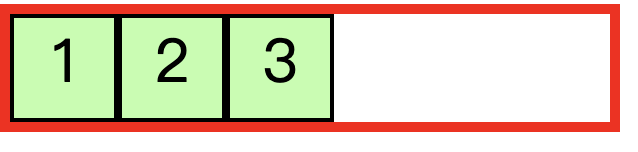

        2. row-reverse，从右向左，水平方向排列
            - css
                ```css
                .box0102{
                    display: flex;
                    flex-direction: row-reverse;
                }
                ```
            - 页面结果
                - 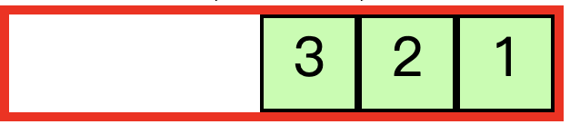

        3. column，从上向下，垂直方向排列
            - css
                ```css
                .box0103{
                    display: flex;
                    flex-direction: column;
                }
                ```
            - 页面结果
                - 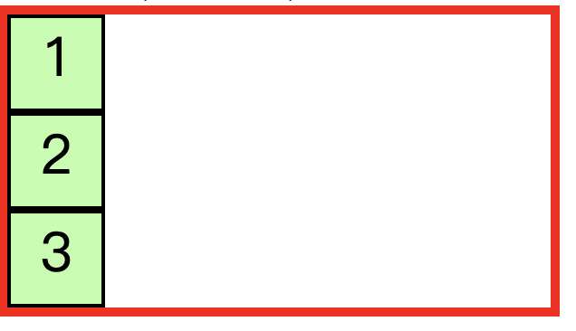

        4. column-reverse，从下向上，垂直方向排列
            - css
                ```css
                .box0104{
                    display: flex;
                    flex-direction: column-reverse;
                }
                ```
            - 页面结果
                - 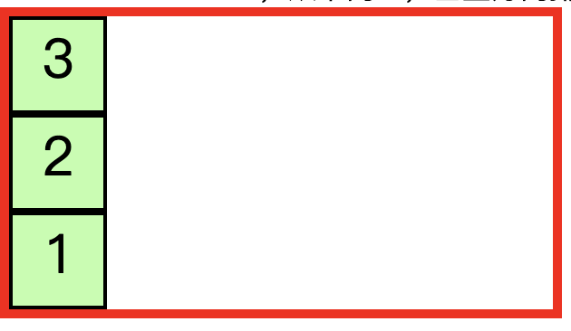
    - flex-wrap，设置元素在弹性容器中是否自动换行
        1. nowrap，默认值，不会换行，子元素自动收缩
            - css
                ```css
                .box0201{
                    width: 100px;
                    display: flex;
                    flex-direction: row;
                    flex-wrap: nowrap;
                }
                ```
            - 页面结果
                - 

        
        2. nowrap，默认值，不会换行，并关闭所有子元素的自动收缩
            - css
                ```css
                .box0202{
                    width: 100px;
                    display: flex;
                    flex-direction: row;
                    flex-wrap: nowrap;
                }

                .box0202 li:nth-child(1){
                    flex-shrink: 0;
                }
                .box0202 li:nth-child(2){
                    flex-shrink: 0;
                }
                .box0202 li:nth-child(3){
                    flex-shrink: 0;
                }
                ```
            - 页面结果
                - 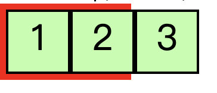


        3. wrap，元素沿着辅轴方向自动换行
            - css
                ```css
                .box0203{
                    width: 120px;
                    display: flex;
                    flex-direction: row;
                    flex-wrap: wrap;
                }
                ```
            - 页面结果
                - 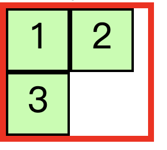

        4. wrap-reverse，元素沿着辅轴反方向换行
            - css
                ```css
                .box0204{
                    width: 120px;
                    display: flex;
                    flex-direction: row;
                    flex-wrap: wrap-reverse;
                }
                ```
            - 页面结果
                - 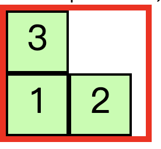
    - flex-flow: 同时设置 flex-direction 和 flex-wrap
        - css
            ```css
            .box0301{
                width:120px;
                display: flex;
                flex-flow: row wrap;
            }
            ```
        - 页面结果
            - 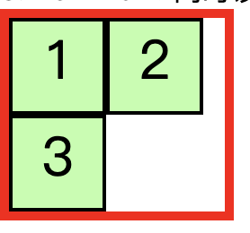

    - justify-contect，设置主轴上的元素如何排列
        1. flex-start，默认值，元素顺序不变，从主轴的起始边开始排列
            - css
                ```css
                .box0401{
                    width: 300px;
                    display: flex;
                    flex-flow: row;
                    justify-content: flex-start;
                }
                ```
            - 页面内容
                - 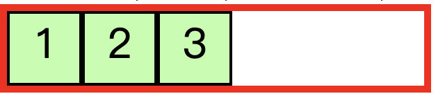
                

        2. flex-end，元素顺序不变，从主轴的终止边开始排列
            - css
                ```css
                .box0402{
                    width: 300px;
                    display: flex;
                    flex-flow: row;
                    justify-content: flex-end;
                }
                ```
            - 页面内容
                - 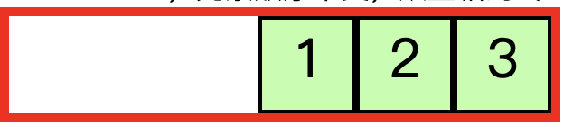

        3. center，元素居中排列，空白会分布在两侧
            - css
                ```css
                .box0403{
                    width: 300px;
                    display: flex;
                    flex-flow: row;
                    justify-content: center;
                }
                ```
            - 页面内容
                - 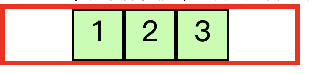

        4. space-around，空白分布到元素两侧
            - css
                ```css
                .box0404{
                    width: 300px;
                    display: flex;
                    flex-flow: row;
                    justify-content: space-around;
                }
                ```
            - 页面内容
                - 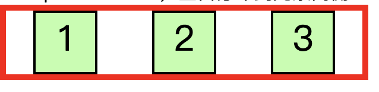
        5. space-evenly，空白分布到元素一侧
            - css
                ```css
                .box0405{
                    width: 300px;
                    display: flex;
                    flex-flow: row;
                    justify-content: space-evenly;
                }
                ```
            - 页面内容
                - 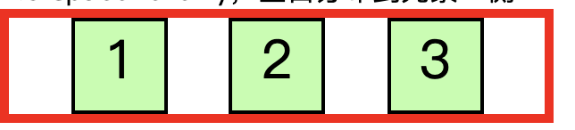

        6. space-between，空白分布到所有元素的中间
            - css
                ```css
                .box0406{
                    width: 300px;
                    display: flex;
                    flex-flow: row;
                    justify-content: space-between;
                }
                ```
            - 页面内容
                - 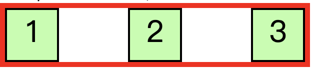
    - align-items，元素在辅轴上如何对齐
        1. stretch，默认值，将元素的长度设置为相同的值
            - css
                ```css
                .box0501{
                    width: 170px;
                    height: 300px;
                    display: flex;
                    flex-flow: row wrap;
                    align-items:stretch;
                }
                /* 取消 li 的高度 */
                .box0501 li{
                    height: auto;
                }
                ```
            - 页面内容
                - 

        2. flex-start，元素不会被拉伸，会沿着辅轴的起始边对齐
            - css
                ```css
                .box0502{
                    width: 170px;
                    height: 300px;
                    display: flex;
                    flex-flow: row wrap;
                    align-items:flex-start;
                }
                /* 取消 li 的高度 */
                .box0502 li{
                    height: auto;
                }
                ```
            - 页面内容
                - 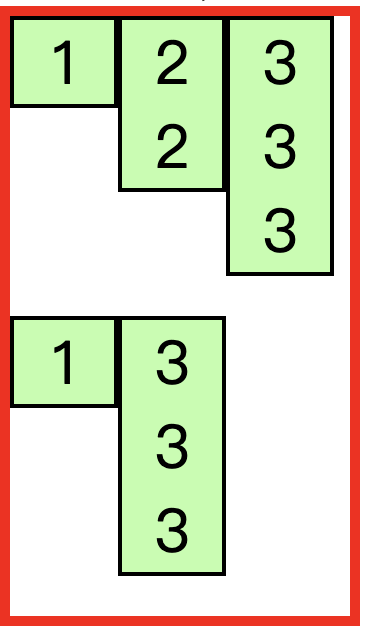

        3. flex-end，元素不会被拉伸，会沿着辅轴的终止边对齐
            - css
                ```css
                .box0503{
                    width: 170px;
                    height: 300px;
                    display: flex;
                    flex-flow: row wrap;
                    align-items:flex-end;
                }
                /* 取消 li 的高度 */
                .box0503 li{
                    height: auto;
                }
                ```
            - 页面内容
                - 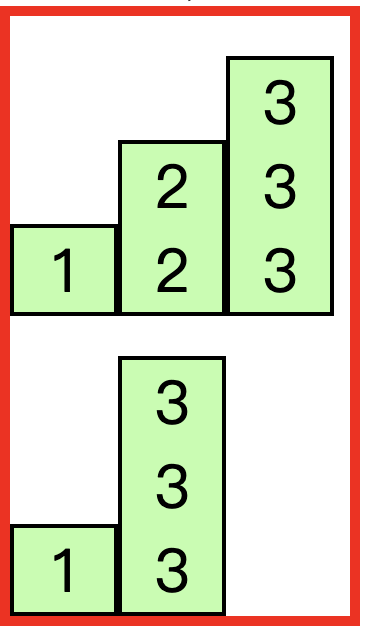

        4. center，居中对齐
            - css
                ```css
                .box0504{
                    width: 170px;
                    height: 300px;
                    display: flex;
                    flex-flow: row wrap;
                    align-items:center;
                }
                /* 取消 li 的高度 */
                .box0504 li{
                    height: auto;
                }
                ```
            - 页面内容
                - 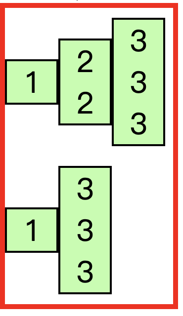
    - align-content，设置辅轴上空白区域的分布
        1. center，元素居中，空白在辅轴的两端
            - css
                ```css
                .box0601{
                    width: 170px;
                    height: 300px;
                    display: flex;
                    flex-flow: row wrap;
                    align-content: center;
                }
                /* 取消 li 的高度 */
                .box0601 li{
                    height: auto;
                }
                ```
            - 页面内容
                - 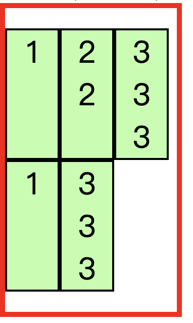
        
        2. flex-start，元素从辅轴的起始边开始排列，空白在全部在辅轴的终止边
            - css
                ```css
                .box0602{
                    width: 170px;
                    height: 300px;
                    display: flex;
                    flex-flow: row wrap;
                    align-content: flex-start;
                }
                /* 取消 li 的高度 */
                .box0602 li{
                    height: auto;
                }
                ```
            - 页面内容
                - 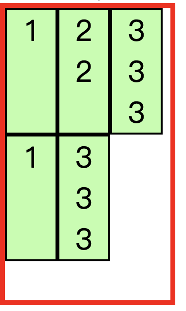

        3. flex-end，元素从辅轴的终止边开始排列，空白在全部在辅轴的起始边
            - css
                ```css
                .box0603{
                    width: 170px;
                    height: 300px;
                    display: flex;
                    flex-flow: row wrap;
                    align-content: flex-end;
                }
                /* 取消 li 的高度 */
                .box0603 li{
                    height: auto;
                }
                ```
            - 页面内容
                - 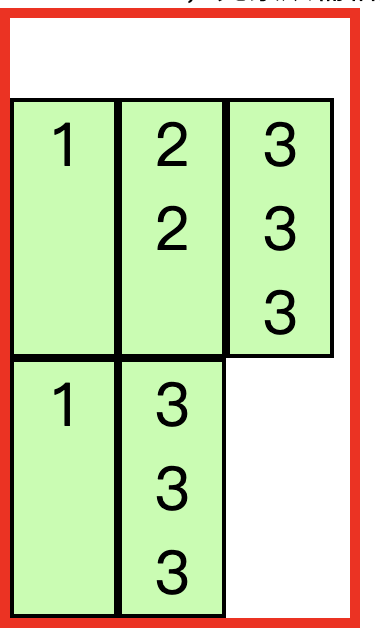

        4. space-between，元素分布在辅轴的两端，空白在辅轴的中间
            - css
                ```css
                .box0604{
                    width: 170px;
                    height: 300px;
                    display: flex;
                    flex-flow: row wrap;
                    align-content: space-between;
                }
                /* 取消 li 的高度 */
                .box0604 li{
                    height: auto;
                }
                ```
            - 页面内容
                - 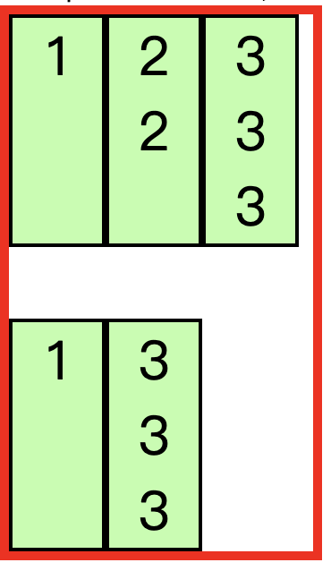


## 弹性元素
[top](#catalog)
- 三种状态属性
    - `flex-grow`，指定弹性元素的伸展系数
        - 表示：当父元素**有多余空间**时，子元素如何伸展
        - 默认值为 0，表示**不伸展**
        - 父元素会按照弹性元素的伸缩系数，按比例进行空间的分配
        - 指定后，元素的 `width` 会失效

    - `flex-shrink`，指定弹性元素的收缩系数
        - 表示：当父元素中的空间**无法容纳**所有的子元素时，如何对子元素进行收缩
        - 默认值为 1，表示等比例收缩
        - `flex-shrink: 0`，表示不收缩
        - 缩减多少是根据缩减系数和元素大小来计算的

    - `flex-basis: 长度`，设置元素在主轴上的基础长度
        - 如果主轴是水平的，相当于设置：`width`
        - 如果主轴是垂直的，相当于设置：`height`
        - 默认值 `auto`，表示参考元素自身的 `width` 或 `height`

    - `flex-grow`、`flex-shrink`、`flex-basis`，弹性元素的三个属性可以看作是弹簧的三种状态：增长、压缩、静止

- 简写属性，`flex: 增长 缩减 基础`
    - 可用属性
        - 简写属性的默认值：`flex: initial`，相当于：`flex: 0 1 auto`
        - `flex: auto`，相当于 `flex: 1 1 auto`
        - `flex: none`，相当于 `flex: 0 0 auto`
            - 表示当前弹性元素没有弹性

- `order: 序号`，设置弹性元素的排列顺序
- `align-self`，覆盖弹性元素中的 `align-items` 的元素对齐方式

- 示例
    - 参考代码
        - [src/flex/flex_elem.html](src/flex/flex_elem.html)
    - 设置 `flex-grow`
        1. 开启弹性盒子，默认不伸缩
            - css
                ```css
                /*  */
                .box01{
                    display: flex;
                }
                ```
            - 页面结果
                - 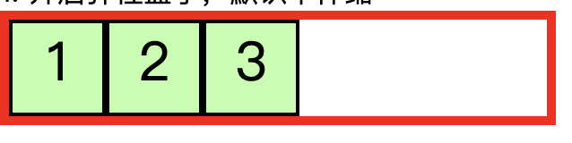

        2. 设置 flex-grow，等比例填充空白
            - css
                ```css
                .box0201{
                    display: flex;
                }
                .box0201 li{
                    flex-grow: 1;
                }
                ```
            - 页面结果
                - 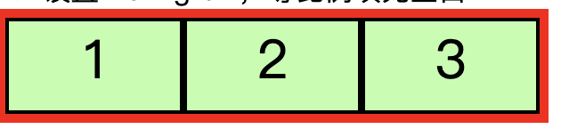
        3. 设置 flex-grow，分别设置填充比例
            - css
                ```css
                .box0202{
                    display: flex;
                }
                .box0202 li:nth-child(1){
                    flex-grow: 1;
                }
                .box0202 li:nth-child(2){
                    flex-grow: 2;
                }
                .box0202 li:nth-child(3){
                    flex-grow: 3;
                }
                ```
            - 页面结果
                - 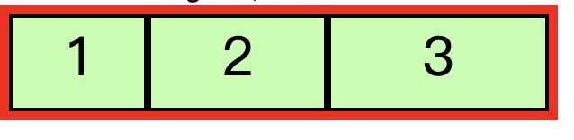
    - 设置 `flex-shrink`
        1. 设置 flex-shrink:1，当容器过小时，按比例收缩
            - css
                ```css
                .box0301{
                    width: 100px;
                    display: flex;
                }
                .box0301 li{
                    flex-shrink: 1;
                }
                ```
            - 页面结果
                - 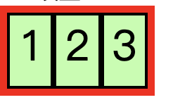
        2. 设置 flex-shrink:1，当容器过小时，按比例收缩
            - css
                ```css
                .box0302{
                    width: 100px;
                    display: flex;
                }
                .box0302 li:nth-child(1){
                    flex-shrink: 1;
                }
                .box0302 li:nth-child(2){
                    flex-shrink: 2;
                }
                .box0302 li:nth-child(3){
                    flex-shrink: 3;
                }
                ```
            - 页面结果
                - 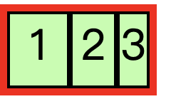
        3. 设置 flex-shrink:0，关闭收缩
            - css
                ```css
                .box0303{
                    width: 100px;
                    display: flex;
                }

                .box0303 li{
                    flex-shrink: 0;
                }
                ```
            - 页面结果
                - 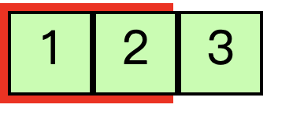

    - 使用 align-self 属性来覆盖弹性容器中的 align-items
        - css
            ```css
            .box0401{
                width: 170px;
                height: 300px;
                display: flex;
                flex-flow: row wrap;
                align-items:stretch;
            }
            /* 取消 li 的高度 */
            .box0401 li{
                height: auto;
            }
            
            /* 覆盖弹性容器中的 align-items 属性 */
            .box0401 li:nth-child(1){
                align-self: center;
            }
            ```
        - 页面结果
            - 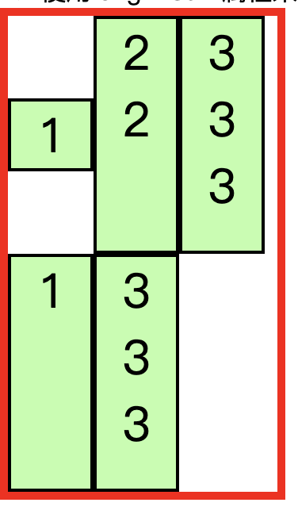

[top](#catalog)