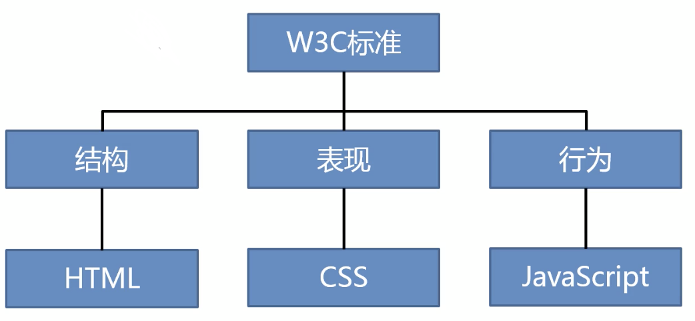
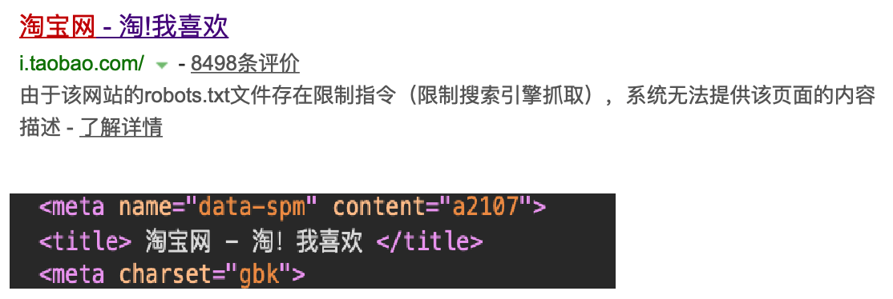
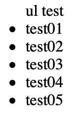
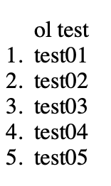
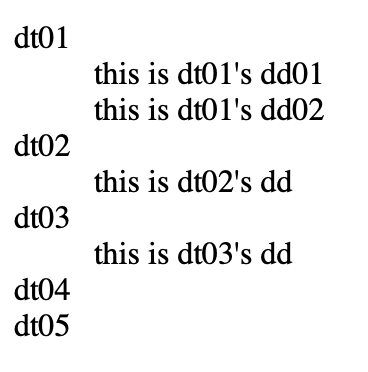
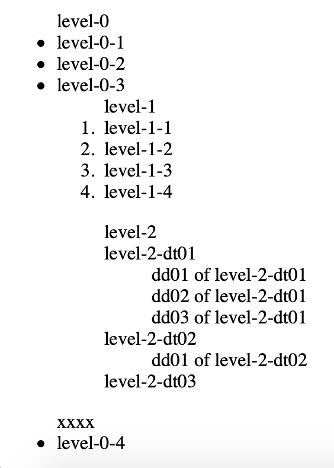

- 参考
    - https://www.bilibili.com/video/av77217003

<span id="catalog"></span>

### 目录
- [网页开发的简介](#网页开发的简介)
- [HTML](#HTML)
    - [什么是HTML](#什么是HTML)
    - [HTML整体结构](#HTML整体结构)
    - [HTML标签](#HTML标签)
    - [多个标签之间的关系](#多个标签之间的关系)
    - [HTML实体(转义字符)](#HTML实体(转义字符))
- [<meta>元数据标签](#<meta>元数据标签)
- [title](#title)
- [语义标签](#语义标签)
    - [块元素、行内元素、替换元素](#块元素、行内元素、替换元素)
    - [块元素](#块元素)
    - [行内元素](#行内元素)
    - [替换元素](#替换元素)
    - [标题hn与标题组hgroup](#标题hn与标题组hgroup)
    - [段落p](#段落p)
    - [布局标签-结构化语义标签](#布局标签-结构化语义标签)
    - [文字格式font](#文字格式font)
    - [列表](#列表)
    - [超链接a](#超链接a)
    - [图片标签src](#图片标签src)
    - [内联框架iframe](#内联框架iframe)
    - [音频播放audio](#音频播放audio)
    - [视频播放video](#视频播放video)
- [表格](#表格)
    - [表格的基本内容](#表格的基本内容)
    - [表格的细分](#表格的细分)
- [表单](#表单)
    - [form概述](#form概述)
    - [表单项](#表单项)
- [设置网站图标](#设置网站图标)
- [](#)
- [](#)
- [浏览器对不规范内容的自动调整](#浏览器对不规范内容的自动调整)

# 网页开发的简介
[top](#catalog)
- 客户端的形式
    - 文字客户端
    - 图形化界面
        - 通过点击拖动等来使用软件
        - 包括:windows、macos、Andriod、ios中的大部分应用
        - 属于C/S架构
    - <label style="color:red">网页</label>
        - 通过访问网页来使用软件，所有的网站都属于这个范畴
        - 属于B/S架构
- 网页的优点
    - 不需要安装
    - 无需更新
    - 跨平台，开发一次处处使用
- 网页中使用的语言
    - HTML
    - CSS
    - JavaScript
- **网页的编写需要遵守W3C规范**
- **网页的组成**
    - 根据W3C标准，一个网页主要有3部分组成：
        1. 结构：HTML用于描述页面的结构
        2. 表现：CSS用于控制页面中元素的样式
        3. 行为：JavaScript用于响应用户操作
    - 

- 网页加载的过程
    1. 第一次向服务器请求当前网页自身的代码（HTML）
    2. 如果网页中有n个其他外部资源，则浏览器需要再次向服务器发送n次请求来获取这些资源

# HTML
## 什么是HTML
[top](#catalog)
- HTML （Hypertext Markup Language） 超文本标记语言
    - **超文本**指定是**超链接**，使用超链接可以从一个页面跳转到另一个页面
- 负责网页的结构
- HTML使用**标签**(**也可以成为元素**)的形式来识别网页中的不同组成部分

## HTML中的一些概念
## HTML整体结构
[top](#catalog)
- `<!doctype html>`，共浏览器识别（表示当前文本是一个html文件）,<label style="color:red">一定要在签名添加`!`</label>
    - ``<!doctype` 部分，<labe style="color:red">各字符中间不能有空格</label>
- `<html>`，作为整个html的的根标签
    - `<head lang="当前文本的使用语言(en/zh/...)">`，html的头部信息，里面的内容不会显示到页面上，是浏览器和搜索引擎识别、分析使用的
        - `<meta charset="字符编码">`，设定网页的字符编码，避免乱码，虽然很多的浏览器已经可以自动识别，但是**建议添加该标签**
        - `<title>title内容</title>`，页面标题，会显示在页面标签上
    - `<body>`，页面上的显示内容都写在`body`中，(<label style="color:red">开发的主要内容</label>)

- 注释：`<!-- 注释内容 -->`
    - 可以写在任何地方
    - <label style="color:red">注释不可以嵌套，否则会出现识别问题。因为html是按照标签出现的顺序来解析的。</label>
        - 下面这种情况，外层的注释无法配对，最后会导致页面上出现一个`-->`
        ```html
        <!-- 
            commend test
            <!-- test2 -->
        -->
        ```

- 示例
    ```html
    <!doctype html>
    <html>
        <head>
            <meta charset="utf-8">
            <title>页面标题</title>
        </head>
        <body>
        </body>
    </html>
    ```

## HTML标签
[top](#catalog)
- 标签的两种形式
    1. 成对标签：`<tag>...</tag>`
        - 有开始标签，则必须结束标签
    2. 自结束标签,如`img`和`input`。下面两种形式都可以，但是**建议自结束标签使用`<tag>`这种形式**
        - ``或``
        - `<input>`或`<input/>`
- 标签的属性
    - 以名值对的形式存在
        - <labe style="color:red">属性值必须用引号括起来</labe>
        - 可以用双引号或单引号

    - 无属性值的属性
        - 这种类型的属性无属性值，只有属性名
        - 标签通过有没有声明该属性来判断是否开启对应的功能
- 标签的id
    - **每一个标签都可以添加一个id属性**
    - id属性是元素的唯一表示，同一个页面中不能出现重复id的属性
    - id需要以字母开头，不能是数字开头

## 多个标签之间的关系
[top](#catalog)
- `父元素-子元素`
    - 包含子元素的元素叫做父元素，被包含的是子元素
    - 如：p是父元素，span是子元素
        ```html
        <p>
            parent node
            <span>son node</span>
        </p>
        ```

- `祖先元素-后代元素`
    - 直接或间接包含后代元素的是祖先元素，被包含的是后代元素
    - 子元素也是后代元素
    - 如:  `p1`、`span1`、`p2`都是`div`的后代元素，`div`是祖先元素
        ```html
        <div>
            <p>p1 node
                <span>span1 node</span>
            </p>
            <p>p2 node</p>
        </div>
        ```

- `兄弟元素`
    - 拥有相同父元素的子元素之间是兄弟元素
    - 如: p1~p4之间都是兄弟元素
        ```html
        <div>
            <p>p1</p>
            <p>p2</p>
            <p>p3</p>
            <p>p4</p>
        </div>
        ```

## HTML实体(转义字符)
[top](#catalog)
- 什么是实体？
    - 一些特殊符号，在html中，因为它们往往具有特殊含义，不能直接书写
    - 一些使用场景，如：
        - 字母两侧的`<`、`>`，会被浏览器和字母一起解析成标签
        - **多个空格，会被浏览器解析成一个空格**

    - 如果需要在html中书写这些特殊符号，则需要使用html中的实体(转义字符)

- 实体的语法： `&实体的名字;`

    |特殊字符|实体|
    |-|-|
    |空格|`&nbsp;`|
    |`>`|`&gt;`|
    |`<`|`&lt;`|
    |版权符号（圈C）|`&copy;`|
    ||`&;`|


# <meta>元数据标签
[top](#catalog)
- 主要用于设置网页的元数据，共浏览器和搜索引擎解析使用
- **几个主要用途**
    - 设定页面字符编码
    - 设置供搜索引擎使用的关键字和描述信息
- `<meta>`标签可以有多个，来设定不同的元数据
- 属性

    |属性名|含义|
    |-|-|
    |charset|指定网页的字符编码|
    |name|指定元数据名称|
    |content|指定元数据的内容|
    |http-equiv|可以模拟一个http响应头|

- `<meta charset="字符编码">`，**这一个元数据最好添加到html结构中，防止页面出现乱码**
- 常用的元数据name

    |可用name|示例|说明|备注|
    |-|-|-|-|
    |**keywords**|`<meta name="keywords" content="key1,key2,key3">`|表示当前网站的关键字|使用搜索引擎时搜索时，能够被搜索引擎识别<br>值可以有多个，使用`,`分割|
    |**description**|`<meta name="description" content="learn memo">`|当前网站的描述信息|使用搜索引擎时，描述信息会显示在搜索结构中的每个链接的下方|
    |author|`<meta name="author" content="xxxx">`|html文档的作者||
    ????
- http-equiv
    ????

# title
[top](#catalog)
- `<title>...</title>`
- `<title>`中的内容会作为浏览器标签中的显示内容
- 使用搜索引擎时，`title`会作为搜索结果中超链接的显示内容
    - 

# 语义标签
## 块元素、行内元素、替换元素
[top](#catalog)
- **块元素**：在页面中占一行的元素称为块元素(block element)
    - 在网页中一般通过块元素来**进行页面布局**
    - 块元素中什么内容都可以放，包括：块元素、行内元素、文字等等
        - `<p>`比较特殊，标签内部不能放块元素
- **行内元素/内联元素**：在页面中不会独占一行的元素
    - 行内元素主要**用来包裹文字**
    - 一般情况下会在块元素中添加行内元素，但是不会在行内元素中添加块元素

- **替换元素**：不独占一行，介于含内元素和块元素之间，具有两种元素的特点，不会直接显示标签内容

## 块元素
[top](#catalog)

|标签|描述|参考|
|-|-|-|
|`<div>...</div>`|区块|[布局标签-结构化语义标签](#布局标签-结构化语义标签)|
|`<header>...</header>`|网页的头部|[布局标签-结构化语义标签](#布局标签-结构化语义标签)|
|`<main>...</main>`|网页的主体|[布局标签-结构化语义标签](#布局标签-结构化语义标签)|
|`<footer>...</footer>`|网页的底部|[布局标签-结构化语义标签](#布局标签-结构化语义标签)|
|`<nav>...</nav>`|网页导航|[布局标签-结构化语义标签](#布局标签-结构化语义标签)|
|`<aside>...</aside>`|和主体相关的但不属于主题的内容<br>如侧边栏|[布局标签-结构化语义标签](#布局标签-结构化语义标签)|
|`<article>...<article>`|表示一个独立的文章|[布局标签-结构化语义标签](#布局标签-结构化语义标签)|
|`<section>...</section>`|表示一个独立的区块|[布局标签-结构化语义标签](#布局标签-结构化语义标签)|
|`<hn>...</hn>`|标题|[标题hn与标题组hgroup](#标题hn与标题组hgroup)|
|`<hgroup>...</hgroup>`|标题组|[标题hn与标题组hgroup](#标题hn与标题组hgroup)|
|`<p>...</p>`|段落|[段落p](#段落p)|
|`<blockquote>...</blockquote>`|长引用<br>引用的文字会在左右两边进行缩进||
|`<br>`|换行||
|`<ul>...</ul>`|无序列表|[列表-无序列表](#html-list-ul)|
|`<ol>...</ol>`|有序列表|[列表-有序列表](#html-list-ol)|
|`<dl>...</dl>`|定义列表|[列表-定义列表](#html-list-dl)|
|`<li>...</li>`|列表项|[列表](#列表)|
|`<table></table>`|表格|[表格](#表格)|

    
## 行内元素
[top](#catalog)

|标签|描述|参考|
|-|-|-|
|`<span>...</span>`|没有任何语义，一般用于在网页中选中文字|[布局标签-结构化语义标签](#布局标签-结构化语义标签)|
|`<em>...</em>`|文字斜体|[/frontend/html/base/src/structure.html](/frontend/html/base/src/structure.html)|
|`<strong>...</strong>`|文字加粗|[/frontend/html/base/src/structure.html](/frontend/html/base/src/structure.html)|
|`<q>...</q>`|短引用<br>在文字两侧会使用：`"`、`「」`字符将文字括起来|[/frontend/html/base/src/structure.html](/frontend/html/base/src/structure.html)|
|`<a>...</a>`|超链接|[超链接a](#超链接a)|
|`<input type="..." name="...">`|表单项|[表单](#表单)|

## 替换元素
[top](#catalog)

|标签|描述|参考|
|-|-|-|
|``|图片标签|[图片标签src](#图片标签src)|
|`<iframe>...</iframe>`|内联框架|[内联框架iframe](#内联框架iframe)|
|`<audio>...</audio>`|音频播放|[音频播放audio](#音频播放audio)|
|`<video>...</video>`|视频播放|[视频播放video](#视频播放video)|

## 标题hn与标题组hgroup
[top](#catalog)
- 标题hn与标题组hgroup都是**块元素**
- `<hn>...</hn>` : 标题
    - 共6级标题，重要性逐渐减小(从SEO的角度看)
        - `<h1>...</h1>`，一级标题
        - `<h2>...</h2>`，一级标题
        - `<h3>...</h3>`，三级标题
        - `<h4>...</h4>`，四级标题
        - `<h5>...</h5>`，五级标题
        - `<h6>...</h6>`，六级标题
    - 一般情况下一个页面只有一个`<h1>`
    - 标签一般会使用`h1～h3`，很少用`h4～h6`

- `<hgroup>...</hgroup>` : 标题组
    - 将**多个关联**的标题放在一起
    - 示例
        ```html
        <hgroup>
            <h1>first</h1>
            <h2>second</h2>
        </hgroup>
        ```

## 段落p
[top](#catalog)
- 段落`<p>`是**块元素**
- `<p>...</p>`
- <label style="color:red">该标签中不能放任何块元素</label>

## 布局标签-结构化语义标签
[top](#catalog)
- 块元素
    - `<div>...</div>`，没有实际的语义，类似于`<section>`，表示一个区块，是**开发时使用的主要布局元素**

    - h5新增的**几个不常用的标签**, 这些新增的标签实际使用的还是比较少
        - `<header>...</header>` : 网页的头部
            - 一个页面中可以有多个
        - `<main>...</main>` : 网页的主体
            - **一个页面中只有一个**
        - `<footer>...</footer>` : 网页的底部
        - `<nav>...</nav>` : 网页导航
        - `<aside>...</aside>` : 和主体相关的但不属于主题的内容,如侧边栏
        - `<article>...<article>` : 表示一个独立的文章
        - `<section>...</section>` : 表示一个独立的区块，使用其他的语义标签都不太合适时，都可以使用`<section>`

- 行内元素
    - `<span>...</span>`，没有任何语义，一般用于在网页中选中文字
        - html中如果有某些文字不属于任何标签，则可以使用`<span>`来包含

## 文字格式font
[top](#catalog)
- `<font>...</font>`
- 用于设置字符的显示格式，**可以添加在任何的成对标签中**
    - 如：
        ```html
        <h1>H1 <font color="red">test</font></h1>
        ```
- 目前的开发中不建议使用`<font>`，因为该标签会打乱css对页面显示的控制

## 列表
[top](#catalog)
- 列表及其列表项都是**块元素**
- html中的三种列表
    1. `<ul>...</ul>`：有序列表
    2. `<ol>...</ol>`：无序列表
    3. `<dl>...</dl>`：定义列表

- `<ul>...</ul>`：无序列表<span id="html-list-ul"></span>
    - `<li>...</li>`：表示列表的每一项，即`list item`
    - 在无序列表中，每一个列表项前都会显示一个`.`
    - 示例
        - 参考：[/frontend/html/base/src/list.html](/frontend/html/base/src/list.html)
        - 结构
            ```html
            <ul> ul test
                <li>test01</li>
                <li>test02</li>
                <li>test03</li>
                <li>test04</li>
                <li>test05</li>
            </ul>
            ```
        - 页面显示
            - 

- `<ol>...</ol>`：有序列表<span id="html-list-ol"></span>
    - `<li>...</li>`：表示列表的每一项，即`list item`
    - 在有序列表中，每一个列表项前都会显示当前项的序号
    - 示例
        - 参考：[/frontend/html/base/src/list.html](/frontend/html/base/src/list.html)
        - 结构
            ```html
            <ol> ol test
                <li>test01</li>
                <li>test02</li>
                <li>test03</li>
                <li>test04</li>
                <li>test05</li>
            </ol>
            ```
        - 页面显示
            - 

- `<dl>...</dl>`：定义列表 <span id="html-list-dl"></span>
    - `<dl>`的整体类似于一个多级列表
    - 类列表：`<dt>`+`<dd>`
        - `<dt>...</dt>`，表示定义的内容?????
            - 一个`<dt>`可以有多个`<dd>`，也可以不使用`<dd>`
        - `<dd>...</dd>`，对`<dt>`中定义的内容进行解释说明
    - 示例
        - 参考：[/frontend/html/base/src/list.html](/frontend/html/base/src/list.html)
        - 结构
            ```html
            <dl>
                <dt>dt01</dt>
                <dd>this is dt01's dd01</dd>
                <dd>this is dt01's dd02</dd>
                <dt>dt02</dt>
                <dd>this is dt02's dd</dd>
                <dt>dt03</dt>
                <dd>this is dt03's dd</dd>
                <dt>dt04</dt>
                <dt>dt05</dt>
            </dl>
            ```
        - 页面显示
            - 


- 列表间的多级嵌套
    - 嵌套时，浏览器会自动缩进
    - 正确的嵌套方式
        - `<ul>`、`<ol>`、`<dl>`嵌套在列表项`<li>`中
    - 示例
        - 参考：[/frontend/html/base/src/list.html](/frontend/html/base/src/list.html)
        - 结构
            ```html
            <ul>
                level-0
                <li>level-0-1</li>
                <li>level-0-2</li>
                <li>
                    level-0-3
                    <!-- 嵌套1级列表  将ol嵌套到li中-->
                    <ol>
                        level-1
                        <li>level-1-1</li>
                        <li>level-1-2</li>
                        <li>level-1-3</li>
                        <li>
                            level-1-4
                            <!-- 嵌套2级列表  将dl嵌套到li中-->
                            <dl>
                                level-2
                                <dt>level-2-dt01</dt>
                                <dd>dd01 of level-2-dt01</dd>
                                <dd>dd02 of level-2-dt01</dd>
                                <dd>dd03 of level-2-dt01</dd>
                                <dt>level-2-dt02</dt>
                                <dd>dd01 of level-2-dt02</dd>
                                <dt>level-2-dt03</dt>
                            </dl>
                        </li>
                    </ol>
                    <span>xxxx</span>
                </li>
                <li>level-0-4</li>
                
                <!-- 将ul嵌套到ul中 -->
                <!-- <ul>
                    <li>llll</li>
                    <li>bbbbb</li>
                    <li>erewe</li>
                </ul> -->
            </ul>
            ```
        - 页面结果
            - 

## 超链接a
[top](#catalog)
- 超链接是**行内元素**
- `<a href="跳转目标的路径" target="打开方式">...</a>`
- <label style="color:red">`<a>`中可以嵌套`<a>`之外的任何元素，包括块元素</label>

- `target`属性指定连接的打开方式
    1. `_self`，默认值，在当前页面中打开超链接
    2. `_blank`，在一个新的页面中打开超链接

- `href`属性指定跳转目标的路径，包括
    1. web应用的外部资源
    2. web应用的内部资源
    3. 跳转到当前页面的其他位置
        - 回到顶部：`herf="#"`
        - 跳转到指定位置：`herf="#元素id"`
    4. <label style="color:red">无动作的占位符，常用于开发中无法确定跳转目标的情况</label>
        - `href="javascript:;"`

- 如果没有添加`href`属性，则与普通的文本相似

- 示例
    - 参考：[/frontend/html/base/src/structure.html](/frontend/html/base/src/structure.html)
    
        ```html
        <!-- 跳转到外部资源 -->
        <a href="https://www.baidu.com">to Baidu</a><br>
        <!-- 跳转到内部资源 -->
        <a href="list.html" target="_blank">to inner list</a><br>
        <!-- 跳转到当前页面的顶部 -->
        <a href="#">to top</a><br>
        <!-- 跳转到当前页面的指定位置 -->
        <a href="#testSpan">to testSpan</a><br>
        <!-- 无动作的占位符 -->
        <a href="javascript:;">javascript:;</a>
        ```

## 图片标签src
[top](#catalog)
- 图片标签是一个**替换元素**
- 图片标签用于向当前页面**引入**一个**外部图片**
- ``
- 图片标签是一个
- `src`属性
    - 可以使用内部资源路径或外部资源路径
- `alt`属性
    - 属性值正常情况下是不会显示的
    - 在**无法获取资源时**，某些浏览器会在图片处显示`alt`中的值
    - 如果没有添加`alt`，则不会被搜索引擎捕获

- `width`和`height`
    - 单位是像素
    - 如果宽或高只设定了一个属性，则另一个属性会等比例缩放
    - 手动设置大小的问题
        1. 无论设置成多大，获取的图片占用的内容都不会变。服务器上是4M，浏览器内存中也会占用4M
        2. 基于1，手动设置会造成：将大图设小，会浪费内存；将小图设大会降低清晰度
        3. 所以开发时，应该用多大裁多大
        4. 但是在**移动端**经常需要进行图片的缩放，一般是大图缩小来保证清晰度

- 使用图片时的原则
    1. 效果一样，用小的
    2. 效果不同，用效果好的

- 常用图片格式
    - jpeg
        - 支持的颜色比较丰富，不支持透明效果，不支持动图
        - 一般用来显示照片
    - gif
        - 支持的颜色比较少，支持简单透明，支持动图
        - 颜色单一的图片、动图
    - png
        - 支持的颜色丰富，支持复杂透明，不支持动图
        - 颜色丰富、复杂透明，专为网页而声
    - webp
        - 谷歌推出的专门用来表示网页中图片的一种格式
        - 它具备其他图片格式的所有优点，并且容量小
        - 浏览器的兼容性不好
    - <label style="color:red">base6</label>
        - 将图片使用base64进行编码，这样可以将图片转化为字符，通过字符的形式来引入图片
        - 使用场景：<label style="color:red">和网页一起加载的图片，需要加载速度快</label>

## 内联框架iframe
[top](#catalog)
- 内联框架是一个**替换元素**
- 内联框架用于向当前页面中引入一个其他页面
- `<iframe src="引入的网页路径" frameborder="框架是否有边框(0|1)" width="引入页面的宽" height="引入页面的高">...</iframe>`
- `frameborder`属性
    - 表示内联框架是否需要显示边框
    - `frameborder=0`不显示边框，`frameborder=1`显示边框
- 内联框架中的内容不会被搜索引擎捕获
- 开发中使用的比较少
- 示例
    - 参考：[/frontend/html/base/src/iframe.html](/frontend/html/base/src/iframe.html)
    - 代码
        ```html
        <iframe src="https://www.baidu.com" frameborder="0" width="500"></iframe>
        ```

## 音频播放audio
[top](#catalog)
- 音频播放audio是一个**替换元素**
- 向页面中引入一个外部的音频文件
    - **如果引入的是一个视频文件，则只会播放音频部分**
- `<audio src="资源路径" controls autoplay loop>...</audio>`
- `controls`属性
    - 音频文件引入时，默认情况下不允许用户自己控制播放停止，需要添加该属性才能显示控制界面
- `autoplay`属性
    - 控制页面打开时，是否自动播放音频
    - 大部分浏览器在第一次打开时不会自动播放
- `loop`属性
    - 控制循环播放
- `<source src="资源路径">`，通过在`<audio>`中嵌套`<source>`来解决浏览器兼容性问题
    1. 在不兼容`<audio>`标签的浏览器中给出提示信息，如ie8
        - 示例
            ```html
            <audio controls>
                浏览器不兼容
                <source src="...">
            </audio>
            ```
        - 如果浏览器兼容，会显示播放界面；如果浏览器不兼容，会显示提示信息

    2. 通过多个`<source src="资源路径">`来解决视频格式不兼容的问题
        - 示例
            ```html
            <audio controls>
                <source src=".../*.type1">
                <source src=".../*.type2">
                <source src=".../*.type3">
            </audio>
            ```
        - 如果浏览器能兼容`type1`格式，则使用`type1`播放；如果不兼容，则尝试`type2`格式，以此类推

- 使用`<embed>`来兼容老版本的浏览器
    1. 方式1:嵌套在`<audio>...</audio>`中
        - 如果是在老版本浏览器中，会跳过前两个`<source>`直接使用`<embed>`
        - 在这种使用方法中，如果添加了**不兼容提示信息**，在老版本浏览器中会**同时显示**提示信息和播放器，所以需要在两者中选择一个
        ```html
        <audio controls>
            <!-- 浏览器不兼容 -->
            <source src=".../*.type1">
            <source src=".../*.type2">
            <embed src="....." type="audio/type" width="" height="">
        </audio>
        ```

## 视频播放video
[top](#catalog)
- 视频播放video是一个**替换元素**
- 向页面中引入一个外部的视频文件
- `<video src="资源路径" controls autoplay loop>...</audio>`
- `controls`属性
    - 视频文件引入时，默认情况下不允许用户自己控制播放停止，需要添加该属性才能显示控制界面
- `autoplay`属性
    - 控制页面打开时，是否自动播放视频
    - 大部分浏览器在第一次打开时不会自动播放
- `loop`属性
    - 控制循环播放
- `<source src="资源路径">`，通过在`<video>`中嵌套`<source>`来解决浏览器兼容性问题
    1. 在不兼容`<video>`标签的浏览器中给出提示信息，如ie8
        - 示例
            ```html
            <video controls>
                浏览器不兼容
                <source src="...">
            </video>
            ```
        - 如果浏览器兼容，会显示播放界面；如果浏览器不兼容，会显示提示信息

    2. 通过多个`<source src="资源路径">`来解决视频格式不兼容的问题
        - 示例
            ```html
            <video controls>
                <source src=".../*.type1">
                <source src=".../*.type2">
                <source src=".../*.type3">
            </audio>
            ```
        - 如果浏览器能兼容`type1`格式，则使用`type1`播放；如果不兼容，则尝试`type2`格式，以此类推

- 使用`<embed>`来兼容老版本的浏览器
    1. 方式1:嵌套在`<video>...</video>`中
        - 如果是在老版本浏览器中，会跳过前两个`<source>`直接使用`<embed>`
        - 在这种使用方法中，如果添加了**不兼容提示信息**，在老版本浏览器中会**同时显示**提示信息和播放器，所以需要在两者中选择一个
        ```html
        <video controls>
            <!-- 浏览器不兼容 -->
            <source src=".../*.type1">
            <source src=".../*.type2">
            <embed src="....." type="video/type" width="" height="">
        </video>
        ```

# 表格
## 表格的基本内容
[top](#catalog)
- 表格是**块元素**
- 表格的基本元素
    - `<table>`，表示表格，与表格相关的元素都要写在该元素中
    - `<tr>`，表格中的一行
        - <label style="color:red">`<tr>`不属于`<table>`，而是属于`<tbody>`(手动设置的、或自动生成的)</label>
        - 如果表格中没有使用`<tbody>`，而是直接使用`<tr>`时，浏览器将会自动创建一个`<tbody>`，并将`<tr>`放入`<tbody>`中

    - `<th>`，表示表头单元格
    - `<td>`，表示一行中的一个数据单元格
- 默认情况下，`<table>`是由表格中的内容撑开的，但是当`<table>`设置宽度后，内部的元素会进行自动调整
- 表格的基本结构
    ```html
    <table>
        <!-- 一个表头行 -->
        <tr>
            <th>1</th>
            <th>2</th>
        </tr>
        <tr>
            <!-- 一行中的一个单元格 -->
            <td>1</td>
            <td>2</td>
        </tr>
    </table>
    ```

- `<table>`的相关属性，实际开发中最好使用css来控制表格的样式，不要使用`<table>`的属性来设置样式

    |属性|描述|
    |-|-|
    |`border`|表格的边框|
    |`width`|表格的宽度|
    |`align`|表格的位置|
    |||

- `<td>`的相关属性
    - `colspan`设置横向合并单元格的个数
    - `rolspan`设置纵向合并单元格的个数

- 表头行在`<table>`中可以有多个

- 示例
    - 参考代码
        - [/frontend/html/base/src/table/base.html](/frontend/html/base/src/table/base.html)
    - html
        ```html
        <table border="1">
            <!-- 标题行 -->
            <tr>
                <th>1</th>
                <th>2</th>
                <th>3</th>
                <th>4</th>
            </tr>
            <!-- 显示一行4个单元格 -->
            <tr>
                <td>a1</td>
                <td>a2</td>
                <td>a3</td>
                <td>a4</td>
            </tr>
            <!-- 创建第二个表头行 -->
            <tr>
                <th>1</th>
                <th>2</th>
                <th>3</th>
                <th>4</th>
            </tr>
            <tr>
                <!-- 纵向合并单元格，会占用c1的位置 -->
                <td rowspan="2">b1</td>
                <td>b2</td>
                <td>b3</td>
                <td>b4</td>
            </tr>
            <tr>
                <!-- <td>c1</td> -->
                <td>c2</td>
                <td>c3</td>
                <td>c4</td>
            </tr>
            <tr>
                <td>d1</td>
                <td>d2</td>
                <!-- 横向合并单元格，会占用d4的位置 -->
                <td colspan="2">d3</td>
                <!-- <td>d4</td> -->
            </tr>
        </table>
        ```
    - 页面结果
        - 

## 表格的细分
[top](#catalog)
- 当表格内容比较长的时候，可以对表格进行细分
- 表格可以细分为3个部分
    - `<thead>`，表头
    - `<tbody>`，表格的内容
    - `<tfoot>`，表尾部
- 在表格的每个部分中，通过`<tr>`、`<td>`来设置每行、每个单元格
- 进行表格细分后，**这三部分在html中可以不按照顺序排列，但是显示时会按照：thead、tbody、tfoot的顺序显示**
- 基本的细分结构
    ```html
    <table>
        <thead>
            <tr>
                <td>1</td>
                <td>2</td>
            </tr>
        </thead>
        <tbody>
            <tr>
                <td>a1</td>
                <td>a2</td>
            </tr>
        </tbody>
        <tfoot>
            <tr>
                <td>A</td>
                <td>B</td>
            </tr>
        </tfoot>
    </table>
    ```

- 示例
    - 参考代码
        - [/frontend/html/base/src/table/split.html](/frontend/html/base/src/table/split.html)
    - html
        ```html
        <table border="1">
            <thead>
                <tr>
                    <td>1</td>
                    <td>2</td>
                    <td>3</td>
                    <td>4</td>
                </tr>
            </thead>
            <tbody>
                <tr>
                    <td>a1</td>
                    <td>a2</td>
                    <td>a3</td>
                    <td>a4</td>
                </tr>
                <tr>
                    <td>b1</td>
                    <td>b2</td>
                    <td>b3</td>
                    <td>b4</td>
                </tr>
                <tr>
                    <td>c1</td>
                    <td>c2</td>
                    <td>c3</td>
                    <td>c4</td>
                </tr>
            </tbody>
            <tfoot>
                <tr>
                    <td>A</td>
                    <td>B</td>
                    <td>C</td>
                    <td>D</td>
                </tr>
            </tfoot>
        </table>
        ```
    - 页面结果
        - 

# 表单
## form概述
[top](#catalog)
- `<form>`表单用于将本地的数据提交给服务器
- `<form>`的常用属性

    |属性|功能|
    |-|-|
    |`action`|form中必须要有的属性，<label style="color:red">指定表单要提交的服务器的地址</label>|
    |`autocomplete`|<ul><li>控制**所有文本框**输入时的补全提示</li><li>开启 `autocomplete="on"`</li><li>关闭 `autocomplete="off"`</li></ul>|
    
## 表单项
[top](#catalog)
- 表单项的基本知识
    - 表单项是**行内元素**
    - `<form>`表单只是负责声明，作用类似于`<table>`，实际上产生作用的还是内部的表单项
    - **表单项必须设置`name`属性，才能将内部的数据发送到服务器**        

- 表单项：`<input type="..." name="...">`
    - `<input>` 是一个自结束标签
    - `<input>`中的常用属性

        |属性|功能|
        |-|-|
        |`type`|指定使用哪种表单项|
        |`value`|<ul><li>输入框类型的表单项，设置默认值</li><li>按钮类型的表单项，设置按钮文字</li></ul>|
        |`autocomplete`|<ul><li>用于文本框输入时的补全提示</li><li>开启 `autocomplete="on"`</li><li>关闭 `autocomplete="off"`</li></ul>|
        |`readonly`|<ul><li>**无属性值属性**</li><li>设置表单项为只读状态</li><li>数据可以提交</li></ul>|
        |`disabled`|<ul><li>设置表单项为禁用状态，设置后元素默认会变成灰色</li><li>**数据无法提交**</li></ul>|
        |`autofocus`|<ul><li>无属性值属性</li><li>表单项自动获取焦点</li></ul>|

    - 常用`type`

        |表单项类型|type|描述|特性|
        |-|-|-|-|
        |输入框|text|文本框||
        |输入框|password|密码框||
        |选择框|radio|单选框|<ul><li>多个选择框作为一组使用时，`name`属性必须相同</li><li>为了能向服务器发送一个有效值，必须设置`value`属性</li><li>可以通过添加`checked`来设置默认选中项</li><li>**checked是一个无属性值属性**</li></ul>|
        |选择框|checkbox|多选框|<ul><li>特性基本与**单选框**相同</li><li>选中多个框时，会发送一个数组</li><li>在url中会变成被`&`链接的多个同name不同value的字符串 <br> `checkbox01=a&checkbox01=b&checkbox01=c`</li></ul>|
        |按钮|submit|提交按钮|点击后将数据发送到服务器|
        |按钮|button|按钮|只是一个普通的按钮，没有多余的功能，可以配合js来使用|
        |按钮|reset|重置按钮|点击后，有默认值的表单项还原为默认值；没有默认值的表单项被清空|
        |其他|color|颜色选择器|很少使用，兼容性不好|
        |其他|email|邮箱输入框|很少使用，外观与普通输入框类似，在提交时，会对邮箱的格式进行检查|
    
    
- 表单项：下拉列表 `<select>...</select>`
    - 下拉列表是由：列表`<select>`和列表项`<option>`组成的，如：
        ```html
        <select name="xxx" id="">
            <option value="v1">k1</option>
            <option value="v2">k2</option>
            <option value="v3" selected>k3</option>
        </select>
        ```
    - `<select>`
        - 需要设置`name`，才能把数据发送给服务器
    - `<option>`
        - `value`是发送给服务器的具体值
        - 标签内容是页面中的显示内容
        - `selected`属性设置默认选中项，这个属性是一个**无属性值的属性**
    
- 表单项：`<button type="按钮类型">按钮文字</button>`
    - 可以用`type`

        |type|描述|
        |-|-|
        |button|普通按钮|
        |reset|重置按钮|
        |submit|提交按钮|
        
    - 每种类型按钮的功能都与`<input>`下的按钮功能相同
    - `<button></button>`是成对标签，相比自结束标签`<input>`，可以提供更加复杂的结构

- 示例
    - 参考代码
        - 表单页面：[/frontendhtml/base/src/form/base.html](/frontendhtml/base/src/form/base.html)
        - 提交响应页面 [/frontend/html/base/src/form/dummyServer.html](/frontend/html/base/src/form/dummyServer.html)
    - html
        ```html
        <form action="dummyServer.html">
            <!-- 文本框 -->
            文本框 autocomplete="on"：
            <input type="text" name="name01" value='abcdef' autocomplete="on">
            <br>
            文本框 autocomplete="off"：
            <input type="text" name="name02" autocomplete="off">
            <br>
            文本框 readonly：
            <input type="text" name="name03" value="12345" readonly>
            <br>
            文本框 disabled：
            <input type="text" name="name04" value="zxcvb" disabled>
            <br>
            文本框 disabled：
            <input type="text" name="name05" value="cbcvbvb" autofocus>
            <br>

            <!-- 密码框 -->
            密码框：
            <input type="password" name="pwd">
            <br>

            <!-- 单选框 -->
            单选框：
            <input type="radio" name="radio01" value="1">
            <input type="radio" name="radio01" value="2" checked>
            <input type="radio" name="radio01" value="3">
            <br>

            <!-- 多选框 -->
            多选框：
            <input type="checkbox" name="checkbox01" value="a">
            <input type="checkbox" name="checkbox01" value="b">
            <input type="checkbox" name="checkbox01" value="c" checked>
            <input type="checkbox" name="checkbox01" value="d">
            <br>

            <!-- 下拉列表 -->
            下拉列表：
            <select name="select01" id="">
                <option value="x">xx</option>
                <option value="y" selected>yy</option>
                <option value="z">zz</option>
            </select>
            <br>
            
            <input type="color" name='color'>

            <br>
            ----------------&lt;input&gt; button：----------------
            <br>
            
            <input type="button" value="BTN">
            <br>
            
            <input type="reset" value="reset">
            <br>
            
            <!-- 提交按钮，通过value设置按钮的文字 -->
            <input type="submit" value="submit">
            <br>

            <br>
            ----------------&lt;button&gt; button：----------------
            <br>
            <button type="button">button</button>
            <br>
            <button type="reset">reset</button>
            <br>
            <button type="submit">submit</button>
            <br>
        </form>
        ```
    - 页面结果
        - 

# 设置网站图标
[top](#catalog)
- 在head部分引入标签
    ```html
    <link rel='icon' href='图片路径'>
    ```
- 网站图标的图片一般都存储在网站的**根目录下**，名字一般为：`favicon.icon`

# 浏览器对不规范内容的自动调整
[top](#catalog)
- 浏览器解析html时，会自动对网页中不符合规范的内容进行修正（不修改源文件，只修改内存中的内容），包括
    1. 标签写在了根元素`<html>`的外部
    2. 在`<p>`中嵌套了块元素
    3. 根元素`<html>`中出现了`<head>``<body>`以外的子元素

- **情况1：**标签写在了根元素`<html>`的外部
    - 解析时会被包含到`<body></body>`的中
        - 写在`<html>`前的内容，按顺序包含在`<body></body>`的最前面
        - 写在`</html>`后的内容，按顺序包含在`<body></body>`的最后面

    - 示例
        - [](?????链接)
        - 错误的写法
            ```html
            <html>
                ...
            </html>

            <p>out html end test 01</p>
            <p>out html end test 02</p>
            ```
        - 浏览器解析之后的内容，根元素外部的`<p>`将会自动的添加到`<body>`中
            ```html
            <html>
                ...
                <body>
                    ...
                    <p>out html end test 01</p>
                    <p>out html end test 02</p>
                </body>
            </html>
            ```

- **情况2：**在`<p>`中嵌套了块元素
    - 由于`<p>`的特殊性，如果在`<p>`内部嵌套了块元素，浏览器会自动对该部分的元素进行调整，**为`<p>`和`</p>`重新配对并补全成两个`<p>...</p>`**

    - 浏览器的调整方法
        1. `<p>abcd...<第一个块元素标签>`，`<p>`的内容会被解析为`<p>abcd...</p>`
        2. 将内部的块元素、没有所属的标签文字取出，并顺次排列
        3. 将原本的`</最后一个元素标签>abcd....</p>`，`</p>`的内容被解析为`<p></p>`

    - 示例
        - [](?????链接)
        - 错误的写法
            ```html
            <p>
                StartText<blockquote>blockquoteStr1</blockquote>EndText
                formText<blockquote>blockquoteStr2</blockquote>toText
            </p>
            ```
        - 浏览器解析之后的内容
            ```html
            <p>
                        StartText</p>
            <blockquote>blockquoteStr1</blockquote>
            "EndText
                        formText"
            <blockquote>blockquoteStr2</blockquote>
            "toText
                    "
            <p></p>
            ```
        - 

- **情况3：**根元素`<html>`中出现了`<head>`、`<body>`以外的子元素
    - 解析时会被包含到`<body></body>`的中
    - 示例
        - [](?????链接)
        - 错误的写法
            ```html
            <html>
                <head>
                    ...
                </head>

                <body>
                    ...
                </body>
                
                <p>not head body</p>
            </html>
            ```
        - 浏览器解析之后的内容
            ```html
            <html>
                <head>
                    ...
                </head>

                <body>
                    ...
                    <p>not head body</p>
                </body>
            </html>
            ```

