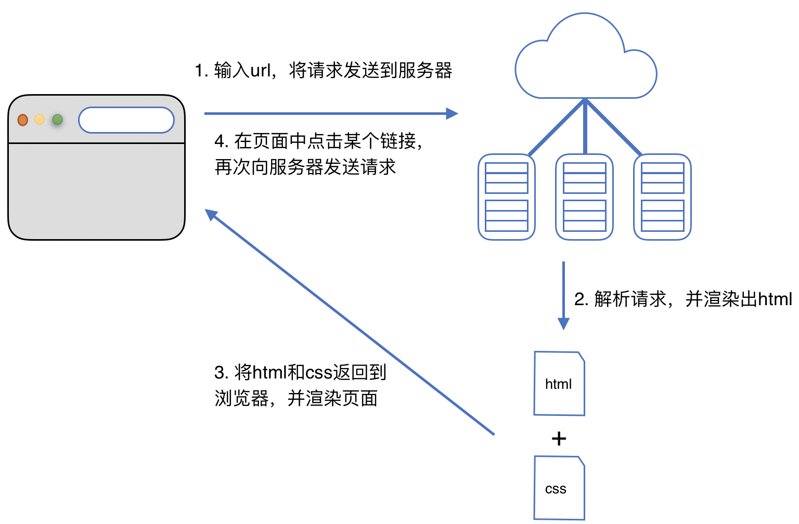
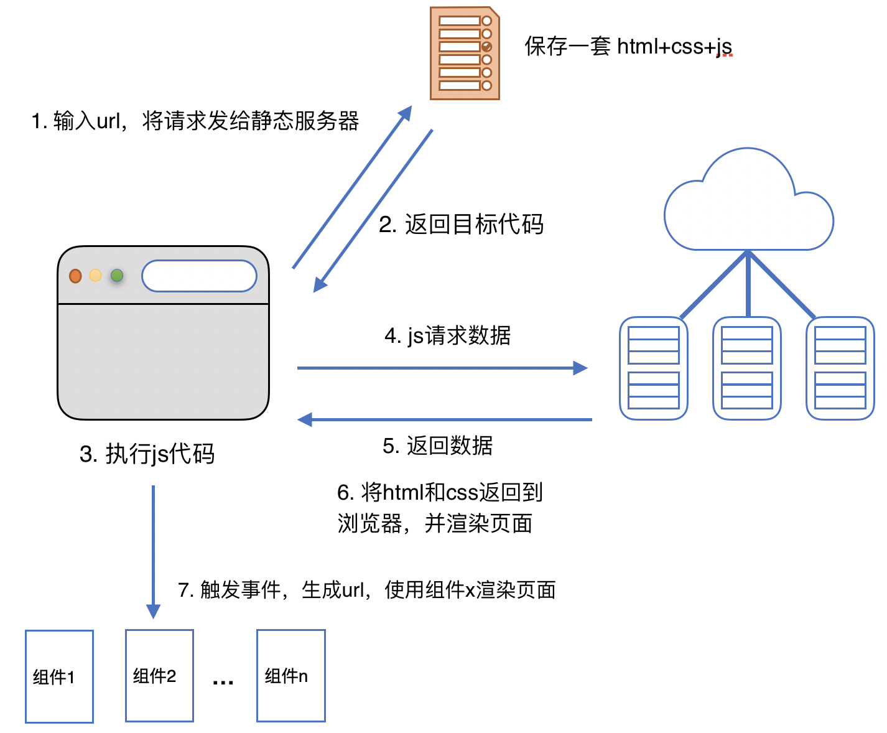

### 目录
- [从后端渲染到前端渲染](#从后端渲染到前端渲染)
    - [后端渲染到前端渲染的演进过程](#后端渲染到前端渲染的演进过程)
    - [演进过程中相互关联的问题与概念](#演进过程中相互关联的问题与概念)
        - [什么是前端渲染，什么是后端渲染](#什么是前端渲染，什么是后端渲染)
        - [什么是前后端分离](#什么是前后端分离)
        - [什么是前端路由，什么是后端路由](#什么是前端路由，什么是后端路由)
        - [前端路由的核心](#前端路由的核心)
- 

# 从后端渲染到前端渲染
## 后端渲染到前端渲染的演进过程
[top](#catalog)
1. 后端渲染阶段
    - 前后端交互
        - 交互过程中的角色
            - 浏览器
            - 后端服务器
        - 交互过程
            1. 在浏览器地址栏输入url，将请求发送到某个服务器
            2. 服务器解析请求，将jsp代码渲染成html
            3. 将html返回浏览器，并渲染页面
                - 这种情况下页面上只会有html和css    
            4. 在页面中点击某个链接，会再次向服务器发送请求
            5. 重复执行2～4
        - 交互图
            - 
    - 后端服务器如何维护 **url与页面数据** 的映射关系
        - url发送到服务器后，通过正则表达式对url进行匹配
        - 匹配成功后，交给 Controller 处理
        - Controller将生成的html或数据返回
    - 后端渲染的优点
        - 不需要单独加载任何js和css，可以直接交给浏览器展示
        - 有利于SEO优化
    - 后端渲染的缺点
        - 页面的所有路由需要有后端人员维护和开发
        - 前端开发者需要用后端语言来开发页面
        - html、数据、处理逻辑等都耦合在一起，开发、维护都很复杂
    - 可用的技术
        - 后端
            - mysql
            - java、spring、springboot
            - JFinal
        - 前端
            - html、css、js
            - spring-->模板引擎

2. 前端渲染阶段1 -- 前后端分离（弱前段 + 后段 分离）
    - 为什么会出现这种方式?
        - ajax出现，有了前后端分离的开发模式
    - 前后端的职能划分
        - 后端提供获取数据的API
        - 前端通过ajax依照API获取数据，再使用js渲染页面
    - 前后端交互
        - 交互过程中的角色
            - 浏览器
            - 后端服务器/API服务器
            - 静态资源服务器
        - 交互过程
            - 在地址栏输入url，向静态服务器发送请求获取资源
                - 需要获取**成套** 3 种资源
                    1. html，浏览器直接渲染
                    2. css，浏览器直接渲染
                    3. js，浏览器需要执行
                - 一个网站可能会在静态服务器上保存多套页面代码
                    - 不同的url对应不同的代码
                - 这些资源会被缓存在浏览器中
            - js中包含API请求的代码，执行到这些代码时，会向API服务器发送请求
            - 服务器解析请求，将数据返回给浏览器
            - 由js回调函数及相关业务逻辑代码处理数据，并渲染页面
        - 交互图
            - 
    - 前后端分离的优点
        - 前后端责任清晰，后端专注于数据处理，前端专注于交互和可视化
        - 对于多平台的应用，只需要一套后端
    - 可用的技术
        - 后端
            - mysql
            - java、spring、springboot
            - 微服务
        - 前端
            - html、 css、 js
            - ui框架
        - 前后端交互
            - ajax
                - ajax原生
                - jquery
                - vue-resource
                - axios
            - 通过json交互
                - 需要统一格式的json

3. 前端渲染阶段2 -- SPA单页面富应用阶段 （组件化前端 + 后端 分离）
    - `SPA` 相对于`前后端分离`的最主要特点
        - <label style='color:red'>增加了一层前端路由</label>
            - 前端单独维护一套路由规则
        - <label style='color:red'>整个网页只有一个html页面</label>
            - 即静态资源服务器上只有一套代码
    - 一个html页面如何展示整个网站？--通过前端路由来控制
        - 页面被拆分成不同的组件
        - 当页面中的某个事件被触发时，会产生一个url
        - url的处理
            - url不会发送到服务器
            - 由js代码处理url，判断使用哪个组件来做页面展示
            - js将组件渲染成页面内容
                - 如果缓存中没有对应的数据，需要向API服务器发送请求
    - 前端路由维护的映射关系
        - 前端事件产生的url与页面组件的映射关系
    - 交互过程中的角色
        - 浏览器
        - 后端服务器/API服务器
        - 静态资源服务器
    - 交互图
        - 
    - 可用技术
        - 后端
            - mysql
            - java、spring、springboot
            - 微服务
        - 前端
            - 使用的技术
                - js
                - vue\react + elementUI/AtUI/AUL/MUI/WeUI
                - node环境
                - npm指令
                - cli 脚手架
            - 开发方式
                - 模块化
                - 组件化
                - 单页面路由
        - 前后端交互
            - ajax
                - ajax原生
                - jquery
                - vue-resource
                - axios
            - 通过json交互
                - 需要统一格式的json

## 演进过程中相互关联的问题与概念
### 什么是前端渲染，什么是后端渲染
[top](#catalog)
- 后端渲染
    - 后端生成html代码，然后将html + css 返回浏览器，浏览器只负责展示
- 前端渲染
    - 只从后端请求数据，浏览器通过执行js代码生成并渲染需要展示的内容
### 什么是前后端分离
[top](#catalog)
- 不同的功能由前端、后端分别处理
- 前后端进行职能划分
    - 后端提供获取数据的API
    - 前端通过ajax依照API获取数据，再使用js渲染页面

### 什么是前端路由，什么是后端路由
[top](#catalog)
- 后端路由
    - 服务器根据url，调用不同的 Controller，执行不同的业务逻辑，获取不同的数据
- 前端路由
    - 当页面中的某个事件被触发时，会产生一个url
    - 由js处理url
        - url不会发送到服务器
        - 由js代码判断使用哪个组件来做页面展示
        - js将组件渲染成页面内容
            - 如果缓存中没有对应的数据，需要向API服务器发送请求

### 前端路由的核心
[top](#catalog)
- url改变，但是页面不做整体刷新
- 维护一套路由映射规则:
    - 前端事件产生的url与页面组件的映射关系