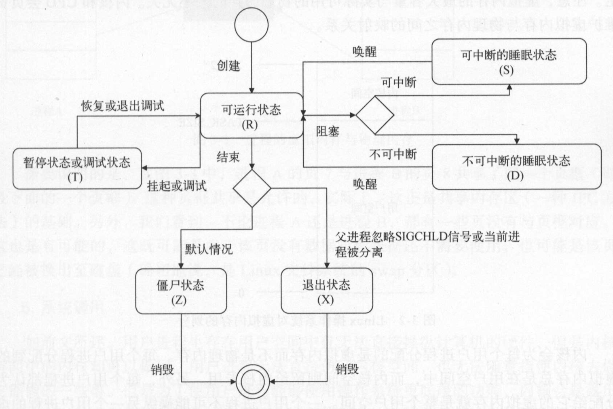
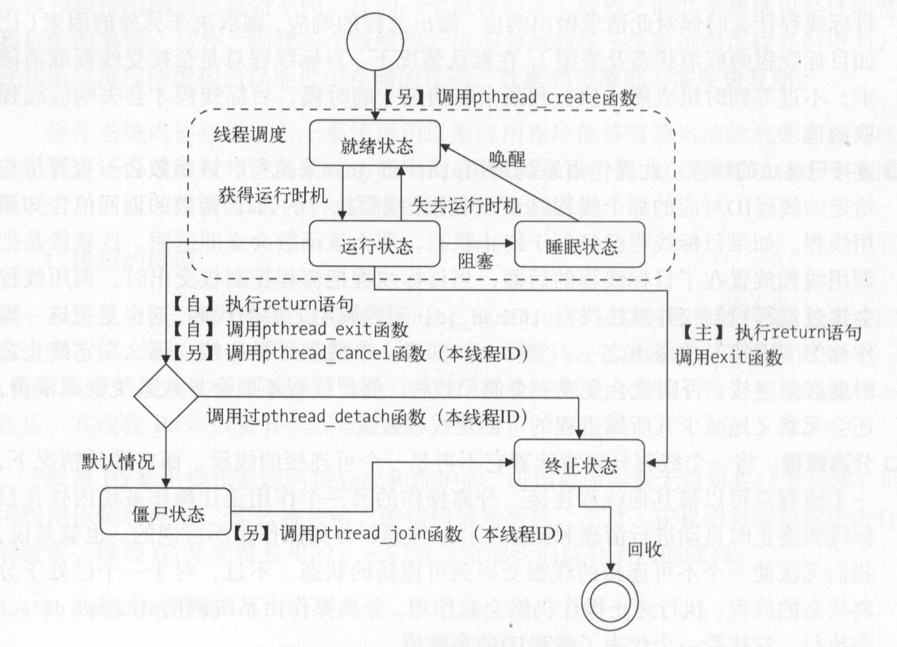
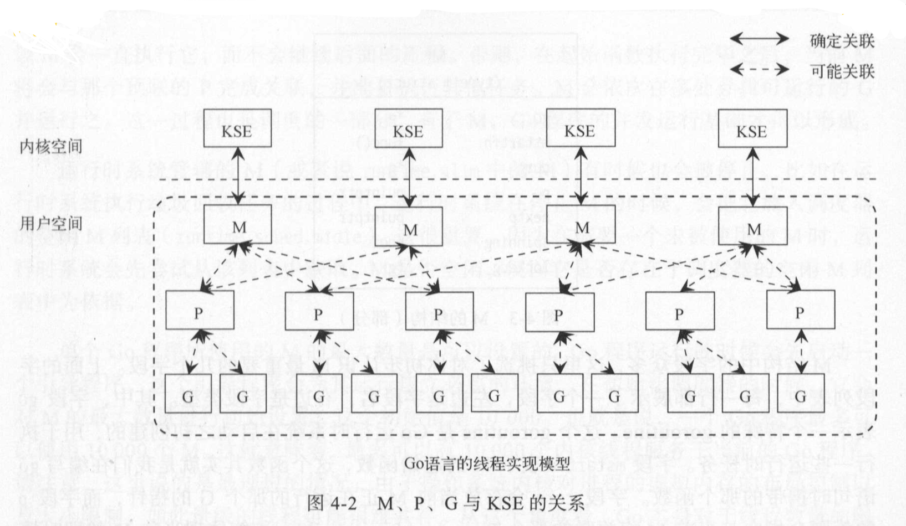
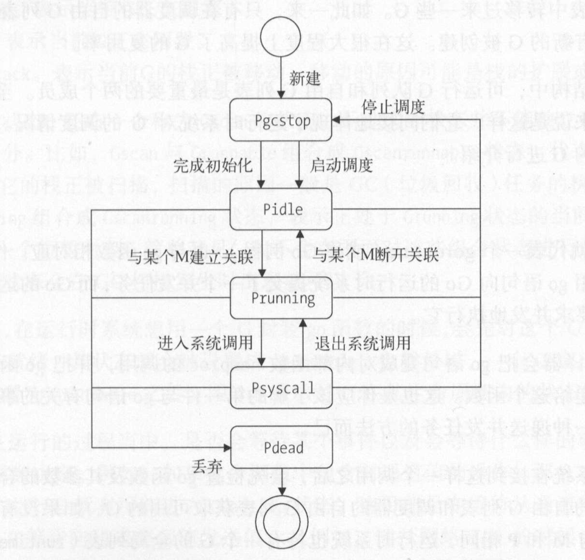
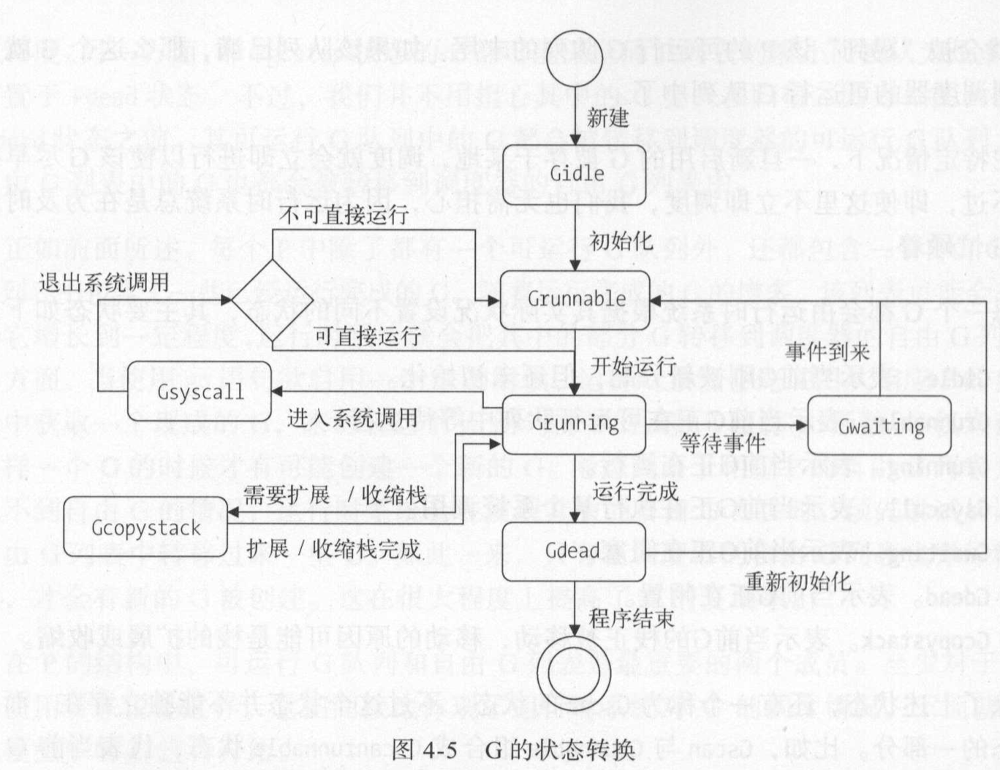
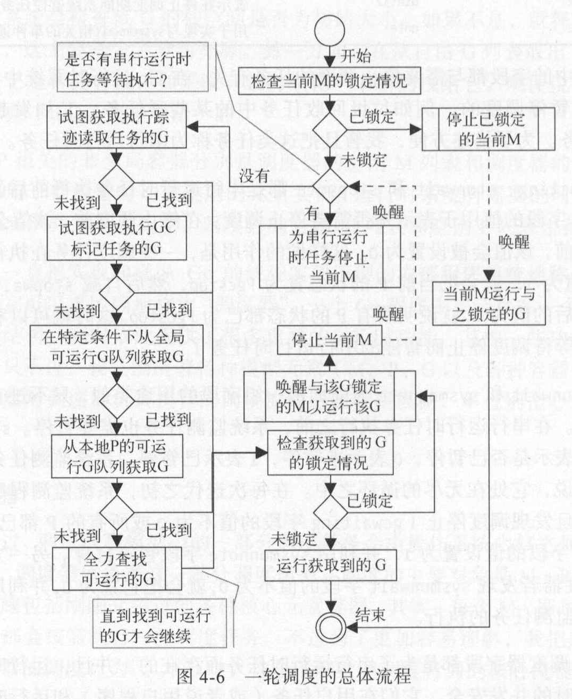
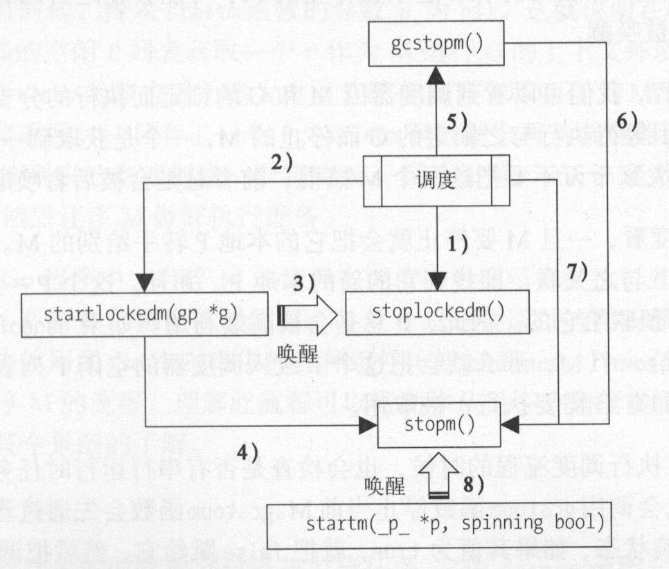
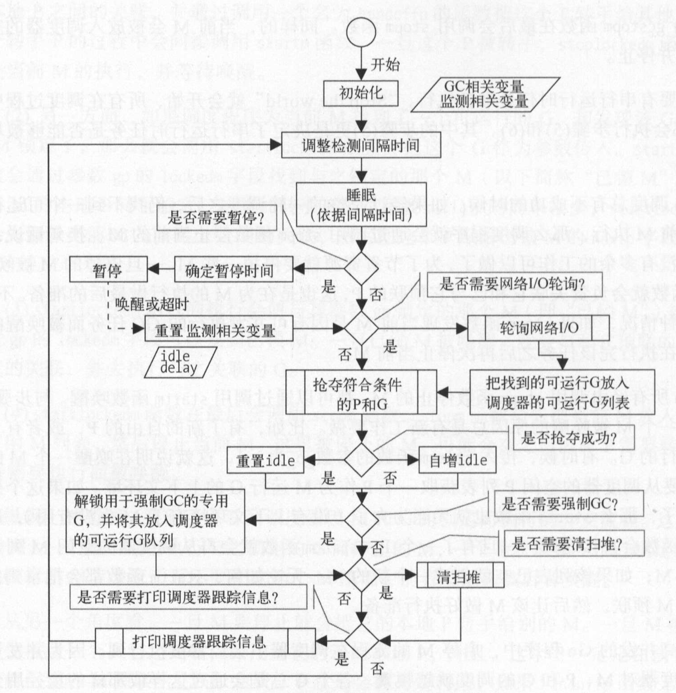
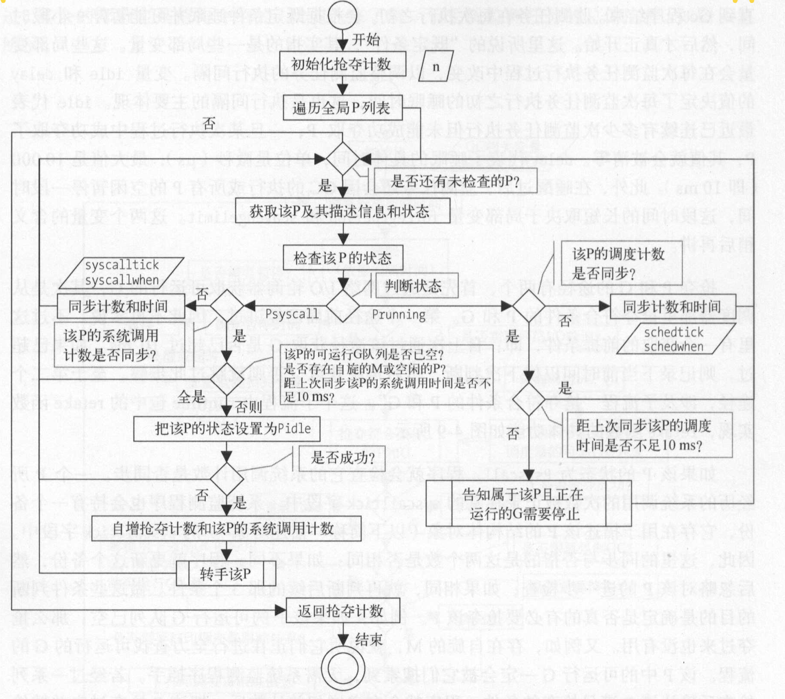
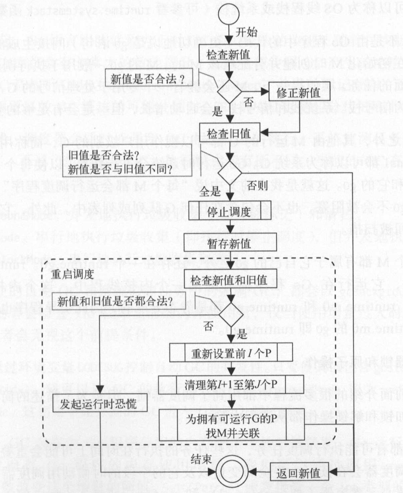

# 进程
* 进程间通信方式-IPC(Inter-Process Communication)
* Linux系统中的IPC
    * 基于通信的IPC方法
        * 以数据为手段
            * 管道：传递字节流
            * 消息队列：传送结构化的消息对象
        * 共享内存(最快的一种IPC方法)
            * 共享内存区
    * 基与信号的IPC方法(唯一的异步IPC方法)
        * 使用操作系统的**信号机制**
    * 基于同步的IPC方法
        * 信号量
* Go支持的IPC方法：管道、信号、socket
* 进程
    * 程序--程序的静态形态，进程--程序的动态形态
    * 进程的衍生
        * 进程使用**系统调用函数fork**，来创建若干新的进程
            * 前者为父进程、后者为子进程
            * 子进程来源与父进程的一个副本，会获得父进程的：**数据段、堆、栈的副本，并与父进程共享代码**
                * 每一个副本都是独立的，子进程对副本的修改对于其他子进程和父进程是不可见的
        * **全盘赋值父进程的数据是非常低效的做法**
        * Linux操作系统内核使用**写时复制(COW)**等技术来提高进程创建的效率
        * 新创建的子进程可以通过系统调用exec把一个新的程序加载到自己的内存中
            * 加载后，内存中原来的数据段、堆、栈、代码将会被替换掉
            * 加载后，自己成执行的是新加载的程序
        * linux系统中的每一个进程都有父进程，所有的进程共同组成了一个**树状结果**
            * **内核启动进程**
                * 进程树的根
                * 负责系统的初始化操作
                * 该进程的父进程就是它自己
                * 如果某个进程先于其子进程结束，这些**子进程将会变为内核启动进程的直接子进程**
    * 进程的标识
        * **进程描述符**
            * 负责记录进程的：进程ID(PID)、父进程ID(PPID)、优先级、状态、虚拟地址范围、各种访问权限等等
            * 进程描述符是一个非常复杂的数据结构
        * 内核通过进程描述符来管理每个进程的属性和行为
        * 内核可以把进程ID转换成对应的进程描述符
        * 进程ID(PID)是进程在操作系统中的唯一标识
            * `进程ID=1` 的进程是**内核启动进程** 
            * 进程ID 是一个**非负整数**，且**总是顺序的编号**
                * 新创建的进程ID总是前一个进程ID递增的结果
                * 进程ID可以重复使用
                * 进程ID达到最大值是，内核会从头开始查找闲置的进程ID，并使用最先找到的一个作为新的进程ID
        * 通过PPID可以查找守护进程
        * Go查询PID、PPID
            ```go
            func main() {
                fmt.Println(os.Getgid())
                fmt.Println(os.Getppid())
            }
            ```
    * 进程的状态
        * 6种状态
            * 可运行状态(TASK_RUNNING，简称R)
                * 进程将要/正在CPU上运行，运行的时间不定，由进程调度器决定
            * 可中断的睡眠状态(TASK_INTERRUPTIBLE，简称S)
                * 当进程正在等待某个事件(网络连接或信号量)到来时，会进入此状态
                * 这样的进程会被放入对应事件的等待队列中
                * 当事件发生时，等待队列中的一个、多个进程会被唤醒
            * 不可中断的睡眠状态(TASK_UNINTERRUPTIBLE，简称D)
                * 继承状态不可被打断
                * 该状态的进程不会对任何信号作出相应
                * 该状态的进程通常在**等待一个特殊的事件**，如等待同步的I/O操作完成
            * 暂停状态/跟踪状态(TASK_STOPPED/TASK_TRACED，简称T)
                * 状态转换
                    * **挂起/调试**：向进程发送SIGSTOP信号，使该进程进入暂停状态，除非该进程正处于不可中断的睡眠状态
                    * **恢复/退出调试**：处于暂停状态的进程发送SIGCONT信号，会使该进程变为**可运行状态**
                * 处于该状态的进程会暂停，等待另一个进程对它进行操作
            * 僵尸状态(TASK_DEAD-EXIT_ZOMBIE，简称Z)
                * 该状态的进程即将结束运行，占用的绝大多数资源已经被回收，但还有一些信息未删除，如**退出码、统计信息**
                    * 考虑到父进程可能还需要，所以保留这些信息
                * 此时进程的主体已经被删除只有一个空壳
            * 退出状态(TASK_DEAD-EXIT_DEAD，简称X)
                * 一个进程消亡使，内核会给父进程发送**SIGCHLD信号**
                * 不保留退出码、统计信息
                    * 造成的原因
                        * 显式的让父进程忽略掉SIGCHLD信号
                        * 该进程已经和父进程分离
                * 处于退出状态的进程会立即被结束，占用的系统资源也会被操作系统自动回收
        * 状态转换
    * 进程的空间
        * 内存寻址：通过指针来寻找内存单元
            * 指针是**正整数**，由若干二进制位表示，二进制位数量有计算机的字长决定
                * 32位计算机中有2^32个内存单元，64位计算机中有2^64个内存单元
            * 虚拟地址：有虚拟地址表示物理内存
                * 由虚拟地址标识的内存区域称为：虚拟地址空间，也称为虚拟内存
                * 用户空间的虚拟地址范围：0～TASK_SIZE
                * 内核空间的虚拟地址范围：TASK_SIZE～2^32/2^64
                * TASK_SIZE由所在计算机的体系结构决定
        * 空间划分
            * 用户空间
                * 用户进程的生存空间，且用户进程无法访问内核空间
                * 不能与计算机硬件进行交互
                * **一个用户进程不能操作另一个用户进程的虚拟内存**
            * 内核空间
                * 可以和硬件交互
        * 虚拟内存的划分
            * 内核会把进程的虚拟内存划分为**若干页(page)**
            * 物理内存单元由CPU划分
                * 一个物理单元称为**页框(page frame)**
            * 一个页对应一个页框
            * **不同的页可以共享同一个页框，这个页框称为共享内存区**
            * 不是所有的页多有对应的页框
                * 该页没有数据
                * 数据不需要使用
                * 页已经被换出到磁盘(linux的swap区)
    * 系统的调用
        * 用户进程只能使用内核的接口来操作硬件，称为**系统调用**
        * 系统调用与普通函数的区别
            * 系统调用
                * 系统调用是向内核空间发出的一个明确请求
                * 系统调用在内核空间活动
                * 系统调用本身是内核的一部分
            * 普通函数
                * 普通函数只定义了如何获取一个给定的服务
                * 普通函数只在用户空间活动
        * 内核态和用户态
            * 为保证操作系统的文档和安全，内核依据CPU提供的、可以让进程驻留的特权级别建立了这两个特权状态
            * 大部分时间CPU都处于用户态
            * 用户态
                * CPU只能对用户空间进行访问
            * 内核态
                * 用户进程发出一个系统调用是，内核会把CPU从用户态切换到内核态，再执行对应的内核函数
                * 内核函数执行完后，内核会把CPU从内核态切换到用户态，并把执行结果返回给用户进程
    * 进程的切换和调度
        * 在进程换入换出期间必须要做的任务统称为进程切换，包括保存现场、恢复现场
        * 通过调度来决定切换哪个进程、什么时候切换
* <label style="color:red">进程的切换和调度是并发的基础</label>
* 同步
    * 多个进程键互相配合完成一个任务时，需要IPC
    * 竞态条件：存在共享数据(资源)时，通信过程中进程之间会发生干扰
    * 原子操作：执行过程中不能中断的操作
        * **所有的系统调用都属于原子操作**
            * <label style="color:red">内核只提供针对二进制位和整数的原子操作，来保证原子操作的绝对并发安全</label>
            * <label style="color:red">Go在`sync/atomic`包中提供了对原子操作的支持</label>
        * 原子操作必须**由一个单一的汇编指令表示，并且需要得到芯片级别的支持**
    * 临界区：只能被串行化访问或执行的某个资源或某段代码
        * 制作临界区的通用方法：让串行化的代码形成临界区
        * 互斥(mutual exclusion,简称mutex)：保证只有一个进程或线程在临界区之内
            * 实现互斥的方法必须确保**排他原则**
            * 实现方法不能依赖于任何计算机硬件，包括CPU
* 管道pipe
    * 一种半双工的通信方式
    * 只能用于父进程与子进程、同祖先的子进程间的通信
    * Go通过`os/exec`包来执行系统命令并建立管道
* 信号
    * 操作系统信号是IPC中唯一一种异步的通信方式
    * 本质是用软件来模拟硬件的**中断机制**
    * 每一个信号都有一个以**SIG**为前缀的名字，这些信号都是正整数，这些正整数被称为信号**编号**
    * linux中通过`kill -l`可以查看系统所支持的信号
        * 1-31 标准信号(不可靠信号)
        * 34-64 实时信号(可靠信号)
    * 信号的来源：键盘输入、硬件故障、系统函数调用、软件中的非法运算
    * 进程响应信号的3种方式：忽略、捕捉、执行默认操作
    * Linux对每一个标准信号都有默认的操作方式，包括
        * 终止进程
        * 忽略该信号
        * 终止进程并保存内存信息
        * 停止进程
        * 恢复进程(如果进程已经停止)
    * Go命令会对一些以键盘输入为来源的标准信号作出响应 
        * 通过`os/signal`中的API来实现
        * Go中指定了需要被处理的信号，并监听信号
        * 使用`signal.Notify()`，将程序伪装成操作系统向进程发送指定信号
* socket
    * 底层系统调用的read、write都是非阻塞式的接口，会出现部分读/部分写的特性，内存空/满时会返回EAGAIN的错误，需要应用程序去等待一会，稍后再操作
    * Go的socketAPI一定程度上充当了**应用程序的角色**，屏蔽了相关系统调用的EAGAIN错误，使的一些socketAPI使用起来像是阻塞式的
        * Go屏蔽的底层的部分写特性，相关API直到把所有数据全部写入到socket的发送缓冲区之后才会返回，除非在写入的过程中发生了某种错误
        * Go保留了部分读特性，并交给了调用方法
            * 因为数据的接收放无法感知数据的边界，所以socketAPI无法判断函数调用返回的时机，把数据切分和分批返回的任务交给调用程序
    * net.Conn 类型
        * Read(b []byte)(n int, err error)
            * 用于从socket的接收缓冲区中读取数据
            * 如果发现TCP连接已经被另一端关闭了，此时err=io.EOF，即连接关闭
            * 可以使用`bytes.Buffer`来保存每次读取的结果，来避免部分读的影响
            * met.Conn实现了io.Reader接口中的Read方法，所以可以使用带缓存的IO：bufio.NewReader函数来包装变量：
                ```go
                reader := bufio.NewReader(conn)
                line,err := reader.ReadBytes('\n') //'\n'是消息边界
                ```
        * Write(b []byte)(n int, err error)
            * 可以使用`bufio.NewWriter(conn)`来进行写操作
                * 可以通过ReadFrom来从过年其他io.Reader类型中读取并写入数据
                * 可以通过调用Reser方法来重置
                * 写入全部数据之后，需要调用`Flush()`方法，以保证所有数据都真正写入的代理对象中
                * 写入是需要注意缓冲区的容量，默认是4096个字节
        * Close()
            * 关闭当前连接
            * 如果Read、Write还未结束，或处于阻塞态，也会结束并返回nil和error
        * Addr
            * LocalAddr()(net.Addr, err error) 返回本地地址
            * RemoteAddr()(net.Addr, err error) 返回远程地址
            * Addr.Network() 返回连接所使用的协议名称、如tcp
            * Addr.String() 返回地址
        * SetDeadline(time.TIme)
            * 设置当前连接上的IO操作的绝对超时时间
            * 如果调用该方法之后的相关IO操作还没有完成，将会立即结束，并返回nil和err，这个err将会提示`i/o timeout`
            * 如果设置0值(可以用time.Time{}表示)，则超时时间将会被取消
        * SetWriteDeadline
            * 设置写操作的超时时间
            * 如果写操作超时了，也不一定表示写操作完全没有成功，因为Write方法已经将一部分数据写到socker的发送缓冲区了，即Write因超时终止，结果的第一个值也可能大于0，表示结束之前真正写入的数据的字节数量
        * SetReadDeadline
            * 设置读操作的超时时间
# 线程
* 线程
    * 线程是进程中的控制流
    * 每个线程都有自己的线程栈(位于进程的虚假内存中)、并存储自己的私有数据
    * 进程中的资源会被所有线程共享，包括：代码段、数据段、堆、信号处理函数、当前进程支持的文件描述符 等等
        * **一个进程中的多个线程运行的一定是同一个程序，只是具体的控制流程和执行的函数可能会不同**
        * 创建线程的消耗比较上，因为很多资源是进程中共享的，不需要复制
    * 一个线程至少包含一个线程，因为进程至少需要一个控制流持续运行
    * 一个进程的第一个线程会随着进行启动而创建，即主线程
    * 进程中的其他线程都是由进程中已存在的线程创建出来的，任何线程都可以通过：系统调用`pthread_create`函数来创建新的线程
* 线程的标识
    * TID 线程ID
    * 在系统范围内可以不唯一(linux系统内唯一)，在所属进程的范围内唯一
* 线程间的控制
    * 同一个进程中的任意两个线程之间的关系都是平等的，不存在层级关系
    * 任何线程都可以对同一进程中的其他线程进行有限的管理
        * 创建线程
            * 创建线程时，调用线程需要给定新线程将要执行的函数、传入函数的参数
            * 代表函数的参数被命名为start，该函数可以有返回值，通过与线程连接可以得到该返回值
            * 如果创建成功，调用线程会得到新线程的ID
        * 终止线程
            * 可以使用系统调用`pthread_cancel`结束线程
        * 连接已终止的线程
            * 由系统调用`pthread_join`执行
        * 分离线程
            * 分离后变为一个不可连接的线程
            * 作用是让操作系统内核在目标线程终止时自动进行清理和销毁工作
            * 分离操作是不可逆的
            * 由系统调用`pthread_detach`执行
* 线程的状态
    * 
* 线程同步
    * 互斥量
        * 保证同一时刻仅有一个线程可以访问共享资源
        * 互斥量的实现会使用到机器语言级别的原子操作，并仅在锁定冲突时才会涉及系统调用的执行，比其他同步方法的速度要快
        * 如果多个互斥量保护的临界区存在重叠
            1. 使用操作系统提供的线程库功能：**试锁定-回退**
                * 流程
                    * 先锁定一个互斥量
                    * 再用**试锁定**的方法来锁定另一个互斥量
                    * 如果试锁定第二个互斥量失败，就把第一个互斥量解锁，并**重新对两个互斥量进行锁定和试锁定**
                    * 如果需要锁定的互斥量多于2个，总是先锁定其中一个，再重复上面的流程必要时进行回退
                * 试锁定代表的是操作系统的线程库提供的一个函数，如果锁定失败会返回一个错误码，而不会阻塞
                * 缺点是会增加程序的复杂性
            2. 固定顺序锁定
                * 总是以固定的顺序锁定互斥量，来避免有线程想要锁定另一个线程以锁定的互斥量
                * 缺点是降低了程序的灵活性
    * 条件变量
        * 在共享资源的状态发生变化时，通知其他因此而被阻塞的线程
        * 三种操作
            * 等待通知
                * 原子操作=解锁互斥量+阻塞当前进程
            * 单发通知
            * 广播通知
* 线程安全
    * 一个代码快可以被多个线程并发执行，并且总能够产生预期的结构，该代码块就是线程安全的
    * 函数可重入：某个进程中的所有线程都能并发调用一个函数，无论执行的顺序如何，该函数总能产生预期的结果
        * 如果返回结果中包含共享数据，该函数一定不是可重入函数。因为如果其他线程更新了共享数据，那么返回结果可能就不是预期结果了
        * 通用规则：**任何内含操作共享数据的代码的函数都可以视为不可重入函数**
        * 如果不存在对共享数据的更新操作，则可以不使用互斥量。但是线程必须维护一份共享数据的副本，这样可以是函数保持可重入
            * 如果函数的某个局部变量包含了对共享数据的引用，则函数不是可重入的。因为使用时，共享数据的改变可能影响到函数的实际结果
        * 如果函数无法做到可重入，需要使用互斥量保护相关代码
    * 实现线程安全
        * 最高效、最简单的方式：**编写可重入函数**
        * 低效的方法：所有代码都放在临界区
        * 抽取操作共享数据的代码，使用互斥量保护
            * 可以分离这些代码，并转换成一个/多个函数
            * 可以将这些代码聚集成一个**具有线程安全的数据结构**
# 多进程与多线程
* 响应时间：从计算请求提交到计算结果可用之间的性能指标
* 吞吐量：在一个时间单元之内，程序完成并输出结果的计算任务的数量
* 程序的正确性：程序的执行结果与预想相同
* 程序的可伸缩性：在增加CPU核心数量的情况下，运行速度不会收到影响
    * 并发程序的运行速度的提升曲线会随CPU核心数量的增加而趋于平缓
    * 影响因素：同步方法的数量、执行消耗
        * 同步方法的数量越多提升曲线越趋于平缓
            * 因为个线程只能串行的运行同步代码，这需要操作系统内核和计算机硬件(主要是CPU)共同完成
            * 当有多个CPU核心时，系统内核和硬件的协调工作和影响执行效率。CPU核心越多，协调工作也会多，对执行效率的影响越大
            * 使函数可重入也是为了减少协调工作代理的负面影响
* 程序的正确性和可伸缩性是矛盾的：
    * 保证正确性需要同步，增加同步会降低可伸缩性
    * 减少同步方法又会影响程序的结果
* 中和正确性和可伸缩性
    1. 控制临界区的纯度
        * 临界区应该仅包含：**操作共享数据的代码**
    2. 控制临界区的粒度
        * 粒度过小，会增加底层协调工作的次数
        * 如果多个临界区相邻，且操作同一个共享数据代码，可以合并临界区
        * 应该优先减少粒度过细的临界区
    3. 减少临界区中代码的执行耗时
    4. 避免长时间持有互斥量
        * 减少临界区代码的执行消耗
        * 使用条件变量，条件变量会适时的对互斥量进行解锁和锁定
    5. 使用原子变量而不是互斥量

# Go的并发机制
## 原理
* Go在操作系统提供的内核线程之上，搭建了一个特有的两级线程模型
* goroutine：可以并发执行的Go代码片段
    * 不要用共享内存的方式来通信，以通信作为手段来共享内存
    * 基本思想：把数据放在共享内存中供多个线程访问，比较简单，但使并发访问控制变得异常复杂
### 原理-线程实现模型
* 3个核心元素：
    * M maching：内核线程/工作线程
    * P processor：上下文环境，代表执行一个Go代码片段所必须的资源
    * G goroutine：可以并发执行的代码片段
* 一个G的执行需要P和M的支持
* 每个P都会包含一个可运行的G队列，队列中的G会被依次传递给与本地P关联的M，并获得运行时机的
* MPG与KSE(内核调度实体)的一般性关系
    * 
    * M与KSE之间总是一对一的关系
    * M和P之间总是一对一的关系
    * M和G也会建立关联，因为G最终需要M来运行，M和G之间由P来关联
* M
    * 一个M代表一个内核线程
    * **M本身是无状态的**
    * 大多数情况下，创建一个M，都是由于**没有足够的M来关联P运行可以运行的G**
    * 运行时系统执行系统监控、垃圾回收等任务也会导致新M的创建
    * Go运行时系统可以把一个M和一个G锁定在一起。一旦锁定，M只能运行这个G，这个G只能由这个M运行
        * runtime包提供了函数：LockOSThread和UnlockOSThread来锁定和解锁
    * M的结构
        * 字段
            * `g0 *g`：一个特殊的goroutine，这个goroutine是Go运行时系统在启动时创建的，用于执行一些运行时任务
            * `mstartfn func()`：go语句执行的函数
            * `curg *g`：当前M正在运行的那个G的指针
            * `p puintptr`：与当前M关联的P
            * `nextp puintptr`：暂存与当前M有潜在关联的P
                * **M和P的预联**：调度器将某个P赋给M的nextp字段
            * `spinning bool`：表示这个M是否正在寻找可运行的G
                * 在寻找过程中，M会处于自旋状态
            * `lockedg *g` 当前与M锁定的G
        * `mstartfn、curg、p` 体现了当前M的即时情况
    * M创建之初，会被加入全局M列表：`runtime.allm`(运行时系统管辖的M)，同时被设定起始函数和预联的P，最后运行时系统会为这个M专门创建一个新的内核线程并与之关联
        * 全局M列表没有特殊的意义。运行时系统在需要的时候会通过它获取所有M的信息。也何以防止M被当作垃圾回收掉
        * 起始函数仅在运行时系统要用此M执行系统监控或垃圾回收等任务时才会被设置
            * 如果起始函数代表的是系统监控任务，M将会一直执行它，不会继续后面的流程。
            * 否则，起始函数执行完后，当前M会与预联P进行关联，并准备执行其他任务
        
    * `runtime.allm`中的M有时也会被停止，如运行时系统执行垃圾回收任务的过程中
        * M被停止时，会被放入**调度器的空闲M列表`runtime.sched.midle`**
        * 在需要一个未被使用的M时，运行时系统会先尝试从`runtime.sched.midle`中获取
        * M是否空闲，仅以M是否存在于`runtime.sched.midle`中
    * 可以设置单个Go程序使用的最大M数量
        * Go程序运行是会先启动一个引导程序，建立运行的必要环境
        * 初始化调度器是，会设置最大M，**初始值是10000**
        * 也可以通过：`runtime/debug.SetMaxThreads`函数设定最大M，如果新值比已有M小，会引发一个运行时panic，所以需要小心使用
* P
    * 运行时系统会适时的让P与不同的M建立或断开连接，使P中的可运行G能获得执行的机会
    * 改变单个Go程序**间接拥有**P的最大数量
        * `runtime.GOMAXPROCS(最大P)`
            * 使用该函数会让所有的P都脱离运行状态，并试图阻止任何用户级别的G的运行
            * 只有最大P设定完后，才会重新恢复G，对程序性能的损耗非常大
            * 最好在main函数前调用
        * 在Go程序运行前设置环境变量`GOMAXPROCS`
    * **P的数量即为可运行G的队列数量**
    * **P的最大数量实际上是对程序中并发运行的G的规模的一种限制**
    * 当M因系统调用而阻塞时，M和P会分离，此时如果P的G队列中如果还有未被运行的G，那么运行时系统会找到一个空闲M或创建新M，与P关联来运行G
        * **一般M比P多**，G的数量取决与Go程序本身
    * Go程序启动之初，引导程序初始化调度器时，会设置最大P，默认=当前CPU的总核心数
        * 如果`GOMAXPROCS>0`，引导程序会认为需要手动设定最大P，会先检查值的有效性
            * `GOMAXPROCS <= 256(硬性上限)`即为有效，否则使用硬性上限
            * 目前的硬性上限是256，原因是Go目前只能保证最多256个P同时存在时的高效性，未来可能会改变
    * 所有的P保存在全局P列表中：`runtime.allp`
    * 空闲P会保存在空闲P列表中`runtime.sched.pidle`
        * 如果P不再和任何M关联，运行时系统会把它放入空闲P列表
            * 进入的条件是：P的可运行G列表为空
        * 当系统需要一个空闲P关联M时，会从此列表中取出一个
    * <label style="color:red">P的状态</label>
        * 几种状态
            * Pidle，当前P未与任何M存在关联
                * 可运行G列表为空
                * 会被放入`runtime.sched.pidle`中
            * Prunning，P正在与某个M关联
            * Psyscall，P中运行的那个G正在进行系统调用
            * Pgcstop，运行时系统需要停止调度。
                * 如：运行时系统开始垃圾回收的某些步骤前，会试图把`runtime.allp`中的所有P置于此状态
            * Pdead，P已经不会再被使用
                * 在程序运行中使用：`runtime.COMAXPROCS()`减少最大P时，多余的P会被运行时系统置于此状态
                * 如果P进入此状态，最终只能被销毁，无法被重用
        * P的初始状态是：**Pgcstop**，时间非常短。初始化之后，变为：**Pidle**，并放入`runtime.sched.pidle`中
        * P的状态切换
    * P中的G列表
        * 可运行G队列
        * 自由G列表，包含已经运行完成的G。
            * 随着完成的G增加，该列表会变长，增长到一定程度，运行时系统会把其中部分G转移到**调度器的自由G列表**中
            * go语句要使用一个G时，会先从P中的自由G列表中取，取不到时会新建一个G，然后用这个G封装go函数
                * 如果运行时系统发现P中的自由G太少时，会尝试从调度器中的自由G列表中转移一些G，**提高了G的复用率**
* G
    * 一个G代表一个goroutine
    * Go编译器会把go语句变成**内部函数newproc的调用**，go函数及其参数都是newproc的参数
    * 内部使用流程
        * 检查go函数及其参数的合法性
        * 从本地P的自由G列表和调度器的自由G列表中获取可用的G，如果没有则新建一个G
            * 如果新建G，则将G加入运行时系统的全局G列表：`runtime.allgs`中
        * 运行时系统初始化G
            * 关联go函数
            * 设置G的状态和ID
        * 初始化后，将G存储到本地P的`runnext`字段中，让该G尽快执行。如果该字段已有值，那么这个已有的G会进入该P的可运行G队列的末尾
            * 如果可运行G队列已满，则G只能追加到调度器的可运行G队列中
    * G的状态
        * 几种状态
            * Gidle，当前G刚被新分配，但还未初始化
            * Grunnable，当前G正在**可运行队列中**等待运行
                * G封装go函数、并完成初始化后，会被设成Grunnable，即**一个G在被设置为Grunnable后才真正开始被使用**
            * Grunning，G正在运行
            * Gsyscall，G正在执行某个系统调用
            * Gwaiting，G正在阻塞
            * Gdead，G正在闲置
                * 此状态的G还可以被重新初始化并使用
                * 处于该状态的G会被放入**本地P或调度器的自由G列表**
            * Gcopystack，G的栈正在被移动，移动的原因可能是栈的扩张或收缩
            * Gscan，，G的栈要被GC扫描，该状态不能独立存在，而是组合状态的一部分
                * 如：Gscan+Grunnable-->Gscanrunnable状态，表示当前G正在等待运行、同时它的栈正在被扫描
                    * 扫描的原因是正在执行垃圾回收任务
        * 状态转换
* MPG三者
    * M比P多
    * 空闲P列表，全局P列表
        * 所有P都在全局P列表，空闲P列表只有Pidle状态的P
    * 全局G列表、本地P自由G列表，本地P可运行G队列、调度器自由G列表、调度器可运行G队列
        * 所有的G(无论执行中还是空闲)分别由P和调度器管理
        * 本地P的可运行G队列
            * 包含：
                * 可运行G
                * 初始化完成的G(保存在本地P的`runnext`字段)
                * 从本地P的`runnext`字段上被踢下来的G，存在队列末尾
        * 调度器可运行G队列
            * 从**本地P的`runnext`字段上被踢下来，且本地P可运行G列表无处中无处安放的G**
        * 自由G列表中
            * 运行完成的G，Gdead状态的G
* 核心元素容器(MPG的容器)
    * 容器列表

    |名称|源码名称|作用域|说明|
    |-|-|-|-|
    |全局M列表|runtime.allm|运行时系统|存放所有M的一个单向链表|
    |全局P列表|runtime.allp|运行时系统|存放所有P的一个数组|
    |全局G列表|runtime.allgs|运行时系统|存放所有G的一个切片|
    |调度器的空闲M列表|runtime.sched.midle|调度器|存放空闲的M的一个单向链表|
    |调度器的空闲P列表|runtime.sched.pidle|调度器|存放空闲的P的一个单向链表|
    |调度器的可运行G队列|runtime.sched.runqhead<br>runtime.sched.runqtail|调度器|存放可运行的G的一个队列|
    |调度器的自由G列表|runtime.sched.gfreeStack<br>runtime.sched.gfreeNoStack|调度器|存放自由的G的两个单向链表|
    |P的可运行G队列|runtime.p.runq|本地P|存放当前P中的可运行G队列|
    |P的自由G列表|runtime.p.gfree|本地P|存放当前P中的自由G的一个单向链表|

    * 可运行G队列
        * 两个可运行G队列的G拥有平等的运行机会
        * **从Gsyscall状态转出的G都会被放入调度器的可运行G队列**
        * 从Gwaiting状态转出的G，有的会被放入本地P的可运行G队列，有的会放入调度器的可运行G队列，还有的会直接运行
        * 两个可运行G队列可以互相转移G
            * 如果本地P的可运行G队列已满，其中一般G都会被转移到调度器的可运行G队列中
            * 调用`runtime.GOMAXPROCS`函数，会导致运行时系统把将死的P中的可运行G全部转移到调度器的可运行G队列中，来重新分配他们
        * 调度器的可执行G队列由队列头部变量：runtime.sched.runqhead、尾部变量：runtime.sched.runqtail代表
            * 一般新的G会被添加到尾部，从头部取G
            * runtime.GOMAXPROCS函数调用，会从头部插入G
    * 自由G类标
        * G进入Ghead状态之后，首先会被放入本地P的自由G列表中
        * 需要使用G时，会有效从本地P的自由G列表中获取
        * 如果本地P的自由G列表空了，运行时系统会从调度器中转移一部分G。如果本地P的自由G列表满了，也会转移到调度器的自由G列表中
        * 调度器的两个自由G列表
            * runtime.sched.gfreeStack，自由G有栈
            * runtime.sched.gfreeNoStack，自由G有无栈
            * 把G放入自由G列表前，运行时系统会检查该G的栈空间是否为初始大小，如果不是，就释放，是G变成无栈的，节约资源
            * 从自由G列表取出G之后，运行是系统会检查它是否拥有栈，如果没有就初始化一个新的栈给G
### 原理-调度器
* 两级线程模型中的一部分调度任务会由操作系统内核之外的程序承担，即由调度器负责
* 调度器的主要对象呢是M、P、G的实例
* 调度的辅助工具就是MPG容器
* 基本结构-调度器的数据结构
    * 包含：空闲M列表、空闲P列表、可运行G队列、自由G列表
    * 与停止任务调度有关的字段
        * `gcwaiting uint32`，表示是否需要因一些任务而停止调度
        * `stopwait int32`，表示需要停止但仍未停止的P的数量
        * `stopnote note`，用于实现与stopwait相关的事件通知机制
        * `sysmonwait uint32` 表示在停止调度期间系统监控任务是否在等待
        * `sysmonnote note` 用于实现与sysmonwait相关的事件通知机制
    * 一些任务在执行前需要暂停调度(**串行运行时任务**)
        * 包括：垃圾回收的某些子任务、发起运行时panic的任务 等等
        * 字段：`gcwaiting、stopwait、stopnote`都是串行运行时任务执行前后的辅助协调手段
            * 停止调度，gcwaiting=1；恢复调度，gcwaiting=0
            * 一些任务执行时，若发现gcwaiting=1，就会把P的状态变为**Pgcstop**，然后`stopwait--`
            * (自减后)当stopwait=0时，说明所有的P的状态都变为**Pgcstop**
            * 利用stopnote，唤醒因等待调度停止而暂停的串行运行时任务
        * `sysmonwait`和`sysmonnote`针对系统监测任务，因为串行运行时任务执行前，系统监测任务也需要停止
            * sysmonwait表示是否已暂停。sysmonwait=1，已暂停；sysmonwait=0，未暂停
            * 停止调度
                * 系统监测任务，处在无限循环中
                    * 开始迭代时，检查调度情况，如果：gcwaiting!=0、或者所有P的状态为Pgcstop，**会令sysmonwait=1**
                    * 利用sysmonnote暂停自身
            * 恢复调度
                * 调度器如果发现sysmonwait!=0，会令sysmonwait=0
                * 利用sysmonnote恢复系统监测任务
* 调度器会运行在若干已经存在的M之中，运行时系统中几乎所有的M都会参与调度任务的执行，它们共同实现了Go调度器的调度功能
* M的自旋状态
    * 自旋状态是M的一种工作状态，指当前M还没有找到G来运行
    * 退出自旋状态：
        * M找到了可运行的G
        * 始终未找到，需要停止M
    * 一般情况下，运行时系统中至少会有一个自旋的M，调度器会尽量保证只有一个自旋的M存在
    * 如果发现没有自旋的M，调度器会新创建M或恢复一个休眠的M来运行新的G。
        * 新创建M或恢复一个休眠的M，M最初总是会处于自旋状态
* 一轮调度
    * 引导程序会在初始化最后，让调度器进行一轮调度，使用封装了main函数的G马上有机会运行
    * 封装main函数的G总是运行时系统创建的第一个用户G
    * 一轮调度的流程
    * 一轮调度的触发
        * 启动并封装main函数的G并调度运行
        * 某个G的运行的阻塞、结束、退出系统调用、栈的增长
        * 某些标准库函数的调用，如
            * `runtime.Gosched`会让当前的G暂停运行，并让出CPU给其他的G
            * 调用`runtime.Goexit`会结束当前G的运行，也会进行一轮调度
    * <label style="color:red">重要的子流程-全力查找可运行的G</label>
        * 这个子流程会多次尝试从各处搜索可运行的G，**甚至会从其他P偷取可运行的G**
        * 主要使用`runtime.findrunnable`函数，该函数会返回一个处于Grunnable状态的G
            * 步骤-第一搜索阶段
                1. 获取执行终结器(终结函数)的G
                    * 当一个对象变为不可达是，垃圾回收器在回收该对象之前，就会执行与之关联的终结函数
                    * 所有的终结函数由一个专用的G负责执行
                    * 调度器会在判定这个专用G已完成任务之后试图获取它，然后把它置为Grunnable状态并放入本地P的可运行G队列
                2. 从本地P的可运行G队列获取G
                3. 从调度器的可运行G队列获取G
                4. 从网络IO轮询器处(netpoller)获取G
                    * 如果netpoller一杯初始化且已有过网络IO操作，调度器会尝试从netpoller获取一个G列表
                    * 如果没有，则会跳过该步骤
                    * 获取时如果没有获取成功也不会阻塞
                5. 从其他P的可运行队列获取G
                    * 执行改操作的条件
                        1. 除了本地P还有非空闲P，空闲P的可运行G队列必须为空
                        2. 当前M正处于自旋状态，或者处于自旋状态的M的数量小于非空闲的P的数量的二分之一
                    * 调度器会使用一种伪随机算法在全局P列表中选取P
                    * 再从P的可运行G队列中转移一半的G到本地P的可运行G队列
                    * 选取P和转移G的过程会重复多次，成功即停止
                    * 如果成功，调度器会把转移过来的一个G作为结果返回
                    * 如果失败，则第一阶段结束
            * 步骤-第二搜索阶段
                1. 获取执行GC标记任务的G
                    * 调度器会先判断是否正处在GC的标记阶段，以及本地P是否可用于GC标记任务。
                    * 如果两者都是true，调度器会把本地P持有的GC标记专用G置为Grunnable并作为结果返回
                2. 从调度器的可运行G队列获取G
                    * 如果依然找不到可运行的G，就会**解除本地P与当前M的关联**，并把该P放入调度器的空闲P列表
                3. 从全局P列表中每个P的可运行队列获取G
                    * 遍历全局P列表，并检查每个P的可运行G队列
                    * 如果有可运行G队列不是空的，就从调度器的空闲P列表中取出一个P
                    * 在判定该P可用后与当前M关联在一起，然后重返第一阶段重新搜索G
                    * 如果所有的P的可运行G队列都是空的，则继续后面的搜索
                4. 获取执行GC标记任务的G
                    * 判断是否正处于GC的标记阶段，以及与GC标记任务相关的全局资源是否可用。如果都是true，则调度器会从空闲P列表中拿出一个P
                    * 如果这个P持有一个GC标记专用G，就**关联该P与当前M**，然后再次执行第二阶段
                5. 从网络IO轮询器(netpoller)处获取G
                    * 与第一阶段的获取相同，但是这里的获取是阻塞的，只有当netpoller中有可用的G时，阻塞才会解除
                    * 如果netpoller还未被初始化，或者还为有过网络IO操作，会跳过这一步
            * 如果在两个阶段中没有找到可运行的G，调度器会停止当前的M。之后的某个时刻，该M被唤醒之后，会重新进入这个子流程
    
    * <label style="color:red">重要子流程-启动/停止M</label>
        * runtime中负责M启用/停止的函数
            * `stopm()`，停止当前M的执行，直到因有新的G变得可运行而被唤醒
            * `gcstopm()`，为串行运行时任务的执行让路，停止当前M的执行。串行运行是任务执行完毕后会被唤醒
            * `stoplockedm()`，停止已与某个G锁定的当前M的执行，直到这个G变为可运行而唤醒
            * `startlockedm(gp *g)`，唤醒与gp锁定的那个M，并让该M执行gp
            * `startm(_p_ *p, spinning bool)`，唤醒或创建一个M来关联_p_并执行
        * runtime函数的使用流程
### 原理-系统监测任务
* 由sysmon函数实现
* 系统监测程序在Go程序启动之初由一个专用M运行的，并且它**运行在系统栈之上**
* 总体流程
* 系统监测任务所做的工作
    * 在需要时抢夺符合条件的P和G
    * 在需要时进行强制GC
    * 在需要时清扫堆
    * 在需要时打印调度器跟踪信息
* 监测任务被包裹在一个循环中，会不停的执行下去，直到Go程序结束
* 监测任务在每次执行之初，会根据既定条件睡眠并可能暂停一小段时间，然后才真正开始
    * 既定条件=一些局部变量，每次监测任务执行过程中改变，以调整监测任务的执行将
        1. 变量idle，表示最近已连续有多少次监测任务执行但未能成功夺取P
            * 如果某次执行过程中成功夺取了P，会令idle=0
        2. 变量delay，代表睡眠的具体时间，单位是微秒，最大值是10000(10ms)
        3. 度过睡眠时间后，监测任务还会因GC的执行或所有P的空闲暂停一段时间，这段时间的长度取决于局部变量forcegcperiod、scavengelimit
* <label style="color:red">重要子流程-抢夺P和G的两个途径</label>
    * 通过网络IO轮询器获取可运行的G
        * 前提条件：自上次通过该途径获取G是否已超过10ms
            * 通过`syscallwhen`字段来判断
            * 如果已超过，则记录当前的时间供下次判断，然后再次获取。否则跳过次步骤
    * 从调度器中抢夺符合条件的P和G
        * 由runtime包中的retake函数实现
        * retake的功能
            * 如果P的状态Psyscall，程序会检查它的**系统调用计数是否同步**
                * P经历的系统调用次数存在`syscalltick`字段中
                * 系统监测程序也会备份，保存在这个P的描述对象的`syscalltick`字段中
                * 是否同步只这两个计数是否相同。
                    * 如果不同，则更新系统监测程序中的备份（和时间字段：`syscallwhen`，令syscallwhen=now），忽略对该P的进一步检查
                    * 如果相同，再判断后续的3个条件
                        * 后续的三个条件只是为了确定是否真的有必要抢夺该P
                        * 如果P的可运行G队列已空，那么该P是没有用的
                        * 如果存在M自旋，索命它正在进行：全力查找可运行G的流程
            * 如果P的状态为Prunning，程序会检查它的调度计数是否同步
                * P的调度计数由`schedtick`字段存储
                    * 只要P的可运行G队列中的某个G被取出运行了，该字段的值就会递增
                    * 系统检查程序也会持有一个调度计数的备份，由该P的描述对象的schedtick字段值表示
                * 如果调度计数不同步，程序会更新备份值，同时把该P描述对象的`schedwhen`字段值更新为now，忽略对该P的检查
                * 如果调度计数同步，再判断距离上次同步该P的调度时间是否不足10ms(即`schedwhen`字段)
                    * 如果`schedwhen>10ms`，说明该P的某个G已经运行了太长时间，**需要停止、并把运行机会让给其他的G**
                    * <label style="color:red">对于长时间运行的G，系统检查程序只负责通知，但不保证通知能否正确到达，也不保证G是否会作出响应</label>

* <label style="color:red">重要子流程-强制GC和清扫堆</label>
    * 强制GC
        * 专用于强制GC的G，在调度器初始化时就开始运行了
        * 强制GC的G一般会处于暂停状态，只有系统监测程序可以恢复它
        * 一旦判断GC当前为执行，并且距离上一次执行已经超过GC最大间隔时间，系统监测程序会恢复这个专用G，并**放入调度器的可运行G队列**
            * GC最大间隔时间由变量`forcegcperiod`表示，<label style="color:red">初始值为2min</label>
    * 清扫堆
        * 清扫堆的工作仅在距离上一次执行已超过清扫堆的间隔时间才会执行
        * 清扫堆的任务：把一段时间内未用的堆内存还给操作系统
        * 清扫堆的间隔时间与变量：`scavengelimit`有关，<label style="color:red">间隔时间=scavengelimit/2，scavengelimit初始值=5min</label>
* 打印调度器跟踪信息
    * 该操作受操作系统的环境变量`GODEBUG`控制
    * 如果在运行Go程序运行之前，设置`GODEBUG`，并且使其包含`schedtrace=X`，那么系统监测程序会适时的向标准输出打印调度器跟踪信息
        * X表示多少毫秒打印一次信息
* 环境变量GODEBUG
    * 通过该变量可以缩短强制GC和清扫堆的间隔时间
    * 包含`scavenge=1`，就可以使scavengelimit的值变为20ms，且forcegcperiod的值变为10ms

* 变更P的最大数量
    * 变更P的最大数量等同于**要改变G运行的上下文环境**
    * P的变更直接影响这Go程序的并发性能
    * 默认情况，P的最大数量=正在运行Go程序的逻辑CPU数量(CPU核心数量 )
    * 变更流程由`runtime.procresize`函数实现
    * 变更的核心流程

### 原理-其他细节
* M-g0
    * 每个M都会拥有一个特殊的G--g0
    * M中的g0不是由Go的代码间接生成的，是有GO运行时系统在初始化M时创建并分配给该M的
    * g0管辖的内存称为：M的调度栈（OS线程栈、系统栈）
        * 对应于操作系统为相应线程创建的栈
        * 这个栈不会自动增长，但一定会有足够的空间执行代码
        * **这个栈不会在垃圾回收期间被扫描**
    * g0一般用于**执行调度、垃圾回收、栈管理等任务**
    * **g0不会被阻塞，也不会被包含在任何G队列或列表中**
    
* M-gsignal
    * 专用于处理信号的G
    * 每个M都会拥有一个gsignal
    * gsignal管辖的栈称为：信号栈
        * 这个栈不会自动增长，但一定会有足够的空间执行代码
* 用户G
    * 除了g0和gsignal，其他由M运行的G都可以是做用户级别的G
* 系统G
    * 用户G+g0+gsignal
* Go运行时系统会在系统G中进行切换，使得每个M都可以交替运行用户G和M的g0
* `runtime.g0`
    * 用于执行引导程序
    * 运行在Go程序拥有的第一个内核线程中，这个内核线程也被称为`runtime.m0`
    * `runtime.g0`和`runtime.m0`都是静态分配的，引导程序无需为它们分配内存
* 调度器锁
    * 每个M都有可能执行调度任务，这些任务在时间上可能会充当，即并发调度。所以调度器会**在读写一些全局变量及他的字段的时候使用调度器锁进行保护**
    * 如存取核心元素容器、修改相应的计数器(sched.stopwait，sched.nmidle--对空闲M计数)是，都会锁定调度器锁
* 原子操作
    * 运行时系统在一些需要保证并发安全的变量的存取上使用了原子操作
    * 原子操作比锁更能节省系统资源、提升性能
    * 对sched.nmspinning(对自旋M计数)、sched.ngsys(对系统G计数)等变量的读写是会用到原子操作
    * 在转换某个G的状态是会用到原子操作
* 调整GC
    * Go的GC是基于CMS算法的(COncurrent Mark-Sweep，并发的标记-清扫)，未来也有改为更高效GC算法的可能
    * Go的GC是非分代的和非压缩的
    * 3中GC执行模式
        * gcBackgroundMode，并发的执行垃圾收集(也称标记)和清扫
        * gcForceMode，串行的执行垃圾收集(即执行停止调度)，但并发的执行清扫
        * gcForceBlockMode，串行的执行垃圾收集和清扫
    * 调度器驱使的自动GC和系统监测任务中的强制GC，都以gcBackgroundMode模式执行，但是**调度器驱使的自动GC会检查Go程序当前的内存使用量，仅当使用增量过大时才真正执行GC**
    * 通过改变环境变量GODEBUG来改变GC的并发性
        * gcstoptheworld=1，gcBackgroundMode-->gcForceMode
        * gcstoptheworld=2，gcBackgroundMode-->gcForceBlockMode
        * 这种设定的改变相当于让并发的GC进入(易于)调试模式
    * GC会在为Go程序分配的内存翻倍增长时被触发
        * Go运行时系统会在分配新内存时检查Go程序的内存使用增量
            * 可以通过调用`runtime/debug.SetGCPercent`函数改变这个增量的阀值
                * SetGCPercent函数接收一个int类型的参数，这个参数表示**在新分配的内存是上次记录的已分配内存的百分之几时触发GC**
                    * 这个参数不能是负数，否则会导致自动GC关闭
                    * Go运行时系统的预设值=100
                * 该方法调用后会返回旧的增量阀值
            * 设定`GOGC`，设定方法和规则和SetGCPercent相同
                * `GOGC=off`时，会关闭自动GC
    * 如果关闭了自动GC，则需要在程序中手动GC
        * 调用`runtime.GC`函数可以手动触发一次GC，不过这个这个GC函数会阻塞调用方法直到GC完成
            * 这种GC会以gcForceBlockMode模式执行
        * 调用`runtime/debug.FreeOSMemory`也可以手动触发一次完全串行的GC，在GC完成后还会做一次清扫堆的操作
        * 上述两种方法都不会检查Go程序的内存使用增量

## goroutine
* goroutine可以简称为G
* 一条go语句意味着一个函数或方法的并发执行
* 不能作为函数的调用表达式的语句
    * append、cap、complex、imag、len、new、real
    * unsafe.Alignof、unsafe.Offsetof、unsafe.Sizeof
* go函数可以有返回值，但是会在执行完成时被丢弃
* main函数结束时，其他go函数也会强制停止
* 协调线程执行顺序
    * `time.Sleep()`，使程序休眠
    * `runntime.Fosched()`，暂停当前的G，并让出CPU资源
* 协程引用循环变量
    * 最终会异常：out of index
        * 因为多个G封装了同一函数，i最后的值是3
    ```go
    strs := []string{"a", "b", "c"}
	for i := 0; i < 2; i++ {
		go func(s []string) {
			s[i] = strconv.Itoa(i)
			fmt.Println(i, s)
		}(strs)
	}
    ```
* 分离外部变量，将go函数中使用到的外部变量转化为参数传入，不再使用闭包
    * 值类型会进行拷贝，外部变量的更新不会影响go函数
    * 如果是引用类型，外部变量的更新会影响go函数
* main函数G的生命周期
    * 封装main函数的goroutine称为主goroutine
    * 主goroutine会由runtime.m0负责运行，Go程序拥有的第一个内核线程
    * 主goroutine的工作
        1. 设定每一个goroutine能申请的栈空间的最大尺寸
            * 在32位系统中为250M
            * 在64为系统中为1GB
            * 如果有某个goroutine的栈空间大于最大尺寸，运行时系统会发起一个栈溢出的运行时panic，同时，这个Go程序的运行会终止
        2. 主goroutine会在当前的g0上执行系统监测任务--即帮助调度器查漏补缺
        3. 主goroutine进行一系列初始化工作
            * 检查当前M是否是`runtime.m0`，如果不是，说明之前的程序出现了问题，此时主goroutine会抛出异常，Go程序启动失败
            * 创建一个特殊的defer语句，用于在主goroutine退出是做必要的善后处理，因为主goroutine也可能非正常的结束
            * 启用专用于在后台清扫内存垃圾的goroutine，并设置GC可用的标识
            * 执行main包中的init函数
        4. 执行main函数
        5. main函数执行结束后，检查主goroutine是否引发了运行时panic，并进行必要的处理
        6. 主goroutine结束字节以及当前进程
* runtime包与goroutine
    * runtime包提供了各种可以使用用户程序与Go运行时系统交互的功能
        * runtime.GOMAXPROCS函数：设置最大P
        * runtime.Goexit函数：立即终止当前goroutine的运行，其他goroutine不会受影响。终止之前，会执行该goroutine中所有还未执行的defer语句
            * 该函数会将G置为Gdead状态，并放入**本地P的自由G列表中，然后触发调度器的一轮调度**
            * 不要在主goroutine中调用该函数，会引发运行时panic
        * runtime.Gosched函数：暂停当前goroutine的运行
            * G会被置为Grunnable状态，并放入**可运行G队列中**
            * 经过调度器的调度后，该goroutine马上会再次执行
        * runtime.NumGoroutine函数：返回当前Go运行时系统中处于非Gdead状态的用户G的数量
            * 返回的这些值表示活跃度/可被调度运行的用户G数量
            * **函数的返回值总会大于等于1？？？？？？？**
        * runtime.LockOSThread函数、runtime.UnlockOSThread函数
            * LockOSThread，使goroutine与当前M锁定在一起
                * 可以多次调用，不会造成任何问题，但是只有最后一次调用会生效
                    * 可以当作对一个变量的多次赋值 操作
            * UnlockOSThread，解除goroutine与当前M的锁定
                 * 如果没有调用过LockOSThread，也不会有任何副作用
        * runtime/debug.SetMaxStack(栈空间最大字节数 int) (旧最大字节数int)函数
            * 约束单个goroutine能申请栈空间的最大尺寸
            * 在main函数和init函数真正执行之前，主goroutine会对此数值进行默认设置
            * 该函数不会对参数进行检查，<label style="color:red">运行时系统仅在增长goroutine的栈空间时，才会对它的实际尺寸进行检查，如果设置错误会造成很严重的后果</label>
        * runtime/debug.SetMaxThreads 函数
            * 设置最大M
            * 在引导程序中，被设置称了10000
            * 如果新的值比旧的值小，会引发一个运行时panic
            * 调用完该方法后会立即发挥作用
            * 每当运行时系统新建一个M时，就会检查当前M的数量，如果大于最大M，会引起一个同样的运行时panic
        * 与垃圾回收有关的函数
            * runtime/debug.SetGCPercent：设定触发自动GC的条件（增量阀值）
            * runtime.GC：手动发起GC
            * runtime/debug.FreeOSMemory：手动发起GC，GC之后还会执行清扫堆
## channel
* channel是`以通信为手段来共享内存`的最直接体现
    * 即使用channel类型的值来在不同的goroutine之间传递值
* Go的channel相当于一个类型安全的通用型管道
* 基本概念
    * channel指通道类型，也可以指代传递某种类型的值的通道
    * channel是引用类型，在初始化之前是nil
    * 声明：`var 变量名 chan 数据类型`，设别名：`type 别名 chan 数据类型`
        * 直接这样声明，声明了一个双向通道类型
        * 单向声明：
            * `chan<- 数据类型`，只能向通道发送值，发送通道类型
            * `<-chan 数据类型`，只能从通道接收值，接收通道类型
    * 操作的特性
        * **对通道的操作本身是同步的**
        * 在同一时刻，仅有一个goroutine能向一个通道发送元素值，同时也仅有一个goroutine能从通道接收值
        * 通道本身相当于一个FIFO的消息队列
        * 通道中的元素值都具有原子性，是不可分割的
        * 通道中的值只可能被某一个goroutine接收，已接收的元素会立刻从通道中删除
    * 初始化通道
        * 需要使用make函数来初始化：`make(chan 数据类型, 长度)`
        * 长度指定了通道在同一时刻最多可以缓冲的元素数量
        * 如果第二个参数被省略了，就表示该通道永远无法缓冲任何元素值，发送给它的元素应该立刻被取走，**否则发送放的goroutine会被阻塞**，直到有接收方接收
    * 缓冲通道：初始化值大于0的通道
    * 非缓冲通道：初始化值=0的通道
    * 通道表达式：`<- 通道/返回通道类型结果的表达式`
    * **试图从一个未被初始化的通道接收元素时，会造成当前goroutine的永久阻塞**
    * 接收元素值：`elem := <- Chan`
        * 如果管道为空，该操作会使当前G被阻塞，即使G进入Gwaiting状态，直到管道中有新元素
        * 如果进行接收操作之前或过程中**通道被关闭了**，该操作会立即结束，**变量elem会被赋予该元素类型的零值**
        * 也可以使用`elem, ok := <- Chan`
            * 当接收操作因通道关闭而结束是，该值为false(操作失败)，否则为true
    * 发送元素：`通道表达式 <- 元素表达式`
        * 在两个表达式的求值完成之前，发送操作一定会被阻塞
        * 如果管道满了，发送操作会被阻塞
        * 如果向一个值为nil的管道发送元素，当前goroutine将会被永久的阻塞
            * 在主G中会引起异常，在Go例程中不会产生异常
            ```go
            func main() {
                var Chan chan string
                Chan <- "sss" //all goroutines are asleep - deadlock!
            }

            func main() {
                // 不会产生异常
                var Chan chan string
                go func(c chan string) {
                    c <- "sss"
                }(Chan)
            }
            ```
        * 如果向一个已关闭的通道发送元素，会引发一个运行时panic，即使发送操作正在因通道已满而被阻塞???????
            ```go
            func main() {
                Chan := make(chan string, 1)
                close(Chan)
                n:= <-Chan //没有异常
                // n, ok := <-Chan // ok=false
                fmt.Println(n)
            }
            ```
    * Happens before，缓冲通道的规则
        * 发送操作会使通道复制被发送的元素。如果通道的缓冲空间已满无法立即复制，会阻塞进行发送操作的G
            * 复制的目标地址有两种
                * 如果通道为空、且有接收G在等待元素(可能有多个接收G)，目标地址会是**最早等待的那个接收G的内存地址**
                * 如果通道不为空，或者没有接收G在等待元素，会是通道持有的缓冲中的内存地址
        * 接收操作会使通道**发出一个已发给它的元素值的副本**，如果通道的缓冲空间已空，则会阻塞接收G
        * 对于同一个元素值，在管道完全复制一个元素值之前，任何接收G都不可能从管道中接收到这个元素的副本
        * 如果发生阻塞，阻塞结束后，都是**最先**发送/接收的G会被唤醒
    * Go运行时系统每次只会唤醒一个G
    * 经由通道传递的值至少会被复制一次(接收G阻塞时发送G发送值，发送值会跳过缓冲队列，直接复制给接收G)，至多两次(发送+接收)

```go
var strChan = make(chan string, 3)

func main() {
	syncChan1 := make(chan struct{}, 1)
	syncChan2 := make(chan struct{}, 2)

	go func() {
		<-syncChan1 //阻塞当前G
		fmt.Println("Received a sync signal and wait a second...[receiver]")
		time.Sleep(time.Second)
		for {
			if elem, ok := <-strChan; ok {
				fmt.Println("Received:", elem, "[receiver]")
			} else {
				break
			}
		}

		fmt.Println("stopped.[reveiver]")
		syncChan2 <- struct{}{} //发送结束信号
	}()

	go func() {
		for _, elem := range []string{"a", "b", "c", "d"} {
			strChan <- elem
			fmt.Println("Sent:", elem, "[sender]")
			if elem == "c" {
				syncChan1 <- struct{}{} //通知接收G开始执行
				fmt.Println("sent a sync singal. [sender]")
			}
		}

		fmt.Println("wait 2 seconds...[sender]")
		time.Sleep(time.Second * 2)
		close(strChan)          //关闭管道
		syncChan2 <- struct{}{} //发送结束信号
	}()

	<-syncChan2
	<-syncChan2 //控制主goroutine
}
```

```go
var mapChan = make(chan map[string]int, 1)

func main() {
	syncChan := make(chan struct{}, 2)
	go func() {
		for {
			if elem, ok := <-mapChan; ok {
				elem["count"]++
			} else {
				break
			}
		}
		fmt.Println("Stopped.[receiver]")
		syncChan <- struct{}{}
	}()

	go func() {
		countMap := make(map[string]int)
		for i := 0; i < 5; i++ {
			mapChan <- countMap
			// time.Sleep(time.Millisecond)
			fmt.Println("index :", i, ", map : ", countMap)
		}

		close(mapChan)
		syncChan <- struct{}{}
	}()
	<-syncChan
	<-syncChan
}
```