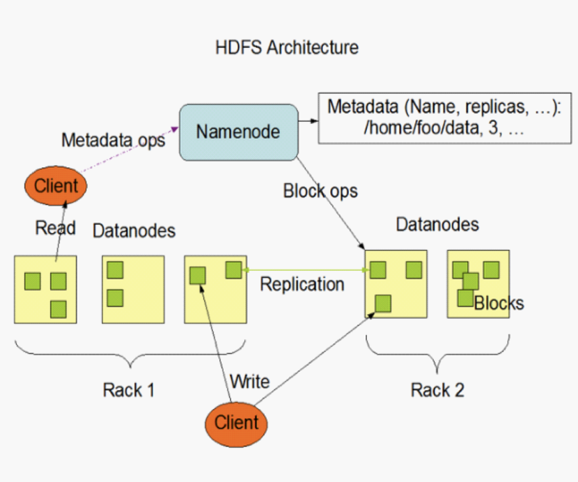
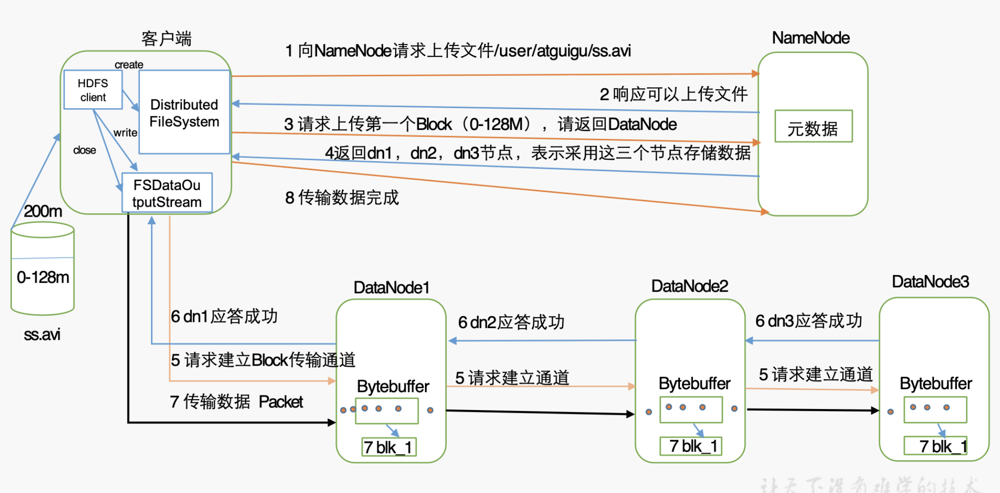
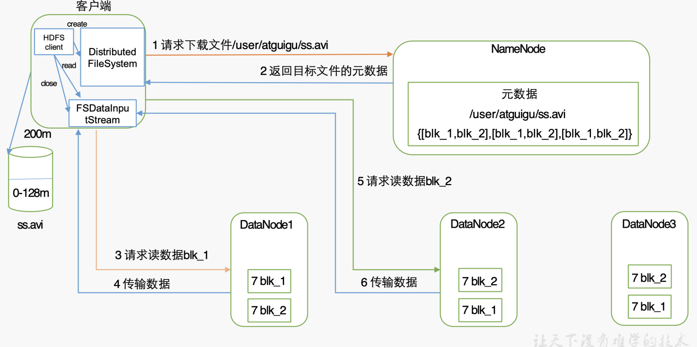
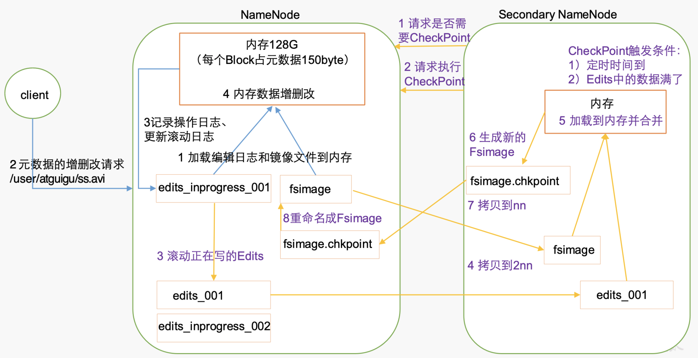
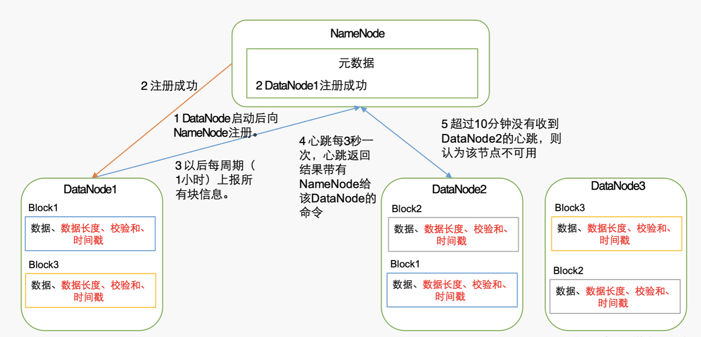

## HDFS概述
* HDFS概述
    * HDFS是分布式文件管理系统中的一种
    * 一个文件系统，用于存储文件，通过目录树来定位
    * 分布式的
    * 适合一次写入，多次读取，**不支持文件修改**
    * 适合做数据分析，不适合做网盘
    * 优缺点
        * 优点
            * 高容错性
                * 数据自动保存多个副本，通过增加副本提高容错
                * 如果某一副本丢失，可以自动恢复
            * 适合处理大数据
                * 数据规模：GB，TB，PB
                * 文件规模：百万以上的文件数量
            * 可在廉价机器上构建
        * 缺点
            * 不适合低延时数据访问（如毫秒级）
            * 无法高效存储大量小文件
                * 由于namenode的大小为128M，存储小文件会浪费很多存储
                    * namenode的内存大小有限，过多小文件会占用有限的资源
                    * 每个文件会占用150B的namenode内存
                * 小文件存储的寻址时间会超过读取时间，违反了HDFS的设计目标
            * 不至支持并发的：**写入，文件随机修改**
                * 一个文件只能有一个线程写，不允许多个线程同时写
                * **仅支持增加数据，不支持文件的随机修改**
    * HDFS组成架构
        * 
        * NameNode （Master，管理者）
            * 管理HDFS的名称空间
            * 配置副本策略
            * 管理数据块映射信息（即各个数据块存在哪里）
            * 处理客户端读写请求
        * DataNode （slave。 NameNode下达命令，DataNode执行实际操作）
            * 存储实际的数据块
            * 执行数据块的读/写操作
        * client（客户端）
            * 文件切分，上传文件时，**将文件切分成数据块**
            * 与NameNode交互，获取文件的位置信息
            * 与DataNode交互，读/写数据
            * 提供管理HDFS的命令，如NameNode的格式化
            * 提供访问HDFS的命令，如增删改查
        * Secondary NameNode（不是NameNode的热备，当NameNode挂掉的时候，并不能马上替换NameNode并提供服务）
            * 辅助NameNode，分担其工作量，如定期合并Fsimage(镜像文件)和Edits(编辑日志)，并推送到NameNode
            * 紧急情况下，可以辅助恢复NameNode
    * **HDFS文件块大小(重点)**
        * HDFS中文件在物理上是分块存储的，块的大小可以进行配置（dfs.blocksize ），在集群中是128M
            * 128M的计算方法
                * 若寻址时间为10ms
                * 寻址时间为传输时间的%1时，为最佳=10ms/0.01=1000ms=1s
                * 目前磁盘的传输速率普遍为100M/s，
                * 则一个数据块的大小=1s*100M=100M
            * 如果磁盘性能好，数据块可以更大
            * 所以**HDFS块大小的设置主要取决与磁盘的传输速率**
        * 如果数据块太小，会增加寻址时间
        * 如果数据块太大，数据传输时间增大(从服务器到客户端)，阻碍了其他操作的执行

* HDFS的shell
    * 基本语法：
        * bin/hadoop fs 具体命令 （包含bin/hdfs dfs）
        * bin/hdfs dfs 具体命令 （dfs时fs的实现类）
    * 命令
        * `-help 指令名` 查看帮助
        * -ls=显示信息
        * -cat=显示文件内容
        * -tail=显示文件的末尾
        * -chgrp,-chmod,-chown=修改权限
        * -moveFromLocal=从本地剪切文件，粘贴到HDFS
        * -appendToFile=追加一个文件到已经存在的文件末尾
        * -put,-copyFromLocal=从本地文件系统拷贝文件到HDFS
        * -get,-copyToLocal=从HDFS拷贝文件到本地
            * `hadoop fd -copyToLocal HDFS路径 ./` 将HDFS上的文件拷贝到当前目录
        * -cp=从HDFS的一个路径拷贝文件到另一个路径
        * -mv=在HDFS中移动文件
        * -getmerge=从HDFS合并下载多个文件：
            * `hadoop fs -getmerge xxx/* ./yyy` 将HDFS目录`xxx/`下的所有文件合并下载到当前目录下，命名为yyy
                * 文本文件可以直接使用cat查看
            * 如打包下载日志文件
        * -rm=删除文件或文件夹 
        * -mkdir=在HDFS上创建目录
        * -rmdir=删除空文件夹
        * -du=统计文件大小
            * `-h` 以直观的方式显示结果
        * `-setrep 副本数量 HDFS路径` 设置HDFS中文件的副本数量
            * 如果设定值>节点数，则副本数=节点数，但是web显示的是设定值
                * 如节点数=3，设定值=10，设定后之后又3个备份，每增加一个节点，则添加一个备份，直到10为止
            * 如果设定值比启动时的默认值小，会使集群中的某些节点删除备份文件
            * 文件副本的存放位置：`./data/tmp/dfs/data/current/BP-xxx/current/finalized/subdir0/subdir0`
                * 该目录下的非`.meta`即为副本文件

## HDFS的客户端操作
* HDFS的windows客户端操作
    * 配置JAVA_HOME，HADOOP_HOME
    * 需要添加的maven依赖
        ```java
        <dependencies>
            <dependency>
                <groupId>junit</groupId>
                <artifactId>junit</artifactId>
                <version>RELEASE</version>
            </dependency>
            <dependency>
                <groupId>org.apache.logging.log4j</groupId>
                <artifactId>log4j-core</artifactId>
                <version>2.8.2</version>
            </dependency>
            <dependency>
                <groupId>org.apache.hadoop</groupId>
                <artifactId>hadoop-common</artifactId>
                <version>2.7.2</version>
            </dependency>
            <dependency>
                <groupId>org.apache.hadoop</groupId>
                <artifactId>hadoop-client</artifactId>
                <version>2.7.2</version>
            </dependency>
            <dependency>
                <groupId>org.apache.hadoop</groupId>
                <artifactId>hadoop-hdfs</artifactId>
                <version>2.7.2</version>
            </dependency>
            <dependency>
                <groupId>jdk.tools</groupId>
                <artifactId>jdk.tools</artifactId>
    			<version>1.8</version>
	    		<scope>system</scope>
		    	<systemPath>${JAVA_HOME}/lib/tools.jar</systemPath>
		    </dependency>
        </dependencies>
        ```
    * 在`src/main/resources`目录下添加`log4j.properties`，防止日志异常
        ```java
        log4j.rootLogger=INFO, stdout
        log4j.appender.stdout=org.apache.log4j.ConsoleAppender
        log4j.appender.stdout.layout=org.apache.log4j.PatternLayout
        log4j.appender.stdout.layout.ConversionPattern=%d %p [%c] - %m%n
        log4j.appender.logfile=org.apache.log4j.FileAppender
        log4j.appender.logfile.File=target/spring.log
        log4j.appender.logfile.layout=org.apache.log4j.PatternLayout
        log4j.appender.logfile.layout.ConversionPattern=%d %p [%c] - %m%n
        ```
    * HDFSClient操作
        * 不设定用户会产生权限异常，可以通过启动参数来设定用户：
            * 启动参数:`-DHADOOP_USER_NAME=ljs`
            * intellij设定启动参数
                * Run-->Edit Configurations-->Application-->Configuration-->VM options
            * eclipse设定启动参数
                * 右键-->RunAs-->Run Configruations...-->Java Application-->工程名-->Arguments

* HDSF API 操作
    * 参数优先级：
        * 可以在src/main/resources下添加hdfs-site.xml，在配置中可以添加参数
        * 代码中设定参数：congfiguration.set("param_name", "value")
        * 优先级：代码中的设定>工程目录下的hdfs-site.xml>服务器目录下的hdfs-site.xml>服务器默认设定
    * 查看文件信息

* HDFS的数据流
    * HDFS写数据的流程 
        
        1. 将文件分块，然后按顺序上传
        2. 客户端Distributed FileSystem 与 NameNode的交互
            1. client-->NameNode，客户端请求上传文件X
            2. NameNode-->client，NameNode进行文件检查，如果文件存在则error，否则告诉客户端可以上传文件
            3. client-->NameNode，客户端上传第一个block(0-128M)，向NameNode请求DataNode
            4. NameNode-->client，NameNode返回n个可用的DataNodeID (dn1, dn2...dnN)
                * n=副本数
                * 可用DataNode的计算方式
                    * 节点距离，距离接近的n个节点
                    * 负载情况，寻找负载压力小的节点
        3. 客户端建立FSDataOutputStream，并与DataNode进行交互进行写数据
            1. client--> n * DataNode，客户端与每个可用DataNode请求建立Block传输通道
            2. n * DataNode --> client，n个DataNode依次应答、建立通道
            3. client--> DataNode1-->DataNode2...DataNode_N
                * 以Packet为单位分割文件
                * 客户端先从磁盘读取数据并缓存到内存，然后在序列化到本地磁盘
                * 开始上传到DataNode1，dn1将数据传给dn2，dn2传给dn3；dn1传输的packet会放入内存的一个对列中。等待队列应答，然后序列化到本地
            4. DataNode_N...DataNode2--> DataNode1--> client
                * 上传完成后，从后向前，依次响应
                * 清空内存
        4. 客户端Distributed FileSystem 与 NameNode的交互，
            1. client-->NameNode，客户端通知NameNode数据传输完成
        5. 传输完成后关闭FSDataOutputStream所使用的资源

    * HDFS读数据的流程
        
        1. 客户端Distributed FileSystem 与 NameNode的交互
            1. client-->NameNode，客户端请求下载文件X
            2. NameNode-->client，返回目标文件的元数据(每个block在哪些节点上)
        2. 客户端FSDataInputStream 与DataNode 的交互
            1. client --> DataNode_距离最近，客户端请求读取数据，从距离最近的节点进行读取
            2. DataNode_距离最近 --> client，读取之后关闭流资源，将数据返回客户端
            3. 按照1，2的顺序，读取剩余的block，
            4. 将读取的各个block拼接成一个文件
                * **读取各个block不是一个并行的过程。如果存储各block的节点分布在不同的位置，则一个一个读；如果节点集中在一起，则一次性都读取出来**
        3. 传输完成后关闭FSDataOutputStream所使用的资源

    * 网络拓扑-节点距离的计算
        * 节点距离=两个节点到达最近的**共同祖先**的距离总和
        * 每个节点到自身的距离为0 
    * 机架感知（副本存储节点选择）
        * 以副本数=3为例
            1. 第一个副本在client所处节点上，如果客户端在集群外，则随机选一个
                * IO的时间最短
            2. 第二个副本在第一个副本相同机架的另一个随机节点
                * 备份
            3. 第三个副本在其他机架的随机节点
                * 提高安全性，但是IO慢

## NameNode
* NameNode和SecondaryNameNode
    * NN的元数据如何保存
        * 基本上尽量将元数据放在内存上，来提高访问效率
            * 如果存在磁盘中，因为经常需要进行随机访问，响应客户请求，效率比较低
        * FsImage：元数据在磁盘中的备份
            * 不会和内存中的元数据同时更新
        * Edits文件
            * 通过Edits文件来防止断电后导致的数据丢失
            * 只进行追加操作，效率很高
            * 每当元数据有更新或者添加元数据是，修改内存中的元数据并追加到Edits中
        * 内存记录=Edit(编辑日志)+FsImage(镜像文件)
            
    * 为什么需要2NN
        * 长期的操作，会时Edit文件过大，降低效率，断电后的恢复时间过长，所以需要定时合并Edit+FsImage；
        * Edit+FsImage的合并操作如果由NN来做，又会降低效率。所以引入2NN，专门负责Edit和FsImage的合并
    * NN和2NN的工作机制
        * 
        * NN的机制
            * 安全模式阶段(只读阶段)
                * 根据seen_txid文件加载edits到内存
                * 加载FsImage到内存，并和edits文件合并，**使NN持有最新的元数据**
                * edits滚动生成新的空日志：`edits_inprogress_xxxx`
            * NN开始监听DN的请求
            * 客户端有对元数据的增删改查，将操作发送到NN
            * NN先将操作记录写到Edit中
            * 修改内存数据
        * 2NN的机制
            1. 2NN-->NN，提出请求是否需要CheckPoint
                * CheckPoint的触发条件
                    * **定时时间到了**
                    * **Edits中的数据满了(默认100万条)**
            2. 2NN-->NN，请求执行CheckPoint
            3. 滚动正在写的Edits=旧的备份(Edits001)+创建新的(Edits_inprogress_002)，防止合并过程中的操作记录写入
            4. 将Edits001、fsimage拷贝到2NN中
            5. 将Edits001、fsimage加载到内存中进行合并
            6. 生成新的fsinmag.chkpoint
            7. 将新的fsinmag.chkpoint拷贝到NN中，重新命名成fsImage
            8. 内存中的内容=Edits002+FsImage
    * 2NN合并fsImage+edits时需要和NN相同的内存，所以2NN和NN尽量分布在不同的节点上

* FsImage和Edits解析
    * fsImage:HDFS文件系统元数据的一个**永久性检查点**，其中包含HDFS文件系统的所有目录和文件inode的序列化信息
        * fsimage中不记录DataNode，在集群启动后要求DataNode上报数据快信息，并且间隔一段时间再次上报
    * edits：存放HDFS文件系统的所有更新操作的路径，文件系统客户端执行的所有写操作首先会被记录到edits文件中
    * `seen_txid文件`保存一个数字，等于最新日志：`edits_inprogress_xxxxx`中的数字
        * **通过该文件，使NameNode来确定每次开机启动时合并那些Edits**
    * fsImage和edits保存在：
        * NN：`data/tmp/dfs/name/current`
            * 在该目录下会比2NN目录下多一个最新的日志：`edits_inprogress_xxxxx`
        * 2NN：`data/tmp/dfs/namesecondary/current`
    * `hdfs oiv`指令 查看镜像文件
        * `hdfs oiv -p XML -i fsImage文件`，通过xml方式查看镜像文件
        * `hdfs oiv -p XML -i fsImage文件 -o 输出文件`，通过xml方式查看镜像文件，并输出到指定文件
    * `hdfs oev`指令 查看edits文件
        * `hdfs oev -p XML -i fsImage文件`，通过xml方式查看镜像文件
        * `hdfs oev -p XML -i fsImage文件 -o 输出文件`，通过xml方式查看镜像文件，并输出到指定文件
* CheckPoint检查设置 
    * 时间设置-配置hdfs-default.xml
        * 2NN默认每隔1小时执行一次
        ```
        <property>
            <name>dfs.namenode.checkpoint.period</name>
            <value>3600</value> <!--时间间隔-->
        </property>
        ```
    * 容量设置-配置hdfs-default.xml
        * 默认1分钟检查一次,1百万次操作后，2NN执行一次合并
        ```
        <property>
            <name>dfs.namenode.checkpoint.txns</name>
            <value>1000000</value>
            <description>操作动作次数</description>
        </property>

        <property>
            <name>dfs.namenode.checkpoint.check.period</name>
            <value>60</value>
            <description> 1分钟检查一次操作次数</description>
        </property >
        ``` 

* NameNode故障处理
    * 方法1:将2NN数据拷贝到NN中
        * 准备：集群启动状态下，关闭NN进程
            * `kill -9 NameNode_jps进程编号`
        * 删除NameNode存储的数据
            * /opt/module/hadoop-2.7.2/c/tmp/dfs/name
        * 拷贝2NN的数据到NN的name目录下
            * `scp -r opt/module/hadoop-2.7.2/data/tmp/dfs/namesecondary/`
        * 启动NN
            * sbin/hadoop-daemon.sh start namenode
        * 启动后会先进入安全模式，然后才能使用

    * 方法2:使用`-importCheckpoint`选项启动NameNode守护进程，从而将SecondaryNameNode中数据拷贝到NameNode目录中。
        * 准备
            * 修改配置hdfs-site.xml
            ```
            <!-- 修改checkpoint的检查时间（缩短检查时间，保证即使备份） -->
            <property>
                <name>dfs.namenode.checkpoint.period</name>
                <value>120</value>
            </property>

            <!-- 设置namenode的保存路径 -->
            <property>
                <name>dfs.namenode.name.dir</name>
                <value>/opt/module/hadoop-2.7.2/data/tmp/dfs/name</value>
            </property>
            ``` 
            * 修改后分发到各个节点
            * 强制关闭NN:`kill -9 NameNode_jps进程编号`
            * 删除NameNode的数据
                * /opt/module/hadoop-2.7.2/c/tmp/dfs/name
        * 如果2NN和NN不再一个主机节点上，需要：
            1. 将2NN数据拷贝到NN数据的同级目录下
            2. 删除拷贝后的2NN目录下的**in_use.lock**文件
        * 导入检查点数据
            * `bin/hdfs namenode -importCheckpoint`
            * 一段时间之后可以使用ctrl+c来关闭程序，或者等待自动关闭
            * 检查是NN是启动的，关闭检查后NN被关闭，然后可以直接启动NN
        * 启动NN
            * `sbin/hadoop-daemon.sh start namenode`

* 集群安全模式
    * 集群在安全模式下，不能执行写操作；集群启动完成后，自动退出安全模式
    * NN的安全模式
        * NN启动时，载入FsImage、并执行Edits中的操作，最终在内存中建立文件系统的元数据映像。然后创建一个新FsImage和空Edits。这个过程中，NN一直运行在安全模式，即NN的文件系统对于客户端是只读的
    * DN的安全模式
        * **系统的数据块位置是以块列表的形式存储在DN中。**(NN不保存)
        * 在安全模式下，DN向NN发送最新的块列表信息，NN了解到足够多的块信息之后，才能高效运行文件系统
        * 正常操作期间，NN在内存中保留所有块位置的映射信息
    * 安全模式的退出
        * 满足最小副本条件，NN在30秒之后退出安全模式
            * 即不需要集群中的所有节点都启动后才能退出安全模式，只要满足最小副本条件即可退出
            * 可以防止某些节点损坏而影响整个集群的启动
        * 最小副本条件：整个文件系统99.9%的块满足最小副本级别
            * 即每个文件至少有副本=1
            * 默认：`dfs.replication.min=1`
        * **对于一个刚刚格式化的系统，因为系统汇总还没有任何块，所以不会进入安全模式**
    * 操作方法
        * 查看安全模式
            * bin/hdfs dfsadmin -safemode get
            * 还可以从50070下的Overview下的Summary来查看安全模式的状态
        * 进入安全模式
            * bin/hdfs dfsadmin -safemode enter
            * 安全模式下，对于客户端时只读的，所以无法执行写操作，可以进行读操作
            * web端50070也会同步显示
        * 离开安全模式
            * bin/hdfs dfsadmin -safemode leave
        * 等待安全模式(结束)
            * bin/hdfs dfsadmin -safemode wait
            * 安全模式启动时，使用wait指令来阻塞后续执行；当安全模式结束时再来执行后续的指令

* NameNode多目录配置
    * 多目录配置
    ```
    <property>
        <name>dfs.namenode.name.dir</name>
        <value>file:///${hadoop.tmp.dir}/dfs/name1,file:///${hadoop.tmp.dir}/dfs/name2</value>
    </property>
    ```
    * 配置多目录需要停止集群、删除data和logs目录，并重新格式化NN
    * 实际上是NN的数据备份，每个目录存放的数据相同，保证可靠性

## DataNode
* DataNode中每个Block中的信息
    * 数据
    * 数据长度
    * 校验和
        * 负责DataNode数据的完整性
    * 时间戳
* DataNode的工作机制
    
    1. DN-->NN，DN启动后向NN进行注册
    2. NN-->DN，NN将DN的注册信息写入元数据中，然后NN通知DN是否注册成功
    3. DN-->NN，之后每周期(1小时)DN向NN上报所有块的信息
    4. NN<-->DN(两者互相交互)，心跳每**3秒**一次，心跳返回结果带有NN给DN的命令
        * 超过10分钟+30秒没有收到DN的心跳，则认为该节点不可用
* DataNode掉线时限参数设置
    * 如何判定DN节点失效
        1. DN进程死亡
        2. 网络故障造成DN和NN无法通信
    * NN不会立刻判定失效的节点，需要要经过一段时间才会判定这样的DN节点失效，这段时间称为**超时时长**
    * HDFS默认的超时时长为：**10分钟+30秒**
        * 计算公式：
            * TimeOut=2*`dfs.namenode.heartbeat.recheck-interval` + 10 * `dfs.heartbeat.interval`
            * 默认：dfs.namenode.heartbeat.recheck-interval=5分钟
            * 默认：dfs.heartbeat.interval=3秒
    * 配置信息
    ```
    <property>
        <name>dfs.namenode.heartbeat.recheck-interval</name>
        <value>300000</value> <!-- 毫秒 -->
    </property>
    <property>
            <name>dfs.heartbeat.interval</name>
            <value>3</value> <!-- 秒 -->
    </property>
    ```

* 服役新数据节点
    * 原则动态添加新的数据节点
    * 最简单的添加方法
        * 克隆一个正在使用的节点，并删除data/和logs/目录，然后分别启动hdfs和yarn
        * 这样添加是直接使用克隆节点的信息来进行的，如果克隆节点的信息泄漏，可能会导致数据被放到未知的节点上
    * 添加白名单
        * 白名单内的节点都允许访问NN，不在白名单的节点会被退出
        * 在：etc/hadoop下创建dfs.hosts文件
            * 只能在文件中添加主机名称，一行一个
            * 文件中不能有其他文字和空格
        * 在hdfs-site.xml配置文件中增加dfs.hosts属性
            ```
            <property>
                <name>dfs.hosts</name>
                <value>/opt/module/hadoop-2.7.2/etc/hadoop/dfs.hosts</value>
            </property>
            ```
        * 将配置分文件分发到个节点
        * 刷新NN：hdfs dfsadmin -refreshNodes
        * 刷新RM：yarn rmadmin -refreshNodes
        * 使用白名单后，如果有节点下线，可能会导致各个节点的负载不均衡，可以用命令实现集群的再平衡：sbin/start-blancer.sh
    * 添加黑名单  
        * 黑名单中的节点会被强制退出
        * 黑名单和白名单不能同时出现同一个主机名称
        * 在：etc/hadoop下创建dfs.hosts.exclude文件
            * 在文件中添加主机名
        * 在hdfs-site.xml配置文件中增加dfs.hosts.exclude属性
            ```
            <property>
                <name>dfs.hosts.exclude</name>
                <value>/opt/module/hadoop-2.7.2/etc/hadoop/dfs.hosts.exclude</value>
            </property>
            ```
        * 将配置文件分发到各个节点
        * 刷新NN：hdfs dfsadmin -refreshNodes
        * 刷新RM：yarn rmadmin -refreshNodes
        * 手动退出黑名单节点
            * **如果副本数是3，服役的节点小于等于3，是不能退役成功的，需要修改副本数后才能退役**
    * DN多目录配置
        * 每个目录存储的数据不相同，即不是数据副本，与NN不同
        * 在hdfs-site.xml中添加配置
        ```
        <property>
            <name>dfs.datanode.data.dir</name>
            <value>file:///${hadoop.tmp.dir}/dfs/data1,file:///${hadoop.tmp.dir}/dfs/data2</value>
        </property>
        ```
        * 停止集群，删除data、logs目录，并重新格式化

* HDFS2.X新特性
    1. 集群间数据拷贝
        * scp
            * 推push：scp -r hello.txt root@YYY:/xxxxx
            * 拉pull：scp -r root@YYY:/xxxxx hello.txt
            * 中介：scp -r root@YYY01:/xxxxx root@YYY02:/zzzz
                * 两个远程主机指南ssh没有配置的情况下可以使用该方式
        * hadoop的distcp命令实现集群间的递归数据复制
            * bin/hadoop distcp hdfs://主机名1:9000/.... hdfs://主机名2:9000/....
    2. 小文件存档
        * 每个文件均按快存储，每个块的元数据存储在NN的内存中
        * 对于每个小文件，如小文件大小为1M，虽然该文件占用1个块，但实际上使用的容量还是1M。**即文件所需磁盘容量与数据块无关**
        * 虽然小文件不会占满整个块，但是大量的小文件会耗尽NN中的大部分内存
        * HAR文件(HDFS存档文件)解决存储小文件
            * HDFS存档文件/HAR文件：一个更高效的文件存档工具，**允许对文件进行透明的访问**。将文件存入HDFS块，**对内是一个个独立文件，对于NN是一个整体，减少了NN的内存**
            * 该文件内部是多个小文件
            * 使用前必须启动yarn
            * 操作方法
                * 将某个目录下的所有文件归档成一个叫input.har的**归档文件**
                    * hadoop archive -archiveName input.har -p 打包目录 存储目录
                        * 归档文件必须是**har文件**
                        * 使用时，存储目录必须不存在
                    * **生成har文件的过程其实是一个MapReduce的过程**
                * 使用har文件的时候需要最使用har协议，即har://
                    * 解压
                        * hadoop fs -cp har:///路径/xx.har/* 解压路径
                    * 直接查看
                        * hadoop fs -ls -R har:///路径/xx.har
    3. 回收站
        * 开启回收站功能，可以将删除的文件在不超时的情况下，恢复原数据，防止误删、备份的作用
        * 默认是关闭的，因为Hadoop的数据多用于存储与分析
        * 开启回收站的设置
            * fs.trash.interval=0，表示禁用回收站(**默认值**)；其他值表示文件的保留时间
            * fs.trash.checkpoint.interval=0，检查回收站的间隔时间。如果为0，则该设置和fs.trash.interval的参数值相等
            * 要求：fs.trash.checkpoint.interval <= fs.trash.interval
            * 配置core-site.xml
                ```
                <property>
                    <name>fs.trash.interval</name>
                    <value>1</value>
                </property>
                ```
        * 查看回收站
            * 执行删除后会在HDFS上生成文件夹：/user/用户名/.Trash
        * 修改访问垃圾回收站的用户名称
            * 进入垃圾回收站用户名称，默认是dr.who，可以通过配置来修改用户
            * 配置core-site.xml
                ```
                <property>
                    <name>hadoop.http.staticuser.user</name>
                    <value>userid</value>
                </property>
                ```

        * 恢复数据：直接使用hadoop fs mv 来将回收站中的数据移动到别的目录下
        * 清空回收站
            * hadoop fs -expunge
            * 清空的操作只是将所有文件打了一个包，仍然是时间到了之后自动删除
    4. 快照管理
        * **相当于对目录做一个备份。并不会立即复制所有文件**，而是指向同一个文件。当写入发生时，才会产生新文件，来记录文件的增减
        * 操作指令
            * 开启指定目录的快照功能:`hdfs dfsadmin -allowSnapshot 路径`
            * 禁用目录的快照功能(默认是禁用):`hdfs dfsadmin -disallowSnapshot 路径`
            * 对目录创建快照:`hdfs dfs -createSnapshot 路径`
                * 默认使用当前的系统时间作为该快照的名称
            * 指定名称创建快照:`hfs dfs -createSnapshot 路径 名称`
            * 重命名快照:`hfs dfs -renameSnapshot 路径 旧名称 新名称`
            * 列处当前用户所有可快照目录:`hdfs lsSnapshottableDir`
            * 比较两个快照目录的不同之处:`hdfs snapshotDiff 路径1 路径2`
                * 使用`.`代表当前路径
            * 删除快照：`hdfs dfs -deleteSnapshot <path> <snapshotName >`
        * 创建快照之后，会在目录下增加一个隐藏目录：`./.snapshot/`
            * 该目录下的文件内容同样可以进行拷贝等操作，来进行目录的恢复
            
