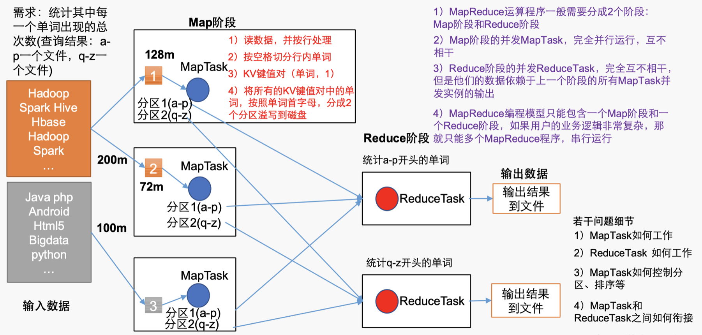

* MapReduce定义
    * 一个分布式运算程序的编程框架，是开发基于Hadoop的**数据分析应用**的核心框架
    * 核心功能：将**业务逻辑代码**和**自带默认组件**做和成一个完整的**分布式运算程序**，并发的运行在Hadoop集群上

* MapReduce优缺点
    * 优点
        1. MapReduce易于编程
            * 简单的实现一些接口，就可以完成一个分布式程序
        2. 良好的扩展性
            * 通过增加机器来扩展计算能力
        3. 高容错性
            * 可运行在廉价的PC上
        4. 适合PB级以上的海量数据的离线处理
    * 缺点
        1. 不擅长实时计算
            * 无法在秒级内返回结果
        2. 不擅长流式计算
            * MapReduce的输入数据集是静态的，不能动态变化。MapReduce自身的设计特点决定了数据源必须是静态的
        3. 不擅长DAG（有向图）的计算
            * 每个MapReduce作业的输出结果都会写入磁盘，造成大量的磁盘IO，导致性能低下，所以不擅长处理这种多个程序相互依赖的操作

* MapReduce核心思想
    * 核心编程思想: 
    * **MapReduce程序分为两个阶段:Map 和 Reduce**
    * MapReduce编程模型只能包含**一个Map阶段和一个Reduce阶段**，如果用户的业务逻辑非常复杂，那就只能多个MapReduce程序串联，串行运行
    * 统计单次次数的流程
        1. Map阶段，对各个数据块执行并发的MapTask，完全并行运行，互不干扰
            * MapTask
                * 读取数据:一行一行读数据，并按行进行处理
                * 切分数据:按照空格切分数据
                * 数据kv化:将数据转换成key-value键值对：{单词:次数}
                * 保存:将所有的KV对中的单词按照单词首字母分成两个分区写到磁盘
                    * 分区1：a-p
                    * 分区2：q-z,
        2. Reduce阶段的并发RedeceTask，完全并行互不干扰，但它们的数据依赖于上一阶段的所有MapTask并发实例的输出
            * 统计a-p单词的从各MapTask的分区1**拉取数据**，处理后将结果输出到文件
            * 统计q-z单词的从各MapTask的分区2**拉取数据**，处理后将结果输出到文件

* MapTask如何工作？
* ReduceTask如何工作？
* MapTask如何控制分区、排序等？
* MapTask和ReduceTask之间如何衔接？

* MapReduce进程：MR程序在分布式运行时有三类实例进程
    * MrAppMaster：负责整个程序的过程调度及状态协调
        * 它是一个Job资源的控制者
        * 协调CPU等资源
        * 如何开启Map和Reduce阶段的处理
    * MapTask：负责Map阶段的整个数据流处理流程
    * ReduceTask：负责Reduce阶段的整个数据流处理流程

* 常用数据序列化类型

|java类型|hadoop writable类型|
|-|-|
|boolean|BooleanWritable|
|byte|ByteWritable|
|int|IntWritable|
|float|FloatWritable|
|long|LongWritable|
|double|DOubleWritable|
|**String**|**Text**|
|map|Text|
|array|ArrayWritable|

* MapReduce编程规范
    * 程序分为三个部分：Mapper，Reducer，Driver
    * Mapper阶段
        1. **继承**父类Map
        2. Mapper的输入数据都是KV形式，KV的数据类型可以自定义
        3. 业务逻辑写在一个map()方法中
        4. Mapper的输出数据都是KV形式，KV的数据类型可以自定义
        5. map()方法对每一个<K,V>只调用一次
    * Reducer阶段
        1. **继承**父类Reduce
        2. Reduce的输入数据类型 = Mapper的输出数据类型，也是KV
        3. 业务逻辑写在reduce()方法中
        4. ReduceTask进程对每一组相同k的<K,V>组调用一次reduce()方法
    * Driver阶段
        * 相当与YARN集群的客户端，用于提交整个程序到YARN集群
        * 提交的内容是封装了MapReduce程序相关运行参数的job对象

* WordCount案例
    * Mapper
        1. Mapper将输入的文本内容转换成String
        2. 根据空格切分单词
        3. 将单词输出为：`<单词, 1>`
            * 此时不对结果进行合并，只创建形如`<单词, 1>`的kv对象
    * Reducer
        1. 汇总各个Key的个数
            * 在该阶段进行kv的聚合，计算每个单词出现的次数
        2. 输出该key的总次数
    * Driver
        1. 获取配置信息，获取job对象实例
        2. 指定本程序的jar包所在的本地路径
        3. 将Mapper/Reducer的业务类关联到job
        4. 指定Mapper输出数据的kv类型
        5. 指定最终输出的数据的kv类型
        6. 指定job的输入原始文件所在的目录
        7. 指定job的输出结果所在目录
            * **输出路径必须不能存在**
        8. 提交作业到集群中 
            * 对于输出结果：如果正常执行结束则job返回true，此时系统会输出0；如果正常执行结束则job返回false，此时系统会输出1

* Mapper 类 组成
    * Context:操作过程中使用的上下文内容
    * setup:执行开始时调用(初始化程序)
    * map:应用程序重写
    * cleanup:操作结束后的处理
    * run:串联所有方法
        * setup
        * while{map}
        * cleanup
* Reducer类 组成
    * Context:操作过程中使用的上下文内容
    * setup:执行开始时调用(初始化程序)
    * reduce:应用程序重写
    * cleanup:操作结束后的处理
    * run：串联所有方法
        * setup
        * while{reduce}
        * cleanup