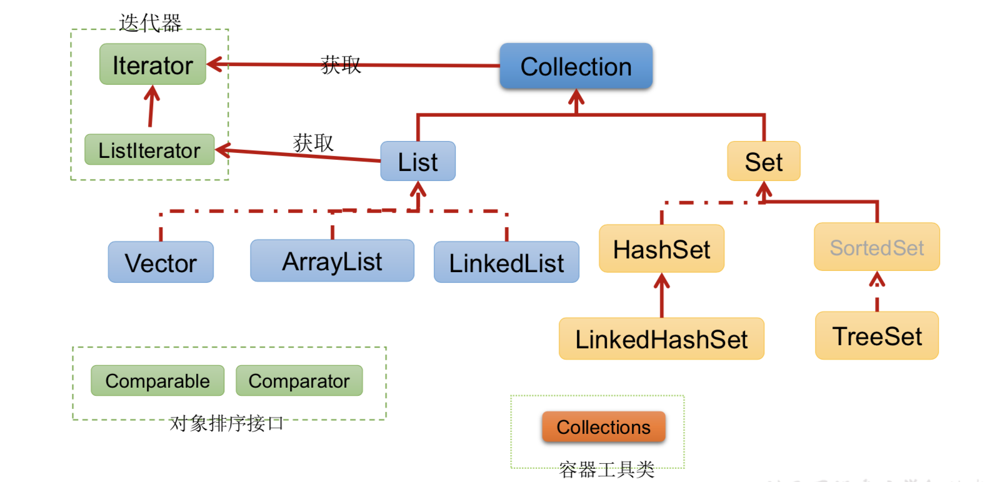
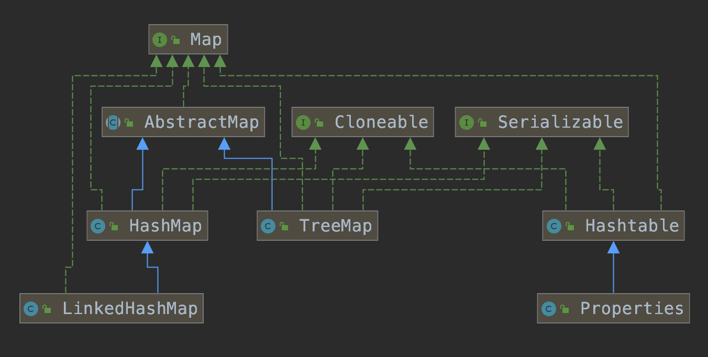

<span id="catalog"></span>

- 基础
    - [基本流程](#基本流程)
    - [类文件](#类文件)
    - [变量](#变量)
    - 数据类型
        - [数据类型](#数据类型)
        - [数据类型-基本类型的池](#数据类型-基本类型的池)
        - [数据类型-基本类型的包装类](#数据类型-基本类型的包装类)
        - [数据类型-BigInteger](#数据类型-biginteger)
        - [数据类型-BigDecimal](#数据类型-bigdecimal)
    - [运算符](#运算符)
    - [数组](#数组)
    - [package](#package)
    - [import](#import)
    - [内存解析](#内存解析)
- OOP
    - [参数传递机制](#参数传递机制)
    - [权限修饰符](#权限修饰符)
    - 类
        - [类-类的成员](#类-类的成员)
        - [类-类的特性](#类-类的特性)
        - [类-对象的创建](#类-对象的创建)
        - [类-重载与重写](#类-重载与重写)
        - [类-关键字](#类-关键字)
        - [类-main方法](#类-main方法)
        - [类-抽象类](#类-抽象类)
        - [类-接口](#类-接口)
    - [对象的序列化](#对象的序列化)
    - [object](#object)
- [Java集合框架](#Java集合框架)
    - [Java集合框架概述](#Java集合框架概述)
    - [Collecton接口API的使用](#Collecton接口API的使用)
    - [Iterator接口](#Iterator接口)
    - [foreach循环遍历集合元素](#foreach循环遍历集合元素)
    - [Collecton子接口-List接口及其实现类](#Collecton子接口-List接口及其实现类)
        - [List接口](#List接口)
        - [ArrayList](#ArrayList)
        - [LinkedList](#LinkedList)
    - [Collecton子接口-Set接口及其实现类](#Collecton子接口-Set接口及其实现类)
        - [Set接口](#Set接口)
        - [HashSet](#HashSet)
        - [LinkedHashSet](#LinkedHashSet)
        - [TreeSet](#TreeSet)
    - [List和Set相关的问题总结](#List和Set相关的问题总结)
    - [Map接口](#Map接口)
        - [Map接口API的使用](#Map接口API的使用)
        - [HashMap](#HashMap)
        - [LinkedHashMap](#LinkedHashMap)
        - [TreeMap](#TreeMap)
        - [Properties](#Properties)
    - [Collections工具类](#Collections工具类)

- 应用
    - 字符串
        - [字符串-string](#字符串-string)
        - [字符串-StringBuffer](#字符串-stringbuffer)
        - [字符串-StringBuilder](#字符串-stringbuilder)
        - [字符串-三种类型的关系](#字符串-三种类型的关系)
    - [异常](#异常)
    - [泛型](#泛型)
    - [枚举类](#枚举类)
    - [注解](#注解)
    - io
        - [io-File类](#io-file类)
        - [io-io流](#io-io流)
        - [io-输入输出流基类](#io-输入输出流基类)
        - [io-节点流](#io-节点流)
        - [io-处理流-Buffered](#io-处理流-buffered)
        - [io-转换流](#io-转换流)
        - [io-标准输入输出流](#io-标准输入输出流)
        - [io-打印流](#io-打印流)
        - [io-数据流](#io-数据流)
        - [io-对象流](#io-对象流)
        - [io-随机存取文件流-RandomAccessFile](#io-随机存取文件流-randomaccessfile)
        - [io-基本使用流程](#io-基本使用流程)
    - 多线程
        - [多线程-基本概念](#多线程-基本概念)
        - [多线程-Thread类](#多线程-thread类)
        - [多线程-线程的4种创建与使用](#多线程-线程的4种创建与使用)
        - [多线程-线程的同步](#多线程-线程的同步)
        - [多线程-线程的通信](#多线程-线程的通信)
        - [多线程-注意事项](#多线程-注意事项)
        - [多线程-线程安全的懒汉式单例模式](#多线程-线程安全的懒汉式单例模式)
    - 日期时间api
        - [日期时间api-JDK8之前](#日期时间api-jdk8之前)
        - [日期时间api-JDK8之后](#日期时间api-jdk8之后)
    - [比较器](#比较器)
    - [System类](#system类)
    - [Math类](#math类)
    - 反射
        - [反射-反射机制](#反射-反射机制)
        - [反射-Class类](#反射-class类)
        - [反射-类的加载](#反射-类的加载)
        - [反射-创建运行时类的对象](#反射-创建运行时类的对象)
        - [反射-获取运行时类的完整结构](#反射-获取运行时类的完整结构)
        - [反射-调用运行时类的指定结构](#反射-调用运行时类的指定结构)
- [扩展](#扩展)

# 基础
## 基本流程：
[top](#catalog)
1. *.java文件（源文件）
2. javac *.java --> 编译成*.class文件（字节码文件）
3. java * --> 运行class文件

## 类文件
[top](#catalog)
* 如果*.java文件中有pubilc类，文件名应该和类名相同
* 一个源文件中最多只有一个public类，其他类不限个数。如果源文件中包含一个public类，则文件名必须与public类名相同
* 应用程序的执行入口是：main() 方法，固定格式
    * public static void main(String[] args){}

## 变量
[top](#catalog)
* **内存**中的一个存储区域，区域内的数据类型不可变
* 程序中最基本的存储单元，包含：变量类型，变量名，存储的值
* 先声明，后使用
* 变量的位置
    * 成员变量---方法体外
        * 实例变量（不加static）
        * 类变量（加static）
    * 局部变量---方法体内
        * 形参

## 数据类型
### 数据类型
[top](#catalog)
* 越高级越抽象，越低级越专用
* 基本类型
    * 数值型
        * 整数型：
            * byte：1字节（8bit）
            * short：2字节
            * int：4字节，**整形变量默认为int型**
            * long：8字节，常量后+l/L
        * 浮点型：
            * float：4字节，尾数7，常量后+f/F
            * double：4字节，**浮点变量默认为double**
    * 字符型：char
        * 所有字符都适用Unicode编码，一个字符可以存储一个字母/汉字等
        * 直接使用Unicode值来表示：'\uXXX'，XXX是一个16进制整数
        * 可以进行运算
    * 布尔型：boolean
* 数据类型的转换
    * 基本类型的转换
        * 自动转换：小-->大
            * byte/char/short-->int-->long-->float-->double
            * 如：`long g = 20; double d = 12.0f;`
        * 强制类型转换：大-->小
            * 如`float f = (float)12.0; int a = (int)1200L;`
        * 特殊法则：
            * 多类型计算时，先全部转换成容量大的，再进行计算
            * byte/char/short 不会互相转换。计算时**首先转换到int型**
                * short型 = short型 + byte型 右边计算时会转换为int型，赋值给左侧时会造成类型不兼容
            * boolean
                * 不能与其他数据类型运算
                * 不可以转换为其他的数据类型
            * 任何基本类型与字符串String进行`+`运算时，基本类型转换为字符串类型String
    * 引用数据类型
        * 自动转换：`父类 a = new 子类()` （利用多态性）
        * 强制转换：`父类 a = new 父类(); 子类 b = (子类)a;`
        * **无继承关系**的引用类型间的转换是非法的
        * 转换前可以使用instanceof来检查对象的类型
    
* 引用类型
    * 分类：
        * 类：class
        * 接口：interface
        * 数组：[]
        * 字符串类型 String
            * 字符串不能直接转换为基本类型，但通过对应的包装类则可以
    * 引用变量由两种类型：**编译时类型**和**运行时类型**
        * 编译时类型：声明变量时的类型
        * 运行时类型：实际赋值给变量的类型
        * 以`=`为界：编译时，看左边；运行时，看右边
* <span id="var_default_init">各数据类型的默认初始化</span>
    
    |成员变量类型|初始值|
    |-|-|
    |byte|0|
    |short|0|
    |int|0|
    |long|0L|
    |float|0.0F|
    |double|0.0|
    |char|0 或 '\u0000'|
    |boolean|false|
    |引用类型|null|


### 数据类型-基本类型的池
[top](#catalog)
* 对于整形数据，范围-128～127的数都在**池中**，所以`Integet i = 1; Integet j = 1; i==j //true`

### 数据类型-基本类型的包装类
[top](#catalog)
* 八种基本数据类型定义相应的引用类型

    |基本类型|包装类|父类|
    |-|-|-|
    |byte|Byte|Number|
    |short|Short|Number|
    |int|Integer|Number|
    |long|Long|Number|
    |float|Float|Number|
    |double|Double|Number|
    |char|Character|-|
    |boolean|Boolean|-|
* 包装类使基本数据类型变成了类
* **包装类重写了toString**，使用System.out.println会输出具体的值
* 装箱：基本数据类型--->包装类
    * `int i = 500; Integer t = new Integer(i);`
    * 通过字符串构造包装类对象：`Float f = new Float("3.45")`
    * 装箱操作会消耗性能
        * 装箱的本质是：使用基本类型创建对象，然后保存到堆中
        * 装箱后使用更多的内存，并需要额外的内存搜索来获取被包裹的原始值
* 拆箱：包装类--->基本数据类型变量
    * 调用包装类的：xxxValue()方法：`boolean b = bObj.booleanValue();`
* jdk1.5 之后支持自动的拆箱和装箱
* 字符串与基本数据类型的转换
    * 字符串--->基本数据类型：
        * 包装类的构造器：`int i = new Integer("12");` （使用包装类的构造器，再使用自动拆箱）
        * 包装类的静态方法parseXXX：`int i = Integer.parseInt("12");`
    * 基本数据类型--->字符串
        * String.valueOf: `String str = String.valueOf(2.34f);`
        * 直接连接空字符串：`String str = 5 + "";`

### 数据类型-BigInteger
[top](#catalog)
* Integer能存储的最大整形数值为2^31-1，Long能存储的最大整形数值为2^63-1，无法表示更大的数
* BigInteger可以表示任意精度的不可变整数
* BigInteger提供了java的基本整数操作符的对应方法，并提供Math的所有相关方法
* BigInteger还提供了：模算数、GCD计算、质数测试，素数生成、位操作以及其他操作
* 构造器
    * `BigInteger(String val)` 根据字符串构建BigInteger对象

### 数据类型-BigDecimal
[top](#catalog)
* 精度比Float和Double更高
* 支持任意精度的不可变的有符号十进制定点数
* 构造器
    * `BigDecimal(double val)`
    * `BigDecimal(String val)`

## 运算符
[top](#catalog)
* 算数运算符
    * 对负数取模时，忽略负号
        * 5%-2=1
    * 被模数是负数时不可忽略
        * -5%-2=-1
        * -5%2 =-1
    * s=s+2 与 s+=2
        * 前者计算后，和左边变量的类型精度进行比较，左边精度低于右边时，编译器报错，需要执行强制转换
        * 后者计算时，右边的类型强制转换为左边的类型，然后直接操作左边变量内存中的值，计算的方式是**位操作**，计算效率比左边快
    * n *= m++; 先做`*=`，再做`++`
    * int n=10; n+= (n++) + (++n)  ???
        1. ++10 --> 11
        2. 10 += (11++) + (11) --> 10 += 11+11 -->32
        3. 11++ --> 12
* 比较运算符
    * ==, !=, <, >, <=, >=
    * instanceof 检查是否是类的对象。如： "Hello" instanceof String

* 逻辑运算符
    * &，|，逻辑与/或，无论对错，符号两边的表达式都进行计算
    * &&，|| 短路与/或，左边错了就不计算右边了
    * ! 取反
    * ^ 异或，相同为假，不同为真

* 三目运算符
    * 运算符要保证`:`两边的数据类型相同，**否则会自动进行类型转换**
        * 使用三目运算符的比较
        ```java
        //输出1.0（自动进行类型转换）
        Object o1 = true ? new Integer(1) : new Double(2.0);

        //输出1（无类型转换，直接赋值）
        Object o2;
        if (true)
            o2 = new Integer(1);
        else
            o2 = new Double(2.0);

        System.out.println(o2);
        ```
        * `Object o1 = true ? 1 : 2.0; `最终显示1.0

## 数组
[top](#catalog)
* 数组工具类：Arrays
* 直接输出数组内容时，可以使用：`Arrays.toString(type[]);`
* 数组中的元素可以是任何数据类型，包括基本数据类型和引用数据类型
* 创建数组对象会在内存中开辟一整块连续的空间，而数组名中引用的是这块连续空间的**首地址**
* 数组的长度一旦确定，就不能修改
* 一维数组
    * 声明：type var[] 或type[] var
    * 使用**new**来创建数组
    * 动态初始化：声明+分配空间 与 赋值操作要分开
    ```java
    int[] arr = new int[3];
    arr[0] = 1;
    arr[1] = 2;
    arr[2] = 3;
    ```
    ```java
    String name[];
    name = new String[3];
    name[0]="xx";
    name[1]="yy";
    name[2]="zz";
    ```
    * 静态初始化：声明，分配空间，赋值 同时完成
    ```java
    int arr[] = new int[]{1,2,3};
    //或
    int[] arr = {1,2,3};
    ```
    * 数组a的长度：a.length 
    * 数组的各元素相当于类的成员变量，数组分配空间后，每个元素按照成员变量的方式被隐式初始化
        * 基本类型，默认初始化各不相同
        * 引用类型，默认初始化为null
    * 数组变量在**栈内存**，各元素对象在**堆内存**
* **可以创建长度为0的数组**：`type[] t = new type[0];`，用`Arrays.toString`输出时会输出`[]`。如果直接输出该数组，则控制台没有任何输出

## package
[top](#catalog)
* package语句
    * java源文件的第一条语句，指明该文件中定义的类所在的包
    * 若没有该语句，则指定为无包名
* 包的作用
    * 包帮助管理大型软件系统:将功能相近的类划分到同一个包中。比如:MVC的设计模式
    * 包可以包含类和子包，划分项目层次，便于管理
    * 解决类命名冲突的问题
    * 控制访问权限

## import
[top](#catalog)
* 导入当前包下、`java.lang`下的内容时，可以省略import
* import写在包声明和类声明之间
* `.*`的方式可以导入包下的所有内容
* 如果在代码中使用不同包下的同名的类。那么就需要使用**类的全类名**的方式指明调用的是哪个类
* **import static**组合，调用指定类或接口下的静态属性或方法

# OOP
## 内存解析
[top](#catalog)
* 堆（heap）
    * 存在的目的：存放对象实例（对象实例，数组）（所有的对象实例都在该区被分配内存）
* 栈（stack）
    * 指虚拟机栈
    * 用于存储局部变量
    * 局部变量表存放：编译期可知长度的各种基本数据类型，对象引用。方法执行结束后，自动释放
* 方法区（method area）
    * 存储已被虚拟机加载的：类信息、常量、静态变量、`即时编译器编译后的代码` 等数据

## 参数传递机制
[top](#catalog)
* 规则：值传递
    * 基本数据类型：值拷贝
    * 引用数据类型：地址拷贝
        * 对于String，在方法中对String类型的形参进行修改时，会在堆中开辟新的内存空间，并将新空间的地址重新赋予形参，这会导致，在方法中对字符串的修改，不会影响到实参。

## 权限修饰符
[top](#catalog)

|修饰符|类内部|同包|不同包的子类|同一个工程|
|-|-|-|-|-|
|private|是|-|-|-|
|缺省|是|是|-|-|
|protected|是|是|是|-|
|public|是|是|是|是|

## 类
### 类-类的成员
[top](#catalog)
* 示例
    ```java
    class Person{
        //属性，或成员变量
        String name;
        boolean isMarried;
        
        //构造器
        public Person(){}
        public Person(String n, boolean im){
            name = n;isMarried = im;
        }
        
        // 方法，或函数
        public void walk(){
            System.out.println("...");
        }

        public String display(){
            return  "...";
        }

        //代码块
        {
            name = ".....";
            arg = 17;
            isMarried = true;
        }

        // 内部类
        class pet{
            String name;
            float weight;
        }
    }
    ```
* 构造器
    * 基本特征：
        * 与类名相同
        * 无返回值
        * 不能被static、final、synchronized、abstract、native修饰
        * 不能有返回值
    * 作用：创建对象，并初始化
    * 语法：`权限修饰符 类名(参数列表){初始化语句;}`
        ```java
        public A{
            private int x;
            public A(){x = 1;}
        }
        ```
    * 两种构造器
        * 无参构造器（由系统默认提供）
        * 显式定义的构造器（无参或有参）
    * 每个类都默认至少有一个构造器，且**该默认构造器的修饰符与类的修饰符相同**
    * 如果显式定义了构造器，则系统不再提供默认构造器
    * 一个类可以有多个重载的构造器
        ```java
        public class Person{
            public Person(String name, int age, Date d) {this(name,age);...} 
            public Person(String name, int age) {...}
            public Person(String name, Date d) {...}
            public Person(){...}
            }
        ```
    * **父类的构造器不可以被子类继承**
    * 使用super调用父类的构造器
        * super调用必须放在首行
        * 子类所有的构造器默认都会访问父类中的**空参数**构造器
        * 如果父类中**没有空参数构造器**，子类构造器必须通过this(参数列表)或super(参数列表)来指定本类/父类中的构造器，同时只能**二选一**，且**必须放在首行**
        * 如果子类没有显示调用父类/子类构造器，且父类中有没有无参的构造器，则**编译出错**
* 属性
    * 成员变量(类体内声明的变量)：
        * 分类
            * static修饰的`类变量`，**存储在方法区的静态域内**
            * 实例变量，**存储在堆中**
        * 可以使用private，public，static，final等权限修饰符修饰
        * 都有默认初始化值
    * 局部变量(方法体内声明的变量)：
        * 包括：形参，方法局部变量，代码块局部变量
        * **存储在栈中**
        * 不能使用权限修饰符来修饰，**可以使用final修饰**
        * 没有初始化值，必修显式赋值，才能使用(除了形参)
    * 局部变量和成员变量的异同
        * 不同点：局部变量(除形参以外)需要显示初始化
        * 相同点：都有生命周期
            
    * 类属性的赋值
        * 赋值的顺序
            1. 默认初始化
            2. 属性的显示初始化（int x=10;）
            3. 构造器中的初始化
            4. 通过**对象.属性**、**对象.方法**的方式赋值
* 方法
    * java中的方法不能单独存在，**必须定义在类中**
    * 没有返回值时，返回类型为void，此时可以**不使用return语句**。如果使用，可以用来结束方法
    * 方法内部不能再定义方法
    * 方法的重载(overload)
        * 一个类中，允许存在一个以上的同名方法，**只要它们的参数个数或参数类型不同即可**
        * **重载与返回值类型无关**，只看参数列表。调用时根据参数列表来区别
        ```java
        // 三个有效重载
        int add(int x, int y){ return x+y;}
        int add(int x, int y, int z){return x+y+z;}
        double add(double x, double y){return x+y;}
        ```
        * 对于重载的方法，编译器根据方法名和参数表，对同名的方法名做修饰，使这些方法名变得不一样。在编译期确定方法的调用地址（早绑定/静态绑定）
    * 可变个数形参：能和多个实参相匹配的形参
        * `public void test(int a, String...books);`
        * 声明格式：`方法名(参数的类型...参数名)`
        * 参数的个数可以是：0、1、更多
        * 实际与**参数使用数组**是相同的
        * 可变参数也可以使用一个数组来代替,且只能使用一个数组
            ```java
            class test  
            {
                public static void main(String[] args){
                    test t = new test();
                    t.test01("a", new String[]{"b","c","d"});
                }
                
                public void test01(String a, String ...b){
                    System.out.println(a); // a
                    for (String n : b){ // b c d
                        System.out.println(n);
                    }
                }
            }
            ```
        * 可变形参，需要放在形参声明的最后
        * 一个方法**最多只能声明一个可变个数形参**
        * 可变形参与重载
            ```java
            class Overload{
                public void test(String[] msg){...}
                public void test1(String book){...}
                public void test1(String ... books){} 
                public static void main(String[] args){
                    Overload o = new Overload();
                    o.test1(); //调用方法2
                    o.test1("aaa", "bbb");// 调用方法3
                    o.test(new String[]{"aaa"});//调用方法1
                }
            }
            ```
    * 方法参数的传递机制
        * java只有一种参数传递方式：**值传递**（传入一个实参的副本）
        * 基本类型传数据拷贝
        * 引用类型传地址拷贝
        * println？？？？？？
            ```java
            int[] arr = new int[10];
            System.out.println(arr);//输出数组的地址

            char[] arr1 = new char[10];
            System.out.println(arr1); //输出10个特殊字符
            ```
* 代码块
    * 用法：对java类或对象进行初始化
    * 只能被static修饰 
        * 被static修饰的叫静态代码块，通常用来初始化static属性
            * 可以有输出语句。
            * 可以对类的属性、类的声明进行初始化操作。
            * 不可以对非静态的属性初始化。即:不可以调用非静态的属性和方法。
            * 多个静态的代码块，从上到下的顺序依次执行。
            * 静态代码块的执行要**先于非静态代码块**。
            * 静态代码块**随着类的加载而加载，且只执行一次**。
        * 没有修饰的叫非静态代码块
            * 可以有输出语句。
            * 可以对类的属性、类的声明进行初始化操作。
            * 除了调用非静态的结构外，还**可以调用静态的变量或方法**。
            * 多个非静态的代码块，从上到下的顺序依次执行。 
            * 每次创建对象的时候，都会执行一次。且先于构造器执行。

* 内部类
    * 内部类所在的类是外部类
    * 在类中直接定义的是成员内部类
        * 作为成员的特性
            * 可以用private/protected来修饰
            * 可以调用外部类的结构
            * 可以用static修饰，但是只能使用外部类的static成员属性
        * 作为类的特性
            * 可以在类内部定义属性，方法，构造器等结构
            * 可以用abstract修饰，可以被其他内部类继承
            * 可以声明为final的
            
    * 在成员方法中定义的是局部内部类
        * 不能用static修饰
        * 不能使用public，private，protected
    * 匿名内部类
        * 匿名内部类不能定义任何静态成员、方法和类，只能创建匿名内部类的一个实例。一个匿名内部类一定是在new的后面，用其隐含实现一个接口或实现一个类
        * 匿名内部类必须继承父类或实现接口
        * 匿名内部类只能有一个对象
        * 匿名内部类对象只能使用多态形式引用
        * 可以通过接口来实例化
    * 使用方法
        * 创建内部类对象
            * 创建static内部类对象：`类.内部类 a = new 类.内部类();`
            * 创建非static内部类对象：
            ```java
            类 a = new 类(); //创建外部类对象
            类.内部类 x = a.new 内部类(); // 通过外部类对象来创建内部类
            ```
        * 调用内部类和外部类的变量（当变量重名时）
            * this.param 调用内部类的属性
            * 外部类.this.param 调用外部的同名属性
        * 局部内部类的使用
            * 常常使用一个方法，使其返回值为某个类或接口的对象，而这个类或接口在方法内部创建（返回某种接口，内部类是该接口的实现类）
            * 局部内部类可以使用外部方法的局部变量，但是必须是final的
    * 编译后，内部类会有独立的*.class文件，文件名前面会自动附加：`外部类名$`


### 类-类的特性
[top](#catalog)
* 封装、隐藏
    * 将数据声明为private，再提供public方法：get、set来操作属性
* 继承
    * 语法规则：`class Subclass extends SuperClass{ }`
    * <label style="color:red">子类不能直接访问父类中的private成员变量和方法</label>（实际上private部分子类已经继承了，只是不能访问）
    * java只支持单继承，不支持多重继承
    * **子类不是父类的子集，而是扩展**
* 多态
    * 多态性：父类的引用指向子类的对象（也可以应用在抽象类和接口上）
        * 编译时类型(父类引用) != 执行时类型(子类的对象)
        * 子类 可以当作 **特殊的父类**
        * 父类引用指向子类对象可以看作：向上转型
        * 使用时，父类引用**不能访问子类中添加的方法和属性**
            * 因为属性和方法是编译时确定的，所以使用子类的方法/属性会导致编译错误
            * 即父类引用不能直接引用子类方法和属性,但是可以在子类的方法中自行调用子类中添加的方法和属性
        * 虚拟方法调用
            * 父类方法被重写时，父类中的方法被称为**虚拟方法**，可以理解为一个占位符，在执行时**动态调用子类对象中的这个方法**（该方法的调用是在**运行时确定的**）（晚绑定/动态绑定）
            ```java
            //动态绑定的证明
            class A{
                public void test(int x, int[] y){
                    System.out.println("this is A");
                }
            }
            class B extends A{
                public void test(int x, int...y){
                    System.out.println("this is B");
                }
                public void testB(){
                    System.out.println("this is testB");
                }
            }

            public class FreeTest {
                @Test
                public void method01(){
                    A a = new B();
                    a.test(1, new int[]{2,3}); //this is B
                    a.testB();//编译异常。如果是静态绑定，应该能编译通过
                }
            }
            ```
    * 成员变量不具备多态性，使用的是实例对象本身的成员变量
        ```java
        class A{
            int a = 16;
            public void info(){
                System.out.println(a);
            }
        }

        class B extends A{
            int a = 18;
            int b = 33;
            public void info(){
                System.out.println("this is B " + a);
                System.out.println(b);
            }
        }

        @Test
        public void testA(){
            A a = new B();
            //输出：
            // this is B 18
            // this is B 33
            a.info(); 
            // 直接使用a.b会出现编译异常
            System.out.println(a.b);
        }
        ```
    * **方法的重写(oriride)**
        * 重写的要求
            1. 子类的方法名(参数列表) = 父类的方法名(参数列表) 
            2. 子类返回值类型 <= 父类返回值类型
                * 如果大于，则子类调用时不能明确返回值的类型，会导致编译失败
            3. 子类中的权限 >= 父类中的权限
            4. private方法**不能重写**
            5. 子类中抛出的异常 <= 父类中抛出的异常
        * 子类与父类中同名同参数的方法必须同时声明为非static的(即为重写)，或者同时声明为 static的(不是重写)。因为static方法是属于类的，子类无法覆盖父类的static方法。
    
    * **父类子类相互转化**
        * 转化的前提是：**使用的父类对象是子类对象的引用**，即使用的对象本身是子类对象
        * 如果使用的对象本身是父类对象，则不能进行转化
        ```java
        class A{}
        class B extends A{}

        A a = new B(); // 多态
        B b = (B)a; // 运行时，a指向的是B的实例对象，可以进行强转

        A a2 = new A();
        B b2 = (B)a2; // 运行时，a指向的时A的实例对象，无法强转成子类的对象
        ```

### 类-对象的创建
[top](#catalog)
* 创建方式：`类名 对象名 = new 类名();`
* new出来的对象在堆中，指向该类对象的变量在栈中
* 对象如果没有任何引用，则对象会成为垃圾被回收
    ```Java
    // 创建对象
    Person p = new Person();
    // 消除类对象的引用，变成垃圾
    p = null;
    ```
* 对象被创建时，会对各种类型的成员变量进行初始化赋值，使用变量的默认值作为初始化值
* 子类对象的实例化过程
* new Obj() 时的整体执行顺序
    * 父类的静态代码块
    * 子类的静态代码块
    * 成员变量默认初始化([各数据类型的默认初始化](#var_default_init))
    * 成员变量的显示初始化
    * 父类的非静态代码块
    * 父类的构造器，成员变量赋值
    * 子类的非静态代码块
    * 子类的构造器，成员变量赋值
* 实例
    ```java
    public class Test {
        @Test
        public void test1(){
            // class A:first static black
            // class B:first static black
            // class A:first black, print b [class A:public String b]
            // public A(String b)
            // class A:first black
            // public B(String b)
            // public B(String b) :test B
            // public B(String b, String c)
            // public B(String b, String c) :test B
            A a = new B("test B", "test C");


            // class A:first static black
            // class B:first static black
            // class A:first black, print b [class A:public String b]
            // public A()
            // class A:public String b
            // class A:first black
            // public B()
            // class B:this is b
            A a2 = new B();
        }
    }

    class A {
        public static String a = "class A:public static String a";
        public String b = "class A:public String b";

        static{
            System.out.println("class A:first static black");
        }

        {
            System.out.println("class A:first black, print b [" + b + "]");
        }

        public A() {
            System.out.println("public A()");
            System.out.println(b);
        }

        public A(String b) {
            System.out.println("public A(String b)");
            this.b = b;
        }
    }

    class B extends A {
        public String b = "class B:this is b";
        public String c = "class B:this is c";

        static{
            System.out.println("class B:first static black");
        }

        {
            System.out.println("class A:first black");
        }

        public B() {
            System.out.println("public B()");
            System.out.println(b);
        }

        public B(String b) {
            super(b);
            System.out.println("public B(String b)");
            this.b = "public B(String b) :" + b;
            System.out.println(this.b);
        }

        public B(String b, String c) {
            this(b);
            System.out.println("public B(String b, String c)");
            this.b = "public B(String b, String c) :" + b;
            this.c = c;
            System.out.println(this.b);
        }
    }
    ```

### 类-重载与重写
[top](#catalog)
* 对于重载的方法，编译器根据方法名和参数表，对同名的方法名做修饰，使这些方法名变得不一样。在编译期确定方法的调用地址（早绑定/静态绑定）
* 重写(多态)是该方法在调用时确定的（晚绑定/动态绑定）

### 类-关键字
[top](#catalog)
* this
    * 在方法内部使用，表示该方法**所属对象**的引用
    * 在构造器中使用，表示构造器**正在初始化的对象**
    * this可以调用类的属性、方法、构造器
    * 如果方法的**形参和成员变量同名时**，必须使用this来进行区分，如：`this.name = name`
    * 使用this访问属性、方法时，如果在**本类中找不到时，会到父类中查找**
    * 可以在某个构造器中通过**this(形参列表)**，来调用本类中的其他构造器 
        * 不能在某个构造器中通过this来调用该构造器自身
        * this(形参列表)必须在构造器的**首行**使用
        * 每个构造器中，最多使用一次this(形参列表)
    ```java
    class Test{
        private String name;
        public Test(){
            name="a";
        }

        public Test(String n){
            this();//调用无参构造器
            ....
        }

        public Test(String n, int age){
            this(n);//待用Test(String n)
            ...
        }
    }
    ```

* super
    * super可以访问**父类**中定义的**属性**
    * super可以调用**父类**中定义的**成员方法**
    * super可以在**子类构造器**中调用**父类的构造器**
    * 子类、父类中出现同名的成员时，可以通过super来标识父类
    * super的追溯**不限于直接父类**
    * this代表本类对象的引用，super代表父类的**内存空间的标识**
* instanceof
    * 检验x是否为类A的对象，返回true/false
    * 使用方法：`x instanceof A`
    * 要求x的类是A或A的子类，否则会产生编译错误

* static
    * 使用范围：可以修饰：属性、方法、代码块、内部类
    * 被static修饰后的特点
        * 随着类的加载而加载
        * 优先于对象而存在
        * 修饰的成员被所有的实例共享
        * 权限允许时，可以直接通过类进行调用，不用进行实例化
    * static方法内部，只能访问static修饰的属性、方法，**不能访问非static的结构**
    * static方法的内部，**不能有this，也不能有super**（因为不需要实例就可以使用，所以没有this和super）
    * static修饰的方法**不能被重写**
* final
    * final变量只能被赋值一次，即常量(常量名通常大写)
        * 可以在构造器中给对象中的常量进行赋值
    * final标记的方法不能被子类重写
    * final标记的类不能被继承

### 类-main方法
[top](#catalog)
* 由java虚拟机调用，所以访问权限必须是public，且不需要创建对象，所以必须是static的
* main方法接受一个String类型的数组参数，该String数组保存了执行java命令是传递给运行的类的参数
```java
// 输出命令参数：java CommandPara "xxx" "yyy" "zzz"
public class CommandPara {
    public static void main(String[] args) {
        for (int i = 0; i < args.length; i++) {      
            System.out.println("args[" + i + "] = " + args[i]);
        }
    }
}
```

### 类-抽象类
[top](#catalog)
* abstract放在权限修饰符后面，如：`public abstract void method()`
* 有abstract修饰方法时，必须用abstract修饰类
* 抽象类不能实例化
* 若子类没有重写父类的**全部抽象方法**，则子类仍是抽象类
* 不能用abstract修饰变量、代码块、构造器;
* 不能用abstract修饰私有方法、静态方法、final的方法、final的类

### 类-接口
[top](#catalog)
* 接口是抽象方法和常量值的集合
* 特点
    * 用interface定义
    * 所有成员变量默认由**public static final** 修饰
    * 所有成员方法默认由**public abstract**修饰
    * 接口中没有构造器
    * 接口可以多继承：`interface A extends B,C`，但是**不能继承抽象类**
* 语法：先写extends，再写interface
* 一个类可以实现多个接口，接口也**可以继承其他接口**
* 接口中所有方法被实现后，才能实例化
    * 如果实现类没有实现全部接口方法，该实现类只能被声明为abstract
    * **接口中的方法、父接口中的方法都必须给出方法的实现**
        ```java
        interface MyInterface{
            String s="MyInterface";
            public void absM1();
        }
        
        interface SubInterface extends MyInterface{
            public void absM2();
        }
        
        public class SubAdapter implements SubInterface{
            public void absM1(){System.out.println(“absM1”);}
            public void absM2(){System.out.println(“absM2”);}
        }
        ```
* 接口与实现类之间存在多态性
* 创建实现接口的匿名类对象
    ```java
    InterfaceX x = new InterfaceX(){
        method01(...){...}
        method02(...){...}
        method03(...){...}
    }
    ```
* 接口和父类中出现**同名属性**时，通过super.param来调用从父类中继承的属性，通过Interface.param来调用接口中的属性
* java8以后可以为接口添加静态方法和默认方法
    * 可以通过接口直接调用静态方法
* 默认方法
    * 默认方法使用`default`来修饰：`default 返回值 method(参数列表){...}`
    * 默认方法在实现类中可以不提供具体的方法实现，可以直接在实现类的对象中进行使用
        * 通过这种方式，接口变化时，不会影响实现类，即：实现类不需要因为接口的变化而提供接口方法的实现
    * **默认方法的冲突**
        * 接口与接口的冲突
            * 一个接口中定义了一个默认方法A， 另一个接口中也有同名同参数(无论是否default)的方法，此时会出现接口冲突
            * 解决方法：实现类必须覆盖接口中的同名同参数的方法
            * 若想调用某个接口中的冲突方法，可以：Interface.super.method()
        * 接口默认方法与父类方法的冲突
            * 一个接口中定义了一个默认方法A，父类中也定义了一个同名同参数的**非抽象方法**，此时不会出现冲突
            * 使用时，遵循**类优先**的原则，**接口中的方法会被忽略掉**

## 对象的序列化
[top](#catalog)
* 部分参考：
    * `https://www.jianshu.com/p/e554c787c286`
* 序列化：java-->字节序列(平台无关的二进制流)
* 反序列化：字节序列-->java
* 序列化之后，可以保存到磁盘上或通过网络传播
* JavaEE --> RMI(Remote Method Invoke远程方法调用) --> 序列化
    * 序列化是RMI过程的参数和返回值都必须实现的机制，时JavaEE的基础
* 序列化的应用场景
    * 两个Java进程进行通信(如远程通信)时，需要通过序列化和反序列化来传送对象
        * 发送方序列化，在通信信道(如网络)上传送字节序列
        * 接收方反序列化，从字节序列中还原Java对象
    * 数据传输
    * 数据的存储与恢复
* 序列化的实现方法
    * 实现序列化接口`Serializable`，该接口本身是一个空接口
    * 实现接口`Externalizable`
        * 该接口继承了`Serializable`，是`Serializable`的扩展
        * 可以做序列化约束：哪些属性可以做序列化，哪些属性可以做反序列化
    * 如果没有实现这两个接口，会引发NotSerializableException异常

* 序列化**版本标识**符常量：`private static final long serialVersionUID = ...;`
    * 表示序列化版本标识符的静态变量
        * 用来表明类的不同版本间的兼容性(对序列化对象进行版本控制)
        * 序列化时，用serialVersionUID验证版本的一致性
        * 反序列化时，jvm将字节流中的serialVersionUID与本地对应实体类的serialVersionUID进行比较，**如果相同则一致，进行反序列化；不一致，则引发InvalidCastException**
    * 如果没有显示定义该常量，它的值是运行时根据类内部细节自动生成的，**如果类的实例变量发生变化，则serialVersionUID会变化**
* 如果类的成员变量**不是基本数据类型或String，而是其他引用类型，则该类型必须是可序列化的，否则无法序列化**
* 对象流ObjectInputStream、ObjectOutputStream不能序列化static和transient修饰的成员变量
    - <a href="#serializableSample">实例</a>


## object
[top](#catalog)
* 未使用extends指定父类时，则默认父类为：`java.lang.Object`
* 可以接收任何参数的方法
    ```java
    method(Object obj){...}
    ```
* 主要结构
    * 构造器：Object() 
    * 对象比较：public boolean equals(Object obj)
    * 获取hash码：public int hashCode()
    * 打印对象：public String toString()
        * 默认返回对象的类名和该对象的引用地址
        * String型数据与其他类型数据进行`+`连接操作时，会自动调用toString()
        ```java
        Date d = new Date();
        //下面两种写法结果相同
        System.out.print("XXXX" + d);
        System.out.print("XXXX" + d.toString());
        ```
        * 基本数据类型转换为String型时，调用了**对应包装类**的toString()方法
* equals
    * 默认的equals实现，即默认equals与`==`相同
        ```java
        public boolean equals(Object obj) {
            return (this == obj);
        }
        ```
    * `==`与equals
        * `==`：基本类型，比值；引用类型，比内存地址
        * equals，**只能比较引用类型**，没有被重写时，与`==`相同。
            * equals已经被重写的一些特例
                * String，String的equals方法被重写过，是直接比较两个对象的内容
                * 其他特例：File，Date，包装类，这些类**比较类型及内容**
            * 重写equals的规则
                * 对称：x.equals(y) -->true, y.equals(x) -->true
                * 自反：x.equals(x) -->true
                * 传递：x.equals(y) -->true, y.equals(z) -->true，z.equals(x) --> true
                * 每次的比较结果都相同
                * x.equal(null)，**永远都返回false**
                * x.equal(和x不同类型的对象)，**永远都返回false**

# Java集合框架
## Java集合框架概述
[top](#catalog)
- 为了方便多个对象的操作，就要对对象进行存储，但是数组Aarray具有一些弊端，而Java集合就像一种容器，可以动态地把多个**对象的引用**放入容器
    - 主要指内存层面的存储，不涉及到持久化的存储
- 数组的在内存存储方面的优缺点
    - 优点
        - 初始化后，长度确定
        - 数组声明时的类型，就决定了元素初始化的类型
    - 缺点
        - 长度不可变，不利于扩展
        - 数组中提供的属性和方法少，不便于添加、删除、插入等操作，且效率不高
        - 无法获取已经存储的元素个数，只能获得数组长度
        - 数组存储的数据是单一的，即：有序的、可重复的
  
- Java集合类可以用于存储数量不等的多个对象，还可以用于保存具有映射关系的关联数组
- Java集合可以分为Collection和Map两种体系
    - Collection接口：单列数据，定义了存储一组对象的方法的集合
        - List：元素有序、可重复的集合
            - ArrayList、LinkedList、Vector
        - Set：元素无序，不可重复的集合
            - HashSet、LinkedHashSet、TreeSet
    - Map接口：双列数据，保存具有映射关系的key-value对的集合
        - HashMap、LinkedHashMap、TreeMap、Hashtable、Properties

## Collecton接口API的使用
[top](#catalog)
- 接口继承树： 
    - 
- 接口中的方法

    |no|方法|描述|备注|
    |-|-|-|-|
    |1|add(Object obj)|添加单个元素|基本数据类型会自动进行装箱|
    |2|addAll(Collection coll)|添加多个元素||
    |3|int size()|获取有效元素个数||
    |4|void clear()|清空集合||
    |5|boolean isEmpty()|判断是否是空集合||
    |6|boolean contains(Object obj)|是否包含某个元素|内部通过元素的equals方法来判断是否是用一个对象<br>对于某个类的实例，如果没有重写equals()，即使内容相同结果也是false|
    |7|boolean containsAll(Collection c)|比较两个集合的元素|A.containsAll(B) 表示A是否包含B的所有元素<br>调用各元素的equals方法来比较|
    |8|boolean retainAll(Collection c)|取两个集合的交集|A.retainAll(B) 交集的结果存A中，不影响B|
    |9|boolean remove(Object obj)|删除某个元素，如果没有可以删除的元素则返回false|通过equals来比较元素，只删除找到的**第一个元素**|
    |10|boolean removeAll(Collection coll)|从集合中删除集合，如果没有可以删除的元素则返回false|取当前集合的差集|
    |11|boolean equals(Object obj)|判断集合是否相等||
    |12|hashCode()|获取集合对象的hash值||
    |13|Object[] toArray()|转换成数组对象||
    |14|iterator()|返回迭代器对象，用于集合遍历|
    |14|iterator()|返回迭代器对象，用于集合遍历|

- 测试示例：
    - CollectionAPITest.java: [/java/mylearn/javabase/src/test/java/com/ljs/learn/collection/collapi/CollectionAPITest.java](/java/mylearn/javabase/src/test/java/com/ljs/learn/collection/collapi/CollectionAPITest.java)
    
## Iterator接口
[top](#catalog)
- Iterator对象成为迭代器(设计模式的一种)，<label style="color:red">主要用于遍历Collection集合中的元素</label>
- GOF给迭代器模式定义为：提供一种方法访问一个容器对象(container)中的各个元素，而又不暴露该对象的内部实现细节。迭代器模式，就是为容器而生
- Collection接口继承了`java.lang.Iterator`接口，该接口有一个`iterator()`方法，所有实现了Collection接口的集合类都有一个iterator方法，来返回一个实现了iterator接口的对象
- Iterator仅用于遍历集合，Iterator本身并不提供承装对象的能力，，如果需要创建Iterator对象，则必须有一个被迭代的集合
- 集合对象每次调用`iterator()`方法都得到一个全新的迭代器对象，**默认游标在集合的第一个元素之前**
    - 调用`iterator()`方法只是获取一个迭代器，不会创建一个一样的集合对象，所有被遍历的元素都属于原始的集合对象
- iterator接口的方法

    |方法|描述|备注|
    |-|-|-|
    |hasNext()|检测集合是否还有元素||
    |next()|**先将指针下移**，然后返回指针指向的元素|使用next之前必须调用hasNext进行检测，如果不调用，且下一条记录无效，会引发NoSuchElementException异常|
    |remove()|删除当前指针所指向的元素|如果未调用过`next()``next()`后已经调用过`remove()`，再次调用remove会引发IllegalStateException<br>1. 没有调用过`next()`时，指针在第一个元素之前，没有指向一个有效的元素所以会导致异常<br>2. 执行`remove`后，元素已经被删除，再次调用`remove`时，同样没有指向一个有效的元素，所以导致异常|

- 测试代码
    - IteratorTest.java : [/java/mylearn/javabase/src/test/java/com/ljs/learn/collection/collapi/IteratorTest.java](/java/mylearn/javabase/src/test/java/com/ljs/learn/collection/collapi/IteratorTest.java)
        ```java
        //使用迭代器遍历集合
        @Test
        public void testIterator(){
            Collection coll = new ArrayList();
    
            coll.add("AA");
            coll.add(new String("BB"));
            coll.add(123);
            coll.add(new Person("test", 18));
            coll.add(new Date());
            coll.add(new NoEqual("val"));
    
            Iterator iterator = coll.iterator();
    
            while(iterator.hasNext()){
                System.out.println(iterator.next());
            }
        }
    
        //迭代时，删除某个元素
        @Test
        public void testRemove(){
            Collection coll = new ArrayList();
    
            coll.add("AA");
            coll.add(new String("BB"));
            coll.add(123);
            coll.add(new Person("test", 18));
            coll.add(new Date());
            coll.add(new NoEqual("val"));
    
            Iterator iterator = coll.iterator();
    
            while (iterator.hasNext()){
                Object obj = iterator.next();
                //删除某个元素
                if ("BB".equals(obj)){
                    iterator.remove();
                    // 再次调用会导致IllegalStateException异常
                    // 因为当前指针没有指向一个有效的元素
                    // iterator.remove();
                }
            }
    
            // 重新遍历并打印
            iterator = coll.iterator();
    
            while (iterator.hasNext()){
                System.out.println(iterator.next());
    
            }
        }
        ```
        
## foreach循环遍历集合元素
[top](#catalog)
- Java5.0提供了foreach循环迭代访问Collection和数组
- 遍历操作不需要获取Collection或数组的长度，无序使用索引访问元素
- **底层调用Iterator完成操作**
- 使用方法
    - 每次都会从`collection`中获取一个元素并赋给node
    ```java
    for(Type node : collection){
      ...
    }
    ```
- 测试代码
    - ForeachTest.java : [/java/mylearn/javabase/src/test/java/com/ljs/learn/collection/collapi/ForeachTest.java](/java/mylearn/javabase/src/test/java/com/ljs/learn/collection/collapi/ForeachTest.java)
        ```java
        @Test
        public void testForeachCollection(){
            Collection coll = new ArrayList();
            coll.add("AA");
            coll.add(new String("BB"));
            coll.add(123);
            coll.add(new Person("test", 18));
            coll.add(new Date());
            coll.add(new NoEqual("val"));
    
            for (Object node : coll) {
                System.out.println(node);
            }
        }
      
        @Test
        public void testForeachArray(){
            int[] arrays = new int[]{33,55,2,6,4,6,8};
            for (int array : arrays) {
                System.out.println(array);
            }
        }
        ```

- **使用foreach时，需要注意对String型数据的修改**
    - foreach每次都会把元素赋值给一个变量，如果值是String类型的，当修改值时，会导致变量重新开辟空间存储字符串，而没有正常更新元素值
    - 参考：
        - ForeachTest.java : [/java/mylearn/javabase/src/test/java/com/ljs/learn/collection/collapi/ForeachTest.java](/java/mylearn/javabase/src/test/java/com/ljs/learn/collection/collapi/ForeachTest.java)
            ```java
            @Test
            public void testForeachUpdateString(){
                String[] arr = new String[]{"aa","aa","aa"};
        
                //普通循环遍历，并修改元素值
                for (int i = 0; i < arr.length; i++) {
                    arr[i] = "bbb";
                }
                //打印结果
                for (String s : arr) {
                    System.out.println(s);
                }
        
                //使用foreach来遍历，并修改元素
                arr = new String[]{"aa","aa","aa"};
                for (String s : arr) {
                    s = "ccc";
                }
                //打印结果
                for (String s : arr) {
                    System.out.println(s);
                }
            }
            ```
      
## Collecton子接口-List接口及其实现类
### List接口
[top](#catalog)
- 一般都会使用List替代数组，作为**动态数组**
- List集合类中元素有序，且可重复，集合中的每个元素都有其对应的顺序索引
- List容器中的元素都对应一个整数形的序号记录元素所在位置，可以根据序号存取容器中的元素
- JDK API中List接口的**常用实现类**包括：
    - ArrayList
    - LinkedList
    - Vector

- List接口方法
    - 主要是在Collection的基础上添加了一些针对索引的操作 
    
    |方法|描述|备注|
    |-|-|-|
    |void add(int index, Object del)|在index位置插入ele元素||
    |boolean addAll(int index, Collection eles)|从index位置开始将eles中的所有元素添加进来||
    |Object get(int index)|获取指定index位置的元素||
    |int indexOf(Object obj)|返回obj在集合中首次出现的位置|如果不存在则返回-1|
    |int lastIndexOf(Object obj)|返回obj在当前集合中末次出现的位置|如果不存在则返回-1|
    |Object remove(int index)|移除指定index位置的元素，并返回此元素||
    |Object set(int index, Object ele)|设置指定index位置的元素为ele||
    |List subList(int fromIndex, int toIndex)|返回从fromIndex到toIndex，但不包含toIndex位置的子集合||
  
- 常用方法
    - 增: `add(Object obj)`, `add(int index Object obj)`
    - 删: `remove(int index)`, `remove(Object obj)`
    - 改: `set(index, Object ele)`
    - 查: `get(int index)`
    - 长度: `size()`
    - 遍历:
        1. Iterator迭代器遍历
        2. foreach
        3. for

- List及其实现类的关系
    - 
        
### ArrayList
[top](#catalog)
- JDK7和JDK8的实现不同
    - JDK7，在初始化时就为内部的数组开辟了空间
    - JDK8，在第一次调用`add()`时，才为内部数组开辟空间
    - JDK8延迟了数组的创建，节省了内存
- ArrayList的扩容方式
    - 默认初始容量为10
    - 容量不足时会进行自动扩容，扩容为原来的1.5倍，所以建议**使用ArrayList的带参构造器**
- 对于随机访问get/set，ArrayList效率更高（LinkedList需要移动指针）

### LinkedList
[top](#catalog)
- 

## Collecton子接口-Set接口及其实现类
### Set接口
[top](#catalog)
- Set接口没有提供额外的方法
- Set的存储特点：**存储无序、不可重复**
    - **但是`无序 != 随机`，每次的遍历结果都是相同的**
    
    - Set使用equals来比较两个对象是否相等，但是需要hashCode来辅助
- 接口实现类
    - HashSet：作为主要实现类
        - LinkedHashSet：HashSet的子类，遍历有序，存储无序
    - TreeSet：可以按照添加对象的指定属性，进行排序
- <label style="color:red">频繁插入使用：HashSet，频繁迭代使用LinkedHashSet</label>

- Set及其实现类的关系
    - 


### HashSet
[top](#catalog)
- HashSet的特点
    - 不保证有序
    - 不是线程安全的
    - 集合元素可以是null
- 底层的存储
    - jdk7，是**数组和链表**，按照Hash算法来存储集合中的元素，因此具有很好的存取、查找、删除性能
    - jdk8，是HashMap
        - 执行`add`操作时，值作为key，一个静态的object对象作为value
- HashSet集合判断两个元素相等的标准
    - 基本原则：相等的对象必须具有相等的散列码
    - `hashCode()`的结果相同，`equals()`的结果也相同
- 存放在Set容器中的对象，对应的类必须重写`hashCode()`和`equals()`
    - 如果没有重写这两个方法，Set会将两个属性全部相同的对象视作不同，使 这两个对象都可以插入
- <label style="color:red">HashSet如何添加元素</label>
    - 添加过程
        1. 调用元素a所在类的`hashCode()`方法，计算元素a的hash值
        2. 通过hash值计算出在HashSet底层数组中的索引位置
        3. 检查索引位置上是否有元素
            - 如果索引位置上没有元素，**则元素a添加成功**
            - 如果索引位置上有其他元素，则比较两个元素的hash值
                - 如果hash值不同，**则元素a添加成功**
                - 如果hash值相同，使用元素a的equals方法进行比较
                    - equals()返回true，则两个元素相同，无法添加元素a
                    - equals()返回false，**则元素a添加成功**
    - 添加时，底层数组的索引位置上已经有值的时候，使用链表来存储多个元素，链表的顺序是：
        - JDK7，元素a指向旧元素
        - JDK8，旧元素指向元素a
    - 添加元素时，还是应该尽量避免多个元素用链表存储在一个索引位置，来提高遍历的效率
- hashCode的计算方式
    - `Arrays.hashCode()`
        ```java
        public static int hashCode(Object a[]) {
            if (a == null)
                return 0;
    
            int result = 1;
    
            for (Object element : a)
                result = 31 * result + (element == null ? 0 : element.hashCode());
    
            return result;
        }
        ```
    - 计算时，每次计算一个元素的值就乘31，来避免两个问题
        1. 不同的值的hash相同
        2. 值相同的多个元素因顺序不同导致的hash结果相同(顺序不同，则表示不同的属性)
            - 如 name="aa"、address="bb"和 name="bb"、address="aa"，如果不乘31，两个对象的hash值是相同的
- <label style="color:red">重写hashCode()方法的基本原则</label>
    - 同一个对象多次调用hashCode方法应该返回相同的值
    - hashCode和equals的结果应该相同
    - 对象中用作equals方法比较的Field，都应该用来计算hashCode
- HashSet的扩容方式
    - 底层数组的初始容量为16
    - 当使用率超过0.75 时，扩容为元素的2倍
- 计算hashCode后直接插入到相应的内存位置，**数据插入的性能比LinkedHashSet更好**

- 测试代码
    - SetTest.java : [/java/mylearn/javabase/src/test/java/com/ljs/learn/collection/set/SetTest.java](/java/mylearn/javabase/src/test/java/com/ljs/learn/collection/set/SetTest.java)

### LinkedHashSet
[top](#catalog)   
- LinkedHashSet是HashSet的子类
- 不允许集合元素重复
- <label style="color:red">存储是无序的，迭代是有序的</label>
    - 根据元素的hashCode值来决定元素的存储位置
    - 底层使用双向链表和数组维护，在添加数据的同时，每个数据还维护了两个引用，记录当前数据的前一个和后一个数据，所以**迭代结果是有序的**
- **LinkedHashSet的迭代访问性能比HashSet更好**

- 测试代码
    - LinkedHashSetTest.java : [/java/mylearn/javabase/src/test/java/com/ljs/learn/collection/set/LinkedHashSetTest.java](/java/mylearn/javabase/src/test/java/com/ljs/learn/collection/set/LinkedHashSetTest.java)
    
### TreeSet
[top](#catalog)
- 向TreeSet中添加的数据，必须是**相同类型的对象**
- 底层使用红黑树结构存储数据
- TreeSet可以按照对象的指定属性，进行排序
    - 默认按照从小到大排序
    - 类的自然排序
        - 使用方法：类需要实现Comparable接口
        - 排序标准：compareTo()，返回值不是0则可以添加，返回值是0则有元素相同 
        - 第一个元素不进行compareTo()比较，后边添加的所有元素都会调用compareTo()进行比较
    - 类的定制排序
        - 使用方法
            1. 创建一个实现了Comparator接口的类对象
            2. 将Comparator对象传递给TreeSet的构造器中
            3. 只能添加Comparator对象中涉及到的类的对象
    - 同时使用Compatator和Comparable两者时，Compatator优先

- 测试代码
    - TreeSetTest.java : [/java/mylearn/javabase/src/test/java/com/ljs/learn/collection/set/TreeSetTest.java](/java/mylearn/javabase/src/test/java/com/ljs/learn/collection/set/TreeSetTest.java)

## List和Set相关的问题总结
[top](#catalog)
1. 集合Collection中如果存储的是自定义对象，需要自定义类重写哪个方法？为什么
    - List
        - `equals()`，一些方法需要使用：containsAll，contians，remove，retainsAll等等
    - Set
        - HashSet、LinkedHashSet
            - `hashCode()`，插入元素时需要通过hahsCode来定位底层存储数组的索引位置，
            - `equals()`，插入元素时，如果保存的索引位置上已经有元素，需要使用equals来判断新旧元素是否相同
        - TreeSet
            - 自然排序时，重写`compareTo(Object obj)`
            - 定制排序时，重写`compare(Object o1, Object o2)`
            - 插入元素时需要和树结构上的元素进行比较
2. ArrayList、LinkedList、Vector之间的异同
    - 相同点
        - 都实现了List接口
        - 存储数据的特点相同：有序的、可重复的
    - 不同点
        - ArrayList
            - 作为List的主要 实现类
            - 出现时间：JDK1.2 
            - 安全性：线程不安全，效率高
            - 存储方法：底层使用`Object[]`存储
            - 访问元素的时间复杂度：O(1)
            - 对于随机访问get/set，ArrayList效率更高（LinkedList需要移动指针）
        - LinkedList
            - JDK1.2
            - 安全性：线程不安全，效率高
            - 存储方法：底层使用双向链表存储
            - 访问元素的时间复杂度：O(n)
            - 对于频繁的插入、删除操作，使用此类效率比Array效率高  
        - Vector
            - 比较旧的实现类，JDK1.0
            - 安全性：线程安全，效率低
            - 存储方法：底层使用`Object[]`存储
        

3. 代码输出什么？
    - 代码
        ```java
        @Test
        public void test01(){
            List list = new ArrayList<>();
            list.add(1);
            list.add(2);
            list.add(3);
    
            list.remove(2);
    
            System.out.println(list.toString()); //output:[1, 2]
        }
        ```
    - 由于没有使用范型，所有类型都是Object，执行remove时，会使用`remove(int index)`，所以输出[1, 2]    

4. List接口的常用方法有哪些？
    - 增: `add(Object obj)`, `add(int index Object obj)`
    - 删: `remove(int index)`, `remove(Object obj)`
    - 改: `set(index, Object ele)`
    - 查: `get(int index)`
    - 长度: `size()`
    - 遍历:
        1. Iterator迭代器遍历
        2. foreach
        3. for

5. 如何过滤List中的重复值？
    - 使用`Set.addAll()`，来过滤

6. 测试HashSet的底层存储结构和存储步骤，代码输出什么？
    - 代码
        ```java
        @Test
        public void test01(){
            Set set = new HashSet();

            User u1 = new User("aa", 11);
            User u2 = new User("bb", 22);
            set.add(u1);
            set.add(u2);

            System.out.println(set); //output1

            u1.setName("cc");
            set.remove(u1);
            System.out.println(set); //output2

            set.add(new User("cc", 11));
            System.out.println(set); //output3

            set.add(new User("aa", 11));
            System.out.println(set); //output4
        }
        ```
    - 输出内容
        - output1：[User{name='bb', age=22}, User{name='aa', age=11}]
        - output2：[User{name='bb', age=22}, User{name='cc', age=11}]
        - output3：[User{name='bb', age=22}, User{name='cc', age=11}, User{name='cc', age=11}]
        - output4：[User{name='bb', age=22}, User{name='cc', age=11}, User{name='cc', age=11}, User{name='aa', age=11}]
    - 分析
        1. 存储了元素：aa，bb，set=[aa，bb]
        2. 将aa 更新为 cc，set=[cc，bb]
        3. 将cc从set中删除
            - cc存储在hashCode(aa)的位置，删除时使用的是hashCode(cc)来判断元素是否存在，所以无法删除
            - set=[cc，bb]
        4. 将另一个cc添加到set中
            - set中，旧的cc保存在hashCode(aa)处，hashCode(cc)没有元素，可以添加
            - set=[cc，bb，cc]
        5. 插入新的aa
            - hashCode(aa)处有值，然后使用equals比较
            - 当前hashCode(aa)处保存的是cc，所以两个元素不同，可以插入
            - set=[(cc，aa)，bb，cc]

## Map接口
### Map接口API的使用
[top](#catalog)
- 存储Key-Value
- 接口实现类的结构
    - HashMap，作为Map的主要实现类；线程不安全，效率高；可以存储null的key和value
        - LinkedHashMap，在遍历Map元素时，可以按照添加的顺序遍历，在原有的HashMap底层结构上添加了一对指针，指向前一个和后一个元素
    - TreeMap，要求key必须是相同的类型，添加时按照key排序，需要考虑自然排序和定制排序；底层使用红黑树
    - HashTable，Map的旧实现类；线程安全的，效率低；不能存储null的key和value
        - Properties 
- <label style="color:red">对于频繁的遍历操作LinkedHashMap效率更好</label>
- Key-Value的结构（**以HashMap为例说明**）
    - key，无序不可重复
        - <label style="color:red"使用Set存储所有的key，所以key所在的类需要重写`equals()`、`hashCode()`</label>
    - Value，无序可重复
        - 使用Collection存储所有的value
    - Entry
        - 输入的是key-value，底层会将key、value组合成Entry，所以**实际存储到Map的是Entry**
        - Entry是无序不可重复的，使用Set存储所有的Entry

- Map接口中的方法

    |类别|方法|描述|备注|
    |-|-|-|-|
    |添加，删除，修改|V put(K key, V value)|将指定key-value添加到(或修改)当前map对象中||
    |添加，删除，修改|void putAll(Map<? extends K, ? extends V> m)|将m中的所有key-value对存放到当前map中||
    |添加，删除，修改|V remove(Object key)|移除指定key的key-value对，并返回value|如果key不存在，则返回null|
    |添加，删除，修改|void clear()|清空当前map中的所有数据|该方法会讲内部数组中的每个元素设为null，并设`size=0`|
    |元素查询|V get(Object key)|获取指定key对应的value||
    |元素查询|boolean containsKey(Object key)|是否包含指定的key||
    |元素查询|boolean containsValue(Object value)|是否包含指定的value||
    |元素查询|int size()|返回map中key-value对的个数||
    |元素查询|boolean isEmpty()|判断当前map是否为空||
    |元素查询|boolean equals(Object obj)|判断当前map和参数对象obj是否相等||
    |元视图操作|Set keySet()|返回所有key构成的Set集合||
    |元视图操作|Collection values()|返回所有value构成的Collection集合||
    |元视图操作|Set entrySet()|返回所有key-value对构成的Set集合，遍历时需要将类型强制转换为Map.Entry||

- 常用方法 
    - 增：V put(K key, V value)
    - 删：V remove(Object key)
    - 改：V put(K key, V value)
    - 查：V get(Object key)
    - 长度：int size()
    - 遍历：keySet、values、entrySet
        - Map接口没有获取迭代器的方法，无法直接迭代，但是可以通过这个三个方法从Map中获取集合对象并进行迭代

- 接口继承树
    - 
- 详细依赖关系
    - 

### HashMap
[top](#catalog)
- 底层结构
    - JDK7：数组+链表
    - JDK8：数组+链表+红黑树
- HashMap的底层原理
    - JDK7
        - 初始化：`HashMap map = new HashMap();`
            - 在实例化之后，底层创建了长度是16的一维数组`Entry[] table`
        - 添加Key-Value对：`map.put(key1, value1)`
            - 只讨论第n次添加，第一次添加可能会有所不同
            - 添加流程
                1. 计算`hashCode(key1)`得到key的hash值，hash值经过某种算法以后，得到key1在Entry数组中的索引位置
                2. 如果索引位置上的数据为空，**插入key1-value1** -- 情况1
                3. 如果索引位置上的数据不为空，则此位置上存在一个数据，或多个数据(链表结构存在) -- 情况2
                4. 比较key1和所有旧数据的hash值
                    1. 如果key1的hash值与所有旧数据的hash值都不相同，则**key1-value1添加成功**
                    2. 如果key1的hash值与某个数据的hash值相同，继续比较：调用`key1.equals()`
                        1. 返回false，**插入key1-value1** -- 情况3
                        2. 返回true，**使用value1更新旧数据** -- 情况4
                        
        - 在情况2中：key1-value1和原来的数据以链表的方式存储
        - HashMap的默认扩容方式：扩容为原来容量的2倍，并将数据拷贝到新Map中
    
    - JDK8
        - 在JDK8中，底层是用`Node<K,V>[] table;`来存储键值对，不再使用`Entry[]`，但是内部的基本属性都相同
        - 初始化：`HashMap map = new HashMap();`
            - 底层<label style="color:red">没有创建一个长度为16一维数组`Node[]`</label>
        - 第一次执行：`map.put(key, value)`
            - 底层创建一个长度为16一维数组`Node[]`
        - 什么时候使用红黑树存储
            - 当：`table[index].size() > 8 && table.length > 64`时，将`index`处的数据全部改为使用红黑树处理
        - 添加Key-Value对的方式与JDK7基本相同
        - 什么时候扩容：使用了75%，并且当前需要保存元素的位置不为空
   
- 测试代码
    - HashMapTest.java : [/java/mylearn/javabase/src/test/java/com/ljs/learn/collection/map/HashMapTest.java](/java/mylearn/javabase/src/test/java/com/ljs/learn/collection/map/HashMapTest.java)
     
### LinkedHashMap
[top](#catalog)
- LinkedHashMap中，在创建`Node`时，会额外添加两个指针来记录前后的数据
- 测试代码
    - LinkedHashMapTest.java : [/java/mylearn/javabase/src/test/java/com/ljs/learn/collection/map/LinkedHashMapTest.java](/java/mylearn/javabase/src/test/java/com/ljs/learn/collection/map/LinkedHashMapTest.java)

### TreeMap
[top](#catalog)
- 要求key必须是相同的类型
- 添加时按照key排序，需要考虑自然排序和定制排序
- 底层使用红黑树
- 测试代码
    - TreeMapTest.java : [/java/mylearn/javabase/src/test/java/com/ljs/learn/collection/map/TreeMapTest.java](/java/mylearn/javabase/src/test/java/com/ljs/learn/collection/map/TreeMapTest.java)

### Properties
[top](#catalog)
- Properties是Hashtable的子类，该对象用于处理属性文件
- 由于属性文件里的key、value都是字符串类型，所以Properties的key、value都是字符串类型
- 存储数据时，建议使用`setProperty(String key, String value)`方法和`getProperty(String key)`方法
- 使用方法
    - 示例：PropertiesTest.java : [/java/mylearn/javabase/src/test/java/com/ljs/learn/collection/map/PropertiesTest.java](/java/mylearn/javabase/src/test/java/com/ljs/learn/collection/map/PropertiesTest.java)

        ```java
        // 创建 Properties对象
        Properties properties = new Properties();
        // 获取文件的输入流
        FileInputStream is = new FileInputStream("jdbc.properties");

        // 读取文件输入流，并从文件中解析属性
        properties.load(is);

        String user = properties.getProperty("user");
        String password = properties.getProperty("password");

        System.out.println("user = " + user);
        System.out.println("password = " + password);
        ```

## Collections工具类
[top](#catalog)
- Collections是一个操作Set、List、Map等集合的工具类
- Collections中提供了一系列静态的方法对集合元素进行排序、查询和修改等操作，还提供了对集合对象设置不可变、对集合对象实现同步控制等方法
- 常用工具类方法

    |类别|方法|描述|备注|
    |-|-|-|-|
    |排序操作|reverse(List)|反转 List 中元素的顺序|直接修改集合本身|
    |排序操作|shuffle(List)|对 List 集合元素进行随机排序|直接修改集合本身|
    |排序操作|sort(List)|根据元素的自然顺序对指定 List 集合元素按升序排序|直接修改集合本身|
    |排序操作|sort(List，Comparator)|根据指定的 Comparator 产生的顺序对 List 集合元素进行排序|直接修改集合本身|
    |排序操作|swap(List，int， int)|将指定 list 集合中的 i 处元素和 j 处元素进行交换||
    |查找、替换|Object max(Collection)|根据元素的自然顺序，返回给定集合中的最大元素||
    |查找、替换|Object max(Collection，Comparator)|根据 Comparator 指定的顺序，返回给定集合中的最大元素||
    |查找、替换|Object min(Collection)|||
    |查找、替换|Object min(Collection，Comparator)|||
    |查找、替换|int frequency(Collection，Object)|返回指定集合中指定元素的出现次数||
    |查找、替换|void copy(List dest,List src)|将src中的内容复制到dest中|从dest的第一个元素开始进行拷贝，拷贝前需要保证dest.size() >= src.size()|
    |查找、替换|boolean replaceAll(List list，Object oldVal，Object newVal)|使用新值替换 List 对象的所有旧值||
    |线程同步|synchronized集合类型()|将指定集合包装成线程同步的集合，从而解决多线程并发访问集合时的线程安全问题||

- 测试代码
    - CollectionsTest.java : [/java/mylearn/javabase/src/test/java/com/ljs/learn/collection/collections/CollectionsTest.java](/java/mylearn/javabase/src/test/java/com/ljs/learn/collection/collections/CollectionsTest.java)

# 应用
## 字符串
### 字符串-string
[top](#catalog)
* <label style="color:red">任何基本类型与字符串String进行`+`运算时，基本类型转换为字符串类型String</label>
* 继承关系：
    ```java
    public final class String
        implements java.io.Serializable, Comparable<String>, CharSequence 
    ```
    * 一个final类，不可再继承
    * 可序列化 Serializable
    * 可比较大小 Comparable
* 底层的存储：`private final char value[]`，一个不可变的字符数组
* 不可变性
    * 重新赋值时，需要重新指定内存区域
    * 进行连接操作时，实际是创建了一个新的字符串
    * 使用replace方法时，需要重新指定内存区域，原始字符串不会修改
* String对象的创建
    ```java
    String str = "hello";

    // this.value = new char[0];
    String s1 = new String();

    // this.value = original.value
    String s2 = new String(String original);

    // 将字符数组进行拷贝
    // this.value = Arrays.copyOf(value, value.length);
    String s3 = new String(char[] a);
    String s4 = new String(char[] a, int startIndex, int count)

    // 使用StringBuffer，StirngBuilder来创建String
    StringBuffer sb = new StringBuffer("....");
    sb.append("...");
    String s5 = new String(sb);
    ```
* 字符串的内存结构
    * 字面量的方式创建， 如：`String s = "AA";`
        * 字符串会存储在**方法区的字符串常量池--元空间**中
        * String对象会指向字符串常量池中的某一个
        * 如果初始化String时，常量池中已经有了同样的数据，则不会开辟新的空间来创建数据，而是直接指向已有的数据
        * 如果通过**字面量变量**来创建时，也会指向字符串常量池中的某一个
            ```java
            String s1 = "aa";
            String s2 = s1;
            System.out.println(s1 == s2);//true
            ```
    * new实例对象的方式创建：`String s = new String("AA")`
        * new创建的对象，会在堆空间中开辟内存，然后堆内存中的数据再**指向字符串常量池**中的数据
    * 拼接式创建：`String s2 = s1 + "aa";`,`String s2 = "bb" + "aa";`
        * 常量和常量的**拼接结果在字符串常量池**，且常量池中不会存在相同内容的常量
        * 只要有一个是变量，字符串对象就在堆中
            * **<label style="color:red">如果变量使用final修饰，即常量时，字符串对象仍然在字符串常量池中</label>**
        * <label style="color:red">如果拼接的结果调用`intern()`方法, 返回值就在常量池中</label>
        * 拼接式创建字符串的比较
            ```java
            String s1 = "aa";
            String s2 = "bb";

            String ss = s1; //s1 和 ss指向的都是常量池中的对象
            System.out.println(s1 == ss);//true

            String s3 = "aabb";
            String s4 = "aa" + "bb";
            // 通过其他字符串变量进行创建时，相当于使用new进行创建
            // 会在堆空间中开辟内存，然后指向字符串常量池中的变量
            String s5 = s1 + "bb"; 
            String s6 = "aa" + s2;
            String s7 = s1 + s2;

            System.out.println(s3 == s4);//true
            System.out.println(s3 == s5);//false
            System.out.println(s3 == s6);//false
            System.out.println(s3 == s7);//false
            System.out.println(s5 == s6);//false
            System.out.println(s5 == s7);//false
            System.out.println(s6 == s7);//false

            String s8 = s5.intern(); //s8指向的是s5使用的常量池对象
            System.out.println(s3 == s8);//true

            final String fs = "aa";
            String s9 = fs + "bb"; // 创建的字符串对象在字符串常量池中
            System.out.println(s3 == s9);//true
            
            ```
    * 字面量和new创建字符串的比较结果
        ```java
        
        String s1 = "aa";
        String s2 = "aa";
        String s3 = new String("aa");
        String s4 = new String("aa");
        System.out.print(s1==s2); //true
        System.out.print(s1.equals(s2)); //true
        System.out.print(s1==s3); //false
        System.out.print(s1.equals(s3)); //true
        System.out.print(s3==s4); //false
        System.out.print(s3.equals(s4)); //true

        class A {
            String name;

            public A(String name) {
                // 可以理解为通过：字面量变量来创建字符串，this.name仍然属于字面量
                this.name = name;
            }
        }
        // 通过字面量创建的字符串的地址是相同的，都保存在字符串常量池中
        A a1 = new A("xxx");
        A a2 = new A("xxx");
        System.out.println(a1.name == a2.name);//true
        System.out.println(a1.name.equals(a2.name)); //true

        A a3 = new A(new String("xxx"));
        A a4 = new A(new String("xxx"));
        System.out.println(a3.name == a4.name); //false
        System.out.println(a3.name.equals(a4.name)); //true
        ```
    * 
* String常用方法
    * `int length()`: 返回字符串的长度，`return value.length;`
    * `char charAt(int index)`: 返回某索引处的字符 `return value[index];`
    * `boolean isEmpty()`: 判断是否是空字符串：`return value.length == 0;`
    * `String toLowerCase()`: 使用默认语言环境，将String中的所有字符转换为小写
    * `String toUpperCase()`: 使用默认语言环境，将String中的所有字符转换为大写
    * `String trim()`: 删除首位的空格，并返回一个字符串
        * 如果首或尾部有空格则返回一个新的字符串对象，如果首或尾部没有空格，则返回该字符串本身
    * `boolean equals(Object obj)`:比较字符串的内容是否相同
    * `boolean equalsIgnoreCase(String anotherString)`:比较字符串内容，忽略大小写
    * `String concat(String str)`:连接两个字符串，并返回一个新的字符串，先当相当于`+`(**并且返回的也是一个堆中的对象**)
    * `int compareTo(String  anotherString)`:
        * 接口`Comparable`的实现方法
        * 比较两个字符串**内容**的大小，返回的是字符码值的减法结果
    * `String substirng(int beginIndex)`:返回一个新字符串，范围：[beginIndex, 最后一个字符]
    * `String substirng(int beginIndex, int endIndex)`:返回一个新字符串，范围：[beginIndex, endIndex)
    * `boolean endsWith(String suffix)`: 字符串是否以指定后缀结束
    * `boolean startsWith(String prefix)`: 字符串是否以指定前缀开始
    * `boolean startsWith(String prefix, int toffset)`: 从toffset开始是否以prefix开始
    * `boolean contains(CharSequence s)`:是否包含指定char序列
    * `int indexOf(String str)`: 返回指定字符串第一次出现的索引，未找到返回-1
    * `int indexOf(String str, int fromIndex)`: 从fromIndex开始，str第一次出现的索引，未找到返回-1
		* **如果fromIndex > str.length(), 不会引发异常, 返回-1**
		* 统计一个字符串在另一个字符串中出现的次数
			```java
			public static int getCount(String str, String sub){
				int subLength = sub.length();
				int strLength = str.length();
				int startIndex = 0;
				int count = 0;
				// 从startIndex开始子字符串是否存在(如果不存在，则结束检索)
				while ((startIndex = str.indexOf(sub, startIndex)) != -1){
					count++;
					//找到一次后,在当前索引基础上向后移动sub的长度,得到新的起始位置
					startIndex += subLength;
				}
				return count;
			}
			
			@Test
			public test(){
				String str = "abcfffabsdfabhfgaba"; // ab = 4
				String sub = "ab";
				int result = findCount(str, sub)
			}
			```
    * `int lastIndexOf(String str)`:从右开始，指定字符串第一次出现的索引
        * 和indexOf结果一样的情况：只包含一个str，不包含str
    * `int lastIndexOf(String str, int fromIndex)`:从fromIndex反向查找，指定字符串第一次出现的索引
    * `String replace(char oldChar, char newChar)`:用newChar替换oldChar，返回一个新字符串
    * `String replace(CharSequence target, CharSequence replacement)`:用replacement替换target，返回一个新字符串
    * `String repalceAll(String regex, String replacement)`:使用replacement替换所有匹配正则表达式的子字符串
    * `String repalceFirst(String regex, String replacement)`:使用replacement替换匹配正则表达式的第一个子字符串
    * `boolean matches(String regex)`: 检查字符串是否匹配正则表达式regex
    * `String[] split(String regex)`:根据正则表达式拆分字符串
        ``` java
        String st2 = "werw|vdgd|fg|hg";
        String[] st3 = st2.split("\\|");
        // st3 = [werw, vdgd, fg, hg]
        ```
    * `String[] split(String regex, int limit)`: 根据正则表达式拆分字符串，最多不超过limit，如果超过了，则都放到最后一个元素中
        ``` java
        String st2 = "werw|vdgd|fg|hg";
        String[] st3 = st2.split("\\|",2);
        // st3 = [werw, vdgd|fg|hg]
        ```
    * string与char[]之间的转换
        * string-->char[]: 
            * char toCharArray() 将字符串转换为字符数组
            * void getChars(int srcBegin, int srcEnd, char[] dst, int dstBegin) 将范围[srcBegin, srcEnd)的字符保存到dst中，从dst的dstBegin开始存放，并且会覆盖之前的内容
                ```java
                String str1 = "abcdefghijkl";
                char[] char2 = new char[]{'1','2','3','4','5','6','7','8'};
                str1.getChars(2,6,char2, 3);
                System.out.println(char2); // 123cdef8
                //char[] char2 = new char[8]; // 默认初始化时，输出：[   cdef ]
                ```
        * char[]-->string: 
            * new String(char[] cs) 使用字符数组创建字符串
            * new String(char[] cs, int offset, int length) 用范围[offset, offset+length]的字符创建字符串
    * string与byte[]之间的转换
        * string-->byte[] **编码**
            * byte[] getBytes() 使用平台默认的字符集将string编码为byte序列，并保存到byte数组中
            * byte[] getBytes(String charsetName) 使用指定字符集将string编码为byte序列，并保存到byte数组中
        * byte[]-->string **解码** (与编码时所使用的字符集必须一致，否则会出现乱码)
            * new String(byte[]) 使用平台默认的字符集解码byte数组，并创建字符串
            * new String(byte[], charsetName) 使用指定字符集解码byte数组，并创建字符串
    * static String valueOf(Object obj) 静态方法，返回：`return (obj == null) ? "null" : obj.toString();`
* String的equals方法被重写过，是直接比较两个对象的内容


### 字符串-StringBuffer
[top](#catalog)
* 可变字符序列，底层是char[]可变字符数组(在父类AbstractStringBuilder中)
* 效率低，内部使用了线程安全的synchronized同步方法
* length的值等于有效字符个数，不等于char[]的长度
* 初始化容量：
	* 空参构造器：`new StringBuffer();`，默认创建长度为16的char[]
	* String对象构造：`new StringBuffer(String str);`，创建长度为str.length + 16的char[]
	* 指定容量构造:`StringBuffer(int capacity)`，创建长度为**capacity**的char[]
	* 通过null来初始化对象
		* String对象可以声明为null:`String str = null;`
		* StringBuffer不可以使用null构造，会引发`java.lang.NullPointerException` 异常
			```
			// 直接使用null构造
			StringBuffer sb = new StringBuffer(null);
			
			// 间接使用null构造
			String str = null;
			StringBuffer sb2 = new StringBuffer(str);
			```
* 存储结构底层分析
    ```java
    String str = new String();//value = new char[0]
        
    StringBuffer sb1 = new StringBuffer();// char[] value = new char[16]
    // 构造器代码
    //public StringBuilder() {
    //        super(16);//默认创建容量为16的char[]
    //    }
    sb1.append('a'); //value[0] = 'a';
    sb1.append('b'); //value[1] = 'a';

    StringBuffer sb2 = new StringBuffer("abc");
    // 构造器代码
    //public StringBuffer(String str) {
    //    super(str.length() + 16);//创建字符串长度+16长度的字符数组
    //    append(str);//再将字符串添加到字符数组中
    //}
    System.out.println(sb2.length()); //输出3
    ```
* 扩容方式
	* 扩容操作：默认情况下扩容为原来数组的2倍+1，然后将字符数组拷贝到新数组中
		* 为了提高效率，在基本了解字符的增长情况时，应该使用指定容量的构造器`StringBuffer(int capacity)`，来尽量避免扩容操作
	```java
	// StringBuffer
	@Override
    public synchronized StringBuffer append(String str) {
        toStringCache = null;
        super.append(str);
        return this;
    }
	
	// AbstractStringBuilder
	public AbstractStringBuilder append(String str) {
        if (str == null)
            return appendNull();
        int len = str.length();
        ensureCapacityInternal(count + len);//确保容量足够 count是已经存储的数量，len是新添加字符串的长度
        str.getChars(0, len, value, count);
        count += len;
        return this;
    }
	```
* 常用方法
	* **增** `synchronized StringBuffer append(type obj)`
		* 进行字符串拼接，参数类型可以是基本数据类型、Object、字符串、StringBuffer等
		* return this , 直接修改对象本身
		* 支持链式调用
		* **当obj=null时，将会插入字符串`null`**
			```java
			String str = null;
			StringBuffer sb = new StringBuffer();
			sb.append(str); // 如果直接添加null： sb.append(null); 会引发异常
			System.out.println(sb.length());// 长度为4
			System.out.println(sb); // 输出：null
			```
			* 底层代码：
				```java
				// AbstractStringBuilder.java
				public AbstractStringBuilder append(StringBuffer sb) {
					if (sb == null)
						return appendNull(); // 如果参数是sb=null，则使用appendNull方法添加字符串：null
					int len = sb.length();
					ensureCapacityInternal(count + len);
					sb.getChars(0, len, value, count);
					count += len;
					return this;
				}
				
				// 对容量进行检查，然后添加 'n'、'u'、'l'、'l' 四个字符
				private AbstractStringBuilder appendNull() {
					int c = count;
					ensureCapacityInternal(c + 4);
					final char[] value = this.value;
					value[c++] = 'n';
					value[c++] = 'u';
					value[c++] = 'l';
					value[c++] = 'l';
					count = c;
					return this;
				}
				```
	* **删** `synchronized StringBuffer delete(int start, int end)`
		* 删除范围[start, end)的字符
		* return this , 直接修改对象本身
		* 支持链式调用
	* **改** `synchronized StringBuffer replace(int start, int end, String str)`
		* 把范围[start, end)的字符替换为str中的字符
			* 可以理解为:先删除[start, end)范围的数据，再从start开始插入str，[end,字符串结束]的字符全部移动到str后边
			* 如果替换的过程中容量不足，则自动扩容
		* return this , 直接修改对象本身
		* 支持链式调用
	* **增** `synchronized StringBuffer insert(int offset, String str)`
		* 从offset位置开始，插入str
		* return this , 直接修改对象本身
		* 支持链式调用
	* `synchronized StringBuffer reverse()`: 
		* 翻转字符串
		* return this , 直接修改对象本身
		* 支持链式调用
	* **查** `indexOf`
		* int indexOf(String str) 返回str第一次出现的索引
		* synchronized int indexOf(String str, int fromIndex) 从fromIndex开始，返回str第一次出现的索引
	* `substring`
		* synchronized **String** substring(int start) 返回范围[start, 结束]的**字符串**
		* synchronized **String** substring(int start, int end) 返回范围[start, end)的**字符串**
	* **查** `synchronized char charAt(int index)` 返回index处的字符
	* `synchronized void setCharAt(int index, char ch)` 将index处的字符替换为ch
	* `synchronized String toString()` 将内部的char[]转换为String
* 注意，可以使用append添加null，不可以使用null来构造StringBuffer对象：
	```java
	String str = null;
	StringBuffer sb = new StringBuffer();
	sb.append(str);
	System.out.println(sb.length());// 长度为4
	System.out.println(sb); // 输出：null
	
	sb.append(null); //error
	
	StringBuffer sb2 = new StringBuffer(null); //Exception：java.lang.NullPointerException
	```

### 字符串-StringBuilder
[top](#catalog)
* 可变字符序列，底层是char[]可变字符数组(在父类AbstractStringBuilder中)
* 效率比StringBuffer高，线程不安全的
* 初始化容量： 参考StringBuffer
* 存储结构底层分析： 参考StringBuffer
* 扩容方式： 参考StringBuffer
* 常用方法： 参考StringBuffer

### 字符串-三种类型的关系
[top](#catalog)
* 三种类型的异同
    * 相同点
        * 底层的存储都是char[]
    * 不同点
        * String
            * 不可变字符序列
            * 使用效率最差
            * 可以使用字面量来创建对象:`String a = "aaaa";`
            * 作为参数传递时，如果改变形参不会影响字符串本身
        * StringBuffer
            * 可变字符序列, 初始容量为16，每次扩容为原来的2倍+1
            * 线程安全，效率比StringBuilder低
            * 必须通过构造器创建对象
            * 作为参数传递时，如果改变形参会直接改变对象本身
        * StringBuilder
            * 可变字符序列
            * 线程不安全，效率高
            * 必须通过构造器创建对象
            * 作为参数传递时，如果改变形参会直接改变对象本身
* 三种类型的转化
    * String --> StringBuffer, StringBuilder
        * 通过构造器来创建对象
            ```java
            String str = "....";
            StringBuffer sbf = new StringBuffer(str);
            StringBuilder sbl = new StringBuilder(str);
            ```
    * StringBuffer, StringBuilder --> String
        * 通过String的构造器
            ```java
            StringBuffer sbf = new StringBuffer("aaaaa");
            StringBuilder sbl = new StringBuilder("bbbbb");

            String str1 = new String(sbf);
            String str2 = new String(sbl);
            ```
        * 通过toStirng()方法
            ```java
            StringBuffer sbf = new StringBuffer("aaaaa");
            StringBuilder sbl = new StringBuilder("bbbbb");

            String str1 = sbf.toString();
            String str2 = sbl.toString();
            ```
    
## 异常
[top](#catalog)
* 两种异常
    * Error：java虚拟机无法解决的严重问题，如JVM系统内部错误、资源耗尽等情况
    * Exception：因编程错误、偶然因素导致的问题
* 异常分类
    * 编译时异常
    * 运行时异常
* 异常的处理
    * 异常捕获：try...catch...finally
        * 即使try中有`return`、或`catch`中也有异常，finally也一定会执行
        * try-catch可以互相嵌套
    * 声明抛出的异常：method(...) throws XXException{...}
    * 手动抛出异常：`XXXException e = new XXXException; throw e;`
        * 手动抛出的异常必须是`Throwable`或其子类的实例
* 子类重写方法抛出的异常不能比父类的异常更大，否则会报错。
* 在多态的情况下出现异常时按照父类声明的异常处理
* 自定义异常类
    * 一般自定义异常类都是`RuntimeException`的子类
    * 自定义异常类通常需要编写几个重载的构造器。
    * 自定义异常需要提供serialVersionUID
    * 自定义的异常**通过throw抛出**。


## 泛型
[top](#catalog)
* 泛型的声明：`interface List<T>`, `class A<K,V>`
* 泛型的实例化：在类名后面指定类型：List<String>
* 通过泛型来限制可是用的类为某一个特定的类
* 使用泛型能够在编译期检测错误
* 泛型T只能是类，**不能用基本数据类型**，但是可以使用包装类替换
* 泛型不同的引用不能互相赋值
* 编译时：`ArrayList<String>`和`ArrayList<Integer>`是两种类型，但是在运行时，只有一个`ArrayList`被加载到JVM中
* 定义了泛型，但是实例化时没有使用，则**默认为Object**
* 不能再try-catch中使用泛型定义
* 通配符
    * ? `类<A>,类<B>`都是类<?>的子类
        ```java
        List<?> list = null;
        List<Object> list1 = new ArrayList<>();
        List<String> list2 = new ArrayList<>();
        list = list1;
        list = list2;
        ```
    * `? extends E`：E的子类或E ---> ?<=E
    * `? super E`：E的父类或E ---> ?>=E
    * 使用通配符后能读不能写
        ```java
        List<String> a = new ArrayList();
        a.add("aaa");
        a.add("bbb");
        a.add("ccc");
        List<?> list = a;
        Iterator i = list.iterator();
        // 实际读取时，是将各元素当作Object对象来读取的
        while(i.hasNext()){System.out.println(i.next());}
        // 写入是会发生编译错误，因为不知到？具体是什么类型
        list.add("ddd");
        // 但是可以添加 null, 因为null是所有元素的默认初始化状态
        list.add(null)
        ```
* 自定义泛型
    * 泛型类：`public class A<T> {...}`
        * 泛型类的构造器：`public A(){...}`，不用加泛型T
        * **静态方法**中不能**使用**当前类的泛型
        * **异常类不能是泛型**
        * 不能使用：`new E()`来创建对象，可以使用：`(E)new Object`
        * 继承时，可以选择保留父类泛型、或指定泛型；子类也可以增加泛型
            * 不保留-->指定泛型
            * 保留
                * 全部保留
                * 部分保留
            * 增加泛型时父类的泛型放在前面？？？？
            ```java
            class A<T1,T2>{...}
            class B extends A<Integer,String>{...}
            class C<T1,T2> extends A<T1,T2>{...}
            class D<T2> extends A<Integer,T2>{...}
            // 增加泛型
            class B2<T3,T4> extends A<Integer,String>{...}
            class C2<T1,T2,T3,T4> extends A<T1,T2>{...}
            class D2<T2,T3,T4> extends A<Integer,T2>{...}
            ```
        * 示例
            ```java
            public class Order<T> {
                private T t;
                List<T> list = new ArrayList<>();

                public void add(){
                    list.add(t);
                }

                public T getT(){
                    return t;
                }

                public void setT(T t){
                    this.t = t;
                }

                // 泛型方法
                public <E> E getE(E e){
                return e;
                }

                // 实现数组到集合的复制，泛型方法中使用到的泛型可以可泛型类中使用的泛型不同
                public <E> List<E> fromArrayToList(E[] e, List<E> list){
                    for (E x : e){
                        list.add(x);
                    }
                    return list;
                }
            }

            @Test
            public void method2(){
                Order<Boolean> order = new Order<Boolean>();
                order.setT(true);
                System.out.println(order.getT()); //true
                order.add();
                List<Boolean> a = order.list;
                System.out.println(a); //[true]

                SubOrder o = new SubOrder();
                List<Integer> b = o.list;
                System.out.println(b); //[]

                Integer mye = order.getE(188);
                System.out.println(mye); // 188

                Integer[] in = new Integer[]{1,2,3};
                List<Integer> ls = new ArrayList<>();
                List<Integer> lc = order.fromArrayToList(in, ls);
                System.out.println(lc);  // [1,2,3]
            }
            ```
    * 泛型接口
    * 泛型方法: 
        * 格式：[访问权限] [static] <泛型> 返回类型 方法名([泛型标识 参数名称]) 抛出的异常
            * `public <E> E method(E e){...}`
        * `<E>`标识一个泛型方法 

## 枚举类
[top](#catalog)
* 适用范围：类的对象只有有限个、且每个都是确定的
* 当需要一组常量时，最好使用枚举类
* 若枚举只有一个对象，则可以作为一种单例模式的实现方式
* 自定义枚举类
    ```java
    class Season {
        // 实例对象中的常量，禁止修改，禁止直接访问
        private final String seaonName;

        private Season(String n) {
            this.seaonName = n;
        }

        public String getSeaonName() {
            return seaonName;
        }

        public static final Season SPRING = new Season("spring");
        public static final Season SUMMER = new Season("summer");
        public static final Season AUTUMN = new Season("autumn");
        public static final Season WINTER = new Season("winter");
    }
    ```
* 使用**enum**关键字来定义枚举类
    * 可以理解为在自定义枚举类的基础上，简化了实例化对象的写法
    * 使用enum定义的枚举类默认继承了java.lang.Enum类，**不能再继承其他类**
    * 构造器只能使用private修饰
        * 如果有构造器，则枚举对象的写法和创建实例对象相同，只是没有new，参数要遵循构造器的要求
    * 多个枚举实例以`,`分割，并以`;`结束
        ```java
        public enum FormatStyle {
            FULL,
            LONG,
            MEDIUM,
            SHORT;
        }
        ```
    * 常用方法
        * values 返回枚举对象数组
        * valueOf 把一个字符串转为对应的枚举类对象
        * toString 如果没有重写，则默认返回枚举常量名
    * 枚举类可以实现多个接口，如果要所有枚举对象使用相同的实现，则单独写实现方法；如果需要每个枚举对象有不同的实现，需要在每个枚举对象中写实现方法。
    ```java
    interface Info{
        void show();
    }
    enum Season implements Info{
        // 在每个枚举对象中分别实现show方法
        // 如果有一个枚举对象进行了接口方法的实现，
        // 则其他的枚举对象都需要进行实现，否则会出现编译异常
        SPRING("spring","spring"){
            public void show(){
                System.out.println("this is spring");
            }
        },
        SUMMER("summer","summer"){
            public void show(){
                System.out.println("this is summer");
            }
        },
        AUTUMN("autumn","autumn"){
            public void show(){
                System.out.println("this is autumn");
            }
        },
        WINTER("winter","winter"){
            public void show(){
                System.out.println("this is winter");
            }
        };

        private final String seaonName;
        private final String seasonDesc;

        private Season(String n, String d) {
            this.seaonName = n;
            this.seasonDesc = d;
        }

        public String getSeaonName() {
            return seaonName;
        }

        public String getSeasonDesc() {
            return seasonDesc;
        }

        @Override
        public String toString() {
            return "Season{" +
                    "seaonName='" + seaonName + '\'' +
                    ", seasonDesc='" + seasonDesc + '\'' +
                    '}';
        }

    //如果没有任何枚举对象实现接口方法，则可以像普通类一样实现接口方法
    //    @Override
    //    public void show() {
    //        System.out.println("this is season show");
    //    }
    }

    @Test
    public void method(){
        Season spring = Season.SPRING;
        spring.show() // 输出：this is spring

        // values
        Season[] seasons = Season.values();
        for (Season n : seasons){
            // 调用每个实例化枚举对象的toString()
            System.out.println(n); 
        }

        // valueof(String name)
        String str = "SPRING";
        Season sea = Season.valueOf(str);
        //用字符串来匹配常量名，并得到枚举常量。未找到时会引发IllegalArgumentException
        System.out.println(sea); 
    }
    ```
    
## 注解
[top](#catalog)
* 从JDK5.0开始，增加了对元数据(MetaData)的支持，即注解Annotation
* 注解可在编译、类加载、运行时被读取，执行相应的处理
* 通过注解可以在不改变原有逻辑的情况下，补充其他信息
* 可以修饰：包、类、构造器、方法、成员变量、参数、局部变量的声明，这些信息被保存在Annotation的`name=value`对中
* JDK内置的三个基本注解
    * @Override 限定重写父类方法，该注解只能用于方法
        ```java
        class Person{
            String name;
            int age;

            public Person() {
                super();
            }

            public Person(String name, int age) {
                this.name = name;
                this.age = age;
            }

            public void walk(){
                System.out.println("is walking");
            }
        }
        class Student extends Person{
            @Override
            public void wa1k(){ //l 写成了 数字1，添加注解后可以看到半一异常
                System.out.println("student is walking");
            }
        }

        ```
    * @Deprecated 表示所修饰的元素(类、方法等)已经过时(结构不安全或有更好的选择)
    * @SuppressWarnings 抑制编译器警告

* 自定义注解
    * 使用方法：`@interface 注解名{...}`
    * 自定义注解自动继承了java.lang.annotation.Annotation接口
    * 成员变量以无参数方法的形式来声明，方法名和返回值定义了该成员的名字和类型，称为配置参数
    * 参数类型可以是：基本数据类型，String，class，enum，annotation，及这些类型的数组
    * 可以通过default来为成员变量指定初始值
    * 如果只有一个参数，最好使用value
    * 指定参数的方法：参数名=参数值，如果只有一个参数且名为value，则可以省略`value=`
    * 没有成员变量的称为标记，有成员变量的称为元数据anotation
    ```java
    public @interface MyAnnotation {
        String value() default "hello";
    }

    @MyAnnotation(value="xxx")
    class A{...}
    ```
* 元注解
    * @Retention 修饰一个注解定义，指定该注解的声明周期
        * 使用时必须为vlaue成员变量赋值
        * RetentionPolicy.SOURCE 不进行编译
        * RetentionPolicy.CLASS 进行编译，运行时JVM不会保留
        * RetentionPolicy.RUNTIME 编译，运行时JVM会保留，可以通过反射老或区该注解
    * @Target 修饰注解定义，指定该注解能够修饰哪些程序元素
        * 可以修饰的元素（来可以源于枚举类ElementType）

            |取值|描述元素|
            |-|-|
            |TYPE|类、接口(包括注解类型)、enum声明|
            |FIELD|域|
            |METHOD|方法|
            |CONSTRUCTOR|构造器|
            |LOCAL_VARIABLE|局部变量|
            |PARAMETER|参数|
            |PACKAGE|包|
            |TYPE_PARAMETER|该注解能写在类型变量的声明语句中(如泛型声明)|
            |TYPE_USE|该注解能写在使用类型的任何语句中|
        * TYPE_PARAMETER 该注解能写在类型变量的声明语句中(如泛型声明)
            ```java
            public class TestTypeDefine<@TypeDefine() U> { 
                private U u;
                public <@TypeDefine() T> void test(T t){} 
            }

            @Target({ElementType.TYPE_PARAMETER}) 
            @interface TypeDefine{...}
            ```
        * TYPE_USE 该注解能写在使用类型的任何语句中
            ```java
            @MyAnnotation
            public class AnnotationTest<U> { 
                @MyAnnotation
                private String name;
                public static void main(String[] args) {
                    AnnotationTest<@MyAnnotation String> t = null; 
                    int a = (@MyAnnotation int) 2L;

                    @MyAnnotation
                    int b = 10;
                }

                public static <@MyAnnotation T> void method(T t) {...}
                public static void test(@MyAnnotation String arg) throws @MyAnnotation Exception {...}
            }

            @Target(ElementType.TYPE_USE) @interface MyAnnotation {...}
            ```

    * @Doucmented 被修饰的注解类将被javadoc提取成文档
        * Doucmented定义的注解，Retention必须是RUNTIME
    * @Inherited 被修饰的注解将具有继承性，如果某个类使用了@Inherited修饰的注解，其子类自动具有该注解？？？？？？

## io
### io-File类
[top](#catalog)
* java.io.File
* 文件和文件路径的抽象表示形式，**与平台无关**
* File中的方法仅涉及到new、delete、rename文件和目录，无法更改对象的内容
* **File不能访问文件内容本身。**如果想要**访问文件内容**本身，则需要使用**输入/输出流（IO流）**
* 想在java程序中表示一个真实存在的文件/目录，必须有一个File对象。但是程序中的**File对象，可能实际不存在对应的文件/目录**
* File对象可以**作为参数**传给**流的构造器**
* 分隔符常量：`File.separator`，根据操作系统动态提供文件分隔符
* 构造器
    ```java
    //pathname可以是相对/绝对路径，可以是文件/目录
    public File(String pathname) 
    //分别指定父路径和子路径来创建File对象
    public File(String parent, String child)
    //通过父File对象和子文件路径创建File对象
    public File(File parent, String child)
    ```
* 常用方法
    * 获取功能
        * public String getName() :获取名称
        * public String getPath() :获取路径
        * public String getParent():获取上层文件目录路径。如果没有，返回null
        * public String getAbsolutePath():获取绝对路径
        * public String getAbsoluteFile():获取绝对路径
        * public long length() :获取文件长度(即:字节数)。不能获取目录的长度。 
        * public long lastModified() :获取最后一次的修改时间，毫秒值
        * public String[] list() :获取指定目录下的所有文件或者文件目录的名称数组 
        * public File[] listFiles() :获取指定目录下的所有文件或者文件目录的File数组
    * 重命名
        * public boolean renameTo(File dest)：
            * 使用方法：file1.renameTo(file2)，file1必须存在，file2必须不存在??????
    * 文件检测
        * public boolean isDirectory():判断是否是文件目录 
        * public boolean isFile() :判断是否是文件
        * public boolean exists() :判断是否存在
        * public boolean canRead() :判断是否可读
        * public boolean canWrite() :判断是否可写 
        * public boolean isHidden() :判断是否隐藏
    * 创建
        * 如果创建是没有写盘符路径，默认在项目路径下
        * public boolean createNewFile() 创建文件。若文件存在，则不创建，返回false
        * public boolean mkdir() 创建文件目录，若目录存在，则不创建；如果上层目录也不存在，也不创建
        * public boolean mkdirs() 递归创建目录
    * 删除
        * public boolean delete() 直接删除文件/目录（只能删除空目录）

### io-io流
[top](#catalog)
* 用于处理设备之间的数据传输
* java中，对数据的输入输出操作以流(stream)的方式进行
* 方向(以程序为基准)
    * 输入：从外部读取数据到程序(内存)
    * 输出：将数据从程序(内存)输出到外部设备
* IO流体系

    ||分类|字节输入流|字节输出流|字符输入流|字符输出流|
    |-|-|-|-|-|-|
    |-|抽象基类|**InputStream**|**OutputStream**|**Reader**|**Writer**|
    |节点流|访问文件|**FileInputStream**|**FileOutputStream**|**FileReader**|**FileWriter**|
    |处理流|访问数组|ByteArrayInputStream|ByteArrayOutputStream|CharArrayReader|CharArrayWriter|
    |处理流|访问管道|PipedInputStream|PipedOutputStream|PipedReader|PipedWriter|
    |处理流|访问字符串|||StringReader|StringWriter|
    |处理流|缓冲流|**BufferedInputStream**|**BufferedOutputStream**|**BufferedReader**|**BufferedWriter**|
    |处理流|转换流|||**InputStreamReader**|**OutputStreamWriter**|
    |处理流|对象流|**ObjectInputStream**|**ObjectOutputStream**|||
    |处理流||FilterInputStream|FilterOutputStream|FilterReader|FilterWriter|
    |处理流|打印流||PrintStream||PrintWtrier|
    |处理流|推回输入流|PushbackInputStream||PushbackReader||
    |处理流|特殊流|DataInputStream|DataOutputStream|||

* 流的分类(方式)
    * 抽象基类：派生出的子类名称都是以父类名作为子类名后缀

        |抽象基类|字节流|字符流|
        |-|-|-|
        |输入流|InputStrean|Reader|
        |输出流|OutputStrean|writer|

    * 数据单位：字节流(8bit)，字符流(16bit，处理文本文件 )
    * 流向：输入流，输出流
    * 流的角色：
        * 节点流(直接作用在文件上)
            * FileInputStrean,FileOutputStream
            * FileReader,FileWriter
        * 处理流：不直接作用在数据源上，而是连接已有节点流或其他处理流，来提供更强大的读写功能

### io-输入输出流基类
[top](#catalog)
* **读取的文件必须存在，写入的文件可以不存在(会自动创建)**
* 输入流基类
    * 程序中打开的**文件IO资源不属于内存资源**，垃圾回收机制无法回收该资源，所以应该**显示关闭文件IO资源**
    * InputStream
        * 基类方法
            * int read()
                * 从输入流中读取数据的下一个字节，返回**0～255的int字节值**，如果已经**到达流末尾，则返回-1**
            * int read(byte[] b)
                * 从输入流中**最多读取b.length个字节**，并存在一个byte数组中。如果已经到到流末尾，则返回-1，否则返回实际读取的字节数
            * int read(byte[] b, int off, int len)
                * 从输入流中将最多len个数据字节读入byte数组。如果已经到到流末尾，则返回-1，否则返回实际读取的字节数
            * public void close() throws IOException
                * 关闭输入流并释放与该流有关的所有系统资源
    * Reader
        * 基类方法
            * int read()
                * 从输入流中读取数据的下一个字符，返回**0～65535的int字节值**，如果已经**到达流末尾，则返回-1**
            * int read(char[] cbuf)
                * 将字符读入数组。如果已到达流的末尾，则返回 -1。否则返回本次读取的字符数
            * int read(char[] cbuf, int off, int len)
                * 将字符读入数组的某一部分。存到数组cbuf中，从off处开始存储，最多读len个字 符。如果已到达流的末尾，则返回 -1。否则返回本次读取的字符数。
            * public void close() throws IOException
                * 关闭输入流并释放与该流有关的所有系统资源
* 输出流基类
    * OutputStream
        * void write(int b)
            * 将指定的字节写入此输出流。write 的常规协定是:向输出流写入一个字节。要写 入的字节是参数 b 的八个低位。b 的 24 个高位将被忽略。 即写入0~255范围的。
        * void write(byte[] b)
            * 将 b.length 个字节从指定的 byte 数组写入此输出流。write(b) 的常规协定是:应该 与调用 write(b, 0, b.length) 的效果完全相同。
        * void write(byte[] b,int off,int len)
            * 将指定 byte 数组中从偏移量 off 开始的 len 个字节写入此输出流。
        * public void flush()throws IOException 
            * 刷新此输出流并强制写出所有缓冲的输出字节到文件中
        * public void close() throws IOException 
            * 关闭此输出流并释放与该流关联的所有系统资源
    * Writer
        * 字符流以字符为参座单位，所以Writer**可以用字符串来替换字符数组**，即以String对象作为参数
        * void write(int c)
            * 写入单个字符。要写入的字符包含在给定整数值的 16 个低位中，16 高位被忽略。 即 写入0 到 65535 之间的Unicode码。
        * void write(char[] cbuf)
            * 写入字符数组。
        * void write(char[] cbuf,int off,int len) 
            * 写入字符数组的某一部分。从off开始，写入len个字符
        * void write(String str)
            * 写入字符串。
        * void write(String str,int off,int len)
            * 写入字符串的某一部分。
        * void flush()
            * 刷新该流的缓冲，则立即将它们写入预期目标。
        * public void close() throws IOException 
            * 关闭此输出流并释放与该流关联的所有系统资源

### io-节点流
[top](#catalog)
* 如果文件存在，直接输出会覆盖文件中的已有内容
    * 可以使用输出流构造器：FileOutputStream(path:file, append:true)，在文件的末尾添加内容
* 可以不套接File，直接使用文件目录来创建对象，构造器内部封装的Filedd
* FileInputStream
    * 单个字节读取
        ```java
        @Test
        public void method(){
            // 1. 创建File对象
            File file1 = new File("...");
            // 2.创建输入流
            FileInputStream fis = null;

            try {
                fis = new FileInputStream(file1);
                // 3.读取文件，循环读取，每次读取一个字节
                // 当读到文件结尾时，返回-1
                int b;
                while ((b = fis.read()) != -1){
                    // 将读取结果强制转换为数值对应的字符串
                    System.out.print((char)b);
                }
            } catch (IOException e) {
                e.printStackTrace();
            } finally {
                // 4.显示关闭(文件资源)
                try {
                    fis.close();
                } catch (IOException e) {
                    e.printStackTrace();
                }
            }
        }
        ```
    * 读取字节数组
        ```java
        @Test
        public void method(){
            // 1. 创建File对象
            File file1 = new File("...");
            // 2.创建输入流
            FileInputStream fis = null;

            try {
                fis = new FileInputStream(file1);
                // 3.读取文件，循环读取，每次读取5字节
                // 当读到文件结尾时，返回-1
                byte[] b = new byte[5];
                int len;
                while ((len = fis.read(b)) != -1){
                    //for (int i = 0; i < len; i++) {
                        //System.out.print((char)b[i]);
                    //}
                    // 将byte数组转化为String
                    //String(b) = String(b, 0, b.length) 防止读取的字节小于5
                    String str = new String(b, 0, len);
                    System.out.print(str);
                }
            } catch (IOException e) {
                e.printStackTrace();
            } finally {
                // 4.显示关闭(文件资源)
                try {
                    fis.close();
                } catch (IOException e) {
                    e.printStackTrace();
                }
            }
        }
        ```
* FileOutputStream
    * 输出字节数组到文件
        ```java
        @Test
        public void method4(){
            //1.创建file文件
            File file = new File("...");
            //2.创建输出流对象
            FileOutputStream fos = null;

            try {
                fos = new FileOutputStream(file);
                // 3.写入字节数组
                fos.write(new String("write from fileoutstream").getBytes());
            } catch (IOException e) {
                e.printStackTrace();
            } finally {
                // 4.关闭文件
                try {
                    fos.close();
                } catch (IOException e) {
                    e.printStackTrace();
                }
            }
        }
        ```
* 使用字节流：文本/非文本文件的拷贝
    ```java
    public static void fileCopy(String readPath, String writePath){
        //1.创建节点流对象
        File file1 = new File(readPath);
        File file2 = new File(writePath);
        FileInputStream fis = null;
        FileOutputStream fos = null;

        try {
            fis = new FileInputStream(file1);
            fos = new FileOutputStream(file2);
            //文件拷贝
            byte[] b = new byte[5];
            int len;
            while ((len = fis.read(b)) != -1){
                fos.write(b,0, len);
            }
        } catch (IOException e) {
            e.printStackTrace();
        } finally {
            if (fos != null){
                try {
                    fos.close();
                } catch (IOException e) {
                    e.printStackTrace();
                }
            }

            if (fis != null){
                try {
                    fis.close();
                } catch (IOException e) {
                    e.printStackTrace();
                }
            }
        }
    }
    ```
* 使用字符流：文本文件的拷贝
    ```java
    public static void method(String readPath, String writePath){
        File file1 = new File(readPath);
        File file2 = new File(writePath);

        FileReader fr = null;
        FileWriter fw = null;

        try {
            fr = new FileReader(file1);
            fw = new FileWriter(file2);

            char[] b = new char[5];
            int len;
            // 拷贝文本文件
            while ((len = fr.read(b)) != -1){
                fw.write(b, 0, len);
            }
        } catch (IOException e) {
            e.printStackTrace();
        } finally {
            if (fw != null){
                try {
                    fw.close();
                } catch (IOException e) {
                    e.printStackTrace();
                }
            }

            if (fr != null){
                try {
                    fr.close();
                } catch (IOException e) {
                    e.printStackTrace();
                }
            }
        }
    }
    ```

### io-处理流-Buffered
[top](#catalog)
* 提供数据的读写速度，使用这些流类时，会**创建一个内部缓冲区数组**，缺省使用**8192字节(8Kb)的缓冲区**
* Buffered流需要套接在对应的节点流上
* 关闭Buffered流时，会自动关闭对应的节点流，close时会自动进行flush，关闭后不能再写
* Buffered输入流：数据按块读入缓冲区，之后的操作直接访问缓冲区
    * BufferedInputStream读取字节文件时，会一次性读取8Kb数据到缓冲区，直到缓冲区满了，才重新读取
* Buffered输出流：写入时先写到缓冲区中，直到缓冲区写满才会写到文件中。可以使用flush强制将缓冲区的内容全部写入输出流
* Buffered 与节点流的区别
* 使用字节流：文件拷贝
    ```java
    public static void method(String readPath, String writePath){
        BufferedInputStream bis = null;
        BufferedOutputStream bos = null;

        try {
            // 1.创建文件对象
            File file1 = new File(readPath);
            File file2 = new File(writePath);

            // 2.创建节点流
            FileInputStream fis = new FileInputStream(file1);
            FileOutputStream fos = new FileOutputStream(file2);

            // 3.将节点流作为参数创建处理流
            bis = new BufferedInputStream(fis);
            bos = new BufferedOutputStream(fos);

            // 4.复制文件
            byte[] b = new byte[1024];
            int len;
            while ((len = bis.read(b)) != -1) {
                bos.write(b, 0, len);
                bos.flush();
            }
        } catch (IOException e) {
            e.printStackTrace();
        } finally {
        // 5.关闭处理流，关闭时会自动关闭节点流
            if (bos != null){
                try {
                    bos.close();
                } catch (IOException e) {
                    e.printStackTrace();
                }
            }
            if (bis != null){
                try {
                    bis.close();
                } catch (IOException e) {
                    e.printStackTrace();
                }
            }
        }
    }
    ```
* 使用字符流：文本文件拷贝
    ```java
    public static void method(String readPath, String writePath){
        BufferedReader bis = null;
        BufferedWriter bos = null;

        try {
            // 1.创建文件对象
            File file1 = new File(path1);
            File file2 = new File(path2);

            // 2.创建节点流
            FileReader fis = new FileReader(file1);
            FileWriter fos = new FileWriter(file2);

            // 3.将节点流作为参数创建处理流
            bis = new BufferedReader(fis);
            bos = new BufferedWriter(fos);

            // 4.复制文件
            String str;
            while ((str = bis.readLine()) != null) {
                bos.write(str);
                bos.newLine();// 换行 或bos.write(str + '\n');
                bos.flush();
            }
        } catch (IOException e) {
            e.printStackTrace();
        } finally {
            // 5.关闭处理流，关闭时会自动关闭节点流
            if (bos != null){
                try {
                    bos.close();
                } catch (IOException e) {
                    e.printStackTrace();
                }
            }
            if (bis != null){
                try {
                    bis.close();
                } catch (IOException e) {
                    e.printStackTrace();
                }
            }
        }
    }
    ```

### io-转换流
[top](#catalog)
* InputStreamReader 编码：InputStream --> Reader
* OutputStreamWriter 解码：Writer --> OutputStream
* 使用时需要和字节流进行套接
* 文件拷贝
    ```java
    public static void method(String readPath, String writePath){
        BufferedReader br = null;
        BufferedWriter bw = null;
        try {
            // 解码:InputStream --> InputStreamReader --> buffered
            File file1 = new File(readPath);
            FileInputStream fis = new FileInputStream(file1);
            InputStreamReader isr = new InputStreamReader(fis, "UTF-8");
            br = new BufferedReader(isr);

            // 编码:OutputStream --> OutputStreamWriter --> buffered
            File file2 = new File(writePath);
            FileOutputStream fos = new FileOutputStream(file2);
            OutputStreamWriter osw = new OutputStreamWriter(fos, "UTF-8");
            bw = new BufferedWriter(osw);

            String str;
            while ((str = br.readLine()) != null) {
                bw.write(str);
                bw.newLine();
            }
            bw.flush();
        } catch (IOException e) {
            e.printStackTrace();
        } finally {
            if (bw != null){
                try {
                    bw.close();
                } catch (IOException e) {
                    e.printStackTrace();
                }
            }
            if (br != null){
                try {
                    br.close();
                } catch (IOException e) {
                    e.printStackTrace();
                }
            }
        }
    }
    ```

### io-标准输入输出流
[top](#catalog)
* 标准输入： System.in (从键盘输入)
    * 类型：InputStream
    * 将键盘输入导入Buffered流
        ```java
        InputStream is = System.in;
        // 解码
        InputStreamReader isr = new InputStreamReader(is);
        // 套接到buffered
        BufferedReader br = new BufferedReader(isr);
        ```
* 标准输出： System.out (输出到显示器)
    * 类型：PrintStream
* 可以通过System来对默认设备进行修改
    * public static void setIn(InputStream in)
    * public static void setOut(PrintStream out)

### io-打印流
[top](#catalog)
* PrintStream  写入字节
* PrintWrite 写入字符
* System.out 返回的是PrintStream实例对象
* 打印流有自动flush功能
* 打印流的输出不会抛出IOException异常
* 输出到文件
```java
public void method(){
    PrintStream ps = null;
    try {
        FileOutputStream fos = new FileOutputStream("...");
        ps = new PrintStream(fos, true);
        if (ps != null){
            System.setOut(ps);// 重定向输出位置
        }
        // 单字节输出ACSII码
        for (int i = 0; i < 255; i++) {
            System.out.print((char) i);
            if (i %50 == 0){
                System.out.println();
            }
        }
    } catch (FileNotFoundException e) {
        e.printStackTrace();
    } finally {
        if (ps != null){
            ps.close();
        }
    }

}
```

### io-数据流
[top](#catalog)
* 用于读取和写出基本数据类型、String类的数据
* DataInputStream
    * 套接再InputStream子类的流上
    * 可用方法
        * boolean readBoolean() 
        * char readChar() 
        * double readDouble() 
        * long readLong()
        * String readUTF()  读取字符串
        * byte readByte()
        * float readFloat()
        * short readShort()
        * int readInt() 
        * void readFully(byte[] b) 读取字节数组
* DataOutputStream
    * 套接再OutputStream子类的流上
    * 可用方法
        * writeBoolean(boolean v) 
        * writeChar(char v)
        * writeDouble(double v)
        * writeLong(long v)
        * writeUTF(String str)
        * writeByte(byte v)
        * writeFloat(float v)
        * writeShort(short)
        * writeInt(int v)
        * write(byte[] b)
* 怎么写的就怎么读出来，各类型数据的顺序要相同

### io-对象流
[top](#catalog)
* ObjectInputStream、ObjectOutputStream
    * 使用时需要套接InputStream、OutputStream及其子类
* 将java中的对象写入数据源，也可以从数据源中读取
* 对象流ObjectInputStream、ObjectOutputStream不能序列化static和transient修饰的成员变量
* 序列化与反序列化<span id="serializableSample"></span>
    ```java
    class Person implements Serializable {
        String name;
        Integer age;
        public Person(String name, Integer age) {
            this.name = name;
            this.age = age;
        }
        @Override
        public String toString() {
            return "Person{" +
                    "name='" + name + '\'' +
                    ", age=" + age +
                    '}';
        }
    }

    // 序列化
    @Test
    public void method(){
        Person p1 = new Person("aaa", 11);
        Person p2 = new Person("bbb", 12);
        ObjectOutputStream oos = null;
        try {
            FileOutputStream fos = new FileOutputStream("...");
            oos =new ObjectOutputStream(fos);

            oos.writeObject(p1);
            oos.flush();
            oos.writeObject(p2);
            oos.flush();
        } catch (IOException e) {
            e.printStackTrace();
        } finally {
            if (oos != null){
                try {
                    oos.close();
                } catch (IOException e) {
                    e.printStackTrace();
                }
            }
        }
    }

    // 反序列化
    @Test
    public void method2(){
        ObjectInputStream ois = null;
        try {
            FileInputStream fis = new FileInputStream("...");
            ois = new ObjectInputStream(fis);

            Person p1 = (Person) ois.readObject(); //将返回的Object对象进行强转
            System.out.println(p1);
            Person p2 = (Person) ois.readObject();
            System.out.println(p2);
        } catch (Exception e) {
            e.printStackTrace();
        } finally {
            if (ois != null){
                try {
                    ois.close();
                } catch (IOException e) {
                    e.printStackTrace();
                }
            }
        }
    }
    ```
    
### io-随机存取文件流-RandomAccessFile
[top](#catalog)
* 内部实现了DataInput、DataOutput两个接口，该类可读可写
    * 支持随机访问，程序可以直接跳到文件的任意地方来读写文件
    * 类对象内部有一个记录指针，记录当前的读写位置
    * 类对象可以自由移动记录指针
        * long getFIlePointer() 获取文件记录指针的当前位置
        * void seek、(long pos) 将文件记录指针定位到pos位置
    * 可以在已存在的文件后追加内容
* 构造器
    * public RandomAccessFIle(File file, String mode)
    * public RandomAccessFIle(String name, String mode)
    * mode参数
        * r模式，不会创建文件，如果文件不存在，会出现异常
        * rw模式，如果文件不存在会创建文件，如果存在则不会创建
            * seek到某个位置后，rw添加的文字会对原字符进行覆盖

        |mode||
        |-|-|
        |r|只读方式打开|
        |rw|可读取和写入|
        |rwd|可读取、写入，同步更新文件内容|
        |rws|可读取、写入，同步更新文件内容和元数据|
* 数据的插入
    ```java
    @Test
    public void method3(){
        RandomAccessFile raf = null;
        try{
            raf = new RandomAccessFile("...", "rw");
            raf.seek(6);

            byte[] b = new byte[5];
            int len;
            StringBuffer sb = new StringBuffer();
            while ((len=raf.read(b)) != -1){
                sb.append(new String(b, 0, len));
            }
            raf.seek(6);
            raf.write("random test".getBytes());
            raf.write(sb.toString().getBytes());
        }catch (IOException e) {
            e.printStackTrace();
        }finally {
            if (raf != null){
                try {
                    raf.close();
                } catch (IOException e) {
                    e.printStackTrace();
                }
            }
        }
    }
    ```

### io-基本使用流程
[top](#catalog)
* 流程创建节点流，然后套接到处理流中。字节流用byte[]循环接收，字符流用char[]/String循环接受 
    * 转换流先套接到一个字节流，然后当作字符流用，套接到其他处理流中

## 多线程
### 多线程-基本概念
[top](#catalog)
* 程序：完成特定任务，用某种语言编写的一组指令的集合---一段静态代码，静态对象
* 进程：程序的一次执行过程/正在运行的一个程序。是动态的过程，有生命周期
* 线程：进程进一步细分，是程序内部的一条执行路径
    * 多线程：同时并行执行多个线程
    * 调度、执行的单位，**每个线程有独立的运行栈和程序计数器**
    * 线程间切换的开销小
    * 多个线程间共享进程资源(方法区、堆)，会带来安全问题
* 单核CPU中是一种假的多线程，一个时间单元内，只能执行一个线程的任务，然后在多个任务之间进行切换
* 一个java程序java.exe，至少三个线程：main()主线程，gc()垃圾回收线程，异常处理线程
    * **如果发生异常，会影响主线程**
* 并发与并行
    * 并发：一个CPU同时执行多个任务(多任务间切换)(时间片策略)
    * 并行：多个CPU同时执行多个任务
* 多线程的优点
    * 提高程序的响应。对于图形化界面更有意义，可以增强用户体验
    * 提高CPU利用率
    * 改善结构，可将多个任务进行拆分，分别独立运行
* 多线程的使用场景
    * 同时执行多个任务
    * 程序需要实现一些等待的任务：用户输入，文件读写操作，网络操作，搜索等，此时CPU空闲，可以做其他操作，提高CPU的利用率
    * 需要在后台运行一些程序
* java的线程调度方式
    * 同优先级线程组成**先进先出队列(先到先服务)**，使用时间片策略
    * 对高优先级，使用优先调度的抢占式策略（高优先级抢占低优先级的CPU执行权，但这只是**从概率上来讲**，而**不是只有高优先级的先执行再执行低优先级的线程**）
* java线程的优先级
    * 优先级等级
        * MAX_PRIORITY=10
        * MIN_PRIORITY=1
        * NORM_PRIORITY=5 默认优先级
    * 可用方法
        * getPriority() 返回线程优先值
        * setPriority(int v) 改变线程的优先级
* java线程的分类
    * 两类：
        * 守护线程
            * 用来服务用户线程，通过在start()前，到用Thread.setDaemon(true)可以吧一个用户线程变成一个守护线程
            * GC就是一个守护线程
            * 若JVM都是守护线程，则当前JVM将退出
        * 用户线程
* 线程的生命周期
    * 5种状态
        * 新建：Thread及其子类创建实例对象
        * 就绪：执行实例对象的start()，**进入线程队列等待CPU时间片，已具备运行的条件，暂时还没有被分配CPU资源**
        * 运行：就绪线程被调度并获得CPU资源后就进入运行状态，执行run()
        * 阻塞：线程被挂起，让出CPU的控制权
        * 死亡：线程工作完成、或线程被提前强制终止、出现异常导致结束
    * 状态的切换

### 多线程-Thread类
[top](#catalog)
* run()
    * 每个线程都通过run方法来操作，run()方法的主体称为线程体,**需要重写**
    * 手动调用run()，只是成员方法调用，没有真正启动多线程
    * run()由JVM调用，调用时间、执行过程由操作系统的`CPU调度`决定
* start()
    * 作用：启动线程，调用run()
    * 必须使用start()启动多线程
    * start()启动一次。重复调用会抛出IllegalThreadStateException
* 构造器
    * Thread()
    * Thread(String threadname) 创建线程并指定**线程实例名**
    * Thread(Runnable target) 指定创建线程的目标对象，该对象实现了Runnable接口中的run()方法
    * Thread(Runnable target, String name)
* 如果某个线程操作只执行一次，也可以使用匿名子类来实现
    ```java
    new Thread(){
        @Override
        public void run() {...}
    }.start();
    ```
* 常用方法
    * `public static Thread currentThread()` 返回当前代码执行的线程
    * `getName()` 获取当前线程的名字
    * `setName()` 设置当前线程的名字
    * `yield()`
        * 暂停当前正在执行的线程，把执行机会让会优先级相同或更高的线程
        * **若队列中没有同优先级的线程，则忽略此方法**
    * `join()` 阻塞当前线程，等待直接调用join()的对象的线程执行完成
    * `stop()` 已过时，强制结束线程
    * `static void sleep(long millis)` 阻塞当前线程的执行，参数：毫秒
    * `boolean isAlive()` 判断线程是否还活着

### 多线程-线程的4种创建与使用
[top](#catalog)
* 四种方式
    * 继承`Thread`
    * 实现`Runnable接口`
    * 实现`Callable接口`
    * 线程池
* 创建方式1:继承`Thread`
    1. 创建一个继承与Thread类的子类
    2. 重写Thread类的run() 该线程的操纵
    3. 创建Thread类的子类的对象 在主线程中创建
    4. 调用对象的start() (内部自动调用run())
    ```java
    class MyThread extends Thread{
        @Override
        public void run() {
            ...
        }
    }
    // 执行
    public static void main(String[] args) {
        MyThread t1 = new MyThread();
        t1.start();
    }
    ```
*  创建方式2:实现`Runnable接口`
    1. 定义Runnable接口的实现类`A`
    2. 实现接口中的run()
    3. 创建`A`的实例化对象`a`
        * `A`的实例对象可以重复利用。**重复利用时，各线程共享该实例对象中的各种资源**
    3. 将`a`作为参数通过`Thread类`的含参构造器创建`线程对象t`
    4. 使用`t`的`start()`，启动线程，调用`A`中实现的`run()`
    ```java
    public static void main(String[] args) {
        A a = new A(); //A的实例对象可以重复利用
        Thread t1 = new Thread(a);
        Thread t2 = new Thread(a);

        t1.start();
        t2.start();
    }

    class A implements Runnable{
        @Override
        public void run() {...}
    }
    ```
    * 实现接口方式的优势
        * 实现接口的方式没有单继承的局限性
        * 多线程可以共享同一个对象中的资源
* 创建方式3:实现`Callable接口`
    * **需要重写call()**
    * 功能
        * 可以有返回值，并支持泛型的返回值，需要借助FutureTask类(如获取返回结果)
        * 方法可以抛出异常
    * Future接口
        * 可以对Runnable、Callable任务的执行结果进行**取消、查询是否完成、获取结果等操作**
        * **FutureTask**是Future接口的**唯一实现类**
    * FutureTask
        * FutureTask同时实现了Runnable、Callable接口
        * 可以作为Runnable线程执行
        * 可以作为Future得到Callable的返回值
        * 可用方法
            * get() 获取构造器参数Callable对象call()的返回值
    * 实例
        ```java
        public class CallableTest {
            public static void main(String[] args) {
                NumThread numThread = new NumThread();
                // 使用Callable对象作为参数初始化
                FutureTask<Integer> futureTask = new FutureTask(numThread);
                // 使用Thread来执行多线程
                new Thread(futureTask).start();
                try {
                    Integer sum = futureTask.get();
                    System.out.println(sum);
                } catch (InterruptedException e) {
                    e.printStackTrace();
                } catch (ExecutionException e) {
                    e.printStackTrace();
                }
            }
        }

        class NumThread implements Callable<Integer>{
            @Override
            public Integer call() throws Exception {
                int sum = 0;
                for (int i = 1; i <= 100; i++) {
                    if (i % 2 == 0) {
                        sum += i;
                    }
                }
                return sum;
            }
        }
        ```
* 创建方法4:**线程池**
    * 其他三种方法的问题：经常创建和销毁使用量特别大的资源，对性能的影响很大
    * 解决方法：提前创建好多个线程，放入线程池中，使用时直接获取，使用完后，再放回池中。避免重复的创建、销毁操作，重复利用线程
    * 使用线程池的好处：
        * 提高响应速度(减少了线程创建的时间)
        * 降低资源消耗(重复利用线程)
        * 便于线程的管理(可以设置)
            * corePoolSize 核心池的大小
            * maximunPoolSIze 最大线程数
            * keepAliveTime 线程没有任务时最多保持多长时间后会终止
    * 相关API
        * ExecutorService:真正的线程池接口
            * 常见子类**ThreadPoolExecutor**
            * void execute(Runnable command): 执行任务/命令，没有返回值，一般用来执行Runnable
            * <T> Future<T> submit(Callable<T> task):执行任务，有返回值，一般用来执行Callable
            * void shutdown():关闭线程池
        * Executors:工具类，线程池的工厂类，用于创建并返回不同类型的线程池
            * Executors.newCachedThreadPool():创建一个可根据需要创建新线程的线程池
            * Executors.newFixedThreadPool(n):创建一个可重用固定线程数的线程池
            * Executors.newSingleThreadExecutor():创建一个只有一个线程的线程池
            * Executors.newScheduledThreadPool(n):创建一个线程池，它可安排在给定延迟后运行命令或定期的执行
    * 实例
        ```java
        public class TestPool {
            public static void main(String[] args) {
                // 提供指定线程数量的线程池
                ExecutorService service = Executors.newFixedThreadPool(10);
                ThreadPoolExecutor service1 = (ThreadPoolExecutor)service;

                // 设置线程池的属性
                //System.out.println(service.getClass());
                service1.setCorePoolSize(15);
                // 执行指定线程操作，需要提供实现Runnable接口的对象
                service.execute(new NumberThread()); // 适合Runnable
                //service.submit(); //  适合Callable
                // 关闭线程池
                service.shutdown();
            }
        }

        class NumberThread implements Runnable{

            @Override
            public void run() {
                for (int i = 0; i < 100; i++) {
                    if (i % 2 == 0) {
                        System.out.println(Thread.currentThread().getName() + ":" +i);
                    }
                }
            }
        }
        ```

### 多线程-线程的同步
[top](#catalog)
* 共享数据：多个线程共同操作的变量
    * 如`extends Thread`方式中的静态变量，`implements  Runnable`方式中类对象复用时用到的成员变量
* 多线程的问题
    * 安全问题
        * 多线程执行具有**不确定性**，会引起执行结果的不稳定
        * 多个线程共享数据，会造成操作的不完整性，会读脏数据
        * 产生问题的必要条件：**存在共享数据**
        * 出现问题的原因：某个线程A在尚未执行完任务X时，另一线程B也去执行线程X，如果A对X中的资源操作尚未结束，B也去操作X中的资源，则会导致不完整性或读脏数据的问题
    * 线程的死锁
        * 不同的线程分别占用对方需要的同步资源不放弃，都在等待对方放弃**自己需要的资源**，
        * 出现死锁后，不会出现异常，不会出现提示，只是所有的线程多处于阻塞状态，无法继续
        * 解决方法
            * 设计专门的算法、原则
            * 减少同步资源的定义
            * 避免嵌套同步代码、同步方法
* 问题的解决方法
    * 当线程A执行X时，直到A执行完之前，禁止其他线程操作X，即A执行X时阻塞其他线程不可以使用X
    * JAVA中使用同步来解决问题
* 同步的缺点
    * 操作同步代码时，只能有一个线程参与，其他线程等待，相当于是一个单线程的过程，效率低
* 同步的方法
    * 方法1:同步代码块
        ```java
            synchronized(同步监视器---可以简称为锁){
                //需要被同步的代码
            }
        ```
        * **操作共享数据的代码(不能多也不能少)**，即为需要被同步的代码
        * 同步监视器可以简称为锁，任何一个类的对象都可以作为锁
            * **要求多个线程必须共用一把锁**
            * 实现Runnable接口的形式中，作为锁的对象可以是当前的实例对象`this`
            * Thread继承形式中，作为锁的对象可以是当前类`A.class`
            * 作为锁的对象可以和任务无关
                ```java
                class A implements Runnable{
                    private int x = 100;
                    Object obj = new Object();
                    @Override
                    public void run() {
                        while (true){
                            synchronized (obj) {
                                if (x > 0) {
                                    System.out.println(x);
                                    x--;
                                } else {
                                    break;
                                }
                            }
                        }
                    }
                }
                ```
    * 方法2:同步方法
        * **不需要显示声明同步监视器**
        * 如果操作共享数据的代码是一个方法，则可以将该方法声明为同步的:synchronized
            * 实现Runnable接口的形式中，同步方法中默认使用同步监视器是：**this**
                ```java
                public synchronized void method(E v){...}
                ```
            * 继承Thread的形式中，同步方法**必须是静态方法**（使用的是后非静态run()可以调用静态方法），默认使用的同步监视器是：`A.class`
                ```java
                public static synchronized void method(E v){...}
                ```

    *  方法3:Lock (JDK5.0以后)
        * 显示定义Lock对象来充当同步锁实现同步
        * 每次只能有一个线程读Lock对象加锁，线程访问共享资源之前应该先获得Lock对象
        * 常用ReentrantLock（实现了Lock），有和synchronized相同的并发型和内存语义，可以显示加锁(lock)、解锁(unlock)
            ```java
            public class LockTest {
                public static void main(String[] args) {
                    A w = new A();

                    Thread t1 = new Thread(w);
                    Thread t2 = new Thread(w);
                    Thread t3 = new Thread(w);

                    t1.setName("t1");
                    t2.setName("t2");
                    t3.setName("t3");

                    t1.start();
                    t2.start();
                    t3.start();
                }
            }

            class A implements Runnable{
                private int ticket = 100;
                // 实例化Lock
                private ReentrantLock lock = new ReentrantLock();

                @Override
                public void run() {
                    while (true) {
                        try {
                            // 加锁
                            lock.lock();
                            if (ticket > 0) {
                                try {
                                    Thread.sleep(100);
                                } catch (InterruptedException e) {
                                    e.printStackTrace();
                                }
                                System.out.println(Thread.currentThread().getName() + ":" + ticket);
                                ticket--;
                            } else {
                                break;
                            }
                        }finally{
                            // 解锁
                            lock.unlock();
                        }
                    }
                }
            }
            ```

### 多线程-线程的通信
[top](#catalog)
* synchronized中使用的通信方法
    * wait():线程进入阻塞状态，释放锁，可以使用notify，notigyAll唤醒线程
    * notify():唤醒有一个被wait的线程，**如果有多个wait的线程，则唤醒优先级最高的那个**
    * notifyAll():唤醒所有被wait的线程
    * 这三个方法**定义在java.lang.Object中**
    * 这三个方法的调用者必须是同步监视器，否则会出现`IllegalMonitorStateException`异常
        ```java
        Object obj = new Object();
        synchronized (obj){
            //调用或者和同步监视器不一致会引发IllegalMonitorStateException
            this.notify(); 
            this.wait();
        }
        ```
* 通信实例：双线程交替输出
    ```java
    public class CommunicationTest {
        public static void main(String[] args) {
            Number n = new Number();

            Thread t1 = new Thread(n);
            Thread t2 = new Thread(n);
            t1.start();
            t2.start();
        }
    }

    class Number implements Runnable{
        private int number = 1;
        @Override
        public void run() {
            while (true) {
                synchronized (this) {
                    notify();
                    if (number <= 100) {
                        System.out.println(Thread.currentThread().getName() + ":" + number);
                        number++;

                        try {
                            wait();
                        } catch (InterruptedException e) {
                            e.printStackTrace();
                        }
                    } else {
                        break;
                    }
                }
            }
        }
    }
    ```
* 通信实例：生产者-消费者问题
    ```java
    //生产者消费者
    public class ProductTest {
        public static void main(String[] args) {
            Clerk clerk = new Clerk();

            Producer p1 = new Producer(clerk);
            p1.setName("producer1");
            Consumer c1 = new Consumer(clerk);
            c1.setName("consumer1");
            Consumer c2 = new Consumer(clerk);
            c2.setName("consumer2");

            p1.start();
            c1.start();
            c2.start();
        }
    }

    //店员
    class Clerk{
        private int productCount = 0;
        public synchronized void produceProducer() {
            //生产
            if (productCount < 20){
                productCount++;
                System.out.println(Thread.currentThread().getName() + " make " + productCount);
                notify();
            } else {
                try {
                    wait();
                } catch (InterruptedException e) {
                    e.printStackTrace();
                }
            }
        }

        public synchronized void consumeProducer() {
            //消费
            if (productCount > 0 ){
                System.out.println(Thread.currentThread().getName() + " consum" + productCount);
                productCount--;
                notify();
            }else{
                try {
                    wait();
                } catch (InterruptedException e) {
                    e.printStackTrace();
                }
            }
        }
    }

    //生产者
    class Producer extends Thread{
        private Clerk clerk;
        public Producer(Clerk clerk) {
            this.clerk = clerk;
        }

        @Override
        public void run() {
            System.out.println(getName() + "start make");

            while (true){
                try {
                    Thread.sleep(10);
                } catch (InterruptedException e) {
                    e.printStackTrace();
                }
                clerk.produceProducer();
            }
        }
    }

    // 消费者
    class Consumer extends Thread{
        private Clerk clerk;
        public Consumer(Clerk clerk) {
            this.clerk = clerk;
        }

        @Override
        public void run() {
            System.out.println(getName() + "start consumer");

            while (true){
                try {
                    Thread.sleep(100);
                } catch (InterruptedException e) {
                    e.printStackTrace();
                }
                clerk.consumeProducer();
            }
        }
    }
    ```

### 多线程-注意事项
[top](#catalog)
* 一个Thread类中，所有静态方法共用一把锁--**A.class**，所有非静态方法共用同一把锁--**this**
* 能够释放锁的操作
    * 当前线程的同步方法、同步代码块执行结束
    * 同步方法、同步代码块中遇到break、return终止了执行
    * 同步方法、同步代码块中出现了未处理的Error或Exception，导致异常结束
    * 同步方法、同步代码块中执行了线程对象的**wait()**方法，会使**当前线程暂停，并释放锁**
* 不会释放锁的操作
    * 同步方法、同步代码块中调用了Thread.sleep()、Thread.yield()方法暂停当前线程的执行
    * 执行同步代码块是，其他线程调用了该线程的suspend()，将该线程挂起，该线程不会释放锁
* synchronized 和 Lock的比较
    * Lock是显式的，需要手动开启、关闭；synchornized是隐式的，会自动释放锁
    * Lock只有**代码块锁**，synchronized有**代码块和方法锁**
    * 使用Lock锁，JVM将花费较少的时间来调度线程，**性能更好**，并且具有更好的扩展性(有更多的子类)
* wait与sleep的异同
    * 相同点：执行后，都能使当前线程进入阻塞状态
    * 不同点：
        * 定义位置不同：sleep-Thread静态方法，wait-Object实例方法
        * 调用的范围：sleep-任何地点，wait-同步代码/代码块中
        * sleep-不释放锁，wait-释放锁
* 分析多线程问题的流程
    * 是否是多线程问题
    * 是否有共享数据
    * 如果解决线程安全问题（三种多线程创建方法）
    * 是否有线程通信

### 多线程-线程安全的懒汉式单例模式
[top](#catalog)
```java
class A {
    private A(){ }
    private static A instance = null;

//    public static synchronized A getInstance(){
//        if(instance == null){
//            instance = new A();
//        }
//        return instance;
//    }
    public static A getInstance() {
//        效率低
//        synchronized (A.class) {
//            if (instance == null) {
//                instance = new A();
//            }
//            return instance;
//        }

        // 如果已经有线程创建了实例，则不进入同步代码中进行等待，
        // 而是直接使用。防止实例已经被某个线程创建了，而更多的线程还在等带同步锁的状态，效率更高
        if (instance == null){
            // 如果为创建实例，则进入同步代码，添加线程锁（第一个线程）
            synchronized (A.class) {
                if (instance == null) {
                    instance = new A();
                }
            }
        }
        return instance;
    }
}
```

## 日期时间api
### 日期时间api-JDK8之前
[top](#catalog)
* 基本结构 ???????
* java.lang.System类
	* public static native long currentTimeMillis();
		* 返回当前时间与1970年1月1日0时0分0秒之间的**毫秒数**(时间戳)
* java.util.Date类
	* **该类不易国际化，大部分内容被废弃了**
	* 表示特定的时间，精确到毫秒
	* java.sql.Date 也有一个Date类，是java.util.Date的子类：`public class Date extends java.util.Date`
	* 构造器的使用：
		* 无参构造器：`new Date();`
        * 通过毫秒数构造：`new Date(long date)`
            ```java
            long time = 1568298186983L;
            Date date = new Date(time);
            ```
    * 常用方法
        * toString():把Date对象转换为字符串，如：`Wed Sep 11 21:49:19 CST 2019`，即`星期-月-日-时间-时区-年`
        * long getTime(): 返回Date对象到1970年1月1日0时0分0秒之间的**毫秒数**
* java.text.SimpleDateFormat类
	* 可进行Date类的格式化与解析，格式化和解析的方法与语言环境无关
	* 两个操作
		* 格式化 foramt：Date-->字符串
			```java
			Date date = new Date();
			
			// 空参构造器
			SimpleDateFormat sdf1 = new SimpleDateFormat();
			//9/12/19 2:53 AM
			System.out.println(sdf1.format(date));
			
			// 指定格式化方法构造
			SimpleDateFormat sdf2 = new SimpleDateFormat("yyyy-MM-dd hh:mm:ss");
			//2019-09-12 02:53:02
			System.out.println(sdf2.format(date));
			```
		* 解析 parse：字符串-->Date
			* 解析时，如果日期字符串的格式与格式化字符不匹配，会引发异常:**java.text.javaParseException**
			* 可以自由指定格式化字符串
			```java
			// 指定格式化方法构造
			SimpleDateFormat sdf = new SimpleDateFormat("yyyy-MM-dd hh:mm:ss");
			// 时间字符串的格式需要与构造时使用的格式化字符串匹配
			Date date = sdf.parse("2019-09-12 02:53:02");
			System.out.println(date);
			```
* java.util.Calendar类
	* 一个抽象基类，用于完成日期字段之间相互操作的功能
	* 获取Calendar实例的方法
		* Calendar.getInstance(),静态方法，返回一个`java.util.GregorianCalendar`类对象
		* 使用子类`GregorianCalendar`的构造器
	* **通过Calendar类获取的月份从0开始：0～11、获取的星期从周日开始：周日=1、周一=2、周六=7**
	* 常用操作：
		* public void set(int filed, int value) 设定某些信息
			```java
			Calendar calendar = Calendar.getInstance();
			calendar.set(Calendar.DAY_OF_MONTH, 29);
			int days = calendar.get(Calendar.DAY_OF_MONTH); //重新设定某月中的第几天
			System.out.println(days); // 29
			```
		* public int get(int field) 获取某些信息
			```java
			Calendar calendar = Calendar.getInstance();
			int days = calendar.get(Calendar.DAY_OF_MONTH);
			System.out.println(days);
			```
		* public void add(int filed, int value) 对某个时间信息进行**加或减**
			```java
			Calendar calendar = Calendar.getInstance();
			int days = calendar.get(Calendar.DAY_OF_MONTH);
			System.out.println(days);
			
			//在当前日期的基础上增加4天
			calendar.add(Calendar.DAY_OF_MONTH, 4);
			int addDays = calendar.get(Calendar.DAY_OF_MONTH);
			System.out.println(addDays);
			
			//在当前日期的基础上减少4天
			calendar.add(Calendar.DAY_OF_MONTH, -4);
			int minsDays = calendar.get(Calendar.DAY_OF_MONTH);
			System.out.println(minsDays);
			```
		* public final Date getTime() 返回一个Date对象,时间为当前calendar类对象的时间
			```java
			Calendar calendar = Calendar.getInstance();
			Date date = calendar.getTime();
			System.out.println(date);
			```
		* public final void setTime(Date date) 使用Date对象，重新设定calendar的时间
			```java
			Date date = new Date();
			System.out.println(date);
			Calendar calendar = Calendar.getInstance();
			System.out.println(calendar);
			calendar.setTime(date);
			System.out.println(calendar);
			```

### 日期时间api-JDK8之后
[top](#catalog)
* JDK1.8之前的问题
	* 日期的值是可变的
	* 使用Date构造指定日期时，年份是从1970开始，月份从0开始，创建时需要额外的计算
	* SimpleDateFormat的格式化处理只能操作Date对象，不能操作Calendar对象
	* 都不能处理闰秒
	* 可使用的几种日期对象**都不是线程安全的**
* 新的api：java.time.API 来源于开源项目：Joda-Time。在JDK1.8之前的工程中可以通过配置MAVEN引入该项目来使用
* 新的日期API
	* java.time 包含值对象的基础包 
        * 通过值类型Istant提供机器视图，不提供处理人类意义上的时间单位
        * **基于纳秒计算**

	* java.time 提供哦你对不同的日历系统的访问
	* java.time 格式化、解析时间和日期
	* java.time 包括底层框架和扩展特性
	* java.time 包含时区支持的类
* LocalDate, LocalTime, LocalDateTime（以LocalDateTime为例说明）
    * 类的实例对象都是**不可变对象**
    * 分别使用ISO-8601日历系统的日期、时间、日期和时间。提供了简单的本地日期或时间，并不包含当前的时间信息，也不包含与时区相关的信息
    * 常用方法
        * now() 静态方法，根据当前日期创建对象
            ```java
            LocalDate localdate =LocalDate.now();
            LocalTime localTime =LocalTime.now();
            LocalDateTime localDateTime =LocalDateTime.now();
            ```
        * of() 静态方向，指定时间创建对象(**不需要考虑偏移量的问题)**
            ```java
            // 分别指定年月日时分秒 创建对象
            LocalDateTime ldt = LocalDateTime.of(2011, 10, 6, 12, 10, 9);
            System.out.println(ldt);
            // jdk1.8之前可以使用SimpleDateFormat("yyyy-MM-dd HH：mm：ss")来创建
            ```
        * getXXXX 取得某些值
            * getDayMonth() 返回月份天数(1~31)
            * getDayOfYear() 返回年份天数(1～366)
            * getDayofWeek() 返回星期几(返回的时DayOfWeek枚举值)
            * getMonth() 返回月份(Month的枚举值)
            * getMonthValue() 返回月份数值1～12
            * getYear() 返回年份
            * getHour() 返回小时
            * getMinute() 返回分钟
            * getSecond() 返回秒
        * withXXXX 设定某些值
            * `public LocalDateTime withDayOfMonth(int dayOfMonth)` 设定月份天数，然后返回一个新的对象
            * `public LocalDateTime withDayOfYear(int dayOfYear)` 设定年份天数，然后返回一个新的对象
            * `public LocalDateTime withYear(int year)` 设定年份，然后返回一个新的对象
                * 和Date对象不同，没有年份基准，可以设置年份为0或负数
            * `public LocalDateTime withMonth(int month)` 设定月份，返回新对象
            * `public LocalDateTime withHour(int hour)` 设定小时，返回新对象
            * `public LocalDateTime withMinute(int minute)` 设定分钟，返回新对象
            * `public LocalDateTime withSecond(int second)` 设定秒，返回新对象
            * `public LocalDateTime withNano(int nanoOfSecond)` 设定毫秒，返回新对象
        * plusXXXX 增加某些属性的值
            * `public LocalDateTime plusYears(long years)` 增加年份，返回新对象
            * `public LocalDateTime plusMonths(long months)` 增加月份，返回新对象
            * `public LocalDateTime plusWeeks(long weeks)` 增加周，返回新对象
            * `public LocalDateTime plusDays(long days)` 增加天，返回新对象
            * `public LocalDateTime plusHours(long hours)` 增加小时，返回新对象
            * `public LocalDateTime plusMinutes(long minutes)` 增加分钟，返回新对象
            * `public LocalDateTime plusSeconds(long seconds)` 增加秒，返回新对象
            * `public LocalDateTime plusNanos(long nanos)` 增加纳秒，返回新对象
        * minusXXX 减少某些属性
            * `public LocalDateTime minusYears(long years)` 减少年，返回新对象
            * `public LocalDateTime minusMonths(long months)` 减少月，返回新对象
            * `public LocalDateTime minusWeeks(long weeks)` 减少周，返回新对象
            * `public LocalDateTime minusDays(long days)` 减少天，返回新对象
            * `public LocalDateTime minusHours(long hours)` 减少小时，返回新对象
            * `public LocalDateTime minusMinutes(long minutes)` 减少分钟，返回新对象
            * `public LocalDateTime minusSeconds(long seconds)` 减少秒，返回新对象
            * `public LocalDateTime minusNanos(long nanos)` 减少纳秒，返回新对象
* 瞬时instant
    * 精度可达纳秒级
    * 时间线上的一个瞬时点，可能被用来记录应用程序中的事件时间，同时不需要如时区等任何上下文信息
    * 面向机器的通用模型，是连续的。在此模型中时间线中的一个点表示为一个很大的数，有利于计算机处理
    * 从1970年开始，以毫秒为单位？？？？
    * 常用方法
        * `public static Instant now()` 静态方法，默认返回<label style="color:red">UTC时区</label>的Instant类对象
        * `public static Instant ofEpochMilli(long epochMilli)` 静态方法，返回在1970-01-01 00:00:00基础上增加毫秒数之后的Instant对象，类似于`Date(long date)`
            ```java
            Instant instant = Instant.ofEpochMilli(1568298186983L);
            System.out.println(instant);
            ```
        * `public OffsetDateTime atOffset(ZoneOffset offset)` 在instant的基础上，通过偏移量来创建`OffsetDateTime`对象
            ```java
            Instant now = Instant.now();
            System.out.println(now);

            OffsetDateTime odt = now.atOffset(ZoneOffset.ofHours(8));
            System.out.println(odt);
            ```
        * `public long toEpochMilli()` 返回至1970-01-01 00:00:00之间的毫秒数，类似与Date对象的getTime()
            ```java
            Instant now = Instant.now();
            System.out.println(now);
            
            long l = now.toEpochMilli();
            System.out.println(l);
            ```
* `java.time.format.DateTimeFormatter` 类
    * 格式化、解析日期或时间
    * 三种构造方法
        * 预定义的标准模式
            * DateTimeFormatter.ISO_LOCAL_DATE_TIME
            * DateTimeFormatter.ISO_LOCAL_DATE
            * DateTimeFormatter.ISO_LOCAL_TIME
        * 本地化格式 (**都是静态方法**)
            * `DateTimeFormatter.ofLocalizedDateTime(FormatStyle dateTimeStyle)`
                * 适用于LocalDateTime
                * 有效的FormStyle: LONG, MEDIUM, SHORT。使用FULL时会引发异常：`java.time.DateTimeException`
            * `DateTimeFormatter.ofLocalizedDate(FormatStyle.FULL)`
                * 适用于LocalDate
                * 有效的FormStyle: LONG, MEDIUM, SHORT, FULL
            * `public static DateTimeFormatter ofLocalizedTime(FormatStyle timeStyle)`
                * 适用于LocalTime
                * 有效的FormStyle: LONG, MEDIUM, SHORT。使用FULL时会引发异常：`java.time.DateTimeException`
        * 自定义格式
            * `public static DateTimeFormatter ofPattern(String pattern)` 根据pattern的不同，处理的LocalXXXX对象也不同
                * pattern的基本元素：yyyy、MM、dd、hh、mm、ss
                * 格式化时，**pattern中有的元素在对象中都必须存在**才能正常执行，否则会引发异常：`java.time.temporal.UnsupportedTemporalTypeException`
                    * 处理LocalDate对象时，不能包含hh、mm、ss
                    * 处理LocalTime对象时，不能包含yyyy、MM、dd
                    * 处理LocalDateTime时，所有元素都可以包含
                * 解析字符串时，**pattern中有的元素在字符串中都必须存在，并且不能有多余的元素**，否则会引发异常：`java.time.format.DateTimeParseException`
    * 常用方法
        * 格式化 `public String format(TemporalAccessor temporal)`
            * 预定义标准格式
                ```java
                DateTimeFormatter dtf = DateTimeFormatter.ISO_LOCAL_DATE_TIME;
                LocalDateTime now = LocalDateTime.now();
                String format = dtf.format(now);
                System.out.println(format);
                ```
            * 本地化格式 -- LocalDateTime
                ```java
                LocalDateTime now = LocalDateTime.now();
                DateTimeFormatter dtf;
                String format;
                // 输出：2019年9月13日 上午07时55分42秒
                dtf = DateTimeFormatter.ofLocalizedDateTime(FormatStyle.LONG);
                format = dtf.format(now);
                System.out.println(format);

                // 输出：19-9-13 上午7:55
                dtf = DateTimeFormatter.ofLocalizedDateTime(FormatStyle.SHORT);
                format = dtf.format(now);
                System.out.println(format);

                // 输出：2019-9-13 7:55:42
                dtf = DateTimeFormatter.ofLocalizedDateTime(FormatStyle.MEDIUM);
                format = dtf.format(now);
                System.out.println(format);
                ```
            * 本地化格式 -- LocalDate
                ```java
                LocalDate now = LocalDate.now();
                DateTimeFormatter dtf;
                String format;

                // 输出：2019年9月13日
                dtf = DateTimeFormatter.ofLocalizedDate(FormatStyle.LONG);
                format = dtf.format(now);
                System.out.println(format);

                // 输出：19-9-13
                dtf = DateTimeFormatter.ofLocalizedDate(FormatStyle.SHORT);
                format = dtf.format(now);
                System.out.println(format);

                // 输出：2019-9-13
                dtf = DateTimeFormatter.ofLocalizedDate(FormatStyle.MEDIUM);
                format = dtf.format(now);
                System.out.println(format);

                // 输出：2019年9月13日 星期五
                dtf = DateTimeFormatter.ofLocalizedDate(FormatStyle.FULL);
                format = dtf.format(now);
                System.out.println(format);
                ```
            * 本地化格式 -- LocalTime
                ```java
                LocalTime now = LocalTime.now();
                DateTimeFormatter dtf;
                String format;

                // 输出：上午08时12分05秒
                dtf = DateTimeFormatter.ofLocalizedTime(FormatStyle.LONG);
                format = dtf.format(now);
                System.out.println(format);

                // 输出：上午8:12
                dtf = DateTimeFormatter.ofLocalizedTime(FormatStyle.SHORT);
                format = dtf.format(now);
                System.out.println(format);

                // 输出：8:12:05
                dtf = DateTimeFormatter.ofLocalizedTime(FormatStyle.MEDIUM);
                format = dtf.format(now);
                System.out.println(format);
                ```
            * 自定义格式：
                ```java
                LocalDateTime now = LocalDateTime.now();
                DateTimeFormatter dtf = DateTimeFormatter.ofPattern("yyyy-MM-dd");
                String format = dtf.format(now);
                System.out.println(format);
                ```
        * 解析 `public TemporalAccessor parse(CharSequence text)`
            * 预定义的标准模式
                ```java
                DateTimeFormatter dtf = DateTimeFormatter.ISO_LOCAL_DATE_TIME;
                // 如果使用预定义标准模式，则解析时只能使用默认的字符串格式
                TemporalAccessor parse = dtf.parse("2019-09-12T22:44:38.338");
                System.out.println(parse);
                ```
            * 自定义格式
                ```java
                DateTimeFormatter dtf = DateTimeFormatter.ofPattern("yyyy-MM-dd hh:mm:ss");
                TemporalAccessor parse = dtf.parse("2019-03-03 03:03:03");
                System.out.println(parse);
                ```
* ZoneId:类中包含了所有的时区信息
* ZonedDateTime:一个在ISO-8601日历系统时区的日期时间
* Clock:使用时区提供对当前即时、日期、时间的访问时钟
* Duration:计算两个时间间隔，适用与LocalTime、LocalDateTIme
* Period:计算两个日期间隔，适用与LocalDate
* TemporalAdjuster:时间校正器。
* TemporalAdjusters:通过静态方法提供了常用的TemporalAdjuster实现
* 新旧转换

|类|新-->旧|旧-->新|
|-|-|-|
|java.time.Instant与java.util.Date|Date.from(instant)|date.toInstant()|
|java.time.Instant与java.sql.Timestamp|Timestamp.from(instant)|timestamp.toInstant()|
|java.time.ZonedDateTime与java.util.GregorianCalendar|GregorianCalendar.from(zonedDateTime)|cal.toZonedDateTime()|
|java.time.LocalDate与java.sql.Time|Date.valueOf(localDate)|date.toLocalDate()|
|java.time.LocalTime与java.sql.Time|Date.valueOf(localDate)|date.toLocalTime()|
|java.time.LocalDateTime与java.sql.Timestamp|Timestamp.valueOf(localDateTime)|timestamp.toLocalDateTime()|
|java.time.ZoneId与java.util.TimeZone|Timezone.getTimeZone(id)|timeZone.toZoneId()|
|java.time.format.DateTimeFormatter与java.text.DateFormat|formatter.toFormat()|无|

## 比较器
[top](#catalog)
* 正常情况下java对象，只能进行`==`或`!=`比较，即比较两个对象的堆内存地址 
* 实现对象排序的两种接口：
    * 自然排序：java.lang.Comparable
    * 定制排序：java.util.Comparator

* 自然排序：java.lang.Comparable
    * 实现该接口的对象集合可以通过`Arrays.sort`、`Collections.sort`进行自动排序
    * **实现该接口的对象可以用作有效映射中的键或有序集合中的元素，无需指定比较器**
    * 对类C的对象e1、e2，当且仅当`e1.compareTo(e2) == 0`与`e1.equals(e2)`的boolean值相同时，C的自然排序与equals一致。（自然排序与equals的结果最好一致）
    * 重写compareTo(obj)的规则
        * this > obj, return 正整数(升序)，负整数(降序)
        * this < obj, return 负整数(降序)，正整数(升序)
        * this = obj, return 0
    * 实例
        ```java
        @Test
        public void test1(){
            A[] list = new A[4];
            list[0] = new A(4, "aaa");
            list[1] = new A(3, "aaa");
            list[2] = new A(6, "aaa");
            list[3] = new A(1, "aaa");
            Arrays.sort(list);
            System.out.println(Arrays.toString(list));
        }

        class A implements Comparable{
            private int a;
            private String b;

            public A(int a, String b) {
                this.a = a;
                this.b = b;
            }

            @Override
            public String toString() {
                return "A{" +
                        "a=" + a +
                        ", b='" + b + '\'' +
                        '}';
            }

            // 升序排列
            @Override
            public int compareTo(Object o) {
                if (o instanceof A){
                    A obj = (A)o;
                    if (this.a > obj.a){
                        return 1;
                    } else if (this.a < obj.a) {
                        return -1;
                    } else {
                        return 0;
                    }
                }
                throw new RuntimeException("error type");
            }
        }
        ```
* 定制排序：java.util.Comparator
    * 为什么需要定制排序
        * 没有实现Comparable接口，且不方便修改代码
        * 实现了Comparable接口，但实现的排序规则不适合当前的操作
    * 重写compare(Object o1, Object o2) 的规则
        * o1 > o2, return 正整数
        * o1 < o2, reutrn 负整数
        * o1 = o2, return 0
    * 可以将Comparator作为参数传递给`Arrays.sort`、`Collections,sort`，来控制排序
        ```java
        Arrays.sort(list, new Comparator(){
            @Override
            public int compare(Object o1, Object o2){....}
        })
        ```
* String、包装类等实现了Comparable接口，重写了compareTo(obj)方法，**默认都是从小到大排列**
    * String： 按照字符串中的Unicode值来进行比较
    * Character：按照字符的Unicode值来进行比较
    * 数值及对应的包装类、BigInteger、BigDecimal：按照它们对应的数值大小进行比较
    * Boolean：true > false
    * Date、Time等：按时间大小排列

## System类
[top](#catalog)
* 包含很多系统属性和系统的控制方法
* 类的构造器时private的，无法创建对象，内部都是静态成员变量和静态方法
* 静态成员变量：in、out、err 分别代表标准输入流(键盘输入)、标准输出流(显示器)、标准错误输出流(显示器)
* 静态方法：
    * `static native long currentTimeMillis()` 返回当前时间至`1970-1-1 00:00:00`之间的毫秒数
    * `static void exit(int status)` 退出程序
        * status=0 正常退出
        * status!=0 异常退出
        * 使用该方法可以在图形界面编程中实现程序的退出功能
    * `static void gc()` 请求系统进行垃圾回收。系统是否立刻执行回收，取决于系统中垃圾回收算法的实现以及系统执行时的情况
    * `static String getProperty(String key)` 获取系统中属性名为key的属性，系统中常见的属性：

        |属性名|说明|
        |-|-|
        |java.version|java运行时环境版本|
        |java.home|java安装目录|
        |os.name|操作系统的名称|
        |os.version|操作系统的版本|
        |user.name|用户的账户名称|
        |user.home|用户的主目录|
        |user.dir|用户的当前工作目录|

## Math类
[top](#catalog)
* java.lang.Math
* 提供了一系列静态方法用于科学计算。**方法的参数和返回值类型一般为double型**
* 使用时不需要实例化对象
* 常用方法

    |方法名|功能|
    |-|-|
    |abs|绝对值|
    |acos,asin,atan,cos,sin,tan|三角函数|
    |sqrt|平方根|
    |pow(double a,doble b)|计算a的b次幂|
    |log|自然对数|
    |exp|e为底指数|
    |max(double a,double b)|比较大小，返回大的|
    |min(double a,double b)|比较大小，返回小的|
    |random()|返回0.0到1.0的随机数|
    |long round(double a)|double型数据a转换为long型(四舍五入)|
    |toDegrees(double angrad)|弧度—>角度|
    |toRadians(double angdeg)|角度—>弧度|

## 反射
### 反射-反射机制
[top](#catalog)
* 反射的特征：动态性
* 反射机制允许程序在执行期借助Reflection API取得任何类的内部信息，并能直接操作任意对象的内部属性及方法
* 正常方式：类-->new实例化-->获得实例化对象
* 反射方式：实例对象-->getClass()方法-->类
* 反射机制提供的功能（运行时功能）
    * 运行时判断一个对象所属的类
    * 运行时构造任意一个类的对象
    * 运行时判断一个类所具有的成员变量和方法
    * 运行时调用任意一个对象的成员变量和方法
        * **通过反射可以调用私有的成员变量、方法、构造器**
    * 运行时获取泛型信息
    * 运行时处理注解
    * 生成动态代理
* 反射相关的API
    * java.lang.Class 代表一个类
    * java.lang.reflect
        * Method 类的方法
        * Field 类的成员变量
        * Constructor 类的构造器
* 对于单例模式，是可以通过反射来访问私有构造器的，一定程度上互相违背
* 什么时候用反射：编译时无法确定需要使用什么类的对象
* 封装性--应该如何使用类，反射机制---类内部的成员能不能用

### 反射-Class类
[top](#catalog)
* <label style="color:red">在Object中定义了方法：`public final Class getClass()`，被所有子类继承，是java反射的源头</label>
- 对于每一个类, JRE都为它保留一个不变的Class类型的实例
- 可以有Class实例的类型
    - class
        - 外部类、内部类(成员内部类、静态内部类)、局部内部类、匿名内部类
    - interface
    - enum
    - annotation
    - primitive type 基本类型
    - void
    - []
- Class实例包含的内容
    - 类的属性
    - 类的方法
    - 类的构造器
    - 类实现了哪些接口
- Class实例的特点
    - Class本身也是一个类
    - Class实例只能由系统创建
    - **一个运行时类** 对应 **一个Class实例**
        - 一个加载的类在JVM中只会有一个Class实例
        - 一个Class实例对应一个JVM中的.class文件
    - 每个类的实例都会记得自己是由哪个Class实例生成的
    - 通过Class可以完整的得到一个类中的所有被加载结构

- **Class类是反射的源头，动态加载类或运行类之前,必须获得相应的Class实例**

- 运行时类的生成
    - 执行javac.exe生成一个或多个字节码文件(.class文件)
    - 使用java.exe运行某个字节码文件，将该文件导入内存中，即加载类到内存
    - 加载到内存的类，称为**运行时类，并作为Class类的一个实例**


- Class类的常用方法

    |方法名|功能说明|
    |-|-|
    |static Class forName(Stringname)|返回指定类名name的Class实例|
    |Object newInstance()|调用缺省构造函数，返回该Class实例的一个实例|
    |getName()|返回此Class实例所表示的实体(类、接口、数组类、基本类型 或void)名称|
    |Class getSuperClass()|返回当前Class实例的父类的Class实例|
    |Class [] getInterfaces()|获取当前Class实例的接口|
    |ClassLoader getClassLoader()|返回该类的类加载器|
    |Class getSuperclass()|返回表示此Class所表示的实体的超类的Class|
    |Constructor[] getConstructors()|返回一个包含某些Constructor对象的数组|
    |Field[] getDeclaredFields()|返回Field对象的一个数组|
    |Method getMethod(String name,Class ... paramTypes)|返回一个Method对象，此对象的形参类型为paramType|
* 获取Class类实例对象的4中方法(无论用哪种方法，获取到的某个类的Class实例都是相同的，可以理解为一种单例模式)
    1. 调用运行时类的属性.class
        ```java
        Class cls = A.class;
        System.out.println(A); // class A
        ```
    2. 通过类实例对象调用getClass()获取Class实例
        ```java
        A a = new A();
        Class cls = a.getClass();
        System.out.println(cls); // class A
        ```
    3. 使用Class的静态方法`forName(String className)`获取，className最好使用全类名
        ```java
        Class<?> person = Class.forName("java.lang.String");
        System.out.println(person); // class java.lang.String
        ```
    4. 使用类的加载器ClassLoader
        ```java
        ClassLoader classLoader = this.getClass().getClassLoader();
        Class<?> str = classLoader.loadClass("java.lang.String");
        System.out.println(str); // class java.lang.String
        ```

### 反射-类的加载
[top](#catalog)
* 当程序使用一个**未被加载到内存中的类**时，类的加载过程：
    1. 类的加载Load：将类的*.class文件读入内存，创建Class实例，**此过程由类加载器完成**
        * **导入内存**：将*.class文件(字节码内容)加载到内存
        * **构造数据结构**：将加载的静态数据转换成方法区的运行时数据结构
        * **生成Class实例**：生成代表该类的java.lang.Class实例，并**作为方法区中类数据的访问入口(即引用地址)**
            * 使用和访问该类数据必须通过这个Class实例
    2. 类的链接Link：将类的二进制数据合并到JRE中
        * **验证**：检查加载到内存的类信息符和JVM规范。如：以cafe开头，没有安全问题
        * **准备**：在**方法区**中，为**类的静态变量**分配内存并设置静态变量的默认初始值
        * **解析**：JVM常量池内的符号引用(常量名)替换为直接引用(地址)？？？
    3. 类的初始化：JVM负责对类进行初始化
        * 执行类构造器`<clinit>()`:
            * 类构造器`<clinit>()` = 编译器自动收集类中所有类变量的赋值操作 + 静态代码块中的语句
            * 类构造器是用来构造类信息的，不是构造该类对象的构造器
            * 类构造器`<clinit>()`中的内容遵循类中各成员的声明顺序
        * 初始化一个类时，如果其父类还没有进行初始化，需要**先进行其父类的初始化**
        * JVM会保证一个类的`<clinit>()`方法在多线程功能环境中被正确加锁和同步
        * 什么时候会发生类的初始化？
            * 类的主动引用---直接使用类的结构(不通过子类)---一定会发生类的初始化
                * 当虚拟机启动，先初始化main方法所在的类
                * new一个类的对象
                * 调用类的静态成员(除了final常量)和静态方法
                * 使用java.lang.reflect包的方法对类进行反射调用
                * 初始化一个类时，如果父类没有初始化，会先初始化父类
            * 类的被动引用--不会发生类的初始化
                * 当访问一个静态域时，只有真正声明这个域的类才会被初始化
                    * 通过子类引用父类的静态变量，不会导致子类初始化
                * 通过数组定义类引用，不会触发此类的初始化
                * 引用常量不会触发此类的初始化(包括父类)(常量在链接阶段就存入调用类的常量池中了)
            * 实例
                ```java
                class Father {
                    static int b = 2;
                    static {
                        System.out.println("父类被加载");
                        b = 4;
                    }
                    static final int F = 45;
                }
                class A extends Father {
                    static {
                        System.out.println("子类被加载");
                        b= 10;
                        m = 300;
                    }
                    static int m = 100;
                    static final int M = 1;
                }

                public class ReflectionTest {
                    @Test
                    public void test1(){
                        //主动引用:new一个A的对象
                        //输出：
                        //父类被加载
                        //子类被加载
                        //10
                        A a = new A();
                        //主动引用:调用类的静态成员
                        System.out.println(A.b);
                    }

                    @Test
                    public void test2(){
                        //主动引用：调用A的静态成员
                        //输出：
                        //父类被加载
                        //子类被加载
                        //100
                        System.out.println(A.m);
                    }

                    @Test
                    public void test3() throws ClassNotFoundException {
                        //主动引用:反射调用A
                        //输出：
                        //父类被加载
                        //子类被加载
                        Class.forName("A");
                    }

                    @Test
                    public void test4(){
                        // 被动引用
                        //通过子类引用父类的静态变量，不会导致子类初始化，只初始化Father
                        //输出：
                        //父类被加载
                        //4
                        System.out.println(A.b);
                    }

                    @Test
                    public void test5(){
                        //被动引用：通过数组定义类引用，不会触发此类的初始化
                        //没有输出
                        A[] array = new A[5];
                    }

                    @Test
                    public void test6(){
                        //被动引用：引用常量不会触发此类的初始化(包括父类)
                        //输出：
                        //1
                        //45
                        System.out.println(A.M);
                        System.out.println(A.F);
                    }
                }

                ```
    4. 实例
        ```java
        class A {
            static int a = 22;
            static {
                a = 55;
                m = 300; 
            }
            static int m = 100;
        }

        public void test(){
            // 第二步，链接结束后，静态变量a=0; m=0
            // 第三步，初始化过程按照声明顺序执行：
            // 静态变量的显示赋值，静态代码块，静态变量的显示赋值：
            // m=300 ---> m= 100; a=22---> a=55
            System.out.println(A.a);// 55
            System.out.println(A.m);// 100
        }
        ```
* 类加载器ClassLoad：把类装载进内存
    * 作用：将class文件字节码内容加载到内存，把这些静态数据转换成方法区的运行时结构，然后在堆区生成一个代表这个类的java.lang.Class对象，作为方法区中类数据的访问入口
    * 类缓存：标准的JavaSE类加载器可以按要求查找类，但一旦某个类被加载到类加载器中，它将维持加载(缓存)一段时间。JVM垃圾回收机制可以回收这些Class对象
    * JVM规范定义的几种类加载器
        1. 引导类加载器：用C++编写，是JVM自带的类加载器，**负责Java平台核心库**，用来装载核心类库，该加载器无法直接获取
        2. 扩展类加载器：负责**jre/lib/ext**目录下的jar包或`-D java.ext.dirs`指定目录下的jar包，装入工作库
        3. 系统类加载器：负责**java -classpath** 或`-D java.class.path`所指定的目录下的类与jar包装入工作，是最常用的加载器
    * **Object类由引导类加载器进行加载**
    * 实例
        ```java
        class Test{
            public static void main(String[] args) {
                //获取系统类加载器
                //输出：sun.misc.Launcher$AppClassLoader@18b4aac2
                ClassLoader classLoader = Test.class.getClassLoader();
                System.out.println(classLoader);

                //获取系统类加载器的父类加载器---扩展类加载器
                //输出：sun.misc.Launcher$ExtClassLoader@6b884d57
                ClassLoader parent = classLoader.getParent();
                System.out.println(parent);

                //无法再通过扩展类加载器来获取父类加载器--引导类加载器
                //输出：null
                ClassLoader parent1 = parent.getParent();
                System.out.println(parent1);

                //测试当前类由那个加载器进行加载
                ClassLoader cls = Class.forName("Test").getClassLoader();
                System.out.println(cls);

                //Object类的加载器
                //输出：null
                ClassLoader cls = Class.forName("java.lang.Object").getClassLoader();
                System.out.println(cls);
            }
        }
        ```
    * 通过类加载器获取指定文件的输入流
        ```java
            @Test
            public void test1() throws IOException {
                Properties pros = new Properties();
                //FileInputStream fis = new FileInputStream("jdbc.properties");
                //pros.load(fis);

                ClassLoader classLoader = this.getClass().getClassLoader();
                // 创建输入流，该文件必须在src目录下才能读取到
                InputStream is = classLoader.getResourceAsStream("jdbc1.properties");
                pros.load(is);

                String user = pros.getProperty("user");
                String password = pros.getProperty("password");

                System.out.println(user);
                System.out.println(password);
            }
        ```
### 反射-创建运行时类的对象
[top](#catalog)
* 创建运行时类对象
    * 直接通过Class对象的newInstance()创建类对象。类必须提供一个无参构造器和访问权限
        ```java
        @Test
        public void test() throws IllegalAccessException, InstantiationException {
            // 指定泛型后，后续使用时可以不用强转类型
            Class<Person> cls = Person.class;
            Person obj = cls.newInstance();//默认使用无参构造器(必须要有足够的权限)
            System.out.println(obj);
        }
        ```
    * 从Class对象中获取构造器，用构造器创建类对象
        ```java
        @Test
        public void test9() throws Exception {
            //获取Class对象
            Class<Person> cls = Person.class;
            //获取构造器实例
            Constructor<Person> cons = cls.getConstructor(String.class, int.class);
            //通过构造器实例化对象
            Person aa = cons.newInstance("aa",12);
            System.out.println(aa);
        }
        ```
### 反射-获取运行时类的完整结构
[top](#catalog)
#### 示例类
```java
//MyInterface.java 自定义接口
public interface MyInterface {
    void info();
}

//MyAnnotation.java 自定义注解
@Target({TYPE, FIELD,METHOD, PARAMETER, CONSTRUCTOR, LOCAL_VARIABLE})
@Retention(RetentionPolicy.RUNTIME)
public @interface MyAnnotation {
    String value() default "hello";
}

//Creature.java 父类
public class Creature<T> implements Serializable {
    private char gender;
    public double weight;

    private void breath(){
        System.out.println("creature is breath");
    }

    public void eat(){
        System.out.println("creature is eatting");
    }
}

//@MyAnnotation(value="personclass")
public class Person extends Creature<String> implements Comparable<String>, MyInterface{
    public static int X=10;
    private String name;
    int age;
    public int id;

    public Person() {
    }

    @MyAnnotation(value="abc")
    private Person(String name) {
        this.name = name;
    }

    Person(String name, int age) {
        this.name = name;
        this.age = age;
    }

    @MyAnnotation
    private String show(String nation){
        System.out.println("nation = " + nation);
        return nation;
    }

    public String display(String interest){
        return interest;
    }

    @Override
    public int compareTo(String o) {
        return 0;
    }

    @Override
    public void info() {
        System.out.println("this is a Person");
    }

    private static void showDesc(){
        System.out.println("this is showDesc");
    }

    @Override
    public String toString() {
        return "Person{" +
                "name='" + name + '\'' +
                ", age=" + age +
                ", id=" + id +
                '}';
    }
}
```
#### 获取运行时类的属性
* getFields() 获取当前运行时类及其父类中声明为public的属性
    ```java
    @Test
    public void test(){
        Class cls = Person.class;

        //获取属性结构
        Field[] fields = cls.getFields();
        for (Field f : fields) {
            System.out.println(f);
        }
        //输出
        //public int Person.id
        //public double Creature.weight
    }
    ```
* getDeclaredFields() 返回Class对象中所有声明过的属性(所有权限)，不包括父类中的属性
    * 实例
        ```java
        @Test
        public void test(){
            Class cls = Person.class;

            //获取属性结构
            Field[] fields = cls.getDeclaredFields();
            for (Field f : fields) {
                System.out.println(f);
            }
            //输出
            //private java.lang.String Person.name
            //int Person.age
            //public int Person.id
        }
        ```
    * 通过：getModifiers()、getType()、getName() 来获取权限修饰符、数据类型、变量名
        ```java
        @Test
        public void test(){
            //变量：权限修饰符 数据类型 变量名 = 变量值
            Class<Person> cls = Person.class;
            Field[] fs = cls.getDeclaredFields();
            //输出
            //权限=2:private	数据类型=java.lang.String	变量名=name	
            //权限=0:	数据类型=int	变量名=age	
            //权限=1:public	数据类型=int	变量名=id	
            for (Field f : fs) {
                //权限修饰符
                int modifiers = f.getModifiers();
                System.out.print("权限=" + modifiers + ":" + Modifier.toString(modifiers) + "\t");

                //数据类型
                Class type = f.getType();
                System.out.print("数据类型=" + type.getName() + "\t");

                //变量名
                String fName = f.getName();
                System.out.println("变量名=" + fName + "\t");
            }
        }
        ```
#### 获取运行时类的方法信息
* getMethods() 获取当前运行时类及其所有父类(直到Object为止)中声明的public方法
    ```java
    @Test
    public void test3(){
        //获取运行时类的方法结构
        Class cls = Person.class;
        Method[] ms = cls.getMethods();
        for (Method m : ms) {
            System.out.println(m);
        }
    }
    //输出
    //public int Person.compareTo(java.lang.String)
    //public int Person.compareTo(java.lang.Object)
    //public java.lang.String Person.display(java.lang.String)
    //public void Person.info()
    //public void Creature.eat()
    //public final void java.lang.Object.wait(long,int) throws java.lang.InterruptedException
    //public final native void java.lang.Object.wait(long) throws java.lang.InterruptedException
    //public final void java.lang.Object.wait() throws java.lang.InterruptedException
    //public boolean java.lang.Object.equals(java.lang.Object)
    //public java.lang.String java.lang.Object.toString()
    //public native int java.lang.Object.hashCode()
    //public final native java.lang.Class java.lang.Object.getClass()
    //public final native void java.lang.Object.notify()
    //public final native void java.lang.Object.notifyAll()
    ```
* getDeclaredMethods() 获取Class对象自身的全部方法
    ```java
    @Test
    public void test4(){
        Class<Person> cls = Person.class;
        Method[] ms = cls.getDeclaredMethods();
        for (Method m : ms) {
            System.out.println(m);
        }
        //输出
        //public int com.ljs.java1.Person.compareTo(java.lang.String)
        //public int com.ljs.java1.Person.compareTo(java.lang.Object)
        //public void com.ljs.java1.Person.info()
        //private java.lang.String com.ljs.java1.Person.show(java.lang.String)
        //public java.lang.String com.ljs.java1.Person.display(java.lang.String)
    }
    ```

* Class<?> getReturnType() 获取方法的返回值类型
* Class<?>[] getParameterTypes() 获取方法的参数列表，使用是需要判断是否为NULL或者长度为0
* int getModifiers() 获取当前目标的权限修饰符
    * `Modifier.toString(modifiers)` 可以将返回的数值转换为权限修饰符(字符串)
* Class<?>[] getExceptionTypes() 获取方法的参数列表，使用是需要判断是否为NULL或者长度为0

#### 获取构造器
* Constructor<?>[] getConstructors() 获取当前类的public构造器
* Constructor<?>[] getDeclaredConstructors() 获取当前类的所有构造器
* Class<?>[] getParameterTypes() 获取方法的参数列表，使用是需要判断是否为NULL或者长度为0
* int getModifiers() 获取当前目标的权限修饰符
    * `Modifier.toString(modifiers)` 可以将返回的数值转换为权限修饰符(字符串)
* String getName() 获取方法名称

#### 获取注解
* getAnnotations() 获取当前目标的运行时注解(`@Retention(RetentionPolicy.RUNTIME`)

#### 获取运行时类的父类
* native Class<? super T> getSuperclass() 获取当前Class对象的父类
    ```java
    Class<Person> cls = Person.class;
    Class<? super Person> scls = cls.getSuperclass();
    System.out.println(scls);
    //输出：Creature
    ```
* Type getGenericSuperclass() 获取当前Class对象的父类包括父类中的泛型
    ```java
    Class<Person> cls = Person.class;
    Type scls = cls.getGenericSuperclass();
    System.out.println(scls);
    //输出：Creature<java.lang.String>
    ```
* ParameterizedType 表示带有参数的类型(包括带泛型的)
* 获取带泛型的父类中的泛型，通过`ParameterizedType(实例对象).getActualTypeArguments`来获取
    ```java
    @Test
    public void test7(){
        Class<Person> cls = Person.class;

        Type scls = cls.getGenericSuperclass();
        ParameterizedType paramType = (ParameterizedType) scls;
        Type[] atas = paramType.getActualTypeArguments();
        for (Type ata : atas) {
            System.out.println(ata.getTypeName());
        }
        //输出：
        //java.lang.String
    }
    ```
#### 获取运行时类的接口
* Class<?>[] getInterfaces() 获取当前类的所有接口
    ```java
    @Test
    public void test8(){
        Class<Person> cls = Person.class;
        //获取接口
        Class[] interfaces = cls.getInterfaces();
        for (Class i : interfaces) {
            System.out.println(i.getName());
        }

        //获取父类的接口
        Class<?>[] interfaces1 = cls.getSuperclass().getInterfaces();
        for (Class<?> aClass : interfaces1) {
            System.out.println(aClass.getName());
        }

        //输出
        //java.lang.Comparable
        //com.ljs.java1.MyInterface
        //java.io.Serializable
    }
    ```

#### 获取运行时类所在的包
* Package getPackage()

### 反射-调用运行时类的指定结构
[top](#catalog)
* `setAccessible(true)` 
    * 当获取的目标对象的权限时private、default时，使操作目标可访问。
    * 如果不使用该方法，可以取得private/default的对象，但时执行get/set/invoke等方法时会引发异常：java.lang.IllegalAccessException
    * Method、Filed、Constructor对象都有该方法
    * 设为`true`时，在使用时会取消java语言访问检查；`false`时会执行java语言访问检查

* `Object get(Object obj)`/`void set(Object obj, Object value)`操作属性值
    * 操作public属性（不常用，因为`getField()`只能获取到public属性）
        ```java
        @Test
        public void test1() throws Exception{
            Class<Person> cls = Person.class;
            Person p = cls.newInstance();//创建运行时类的对象

            //获取public属性
            Field id = cls.getField("id");
            // set(需要设定属性的对象, 属性值)
            id.set(p, 1001);
            // get(需要获取属性值的对象)
            int pid = (int) id.get(p);
            System.out.println(pid);
        }
        ```
    * 操作指定属性
        ```java
        @Test
        public void test2() throws Exception{
            Class<Person> cls = Person.class;

            Person p = cls.newInstance();

            //获取指定变量名属性
            Field name = cls.getDeclaredField("name");
            //使当前变量是可用、可访问的
            name.setAccessible(true);
            // set(需要设定属性的对象, 属性值)
            name.set(p, "testname");
            // get(需要获取属性值的对象)
            String pname = (String) name.get(p);
            System.out.println(pname);// 输出：testname

            //操作静态属性
            Field fieldX = cls.getDeclaredField("X");
            fieldX.setAccessible(true);
            int staticX = (int) fieldX.get(Person.class);
            //int staticX = (int) fieldX.get(null);// 静态变量时，对象可以为null
            System.out.println(staticX); // 输出：10

            fieldX.set(Person.class, 50);
            staticX = (int) fieldX.get(Person.class);
            //staticX = (int) fieldX.get(null);
            System.out.println(staticX); // 输出：50
        }
        ```
* `public Object invoke(Object obj, Object... args)`操作指定方法
    * obj:方法的调用者。调用静态方法时，obj可以为Class对象或这null
    * args:实参列表
    * invoke的返回值就是方法的返回值
        * 如果方法的返回类型为void，则invoke的返回值为null
    * 实例
        ```java
        @Test
        public void test3() throws Exception{
            Class<Person> cls = Person.class;
            // 调用成员方法
            // 获取指定方法
            // getDeclaredMethod(方法名, 参数列表)
            Method show = cls.getDeclaredMethod("show", String.class);
            show.setAccessible(true);

            Person p = cls.newInstance();

            // invoke(方法的调用者，实参列表)
            Object showReturn = show.invoke(p, "testshow");
            System.out.println(showReturn);

            // 调用静态方法
            Method showDesc = cls.getDeclaredMethod("showDesc");
            showDesc.setAccessible(true);
            // 调用静态方法时，invoke的调用对象使用Class对象和null都可以
            Object returnShowDesc = showDesc.invoke(Person.class);
            //Object returnShowDesc = showDesc.invoke(null);
            System.out.println(returnShowDesc); // 输出：null
        }
        ```

* 操作构造器
    ```java
    @Test
    public void test4() throws Exception{
        Class<Person> cls = Person.class;
        // 获取构造器：private Person(String name)
        Constructor<Person> con = cls.getDeclaredConstructor(String.class);
        con.setAccessible(true);

        //创建运行时类的对象
        Person testCon = con.newInstance("testCon");
        // 输出：Person{name='testCon', age=0, id=0}
        System.out.println(testCon); 
    }
    ```

# 扩展
[top](#catalog)
* JavaBean
    * 符合下列标准的java类
        * 公共类
        * 有一个无参的公共构造器
        * 有属性，且有对应的get、set方法

* NIO
* 可重复注解
* HashMap的底层实现
