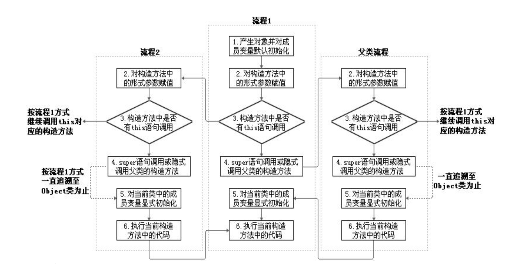
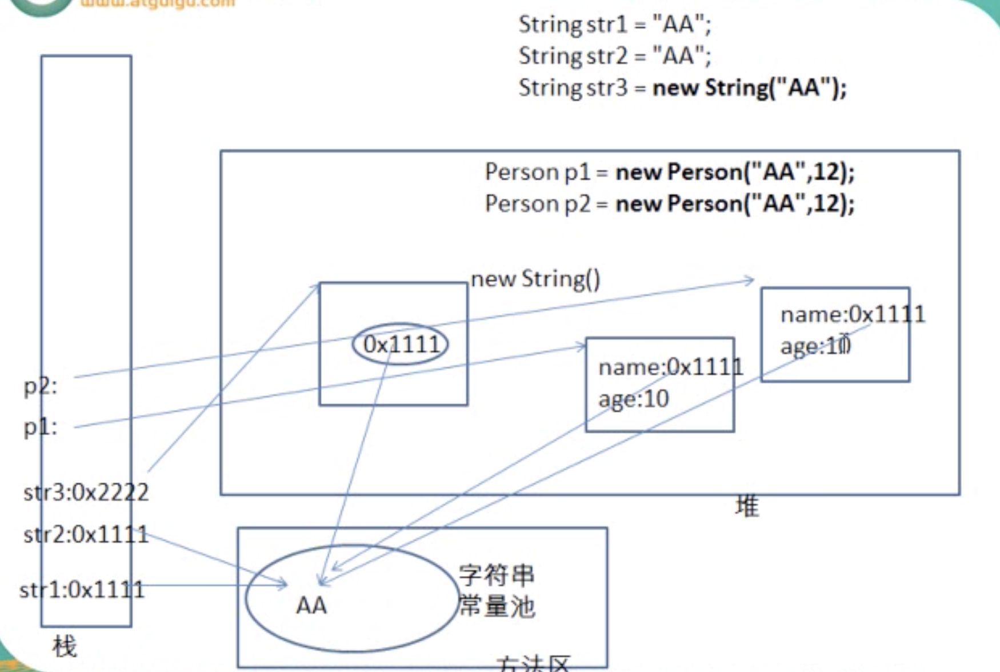
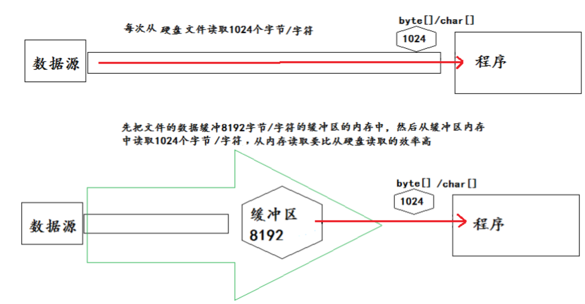

<span id="catalog"></span>
- [基本流程](#基本流程)
- [类文件](#import)
- [变量](#变量)
- [数据类型](#数据类型)
- [运算符](#运算符)
- [数组](#数组)
- [package](#package)
- [import](#import)
- [参数传递机制](#参数传递机制)
- [权限修饰符](#权限修饰符)
- [内存解析](#内存解析)
- [重载与重写](#重载与重写)
- [类](#类)
- [对象的序列化](#对象的序列化)
- [object](#object)
- [String](#string)
- [基本类型的池](#基本类型的池)
- [包装类](#包装类)
- [三目运算符](#三目运算符)
- [异常](#异常)
- [集合](#集合)
- [泛型](#泛型)
- [枚举类](#枚举类)
- [注解](#注解)
- [io流](#io流)
- [多线程](#多线程)
- [扩展](#扩展)

# 基本流程：
[top](#catalog)
1. *.java文件（源文件）
2. javac *.java --> 编译成*.class文件（字节码文件）
3. java * --> 运行class文件

# 类文件
[top](#catalog)
* 如果*.java文件中有pubilc类，文件名应该和类名相同
* 一个源文件中最多只有一个public类，其他类不限个数。如果源文件中包含一个public类，则文件名必须与public类名相同
* 应用程序的执行入口是：main() 方法，固定格式
    * public static void main(String[] args){}

# 变量
[top](#catalog)
* **内存**中的一个存储区域，区域内的数据类型不可变
* 程序中最基本的存储单元，包含：变量类型，变量名，存储的值
* 先声明，后使用
* 变量的位置
    * 成员变量---方法体外
        * 实例变量（不加static）
        * 类变量（加static）
    * 局部变量---方法体内
        * 形参

# 数据类型
[top](#catalog)
* 越高级越抽象，越低级越专用
* 基本类型
    * 数值型
        * 整数型：
            * byte：1字节（8bit）
            * short：2字节
            * int：4字节，**整形变量默认为int型**
            * long：8字节，常量后+l/L
        * 浮点型：
            * float：4字节，尾数7，常量后+f/F
            * double：4字节，**浮点变量默认为double**
    * 字符型：char
        * 所有字符都适用Unicode编码，一个字符可以存储一个字母/汉字等
        * 直接使用Unicode值来表示：'\uXXX'，XXX是一个16进制整数
        * 可以进行运算
    * 布尔型：boolean
* 数据类型的转换
    * 基本类型的转换
        * 自动转换：小-->大
            * byte/char/short-->int-->long-->float-->double
            * 如：`long g = 20; double d = 12.0f;`
        * 强制类型转换：大-->小
            * 如`float f = (float)12.0; int a = (int)1200L;`
        * 特殊法则：
            * 多类型计算时，先全部转换成容量大的，再进行计算
            * byte/char/short 不会互相转换。计算时**首先转换到int型**
                * short型 = short型 + byte型 右边计算时会转换为int型，赋值给左侧时会造成类型不兼容
            * boolean
                * 不能与其他数据类型运算
                * 不可以转换为其他的数据类型
            * 任何基本类型与字符串String进行`+`运算时，基本类型转换为字符串类型String
    * 引用数据类型
        * 自动转换：`父类 a = new 子类()` （利用多态性）
        * 强制转换：`父类 a = new 父类(); 子类 b = (子类)a;`
        * **无继承关系**的引用类型间的转换是非法的
        * 转换前可以使用instanceof来检查对象的类型
    
* 引用类型
    * 分类：
        * 类：class
        * 接口：interface
        * 数组：[]
        * 字符串类型 String
            * 字符串不能直接转换为基本类型，但通过对应的包装类则可以
    * 引用变量由两种类型：**编译时类型**和**运行时类型**
        * 编译时类型：声明变量时的类型
        * 运行时类型：实际赋值给变量的类型
        * 以`=`为界：编译时，看左边；运行时，看右边

# 运算符
[top](#catalog)
* 算数运算符
    * 对负数取模时，忽略负号
        * 5%-2=1
    * 被模数是负数时不可忽略
        * -5%-2=-1
        * -5%2 =-1
    * s=s+2 与 s+=2
        * 前者计算后，和左边变量的类型精度进行比较，左边精度低于右边时，编译器报错，需要执行强制转换
        * 后者计算时，右边的类型强制转换为左边的类型，然后直接操作左边变量内存中的值，计算的方式时**位操作**，计算效率比左边快
    * n *= m++; 先做`*=`，再做`++`
    * int n=10; n+= (n++) + (++n)  ???
        1. ++10 --> 11
        2. 10 += (11++) + (11) --> 10 += 11+11 -->32
        3. 11++ --> 12
* 比较运算符
    * ==, !=, <, >, <=, >=
    * instanceof 价差是否是类的对象。如： "Hello" instanceof String

* 逻辑运算符
    * &，|，逻辑与/或，无论对错，符号两边的表达式都进行计算
    * &&，|| 短路与/或，左边错了就不计算右边了
    * ! 取反
    * ^ 异或，相同为假，不同为真

# 数组
[top](#catalog)
* 数组工具类：Arrays
* 数组中的元素可以是任何数据类型，包括基本数据类型和引用数据类型
* 创建数组对象会在内存中开辟一整块连续的空间，而数组名中引用的是这块连续空间的**首地址**
* 数组的长度一旦确定，就不能修改
* 一维数组
    * 声明：type var[] 或type[] var
    * 使用**new**来创建数组
    * 动态初始化：声明+分配空间 与 赋值操作要分开
    ```java
    int[] arr = new int[3];
    arr[0] = 1;
    arr[1] = 2;
    arr[2] = 3;
    ```
    ```java
    String name[];
    name = new String[3];
    name[0]="xx";
    name[1]="yy";
    name[2]="zz";
    ```
    * 静态初始化：声明，分配空间，赋值 同时完成
    ```java
    int arr[] = new int[]{1,2,3};
    //或
    int[] arr = {1,2,3};
    ```
    * 数组a的长度：a.length 
    * 数组的各元素相当于类的成员变量，数组分配空间后，每个元素按照成员变量的方式被隐式初始化
        * 基本类型，默认初始化各不相同
        * 引用类型，默认初始化为null
    * 数组变量在**栈内存**，各元素对象在**堆内存**

# package
[top](#catalog)
* package语句
    * java源文件的第一条语句，指明该文件中定义的类所在的包
    * 若没有该语句，则指定为无包名
* 包的作用
    * 包帮助管理大型软件系统:将功能相近的类划分到同一个包中。比如:MVC的设计模式
    * 包可以包含类和子包，划分项目层次，便于管理
    * 解决类命名冲突的问题
    * 控制访问权限

# import
[top](#catalog)
* 如果导入的类或接口是java.lang包下的，或值当前包下的，可以省略import
* import写在包声明和类声明之间
* `.*`的方式可以导入包下的所有内容
* 导入当前包下、`java.lang`下的内容时，可以省略import
* 如果在代码中使用不同包下的同名的类。那么就需要使用**类的全类名**的方式指明调用的是哪个类
* **import static**组合，调用指定类或接口下的静态属性或方法

# 参数传递机制
[top](#catalog)
* 规则：值传递
    * 基本数据类型：值拷贝
    * 引用数据类型：地址拷贝
        * 对于String，在方法中对String类型的形参进行修改时，会在堆中开辟新的内存空间，并将新空间的地址重新赋予形参，这会导致，在方法中对字符串的修改，不会影响到实参。

# 权限修饰符
[top](#catalog)

|修饰符|类内部|同包|不同包的子类|同一个工程|
|-|-|-|-|-|
|private|是|-|-|-|
|缺省|是|是|-|-|
|protected|是|是|是|-|
|public|是|是|是|是|

# 内存解析
[top](#catalog)
* 堆（heap）
    * 存在的目的：存放对象实例（对象实例，数组）（所有的对象实例都在该区被分配内存）
* 栈（stack）
    * 指虚拟机栈
    * 用于存储局部变量
    * 局部变量表存放：编译期可知长度的各种基本数据类型，对象引用。方法执行结束后，自动释放
* 方法区（method area）
    * 存储已被虚拟机加载的：类信息、常量、静态变量、`即时编译器编译后的代码` 等数据

# 重载与重写
[top](#catalog)
* 对于重载的方法，编译器根据方法名和参数表，对同名的方法名做修饰，使这些方法名变得不一样。在编译期确定方法的调用地址（早绑定/静态绑定）
* 多态是该方法在调用时确定的（晚绑定/动态绑定）

# 类
[top](#catalog)
* 类的成员
    ```java
    class Person{
        //属性，或成员变量
        String name;
        boolean isMarried;
        
        //构造器
        public Person(){}
        public Person(String n, boolean im){
            name = n;isMarried = im;
        }
        
        // 方法，或函数
        public void walk(){
            System.out.println("...");
        }

        public String display(){
            return  "...";
        }

        //代码块
        {
            name = ".....";
            arg = 17;
            isMarried = true;
        }

        // 内部类
        class pet{
            String name;
            float weight;
        }
    }
    ```
* 对象的创建
    * 创建方式：`类名 对象名 = new 类名();`
    * new出来的对象在堆中，指向该类对象的变量在栈中
    * 对象如果没有任何引用，则对象会成为垃圾被回收
        ```Java
        // 创建对象
        Person p = new Person();
        // 消除类对象的引用，变成垃圾
        p = null;
        ```
    * 对象被创建时，会读各种类型的成员变量进行初始化赋值变量的默认初始化赋值
    
        |成员变量类型|初始值|
        |-|-|
        |byte|0|
        |short|0|
        |int|0|
        |long|0L|
        |float|0.0F|
        |double|0.0|
        |char|0 或 '\u0000'|
        |boolean|false|
        |引用类型|null|
* 类的成员
    * 属性
        * 成员变量(类体内声明的变量)：
            * 分类
                * static修饰的`类变量`，**存储在方法区的静态域内**
                * 实例变量，**存储在堆中**
            * 可以使用private，public，static，final等权限修饰符修饰
            * 都有默认初始化值
        * 局部变量(方法体内声明的变量)：
            * 包括：形参，方法局部变量，代码块局部变量
            * **存储在栈中**
            * 不能使用权限修饰符来修饰，**可以使用final修饰**
            * 没有初始化值，必修显式赋值，才能使用(除了形参)
        * 局部变量和成员变量的异同
            * 不同点：局部变量(除形参以外)需要显示初始化
            * 相同点：都有生命周期
                
        * 类属性的赋值
            * 赋值的顺序
                1. 默认初始化
                2. 属性的显示初始化（int x=10;）
                3. 构造器中的初始化
                4. 通过**对象.属性**、**对象.方法**的方式赋值
    * 方法
        * java中的方法不能单独存在，**必须定义在类中**
        * 没有返回值时，返回void，此时可以**不必使用return语句**。如果使用，可以用来结束方法
        * 方法内部不能再定义方法
        * 方法的重载(overload)
            * 一个类中，允许存在一个以上的同名方法，**只要它们的参数个数或参数类型不同即可**
            * **重载与返回值类型无关**，只看参数列表。调用时根据参数列表来区别
            ```java
            // 三个有效重载
            int add(int x, int y){ return x+y;}
            int add(int x, int y, int z){return x+y+z;}
            double add(double x, double y){return x+y;}
            ```
            * 对于重载的方法，编译器根据方法名和参数表，对同名的方法名做修饰，使这些方法名变得不一样。在编译期确定方法的调用地址（早绑定/静态绑定）
        * 可变个数形参：能和多个实参相匹配的形参
            * `public static void test(int a, String...books);`
            * 声明格式：`方法名(参数的类型...参数名)`
            * 参数的个数可以是：0、1、更多
            * 实际与**参数使用数组**是相同的
            * 可变形参，需要放在形参声明的最后
            * 一个方法，**最多只能声明一个可变个数形参**
            * 可变形参与重载
                ```java
                class Overload{
                    public void test(String[] msg){...}
                    public void test1(String book){...}
                    public void test1(String ... books){} 
                    public static void main(String[] args){
                        Overload o = new Overload();
                        o.test1(); //调用方法2
                        o.test1("aaa", "bbb");// 调用方法3
                        o.test(new String[]{"aaa"});//调用方法1
                    }
                }
                ```
        * 方法参数的传递机制
            * java只有一种参数传递方式：**值传递**（传入一个实参的副本）
            * 基本类型传数据拷贝
            * 引用类型传地址拷贝
            * println？？？？？？
                ```java
                int[] arr = new int[10];
                System.out.println(arr);//输出数组的地址

                char[] arr1 = new char[10];
                System.out.println(arr1); //输出10个特殊字符
                ```

    * 构造器
        * 基本特征：
            * 与类名相同
            * 无返回值
            * 不能被static、final、synchronized、abstract、native修饰
            * 不能有返回值
        * 作用：创建对象，并初始化
        * 语法：`修饰符 类名(参数列表){初始化语句;}`
            ```java
            public A{
                private int x;
                public A(){x = 1;}
            }
            ```
        * 两类构造器
            * 无参构造器（由系统默认提供）
            * 显式定义的构造器（无参或有参）
        * 每个类都默认至少有一个构造器，且**该默认构造器的修饰符与类的修饰符相同**
        * 如果显式定义了构造器，则系统不再提供默认构造器
        * 一个类可以有多个重载的构造器
            ```java
            public class Person{
                public Person(String name, int age, Date d) {this(name,age);...} 
                public Person(String name, int age) {...}
                public Person(String name, Date d) {...}
                public Person(){...}
                }
            ```
        * **父类的构造器不可以被子类继承**
        * 使用super调用父类的构造器
            * super调用必须放在首行
            * 子类所有的构造器默认都会访问父类中的**空参数**构造器
            * 如果父类中**没有空参数构造器**，子类构造器必须通过this(参数列表)或super(参数列表)来指定本类/父类中的构造器，同时只能**二选一**，且**必须放在首行**
            * 如果子类没有显示调用父类/子类构造器，且父类中有没有无参的构造器，则**编译出错**

* 类的特性：
    * 封装、隐藏
        * 将数据声明为private，再提供public方法：get、set来操作属性
    * 继承
        * 语法规则：`class Subclass extends SuperClass{ }`
        * 子类不能直接访问父类中的private成员变量和方法（实际上private部分子类已经继承了，只是不能访问）
        * java只支持单继承，不支持多重继承
        * 子类不是父类的子集，而是扩展
        * 子类对象的实例化过程
    * 多态
        * 多态性：父类的引用指向子类的对象（也可以应用在抽象类和接口上）
            * 编译时类型(父类引用) != 执行时类型(子类的对象)
            * 子类 可以当作 **特殊的父类**
            * 父类引用指向子类对象可以看作：向上转型
            * 使用时，父类引用**不能访问子类中添加的方法和属性**
                * 因为属性和方法是编译时确定的，所以使用子类的方法/属性会导致编译错误
            * 虚拟方法调用
                * 父类方法被重写时，父类方法被称为**虚拟方法**，执行时，会动态调用子类对象中的这个方法（该方法的调用是在**运行时确定的**）（晚绑定/动态绑定）
                ```java
                //动态绑定的证明
                class A{
                    public void test(int x, int[] y){
                        System.out.println("this is A");
                    }
                }
                class B extends A{
                    public void test(int x, int...y){
                        System.out.println("this is B");
                    }
                    public void testB(){
                        System.out.println("this is testB");
                    }
                }

                public class FreeTest {
                    @Test
                    public void method01(){
                        A a = new B();
                        a.test(1, new int[]{2,3}); //this is B
                        a.testB();//编译异常。如果是静态绑定，应该能编译通过
                    }
                }
                ```
        * 成员变量不具备多态型，使用实例对象本身的成员变量
        ```java
        class A{
            int a = 16;

            public void info(){
                System.out.println(a);
            }
        }

        class B extends A{
            int a = 18;

            public void info(){
                System.out.println("this is B " + a);
            }
        }

        @Test
        public void testA(){
            A a = new B();
            a.info(); //this is B 18
        }
        ```
        * **方法的重写(oriride)**
            * 重写的要求
                1. 子类的方法名(参数列表) = 父类的方法名(参数列表) 
                2. 子类返回值类型 <= 父类返回值类型
                    * 如果大于，则子类调用时不能明确返回值的类型，会导致编译失败
                3. 子类中的权限 >= 父类中的权限
                4. private方法**不能重写**
                5. 子类中抛出的异常 <= 父类中抛出的异常
            * 子类与父类中同名同参数的方法必须同时声明为非static的(即为重写)，或者同时声明为 static的(不是重写)。因为static方法是属于类的，子类无法覆盖父类的方法。

* 关键字
    * this
        * 在方法内部使用，表示该方法**所属对象**的引用
        * 在构造器中使用，表示构造器**正在初始化的对象**
        * this可以调用类的属性、方法、构造器
        * 如果方法的**形参和成员变量同名时**，必须使用this来进行区分，如：`this.name = name`
        * 使用this访问属性、方法时，如果在**本类中找不到时，会到父类中查找**
        * 可以在某个构造器中通过**this(形参列表)**，来调用本类中的其他构造器 
            * 不能在某个构造器中通过this来调用该构造器自身
            * this(形参列表)必须在构造器的**首行**使用
            * 每个构造器中，最多使用一次this(形参列表)
        ```java
        class Test{
            private String name;
            public Test(){
                name="a";
            }

            public Test(String n){
                this();//调用无参构造器
                ....
            }

            public Test(String n, int age){
                this(n);//待用Test(String n)
                ...
            }
        }
        ```

    * super
        * super可以访问**父类**中定义的**属性**
        * super可以调用**父类**中定义的**成员方法**
        * super可以在**子类构造器**中调用**父类的构造器**
        * 子类、父类中出现同名的成员时，可以通过super来标识父类
        * super的追溯**不限于直接父类**
        * this代表本类对象的引用，super代表父类的**内存空间的标识**
    * instanceof
        * 检验x是否为类A的对象，返回true/false
        * 使用方法：`x instanceof A`
        * 要求x的类是A或A的子类，否则会产生编译错误

    * static
        * 使用范围：可以修饰：属性、方法、代码块、内部类
        * 被static修饰后的特点
            * 随着类的加载而加载
            * 优先与对象而存在
            * 修饰的成员被所有的实例共享
            * 权限允许时，可以直接通过类进行调用，不用进行实例化
        * static方法内部，只能访问static修饰的属性、方法，**不能访问非static的结构**
        * static方法的内部，**不能有this，也不能有super**（因为不需要实例就可以使用，所以没有this和super）
        * static修饰的方法**不能被重写**
    * final
        * final变量只能被赋值一次，即常量(常量名通常大写)
            * 可以在构造器中给对象中的常量进行赋值
        * final标记的方法不能被子类重写
        * final标记的类不能被继承

* main 方法
    * 由java虚拟机调用，所以访问权限必须是public，且不需要创建对象，所以必须是static的
    * main方法接受一个String类型的数组参数，该String数组保存了执行java命令是传递给运行的类的参数
    ```java
    // 输出命令参数：java CommandPara "xxx" "yyy" "zzz"
    public class CommandPara {
        public static void main(String[] args) {
            for (int i = 0; i < args.length; i++) {      
                System.out.println("args[" + i + "] = " + args[i]);
            }
        }
    }
    ```
* 代码块
    * 用法：对java类或对象进行初始化
    * 只能被static修饰 
        * 被static修饰的叫静态代码块，通常用来初始化static属性
            * 可以有输出语句。
            * 可以对类的属性、类的声明进行初始化操作。
            * 不可以对非静态的属性初始化。即:不可以调用非静态的属性和方法。
            * 多个静态的代码块，从上到下的顺序依次执行。
            * 静态代码块的执行要**先于非静态代码块**。
            * 静态代码块**随着类的加载而加载，且只执行一次**。
        * 没有修饰的叫非静态代码块
            * 可以有输出语句。
            * 可以对类的属性、类的声明进行初始化操作。
            * 除了调用非静态的结构外，还**可以调用静态的变量或方法**。
            * 多个非静态的代码块，从上到下的顺序依次执行。 
            * 每次创建对象的时候，都会执行一次。且先于构造器执行。
    * new Obj() 时的整体执行顺序
        * 父类的静态代码块
        * 子类的静态代码块
        * 父类的非静态代码块
        * 父类的构造器
        * 子类的非静态代码块
        * 子类的构造器

* abstract 抽象类
    * abstract放在权限修饰符后面，如：`public abstract void method()`
    * 有abstract修饰方法时，必须用abstract修饰类
    * 抽象类不能实例化
    * 若子类没有重写父类的**全部抽象方法**，则子类仍是抽象类
    * 不能用abstract修饰变量、代码块、构造器;
    * 不能用abstract修饰私有方法、静态方法、final的方法、final的类

* interface 接口
    * 接口是抽象方法和常量值的集合
    * 特点
        * 用interface定义
        * 所有成员变量默认由**public static final** 修饰
        * 所有成员方法默认由**public abstract**修饰
        * 接口中没有构造器
        * 接口可以多继承：`interface A extends B,C`，但是**不能继承抽象类**
    * 语法：先写extends，再写interface
    * 一个类可以实现多个接口，接口也**可以继承其他接口**
    * 接口中所有方法被实现后，才能实例化
        * 如果实现类没有实现全部接口方法，该实现类只能被声明为abstract
    * 接口与实现类之间存在多态性
    * 实现接口的匿名类对象
    ```java
    InterfaceX x = new InterfaceX(){
        method01(...){...}
        method02(...){...}
        method03(...){...}
    }
    ```
    * 接口和父类中出现**同名属性**时，通过super.param来调用从父类中继承的属性，通过Interface.param来调用接口中的属性
    * java8以后可以为接口添加静态方法和默认方法
        * 可以通过接口直接调用静态方法
    * 默认方法的冲突
        * 一个接口中定义了一个默认方法A， 另一个接口中也有同名同参数(无论是否default)的方法，此时会出现接口冲突
            * 解决方法：实现类必须覆盖接口中的同名同参数的方法
            * 若想调用某个接口中的冲突方法，可以：Interface.super.method()
        * 一个接口中定义了一个默认方法A，父类中也定义了一个同名同参数的非抽象方法，此时不会出现冲突
            * 使用时，遵循**类优先**的原则，接口中的方法会被忽略掉

* 内部类
    * 内部类所在的类是外部类
    * 在类中直接定义的是成员内部类
        * 作为成员的特性
            * 可以用private/protected来修饰
            * 可以调用外部类的结构
            * 可以用static修饰，但是只能使用外部类的static成员属性
        * 作为类的特性
            * 可以在类内部定义属性，方法，构造器等结构
            * 可以用abstract修饰，可以被其他内部类继承
            * 可以声明为final的
            
    * 在成员方法中定义的是局部内部类
        * 不能用static修饰
        * 不能使用public，private，protected
    * 匿名内部类
        * 匿名内部类不能定义任何静态成员、方法和类，只能创建匿名内部类的一个实例。一个匿名内部类一定是在new的后面，用其隐含实现一个接口或实现一个类
        * 匿名内部类必须继承父类或实现接口
        * 匿名内部类只能有一个对象
        * 匿名内部类对象只能使用多态形式引用
        * 可以通过接口来实例化
    * 使用方法
        * 创建内部类对象
            * 创建static内部类对象：`类.内部类 a = new 类.内部类();`
            * 创建非static内部类对象：
            ```java
            类 a = new 类(); //创建外部类对象
            类.内部类 x = a.new 内部类(); // 通过外部类对象来创建内部类
            ```
        * 调用内部类和外部类的变量（当变量重名时）
            * this.param 调用内部类的属性
            * 外部类.this.param 调用外部的同名属性
        * 局部内部类的使用
            * 常常使用一个方法，使其返回值为某个类或接口的对象，而这个类或接口在方法内部创建（返回某种接口，内部类是该接口的实现类）
            * 局部内部类可以使用外部方法的局部变量，但是必须是final的
    * 编译后，内部类会有独立的*.class文件，文件名前面会自动附加：`外部类名$`

# 对象的序列化
[top](#catalog)
* `内存中的Java对象 <--> 平台无关的二进制流` 之间转化，可以保存到磁盘上或通过网络传播
* 可以将任何实现了Serializable接口的对象转化为字节数据，使用器在保存和传输时可以被还原
* JavaEE --> RMI(Remote Method Invoke远程方法调用) --> 序列化
    * 序列化时RMI过程的参数和返回值都必须实现的机制，时JavaEE的基础
* 类必须实现`Serializable`或`Externalizable`接口，否则会引发NotSerializableException异常
* private static final long serialVersionUID;
    * 表示序列化版本标识符的静态变量
        * 用来表明类的不同版本间的兼容性(对序列化对象进行版本控制)
        * 序列化时，用serialVersionUID验证版本的一致性
        * 反序列化时，jvm将字节流中的serialVersionUID与本地对应实体类的serialVersionUID进行比较，**如果相同则一致，进行反序列化；不一致，则引发InvalidCastException**
    * 如果没有显示定义该常量，它的只是运行时根据类内部细节自动生成的，**如果类的实例变量发生变化，则serialVersionUID会变化**
* 如果类的成员变量**不是基本数据类型或String，而是其他引用类型，则该类型必须时可序列化的**，否则无法序列化
* 对象流ObjectInputStream、ObjectOutputStream不能序列化static和transient修饰的成员变量


# object
[top](#catalog)
* 未使用extends指定父类是，则默认父类为：`java.lang.Object`
* 可以接收任何参数的方法
    ```java
    method(Object obj){...}
    ```
* 主要结构
    * 构造器：Object() 
    * 对象比较：public boolean equals(Object obj)
    * 获取hash码：public int hashCode()
    * 打印对象：public String toString()
        * 默认返回对象的类名和该对象的引用地址
        * String型数据与其他类型数据进行`+`连接操作时，会自动调用toString()
        ```java
        Date d = new Date();
        //下面两种写法结果相同
        System.out.print("XXXX" + d);
        System.out.print("XXXX" + d.toString());
        ```
        * 基本数据类型转换为String型时，调用了**对应包装类**的toString()方法
* `==`与equals
    * `==`：基本类型，比值；引用类型，比内存地址
    * equals，**只能比较引用类型**，没有被重写时，与`==`相同。
        * equals已经被重写的一些特例
            * String，String的equals方法被重写过，是直接比较两个对象的内容
            * 其他特例：File，Date，包装类，这些类**比较类型及内容**
        * 重写equals的规则
            * 对称：x.equals(y) -->true, y.equals(x) -->true
            * 自反：x.equals(x) -->true
            * 传递：x.equals(y) -->true, y.equals(z) -->true，z.equals(x) --> true
            * 每次的比较结果都相同
            * x.equal(null)，**永远都返回false**
            * x.equal(和x不同类型的对象)，**永远都返回false**


# string
[top](#catalog)
* 字符串的所处位置
    * 对于String常量，如：`String s = "AA";`
        * 字符串会存储在**字符串常量池**中
        * String对象会指向字符串常量池中的某一个
        * 如果初始化String时，常量中已经有了同样的数据，则不会开辟新的空间来创建数据，而是直接指向已有的数据
    * 对于通过new创建的String对象：`String s = new String("AA")`
        * new创建的对象，会在堆空间中开辟内存，然后堆内存中的数据再**指向字符串常量池**中的数据
    * 结果
    ```java
    String s1 = "aa";
    String s2 = "aa";
    String s3 = new String("aa");
    System.out.print(s1==s2); //true
    System.out.print(s1.equals(s2)); //true
    System.out.print(s1==s3); //false
    System.out.print(s1.equals(s3)); //true
    ```
* 
* String的equals方法被重写过，是直接比较两个对象的内容

# 基本类型的池
[top](#catalog)
* 对于整形数据，范围-128～127的数都在**池中**，所以`Integet i = 1; Integet j = 1; i==j //true`

# 包装类
[top](#catalog)
* 八种基本数据类型定义相应的引用类型

    |基本类型|包装类|父类|
    |-|-|-|
    |byte|Byte|Number|
    |short|Short|Number|
    |int|Integer|Number|
    |long|Long|Number|
    |float|Float|Number|
    |double|Double|Number|
    |char|Character|-|
    |boolean|Boolean|-|
* 包装类使基本数据类型变成了类
* **包装类重写了toString**，使用System.out.println会输出具体的值
* 装箱：基本数据类型--->包装类
    * `int i = 500; Integer t = new Integer(i);`
    * 通过字符串构造包装类对象：`Float f = new Float("3.45")`
* 拆箱：包装类--->基本数据类型变量
    * 调用包装类的：xxxValue()方法：`boolean b = bObj.booleanValue();`
* jdk1.5 之后支持自动的拆箱和装箱
* 字符串与基本数据类型的转换
    * 字符串--->基本数据类型：
        * 包装类的构造器：`int i = new Integer("12");` （使用包装类的构造器，再使用自动拆箱）
        * 包装类的静态方法parseXXX：`int i = Integer.parseInt("12");`
    * 基本数据类型--->字符串
        * String.valueOf: `String str = String.valueOf(2.34f);`
        * 直接连接空字符串：`String str = 5 + "";`

# 三目运算符
[top](#catalog)
* 运算符要保证`:`两边的数据类型相同，会自动进行类型转换
    * 使用三目运算符的比较
    ```java
    //输出1.0（自动进行类型转换）
    Object o1 = true ? new Integer(1) : new Double(2.0);

    //输出1（无类型转换，直接赋值）
    Object o2;
    if (true)
        o2 = new Integer(1);
    else
        o2 = new Double(2.0);

    System.out.println(o2);
    ```
    * `Object o1 = true ? 1 : 2.0; `最终显示1.0
    
# 异常
[top](#catalog)
* 两种异常
    * Error：java虚拟机无法解决的严重问题，如JVM系统内部错误、资源耗尽等情况
    * Exception：因编程错误、偶然因素导致的问题
* 异常分类
    * 编译时异常
    * 运行时异常
* 异常的处理
    * 异常捕获：try...catch...finally
        * 即使try中有`return`、或`catch`中也有异常，finally也一定会执行
        * try-catch可以互相嵌套
    * 声明抛出的异常：method(...) throws XXException{...}
    * 手动抛出异常：`XXXException e = new XXXException; throw e;`
        * 手动抛出的异常必须是`Throwable`或其子类的实例
* 子类重写方法抛出的异常不能比父类的异常更大，否则会报错。
* 在多态的情况下出现异常时按照父类声明的异常处理
* 自定义异常类
    * 一般自定义异常类都是`RuntimeException`的子类
    * 自定义异常类通常需要编写几个重载的构造器。
    * 自定义异常需要提供serialVersionUID
    * 自定义的异常**通过throw抛出**。

# 集合
[top](#catalog)
* 数组的问题
    1. 长度固定
    2. 具体存储了多少个元素不可知
    3. 不便于添加、删除、插入等操作，且效率不高
* 集合工具类 Arrays
    * boolean equals(int[] a,int[] b) 判断两个数组是否相等。
    * String toString(int[] a) 输出数组信息。
    * void fill(int[] a,int val) 将指定值填充到数组之中。
    * void sort(int[] a) 对数组进行排序。
    * int binarySearch(int[] a,int key) 对排序后的数组进行二分法检索指定的值。
    * Array.asList 数组转化为集合
* Iterator 迭代器接口
    * Iterator对象即迭代器，主要用于遍历Collection集合中的元素
    * `foreach`底层是调用Iterator完成操作的
    * 每次调用都会得到一个新的迭代器对象，默认游标在集合的第一个元素之前
    * 返回迭代器对象(Iterator接口实现类的对象)，用于集合遍历
    * iterator接口的方法
        * hasNext()
        * next()
            * 使用next之前必须调用hasNext进行检测，如果不调用，且下一条记录无效，会引发NoSuchElementException异常
        * remove()
            * 如果 未调用next() 或 next()后已经调用过remove，再次调用remove会引发IllegalStateException
    * 集中遍历方法
        ```java
        Iterator iterator = coll.iterator();

        //1
        for (int i = 0; i < coll.size(); i++) {
            System.out.println(iterator.next());
        }

        //2
        while(iterator.hasNext()){
            System.out.println(iterator.next());
        }
        ```

* Collection接口（父类接口，jdk不直接提供该接口的任何直接实现）
    * 接口继承树 
    * **不指定范型时，* 可以存储null**
    * 接口方法
        * 添加
            * add(Object obj)
                * 基本数据类型会自动进行装箱
            * addAll(Collection coll)
        * 获取有效元素个数
            * int size()
        * 清空集合
            * void clear()
        * 判断是否是空集合
            * boolean isEmpty()
        * 是否包含某个元素
            * boolean contains(Object obj) 
                * 通过元素的equals方法来判断是否是用一个对象
                * 对于某个类的实例，如果没有重写equals()，即使内容相同结果也是false
            * boolean containsAll(Collection c)
                * 比较两个集合的元素
                    * A.containsAll(B) 表示A是否包含B的所有元素
                * 调用各元素的equals方法来比较
        * 取两个集合的交集
            * boolean retainAll(Collection c)
                * A.retainAll(B) 交集的结果存A中，不影响B
        * 删除
            * boolean remove(Object obj)
                * 通过equals来比较元素，只删除找到的**第一个元素**
            * boolean removeAll(Collection coll)
                * 取当前集合的差集
        * 集合是否相等
            * boolean equals(Object obj)
        * 获取集合对象的hash值
            * hashCode()
        * 转换成数组对象
            * Object[] toArray()
    * 子接口
        * List：
            * 元素有序，可重复，每个元素都有对应的顺序索引，可以根据索引进行存取
            * List接口中增加的方法
                * void add(int index, Object ele):在index位置插入ele元素
                * boolean addAll(int index, Collection eles):从index位置开始将eles中的所有元素添加进来
                * Object get(int index):获取指定index位置的元素
                * int indexOf(Object obj):返回obj在集合中首次出现的位置
                * int lastIndexOf(Object obj):返回obj在当前集合中末次出现的位置 
                * Object remove(int index):移除指定index位置的元素，并返回此元素 
                * Object set(int index, Object ele):设置指定index位置的元素为ele 
                * List subList(int fromIndex, int toIndex):返回从fromIndex到toIndex，但不包含toIndex位置的子集合
            * 常用的接口实现类：ArrayList, LinkedList, Vector
                * ArrayList（主要实现类）：
                    * 底层是一个动态数组，进行元素插入时会移动数据
                    * 初始化一个长度为0的数组，当添加第一个元素是再创建一个容量为10的数组
                    * 对于随机访问get/set，ArrayList效率更高（LinkedList需要移动指针）
                    * 线程不安全
                * LinkedList：
                    * 底层是一个双向链表，更适合频繁进行添加删除操作的数组(ArrayList会移动数据，效率低)
                    * 新增方法
                        * void addFirst(Object obj) 
                        * void addLast(Object obj) 
                        * Object getFirst()
                        * Object getLast()
                        * Object removeFirst() 
                        * Object removeLast()
                * Vector
                    * 过于古老，尽量不使用，执行效率低
                    * 线程安全的
                    * 与ArrayList基本相同，但是属于同步类，开销大访问慢，每次扩容需要申请其大小两倍的空间，ArrayList只需要申请1.5倍
        * Set：
            * 元素无序，不可重复，常用方法都是Collection下定义的
                * 无序性!=随机性，是在底层中元素的存储位置的无序的，虽然不是插入顺序，但每次顺序还是相同的
            * 使用equals()判断两个对象是否相同
            * 常用接口实现类
                * HashSet（主要实现类）(hashMap的一种特殊实现)
                    * 添加元素时，会使用元素所在类的equals()和hashCode()进行比较
                    * 元素的存储方式
                        * hash算法：先用hashCode()计算各元素的hash值，然后存储；存储时对应位置已经有数据，用equals()进行比较，如果结果为true，则两个元素相同，如果结果为false，则两个元素存储到同一个位置，通过链表来连接
                            * 要求equals()和hashCode() 在结果上尽量一致
                    * 底层是数组，初始容量为16，当使用率超过0.75，会扩容为原来的两倍(16-->32-->64...)
                    * 存取、查找、删除的性能比较好
                    * 不保证元素的排列顺序
                    * 集合元素可以是null
                    * 不是线程安全的
                    * 计算hashCode后直接插入到相应的内存位置，**数据插入的性能比LinkedHashSet更好**
                * LinkedHashSet（HashSet的子类）
                    * 通过hashCode值确定数据的存储位置，再使用双向链表来存储数据
                    * 因为使用链表来存储数据，所以**迭代结果是有序的**
                        * 存储是无序的，迭代是有序的
                    * 因为使用链表来维护元素的次序，使得**LinkedHashSet比HashSet有更好的迭代访问性能**
                * TreeSet（SortedSet接口实现类）
                    * 有序，查询速度比List块
                    * 添加的元素必须是同一个类的
                    * 按照集合元素的大小来遍历，如String、包装类等默认按照**从小到大**的顺序来排列
                    * 元素的类必须实现Comparable接口，否则添加元素时会发生异常
                        * 需要重写compareTo()；如果返回0，则认为两个元素相同，就不会添加到Set中
                        * **compareTo()、hashCode()、equals()的接口应该尽量相同**
                    * 排序
                        * 自然排序
                            1. 第一个元素不进行compareTo()比较，后边添加的所有元素都会调用compareTo()进行比较
                            2. 插入的元素必须时同一类的对象
                            3. compareTo()返回0时，认为两个元素相同，不会添加新元素
                        * 定制排序
                            1. 创建一个实现了Comparator接口的类对象
                            2. 将Comparator对象传递给TreeSet的构造器中
                            3. 只能添加Comparator对象中涉及到的类的对象
                        * 能修改类就使用**自然排序**，无法修改类就使用**定制排序**
                        * 同时使用Compatator和Comparable两者，Compatator优先
                        
        * Queue

* Map接口：k-v对
    * 接口继承树
    * 同一个Map中key和value对象所对应的类，必须重写hashCode()和equals() 
    * Map接口常用方法
        * 添加，删除，修改
            * Object put(Object key,Object value):将指定key-value添加到(或修改)当前map对象中 
            * void putAll(Map m):将m中的所有key-value对存放到当前map中
            * Object remove(Object key):移除指定key的key-value对，并返回value
            * void clear():清空当前map中的所有数据
        * 元素查询操作
            * Object get(Object key):获取指定key对应的value
            * boolean containsKey(Object key):是否包含指定的key
            *  boolean containsValue(Object value):是否包含指定的value
            * int size():返回map中key-value对的个数
            * boolean isEmpty():判断当前map是否为空
            * boolean equals(Object obj):判断当前map和参数对象obj是否相等
        * 元视图操作的方法
            * Set keySet():返回所有key构成的Set集合
            * Collection values():返回所有value构成的Collection集合
            * Set entrySet():返回所有key-value对构成的Set集合，遍历时需要将类型强制转换为Map.Entry
    * 常用接口实现
        * HashMap（主要实现类）
            * 可以保存<null,null>
            * ；会调用value的equals()方法
            * 所有key构成的集合是set，无序不重复。添加元素时，会调用key所在类的hashCode()和equals()方法，判断两个key是否相同
                * 判断两个key相同的标准是hashCode()和equals()返回true
            * 所有value构成的集合是Collection，无序可重复。添加元素时，需要value的equals()方法
            * 所有entry构成的集合是Set
            * 存储结构：数组+链表+红黑树
        * LinkedHashMap
            * 使用链表来维护添加到Map中的顺序，遍历时是有序的
            * 插入元素比HashMap慢
        * TreeMap
            * 按照添加进Map中元素的key的指定属性进行排序。要求key必须是同一个类的对象
        * Hashtable
            * 古老的Map实现类，是线程安全的
            * 不允许null作为key和value
        * Properties
            * 常用来处理属性文件，键和值都是String类型的

* Collections工具类
    * 排序操作
        * reverse(List):反转 List 中元素的顺序
        * shuffle(List):对 List 集合元素进行随机排序
        * sort(List):根据元素的自然顺序对指定 List 集合元素按升序排序 
        * sort(List，Comparator):根据指定的 Comparator 产生的顺序对 List 集合元素进行排序 
        * swap(List，int， int):将指定 list 集合中的 i 处元素和 j 处元素进行交换
    * 查找、替换
        * Object max(Collection):根据元素的自然顺序，返回给定集合中的最大元素 
        * Object max(Collection，Comparator):根据 Comparator 指定的顺序，返回给定集合中的最大元素
        * Object min(Collection)
        * Object min(Collection，Comparator)
        * int frequency(Collection，Object):返回指定集合中指定元素的出现次数 
        * void copy(List dest,List src):将src中的内容复制到dest中
        * boolean replaceAll(List list，Object oldVal，Object newVal):使用新值替换 List 对象的所有旧值
    * 线程同步
        * synchronizedXxx()

# 泛型
[top](#catalog)
* 泛型的声明：`interface List<T>`, `class A<K,V>`
* 泛型的实例化：在类名后面指定类型：List<String>
* 通过泛型来限制可是用的类为某一个特定的类
* 使用泛型能够在编译期检测错误
* 泛型T只能是类，**不能用基本数据类型**，但是可以使用包装类替换
* 泛型不同的引用不能互相赋值
* 编译时：`ArrayList<String>`和`ArrayList<Integer>`是两种类型，但是在运行时，只有一个`ArrayList`被加载到JVM中
* 定义了泛型，但是实例化时没有使用，则**默认为Object**
* 不能再try-catch中使用泛型定义
* 通配符
    * ? `类<A>,类<B>`都是类<?>的子类
        ```java
        List<?> list = null;
        List<Object> list1 = new ArrayList<>();
        List<String> list2 = new ArrayList<>();
        list = list1;
        list = list2;
        ```
    * `? extends E`：E的子类或E ---> ?<=E
    * `? super E`：E的父类或E ---> ?>=E
    * 使用通配符后能读不能写
        ```java
        List<String> a = new ArrayList();
        a.add("aaa");
        a.add("bbb");
        a.add("ccc");
        List<?> list = a;
        Iterator i = list.iterator();
        // 实际读取时，是将各元素当作Object对象来读取的
        while(i.hasNext()){System.out.println(i.next());}
        // 写入是会发生编译错误，因为不知到？具体是什么类型
        list.add("ddd");
        // 但是可以添加 null, 因为null是所有元素的默认初始化状态
        list.add(null)
        ```
* 自定义泛型
    * 泛型类：`public class A<T> {...}`
        * 泛型类的构造器：`public A(){...}`，不用加泛型T
        * **静态方法**中不能**使用**当前类的泛型
        * **异常类不能是泛型**
        * 不能使用：`new E()`来创建对象，可以使用：`(E)new Object`
        * 继承时，可以选择保留父类泛型、或指定泛型；子类也可以增加泛型
            * 不保留-->指定泛型
            * 保留
                * 全部保留
                * 部分保留
            * 增加泛型时父类的泛型放在前面？？？？
            ```java
            class A<T1,T2>{...}
            class B extends A<Integer,String>{...}
            class C<T1,T2> extends A<T1,T2>{...}
            class D<T2> extends A<Integer,T2>{...}
            // 增加泛型
            class B2<T3,T4> extends A<Integer,String>{...}
            class C2<T1,T2,T3,T4> extends A<T1,T2>{...}
            class D2<T2,T3,T4> extends A<Integer,T2>{...}
            ```
        * 示例
            ```java
            public class Order<T> {
                private T t;
                List<T> list = new ArrayList<>();

                public void add(){
                    list.add(t);
                }

                public T getT(){
                    return t;
                }

                public void setT(T t){
                    this.t = t;
                }

                // 泛型方法
                public <E> E getE(E e){
                return e;
                }

                // 实现数组到集合的复制，泛型方法中使用到的泛型可以可泛型类中使用的泛型不同
                public <E> List<E> fromArrayToList(E[] e, List<E> list){
                    for (E x : e){
                        list.add(x);
                    }
                    return list;
                }
            }

            @Test
            public void method2(){
                Order<Boolean> order = new Order<Boolean>();
                order.setT(true);
                System.out.println(order.getT()); //true
                order.add();
                List<Boolean> a = order.list;
                System.out.println(a); //[true]

                SubOrder o = new SubOrder();
                List<Integer> b = o.list;
                System.out.println(b); //[]

                Integer mye = order.getE(188);
                System.out.println(mye); // 188

                Integer[] in = new Integer[]{1,2,3};
                List<Integer> ls = new ArrayList<>();
                List<Integer> lc = order.fromArrayToList(in, ls);
                System.out.println(lc);  // [1,2,3]
            }
            ```
    * 泛型接口
    * 泛型方法: 
        * 格式：[访问权限] <泛型> 返回类型 方法名([泛型标识 参数名称]) 抛出的异常
            * `public <E> E method(E e){...}`
        * `<E>`标识一个泛型方法 

# 枚举类
[top](#catalog)
* 适用范围：类的对象只有有限个、且每个都是确定的
* 当需要一组常量是，最好使用枚举类
* 若枚举只有一个对象，则可以作为一种单例模式的实现方式
* 自定义枚举类
    ```java
    class Season {
        // 实例对象中的常量，禁止修改，禁止直接访问
        private final String seaonName;

        private Season(String n) {
            this.seaonName = n;
        }

        public String getSeaonName() {
            return seaonName;
        }

        public static final Season SPRING = new Season("spring");
        public static final Season SUMMER = new Season("summer");
        public static final Season AUTUMN = new Season("autumn");
        public static final Season WINTER = new Season("winter");
    }
    ```
* 使用**enum**关键字来定义枚举类
    * 可以理解为在自定义枚举类的基础上，简化了实例化对象的写法
    * 常用方法
        * values
        * valueOf
        * toString 如果没有重写，则默认返回枚举常量名
    * 枚举类实现接口
    ```java
    interface Info{
        void show();
    }
    enum Season implements Info{
        // 在每个枚举对象中分别实现show方法
        // 如果有一个枚举对象进行了接口方法的实现，则其他的枚举对象都需要进行实现，否则会出现编译异常
        SPRING("spring","spring"){
            public void show(){
                System.out.println("this is spring");
            }
        },
        SUMMER("summer","spring"){
            public void show(){
                System.out.println("this is summer");
            }
        },
        AUTUMN("autumn","spring"){
            public void show(){
                System.out.println("this is autumn");
            }
        },
        WINTER("winter","spring"){
            public void show(){
                System.out.println("this is winter");
            }
        };

        private final String seaonName;
        private final String seasonDesc;

        private Season(String n, String d) {
            this.seaonName = n;
            this.seasonDesc = d;
        }

        public String getSeaonName() {
            return seaonName;
        }

        public String getSeasonDesc() {
            return seasonDesc;
        }

        @Override
        public String toString() {
            return "Season{" +
                    "seaonName='" + seaonName + '\'' +
                    ", seasonDesc='" + seasonDesc + '\'' +
                    '}';
        }

    //如果没有任何枚举对象实现接口方法，则可以像普通类一样实现接口方法
    //    @Override
    //    public void show() {
    //        System.out.println("this is season show");
    //    }
    }

    @Test
    public void method(){
        Season spring = Season.SPRING;
        spring.show() // 输出：this is spring

        // values
        Season[] seasons = Season.values();
        for (Season n : seasons){
            System.out.println(n); // 调用每个实例化枚举对象的toString()
        }

        // valueof(String name)
        String str = "SPRING";
        Season sea = Season.valueOf(str);
        System.out.println(sea); //用字符串来匹配常量名，并得到枚举常量。未找到时会引发IllegalArgumentException
    }
    ```
    
# 注解
[top](#catalog)
* 从JDK5.0开始，增加了对元数据(MetaData)的支持，即注解Annotation
* 注解可在编译、类加载、运行时被读取，执行相应的处理
* 通过注解可以在不改变原有逻辑的情况下，补充其他信息
* 可以修饰：包、类、构造器、方法、成员变量、参数、局部变量的声明，这些信息被保存在Annotation的`name=value`对中
* JDK内置的三个基本注解
    * @Override 限定重写父类方法，该注解只能用于方法
        ```java
        class Person{
            String name;
            int age;

            public Person() {
                super();
            }

            public Person(String name, int age) {
                this.name = name;
                this.age = age;
            }

            public void walk(){
                System.out.println("is walking");
            }
        }
        class Student extends Person{
            @Override
            public void wa1k(){ //l 写成了 数字1，添加注解后可以看到半一异常
                System.out.println("student is walking");
            }
        }

        ```
    * @Deprecated 表示所修饰的元素(类、方法等)已经过时(结构不安全或有更好的选择)
    * @SuppressWarnings 抑制编译器警告

* 自定义注解
    * 使用方法：`@interface 注解名{...}`
    * 自定义注解自动继承了java.lang.annotation.Annotation接口
    * 成员变量以无参数方法的形式来声明，方法名和返回值定义了该成员的名字和类型，称为配置参数
    * 参数类型可以是：基本数据类型，String，class，enum，annotation，及这些类型的数组
    * 可以通过default来为成员变量指定初始值
    * 如果只有一个参数，最好使用value
    * 指定参数的方法：参数名=参数值，如果只有一个参数且名为value，则可以省略value=
    * 没有成员变量的称为标记，有成员变量的称为元数据anotation
    ```java
    public @interface MyAnnotation {
        String value() default "hello";
    }

    @MyAnnotation(value="xxx")
    class A{...}
    ```
* 元注解
    * @Retention 修饰一个注解定义，指定该注解的声明周期
        * 使用时必须为vlaue成员变量赋值
        * RetentionPolicy.SOURCE 不进行编译
        * RetentionPolicy.CLASS 进行编译，运行时JVM不会保留
        * RetentionPolicy.RUNTIME 编译，运行时JVM会保留，可以通过反射老或区该注解
    * @Target 修饰注解定义，指定该注解能够修饰哪些程序元素
        * 可以修饰的元素（来可以源于枚举类ElementType）

            |取值|描述元素|
            |-|-|
            |TYPE|类、接口(包括注解类型)、enum声明|
            |FIELD|域|
            |METHOD|方法|
            |CONSTRUCTOR|构造器|
            |LOCAL_VARIABLE|局部变量|
            |PARAMETER|参数|
            |PACKAGE|包|
            |TYPE_PARAMETER|该注解能写在类型变量的声明语句中(如泛型声明)|
            |TYPE_USE|该注解能写在使用类型的任何语句中|
        * TYPE_PARAMETER 该注解能写在类型变量的声明语句中(如泛型声明)
            ```java
            public class TestTypeDefine<@TypeDefine() U> { 
                private U u;
                public <@TypeDefine() T> void test(T t){} 
            }

            @Target({ElementType.TYPE_PARAMETER}) 
            @interface TypeDefine{...}
            ```
        * TYPE_USE 该注解能写在使用类型的任何语句中
            ```java
            @MyAnnotation
            public class AnnotationTest<U> { 
                @MyAnnotation
                private String name;
                public static void main(String[] args) {
                    AnnotationTest<@MyAnnotation String> t = null; 
                    int a = (@MyAnnotation int) 2L;

                    @MyAnnotation
                    int b = 10;
                }

                public static <@MyAnnotation T> void method(T t) {...}
                public static void test(@MyAnnotation String arg) throws @MyAnnotation Exception {...}
            }

            @Target(ElementType.TYPE_USE) @interface MyAnnotation {...}
            ```

    * @Doucmented 被修饰的注解类将被javadoc提取成文档
        * Doucmented定义的注解，Retention必须是RUNTIME
    * @Inherited 被修饰的注解将具有继承性，如果某个类使用了@Inherited修饰的注解，其子类自动具有该注解？？？？？？

# io流
[top](#catalog)
* java.io.File类
    * 文件和文件路径的抽象表示形式，**与平台无关**
    * File中的方法仅涉及到new、delete、rename文件和目录，无法更改对象的内容
    * **File不能访问文件内容本身。**如果想要**访问文件内容**本身，则需要使用**输入/输出流（IO流）**
    * 想在java程序中表示一个真实存在的文件/目录，必须有一个File对象。但是程序中的**File对象，可能实际不存在对应的文件/目录**
    * File对象可以**作为参数**传给**流的构造器**
    * 分隔符常量：`File.separator`，根据操作系统动态提供文件分隔符
    * 构造器
        ```java
        //pathname可以是相对/绝对路径，可以是文件/目录
        public File(String pathname) 
        //分别指定父路径和子路径来创建File对象
        public File(String parent, String child)
        //通过父File对象和子文件路径创建File对象
        public File(File parent, String child)
        ```
    * 常用方法
        * 获取功能
            * public String getName() :获取名称
            * public String getPath() :获取路径
            * public String getParent():获取上层文件目录路径。若无，返回null
            * public String getAbsolutePath():获取绝对路径
            * public String getAbsoluteFile():获取绝对路径
            * public long length() :获取文件长度(即:字节数)。不能获取目录的长度。 
            * public long lastModified() :获取最后一次的修改时间，毫秒值
            * public String[] list() :获取指定目录下的所有文件或者文件目录的名称数组 
            * public File[] listFiles() :获取指定目录下的所有文件或者文件目录的File数组
        * 重命名
            * public boolean renameTo(File dest)：
                * 使用方法：file1.renameTo(file2)，file1必须存在，file2必须不存在??????
        * 文件检测
            * public boolean isDirectory():判断是否是文件目录 
            * public boolean isFile() :判断是否是文件
            * public boolean exists() :判断是否存在
            * public boolean canRead() :判断是否可读
            * public boolean canWrite() :判断是否可写 
            * public boolean isHidden() :判断是否隐藏
        * 创建
            * 如果创建是没有写盘符路径，默认在项目路径下
            * public boolean createNewFile() 创建文件。若文件存在，则不创建，返回false
            * public boolean mkdir() 创建文件目录，若目录存在，则不创建；如果上层目录也不存在，也不创建
            * public boolean mkdirs() 递归创建目录
        * 删除
            * public boolean delete() 直接删除文件/目录（只能删除空目录）
* IO流
    * 用于处理设备之间的数据传输
    * java中，对数据的输入输出操作以流(stream)的方式进行
    * 方向(以程序为基准)
        * 输入：从外部读取数据到程序(内存)
        * 输出：将数据从程序(内存)输出到外部设备
    * IO流体系

        ||分类|字节输入流|字节输出流|字符输入流|字符输出流|
        |-|-|-|-|-|-|
        |-|抽象基类|**InputStream**|**OutputStream**|**Reader**|**Writer**|
        |节点流|访问文件|**FileInputStream**|**FileOutputStream**|**FileReader**|**FileWriter**|
        |处理流|访问数组|ByteArrayInputStream|ByteArrayOutputStream|CharArrayReader|CharArrayWriter|
        |处理流|访问管道|PipedInputStream|PipedOutputStream|PipedReader|PipedWriter|
        |处理流|访问字符串|||StringReader|StringWriter|
        |处理流|缓冲流|**BufferedInputStream**|**BufferedOutputStream**|**BufferedReader**|**BufferedWriter**|
        |处理流|转换流|||**InputStreamReader**|**OutputStreamWriter**|
        |处理流|对象流|**ObjectInputStream**|**ObjectOutputStream**|||
        |处理流||FilterInputStream|FilterOutputStream|FilterReader|FilterWriter|
        |处理流|打印流||PrintStream||PrintWtrier|
        |处理流|推回输入流|PushbackInputStream||PushbackReader||
        |处理流|特殊流|DataInputStream|DataOutputStream|||

    * 流的分类(方式)
        * 抽象基类：派生出的子类名称都是以父类名作为子类名后缀

            |抽象基类|字节流|字符流|
            |-|-|-|
            |输入流|InputStrean|Reader|
            |输出流|OutputStrean|writer|

        * 数据单位：字节流(8bit)，字符流(16bit，处理文本文件 )
        * 流向：输入流，输出流
        * 流的角色：
            * 节点流(直接作用在文件上)
                * FileInputStrean,FileOutputStream
                * FileReader,FileWriter
            * 处理流：不直接作用在数据源上，而是连接已有节点流或其他处理流，来提供更强大的读写功能

* 输入流基类
    * 程序中打开的**文件IO资源不属于内存资源**，垃圾回收机制无法回收该资源，所以应该**显示关闭文件IO资源**
    * InputStream
        * 基类方法
            * int read()
                * 从输入流中读取数据的下一个字节，返回**0～255的int字节值**，如果已经**到达流末尾，则返回-1**
            * int read(byte[] b)
                * 从输入流中**最多读取b.length个字节**，并存在一个byte数组中。如果已经到到流末尾，则返回-1，否则返回实际读取的字节数
            * int read(byte[] b, int off, int len)
                * 从输入流中将最多len个数据字节读入byte数组。如果已经到到流末尾，则返回-1，否则返回实际读取的字节数
            * public void close() throws IOException
                * 关闭输入流并释放与该流有关的所有系统资源
    * Reader
        * 基类方法
            * int read()
                * 从输入流中读取数据的下一个字符，返回**0～65535的int字节值**，如果已经**到达流末尾，则返回-1**
            * int read(char[] cbuf)
                * 将字符读入数组。如果已到达流的末尾，则返回 -1。否则返回本次读取的字符数
            * int read(char[] cbuf, int off, int len)
                * 将字符读入数组的某一部分。存到数组cbuf中，从off处开始存储，最多读len个字 符。如果已到达流的末尾，则返回 -1。否则返回本次读取的字符数。
            * public void close() throws IOException
                * 关闭输入流并释放与该流有关的所有系统资源
* 输出流基类
    * OutputStream
        * void write(int b)
            * 将指定的字节写入此输出流。write 的常规协定是:向输出流写入一个字节。要写 入的字节是参数 b 的八个低位。b 的 24 个高位将被忽略。 即写入0~255范围的。
        * void write(byte[] b)
            * 将 b.length 个字节从指定的 byte 数组写入此输出流。write(b) 的常规协定是:应该 与调用 write(b, 0, b.length) 的效果完全相同。
        * void write(byte[] b,int off,int len)
            * 将指定 byte 数组中从偏移量 off 开始的 len 个字节写入此输出流。
        * public void flush()throws IOException 
            * 刷新此输出流并强制写出所有缓冲的输出字节到文件中
        * public void close() throws IOException 
            * 关闭此输出流并释放与该流关联的所有系统资源
    * Writer
        * 字符流以字符为参座单位，所以Writer**可以用字符串来替换字符数组**，即以String对象作为参数
        * void write(int c)
            * 写入单个字符。要写入的字符包含在给定整数值的 16 个低位中，16 高位被忽略。 即 写入0 到 65535 之间的Unicode码。
        * void write(char[] cbuf)
            * 写入字符数组。
        * void write(char[] cbuf,int off,int len) 
            * 写入字符数组的某一部分。从off开始，写入len个字符
        * void write(String str)
            * 写入字符串。
        * void write(String str,int off,int len)
            * 写入字符串的某一部分。
        * void flush()
            * 刷新该流的缓冲，则立即将它们写入预期目标。
        * public void close() throws IOException 
            * 关闭此输出流并释放与该流关联的所有系统资源
* **读取的文件必须存在，写入的文件可以不存在(会自动创建)**
* 节点流
    * 如果文件存在，直接输出会覆盖文件中的已有内容
        * 可以使用输出流构造器：FileOutputStream(path:file, append:true)，在文件的末尾添加内容
    * 可以不套接File，直接使用文件目录来创建对象，构造器内部封装的Filedd
    * FileInputStream
        * 单个字节读取
            ```java
            @Test
            public void method(){
                // 1. 创建File对象
                File file1 = new File("...");
                // 2.创建输入流
                FileInputStream fis = null;

                try {
                    fis = new FileInputStream(file1);
                    // 3.读取文件，循环读取，每次读取一个字节
                    // 当读到文件结尾时，返回-1
                    int b;
                    while ((b = fis.read()) != -1){
                        // 将读取结果强制转换为数值对应的字符串
                        System.out.print((char)b);
                    }
                } catch (IOException e) {
                    e.printStackTrace();
                } finally {
                    // 4.显示关闭(文件资源)
                    try {
                        fis.close();
                    } catch (IOException e) {
                        e.printStackTrace();
                    }
                }
            }
            ```
        * 读取字节数组
            ```java
            @Test
            public void method(){
                // 1. 创建File对象
                File file1 = new File("...");
                // 2.创建输入流
                FileInputStream fis = null;

                try {
                    fis = new FileInputStream(file1);
                    // 3.读取文件，循环读取，每次读取5字节
                    // 当读到文件结尾时，返回-1
                    byte[] b = new byte[5];
                    int len;
                    while ((len = fis.read(b)) != -1){
                        //for (int i = 0; i < len; i++) {
                            //System.out.print((char)b[i]);
                        //}
                        // 将byte数组转化为String
                        //String(b) = String(b, 0, b.length) 防止读取的字节小于5
                        String str = new String(b, 0, len);
                        System.out.print(str);
                    }
                } catch (IOException e) {
                    e.printStackTrace();
                } finally {
                    // 4.显示关闭(文件资源)
                    try {
                        fis.close();
                    } catch (IOException e) {
                        e.printStackTrace();
                    }
                }
            }
            ```
    * FileOutputStream
        * 输出字节数组到文件
            ```java
            @Test
            public void method4(){
                //1.创建file文件
                File file = new File("...");
                //2.创建输出流对象
                FileOutputStream fos = null;

                try {
                    fos = new FileOutputStream(file);
                    // 3.写入字节数组
                    fos.write(new String("write from fileoutstream").getBytes());
                } catch (IOException e) {
                    e.printStackTrace();
                } finally {
                    // 4.关闭文件
                    try {
                        fos.close();
                    } catch (IOException e) {
                        e.printStackTrace();
                    }
                }
            }
            ```
    * 字节流：文本/非文本文件的拷贝
        ```java
        public static void fileCopy(String readPath, String writePath){
            //1.创建节点流对象
            File file1 = new File(readPath);
            File file2 = new File(writePath);
            FileInputStream fis = null;
            FileOutputStream fos = null;

            try {
                fis = new FileInputStream(file1);
                fos = new FileOutputStream(file2);
                //文件拷贝
                byte[] b = new byte[5];
                int len;
                while ((len = fis.read(b)) != -1){
                    fos.write(b,0, len);
                }
            } catch (IOException e) {
                e.printStackTrace();
            } finally {
                if (fos != null){
                    try {
                        fos.close();
                    } catch (IOException e) {
                        e.printStackTrace();
                    }
                }

                if (fis != null){
                    try {
                        fis.close();
                    } catch (IOException e) {
                        e.printStackTrace();
                    }
                }
            }
        }
        ```
    * 字符流：文本文件的拷贝
        ```java
        public static void method(String readPath, String writePath){
            File file1 = new File(readPath);
            File file2 = new File(writePath);

            FileReader fr = null;
            FileWriter fw = null;

            try {
                fr = new FileReader(file1);
                fw = new FileWriter(file2);

                char[] b = new char[5];
                int len;
                // 拷贝文本文件
                while ((len = fr.read(b)) != -1){
                    fw.write(b, 0, len);
                }
            } catch (IOException e) {
                e.printStackTrace();
            } finally {
                if (fw != null){
                    try {
                        fw.close();
                    } catch (IOException e) {
                        e.printStackTrace();
                    }
                }

                if (fr != null){
                    try {
                        fr.close();
                    } catch (IOException e) {
                        e.printStackTrace();
                    }
                }
            }
        }
        ```
* 处理流：Buffered
    * 提供数据的读写速度，使用这些流类时，会**创建一个内部缓冲区数组**，缺省使用**8192字节(8Kb)的缓冲区**
    * Buffered流需要套接在对应的节点流上
    * 关闭Buffered流时，会自动关闭对应的节点流，close时会自动进行flush，关闭后不能再写
    * Buffered输入流：数据按块读入缓冲区，之后的操作直接访问缓冲区
        * BufferedInputStream读取字节文件时，会一次性读取8Kb数据到缓冲区，直到缓冲区满了，才重新读取
    * Buffered输出流：写入时先写到缓冲区中，直到缓冲区写满才会写到文件中。可以使用flush强制将缓冲区的内容全部写入输出流
    * Buffered 与节点流的区别
    * 字节流：文件拷贝
        ```java
        public static void method(String readPath, String writePath){
            BufferedInputStream bis = null;
            BufferedOutputStream bos = null;

            try {
                // 1.创建文件对象
                File file1 = new File(readPath);
                File file2 = new File(writePath);

                // 2.创建节点流
                FileInputStream fis = new FileInputStream(file1);
                FileOutputStream fos = new FileOutputStream(file2);

                // 3.将节点流作为参数创建处理流
                bis = new BufferedInputStream(fis);
                bos = new BufferedOutputStream(fos);

                // 4.复制文件
                byte[] b = new byte[1024];
                int len;
                while ((len = bis.read(b)) != -1) {
                    bos.write(b, 0, len);
                    bos.flush();
                }
            } catch (IOException e) {
                e.printStackTrace();
            } finally {
            // 5.关闭处理流，关闭时会自动关闭节点流
                if (bos != null){
                    try {
                        bos.close();
                    } catch (IOException e) {
                        e.printStackTrace();
                    }
                }
                if (bis != null){
                    try {
                        bis.close();
                    } catch (IOException e) {
                        e.printStackTrace();
                    }
                }
            }
        }
        ```
    * 字符流：文本文件拷贝
        ```java
        public static void method(String readPath, String writePath){
            BufferedReader bis = null;
            BufferedWriter bos = null;

            try {
                // 1.创建文件对象
                File file1 = new File(path1);
                File file2 = new File(path2);

                // 2.创建节点流
                FileReader fis = new FileReader(file1);
                FileWriter fos = new FileWriter(file2);

                // 3.将节点流作为参数创建处理流
                bis = new BufferedReader(fis);
                bos = new BufferedWriter(fos);

                // 4.复制文件
                String str;
                while ((str = bis.readLine()) != null) {
                    bos.write(str);
                    bos.newLine();// 换行 或bos.write(str + '\n');
                    bos.flush();
                }
            } catch (IOException e) {
                e.printStackTrace();
            } finally {
                // 5.关闭处理流，关闭时会自动关闭节点流
                if (bos != null){
                    try {
                        bos.close();
                    } catch (IOException e) {
                        e.printStackTrace();
                    }
                }
                if (bis != null){
                    try {
                        bis.close();
                    } catch (IOException e) {
                        e.printStackTrace();
                    }
                }
            }
        }
        ```

* 转换流
    * InputStreamReader 编码：InputStream --> Reader
    * OutputStreamWriter 解码：Writer --> OutputStream
    * 使用时需要和字节流进行套接
    * 文件拷贝
        ```java
        public static void method(String readPath, String writePath){
            BufferedReader br = null;
            BufferedWriter bw = null;
            try {
                // 解码:InputStream --> InputStreamReader --> buffered
                File file1 = new File(readPath);
                FileInputStream fis = new FileInputStream(file1);
                InputStreamReader isr = new InputStreamReader(fis, "UTF-8");
                br = new BufferedReader(isr);

                // 编码:OutputStream --> OutputStreamWriter --> buffered
                File file2 = new File(writePath);
                FileOutputStream fos = new FileOutputStream(file2);
                OutputStreamWriter osw = new OutputStreamWriter(fos, "UTF-8");
                bw = new BufferedWriter(osw);

                String str;
                while ((str = br.readLine()) != null) {
                    bw.write(str);
                    bw.newLine();
                }
                bw.flush();
            } catch (IOException e) {
                e.printStackTrace();
            } finally {
                if (bw != null){
                    try {
                        bw.close();
                    } catch (IOException e) {
                        e.printStackTrace();
                    }
                }
                if (br != null){
                    try {
                        br.close();
                    } catch (IOException e) {
                        e.printStackTrace();
                    }
                }
            }
        }
        ```
* 标准输入输出流
    * 标准输入： System.in (从键盘输入)
        * 类型：InputStream
        * 将键盘输入导入Buffered流
            ```java
            InputStream is = System.in;
            // 解码
            InputStreamReader isr = new InputStreamReader(is);
            // 套接到buffered
            BufferedReader br = new BufferedReader(isr);
            ```
    * 标准输出： System.out (输出到显示器)
        * 类型：PrintStream
    * 可以通过System来对默认设备进行修改
        * public static void setIn(InputStream in)
        * public static void setOut(PrintStream out)

* 打印流
    * PrintStream  写入字节
    * PrintWrite 写入字符
    * System.out 返回的是PrintStream实例对象
    * 打印流有自动flush功能
    * 打印流的输出不会抛出IOException异常
    * 输出到文件
    ```java
    public void method(){
        PrintStream ps = null;
        try {
            FileOutputStream fos = new FileOutputStream("...");
            ps = new PrintStream(fos, true);
            if (ps != null){
                System.setOut(ps);// 重定向输出位置
            }
            // 单字节输出ACSII码
            for (int i = 0; i < 255; i++) {
                System.out.print((char) i);
                if (i %50 == 0){
                    System.out.println();
                }
            }
        } catch (FileNotFoundException e) {
            e.printStackTrace();
        } finally {
            if (ps != null){
                ps.close();
            }
        }

    }
    ```

* 数据流
    * 用于读取和写出基本数据类型、String类的数据
    * DataInputStream
        * 套接再InputStream子类的流上
        * 可用方法
            * boolean readBoolean() 
            * char readChar() 
            * double readDouble() 
            * long readLong()
            * String readUTF()  读取字符串
            * byte readByte()
            * float readFloat()
            * short readShort()
            * int readInt() 
            * void readFully(byte[] b) 读取字节数组
    * DataOutputStream
        * 套接再OutputStream子类的流上
        * 可用方法
            * writeBoolean(boolean v) 
            * writeChar(char v)
            * writeDouble(double v)
            * writeLong(long v)
            * writeUTF(String str)
            * writeByte(byte v)
            * writeFloat(float v)
            * writeShort(short)
            * writeInt(int v)
            * write(byte[] b)
    * 怎么写的就怎么读出来，各类型数据的顺序要相同

* 对象流
    * ObjectInputStream、ObjectOutputStream
        * 使用时需要套接InputStream、OutputStream及其子类
    * 将java中的对象写入数据源，也可以从数据源中读取
    * 对象流ObjectInputStream、ObjectOutputStream不能序列化static和transient修饰的成员变量
    * 序列化与反序列化
        ```java
        class Person implements Serializable {
            String name;
            Integer age;
            public Person(String name, Integer age) {
                this.name = name;
                this.age = age;
            }
            @Override
            public String toString() {
                return "Person{" +
                        "name='" + name + '\'' +
                        ", age=" + age +
                        '}';
            }
        }

        // 序列化
        @Test
        public void method(){
            Person p1 = new Person("aaa", 11);
            Person p2 = new Person("bbb", 12);
            ObjectOutputStream oos = null;
            try {
                FileOutputStream fos = new FileOutputStream("...");
                oos =new ObjectOutputStream(fos);

                oos.writeObject(p1);
                oos.flush();
                oos.writeObject(p2);
                oos.flush();
            } catch (IOException e) {
                e.printStackTrace();
            } finally {
                if (oos != null){
                    try {
                        oos.close();
                    } catch (IOException e) {
                        e.printStackTrace();
                    }
                }
            }
        }

        // 反序列化
        @Test
        public void method2(){
            ObjectInputStream ois = null;
            try {
                FileInputStream fis = new FileInputStream("...");
                ois = new ObjectInputStream(fis);

                Person p1 = (Person) ois.readObject();
                System.out.println(p1);
                Person p2 = (Person) ois.readObject();
                System.out.println(p2);
            } catch (Exception e) {
                e.printStackTrace();
            } finally {
                if (ois != null){
                    try {
                        ois.close();
                    } catch (IOException e) {
                        e.printStackTrace();
                    }
                }
            }
        }
        ```
    
* 随机存取文件流(RandomAccessFile类)
    * 内部实现了DataInput、DataOutput两个接口，该类可读可写
        * 支持随机访问，程序可以直接跳到文件的任意地方来读写文件
        * 类对象内部有一个记录指针，记录当前的读写位置
        * 类对象可以自由移动记录指针
            * long getFIlePointer() 获取文件记录指针的当前位置
            * void seek、(long pos) 将文件记录指针定位到pos位置
        * 可以在已存在的文件后追加内容
    * 构造器
        * public RandomAccessFIle(File file, String mode)
        * public RandomAccessFIle(String name, String mode)
        * mode参数
            * r模式，不会创建文件，如果文件不存在，会出现异常
            * rw模式，如果文件不存在会创建文件，如果存在则不会创建
                * seek到某个位置后，rw添加的文字会对原字符进行覆盖

            |mode||
            |-|-|
            |r|只读方式打开|
            |rw|可读取和写入|
            |rwd|可读取、写入，同步更新文件内容|
            |rws|可读取、写入，同步更新文件内容和元数据|
    * 数据的插入
        ```java
        @Test
        public void method3(){
            RandomAccessFile raf = null;
            try{
                raf = new RandomAccessFile("...", "rw");
                raf.seek(6);

                byte[] b = new byte[5];
                int len;
                StringBuffer sb = new StringBuffer();
                while ((len=raf.read(b)) != -1){
                    sb.append(new String(b, 0, len));
                }
                raf.seek(6);
                raf.write("random test".getBytes());
                raf.write(sb.toString().getBytes());
            }catch (IOException e) {
                e.printStackTrace();
            }finally {
                if (raf != null){
                    try {
                        raf.close();
                    } catch (IOException e) {
                        e.printStackTrace();
                    }
                }
            }
        }
        ```
* 流程创建节点流，然后套接到处理流中。字节流用byte[]循环接收，字符流用char[]/String循环接受 
    * 转换流先套接到一个字节流，然后当作字符流用，套接到其他处理流中

# 多线程
[top](#catalog)
* 程序：完成特定任务，用某种语言编写的一组指令的集合---一段静态代码，静态对象
* 进程：程序的一次执行过程/正在运行的一个程序。是动态的过程，有生命周期
* 线程：进程进一步细分，是程序内部的一条执行路径
    * 多线程：同时并行执行多个线程
    * 调度、执行的单位，每个线程有独立的运行栈和程序计数器
    * 线程间切换的开销小
    * 线程间共享进程资源(内存单元)，会带来安全问题
* 单核CPU中是一种假的多线程，一个时间单元内，只能执行一个线程的任务，然后在多个任务之间进行切换
* 一个java程序java.exe，至少三个线程：main()主线程，gc()垃圾回收线程，异常处理线程
    * 如果发生异常，会影响主线程
* 并发与并行
    * 并发：一个CPU同时执行多个任务(多任务间切换)(时间片策略)
    * 并行：多个CPU同时执行多个任务
* 多线程的优点
    * 提高程序的响应。对于图形化界面更有意义，可以增强用户体验
    * 提高CPU利用率
    * 改善结构，可将多个任务进行拆分，分别独立运行
* 多线程的使用场景
    * 同时执行多个任务
    * 程序需要实现一些等待的任务：用户输入，文件读写操作，网络操作，搜索等，此时CPU空闲，可以做其他操作，提高CPU的利用率
    * 需要在后台运行一些程序
* Thread类
    * run()
        * 每个线程都通过run方法来操作，run()方法的主体称为线程体,**需要重写**
        * 手动调用run()，只是成员方法调用，没有真正启动多线程
        * run()由JVM调用，调用时间、执行过程有操作系统的CPU调度决定
    * start()
        * 作用：启动线程，调用run()
        * 必须使用start()启动多线程
        * start()启动一次。重复调用会抛出IllegalThreadStateException
    * 构造器
        * Thread()
        * Thread(String threadname) 创建线程并指定**线程实例名**
        * Thread(Runnable target) 指定创建线程的目标对象，该对象实现了Runnable接口中的run()方法
        * Thread(Runnable target, String name)
    * 如果某个线程操作只执行一个，也可以使用匿名子类来实现
        ```java
        new Thread(){
            @Override
            public void run() {...}
        }.start();
        ```
    * 常用方法
        * public static Thread currentThread() 返回当前代码执行的线程
        * getName() 获取当前线程的名字
        * setName() 设置当前线程的名字
        * yield() 
            * 释放当前CPU的执行权(有可能下一个时间片中有拿回执行权)
            * 释放后，将执行的机会让给**优先级相同或更高的线程**
            * 若队列中没有同优先级的线程，则忽略此方法
        * join() 阻塞当前线程，来执行其他线程，直线调用join()的线程执行完成
* 线程的创建与使用
    * 创建方式1:继承Thread
        1. 创建一个继承与Thread类的子类
        2. 重写Thread类的run() 该线程的操纵
        3. 创建Thread类的子类的对象 在主线程中创建
        4. 调用对象的start() (内部自动调用run())
        ```java
        class MyThread extends Thread{
            @Override
            public void run() {
                ...
            }
        }
        // 执行
        public static void main(String[] args) {
            MyThread t1 = new MyThread();
            t1.start();
        }
        ```

# 扩展
[top](#catalog)
* JavaBean
    * 符合下列标准的java类
        * 公共类
        * 有一个无参的公共构造器
        * 有属性，且有对应的get、set方法