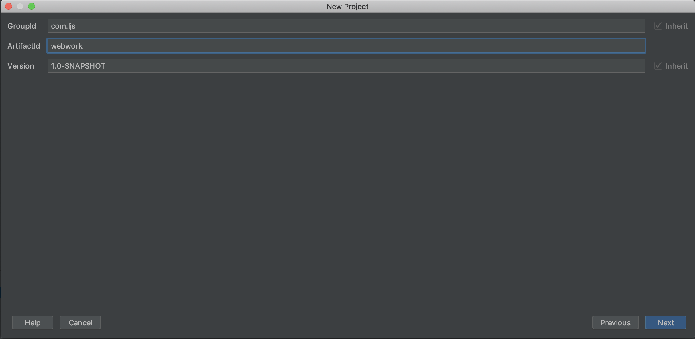
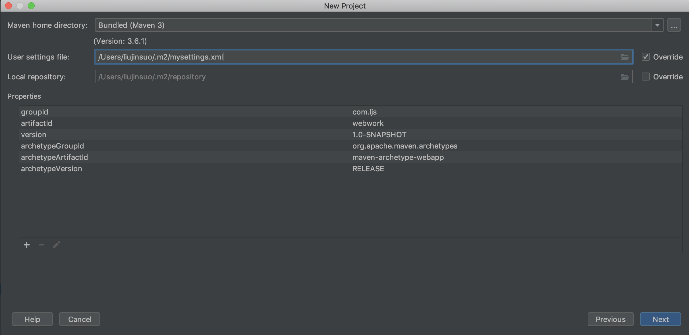
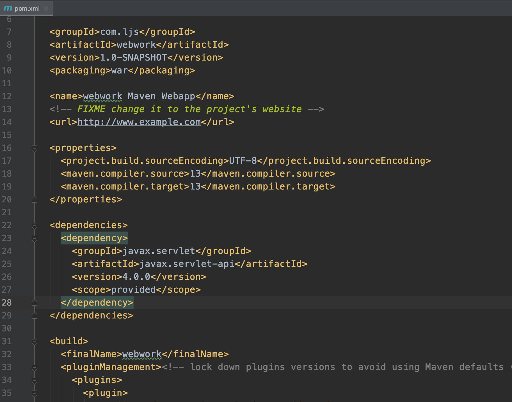
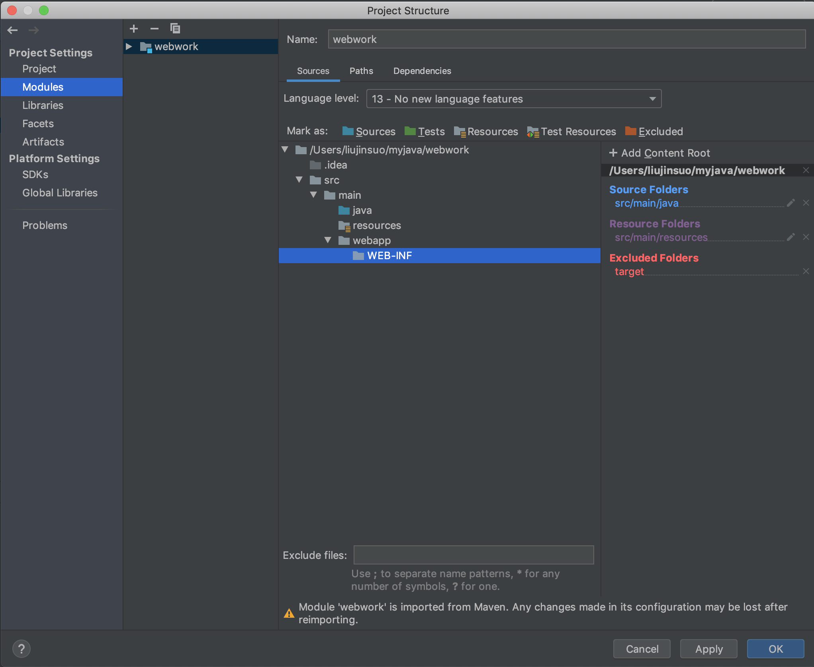
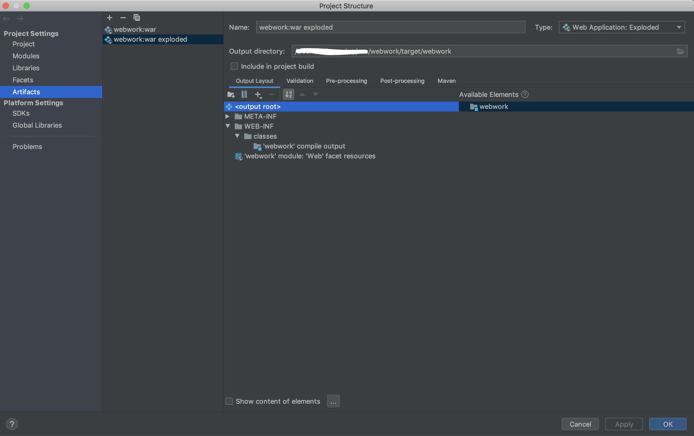
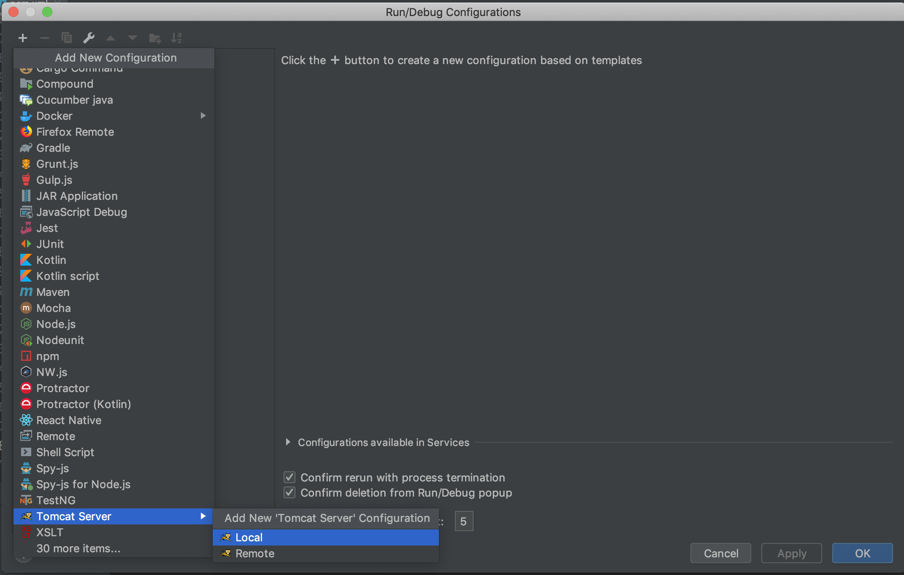
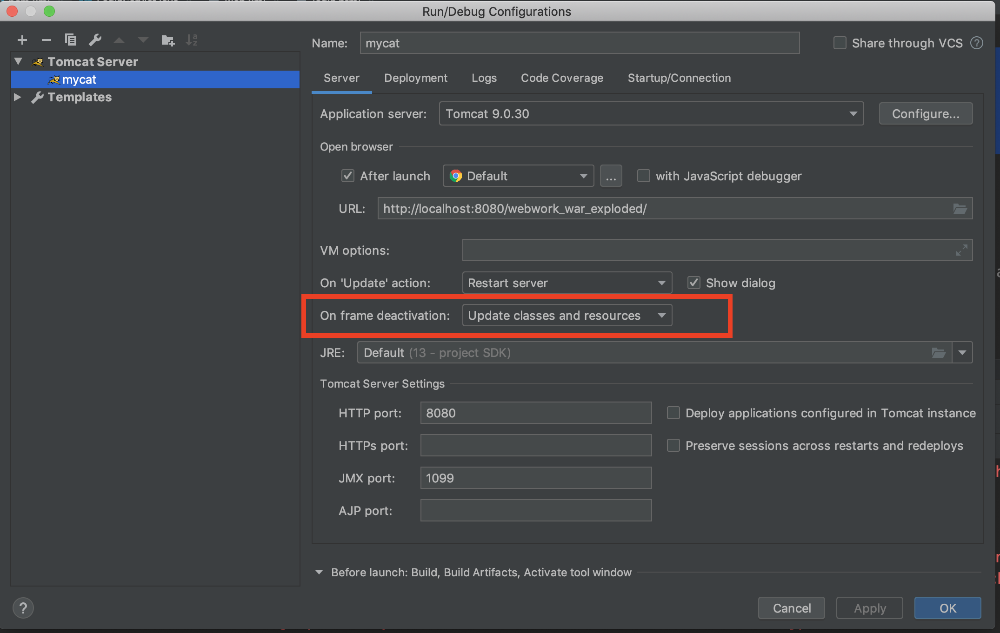
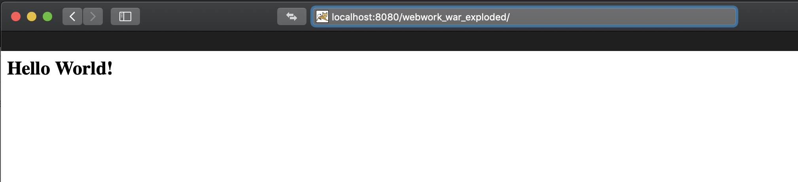

## 使用idea+maven+tomcat创建web工程
- 选择maven工程 
    - 
- 创建工程
    - 
    - 
    - 

- 修改maven工程配置
    - `servlet`配置
        ```xml
        <dependency>
            <groupId>javax.servlet</groupId>
            <artifactId>javax.servlet-api</artifactId>
            <version>4.0.0</version>
            <scope>provided</scope>
        </dependency>
        ```
    - 

- 完善工程结构：
    - 添加路径：`main/java`， `main/resources`
        - 
    - 增加idea的目录设定
        - 

- 确认：facets
    - 

- 确认：artifacts
    - 

- **配置tomcat**：`Run--> Edit Configurations...`
    - 添加tomcat
        - 
    - 修改servet配置：tomcat名字，url等
        - 
    - 修改deployment，添加`artifacts`
        - 
        - 
        - 
    - 保存后重新进入`Run--> Edit Configurations...`，
        - 设定**debug模式**可以**动态编译**：`On frame dactivation: Update classes and resources`
        - 
- 启动tomcat
    - 
    - 

