<span id="catalog"></span>

### 目录---创建web工程
- [使用空maven工程创建web工程](#使用空maven工程创建web工程)
- [maven+tomcat创建web工程--已废弃](#maven+tomcat创建web工程)

# 使用空maven工程创建web工程
[top](#catalog)
1. 创建空的 maven 工程
    - 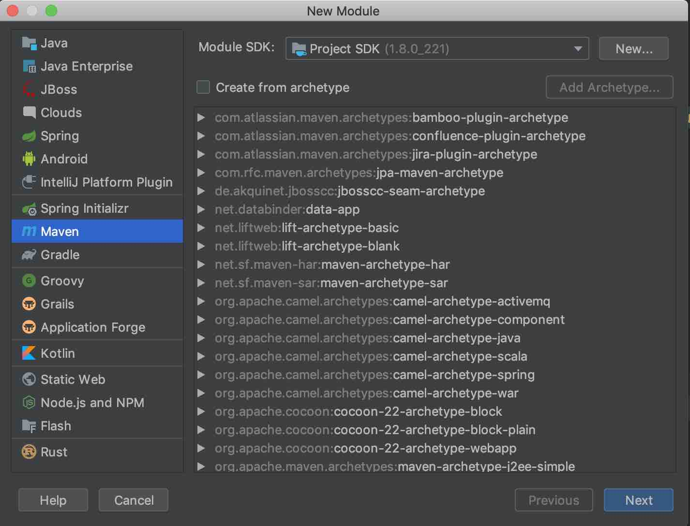
2. 添加框架支持
    - 在 `Module` 右键选择 `Add FrameWork Support`
        - 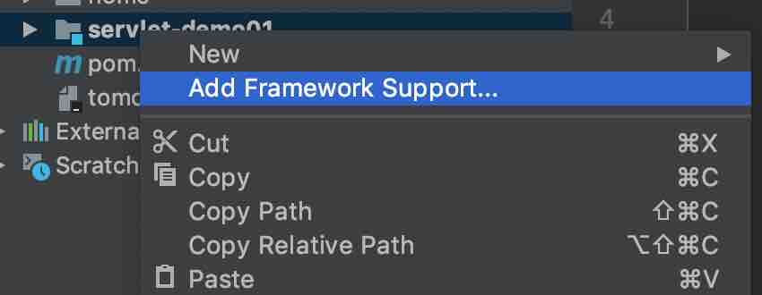
    - 在 javaEE 下选择 `Web Application`
        - 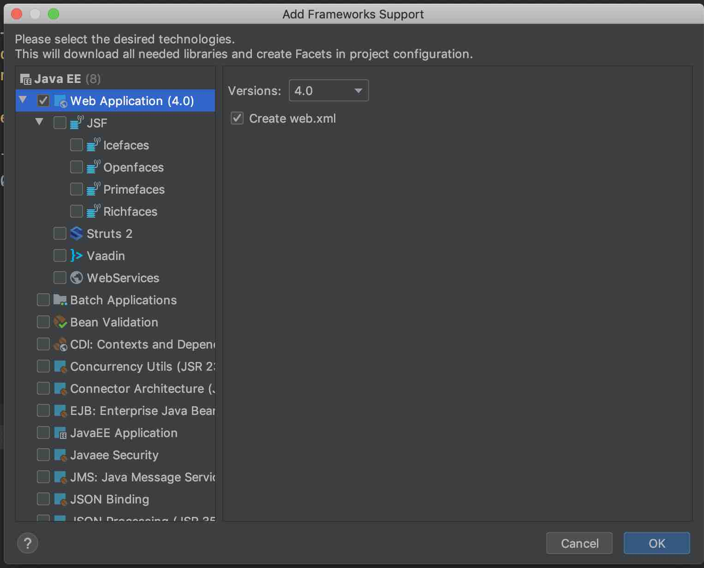
    - 添加框架支持后，会自动添加 `web/` 目录
3. 完整的项目结构
    - 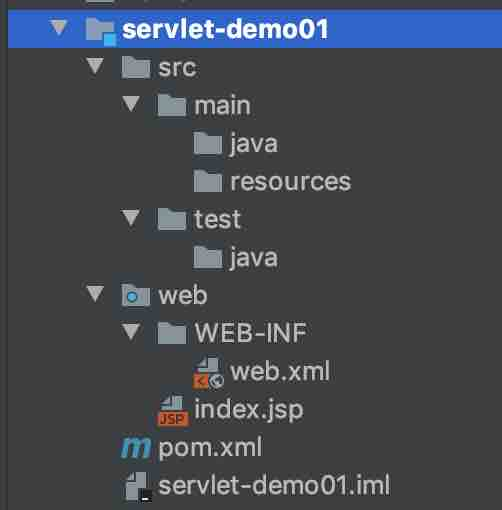
4. 添加启动配置
    - 选择 `Edit Configuration`
        - 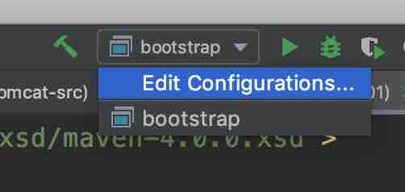
    - 添加一个 `tomcat` 配置
        - 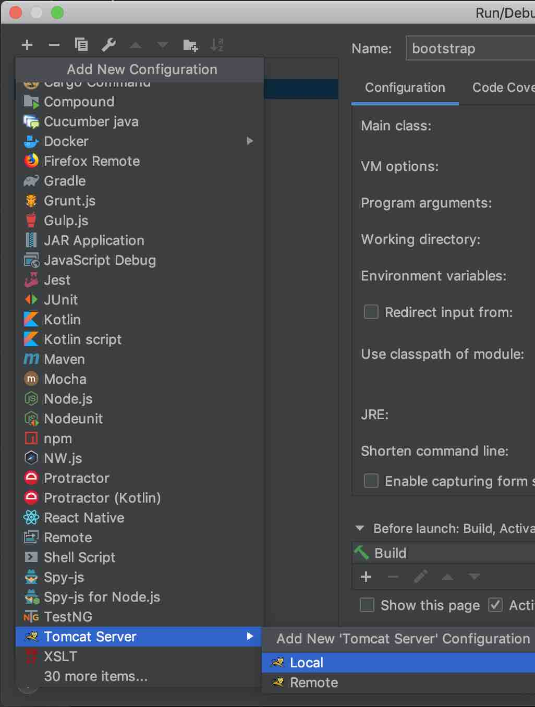
        - 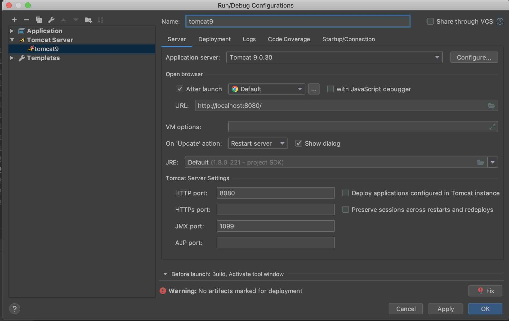
    - 向 `tomcat` 中添加项目
        - 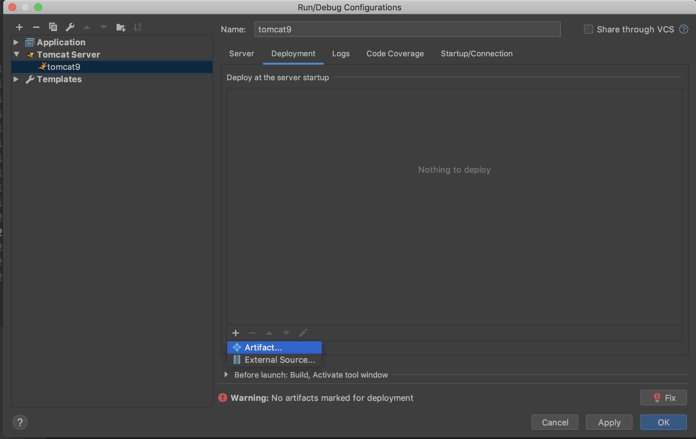
        - 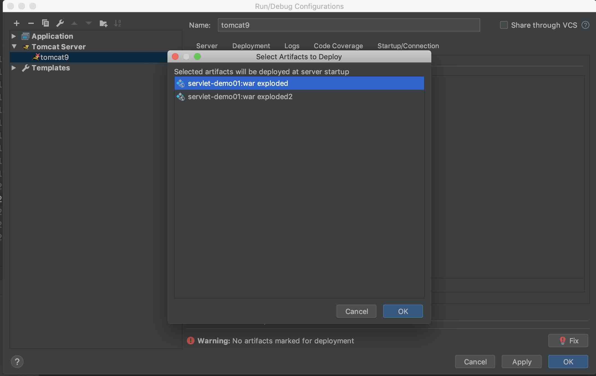
5. 添加 `maven` 配置
    ```xml
    <dependency>
        <groupId>javax.servlet</groupId>
        <artifactId>javax.servlet-api</artifactId>
        <version>4.0.0</version>
        <scope>provided</scope>
    </dependency>
    ```
6. 检查 `maven` 项目有没有被忽略。如果被忽略，会导包失败
    - 通过 `Setting` 打开
    - 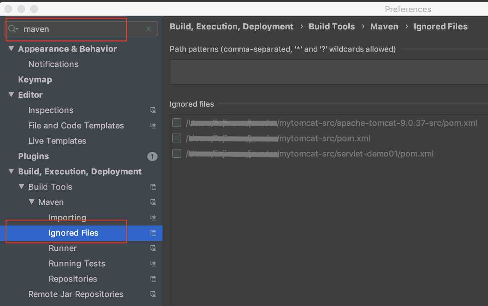

# maven+tomcat创建web工程
[top](#catalog)
1. 选择maven工程 
    - 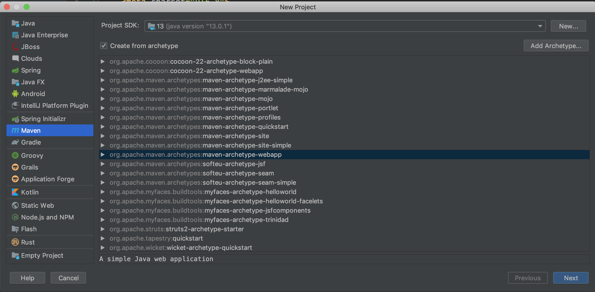
2. 创建工程
    - 
    - 
    - 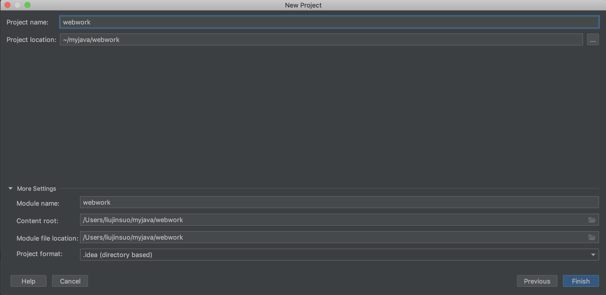

3. 修改maven工程配置
    - `servlet`配置
        ```xml
        <dependency>
            <groupId>javax.servlet</groupId>
            <artifactId>javax.servlet-api</artifactId>
            <version>4.0.0</version>
            <scope>provided</scope>
        </dependency>
        ```
    - 

4. 完善工程结构：
    - 添加路径：`main/java`， `main/resources`
        - 
    - 增加idea的目录设定
        - 

5. 确认：facets
    - 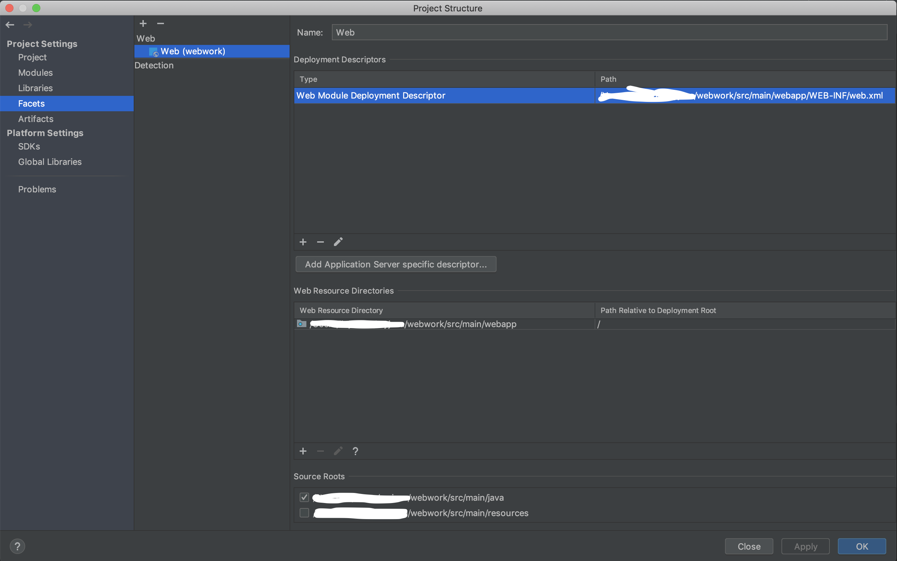

6. 确认：artifacts
    - 

7. **配置tomcat**：`Run--> Edit Configurations...`
    - 添加tomcat
        - 
    - 修改servet配置：tomcat名字，url等
        - 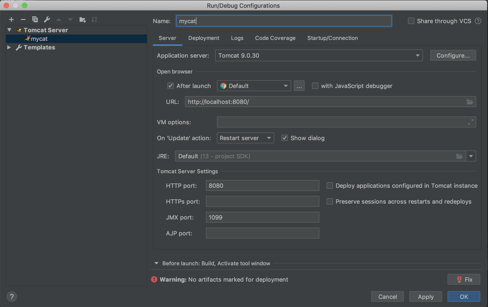
    - 修改deployment，添加`artifacts`
        - 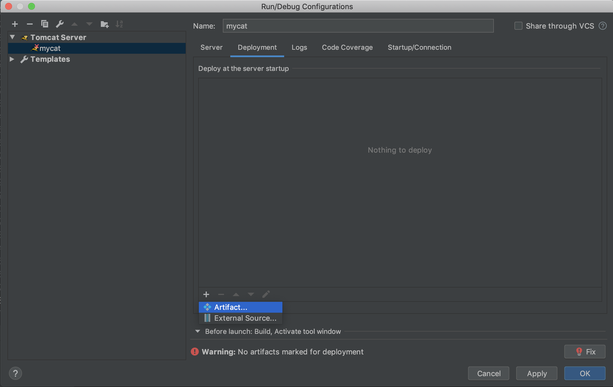
        - 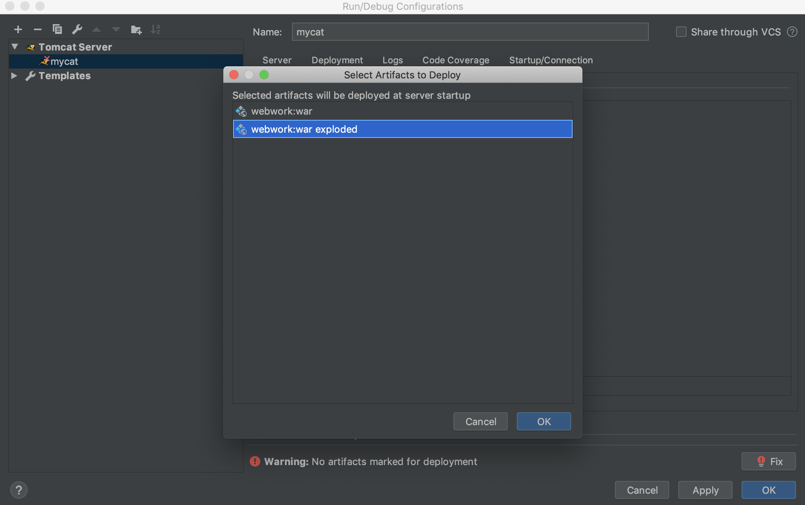
        - 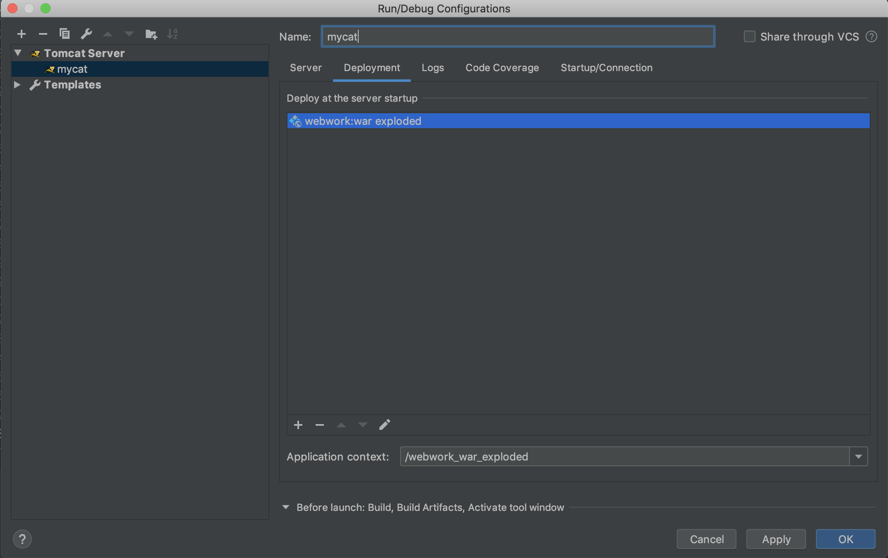
    - 保存后重新进入`Run--> Edit Configurations...`，
        - 设定**debug模式**可以**动态编译**：`On frame dactivation: Update classes and resources`
        - 
8. 启动tomcat
    - 
    - 

