内容整理自：https://www.bilibili.com/video/av21367011

<span id="catalog"></span>

### 目录
- [JavaWeb应用的概念](#javaWeb应用的概念)
- [web应用开发环境](#web应用开发环境)
    - [Tomcat](#tomcat)
    - [web程序结构](#web程序结构)
- [Servlet简介](#servlet简介)
    - [Servlet的基本概念](#servlet的基本概念)
    - [Servlet容器的基本概念](#servlet容器的基本概念)
- [web.xml的配置方法](#web.xml的配置方法)
    - [配置当前web应用的初始化参数](#配置当前web应用的初始化参数)
    - [配置Servlet或JSP](#配置Servlet或JSP)
    - [配置Filter过滤器](#配置Filter过滤器)
    - [配置监听器Listener](#配置监听器Listener)
    - [配置错误的响应页面](#配置错误的响应页面)
    - [配置示例](#配置示例)
- [Servlet的使用](#Servlet的使用)
    - [Servlet的maven依赖](#Servlet的maven依赖)
    - [编写一个Servlet示例](#编写一个servlet示例)
    - [Servlet接口方法](#Servlet接口方法)
    - [Servlet容器响应客户请求的过程](#servlet容器响应客户请求的过程)
    - [ServletConfig接口与Servlet配置](#servletconfig接口与servlet配置)
    - [ServletContext接口与容器全局配置](#servletcontext接口与容器全局配置)
    - [处理客户端请求](#处理客户端请求)
    - [ServletRequest接口](#ServletRequest接口)
    - [ServletResponse接口](#ServletResponse接口)
    - [Request和Response的包装类HttpServletXXXXXWrapper](#Request和Response的包装类HttpServletXXXXXWrapper)
    - [抽象类GenericServlet](#抽象类GenericServlet)
        - [自定义Servlet抽象类MyGenericServlet](#自定义Servlet抽象类MyGenericServlet)
        - [使用GenericServlet](#使用GenericServlet)
        - [GenericServlet的简单示例](#GenericServlet的简单示例)
    - [抽象类HttpServlet](#抽象类HttpServlet)
    - [Servlet的综合使用](#Servlet的综合使用)
- [JSP](#JSP)
    - [JSP的起源](#JSP的起源)
    - [JSP的基本知识](#JSP的基本知识)
    - [JSP的运行原理](#JSP的运行原理)
    - [JSP的9个隐式对象](#JSP的9个隐式对象)
    - [JSP基本语法](#JSP基本语法)
        - [1.JSP基本语法-JSP模版元素](#1.JSP基本语法-JSP模版元素)
        - [2.JSP基本语法-JSP表达式](#2.JSP基本语法-JSP表达式)
        - [3.JSP基本语法-JSP脚本片段](#3.JSP基本语法-JSP脚本片段)
        - [4.JSP基本语法-JSP声明](#4.JSP基本语法-JSP声明)
        - [5.JSP基本语法-JSP注释](#5.JSP基本语法-JSP注释)
    - [JSP域对象的属性作用范围](#JSP域对象的属性作用范围)
    - [JSP指令](#JSP指令)
        - [JSP指令-JSP指令简介](#JSP指令-JSP指令简介)
        - [JSP指令-page指令](#JSP指令-page指令)
        - [JSP指令-include指令](#JSP指令-include指令)
    - [JSP标签](#JSP标签)
        - [1.JSP标签-基本概念](#1.JSP标签-基本概念)
        - [2.JSP标签-\<jsp:include\>](#2.JSP标签-<jsp:include>)
        - [3.JSP标签-\<jsp:forward\>](#3.JSP标签-<jsp:forward>)
    - [异常页面的配置](#异常页面的配置)
    - [解决jsp中文乱码问题](#解决jsp中文乱码问题)
    - [在JSP中使用JavaBean(开发中很少使用)](#在JSP中使用JavaBean)
- [转发重定向](#转发重定向)
    - [forward和redirect的四种区别](#forward和redirect的四种区别)
    - [转发的流程示意图](#转发的流程示意图)
    - [重定向的流程示意图](#重定向的流程示意图)
    - [Servlet中的转发重定向方法](#Servlet中的转发重定向方法)
- [MVC设计模式](#MVC设计模式)
    - [MVC模式的架构演进](#MVC模式的架构演进)
    - [MVC的概念](#MVC的概念)
    - [MVC示例](#MVC示例)
    - [使用JSTL来简化MVC架构中的JSP页面](#使用JSTL来简化MVC架构中的JSP页面)
- [维持会话](#维持会话)
    - [会话的基本知识](#会话的基本知识)
    - [Cookie](#Cookie)
        - [Cookie机制](#Cookie机制)
        - [JavaWeb中Cookie的基本使用方法](#JavaWeb中Cookie的基本使用方法)
        - [Cookie的作用域](#Cookie的作用域)
        - [示例-利用Cookie完成自动登陆](#示例-利用Cookie完成自动登陆)
        - [示例-利用Cookie显示最近浏览的商品](#示例-利用Cookie显示最近浏览的商品)
    - [Session](#Session)
        - [Session机制](#Session机制)
        - [SessionCookie](#SessionCookie)
        - [HttpSession接口中的常用方法](#HttpSession接口中的常用方法)
        - [HttpSession的生命周期](#HttpSession的生命周期)
        - [Session避免表单的重复提交](#Session避免表单的重复提交)
        - [利用Session实现一次性验证码](#利用Session实现一次性验证码)
- [EL表达式](#EL表达式)
    - [EL的基本知识](#EL的基本知识)
    - [EL的基本语法](#EL的基本语法)
    - [EL运算符](#EL运算符)
    - [EL隐含对象](#EL隐含对象)
    - [EL函数](#EL函数)
- [自定义标签](#自定义标签)
    - [为什么需要自定义标签](#为什么需要自定义标签)
    - [自定义标签的简介](#自定义标签的简介)
    - [简单标签的SimpleTag接口](#简单标签的SimpleTag接口)
    - [标签库描述文件tld](#标签库描述文件tld)
    - [自定义标签的基本开发步骤](#自定义标签的基本开发步骤)
    - [SimpleTag实现类、tld文件、JSP文件之间的配合](#SimpleTag实现类、tld文件、JSP文件之间的配合)
    - [示例-使用SimpleTag接口开发一个空标签](#示例-使用SimpleTag接口开发一个空标签)
    - [示例-使用SimpleTag接口开发一个带属性的空标签](#示例-使用SimpleTag接口开发一个带属性的空标签)
    - [使用辅助类SimpleTagSupport来提高标签开发效率](#使用辅助类SimpleTagSupport来提高标签开发效率)
    - [示例-使用SimpleTagSupport开发带属性的空标签](#示例-使用SimpleTagSupport开发带属性的空标签)
    - [开发带有标签体的自定义标签](#开发带有标签体的自定义标签)
    - [示例-带有标签体的标签-循环打印集合](#示例-带有标签体的标签-循环打印集合)
    - [开发具有父子关系标签的方法](#开发具有父子关系标签的方法)
    - [示例-父子关系标签](#示例-父子关系标签)
- [JSTL](#JSTL)
    - [JSTL需要的maven支持](#JSTL需要的maven支持)
    - [JSTL简介](#JSTL简介)
    - [JSTL核心标签库](#JSTL核心标签库)
        - [JSTL核心标签库-简介](#JSTL核心标签库-简介)
        - [JSTL核心标签库-基本输入输出](#JSTL核心标签库-基本输入输出)
        - [JSTL核心标签库-流程控制](#JSTL核心标签库-流程控制)
        - [JSTL核心标签库-迭代操作](#JSTL核心标签库-迭代操作)
        - [JSTL核心标签库-URL操作](#JSTL核心标签库-URL操作)
- [Filter过滤器](#Filter过滤器)
    - [Filter过滤器简介](#Filter过滤器简介)
    - [Filter程序的开发](#Filter程序的开发)
        - [如何创建并运行一个Filter类](#如何创建并运行一个Filter类)
        - [Filter组件-Filter接口](#Filter组件-Filter接口)
        - [Filter组件-FilterConfig接口](#Filter组件-FilterConfig接口)
        - [Filter组件-FilterChain接口对象](#Filter组件-FilterChain接口对象)
    - [Filter链的执行顺序](#Filter链的执行顺序)
    - [示例-使用Filter链拦截登录](#示例-使用Filter链拦截登录)
    - [自定义HttpFilter来提高开发效率](#自定义HttpFilter来提高开发效率)
    - [Filter配置的dispatcher节点](#Filter配置的dispatcher节点)
    - [Filter的应用-字符编码过滤器](#Filter的应用-字符编码过滤器)
    - [Filter的应用-使浏览器不缓存页面的过滤器](#Filter的应用-使浏览器不缓存页面的过滤器)
    - [Filter的应用-Filter权限控制](#Filter的应用-Filter权限控制)
    - [Filter应用-为过滤字符](#Filter应用-为过滤字符)
- [Servlet监听器Listener](#Servlet监听器Listener)
    - [Servlet监听器简介](#Servlet监听器简介)
    - [编写监听器的步骤](#编写监听器的步骤)
    - [创建销毁监听器接口分析](#创建销毁监听器接口分析)
    - [属性修改监听器分析](#属性修改监听器分析)
    - [感知Session绑定的事件监听器](#感知Session绑定的事件监听器)
        - [两种监听接口](#两种监听接口)
        - [HttpSessionBingdingListener接口](#HttpSessionBingdingListener接口)
        - [HttpSessionActivationListener接口](#HttpSessionActivationListener接口)
- [JavaWeb开发中的路径问题](#JavaWeb开发中的路径问题)
- [其他](#其他)
- [](#)
- [](#)
- [](#)
- [](#)

# JavaWeb应用的概念
[top](#catalog)
- 在Sun的`Java Servlet规范`中，JavaWeb的定义
    - javaWeb应用由一组`Servlet`，`HTML页`，`类`，以及其他`可以被绑定的资源`构成的运行在web服务器上的完整应用
    - 可以运行在各种提供商提供的**实现Servlet规范的Servlet容器**中**运行**
- JavaWeb应用中可以包含的内容
    - Servlet
    - JSP
    - 实用类
    - 静态文档：图片、HTML等
    - 描述Web应用的信息
        - web.xml
- JavaWeb在代码层面的工作主要是：**在Servlet容器中写JSP和Servlet**

# web应用开发环境
## Tomcat
[top](#catalog)
- 一个免费开源的Servlet容器
- Tomcat的目录结构
    - bin：存放启动和关闭Tomcat的脚本文件
    - conf：存放Tomcat服务器的各种配置文件
    - lib：存放Tomcat服务器和所有web应用程序需要访问的jar文件
    - logs：存放Tomcat的日志
    - temp：存放Tomcat运行时产生的临时文件
    - webapps：当发布web应用程序时，通常把web应用程序的目录及文件放到这个目录下
    - work：Tomcat将JSP生成的Servle源文件和字节码文件放到这个目录下

- 使用方法
    - 下载：`https://tomcat.apache.org/download-90.cgi`
    - 解压
    - 运行Tomcat
        - 配置JAVA_HOME，bin的上层目录
        - 启动`bin/startup.sh`
            - 如果已经启动了一个Tomcat应用，会抛出一个异常，因为端口已经被占用了
        - 在浏览器中输入地址：`localhost:8080`
        - 使用`bin/shutdown.sh`关闭
    - 修改Tomcat默认端口号
        - `apache-tomcat-9.0.30/conf/server.xml`，修改`port`属性
            ```xml
            <Connector port="8080" protocol="HTTP/1.1"
               connectionTimeout="20000"
               redirectPort="8443" />
            ```
    - 为了在任意目录下使用过Tomcat服务器
        - 把`.../bin`目录添加到环境变量
- 环境配置
    - 配置环境变量
        ```xml
        #tomcat
        export CATALINA_HOME=$HOME/apache-tomcat-9.0.30
        export PATH=$PATH:$CATALINA_HOME/bin
        ```
    - 配置后可以在任何目录下通过startup.bat、shutdown.bat来启动关闭tomcat
    - 实际启动服务器的是catalina.bat
    - window下还可以使用catalina指令/其他系统使用catalina.sh

- catalina命令
    - run：在同一个命令行窗口下启动服务器
        - 通过`ctrl+c`、`control+c` 来关闭服务器
    - start：开启一个新的窗口，并启动服务器
    - stop：开启一个新的窗口，并关闭服务器

- **管理程序**
    - `manager`，用于管理部署到Tomcat服务器中的web应用程序
        - 在`localhost:8080`页面点击`manager app`，需要登录，取消会401
        - 添加管理账号，修改配置文件：`apache-tomcat-9.0.30/conf/tomcat-users.xml`

        ```xml
        <role rolename="manager-gui"/>
        <user username="tomcat" password="tomcat" roles="manager-gui"/>
        ```

- 自动拷贝web应用资源到webapps
    - 在conf目录下一次创建apache-tomcat-9.0.30/conf/catalina/localhost目录
    - 在localhost目录下为自定义应用程序建立对应的xml文件，并添加映射内容
        ```xml
        <?xml version="1.0" encoding="UTF-8" ?>
        <Context path="访问时的虚拟路径(没什么用，可以不加)" docBase="编译后的web应用的物理目录" reloadable="修改时是否重新加载false/true" />
        ```
    - 访问路径为：localhost:8080/xml文件名/资源路径

## web程序结构
[top](#catalog)
- web应用程序：
    - 由一组Servlet、HTML页面、类、其他资源组成的运行在web服务器上的完整的应用程序
    - web应用程序的目录通常放在`webapps`目录下
        - 在`webapps`目录下
            - 每一个子目录=独立的web应用程序
            - 子目录名=web应用程序名=web应用程序的根
- 程序结构
    - xxxx 作为应用程序的根
        - WEB-INF 必须大写
            - classes 存放Servlet和其他有用的类文件 （编译后的class文件必须放在该目录下）
                - xxx.class
            - lib 存放web应用程序需要的jar包，jar中可以包含servlet、bean和其他有用的类文件
                - xxx.jar
                - yyy.jar
            - web.xml 包含web应用程序的配置和部署信息，不能为空否则应用无法使用。可以使用`apache-tomcat-9.0.30/webapps/doc`下的xml模版
        - jsp
        - html
        - 图片
        - txt
        - 等等

- <label style="color:red">WEB-INF中放的一般都是比较隐私的内容，不能直接被外部访问，**可以通过转发来访问**</label>

- 示例：`memobook/java/javaweb/mytest`
    - 目录结构
        - mytest
            - test.html
            - WEB-INF
                - classes
                - lib
                - web.xml
    - html的内容
        ```html
        <html>
        <body>
        <h2>Hello World!</h2>
        </body>
        </html>
        ```
    - 启动url：`http://localhost:8080/mytest/test.html`，会显示:`Hello World!`

- 开发时的设定
    1. 设置build path，将class文件生成到：`WEB-INF/classes`目录下
    2. 在`apache-tomcat-9.0.30/conf/catalina/localhost`目录下创建配置文件，来自动拷贝

        ```xml
        <?xml version="1.0" encoding="UTF-8" ?>
        <Context docBase="编译后的web应用的物理目录" reloadable="修改时是否重新加载false/true" />
        ```

# Servlet简介
## Servlet的基本概念
[top](#catalog)
- Java Servlet 是<label style="color:red">和平台无关的服务器端组件</label>，它**运行在Servlet容器中**(如tomcat)

- <label style="color:red">Servlet程序必须通过Servlet容器来启动运行，并且存储在：web应用程序目录`/WEB-INF/classes/`</label>
- <label style="color:red">Servlet程序必须在web应用程序的web.xml中进行注册和映射其访问路径。才可以被Servlet引擎加载和被外界访问</label>

- Servlet可以完成的功能
    - 创建并返回基于客户请求的动态HTML页面
    - 创建**可嵌入**到现有HTML页面中的**部分HTML页面(HTML片段)**
    - 与其他服务器资源进行通信，如：数据库、基于Java的应用程序


## Servlet容器的基本概念
[top](#catalog)
- Servlet容器的概念
    - 为JavaWeb应用提供运行时环境，它负责管理Servlet和JSP的生命周期，以及管理他们的共享数据
    - **Servlet容器也称为JavaWeb应用容器，或Servlet/JSP容器**
    - 主流的Servlet容器
        - Tomcat
        - Resin
        - JEE服务器中也提供了内置的Servlet容器

- **Servlet容器负责**：
    1. Servlet和客户端的通信，采用：`请求/响应`模式
    2. 运行Servlet、JSP、Filter等软件环境
    3. 调用Servlet的生命周期方法

- Servlet和Servlet容器
    - 关系示意图：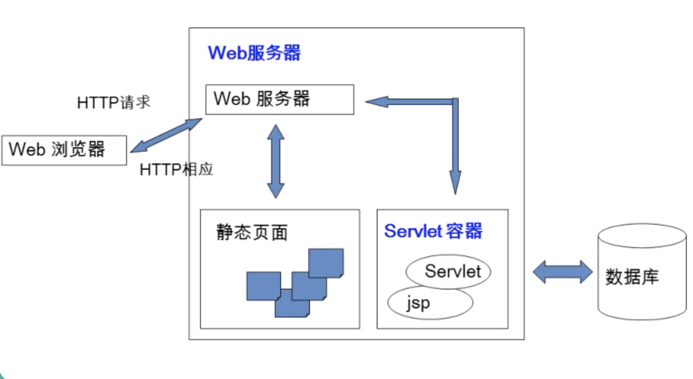
    - 示意图分析
        - 浏览器发送请求到web服务器
        - web服务器解析请求
            - 如果是请求动态资源，如动态页面等，需要到**Servlet容器**中去找`Servlet`或`JSP`
                - `JSP`运行在`Servlet容器`中
                    - Servlet可能会访问数据库服务器
                    - 访问结果发给jsp
                    - jsp再生成结果
            - 如果是静态页面，包括图片、HTML等，则直接找到并返回

- Servlet容器响应客户请求的过程
    ```
        --->请求--->           --->ServletRequest--->
    客户            Serlvet容器                         Servlet
        <---响应 <---           <---ServletResponse<--
    ```

# web.xml的配置方法
## 配置当前web应用的初始化参数
[top](#catalog)
- `<context-param>`
    - `<param-name>`，初始化参数的参数名
    - `<param-value>`，初始化参数的参数值

## 配置Servlet或JSP
[top](#catalog)
- 配置Servlet节点
    - `<servlet>`，注册一个Servlet节点
        - `<servlet-name>`，注册Servlet节点的名称
        - `<servlet-class>`，Servlet所在的完整类名，如果是一个Servlet类
        - `<jsp-file>`，注册JSP为Servlet节点，如果是一个JSP页面
        - `<init-param>`，该Servlet的初始化参数，有多个初始化参数时，需要有多个`<init-param>`
            - `<param-name>`，初始化参数的参数名
            - `<param-value>`，初始化参数的参数值
        - `load-on-startup`，指定创建Servlet实例的时间
            - 负数/未设定：第一次请求时创建
            - 0或整数：启动Servlet容器时创建
                - 数值越小，越早被创建
    - `<servlet-mapping>`，映射一个已注册的Servlet节点的**外部访问路径**
        - `<servlet-name>`，指定Servlet节点的名称
        - `<url-pattern>`，Servlet节点的外部访问路径

- Servlet映射的细节
    - 同一个Servlet可以被映射到多个URL上，即多个`<servlet-mapping>`中的`<servlet-name>`可以指向同一个Servlet的注册名称
    - `*` 与 `/`
        - `*.扩展名`，`*`作为通配符来使用
            - 如`*.html`，那么所有相关的路径如：`localhost:8080/xxx.html`都会有这一个Servlet来处理
        - `/`
            - 只匹配路径类型的url
            - '/'代表当前web应用的根目录，相当于：`localhost:8080/应用名/`
            - 如`localhost:8080/app/hello`
        - `/*`
            - '/'代表当前web应用的根目录，相当于：`localhost:8080/应用名/`
            - 匹配 路径型url 、 带后缀的url、 带参数的路径

    - 如果映射的URL为：`/*.html`，启动Servlet容器时会产生异常
        - 即 `/`和`*`不能共存

## 配置Filter过滤器
[top](#catalog)
- 配置方法基本上与Servlet类似
- 配置Filter节点
    - `<filter>`
        - `<filter-name>`，节点名
        - `<filter-class>`，节点对应的Filter类的全类名
        - `<init-param>`， 配置Filter对象的初始化参数
            - `<param-name>`， 初始化参数名
            - `<param-value>`， 初始化参数值
     </init-param>
- 配置Filter节点的映射
    - `<filter-mapping>`
        - `<filter-name>`，映射的节点名
        - `<url-pattern>`，配置需要拦截的url，即那些url可以访问到该Filter
        - `<dispatcher>`指定过滤器所拦截的资源被Servlet容器调用的方法
            - 可以是以下4种，默认是`request`
                1. REQUEST，请求
                    - 通过GET或POST请求访问时，过滤器会被调用
                2. INCLUDE，使用的比较小
                    - 只有当目标资源是通过`RequestDispatcher.include()`访问时，过滤器会被调用
                3. FORWARD，转发
                    - `<jsp:forward>`
                    - JSP页面中配置的异常页面被触发时，是通过转发进行跳转
                    - 调用`RequestDispatcher.forward()`
                4. ERROR
                    - 如果目标资源是通过声明式异常处理机制调用时，过滤器会被调用
                        - 即通过web.xml进行配置的异常页面
                    - **路径需要和`<error-page>`下`<location>`中的路径相同**
            - 可以设置多个`<dispatcher>`子元素来指定Filter对资源的多种调用方式进行拦截


- Filter配置的细节
    - 一个Filter节点可以对应多个Filter映射
    - <label style="color:red">多个拦截相同url的Filter映射会自动构成Filter链，并且：`<filter-mapping>`的顺序决定了整个Filter链的顺序</label>
    
## 配置监听器Listener
[top](#catalog)
- 可以配置的两类Servlet监听器
    - 域对象`创建`、`销毁`的事件监听器
    - 域对象`属性的添加和删除`的事件监听器

- 配置方法
    - `<listener>`
        - `<listener-class>`，监听器类的全类名


## 配置错误的响应页面
[top](#catalog)
- 指定出错的代码
    - `<error-page>`
        - `<error-code>`，http的错误代码
        - `</error-type>`，java中的异常类型
        - `<location>`，响应页面的路径

- 出现异常后，虽然跳转到了指定的`error-page`，实际看到的url仍然是请求的url，是请求的目标被替换了，内部没有使用转发

- ~~如果响应页面的路径为：`/WEB-INF/xxx.jsp`，则**不能使用**jsp中的`exception`对象~~

## 配置示例
[top](#catalog)

```xml
<!--1. 配置当前web应用的初始化参数-->
<context-param>
    <param-name>user</param-name>
    <param-value>1234</param-value>
</context-param>
<context-param>
    <param-name>password</param-name>
    <param-value>qwer</param-value>
</context-param>

<!--2. 配置和映射servlet-->
<!-- 配置一个Servlet类 -->
<servlet>
    <!--注册Servlet的名字-->
    <servlet-name>helloServlet</servlet-name>
    <!--Servlet的全类名-->
    <servlet-class>com.ljs.test.HelloServlet</servlet-class>
    <!--配置创建Servlet实例的时间-->
    <load-on-startup>5</load-on-startup>

    <!--配置Servlet的初始化参数-->
    <init-param>
        <!--参数名-->
        <param-name>user</param-name>
        <!--参数值-->
        <param-value>root</param-value>
    </init-param>
</servlet>
<servlet-mapping>
    <!--需要和某个servlet节点的servlet-name相同-->
    <servlet-name>helloServlet</servlet-name>
    <!--'/'代表当前web应用的根目录,启动后通过localhost:8080/hs调用-->
    <url-pattern>/hs</url-pattern>
</servlet-mapping>


<!--3. 将JSP文件配置为Servlet-->
<servlet>
    <servlet-name>hellojsp</servlet-name>
    <jsp-file>/hello.jsp</jsp-file>
    <init-param>
        <param-name>test</param-name>
        <param-value>testValue</param-value>
    </init-param>
</servlet>

<servlet-mapping>
    <servlet-name>hellojsp</servlet-name>
    <url-pattern>/hellojsp</url-pattern>
</servlet-mapping>

<!--4. 异常页面配置-->
<error-page>
    <error-code>404</error-code>
    <location>/error.jsp</location>
</error-page>

<error-page>
    <error-type>...</error-type>
    <location>/error.jsp</location>
</error-page>

<!-- 5. 配置两个Filter，拦截同一个请求，构成一各Filter链 -->

<!--注册Filter-->
<!--创建一个个Filter节点-->
<filter>
    <filter-name>helloFilter</filter-name>
    <filter-class>com.ljs.test.filter.introduct.HelloFilter</filter-class>
    <!-- 配置初始化参数 -->
    <init-param>
       <param-name>name</param-name>
       <param-value>root</param-value>
     </init-param>
</filter>
<!-- 配置Filter节点的映射 -->
<filter-mapping>
    <filter-name>helloFilter</filter-name>
    <!--配置需要拦截的url-->
    <url-pattern>/filter/introduct/test.jsp</url-pattern>
</filter-mapping>

<filter>
    <filter-name>secondFilter</filter-name>
    <filter-class>com.ljs.test.filter.introduct.SecondFilter</filter-class>
</filter>

<!--配置Filter节点的映射-->
<!--配置多个拦截相同url的filter映射，来构成一个filter链-->
<filter-mapping>
    <filter-name>secondFilter</filter-name>
    <url-pattern>/filter/introduct/test.jsp</url-pattern>
</filter-mapping>

<!--6. Filter 的 dispatcher 配置测试-->
<filter>
    <filter-name>testPatcherFilter</filter-name>
    <filter-class>com.ljs.test.filter.dispatcher.TestPatcherFilter</filter-class>
</filter>

<filter-mapping>
    <filter-name>testPatcherFilter</filter-name>
    <url-pattern>/filter/dispatcher/test.jsp</url-pattern>
    <dispatcher>REQUEST</dispatcher>
    <dispatcher>FORWARD</dispatcher>
</filter-mapping>

<!--7. 配置error页面 Filter的dispatcher-->
<!-- 7.1配置异常页面 -->
<error-page>
    <exception-type>java.lang.ArithmeticException</exception-type>
    <location>/WEB-INF/error.jsp</location>
</error-page>
<!--7.2 配置显示声明error的Filter-->
<filter-mapping>
    <filter-name>testPatcherFilter</filter-name>
    <!-- 路径需要和 error-page的location中的路径相同 -->
    <url-pattern>/WEB-INF/error.jsp</url-pattern> 
    <dispatcher>ERROR</dispatcher>
</filter-mapping>

<!-- 8. 配置监听器 -->
<listener>
<listener-c lass>com.ljs.test.listener.introduct.HelloServletContextListener</listener-class>
</listener>
```


# Servlet的使用
## Servlet的maven依赖
[top](#catalog)
```xml
<dependency>
    <groupId>javax.servlet</groupId>
    <artifactId>javax.servlet-api</artifactId>
    <version>4.0.0</version>
    <scope>provided</scope>
</dependency>
```

## 编写一个Servlet示例
[top](#catalog)
- HelloServlet.java，`Servlet`接口的实现类 : [/java/mylearn/weblearn/src/main/java/com/ljs/test/HelloServlet.java](/java/mylearn/weblearn/src/main/java/com/ljs/test/HelloServlet.java)
    ```java
    public class HelloServlet implements Servlet {
        public HelloServlet() {
            System.out.println("HelloServlet constructor");
        }

        public void init(ServletConfig servletConfig) throws ServletException {
            System.out.println("init");
        }

        public ServletConfig getServletConfig() {
            System.out.println("getServletConfig");
            return null;
        }

        public void service(ServletRequest servletRequest, ServletResponse servletResponse) throws ServletException, IOException {
            System.out.println("service");
        }

        public String getServletInfo() {
            System.out.println("getServletInfo");
            return null;
        }

        public void destroy() {
            System.out.println("destroy");
        }
    }
    ```

- 将HelloServlet配置到`web.xml`
    - **一个节点与多个映射，映射的结果就是实际的url**
    ```xml
    <web-app>
        <display-name>Archetype Created Web Application</display-name>
        <!--配置和映射servlet-->

        <!--配置一个servlet节点-->
        <servlet>
            <!--注册Servlet的名字-->
            <servlet-name>helloServlet</servlet-name>
            <!--Servlet的全类名-->
            <servlet-class>com.ljs.test.HelloServlet</servlet-class>
        </servlet>

        <!--映射-->
        <servlet-mapping>
            <!--需要和某个servlet节点的servlet-name相同-->
            <servlet-name>helloServlet</servlet-name>
            <!--'/'代表当前web应用的根目录,启动后通过localhost:8080/hs调用-->
            <url-pattern>/hs</url-pattern>
        </servlet-mapping>
    </web-app>
    ```
- 输出内容
    - 进入localhost:8080/应用名/hs：
        - 第一次进入：HelloServlet constructor、init、service、service(两次???)
        - 再次进入：service
    - 关闭tomcat：destroy

## Servlet接口方法
[top](#catalog)
- 接口方法
    ```java
    public interface Servlet {
        public void init(ServletConfig config) throws ServletException;
        
        public ServletConfig getServletConfig();

        public void service(ServletRequest req, ServletResponse res) throws ServletException, IOException;
        
        public String getServletInfo();
        
        public void destroy();
    }
    ```

- 生命周期相关方法：全部由Servlet容器负责调用
    1. 构造器：创建时间参考`load-on-startup`参数的设定，创建Servlet的实例，构造器只被调用一次
        - Servlet是单例的，所以**不建议在Servlet实现类中添加全局变量**
    2. init：只被调用一次，第一次请求时被调用，用于初始化当前Servlet
    3. service：被多次调用，**每次请求都会调用，实际用于响应请求**
    4. destory：只被调用一次，在当前Servlet所在的Web应用被卸载前调用，用于释放当前Servlet占用的资源

## Servlet容器响应客户请求的过程
[top](#catalog)
1. Servlet引擎检查是否已经装载并创建了Servlet的实例对象
    - 如果已创建，则执行4
    - 如果未创建，则执行2
2. 装载并创建了Servlet的示例对象：调用构造器
3. 调用Servlet实例对象的init()方法
4. 处理请求/响应
    - 创建一个用于**封装请求的ServletRequest对象**和一个**代表响应消息的ServletResponse对象**
    - 然后调用Servlet的service()方法并将请求和响应对象作为参数传递进去
5. Web应用程序被停止或重新启动之前，servlet引擎将卸载Servlet，并在卸载之前调用Servlet的destory()方法
  
## ServletConfig接口与Servlet配置
[top](#catalog)
- 封装了Servlet的配置信息，并且可以获取ServletConfig对象
    - 由具体的服务器提供商提供
- 通过ServletConfig对象可以获取当前Servlet对象在`web.xml`中配置的**Servlet初始化参数**
- 接口源码
    ```java
    public interface ServletConfig {
        // 获取servlet-name，使用的比较少
        String getServletName();
    
        // 获取Servlet容器的上下文对象
        ServletContext getServletContext();
        
        // 获取指定参数名的初始化参数
        String getInitParameter(String var1);
    
        // 获取参数名组成的`Enumeration`对象
        Enumeration<String> getInitParameterNames();
    }
    ```

- 示例
    - 配置Servlet的初始化参数
        ```xml
        <!--Servlet初始化参数-->
        <servlet>
            <servlet-name>paramInitServlet</servlet-name>
            <servlet-class>com.ljs.test.ParamInitServlet</servlet-class>
            
            <!--配置Servlet的初始化参数-->
            <init-param>
                <!--参数名-->
                <param-name>user</param-name>
                <!--参数值-->
                <param-value>root</param-value>
            </init-param>
            
            <init-param>
                <param-name>password</param-name>
                <param-value>1234</param-value>
            </init-param>
            
            <load-on-startup>1</load-on-startup>
        </servlet>
        
        <servlet-mapping>
            <servlet-name>paramInitServlet</servlet-name>
            <url-pattern>/pis</url-pattern>
        </servlet-mapping>
        ```

    - Servlet实现
        ```java
        public class ParamInitServlet implements Servlet {
            public ParamInitServlet() {
                System.out.println("ParamInitServlet");
            }
            

            @Override
            public void init(ServletConfig servletConfig) throws ServletException {
                System.out.println("ParamInitServlet init");

                //输出初始化参数
                System.out.println(servletConfig.getInitParameter("user"));
                servletConfig.getInitParameterNames()
                        .asIterator()
                        .forEachRemaining(
                                (name) -> System.out.println(name + ":" + servletConfig.getInitParameter(name))
                        );

                System.out.println(servletConfig.getServletName());
            }
            ....
        }
        ```

## ServletContext接口与容器全局配置
[top](#catalog)
- 在Servlet中：**一个web应用程 == 一个ServletContext对象**
    - 一个web应用程序中的**所有Servlet都共享一个ServletContext对象**
    -  ServletContext对象也被称为application对象(web应用程序对象)
    - 可以从该对象获取当前web应用的各种信息
- ServletContext对象被包含在ServletConfig对象中
    - 调用`ServletConfig.ServletContext()`方法可以返回一个ServletContext对象的引用
- ServletContext对象的功能
    - **获取web应用程序的初始化参数**
        - `String getInitParameter(String var1);`
    - 记录日志
    - application域范围的属性
    - 访问资源文件
    - **获取虚拟路径所映射的服务器路径**
        - `String getRealPath(String var1);`
    - web应用程序之间的访问
    - 获取当前web应用的名称
        - `String getContextPath();`
        - 可以通过该方法来动态的构造绝对路径
    - 获取当前web应用的某一个文件对应的输入流
        - `InputStream getResourceAsStream(String name)`
    - 获取attribute的相关信息
    - 其他方法
- 示例
    - 配置当前web应用的初始化参数
        ```xml
        <!--配置当前web应用的初始化参数-->
        <context-param>
            <param-name>driver</param-name>
            <param-value>con.mysql.jdbc.Driver</param-value>
        </context-param>

        <context-param>
            <param-name>jdbcUrl</param-name>
            <param-value>jdbc:mysq:127.0.0.1:3306</param-value>
        </context-param>
        ```
    - Servlet实现 : [/java/mylearn/weblearn/src/main/java/com/ljs/test/ParamInitServlet.java](/java/mylearn/weblearn/src/main/java/com/ljs/test/ParamInitServlet.java)
        ```java
        public class ParamInitServlet implements Servlet {
            public ParamInitServlet() {
                System.out.println("ParamInitServlet");
            }

            @Override
            public void init(ServletConfig servletConfig) throws ServletException {
                System.out.println("ParamInitServlet init");

                /*
                ServletConfig
                */
                //输出初始化参数
                System.out.println(servletConfig.getInitParameter("user"));
                servletConfig.getInitParameterNames()
                        .asIterator()
                        .forEachRemaining(
                                (name) -> System.out.println(name + ":" + servletConfig.getInitParameter(name))
                        );

                System.out.println(servletConfig.getServletName());

                /*
                ServletContext
                */
                //从ServletContext中获取当前web应用的初始化参数
                ServletContext context = servletConfig.getServletContext();

                //获取web应用的初始化参数
                System.out.println("driver : " + context.getInitParameter("driver"));
                context.getInitParameterNames()
                        .asIterator()
                        .forEachRemaining(
                                (name) -> System.out.println("initParam : " + name + ":" + context.getInitParameter(name))
                        );

                // 获取当前web应用的某一个文件在服务器上的绝对路径，不是部署前的路径
                String realPath = context.getRealPath("/mycode.png");
                System.out.println("realPath : " + realPath);

                // 获取当前web应用的名称
                String contextPath = context.getContextPath();
                System.out.println(contextPath);

                // 获取当前web应用的某一个文件对应的输入流
                // path 的/为当前web应用的根目录
                ClassLoader classLoader = getClass().getClassLoader();
                InputStream is = classLoader.getResourceAsStream("jdbc.properties");
                System.out.println("is = " + is);

                InputStream is2 = context.getResourceAsStream("WEB-INF/classes/jdbc.properties");
                System.out.println("is2 = " + is2);
            }

            @Override
            public ServletConfig getServletConfig() {
                System.out.println("ParamInitServlet getServletConfig");
                return null;
            }

            @Override
            public void service(ServletRequest servletRequest, ServletResponse servletResponse) throws ServletException, IOException {
                System.out.println("ParamInitServlet service");
            }

            @Override
            public String getServletInfo() {
                System.out.println("ParamInitServlet getServletInfo");
                return null;
            }

            @Override
            public void destroy() {
                System.out.println("ParamInitServlet destroy");
            }
        }
        ```

## 处理客户端请求
[top](#catalog)
- <label style="color:red">servlet的service()方法用于应答请求：每次请求都会调用service()</label>
    
    ```java
    public void service(ServletRequest servletRequest, 
                        ServletResponse servletResponse) 
    throws ServletException, IOException {
    ```

- 一般通过`ServletRequest`来获取请求参数
- 一般通过`ServletResponse`来输出服务器的响应
      
## ServletRequest接口
[top](#catalog)
- **服务器给予实现，并在服务器调用service方法时传入**
- 封装了请求信息，可以从中获取到任何的请求信息
- servletRequest 是由apache服务器提供的实现
    - 每次打印该对象都会输出:`org.apache.catalina.connector.RequestFacade@224ffe93`
- 关键方法
    - 获取参数
        - `public String getParameter(String name);`
            - 根据请求参数的名字，返回参数值
            - 如果目标参数具有多个值，如checkbox，通过getParameter只能获取到第一个值
        - `public String[] getParameterValues(String name);`
            - 如果目标参数具有多个值，如<label style="color:red">checkbox，使用该方法获取全部值</label>
        - `public Enumeration<String> getParameterNames();`       
            - 返回由参数名组成的Enumeration对象，类似于ServletConfig.getInitParameterNames
        - `public Map<String, String[]> getParameterMap();`
            - 返回请求参数的键值对，key=参数名，value=参数值（String[]类型）
    
- 常用子接口
    - HttpServletRequest
        - 封装了大量的获取http请求相关的方法
        - 使用时，需要进行强转
        - 常用方法
            - `public StringBuffer getRequestURL();`
                - 返回响应url，如：`http://localhost:8080/weblearn_war_exploded/loginServletHtml`
                - 获取的结果是表单action对应的servlet
                - 如果是get方式，获取的url中不会有请求参数，请求参数需要通过`getQueryString()`来获取
            - `public String getRequestURI();`
                - 返回uri：`/weblearn_war_exploded/loginServletHtml` (/站点信息--即工程名/servlet名)
                - 获取的结果是表单action对应的servlet
            - `public String getMethod();`
                - 获取请求方式：get、post等等
                
            - `public String getQueryString();`
                - 获取url中的请求字符串
                - post方式，获取的结果是：`null`
                - get方式，获取url`?`后的内容，如：`user=1111&password=222&interesting=game&interesting=sport`
            - `public String getServletPath();`
                - 获取请求的servlet的路径
                - 即配置中的：url-pattern
            - 和attribute相关的几个方法
                - 参考：[JSP域对象的属性作用范围](#JSP域对象的属性作用范围)

- 使用示例
    - [/java/mylearn/weblearn/src/main/webapp/myservlet/login.html](/java/mylearn/weblearn/src/main/webapp/myservlet/login.html)
        ```html
        <!DOCTYPE html>
        <html lang="en">
        <head>
            <meta charset="UTF-8">
            <title>Title</title>
        </head>
        <body>

        <!--http请求learn-->
        <!--action需要与配置中的url-pattern相同-->
        <form action="loginServletHtml" method="post">
        <!--<form action="loginServletHtml" method="get">-->

            <!--一个参数名对应一个参数-->
            user: <input type="text" name="user">
            password: <input type="password" name="password">

            <br/><br/>
            <!--一个参数名对应多个参数-->
            interesting:
            <input type="checkbox" name="interesting" value="reading"/>Reading
            <input type="checkbox" name="interesting" value="game"/>Game
            <input type="checkbox" name="interesting" value="party"/>party
            <input type="checkbox" name="interesting" value="shopping"/>Shopping
            <input type="checkbox" name="interesting" value="sport"/>Sport

            <input type="submit" value="Submit">
        </form>
        </body>
        </html>
        ```
    - [/java/mylearn/weblearn/src/main/java/com/ljs/test/myservlet/LoginServlet.java](/java/mylearn/weblearn/src/main/java/com/ljs/test/myservlet/LoginServlet.java)
        ```java
        @Override
        public void service(ServletRequest servletRequest, ServletResponse servletResponse) throws ServletException, IOException {
            System.out.println("new request is coming!!!");
            System.out.println(servletRequest);

            // servletRequest
            // 1. getParameter
            String user = servletRequest.getParameter("user");
            System.out.println("param_user = " + user);

            String password = servletRequest.getParameter("password");
            System.out.println("param_password = " + password);

            // 2. getParameterValues
            // 如果该参数有多个值，通过getParameter只能获取到第一个值
            String interesting = servletRequest.getParameter("interesting");
            System.out.println("param_interesting = " + interesting);

            String[] interestings = servletRequest.getParameterValues("interesting");
            for (String interest : interestings) {
                System.out.println("param_interesting_list = " + interest);
            }

            // 3. getParameterNames
            System.out.println("getParameterNames test : ");
            // servletRequest.getParameterNames().asIterator().forEachRemaining(
            //         name -> System.out.println(name + "  : " + servletRequest.getParameter(name))
            // );
            Enumeration<String> names = servletRequest.getParameterNames();
            while (names.hasMoreElements()){
                String name = names.nextElement();
                String[] value = servletRequest.getParameterValues(name);
                System.out.println("name = " + name + ", value = " + Arrays.toString(value));
            }

            // 4.getParameterMap
            System.out.println("getParameterMap test:");
            Map<String, String[]> parameterMap = servletRequest.getParameterMap();
            parameterMap.forEach(
                    (k, v) -> System.out.println("k = " + k + ", v = " + Arrays.toString(v))
            );

            // 5. 获取uri
            HttpServletRequest httpRequest = (HttpServletRequest) servletRequest;
            StringBuffer url = httpRequest.getRequestURL();
            System.out.println("url = " + url.toString());

            String uri = httpRequest.getRequestURI();
            System.out.println("uri = " + uri);

            // 6. 获取请求方式
            String method = httpRequest.getMethod();
            System.out.println("method = " + method);

            // 7. 获取请求字符串
            String queryString = httpRequest.getQueryString();
            System.out.println("queryString = " + queryString);

            // 8. 获取servlet名
            String servletPath = httpRequest.getServletPath();
            System.out.println("servletPath = " + servletPath);

            ...
        }
        ```
    - web.xml
        ```xml
        <servlet>
            <servlet-name>loginServlet</servlet-name>
            <servlet-class>com.ljs.test.myservlet.LoginServlet</servlet-class>
        </servlet>
        <servlet-mapping>
            <servlet-name>loginServlet</servlet-name>
            <!--url和表单中的action名相同-->
            <url-pattern>/myservlet/loginServletHtml</url-pattern>
        </servlet-mapping>
        ```
    - 传输多个checkbox选项时的form内容
        - 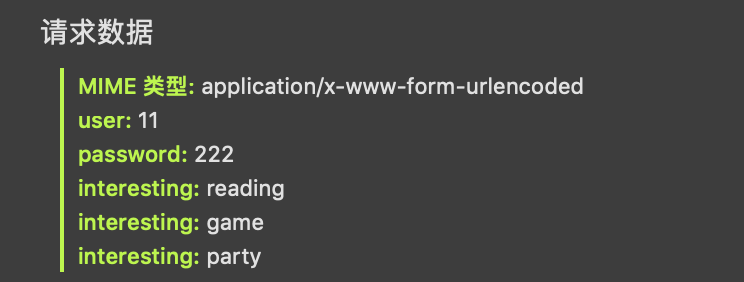
    - log输出
        - 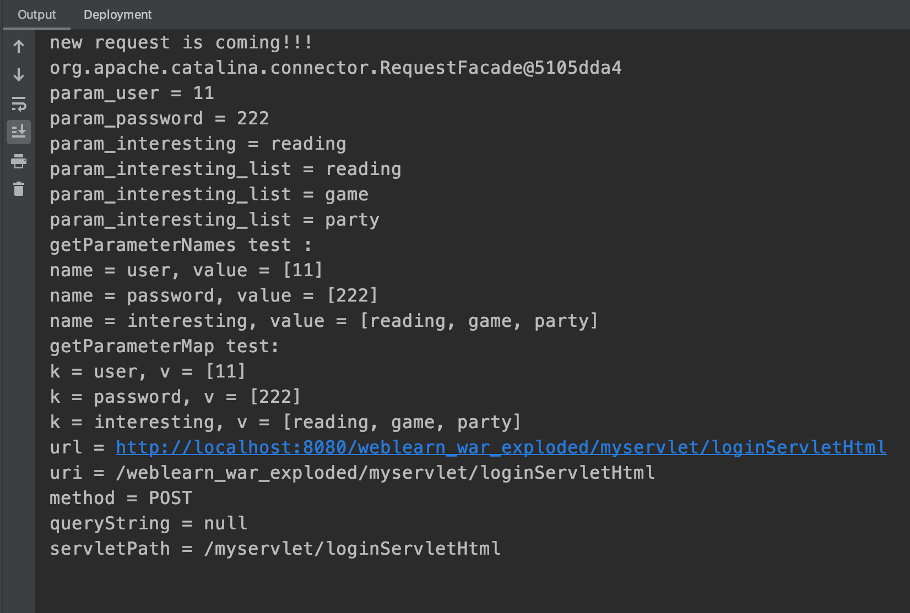
    
        

## ServletResponse接口
[top](#catalog)
- **服务器给予实现，并在服务器调用service方法时传入**
- 封装了响应信息，如果想给用户什么响应，可以使用该接口的方法实现
- 一般使用的不多
- 常用方法
    - `public PrintWriter getWriter() throws IOException;`
        - 获取打印流对象
        - 通过打印流对象的`write()`，可以直接将内容打印到**响应的html中**
            - 示例：将会在响应的html中打印：helloworld
                ```java
                PrintWriter out = servletResponse.getWriter();
                out.write("helloworld");
                ```
        - **通过该方法可以返回html，但是比较麻烦，所以会使用jsp**

    - <label style="color:red">public void setContentType(String type);</labe>
        - 设置响应内容的类型
        - 通常在JSP页面中通过：`<%@ page contentType="..." %>`来设定
        - 响应的类型可以参考：`apache-tomcat-9.0.30/conf/web.xml`
            - 可以直接在该配置文件中搜索目标文件的类型，并填写`mime-type`中的内容
                ```xml
                <mime-mapping>
                    <extension>xlsx</extension>
                    <mime-type>application/vnd.openxmlformats-officedocument.spreadsheetml.sheet</mime-type>
                </mime-mapping>
                ```
        - 设置后，通过`getWriter`获取到的流对象写出的内容，将会以对应的方式写出
    - `public ServletOutputStream getOutputStream() throws IOException;`
        - 获取输出流对象
        - 可以和`setContentType`进行配合，将服务器上相应类型文件的内容返回给浏览器，使浏览器执行下载
- 常用子接口
    - HttpServletResponse
        - 封装了大量http相关的方法
        - 常用方法
            - `void sendRedirect(String location)`
                - 请求的重定向

- 使用示例
    - [/java/mylearn/weblearn/src/main/java/com/ljs/test/myservlet/LoginServlet.java](/java/mylearn/weblearn/src/main/java/com/ljs/test/myservlet/LoginServlet.java)
        ```java
        @Override
        public void service(ServletRequest servletRequest, ServletResponse servletResponse) throws ServletException, IOException {
            // servletResponse
            // 返回响应
            PrintWriter out = servletResponse.getWriter();
            out.write("helloworld");

            // 返回响应类型
            // 设置响应类型为excel
            servletResponse.setContentType("application/vnd.ms-excel");

            // 使用输出流
            // servletResponse.getOutputStream()
        }
        ```
    - html的结果
        - 因为设定了响应方式为`application/vnd.ms-excel`，所以没有http响应信息，**浏览器会自动下载一个excel文件**
        - 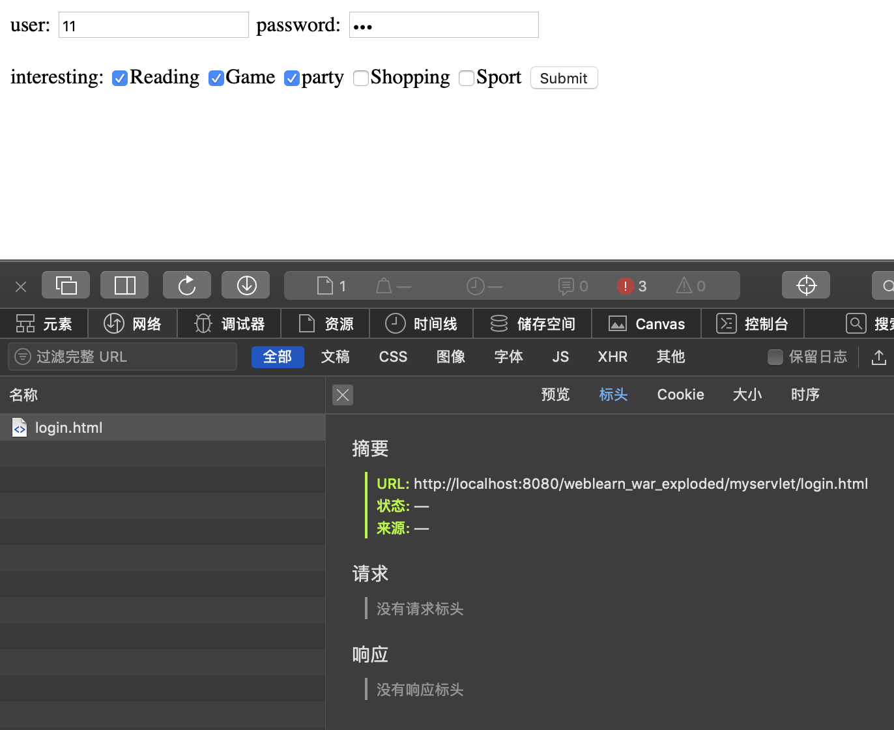

## Request和Response的包装类HttpServletXXXXXWrapper
[top](#catalog)
- 为什么要使用包装类：方便扩展对象的功能
- 扩展对象产生的问题及分析：**以Request为例**
    - 问题场景：在转发和重定向之前，需要操作请求参数，然后再做转发和重定向
    - 出现的问题
        1. reuqest中没有`setParamter`方法，无法重新设定请求参数
        2. HttpServletRequset是一个接口，无法通过重写getParamter来改变获取方式
        3. 在Tomcat中reuqest的实际类型是：`RequestFacade`，但是不能直接继承并重写，这样会和Servlet容器的实现相耦合，如果容器被替换了会导致服务会无法使

    - 问题的解决方法：装饰现有的request对象
        - 创建一个类，该类实现HttpServletRequest接口
        - 把当前doFilter中的request传给该类，作为类的**成员变量**
        - 使用这个成员变量来完成接口中的各种方法，并且可以在需要扩展的方法中添加处理代码

    - 手动提供实现的问题：HttpServletRequest、HttpServletResponse接口中的方法过多，实现起来比较麻烦
      
- Servlet提供了装饰类`HttpServletRequestWrapper`、`HttpServletResponseWrapper`供开发使用
    - 类实现了接口中的所有方法，并且实现内容也只是调用包装的request/response对象来实现的
    - 开发时，直接继承包装类，提供构造器，并重写需要扩展的方法即可，比手动实现接口更方便

- 示例：**以Request为例**
    - 实现内容
        - 通过继承包装类来扩展request的功能，在getParamter时，为原有的请求参数添加一些额外的字符
    - 包装类
        - MyHttpServletRequest.java : [/java/mylearn/weblearn/src/main/java/com/ljs/test/reqwrapper/MyHttpServletRequest.java](/java/mylearn/weblearn/src/main/java/com/ljs/test/reqwrapper/MyHttpServletRequest.java)

            ```java
            public class MyHttpServletRequest extends HttpServletRequestWrapper {
                /**
                * Constructs a request object wrapping the given request.
                *
                * @param request
                * @throws IllegalArgumentException if the request is null
                */
                public MyHttpServletRequest(HttpServletRequest request) {
                    super(request);
                }

                //修改获取paramter的方式，获取时，添加一些额外的文字
                @Override
                public String getParameter(String name) {
                    String parameter = super.getParameter(name);
                    return "before " + parameter + " end";
                }
            }
            ```
    - Servlet：需要在Servlet内部手动示例化包装类对象，才能使用
        - WrapperServlet.java : [/java/mylearn/weblearn/src/main/java/com/ljs/test/reqwrapper/WrapperServlet.java](/java/mylearn/weblearn/src/main/java/com/ljs/test/reqwrapper/WrapperServlet.java)

            ```java
            @Override
            protected void doPost(HttpServletRequest req, HttpServletResponse resp) throws ServletException, IOException {
                //实例化自定义包装类
                MyHttpServletRequest myreq = new MyHttpServletRequest(req);
                //将请求转发到hello.jsp
                req.getRequestDispatcher("/reqwrapper/hello.jsp").forward(myreq, resp);
            }
            ```
    - JSP
        - [/java/mylearn/weblearn/src/main/webapp/reqwrapper/login.jsp](/java/mylearn/weblearn/src/main/webapp/reqwrapper/login.jsp)

            ```html
            <%
                String contextPath = request.getContextPath();
            %>

            <form action="<%=contextPath%>/reqwrapper/wrapperServlert" method="post">
                username:<input type="text" name="username">
                <br>
                <input type="submit" value="Login">
            </form>
            ```
        - [/java/mylearn/weblearn/src/main/webapp/reqwrapper/hello.jsp](/java/mylearn/weblearn/src/main/webapp/reqwrapper/hello.jsp)

            ```html
            <h3>hello page</h3>

            username: <%=request.getParameter("username")%>
            ```
    - 测试结果
        - 入口 : http://localhost:8080/weblearn_war_exploded/reqwrapper/login.jsp
        - 进入登录页面，随意输入字符串并点击login
            - 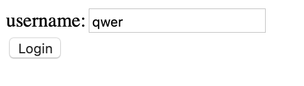
        - 经过Servlet转发到hello.jsp，
            - 在JSP中获取到的是自定义类型MyHttpServletRequest的实例
            - 从request获取请求参数时，分别在首尾附加了字符串before和end
            - 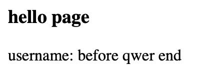


## 抽象类GenericServlet
### 自定义Servlet抽象类MyGenericServlet
[top](#catalog)
- 开发servlet时的问题：**每次都需要实现Servlet接口的方法，会产生很多的空方法**
- 可以自己创建一个Servlet接口的实现类，每次都继承这个实现类，不用再实现全部方法
    - 实现Servlet, 来避免空方法
    - 实现ServletConfig，使得在子类中也可以通过servletConfig对象来获取配置信息
- 自定义实现：[/java/mylearn/weblearn/src/main/java/com/ljs/test/myservlet/MyGenericServlet.java](/java/mylearn/weblearn/src/main/java/com/ljs/test/myservlet/MyGenericServlet.java)
    ```java
    import javax.servlet.*;
    import java.io.IOException;
    import java.util.Enumeration;

    /*
    * 自定义的一个Servlet接口的实现类
    * 让开发的任何Servlet都继承该类，以简化开发*/
    public abstract class MyGenericServlet implements Servlet, ServletConfig {
        ServletConfig servletConfig;
        @Override
        public void init(ServletConfig config) throws ServletException {
            servletConfig = config;
        }

        @Override
        public ServletConfig getServletConfig() {
            return this.servletConfig;
        }

        public abstract void service(ServletRequest req, ServletResponse res) throws ServletException, IOException;

        @Override
        public String getServletInfo() {
            return null;
        }

        @Override
        public void destroy() {

        }
        
        ////////////////////////////
        // ServletConfig接口方法
        // 无法直接提供响应的实现，
        // 但是可以通过init中获取的ServletConfig来参数值
        @Override
        public String getServletName() {
            return servletConfig.getServletName();
        }

        @Override
        public ServletContext getServletContext() {
            return servletConfig.getServletContext();
        }

        @Override
        public String getInitParameter(String name) {
            return servletConfig.getInitParameter(name);
        }

        @Override
        public Enumeration<String> getInitParameterNames() {
            return servletConfig.getInitParameterNames();
        }
    }
    ```


### 使用GenericServlet
[top](#catalog)
- `GenericServlet`是一个Servlet接口和ServletConfig接口的实现类，但是**本身是一个抽象类**，其中`service`方法为抽象方法
- 如果新建的Servlet程序直接继承GenericServlet会使开发更简洁
- 基本实现
    - 在GenericServlet中声明了一个ServletConfig类型的成员变量，在init(ServletConfig)方法中对其进行了初始化
    - 利用servletConfig成员变量的方法实现了 ServletConfig接口的方法
    - 内部添加了额外的log方法
    - 定义了一个`init()`方法，在`init(ServletConfig)`方法中对其进行调用，子类可以直接覆盖`init()`，在其中实现对Servlet的初始化
        - 不建议直接覆盖`init(ServletConfig)`，因为如果忘记编写super.init(ServletConfig)，而还是用了ServletConfig接口的方法，会出现空指针异常
        - `init()`不是Servlet的声明周期方法，`init(ServletConfig)`才是声明周期方法
- `GenericServlet`的源代码
    ```java
    package javax.servlet;

    import java.io.IOException;
    import java.util.Enumeration;
    import java.util.ResourceBundle;

    public abstract class GenericServlet 
        implements Servlet, ServletConfig, java.io.Serializable
    {
        private static final String LSTRING_FILE = "javax.servlet.LocalStrings";
        private static ResourceBundle lStrings =
            ResourceBundle.getBundle(LSTRING_FILE);

        private transient ServletConfig config;
        
        public GenericServlet() { }
        
        public void destroy() { }
        
        public String getInitParameter(String name) {
            ServletConfig sc = getServletConfig();
            if (sc == null) {
                throw new IllegalStateException(
                    lStrings.getString("err.servlet_config_not_initialized"));
            }

            return sc.getInitParameter(name);
        }

        public Enumeration<String> getInitParameterNames() {
            ServletConfig sc = getServletConfig();
            if (sc == null) {
                throw new IllegalStateException(
                    lStrings.getString("err.servlet_config_not_initialized"));
            }

            return sc.getInitParameterNames();
        }   
        
        public ServletConfig getServletConfig() {
        return config;
        }
    
        public ServletContext getServletContext() {
            ServletConfig sc = getServletConfig();
            if (sc == null) {
                throw new IllegalStateException(
                    lStrings.getString("err.servlet_config_not_initialized"));
            }

            return sc.getServletContext();
        }

        public String getServletInfo() {
        return "";
        }

        public void init(ServletConfig config) throws ServletException {
        this.config = config;
        this.init();
        }

        public void init() throws ServletException {

        }
        
        public void log(String msg) {
        getServletContext().log(getServletName() + ": "+ msg);
        }
        
        public void log(String message, Throwable t) {
        getServletContext().log(getServletName() + ": " + message, t);
        }
        
        public abstract void service(ServletRequest req, ServletResponse res)
        throws ServletException, IOException;
        
        public String getServletName() {
            ServletConfig sc = getServletConfig();
            if (sc == null) {
                throw new IllegalStateException(
                    lStrings.getString("err.servlet_config_not_initialized"));
            }

            return sc.getServletName();
        }
    }
    ```
### GenericServlet的简单示例
[top](#catalog)
- 使用GenericServlet实现一个简单的login功能
- 需求：
    1. 在web.xml文件中设置两个web应用的初始化参数，user，password
    2. 定义一个login.html,设定两个请求字段user，password，发送请求到的loginServlet
    3. 再创建一个LoginServlet，在其中获取请求的user，password，比对其和web.xml文件中定义的请求参数是否一致
    4. 若一致，响应Hello:xxx，若不一致，响应Sorry:user
- 实现
    - web.xml 配置
        ```xml
        <context-param>
            <param-name>user</param-name>
            <param-value>1234</param-value>
        </context-param>
        <context-param>
            <param-name>password</param-name>
            <param-value>qwer</param-value>
        </context-param>
        
        <servlet>
            <servlet-name>loginServlet2</servlet-name>
            <servlet-class>com.ljs.test.myservlet.LoginServlet2</servlet-class>
        </servlet>
        <servlet-mapping>
            <servlet-name>loginServlet2</servlet-name>
            <url-pattern>/myservlet/loginResult2</url-pattern>
        </servlet-mapping>
        ```
    
    - [/java/mylearn/weblearn/src/main/webapp/myservlet/login2.html](/java/mylearn/weblearn/src/main/webapp/myservlet/login2.html)
        ```html
        <!DOCTYPE html>
        <html lang="en">
        <head>
            <meta charset="UTF-8">
            <title>Title</title>
        </head>
        <body>

        <!--action需要与配置中的url-pattern相同-->
        <form action="loginResult2" method="get">

            user: <input type="text" name="user">
            password: <input type="password" name="password">

            <input type="submit" value="Submit">
        </form>
        </body>
        </html>
        ```
    
    - GenericServlet的实现类 : [/java/mylearn/weblearn/src/main/java/com/ljs/test/myservlet/LoginServlet2.java](/java/mylearn/weblearn/src/main/java/com/ljs/test/myservlet/LoginServlet2.java)
        ```java
        import javax.servlet.*;
        import java.io.IOException;
        import java.io.PrintWriter;

        public class LoginServlet2 extends GenericServlet {

            @Override
            public void service(ServletRequest req, ServletResponse res) throws ServletException, IOException {
                PrintWriter writer = res.getWriter();

                String reqUser = req.getParameter("user");
                String reqPassword = req.getParameter("password");
                String initUser = getServletContext().getInitParameter("user");
                String initPassword = getServletContext().getInitParameter("password");
                if (!initUser.equals(reqUser) || !initPassword.equals(reqPassword)){
                    writer.write("Sorry : " + reqUser);
                } else {
                    writer.write("Hello : " + reqUser);
                }
            }
        }
        ```

## 抽象类HttpServlet
[top](#catalog)
- GenericServlet的不足
    - 在Servlet中获取请求方式时，每次都需要将ServletRequest强转为HttpServletRequest

- **HttpServlet是一个Servlet，继承自GenericServlet，针对于HTTP协议所定制**

- 基本实现
    - 在`service()`方法中直接把`ServletRequest`和`ServletResponse`转为`HttpServletRequest`和`HttpServletResponse`，并调用重载的`service(HttpServletRequest, HttpServletResponse)`
    - 在`service(HttpServletRequest, HttpServletResponse)`中获取请求方式：`request.getMethod()`
    - 根据请求方式创建:`doXxx`方法，`Xxx`为具体的请求方式,如：doPost，doGet等等

- 自定义实现：[/java/mylearn/weblearn/src/main/java/com/ljs/test/myservlet/MyHttpServlet.java](/java/mylearn/weblearn/src/main/java/com/ljs/test/myservlet/MyHttpServlet.java)

    ```java
    @Override
    public void service(ServletRequest req, ServletResponse res)
        throws ServletException, IOException
    {
        HttpServletRequest  request;
        HttpServletResponse response;
        
        if (!(req instanceof HttpServletRequest &&
                res instanceof HttpServletResponse)) {
            throw new ServletException("non-HTTP request or response");
        }

        request = (HttpServletRequest) req;
        response = (HttpServletResponse) res;

        service(request, response);
    }
    
    public void service(HttpServletRequest request, HttpServletResponse response) throws ServletException, IOException{
        //1. 获取请求方式
        String method = request.getMethod();

        //2. 根据请求方式调用对应的处理方法
        if ("GET".equalsIgnoreCase(method)){
            doGet(request, response);
        }

        if ("POST".equalsIgnoreCase(method)){
            doPost(request, response);
        }

    }

    //可以由子类实现
    public void doPost(HttpServletRequest request, HttpServletResponse response) throws ServletException, IOException{
    }

    //可以由子类实现
    public void doGet(HttpServletRequest request, HttpServletResponse response) throws ServletException, IOException{
    }
    ```

- <label style="color:red">实际开发中，直接继承HttpServlet，并根据请求方式复写doXxx()方法</label>

- 好处
    - 直接有针对性的覆盖doXxx方法
    - 直接使用HttpServletRequest和HttpServletResponse，不再需要强转

- HttpServlet的UML图
    - 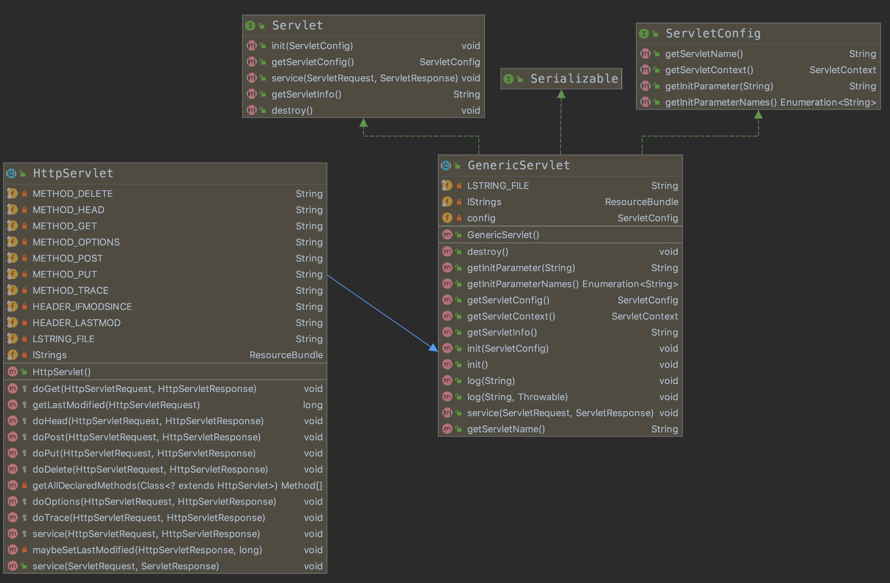

## Servlet的综合使用
[top](#catalog)
- 需求
    - 在mysql数据库中创建一个test_users数据表，添加3个字段，id，user，password，并添加几条记录
    - 定义一个login.html，定义两个请求字段：user，password，发送请求到loginServlet
    - 创建一个LoginServlet，继承自HttpServlet，并重写doPost方法
    - 在Servlet中获取请求的uest，password
    - 利用JDBC从test_users中查询有没有和页面输入的user，passwoed对应的记录若有，响应`Hello:user`，不一致则响应`Sorry:user`
- Servlet: [/java/mylearn/weblearn/src/main/java/com/ljs/test/myservlet/LoginServlet3.java](/java/mylearn/weblearn/src/main/java/com/ljs/test/myservlet/LoginServlet3.java)
    ```java
    import javax.servlet.ServletException;
    import javax.servlet.http.HttpServlet;
    import javax.servlet.http.HttpServletRequest;
    import javax.servlet.http.HttpServletResponse;
    import java.io.IOException;
    import java.io.PrintWriter;
    import java.sql.*;

    public class LoginServlet3 extends HttpServlet {
        @Override
        public void doPost(HttpServletRequest request, HttpServletResponse response) throws ServletException, IOException {
            String user = request.getParameter("user");
            String password = request.getParameter("password");

            Connection connection =null;
            PreparedStatement ps = null;
            ResultSet resultSet = null;
            try {
                Class clazz = Class.forName("com.mysql.jdbc.Driver");

                String url = "jdbc:mysql://127.0.0.1:3306/weblearn?serverTimezone=UTC&characterEncoding=utf8&useUnicode=true&useSSL=false";
                String mysqlUser = "root";
                String mysqlPassword = "1234";

                connection = DriverManager.getConnection(url, mysqlUser, mysqlPassword);
                ps = connection.prepareStatement("select count(*) from test_users where user = ? and password =?");
                ps.setObject(1, user);
                ps.setObject(2, password);

                resultSet = ps.executeQuery();

                if(resultSet.next()){
                    PrintWriter writer = response.getWriter();
                    int count = resultSet.getInt(1);
                    if (count > 0){
                        writer.write("Hello : " + user);
                    }else {
                        writer.write("Sorry : " + user);
                    }
                }
            } catch (ClassNotFoundException | SQLException e) {
                e.printStackTrace();
            } finally {
                if (resultSet != null){
                    try {
                        resultSet.close();
                    } catch (SQLException e) {
                        e.printStackTrace();
                    }
                }

                if (ps != null){
                    try {
                        ps.close();
                    } catch (SQLException e) {
                        e.printStackTrace();
                    }
                }

                if (connection !=null){
                    try {
                        connection.close();
                    } catch (SQLException e) {
                        e.printStackTrace();
                    }
                }
            }

        }
    }
    ```

- 入口：[/java/mylearn/weblearn/src/main/webapp/myservlet/login3.html](/java/mylearn/weblearn/src/main/webapp/myservlet/login3.html)
    ```html
    <!DOCTYPE html>
    <html lang="en">
    <head>
        <meta charset="UTF-8">
        <title>Title</title>
    </head>
    <body>

    <!--http请求learn-->
    <!--action需要与配置中的url-pattern相同-->
    <form action="loginResult3" method="post">

        <!--一个参数名对应一个参数-->
        user: <input type="text" name="user">
        password: <input type="password" name="password">

        <br/><br/>
        <!--一个参数名对应多个参数-->
        interesting:
        <input type="checkbox" name="interesting" value="reading"/>Reading
        <input type="checkbox" name="interesting" value="game"/>Game
        <input type="checkbox" name="interesting" value="party"/>party
        <input type="checkbox" name="interesting" value="shopping"/>Shopping
        <input type="checkbox" name="interesting" value="sport"/>Sport

        <input type="submit" value="Submit">
    </form>
    </body>
    </html>
    ```
- web.xml
    ```xml    
    <servlet>
        <servlet-name>loginServlet3</servlet-name>
        <servlet-class>com.ljs.test.myservlet.LoginServlet3</servlet-class>
    </servlet>
    <servlet-mapping>
        <servlet-name>loginServlet3</servlet-name>
        <url-pattern>/myservlet/loginResult3</url-pattern>
    </servlet-mapping>
    ```

- sql
    ```sql
    create database weblearn;
    use weblearn;
    select database();

    create table test_users (
        id int primary key ,
        user varchar(20),
        password varchar(20)
    );

    insert into test_users values (1 , "1234", "qwer");
    insert into test_users values (2 , "5678", "asdf");
    insert into test_users values (3 , "0000", "zxcv");

    select * from test_users;
    ```

- <label style="color:red">这种开发方式的问题</label>
    - **不应该在Servlet中写JDBC的代码**
    - 通用性比较差


# JSP
## JSP的起源
[top](#catalog)
- 网页自身的问题
    - 很多动态网页中，绝大部分内容都是固定不变的，只有局部内容需要动态产生和改变
- Servlet代码的问题
    - 如果使用servlet程序来输出只有局部内容需要动态改变的网页，其中所以的**静态内容也需要程序员用Java程序代码产生，整个Servlet程序的代码非常臃肿**，编写和维护都非常困难
    - 对大量静态内容的美工设计和相关HTML语句的编写，并不是程序员要做的工作，设计人员不懂Java编程，也无法完成这项工作
- 为了弥补Servlet的缺陷，SUN公司**在Servlet的基础上**推出了JSP (Java Server Page)技术作为解决方案


## JSP的基本知识
[top](#catalog)
- 什么是JSP：Java Server Page 服务器端网页，<label style="color:red">可以在HTML中编写Java代码，本质是一个Servlet</label>

- **JSP是简化Servlet编写的一种技术**，它将Java代码和HTML语句混合在同一个文件中编写，动态生成的部分使用Java代码来编写，静态的部分采用普通的静态HTML页面编写

- **JSP可以在html中嵌入java代码，可以使用Servlet容器来解释、执行**，如：
    ```html
    <%@ page import="java.util.Date" %>
    <%@ page contentType="text/html;charset=UTF-8" language="java" %>
    <html>
    <head>
        <title>Title</title>
    </head>
    <body>
        <%
            Date date = new Date();
            System.out.println(date);
        %>
    </body>
    </html>
    ```

- JSP页面是由HTML语句和嵌套在其中的Java代码组成的一个普通文本文件，JSP页面的文件扩展名必须为.jsp
- 在JSP页面中编写的Java代码需要嵌套在`<% %>`中
    - 嵌套在`<% %>`中的Java代码被称为脚本片段
    - 没有嵌套在`<% %>`中的内容被称为JSP的模版元素
- 在JSP中通过Java代码输出指定内容
    - 可以使用`out.println`语句将其他Java程序代码产生的结果字符串输出给客户端
    - 可以使用`System.out.println`语句将他们打印到命令行窗口
- JSP保存的位置：可以放在web应用程序中的**除了WEB-INF及其子目录外的任何其他目录**
- JSP页面的**访问路径与普通HTML页面的访问路径形式完全一样**

## JSP的运行原理
[top](#catalog)
- 解析顺序
    1. WEB容器（Servlet引擎）接收到以`.jsp`为扩展名的URL的访问请求时，会把该请求交给JSP引擎去处理
    2. 每个JSP在**第一次访问**时，JSP引擎将它翻译成一个Servlet源程序,即：`xxx_jsp.java`
    3. 将Servlet源程序编译成Servlet的class类文件
    4. 由Servlet引擎像调用普通Servlet程序一样的方式来**装载和解释执行**这个由JSP页面翻译成的Servlet程序
- JSP中的脚本语言
    - JSP规范也**没有明确要求**JSP中的脚本程序代码必须采用Java语言
    - JSP中的脚本程序**可以采用其他脚本语言**来编写，但是JSP页面最终必须转换成Java Servlet程序
- 可以在WEB应用程序**正式发布之前**，将其中的所有JSP页面**预编译成Servlet程序**

- 编译结果的继承关系，说明JSP本质是一个Servlet
    ```java
    public final class hello_jsp extends org.apache.jasper.runtime.HttpJspBase
    implements org.apache.jasper.runtime.JspSourceDependent,
                 org.apache.jasper.runtime.JspSourceImports {
    ```
    ```java
    public abstract class HttpJspBase extends HttpServlet implements HttpJspPage
    ```

- <label style="color:red">在`<% %>`中编写的代码片段，最后会在生成的：`_jspService()`方法中被执行</label>

## JSP的9个隐式对象
[top](#catalog)
- JSP生成的Servlet类中，声明了一些对象，所以可以直接在JSP的`<% %>`中作为隐式对象来使用
    1. `service()`中声明的8个隐式对象
        - request
        - response
        - pageContext
        - session
        - application
        - config
        - out
        - page
        ```java
        public void _jspService(final javax.servlet.http.HttpServletRequest request, final javax.servlet.http.HttpServletResponse response)
        throws java.io.IOException, javax.servlet.ServletException {

            ...

            final javax.servlet.jsp.PageContext pageContext;
            javax.servlet.http.HttpSession session = null;
            final javax.servlet.ServletContext application;
            final javax.servlet.ServletConfig config;
            javax.servlet.jsp.JspWriter out = null;
            final java.lang.Object page = this;

            // 下面两个不能使用
            javax.servlet.jsp.JspWriter _jspx_out = null;
            javax.servlet.jsp.PageContext _jspx_page_context = null;
        ```
    2. 除了上面8个，还可以使用一个叫`exception`的隐含对象

- <lable style="color:red">因为JSP的隐式对象是声明在Servlet的`_jspService()`方法中的，所以，在`<% %>`以外不能使用隐式变量</label>

- 9个隐式对象
    1. **request**: HttpServletRequest 的一个对象
    2. response: HttpServletResponse 的一个对象
        - 在JSP页面中几乎不会调用response的任何方法
    3. **pageContext**：页面的上信息，是PageContext的一个对象
        - **可以从该对象中获取到其他8个隐含对象**，也可以从中获取到当前页面的其他信息
        - 很少直接在JSP页面中使用
        - 自定义标签时使用
    4. **session**：代表浏览器和服务器的一次会话，是HttpSession的一个对象
    5. **application**：代表当前WEB应用，是**ServletContext对象**
    6. config：当前JSP对应的Servlet的ServletConfig对象
        - 几乎不使用
        - 如果需要访问当前JSP配置的初始化参数，需要通过servlet映射的地址才能访问
            - web.xml配置
            ```xml
            <servlet>
                <servlet-name>hellojsp</servlet-name>
                <jsp-file>/hello.jsp</jsp-file>
                <init-param>
                <param-name>test</param-name>
                <param-value>testValue</param-value>
                </init-param>
            </servlet>
            
            <servlet-mapping>
                <servlet-name>hellojsp</servlet-name>
                <url-pattern>/hellojsp</url-pattern>
            </servlet-mapping>
            ```
            - jsp脚本片段
            ```html
            <%
                System.out.println(config.getInitParameter("test")); //testValue
            %>
    7. **out**：JspWriter对象，调用`out.println()`，可以直接把字符串打印到html页面上
        - 多个`out.println()`的换行方法
            - 通过html标签`<br>`来换行
                ```java
                <%
                out.println("aaa");
                %>
            
                <br>
            
                <%
                out.println("bbb");
                %>
                ```
            - 通过打印html标签`<br>`来换行
                ```java
                <%
                out.println("ccc");
                out.println("<br>");
                out.println("ddd");
                %>
                ```
    8. page：指向当前JSP对应的Servlet对象的引用，是Object类型，只能调用Object类的方法
        - 几乎不使用
        - page 与 this 相同

    9. **exception**：在JSP页面中声明了`<%@ page isErrorPage="true" %>`时，才可以使用
        - exception对象的获取方式：
            ```java
            java.lang.Throwable exception = org.apache.jasper.runtime.JspRuntimeLibrary.getThrowable(request);
            ```


- 9个隐式对象 对属性的作用域的范围从小到大排列
pageContext, request, session, application

- 隐式对象的使用示例：[/java/mylearn/weblearn/src/main/webapp/jspobject/hello.jsp](/java/mylearn/weblearn/src/main/webapp/jspobject/hello.jsp)
    ```html
    <%@ page import="java.util.Date" %>
    <%@ page contentType="text/html;charset=UTF-8" language="java" %>
    <html>
    <head>
        <title>Title</title>
    </head>
    <body>
        <%
            Date date = new Date();
            System.out.println(date); // Thu Jan 23 21:59:48 CST 2020
        %>

        <%
            String s = date.toString();

            // 没有声明就可以使用的对象，就是隐含对象
            String name = request.getParameter("name");
            System.out.println(name); //2222

            Class clazz = request.getClass();
            System.out.println(clazz); // class org.apache.catalina.connector.RequestFacade

            // 输出：true
            System.out.println(response instanceof HttpServletResponse);

            // pageContext
            ServletRequest requestFromPC = pageContext.getRequest();
            System.out.println(requestFromPC == request); //true

            // session
            System.out.println(session.getId());

            //application
            System.out.println(application.getInitParameter("password")); //qwer

            //config
            System.out.println(config.getInitParameter("test")); //testValue

            // page
            System.out.println(page); //org.apache.jsp.hello_jsp@b9e7297
            System.out.println(this); //org.apache.jsp.hello_jsp@b9e7297

            // out
            out.println(name);
        %>
        <br>
        <%
            out.println("aaa");
        %>

        <%
            out.println("ccc");
            out.println("<br>");
            out.println("ddd");
        %>
    </body>
    </html>
    ```

## JSP基本语法
### 1.JSP基本语法-JSP模版元素
[top](#catalog)
- JSP页面中的**静态HTML内容称为JSP模版元素**，在静态的HTML内容之中**可以嵌套JSP的其他各种元素**来产生动态内容和执行业务逻辑
- JSP模版元素定义了网页的基本骨架，即定义了页面的结构和外观

### 2.JSP基本语法-JSP表达式
[top](#catalog)
- JSP表达式(expression)提供了将一个java变量或表达式的计算结果输出到客户端的简化方式
- JSP表达式的写法：`<%= expression %>`
    - 如：`<%= new Date() %>`
- 表达式计算结果的显示方法：
    1. 表达式中的变量或表达式的计算结果将被**转换成字符串**
    2. 将字符串插进整个JSP页面输出结果的相应位置
- 显示JSP表达式结果的本质：JSP表达式被翻译成Servlet程序中的一条`out.println(...)`语句
- 注意事项
    - JSP表达式中的变量或表达式**后面不能有分号`;`**
    
- 示例
    - JSP代码
        ```html
        <%@ page import="java.util.Date" %>
        <%@ page contentType="text/html;charset=UTF-8" language="java" %>
        <html>
        <head>
            <title>Title</title>
        </head>
        <body>
        
        <%
            Date date = new Date();
            out.println(date);
        %>
        
        <%= date %>
        </body>
        </html>
        ```
    - 编译后的xxx_jsp.java代码
        ```java
        public void _jspService(final javax.servlet.http.HttpServletRequest request, final javax.servlet.http.HttpServletResponse response)
                throws java.io.IOException, javax.servlet.ServletException {
                ...
                ...
        
            try {
                response.setContentType("text/html;charset=UTF-8");
                pageContext = _jspxFactory.getPageContext(this, request, response,
                        null, true, 8192, true);
                _jspx_page_context = pageContext;
                application = pageContext.getServletContext();
                config = pageContext.getServletConfig();
                session = pageContext.getSession();
                out = pageContext.getOut();
                _jspx_out = out;
        
                out.write("\n");
                out.write("\n");
                out.write("<html>\n");
                out.write("<head>\n");
                out.write("    <title>Title</title>\n");
                out.write("</head>\n");
                out.write("<body>\n");
                out.write("\n");
        
            // <% %> 部分的内容
            Date date = new Date();
            out.println(date);
        
                out.write('\n');
                out.write('\n');
                // <%= %> 部分的内容
                out.print( date );
                out.write("\n");
                out.write("</body>\n");
                out.write("</html>\n");
            } catch (java.lang.Throwable t) {
        ```

### 3.JSP基本语法-JSP脚本片段
[top](#catalog)   
- JSP脚本片段(scriptlet)是指嵌套在`<% %>`之中的一条或多条Java程序代码
    - 脚本片段中只能是符合Java语法要求的程序代码
    - 其他文本、HTML标记，其他JSP元素都必须写在脚本片段之外

- 多个JSP脚本片段
    - 一个JSP页面中可以有多个脚本片段，两个脚本片段之间可以载入文本、HTML等内容
    - 多个脚本片段中的代码可以相互访问
    - **单个片段可以不完整，但是多个片段组合后必须完整**
        - 示例：[/java/mylearn/weblearn/src/main/webapp/jspgrammar/hello.jsp](/java/mylearn/weblearn/src/main/webapp/jspgrammar/hello.jsp)
            ```java
            <%
                String ageStr = request.getParameter("age");
                int age = Integer.parseInt(ageStr);
                if (age >18) {
            %>
                    aaa
            <%
                } else {
            %>
                    bbb
            <%
                }
            %>
            ```

- JSP脚本片段中的Java代码**会拷贝到生成的Servlet对象的_jspService方法中**
    - 所以在脚本片段中，可以执行所有普通Java程序
    - 多个脚本片段可以相互访问，因为最终都是在同一个方法中执行
- 在JSP脚本片段中可以直接使用JSP提供的隐式对象来完成WEB应用程序特有的功能，如：
    - [示例-利用Cookie完成自动登陆](#示例-利用Cookie完成自动登陆)
    - [示例-利用Cookie显示最近浏览的商品](#示例-利用Cookie显示最近浏览的商品)
    - [Session避免表单的重复提交](#Session避免表单的重复提交)
    - 其他功能 ???
    
### 4.JSP基本语法-JSP声明
[top](#catalog)
- JSP声明可以用于定义JSP页面转换成的Servlet程序的**静态代码块，成员变量和方法**
- JSP声明将java代码封装在`<%! %>`中，里面的代码将被插入到Servlet的JspService方法的外面
- 多个静态代码块，变量和函数可以定义在一个或多个JSP声明中
- **在JSP页面中几乎不会使用**

### 5.JSP基本语法-JSP注释
[top](#catalog)
- 两种注释

    |注释类型|写法|
    |-|-|
    |JSP注释|`<%-- --%>`|
    |HTML注释|`<!-- -->`|

- 在JSP页面中JSP注释可以阻止java代码的执行，但是HTML注释不行
    
## JSP域对象的属性作用范围
[top](#catalog)
- 域对象
    - pageContext
    - request
    - session
    - application

- 各域对象的属性作用范围

    |域对象|属性作用范围|
    |-|-|
    |pageContext|当前JSP页面|
    |request|同一个请求，如果是forward则可以跨页面获取属性值|
    |session|一次会话，浏览器打开-->关闭为一次会话(在此期间会话不失效)|
    |application|当前web应用，是范围最大的属性作用范围<br/>只要在一处设置属性，在其他的JSP或Servlet中都可以获取到|
    
- 域对象中和属性相关的方法
    |函数声明|用途|
    |-|-|
    |Object getAttribute(String name)|获取指定的属性|
    |void setAttribute(String name， object o)|设置属性|
    |removeAttribute(String name)|移除指定的属性|
    |Enumeration getAttributeNames()|获取所有的**属性名字**组成的Enumeration对象|
    
- 示例
    - 第一个页面：[/java/mylearn/weblearn/src/main/webapp/attribute/attr1.jsp](/java/mylearn/weblearn/src/main/webapp/attribute/attr1.jsp)
        ```html
        <%@ page import="java.util.Date" %>
        <%@ page contentType="text/html;charset=UTF-8" language="java" %>
        <html>
        <head>
            <title>Title</title>
        </head>
        <body>
        <%
            pageContext.setAttribute("pageContextAttr","pageContextValue");
            request.setAttribute("requestAttr", "requestValue");
            session.setAttribute("sessionAttr", "sessionValue");
            application.setAttribute("applicationAttr","applicationValue");

        %>
        </body>

        <h2>Attr 1 Page  <%= new Date() %> </h2>
        pageContextAttr:<%= pageContext.getAttribute("pageContextAttr")%>
        <br>
        requestAttr:<%= request.getAttribute("requestAttr")%>
        <br>
        sessionAttr:<%= session.getAttribute("sessionAttr")%>
        <br>
        applicationAttr:<%= application.getAttribute("applicationAttr")%>
        <br>
        <br>

        <!--开启一个新的请求-->
        <a href="attr2.jsp">To attr 2 page</a>

        <a href="testAttr">To testAttr page</a>
        </html>
        ```
    - 跳转页面1：[/java/mylearn/weblearn/src/main/webapp/attribute/attr2.jsp](/java/mylearn/weblearn/src/main/webapp/attribute/attr2.jsp)
        ```html
        <%@ page import="java.util.Date" %>
        <%@ page contentType="text/html;charset=UTF-8" language="java" %>
        <html>
        <head>
            <title>Title</title>
        </head>
        <body>

        <h2>Attr 2 Page <%= new Date() %></h2>
        pageContextAttr:<%= pageContext.getAttribute("pageContextAttr")%>
        <br>
        requestAttr:<%= request.getAttribute("requestAttr")%>
        <br>
        sessionAttr:<%= session.getAttribute("sessionAttr")%>
        <br>
        applicationAttr:<%= application.getAttribute("applicationAttr")%>
        <br>

        </body>
        </html>
        ```
    - 跳转页面2，Servlet：[/java/mylearn/weblearn/src/main/java/com/ljs/test/attribute/TestAttr.java](/java/mylearn/weblearn/src/main/java/com/ljs/test/attribute/TestAttr.java)
        - Servlet
            ```java
            public class TestAttr extends HttpServlet {
                @Override
                protected void doGet(HttpServletRequest req, HttpServletResponse resp) throws ServletException, IOException {
                    PrintWriter out = resp.getWriter();

                    // 1. 在Servlet中无法得到pageContext对象

                    // 2.
                    Object requestAttr = req.getAttribute("requestAttr");
                    out.println("requestAttr : " + requestAttr);
                    out.println("<br>");

                    // 3. session
                    Object sessionAttr = req.getSession().getAttribute("sessionAttr");
                    out.println("sessionAttr : " + sessionAttr);
                    out.println("<br>");

                    // 4. application
                    Object applicationAttr = getServletContext().getAttribute("applicationAttr");
                    out.println("applicationAttr : " + applicationAttr);
                    out.println("<br>");
                }
            }
            ```
        - web.xml配置
            ```xml
            <servlet>
                <servlet-name>testAttr</servlet-name>
                <servlet-class>com.ljs.test.attribute.TestAttr</servlet-class>
            </servlet>
            <servlet-mapping>
                <servlet-name>testAttr</servlet-name>
                <url-pattern>/attribute/testAttr</url-pattern>
            </servlet-mapping>
            ```
    - 执行结果
        - 第一个页面 --> 跳转页面1
            - 每个页面都是一个新的请求，所以`pageContextAttr:null`，`requestAttr:null`
            - 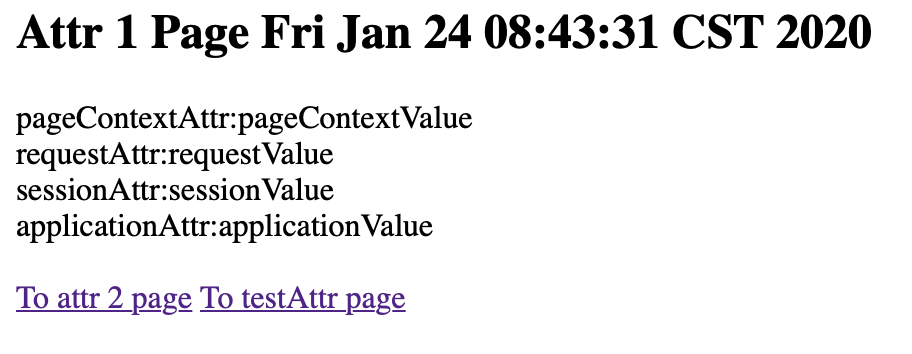
            - 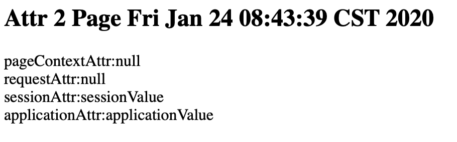
        - 第一个页面 --> 跳转页面2
            - web应用还存活，所以`applicationAttr:applicationValue`
            - 浏览器没有关闭，session还存活，所以`sessionAttr : sessionValue`
            - 
            - 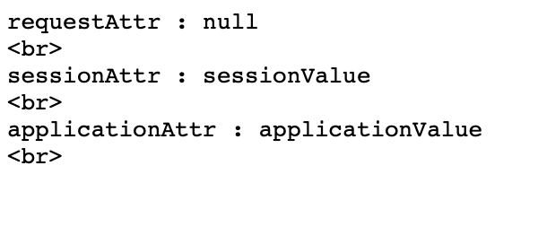
            - 
        - 在新浏览器中直接代开跳转页面1
            - 因为是在新的浏览器中打开的页面，相当于新启动了一个会话，所以`sessionAttr:null`

            - 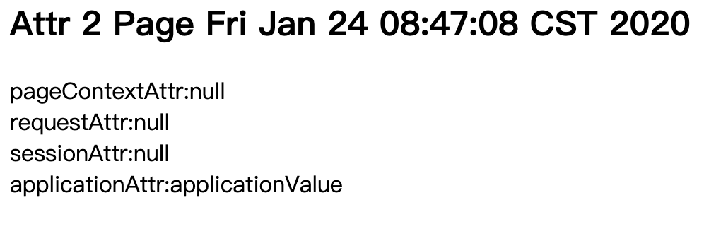

## JSP指令
### JSP指令-JSP指令简介
[top](#catalog)
- JSP指令是为JSP引擎而设计的，不直接产生任何可见输出，<label style="color:red">只是告诉引擎如何处理JSP页面中的其余部分</label>
- JSP指令的基本语法
    - `<%@ 指令 属性名="值" %>`
    - 属性名部分是大小写敏感的
    - 示例：`<%@ page contentType="text/html;charset=UTF-8">`
- 在JSP2.0中，<label style="color:red">定义了三种指令</label>，每种指令有都定义了一些各自的属性
    - page
    - include
    - taglib
- 在一个JSP页面中设置多个属性的方式
    - 可以使用多条指令语句中单独设置每个属性
        ```html
        <%@ page contentType="text/html;charset=UTF-8" %>
        <%@ page import="java.util.Date" %>
        ```
    - 可以使用一条指令语句设置多个属性
        ```html
        <%@ page contentType="text/html;charset=UTF-8" 
            import="java.util.Date" %>
        ```
          
### JSP指令-page指令
[top](#catalog)
- page指令用于定义JSP页面的各种属性，作用域是整个JSP页面
- page指令可以出现在JSP页面的任何地方，**最好是放在整个JSP页面的起始位置**
- JSP2.0中，page指令可用的**属性**:
    - 常用属性 
        - import="{package.class | package.*},...."
            - 需要导入的jar包  
            - 以下的这些包会默认添加到编译后的Servlet中，所以不用导入
                - `javax.servlet.*;`
                - `javax.servlet.http.*;`
                - `javax.servlet.jsp.*;`
            - 示例：`<%@ page import="java.util.Date" %>`

        - <label style="color:red">session="true/false"</label>
            - 当前JSP页面是否允许使用session
            - session="false"时，**不会在解析后的Servlet中生成session对象**，所以无法使用
        - errorPage="错误页面的地址"
            - 当页面出现异常时，会自动跳转到指定的错误页面
            - 使用转发的方式来进行跳转
                - 通过转发，来保持同一个request，使得在错误页面中可以使用
        - isErrorPage="true/false"
            - 设定当前JSP页面为错误页面
            - 在该页面中可以使用`exception`对象
            - 如果指定了`isErrorPage="true"，并且使用了exception的方法，一般不建议能够直接访问该页面
        - contentType="JSP页面的响应类型;返回页面的字符编码"
            - 该属性实际调用的代码是：`response.setContentType("text/html;charset=UTF-8");`
            - 指定当前JSP页面的响应类型
                - 可以参考：`apache-tomcat-9.0.30/conf/web.xml` 来设置
                - 一般对JSP来说，`<%@ page contentType="text/html;charset=UTF-8" %>` 就足够了
                    - 通过将响应类型设置为`text/html`，虽然访问时使用的`*.jsp`，但是实际结果是html页面
            - charset="响应页面的字符编码"
                - 指定返回页面的字符编码
                - 通常使用UTF-8
        - pageEncoding="当前JSP页面的字符编码"
            - 指定当前JSP页面的字符编码，通常情况下和contentType中的charset是相同的
        - isELIgnored="true/false"
            - 指定当前JSP页面是否可以使用EL表达式
            - 通常取值为false
    - 其他属性
        - language="java"
            - 只能使用java
        - extends="package.class"
            - JSP编译后Servlet需要继承的类
            - 一般不使用


### JSP指令-include指令
[top](#catalog)
- 语法 ：`<%@ include file="被引入文件的相对路径" %>`

- 通过include指令在编译时执行其他源文件的**静态引入**
    - 静态引入：JSP引擎生成Servlet时，将其他文件中的内容合并到当前Servlet
    - <label style="color:red">最终只会生成一个Servlet源文件</label>
    - 静态引入是源码级引入
    - 静态引入的原理
        - 在编译时，向Map型静态变量中添加其他页面的内容，在Servlet加载时就能使用
        - 

- include的细节
    - file属性中如何指定路径
      - 如果以`/`开头，表示相对于当前Web应用程序的根目录，否则表示相对于当前文件
    - 引入文件的内容
        - 必须遵循JSP语法，其中的内容可以包含静态HTML、JSP脚本元素、JSP指令和JSP行为元素等普通JSP页面所具有的一切内容
    - 引入文件的扩展名
        - 可以使用任何的扩展名，即使其扩展名是html，JSP引擎**也会按照处理jsp页面的方式处理**它内部的内容
        - JSP规范建议使用`.jspf(JSP fragments)`作为静态引入文件的扩展名
    - 合并的时机
        - 引入文件与被引入文件是在被JSP引擎翻译成Servlet的过程中进程合并，而不是先合并再翻译
    - 多个文件中JSP指令的整合
        - 生成Servlet源文件时，JSP引擎将合并被引入的文件与当前JSP页面中的指令元素
        - **不会包含**设置`pageEncoding`属性的page指令 
        - 除了`import`和`pageEncoding`属性，page指令的其他属性不能在这两个页面中有不同的设置
    - 合并的过程
        1. 除了JSP指令，被引入文件的其他元素都被转换成响应的Java源代码
        2. 将Java代码插入当前JSP页面的Servlet源文件中，**插入位置与include指令在JSP页面中的位置一致**
    - 各个文件的字符集
        - 当前JSP页面的源文件与被引入文件的源文件可以采用不同的字符集编码
        - 每个页面都需要使用使用page指令的`pageEncoding`或`contentType`属性指定源文件的字符集编码
    - 自动重新编译
        - Tomcat5.X在访问JSP页面时，可以检测它所引入的其他文件是否发生了修改，如果发生了修改，则重写编译当前JSP页面
        
- <label style="color:red">尽量不要使用的操作：跨文件使用变量</label>
    - 在编译后，当前JSP页面，和其他多个引入的页面最终会合并成一个整体，所以，各页面中声明的变量，在其他页面中也可以使用
        - 只能在合并后的页面中会生效，单独使用时，会因为Servlet中没有定义而产生异常
    - 最好不要这样使用
    
- 示例
    - [/java/mylearn/weblearn/src/main/webapp/jspcmd/include01.jsp](/java/mylearn/weblearn/src/main/webapp/jspcmd/include01.jsp)
        ```html
        <%@ page contentType="text/html;charset=UTF-8" language="java" %>

        <%--通过JSP指令，在include01.jsp中包含include02.jsp--%>

        <html>
        <head>
            <title>Title</title>
        </head>
        <body>

        <h3>include01 page start</h3>
        <%
            String str = "this is str";
        %>
        <%--包含include02.jsp的内容--%>
        <%@ include file="include02.jsp"%>

        <h3>include01 page end</h3>

        </body>
        </html>
        ```

    - [/java/mylearn/weblearn/src/main/webapp/jspcmd/include02.jsp](/java/mylearn/weblearn/src/main/webapp/jspcmd/include02.jsp)
        ```html
        <%@ page contentType="text/html;charset=UTF-8" language="java" %>
        <html>
        <head>
            <title>Title</title>
        </head>
        <body>

        <h3>include02 page</h3>

        <!-- 使用include01.jsp中声明的变量 -->
        <%= str%>
        </body>
        </html>
        ```

    - 生成的jsp文件: [/java/mylearn/weblearn/src/main/java/com/complied/jsp/include01_jsp.java](/java/mylearn/weblearn/src/main/java/com/complied/jsp/include01_jsp.java)
        ```java
        public void _jspService(final javax.servlet.http.HttpServletRequest request, final javax.servlet.http.HttpServletResponse response)
            throws java.io.IOException, javax.servlet.ServletException {

            ...

            try {
                response.setContentType("text/html;charset=UTF-8");
                pageContext = _jspxFactory.getPageContext(this, request, response,
                            null, true, 8192, true);
                _jspx_page_context = pageContext;
                application = pageContext.getServletContext();
                config = pageContext.getServletConfig();
                session = pageContext.getSession();
                out = pageContext.getOut();
                _jspx_out = out;

                out.write('\n');
                out.write('\n');
                out.write('\n');
                out.write("\n");
                out.write("\n");
                out.write("<html>\n");
                out.write("<head>\n");
                out.write("    <title>Title</title>\n");
                out.write("</head>\n");
                out.write("<body>\n");
                out.write("\n");
                out.write("<h3>include01 page start</h3>\n");

                String str = "this is str"; // 在include01.jsp中声明的变量

                // 插入include02.jsp的内容
                out.write('\n');
                out.write('\n');
                out.write("\n");
                out.write("\n");
                out.write("<html>\n");
                out.write("<head>\n");
                out.write("    <title>Title</title>\n");
                out.write("</head>\n");
                out.write("<body>\n");
                out.write("\n");
                out.write("<h3>include02 page</h3>\n");
                out.write("\n");
                out.print( str); //在include02.jsp中使用在include01.jsp中声明的变啦
                out.write("\n");
                out.write("</body>\n");
                out.write("</html>\n");
                out.write("\n");
                out.write("\n");
                
                // 继续输出include01.jsp中剩余的内容
                out.write("<h3>include01 page end</h3>\n");
                out.write("\n");
                out.write("</body>\n");
                out.write("</html>\n");
            } catch (java.lang.Throwable t) {
                ...
                ...
                ...
            }
        }
        ```
    - 页面结果
        - 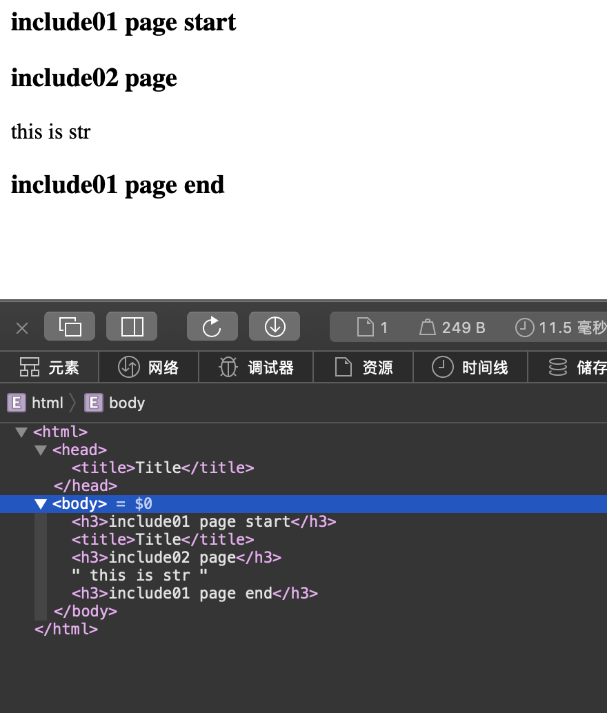

## JSP标签
### 1.JSP标签-基本概念
[top](#catalog)
- JSP还提供了一种称为`Action`的元素，在JSP页面中使用Action元素**可以完成各种通用的JSP页面功能**，也可以实现一些复杂业务逻辑的专用功能
- Action元素采用XML元素的语法格式，即每个Action元素在JSP页面中都已XML标签的形式出现
- JSP规范中定义了一些标准的Action元素，这些元素的标签名都以jsp作为前缀，并且全部采用小写
    - `<jsp:include>`，`<jsp:forward>`，`<jsp:param>` 

### 2.JSP标签-\<jsp:include\>
[top](#catalog)
- `<jsp:include>`标签用于把另外一个资源的输出内容插入当前JSP页面的输出内容之中，这种在JSP页面执行时的引入方式称为**动态引入**
    - <label style="color:red">引入的文件必须是一个能独立被Web容器调用和执行的资源，并且该资源只能是当前web应用下的</label>
    - 最终的编译结果是多个Servlet源文件
    - 编译结果中的引入方式
        ```java
        org.apache.jasper.runtime.JspRuntimeLibrary.include(request, response, "jspinclude02.jsp", out, false);
        ```
- 语法`<jsp:include page="相对路径">`
- 与绝对引用：`<%@ include file="引入文件的相对路径">`的本质区别
    
    |区别|<jsp:include page="相对路径">|`<%@ include file="引入文件的相对路径">`|
    |-|-|-|
    |对引入文件的要求|必须是一个能独立被Web容器调用和执行的资源|只能引入遵循JSP格式的文件|
    |合并/引用时机|执行期间插入被引入资源的输出内容|编译时|
    |生成的结果|多个Servlet源文件|一个Servlet源文件|
- 可以使用`<jsp:param>`子标签向转发页面传入一些参数
- 示例
    - [/java/mylearn/weblearn/src/main/webapp/jsptag/jspinclude01.jsp](/java/mylearn/weblearn/src/main/webapp/jsptag/jspinclude01.jsp)
        ```html
        <%@ page contentType="text/html;charset=UTF-8" language="java" %>
        <html>
        <head>
            <title>Title</title>
        </head>
        <body>

        <h3>page a start</h3>

        <jsp:include page="jspinclude02.jsp"></jsp:include>

        <h3>page a end</h3>

        </body>
        </html>
        ```
    - [/java/mylearn/weblearn/src/main/webapp/jsptag/jspinclude02.jsp](/java/mylearn/weblearn/src/main/webapp/jsptag/jspinclude02.jsp)
        ```html
        <%@ page contentType="text/html;charset=UTF-8" language="java" %>
        <html>
        <head>
            <title>Title</title>
        </head>
        <body>

        <h3>page b</h3>

        </body>
        </html>
        ```
    - 生成的Servlet
        ```java
        public void _jspService(final javax.servlet.http.HttpServletRequest request, final javax.servlet.http.HttpServletResponse response)
          throws java.io.IOException, javax.servlet.ServletException {
            ...

            try {
                ...

                out.write("\n");
                out.write("\n");
                out.write("<html>\n");
                out.write("<head>\n");
                out.write("    <title>Title</title>\n");
                out.write("</head>\n");
                out.write("<body>\n");
                out.write("\n");
                out.write("<h3>page a start</h3>\n");
                out.write("\n");
                // 在执行期间插入引入页面的资源
                org.apache.jasper.runtime.JspRuntimeLibrary.include(request, response, "jspinclude02.jsp", out, false);
                out.write("\n");
                out.write("\n");
                out.write("<h3>page a end</h3>\n");
                out.write("\n");
                out.write("\n");
                out.write("</body>\n");
                out.write("</html>\n");
            } catch (java.lang.Throwable t) {
                ...
            }
        }
        ```
    
    - html结果
        - 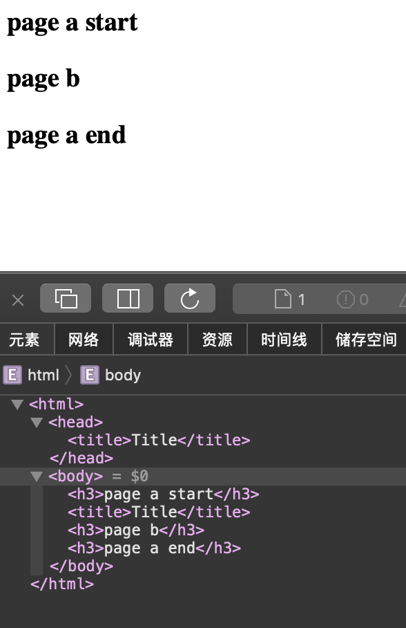

### 3.JSP标签-\<jsp:forward\>
[top](#catalog)
- 转发到其他资源
- 语法:`<jsp:forward page="跳转目录的相对路径">`
- `<jsp:forward>`相当于通过代码转发
    ```java
    request.getRequestDispatcher("跳转目录的相对路径").forward(request,response);
    ```
- 可以使用`<jsp:param>`子标签向转发页面传入一些参数，在目标页面可以通过：`request.getParameter("参数名")`
- 示例
    - 从`jspforward01`跳转到`jspforward02`
    - [/java/mylearn/weblearn/src/main/webapp/jsptag/jspforward01.jsp](/java/mylearn/weblearn/src/main/webapp/jsptag/jspforward01.jsp)
        ```html
        <%@ page contentType="text/html;charset=UTF-8" language="java" %>
        <html>
        <head>
            <title>Title</title>
        </head>
        <body>

        <h3> page jsp forward</h3>

        <jsp:forward page="jspforward02.jsp">
            <jsp:param name="user" value="0987"/>
        </jsp:forward>

        <%--<%--%>
        <%--    request.getRequestDispatcher().forward(request,response);--%>
        <%--%>--%>
        </body>
        </html>
        ```
    - [/java/mylearn/weblearn/src/main/webapp/jsptag/jspforward02.jsp](/java/mylearn/weblearn/src/main/webapp/jsptag/jspforward02.jsp)
        ```html
        <%@ page contentType="text/html;charset=UTF-8" language="java" %>
        <html>
        <head>
            <title>Title</title>
        </head>
        <body>

        <h3>page jspforward02</h3>

        <!-- 在目标页面中获取通过 jsp:param 传送的参数 -->
        <%= request.getParameter("user") %>

        </body>
        </html>
        ```

    - 生成的Servlet
        ```java
        public void _jspService(final javax.servlet.http.HttpServletRequest request, final javax.servlet.http.HttpServletResponse response)
            throws java.io.IOException, javax.servlet.ServletException {
            ...

            final javax.servlet.jsp.PageContext pageContext;
            ...
            javax.servlet.jsp.PageContext _jspx_page_context = null;


            try {
                _jspx_page_context = pageContext;
                
                out.write("\n");
                out.write("\n");
                out.write("<html>\n");
                out.write("<head>\n");
                out.write("    <title>Title</title>\n");
                out.write("</head>\n");
                out.write("<body>\n");
                out.write("\n");
                out.write("<h3> page jsp forward</h3>\n");
                out.write("\n");
                if (true) {
                    _jspx_page_context.forward("jspforward02.jsp" + "?" + org.apache.jasper.runtime.JspRuntimeLibrary.URLEncode("user", request.getCharacterEncoding())+ "=" + org.apache.jasper.runtime.JspRuntimeLibrary.URLEncode("0987", request.getCharacterEncoding()));
                    return;
                }
                out.write('\n');
                out.write('\n');
                out.write('\n');
                out.write('\n');
                out.write("\n");
                out.write("</body>\n");
                out.write("</html>\n");
            } catch (java.lang.Throwable t) {
                ...
            }
        }
        ```
    - html结果
        - 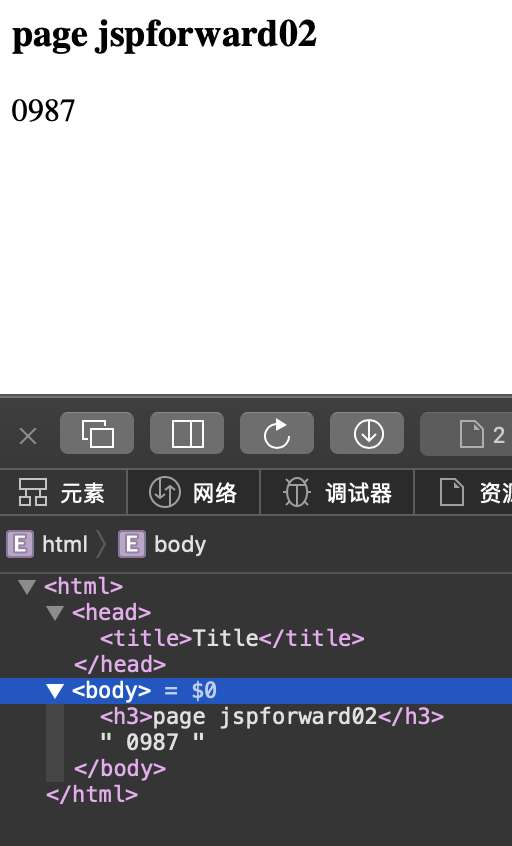

## 异常页面的配置
[top](#catalog)
- 为了不让用户直接访问某个页面，通常将错误页面放在WEB-INF下。WEB-INF下的文件是不能通过在浏览器中直接输入地址来访问的，但是可以通过**转发**来访问
- 两种配置方式
    - 配置方式1：通过JSP指令
        - 在普通页面中配置`<%@ page errorPage="/WEB-INF/错误页面的子路径" %>`
        - 在错误页面中配置`<%@ page isErrorPage="true" %>`
        - 内部通过请求转发来实现

    - 配置方式2：配置web.xml，显示声明error
        - 参考
            - [配置错误的响应页面](#配置错误的响应页面)
            - [配置示例](#配置示例)
        - 这种配置方式下的JSP页面中可以添加JSP指令：`<%@ page isErrorPage="true" %>`，添加后才可以在页面中使用JSP的内部对象`exception`

- ~~配置方式3：重定向到WEB-INF下的异常页面 ???????~~

- 两种配置方式的不同点
    - 方式1的内部使用转发实现
    - 方式2的内部是替换的请求目标
- 两种配置方式的相同点
    - 最终的url都是原始的url

- 示例：方式1
    - JSP
        - 入口页面，testerror.jsp：[/java/mylearn/weblearn/src/main/webapp/jspcmd/testerror.jsp](/java/mylearn/weblearn/src/main/webapp/jspcmd/testerror.jsp)

            ```html
            <%@ page errorPage="error.jsp" %>
            <html>
            <head>
                <title>Title</title>
            </head>
            <body>

            <h3>test error</h3>
            <%
                System.out.println("request = " + request);
                System.out.println("sessionID = " + session.getId());
                session.setAttribute("testSessionParam","testSessionParamValue");
                request.setAttribute("testRequestParam","testRequestParamValue");
                int a = 10 / 0;
            %>

            </body>
            </html>
            ```

        - 错误页面，error.jsp：[/java/mylearn/weblearn/src/main/webapp/jspcmd/error.jsp](/java/mylearn/weblearn/src/main/webapp/jspcmd/error.jsp)

            ```xml
            <%@ page isErrorPage="true" %>
            <html>
            <head>
                <title>Title</title>
            </head>
            <body>

            <h4>error page</h4>
            Error Message = <%= exception.getMessage()%>
            <br>
            exception object = <%=exception%>
            <br>
            request = <%=request%>
            <br>
            sessionID = <%=session.getId()%>
            <br>
            testSessionParam = <%=session.getAttribute("testSessionParam")%>
            <br>
            testRequestParam =  <%=request.getParameter("testRequestParam")%>
            <br>
            param.name = <%=request.getParameter("name")%>

            </body>
            </html>
            ```
    - 页面结果
        - 入口：http://localhost:8080/weblearn_war_exploded/jspcmd/testerror.jsp?name=testName
        - 需要附加请求参数：`name`
        - sessionId相同，请求参数可以在error页面获取，但是request中添加的属性在error页面中无法获取????????
            - 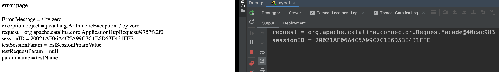


## 解决jsp中文乱码问题
[top](#catalog)

- 问题1，显示问题：在JSP页面上输入中文，请求页面后不出现乱码 
    - 保持三个编码配置一致，且最好都为**UTF-8**
        1. charset: `<%@ page contentType="text/html;charset=UTF-8" %>`
        2. pageEncoding: `<%@ page pageEncoding="UTF-8" %>`
        3. 浏览器的字符编码
    
- 问题2：如何获取中文参数值
    - 默认情况下，参数在传输过程中使用的编码是：`ISO-8859-1`
    - post请求
        - 解决方法1：在获取请求信息之前，设定编码
            - 设定方法：`request.setCharacterEncoding("UTF-8");`
            - <label style="color:red">必须在第一次获取之前进行设定，否则在获取过变量之后再设定，该设定无效</label>
        - 解决方法2：先解码，再编码
            ```java
            String username1 = request.getParameter("username");
            out.println(username1);
            out.println("<br>");
            String utf8Name = new String(username1.getBytes("iso-8859-1"), "UTF-8");
            out.println(utf8Name);
            out.println("<br>");
            ```
    - get请求 ???????????
        - tomcat9.x中，默认使用`UTF-8`编码
        - tomcat的说明内容：`http://localhost:8080/docs/config/http.html`
        - 修改tomcat的`apache-tomcat-9.0.30/conf/server.xml`，添加使用请求体的编码：`useBodyEncodingForURI=true`
            ```xml
            <Connector port="8080" protocol="HTTP/1.1"
               connectionTimeout="20000"
               redirectPort="8443" useBodyEncodingForURI="true"/>
            ```

## 在JSP中使用JavaBean
[top](#catalog)
- JavaBean的基本规则
    - 用作JavaBean的类必须具有一个公共的、无参数的构造方法
    - JavaBean的属性与普通Java类的属性的概念不一样，**JavaBean的属性是以方法定义的形式出现的**
    - 用于对属性赋值的方法是setter方法，用于读取属性值的方法是getter方法
        - setter必须以小写的set前缀开始，后跟属性名，且属性名的第一个字母要大写
        - getter必须以小写的get前缀开始，后跟属性名，且属性名的第一个字母要大写
    - JavaBean的属性名是根据setter和getter方法名称来生成的，属性名的一个字母必须小写

- 在JSP中如何使用JavaBean（已经过时，只作为了解内容，开发时几乎不用）
    - `<jsp:useBean>`，获取javaBean实例对象
    - `<jsp:setProperty>`为javaBean实例对象设值
    - `<jsp:getProperty>`从javaBean实例对象中取值

- <label style="color:red">在当前页面使用`<jsp:setProperty>`或者`<jsp:getProperty>`之前，必须使用`<jsp:useBean>`在JSP内部获取到相应的JavaBean对象，无论该对象在哪个域中，否则直接使用setProperty或getProperty会导致页面异常</label>

- `<jsp:useBean>`标签
    - 用于在某个域范围(application, session, request, pageContext等)中查找一个指定名称的JavaBean对象，如果存在则返回该JavaBean对象的引用，如果不存在则实例化一个新的JavaBean对象并将它按指定的名称存储在指定的域范围中
    
    - 语法
        1. `<jsp:useBean id="beanInstanceName" class="package.class" scope="域对象(application, session, request, page)">`
            - class属性用于指定JavaBean的完整类，必须带有包名
            - id属性用于指定JavaBean实例对象的引用名称和其存储在域范围中的名称
            - scope属性用于指定JavaBean实例对象所存储的域范围，其取值只能是：`application、session、request、page`中的一个，某人为page
        
        2. `<jsp:useBean id="beanInstanceName" beanName="反射实例化对象时使用的类型" type="创建JSP内部对象时使用的类型" scope="域对象(application, session, request, page)"/>`

    - 两种语法都会先从域对象中获取bean对象，如果获取失败，则进行实例化，但是实例化的方式不同

    - 两种语法的实例化对象方式
        - 第一种语法会直接将class引入编译后的Servlet中，并用class直接创建
            - `<jsp:useBean id="customer1" class="com.ljs.test.useJavaBean.Customer" scope="request"/>`
            ```java
            com.ljs.test.useJavaBean.Customer customer1 = null;
            // 先从域对象的属性中获取，没有获取到时，再创建
            customer1 = (com.ljs.test.useJavaBean.Customer) _jspx_page_context.getAttribute("customer1", javax.servlet.jsp.PageContext.REQUEST_SCOPE);
            if (customer1 == null){
                // 使用class直接实例化对象
                customer1 = new com.ljs.test.useJavaBean.Customer();
                _jspx_page_context.setAttribute("customer1", customer1, javax.servlet.jsp.PageContext.REQUEST_SCOPE);
            }
            ```
        - 第二种语语法会通过反射来实例化对象
            - 不同的type会导致不同类型的JSP内部对象
            - `<jsp:useBean id="customer3" beanName="com.ljs.test.useJavaBean.Customer" type="com.ljs.test.useJavaBean.Customer" scope="request"/>`
                ```java
                // 使用type：com.ljs.test.useJavaBean.Customer创建内部对象
                com.ljs.test.useJavaBean.Customer customer3 = null;
              // 从域对象中获取指定的bean对象
                customer3 = (com.ljs.test.useJavaBean.Customer) _jspx_page_context.getAttribute("customer3", javax.servlet.jsp.PageContext.REQUEST_SCOPE);
                if (customer3 == null){
                    try {
                      // 无法获取到时，使用反射来实例化对象
                      customer3 = (com.ljs.test.useJavaBean.Customer) java.beans.Beans.instantiate(this.getClass().getClassLoader(), "com.ljs.test.useJavaBean.Customer");
                    } catch (java.lang.ClassNotFoundException exc) {
                      throw new InstantiationException(exc.getMessage());
                    } catch (java.lang.Exception exc) {
                      throw new javax.servlet.ServletException("Cannot create bean of class " + "com.ljs.test.useJavaBean.Customer", exc);
                    }
              
                    _jspx_page_context.setAttribute("customer3", customer3, javax.servlet.jsp.PageContext.REQUEST_SCOPE);
                }
                ```
            - `<jsp:useBean id="customer4" beanName="com.ljs.test.useJavaBean.Customer" type="java.lang.Object" scope="request"/>`
                ```java
                // 使用type：java.lang.Object创建内部对象
                java.lang.Object customer4 = null;
                 // 从域对象中获取指定的bean对象
                customer4 = (java.lang.Object) _jspx_page_context.getAttribute("customer4", javax.servlet.jsp.PageContext.REQUEST_SCOPE);
                if (customer4 == null){
                    // 无法获取到时，使用反射来实例化对象
                    try {
                      customer4 = (java.lang.Object) java.beans.Beans.instantiate(this.getClass().getClassLoader(), "com.ljs.test.useJavaBean.Customer");
                    } catch (java.lang.ClassNotFoundException exc) {
                      throw new InstantiationException(exc.getMessage());
                    } catch (java.lang.Exception exc) {
                      throw new javax.servlet.ServletException("Cannot create bean of class " + "com.ljs.test.useJavaBean.Customer", exc);
                    }
              
                    _jspx_page_context.setAttribute("customer4", customer4, javax.servlet.jsp.PageContext.REQUEST_SCOPE);
                }
                ```
   
- `<jsp:setProperty>`标签
    - 语法
        - 设定某个Javabean中的某个属性值
            - `<jsp:setProperty property="属性名" value="属性值" name="javabeanID">`
        - 使用请求参数为beanInstance的所有属性赋值
            - `<jsp:setProperty property="*" name="javabeanID">`

- `<jsp:getProperty>`标签
    - 获取某个Javabean中的某个属性值
    - 语法
        - `<jsp:getProperty property="属性名" name="javabeanID">`
    - 相当于JSP表达式：`<%=beanInstance.getXXX() %>`

- 示例
    - index.jsp : [/java/mylearn/weblearn/src/main/webapp/useJavaBean/index.jsp](/java/mylearn/weblearn/src/main/webapp/useJavaBean/index.jsp)
        ```html
        <h3>useJavaBean Test</h3>

        <%--1. 第一种语法：实例化一个对象并设值和取值--%>
        javaBean:customer1 <br>
        <%--实例化一个JavaBean对象--%>
        <jsp:useBean id="customer1" class="com.ljs.test.useJavaBean.Customer" scope="request"/>

        <%--为javaBean对象设值--%>
        <jsp:setProperty name="customer1" property="age" value="11"/>
        <jsp:setProperty name="customer1" property="name" value="newCustomer11"/>

        <%--从javaBean对象取值--%>
        name：<jsp:getProperty name="customer1" property="name"/> <br>
        age：<jsp:getProperty name="customer1" property="age"/> <br>

        <br><br>
        <%--2. 使用所有请求参数来为JavaBean设值--%>
        javaBean:customer2 <br>

        <jsp:useBean id="customer2" class="com.ljs.test.useJavaBean.Customer" scope="request"/>
        <jsp:setProperty name="customer2" property="*"/>

        id:<jsp:getProperty name="customer2" property="id"/><br>
        name:<jsp:getProperty name="customer2" property="name"/><br>
        age:<jsp:getProperty name="customer2" property="age"/><br>

        <br><br>
        <%--3. 第二种语法：实例化一个对象并设值和取值--%>
        javaBean:customer3 <br>
        <%--实例化一个JavaBean对象--%>
        <jsp:useBean id="customer3" beanName="com.ljs.test.useJavaBean.Customer" type="com.ljs.test.useJavaBean.Customer" scope="request"/>

        <%--为javaBean对象设值--%>
        <jsp:setProperty name="customer3" property="age" value="33"/>
        <jsp:setProperty name="customer3" property="name" value="newCustomer33"/>

        <%--从javaBean对象取值--%>
        name：<jsp:getProperty name="customer3" property="name"/> <br>
        age：<jsp:getProperty name="customer3" property="age"/> <br>


        <br><br>
        <%--4. 第二种语法：type测试--%>
        javaBean:customer4 <br>
        <%--实例化一个JavaBean对象--%>
        <jsp:useBean id="customer4" beanName="com.ljs.test.useJavaBean.Customer" type="java.lang.Object" scope="request"/>
        ```
    
    - 编译后的Servlet：[/java/mylearn/weblearn/src/main/java/com/complied/jsp/useJavaBean/index_jsp.java](/java/mylearn/weblearn/src/main/java/com/complied/jsp/useJavaBean/index_jsp.java)

    - 页面结果
        - 直接进入：`http://localhost:8080/weblearn_war_exploded/useJavaBean/index.jsp`
            - 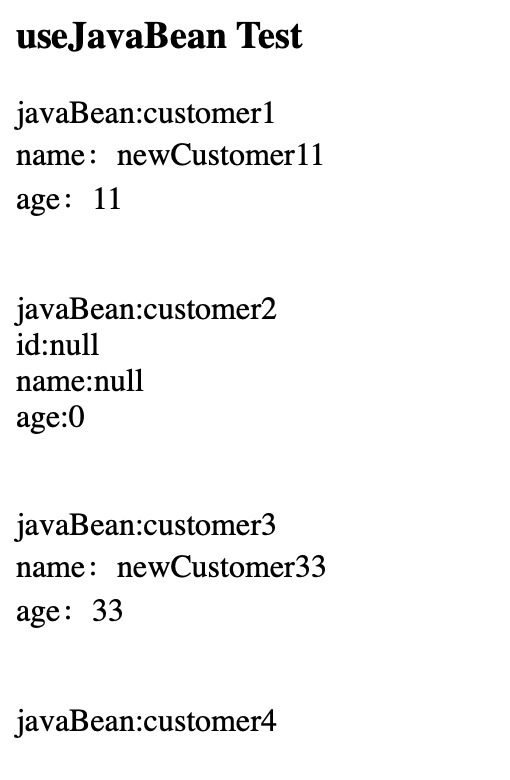
        - 附加请求参数：`http://localhost:8080/weblearn_war_exploded/useJavaBean/index.jsp?age=13&name=aaaa&id=34eee&other=other`
            - 附加多余的请求参数不会有副作用
            - 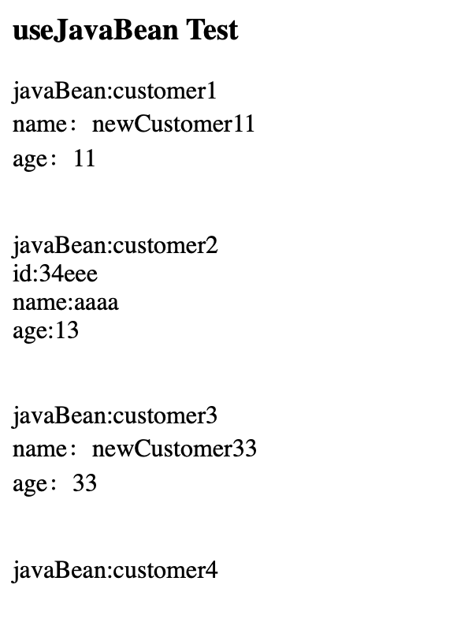


# 转发重定向
## forward和redirect的四种区别
[top](#catalog)

||forward|redirect|
|-|-|-|
|<label style="color:red">本质区别</label>|只发了一次请求<br>地址栏是初次请求的地址|发了两次请求<br>地址栏是最后响应的地址|
|最终的requset|在最终的Servlet中，最终request === 中转的request<br><br><label style="color:red">A页面写入一个属性，并且在B页面可以获取到<br>是因为在A页面直接通过代码转发到了B页面</label>|在最终的Servlet中，最终request对象 !== 中转的request|
|跳转的范围|只能转发给当前Web应用内部的资源|可以重定向到任何资源|
|根目录`/`的区别|代表的是当前Web应用的根目录<br>如：`localhost:8080/web应用名/`|代表当前Web站点的根目录<br>即`localhost:8080/`|

## 转发的流程示意图
1. 浏览器发出请求
    - 
2. Servlet容器创建`Servlet1`
    - 
3. web容器创建`request`和`response`对象
    - 
4. 调用`Servlet1.service()`方法，并传送`request`和`response`对象
    - 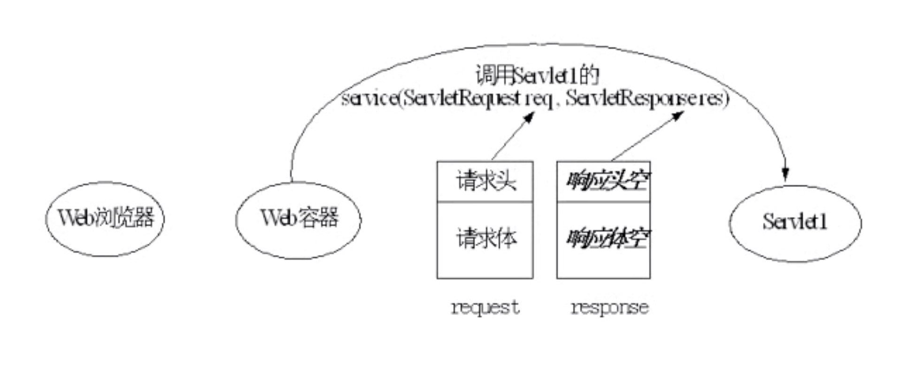
5. `Servlet1.service()`读取`request`对象，并写入`response`对象
    - 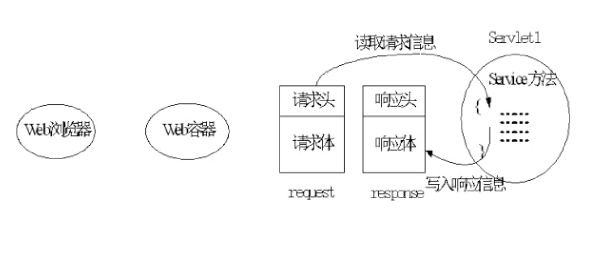
6. `Servlet1.service()`发出`forward`命令
    - 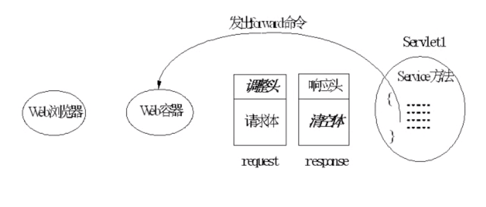
7. `forward`到达web容器后，不做停留，再次发出第二个请求，Servlet容器创建`Servlet2`
    - 发送第二个请求时与浏览器无关
    - `Servlet1.service()`被挂起，等待`Servlet2`的处理结束 ????????实际的流程是什么
    - 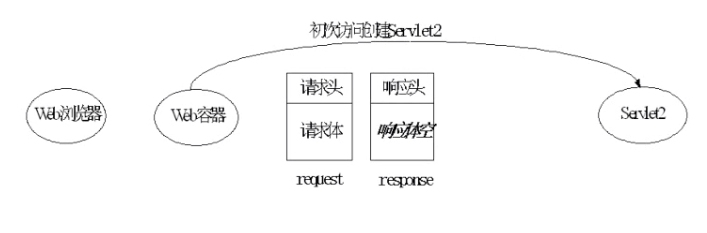
8. 调用`Servlet2.service()`方法，并传送之前**使用过的**`request`和`response`对象
    - 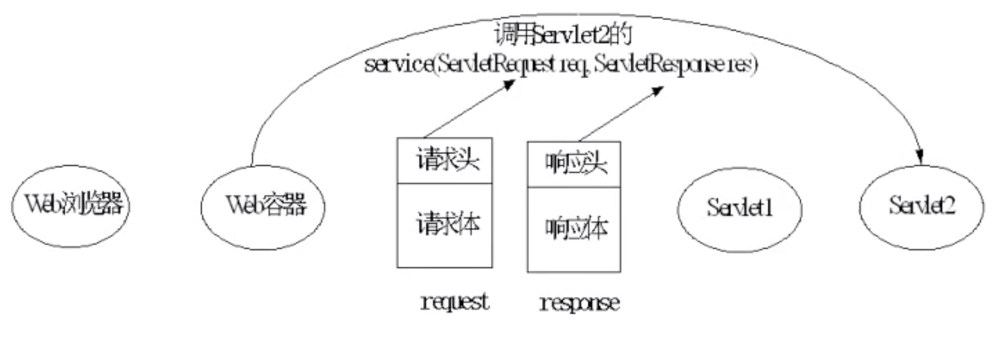
9. `Servlet2.service()`读取`http请求`，并写入`http响应`
    - 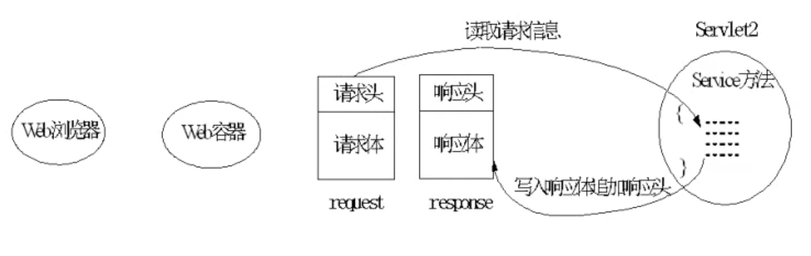
10. `Servlet2.service()`返回
    - 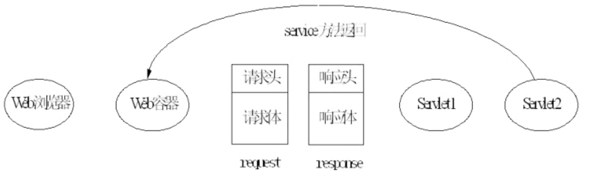
11. `Servlet1.service()`返回
    - 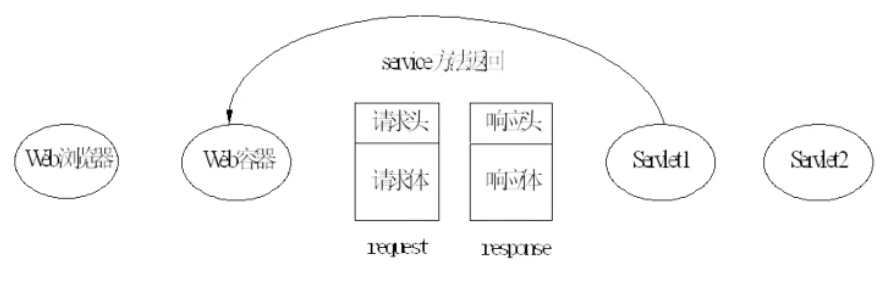
12. Web容器读取`response`对象中的信息
    - 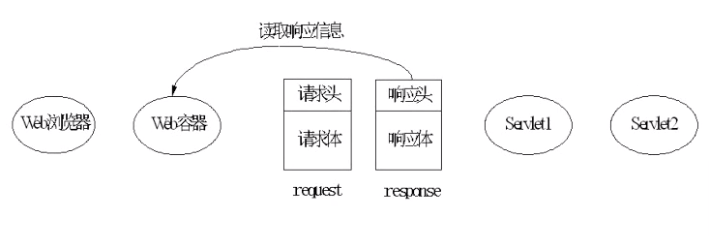
13. Web容器将`http响应`发送到浏览器
    - 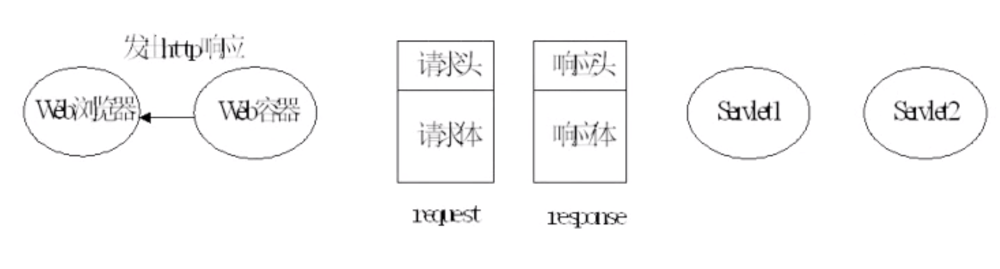

## 重定向的流程示意图
[top](#catalog)
1. 浏览器发出请求
    - 
2. Servlet容器创建`Servlet1`
    - 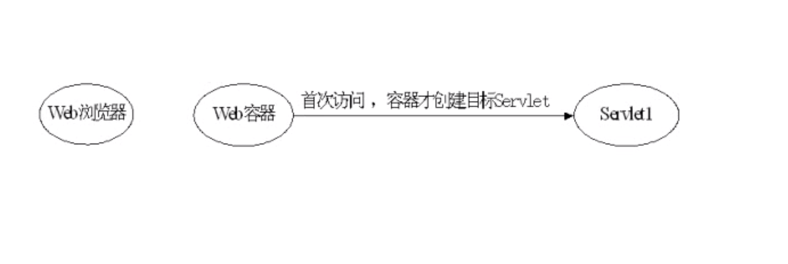
3. web容器创建`request`和`response`对象
    - 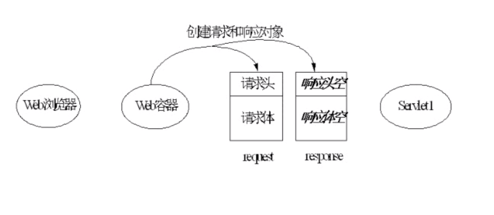
4. 调用`Servlet1.service()`方法，并传送`request`和`response`对象
    - 
5. `Servlet1.service()`读取`request`对象，处理后，通过`HttpServletResponse.sendRedirect()`方法写入特殊的响应头
    - 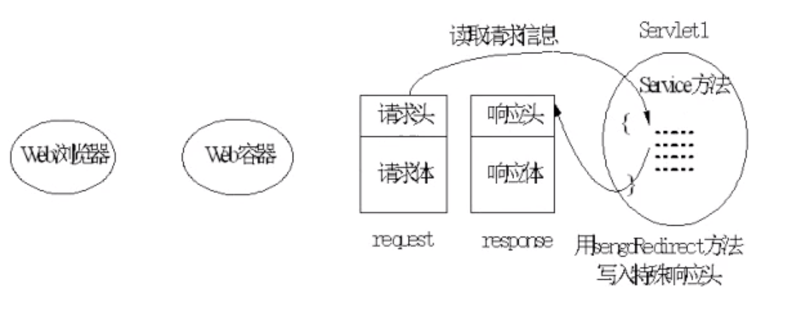
6. `Servlet1.service()`方法返回
    - 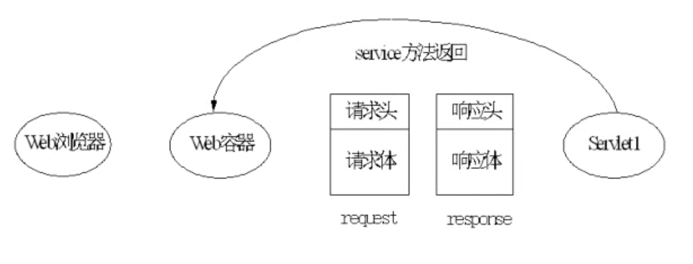
7. Web容器从`response`对象中读取响应信息
    - 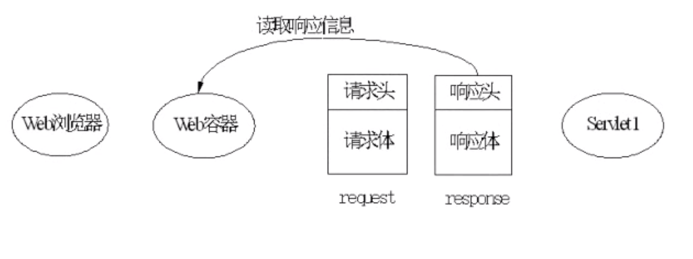
8. Web容器发现响应信息中有**重定向请求**，则将将包含http重定向信息的响应发送给Web浏览器
    - 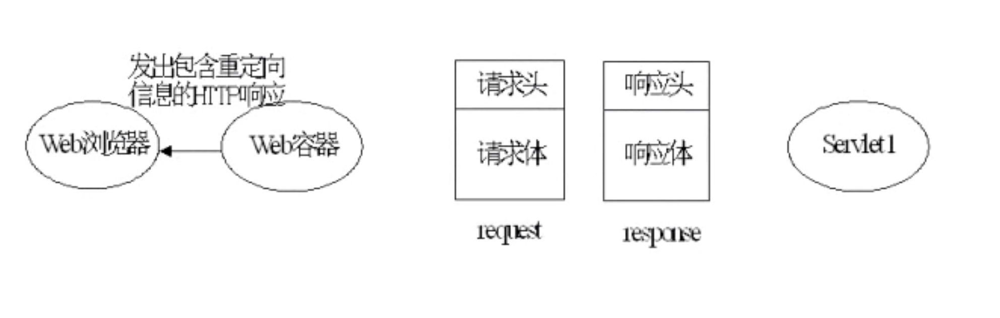
9. Web浏览器发出：包含重定向的请求信息
    - 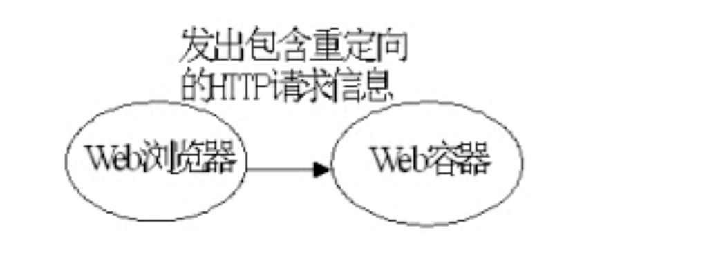
10. Servlet容器创建`Servlet2`
    - 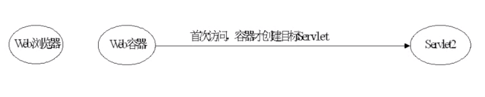
11. Web容器创建新的`request`和`response`对象
    - 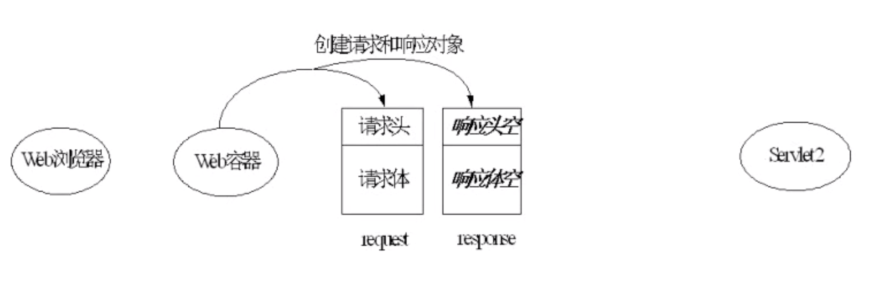
12. 调用`Servlet2.service()`方法，并传送**新的**`request`和`response`对象
    - 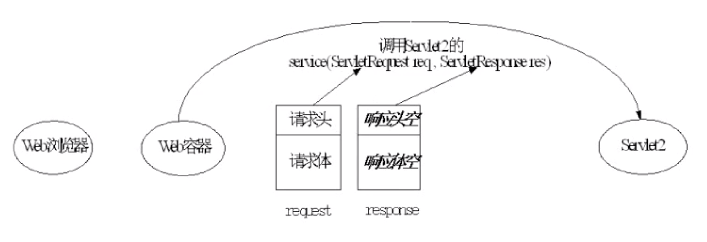
13. `Servlet2.service()`读取`request`，并写入`response`
    - 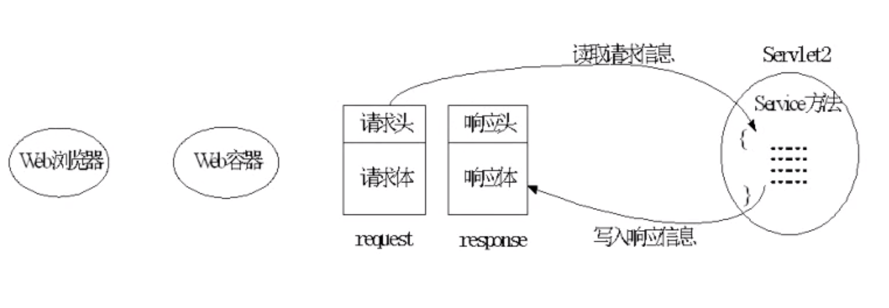
14. `Servlet2.service()`返回
    - 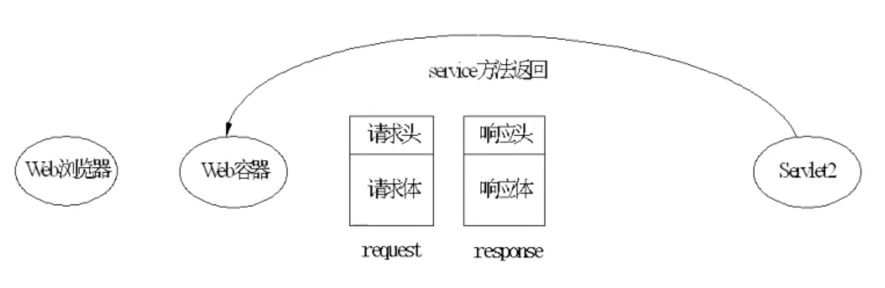
15. Web容器读取`response`对象
    - 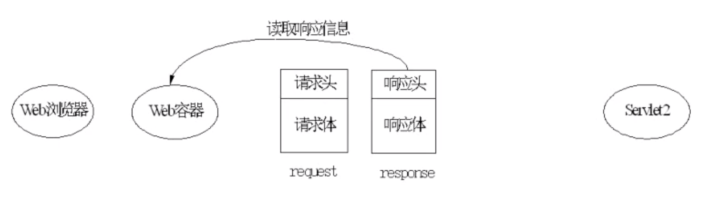
16. Web容器向Web浏览器发送`http响应`
    - 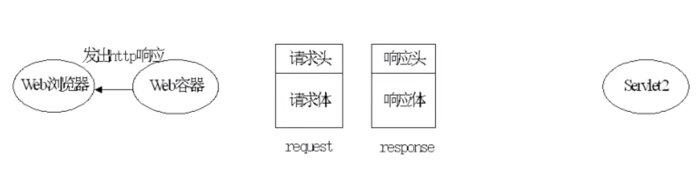

## Servlet中的转发重定向方法
[top](#catalog)
- RequestDispatcher接口
    - RequestDispatcher 实例对象由Servlet引擎创建
    - 该接口用于包装一个要被其他资源调用的资源(如，Servelt，HTML文件，JSP文件)，并可以通过其中的方法**将客户端的请求转发给所包装的资源**
    - 接口中定义了两个方法：forward，include

- 使用`RequestDispatcher.forward`来转发
    ```java
    // 1. 获取 RequestDispatcher 对象
    // 调用HttpServletRequest 的 getRequestDispatcher() 方法 获取 RequestDispatcher 对象
    // 调用getRequestDispatcher()时，需要传入要转发的地址
    String path = "转发地址";
    RequestDispatcher requestDispatcher = request.getRequestDispatcher(path);

    // 2. 调用HttpServletRequest的forward(request, response)进行请求转发
    requestDispatcher.forward(req,resp);
    ```

- 使用`HttpServletResponse.sendRedirect`来重定向
    ```java
    // path为要重定向的地址
    String path = "重定向的地址";
    response.sendRedirect(path);
    ```

- 示例
    - dispatcher/test.html
        ```html
        <!DOCTYPE html>
        <html lang="en">
        <head>
            <meta charset="UTF-8">
            <title>Title</title>
        </head>
        <body>
        
        <!-- 转发 -->
        <a href="forwardServlet">forwardServlet</a>

        <!-- 重定向 -->
        <a href="redirectServlet">redirectServlet</a>
        </body>
        </html>
        ```
    - dispatcher/ForwardServlet.java，转发Servlet
        ```java
        /*
        * 转发Servlet
        * */
        public class ForwardServlet extends HttpServlet {
            @Override
            protected void doGet(HttpServletRequest req, HttpServletResponse resp) throws ServletException, IOException {
                System.out.println("ForwardServlet doget");

                // 设置属性，并在目标Servlet进行检测
                req.setAttribute("name", "request from ForwardServlet");
                System.out.println("ForwardServlet requestAttr : " + req.getAttribute("name"));

                // 请求的转发
                // 1. 获取 RequestDispatcher 对象
                // 调用HttpServletRequest 的 getRequestDispatcher() 方法 获取 RequestDispatcher 对象
                // 调用getRequestDispatcher()时，需要传入要转发的地址

                // 绝对路径会从当前应用的根目录开始搜索，即：http://localhost:8080/weblearn_war_exploded/
                // String path = "/dispatcher/testServlet";
                // 相对路径会从当前目录开始搜索
                String path = "testServlet";
                RequestDispatcher requestDispatcher = req.getRequestDispatcher(path);

                // 2. 调用HttpServletRequest的forward(request, response)进行请求转发
                requestDispatcher.forward(req,resp);
            }
        }
        ```

    - dispatcher/RedirectServlet.java，重定向Servlet
        ```java
        /*
        * 重定向
        * */
        public class RedirectServlet extends HttpServlet {
            @Override
            protected void doGet(HttpServletRequest req, HttpServletResponse resp) throws ServletException, IOException {
                System.out.println("RedirectServlet doget");

                // 设置属性，并在目标Servlet进行检测
                req.setAttribute("name", "request from RedirectServlet");
                System.out.println("RedirectServlet requestAttr : " + req.getAttribute("name"));

                // 执行请求的重定向，直接调用respnose.sendRedirect(path)方法
                // path为重定向目标的地址

                // 绝对路径会直接从服务器根目录下搜索，即：http://localhost:8080/
                String path = "/weblearn_war_exploded/dispatcher/testServlet";
                // 相对路径会接在当前目录下搜索
                // String path = "testServlet";
                resp.sendRedirect(path);
            }
        }
        ```

    - dispatcher/TestServlet.java，转发和重定向的目标
        ```java
        public class TestServlet extends HttpServlet {
            @Override
            protected void doGet(HttpServletRequest req, HttpServletResponse resp) throws ServletException, IOException {
                System.out.println("TestServlet doget");

                // 测试当前的request 与 转发 和 重定向 的request对象是否相同
                System.out.println("TestServlet requestAttr : " + req.getAttribute("name"));
            }
        }
        ```

    - web.xml
        ```xml
        <servlet>
            <servlet-name>testServlet</servlet-name>
            <servlet-class>com.ljs.test.dispatcher.TestServlet</servlet-class>
        </servlet>
        <servlet-mapping>
            <servlet-name>testServlet</servlet-name>
            <url-pattern>/dispatcher/testServlet</url-pattern>
        </servlet-mapping>

        <servlet>
            <servlet-name>forwardServlet</servlet-name>
            <servlet-class>com.ljs.test.dispatcher.ForwardServlet</servlet-class>
        </servlet>
        <servlet-mapping>
            <servlet-name>forwardServlet</servlet-name>
            <url-pattern>/dispatcher/forwardServlet</url-pattern>
        </servlet-mapping>

        <servlet>
            <servlet-name>redirectServlet</servlet-name>
            <servlet-class>com.ljs.test.dispatcher.RedirectServlet</servlet-class>
        </servlet>
        <servlet-mapping>
            <servlet-name>redirectServlet</servlet-name>
            <url-pattern>/dispatcher/redirectServlet</url-pattern>
        </servlet-mapping>
        ```

    - 通过forward跳转到testServlet
        - 请求次数
            - 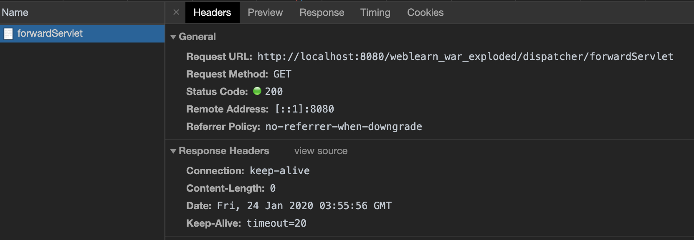
        - 最终的url：`http://localhost:8080/weblearn_war_exploded/dispatcher/forwardServlet`
        - 输出结果
            - 因为：`最终request === 中转的request`，所以在TestServlet中可以获取到在ForwardServlet中设置的属性
            - 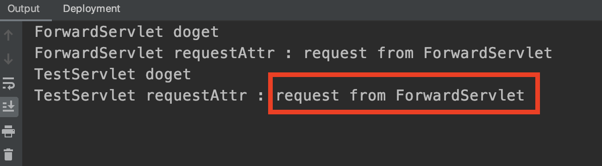

    - 通过redirect跳转到testServlet
        - 请求次数
            - 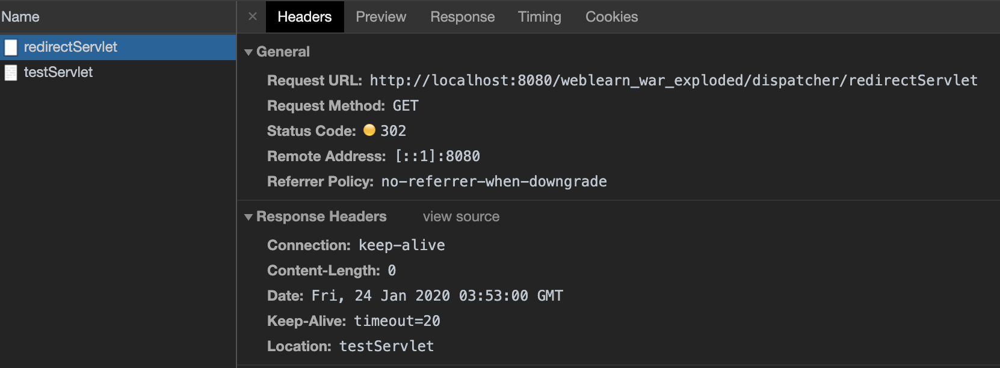
        - 最终的url：`http://localhost:8080/weblearn_war_exploded/dispatcher/testServlet`
        - 输出结果
            - 因为：`最终request !== 中转的request`，所以在TestServlet中无法获取到在ForwardServlet中设置的属性
            - 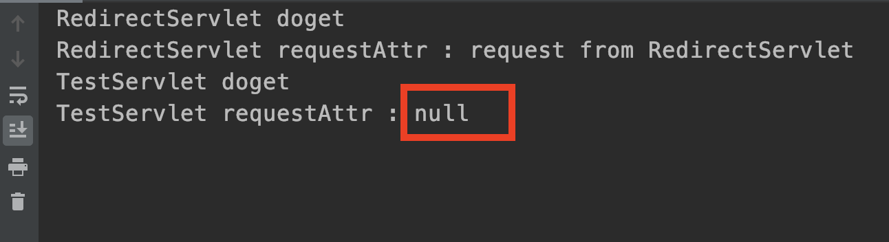

# MVC设计模式
## MVC模式的架构演进
[top](#catalog)
- 以Servlet为中心，全部代码都写在Servlet的问题
    - Servlet不擅长页面显示，通过`out.println`来输出html内容比较麻烦
    - 如果将数据库访问的代码写在Servlet中，则这部分代码可能不能重用
    - 整体架构
        - 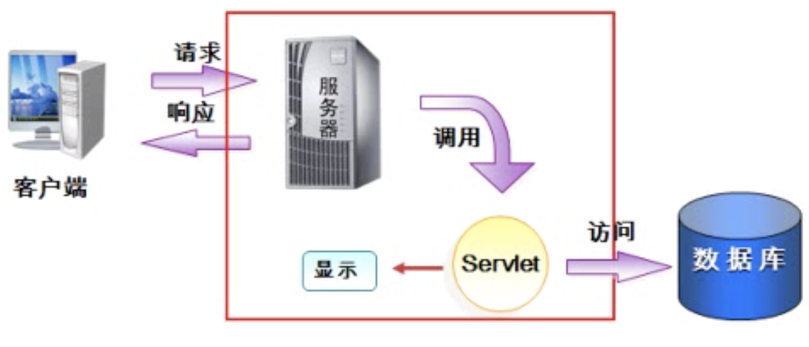

- 将Servlet替换为JSP
    - 通过JSP可以解决页面显示的问题
    - 但是数据库访问的代码需要写在JSP页面中，这部分代码也无法重用
    - 整体架构
        - 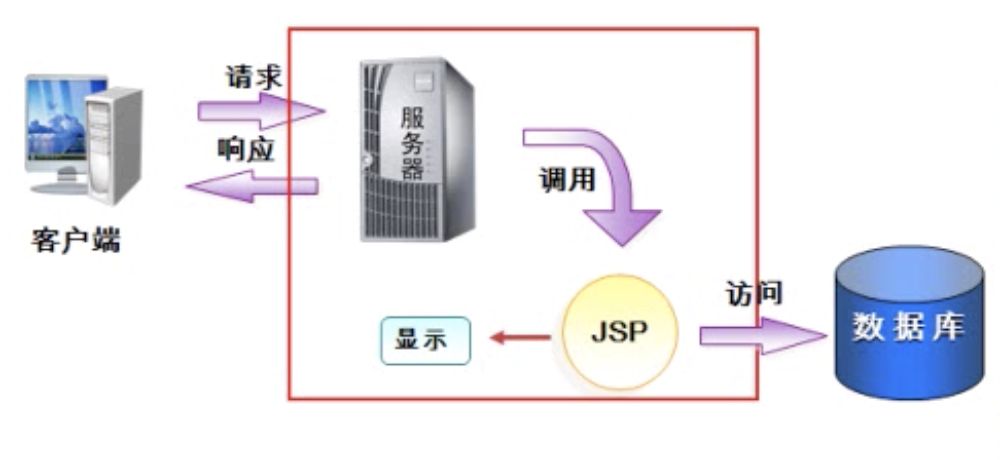
    
- MVC模式：将JSP和Servlet分开
    - 拆分方式
        - 将访问数据库的逻辑放在Servlet中
            - 请求发送到服务器，服务器调用Servlet，Servlet调用java类来访问数据库
            - 数据库返回结果到Servlet，Servlet根据结果转向不同的JSP页面
                - 通过转发，或者重定向
        - 页面显示部分交给JSP
    - 整体架构
        - 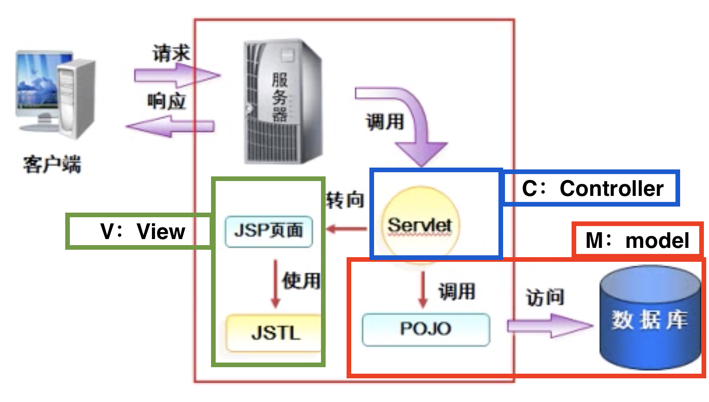
    
## MVC的概念
[top](#catalog)
- MVC是Model-VIew-Controller的简称，即模型-视图-控制器
- MVC是一种设计模式，它把应用程序分成三个核心模块：模型、视图、控制器，它们各自处理自己的任务
- Model，模型
    - 模型是应用程序的**主体部分**，模型表示**业务数据和业务逻辑**
    - 一个模型能为多个视图提供数据
        - 输出可以是各种操作系统上的适配
    - 有用应用于模型的代码只需要写一次就可以被多个视图重用，所以提高了代码的可重用性
- View，视图
    - 视图是用户看到并与之交互的界面
    - 视图向用户显示相关的数据
    - 可以接受用户的输入
    - 不进行任何实际的业务处理

- Controller，控制器
    - 控制器接受用户的输入并调用模型和视图去完成用户的需求
    - 控制器接受请求并决定调用那个模型组件去处理请求，然后决定调用那个视图来显示请求处理的结果

## MVC示例
[top](#catalog)

- 参考：[/java/mylearn/weblearn/src/main/java/com/ljs/mvc](/java/mylearn/weblearn/src/main/java/com/ljs/mvc)
- 入口：`http://localhost:8080/weblearn_war_exploded/mvc/query.do`
- MVC划分
    - V：`mylearn/weblearn/src/main/webapp/mvc`
    - C：`mylearn/weblearn/src/main/java/com/ljs/mvc/controller/ControllerServlet.java`
    - M：
        - `mylearn/weblearn/src/main/java/com/ljs/mvc/dao`
        - `mylearn/weblearn/src/main/java/com/ljs/mvc/bean`

- 转发/重定向原则：如果需要使用域对象中的属性，则进行转发，否则使用重定向
- 可以获取参数信息的位置
    - `request.getParameter`
    - `request.getAttribute`
- 多个处理共用一个Servler做为Controller的方法
    1. 在每个请求上添加处理方式，并在Controller中进行解析
        - 缺点：get请求中无法防止处理内容被修改
    2. 在web.xml配置Controller响应所有的`*.do`请求，并在Controll中解析`*`的内容，并通过反射来调用Controller内部的方法
        - web.xml
            ```xml
            <servlet>
                <servlet-name>ControllerServlet</servlet-name>
                <servlet-class>com.ljs.mvc.controller.ControllerServlet</servlet-class>
            </servlet>
            <servlet-mapping>
                <servlet-name>ControllerServlet</servlet-name>
                <url-pattern>*.do</url-pattern>
            </servlet-mapping>
            ```
        - 反射分析：[/java/mylearn/weblearn/src/main/java/com/ljs/mvc/controller/ControllerServlet.java](/java/mylearn/weblearn/src/main/java/com/ljs/mvc/controller/ControllerServlet.java)
            ```java
            private void controller(HttpServletRequest req, HttpServletResponse resp){
                String[] split = req.getServletPath().split("/");
                String actionPath = split[split.length - 1];
                // /action.do ,将action截取出来
                String action = actionPath.substring(0, actionPath.length() - 3);
                try {
                    Method method = getClass().getDeclaredMethod(action, HttpServletRequest.class, HttpServletResponse.class);
                    method.invoke(this, req, resp);
                } catch (Exception e) {
                    e.printStackTrace();
                    // 如果action异常，则跳转到异常页面
                    try {
                        req.getRequestDispatcher("/WEB-INF/mvc/noAction.jsp").forward(req,resp);
                    } catch (ServletException ex) {
                        ex.printStackTrace();
                    } catch (IOException ex) {
                        ex.printStackTrace();
                    }

                }

            }
            ```

- 通过配置文件来解耦Controller内部Dao对象的获取方法
    - 在配置文件中规定使用Dao的实现对象：xml或jdbc
        - 参考：[/java/mylearn/weblearn/src/main/webapp/WEB-INF/classes/config/dao.properties](/java/mylearn/weblearn/src/main/webapp/WEB-INF/classes/config/dao.properties)
    - 创建一个Dao工厂，根据配置文件中的对象类型来创建Dao对象
        - 在工厂内部，不主动设定Dao对象的类型：type，而是通过初始化Servlet来设定
        - 参考：[/java/mylearn/weblearn/src/main/java/com/ljs/mvc/dao/CustomerDaoFactory.java](/java/mylearn/weblearn/src/main/java/com/ljs/mvc/dao/CustomerDaoFactory.java)
        - 实现
            ```java
            public class CustomerDaoFactory {
                // 使用单例模式
                private static CustomerDaoFactory instance = new CustomerDaoFactory();
                private Map<String, CustomerDao> daoMap= new HashMap<>();

                // 私有化构造器，只能在类内部示例化对象
                private CustomerDaoFactory(){
                    // 初始化时，构造所有可能类型的对象
                    daoMap.put("jdbc", new CustomerDaoImpl());
                    daoMap.put("xml", new CustomerXmlImpl());
                }

                // 在外部获取工厂的单例对象
                public static CustomerDaoFactory getInstance(){
                    return instance;
                }
                
                // 根据类型来获取真实的Dao对象
                private String type = null;
                public void setType(String type){
                    this.type = type;
                }

                public CustomerDao getDao(){
                    return daoMap.get(type);
                }
            }
            ```
    - 创建一个初始化Servlet，通过web.xml配置的`load-on-startup`参数在整个服务器启动时读取配置，并设定工厂中Dao对象的真实类型
        - 参考：[/java/mylearn/weblearn/src/main/java/com/ljs/mvc/controller/InitServlet.java](/java/mylearn/weblearn/src/main/java/com/ljs/mvc/controller/InitServlet.java)
        - 实现
            ```java
            public class InitServlet extends HttpServlet {
                // 初始化时读取配置文件
                @Override
                public void init() throws ServletException {
                    InputStream is = getServletContext().getResourceAsStream("WEB-INF/classes/config/dao.properties");
                    Properties ps = new Properties();
                    try {
                        ps.load(is);
                        String type = ps.getProperty("type");
                        CustomerDaoFactory.getInstance().setType(type);
                    } catch (IOException e) {
                        e.printStackTrace();
                    }
                }
            }
            ```
        - 配置web.xml
            ```xml
            <servlet>
                <servlet-name>initServlet</servlet-name>
                <servlet-class>com.ljs.mvc.controller.InitServlet</servlet-class>
                <load-on-startup>1</load-on-startup>
            </servlet>
            ```

- 内部流程
    - 查询
        - `query.do`
        - 执行模糊检索
        - 转发到`mylearn/weblearn/src/main/webapp/mvc/index.jsp`，进行显示
        - 可以在`index.jsp`页面执行:检索、删除、跳转添加页面，跳转更新页面

    - 添加
        - `insert.do`
        - 跳转到该页面的两种情况
            1. 可以在`query.do`页面通过链接跳转到：`mylearn/weblearn/src/main/webapp/mvc/insert.jsp`，并显示
            2. 提交时，如果用户名已经存在，则重新转发到`mylearn/weblearn/src/main/webapp/mvc/insert.jsp`，并显示错误信息
        - 页面上的信息来源
            1. 通过链接跳转的时候，页面显示空白
            2. 添加信息发生异常时，是从`request.getParameter`中获取的
        - 添加成功时，重定向到:`mylearn/weblearn/src/main/webapp/mvc/insertSuccess.jsp`，并显示结果

    - 更新
        - `edit.do`、`update.do`
        - Servlet会转发到：`mylearn/weblearn/src/main/webapp/mvc/edit.jsp`，进行显示
        - 如果用户名修改了，则检索数据库，检查用户名是否已被使用
            - 如果使用过，则再次**转发**到`mylearn/weblearn/src/main/webapp/mvc/edit.jsp`，并显示错误信息
        - 没有异常，则进行更新，更新后重定向到：`query.do`，重新进行执行检索，并将结果转发到`mylearn/weblearn/src/main/webapp/mvc/insert.jsp`进行显示

    - 删除
        - `delete.do`
        - 删除后，重定向到：`mylearn/weblearn/src/main/webapp/mvc/deleteSuccess.jsp`

- 数据库
    - 表 customers
        ```sql
        CREATE TABLE `customers` (
            `id` int(10) NOT NULL AUTO_INCREMENT,
            `name` varchar(15) DEFAULT NULL,
            `email` varchar(20) DEFAULT NULL,
            `birth` date DEFAULT NULL,
            `photo` mediumblob,
            PRIMARY KEY (`id`)
        ) ENGINE=InnoDB AUTO_INCREMENT=40 DEFAULT CHARSET=gb2312
        ```

- 页面结果
    1. 入口：http://localhost:8080/weblearn_war_exploded/mvc/query.do
    2. 检索
        - 初始化无条件检索
            - 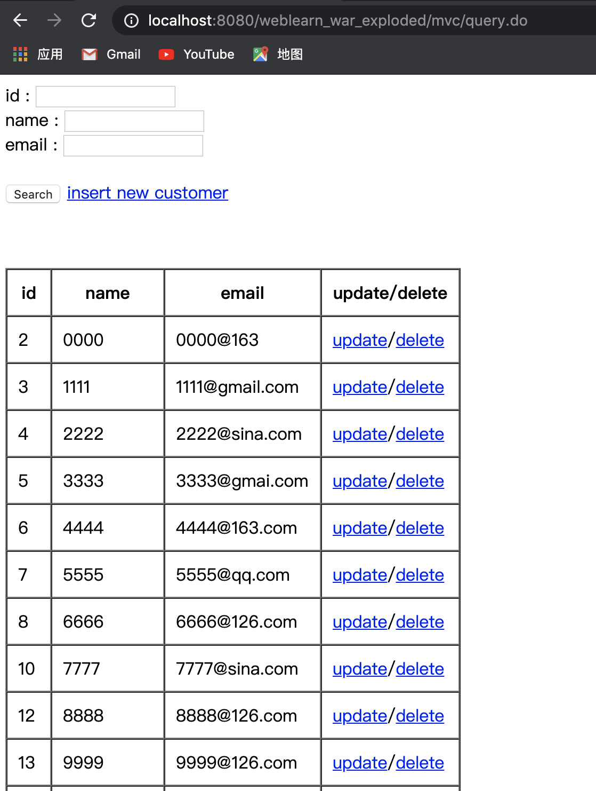
        - 输入条件进行模糊检索
            - 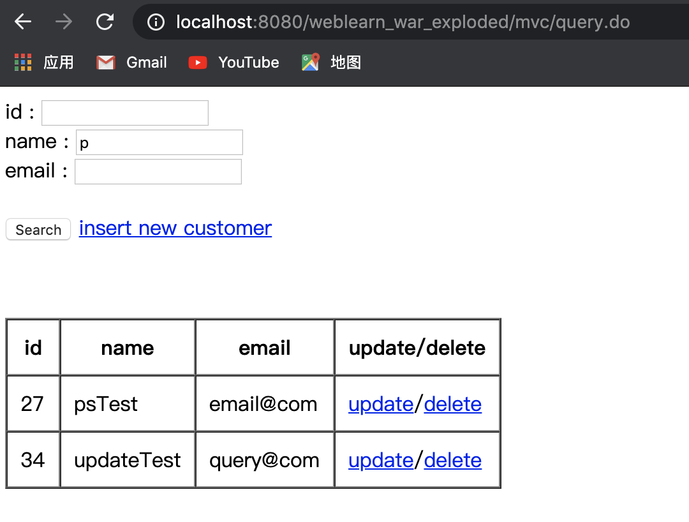
    3. 更新
        - 点击更新链接
            - 
        - 跳转到更新页面
            - 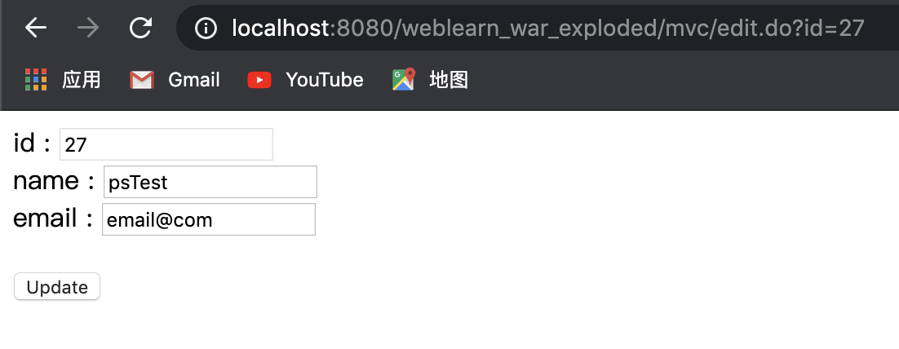
        - 更新为一个已经存在的用户：updateTest
            - 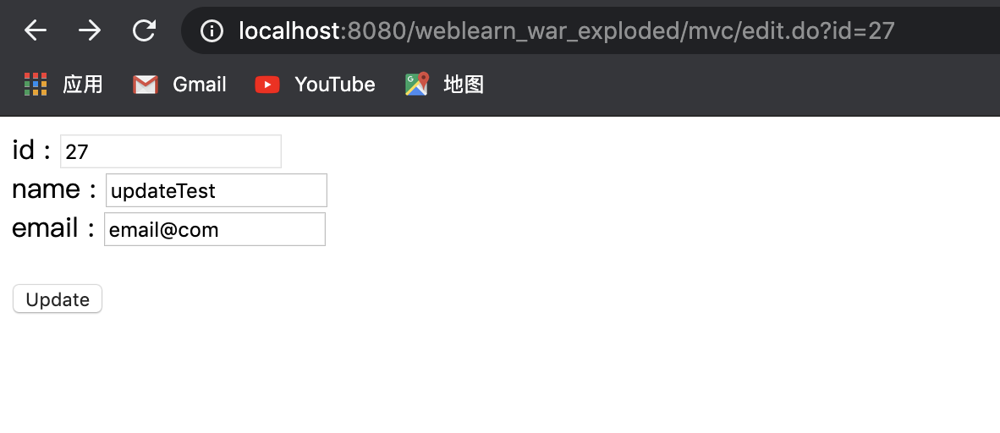
        - 更新，发生异常，重新转发到`edit.jsp`
            - 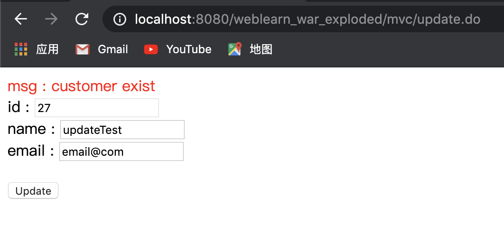
        - 修改成一个新用户：other
            - 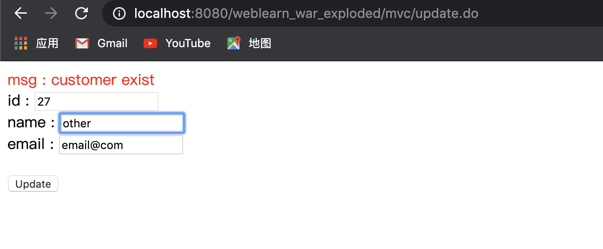
        - 更新成功
            - 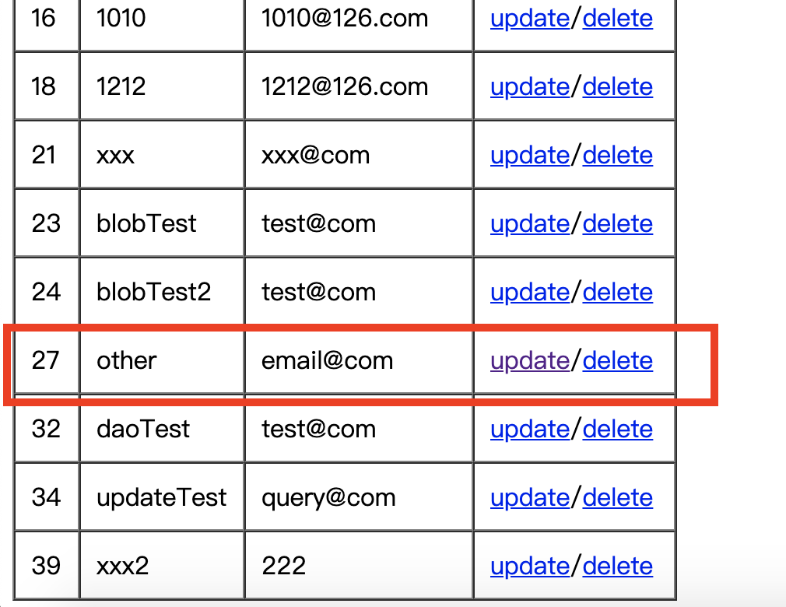
    4. 添加
        - 点击添加链接
            - 
        - 跳转到添加页面，添加一个已经存在的用户：other
            - 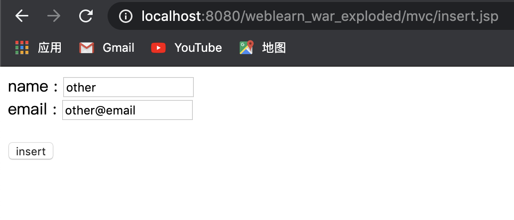
        - 发生添加异常
            - 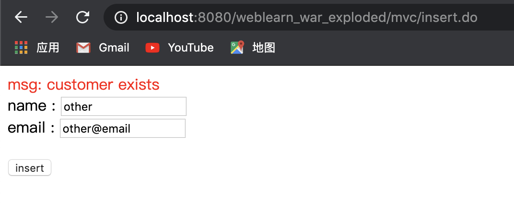
        - 将用户名修改成一个未使用的用户名：123456
            - 
        - 添加成功，跳转到提示信息页面
            - 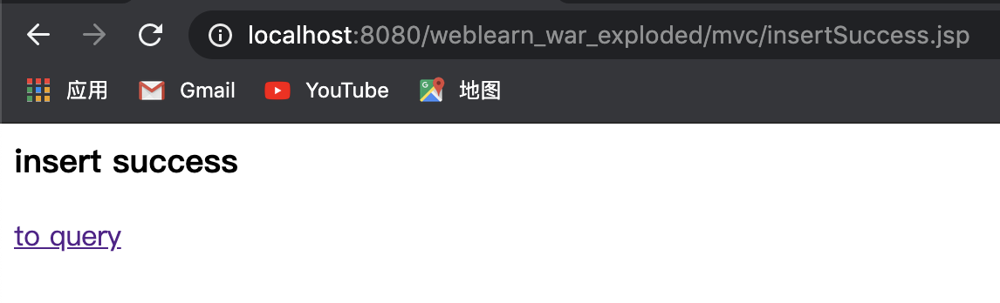
        - 点击链接，回到检索页面，添加成功
            - 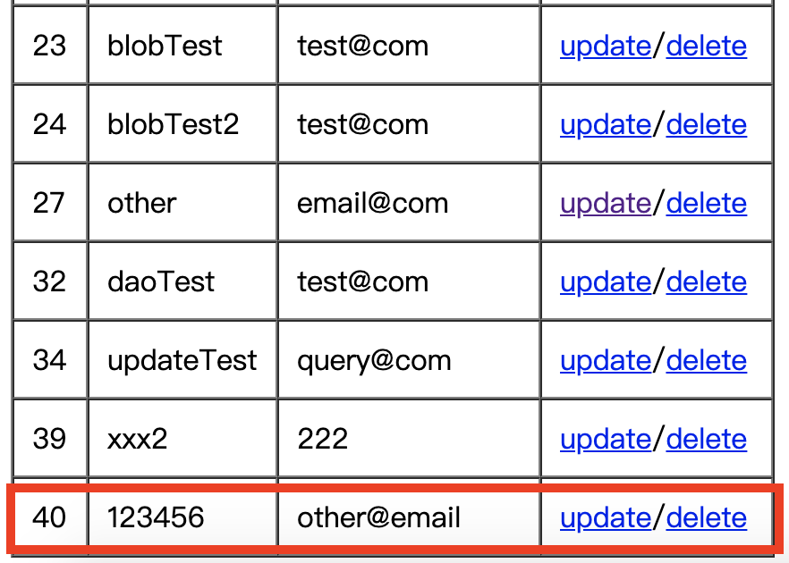
    5. 删除
        - 在检索页面，点击用户的删除链接
            - 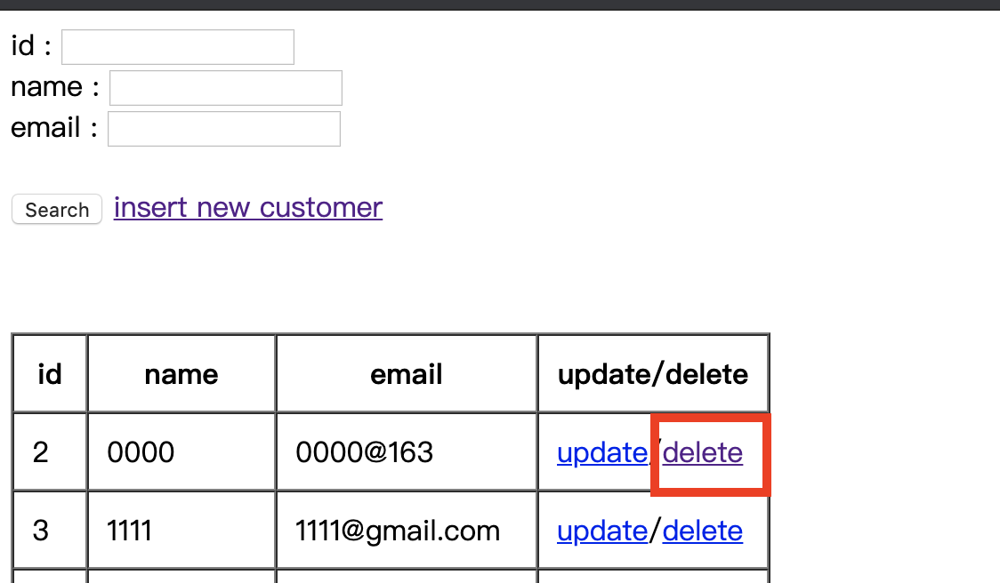
        - 删除成功，跳转到提示信息页面
            - 
        - 点击链接，回到检索页面，用户已经被删除
            - 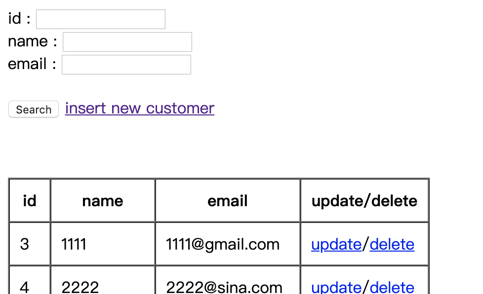

## 使用JSTL来简化MVC架构中的JSP页面
[top](#catalog)
- 参考：[/java/mylearn/weblearn/src/main/webapp/mvcjstl](/java/mylearn/weblearn/src/main/webapp/mvcjstl)
- 入口：http://localhost:8080/weblearn_war_exploded/mvcjstl/query.do


# 维持会话
## 会话的基本知识
[top](#catalog)
- HTTP协议是一种无状态的协议，WEB服务器本身不能识别出哪些请求是同一个浏览器发出的，浏览器的每一次请求都是完全孤立的
- 即使HTTP1.1支持持续连接，但当用户有一段时间没有提交请求，连接也会关闭
- 作为web服务器，必须能够采用一种机制来唯一的标识一个用户，同时记录该用户的状态

- 会话和会话状态
    - WEB应用中的会话是指：**一个客户端浏览器与WEB服务器之间连续发生的一系列请求和响应过程**
    - WEB应用中的会话状态是指：WEB服务器与浏览器在会话过程中产生的状态信息，
    - 通过会话状态，WEB服务器能够把属于**同一会话中的**一系列的请求和响应过程关联起来
    
- 如何实现有状态的会话
    - 通过SessionID来标识会话，Web服务器端程序通过SessionID来区分
    - 属于同一个会话中的请求消息都附带同样的SessionID，不同会话的SessionID不同
    
- 在Servlet规范中，常用以下两种机制完成会话跟踪
    - Cookie
    - Session
    
## Cookie
### Cookie机制
[top](#catalog)
- 参考：[http/memo.md#Cookie机制](/http/memo.md#Cookie机制)
- 两个要点
    1. Cookie机制是在<label style="color:red">客户端</label>保持HTTP状态信息的方案，<label style="color:red">是一种会话跟踪机制</label>
    2. <label style="color:red">如果WEB浏览器保持了某个Cookie，那么它在以后每次访问该WEB服务器时，都会自动在HTTP请求头中添加这个Cookie，然后回传给WEB服务器</label>

### JavaWeb中Cookie的基本使用方法
[top](#catalog)
- <label style="color:red">tomcat中默认会生成一个Cookie:JSESSIONID=xxxxx</label>

- ServletAPI中提供了一个javax.servlet.http.Cookie类来封装Cookie信息，它包含有生成Cookie信息和提取Cookie信息的各个属性的方法

- Cookie类的核心方法

    |方法|执行内容|
    |-|-|
    |`public Cookie(String name, String value)`|构造方法|
    |getName|获取Cookie的名称|
    |setValue、getValue|设定获取Cookie的值|
    |setMaxAge、getMaxAge|设定获取Cookie的存活时间|
    |setPath、getPath|设定获取Cookie的作用域|
    |response.addCookie()|向响应头中添加一个Cookie信息|
    |request.getCookie()|向请求头中获取所有Cookie信息|

- <label style="color:red">会话Cookie和持久Cookie</label>
    - 会话Cookie
        - 如果创建了一个Cookie，并将它发送到浏览器，默认情况下他是一个**会话Cookie**，**存储在浏览器的内存中**，
    - 持久Cookie
        - 若希望浏览器将该Cookie存储在磁盘上，则需要使用`Cookie.setMaxAge(int seonds)`，并设定一个个以秒为单位的保存时间
        - 参考：[/java/mylearn/weblearn/src/main/webapp/cookie/maxage.jsp](/java/mylearn/weblearn/src/main/webapp/cookie/maxage.jsp)
    - 不可保存的Cookie
        - 将最大时效设为0：`Cookie.setMaxAge(0)`，浏览器会自动删除该Cookie
        - 参考：[/java/mylearn/weblearn/src/main/webapp/cookie/zerocookie.jsp](/java/mylearn/weblearn/src/main/webapp/cookie/zerocookie.jsp)

- 写Cookie：服务器-->浏览器
    - 发送流程
        1. 创建Cookie对象
        2. 设置最大时效
        3. 将Cookie放入到HTTP响应头
    - `HttpServletResponse`接口中的`public void addCookie(Cookie cookie);`
        - 用于在发送给浏览器的HTTP响应消息中增加一个Set-Cookie响应头字段
        - 该方法并不修改其他的Set-Cookie头信息，而是创建新的头信息
    - 示例
        - Servlet的实现：[/java/mylearn/weblearn/src/main/webapp/cookie/cookie01.jsp](/java/mylearn/weblearn/src/main/webapp/cookie/cookie01.jsp)
            ```html
            <html>
            <head>
                <title>Title</title>
            </head>
            <body>

            <%
                //在JavaWEB规范中使用Cookie类代表cookie

                // 服务器-->浏览器
                // 1. 创建一个Cooke对象（在服务端创建）
                Cookie newCookie = new Cookie("name", "ljs");

                // 2. 调用response的一个方法把Cookie传给客户端
                response.addCookie(newCookie);
            %>

            </body>
            </html>
            ```
        - 页面的捕获结果
            - 

- 删除Cookie
    - <label style="style:red">通过将Cookie保存时长设为0、并重新发送来删除Cookie</label>
    - 示例：
        ```java
        deleteCookie.setMaxAge(0);
        response.addCookie(deleteCookie);
        ```

- 读Cookie：浏览器-->服务器
    - HttpServletRequest接口中的：`public Cookie[] getCookies();`
        - 在服务端，用于从HTTP请求消息的Cookie请求头字段中读取**所有**Cookie项
    - 示例
        - 实现：[/java/mylearn/weblearn/src/main/webapp/cookie/cookie02.jsp](/java/mylearn/weblearn/src/main/webapp/cookie/cookie02.jsp)
            ```html
            <html>
            <head>
                <title>Title</title>
            </head>
            <body>

            <%
                // 1. 获取cookie
                Cookie[] cookies = request.getCookies();

                // tomcat中默认会生成一个Cookie:JSESSIONID=xxxxx
                if (cookies != null && cookies.length > 1){
                    // 浏览器-->服务器
                    for (Cookie cookie : cookies) {
                        out.print(cookie.getName() + ":" + cookie.getValue());
                        out.print("<br>");
                    }
                } else {
                    // 服务器-->浏览器
                    out.print("no cookie, creating");
                    // 2. 如果没有Cookie则创建一个Cookie
                    Cookie cookie = new Cookie("name", "ljs");
                    // 3. 使用response将Cookie发送到浏览器
                    response.addCookie(cookie);
                }
            %>

            </body>
            </html>
            ```
        - 第一次请求，请求头中没有cookie信息，响应头中有Cookie信息
            - 
        - 第二次请求，请求头中有cookie信息，响应头中没有Cookie信息
            - 


### Cookie的作用域
[top](#catalog)
- 默认情况下的作用域规则：
    - <label style="color:red">在当前目录中设定的Cookie可以在子目录和同级目录之间进行访问，但是不能被上级目录被访问</label>
- 如果需要Cookie可以被上级目录访问到，需要通过`Cookie.setPath()`手动设定Cookie的作用域
    - 设定整个Web**应用**为有效作用域：`cookie.setPath(request.getContextPath());`
    - 设定整个Web**站点**为有效作用域：`cookie.setPath("/");`
- 示例
    - 示例中各页面的设定内容
        - `out.jsp`
            - 访问`test/inner01.jsp`中设定的Cookie：cookiePathFromInner01、cookieAllPath
            - 设定可以在子目录中访问的Cookie：cookiePathFromOut
        - `test/inner01.jsp`
            - 设定只在当前目录下可以访问的Cookie：cookiePathFromInner01
            - 设定可以在当前应用全局访问的Cookie：cookieAllPath
        - `test/inner02.jsp`
            - 访问`test/inner01.jsp`中设定的Cookie：cookiePathFromInner01、cookieAllPath
            - 访问`out.jsp`中设定的Cookie：cookiePathFromOut
    
    - 访问顺序
        - localhost:8080/weblearn_war_exploded/cookie/cookiepath/test/inner01.jsp
            - 设定只在当前目录下可以访问的Cookie：cookiePathFromInner01
            - 设定可以在当前应用全局访问的Cookie：cookieAllPath
            
        - localhost:8080/weblearn_war_exploded/cookie/cookiepath/out.jsp
            - 访问`test/inner01.jsp`中设定的Cookie：cookiePathFromInner01、cookieAllPath
            - 设定可以在子目录中访问的Cookie：cookiePathFromOut
            
        - localhost:8080/weblearn_war_exploded/cookie/cookiepath/test/inner02.jsp
            - 访问`test/inner01.jsp`中设定的Cookie：cookiePathFromInner01、cookieAllPath
            - 访问`out.jsp`中设定的Cookie：cookiePathFromOut
    
    - 实现：
        - `test/inner01.jsp`：[/java/mylearn/weblearn/src/main/webapp/cookie/cookiepath/test/inner01.jsp](/java/mylearn/weblearn/src/main/webapp/cookie/cookiepath/test/inner01.jsp)
            ```java
            // 添加一个只能在当前目录使用Cookie
            Cookie cookie = new Cookie("cookiePathFromInner01", "cookiePathFromInner02Value");
            response.addCookie(cookie);

            // 添加一个在当前应用范围内都可以使用的Cookie
            Cookie all = new Cookie("cookieAllPath", "cookieAllPathValue");
            all.setPath(request.getContextPath());
            response.addCookie(all);
            ```

        - `out.jsp`：[/java/mylearn/weblearn/src/main/webapp/cookie/cookiepath/out.jsp](/java/mylearn/weblearn/src/main/webapp/cookie/cookiepath/out.jsp)
            ```java
            Cookie newcookie = new Cookie("cookiePathFromOut", "cookiePathFromOutValue");
            response.addCookie(newcookie);

            Cookie[] cookies = request.getCookies();
            String cookiePathFromInner01 = null;
            String cookieAllPath = null;
            for (Cookie cookie : cookies) {
                String cookieName = cookie.getName();

                // 获取子目录中添加的Cookie：cookiePathFromInner01
                if ("cookiePathFromInner01".equals(cookieName)){
                    cookiePathFromInner01 = cookie.getValue();
                }

                // 获取子目录中添加的全局Cookie：cookieAllPath
                if ("cookieAllPath".equals(cookieName)){
                    cookieAllPath = cookie.getValue();
                }
            }

            out.println("cookiePathFromInner01 : " + cookiePathFromInner01);
            out.println("<br>");
            out.println("cookieAllPath : " + cookieAllPath);
            ```

        - `test/inner02.jsp`：[/java/mylearn/weblearn/src/main/webapp/cookie/cookiepath/test/inner02.jsp](/java/mylearn/weblearn/src/main/webapp/cookie/cookiepath/test/inner02.jsp)
            ```java
            Cookie[] cookies = request.getCookies();
            String cookiePathFromInner01 = null;
            String cookieAllPath = null;
            String cookiePathFromOut = null;

            for (Cookie cookie : cookies) {
                String cookieName = cookie.getName();

                // 获取子目录中添加的Cookie：cookiePathFromInner01
                if ("cookiePathFromInner01".equals(cookieName)){
                    cookiePathFromInner01 = cookie.getValue();
                }

                // 获取子目录中添加的全局Cookie：cookieAllPath
                if ("cookieAllPath".equals(cookieName)){
                    cookieAllPath = cookie.getValue();
                }

                // 获取上级目录中添加的Cookie：cookiePathFromOut
                if ("cookiePathFromOut".equals(cookieName)){
                    cookiePathFromOut = cookie.getValue();
                }
            }

            out.println("cookiePathFromInner01 : " + cookiePathFromInner01);
            out.println("<br>");
            out.println("cookieAllPath : " + cookieAllPath);
            out.println("<br>");
            out.println("cookiePathFromOut : " + cookiePathFromOut);
            out.println("<br>");
            ```
    - 执行结果
        - `test/inner01.jsp`
            - 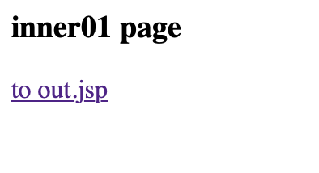
        - `out.jsp`，无法访问内部的的Cookie:cookiePathFromInner01，但是可以访问全部的Cookie：获取子目录中添加的全局Cookie：cookieAllPath
            - 
        - `test/inner02.jsp`，所有的Cookie都可以访问
            - 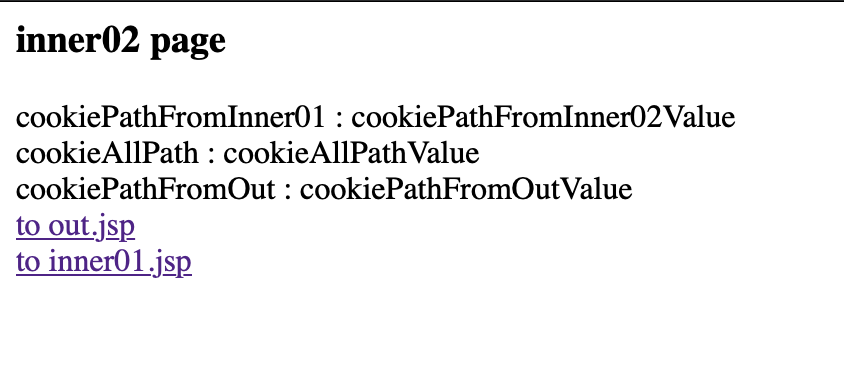

### 示例-利用Cookie完成自动登陆
[top](#catalog)
- 自动登录的需求
    - 进入页面时，如果没有登录过，则需要进行登录
    - 进入页面时，如果登录过，且在有效的登录时间内，则自动登录并直接显示页面内容
        - 不需要填写用户名和密码信息，可以自动登录到系统

- 实现方式
    - 通过`hello.jsp`作为入口，来控制是在当前页面显示内容，还是重定向到login.jsp
    - 读取username
        - 如果可以从url中获取到请求参数username，则打印出欢迎信息
            - 即从login.jsp画面submit来的
            - 把登录信息存储到Cookie中，并设置Cookie的最大时效为30s
        - 从Cookie中读取用户信息，若存在则打印欢迎信息
    - 如果没有读取到username（既没有请求参数，也没有Cookie），则重定向到login.jsp
- 实现
    - hello.jsp： [/java/mylearn/weblearn/src/main/webapp/cookie/autologin/hello.jsp](/java/mylearn/weblearn/src/main/webapp/cookie/autologin/hello.jsp)
        ```java
        String username = request.getParameter("username");

        // - 若可以从url中获取到请求参数username
        if (username != null && !username.trim().equals("")){
            // - 把登录信息存储到Cookie中，并设置Cookie的最大时效为30s
            Cookie cookie = new Cookie("username", username);
            cookie.setMaxAge(30);
            response.addCookie(cookie);
        } else {
            // - 从Cookie中读取用户信息
            Cookie[] cookies = request.getCookies();
            if (cookies != null && cookies.length > 0){
                for (Cookie cookie : cookies) {
                    String cookieName = cookie.getName();
                    if ("username".equals(cookieName)){
                        username = cookie.getValue();
                        break;
                    }
                }
            }
        }

        //若username存在,则打印欢迎信息
        if (username != null  && !username.trim().equals("")){
            out.print("username :" + username);
        } else {
            // - 若没有请求参数，也没有Cookie，则重定向到login.jsp
            response.sendRedirect("login.jsp");
        }
        ```
    - login.jsp：[/java/mylearn/weblearn/src/main/webapp/cookie/autologin/login.jsp](/java/mylearn/weblearn/src/main/webapp/cookie/autologin/login.jsp)
        ```html
        <html>
        <head>
            <title>Title</title>
        </head>
        <body>

        <form action="hello.jsp" method="post">
            name：<input type="text" name="username">
            <br>
            <input type="submit" value="Login">
        </form>

        </body>
        </html>
        ```

### 示例-利用Cookie显示最近浏览的商品
[top](#catalog) 
- 实现方式
    - books.jsp显示所有书的列表，列表底部显示最近浏览的5本书
        - 从Cookie中获取所有以`BOOK_`开头的Cookies，并显示
    - book.jsp
        - 从请求参数中获取当前页面中需要显示的书名：bookName
        - 从Cookie中获取所有的以`BOOK_`开头的Cookie，并保存在List中
        - 遍历Cookie，检查是否有Cookie的Value与当前的bookName相同
            - 如果有相同的，则记录下来，作为待删除的Cookie
        - 如果没有待删除的Cookie，则List的长度是否等于5
            - 如果等于5，则删除第一个Cookie
        - 在末尾将当前书名插入Cookie
- 实现
    - books.jsp：[/java/mylearn/weblearn/src/main/webapp/cookie/autoshow/books.jsp](/java/mylearn/weblearn/src/main/webapp/cookie/autoshow/books.jsp)
        ```html
        <html>
        <head>
            <title>Title</title>
        </head>
        <body>

        <a href="book.jsp?book=AAA">AAA</a><br>
        <a href="book.jsp?book=BBB">BBB</a><br>
        <a href="book.jsp?book=CCC">CCC</a><br>
        <a href="book.jsp?book=DDD">DDD</a><br>
        <a href="book.jsp?book=EEE">EEE</a><br>
        <a href="book.jsp?book=FFF">FFF</a><br>
        <a href="book.jsp?book=GGG">GGG</a><br>
        <a href="book.jsp?book=HHH">HHH</a><br>
        <a href="book.jsp?book=III">III</a><br>
        <a href="book.jsp?book=JJJ">JJJ</a><br>
        <br>
        <%
            //- 从Cookie中获取所有以`BOOK_`开头的Cookies，并显示

            Cookie[] cookies = request.getCookies();
            if (cookies != null && cookies.length > 0){
                for (Cookie cookie : cookies) {
                    String cookieName = cookie.getName();
                    if (cookieName.startsWith("BOOK_")){
                        out.println(cookie.getValue());
                        out.println("<br>");
                    }
                }
            }
        %>

        </body>
        </html>
        ```
    - book.jsp：[/java/mylearn/weblearn/src/main/webapp/cookie/autoshow/book.jsp](/java/mylearn/weblearn/src/main/webapp/cookie/autoshow/book.jsp)
        ```java
        String nowBookName = request.getParameter("book");
        Cookie[] cookies = request.getCookies();

        if (cookies != null && cookies.length >0) {
            ArrayList<Cookie> bookCookies = new ArrayList<>(5);
            Cookie deleteCookie = null;

            for (Cookie cookie : cookies) {
                String cookieName = cookie.getName();

                // - 从Cookie中获取所有的以`BOOK_`开头的Cookie，并保存在List中
                if (cookieName.startsWith("BOOK_")){
                    bookCookies.add(cookie);
                    // - 遍历Cookie，检查是否有Cookie的Value与当前的bookName相同
                    if (nowBookName.equals(cookie.getValue())){
                        // - 如果有相同的，则记录下来，作为待删除的Cookie
                        deleteCookie = cookie;
                        break;
                    }
                }
            }

                // - 如果没有待删除的Cookie，则List的长度是否等于5,
            if (deleteCookie == null && bookCookies.size() == 5) {
                // - 如果等于5，则删除第一个Cookie
                deleteCookie = bookCookies.get(0);
            }

            if (deleteCookie != null){
                // 删除Cookie
                deleteCookie.setMaxAge(0);
                response.addCookie(deleteCookie);
            }

            // - 在末尾将当前书名插入Cookie
            Cookie newCookie = new Cookie("BOOK_" + nowBookName, nowBookName);
            response.addCookie(newCookie);
        }
        ```
## Session
### Session机制
[top](#catalog)
- Session机制采用的是在<label style="color:red">服务器</label>端保持HTTP状态信息的方案
- Session在Web开发中指：用来在客户端与服务端之间保持状态的解决方案，有时候Session也用来指这种解决方案的存储结构
- 在服务器端，使用一种类似于散列表的结构来保存信息

- 每次打开一个新的浏览器都会是一个新的session，浏览器和服务器之间通过会话状态来关联多个请求和响应，一般会使用sessionID来进行标识
    - 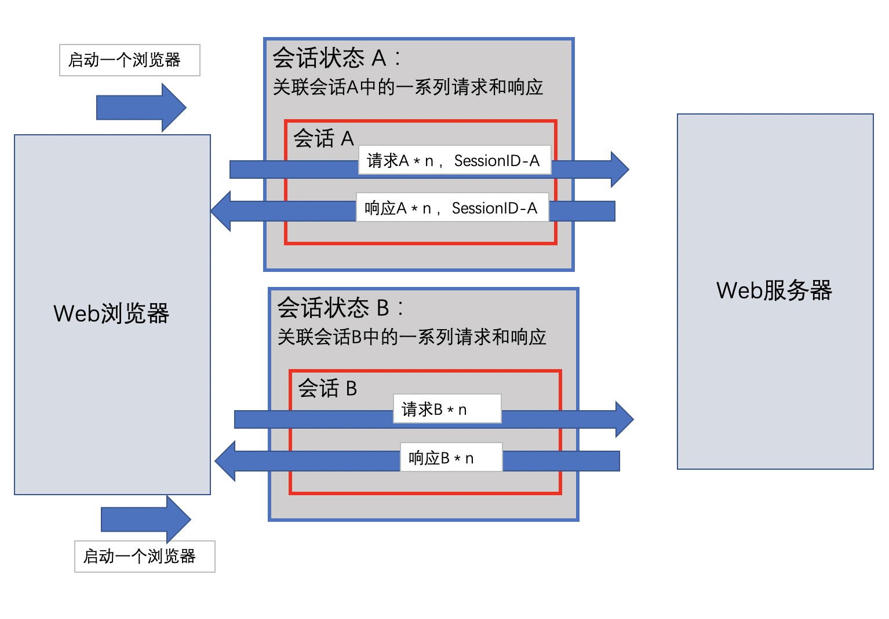

- 某个程序为客户端的请求创建Session的过程
    - 基本流程
        1. 服务器首先检查这个客户端的请求里是否包含了一个sessionID
        2. 如果已经包含了一个sessionID,则说明以前已经为此客户创建过session，服务器通过sessionID把session检索出来使用
            - 如果检索不到，可能会新建一个，这种情况可能出现在服务端已经删除了该用户的session对象，但用户人为的在请求的URL后面附加了一个JSESSION的参数
        3. 如果客户请求不包含sessionID，则为此客户创建一个session并且生成一个sessionID，**这个sessionID将在本次响应中返回给客户端保存**
    - 示意图
        - 

### SessionCookie
[top](#catalog)
- 什么是session cookie
    - session通过SessionID来区分不同的客户，系统会创造一个名为`JSESSIONID`的cookie，称为session cookie
    - session cookie存储于浏览器内存中
    - session cookie只针对某一次会话，会话结束时session cookie也就消失了
    - 关闭浏览器，只会使浏览器内存里的session cookie消失，**但不会使保存在服务器端的session对象消失，这些对象只能等待GC进行处理**

- 保存Session cookie（SessionID）的方法
    1. <label style="color:red">默认方式：采用cookie，这样在交互过程中浏览器就可以自动的按照规则把sessionID发送给服务器</label>
    2. URL重写
        - 使用的场景：cookie被人为禁用，无法通过自动添加到请求头带回
        - 基本思路：将sessionID附加在URL路径的后面，有两种附加方法
            1. 作为URL路径的附加信息
            2. 作为查询字符串附加在URL后面
        - 缺点：如果想在整个交互过程中始终保持状态，就必须在每个客户端可能请求的路径后面都附加这个sessionID

- **通过设定存活时间来持久化session cookie**
    - 实现：[/java/mylearn/weblearn/src/main/webapp/session/session.jsp](/java/mylearn/weblearn/src/main/webapp/session/session.jsp)
        ```java
        // 命名为同名的Cookie
        Cookie cookie = new Cookie("JSESSIONID", session.getId());
        // 设定存活时间来持久化cookie
        cookie.setMaxAge(40);
        response.addCookie(cookie);
        ```

### HttpSession接口中的常用方法
[top](#catalog)
- <label style="color:red">通过HttpSession可以在不同的页面传递信息</label>
- <label style="color:red">常用方法</label>

    |方法名|内容|
    |-|-|
    |getId|获取sessionID|
    |getCreationTime|获取session对象的创建时间|
    |getLastAccessedTime|获取session对象的上一次访问时间|
    |setMaxInactiveInterval|设置过期时间|
    |getMaxInactiveInterval|获取过期时间|
    |isNew|检查当前Servlet中使用的HttpSession对象是不是新的<br><br>如果客户端请求消息中的sessionID与Servlet程序中获得的HttpSession对象的sessionId相同时则认为这个HttpSession对象不是新建的|
    |invalidate|将session对象无效化|
    |serAttribute|设置属性|
    |getAttribute|获取属性|
    |removeAttribute|删除属性|
    |getAttributeNames|获取所有属性的名称列表|
    |getServletContext||

- 示例：通过HttpSession在不同页面中传递信息
    - 实现方法
        - 将username保存在session中，来在各个页面中进行传递
        - 页面间的跳转
            - 从login.jsp页面登录，并跳转到hello.jsp页面，显示登录的username
            - 可以从hello.jsp页面跳转到login.jsp页面，进行重新登录，同时在文本框中显示之前登录的username
            - 可以从hello.jsp页面跳转到logout.jsp页面，显示注销的用户，可以跳转到login.jsp页面进行重新登录
                - 注销时，销毁当前正在使用的HttpSession
    - 基本实现内容
        - login.jsp：[/java/mylearn/weblearn/src/main/webapp/session/method/login.jsp](/java/mylearn/weblearn/src/main/webapp/session/method/login.jsp)
            ```html
            <%
                //如果是第一次登录，则在文本框中显示空白，
                // 如果是从hell.jsp的重新登录连接跳转过来的，则在文本框中显示之前登录的username
                Object username = session.getAttribute("username");
                if (username == null)
                    username = "";
            %>

            <form action="hello.jsp" method="post">
                username: <input name="username" value="<%=username%>">
                <input type="submit" value="登录">
            </form>
            ```

        - hello.jsp：[/java/mylearn/weblearn/src/main/webapp/session/method/hello.jsp](/java/mylearn/weblearn/src/main/webapp/session/method/hello.jsp)
            ```html
            <!-- 获取请求参数 -->
            <%
                String username = request.getParameter("username");
            %>
            username: <%=username%>

            <%--跳转到登录页面进行重新登录，并且在username处显示登录的username--%>
            <%--通过HttpSession在一次会话中，在多个页面之间传递值--%>
            <%
                session.setAttribute("username", username);
            %>

            <br>
            <br>

            <a href="login.jsp">重新登录</a>
            <br>
            <a href="logout.jsp">注销</a>
            ```

        - logout.jsp：[/java/mylearn/weblearn/src/main/webapp/session/method/logout.jsp](/java/mylearn/weblearn/src/main/webapp/session/method/loginout.jsp)
            ```html
            username：<%=session.getAttribute("username")%>
            <br>

            <%--销毁session--%>
            <%
            session.invalidate();
            %>
            <a href="login.jsp">重新登录</a>
            ```
    - 页面结果
        - 入口：`http://localhost:8080/weblearn_war_exploded/session/method/login.jsp`
        - 进入登录页面login.jsp，会新建一个HttpSession对象
            - 
        - 执行登录，跳转到hello.jsp，和login.jsp中使用的是同一个HttpSession对象。点击重新登录
            - 
        - 跳转到login.jsp页面，并且在文本框中显示之前登录过的username。点击登录
            - 
        - 再次登录，仍然使用同一个HttpSession对象。点击注销
            - 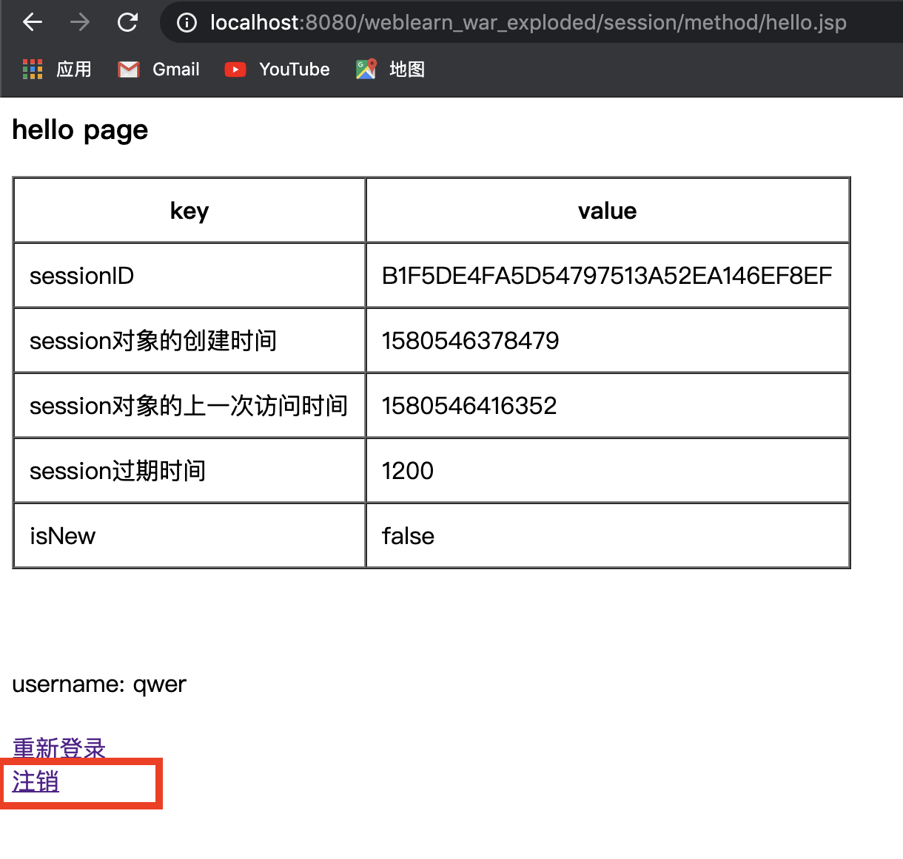
        - 跳转到logout.out页面，在该页面中**销毁了一直使用的HttpSession对象**
            - 
        - 刷新logout.out页面，JSP会新建一个HttpSession对象。因为旧的HttpSession对象已经被销毁了，所以无法获取指定的属性值，显示null
            - 
        - 点击重新登录，跳转到login.jsp页面，再次创建一个新的HttpSession对象
            - 

### URL重写
[top](#catalog)
- Servlet规范中引入了一种补充的会话管理机制，它允许不支持Cookie的浏览器也可以与WEB服务器保持连续的会话，并将sessionID作为超链接的URL地址的一个特殊参数

- `HttpServletResponse`接口中定义了两个用于完成URL重写的方法，用哪一个都可以实现URL重写???????
    - encodeURL(请求路径)
    - encodeRedirectURL(请求路径) 

- 执行URL重写处理之后，url会在末尾添加jsessionID参数
    - 如：`http://localhost:8080/weblearn_war_exploded/session/url/login.jsp`**;jsessionid=xxxxxxxxx**

- 示例
    - 实现方法
        - 通过URL重写来保证可以重用session对象
        - 将username保存在session中，来在各个页面中进行传递
        - 页面间的跳转
            - 从login.jsp页面登录，并跳转到hello.jsp页面，显示登录的username
            - 可以从hello.jsp页面跳转到login.jsp页面，进行重新登录，同时在文本框中显示之前登录的username
            - 可以从hello.jsp页面跳转到logout.jsp页面，显示注销的用户，可以跳转到login.jsp页面进行重新登录
                - 注销时，销毁当前正在使用的HttpSession
    - 基本实现内容
        - login.jsp：[/java/mylearn/weblearn/src/main/webapp/session/url/login.jsp](/java/mylearn/weblearn/src/main/webapp/session/url/login.jsp)
            ```html
            <form action="<%= response.encodeURL("hello.jsp")%>" method="post">
                username: <input name="username" value="<%=username%>">
                <input type="submit" value="登录">
            </form>
            ```

        - hello.jsp：[/java/mylearn/weblearn/src/main/webapp/session/url/hello.jsp](/java/mylearn/weblearn/src/main/webapp/session/url/hello.jsp)
            ```html
            <a href="<%=response.encodeURL("login.jsp")%>">重新登录</a>
            <br>
            <a href="<%=response.encodeURL("logout.jsp")%>">注销</a>
            ```

        - logout.jsp：[/java/mylearn/weblearn/src/main/webapp/session/url/logout.jsp](/java/mylearn/weblearn/src/main/webapp/session/url/logout.jsp)
    
    - 页面内容及html
        - 入口：`http://localhost:8080/weblearn_war_exploded/session/url/login.jsp`
        - 进入登录页面：login.jsp，**每次刷新都会创建一个新的HttpSession对象**
            - 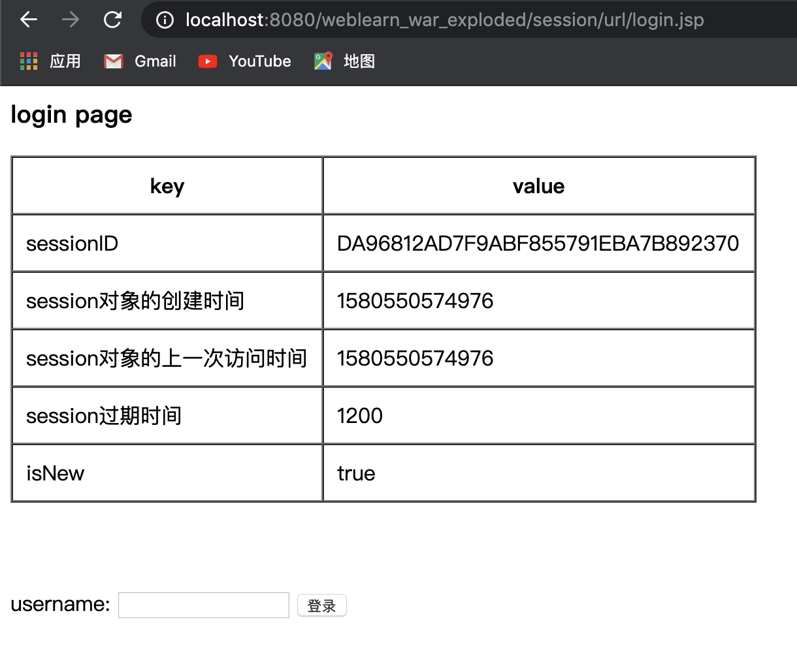
        - 登录并跳转到hello.jps，url中附带了jsessionID，使得JSP可以找到HttpSession对象
            - 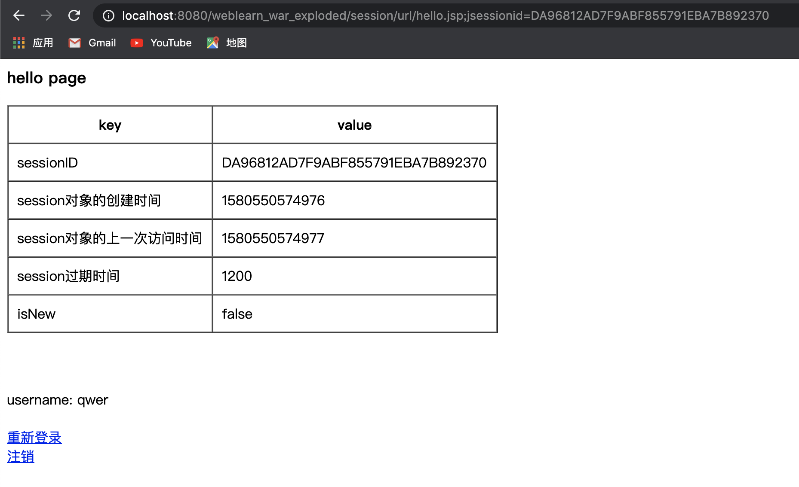
        - 回到登录画面，url中仍然附带jsessionID
            - 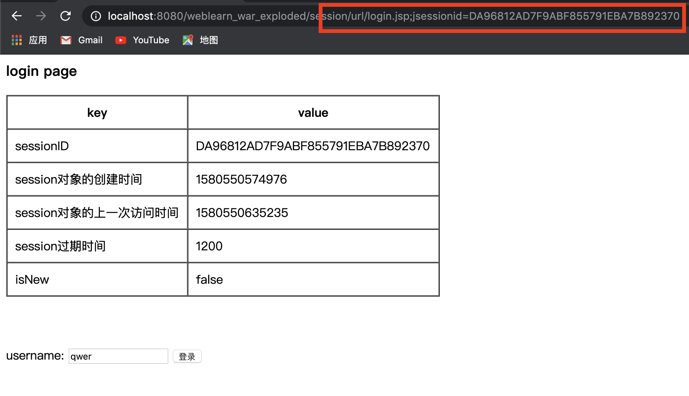


### HttpSession的生命周期 
[top](#catalog)
- 什么时候创建HttpSession对象
    - 对于JSP
        - 基本规则
            - 第一次访问Web应用的某个JSP时会创建一个session
            - 如果在第一次访问的JSP中已经设定：`<%@ page session="false" %>`，则服务器不会创建session，
                - `session="false"`，表示当前JSP页面禁用session隐含变量，但可以使用其他的显示HttpSession对象，如：`request.getSession(true)`
            - 如果当前JSP不是客户端访问的当前WEB应用的第一个资源，且其他页面已经创建一个HttpSession对象，则当前JSP页面会返回一个相关联的HttpSession对象，而不会创建一个新的HttpSession对象
        - 示例
            - 实现：[/java/mylearn/weblearn/src/main/webapp/session/lifecycle.jsp](/java/mylearn/weblearn/src/main/webapp/session/lifecycle.jsp)
                ```html
                <%@ page contentType="text/html;charset=UTF-8" language="java" %>
                <%@ page session="false" %>
                <html>
                <head>
                    <title>Title</title>
                </head>
                <body>

                <%--如果有和当前JSP关联session则返回，没有则返回null--%>
                <%= request.getSession(false)%>

                </body>
                </html>
                ```
            - 页面显示
                1. 启动新的浏览器，第一次进入`lifecycle.jsp`，没有session：`http://localhost:8080/weblearn_war_exploded/session/lifecycle.jsp`
                    - 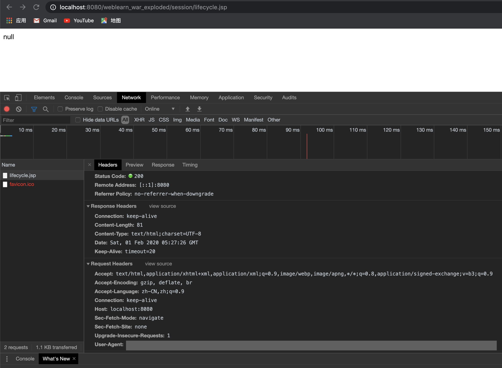
                2. 进入`index.jsp`，创建session：`http://localhost:8080/weblearn_war_exploded`
                    - 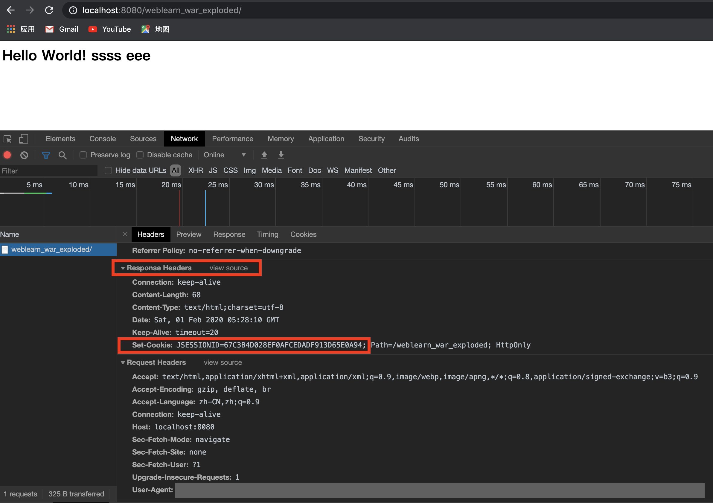
                3. 再次进入`lifecycle.jsp`，获得一个已存在的session，且与第二部的sessionID相同：`http://localhost:8080/weblearn_war_exploded/session/lifecycle.jsp`
                    - 
    - 对于Servlet
        - 基本原则
            - 如果Servlet是第一个被访问的WEB应用资源
                - 只有调用了`request.getSession()`，或`request.getSession(true)`的才会创建HttpSession对象
                - 调用`request.getSession(false)`的不会创建HttpSession对象，只会返回`null`
        - 示例
            - 实现
                - hasSession: [/java/mylearn/weblearn/src/main/java/com/ljs/test/session/hasSession.java](/java/mylearn/weblearn/src/main/java/com/ljs/test/session/hasSession.java)
                    ```java
                    @Override
                    protected void doGet(HttpServletRequest req, HttpServletResponse resp) throws ServletException, IOException {
                        HttpSession session = req.getSession();
                        PrintWriter out = resp.getWriter();
                        out.println(session);
                    }
                    ```
                - hasSession: [/java/mylearn/weblearn/src/main/java/com/ljs/test/session/noSession.java](/java/mylearn/weblearn/src/main/java/com/ljs/test/session/noSession.java)
                    ```java
                    @Override
                    protected void doGet(HttpServletRequest req, HttpServletResponse resp) throws ServletException, IOException {
                        HttpSession session = req.getSession(false);
                        PrintWriter out = resp.getWriter();
                        out.println(session);
                    }
                    ```
            - 页面显示
                - 启动新的浏览器，第一次进入noSession：`http://localhost:8080/weblearn_war_exploded/session/noSession`
                    - 
                - 进入hasSession，创建HttpSession对象：`http://localhost:8080/weblearn_war_exploded/session/hasSession`
                    - 
                - 再进入noSession，获得了一个相关的HttpSession对象，且与第二部创建的对象相同：`http://localhost:8080/weblearn_war_exploded/session/noSession`
                    - 

- 什么时候销毁HttpSession对象
    1. 直接调用`HttpSession.invalidate()`方法，该方法会使HttpSession失效
        - 示例
            - 参考实现：[/java/mylearn/weblearn/src/main/webapp/session/invalidate.jsp](/java/mylearn/weblearn/src/main/webapp/session/invalidate.jsp)
                ```java
                // 创建一个session
                HttpSession session = request.getSession(true);
                out.println(session.getId());

                // 然后将session销毁
                session.invalidate();
                ```
            - 页面结果：每次都在jsp中，创建一个session并销毁，所以每次页面都会显示一个不同的HttpSession对象

    2. 超过HttpSession的过期时间
    3. 服务器卸载了当前WEB应用
        - <label style="color:red">卸载时，服务器有可能会进行session的持久化，并保存在`/apache-tomcat-9.0.30/work/Catalina`目录下，重新启动时再读取，然后还可以继续使用</label>

- 设置session对象过期时间的两种方法
    1. 在jsp/servlet中进行设置：`session.setMaxInactiveInterval(5);`，单位为秒
        - HttpSession的默认过期时间是1800s，即30分钟
        - 示例
            - 实现：[/java/mylearn/weblearn/src/main/webapp/session/maxtime.jsp](/java/mylearn/weblearn/src/main/webapp/session/maxtime.jsp)
                ```java
                // 创建一个session
                HttpSession session = request.getSession(true);
                out.println(session.getId());
                out.println("<br><br>");

                // 默认以秒为单位
                out.println(session.getMaxInactiveInterval());

                // 重新设定session的过期时间：5s
                session.setMaxInactiveInterval(5);

                // 默认以秒为单位
                out.println(session.getMaxInactiveInterval());
                ```
    2. 在web.xml文件中设置HttpSession的过期时间，单位为**分钟**
        - 配置内容
            ```xml
            <!-- ==================== Default Session Configuration ================= -->
            <!-- You can set the default session timeout (in minutes) for all newly   -->
            <!-- created sessions by modifying the value below.                       -->
            
            <session-config>
                <session-timeout>30</session-timeout>
            </session-config>
            ```
        - 配置的作用域
            - 全局配置：通过修改：`apache-tomcat-9.0.30/conf/web.xml`，来进行全局配置
            - 应用级别配置：对某个应用的web.xml文件进行单独设置

- <label style="color:red">注意事项</label>
    - 关闭浏览器与HttpSession对象的销毁没有直接关系
    - 即使浏览器关闭，也可以通过持久化SessionCookie和URL重写来复用

### Session避免表单的重复提交
[top](#catalog)

- 会导致重复提交的情况
    1. Servlet调用`RequestDispatcher.forward()`转发到其他JSP页面时，浏览器所保留的URL是之前表单提交Servlet的URL，此时点击**刷新**，浏览器将再次提交用户之前输入的数据，引起重复提交
    2. (网络等原因导致的)在响应页面没有到达服务器时，页面没有切换还停留在表单页面，**重复点击提交按钮**
    3. 点击后退，再点击提交
        - 点击后退时，没有刷新页面，使用的是浏览器的缓存

- 不会导致重复提交的情况
    1. 点击后退，刷新表单，再提交
        - 刷新操作相当于重新打开了一个浏览器
    2. 采用HttpServletResponse.sendRedirect()方法将客户端重定向到成功页面，刷新页面时不会导致重复提交的问题
        
- 如何避免表单的重复提交
    - 基本思路：标记匹配
        1. 在表单中做一个标记，提交到Servlet
        2. 在Servlet获取标记，检查标记是否存在，并且是否和预定义的标记一致
        3. 若一致，则接收请求并**销毁标记**
            - <label style="color:red">通过销毁标记来防止重复提交</lable>
        4. 若不一致或没有标记，则响应提示信息或跳转到提示页面
    - 不可行方案
        - 在form中提供一个隐藏域：`<input type="hidden" name="xxx" value="..."`
            - 不能使用form的隐藏域，因为提交后HttpServletRequest无法删除请求参数
            - 返回之后，隐藏域仍然可以使用，无法阻止重复提交
        - 把标记放在request中
            - 提交请求后，使用的是新的request，两个页面之间无法共享request对象
    - <label style="color:red">可行方案</label>
        - 把标记放在session对象中
            1. 在表单页面，生成一个随机值token
                - <label style="color:red">token必须足够随机，才能保证安全性</label>
            2. 在表单页面，将token放入session对象和form的隐藏域中
            3. 提交表单
            4. 在目标Servlet中，获取session和隐藏域中的token
            5. 比较两个值是否一致
            6. 若一致则接收请求，并清楚session对象中的token
            7. 若不一致则到重复`提交页面`

- 示例
    - 基本实现
        - index.jsp: [/java/mylearn/weblearn/src/main/webapp/session/resubmit/index.jsp](/java/mylearn/weblearn/src/main/webapp/session/resubmit/index.jsp)
            ```html
            <%--主动请求页或刷新时会执行JSP脚本片段，
            后退时使用浏览器缓存则JSP脚本片段不会执行--%>
            <%
                // 构造随机值token
                String token = new Date().getTime() + "";

                // 将token保存到session中
                session.setAttribute("token", token);
            %>

            <form action="<%=request.getContextPath()%>/resubmitTest" method="post">
            <%--    将token保存到form的隐藏域，一同提交到Servlet，进行验证--%>
                <input type="hidden" name="token" value="<%=token%>">

                name: <input type="text" name="name">
                <input type="submit" value="submit">
            </form>
            ```
        
        - ReSubmitTestServlet.java: [/java/mylearn/weblearn/src/main/java/com/ljs/test/session/resubmit/ReSubmitTestServlet.java](/java/mylearn/weblearn/src/main/java/com/ljs/test/session/resubmit/ReSubmitTestServlet.java)
            ```java
            @Override
            protected void doPost(HttpServletRequest req, HttpServletResponse resp) throws ServletException, IOException {
                // 模拟网络延迟
                try {
                    Thread.sleep(2000);
                } catch (InterruptedException e) {
                    e.printStackTrace();
                }

                //从session获取token
                HttpSession session = req.getSession();
                Object sessionToken = session.getAttribute("token");

                // 从request获取token
                String requestToken = req.getParameter("token");

                System.out.println("sessionToken=" + sessionToken);
                System.out.println("requestToken=" + requestToken);

                //如果sessionToken存在，并且与requestToken相同，则接收请求
                //并从session中清除token，防止重复提交
                //否则跳转到提示页面
                if (sessionToken != null && requestToken.equals(sessionToken)){
                    session.removeAttribute("token");
                } else {
                    resp.sendRedirect(req.getContextPath() + "/session/resubmit/info.jsp");
                    return;
                }

                String name = req.getParameter("name");
                System.out.println(name);

                // 转发到success页面
                req.getRequestDispatcher("/session/resubmit/success.jsp").forward(req, resp);
                // resp.sendRedirect(req.getContextPath() + "/session/resubmit/success.jsp");
            }
            ```

    - 页面显示
        - 单次提交
            - 点击登录(模拟网络延迟中)
                - 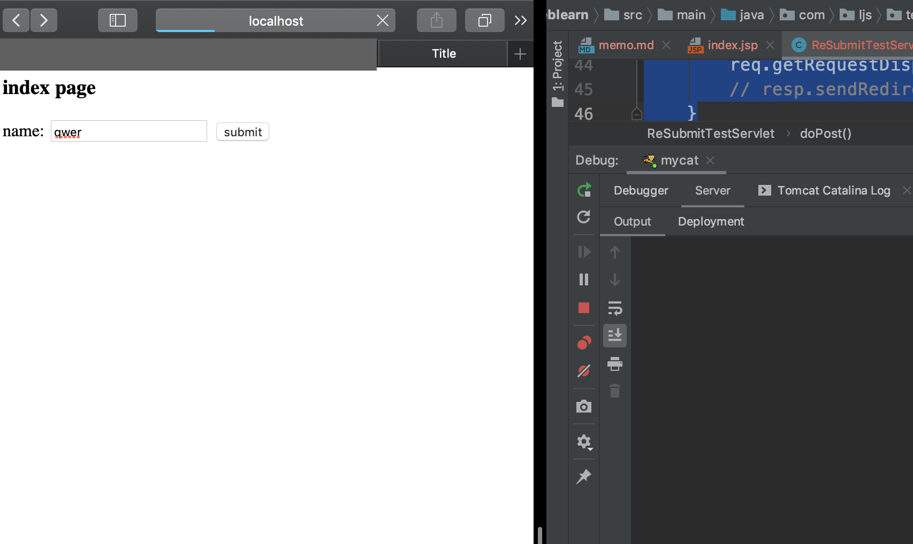
            - Servlet接收请求
                - 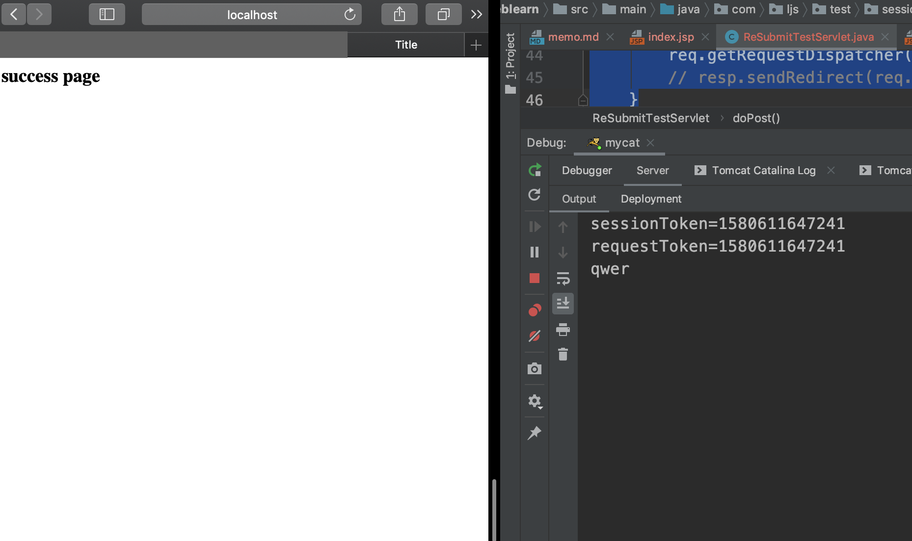
        - 重复提交
            - 重复点击登录(模拟网络延迟中)
                - 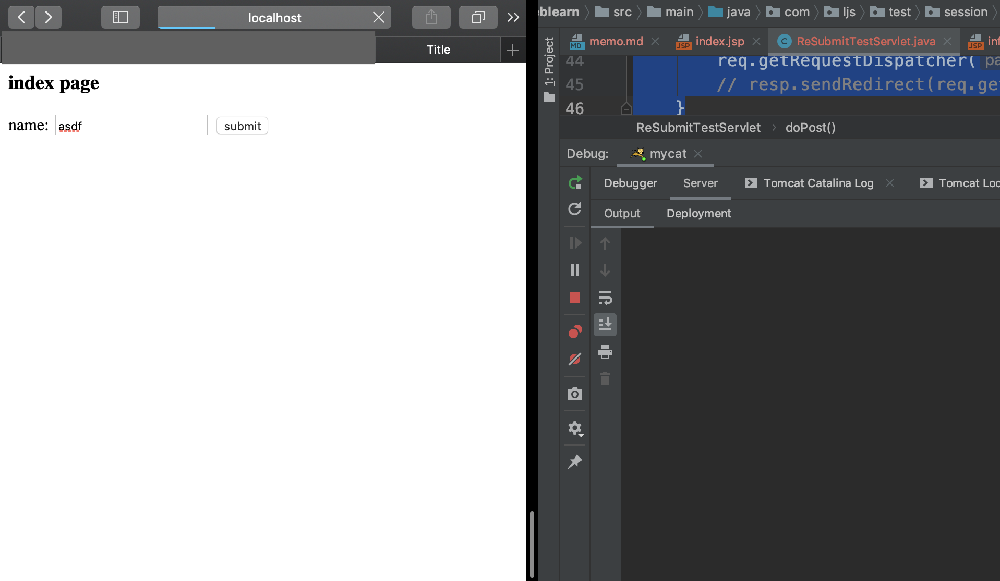
            - Servlet第一次接收了请求，并清除了session对象中的token。后续的重复提交被阻止并跳转到提示页面
                - 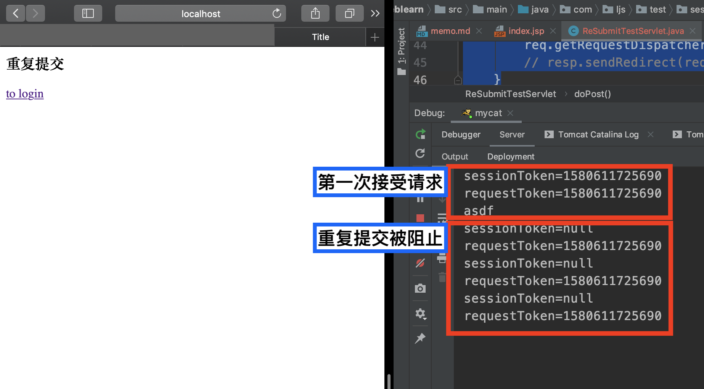

    
### 利用Session实现一次性验证码
[top](#catalog)
- 基本原理：与防止表单重复提交的原理相似
    - 在表单页面，生成一个验证码图片。生成图片时，把该图片中的租房次放入到session
    - 在表单页面，定义一个文本框用于输入验证码
    - 提交表单，并在Servlet中从session中获取验证码和文本框中输入的验证码，然后进行比较
    - 如果两个值相同，则接收请求
    - 如果不同，则重定向到表单页面，并提示验证码错误

- 与Session防止重复提交的区别
    - 防止重复提交时，使用的是隐藏域来保存token
    - 验证码需要手动输入token

- 示例
    - ????????

# EL表达式
## EL的基本知识
[top](#catalog)
- EL (Expression Language)，原本是JSTL1.0为了方便取数据所自定义的语言。JSP2.0之后，EL已经成为标准规范之一
- 使用EL表达式的前提
    - 支持Servlet2.4/JSP2.0的Container
    - JSP的page指令中允许使用EL表达式： `<%@ page isELIgnored="false" %>`
- EL表达式中没有指定范围时，如`${username}`，默认会按照：`page、request、session、application`的顺序查找
    - 如果找到就停止并返回值
    - 如果所有范围都没有找到，就返回**null**

- EL本身没有遍历的能力，需要借助JSTL

## EL的基本语法
[top](#catalog)
- EL语法结构：`${expression}`
- 示例
    - `${sessionScop.user.sex}`
- 相当于
    ```java
    User user = (User)session.getAttribute("user");
    String sex = user.getSex();
        ```
- <label style="color:red">EL取值的过程实际上就是在不断的调用类对象中相应的只读方法，如get等</label>

## EL运算符
[top](#catalog)
- EL提供：`.`、`[""]` 来存取数据
    - 以下两者所代表的意思是一样的
        - `${sessionScop.user.sex}`
        - `${sessionScop.user["sex"]}`
    - 当域对象属性名不规范时，应该使用`[""]`来取值
        - 参考示例部分说明
- 算数运算符：`+、-、*、/、%`
- 关系运算符：
    - 关系运算符必须写在`${}`内部，如：`${score > 60}`
- 逻辑运算符：`&&、||、! `
- 其他运算符
    - 条件运算符
    - `()`括号运算符，用于改变运算优先级
    - empty运算符：${empty expression}
        - 对于变量，如果变量不存在，则结果为true，否则为false
        - 对于集合，如果集合中没有元素，则结果为true，否则为false
        - 对于字符串，如果是空字符串`""`，则结果为true，否则为false
        - 对于数组，无论数组长度是不是0，结果都为false
            - 应该是将数组作为一般变量看待，即使长度为0，单数数组对象本身还是存在的
        - - 参考示例部分说明

- 示例：
    - 实现内容， operator.jsp：[/java/mylearn/weblearn/src/main/webapp/el/grammar/operator.jsp](/java/mylearn/weblearn/src/main/webapp/el/grammar/operator.jsp)
        ```html
        <%
            // 1.关系运算符测试
            request.setAttribute("score", 60);

            // 2.集合测试
            List<String> list1 = new ArrayList<>();
            list1.add("aaa");
            request.setAttribute("list1", list1);

            List<String> list2 = new ArrayList<>();
            request.setAttribute("list2", list2);

            // 3. 字符串测试
            //保存一个空字符串
            request.setAttribute("str1", "");

            //保存一个非空的字符串
            request.setAttribute("str2", "abcd");

            // 4. 数组测试
            int[] intArray1 = new int[0];
            request.setAttribute("intArray1", intArray1);

            int[] intArray2 = new int[]{1,2,3,4,5};
            request.setAttribute("intArray2", intArray2);
        %>

        <%--域对象属性名不标准时使用：[""]--%>
        <%
            Customer customer2 = new Customer();
            customer2.setName("customer2");
            session.setAttribute("com.ljs.customer2", customer2);
        %>

        <h3>域对象属性名不标准时使用[""]获取</h3>
        customer2.name: ${sessionScope["com.ljs.customer2"].name}
        <br>

        <h3>1. 关系运算符测试</h3>
        "score > 60?" : ${score >= 60}<br>
        "score > 60?" : ${score >= 60 ? "及格":"不及格"}<br>

        <h3>2. 集合测试</h3>
        list1 value: ${requestScope.list1}<br>
        empty list1: ${empty requestScope.list1}<br>

        list2 value : ${requestScope.list2}<br>
        empty list2: ${empty requestScope.list2}<br>

        <h3>3. 空对象测试</h3>
        null Object: ${empty requestScope.xxxx}<br>

        <h3>4. 空字符串测试</h3>
        str1 value : ${requestScope.str1}<br>
        empty str1 : ${empty requestScope.str1}<br>
        str2 value: ${requestScope.str2}<br>
        not empty str2 : ${empty requestScope.str2}<br>

        <h3>5. 数组测试</h3>
        intArray1 value : ${requestScope.intArray1}<br>
        empty intArray1 : ${empty requestScope.intArray1}<br>

        intArray2 value : ${requestScope.intArray2}<br>
        not empty intArray2 : ${empty requestScope.intArray2}<br>
        ```
    - 页面结果
        - `http://localhost:8080/weblearn_war_exploded/el/grammar/operator.jsp`
        - 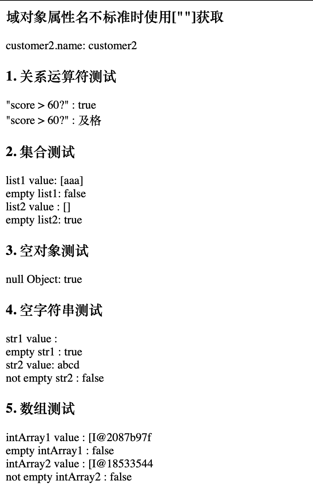

## EL的自动类型转换
[top](#catalog)
- 获取值时，EL表达式可以自动进行类型转换 
- 示例：
    - 实现内容，step2.jsp:[/java/mylearn/weblearn/src/main/webapp/el/grammar/step2.jsp](/java/mylearn/weblearn/src/main/webapp/el/grammar/step2.jsp)
    
        ```java
        score from el : ${param.score}
        
        score from el + 10  : ${param.score + 10}
        
        score from requset : <%=request.getParameter("score")%>
        
        score from requset + 10 : <%=request.getParameter("score") + 10%>
        ```
    - 页面结果
        - 附加请求参数：`http://localhost:8080/weblearn_war_exploded/el/grammar/step2.jsp?score=12`
        - el表达式可以自动进行类型转换并进行数值运算，得到：`12 + 10 = 22`
        - 通过`request.getParameter`获取到的是String类型，无法进行数值运算，只能进行字符串连接，得到：`"12" + 11 --> 1210`
        - 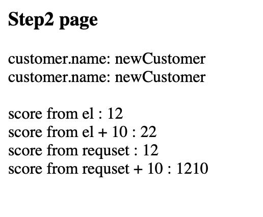


## EL隐含对象
[top](#catalog)
- 与范围有关的隐含对象
    - 相关对象
    
        |EL中的隐含对象|属性范围|
        |-|-|
        |pageScope|page|
        |requestScope|request|
        |sessionScope|session|
        |applicationScope|application|

    - <label style="color:red">这些对象只是代表一个范围而不是对应的域对象。如果需要使用各个域对象，需要从`pageContext`中获取</label>
        - 示例: 获取session中所有属性的名称列表`${pageContext.session.AttributeNames}`

- 与输入有关的隐含对象
    
    |EL中的隐含对象|含义|
    |-|-|
    |param|获取一个请求参数
    |paramValues|获取一组请求参数|
    
- <label style="color:red">pageContext，非常重要的对象</label>
    - 可以通过pageContext来取得其他有关用户要求或页面的详细信息
    - 常用的部分
        
        |表达式|内容|
        |-|-|
        |${pageContext.request.queryString}|取得请求的参数字符串|
        |${pageContext.request.requestURL}|取得请求的URL，但不包括请求的参数字符串|
        |${pageContext.request.contextPath}|服务的web应用的名称|
        |${pageContext.request.method}|获取HTTP的方法（GET、POST）|
        |${pageContext.request.protocol}|获取使用的协议（HTTP/1.1、HTTP/1.0）|
        |${pageContext.request.remoteUser}|取得用户名称 ?????|
        |${pageContext.request.remoteAddr}|获取用户的IP地址|
        |${pageContext.session.new}|判断session是否是新的|
        |${pageContext.session.id}|获取sessionID|
        |${pageContext.servletContext.serverInfo}|取得主机端的服务信息|
        
        
- 其他隐含对象

    |EL中的隐含对象|含义|
    |-|-|
    |cookie|可以从中获取Cookie对象|
    |header|获取请求头信息 (很少使用)|
    |headerValues|获取一组请求头信息 (很少使用)|
    |initParam|获取web.xml中设定的web应用的初始化参数：`<context-param>`|

- 示例
    - 实现内容，elobject.jsp ：[/java/mylearn/weblearn/src/main/webapp/el/grammar/elobject.jsp](/java/mylearn/weblearn/src/main/webapp/el/grammar/elobject.jsp)
        ```html
        <%--- 1. 与范围有关的隐含对象--%>
        <h4>1. 与范围有关的隐含对象</h4>
        <%
            request.setAttribute("testkey", "requestTestValue");
            session.setAttribute("testkey", "sessionTestValue");
        %>

        <%--搜索到request时停止，并返回值--%>
        requestTestKey: ${testkey}<br>
        requestTestKey: ${requestScope.testkey}<br>
        sessionTestKey: ${sessionScope.testkey}<br>


        <br>
        <%--- 2. 与输入有关的隐含对象--%>
        <h4>2. 与输入有关的隐含对象</h4>

        param: ${param.name}<br>
        paramValues: ${paramValues.scores}<br>

        <%--- 3. 其他隐含对象--%>
        <h3>3. 其他隐含对象</h3>
        <%--获取cookie对象--%>
        cookie.JSESSIONID : ${cookie.JSESSIONID.value} <br>

        Request Header Accept-Language : ${header["Accept-Language"]} <br>

        initParam jdbcUrl : ${initParam.jdbcUrl}<br>

        <%--4. pageContext--%>
        <h3>4.pageContext</h3>
        请求的参数字符串 : ${pageContext.request.queryString}<br>
        请求的URL : ${pageContext.request.requestURL}<br>
        Web应用的路径 : ${pageContext.request.contextPath}<br>
        SessionID : ${pageContext.session.id}<br>
        remoteUser : ${pageContext.request.remoteUser}<br>
        用户的IP地址 : ${pageContext.request.remoteAddr}<br>
        主机端的服务信息 : ${pageContext.servletContext.serverInfo}<br>

        ```
    - 页面结果
        - 入口：`http://localhost:8080/weblearn_war_exploded/el/grammar/elobject.jsp?name=newName&scores=10&scores=11&scores=12&scores=13`
        - 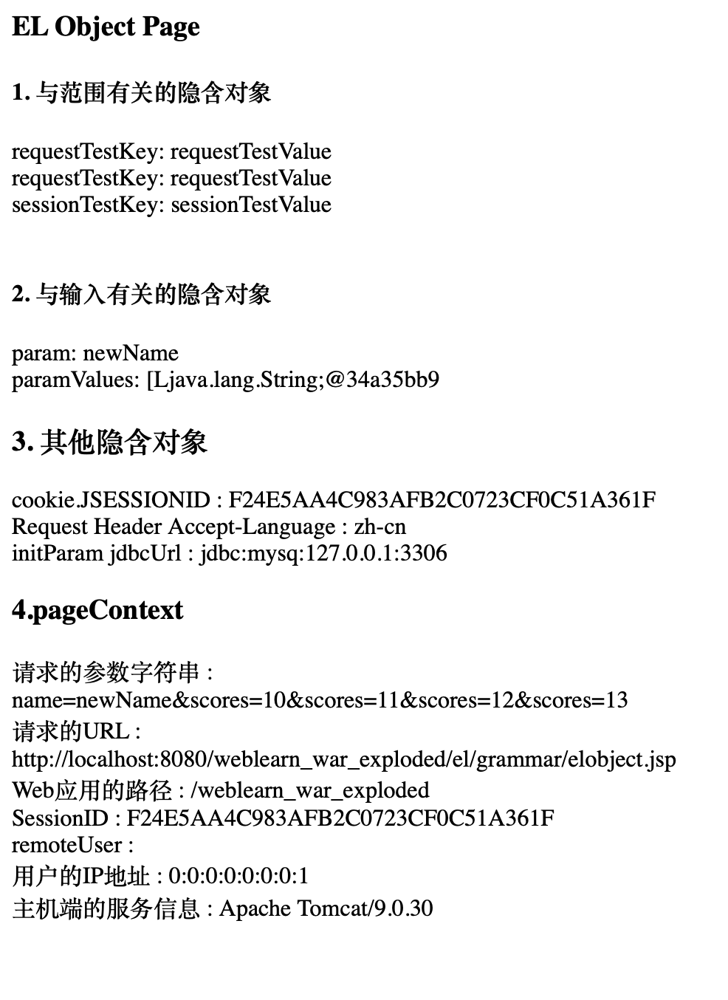

## EL函数
[top](#catalog)
- 实际开发中，一般都会使用JSTL提供的el函数，很少会自定义el函数
- 使用之前必须在JSP页面中导入标准函数的声明
    - 如使用JSTL提供的el函数
        ```xml
        <%@ taglib prefix="fn" uri="http://java.sun.com/jsp/jstl/functions" %>
        ```
- 使用el函数的语法：`${标签库前缀:方法名(参数列表)}`
    - 如`${fn:length(requestScope.name)}`
    
- el函数：在el表达式中调用的某个java类的**静态方法**，这个静态方法需要在web应用程序**进行配置**才可以被el表达式调用
- el函数可以扩展el表达式的功能，让el表达式完成普通java程序代码所能完成的功能

- JSTL库中提供的一些el函数
    - 字符串操作函数
    
        |函数|描述|
        |-|-|
        |fn:contains(string, substring)|判断string中是否包含参数substring，返回true/false|
        |fn:containsIgnoreCase(string, substring)|忽略大小写，判断string中是否包含参数substring，返回true/false|
        |fn:endWith(string, suffix)|判断string是否以suffix结尾，返回true/false|
        |fn:startWith(string, prefix)|判断string是否以prefix开头，返回true/false|
        |fn:escapeXml(string)|将有特殊意义的XML和HTML转换为对应的XML character entity code，并返回|
        |fn:indexOf(string, substring)|返回substring在string中第一次出现的位置|
        |fn:join(array, separator)|将数组array用separator连接成一个字符串并返回|
        |fn:length(item)|返回item的元素数量；item可以是：数组，collection，String；String时，返回字符数|
        |fn:replace(string, before, after)|将string中的before替换成after，返回新字符串|
        |fn:split(string，separator)|使用separator分割字符串，返回一个数组|
        |fn:substring(string, begin, end)|截取字符串|
        |fn:substringAfter(string, substring)|返回substring在string中后面的部分|
        |fn:substringBefore(string, substring)|返回substring在string中前面的部分|
        |fn:toLowerCase(string)|小写转换，并返回新字符串|
        |fn:toUpperCase(string)|大写转换，并返回新字符串|
        |fn:trim(string)|去除字符串的首尾空格|

- 自定义el函数开发步骤
    - 编写el函数所需的Java类静态方法
        - 类必须是public类
        - 方法必须是public static方法
    - 编写标签库描述文件，tld文件，在tld文件中描述自定义函数
        - tld文件写法参考： [标签库描述文件tld](#标签库描述文件tld)
    - 在JSP页面中导入和使用自定义函数
    
- 示例：自定义el函数
    - 函数类
        - MyELFunction.java：[/java/mylearn/weblearn/src/main/java/com/ljs/test/el/function/MyELFunction.java](/java/mylearn/weblearn/src/main/java/com/ljs/test/el/function/MyELFunction.java)
            ```java
            public class MyELFunction {
                public static String concat(String str1, String str2){
                    return str1 + str2;
                }
            }
            ```
        
    - tld配置
        - [/java/mylearn/weblearn/src/main/webapp/WEB-INF/mytag.tld](/java/mylearn/weblearn/src/main/webapp/WEB-INF/mytag.tld)

            ```xml
            <!--描述EL自定义函数-->
            <function>
                <name>concat</name>
                <function-class>com.ljs.test.el.function.MyELFunction</function-class>
                <function-signature>java.lang.String concat(java.lang.String,java.lang.String)</function-signature>
            </function>
            ```
    - jsp页面
        - function.jsp : [/java/mylearn/weblearn/src/main/webapp/el/function/function.jsp](/java/mylearn/weblearn/src/main/webapp/el/function/function.jsp)
            ```html
            <%@ taglib prefix="fn" uri="http://java.sun.com/jsp/jstl/functions" %>
            <%@ taglib prefix="ljs" uri="http://www.ljs.com/mytag/core" %>

            <%
                String name = "abcdefg";
                request.setAttribute("name", name);

                String name2 = "123456";
                request.setAttribute("name2", name2);
            %>

            <%--使用JSTL核心库提供的el函数--%>
            ${fn:length(requestScope.name)}
            <br>
            ${fn:toUpperCase(requestScope.name)}
            <br>

            <%--测试自定义的el函数--%>
            ${ljs:concat(requestScope.name, requestScope.name2)}
            ```
    - 页面结果
        - 入口：http://localhost:8080/weblearn_war_exploded/el/function/function.jsp
        - 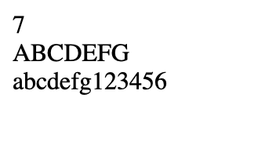


# 自定义标签
## 为什么需要自定义标签
[top](#catalog)
- 自定义标签可以降低jsp开发的复杂的和维护量，从html角度看，可以使用html不用去过多的关注那些比较复杂的业务逻辑
- 利用自定义标签，可以让软件开发和页面设计人员合理的分工
    - 页面设计人员可以集中使用标签创建网站
    - 开发人员可以集中实现底层功能
- 将具有共用特性的tag库应用于不同的项目中，体现了软件复用的思想

## 自定义标签的简介
[top](#catalog)
- 自定义标签是一种用户自定义的**jsp标记**
- 当一个含有自定义标签的jsp页面被jsp引擎编译成Servlet时，tag标签被转化为对**标签处理器类**的操作。<label style="color:red">所以开发自定义标签的核心就是要编写处理器类<label>

- 标签、标签处理器类、标签库之间的关系
    - 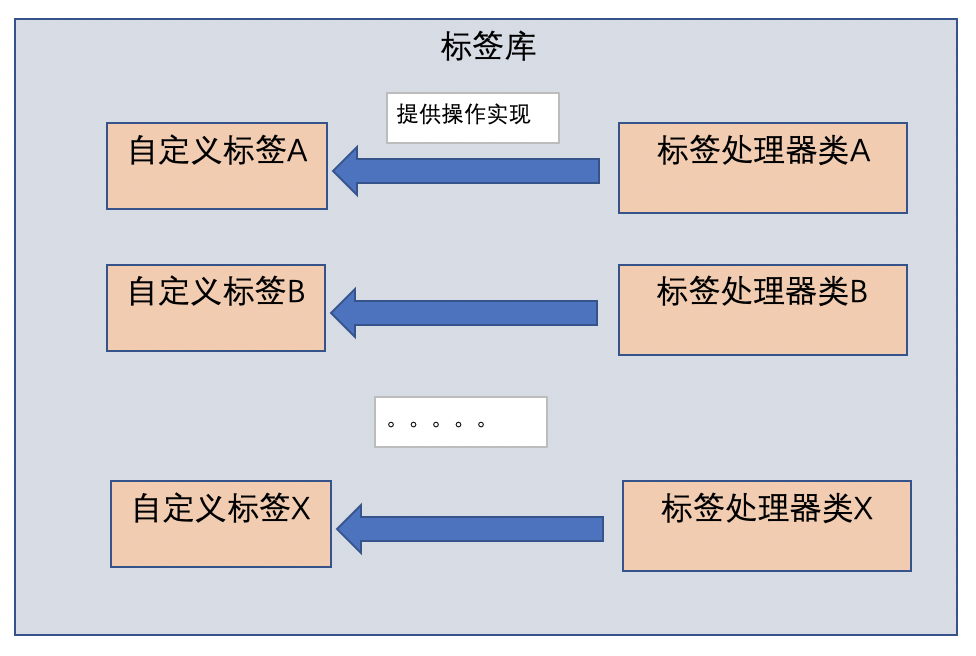

- 标签库API定义在`javax.servlet.jsp.tagext`包中
- 标签库API中的主要类、接口的继承关系
    - 所有标签处理器类都要实现JspTag接口，该接口中没有定义任何方法，主要作为Tag和SimpleTag接口的父接口
    - 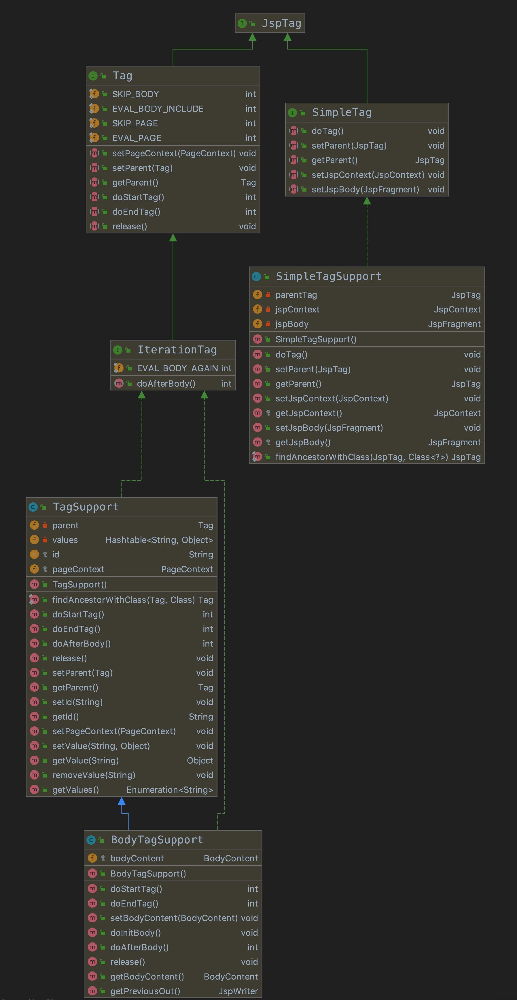

- 传统标签和简单标签
    - JSP2.0之前，所有标签处理器类都必须实现Tag接口，这样的标签称为传统标签
    - JSP2.0规范又定义了一种新的类型的标签，称为简单标签，其对应的处理器类型要实现SimpaleTag接口
    
- 标签的形式
    - 空标签：`<hello/>`
    - 带有属性的空标签：`<max num1="3" num2="5"/>`
    - 带有内容的标签
        ```html
        <greeting>
          hello
        </greeting>
        ```
    - 带有内容和属性的标签
        ```html
        <greeting name="Tom">
          hello
        </greeting>
        ```

## 简单标签的SimpleTag接口
[top](#catalog)
- 参考示例：[/java/mylearn/weblearn/src/main/webapp/tag/showtag.jsp](/java/mylearn/weblearn/src/main/webapp/tag/showtag.jsp)

- <label stlye="color:red">所有简单标签都必须实现SimpleTag接口</label>

- SimpleTag接口的方法

    |接口方法|处理内容|
    |-|-|
    |setJspCntext|该方法把代表JSP页面的pageContext对象传递给标签处理器对象|
    |setParent|把父标签处理器对象传递给当前标签处理器对象|
    |getParent|获取标签的父标签处理器对象|
    |setJspBody|把代表标签体的JspFragment对象传递给标签处理器对象|
    |doTag|用于完成所有的标签逻辑<br>该方法可以抛出`javax.servlet.jsp.SkipPageException`异常，用于通知web容器不再执行Jsp页面中谓语结束标记后面的内容|

- 实现SimpleTag接口的处理器类的调用过程
    - 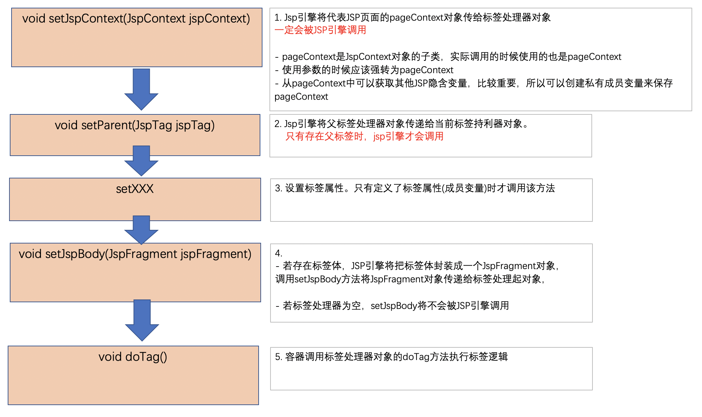

- `void setJspContext(JspContext jspContext)`是JSP引擎调用的一个方法，会传入pageContext对象，这个对象非常重要，可以获得其他8个JSP的隐含对象，可以使用私有成员变量进行保存
    ```java
    private PageContext pageContext;

    @Override
    public void setJspContext(JspContext jspContext) {
        // 测试参数类型
        System.out.println(jspContext instanceof PageContext);
        // 保存pageContext参数
        this.pageContext = (PageContext) jspContext;
    }
    ```

- 如果标签包含属性，最好都设置成String型，防止类型异常


## 标签库描述文件tld
[top](#catalog)
- 参考配置：[/java/mylearn/weblearn/src/main/webapp/WEB-INF/mytag.tld](/java/mylearn/weblearn/src/main/webapp/WEB-INF/mytag.tld)

- <label style="color:red">可以用来配置自定义标签和el函数</label>

- 每一个标签在配置时都必须注明标签实现类
- 在`<body-content>标签类型</body-content>`配置当前标签的类型
- 三种可用的标签类型
    - empty，空标签，没有标签体
    - scripless，标签体可以包含el表达式和JSP动作元素，但是不能包含JSP的脚本元素
    - tagdependent，标签体中所有的代码JSP引擎不会进行解析，都直接交给标签处理器，需要在标签处理其中手动处理
        - 如el表达式，会直接将`${expression}`传递给标签处理器

- tld文件的固定内容
    ```xml
    <?xml version="1.0" encoding="UTF-8" ?>
    <taglib xmlns="http://java.sun.com/xml/ns/javaee"
            xmlns:xsi="http://www.w3.org/2001/XMLSchema-instance"
            xsi:schemaLocation="http://java.sun.com/xml/ns/javaee http://java.sun.com/xml/ns/javaee/web-jsptaglibrary_2_1.xsd"
            version="2.1">
    
        <!--描述tld文件-->
        <description>Mytag 1.2 core library</description>
        <display-name>Mytag core</display-name>
        <tlib-version>1.2</tlib-version>
    
        <short-name>建议在JSP页面上使用的JSP标签前缀</short-name>
        <!--作为tld文件的id，用来唯一表示当前的tld文件，多个tld文件的url不能重复
        通过JSP-taglib指令的 uri属性来引用-->
        <uri>http://xxxxxxxxxxx</uri>

        ...
        ...
        ...
    </taglib>
    ```

- 定义一个空标签
    ```xml
    <!-- 定义一个空标签 -->
    <tag>
        <name>标签名</name>
        <tag-class>标签所在的全类名(SimpleTag接口的实现类)</tag-class>
        <body-content>empty</body-content>
    </tag>
    ```

- 配置的内容
    ```xml
    <!-- 配置标签 -->
    <tag>
        <!-- 标签的基本配置 -->
        <name>标签名</name>
        <tag-class>标签所在的全类名(SimpleTag接口的实现类)</tag-class>
        <body-content>标签类型</body-content> <!-- 配置当前标签的类型 -->

        <!-- 如果标签中有属性，需要添加属性 -->

        <!--描述当前标签的属性，一个属性一套-->
        <attribute>
            <name>属性名</name>
            <!--该属性是不是必须的-->
            <required>true/false</required>
            <!--runtime expression value :
            当前属性是否可以接受运行时表达式(EL表达式)的动态值-->
            <rtexprvalue>true/false</rtexprvalue>
        </attribute>
    </tag>

    <!-- 配置EL函数的映射 -->
    <function>
        <name>映射的函数名</name>
        <function-class>函数所在的类的全路径</function-class>
        <function-signature>函数签名</function-signature>
        <!-- 示例：函数签名，需要注明：函数的返回值类型、参数类型、函数名-->
        <!-- <function-signature>java.lang.String concat(java.lang.String,java.lang.String)</function-signature> -->

    </function>
    ```

## 自定义标签的基本开发步骤
[top](#catalog)
1. 创建一个标签处理器类，实现SimpleTag接口
    - 如果标签有属性，需要在处理器类内部添加私有成员变量和setter方法
2. 在WEB—INF目录下，创建标签库描述文件--tld文件
    - 拷贝tld文件的固定内容
    - 修改`short-name`和`URI`
    - 添加自定义标签的描述，包括定义、属性等
    - 添加tld文件后，最好重启服务器
3. 在JSP页面中导入：`<%@ taglib uri="tld文件中的uri" prefix="标签前缀，最好使用short-name" %>`
4. 在JSP页面中使用自定义标签：`<prefix:自定义标签名 属性名=值>`

## SimpleTag实现类、tld文件、JSP文件之间的配合
[top](#catalog)
- 标签名
    - 参考：[示例-使用SimpleTag接口开发一个空标签](#示例-使用SimpleTag接口开发一个空标签)
    - JSP中使用的标签名 == tld文件中定义的标签名
        - 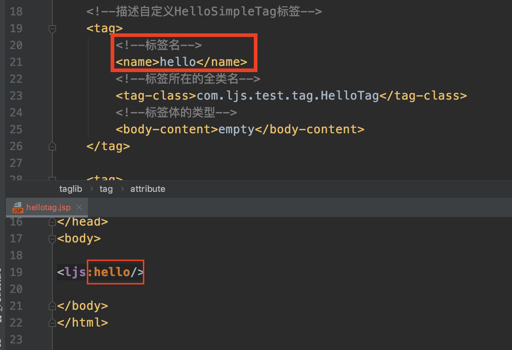
- 标签属性
    - 参考：[示例-使用SimpleTag接口开发一个带属性的空标签](#示例-使用SimpleTag接口开发一个带属性的空标签)
    - JSP中的标签属性 == tld文件中定义的标签属性名:`<tag>/<attribute>/<name>` == 标签处理器类中的属性名(小写字母开头并且具有setter方法)
        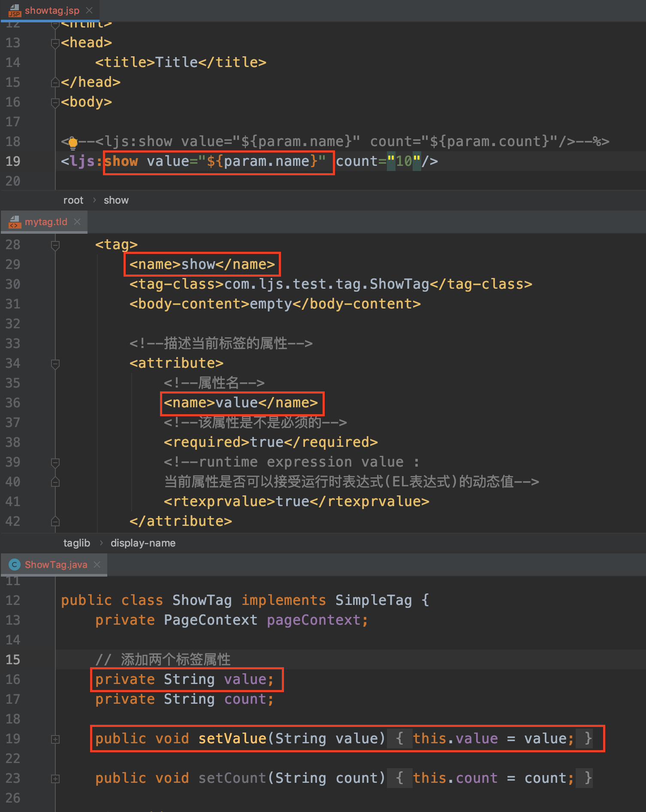
- 标签的必须属性
    - 如果配置了标签的属性是必须的：`<required>true</required>`，则必须在JSP页面中使用

## 示例-使用SimpleTag接口开发一个空标签
[top](#catalog)
- 创建标签处理器，实现SimpleTag接口，在个方法中添加控制台输出来观察调用结果，
    - 实现内容：[/java/mylearn/weblearn/src/main/java/com/ljs/test/tag/HelloTag.java](/java/mylearn/weblearn/src/main/java/com/ljs/test/tag/HelloTag.java)
    ```java
    public class HelloTag implements SimpleTag {
        private PageContext pageContext;

        // 执行标签体实际逻辑
        @Override
        public void doTag() throws JspException, IOException {
            System.out.println("doTag");

            //获取HttpRequest对象，并获取请求参数name
            String name = pageContext.getRequest().getParameter("name");

            //获取out对象，并在页面上打印：Hello : 请求参数name
            pageContext.getOut().println("Hello : " + name);
        }

        @Override
        public JspTag getParent() {
            System.out.println("getParent");
            return null;
        }

        @Override
        public void setParent(JspTag jspTag) {
            System.out.println("setParent");
        }

        @Override
        public void setJspContext(JspContext jspContext) {
            System.out.println(jspContext instanceof PageContext);
            this.pageContext = (PageContext) jspContext;
            System.out.println("setJspContext");
        }

        @Override
        public void setJspBody(JspFragment jspFragment) {
            System.out.println("setJspBody");
        }
    }
    ```

- 编写tld文件
    - [/java/mylearn/weblearn/src/main/webapp/WEB-INF/mytag.tld](/java/mylearn/weblearn/src/main/webapp/WEB-INF/mytag.tld)
        ```xml
        <!--建议在JSP页面上使用的JSP标签前缀-->
        <short-name>ljs</short-name>
        <!--作为tld文件的id，用来唯一表示当前的tld文件，多个tld文件的url不能重复
        通过JSP-taglib指令的 uri属性来引用-->
        <uri>http://www.ljs.com/mytag/core</uri>

        <!--描述自定义HelloSimpleTag标签-->
        <tag>
            <!--标签名-->
            <name>hello</name>
            <!--标签所在的全类名-->
            <tag-class>com.ljs.test.tag.HelloTag</tag-class>
            <!--标签体的类型-->
            <body-content>empty</body-content>
        </tag>
        ```

- JSP调用标签
    - [/java/mylearn/weblearn/src/main/webapp/tag/hellotag.jsp](/java/mylearn/weblearn/src/main/webapp/tag/hellotag.jsp)
        ```html
        <%--导入自定义标签库--%>
        <%@ taglib uri="http://www.ljs.com/mytag/core" prefix="ljs" %>
        <html>
        <head>
            <title>Title</title>
        </head>
        <body>

        <ljs:hello/>

        </body>
        </html>
        ```

- 控制台输出
    - 无请求参数
        - 入口：http://localhost:8080/weblearn_war_exploded/tag/hellotag.jsp
        - 
    - 附加请求参数:`name=testUser`
        - 入口：http://localhost:8080/weblearn_war_exploded/tag/hellotag.jsp?name=testUser
        - 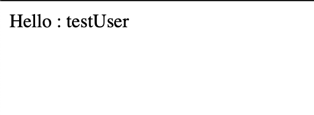


## 示例-使用SimpleTag接口开发一个带属性的空标签
[top](#catalog)
- 创建标签处理器，实现SimpleTag接口，添加两个`String`型的标签属性：`value`，`count`
    - 实现内容：[/java/mylearn/weblearn/src/main/java/com/ljs/test/tag/ShowTag.java](/java/mylearn/weblearn/src/main/java/com/ljs/test/tag/ShowTag.java)
        ```java
        public class ShowTag implements SimpleTag {
            private PageContext pageContext;

            // 添加两个标签属性
            private String value;
            private String count;

            public void setValue(String value) {
                this.value = value;
            }

            public void setCount(String count) {
                this.count = count;
            }

            @Override
            public void doTag() throws JspException, IOException {
                // 打印两个参数
                System.out.println("value = " + value);
                System.out.println("count = " + count);

                // 循环打印value
                int countInt = Integer.parseInt(count);

                // 从pageContext中获取out对象，并循环打印value
                JspWriter out = pageContext.getOut();
                for (int i = 0; i < countInt; i++) {
                    out.println(i + " : " + value);
                    out.println("<br>");
                }
            }

            @Override
            public void setJspContext(JspContext jspContext) {
                // 保存pageContext对象
                this.pageContext = (PageContext) jspContext;
            }

            ...
            ...
        }
        ```

- 编写tld文件
    - [/java/mylearn/weblearn/src/main/webapp/WEB-INF/mytag.tld](/java/mylearn/weblearn/src/main/webapp/WEB-INF/mytag.tld)
        ```xml
        <tag>
            <name>show</name>
            <tag-class>com.ljs.test.tag.ShowTag</tag-class>
            <body-content>empty</body-content>

            <!--描述当前标签的属性-->
            <attribute>
                <!--属性名-->
                <name>value</name>
                <!--该属性是不是必须的-->
                <required>true</required>
                <!--runtime expression value :
                当前属性是否可以接受运行时表达式(EL表达式)的动态值-->
                <rtexprvalue>true</rtexprvalue>
            </attribute>
            
            <attribute>
                <name>count</name>
                <required>false</required>
                <rtexprvalue>false </rtexprvalue>
            </attribute>
        </tag>
        ```

- JSP调用标签
    - [/java/mylearn/weblearn/src/main/webapp/tag/showtag.jsp](/java/mylearn/weblearn/src/main/webapp/tag/showtag.jsp)
        ```html
        <%--导入自定义标签库--%>
        <%@ taglib prefix="ljs" uri="http://www.ljs.com/mytag/core" %>
        <html>
        <head>
            <title>Title</title>
        </head>
        <body>

        <!-- 循环打印value10次 -->
        <ljs:show value="${param.name}" count="10"/>
        ```

- 页面结果
    - 入口，附加请求参数：`name=newTest`
        - http://localhost:8080/weblearn_war_exploded/tag/showtag.jsp?name=newTest
        - 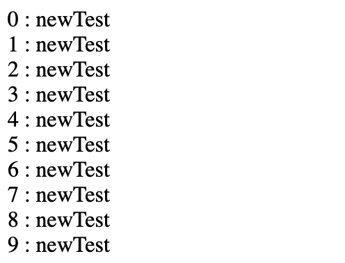

## 使用辅助类SimpleTagSupport来提高标签开发效率
[top](#catalog)
- 通过实现`SimpleTag`接口进行开发的问题
    1. `SimpleTag`接口的实现类中会产生大量的空方法
    2. 基本上每次都需要添加私有变量`PageContext pageContext`，并在`setJspContext`方法中进行保存，导致各个接口实现类中产生了很多相同的代码

- `SimpleTagSupport`类在代码级别上为开发上提供的优化
    - 类代码参考 `SimpleTagSupport.java`：[/java/mylearn/weblearn/src/main/java/com/complied/tagext/SimpleTagSupport.java](/java/mylearn/weblearn/src/main/java/com/complied/tagext/SimpleTagSupport.java)

    - `SimpleTagSupport`类提供的优化
        1. `SimpleTagSupport`类也是`SimpleTag`接口的实现类
        2. 使用私有变量分别保存了：`JspTag`、`JspContext`、`JspFragment`，这三个对象，并提供了getter来在子类中获取、使用
        3. 提供了空的：`doTag()`方法，需要子类进行重写

    - 主要实现内容
        ```java
        public class SimpleTagSupport implements SimpleTag {
            // 使用私有成员变量来保存生命周期中的重要变量
            private JspTag parentTag;
            private JspContext jspContext;
            private JspFragment jspBody;

            // 空方法需要子类进行重写
            public void doTag() throws JspException, IOException {
            }

            // 获取/设置父标签处理器
            public void setParent(JspTag parent) {
                this.parentTag = parent;
            }

            public JspTag getParent() {
                return this.parentTag;
            }

            // 获取/设置PageContext对象
            public void setJspContext(JspContext pc) {
                this.jspContext = pc;
            }

            protected JspContext getJspContext() {
                return this.jspContext;
            }

            // 获取/设置标签体
            public void setJspBody(JspFragment jspBody) {
                this.jspBody = jspBody;
            }

            protected JspFragment getJspBody() {
                return this.jspBody;
            }

            ...
        }
        ```

## 示例-使用SimpleTagSupport开发带属性的空标签
[top](#catalog)
- 标签处理器：读取服务器上的文件
    - `ReadFileTag.java` :[/java/mylearn/weblearn/src/main/java/com/ljs/test/tag/ReadFileTag.java](/java/mylearn/weblearn/src/main/java/com/ljs/test/tag/ReadFileTag.java)
    - 添加标签属性src
    - 实现内容
        ```java
        public class ReadFileTag extends SimpleTagSupport {
            private String src;

            public void setSrc(String src) {
                this.src = src;
            }

            @Override
            public void doTag() throws JspException, IOException {
                //获取输入流
                PageContext pageContext = (PageContext) getJspContext();
                InputStream is = pageContext.getServletContext().getResourceAsStream(src);

                //通过转换流将字节流转换为字符流，并创建处理流
                BufferedReader br = new BufferedReader(new InputStreamReader(is));

                //按行读取并输出到html
                JspWriter out = pageContext.getOut();
                String text = null;
                while ((text = br.readLine()) != null){
                    //转译 < >
                    text = text.replaceAll("\\<","&lt;")
                            .replaceAll("\\>","&gt;");
                    out.println(text);
                    out.println("<br>");
                }

            }
        }
        ```

- tld文件配置
    - [/java/mylearn/weblearn/src/main/webapp/WEB-INF/mytag.tld](/java/mylearn/weblearn/src/main/webapp/WEB-INF/mytag.tld)
    - 配置内容
    ```xml
    <tag>
        <name>readFile</name>
        <tag-class>com.ljs.test.tag.ReadFileTag</tag-class>
        <body-content>empty</body-content>

        <attribute>
            <name>src</name>
            <required>true</required>
            <rtexprvalue>true</rtexprvalue>
        </attribute>
    </tag>
    ```

- JSP页面
    - `readFiletag.jsp`: [/java/mylearn/weblearn/src/main/webapp/tag/readFiletag.jsp](/java/mylearn/weblearn/src/main/webapp/tag/readFiletag.jsp)

        ```html
        <%@ page isELIgnored="false" %>
        <%@ taglib prefix="ljs" uri="http://www.ljs.com/mytag/core" %>
        <html>
        <head>
            <title>Title</title>
        </head>
        <body>

        <ljs:readFile src="/WEB-INF/tagtest/test.txt"/>
        ```

- 页面结果
    - 入口：http://localhost:8080/weblearn_war_exploded/tag/readFiletag.jsp
    - 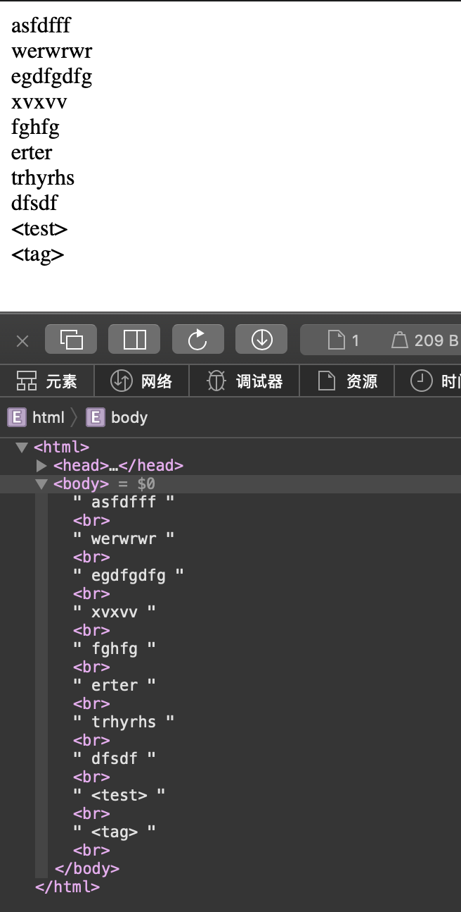


## 开发带有标签体的自定义标签
[top](#catalog)
- 标签体的未知：`<prefix:标签名>标签体</prefix:标签名>`

- 在自定义标签的标签处理器中使用JspFragment对象封装标签体信息

- 如果配置了标签包含标签体，则：
    - JSP引擎会调用`setJspBody()`方法把`JspFragment对象`传递给标签处理器类
    - SimpleTagSupport中还定义了一个getJspBody()方法，用于返回JspFragment对象

- 通过`JspFragment.invoke(Writer)`方法，输出标签体信息
    - 不同配置的输出结果
        - 如果配置的是：`<body-content>scriptless</body-content>`，则执行时会自动解析标签体中的el表达式和JSP动作元素，并将解析结果输出到参数`Writer`中
        - 如果配置的是：`<body-content>tagdependent</body-content>`，则直接将标签体信息输出到参数`Writer`中
    - 如果参数`Writer`是`null`，则直接将标签体解析结果输出到html
        - `invoke(null)`相当于：`invoke(getJspContext().getOut())`
    - 使用时，可以借助`StringWriter`来获取标签体中的值，然后再进行处理

## 示例-带有标签体的标签-循环打印集合
[top](#catalog)
- 基本的实现与使用方法与JSTL核心库的`c:foreach`类似
- 开发思路
    - 标签属性：`items`，设定需要遍历的集合
    - 标签属性：`var`
        - 遍历时，将集合中的每个元素都保存到域对象`pageContext`中，这样在调用`JspFrament.invoke()`方法，解析标签体中的表达式时就能够从`pageContext`中获取到
        - var的值将作为元素保存到`pageContext`时的key
    - 在标签体中添加输出的格式
        - 通过el表达式来设定输出格式
- JSP页面
    - foreach.jsp : [/java/mylearn/weblearn/src/main/webapp/tag/foreach.jsp](/java/mylearn/weblearn/src/main/webapp/tag/foreach.jsp)
        ```html
        <%
            List<Customer> customers = new ArrayList<>();
            request.setAttribute("customers", customers);
            customers.add(new Customer("1", "aaa", 11));
            customers.add(new Customer("2", "bbb", 22));
            customers.add(new Customer("3", "ccc", 33));
            customers.add(new Customer("4", "ddd", 44));
            customers.add(new Customer("5", "eee", 55));
        %>

        <ljs:foreach items="${requestScope.customers}" var="node">
            id: ${node.id}, name: ${node.name}, age: ${node.age}<br>
        </ljs:foreach>
        ```
- 标签处理器实现
    - ForeachTag.java : [/java/mylearn/weblearn/src/main/java/com/ljs/test/tag/ForeachTag.java](/java/mylearn/weblearn/src/main/java/com/ljs/test/tag/ForeachTag.java)
        ```java
        public class ForeachTag extends SimpleTagSupport {
            private Collection<?> items;
            private String var;

            public void setItems(Collection<?> items) {
                this.items = items;
            }

            public void setVar(String var) {
                this.var = var;
            }

            @Override
            public void doTag() throws JspException, IOException {
                JspFragment jspBody = getJspBody();
                JspContext pc = getJspContext();

                for (Object item : items) {
                    //将元素保存到域对象中
                    pc.setAttribute(var, item);

                    //解析标签体内容，并打印到html
                    jspBody.invoke(null);
                }
            }
        }
        ```
- tld配置内容
    - [/java/mylearn/weblearn/src/main/webapp/WEB-INF/mytag.tld](/java/mylearn/weblearn/src/main/webapp/WEB-INF/mytag.tld)
        ```xml
        <tag>
            <name>foreach</name>
            <tag-class>com.ljs.test.tag.ForeachTag</tag-class>
            <body-content>scriptless</body-content>

            <attribute>
                <name>items</name>
                <required>true</required>
                <rtexprvalue>true</rtexprvalue>
            </attribute>

            <attribute>
                <name>var</name>
                <required>true</required>
                <rtexprvalue>true</rtexprvalue>
            </attribute>
        </tag>
        ```

## 开发具有父子关系标签的方法
[top](#catalog)
- 父标签无法获取子标签的引用，**父标签仅把子标签作为标签体来使用**，所以配置tld文件时，必须使用`<body-content>scriptless</body-content>`
- 无法通过tld配置文件来表示触标签间的父子关系
- 唯一的表示手段：在子标签的标签处理器中获取引用，两种方式
    1. 如果继承了`SimpleTagSupport`，可以通过`getParent()`获取父标签的引用
    2. 如果父标签是实现了传统标签或简单标签接口的实现类
        - 两种接口实现类的父接口都是JspTag类型，该接口是一个空接口，是用来统一简单标签SimpleTag和传统标签Tag  
        - 使用前更具需要进行类型强转  
        - 然后获取父标签的引用

## 示例-父子关系标签
[top](#catalog)
- 需求：
    - 基本的使用方法
        ```
        choose
            when
            when
            otherwise
        ```
    - 在choose下编写逻辑分支，如果某个when分支是true，就停止后续的分支，并输出这个when的标签体内容

- 开发思路
    - 创建三个标签：choose、when、otherwise
    - choose是父标签，when、otherwise是子标签
    - choose无法意识到when、otherwise是其子标签，所以在choose中设置一个标记：`flg`，来辅助判断
    - when中有一个`boolean`属性`test`，表示当前分支是否匹配
    - when内部的判断方法
        1. 从choose中获取标记`flg`，如果`flg==false`，则表示之前有when是true，则停止当前when的匹配
        2. 如果`flg==true`表示还没有分支是true，则检查当前when的test值，
        3. 如果`test==true`，则将choose的`flg`设为false，阻止后续的when，并输出当前when的标签体内容
        4. 如果`test==false`，则不做处理
    - 都无法匹配时，即choose的`flg=true`时，直接输出otherwise的标签体内容
    - 因为子标签when、otherwise的结果对于choose来说都是标签体内容，所以choose内部不做特殊处理，直接输出标签体内容

- 标签体实现
    1. ChooseTag.java： [/java/mylearn/weblearn/src/main/java/com/ljs/test/tag/choose/ChooseTag.java](/java/mylearn/weblearn/src/main/java/com/ljs/test/tag/choose/ChooseTag.java)
        ```java
        public class ChooseTag extends SimpleTagSupport {
            //如果父标签的flg=false，则表示匹配成功，否则继续匹配
            private boolean flg = true;

            public boolean getFlg() {
                return flg;
            }

            public void setFlg(boolean flg) {
                this.flg = flg;
            }

            @Override
            public void doTag() throws JspException, IOException {
                //输出标签体
                JspFragment jspBody = getJspBody();
                jspBody.invoke(null);
            }
        }
        ```
    2. WhenTag.java: [/java/mylearn/weblearn/src/main/java/com/ljs/test/tag/choose/WhenTag.java](/java/mylearn/weblearn/src/main/java/com/ljs/test/tag/choose/WhenTag.java)
        ```java
        public class WhenTag extends SimpleTagSupport {
            boolean test;

            public void setTest(boolean test) {
                this.test = test;
            }

            @Override
            public void doTag() throws JspException, IOException {
                // 获取父标签的引用
                ChooseTag parentTag = (ChooseTag) getParent();

                // 父标签中的变量还处于未匹配的状态
                if (parentTag.getFlg()) {
                    // 当前子标签的状态是true，则表示条件匹配成功，输出子标签的标签体内容
                    // 并将父标签中的匹配状态设为false，阻止后续的匹配
                    if (test) {
                        getJspBody().invoke(null);
                        parentTag.setFlg(false);
                    }
                }
            }
        }
        ```

    3. OtherwiseTag.java : [/java/mylearn/weblearn/src/main/java/com/ljs/test/tag/choose/OtherwiseTag.java](/java/mylearn/weblearn/src/main/java/com/ljs/test/tag/choose/OtherwiseTag.java)
        ```java
        public class OtherwiseTag extends SimpleTagSupport {
            @Override
            public void doTag() throws JspException, IOException {
                // 获取父标签的引用
                ChooseTag parent = (ChooseTag) getParent();
                // 如果父标签仍然未匹配成功，则输出子标签的标签体内容
                if (parent.getFlg()){
                    getJspBody().invoke(null);
                }
            }
        }
        ```

- tld配置
    - [/java/mylearn/weblearn/src/main/webapp/WEB-INF/mytag.tld](/java/mylearn/weblearn/src/main/webapp/WEB-INF/mytag.tld)
        ```xml
        <!--父子关系标签：choose, when, otherwise-->
        <tag>
            <name>choose</name>
            <tag-class>com.ljs.test.tag.choose.ChooseTag</tag-class>
            <body-content>scriptless</body-content>
        </tag>

        <tag>
            <name>when</name>
            <tag-class>com.ljs.test.tag.choose.WhenTag</tag-class>
            <body-content>scriptless</body-content>

            <attribute>
                <name>test</name>
                <required>true</required>
                <rtexprvalue>true</rtexprvalue>
            </attribute>
        </tag>

        <tag>
            <name>otherwise</name>
            <tag-class>com.ljs.test.tag.choose.OtherwiseTag</tag-class>
            <body-content>scriptless</body-content>
        </tag>
        ```

- JSP页面
    - choosetag.jsp : [/java/mylearn/weblearn/src/main/webapp/tag/choosetag.jsp](/java/mylearn/weblearn/src/main/webapp/tag/choosetag.jsp)
        ```html
        <ljs:choose>
            <ljs:when test="${param.score > 60}">level A</ljs:when>
            <ljs:when test="${param.score > 40}">level B</ljs:when>
            <ljs:when test="${param.score > 20}">level C</ljs:when>
            <ljs:otherwise>others</ljs:otherwise>
        </ljs:choose>
        ```

- 页面结果
    - 需要附加请求参数score
    - 入口：http://localhost:8080/weblearn_war_exploded/tag/choosetag.jsp?score=55
    - 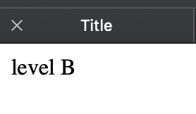

# JSTL
## JSTL需要的maven支持
[top](#catalog)
```xml
<!--taglibs依赖1-->
<!-- https://mvnrepository.com/artifact/javax.servlet.jsp.jstl/jstl-api -->
<dependency>
<groupId>javax.servlet.jsp.jstl</groupId>
<artifactId>jstl-api</artifactId>
<version>1.2</version>
</dependency>

<!--taglibs依赖2-->
<!-- https://mvnrepository.com/artifact/org.apache.taglibs/taglibs-standard-impl -->
<dependency>
    <groupId>org.apache.taglibs</groupId>
    <artifactId>taglibs-standard-impl</artifactId>
    <version>1.2.5</version>
</dependency>
```

## JSTL简介
[top](#catalog)
- JSTL JavaServer Pages Standard Tag Libaray， JSP标准标签函数库，是有JCP所指定的标准规格，主要提供给Java Web开发人员一个标准通用的标签函数库
- JSTL可以应用于各种场景，包括：基本输入输出、流程控制、循环、XML文件解析，数据库查询、国际化、文字格式化标准等
- JSTL所提供的标签函数库主要分为5大类
    
    |JSTL|前置名称|URI|范例|
    |-|-|-|-|
    |核心标签库|c|`http://java.sum.com/jsp/jstl/core`|`<c:out>`|
    |I18格式标签库<br>(国际化标签库)|fmt|`http://java.sum.com/jsp/jstl/fmt`|`<fmt:formatdate>`|
    |SQL标签库|sql|`http://java.sum.com/jsp/jstl/sql`|`<sql:query>`|
    |XML标签库|xml|`http://java.sum.com/jsp/jstl/xml`|`<x:forBach>`|
    |函数标签库|fn|`http://java.sum.com/jsp/jstl/functions`|`<fn:split>`|

- 使用前需要在JSP中导入标签库：`<%@ taglib prefix="前置名称" uri="URI" %>`

- JSTL支持EL语法，如：`<c:out value="${userlist.user }">`

## JSTL核心标签库
### JSTL核心标签库-简介
[top](#catalog)
- 主要功能：基本输入输出、流程控制、迭代操作、URL操作
- 功能分类
    
    |功能分类|标签名称|
    |-|-|
    |表达式操作|out<br>set<br>remove<br>catch|
    |流程操作|if<br>choose<br>when<br>otherwise|
    |迭代操作|forEach<br>forTokens|
    |URL操作|Import<br>param<br>url<br>param<br>redirect<br>param|

### JSTL核心标签库-基本输入输出
[top](#catalog)
- `<c:out>`
    - 主要用来显示数据的内容，于JSP表达式/EL表达式类似，但是功能更强大，可以进行特殊字符的转换
    - 基本语法：`<c:out value="需要显示的值">`
    - 属性
        
        |名称|说明|EL|类型|必须|默认值|
        |-|-|-|-|-|-|
        |value|需要显示的值|YObject|Object|是|无|
        |defalut|value==null时，显示default|YObject|Object|否|无|
        |escapeXML|是否转换特殊字符，如：`<`转换成`&lt;`|Yboolean|boolean|否|true|
        
    - 示例
        - cout.jsp 
            - [/java/mylearn/weblearn/src/main/webapp/jstl/core/cout.jsp](/java/mylearn/weblearn/src/main/webapp/jstl/core/cout.jsp)

            ```html
            <%@ taglib prefix="c" uri="http://java.sun.com/jsp/jstl/core" %>

            <%
                request.setAttribute("book", "<<tab test>>");
            %>

            book by el: ${requestScope.book}
            <br>
            book by jstl: <c:out value="${requestScope.book}"/>
            ```
        - 页面结果
            - 入口：http://localhost:8080/weblearn_war_exploded/jstl/core/cout.jsp
            - 使用jstl时，可以自动进行特殊字符转换
            - 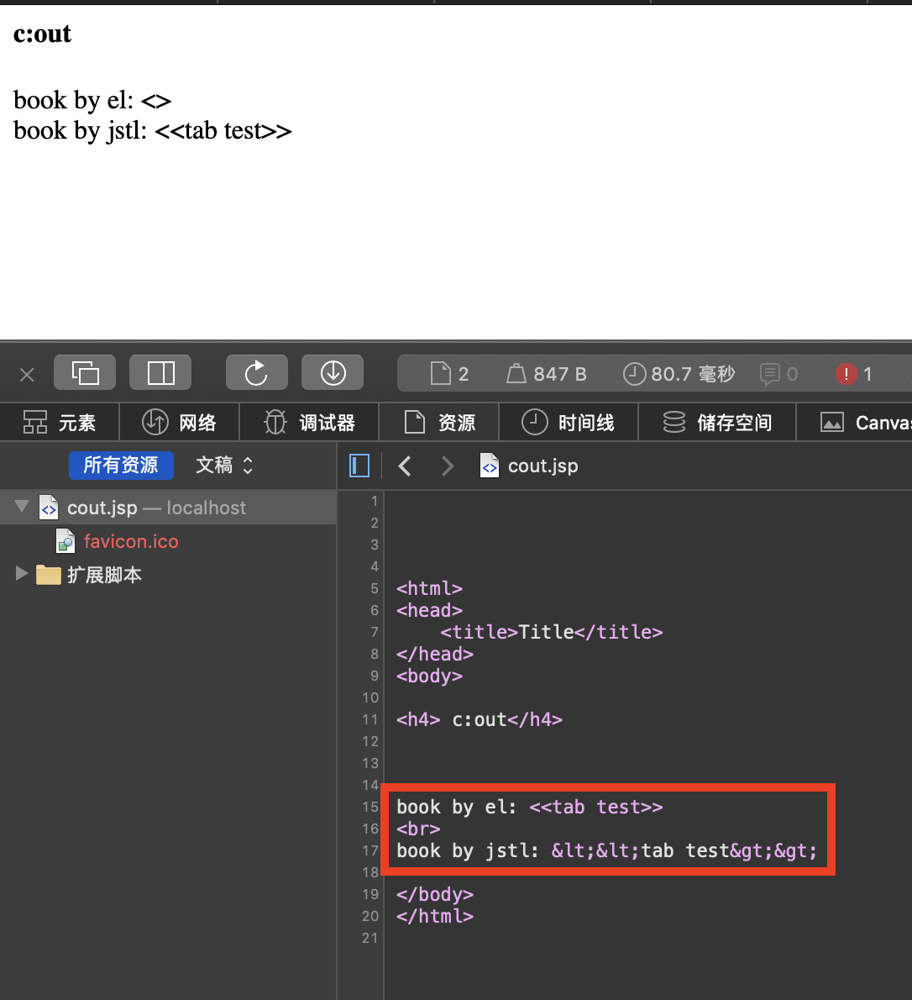

- `<c:set>`
    - 将变量存储到JSP范围中或是JavaBean的属性中   
    - 语法
        - 将value的值存储到域范围对象的varName变量中
            - `<c:set value="value" var="varName" [scope="page|request|session|application"] />`
        - 将标签体内容存储到域范围对象的varName变量中
            ```xml
            <c:set var="varName" [scope="page|request|session|application"] >
              标签体
            </c:set>
            ```
        - 将值保存到JavaBean的某个属性中
            - `<c:set target="javabean" property="属性名" value="属性值" />`

    - 示例
        - cset.jsp : [/java/mylearn/weblearn/src/main/webapp/jstl/core/cset.jsp](/java/mylearn/weblearn/src/main/webapp/jstl/core/cset.jsp)

            ```html
            <h4>c:set page</h4>

            <%--1. 将name=testValue保存到pageContext域对象中--%>
            <c:set value="testValue" var="name" scope="page" />
                <%--打印name--%>
            name = ${pageScope.name}
            <br>

            <%--2. 使用el表达式设置value值--%>
            <%
            request.setAttribute("elStr","elTestValue");
            %>

            <c:set value="${requestScope.elStr}" var="elTest" scope="page"/>
            elTest = ${pageScope.elTest}
            <br>
            <br>

            <%--3. 使用c:set 来设置JavaBean中的属性--%>
            <%
                Customer customer = new Customer("abcdef", "zxccv", 16);
                request.setAttribute("customer", customer);
            %>
                <%--打印customer.id--%>
            custome.id = ${customer.id}
            <br>
                <%--使用cset重新设置customer.id--%>
            <c:set target="${requestScope.customer}" property="id" value="1233456"/>
            custome.id = ${customer.id}
            ```
        
        - 页面结果
            - 入口：http://localhost:8080/weblearn_war_exploded/jstl/core/cset.jsp
            - 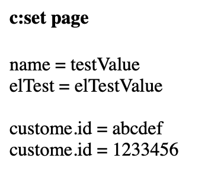

- `<c:remove>`
    - 从指定域对象中删除某个属性
    - 语法：`<c:remove var="varName" scope="域对象"/>`
    - 示例
        - cremove.jsp : [/java/mylearn/weblearn/src/main/webapp/jstl/core/cremove.jsp](/java/mylearn/weblearn/src/main/webapp/jstl/core/cremove.jsp)

### JSTL核心标签库-流程控制
[top](#catalog)
- `<c:if>`
    - 与if语句的用途相同
    - 语法
        - 没有标签体：`<c:if test="判断内容" var="varName" [scope="page|request|session|application"]>`
        - 有本体内容：
            ```xml
            <c:if test="判断内容" [scope="page|request|session|application"]>
            ```
    - 属性
        
        |名称|说明|EL|类型|必须|默认值|
        |-|-|-|-|-|-|
        |test|如果表达式的结果为true，则执行标签体内容，false则相反|Y|boolean|是|无|
        |var|用来存储test运算后的结果|N|String|否|无|
        |scope|保存var变量的域对象范围|N|String|否|page|
    
    - 缺点：只有c:if，没有else
    - 优点：可以保存结果
    - 示例
        - cif.jsp : [/java/mylearn/weblearn/src/main/webapp/jstl/core/cif.jsp](/java/mylearn/weblearn/src/main/webapp/jstl/core/cif.jsp)
            ```html
            <h3>c:if page</h3>

            <c:set value="19" var="age" scope="request"/>

            <%--1. 判断并输出标签体内容--%>
            <c:if test="${requestScope.age > 18}">a adult</c:if>
            <br>
            <%--2. 将判断结果保存在域对象中，在后续处理中使用--%>
            <c:if test="${requestScope.age > 18}" var="isAdult" scope="request"/>
            isAdult = ${requestScope.isAdult}
            ```
        - 页面结果
            - 入口：http://localhost:8080/weblearn_war_exploded/jstl/core/cif.jsp
            - 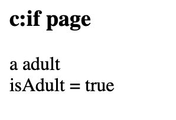

- c:choose, c:when, c:otherwise
    - 可以实现if...else if ... else
    - 多个when中必须只能有一个为true
    - 在同一个c:choose中，c:otherwise必须为最后一个标签

### JSTL核心标签库-迭代操作
- `<c:forEach>`
    - 迭代集合，并持续输出标签体内容
    - 属性
    
        |名称|说明|EL|类型|必须|默认值|
        |-|-|-|-|-|-|
        |var|用来存放当前迭代的元素|N|String|否|无|
        |items|被迭代的集合|Y|Array<br>Collection<br>Iterator<br>Enumeration<br>Map<br>String|否|无|
        |varStatus|用来存放当前迭代元素的相关信息，包括：<br>当前元素的索引：index<br>当前迭代中已经迭代的数量：count<br>是否是当前迭代的第一个元素：first<br>是否是当前迭代的最后一个元素：last|N|String|否|无|
        |begin|开始位置|Y|int|否|0|
        |end|结束位置|Y|int|否|最后一个元素|
        |step|每次迭代的间隔数|Y|int|否|1|
        
    - 每次迭代时都会把元素保存到page中，保存的key是var，所以在标签体中，可以直接在el表达式中通过var来获取元素
    - 遍历Map时，需要从元素中先分别获取key、value才能使用；如果需要获取各元素对应的对象中的属性，必须先获取value，如
        ```html
        <c:forEach items="${custMap}" var="node">
            node.key=${node.key}, node.value.id=${node.value.id}, node.value.name=${node.value.name}<br>
        </c:forEach>
        ```

    - 示例
        - cforeach.jsp : [/java/mylearn/weblearn/src/main/webapp/jstl/core/cforeach.jsp](/java/mylearn/weblearn/src/main/webapp/jstl/core/cforeach.jsp)

            ```html
            <h4>c:foreach Page</h4>

            <%--1. 遍历Collection 遍历数组与遍历Collection相同--%>
            <%--1.1. 不设定集合，只是进行迭代，并输出index--%>
            <c:forEach begin="0" end="20" step="2" var="i">
                index = ${i} <br>
            </c:forEach>
            <br>
            <br>

            <%
                List<Customer> customers = new ArrayList<>();
                request.setAttribute("customers", customers);
                customers.add(new Customer("111", "aaa", 11));
                customers.add(new Customer("222", "bbb", 22));
                customers.add(new Customer("333", "ccc", 33));
                customers.add(new Customer("444", "ddd", 44));
                customers.add(new Customer("555", "eee", 55));
            %>

            <%--1.2. 从0开始打印值和信息--%>
            <c:forEach items="${customers}" varStatus="status" var="node">
                index=${status.index}, count=${status.count}, isfirst=${status.first}, islast=${status.last}, name=${node.name}<br>
            </c:forEach>
            <br>

            <%--1.3. 从2开始打印值和信息--%>
            <c:forEach items="${customers}" varStatus="status" var="node" begin="2">
                index=${status.index}, count=${status.count}, isfirst=${status.first}, islast=${status.last}, name=${node.name}<br>
            </c:forEach>
            <br>
            <br>

            <%--2. 遍历Map--%>
            <%
                Map<String, Customer> custMap = new HashMap<>();
                request.setAttribute("custMap", custMap);
                custMap.put("a1", new Customer("111", "aaa", 11));
                custMap.put("a2", new Customer("222", "bbb", 22));
                custMap.put("a3", new Customer("333", "ccc", 33));
                custMap.put("a4", new Customer("444", "ddd", 44));
                custMap.put("a5", new Customer("555", "eee", 55));
            %>

            <c:forEach items="${custMap}" var="node">
                node.key=${node.key}, node.value.id=${node.value.id}, node.value.name=${node.value.name}<br>
            </c:forEach>
            <br>

            <%--3. 遍历Enumeration--%>
            <%--必须通过pageContext.request来获取request对象
                不能通过requestScope获取，这只是代表一个范围，不是真正的request对象--%>
            <c:forEach items="${pageContext.request.attributeNames}" var="node">
                attributeName = ${node}<br>
            </c:forEach>
            <br>
            ```
        - 页面结果
            - 入口：http://localhost:8080/weblearn_war_exploded/jstl/core/cforeach.jsp
            - 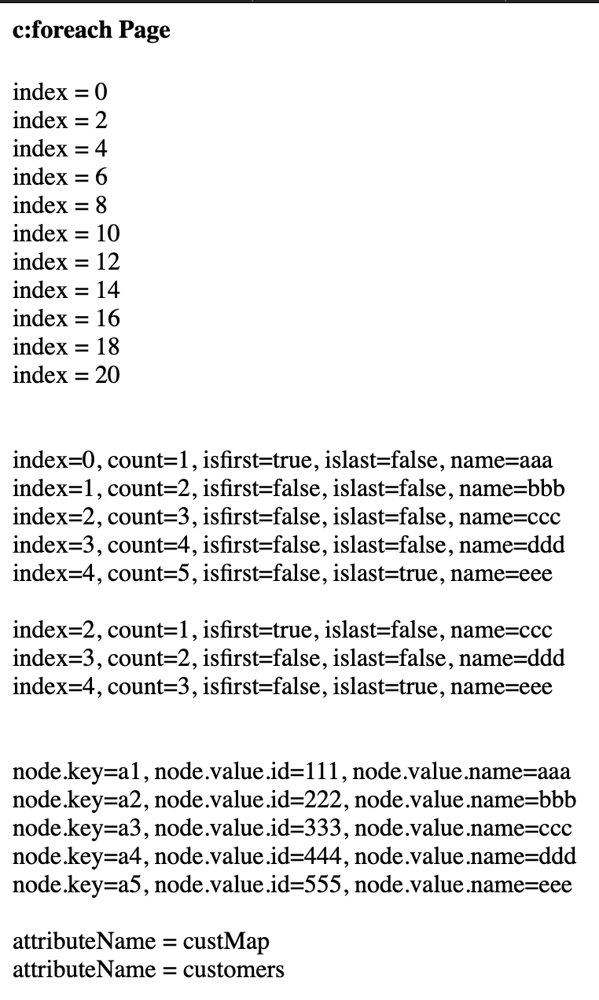

- `<c:forTokens>`
    - 用delimiters分割字符串，类似于String.split()
    - 语法
        ```html
        <c:forTokens items="字符串" delims="分隔符"
             [var="保存元素的变量名" varStatus="保存元素信息的变量名"
              begin="begin" end="end" step="step">
          标签体
        </c:forTokens>
        ```
    - 示例
        - cfortokens.jsp : [/java/mylearn/weblearn/src/main/webapp/jstl/core/cfortokens.jsp](/java/mylearn/weblearn/src/main/webapp/jstl/core/cfortokens.jsp)

            ```html
            <%--使用`:`分割字符串并输出--%>
            <c:forTokens items="${str}" delims=":" var="node">
                node=${node}<br>
            </c:forTokens>
            ```
        - 页面结果
            - 入口：http://localhost:8080/weblearn_war_exploded/jstl/core/cfortokens.jsp
            - 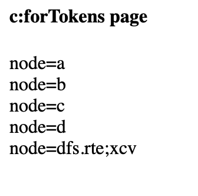

### JSTL核心标签库-URL操作
[top](#catalog)
- `<c:import>`
    - 可以把其他静态或动态文件包含到当前JSP页面
    - 与`<jsp:include>`不同的是可以引用当前web应用以外的资源
- `<c:redirect>`
    - 使当前JSP页面重定向到指定页面 
- `<c:url>`
    - 会产生一个url地址
    - 可以根据Cookie是否可以使用来进行url重写，如果禁用了Cookie将会自动附加JSESSIONID
    - 可以对GET请求的参数进行编码
    - 语法
        ```html
        <c:url value="url" var="存储的变量" scope="保存的域对象">
          <c:param name="附加的参数名" value="参数值" />
        </c:url>
        ```
    - 示例
        - curl.jsp : [/java/mylearn/weblearn/src/main/webapp/jstl/core/curl.jsp](/java/mylearn/weblearn/src/main/webapp/jstl/core/curl.jsp)
            ```html
            <h3>c:url page</h3>

            <c:url value="/jstl/core/curl.jsp" var="testurl" scope="page">
                <c:param name="name" value="中文测试" />
            </c:url>

            <%--打印生成的url--%>
            ${pageScope.testurl}
            ```
        - 页面结果
            - 入口：http://localhost:8080/weblearn_war_exploded/jstl/core/curl.jsp
            - 使用Cookie
                - 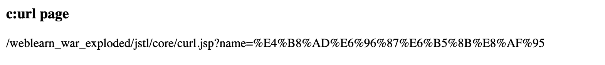
            - 禁用Cookie
                - 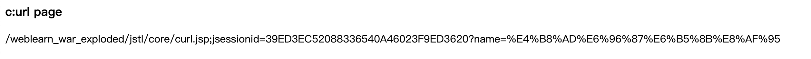


# Filter过滤器
## Filter过滤器简介
[top](#catalog)
- Filter是JavaWeb的一个重要组件，可以对发送到Servlet的请求进行拦截，并对响应也进行拦截，从而**在Servlet进行响应处理的前后实现一些特殊的功能**
- <label style="color:red">Filter对象是单例的。容器将在同一个过滤器实例上运行多个线程，来为多个请求服务，所以开发时需要注意线程安全</label>
- Filter的过滤过程
    - 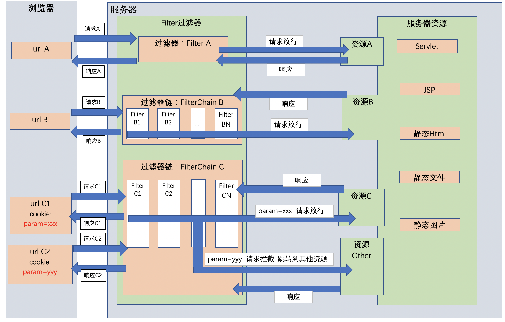
- Filter程序本质是一个实现了Filter接口的Java类
- 在ServletAPI中定义了**三个接口**来供开发人员编写Filter程序：
    1. Filter
    2. FilterChain
    3. FilterConfig
- <label style="color:red">由多个拦截相同url的Filter类会自动构成Filter链，并且：`<filter-mapping>`的顺序决定了整个Filter链的顺序</label>

- Filter程序与Servlet程序相似，它<label style="color:red">由Servlet容器进行调用和执行</label>
    
## Filter程序的开发
### 如何创建并运行一个Filter类
[top](#catalog)
1. 创建Filter类
    -　创建一个类，并实现一个Filter接口，包括：`Filter`，`FilterChain`，`FilterConfig`
2. 配置Filter类
    - Filter程序需要在web.xml文件中进行注册和设置它所能拦截的资源
        - Filter可以拦截Jsp、Servlet、静态图片文件、静态html文件
    - 配置方法，参考：[配置Filter过滤器](#配置Filter过滤器)
    - <label style="color:red">多个拦截相同url的Filter映射会自动构成Filter链，并且：`<filter-mapping>`的顺序决定了整个Filter链的顺序</label>
3. 执行
    - 有Servlet容器负责执行

### Filter组件-Filter接口
[top](#catalog)
- `init()`，与Servlet的init方法类似
    1. 在Filter对象被创建后，立即被调用，且只被调用一次，并对当前的Filter进行初始化
    2. 但是<label style="color:red">Filter对象只在Servlet容器加载当前Web应用时被创建</label>，所以Filter没有`<load-on-startup>`配置
    3. 可以在此处保存FilterConfig接口对象的引用
- `doFilter()`，当客户端请求目标资源的时候，容器会调用与这个资源相关联的过滤器的`doFilter()`方法
    - 默认情况下，该方法会主动拦截请求，并且不放行
    - 需要手动调用：`FilterChain.doFilter(ServletRequest, ServletResponse)`，才能放行，将请求发送到目标资源、或者下一个Filter链中的下一个Filter
- `destroy()`，释放当前Filter所占用的资源，在Filter被**销毁之前**，只调用一次
- 接口代码
    ```java
    public interface Filter {
        public void init(FilterConfig filterConfig) throws ServletException;
        
        public void doFilter ( ServletRequest request, ServletResponse response, FilterChain chain ) throws IOException, ServletException;
    
        public void destroy();
    }
    ```

### Filter组件-FilterConfig接口
[top](#catalog)
- 与ServletConfig对象类似
- 可以在web.xml文件中配置当前Filter的初始化参数，配置方式也和Servlet类似
- 接口代码
    ```java
    public interface FilterConfig {
        
        public String getFilterName();
    
        public ServletContext getServletContext();
    
        public String getInitParameter(String name);
    
        public Enumeration getInitParameterNames();
    }
    ```

### Filter组件-FilterChain接口对象
[top](#catalog)
- Filter链，多个Filter可以构成一个Filter链
- `doFilter()`，方法会把请求传给Filter链的下一个Filter，若当前Filter是Filter链的最后一个Filter，将把请求发送给目标资源(Servle，JSP，静态资源等)
- <label style="color:red">多个拦截相同url的Filter映射会自动构成Filter链，并且：`<filter-mapping>`的顺序决定了整个Filter链的顺序</label>
- 接口代码
    ```java
    public interface FilterChain {
        public void doFilter ( ServletRequest request, ServletResponse response ) throws IOException, ServletException;
    }
    ```

## Filter链的执行顺序
[top](#catalog)
- <label style="color:red">在多个Filter链中，每次调用`chain.doFilter(req, resp)`时，不会结束当前的`Filter.doFilter()`方法，而是将程序挂起，当响应返回时，再继续执行`Filter.doFilter()`中剩余的内容</label>
- 响应返回时，会按照**逆序**唤醒每个Filter，并执行余下的操作
- 测试
    - 过滤器
        - HelloFilter.java : [/java/mylearn/weblearn/src/main/java/com/ljs/test/filter/introduct/HelloFilter.java](/java/mylearn/weblearn/src/main/java/com/ljs/test/filter/introduct/HelloFilter.java)

            ```java
            @Override
            public void doFilter(ServletRequest request, ServletResponse response, FilterChain chain) throws IOException, ServletException {
                System.out.println("1. before HelloFilter.doFilter");
                // 放行请求
                chain.doFilter(request,response);
                System.out.println("2. after HelloFilter.doFilter");
            }
            ```
        - SecondFilter.java : [/java/mylearn/weblearn/src/main/java/com/ljs/test/filter/introduct/SecondFilter.java](/java/mylearn/weblearn/src/main/java/com/ljs/test/filter/introduct/SecondFilter.java)

            ```java
            @Override
            public void doFilter(ServletRequest request, ServletResponse response, FilterChain chain) throws IOException, ServletException {
                System.out.println("3. before Filter.doFilter");
                chain.doFilter(request, response);
                System.out.println("4. after Filter.doFilter");
            }
            ```
    - JSP页面
        - test.jsp : [/java/mylearn/weblearn/src/main/webapp/filter/introduct/test.jsp](/java/mylearn/weblearn/src/main/webapp/filter/introduct/test.jsp)

            ```html
            <h3>test page</h3>

            <%
                System.out.println("5. test.jsp");
            %>
            ```
    - web.xml
        - Filter链的顺序：helloFilter --> secondFilter 
        - [/java/mylearn/weblearn/src/main/webapp/WEB-INF/web.xml](/java/mylearn/weblearn/src/main/webapp/WEB-INF/web.xml)

            ```xml
            <filter>
                <filter-name>helloFilter</filter-name>
                <filter-class>com.ljs.test.filter.introduct.HelloFilter</filter-class>
                <init-param>
                    <param-name>name</param-name>
                    <param-value>root</param-value>
                </init-param>
            </filter>
            <filter-mapping>
                <filter-name>helloFilter</filter-name>
                <!--配置需要拦截的url-->
                <url-pattern>/filter/introduct/test.jsp</url-pattern>
            </filter-mapping>

            <filter>
                <filter-name>secondFilter</filter-name>
                <filter-class>com.ljs.test.filter.introduct.SecondFilter</filter-class>
            </filter>

            <!--配置Filter节点的映射-->
            <!--配置多个拦截相同url的filter映射，来构成一个filter链-->
            <filter-mapping>
                <filter-name>secondFilter</filter-name>
                <url-pattern>/filter/introduct/test.jsp</url-pattern>
            </filter-mapping>
            ```
    - 控制台输出
        - 入口：http://localhost:8080/weblearn_war_exploded/filter/introduct/test.jsp
        - 执行顺序分析
            1. 先经过`HelloFilter`，所以打印了：`1. before HelloFilter.doFilter`，然后到下一个Filter，当前Filter被挂起
            2. 再经过`SecondFilter`,所以打印了：`3. before Filter.doFilter`，然后跳转到JSP页面，当前Filter被挂起
            3. 处理JSP，打印了JSP脚本片段：`5. test.jsp`，然后将响应返回
            4. 响应返回，唤醒`SecondFilte`，执行剩余操作，所以打印了：`4. after Filter.doFilter`，结束方法，并返回响应
            5. 响应返回，唤醒`HelloFilter`，执行剩余操作，所以打印了：`2. after HelloFilter.doFilter`，结束方法，并返回响应
            6. 响应返回浏览器，解析并显示
        - 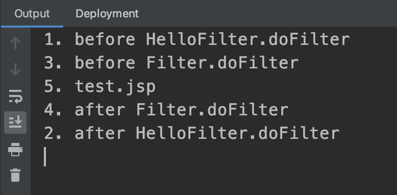


## 示例-使用Filter链拦截登录
[top](#catalog)
- 需求
    - 在login.jsp页面输入username、password登录
    - 先使用UsernameFilter拦截，如果输入的username等于Filter的初始化参数username，则放行，否则**转发**回login.jsp页面并显示错误信息
    - 再使用PasswordFilter拦截，如果输入的password等于web应用的初始化参数password则放行，否则**转发**回login.jsp页面并显示错误信息
    - 发生异常重新转发回login.jsp时需要重新显示之前输入的username

- Filter
    - UserNameFilter.java [/java/mylearn/weblearn/src/main/java/com/ljs/test/filter/sample/login/UserNameFilter.java](/java/mylearn/weblearn/src/main/java/com/ljs/test/filter/sample/login/UserNameFilter.java)

        ```java
        private String username;

        @Override
        public void init(FilterConfig filterConfig) throws ServletException {
            username = filterConfig.getInitParameter("username");
        }

        @Override
        public void doFilter(ServletRequest request, ServletResponse response, FilterChain chain) throws IOException, ServletException {
            System.out.println("UserNameFilter.doFilter");

            //如果用户名相同，则请求放行
            if (username.equals(request.getParameter("username"))){
                chain.doFilter(request,response);
            } else {
                //用户名不同，则转发到login.jsp，并显示错误信息
                request.setAttribute("msg", "error username");
                request.getRequestDispatcher("/filter/sample/login/login.jsp").forward(request,response);
            }
        }
        ```
    - PasswordFilter.java : [/java/mylearn/weblearn/src/main/java/com/ljs/test/filter/sample/login/PasswordFilter.java](/java/mylearn/weblearn/src/main/java/com/ljs/test/filter/sample/login/PasswordFilter.java)

        ```java
        private String password;

        @Override
        public void init(FilterConfig filterConfig) throws ServletException {
            password = filterConfig.getServletContext().getInitParameter("password");
        }

        @Override
        public void doFilter(ServletRequest request, ServletResponse response, FilterChain chain) throws IOException, ServletException {
            System.out.println("PasswordFilter.doFilter");

            // 密码等于1234时，请求放行
            if (password.equals(request.getParameter("password"))){
                chain.doFilter(request,response);
            } else{
                //密码不同，则转发到login.jsp，并显示错误信息
                request.setAttribute("msg", "error password");
                request.getRequestDispatcher("/filter/sample/login/login.jsp").forward(request,response);
            }
        }
        ```

- jsp
    - login.jsp : [/java/mylearn/weblearn/src/main/webapp/filter/sample/login/login.jsp](/java/mylearn/weblearn/src/main/webapp/filter/sample/login/login.jsp)

        ```html
        <h3> login page </h3>
        <%--如果被Filter拦截并转发回来，则输出错误信息--%>
        <c:if test="${!empty requestScope.msg}">
            <label style="color: red">${requestScope.msg}</label>
            <br>
        </c:if>

        <form action="${pageContext.request.contextPath}/filter/sample/login/hello.jsp"
            method="post">

            username:<input type="text" name="username" value="${param.username}"><br>
            password:<input type="password" name="password"><br>
            <input type="submit" value="Login">
        </form>
        ```
    - hello.jsp : [/java/mylearn/weblearn/src/main/webapp/filter/sample/login/hello.jsp](/java/mylearn/weblearn/src/main/webapp/filter/sample/login/hello.jsp)

        ```html
        <h3>hello page</h3>

        username = ${param.username}
        ```

- web.xml配置
    - [/java/mylearn/weblearn/src/main/webapp/WEB-INF/web.xml](/java/mylearn/weblearn/src/main/webapp/WEB-INF/web.xml)
        ```xml
        <!-- web应用 初始化参数配置 -->
        <context-param>
            <param-name>password</param-name>
            <param-value>qwer</param-value>
        </context-param>

        <!-- Filter配置 -->
        <filter>
            <filter-name>userNameFilter</filter-name>
            <filter-class>com.ljs.test.filter.sample.login.UserNameFilter</filter-class>
            <init-param>
                <param-name>username</param-name>
                <param-value>root</param-value>
            </init-param>
        </filter>

        <filter>
            <filter-name>passwordFilter</filter-name>
            <filter-class>com.ljs.test.filter.sample.login.PasswordFilter</filter-class>
        </filter>

        <filter-mapping>
            <filter-name>userNameFilter</filter-name>
            <url-pattern>/filter/sample/login/hello.jsp</url-pattern>
        </filter-mapping>

        <filter-mapping>
            <filter-name>passwordFilter</filter-name>
            <url-pattern>/filter/sample/login/hello.jsp</url-pattern>
        </filter-mapping>
        ```

- 页面内容
    - 入口：localhost:8080/weblearn_war_exploded/filter/sample/login/login.jsp
    - 进入登录页面
        - 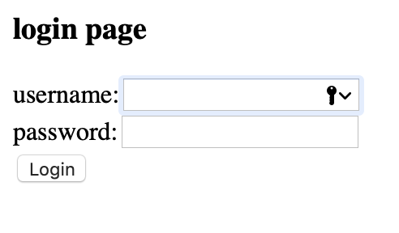
    - 输入错误的用户
        - 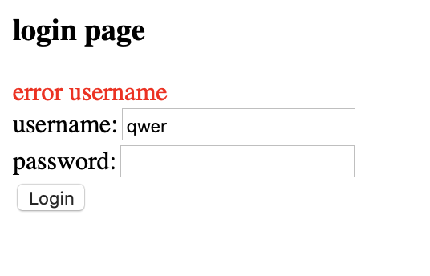
    - 输入错误的密码
        - 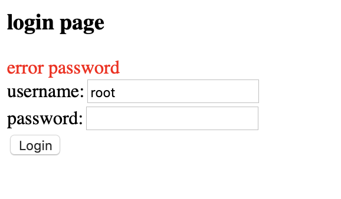
    - 登录成功
        - 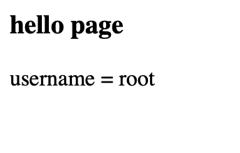

## 自定义HttpFilter来提高开发效率
[top](#catalog)
- 直接使用Filter接口开发的问题
    - 有时会存在空方法，`init`、`destroy`
    - 主要的逻辑都集中在`doFilter`中，使用时会需要将request和response强转为HttpServletRequest和HttpServletResponse
    - 使用filterConfig对象时，需要在init方法中进行保存
- 自定义抽象类实现 : HttpFilter.java
    - [/java/mylearn/weblearn/src/main/java/com/ljs/test/filter/help/HttpFilter.java](/java/mylearn/weblearn/src/main/java/com/ljs/test/filter/help/HttpFilter.java)

        ```java
        public abstract class HttpFilter implements Filter {
            private FilterConfig filterConfig;

            // 对外提供一个可以获取filterConfig引用的方法
            public FilterConfig getFilterConfig() {
                return filterConfig;
            }

            @Override
            public void init(FilterConfig filterConfig) throws ServletException {
                //保存 filterConfig对象的引用
                this.filterConfig = filterConfig;
                init();
            }

            // 供子类重写初始化方法
            public void init() {
            }

            @Override
            public void doFilter(ServletRequest request, ServletResponse response, FilterChain chain) throws IOException, ServletException {
                //参数类型强转
                HttpServletRequest req = (HttpServletRequest) request;
                HttpServletResponse resp = (HttpServletResponse) response;

                doFilter(req, resp, chain);
            }

            // 抽象方法，让子类来提供具体的实现
            public abstract void doFilter(HttpServletRequest req, HttpServletResponse resp, FilterChain chain) throws IOException, ServletException;

            @Override
            public void destroy() {

            }
        }
        ```

## Filter配置的dispatcher节点
[top](#catalog)
- dispatcher节点的配置参考：[配置Filter过滤器](#配置Filter过滤器)
- 默认只配置了`<dispatcher>REQUEST</dispatcher>`，所以通过其他方式调用时，Filter会失效
- **失效的示例**
    - 测试思路
        - 在`index2.jsp`中通过链接跳转到`dispatcher2.jsp`
        - 在`dispatcher2.jsp`中通过`<jsp:forward>`转发到`test2.jsp`
        - `test2.jsp`通过`TestPatcherFilter`进行拦截
    - jsp
        - index2.jsp : [/java/mylearn/weblearn/src/main/webapp/filter/dispatcher/index2.jsp](/java/mylearn/weblearn/src/main/webapp/filter/dispatcher/index2.jsp)
        - dispatcher2.jsp : [/java/mylearn/weblearn/src/main/webapp/filter/dispatcher/dispatcher2.jsp](/java/mylearn/weblearn/src/main/webapp/filter/dispatcher/dispatcher2.jsp)
        - test2.jsp :[/java/mylearn/weblearn/src/main/webapp/filter/dispatcher/test2.jsp](/java/mylearn/weblearn/src/main/webapp/filter/dispatcher/test2.jsp)
    - Filter
        - TestPatcherFilter.java : [/java/mylearn/weblearn/src/main/java/com/ljs/test/filter/dispatcher/TestPatcherFilter.java](/java/mylearn/weblearn/src/main/java/com/ljs/test/filter/dispatcher/TestPatcherFilter.java)

            ```java
            @Override
            public void doFilter(HttpServletRequest req, HttpServletResponse resp, FilterChain chain) throws IOException, ServletException {
                System.out.println("before TestPatcherFilter.doFilter");

                chain.doFilter(req,resp);

                System.out.println("after TestPatcherFilter.doFilter");
            }
            ```

    - web.xml
        ```xml
        <filter-mapping>
            <filter-name>testPatcherFilter</filter-name>
            <url-pattern>/filter/dispatcher/test2.jsp</url-pattern>
        </filter-mapping>
        ```

    - 测试结果
        - 入口：http://localhost:8080/weblearn_war_exploded/filter/dispatcher/index2.jsp
        - 进入`index2.jsp`
            - 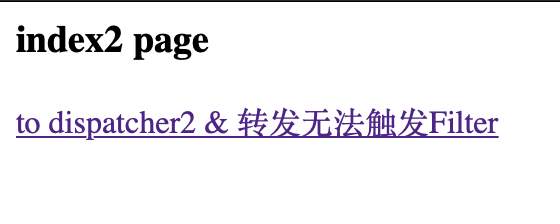
        - 结果：通过转发方式调用`test2.jsp`，所以**控制台没有任何输出**
            - 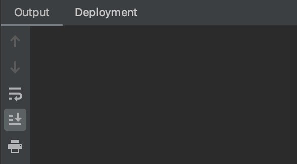
            
- **通过配置`<dispatcher>`，在forward调用时来触发Filter**
    - 测试思路
        - 在`index.jsp`中通过链接跳转到`dispatcher.jsp`
        - 在`dispatcher.jsp`中通过`<jsp:forward>`转发到`test.jsp`
        - `test.jsp`通过`TestPatcherFilter`进行拦截
    - jsp
        - index.jsp : [/java/mylearn/weblearn/src/main/webapp/filter/dispatcher/index.jsp](/java/mylearn/weblearn/src/main/webapp/filter/dispatcher/index.jsp)
        - dispatcher.jsp : [/java/mylearn/weblearn/src/main/webapp/filter/dispatcher/dispatcher.jsp](/java/mylearn/weblearn/src/main/webapp/filter/dispatcher/dispatcher.jsp)
        - test.jsp :[/java/mylearn/weblearn/src/main/webapp/filter/dispatcher/test.jsp](/java/mylearn/weblearn/src/main/webapp/filter/dispatcher/test.jsp)
    - Filter
        - TestPatcherFilter.java : [/java/mylearn/weblearn/src/main/java/com/ljs/test/filter/dispatcher/TestPatcherFilter.java](/java/mylearn/weblearn/src/main/java/com/ljs/test/filter/dispatcher/TestPatcherFilter.java)

            ```java
            @Override
            public void doFilter(HttpServletRequest req, HttpServletResponse resp, FilterChain chain) throws IOException, ServletException {
                System.out.println("before TestPatcherFilter.doFilter");

                chain.doFilter(req,resp);

                System.out.println("after TestPatcherFilter.doFilter");
            }
            ```
    - web.xml
        ```xml
        <filter-mapping>
            <filter-name>testPatcherFilter</filter-name>
            <url-pattern>/filter/dispatcher/test.jsp</url-pattern>
            <dispatcher>REQUEST</dispatcher>
            <dispatcher>FORWARD</dispatcher>
        </filter-mapping>
        ```
    - 测试结果
        - 入口：http://localhost:8080/weblearn_war_exploded/filter/dispatcher/index.jsp
        - 进入`index.jsp`
            - 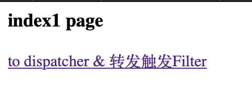
        - 结果：通过转发方式调用`test.jsp`，**控制台正常输出**
            - 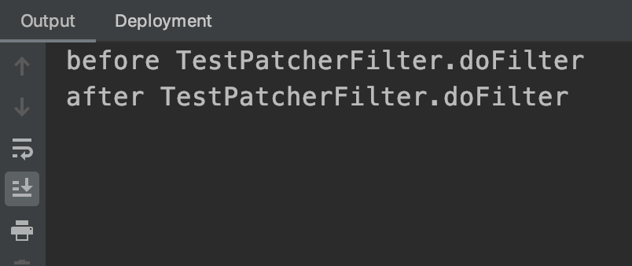

- **配置声明式异常，即error-page的Filter**
    - jsp
        - 异常jsp，error.jsp : [/java/mylearn/weblearn/src/main/webapp/WEB-INF/error.jsp](/java/mylearn/weblearn/src/main/webapp/WEB-INF/error.jsp)

            ```html
            <%@ page isErrorPage="true" %>
            <html>
            <head>
                <title>Title</title>
            </head>
            <body>

            <h4>webinf error page</h4>
            Error Message : <%= exception.getMessage()%>
            <br>
            <%=exception%>
            </body>
            </html>
            ```

        - 入口jsp，testerror.jsp : [/java/mylearn/weblearn/src/main/webapp/filter/dispatcher/testerror.jsp](/java/mylearn/weblearn/src/main/webapp/filter/dispatcher/testerror.jsp)

            ```html
            <h3>test error</h3>

            <%
                int a = 10 / 0;
            %>
            ```
    - Filter
        - TestPatcherFilter.java : [/java/mylearn/weblearn/src/main/java/com/ljs/test/filter/dispatcher/TestPatcherFilter.java](/java/mylearn/weblearn/src/main/java/com/ljs/test/filter/dispatcher/TestPatcherFilter.java)

            ```java
            @Override
            public void doFilter(HttpServletRequest req, HttpServletResponse resp, FilterChain chain) throws IOException, ServletException {
                System.out.println("before TestPatcherFilter.doFilter");

                chain.doFilter(req,resp);

                System.out.println("after TestPatcherFilter.doFilter");
            }
            ```

    - web.xml
        - [/java/mylearn/weblearn/src/main/webapp/WEB-INF/web.xml](/java/mylearn/weblearn/src/main/webapp/WEB-INF/web.xml)
        ```xml
        <!--配置error页面-->
        <error-page>
            <exception-type>java.lang.ArithmeticException</exception-type>
            <location>/WEB-INF/error.jsp</location>
        </error-page>
        <!--配置显示声明error的Filter-->
        <filter-mapping>
            <filter-name>testPatcherFilter</filter-name>
            <!-- 路径需要和error-page下location中的路径相同 -->
            <url-pattern>/WEB-INF/error.jsp</url-pattern>
            <dispatcher>ERROR</dispatcher>
        </filter-mapping>
        ```
    - 页面入口
        - http://localhost:8080/weblearn_war_exploded/filter/dispatcher/testerror.jsp
    - 页面结果
        - 进入异常页面，显示异常信息，并在控制台打印出Filter信息
        - 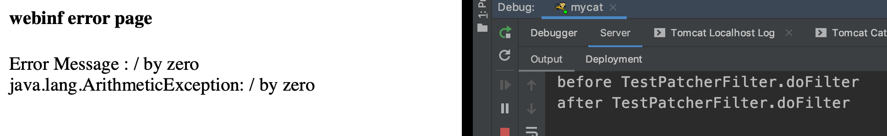

## Filter的应用-字符编码过滤器
[top](#catalog)
- 如果请求参数中有中文，则在Servlet/JSP中获取时，需要先使用`request.setCharacterEncoding("UTF-8")`设定编码，如果页面很多维护会很麻烦
- 可以使用Filter，通过`/*`的路径配置拦截所有页面，为所有页面设置调用`request.setCharacterEncoding("UTF-8")`
- 为了修改方便一般会通过web.xml配置web应用参数来指定encoding
- 示例
    - Filter
        - EncodingFilter.java [/java/mylearn/weblearn/src/main/java/com/ljs/test/filter/sample/encoding/EncodingFilter.java](/java/mylearn/weblearn/src/main/java/com/ljs/test/filter/sample/encoding/EncodingFilter.java)

            ```java
            public class EncodingFilter extends HttpFilter {
                private String encoding;

                @Override
                public void init() {
                    encoding = getFilterConfig().getServletContext().getInitParameter("encoding");
                }

                @Override
                public void doFilter(HttpServletRequest req, HttpServletResponse resp, FilterChain chain) throws IOException, ServletException {
                    System.out.println(encoding);
                    // 为所有页面设置字符编码
                    req.setCharacterEncoding(encoding);
                    chain.doFilter(req, resp);
                }
            }
            ```
    - web.xml
        - [/java/mylearn/weblearn/src/main/webapp/WEB-INF/web.xml](/java/mylearn/weblearn/src/main/webapp/WEB-INF/web.xml)

            ```xml
            <!--配置Web应用的编码-->
            <context-param>
                <param-name>encoding</param-name>
                <param-value>UTF-8</param-value>
            </context-param>
            <!--编码过滤器-->
            <filter>
                <filter-name>encodingFilter</filter-name>
                <filter-class>com.ljs.test.filter.sample.encoding.EncodingFilter</filter-class>
            </filter>
            <filter-mapping>
                <filter-name>encodingFilter</filter-name>
                <url-pattern>/filter/sample/encoding/*</url-pattern>
            </filter-mapping>
            ```
    - JSP
        - [/java/mylearn/weblearn/src/main/webapp/filter/sample/encoding/a.jsp](/java/mylearn/weblearn/src/main/webapp/filter/sample/encoding/a.jsp)
            ```html
            <h3>AAA page</h3>

            param.name = ${param.name}
            ```
        - [/java/mylearn/weblearn/src/main/webapp/filter/sample/encoding/b.jsp](/java/mylearn/weblearn/src/main/webapp/filter/sample/encoding/b.jsp)
            ```html
            <h3>BBB page</h3>

            param.name = ${param.name}
            ```
    - 测试URL
        - 需要附加请求参数
        - http://localhost:8080/weblearn_war_exploded/filter/sample/encoding/a.jsp?name=中文测试
        - http://localhost:8080/weblearn_war_exploded/filter/sample/encoding/b.jsp?name=中文测试

## Filter的应用-使浏览器不缓存页面的过滤器
[top](#catalog)
- 通过三个**响应头**字段来禁止浏览器缓存当前页面
    - `response.serDateHeader("Expires", -1)`
    - `response.setHeader("Cache-Control", "no-cache")`
    - `response.setHeader("Pragma", "no-cache")`
- 不是所有的浏览器都支持这三个字段，最好全都设定
- 过滤器
    - CacheFilter.java : [/java/mylearn/weblearn/src/main/java/com/ljs/test/filter/sample/cache/CacheFilter.java](/java/mylearn/weblearn/src/main/java/com/ljs/test/filter/sample/cache/CacheFilter.java)
- JSP
    - [/java/mylearn/weblearn/src/main/webapp/filter/sample/cache/a.jsp](/java/mylearn/weblearn/src/main/webapp/filter/sample/cache/a.jsp)
    - [/java/mylearn/weblearn/src/main/webapp/filter/sample/cache/b.jsp](/java/mylearn/weblearn/src/main/webapp/filter/sample/cache/b.jsp)

- 测试思路
    1. 从a.jsp通过链接跳转到b.jsp，显示图片pic.png
    2. 然后从b.jsp通过链接跳转到a.jsp
    3. 修改b.jsp的图片为pic2.png
    4. 再次进入b.jsp，没有使用缓存，重新获取了图片

## Filter的应用-Filter权限控制
[top](#catalog)
- 基本需求分析
    - 权限管理
        - 管理权限
            - 查看某人的权限
            - 修改某人的权限
        - 对访问进行权限控制：有权限则可以访问，否则提示：`没有权限，请返回`
    - 权限过滤
        - 从登录页面进行登录
        - 登录后跳转到详细页面，显示所有的链接
        - 点击链接进行跳转，使用Filter进行过滤，获取请求地址，并在用户详细中检查。
            - 如果有权限，则放行
            - 如果没有权限则重定向到异常页面

- 实现思路
    - 管理权限
        - 辅助类
            - 封装权限信息：Authority
                - 包含：url、显示的权限名
            - 封装用户信息：User
                - 包含：用户名、所有的权限信息Authority
            - 创建一个UserDao
                - get 获取用户信息
                - update(name，Authority) 更新
                - 没有真是的数据库链接，全部使用静态数据
        - 页面
            - authority-manager.jsp:
                - 两个form，分别负责检索，和更新
                - 检索form
                    - 有一个文本框，输入username后，提交检索
                    - 解析返回的信息并显示在更新form中
                        - 分别显示用户信息和权限信息
                - 更新form
                    - 通过checkbox显示权限信息，并进行更新
                - 检查request中是否有user信息，若有，则显示 ：`用户名 的权限为：`，对应的权限的checkbox被选中，
        - ControllerServlet
            - authority-manager.jsp 提交表单后获取表单请求的uesrname，
            再根据username获取user信息，把user放入到request中，再转发到authority-manager.jsp
            - authority-manager.jsp 修改权限
                - 提交表单后，获取请求参数：username，authority（多个值），把选项封装为List
                - 调用UserDao的update()方法实现权限的修改，再重定向到authority-manager.jsp
        
- 权限过滤
    - 页面
        - 在login.jsp页面进行登录
            - 成功则将用户信息保存到session中，在Filter中进行使用，并跳转到pageList.jsp
            - 失败则转发回login.jsp，显示错误信息
        - 在pageList.jsp页面显示所有的链接
            - 点击链接可以进行跳转
            - 也可以logout
    - Filter
        - 使用Filter对pageList.jsp中的链接进行拦截，检查当前用户是否具有访问权限
        - 从session中获取用户信息
        - **如果没有获取到说明，则表示还没有登录，重定向到登录画面**
        - 检查当前请求的ServletPath在用户信息中是否具有访问权限
            - 如果用户有权限，则响应
            - 如果没有没有，则重定向到403.jsp

- 实现内容
    - 所有代码保存在
        - /java/mylearn/weblearn/src/main/webapp/filter/sample/authority
        - /java/mylearn/weblearn/src/main/java/com/ljs/test/filter/sample/authority
    - ControllerServlet
        - ControllerServlet.java : [/java/mylearn/weblearn/src/main/java/com/ljs/test/filter/sample/authority/controller/ControllerServlet.java](/java/mylearn/weblearn/src/main/java/com/ljs/test/filter/sample/authority/controller/ControllerServlet.java)

            ```java
            //获取用户信息
            private void get(HttpServletRequest req, HttpServletResponse resp) throws ServletException, IOException {
                //从请求参数中获取用户名
                String username = req.getParameter("username");
                User user = dao.get(username);
                if (user == null){
                    req.setAttribute("msg", "username is not exists");
                } else {
                    //如果用户数据获取成功，保存信息，并获取通用权限数据
                    req.setAttribute("user", user);
                    List<Authority> authorities = UserDao.getCommonAuthorities();
                    req.setAttribute("commonAuthorities", authorities);
                }

                //重新转发到authorityManage页面
                req.getRequestDispatcher("/filter/sample/authority/authorityManage.jsp").forward(req, resp);
            }

            //更新用户信息
            private void update(HttpServletRequest req, HttpServletResponse resp) throws ServletException, IOException {
                // 从req中获取请求参数
                String username = req.getParameter("username");
                String[] selectedUrls = req.getParameterValues("selectedUrls");

                //获取通用权限信息
                List<Authority> commonAuthorities = UserDao.getCommonAuthorities();

                //根据请求参数，从通用权限信息中获取需要更新的数据
                List<Authority> updateAuthorities = new ArrayList<>();
                for (String url : selectedUrls) {
                    for (Authority common : commonAuthorities) {
                        //如果匹配则保存
                        if (common.getUrl().equals(url)){
                            updateAuthorities.add(common);
                            break;
                        }
                    }
                }

                // 更新用户信息
                dao.update(username, updateAuthorities);

                //重新转发到authorityManage页面
                req.getRequestDispatcher("/filter/sample/authority/authorityManage.jsp").forward(req, resp);
            }

            // 登录
            public void login(HttpServletRequest req, HttpServletResponse resp) throws ServletException, IOException{
                String username = req.getParameter("username");
                User userInfo = dao.get(username);

                if (userInfo == null){
                    // 失败则转发回login.jsp，显示错误信息
                    req.setAttribute("msg", "user is not exists");
                    req.getRequestDispatcher("/filter/sample/authority/login.jsp").forward(req, resp);
                } else {
                    // 成功则将用户信息保存到session中，并跳转到pageList.jsp
                    HttpSession session = req.getSession();
                    session.setAttribute("userInfo", userInfo);

                    resp.sendRedirect(req.getContextPath() + "/filter/sample/authority/pageList.jsp");
                }
            }
            ```
    - Filter
        - UserFilter.java : [/java/mylearn/weblearn/src/main/java/com/ljs/test/filter/sample/authority/filters/UserFilter.java](/java/mylearn/weblearn/src/main/java/com/ljs/test/filter/sample/authority/filters/UserFilter.java)

            ```java
            @Override
            public void doFilter(HttpServletRequest req, HttpServletResponse resp, FilterChain chain) throws IOException, ServletException {
                // 从session中获取用户信息
                HttpSession session = req.getSession();
                User userInfo = (User) session.getAttribute("userInfo");

                //首先检查session是否存在信息，如果不存在则重定向到登录页面
                if (userInfo == null){
                    resp.sendRedirect(req.getContextPath() + "/filter/sample/authority/login.jsp");
                    return;
                }

                //从请求中获取servlet路径
                String servletPath = req.getServletPath();

                //在用户的权限信息中搜索servlet路径
                boolean hasAuthority = false;
                for (Authority authority : userInfo.getAuthorities()) {
                    if (authority.getUrl().equals(servletPath)){
                        hasAuthority = true;
                        break;
                    }
                }

                // 如果存在，则放行
                if (hasAuthority){
                    chain.doFilter(req,resp);
                } else {
                    // 不存在则重定向到403.jsp
                    resp.sendRedirect(req.getContextPath() + "/filter/sample/authority/403.jsp");
                }
            }
            ```

    - 主要JSP
        - 权限管理，authorityManage.jsp：[/java/mylearn/weblearn/src/main/webapp/filter/sample/authority/authorityManage.jsp](/java/mylearn/weblearn/src/main/webapp/filter/sample/authority/authorityManage.jsp)

            ```html
            <h3>Manage Page</h3>

            <%--1. 查询form--%>
            <%--查询成功后，将结果显示在：更新form中--%>
            <form action="${pageContext.request.contextPath}/authority/authorityController?method=get" method="post">
            <%--    如果用户名异常则显示异常信息--%>
                <c:if test="${!empty requestScope.msg}">
                    <label style="color: red">${requestScope.msg}</label>
                    <br>
                </c:if>

                username:<input type="text" name="username">
                <br>
                <input type="submit" value="Search">
            </form>

            <%--2. 更新form--%>
            <%--判断是否获取成功--%>
            <c:if test="${!empty requestScope.user}">
                <form action="${pageContext.request.contextPath}/authority/authorityController?method=update" method="post">
                    <input type="hidden" name="username" value="${requestScope.user.username}">
                    authority of user: ${requestScope.user.username}
                    <br>
            <%--        循环user.authorities 获取有效的权限，并将对应权限的check选中--%>
            <%--        先循环通用权限数据--%>
                    <c:forEach items="${requestScope.commonAuthorities}" var="commonNode">

            <%--            再循环用户权限数据，并和通用权限数据进行匹配--%>
                        <c:set var="flg" value="false"/>
                        <c:forEach items="${requestScope.user.authorities}" var="node">
                            <c:if test="${commonNode.displayName == node.displayName}">
                                <c:set var="flg" value="true"/>
                            </c:if>
                        </c:forEach>

            <%--            如果权限数据之间匹配成功，则选中对应的checkbox--%>
                        <c:if test="${flg == true}">
                            <input type="checkbox" name="selectedUrls" value="${commonNode.url}" checked="checked"/>${commonNode.displayName}
                        </c:if>
                        <c:if test="${flg == false}">
                            <input type="checkbox" name="selectedUrls" value="${commonNode.url}"/>${commonNode.displayName}
                        </c:if>
                        <br>
                    </c:forEach>
                    
                    <input type="submit" value="Update">
                </form>
            </c:if>

            <br>

            <a href="${pageContext.request.contextPath}/filter/sample/authority/index.jsp">to index page</a>
            ```

    - web.xml
        ```xml
          <!--23-->
        <!--权限管理测试-->
        <servlet>
            <servlet-name>authorityController</servlet-name>
            <servlet-class>com.ljs.test.filter.sample.authority.controller.ControllerServlet</servlet-class>
        </servlet>
        <servlet-mapping>
            <servlet-name>authorityController</servlet-name>
            <url-pattern>/authority/authorityController</url-pattern>
        </servlet-mapping>
        <!--权限过滤测试-->
        <filter>
            <filter-name>userAuthorityFilter</filter-name>
            <filter-class>com.ljs.test.filter.sample.authority.filters.UserFilter</filter-class>
        </filter>
        <filter-mapping>
            <filter-name>userAuthorityFilter</filter-name>
            <url-pattern>/filter/sample/authority/pages/*</url-pattern>
        </filter-mapping>
        ```

- 页面结果
    - 入口：http://localhost:8080/weblearn_war_exploded/filter/sample/authority/index.jsp
    - 入口页面
        - 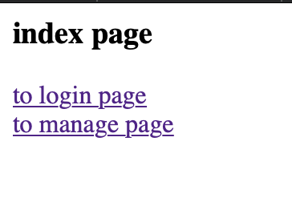
    - 权限管理测试
        - 点击链接进入权限管理页面
            - 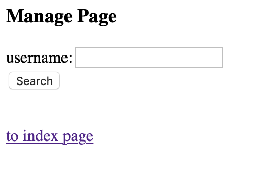
        - 输入一个不存在的用户
            - 
        - 页面输出异常信
            - 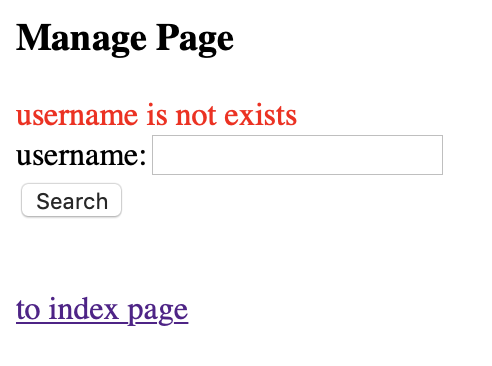
        - 输入一个存在的用户
            - 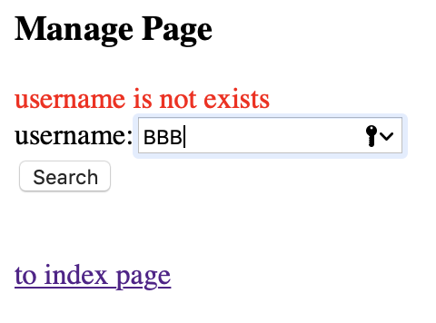
        - 输出用户的权限信息
            - 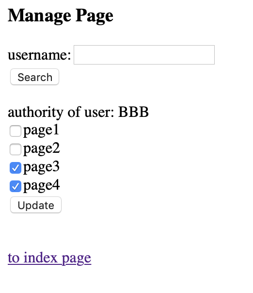
        - 修改权限信息
            - 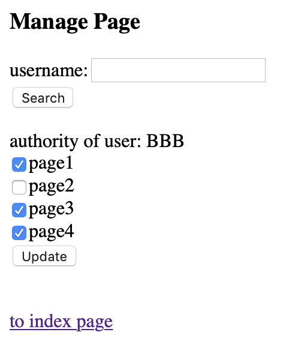
        - 点击更新，重新检索
            - 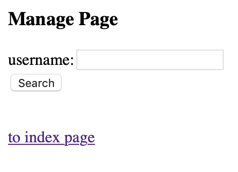
        - 更新成功
            - 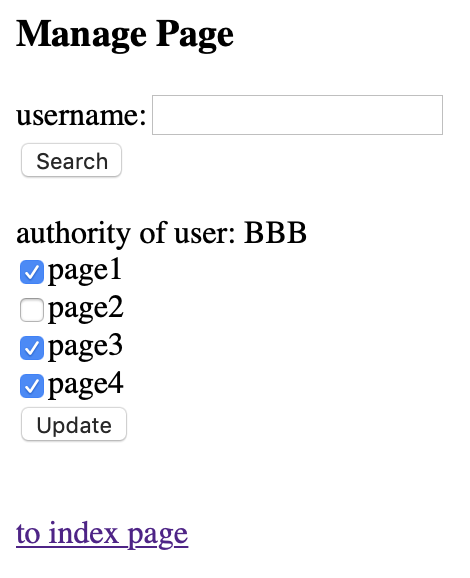
    - 权限过滤测试
        - 点击链接进入用户登录页面
            - 
        - 输入一个不存在的用户
            - 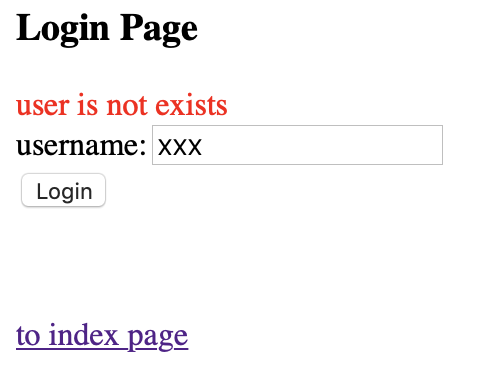
        - 输入一个存在的用户进行登录
            - 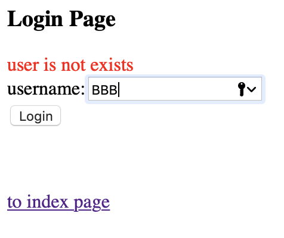
        - 登录成功，当前用户BBB的权限是：page1，page3，page4 可用，page2不可用
            - 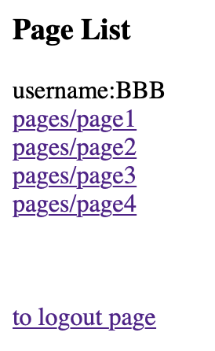
        - 点击第一个链接，跳转成功
            - 
        - 点击第二个链接，没有权限，跳转到403.jsp
            - 
        - 点击第三个链接，跳转成功
            - 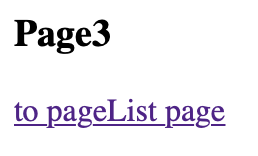
        - 点击第四个链接，跳转成功
            - 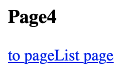
        - 通过logout**登出用户**，并通过地址直接访问page1
            - http://localhost:8080/weblearn_war_exploded/filter/sample/authority/pages/page1.jsp
            - 因为session中没用用户数据，所以直接被重定向到login.jsp
            - 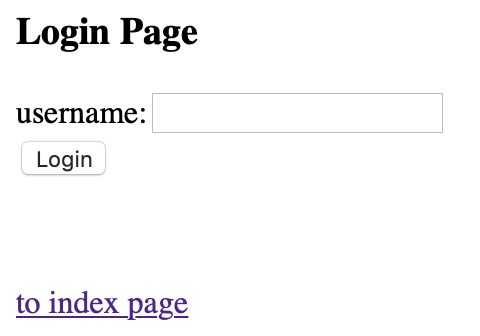

## Filter应用-为过滤字符
[top](#catalog)
- 开发论坛模块或发帖时要解决以下2个问题
    1. 用户回复或发帖时，可能回输入HTML代码，这回破坏论坛的正常显示，也可能回带来安全隐患
    2. 某些用户在回复时，可能会出现不雅文字，
    
- 实现思路
    1. 在Filter中重新包装request，扩展`getParamter`方法，在获取时对请求中的字符进行检查于替换
    2. 使用包装后的request来放行请求

- 实现内容
    - 包装类
        - TextFilterServletRequest.java : [/java/mylearn/weblearn/src/main/java/com/ljs/test/filter/sample/reqparam/TextFilterServletRequest.java](/java/mylearn/weblearn/src/main/java/com/ljs/test/filter/sample/reqparam/TextFilterServletRequest.java)

            ```java
            @Override
            public String getParameter(String name) {
                String parameter = super.getParameter(name);
                //过滤字符：xxx
                if (parameter.contains("xxx")){
                    parameter = parameter.replaceAll("xxx", "***");
                }
                return parameter;
            }
            ```

    - Filter
        - TextFilter.java : [/java/com/ljs/test/filter/sample/reqparam/TextFilter.java](/java/com/ljs/test/filter/sample/reqparam/TextFilter.java)

            ```java
            @Override
            public void doFilter(HttpServletRequest req, HttpServletResponse resp, FilterChain chain) throws IOException, ServletException {
                //使用自定义HttpServletRequest类来包装req
                chain.doFilter(new TextFilterServletRequest(req), resp);
            }
            ```

    - JSP
        - 文字输入页面，input.jsp : [/java/mylearn/weblearn/src/main/webapp/filter/sample/reqparam/input.jsp](/java/mylearn/weblearn/src/main/webapp/filter/sample/reqparam/input.jsp)

            ```html
            <h3>Input Page</h3>

            <form action="show.jsp" method="post" >
                input:<textarea rows="10" cols="10" name="text"></textarea>
                <br>
                <br>
                <input type="submit" value="submit">
            </form>
            ```

        - 显示页面，show.jsp : [/java/mylearn/weblearn/src/main/webapp/filter/sample/reqparam/show.jsp](/java/mylearn/weblearn/src/main/webapp/filter/sample/reqparam/show.jsp)

            ```html
            <h3>Show Page</h3>
            input:
            <br>
            <%= request.getParameter("text") %>
            ```
    - web.xml
        ```xml
        <!--25-->
        <!--过滤字符测试-->
        <filter>
            <filter-name>textFilter</filter-name>
            <filter-class>com.ljs.test.filter.sample.reqparam.TextFilter</filter-class>
        </filter>
        <filter-mapping>
            <filter-name>textFilter</filter-name>
            <url-pattern>/filter/sample/reqparam/show.jsp</url-pattern>
        </filter-mapping>
        ```
    - 执行结果
        - 入口：http://localhost:8080/weblearn_war_exploded/filter/sample/reqparam/input.jsp
        - 输入文字，并提交
            - 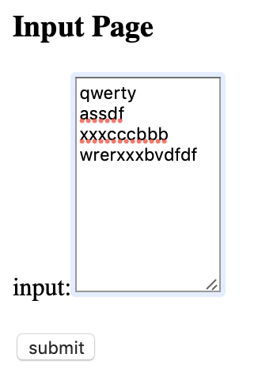
        - 跳转到显示页面，替换了指定文字
            - 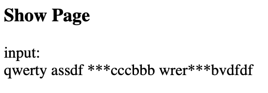


# Servlet监听器Listener
## Servlet监听器简介
[top](#catalog)
- 监听器：用于对其他对象身上发生的事件或状态改变进行监听和相应处理的对象，当被监视对象发生某些情况时立即采取相应的行动
- Servlet监听器：Servlet规范中定义的一种特殊类，
    - 用于监听3个域对象：`ServletContext`、`HttpSession`、`ServletRequest`
        - pageContext代表当前页面，监听的意义不大
    - 监听器的分类
        1. 域对象`创建`、`销毁`的事件监听器
        2. 域对象`属性的添加和删除`的事件监听器
        3. 绑定到HttpSession域中的某个对象的状态的事件监听器

## 编写监听器的步骤
[top](#catalog)
- 编写监听器
    - 实现接口
    - web.xml进行注册
- 监听器的注册方法，参考：[配置监听器Listener](#配置监听器Listener)

## 创建销毁监听器接口分析
[top](#catalog)
- 各域对象的创建和销毁与其监听接口
        
    |域对象|监听接口|创建监听方法|销毁监听方法|创建时机|销毁时机|
    |-|-|-|-|-|-|
    |ServletContext|ServlvetContextListener|`contextInitialize(ServletContextEvent sce)`|`contextDestroyed(ServletContextEvent sce)`|web服务器启动时为每个web应用程序创建相应的ServletContext对象|web服务器关闭时为每个web应用程序销毁相应的ServletContext对象|
    |HttpSession|HttpSessionListener|`sessionCreated(HttpSessionEvent se)`<br>reuqest对象被创建之后触发|` sessionDestoryed(HttpSessionEvent se)`<br>reuqest对象被销毁之前触发|浏览器开始与服务器会话时创建|1. 调用`HttpSession.invalidate()`<br>超过最大存活事件<br>服务进程被停止|
    |ServletRequest|ServletRequestListener|`requestInitialized(ServletRequestEvent sre)`|`requestDestoryed(ServletRequestEvent sre)`|每次请求开始时创建|每次访问结束后销毁|

- 三节接口的功能基本相似，仅讨论最常用的`ServlvetContextListener`

- ServlvetContextListener
    - 最常用的监听器接口
    - 监听ServletContext对象的创建、销毁
    - 可以在Web应用加载时对当前Web应用的相关资源进行初始化操作，如
        - 创建数据库连接池
        - 创建Spring的IOC容器
        - 读取当前Web应用的初始化参数
    - 接口方法
        - `contextInitialize(ServletContextEvent sce)`
            - ServletContext对象被创建的时候，即当前Web应用被加载时(包括初始化，或者重新编译时)，Servlet容器调用该方法
        - `contextDestroyed(ServletContextEvent sce)`
            - ServletContext对象别销毁之前，即当前Web应用被卸载之前，Servlet容器调用该方法
    - 事件参数：`HttpSessionEvent`类
        - 类代码
            ```java
            public class ServletContextEvent extends java.util.EventObject { 
            
                public ServletContextEvent(ServletContext source) {
                super(source);
                }
                
                  // 获取ServletContext对象
                public ServletContext getServletContext () { 
            	return (ServletContext) super.getSource();
                }
            }
            ```

## 属性修改监听器分析
[top](#catalog)
- 属性修改监听器实际开发时使用的比较少
- 各域对象对应的监听器
    - servletContext，ServletContextAttributeListener
    - request，ServletRequestAttributeListener
    - session，HttpSessionAttributeListener

- 三个监听器基本相同，以ServletContextAttributeListener为例讨论

- 监听器接口代码
    ```java
    public interface ServletContextAttributeListener extends EventListener {
        // 监听添加属性事件
        public void attributeAdded(ServletContextAttributeEvent scab);
        // 监听删除属性事件
        public void attributeRemoved(ServletContextAttributeEvent scab);
        // 监听属性覆盖事件
        public void attributeReplaced(ServletContextAttributeEvent scab);
    }
    ```

- 对于属性的删除操作，在监听器的`attributeRemoved`的方法中，可以通过`ServletContextAttributeEvent`对象获取被删除的属性名及属性值

- ServletContextAttributeEvent类
    - 该类继承自`ServletContextEvent`，所以可以通过`getServletContext()`来获取servletContext域对象
    - 接口代码
        ```java
        public class ServletContextAttributeEvent extends ServletContextEvent { 
            private String name;
            private Object value;
        
            public ServletContextAttributeEvent(ServletContext source, String name, Object value) {
                super(source);
                this.name = name;
                this.value = value;
            }
            
            // 获取发生变化的属性名  
            public String getName() {
                return this.name;
            }
            
            // 获取发生变化的属性值
            public Object getValue() {
                return this.value;   
            }
        }
        ```
 

## 感知Session绑定的事件监听器
### 两种监听接口
[top](#catalog)
- 保存在Session域中的对象可以有多种状态
    - 绑定到Session中
    - 从Session域中解除绑定
    - 随Session对象持久化到一个存储设备中
    - 随Session对象从一个存储设备中恢复
    
- Servlet规范中定义了两个特殊的监听器接口来**帮助JavaBean对象**了解自己在Session域中的这些状态
    - 两个接口
        1. HttpSessionBingdingListener
        2. HttpSessionActivationListener
    - <label style="color:red">实现这两个接口的类不需要在web.xml文件中进行注册</label>

### HttpSessionBingdingListener接口
[top](#catalog)
- 这个监听器使用的比较少
- 负责监听
    1. 对象绑定到Session中
    2. 对象从Session域中解除绑定
- 实现了这个接口的JavaBean对象可以感知自己被绑定到Session中和从Session中删除的事件
- 接口代码
    ```java        
    public interface HttpSessionBindingListener extends EventListener {
        //当对象被绑定到HttpSession对象时，web服务器调用该方法
        public void valueBound(HttpSessionBindingEvent event);
    
        当对象从HttpSession中解除绑定时，web服务器调用该方法
        public void valueUnbound(HttpSessionBindingEvent event);
    }
    ```
    
- HttpSessionBindingEvent类
    - 通过该类可以获取session对象和绑定的属性名和属性值
        - `HttpSession getSession()`
        - `String getName()`
        - `Object getValue()`

    - 类代码
        ```java
        public class HttpSessionBindingEvent extends HttpSessionEvent {
            // 绑定到session的属性名
            private String name;
            
            // 绑定到session的属性值
            private Object value;
            
            public HttpSessionBindingEvent(HttpSession session, String name) {
            super(session);
            this.name = name;
            }
            
            public HttpSessionBindingEvent(HttpSession session, String name, Object value) {
            super(session);
            this.name = name;
            this.value = value;
            }
            
            // 返回session对象
            public HttpSession getSession () { 
            return super.getSession();
            }
         
            // 返回被绑定或解绑的属性名
            public String getName() {
            return name;
            }
            
            // 返回被绑定、解绑、替换的属性值
            public Object getValue() {
                return this.value;   
            }
        }
        ```

- 示例
    - 接口实现类
        - Customer.java : [java/mylearn/weblearn/src/main/java/com/ljs/test/listener/introduct/Customer.java](java/mylearn/weblearn/src/main/java/com/ljs/test/listener/introduct/Customer.java)

            ```java
            public class Customer implements HttpSessionBindingListener{
                @Override
                public void valueBound(HttpSessionBindingEvent event) {
                    System.out.println("Customer.Bound");

                    //获取绑定到session中的属性值，检查该属性值是否与当前对象相等
                    Object value = event.getValue();
                    System.out.println(value == this);

                    //获取绑定到session中的属性名
                    System.out.println(event.getName());
                }

                @Override
                public void valueUnbound(HttpSessionBindingEvent event) {
                    System.out.println("Customer.Unbound");
                }
            }
            ```
    - JSP
        - sessionbound.jsp : [/java/mylearn/weblearn/src/main/webapp/listener/introduct/sessionbound.jsp](/java/mylearn/weblearn/src/main/webapp/listener/introduct/sessionbound.jsp)

            ```java
            Customer customer = new Customer();
            session.setAttribute("customer", customer);
            session.removeAttribute("customer");
            ```
    - 控制台输出
        - 入口：http://localhost:8080/weblearn_war_exploded/listener/introduct/sessionbound.jsp
        - 


### HttpSessionActivationListener接口
[top](#catalog)
- 实际开发时不太常用
- 实现该接口的JavaBean对象可以感知自己被活化或钝化的事件
    - 活化：从磁盘中读取session对象
    - 钝化：将session对象写入磁盘
- 由于钝化时，会将对象写入磁盘，所以实现HttpSessionActivationListener接口的类，<label style="color:red">必须要可序列化，实现`Serializable`接口</label>
- 接口代码
    ```java
    public interface HttpSessionActivationListener extends EventListener { 
        // 当绑定到HttpSession中的对象将要随HttpSession对象被钝化之前，web服务器调用该方法
        public void sessionWillPassivate(HttpSessionEvent se); 

        // 当绑定到HttpSession中的对象将要随HttpSession对象被活化之前，web服务器调用该方法
        public void sessionDidActivate(HttpSessionEvent se);
    } 
    ```

- 示例
    - 接口实现类
        - Customer2.java : [/java/mylearn/weblearn/src/main/java/com/ljs/test/listener/introduct/Customer2.java](/java/mylearn/weblearn/src/main/java/com/ljs/test/listener/introduct/Customer2.java)

            ```java
            public class Customer2 implements HttpSessionActivationListener, Serializable {
                private static final long serialVersionUID = -1922108588750068344L;
                private Date date;

                public Date getDate() {
                    return date;
                }

                public void setDate(Date date) {
                    this.date = date;
                }

                // HttpSessionActivationListener接口实现
                @Override
                public void sessionWillPassivate(HttpSessionEvent se) {
                    System.out.println("Customer2.sessionWillPassivate");
                }

                @Override
                public void sessionDidActivate(HttpSessionEvent se) {
                    System.out.println("Customer2.sessionDidActivate");
                }
            }

            ```

    - JSP
        - sessionActivation.jsp : [/java/mylearn/weblearn/src/main/webapp/listener/introduct/sessionActivation.jsp](/java/mylearn/weblearn/src/main/webapp/listener/introduct/sessionActivation.jsp)

            ```java
            Customer2 customer2 = (Customer2) session.getAttribute("customer2");

            if (customer2 == null){
                customer2 = new Customer2();
                //创建一个日期对象并保存
                customer2.setDate(new Date());
                //将对象保存到session中
                session.setAttribute("customer2", customer2);


                System.out.println("-----------------------------------");
                System.out.println("create new customer2");
                System.out.println("obj = " + customer2);
                System.out.println("date = " + customer2.getDate());
                System.out.println("-----------------------------------");
            } else {
                System.out.println("-----------------------------------");
                System.out.println("read customer2");
                System.out.println("obj = " + customer2);
                System.out.println("date = " + customer2.getDate());
                System.out.println("-----------------------------------");
            }
            ```

    - 控制台输出
        - 入口：http://localhost:8080/weblearn_war_exploded/listener/introduct/sessionActivation.jsp
        - 第一次进入打印`create`部分，再次进入打印`read`部分内容，两次的date对象相同。关闭tomcat时，输出：`Customer2.sessionWillPassivate`
            - 
        - 关闭后在tomcat的 `work/Catalina/localhost/应用名`目录下生成一个`SESSION.ser`文件
            - 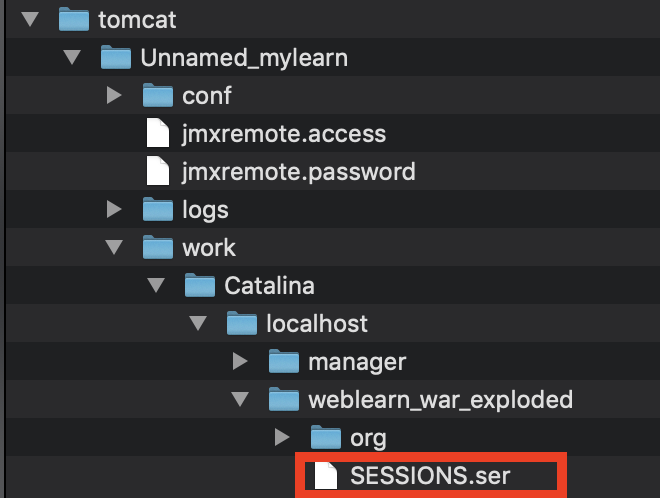
        - 重新启动tomcat ??????????????

# JavaWeb开发中的路径问题
[top](#catalog)
- 实际开发时尽量使用绝对路径，写绝对路径不会有问题，写相对路径有时会有问题

- 相对路径的问题
    - 由Servlet**转发**到JSP页面时，此时地址栏上显示的时Servlet的路径。如果此时JSP页面中的超链接还是相对于JSP页面的地址，则可能会出现路径混乱的问题
    - 示例
        - 目录结构
           ```
            - a.jsp
                - path
                    - b.jsp，内部包含一个超链接可以跳转到同目录下的：c.jsp
                    - c.jsp
           ```
        - 跳转
            - a.jsp -> /Servlet -> 转发 -> b.jsp -> 点击链接跳转到c.jsp -> 此时无法跳转
            - 因为是通过转发到达b.jsp页面，所以url的路径是/Servlet，在其所属的目录下无法找到c.jsp，所以无法跳转

- 绝对路径
    - 在JavaWeb中什么是绝对路径：当前Web**应用**的根路径，即`localhost:8080/应用名/`
        - 任何一个路径都应该有`应用名`
    - 应用名可以由：`request.getContextPath()` 获得
        - 在form中：`<form action="<%=request.getContextPath()%>/processStep2" method="post">`
        - 在Servlet中：`resp.sendRedirect(req.getContextPath() + "/session/shopping/step3.jsp");`
        
- JavaWeb开发中的`/`
    - <label style="color:red">若`/`需要由Servlet容器来处理</label>，则表示当前Web应用的根路径，如：locahost:8080/应用名/
        1. 转发的路径
        2. web.xml配置中的`servlet-mapping`
            ```xml
            <servlet-mapping>
                <servlet-name>processStep1</servlet-name>
                <url-pattern>/processStep1</url-pattern>
            </servlet-mapping>
            ```
        3. 自定义标签中的`/`
            - 如： `<c:redirect>`
    - <label style="color:red">若`/`需要由浏览器来处理</label>，表示当前Web站点的根路径，如：locahost:8080/
        1. 重定向的路径
            - 第二次请求相当于由浏览器来处理
        2. 超链接：`<a href="/servlet">`
        3. form中action的路径


# 其他
[top](#catalog)
- 查看占用端口的进程，并杀死进程：`sudo lsof -i:8080`, `kill -9 进程ID`
- form中action的路径
        - `/xxx`，其中`/`表示当前web站点的路径，即：`localhost:8080/`
        - `../xxx`，其中`../`表示的是当前Web应用的路径，即`localhost:8080/weblearn_war_exploded`
        - `xxx`，在当前目录下进行搜索
- 为什么网络延迟会导致页面不能立刻刷新
    ```java
    @Override
    protected void doPost(HttpServletRequest req, HttpServletResponse resp) throws ServletException, IOException {
        // 模拟网络延迟
        try {
            Thread.sleep(5000);
        } catch (InterruptedException e) {
            e.printStackTrace();
        }
        ...
        ...
        ...
    }
    ```

-  什么时候会创建新的session
- StringWriter ?????
- curl的实现
- 服务器端页面的缺点
    - 浏览器太闲，服务器太忙
    - 很多数据在每次响应时，都需要重新并在页面上重新渲染，很浪费时间
    - 当前的mvc框架中存在过多的内部转发与重定向
    - JSP上的解析逻辑还是比较复杂

[top](#catalog)