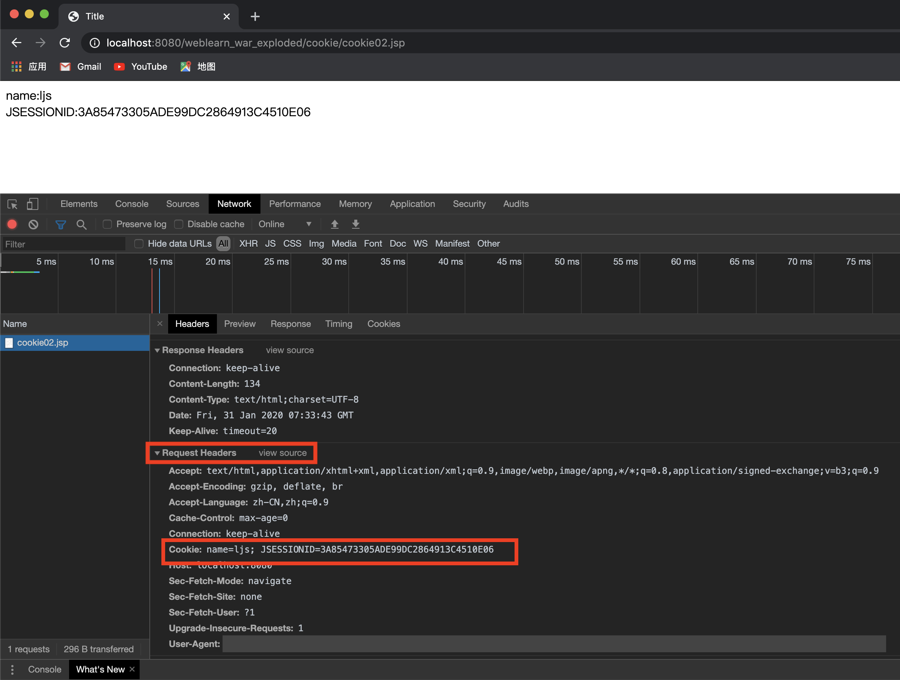
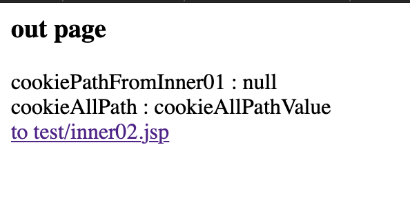

<span id="catalog"></span>
内容整理自：https://www.bilibili.com/video/av21367011

### 目录
- [JavaWeb应用的概念](#javaWeb应用的概念)
- [web应用开发环境](#web应用开发环境)
    - [Tomcat](#tomcat)
    - [web程序结构](#web程序结构)
- [Servlet简介](#servlet简介)
    - [Servlet的基本概念](#servlet的基本概念)
    - [Servlet容器的基本概念](#servlet容器的基本概念)
- [web.xml的配置方法](#web.xml的配置方法)
    - [配置当前web应用的初始化参数](#配置当前web应用的初始化参数)
    - [配置Servlet](#配置Servlet)
    - [配置错误的响应页面](#配置错误的响应页面)
    - [配置示例](#配置示例)
- [Servlet的使用](#Servlet的使用)
    - [Servlet的maven依赖](#Servlet的maven依赖)
    - [编写一个Servlet示例](#编写一个servlet示例)
    - [Servlet接口方法](#Servlet接口方法)
    - [Servlet容器响应客户请求的过程](#servlet容器响应客户请求的过程)
    - [ServletConfig接口与Servlet配置](#servletconfig接口与servlet配置)
    - [ServletContext接口与容器全局配置](#servletcontext接口与容器全局配置)
    - [处理客户端请求](#处理客户端请求)
    - [ServletRequest接口](#ServletRequest接口)
    - [ServletResponse接口](#ServletResponse接口)
    - [抽象类GenericServlet](#抽象类GenericServlet)
        - [自定义Servlet抽象类MyGenericServlet](#自定义Servlet抽象类MyGenericServlet)
        - [使用GenericServlet](#使用GenericServlet)
        - [GenericServlet的简单示例](#GenericServlet的简单示例)
    - [抽象类HttpServlet](#抽象类HttpServlet)
    - [Servlet的综合使用](#Servlet的综合使用)
- [JSP](#JSP)
    - [JSP的起源](#JSP的起源)
    - [JSP的基本知识](#JSP的基本知识)
    - [JSP的运行原理](#JSP的运行原理)
    - [JSP的9个隐式对象](#JSP的9个隐式对象)
    - [JSP基本语法](#JSP基本语法)
        - [1.JSP基本语法-JSP模版元素](#1.JSP基本语法-JSP模版元素)
        - [2.JSP基本语法-JSP表达式](#2.JSP基本语法-JSP表达式)
        - [3.JSP基本语法-JSP脚本片段](#3.JSP基本语法-JSP脚本片段)
        - [4.JSP基本语法-JSP声明](#4.JSP基本语法-JSP声明)
        - [5.JSP基本语法-JSP注释](#5.JSP基本语法-JSP注释)
    - [JSP域对象的属性作用范围](#JSP域对象的属性作用范围)
    - [JSP指令](#JSP指令)
        - [JSP指令-JSP指令简介](#JSP指令-JSP指令简介)
        - [JSP指令-page指令](#JSP指令-page指令)
        - [JSP指令-include指令](#JSP指令-include指令)
    - [JSP标签](#JSP标签)
        - [1.JSP标签-基本概念](#1.JSP标签-基本概念)
        - [2.JSP标签-\<jsp:include\>](#2.JSP标签-<jsp:include>)
        - [3.JSP标签-\<jsp:forward\>](#3.JSP标签-<jsp:forward>)
    - [异常页面的配置](#异常页面的配置)
    - [解决jsp中文乱码问题](#解决jsp中文乱码问题)
- [转发重定向](#转发重定向)
    - [forward和redirect的四种区别](#forward和redirect的四种区别)
    - [转发的流程示意图](#转发的流程示意图)
    - [重定向的流程示意图](#重定向的流程示意图)
    - [Servlet中的转发重定向方法](#Servlet中的转发重定向方法)
- [MVC设计模式](#MVC设计模式)
    - [MVC模式的架构演进](#MVC模式的架构演进)
    - [MVC的概念](#MVC的概念)
    - [MVC示例](#MVC示例)
- [维持会话](#维持会话)
    - [会话的基本知识](#会话的基本知识)
    - [Cookie](#Cookie)
        - [Cookie机制](#Cookie机制)
        - [JavaWeb中Cookie的基本使用方法](#JavaWeb中Cookie的基本使用方法)
        - [Cookie的作用域](#Cookie的作用域)
        - [示例-利用Cookie完成自动登陆](#示例-利用Cookie完成自动登陆)
        - [示例-利用Cookie显示最近浏览的商品](#示例-利用Cookie显示最近浏览的商品)
- [](#)
- [](#)
- [](#)
- [](#)
- [其他](#其他)

# JavaWeb应用的概念
[top](#catalog)
- 在Sun的`Java Servlet规范`中，JavaWeb的定义
    - javaWeb应用由一组`Servlet`，`HTML页`，`类`，以及其他`可以被绑定的资源`构成的运行在web服务器上的完整应用
    - 可以运行在各种提供商提供的**实现Servlet规范的Servlet容器**中**运行**
- JavaWeb应用中可以包含的内容
    - Servlet
    - JSP
    - 实用类
    - 静态文档：图片、HTML等
    - 描述Web应用的信息
        - web.xml
- JavaWeb在代码层面的工作主要是：**在Servlet容器中写JSP和Servlet**

# web应用开发环境
## Tomcat
[top](#catalog)
- 一个免费开源的Servlet容器
- Tomcat的目录结构
    - bin：存放启动和关闭Tomcat的脚本文件
    - conf：存放Tomcat服务器的各种配置文件
    - lib：存放Tomcat服务器和所有web应用程序需要访问的jar文件
    - logs：存放Tomcat的日志
    - temp：存放Tomcat运行时产生的临时文件
    - webapps：当发布web应用程序时，通常把web应用程序的目录及文件放到这个目录下
    - work：Tomcat将JSP生成的Servle源文件和字节码文件放到这个目录下

- 使用方法
    - 下载：`https://tomcat.apache.org/download-90.cgi`
    - 解压
    - 运行Tomcat
        - 配置JAVA_HOME，bin的上层目录
        - 启动`bin/startup.sh`
            - 如果已经启动了一个Tomcat应用，会抛出一个异常，因为端口已经被占用了
        - 在浏览器中输入地址：`localhost:8080`
        - 使用`bin/shutdown.sh`关闭
    - 修改Tomcat默认端口号
        - `.../conf/server.xml`，修改`port`属性
            ```xml
            <Connector port="8080" protocol="HTTP/1.1"
               connectionTimeout="20000"
               redirectPort="8443" />
            ```
    - 为了在任意目录下使用过Tomcat服务器
        - 把`.../bin`目录添加到环境变量
- 环境配置
    - 配置环境变量
        ```xml
        #tomcat
        export CATALINA_HOME=$HOME/apache-tomcat-9.0.30
        export PATH=$PATH:$CATALINA_HOME/bin
        ```
    - 配置后可以在任何目录下通过startup.bat、shutdown.bat来启动关闭tomcat
    - 实际启动服务器的是catalina.bat
    - window下还可以使用catalina指令/其他系统使用catalina.sh

- catalina命令
    - run：在同一个命令行窗口下启动服务器
        - 通过`ctrl+c`、`control+c` 来关闭服务器
    - start：开启一个新的窗口，并启动服务器
    - stop：开启一个新的窗口，并关闭服务器

- **管理程序**
    - `manager`，用于管理部署到Tomcat服务器中的web应用程序
        - 在`localhost:8080`页面点击`manager app`，需要登录，取消会401
        - 添加管理账号，修改配置文件：`apache-tomcat-9.0.30/conf/tomcat-users.xml`

        ```xml
        <role rolename="manager-gui"/>
        <user username="tomcat" password="tomcat" roles="manager-gui"/>
        ```

- 自动拷贝web应用资源到webapps
    - 在conf目录下一次创建apache-tomcat-9.0.30/conf/catalina/localhost目录
    - 在localhost目录下为自定义应用程序建立对应的xml文件，并添加映射内容
        ```xml
        <?xml version="1.0" encoding="UTF-8" ?>
        <Context path="访问时的虚拟路径(没什么用，可以不加)" docBase="编译后的web应用的物理目录" reloadable="修改时是否重新加载false/true" />
        ```
    - 访问路径为：localhost:8080/xml文件名/资源路径

## web程序结构
[top](#catalog)
- web应用程序：
    - 由一组Servlet、HTML页面、类、其他资源组成的运行在web服务器上的完整的应用程序
    - web应用程序的目录通常放在`webapps`目录下
        - 在`webapps`目录下
            - 每一个子目录=独立的web应用程序
            - 子目录名=web应用程序名=web应用程序的根
- 程序结构
    - xxxx 作为应用程序的根
        - WEB-INF 必须大写
            - classes 存放Servlet和其他有用的类文件 （编译后的class文件必须放在该目录下）
                - xxx.class
            - lib 存放web应用程序需要的jar包，jar中可以包含servlet、bean和其他有用的类文件
                - xxx.jar
                - yyy.jar
            - web.xml 包含web应用程序的配置和部署信息，不能为空否则应用无法使用。可以使用`apache-tomcat-9.0.30/webapps/doc`下的xml模版
        - jsp
        - html
        - 图片
        - txt
        - 等等

- <label style="color:red">WEB-INF中放的一般都是比较隐私的内容，不能直接被外部访问，**可以通过转发来访问**</label>

- 示例：`memobook/java/javaweb/mytest`
    - 目录结构
        - mytest
            - test.html
            - WEB-INF
                - classes
                - lib
                - web.xml
    - html的内容
        ```html
        <html>
        <body>
        <h2>Hello World!</h2>
        </body>
        </html>
        ```
    - 启动url：`http://localhost:8080/mytest/test.html`，会显示:`Hello World!`

- 开发时的设定
    1. 设置build path，将class文件生成到：`WEB-INF/classes`目录下
    2. 在`apache-tomcat-9.0.30/conf/catalina/localhost`目录下创建配置文件，来自动拷贝

        ```xml
        <?xml version="1.0" encoding="UTF-8" ?>
        <Context docBase="编译后的web应用的物理目录" reloadable="修改时是否重新加载false/true" />
        ```

# Servlet简介
## Servlet的基本概念
[top](#catalog)
- Java Servlet 是<label style="color:red">和平台无关的服务器端组件</label>，它**运行在Servlet容器中**(如tomcat)

- <label style="color:red">Servlet程序必须通过Servlet容器来启动运行，并且存储在：web应用程序目录`/WEB-INF/classes/`</label>
- <label style="color:red">Servlet程序必须在web应用程序的web.xml中进行注册和映射其访问路径。才可以被Servlet引擎加载和被外界访问</label>

- Servlet可以完成的功能
    - 创建并返回基于客户请求的动态HTML页面
    - 创建**可嵌入**到现有HTML页面中的**部分HTML页面(HTML片段)**
    - 与其他服务器资源进行通信，如：数据库、基于Java的应用程序


## Servlet容器的基本概念
[top](#catalog)
- Servlet容器的概念
    - 为JavaWeb应用提供运行时环境，它负责管理Servlet和JSP的生命周期，以及管理他们的共享数据
    - **Servlet容器也称为JavaWeb应用容器，或Servlet/JSP容器**
    - 主流的Servlet容器
        - Tomcat
        - Resin
        - JEE服务器中也提供了内置的Servlet容器

- **Servlet容器负责**：
    1. Servlet和客户端的通信，采用：`请求/响应`模式
    2. 运行Servlet、JSP、Filter等软件环境
    3. 调用Servlet的生命周期方法

- Servlet和Servlet容器
    - 关系示意图：
    - 示意图分析
        - 浏览器发送请求到web服务器
        - web服务器解析请求
            - 如果是请求动态资源，如动态页面等，需要到**Servlet容器**中去找`Servlet`或`JSP`
                - `JSP`运行在`Servlet容器`中
                    - Servlet可能会访问数据库服务器
                    - 访问结果发给jsp
                    - jsp再生成结果
            - 如果是静态页面，包括图片、HTML等，则直接找到并返回

- Servlet容器响应客户请求的过程
    ```
        --->请求--->           --->ServletRequest--->
    客户            Serlvet容器                         Servlet
        <---响应 <---           <---ServletResponse<--
    ```

# web.xml的配置方法
## 配置当前web应用的初始化参数
[top](#catalog)
- `<context-param>`
    - `<param-name>`，初始化参数的参数名
    - `<param-value>`，初始化参数的参数值

## 配置Servlet
[top](#catalog)
- 配置Servlet节点
    - `<servlet>`，注册一个Servlet节点
        - `<servlet-name>`，注册Servlet节点的名称
        - `<servlet-class>`，Servlet所在的完整类名，如果是一个Servlet类
        - `<jsp-file>`，注册JSP为Servlet节点，如果是一个JSP页面
        - `<init-param>`，该Servlet的初始化参数，有多个初始化参数时，需要有多个`<init-param>`
            - `<param-name>`，初始化参数的参数名
            - `<param-value>`，初始化参数的参数值
        - `load-on-startup`，指定创建Servlet实例的时间
            - 负数/未设定：第一次请求时创建
            - 0或整数：启动Servlet容器时创建
                - 数值越小，越早被创建
    - `<servlet-mapping>`，映射一个已注册的Servlet节点的**外部访问路径**
        - `<servlet-name>`，指定Servlet节点的名称
        - `<url-pattern>`，Servlet节点的外部访问路径

- Servlet映射的细节
    - 同一个Servlet可以被映射到多个URL上，即多个`<servlet-mapping>`中的`<servlet-name>`可以指向同一个Servlet的注册名称
    - 在Servlet映射到的URL中也可以使用通配符：`*`，但是只能有两种固定格式
        - `*.扩展名`
            - 如`*.html`，那么所有相关的路径如：`localhost:8080/xxx.html`都会有这一个Servlet来处理

        - `/*`
            - '/'代表当前web应用的根目录，相当于：`localhost:8080/应用名/`

    - 如果映射的URL为：`/*.html`，启动Servlet容器时会产生异常
        - 即 `/`和`*`不能共存

## 配置错误的响应页面
[top](#catalog)
- 指定出错的代码
    - `<error-page>`
        - `<error-code>`，http的错误代码
        - `</error-type>`，java中的异常类型
        - `<location>`，响应页面的路径

- 如果响应页面的路径为：`/WEB-INF/xxx.jsp`，则**不能使用**jsp中的`exception`对象 ??????????? 

## 配置示例
[top](#catalog)

```xml
<!--配置当前web应用的初始化参数-->
<context-param>
    <param-name>user</param-name>
    <param-value>1234</param-value>
</context-param>
<context-param>
    <param-name>password</param-name>
    <param-value>qwer</param-value>
</context-param>

<!--配置和映射servlet-->
<!-- 配置一个Servlet类 -->
<servlet>
    <!--注册Servlet的名字-->
    <servlet-name>helloServlet</servlet-name>
    <!--Servlet的全类名-->
    <servlet-class>com.ljs.test.HelloServlet</servlet-class>
    <!--配置创建Servlet实例的时间-->
    <load-on-startup>5</load-on-startup>

    <!--配置Servlet的初始化参数-->
    <init-param>
        <!--参数名-->
        <param-name>user</param-name>
        <!--参数值-->
        <param-value>root</param-value>
    </init-param>
</servlet>
<servlet-mapping>
    <!--需要和某个servlet节点的servlet-name相同-->
    <servlet-name>helloServlet</servlet-name>
    <!--'/'代表当前web应用的根目录,启动后通过localhost:8080/hs调用-->
    <url-pattern>/hs</url-pattern>
</servlet-mapping>


<!--将JSP文件配置为Servlet-->
<servlet>
    <servlet-name>hellojsp</servlet-name>
    <jsp-file>/hello.jsp</jsp-file>
    <init-param>
        <param-name>test</param-name>
        <param-value>testValue</param-value>
    </init-param>
</servlet>

<servlet-mapping>
    <servlet-name>hellojsp</servlet-name>
    <url-pattern>/hellojsp</url-pattern>
</servlet-mapping>

<!--异常页面配置-->
<error-page>
    <error-code>404</error-code>
    <location>/error.jsp</location>
</error-page>

<error-page>
    <error-type>...</error-type>
    <location>/error.jsp</location>
</error-page>
```

# Servlet的使用
## Servlet的maven依赖
[top](#catalog)
```xml
<dependency>
    <groupId>javax.servlet</groupId>
    <artifactId>javax.servlet-api</artifactId>
    <version>4.0.0</version>
    <scope>provided</scope>
</dependency>
```

## 编写一个Servlet示例
[top](#catalog)
- HelloServlet.java，`Servlet`接口的实现类 : `weblearn/src/main/java/com/ljs/test/HelloServlet.java`
    ```java
    public class HelloServlet implements Servlet {
        public HelloServlet() {
            System.out.println("HelloServlet constructor");
        }

        public void init(ServletConfig servletConfig) throws ServletException {
            System.out.println("init");
        }

        public ServletConfig getServletConfig() {
            System.out.println("getServletConfig");
            return null;
        }

        public void service(ServletRequest servletRequest, ServletResponse servletResponse) throws ServletException, IOException {
            System.out.println("service");
        }

        public String getServletInfo() {
            System.out.println("getServletInfo");
            return null;
        }

        public void destroy() {
            System.out.println("destroy");
        }
    }
    ```

- 将HelloServlet配置到`web.xml`
    - **一个节点与多个映射，映射的结果就是实际的url**
    ```xml
    <web-app>
        <display-name>Archetype Created Web Application</display-name>
        <!--配置和映射servlet-->

        <!--配置一个servlet节点-->
        <servlet>
            <!--注册Servlet的名字-->
            <servlet-name>helloServlet</servlet-name>
            <!--Servlet的全类名-->
            <servlet-class>com.ljs.test.HelloServlet</servlet-class>
        </servlet>

        <!--映射-->
        <servlet-mapping>
            <!--需要和某个servlet节点的servlet-name相同-->
            <servlet-name>helloServlet</servlet-name>
            <!--'/'代表当前web应用的根目录,启动后通过localhost:8080/hs调用-->
            <url-pattern>/hs</url-pattern>
        </servlet-mapping>
    </web-app>
    ```
- 输出内容
    - 进入localhost:8080/应用名/hs：
        - 第一次进入：HelloServlet constructor、init、service、service(两次???)
        - 再次进入：service
    - 关闭tomcat：destroy

## Servlet接口方法
[top](#catalog)
- 接口方法
    ```java
    public interface Servlet {
        public void init(ServletConfig config) throws ServletException;
        
        public ServletConfig getServletConfig();

        public void service(ServletRequest req, ServletResponse res) throws ServletException, IOException;
        
        public String getServletInfo();
        
        public void destroy();
    }
    ```

- 生命周期相关方法：全部由Servlet容器负责调用
    1. 构造器：创建时间参考`load-on-startup`参数的设定，创建Servlet的实例，构造器只被调用一次
        - Servlet是单例的，所以**不建议在Servlet实现类中添加全局变量**
    2. init：只被调用一次，第一次请求时被调用，用于初始化当前Servlet
    3. service：被多次调用，**每次请求都会调用，实际用于响应请求**
    4. destory：只被调用一次，在当前Servlet所在的Web应用被卸载前调用，用于释放当前Servlet占用的资源

## Servlet容器响应客户请求的过程
[top](#catalog)
1. Servlet引擎检查是否已经装载并创建了Servlet的实例对象
    - 如果已创建，则执行4
    - 如果未创建，则执行2
2. 装载并创建了Servlet的示例对象：调用构造器
3. 调用Servlet实例对象的init()方法
4. 处理请求/响应
    - 创建一个用于**封装请求的ServletRequest对象**和一个**代表响应消息的ServletResponse对象**
    - 然后调用Servlet的service()方法并将请求和响应对象作为参数传递进去
5. Web应用程序被停止或重新启动之前，servlet引擎将卸载Servlet，并在卸载之前调用Servlet的destory()方法
  
## ServletConfig接口与Servlet配置
[top](#catalog)
- 封装了Servlet的配置信息，并且可以获取ServletConfig对象
    - 由具体的服务器提供商提供
- 通过ServletConfig对象可以获取当前Servlet对象在`web.xml`中配置的**Servlet初始化参数**
- 接口源码
    ```java
    public interface ServletConfig {
        // 获取servlet-name，使用的比较少
        String getServletName();
    
        // 获取Servlet容器的上下文对象
        ServletContext getServletContext();
        
        // 获取指定参数名的初始化参数
        String getInitParameter(String var1);
    
        // 获取参数名组成的`Enumeration`对象
        Enumeration<String> getInitParameterNames();
    }
    ```

- 示例
    - 配置Servlet的初始化参数
        ```xml
        <!--Servlet初始化参数-->
        <servlet>
            <servlet-name>paramInitServlet</servlet-name>
            <servlet-class>com.ljs.test.ParamInitServlet</servlet-class>
            
            <!--配置Servlet的初始化参数-->
            <init-param>
                <!--参数名-->
                <param-name>user</param-name>
                <!--参数值-->
                <param-value>root</param-value>
            </init-param>
            
            <init-param>
                <param-name>password</param-name>
                <param-value>1234</param-value>
            </init-param>
            
            <load-on-startup>1</load-on-startup>
        </servlet>
        
        <servlet-mapping>
            <servlet-name>paramInitServlet</servlet-name>
            <url-pattern>/pis</url-pattern>
        </servlet-mapping>
        ```

    - Servlet实现
        ```java
        public class ParamInitServlet implements Servlet {
            public ParamInitServlet() {
                System.out.println("ParamInitServlet");
            }
            

            @Override
            public void init(ServletConfig servletConfig) throws ServletException {
                System.out.println("ParamInitServlet init");

                //输出初始化参数
                System.out.println(servletConfig.getInitParameter("user"));
                servletConfig.getInitParameterNames()
                        .asIterator()
                        .forEachRemaining(
                                (name) -> System.out.println(name + ":" + servletConfig.getInitParameter(name))
                        );

                System.out.println(servletConfig.getServletName());
            }
            ....
        }
        ```

## ServletContext接口与容器全局配置
[top](#catalog)
- 在Servlet中：**一个web应用程 == 一个ServletContext对象**
    - 一个web应用程序中的**所有Servlet都共享一个ServletContext对象**
    -  ServletContext对象也被称为application对象(web应用程序对象)
    - 可以从该对象获取当前web应用的各种信息
- ServletContext对象被包含在ServletConfig对象中
    - 调用`ServletConfig.ServletContext()`方法可以返回一个ServletContext对象的引用
- ServletContext对象的功能
    - **获取web应用程序的初始化参数**
        - `String getInitParameter(String var1);`
    - 记录日志
    - application域范围的属性
    - 访问资源文件
    - **获取虚拟路径所映射的服务器路径**
        - `String getRealPath(String var1);`
    - web应用程序之间的访问
    - 获取当前web应用的名称
        - `String getContextPath();`
        - 可以通过该方法来修改路径 ???????
    - 获取当前web应用的某一个文件对应的输入流
        - `InputStream getResourceAsStream(String name)`
    - 获取attribute的相关信息
    - 其他方法
- 示例
    - 配置当前web应用的初始化参数
        ```xml
        <!--配置当前web应用的初始化参数-->
        <context-param>
            <param-name>driver</param-name>
            <param-value>con.mysql.jdbc.Driver</param-value>
        </context-param>

        <context-param>
            <param-name>jdbcUrl</param-name>
            <param-value>jdbc:mysq:127.0.0.1:3306</param-value>
        </context-param>
        ```
    - Servlet实现 : `weblearn/src/main/java/com/ljs/test/ParamInitServlet.java`
        ```java
        public class ParamInitServlet implements Servlet {
            public ParamInitServlet() {
                System.out.println("ParamInitServlet");
            }

            @Override
            public void init(ServletConfig servletConfig) throws ServletException {
                System.out.println("ParamInitServlet init");

                /*
                ServletConfig
                */
                //输出初始化参数
                System.out.println(servletConfig.getInitParameter("user"));
                servletConfig.getInitParameterNames()
                        .asIterator()
                        .forEachRemaining(
                                (name) -> System.out.println(name + ":" + servletConfig.getInitParameter(name))
                        );

                System.out.println(servletConfig.getServletName());

                /*
                ServletContext
                */
                //从ServletContext中获取当前web应用的初始化参数
                ServletContext context = servletConfig.getServletContext();

                //获取web应用的初始化参数
                System.out.println("driver : " + context.getInitParameter("driver"));
                context.getInitParameterNames()
                        .asIterator()
                        .forEachRemaining(
                                (name) -> System.out.println("initParam : " + name + ":" + context.getInitParameter(name))
                        );

                // 获取当前web应用的某一个文件在服务器上的绝对路径，不是部署前的路径
                String realPath = context.getRealPath("/mycode.png");
                System.out.println("realPath : " + realPath);

                // 获取当前web应用的名称
                String contextPath = context.getContextPath();
                System.out.println(contextPath);

                // 获取当前web应用的某一个文件对应的输入流
                // path 的/为当前web应用的根目录
                ClassLoader classLoader = getClass().getClassLoader();
                InputStream is = classLoader.getResourceAsStream("jdbc.properties");
                System.out.println("is = " + is);

                InputStream is2 = context.getResourceAsStream("WEB-INF/classes/jdbc.properties");
                System.out.println("is2 = " + is2);
            }

            @Override
            public ServletConfig getServletConfig() {
                System.out.println("ParamInitServlet getServletConfig");
                return null;
            }

            @Override
            public void service(ServletRequest servletRequest, ServletResponse servletResponse) throws ServletException, IOException {
                System.out.println("ParamInitServlet service");
            }

            @Override
            public String getServletInfo() {
                System.out.println("ParamInitServlet getServletInfo");
                return null;
            }

            @Override
            public void destroy() {
                System.out.println("ParamInitServlet destroy");
            }
        }
        ```

## 处理客户端请求
[top](#catalog)
- <label style="color:red">servlet的service()方法用于应答请求：每次请求都会调用service()</label>
    
    ```java
    public void service(ServletRequest servletRequest, 
                        ServletResponse servletResponse) 
    throws ServletException, IOException {
    ```

- 一般通过`ServletRequest`来获取请求参数
- 一般通过`ServletResponse`来输出服务器的响应
      
## ServletRequest接口
[top](#catalog)
- **服务器给予实现，并在服务器调用service方法时传入**
- 封装了请求信息，可以从中获取到任何的请求信息
- servletRequest 是由apache服务器提供的实现
    - 每次打印该对象都会输出:`org.apache.catalina.connector.RequestFacade@224ffe93`
- 关键方法
    - 获取参数
        - `public String getParameter(String name);`
            - 根据请求参数的名字，返回参数值
            - 如果目标参数具有多个值，如checkbox，通过getParameter只能获取到第一个值
        - `public String[] getParameterValues(String name);`
            - 如果目标参数具有多个值，如<label style="color:red">checkbox，使用该方法获取全部值</label>
        - `public Enumeration<String> getParameterNames();`       
            - 返回由参数名组成的Enumeration对象，类似于ServletConfig.getInitParameterNames
        - `public Map<String, String[]> getParameterMap();`
            - 返回请求参数的键值对，key=参数名，value=参数值（String[]类型）
    
- 常用子接口
    - HttpServletRequest
        - 封装了大量的获取http请求相关的方法
        - 使用时，需要进行强转
        - 常用方法
            - `public StringBuffer getRequestURL();`
                - 返回响应url，如：`http://localhost:8080/weblearn_war_exploded/loginServletHtml`
                - 获取的结果是表单action对应的servlet
                - 如果是get方式，获取的url中不会有请求参数，请求参数需要通过`getQueryString()`来获取
            - `public String getRequestURI();`
                - 返回uri：`/weblearn_war_exploded/loginServletHtml` (/站点信息--即工程名/servlet名)
                - 获取的结果是表单action对应的servlet
            - `public String getMethod();`
                - 获取请求方式：get、post等等
                
            - `public String getQueryString();`
                - 获取url中的请求字符串
                - post方式，获取的结果是：`null`
                - get方式，获取url`?`后的内容，如：`user=1111&password=222&interesting=game&interesting=sport`
            - `public String getServletPath();`
                - 获取请求的servlet的路径
                - 取得的结果，如：`/loginServletHtml`
            - 和attribute相关的几个方法
                - 参考：[JSP域对象的属性作用范围](#JSP域对象的属性作用范围)

- 使用示例
    - `weblearn/src/main/webapp/myservlet/login.html`
        ```html
        <!DOCTYPE html>
        <html lang="en">
        <head>
            <meta charset="UTF-8">
            <title>Title</title>
        </head>
        <body>

        <!--http请求learn-->
        <!--action需要与配置中的url-pattern相同-->
        <form action="loginServletHtml" method="post">
        <!--<form action="loginServletHtml" method="get">-->

            <!--一个参数名对应一个参数-->
            user: <input type="text" name="user">
            password: <input type="password" name="password">

            <br/><br/>
            <!--一个参数名对应多个参数-->
            interesting:
            <input type="checkbox" name="interesting" value="reading"/>Reading
            <input type="checkbox" name="interesting" value="game"/>Game
            <input type="checkbox" name="interesting" value="party"/>party
            <input type="checkbox" name="interesting" value="shopping"/>Shopping
            <input type="checkbox" name="interesting" value="sport"/>Sport

            <input type="submit" value="Submit">
        </form>
        </body>
        </html>
        ```
    - `weblearn/src/main/java/com/ljs/test/myservlet/LoginServlet.java`
        ```java
        @Override
        public void service(ServletRequest servletRequest, ServletResponse servletResponse) throws ServletException, IOException {
            System.out.println("new request is coming!!!");
            System.out.println(servletRequest);

            // servletRequest
            // 1. getParameter
            String user = servletRequest.getParameter("user");
            System.out.println("param_user = " + user);

            String password = servletRequest.getParameter("password");
            System.out.println("param_password = " + password);

            // 2. getParameterValues
            // 如果该参数有多个值，通过getParameter只能获取到第一个值
            String interesting = servletRequest.getParameter("interesting");
            System.out.println("param_interesting = " + interesting);

            String[] interestings = servletRequest.getParameterValues("interesting");
            for (String interest : interestings) {
                System.out.println("param_interesting_list = " + interest);
            }

            // 3. getParameterNames
            System.out.println("getParameterNames test : ");
            // servletRequest.getParameterNames().asIterator().forEachRemaining(
            //         name -> System.out.println(name + "  : " + servletRequest.getParameter(name))
            // );
            Enumeration<String> names = servletRequest.getParameterNames();
            while (names.hasMoreElements()){
                String name = names.nextElement();
                String[] value = servletRequest.getParameterValues(name);
                System.out.println("name = " + name + ", value = " + Arrays.toString(value));
            }

            // 4.getParameterMap
            System.out.println("getParameterMap test:");
            Map<String, String[]> parameterMap = servletRequest.getParameterMap();
            parameterMap.forEach(
                    (k, v) -> System.out.println("k = " + k + ", v = " + Arrays.toString(v))
            );

            // 5. 获取uri
            HttpServletRequest httpRequest = (HttpServletRequest) servletRequest;
            StringBuffer url = httpRequest.getRequestURL();
            System.out.println("url = " + url.toString());

            String uri = httpRequest.getRequestURI();
            System.out.println("uri = " + uri);

            // 6. 获取请求方式
            String method = httpRequest.getMethod();
            System.out.println("method = " + method);

            // 7. 获取请求字符串
            String queryString = httpRequest.getQueryString();
            System.out.println("queryString = " + queryString);

            // 8. 获取servlet名
            String servletPath = httpRequest.getServletPath();
            System.out.println("servletPath = " + servletPath);

            ...
        }
        ```
    - web.xml
        ```xml
        <servlet>
            <servlet-name>loginServlet</servlet-name>
            <servlet-class>com.ljs.test.myservlet.LoginServlet</servlet-class>
        </servlet>
        <servlet-mapping>
            <servlet-name>loginServlet</servlet-name>
            <!--url和表单中的action名相同-->
            <url-pattern>/myservlet/loginServletHtml</url-pattern>
        </servlet-mapping>
        ```
    - 传输多个checkbox选项时的form内容
        - 
    - log输出
        - 
    
        

## ServletResponse接口
[top](#catalog)
- **服务器给予实现，并在服务器调用service方法时传入**
- 封装了响应信息，如果想给用户什么响应，可以使用该接口的方法实现
- 一般使用的不多
- 常用方法
    - `public PrintWriter getWriter() throws IOException;`
        - 获取打印流对象
        - 通过打印流对象的`write()`，可以直接将内容打印到**响应的html中**
            - 示例：将会在响应的html中打印：helloworld
            ```java
            PrintWriter out = servletResponse.getWriter();
            out.write("helloworld");
            ```
        - **通过该方法可以返回html，但是比较麻烦，所以会使用jsp**

    - <label style="color:red">public void setContentType(String type);</labe>
        - 设置响应内容的类型
        - 通常在JSP页面中通过：`<%@ page contentType="..." %>`来设定
        - 响应的类型可以参考：`apache-tomcat-9.0.30/conf/web.xml`
            - 可以直接在该配置文件中搜索目标文件的类型，并填写`mime-type`中的内容
                ```xml
                <mime-mapping>
                    <extension>xlsx</extension>
                    <mime-type>application/vnd.openxmlformats-officedocument.spreadsheetml.sheet</mime-type>
                </mime-mapping>
                ```
        - 设置后，通过`getWriter`获取到的流对象写出的内容，将会以对应的方式写出
    - `public ServletOutputStream getOutputStream() throws IOException;`
        - 获取输出流对象
        - 可以和`setContentType`进行配合，将服务器上相应类型文件的内容返回给浏览器，使浏览器执行下载
- 常用子接口
    - HttpServletResponse
        - 封装了大量http相关的方法
        - 常用方法
            - `void sendRedirect(String location)`
                - 请求的重定向

- 使用示例
    - `weblearn/src/main/java/com/ljs/test/myservlet/LoginServlet.java`
        ```java
        @Override
        public void service(ServletRequest servletRequest, ServletResponse servletResponse) throws ServletException, IOException {
            // servletResponse
            // 返回响应
            PrintWriter out = servletResponse.getWriter();
            out.write("helloworld");

            // 返回响应类型
            // 设置响应类型为excel
            servletResponse.setContentType("application/vnd.ms-excel");

            // 使用输出流
            // servletResponse.getOutputStream()
        }
        ```
    - html的结果
        - 因为设定了响应方式为`application/vnd.ms-excel`，所以没有http响应信息，**浏览器会自动下载一个excel文件**
        - 

## 抽象类GenericServlet
### 自定义Servlet抽象类MyGenericServlet
[top](#catalog)
- 开发servlet时的问题：**每次都需要实现Servlet接口的方法，会产生很多的空方法**
- 可以自己创建一个Servlet接口的实现类，每次都继承这个实现类，不用再实现全部方法
    - 实现Servlet, 来避免空方法
    - 实现ServletConfig，使得在子类中也可以通过servletConfig对象来获取配置信息
- 自定义实现：`weblearn/src/main/java/com/ljs/test/myservlet/MyGenericServlet.java`
    ```java
    import javax.servlet.*;
    import java.io.IOException;
    import java.util.Enumeration;

    /*
    * 自定义的一个Servlet接口的实现类
    * 让开发的任何Servlet都继承该类，以简化开发*/
    public abstract class MyGenericServlet implements Servlet, ServletConfig {
        ServletConfig servletConfig;
        @Override
        public void init(ServletConfig config) throws ServletException {
            servletConfig = config;
        }

        @Override
        public ServletConfig getServletConfig() {
            return this.servletConfig;
        }

        public abstract void service(ServletRequest req, ServletResponse res) throws ServletException, IOException;

        @Override
        public String getServletInfo() {
            return null;
        }

        @Override
        public void destroy() {

        }
        
        ////////////////////////////
        // ServletConfig接口方法
        // 无法直接提供响应的实现，
        // 但是可以通过init中获取的ServletConfig来参数值
        @Override
        public String getServletName() {
            return servletConfig.getServletName();
        }

        @Override
        public ServletContext getServletContext() {
            return servletConfig.getServletContext();
        }

        @Override
        public String getInitParameter(String name) {
            return servletConfig.getInitParameter(name);
        }

        @Override
        public Enumeration<String> getInitParameterNames() {
            return servletConfig.getInitParameterNames();
        }
    }
    ```


### 使用GenericServlet
[top](#catalog)
- `GenericServlet`是一个Servlet接口和ServletConfig接口的实现类，但是**本身是一个抽象类**，其中`service`方法为抽象方法
- 如果新建的Servlet程序直接继承GenericServlet会使开发更简洁
- 基本实现
    - 在GenericServlet中声明了一个ServletConfig类型的成员变量，在init(ServletConfig)方法中对其进行了初始化
    - 利用servletConfig成员变量的方法实现了 ServletConfig接口的方法
    - 内部添加了额外的log方法
    - 定义了一个`init()`方法，在`init(ServletConfig)`方法中对其进行调用，子类可以直接覆盖`init()`，在其中实现对Servlet的初始化
        - 不建议直接覆盖`init(ServletConfig)`，因为如果忘记编写super.init(ServletConfig)，而还是用了ServletConfig接口的方法，会出现空指针异常
        - `init()`不是Servlet的声明周期方法，`init(ServletConfig)`才是声明周期方法
- `GenericServlet`的源代码
    ```java
    package javax.servlet;

    import java.io.IOException;
    import java.util.Enumeration;
    import java.util.ResourceBundle;

    public abstract class GenericServlet 
        implements Servlet, ServletConfig, java.io.Serializable
    {
        private static final String LSTRING_FILE = "javax.servlet.LocalStrings";
        private static ResourceBundle lStrings =
            ResourceBundle.getBundle(LSTRING_FILE);

        private transient ServletConfig config;
        
        public GenericServlet() { }
        
        public void destroy() { }
        
        public String getInitParameter(String name) {
            ServletConfig sc = getServletConfig();
            if (sc == null) {
                throw new IllegalStateException(
                    lStrings.getString("err.servlet_config_not_initialized"));
            }

            return sc.getInitParameter(name);
        }

        public Enumeration<String> getInitParameterNames() {
            ServletConfig sc = getServletConfig();
            if (sc == null) {
                throw new IllegalStateException(
                    lStrings.getString("err.servlet_config_not_initialized"));
            }

            return sc.getInitParameterNames();
        }   
        
        public ServletConfig getServletConfig() {
        return config;
        }
    
        public ServletContext getServletContext() {
            ServletConfig sc = getServletConfig();
            if (sc == null) {
                throw new IllegalStateException(
                    lStrings.getString("err.servlet_config_not_initialized"));
            }

            return sc.getServletContext();
        }

        public String getServletInfo() {
        return "";
        }

        public void init(ServletConfig config) throws ServletException {
        this.config = config;
        this.init();
        }

        public void init() throws ServletException {

        }
        
        public void log(String msg) {
        getServletContext().log(getServletName() + ": "+ msg);
        }
        
        public void log(String message, Throwable t) {
        getServletContext().log(getServletName() + ": " + message, t);
        }
        
        public abstract void service(ServletRequest req, ServletResponse res)
        throws ServletException, IOException;
        
        public String getServletName() {
            ServletConfig sc = getServletConfig();
            if (sc == null) {
                throw new IllegalStateException(
                    lStrings.getString("err.servlet_config_not_initialized"));
            }

            return sc.getServletName();
        }
    }
    ```
### GenericServlet的简单示例
[top](#catalog)
- 使用GenericServlet实现一个简单的login功能
- 需求：
    1. 在web.xml文件中设置两个web应用的初始化参数，user，password
    2. 定义一个login.html,设定两个请求字段user，password，发送请求到的loginServlet
    3. 再创建一个LoginServlet，在其中获取请求的user，password，比对其和web.xml文件中定义的请求参数是否一致
    4. 若一致，响应Hello:xxx，若不一致，响应Sorry:user
- 实现
    - web.xml 配置
        ```xml
        <context-param>
            <param-name>user</param-name>
            <param-value>1234</param-value>
        </context-param>
        <context-param>
            <param-name>password</param-name>
            <param-value>qwer</param-value>
        </context-param>
        
        <servlet>
            <servlet-name>loginServlet2</servlet-name>
            <servlet-class>com.ljs.test.myservlet.LoginServlet2</servlet-class>
        </servlet>
        <servlet-mapping>
            <servlet-name>loginServlet2</servlet-name>
            <url-pattern>/myservlet/loginResult2</url-pattern>
        </servlet-mapping>
        ```
    
    - `weblearn/src/main/webapp/myservlet/login2.html`
        ```html
        <!DOCTYPE html>
        <html lang="en">
        <head>
            <meta charset="UTF-8">
            <title>Title</title>
        </head>
        <body>

        <!--action需要与配置中的url-pattern相同-->
        <form action="loginResult2" method="get">

            user: <input type="text" name="user">
            password: <input type="password" name="password">

            <input type="submit" value="Submit">
        </form>
        </body>
        </html>
        ```
    
    - `weblearn/src/main/java/com/ljs/test/myservlet/LoginServlet2.java`，继承GenericServlet
        ```java
        import javax.servlet.*;
        import java.io.IOException;
        import java.io.PrintWriter;

        public class LoginServlet2 extends GenericServlet {

            @Override
            public void service(ServletRequest req, ServletResponse res) throws ServletException, IOException {
                PrintWriter writer = res.getWriter();

                String reqUser = req.getParameter("user");
                String reqPassword = req.getParameter("password");
                String initUser = getServletContext().getInitParameter("user");
                String initPassword = getServletContext().getInitParameter("password");
                if (!initUser.equals(reqUser) || !initPassword.equals(reqPassword)){
                    writer.write("Sorry : " + reqUser);
                } else {
                    writer.write("Hello : " + reqUser);
                }
            }
        }
        ```

## 抽象类HttpServlet
[top](#catalog)
- GenericServlet的不足
    - 在Servlet中获取请求方式时，每次都需要将ServletRequest强转为HttpServletRequest

- **HttpServlet是一个Servlet，继承自GenericServlet，针对于HTTP协议所定制**

- 基本实现
    - 在`service()`方法中直接把`ServletRequest`和`ServletResponse`转为`HttpServletRequest`和`HttpServletResponse`，并调用重载的`service(HttpServletRequest, HttpServletResponse)`
    - 在`service(HttpServletRequest, HttpServletResponse)`中获取请求方式：`request.getMethod()`
    - 根据请求方式创建:`doXxx`方法，`Xxx`为具体的请求方式,如：doPost，doGet等等

- 自定义实现：`weblearn/src/main/java/com/ljs/test/myservlet/MyHttpServlet.java`

    ```java
    @Override
    public void service(ServletRequest req, ServletResponse res)
        throws ServletException, IOException
    {
        HttpServletRequest  request;
        HttpServletResponse response;
        
        if (!(req instanceof HttpServletRequest &&
                res instanceof HttpServletResponse)) {
            throw new ServletException("non-HTTP request or response");
        }

        request = (HttpServletRequest) req;
        response = (HttpServletResponse) res;

        service(request, response);
    }
    
    public void service(HttpServletRequest request, HttpServletResponse response) throws ServletException, IOException{
        //1. 获取请求方式
        String method = request.getMethod();

        //2. 根据请求方式调用对应的处理方法
        if ("GET".equalsIgnoreCase(method)){
            doGet(request, response);
        }

        if ("POST".equalsIgnoreCase(method)){
            doPost(request, response);
        }

    }

    //可以由子类实现
    public void doPost(HttpServletRequest request, HttpServletResponse response) throws ServletException, IOException{
    }

    //可以由子类实现
    public void doGet(HttpServletRequest request, HttpServletResponse response) throws ServletException, IOException{
    }
    ```

- <label style="color:red">实际开发中，直接继承HttpServlet，并根据请求方式复写doXxx()方法</label>

- 好处
    - 直接有针对性的覆盖doXxx方法
    - 直接使用HttpServletRequest和HttpServletResponse，不再需要强转

- HttpServlet的UML图
    - 

## Servlet的综合使用
[top](#catalog)
- 需求
    - 在mysql数据库中创建一个test_users数据表，添加3个字段，id，user，password，并添加几条记录
    - 定义一个login.html，定义两个请求字段：user，password，发送请求到loginServlet
    - 创建一个LoginServlet，继承自HttpServlet，并重写doPost方法
    - 在Servlet中获取请求的uest，password
    - 利用JDBC从test_users中查询有没有和页面输入的user，passwoed对应的记录若有，响应`Hello:user`，不一致则响应`Sorry:user`
- Servlet: `weblearn/src/main/java/com/ljs/test/myservlet/LoginServlet3.java`
    ```java
    import javax.servlet.ServletException;
    import javax.servlet.http.HttpServlet;
    import javax.servlet.http.HttpServletRequest;
    import javax.servlet.http.HttpServletResponse;
    import java.io.IOException;
    import java.io.PrintWriter;
    import java.sql.*;

    public class LoginServlet3 extends HttpServlet {
        @Override
        public void doPost(HttpServletRequest request, HttpServletResponse response) throws ServletException, IOException {
            String user = request.getParameter("user");
            String password = request.getParameter("password");

            Connection connection =null;
            PreparedStatement ps = null;
            ResultSet resultSet = null;
            try {
                Class clazz = Class.forName("com.mysql.jdbc.Driver");

                String url = "jdbc:mysql://127.0.0.1:3306/weblearn?serverTimezone=UTC&characterEncoding=utf8&useUnicode=true&useSSL=false";
                String mysqlUser = "root";
                String mysqlPassword = "1234";

                connection = DriverManager.getConnection(url, mysqlUser, mysqlPassword);
                ps = connection.prepareStatement("select count(*) from test_users where user = ? and password =?");
                ps.setObject(1, user);
                ps.setObject(2, password);

                resultSet = ps.executeQuery();

                if(resultSet.next()){
                    PrintWriter writer = response.getWriter();
                    int count = resultSet.getInt(1);
                    if (count > 0){
                        writer.write("Hello : " + user);
                    }else {
                        writer.write("Sorry : " + user);
                    }
                }
            } catch (ClassNotFoundException | SQLException e) {
                e.printStackTrace();
            } finally {
                if (resultSet != null){
                    try {
                        resultSet.close();
                    } catch (SQLException e) {
                        e.printStackTrace();
                    }
                }

                if (ps != null){
                    try {
                        ps.close();
                    } catch (SQLException e) {
                        e.printStackTrace();
                    }
                }

                if (connection !=null){
                    try {
                        connection.close();
                    } catch (SQLException e) {
                        e.printStackTrace();
                    }
                }
            }

        }
    }
    ```

- 入口：`weblearn/src/main/webapp/myservlet/login3.html`
    ```java
    <!DOCTYPE html>
    <html lang="en">
    <head>
        <meta charset="UTF-8">
        <title>Title</title>
    </head>
    <body>

    <!--http请求learn-->
    <!--action需要与配置中的url-pattern相同-->
    <form action="loginResult3" method="post">

        <!--一个参数名对应一个参数-->
        user: <input type="text" name="user">
        password: <input type="password" name="password">

        <br/><br/>
        <!--一个参数名对应多个参数-->
        interesting:
        <input type="checkbox" name="interesting" value="reading"/>Reading
        <input type="checkbox" name="interesting" value="game"/>Game
        <input type="checkbox" name="interesting" value="party"/>party
        <input type="checkbox" name="interesting" value="shopping"/>Shopping
        <input type="checkbox" name="interesting" value="sport"/>Sport

        <input type="submit" value="Submit">
    </form>
    </body>
    </html>
    ```
- web.xml
    ```xml    
    <servlet>
        <servlet-name>loginServlet3</servlet-name>
        <servlet-class>com.ljs.test.myservlet.LoginServlet3</servlet-class>
    </servlet>
    <servlet-mapping>
        <servlet-name>loginServlet3</servlet-name>
        <url-pattern>/myservlet/loginResult3</url-pattern>
    </servlet-mapping>
    ```

- sql
    ```sql
    create database weblearn;
    use weblearn;
    select database();

    create table test_users (
        id int primary key ,
        user varchar(20),
        password varchar(20)
    );

    insert into test_users values (1 , "1234", "qwer");
    insert into test_users values (2 , "5678", "asdf");
    insert into test_users values (3 , "0000", "zxcv");

    select * from test_users;
    ```

- <label style="color:red">这种开发方式的问题</label>
    - **不应该在Servlet中写JDBC的代码**
    - 通用性比较差


# JSP
## JSP的起源
[top](#catalog)
- 网页自身的问题
    - 很多动态网页中，绝大部分内容都是固定不变的，只有局部内容需要动态产生和改变
- Servlet代码的问题
    - 如果使用servlet程序来输出只有局部内容需要动态改变的网页，其中所以的**静态内容也需要程序员用Java程序代码产生，整个Servlet程序的代码非常臃肿**，编写和维护都非常困难
    - 对大量静态内容的美工设计和相关HTML语句的编写，并不是程序员要做的工作，设计人员不懂Java编程，也无法完成这项工作
- 为了弥补Servlet的缺陷，SUN公司**在Servlet的基础上**推出了JSP (Java Server Page)技术作为解决方案


## JSP的基本知识
[top](#catalog)
- 什么是JSP：Java Server Page 服务器端网页，<label style="color:red">可以在HTML中编写Java代码，本质是一个Servlet</label>

- **JSP是简化Servlet编写的一种技术**，它将Java代码和HTML语句混合在同一个文件中编写，动态生成的部分使用Java代码来编写，静态的部分采用普通的静态HTML页面编写

- **JSP可以在html中嵌入java代码，可以使用Servlet容器来解释、执行**
    ```html
    <%@ page import="java.util.Date" %>
    <%@ page contentType="text/html;charset=UTF-8" language="java" %>
    <html>
    <head>
        <title>Title</title>
    </head>
    <body>
        <%
            Date date = new Date();
            System.out.println(date);
        %>
    </body>
    </html>
    ```

- JSP页面是由HTML语句和嵌套在其中的Java代码组成的一个普通文本文件，JSP页面的文件扩展名必须为.jsp
- 在JSP页面中编写的Java代码需要嵌套在`<% %>`中
    - 嵌套在`<% %>`中的Java代码被称为脚本片段
    - 没有嵌套在`<% %>`中的内容被称为JSP的模版元素
- 在JSP中通过Java代码输出指定内容
    - 可以使用`out.println`语句将其他Java程序代码产生的结果字符串输出给客户端
    - 可以使用`System.out.println`语句将他们打印到命令行窗口
- JSP保存的位置：可以放在web应用程序中的**除了WEB-INF及其子目录外的任何其他目录**
- JSP页面的**访问路径与普通HTML页面的访问路径形式完全一样**

## JSP的运行原理
[top](#catalog) 
- 解析顺序
    1. WEB容器（Servlet引擎）接收到以`.jsp`为扩展名的URL的访问请求时，会把该请求交给JSP引擎去处理
    2. 每个JSP在**第一次访问**时，JSP引擎将它翻译成一个Servlet源程序,即：`xxx_jsp.java`
    3. 将Servlet源程序编译成Servlet的class类文件
    4. 由Servlet引擎像调用普通Servlet程序一样的方式来**装载和解释执行**这个由JSP页面翻译成的Servlet程序
- JSP中的脚本语言
    - JSP规范也**没有明确要求**JSP中的脚本程序代码必须采用Java语言
    - JSP中的脚本程序**可以采用其他脚本语言**来编写，但是JSP页面最终必须转换成Java Servlet程序
- 可以在WEB应用程序**正式发布之前**，将其中的所有JSP页面**预编译成Servlet程序**

- 编译结果的继承关系，说明JSP本质是一个Servlet
    ```java
    public final class hello_jsp extends org.apache.jasper.runtime.HttpJspBase
    implements org.apache.jasper.runtime.JspSourceDependent,
                 org.apache.jasper.runtime.JspSourceImports {
    ```
    ```java
    public abstract class HttpJspBase extends HttpServlet implements HttpJspPage
    ```

- <label style="color:red">在`<% %>`中编写的代码片段，最后会在生成的：`_jspService()`方法中被执行</label>

## JSP的9个隐式对象
[top](#catalog)
- JSP生成的Servlet类中，声明了一些对象，所以可以直接在JSP的`<% %>`中作为隐式对象来使用
    1. `service()`中声明的8个隐式对象
        - request
        - response
        - pageContext
        - session
        - application
        - config
        - out
        - page
        ```java
        public void _jspService(final javax.servlet.http.HttpServletRequest request, final javax.servlet.http.HttpServletResponse response)
        throws java.io.IOException, javax.servlet.ServletException {

            ...

            final javax.servlet.jsp.PageContext pageContext;
            javax.servlet.http.HttpSession session = null;
            final javax.servlet.ServletContext application;
            final javax.servlet.ServletConfig config;
            javax.servlet.jsp.JspWriter out = null;
            final java.lang.Object page = this;

            // 下面两个不能使用
            javax.servlet.jsp.JspWriter _jspx_out = null;
            javax.servlet.jsp.PageContext _jspx_page_context = null;
        ```
    2. 除了上面8个，还可以使用一个叫`exception`的隐含对象

- <lable style="color:red">因为JSP的隐式对象是声明在Servlet的`_jspService()`方法中的，所以，在`<% %>`以外不能使用隐式变量</label>

- 9个隐式对象
    1. **request**: HttpServletRequest 的一个对象
    2. response: HttpServletResponse 的一个对象
        - 在JSP页面中几乎不会调用response的任何方法
    3. **pageContext**：页面的上信息，是PageContext的一个对象
        - **可以从该对象中获取到其他8个隐含对象**，也可以从中获取到当前页面的其他信息
        - 很少直接在JSP页面中使用
        - 自定义标签时使用
    4. **session**：代表浏览器和服务器的一次会话，是HttpSession的一个对象
    5. **application**：代表当前WEB应用，是**ServletContext对象**
    6. config：当前JSP对应的Servlet的ServletConfig对象
        - 几乎不使用
        - 如果需要访问当前JSP配置的初始化参数，需要通过servlet映射的地址才能访问
            - web.xml配置
            ```xml
            <servlet>
                <servlet-name>hellojsp</servlet-name>
                <jsp-file>/hello.jsp</jsp-file>
                <init-param>
                <param-name>test</param-name>
                <param-value>testValue</param-value>
                </init-param>
            </servlet>
            
            <servlet-mapping>
                <servlet-name>hellojsp</servlet-name>
                <url-pattern>/hellojsp</url-pattern>
            </servlet-mapping>
            ```
            - jsp脚本片段
            ```html
            <%
                System.out.println(config.getInitParameter("test")); //testValue
            %>
    7. **out**：JspWriter对象，调用`out.println()`，可以直接把字符串打印到html页面上
        - 多个`out.println()`的换行方法
            - 通过html标签`<br>`来换行
                ```java
                <%
                out.println("aaa");
                %>
            
                <br>
            
                <%
                out.println("bbb");
                %>
                ```
            - 通过打印html标签`<br>`来换行
                ```java
                <%
                out.println("ccc");
                out.println("<br>");
                out.println("ddd");
                %>
                ```
    8. page：指向当前JSP对应的Servlet对象的引用，是Object类型，只能嗲用Object类的方法
        - 几乎不使用
        - page 与 this 相同

    9. **exception**：在JSP页面中声明了`<%@ page isErrorPage="true" %>`时，才可以使用
        - exception对象的获取方式：`java.lang.Throwable exception = org.apache.jasper.runtime.JspRuntimeLibrary.getThrowable(request);`


- 9个隐式对象 对属性的作用域的范围从小到大排列
pageContext, request, session, application

- 隐式对象的使用示例：`weblearn/src/main/webapp/jspobject/hello.jsp`
    ```html
    <%@ page import="java.util.Date" %>
    <%@ page contentType="text/html;charset=UTF-8" language="java" %>
    <html>
    <head>
        <title>Title</title>
    </head>
    <body>
        <%
            Date date = new Date();
            System.out.println(date); // Thu Jan 23 21:59:48 CST 2020
        %>

        <%
            String s = date.toString();

            // 没有声明就可以使用的对象，就是隐含对象
            String name = request.getParameter("name");
            System.out.println(name); //2222

            Class clazz = request.getClass();
            System.out.println(clazz); // class org.apache.catalina.connector.RequestFacade

            // 输出：true
            System.out.println(response instanceof HttpServletResponse);

            // pageContext
            ServletRequest requestFromPC = pageContext.getRequest();
            System.out.println(requestFromPC == request); //true

            // session
            System.out.println(session.getId());

            //application
            System.out.println(application.getInitParameter("password")); //qwer

            //config
            System.out.println(config.getInitParameter("test")); //testValue

            // page
            System.out.println(page); //org.apache.jsp.hello_jsp@b9e7297
            System.out.println(this); //org.apache.jsp.hello_jsp@b9e7297

            // out
            out.println(name);
        %>
        <br>
        <%
            out.println("aaa");
        %>

        <%
            out.println("ccc");
            out.println("<br>");
            out.println("ddd");
        %>
    </body>
    </html>
    ```

## JSP基本语法
### 1.JSP基本语法-JSP模版元素
[top](#catalog)
- JSP页面中的**静态HTML内容称为JSP模版元素**，在静态的HTML内容之中**可以嵌套JSP的其他各种元素**来产生动态内容和执行业务逻辑
- JSP模版元素定义了网页的基本骨架，即定义了页面的结构和外观

### 2.JSP基本语法-JSP表达式
[top](#catalog)
- JSP表达式(expression)提供了将一个java变量或表达式的计算结果输出到客户端的简化方式
- JSP表达式的写法：`<%= expression %>`
    - 如：`<%= new Date() %>`
- 表达式计算结果的显示方法：
    1. 表达式中的变量或表达式的计算结果将被**转换成字符串**
    2. 将字符串插进整个JSP页面输出结果的相应位置
- 显示JSP表达式结果的本质：JSP表达式被翻译成Servlet程序中的一条`out.println(...)`语句
- 注意事项
    - JSP表达式中的变量或表达式**后面不能有分号(;)**
    
- 示例
    - JSP代码
        ```html
        <%@ page import="java.util.Date" %>
        <%@ page contentType="text/html;charset=UTF-8" language="java" %>
        <html>
        <head>
            <title>Title</title>
        </head>
        <body>
        
        <%
            Date date = new Date();
            out.println(date);
        %>
        
        <%= date %>
        </body>
        </html>
        ```
    - 编译后的xxx_jsp.java代码
        ```java
        public void _jspService(final javax.servlet.http.HttpServletRequest request, final javax.servlet.http.HttpServletResponse response)
                throws java.io.IOException, javax.servlet.ServletException {
                ...
                ...
        
            try {
                response.setContentType("text/html;charset=UTF-8");
                pageContext = _jspxFactory.getPageContext(this, request, response,
                        null, true, 8192, true);
                _jspx_page_context = pageContext;
                application = pageContext.getServletContext();
                config = pageContext.getServletConfig();
                session = pageContext.getSession();
                out = pageContext.getOut();
                _jspx_out = out;
        
                out.write("\n");
                out.write("\n");
                out.write("<html>\n");
                out.write("<head>\n");
                out.write("    <title>Title</title>\n");
                out.write("</head>\n");
                out.write("<body>\n");
                out.write("\n");
        
            // <% %> 部分的内容
            Date date = new Date();
            out.println(date);
        
                out.write('\n');
                out.write('\n');
                // <%= %> 部分的内容
                out.print( date );
                out.write("\n");
                out.write("</body>\n");
                out.write("</html>\n");
            } catch (java.lang.Throwable t) {
        ```

### 3.JSP基本语法-JSP脚本片段
[top](#catalog)   
- JSP脚本片段(scriptlet)是指嵌套在`<% %>`之中的一条或多条Java程序代码
    - 脚本片段中只能是符合Java语法要求的程序代码
    - 其他文本、HTML标记，其他JSP元素都必须写在脚本片段之外

- 多个JSP脚本片段
    - 一个JSP页面中可以有多个脚本片段，两个脚本片段之间可以载入文本、HTML等内容
    - 多个脚本片段中的代码可以相互访问
    - **单个片段可以不完整，但是多个片段组合后必须完整**
        - 示例：`weblearn/src/main/webapp/jspgrammar/hello.jsp`
            ```java
            <%
                String ageStr = request.getParameter("age");
                int age = Integer.parseInt(ageStr);
                if (age >18) {
            %>
                    aaa
            <%
                } else {
            %>
                    bbb
            <%
                }
            %>
            ```

- JSP脚本片段中的Java代码**会拷贝到生成的Servlet对象的_jspService方法中**
    - 所以在脚本片段中，可以执行所有普通Java程序
    - 多个脚本片段可以相互访问，因为最终都是在同一个方法中执行
- 在JSP脚本片段中可以直接使用JSP提供的隐式对象来完成WEB应用程序特有的功能 ?????
    
### 4.JSP基本语法-JSP声明
[top](#catalog)
- JSP声明可以用于定义JSP页面转换成的Servlet程序的**静态代码块，成员变量和方法**
- JSP声明将java代码封装在`<%! %>`中，里面的代码将被插入到Servlet的JspService方法的外面
- 多个静态代码块，变量和函数可以定义在一个或多个JSP声明中
- **在JSP页面中几乎不会使用**

### 5.JSP基本语法-JSP注释
[top](#catalog)
- 两种注释

    |注释类型|写法|
    |-|-|
    |JSP注释|`<%-- --%>`|
    |HTML注释|`<!-- -->`|

- 在JSP页面中JSP注释可以阻止java代码的执行，但是HTML注释不行
    
## JSP域对象的属性作用范围
[top](#catalog)
- 域对象
    - pageContext
    - request
    - session
    - application
    
- 域对象中和属性相关的方法
    |函数声明|用途|
    |-|-|
    |Object getAttribute(String name)|获取指定的属性|
    |void setAttribute(String name， object o)|设置属性|
    |removeAttribute(String name)|移除指定的属性|
    |Enumeration getAttributeNames()|获取所有的**属性名字**组成的Enumeration对象|

- 各域对象的属性作用范围

    |域对象|属性作用范围|
    |-|-|
    |pageContext|当前JSP页面|
    |request|同一个请求，如果是forward则可以跨页面获取属性值|
    |session|一次会话，浏览器打开-->关闭为一次会话(在此期间会话不失效)|
    |application|当前web应用，是范围最大的属性作用范围<br/>只要在一处设置属性，在其他的JSP或Servlet中都可以获取到|
    
- 示例
    - 第一个页面：`/attribute/attr1.jsp`
        ```html
        <%@ page import="java.util.Date" %>
        <%@ page contentType="text/html;charset=UTF-8" language="java" %>
        <html>
        <head>
            <title>Title</title>
        </head>
        <body>
        <%
            pageContext.setAttribute("pageContextAttr","pageContextValue");
            request.setAttribute("requestAttr", "requestValue");
            session.setAttribute("sessionAttr", "sessionValue");
            application.setAttribute("applicationAttr","applicationValue");

        %>
        </body>

        <h2>Attr 1 Page  <%= new Date() %> </h2>
        pageContextAttr:<%= pageContext.getAttribute("pageContextAttr")%>
        <br>
        requestAttr:<%= request.getAttribute("requestAttr")%>
        <br>
        sessionAttr:<%= session.getAttribute("sessionAttr")%>
        <br>
        applicationAttr:<%= application.getAttribute("applicationAttr")%>
        <br>
        <br>

        <!--开启一个新的请求-->
        <a href="attr2.jsp">To attr 2 page</a>

        <a href="testAttr">To testAttr page</a>
        </html>
        ```
    - 跳转页面1：`/attribute/attr2.jsp`
        ```html
        <%@ page import="java.util.Date" %>
        <%@ page contentType="text/html;charset=UTF-8" language="java" %>
        <html>
        <head>
            <title>Title</title>
        </head>
        <body>

        <h2>Attr 2 Page <%= new Date() %></h2>
        pageContextAttr:<%= pageContext.getAttribute("pageContextAttr")%>
        <br>
        requestAttr:<%= request.getAttribute("requestAttr")%>
        <br>
        sessionAttr:<%= session.getAttribute("sessionAttr")%>
        <br>
        applicationAttr:<%= application.getAttribute("applicationAttr")%>
        <br>

        </body>
        </html>
        ```
    - 跳转页面2，Servlet：`TestAttr`
        - Servlet
            ```java
            public class TestAttr extends HttpServlet {
                @Override
                protected void doGet(HttpServletRequest req, HttpServletResponse resp) throws ServletException, IOException {
                    PrintWriter out = resp.getWriter();

                    // 1. 在Servlet中无法得到pageContext对象

                    // 2.
                    Object requestAttr = req.getAttribute("requestAttr");
                    out.println("requestAttr : " + requestAttr);
                    out.println("<br>");

                    // 3. session
                    Object sessionAttr = req.getSession().getAttribute("sessionAttr");
                    out.println("sessionAttr : " + sessionAttr);
                    out.println("<br>");

                    // 4. application
                    Object applicationAttr = getServletContext().getAttribute("applicationAttr");
                    out.println("applicationAttr : " + applicationAttr);
                    out.println("<br>");
                }
            }
            ```
        - web.xml配置
            ```xml
            <servlet>
                <servlet-name>testAttr</servlet-name>
                <servlet-class>com.ljs.test.attribute.TestAttr</servlet-class>
            </servlet>
            <servlet-mapping>
                <servlet-name>testAttr</servlet-name>
                <url-pattern>/attribute/testAttr</url-pattern>
            </servlet-mapping>
            ```
    - 执行结果
        - 第一个页面 --> 跳转页面1
            - 每个页面都是一个新的请求，所以`pageContextAttr:null`，`requestAttr:null`
            - 
            - 
        - 第一个页面 --> 跳转页面2
            - web应用还存活，所以`applicationAttr:applicationValue`
            - 浏览器没有关闭，session还存活，所以`sessionAttr : sessionValue`
            - 
            - 
            - 
        - 在新浏览器中直接代开跳转页面1
            - 因为是在新的浏览器中打开的页面，相当于新启动了一个会话，所以`sessionAttr:null`

            - 

## JSP指令
### JSP指令-JSP指令简介
[top](#catalog)
- JSP指令是为JSP引擎而设计的，不直接产生任何可见输出，<label style="color:red">只是告诉引擎如何处理JSP页面中的其余部分</label>
- JSP指令的基本语法
    - `<%@ 指令 属性名="值" %>`
    - 属性名部分是大小写敏感的
    - 示例：`<%@ page contentType="text/html;charset=UTF-8">`
- 在JSP2.0中，<label style="color:red">定义了三种指令</label>，每种指令有都定义了一些各自的属性
    - page
    - include
    - taglib
- 在一个JSP页面中设置多个属性的方式
    - 可以使用多条指令语句中单独设置每个属性
        ```html
        <%@ page contentType="text/html;charset=UTF-8" %>
        <%@ page import="java.util.Date" %>
        ```
    - 可以使用一条指令语句设置多个属性
        ```html
        <%@ page contentType="text/html;charset=UTF-8" 
            import="java.util.Date" %>
        ```
          
### JSP指令-page指令
[top](#catalog)
- page指令用于定义JSP页面的各种属性，作用域是整个JSP页面
- page指令可以出现在JSP页面的任何地方，**最好是放在整个JSP页面的起始位置**
- JSP2.0中，page指令可用的**属性**:
    - 常用属性 
        - import="{package.class | package.*},...."
            - 需要导入的jar包  
            - 以下的这些包会默认添加到编译后的Servlet中，所以不同导入
                - `javax.servlet.*;`
                - `javax.servlet.http.*;`
                - `javax.servlet.jsp.*;`
            - 示例：`<%@ page import="java.util.Date" %>`

        - <label style="color:red">session="true/false"</label>
            - 当前JSP页面是否允许使用session
            - session="false"时，**不会在解析后的Servlet中生成session对象**，所以无法使用
        - errorPage="错误页面的地址"
            - 当页面出现异常时，会自动跳转到指定的错误页面
            - 使用转发的方式来进行跳转
                - 通过转发，来保持同一个request，使得在错误页面中可以使用
        - isErrorPage="true/false"
            - 设定当前JSP页面为错误页面
            - 在该页面中可以使用`exception`对象
            - 如果指定了`isErrorPage="true"，并且使用了exception的方法，一般不建议能够直接访问该页面
        - contentType="JSP页面的响应类型;返回页面的字符编码"
            - 该属性实际调用的代码是：`response.setContentType("text/html;charset=UTF-8");`
            - 指定当前JSP页面的响应类型
                - 可以参考：`apache-tomcat-9.0.30/conf/web.xml` 来设置
                - 一般对JSP来说，`<%@ page contentType="text/html;charset=UTF-8" %>` 就足够了
                    - 通过将响应类型设置为`text/html`，虽然访问时使用的`*.jsp`，但是实际结果时html页面
            - charset="响应页面的字符编码"
                - 指定返回页面的字符编码
                - 通常使用UTF-8
        - pageEncoding="当前JSP页面的字符编码"
            - 指定当前JSP页面的字符编码，通常情况下和contentType中的charset时
        - isELIgnored="true/false"
            - 指定当前JSP页面是否可以使用EL表达式
            - 通常取值为false
    - 其他属性
        - language="java"
            - 只能使用java
        - extends="package.class"
            - JSP编译后Servlet需要继承的类
            - 一般不使用

- 示例
    - 普通页面，并配置异常页面
        ```html
        <%@ page import="java.util.Date" %>
        <%@ page contentType="text/html;charset=UTF-8" language="java" %>
        <%--<%@ page session="false" %>--%>
        <%@ page errorPage="/WEB-INF/error.jsp" %>
        <%@ page pageEncoding="UTF-8" %>

        <html>
        <head>
            <title>Title</title>
        </head>
        <body>

        <%= session.getId()%>
        <%= new Date()%>
        <%
            int a =1/ 0;
        %>

        </body>
        </html>
        ```
    - 错误页面
        ```html
        <%@ page contentType="text/html;charset=UTF-8" language="java" %>
        <%@ page isErrorPage="true" %>
        <html>
        <head>
            <title>Title</title>
        </head>
        <body>

        <h4>webinf error page</h4>
        Error Message : <%= exception.getMessage()%>
        </body>
        </html>
        ```

### JSP指令-include指令
[top](#catalog)
- 语法 ：`<%@ include file="被引入文件的相对路径" %>`

- 通过include指令在编译时执行其他源文件的**静态引入**
    - 静态引入：JSP引擎生成Servlet时，将其他文件中的内容合并到当前Servlet
    - <label style="color:red">最终只会生成一个Servlet源文件</label>
    - 静态引入是源码级引入
    - 静态引入的原理
        - 在编译时，像Map型静态变量中添加其他页面的内容，在Servlet加载时就能使用
        - 

- include的细节
    - file属性中如何指定路径
      - 如果以`/`开头，表示相对于当前Web应用程序的根目录，否则表示相对于当前文件
    - 引入文件的内容
        - 必须遵循JSP语法，其中的内容可以包含静态HTML、JSP脚本元素、JSP指令和JSP行为元素等普通JSP页面所具有的一切内容
    - 引入文件的扩展名
        - 可以使用任何的扩展名，即使其扩展名是html，JSP引擎**也会按照处理jsp页面的方式处理**它内部的内容
        - JSP规范建议使用`.jspf(JSP fragments)`作为静态引入文件的扩展名
    - 合并的时机
        - 引入文件与被引入文件是在被JSP引擎翻译成Servlet的过程中进程合并，而不是先合并再翻译
    - 多个文件中JSP指令的整合
        - 生成Servlet源文件时，JSP引擎将合并被引入的文件与当前JSP页面中的指令元素
        - **不会包含**设置`pageEncoding`属性的page指令 
        - 除了`import`和`pageEncoding`属性，page指令的其他属性不能在这两个页面中有不同的设置
    - 合并的过程
        1. 除了JSP指令，被引入文件的其他元素都被转换成响应的Java源代码
        2. 将Java代码插入当前JSP页面的Servlet源文件中，**插入位置与include指令在JSP页面中的位置一致**
    - 各个文件的字符集
        - 当前JSP页面的源文件与被引入文件的源文件可以采用不同的字符集编码
        - 每个页面都需要使用使用page指令的`pageEncoding`或`contentType`属性指定源文件的字符集编码
    - 自动重新编译
        - Tomcat5.X在访问JSP页面时，可以检测它所引入的其他文件是否发生了修改，如果发生了修改，则重写编译当前JSP页面
        
- 尽量不要使用的操作：**跨文件使用变量**
    - 在编译后，当前JSP页面，和其他多个引入的页面最终会合并成一个整体，所以，各页面中声明的变量，在其他页面中也可以使用
        - 只能在合并后的页面中会生效，单独使用时，会因为Servlet中没有定义而产生异常
    - 最好不要这样使用
    
- 示例
    - `weblearn/src/main/webapp/jspcmd/include01.jsp`
        ```html
        <%@ page contentType="text/html;charset=UTF-8" language="java" %>

        <%--通过JSP指令，在include01.jsp中包含include02.jsp--%>

        <html>
        <head>
            <title>Title</title>
        </head>
        <body>

        <h3>include01 page start</h3>
        <%
            String str = "this is str";
        %>
        <%--包含include02.jsp的内容--%>
        <%@ include file="include02.jsp"%>

        <h3>include01 page end</h3>

        </body>
        </html>
        ```

    - `weblearn/src/main/webapp/jspcmd/include02.jsp`
        ```html
        <%@ page contentType="text/html;charset=UTF-8" language="java" %>
        <html>
        <head>
            <title>Title</title>
        </head>
        <body>

        <h3>include02 page</h3>

        <!-- 使用include01.jsp中声明的变量 -->
        <%= str%>
        </body>
        </html>
        ```

    - 生成的jsp文件:`weblearn/src/main/java/com/complied/jsp/include01_jsp.java`
        ```java
        public void _jspService(final javax.servlet.http.HttpServletRequest request, final javax.servlet.http.HttpServletResponse response)
            throws java.io.IOException, javax.servlet.ServletException {

            ...

            try {
                response.setContentType("text/html;charset=UTF-8");
                pageContext = _jspxFactory.getPageContext(this, request, response,
                            null, true, 8192, true);
                _jspx_page_context = pageContext;
                application = pageContext.getServletContext();
                config = pageContext.getServletConfig();
                session = pageContext.getSession();
                out = pageContext.getOut();
                _jspx_out = out;

                out.write('\n');
                out.write('\n');
                out.write('\n');
                out.write("\n");
                out.write("\n");
                out.write("<html>\n");
                out.write("<head>\n");
                out.write("    <title>Title</title>\n");
                out.write("</head>\n");
                out.write("<body>\n");
                out.write("\n");
                out.write("<h3>include01 page start</h3>\n");

                String str = "this is str"; // 在include01.jsp中声明的变量

                // 插入include02.jsp的内容
                out.write('\n');
                out.write('\n');
                out.write("\n");
                out.write("\n");
                out.write("<html>\n");
                out.write("<head>\n");
                out.write("    <title>Title</title>\n");
                out.write("</head>\n");
                out.write("<body>\n");
                out.write("\n");
                out.write("<h3>include02 page</h3>\n");
                out.write("\n");
                out.print( str); //在include02.jsp中使用在include01.jsp中声明的变啦
                out.write("\n");
                out.write("</body>\n");
                out.write("</html>\n");
                out.write("\n");
                out.write("\n");
                
                // 继续输出include01.jsp中剩余的内容
                out.write("<h3>include01 page end</h3>\n");
                out.write("\n");
                out.write("</body>\n");
                out.write("</html>\n");
            } catch (java.lang.Throwable t) {
                ...
                ...
                ...
            }
        }
        ```
    - 页面结果
        - 

## JSP标签
### 1.JSP标签-基本概念
[top](#catalog)
- JSP还提供了一种称为`Action`的元素，在JSP页面中使用Action元素**可以完成各种通用的JSP页面功能**，也可以实现一些复杂业务逻辑的专用功能
- Action元素采用XML元素的语法格式，即每个Action元素在JSP页面中都已XML标签的形式出现
- JSP规范中定义了一些标准的Action元素，这些元素的标签名都以jsp作为前缀，并且全部采用小写
    - `<jsp:include>`，`<jsp:forward>`，`<jsp:param>` 

### 2.JSP标签-\<jsp:include\>
[top](#catalog)
- `<jsp:include>`标签用于把另外一个资源的输出内容插入当前JSP页面的输出内容之中，这种在JSP页面执行是的引入方式称为**动态引入**
    - <label style="color:red">引入的文件必须是一个能独立被Web容器调用和执行的资源</label>
    - 最终的编译结果是多个Servlet源文件
    - 编译结果中的引入方式
        ```java
        org.apache.jasper.runtime.JspRuntimeLibrary.include(request, response, "jspinclude02.jsp", out, false);
        ```
- 语法`<jsp:include page="相对路径">`
- 与绝对引用：`<%@ include file="引入文件的相对路径">`的本质区别
    
    |区别|<jsp:include page="相对路径">|`<%@ include file="引入文件的相对路径">`|
    |-|-|-|
    |对引入文件的要求|必须是一个能独立被Web容器调用和执行的资源|只能引入遵循JSP格式的文件|
    |合并/引用时机|执行期间插入被引入资源的输出内容|编译时|
    |生成的结果|多个Servlet源文件|一个Servlet源文件|
- 可以使用`<jsp:param>`子标签向转发页面传入一些参数
- 示例
    - `weblearn/src/main/webapp/jsptag/jspinclude01.jsp`
        ```html
        <%@ page contentType="text/html;charset=UTF-8" language="java" %>
        <html>
        <head>
            <title>Title</title>
        </head>
        <body>

        <h3>page a start</h3>

        <jsp:include page="jspinclude02.jsp"></jsp:include>

        <h3>page a end</h3>

        </body>
        </html>
        ```
    - `weblearn/src/main/webapp/jsptag/jspinclude02.jsp`
        ```html
        <%@ page contentType="text/html;charset=UTF-8" language="java" %>
        <html>
        <head>
            <title>Title</title>
        </head>
        <body>

        <h3>page b</h3>

        </body>
        </html>
        ```
    - 生成的Servlet
        ```java
        public void _jspService(final javax.servlet.http.HttpServletRequest request, final javax.servlet.http.HttpServletResponse response)
          throws java.io.IOException, javax.servlet.ServletException {
            ...

            try {
                ...

                out.write("\n");
                out.write("\n");
                out.write("<html>\n");
                out.write("<head>\n");
                out.write("    <title>Title</title>\n");
                out.write("</head>\n");
                out.write("<body>\n");
                out.write("\n");
                out.write("<h3>page a start</h3>\n");
                out.write("\n");
                // 在执行期间插入引入页面的资源
                org.apache.jasper.runtime.JspRuntimeLibrary.include(request, response, "jspinclude02.jsp", out, false);
                out.write("\n");
                out.write("\n");
                out.write("<h3>page a end</h3>\n");
                out.write("\n");
                out.write("\n");
                out.write("</body>\n");
                out.write("</html>\n");
            } catch (java.lang.Throwable t) {
                ...
            }
        }
        ```
    
    - html结果
        - 

### 3.JSP标签-\<jsp:forward\>
[top](#catalog)
- 转发到其他资源
- 语法:`<jsp:forward page="跳转目录的相对路径">`
- `<jsp:forward>`相当于通过代码转发
    ```java
    request.getRequestDispatcher("跳转目录的相对路径").forward(request,response);
    ```
- 可以使用`<jsp:param>`子标签向转发页面传入一些参数，在目标页面可以通过：`request.getParameter("参数名")`
- 示例
    - 从`jspforward01`跳转到`jspforward02`
    - `/weblearn/src/main/webapp/jsptag/jspforward01.jsp`
        ```html
        <%@ page contentType="text/html;charset=UTF-8" language="java" %>
        <html>
        <head>
            <title>Title</title>
        </head>
        <body>

        <h3> page jsp forward</h3>

        <jsp:forward page="jspforward02.jsp">
            <jsp:param name="user" value="0987"/>
        </jsp:forward>

        <%--<%--%>
        <%--    request.getRequestDispatcher().forward(request,response);--%>
        <%--%>--%>
        </body>
        </html>
        ```
    - `/weblearn/src/main/webapp/jsptag/jspforward02.jsp`
        ```html
        <%@ page contentType="text/html;charset=UTF-8" language="java" %>
        <html>
        <head>
            <title>Title</title>
        </head>
        <body>

        <h3>page jspforward02</h3>

        <!-- 在目标页面中获取通过 jsp:param 传送的参数 -->
        <%= request.getParameter("user") %>

        </body>
        </html>
        ```

    - 生成的Servlet
        ```java
        public void _jspService(final javax.servlet.http.HttpServletRequest request, final javax.servlet.http.HttpServletResponse response)
            throws java.io.IOException, javax.servlet.ServletException {
            ...

            final javax.servlet.jsp.PageContext pageContext;
            ...
            javax.servlet.jsp.PageContext _jspx_page_context = null;


            try {
                _jspx_page_context = pageContext;
                
                out.write("\n");
                out.write("\n");
                out.write("<html>\n");
                out.write("<head>\n");
                out.write("    <title>Title</title>\n");
                out.write("</head>\n");
                out.write("<body>\n");
                out.write("\n");
                out.write("<h3> page jsp forward</h3>\n");
                out.write("\n");
                if (true) {
                    _jspx_page_context.forward("jspforward02.jsp" + "?" + org.apache.jasper.runtime.JspRuntimeLibrary.URLEncode("user", request.getCharacterEncoding())+ "=" + org.apache.jasper.runtime.JspRuntimeLibrary.URLEncode("0987", request.getCharacterEncoding()));
                    return;
                }
                out.write('\n');
                out.write('\n');
                out.write('\n');
                out.write('\n');
                out.write("\n");
                out.write("</body>\n");
                out.write("</html>\n");
            } catch (java.lang.Throwable t) {
                ...
            }
        }
        ```
    - html结果
        - 


## 异常页面的配置
[top](#catalog)
- 为了不让用户直接访问某个页面，通常将错误页面放在WEB-INF下。WEB-INF下的文件是不能通过在浏览器中直接输入地址来访问的，但是通过**转发**来访问
- 配置方式1：通过JSP指令
    - 在普通页面中配置`<%@ page errorPage="/WEB-INF/错误页面的子路径" %>`
    - 在错误页面中配置`<%@ page isErrorPage="true" %>`
- 配置方式2：配置web.xml
    - 参考
        - [配置错误的响应页面](#配置错误的响应页面)
        - [配置示例](#配置示例)
- 配置方式3：重定向到WEB-INF下的异常页面
    

## 解决jsp中文乱码问题
[top](#catalog)

- 问题1，显示问题：在JSP页面上输入中文，请求页面后不出现乱码 
    - 保持三个编码配置一致，且最好都为**UTF-8**
        1. charset: `<%@ page contentType="text/html;charset=UTF-8" %>`
        2. pageEncoding: `<%@ page pageEncoding="UTF-8" %>`
        3. 浏览器的字符编码
    
- 问题2：如何获取中文参数值
    - 默认情况下，参数在传输过程中使用的编码是：`ISO-8859-1`
    - post请求
        - 解决方法1：在获取请求信息之前，设定编码
            - 设定方法：`request.setCharacterEncoding("UTF-8");`
            - <label style="color:red">必须在第一次获取之前进行设定，否则在获取过变量之后再设定，该设定无效</label>
        - 解决方法2：先解码，再编码
            ```java
            String username1 = request.getParameter("username");
            out.println(username1);
            out.println("<br>");
            String utf8Name = new String(username1.getBytes("iso-8859-1"), "UTF-8");
            out.println(utf8Name);
            out.println("<br>");
            ```
    - get请求 ???????????
        - tomcat9.x中，默认使用`UTF-8`编码
        - tomcat的说明内容：`http://localhost:8080/docs/config/http.html`
        - 修改tomcat的`apache-tomcat-9.0.30/conf/server.xml`，添加使用请求体的编码：`useBodyEncodingForURI=true`
            ```xml
            <Connector port="8080" protocol="HTTP/1.1"
               connectionTimeout="20000"
               redirectPort="8443" useBodyEncodingForURI="true"/>
            ```


# 转发重定向
## forward和redirect的四种区别
[top](#catalog)

||forward|redirect|
|-|-|-|
|<label style="color:red">本质区别</label>|只发了一次请求<br>地址栏是初次请求的地址|发了两次请求<br>地址栏是最后响应的地址|
|最终的requset|在最终的Servlet中，最终request === 中转的request<br><br><label style="color:red">A页面写入一个属性，并且在B页面可以获取到<br>是因为在A页面直接通过代码转发到了B页面</label>|在最终的Servlet中，最终request对象 !== 中转的request|
|跳转的范围|只能转发给当前Web应用内部的资源|可以重定向到任何资源|
|根目录`/`的区别|代表的是当前Web应用的根目录<br>如：`localhost:8080/web应用名/`|代表当前Web站点的根目录<br>即`localhost:8080/`|

## 转发的流程示意图
1. 浏览器发出请求
    - 
2. Servlet容器创建`Servlet1`
    - 
3. web容器创建`request`和`response`对象
    - 
4. 调用`Servlet1.service()`方法，并传送`request`和`response`对象
    - 
5. `Servlet1.service()`读取`request`对象，并写入`response`对象
    - 
6. `Servlet1.service()`发出`forward`命令
    - 
7. `forward`到达web容器后，不做停留，再次发出第二个请求，Servlet容器创建`Servlet2`
    - 发送第二个请求时与浏览器无关
    - `Servlet1.service()`被挂起，等待`Servlet2`的处理结束 ????????实际的流程是什么
    - 
8. 调用`Servlet2.service()`方法，并传送之前**使用过的**`request`和`response`对象
    - 
9. `Servlet2.service()`读取`http请求`，并写入`http响应`
    - 
10. `Servlet2.service()`返回
    - 
11. `Servlet1.service()`返回
    - 
12. Web容器读取`response`对象中的谢谢
    - 
13. Web容器将`http响应`发送到浏览器
    - 

## 重定向的流程示意图
[top](#catalog)
1. 浏览器发出请求
    - 
2. Servlet容器创建`Servlet1`
    - 
3. web容器创建`request`和`response`对象
    - 
4. 调用`Servlet1.service()`方法，并传送`request`和`response`对象
    - 
5. `Servlet1.service()`读取`request`对象，处理后，通过`HttpServletResponse.sendRedirect()`方法写入特殊的响应头
    - 
6. `Servlet1.service()`方法返回
    - 
7. Web容器从`response`对象中读取响应信息
    - 
8. Web容器发现响应信息中有**重定向请求**，则将将包含http重定向信息的响应发送给Web浏览器
    - 
9. Web浏览器发出：包含重定向的请求信息
    - 
10. Servlet容器创建`Servlet2`
    - 
11. Web容器创建新的`request`和`response`对象
    - 
12. 调用`Servlet2.service()`方法，并传送**新的**`request`和`response`对象
    - 
13. `Servlet2.service()`读取`request`，并写入`response`
    - 
14. `Servlet2.service()`返回
    - 
15. Web容器读取`response`对象
    - 
16. Web容器向Web浏览器发送`http响应`
    - 

## Servlet中的转发重定向方法
[top](#catalog)
- RequestDispatcher接口
    - RequestDispatcher 实例对象由Servlet引擎创建
    - 该接口用于包装一个要被其他资源调用的资源(如，Servelt，HTML文件，JSP文件)，并可以通过其中的方法**将客户端的请求转发给所包装的资源**
    - 接口中定义了两个方法：forward，include

- 使用`RequestDispatcher.forward`来转发
    ```java
    // 1. 获取 RequestDispatcher 对象
    // 调用HttpServletRequest 的 getRequestDispatcher() 方法 获取 RequestDispatcher 对象
    // 调用getRequestDispatcher()时，需要传入要转发的地址
    String path = "转发地址";
    RequestDispatcher requestDispatcher = request.getRequestDispatcher(path);

    // 2. 调用HttpServletRequest的forward(request, response)进行请求转发
    requestDispatcher.forward(req,resp);
    ```

- 使用`HttpServletResponse.sendRedirect`来重定向
    ```java
    // path为要重定向的地址
    String path = "重定向的地址";
    response.sendRedirect(path);
    ```

- 示例
    - dispatcher/test.html
        ```html
        <!DOCTYPE html>
        <html lang="en">
        <head>
            <meta charset="UTF-8">
            <title>Title</title>
        </head>
        <body>
        
        <!-- 转发 -->
        <a href="forwardServlet">forwardServlet</a>

        <!-- 重定向 -->
        <a href="redirectServlet">redirectServlet</a>
        </body>
        </html>
        ```
    - dispatcher/ForwardServlet.java，转发Servlet
        ```java
        /*
        * 转发Servlet
        * */
        public class ForwardServlet extends HttpServlet {
            @Override
            protected void doGet(HttpServletRequest req, HttpServletResponse resp) throws ServletException, IOException {
                System.out.println("ForwardServlet doget");

                // 设置属性，并在目标Servlet进行检测
                req.setAttribute("name", "request from ForwardServlet");
                System.out.println("ForwardServlet requestAttr : " + req.getAttribute("name"));

                // 请求的转发
                // 1. 获取 RequestDispatcher 对象
                // 调用HttpServletRequest 的 getRequestDispatcher() 方法 获取 RequestDispatcher 对象
                // 调用getRequestDispatcher()时，需要传入要转发的地址

                // 绝对路径会从当前应用的根目录开始搜索，即：http://localhost:8080/weblearn_war_exploded/
                // String path = "/dispatcher/testServlet";
                // 相对路径会从当前目录开始搜索
                String path = "testServlet";
                RequestDispatcher requestDispatcher = req.getRequestDispatcher(path);

                // 2. 调用HttpServletRequest的forward(request, response)进行请求转发
                requestDispatcher.forward(req,resp);
            }
        }
        ```

    - dispatcher/RedirectServlet.java，重定向Servlet
        ```java
        /*
        * 重定向
        * */
        public class RedirectServlet extends HttpServlet {
            @Override
            protected void doGet(HttpServletRequest req, HttpServletResponse resp) throws ServletException, IOException {
                System.out.println("RedirectServlet doget");

                // 设置属性，并在目标Servlet进行检测
                req.setAttribute("name", "request from RedirectServlet");
                System.out.println("RedirectServlet requestAttr : " + req.getAttribute("name"));

                // 执行请求的重定向，直接调用respnose.sendRedirect(path)方法
                // path为重定向目标的地址

                // 绝对路径会直接从服务器根目录下搜索，即：http://localhost:8080/
                String path = "/weblearn_war_exploded/dispatcher/testServlet";
                // 相对路径会接在当前目录下搜索
                // String path = "testServlet";
                resp.sendRedirect(path);
            }
        }
        ```

    - dispatcher/TestServlet.java，转发和重定向的目标
        ```java
        public class TestServlet extends HttpServlet {
            @Override
            protected void doGet(HttpServletRequest req, HttpServletResponse resp) throws ServletException, IOException {
                System.out.println("TestServlet doget");

                // 测试当前的request 与 转发 和 重定向 的request对象是否相同
                System.out.println("TestServlet requestAttr : " + req.getAttribute("name"));
            }
        }
        ```

    - web.xml
        ```xml
        <servlet>
            <servlet-name>testServlet</servlet-name>
            <servlet-class>com.ljs.test.dispatcher.TestServlet</servlet-class>
        </servlet>
        <servlet-mapping>
            <servlet-name>testServlet</servlet-name>
            <url-pattern>/dispatcher/testServlet</url-pattern>
        </servlet-mapping>

        <servlet>
            <servlet-name>forwardServlet</servlet-name>
            <servlet-class>com.ljs.test.dispatcher.ForwardServlet</servlet-class>
        </servlet>
        <servlet-mapping>
            <servlet-name>forwardServlet</servlet-name>
            <url-pattern>/dispatcher/forwardServlet</url-pattern>
        </servlet-mapping>

        <servlet>
            <servlet-name>redirectServlet</servlet-name>
            <servlet-class>com.ljs.test.dispatcher.RedirectServlet</servlet-class>
        </servlet>
        <servlet-mapping>
            <servlet-name>redirectServlet</servlet-name>
            <url-pattern>/dispatcher/redirectServlet</url-pattern>
        </servlet-mapping>
        ```

    - 通过forward跳转到testServlet
        - 请求次数
            - 
        - 最终的url：`http://localhost:8080/weblearn_war_exploded/dispatcher/forwardServlet`
        - 输出结果
            - 因为：`最终request === 中转的request`，所以在TestServlet中可以获取到在ForwardServlet中设置的属性
            - 

    - 通过redirect跳转到testServlet
        - 请求次数
            - 
        - 最终的url：`http://localhost:8080/weblearn_war_exploded/dispatcher/testServlet`
        - 输出结果
            - 因为：`最终request !== 中转的request`，所以在TestServlet中无法获取到在ForwardServlet中设置的属性
            - 

# MVC设计模式
## MVC模式的架构演进
[top](#catalog)
- 以Servlet为中心，全部代码都写在Servlet的问题
    - Servlet不擅长页面显示，通过`out.println`来输出html内容比较麻烦
    - 如果将数据库访问的代码写在Servlet中，则这部分代码可能不能重用
    - 整体架构
        - 

- 将Servlet替换为JSP
    - 通过JSP可以解决页面显示的问题
    - 但是数据库访问的代码需要写在JSP页面中，这部分代码也无法重用
    - 整体架构
        - 
    
- MVC模式：将JSP和Servlet分开
    - 拆分方式
        - 将访问数据库的逻辑放在Servlet中
            - 请求发送到服务器，服务器调用Servlet，Servlet调用java类来访问数据库
            - 数据库返回结果到Servlet，Servlet根据结果转向不同的JSP页面
                - 通过转发，或者重定向
        - 页面显示部分交给JSP
    - 整体架构
        - 
    
## MVC的概念
[top](#catalog)
- MVC是Model-VIew-Controller的简称，即模型-视图-控制器
- MVC是一种设计模式，它把应用程序分成三个核心模块：模型、视图、控制器，它们各自处理自己的任务
- Model，模型
    - 模型是应用程序的**主体部分**，模型表示**业务数据和业务逻辑**
    - 一个模型能为多个视图提供数据
        - 输出可以是各种操作系统上的适配
    - 有用应用于模型的代码只需要写一次就可以被多个视图重用，所以提高了代码的可重用性
- View，视图
    - 视图是用户看到并与之交互的界面
    - 视图向用户显示相关的数据
    - 可以接受用户的输入
    - 不进行任何实际的业务处理

- Controller，控制器
    - 控制器接受用户的输入并调用模型和视图去完成用户的需求
    - 控制器接受请求并决定调用那个模型组件去处理请求，然后决定调用那个视图来显示请求处理的结果

## MVC示例
[top](#catalog)

- 参考：[/java/mylearn/weblearn/src/main/java/com/ljs/mvc](/java/mylearn/weblearn/src/main/java/com/ljs/mvc)
- 入口：`http://localhost:8080/weblearn_war_exploded/mvc/query.do`
- MVC划分
    - V：`mylearn/weblearn/src/main/webapp/mvc`
    - C：`mylearn/weblearn/src/main/java/com/ljs/mvc/controller/ControllerServlet.java`
    - M：
        - `mylearn/weblearn/src/main/java/com/ljs/mvc/dao`
        - `mylearn/weblearn/src/main/java/com/ljs/mvc/bean`

- 转发/重定向原则：如果需要使用域对象中的属性，则进行转发，否则使用重定向
- 可以获取参数信息的位置
    - `request.getParameter`
    - `request.getAttribute`
- 多个处理共用一个Servler做为Controller的方法
    1. 在每个请求上添加处理方式，并在Controller中进行解析
        - 缺点：get请求中无法防止处理内容被修改
    2. 在web.xml配置Controller响应所有的`*.do`请求，并在Controll中解析`*`的内容，并通过反射来调用Controller内部的方法
        - web.xml
            ```xml
            <servlet>
                <servlet-name>ControllerServlet</servlet-name>
                <servlet-class>com.ljs.mvc.controller.ControllerServlet</servlet-class>
            </servlet>
            <servlet-mapping>
                <servlet-name>ControllerServlet</servlet-name>
                <url-pattern>*.do</url-pattern>
            </servlet-mapping>
            ```
        - 反射分析：[/java/mylearn/weblearn/src/main/java/com/ljs/mvc/controller/ControllerServlet.java](/java/mylearn/weblearn/src/main/java/com/ljs/mvc/controller/ControllerServlet.java)
            ```java
            private void controller(HttpServletRequest req, HttpServletResponse resp){
                String[] split = req.getServletPath().split("/");
                String actionPath = split[split.length - 1];
                // /action.do ,将action截取出来
                String action = actionPath.substring(0, actionPath.length() - 3);
                try {
                    Method method = getClass().getDeclaredMethod(action, HttpServletRequest.class, HttpServletResponse.class);
                    method.invoke(this, req, resp);
                } catch (Exception e) {
                    e.printStackTrace();
                    // 如果action异常，则跳转到异常页面
                    try {
                        req.getRequestDispatcher("/WEB-INF/mvc/noAction.jsp").forward(req,resp);
                    } catch (ServletException ex) {
                        ex.printStackTrace();
                    } catch (IOException ex) {
                        ex.printStackTrace();
                    }

                }

            }
            ```
- 内部流程
    - 查询
        - `query.do`
        - 执行模糊检索，并转发到`mylearn/weblearn/src/main/webapp/mvc/index.jsp`
        - 可以在页面执行 检索、删除、跳转添加页面，跳转更新页面

    - 添加
        - `insert.do`
        - 自动转发到：`mylearn/weblearn/src/main/webapp/mvc/insert.jsp`
        - 页面上的信息，都从：`request.getParameter`中获取，如果是第一次从`index.jsp`转发过来，则显示空字符串
        - 如果用户名已经存在，则重新转发到`mylearn/weblearn/src/main/webapp/mvc/insert.jsp`，并显示错误信息
        - 添加成功，则重定向到:`mylearn/weblearn/src/main/webapp/mvc/insertSuccess.jsp`

    - 更新
        - `edit.do`、`update.do`
        - 自动转发到：`mylearn/weblearn/src/main/webapp/mvc/edit.jsp`
        - 如果用户名修改了，则检索数据库，检查用户名是否已被使用
            - 如果使用过，则再次转发到`mylearn/weblearn/src/main/webapp/mvc/edit.jsp`，并显示错误信息
        - 没有异常，则进行更新，更新后重定向到：`query.do`，重新进行执行检索，并转发到`mylearn/weblearn/src/main/webapp/mvc/insert.jsp`显示

    - 删除
        - `delete.do`
        - 删除后，重定向到：`mylearn/weblearn/src/main/webapp/mvc/deleteSuccess.jsp`

- 通过配置文件来解耦Controller内部Dao对象的获取方法
    - 在配置文件中规定使用Dao的实现对象：xml或jdbc
        - 参考：[/java/mylearn/weblearn/src/main/webapp/WEB-INF/classes/config/dao.properties](/java/mylearn/weblearn/src/main/webapp/WEB-INF/classes/config/dao.properties)
    - 创建一个Dao工厂，根据配置文件中的对象类型来创建Dao对象
        - 在工厂内部，不主动设定Dao对象的类型：type，而是通过初始化Servlet来设定
        - 参考：[/java/mylearn/weblearn/src/main/java/com/ljs/mvc/dao/CustomerDaoFactory.java](/java/mylearn/weblearn/src/main/java/com/ljs/mvc/dao/CustomerDaoFactory.java)
        - 实现
            ```java
            public class CustomerDaoFactory {
                // 使用单例模式
                private static CustomerDaoFactory instance = new CustomerDaoFactory();
                private Map<String, CustomerDao> daoMap= new HashMap<>();

                // 私有化构造器，只能在类内部示例化对象
                private CustomerDaoFactory(){
                    // 初始化时，构造所有可能类型的对象
                    daoMap.put("jdbc", new CustomerDaoImpl());
                    daoMap.put("xml", new CustomerXmlImpl());
                }

                // 在外部获取工厂的单例对象
                public static CustomerDaoFactory getInstance(){
                    return instance;
                }
                
                // 根据类型来获取真实的Dao对象
                private String type = null;
                public void setType(String type){
                    this.type = type;
                }

                public CustomerDao getDao(){
                    return daoMap.get(type);
                }
            }
            ```
    - 创建一个初始化Servlet，通过web.xml配置的`load-on-startup`参数在整个服务器启动时读取配置，并设定工厂中Dao对象的真是类型
        - 参考：[/java/mylearn/weblearn/src/main/java/com/ljs/mvc/controller/InitServlet.java](/java/mylearn/weblearn/src/main/java/com/ljs/mvc/controller/InitServlet.java)
        - 实现
            ```java
            public class InitServlet extends HttpServlet {
                // 初始化时读取配置文件
                @Override
                public void init() throws ServletException {
                    InputStream is = getServletContext().getResourceAsStream("WEB-INF/classes/config/dao.properties");
                    Properties ps = new Properties();
                    try {
                        ps.load(is);
                        String type = ps.getProperty("type");
                        CustomerDaoFactory.getInstance().setType(type);
                    } catch (IOException e) {
                        e.printStackTrace();
                    }
                }
            }
            ```
        - 配置web.xml
            ```xml
            <servlet>
                <servlet-name>initServlet</servlet-name>
                <servlet-class>com.ljs.mvc.controller.InitServlet</servlet-class>
                <load-on-startup>1</load-on-startup>
            </servlet>
            ```

- 数据库
    - 表 customers
        ```sql
        CREATE TABLE `customers` (
            `id` int(10) NOT NULL AUTO_INCREMENT,
            `name` varchar(15) DEFAULT NULL,
            `email` varchar(20) DEFAULT NULL,
            `birth` date DEFAULT NULL,
            `photo` mediumblob,
            PRIMARY KEY (`id`)
        ) ENGINE=InnoDB AUTO_INCREMENT=40 DEFAULT CHARSET=gb2312
        ```
# 维持会话
## 会话的基本知识
[top](#catalog)
- HTTP协议是一种无状态的协议，WEB服务器本身不能识别出哪些请求是同一个浏览器发出的，浏览器的每一次请求都是完全孤立的
- 即使HTTP1.1支持持续连接，但当用户有一段时间没有提交请求，连接也会关闭
- 作为web服务器，必须能够采用一种机制来唯一的标识一个用户，同时记录该用户的状态

- 会话和会话状态
    - WEB应用中的会话是指：**一个客户端浏览器与WEB服务器之间连续发生的一系列请求和响应过程**
    - WEB应用中的会话状态是指：WEB服务器与浏览器在会话过程中产生的状态信息，
    - 通过会话状态，WEB服务器能够把属于**同一会话中的**一系列的请求和响应过程关联起来
    
- 如何实现有状态的会话
    - 通过SessionID来标识会话，Web服务器端程序通过SessionID来区分
    - 属于同一个会话中的请求消息都附带同样的SessionID，不同会话的SessionID不同
    
- 在Servlet规范中，常用以下两种机制完成会话跟踪
    - Cookie
    - Session
    
## Cookie
### Cookie机制
[top](#catalog)
- 参考[memo.md#Cookie机制](/http/memo.md#Cookie机制)
- 两个要点
    1. Cookie机制是在**客户端**保持HTTP状态信息的方案，<label style="color:red">是一种会话跟踪机制</label>
    2. <label style="color:red">如果WEB浏览器保持了某个Cookie，那么它在以后每次访问该WEB服务器时，都会自动在HTTP请求头中添加这个Cookie，然后回传给WEB服务器</label>

### JavaWeb中Cookie的基本使用方法
[top](#catalog)
- <label style="color:red">tomcat中默认会生成一个Cookie:JSESSIONID=xxxxx</label>

- ServletAPI中提供了一个javax.servlet.http.Cookie类来封装Cookie信息，它包含有生成Cookie信息和提取Cookie信息的各个属性的方法

- Cookie类的核心方法

    |方法|执行内容|
    |-|-|
    |`public Cookie(String name, String value)`|构造方法|
    |getName|获取Cookie的名称|
    |setValue、getValue|设定获取Cookie的值|
    |setMaxAge、getMaxAge|设定获取Cookie的存活时间|
    |setPath、getPath|设定获取Cookie的作用域|
    |response.addCookie()|向响应头中添加一个Cookie信息|
    |request.getCookie()|向请求头中获取所有Cookie信息|

- <label style="color:red">会话Cookie和持久Cookie</label>
    - 会话Cookie
        - 如果创建了一个Cookie，并将它发送到浏览器，默认情况下他是一个**会话Cookie**，**存储在浏览器的内存中**，
    - 持久Cookie
        - 若希望浏览器将该Cookie存储在磁盘上，则需要使用`Cookie.setMaxAge(int seonds)`，并设定一个个以秒为单位的保存时间
        - 参考：[/java/mylearn/weblearn/src/main/webapp/cookie/maxage.jsp](/java/mylearn/weblearn/src/main/webapp/cookie/maxage.jsp)
    - 不可保存的Cookie
        - 将最大时效设为0：`Cookie.setMaxAge(0)`，浏览器会自动删除该Cookie
        - 参考：[/java/mylearn/weblearn/src/main/webapp/cookie/zerocookie.jsp](/java/mylearn/weblearn/src/main/webapp/cookie/zerocookie.jsp)

- 写Cookie：服务器-->浏览器
    - 发送流程
        1. 创建Cookie对象
        2. 设置最大时效
        3. 将Cookie放入到HTTP响应头
    - HttpServletResponse接口中的`public void addCookie(Cookie cookie);`
        - 用于在发送给浏览器的HTTP响应消息中增加一个Set-Cookie响应头字段
        - 该方法并不修改其他的Set-Cookie头信息，而是创建新的头信息
    - 示例
        - Servlet的实现：[/java/mylearn/weblearn/src/main/webapp/cookie/cookie01.jsp](/java/mylearn/weblearn/src/main/webapp/cookie/cookie01.jsp)
            ```html
            <html>
            <head>
                <title>Title</title>
            </head>
            <body>

            <%
                //在JavaWEB规范中使用Cookie类代表cookie

                // 服务器-->浏览器
                // 1. 创建一个Cooke对象（在服务端创建）
                Cookie newCookie = new Cookie("name", "ljs");

                // 2. 调用response的一个方法把Cookie传给客户端
                response.addCookie(newCookie);
            %>

            </body>
            </html>
            ```
        - 页面的捕获结果
            - 

- 删除Cookie
    - <label style="style:red">通过将Cookie保存时长设为0、并重新发送来删除Cookie</label>
    - 示例：
        ```java
        deleteCookie.setMaxAge(0);
        response.addCookie(deleteCookie);
        ```

- 读Cookie：浏览器-->服务器
    - HttpServletRequest接口中的：`public Cookie[] getCookies();`
        - 在服务端，用于从HTTP请求消息的Cookie请求头字段中读取**所有**Cookie项
    - 示例
        - 实现：[/java/mylearn/weblearn/src/main/webapp/cookie/cookie02.jsp](/java/mylearn/weblearn/src/main/webapp/cookie/cookie02.jsp)
            ```html
            <html>
            <head>
                <title>Title</title>
            </head>
            <body>

            <%
                // 1. 获取cookie
                Cookie[] cookies = request.getCookies();

                // tomcat中默认会生成一个Cookie:JSESSIONID=xxxxx
                if (cookies != null && cookies.length > 1){
                    // 浏览器-->服务器
                    for (Cookie cookie : cookies) {
                        out.print(cookie.getName() + ":" + cookie.getValue());
                        out.print("<br>");
                    }
                } else {
                    // 服务器-->浏览器
                    out.print("no cookie, creating");
                    // 2. 如果没有Cookie则创建一个Cookie
                    Cookie cookie = new Cookie("name", "ljs");
                    // 3. 使用response将Cookie发送到浏览器
                    response.addCookie(cookie);
                }
            %>

            </body>
            </html>
            ```
        - 第一次请求，请求头中没有cookie信息，响应头中有Cookie信息
            - 
        - 第二次请求，请求头中有cookie信息，响应头中没有Cookie信息
            - 


### Cookie的作用域
[top](#catalog)
- 默认情况下的作用域规则：
    - <label style="color:red">在当前目录中设定的Cookie可以在子目录和同级目录之间进行访问，但是不能被上级目录被访问</label>
- 如果需要Cookie可以被上级目录访问到，需要通过`Cookie.setPath()`手动设定Cookie的作用域
    - 设定整个Web应用为有效作用域：`cookie.setPath(request.getContextPath());`
    - 设定整个Web站点为有效作用域：`cookie.setPath("/");`
- 示例
    - 示例中各页面的设定内容
        - `out.jsp`
            - 访问`test/inner01.jsp`中设定的Cookie：cookiePathFromInner01、cookieAllPath
            - 设定可以在子目录中访问的Cookie：cookiePathFromOut
        - `test/inner01.jsp`
            - 设定只在当前目录下可以访问的Cookie：cookiePathFromInner01
            - 设定可以在当前应用全局访问的Cookie：cookieAllPath
        - `test/inner02.jsp`
            - 访问`test/inner01.jsp`中设定的Cookie：cookiePathFromInner01、cookieAllPath
            - 访问`out.jsp`中设定的Cookie：cookiePathFromOut
    
    - 访问顺序
        - localhost:8080/weblearn_war_exploded/cookie/cookiepath/test/inner01.jsp
            - 设定只在当前目录下可以访问的Cookie：cookiePathFromInner01
            - 设定可以在当前应用全局访问的Cookie：cookieAllPath
            
        - localhost:8080/weblearn_war_exploded/cookie/cookiepath/out.jsp
            - 访问`test/inner01.jsp`中设定的Cookie：cookiePathFromInner01、cookieAllPath
            - 设定可以在子目录中访问的Cookie：cookiePathFromOut
            
        - localhost:8080/weblearn_war_exploded/cookie/cookiepath/test/inner02.jsp
            - 访问`test/inner01.jsp`中设定的Cookie：cookiePathFromInner01、cookieAllPath
            - 访问`out.jsp`中设定的Cookie：cookiePathFromOut
    
    - 实现：
        - `test/inner01.jsp`：[/java/mylearn/weblearn/src/main/webapp/cookie/cookiepath/test/inner01.jsp](/java/mylearn/weblearn/src/main/webapp/cookie/cookiepath/test/inner01.jsp)
            ```java
            // 添加一个只能在当前目录使用Cookie
            Cookie cookie = new Cookie("cookiePathFromInner01", "cookiePathFromInner02Value");
            response.addCookie(cookie);

            // 添加一个在当前应用范围内都可以使用的Cookie
            Cookie all = new Cookie("cookieAllPath", "cookieAllPathValue");
            all.setPath(request.getContextPath());
            response.addCookie(all);
            ```

        - `out.jsp`：[/java/mylearn/weblearn/src/main/webapp/cookie/cookiepath/out.jsp](/java/mylearn/weblearn/src/main/webapp/cookie/cookiepath/out.jsp)
            ```java
            Cookie newcookie = new Cookie("cookiePathFromOut", "cookiePathFromOutValue");
            response.addCookie(newcookie);

            Cookie[] cookies = request.getCookies();
            String cookiePathFromInner01 = null;
            String cookieAllPath = null;
            for (Cookie cookie : cookies) {
                String cookieName = cookie.getName();

                // 获取子目录中添加的Cookie：cookiePathFromInner01
                if ("cookiePathFromInner01".equals(cookieName)){
                    cookiePathFromInner01 = cookie.getValue();
                }

                // 获取子目录中添加的全局Cookie：cookieAllPath
                if ("cookieAllPath".equals(cookieName)){
                    cookieAllPath = cookie.getValue();
                }
            }

            out.println("cookiePathFromInner01 : " + cookiePathFromInner01);
            out.println("<br>");
            out.println("cookieAllPath : " + cookieAllPath);
            ```

        - `test/inner02.jsp`：[/java/mylearn/weblearn/src/main/webapp/cookie/cookiepath/test/inner02.jsp](/java/mylearn/weblearn/src/main/webapp/cookie/cookiepath/test/inner02.jsp)
            ```java
            Cookie[] cookies = request.getCookies();
            String cookiePathFromInner01 = null;
            String cookieAllPath = null;
            String cookiePathFromOut = null;

            for (Cookie cookie : cookies) {
                String cookieName = cookie.getName();

                // 获取子目录中添加的Cookie：cookiePathFromInner01
                if ("cookiePathFromInner01".equals(cookieName)){
                    cookiePathFromInner01 = cookie.getValue();
                }

                // 获取子目录中添加的全局Cookie：cookieAllPath
                if ("cookieAllPath".equals(cookieName)){
                    cookieAllPath = cookie.getValue();
                }

                // 获取上级目录中添加的Cookie：cookiePathFromOut
                if ("cookiePathFromOut".equals(cookieName)){
                    cookiePathFromOut = cookie.getValue();
                }
            }

            out.println("cookiePathFromInner01 : " + cookiePathFromInner01);
            out.println("<br>");
            out.println("cookieAllPath : " + cookieAllPath);
            out.println("<br>");
            out.println("cookiePathFromOut : " + cookiePathFromOut);
            out.println("<br>");
            ```
    - 执行结果
        - `test/inner01.jsp`
            - 
        - `out.jsp`，无法访问内部的的Cookie:cookiePathFromInner01，但是可以访问全部的Cookie：获取子目录中添加的全局Cookie：cookieAllPath
            - 
        - `test/inner02.jsp`，所有的Cookie都可以访问
            - 

### 示例-利用Cookie完成自动登陆
[top](#catalog)
- 自动登录的需求
    - 进入页面时，如果没有登录过，则需要进行登录
    - 进入页面时，如果登录过，且在有效的登录时间内，则自动登录并直接显示页面内容
        - 不需要填写用户名和密码信息，可以自动登录到系统

- 实现方式
    - 通过`hello.jsp`作为入口，来控制是在当前页面显示内容，还是重定向login.jsp
    - 若可以从url中获取到请求参数username，则打印出欢迎信息
        - 即从login.jsp画面submit来的
        - 把登录信息存储到Cookie中，并设置Cookie的最大时效为30s
    - 从Cookie中读取用户信息，若存在则打印欢迎信息
    - 若没有请求参数，也没有Cookie，则重定向到login.jsp
- 实现
    - hello.jsp： [/java/mylearn/weblearn/src/main/webapp/cookie/autologin/hello.jsp](/java/mylearn/weblearn/src/main/webapp/cookie/autologin/hello.jsp)
        ```java
        String username = request.getParameter("username");

        // - 若可以从url中获取到请求参数username
        if (username != null && !username.trim().equals("")){
            // - 把登录信息存储到Cookie中，并设置Cookie的最大时效为30s
            Cookie cookie = new Cookie("username", username);
            cookie.setMaxAge(30);
            response.addCookie(cookie);
        } else {
            // - 从Cookie中读取用户信息
            Cookie[] cookies = request.getCookies();
            if (cookies != null && cookies.length > 0){
                for (Cookie cookie : cookies) {
                    String cookieName = cookie.getName();
                    if ("username".equals(cookieName)){
                        username = cookie.getValue();
                        break;
                    }
                }
            }
        }

        //若username存在,则打印欢迎信息
        if (username != null  && !username.trim().equals("")){
            out.print("username :" + username);
        } else {
            // - 若没有请求参数，也没有Cookie，则重定向到login.jsp
            response.sendRedirect("login.jsp");
        }
        ```
    - login.jsp：[/java/mylearn/weblearn/src/main/webapp/cookie/autologin/login.jsp](/java/mylearn/weblearn/src/main/webapp/cookie/autologin/login.jsp)
        ```html
        <html>
        <head>
            <title>Title</title>
        </head>
        <body>

        <form action="hello.jsp" method="post">
            name：<input type="text" name="username">
            <br>
            <input type="submit" value="Login">
        </form>

        </body>
        </html>
        ```

### 示例-利用Cookie显示最近浏览的商品
[top](#catalog) 
- 实现方式
    - books.jsp显示所书的列表，列表底部显示最近浏览的5本书
        - 从Cookie中获取所有以`BOOK_`开头的Cookies，并显示
    - book.jsp
        - 从Cookie中获取所有的以`BOOK_`开头的Cookie，并保存在List中
        - 遍历Cookie，检查是否有Cookie的Value与当前的bookName相同
            - 如果有相同的，则记录下来，作为待删除的Cookie
        - 如果没有待删除的Cookie，则List的长度是否等于5
            - 如果等于5，则删除第一个Cookie
        - 在末尾将当前书名插入Cookie
- 实现
    - books.jsp：[/java/mylearn/weblearn/src/main/webapp/cookie/autoshow/books.jsp](/java/mylearn/weblearn/src/main/webapp/cookie/autoshow/books.jsp)
        ```html
        <html>
        <head>
            <title>Title</title>
        </head>
        <body>

        <a href="book.jsp?book=AAA">AAA</a><br>
        <a href="book.jsp?book=BBB">BBB</a><br>
        <a href="book.jsp?book=CCC">CCC</a><br>
        <a href="book.jsp?book=DDD">DDD</a><br>
        <a href="book.jsp?book=EEE">EEE</a><br>
        <a href="book.jsp?book=FFF">FFF</a><br>
        <a href="book.jsp?book=GGG">GGG</a><br>
        <a href="book.jsp?book=HHH">HHH</a><br>
        <a href="book.jsp?book=III">III</a><br>
        <a href="book.jsp?book=JJJ">JJJ</a><br>
        <br>
        <%
            //- 从Cookie中获取所有以`BOOK_`开头的Cookies，并显示

            Cookie[] cookies = request.getCookies();
            if (cookies != null && cookies.length > 0){
                for (Cookie cookie : cookies) {
                    String cookieName = cookie.getName();
                    if (cookieName.startsWith("BOOK_")){
                        out.println(cookie.getValue());
                        out.println("<br>");
                    }
                }
            }
        %>

        </body>
        </html>
        ```
    - book.jsp：[/java/mylearn/weblearn/src/main/webapp/cookie/autoshow/book.jsp](/java/mylearn/weblearn/src/main/webapp/cookie/autoshow/book.jsp)
        ```java
        String nowBookName = request.getParameter("book");
        Cookie[] cookies = request.getCookies();

        if (cookies != null && cookies.length >0) {
            ArrayList<Cookie> bookCookies = new ArrayList<>(5);
            Cookie deleteCookie = null;

            for (Cookie cookie : cookies) {
                String cookieName = cookie.getName();

                // - 从Cookie中获取所有的以`BOOK_`开头的Cookie，并保存在List中
                if (cookieName.startsWith("BOOK_")){
                    bookCookies.add(cookie);
                    // - 遍历Cookie，检查是否有Cookie的Value与当前的bookName相同
                    if (nowBookName.equals(cookie.getValue())){
                        // - 如果有相同的，则记录下来，作为待删除的Cookie
                        deleteCookie = cookie;
                        break;
                    }
                }
            }

                // - 如果没有待删除的Cookie，则List的长度是否等于5,
            if (deleteCookie == null && bookCookies.size() == 5) {
                // - 如果等于5，则删除第一个Cookie
                deleteCookie = bookCookies.get(0);
            }

            if (deleteCookie != null){
                // 删除Cookie
                deleteCookie.setMaxAge(0);
                response.addCookie(deleteCookie);
            }

            // - 在末尾将当前书名插入Cookie
            Cookie newCookie = new Cookie("BOOK_" + nowBookName, nowBookName);
            response.addCookie(newCookie);
        }
        ```


# 其他
[top](#catalog)
- 查看占用端口的进程，并杀死进程：`sudo lsof -i:8080`, `kill -9 进程ID`
- form中action的路径
    - `/xxx`，其中`/`表示当前web站点的路径，即：`localhost:8080/`
    - `../xxx`，其中`../`表示的是当前Web应用的路径，即`localhost:8080/weblearn_war_exploded`
    - `xxx`，在当前目录下进行搜索
[top](#catalog)