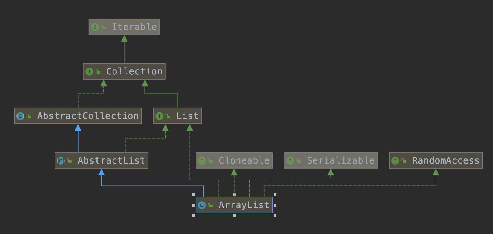

<span id="catalog"></span>
- [Collection](#collection)
    - [ArrayList](#arrayList)

- [辅助接口和抽象类](#辅助接口和抽象类)
    - [RandomAccess接口](#randomAccess接口)
    - [Cloneable接口](#cloneable接口)
    - [序列化接口](#序列化接口)
        - [Serializable](#serializable)
        - [Externalizable](#externalizable)
        - [Serializable和Externalizable的异同](#serializable和externalizable的异同)

# Collection
## ArrayList
[top](#catalog)
* 部分内容参考：
    * `http://iuuxx.com/article/65.html`
* ArrayList概述
    * 基于数组实现
    * 支持自动扩容的动态数组
    * 继承关系图:
* 继承与实现关系
    * 实现的四个接口
        * `java.util.List`:提供数组的添加、删除、修改、迭代遍历 等操作
        * `java.util.RandomAccess`:ArrayList支持快速的随机访问
        * `java.io.Serializable`:提供序列化功能
        * `java.lang.Cloneable`:表示支持克隆
    * 继承关系
        * `java.util.AbstractList`抽象类
            * `AbstractList`提供了List接口的主要实现，大幅度减少了实现**迭代遍历**相关操作的代码
            * `ArrayList`大量重写了`AbstractList`的方法实现
            * `AbstractList`本身对`ArrayList`意义不大，更多的是`AbstractList`对其他子类的影响
* 属性
    * 对象属性
        * `transient Object[] elementData;`，元素数组
            * 内部构成
                ```
                |1|4|5|6|size属性标记的位置|  |  |  |  |
                0 1 2 3 size             null
                ```
        * `private int size;`，elementData数组**已使用**的元素数量
            * 通过`public int size()`获取该属性
            * 每次添加新元素时，都会添加到`size`所对应的位置
    * 类属性
        * `private static final int DEFAULT_CAPACITY = 10;`，默认的`elementData`初始化容量
        * `private static final Object[] EMPTY_ELEMENTDATA = {};`
        * `private static final Object[] DEFAULTCAPACITY_EMPTY_ELEMENTDATA = {};`
* 构造方法
    * `public ArrayList(int initialCapacity)`
        * 如果初始化时就直到数组的大小，应该使用这种方法来进行初始化
        * 通过该方法可以**避免数组扩容，合理使用内存，来提升性能**
        * 如果`initialCapacity==0`，将会使用`EMPTY_ELEMENTDATA`创建一个空数组:`{}`
            * 在添加元素时会进行数组扩容
        ```java
        //根据容量来初始化：elementData
        public ArrayList(int initialCapacity) {
            if (initialCapacity > 0) {
                this.elementData = new Object[initialCapacity];
            } else if (initialCapacity == 0) {
                this.elementData = EMPTY_ELEMENTDATA;
            } else {
                throw new IllegalArgumentException("Illegal Capacity: "+
                                                initialCapacity);
            }
        }
        ```
    * `public ArrayList()`
        * 使用`DEFAULTCAPACITY_EMPTY_ELEMENTDATA`来创建一个空数组:`{}`
            * 在添加元素时会进行数组扩容
        ```java
        public ArrayList() {
            this.elementData = DEFAULTCAPACITY_EMPTY_ELEMENTDATA;
        }
        ```
    * `public ArrayList(Collection<? extends E> c)`
        * 使用其他集合来创建数组，集合类型必须是E及其子类
            ```java
            public ArrayList(Collection<? extends E> c) {
                elementData = c.toArray();
                if ((size = elementData.length) != 0) {
                    // defend against c.toArray (incorrectly) not returning Object[]
                    // (see e.g. https://bugs.openjdk.java.net/browse/JDK-6260652)
                    if (elementData.getClass() != Object[].class)
                        elementData = Arrays.copyOf(elementData, size, Object[].class);
                } else {
                    // replace with empty array.
                    this.elementData = EMPTY_ELEMENTDATA;
                }
            }
            ```
        * bug:`JDK-6260652`的修复
            * 问题的原因：`collection.toArray()`和`collection.toArray(new Object[0])`在功能上相同，但是`Arrays.ArrayList`没有遵守规则进行实现
            * 问题的产生
                * 有两个`ArrayList`
                    * `Arrays.ArrayList`，`Arrays`的内部类
                    * `java.util.ArrayList`
                * 两个`ArrayList`的`toArray`在JDK8中实现不同
                    * `Arrays.ArrayList`的实现
                        ```java
                        @Override
                        public Object[] toArray() {
                            return a.clone();
                        }
                        ```
                    * `java.util.ArrayList`
                        ```java
                         public Object[] toArray() {
                            return Arrays.copyOf(elementData, size);
                        }
                        ```
                * 使用`Arrays.ArrayList`之后无法填充其他类型
                    ```java
                    
                    ```
# 辅助接口和抽象类
## RandomAccess接口
[top](#catalog)
* 内容参考：`https://juejin.im/post/5a26134af265da43085de060`
* 接口来源：`java.util.RandomAccess`
* `RandomAccess`是`List`实现所使用的标记接口(Marker)，**接口本身为空**
    * <label style="color:red">空接口表明该接口只起到标记作用</label>
* `RandomAccess`表明其实现类：**支持(通常是固定时间)随机访问**
    * 可以用来标记能够随机访问元素的集合，即底层是数组实现的集合
        * 对于实现类`ArrayList`表示通过数组的下标访问
* `RandomAccess`的主要目的：允许一般的算法更改其行为，从而在将其应用到随机或连续访问列表时能提供良好的性能
* `List`实现了`RandomAccess`接口，表示该类能够快速随机访问存储的元素
* 为了提升性能，在遍历集合前，可以通过`obj instanceof RandomAccess`做判断，选择合适的集合遍历方式
    * 在数据量很大时，可以提升性能
    * 随机访问列表使用循环遍历，顺序访问列表使用迭代器变量
        * 属于`RandomAccess`时使用for循环
        * 不属于`RandomAccess`时使用迭代器循环
* 使用实例：`ArrayList`(实现了RandomAccess)和`LinkedList`(没有实现RandomAccess)的比较
    * 使用`obj instanceof RandomAccess`做使用区分
        ```java
        public class RandomAccessTest {
            public static void interfaceTest(List list){
                if (list instanceof RandomAccess){
                    for (int i = 0; i < list.size(); i++) {
                        System.out.println("this is random= " + list.get(i));
                    }
                } else {
                    Iterator iterator = list.iterator();
                    while(iterator.hasNext()){
                        System.out.println("this is iter = " + iterator.next());
                    }
                }
            }

            public static void main(String[] args) {
                List<Integer> a = new ArrayList<>();
                a.add(22);
                a.add(44);
                a.add(66);
                interfaceTest(a);
                //this is random= 22
                //this is random= 44
                //this is random= 66

                List<Integer> b = new LinkedList<>();
                b.add(77);
                b.add(88);
                interfaceTest(b);
                //this is iter = 77
                //  this is iter = 88
            }
        }
        ```
    * 大数据量的性能测试
        * 从结果看
            * ArrayList的循环更快
            * LinkedList的迭代更快
        ```java
        //测试结果：
        //ArrayList loop time: 2
        //ArrayList iterator time: 3
        //LinkedList loop time: 440
        //LinkedList iterator time: 1

        public class RandomAccessTimeTest {
            public long loopTime(List list){
                long start = System.currentTimeMillis();
                for (int i = 0; i < list.size(); i++) {
                    list.get(i);
                }
                long end = System.currentTimeMillis();

                return end-start;
            }

            public long iteratorTime(List list){
                Iterator iterator = list.iterator();
                long start = System.currentTimeMillis();
                while(iterator.hasNext()){
                    iterator.next();
                }
                long end = System.currentTimeMillis();

                return end-start;
            }

            @Test
            public void timeTest(){
                RandomAccessTimeTest t = new RandomAccessTimeTest();

                List<Integer> al = new ArrayList<>();
                for (int i = 0; i < 30000; i++) {
                    al.add(i);
                }

                System.out.println("ArrayList loop time: " + t.loopTime(al));
                System.out.println("ArrayList iterator time: " + t.iteratorTime(al));

                List<Integer> ll = new LinkedList<>();
                for (int i = 0; i < 30000; i++) {
                    ll.add(i);
                }

                System.out.println("LinkedList loop time: " + t.loopTime(ll));
                System.out.println("LinkedList iterator time: " + t.iteratorTime(ll));
            }
        }

        ```


## Cloneable接口
* 部分内容可以参考：
    * `https://blog.csdn.net/qq_37113604/article/details/81168224`
* 接口来源：`java.lang.Cloneable`
* 标记接口(Marker)，**接口本身为空**
* 通过实现`Cloneable`接口，来告知`Object.clone()`方法可以合法的对该实现类进行**按字段复制**
    * 需要在类中重写`Object`的`clone`方法
    * 如果在没有实现`Cloneable`接口的实例上调用`Object`的`clone`方法，会引发`CloneNotSupportedException`异常
* `clone`是`native`方法
* `clone`的拷贝过程
    * 分配内存：分配方式与调用`clone`方法的对象的内存构造相同
    * 填充对象：将源对象中的各个变量值填充到新的位置
        * 对象内部包含其他子对象时，如果在`clone`方法中没有特殊处理，**只会填充该子对象的地址**
            * 如果拷贝的是地址，拷贝后，在源对象或拷贝对象中修改子对象时，会影响另一方的使用
        * String比较特殊，同样也是拷贝地址，但是修改后会创建一个新的字符串对象，不会影响源对象/拷贝对象的使用
    * 返回新对象的地址：填充后，将新分配内存的地址返回，该地址中的对象与源对象完全相同，只是地址不同
* 深拷贝与浅拷贝
    * 浅拷贝
        ```java
        public class Student{
            private String name;   //姓名
            private int age;       //年龄
            private StringBuffer sex;  //性别
            public String getName() {
                return name;
            }
            public void setName(String name) {
                this.name = name;
            }
            public int getAge() {
                return age;
            }
            public void setAge(int age) {
                this.age = age;
            }
            public StringBuffer getSex() {
                return sex;
            }
            public void setSex(StringBuffer sex) {
                this.sex = sex;
            }
            @Override
            public String toString() {
                return "Student [name=" + name + ", age=" + age + ", sex=" + sex + "]";
            }
        }

        public  class School implements Cloneable{
            private String schoolName;   //学校名称
            private int stuNums;         //学校人数
            private Student stu;         //一个学生
            public String getSchoolName() {
                return schoolName;
            }
            public void setSchoolName(String schoolName) {
                this.schoolName = schoolName;
            }
            public int getStuNums() {
                return stuNums;
            }
            public void setStuNums(int stuNums) {
                this.stuNums = stuNums;
            }
            public Student getStu() {
                return stu;
            }
            public void setStu(Student stu) {
                this.stu = stu;
            }
            @Override
            protected School clone() throws CloneNotSupportedException {
                // TODO Auto-generated method stub
                // 只克隆自身，不克隆内部所包含的子对象
                return (School)super.clone();;
            }
            @Override
            public String toString() {
                return "School [schoolName=" + schoolName + ", stuNums=" + stuNums + ", stu=" + stu + "]";
            }
        }

        class Test {
            psvm
            public static void main(String[] args){
                public static void main(String[] args) throws CloneNotSupportedException {
                School s1 = new School();       
                s1.setSchoolName("实验小学");
                s1.setStuNums(100);
                Student stu1 = new Student();
                stu1.setAge(20);
                stu1.setName("zhangsan");
                stu1.setSex(new StringBuffer("男"));
                s1.setStu(stu1);
                System.out.println("s1: "+s1+" s1的hashcode:"+s1.hashCode()+"  s1中stu1的hashcode:"+s1.getStu().hashCode());
                School s2 = s1.clone();  //调用重写的clone方法，clone出一个新的school---s2
                System.out.println("s2: "+s2+" s2的hashcode:"+s2.hashCode()+" s2中stu1的hashcode:"+s2.getStu().hashCode());
            }
        }
        ```
    * 深拷贝
        * 可以通过序列化反序列化完成
        * 在`clone`方法中手动添加子对象的`clone`处理
        ```java
        public class Student implements Cloneable{
            
            private String name;
            private int age;
            private StringBuffer sex;
            public String getName() {
                return name;
            }
            public void setName(String name) {
                this.name = name;
            }
            public int getAge() {
                return age;
            }
            public void setAge(int age) {
                this.age = age;
            }
            public StringBuffer getSex() {
                return sex;
            }
            public void setSex(StringBuffer sex) {
                this.sex = sex;
            }
            @Override
            public String toString() {
                return "Student [name=" + name + ", age=" + age + ", sex=" + sex + "]";
            }
            @Override
            protected Student clone() throws CloneNotSupportedException {
                // TODO Auto-generated method stub
                return (Student)super.clone();
            }
        }

        public  class School implements Cloneable{
            private String schoolName;   //学校名称
            private int stuNums;         //学校人数
            private Student stu;         //一个学生
            public String getSchoolName() {
                return schoolName;
            }
            public void setSchoolName(String schoolName) {
                this.schoolName = schoolName;
            }
            public int getStuNums() {
                return stuNums;
            }
            public void setStuNums(int stuNums) {
                this.stuNums = stuNums;
            }
            public Student getStu() {
                return stu;
            }
            public void setStu(Student stu) {
                this.stu = stu;
            }
            
            @Override
            protected School clone() throws CloneNotSupportedException {
                // TODO Auto-generated method stub
                School s = null;
                s = (School)super.clone();
                s.stu = stu.clone(); //等同于重新做设定参数
                return s;
            }

            @Override
            public String toString() {
                return "School [schoolName=" + schoolName + ", stuNums=" + stuNums + ", stu=" + stu + "]";
            }
        }
        ```
## 序列化接口
[top](#catalog)
* 部分内容参考：
    * `https://www.jianshu.com/p/e554c787c286`
### Serializable
[top](#catalog)
* `Serializable`本身是一个空接口
* `Serializable`的反序列化**不会调用空参构造器**
* 源码
    ```java
    package java.io;
    public interface Serializable {
    }
    ```
* 序列化**版本标识**符常量：`private static final long serialVersionUID = ...;`
    * 表示序列化版本标识符的静态变量
        * 用来表明类的不同版本间的兼容性(对序列化对象进行版本控制)
        * 序列化时，用serialVersionUID**验证版本的一致性**
        * 反序列化时，jvm将字节流中的serialVersionUID与本地对应实体类的serialVersionUID进行比较，**如果相同则一致，进行反序列化；不一致，则引发InvalidCastException**
    * 如果没有显示定义该常量，它的值是运行时根据类内部细节自动生成的，**如果类的实例变量发生变化，则serialVersionUID会变化**
* 如果不希望某些字段被序列化，可以使用`transient`来修饰字段
    * 反序列化后，这些字段的值是默认的0值
* 实例
    ```java
    class Person implements Serializable {
        private String name;
        private Integer age;
        private transient String skipParam;

        public Person(String name, Integer age, String skipParam) {
            this.name = name;
            this.age = age;
            this.skipParam = skipParam;
        }
        @Override
        public String toString() {
            return "Person{" +
                    "name='" + name + '\'' +
                    ", age=" + age + '\'' +
                    ", skipParam=" + skipParam +
                    '}';
        }
    }

    public class SerializeTest {
        // 序列化
        @Test
        public void method(){
            Person p1 = new Person("aaa", 11, "skip1");
            System.out.println(p1); //Person{name='bbb', age=12', skipParam=skip2}

            Person p2 = new Person("bbb", 12, "skip2");
            System.out.println(p2); //Person{name='aaa', age=11', skipParam=skip1}

            ObjectOutputStream oos = null;
            try {
                FileOutputStream fos = new FileOutputStream("...");
                oos =new ObjectOutputStream(fos);

                oos.writeObject(p1);
                oos.flush();
                oos.writeObject(p2);
                oos.flush();
            } catch (IOException e) {
                e.printStackTrace();
            } finally {
                if (oos != null){
                    try {
                        oos.close();
                    } catch (IOException e) {
                        e.printStackTrace();
                    }
                }
            }
        }

        // 反序列化
        @Test
        public void method2(){
            ObjectInputStream ois = null;
            try {
                FileInputStream fis = new FileInputStream("...");
                ois = new ObjectInputStream(fis);

                Person p1 = (Person) ois.readObject();
                System.out.println(p1); //Person{name='aaa', age=11', skipParam=null}

                Person p2 = (Person) ois.readObject();
                System.out.println(p2); //Person{name='bbb', age=12', skipParam=null}
            } catch (Exception e) {
                e.printStackTrace();
            } finally {
                if (ois != null){
                    try {
                        ois.close();
                    } catch (IOException e) {
                        e.printStackTrace();
                    }
                }
            }
        }
    }
    ```

### Externalizable
[top](#catalog)
* 源码
    ```java
    package java.io;

    import java.io.ObjectOutput;
    import java.io.ObjectInput;

    public interface Externalizable extends java.io.Serializable {
        //通过额外添加的两个方法
        void writeExternal(ObjectOutput out) throws IOException;
        void readExternal(ObjectInput in) throws IOException, ClassNotFoundException;
    }
    ```
* 反序列化要求类必须有一个**空参构造器**，否则会引发`InvalidClassException`异常
* 在`Externalizable`中，`transient`修饰符会失效
* `writeExternal`,`readExternal`中序列化参数的顺序必须是**一致的**，否则会引发`EOFException`异常
    * 没有参与序列化的参数，在反序列化时，是对应类型的0值
* 实例
    ```java
    class Person2 implements Externalizable {
        private String name;
        private Integer age;
        private transient String skipParam;

        public Person2(){
            System.out.println("this Person2()");
        }

        public Person2(String name, Integer age, String skipParam) {
            this.name = name;
            this.age = age;
            this.skipParam = skipParam;
        }
        @Override
        public String toString() {
            return "Person{" +
                    "name=" + name + 
                    ", age=" + age + 
                    ", skipParam=" + skipParam +
                    '}';
        }

        @Override
        public void writeExternal(ObjectOutput out) throws IOException {
            out.writeUTF(name);
            out.writeInt(age);
            out.writeUTF(skipParam);
        }

        @Override
        public void readExternal(ObjectInput in) throws IOException, ClassNotFoundException {
            name = in.readUTF();
            age = in.readInt();
            skipParam = in.readUTF();
        }
    }

    public class ExternalTest {
        // 序列化
        @Test
        public void method(){
            Person2 p1 = new Person2("aaa", 11, "skip1");
            System.out.println(p1); //Person{name=bbb, age=12, skipParam=skip2}

            Person2 p2 = new Person2("bbb", 12, "skip2");
            System.out.println(p2); //Person{name=aaa, age=11, skipParam=skip1}

            ObjectOutputStream oos = null;
            try {
                FileOutputStream fos = new FileOutputStream(
                        "/Users/liujinsuo/myGit/memobook/java/jdkAnalyze/out.txt"
                );
                oos =new ObjectOutputStream(fos);

                oos.writeObject(p1);
                oos.flush();
                oos.writeObject(p2);
                oos.flush();
            } catch (IOException e) {
                e.printStackTrace();
            } finally {
                if (oos != null){
                    try {
                        oos.close();
                    } catch (IOException e) {
                        e.printStackTrace();
                    }
                }
            }
        }

        // 反序列化
        @Test
        public void method2(){
            ObjectInputStream ois = null;
            try {
                FileInputStream fis = new FileInputStream(
                        "/Users/liujinsuo/myGit/memobook/java/jdkAnalyze/out.txt"
                );
                ois = new ObjectInputStream(fis);

                Person2 p1 = (Person2) ois.readObject();
                System.out.println(p1); //Person{name=aaa, age=11, skipParam=skip1}

                Person2 p2 = (Person2) ois.readObject();
                System.out.println(p2); //Person{name=bbb, age=12, skipParam=skip2}
            } catch (Exception e) {
                e.printStackTrace();
            } finally {
                if (ois != null){
                    try {
                        ois.close();
                    } catch (IOException e) {
                        e.printStackTrace();
                    }
                }
            }
        }
    }
    ```
### Serializable和Externalizable的异同
* 相同点
    * 最好都生成版本标识符常量：`serialVersionUID`
* 不同点
    * `transient`在`Externalizable`中失效
    * `Externalizable`的反序列化，必须要提供空参构造器
* 特殊点
    * `Externalizable`字段的读写顺序必须相同
************************
