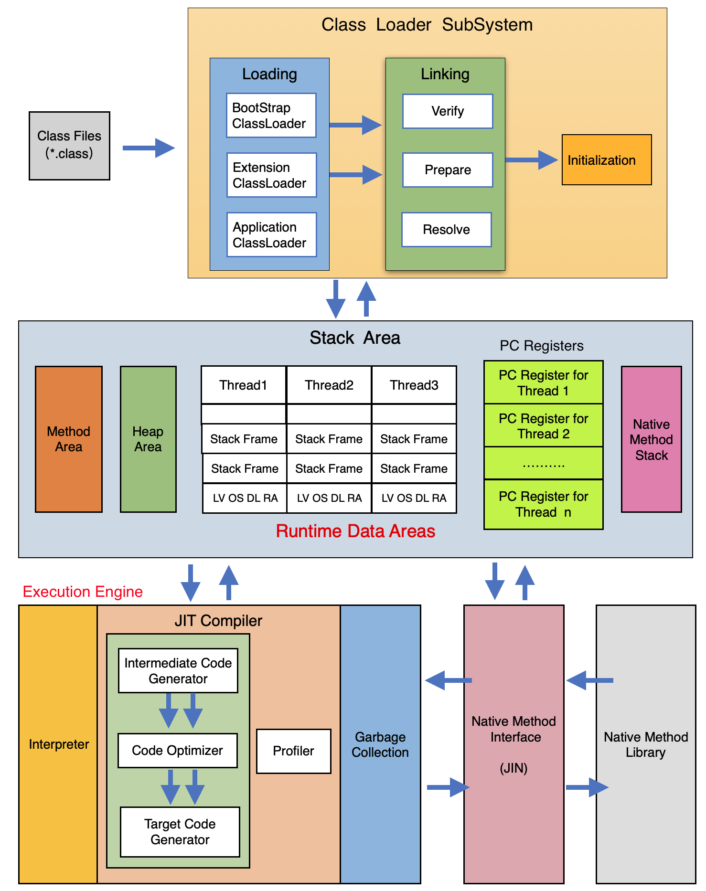
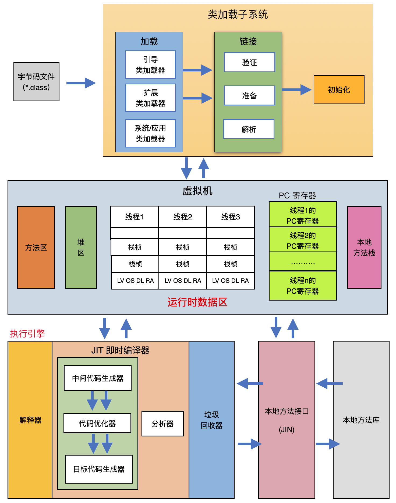
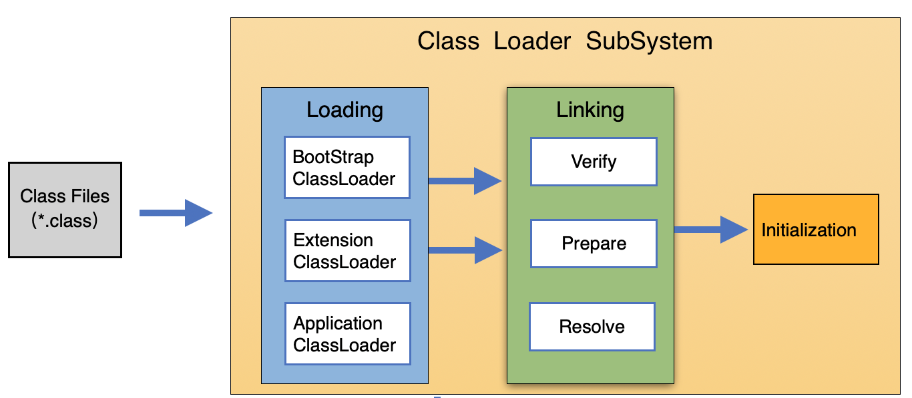

- 参考
    - https://www.bilibili.com/video/BV1PJ411n7xZ

<span id="catalog"></span>

### 目录
- [JVM与Java体系结构](#JVM与Java体系结构)
    - [JVM在开发与语言中的位置](#JVM在开发与语言中的位置)
    - [JVM的基本概念](#JVM的基本概念)
    - [JVM的语言无关性与字节码](#JVM的语言无关性与字节码)
    - [JVM的整体结构](#JVM的整体结构)
    - [Java程序的执行过程](#Java程序的执行过程)
    - [JVM的架构模型](#JVM的架构模型)
    - [JVM的生命周期](#JVM的生命周期)
    - [JVM的发展](#JVM的发展)
- [类加载子系统](#类加载子系统)
- [](#)
- [](#)


# JVM与Java体系结构
## JVM在开发与语言中的位置
[top](#catalog)
- 信息产业的三大难题
    - CPU
    - 操作系统
    - 编译器
- 开发时的高层与底层
    ```
    高层             自己开发的Java程序
                          │
             ┌────────────┼─────────────┐
    框架   Spring框架   Mybatis框架   SpringMVC框架 
             └────────────┼─────────────┘
                          │
                       JavaAPI
                          │
    底层                　JVM
    ```

- JVM是**跨语言的平台**
    ```
    Kotlin  Clojure  Groovy  Scala Jython  JRuby JavaScript
      │        │       │      │      │       │       │
    编译器    编译器   编译器  编译器  编译器   编译器   编译器  
      │        │       │      │      │       │       │
      └────────┴───────┴──────┼──────┴───────┴───────┘
                              │
                           字节码文件
                              │
                           Java虚拟机
    ```

- 从软硬件的角度看，JVM所处的位置
    ```
    ┌──────────────────────────────────────────────┐
    │    用户User                                　 │
    │   ┌────────────────────────────────────────┐ │
    │   │   字节码文件                           　│ │
    │   │   ┌──────────────────────────────────┐ │ │
    │   │   │   JVM                            │ │ │
    │   │   │   ┌────────────────────────────┐ │ │ │
    │   │   │   │   操作系统（Win/Linux/MaxOs）│ │ │ │               
    │   │   │   │   ┌──────────────────┐     │ │ │ │
    │   │   │   │   │   硬件（Intel等）　│     │ │ │ │
    │   │   │   │   └──────────────────┘     │ │ │ │
    │   │   │   └────────────────────────────┘ │ │ │
    │   │   └──────────────────────────────────┘ │ │
    │   └────────────────────────────────────────┘ │
    └──────────────────────────────────────────────┘
    ```

## JVM的基本概念
[top](#catalog)
- JVM的本质：二进制字节码的运行环境
- JVM的作用
    1. 负责装载字节码
    2. 将字节码解释/编译为对应平台的**机器指令**

- JVM的特点
    1. 一次编译，到处执行
    2. 自动内存管理
    3. 自动垃圾回收
    4. 语言无关性

- JVM运行在操作系统之上，没有直接与硬件交互
- 每一条Java指令，JVM规范中都有详细的定义，包括：如何取操作数，如何处理操作数，如何存储处理结果等等


## JVM的语言无关性与字节码
[top](#catalog)
- JVM的语言无关性
    - Java虚拟机<label style="color:red">只关心字节码文件</label>，不关心内部程序的编写语言
    - JVM并不单纯的只与Java语言绑定
    - JVM可以识别并装载运行其他语言的编译结果，但是需要这些的编译结果满足并包含：
        - Java虚拟机的**内部指令集**
        - **符号表**
        - **其他辅助信息**

- JVM字节码
    - 任何能在JVM平台执行的字节码格式都是一样的（包括java字节码）
    - **不同**的编译器可以编译出**相同**的字节码，字节码文件也可以在不同的JVM上运行

- JVM只与特定的二进制文件格式：`Class文件格式`相关联，它包含了
    - Java虚拟机的**内部指令集**
    - **符号表**
    - **其他辅助信息**

- 多语言混合编程
    - 不同的语言解决特定领域的问题，最终都运行在JVM上

## JVM的整体结构
[top](#catalog)
- JVM采用解释器与即时编译器并存的架构
    - 解释执行：保证执行时间
    - 即时编译：保证性能
        - 本质是二次编译，字节码-->机器指令
        - 将热点代码编译成机器指令，并进行缓存
- 现在Java程序的运行性能已经达到了C/C++的水平
- 结构简图
    ```
    ┌───────────┐       ┌──────────────────┐
    │class files│ ───>> │   类加载器子系统　　│
    └───────────┘       │   class loader   │
                        └───┬─┬────────────┘
                            │ │   ^ ^
                            V V   │ │ 
    ┌─────────────────────────────┴─┴───────────────────────────┐
    │  运行时数据区 Runtime Data Area                             │
    │  ┌──────────────┐  ┌────────────┐ ┌─────────────────────┐ │
    │  │     方法区    │  │   Java栈　　│ │ 本地方法栈          　│ │
    │  │  Method Area │  │ Java Stack │ │ Native Method stack │ │
    │  └──────────────┘  └────────────┘ └─────────────────────┘ │
    │  ┌──────────────┐  ┌────────────────────────────────────┐ │
    │  │     堆    　　│  │              程序计数器            　│ │
    │  │     heap     │  │       Program Counter Register     │ │
    │  └──────────────┘  └────────────────────────────────────┘ │
    └───┬─┬────────────────────────┬─┬──────────────────────────┘
        │ │   ^ ^                  │ │   ^ ^
        V V   │ │                  V V   │ │ 
    ┌─────────┴─┴──┐        ┌────────────┴─┴─────┐
    │   执行引擎　 　│ ───>>  │　  本地方法接口   　　│
    │  Execution   │ <<───  │                    │ <<─── 本地方法库
    │   Engine     │        │  Native Interface  │
    └──────────────┘        └────────────────────┘
    ```

- 详细结构图
    - en
        - 
    - ch
        - 

## Java程序的执行过程
[top](#catalog)
- 从Java代码到JVM
    ```
                      Java代码
                         │     编译
                      字节码文件
                         │     执行
            ┌────────────┼─────────────┐
            │            │             │
        Win版JVM     Linux版JVM     MacOS版JVM
    ```

- Java代码执行流程
    - 代码编译-->>生成class文件-->>加载到JVM-->>执行代码
    ```
           生成　┌────────────────────────────────┐  生成
         ┌────>>│            Java编译器           ├──>>─┐
         │      │                     　│注│    　│     │
    ┌────┴────┐ ││词│  │语│  │抽│  │语│  │解│  │字││     V
    │Java源码　│ ││法├─>│法├─>│象├─>│义├─>│抽├─>│节││ ┌───┴───┐
    │ *.java  │ ││分│  │分│  │语│  │分│  │象│  │码││ │ 字节码 │
    └─────────┘ ││析│  │析│  │法│  │析│  │语│  │生││ │*.class│
                │      　　  │树│      　│法│  │成││ └───┬───┘
                │                     　│树│  │器││     │
                └────────────────────────────────┘     V
                                                       V
        ┌──────────────────────────────────────────────┴─┐
        │                    Java虚拟机                   │
        │┌──────────────┐                                │
        ││┌────────────┐│                                │
        │││  翻译字节码　││                                │
        │││　(解析执行)　││     ┌──────────┐   ┌──────────┐│
        ││└────────────┘│ <<──┤字节码校验器│<<─┤　类加载器　││
        ││┌────────────┐│     └──────────┘   └──────────┘│
        │││  JIT编译器  ││                                │
        │││　(编译执行)　││                                │
        ││└────────────┘│                                │
        │└──────────────┘                                │
        └─────────────────────────┬──────────────────────┘
                                  V
                            ┌─────┴────┐
                            │　操作系统　│
                            └──────────┘
    ```

## JVM的架构模型
[top](#catalog)
- 两种指令集架构
    1. 基于栈的指令集架构
    2. 基于寄存器的指令集架构
- 两种指令集的区别
    - 基于栈的指令集架构
        - 设计实现更简单，适用于资源受限的系统
        - 避开了寄存器的分配难题：使用零地址指令方式分配
        - 指令集更小、指令多，编译器容易实现（8位为基本单位）
        - 地址指令：指令流中的指令大部分是零地址指令，其执行过程依赖于操作栈
        - 可移植性：不需要硬件支持，可移植性更好，更易实现跨平台
    - 基于寄存器的指令集架构
        - 性能更好、执行更高效
        - 完成操作使用的指令更少，但是指令集更大（16位为基本单位）
        - 地址指令：指令集以一地址指令、二地址指令、三地址指令为主
        - 可移植性：完全依赖于硬件，可移植性差

- 基于寄存器的指令集架构的应用：x86的二进制指令集，如
    - 传统PC
    - Android的Davlik虚拟机

- Java编译器输入的指令流基本上是一种<label style="color:red">基于栈的指令集架构</label>
    - 为什么使用基于栈的指令集
        - 由于跨平台性的设计，Java的指令都是根据栈来设计的
        - 不同平台的CPU架构不同，所以不能设计为基于寄存器的指令架构
    - 优点
        - 跨平台性
        - 指令集小
        - 编译容易
    - 缺点
        - 性能下降
        - 实现同样的功能需要更多的指令

## JVM的生命周期
[top](#catalog)
- JVM的生命周期
    1. 启动
    2. 执行
    3. 退出

- 虚拟机的启动
    - 启动JVM的对象：
        - 引导类加载器（bootstrap class loader）创建的一个初始类：`initial class`
    - `initial class`这个类是有虚拟机的具体实现指定的

- 虚拟机的执行
    - 执行后，JVM的主要任务是：执行Java程序
    - java程序开始执行时，JVM才执行；java程序结束时，JVM就停止
    - 执行一个java程序是，**本质是执行一个名为Java虚拟机的进程**

- 虚拟机的退出
    - 几种退出方式
        - 正常结束：程序正常执行结束
        - 执行异常：程序在执行过程中遇到了异常、错误，并且没有代码进行处理而异常终止
        - 系统错误：操作系统错误导致JVM进程终止
        - 手动终止：某线程调用`Runtime`类的`exit`或`halt`方法，或者`System`类的`exit`方法，并且Java安全管理器也运行这次`exit`或`halt`操作
    - JNI（Java Native Interface）规范描述了用JNI Invocaton API来加载或卸载Java虚拟机时，Java虚拟机的退出情况
    - `Runtime`和`System`类的退出分析
        - 调用链
            ```
            System.exit
                 │
                 V
            Runtime.exit    Runtime.halt
                 │               │
                 └───────┬───────┘
                         V    
                   Shutdown.exit
                         |
                         V
                   Shutdown.halt
                         |
                         V
                  Shutdown.halt0
            ```                   
        - 调用过程
            1. `System.exit`(获取单例调用方法)
                ```java
                public static void exit(int status) {
                    Runtime.getRuntime().exit(status);
                }
                ```
            2. `Runtime`
                - `exit` 
                    ```java
                    public class Runtime {
                        private static final Runtime currentRuntime = new Runtime();

                        private static Version version;

                        public static Runtime getRuntime() {
                            return currentRuntime;
                        }

                        // 执行`Shutdown.exit`方法来关闭jvm
                        public void exit(int status) {
                            SecurityManager security = System.getSecurityManager();
                            if (security != null) {
                                security.checkExit(status);
                            }
                            Shutdown.exit(status);
                        }
                    }
                    ```
                - `halt`
                    ```java
                    public void halt(int status) {
                        SecurityManager sm = System.getSecurityManager();
                        if (sm != null) {
                            sm.checkExit(status);
                        }
                        Shutdown.beforeHalt();
                        Shutdown.halt(status);
                    }
                    ```

            3. `Shutdown`
                ```java
                class Shutdown {
                    /* 声明了一个空类，作为同步监视器 */
                    private static class Lock { };
                    private static Object lock = new Lock();

                    /* Lock object for the native halt method */
                    private static Object haltLock = new Lock();

                    static void exit(int status) {
                        synchronized (lock) {
                            if (status != 0 && VM.isShutdown()) {
                                // 如果不是0，则立刻停止
                                halt(status);
                            }
                        }
                        synchronized (Shutdown.class) {
                            //使用类作为同步监视器，使其他试图关闭的线程无限等待
                            beforeHalt();
                            runHooks();
                            halt(status);
                        }
                    }

                    static void halt(int status) {
                        synchronized (haltLock) {
                            halt0(status);
                        }
                    }
                
                    static native void halt0(int status);
                }
                ```

## JVM的发展
[top](#catalog)
- 3大主流JVM
    - HotSpot，Java的默认虚拟机
    - JRockit
    - J9

- Sun/Oracle JVM的演进
    1. Classic VM
        - 第一款商用java虚拟机
        - 在JDK1.4被完全淘汰
        - 该虚拟机内部只提供解释器
        - 可以外挂JIT编译器。但是执行时，JIT会接管虚拟机的执行系统，解释器无法工作，导致解释器和编译器不能配合工作
        - HotSpot虚拟机中内置了Classic

    2. Exact VM
        - 为了解决Classic虚拟机的问题，Jdk1.2时，sun提供了该虚拟机
        - 全称：Exact Memory Management：准确式内存管理
            - 也被称为：Non-Conservative/Accurate Memory Management
            - 虚拟机可以知道内存中某个位置的数据的类型
        - 该虚拟机已经具备了现代高性能虚拟机的雏形
            - 热点探测
            - 编译器与解释器的混合工作
        - 只在Solaris平台短暂使用，其他平台上仍然使用Classic VM

    3. HotSpot VM
        - 从JDK1.3开始，HotSpot VM 成为默认虚拟机
        - Sun/Oracle JDK 和 OpenJDK 的默认虚拟机
        - HotSpot 主要是指**热点代码探测技术**
            - 通过计数器找到最具编译价值的代码，触发即使编译或栈上替换
            - <label style="color:red">通过编译器与解释器协同工作，在最优化的程序响应时间与最佳执行性能中取得平衡</label>
        - 在服务器、桌面、移动端、嵌入式都有应用

- BEA 的 JRockit
    - 专注与服务器端的应用
        - 不关注程序启动速度，所以不包含解析器的实现
        - 所有代码都靠即使编译器编译后执行
    - JRockit 是世界上最快的虚拟机
    - 优势：全面的Java运行时解决方案组合
        - JRockit Real Time，是 JRockit **面向延迟敏感型应用的解决方案**
            - 提供毫秒、微秒级的JVM响应时间
        - MissionControl 服务套件，它是一株以基地的开销来监控、管理和分析生成环境中的应用程序的工具
    - 在JDK8中，在HotSpot的基础上，移植了JRockit的特性

- IBM 的 J9
    - 定位与HotSpot接近，在服务器、桌面、移动端、嵌入式都有应用
    - 2017年开源，命名为 Open J9


# 类加载子系统
[top](#catalog)
- 

- 类加载器子系统的作用
    - 负责从文件系统或网络中将Class文件加载到JVM中
        - class文件在文件开头有特定的文件标识
        - 加载过程中如果出现问题，会抛出问题
    - 加载后，将类信息保存在`方法区`
- 类加载器只负责class文件的加载，能否执行由`Execution Engine`决定

- class文件
    - class 文件保存在本地，类似于模版
    - 通过类加载器将class文件加载到JVM中，再根据这个模版实例化出n各实例对象
    - class 文件被加载到JVM后，被称为`DNA元数据模版`，保存在**方法区**

- 类的加载过程
```flow

//定义类型和描述

st=>start: 开始

e=>end: 结束

op=>operation: 我的操作

cond=>condition: 判断确认？

st->op->cond

cond(yes)->e

cond(no)->op

```
[top](#catalog)