- 内容整理自：
    - http://maven.apache.org/index.html
    - https://www.bilibili.com/video/av21004567
    - https://www.cnblogs.com/best/p/9676515.html
    - 自定义archetype
        - https://blog.csdn.net/qq_30162859/article/details/79038784  （原型描述部分在官方文档中未找到??????）
        - https://blog.csdn.net/qq_30162859/article/details/79039085
        - http://maven.apache.org/guides/mini/guide-creating-archetypes.html
        - http://maven.apache.org/guides/mini/guide-creating-archetypes.html
        - `原型描述符`：http://maven.apache.org/archetype/archetype-models/archetype-descriptor/archetype-descriptor.html

<span id="catalog"></span>

### 目录
- [项目开发中存在的问题以及如何使用maven解决](#项目开发中存在的问题以及如何使用maven解决)
- [安装Maven核心程序](#安装Maven核心程序)
- [Maven简介](#Maven简介)
- [Maven命令](#Maven命令)
- [Maven的核心概念---仓库](#Maven的核心概念---仓库)
- [Maven的核心概念---目录结构](#Maven的核心概念---目录结构)
    - [为什么要遵守约定的目录结构](#为什么要遵守约定的目录结构)
    - [Maven目录结构](#Maven目录结构)
    - [目录结构示例工程---Hello](#目录结构示例工程---Hello)
- [Maven的核心概念---pom文件](#Maven的核心概念---pom文件)
- [Maven的核心概念---坐标](#Maven的核心概念---坐标)
    - [Maven坐标](#Maven坐标)
    - [Meven坐标与仓库中路径的对应关系](#Meven坐标与仓库中路径的对应关系)
- [Maven的核心概念---依赖](#Maven的核心概念---依赖)
    - [为什么需要依赖以及如何配置](#为什么需要依赖以及如何配置)
    - [依赖的范围](#依赖的范围)
    - [依赖范围示例工程---HelloFriend](#依赖范围示例工程---HelloFriend)
    - [依赖的传递性](#依赖的传递性)
    - [依赖的排除](#依赖的排除)
    - [依赖的原则](#依赖的原则)
    - [通过自定义参数来统一管理当前工程中的依赖版本](#通过自定义参数来统一管理当前工程中的依赖版本)
- [Maven的核心概念---生命周期](#Maven的核心概念---生命周期)
    - [Maven生命周期](#Maven生命周期)
    - [与生命周期相关的插件和目标](#与生命周期相关的插件和目标)
- [Maven的核心概念---继承](#Maven的核心概念---继承)
- [Maven的核心概念---聚合](#Maven的核心概念---聚合)
- [Maven_Archetype通过原型创建项目](#Maven_Archetype通过原型创建项目)
    - [什么是原型Archetype](#什么是原型Archetype)
    - [Maven_Archetype插件](#Maven_Archetype插件)
        - [Archetype插件简介](#Archetype插件简介)
        - [Maven提供的默认原型](#Maven提供的默认原型)
    - [通过原型创建Maven工程](#通过原型创建Maven工程)
        - [通过与Archetype插件交互来创建项目](#通过与Archetype插件交互来创建项目)
        - [直接通过指令创建项目](#直接通过指令创建项目)
    - [自定义原型](#自定义原型)
        - [通过现有项目来创建原型](#通过现有项目来创建原型)
        - [create-from-project指令的结果分析以及手动创建原型](#create-from-project指令的结果分析以及手动创建原型)
        - [原型描述符文件说明](#原型描述符文件说明)
- [其他问题](#其他问题)

- [](#)
- [](#)

# 项目开发中存在的问题以及如何使用maven解决
[top](#catalog)

|问题|使用maven|
|-|-|
|一个项目就是一个工程<br>    如果一个项目过大，就不适合使用package来划分模块，最好是一个模块一个工程|使用Maven就可以将一个项目拆分成多个工程|
|项目中需要的jar包必须手动拷贝到WEB-INF/lib目录下<br>    同样的jar包重复出现在不同的工程目录中，浪费内存，让工程变的臃肿不好管理|使用Maven，将jar包保存在仓库中，有需要的工程引用这个文件接口，并不需要直接赋值jar包|
|jar包需要提前准备好<br>    不同的官网提供的jar包下载形式是不同的，有些技术的官网就是通过Maven或SVN等专门的工具来提供下载的<br>    如果以非正规的方式下载的jar包，那么其中的内容很可能也是不规范的|使用Maven可以一种规范的方式下载jar包，所以知名框架或第三方工具的jar包已经按照统一的规范存放在了Maven的中央仓库中。以规范的方式下载的jar包，内容也是可靠的|
|一个jar包依赖的其他jar包也需要手动加载到项目中|Maven会自动导入被依赖的jar包|

# 安装Maven核心程序
[top](#catalog)
1. 检查JAVA_HOME环境变量
2. 下载并解压Maven核心程序的压缩包，需要解压到一个纯英文的目录下，如：apache-maven-3.6.2-bin.tar
3. 配置Maven的环境变量：MAVEN_HOME或M2_HOME
    - `export MAVEN_HOME=maven路径/apache-maven-3.6.2`
    - `export PATH=$PATH:$MAVEN_HOME/bin`
4. 运行`mvn -v`查看Maven的版本

# Maven简介
[top](#catalog)
- Maven是服务于Java平台的自动化构建工具
    - 自动构建工具的发展：Make->Ant->Maven->Gradle

- 什么是构建
    - 构建的概念：以Java源文件、框架配置文件、JSP、HTML、图片等资源来生成一个可以运行的项目的过程
    - 构建的过程：编译-->部署-->搭建
        1. 编译--对于纯Java代码
            - java源文件(.java)-->编译-->Class字节码文件-->交给JVM执行
            - 一个BS项目最终运行的并不是动态Web工程本身，而是这个动态web工程**编译的结果**
                - 动态web工程-->编译、部署-->编译结果
                - 开发web工程时，需要运行时环境，其本质也是一组jar包的引用，但是并没有把jar包本身复制到工程中，所以不是目录
        2. 部署--对于Web工程
            - 什么是部署：将包含Java程序的Web工程编译的结果拿到服务器上的指定目录     
        3. 搭建--对于实际项目
            - 在实际项目中整合第三方框架，Web工程中除了Java程序和JSP页面、图片等静态资源之外，还包括第三方框架的jar包以及各种各样的配置文件。**所有这些资源必须按照正确的目录结果部署到服务器上，项目才可以运行**

- Maven构建过程中的各个环节
    1. 清理：将以前编译得到的旧的class字节码文件删除，为下一次编译做准备
    2. 编译：将java源程序编译成class字节码文件
    3. 测试：自动测试，自动调用junit程序
    4. 报告：测试程序执行的结果
    5. 打包：动态web工程打war包，Java工程打jar包
    6. 安装：Maven的特定概念--将打包得到的文件复制到仓库中的指定位置
    7. 部署：将动态Web工程生成的war包复制到Servlet容器的指定目录下，使其可以运行

- Maven的核心概念
    1. 目录结构
    2. pom文件
    3. 坐标
    4. 依赖
    5. 仓库
    6. 生命周期/插件/目标
    7. 继承
    8. 聚合
    

# Maven命令
[top](#catalog)
- <lable style="color:red">执行与构建过程相关的Maven命令，必须进入pom.xml所在的目录</label>
    - 与构建构成相关的Maven命令：编译、测试、打包等等
- `mvn clean`， 清理 （删除编译结果目录）
- `mvn compile`， 编译
- `mvn test-compile`， 编译测试程序
- `mvn test`， 执行测试
- `mvn package`， 打包
- `mvn install`， 将工程打包并放入仓库
- `mvn site`，生成项目报告、站点、发布站点

# Maven的核心概念---仓库
[top](#catalog)
- 仓库的分类
    - 本地仓库：当前电脑上部署的仓库目录，为当前电脑上所有的Maven工程服务
    - 远程仓库：
        - 私服：架设在当前局域网环境下，为当局域网内的所有Maven工程服务
            - 依赖获取的步骤
                1. 需要依赖X时，直接访问私服
                2. 如果私服上不存在依赖X，则私服会自动的到外网下载并保存在私服上
                3. 当其他用户需要依赖X时，直接从私服上获取
            - 使用场景：大型开发时，只允许部分机器连接外网，其他机器全部使用私服
            - 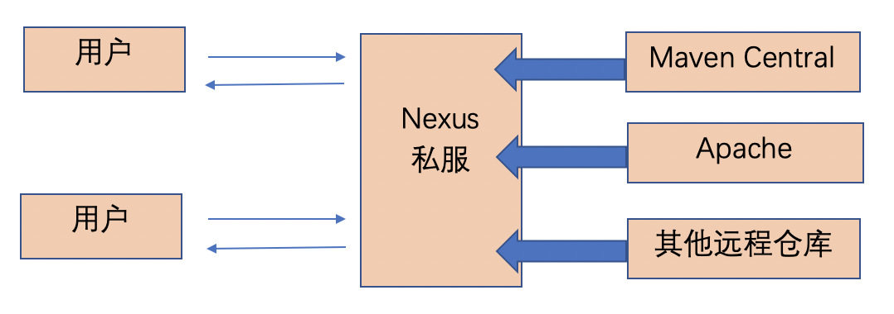
        - 中央仓库：架设在Internet上，为世界上所有Maven工程服务
        - 中央仓库的镜像：为了分担中央仓库的流浪，提升用户访问速度
        
- 仓库中保存的内容:本质都是Maven工程
    1. Maven自身所需要的插件 
    2. 第三方框架或工具的jar包
    3. 自己开发的Maven工程

- 修改Maven仓库位置--解决联网问题
    - Maven的**核心程序中仅仅定义了抽象的生命周期**，但是具体的工作必须有特定的插件来完成，而插件本身并不包含在Maven的核心程序中
    - 当Maven命令需要用到某些插件时，Maven核心程序会首先到本地仓库中查找，如果本地找不到需要的插件，那么它会自动链接外网到中央仓库下载，如果无法链接外网，则构建失败
    - 本地仓库的默认位置：`~/.m2/repository`
    - 修改默认本地仓库的位置可以让Maven核心程序到自定义的目录下查找插件
        - 两种级别修改
            - 修改全局配置文件：`maven解压目录/conf/settings.xml`
            - 修改自定义配置文件：`~/.m2/settings.xml`，或`~/.m2/自定义配置文件名.xml`
        - 修改方式
            - 在配置文件中查找标签：`localRepository`
            - 修改`<localRepository>/path/to/local/repo</localRepository>`
            - 将标签体内容修改为自定义Maven仓库目录


# Maven的核心概念---目录结构
## 为什么要遵守约定的目录结构
[top](#catalog)
- maven 要负责项目的自动化构建，以编译为例，Maven想要自动进行编译，那么它必须知道java源文件，保存在哪里，构建的结果放在哪里

- 自定义的内如果想让框架或工具知道，有两种办法
    - 以配置的方式明确告诉框架
    - 遵守框架内部的约定

- 约定 > 配置 > 编码

## Maven目录结构
[top](#catalog)
- maven的目录结构分为3类
    - 配置文件：pom.xml
    - 源码目录：src
    - 构建结构目录：target
    
- maven的目录结构说明

    ```
    根目录：工程名
    ├── pom.xml                     ：Maven工程的核心配置文件
    ├── src                         ：源码
    │   ├── main                    ：主程序
    │   │   ├── java                ：java源程序
    │   │   └── resources           ：框架或其他工具的配置文件
    │   └── test                    ：测试程序
    │       ├── java                ：测试源程序
    │       └── resources           ：框架或其他工具的配置文件
    └── target                      ：执行 mvn指令 后生成的工程构建结果
      ├── 工程名-版本号.jar           ：执行 mvn package 之后生成的jar
      ├── classes                   ：执行 mvn compile/test/test-compile/package 指令之后，生成的主程序编译结果
      ├── generated-sources         ：?????
      ├── generated-test-sources    ：?????
      ├── maven-archiver            ：?????
      ├── maven-status              ：?????
      ├── surefire-reports          ：执行`mvn test/package`指令之后，生成的测试结果报告
      └── test-classes              ：执行 mvn test/test-compile/package 指令之后，生成的测试程序编译结果
    ```
            
            
## 目录结构示例工程---Hello
[top](#catalog)
- 示例工程地址：Hello，[java/maven/sample/Hello](java/maven/sample/Hello)
- 示例的目录结构

    ```
    Hello
    ├── pom.xml
    ├── src
    │   ├── main
    │   │   ├── java
    │   │   │   └── com
    │   │   │       └── ljs
    │   │   │           └── mavenlearn
    │   │   │               └── Hello.java
    │   │   └── resources
    │   └── test
    │       ├── java
    │       │   └── com
    │       │       └── ljs
    │       │           └── mavenlearn
    │       │               └── HelloTest.java
    │       └── resources
    ```
  
- pom.xml配置：[/java/maven/sample/Hello/pom.xml](/java/maven/sample/Hello/pom.xml)
    ```xml
    <?xml version="1.0" ?>
    <project xmlns="http://maven.apache.org/POM/4.0.0" xmlns:xsi="http://www.w3.org/2001/XMLSchema-instance" xsi:schemaLocation="http://maven.apache.org/POM/4.0.0 http://maven.apache.org/xsd/maven-4.0.0.xsd">
        <modelVersion>4.0.0</modelVersion>
    
        <groupId>com.ljs.mavenlearn</groupId>
        <artifactId>Hello</artifactId>
        <version>0.0.1-SNAPSHOT</version>
    
        <properties>
            <project.build.sourceEncoding>UTF-8</project.build.sourceEncoding>
            <maven.compiler.source>1.8</maven.compiler.source>
            <maven.compiler.target>1.8</maven.compiler.target>
        </properties>
    
    
        <name>Hello</name>
          
        <dependencies>
            <dependency>
                <groupId>junit</groupId>
                <artifactId>junit</artifactId>
                <version>4.12</version>
                <scope>test</scope>
            </dependency>
        </dependencies>
    </project>
    ```
  
- 代码
    - 主程序源代码，Hello.java：[/java/maven/sample/Hello/src/main/java/com/ljs/mavenlearn/Hello.java](/java/maven/sample/Hello/src/main/java/com/ljs/mavenlearn/Hello.java)
        ```java
        public class Hello {
        	public String sayHello(String name){
        		return "Hello "+name+"!";
        	}
        }
        ```
    
    - 测试源代码，HelloTest.java：[/java/maven/sample/Hello/src/test/java/com/ljs/mavenlearn/HelloTest.java](/java/maven/sample/Hello/src/test/java/com/ljs/mavenlearn/HelloTest.java)
        ```java
        import org.junit.Test;
        import static org.junit.Assert.assertEquals;
        public class HelloTest {
            @Test
            public void testHello(){
                Hello hello = new Hello();
                String results = hello.sayHello("testUser");
                assertEquals("Hello testUser!",results);	
            }
        }
        ```

- 执行maven命令之后，生成的target目录
    - mvn clean 清理
    - mvn compile 编译
        ```
        Hello
        └── target
            ├── classes
            │   └── com
            │       └── ljs
            │           └── mavenlearn
            │               └── Hello.class
            ├── generated-sources
            │   └── annotations
            └── maven-status
                └── maven-compiler-plugin
                    └── compile
                        └── default-compile
                            ├── createdFiles.lst
                            └── inputFiles.lst
        ```
    - mvn test-compile 编译测试程序
        ```
        Hello
        └── target
          ├── classes
          │   └── com
          │       └── ljs
          │           └── mavenlearn
          │               └── Hello.class
          ├── generated-sources
          │   └── annotations
          ├── generated-test-sources
          │   └── test-annotations
          ├── maven-status
          │   └── maven-compiler-plugin
          │       ├── compile
          │       │   └── default-compile
          │       │       ├── createdFiles.lst
          │       │       └── inputFiles.lst
          │       └── testCompile
          │           └── default-testCompile
          │               ├── createdFiles.lst
          │               └── inputFiles.lst
          └── test-classes
              └── com
                  └── ljs
                      └── mavenlearn
                          └── HelloTest.class
        ```
    - mvn test 执行测试
    - mvn package 打包
        ```
        Hello
        └── target
          ├── Hello-0.0.1-SNAPSHOT.jar
          ├── classes
          │   └── com
          │       └── ljs
          │           └── mavenlearn
          │               └── Hello.class
          ├── generated-sources
          │   └── annotations
          ├── generated-test-sources
          │   └── test-annotations
          ├── maven-archiver
          │   └── pom.properties
          ├── maven-status
          │   └── maven-compiler-plugin
          │       ├── compile
          │       │   └── default-compile
          │       │       ├── createdFiles.lst
          │       │       └── inputFiles.lst
          │       └── testCompile
          │           └── default-testCompile
          │               ├── createdFiles.lst
          │               └── inputFiles.lst
          ├── surefire-reports
          │   ├── TEST-com.ljs.mavenlearn.HelloTest.xml
          │   └── com.ljs.mavenlearn.HelloTest.txt
          └── test-classes
              └── com
                  └── ljs
                      └── mavenlearn
                          └── HelloTest.class
        ```

            
# Maven的核心概念---pom文件
[top](#catalog)
- 含义：Project Object Model项目对象模型
- pom.xml是Maven工程的核心配置文件，与构建过程相关的一切设置都在这个文件中配置 （相当于web.xml对于web工程）
- 配置内容
    - 一般的模块配置
        ```xml
        <!--固定不变-->
        <?xml version="1.0" encoding="UTF-8"?>

        <!--固定不变-->
        <project xmlns="http://maven.apache.org/POM/4.0.0" xmlns:xsi="http://www.w3.org/2001/XMLSchema-instance"
        xsi:schemaLocation="http://maven.apache.org/POM/4.0.0 http://maven.apache.org/xsd/maven-4.0.0.xsd">
            
            <!--固定不变-->
            <modelVersion>4.0.0</modelVersion>
            
            <!--当前Maven的坐标-->
            <groupId>com.ljs.learn</groupId>
            <artifactId>weblearn</artifactId>
            <version>1.0-SNAPSHOT</version>

            <!-- 配置当前工程的打包方式 -->
            <packaging>jar/war/pom</packaging>

            <!-- 配置父工程的坐标 -->
            <parent>
                <groupId>父工程的groupId</groupId>
                <artifactId>父工程模块名</artifactId>
                <version>父工程版本</version>
        
                <!--配置父工程pom的相对路径，可以不进行配置-->
                <relativePath>../pom.xml</relativePath>
            </parent>

            <!--当前Maven的名称-->
            <name>weblearn</name>
            
            <!--配置参数-->
            <properties>
                <!--配置项目源码的字符集-->
                <project.build.sourceEncoding>UTF-8</project.build.sourceEncoding>
                
                <!--配置当前maven编译使用的JDK版本-->
                <maven.compiler.source>1.9</maven.compiler.source>
                <maven.compiler.target>1.9</maven.compiler.target>
            
                <!--自定义配置参数，可以在其他地方通过：${自定义参数} 来引用-->
                <自定义参数>xxxxx</自定义参数>
            </properties>
            
            <!--配置依赖-->
            <dependencies>
                <dependency>
                    <groupId>mysql</groupId>
                    <artifactId>mysql-connector-java</artifactId>
                    <!-- 如果父工程中有公共依赖版本配置，则可以省略version -->
                    <version>8.0.18</version>
                    <!--type的值一般有jar、war、pom等，声明引入的依赖的类型-->
                    <type>jar</type>
                    <!--配置依赖的范围-->
                    <scope>compile</scope>
                </dependency>
                
                <dependency>
                    <groupId>com.atguigu.maven</groupId>
                    <artifactId>HelloFriend</artifactId>
                    <version>0.0.1-SNAPSHOT</version>
                    <type>jar</type>
                    <scope>compile</scope>
            
                    <!--配置依赖排除-可以解决依赖冲突-->
                    <exclusions>
                        <exclusion>
                            <groupId>commons-logging</groupId>
                            <artifactId>commons-logging</artifactId>
                        </exclusion>
                    </exclusions>
                </dependency>

            </dependencies>

        </project>
        ```
    - 父工程配置 (可以参照：[Maven的核心概念---继承](#Maven的核心概念---继承))
        ```xml
        <!-- 固定内容 -->
        <?xml version="1.0" encoding="UTF-8"?>
        <project xmlns="http://maven.apache.org/POM/4.0.0"
                xmlns:xsi="http://www.w3.org/2001/XMLSchema-instance"
                xsi:schemaLocation="http://maven.apache.org/POM/4.0.0 http://maven.apache.org/xsd/maven-4.0.0.xsd">
            <modelVersion>4.0.0</modelVersion>

            <!-- 当前父工程的坐标 -->
            <groupId>com.ljs.mavenlearn</groupId>
            <artifactId>multiple</artifactId>
            <version>1.0-SNAPSHOT</version>
            <!-- 打包方式必须是pom -->
            <packaging>pom</packaging>

            <!-- 配置公共依赖 -->
            <dependencyManagement>
                <!-- 配置依赖的坐标 -->
                <dependencies>
                    <dependency>
                        <groupId>junit</groupId>
                        <artifactId>junit</artifactId>
                        <version>4.11</version>
                        <scope>test</scope>
                    </dependency>
                </dependencies>
            </dependencyManagement>

        </project>
        ```
    - 聚合工程的根模块配置
        ```xml
        <!-- 固定内容 -->
        <?xml version="1.0" encoding="UTF-8"?>
        <project xmlns="http://maven.apache.org/POM/4.0.0"
                xmlns:xsi="http://www.w3.org/2001/XMLSchema-instance"
                xsi:schemaLocation="http://maven.apache.org/POM/4.0.0 http://maven.apache.org/xsd/maven-4.0.0.xsd">
            <modelVersion>4.0.0</modelVersion>

            <!-- 当前父工程的坐标 -->
            <groupId>com.ljs.mavenlearn</groupId>
            <artifactId>multiple</artifactId>
            <packaging>pom</packaging>
            <!-- 打包方式必须是pom -->
            <version>1.0-SNAPSHOT</version>

            <!--聚合工程配置-->
            <modules>
                <module>three02</module>
                <module>three01</module>
                <module>one</module>
                <module>two02</module>
                <module>two01</module>
            </modules>


        </project>
        ```


# Maven的核心概念---坐标
## Maven坐标
[top](#catalog)
- Maven中使用三个向量在仓库中唯一定位一个Maven工程
    |向量|含义|配置内容|
    |-|-|-|
    |groupid|公司或组织域名倒序 + 项目名|`<groupId>com.ljs.learn</groupId>`|
    |artifactid|模块名|`<artifactId>mylearn</artifactId>`|
    |version|版本|`<version>1.0-SNAPSHOT</version>`|

- `SNAPSHOT`和`RELEASE`版本
    - `SNAPSHOT`表示迭代开发中的版本
    - `RELEASE`表示一个稳定的版本
    
## Meven坐标与仓库中路径的对应关系
[top](#catalog)
- `spring-core`的坐标配置
    ```xml
    <groupId>org.springframework</groupId>
    <artifactId>spring-core</artifactId>
    <version>5.2.0.RELEASE</version>
    ```
- `spring-core`在仓库中的路径
    - `仓库根目录/org/springframework/spring-core/5.2.0.RELEASE/spring-core-5.2.0.RELEASE.jar`
- 对应关系：`仓库根目录/groupId/artifactId/version/artifactId-version.jar`
    - groupId中的所有`.`改成`/`

# Maven的核心概念---依赖
## 为什么需要依赖以及如何配置
[top](#catalog)
- 当 A.jar 包用到了 B.jar 包中的某些类时，A 就对 B 产生了依赖，所以需要使用某种方式来描述依赖
- 配置方法
    ```xml
    <dependency>
        <groupId>com.ljs.mavenlearn</groupId>
        <artifactId>Hello</artifactId>
        <version>0.0.1-SNAPSHOT</version>   
        <scope>compile</scope>                <!--依赖的范围-->
    </dependency>
    ```
- Maven解析依赖信息时，会到本地仓库中查找被依赖的jar包
- 对于自定义的Maven工程，如果想再被依赖时被Meven找到，需要使用安装命令：`mvn install`，将工程打包并放入仓库

## 依赖的范围
[top](#catalog)
- 依赖范围：`<dependency><scope>`
    - 6种依赖范围
        |名称|范围|
        |-|-|
        |compile|**默认scope**，主程序和测试范围|
        |test|测试范围|
        |provided|编译时，不会将这个依赖相关的包引入|
        |runtime|编译不需要依赖项，但是用于运行时|
        |system|和 provided 类似，这里只需要指定jar 的路径，编译时会引用这个 jar 包信息。|
        |import|编译时，依赖其他项目的 <dependencyManagement>|

- 常用的依赖范围有三种：compile、test、provided
    - compile和test
        - 依赖范围对main主程序和测试程序test的可见性
            - 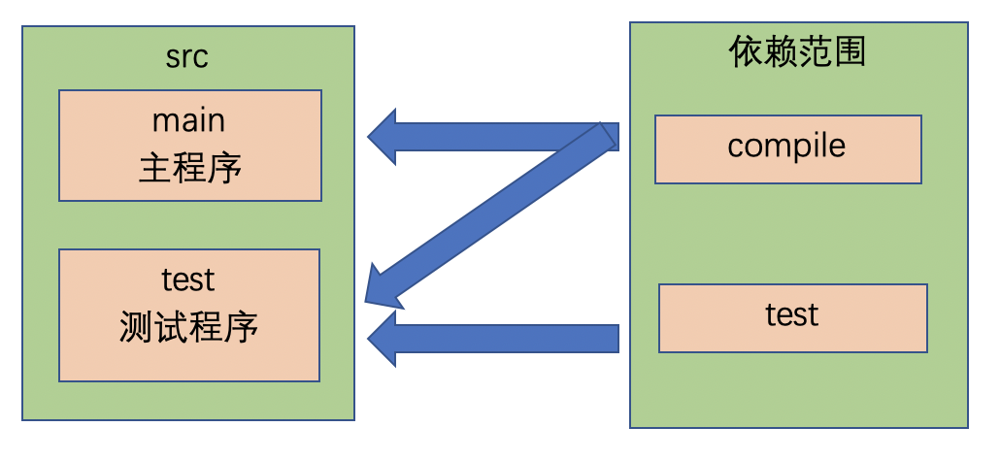
        
        - compile
            |有效范围|是否有效|
            |-|-|
            |对主程序是否有效|有效|
            |对测试程序是否有效|有效|
            |是否参与打包|参与|
            |是否参与部署|参与|
            |例子|spring-core|
    
        - test
            |有效范围|是否有效|
            |-|-|
            |对主程序是否有效|无效|
            |对测试程序是否有效|有效|
            |是否参与打包|不参与|
            |是否参与部署|不参与|
            |例子|junit|
    
    - provided
        - 有些依赖只是在开发阶段和测试阶段使用，在运行是服务器会提供对应的实现，所以可以使用provided。如果使用compile，可能会造成依赖冲突。如servlet-api
            - 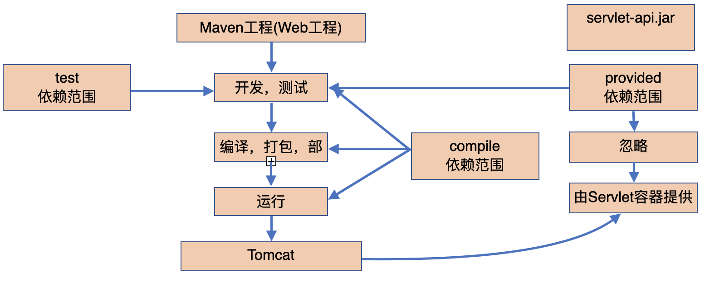  
        - 有效范围
        
            |有效范围|是否有效|
            |-|-|
            |对主程序是否有效|有效|
            |对测试程序是否有效|有效|
            |是否参与打包|不参与|
            |是否参与部署|不参与|
            |例子|servlet-api|


## 依赖范围示例工程---HelloFriend
[top](#catalog)
- 示例工程地址：HelloFriend，[/java/maven/sample/HelloFriend](/java/maven/sample/HelloFriend)
- **在主程序中需要使用：[目录结构示例工程---Hello](#目录结构示例工程---Hello) 中的类，所以需要添加依赖**
- 目录结构

    ```
    HelloFriend
    ├── pom.xml
    └── src
        ├── main
        │   ├── java
        │   │   └── com
        │   │       └── ljs
        │   │           └── mavenlearn
        │   │               └── HelloFriend.java
        │   └── resources
        └── test
            ├── java
            │   └── com
            │       └── ljs
            │           └── mavenlearn
            │               └── HelloFriendTest.java
            └── resources
    ```

- pom.xml：[/java/maven/sample/HelloFriend/pom.xml](/java/maven/sample/HelloFriend/pom.xml)
    
    ```xml
    <?xml version="1.0" ?>
    <project xmlns="http://maven.apache.org/POM/4.0.0" xmlns:xsi="http://www.w3.org/2001/XMLSchema-instance" xsi:schemaLocation="http://maven.apache.org/POM/4.0.0 http://maven.apache.org/xsd/maven-4.0.0.xsd">
        <modelVersion>4.0.0</modelVersion>
    
        <groupId>com.ljs.mavenlearn</groupId>
        <artifactId>HelloFriend</artifactId>
        <version>0.0.1-SNAPSHOT</version>
    
        <properties>
            <project.build.sourceEncoding>UTF-8</project.build.sourceEncoding>
            <maven.compiler.source>1.8</maven.compiler.source>
            <maven.compiler.target>1.8</maven.compiler.target>
        </properties>
    
        <name>HelloFriend</name>
          
        <dependencies>
            <dependency>
                <groupId>junit</groupId>
                <artifactId>junit</artifactId>
                <version>4.12</version>
                <scope>test</scope>
            </dependency>
    
            <!-- 添加自定义maven工程的依赖 -->
            <dependency>
                <groupId>com.ljs.mavenlearn</groupId>
                <artifactId>Hello</artifactId>
                <version>0.0.1-SNAPSHOT</version>
                <scope>compile</scope>
            </dependency>
        </dependencies>
    </project>
    ```

- 代码
    - 主程序代码，HelloFriend.java : [/java/maven/sample/HelloFriend/src/main/java/com/ljs/mavenlearn/HelloFriend.java](/java/maven/sample/HelloFriend/src/main/java/com/ljs/mavenlearn/HelloFriend.java)
        ```java
        package com.ljs.mavenlearn;        
        import com.ljs.mavenlearn.Hello;
      
        // 测试依赖范围，但是并没有使用
        // 由于test范围的依赖对于main程序不可见，所以无法编译
        // import org.junit.Test;
        
        public class HelloFriend {
            public String sayHelloToFriend(String name){
                Hello hello = new Hello(); // 调用其他Maven工程中的类com.ljs.mavenlearn.Hello
                String str = hello.sayHello(name)+" I am "+this.getMyName();
                System.out.println(str);
                return str;
            }
            public String getMyName(){
                return "John";
            }
        }
        ```
    - 测试程序代码，HelloFriendTest.java : [/java/maven/sample/HelloFriend/src/test/java/com/ljs/mavenlearn/HelloFriendTest.java](/java/maven/sample/HelloFriend/src/test/java/com/ljs/mavenlearn/HelloFriendTest.java)
        ```java
        package com.ljs.mavenlearn;
        
        import org.junit.Test;
        import static org.junit.Assert.assertEquals;
      
        // 测试依赖范围，但是并没有使用
        import com.ljs.mavenlearn.Hello;
        
        public class HelloFriendTest {
            @Test
            public void testHelloFriend(){
                HelloFriend helloFriend = new HelloFriend();
                String results = helloFriend.sayHelloToFriend("Tom");
                assertEquals("Hello Tom! I am John",results);	
            }
        }
        ```
- 编译过程
    1. 在`HelloFriend`的根目录下，执行`mvn compile`，没有在仓库中找到`com.ljs.mavenlearn/Hello`，所以产生了编译异常
        - 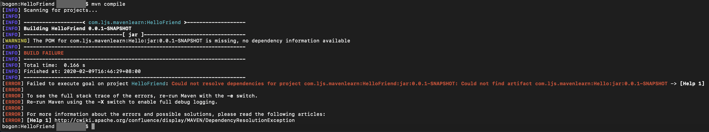
    2. 在`Hello`的根目录下，执行`mvn install`
    3. 在`HelloFriend`的根目录下，重新执行`mvn compile`，编译成功
    
- 依赖范围测试
    1. junit的测试是test范围，无法在main程序中使用
        - 在HelloFriend.java中添加引用：`import org.junit.Test;`，执行编译时发生异常，执行compile阶段时，找不到jar包
            - 

## 依赖的传递性
[top](#catalog)
- 好处：可以传递的依赖不必在每个模块工程中都重复声明，**在最下层的工程中依赖一次即可** 
- **非compile范围的依赖不能传递，只能在各个工程中单独配置**

## 依赖的排除
[top](#catalog)
- 在依赖传递的过程中，有时候不需要某些jar，可以通过配置来排除
- 依赖的排除也具有传递性，在中层排除掉的依赖，在高层也同样会排除
- 配置方式:`<exclusions>`
    ```xml
    <dependency>
        <groupId>com.atguigu.maven</groupId>
        <artifactId>HelloFriend</artifactId>
        <version>0.0.1-SNAPSHOT</version>
        <type>jar</type>
        <scope>compile</scope>
        <exclusions>
                <exclusion>
                    <groupId>commons-logging</groupId>
                    <artifactId>commons-logging</artifactId>
                </exclusion>
        </exclusions>
    </dependency>
    ```

## 依赖的原则
[top](#catalog)
- 作用：解决模块工程之间同`<artifactId>`的jar包`<version>`冲突问题
- 两个原则
    1. 路径最短优先
        - 0路径：当前工程配置的依赖优先与从其他依赖中传递过来的依赖
        - 在依赖中出现了依赖的覆盖与传递时，路径最短优先
    2. 路径长度相同时，先在`<dependency>`中声明的优先
- 测试依赖原则的示例：[/java/maven/sample/multiple](/java/maven/sample/multiple)
    - 基本结构
        ```
        Maven模块：one
         └── log4j-1.2.17
        
        Maven模块：two01
         ├── one
         │   └── log4j-1.2.17
         └── log4j-1.2.16

        Maven模块：two02
         └── log4j-1.2.14
            
        Maven模块：three01
         ├── two01
         │    ├── one
         │    │    └── log4j-1.2.17
         │    └── log4j-1.2.16
         └── two02
              └── log4j-1.2.14

        Maven模块：three02
         ├── two02
         │    └── log4j-1.2.14
         └── two01
              ├── one
              │    └── log4j-1.2.17
              └── log4j-1.2.16
        ```
    - `three01`的依赖关系及最终可以使用的`log4j`版本
        - `three01`中先配置了`two01`，然后配置了`two02`
        - 根据原则2，先配置的优先度高，所以使用`two01`的`log4版本`
        - `two01`中依赖了`one`，在`three01`中根据原则1，`two01`中的优先度更高，所以`three01`中使用的是：`log4j-1.2.16`
        - 从依赖关系中可以看到，`two02`、`one`中的`log4j`依赖被`two01`中的依赖覆盖了
        - 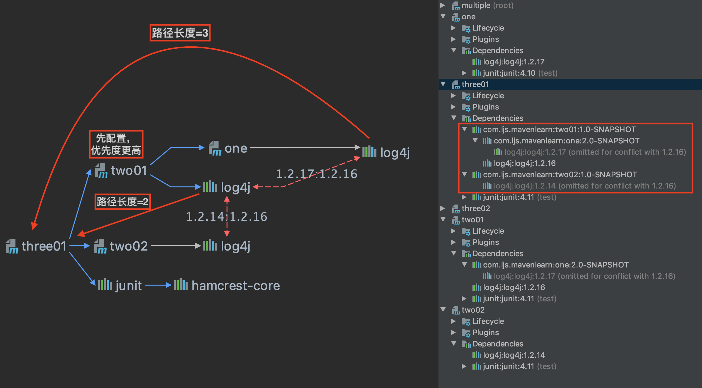

    - `three02`的依赖关系及最终可以使用的`log4j`版本
        - `three02`中先配置了`two01`，然后配置了`two02`
        - 根据原则2，先配置的优先度高，所以使用`two02`的`log4版本`
        - `two01`中涉及到的依赖全部被`two02`中的依赖覆盖，所以`three02`中使用的是：`log4j-1.2.14`
        - 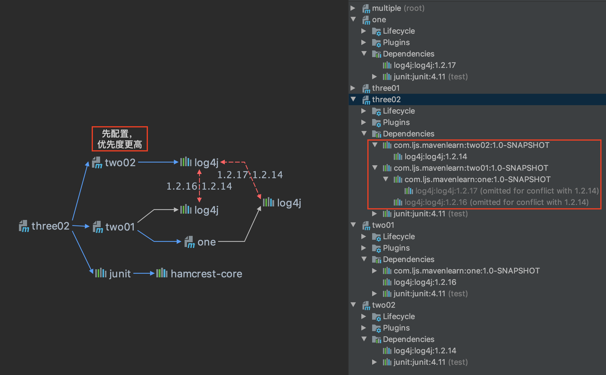

## 通过自定义参数来统一管理当前工程中的依赖版本
[top](#catalog)
- 场景：对Spring各个jar包的依赖版本统一升级，手动逐一修改修改不可靠
- Maven提供的管理方法
- 使用properties标签内使用自定义标签统一声明版本号
- 在需要统一版本的位置，使用`${自定义标签名}`引用声明的版本号
- 示例：
    ```xml
    <properties>
        <ljs.spring.version>4.1.1.RELEASE</ljs.spring.version>
    </properties>

    <dependencies>
        <dependency>
            <groupId>org.springframework</groupId>
            <artifactId>spring-core</artifactId>
            <version>${ljs.spring.version}</version>
            <scope>compile</scope>
        </dependency>
        <dependency>
            <groupId>org.springframework</groupId>
            <artifactId>spring-context</artifactId>
            <version>${ljs.spring.version}</version>
        </dependency>
        <dependency>
            <groupId>org.springframework</groupId>
            <artifactId>spring-jdbc</artifactId>
            <version>${ljs.spring.version}</version>
        </dependency>
        <dependency>
            <groupId>org.springframework</groupId>
            <artifactId>spring-orm</artifactId>
            <version>${ljs.spring.version}</version>
        </dependency>
        <dependency>
            <groupId>org.springframework</groupId>
            <artifactId>spring-web</artifactId>
            <version>${ljs.spring.version}</version>
        </dependency>
    </dependencies>
    ```

# Maven的核心概念---生命周期
## Maven生命周期
[top](#catalog)
- Maven的核心程序中定义了抽象的生命周期，生命周期中各个阶段的具体任务是由插件来完成的
- Maven核心程序执行生命周期各阶段的规则：**无论现在要执行生命周期的哪一个阶段，都是从这个生命周期最初的位置开始执行**
- Maven有三套相对独立的生命周期，分别是：
    1. `Clean Lifecycle` 在进行真正的构建之前进行一些清理工作
    2. `Default Lifecycle`构建的核心部分，编译、测试、打包、安装、部署
    3. `Site Lifecycle`生成项目报告、站点、发布站点

- `Clean Lifecycle`
    - 生命周期
        1. pre-cleap，执行一些需要在clean之前完成的工作
        2. clean，移除所有上一次构建生成的文件
        3. post-clean，执行一些需要在clean之后立刻完成的工作

- `Site Lifecycle`
    - 生命周期
        1. pre-site 执行一些需要在生成站点文档之前完成的工作
        2. site 生成项目的站点文档
        3. post-site 执行一些需要在生成站点文档之后完成的工作，并且为部署做准备
        4. site-deploy 将生成的站点文档部署到特定的服务器上

    - 经常用到的是`site`阶段和`site-deploy`阶段，用以生成和发布 Maven 站点，耗费的时间比较长
   
- `Default Lifecycle`
    - 23个生命阶段
        
        ||阶段|含义|描述|
        |-|-|-|-|
        |1|validate|校验|校验项目是否正确并且所有必要的信息可以完成项目的构建过程|
        |2|initialize|初始化|初始化构建状态，比如设置属性值|
        |3|generate-sources|生成源代码|生成包含在编译阶段中的任何源代码|
        |4|process-sources|处理源代码|处理源代码，比如说，过滤任意值|
        |5|generate-resources|生成资源文件|生成将会包含在项目包中的资源文件|
        |6|<label style="color:red">process-resources</label>|处理资源文件|复制和处理资源到目标目录，为打包阶段最好准备|
        |7|<label style="color:red">compile</label>|编译|编译项目的源代码|
        |8|process-classes|处理类文件|处理编译生成的文件，比如说对Java class文件做字节码改善优化|
        |9|generate-test-sources|生成测试源代码|生成包含在编译阶段中的任何测试源代码|
        |10|process-test-sources|处理测试源代码|处理测试源代码，比如说，过滤任意值|
        |11|generate-test-resources|生成测试资源文件|为测试创建资源文件|
        |12|<label style="color:red">process-test-resources</label>|处理测试资源文件|复制和处理测试资源到目标目录|
        |13|<label style="color:red">test-compile</label>|编译测试源码|编译测试源代码到测试目标目录|
        |14|process-test-classes|处理测试类文件|处理测试源码编译生成的文件|
        |15|<label style="color:red">test</label>|测试|使用合适的单元测试框架运行测试（Juint是其中之一）|
        |16|prepare-package|准备打包|在实际打包之前，执行任何的必要的操作为打包做准备|
        |17|<label style="color:red">package</label>|打包|将编译后的代码打包成可分发格式的文件，比如JAR、WAR或者EAR文件|
        |18|pre-integration-test|集成测试前|在执行集成测试前进行必要的动作。比如说，搭建需要的环境|
        |19|integration-test|集成测试|处理和部署项目到可以运行集成测试环境中|
        |20|post-integration-test|集成测试后|在执行集成测试完成后进行必要的动作。比如说，清理集成测试环境|
        |21|verify|验证|运行任意的检查来验证项目包有效且达到质量标准|
        |22|<label style="color:red">install</label>|安装|安装项目包到本地仓库，这样项目包可以用作其他本地项目的依赖|
        |23|<label style="color:red">deploy</label>|部署|将最终的项目包复制到远程仓库中与其他开发者和项目共享|
    

## 与生命周期相关的插件和目标
[top](#catalog)
- Maven 的核心仅仅定义了抽象的生命周期，具体的任务都是交由插件完成的
- 每个插件都能实现多个功能，每个功能就是一个插件目标
- Maven 的生命周期与插件的某个目标(功能)是相对应的
- ?????


# Maven的核心概念---继承
[top](#catalog)
- 统一管理各个Maven模块中某个jar包的依赖版本
- 由于非compile范围的依赖不能传递，所以必然会分散在各个模块工程中，很容易造成版本不一致
- 解决思路，将jar包的依赖版本统一提取到父工程中，在子工程中声明依赖时不指定jar包版本，以父工程中统一设定的为准。同时也便于修改
- 操作步骤
    1. 创建一个Maven工程作为父工程，打包方式：`<packaging>pom</packaging>`
    2. 在子工程中声明对父工程的引用
        - **`<relativePath>`中配置父工程pom.xml文件的相对路径，最好还是添加该项配置**
        ```xml
        <parent>
            <groupId>父工程的groupId</groupId>
            <artifactId>父工程模块名</artifactId>
            <version>父工程版本</version>
       
            <!--配置父工程pom的相对路径，可以不进行配置-->
            <relativePath>../pom.xml</relativePath>
        </parent>
        ```
    3. 将子工程的坐标中与父工程坐标中重复的内容删除
        - 重复的内容包括：
            - `<groupId>xxxxx</groupId>`
            - ~~`<version>xxxxx</version>`~~
    4. 在父工程中统一配置jar包依赖
        - 配置的内容
            ```xml
            <dependencyManagement>
                <dependencies>
                    <dependency>
                        <groupId>xxxxx</groupId>
                        <artifactId>xxxxx</artifactId>
                        <version>xxxxx</version>
                        <scope>xxxxx</scope>
                    </dependency>
                </dependencies>
            </dependencyManagement>
            ```
    5. 在子工程中删除依赖的版本号部分：`<version>4.10</version>`，其他部分不要删除
        - 如果不删除，则以子工程中的依赖版本为主

- <label style="color:red">配置继承后，需要先安装父工程，然后再安装子工程</label>

- 参考示例：[/java/maven/sample/multiple](/java/maven/sample/multiple)
    - 在父工程`multiple`中配置了全局的junit依赖：[/java/maven/sample/multiple/pom.xml](/java/maven/sample/multiple/pom.xml)
        ```xml        
        <groupId>com.ljs.mavenlearn</groupId>
        <artifactId>multiple</artifactId>
        <packaging>pom</packaging>
        <version>1.0-SNAPSHOT</version>
    
        <dependencyManagement>
            <dependencies>
                <dependency>
                    <groupId>junit</groupId>
                    <artifactId>junit</artifactId>
                    <version>4.11</version>
                    <scope>test</scope>
                </dependency>
            </dependencies>
        </dependencyManagement>
        ```
    - 在各子工程中配置父工程引用，并使用junit，如`two01/pom.xml`：[/java/maven/sample/multiple/two01/pom.xml](/java/maven/sample/multiple/two01/pom.xml)
        ```xml
        <!--配置当前maven模块的信息-->
        <artifactId>two01</artifactId>
        <version>1.0-SNAPSHOT</version>
        
        <!--配置父工程引用-->
        <parent>
            <groupId>com.ljs.mavenlearn</groupId>
            <artifactId>multiple</artifactId>
            <version>1.0-SNAPSHOT</version>
            
            <!--配置父工程pom的相对路径，可以不进行配置-->
            <relativePath>../pom.xml</relativePath>
        </parent>
      
        <dependencies>
          <dependency>
            <groupId>junit</groupId>
            <artifactId>junit</artifactId>
            <!--<version>4.11</version>-->
            <scope>test</scope>
          </dependency>
        </dependencies>
        ```
      
    - 在子工程`one/pom.xml`中覆盖父工程的依赖版本，[/java/maven/sample/multiple/one/pom.xml](/java/maven/sample/multiple/one/pom.xml)
        ```xml
        <dependencies>
            <dependency>
                <groupId>junit</groupId>
                <artifactId>junit</artifactId>
                <!--覆盖父模块中的依赖版本-->
                <version>4.10</version>
                <scope>test</scope>
            </dependency>
        </dependencies>
        ```
    - 依赖引入的结果
        - one使用的是junit-4.1，其他的模块使用的是junit-4.11，父工程下只负责配置但是不会存在依赖
        - [inherit_result](./imgs/base/inherit_result.png)
        

# Maven的核心概念---聚合
[top](#catalog)
- 聚合的作用，一次性安装配置中的各个模块
- 配置方式：在一个总的聚合工程中配置各个参与聚合的模块
    - 配置的时候不用处理各模块的顺序，编译是会自动识别模块间的依赖
    - 配置的时候需要使用相对路径，并且以当前pom为起点
        - 如果模块是和pom在同一个目录下，直接使用模块名
        - 如果模块和当前工程在同一个目录下，需要使用`../模块名`
    ```xml
    <modules>
        <!--模块是和pom在同一个目录下，直接使用模块名-->
        <module>xxx</module>
        <!--模块和当前工程在同一个目录下-->
        <module>../yyy</module>
    </modules>
    ```

- 执行安装的顺序与配置顺序的关系
    1. 没有依赖的模块之间，按照配置中`<module>`的顺序来执行安装
    2. 存在相互依赖的模块之间，maven会识别依赖关系，并**先安装被依赖的模块**
  
- 聚合与继承之间并不冲突，继承是为了管理依赖，聚合是为了方便安装。**一般两者可以配置在一起**

- 示例：
    - 工程目录：[/java/maven/sample/multiple](/java/maven/sample/multiple)
    - 聚合工程的配置：`multiple/pom.xml`：[/java/maven/sample/multiple/pom.xml](/java/maven/sample/multiple/pom.xml)
        ```xml
        <modules>
            <module>three02</module>
            <module>three01</module>
            <module>one</module>
            <module>two02</module>
            <module>two01</module>
        </modules>
        ```
    - 在idea中执行`mvn install`安装模块
        - 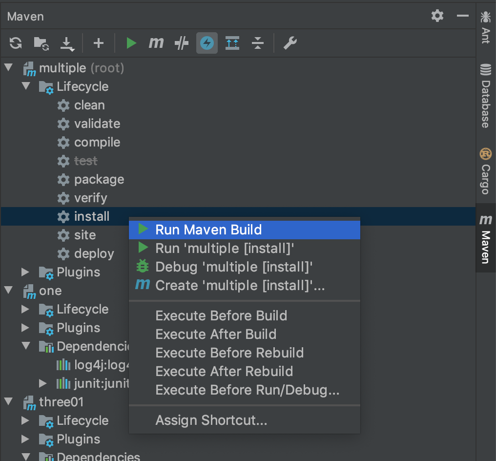
    - 虽然配置中的模块顺序与依赖关系不同，但是编译时，Maven将会自动识别模块间的依赖关系，并按顺序执行编译
        - 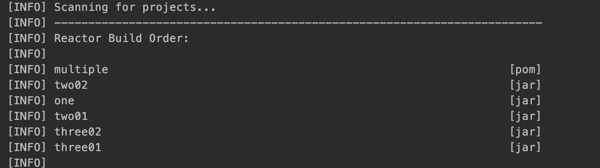
    - 执行`mvn install`安装后，仓库目录下生成的文件：`.m2/repository/com/ljs/mavenlearn`
        ```
        ├── multiple
        │   ├── 1.0-SNAPSHOT
        │   │   ├── _remote.repositories
        │   │   ├── maven-metadata-local.xml
        │   │   └── multiple-1.0-SNAPSHOT.pom
        │   └── maven-metadata-local.xml
        ├── one
        │   ├── 2.0-SNAPSHOT
        │   │   ├── _remote.repositories
        │   │   ├── maven-metadata-local.xml
        │   │   ├── one-2.0-SNAPSHOT.jar
        │   │   └── one-2.0-SNAPSHOT.pom
        │   └── maven-metadata-local.xml
        ├── three01
        │   ├── 1.0-SNAPSHOT
        │   │   ├── _remote.repositories
        │   │   ├── maven-metadata-local.xml
        │   │   ├── three01-1.0-SNAPSHOT.jar
        │   │   └── three01-1.0-SNAPSHOT.pom
        │   └── maven-metadata-local.xml
        ├── three02
        │   ├── 1.0-SNAPSHOT
        │   │   ├── _remote.repositories
        │   │   ├── maven-metadata-local.xml
        │   │   ├── three02-1.0-SNAPSHOT.jar
        │   │   └── three02-1.0-SNAPSHOT.pom
        │   └── maven-metadata-local.xml
        ├── two01
        │   ├── 1.0-SNAPSHOT
        │   │   ├── _remote.repositories
        │   │   ├── maven-metadata-local.xml
        │   │   ├── two01-1.0-SNAPSHOT.jar
        │   │   └── two01-1.0-SNAPSHOT.pom
        │   └── maven-metadata-local.xml
        └── two02
            ├── 1.0-SNAPSHOT
            │   ├── _remote.repositories
            │   ├── maven-metadata-local.xml
            │   ├── two02-1.0-SNAPSHOT.jar
            │   └── two02-1.0-SNAPSHOT.pom
            └── maven-metadata-local.xml
        ``` 

# Maven_Archetype通过原型创建项目骨架
## 什么是原型Archetype
[top](#catalog)
- 内容参考：http://maven.apache.org/archetype/index.html
- Archetype是创建Maven项目的模板工具，Archetype提供一个一致的、快速的方法来创建Maven项目的骨架
- 通过Archetype可以规范各种类型开发的开发标准
- Maven Archetype 的组成模块

    |模块|描述|
    |-|-|
    |maven-archetype-plugin|原型插件可在Maven中使用原型|
    |archetype-packaging|原型生命周期和包装定义|
    |archetype-models|描述符类和参考文档|
    |archetype-common|核心类|
    |archetype-testing|内部用于测试Maven原型的组件|

## Maven_Archetype插件
### Archetype插件简介
[top](#catalog)
- 参考：http://maven.apache.org/archetype/maven-archetype-plugin/index.html

- 通过原型插件可以从现有的模版创建Maven项目，还可以从现有项目中创建原型
- 插件需要Java7及以上
- 原型插件的四个直接使用的目标
    1. `archetype:generate`，从原型创建一个Maven项目
        - 要求用户从原型目录中选择一个原型，然后从远程存储库中检索它。检索后，将对其进行处理以创建一个正常的Maven项目

    2. `archetype:create-from-project`，从现有项目创建原型
    3. `archetype:crawl`，在仓库中搜索原型并更新目录
    4. 通过`'maven-archetype'包装`将上面三个目标绑定到默认生命周期：
        1. `archetype:jar`，（绑定到打包阶段）用于构建原型jar工件
        2. `archetype:integration-test`，（绑定到集成测试阶段）用于通过从刚刚构建的原型生成示例项目来执行原型集成测试
        3. `archetype：update-local-catalog`，（绑定到安装阶段）用于更新本地目录
- Archetype插件的功能示意图
    - 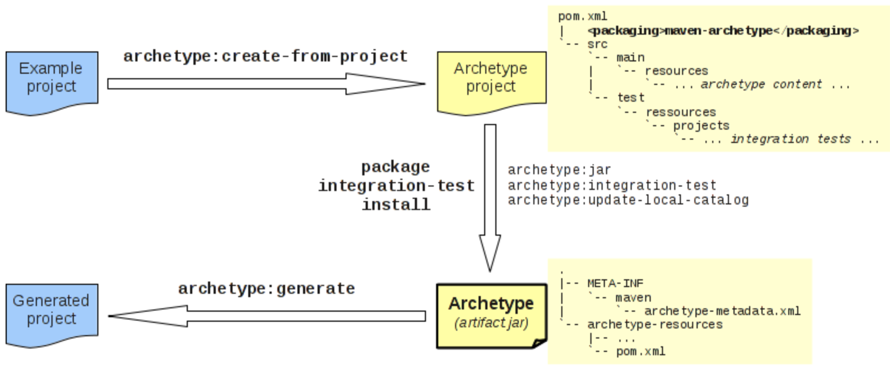

### Maven提供的默认原型
[top](#catalog)
- 参考：http://maven.apache.org/guides/introduction/introduction-to-archetypes.html
- 默认原型

    |No|原型ID|用途|
    |-|-|-|
    |1|maven-archetype-archetype|生成原型项目???|
    |2|maven-archetype-j2ee-simple|生成简化的J2EE应用程序|
    |3|maven-archetype-mojo|生成Maven插件示例????|
    |4|maven-archetype-plugin|生成Maven插件|
    |5|maven-archetype-plugin-site|生成Maven插件站点|
    |6|maven-archetype-portlet|生成JSR-268 Portlet|
    |7|**maven-archetype-quickstart**|生成一个示例工程，常用|
    |8|maven-archetype-simple|生成一个简化的Maven项目|
    |9|maven-archetype-site|生成示例Maven站点，该站点演示了一些受支持的文档类型，例如APT，XDoc和FML，并演示了如何构建您的站点|
    |10|maven-archetype-site-simple|生成示例Maven站点|
    |11|**maven-archetype-webapp**|生成Maven Webapp项目，常用|

## 通过原型创建Maven工程
### 通过与Archetype插件交互来创建项目
[top](#catalog)
- 参考：http://maven.apache.org/archetype/maven-archetype-plugin/usage.html

- 创建项目的4个步骤
    1. 输入创建指令：`mvn archetype:generate`
        - 使用时可以通过`-Dfilter=groupID:artifactId`的方式来过滤部分原型，过滤时会模糊搜索可用的原型
    2. 选择原型
    3. 输入坐标信息
    4. 确认创建项目

- 创建示例：通过`maven-archetype-webapp`创建一个web工程
    - 创建过程
        - 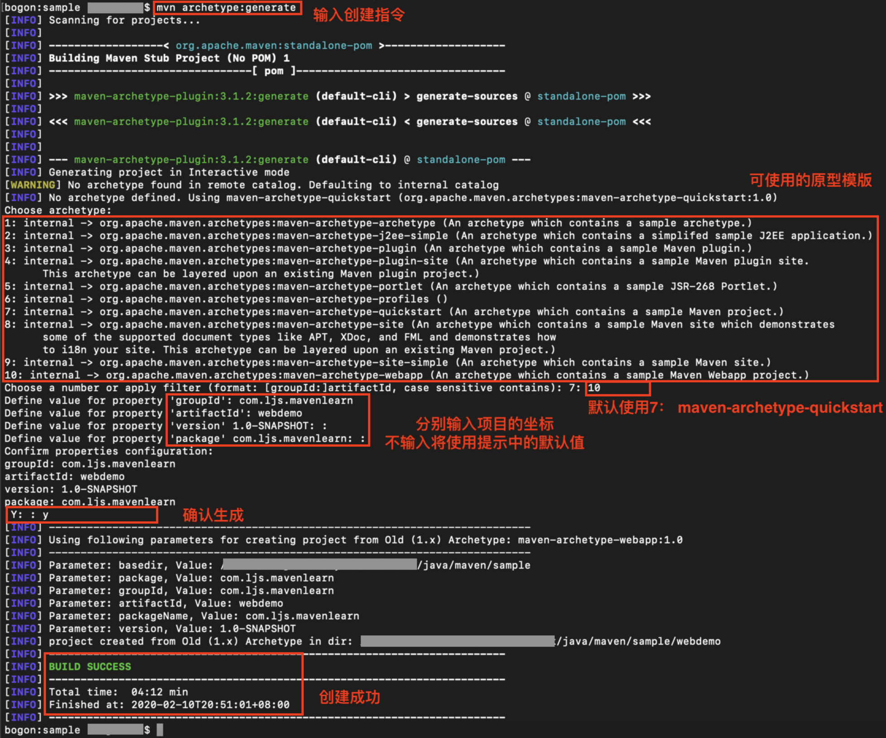
    - 创建后的结构
        ```
        ├── pom.xml
        └── src
            └── main
                ├── resources
                └── webapp
                    ├── WEB-INF
                    │   └── web.xml
                    └── index.jsp
        ```

- 通过`-Dfilter=groupID:artifactId`来过滤原型
    - 指令：`mvn archetype:generate -Dfilter=org.apache:web`
    - 


### 直接通过指令创建项目
[top](#catalog)
- 参考:http://maven.apache.org/archetype/maven-archetype-plugin/examples/generate-batch.html

- 指令语法：`mvn archetype:generate -B 项目参数 原型参数`
    - 通过`-B`来摆脱插件的交互性
    - 项目参数
        |参数|含义|
        |-|-|
        |DgroupId|Maven坐标|
        |DartifactId|Maven坐标，项目ID|
        |Dversion|Maven坐标，版本ID，默认使用`1.0-SNAPSHOT`|
        |Dpackage|代码生成时使用的根包的名字，如果没有给出，默认使用:DgroupId + DartifactId|

    - 原型参数
        |参数|含义|
        |-|-|
        |DarchetypeGroupId|原型的GroupID|
        |DarchetypeArtifactId|原型的ID|
        |DarchetypeVersion|原型的版本|
        |DarchetypeRepository|包含原型的资源库|
        |DarchetypeCatalog|原型的位置分类|

    - `DarchetypeCatalog`，原型的几种位置分类，默认为`remote local`
        |参数值|描述|
        |-|-|
        |`internal`|使用Maven内置的原型，及`org.apache.maven.archetypes`，参考：[Maven提供的默认原型](#Maven提供的默认原型)|
        |`local`|本地，通常是本地仓库的archetype-catalog.xml文件|
        |`remote`|远程，是maven的中央仓库|
        |`file://...`|直接指定本地文件位置archetype-catalog.xml|
        |`http://...`，`https://...`|网络上的文件位置 archetype-catalog.xml|

- 使用指令生成一个web工程
    - 指令：`mvn archetype:generate -B -DgroupId=com.ljs.maven -DartifactId=webdemo -Dversion=0.1-SNAPSHOT -DarchetypeGroupId=org.apache.maven.archetypes -DarchetypeArtifactId=maven-archetype-webapp`
    - 执行结果
        - 

## 自定义原型
### 通过现有项目来创建原型
[top](#catalog)
- 参考：http://maven.apache.org/guides/mini/guide-creating-archetypes.html
- 创建步骤
    1. 在项目目录下(pom.xml所在目录下)执行指令：`mvn archetype:create-from-project`
    2. 移动到原型目录:`cd target/generated-sources/archetype/`
    3. 执行`mvn install`，制作原型并安装到仓库目录中，原型名为： `${artifactId}-archetype (${artifactId})`
        - ???? 安装时指定仓库
        - 安装时会安装到仓库中的`groupId`目录下
    4. 执行`mvn archetype:crawl`，让maven程序在仓库爬取所有可用的原型，更新`local`级别的原型目录
    5. 移动到一个新目录，并且确保该目录下没有`pom.xml`文件
    6. 通过`mvn archetype:generate -DarchetypeCatalog=local`指令在本地的目录中查找原型并进行交互式创建，或者：[直接通过指令创建项目骨架](#直接通过指令创建项目骨架)

- 示例：创建一个web工程的原型，
    1. 示例参考：[java/maven/sample/myweb](java/maven/sample/myweb)
    2. 创建一个myweb工程，目录如下
        - 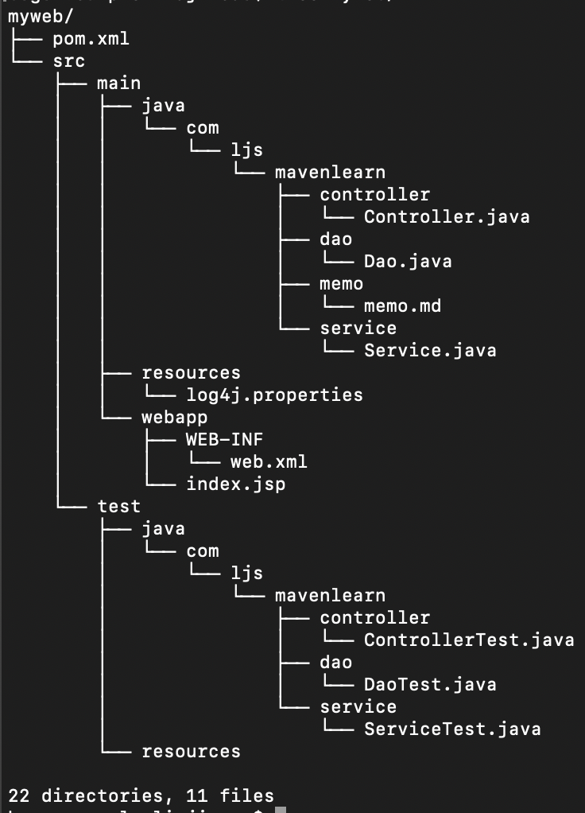
    3. 执行指令：`mvn archetype:create-from-project`
        - 
    4. 移动到原型目录:`cd target/generated-sources/archetype/`，并执行安装
        - 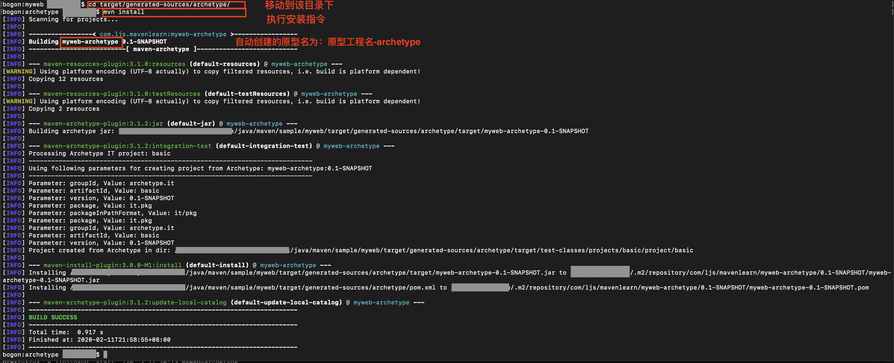
    5. 执行指令`mvn archetype:crawl`，更新原型目录
    6. 移动到新目录，通过自定义原型来创建maven工程：`mvn archetype:generate -DarchetypeCatalog=local`
        - 
    7. 创建成功
        - 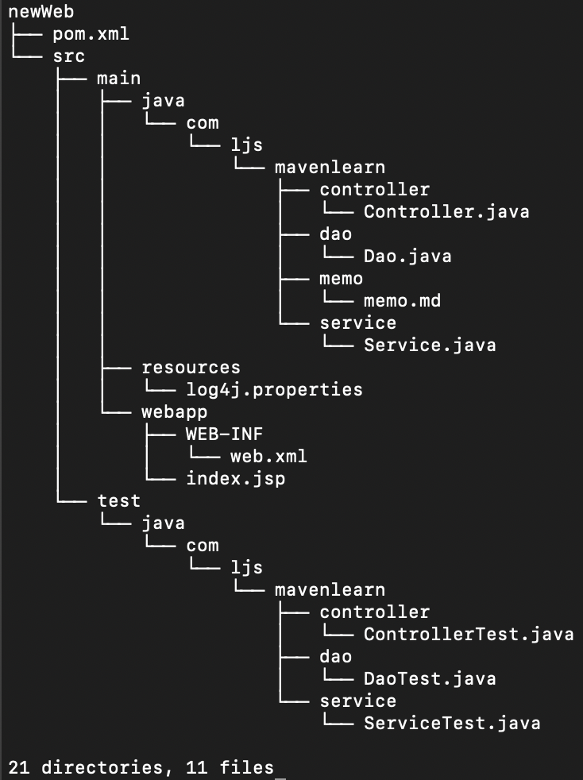


### create-from-project指令的结果分析以及手动创建原型
[top](#catalog)
- `archetype:create-from-project`指令的分析
    1. 空目录会被忽略，使用该指令目录下必须存在文件才能被识别
        - 
    2. 与工程无关的目录没有被删除，如memo目录：`myweb/src/main/java/com/ljs/mavenlearn/memo`
    3. 无法自定义原型名，自动生成的名字为

- 生成结果分析    
    - 执行后，插件程序会扫描整体结构，并制作两个目录
        - 与原型相关的目录：`target/generated-sources/archetype/src/main`
        - 用于测试原型的目录：
            - `target/generated-sources/archetype/src/test`

    - 在与原型相关的目录下
        1. 被archetype插件识别出来的内容都放在该目录中：`target/generated-sources/archetype/src/main/resources/archetype-resources`
            - 该目录作为生成Maven工程时的骨架
        2. 原型描述符文件：`target/generated-sources/archetype/src/main/resources/META-INF/maven/archetype-metadata.xml`
            - 作为原型创建Maven工程时，通过原型描述符文件来识别骨架
    
    - 指令生成的原型描述符文件
        ```xml
        <?xml version="1.0" encoding="UTF-8"?>
        <archetype-descriptor xsi:schemaLocation="https://maven.apache.org/plugins/maven-archetype-plugin/archetype-descriptor/1.1.0 http://maven.apache.org/xsd/archetype-descriptor-1.1.0.xsd" name="myweb"
            xmlns="https://maven.apache.org/plugins/maven-archetype-plugin/archetype-descriptor/1.1.0"
            xmlns:xsi="http://www.w3.org/2001/XMLSchema-instance">
        <fileSets>
            <fileSet filtered="true" packaged="true" encoding="UTF-8">
            <!-- 主程序目录配置 -->
            <directory>src/main/java</directory>
            <includes>
                <include>**/*.java</include> <!-- 包含java文件-->
            </includes>
            </fileSet>
            <fileSet packaged="true" encoding="UTF-8">

            <directory>src/main/java</directory>
            <includes>
                <include>**/*.md</include>  <!-- markdown文件也被包含了-->
            </includes>
            </fileSet>

            <!-- 主程序资源配置 -->
            <fileSet filtered="true" encoding="UTF-8">
            <directory>src/main/resources</directory>
            <includes>
                <include>**/*.properties</include>
            </includes>
            </fileSet>

            <!-- webapp目录配置 -->
            <fileSet filtered="true" encoding="UTF-8">
            <directory>src/main/webapp</directory>
            <includes>
                <include>**/*.jsp</include>
                <include>**/*.xml</include>
            </includes>
            </fileSet>

            <!-- 测试目录配置 -->
            <fileSet filtered="true" packaged="true" encoding="UTF-8">
            <directory>src/test/java</directory>
            <includes>
                <include>**/*.java</include>
            </includes>
            </fileSet>

            <!-- 测试资源目录被遗漏了 -->
        </fileSets>
        </archetype-descriptor>

        ```

        
        - 生成时，会自动扫描各文件中的`package`字符串，并将其替换成：`${package}`，当作为原始使用时会自动创建根据输入参数来填充


### 原型描述符文件说明
[top](#catalog)
- 参考：http://maven.apache.org/archetype/archetype-models/archetype-descriptor/archetype-descriptor.html
- 文件可用的内容
    ```xml
    <archetype-descriptor xmlns="https://maven.apache.org/plugins/maven-archetype-plugin/archetype-descriptor/1.1.0" xmlns:xsi="http://www.w3.org/2001/XMLSchema-instance"
    xsi:schemaLocation="https://maven.apache.org/plugins/maven-archetype-plugin/archetype-descriptor/1.1.0 http://maven.apache.org/xsd/archetype-descriptor-1.1.0.xsd"
    name="原型名称" partial="该原型时完整的Maven项目还是一部分" >
    <requiredProperties>  <!-- （可包含多个）从该原型生成项目所需的属性列表 -->
        <requiredProperty key="属性名" > 
        <defaultValue/>                 <!-- 属性的默认值 -->
        <validationRegex/>              <!-- 用于验证属性值的正则表达式 -->
        </requiredProperty>
    </requiredProperties>
    
    <fileSets>      <!-- （可包含多个）文件集定义 -->
        <fileSet filtered="是否替换文件中的${xx}参数" packaged="目录下的内容是否拷贝到package目录" encoding="过滤内容时使用的编码" >
        <directory/>    <!-- 需要生成的项目文件的目录 -->
        <includes/>     <!-- 配置需要包含的目录/文件，可以使用通配符 -->
        <excludes/>     <!-- 配置需要排除的目录/文件，可以使用通配符 -->
        </fileSet>
    </fileSets>
    
    <modules>       <!-- （可包含多个）module -->
        <module id="模块的`artifactId`" dir="模块的目录" name="模块名" >
    
        <fileSets>
            <fileSet filtered=.. packaged=.. encoding=.. >
            <directory/>
            <includes/>
            <excludes/>
            </fileSet>
        </fileSets>
    
        <modules>
            <module>...recursion...<module>
        </modules>
        </module>
    </modules>
    </archetype-descriptor>
    ```

- 详细说明
    - 原型描述符：archetype-descriptor
        |属性|类型|描述|
        |-|-|-|
        |name|String|原型名称，在选择原型时将显示给用户<br>通过`create-from-project`生成时，默认为`${artifactId}`|
        |partial|boolean|这个原型代表一个完整的Maven项目还是仅一部分。默认值为：false|
        
    - 三大描述元素

        |元素|类型|描述|
        |-|-|-|
        |requiredProperties/requiredProperty*|`List<RequiredProperty>`|(可包含多个)从该原型生成项目所需的属性列表|
        |fileSets/fileSet*|`List<FileSet>`|(可包含多个)文件集定义|
        |modules/module*|`List<ModuleDescriptor>`|(可包含多个)模块定义|

    - 描述元素：必须属性`requiredPropertie`
        - 通过原型创建项目时，必须提供的属性，并且可以为这些属性设置默认值或通过正则表达式来验证其合法性
        - 可用属性
            |属性|类型|描述|
            |-|-|-|
            |key|String|属性的键值|

        - 可用元素
            |元素|类型|描述|
            |-|-|-|
            |defaultValue|String|属性的默认值|
            |validationRegex|String|用于验证属性值的正则表达式|

    - 描述属性：文件集定义`fileSet`
        - 定义一个目录以及与该目录相关的包含或排除规则
        - 可用属性
            |属性|类型|描述|
            |-|-|-|
            |filtered|boolean|默认值为：false<br>表示是否对文件中出现的`${参数}`使用指令中的参数替换|
            |packaged|boolean|默认值为：false<br>如果设为`false`，在通过该原型创建Maven项目时，会将`directory`元素指定目录下的文件全部拷贝到，适合`resource目录`<br>如果设为`true`，在通过该原型创建Maven项目时，会先在`directory`元素指定目录下生成包路径，然后把子目录及文件拷贝到包路径下，适合`java`目录|
            |encoding|String|过滤内容时使用的编码|

        - 可用元素
            |元素|类型|描述|
            |-|-|-|
            |directory|String|需要生成的项目文件的目录|
            |includes/include*|`List<String>`|可以配置多个<br>没有该元素时，全部包含<br>配置需要包含的目录/文件，可以使用通配符|
            |excludes/exclude*|`List<String>`|可以配置多个<br>没有该元素时，全部包含<br>配置需要排除的目录/文件，可以使用通配符|

        - 通配符的写法
            - `**`，表示匹配任何目录
            - `*`，表示匹配0～n个字符

    - 描述属性：模块定义`module`
        - 可用属性
            |属性|类型|描述|
            |-|-|-|
            |id|String|模块的`artifactId`|
            |dir|String|模块的目录|
            |name|String|模块名|

        - 可用元素
            |元素|类型|描述|
            |-|-|-|
            |fileSets/fileSet*|`List<FileSet>`|可以配置多个<br>文件集定义|
            |modules/module*|`List<ModuleDescriptor>`|可以配置多个<br>模块定义|


# 其他问题
[top](#catalog)
- 解决自动创建的maven工程提供的JDK版本过低的问题
    1. 进行全局配置
        - 在`maven解压目录/conf/settings.xml`中的`<profiles>`下添加配置
        - <label style="color: red">在idea中无效</label>
        ```xml
        <profile>
            <id>jdk-1.8</id>
            <activation>
                <activeByDefault>true</activeByDefault>
                <jdk>1.8</jdk>
            </activation>
            <properties>
                <maven.compiler.source>1.8</maven.compiler.source>
                <maven.compiler.target>1.8</maven.compiler.target>
                <maven.compiler.compilerVersion>1.8</maven.compiler.compilerVersion>
            </properties>
        </profile>
        ```
    2. 配置某个工程的pom.xml
        ```xml
        <properties>
            <project.build.sourceEncoding>UTF-8</project.build.sourceEncoding>
            <maven.compiler.source>1.8</maven.compiler.source>
            <maven.compiler.target>1.8</maven.compiler.target>
        </properties>
        ```


<?xml version="1.0" encoding="UTF-8"?>
<archetype-descriptor xsi:schemaLocation="https://maven.apache.org/plugins/maven-archetype-plugin/archetype-descriptor/1.1.0 http://maven.apache.org/xsd/archetype-descriptor-1.1.0.xsd" name="myweb"
    xmlns="https://maven.apache.org/plugins/maven-archetype-plugin/archetype-descriptor/1.1.0"
    xmlns:xsi="http://www.w3.org/2001/XMLSchema-instance">
  <fileSets>
    <fileSet filtered="true" encoding="UTF-8" packaged="true">
      <directory>src/main/java</directory>
      <includes>
        <include>**/*.java</include>
      </includes>
    </fileSet>
    <fileSet encoding="UTF-8">
      <directory>src/main/java</directory>
      <includes>
        <include>**/*.md</include>
      </includes>
    </fileSet>
    <fileSet encoding="UTF-8">
      <directory>src/main/resources</directory>
    </fileSet>
    <fileSet filtered="true" encoding="UTF-8">
      <directory>src/main/webapp</directory>
      <includes>
        <include>**/*.jsp</include>
        <include>**/*.xml</include>
      </includes>
    </fileSet>
    <fileSet filtered="true" encoding="UTF-8" packaged="true">
      <directory>src/test/java</directory>
      <includes>
        <include>**/*.java</include>
      </includes>
    </fileSet>
    <fileSet encoding="UTF-8">
      <directory>src/test/resources</directory>
    </fileSet>
  </fileSets>
</archetype-descriptor>
