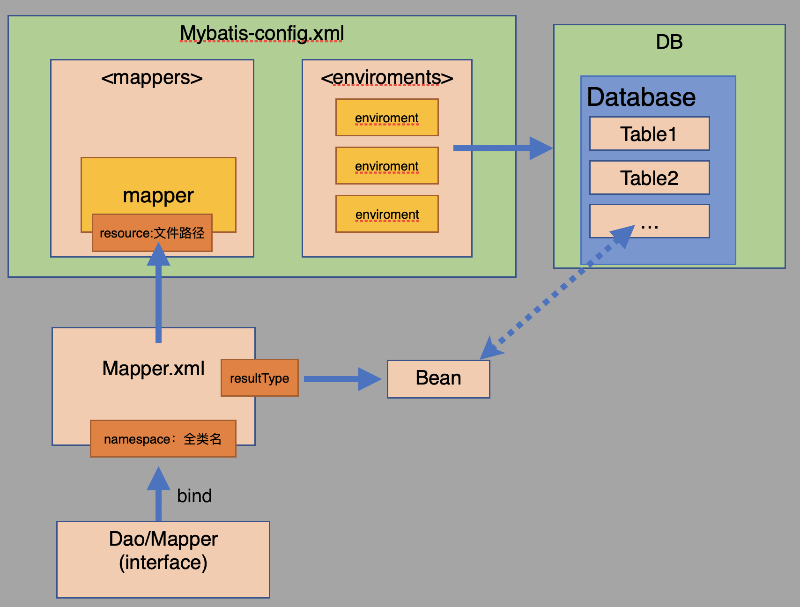

- 参考
    - 官网中文： https://mybatis.org/mybatis-3/zh/index.html
    - https://www.bilibili.com/video/av69742084

<span id="catalog"></span>

### 目录
- [MyBatis概述](#MyBatis概述)
- [Maven配置](#Maven配置)
- [测试数据库](#测试数据库)
- [Mybatis的基本使用方式-xml方式](#Mybatis的基本使用方式-xml方式)
    - [基本使用步骤](#基本使用步骤)
    - [各配置、接口、实体类之间的关系图](#各配置、接口、实体类之间的关系图)
    - [Mybatis使用时的常见问题](#Mybatis使用时的常见问题)
    - [helloWorld示例](#helloWorld示例)
- [Mapper配置文件](#Mapper配置文件)
    - [Mapper配置文件的基本使用](#Mapper配置文件的基本使用)
    - [CRUD操作](#CRUD操作)
    - [Map对象作为接口参数](#Map对象作为接口参数)
    - [模糊查询的使用方法](#模糊查询的使用方法)

# MyBatis概述
[top](#catalog)
- 什么是Mybatis
    - 一款**持久层**框架
    - 支持自定义SQL、存储过程以及高级映射
    - 使用Mybatis，就不用写JDBC代码来设置参数和获取结果集
    - 可以通过XML或注解来配置和映射原始类型、接口和 Java POJO（Plain Old Java Objects，普通老式 Java 对象为数据库中的记录
   
- 为什么需要Mybatis？
    - 简化JDBC代码
    - sql与代码分离
    - 提供映射标签，支持对象与数据库的orm字段关系映射
    - 提供对象关系映射标签，支持对象关系组件维护
    - 提供xml标签，支持编写动态sql
    
# Maven配置
[top](#catalog)
```xml
<!-- https://mvnrepository.com/artifact/org.mybatis/mybatis -->
<dependency>
    <groupId>org.mybatis</groupId>
    <artifactId>mybatis</artifactId>
    <version>3.5.4</version>
</dependency>
```

# 测试数据库
[top](#catalog)
- 使用docker配置一个mysql容器(接入自定义网桥testbr中)
    ```sql
    docker run -d -p 3307:3306 --name mysqllearn --network testbr \
    -v $HOME/mydocker/myvolumes/mysql/learn/mysql/conf:/etc/mysql/conf.d \
    -v $HOME/mydocker/myvolumes/mysql/learn/mysql/logs:/logs \
    -v $HOME/mydocker/myvolumes/mysql/learn/mysql/data:/var/lib/mysql \
    -e MYSQL_ROOT_PASSWORD=1234 \
    mysql:latest
    ```
  
- 创建数据库
    ```sql
    -- 创建数据库
    create database test01;
    ```
  
- 创建表user及其对应的java实体类
    - sql内容
        ```sql
        -- 创建表
        create table user (
            `id` int(20) not null primary key,
            `name` varchar(30) default null,
            `pwd` varchar(30) default null
        )default charset=utf8
        
        -- 添加数据
        insert into user 
        values
        (1, "aaa", "aaapwd"),
        (2, "bbb", "bbbpwd"),
        (3, "ccc", "cccpwd"),
        (4, "ddd", "dddpwd"),
        (5, "eee", "eeepwd"),
        (6, "fff", "fffpwd")
        ```
    - 实体类
        - 参考代码
            - [/java/mylearn/mybatis/src/main/java/com/ljs/learn/common/bean/User.java](/java/mylearn/mybatis/src/main/java/com/ljs/learn/common/bean/User.java)
        - 代码内容
            ```java
            public class User {
                private int id;
                private String name;
                private String pwd;
                
                //...
                //getter setter
            }
            ```
          
# Mybatis的基本使用方式-xml方式
## 基本使用步骤
[top](#catalog)
- 参考：https://mybatis.org/mybatis-3/zh/getting-started.html
- 使用步骤
    1. 创建maven工程
    2. 导入maven依赖
        - mybatis依赖
        - mysql数据库依赖
    3. 创建xml配置文件
        - 配置文件名：`mybatis-config.xml`
        - 基本配置内容
            ```sql
            <?xml version="1.0" encoding="UTF-8" ?>
            <!DOCTYPE configuration
              PUBLIC "-//mybatis.org//DTD Config 3.0//EN"
              "http://mybatis.org/dtd/mybatis-3-config.dtd">
            <configuration>
              <environments default="development">
                <environment id="development">
                  <transactionManager type="JDBC"/>
                  <dataSource type="POOLED">
                    <property name="driver" value="${driver}"/>
                    <property name="url" value="${url}"/>
                    <property name="username" value="${username}"/>
                    <property name="password" value="${password}"/>
                  </dataSource>
                </environment>
              </environments>
              <mappers>
                <mapper resource="org/mybatis/example/BlogMapper.xml"/>
              </mappers>
            </configuration>
            ```
    4. 创建接口以及`mapper.xml`文件：创建Dao/Mapper接口，并为接口创建`mapper.xml`文件，作为接口的实现类使用
        - 接口
            ```java
            public interface BlogMapper{
               Blog selectBLog();
            }
            ```
        - mapper.xml
            ```xml
            <?xml version="1.0" encoding="UTF-8" ?>
            <!DOCTYPE mapper
              PUBLIC "-//mybatis.org//DTD Mapper 3.0//EN"
              "http://mybatis.org/dtd/mybatis-3-mapper.dtd">
            <!--namespace绑定一个Dao/Mapper接口-->
            <mapper namespace="org.mybatis.example.BlogMapper">
               <!--id绑定接口中的方法名, resultType设置返回类型的全类名-->
               <select id="selectBlog" resultType="Blog">
                   select * from Blog where id = #{id}
               </select>
            </mapper>
            ```
    5. 添加`mapper.xml`的路径配置：在`mybatis-config.xml`中的`<mappers>`下添加注册mapper
        ```xml
        <mappers>
           <mapper resource="org/mybatis/example/BlogMapper.xml"/>
        </mappers>
        ```
       
    6. 创建`SlqSession`工厂：从xml中构建`SqlSessionFactory`
            ```java
            String resource = "org/mybatis/example/mybatis-config.xml";
            InputStream inputStream = Resources.getResourceAsStream(resource);
            SqlSessionFactory sqlSessionFactory = new SqlSessionFactoryBuilder().build(inputStream);
            ```
    7. 获取`SqlSession`对象：从`SqlSessionFactory`中获取`SqlSession`，并通过`SqlSession`来执行sql
        ```java
        SqlSession session = sqlSessionFactory.openSession()
        ```
    8. 获取Mapper对象：从`SqlSession`中通过Dao/Mapper接口获取Mapper，并执行`mapper.xml`中配置的方法来执行sql操作
        ```java
        BlogMapper mapper = session.getMapper(BlogMapper.class);
        Blog blog = mapper.selectBlog(101);
        ```        
    9. 执行增删改操作之后，执行事务commit
        ```xml

        ```
    10. 关闭：操作结束后，关闭`SqlSession`对象，**或者使用带资源的try**
        ```java
        sqlSession.close();
        ```

- 数据库操作结束后必须关闭`SqlSession`对象

## 各配置、接口、实体类之间的关系图
[top](#catalog)
- 


## Mybatis使用时的常见问题
[top](#catalog)
- `mybatis-config.xml`中设置的默认环境在所有有环境中无法找到
    - 如配置，默认使用development，但是所有的环境给配置中没有development
        ```xml
        <environments default="development">
            <environment id="ea"></environment>
            <environment id="eb"></environment>
            <environment id="ec"></environment>
        </environments>
        ```
    - 导致的异常：执行`sqlSessionFactory.openSession();`时，无法打开session
    - 异常内容
        ```
        org.apache.ibatis.exceptions.PersistenceException: 
        ### Error opening session.  
        Cause: java.lang.NullPointerException
        ```
    - 
- dao/mapper接口的`mapper.xml`没有在`mybatis-config.xml`中配置
    ```
    org.apache.ibatis.binding.BindingException: 
  Type interface com.ljs.learn.mybatis.firstSample.dao.UserDao 
  is not known to the MapperRegistry.
    ```
- 启动时，无法找到dao/mapper接口的`mapper.xml`
    - 异常信息
        ```
        org.apache.ibatis.builder.BuilderException: 
        Error parsing SQL Mapper Configuration. 
        Cause: java.io.IOException: 
        Could not find resource 
        com/ljs/learn/batis/dao/UserMapper.xml
        ```
    - 异常原因
        - 在maven中，约定大于配置，所以可能会产生配置文件无法别导出、无法生效的问题
    - 在`pom.xml`的`<build>`中配置`<resources>`，来防止资源导出失败
        ```xml
        <resources>
          <resource>
            <directory>src/main/resources</directory>
            <includes>
              <include>**/*.properties</include>
              <include>**/*.xml</include>
            </includes>
            <filtering>true</filtering>
          </resource>
          <resource>
            <directory>src/main/java</directory>
            <includes>
              <include>**/*.properties</include>
              <include>**/**/*.xml</include>
            </includes>
            <filtering>true</filtering>
          </resource>
        </resources>
        ```
    
- 绑定接口错误
    - **必须在`mapper.xml`文件下的`namespace`属性中配置接口，否则启动后，无法绑定**
- 方法名异常
- 返回类型异常
   
## helloWorld示例 
[top](#catalog)
- 封装工具类，统一获取`SqlSession`对象
    - 参考代码
        - [/java/mylearn/mybatis/src/main/java/com/ljs/learn/mybatis/common/utils/MybatisUtils.java](/java/mylearn/mybatis/src/main/java/com/ljs/learn/mybatis/common/utils/MybatisUtils.java)

    - 代码内容
        ```java
        public class MybatisUtils {
            private static SqlSessionFactory sqlSessionFactory;
        
            // 获取sqlSessionFactory对象
            static{
                InputStream inputStream = null;
                try {
                    String resource = "mybatis-config.xml";
                    inputStream = Resources.getResourceAsStream(resource);
                    sqlSessionFactory = new SqlSessionFactoryBuilder().build(inputStream);
                } catch (IOException e) {
                    e.printStackTrace();
                }
            }
        
            // 返回执行sql的对象
            public static SqlSession getSqlSession(){
                return sqlSessionFactory.openSession();
            }
        }
        ```
- 创建Dao接口及其对应的`mapper.xml`
    - 参考代码
        - [/java/mylearn/mybatis/src/main/java/com/ljs/learn/mybatis/firstSample/dao/UserDao.java](/java/mylearn/mybatis/src/main/java/com/ljs/learn/mybatis/firstSample/dao/UserDao.java)
        - [/java/mylearn/mybatis/src/main/java/com/ljs/learn/mybatis/firstSample/dao/UserMapper.xml](/java/mylearn/mybatis/src/main/java/com/ljs/learn/mybatis/firstSample/dao/UserMapper.xml)

    - 接口
        ```java
        public interface UserDao {
            // 获取所有用户信息
            List<User> getUsers();
        }
        ```
    - `mapper.xml`
        ```xml
        <!--namespace绑定一个Dao/Mapper接口-->
        <mapper namespace="com.ljs.learn.mybatis.firstSample.dao.UserDao">
            <!--id绑定接口中的方法名, resultType设置返回类型-->
            <select id="getUsers" resultType="com.ljs.learn.mybatis.common.bean.User">
                select * from test01.user;
            </select>
        </mapper>
        ```
    
- `mybatis-config.xml`配置文件
    - 文件路径
        - [/java/mylearn/mybatis/src/main/resources/mybatis-config.xml](/java/mylearn/mybatis/src/main/resources/mybatis-config.xml)
    - 配置内容
        ```xml
        <?xml version="1.0" encoding="UTF-8" ?>
        <!DOCTYPE configuration
                PUBLIC "-//mybatis.org//DTD Config 3.0//EN"
                "http://mybatis.org/dtd/mybatis-3-config.dtd">
        <!--核心配置内容-->
        <configuration>
            <!--配置多套环境-->
            <environments default="development">
                <environment id="development">
                    <!--事务管理，使用JDBC-->
                    <transactionManager type="JDBC"/>
                    <dataSource type="POOLED">
                        <property name="driver" value="com.mysql.cj.jdbc.Driver"/>
                        <!--配置数据库连接-->
                        <property name="url" value="jdbc:mysql://127.0.0.1:3307?serverTimezone=UTC&amp;characterEncoding=utf8&amp;useUnicode=true&amp;useSSL=false"/>
                        <property name="username" value="root"/>
                        <property name="password" value="1234"/>
                    </dataSource>
                </environment>
            </environments>
            <mappers>
                <!--注册mapper，注册mapper对象的xml路径-->
                <mapper resource="com/ljs/learn/mybatis/firstSample/dao/UserMapper.xml"/>
            </mappers>
        </configuration>
        ```
- 测试类
    - 参考代码
        - [/java/mylearn/mybatis/src/test/java/com/ljs/learn/mybatis/firstSample/dao/UserDaoTest.java][]

    - 测试内容
        ```java
        @Test
        public void test01(){
            // 获取资源
            SqlSession sqlSession = MybatisUtils.getSqlSession();
            // 获取mapper
            UserDao mapper = sqlSession.getMapper(UserDao.class);
            // 执行数据库操作
            List<User> users = mapper.getUsers();
            for (User user : users) {
                System.out.println(user);
            }
            
            //关闭资源
            sqlSession.close();
        }
        ```

# Mapper配置文件
## Mapper配置文件的基本使用
[top](#catalog)
- namespace
    - `namespace`中的全类名要和Dao/Mapper接口的全类名一致
- 标签中的通用属性
    - id，对应Dao/Mapper接口中的方法名
    - resultType，接口方法的返回值类型，即bean
        - **增删改方法**可以有int型返回值，来表示执行是否成功，但是**在配置中没有resultType属性**
    - paramterType，方法的参数类型
        - 如果是自定义类型，需要使用全类名
        - 基本数据类型
        - Map类型使用`map`
- 标签内容：sql
- sql中的数据库名
    - 如果`mybatis-config.xml`的
- sql中的占位符
    - 在sql中，使用`#{参数名}`来表示占位符，类似于JDBC中的`?`
    - 如果参数是类，可以直接通过`#{属性名}`来从类对象中获取
    - 如果参数是Map，可以通过`#{key}`来从map中获取
    
## CRUD操作
[top](#catalog)
- CRUD操作的关键字与其标签要匹配，否则会产生异常
    - `<select>`
    - `<insert>`
    - `<update>`
    - `<delete>`
    
- 增删该处理，需要提交事务：`sqlSession.commit();`

- 示例
    - Dao接口及其`mapper.xml`
        - 参考代码
            - [/java/mylearn/mybatis/src/main/java/com/ljs/learn/mybatis/mapperXml/crud/UserDao.java](/java/mylearn/mybatis/src/main/java/com/ljs/learn/mybatis/mapperXml/crud/UserDao.java)
            - [/java/mylearn/mybatis/src/main/java/com/ljs/learn/mybatis/mapperXml/crud/UserMapper.xml](/java/mylearn/mybatis/src/main/java/com/ljs/learn/mybatis/mapperXml/crud/UserMapper.xml)
        - Dao接口
            ```xml
            public interface UserDao {
                // 获取所有用户信息
                List<User> getUsers();
            
                // 根据ID查询用户
                User getUserById(int id);
            
                // 插入用户
                int insertUser(User user);
            
                // 更新用户
                int updateUser(User user);
            
                // 删除用户
                int deleteUserById(int id);
            }
            ```
        - `mapper.xml`
            ```xml
            <?xml version="1.0" encoding="UTF-8" ?>
            <!DOCTYPE mapper
                    PUBLIC "-//mybatis.org//DTD Mapper 3.0//EN"
                    "http://mybatis.org/dtd/mybatis-3-mapper.dtd">
            
            <!--namespace绑定一个Dao/Mapper接口-->
            <mapper namespace="com.ljs.learn.mybatis.crud.dao.UserDao">
                <select id="getUsers" resultType="com.ljs.learn.mybatis.common.bean.User">
                    select * from test01.user;
                </select>
            
                <!-- #{参数名} 在sql中类似与JDBC中的 ?，表示占位符 -->
                <select id="getUserById" parameterType="int" resultType="com.ljs.learn.mybatis.common.bean.User">
                    select * from test01.user where id = #{id};
                </select>
            
                <insert id="insertUser" parameterType="com.ljs.learn.mybatis.common.bean.User">
                    insert into test01.user (id, name, pwd) values (#{id}, #{name}, #{pwd});
                </insert>
            
                <update id="updateUser" parameterType="com.ljs.learn.mybatis.common.bean.User">
                    update test01.user set name=#{name} where id = #{id}
                </update>
            
                <delete id="deleteUserById" parameterType="int">
                    delete from test01.user where id = #{id}
                </delete>
            </mapper>
            ```
    - `mybatis-config.xml`中注册mapper.xml的
        ```xml
        <mappers>
            <mapper resource="com/ljs/learn/mybatis/crud/dao/UserMapper.xml"/>
        </mappers>
        ```
    - 测试类
        - 参考代码
            - [/java/mylearn/mybatis/src/test/java/com/ljs/learn/mybatis/mapperXml/crud/CRUDTest.java](/java/mylearn/mybatis/src/test/java/com/ljs/learn/mybatis/mapperXml/crud/CRUDTest.java)
        - 测试内容
            ```java
            @Test
            public void testGetUserById(){
                SqlSession sqlSession = MybatisUtils.getSqlSession();
                UserDao mapper = sqlSession.getMapper(UserDao.class);
                User user = mapper.getUserById(2);
                System.out.println(user);
            }
        
            // 添加数据，不commit
            @Test
            public void testInsertUser01(){
                SqlSession sqlSession = MybatisUtils.getSqlSession();
                UserDao mapper = sqlSession.getMapper(UserDao.class);
                int result = mapper.insertUser(new User(7, "kkk", "kkkkpw"));
        
                System.out.println("insertUser = " + result);
                sqlSession.close();
            }
        
            // 添加数据，然后commit
            @Test
            public void testInsertUser02(){
                SqlSession sqlSession = MybatisUtils.getSqlSession();
                UserDao mapper = sqlSession.getMapper(UserDao.class);
                int result = mapper.insertUser(new User(7, "kkk", "kkkk"));
        
                if (result <= 0){
                    System.out.println("insert error");
                } else {
                    // 提交事务
                    sqlSession.commit();
                }
                sqlSession.close();
            }
        
            @Test
            public void testUpdateUser(){
                SqlSession sqlSession = MybatisUtils.getSqlSession();
                UserDao mapper = sqlSession.getMapper(UserDao.class);
                int result = mapper.updateUser(new User(7, "newK", "kkkk"));
                if (result <= 0){
                    System.out.println("update error");
                }else {
                    sqlSession.commit();
                }
                sqlSession.close();
            }
        
            @Test
            public void testDeleteUser(){
                SqlSession sqlSession = MybatisUtils.getSqlSession();
                UserDao mapper = sqlSession.getMapper(UserDao.class);
                int result = mapper.deleteUserById(4);
                if (result <= 0){
                    System.out.println("update error");
                }else {
                    sqlSession.commit();
                }
                sqlSession.close();
            }
            ```
          
## Map对象作为接口参数
[top](#catalog)
- 当实体类或表的字段过多，可以使用map
- 使用map对象作为接口参数时，可以自由控制key的名字
- 配置文件中，通过`#{key}`来从map对象中根据key获取参数值
- 示例
    - Dao接口及其`mapper.xml`
        - 参考代码
            - [/java/mylearn/mybatis/src/main/java/com/ljs/learn/mybatis/mapperXml/map/UserDao.java](/java/mylearn/mybatis/src/main/java/com/ljs/learn/mybatis/mapperXml/map/UserDao.java)
            - [/java/mylearn/mybatis/src/main/java/com/ljs/learn/mybatis/mapperXml/map/UserMapper.xml](/java/mylearn/mybatis/src/main/java/com/ljs/learn/mybatis/mapperXml/map/UserMapper.xml)
        - Dao接口
            ```java
            public interface UserDao {
                // 通过map对象来执行插入
                int insertUser(Map<String, Object> map);
            }
            ```
        - `mapper.xml`
            ```xml
            <?xml version="1.0" encoding="UTF-8" ?>
            <!DOCTYPE mapper
                    PUBLIC "-//mybatis.org//DTD Mapper 3.0//EN"
                    "http://mybatis.org/dtd/mybatis-3-mapper.dtd">
            
            <!--namespace绑定一个Dao/Mapper接口-->
            <mapper namespace="com.ljs.learn.mybatis.mapperXml.map.UserDao">
                <insert id="insertUser" parameterType="map" >
                    insert into user(id, name, pwd) values(#{userid}, #{username}, #{userpwd})
                </insert>
            </mapper>
            ```
    - 测试类
        - 参考代码
            - [/java/mylearn/mybatis/src/test/java/com/ljs/learn/mybatis/mapperXml/map/MapParamTest.java](/java/mylearn/mybatis/src/test/java/com/ljs/learn/mybatis/mapperXml/map/MapParamTest.java)
        - 测试内容
            ```java
            @Test
            public void testInsertUser(){
                SqlSession sqlSession = MybatisUtils.getSqlSession();
                UserDao mapper = sqlSession.getMapper(UserDao.class);
        
                // 创建Map对象
                HashMap<String, Object> map = new HashMap<>();
                map.put("userid", 8);
                map.put("username", "tttt");
                map.put("userpwd", "ttttpwd");
        
                int result = mapper.insertUser(map);
        
                if (result <= 0){
                    System.out.println("insert error");
                }else {
                    sqlSession.commit();
                }
                sqlSession.close();
            }
            ```
          
## 模糊查询的使用方法
[top](#catalog)
- 两种设置模糊查询的方法
    1. 在`mapper.xml`中，将通配符写在sql中
    2. 在调用方法传递参数前，将通配符添加到参数中
- 示例
    - Dao接口及其`mapper.xml`
        - 参考代码
            - [/java/mylearn/mybatis/src/main/java/com/ljs/learn/mybatis/mapperXml/sqllike/UserDao.java](/java/mylearn/mybatis/src/main/java/com/ljs/learn/mybatis/mapperXml/sqllike/UserDao.java)
            - [/java/mylearn/mybatis/src/main/java/com/ljs/learn/mybatis/mapperXml/sqllike/UserMapper.xml](/java/mylearn/mybatis/src/main/java/com/ljs/learn/mybatis/mapperXml/sqllike/UserMapper.xml)  
        - Dao接口
            ```java
            public interface UserDao {
                // 模糊查询，将通配符写在配置文件中
                List<User> getUser01(String name);
            
                // 模糊查询，需要将通配符写在参数中
                List<User> getUser02(String name);
            }
            ```
        - `mapper.xml`
            ```xml
            <?xml version="1.0" encoding="UTF-8" ?>
            <!DOCTYPE mapper
                    PUBLIC "-//mybatis.org//DTD Mapper 3.0//EN"
                    "http://mybatis.org/dtd/mybatis-3-mapper.dtd">
            
            <mapper namespace="com.ljs.learn.mybatis.mapperXml.sqllike.UserDao">
                <!--模糊查询, 在sql中使用通配符-->
                <select id="getUser01" parameterType="String" resultType="com.ljs.learn.mybatis.common.bean.User">
                    select * from user where name like "%"#{name}"%"
                </select>
            
                <!--模糊查询, 需要将通配符添加到参数中-->
                <select id="getUser02" parameterType="String" resultType="com.ljs.learn.mybatis.common.bean.User">
                    select * from user where name like #{name}
                </select>
            </mapper>
            ```
    - 测试类
        - 参考代码
            - [/java/mylearn/mybatis/src/test/java/com/ljs/learn/mybatis/mapperXml/sqllike/LikeTest.java](/java/mylearn/mybatis/src/test/java/com/ljs/learn/mybatis/mapperXml/sqllike/LikeTest.java)
        - 测试内容
            ```java
            // 模糊查询，将通配符写在配置文件中
            @Test
            public void test01(){
                SqlSession sqlSession = MybatisUtils.getSqlSession();
                UserDao mapper = sqlSession.getMapper(UserDao.class);
                List<User> userList = mapper.getUser01("a");
        
                for (User user : userList) {
                    System.out.println(user);
                }
        
                sqlSession.close();
            }
        
            // 模糊查询，需要将通配符写在参数中
            @Test
            public void test02(){
                SqlSession sqlSession = MybatisUtils.getSqlSession();
                UserDao mapper = sqlSession.getMapper(UserDao.class);
                List<User> userList = mapper.getUser02("%a%");
                for (User user : userList) {
                    System.out.println(user);
                }
        
                sqlSession.close();
            }
            ```