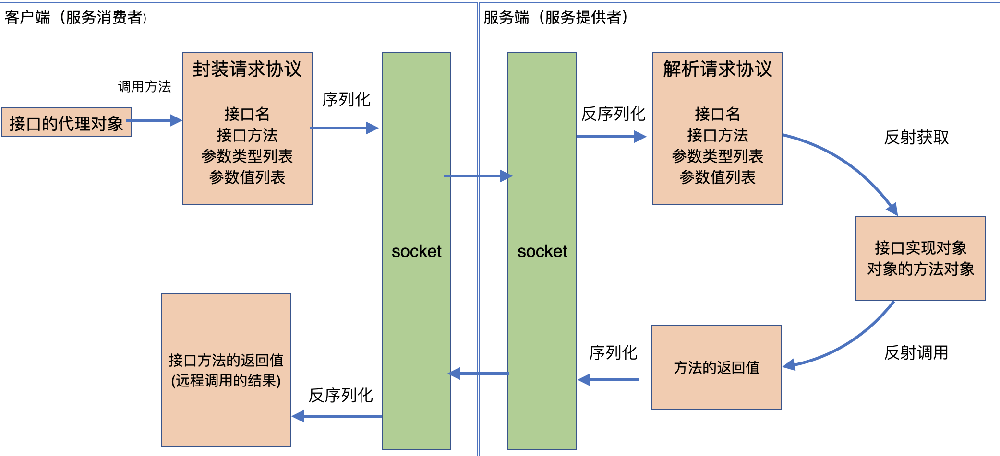

<span id="catalog"></span>

- 参考：https://www.bilibili.com/video/av73288542

### 目录
- [基本概念](#基本概念)
- [rpc的基本原理示意图](#rpc的基本原理示意图)
- 通过动态代理模式实现RPC框架
    - [框架的定义与功能](#框架的定义与功能)
    - [RPC框架请求协议类](#RPC框架请求协议类)
    - [RPC服务端框架](#RPC服务端框架)
    - [RPC客户端框架](#RPC客户端框架)
- [](#)
- [](#)
- [](#)


# 基本概念
[top](#catalog)
- RPC的本质是：**远程过程调用**
    - 由服务消费者**通过网络**调用远程机器上的接口实现，称为一个过程

- 服务提供者和服务消费者的概念
    - 服务提供者
        - 服务提供者就是**完成服务消费者具体功能的实现**
        - 提供对应的接口与实现
    - 服务消费者
        - 使用**服务提供者**提供的接口方法
        - 使用**服务提供者**方法
            - 导入：导入服务提供者暴露的接口
            - 调用：**提供调用方法、对象参数，不需要知道具体逻辑的实现**
    - 示例
        - 服务器提供者
            ```java
            // 接口
            interface IUserService {
                Object getUser();
            }
            
            // 实现
            class UserServiceImpl implements IUserService{
                Object getUser() {

                }
            }
            ```
        - 服务器消费者
            ```java
            package server.consume;
            import server.supplier;

            class Consume{
                public static void main(){
                    // 需要解决如何调用的问题
                    IUserService ius = new ??????; 
                    ius.getUser();
                    System.out.print(ius);
                }
            }
            ```

            - **在消费端**，通过动态代理，动态生成这个接口对应实现类的实例

- 实际的部署与调用状况
    ```
    A--server           B--server
    服务提供者             服务消费者
    |                       |
    |----------网络----------|   
    ```

- **rpc需要解决的问题**
    - 服务消费者只有接口，**如何通过接口**来**调用远程**服务中的**具体逻辑**

- RPC涉及到的内容
    - 反射
    - 序列化
    - 动态代理
    - 多线程
    - 线程池

# rpc的基本原理示意图
[top](#catalog)
- 

# 通过动态代理设计模式调用
## 框架的定义与功能
[top](#catalog)
- RPC框架**请求**协议类`RequestProtocol`
    - 通过框架请求协议使远程的客户端和服务端能够相互识别
    - 用于客户端向服务端发送请求，能够在网络中进行传递
    - 该协议需要保存一系列信息，以保证能够被服务端解析、找到并调用相应接口实现的方法。包括
        - 接口名
        - 方法名
        - 参数名

- 功能接口API
    - 服务端、客户端使用同一套功能接口。并由服务负责提供实现，由客户端负责调用

- 服务端
    - 服务端框架
        - 可以通过服务端框架提供的方法绑定到某个端口，并启动rpc服务
        - 可以为接口注册对应的实现类
        - 启动服务后，可以接收并解析远程请求，并调用已注册的实现类中的方法
    - 接口实现类
        - 提供功能接口API的实现类，并在框架中调用

- 客户端
    - 客户端框架
        - 能够传入需要的接口、服务端的ip和端口，并返回对应的代理对象
        - 通过代理对象执行接口方法
    - 引用功能接口API

- rpc框架的基本模型
    - rpc请求协议
        ```java
        class RequestProtocol{}
        ```
    - 功能接口API
        ```java
        interface IUserService {
            Object getUser();
        }
        ```

    - rpc服务端
        ```java
        // 功能接口API的实现
        class UserServiceImpl implements IUserService{
            Object getUser() {
                ...
            }
        }
        
        class RpcServer{
            // 注册接口的实现
            void registAPIImpl(){}

            // 启动服务
            void start(int port){}

            // 解析请求
            void analyze(){}
        }
        ```

    - rpc客户端
        ```java
        class RpcServer{
            Object getProxy(Class interface, InetAddress inet){}
        }
        ```

## RPC框架请求协议类
[top](#catalog)
- 参考代码：[/java/mylearn/myrpc/src/main/java/com/ljs/learn/protocol/RequestProtocol.java](/java/mylearn/myrpc/src/main/java/com/ljs/learn/protocol/RequestProtocol.java)
- 代码内容
    ```java
    /**
    * rpc请求协议
    */
    public class RequestProtocol implements Serializable {
        // 为了能在网络上传输，必须要可序列化
        private static final long serialVersionUID = -811557520790336965L;

        // 接收接口名、方法名、参数类型列表、参数值列表，并可以用于传输

        // 接口名
        private String interfaceName;

        // 方法名
        private String methodName;

        // 参数类型列表
        private Class<?>[] parameterTypes;

        // 参数值列表
        private Object[] parameterValues;


        // 无参和带参构造器
        public RequestProtocol() {
        }

        public RequestProtocol(String interfaceName, String methodName, Class<?>[] parameterTypes, Object[] parameterValues) {
            this.interfaceName = interfaceName;
            this.methodName = methodName;
            this.parameterTypes = parameterTypes;
            this.parameterValues = parameterValues;
        }

        //getter、setter
        public static long getSerialVersionUID() {
            return serialVersionUID;
        }

        public String getInterfaceName() {
            return interfaceName;
        }

        public void setInterfaceName(String interfaceName) {
            this.interfaceName = interfaceName;
        }

        public String getMethodName() {
            return methodName;
        }

        public void setMethodName(String methodName) {
            this.methodName = methodName;
        }

        public Class<?>[] getParameterTypes() {
            return parameterTypes;
        }

        public void setParameterTypes(Class<?>[] parameterTypes) {
            this.parameterTypes = parameterTypes;
        }

        public Object[] getParameterValues() {
            return parameterValues;
        }

        public void setParameterValues(Object[] parameterValues) {
            this.parameterValues = parameterValues;
        }
    }
    ```
## RPC服务端框架
[top](#catalog)
- 参考代码：[/java/mylearn/myrpc/src/main/java/com/ljs/learn/server/RPCServer.java](/java/mylearn/myrpc/src/main/java/com/ljs/learn/server/RPCServer.java)
- 代码内容
    ```java
    /**
    * rpc服务端框架，负责注册接口及其实现类、服务器的启动、请求的解析与处理
    */
    public class RPCServer {
        // 使用Map保存接口及其实现类的映射
        private Map<String, Object> apiImplMapper = new ConcurrentHashMap<>();

        // 创建一个线程池来处理客户端请求
        private ExecutorService pool = Executors.newFixedThreadPool(10);

        /**
        * 注册接口及其实现类
        * @param apiInterface 需要注册的接口Class对象
        * @param impl 接口的实现类
        */
        public void registImpl(Class<?> apiInterface, Object impl){
            apiImplMapper.put(apiInterface.getName(), impl);
        }

        /**
        * 启动服务
        * @param port 需要绑定的服务端口
        */
        // 启动服务
        public void startServer(int port){
            try {
                ServerSocket serverSocket = new ServerSocket(port);

                // 循环处理网络上的请求
                while (true){
                    pool.execute(new ServerTask(serverSocket.accept()));
                }

            } catch (IOException e) {
                e.printStackTrace();
            }
        }

        /**
        * 私有类，负责接口请求socket并在多线程中解析并处理请求
        */
        private class ServerTask implements Runnable{
            //保存请求
            private Socket accept;

            public ServerTask(Socket accept) {
                this.accept = accept;
            }

            @Override
            public void run() {
                try {
                    ObjectInputStream objIs = new ObjectInputStream(accept.getInputStream());
                    RequestProtocol protocol = (RequestProtocol) objIs.readObject();

                    // 解析协议
                    // 获取接口实现类
                    Object instance = apiImplMapper.get(protocol.getInterfaceName());

                    // 获取对象输出流
                    ObjectOutputStream objOs = new ObjectOutputStream(accept.getOutputStream());

                    // 如果没有获取到，则终止处理
                    if (instance == null) {
                        objOs.writeObject(null);
                        // return; //直接return会客户端无法停止
                    } else {
                        // 获取接口方法
                        Method method = instance.getClass().getMethod(protocol.getMethodName(), protocol.getParameterTypes());
                        // 调用方法
                        Object result = method.invoke(instance, protocol.getParameterValues());

                        // 将调用结果返回该给客户端
                        objOs.writeObject(result);
                    }
                } catch (IOException e) {
                    e.printStackTrace();
                } catch (ClassNotFoundException e) {
                    e.printStackTrace();
                } catch (NoSuchMethodException e) {
                    e.printStackTrace();
                } catch (IllegalAccessException e) {
                    e.printStackTrace();
                } catch (InvocationTargetException e) {
                    e.printStackTrace();
                }
            }
        }
    }
    ```

## RPC客户端框架
[top](#catalog)
- 参考代码：[/java/mylearn/myrpc/src/main/java/com/ljs/learn/client/RPCClient.java](/java/mylearn/myrpc/src/main/java/com/ljs/learn/client/RPCClient.java)
- 代码内容
    ```java
    /**
    * rpc客户端协议
    */
    public class RPCClient {

        /**
        * 获取接口的动态代理对象，通过代理对象来执行方法
        * @param apiInterface 接口
        * @param ip 服务端ip
        * @param port 服务端端口
        * @param <T>
        * @return 接口方法的执行结果
        */
        public static <T> T getProxy(Class<T> apiInterface, String ip, int port) {
            return (T)Proxy.newProxyInstance(
                    apiInterface.getClassLoader(),
                    new Class<?>[]{apiInterface},
                    new InvocationHandler() {
                        @Override
                        public Object invoke(Object proxy, Method method, Object[] args) throws Throwable {
                            // 与服务端建立连接
                            Socket socket = new Socket(ip, port);

                            // 创建rpc协议，并设置方法调用信息
                            RequestProtocol protocol = new RequestProtocol(
                                    // 接口名
                                    apiInterface.getName(),
                                    // 方法名
                                    method.getName(),
                                    // 参数类型列表
                                    method.getParameterTypes(),
                                    // 参数值列表
                                    args
                            );

                            // 从socket中获取输出流并转化成对象流，然后向服务端发送rpc请求协议
                            ObjectOutputStream socketObjOs = new ObjectOutputStream(socket.getOutputStream());
                            socketObjOs.writeObject(protocol);

                            // 从socket中获取输入流并转化成对象流，让后获取服务端的返回结果
                            ObjectInputStream socketObjIs = new ObjectInputStream(socket.getInputStream());
                            Object result = socketObjIs.readObject();

                            return result;
                        }
                    }
            );
        }
    }
    ```

## 框架测试
[top](#catalog)
- 接口及其实现
    - 参考代码
        - [/java/mylearn/myrpc/src/test/java/com/ljs/learn/rpcapi/UserInterface.java](/java/mylearn/myrpc/src/test/java/com/ljs/learn/rpcapi/UserInterface.java)
        - [/java/mylearn/myrpc/src/test/java/com/ljs/learn/rpcapi/OtherInterface.java](/java/mylearn/myrpc/src/test/java/com/ljs/learn/rpcapi/OtherInterface.java)
        - [/java/mylearn/myrpc/src/test/java/com/ljs/learn/rpcapiimpl/UserImpl.java](/java/mylearn/myrpc/src/test/java/com/ljs/learn/rpcapiimpl/UserImpl.java)
    - 代码内容
        - 有实现的接口
            ```java
            public interface UserInterface {
                String createUser(String userName);
            }

            public class UserImpl implements UserInterface {
                @Override
                public String createUser(String userName) {
                    return "created user : " + userName;
                }
            }
            ```
        - 没有实现的接口
            ```java
            public interface OtherInterface {
                String otherTest(String testParam);
            }
            ```
        
- 服务端测试内容
    - 参考代码：[/java/mylearn/myrpc/src/test/java/com/ljs/learn/server/ServerTest.java](/java/mylearn/myrpc/src/test/java/com/ljs/learn/server/ServerTest.java)
    - 代码内容
        - 需要引入接口及其实现来注册，同时引入RPCServer框架
        ```java
        import com.ljs.learn.rpcapi.UserInterface;
        import com.ljs.learn.rpcapiimpl.UserImpl;
        import org.junit.Test;

        public class ServerTest {
            @Test
            public void server(){
                RPCServer rpcServer = new RPCServer();

                // 注册接口及其实现类，只注册UserInterface一个测试接口
                rpcServer.registImpl(UserInterface.class, new UserImpl());

                // 启动服务
                rpcServer.startServer(8888);
            }
        }
        ```
- 客户端测试内容
    - 参考代码：[/java/mylearn/myrpc/src/test/java/com/ljs/learn/client/ClientTest.java](/java/mylearn/myrpc/src/test/java/com/ljs/learn/client/ClientTest.java)
    - 代码内容
        - 只需要引入接口和PRCClient框架，无需知道接口是如何实现的
        - 分别测试已经注册的接口和未注册的接口
        ```java
        import com.ljs.learn.rpcapi.OtherInterface;
        import com.ljs.learn.rpcapi.UserInterface;
        import org.junit.Test;

        public class ClientTest  {
            @Test
            public void client(){
                // 测试已注册的接口
                UserInterface proxy01 = RPCClient.getProxy(UserInterface.class, "127.0.0.1", 8888);
                String result01 = proxy01.createUser("testUser");
                System.out.println(result01);

                System.out.println("--------——");
                // 测试未注册的接口
                OtherInterface proxy02 = RPCClient.getProxy(OtherInterface.class, "127.0.0.1", 8888);
                String result02 = proxy02.otherTest("test");
                System.out.println(result02);
            }
        }
        ```
- 测试结果
    ```
    created user : testUser
    --------——
    null
    ```