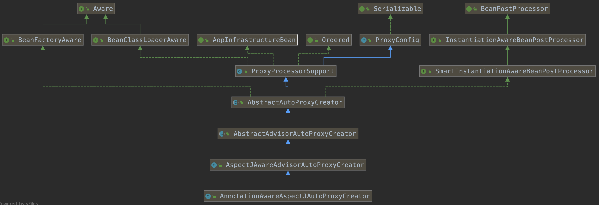

 <span id="catalog"></span>

### 目录
- [总结--注解与相关类](#总结--注解与相关类)
- [组件注册注解](#组件注册注解)
    - [@Configuration--创建配置类](#@Configuration--创建配置类)
    - [向容器中注册组件的几种方法](#向容器中注册组件的几种方法)
    - [@Bean](#@Bean)
    - [@ComponentScan--包扫描](#@ComponentScan--包扫描)
        - [@ComponentScan的基本使用](#@ComponentScan的基本使用)
        - [FilterType--指定扫描过滤规则](#FilterType--指定扫描过滤规则)
        - [TypeFilter--自定义包扫描过滤规则](#TypeFilter--自定义包扫描过滤规则)
    - [@Scope--定义bean的作用域](#@Scope--定义bean的作用域)
    - [@Lazy--懒加载](#@Lazy--懒加载)
    - [@Conditional--按条件注册bean](#@Conditional--按条件注册bean)
    - @Import--向容器中导入组件
        - [@Import--快速导入](#@Import--快速导入)
        - [ImportSelector接口--返回组件数组](#ImportSelector接口--返回组件数组)
        - [ImportBeanDefinitionRegistrar接口--手动注册某些组件](#ImportBeanDefinitionRegistrar接口--手动注册某些组件)
        - [Import示例](#Import示例)
    - [FactoryBean接口--工厂Bean](#FactoryBean接口--工厂Bean)
- [bean的生命周期](#bean的生命周期)
    - [设置bean的生命周期的几种方法](#设置bean的生命周期的几种方法)
    - [@Bean--注册某个bean的初始化和销毁方法](#@Bean--注册某个bean的初始化和销毁方法)
    - [InitializingBean和DisposableBean接口--自定义某个bean的初始化和销毁方法](#InitializingBean和DisposableBean接口--自定义某个bean的初始化和销毁方法)
    - [JSR250注解--自定义某个bean的初始化和销毁方法](#JSR250注解--自定义某个bean的初始化和销毁方法)
    - [BeanPostProcessor接口--所有bean的后置处理器](#BeanPostProcessor接口--所有bean的后置处理器)
    - [生命周期初始化的过程](#生命周期初始化的过程)
        - [初始化的过程代码分析](#初始化的过程代码分析)
        - [初始化的整体过程](#初始化的整体过程)
    - [多个生命周期方法的执行顺序](#多个生命周期方法的执行顺序)
        - [多个生命周期方法的执行顺序--说明](#多个生命周期方法的执行顺序--说明)
        - [多个生命周期方法的执行顺序--测试](#多个生命周期方法的执行顺序--测试)
    - [BeanPostProcessor接口在Spring底层的使用举例](#BeanPostProcessor接口在Spring底层的使用举例)
        - [ApplicationContextAwareProcessor--将IOC容器注入到某个bean](#ApplicationContextAwareProcessor--将IOC容器注入到某个bean)
        - [BeanValidationPostProcessor--数据校验处理](#BeanValidationPostProcessor--数据校验处理)
        - [InitDestroyAnnotationBeanPostProcessor--JSR250注解的识别与方法调用](#InitDestroyAnnotationBeanPostProcessor--JSR250注解的识别与方法调用)
        - [AutowiredAnnotationBeanPostProcessor--自动装配注解处理](#AutowiredAnnotationBeanPostProcessor--自动装配注解处理)
- [@Value--属性赋值](#@Value--属性赋值)
    - [属性赋值的三种方式](#属性赋值的三种方式)
    - [@PropertySource--设置配置文件](#@PropertySource--设置配置文件)
- [自动装配](#自动装配)
    - [@Autowired--自动注入](#@Autowired--自动注入)
        - [@Autowired及其相关注解](#@Autowired及其相关注解)
        - [bean的搜索顺序](#bean的搜索顺序)
        - [@Autowired的可标识位置](#@Autowired的可标识位置)
    - [@Autowired的位置](#@Autowired的位置)
    - [JSR250注解--@Resource](#JSR250注解--@Resource)
    - [JSR330注解--@Inject](#JSR330注解--@Inject)
    - [为什么自动装配支持这些注解](#为什么自动装配支持这些注解)
    - [Aware接口注入Spring底层组件](#Aware接口注入Spring底层组件)
    - [@Profile--设置激活环境](#@Profile--设置激活环境)
- [AOP](#AOP)
    - [AOP注解](#AOP注解)
    - [AOP注解的使用流程](#AOP注解的使用流程)
- [AOP原理](#AOP原理)
    - [AOP是如何生效的](#AOP是如何生效的)
    - [@EnableAspectJAutoProxy注入分析](#@EnableAspectJAutoProxy注入分析)
    - [AnnotationAwareAspectJAutoProxyCreator分析](#AnnotationAwareAspectJAutoProxyCreator分析)
        - [AnnotationAwareAspectJAutoProxyCreator的注册](#AnnotationAwareAspectJAutoProxyCreator的注册)
        - [AnnotationAwareAspectJAutoProxyCreator的执行时间](#AnnotationAwareAspectJAutoProxyCreator的执行时间)
        - [AnnotationAwareAspectJAutoProxyCreator的功能](#AnnotationAwareAspectJAutoProxyCreator的功能)
    - [被AOP切入的bean是如何执行的](#被AOP切入的bean是如何执行的)
        - [被切入方法的基本执行流程](#被切入方法的基本执行流程)
        - [创建拦截器链](#创建拦截器链)
        - [拦截器链的执行](#拦截器链的执行)
- [](#)

# 总结--注解与相关类
[top](#catalog)
- `@Configuration`，创建配置类
- `@Scope`，设置单实例bean、多实例bean
- `@Lazy`，延迟加载。在获取bean时加载
- 组件注册
    - `@Bean`，注册bean
    - `@ComponentScan` + `@Component`/`@Controller`/`@Service`/`@Repository`，扫描包
        - `FilterType`，过滤规则
        - `TypeFilter`，自定义过滤规则
    - <span style='color:red'>@Conditional</span> + `Condition`，按照自定义条件注册bean
    - `@Import`，快速导入
        - <span style='color:red'>ImportSelector接口</span>，返回需要注册的组件数组
        - `ImportBeanDefinitionRegistrar` 接口，手动注册某些组件
    - `FactoryBean` 接口，用工厂方法返回bean
- 生命周期
    - `@Bean(initMethod="初始化方法", destroyMethod="销毁方法")`， 设置bean的初始化方法、销毁方法
    - bean实现 `InitializingBean`和`DisposableBean`接口
    - JSR250的注解
        - `@PostConstruct`
        - `@PreDestroy`
    - `BeanPostProcessor`接口，在bean**初始化**前后执行一些操作
    - 执行顺序
        1. `BeanPostProcessor.applyBeanPostProcessorsBeforeInitialization` 接口方法
        2. bean的构造器
        3. 初始化
            1. JSR250的注解: `@PostConstruct`
            2. 实现 `InitializingBean` 接口
            3. `@Bean(initMethod="初始化方法")`
        4. `BeanPostProcessor.applyBeanPostProcessorsAfterInitialization` 接口方法
        5. 容器创建完成
        6. 销毁
            1. JSR250的注解: `@PreDestroy`
            2. 实现 `DisposableBean` 接口
            3. `@Bean(destroyMethod="销毁方法")`
- 属性赋值
    - `@Value`，设置属性值
    - `@PropertySource`，添加配置文件到配置类
- 自动装配
    - spring标准
        - `@Autowired(required=true/false)`
        - `@Qualifier("beanId")`，明确指定需要装配的bean的id
        - `@Primary`, 设置首选Bean
            - 通过类型获取bean时，会优先使用首选bean
    - JSR250注解
        - `@Resource`
    - JSR330注解
        - `@Inject`
    - `@Profile`，设置激活环境
        - 激活方式
            - 通过命令行参数
            - 创建空的IOC容器，并设置环境 `context.getEnvironment().setActiveProfiles`
        - 可以装饰 bean、或配置类
    - 实现 `Aware` 接口，容器启动后，注入Spring的底层组件
- AOP
    - `@EnableAspectJAutoProxy`，开启AOP注解支持
    - `@Aspect`，标识 AOP 类
    - `@Pointcut("切入点表达式")`，将AOP类的某个方法设置成公共的切入点
    - AOP切面注解

        |方法名|功能|参数|
        |-|-|-|
        |`@Before(value="切入点")`|前置通知||
        |`@After(value="切入点")`|后置通知<br>无论方法是正常结束还是异常结束，都会调用||
        |`@AfterReturning(value="切入点", returning="result")`|返回通知|`returning` 指定接收返回值的参数名|
        |`@AfterThrowing(value="切入点", throwing = "exception")`|异常通知|`throwing` 指定接收异常的参数名|
        |`@Around(value="切入点")`|环绕通知<br>使用动态代理，手动推进目标方法运行，JoinPoint.procced()||

# 组件注册注解
## @Configuration--创建配置类
[top](#catalog)
- `@Configuration` 的功能
  
- 用于将一个普通类标识为Spring配置类
  
- 源码分析
    - @Configuration 使用 `@Component`装饰，所以自身也是一个 Compnent
        - 在Spring启动后，**容器中也会包含** @Configuration 标识的配置类
        ```java
        @Target(ElementType.TYPE)
        @Retention(RetentionPolicy.RUNTIME)
        @Documented
        @Component
        public @interface Configuration {
        
            @AliasFor(annotation = Component.class)
            String value() default "";
        
            boolean proxyBeanMethods() default true;
        
        }
        ```

## 向容器中注册组件的几种方法
[top](#catalog)
1. 配置类的包扫描注解 `@ComponentScan` + 组件标识注解 `@Component/@Service/@Controller/@Repository`
2. `@Bean`，导入第三方包中的组件
3. `@Conditional`，按条件注册bean
4. `Import`，向容器中快速导入一个组件
    - `@Import(组件的类对象)`，容器会自动注册组件，id默认是**全类名**
    - `ImportSelector` 接口，返回需要导入的组件的**全类名数组**
        - 方法可以返回一个空数组，但是不能返回null，会产生空数组异常
    - `ImportBeanDefinitionRegistrar` 接口
        - 对所有需要添加到容器中的bean，调用`BeanDefinitionRegistry.registerBeanDefinition()` 手动注册
5. 使用Spring提供的`FactoryBean`，即工厂bean
    - <span style='color:red'>与其他框架整合时</span>，该接口使用的非常多

## @Bean
[top](#catalog)
- `@Bean(id="指定beanid")` 的功能
    - 用于向容器中注册一个Bean
    - 用于装饰方法
    - Bean的类型 = 返回值的类型
    - Bean的默认id = 方法名
- 示例
    - 配置类
        - 参考代码
          
            - [/java/mylearn/myspring-annotation/src/main/java/com/ljs/learn/myspringannotation/regist/bean/BeanConfig.java](/java/mylearn/myspring-annotation/src/main/java/com/ljs/learn/myspringannotation/regist/bean/BeanConfig.java)
        - 代码内容
            ```java
            // 配置类 == 配置文件
            @Configuration // 通过注解声明一个个配置类
            public class BeanConfig {
                @Bean
                public Person person(){
                    return new Person("personA", 22);
                }
            
                @Bean
                public Person person01(){
                    return new Person("personB", 23);
                }
            
                // 在Bean注解中，手动指定Bean的别名
                @Bean("personAlias")
                public Person person02(){
                    return new Person("personC", 24);
                }
            }
            ```
    - 测试类
        - 参考代码
          
            - [/java/mylearn/myspring-annotation/src/test/java/com/ljs/learn/myspringannotation/regist/bean/BeanConfigTest.java](/java/mylearn/myspring-annotation/src/test/java/com/ljs/learn/myspringannotation/regist/bean/BeanConfigTest.java)
        - 测试内容
            ```java
            @Test
            public void test01(){
                // 1. 创建容器
                ApplicationContext context = new AnnotationConfigApplicationContext(BeanConfig.class);
        
                // 2. 根据配置类的方法名，或者Bean中的别名获取bean实例对象
                Person person = (Person) context.getBean("person");
                System.out.println(person);
        
                Person personAlias = (Person) context.getBean("personAlias");
                System.out.println(personAlias);
        
                // 3. 通过类型找到IOC容器内部的Bean名
                String[] beanNamesForType = context.getBeanNamesForType(Person.class);
                for (String s : beanNamesForType) {
                    System.out.println(s);
                }
                // 配置类中有 3个 Bean的类型是Person，所以输出：
                // person
                // person01
                // personAlias
            }
            ```

## @ComponentScan--包扫描
### @ComponentScan的基本使用
[top](#catalog)
- `@ComponentScan(value="指定要扫描的包")` 的功能
    - 配置扫描包的策略
    - 可以同时配置多个

- 具体配置方法
    - `@ComponentScan` 的配置方法
        ```java
        @ComponentScan(
            value="指定要扫描的包路径",
            excludeFilters={@ComponentScan.Filter, ....}, // 指定需要排除哪些包
            includeFilters = {@ComponentScan.Filter, ...},  // 只扫描指定的类型
            // 如果使用 includeFilters，则useDefaultFilters 必须为 false
            // 关闭默认的过滤规则，按照指定的过滤规则扫描
            useDefaultFilters = false  
        )
        class xxx{...}
        ```
    - `@ComponentScan.Filter` 过滤器配置方法
        - 参考: [FilterType--指定扫描过滤规则](#FilterType--指定扫描过滤规则)
        - 需要在bean中添加以下注解中的一个，保证 bean 可以被扫描到
            - `@Component`
            - `@Repository`
            - `@Service`
            - `@Controller`

- 示例
    - exclude示例
        - 实现内容
            - 参考代码
              
                - [/java/mylearn/myspring-annotation/src/main/java/com/ljs/learn/myspringannotation/regist/componentScan/ComponentScanConfig.java](/java/mylearn/myspring-annotation/src/main/java/com/ljs/learn/myspringannotation/regist/componentScan/ComponentScanConfig.java)
            - 代码内容
                ```java
                @Configuration // 通过注解声明一个个配置类
                // 指定扫描时按照什么规则排除组件
                @ComponentScan(value="com.ljs.learn.myspringannotation.componentScan.layers", excludeFilters = {
                        // 扫描时排除包含：Controller、Service 注解的类
                        @ComponentScan.Filter(type = FilterType.ANNOTATION, classes = {Controller.class, Service.class})
                })
                public class ComponentScanConfig {
                }
                ```
        - 测试内容
            - 参考代码
              
                - [/java/mylearn/myspring-annotation/src/test/java/com/ljs/learn/myspringannotation/regist/componentScan/ComponentScanConfigTest.java](/java/mylearn/myspring-annotation/src/test/java/com/ljs/learn/myspringannotation/regist/componentScan/ComponentScanConfigTest.java)
            - 测试内容
                ```java
                @Test
                public void tesConfigExclude(){
                    ApplicationContext context = new AnnotationConfigApplicationContext(ComponentScanConfig.class);
                    String[] beanNames = context.getBeanDefinitionNames();
                    for (String beanName : beanNames) {
                System.out.println(beanName);
                }
    
                // 输出结果中会包含DemoConfig自身，因为 @Configuration 本身就是一个 @Component
            
                    // 输出:
                    // org.springframework.context.annotation.internalConfigurationAnnotationProcessor
                    // org.springframework.context.annotation.internalAutowiredAnnotationProcessor
                    // org.springframework.context.event.internalEventListenerProcessor
                    // org.springframework.context.event.internalEventListenerFactory
                    // componentScanConfig
                    // demoDao
                }
                ```
    - include示例
        - 实现内容
            - 参考代码
              
                - [/java/mylearn/myspring-annotation/src/main/java/com/ljs/learn/myspringannotation/regist/componentScan/ComponentScanConfig02.java](/java/mylearn/myspring-annotation/src/main/java/com/ljs/learn/myspringannotation/regist/componentScan/ComponentScanConfig02.java)
            - 代码内容
                ```java
                @Configuration // 通过注解声明一个个配置类
                @ComponentScan(value="com.ljs.learn.myspringannotation.componentScan", includeFilters = { // 只扫描指定的类型
                        @ComponentScan.Filter(type = FilterType.ANNOTATION, classes = {Controller.class, Service.class})
                }, useDefaultFilters = false)
                public class ComponentScanConfig02 {
                }
                ```
        - 测试内容
            - 参考代码
              
                - [/java/mylearn/myspring-annotation/src/test/java/com/ljs/learn/myspringannotation/regist/componentScan/ComponentScanConfigTest.java](/java/mylearn/myspring-annotation/src/test/java/com/ljs/learn/myspringannotation/regist/componentScan/ComponentScanConfigTest.java)
            - 测试代码
                ```java
                @Test
                public void tesConfigInclude(){
                    ApplicationContext context = new AnnotationConfigApplicationContext(ComponentScanConfig02.class);
                String[] beanNames = context.getBeanDefinitionNames();
                    for (String beanName : beanNames) {
                System.out.println(beanName);
                }
        
                // 输出结果中会包含DemoConfig自身，因为 @Configuration 本身就是一个 @Component
            
                    // 输出:
                    // org.springframework.context.annotation.internalConfigurationAnnotationProcessor
                    // org.springframework.context.annotation.internalAutowiredAnnotationProcessor
                    // org.springframework.context.event.internalEventListenerProcessor
                    // org.springframework.context.event.internalEventListenerFactory
                    // componentScanConfig02
                    // demoController
                    // demoService
                }
                ```
### FilterType--指定扫描过滤规则
[top](#catalog)
- FilterType 源码
    ```java
    public enum FilterType {
    	ANNOTATION,         // 按照注解过滤
    	ASSIGNABLE_TYPE,    // 按照给定类型过滤
    	ASPECTJ,            // 根据aspectj表达式过滤
    	REGEX,              // 根据正则表达式过滤
    	CUSTOM              // 自定义规则
    }
    ```

- FilterType.ANNOTATION 按照注解过滤，**常用**
    ```java
    @ComponentScan.Filter(
        type = FilterType.ANNOTATION,
        // 过滤目标为包含 Controller 和 Service 注解的类
        classes = {Controller.class, Service.class}
    )
    class xxx{}
    ```
- FilterType.ASSIGNABLE_TYPE 按照给定类型过滤，**常用**
    ```java
    @ComponentScan.Filter(
        type = FilterType.ASSIGNABLE_TYPE,
        // 过滤类型为指定类型的组件，包括子类和实现类
        lasses={DemoService.class}
    )
    class xxx{}
    ```

- FilterType.ASPECTJ，根据aspectj表达式来过滤，**不常用**
- FilterType.REGEX 根据正则表达式过滤，**不常用**
- FilterType.CUSTOM，自定义规则
  
    - 参考：[TypeFilter自定义包扫描过滤规则](#TypeFilter自定义包扫描过滤规则)

### TypeFilter--自定义包扫描过滤规则
[top](#catalog)
- 自定义规则的实现方式
    - 实现 TypeFilter 接口的 match 方法
    - `match函数` 返回 `true` 则当前扫描的类过滤成功，返回 `false` 则过滤失败

- 自定义 TypeFilter 接口的实现类
    - 参考代码
      
        - [/java/mylearn/myspring-annotation/src/main/java/com/ljs/learn/myspringannotation/regist/componentScan/filter/MyTypeFilter.java](/java/mylearn/myspring-annotation/src/main/java/com/ljs/learn/myspringannotation/regist/componentScan/filter/MyTypeFilter.java)
    - TypeFilter 接口的实现类
        ```java
        public class MyTypeFilter implements TypeFilter {
            // 返回值：true=匹配成功，false=匹配失败
            // MetadataReader 当前正在扫描的类的信息
            // MetadataReaderFactory 可以获取到其他任何类的信息
            @Override
            public boolean match(MetadataReader metadataReader, MetadataReaderFactory metadataReaderFactory) throws IOException {
                // 1. 获取当前类注解的信息
                AnnotationMetadata annotationMetadata = metadataReader.getAnnotationMetadata();
        
                // 2. 获取当前正在扫描的类的信息
                ClassMetadata classMetadata = metadataReader.getClassMetadata();
        
                // 3. 获取当前类的资源信息 (如: 路径)
                Resource resource = metadataReader.getResource();
        
                // 4. 获取当前正在扫描的类的类名（全类名）
                String className = classMetadata.getClassName();
                // 输出正在扫描的类名
                System.out.println("-----" + className);
        
                // 5. 设置过滤规则
                if (className.contains("er")){
                    return true;
                }
        
                return false;
            }
        }
        ```
- 使用自定义规则
    - 参考代码
      
        - [/java/mylearn/myspring-annotation/src/main/java/com/ljs/learn/myspringannotation/regist/componentScan/filter/TypeFilterConfig.java](/java/mylearn/myspring-annotation/src/main/java/com/ljs/learn/myspringannotation/regist/componentScan/filter/TypeFilterConfig.java)
    - 代码内容        
        ```java
        @Configuration
        @ComponentScan(
            value = "com.ljs.learn.myspringannotation.componentScan.layers",
            includeFilters = {
                @ComponentScan.Filter(type = FilterType.CUSTOM, classes={MyTypeFilter.class})
            },
            useDefaultFilters = false
        )
        public class TypeFilterConfig {}
        ```
    ```
    
    ```
    
- 测试内容
    - 参考代码
      
        - [/java/mylearn/myspring-annotation/src/test/java/com/ljs/learn/myspringannotation/regist/componentScan/filter/TypeFilterConfigTest.java](/java/mylearn/myspring-annotation/src/test/java/com/ljs/learn/myspringannotation/regist/componentScan/filter/TypeFilterConfigTest.java)
    - 测试代码
        ```java
        @Test
        public void testCustomTypeFilter(){
            ApplicationContext context = new AnnotationConfigApplicationContext(TypeFilterConfig.class);
            String[] names = context.getBeanDefinitionNames();
            for (String name : names) {
                System.out.println("name = " + name);
        }
    
            // 输出:
            // -----com.ljs.learn.myspringannotation.componentScan.layers.controller.DemoController
            // -----com.ljs.learn.myspringannotation.componentScan.layers.dao.DemoDao
            // -----com.ljs.learn.myspringannotation.componentScan.layers.service.DemoService
            // name = org.springframework.context.annotation.internalConfigurationAnnotationProcessor
            // name = org.springframework.context.annotation.internalAutowiredAnnotationProcessor
            // name = org.springframework.context.event.internalEventListenerProcessor
            // name = org.springframework.context.event.internalEventListenerFactory
            // name = typeFilterConfig   <<<<< 当前配置类
            // name = demoController
            // name = demoDao
            // name = demoService
        }
        ```

## @Scope--定义bean的作用域
[top](#catalog)
- 每个 bean 默认的 scope 为 singleton 单例的
- scope 的可选值
    - 2种基本的选择
        - `ConfigurableBeanFactory.SCOPE_PROTOTYPE = "prototype"`，多实例
        - `ConfigurableBeanFactory.SCOPE_SINGLETON = "singleton"`，单实例，**默认值**

    - 在web环境下，即：request 和 session。很少会使用，一般会手动放入 请求域 或 session域
        - WebApplicationContext.SCOPE_REQUEST，同一次请求创建一个实例
        - WebApplicationContext.SCOPE_SESSION，同一个session创建一个实例

- `singleton` 对象的创建、保存、获取
    - 在ioc容器启动时，会主动调用创建方法，保存到容器中
    - 以后每次获取就是直接从容器中获取，相当于通过`map.get()`获取对象

- `prototype` 对象的创建、保存、获取
    - ioc容器启动时，不会主动调用创建方法
    - 在从容器中获取对象时，才会调用创建方法。**每次调用都会创建新对象**

- 注解使用位置
    - 在配置类中的 `@bean` 上使用
    - 在某个类的 `@Component` 上使用
        - 在某个类上使用后，仍然可以在配置类中使用该类，并使用不同的`@Scope`，不会互相影响

- 示例
    - scope设置
        - 参考代码
          
            - [/java/mylearn/myspring-annotation/src/main/java/com/ljs/learn/myspringannotation/regist/scope/ScopeConfig.java](/java/mylearn/myspring-annotation/src/main/java/com/ljs/learn/myspringannotation/regist/scope/ScopeConfig.java)
        - 代码内容
            ```java
            @Configuration
            @ComponentScan(
                value = "com.ljs.learn.myspringannotation.scope"
            )
            public class ScopeConfig {
                // 测试 prototype 的调用次数
                private int prototype_count = 0;
                
                // 默认使用单例
                @Bean
                public Person person(){
                    System.out.println("singleton person create");
                    return new Person("personA", 22);
                }
            
                // 使用多实例
                @Scope("prototype")
                @Bean
                public Person person02(){
            
                    System.out.println("prototype person create: " + ++prototype_count);
                    return new Person("personB", 33);
                }
            }
            ```
    - 测试内容
        - 参考代码
          
            - [/java/mylearn/myspring-annotation/src/test/java/com/ljs/learn/myspringannotation/regist/scope/ScopConfigTest.java](/java/mylearn/myspring-annotation/src/test/java/com/ljs/learn/myspringannotation/regist/scope/ScopConfigTest.java)
        - 测试内容
            ```java
            public class ScopConfigTest {
                // 单例scope测试
                @Test
                public void testSingleton(){
                    ApplicationContext context = new AnnotationConfigApplicationContext(ScopeConfig.class);
                    System.out.println("ioc 容器创建完成");
                    Person personA = (Person) context.getBean("person");
                    Person personB = (Person) context.getBean("person");
            
                    assert (personA == personB);
            
                    // 输出
                    // singleton person create
                    // ioc 容器创建完成
                }
            
                // 原型cope测试
                @Test
                public void testPrototype(){
                    ApplicationContext context = new AnnotationConfigApplicationContext(ScopeConfig.class);
                    System.out.println("ioc 容器创建完成");
                    Person personA = (Person) context.getBean("person02");
                    Person personB = (Person) context.getBean("person02");
            
                    assert (personA != personB);
            
                    // 输出
                    // singleton person create
                    // ioc 容器创建完成
                    // prototype person create: 1
                    // prototype person create: 2
                }
            }
            ```

## Lazy--懒加载
[top](#catalog)
- `@Lazy` 懒加载
    - 对于单例bean，默认在容器启动的时候创建对象
    - 通过懒加载，控制容器在启动时，不主动创建某个对象。在第一次获取bean的时候，再创建对象，并初始化
- 示例
    - 使用`@Lazy`
        - 参考代码
          
            - [/java/mylearn/myspring-annotation/src/main/java/com/ljs/learn/myspringannotation/regist/scope/ScopeConfig.java](/java/mylearn/myspring-annotation/src/main/java/com/ljs/learn/myspringannotation/regist/scope/ScopeConfig.java)
        - 代码内容
            ```java
            @Configuration
            @ComponentScan(
                value = "com.ljs.learn.myspringannotation.scope"
            )
            public class ScopeConfig {
                // 使用懒加载
                @Lazy
                @Bean
                public Student student(){
                    System.out.println("create student");
                    return new Student("testStudent", 22);
                }
            }
            ```
    - 测试内容
        - 参考代码
          
            - [/java/mylearn/myspring-annotation/src/test/java/com/ljs/learn/myspringannotation/regist/scope/ScopConfigTest.java](/java/mylearn/myspring-annotation/src/test/java/com/ljs/learn/myspringannotation/regist/scope/ScopConfigTest.java)
        - 测试代码
            ```java
            // 懒加载测试
            @Test
            public void testLazy(){
                AnnotationConfigApplicationContext context = new AnnotationConfigApplicationContext(ScopeConfig.class);
                System.out.println("ioc 容器创建完成");
                // 获取懒加载实例
            context.getBean("student");
            context.getBean("student");
        
                // 输出:
                // singleton person create
                // ioc 容器创建完成           <<<先创建容器
            // create student           <<<第一次获取实例时，创建对象
            // construct student, name=testStudent, age=22
        
                // 因为是单例的，所以只会在第一次获取时打印一次
            }
            ```

## @Conditional--按条件注册bean
[top](#catalog)
- `@Conditional` 的功能
  
    - 按照一定的条件进行判断，满足条件时才注册bean
    
- `@Conditional` 可以修饰方法，也可以修饰类
  
    - 修饰类时，只有条件满足，类中配置的bean才能有效
    
- 注解设置方法
    - `@Conditional({Condition数组})`
    - 注解参数是一个Condition接口实现类的数组

- 自定义判断条件的接口 `Condition`
    - 源代码
        ```java
        @FunctionalInterface
        public interface Condition {
            /**
             * 返回 false时，不作为bean添加到容器中
             * @param context  判断条件可以使用的上下文环境
             * @param metadata 注释信息
             * @return
             */
            boolean matches(ConditionContext context, AnnotatedTypeMetadata metadata);
        }
        ```
    - `matches()` 方法中， 可以通过`context`获得的对象
        ```java
        // 1. 获取ioc容器中使用的beanFactory
        ConfigurableListableBeanFactory beanFactory = context.getBeanFactory();
    
        // 2. 获取类加载器
        ClassLoader classLoader = context.getClassLoader();
    
        // 3。 获取当前的环境信息
        Environment envObj = context.getEnvironment();
    
        // 4. 获取bean定义的注册类
        // 可以判断容器中的bean的注册情况，也可以向容器中注册bean
        BeanDefinitionRegistry registry = context.getRegistry();
        ```

- 示例
    - 配置类
        - 参考代码
          
            - [/java/mylearn/myspring-annotation/src/main/java/com/ljs/learn/myspringannotation/regist/conditional/ConditionalConfig.java](/java/mylearn/myspring-annotation/src/main/java/com/ljs/learn/myspringannotation/regist/conditional/ConditionalConfig.java)
        - 配置类代码内容
            ```java
            @Configuration
            public class ConditionalConfig {
                @Conditional({MacCondition.class})
                @Bean("mac")
                public Person person01(){
                    return new Person("aaa", 11);
                }
            
                @Conditional({WinCondition.class})
                @Bean("window")
                public Person person02(){
                    return new Person("bbb", 22);
                }
            
                @Conditional({LinuxCondition.class})
                @Bean("linux")
                public Person person03(){
                    return new Person("ccc", 33);
                }
             }
            ```
    - Condition实现类
        - 参考代码
          
            - [/java/mylearn/myspring-annotation/src/main/java/com/ljs/learn/myspringannotation/regist/conditional/LinuxCondition.java](/java/mylearn/myspring-annotation/src/main/java/com/ljs/learn/myspringannotation/regist/conditional/LinuxCondition.java)
        - 代码内容
            ```java
            // 用于判断系统类型的条件
            public class LinuxCondition implements Condition {
                @Override
                public boolean matches(ConditionContext context, AnnotatedTypeMetadata metadata) {
                    Environment envObj = context.getEnvironment();
                    String envStr = envObj.getProperty("os.name");
            
                    if (envStr.contains("Linux")){
                        return true;
                    } else {
                        return false;
                    }
                }
            }
            ```
    - 测试内容
        - 参考代码
          
            - [/java/mylearn/myspring-annotation/src/test/java/com/ljs/learn/myspringannotation/regist/conditional/ConditionalConfigTest.java](/java/mylearn/myspring-annotation/src/test/java/com/ljs/learn/myspringannotation/regist/conditional/ConditionalConfigTest.java)
        - 测试代码
            ```java
            @Test
            public void testConditionalConfig(){
                AnnotationConfigApplicationContext context = new AnnotationConfigApplicationContext(ConditionalConfig.class);
                ConfigurableEnvironment environment = context.getEnvironment();
        
                // 检查输入
                String envStr = environment.getProperty("os.name");
                System.out.println(envStr);
        
                // 输出 类型是 Person的类
                String[] names = context.getBeanNamesForType(Person.class);
                for (String name : names) {
                    System.out.println(name);
                }
        
            }
            ```

## @Import--向容器中导入组件
### @Import--快速导入
[top](#catalog)
- 组件id 默认是组件的**全类名**
- 需要组件具有**无参构造器**，否则会报错
- 可以导入普通的bean，也可以导入其他的配置类
- 可以导入一个，也可以导入多个，但是 `@Import` 注解只能用一次

### ImportSelector接口--返回组件数组
[top](#catalog)
- `ImportSelector` 接口，返回需要导入的组件的**全类名数组**
  
    - 方法可以返回一个空数组，但是不能返回null，会产生空数组异常
- 示例
    - 参考代码
      
        - [/java/mylearn/myspring-annotation/src/main/java/com/ljs/learn/myspringannotation/regist/importconfig/MyImportSelector.java](/java/mylearn/myspring-annotation/src/main/java/com/ljs/learn/myspringannotation/regist/importconfig/MyImportSelector.java)
    - 实现代码
        ```java
        public class MyImportSelector implements ImportSelector {
            // AnnotationMetadata: 当前标注@Import注解的类的所有注解信息
            @Override
            public String[] selectImports(AnnotationMetadata importingClassMetadata) {
        
                return new String[] {
                    "com.ljs.learn.myspringannotation.regist.importconfig.classes.ClassA",
                    "com.ljs.learn.myspringannotation.regist.importconfig.classes.ClassC",
                };
        
            }
        }
        ```

### ImportBeanDefinitionRegistrar接口--手动注册某些组件
[top](#catalog)
- 对所有需要添加到容器中的bean，调用BeanDefinitionRegistry.registerBeanDefinition 手动注册
- 示例
    - 参考代码
      
        - [/java/mylearn/myspring-annotation/src/main/java/com/ljs/learn/myspringannotation/regist/importconfig/MyImportBeanDefinitionRegistrar.java](/java/mylearn/myspring-annotation/src/main/java/com/ljs/learn/myspringannotation/regist/importconfig/MyImportBeanDefinitionRegistrar.java)
    - 实现代码
        ```java
        public class MyImportBeanDefinitionRegistrar implements ImportBeanDefinitionRegistrar {
        
            /**
             * 对所有需要添加到容器中的bean，调用
             *  BeanDefinitionRegistry.registerBeanDefinition 手动注册
             * @param importingClassMetadata 当前类的注解信息
             * @param registry BeanDefinition 的注册类
             */
            @Override
            public void registerBeanDefinitions(AnnotationMetadata importingClassMetadata, BeanDefinitionRegistry registry) {
                // 根据容器的已有的bean来添加其他的bean
                // 1. 判断容器中是否有红色和蓝色
                boolean hasRed = registry.containsBeanDefinition("com.ljs.learn.myspringannotation.regist.importconfig.color.ColorRed");
                boolean hasBlue = registry.containsBeanDefinition("com.ljs.learn.myspringannotation.regist.importconfig.color.ColorBlue");
        
                // 2. 如果容器中有红色和蓝色，则添加 RainBow
                if (hasRed && hasBlue){
                    // 指定bean的定义信息
                    RootBeanDefinition beanDefinition = new RootBeanDefinition(RainBow.class);
                    // 指定bean名，注册bean
                    registry.registerBeanDefinition("rainBow", beanDefinition);
                }
            }
        }
        ```

### Import示例
[top](#catalog)
- 示例内容
    - 参考代码
      
        - [/java/mylearn/myspring-annotation/src/main/java/com/ljs/learn/myspringannotation/regist/importconfig/ImportConfig.java](/java/mylearn/myspring-annotation/src/main/java/com/ljs/learn/myspringannotation/regist/importconfig/ImportConfig.java)
    - 示例内容
        ```java
        @Configuration
        // @Import(Student.class) // 只导入一个组件
        // @Import({Student.class,Teacher.class}) // 导入多个组件
        // @Import({Student.class, Teacher.class, MyImportSelector.class}) // 导入多个组件
        @Import({Student.class, Teacher.class, MyImportSelector.class,
                ColorRed.class, ColorBlue.class, MyImportBeanDefinitionRegistrar.class}) // 导入多个组件 + 手动导入组件
        public class ImportConfig {
            @Bean
            public Person person(){
                return new Person("test", 33);
            }
        }
        ```
- 测试内容
    - 参考代码
      
        - [/java/mylearn/myspring-annotation/src/test/java/com/ljs/learn/myspringannotation/regist/importconfig/ImportConfigTest.java](/java/mylearn/myspring-annotation/src/test/java/com/ljs/learn/myspringannotation/regist/importconfig/ImportConfigTest.java)
    - 测试代码
        ```java
        @Test
        public void test01(){
            AnnotationConfigApplicationContext context = new AnnotationConfigApplicationContext(ImportConfig.class);
            String[] names = context.getBeanDefinitionNames();
            for (String name : names) {
                System.out.println(name);
        }
    
            // 输出
            // org.springframework.context.annotation.internalConfigurationAnnotationProcessor
            // org.springframework.context.annotation.internalAutowiredAnnotationProcessor
            // org.springframework.context.event.internalEventListenerProcessor
            // org.springframework.context.event.internalEventListenerFactory
            // importConfig
            // com.ljs.learn.myspringannotation.regist.importconfig.person.Student
            // com.ljs.learn.myspringannotation.regist.importconfig.person.Teacher
            // com.ljs.learn.myspringannotation.regist.importconfig.classes.ClassA  <<<<ImportSelector接口导入
            // com.ljs.learn.myspringannotation.regist.importconfig.classes.ClassC  <<<<ImportSelector接口导入
            // com.ljs.learn.myspringannotation.regist.importconfig.color.ColorRed
            // com.ljs.learn.myspringannotation.regist.importconfig.color.ColorBlue
            // person
            // rainBow <<<< ImportBeanDefinitionRegistrar接口手动导入
        }
        ```

## FactoryBean接口--工厂Bean
[top](#catalog)
- 普通bean与工厂bean的区别
    - 普通bean
        - 由容器调用无参构造器，创建对象后注册到容器中，然后从容器中直接获取实例对象
    - 工厂Bean
        - 是一个工厂，也是一个接口
        - 注册到容器后，也是由容器负责创建并注册工厂bean对象自身
        - 通过ID获取工厂bean时，会调用 `getObject()` 方法，将方法返回值作为结果返回给使用者
- FactoryBean接口源码
    ```java
    public interface FactoryBean<T> {
        String OBJECT_TYPE_ATTRIBUTE = "factoryBeanObjectType";
    
        // 通过ID获取工厂bean时，主动调用该方法，并将返回值作为结果返回给使用者
        @Nullable
        T getObject() throws Exception;
    
        // 返回对象类型
        @Nullable
        Class<?> getObjectType();
    
        // 控制对象是否是单例的
        default boolean isSingleton() {
            return true;
        }
    }
    ```

- FactoryBean的使用方法
    1. 创建接口实现类
    2. 将FactoryBean接口实现类注册到配置类中
    3. 通过`id`获取时，会调用 `getObject()` 方法，并将其返回值作为 `bean` 返回
    4. 通过`&id`获取时，会直接返回 `FactoryBean` 接口实例对象本身

- 示例
    - 实现内容
        - 参考代码
            - [/java/mylearn/myspring-annotation/src/main/java/com/ljs/learn/myspringannotation/regist/factorybean/color/ColorFactoryBean.java](/java/mylearn/myspring-annotation/src/main/java/com/ljs/learn/myspringannotation/regist/factorybean/color/ColorFactoryBean.java)
            - [/java/mylearn/myspring-annotation/src/main/java/com/ljs/learn/myspringannotation/regist/factorybean/FactoryBeanConfig.java](/java/mylearn/myspring-annotation/src/main/java/com/ljs/learn/myspringannotation/regist/factorybean/FactoryBeanConfig.java)

        - 工厂bean实现类
            ```java
            public class ColorFactoryBean implements FactoryBean<Color> {
            
                // 返回一个Color对象
                @Override
                public Color getObject() throws Exception {
                    return new Color("red");
                }
            
                // 返回对象类型
                @Override
                public Class<?> getObjectType() {
                    return Color.class;
                }
            
                // 设置为单例
                @Override
                public boolean isSingleton() {
                    // return false;
                    return true;
                }
            }
            ```
        - 配置类
            ```java
            @Configuration
            public class FactoryBeanConfig {
                /** 注册到容器中
                 * 虽然注册到容器的是 `ColorFactoryBean`，但是通过 `colorFactoryBean` 获取对象时，
                 * 会调用 `getObject()` 方，返回的 Color 对象
                 */
                @Bean
                public ColorFactoryBean colorFactoryBean(){
                    return new ColorFactoryBean();
                }
            }
            ```
    - 测试内容
        - 参考代码
          
            - [/java/mylearn/myspring-annotation/src/test/java/com/ljs/learn/myspringannotation/regist/factorybean/FactoryBeanConfigTest.java](/java/mylearn/myspring-annotation/src/test/java/com/ljs/learn/myspringannotation/regist/factorybean/FactoryBeanConfigTest.java)
        - 测试代码
            ```java
            // 测试通过工厂类获取bean
            @Test
            public void colorFactoryBean() {
                AnnotationConfigApplicationContext context = new AnnotationConfigApplicationContext(FactoryBeanConfig.class);
                String[] beanDefinitionNames = context.getBeanDefinitionNames();
                for (String name : beanDefinitionNames) {
                    System.out.println(name);
                }
                // 输出:
                // factoryBeanConfig
                // colorFactoryBean
                // 不会输出color
        
                // 通过 colorFactoryBean 获取实例时，返回的是Color的实例对象
                Object color1 = context.getBean("colorFactoryBean");
                assert color1.getClass() == Color.class;
        
                // 测试单实例设置
                Object color2 = context.getBean("colorFactoryBean");
                assert color1 == color2;
            }
        
            // 测试获取工厂bean自己
            public void testGetFactoryBeanSelf(){
                AnnotationConfigApplicationContext context = new AnnotationConfigApplicationContext(ColorFactoryBean.class);
        
                // 通过 & 获取工厂bean自身
                Object bean = context.getBean("&colorFactoryBean");
        
                assert bean.getClass() == ColorFactoryBean.class;
            }
            ```

# bean的生命周期
## 设置bean的生命周期的几种方法
[top](#catalog)
- 生命周期控制
    - 生命周期指 bean 的：创建、初始化、销毁的过程
    - 由容器管理bean的生命周期
    - 可以**自定义初始化和销毁方法**，容器在进行到生命周期时，会调用自定义的初始化和销毁方法
- 设置bean的生命周期的几种方法
    1. bean的构造器
    2. `@Bean(initMethod="初始化方法", destroyMethod="销毁方法")`
        - 将bean内部的方法注册成初始化和销毁方法
    3. 实现 `InitializingBean`和`DisposableBean`接口
        - 容器启动和销毁时，自动调用接口方法
        - 执行优先级比@Bean要高
    4. 使用JSR250的注解
        - `@PostConstruct`
        - `@PreDestroy`
    5. `BeanPostProcessor` 接口
        - 在bean**初始化**前后执行一些操作

## @Bean--注册某个bean的初始化和销毁方法
[top](#catalog)
- 不同scope的生命周期
    - 单实例bean
        - 对象创建: 在容器启动的时候创建
        - 初始化: 对象已创建、已赋值后，容器调用初始化方法 
        - 销毁: 容器关闭时，容器调用销毁方法 
    - 多实例bean
        - 对象创建: 在每次获取的时候创建
        - 初始化: 对象已创建、已赋值后，调用初始化方法 
        - 销毁: 容器不会管理这个bean，容器不会主动调用销毁方法

- 指定初始化和销毁方法
    - xml配置文件
        - bean标签中，指定`init-method`，`destroy-method`
        - 指定的方法不能包含参数
    - 注解
        - `@Bean(initMethod="初始化方法", destroyMethod="销毁方法")`
        - 指定的方法不能包含参数
        - 初始化方法和销毁方法都需要在bean类中声明

- 适用场景
  
- 数据源的开启和销毁
  
- 示例
    - 实现内容
        - 参考代码
          
            - [/java/mylearn/myspring-annotation/src/main/java/com/ljs/learn/myspringannotation/lifecycle/initdestroy/bean/InitDestroyLifecycleConfig.java](/java/mylearn/myspring-annotation/src/main/java/com/ljs/learn/myspringannotation/lifecycle/initdestroy/bean/InitDestroyLifecycleConfig.java)
        - 实现内容
            ```java
            @Configuration
            public class InitDestroyLifecycleConfig {
                // 单实例bean
                // 指定初始化和销毁方法
                @Bean(initMethod = "init", destroyMethod = "destroy")
                public Car singleCar(){
                    return new Car();
                }
            
                // 多实例bean
                @Scope("prototype")
                // 指定初始化和销毁方法
                @Bean(initMethod = "init", destroyMethod = "destroy")
                public Car prototypeCar(){
                    return new Car();
                }
            }
            ```
    - 测试内容
        - 参考代码
          
            - [/java/mylearn/myspring-annotation/src/test/java/com/ljs/learn/myspringannotation/lifecycle/initdestroy/bean/InitDestroyLifecycleConfigTest.java](/java/mylearn/myspring-annotation/src/test/java/com/ljs/learn/myspringannotation/lifecycle/initdestroy/bean/InitDestroyLifecycleConfigTest.java)
        - 测试内容
            ```java
            // 单例测试
            @Test
            public void car01() {
                AnnotationConfigApplicationContext context = new AnnotationConfigApplicationContext(InitDestroyLifecycleConfig.class);
                System.out.println("容器创建完成");
                System.out.println("---------car01----------");
                Car car01 = (Car) context.getBean("singleCar");
        
                System.out.println("---------car02----------");
                Car car02 = (Car) context.getBean("singleCar");
        
                System.out.println("关闭容器");
                context.close();
        
                // 输出:
                // car constructor
                // car init
                // 容器创建完成
                // ---------car01----------
                // ---------car02----------
                // 关闭容器
                // car destroy
            }
            // 多实例bean测试
            @Test
            public void car02() {
                AnnotationConfigApplicationContext context = new AnnotationConfigApplicationContext(InitDestroyLifecycleConfig.class);
                System.out.println("容器创建完成");
                System.out.println("---------car01----------");
                Car car01 = (Car) context.getBean("prototypeCar");
        
                System.out.println("---------car02----------");
                Car car02 = (Car) context.getBean("prototypeCar");
        
                System.out.println("关闭容器");
                context.close();
        
                // 输出
                // car constructor         <<<<<< singleCar的输出
                // car init                <<<<<< singleCar的输出
                // 容器创建完成
                // ---------car01----------
                // car constructor
                // car init
                // ---------car02----------
                // car constructor
                // car init
                // 关闭容器
                // car destroy             <<<<<< singleCar的输出
            }
            ```

## InitializingBean和DisposableBean接口--自定义某个bean的初始化和销毁方法
[top](#catalog)
- InitializingBean接口分析
    - 定义初始化方法
    - 接口源码
        ```java
        public interface InitializingBean {
            // bean已创建、已赋值后，会调用该方法
            void afterPropertiesSet() throws Exception;
        }
        ```

- DisposableBean接口分析
    - 定义销毁方法
    - 接口源码
        ```java
        public interface DisposableBean {
            // 容器关闭时调用该方法
            void destroy() throws Exception;
        }
        ```
- InitializingBean接口、DisposableBean接口可以和 `@Bean(initMethod = "...", destroyMethod = "...")` 共存
    - 执行的顺序
        1. 接口方法
        2. `@Bean` 中注册的方法

- 示例
    - 实现内容
        - 参考代码
            - [/java/mylearn/myspring-annotation/src/main/java/com/ljs/learn/myspringannotation/lifecycle/initdestroy/interfaces/InterfacesConfig.java](/java/mylearn/myspring-annotation/src/main/java/com/ljs/learn/myspringannotation/lifecycle/initdestroy/interfaces/InterfacesConfig.java)
            - [/java/mylearn/myspring-annotation/src/main/java/com/ljs/learn/myspringannotation/lifecycle/initdestroy/interfaces/Computer.java](/java/mylearn/myspring-annotation/src/main/java/com/ljs/learn/myspringannotation/lifecycle/initdestroy/interfaces/Computer.java)
            - [/java/mylearn/myspring-annotation/src/main/java/com/ljs/learn/myspringannotation/lifecycle/initdestroy/interfaces/Car.java](/java/mylearn/myspring-annotation/src/main/java/com/ljs/learn/myspringannotation/lifecycle/initdestroy/interfaces/Car.java)

        - 实现接口的bean
            - 同时实现初始化、销毁的接口 和 @Bean参数中的方法
                ```java
                public class Computer implements InitializingBean, DisposableBean {
                    @Override
                    public void afterPropertiesSet() throws Exception {
                        System.out.println("computer afterPropertiesSet");
                    }
                
                    @Override
                    public void destroy() throws Exception {
                        System.out.println("computer destroy");
                    }
                
                    public void init(){
                        System.out.println("computer init");
                    }
                    public void end(){
                        System.out.println("computer end");
                    }
                }
                ```
            - 只实现初始化和销毁的接口
                ```java
                public class Car implements InitializingBean, DisposableBean {
                    // InitializingBean 接口实现
                    @Override
                    public void afterPropertiesSet() throws Exception {
                        System.out.println("car afterPropertiesSet");
                    }
                
                    // DisposableBean 接口实现
                    @Override
                    public void destroy() throws Exception {
                        System.out.println("car DisposableBean destroy");
                    }
                }
                ```
        - 配置类
            ```java
            @Configuration
            public class InterfacesConfig {
                // 只使用 InitializingBean接口、 DisposableBean接口
                @Bean
                public Car singleCar(){
                    return new Car();
                }
            
                // 单实例
                // 同时使用 InitializingBean接口、 DisposableBean接口 和 bean的初始化和销毁的参数
                @Bean(initMethod = "init", destroyMethod = "end")
                public Computer singleComputer(){
                    return new Computer();
                }
            
                // 多实例 
                // 同时使用 InitializingBean接口、 DisposableBean接口 和 bean的初始化和销毁的参数
                @Scope("prototype")
                @Bean(initMethod = "init", destroyMethod = "end")
                public Computer prototypeComputer(){
                    return new Computer();
                }
            }
            ```
    - 测试内容
        - 参考代码
          
            - [/java/mylearn/myspring-annotation/src/test/java/com/ljs/learn/myspringannotation/lifecycle/initdestroy/interfaces/InterfacesConfigTest.java](/java/mylearn/myspring-annotation/src/test/java/com/ljs/learn/myspringannotation/lifecycle/initdestroy/interfaces/InterfacesConfigTest.java)
        - 测试代码
            ```java
            @Test
            public void test01() {
                AnnotationConfigApplicationContext context = new AnnotationConfigApplicationContext(InterfacesConfig.class);
                System.out.println("容器创建完成");
                System.out.println("关闭容器");
                context.close();
        
                // 输出
                // car afterPropertiesSet
                // computer afterPropertiesSet
                // computer init
                // 容器创建完成
                // 关闭容器
                // computer destroy
                // computer end
                // car DisposableBean destroy
            }
        
            @Test
            public void prototypeComputer(){
                AnnotationConfigApplicationContext context = new AnnotationConfigApplicationContext(InterfacesConfig.class);
                System.out.println("容器创建完成");
                Computer computer01 = (Computer) context.getBean("prototypeComputer");
                Computer computer02 = (Computer) context.getBean("prototypeComputer");
                // 输出
                // car afterPropertiesSet       <<<< 单例对象的输出
                // computer afterPropertiesSet  <<<< 单例对象的输出
                // computer init                <<<< 单例对象的输出
                // 容器创建完成
                // computer afterPropertiesSet
                // computer init
                // computer afterPropertiesSet
                // computer init
            }
            ```

## JSR250注解--自定义某个bean的初始化和销毁方法
[top](#catalog)
- 使用JSR250 
    - `@PostConstruct`
        - 在bean创建完成，并且赋值完成后，执行初始化
    - `@PreDestroy`
        - 在容器销毁bean之前，进行清理工作

- 示例
    - 实现代码
        - 参考代码
            - [/java/mylearn/myspring-annotation/src/main/java/com/ljs/learn/myspringannotation/lifecycle/initdestroy/jsr250/JSR250Config.java](/java/mylearn/myspring-annotation/src/main/java/com/ljs/learn/myspringannotation/lifecycle/initdestroy/jsr250/JSR250Config.java)
            - [/java/mylearn/myspring-annotation/src/main/java/com/ljs/learn/myspringannotation/lifecycle/initdestroy/jsr250/Car.java](/java/mylearn/myspring-annotation/src/main/java/com/ljs/learn/myspringannotation/lifecycle/initdestroy/jsr250/Car.java)
        - bean
            ```java
            @Scope("prototype") // 多实例
            @Component("prototypeCar")
            public class Car {
                String name = "prototypeCar";
            
                @PostConstruct
                public void init(){
                    System.out.println("car init, name=" + name);
                }
            
                @PreDestroy
                public void destroy(){
                    System.out.println("car destroy, name=" + name);
                }
            }
            ```
        - 配置类
            ```java
            @Configuration
            @ComponentScan(value = "com.ljs.learn.myspringannotation.lifecycle.initdestroy.jsr250")
            public class JSR250Config {
                // 扫描Car的多实例bean，注册一个Car的单实例bean
                // 单实例
                @Bean
                public Car singleCar(){
                    Car car = new Car();
                    car.name = "singleCar";
                    return car;
                }
            }
            ```
    - 测试内容
        - 参考代码
          
            - [/java/mylearn/myspring-annotation/src/test/java/com/ljs/learn/myspringannotation/lifecycle/initdestroy/jsr250/JSR250ConfigTest.java](/java/mylearn/myspring-annotation/src/test/java/com/ljs/learn/myspringannotation/lifecycle/initdestroy/jsr250/JSR250ConfigTest.java)
        - 测试代码
            ```java
            @Test
            public void test01(){
                AnnotationConfigApplicationContext context = new AnnotationConfigApplicationContext(JSR250Config.class);
        
                System.out.println("容器创建完成");
        
                System.out.println("获取单实例bean");
                Object singleCar = context.getBean("singleCar");
        
                System.out.println("获取多实例bean");
                Object prototypeCar1 = context.getBean("prototypeCar");
                Object prototypeCar2 = context.getBean("prototypeCar");
        
                context.close();
        
                // 输出:
                // car init, name=singleCar
                // 容器创建完成
                // 获取单实例bean
                // 获取多实例bean
                // car init, name=prototypeCar
                // car init, name=prototypeCar
                // car destroy, name=singleCar
            }
            ```

## BeanPostProcessor接口--所有bean的后置处理器
[top](#catalog)
- `BeanPostProcessor`接口的功能
    - 在**每个**bean**实例化之后、初始化前**执行一些操作，**初始化后**执行一些操作
    - 用于设置一些通用的初始化操作
- 接口实现类最好使用 `@Component` 来加入容器
  
    - `@Bean` 会产生异常 ?????
- 接口源码
    ```java
    public interface BeanPostProcessor {
        /**
         * 在bean实例创建后，调用任何初始化方法之前使用
         * 如: 会在 InitializingBean.afterPropertiesSet 前调用
         *
    	     * @param bean 刚刚创建的bean实例
    	     * @param beanName bean实例在容器中的名字
              	 * @return 可以返回原始bean实例，也可以返回包装后的实例
         */
        @Nullable
        default Object postProcessBeforeInitialization(Object bean, String beanName) throws BeansException {
            return bean;
        }
        
        // 在bean实例创建后，并在其他初始化方法调用后执行
        @Nullable
        default Object postProcessAfterInitialization(Object bean, String beanName) throws BeansException {
            return bean;
        }
    }
    ```

## 生命周期初始化的过程
### 初始化的整体过程
[top](#catalog)
- 依照表格，从上到下顺序执行

    |方法|功能|
    |--:|:--|
    |`AnnotationConfigApplicationContext`的构造器||
    |`AbstractApplicationContext.refresh()`|加载配置，并完成所有单实例bean的初始化|
    |`AbstractApplicationContext.finishBeanFactoryInitialization()`| 初始化所有的非懒加载的单实例bean|
    |`DefaultListableBeanFactory.preInstantiateSingletons()`| 初始化所有单实例bean|
    |`AbstractBeanFactory.getBean(String name)`|获取bean|
    |`AbstractBeanFactory.doGetBean()`| 获取bean|
    |`DefaultSingletonBeanRegistry.getSingleton(beanName, ObjectFactory接口的匿名对象)`|通过`ObjectFactory`接口实现类来尝试获取bean实例|
    |`ObjectFactory接口的匿名对象.getObject()`| 尝试获取bean实例|
    |`AbstractAutowireCapableBeanFactory.createBean()`| 尝试获取对象时，第一次会主动创建对象|
    |`AbstractAutowireCapableBeanFactory.doCreateBean()`| 尝试创建bean实例，尝试创建bean实例，并启动初始化|
    |`AbstractAutowireCapableBeanFactory.populateBean()`| 根据bean的名字和定义信息**为bean实例对象赋值**|
    |`AbstractAutowireCapableBeanFactory.initializeBean()`| 对bean实例执行相关的初始化操作|
    |`AbstractAutowireCapableBeanFactory.applyBeanPostProcessorsBeforeInitialization()`| 遍历所有的bean后置处理器的 postProcessBeforeInitialization 方法<br>如果处理器方法返回空，则立刻返回|
    |`AbstractAutowireCapableBeanFactory.invokeInitMethods()`| 调用生命周期中的其他初始化方法<br>包括：InitializingBean接口，JSR250注解@PostConstruct，@Bean的initMethod|
    |`AbstractAutowireCapableBeanFactory.applyBeanPostProcessorsAfterInitialization()`| 调用bean后置处理器的 postProcessAfterInitialization 方法|

### 初始化的过程代码分析
[top](#catalog)
1. `AnnotationConfigApplicationContext` 的构造器
    ```java
    // 构造器
    public AnnotationConfigApplicationContext(Class<?>... componentClasses) {
        this();
        register(componentClasses);
        refresh();
    }
    ```
2. `AbstractApplicationContext.refresh()`，加载配置，并完成所有单实例bean的初始化
    ```java
    @Override
    public void refresh() throws BeansException, IllegalStateException {
        synchronized (this.startupShutdownMonitor) {
            // Prepare this context for refreshing.
            prepareRefresh();

            // Tell the subclass to refresh the internal bean factory.
            ConfigurableListableBeanFactory beanFactory = obtainFreshBeanFactory();

            // Prepare the bean factory for use in this context.
            prepareBeanFactory(beanFactory);

            try {
                // 其他代码
                // ...

                // Instantiate all remaining (non-lazy-init) singletons.
                finishBeanFactoryInitialization(beanFactory); // <<<<<<<<<<<< 初始化所有的非懒加载的单实例对象

                // Last step: publish corresponding event.
                finishRefresh();
            }
    }
    ```
3. `AbstractApplicationContext.finishBeanFactoryInitialization()`，初始化所有的非懒加载的单实例bean
    ```java
    /**
    * Finish the initialization of this context's bean factory,
    * initializing all remaining singleton beans.
    */
    protected void finishBeanFactoryInitialization(ConfigurableListableBeanFactory beanFactory) {
        // Initialize conversion service for this context.
        if (beanFactory.containsBean(CONVERSION_SERVICE_BEAN_NAME) &&
                beanFactory.isTypeMatch(CONVERSION_SERVICE_BEAN_NAME, ConversionService.class)) {
            beanFactory.setConversionService(
                    beanFactory.getBean(CONVERSION_SERVICE_BEAN_NAME, ConversionService.class));
        }

        // Register a default embedded value resolver if no bean post-processor
        // (such as a PropertyPlaceholderConfigurer bean) registered any before:
        // at this point, primarily for resolution in annotation attribute values.
        if (!beanFactory.hasEmbeddedValueResolver()) {
            beanFactory.addEmbeddedValueResolver(strVal -> getEnvironment().resolvePlaceholders(strVal));
        }

        // Initialize LoadTimeWeaverAware beans early to allow for registering their transformers early.
        String[] weaverAwareNames = beanFactory.getBeanNamesForType(LoadTimeWeaverAware.class, false, false);
        for (String weaverAwareName : weaverAwareNames) {
            getBean(weaverAwareName);
        }

        // Stop using the temporary ClassLoader for type matching.
        beanFactory.setTempClassLoader(null);

        // Allow for caching all bean definition metadata, not expecting further changes.
        beanFactory.freezeConfiguration();

        // Instantiate all remaining (non-lazy-init) singletons.
        beanFactory.preInstantiateSingletons();   // <<<<<<<<<<<< 初始化所有单实例bean
    }
    ```
4. `DefaultListableBeanFactory.preInstantiateSingletons()`，初始化所有单实例bean
    ```java
    @Override
    public void preInstantiateSingletons() throws BeansException {
        if (logger.isTraceEnabled()) {
            logger.trace("Pre-instantiating singletons in " + this);
        }

        // Iterate over a copy to allow for init methods which in turn register new bean definitions.
        // While this may not be part of the regular factory bootstrap, it does otherwise work fine.
        List<String> beanNames = new ArrayList<>(this.beanDefinitionNames);

        // Trigger initialization of all non-lazy singleton beans...
        for (String beanName : beanNames) {
            RootBeanDefinition bd = getMergedLocalBeanDefinition(beanName);
            if (!bd.isAbstract() && bd.isSingleton() && !bd.isLazyInit()) {
                if (isFactoryBean(beanName)) {
                    Object bean = getBean(FACTORY_BEAN_PREFIX + beanName);
                    if (bean instanceof FactoryBean) {
                        final FactoryBean<?> factory = (FactoryBean<?>) bean;
                        boolean isEagerInit;
                        if (System.getSecurityManager() != null && factory instanceof SmartFactoryBean) {
                            isEagerInit = AccessController.doPrivileged((PrivilegedAction<Boolean>)
                                            ((SmartFactoryBean<?>) factory)::isEagerInit,
                                    getAccessControlContext());
                        }
                        else {
                            isEagerInit = (factory instanceof SmartFactoryBean &&
                                    ((SmartFactoryBean<?>) factory).isEagerInit());
                        }
                        if (isEagerInit) {
                            getBean(beanName);
                        }
                    }
                }
                else {
                    getBean(beanName); // <<<<<<<<<<<获取bean
                }
            }
        }

        // 其他处理
        // ...
    }
    ```
5. `AbstractBeanFactory.getBean(String name)`，获取bean
    ```java
    @Override
    public Object getBean(String name) throws BeansException {
        return doGetBean(name, null, null, false); //<<<<<<<<< 获取bean
    }
    ```
6. `AbstractBeanFactory.doGetBean()`，获取bean
    ```java
    protected <T> T doGetBean(final String name, @Nullable final Class<T> requiredType,
                @Nullable final Object[] args, boolean typeCheckOnly) throws BeansException {

        final String beanName = transformedBeanName(name);
        Object bean;

        // Eagerly check singleton cache for manually registered singletons.
        Object sharedInstance = getSingleton(beanName);
        if (sharedInstance != null && args == null) {
            // 其他代码
            // ...
        }

        else {
            // 其他代码
            // ...
            // Create bean instance.
            if (mbd.isSingleton()) {
                //VVVVVVVVVVVVVVVVVVVVVVVVV 获取单实例bean，传入的是一个ObjectFactory接口的匿名对象，这是一个函数式接口
                sharedInstance = getSingleton(beanName, () -> { // getSingleton内部会调用匿名类getObject方法尝试获取对象
                    try {
                        return createBean(beanName, mbd, args); // 尝试获取对象时，第一次会会主动创建对象
                    }
                    catch (BeansException ex) {
                        // Explicitly remove instance from singleton cache: It might have been put there
                        // eagerly by the creation process, to allow for circular reference resolution.
                        // Also remove any beans that received a temporary reference to the bean.
                        destroySingleton(beanName);
                        throw ex;
                    }
                });
                bean = getObjectForBeanInstance(sharedInstance, name, beanName, mbd);
            }
            // 其他代码
            // ...
        }
    }
    ```

7. `DefaultSingletonBeanRegistry.getSingleton(beanName, ObjectFactory接口的匿名对象)`，通过`ObjectFactory`接口实现类来尝试获取bean实例
    ```java
    public Object getSingleton(String beanName, ObjectFactory<?> singletonFactory) {
        Assert.notNull(beanName, "Bean name must not be null");
            synchronized (this.singletonObjects) {
                Object singletonObject = this.singletonObjects.get(beanName);
                if (singletonObject == null) {
                    // 其他代码
                    // ...
                    try {
                        singletonObject = singletonFactory.getObject();  //<<<<<<< 尝试获取对象
                        newSingleton = true;
                    }
                    // 其他代码
                    // ...
                }
            }
    }
    ```
8. `ObjectFactory接口的匿名对象.getObject()`，尝试获取bean实例
    - 接口匿名对象
        ```java
        sharedInstance = getSingleton(beanName, () -> { // getSingleton内部会调用匿名类getObject方法尝试获取对象
            try {
                return createBean(beanName, mbd, args); // 尝试获取对象时，第一次会会主动创建对象
            }
            catch (BeansException ex) {
                // Explicitly remove instance from singleton cache: It might have been put there
                // eagerly by the creation process, to allow for circular reference resolution.
                // Also remove any beans that received a temporary reference to the bean.
                destroySingleton(beanName);
                throw ex;
            }
        });
        ```
    - 接口定义
        ```java
        // ObjectFactory接口
        @FunctionalInterface
        public interface ObjectFactory<T> {

            /**
            * Return an instance (possibly shared or independent)
            * of the object managed by this factory.
            * @return the resulting instance
            * @throws BeansException in case of creation errors
            */
            T getObject() throws BeansException;
        }
        ```
9. `AbstractAutowireCapableBeanFactory.createBean()`，尝试获取对象时，第一次会主动创建对象
    ```java
    // 创建bean实例
    @Override
    protected Object createBean(String beanName, RootBeanDefinition mbd, @Nullable Object[] args)
            throws BeanCreationException {
        // 其他代码
        // ...
        try {
            Object beanInstance = doCreateBean(beanName, mbdToUse, args);  //<<<<<<<<<<<<< 尝试创建bean实例
            if (logger.isTraceEnabled()) {
                logger.trace("Finished creating instance of bean '" + beanName + "'");
            }
            return beanInstance;
        }
        // 其他代码
        // ...
    }
    ```
10. `AbstractAutowireCapableBeanFactory.doCreateBean()`，尝试创建bean实例，并启动初始化
    ```java
    // 开始创建
    protected Object doCreateBean(final String beanName, final RootBeanDefinition mbd, final @Nullable Object[] args)
            throws BeanCreationException {
        final Object bean = instanceWrapper.getWrappedInstance();   // <<<<<<< 1. 获取实例对象
        // 其他代码
        // ...
        Object exposedObject = bean;
        try {
            populateBean(beanName, mbd, instanceWrapper);   // <<<<<<<<<<<< 2. 根据bean的名字和定义信息为bean实例对象赋值
            exposedObject = initializeBean(beanName, exposedObject, mbd); // <<<<<<<<< 3. 对bean实例执行相关的初始化操作
        }
    }
    ```
11. `AbstractAutowireCapableBeanFactory.populateBean()`，根据bean的名字和定义信息**为bean实例对象赋值**
12. `AbstractAutowireCapableBeanFactory.initializeBean()`，对bean实例执行相关的初始化操作
    ```java
    // 初始化bean实例
    protected Object initializeBean(final String beanName, final Object bean, @Nullable RootBeanDefinition mbd) {
        if (System.getSecurityManager() != null) {
            AccessController.doPrivileged((PrivilegedAction<Object>) () -> {
                invokeAwareMethods(beanName, bean);
                return null;
            }, getAccessControlContext());
        }
        else {
            invokeAwareMethods(beanName, bean);
        }

        Object wrappedBean = bean;
        // 完成初始化的前置处理、自定义初始化方法、初始化的后置处理，整体是一个个的切面
        if (mbd == null || !mbd.isSynthetic()) {
            // VVVVVVVVVVVV 1. 调用bean后置处理器的 postProcessBeforeInitialization 方法
            wrappedBean = applyBeanPostProcessorsBeforeInitialization(wrappedBean, beanName);
        }

        try {
            // VVVVVVVVVVVV 2. 调用生命周期中的其他初始化方法
            // VVVVVVVVVVVV 包括：JSR250注解@PostConstruct，InitializingBean接口，@Bean的initMethod
            invokeInitMethods(beanName, wrappedBean, mbd);
        }
        catch (Throwable ex) {
            throw new BeanCreationException(
                    (mbd != null ? mbd.getResourceDescription() : null),
                    beanName, "Invocation of init method failed", ex);
        }
        if (mbd == null || !mbd.isSynthetic()) {
            // VVVVVVVVVVVV 3. 调用bean后置处理器的 postProcessAfterInitialization 方法
            wrappedBean = applyBeanPostProcessorsAfterInitialization(wrappedBean, beanName);
        }

        return wrappedBean;
    }
    ```
13. `AbstractAutowireCapableBeanFactory.applyBeanPostProcessorsBeforeInitialization()`，遍历所有的bean后置处理器的 postProcessBeforeInitialization 方法。如果处理器方法返回空，则立刻返回
    
    ```java
    @Override
    public Object applyBeanPostProcessorsBeforeInitialization(Object existingBean, String beanName)
        throws BeansException {
    
        Object result = existingBean;
        for (BeanPostProcessor processor : getBeanPostProcessors()) {
            // VVVVV 遍历bean的后置处理器对象，并调用前置初始化方法: postProcessBeforeInitialization
            Object current = processor.postProcessBeforeInitialization(result, beanName);
            if (current == null) {  // 如果处理器方法返回空，则立刻返回
                return result;
            }
            result = current;
        }
        return result;
    }
    ```
    
14. `AbstractAutowireCapableBeanFactory.invokeInitMethods()`，调用生命周期中的其他初始化方法
    
    - 可调用的内容包括：InitializingBean接口，JSR250注解@PostConstruct，@Bean的initMethod
15. `AbstractAutowireCapableBeanFactory.applyBeanPostProcessorsAfterInitialization()`，调用bean后置处理器的 postProcessAfterInitialization 方法
    ```java
    @Override
	public Object applyBeanPostProcessorsAfterInitialization(Object existingBean, String beanName)
			throws BeansException {

		Object result = existingBean;
        // VVVVV 遍历bean的后置处理器对象，并调用前置初始化方法: postProcessAfterInitialization
		for (BeanPostProcessor processor : getBeanPostProcessors()) {
			Object current = processor.postProcessAfterInitialization(result, beanName);
			if (current == null) {  // 如果处理器方法返回空，则立刻返回
				return result;
			}
			result = current;
		}
		return result;
	}
    ```

## 多个生命周期方法的执行顺序
### 多个生命周期方法的执行顺序--说明
[top](#catalog)
- 执行顺序
    - 初始化
        1. 为配置类调用 `BeanPostProcessor.applyBeanPostProcessorsBeforeInitialization`，`BeanPostProcessor.applyBeanPostProcessorsAfterInitialization`
        2. 调用当前 bean 的构造器，创建对象
            - 因为会先执行 `AbstractAutowireCapableBeanFactory.populateBean()`，创建bean的实例
        3. 为当前 bean 调用`BeanPostProcessor.applyBeanPostProcessorsBeforeInitialization` 
        4. 当前bean中标识了JSR250 `@PostConstruct` 接口的方法
        5. 当前bean中实现的 `InitializingBean.afterPropertiesSet` 接口方法，
        6. 当前bean在配置陪中注册的`@Bean(initMethod="初始化方法")`
        7. 为当前 bean 调用`BeanPostProcessor.applyBeanPostProcessorsAfterInitialization` 
    - 关闭容器时销毁
        1. 当前bean中标识了JSR250 `@PreDestroy` 接口的方法
        2. 当前bean中实现的 `DisposableBean.destroy` 接口方法
        3. 当前bean在配置陪中注册的`@Bean(destroyMethod="销毁方法")`
- 整体执行顺序
    1. `BeanPostProcessor.applyBeanPostProcessorsBeforeInitialization` 接口方法
    2. bean的构造器
    3. 初始化
        1. JSR250的注解: `@PostConstruct`
        2. 实现 `InitializingBean` 接口
        3. `@Bean(initMethod="初始化方法")`
    4. `BeanPostProcessor.applyBeanPostProcessorsAfterInitialization` 接口方法
    5. 容器创建完成
    6. 销毁
        1. JSR250的注解: `@PreDestroy`
        2. 实现 `DisposableBean` 接口
        3. `@Bean(destroyMethod="销毁方法")`

### 多个生命周期方法的执行顺序--测试
[top](#catalog)
- 实现内容
    - `BeanPostProcessor` 接口实现
        - [/java/mylearn/myspring-annotation/src/main/java/com/ljs/learn/myspringannotation/lifecycle/initdestroy/ordertest/MyBeanPostProcessor.java](/java/mylearn/myspring-annotation/src/main/java/com/ljs/learn/myspringannotation/lifecycle/initdestroy/ordertest/MyBeanPostProcessor.java)
    - bean实例，分别实现: 空构造器输出, JSR250注解标识方法, InitializingBean接口, DisposableBean接口, @Bean方法
        - [/java/mylearn/myspring-annotation/src/main/java/com/ljs/learn/myspringannotation/lifecycle/initdestroy/ordertest/Car.java](/java/mylearn/myspring-annotation/src/main/java/com/ljs/learn/myspringannotation/lifecycle/initdestroy/ordertest/Car.java)
    - 配置类
        - [/java/mylearn/myspring-annotation/src/main/java/com/ljs/learn/myspringannotation/lifecycle/initdestroy/ordertest/InitDestroyOrderConfig.java](/java/mylearn/myspring-annotation/src/main/java/com/ljs/learn/myspringannotation/lifecycle/initdestroy/ordertest/InitDestroyOrderConfig.java)

- 测试内容
    - 参考代码
      
        - [/java/mylearn/myspring-annotation/src/test/java/com/ljs/learn/myspringannotation/lifecycle/initdestroy/ordertest/InitDestroyOrderConfigTest.java](/java/mylearn/myspring-annotation/src/test/java/com/ljs/learn/myspringannotation/lifecycle/initdestroy/ordertest/InitDestroyOrderConfigTest.java)
    - 测试代码
        ```java
        @Test
        public void singleCar() {
            AnnotationConfigApplicationContext context = new AnnotationConfigApplicationContext(InitDestroyOrderConfig.class);
            System.out.println("容器创建完成");
        context.close();
    
            /*
            输出:
            BeanPostProcessor.postProcessBeforeInitialization, name = initDestroyOrderConfig
            BeanPostProcessor.postProcessAfterInitialization, name = initDestroyOrderConfig
            car constructor
            BeanPostProcessor.postProcessBeforeInitialization, name = singleCar
            JSR250 PostConstruct
            InitializingBean.afterPropertiesSet
            @Bean InitMethod
            BeanPostProcessor.postProcessAfterInitialization, name = singleCar
            容器创建完成
            JSR250 PreDestroy
            DisposableBean.destroy
            @Bean DestroyMethod
            */
        }
        ```

## Spring底层对BeanPostProcessor的使用举例
### ApplicationContextAwareProcessor--将IOC容器注入到某个bean
[top](#catalog)
- 说明示例
    - 实现代码
        - [/java/mylearn/myspring-annotation/src/main/java/com/ljs/learn/myspringannotation/lifecycle/initdestroy/underlying/Dog.java](/java/mylearn/myspring-annotation/src/main/java/com/ljs/learn/myspringannotation/lifecycle/initdestroy/underlying/Dog.java)
    - 配置类代码
        - [/java/mylearn/myspring-annotation/src/main/java/com/ljs/learn/myspringannotation/lifecycle/initdestroy/underlying/UnderlyingConfig.java](/java/mylearn/myspring-annotation/src/main/java/com/ljs/learn/myspringannotation/lifecycle/initdestroy/underlying/UnderlyingConfig.java)
    - 测试代码
        - [/java/mylearn/myspring-annotation/src/test/java/com/ljs/learn/myspringannotation/lifecycle/initdestroy/underlying/UnderlyingConfigTest.java](/java/mylearn/myspring-annotation/src/test/java/com/ljs/learn/myspringannotation/lifecycle/initdestroy/underlying/UnderlyingConfigTest.java)
- 对BeanPostProcessor的使用
    1. bean需要实现 `ApplicationContextAware` 接口
        ```java
        @Component
        public class Dog implements ApplicationContextAware {
            private ApplicationContext context;
            // 实现ApplicationContextAware接口，获取IOC容器
            @Override
            public void setApplicationContext(ApplicationContext applicationContext) throws BeansException {
                context = applicationContext;
                System.out.println("set context");
            }
        }
        ```
    2. 在启动Spring之后，会调用一个`BeanPostProcessor`接口的实现类: `ApplicationContextAwareProcessor` 来处理
        - 执行过程
            1. 检查每个bean是否是指定接口的实现
            2. 调用接口方法，注入IOC容器对象
        - 源码分析
            ```java
            class ApplicationContextAwareProcessor implements BeanPostProcessor {
                // IOC 容器对象
                private final ConfigurableApplicationContext applicationContext;
                private final StringValueResolver embeddedValueResolver;
            
                /**
                 * Create a new ApplicationContextAwareProcessor for the given context.
                 */
                public ApplicationContextAwareProcessor(ConfigurableApplicationContext applicationContext) {
                    // 当前对象实例化时，被注入IOC容器对象
                    this.applicationContext = applicationContext;
                    this.embeddedValueResolver = new EmbeddedValueResolver(applicationContext.getBeanFactory());
                }
            
                // 1. 在初始化之前，执行一些操作
                @Override
                @Nullable
                public Object postProcessBeforeInitialization(Object bean, String beanName) throws BeansException {
                    // 1.1 判断bean是否实现了接口
                    if (!(bean instanceof EnvironmentAware || bean instanceof EmbeddedValueResolverAware ||
                            bean instanceof ResourceLoaderAware || bean instanceof ApplicationEventPublisherAware ||
                            bean instanceof MessageSourceAware || bean instanceof ApplicationContextAware)){
                                                               // 判断bean是否实现了接口 ^^^^^^^^^^^^^^^^^^^^
                        return bean;   // <<<<<<< 如果没有实现则直接将当前bean返回
                    }
            
                    AccessControlContext acc = null;
            
                    if (System.getSecurityManager() != null) {
                        acc = this.applicationContext.getBeanFactory().getAccessControlContext();
                    }
            
                    if (acc != null) {
                        AccessController.doPrivileged((PrivilegedAction<Object>) () -> {
                            invokeAwareInterfaces(bean);  // <<<<<<<<< 1.2 向bean中装配IOC容器对象
                            return null;
                        }, acc);
                    }
                    else {
                        invokeAwareInterfaces(bean);  // <<<<<<<<< 1.2 向bean中装配IOC容器对象
                    }
            
                    return bean;
                }
            
                // 2. 向bean中注入IOC容器对象
                private void invokeAwareInterfaces(Object bean) {
                    if (bean instanceof EnvironmentAware) {
                        ((EnvironmentAware) bean).setEnvironment(this.applicationContext.getEnvironment());
                    }
                    if (bean instanceof EmbeddedValueResolverAware) {
                        ((EmbeddedValueResolverAware) bean).setEmbeddedValueResolver(this.embeddedValueResolver);
                    }
                    if (bean instanceof ResourceLoaderAware) {
                        ((ResourceLoaderAware) bean).setResourceLoader(this.applicationContext);
                    }
                    if (bean instanceof ApplicationEventPublisherAware) {
                        ((ApplicationEventPublisherAware) bean).setApplicationEventPublisher(this.applicationContext);
                    }
                    if (bean instanceof MessageSourceAware) {
                        ((MessageSourceAware) bean).setMessageSource(this.applicationContext);
                    }
                    if (bean instanceof ApplicationContextAware) { // <<<<<<<< 如果实现了接口，则为bean注入IOC容器对象
                        ((ApplicationContextAware) bean).setApplicationContext(this.applicationContext);
                    }
                }
            }
            ```

### BeanValidationPostProcessor--数据校验处理
[top](#catalog)
- BeanValidationPostProcessor 的功能
    - 在初始化之前校验，或之后执行校验
    - 检验的执行时间只能在 初始化之前、初始化之后，选择一个时间来执行
        - 默认是**在初始化之前**，执行校验
- 源码分析（主要代码）
    ```java
    public class BeanValidationPostProcessor implements BeanPostProcessor, InitializingBean {
        @Nullable
        private Validator validator;
        // 控制校验的执行时间
        // 表示是否在初始化完成之后，在执行数据校验
        // 默认在初始化之前，执行校验
        private boolean afterInitialization = false;
        
        // 设置执行数据校验的时间
        public void setAfterInitialization(boolean afterInitialization) {
            this.afterInitialization = afterInitialization;
        }
    
        // 1. 检查是否需要校验，两个方法互斥，只能有一个方法执行校验
        // 1.1 在初始化之前校验
        public Object postProcessBeforeInitialization(Object bean, String beanName) throws BeansException {
            if (!this.afterInitialization) {
                this.doValidate(bean);
            }
    
            return bean;
        }
        // 1.2 在初始化之后执行校验
        public Object postProcessAfterInitialization(Object bean, String beanName) throws BeansException {
            if (this.afterInitialization) {
                this.doValidate(bean);
            }
    
            return bean;
        }
    }
    ```

### InitDestroyAnnotationBeanPostProcessor--JSR250注解的识别与方法调用
[top](#catalog)
- 执行流程
    1. 扫描每个bean
    2. 获取bean的与生命周期相关的元数据
    3. 根据元数据调用JSR250注解的的方法
- 源码分析（主要代码）
    ```java
    public class InitDestroyAnnotationBeanPostProcessor{
        @Override
    	public Object postProcessBeforeInitialization(Object bean, String beanName) throws BeansException {
            // 1. 获取bean的与生命周期相关的元数据
    		LifecycleMetadata metadata = findLifecycleMetadata(bean.getClass());
    		try {
                // 2. 根据元数据调用JSR250注解的的方法
    			metadata.invokeInitMethods(bean, beanName);
    		}
    		catch (InvocationTargetException ex) {
    			throw new BeanCreationException(beanName, "Invocation of init method failed", ex.getTargetException());
    		}
    		catch (Throwable ex) {
    			throw new BeanCreationException(beanName, "Failed to invoke init method", ex);
    		}
    		return bean;
    	}
        @Override
        public Object postProcessAfterInitialization(Object bean, String beanName) throws BeansException {
            return bean;
        }
    }
    ```

### AutowiredAnnotationBeanPostProcessor--自动装配注解处理
[top](#catalog)
- ?????

# @Value--属性赋值
## 属性赋值的三种方式
[top](#catalog)
- 属性赋值的三种方法
    1. 使用普通的数据设置属性值
        - `@Value("testName")`
    2. 通过SpEL设置属性值
        - `@Value("#{22-2}")`
    3. `@PropertySource` 设置配置文件 + `@Value("${配置文件中的变量名}")`，从配置文件中读取数据，即从运行环境变量中获取值

- 示例
    - 实现内容
        - 参考代码
            - [/java/mylearn/myspring-annotation/src/main/java/com/ljs/learn/myspringannotation/propertyassign/Person.java](/java/mylearn/myspring-annotation/src/main/java/com/ljs/learn/myspringannotation/propertyassign/Person.java)    
            - [/java/mylearn/myspring-annotation/src/main/java/com/ljs/learn/myspringannotation/propertyassign/ValueConfig.java](/java/mylearn/myspring-annotation/src/main/java/com/ljs/learn/myspringannotation/propertyassign/ValueConfig.java)    
        - bean
            ```java
            public class Person {
                // 1. 使用普通的数据设置属性值
                @Value("testName")
                private String name;
            
                // 2. 通过SpEL设置属性值
                @Value("#{22-2}")
                private Integer age;
            
                // 3. 使用`${}`，从配置文件中读取数据，即从运行环境变量中获取值
                @Value("${address}")
                private String address;
                
                // getter、setter
            }
            ```
        - 配置类
            ```java
            @PropertySource(value={"classpath:/propertyassign/valuetest.properties"})
            @Configuration
            public class ValueConfig {
                @Bean
                public Person person(){
                    return new Person();
                }
            }
            ```
    - 测试内容
        - 参考代码
          
            - [/java/mylearn/myspring-annotation/src/test/java/com/ljs/learn/myspringannotation/propertyassign/ValueConfigTest.java](/java/mylearn/myspring-annotation/src/test/java/com/ljs/learn/myspringannotation/propertyassign/ValueConfigTest.java)
        - 测试代码
            ```java
            @Test
            public void person() {
                AnnotationConfigApplicationContext context = new AnnotationConfigApplicationContext(ValueConfig.class);
                Person person = (Person) context.getBean("person");
                System.out.println(person);
        
                Person test = new Person();
                test.setName("testName");
                test.setAge(20);
                test.setAddress("testAddress");
        
                assertEquals(person, test);
            }
            ```

## @PropertySource--设置配置文件
[top](#catalog)
- 注解的使用方法
    - 用于装饰配置类
    - `@PropertySource({配置文件数组})`
    - `@PropertySource`本身是可重复注解，可以通过 `@PropertySources` 设置多个
    - `@PropertySource`，路径的两种设置方法
        - `classpath:/com/myco/app.properties`
        - `file:/path/to/file.xml`

- 获取配置文件数据的方法
    1. 方式1: `@PropertySource` + `${}`，获取数据并设置给bean的属性赋值
        - 本质就是读取配置文件中的属性
        - 与xml设置来读取配置文件相同
            ```xml
            <!--设置配置文件的问题-->
            <context:property-placeholder location="classpath:db.properties"/>
            <!-- 通过 ${} 来使用 -->
            <bean id="dataSource" class="com.mchange.v2.c3p0.ComboPooledDataSource">
                <property name="driverClass" value="${driver}"/>
                <property name="jdbcUrl" value="${url}"/>
                <property name="user" value="${username}"/>
                <property name="password" value="${password}"/>
            </bean>
            ```
        - `@Value`注解的使用方法与配置类似
            1. 在**配置类**中，通过`@PropertySource(value={路径数组})`，设置配置文件的位置
                - 容器启动后会读取外部配置文件中的 k/v ，并保存到运行的环境变量中
            2. 在bena中，通过`@Value("${配置文件中的属性名}")`，从环境变量中获取数据
    2. 方式2: 通过Spring的上下文对象获取数据
        1. 容器启动后，配置文件中的数据已经全部加载到环境变量中
        2. 通过 `context.getEnvironment();` 获取环境变量对象 
        3. 通过 `环境变量对象.getProperty("配置文件中的属性名");` 获取配置文件中的数据

- 示例--使用方式1
    - 参考代码
        - [/java/mylearn/myspring-annotation/src/main/java/com/ljs/learn/myspringannotation/propertyassign/Person.java](/java/mylearn/myspring-annotation/src/main/java/com/ljs/learn/myspringannotation/propertyassign/Person.java)    
        - [/java/mylearn/myspring-annotation/src/main/java/com/ljs/learn/myspringannotation/propertyassign/ValueConfig.java](/java/mylearn/myspring-annotation/src/main/java/com/ljs/learn/myspringannotation/propertyassign/ValueConfig.java)    
    - bean
        ```java
        public class Person {
            // 其他属性
            // ...

            // 3. 使用`${}`，从配置文件中读取数据，即从运行环境变量中获取值
            @Value("${address}")
            private String address;
            
            // getter、setter
        }
        ```
    - 配置类
        ```java
        // 设置配置文件的路径
        @PropertySource(value={"classpath:/propertyassign/valuetest.properties"})
        @Configuration
        public class ValueConfig {
            @Bean
            public Person person(){
                return new Person();
            }
        }
        ```

- 示例--使用方式2
    - 参考代码
        - [/java/mylearn/myspring-annotation/src/main/java/com/ljs/learn/myspringannotation/propertyassign/ValueConfig.java](/java/mylearn/myspring-annotation/src/main/java/com/ljs/learn/myspringannotation/propertyassign/ValueConfig.java)    
        - [/java/mylearn/myspring-annotation/src/test/java/com/ljs/learn/myspringannotation/propertyassign/ValueConfigTest.java](/java/mylearn/myspring-annotation/src/test/java/com/ljs/learn/myspringannotation/propertyassign/ValueConfigTest.java)
    - 配置类
        ```java
        // 设置配置文件的路径
        @PropertySource(value={"classpath:/propertyassign/valuetest.properties"})
        @Configuration
        public class ValueConfig {
            @Bean
            public Person person(){
                return new Person();
            }
        }
        ```
    - 从环境变量对象中获取数据
        ```java
        @Test
        public void getPropertiesValue(){
            AnnotationConfigApplicationContext context = new AnnotationConfigApplicationContext(ValueConfig.class);
            // 1. 获取环境变量对象
            ConfigurableEnvironment env = context.getEnvironment();
            
            // 2. 通过环境变量对象获取配置文件中的数据
            String address = env.getProperty("address");
            
            assertEquals(address, "testAddress");
        }
        ```

# 自动装配
## @Autowired--自动注入
### @Autowired及其相关注解
[top](#catalog)
- `@Autowired` 
  
    - <span style='color:red'>默认会将装饰的变量名作为beanId，到容器中搜索</span>
- `@Autowired(required=true/false)`
    
    - required 参数默认为true
    - required = true
        - 表示在启动容器后，必须要有对应的beanID
        - 在启动容器后，如果没有找到对应的bean，会报错
    - required = false
        - 表示装配时，可以没有对应的bean实例
- `@Qualifier("beanId")`，明确指定需要装配的bean的id
- `@Primary`, 设置首选Bean
    - 在通过**类型**搜索bean时，会优先返回该注解标识的bean
    - 因为 `@Autowired` 会先按照类型搜索，所以 `@Primary` **会影响** `@Autowired` **的装配目标**
    - 当通过 `BookDao dao2 =  context.getBean(BookDao.class);` 来获取bean时，会使用该注解标识的类
- 自动装配的优先级
    1. `@Qualifier("beanId")`
    2. `@Primary`

- 示例
    - 配置类
        - 参考代码
          
            - [/java/mylearn/myspring-annotation/src/main/java/com/ljs/learn/myspringannotation/autowired/AutoWiredConfig.java](/java/mylearn/myspring-annotation/src/main/java/com/ljs/learn/myspringannotation/autowired/AutoWiredConfig.java)
        - 代码内容
            ```java
            @Configuration
            @ComponentScan("com.ljs.learn.myspringannotation.autowired.demo")
            public class AutoWiredConfig {
                @Primary    // 设置当前类为首选bean
                @Bean(name="bookDao02")
                public BookDao bookDao(){
                    BookDao bookDao = new BookDao();
                    bookDao.setName("bookDao02");
                    return bookDao;
                }
            }
            ```
    - 在类中使用 `@Qualifier`，指定装配目标
        - 参考代码
          
            - [/java/mylearn/myspring-annotation/src/main/java/com/ljs/learn/myspringannotation/autowired/demo/BookService.java](/java/mylearn/myspring-annotation/src/main/java/com/ljs/learn/myspringannotation/autowired/demo/BookService.java)
        - 代码内容
            ```java
            @Service
            public class BookService {
                @Qualifier("bookDao") // 指定装配目标
                @Autowired
                private BookDao bookDao;
            
                public BookDao getBookDao() {
                    return bookDao;
                }
            }
            ```
    - 测试类
        - 参考代码
          
            - [/java/mylearn/myspring-annotation/src/test/java/com/ljs/learn/myspringannotation/autowired/AutoWiredConfigTest.java](/java/mylearn/myspring-annotation/src/test/java/com/ljs/learn/myspringannotation/autowired/AutoWiredConfigTest.java)    
        - 测试内容
            ```java
            @Test
            public void getService(){
                AnnotationConfigApplicationContext context = new AnnotationConfigApplicationContext(AutoWiredConfig.class);
                BookService service = context.getBean(BookService.class);
        
                // 获取 bookDao
                BookDao dao = (BookDao) context.getBean("bookDao");
                // BookDao{name='null'}
                System.out.println(service.getBookDao());
        
                // 获取 bookDao02
                // 因为 bookDao02 设置了 @Primary，所以会优先使用
                BookDao dao2 =  context.getBean(BookDao.class);
                // BookDao{name='bookDao02'}
                System.out.println(dao2);
        
                assertEquals(service.getBookDao(), dao);
            }
            ```

### bean的搜索顺序
[top](#catalog)
- 默认状态下的bean搜索顺序
    1. 按**类型**到容器中搜索对应的组件，如果有<span color='color:red'>唯一</span>的一个bean，则直接使用
    2. 如果在 1 中找到了多个相同类型的bean，再将属性名称作为`组件id`在容器中搜索

### @Autowired的可标识位置
[top](#catalog)
- 可标识的位置
    - 构造器
        - 如果组件**只有一个有参构造器**，这个有参构造器的`@Autowired`可以省略
    - 参数
        - 可以是方法参数、有参构造器的参数
        - 不能标记setter的参数
    - 方法
        - 在**配置类**中使用: `@Bean` + 方法参数 时，可以省略`@Autowired`。将会从ioc容器获取bean进行装配
    - 属性
- 示例
    1. 在类内部做自动装配
        - 参考代码
            - [/java/mylearn/myspring-annotation/src/main/java/com/ljs/learn/myspringannotation/autowired/demo02/Person.java](/java/mylearn/myspring-annotation/src/main/java/com/ljs/learn/myspringannotation/autowired/demo02/Person.java)
            - [/java/mylearn/myspring-annotation/src/main/java/com/ljs/learn/myspringannotation/autowired/demo02/Teacher.java](/java/mylearn/myspring-annotation/src/main/java/com/ljs/learn/myspringannotation/autowired/demo02/Teacher.java)
        - 代码内容
            ```java
            @Component
            public class Person {
                // 1. 添加在 属性 上
                @Autowired
                private House house;
            
                private Car car;
            
                private Work work;
            
                // 3. 添加在有参构造器
                @Autowired
                public Person(Work work) {
                    this.work = work;
                    System.out.println("Person 有参构造");
                }
            
                // 2. 添加在setter方法上
                @Autowired
                public void setCar(Car car) {
                    System.out.println("call setCar");
                    this.car = car;
                }
                
                // house、work 的 getter、setter
            }
            ```
            ```java
            @Component
            public class Teacher {
                private Work work;
                private Car car;
            
                // 如果组件只有一个有参构造器，这个有参构造器的@Autowired可以省略
                public Teacher(Work work, Car car) {
                    this.work = work;
                    this.car = car;
                }
                // getter、setter
            }
            ```
    2. 在配置类中做自动装配
        - 参考代码
            - [/java/mylearn/myspring-annotation/src/main/java/com/ljs/learn/myspringannotation/autowired/demo02/Engineer.java](/java/mylearn/myspring-annotation/src/main/java/com/ljs/learn/myspringannotation/autowired/demo02/Engineer.java)
            - [/java/mylearn/myspring-annotation/src/main/java/com/ljs/learn/myspringannotation/autowired/AutoWiredConfig.java](/java/mylearn/myspring-annotation/src/main/java/com/ljs/learn/myspringannotation/autowired/AutoWiredConfig.java)
        - 代码内容
            ```java
            public class Engineer {
                private Car car;
                private Work work;
                // getter、setter
            }
            ```
            ```java
            public class AutoWiredConfig {
                // 6. 在配置类中使用: @Bean + 方法参数 时，可以省略@Autowired
                @Bean
                public Engineer engineer(Car car, Work work){
                    Engineer engineer = new Engineer();
                    engineer.setCar(car);
                    engineer.setWork(work);
                    return engineer;
                }
            }
            ```
    3. 测试内容
        - 参考代码
          
            - [/java/mylearn/myspring-annotation/src/test/java/com/ljs/learn/myspringannotation/autowired/AutoWiredConfigTest.java](/java/mylearn/myspring-annotation/src/test/java/com/ljs/learn/myspringannotation/autowired/AutoWiredConfigTest.java)
        - 测试代码
            ```java
            @Test
            public void autowiredLocation(){
                AnnotationConfigApplicationContext context = new AnnotationConfigApplicationContext(AutoWiredConfig.class);
                // 通用bean
                Car car = context.getBean(Car.class);
                House house = context.getBean(House.class);
                Work work = context.getBean(Work.class);
                
                // 1. 获取person类及其内部装配的对象
                Person person = context.getBean(Person.class);
                assertEquals(person.getCar(), car);
                assertEquals(person.getHouse(), house);
                assertEquals(person.getWork(), work);
        
                // 2. @Autowired 标记在参数上，获取boss类及其内部装配的类
                Boss boss = context.getBean(Boss.class);
                assertEquals(boss.getCar(), car);
                assertEquals(boss.getWork(), null);
        
                // 3. 只有一个有参构造器，并且不使用 @Autowired，由Spring自动注入
                Teacher teacher = context.getBean(Teacher.class);
                assertEquals(teacher.getCar(), car);
                assertEquals(teacher.getWork(), work);
        
                // 4. 在配置类中使用: @Bean + 方法参数 时，可以省略@Autowired
                Engineer engineer = context.getBean(Engineer.class);
                assertEquals(engineer.getCar(), car);
                assertEquals(engineer.getWork(), work);
            }
            ```

## JSR250注解--@Resource
[top](#catalog)
- 装配方法
    - `@Resource`, 按照**组件名**进行装配的
    - `@Resource(name="beanID")`，装配指定beanID的对象
- 功能与 `@Autowired` 类似，但是无法设置 `required` 属性
- 不支持 `@Primary`

## JSR330注解--@Inject
[top](#catalog)
- 需要导入包: javax.inject
- 功能与 `@Autowired` 类似，但是无法设置 `required` 属性
- 支持 `@Primary`

## 为什么自动装配支持这些注解
[top](#catalog)
- 在 `AutowiredAnnotationBeanPostProcessor` 类的构造器中添加了对这些注解的支持
- 源码内容
    ```java
    /**
     * Create a new {@code AutowiredAnnotationBeanPostProcessor} for Spring's
     * standard {@link Autowired @Autowired} and {@link Value @Value} annotations.
     * <p>Also supports JSR-330's {@link javax.inject.Inject @Inject} annotation,
     * if available.
     */
    @SuppressWarnings("unchecked")
    public AutowiredAnnotationBeanPostProcessor() {
        this.autowiredAnnotationTypes.add(Autowired.class);
        this.autowiredAnnotationTypes.add(Value.class);
        try {
            this.autowiredAnnotationTypes.add((Class<? extends Annotation>)
                    ClassUtils.forName("javax.inject.Inject", AutowiredAnnotationBeanPostProcessor.class.getClassLoader()));
            logger.trace("JSR-330 'javax.inject.Inject' annotation found and supported for autowiring");
        }
        catch (ClassNotFoundException ex) {
            // JSR-330 API not available - simply skip.
        }
    }
    ```

## Aware接口注入Spring底层组件
[top](#catalog)
- 自定义实现`Aware`接口的类
  
    - 在创建对象的时候，会调用接口规定的方法注入Spring相关组件
- 所有 `Aware` 接口，都有对应的`BeanPostProcessor`来做处理
- 示例
    - `Aware` 接口实现
        - 参考代码
            - 接口实现类
                - [/java/mylearn/myspring-annotation/src/main/java/com/ljs/learn/myspringannotation/autowired/aware/MyAware.java](/java/mylearn/myspring-annotation/src/main/java/com/ljs/learn/myspringannotation/autowired/aware/MyAware.java)
            - 配置类
                - [/java/mylearn/myspring-annotation/src/main/java/com/ljs/learn/myspringannotation/autowired/AwareConfig.java](/java/mylearn/myspring-annotation/src/main/java/com/ljs/learn/myspringannotation/autowired/AwareConfig.java)
        - 代码内容
            ```java
            @Component
            public class MyAware implements ApplicationContextAware, BeanNameAware, EmbeddedValueResolverAware {
                // 保存注入的IOC容器
                private ApplicationContext applicationContext;
            
                // ApplicationContextAware 实现
                @Override
                public void setApplicationContext(ApplicationContext applicationContext) throws BeansException {
                    System.out.println("IOC = " + applicationContext);
                    this.applicationContext = applicationContext;
                }
            
                // BeanNameAware 实现
                @Override
                public void setBeanName(String name) {
                    System.out.println("bean name = " + name);
                }
            
                // EmbeddedValueResolverAware 实现
                // resolver可以解析字符串中的Spring占位符
                @Override
                public void setEmbeddedValueResolver(StringValueResolver resolver) {
                    // 分别获取配置文件中的数据，并执行一个计算
                    String result = resolver.resolveStringValue("name = ${name}, compute:11+22= #{11 + 22}");
                    System.out.println(result);
                }
            }
            ```
            ```java
            // 扫描包，并添加配置文件
            @Configuration
            @ComponentScan("com.ljs.learn.myspringannotation.autowired.aware")
            @PropertySource("classpath:/autowired/application.properties")
            public class AwareConfig {
            }
            ```
    - 测试内容
        - 参考代码
          
            - [/java/mylearn/myspring-annotation/src/test/java/com/ljs/learn/myspringannotation/autowired/AwareConfigTest.java](/java/mylearn/myspring-annotation/src/test/java/com/ljs/learn/myspringannotation/autowired/AwareConfigTest.java)
        - 测试代码
            ```java
            @Test
            public void awareTest(){
                AnnotationConfigApplicationContext context = new AnnotationConfigApplicationContext(AwareConfig.class);
                System.out.println(context);
                
                // 输出
                // bean name = myAware
                // name = awaretest, compute:11+22= 33
                // IOC = ...
                
                // 两个IOC容器的输出相同，是同一个对象
            }
            ```

## @Profile--设置激活环境
[top](#catalog)
- 什么是Profile？
  
    - 由Spring提供的，可以根据当前环境，动态的激活和切换一系列bean组件的功能
- `@Profile("环境名")` 的功能
    - 使组件在指定的环境下，才能被注册到容器中
    - 用于装饰: bean、配置类
        - 装饰bean时，只在指定的激活环境下才加载bean
        - 装饰配置类时，只在指定的激活环境下才加载整个配置类
    - 默认使用的是: `@Profile("default")`
    - **没有使用`@Profile`的bean，在任何环境下都会加载**
- 环境的切换方式
    - 方式1，使用命名行参数: `-Dspring.profiles.active=环境名`
        - idea添加命令行参数
            - Edit Configurations ----> VM options
            - 添加命令行参数
    - 方式2，在容器中设置需要激活的环境
        - 设置方式：`context.getEnvironment().setActiveProfiles("环境名");`
        - 不能使用`ApplicationContext`的有参构造器
            - 有参构造器会在启动时加载配置类，**无法设置需要激活的环境**
    - 方式3，`@Profile` 装饰配置类，只有激活指定环境时，配置类才能生效
- 示例
    - 装饰bean
        - 实现内容
            - 参考代码
              
                - [/java/mylearn/myspring-annotation/src/main/java/com/ljs/learn/myspringannotation/autowired/ProfileConfig.java](/java/mylearn/myspring-annotation/src/main/java/com/ljs/learn/myspringannotation/autowired/ProfileConfig.java)
            - 代码内容
                ```java
                public class ProfileConfig {
                    @Profile("dev")
                    @Bean
                    public Env devEnv(){
                        System.out.println("create dev env");
                        return new DevEnv();
                    }
                
                    @Profile("test")
                    @Bean
                    public Env testEnv(){
                        return new TestEnv();
                    }
                
                    @Profile("product")
                    @Bean
                    public Env productEnv(){
                        return new ProductEnv();
                    }
                
                    @Profile("default")
                    @Bean
                    public Env defaultEnv(){
                        return new DefaultEnv();
                    }
                
                    @Bean
                    public Env otherEnv(){
                        return new OtherEnv();
                    }
                }
                ```
        - 测试内容
            - 参考代码
              
                - [/java/mylearn/myspring-annotation/src/test/java/com/ljs/learn/myspringannotation/autowired/ProfileConfigTest.java](/java/mylearn/myspring-annotation/src/test/java/com/ljs/learn/myspringannotation/autowired/ProfileConfigTest.java)
            - 测试代码
                ```java
                // 不指定激活环境，将会使用 default 环境
                @Test
                public void defaultEnvTest(){
                    AnnotationConfigApplicationContext context = new AnnotationConfigApplicationContext(ProfileConfig.class);
                    String[] names = context.getBeanDefinitionNames();
                    for (String name : names) {
                        System.out.println(name);
                    }
                    // 输出:
                    // profileConfig
                    // defaultEnv
                    // otherEnv
                }
            
                // 通过命令行参数来设置环境
                // -Dspring.profiles.active=test
                @Test
                public void VMoptionTest(){
                    AnnotationConfigApplicationContext context = new AnnotationConfigApplicationContext(ProfileConfig.class);
                    String[] names = context.getBeanDefinitionNames();
                    for (String name : names) {
                        System.out.println(name);
                    }
                    // 输出:
                    // profileConfig
                    // testEnv
                    // otherEnv
                }
            
                // 在容器中设置需要激活的环境
                @Test
                public void productEnvTest(){
                    // 1. 创建空的IOC容器
                    AnnotationConfigApplicationContext context = new AnnotationConfigApplicationContext();
            
                    // 2. 设置需要激活的环境，可以一次设置多个
                    context.getEnvironment().setActiveProfiles("product", "dev");
            
                    // 3. 注册配置类
                    context.register(ProfileConfig.class);
            
                    // 4. 刷新容器
                    context.refresh();
            
                    String[] names = context.getBeanDefinitionNames();
                    for (String name : names) {
                        System.out.println(name);
                    }
                    // 输出:
                    // profileConfig
                    // devEnv
                    // productEnv
                    // otherEnv
                }
                ```
    - 装饰配置类
        - 实现内容
            - 参考代码
              
                - [/java/mylearn/myspring-annotation/src/main/java/com/ljs/learn/myspringannotation/autowired/ProfileForClassConfig.java](/java/mylearn/myspring-annotation/src/main/java/com/ljs/learn/myspringannotation/autowired/ProfileForClassConfig.java)
            - 代码内容
                ```java
                @Profile("dev")
                public class ProfileForClassConfig {...}
                ```
        - 测试内容
            - 参考代码
              
                - [/java/mylearn/myspring-annotation/src/test/java/com/ljs/learn/myspringannotation/autowired/ProfileForClassConfigTest.java](/java/mylearn/myspring-annotation/src/test/java/com/ljs/learn/myspringannotation/autowired/ProfileForClassConfigTest.java)
            - 测试代码
                ```java
                // 测试dev环境
                @Test
                public void devEnvTest(){
                    AnnotationConfigApplicationContext context = new AnnotationConfigApplicationContext();
                    context.getEnvironment().setActiveProfiles("dev");
                    context.register(ProfileForClassConfig.class);
                    context.refresh();
            
                    for (String name : context.getBeanDefinitionNames()) {
                        System.out.println(name);
                    }
            
                    // 输出
                    // profileForClassConfig
                    // devEnv
                    // otherEnv
                }
            
                // 测试product环境
                @Test
                public void productEnvTest(){
                    AnnotationConfigApplicationContext context = new AnnotationConfigApplicationContext();
                    context.getEnvironment().setActiveProfiles("product");
                    context.register(ProfileForClassConfig.class);
                    context.refresh();
            
                    for (String name : context.getBeanDefinitionNames()) {
                        System.out.println(name);
                    }
            
                    // 没有配置类的输出
                }
                ```

# AOP
## AOP注解
[top](#catalog)
- `@EnableAspectJAutoProxy`
    - 标识位置: 在配置类中使用，装饰配置类
    - 功能: 开启AOP注解支持，默认使用cglibs代理
    - 相当于XML注解
        ```xml
        <aop:aspectj-autoproxy proxy-target-class="true"/>
        ```
- `@Pointcut("切入点表达式")`
    - 功能: 将AOP类的某个方法设置成公共的切入点
    - 一般直接修饰一个空方法，如
        ```java
        class A {
            @Pointcut("...")
            public void pointCut(){}
        }
        ```
- `@Aspect`
    - 标识位置: AOP类
    - 功能: 表示当前类是切面类，使配置类可以识别

- AOP切面注解
    - 几种位置的注解，标识方法
    
        |方法名|功能|参数|
        |-|-|-|
        |`@Before(value="切入点")`|前置通知||
        |`@After(value="切入点")`|后置通知<br>无论方法是正常结束还是异常结束，都会调用||
        |`@AfterReturning(value="切入点", returning="result")`|返回通知|`returning` 指定接收返回值的参数名|
        |`@AfterThrowing(value="切入点", throwing = "exception")`|异常通知|`throwing` 指定接收异常的参数名|
        |`@Around(value="切入点")`|环绕通知<br>使用动态代理，手动推进目标方法运行，JoinPoint.procced()||

    - 如何设置切入点
        1. 可以使用当前类中，由`@Pointcut`配置的切入点
            ```java
            class A {
                @Pointcut("...")
                public void pointCut(){}
                
                // 引用类内部的公共切入点
                @Before("pointCut()")
                public void xxx(){...}
            }
            ```
        2. 直接使用 **切入点表达式**
    - 对**被装饰方法**的要求
        - 如果要获取被切面方法的信息，`JoinPoint` 参数必须是方法的第一个参数
            ```java
            @AfterReturning(value="切入点", returning="result")
            public void method(JoinPoint joinPoint, Object result){
              // ...
            }
            ```

## AOP注解的使用流程
[top](#catalog)
- 使用流程
    1. 导入aop模块，Spring AOP，spring-aspects
    2. 定义一个业务类
    3. 定义一个切面类，在业务运行时，附加一些额外的操作
    4. 用注解标识切面类的方法，来标注切入点
    5. 将业务类、切面类，都添加到容器中
    6. 在配置类中，使用 `@EnableAspectJAutoProxy` 装饰类，开启AOP注解支持
    
- 示例
    - 参考代码
        - 业务类
            - [/java/mylearn/myspring-annotation/src/main/java/com/ljs/learn/myspringannotation/aop/MathCalculator.java](/java/mylearn/myspring-annotation/src/main/java/com/ljs/learn/myspringannotation/aop/MathCalculator.java)
        - 切面类
            - [/java/mylearn/myspring-annotation/src/main/java/com/ljs/learn/myspringannotation/aop/LogAspects.java](/java/mylearn/myspring-annotation/src/main/java/com/ljs/learn/myspringannotation/aop/LogAspects.java) 
        - 测试类
            - [/java/mylearn/myspring-annotation/src/test/java/com/ljs/learn/myspringannotation/aop/AopConfigTest.java](/java/mylearn/myspring-annotation/src/test/java/com/ljs/learn/myspringannotation/aop/AopConfigTest.java)
    - 业务类
        ```java
        public class MathCalculator {
            public int div(int i, int j){
                return i/j;
            }
        }
        ```
    - 切面类
        ```java
        @Aspect
        public class LogAspects {
            // 设置公共的切入表达式
            @Pointcut("execution(* com.ljs.learn.myspringannotation.aop.MathCalculator.*(..))")
            public void pointCut(){}
        
            @Before("pointCut()")
            public void logStart(JoinPoint joinPoint){
                Object[] args = joinPoint.getArgs();
                System.out.println(joinPoint.getSignature().getName() + " 开始，参数列表: {"+ Arrays.toString(args) +"}");
            }
        
            @After(value="pointCut()")
            public void logEnd(JoinPoint joinPoint){
                System.out.println(joinPoint.getSignature().getName() + " 结束");
            }
        
            // 指定 returning 参数接收函数返回值
            @AfterReturning(value="pointCut()", returning="result")
            public void logReturn(JoinPoint joinPoint, Object result){
                System.out.println(joinPoint.getSignature().getName() + " 正常返回，运行结果: {"+ result +"}");
            }
        
            // 指定 throwing 参数接收异常
            @AfterThrowing(value="pointCut()", throwing = "exception")
            public void logException(JoinPoint joinPoint, Exception exception){
                System.out.println(joinPoint.getSignature().getName() + " 异常，异常信息: " + exception);
            }
        }
        ```
    - 测试内容
        ```java
        @Test
        public void calculatorTest(){
            AnnotationConfigApplicationContext context = new AnnotationConfigApplicationContext(AopConfig.class);
            MathCalculator calculator = context.getBean(MathCalculator.class);
            int result = calculator.div(6, 3);
            System.out.println(result);
            // div 开始，参数列表: {[6, 3]}
            // div 结束
            // div 正常返回，运行结果: {2}
            // 2
    
            result = calculator.div(6, 0);
            // div 开始，参数列表: {[6, 0]}
            // div 结束
            // div 异常，异常信息: java.lang.ArithmeticException: / by zero
        }
        ```

# AOP原理
## AOP是如何生效的
[top](#catalog)
- 生效的主要方式，`@EnableAspectJAutoProxy` 注册了 `AnnotationAwareAspectJAutoProxyCreator`，这个bean实现了aop的主要功能

- `AnnotationAwareAspectJAutoProxyCreator` 本身是一个后置处理器。这样在创建bean的时候可以进行拦截，并创建代理对象

- AOP生效的流程
    1. `@EnableAspectJAutoProxy` 开启AOP功能
        - 内部通过 `@Import` 导入 `AspectJAutoProxyRegistrar`
    2. 在 `AspectJAutoProxyRegistrar` 中，向容器中注册后置处理器 `AnnotationAwareAspectJAutoProxyCreator` 
        - 通过 `PostProcessorRegistrationDelegate.registerBeanPostProcessors()` 来注册
        - 后置处理器会被注册为: `org.springframework.aop.config.internalAutoProxyCreator`
    3. 注册完成后，通过 `AbstractApplicationContext.finishBeanFactoryInitialization` 来完成剩余bean的创建
    4. `AbstractAutowireCapableBeanFactory.resolveBeforeInstantiation` 拦截bean的创建
        - 检查是否有该bean可用的增强器，即AOP配置的切入处理
            - 如果有，则创建代理对象
    5. 执行目标方法
        1. 从容器中获取代理对象
        2. 执行方法
            1. `DynamicAdvisedInterceptor.intercept()`， 拦截目标方法
            2. 将AOP配置的切入方法组合成: 拦截器链
            3. **递归**执行每个拦截器
            4. 执行原对象的方法
            5. 回溯处于递归状态的拦截器，完成剩余操作

## @EnableAspectJAutoProxy注入分析
[top](#catalog)
- 主要功能
    1. 向容器中导入 `AspectJAutoProxyRegistrar` 类
    2. 将 `AnnotationAwareAspectJAutoProxyCreator`注册为 `org.springframework.aop.config.internalAutoProxyCreator`
- `@EnableAspectJAutoProxy` 注解源码
    ```java
    @Target(ElementType.TYPE)
    @Retention(RetentionPolicy.RUNTIME)
    @Documented
    // 向容器中导入 `AspectJAutoProxyRegistrar` 类
    @Import(AspectJAutoProxyRegistrar.class)
    public @interface EnableAspectJAutoProxy {
        boolean proxyTargetClass() default false;
        boolean exposeProxy() default false;
    }
    ```

- 被导入的 `AspectJAutoProxyRegistrar` 的源码分析
    1. `AspectJAutoProxyRegistrar` 实现了[ImportBeanDefinitionRegistrar接口](#ImportBeanDefinitionRegistrar接口--手动注册某些组件)，可以手动的向IOC容器中注册组件
        ```java
        // 1. 继承手动注入组件的接口
        class AspectJAutoProxyRegistrar implements ImportBeanDefinitionRegistrar {
            @Override
            public void registerBeanDefinitions(
                    AnnotationMetadata importingClassMetadata, BeanDefinitionRegistry registry) {
                // 2. 向组件中注册 AnnotationAwareAspectJAutoProxyCreator
                AopConfigUtils.registerAspectJAnnotationAutoProxyCreatorIfNecessary(registry);
        
                // 3. 获取 EnableAspectJAutoProxy 的注册信息
                AnnotationAttributes enableAspectJAutoProxy =
                        AnnotationConfigUtils.attributesFor(importingClassMetadata, EnableAspectJAutoProxy.class);
                if (enableAspectJAutoProxy != null) {
                    // 4. 如果存在属性 proxyTargetClass
                    if (enableAspectJAutoProxy.getBoolean("proxyTargetClass")) {
                        AopConfigUtils.forceAutoProxyCreatorToUseClassProxying(registry);
                    }
                    // 5. 如果存在属性 exposeProxy
                    if (enableAspectJAutoProxy.getBoolean("exposeProxy")) {
                        AopConfigUtils.forceAutoProxyCreatorToExposeProxy(registry);
                    }
                }
            }
        }
        ```
    2. 尝试注册 `AnnotationAwareAspectJAutoProxyCreator`
        ```java
        public abstract class AopConfigUtils {
            // 1. 由 AspectJAutoProxyRegistrar 调用
            @Nullable
            public static BeanDefinition registerAspectJAnnotationAutoProxyCreatorIfNecessary(BeanDefinitionRegistry registry) {
                // 2. 调用下面的重载方法
                return registerAspectJAnnotationAutoProxyCreatorIfNecessary(registry, (Object)null);
            }
        
            @Nullable
            public static BeanDefinition registerAspectJAnnotationAutoProxyCreatorIfNecessary(BeanDefinitionRegistry registry, @Nullable Object source) {
                // 3. 检查容器是否已注册 AnnotationAwareAspectJAutoProxyCreator，如果未注册，则添加到IOC容器中
                return registerOrEscalateApcAsRequired(AnnotationAwareAspectJAutoProxyCreator.class, registry, source);
            }
        }
        ```
    3. 将 `AnnotationAwareAspectJAutoProxyCreator` 注册为 `internalAutoProxyCreator`
        ```java
        public abstract class AopConfigUtils {
            @Nullable
            private static BeanDefinition registerOrEscalateApcAsRequired(Class<?> cls, BeanDefinitionRegistry registry, @Nullable Object source) {
                Assert.notNull(registry, "BeanDefinitionRegistry must not be null");
                // 检查是否包含 internalAutoProxyCreator 的定义信息
                if (registry.containsBeanDefinition("org.springframework.aop.config.internalAutoProxyCreator")) {
                    BeanDefinition apcDefinition = registry.getBeanDefinition("org.springframework.aop.config.internalAutoProxyCreator");
                    if (!cls.getName().equals(apcDefinition.getBeanClassName())) {
                        int currentPriority = findPriorityForClass(apcDefinition.getBeanClassName());
                        int requiredPriority = findPriorityForClass(cls);
                        if (currentPriority < requiredPriority) {
                            apcDefinition.setBeanClassName(cls.getName());
                        }
                    }
                    return null;
                } else {
                    // 初始化时，没有internalAutoProxyCreator
                    // 所以创建一个 AnnotationAwareAspectJAutoProxyCreator 的定义信息
                    RootBeanDefinition beanDefinition = new RootBeanDefinition(cls);
                    beanDefinition.setSource(source);
                    beanDefinition.getPropertyValues().add("order", -2147483648);
                    beanDefinition.setRole(2);
           
                    // 通过 AnnotationAwareAspectJAutoProxyCreator 创建 internalAutoProxyCreator 的定义信息 
                    registry.registerBeanDefinition("org.springframework.aop.config.internalAutoProxyCreator", beanDefinition);
                    return beanDefinition;
                }
            }
        }
        ```

## AnnotationAwareAspectJAutoProxyCreator分析
### AnnotationAwareAspectJAutoProxyCreator的注册
[top](#catalog)
- AnnotationAwareAspectJAutoProxyCreator的继承关系
  
    - 
- 主要的实现
    1. SmartInstantiationAwareBeanPostProcessor，后置处理器
    2. BeanFactoryAware，bean工厂
    3. Ordered，Ordered级别的后置处理器
- 主要的继承关系
    - AnnotationAwareAspectJAutoProxyCreator
        - AspectJAwareAdvisorAutoProxyCreator
            - AbstractAdvisorAutoProxyCreator
                - AbstractAutoProxyCreator
                    - SmartInstantiationAwareBeanPostProcessor，后置处理器
                    - BeanFactoryAware，注入bean工厂
- **需要着重分析 SmartInstantiationAwareBeanPostProcessor、BeanFactoryAware，来了解aop的流程**
- 继承关系中的重要实现方法，与被重写的方法
    - AbstractAutoProxyCreator
        - 实现了后置处理器的方法
            - postProcessBeforeInstantiation()
            - postProcessAfterInstantiation()
            - postProcessBeforeInitialization()
            - postProcessAfterInitialization()
        - setBeanFactory()
            - BeanFactoryAware 的实现，用于注入 beanFactory
    - AbstractAdvisorAutoProxyCreator
        - 重写的方法
            - setBeanFactory
                - 继承自 AbstractAutoProxyCreator
        - 实现的方法
            - initBeanFactory()
    - AnnotationAwareAspectJAutoProxyCreator
        - 重写的方法
            - initBeanFactory
                - 继承自 AbstractAdvisorAutoProxyCreator

- 注册流程
    1. 传入配置类、创建ioc容器
    2. 注册配置类，刷新容器，`AbstractApplicationContext.refresh()`
        - 通过 `AbstractApplicationContext.registerBeanPostProcessors()` 注册后置处理器，来拦截 bean 的创建
    3. 注册后置处理器: `PostProcessorRegistrationDelegate.registerBeanPostProcessors()` 
        1. 获取IOC容器中已经定义的、需要创建对象的所有 `BeanPostProcessor`
            - org.springframework.context.annotation.internalAutowiredAnnotationProcessor
            - org.springframework.context.annotation.internalCommonAnnotationProcessor
            - **org.springframework.aop.config.internalAutoProxyCreator**
                - <span style='color:red'>AnnotationAwareAspectJAutoProxyCreator aop需要关注的内容</span>
        2. 向容器中添加按照级别顺序添加 `BeanPostProcess`
            1. 优先注册实现了 `PriorityOrdered` 接口的 `BeanPostProcessor`
            2. 再向容器中注册实现了 `Ordered` 接口的 `BeanPostProcessor`
            3. 最后注册没有实现优先级接口的 `BeanPostProcessor`
        3. 因为第一次访问时，还没有bean，所以需要创建 `BeanPostProcessor` 实例，并保存在容器中
            - <span style='color:red'>所以注册实际上就是创建bean，并保存在容器中</span>
    4. AnnotationAwareAspectJAutoProxyCreator 继承了 `Ordered` 接口，按照 `Ordered` 的规则来注册到容器中
        1. 通过 `AbstractBeanFactory.getBean` 获取bean
        2. 通过 `AbstractBeanFactory.doGetBean` 执行获取bean的操作
            - 通过 `DefaultSingletonBeanRegistry.getSingleton()` 获取单例对象
        3. 第一次获取时，还没有创建bean，所以需要创建bean
             - 通过 `AbstractAutowireCapableBeanFactory.doCreateBean()`
        4. `doCreateBean()` 内部调用 `AbstractAutowireCapableBeanFactory.initializeBean()`，来完成: 创建bean、给bean赋值、初始化bean
            1. 因为实现了 `BeanFactoryAware` 接口，先处理 `Aware` 接口的方法
                1. 调用 `AbstractAdvisorAutoProxyCreator.setBeanFactory`
                2. 执行 `AnnotationAwareAspectJAutoProxyCreator.initBeanFactory`
            2. 应用 `BeanPostProcessor` 的 `postProcessBeforeInitialization` 方法
            3. 执行自定义的初始化方法
                - 包括 `@Bean`、JSR250注解、`InitializingBean` 接口
            4. 应用 `BeanPostProcessor` 的 `postProcessorsAfterInitialization` 方法
    5. 将实例化后的 `BeanPostProcessor` 添加到 beanFactory 中
        - 在 `PostProcessorRegistrationDelegate.registerBeanPostProcessors()` 的剩余逻辑中执行添加操作

- 注册流程的代码分析
    1. 传入配置类、创建ioc容器
    2. 注册配置类，初始化容器
        - 启动初始化容器: `AbstractApplicationContext.refresh()`
            ```java
            // 
            public AnnotationConfigApplicationContext(Class<?>... componentClasses) {
                this();
                register(componentClasses);
                refresh();
            }
            ```
       - 通过 `AbstractApplicationContext.registerBeanPostProcessors()` 启动注册后置处理器
        ```java
        public void refresh() throws BeansException, IllegalStateException {
            synchronized (this.startupShutdownMonitor) {
                //...
                try {
                    // ...
                    // 启动注册后置处理器
                    registerBeanPostProcessors(beanFactory);
                    // ...
                }
           }
        }
        ```
    3. 注册后置处理器，`PostProcessorRegistrationDelegate.registerBeanPostProcessors()` 
        ```java
       public static void registerBeanPostProcessors(
            ConfigurableListableBeanFactory beanFactory, AbstractApplicationContext applicationContext) {
            // 1. 获取IOC容器中已经定义的、需要创建对象的所有
            String[] postProcessorNames = beanFactory.getBeanNamesForType(BeanPostProcessor.class, true, false);
    
            // 2. 向容器中添加按照级别顺序添加 `BeanPostProcess`
            int beanProcessorTargetCount = beanFactory.getBeanPostProcessorCount() + 1 + postProcessorNames.length;
            beanFactory.addBeanPostProcessor(new BeanPostProcessorChecker(beanFactory, beanProcessorTargetCount));
    
            // 2.1 优先注册实现了 `PriorityOrdered` 接口的 `BeanPostProcessor`
            sortPostProcessors(priorityOrderedPostProcessors, beanFactory);
            registerBeanPostProcessors(beanFactory, priorityOrderedPostProcessors);
    
            // 2.2 再向容器中注册实现了 `Ordered` 接口的 `BeanPostProcessor`
            List<BeanPostProcessor> orderedPostProcessors = new ArrayList<>(orderedPostProcessorNames.size());
            for (String ppName : orderedPostProcessorNames) {
                BeanPostProcessor pp = beanFactory.getBean(ppName, BeanPostProcessor.class);
                orderedPostProcessors.add(pp);
                if (pp instanceof MergedBeanDefinitionPostProcessor) {
                    internalPostProcessors.add(pp);
                }
            }
            sortPostProcessors(orderedPostProcessors, beanFactory);
            registerBeanPostProcessors(beanFactory, orderedPostProcessors);
    
            // 3. 最后注册没有实现优先级接口的 `BeanPostProcessor`
            List<BeanPostProcessor> nonOrderedPostProcessors = new ArrayList<>(nonOrderedPostProcessorNames.size());
            for (String ppName : nonOrderedPostProcessorNames) {
                BeanPostProcessor pp = beanFactory.getBean(ppName, BeanPostProcessor.class);
                nonOrderedPostProcessors.add(pp);
                if (pp instanceof MergedBeanDefinitionPostProcessor) {
                    internalPostProcessors.add(pp);
                }
            }
            registerBeanPostProcessors(beanFactory, nonOrderedPostProcessors);
            
            // ...
        }
       ```
    4. AnnotationAwareAspectJAutoProxyCreator 继承了 `Ordered` 接口，按照 `Ordered` 的规则来注册到容器中
        1. 通过 `AbstractBeanFactory.getBean` 获取bean
        2. 通过 `AbstractBeanFactory.doGetBean` 执行获取bean的操作
        3. 通过 `DefaultSingletonBeanRegistry.getSingleton()` 获取单例对象
            ```java
            if (mbd.isSingleton()) {
                // 获取单例对象
                sharedInstance = getSingleton(beanName, () -> {
                    try {
                        return createBean(beanName, mbd, args);
                    }
                    catch (BeansException ex) {
                        // Explicitly remove instance from singleton cache: It might have been put there
                        // eagerly by the creation process, to allow for circular reference resolution.
                        // Also remove any beans that received a temporary reference to the bean.
                        destroySingleton(beanName);
                        throw ex;
                    }
                });
                bean = getObjectForBeanInstance(sharedInstance, name, beanName, mbd);
            }
            ```
        4. 通过 `AbstractBeanFactory.doGetBean` 执行获取bean的操作
            ```java
            try {
                // 调用 doCreateBean 创建bean
                Object beanInstance = doCreateBean(beanName, mbdToUse, args);
                if (logger.isTraceEnabled()) {
                    logger.trace("Finished creating instance of bean '" + beanName + "'");
                }
                return beanInstance;
            }
            ```
        5. 第一次获取时，还没有创建bean，所以需要创建bean: `AbstractAutowireCapableBeanFactory.doCreateBean()`
            ```java
            try {
                // 1. 创建bean
                populateBean(beanName, mbd, instanceWrapper);
                // 2. 给bean赋值、初始化bean
                exposedObject = initializeBean(beanName, exposedObject, mbd);
            }
            ```
        6. 调用 `AbstractAutowireCapableBeanFactory.initializeBean()`，来完成: 创建bean、给bean赋值、初始化bean
            - 总体处理过程
                ```java
                protected Object initializeBean(final String beanName, final Object bean, @Nullable RootBeanDefinition mbd) {
                    if (System.getSecurityManager() != null) {
                        AccessController.doPrivileged((PrivilegedAction<Object>) () -> {
                            invokeAwareMethods(beanName, bean);
                            return null;
                        }, getAccessControlContext());
                    }
                    else {
                        // 1. 处理 `Aware` 接口的方法
                        invokeAwareMethods(beanName, bean);
                    }

                    Object wrappedBean = bean;
                    if (mbd == null || !mbd.isSynthetic()) {
                        // 2. 应用 `BeanPostProcessor` 的 `postProcessBeforeInitialization` 方法
                        wrappedBean = applyBeanPostProcessorsBeforeInitialization(wrappedBean, beanName);
                    }

                    try {
                        // 3. 执行自定义的初始化方法，包括 `@Bean`、JSR250注解、`InitializingBean` 接口
                        invokeInitMethods(beanName, wrappedBean, mbd);
                    }
                    catch (Throwable ex) {
                        throw new BeanCreationException(
                                (mbd != null ? mbd.getResourceDescription() : null),
                                beanName, "Invocation of init method failed", ex);
                    }
                    if (mbd == null || !mbd.isSynthetic()) {
                        // 4. 应用 `BeanPostProcessor` 的 `postProcessorsAfterInitialization` 方法
                        wrappedBean = applyBeanPostProcessorsAfterInitialization(wrappedBean, beanName);
                    }

                    return wrappedBean;
                }
                ```
            - 处理 `Aware` 接口的方法: `AbstractAutowireCapableBeanFactory.invokeAwareMethods()`
                ```java
            	private void invokeAwareMethods(final String beanName, final Object bean) {
            		if (bean instanceof Aware) {
            			if (bean instanceof BeanNameAware) {
            				((BeanNameAware) bean).setBeanName(beanName);
            			}
            			if (bean instanceof BeanClassLoaderAware) {
            				ClassLoader bcl = getBeanClassLoader();
            				if (bcl != null) {
            					((BeanClassLoaderAware) bean).setBeanClassLoader(bcl);
            				}
            			}
            			if (bean instanceof BeanFactoryAware) {
            				((BeanFactoryAware) bean).setBeanFactory(AbstractAutowireCapableBeanFactory.this);
            			}
            		}
            	}
            	```
            	
            - 调用 `AbstractAdvisorAutoProxyCreator.setBeanFactory`
                ```java
                public void setBeanFactory(BeanFactory beanFactory) {
                    super.setBeanFactory(beanFactory);
                    if (!(beanFactory instanceof ConfigurableListableBeanFactory)) {
                        throw new IllegalArgumentException("AdvisorAutoProxyCreator requires a ConfigurableListableBeanFactory: " + beanFactory);
                    } else {
                        // 调用 AnnotationAwareAspectJAutoProxyCreator 重写的 initBeanFactory方法
                        this.initBeanFactory((ConfigurableListableBeanFactory)beanFactory);
                    }
                }
                ```
            - 执行 `AnnotationAwareAspectJAutoProxyCreator.initBeanFactory`
                ```java
                protected void initBeanFactory(ConfigurableListableBeanFactory beanFactory) {
                    super.initBeanFactory(beanFactory);
                    if (this.aspectJAdvisorFactory == null) {
                        this.aspectJAdvisorFactory = new ReflectiveAspectJAdvisorFactory(beanFactory);
                    }
            
                    this.aspectJAdvisorsBuilder = new AnnotationAwareAspectJAutoProxyCreator.BeanFactoryAspectJAdvisorsBuilderAdapter(beanFactory, this.aspectJAdvisorFactory);
                }
                ```
    5. 将实例化后的 `BeanPostProcessor` 添加到 beanFactory 中
       
        - 在 `PostProcessorRegistrationDelegate.registerBeanPostProcessors()` 的剩余逻辑中执行添加操作
    
       
### AnnotationAwareAspectJAutoProxyCreator的执行时间
[top](#catalog)
- 执行时间
    1. 创建容器
    2. 注册所有后置处理器，包括 `AnnotationAwareAspectJAutoProxyCreator`
    3. 开始创建普通的bean
    4. 创建后，对所有的bean尝试调用 `AnnotationAwareAspectJAutoProxyCreator.postProcessBeforeInstantiation`
- 执行流程分析
    1. 完成BeanFactory初始化工作，创建剩下的单实例
        - `AbstractApplicationContext.finishBeanFactoryInitialization(beanFactory)`
    2. 处理所有非懒加载的单例对象
		- `DefaultListableBeanFactory.preInstantiateSingletons();`
    3. 遍历获取容器中所有的Bean，依次创建对象
        1. 启动创建 bean
            - `AbstractBeanFactory.getBean`
            - `AbstractBeanFactory.doGetBean`
        2. 先尝试从缓存中获取bean，如果能获取到，说明bean之前已经被创建过了，则直接使用；否则再创建
            - `DefaultSingletonBeanRegistry.getSingleton`
        3. 创建 bean
            - AbstractAutowireCapableBeanFactory.createBean
        4. **先尝试用 `AnnotationAwareAspectJAutoProxyCreator` 后置处理器返回一个代理对象**，如果能返回就使用
            - 调用点: `AbstractAutowireCapableBeanFactory.resolveBeforeInstantiation()`
            - 通过 `AnnotationAwareAspectJAutoProxyCreator.postProcessBeforeInstantiation()` 创建代理对象
        5. 如果无法创建代理，则创建真正的bean
            - AbstractAutowireCapableBeanFactory.doCreateBean          

- 代码分析
    1. 完成BeanFactory初始化工作，创建剩下的单实例
        - 启动容器 `AnnotationConfigApplicationContext`
            ```java
            public AnnotationConfigApplicationContext(Class<?>... componentClasses) {
                this();
                register(componentClasses);
                refresh();
            }
            ```
            ```java
            public void refresh() throws BeansException, IllegalStateException {
                synchronized (this.startupShutdownMonitor) {
                    // ...
                    try {
                        // ...
                        // 处理非懒加载的单例对象
                        // Instantiate all remaining (non-lazy-init) singletons.
                        finishBeanFactoryInitialization(beanFactory);

                        finishRefresh();
                    }
                }
            }
            ```
        - 开始处理非懒加载的单例对象 `AbstractApplicationContext.finishBeanFactoryInitialization(beanFactory)`
		    ```java
            protected void finishBeanFactoryInitialization(ConfigurableListableBeanFactory beanFactory) {
                // ...
                // 处理非懒加载的单例对象
                beanFactory.preInstantiateSingletons();
            }
            ```
    2. 处理非懒加载的单例对象
		
    	- `DefaultListableBeanFactory.preInstantiateSingletons();`
    3. 遍历获取容器中所有的Bean，依次创建对象
        1. 启动创建 bean
            - `AbstractBeanFactory.getBean`
            - `AbstractBeanFactory.doGetBean`
        2. 先尝试从缓存中获取bean，如果能获取到，说明bean之前已经被创建过了，则直接使用；否则再创建
           
            - `DefaultSingletonBeanRegistry.getSingleton`
        3. 创建 bean
            - `AbstractAutowireCapableBeanFactory.createBean`
                ```java
                @Override
                protected Object createBean(String beanName, RootBeanDefinition mbd, @Nullable Object[] args)
                    // ...
                    try {
                        // 希望能先返回一个代理对象。如果无法创建，则执行 doCreateBean
                        // 先尝试用后置处理器返回一个代理对象
                        Object bean = resolveBeforeInstantiation(beanName, mbdToUse);
                        if (bean != null) {
                            return bean;
                        }
                    }
                      
                    // 真正创建bean的方法
                    try {
                        Object beanInstance = doCreateBean(beanName, mbdToUse, args);
                        if (logger.isTraceEnabled()) {
                            logger.trace("Finished creating instance of bean '" + beanName + "'");
                        }
                        return beanInstance;
                    }
                }
                ```
        4. 先尝试用 `AnnotationAwareAspectJAutoProxyCreator` 后置处理器为指定bean返回一个代理对象，如果能返回就使用
            - 调用点: `AbstractAutowireCapableBeanFactory.resolveBeforeInstantiation`
                ```java
                @Nullable
                protected Object resolveBeforeInstantiation(String beanName, RootBeanDefinition mbd) {
                    Object bean = null;
                    if (!Boolean.FALSE.equals(mbd.beforeInstantiationResolved)) {
                        // Make sure bean class is actually resolved at this point.
                        if (!mbd.isSynthetic() && hasInstantiationAwareBeanPostProcessors()) {
                            Class<?> targetType = determineTargetType(beanName, mbd);
                            if (targetType != null) {
                                // 调用 AnnotationAwareAspectJAutoProxyCreator 
                                // 实现的 postProcessBeforeInstantiation 方法
                                bean = applyBeanPostProcessorsBeforeInstantiation(targetType, beanName);
                                // 然后执行 postProcessAfterInitialization 方法
                                if (bean != null) {
                                    bean = applyBeanPostProcessorsAfterInitialization(bean, beanName);
                                }
                            }
                        }
                        mbd.beforeInstantiationResolved = (bean != null);
                    }
                    return bean;
                }
                ```
            - 通过 `AnnotationAwareAspectJAutoProxyCreator.postProcessBeforeInstantiation()` 创建代理对象
                ```java
                @Nullable
                protected Object applyBeanPostProcessorsBeforeInstantiation(Class<?> beanClass, String beanName) {
                    // 遍历所有后置处理器
                    for (BeanPostProcessor bp : getBeanPostProcessors()) {
                        if (bp instanceof InstantiationAwareBeanPostProcessor) {
                            InstantiationAwareBeanPostProcessor ibp = (InstantiationAwareBeanPostProcessor) bp;
                            // InstantiationAwareBeanPostProcessor 是在创建beaan实例之前，先尝试用后置处理器进行创建。相当于拦截并创建代理对象
                            // 如果是 InstantiationAwareBeanPostProcessor 的实例，
                            // 执行处理器的 postProcessBeforeInstantiation 方法
                            // AnnotationAwareAspectJAutoProxyCreator 就是这个接口的实例
                            Object result = ibp.postProcessBeforeInstantiation(beanClass, beanName);
                            if (result != null) {
                                return result;
                            }
                        }
                        //...
                    }
                    return null;
                }
                ```
        5. 如果无法创建代理，则创建真正的bean
           
            - `AbstractAutowireCapableBeanFactory.doCreateBean`          

### AnnotationAwareAspectJAutoProxyCreator的功能
[top](#catalog)
- AnnotationAwareAspectJAutoProxyCreator实现的后置处理器的类型
    - SmartInstantiationAwareBeanPostProcessor
        - InstantiationAwareBeanPostProcessor
- 主要实现的后置处理器方法     
    - postProcessBeforeInstantiation
    - postProcessAfterInitialization
- 主要的功能
    - 作为后置处理器
    - 在每个bean创建之前，调用`postProcessBeforeInstantiation()`

- 功能实现的流程，调用点: `AbstractAutowireCapableBeanFactory.resolveBeforeInstantiation`
    1. 每一个bean创建之前，调用后置处理器的 `AbstractAutoProxyCreator.postProcessBeforeInstantiation`
        1. 判断当前bean是否在advisedBeans中
            - advisedBeans 中保存了所有需要增强的bean
        2. 判断当前bean是否是基础类型或者是切面 @Aspect
            - 基础类型
                - Advice.class
                - Pointcut.class
                - Advisor.class
                - AopInfrastructureBean.class
        3. 是否需要跳过
            1. 搜索候选的增强器
                - **就是使用切面注解配置的方法**
                    - 会被封装为: InstantiationModelAwarePointcutAdvisor
            2. 判断每一个增强器是否是 AspectJPointcutAdvisor 类型的
                - 全部都是 AspectJPointcutAdvisor 类型，返回true
                - 否则返回false
    2. 创建对象: `AbstractAutoProxyCreator.postProcessAfterInitialization`
        1. 获取当前bean的所有增强器
            1. 找到所有候选的增强器
            2. 找到能切入当前bean的增强器
            3. 给增强器排序
        2. 将bean保存到 advisedBeans 中
        3. 如果当前bean有可用的增强器，则创建当前bean的代理对象
            1. 获取所有可用的增强器
            2. 将所有可用增强器保存到 proxyFactory
            3. 由代理工厂创建对象
                - 两种形式的代理对象，Spring自动决定
                    - JdkDynamicAopProxy
                    - ObjenesisCglibAopProxy
        4. 给容器返回当前bean增强过的代理对象
    3. 之后从容器中获取到的是bean的代理对象
        - 执行方法时，代理对象会执行切入的方法

- 代码分析
    1. 每一个bean创建之前，调用后置处理器的 `AbstractAutoProxyCreator.postProcessBeforeInstantiation`
        1. `postProcessBeforeInstantiation()` 方法
            ```java
            public Object postProcessBeforeInstantiation(Class<?> beanClass, String beanName) {
                Object cacheKey = this.getCacheKey(beanClass, beanName);
                if (!StringUtils.hasLength(beanName) || !this.targetSourcedBeans.contains(beanName)) {
                    // 1. 判断当前bean是否在advisedBeans中
                    // advisedBeans 中保存了所有需要增强的bean
                    if (this.advisedBeans.containsKey(cacheKey)) {
                        return null;
                    }
            
                    // 2. 判断当前bean是否是基础类型或者是切面 @Aspect
                    // 3. 判断是否需要跳过
                    if (this.isInfrastructureClass(beanClass) || this.shouldSkip(beanClass, beanName)) {
                        this.advisedBeans.put(cacheKey, Boolean.FALSE);
                        return null;
                    }
                }
            
                //...
            }
            ```
        2. 判断当前bean是否是基础类型或者是切面 @Aspect
            - 整体的判断逻辑: `AnnotationAwareAspectJAutoProxyCreator.isInfrastructureClass`
                ```java
                protected boolean isInfrastructureClass(Class<?> beanClass) {
                    return super.isInfrastructureClass(beanClass) ||  // 判断基本类型
                           this.aspectJAdvisorFactory != null && 
                           this.aspectJAdvisorFactory.isAspect(beanClass);    // 判断是否是切面
                }
                ```
              
            - `AbstractAutoProxyCreator.isInfrastructureClass`，判断基本类型
                ```java
                protected boolean isInfrastructureClass(Class<?> beanClass) {
                    boolean retVal = Advice.class.isAssignableFrom(beanClass) || Pointcut.class.isAssignableFrom(beanClass) || Advisor.class.isAssignableFrom(beanClass) || AopInfrastructureBean.class.isAssignableFrom(beanClass);
                    if (retVal && this.logger.isTraceEnabled()) {
                        this.logger.trace("Did not attempt to auto-proxy infrastructure class [" + beanClass.getName() + "]");
                    }
            
                    return retVal;
                }
                ```
            
            - `AbstractAspectJAdvisorFactory.isAspect`，判断是否是切面
                ```java
                public boolean isAspect(Class<?> clazz) {
                    return this.hasAspectAnnotation(clazz) && !this.compiledByAjc(clazz);
                }
                
                // 检查【当前类】有没有标识切面注解【@Aspect】
                private boolean hasAspectAnnotation(Class<?> clazz) {
                    return AnnotationUtils.findAnnotation(clazz, Aspect.class) != null;
                }
                ```
        3. 判断是否需要跳过: `AspectJAwareAdvisorAutoProxyCreator.shouldSkip`
            ```java
            protected boolean shouldSkip(Class<?> beanClass, String beanName) {
                // 1. 搜索候选的增强，就是使用切面注解配置的方法
                List<Advisor> candidateAdvisors = this.findCandidateAdvisors();
                Iterator var4 = candidateAdvisors.iterator();
        
                Advisor advisor;
                do {
                    if (!var4.hasNext()) {
                        return super.shouldSkip(beanClass, beanName);
                    }
        
                    advisor = (Advisor)var4.next();
                  // 判断增强器是否是 AspectJPointcutAdvisor类型的
                  // 全部都是 AspectJPointcutAdvisor 类型，返回true；否则返回false
                } while(!(advisor instanceof AspectJPointcutAdvisor) || !((AspectJPointcutAdvisor)advisor).getAspectName().equals(beanName));
               
                return true;
            }
            ```

    2. 调用 `AbstractAutoProxyCreator.postProcessAfterInitialization`
        1. 调用 `postProcessAfterInitialization()`
            ```java
            public Object postProcessAfterInitialization(@Nullable Object bean, String beanName) {
                if (bean != null) {
                    Object cacheKey = this.getCacheKey(bean.getClass(), beanName);
                    if (this.earlyProxyReferences.remove(cacheKey) != bean) {
                        // 包装bean
                        return this.wrapIfNecessary(bean, beanName, cacheKey);
                    }
                }
        
                return bean;
            }

            protected Object wrapIfNecessary(Object bean, String beanName, Object cacheKey) {
                if (StringUtils.hasLength(beanName) && this.targetSourcedBeans.contains(beanName)) {
                    return bean;
                } else if (Boolean.FALSE.equals(this.advisedBeans.get(cacheKey))) {
                    return bean;
                } else if (!this.isInfrastructureClass(bean.getClass()) && !this.shouldSkip(bean.getClass(), beanName)) {
                    // 1. 获取当前bean的所有增强器
                    Object[] specificInterceptors = this.getAdvicesAndAdvisorsForBean(bean.getClass(), beanName, (TargetSource)null);
                    if (specificInterceptors != DO_NOT_PROXY) {
                        // 2. 将bean保存到 advisedBeans 中
                        this.advisedBeans.put(cacheKey, Boolean.TRUE);
                        // 3. 如果当前bean有可用的增强器，则创建当前bean的代理对象
                        Object proxy = this.createProxy(bean.getClass(), beanName, specificInterceptors, new SingletonTargetSource(bean));
                        this.proxyTypes.put(cacheKey, proxy.getClass());
                        return proxy;
                    } else {
                        this.advisedBeans.put(cacheKey, Boolean.FALSE);
                        return bean;
                    }
                } else {
                    this.advisedBeans.put(cacheKey, Boolean.FALSE);
                    return bean;
                }
            }
            ```
        2. 获取增强器: `AbstractAdvisorAutoProxyCreator.getAdvicesAndAdvisorsForBean`
            1. 获取增强器
                ```java
                @Nullable
                protected Object[] getAdvicesAndAdvisorsForBean(Class<?> beanClass, String beanName, @Nullable TargetSource targetSource) {
                    // 1. 获取候选增强器
                    List<Advisor> advisors = this.findEligibleAdvisors(beanClass, beanName);
                    return advisors.isEmpty() ? DO_NOT_PROXY : advisors.toArray();
                }
                
                protected List<Advisor> findEligibleAdvisors(Class<?> beanClass, String beanName) {
                    // 2. 获取候选增强器 AnnotationAwareAspectJAutoProxyCreator.findCandidateAdvisors
                    List<Advisor> candidateAdvisors = this.findCandidateAdvisors();
                    // 3. 找到能切入当前bean的增强器
                    List<Advisor> eligibleAdvisors = this.findAdvisorsThatCanApply(candidateAdvisors, beanClass, beanName);
                    this.extendAdvisors(eligibleAdvisors);
                    if (!eligibleAdvisors.isEmpty()) {
                        // 4. 为增强器排序
                        eligibleAdvisors = this.sortAdvisors(eligibleAdvisors);
                    }
            
                    return eligibleAdvisors;
                }
                ```
            2. 获取候选增强器: `AnnotationAwareAspectJAutoProxyCreator.findCandidateAdvisors`
                ```java
                protected List<Advisor> findCandidateAdvisors() {
                    List<Advisor> advisors = super.findCandidateAdvisors();
                    if (this.aspectJAdvisorsBuilder != null) {
                        advisors.addAll(this.aspectJAdvisorsBuilder.buildAspectJAdvisors());
                    }
                    
                    return advisors;
                }
                ```
            3. 找到能切入当前bean的增强器
                - 搜索bean可用的增强器: `AbstractAdvisorAutoProxyCreator.findAdvisorsThatCanApply`
                    ```java
                    protected List<Advisor> findAdvisorsThatCanApply(
                            List<Advisor> candidateAdvisors, Class<?> beanClass, String beanName) {
                
                        ProxyCreationContext.setCurrentProxiedBeanName(beanName);
                        try {
                            // 使用工具检查哪些增强器可以切入当前bean
                            return AopUtils.findAdvisorsThatCanApply(candidateAdvisors, beanClass);
                        }
                        finally {
                            ProxyCreationContext.setCurrentProxiedBeanName(null);
                        }
                    }
                    ```
                - 使用工具检查哪些增强器可以切入当前bean: `AopUtils.findAdvisorsThatCanApply`
                    ```java
                    public static List<Advisor> findAdvisorsThatCanApply(List<Advisor> candidateAdvisors, Class<?> clazz) {
                        if (candidateAdvisors.isEmpty()) {
                            return candidateAdvisors;
                        }
                        List<Advisor> eligibleAdvisors = new ArrayList<>();
                        for (Advisor candidate : candidateAdvisors) {
                            if (candidate instanceof IntroductionAdvisor && canApply(candidate, clazz)) {
                                eligibleAdvisors.add(candidate);
                            }
                        }
                        boolean hasIntroductions = !eligibleAdvisors.isEmpty();
                        for (Advisor candidate : candidateAdvisors) {
                            if (candidate instanceof IntroductionAdvisor) {
                                // already processed
                                continue;
                            }
                            // 判断当前增强器能否切入bean
                            if (canApply(candidate, clazz, hasIntroductions)) {
                                // 如果增强器可以切入当前bean，则添加到增强器列表中
                                eligibleAdvisors.add(candidate);
                            }
                        }
                        return eligibleAdvisors;
                    }
                    
                    // 判断当前增强器能否切入bean
                    public static boolean canApply(Advisor advisor, Class<?> targetClass, boolean hasIntroductions) {
                        if (advisor instanceof IntroductionAdvisor) {
                            return ((IntroductionAdvisor) advisor).getClassFilter().matches(targetClass);
                        }
                        else if (advisor instanceof PointcutAdvisor) {
                            PointcutAdvisor pca = (PointcutAdvisor) advisor;
                            // 计算切入点是否可用，并将计算结果返回
                            return canApply(pca.getPointcut(), targetClass, hasIntroductions);
                        }
                        else {
                            // It doesn't have a pointcut so we assume it applies.
                            return true;
                        }
                    }
                    ```
        3. 如果当前bean有可用的增强器，则创建当前bean的代理对象: `AbstractAutoProxyCreator.createProxy` 
            ```java
            protected Object createProxy(Class<?> beanClass, @Nullable String beanName,
                    @Nullable Object[] specificInterceptors, TargetSource targetSource) {
                //...        

                // 获取增强器
                Advisor[] advisors = buildAdvisors(beanName, specificInterceptors);
                // 将增强器保存到 proxyFactory
                proxyFactory.addAdvisors(advisors);
                proxyFactory.setTargetSource(targetSource);
                customizeProxyFactory(proxyFactory);
        
                proxyFactory.setFrozen(this.freezeProxy);
                if (advisorsPreFiltered()) {
                    proxyFactory.setPreFiltered(true);
                }
                
                // 由代理工厂创建对象
                return proxyFactory.getProxy(getProxyClassLoader());
            }
            ```
        4. 创建代理对象
            1. `ProxyFactory.getProxy`
                ```java
                public Object getProxy(@Nullable ClassLoader classLoader) {
                    return createAopProxy().getProxy(classLoader);
                }
                ```
            2. 获取代理工厂: `ProxyCreatorSupport.createAopProxy`
                ```java
                protected final synchronized AopProxy createAopProxy() {
                    if (!this.active) {
                        activate();
                    }
                    return getAopProxyFactory().createAopProxy(this);
                }
                ```
    	    3. 创建代理对象: `DefaultAopProxyFactory.createAopProxy`
                ```java
                @Override
                public AopProxy createAopProxy(AdvisedSupport config) throws AopConfigException {
                    if (config.isOptimize() || config.isProxyTargetClass() || hasNoUserSuppliedProxyInterfaces(config)) {
                        Class<?> targetClass = config.getTargetClass();
                        if (targetClass == null) {
                            throw new AopConfigException("TargetSource cannot determine target class: " +
                                    "Either an interface or a target is required for proxy creation.");
                        }
                        // 根据条件决定使用哪种方式创建代理对象
                        if (targetClass.isInterface() || Proxy.isProxyClass(targetClass)) {
                            // 方式1
                            return new JdkDynamicAopProxy(config);
                        }
                        // 方式2，一般都会用 cglib
                        return new ObjenesisCglibAopProxy(config);
                    }
                    else {
                        return new JdkDynamicAopProxy(config);
                    }
                }
                ```

## 被AOP切入的bean是如何执行的
### 被切入方法的基本执行流程
[top](#catalog)
- 容器中保存了bean的代理对象，代理对象中保存了该对象的详细信息
- 通过容器获取的 bean 对象是代理对象
- 通过代理对象执行指定方法的流程
    1. 拦截目标方法
    2. 将AOP配置的切入方法、原对象的方法，组合成: 拦截器链
    3. 执行拦截器链

### 创建拦截器链
[top](#catalog)
- CglibAopProxy.intercept()，拦截目标方法的执行。
    - 由内部静态类: `DynamicAdvisedInterceptor` 来实现并执行
- 拦截目标方法的执行: `DynamicAdvisedInterceptor.intercept()`
    - 主要过程
        1. 获取被代理的原始对象
        2. 根据ProxyFactory对象，获取目标方法的拦截器链
        3. 如果被调用的方法没有拦截器链，直接执行目标方法
        4. 如果有拦截器链
            1. 使用执行的目标对象、目标方法、拦截器链等信息创建一个 `CglibMethodInvocation` 对象
            2. 执行 `proceed()` 方法
    - 代码分析
        ```java
        @Override
        @Nullable
        public Object intercept(Object proxy, Method method, Object[] args, MethodProxy methodProxy) throws Throwable {
            Object oldProxy = null;
            boolean setProxyContext = false;
            Object target = null;
            TargetSource targetSource = this.advised.getTargetSource();
            try {
                if (this.advised.exposeProxy) {
                    // Make invocation available if necessary.
                    oldProxy = AopContext.setCurrentProxy(proxy);
                    setProxyContext = true;
                }
                // Get as late as possible to minimize the time we "own" the target, in case it comes from a pool...
                // 1. 获取被代理的原始对象
                target = targetSource.getTarget();
                Class<?> targetClass = (target != null ? target.getClass() : null);
                // 2. 获取拦截器链
                List<Object> chain = this.advised.getInterceptorsAndDynamicInterceptionAdvice(method, targetClass);
                Object retVal;

                // 3. 如果被调用的方法没有拦截器链，直接执行目标方法
                if (chain.isEmpty() && Modifier.isPublic(method.getModifiers())) {
                    Object[] argsToUse = AopProxyUtils.adaptArgumentsIfNecessary(method, args);
                    retVal = methodProxy.invoke(target, argsToUse);
                }
                else {
                    // 4. 如果有拦截器链
                    retVal = new CglibMethodInvocation(proxy, target, method, args, targetClass, chain, methodProxy).proceed();
                }
                retVal = processReturnType(proxy, target, method, retVal);
                return retVal;
            }
            finally {
                if (target != null && !targetSource.isStatic()) {
                    targetSource.releaseTarget(target);
                }
                if (setProxyContext) {
                    // Restore old proxy.
                    AopContext.setCurrentProxy(oldProxy);
                }
            }
        }
        ```

- 如何获取拦截器链
    - 主要过程
        1. 创建拦截器list，长度等于增强器的数量 + 1个默认的增强器
        2. 遍历所有增强器，将其转换为 `MethodInterceptor`
            - 如果是 `MethodInterceptor`，则直接加入集合
            - 如果不是，使用 `AdvisorAdapter` 将增强器转换为 `MethodInterceptor`
            - 最后返回一个 `MethodInterceptor` 数组
    - 每一个通知方法会被包装成方法拦截器，利用 `MethodInterceptor` 方法拦截器机制执行
    - 代码分析
        1. 通过 advisorChainFactory 工厂获取拦截器链: `AdvisedSupport.getInterceptorsAndDynamicInterceptionAdvice` 
            ```java
            public List<Object> getInterceptorsAndDynamicInterceptionAdvice(Method method, @Nullable Class<?> targetClass) {
                MethodCacheKey cacheKey = new MethodCacheKey(method);
                List<Object> cached = this.methodCache.get(cacheKey);
                if (cached == null) {
                    // 通过 advisorChainFactory 工厂获取拦截器链
                    cached = this.advisorChainFactory.getInterceptorsAndDynamicInterceptionAdvice(
                            this, method, targetClass);
                    this.methodCache.put(cacheKey, cached);
                }
                return cached;
            }
            ```
        2. 获取拦截器链: `DefaultAdvisorChainFactory.getInterceptorsAndDynamicInterceptionAdvice`
            ```java
            @Override
            public List<Object> getInterceptorsAndDynamicInterceptionAdvice(
                    Advised config, Method method, @Nullable Class<?> targetClass) {

                AdvisorAdapterRegistry registry = GlobalAdvisorAdapterRegistry.getInstance();
                // 获取所有的增强器，即已配置的切入方法
                Advisor[] advisors = config.getAdvisors();

                // 创建拦截器list，长度等于增强器的数量
                List<Object> interceptorList = new ArrayList<>(advisors.length);
                Class<?> actualClass = (targetClass != null ? targetClass : method.getDeclaringClass());
                Boolean hasIntroductions = null;

                for (Advisor advisor : advisors) {
                    if (advisor instanceof PointcutAdvisor) {
                        // Add it conditionally.
                        PointcutAdvisor pointcutAdvisor = (PointcutAdvisor) advisor;
                        if (config.isPreFiltered() || pointcutAdvisor.getPointcut().getClassFilter().matches(actualClass)) {
                            MethodMatcher mm = pointcutAdvisor.getPointcut().getMethodMatcher();
                            boolean match;
                            if (mm instanceof IntroductionAwareMethodMatcher) {
                                if (hasIntroductions == null) {
                                    hasIntroductions = hasMatchingIntroductions(advisors, actualClass);
                                }
                                match = ((IntroductionAwareMethodMatcher) mm).matches(method, actualClass, hasIntroductions);
                            }
                            else {
                                match = mm.matches(method, actualClass);
                            }
                            if (match) {
                                // 遍历所有增强器，将其转换为 `MethodInterceptor`
                                MethodInterceptor[] interceptors = registry.getInterceptors(advisor);
                                if (mm.isRuntime()) {
                                    // Creating a new object instance in the getInterceptors() method
                                    // isn't a problem as we normally cache created chains.
                                    for (MethodInterceptor interceptor : interceptors) {
                                        interceptorList.add(new InterceptorAndDynamicMethodMatcher(interceptor, mm));
                                    }
                                }
                                else {
                                    interceptorList.addAll(Arrays.asList(interceptors));
                                }
                            }
                        }
                    }
                    else if (advisor instanceof IntroductionAdvisor) {
                        IntroductionAdvisor ia = (IntroductionAdvisor) advisor;
                        if (config.isPreFiltered() || ia.getClassFilter().matches(actualClass)) {
                            Interceptor[] interceptors = registry.getInterceptors(advisor);
                            interceptorList.addAll(Arrays.asList(interceptors));
                        }
                    }
                    else {
                        Interceptor[] interceptors = registry.getInterceptors(advisor);
                        interceptorList.addAll(Arrays.asList(interceptors));
                    }
                }

                return interceptorList;
            }
              
            // 遍历所有增强器，将其转换为 `MethodInterceptor`
            @Override
            public MethodInterceptor[] getInterceptors(Advisor advisor) throws UnknownAdviceTypeException {
                List<MethodInterceptor> interceptors = new ArrayList<>(3);
                Advice advice = advisor.getAdvice();
                // 如果是 `MethodInterceptor`，则直接作为增强器使用
                if (advice instanceof MethodInterceptor) {
                    interceptors.add((MethodInterceptor) advice);
                }
                // 如果不是 MethodInterceptor，通过适配器进行转换
                for (AdvisorAdapter adapter : this.adapters) {
                    if (adapter.supportsAdvice(advice)) {
                        interceptors.add(adapter.getInterceptor(advisor));
                    }
                }
                if (interceptors.isEmpty()) {
                    throw new UnknownAdviceTypeException(advisor.getAdvice());
                }
                // 将转换结果返回
                return interceptors.toArray(new MethodInterceptor[0]);
            }
            ```

### 拦截器链的执行
[top](#catalog)
- 拦截器链的调用过程
    - 为什么要排序？
        - 需要不同类型的拦截器按顺序执行
        - 5种拦截器类型及其顺序
            1. ExposeInvocationInterceptor
            2. AspectJAfterThrowingAdvice，异常处理
            3. AfterReturningAdviceInterceptor，返回处理
            4. AspectJAfterAdvice，后置处理
            5. MethodBeforeAdviceInterceptor，前置处理
    - 排序后的拦截器如何执行？
        - 执行时需要的类
          
            - [intercepter_chain_run](imgs/aop/interceptor/intercepter_chain_run.png)
        - 执行方式
            1. 在 `DynamicAdvisedInterceptor.intercept()` 创建 `CglibMethodInvocation` 对象
               
                - 将拦截器链保存在 `CglibMethodInvocation` 中
            2. `CglibMethodInvocation.proceed()` 开始调用拦截器链
               
                - 在内部通过父类的方法调用拦截器链: `ReflectiveMethodInvocation.proceed`
            3. 在 `ReflectiveMethodInvocation.proceed` 中通过 `currentInterceptorIndex` 来记录执行了多少个拦截器
            4. 在 `ReflectiveMethodInvocation.proceed` 中按顺序调用 5 种已经排好序的拦截器
                1. 5种拦截器、`ReflectiveMethodInvocation` 都分别继承了 `MethodInterceptor`
                2. 第一次在 `ReflectiveMethodInvocation.proceed()` 方法内，通过 `拦截器.invoke(this)` 调用第一个拦截器，并且将 `this` 做为参数来调用方法
                    ```java
                    // 将 this 做为参数调用方法
                    ((MethodInterceptor) interceptorOrInterceptionAdvice).invoke(this);
                    ```
                3. 在拦截器内，执行自身的逻辑，然后调用 `this.proceed()`，<span style='color:red'>又回到了 `ReflectiveMethodInvocation` 内部</span>
                4. 在 `ReflectiveMethodInvocation` 内部
                    1. 获取下一个拦截器
                    2. 增加 `currentInterceptorIndex` 变量的计数
                    3. 再次调用 `拦截器.invoke(this)`
                5. 重复 3--4 步，完成对所有拦截器的递归调用
                    - 整个递归的过程中，`this`一直使用的是初始创建的`CglibMethodInvocation`对象
                    - `CglibMethodInvocation` 是 `ReflectiveMethodInvocation` 的子类，所以可以一直递归内部的拦截器链
            5. 当 `currentInterceptorIndex == 拦截器的数量` 时，调用原对象的方法
                
                - 此时，拦截器都已经进入递归状态，但还没有执行完
            - 在调用原对象的方法之前，前置处理已经执行完了，只是还处于递归状态，
            6. 开始回溯整个递归调用的过程，完成后置处理、异常捕获等处理
            7. 调用完成
    
- 代码分析
    1. 捕获方法、创建拦截器链，并开始调用拦截器: `DynamicAdvisedInterceptor.intercept()`
        ```java
        @Override
        @Nullable
        public Object intercept(Object proxy, Method method, Object[] args, MethodProxy methodProxy) throws Throwable {
            Object oldProxy = null;
            boolean setProxyContext = false;
            Object target = null;
            TargetSource targetSource = this.advised.getTargetSource();
            try {
                if (this.advised.exposeProxy) {
                    oldProxy = AopContext.setCurrentProxy(proxy);
                    setProxyContext = true;
                }
                target = targetSource.getTarget();
                Class<?> targetClass = (target != null ? target.getClass() : null);
                List<Object> chain = this.advised.getInterceptorsAndDynamicInterceptionAdvice(method, targetClass);
                Object retVal;
                if (chain.isEmpty() && Modifier.isPublic(method.getModifiers())) {
                    Object[] argsToUse = AopProxyUtils.adaptArgumentsIfNecessary(method, args);
                    retVal = methodProxy.invoke(target, argsToUse);
                }
                else {
                    // 创建调用对象并执行调用
                    retVal = new CglibMethodInvocation(proxy, target, method, args, targetClass, chain, methodProxy).proceed();
                }
                retVal = processReturnType(proxy, target, method, retVal);
                return retVal;
            }
            finally {
                if (target != null && !targetSource.isStatic()) {
                    targetSource.releaseTarget(target);
                }
                if (setProxyContext) {
                    AopContext.setCurrentProxy(oldProxy);
                }
            }
        }
        ```
    2. 启动调用: `CglibMethodInvocation.proceed` 
        ```java
        private static class CglibMethodInvocation extends ReflectiveMethodInvocation {
            @Override
            @Nullable
            public Object proceed() throws Throwable {
                try {
                    // 通过父类 ReflectiveMethodInvocation 的方法，来调用拦截器链
                    return super.proceed();
                }
                catch (RuntimeException ex) {
                    throw ex;
                }
                catch (Exception ex) {
                    if (ReflectionUtils.declaresException(getMethod(), ex.getClass())) {
                        throw ex;
                    }
                    else {
                        throw new UndeclaredThrowableException(ex);
                    }
                }
            }
        }
        ```
    3. 从 `ReflectiveMethodInvocation.proceed` 开始调用拦截器链
        ```java
        @Override
        @Nullable
        public Object proceed() throws Throwable {
            /*
               每次递归时，检查 currentInterceptorIndex 是否等于拦截器的数量 - 1
               如果等于，则执行原对象的方法
               第一次执行时，currentInterceptorIndex = -1
               如果需要执行的方法没有拦截器，则 this.interceptorsAndDynamicMethodMatchers.size() - 1 = -1，会直接执行原对象的方法
            */
            if (this.currentInterceptorIndex == this.interceptorsAndDynamicMethodMatchers.size() - 1) {
                return invokeJoinpoint();
            }

            // 自增 currentInterceptorIndex 后，获取拦截器
            // 如果是第一次执行，则从 -1 变为 0，获取第一个拦截器
            Object interceptorOrInterceptionAdvice =
                    this.interceptorsAndDynamicMethodMatchers.get(++this.currentInterceptorIndex);
            if (interceptorOrInterceptionAdvice instanceof InterceptorAndDynamicMethodMatcher) {
                InterceptorAndDynamicMethodMatcher dm =
                        (InterceptorAndDynamicMethodMatcher) interceptorOrInterceptionAdvice;
                Class<?> targetClass = (this.targetClass != null ? this.targetClass : this.method.getDeclaringClass());
                if (dm.methodMatcher.matches(this.method, targetClass, this.arguments)) {
                    return dm.interceptor.invoke(this);
                }
                else {
                    return proceed();
                }
            }
            else {
                // 递归调用拦截器
                // 这里的 this 就是：CglibMethodInvocation
                return ((MethodInterceptor) interceptorOrInterceptionAdvice).invoke(this);
            }
        }
        ```
    4. 5种拦截器
        - ExposeInvocationInterceptor.invoke
            ```java
            // 接收 CglibMethodInvocation---> ReflectiveMethodInvocation 对象
            // 即: invoke(this) 中的 this
            @Override
            public Object invoke(MethodInvocation mi) throws Throwable {
                MethodInvocation oldInvocation = invocation.get();
                invocation.set(mi);
                try {
                    // 调用下一个拦截器，即又回到 ReflectiveMethodInvocation 中
                    // 下一次，如果currentInterceptorIndex == 拦截器数量 - 1，则执行原始方法
                    return mi.proceed();
                }
                finally {
                    invocation.set(oldInvocation);
                }
            }
	        ```
        - AspectJAfterThrowingAdvice.invoke
            ```java
            // 接收 CglibMethodInvocation---> ReflectiveMethodInvocation 对象
            // 即: invoke(this) 中的 this
            @Override
            public Object invoke(MethodInvocation mi) throws Throwable {
                try {
                    // 调用下一个拦截器，即又回到 ReflectiveMethodInvocation 中
                    // 下一次，如果currentInterceptorIndex == 拦截器数量 - 1，则执行原始方法
                    return mi.proceed();
                }
                catch (Throwable ex) {
                    if (shouldInvokeOnThrowing(ex)) {
                        // 捕获异常，如果发生异常，则调用AOP配置的方法
                        invokeAdviceMethod(getJoinPointMatch(), null, ex);
                    }
                    throw ex;
                }
            }
	        ```
        - AfterReturningAdviceInterceptor.invoke
            ```java
            // 接收 CglibMethodInvocation---> ReflectiveMethodInvocation 对象
            // 即: invoke(this) 中的 this
            @Override
            public Object invoke(MethodInvocation mi) throws Throwable {
                // 调用下一个拦截器，即又回到 ReflectiveMethodInvocation 中
                // 下一次，如果currentInterceptorIndex == 拦截器数量 - 1，则执行原始方法
                Object retVal = mi.proceed();
                // 执行后置处理
                this.advice.afterReturning(retVal, mi.getMethod(), mi.getArguments(), mi.getThis());
                return retVal;
            }
    	    ```
        - AspectJAfterAdvice.invoke
            ```java
            // 接收 CglibMethodInvocation---> ReflectiveMethodInvocation 对象
            // 即: invoke(this) 中的 this	
    		@Override
        	public Object invoke(MethodInvocation mi) throws Throwable {
        		try {
        			// 调用下一个拦截器，即又回到 ReflectiveMethodInvocation 中
                    // 下一次，如果currentInterceptorIndex == 拦截器数量 - 1，则执行原始方法
                    // 如果执行有问题会直接抛出，到AfterThrowing
                    return mi.proceed();
        		}
        		finally {
        			invokeAdviceMethod(getJoinPointMatch(), null, null);
        		}
        	}
            ```
        - MethodBeforeAdviceInterceptor.invoke
            ```java
            // 接收 CglibMethodInvocation---> ReflectiveMethodInvocation 对象
            // 即: invoke(this) 中的 this
            @Override
            public Object invoke(MethodInvocation mi) throws Throwable {
                // 前置处理器在继续递归之前，会将前置处理执行完成
                this.advice.before(mi.getMethod(), mi.getArguments(), mi.getThis());
                // 调用下一个拦截器，即又回到 ReflectiveMethodInvocation 中
                // 下一次，如果currentInterceptorIndex == 拦截器数量 - 1，则执行原始方法
                return mi.proceed();
            }
            ```

# AOP总结
- `@EnableAspectAutoProxy`，开启AOP功能
- `@EnableAspectJAutoProxy` 向容器中注册了一个 `AnnotationAwareAspectJAutoProxyCreator`，这个bean实现了aop的主要功能
    - 这本对象本身是一个 spring 的后置处理器
    - 在 refresh 内的 registerBeanPostProcessors 中进行注册
- bean的创建流程
    - 在 refresh 的 finishBeanFactoryInitialization 初始化业务逻辑组件 + 切面组件
    - `AnnotationAwareAspectJAutoProxyCreator` 会拦截业务组件的创建过程
        - 组件创建后，会执行这个后置处理器，在 postProcessAfterInitalization 中执行 `wrapIfNecessary`，判断组件是否需要增强
        - 判断的方式是匹配 aspectJ 中的 execution 内的匹配条件
        - 如果需要增强
            - 将切面类中的通知方法，全部包装成增强器 Advisor
            - 给业务逻辑组件创建一个代理对象，默认是cglib
- 执行目标方法
    - 由代理对象执行目标方法
    - CglibAopProxy.intercept()
        - 得到目标方法的拦截器链，即增强器包装成的拦截器 MethodInterceptor
            - 需要给拦截器排序
        - 利用链式机制，依次执行每个拦截器
        - 整体顺序是倒序的
            - 5种拦截器类型及其顺序
                1. ExposeInvocationInterceptor
                2. AspectJAfterThrowingAdvice，异常处理
                3. AfterReturningAdviceInterceptor，返回处理
                4. AspectJAfterAdvice，后置处理
                5. 原始方法
                6. MethodBeforeAdviceInterceptor，前置处理
            - 正常执行: 前置处理-->原始方法-->后置处理-->返回处理
            - 发生异常: 前置处理-->原始方法-->后置处理-->异常处理
                - 但是后置处理会直接抛出异常 ?????

[top](#catalog)