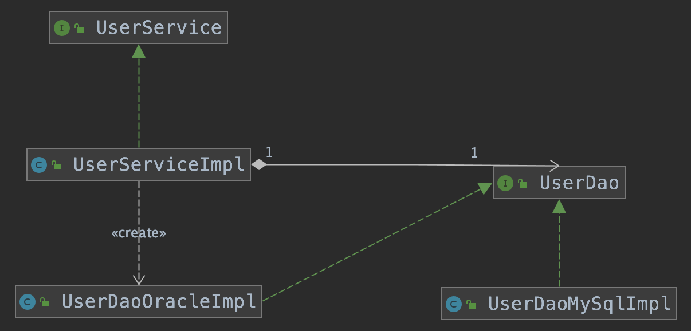
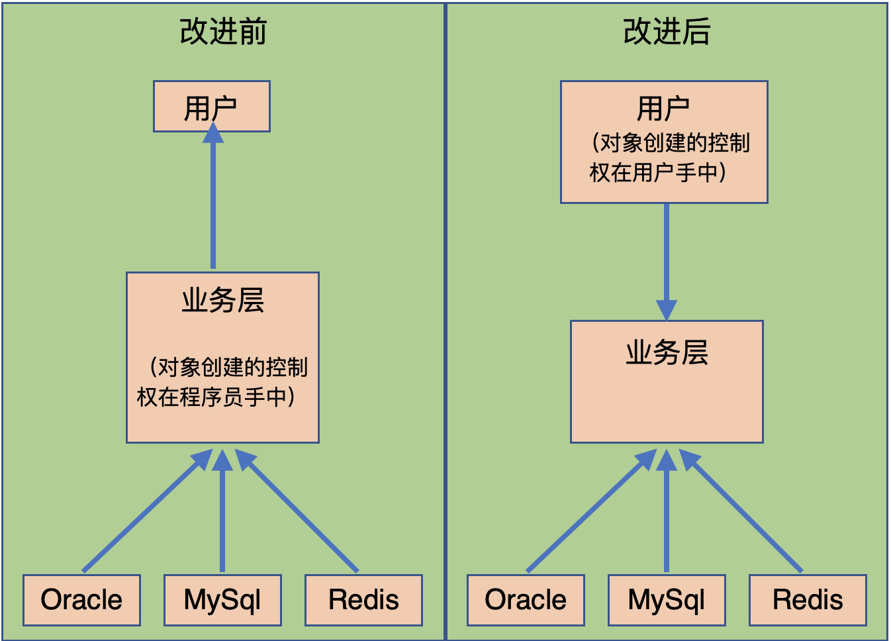
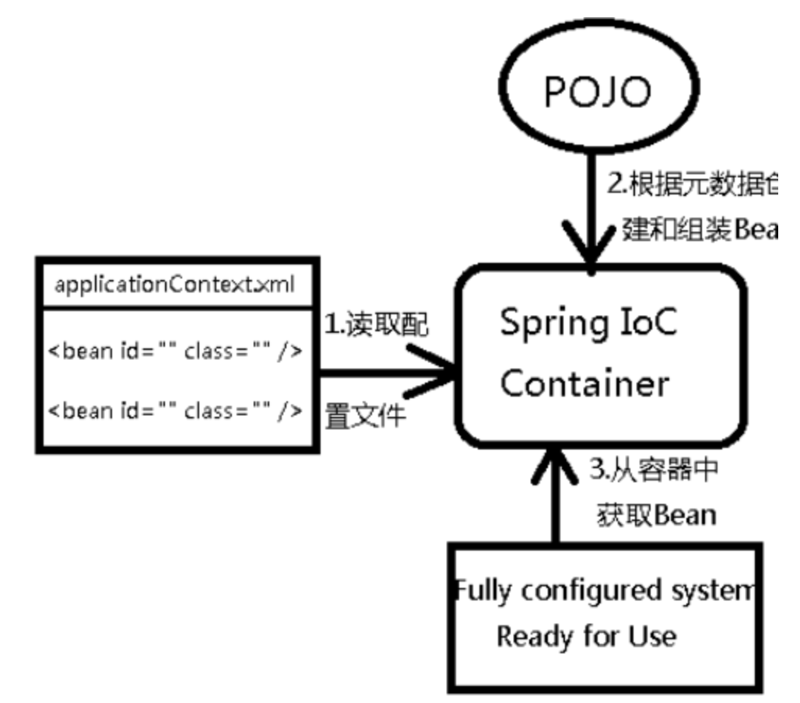
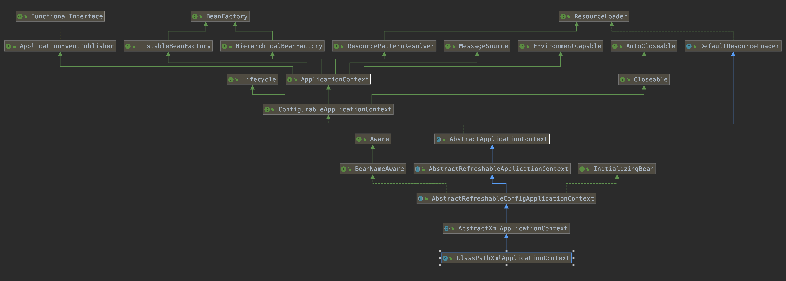
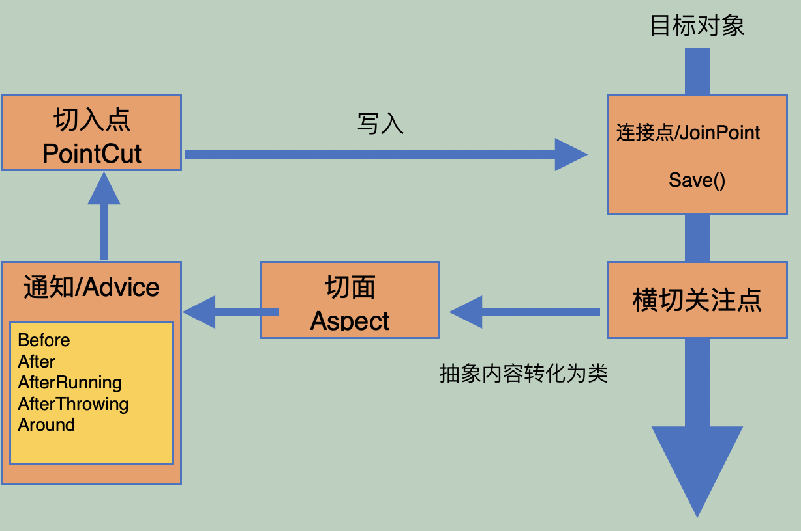

- 参考
    - https://www.bilibili.com/video/av71110355 
    - https://blog.kuangstudy.com/index.php
    - 官方说明文档地址：
        - https://spring.io/projects/spring-framework#learn
        - https://docs.spring.io/spring/docs/

<span id="catalog"></span>

### 目录
- [Spring简介](#Spring简介)
- [Maven依赖](#Maven依赖)
- [Spring的组成](#Spring的组成)
- [ioc理论](#ioc理论)
    - [引入问题-分层调用](#引入问题-分层调用)
    - [改进引入问题](#改进引入问题)
    - [IoC的本质](#IoC的本质)
    - [示例-XML配置来创建对象Hello](#示例-XML配置来创建对象Hello)
    - [对创建Hello对象的分析](#对创建Hello对象的分析)
    - [使用Spring改进引入问题](#使用Spring改进引入问题)
- [Spring配置](#Spring配置)
    - [配置文件的基本内容](#配置文件的基本内容)
    - [通过配置文件获取bean的方法](#通过配置文件获取bean的方法)
    - [import](#import)
    - [Bean的配置方法](#Bean的配置方法)
    - [配置bean的别名](#配置bean的别名)
- [DI依赖注入](#di依赖注入)
    - [依赖注入的几种方式](#依赖注入的几种方式)
    - [构造器注入](#构造器注入)
    - [Set注入方式](#Set注入方式)
    - [扩展注入方式](#扩展注入方式)
    - [bean的作用域](#bean的作用域)
- [bean的自动装配](#bean的自动装配)
    - [自动装配简介](#自动装配简介)
    - [使用xml实现自动装配](#使用xml实现自动装配)
    - [使用注解实现自动装配](#使用注解实现自动装配)
- [使用注解开发](#使用注解开发)
    - [xml与注解-开发方式的分析](#xml与注解-开发方式的分析)
    - [开启注解支持](#开启注解支持)
    - [设置包内扫描](#设置包内扫描)
    - [注解分类](#注解分类)
    - [注解开发示例](#注解开发示例)
- [通过JavaConfig配置Spring](#通过JavaConfig配置Spring)
    - [JavaConfig的基本使用方法](#JavaConfig的基本使用方法)
    - [JavaConfig相关的注解分析](#JavaConfig相关的注解分析)
    - [JavaConfig配置示例](#JavaConfig配置示例)
- [AOP](#AOP)
    - [AOP的基础-代理模式](#AOP的基础-代理模式)
    - [AOP简介](#AOP简介)
    - [使用xml配置文件实现AOP](#使用xml配置文件实现AOP)
    - [使用xml配置自定义切面](#使用xml配置自定义切面)
    - [使用注解配置自定义切面](#使用注解配置自定义切面)
- [](#)
- [](#)

# Spring简介
[top](#catalog)
- 2002年，首次退出了Spring框架的雏形：interface21
- 2004年3月24日，Spring发布：以interface21框架为基础，经过重新设计，并不断丰富其内涵
- Spring的设计理念
    - 保持向后兼容性
    - 使现有的技术更加容易使用，整合了现有的技术框架
- SSH：Struct2 + Spring + Hibernate
- SSM：SpringMvc + SPring + Mybatis
- 官网说明文档入口
    - https://spring.io/projects/spring-framework#learn

- github地址
    - https://github.com/spring-projects/spring-framework
      
- Spring的优点
    - Spring是一个开源免费的框架（容器）
    - Spring是一个轻量级的、非入侵式的框架
        - 非入侵式：引入Spring之后不会影响原来的代码
- Spring的缺点
    - 配置十分繁琐（配置地狱）
        - 现阶段需要使用SpringBoot来解决
    
- **Spring框架的特点**
    - 控制反转，IOC
    - 面向切面编程，AOP
    - 支持事务处理
    - 可以对框架进行整合
    
- <label style="color:red">一句话描述Spring：Spring就是一个轻量级的控制反转和面向切面编程的框架</label>

# Maven依赖
[top](#catalog)
- maven导入
    - 导入包含依赖最多的spring-webmvc
        - maven配置
            ```xml
            <!-- https://mvnrepository.com/artifact/org.springframework/spring-webmvc -->
            <dependency>
                <groupId>org.springframework</groupId>
                <artifactId>spring-webmvc</artifactId>
                <version>5.2.4.RELEASE</version>
            </dependency>
            ```
        - 导入该包后，会同时导入
            ```
            org.springframework:spring-aop:5.2.4.RELEASE
            org.springframework:spring-beans:5.2.4.RELEASE
            org.springframework:spring-context:5.2.4.RELEASE
            org.springframework:spring-core:5.2.4.RELEASE
            org.springframework:spring-expression:5.2.4.RELEASE
            org.springframework:spring-web:5.2.4.RELEASE
            ```
    - 导入与jdbc的整合
        ```xml
        <!-- https://mvnrepository.com/artifact/org.springframework/spring-jdbc -->
        <dependency>
            <groupId>org.springframework</groupId>
            <artifactId>spring-jdbc</artifactId>
            <version>5.2.4.RELEASE</version>
        </dependency>
        ```

- springAOP需要的额外依赖
    ```xml
    <!-- https://mvnrepository.com/artifact/org.aspectj/aspectjweaver -->
    <dependency>
        <groupId>org.aspectj</groupId>
        <artifactId>aspectjweaver</artifactId>
        <version>1.9.5</version>
    </dependency>
    ```


# Spring的组成
[top](#catalog)
- 7大功能模块
    - 
- Spring Boot
    - 一个快速开发的脚手架
    - 可以快速的开发单个微服务
    - 学习SpringBoot的前提，是需要完全掌握Spring及SpringMVC
    - **约定大于配置**
- Spring Cloud
    - 基于Spring Boot实现的
    
# ioc理论
## 引入问题-分层调用
[top](#catalog)
- 需求
    - 分别创建service层和dao层
    - 在service是实现类中**组合**dao，并在方法中调用dao

- 最基本的实现方式：service与dao层的依赖关系
    - 

- 这种方式的问题
    - 外在：程序是主动创建对象，**创建哪种对象、如何创建对象**的控制权都在程序员手上，有需求就要直接修改类
    - 内在：dao与service之间因为组合关系发生了强耦合，如果需求发生变化，需要使用其他类型的dao实现，则**需要直接修改代码**。如果代码量很大，修改的成本会很高
    
- `UserDao`及其实现类
    - 参考代码
        - [/java/mylearn/myspring/src/main/java/com/ljs/learn/myspring/base/ioc/improve/dao/UserDao.java](/java/mylearn/myspring/src/main/java/com/ljs/learn/myspring/base/ioc/improve/dao/UserDao.java)
        - [/java/mylearn/myspring/src/main/java/com/ljs/learn/myspring/base/ioc/improve/dao/UserDaoMySqlImpl.java](/java/mylearn/myspring/src/main/java/com/ljs/learn/myspring/base/ioc/improve/dao/UserDaoMySqlImpl.java)
        - [/java/mylearn/myspring/src/main/java/com/ljs/learn/myspring/base/ioc/improve/dao/UserDaoOracleImpl.java](/java/mylearn/myspring/src/main/java/com/ljs/learn/myspring/base/ioc/improve/dao/UserDaoOracleImpl.java)
    - 代码内容
        ```java
        public interface UserDao {
            String getUserName();
        }
        ```

        ```java
        public class UserDaoMySqlImpl implements UserDao {
            @Override
            public String getUserName() {
                return "Mysql User";
            }
        }
        ```

        ```java
        public class UserDaoOracleImpl implements UserDao {
            @Override
            public String getUserName() {
                return "Oracle User";
            }
        }
        ```
- `UserService`及其实现类
    - 参考代码
        - [/java/mylearn/myspring/src/main/java/com/ljs/learn/myspring/base/ioc/base/service/UserService.java](/java/mylearn/myspring/src/main/java/com/ljs/learn/myspring/base/ioc/base/service/UserService.java)
        - [/java/mylearn/myspring/src/main/java/com/ljs/learn/myspring/base/ioc/base/service/UserServiceImpl.java](/java/mylearn/myspring/src/main/java/com/ljs/learn/myspring/base/ioc/base/service/UserServiceImpl.java)
    - 代码内容
        ```java
        public interface UserService {
            void printUserName();
        }
        ```

        ```java
        public class UserServiceImpl implements UserService {
        
            // 组合一个UserDao
            // private UserDao dao = new UserDaoMySqlImpl();
            // 当需求发生变化时，需要直接修改代码，替换接口实现
            private UserDao dao = new UserDaoOracleImpl();
        
            @Override
            public void printUserName() {
                System.out.println(dao.getUserName());
            }
        }
        ```
      
- 测试类
    - 参考代码
        - [/java/mylearn/myspring/src/test/java/com/ljs/learn/myspring/base/ioc/base/IocBaseTest.java](/java/mylearn/myspring/src/test/java/com/ljs/learn/myspring/base/ioc/base/IocBaseTest.java)
    - 代码内容
        ```java
        @Test
        public void test01(){
            UserService service = new UserServiceImpl();
            service.printUserName();
        }
        ```

## 改进引入问题
[top](#catalog)
- 在基本实现方式中，直接将dao**组合**到service中，导致了强耦合
- 改进方法：在**service**中通过构造器或setter**将组合改为聚合**，在使用时**从外部注入依赖**
- 改进后的优点
    - 需求发生变化时修改外部的注入即可，不需要直接修改类本身
    - 使用set/构造器注入之后，程序不再具有主动性，而是变成被动地接受对象
    - 使用注入之后，不用再去管理对象的创建了
    - 系统的耦合性降低，可以更加专注在业务的实现上
    - <label style="color:red">这种方式是IoC的原型</label>

- 改进后的service实现
    - 参考代码
        - [/java/mylearn/myspring/src/main/java/com/ljs/learn/myspring/base/ioc/improve/service/UserServiceImpl.java](/java/mylearn/myspring/src/main/java/com/ljs/learn/myspring/base/ioc/improve/service/UserServiceImpl.java)
    - 代码内容
        ```java
        public class UserServiceImpl implements UserService {
        
            // 将组合dao改为聚合dao，并在构造器或setter中完成依赖关系的传递
            private UserDao dao;
        
            public UserServiceImpl(UserDao dao) {
                this.dao = dao;
            }
        
            public void setDao(UserDao dao) {
                this.dao = dao;
            }
        
            @Override
            public void printUserName() {
                System.out.println(dao.getUserName());
            }
        }
        ```
- 测试内容
    - 参考代码
        - [/java/mylearn/myspring/src/test/java/com/ljs/learn/myspring/base/ioc/improve/IocImporveTest.java](/java/mylearn/myspring/src/test/java/com/ljs/learn/myspring/base/ioc/improve/IocImporveTest.java)
    - 代码内容
        ```java
        @Test
        public void test01(){
            // 实例化service对象的同时，注入dao的依赖
            UserService service01 = new UserServiceImpl(new UserDaoMySqlImpl());
            service01.printUserName();
    
            System.out.println("-----");
    
            // 当需求变化，需要改变dao的实现时，不需要修改源码，直接修改注入的dao对象
            UserService service02 = new UserServiceImpl(new UserDaoOracleImpl());
            service02.printUserName();
        }
        ```
      
- 改进前后的控制关系对比
    - 创建对象的控制权从类自身/程序员手中移动到了用户
    - 
    
    
## IoC的本质
[top](#catalog)
- 控制反转（Inversion of Control）是一种设计思想，依赖注入(DI)是实现Ioc的一种方式
- 在面向对象编程中，IoC是一种思考方式：**获取依赖对象的方式**
    - 不使用IoC，依赖对象的创建由程序自身/程序员来控制
    - 使用IoC，依赖对象的创建转移给第三方
- 两种对Spring中IoC的精要描述
    - <label style="color:red">Spring的IoC是一种通过描述(XML或注解)并通过第三方生产或获取特定对象的方式</label>
    - <label style="color:red">IoC就是对象由Spring来创建、管理、装配</label>
- IoC是Spring的核心内容
    - Spring中实现控制反转的是**Ioc容器**，实现方法是依赖注入
    - 多种IoC的实现方式
        - xml配置
            - xml配置Bean时，Bean的定义信息和实现是**分离的**
        - 注解
            - 注解配置Bean时，Bean的定义信息和实现是**一体的** 
        - 新版本Spring也可以实现零配置实现IoC
    - 创建过程
        1. Spring容器在初始化时先读取配置文件
        2. 根据配置文件或元数据创建与组织对象存入容器
        3. 程序使用时再从IoC容器中获取需要的对象
    - 创建过程示意图
        - 


## 示例-XML配置来创建对象Hello
[top](#catalog)
- 从Spring中获取类时，可以通过Spring的上下文对象来获取
    - `ApplicationContext context = new ClassPathXmlApplicationContext("services.xml", "daos.xml");`
- Hello类
    - 参考代码
        - [/java/mylearn/myspring/src/main/java/com/ljs/learn/myspring/base/ioc/springHello/Hello.java](/java/mylearn/myspring/src/main/java/com/ljs/learn/myspring/base/ioc/springHello/Hello.java)  
    - 代码内容
        ```java
        public class Hello {
            private String str;
        
            public Hello() {
            }
        
            public Hello(String str) {
                this.str = str;
            }
        
            public String getStr() {
                return str;
            }
        
            public void setStr(String str) {
                this.str = str;
            }
        
            @Override
            public String toString() {
                return "Hello{" +
                        "str='" + str + '\'' +
                        '}';
            }
        }
        ```

- Spring配置
    - 配置文件
        - [/java/mylearn/myspring/src/main/resources/base/ioc/springHello/bean.xml](/java/mylearn/myspring/src/main/resources/base/ioc/springHello/bean.xml)
    - 配置内容
        ```xml
        <?xml version="1.0" encoding="UTF-8"?>
        <beans xmlns="http://www.springframework.org/schema/beans"
               xmlns:xsi="http://www.w3.org/2001/XMLSchema-instance"
               xsi:schemaLocation="http://www.springframework.org/schema/beans
                https://www.springframework.org/schema/beans/spring-beans.xsd">
        
        <!--使用Spring来创建对象，-->
        <!--分别配置类的全类名及类对应的id-->
        <bean id="hello" class="com.ljs.learn.ioc.springHello.Hello">
            <!--通过该标签为实例对象中的属性设值-->
            <property name="str" value="helloTest"/>
        </bean>
        
        </beans>
        ```
- 测试类
    - 参考代码
        - [/java/mylearn/myspring/src/test/java/com/ljs/learn/myspring/base/ioc/springHello/HelloTest.java](/java/mylearn/myspring/src/test/java/com/ljs/learn/myspring/base/ioc/springHello/HelloTest.java)
    - 代码内容
        ```java
        import org.junit.Test;
        import org.springframework.context.ApplicationContext;
        import org.springframework.context.support.ClassPathXmlApplicationContext;
        
        public class HelloTest {
            @Test
            public void test01(){
                // 获取Spring的上下文对象
                ApplicationContext context = new ClassPathXmlApplicationContext("ioc/springHello/bean.xml");
                // 类配置到Spring之后，所有的对象都有Spring管理，使用时直接到上下文中获取
                Hello hello = (Hello) context.getBean("hello");
                System.out.println(hello.toString());
            }
        }
        ```
      
## 对创建Hello对象的分析
[top](#catalog)
- 控制
    - 传统应用程序的对象由程序本身创建，使用Spring后对象由Spring创建
    - 即没有直接通过代码`Hello obj = new Hello()`来实例化对象，而是从Spring上下文对象中获取
- 反转
    - 类本身不创建对象，而是被动的接收对象
    - 即没有直接通过代码`Hello obj = new Hello()`来实例化对象，而是从Spring上下文对象中获取
- 依赖注入
    - 类中的成员变量`str`通过配置的方式，在执行过程中使用`setter`来注入

- 使用Spring之后，实现不同需求的时候，只要修改配置就可以了
   
## 使用Spring改进引入问题
[top](#catalog)
- service实现类的修改：只保留`setter`注入方式，并且提供空参构造器
    - 参考代码
        - [/java/mylearn/myspring/src/main/java/com/ljs/learn/myspring/base/ioc/springBaseImprove/service/UserServiceImpl.java](/java/mylearn/myspring/src/main/java/com/ljs/learn/myspring/base/ioc/springBaseImprove/service/UserServiceImpl.java)
    - 代码内容
        ```java
        public class UserServiceImpl implements UserService {
        
            // 将组合dao改为聚合dao，并在setter中完成依赖关系的传递
            private UserDao dao;
        
            public void setDao(UserDao dao) {
                this.dao = dao;
            }
        
            @Override
            public void printUserName() {
                System.out.println(dao.getUserName());
            }
        }
        ```
- XML配置
    - 配置文件
        - [/java/mylearn/myspring/src/main/resources/base/ioc/springBaseImprove/bean.xml](/java/mylearn/myspring/src/main/resources/base/ioc/springBaseImprove/bean.xml)
    - 配置内容
        ```xml
        <?xml version="1.0" encoding="UTF-8"?>
        <beans xmlns="http://www.springframework.org/schema/beans"
               xmlns:xsi="http://www.w3.org/2001/XMLSchema-instance"
               xsi:schemaLocation="http://www.springframework.org/schema/beans http://www.springframework.org/schema/beans/spring-beans.xsd">
        
            <bean id="mySqlImpl" class="com.ljs.learn.ioc.springBaseImprove.dao.UserDaoMySqlImpl"/>
            <bean id="oracleImpl" class="com.ljs.learn.ioc.springBaseImprove.dao.UserDaoOracleImpl"/>
        
            <!--向service中注入MySql的实现对象-->
            <bean id="serviceMysql" class="com.ljs.learn.ioc.springBaseImprove.service.UserServiceImpl">
                <!--直接使用Spring容器中创建的对象-->
                <property name="dao" ref="mySqlImpl"/>
            </bean>
        
            <!--想service中注入Oracle的实现对象-->
            <bean id="serviceOracle" class="com.ljs.learn.ioc.springBaseImprove.service.UserServiceImpl">
                <!--直接使用Spring容器中创建的对象-->
                <property name="dao" ref="oracleImpl"/>
            </bean>
        </beans>
        ```
- 测试类
    - 测试代码
        - [/java/mylearn/myspring/src/test/java/com/ljs/learn/myspring/base/ioc/springBaseImprove/UserTest.java](/java/mylearn/myspring/src/test/java/com/ljs/learn/myspring/base/ioc/springBaseImprove/UserTest.java)
    - 代码内容
        ```java
        public class UserTest {
            // 不修改任何代码，直接通过ID，从Spring中获取聚合了两种dao实例的service对象
            @Test
            public void test01(){
                ApplicationContext context = new ClassPathXmlApplicationContext("ioc/springBaseImprove/bean.xml");
                UserServiceImpl serviceMysql = (UserServiceImpl) context.getBean("serviceMysql");
                serviceMysql.printUserName();
            }
        
            @Test
            public void test02(){
                ApplicationContext context = new ClassPathXmlApplicationContext("ioc/springBaseImprove/bean.xml");
                UserServiceImpl serviceOracle = (UserServiceImpl) context.getBean("serviceOracle");
                serviceOracle.printUserName();
            }
        }
        ```

# Spring配置
## 配置文件的基本内容
[top](#catalog)
- 官方配置参考
    - https://docs.spring.io/spring/docs/5.2.4.RELEASE/spring-framework-reference/core.html#beans-factory-metadata
- 配置文件的基本内容
    ```xml
    <?xml version="1.0" encoding="UTF-8"?>
    <beans xmlns="http://www.springframework.org/schema/beans"
        xmlns:xsi="http://www.w3.org/2001/XMLSchema-instance"
        xsi:schemaLocation="http://www.springframework.org/schema/beans
            https://www.springframework.org/schema/beans/spring-beans.xsd">
    
        <bean id="..." class="...">
            <!-- collaborators and configuration for this bean go here -->
        </bean>
    
        <bean id="..." class="...">
            <!-- collaborators and configuration for this bean go here -->
        </bean>
    
        <!-- more bean definitions go here -->
    
    </beans>
    ```

## 通过配置文件获取bean的方法
[top](#catalog)
- xml配置文件
    - 文件需要保存在`main/resources`目录下，文件名任意，使用时作为参数注入到上下文对象中

- 通过配置文件从Spring中获取类时，从Spring上下文对象中通过bean的id来获取实例化对象(**cpx类对象**)
    - 创建 Spring 上下文对象时，可以添加多个配置文件
    ```java
    ApplicationContext context = new ClassPathXmlApplicationContext("services.xml", "daos.xml");
    ```

- 获取方式
    - 通过id获取bean：`Student student = (Student) context.getBean("student");`
    - 通过id和类型获取bean：`Student student01 = context.getBean("student01", Student.class);`

- `ClassPathXmlApplicationContext`的继承关系
    - 

## import
[top](#catalog)
- import，一般用于团队开发使用，可以将多个配置文件，导入合并一个总的配置文件：`applicationContext.xml`
- 如果多人开发，不同的类注册在不同的bean中，可以利用import将所有人的beans.xml合并为一个总的。使用时直接使用总配置就可以了
    - 合并时内容相同的会  ?????
- 配置方法
    ```xml
    <import resource="其他配置文件的路径"></import>
    ```

????????

## Bean的配置方法
[top](#catalog)
- 2个要素+别名
- 要素1：`class`，表示类的全类名
- 要素2：`id`，同一个`class`下，不同的`id`代表不同的实例对象
    ```xml
    <bean id="hello" class="com.ljs.pojo.Hello" name="h1, h2, h3">
        <property name="str" value="Spring"></property>
    </bean>
    
    <bean id="hello2" class="com.ljs.pojo.Hello">
        <property name="str" value="Spring"></property>
    </bean>
    ```
- 别名配置参考：[配置bean的别名](#配置bean的别名)

## 配置bean的别名
[top](#catalog)
- 给已有bean的Id添加别名，添加后可以通过别名来获取对象
- **一个bean可以有多个别名**
- 两种添加别名的方式
    1. 方式1：使用`alias`标签
        ```xml
        <bean id="user" class="com.ljs.learn.User">
            <!-- 使用构造器注入属性 -->
            <constructor-arg name="name" value="MyName"></constructor-arg>
        </bean>
      
        <!--为对象user添加别名otheruser-->
        <alias name="user" alias="otheruser"></alias>
        <alias name="user" alias="otheruser2"></alias>
        ```
    2. 方式2：通过 `bean` 标签的 `name` 属性，可以一次性设置多个别名，需要使用`空格`、 `,` 、 `;` 来分割字符串
        ```xml
        <bean id="user" class="com.ljs.learn.User" name="u1 u2,u3;U3">
            <property name="str" value="Spring"></property>
        </bean>
        ```
       
- 示例
    - Hello类
        - 参考代码
            - [/java/mylearn/myspring/src/main/java/com/ljs/learn/myspring/base/config/alias/Hello.java](/java/mylearn/myspring/src/main/java/com/ljs/learn/myspring/base/config/alias/Hello.java)
        - 代码内容
            ```java
            public class Hello {
                private String name;
                private String address;
            
                public Hello(String n, String a) {
                    this.name = n;
                    this.address = a;
                }
            
                // getter, setter
            }
            ```
    - 配置文件
        - 文件路径：
            - [/java/mylearn/myspring/src/main/resources/base/config/alias/bean.xml](/java/mylearn/myspring/src/main/resources/base/config/alias/bean.xml)
        - 配置内容
            ```xml
            <?xml version="1.0" encoding="UTF-8"?>
            <beans xmlns="http://www.springframework.org/schema/beans"
                   xmlns:xsi="http://www.w3.org/2001/XMLSchema-instance"
                   xsi:schemaLocation="http://www.springframework.org/schema/beans http://www.springframework.org/schema/beans/spring-beans.xsd">
            
                <!--在bean标签的name属性中设置bean的别名-->
                <bean id="hello" class="com.ljs.learn.config.alias.Hello" name="h1 h2,h3;h4">
                    <!-- 使用构造器注入属性 -->
                    <constructor-arg index="0" value="TestHello"/>
                    <constructor-arg index="1" value="TestAddress"/>
                </bean>
            
                <!-- 使用alias来为bean添加别名 -->
                <alias name="hello" alias="helloA"/>
                <alias name="hello" alias="helloB"/>
            </beans>
            ```
    - 测试类
        - 参考代码：
            - [/java/mylearn/myspring/src/test/java/com/ljs/learn/myspring/base/config/alias/HelloAliasTest.java](/java/mylearn/myspring/src/test/java/com/ljs/learn/myspring/base/config/alias/HelloAliasTest.java)
        - 测试内容
            ```java
            @Test
            public void test01(){
                ApplicationContext context = new ClassPathXmlApplicationContext("config/alias/bean.xml");
                Hello hello = (Hello) context.getBean("hello");
                Hello h1 = (Hello) context.getBean("h1");
                Hello h2 = (Hello) context.getBean("h2");
                Hello h3 = (Hello) context.getBean("h3");
                Hello h4 = (Hello) context.getBean("h4");
                Hello helloA = (Hello) context.getBean("helloA");
                Hello helloB = (Hello) context.getBean("helloB");

                System.out.println(hello);
                System.out.println(h1);
                System.out.println(h2);
                System.out.println(h3);
                System.out.println(h4);
                System.out.println(helloA);
                System.out.println(helloB);
            }
            ```

# DI依赖注入
## 依赖注入的几种方式
[top](#catalog)
- 依赖：bean对象的创建依赖于容器
- 注入：bean对象中的所有属性，由容器来注入
- 三种方式
    - 构造器注入
        - `bean`下使用`constructor-arg`标签，通过构造器参数名来注入
        - 扩展注入方式中的c命名空间注入
    - 通过set方式注入
        - `bean`下通过 `<property name="属性名" ....>` 来注入参数值
        - 扩展注入方式中的p命名空间注入
    - 第三方提供的其他注入方式

## 构造器注入
[top](#catalog)
- `bean`下使用 `<constructor-arg>` 标签，通过构造器参数名来注入
- **在配置文件加载时，容器中管理的对象就已经被初始化了**
- 默认使用无参构造器创建对象
- 使用有参数构造器
    1. 使用数据类型
        - 通过`type="属性"`显示指定构造参数的类型，容器可以使用简单类型的类型匹配
        - **不推荐使用，不方便处理多个类型相同参数的构造函数**
        ```xml
        <bean id="exampleBean" class="examples.ExampleBean">
            <constructor-arg type="int" value="7500000"/>
            <constructor-arg type="java.lang.String" value="42"/>
        </bean>
        ```
    2. 使用构造函数的参数下标
        - 通过`index="XX"`来明确指定构造参数的索引
        - 这种方式，可以解决多个简单值的歧义性
        ```xml
        <bean id="exampleBean" class="examples.ExampleBean">
            <constructor-arg index="0" value="7500000"/>
            <constructor-arg index="1" value="42"/>
        </bean>
        ```
    4. 直接使用构造器中的参数名
        ```xml
        <bean id="user" class="com.ljs.pojo.User">
            <constructor-arg name="name" value="MyName"></constructor-arg>
        </bean>
        ```
       
- 示例
    - Hello类
        - 参考代码
            - [/java/mylearn/myspring/src/main/java/com/ljs/learn/myspring/base/di/constructor/Hello.java](/java/mylearn/myspring/src/main/java/com/ljs/learn/myspring/base/di/constructor/Hello.java)  
        - 代码内容
            ```java
            public class Hello {
                private String name;
                private String address;
            
                public Hello(String n, String a) {
                    this.name = n;
                    this.address = a;
            
                    System.out.println(n + " Constructor");
                }
            
                // getter, setter, toString
            }
            ```
    - 配置文件
        - 文件路径
            - [/java/mylearn/myspring/src/main/resources/base/di/constructor/bean.xml](/java/mylearn/myspring/src/main/resources/base/di/constructor/bean.xml)
        - 配置内容
            ```xml
            <?xml version="1.0" encoding="UTF-8"?>
            <beans xmlns="http://www.springframework.org/schema/beans"
                   xmlns:xsi="http://www.w3.org/2001/XMLSchema-instance"
                   xsi:schemaLocation="http://www.springframework.org/schema/beans http://www.springframework.org/schema/beans/spring-beans.xsd">
            
                <!--使用数据类型来实例化对象-->
                <bean id="hello1" class="com.ljs.learn.config.constructor.Hello">
                    <constructor-arg type="java.lang.String" value="TestHello01"/>
                    <constructor-arg type="java.lang.String" value="TestAddress01"/>
                </bean>
            
                <!--使用参数索引来实例化对象-->
                <bean id="hello2" class="com.ljs.learn.config.constructor.Hello">
                    <constructor-arg index="0" value="TestHello02"/>
                    <constructor-arg index="1" value="TestAddress02"/>
                </bean>
                
                <!--通过有参构造器中的参数名来实例化对象-->
                <bean id="hello3" class="com.ljs.learn.config.constructor.Hello">
                    <constructor-arg name="n" value="TestHello03"/>
                    <constructor-arg name="a" value="TestAddress03"/>
                </bean>
            </beans>
            ```

    - 测试类
        - 参考代码
            - [/java/mylearn/myspring/src/test/java/com/ljs/learn/myspring/base/di/constructor/HelloTest.java](/java/mylearn/myspring/src/test/java/com/ljs/learn/myspring/base/di/constructor/HelloTest.java)   
        - 测试内容
            ```java
            @Test
            public void test(){
                ApplicationContext context = new ClassPathXmlApplicationContext("di/constructor/bean.xml");
                Hello hello01 = (Hello) context.getBean("hello1");
                Hello hello02 = (Hello) context.getBean("hello2");
                Hello hello03 = (Hello) context.getBean("hello3");
        
                System.out.println(hello01);
                System.out.println(hello02);
                System.out.println(hello03);
            }
            ```
        - 测试结果
            ```
            TestHello01 Constructor
            TestHello02 Constructor
            TestHello03 Constructor
            Hello{name='TestHello01', address='TestAddress01'}
            Hello{name='TestHello02', address='TestAddress02'}
            Hello{name='TestHello03', address='TestAddress03'}
            ```

## Set注入方式
[top](#catalog)
- `bean`下通过 `<property name="name" ....>` 来注入参数值
- 类
    - 参考代码
        - [/java/mylearn/myspring/src/main/java/com/ljs/learn/myspring/base/di/complex/Student.java](/java/mylearn/myspring/src/main/java/com/ljs/learn/myspring/base/di/complex/Student.java)
    - 代码内容
        ```java
        public class Student {
            private String name;
            private Address address;
            private String[] books;
            private List<String> hobbys;
            private Map<String, String> card;
            private Set<String> games;
            private String wife;
            private Properties info;

            ...
        }
        ```
- 配置文件
    - 文件路径
        - [/java/mylearn/myspring/src/main/resources/base/di/complex/bean.xml](/java/mylearn/myspring/src/main/resources/base/di/complex/bean.xml)
    - 配置内容
        ```xml
        <?xml version="1.0" encoding="UTF-8"?>
        <beans xmlns="http://www.springframework.org/schema/beans"
            xmlns:xsi="http://www.w3.org/2001/XMLSchema-instance"
            xsi:schemaLocation="http://www.springframework.org/schema/beans http://www.springframework.org/schema/beans/spring-beans.xsd">

            <bean id="address" class="com.ljs.learn.config.complex.Address">
                <property name="address" value="TestAddress"/>
            </bean>

            <bean id="student" class="com.ljs.learn.config.complex.Student">
                <!--1. value注入-->
                <property name="name" value="StudentTsetName"/>
                <!--2. bean注入-->
                <property name="address" ref="address"/>
                <!--3. 注入数组-->
                <property name="books">
                    <array>
                        <value>testBook01</value>
                        <value>testBook02</value>
                        <value>testBook03</value>
                    </array>
                </property>

                <!--4. 注入集合数组-->
                <property name="hobbys">
                    <list>
                        <value>testHobby01</value>
                        <value>testHobby02</value>
                        <value>testHobby03</value>
                    </list>
                </property>

                <!--5. 注入map-->
                <property name="card">
                    <map>
                        <entry key="key01" value="value01"/>
                        <entry key="key02" value="value02"/>
                    </map>
                </property>

                <!--6. 注入set-->
                <property name="games">
                    <set>
                        <value>game01</value>
                        <value>game02</value>
                        <value>game03</value>
                    </set>
                </property>

                <!--7. 注入null-->
                <property name="wife">
                    <null/>
                </property>

                <!--8. 注入properties-->
                <property name="info">
                    <props>
                        <prop key="driver">20200101</prop>
                        <prop key="url">www.url</prop>
                    </props>
                </property>
            </bean>
        </beans>
        ```
- 测试内容
    - 参考代码
        - [/java/mylearn/myspring/src/test/java/com/ljs/learn/myspring/base/di/complex/StudentTest.java](/java/mylearn/myspring/src/test/java/com/ljs/learn/myspring/base/di/complex/StudentTest.java)
    - 代码内容
        ```java
        @Test
        public void test01(){
            ApplicationContext context = new ClassPathXmlApplicationContext("di/complex/bean.xml");
            Student student = (Student) context.getBean("student");
            // System.out.println(student.getName());
            System.out.println(student);
        }
        ```

## 扩展注入方式
[top](#catalog)
- p命名空间注入：即属性注入，
    - 参考: https://docs.spring.io/spring/docs/5.2.0.RELEASE/spring-framework-reference/core.html#beans-p-namespace
    - 是对类型的注入
    - xml头部添加：`xmlns:p="http://www.springframework.org/schema/p"`
    - 注入方式：`p:属性名`
        ```xml
        <bean id="user" class="com.ljs.pojo.User" p:name="Myname" p:age="18"></bean>
        ```
- c命名空间：即构造器注入
    - 参考: https://docs.spring.io/spring/docs/5.2.0.RELEASE/spring-framework-reference/core.html#beans-c-namespace
    - 是对构造器参数的配置
    - xml头部添加：`xmlns:c="http://www.springframework.org/schema/c"`
    - 注入方式：`c:构造器参数名`
        ```xml
        <bean id="user3" class="com.ljs.pojo.User" c:age="20" c:name="CName"></bean>
        ```

- 示例
    - 类`Student`
        - 参考代码
            - [/java/com/ljs/learn/di/extension/Student.java](/java/com/ljs/learn/di/extension/Student.java)
        - 代码内容
            ```java
            public class Student {
                private String name;
                private int age;

                public Student() {
                }

                public Student(String n, int a) {
                    this.name = n;
                    this.age = a;
                }
                // getter, setter, toString
            }
            ```
    - 配置文件
        - 文件路径
            - [/java/mylearn/myspring/src/main/resources/base/di/extension/bean.xml](/java/mylearn/myspring/src/main/resources/base/di/extension/bean.xml)
        - 配置内容
            ```xml
            <?xml version="1.0" encoding="UTF-8"?>
            <beans xmlns="http://www.springframework.org/schema/beans"
                xmlns:xsi="http://www.w3.org/2001/XMLSchema-instance"
                xmlns:p="http://www.springframework.org/schema/p"
                xmlns:c="http://www.springframework.org/schema/c"
                xsi:schemaLocation="http://www.springframework.org/schema/beans http://www.springframework.org/schema/beans/spring-beans.xsd">

                <!--P命名空间测试-->
                <!--p:属性名-->
                <bean id="student01" class="com.ljs.learn.config.extension.Student" p:name="PName" p:age="15" />

                <!--C命名空间测试-->
                <!--p:构造器参数名-->
                <bean id="student02" class="com.ljs.learn.config.extension.Student" c:n="CName" c:a="18"/>
            </beans>
            ```
    - 测试类
        - 参考代码
            - [/java/mylearn/myspring/src/test/java/com/ljs/learn/myspring/base/di/extension/StudentTest.java](/java/mylearn/myspring/src/test/java/com/ljs/learn/myspring/base/di/extension/StudentTest.java)
        - 代码内容
            ```java
            @Test
            public void test01(){
                ApplicationContext context = new ClassPathXmlApplicationContext("di/extension/bean.xml");
                Student student01 = context.getBean("student01", Student.class);
                Student student02 = context.getBean("student02", Student.class);

                System.out.println(student01);
                System.out.println(student02);
            }
            ```
        - 测试结果
            ```
            Student{name='PName', age=15}
            Student{name='CName', age=18}
            ```

## bean的作用域
[top](#catalog)
- 参考：https://docs.spring.io/spring/docs/5.2.4.RELEASE/spring-framework-reference/core.html#beans-factory-scopes
- 在 `bean` 标签中通过 `scope` 属性来设置bean的作用域
- 6种作用域(两大类别)
    - 基本类别
        - singleton，单例模式（默认值）
        - protetype，原型模式。每次获取时，都是一个新的元素
    - web类别
        - request
        - application
        - websocket

- 示例
    - 类`Student`
        - 参考代码
            - [/java/mylearn/myspring/src/main/java/com/ljs/learn/myspring/base/di/beanScope/Student.java](/java/mylearn/myspring/src/main/java/com/ljs/learn/myspring/base/di/beanScope/Student.java)
        - 代码内容
            ```java
            public class Student {
                private String name;
                private int age;

                public Student() {
                }

                public Student(String n, int a) {
                    this.name = n;
                    this.age = a;
                }

                // getter, setter, toString
            }
            ```
    - 配置文件
        - 文件路径
            - [/java/mylearn/myspring/src/main/resources/base/di/beanScope/bean.xml](/java/mylearn/myspring/src/main/resources/base/di/beanScope/bean.xml)
        - 配置内容
            ```xml
            <?xml version="1.0" encoding="UTF-8"?>
            <beans xmlns="http://www.springframework.org/schema/beans"
                xmlns:xsi="http://www.w3.org/2001/XMLSchema-instance"
                xsi:schemaLocation="http://www.springframework.org/schema/beans http://www.springframework.org/schema/beans/spring-beans.xsd">

                <!--使用单例模式-->
                <bean id="studentS" class="com.ljs.learn.di.beanScope.Student" scope="singleton">
                    <property name="name" value="TestName"/>
                    <property name="age" value="15"/>
                </bean>

                <!--使用原型模式-->
                <bean id="studentP" class="com.ljs.learn.di.beanScope.Student" scope="prototype">
                    <property name="name" value="NewName"/>
                    <property name="age" value="18"/>
                </bean>
            </beans>
            ```
    
    - 测试类
        - 参考代码
            - [/java/mylearn/myspring/src/test/java/com/ljs/learn/myspring/base/di/beanScope/StudentTest.java](/java/mylearn/myspring/src/test/java/com/ljs/learn/myspring/base/di/beanScope/StudentTest.java)
        - 测试内容
            ```java
            @Test
            public void test01(){
                ApplicationContext context = new ClassPathXmlApplicationContext("di/beanScope/bean.xml");

                // 获取单例模式的bean
                Student studentS01 = context.getBean("studentS", Student.class);
                Student studentS02 = context.getBean("studentS", Student.class);

                // 输出：true
                System.out.println(studentS01 == studentS02);
            }

            @Test
            public void test02(){
                ApplicationContext context = new ClassPathXmlApplicationContext("di/beanScope/bean.xml");

                // 获取原型模式的bean
                Student studentP01 = context.getBean("studentP", Student.class);
                Student studentP02 = context.getBean("studentP", Student.class);

                // 输出：false
                System.out.println(studentP01 == studentP02);
            }
            ```

# bean的自动装配
## 自动装配简介
[top](#catalog)
- 自动装配是Spring满足bean依赖的一种方式，Spring会在上下文中自动寻找，并自动给bean注入属性

- **自动装配的配置方式**
    1. 在xml中显示配置
    2. 在java中显示配置?????
    3. 隐式的自动装配（**非常重要**）
    
- 自动装配的几种方式
    - byName，会自动在容器上下文中查找，查找和自己对象set方法后面的值对应的beanid
        - 需要保证所有bean的id唯一，并且这个bean和类中属性的类型需要一致
    - byType，会自动在容器上下文中查找，和自己对象属性类型相同的bean
        - 这种配置方式需要对应类型的bean在上下文中唯一
        - 使用这种方式进行装配时，可以省略被装配bean的`id`
    - constructor，?????
    - default，?????
    - no，?????

## 使用xml实现自动装配
[top](#catalog)
- 使用xml进行自动装配的方法
    1. 编写相应的类，并在xml文件中配置bean
    2. 需要自动装配的类，在`<bean>`中通过属性值：`autowire="...."`来指定自动装配的方式

- 示例
    - 参考类
        - 参考代码：        
            - [/java/mylearn/myspring/src/main/java/com/ljs/learn/myspring/base/autowire/xml/People.java](/java/mylearn/myspring/src/main/java/com/ljs/learn/myspring/base/autowire/xml/People.java)
            - [/java/mylearn/myspring/src/main/java/com/ljs/learn/myspring/base/autowire/xml/Dog.java](/java/mylearn/myspring/src/main/java/com/ljs/learn/myspring/base/autowire/xml/Dog.java)
            - [/java/mylearn/myspring/src/main/java/com/ljs/learn/myspring/base/autowire/xml/Cat.java](/java/mylearn/myspring/src/main/java/com/ljs/learn/myspring/base/autowire/xml/Cat.java)
        - 代码内容
            ```java
            public class Cat {
                public void print(){
                    System.out.println("this is a Cat");
                }
            }
            ```

            ```java
            public class Dog {
                public void print(){
                    System.out.println("this is a dog");
                }
            }
            ```

            ```java
            public class People {
                private Dog dog;
                private Cat cat;
                private String name;
            
                public Dog getDog() {
                    return dog;
                }
            
                public void setDog(Dog dog) {
                    this.dog = dog;
                }
            
                public Cat getCat() {
                    return cat;
                }
            
                public void setCat(Cat cat) {
                    this.cat = cat;
                }
            
                public String getName() {
                    return name;
                }
            
                public void setName(String name) {
                    this.name = name;
                }
            }
            ```
          
    - 配置文件
        - `byName`配置
            - 文件路径
                - [/java/mylearn/myspring/src/main/resources/base/autowire/xml/bean.xml](/java/mylearn/myspring/src/main/resources/base/autowire/xml/bean.xml)
            - 配置内容
                ```xml
                <bean id="cat" class="com.ljs.learn.autowire.xml.Cat"/>
                <bean id="dog" class="com.ljs.learn.autowire.xml.Dog"/>
            
                <!--使用byName的方式进行自动装配-->
                <bean id="people" class="com.ljs.learn.autowire.xml.People" autowire="byName">
                    <property name="name" value="TestName"/>
                </bean>
                ```
        - `byType`配置
            - 文件路径
                - [/java/mylearn/myspring/src/main/resources/base/autowire/xml/bean02.xml](/java/mylearn/myspring/src/main/resources/base/autowire/xml/bean02.xml)
            - 配置内容
                ```xml
                <bean id="xxx" class="com.ljs.learn.autowire.xml.Cat"/>
                <!--类型唯一时，可以省略被装配bean的id-->
                <bean class="com.ljs.learn.autowire.xml.Dog"/>
            
                <!--使用byType的方式进行自动装配-->
                <bean id="people" class="com.ljs.learn.autowire.xml.People" autowire="byType">
                    <property name="name" value="TestName"/>
                </bean>
                ```
    - 测试类
        - 参考代码
            - [/java/mylearn/myspring/src/test/java/com/ljs/learn/myspring/base/autowire/xml/PeopleTest.java](/java/mylearn/myspring/src/test/java/com/ljs/learn/myspring/base/autowire/xml/PeopleTest.java)
        - 测试内容
            - byName 测试
                ```java
                @Test
                public void testByName(){
                    ApplicationContext context = new ClassPathXmlApplicationContext("autowire/xml/bean.xml");
                    People people = context.getBean("people", People.class);
                    people.getCat().print();
                    people.getDog().print();
                }
                ```

            - byType测试
                ```java
                @Test
                public void testByType(){
                    ApplicationContext context = new ClassPathXmlApplicationContext("autowire/xml/bean02.xml");
                    People people = context.getBean("people", People.class);
                    people.getCat().print();
                    people.getDog().print();
                }
                ```
      
## 使用注解实现自动装配
[top](#catalog)
- 使用注解实现自动装配的方法
    1. 在xml中为每个类配置基本的bean
    2. 在类中需要注入依赖的部分，通过注解来进行自动装配
    
- 开启注解支持
    - 开启注解支持必须要有的两个配置
        1. 在xmp中导入约束：context约束
            ```xml
            xmlns:context="http://www.springframework.org/schema/context"

            <!-- 这两个url必须按顺序排列，中间不能插入其他的url -->
            xsi:schemaLocation="...
                        http://www.springframework.org/schema/context
                        https://www.springframework.org/schema/context/spring-context.xsd"
            ```
        2. 配置注解的支持：`<context:annotation-config/>`
    
    - 基本配置内容
        - 参考：https://docs.spring.io/spring/docs/5.2.4.RELEASE/spring-framework-reference/core.html#beans-annotation-config
        ```xml
        <?xml version="1.0" encoding="UTF-8"?>
        <beans xmlns="http://www.springframework.org/schema/beans"
            xmlns:xsi="http://www.w3.org/2001/XMLSchema-instance"
            xmlns:context="http://www.springframework.org/schema/context"
            xsi:schemaLocation="http://www.springframework.org/schema/beans
                https://www.springframework.org/schema/beans/spring-beans.xsd
                http://www.springframework.org/schema/context
                https://www.springframework.org/schema/context/spring-context.xsd">
        
            <context:annotation-config/>
        
        </beans>
        ```

- 进行自动装配的注解
    - `@Autowired`
        - bean搜索的优先级：byType > byName
        
        - 使用@Autowired后，可以不写set方法，前提是自动装配的属性在IOC容器中已经存在，并且名字符合`byName`
        - 辅助注解`@Qualifier(value="bean_id")`
            - 如果`@Autowired`自动装配的环境比较复杂，自动装配无法唯一确定装配对象时，可以使用该注解，指定一个唯一的bean对象注入    
        - 可以应用在：构造器、方法、方法参数、字段、注解
            - 最常用的是应用在：类的字段，和setter方法
        - 注解参数:`reuqired = false/true`
            - 该参数表示类中的属性是否可以为空
            - 默认参数值为：`true`
            - 如果`reuqired = false`，并且`@Qualifier`中配置了一个**不存在的**beanID，则获取该字段时，会**返回null**
        - 源码
            ```java
            @Target({ElementType.CONSTRUCTOR, ElementType.METHOD, ElementType.PARAMETER, ElementType.FIELD, ElementType.ANNOTATION_TYPE})
            @Retention(RetentionPolicy.RUNTIME)
            @Documented
            public @interface Autowired {
                boolean required() default true;
            }
            ```
    
    - `@Resource(name="bean_id")`
        - 该属性需要额外的maven配置
            ```xml
            <dependency>
                <groupId>javax.annotation</groupId>
                <artifactId>javax.annotation-api</artifactId>
                <version>1.3.1</version>
            </dependency>
            ```
        - 可以通过bean的name和type来获取bean
        
    - `@Nullable`
        - 标记某个字段，说明这个字段可以为null
        - 源码
            ```java
            @Target({ElementType.METHOD, ElementType.PARAMETER, ElementType.FIELD})
            @Retention(RetentionPolicy.RUNTIME)
            @Documented
            @Nonnull(
                when = When.MAYBE
            )
            @TypeQualifierNickname
            public @interface Nullable {
            }
            ```
        
    - `@Autowired`和`@Resource`的的异同
        - 都是用来做自动装配，都可以放在属性字段上
        - 执行顺序
            - `@Autowired`是先byType，后byName，并且这个对象必须存在
            - `@Resource`是先byName，后byType，如果两种方式都找不到会报错

- 示例
    - 使用 `@Autowired` 注解进行自动装配
        - 参考代码
            - [/java/mylearn/myspring/src/main/java/com/ljs/learn/myspring/base/autowire/annotation/People.java](/java/mylearn/myspring/src/main/java/com/ljs/learn/myspring/base/autowire/annotation/People.java)
        - 代码内容
            ```java
            public class People {
                // 设置该字段可以为null，并且在@Qualifier中设置一个不存在的beanID
                @Autowired(required = false)
                @Qualifier(value = "dog03")
                private Dog dog;
            
                //配置中有多个Cat对象，通过id进行过滤
                @Autowired
                @Qualifier(value = "cat02")
                private Cat cat;
                private String name;
                
                ...
            }
            ```
    
    - 使用 `@Resource` 注解进行自动装配
        - 参考代码
            - [/java/mylearn/myspring/src/main/java/com/ljs/learn/myspring/base/autowire/annotation/People02.java](/java/mylearn/myspring/src/main/java/com/ljs/learn/myspring/base/autowire/annotation/People02.java)
        - 代码内容
            ```java
            public class People02 {
                //配置中有多个Dog对象，通过id进行过滤
                @Resource(name = "dog02")
                private Dog dog;
            
                //配置中有多个Cat对象，通过id进行过滤
                @Resource(name = "cat01")
                private Cat cat;
                private String name;
                
                ...
            }
            ```

    - 配置文件
        - 文件路径
            - [/java/mylearn/myspring/src/main/resources/base/autowire/annotation/bean.xml](/java/mylearn/myspring/src/main/resources/base/autowire/annotation/bean.xml)
        - 配置内容
            ```xml
            <?xml version="1.0" encoding="UTF-8"?>
            <beans xmlns="http://www.springframework.org/schema/beans"
                   xmlns:xsi="http://www.w3.org/2001/XMLSchema-instance"
                   xmlns:context="http://www.springframework.org/schema/context"
                   xsi:schemaLocation="http://www.springframework.org/schema/beans
                        https://www.springframework.org/schema/beans/spring-beans.xsd
                        http://www.springframework.org/schema/context
                        https://www.springframework.org/schema/context/spring-context.xsd">
                <!--开启注解支持-->
                <context:annotation-config/>
            
                <!--配置多个cat类-->
                <bean id="cat01" class="com.ljs.learn.autowire.annotation.Cat">
                    <property name="name" value="TestCat01"/>
                </bean>
            
                <bean id="cat02" class="com.ljs.learn.autowire.annotation.Cat">
                    <property name="name" value="TestCat02"/>
                </bean>
            
                <!--配置多个dog类-->
                <bean id="dog01" class="com.ljs.learn.autowire.annotation.Dog">
                    <property name="name" value="TestDog01"/>
                </bean>
                <bean id="dog02" class="com.ljs.learn.autowire.annotation.Dog">
                    <property name="name" value="TestDog02"/>
                </bean>
            
                <bean id="people" class="com.ljs.learn.autowire.annotation.People"/>
                <bean id="people02" class="com.ljs.learn.autowire.annotation.People02"/>
            </beans>
            ```
    - 测试类
        - 参考代码
            - [/java/mylearn/myspring/src/test/java/com/ljs/learn/myspring/base/autowire/annotattion/PeopleTest.java](/java/mylearn/myspring/src/test/java/com/ljs/learn/myspring/base/autowire/annotattion/PeopleTest.java)
        - 测试内容
            ```java
            //测试@Autowire装配
            @Test
            public void test01(){
                ApplicationContext context = new ClassPathXmlApplicationContext("autowire/annotation/bean.xml");
                People people = context.getBean("people", People.class);
                System.out.println(people.getCat().toString());
                System.out.println(people.getDog().toString());
            }
        
            //测试@Resource装配
            @Test
            public void test02(){
                ApplicationContext context = new ClassPathXmlApplicationContext("autowire/annotation/bean.xml");
                People02 people02 = context.getBean("people02", People02.class);
                System.out.println(people02.getCat().toString());
                System.out.println(people02.getDog().toString());
            }
            ```


# 使用注解开发
## xml与注解-开发方式的分析
[top](#catalog)
- xml配置与注解
    - xml是万能的，适用于任何场合，维护简单方便
    - 注解，只能在类内部使用，外部的其他类无法直接利用，维护相对复杂
- xml与注解的常用开发方式
    - xml用来管理bean
    - 注解只负责完成属性的注入
    
## 开启注解支持
[top](#catalog)
- 使用注解是时必须要让注解生效，就需要开启注解支持
- 在Spring4之后，要使用注解开发，必须保证
    1. 在xml中导入约束：context约束
        ```xml
        xmlns:context="http://www.springframework.org/schema/context"

        <!-- 这两个url必须按顺序排列，中间不能插入其他的url -->
        xsi:schemaLocation="...
                        http://www.springframework.org/schema/context
                        https://www.springframework.org/schema/context/spring-context.xsd"
        ```
    2. 配置注解的支持：`<context:annotation-config/>`
    3. 导入了`spring-aop`包 
   
    - 基本配置内容
        - 参考：https://docs.spring.io/spring/docs/5.2.4.RELEASE/spring-framework-reference/core.html#beans-annotation-config
        ```xml
        <?xml version="1.0" encoding="UTF-8"?>
        <beans xmlns="http://www.springframework.org/schema/beans"
            xmlns:xsi="http://www.w3.org/2001/XMLSchema-instance"
            xmlns:context="http://www.springframework.org/schema/context"
            xmlns:aop="http://www.springframework.org/schema/aop"
            xsi:schemaLocation="http://www.springframework.org/schema/beans
                        https://www.springframework.org/schema/beans/spring-beans.xsd
                        http://www.springframework.org/schema/context
                        https://www.springframework.org/schema/context/spring-context.xsd">

        
            <context:annotation-config/>
        
        </beans>
        ```
      
## 设置包内扫描
[top](#catalog)
- 使用注解开发时，需要在xml中指定需要扫描的包路径。启动后，Spring会自动扫描包下的有效bean
- 配置内容
    ```xml
    <context:component-scan base-package="包路径"/>
    ```

- 在设置包内扫描后，不需要显示的在xml中配置bean，所以需要使用各种注解来完成对应的xml配置功能
- **包内的类，必须要配合使用`@Component`等注解，才能被Spring扫描到**
 
## 注解分类
[top](#catalog)
- 用于自动装配的注解
    - 参考：[使用注解实现自动装配](#使用注解实现自动装配)

- `@Component`: 标记并将类注册到Spring中 <span id="annotation-component"></span>
    - 装饰类之后，说明这个类被Spring管理了
        - 等价于
            ```xml
            <bean id="user" class=".....User"/>
            ```
    - 只能修饰类、接口、eum声明，如
        ```java
        @Component("myUser")
        public class User {...}
        ```
    - beanID
        - 默认情况下，即直接使用`@Component`时：`beanId = 方法名小写字母开头`
        - 如果设置了beanID，即`@Component("beanId")`时，只能通过 beanID 来获取bean
    - 源码
        ```java
        @Target({ElementType.TYPE})
        @Retention(RetentionPolicy.RUNTIME)
        @Documented
        @Indexed
        public @interface Component {
            String value() default "";
        }
        ```
      
- `@Value`: 属性注入
    - 相当于
        ```xml
        <property name="name" value="TestName"/>
        ```
    - 在使用注解开发后，无法指定通过`<property>`标签来注入属性，所以使用`@Value`进行替代 
    - 可以修饰：字段、方法(setter)、方法参数?????、注解?????
    - 注解源码
        ```java
        @Target({ElementType.FIELD, ElementType.METHOD, ElementType.PARAMETER, ElementType.ANNOTATION_TYPE})
        @Retention(RetentionPolicy.RUNTIME)
        @Documented
        public @interface Value {
            String value();
        }
        ```
      
- `@Scope`：标记bean的作用域
    - 相当于：`<bean scope="...">`
        - 在使用注解开发后，无法通过`<bean scope="...">`来指定bean的作用域，所以使用`@Scope`来替代
    - 可以修饰：类、接口、方法?????
    - 源码
        ```java
        @Target({ElementType.TYPE, ElementType.METHOD})
        @Retention(RetentionPolicy.RUNTIME)
        @Documented
        public @interface Scope {
            @AliasFor("scopeName")
            String value() default "";
        
            @AliasFor("value")
            String scopeName() default "";
        
            ScopedProxyMode proxyMode() default ScopedProxyMode.DEFAULT;
        }
        ```

- 衍生的注解
    - `@Component`有几个衍生注解。在web开发中，会按照mvc三层架构分层，每一层分别对应一个注解

        |分层|注解|
        |-|-|
        |dao层|@Repository|
        |service层|@Service|
        |controller层|@Controller|
    
    - 这3个注解功能与`@Component`相同，都是代表将某个类注册到Spring中，装配bean

## 注解开发示例
[top](#catalog)
- 类
    - 参考代码
        - [/java/mylearn/myspring/src/main/java/com/ljs/learn/myspring/base/annotation/User.java](/java/mylearn/myspring/src/main/java/com/ljs/learn/myspring/base/annotation/User.java)
        - [/java/mylearn/myspring/src/main/java/com/ljs/learn/myspring/base/annotation/User02.java](/java/mylearn/myspring/src/main/java/com/ljs/learn/myspring/base/annotation/User02.java)
    - 代码内容
        ```java
        //等价于<bean id="user" class=".....User"/>
        @Component
        // @Scope("singleton") //配置作用域：单例模式
        @Scope("prototype") //配置作用域：原型模式
        public class User {
            //相当于<property name="name" value="TestName"/>
            @Value("TestName")
            private String name;
        
            private int age;
        
            public String getName() {
                return name;
            }
        
            public void setName(String name) {
                this.name = name;
            }
        
            public int getAge() {
                return age;
            }
        
            @Value("18")
            public void setAge(int age) {
                this.age = age;
            }
        }
        ```
        
        ```java
        @Component("myUser02")
        @Scope("singleton") //配置作用域：单例模式
        public class User02 {
            //相当于<property name="name" value="User02Name"/>
            @Value("User02Name")
            private String name;
        
            private int age;
        
            public String getName() {
                return name;
            }
        
            public void setName(String name) {
                this.name = name;
            }
        
            public int getAge() {
                return age;
            }
        
            @Value("20")
            public void setAge(int age) {
                this.age = age;
            }
        }
        ```

- 配置文件
    - 文件路径
        - [/java/mylearn/myspring/src/main/resources/base/annotation/bean.xml](/java/mylearn/myspring/src/main/resources/base/annotation/bean.xml)
    - 配置内容
        ```xml
        <?xml version="1.0" encoding="UTF-8"?>
        <beans xmlns="http://www.springframework.org/schema/beans"
                xmlns:xsi="http://www.w3.org/2001/XMLSchema-instance"
                xmlns:context="http://www.springframework.org/schema/context"
                xsi:schemaLocation="http://www.springframework.org/schema/beans
                    https://www.springframework.org/schema/beans/spring-beans.xsd
                    http://www.springframework.org/schema/context
                    https://www.springframework.org/schema/context/spring-context.xsd">
        
            <!--扫描指定的包，该包下的@Component注解会生效-->
            <context:component-scan base-package="com.ljs.learn.annotation"/>
            <context:annotation-config/>
        
        </beans>
        ```
- 测试类
    - 参考代码
        - [/java/mylearn/myspring/src/test/java/com/ljs/learn/myspring/base/autowire](/java/mylearn/myspring/src/test/java/com/ljs/learn/myspring/base/autowire)
    - 测试内容
        ```java
        // @Component测试
        @Test
        public void test01(){
            ApplicationContext context = new ClassPathXmlApplicationContext("annotation/bean.xml");
            User user = context.getBean("user", User.class);
            System.out.println(user.getName());
            System.out.println(user.getAge());
        }
        ```
        ```java
        // @Component("...")手动设置beanID测试
        @Test
        public void test02(){
            ApplicationContext context = new ClassPathXmlApplicationContext("annotation/bean.xml");
            // User02 myUesr02 = context.getBean("user02", User02.class);
            User02 myUesr02 = context.getBean("myUser02", User02.class);
            System.out.println(myUesr02.getName());
            System.out.println(myUesr02.getAge());
        }
        ```
        ```java
        // @Scope测试
        @Test
        public void test03(){
            // User原型模式
            ApplicationContext context = new ClassPathXmlApplicationContext("annotation/bean.xml");
            User userA = context.getBean("user", User.class);
            User userB = context.getBean("user", User.class);
    
            // 输出：false
            System.out.println(userA == userB);
        }
        ```
          
# 通过JavaConfig配置Spring
## JavaConfig的基本使用方法
[top](#catalog)
- 参考：https://docs.spring.io/spring/docs/5.2.4.RELEASE/spring-framework-reference/core.html#beans-java-basic-concepts
- JavaConfig是Spring的一个子项目，在Spring4之后，成为了一个核心功能。**通过java类来配置Spring，完全脱离xml文件**
- 基本用法
    - java类
        ```java
        @Configuration
        public class AppConfig {
        
           @Bean
           public MyService myService() {
               return new MyServiceImpl();
           }
        } 
        ```
    - 与java类含义相同的xml配置内容
        ```xml
        <beans>
            <bean id="myService" class="com.acme.services.MyServiceImpl"/>
        </beans>
        ```

- 配置内容分析    
    - `@Configuration` 装饰的java类是一个配置类，和xml文件类似
    - `@Bean` 修饰的方法是在注册bean，相当于一个xml中的`<bean>`标签。方法名相当于`id`属性，方法的返回值类型相当于`class`属性
        ```java
        @Bean
        public MyService myService() {
            return new MyServiceImpl();
        }
        ```
        ```xml
        <bean id="myService" class="MyService"/>
        ```
      
- 使用JavaConfig配置Spring后，需要使用`AnnotationConfigApplicationContext`来获取Spring的上下文对（acacontext）
    ```java
    ApplicationContext context = new AnnotationConfigApplicationContext(MyConfig.class);
    ```
      
## JavaConfig相关的注解分析
[top](#catalog)
- `@Configuration`
    - 装饰一个java类，将java类转化为一个配置类，和xml文件相同
    - 类被装饰后，也会注册到Spring中，由Spring接管
    - 只能修饰类、接口
    - 源码
        ```java
        @Target(ElementType.TYPE)
        @Retention(RetentionPolicy.RUNTIME)
        @Documented
        @Component
        public @interface Configuration {
        	@AliasFor(annotation = Component.class)
        	String value() default "";

        	boolean proxyBeanMethods() default true;        
        }
        ```
    
- `@Bean`
    - 用于修饰方法、注解
    - 修饰方式即注册bean，相当于一个xml中的`<bean>`标签。方法名相当于`id`属性，方法的返回值类型相当于`class`属性，如：
        ```java
        @Bean
        public MyService myService() {
            return new MyServiceImpl();
        }
        ```
        ```xml
        <bean id="myService" class="MyService"/>
        ```
    - 通过`@Bean`注册的bean，不需要使用`@Component`来装饰
    - 源码 
        ```java       
        @Target({ElementType.METHOD, ElementType.ANNOTATION_TYPE})
        @Retention(RetentionPolicy.RUNTIME)
        @Documented
        public @interface Bean {
        
            /**
             * Alias for {@link #name}.
             * <p>Intended to be used when no other attributes are needed, for example:
             * {@code @Bean("customBeanName")}.
             * @since 4.3.3
             * @see #name
             */
            @AliasFor("name")
            String[] value() default {};
        
            /**
             * The name of this bean, or if several names, a primary bean name plus aliases.
             * <p>If left unspecified, the name of the bean is the name of the annotated method.
             * If specified, the method name is ignored.
             * <p>The bean name and aliases may also be configured via the {@link #value}
             * attribute if no other attributes are declared.
             * @see #value
             */
            @AliasFor("value")
            String[] name() default {};
        
            @Deprecated
            Autowire autowire() default Autowire.NO;
        
            boolean autowireCandidate() default true;
        
            String initMethod() default "";
        
            String destroyMethod() default AbstractBeanDefinition.INFER_METHOD;
        
        }
        ```

- `@Import`
    - 在一个配置类中引入其他配置类，相当于xml配置文件中的
        ```xml
        <import resource="其他配置文件的路径"></import>
        ```
    - 可以修饰类接口
    - `@Import(a.class, b.class,...)`，使用时，写明需要引入的类的`Class`对象，一个注解中可以引入多个
    - 源码
        ```java
        @Target(ElementType.TYPE)
        @Retention(RetentionPolicy.RUNTIME)
        @Documented
        public @interface Import {
        	Class<?>[] value();
        
        }
        ```

- `@Component`
    - 将装饰的类注册到Spring中
    - 详细内容参考：[Component注解分析](#annotation-component)
    - **beanID**
        - 默认情况下，即直接使用`@Component`时：`beanId = 方法名小写字母开头`
        - 如果设置了beanID，即`@Component("xxx")`时，只能通过`xxx`来获取bean

- `@ComponentScan`
    - 扫描包下的被`@Component`装饰的类，相当于xml配置文件中的
        ```xml
        <context:component-scan base-package="com.ljs.learn.annotation"/>
        ```
    - 用于装饰类
    - `@ComponentScan(包名1, 包名2, ...)`，使用时可以指定多个包名，并扫描
    - 源码
        ```java
        @Retention(RetentionPolicy.RUNTIME)
        @Target(ElementType.TYPE)
        @Documented
        @Repeatable(ComponentScans.class)
        public @interface ComponentScan {
        	@AliasFor("basePackages")
        	String[] value() default {};
        
        	@AliasFor("value")
        	String[] basePackages() default {};
        
        	Class<?>[] basePackageClasses() default {};
        
        	Class<? extends BeanNameGenerator> nameGenerator() default BeanNameGenerator.class;
        
        	Class<? extends ScopeMetadataResolver> scopeResolver() default AnnotationScopeMetadataResolver.class;
        
        	ScopedProxyMode scopedProxy() default ScopedProxyMode.DEFAULT;
        
        	String resourcePattern() default ClassPathScanningCandidateComponentProvider.DEFAULT_RESOURCE_PATTERN;
        
        	boolean useDefaultFilters() default true;
        
        	Filter[] includeFilters() default {};
        
        	Filter[] excludeFilters() default {};
        
        	boolean lazyInit() default false;
        
        	@Retention(RetentionPolicy.RUNTIME)
        	@Target({})
        	@interface Filter {
        
        		FilterType type() default FilterType.ANNOTATION;
        
        		@AliasFor("classes")
        		Class<?>[] value() default {};
        
        		@AliasFor("value")
        		Class<?>[] classes() default {};
        
        		String[] pattern() default {};        
        	}
        }
        ```


- 注解之间的配合
    - 如果在配置类中使用`@Bean`注册了，则被注册的类可以不使用`@Component`，只用注册信息就可以搜索到类
    - 如果在类没有用`@Bean`在配置类中注册，需要使用两个注解：`@Component`和`@ComponentScan(包名)` 相互配合
        1. 使用`@Component`装饰bean类
        2. 使用`@ComponentScan(包名)`装饰配置类，以保证在启动时Spring可以搜索到该类
        3. 如果没有这两个注解的配合，将无法通过Spring的上下文对象获取bean
        
## JavaConfig配置示例
[top](#catalog)
- 示例内容
    - `MyConfig` 配置类使用`@Bean`来注册类`User`
    - `SubConfig` 配置类通过扫描包来注册类`Student`
    - 在 `MyConfig` 中引入配置类 `SubConfig`，通过 `MyConfig` 就可以获取所有的类
- bean类
    - 参考代码
        - [/java/mylearn/myspring/src/main/java/com/ljs/learn/myspring/base/javaconfig/bean/Student.java](/java/mylearn/myspring/src/main/java/com/ljs/learn/myspring/base/javaconfig/bean/Student.java)
        - [/java/mylearn/myspring/src/main/java/com/ljs/learn/myspring/base/javaconfig/bean/User.java](/java/mylearn/myspring/src/main/java/com/ljs/learn/myspring/base/javaconfig/bean/User.java)
    - 代码内容
        ```java
        // 不使用@Bean注解在配置类中注册该类，
        // 通过@Component和@ComponentScan在包中扫描该类并注册到Spring中
        @Component
        public class Student {
            @Value("StudentName")
            private String name;
        
            public String getName() {
                return name;
            }
        
            public void setName(String name) {
                this.name = name;
            }
        }
        ```
      
        ```java
        // @Component 不使用该注解，直接在MyConfig配置类中使用@Bean进行注册
        public class User {
            @Value("ConfigUserName")
            private String name;
            private int age;
        
            public String getName() {
                return name;
            }
        
            public void setName(String name) {
                this.name = name;
            }
        
            public int getAge() {
                return age;
            }
        
            public void setAge(int age) {
                this.age = age;
            }
        }
        ```

- 配置类
    - 参考代码
        - [/java/mylearn/myspring/src/main/java/com/ljs/learn/myspring/base/javaconfig/config/MyConfig.java](/java/mylearn/myspring/src/main/java/com/ljs/learn/myspring/base/javaconfig/config/MyConfig.java)
        - [/java/mylearn/myspring/src/main/java/com/ljs/learn/myspring/base/javaconfig/config/SubConfig.java](/java/mylearn/myspring/src/main/java/com/ljs/learn/myspring/base/javaconfig/config/SubConfig.java)
    - 代码内容
        ```java
        // 主配置类
        @Configuration
        @Import(SubConfig.class) //引入其他配置类
        public class MyConfig {
            @Bean
            public User user(){
                return new User();
            }
        }
        ```
        ```java
        // 子配置类
        @Configuration
        @ComponentScan("com.ljs.learn.javaconfig.bean")
        public class SubConfig {
            // 不声明任何bean，通过@ComponentScan来扫描指定包下被@Component装饰的类
        }
        ```
- 测试类
    - 参考代码
        - [/java/mylearn/myspring/src/test/java/com/ljs/learn/myspring/base/javaconfig/JavaConfigTest.java](/java/mylearn/myspring/src/test/java/com/ljs/learn/myspring/base/javaconfig/JavaConfigTest.java)
    - 测试内容
        ```java
        // 主配置类测试
        @Test
        public void test01(){
            ApplicationContext context = new AnnotationConfigApplicationContext(MyConfig.class);
            // 测试主配置类中配置的bean
            User user = context.getBean("user", User.class);
            System.out.println(user.getName());
    
            // 测试子配置类中配置中的bean
            Student student = context.getBean("student", Student.class);
            System.out.println(student.getName());
        }
        ```

        ```java
        // 子配置类测试：获取使用@Component装饰的类
        @Test
        public void test02(){
            ApplicationContext context = new AnnotationConfigApplicationContext(SubConfig.class);
            Student student = context.getBean("student", Student.class);
            System.out.println(student.getName());
        }
        ```
        ```java
        // 子配置类测试：获取没有使用@Component装饰的类
        @Test
        public void test03(){
            ApplicationContext context = new AnnotationConfigApplicationContext(SubConfig.class);
            User user = context.getBean("user", User.class);
            System.out.println(user.getName());
            
            // 异常：org.springframework.beans.factory.NoSuchBeanDefinitionException
            //      : No bean named 'user' available
        }
        ```

# AOP
## AOP的基础-代理模式
[top](#catalog)
- 参考：[设计模式:结构型-代理模式](/designPattern/base/base.md#结构型-代理模式)

## AOP简介
[top](#catalog)
- 什么是AOP
    - AOP（Aspect Oriented Programming）:切面编程
    - AOP通过**预编译**和**运行期动态代理**实现程序功能的统一维护
    - AOP是OOP的延续，是软件开发中的一个热点，也是Spring框架中的一个重要内容
    - AOP是函数式编程的一种衍生范式
- AOP的优点    
    - 利用AOP可以对业务逻辑的各个部分进行隔离，从而使得业务逻辑各部分之间的耦合度降低
    - 提高程序的可重用性
    
- AOP在Spring中的作用
    - 提供声明式事务
        - 业务会设计到数据库交互，必须要有事务
    - 允许用户自定义切面
   
- SpringAOP中相关概念
    - 7中开发概念
        1. 横切关注点：跨越应用程序多个模块的方法或功能。即与业务逻辑无关，但需要关注的部分，如日志、安全、缓存、事务等等
        2. 切面/Aspect：横切关注点被模块化的特殊对象，即一个类
        3. 通知/Advice：切面必须要完成的工作，即类中的一个方法
        4. 目标/Target：被通知对象
        5. 代理/Proxy：向目标对象应用通知之后创建的对象
        6. 切入点/PointCut：切面通知执行的位置
        7. 连接点/JoinPoint：与切入点匹配的执行点，是一个对象，可以从中获取相关信息
    - 概念间的变化与关系
        - 
        
- SpringAOP中默认通过`Advice`定义切面逻辑，Spring中提供5种类型的`Advice`
    
    |通知类型|连接点|实现接口|
    |-|-|-|
    |前置通知|方法前|`org.springframework.aop.MethodBeforeAdvice`|
    |后置通知|方法后|`org.springframewotd.aop.AfterReturningAdvice`|
    |环绕通知|方法前后|`org.aopalliance.intercept.MethodInterceptor`|
    |异常抛出通知|方法抛出异常|`org.springframework.aop.ThrowsAdvice`|
    |引介通知|类中增加新的方法属性|`org.springframework.aop.IntroductionInterceptor`|
    

## 使用SpringAPI接口实现AOP
[top](#catalog)
- 实现步骤
    1. 启动aop
        1. 配置aop约束
            ```xml
            xmlns:aop="http://www.springframework.org/schema/aop"
           
            <!-- 这两个url必须按顺序排列，中间不能插入其他的url -->
            xsi:schemaLocation="...
                        http://www.springframework.org/schema/aop
                        https://www.springframework.org/schema/aop/spring-aop.xsd"
            ```
        2. 导入aop支持
            ```xml
            <aop:config>
            </aop:config>
            ```
    2. 编写横切逻辑类：实现了`Advice`接口的类，并在xml文件中配置成bean
    3. 编写业务接口与业务类，并在xml文件中配置成bean
        - <label style="colro:red">必须基于抽象进行开发，否则无法获取bean</label>
    
    4. 配置切入点（可以配置多个）
        - expression：表达式：execution(修饰词 返回值类型 类名 方法名 参数) 括号内部需要指定执行的位置! ????? 
        ```xml
        <aop:pointcut id="当前切入点的ID" expression="匹配表达式"/>
        ```
      
    5. 配置切面逻辑（可以配置多个）
        - `Advice`实现类的配置
            ```xml
            <aop:advisor advice-ref="Advice的beanID" pointcut-ref="切入点ID"/>
            ```
        - 自定义切面逻辑的配置
            ```xml
            <aop:aspect ref="自定义切面类的beanID"></aop:aspect>
            ```
    6. 通过`ClassPathXmlApplicationContext`获取对象，获取时必须通过结构获取，否则会产生异常
        - BeanNotOfRequiredTypeException ?????
        
- 基本xml
    ```xml
    <?xml version="1.0" encoding="UTF-8"?>
    <beans xmlns="http://www.springframework.org/schema/beans"
           xmlns:xsi="http://www.w3.org/2001/XMLSchema-instance"
           xmlns:aop="http://www.springframework.org/schema/aop"
           xsi:schemaLocation="http://www.springframework.org/schema/beans
                    https://www.springframework.org/schema/beans/spring-beans.xsd
                    http://www.springframework.org/schema/aop
                    https://www.springframework.org/schema/aop/spring-aop.xsd">
    
        <aop:config>
        </aop:config>
    </beans>
    ```

- 示例
    - 业务接口及其实现类
        - 参考代码
            - [/java/mylearn/myspring/src/main/java/com/ljs/learn/myspring/base/aop/xml/service/UserService.java](/java/mylearn/myspring/src/main/java/com/ljs/learn/myspring/base/aop/xml/service/UserService.java)
            - [/java/mylearn/myspring/src/main/java/com/ljs/learn/myspring/base/aop/xml/service/UserServiceImpl.java](/java/mylearn/myspring/src/main/java/com/ljs/learn/myspring/base/aop/xml/service/UserServiceImpl.java)
        - 代码内容
            ```java
            public interface UserService {
                void select();
                void insert();
                void delete();
                void update();
            }
            ```
     
            ```java
            package com.ljs.learn.aop.xml.service;
            
            public class UserServiceImpl implements UserService {
                @Override
                public void select() { System.out.println("user select"); }
            
                @Override
                public void insert() { System.out.println("user insert"); }
            
                @Override
                public void delete() { System.out.println("user delete"); }
            
                @Override
                public void update() { System.out.println("user update"); }
            }
            ```

    - 切面类
        - 参考代码
            - [/java/mylearn/myspring/src/main/java/com/ljs/learn/myspring/base/aop/xml/log/BeforeLog.java](/java/mylearn/myspring/src/main/java/com/ljs/learn/myspring/base/aop/xml/log/BeforeLog.java)
            - [/java/mylearn/myspring/src/main/java/com/ljs/learn/myspring/base/aop/xml/log/AfterLog.java](/java/mylearn/myspring/src/main/java/com/ljs/learn/myspring/base/aop/xml/log/AfterLog.java)
        - 代码内容
            ```java
            //方法执行前输出log
            public class BeforeLog implements MethodBeforeAdvice {
                @Override
                public void before(Method method, Object[] objects, Object o) throws Throwable {
                    System.out.println("before log");
                }
            }
            ```
            
            ```java
            // 方法执行后输出log
            public class AfterLog implements AfterReturningAdvice {
                @Override
                public void afterReturning(Object o, Method method, Object[] objects, Object o1) throws Throwable {
                    System.out.println("after return");
                }
            }
            ```
    - 配置文件
        - 文件路径
            - [/java/mylearn/myspring/src/main/resources/base/aop/xml/bean.xml](/java/mylearn/myspring/src/main/resources/base/aop/xml/bean.xml)
        - 配置内容
            ```xml
            <bean id="userService" class="com.ljs.learn.aop.xml.service.UserServiceImpl"/>
            <bean id="beforeLog" class="com.ljs.learn.aop.xml.log.BeforeLog"/>
            <bean id="afterLog" class="com.ljs.learn.aop.xml.log.AfterLog"/>
        
            <aop:config>
                <!--配置切入点-->
                <aop:pointcut id="serviceCut" expression="execution(* com.ljs.learn.aop.xml.service.UserServiceImpl.*(..))"/>
                
                <aop:advisor advice-ref="beforeLog" pointcut-ref="serviceCut"/>
                <aop:advisor advice-ref="afterLog" pointcut-ref="serviceCut"/>
            </aop:config>
            ```
    - 测试类
        - 参考代码
            - [/java/mylearn/myspring/src/test/java/com/ljs/learn/myspring/base/aop/xml/ServiceTest.java](/java/mylearn/myspring/src/test/java/com/ljs/learn/myspring/base/aop/xml/ServiceTest.java)
        - 测试内容
            ```java
            // 通过抽象类型来获取bean
            @Test
            public void test01(){
                ApplicationContext context = new ClassPathXmlApplicationContext("aop/xml/bean.xml");
                UserService userService = context.getBean("userService", UserService.class);
                userService.select();
                userService.delete();
                userService.update();
                userService.insert();
            }
            ```
          
            ```java
            // 通过实现类的类型来获取bean
            @Test
            public void test02(){
                ApplicationContext context = new ClassPathXmlApplicationContext("aop/xml/bean.xml");
                UserServiceImpl userService = context.getBean("userService", UserServiceImpl.class);
                //异常：
                // BeanNotOfRequiredTypeException:
                //     Bean named 'userService'
                //     is expected to be of type
                //     'com.ljs.learn.aop.xml.service.UserServiceImpl'
                //     but was actually of type 'com.sun.proxy.$Proxy7'
            }
            ```

## 使用xml配置自定义切面
[top](#catalog)
- 开发流程
    1. 开发切面类，正常开发业务逻辑即可
    2. 在xml中进行配置
- xml中的配置
    - 配置内容
        1. 将切面类配置为bean
        2. 使用`<aop:aspect ref="切面类beanID">`创建切片配置
        3. 配置切入点
            ```xml
            <aop:pointcut id="切入点ID" expression="匹配表达式"/>
            ```
        4. 使用切面标签：`<aop:before>`、`<aop:after>`等来描述每个要针对哪个切入点，执行什么方法。如：
            ```xml
            <aop:before method="切面类中的方法名" pointcut-ref="切入点ID"/>
            ```
    - 配置示例
        ```xml
        <bean id="log" class="com.ljs.learn.aop.aspect.log.Log"/>
        
        <aop:config>
            <aop:aspect ref="log">
                <!--配置切入点-->
                <aop:pointcut id="serviceCut" expression="execution(* com.ljs.learn.aop.aspect.service.UserServiceImpl.*(..))"/>
                <!--方法执行前的操作-->
                <aop:before method="before" pointcut-ref="serviceCut"/>
                <!--方法执行后的操作-->
                <aop:after method="after" pointcut-ref="serviceCut"/>
            </aop:aspect>
        </aop:config>
        ```
      
- 示例
    - 业务接口及其实现类
        - 参考代码
            - [/java/mylearn/myspring/src/main/java/com/ljs/learn/myspring/base/aop/aspect/service/UserService.java](/java/mylearn/myspring/src/main/java/com/ljs/learn/myspring/base/aop/aspect/service/UserService.java)
            - [/java/mylearn/myspring/src/main/java/com/ljs/learn/myspring/base/aop/aspect/service/UserServiceImpl.java](/java/mylearn/myspring/src/main/java/com/ljs/learn/myspring/base/aop/aspect/service/UserServiceImpl.java)
        - 代码内容
            ```java
            public interface UserService {
                void select();
                void insert();
                void delete();
                void update();
            }
            ```
            
            ```java
            public class UserServiceImpl implements UserService {
                @Override
                public void select() { System.out.println("user select"); }
            
                @Override
                public void insert() { System.out.println("user insert"); }
            
                @Override
                public void delete() { System.out.println("user delete");}
            
                @Override
                public void update() { System.out.println("user update"); }
            }
            ```
          
    - 切面类
        - 参考代码
            - [/java/mylearn/myspring/src/main/java/com/ljs/learn/myspring/base/aop/aspect/log/Log.java](/java/mylearn/myspring/src/main/java/com/ljs/learn/myspring/base/aop/aspect/log/Log.java)
        - 代码内容
            ```java
            public class Log {
                public void before(){
                    System.out.println("Log:before log");
                }
            
                public void after(){
                    System.out.println("Log:after log");
                }
            }
            ```
    - 配置文件
        - 文件路径
            - [/java/mylearn/myspring/src/main/resources/base/aop/aspect/bean.xml](/java/mylearn/myspring/src/main/resources/base/aop/aspect/bean.xml)
        - 配置内容
            ```xml
            <bean id="userService" class="com.ljs.learn.aop.aspect.service.UserServiceImpl"/>
            <!--配置切面类-->
            <bean id="log" class="com.ljs.learn.aop.aspect.log.Log"/>
        
            <aop:config>
                <aop:aspect ref="log">
                    <!--配置切入点-->
                    <aop:pointcut id="serviceCut" expression="execution(* com.ljs.learn.aop.aspect.service.UserServiceImpl.*(..))"/>
                    <!--方法执行前的操作-->
                    <aop:before method="before" pointcut-ref="serviceCut"/>
                    <!--方法执行后的操作-->
                    <aop:after method="after" pointcut-ref="serviceCut"/>
                </aop:aspect>
            </aop:config>
            ```
    - 测试类
        - 参考代码
            - [/java/mylearn/myspring/src/test/java/com/ljs/learn/myspring/base/aop/aspect/ServiceTest.java](/java/mylearn/myspring/src/test/java/com/ljs/learn/myspring/base/aop/aspect/ServiceTest.java)
        - 代码内容
            ```java
            @Test
            public void tet01(){
                ApplicationContext context = new ClassPathXmlApplicationContext("aop/aspect/bean.xml");
                UserService userService = context.getBean("userService", UserService.class);
                userService.insert();
                userService.select();
                userService.update();
                userService.delete();
            }
            ```
          
## 使用注解配置自定义切面
[top](#catalog)
- 开启aop的注解支持
    - 使用标签
        ```xml
        <aop:aspectj-autoproxy/>
        ```
    - 代理模式的方式
        - Spring-aop中有两种代理模式：JDK代理、cglibs代理
        - 通过修改`proxy-target-class="false/true"`属性来使用不同的代理模式
            1. `false`：JDK代理，默认值
                ```xml
                <aop:aspectj-autoproxy proxy-target-class="false"/>
                ```
            2. `true`：cglibs代理
                ```xml
                <aop:aspectj-autoproxy proxy-target-class="true"/>
                ```
- 相关注解
    - `@Aspect`
        - 用于修饰类，表示该类是一个自定义切面，相当于xml配置中的
            ```xml
            <aop:aspect ref="log"></aop:aspect>
            ```
        - 源码
            ```java
            @Retention(RetentionPolicy.RUNTIME)
            @Target({ElementType.TYPE})
            public @interface Aspect {
                String value() default "";
            }
            ```
    - `@Before`、`@After`等
        - 修饰方法，相当于xml配置中的
            ```xml
            <aop:before method="before" pointcut-ref="serviceCut"/>
            ```
        - 在注解中必须配置搜索切入点的匹配表达式，如
            ```java
            @Before("execution(* com.ljs.learn.aop.annotation.service.UserServiceImpl.*(..))")
            ```
        - 只能修饰方法
        - 源码
            ```java
            @Retention(RetentionPolicy.RUNTIME)
            @Target({ElementType.METHOD})
            public @interface Before {
                String value();
            
                String argNames() default "";
            }
            ```
- 示例
    - 业务接口及其实现类
        - 参考代码
            - [/java/mylearn/myspring/src/main/java/com/ljs/learn/myspring/base/aop/annotation/service/UserService.java](/java/mylearn/myspring/src/main/java/com/ljs/learn/myspring/base/aop/annotation/service/UserService.java)
            - [/java/mylearn/myspring/src/main/java/com/ljs/learn/myspring/base/aop/annotation/service/UserServiceImpl.java](/java/mylearn/myspring/src/main/java/com/ljs/learn/myspring/base/aop/annotation/service/UserServiceImpl.java)
        - 代码内容
            ```java
            public interface UserService {
                void select();
                void insert();
                void delete();
                void update();
            }
            ```
            
            ```java
            public class UserServiceImpl implements UserService {
                @Override
                public void select() { System.out.println("user select"); }
            
                @Override
                public void insert() { System.out.println("user insert"); }
            
                @Override
                public void delete() { System.out.println("user delete");}
            
                @Override
                public void update() { System.out.println("user update"); }
            }
            ``` 
    - 切面类
        - 参考代码
            - [/java/mylearn/myspring/src/main/java/com/ljs/learn/myspring/base/aop/annotation/log/Log.java](/java/mylearn/myspring/src/main/java/com/ljs/learn/myspring/base/aop/annotation/log/Log.java)
            
        - 代码内容
            ```java
            @Aspect  // 表示该类是一个切面
            public class Log {
                //配置前置通知
                @Before("execution(* com.ljs.learn.aop.annotation.service.UserServiceImpl.*(..))")
                public void before(){
                    System.out.println("Log:before log");
                }
            
                //配置后置通知
                @After("execution(* com.ljs.learn.aop.annotation.service.UserServiceImpl.*(..))")
                public void after(){
                    System.out.println("Log:after log");
                }
            
                //配置环绕通知
                @Around("execution(* com.ljs.learn.aop.annotation.service.UserServiceImpl.*(..))")
                public void around(ProceedingJoinPoint p) throws Throwable {
                    System.out.println("around before");
                    Object proceed = p.proceed();
                    System.out.println("around after");
                }
            }
            ```
    - 配置文件
        - 文件路径
            - [/java/mylearn/myspring/src/main/resources/base/aop/annotation/bean.xml](/java/mylearn/myspring/src/main/resources/base/aop/annotation/bean.xml)
        - 配置内容
            ```xml
            <aop:aspectj-autoproxy/>
        
            <bean id="log" class="com.ljs.learn.aop.annotation.log.Log"/>
            <bean id="userService" class="com.ljs.learn.aop.annotation.service.UserServiceImpl"/>
            ```
    - 测试类
        - 参考代码
            - [/java/mylearn/myspring/src/test/java/com/ljs/learn/myspring/base/aop/annotation/ServiceTest.java](/java/mylearn/myspring/src/test/java/com/ljs/learn/myspring/base/aop/annotation/ServiceTest.java)
        - 测试内容
            ```java
            @Test
            public void test(){
                ApplicationContext context = new ClassPathXmlApplicationContext("aop/annotation/bean.xml");
                UserService userService = context.getBean("userService", UserService.class);
                userService.select();
                
                // 输出
                // around before
                // Log:before log
                // user select
                // around after
                // Log:after log
            }
            ```

# 总结
[top](#catalog)
- 配置文件常用内容
    ```xml
    <?xml version="1.0" encoding="UTF-8"?>
    <beans xmlns="http://www.springframework.org/schema/beans"
        xmlns:xsi="http://www.w3.org/2001/XMLSchema-instance"
        xmlns:aop="http://www.springframework.org/schema/aop"
        xmlns:context="http://www.springframework.org/schema/context"
        xsi:schemaLocation="http://www.springframework.org/schema/beans
                        https://www.springframework.org/schema/beans/spring-beans.xsd
                        http://www.springframework.org/schema/context
                        https://www.springframework.org/schema/context/spring-context.xsd
                        http://www.springframework.org/schema/aop
                        https://www.springframework.org/schema/aop/spring-aop.xsd">
        <!--开启注解支持-->
        <context:annotation-config/>
        
        <!--开启aop的注解支持-->
        <aop:aspectj-autoproxy/>
        
        <!--配置包扫描-->
        <context:component-scan base-package="包路径"/>

        <!--配置bean-->
        <bean id="userService" class="com.ljs.learn.aop.aspect.service.UserServiceImpl"/>
        
        <!--配置自定义切面-->
        <aop:config>
            <aop:aspect ref="log">
                <!--配置切入点-->
                <aop:pointcut id="serviceCut" expression="execution(* com.ljs.learn.aop.aspect.service.UserServiceImpl.*(..))"/>
                <!--方法执行前的操作-->
                <aop:before method="before" pointcut-ref="serviceCut"/>
                <!--方法执行后的操作-->
                <aop:after method="after" pointcut-ref="serviceCut"/>
            </aop:aspect>
        </aop:config>

        <!--配置Advice切面-->
        <aop:config>
            <!--配置切入点-->
            <aop:pointcut id="serviceCut" expression="execution(* com.ljs.learn.aop.xml.service.UserServiceImpl.*(..))"/>
            
            <aop:advisor advice-ref="beforeLog" pointcut-ref="serviceCut"/>
            <aop:advisor advice-ref="afterLog" pointcut-ref="serviceCut"/>
        </aop:config>
    </beans>
    ```