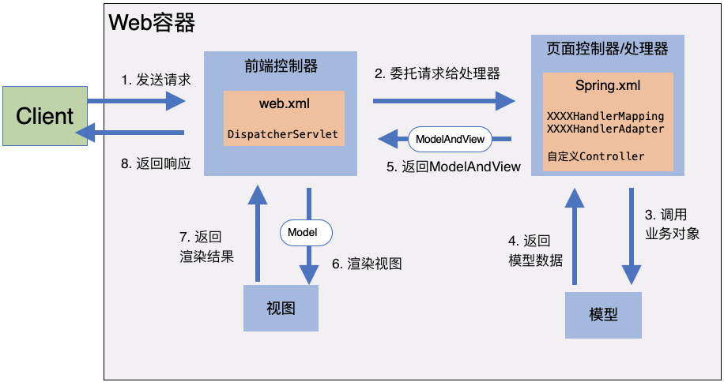
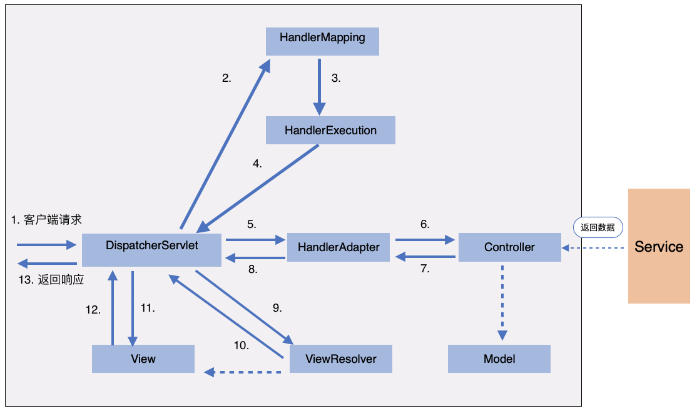

<span id="catalog"></span>

### 目录
- [maven配置](#maven配置)
- [SpringMVC概述](#SpringMVC概述)
- [分别使用Servlet和SpringMVC分别完成简单的MVC结构](#分别使用Servlet和SpringMVC分别完成简单的MVC结构)
    - [使用Servlet完成MVC结构](#使用Servlet完成MVC结构)
    - [使用SpringMVC完成MVC结构](#使用SpringMVC完成MVC结构)
- [SpringMVC的执行原理](#SpringMVC的执行原理)
- [使用注解开发SpringMVC](#使用注解开发SpringMVC)
    - [使用注解的基本开发步骤](#使用注解的基本开发步骤)
    - [Controller分析](#Controller分析)
        - [Controller的基本概念](#Controller的基本概念)
        - [使用Controller接口开发](#使用Controller接口开发)
        - [使用@Controller注解开发](#使用@Controller注解开发)
    - [@RequestMapping注解分析](#@RequestMapping注解分析)
- [RestFul风格的实现方法](#RestFul风格的实现方法)
- [处理请求参数](#处理请求参数)
- [数据的回显](#数据的回显)
- [处理请求参数的乱码](#处理请求参数的乱码)
- [返回JSON](#返回JSON)
- [SpringMVC的处理器拦截器](#SpringMVC的处理器拦截器)
    - [拦截器的基本知识](#拦截器的基本知识)
    - [自定义拦截器](#自定义拦截器)
- [](#)

# maven配置
[top](#catalog)
```xml
<dependency>
    <groupId>org.springframework</groupId>
    <artifactId>spring-webmvc</artifactId>
    <version>5.2.4.RELEASE</version>
</dependency>
```

# SpringMVC概述
[top](#catalog)
- SpringMVC是Spring框架的一部分，是基于Java实现MVC的轻量级Web框架
- SpringMVC的特点
    - 轻量
    - 高效，基于请求的MVC框架
    - 与SpringMVC兼容性好，无缝结合
        - 可以将SpringMVC中用到的bean，注册到Spring中
    - 约定优于配置
    - 支持：RESTful、数据验证、格式化、本地化、主题等
- SpringMVC框架像许多其他MVC框架一样，以请求为驱动，围绕一个中心Servlet分派请求及提供其他功能
    - `DispatcherServlet`实际是一个Servlet，并且继承自HttpServlet
    
# 分别使用Servlet和SpringMVC分别完成简单的MVC结构
## 使用Servlet完成MVC结构
[top](#catalog)
1. 创建入口页面
    - 参考代码
        - [/java/mylearn/myspringMVC/web/tohello01.jsp](/java/mylearn/myspringMVC/web/tohello01.jsp)
    - 页面内容
        ```html
        <form action="hello01" method="post">
            <input type="text" name="method">
            <input type="submit">
        </form>
        ```
2. 创建一个Servlet作为Controller来控制转发、重定向
    - 参考代码
        - [/java/mylearn/myspringMVC/src/main/java/com/ljs/learn/myspringMVC/sample/helloServlet/HelloServlet.java](/java/mylearn/myspringMVC/src/main/java/com/ljs/learn/myspringMVC/sample/helloServlet/HelloServlet.java) 
    - 代码内容
        ```java
        public class HelloServlet extends HttpServlet {
            @Override
            protected void doGet(HttpServletRequest req, HttpServletResponse resp) throws ServletException, IOException {
                String method = req.getParameter("method");
                if ("add".equals(method)){
                    req.getSession().setAttribute("result","run add");
                } else if ("delete".equals(method)){
                    req.getSession().setAttribute("result", "run delete");
                }
                
                // 转发到 /WEB-INF/jsp/test.jsp 页面
                req.getRequestDispatcher("/WEB-INF/jsp/test.jsp").forward(req, resp);
            }
        
            @Override
            protected void doPost(HttpServletRequest req, HttpServletResponse resp) throws ServletException, IOException {
                doGet(req, resp);
            }
        }
        ```
3. 在web.xml中添加Servlet的配置
    - 参考配置
        - [/java/mylearn/myspringMVC/web/WEB-INF/web_bk01.xml](/java/mylearn/myspringMVC/web/WEB-INF/web_bk01.xml)
    - 配置内容
        ```xml
        <servlet>
            <servlet-name>helloServlet</servlet-name>
            <servlet-class>com.ljs.learn.myspringMVC.sample.helloServlet.HelloServlet</servlet-class>
        </servlet>
        
        <servlet-mapping>
            <servlet-name>helloServlet</servlet-name>
            <url-pattern>/hello01</url-pattern>
        </servlet-mapping>
        ```

4. 页面入口
    - http://localhost:8080/myspringMVC_war_exploded/tohello01.jsp
   
5. 转发到页面
    - [/java/mylearn/myspringMVC/web/WEB-INF/jsp/sample/hello01.jsp](/java/mylearn/myspringMVC/web/WEB-INF/jsp/sample/hello01.jsp)
    - 页面内容
        ```html
        <body>
            ${sessionScope.result}
        </body>
        ```

## 使用SpringMVC完成MVC结构
[top](#catalog)   
1. 创建一个Controller，继承自：`org.springframework.web.servlet.mvc.Controller`
    - 在内部将数据封装为Model，将地址封装为View
    - 参考代码
        - [/java/mylearn/myspringMVC/src/main/java/com/ljs/learn/myspringMVC/sample/controller/HelloController.java](/java/mylearn/myspringMVC/src/main/java/com/ljs/learn/myspringMVC/sample/controller/HelloController.java)
    - 代码内容
        ```java
        public class HelloController implements Controller {
            @Override
            public ModelAndView handleRequest(HttpServletRequest httpServletRequest, HttpServletResponse httpServletResponse) throws Exception {
        
                ModelAndView mv = new ModelAndView();
        
                // model部分： 封装对象保存到ModelAndView
                mv.addObject("msg", "HelloSpringMVC");
                // view部分： 封装跳转的目标视图，保存到ModelView中
                mv.setViewName("hello02");
                return mv;
            }
        }
        ```

2. 在web.xml中配置SpringMVC默认的Servlet
    - 参考配置
        - [/java/mylearn/myspringMVC/web/WEB-INF/web_bk01.xml](/java/mylearn/myspringMVC/web/WEB-INF/web_bk01.xml)
    - 配置内容
        ```xml
        <servlet>
            <servlet-name>springmvc</servlet-name>
            <servlet-class>org.springframework.web.servlet.DispatcherServlet</servlet-class>
            <init-param>
                <!-- 绑定sprirng配置文件-->
                <param-name>contextConfigLocation</param-name>
                <param-value>classpath:sample/springmvc-servlet.xml</param-value>
            </init-param>
            <load-on-startup>1</load-on-startup>
        </servlet>
        <servlet-mapping>
            <servlet-name>springmvc</servlet-name>
            <!--匹配路径型 url-->
            <url-pattern>/</url-pattern>
        </servlet-mapping>
        ```

3. 在Spring配置中配置SpringMVC：
    - 参考配置
        - [/java/mylearn/myspringMVC/src/main/resources/springmvc-servlet01.xml](/java/mylearn/myspringMVC/src/main/resources/springmvc-servlet01.xml)
    - 配置内容
        - 除了将SpringMVC需要的类配置为Bean，还需要配置Controller要处理哪个请求路径
        ```xml
        <?xml version="1.0" encoding="UTF-8"?>
        <beans xmlns="http://www.springframework.org/schema/beans"
            xmlns:xsi="http://www.w3.org/2001/XMLSchema-instance"
            xsi:schemaLocation="http://www.springframework.org/schema/beans
            http://www.springframework.org/schema/beans/spring-beans.xsd">
            <!--添加处理映射器-->
            <bean class="org.springframework.web.servlet.handler.BeanNameUrlHandlerMapping"/>
            <!--添加处理适配器-->
            <bean class="org.springframework.web.servlet.mvc.SimpleControllerHandlerAdapter"/>
            <!--视图解析器-->
            <bean class="org.springframework.web.servlet.view.InternalResourceViewResolver" id="InternalResourceViewResolver">
                <!--配置请求路径的前缀后缀-->
                <property name="prefix" value="/WEB-INF/jsp/"/>
                <property name="suffix" value=".jsp"/>
            </bean>
        
            <!--配置控制器-->
            <bean id="/hello" class="com.ljs.learn.myspringMVC.sample.controller.HelloController"/>
        </beans>
        ```
   
4. 页面入口
    - http://localhost:8080/myspringMVC_war_exploded/hello

5. 最终转发到页面
    - [/java/mylearn/myspringMVC/web/WEB-INF/jsp/sample/hello02.jsp](/java/mylearn/myspringMVC/web/WEB-INF/jsp/sample/hello02.jsp) 

# SpringMVC的执行原理
[top](#catalog)
- 基本原理图
    - 

- SpringMVC内部各类的调用图
    - 调用图
        - 
    - **实线由SpringMVC自动处理，虚线需要开发者提供实现**
    - 图中的类说明
        - DispatcherServlet 表示前端控制器，是整个SpringMVC的控制中心
        - HandlerMapping 表示处理器映射器，根据url查找Handler
        - HandlerExecution 表示具体的Handler
        - HandlerAdapter 处理器适配器，按照特定规则执行Handler
        - ViewResolver 视图解析器
        
    - 调用流程说明
        1. 客户端发出请求，DispatcherServlet 接收并拦截请求
            - url拆分及含义：如`http://localhost:8080/myspringMVC_war_exploded/hello`
                - 拆分
                    - 服务器域名 : http://localhost:8080
                    - 部署在服务器上的web站点 : myspringMVC_war_exploded
                    - 控制器 : hello
                - 请求 服务器某站点下的某个控制器
        2. DispatcherServlet 调用 HandlerMapping，HandlerMapping根据请求url查找Handler
        3. HandlerExecution 根据url查找控制器。
            - 如`http://localhost:8080/myspringMVC_war_exploded/hello`，查找控制器hello
        4. HandlerExecution 将解析后的信息传递给DispatcherServlet
        5. HandlerAdapter 按照特定规则执行Handler
        6. Handler调用某个具体的Controller
        7. Controller调用Service层，并将返回的数据返回给 HandlerAdapter，如 ModelAndView
        8. HandlerAdapter 将视图逻辑名或者模型传递给 DispatcherServlet
        9. DispatcherServlet 调用视图解析器 ViewResolver，解析HandlertAdapter传递的逻辑视图名
        10. ViewResolver 将解析的逻辑视图名传给 DispatcherServlet
        11. DispatcherServlet 根据视图解析结果调用具体的视图
        12. 将视图返回给用户

# 使用注解开发SpringMVC
## 使用注解的基本开发步骤
[top](#catalog)
- 必须要配置的3大内容
    - 处理器映射器 （交给annotation-driven）
    - 处理器适配器 （交给annotation-driven）
    - 视图解析器
    
- 开发步骤
    1. 添加maven依赖
    2. 配置 web.xml
        - 需要注意xml文件的版本，version=4.0，否则无法启动
        - 将 `DispatcherServlet` 配置为Servlet，并绑定Spring配置文件
        - 将 `load-on-startup` 配置为1，与服务器一同启动
        - 将路径配置为 `/`
    3. 添加SpringMVC配置
        - 固定部分
            ```xml
            <!--自动扫描包-->
            <context:component-scan base-package="com.ljs.learn.myspringMVC.annotation.controller"/>
            <!--过滤静态资源，使SpirngMVC不处理静态资源-->
            <mvc:default-servlet-handler/>
            <!--配置mvc注解驱动，自动注入HandlerMapping和HandlerAdapter-->
            <mvc:annotation-driven/>
            ```
        - 配置视图解析器 ViewResolver
     4. 创建Controller
     
- 示例
    1. 配置web.xml
        - 参考配置
            - [/java/mylearn/myspringMVC/web/WEB-INF/web_bk02.xml](/java/mylearn/myspringMVC/web/WEB-INF/web_bk02.xml)
        - 配置内容
            ```xml
            <servlet>
                <servlet-name>springmvc</servlet-name>
                <servlet-class>org.springframework.web.servlet.DispatcherServlet</servlet-class>
                <init-param>
                    <param-name>contextConfigLocation</param-name>
                    <param-value>classpath:annotation/springmvc-servlet.xml</param-value>
                </init-param>
                <load-on-startup>1</load-on-startup>
            </servlet>
            <servlet-mapping>
                <servlet-name>springmvc</servlet-name>
                <url-pattern>/</url-pattern>
            </servlet-mapping>
            ```
    2. SpringMVC配置
        - 参考配置
            - [/java/mylearn/myspringMVC/src/main/resources/annotation/springmvc-servlet.xml](/java/mylearn/myspringMVC/src/main/resources/annotation/springmvc-servlet.xml)
        - 配置内容
            ```xml
            <!-- ######################### -->
            <!--这部分基本固定不变-->
            <!--自动扫描包-->
            <context:component-scan base-package="com.ljs.learn.myspringMVC.annotation.controller"/>
            <!--过滤静态资源，使SpirngMVC不处理静态资源-->
            <mvc:default-servlet-handler/>
            <!--配置mvc注解驱动，自动注入HandlerMapping和HandlerAdapter-->
            <mvc:annotation-driven/>
            <!-- ######################### -->
        
            <!--配置视图解析器-->
            <!--将所有视图都放在/WEB-INF 目录下，保证视图的安全-->
            <bean class="org.springframework.web.servlet.view.InternalResourceViewResolver" id="InternalResourceViewResolver">
                <!--配置请求路径的前缀后缀-->
                <property name="prefix" value="/WEB-INF/jsp/"/>
                <property name="suffix" value=".jsp"/>
            </bean>
            ```
    3. 创建一个可以被视图解析器捕获的Controller
        - 参考代码 
            - [/java/mylearn/myspringMVC/src/main/java/com/ljs/learn/myspringMVC/annotation/controller/HelloController.java](/java/mylearn/myspringMVC/src/main/java/com/ljs/learn/myspringMVC/annotation/controller/HelloController.java)
        - 代码内容
            ```java
            @Controller
            @RequestMapping("/helloController")
            public class HelloController {
                // 该方法的真实访问路径，如：localhost:8080/helloController/hello
                @RequestMapping("/hello")
                public String hello(Model model){
                    model.addAttribute("msg", "SpringMVC annotation");
                    return "annotation/hello01"; // 转发的目标页面，由视图解析器进行处理
                }
            }
            ```
    4. 页面入口  
        - http://localhost:8080/myspringMVC_war_exploded/helloController/hello  
    
## Controller分析
### Controller的基本概念
[top](#catalog)
- Controller 即控制器
- Controller 的工作
    - 负责接收请求之后要执行哪些业务代码
    - 将生成的数据封装到模型中，并返回给视图解析器
- Controller 两种实现方法
    1. 继承 Controller 接口
    2. 使用 `@Controller` 注解 （推荐使用）
- 一个Controller可以包含多个方法，每个方法对应不同的请求url

### 使用Controller接口开发
[top](#catalog)
- 接口源码
    ```java
    package org.springframework.web.servlet.mvc;
    @FunctionalInterface
    public interface Controller {
        @Nullable
        ModelAndView handleRequest(HttpServletRequest var1, HttpServletResponse var2) throws Exception;
    }
    ```
- 实现该接口之后，就可以获得控制器的功能
- 缺点
    - 一个Controller中只能有一个响应方法，只能响应一个url的请求
    
### 使用@Controller注解开发
[top](#catalog)
- 使用 `@Controller` 注解
    - 声明一个Spring类的实例是一个控制器
    - Spring可以通过包扫描找到使用了该注解的类，所以必须要在Spring配置中配置自动扫描
        ```xml
        <context:component-scan base-package="全类名"/>
        ```
- 方式1：可以被视图解析器捕获的Controller
    - 需要配合 ``@RequestMapping`注解来实现
    - 方法说明
        - 返回 `String` 结果的方法
            1. 方法签名：`String method(type 请求参数1, type 请求参数2, ... [,Model model])`
            2. 如果需要返回数据，需要在最后添加 model参数
                - 可以向model中添加数据
            3. 返回值是需要转发的目标页面的路径，**结果返回后，视图解析器会进行处理，拼接成真正的路径**
        - 返回 `Void` 的方法
            1. 方法签名：`Void method(type 请求参数1, type 请求参数2, ... [,Model model])`
            2. 如果需要返回数据，需要在最后添加 model参数
                - 可以向model中添加数据
            3. 在方法内部需要手动指定**转发或重定向的目标**
        - String 类型的返回值
            - 字符串前可以添加 forward 或 redirect 来表示视图跳转方式
                - 如：`return "forward:xxx";`、`return "redirect:xxx";`
            - 默认是 forward 方式
    - 示例
        ```java
        @Controller
        @RequestMapping("/一级路径")
        public class HelloController {
            // 响应路径： /一级路径/二级路径
            @RequestMapping("/二级路径")
            public String hello(Model model){
                //  业务处理
                // ...
                // 装载model
                model.addAttribute("key", value);
                
                // 转发的目标页面，由视图解析器进行处理
                return "转发路径"; 
            }
        }
        ```
      
## @RequestMapping注解分析
[top](#catalog)
- `@RequestMapping(value="路径", method=RequestMethod.XXX)` 注解用于映射url到 Controller 或某个方法
    - 通过 value 参数指定需要映射的路径
        - 路径中可以使用占位符，如：`/xxx/{a}/{b}`，表示路径中的参数，但是需要与 `@PathVariable` 注解配合使用
            - 参考：[RestFul风格的实现方法](#RestFul风格的实现方法)
    - 通过 method 参数执行需要捕获的请求方式
    - 该注解默认捕获 GET 请求
- 该注解可以添加到类上、或方法上
    - 类上的注解是一级路径
    - 方法上的注解是二级路径
    - 如果类和方法都有注解，则拼接一级与二级路径，如果只有方法上有注解，则直接使用二级路径 
    - 示例
        ```java
        @Controller
        @RequestMapping("/一级路径")
        public class HelloController {
            // 响应路径： localhost:8080/应用名/一级路径/二级路径
            @RequestMapping("/二级路径")
            public String method(Model model){
            }
        }
        ```
        
        ```java
        @Controller
        public class HelloController {
            // 响应路径： localhost:8080/应用名/二级路径
            @RequestMapping("/二级路径")
            public String method(Model model){
            }
        }
        ```

- 适配url路径中的请求参数
    - 适配无参数url
        ```java
        // 响应路径： localhost:8080/应用名/二级路径
        @Controller
        public class HelloController {
            @RequestMapping("/二级路径")
            public String method(Model model){
            }
        }
        ```
    - 适配有参数url，**需要将Model参数放在最后**
        ```java
        // 响应路径： localhost:8080/应用名/二级路径?a=xxx&b=xxx
        @Controller
        public class HelloController {
            @RequestMapping("/二级路径")
            public String method(String a, String b, Model model){
            }
        }
        ```

# RestFul风格的实现方法
[top](#catalog)
- 在 `@RequestMapping` 注解中通过 `method` 参数捕获不同的请求方式，来执行不同的操作
    - 默认捕获 GET 请求
- 参数的设置方式
    - `@RequestMapping("xxx/{占位符}")`，通过`{占位符}`的方式在注解中声明占位符
    - `@PathVariable`，在函数参数列表中为参数添加该注解
    - 这两种参数设置相互配合才能实现路径的捕获
    - 示例
        ```java
        @RequestMapping(value = "/add/{a}/{b}/{c}", method = RequestMethod.POST)
        public String 方法名(@PathVariable String a, @PathVariable String b, @PathVariable String c, Model model){
            // 业务处理
            return "转发路径";
        }
        ```
- 除了在 `@RequestMapping` 注解中设置请求方式，还可以使用进一步封装的组合注解替代
    - `@GetMapping`
    - `@PostMapping`
    - `@PutMapping`
    - `@DeleteMapping`
    - `@PatchMapping`

- 示例
    - controller
        - 参考代码
            - [/java/mylearn/myspringMVC/src/main/java/com/ljs/learn/myspringMVC/restful/controller/RestFulController.java](/java/mylearn/myspringMVC/src/main/java/com/ljs/learn/myspringMVC/restful/controller/RestFulController.java)
        - 代码内容
            ```java
            @Controller
            public class RestFulController {

                // 请求url： /add?a=1&b=2
                // @RequestMapping("/add")
                //  public String test(int a, int b, Model model){
                //     int result = a + b;
                //     model.addAttribute("msg", "result="+result);
                //     return "/restful/result";
                //  }

                // 请求url： /add/1/2
                @RequestMapping("/add/{a}/{b}")
                public String test(@PathVariable int a, @PathVariable int b, Model model){
                    int result = a + b;
                    model.addAttribute("msg", "result="+result);
                    return "/restful/result";
                }

                // 请求url： /add/1/2/3 + POST
                @RequestMapping(value = "/add/{a}/{b}/{c}", method = RequestMethod.POST)
                public String test02(@PathVariable String a, @PathVariable String b, @PathVariable String c, Model model){
                    String result = a + b + c;
                    model.addAttribute("msg", "result="+result);
                    return "/restful/result";
                }

                // 请求url： /add/1/2 + POST
                @PostMapping("/add/{a}/{b}")
                public String test03(@PathVariable String a, @PathVariable String b, Model model){
                    String result = a + b;
                    model.addAttribute("msg", "result="+result);
                    return "/restful/result";
                }
            }
            ```
    - spring配置
        - 参考配置
            - [/java/mylearn/myspringMVC/src/main/resources/restful/springmvc-servlet.xml](/java/mylearn/myspringMVC/src/main/resources/restful/springmvc-servlet.xml)
        - 配置内容
            ```xml
            <!--自动扫描包-->
            <context:component-scan base-package="com.ljs.learn.myspringMVC.restful.controller"/>
            <!--过滤静态资源，使SpirngMVC不处理静态资源-->
            <mvc:default-servlet-handler/>
            <!--配置mvc注解驱动，自动注入HandlerMapping和HandlerAdapter-->
            <mvc:annotation-driven/>

            <!--配置视图解析器-->
            <!--将所有视图都放在/WEB-INF 目录下，保证视图的安全-->
            <bean class="org.springframework.web.servlet.view.InternalResourceViewResolver" id="InternalResourceViewResolver">
                <!--配置请求路径的前缀后缀-->
                <property name="prefix" value="/WEB-INF/jsp/"/>
                <property name="suffix" value=".jsp"/>
            </bean>
            ```
    - web.xml
        - 配置内容
            ```xml
            <servlet>
                <servlet-name>RestFul</servlet-name>
                <servlet-class>org.springframework.web.servlet.DispatcherServlet</servlet-class>
                <init-param>
                    <param-name>contextConfigLocation</param-name>
                    <param-value>classpath:restful/springmvc-servlet.xml</param-value>
                </init-param>
                <load-on-startup>1</load-on-startup>
            </servlet>
            <servlet-mapping>
                <servlet-name>RestFul</servlet-name>
                <url-pattern>/</url-pattern>
            </servlet-mapping>
            ```
    - 入口
        - test方法
            - http://localhost:8080/myspringMVC_war_exploded/add/1/2
        - test02方法
            - http://localhost:8080/myspringMVC_war_exploded/restful/input02.jsp
            - jsp内容
                ```html
                <form action="<%= request.getContextPath()%>/add/2/3/4" method="post">
                    <input type="submit" value="submit">
                </form>
                ```
        - test03方法
            - http://localhost:8080/myspringMVC_war_exploded/restful/input03.jsp
            - jsp内容
                ```html
                <form action="<%= request.getContextPath()%>/add/5/6" method="post">
                    <input type="submit" value="submit">
                </form>
                ```

# 处理请求参数
[top](#catalog)
- `@RequestParam("参数名")`
    - 对于传统的url，可以在参数上添加该注解，来明确处理url中的哪参数
    - 示例
        ```java
        // 请求url： /add?aaa=1&bbbb=2
        @RequestMapping("/add")
        public String testX(@RequestParam("aaa") int a, @RequestParam("bbb") int b, Model model){
            int result = a + b;
            model.addAttribute("msg", "result="+result);
            return "/restful/result";
        }
        ```
      
- 对于复杂的参数，可以使用类来替代多个参数
    - 需要类中包含每个字段的get/set方法
    - 需要url中的参数名与类中的属性名必须匹配，否则会被赋予 0值
    - 示例
        - 参考代码
            - [/java/mylearn/myspringMVC/src/main/java/com/ljs/learn/myspringMVC/restful/controller/ParamController.java](/java/mylearn/myspringMVC/src/main/java/com/ljs/learn/myspringMVC/restful/controller/ParamController.java)
        - 类
            ```java
            public class User {
                public String name;
                public int age;
                //get 、set
            }
            ```
        - 代码内容
            ```java
            @Controller
            public class ParamController{
                @RequestMapping("/param")
                public String test(User user, Model model){
                    model.addAttribute("msg", user.toString());
                    return "/restful/result";
                }
            }
            ```
        - url
            - http://localhost:8080/myspringMVC_war_exploded/param?name=abcd&age=12
                - 页面显示：`User{name='abcd', age=12}`
            - localhost:8080/myspringMVC_war_exploded/param
                - 页面显示：`User{name='abcd', age=12}`

# 数据的回显
[top](#catalog)
- 三种回显方式
    1. ModelAndView: 可以同时 封装数据和视图
        ```java
        public class HelloController implements Controller {
            @Override
            public ModelAndView handleRequest(HttpServletRequest httpServletRequest, HttpServletResponse httpServletResponse) throws Exception {
                // 创建ModelAndView对象，并封装视图与数据
                ModelAndView mv = new ModelAndView();        
                mv.addObject("msg", "HelloSpringMVC");
                mv.setViewName("sample/hello02");
                return mv;
            }
        }
        ```
    2. Model: 使用注解开发时，可以在方法的最后添加Model参数
        ```java
        @Controller
        public class HelloController {
            @RequestMapping("/hello")
            public String hello(Model model){
                model.addAttribute("msg", "SpringM");
                return "annotation/hello01";
            }
        }
        ```
    3. ModelMap
        - 与 Model 的使用方法类似
        - 与 Model 的关系
            - Model --继承--> ModelMap --继承--> LinkedHashMap
            
- 三种类的区别
    - Model 是一个简化版，只有很少的方法，简化的对模型的操作与理解
    - ModelMap 继承了 LinkdeHashMap，除了自身的特性，还具有LinkedHashMap的方法和特性
    - ModelAndView 可以同时设置数据与视图

# 处理请求参数的乱码
[top](#catalog)
1. 手写过滤器
2. 利用SpringMVC提供的过滤器
    ```xml
    <filter>
        <filter-name>encoding</filter-name>
        <filter-class>org.springframework.web.filter.CharacterEncodingFilter</filter-class>
        <init-param>
            <param-name>encoding</param-name>
            <param-value>utf-8</param-value>
        </init-param>
    </filter>
    <filter-mapping>
        <filter-name>encoding</filter-name>
        <url-pattern>/*</url-pattern>
    </filter-mapping>
    ```

# 返回JSON
[top](#catalog)
- 返回JSON的要点
    1. **必须阻止视图解析器解析返回值**
    2. 将对象转换为JSON字符串
    3. 如果出现乱码，需要声明编码格式

- 阻止视图解析器解析方法返回值的方式
    1. 方式1：注解 `@Controller` 和 `@ResponseBody`
        - 在 `@Controller` 注解标注的类下，使用 `@ResponseBody` 标注某个方法
        - 被 `@ResponseBody` 标注的方法，其返回值不会被视图解析器解析
    2. 方式2：注解 `@RestController`
        - 使用注解 `@RestController` 标记某个类，该类下的**所有方法**都不会被视图解析器解析

- 解决json乱码
    1. 方式1：在 `@RequestMapping` 注解中添加 produces 参数并声明编码格式
        ```java
        @RequestMapping(value = "...", produces = "application/json;charset=utf-8")
        ```
    2. 方式2：在 `springmvc-servlet.xml`中的注解驱动注入 `<mvc:annotation-driven/>` 下添加编码配置
        ```xml
        <mvc:annotation-driven>
            <!--配置消息转换方式-->
            <mvc:message-converters>
                <bean class="org.springframework.http.converter.StringHttpMessageConverter">
                    <constructor-arg value="UTF-8"/>
                </bean>
                <bean class="org.springframework.http.converter.json.MappingJackson2HttpMessageConverter">
                    <property name="objectMapper">
                        <bean class="org.springframework.http.converter.json.Jackson2ObjectMapperFactoryBean">
                            <property name="failOnEmptyBeans" value="false"/>
                        </bean>
                    </property>
                </bean>
            </mvc:message-converters>
        </mvc:annotation-driven>
        ```

- 将对象转换为JSON的几种方法
    1. 在 `toString`方法中手动拼接JSON格式的字符串
    2. 使用 Jackson 包来转换
    3. 使用 FastJson 包来转换

- 示例
    1. 通过 `@ResponseBody` 阻止视图解析器，使用 Jackson 包来转换对象返回JSON字符串
        - 参考代码
            - [/java/mylearn/myspringMVC/src/main/java/com/ljs/learn/myspringMVC/restful/controller/JSONController.java](/java/mylearn/myspringMVC/src/main/java/com/ljs/learn/myspringMVC/restful/controller/JSONController.java)
        - 代码内容
            ```java
            @Controller
            public class JSONController {
                @RequestMapping("/json/test01")
                @ResponseBody // 阻止视图解析器的解析
                public String test01(){
                    User user = new User();
                    user.setName("中文测试");
                    user.setAge(18);
                    return user.toString(); // 以字符串的形式返回
                }

                // 在注解中手动指定编码格式
                @RequestMapping(value = "/json/test02", produces = "application/json;charset=utf-8")
                @ResponseBody
                public String test02() throws JsonProcessingException {
                    ObjectMapper objMapper = new ObjectMapper();

                    User user = new User();
                    user.setName("中文测试");
                    user.setAge(18);

                    // 返回json
                    return objMapper.writeValueAsString(user);
                }
            
                // 使用springmvc-servlet.xml中的消息处理配置来自动转换json的编码
                @RequestMapping(value = "/json/test03")
                @ResponseBody
                public String test03() throws JsonProcessingException {
                    ObjectMapper objMapper = new ObjectMapper();

                    User user = new User();
                    user.setName("中文测试");
                    user.setAge(18);

                    // 返回json
                    return objMapper.writeValueAsString(user);
                }
            }
            ```
    2. 通过 `@RestController` 阻止视图解析器，使用 Jackson 包来转换对象返回JSON字符串
        - 参考代码
            - [/java/mylearn/myspringMVC/src/main/java/com/ljs/learn/myspringMVC/restful/controller/JSON2Controller.java](/java/mylearn/myspringMVC/src/main/java/com/ljs/learn/myspringMVC/restful/controller/JSON2Controller.java)
        - 代码内容
            ```java
            @RestController
            public class JSON2Controller {
                @RequestMapping("/json02/test01")
                public String test01() throws JsonProcessingException {
                    User u1 = new User("aaa", 11);
                    User u2 = new User("中文测试", 13);
                    User u3 = new User("bbb", 15);

                    List<User> list = new ArrayList<>(3);
                    list.add(u1);
                    list.add(u2);
                    list.add(u3);

                    ObjectMapper objectMapper = new ObjectMapper();

                    return objectMapper.writeValueAsString(list);
                }
            }
            ```

    3. 使用 FastJson 包来转换对象返回JSON字符串
        - 参考代码
            - [/java/mylearn/myspringMVC/src/main/java/com/ljs/learn/myspringMVC/restful/controller/FastjsonController.java](/java/mylearn/myspringMVC/src/main/java/com/ljs/learn/myspringMVC/restful/controller/FastjsonController.java)
        - 代码内容
            ```java
            @RestController
            public class JSON2Controller {
                @RequestMapping("/json02/test01")
                public String test01() throws JsonProcessingException {
                    User u1 = new User("aaa", 11);
                    User u2 = new User("中文测试", 13);
                    User u3 = new User("bbb", 15);

                    List<User> list = new ArrayList<>(3);
                    list.add(u1);
                    list.add(u2);
                    list.add(u3);

                    ObjectMapper objectMapper = new ObjectMapper();

                    return objectMapper.writeValueAsString(list);
                }
            }
            ```

# SpringMVC的处理器拦截器
## 拦截器的基本知识
[top](#catalog)
- SpringMVC的处理器拦截器类似于 Servlet 中的 Filter
- SpringMVC的处理器拦截器可用于 预处理 和后处理，来实现一些特定的功能
- 过滤器与拦截器的区别
    - 过滤器
        - servlet规范中的一部分，任何javaweb工程都可以使用
        - 在url-pattern中配置 `/*` 就可以拦截所有的请求
    - 拦截器
        - 拦截器是由SpringMVC框架提供的，只有使用了SpringMVC框架才能使用拦截器
        - 拦截器只会拦截访问控制器方法的请求，对于其他资源(如静态资源)不会拦截，效率更高

- 拦截器本身是AOP的一种应用，通过拦截器节省了很多AOP的编码与配置操作

## 自定义拦截器
[top](#catalog)
- 自定义拦截器的方法: 实现 `HandlerInterceptor` 接口
- `HandlerInterceptor` 接口源码分析
    - 接口中三种方法的执行顺序
        1. preHandle
        2. postHandle
        3. afterCompletion
    - 源码
        ```java
        public interface HandlerInterceptor {
            // 处理请求之前需要执行的方法
            // return true; 放行。 继续执行 下一个拦截器 或者 Controller中的方法
            // return false; 不放行。
            default boolean preHandle(HttpServletRequest request, HttpServletResponse response, Object handler) throws Exception {
                return true;
            }
        
            // 处理请求之后需要执行的方法
            default void postHandle(HttpServletRequest request, HttpServletResponse response, Object handler, @Nullable ModelAndView modelAndView) throws Exception {
            }
            
            // 每次拦截请求结束后执行
            default void afterCompletion(HttpServletRequest request, HttpServletResponse response, Object handler, @Nullable Exception ex) throws Exception {
            }
        }
        ```  
- 自定义拦截器需要在spring配置文件中进行配置
    - 配置方法
        ```xml
        <mvc:interceptors>
            <mvc:interceptor>
                <mvc:mapping path="拦截路径"/>
                <bean class="拦截器全类名"/>
            </mvc:interceptor>
        </mvc:interceptors>
        ```
    - 拦截路径的配置方法与maven的过滤方式相同，`**`代表指定目录下的所有目录，`*`代表指定目录下的一级目录
    - 一般使用 `/**` 来拦截所有路径
- 拦截器的顺序
    - ?????
    
- 示例
    - 拦截器
        - 参考代码
            - [/java/mylearn/myspringMVC/src/main/java/com/ljs/learn/myspringMVC/interceptor/MyInterceptor.java](/java/mylearn/myspringMVC/src/main/java/com/ljs/learn/myspringMVC/interceptor/MyInterceptor.java)
        - 代码内容
            ```java
            public class MyInterceptor implements HandlerInterceptor {
                public boolean preHandle(HttpServletRequest request, HttpServletResponse response, Object handler) throws Exception {
                    System.out.println("MyInterceptor preHandle");
                    return true;
                }
            
                public void postHandle(HttpServletRequest request, HttpServletResponse response, Object handler, @Nullable ModelAndView modelAndView) throws Exception {
                    System.out.println("MyInterceptor postHandle");
                }
            
                public void afterCompletion(HttpServletRequest request, HttpServletResponse response, Object handler, @Nullable Exception ex) throws Exception {
                    System.out.println("MyInterceptor afterCompletion");
                }
            }
            ```
    - 配置内容
        - 参考配置
            - [/java/mylearn/myspringMVC/src/main/resources/restful/springmvc-servlet.xml](/java/mylearn/myspringMVC/src/main/resources/restful/springmvc-servlet.xml)
        - 配置内容
            ```xml
            <mvc:interceptors>
                <mvc:interceptor>
                    <mvc:mapping path="/**"/>
                    <bean class="com.ljs.learn.myspringMVC.interceptor.MyInterceptor"/>
                </mvc:interceptor>
            </mvc:interceptors>
            ```