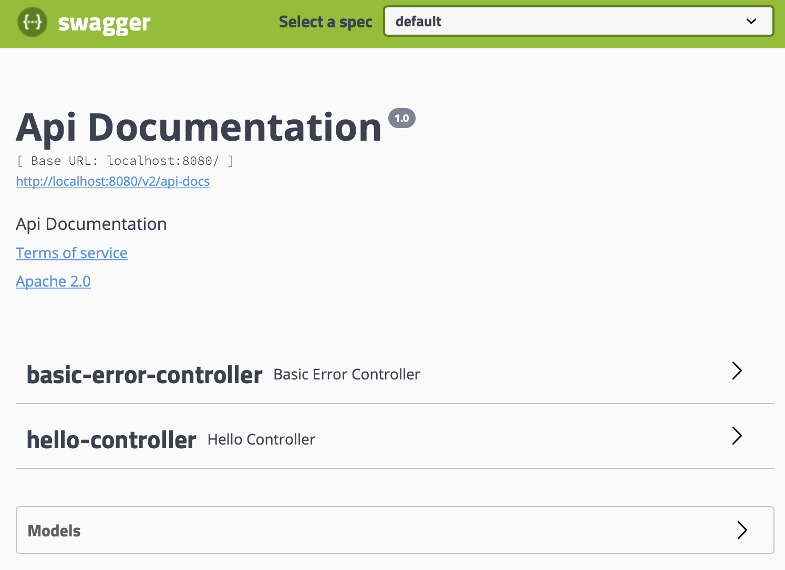
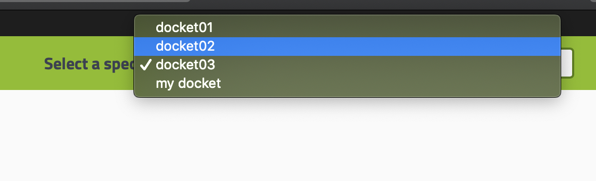
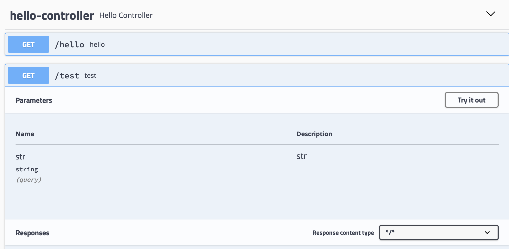
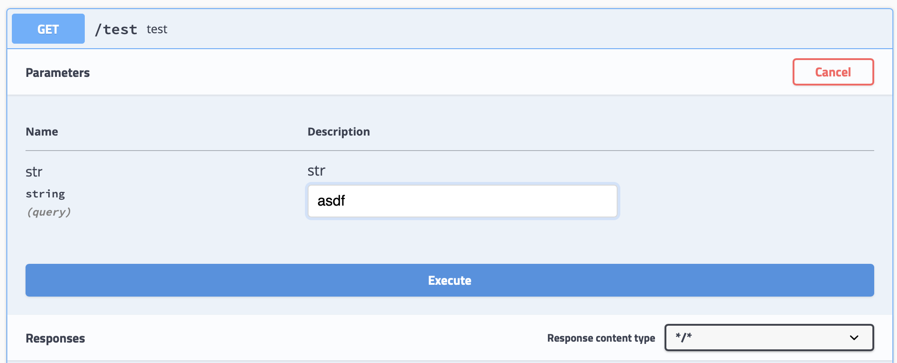
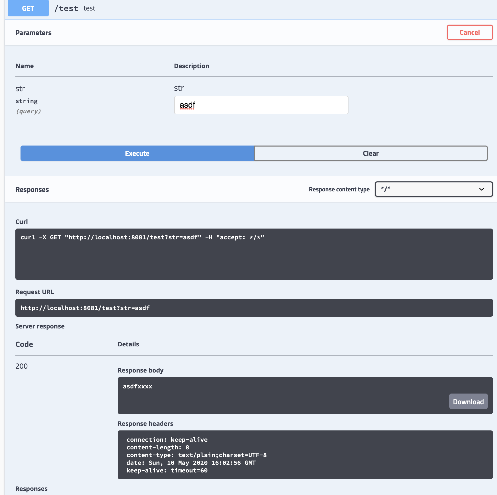
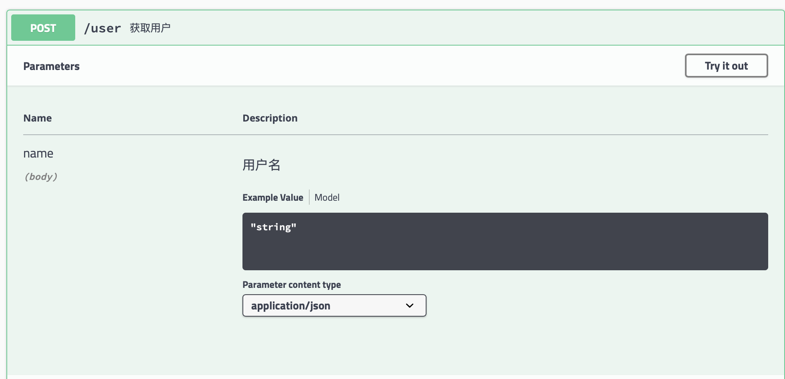
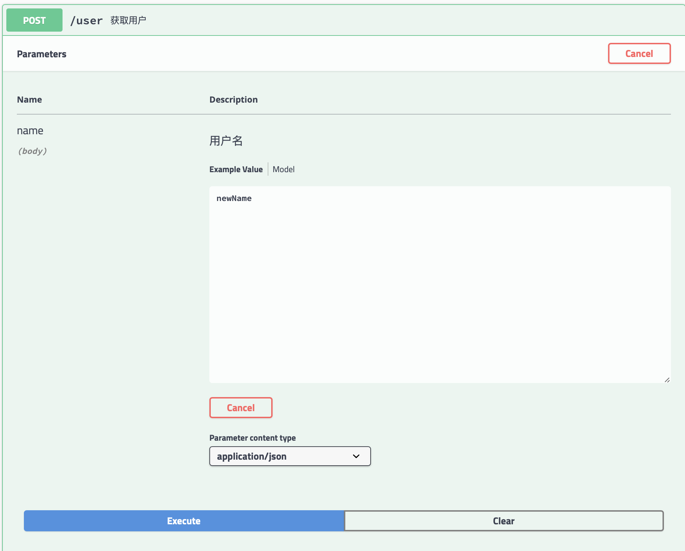
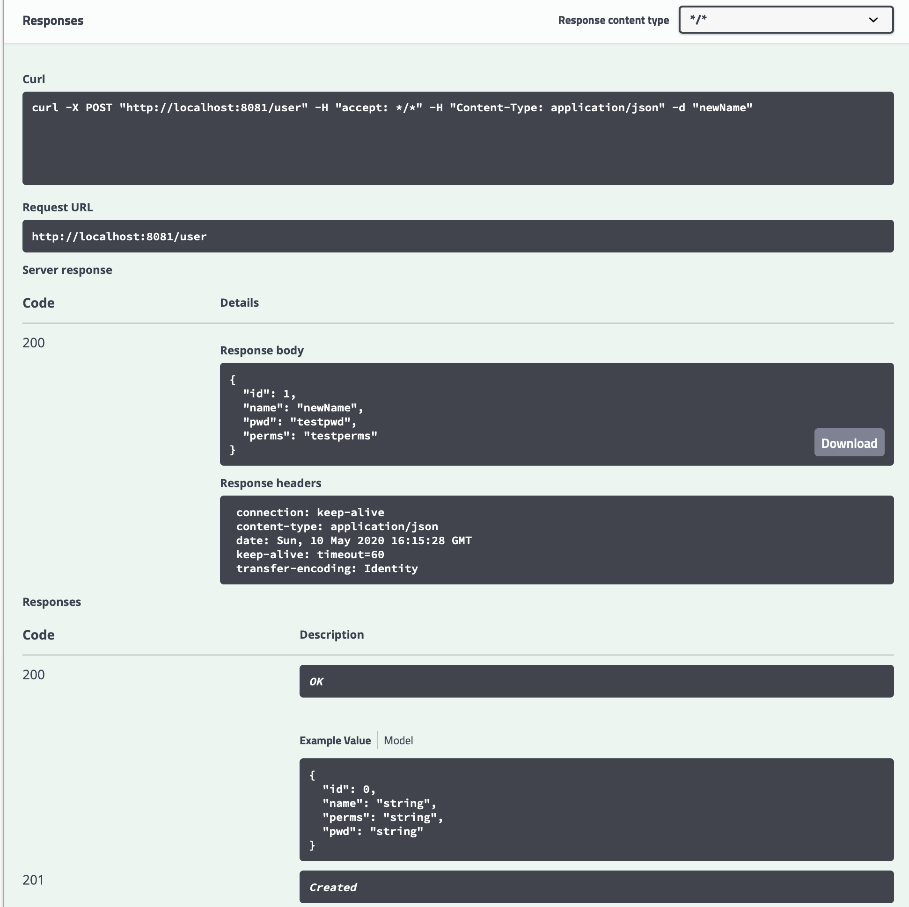

<span id="catalog"></span>

### 目录
- [Swagger概述](#Swagger概述)
- [SpringBoot集成Swagger](#SpringBoot集成Swagger)
- [配置Swagger](#配置Swagger)
    - [添加配置类](#添加配置类)
    - [配置Swagger扫描哪些开发内容](#配置Swagger扫描哪些开发内容)
    - [配置生产和开发的不同启动策略](#配置生产和开发的不同启动策略)
    - [配置多个分组](#配置多个分组)
- [实体类配置](#实体类配置)
- [接口测试](#接口测试)
    - [get测试](#get测试)
    - [post测试](#post测试)
- [](#)

# Swagger概述
[top](#catalog)
- 什么是Swagger?
    - 一款API框架
    - RestFul API文档在线自动生成工具，API文档与API定义同步更新
    - 可以直接运行，可以在线测试API接口
    - 支持多种语言

- Swagger的用途
    1. 通过Swagger来为实体和接口添加注释信息
    2. 接口文档实时更新
    3. 可以在线测试

# SpringBoot集成Swagger
[top](#catalog)
- 创建web项目
- 导入maven依赖
    ```xml
    <!-- https://mvnrepository.com/artifact/io.springfox/springfox-swagger2 -->
    <dependency>
        <groupId>io.springfox</groupId>
        <artifactId>springfox-swagger2</artifactId>
        <version>2.9.2</version>
    </dependency>
    
    <!-- https://mvnrepository.com/artifact/io.springfox/springfox-swagger-ui -->
    <dependency>
        <groupId>io.springfox</groupId>
        <artifactId>springfox-swagger-ui</artifactId>
        <version>2.9.2</version>
    </dependency>
    ```
- 编写helloworld 程序
- 添加swagger配置类
    ```java
    @Configuration
    @EnableSwagger2 //启动swagger
    public class SwaggerConfig {
    }
    ```
- 启动工程，swagger入口：
    - http://localhost:8080/swagger-ui.html

- 页面显示
    - 
    
# 配置Swagger
## 添加配置类
[top](#catalog)
- 参考配置类
    - [/java/mylearn/myspringboot-swagger/src/main/java/com/ljs/learn/myspringbootswagger/controller/SwaggerConfig.java](/java/mylearn/myspringboot-swagger/src/main/java/com/ljs/learn/myspringbootswagger/controller/SwaggerConfig.java)
- Swagger的Bean实例：`Docket`
- 创建bean的方法
    ```java
    Docket(DocumentationType.SWAGGER_2)
    ```
- 配置 api document部分的信息
    ```java
    @Configuration
    @EnableSwagger2 //启动swagger
    public class SwaggerConfig {
        // 配置Swagger的Docket的实例
        @Bean
        public Docket docket(){
            return new Docket(DocumentationType.SWAGGER_2)
                    .apiInfo(getApiInfo());
        }
    
        // 配置 api document部分的信息
        private ApiInfo getApiInfo(){
            return new ApiInfo(
                "ljs API Documentation",
                "ljs Api Documentation",
                "1.0",
                "urn:tos",
                new Contact("LJS", "XXXX","1111@com"), // 作者信息
                "Apache 2.0",
                "http://www.apache.org/licenses/LICENSE-2.0",
                new ArrayList()
            );
        }
    }
    ``` 

## 配置Swagger扫描哪些开发内容
[top](#catalog)
- 生成扫描内容的基本实现
    ```java
    new Docket(DocumentationType.SWAGGER_2)
        .select()
        .build();
    ```
- 配置是否启动swagger
    ```java
    new Docket(DocumentationType.SWAGGER_2)
      .enable(false/true)
    ```

- 配置扫描方式
    - 实现方式
        ```java
        new Docket(DocumentationType.SWAGGER_2)
            .apiInfo(getApiInfo())
            .select()
            .apis(RequestHandlerSelectors.扫描方式)
        ```
    - RequestHandlerSelectors 下可以的扫描方式
        
        |方法|扫描方式|
        |-|-|
        |basePackage()|指定要扫描的包|
        |any()|扫描全部|
        |none()|不扫描|
        |withClassAnnotation()|扫描类上包含指定注解的类|
        |withMethodAnnotation()|扫描方法上包含指定注解的类|

- 配置扫描哪些路径
    ```java
    new Docket(DocumentationType.SWAGGER_2)
      .paths(PathSelectors.方法名())
    ```

- 示例
    - 参考代码
        - [/java/mylearn/myspringboot-swagger/src/main/java/com/ljs/learn/myspringbootswagger/controller/SwaggerConfig.java](/java/mylearn/myspringboot-swagger/src/main/java/com/ljs/learn/myspringbootswagger/controller/SwaggerConfig.java)
    - 代码内容
        ```java
        @Configuration
        @EnableSwagger2 //启动swagger
        public class SwaggerConfig {
            // 配置Swagger的Docket的实例
            @Bean
            public Docket docket(){
                return new Docket(DocumentationType.SWAGGER_2)
                        .apiInfo(getApiInfo())
                        .select()
                        // 配置扫描接口的方式
                        .apis(RequestHandlerSelectors.basePackage("com.ljs.learn.myspringbootswagger.controller"))
                        .build();
            }
        
            // 配置 api document部分的信息
            private ApiInfo getApiInfo(){
                return new ApiInfo(
                    "ljs API Documentation",
                    "ljs Api Documentation",
                    "1.0",
                    "urn:tos",
                    new Contact("LJS", "XXXX","1111@com"), // 作者信息
                    "Apache 2.0",
                    "http://www.apache.org/licenses/LICENSE-2.0",
                    new ArrayList()
                );
            }
        }
        ```

## 配置生产和开发的不同启动策略
[top](#catalog)
- 配置方法
    1. 创建不同环境的 springboot配置
    2. 配置 `Docket` 时，在方法中添加 `Environment` 对象作为参数
    3. 从 `Environment` 变量中检查是否包含指定的环境，然后设置`Docket.enable(true/false)`中的参数

- 示例
    - springboot配置
        - 参考配置
            - [/java/mylearn/myspringboot-swagger/src/main/resources/application.yaml](/java/mylearn/myspringboot-swagger/src/main/resources/application.yaml)
        - 配置内容
            ```yaml
            spring:
              profiles:
                active: product
            
            ---
            spring:
              profiles: dev
            server:
              port: 8081
            ---
            spring:
              profiles: test
            server:
              port: 8082
            ---
            spring:
              profiles: product
            server:
              port: 8083
            ---
            ```
    - Swagger的配置类
        - 参考代码
            - [/java/mylearn/myspringboot-swagger/src/main/java/com/ljs/learn/myspringbootswagger/controller/SwaggerConfig.java](/java/mylearn/myspringboot-swagger/src/main/java/com/ljs/learn/myspringbootswagger/controller/SwaggerConfig.java)
        - 代码内容
            ```java
            @Configuration
            @EnableSwagger2 //启动swagger
            public class SwaggerConfig {
                // 配置Swagger的Docket的实例
                @Bean
                public Docket docket(Environment env){
                    // 设置配置中哪些变量有效：只在测试和开发环境启动
                    Profiles profiles = Profiles.of("dev", "prot");
                    // 检查配置中是否包含指定的配置
                    boolean flg = env.acceptsProfiles(profiles);
            
                    return new Docket(DocumentationType.SWAGGER_2)
                            .apiInfo(getApiInfo())
                            // 根据配置来设置是否启动swagger
                            .enable(flg)
                            .select()
                            // 配置扫描接口的方式
                            .apis(RequestHandlerSelectors.basePackage("com.ljs.learn.myspringbootswagger.controller"))
                            .build();
                }
            
                // 配置 api document部分的信息
                private ApiInfo getApiInfo(){
                    return new ApiInfo(
                        "ljs API Documentation",
                        "ljs Api Documentation",
                        "1.0",
                        "urn:tos",
                        new Contact("LJS", "XXXX","1111@com"), // 作者信息
                        "Apache 2.0",
                        "http://www.apache.org/licenses/LICENSE-2.0",
                        new ArrayList()
                    );
                }
            }
            ```

## 配置多个分组
[top](#catalog)
- 每个 `Docket` 都代表一个一个分组，通过 `Docket().groupName("分组名")`
- 对于每个分组可以设置不同的扫描策略，来适应分组开发的需求
- 示例
    - 参考代码
        - [/java/mylearn/myspringboot-swagger/src/main/java/com/ljs/learn/myspringbootswagger/controller/SwaggerConfig.java](/java/mylearn/myspringboot-swagger/src/main/java/com/ljs/learn/myspringbootswagger/controller/SwaggerConfig.java)
    - 代码内容
        ```java
        @Configuration
        @EnableSwagger2 //启动swagger
        public class SwaggerConfig {
            @Bean
            public Docket docket(Environment env){
                // 设置配置中哪些变量有效：只在测试和开发环境启动
                Profiles profiles = Profiles.of("dev", "prot");
                // 检查配置中是否包含指定的配置
                boolean flg = env.acceptsProfiles(profiles);
                return new Docket(DocumentationType.SWAGGER_2)
                        .enable(flg)
                        .apiInfo(getApiInfo())
                        .groupName("my docket")
                        // 根据配置来设置是否启动swagger
                        .select()
                        // 配置扫描接口的方式
                        .apis(RequestHandlerSelectors.basePackage("com.ljs.learn.myspringbootswagger.controller"))
                        .build();
            }
        
            // 配置多个分组
            @Bean
            public Docket docket01(){
                return new Docket(DocumentationType.SWAGGER_2)
                        .groupName("docket01");
            }
        
            @Bean
            public Docket docket02(){
                return new Docket(DocumentationType.SWAGGER_2)
                        .groupName("docket02");
            }
        
            @Bean
            public Docket docket03(){
                return new Docket(DocumentationType.SWAGGER_2)
                        .groupName("docket03");
            }
        }
        ```
    - 页面结果
        - 

# 实体类配置
[top](#catalog)
- 实体类如何被扫描?
    - 只要接口的返回值中存在实体类，该实体类就会被Swagger扫描
- 通过注解为实体类添加说明
    - 标识实体类
        - `@ApiModel("说明内容")`，标识类
        - `@ApiModelProperty("说明内容")`，标识属性
    - 标识接口
        - `@ApiOperation("说明内容")`，标识方法
        - `@ApiParam("说明内容")`，标识方法中的参数
- 示例
    - 标识实体类
        - 参考代码
            - [/java/mylearn/myspringboot-swagger/src/main/java/com/ljs/learn/myspringbootswagger/pojo/User.java](/java/mylearn/myspringboot-swagger/src/main/java/com/ljs/learn/myspringbootswagger/pojo/User.java)
        - 代码内容
            ```java
            @ApiModel("用户实体类")
            public class User {
                @ApiModelProperty("用户id")
                private int id;
            
                @ApiModelProperty("用户名")
                private String name;
            
                @ApiModelProperty("用户密码")
                private String pwd;
            
                @ApiModelProperty("用户权限")
                private String perms;
                
                // getter、setter
            }
            ```
    - 标识接口
        - 参考代码
            - [/java/mylearn/myspringboot-swagger/src/main/java/com/ljs/learn/myspringbootswagger/controller/HelloController.java](/java/mylearn/myspringboot-swagger/src/main/java/com/ljs/learn/myspringbootswagger/controller/HelloController.java)
        - 代码内容
            ```java
            @Controller
            public class HelloController {
                @GetMapping("/hello")
                @ResponseBody
                public String hello(){
                    return "hello world";
                }
            
                @ApiOperation("获取用户")
                @PostMapping("/user")
                @ResponseBody
                public User user(@RequestBody @ApiParam("用户名") String name){
                    return new User(1, name, "testpwd", "testperms")
                }

                @GetMapping("/test")
                @ResponseBody
                public String test(String str){
                    return str+"xxxx";
                }
            }
            ```

# 接口测试
## get测试
[top](#catalog)
- 测试步骤
    1. 点击try it out
    2. 输入数据
    3. 点击 excute 执行
    4. 在 Response中查看结果

- 测试示例
    ```java
    @GetMapping("/test")
    @ResponseBody
    public String test(String str){
        return str+"xxxx";
    }
    ```
- 测试过程
    1. 点击try it out，进入测试
        - 
    2. 输入数据
        - 
    3. 点击 excute 执行，在 Response中查看结果
        - 

## post测试
[top](#catalog)
- 测试步骤
    1. 点击try it out
    2. 输入json数据
    3. 点击 excute 执行
    4. 在 Response中查看结果

- 对于测试的方法，方法中的参数必须使用 `RequestBody` 来标识，否则无法获取参数
    - ?????

- 测试示例
    ```java
    @ApiOperation("获取用户")
    @PostMapping("/user")
    @ResponseBody
    public User user(@RequestBody @ApiParam("用户名") String name){
        return new User(1, name, "testpwd", "testperms")
    }
    ```

- 测试过程
    1. 点击try it out，进入测试
        - 
    2. 输入json数据
        - 
    3. 点击 excute 执行，在 Response中查看结果
        - 