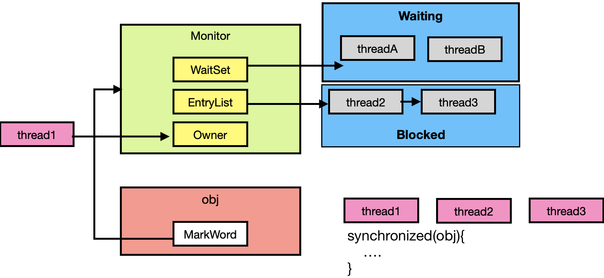
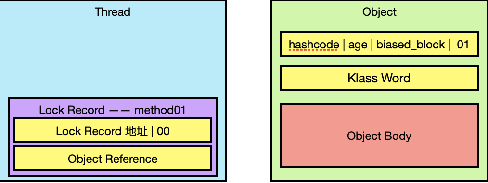
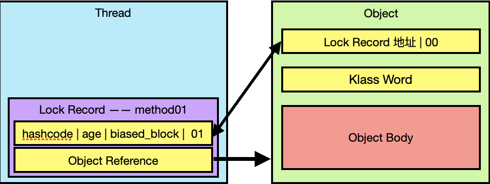
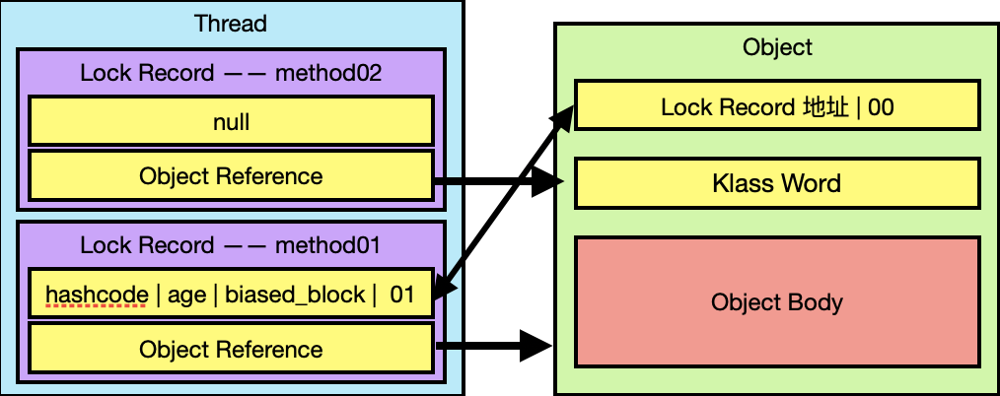
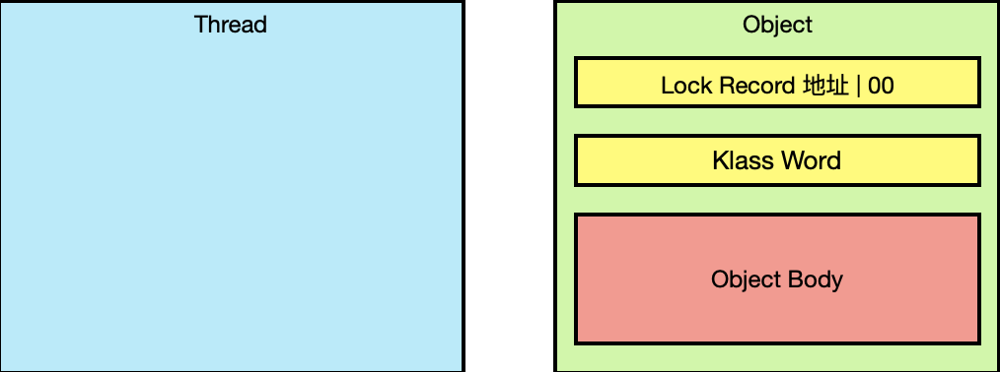
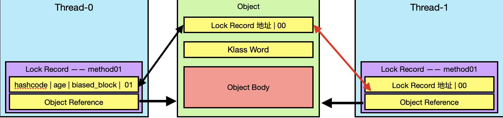
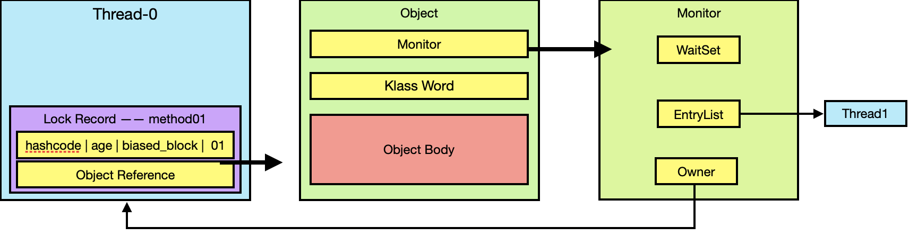
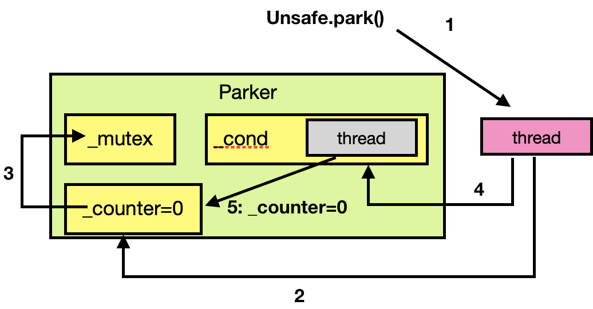
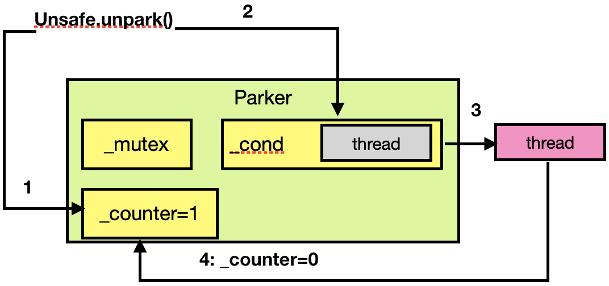
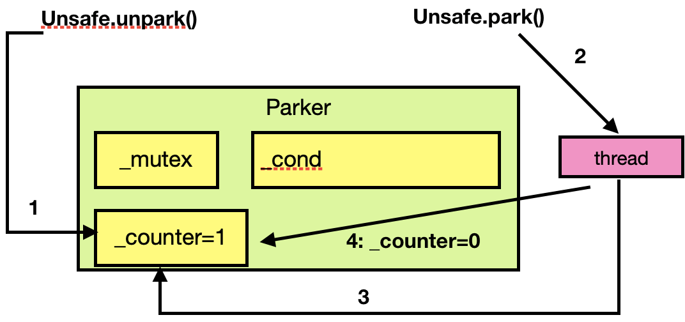

<span id="catalog"></span>

- 参考
    - https://www.bilibili.com/video/BV1jE411j7uX

# 目录---并发编程
- [进程与线程](#进程与线程)
    - [进程与线程的概念](#进程与线程的概念)
    - [进程与线程的对比](#进程与线程的对比)
    - [并行与并发](#并行与并发)
    - [同步与异步的划分](#同步与异步的划分)
- [Java线程](#Java线程)
    - [创建和运行线程的几种方法](#创建和运行线程的几种方法)
    - [Thread和Runnable的关系](#Thread和Runnable的关系)
    - [查看java进程](#查看java进程)
    - [线程运行原理](#线程运行原理)
        - [栈与栈帧](#栈与栈帧)
        - [线程上下文切换（Thread_Context_Switch）](#线程上下文切换（Thread_Context_Switch）)
    - [Java线程的6种状态](#Java线程的6种状态)
    - [Java线程操作的常见方法](#Java线程操作的常见方法)
    - [start与run方法](#start与run方法)
    - [sleep和yield](#sleep和yield)
        - [sleep---线程休眠](#sleep---线程休眠)
        - [yield---让出CPU使用权](#yield---让出CPU使用权)
        - [sleep和yield的区别](#sleep和yield的区别)
    - [线程优先级](#线程优先级)
    - [join](#join)
        - [为什么需要join](#为什么需要join)
        - [通过join执行等待线程结束](#通过join执行等待线程结束)
        - [join(n)--限制最长等待时间](#join(n)--限制最长等待时间)
    - [interrupt](#interrupt)
        - [打断处于阻塞状态的线程](#打断处于阻塞状态的线程)
        - [打断正在执行的普通线程](#打断正在执行的普通线程)
        - [打断park线程](#打断park线程)
    - [不应该使用的方法及其替代方法](#不应该使用的方法及其替代方法)
    - [主线程与守护线程](#主线程与守护线程)
    - [线程的状态](#线程的状态)
        - [5种状态---操作系统层面的划分](#5种状态---操作系统层面的划分)
        - [6种状态---Java_API层面的划分](#6种状态---Java_API层面的划分)
- [共享模型--管程--悲观锁--阻塞](#共享模型--管程--悲观锁--阻塞)
    - [多线程共享资源的安全问题](#多线程共享资源的安全问题)
        - [安全问题模型](#安全问题模型)
        - [临界区和竞态条件](#临界区和竞态条件)
    - [synchronized--阻塞式解决方案](#synchronized--阻塞式解决方案)
    - [方法上的synchronized](#方法上的synchronized)
    - [局部变量安全性分析](#局部变量安全性分析)
    - [常见线程安全类](#常见线程安全类)
    - [Monitor概念](#Monitor概念)
        - [java对象头--Object Header](#java对象头--Object Header)
        - [Monitor--锁的工作原理](#Monitor--锁的工作原理)
        - [轻量级锁](#轻量级锁)
        - [锁膨胀--重量级锁](#锁膨胀--重量级锁)
        - [自旋优化](#自旋优化)
        - [偏向锁](#偏向锁)
            - [偏向锁优化](#偏向锁优化)
            - [偏向状态](#偏向状态)
            - [撤销偏向锁](#撤销偏向锁)
            - [批量重偏向](#批量重偏向)
            - [批量撤销](#批量撤销)
            - [锁消除优化](#锁消除优化)
    - [wait、notify](#wait、notify)
        - [wait、notify的原理](#wait、notify的原理)
        - [wait、notify的API](#wait、notify的API)
        - [wait和sleep的区别](#wait和sleep的区别)
        - [wait、notify的使用](#wait、notify的使用)
        - [wait应用](#wait应用)
    - [park、unpark](#park、unpark)
        - [park、unpark使用方法](#park、unpark使用方法)
        - [park、unpark的原理](#park、unpark的原理)
    - [线程间的状态转换](#线程间的状态转换)
    - [多把锁](#多把锁)
    - [活跃性](#活跃性)
        - [死锁](#死锁)
        - [活锁](#活锁)
        - [饥饿](#饥饿)
    - [ReentrantLock](#ReentrantLock)
        - [ReentrantLock--概念](#ReentrantLock--概念)
        - [ReentrantLock--可打断锁](#ReentrantLock--可打断锁)
        - [ReentrantLock--锁超时](#ReentrantLock--锁超时)
        - [ReentrantLock--公平锁](#ReentrantLock--公平锁)
        - [ReentrantLock--条件变量](#ReentrantLock--条件变量)
- [共享模型--内存](#共享模型--内存)
    - [JMM-java内存模型](#JMM-java内存模型)
        - [Java内存模型](#Java内存模型)
        - [可见性](#可见性)
            - [无法退出的循环](#无法退出的循环)
            - [volatile解决无法停止的循环](#volatile解决无法停止的循环)
            - [synchronized--加锁解决无法停止的循环](#synchronized--加锁解决无法停止的循环)
            - [volatile解决无法停止的循环](#volatile解决无法停止的循环)
            - [原子性与可见性](#原子性与可见性)
    - [有序性](#有序性)
        - [指令重排](#指令重排)
    - [volatile原理](#volatile原理)
        - [volatile原理](#volatile原理)
        - [volatile解决单例模式双重检查的指令重排](#volatile解决单例模式双重检查的指令重排)
    - [happens-before规则](#happens-before规则)
- [共享模型--无锁--乐观锁(非阻塞)](#共享模型--无锁--乐观锁(非阻塞))
    - [CAS](#CAS)
        - [CAS示例--无锁保证线程安全](#CAS示例--无锁保证线程安全)
        - [CAS--实现方式](#CAS--实现方式)
        - [CAS--为什么无锁效率高](#CAS--为什么无锁效率高)
        - [CAS的特点](#CAS的特点)
    - [原子整数](#原子整数)
    - [原子引用](#原子引用)
    - [原子累加器](#原子累加器)
    - [unsafe](#unsafe)
- [共享模型--可变对象](#共享模型--可变对象)
    - [不可变类--DateTimeFormatter](#不可变类--DateTimeFormatter)
    - [不可变设计](#不可变设计)
    - [享元模式](#享元模式)
    - [自定义连接池](#自定义连接池)
    - [final原理](#final原理)
    - [无状态](#无状态)
- [并发工具--线程池](#并发工具--线程池)
    - [自定义线程池](#自定义线程池)
        - [自定义线程池--基本组成](#自定义线程池--基本组成)
        - [自定义线程池--基本实现](自定义线程池--基本实现)
        - [自定义线程池--拒绝策略](自定义线程池--拒绝策略)
    - [JDK工具-ThreadPoolExecutor](#JDK工具-ThreadPoolExecutor)
        - [ThreadPoolExecutor--继承关系](#ThreadPoolExecutor--继承关系)
        - [ThreadPoolExecutor--线程池状态](#ThreadPoolExecutor--线程池状态)
        - [ThreadPoolExecutor--构造方法](#ThreadPoolExecutor--构造方法)
        - [ThreadPoolExecutor--工作方式](#ThreadPoolExecutor--工作方式)
        - [ThreadPoolExecutor--可用方法](ThreadPoolExecutor--可用方法)
    - [ThreadPoolExecutor--辅助工具Executor](#ThreadPoolExecutor--辅助工具Executor)
        - [newFixedThreadPool--创建固定线程数的线程](#newFixedThreadPool--创建固定线程数的线程)
        - [newCachedThreadPool--带缓冲的线程池](#newCachedThreadPool--带缓冲的线程池)
        - [newSingleThreadExecutor--单线程执行器](#newSingleThreadExecutor--单线程执行器)
        - [newScheduledThreadPool--可调度任务线程池](#newScheduledThreadPool--可调度任务线程池)
        - [每周四定时执行任务](#每周四定时执行任务)
    - [处理线程池异常](#处理线程池异常)
    - [Fork/Join](#Fork/Join)
        - [Fork/Join的概念](#Fork/Join的概念)
        - [创建fork/join](#创建fork/join)
        - [优化任务拆分的方式](#优化任务拆分的方式)
- [并发工具--JUC](#并发工具--JUC)
    - [AQS原理](#AQS原理)
        - [AQS原理](#AQS原理)
        - [AQS实现不可重入锁](#AQS实现不可重入锁)
- [Tomcat的线程池](#Tomcat的线程池)
- [](#)
- [](#)
- [](#)

# 进程与线程
## 进程与线程的概念
[top](#catalog)
- 进程
    - 用来加载指令、管理内存、管理IO
    - 当一个程序被运行，从磁盘加载这个程序的代码到内存，就开启了一个进程
    - 进程可以视为程序的一个实例，大部分程序可以同时运行多个实例进行，如记事本
        - 也有程序只能启动一个实例进程，如app应用
- 线程
    - 一个进程之内可以分为一个到多个线程
    - 一个线程就是一个指令流，指令流中的所有指令以一定的顺序交给CPU执行
- 在 windows 中，进程是不活动的，只是作为线程的容器
- 在Java中
    - 线程是 `最小调度单位`
    - 进程是 `最小资源分配单位`

## 进程与线程的对比
[top](#catalog)
- 进程基本上相互独立，而线程存在于进程内，是进程的一个子集
- 进程用用共享的资源，如内存空间等，共其内部的线程共享
- 进程间通信较为复杂
    - 同一台计算机的进程通信称为IPC（Inter-process communication）
    - 不同计算机之间的进程通信需要通过网络，并遵守共同的协议，如HTTP
- 线程通信比较简单
    - 因为他们共享进程的内存
    - 如多个线程可以共享一个遍历
- 线程更加轻量
    - 线程上下文切换的成本一般比进程上下文切换要低

## 并行与并发
[top](#catalog)
- 单核cpu下，线程实际是`串行执行`的
- 任务调度器
    - 操作系统中的一个组件
    - 可以将cpu的时间片分给不同的线程使用
        - windows下时间片最小约为15毫秒
    - cpu在线程间的切换非常快，给人的感觉是同时运行的
- **微观串行，宏观并行**
- <span style='color:red'>什么是并发，concurrennt</span>
    - 一般将线程轮流使用CPU的做法称为并发
- <span style='color:red'>什么是并行，parallel</span>
    - 多核CPU下，每个核都可以调度、运行线程，此时线程是并行的
    - 即没有发生切换，多个线程通过运行到不同的核内
- 并行与并发的简要描述
    - 并发，concurrent，是同一时间应对多件事的能力
    - 并行，parallel，是同一时间动手做多件事情的能力
- 场景的场景是: **又有并发、又有并行**

## 同步与异步的划分
[top](#catalog)
- 同步: 需要等待上一行代码的结果返回，才能继续运行
- 异步: 不需要等待上一行代码的结果，就能继续运行

# Java线程
## 创建和运行线程
[top](#catalog)
- 启动java程序时，默认会启动一个主线程
- 创建方式
    1. 使用 `Thread`，需要重写 `run` 方法
        - 语法
            ```java
            // 1. 创建线程对象
            Thread t = new Thread(){
                public void run(){...}
            }
            // 2. 启动线程
            t.start(); 
            ```
        - 示例: [/java/mylearn/mythread/src/main/java/com/ljs/learn/mythread/createThread/CreateByThread.java](/java/mylearn/mythread/src/main/java/com/ljs/learn/mythread/createThread/CreateByThread.java)
            ```java
            public static void main(String[] args) {
                Thread t = new Thread(){
                    @Override
                    public void run() {
                        log.debug("running");
                    }
                };
        
                t.setName("t1");
                t.start();
        
                log.debug("running");
            }
            ```
    2. Runnable + Thread，将线程和任务代码分开
        - Thread代表线程
        - Runnable 表示可运行的任务，需要重写 `run` 方法
        - 语法
            ```java
            public static void main(String[] args) {
                // 1. 创建任务
                Runnable r = new Runnable() {
                    @Override
                    public void run() {
                        ...
                    }
                };
                
                // 2. 创建线程，并将任务添加的线程中
                Thread t = new Thread(r);
                
                // 3. 启动线程
                t.start();
            }
            ```
        - 示例: [/java/mylearn/mythread/src/main/java/com/ljs/learn/mythread/createThread/CreateByRunnable.java](/java/mylearn/mythread/src/main/java/com/ljs/learn/mythread/createThread/CreateByRunnable.java)
            ```java
            public static void main(String[] args) {
                // 1. 创建任务
                Runnable r = new Runnable() {
                    @Override
                    public void run() {
                        log.debug("running");
                    }
                };
                
                // 2. 创建线程，并将任务添加的线程中
                Thread t = new Thread(r);
                
                // 3. 启动线程
                t.start();
                
                log.debug("running");
            }
            ```
    3. 使用lambda表达式简化
        - 语法
            ```java
            Runnable r = () -> {...};
            Thread t = new Thread(r);
            t.start();
            ```
        - 示例: [/java/mylearn/mythread/src/main/java/com/ljs/learn/mythread/createThread/CreateByLambda.java](/java/mylearn/mythread/src/main/java/com/ljs/learn/mythread/createThread/CreateByLambda.java)
            ```java
            public static void main(String[] args) {
                Runnable r = () -> log.debug("lambda test");
                Thread t = new Thread(r);
                t.start();
                log.debug("main log");
            }
            ```
    4. FutureTask配合Thread
        - FutureTask能够接收 `Callable` 类型的参数，用来处理线程的返回结果
        - 语法
            ```java
            // 创建任务
            FutureTask<Integer> task = new FutureTask<>(new Callable<Integer>() {
                @Override
                public Integer call() throws Exception {
                    // 设置返回值
                    return ...;
                }
            });
            
            // 启动线程执行任务
            new Thread(task).start();
            
            // get()方法用于获取线程返回的数据
            // get()将会阻塞当前线程，知道结果返回
            task.get();
            ```
        - 示例: [/java/mylearn/mythread/src/main/java/com/ljs/learn/mythread/createThread/CreateByFutureTask.java](/java/mylearn/mythread/src/main/java/com/ljs/learn/mythread/createThread/CreateByFutureTask.java)
            ```java
            public static void main(String[] args) throws ExecutionException, InterruptedException {
                // 1. 创建任务
                FutureTask<Integer> task = new FutureTask<>(new Callable<Integer>() {
                    @Override
                    public Integer call() throws Exception {
                        log.debug("running");
                        Thread.sleep(2000); // 延迟返回结果
                        return 100;
                    }
                });
        
                // 2. 创建线程执行任务
                Thread t = new Thread(task);
                t.start();
        
                // 3. 获取线程返回的数据
                // get() 方法 阻塞当前线程，并等待结果返回
                Integer result = task.get();
                log.debug("result = {}", result);
            }
            ```
        
## Thread和Runnable的关系
[top](#catalog)
- Thread 是 Runnable 接口的实现类
- 最终是由 `Thread.run` 方法调用的，方法内是直接调用 Runnable 的 run 方法
    ```java
    @Override
    public void run() {
        if (target != null) {
            target.run();
        }
    }
    ```
- 使用 Runnable 接口更容易与其他API配合
- Runnable 接口让任务类脱离的Thread的继承体系，更加灵活


## 查看java进程
[top](#catalog)
- `ps -fe | grep java`，查看java进程
- `jps，查看java进程`
- `kill java进程号`
- `top -H -p java进程号`，查看详细进程信息 
- `jstack java进程号`，查看java进程快照
- `jconsole` 在图形界面中，查看某个java进程中线程的运行情况
    - java类的运行方式
        ```shell
        java -Djava.rmi.server.hostname=`ip地址` 
          -Dcom.sun.management.jmxremote 
          -Dcom.sun.management.jmxremote.port='连接端口'
          -Dcom.sun.management.jmxremote.ssl=是否安全连接
          -Dcom.sun.management.jmxremote.authenticate=是否认证  <java类>
        ```

## 线程运行原理
### 栈与栈帧
[top](#catalog)
- Java Virtual Machine Stacks （Java 虚拟机栈）
- JVM中由堆、栈、方法区组成
- 线程的栈内存是相互独立的，每个线程有自己的栈内存，栈内存中有多个栈帧
    - JVM中的栈内存就是线程，每个线程启动后，虚拟机会为该线程分配一块内存
    - 每个栈由多个栈帧（Frame）组成，对应每次方法调用时所占用的内存
    - 每个线程<span style='color:red'>只能有一个活动的栈帧</span>，对应当前正在执行的那个方法
    - 示意图
        ```java
                线程1      │        线程2
            栈　内　存      │      栈　内　存
        栈帧4---> method04 │  
        栈帧3---> method03 │  栈帧3---> methodC
        栈帧2---> method02 │  栈帧2---> methodB
        栈帧1---> method01 │  栈帧1---> methodA
        ```

### 线程上下文切换（Thread_Context_Switch）
[top](#catalog)
- <span style='color:red'>导致cpu不再执行当前线程，转而执行另一个线程的原因</span>
    1. 线程的cpu时间片用完
    2. 垃圾回收
    3. 有更高优先级的线程需要运行
    4. 线程自己调用了以下方法的程序
        - sleep
        - yield
        - wait
        - join
        - park
        - synchronized
        - lock
- 当上下文切换发生时的操作
    1. 由操作系统保存当前线程的状态
    2. 恢复另一个线程的状态
- 上下文切换 在 Java中对应的概念是程序计数器（Program Counter Register），
    - 用于记录下一条jvm指令的执行地址，是线程私有的
    - 记录之后开始执行
- 操作系统需要保存的线程状态包括
    - 程序计数器
    - 虚拟机栈中每个栈帧的信息，如:局部变量、操作数栈、返回地址等
- **上下文频繁切换会影响性能**
    - 当线程数超过CPU核心数，CPU必然会在多个线程中轮流切换
    - 线程越多，上下文切换的次数越多，系统消耗也会越大
- 如何选择线程数
    - ?????        

## Java线程的6种状态
[top](#catalog)
- NEW
- RUNNABLE
- BLOCKED
- WAITING
- TIMED_WAITING，有时间限制的等待
- TERMINATED
  
## Java线程操作的常见方法
[top](#catalog)
- 实例方法

    |方法名|功能|注意事项|
    |-|-|-|
    |start()|启动一个新线程，在新的线程运行`run()`方法中的代码|start方法只是让线程进入**就绪状态**，代码不一定立刻运行（CPU还没有分配时间片）<br><span style='color:red'>start方法只能调用一次</span>，如果调用了多次会出现`IllegalThreadStateException`|
    |run()|新线程启动后会调用的方法|如果在构造 `Thread` 对象时，传递了 `Runnable` 参数，则线程启动后会调用 `Runnable` 中的 `run` 方法，否则默认不执行任何操作。<br>可以创建 `Thread` 的子类对象，来覆盖默认行为|
    |join()|等待调用`join()`的线程运行结束||
    |join(long n)|等待线程运行结束。最多等待 n **毫秒**||
    |getId()|获取线程的长整型id|id是唯一的|
    |getName()|获取线程名||
    |setName(String)|修改线程名||
    |getPriority()|获取线程的优先级||
    |setPriority(int)|修改线程优先级|java中优先级是: 1~10 的整数。优先级越大，该线程被CPU调度的<span style='color:red'>概率越大</span>|
    |getState()|获取线程状态||
    |isInterrupted()|判断是否被打断|<span style='color:red'>不会清除</span>`打断标记`|
    |isAlive()|线程是否存活||
    |interrupt|打断线程|如果被打断的线程正在 sleep、wait、join 会导致被打断的线程抛出 `InterruptedException`，并清除`打断标记`<br>如果打断正在运行的线程，会设置`打断标记`<br>park 的线程被打断，会设置打断标记|

- 静态方法

    |方法名|功能|注意事项|
    |-|-|-|
    |interrupted()|判断当前线程是否被打断|<span style='color:red'>会清除</span>`打断标记`|
    |currentThread()|获取当前正在执行的线程||
    |sleep()|让当前执行的线程休眠 n **毫秒**。休眠时会然让出cpu的时间片给其他线程||
    |yield()|提示线程调度器让出当前对CPU的使用|主要是为了测试和调试|

- 一个线程对象中的打断标记是方法公用的

## start与run方法
[top](#catalog)
- 直接执行 `run()` 只会会在当前线程内执行，**不会开启新线程**
    - 参考代码
      
        - [/java/mylearn/mythread/src/main/java/com/ljs/learn/mythread/createThread/OnlyRun.java](/java/mylearn/mythread/src/main/java/com/ljs/learn/mythread/createThread/OnlyRun.java)
    - 代码内容
        ```java
        public static void main(String[] args) {
            Thread t = new Thread() {
                @Override
                public void run() {
                    log.debug("running");
                }
            };
    
            // 1. 无法启动新的线程
            t.run();
    
            // 输出:
            // [main] c.OnlyRun - running
    
            // 2. 创建新线程
            t.start();
            // 输出:
            // [Thread-0] c.OnlyRun - running
        }
        ```

## sleep和yield
### sleep---线程休眠
[top](#catalog)
- `Thread.sleep()`
    - `Thread.sleep()` 会使调用该方法的线程进入 `WAITING` 状态
    - 调用sleep后的线程状态变化: `Running ---> Timed Running`
    - 其他线程可以使用 `interrupt()` 打断正在睡眠的线程，`sleep` 将方法会抛出 `InterruptedException`
    - 睡眠结束后的线程不一定立刻执行
      
        - 需要等待CPU分配时间片来运行
    - 示例
        - 参考代码
          
            - [/java/mylearn/mythread/src/main/java/com/ljs/learn/mythread/threadmethod/sleep/SleepAndInterrupt.java](/java/mylearn/mythread/src/main/java/com/ljs/learn/mythread/threadmethod/sleep/SleepAndInterrupt.java)
        - 代码内容
            ```java
            public static void main(String[] args) throws InterruptedException {
                Thread t = new Thread() {
                    @Override
                    public void run() {
                        log.debug("start sleep");
                        try {
                            // 2. 线程开始休眠
                            Thread.sleep(2000);
                        } catch (InterruptedException e) {
                            log.debug("has been interrupted");
                            e.printStackTrace();
                        }
                    }
                };
        
                // 1. 启动线程
                t.start();
        
                // 3. 主线程休眠，比子线程时间短
                Thread.sleep(500);
        
                // 4. 切断子线程
                log.debug("try interrupted");
                t.interrupt();
                
                // 输出:
                // 05.010 [Thread-0] c.SleepAndInterrupt - start sleep
                // 05.510 [main] c.SleepAndInterrupt - try interrupted
                // 05.510 [Thread-0] c.SleepAndInterrupt - has been interrupted
        }
            ```
    
- 建议用 `TimeUnit.单位.sleep` 代替 `Thread.sleep` 来获得更好的**可读性**
    - 通过 `TimeUnit` 中的静态属性来避免编码时的数值换算，提升代码可读性
    - 可以单位

        |静态属性|单位|
        |-|-|
        |TimeUnit.NANOSECONDS|纳秒|
        |TimeUnit.MICROSECONDS|微秒|
        |TimeUnit.MILLISECONDS|毫秒|
        |TimeUnit.SECONDS|秒|
        |TimeUnit.MINUTES|分钟|
        |TimeUnit.HOURS|小时|
        |TimeUnit.DAYS|天|
    
    - 示例
        - 参考代码
          
            - [/java/mylearn/mythread/src/main/java/com/ljs/learn/mythread/threadmethod/sleep/TimeUnitUsage.java](/java/mylearn/mythread/src/main/java/com/ljs/learn/mythread/threadmethod/sleep/TimeUnitUsage.java)
        - 代码内容
            ```java
            public static void main(String[] args) throws InterruptedException {
                Thread t = new Thread() {
                    @Override
                    public void run() {
                        log.debug("sleeping");
                        try {
                            TimeUnit.SECONDS.sleep(2);
                        } catch (InterruptedException e) {
                            log.debug("interrupt");
                            e.printStackTrace();
                        }
                    }
        };
            ```
        
        t.start();
        
                TimeUnit.SECONDS.sleep(1);
                log.debug("main running");
                t.interrupt();
            }
            ```

### yield---让出CPU使用权
[top](#catalog)
- 调用 `Thread.yield` 的效果
    1. 让当前线程从 `Running` 进入 `Runnable` 就绪状态
    2. 让出CPU使用权，让任务调度器执行其他的线程
- yield 的具体实现依赖于操作系统的任务调度器
  
    - 如当前只有一个线程在运行，执行了 yield 后仍然会执行当前线程
- <span style='color:red'>yield 无法真正的控制线程的调度</span>
- 示例
    - 参考代码
      
        - [/java/mylearn/mythread/src/main/java/com/ljs/learn/mythread/threadmethod/yield/YieldUsage.java](/java/mylearn/mythread/src/main/java/com/ljs/learn/mythread/threadmethod/yield/YieldUsage.java)
    - 代码内容
        ```java
        public static void main(String[] args) {
            Runnable task1 = ()->{
            for(int i=0;;) {
                System.out.println("---->task1: " + i++);
            }
        };
    
            Runnable task2 = ()->{
            for(int i=0;;) {
                Thread.yield();
                System.out.println("    ---->task2: " + i++);
            }
        };
    
            Thread t1 = new Thread(task1, "t1");
        Thread t2 = new Thread(task2, "t2");
    
            t1.start();
            t2.start();
        }
        ```
### sleep和yield的区别
[top](#catalog)
- 能否获取时间片?
    - `sleep`，`Timed Waiting` 阻塞状态，无法获得CPU时间片
    - `yield`，`Runnable`就绪状态还是有机会运行的，即有获得CPU时间片的能力
- 等待时间
    - `sleep`，会有休眠时间
    - `yield`，会立刻让出CPU时间片的使用权
        - 如果当前只有一个线程，会再次将CPU时间片的使用权交给当前线程

## 线程优先级
[top](#catalog)
- `线程优先级` 的功能
    - 会提示(hint)调度器优先调度该线程
    - 但它仅仅是一个提示，调度器可以忽略它
- 如果CPU比较忙，那么优先级高的线程会获得更多的时间片
- 如果CPU不忙，优先级几乎没有作用
- <span style='color:red'>线程优先级 无法真正的控制线程的调度</span>
- 示例
    - 参考代码
      
        - [/java/mylearn/mythread/src/main/java/com/ljs/learn/mythread/threadmethod/priority/PriorityUsage.java](/java/mylearn/mythread/src/main/java/com/ljs/learn/mythread/threadmethod/priority/PriorityUsage.java)
    - 代码内容
        ```java
        public static void main(String[] args) {
            Runnable task1 = ()->{
            for(int i=0;;) {
                System.out.println("---->task1: " + i++);
            }
        };
    
            Runnable task2 = ()->{
            for(int i=0;;) {
                Thread.yield();
                System.out.println("    ---->task2: " + i++);
            }
        };
    
            Thread t1 = new Thread(task1, "t1");
        Thread t2 = new Thread(task2, "t2");
    
            t1.start();
            t2.start();
        }
        ```

## join
### 为什么需要join
[top](#catalog)
- 示例
    - 参考代码
      
        - [/java/mylearn/mythread/src/main/java/com/ljs/learn/mythread/threadmethod/join/NoJoin.java](/java/mylearn/mythread/src/main/java/com/ljs/learn/mythread/threadmethod/join/NoJoin.java)
    - 代码内容
        ```java
        static int count = 0;
        public static void main(String[] args) {
            log.debug("start");
    
            // 任务1: 暂停1s，然后修改 count
            Thread t1 = new Thread(()->{
                log.debug("start");
                try {
                    Thread.sleep(1000);
                    count = 10;
                    log.debug("count = " + count);
                    log.debug("end");
                } catch (InterruptedException e) {
                    e.printStackTrace();
                }
            });
    
            // 任务2: 线程启动后，直接修改 count
            Thread t2 = new Thread(()->{
                log.debug("start");
                count = 20;
                log.debug("count = " + count);
                log.debug("end");
            });
    
            // 3. 启动线程，检查 count 是否被修改
            t1.start();
            t2.start();
        
            // 4. 一直输出 count=0
            log.debug("count = " + count);
            log.debug("end");
        }
        ```
- 每次执行，都会一直输出: `count = 0`
- 线程 t1、t2启动后，不会立刻执行，所以每次都会先执行 主线程，输出 `count = 0`
  
    - 无论是延迟执行，还是立刻执行，都不会早于主线程执行
- 所以需要通过 `join` 等待其他线程结束，然后再执行当前线程

### 通过join执行等待线程结束
[top](#catalog)
- 如执行 `x.join` 后，会<span style='color:red'>阻塞当前线程</span>，并等待线程 `x` 执行结束，然后再执行后续的操作
- 示例
    - 参考代码
      
        - [/java/mylearn/mythread/src/main/java/com/ljs/learn/mythread/threadmethod/join/UseJoin.java](/java/mylearn/mythread/src/main/java/com/ljs/learn/mythread/threadmethod/join/UseJoin.java)
    - 代码内容
        ```java
        static int count = 0;
        public static void main(String[] args) throws InterruptedException {
            log.debug("start");

            // 任务1: 暂停1s，然后修改 count
            Thread t1 = new Thread(()->{
                log.debug("start");
                try {
                    Thread.sleep(1000);
                    count = 10;
                    log.debug("count = " + count);
                    log.debug("end");
                } catch (InterruptedException e) {
                    e.printStackTrace();
                }
            });

            // 任务2: 线程启动后，直接修改 count
            Thread t2 = new Thread(()->{
                log.debug("start");
                try {
                    Thread.sleep(2000);
                    count = 20;
                    log.debug("count = " + count);
                    log.debug("end");
                } catch (InterruptedException e) {
                    e.printStackTrace();
                }
            });

            // 3. 启动线程
            t1.start();
            t2.start();
            /*
                4. 先等待 t2 结束，在等待 t1 结束
                因为 t1 比 t2 快，所以会得到:
                
                count = 10  <<<<< t1 的修改
                count = 20  <<<<< t2 的修改
            */
            t2.join();
            t1.join();// 此时 t1 已经执行完了 

            // 7. 最终输出 t2 中的赋值结果: count = 20
            log.debug("count = " + count);
            log.debug("end");
        }
        ```

### join(n)--限制最长等待时间
[top](#catalog)
- `join(毫秒数)`，用于限制等待线程的最长时间
- 如果线程提前结束了，则`join`也会结束
- 示例
    - 参考代码
      
        - [/java/mylearn/mythread/src/main/java/com/ljs/learn/mythread/threadmethod/join/JoinLimitTime.java](/java/mylearn/mythread/src/main/java/com/ljs/learn/mythread/threadmethod/join/JoinLimitTime.java)
    - 代码内容
        ```java
        static int count = 0;
        public static void main(String[] args) throws InterruptedException {
            Thread t1 = new Thread(() -> {
                try {
                    TimeUnit.SECONDS.sleep(2);
                    count = 20;
                    log.debug("count = " + count);
                } catch (InterruptedException e) {
                    e.printStackTrace();
                }
            });

            // 1. 启动t1线程
            t1.start();
            // 2. t1 将休眠 2s，这里只等待 1.5s
            t1.join(1500);

            // 3. 输出 count = 0
            log.debug("count = " + count);
        }
        ```

## interrupt
### 打断处于阻塞状态的线程
[top](#catalog)
- 处于阻塞状态的线程
    - `x.sleep` 中的 x 线程
    - `x.wait` 中的 x 线程
    - `x.join()` ，**是执行 join 的那个线程，不是 x 线程**
- `thread.interrupt` 可以打断阻塞状态的线程
    - 打断 `sleep`、`wait` 的线程会抛出异常，并**清空打断状态**
    - 即: 虽然打断了 `sleep`、`wait` 的线程，但是打断状态仍然是 `false` 
- 示例
    - 参考代码
      
        - [/java/mylearn/mythread/src/main/java/com/ljs/learn/mythread/threadmethod/interrupt/InterruptSleep.java](/java/mylearn/mythread/src/main/java/com/ljs/learn/mythread/threadmethod/interrupt/InterruptSleep.java)
    - 代码内容
        ```java
        public static void main(String[] args) throws InterruptedException {
            Thread t1 = new Thread(() -> {
                log.debug("t1 sleep");
                try {
                    Thread.sleep(2000);
                } catch (InterruptedException e) {
                    e.printStackTrace();
                }
    
                log.debug("t1 end");
            });
    
            // 1. 启动线程，并等待 2s
            t1.start();
            // 2. 暂停 1s，等待之前的线程启动
            Thread.sleep(1000);
            // 3. 打断线程
            t1.interrupt();
            // 4. 输出: t1 isInterrupted = false，打断状态会自动清空变为false
            log.debug("t1 isInterrupted = " + t1.isInterrupted());
        }
        ```

### 打断正在执行的普通线程
[top](#catalog)
- `interrupt` 可以打断正常的线程操作
    - 线程被打断之后，打断状态会变为 `true`
    - 即 `t                                                                                                                                   hread.isInterrupted()` 返回 `true`
- 打断状态可以用来**判断是否可以停止线程**
- 示例
    - 参考处理
      
        - [/java/mylearn/mythread/src/main/java/com/ljs/learn/mythread/threadmethod/interrupt/InterruptProcess.java](/java/mylearn/mythread/src/main/java/com/ljs/learn/mythread/threadmethod/interrupt/InterruptProcess.java)
    - 代码内容
        ```java
        public static void main(String[] args) throws InterruptedException {
            Thread t1 = new Thread(() -> {
                while (true) {
                    // 普通线程被打断后，打断状态会变成 true
                    // 【判断当前线程是否别打断】
                    if (Thread.currentThread().isInterrupted()) {
                        // 如果线程被打断，则停止该线程
                        log.debug("Interrupted");
                        break;
                    }
                }
                                                                                                                                                                                                  
                log.debug("while end");
            });
    
            // 1. 启动线程
            t1.start();
            // 2. 休眠 1s，t1 线程中的 while 将一直处于空转状态
            Thread.sleep(1000);
            log.debug("try to interrupt");
            // 3. 打断线程 t1
            t1.interrupt();
            log.debug("end");
            
            // 一般会输出:
            // [main] c. - try to interrupt
            // [main] c. - end
            // [Thread-0] c. - Interrupted
            // [Thread-0] c. - while end 
        }
        ```

### 打断park线程
[top](#catalog)
- park线程
    - 通过 `LockSupport.park()` 来进入 `park` 状态
    - 如果打断标记是 `true`，则该方法无法再次使线程进入 `park` 状态
- 打断方法
    - `thread.interrupt()` 可以打断park线程
    - 只能打断，但不会清空打断状态
        - 所以之后再次调用 `LockSupport.park()` 不会进入 park 状态
- 可以调用 `Thread.interrupted()` 来清空打断状态
- 示例
    - 参考代码
      
        - [/java/mylearn/mythread/src/main/java/com/ljs/learn/mythread/threadmethod/interrupt/InterruptPark.java](/java/mylearn/mythread/src/main/java/com/ljs/learn/mythread/threadmethod/interrupt/InterruptPark.java)
    - 代码内容
        ```java
        public static void main(String[] args) throws InterruptedException {
            Thread t1 = new Thread(() -> {
                log.debug("park");
                LockSupport.park();
    
                // 1. 被打断，标记不会清空，仍然为 true
                log.debug("unpark");
    
                // 2. 输出 true，当前打断状态是 true，但是不会清除打断标记
                log.debug("打断状态：" + Thread.currentThread().isInterrupted());
    
                // 3. 打断标记为 true，无法再次进入 park 状态
                LockSupport.park();
                log.debug("unpark second");
    
                // 4. 已经被打断，返回 true，并清除打断标记为 false
                log.debug("打断状态：" + Thread.interrupted());
                // 4. 输出 false，打断标记已经被清除
                log.debug("打断状态：" + Thread.currentThread().isInterrupted());
    
                // 5. 再次进入 park 状态
                // 没有打断将会一直处于 park 状态
                LockSupport.park();
                log.debug("unpark third");   // 如果不执行第二次打断，则无法停止线程
            });
    
            t1.start();
    
            // 休眠1s后打断
            TimeUnit.SECONDS.sleep(1);
            t1.interrupt();
        }
        ```

## 不应该使用的方法及其替代方法
[top](#catalog)
- 这些方法已经过时，容易破坏同步代码块，使线程无法释放锁，造成线程死锁

    |方法名|功能|替代方法|
    |-|-|-|
    |`thread.stop()`|停止线程运行|interrupt 的两阶段停止|
    |`thread.suspend()`|挂起（暂停）线程运行|`thread.wait`|
    |`thread.resume()`|恢复线程运行|`thread.notify`|

## 主线程与守护线程
[top](#catalog)
- 默认情况下，<span style='color:red'> Java进程需要等待所有线程都运行结束，才能结束</span>
- 守护线程
    - 一种特殊的线程
    - 只要其他非守护线程结束，守护线程会立刻结束，无论代码是否执行完成
- 守护线程的应用
    - 垃圾回收器线程
    - Tomcat 中的 Acceptor 和 Poller 线程都是守护线程
        - 当 Tomcat 接收到 shutdown 命令后，不会等待请求处理完成，会立刻停止
- 通过 `thread.setDaemon(true)` 将某个线程**设置为守护线程**
- 示例
    - 参考代码
      
        - [/java/mylearn/mythread/src/main/java/com/ljs/learn/mythread/threadmethod/daemon/DaemonThread.java](/java/mylearn/mythread/src/main/java/com/ljs/learn/mythread/threadmethod/daemon/DaemonThread.java)
    - 代码内容
        ```java
        public static void main(String[] args) throws InterruptedException {
            Thread t1 = new Thread(() -> {
                Thread current = Thread.currentThread();
                // while (current.isInterrupted()) break;
                while (true){
                    if(Thread.currentThread().isInterrupted()){
                        break;
                    }
                }
                log.debug("thread end");
            });
            // 设置为守护线程
            t1.setDaemon(true);
            t1.start();
    
            TimeUnit.SECONDS.sleep(1);
            // t1.interrupt();
            log.debug("main end");
    
            // 输出:
            // [main] c.Mytest - main end
    
            // 只会输出主线程的信息，子线程是守护进程
            // 当主线程运行结束后，子线程（守护进程 将会立刻结束），
        }
        ```

## 线程的状态
### 5种状态---操作系统层面的划分
[top](#catalog)

- 状态切换
    ```
                初始状态
                  │
                  V
     ┌─────── 可运行状态 <<<──────┐
    CPU         ^   │           │
     │          │   V        阻塞状态
     └─────>>> 运行状态 ─────────┘
     分配时间片     │
                  V
                终止状态
    ```

- 在**操作系统的层面**看线程可以划分为 5 种状态
    1. 初始状态
        - 只在语言层面实现了线程对象，但是还没有与操作系统关联
        - 相当于 `new Thread()`，还没有 `start()`
    2. 可运行状态
        - 相当于`就绪状态`
        - 线程已经被创建、**已经和**操作系统关联，正在等待CPU分配时间片
    3. 运行状态
        - 线程已经获得了CPU时间片，开始运行
        - 时间片用完后，会转换状态: `运行状态 --->> 可运行状态`
        - **状态切换时，会导致线程上下文切换**
    4. 阻塞状态
        - 如果调用了阻塞API，会进入阻塞状态
        - 如BIO读写文件
            - 使用BIO读写文件时，线程不会使用CPU，会导致线程上下文切换，进入**阻塞状态**
            - 在BIO操作完成之后，**操作系统将唤醒被阻塞的线程**，转换为`可运行状态`
        - `阻塞状态`与`可运行状态`的区别    
            - `阻塞状态`的线程只要不被唤醒，调度器就不会去执行该线程
            - `可运行状态` 只是在等待CPU时间片，调度器会考虑执行该线程
    5. 终止状态
        - 线程执行完成，生命周期已经结束，不会再转换为其他状态

### 6种状态---Java_API层面的划分
[top](#catalog)
- 从 Java API 的角度，根据 `Thread.State` 枚举，可以分为 6 种状态
  
    - NEW
        - 指线程被创建 `new Thread`，但是还没有执行 `start()`
    - RUNNABLE
        - 线程对象调用了 `start()` 方法之后，进入 RUNNABLE 状态
        - Java 中的 RUNNABLE 包括操作系统层面的
            1. 可运行状态
            2. 运行状态
            3. 阻塞状态
                - 因BIO导致的线程阻塞，Java无法区分，仍然是 RUNNABLE 状态
    - TERMINATED
        - 线程运行结束
    - Java API 对阻塞状态的细分
        - BLOCKED，synchronized
            - **未获得锁、等待锁的状态**
        - WAITING，join
            - **已经获得了锁，但是放弃了锁，进入等待状态**
        - TIMED_WAITING，sleep
        
  - `WAITING`，`TIMED_WAITING` 状态的线程，不会得到任务调度器的调度
  
- 状态切换图
    ```
                  NEW
                   │
                   V
              ┌──────────┐
              │ RUNNABLE │
              ├──────────┤
     ┌─────── │ 可运行状态 │     ┌────>>> TIMED_WAITING
     │        ├──────────┤     │
    CPU       │   ^   │  │ <<<─┘
     │        │   │   V  │ <<<──────>>> WAITING   
     │        ├──────────┤ <<<─┐
     └─────>>>│  运行状态　│     │
              ├──────────┤     └────>>> BLOCKED
     分配时间片 │  阻塞状态　│
              └──────────┘
                   │
                   V
              TERMINATED
    ```

- 示例
    - 参考代码
      
        - [/java/mylearn/mythread/src/main/java/com/ljs/learn/mythread/state/JavaState.java](/java/mylearn/mythread/src/main/java/com/ljs/learn/mythread/state/JavaState.java)
    - 代码内容
        ```java
        @Test
        public void NEW(){
            // 1. NEW 状态
            Thread t1 = new Thread("t1") {
                @Override
                public void run() {
                    log.debug("running");
                }
            };
            // 只创建线程对象 t1，但不执行
            log.debug("t1.state = " + t1.getState());
        }
    
        @Test
        public void RUNNABLE() throws InterruptedException {
            // 2. RUNNABLE 状态
            Thread t2 = new Thread("t2") {
                @Override
                public void run() {
                    while (true) {
                        if(Thread.currentThread().isInterrupted()) break;
                    }
                }
            };
            t2.start();
            Thread.sleep(500);
            log.debug("t2.state = " + t2.getState());
        }
    
        @Test
        public void TERMINATED() throws InterruptedException {
            // 3. TERMINATED 状态
            Thread t3 = new Thread("t3") {
                @Override
                public void run() {
                    log.debug("running");
                }
            };
            t3.start();
            // 等待线程运行结束
            t3.join();
            log.debug("t3.state = " + t3.getState());
        }
    
        @Test
        public void TIMED_WAITING() throws InterruptedException {
            // 4. TIMED_WAITING 状态
            Thread t4 = new Thread("t4") {
                @Override
                public void run() {
                    try {
                        sleep(1500);
                    } catch (InterruptedException e) {
                        e.printStackTrace();
                    }
                }
            };
            t4.start();
            Thread.sleep(500);
            log.debug("t4.state = " + t4.getState());
        }
    
        @Test
        public void WAITING() throws InterruptedException {
            Thread tx = new Thread("tx"){
                @Override
                public void run() {
                    while (true){
                        if(Thread.currentThread().isInterrupted()) break;
                    }
                }
            };
            tx.start();
            // 5. WAITING 状态
            Thread t5 = new Thread("t5") {
                @Override
                public void run() {
                    try {
                        tx.join(); //  等待 tx 结束，会使当前线程进入 WAITING 状态
                    } catch (InterruptedException e) {
                        e.printStackTrace();
                    }
                }
            };
            t5.start();
            Thread.sleep(500);
            log.debug("t5.state = " + t5.getState());
    
            tx.interrupt(); // 终止线程
        }
    
        @Test
        public void BLOCKED() throws InterruptedException {
            // 6. WAITING 状态
            Thread tx = new Thread("tx") {
                @Override
                public void run() {
                    synchronized (JavaState.class) {
                        log.debug("tx blocked");
                        try {
                            sleep(2000);
                        } catch (InterruptedException e) {
                            e.printStackTrace();
                        }
                    }
                }
            };
            // 先启动 tx，并获取锁
            tx.start();
            Thread.sleep(500);
    
            Thread t6 = new Thread("t6") {
                @Override
                public void run() {
                    // 尝试与 tx 获取相同的锁，因为有延迟，所以会进入 BLOCKED 的状态
                    synchronized (JavaState.class) {
                        try {
                            sleep(2500);
                        } catch (InterruptedException e) {
                            e.printStackTrace();
                        }
                    }
                }
            };
    
            t6.start();
            // 等待一会，使用 tx 和 t6 同时争夺锁
            Thread.sleep(500);
            log.debug("t6.state = " + t6.getState());
    
        }
        ```

# 共享模型--管程--悲观锁--阻塞
## 多线程共享资源的安全问题
### 安全问题模型

[top](#catalog)

- 参考

    - [/java/mylearn/mythread/src/main/java/com/ljs/learn/mythread/model/shared/problem/Problem.java](/java/mylearn/mythread/src/main/java/com/ljs/learn/mythread/model/shared/problem/Problem.java)

- 代码内容

    ```java
    public class Problem {
        static int a = 5000;
        public static void main(String[] args) throws InterruptedException {
            // 自减 静态变量
            final Thread t1 = new Thread(() -> {
                // 临界区
                for (int i = 0; i < 5000; i++) {
                    // 竞态条件（多线程无法确定执行顺序）
                    a--;
                }
            });
            // 自加 静态变量
            final Thread t2 = new Thread(() -> {
                // 临界区
                for (int i = 0; i < 5000; i++) {
                    // 竞态条件（多线程无法确定执行顺序）
                    a++;
                }
            });
    
            t1.start();
            t2.start();
    
            t1.join();
            t2.join();
    
            // 两个线程一个负责减，一个负责加，但是最后的结果不一定5000
            System.out.println(a);
        }
    }
    ```

- 问题分析

    - 主要原因

        - <span style='color:red'>多个线程共享资源</span>
        - <span style='color:red'>线程上下文切换</span>，导致多线程<span style='color:red'>写操作</span>共享资源时，产生了<span style='color:red'>JVM指令交错</span>，使得部分指令的结果还没来得及写回，就被其他线程给覆盖了

    - java中对静态变量的自增、自减不是原子操作

        - 在字节码的角度，i++会产生如下的JVM字节码指令

            ```java
            getstatic  i  // 获取静态变量i的值
            iconst_1      // 准备常量1
            iadd          // 自增
            putstaatic i  // 将修改后的值保存到静态变量 i
            ```

        - i--会产生如下的JVM字节码指令

            ```java
            getstatic  i  // 获取静态变量i的值
            iconst_1      // 准备常量1
            isub          // 自减
            putstaatic i  // 将修改后的值保存到静态变量 i
            ```

    - 这个自增自减的 java的内存模型如下，完成静态变量的自增、自减需要在主存中进行数据交换

- ```
             主内存
        static int i = 0
         ^^^          ^^^
         │││          │││
         │││          │││
         VVV          VVV
    线程1 i++         线程2 i--
    ```

- 上下文切换 使CPU指令交错，导致了多线程访问共享资源的安全问题

### 临界区和竞态条件

[top](#catalog)

- 临界区
    - 一段代码块内，如果存在对**共享资源**的**多线程读写操作**，称这段代码块为**临界区**
- 竞态条件
    - 多个线程在临界区内执行，由于**代码的执行顺序不同**导致**对共享资源的操作结果**无法预测，称为发生了**竞态条件**
- 避免临界区出现竞态条件的方案
    - 阻塞式方案
        - synchronized
        - Lock
    - 非阻塞式方案
        - 原子变量

## synchronized--阻塞式解决方案

[top](#catalog)

- 俗称`对象锁`

- synchronized采用<span style='color:red'>互斥</span>的方式

    1. 让同一时刻至多**只有一个线程**能持有`对象锁`
    2. 当其他线程再获取这个`对象锁`时，会被**阻塞**
    3. 保证拥有锁的线程可以安全的执行临界区内的代码，不用担心线程上下文切换

- 互斥于同步的区别

    - java中互斥、同步都可以采用 synchronized关键字来完成，但是还是有区别的

    - 互斥是防止临界区的竞态条件，同一时刻只能有一个线程执行临界区代码

        - 多个线程有各自的临界区，相同的锁对象，操作一个或几个相同的变量
        - 多个线程操作同一个临界区，相同的锁对象

    - 同步是因线程执行的顺序不同，需要一个线程等待其他线程运行到某个点后，然后再继续执行

- 语法

    ```java
    synchronized(对象){
        临界区
    }
    ```

- synchronized 的理解
    1. synchronized(对象)，相当于一个房间，有唯一的入口，并且一次只能进入一个线程
    2. 当线程 t1 执行到 synchronized(对象) 时，t1进入房间，获取了房间的钥匙，并锁住门。然后在房间内部执行操作
    3. 当线程 t2 执行到 synchronized(对象) 时，发现房间已经被锁，只能在门外等待，相当于被阻塞
        - 即使发生了上下文切换，也会继续阻塞，知道门打开
    4. **即使中途 t1 的时间片被用完，需要暂时离开房间，但是房间仍然被 t1 锁住，t2 仍然无法进入**
    5. 当cpu再次分配时间片给 t1 后，t1可以再次进入房间，继续进行操作
    6. 当 t1 执行完 synchronized{} 内的代码后，从房间出来，并释放锁，唤醒其他被阻塞的线程
    7. 如果有多个线程被阻塞了，t1 结束后会**唤醒所有被阻塞的线程，再由这些线程自己去竞争锁**

- synchronize 实际是用对象锁保证了临界区内代码的原子性
  
- 临界区内的代码对外是不可分割的，不会被线程切换锁打断
  
- <span style='color:red'>如果要保护临界区的代码，需要为所有线程、用相同对象进行加锁</span>

- 解决问题

    - 参考代码

        - [/java/mylearn/mythread/src/main/java/com/ljs/learn/mythread/model/shared/synchro/Synchro.java](/java/mylearn/mythread/src/main/java/com/ljs/learn/mythread/model/shared/synchro/Synchro.java)

    - 代码内容

        ```java
        public class Synchro {
            static int counter = 5000;
            // 创建对象锁
            static Object lock = new Object();
        
            public static void main(String[] args) throws InterruptedException {
                final Thread t1 = new Thread(() -> {
                    for (int i = 0; i < 5000; i++) {
                        synchronized (lock){
                            counter--;
                        }
                    }
                }, "t1");
                
                final Thread t2 = new Thread(() -> {
                    for (int i = 0; i < 5000; i++) {
                        synchronized (lock){
                            counter++;
                        }
                    }
                }, "t2");
                
                t1.start();
                t2.start();
                
                t1.join();
                t2.join();
        
                System.out.println(counter);
            }
        }
        ```

- 面向对象化的改造

    - 参考代码

        - [/java/mylearn/mythread/src/main/java/com/ljs/learn/mythread/model/shared/synchro/SynchroOOP.java](/java/mylearn/mythread/src/main/java/com/ljs/learn/mythread/model/shared/synchro/SynchroOOP.java)

    - 将synchronized操作封装到类中

        ```java
        class Room {
            private int count;
        
            public Room(int count) {
                this.count = count;
            }
        
            public void increment(){
                synchronized (this){
                    this.count++;
                }
            }
            
            public void decrement(){
                synchronized (this){
                    this.count--;
                }
            }
            
            public int getCount(){
                return this.count;
            }
        }
        
        ```

    - 创建对象，并通过对象操作共享变量

        ```java
        public class SynchroOOP {
            static Room room = new Room(5000);
        
            public static void main(String[] args) throws InterruptedException {
                final Thread t1 = new Thread(() -> {
                    for (int i = 0; i < 5000; i++) {
                        room.increment();
                    }
                }, "t1");
        
                final Thread t2 = new Thread(() -> {
                    for (int i = 0; i < 5000; i++) {
                        room.decrement();
                    }
                }, "t2");
        
                t1.start();
                t2.start();
        
                t1.join();
                t2.join();
        
                System.out.println(room.getCount());
            }
        }
        ```

## 方法上的synchronized

[top](#catalog)

- 无论 synchronized添加在哪里，都是给对象加锁

- 添加在**成员方法**上

    ```java
    class Test{
        public synchronized void test(){ }
    }
    
    // 等价于
    class Test{
        public void test(){
            synchronized(this){}
        }
    }
    ```

- 添加在**静态方法**上
    ```java
    class Test{
        public synchronized static void test(){}
    }
    
    // 等价于
    class Test{
        public static void test(){
            synchronized(Test.class){} 
        }
    }
    ```

## 变量的线程安全分析
[top](#catalog)

- 成员变量和静态变量是否是线程安全？
    - 如果没有共享，则线程安全
    - 如果被共享了，根据他们的状态是否能够改变，又分两种情况
        - 如果只有**读**操作，则线程安全
        - 如果有**读写**操作，则代码成为临界区，需要考虑线程安全
- 局部变量是否线程安全
    - 局部变量**是线程安全的**
    - 但是局部变量**引用的对象**不一定
        - 对象 不会 脱离方法的作用范围，是线程安全的
        - 对象 会 脱离方法的作用范围，不是线程安全
            - 如用 return 将对象返回

## 局部变量安全性分析

[top](#catalog)

- 如果不使用局部变量

    - 示例

        - 参考代码

            - [src/main/java/com/ljs/learn/mythread/model/shared/safe/ThreadUnSafe.java](src/main/java/com/ljs/learn/mythread/model/shared/safe/ThreadUnSafe.java)

        - 代码内容

            ```java
            // 非局部变量线程安全分析
            public class ThreadUnSafe {
                static final int THREAD_NUM = 2;
                static final int LOOP_MUN = 200;
            
                public static void main(String[] args) {
                    final ThreadUnSafeResource test = new ThreadUnSafeResource();
                    // 启动多个线程，共享一个 test 对象资源
                    for (int i = 0; i < THREAD_NUM; i++) {
                        new Thread(()->{
                            // 可能存在，t0 未 add，t1 就 remove 导致异常
                            test.method1(LOOP_MUN);
                        },"t" + i).start();
                    }
                }
            }
            
            class ThreadUnSafeResource {
                // list 作为共享资源
                ArrayList<String> list = new ArrayList<>();
            
                public void method1(int loopNum) {
                    for (int i = 0; i < loopNum; i++) {
                        add();
                        remove();
                    }
                }
            
                private void add() {
                    list.add("1");
                }
            
                private void remove() {
                    list.remove(0);
                }
            }
            
            ```

- 使用局部变量，但是不返回引用

    - 示例

        - 参考代码

            - [src/main/java/com/ljs/learn/mythread/model/shared/safe/ThreadSafe.java](src/main/java/com/ljs/learn/mythread/model/shared/safe/ThreadSafe.java)

        - 代码内容

            ```java
            // 局部变量线程安全分析
            public class ThreadSafe {
                static final int THREAD_NUM = 2;
                static final int LOOP_MUN = 200;
            
                public static void main(String[] args) {
                    final ThreadSafeResource test = new ThreadSafeResource();
                    // 启动多个线程，共享一个 test 对象资源
                    for (int i = 0; i < THREAD_NUM; i++) {
                        new Thread(()->{
                            // 每个线程执行时都会创建新的局部变量，不会产生临界区
                            // 不会产生安全问题
                            test.method1(LOOP_MUN);
                        },"t" + i).start();
                    }
                }
            }
            
            class ThreadSafeResource {
                public void method1(int loopNum) {
                    ArrayList<String> list = new ArrayList<>();
                    for (int i = 0; i < loopNum; i++) {
                        add(list);
                        remove(list);
                    }
                }
            
                private void add(ArrayList<String> list) {
                    list.add("1");
                }
            
                private void remove(ArrayList<String> list) {
                    list.remove(0);
                }
            }
            
            ```

- 传递局部变量的引用

    - 示例

        - 参考代码

            - [src/main/java/com/ljs/learn/mythread/model/shared/safe/ThreadSafeSub.java](src/main/java/com/ljs/learn/mythread/model/shared/safe/ThreadSafeSub.java)

        - 代码内容

            ```java
            public class ThreadSafeSub {
                static final int THREAD_NUM = 2;
                static final int LOOP_MUN = 200;
            
                public static void main(String[] args) {
                    final ThreadSafeSubResource test = new ThreadSafeSubResource();
                    // 启动多个线程，共享一个 test 对象资源
                    for (int i = 0; i < THREAD_NUM; i++) {
                        new Thread(() -> {
                            // 每个线程执行时都会创建新的局部变量，不会产生临界区
                            test.method1(LOOP_MUN);
                        }, "t" + i).start();
                    }
                }
            }
            
            class ThreadSafeParentResource {
                public void method1(int loopNum) {
                    ArrayList<String> list = new ArrayList<>();
                    for (int i = 0; i < loopNum; i++) {
                        add(list);
                        remove(list);
                    }
                }
            
                // 将方法改为 public，通过继承来传递局部变量的引用
                public void add(ArrayList<String> list) {
                    list.add("1");
                }
            
                public void remove(ArrayList<String> list) {
                    list.remove(0);
                }
            }
            
            // 继承并重写方法3
            class ThreadSafeSubResource extends ThreadSafeParentResource {
                public void remove(ArrayList<String> list) {
                    // 重写父类方法，，并创建新的线程床底局部变量的引用
                    new Thread(() -> {
                        list.remove(0);
                    }).start();
                }
            }
            
            ```

- 局部变量线程安全的设置
    - private 方法修饰符可以保护局部变量的线程安全
    - 将方法设置为 `public final`，防止方法别覆盖导致的问题

## 常见线程安全类

[top](#catalog)

- 常见程安全类
    - String
    - Integer 等包装类
    - StringBuffer
    - Random
    - Vector
    - Hashtable
    - java.util.concurrent 包下的类
- 这里的线程安全是指
    - 多个线程调用同一个实例的某个方法时，是线程安全的
    - 可以理解为
        - 每个方法都是原子的

        - 但是<span style='color:red'>操作同一个共享变量</span>**的多个方法的组合不是原子的，需要额外加锁**

            - 示例

                ```java
                Hashtable table = new Hashtable();
                // get 和 put 都是原子的，但是组合在一起就不是原子操作了
                if (table.get("key") == null) {
                    table.put("key", value)
                }
                ```

            - 整体流程

                ```mermaid
                sequenceDiagram
                participant 线程1
                participant 线程2
                participant table
                
                线程1->>table: get("key")==null
                线程2->>table: get("key")==null
                线程1->>table: put("key", V1)
                线程2->>table: put("key", V2)
                ```

- 不可变类线程安全性
    - 因为其内部的状态不可改变，因此他们的方法都是线程安全的
    - String，Integer 等都是不可变类
        - String 的 replace、substring 等操作没有修改字符串本身，而是重新创建了一个String对象 

## Monitor概念

### java对象头--Object Header

[top](#catalog)

- 以32位虚拟机为例
    - 普通对象
        - Object Header(64 bits) = Mark Word(32 bits) + Klass Word(32 bits)
        - Klass Word 指向对象所属的类对象
    - 数组对象
        - Object Header(96 bits) = Mark Word(32 bits) + Klass Word(32 bits) + array length(32bits)
- Mark Word 的结构

    |Mark Word(32 bits)|State|
    |-|-|
    |hashcode:25                  \| age:4 \|biased_block:0\| 01|Normal|
    |thread:23       \|epoch:2 \| age:4 \|biased_block:1\| 01|Biased|
    |ptr_to_lock_record:30                                            \|00|Lightweight locked|
    |ptr_to_heavyweight_monitor:30                          \| 10|Heavyweight locked|
    |11|Marked for GC|

### Monitor--锁的工作原理

[top](#catalog)

- monitor可以理解为**监视器**或**管程**

-  原理示意图
    - 
    - 示意图说明
        1. thread1进入 synchronized
        2. thread1 使用 obj 进行加锁
        3. obj 的markword 中的 `ptr_to_heavyweight_monitor` 通过指针的方式关联某个Monitor对象
            - Monitor对象由操作系统提供
        4. 关联成功后，thread1 获得锁，成为 monitor的所有者
        5. 然后 thread2 尝试进入 synchronized，检查obj是否关联了某个Monitor，Monitor是否有所有者
        6. thread2 发现obj已经关联了某个Monitor，并且所有者为thread1
        7. thread2 无法获取所有权，所以进入 `EntryList` 等待队列中
        8. 然后 thread3 尝试进入 synchronized，又发现所有者为thread1，所以进入   `EntryList` 等待队列中
            - 等待队列是链式结构
        9. thread1 执行结束后，会唤醒 `EntryList` 中的所有线程，由这些线程竞争锁，成为 Monitor 的新所有者
        10. Waitset 中的 threadA、threadB，是之前获得过锁，但是条件不满足进入 Waiting 状态的线程

### 轻量级锁
[top](#catalog)

- 使用场景
  
    - 如果一个对象有多线程访问（用来加锁），但是访问的时间是错开的，**即完全没有竞争条件**，JVM将会使用轻量级锁优化
- 轻量级锁对用户是透明的，语法仍然是 synchronized
- 示例
    - 有两个方法同步块，利用同一个对象加锁
        ```java
        static final Object obj = new Object();
        public static void main(){
            method1();
        }
        public static void method1(){
            synchronized(obj){
                // 同步块A
                method2();
            }
        }
        public static void method2(){
            synchronized(obj){
                // 同步块B
                ...
            }
        }
        ```
    - 加锁流程
        1. 执行 main 方法，调用 method01
        2. 执行到 method01 的 synchronized，创建锁记录 `Lock Record` 对象
            - 每个线程的**栈帧(方法)**都会包含一个锁记录的结构
            - 锁记录可以存储锁定对象的 MarkWord
            - 
        3. 关联 锁记录 和 Object
            1. 让锁记录中的 Object reference 指向 object 对象
            2. 交换记录
                1. 尝试用 **CAS** 将 Object 的 Mark Word 替换为锁记录的地址
                2. 将 Mark Word 的值存入锁记录
            3. 
        4. 替换成功后，对象头中存储了 锁记录 的地址和状态 `00`
        5. 加锁完成，进入 synchronized 内的临界区，执行 method02
        6. 执行到 method2 synchronized
        7. 在 method2 的栈帧中创建锁记录，并尝试关联 Object
            - Object reference 指向 object 对象
            - 尝试用 **CAS** 替换 Object 的 Mark Word
                - 此时 Mark Word 的状态是 00，已经被加锁，所以**替换失败**
                - 发生`锁重入`，method02 的锁记录作为**重入的计数**
                - 无法获取对象的 Mark word，所以保存为 `null`
            - 
        8. method2 执行完成，开始解锁
            - method2 退出 synchronized 代码块
            - 锁记录中的值为 `null`，表示`锁重入`，**直接删除锁记录**
            - 
        9. method1 执行完成，开始解锁
            - method1 退出 synchronized 代码块
            - 锁记录不为 `null`，使用 **CAS** 恢复 Mark Word
            - 解锁结果
                - 恢复成功，则解锁完成
                - 恢复失败，说明轻量级锁进行了**锁膨胀**，或已经升级为重量级锁，**进入重量级锁解锁流程**
            - 
    - **CAS** 失败的两种情况
        1. 其他线程已经持有了该 Object 的轻量级锁，这是表明有竞争，进入`锁膨胀`过程
        2. 锁重入
            - Object 已经被同一个线程的其他锁记录加锁时，发生`锁重入`
            - 将**当前方法的锁记录**也加入线程的**栈帧**，作为重入的计数
            - 通过栈帧中锁记录的数量，可以判断对一个对象加了几次锁
            - 当解锁时，会从栈帧中删除对应的锁记录

### 锁膨胀--重量级锁
[top](#catalog)
- 锁膨胀的产生
    - 同时 存在<span style='color:red'>多个线程</span>为相同对象添加了轻量级锁
    - 重复添加 `轻量级锁`时，线程的 CAS 操作失败，会进入锁膨胀
- 锁膨胀表示<span style='color:red'>存在竞争</span>
- 锁膨胀的结果
  
    - <span style='color:red'>将轻量级锁变为重量级锁</span>
- 示例
    1. 代码内容
        ```java
        static Object obj = new Object();
        public static void method1(){
            synchronized(obj){
                // 同步锁
            }
        }
        ```
    2. 假设 thread0 已经在 Object 上添加了 `轻量级锁`
    3. thread1 尝试对 Object 添加轻量级锁
       
        - 
    4. thread1 无法添加轻量级锁，进入锁膨胀
        1. 为 Object 申请 Monitor 锁，让 Object 指向 Monitor
        2. 将 thread1 线程放入 Monitor 的 EntryList
        3.  thread1 程开始等待
        4. 
        
    5. thread0退出同步块，进行解锁
        1. 使用 CAS 将 Mark Word 恢复给 Object 的对象头。**执行失败**
        2. 进入重量级解锁流程
            - 按照 Monitor 地址找到 Monitor 对象
            - 将 Owner 设置为 null
            - 唤醒 EntryList 中 BLOCKED 线程，让等待中的其他线程重新竞争 Monitor

### 自旋优化
[top](#catalog)

- 重量级锁加锁的时候，可以使用**自旋**来优化
- 如果当前线程自旋成功，即自旋时，持锁线程已经退出同步块，释放了锁，这时线程可以**避免阻塞**
    - 一个线程如果<span style='color:red'>被阻塞</span>，将会发生<span style='color:red'>线程上下文切换</span>
    - 每次发生上下文切换都会影响性能，所以自旋可以提高性能
- 自旋适用于<span style='color:red'>多核CPU</span>
- 自旋会占用 CPU 时间
  
    - 单核 CPU 自旋就是浪费，只有多核CPU才能发挥优势
- 自旋重试**成功**的情况
  
    |t1(CPU1)|对象Mark Word|t2(CPU2)|
    |-|-|-|
    |访问同步块，获取 monitor|10 重量锁|-|
    |加锁成功|10 重量锁|-|
    |执行同步代码块|10 重量锁|-|
    |执行同步代码块|10 重量锁|执行同步代码块，尝试获取monitor|
    |执行同步代码块|10 重量锁|自旋重试|
    |执行完成|10 重量锁|自旋重试|
    |解锁|01 无锁|自旋重试|
    |-|10 重量锁|加锁成功|
    |-|10 重量锁|执行同步块|
- 自旋重试**失败**的情况
  
    |t1(CPU1)|对象Mark Word|t2(CPU2)|
    |-|-|-|
    |访问同步块，获取 monitor|10 重量锁|-|
    |加锁成功|10 重量锁|-|
    |执行同步代码块|10 重量锁|-|
    |执行同步代码块|10 重量锁|执行同步代码块，尝试获取monitor|
    |执行同步代码块|10 重量锁|自旋重试|
    |执行同步代码块|10 重量锁|自旋重试|
    |执行同步代码块|10 重量锁|自旋重试|
    |执行同步代码块|10 重量锁|阻塞|

- 自旋的自适应性
    - Java6 之后的特性
    - Java7 之后不能控制是否开启自旋功能
    - 如果对象刚刚的自旋操作成功，那么这次自旋的可能性很高，就多自旋几次；相反，就少自旋或不自旋

### 偏向锁
#### 偏向锁优化
[top](#catalog)
- 轻量级锁的问题
    - 在没有竞争时，每次`锁重入`时仍然需要执行 CAS 操作
        - 即尝试将当前**锁记录的地址**与**Object的Mark Word** 进行交换
        - 但是 **Object的Mark Word**已经被替换为**当前线程内第一个加锁的锁记录的地址**了，所以 CAS 操作会失败
    - 多次 `锁重入` 时，CAS 操作是没有意义的，并且会消耗性能
- Java6 中引入了偏向锁来进行优化
- 通过在锁内部记录**第一个使用该对象的线程的threadID**，来标识对某个线程的偏向
- 偏向锁执行过程
    1. 只在第一次使用 CAS 将 **线程ID** 设置到对象的 Mark Word 头
    2. 发生锁重入时，检查线程ID是不是当前线程
    3. 如果是当前线程，则不需要重新 CAS
    4. 之后只要**不发生竞争**，这个对象就归该线程（中的所有锁记录）所有
    
#### 偏向状态
[top](#catalog)
- 64位的 Object Head
    ```
    |                  Mark Word (64 bits)                            |  State            |
    |-----------------------------------------------------------------|-------------------|
    | unused:25 | hashcode:31 | unused:1 | age:4 | biased_lock:0 | 01 | Normal            |
    |-----------------------------------------------------------------|-------------------|
    | thread:54 | epoch:2     | unused:1 | age:4 | biased_lock:1 | 01 | Biased            |
    |-----------------------------------------------------------------|-------------------|
    | ptr_to_lock_record:62  (轻量级锁 锁记录的地址)                | 00 | Lightweight Locked|
    |-----------------------------------------------------------------|-------------------|
    | ptr_to_heavyweight_monitor:62  (重量级锁 Monitor的地址)      | 00 | Heavyweight Locked|
    |-----------------------------------------------------------------|-------------------|
    |                                                            | 11 |  Marked for GC    |
    |-----------------------------------------------------------------|-------------------|
    ```
- `biased_lock:1` 表示启用了偏向锁
- `Biased` 表示偏向状态 
- 偏向状态时，保存的是 线程的id
- 偏向锁的特性
    1. 创建一个对象时，默认开启偏向锁，对象创建后，MarkWord 的值为 `0x05`，即最后三位为：`101`
       
        - thread、epoch、age 都是0
    2. 偏向锁默认是延迟的，不会在程序启动时立即生效
        - 可以添加 VM 参数来禁用延迟
            ```
            -XX:BiasedLockingStartupDelay=0
            ```
    3. 当为对象加锁后，会在对象 Mark Work 中添加 threadID
    4. 解锁后，也**仍旧会保持当前线程的 threadID**，直到被其他线程使用，才会改变
- 偏向锁的适用场景
    - <span style='color:red'>冲突很少，只有一个线程</span>
    - 如果是多线程互相竞争，就不适合使用偏向锁
- 禁用偏向锁
    - 禁用偏向锁参数
        ```
        -XX:-UseBiasedLocking
        ```
    - <span style='color:red'>禁用偏向锁后，默认使用轻量级锁</span>

#### 撤销偏向锁

 [top](#catalog)

1. 调用对象方法hashcode
    - <span style='color:red'>当对象调用 `hashCode` 方法后，会自动清除偏向锁状态，变为 Normal 状态，再加锁将变为轻量级锁状态</span>

        - 因为在偏向锁状态下，对象的 Mark Word 中没有多余的空间来存储 hashCode，所以只能转换为Normal状态，存储hashCode
        - 轻量级锁状态下，hashCode 存储在线程栈帧的锁记录中，对象Mark Word 转存锁记录地址
        - 重量级锁状态下，hashCode 存储在 Monitor 内

    - 状态测试
        - 参考代码
          
            - [/java/mylearn/mythread/src/main/java/com/ljs/learn/mythread/model/shared/baised/TestBiased.java](/java/mylearn/mythread/src/main/java/com/ljs/learn/mythread/model/shared/baised/TestBiased.java)
        - 代码内容
            ```java
            // 检查偏向锁 Mark Word
            @Slf4j(topic = "c.TestBiased")
            public class TestBiased {
                public static void main(String[] args) {
                    Dog dog = new Dog();
                    // 101 偏向锁状态
                    log.debug(ClassLayout.parseInstance(dog).toPrintable());
            
                    synchronized (dog) {
                        // 101 偏向锁状态
                        log.debug(ClassLayout.parseInstance(dog).toPrintable());
                    }
            
                    // 101 偏向锁状态
                    log.debug(ClassLayout.parseInstance(dog).toPrintable());
            
                    // 调用 hashCode，将转换为 Normal 状态
                    dog.hashCode();
                    // 001 Normal状态
                    log.debug(ClassLayout.parseInstance(dog).toPrintable());
                    synchronized (dog) {
                        // 00 轻量级锁状态
                        log.debug(ClassLayout.parseInstance(dog).toPrintable());
                    }
            
                    // 001 Normal 状态
                    log.debug(ClassLayout.parseInstance(dog).toPrintable());
                }
            }
            
            class Dog {
            
            }
            ```

2. 其他线程使用对象加锁

    - 当其他线程也使用处于偏向锁状态的对象进行加锁时，会将对象提升为轻量级锁状态

3. 调用 wait/notify

    - 因为这两个方法是重量级锁的方法

#### 批量重偏向
[top](#catalog)

- 对象偏向线程A后，如果被多个线程访问，但没有竞争，对象可以偏向其他线程
- 为什么需要重偏向
    - 对象偏向线程A后，线程B操作时，将会：
        1. 加锁，使对象撤销偏向锁，对象变为轻量级锁状态
        2. 解锁后，对象变为 Normal 状态
        3. 等到再次被线程B使用之前，又再次变为偏向锁状态，即重新偏向线程A
        4. 重复 1、2、3
    - 这种反复恢复、撤销偏向的操作比较消耗性能
- 重偏向操作的操作内容
    - 重置对象 Mark Word 中保存的的 threadID
- 重偏向条件
    - 当某个线程2撤销偏向锁阈值超过 20 次后，jvm会将对象重新偏向线程2

#### 批量撤销
[top](#catalog)
- 当撤销偏向锁阈值超过40次后，jvm会觉得自己偏向错了，不应该偏向，所以**该类的所有对象**都会变为**不可偏向**，新建对象也是不可偏向

#### 锁消除优化

[top](#catalog)

- 如果一直都在synchronized的加锁对象是方法内的对象，并且对象不会脱离方法、不会被共享，则JIT编译器会消除 synchroinzed的操作

    ```java
    public void test(){
        // a 不会脱离方法，不会被共享
        Object a = new Object();
        // 加锁操作没有意义，会被删除
        synchronized(a){...}
    }
    ```

- 可以通过JVM参数来关闭锁消除优化

    ```
    -XX:-EliminsteLocks
    ```


## wait、notify
### wait、notify的原理
[top](#catalog)
- 当Owner线程调用 `wait` 方法后，会进入 WaitSet 区变为 WAITING 状态
    - 
- Blocked 和 Waiting 的线程都处于阻塞你状态，不占用CPU实践篇
- Blocked 和 Waiting 的区别
    - Blocked 状态的线程还没有获得锁，处于阻塞、等待状态
    - Waiting 状态的线程已经获得了锁，但是放弃了锁，进入等待状态
- Blocked线程会在 Owner 线程释放锁是被唤醒
- Waiting 线程会在 Owner 线程调用 `notify`、`notifyAll` 时唤醒
    - 唤醒后需要进入 EntryList 中等待并重新竞争锁

### wait、notify的API
[top](#catalog)
- 调用api的前提 <span style='color:red'>必须获得 obj 的锁</span>
- api
    - `obj.wait(timeout)` 使进入 Monitor 的线程到 WaitSet 等待
        - timeout=0 将一直等待
        - 如果等待过程中被唤醒，将会继续执行
    - `obj.notify()` 从 WaitSet 中随机唤醒一个
    - `obj.notifyAll()` 将 WaitSet 中的线程全部唤醒

### wait和sleep的区别
[top](#catalog)
- wait 和 sleep 的区别
    - sleep 是 Thread 方法，wait 是 Object 方法
    - sleep不需要和 synchronized 配合使用，wait需要和 synchronized 一起使用
    - sleep 在睡眠时**不会释放锁对象**，wait在等待时会释放锁对象
    - 线程状态都是 Time Waiting
- 示例
    - 参考代码
      
        - [/java/mylearn/mythread/src/main/java/com/ljs/learn/mythread/model/shared/wait/WaitTest.java](/java/mylearn/mythread/src/main/java/com/ljs/learn/mythread/model/shared/wait/WaitTest.java)
    - 代码内容
        ```java
        @Slf4j(topic="c.WaitTest")
        public class WaitTest {
            public static void main(String[] args) {
                Object obj = new Object();
                Thread t1 = new Thread(() -> {
                    synchronized (obj){
                        try {
                            log.debug("t1 start");
                            Thread.sleep(5000);
                            // obj.wait(5000);
                            log.debug("t1 end");
                        } catch (InterruptedException e) {
                            e.printStackTrace();
                        }
                    }
                }, "t1");
        
                t1.start();
        
                try {
                    Thread.sleep(1000);
                } catch (InterruptedException e) {
                    e.printStackTrace();
                }
        
                synchronized (obj){
                    log.debug("main start");
                }
        
                log.debug("all end");
        
                // obj.wait(5000); 会释放锁
                // 23:37:51.208 [t1] c.WaitTest - t1 start
                // 23:37:52.208 [main] c.WaitTest - main start
                // 23:37:52.208 [main] c.WaitTest - all end
                // 23:37:56.213 [t1] c.WaitTest - t1 end
        
                // Thread.sleep(5000); 不会释放锁，将会按顺序执行
                // 23:39:26.185 [t1] c.WaitTest - t1 start
                // 23:39:31.193 [t1] c.WaitTest - t1 end
                // 23:39:31.194 [main] c.WaitTest - main start
                // 23:39:31.194 [main] c.WaitTest - all end
            }
    }
    
        ```

### wait、notify的使用
[top](#catalog)
- 使用 `obj.wait()` 替代 `thread.sleep()` 来即使让出线程
- 虚假唤醒
    - 如果在多个线程中使用了 `obj.wait()`，使用 notify 时无法准确的唤醒目标线程
    - 可以使用 while 替代 if 判断 + notifyAll，在 synchronized 中循环判断
- <span style='color:red'>正确的使用方法</span>
  
    ```java
    synchronized(lock){
        // 防止虚假唤醒
        while(条件不成立){
            lock.wait();
        }
        
        // 工作逻辑
    }
    
    // 另一个线程
    synchronized(lock){
        lock.notifyAll()
    }
    ```

### wait应用

[top](#catalog)

- 同步模式--保护性暂停
    - [mutilthread.md#同步模式--保护性暂停](mutilthread.md#同步模式--保护性暂停)
- 异步模式--生产者消费者模型
    - [mutilthread.md#异步模式--生产者、消费者模式](mutilthread.md#异步模式--生产者、消费者模式)

## park、unpark

### park、unpark使用方法

[top](#catalog)

- park、unpark 是 `LockSupport` 类中的方法
    ```java
    // 暂停当前线程
    LockSupport.park()
    // 恢复某个线程
    LockSupport.unpark(被暂停的线程对象)
    ```
- 特点
    - 不需要和 synchronized 一起使用
    - 可以精确的唤醒某个线程
    - 可以先做 unpark，然后再做 park，也能恢复线程
    - <span style='color:red'>暂停时的线程状态是Waiting</span>

- 示例
    - 参考代码
      
        - [/java/mylearn/mythread/src/main/java/com/ljs/learn/mythread/lockSupport/LockSupportTest.java](/java/mylearn/mythread/src/main/java/com/ljs/learn/mythread/lockSupport/LockSupportTest.java)
    - 代码内容
        ```java
        @Slf4j(topic = "c.LockSupportTest")
        public class LockSupportTest {
            public static void main(String[] args) {
                Thread t1 = new Thread(() -> {
                    log.debug("start");
                    // 即使先做 unpark，也能够恢复线程
                    try {
                        TimeUnit.SECONDS.sleep(3);
                    } catch (InterruptedException e) {
                        e.printStackTrace();
                    }
        
                    log.debug("park");
                    LockSupport.park();
                    log.debug("running");
                });
        
                t1.start();
        
                log.debug("main start");
                try {
                    TimeUnit.SECONDS.sleep(2);
                } catch (InterruptedException e) {
                    e.printStackTrace();
                }
        
                log.debug("unpark");
                LockSupport.unpark(t1);
        
                // 执行结果
                // 09:43:30.747 [main] c.LockSupportTest - main start
                // 09:43:30.747 [Thread-0] c.LockSupportTest - start
                // 09:43:32.750 [main] c.LockSupportTest - unpark
                // 09:43:33.750 [Thread-0] c.LockSupportTest - park
                // 09:43:33.750 [Thread-0] c.LockSupportTest - running
            }
        }
        ```

### park、unpark的原理
[top](#catalog)
- 每个线程都有一个 `Parker` 对象
- `Parker` 对象的组成方式
    - `_counter`，计数器
    - `_cond`，条件变量
    - `_mutex`，互斥锁
- 理解方式
    - 各个元素的划分
        - 线程：一个旅行者
        - `Parker`：旅行者的背包
        - `_cond`：背包里的**帐篷**
        - `_counter`：背包里的**干粮**
            - 但是背包比较小，**最多只能放 1 份干粮**
            - 即 `_counter` 只有 0、1 两种状态
    - `park()`理解流程
        1. 调用 `LockSupport.park()`，相当于停下来休息
        2. 调用 `park()`之后，开始检查干粮是否充足，即 `_counter` 是 1 还是 0
            - 如果干粮没了，则旅行者进入帐篷休息。即：`_counter == 0` 时，线程进入 `_cond` 中休眠
            - 如果干粮充足，则**吃了干粮**，继续前进。即：`_counter == 1` 时，将=设置 `_counter = 0`，线程继续运行
    - `unpark()`理解流程
        1. 调用 `LockSupport.unpark()`，相当于补充干粮。即：设置 `_counter = 1`
        2. 如果旅行者在帐篷里睡觉，则唤醒他，**并吃掉干粮**。即：从 `_cond` 中唤醒线程，然后设置 `_counter = 0`
        3. 如果旅行者还在旅行，则继续前进。即线程继续运行
            - 这种情况下，没有影响线程运行，只是设置了 `_counter = 1`
- 不同的调用顺序及结果
    1. 调用 park （之前没有调用过 unpark）
        - 调用流程
            1. 当前线程调用 `Unsafe.park()`
            2. 检查 `_counter`，
            3. 没有干粮，进入帐篷： `_counter == 0`，获得 `_mutex` 互斥锁
            4. 线程进入 `_cond`，变为阻塞状态
            5. （为了防止意外情况）设置 `_counter = 0` 
        - 流程图
            - 
        
    2. 调用 park 之后，调用 unpark(thread)
        - 调用流程
            1. 添加干粮：设置 `_counter = 1`
            2. 唤醒旅行者： 检查线程的状态，当前线程在 `_cond` 中 
            3. 继续旅行：将线程恢复为运行状态
            4. 旅行前吃掉干粮： 设置 `_counter = 0`
        - 流程图
            - 
    3. 先调用 unpark，再点用 park
        - 调用流程
            1. 补充干粮：调用 unpark，设置 `_counter = 1`
            2. 检查状态：调用 park，检查 `_counter`
            3. 吃掉干粮：设置 `_counter = 0`
            4. 继续运行
        - 流程图
            - 
            

## 线程间的状态转换
[top](#catalog)
- NEW--->RUNNABLE
    - t.start
- RUNNABLE<--->WAITING
    - obj.wait()，当前线程发生等待
        - obj.notify、obj.notifyAll、t.interrupt 之后改变状态
            - 竞争锁成功: WAITING ---> RUNNABLE
            - 竞争锁失败: WAITING ---> BLOCKED
    - t.join()，调用该方法的当前线程发生等待
        - **当前线程在 t 线程对象的监视器上等待**
        - t线程运行结束，或调用了当前线程的 `interrupt()` 时，WAITING--->RUNNABLE
    - 当前线程调用 LockSupport.park()
        - 调用`LockSupport.unpark(目标线程对象)`后， WAITING ---> RUNNABLE
        - 调用了线程的 `interrupt()`后，WAITING ---> RUNNABLE
- RUNNABLE<--->TIMED_WAITING
    - obj.wait(long n)，当前线程发生等待
        - obj.notify、obj.notifyAll、t.interrupt 之后改变状态
            - 竞争锁成功: TIMED_WAITING ---> RUNNABLE
            - 竞争锁失败: TIMED_WAITING ---> BLOCKED
    - t.join(long n)，调用该方法的当前线程发生等待
        - **当前线程在 t 线程对象的监视器上等待**
        - t线程运行结束，或调用了当前线程的 `interrupt()` 时，TIMED_WAITING--->RUNNABLE
    - 当前线程调用 LockSupport.parkNanos(long nanos)、LockSupport.parkUntil(long millis)
        - 调用`LockSupport.unpark(目标线程对象)`后， TIMED_WAITING ---> RUNNABLE
        - 调用了线程的 `interrupt()`后，TIMED_WAITING ---> RUNNABLE   
    - 当前线程调用 `Thread.sleep(long n)`
        - 等待超过 n 毫秒后，TIMED_WAITING ---> RUNNABLE
        - 应为 sleep 会继续持有锁，所以会直接变为 RUNNABLE
- RUNNABLE <---> BLOCKED
    - t 线程调用 `synchronized` 获取对象锁时**竞争失败**
- RUNNABLE <---> TERMINATED
    - 当前线程代码运行完毕

## 多把锁
[top](#catalog)
- 即将锁的粒度细分
    - 好处：可以增强并发度
    - 坏处：如果一个线程需要同时获得多把锁，容易发生死锁
- 示例
    ```java
    class A{
        private Object lockA = new Object();
        private Object lockB = new Object();
      
        public synchronized method01(){
            synchronized(lockA){...}
        }
        public synchronized method02(){
            synchronized(lockB){...}
        }
    }
    ```

## 活跃性
### 死锁
[top](#catalog)
- 什么是**活跃性**
    - 线程内的代码是有限的，但是因为某种原因无法执行完
- 两个或多个线程，都互相持有对方需要的锁，都在等待对方持有的锁，**导致线程都被阻塞住**
- 检查死锁的方法
    - `jstack java线程id`
- 可以规定所有线程都按照相同的顺序获得锁，来避免死锁。但是可能会引发[饥饿](#饥饿)问题

### 活锁
[top](#catalog)
- 两个线程**互相改变对方的结束条件**，最后谁也无法结束
- 与死锁的区别
  
    - 两个线程没有发生阻塞，仍然在运行，只是无法结束
- 解决方法
  
    - 增加某个线程的睡眠时间，**让多个线程在执行时间上错开**，使某个线程可以执行完
- 示例
    - 参考代码
      
        - [/java/mylearn/mythread/src/main/java/com/ljs/learn/mythread/model/shared/lock/LiveLock.java](/java/mylearn/mythread/src/main/java/com/ljs/learn/mythread/model/shared/lock/LiveLock.java)
    - 代码内容
        ```java
        @Slf4j(topic = "c.LiveLock")
        public class LiveLock {
            static volatile int count = 10;
        
            public static void main(String[] args) {
                // 创建两个线程，同时改变 count 的状态，产生了活锁
                new Thread(() -> {
                    while (count < 20) {
                        try {
                            Thread.sleep(200);
                        } catch (InterruptedException e) {
                            e.printStackTrace();
                        }
        
                        count++;
        
                        log.debug("count = {}", count);
                    }
                }, "t1").start();
        
                new Thread(() -> {
                    while (count > 0) {
                        try {
                            Thread.sleep(200);
                        } catch (InterruptedException e) {
                            e.printStackTrace();
                        }
        
                        count--;
        
                        log.debug("count = {}", count);
                    }
                }, "t2").start();
            }
    }
    
        ```

### 饥饿
[top](#catalog)
- 一个线程因为**优先级太低**，始终得不到CPU调度执行，无法结束

## ReentrantLock
### ReentrantLock--概念
[top](#catalog)
- 与 synchronized 的区别
    1. 可中断
        - 可以被其他线程中断
        - 可以用来防止死锁
    2. 可以设置超时时间
    3. 可以设置为公平锁
        - 即先入先出，防止某些线程无法获得锁
    4. 支持多个条件变量
        - 即 synchronized 的 WaitSet
        - synchronized 只有一个条件变量，所有线程都要到一个地方等待
- synchronized 是在**关键字**级别保护临界区，reentrantLock是在**对象**级别保护临界区
- 特性
    - 可重入
        - 即同一个线程可以对一个锁对象反复加锁
    - 可打断
    - 可以有多个条件变量
    
- 基本语法（可以简单的理解为 synchronized 的另一种写法）
    ```java
    // 获取锁
    reentrantLock.lock();
    
    try{
        // 临界区
    } finally{
        // 释放锁
        reentrantLock.unlock();
    }
    ```
### ReentrantLock--可打断锁
[top](#catalog)
- 参考代码
  
    - [/java/mylearn/mythread/src/main/java/com/ljs/learn/mythread/reentrantLock/Interrupter.java](/java/mylearn/mythread/src/main/java/com/ljs/learn/mythread/reentrantLock/Interrupter.java)
- 代码内容
    ```java
    private static ReentrantLock lock = new ReentrantLock();

    public static void main(String[] args) {
        Thread t1 = new Thread(() -> {
            // 1. 尝试获得锁，如果无法获得并被其他线程打断，则直接终止线程
            // 如果有竞争，则进入阻塞队列等待，可以被 interrupt() 打断
            try {
                log.debug("try get lock");
                // 加锁
                lock.lockInterruptibly();
            } catch (InterruptedException e) {
                e.printStackTrace();
                log.debug("can not get lock");
                return;
        }
    
            // 2. 获得锁后，释放锁
            try {
                log.debug("get lock");
            }finally {
                // 解锁
                lock.unlock();
        }
        }, "t1");
    
    // 主线程先获取锁
        lock.lock();
    
    // 启动自线程
        t1.start();
    
        try {
            TimeUnit.SECONDS.sleep(1);
        } catch (InterruptedException e) {
        e.printStackTrace();
        }
    
    // 打断子线程
        t1.interrupt();
    
        lock.unlock();
      
                
            // 输出
            // 12:27:26.305 [t1] c.Interrupter - try get lock
            // java.lang.InterruptedException
            // at java.util.concurrent.locks.AbstractQueuedSynchronizer.doAcquireInterruptibly(AbstractQueuedSynchronizer.java:898)
            // at java.util.concurrent.locks.AbstractQueuedSynchronizer.acquireInterruptibly(AbstractQueuedSynchronizer.java:1222)
            // at java.util.concurrent.locks.ReentrantLock.lockInterruptibly(ReentrantLock.java:335)
            // at com.ljs.learn.mythread.reentrantLock.Interrupter.lambda$main$0(Interrupter.java:19)
            // at java.lang.Thread.run(Thread.java:748)
            // 12:27:27.305 [t1] c.Interrupter - can not get lock
    
    }
    ```

### ReentrantLock--锁超时
[top](#catalog)
- 一种由当前线程**主动性**的防止死锁的方法
- trylock，trylock(时间, 时间单位)
    - unlock
- 返回值 boolean

### ReentrantLock--公平锁
[top](#catalog)

- `new ReentrantLock(true)`
- 公平锁一般没有必要，会降低并发度

### ReentrantLock--条件变量
[top](#catalog)
- 一把锁可以创建多个条件变量
- 使用流程
    1. 获得锁
    2. 执行 await，会释放锁，并进入 conditionObject 等待
    3. await 的线程被唤醒（打断、超时），重新竞争lock锁
    4. 竞争lock锁成功后，从await后继续执行
- `条件变量.await()` **类似于** `object.wait()`
  
    - <span style='color:red'>都是暂时释放锁，并进入条件变量等待</span>
- 示例
    - 参考代码
      
        - [/java/mylearn/mythread/src/main/java/com/ljs/learn/mythread/reentrantLock/ConditionTest.java](/java/mylearn/mythread/src/main/java/com/ljs/learn/mythread/reentrantLock/ConditionTest.java)
    - 代码内容
        ```java
        @Slf4j(topic = "c.ConditionTest")
        public class ConditionTest {
            private static ReentrantLock lock = new ReentrantLock();
        
            // 创建多个条件变量
            private static Condition cond01 = lock.newCondition();
            private static Condition cond02 = lock.newCondition();
        
            private static boolean state1 = false;
            private static boolean state2 = false;
            public static void main(String[] args) {
                new Thread(()->{
                    lock.lock();
                    try{
                        // 保护性等待
                        log.debug("t1 try await");
                        while(!state1){
                            try {
                                cond01.await();
                            } catch (InterruptedException e) {
                                e.printStackTrace();
                            }
                        }
                        log.debug("t1 state1 = true");
                    }finally {
                        lock.unlock();
                    }
                }, "t1").start();
        
                new Thread(()->{
                    lock.lock();
                    try{
                        // 保护性等待
                        log.debug("t2 try await");
                        while(!state2){
                            try {
                                cond02.await();
                            } catch (InterruptedException e) {
                                e.printStackTrace();
                            }
                        }
                        log.debug("t2 state1 = true");
                    }finally {
                        lock.unlock();
                    }
                }, "t2").start();
        
                new Thread(()->{
                    lock.lock();
                    try{
                        // 修改状态，并用指定条件变量唤醒线程
                        log.debug("set stat1 = true");
                        state1 = true;
                        cond01.signal();
                    }finally {
                        lock.unlock();
                    }
                }, "t3").start();
        
                new Thread(()->{
                    lock.lock();
                    try{
                        // 修改状态，并用指定条件变量唤醒线程
                        log.debug("set stat2 = true");
                        state2 = true;
                        cond02.signal();
                    }finally {
                        lock.unlock();
                    }
                }, "t4").start();
            }
        }
        ```

# 共享模型--内存
## JMM-java内存模型
### Java内存模型
[top](#catalog)
- JMM 定义了主存、工作内存的抽象概念，底层对应CPU寄存器、缓存、硬件内存、CPU指令优化等
    - 主存：所有线程都共享的数据
    - 工作内存：每个线程私有的数据
- JMM体现在几个方面
    - 原子性：保正指令不会收到线程上细纹切换的影响
    - 可见性：保证指令不会受CPU缓存的影响
    - 有序性：保证指令不会受CPU指令并行优化的影响

### 可见性
#### 无法退出的循环
[top](#catalog)
- 无法退出的循环
    - main线程对静态变量的修改，对线程不可见，导致线程无法停止
    - 参考代码
      
        - [/java/mylearn/mythread/src/main/java/com/ljs/learn/mythread/jmm/visible/VisibleTest.java](/java/mylearn/mythread/src/main/java/com/ljs/learn/mythread/visible/jmm/VisibleTest.java)
    - 代码内容
        ```java
        @Slf4j(topic = "c.VisibleTest")
        public class VisibleTest {
            private static boolean flag = true;
            public static void main(String[] args) throws InterruptedException {
                new Thread(()->{
                    while(flag){
        
                    }
        
                    log.debug("end");
                },"t1").start();
        
                TimeUnit.SECONDS.sleep(2);
        
                // 尝试让 t1 停止
                log.debug("try to end t1");
                flag = false;
            }
        }
        ```
- 循环无法退出的原因
    1. main启动后，t1线程从**主存**读取了flag的值到工作内存
        ```java
                   主存
        static boolean flag = true
                           │
                           │
                           V
        main               t1
        ```
    2. 因为t1线程要频繁的从主存中读取 flag 的值，JIT编译器会将 flag 的值缓存到自己**工作内存的高速缓存中**，减少对主存中 flag 的访问，提高效率
        ```java
                   主存
        static boolean flag = true
          
                     boolean flag = true 
                           │
                           │ t1的高速缓存
                           V
        main               t1
        ```
       
    3. 休眠结束之后，main线程修改了 flag 的值，并同步到主存。t1 继续使用工作内存中的值，所以无法停止
        ```java
                   主存
        static boolean flag = false
          ^  flag = false
          ^
          ^           boolean flag = true 
          ^                 │
          ^                 │ t1的高速缓存
          │                 V
        main               t1
        ```
#### synchronized--加锁解决无法停止的循环
[top](#catalog)
- 参考代码
  
- [/java/mylearn/mythread/src/main/java/com/ljs/learn/mythread/jmm/visible/VisibleSynchronizedTest.java](/java/mylearn/mythread/src/main/java/com/ljs/learn/mythread/jmm/visible/VisibleSynchronizedTest.java)
  
- 代码内容
    ```java
    @Slf4j(topic = "c.VisibleSynchronizedTest")
    public class VisibleSynchronizedTest {
        private static boolean flag = true;
    
        private static Object lock = new Object();
    
        public static void main(String[] args) throws InterruptedException {
            new Thread(() -> {
                while (flag) {
                    // 必须先加锁，在锁内部获取变量
                    synchronized (lock) {
                        if (flag) {
                            break;
                        }
                    }
                }
    
                log.debug("end");
            }, "t1").start();
    
            TimeUnit.SECONDS.sleep(2);
    
            // 尝试让 t1 停止
            log.debug("try to end t1");
    
            // 必须先加锁，在锁内部修改变量
            synchronized (lock) {
                flag = false;
            }
        }
    }
    ```

#### volatile解决无法停止的循环
[top](#catalog)
- volatile **易变关键字**
    - 可以修饰成员变量和静态成员变量
    - 可以避免线程从自己的**工作缓存**中查找数据，<span style='color:red'>必须到主存中查找</span>
    - 线程操作 volatile 变量都是直接操作主存
- 比 synchronized 更加轻量，不会创建 monitor，更适合解决可见性问题
- 参考代码
  
- [/java/mylearn/mythread/src/main/java/com/ljs/learn/mythread/jmm/visible/VisibleVolatileTest.java](/java/mylearn/mythread/src/main/java/com/ljs/learn/mythread/jmm/visible/VisibleVolatileTest.java)
  
- 代码内容
    ```java
    @Slf4j(topic = "c.VisibleVolatileTest")
    public class VisibleVolatileTest {
        private volatile static boolean flag = true;
        public static void main(String[] args) throws InterruptedException {
            new Thread(()->{
                // 每次都会从主存获取变量！！！
                while(flag){
    
                }
    
                log.debug("end");
            },"t1").start();
    
            TimeUnit.SECONDS.sleep(2);
    
            // 尝试让 t1 停止
            log.debug("try to end t1");
            flag = false;
        }
    }
    ```

#### 原子性与可见性
[top](#catalog)
- 可见性只能保证：一个线程对volatile变量的修改对另一个线程可见，<span style='color:red'>不能保证原子性，仅可以用在:一个线程写，多个线程读的情况</span>

- <span style='color:red'>synchronized 既可以保证代码块的原子性，也同时保证代码块内变量的可见性</span>
    - 缺点是：synchronized属于重量级操作，性能更低


## 有序性
### 指令重排
[top](#catalog)
- JVM 会在不影响正确性的前提下，调整语句的执行顺序
    ```java
    static int i;
    static int j;
    
    // 某个线程内的操作
    i = 1;
    j = 2;
    
    // jvm 实际的执行顺序
    j = 2;
    i = 1;
    ```
- 多线程下指令重排会影响正确性
- 指令重排的前提：**指令重排不能影响结果**
- 在不改变程序结果的前提下，指令的各个阶段可以通过**重排序和组合**来实现**指令级并行8*
- **为变量添加 volatile 可以防止指令重排**


## volatile原理
### volatile原理
[top](#catalog)
- volatile 的底层实现原理是内存屏障，Memory Barrier
- 在 volatile 变量的写指令<span style='color:red'>后</span>，会加入写屏障
- 在 volatile 变量的读指令<span style='color:red'>前</span>，会加入读屏障
- 写屏障 sfence
    - 可见性：保证该屏障<span style='color:red'>之前的</span>，对共享变量的改动，都同步到主存
    - 有序性：保证指令重排时，不会将写屏障之<span style='color:red'>前</span>的代码排在写屏障之<span style='color:red'>后</span>
- 读屏障 lfence
    - 可见性：保证该屏障<span style='color:red'>之后的</span>，对共享变量的改动，都同步到主存
    - 有序性：保证指令重排时，不会将屏障之<span style='color:red'>后</span>的代码排在屏障之<span style='color:red'>前</span>
- volatile 无法解决原子性
- synchronized 只能解决 **可见性、原子性**问题，但是内部仍然会有重排序
    - **如果共享变量完全被synchronized保护，则不会有有序性问题**

### volatile解决单例模式双重检查的指令重排
[top](#catalog)
- `instance = new Singleton()` 的底层指令
    1. 创建对象，将对象引用入栈， new Singleton
    2. 复制一份对象的引用地址
    3. 利用对象引用，调用构造方法
    4. 将对象引用赋值给 static instance
- **指令的 3、4 可以发生指令重排**
- 原始代码的问题
    ```java
    public final class Singleton{
        private Singleton(){}
        private static Singleton instance = null;
        public static Singleton getSingleton(){
            // 2. 线程B 进入，尝试判断 instance 的状态
            // 此时 instance 已经获得了引用，将会直接返回
            // 但是返回的是一个还没有初始化的对象
            if (instance == null){
                synchronized (Singleton.class){
                    if (instance == null){
                        // 1. 假设 线程A 发生了指令重排
                        // 先执行了指令 4
                        // instance 获得了对象引用，但是还没有初始化！！！
                        instance = new Singleton(); 
                    }
                }
            }
            return instance;
        }
    }
    ```

- volatile 解决问题
    ```java
    public final class Singleton{
        private Singleton(){}
        // 为对象添加 volatile
        private volatile static Singleton instance = null;
        public static Singleton getSingleton(){
            // 读屏障
            if (instance == null){
                synchronized (Singleton.class){
                    if (instance == null){
                        instance = new Singleton(); 
                        // 写屏障
                        // 初始化指令不会排到写屏障后面
                    }
                }
            }
            return instance;
        }
    }
    ```

## happens-before规则
[top](#catalog)
- happens-before 是可见性与有序性的一套规则
  
    - 在规则内，对共享变量的写操作，对其他线程可见
- 规则1：在锁内部对共享变量的写，对其他使用**相同锁**的线程可见
    ```java
    static int x;
    static Object lock = new Object();
    new Thread(()->{
        synchronized(lock){
            x = 10; // 在锁内部对变量进行写操作
        }
    }, "t1").start()
    
    new Thread(()->{
        synchronized(lock){
            System.out.println(x); // 对于其他使用相同锁的线程可见
        }
    }, "t2").start()
    ```
- 规则2：对volatile线程的写，对其他线程可见
    ```java
    volatile static int x;
    new Thread(()->{
        x = 10;
    }, "t1").start()
    
    new Thread(()->{
        System.out.println(x);
    }, "t2").start()
    ```
- 规则3：线程start前，对变量的写操作，在线程启动后可见
    ```java
    static int x;
    x = 10;
    
    new Thread(()->{
        System.out.println(x);
    }, "t1").start()
    ```
- 规则4：线程结束后，对变量的写操作，对其他线程可见。可以调用 `t1.join`, `t1.isAlive`
    ```java
    static int x;
    
    Thread t1 = new Thread(()->{
      x = 10;
    }, "t1")
    
    t1.start();
    t1.join(); // 等待线程结束
    System.out.println(x); // 线程结束后，修改可见
    ```
- 规则5：t1 线程打断 t2 之前，t1对变量的写操作，对其他线程可见
    ```java
    static int x;
    
    Thread t2 = new Thread(()->{
        while(true){
            if (Thread.currentThread().isInterrupted()){
                System.out.println(x);
                break;
            }
        }
    }, "t2");
    t2.start();
    
    new Thread(()-{
        Thread.sleep(2000);
        x = 10;
        t2.interrupt(); // t1 打断 t2 后，对 x 的写操作，对其他线程可见
    }, "t1").start();
    
    while(!t2.isInterrupted()){
        Thread.yield();
    }
    
    System.out.println(x);
    ```
- 规则6：对变量默认值：0、false、null 的写，对其他线程可见
- 规则7：volatile 写屏障前，对变量的写操作对其他线程可见
    ```java
    volatile static int x;
    static int y;
    
    new Thread(()->{
        y = 10;
        x = 20;
        // 写屏障。前面对变量x、y的写操作，读其他线程可见
    }, "t1").start();
    
    new Thread(()->{
        System.out.println(y);
        System.out.println(x);
    }, "t2").start();
    
    ```


# 共享模型--无锁--乐观锁(非阻塞)
## CAS
### CAS示例--无锁保证线程安全
[top](#catalog)
- 参考代码
  
    - [/java/mylearn/mythread/src/main/java/com/ljs/learn/mythread/cas/Demo.java](/java/mylearn/mythread/src/main/java/com/ljs/learn/mythread/cas/Demo.java)
- 代码内容
    ```java
    class AccountCas implements Account {
        private AtomicInteger balance;
    
        public AccountCas(int balance) {
            this.balance = new AtomicInteger(balance);
        }
    
        @Override
        public Integer getBalance() {
            return balance.get();
        }

        @Override
        public void withdraw(Integer amount) {
            while (true) {
                int expectedValue = balance.get();
                int newValue = expectedValue - amount;
                // 比较 并 设值
                // 保证线程安全
                if (balance.compareAndSet(expectedValue, newValue)) {
                    break;
                }
            }
        }  
    }
    ```
    ```java
    interface Account {
        // 获取余额
        Integer getBalance();
    
        // 取钱
        void withdraw(Integer amount);
    
        // 创建一千个线程，每个线程去10元
        static void demo(Account account) {
            List<Thread> threads = new ArrayList<>(1000);
            for (int i = 0; i < 1000; i++) {
                threads.add(new Thread(() -> {
                    account.withdraw(10);
                }));
            }
    
            long start = System.nanoTime();
            threads.forEach(Thread::start);
            threads.forEach(t -> {
                try {
                    t.join();
                } catch (InterruptedException e) {
                    e.printStackTrace();
                }
            });
    
            System.out.println("balance = " + account.getBalance());
            System.out.println("time = " + (System.nanoTime() - start));
        }
    }
    ```

### CAS--实现方式
[top](#catalog)
- cas 的关键方法：`compareAndSet(int expectedValue, int newValue)`
    - 方法是原子的
    - 每次设值时，先将`AtomicInteger`中保存的数值与 `expectedValue` 比较。如果相同则赋值，不相同则自动失败
- cas的工作方式
    - 底层使用 `lock cmpxchg` 指令(X86架构)。在单核cpu和多核cpu下都能够保证**比较、交换**的原子性
    - 多核下的执行
        - 执行过程
            1. 当某个核执行到带lock的指令时，CPU会让总线锁住
            2. 当这个核将指令执行完成后，再开启总线
        - 执行过程中，不会被线程的调度机制打断，保证了多线程对内存操作的原子性
- `AtomicInteger` 内部将数据保存在 `volatile` 修饰的变量中
    - CAS需要通过 volatile 变量才能读取到共享变量的最新值，来实现比较

### CAS--为什么无锁效率高
[top](#catalog)
- 无锁 与 synchornized 的比较
    - 无锁时，即使在 `while` 内重试失败，线程始终在高速运行
    - synchronized 会让线程在没有获得锁的时候，发生上下文切换，进入阻塞
        - 一旦发生上下文切换，暂停、重启、再次恢复运行等操作的代价比较大
- 无锁运行的条件
    - 需要CPU的额外支持
        - CPU对于无锁运行相当于额外的高速跑道，如果没有这样的跑道，线程无法高速运行
    - 无锁运行虽然**不会进入阻塞**，但是**需要CPU的时间片**
        - <span style='color:red'>如果没有分到CPU时间片，仍然会导致上下文切换</span>
    - 必须是多核CPU才能发挥优势
    - <span style='color:red'>线程数最好不要超过CPU核心数</span>
        - 线程数 > 核心数 时，相当于没有足够的高速跑道了，无锁无法运行只能发生上下文切换

### CAS的特点
[top](#catalog)
- 适用场景
    - CAS + volatile 可以实现无锁并发，适用于**线程数少 + 多核CPU**的场景
- CAS 适合在短时间内运行的代码片段
    - 长时间运行，过多的空转反而会影响性能
- CAS的乐观锁思想
    - 最乐观的估计
    - 其他线程可以修改共享变量
    - 如果共享变量真的被其他线程修改，在当前线程内再次尝试
    - 实现时只是重试，没有锁
- 与 synchronized 的悲观锁思想向比较
    - 最悲观的估计
    - **主动加锁**，需要防止其他线程修改共享变量
    - 解锁后，才能允许其他线程操作
- CAS 主要特点：无锁并发 + 无阻塞并发
    - 无阻塞并发：没有使用 synchronized，不会因为其他线程对共享变量上锁，而进入阻塞状态，提升了效率
    - <span style='color:red'>如果竞争激烈，可能会频繁发生重试，返回会影响执行效率</span>

## 原子整数
[top](#catalog)
- 参考代码
  
- [/java/mylearn/mythread/src/main/java/com/ljs/learn/mythread/cas/CasNumber.java](/java/mylearn/mythread/src/main/java/com/ljs/learn/mythread/cas/CasNumber.java)
  
- 代码内容
    ```java
    AtomicInteger a = new AtomicInteger(123);

    // 内部实现了 while 循环，会自动重试的方法

    // 1. 加减法
    // 先加再返回 ++i
    System.out.println(a.incrementAndGet());
    // 先返回再加 i++
    System.out.println(a.getAndIncrement());
    System.out.println(a.get());

    // 先加再返回
    System.out.println(a.addAndGet(10));
    // 先返回再加
    System.out.println(a.getAndAdd(10));
    System.out.println(a.get());

    // 2. 乘除法
    AtomicInteger b = new AtomicInteger(10);
    System.out.println(b.updateAndGet(x -> x * 10));
    ```

## 原子引用
[top](#catalog)
- AtomicReference
    - 与原子整数类似
    - 无法感知引用是否发生过修改
        - 即无法感知: A --> B --> A 问题
- AtomicStampedReference
     - 可以解决 ABA 问题，需要附加版本编号
     - 每次发生修改时，同时修改编号
     - 示例
        - 参考代码
          
            - [/java/mylearn/mythread/src/main/java/com/ljs/learn/mythread/cas/CasRef.java](/java/mylearn/mythread/src/main/java/com/ljs/learn/mythread/cas/CasRef.java)
        - 代码内容
            ```java
            static AtomicStampedReference<String> ref = new AtomicStampedReference("A", 1);
        
            public static void main(String[] args) throws InterruptedException {
                // 获取值和版本号
                String prev = ref.getReference();
                int stamp = ref.getStamp();
        
                // 引入ABA修改
                other();
                TimeUnit.SECONDS.sleep(2);
        
                // 尝试修改
                ref.compareAndSet(prev, "X", stamp, stamp + 1);
                log.debug("value={}, stamp={}", ref.getReference(),ref.getStamp());
        
                // 执行结果
                // 17:08:09.965 [Thread-0] c.CasRef - value=B, stamp=2
                // 17:08:10.966 [Thread-1] c.CasRef - value=A, stamp=3
                // 17:08:12.968 [main] c.CasRef - value=A, stamp=3
            }
        
            public static void other() throws InterruptedException {
                // B --> A
                new Thread(()->{
                    int stamp = ref.getStamp();
                    ref.compareAndSet(ref.getReference(), "B", stamp, stamp + 1);
        
                    log.debug("value={}, stamp={}", ref.getReference(),ref.getStamp());
                }).start();
        
                TimeUnit.SECONDS.sleep(1);
        
                // B --> A
                new Thread(()->{
                    int stamp = ref.getStamp();
                    ref.compareAndSet(ref.getReference(), "A", stamp, stamp + 1);
        
                    log.debug("value={}, stamp={}", ref.getReference(),ref.getStamp());
                }).start();
            }
            ```
- AtomicMarkableReference          
    - AtomicStampedReference 的简化版
    - 使用场景
        - 不关心引用变更的次数，只关系是否发生过修改
        
## 原子累加器
[top](#catalog)
- 对于普通的 Atomic 变量，同时操作的线程越多，越容易出现竞争，失败、重新循环的次数就越多，性能也会越差
- 原子累加器，在有竞争时，设置**多个累加单元**，最终汇总结果
    - 即
        - 线程1，累加 `Cell[0]`
        - 线程2，累加 `Cell[1]`
        - 最后将结果汇总
    - 在累加时，通过操作不同的Cell变量，减少了CAS失败重试的次数，提高了性能
- 重要的底层属性
    ```java
    Striped64{
        // 累加单元数组，懒惰加载，如果没有竞争不会创建
        transient volatile Cell[] cells;
        // 基础值，如果没有竞争，则使用 base 做累加
        transient volatile long base;
        // 锁。在 cells 创建或者扩容时，改变1表示加锁
        transient volatile int cellsBusy;
    }
    ```
- 性能提升的关键 `Cells`
    - 多个线程更新自己的 Cell，避免CAS导致的循环，最终通过汇总来获取结果
    - 定义
        ```java
        @jdk.internal.vm.annotation.Contended static final class Cell
        ```
    - `@Contended` 解决**缓存行伪共享**
        - 一个缓存行加载了多个 cell对象叫做伪共享
        - 从CPU到缓存、内存的速度
          
            |从CPU到|时钟周期|
            |-|-|
            |寄存器|1 cycle（40GHz的cpu大于0.25ns）|
            |1级缓存|3-4 cycle|
            |2级缓存|10-20 cycle|
            |3级缓存|40-45 cycle|
            |内存|120 cycle|
        - 缓存行
            - 因为CPU与内存的速度差异较大，需要预读取数据到缓存来提升速度
                - 即到1、2、3级缓存中找，如果找到就不需要缓存了
            - 缓存以缓存行为单位，每个缓存对应着一块内存，一般是**64byte**（8long）
        - 伪共享
            - 缓存会导致产生原始数据的副本，即相同数据会缓存在不同核心的缓存行中
            - CPU要保证数据的一致性，如果某个CPU核心修改了数据，<span style='color:red'>其他CPU核心对应的整个缓存行必须失效</span>
        - `@Contended` 是如何解决缓存行伪共享的
            - 根本原因
                - cell 以数组形式存在，即：cells
                    - cells 默认初始化长度为：2
                - cells[0] + cells[1] 会在同一个缓存行，因为数组会一次加载一整块
                    - 一个 cell 的长度 = 16 + 8 = 24，所以一个缓存中可以放下两个
                - 如果两个线程同时使用cells，cells同时被加载到不同CPU的缓存中，**t1如果改了 cell[0]，那么t2中的将失效，t2需要重新到内存中获取**
            - 解决方法：
                - t1只读取 cells[0]
                - t2只读取 cells[1]
            - `@Contended`的做法
                - 附加128个空白，使每个缓存中只有一个 cell        

- `add` 方法分析
    ```java
    public void add(long x) {
        Cell[] cs; long b, v; int m; Cell c;
        // 1. if，判断是否有竞争
        // 2. 如果没有竞争，使用base做累加:!casBase(b=base, b+x)
        //                              底层使用 cas 做累加
        //                              如果累加成功，则返回true，即没有发生竞争
        //                              如果失败，返回false， 即发生了竞争
        if ((cs = cells) != null || !casBase(b = base, b + x)) {
            boolean uncontended = true;
            if (cs == null || (m = cs.length - 1) < 0 ||
                (c = cs[getProbe() & m]) == null ||
                !(uncontended = c.cas(v = c.value, v + x)))
                // 3. 如果 base 累加失败，执行 longAccumulate，创建 cell
                longAccumulate(x, null, uncontended);
        }
    }
    ```
- `longAccumulate`，cells的初始化方式
    ```java
    final void longAccumulate(long x, LongBinaryOperator fn,
                              boolean wasUncontended) {
        int h;
        if ((h = getProbe()) == 0) {
            ThreadLocalRandom.current(); // force initialization
            h = getProbe();
            wasUncontended = true;
        }
        boolean collide = false;                // True if last slot nonempty
        done: for (;;) {
            Cell[] cs; Cell c; int n; long v;
            if ((cs = cells) != null && (n = cs.length) > 0) {
                if ((c = cs[(n - 1) & h]) == null) {
                    // 2. cells数组已经创建，但是当前线程还没有创建累加单元
                    // 为当前线程填充 Cell，不同线程的cell需要填充到不同的index
                    if (cellsBusy == 0) {       // Try to attach new Cell
                        Cell r = new Cell(x);   // Optimistically create
                        if (cellsBusy == 0 && casCellsBusy()) {
                            try {               // Recheck under lock
                                Cell[] rs; int m, j;
                                if ((rs = cells) != null &&
                                    (m = rs.length) > 0 &&
                                    rs[j = (m - 1) & h] == null) {
                                    rs[j] = r;
                                    break done;
                                }
                            } finally {
                                cellsBusy = 0;
                            }
                            continue;           // Slot is now non-empty
                        }
                    }
                    collide = false;
                }
                else if (!wasUncontended)       // CAS already known to fail
                    wasUncontended = true;      // Continue after rehash
                else if (c.cas(v = c.value,
                               (fn == null) ? v + x : fn.applyAsLong(v, x)))
                    // 4. cells数组已经创建， cell 已创建
                    // 4.1 先获取cell中的值 v = c.value
                    // 4.2 尝试进行累加 v + x : fn.applyAsLong(v, x)
                    
                    break;
                else if (n >= NCPU || cells != cs)
                    // 4.3 如果累加失败
                    // 5.1 如果 cells 数组的长度 > cpu 数量
                    // 5.2 先将 collide = false
                    collide = false;            // At max size or stale
                else if (!collide)
                    collide = true;
                else if (cellsBusy == 0 && casCellsBusy()) {
                        // 6. 如果没有超过CPU上限，并且换了新的cell也不行，则尝试扩容
                        // 6.1 尝试对 cellsBusy 进行加锁
                        // 6.2 如果加锁失败，则尝试更换累加器
                    try {
                        if (cells == cs)        // Expand table unless stale
                            // 6.3. 如果加锁成功，扩容为原来的2倍
                            cells = Arrays.copyOf(cs, n << 1);
                    } finally {
                        // 6.4. 扩容完成后，解锁
                        cellsBusy = 0;
                    }
                    collide = false;
                    continue;                   // Retry with expanded table
                }
                // 5.3 尝试为当前线程换一个没被使用的累加单元
                //  当前线程在某个累加单元上操作总是失败，可能有其他线程在用，所以换一累加单元进行尝试
                h = advanceProbe(h);
            }
            else if (cellsBusy == 0 && cells == cs && casCellsBusy()) {
                // 1. 还没有创建 cells
                // 如果还没有创建 cells，且还没有加锁，则用cas的方式为 cellsBusy 加锁
                try {                           // Initialize table
                    if (cells == cs) {
                        // 创建Cells，长度为2
                        Cell[] rs = new Cell[2];
                        rs[h & 1] = new Cell(x);
                        cells = rs;
                        break done;
                    }
                } finally {
                    cellsBusy = 0;
                }
            }
            // Fall back on using base
            else if (casBase(v = base,
                             (fn == null) ? v + x : fn.applyAsLong(v, x)))
                             
                break done;
        }
    }
    ```

## unsafe
[top](#catalog)
- unsafe 对象的获取方式
    - unsafe 是私有单例的，需要通过反射获取
    - 直接通过静态方法无法获取，会抛出异常
    - 获取方式
        - 参考代码
          
            - [/java/mylearn/mythread/src/main/java/com/ljs/learn/mythread/unsafe/GetUnsafe.java](/java/mylearn/mythread/src/main/java/com/ljs/learn/mythread/unsafe/GetUnsafe.java)
        - 代码内容
            ```java
            Field theUnsafe = Unsafe.class.getDeclaredField("theUnsafe");
            theUnsafe.setAccessible(true);
            Unsafe unsafeObj = (Unsafe) theUnsafe.get(null);
    System.out.println(unsafeObj);
        
            // 无法直接获取，会抛出异常
            // System.out.println(Unsafe.getUnsafe());
            ```
    
- Unsafe模拟原子更新器
    - 参考代码
      
        - [/java/mylearn/mythread/src/main/java/com/ljs/learn/mythread/unsafe/UnsafeUpdate.java](/java/mylearn/mythread/src/main/java/com/ljs/learn/mythread/unsafe/UnsafeUpdate.java)
    - 代码内容
        ```java
        // 1. 获取unsafe对象
        Field theUnsafe = Unsafe.class.getDeclaredField("theUnsafe");
        theUnsafe.setAccessible(true);
        Unsafe unsafeObj = (Unsafe) theUnsafe.get(null);

        // 2. 获取属性相对与类对象引用的偏移地址
        Field tIdField = Teacher.class.getDeclaredField("id");
        Field tNameField = Teacher.class.getDeclaredField("name");
        long idOffset = unsafeObj.objectFieldOffset(tIdField);
        long nameOffset = unsafeObj.objectFieldOffset(tNameField);

        // 3. 通过偏移量，对对象的属性做cas操作
        Teacher t = new Teacher();
        System.out.println(t);
        unsafeObj.compareAndSwapInt(t, idOffset, 0, 10);
        unsafeObj.compareAndSwapObject(t, nameOffset, null, "ABC");
        System.out.println(t);
        ```
        ```java
        class Teacher{
            volatile int id;
            volatile String name;

            @Override
            public String toString() {
                return "Teacher{" +
                        "id=" + id +
                        ", name='" + name + '\'' +
                        '}';
            }
        }
        ```
    
- **模拟原子整数**
    - 参考代码
      
        - [/java/mylearn/mythread/src/main/java/com/ljs/learn/mythread/unsafe/UnsafeUpdate.java](/java/mylearn/mythread/src/main/java/com/ljs/learn/mythread/unsafe/UnsafeUpdate.java)
    - 代码内容
        ```java
        class AtomicInt implements Account{
            // 被保护的变量，为了使用cas，需要配合 volatile
            private volatile int value;
            private static long valueOffset;
            private static Unsafe UNSAFE;

            static {
                try {
                    // 设置 Unsafe 对象
                    Field theUnsafe = Unsafe.class.getDeclaredField("theUnsafe");
                    theUnsafe.setAccessible(true);
                    UNSAFE = (Unsafe) theUnsafe.get(null);
                    // 获取 value 的偏移量
                    valueOffset = UNSAFE.objectFieldOffset(AtomicInt.class.getDeclaredField("value"));
                } catch (NoSuchFieldException e) {
                    e.printStackTrace();
                    throw new RuntimeException(e);
                } catch (IllegalAccessException e) {
                    e.printStackTrace();
                    throw new RuntimeException(e);
                }
            }

            public int getValue() {
                return value;
            }

            // 实现 CAS 操作
            public void decrement(int amount) {
                while (true) {
                    int expected = value;
                    int newValue = expected - amount;
    
                    if (UNSAFE.compareAndSwapInt(this, valueOffset, expected, newValue)){
                        break;
                    }
                }
            }
        }
        ```


# 共享模型--可变对象
## 不可变类--DateTimeFormatter
[top](#catalog)
- 可变对象 SimpleDateFormat 的并发问题
    - 参考代码
      
        - [/java/mylearn/mythread/src/main/java/com/ljs/learn/mythread/immutable/date/SimpleDateFormatTest.java](/java/mylearn/mythread/src/main/java/com/ljs/learn/mythread/immutable/date/SimpleDateFormatTest.java)
    - 代码内容
        ```java
        SimpleDateFormat format = new SimpleDateFormat("yyyy-mm-dd");
        for (int i = 0; i < 100; i++){
            new Thread(()->{
                // 会出现异常：java.lang.NumberFormatException: For input string: ""
                try {
                    format.parse("1234-11-22");
                } catch (ParseException e) {
                    e.printStackTrace();
                }
            }).start();
        }
        ```
    
- 不可变对象 `DateTimeFormatter`，在多线程下是线程安全的
    - 参考代码
      
        - [/java/mylearn/mythread/src/main/java/com/ljs/learn/mythread/immutable/date/DateTimeFormatterTest.java](/java/mylearn/mythread/src/main/java/com/ljs/learn/mythread/immutable/date/DateTimeFormatterTest.java)
    - 代码内容
        ```java
        DateTimeFormatter format = DateTimeFormatter.ofPattern("yyyy-mm-dd");
        for (int i = 0; i < 100; i++){
            new Thread(()->{
                System.out.println(format.parse("1234-11-22"));
            }).start();
        }
        ```
    
## 不可变设计
[top](#catalog)
- String类是不可变的
    ```
    final class {

    }
    ```
- final
    - String内部所有的属性都是final的
    - 属性用final保证了属性是只读的，不能修改
    - 类用final修饰，保证了该类中的方法不能被覆盖，防止子类破破坏不可变性

- 保护性拷贝 defensive copy
    - 通过**创建副本对象**来**避免共享**的方法称为**保护性拷贝**
    - 保护性拷贝的问题
      
        - 对象过多
    - 构造方式
        ```java
        public String(char value[]) {
            this.value = Arrays.copyOf(value, value.length);
        }
        ```
    ```
    
    - substring()
        ```java
        public String substring(int beginIndex) {
            if (beginIndex < 0) {
                throw new StringIndexOutOfBoundsException(beginIndex);
            }
            int subLen = value.length - beginIndex;
            if (subLen < 0) {
                throw new StringIndexOutOfBoundsException(subLen);
            }
        
            // 如果下标从0开始，则直接返回this
            // 否则，不会改变原始字符串，内部调用构造 `String(char value[], int offset, int count)`, 会拷贝数组内容来创建新的字符串
            // 即构造新字符串时，会生成新的 char[] value
            return (beginIndex == 0) ? this : new String(value, beginIndex, subLen);
        }
    ```

## 享元模式
[top](#catalog)
- 目的：重用数量有限的同一类对象
- 体现：包装类
    - 如Long的valueOf方法
        默认会缓存-128～127 之间的数据，在这个范围之内会重用对象。大于这个范围，才会创建新的Long对象
    - Byte、Short、Long 的范围都是 -128-127
    - Character缓存的范围 0-127
        - char没有负数
    - Integer的默认范围 -129-127，最小值不能变，最大值可以通过调整虚拟机参数改变：`-Djava.lang.IntegerCache.high`
    - Boolean 缓存了 TRUE、FALSE

## 自定义连接池
[top](#catalog)
- 参考代码
  
    - [/java/mylearn/mythread/src/main/java/com/ljs/learn/mythread/immutable/PoolTest.java](/java/mylearn/mythread/src/main/java/com/ljs/learn/mythread/immutable/PoolTest.java)
- 线程池实现
    ```java
    class Pool{
        // 指定连接池大小（假设大小可变）
        private final int size;
        // 连接对象的数组
        private Connection[] connections;
        // 连接状态数组，0=空闲，1=繁忙。因为会有多个线程访问状态数组，所以使用原子数组进行保护
        // 使用 CAS 比 synchronize 性能更高
        private AtomicIntegerArray states;

        public Pool(int size){
            this.size = size;
            connections = new Connection[size];
            states = new AtomicIntegerArray(new int[size]);

            for (int i = 0; i < size; i++){
                connections[i] = new MyConnection();
            }
        }

        // 获取连接
        public Connection getConnection(){
            while(true){
                // 还有空闲连接
                for (int i = 0; i < size; i++){
                    // 检查是否存在空闲数组
                    if (states.get(i) == 0){
                        // 使用cas设置状态
                        if (states.compareAndSet(i, 0, 1)){
                            System.out.println(Thread.currentThread().getName() + ": getConnection");
                            // 状态设置成功时，当前线程获得连接，并返回
                            return connections[i];
                        }
                    }
                }
                // 离开了 for，但是还没有返回，说明没有空闲连接，进入等待，防止CAS空转浪费CPU资源
                synchronized(this){
                    try {
                        System.out.println(Thread.currentThread().getName() + ": wait Connection");

                        this.wait();
                    } catch (InterruptedException e) {
                        e.printStackTrace();
                    }
                }
            }
        }

        // 归还连接
        public void closeConnection(Connection conn){
            // 检查归还的连接是不是连接池中的连接
            for (int i = 0; i < size; i++){
                if (connections[i] == conn){
                    System.out.println(Thread.currentThread().getName() + ": closeConnection");

                    // 如果是连接池中的连接，则归还连接
                    states.set(i, 0); // 只有当前线程使用这个连接，可以直接修改
                    // 唤醒其他等待连接的线程
                    synchronized(this){
                        this.notifyAll();
                    }

                    return;
                }
            }
        }
    }

    class MyConnection implements Connection {}
    ```

- 测试方法
    ```java
    Pool pool = new Pool(2);
    for(int i = 0; i < 5; i++){
        new Thread(()->{
            Connection conn = pool.getConnection();

            try {
                TimeUnit.SECONDS.sleep(2);
            } catch (InterruptedException e) {
                e.printStackTrace();
            }

            pool.closeConnection(conn);
        }).start();
    }
    ```

## final原理
[top](#catalog)
- 设置final变量
    - 在final后会自动添加一个写屏障，保证
        - 变量可见
        - 能够正确赋值
            - 设置变量本身是两个操作: 变量初始化 + 赋值
            - 在多线程下，各个线程都能得到正确的值，而不会得到 0 或 null
- 获取final变量
    - 不加 final 是直接访问共享内存
    - 在字节码中，不会使用引用
        - 对于较小的值，会将数据赋值到栈内存中，速度更快
        - 对于较大的值，会复制到类的常量池中，速度更快

## 无状态
[top](#catalog)
- **没有任何成员变量**的类是线程安全的，称为无状态
- 如 Servlet 对象，不设置成员变量可以保证线程安全

# 并发工具--线程池
## 自定义线程池
### 自定义线程池--基本组成
[top](#catalog)
- 线程越多，CPU在线程间的切换越频繁，对性能的影响越大
- 不应该不断的创建新线程，应该继续利用已有线程
- 自定义线程池
    - 组件
        - ThreadPool
        - Blacking Queue 阻塞队列
            - 用于在生产者-消费者模式下平衡两者速度差异的组件
                - 调用线程池的方法相当于生产者
                - 线程池内的线程相当于消费者
            - 缺少任务时，阻塞消费者线程获得任务
            - 任务过多时，多出的任务暂时放在 ThreadPool 中
    - 整体结构
        ```
            消费者                                           生产者
        Thread Pool            Blocking Queue 
        ┌─────────┐ pool ┌─────────────────────────┐
        │   t1 ───┼─>>───┼───┐                     │
        │         │      │   │                     │
        │         │ pool │   V                     │ put
        │   t2 ───┼─>>───┼ task1───>task2───>task3─┼─────>  main
        │         │      │   ^                     │
        │         │ pool │   │                     │
        │   t3 ───┼─>>───┼───┘                     │
        └─────────┘      └─────────────────────────┘
        ```

### 自定义线程池--基本实现
[top](#catalog)
- 参考实现
    - [/java/mylearn/mythread/src/main/java/com/ljs/learn/mythread/threadtool/MythreadPool/BlockingQueue.java](/java/mylearn/mythread/src/main/java/com/ljs/learn/mythread/threadtool/MythreadPool/BlockingQueue.java)
    - [/java/mylearn/mythread/src/main/java/com/ljs/learn/mythread/threadtool/MythreadPool/ThreadPool.java](/java/mylearn/mythread/src/main/java/com/ljs/learn/mythread/threadtool/MythreadPool/ThreadPool.java)
    - [/java/mylearn/mythread/src/main/java/com/ljs/learn/mythread/threadtool/MythreadPool/MyThreadPoolTest.java](/java/mylearn/mythread/src/main/java/com/ljs/learn/mythread/threadtool/MythreadPool/MyThreadPoolTest.java)
- 阻塞队列，Blocking
    ```java
    // BlockingQueue 的每个方法都有锁，整体上是线程安全的
    @Slf4j(topic = "c.BlockingQueue")
    public class BlockingQueue<T>{
        // 双向链表，定义任务队列
        private Deque<T> queue = new ArrayDeque<>();

        // 锁，保护队列头的元素，防止同时被多个线程获取
        private ReentrantLock lock = new ReentrantLock();

        // 创建两个条件变量，分别用于生产者和消费者
        // 生产者变量，任务满时，需要阻塞等待
        private Condition fullWaitSet = lock.newCondition();
        // 消费者变量，没有任务时，需要阻塞等待
        private Condition emptyWaitSet = lock.newCondition();

        // 线程池容量
        private int capacity;

        public BlockingQueue(int capacity){
            this.capacity = capacity;
        }

        // 消费者获取元素，阻塞获取
        public T take(){
            lock.lock();
            try{
                // 如果队列为空，则进行等待
                while(queue.isEmpty()){
                    try {
                        emptyWaitSet.await();
                    } catch (InterruptedException e) {
                        e.printStackTrace();
                    }
                }

                // 获取队列头的元素
                T e = queue.removeFirst();

                // 如果队列已满，取走一个元素之后，就有了空间，需要唤醒其他生产者
                fullWaitSet.signalAll();

                return e;
            }finally{
                lock.unlock();
            }
        }

        // 消费者有时间限制的获取元素，阻塞获取
        // timeout 延迟时间
        // unit 时间单位
        public T poll(long timeout, TimeUnit unit){
            lock.lock();
            try{
                // 将时间转换为纳秒
                long nanoTimeout = unit.toNanos(timeout);
                // 如果队列为空，则进行等待
                while(queue.isEmpty()){
                    if (nanoTimeout < 0){
                        // 如果等待时间已经用完，并且队列仍然为空，则返回null
                        return null;
                    }
                    // 继续等待，并保存剩余的时间
                    try {
                        nanoTimeout = emptyWaitSet.awaitNanos(nanoTimeout);
                    } catch (InterruptedException e) {
                        e.printStackTrace();
                    }
                }

                // 获取队列头的元素
                T e = queue.removeFirst();

                // 如果队列已满，取走一个元素之后，就有了空间，需要唤醒其他生产者
                fullWaitSet.signalAll();

                return e;
            }finally{
                lock.unlock();
            }
        }
    ```


        // 向队尾添加元素，阻塞添加
        public void put(T e){
            lock.lock();
            try{
                // 如果队列已满，则需要进行等待
                while(queue.size() == capacity){
                    try {
                        log.debug("wait add task to BlockingQueue");
                        fullWaitSet.await();
                    } catch (InterruptedException ex) {
                        ex.printStackTrace();
                    }
                }
    
                log.debug("task add to BlockingQueue");
                queue.add(e);
    
                // 如果队列是空的，添加一个元素后，就可以消费了，所以唤醒其他消费者
                emptyWaitSet.signalAll();
            }finally{
                lock.unlock();
            }
        }
    
        // 获取队列大小（不是容量）
        public int size(){
            lock.lock();
            try{
                return queue.size();
            }finally{
                lock.unlock();
            }
        }
    }
    ```
- 线程池，ThreadPool
    ```java
    @Slf4j(topic = "c.ThreadPool")
    public class ThreadPool {
        // 任务队列（共享资源，类本身是线程安全的）
        private BlockingQueue<Runnable> taskQueue;

        // 线程集合（共享资源，不是线程安全的）
        private HashSet<Worker> workers = new HashSet<>();

        // 核心线程数
        private int coreSize;

        // 线程超时时间。当线程超过一定时间没有工作时，关闭线程
        private long timeout;

        // 时间单位
        private TimeUnit timeUnit;

        public ThreadPool(int coreSize, long timeout, TimeUnit timeUnit, int queueCapacity) {
            this.coreSize = coreSize;
            this.timeout = timeout;
            this.timeUnit = timeUnit;
            this.taskQueue = new BlockingQueue<>(queueCapacity);
        }

        // 执行任务
        public void execute(Runnable task) {
            // 如果当前线程数 < coreSize，则还有剩余，创建新的线程（由 worker 直接执行）
            // 如果任务数 >= coreSize，加入任务队列暂存

            // workers 不是线程安全的需要加锁
            synchronized (this) {
                if (workers.size() < coreSize) {
                    log.debug("new worker，work={}, task={}", this, task);
                    // 创建新线程
                    Worker worker = new Worker(task);
                    workers.add(worker);
                    // 启动线程
                    worker.start();
                } else {
                    log.debug("get task from BlockingQueue, work={}, task={}", this, task);
                    // 将任务加入任务队列
                    taskQueue.put(task);
                }
            }
        }

        class Worker extends Thread {
            private Runnable task;

            public Worker(Runnable task) {
                this.task = task;
            }

            // 两种执行任务的方式
            // 1. 创建对象时，传递的 task 对象--->直接执行
            // 2. 创建对象时的 task 执行完成，但是线程不能停止，需要从任务队列中获取新的任务执行
            @Override
            public void run() {
                // task != null，执行方式1
                // (task = taskQueue.take()) != null，执行方式2
                // while (task != null || (task = taskQueue.take()) != null) {
                while (task != null || (task = taskQueue.poll(timeout,timeUnit)) != null) {
                    try {
                        task.run();
                    } catch(Exception e){
                        e.printStackTrace();
                    } finally {
                        task = null;
                    }
                }

                // 如果离开了循环，说明暂时没有任务，则清除当前线程
                synchronized (workers){
                    log.debug("remove work, worker={}", this);
                    workers.remove(this);
                }
            }
        }
    }
    ```
- 测试内容
    ```java
    // 没有拒绝策略，如果 任务数 > 任务队列容量，只能被阻塞
    public static void test1(){
        ThreadPool pool = new ThreadPool(2, 1000, TimeUnit.MILLISECONDS, 10);
        // 任务数 < 任务队列容量
        // for (int i = 0; i < 5; i++) {
        // 任务数 > 任务队列容量
        for (int i = 0; i < 20; i++) {
            int j = i;
            pool.execute(()->{
                log.debug("j = {}", j);
                try {
                    TimeUnit.SECONDS.sleep(1);
                } catch (InterruptedException e) {
                    e.printStackTrace();
                }
            });
        }
    }
    ```


### 自定义线程池--拒绝策略
[top](#catalog)
- 当任务数量 > 阻塞队列的容量时，可以有多种处理任务的方式
    1. 死等，阻塞式等待添加，一直等待任务队列中有剩余的容量
    2. 带有超时等待的添加，如果超过时间，则不能添加
    3. 不添加，让调用者放弃任务执行
    4. 不添加，让调用者抛出异常
    5. 不添加，让调用者自己执行任务
    
- 参考代码
    - [/java/mylearn/mythread/src/main/java/com/ljs/learn/mythread/threadtool/MythreadPool/RejectPolicy.java](/java/mylearn/mythread/src/main/java/com/ljs/learn/mythread/threadtool/MythreadPool/RejectPolicy.java)
    - [/java/mylearn/mythread/src/main/java/com/ljs/learn/mythread/threadtool/MythreadPool/BlockingQueue2.java](/java/mylearn/mythread/src/main/java/com/ljs/learn/mythread/threadtool/MythreadPool/BlockingQueue2.java)
    - [/java/mylearn/mythread/src/main/java/com/ljs/learn/mythread/threadtool/MythreadPool/ThreadPool2.java](/java/mylearn/mythread/src/main/java/com/ljs/learn/mythread/threadtool/MythreadPool/ThreadPool2.java)
    - [/java/mylearn/mythread/src/main/java/com/ljs/learn/mythread/threadtool/MythreadPool/MyThreadPoolTest.java](/java/mylearn/mythread/src/main/java/com/ljs/learn/mythread/threadtool/MythreadPool/MyThreadPoolTest.java)
- 拒绝策略接口
    ```java
    @FunctionalInterface
    public interface RejectPolicy<T> {
        void reject(BlockingQueue2<T> queue, T task);
    }
    ```
- 阻塞队列，Blocking2
    ```java
    // BlockingQueue 的每个方法都有锁，整体上是线程安全的
    @Slf4j(topic = "c.BlockingQueue")
    public class BlockingQueue2<T>{
        // 双向链表，定义任务队列
        private Deque<T> queue = new ArrayDeque<>();

        // 锁，保护队列头的元素，防止同时被多个线程获取
        private ReentrantLock lock = new ReentrantLock();

        // 创建两个条件变量，分别用于生产者和消费者
        // 生产者变量，任务满时，需要阻塞等待
        private Condition fullWaitSet = lock.newCondition();
        // 消费者变量，没有任务时，需要阻塞等待
        private Condition emptyWaitSet = lock.newCondition();

        // 线程池容量
        private int capacity;

        public BlockingQueue2(int capacity){
            this.capacity = capacity;
        }

        // 消费者获取元素，阻塞获取
        public T take(){
            lock.lock();
            try{
                // 如果队列为空，则进行等待
                while(queue.isEmpty()){
                    try {
                        emptyWaitSet.await();
                    } catch (InterruptedException e) {
                        e.printStackTrace();
                    }
                }

                // 获取队列头的元素
                T e = queue.removeFirst();

                // 如果队列已满，取走一个元素之后，就有了空间，需要唤醒其他生产者
                fullWaitSet.signalAll();

                return e;
            }finally{
                lock.unlock();
            }
        }

        // 消费者有时间限制的获取元素，阻塞获取
        // timeout 延迟时间
        // unit 时间单位
        public T poll(long timeout, TimeUnit unit){
            lock.lock();
            try{
                // 将时间转换为纳秒
                long nanoTimeout = unit.toNanos(timeout);
                // 如果队列为空，则进行等待
                while(queue.isEmpty()){
                    if (nanoTimeout < 0){
                        // 如果等待时间已经用完，并且队列仍然为空，则返回null
                        return null;
                    }
                    // 继续等待，并保存剩余的时间
                    try {
                        nanoTimeout = emptyWaitSet.awaitNanos(nanoTimeout);
                    } catch (InterruptedException e) {
                        e.printStackTrace();
                    }
                }

                // 获取队列头的元素
                T e = queue.removeFirst();

                // 如果队列已满，取走一个元素之后，就有了空间，需要唤醒其他生产者
                fullWaitSet.signalAll();

                return e;
            }finally{
                lock.unlock();
            }
        }
    ```


        // 向队尾添加元素，阻塞添加
        public void put(T e){
            lock.lock();
            try{
                // 如果队列已满，则需要进行等待
                while(queue.size() == capacity){
                    try {
                        log.debug("wait add task to BlockingQueue");
                        fullWaitSet.await();
                    } catch (InterruptedException ex) {
                        ex.printStackTrace();
                    }
                }
    
                log.debug("task add to BlockingQueue");
                queue.add(e);
    
                // 如果队列是空的，添加一个元素后，就可以消费了，所以唤醒其他消费者
                emptyWaitSet.signalAll();
            }finally{
                lock.unlock();
            }
        }
    
        // 有时间限制的添加
        // 返回值表示是否添加成功
        public boolean offer(T e, long timeout, TimeUnit unit){
            lock.lock();
            try{
                long nanoTimeout = unit.toNanos(timeout);
                // 如果队列已满，则需要进行等待
                while(queue.size() == capacity){
                    if (nanoTimeout<=0){
                        log.debug("!!! can not add task to BlockingQueue !!!");
                        return false;
                    }
                    try {
                        log.debug("wait add task to BlockingQueue");
                        nanoTimeout = fullWaitSet.awaitNanos(nanoTimeout);
                    } catch (InterruptedException ex) {
                        ex.printStackTrace();
                    }
                }
    
                log.debug("task add to BlockingQueue");
                queue.add(e);
    
                // 如果队列是空的，添加一个元素后，就可以消费了，所以唤醒其他消费者
                emptyWaitSet.signalAll();
            }finally{
                lock.unlock();
            }
    
            return true;
        }
    
        public void tryPut(RejectPolicy<T> rejectPolicy, T task){
            lock.lock();
            try {
                // 如果队列已满，则调用拒绝策略
                // 如果队列未满，则直接添加
                if (queue.size() >= capacity) {
                    log.debug("run rejectPolicy");
                    rejectPolicy.reject(this, task);
                } else{
                    log.debug("task add to BlockingQueue");
                    queue.add(task);
                    emptyWaitSet.signalAll();
                }
            }finally {
                lock.unlock();
            }
        }
    
        // 获取队列大小（不是容量）
        public int size(){
            lock.lock();
            try{
                return queue.size();
            }finally{
                lock.unlock();
            }
        }
    }
    ```
- 线程池，ThreadPool2
    ```java
    // 带有拒绝策略的执行方式
    @Slf4j(topic = "c.ThreadPool")
    public class ThreadPool2 {
        // 任务队列（共享资源，类本身是线程安全的）
        private BlockingQueue2<Runnable> taskQueue;

        // 线程集合（共享资源，不是线程安全的）
        private HashSet<Worker> workers = new HashSet<>();

        // 核心线程数
        private int coreSize;

        // 线程超时时间。当线程超过一定时间没有工作时，关闭线程
        private long timeout;

        // 时间单位
        private TimeUnit timeUnit;

        // 拒绝策略
        private RejectPolicy<Runnable> rejectPolicy;

        public ThreadPool2(int coreSize, long timeout, TimeUnit timeUnit, int queueCapacity, RejectPolicy<Runnable> rejectPolicy) {
            this.coreSize = coreSize;
            this.timeout = timeout;
            this.timeUnit = timeUnit;
            this.taskQueue = new BlockingQueue2<>(queueCapacity);
            this.rejectPolicy = rejectPolicy;
        }

        // 执行任务
        public void execute(Runnable task) {
            // 如果当前线程数 < coreSize，则还有剩余，创建新的线程（由 worker 直接执行）
            // 如果任务数 >= coreSize，加入任务队列暂存

            // workers 不是线程安全的需要加锁
            synchronized (this) {
                if (workers.size() < coreSize) {
                    log.debug("new worker，work={}, task={}", this, task);
                    // 创建新线程
                    Worker worker = new Worker(task);
                    workers.add(worker);
                    // 启动线程
                    worker.start();
                } else {
                    log.debug("get task from BlockingQueue2, work={}, task={}", this, task);
                    // 将任务加入任务队列
                    taskQueue.tryPut(rejectPolicy, task);
                }
            }
        }

        class Worker extends Thread {
            private Runnable task;

            public Worker(Runnable task) {
                this.task = task;
            }

            // 两种执行任务的方式
            // 1. 创建对象时，传递的 task 对象--->直接执行
            // 2. 创建对象时的 task 执行完成，但是线程不能停止，需要从任务队列中获取新的任务执行
            @Override
            public void run() {
                // task != null，执行方式1
                // (task = taskQueue.take()) != null，执行方式2
                // while (task != null || (task = taskQueue.take()) != null) {
                while (task != null || (task = taskQueue.poll(timeout,timeUnit)) != null) {
                    try {
                        task.run();
                    } catch(Exception e){
                        e.printStackTrace();
                    } finally {
                        task = null;
                    }
                }

                // 如果离开了循环，说明暂时没有任务，则清除当前线程
                synchronized (workers){
                    log.debug("remove work, worker={}", this);
                    workers.remove(this);
                }
            }
        }
    }
    ```
- 测试方法，及各种拒绝方式的测试
    ```java
    // 有拒绝策略
    public static void test2(){
        ThreadPool2 pool = new ThreadPool2(
                2,
                1000,
                TimeUnit.MILLISECONDS,
                10,
                (queue, task)->{
                    // 1. 死等，阻塞式等待添加，一直等待任务队列中有剩余的容量
                    // queue.put(task);

                    // 2. 带有超时等待的添加，如果超过时间，则不能添加
                    // 500 < 1000 的执行时间，所以会有部分线程无法添加
                    // queue.offer(task, 500, TimeUnit.MILLISECONDS);

                    // 3. 不添加，让调用者放弃任务执行
                    // log.debug("give up, task={}", task);

                    // 4. 不添加，让调用者抛出异常
                    // 抛出异常后，后续线程不再启动
                    // throw new RuntimeException("give up, task=" + task);

                    // 5. 不添加，让调用者自己执行任务
                    task.run();
                }
        );
        // 任务数 > 任务队列容量
        for (int i = 0; i < 20; i++) {
            int j = i;
            pool.execute(()->{
                log.debug("j = {}", j);
                try {
                    TimeUnit.MILLISECONDS.sleep(1000);
                } catch (InterruptedException e) {
                    e.printStackTrace();
                }
            });
        }
    }
    ```

## JDK工具-ThreadPoolExecutor
### ThreadPoolExecutor--继承关系
[top](#catalog)
- 工具间的继承关系
    - [imgs/jdktool/executor_impl.png](imgs/jdktool/executor_impl.png)
- 主要工具
    - ExecutorService
        - 线程池最基本的接口，定义了提交任务，管理线程池的方法
    - ScheduledExecutorService
        - 在 ExecutorService 的基础上增加了任务调度的功能
    - **ThreadPoolExecutor**
        - 最重要的、普通线程池实现
    - ScheduledThreadPoolExecutor
        - 带有调度功能的线程池实现

### ThreadPoolExecutor--线程池状态
[top](#catalog)
- 使用 int 的高 3 位来表示线程池状态，低 29 位表示线程数量
- 高 3 位的线程池状态
    - 线程池状态
    
        |状态名|高 3 位|接受新任务|处理阻塞队列任务|说明|
        |-|-|-|-|-|
        |RUNNING|111|Y|Y|线程池刚创建，可以接收新任务、可以执行阻塞队列中的任务|
        |SHUTDOWN|000|N|Y|主动调用`shutdown()`。不再接收新任务，只处理阻塞队列的剩余任务|
        |STOP|001|N|N|中断正在执行的任务，并抛弃阻塞队列任务|
        |TIDYING|010|-|-|所有任务执行完成，活动线程为 0，即将变为结束状态|
        |TERMINATED|011|-|-|结束状态|
        
    - 状态大小
        - TERMINATED > TIDYING > STOP > SHUTDOWN > RUNNING
            - RUNNING 的 111，第一个 1 是符号位。RUNNING是负数所以最小
    - 为什么一个变量中，存储两个变量？
        
        - 将线程池状态 + 线程数量，存在一个变量中，就可以**用一次 cas 操作进行赋值**
    - 高 3 位的赋值与 cas 操作
        ```java
        private void advanceRunState(int targetState) {
            for (;;) {
                int c = ctl.get();
                if (runStateAtLeast(c, targetState) ||
                    //               旧值，  新值
                    ctl.compareAndSet(c, ctlOf(targetState, workerCountOf(c))))
                    break;
            }
        }
        //                       rs=高3位，wc=低29位
        private static int ctlOf(int rs, int wc) { return rs | wc; }
        ```

### ThreadPoolExecutor--构造方法
[top](#catalog)
- 构造函数
    ```java
    public ThreadPoolExecutor(int corePoolSize,
                              int maximumPoolSize,
                              long keepAliveTime,
                              TimeUnit unit,
                              BlockingQueue<Runnable> workQueue,
                              ThreadFactory threadFactory,
                              RejectedExecutionHandler handler)
    ```
- 参数功能
  
    |参数|功能|
    |-|-|
    |corePoolSize|核心线程数，即最多保留的线程数|
    |maximumPoolSize|最大线程数 = 核心线程数 + 救急线程数|
    |keepAliveTime|救急线程的生存时间|
    |unit|救急线程的生存时间单位|
    |workQueue|阻塞队列|
    |threadFactory|线程工厂，负责创建线程，**只会影响线程创建时如何设置线程名**|
    |handler|拒绝策略|

### ThreadPoolExecutor--工作方式
[top](#catalog)
- JDK线程池的工作方式: <span style="color:red">核心线程 + 救急线程</span>
    - 核心线程**没有生存时间**
    - 救急线程**有生存时间**
    - 每种线程都是懒惰创建的
    - 执行分析
        - 假设
            - m = 3，最大线程数
            - c = 2，核心线程数
            - workQueue.capacity = 2，阻塞队列的容量
        - 执行过程
            1. task1 进入，创建核心线程1，并执行
            2. task2 进入，创建核心线程2，并执行
            3. task3 进入，核心线程已满，进入 workQueue 等待
            4. task4 进入，进入 workQueue 等待
            5. task5 进入
                - 先不执行拒绝策略
                - 检查是否存在 救急线程
                - 创建救急线程，由救急线程执行
            6. task6 进入
                - 核心线程 + 救急线程 + workQueue 已满
                - 开始执行**拒绝策略**
            6. 到达超时时间后，主动关闭救急线程。下次需要的时候，再创建
            7. task1、task2 执行完成后，从 workQueue 中获取 task3、tak4 执行
            8. 全部执行完后，核心线程开始等待新任务，不会被关闭
        - 流程图
            ```
            task1 ---> c1
            task2 ---> c2
            task3 ---> workQueue
            task4 ---> workQueue
            task5 ---> mt1
            task6 ---> 全部组件已满，执行拒绝策略
            x1    ---> TERMINATED
            task3 ---> c1
            task4 ---> c2
            c1    ---> wait...           
            c2    ---> wait...           
            ```
- 救急线程必须配合<span style='color:red'>有界队列</span>使用，当任务超过队列大小时，会创建 `最大线程数 - 核心线程数` 数量的线程
    - 如果使用了无界队列，只能从前到后执行
            
### ThreadPoolExecutor--拒绝策略
[top](#catalog)
- 拒绝策略接口 `RejectedExecutionHandler`
- ThreadPoolExecutor 内部提供的接口实现
  
    |实现|功能|
    |-|-|
    |AbortPolicy|让调用者抛出 `RejectedExecutionException` 异常，**默认策略**|
    |DiscardPolicy|放弃当前任务|
    |DiscardOldestPolicy|放弃队列中最早的任务，替换位当前任务|
    |CallerRunsPolicy|让调用者运行任务|

- 其他框架提供的实现
    - Dubbo，抛出 `RejectedExecutionException` 之前，记录日志、dump线程栈信息，用于定位异常
    - Netty，创建一个新线程来执行任务
        - 不是特别好，在任务繁忙时，再创建线程会增加系统压力
    - ActiveMQ，带超时等待 60s，然后尝试放入队列

### ThreadPoolExecutor--可用方法
[top](#catalog)
- 执行任务 
    - execute，执行 Runnable 任务
    - submit，执行 Callable 任务，返回Future对象，可以获得返回值
    - invokeAll，执行一个 Callable 任务序列，当所有任务执行完成后，统一返回所有结果
    - invokeAny, 执行一个 Callable 任务序列，当某个任务执行完后，返回该任务的结果，其他任务取消
- 停止方法
    - shutdown
        - 状态变为 SHUTDOWN
        - 不再接收新任务
        - 打断空闲的线程
        - 执行后不会阻塞调用线程的执行
            - 如 main 中执行了 shutdown，后面的代码会继续执行
        - 尝试结束线程池
            - 没有运行的线程立刻结束
            - 如果还有运行的线程等待线程运行结束
            - 阻塞队列中的任务也会继续执行
    - shutdownNow
        - 状态变为 STOP
        - 不再接收新任务
        - 会将队列中的任务以 `List<Runnable>` 的形式返回
        - 用 interrupt 打断正在执行的任务
        - 结束线程池
    - isShutdown
        - 只要不是 RUNNING 状态，都返回 true
    - isTerminated
        - 检查线程池状态是否为 TERMINATED
    - awaitTermination
        - 调用 shutdown 后，由于调用线程并不会等待所有任务运行结束，因此如果想再线程池 TERMINATED 后做某些事，可以用此方法等待
        

## ThreadPoolExecutor创建工具--Executors
### newFixedThreadPool--创建固定线程数的线程
[top](#catalog)
- 这种方式没有救急线程
    
    - 核心线程数 = 最大线程数
- 阻塞队列
    - LinkedBlockingQueue
    - 阻塞队列是**无界**的，可以暂存任意数量的任务
- 适用场景
    
    - 适用于任务量已知，相对耗时的任务
- 源码
    ```java
    // nThreads = 核心线程数 = 最大线程数，没有救急线程
    public static ExecutorService newFixedThreadPool(int nThreads) {
        return new ThreadPoolExecutor(nThreads, nThreads,
                                      0L, TimeUnit.MILLISECONDS,
                                      // 没有指定队列的大小，可以保存任意数量的任务
                                      new LinkedBlockingQueue<Runnable>());
    }
    ```
- 示例
    - 直接创建指定数量的线程池
        - 参考代码
            
            - [/java/mylearn/mythread/src/main/java/com/ljs/learn/mythread/threadtool/executors/NewFixedThreadPool.java](/java/mylearn/mythread/src/main/java/com/ljs/learn/mythread/threadtool/executors/NewFixedThreadPool.java)
        - 代码内容
            ```java
            ExecutorService pool = Executors.newFixedThreadPool(2);
            for (int i = 0; i < 5; i++) {
                int j = i;
                pool.execute(() -> {
                    System.out.println(Thread.currentThread().getName() + ": j=" + j);
                });
            }
        // 5 个任务执行完成后，线程不会终止，海还会继续运行
        
            // pool-1-thread-1: j=0
            // pool-1-thread-2: j=1
            // pool-1-thread-1: j=2
            // pool-1-thread-2: j=3
            // pool-1-thread-1: j=4
            ```
    - 指定数量 + 线程创建工厂的线程池
        - 参考代码
            
            - [/java/mylearn/mythread/src/main/java/com/ljs/learn/mythread/threadtool/executors/NewFixedThreadPoolWithFactory.java](/java/mylearn/mythread/src/main/java/com/ljs/learn/mythread/threadtool/executors/NewFixedThreadPoolWithFactory.java)
        - 代码内容
            ```java
            ExecutorService pool = Executors.newFixedThreadPool(
                    2,
                    new ThreadFactory() {
                    private AtomicInteger i = new AtomicInteger(1);
        
                        @Override
                        public Thread newThread(Runnable r) {
                            return new Thread(r, "pool-" + i.getAndIncrement());
                        }
                    }
            );
            for (int i = 0; i < 5; i++) {
                int j = i;
                pool.execute(() -> {
                    System.out.println(Thread.currentThread().getName() + ": j=" + j);
                });
            }
        // 5 个任务执行完成后，线程不会终止，海还会继续运行
        
            // pool-1: j=0
            // pool-2: j=1
            // pool-1: j=2
            // pool-2: j=3
            // pool-1: j=4
            ```

### newCachedThreadPool--带缓冲的线程池
[top](#catalog)
- 核心线程为 0，全都是救急线程
- 线程空间时间60s，60s后会被回收
- 最大线程数为
- `Integer.MAX_VALUE`，几乎可以无限创建
- 阻塞队列：SynchronousQueue
    - 没有容量
    - 只有有线程来取任务时，任务才能被放入。类似于管道，只是用于交换任务的组件
- 使用场景
    
    - 任务比较密集，但每个任务执行时间较短
- 源码
    ```java
    public static ExecutorService newCachedThreadPool() {
        return new ThreadPoolExecutor(0, Integer.MAX_VALUE,
                                      60L, TimeUnit.SECONDS,
                                      new SynchronousQueue<Runnable>());
    }
    ```
- SynchronousQueue 的使用方法
    - 参考代码
        
        - [/java/mylearn/mythread/src/main/java/com/ljs/learn/mythread/threadtool/executors/SynchronousQueueTest.java](/java/mylearn/mythread/src/main/java/com/ljs/learn/mythread/threadtool/executors/SynchronousQueueTest.java)
        
    - 代码内容
        ```java
        SynchronousQueue<Integer> integers = new SynchronousQueue<>();
        new Thread(()->{
            try {
                log.debug("putting {}", 1);
                integers.put(1);
                log.debug("putted {}", 1);

                log.debug("putting {}", 2);
                integers.put(2);
                log.debug("putted {}", 2);
            } catch (InterruptedException e) {
                e.printStackTrace();
            }
        }, "t1").start();

        TimeUnit.SECONDS.sleep(1);
        new Thread(()->{
            try {
                log.debug("taking {}", 1);
                integers.take();
            } catch (InterruptedException e) {
                e.printStackTrace();
            }
        }, "t2").start();

        TimeUnit.SECONDS.sleep(1);
        new Thread(()->{
            try {
                log.debug("taking {}", 2);
                integers.take();
            } catch (InterruptedException e) {
                e.printStackTrace();
            }
        }, "t3").start();
        
        // 执行结果
        // 12:31:20.061 [t1] c.SynchronousQueueTest - putting 1
        // 12:31:21.062 [t2] c.SynchronousQueueTest - taking 1
        // 12:31:21.063 [t1] c.SynchronousQueueTest - putted 1
        // 12:31:21.063 [t1] c.SynchronousQueueTest - putting 2
        // 12:31:22.067 [t3] c.SynchronousQueueTest - taking 2
        // 12:31:22.068 [t1] c.SynchronousQueueTest - putted 2
        ```
    
### newSingleThreadExecutor--单线程执行器
[top](#catalog)
- 只有一个核心线程，没有救急线程
- 任务数 > 1 时，会放入无限队列中排队
- 适用场景
    
    - 希望多个任务按顺序执行
- 与串行执行的区别
    
- 串行执行时，如果任务失败没有任何补救措施。但是线程池会创建一个新的线程，继续工作
    
- 源码
    ```java
    public static ExecutorService newSingleThreadExecutor() {
        return new FinalizableDelegatedExecutorService
            (new ThreadPoolExecutor(1, 1,
                                    0L, TimeUnit.MILLISECONDS,
                                    new LinkedBlockingQueue<Runnable>()));
    }
    ```

### newScheduledThreadPool--可调度任务线程池
[top](#catalog)
- 创建可调度线程池
    ```java
    ScheduledExecutorService pool = Executors.newScheduledThreadPool(2);
    ```
- 延迟任务
    - 参考代码
        
        - [/java/mylearn/mythread/src/main/java/com/ljs/learn/mythread/threadtool/scheduledthread/ScheduledTest.java](/java/mylearn/mythread/src/main/java/com/ljs/learn/mythread/threadtool/scheduledthread/ScheduledTest.java)
    - 代码内容
        ```java 
        // 创建线程池
    ScheduledExecutorService pool = Executors.newScheduledThreadPool(2);
    
    log.debug("main start");
    
        // 不会抛出异常，会继续执行后续任务
        pool.schedule(() -> {
            log.debug("task0");
            int a = 1 / 0;
    }, 1, TimeUnit.SECONDS);
    
        pool.schedule(() -> {
            log.debug("task1");
            try {
                TimeUnit.SECONDS.sleep(1);
            } catch (InterruptedException e) {
                e.printStackTrace();
            }
    }, 1, TimeUnit.SECONDS);
    
        pool.schedule(() -> {
            log.debug("task2");
        }, 1, TimeUnit.SECONDS);
    ```
    
- 定时执行
    - 参考代码
        
        - [/java/mylearn/mythread/src/main/java/com/ljs/learn/mythread/threadtool/scheduledthread/ScheduleAtFixedRateTest.java](/java/mylearn/mythread/src/main/java/com/ljs/learn/mythread/threadtool/scheduledthread/ScheduleAtFixedRateTest.java)
    - 代码内容
        ```java
    ScheduledExecutorService pool = Executors.newScheduledThreadPool(2);
    
    log.debug("main start");
    
        // 每 2s 执行一次任务
        pool.scheduleAtFixedRate(() -> {
            log.debug("task running");
            try {
                Thread.sleep(2000);
            } catch (InterruptedException e) {
                e.printStackTrace();
            }
        }, 1, 1, TimeUnit.SECONDS);
        //  初始延迟时间， 任务间隔时间，如果任务时间超过时间，两个任务将会连续执行，没有间隔
        ```
- 定时执行--按照间隔时间执行
    - 参考代码
        
        - [/java/mylearn/mythread/src/main/java/com/ljs/learn/mythread/threadtool/scheduledthread/ScheduleWithFixedDelayTest.java](/java/mylearn/mythread/src/main/java/com/ljs/learn/mythread/threadtool/scheduledthread/ScheduleWithFixedDelayTest.java)
    - 代码内容
        ```java
        ScheduledExecutorService pool = Executors.newScheduledThreadPool(2);

        log.debug("main start");

        // 2s 执行完任务，暂停 1s，然后再次执行
        pool.scheduleWithFixedDelay(() -> {
            log.debug("task running");
            try {
                Thread.sleep(2000);
            } catch (InterruptedException e) {
                e.printStackTrace();
            }
        }, 1, 1, TimeUnit.SECONDS);
        //  初始延迟时间，任务间隔时间。无论任务的执行时间有多长，结束后都会等待固定时间后，再次执行
        ```

### 每周四定时执行任务
[top](#catalog)
- 参考代码
    
- [/java/mylearn/mythread/src/main/java/com/ljs/learn/mythread/threadtool/scheduledthread/WorkSchedule.java](/java/mylearn/mythread/src/main/java/com/ljs/learn/mythread/threadtool/scheduledthread/WorkSchedule.java)
    
- 代码内容
    ```java
    public static void main(String[] args) {
        // 1. 计算当前时间到下一个周四的间隔
        // 当前时间
        LocalDateTime now = LocalDateTime.now();

        // 调整到本周4
        LocalDateTime time = now.withMinute(0).withSecond(0).withNano(0).with(DayOfWeek.THURSDAY);

        // 如果已经是本周四及以后，则要跳转到下一周
        if (now.compareTo(time) > 0) {
            time = time.plusWeeks(1);
        }

        // 计算时间间隔
        long initialDelay = Duration.between(now, time).toMillis();
        // System.out.println(initialDelay);

        // 2. 计算一周的间隔
        int period = 1000 * 60 * 60 * 24 * 7;

        // 3. 执行任务
        ScheduledExecutorService pool = Executors.newScheduledThreadPool(4);
        pool.scheduleAtFixedRate(()->{
            log.debug("test");
        }, initialDelay, period, TimeUnit.MILLISECONDS);
    }
    ```

## 处理线程池异常
[top](#catalog)
- 手动 try...catch
- 使用 Callable + Future，如果有异常`future.get()`会返回异常
    - 参考代码
        
        - [/java/mylearn/mythread/src/main/java/com/ljs/learn/mythread/threadtool/PoolErrorTest.java](/java/mylearn/mythread/src/main/java/com/ljs/learn/mythread/threadtool/PoolErrorTest.java)
    - 代码内容
        ```java
        ExecutorService pool = Executors.newFixedThreadPool(2);
        Future<Boolean> result = pool.submit(() -> {
            int a = 1 / 0;
            return true;
        });
    
        log.debug("result={}" , result.get());
        ```

## Fork/Join
### Fork/Join的概念
[top](#catalog)
- Fork/Join 是JDK 1.7 加入线程池实现，体现的是一种分治的思想
    - 适用于**能够进行任务拆分的CPU密集型运算** 
    - 在分治的基础上加入的多线程
        - 把每个任务的分解和合并交给不同的线程完成，进一步提升运算效率
    - 默认会创建与CPU核心数大小相同的线程池
        - 因为适用与CPU密集型运算，如果线程数超过了CPU核心数，反而会降低性能
- 任务拆分
    - 将一个大任务拆分为算法上相同的小任务，直到不能拆分并且可以直接求解
    - 与递归相关的计算都可以使用
        - 如：归并排序、斐波那契数列等

### 创建fork/join
[top](#catalog)
- 参考代码
    
- [/java/mylearn/mythread/src/main/java/com/ljs/learn/mythread/threadtool/forkjoin/CreateForkjoin.java](/java/mylearn/mythread/src/main/java/com/ljs/learn/mythread/threadtool/forkjoin/CreateForkjoin.java)
    
- 代码内容
    ```java
    // RecursiveTask<XXX> 任务有返回值，泛型是结果的类型
    // RecursiveAction 任务没有返回值
    public static void main(String[] args) {
        // 创建 fork/join 线程池
        // 空参构造器创建的线程数 = CPU核心数
        ForkJoinPool pool = new ForkJoinPool(5);
        Integer result = pool.invoke(new MyTask(5));
        log.debug("result = {}", result);

        // 任务的拆分方式：
        // new MyTask(5) = 5 + new MyTask(4)
        // new MyTask(4) = 4 + new MyTask(3)
        // new MyTask(3) = 3 + new MyTask(2)
        // new MyTask(2) = 2 + new MyTask(1)
    }
    ```
    ```java
    class MyTask extends RecursiveTask<Integer> {
        // 设置初始值
        private int n;

        public MyTask(int n) {
            this.n = n;
        }

        protected Integer compute() {
            // 1. 设置任务终止拆分的条件
            if (n == 1) {
                return 1;
            }

            // 2. 拆分任务
            MyTask t = new MyTask(n - 1);

            // 3. 让某个线程执行该任务
            t.fork();
            log.debug("fork: n = {}", t);

            // 4. 获取任务的执行结果
            // 执行 5 时,获取的是 MyTask(4) 的结果
            int subResult = t.join();
            log.debug("join: n = {}", t);

            // 5. 累加求和
            int result = n + subResult;

            return result;
        }

        public String toString(){
            return String.valueOf(n);
        }
    }
    ```

### 优化任务拆分的方式
[top](#catalog)
- 普通的创建方式的问题
    - 每个任务都需要子任务完成后才能继续执行
    - 多层递归之后，会极大的降低性能
- 优化方式
    
- 在一层递归中，拆分出更多的子任务，以此来降低递归的层数
    
- 参考代码
    
    - [/java/mylearn/mythread/src/main/java/com/ljs/learn/mythread/threadtool/forkjoin/OptimizeCreate.java](/java/mylearn/mythread/src/main/java/com/ljs/learn/mythread/threadtool/forkjoin/OptimizeCreate.java)
- 代码内容
    ```java
    class OptimizeTask extends RecursiveTask<Integer> {
        // 设置初始值
        private int start;
        private int end;

        public OptimizeTask(int start, int end){
            this.start = start;
            this.end = end;
        }

        public String toString(){
            return "(" + start + "," + end + ")";
        }

        protected Integer compute(){
            // 1. 终止条件
            // 当首尾相等时，直接返回
            // 当start，end相邻时，不需要再拆分，直接相加并返回
            if (start == end){
                log.debug("join: start == end =  {}", start);

                return start;
            } else if ((end - start) == 1){
                log.debug("join: {} - {} == 1", end, start);

                return start + end;
            }

            // 2. 拆分任务
            int mid = (start + end) / 2;
            OptimizeTask t1 = new OptimizeTask(start, mid);
            t1.fork();
            OptimizeTask t2 = new OptimizeTask(mid + 1, end);
            t2.fork();
            log.debug("fork: t1 = {}, t2 = {}", t1, t2);

            // 3. 计算结果
            int result = t1.join() + t2.join();
            log.debug("join: t1 = {}, t2 = {}, result = {}", t1, t2, result);

            return result;
        }
    }
    ```
    ```java
    public static void main(String[] args){
        ForkJoinPool pool = new ForkJoinPool();
        Integer result = pool.invoke(new OptimizeTask(1, 10));
        log.debug("result = {}", result);
    }
    ```

# 并发工具--JUC
## AQS原理
### AQS原理
[top](#catalog)
- AbstractQueuedSynchronizer，是阻塞式锁和相关工具的框架
- 资源状态的管理
    - 资源状态

        |状态|内容|
        |-|-|
        |独占模式|只有一个线程能够访问资源|
        |共享模式|允许多个线程访问资源|

    - 用 state 属性表示资源状态
    - 子类需要定义：如何维护资源状态，如何控制获取锁和释放锁

        |方法|功能|
        |-|-|
        |getState|获取 state 状态|
        |setState|设置 state 状态|
        |compareAndSetState|cas机制设置 state 状态<br/>不是为了加锁，是为了保证并发下的线程安全|
- 等待队列
    
    - 提供了基于 FIFO 的等待队列，类似于 `Monitor` 的 `EntryList`
- 条件变量
    - 通过条件变量来实现等待、唤醒机制
    - 支持多个条件变量，类似于 `Monitor` 的 `WaitSet`

- 子类必须实现的方法
    - tryAcquire
    - tryRelease
    - tryAcquireShared
    - tryReleaseShared
    - isHeldExclusively

- 获取锁的方式
    ```java
    if(!tryAcquire(arg)){
        // 如果获取锁失败（只会尝试一次）
        // 进入等待队列，可以选择阻塞当前线程
        // 阻塞线程使用的是 park、unpark 机制
    }
    ```
- 释放锁的方式
    ```java
    if (tryRelease(arg)){
        // 释放锁，线程恢复运行
    }
    ```

### AQS实现不可重入锁
[top](#catalog)
- 不可重入锁实现
    - 参考代码
        - [/java/mylearn/mythread/src/main/java/com/ljs/learn/mythread/juc/aqs/AqsTest.java](/java/mylearn/mythread/src/main/java/com/ljs/learn/mythread/juc/aqs/AqsTest.java)
    - 代码内容
        ```java
        class MyLock implements Lock {

            // 独占锁
            class MySnc extends AbstractQueuedSynchronizer {
                // 加锁, state:0 --> 1
                // 不可重入锁，不使用参数 arg
                @Override
                protected boolean tryAcquire(int arg) {
                    if (compareAndSetState(0, 1)) {
                        // 如果加锁成功，设置 owner 为当前线程
                        setExclusiveOwnerThread(Thread.currentThread());
                        return true;
                    }
                    return false;
                }

                // 解锁, state:1 --> 0
                @Override
                protected boolean tryRelease(int arg) {
                    // 因为线程独占，所以解锁时，不需要 CAS

                    // 先解除 owner，在修改状态
                    // 这样可以利用 volatile 的写屏障，使用对 owner 的修改对所有线程可见
                    setExclusiveOwnerThread(null);
                    setState(0);
                    return true;
                }

                // 是否持有独占锁
                @Override
                protected boolean isHeldExclusively() {
                    return getState() == 1;
                }

                // 创建条件变量
                public Condition newCondition() {
                    return new ConditionObject();
                }
            }

            private MySnc sync = new MySnc();

            // 加锁，如果第一次尝试失败，会放入等待队列中等待
            @Override
            public void lock() {
                sync.acquire(1); // 尝试加锁
            }

            // 加锁，可打断
            @Override
            public void lockInterruptibly() throws InterruptedException {
                sync.acquireInterruptibly(1);
            }

            // 尝试加锁，只尝试一次，失败返回 false
            @Override
            public boolean tryLock() {
                return sync.tryAcquire(1);
            }

            // 尝试加锁，带超时
            @Override
            public boolean tryLock(long time, TimeUnit unit) throws InterruptedException {
                return sync.tryAcquireNanos(1, unit.toNanos(time));
            }

            // 解锁，并唤醒正在等待的线程
            @Override
            public void unlock() {
                sync.release(0);
            }

            // 创建条件变量
            @Override
            public Condition newCondition() {
                return sync.newCondition();
            }
        }
        ```

- 测试在一个线程内，**对不可重入锁进行重复加锁**
    ```java
    public static void test2() {
        MyLock lock = new MyLock();
        new Thread(() -> {
            //重复加锁，将会一直被阻塞！！！
            lock.lock();
            log.debug("locking1 ...");
            lock.lock();
            log.debug("locking2 ...");
            try {
                TimeUnit.SECONDS.sleep(1);
            } catch (InterruptedException e) {
                e.printStackTrace();
            } finally {
                log.debug("unlocking...");
                lock.unlock();
            }
        }, "t1").start();
    }
    ```

- 测试在两个线程中加锁
    ```java
    public static void test1() {
        MyLock lock = new MyLock();
        new Thread(() -> {
            lock.lock();
            try {
                log.debug("locking...");
                TimeUnit.SECONDS.sleep(1);
            } catch (InterruptedException e) {
                e.printStackTrace();
            } finally {
                log.debug("unlocking...");
                lock.unlock();
            }
        }, "t1").start();

        new Thread(() -> {
            lock.lock();
            try {
                log.debug("locking...");
            } finally {
                log.debug("unlocking...");
                lock.unlock();
            }
        }, "t2").start();

        // 输出
        // 12:33:07.052 [t1] c.ApsTest - locking...
        // 12:33:08.059 [t1] c.ApsTest - unlocking...
        // 12:33:08.059 [t2] c.ApsTest - locking...
        // 12:33:08.059 [t2] c.ApsTest - unlocking...
    }
    ```

# Tomcat的线程池
[top](#catalog)
- 主要组件
    ```
                                                              Executor
                   --> socketChannel1  --> socketProcessor --> work
    LimitLatch --> Acceptor           --> Poller
                   --> socketChannel2  --> socketProcessor --> work
    ```
- tomcat使用的线程与线程池组件
    - LimitLatch，线程
        - 用来限流
        - 可以控制最大连接个数，类似JUC中的Semaphore
    - Acceptor，线程
        - <span style='color:red'>只负责接收新的socket连接</span>
    - Poller，线程
        - 只负责监听 `socket channel` 是否有<span style='color:red'>可读I/O事件</span>
        - 如果出现可读IO事件，封装一个任务对象 `socketProcessor
        `，提交给 Executor 线程池处理
    - Executor线程池
        - 继承自java线程池
        - 内部创建工作线程 `work` 来处理请求
        - 工作方式和 `ThreadPoolExecutor` 相同
    
- 各组件（线程）的合理分工，是tomcat实现高并发的保障
- tomcat 线程池对 ThreadPoolExecutor 的扩展
    - 如果线程总数到达最大值，不会立刻抛出 `RejectedExecutionException` 异常
    - 将会再次尝试将任务放入任务队列，如果还是失败，则抛出异常


# 其他

- 为了让加锁对象的引用不改变，可以使用 final 来修饰
- wait，join 会引发重量级锁
- `System.out.println(XXX);`，会从主存中获取数据，因为 print 方法内部使用了 synchronized 进行加锁

