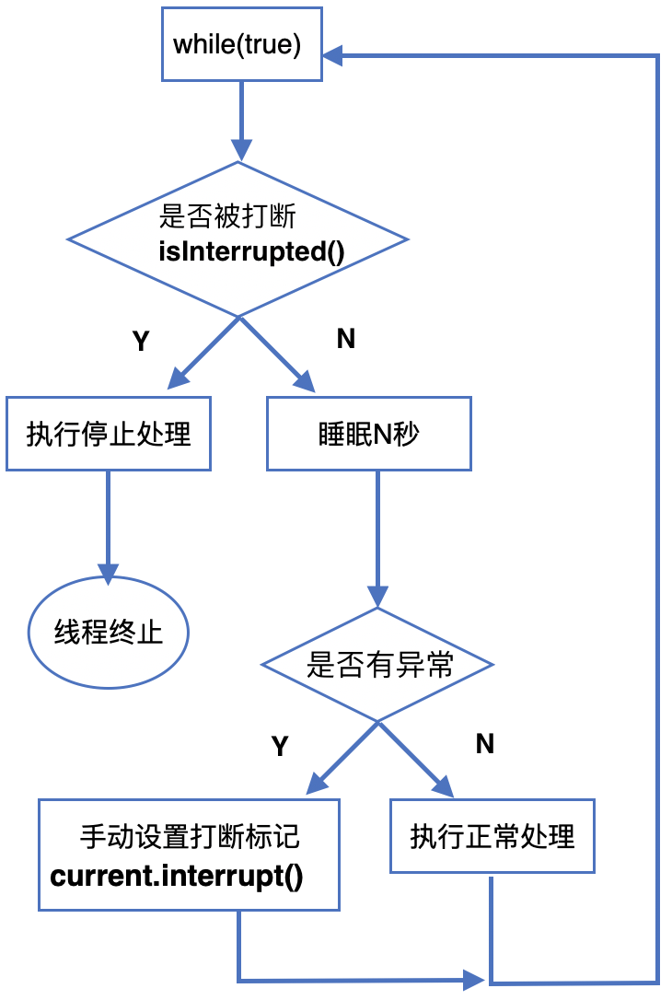
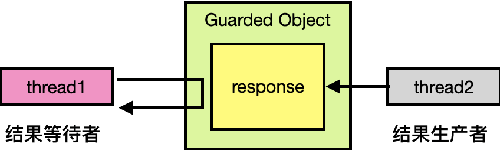
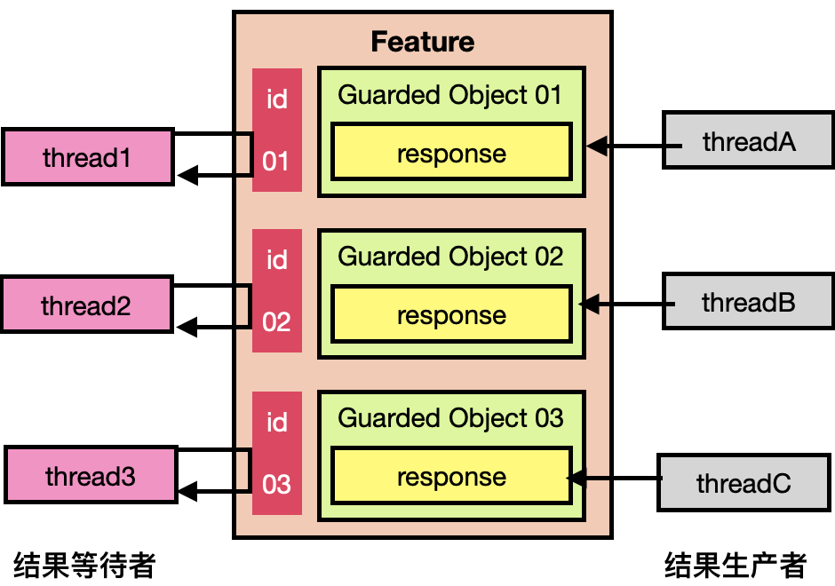

<span id="catalog"></span>

参考

- https://www.bilibili.com/video/BV1jE411j7uX

### 目录--多线程
- [两阶段终止线程](#两阶段终止线程)
    - [停止线程的错误做法](#停止线程的错误做法)
    - [两阶段终止模式](#两阶段终止模式)
    - [interrupt实现两阶段终止](#interrupt实现两阶段终止)
    - [volatile改造](#volatile改造)
- [同步模式--balking犹豫模式](#同步模式--balking犹豫模式)
- [同步模式--保护性暂停](#同步模式--保护性暂停)
    - [保护性暂停的用途](#保护性暂停的用途)
    - [保护性暂停的实现](#保护性暂停的实现)
    - [保护性暂停--超时辅助功能](#保护性暂停--超时辅助功能)
    - [保护性暂停扩展--join原理](#保护性暂停扩展--join原理)
    - [保护性暂停扩展--解耦](#保护性暂停扩展--解耦)
        - [保护性暂停的解耦方式](#保护性暂停的解耦方式)
        - [保护性暂停的解耦实现](#保护性暂停的解耦实现)
- [异步模式--生产者、消费者模式](#异步模式--生产者、消费者模式)
    - [生产者、消费者模式--基本概念](#生产者、消费者模式--基本概念)
    - [生产者、消费者模式--实现](#生产者、消费者模式--实现)
- [同步模式--顺序控制](#同步模式--顺序控制)
    - [固定运行顺序](#固定运行顺序)
        - [wait、notify方式](#wait、notify方式)
        - [ReentrantLock方式](#ReentrantLock方式)
        - [park、unpark方式](#park、unpark方式)
    - [交替输出](#交替输出)
        - [wait、notify实现](#wait、notify实现)
        - [ReentrantLock实现](#ReentrantLock实现)
        - [park、unpark实现](#park、unpark实现)
    - [异步模式--工作线程模式](#异步模式--工作线程模式)
        - [工作线程模式--定义](#工作线程模式--定义)
        - [工作线程模式--饥饿](#工作线程模式--饥饿)
        - [线程池应该创建多少线程](#线程池应该创建多少线程)
- [](#)
- [](#)
- [](#)
- [](#)
- [](#)

# 两阶段终止线程
## 停止线程的错误做法
[top](#catalog)
1. `t.stop()` 方法停止线程
    - `stop()` 会真正的杀死线程
    - 如果线程锁住了共享资源
        1. 执行`stop()`后就再也没有机会释放锁
        2. 其他线程将无法获取该资源的锁
2. `System.exit(int)` 停止当前线程
    - 该方法会使整个程序都停止

## 两阶段终止模式
[top](#catalog)
- 设计模式图
    - 
- 设计模式说明
    1. 在外部执行无限循环: `while(true)`
    2. 每次进入循环时，先判断当前线程是否被打断
        - 需要判断: `current.isInterrupted()` 是否为 `true`
    3. 如果线程已被打断，则执行相关的线程停止处理，然后停止线程
    4. 如果线程没有被打断，则休眠 N 秒
    5. 线程唤醒后，判断有无异常，包括打断异常
    6. 如果没有异常，则执行相关业务处理
    7. 如果有异常，则手动设置打断标记
        - `current.interrupt()`
    8. 执行下一次循环时，`current.isInterrupted()` 为 `true`，将会停止当前线程

- `current.isInterrupted()` 和 `Thread.interrupted()`
    - **最好使用** `current.isInterrupted()` 来判断线程是否被打断，**判断后不会清空打断标记**
    - `Thread.interrupted()` 也可以判断，但是会清空打断标记
    
- 如果在执行业务处理时被打断
    - 相当于打断了普通线程，不会抛出异常
    - 打断之后，会进入下一次循环，此时 `current.isInterrupted()` 为 `true`，会终止线程


## interrupt实现两阶段终止
[top](#catalog)

- <span style='color:red'>这种做法的缺点</span>
    - 必须时刻关注 `InterruptedException`，并用`current.interrupt()`重设打断状态
        - 此时的打断状态仍然是false，需要手动重设
    - 容易出错，导致没有重设打断状态，导致无法停止

- 参考代码
  
    - [/java/mylearn/mythread/src/main/java/com/ljs/learn/mythread/twophase/TwoPhase.java](/java/mylearn/mythread/src/main/java/com/ljs/learn/mythread/twophase/TwoPhase.java)
- 代码内容
    - 两阶段停止实现
        ```java
        @Slf4j(topic = "c.TwoPhaseTermination")
        class TwoPhaseTermination {
            // 创建一个线程监视器
            private Thread monitor;
            
            public void start(){
                // 【两阶段停止实现】
                monitor = new Thread(()->{
        
                    // 1. 在外部执行无限循环: `while(true)`
                    while (true){
                        Thread current = Thread.currentThread();
                        // 2. 每次进入循环时，先判断当前线程是否被打断
                        if(current.isInterrupted()){
                            // 3. 如果线程已被打断，则执行相关的线程停止处理，然后停止线程
                            // 可以在此关闭资源
                            log.debug("thread interrupted...thread end");
                            break;
                        } else {
                            try {
                                // 4. 如果线程没有被打断，则休眠 N 秒
                                TimeUnit.SECONDS.sleep(1);
                                // 5. 线程唤醒后，判断有无异常，包括打断异常
                                // 6. 如果没有异常，则执行相关业务处理
                                log.debug("do something");
        
                            } catch (InterruptedException e) {
                                e.printStackTrace();
                                // 7. 如果有异常，则手动设置打断标记
                                current.interrupt();
                                // 8. 下一次循环 `isInterrupted() == true`，会停止当前线程，并清理资源
                            }
                        }
                    }
                });
        
                monitor.start();
            }
        
            public void stop(){
                // 通过线程监视器停止（中断）线程
                monitor.interrupt();
            }
        }
        ```
    - 测试
        ```java
        @Slf4j(topic = "c.TwoPhase")
        public class TwoPhase {
            public static void main(String[] args) throws InterruptedException {
                // 创建一个线程
                TwoPhaseTermination termination = new TwoPhaseTermination();
                // 启动线程
                termination.start();
                // 休眠3s
                TimeUnit.SECONDS.sleep(5);
                // 停止线程
                termination.stop();
            }
        }
        ```

## volatile改造
[top](#catalog)
- 参考代码
    - [/java/mylearn/mythread/src/main/java/com/ljs/learn/mythread/twophase/TwoPhaseVolatile.java](/java/mylearn/mythread/src/main/java/com/ljs/learn/mythread/twophase/TwoPhaseVolatile.java)
- 代码内容
    ```java
    @Slf4j(topic = "c.TwoPhaseTerminationVolatile")
    class TwoPhaseTerminationVolatile {
        // 创建一个线程监视器
        private Thread monitor;
        // 使用 volatile 变量作为【打断标记】，使其在多个线程内可见
        private volatile boolean stop = false;

        public void start(){
            monitor = new Thread(()->{

                // 1. 在外部执行无限循环: `while(true)`
                while (true){
                    // 2. 每次进入循环时，先判断当前线程是否被打断
                    if(stop){
                        // 3. 如果线程已被打断，则执行相关的线程停止处理，然后停止线程
                        log.debug("thread interrupted...thread end");
                        break;
                    } else {
                        try {
                            // 4. 如果线程没有被打断，则休眠 N 秒
                            TimeUnit.SECONDS.sleep(1);
                            // 5. 如果没有异常，则执行相关业务处理
                            log.debug("do something");

                        } catch (InterruptedException e) {
                            // 如果被打断不做任何处理，catch内不需要再做其他处理
                            // 在外部，通过 stop 判断是否停止
                        }
                    }
                }
            },"T1");

            monitor.start();
        }

        public void stop(){
            // 设置暂停标记
            stop = true;
            // 通过线程监视器停止【睡眠中的】线程
            monitor.interrupt();
        }
    }
    ```
# 同步模式--balking犹豫模式
[top](#catalog)
- 用于：**一个线程发现另一个线程或本线程已经做了相同工作时，不需要重新做，直接返回**
- 参考代码
    - [/java/mylearn/mythread/src/main/java/com/ljs/learn/mythread/twophase/TwoPhaseBalking.java](/java/mylearn/mythread/src/main/java/com/ljs/learn/mythread/twophase/TwoPhaseBalking.java)

- 代码内容
    ```java
    @Slf4j(topic = "c.TwoPhaseTerminationVolatile")
    class TwoPhaseTerminationBalking {
        private Thread monitor;
        private volatile boolean stop = false;

        // 设置标记，保证线程只会被创建一次
        private boolean instance = false;

        public void start(){
            // balking 犹豫模式
            // 如果已经创建过线程，则返回
            synchronized (this){
                if (instance){
                    return;
                }
                instance = true;
            }

            monitor = new Thread(()->{
                while (true){
                    if(stop){
                        log.debug("thread interrupted...thread end");
                        break;
                    } else {
                        try {
                            TimeUnit.SECONDS.sleep(1);
                            log.debug("do something");

                        } catch (InterruptedException e) {
                        }
                    }
                }
            },"T1");

            monitor.start();
        }

        public void stop(){
            stop = true;
            monitor.interrupt();
        }
    }
    ```


# 同步模式--保护性暂停
## 保护性暂停的用途
[top](#catalog)
- Guarded Suspension
- 用于： 一个线程等待另一个线程的执行结果
- 要点
    - 当一个结果需要从 线程A 传递到 线程B 时，让两个线程同时关联一个 `GuardedObject` (保护对象)
    - 如果有结果源源不断的从 线程A 传递到 线程B 时，可以使用消息队列
- 基本特征：**一方要等待另一方的结果**
- 特点：
    - <span style='color:red'>因为 GuardObject 的存在，产生结果的线程和等待结果的线程是一一对应的</span>
    - <span style='color:red'>同步性：生产者生产数据之后，几乎会被立刻消费</span>
- JDK中保护性暂停的运用
    - join
    - Future
- 相较于 join 的优势
    - join 执行后，必须等待线程执行结果
    - 保护性暂停可以在线程执行过程中唤醒其他线程，无需等到线程结束
- 示意图
    - 
## 保护性暂停的实现
[top](#catalog)
- 参考代码
  
    - [/java/mylearn/mythread/src/main/java/com/ljs/learn/mythread/guarded/GuardedTest.java](/java/mylearn/mythread/src/main/java/com/ljs/learn/mythread/guarded/GuardedTest.java)
- 基本实现
    ```java
    class GuardedObject {
        // 代表将来的某个线程的结果
        private Object response;
    
        // 获取结果: 等待结果产生
        public Object get() {
            synchronized (this) {
                // 通过 while 循环，防止虚假唤醒
                while (response == null) {
                    try {
                        this.wait();
                    } catch (InterruptedException e) {
                        e.printStackTrace();
                    }
                }

                return response;
            }
        }

        // 产生结果: 结果产生后，唤醒正在等待结果的线程
        public void complete(Object res){
            synchronized (this){
                // 设置结果
                response = res;
                // 唤醒其他正在等待的线程
                this.notifyAll();
            }
        }
    }
    ```

 - 测试内容
    ```java
    @Slf4j(topic = "c.GuardedTest")
    public class GuardedTest {
        public static void main(String[] args) {
            // 1. 创建保护对象
            GuardedObject guardedObject = new GuardedObject();
    
            // 2. 创建线程，尝试获取结果
            new Thread(()->{
                log.debug("try to get response");
                String response = (String) guardedObject.get();
                log.debug(response);
            }, "t1").start();
    
            // 3. 创建线程，尝试设置结果
            new Thread(()->{
                log.debug("timout....");
    
                // 模拟耗时操作
                try {
                    Thread.sleep(3000);
                } catch (InterruptedException e) {
                    e.printStackTrace();
                }
    
                guardedObject.complete("This is Response");
    
                log.debug("timout end");
    
            }, "t2").start();
            
            // 执行结果
            // 23:08:19.342 [t2] c.GuardedTest - timout....
            // 23:08:19.342 [t1] c.GuardedTest - try to get response
            // 23:08:22.345 [t2] c.GuardedTest - timout end
            // 23:08:22.345 [t1] c.GuardedTest - This is Response
        }
    }
    ```

## 保护性暂停--超时辅助功能
[top](#catalog)

- 参考代码
  
- [/java/mylearn/mythread/src/main/java/com/ljs/learn/mythread/guarded/GuardedTimeoutTest.java](/java/mylearn/mythread/src/main/java/com/ljs/learn/mythread/guarded/GuardedTimeoutTest.java)
  
- 代码内容
    ```java
    // 在规定时间内，获取结果
    public Object get(long timeout) {
        synchronized (this) {
            // 1. 初始化当前时间
            long begin = System.currentTimeMillis();
            long passedTime = 0;
            while (response == null) {
                // 2. 计算这一次循环需要等待的时间
                // 等待时间 - 已经经过的时间
                long waitTime = timeout - passedTime;

                // 3. 如果等待时间为负数，可以停止等待
                if (waitTime <= 0){
                    break;
                }

                try {
                    // 4. 尝试等待指定的时间
                    this.wait(waitTime);
                } catch (InterruptedException e) {
                    e.printStackTrace();
                }

                // 5. 计算已经经过的时间
                passedTime = System.currentTimeMillis() - begin;
            }

            return response;
        }

    }
    ```

## 保护性暂停扩展--join原理
[top](#catalog)
- join 底层也是利用保护性暂停来实现等待另一个线程结束

- join与普通的保护性暂停的区别
    - join 是**一个线程等待另一个线程结束**
    - 保护性暂停是**一个线程等待另一个线程的结果**
    
- 源码分析
    ```java
    public final void join() throws InterruptedException {
        join(0);
    }
    
    public final synchronized void join(final long millis)
    throws InterruptedException {
        if (millis > 0) {
            // 保护性暂停--timeout等待模式应用
            if (isAlive()) {
                // 1. 计算起始时间
                final long startTime = System.nanoTime();
                // 2. 初始化延迟时间
                long delay = millis;
                do {
                    wait(delay);
                // 3. 如果被 notify 后，当前线程还存活，则继续
                // 4. 重新计算延迟时间 delay = millis - （当前时间 - 初始时间）
                } while (isAlive() && (delay = millis -
                        TimeUnit.NANOSECONDS.toMillis(System.nanoTime() - startTime)) > 0);
            }
        } else if (millis == 0) {
            // 保护性暂停--无等待模式应用
    
            // isAlive 判断代码是否执行完毕
            // 执行完 false
            // 没有执行完 true -->> 线程存活 -->> 继续等待
            while (isAlive()) {
                wait(0);
            }
        } else {
            throw new IllegalArgumentException("timeout value is negative");
        }
    }   
    ```
    
## 保护性暂停扩展--解耦

### 保护性暂停的解耦方式

[top](#catalog)
- 为什么需要解耦
    - 在多个类之间使用 GuardedObject 对象时，作为参数传递不方便
- 解耦方式
    - 设计一个中间类，解耦：**结果等待者** 和 **结果生产者**，来支持多个任务的管理
    - 为每个 Garded 对象添加 ID，用于唯一标识
- 解耦示意图
    - 

### 保护性暂停的解耦实现

[top](#catalog)

- <span style='color:red'>解耦类的主要内容是管理 GuardedObject</span>

- 参考代码

    - [/java/mylearn/mythread/src/main/java/com/ljs/learn/mythread/guarded/GuardedExtensionTest.java](/java/mylearn/mythread/src/main/java/com/ljs/learn/mythread/guarded/GuardedExtensionTest.java)

- 解耦类

    ```java
    class Guardedboxes{
        // boxes 可能会被多个线程访问到，所以需要保证线程安全
        private static Map<Integer, GuardedExtension> boxes= new ConcurrentHashMap<>();
    
        private static int id = 1;
    
        // 产生唯一id，防止由外部对象创建id时可能会产生的id冲突
        // 为了防止多线程操作时的竞争条件，需要加锁
        private static synchronized int generateId(){
            return id++;
        }
    
        // 由等待者调用 ！！！
        public static GuardedExtension createGuardedObject(){
            // 创建 Guarded 对象
            GuardedExtension go = new GuardedExtension(generateId());
    
            // 放入容器中进行管理
            boxes.put(go.getId(), go);
    			  
            // 将结果返回给等待者，有等待着调用 get 方法来等待结果
            return go;
        }
    
        // 获取所有 go 对象的id，获取之后就可以创建生产者，发送结果了
        public static Set<Integer> getIds(){
            return boxes.keySet();
        }
    
        // 由生产者调用，获取Go对象，并发送结果 ！！！
        public static GuardedExtension getGuarded(int id){
            // 获取后，需要及时删除
            return boxes.remove(id);
        }
    }
    ```

- 等待者

    ```java
    @Slf4j(topic = "c.Waiter")
    class Waiter extends Thread{
        @Override
        public void run() {
            // 创建 GO 对象 
            GuardedExtension go = Guardedboxes.createGuardedObject();
    
            // 尝试获取数据
            log.debug("waiter start, id={}", go.getId());
            Object response = go.get();
            log.debug("waiter get response, id={}, response={} ",go.getId(), response);
    
        }
    }
    ```

- 生产者

    ```java
    @Slf4j(topic = "c.Generator")
    class Generator extends Thread{
        // 需要处理的 Go 对象的id
        private int id;
        // 产生的结果
        private String response;
    
        public Generator(int id, String response){
            this.id = id;
            this.response = response;
        }
    
        @Override
        public void run() {
            // 获取 go 对象
            GuardedExtension go = Guardedboxes.getGuarded(id);
    
            // 然后发送结果
            log.debug("send response, id={}, response={}", id, response);
            go.complete(response);
        }
    }
    ```

- 测试内容

    ```java
    @Slf4j(topic = "c.GuardedTest")
    public class GuardedExtensionTest {
        public static void main(String[] args) {
            // 1. 创建【等待者】，开始等待结果
            for (int i = 0; i < 3; i++) {
                new Waiter().start();
            }
    
            // 延迟1s，使所有等待者开始等待结果
            try {
                TimeUnit.SECONDS.sleep(1);
            } catch (InterruptedException e) {
                e.printStackTrace();
            }
    
            // 2. 获取所有 id，并通过id创建【生产者】，来发送数据
            for (Integer id : Guardedboxes.getIds()) {
                new Generator(id, "content_" + id).start();
            }
    
            // 执行结果
            // 22:02:24.435 [Thread-1] c.Waiter - waiter start, id=2
            // 22:02:24.435 [Thread-0] c.Waiter - waiter start, id=1
            // 22:02:24.435 [Thread-2] c.Waiter - waiter start, id=3
            // 22:02:25.438 [Thread-3] c.Generator - send response, id=1, response=content_1
            // 22:02:25.438 [Thread-5] c.Generator - send response, id=3, response=content_3
            // 22:02:25.438 [Thread-4] c.Generator - send response, id=2, response=content_2
            // 22:02:25.439 [Thread-0] c.Waiter - waiter get response, id=1, response=content_1
            // 22:02:25.439 [Thread-1] c.Waiter - waiter get response, id=2, response=content_2
            // 22:02:25.439 [Thread-2] c.Waiter - waiter get response, id=3, response=content_3
    
        }
    }
    ```

    

# 异步模式--生产者、消费者模式

## 生产者、消费者模式--基本概念

[top](#catalog)

- 与保护性暂停中的 GuardObject 不同，不需要生产结果和等待结果的线程一一对应
- 消费者队列可以用来平衡生产和消费的线程资源
    - 在保护性暂停中，生产者、消费者是等量的，会消耗过多的资源
- 生产者只负责生产结果，消费者只关系如何处理结果
- 通过 <span style='color:red'>消息队列</span> 进行解耦
    - 一般是先入先出的
- 消息队列是有容量限制的，满了生产者不会再加数据，空了消费者不会再消耗数据
- JDK 中各种阻塞队列，都是生产者、消费者模式
- 特点
    - 异步性：因为数据会先进入消息队列，所以在数据的处理上，会产生延迟
- 示意图
  
  - 


## 生产者、消费者模式--实现
[top](#catalog)
- 参考代码
  
- [/java/mylearn/mythread/src/main/java/com/ljs/learn/mythread/pconsumer/ProducerConsumerTest.java](/java/mylearn/mythread/src/main/java/com/ljs/learn/mythread/pconsumer/ProducerConsumerTest.java)
  
- 消息队列的存储消息格式
    ```java
    final class Message {
        private int id;
        private Object value;
    
        public Message(int id, Object value) {
            this.id = id;
            this.value = value;
        }
    
        // 只添加 get 方法，使两个属性不能被修改
        // 变成 【线程安全】的方法
        public int getId() {
            return id;
        }
    
        public Object getValue() {
            return value;
        }
    
        @Override
        public String toString() {
            return "Message{" +
                    "id=" + id +
                    ", value=" + value +
                    '}';
        }
    }
    ```

- 消息队列
    ```java
    // 消息队列，在【线程间】进行通信
    @Slf4j(topic = "c.MessageQueue")
    class MessageQueue {
        // 创建一个双向队列作为容器
        private LinkedList<Message> list = new LinkedList<>();
    
        // 保存容器的容量
        private int capcity;
    
        public MessageQueue(int capcity) {
            this.capcity = capcity;
        }
    
        // 获取消息（从头获取）
        public Message take() {
            synchronized (list) {
                // 如果队列为空，则需要等待
                while (list.isEmpty()){
                    try {
                        log.debug("queue is empty, waiting.....");
                        list.wait();
                    } catch (InterruptedException e) {
                        e.printStackTrace();
                    }
                }
    
                Message message = list.removeFirst();
                log.debug("take message={}",message);
                // 如果当前队列已满，获取一个消息后则，可以添加新的消息
                // 通过 notifyAll 唤醒其他等待中的 put 操作线程
                list.notifyAll();
                return message;
            }
    
        }
    
        // 存储消息（从末尾插入）
        public void put(Message message) {
            synchronized (list){
                // 如果队列已满，则需要等待
                while (list.size() == capcity){
                    try {
                        log.debug("queue is full, waiting.....");
                        list.wait();
                    } catch (InterruptedException e) {
                        e.printStackTrace();
                    }
                }
    
                // 插入数据
                list.addLast(message);
                log.debug("put message={}",message);
                // 如果当前队列为空，插入数据之后，则有了可以进行消费的数据
                // 唤醒其他等待中的 take 操作的线程
                list.notifyAll();
            }
        }
    }
    ```

- 消息队列测试
    ```java
    public class ProducerConsumerTest {
        public static void main(String[] args) {
            // 1. 创建消息队列
            MessageQueue queue = new MessageQueue(2);
    
            // 2. 创建多个生产者
            for (int i = 0; i < 3; i++) {
                int id = i;
                new Thread(()->{
                    queue.put(new Message(id, "value" + id));
                }, "producer" + i).start();
            }
    
            // 3. 创建一个消费者，每个 1s 消费一次
            new Thread(()->{
                while (true){
                    try {
                        TimeUnit.SECONDS.sleep(1);
                    } catch (InterruptedException e) {
                        e.printStackTrace();
                    }
    
                    Message msg = queue.take();
                }
            }, "consumer01").start();
    
            // 执行结果
            // 08:02:39.624 [producer2] c.MessageQueue - put message=Message{id=2, value=value2}
            // 08:02:39.629 [producer0] c.MessageQueue - put message=Message{id=0, value=value0}
            // 08:02:39.630 [producer1] c.MessageQueue - queue is full, waiting.....
            // 08:02:40.623 [consumer01] c.MessageQueue - take message=Message{id=2, value=value2}
            // 08:02:40.624 [producer1] c.MessageQueue - put message=Message{id=1, value=value1}
            // 08:02:41.628 [consumer01] c.MessageQueue - take message=Message{id=0, value=value0}
            // 08:02:42.630 [consumer01] c.MessageQueue - take message=Message{id=1, value=value1}
            // 08:02:43.634 [consumer01] c.MessageQueue - queue is empty, waiting.....
        }
    
    }
    ```

# 同步模式--顺序控制
## 固定运行顺序
### wait、notify方式
[top](#catalog)
- 先打印2，再打印1
- 参考代码
  
- [/java/mylearn/mythread/src/main/java/com/ljs/learn/mythread/ordercontroller/OrderControllerWaitNotify.java](/java/mylearn/mythread/src/main/java/com/ljs/learn/mythread/ordercontroller/OrderControllerWaitNotify.java)
  
- 代码内容
    ```java
    @Slf4j(topic = "c.OrderControllerWaitNotify")
    public class OrderControllerWaitNotify {
        private static Object lock = new Object();
        private static boolean t2Ran = false;
    
        public static void main(String[] args) {
            Thread t1 = new Thread(() -> {
                synchronized (lock) {
                    // 等待t2完成
                    while (!t2Ran) {
                        try {
                            lock.wait();
                        } catch (InterruptedException e) {
                            e.printStackTrace();
                        }
                    }
                    log.debug("1");
                }
            }, "t1");
    
            Thread t2 = new Thread(() -> {
                synchronized (lock) {
                    log.debug("2");
                    t2Ran = true;
                    // 唤醒等待的t1
                    lock.notifyAll();
                }
            }, "t2");
    
            t1.start();
            t2.start();
        }
    }
    ```

### ReentrantLock方式
[top](#catalog)
- 先打印2，再打印1
- 参考代码
  
- [/java/mylearn/mythread/src/main/java/com/ljs/learn/mythread/ordercontroller/OrderControllerReentrantLock.java](/java/mylearn/mythread/src/main/java/com/ljs/learn/mythread/ordercontroller/OrderControllerReentrantLock.java)
  
- 代码内容
    ```java
    @Slf4j(topic = "c.OrderControllerReentrantLock")
    public class OrderControllerReentrantLock {
        private static ReentrantLock lock = new ReentrantLock();
        private static Condition cond = lock.newCondition();
        private static boolean t2Ran = false;
    
        public static void main(String[] args) {
            Thread t1 = new Thread(() -> {
                lock.lock();
                try {
                    // 等待t2完成
                    while (!t2Ran) {
                        try {
                            cond.await();
                        } catch (InterruptedException e) {
                            e.printStackTrace();
                        }
                    }
                    log.debug("1");
                }finally {
                    lock.unlock();
                }
            }, "t1");
    
            Thread t2 = new Thread(() -> {
                lock.lock();
                try{
                    log.debug("2");
                    t2Ran = true;
                    // 唤醒等待的t1
                    cond.signalAll();
                }finally {
                    lock.unlock();
                }
            }, "t2");
    
            t1.start();
            t2.start();
        }
    }
    ```

### park、unpark方式
[top](#catalog)
- 先打印2，再打印1
- 参考代码
  
- [/java/mylearn/mythread/src/main/java/com/ljs/learn/mythread/ordercontroller/OrderControllerPark.java](/java/mylearn/mythread/src/main/java/com/ljs/learn/mythread/ordercontroller/OrderControllerPark.java)
  
- 代码内容
    ```java
    @Slf4j(topic = "c.OrderControllerPark")
    public class OrderControllerPark {
        public static void main(String[] args) {
            Thread t1 = new Thread(() -> {
                LockSupport.park();
                log.debug("1");
            }, "t1");
    
            Thread t2 = new Thread(() -> {
                log.debug("2");
                LockSupport.unpark(t1);
            }, "t2");
    
            t1.start();
            t2.start();
        }
    }
    ```

## 交替输出
### wait、notify实现
[top](#catalog)
- 输出内容
    - 线程1，输出5次 a
    - 线程2，输出5次 b
    - 线程3，输出5次 c
    - 输出结果: abcabcabcabcabc
- 参考代码
  
- [/java/mylearn/mythread/src/main/java/com/ljs/learn/mythread/ordercontroller/AlternateWaitNotify.java](/java/mylearn/mythread/src/main/java/com/ljs/learn/mythread/ordercontroller/AlternateWaitNotify.java)
  
- 代码内容
    ```java
    // 线程 输出内容 起始标记 结束标记
    // 1   a       1      2
    // 2   b       2      3
    // 3   c       3      1
    
    public class AlternateWaitNotify {
        public static Object lock = new Object();
        public static int flag = 0;
        public static int alternateCount = 5;
    
        public static void main(String[] args) {
            flag = 1;
            new Thread(()->write("a", 1, 2), "t1").start();
            new Thread(()->write("b", 2, 3), "t2").start();
            new Thread(()->write("c", 3, 1), "t3").start();
        }
    
        private static void write(String text, int start, int next) {
            for (int i = 0; i < alternateCount; i++) {
                synchronized (lock) {
                    // 等待变量变为 start
                    while (flag != start) {
                        try {
                            lock.wait();
                        } catch (InterruptedException e) {
                            e.printStackTrace();
                        }
                    }
    
                    // 输出内容、调整变量，并唤醒其他线程
                    System.out.print(text);
                    flag = next;
                    lock.notifyAll();
                }
            }
        }
    }
    ```
    
### ReentrantLock实现
[top](#catalog)
- 参考代码
  
    - [/java/mylearn/mythread/src/main/java/com/ljs/learn/mythread/ordercontroller/AlternateReentrantLock.java](/java/mylearn/mythread/src/main/java/com/ljs/learn/mythread/ordercontroller/AlternateReentrantLock.java)
- 代码内容
    ```java
    public class AlternateReentrantLock {
    
        public static void main(String[] args) {
            AwaitSignal awaitSignal = new AwaitSignal(5);
            Condition cond1 = awaitSignal.newCondition();
            Condition cond2 = awaitSignal.newCondition();
            Condition cond3 = awaitSignal.newCondition();
    
            // 不同的线程进入不同的条件变量中等待，再由其它线程唤醒
            new Thread(() -> awaitSignal.print("a", cond1, cond2), "t1").start();
            new Thread(() -> awaitSignal.print("b", cond2, cond3), "t1").start();
            new Thread(() -> awaitSignal.print("c", cond3, cond1), "t1").start();
    
            // 主线程加锁，并唤醒第一个条件变量
            awaitSignal.lock();
            try {
                cond1.signalAll();
    
            } finally {
                awaitSignal.unlock();
            }
        }
    
    }
    ```
    ```java
    class AwaitSignal extends ReentrantLock {
        private int loopCount;
    
        public AwaitSignal(int loopCount) {
            this.loopCount = loopCount;
        }
    
        public void print(String text, Condition current, Condition next) {
            for (int i = 0; i < loopCount; i++) {
                lock();
                try {
                    // 所有线程都先等待信号，然后在输出
                    current.await();
                    System.out.print(text);
                    next.signalAll();
                } catch (InterruptedException e) {
                    e.printStackTrace();
                } finally {
                    unlock();
                }
            }
        }
    }
    ```

### park、unpark实现
[top](#catalog)
- 参考代码
  
- [/java/mylearn/mythread/src/main/java/com/ljs/learn/mythread/ordercontroller/AlternatePark.java](/java/mylearn/mythread/src/main/java/com/ljs/learn/mythread/ordercontroller/AlternatePark.java)
  
- 代码内容
    ```java
    public class AlternatePark {
    
        private static Thread t1;
        private static Thread t2;
        private static Thread t3;
        public static void main(String[] args) {
            ParkUnpark parkUnpark = new ParkUnpark(5);
    
            // 不同的线程进入不同的条件变量中等待，再由其它线程唤醒
            t1 = new Thread(() -> parkUnpark.print("a", t2), "t1");
            t2 = new Thread(() -> parkUnpark.print("b", t3), "t2");
            t3 = new Thread(() -> parkUnpark.print("c", t1), "t3");
    
            t1.start();
            t2.start();
            t3.start();
    
            // 主线程解锁第一个线程
            LockSupport.unpark(t1);
        }
    
    }
    ```
    ```java
    class ParkUnpark {
        private int loopCount;
    
        public ParkUnpark(int loopCount){
            this.loopCount = loopCount;
        }
    
        public void print(String text, Thread next){
            for (int i = 0; i < loopCount; i++) {
                // 当前线程暂停，等待被唤醒
                LockSupport.park();
                System.out.print(text);
                // 指定需要唤醒的下一个线程
                LockSupport.unpark(next);
            }
        }
    }
    ```

# 异步模式--工作线程模式
## 工作线程模式--定义
[top](#catalog)
- 目的
    - 让有限的工作线程来轮流异步处理无限多的任务
- 可以归类为分工模式，典型的实现就是线程池
    - 也是一种享元模式的实现
- 不同类型的任务应该使用不同的线程池，这样能够避免饥饿，提升效率

## 工作线程模式--饥饿
[top](#catalog)
- 只线程数量不足导致的饥饿
    - 在正常的并发下，饥饿指的是优先级过低，导致一直无法分配到CPU时间片来执行
- **固定大小的线程池**会产生饥饿
    - 从结果上看类似于死锁，但是实际上没有线程产生死锁
    - **只是线程数不足**，导致的程序无法继续执行
- 饥饿的解决方式
    - 线程池拆分
        - <span style='color:red'>不同类型的任务使用不同的线程池</span>
- 饥饿问题示例
    - 饥饿问题的产生
        - 参考代码
            - [/java/mylearn/mythread/src/main/java/com/ljs/learn/mythread/workerthread/TestCook.java](/java/mylearn/mythread/src/main/java/com/ljs/learn/mythread/workerthread/TestCook.java)

        - 代码内容
            ```java
            @Slf4j(topic = "c.TestCook")
            public class TestCook {
                public static final String[] cooks = new String[]{"cook1", "cook2","cook3"};
                public static final Random random = new Random();
                public static String getCook(){
                    return cooks[random.nextInt(cooks.length)];
                }
            
                public static void main(String[] args) throws InterruptedException {
                    // 创建一个只有2个线程的线程池，一个负责点餐，一个负责做菜
                    ExecutorService pool = Executors.newFixedThreadPool(2);
            
                    // 如果只有一个任务，不会发生饥饿，但是会同时耗尽线程池内的两个线程
                    // 外部的 execute 比内部的 submit 执行更快，所以两个 execute 线程更快的抢到了线程使用权
                    // submit 操作全部被阻塞在阻塞队列中，无法返回结果
                    // 最终导致，两个线程都在 cook = result.get(); 处等待结果返回
                            
                    pool.execute(()->{
                        log.debug("try get cook");
                        Future<String> result = pool.submit(()->{
                            log.debug("making cook");
                            return getCook();
                        });
            
                        log.debug("wait cook");
                        //
                        String cook = null;
                        try {
                            cook = result.get();
                        } catch (InterruptedException e) {
                            e.printStackTrace();
                        } catch (ExecutionException e) {
                            e.printStackTrace();
                        }
                        log.debug("got cook, cook=" + cook);
                    });
            
                    // 如果同时产生了两个任务，会导致饥饿
                    // pool.execute(()->{
                    //     log.debug("try get cook");
                    //     Future<String> result = pool.submit(()->{
                    //         log.debug("making cook");
                    //         return getCook();
                    //     });
            
                    //     log.debug("wait cook");
                    //     String cook = result.get();
                    //     log.debug("got cook, cook=" + cook);
                    // });
            
                    Thread.sleep(1000);
            
                    pool.shutdown();
                }
            }
            ```
    - 解决饥饿
        - 参考代码
            - [/java/mylearn/mythread/src/main/java/com/ljs/learn/mythread/workerthread/TestCook2.java](/java/mylearn/mythread/src/main/java/com/ljs/learn/mythread/workerthread/TestCook2.java)

        - 代码内容
            ```java
            @Slf4j(topic = "c.TestCook")
            public class TestCook2 {
                public static final String[] cooks = new String[]{"cook1", "cook2","cook3"};
                public static final Random random = new Random();
                public static String getCook(){
                    return cooks[random.nextInt(cooks.length)];
                }
            
                public static void main(String[] args) throws InterruptedException {
                    // 创建2个线程的线程池，一个负责点餐，一个负责做菜
                    ExecutorService waiter = Executors.newFixedThreadPool(1);
                    ExecutorService cooker = Executors.newFixedThreadPool(1);
            
                    // 如果只有一个任务，不会发生饥饿，但是会同时耗尽线程池内的两个线程
                    waiter.execute(()->{
                        log.debug("try get cook");
                        Future<String> result = cooker.submit(()->{
                            log.debug("making cook");
                            return getCook();
                        });
            
                        log.debug("wait cook");
                        //
                        String cook = null;
                        try {
                            cook = result.get();
                        } catch (InterruptedException e) {
                            e.printStackTrace();
                        } catch (ExecutionException e) {
                            e.printStackTrace();
                        }
                        log.debug("got cook, cook=" + cook);
                    });
            
                    // 执行第二个任务
                    waiter.execute(()->{
                        log.debug("try get cook");
                        Future<String> result = cooker.submit(()->{
                            log.debug("making cook");
                            return getCook();
                        });
            
                        log.debug("wait cook");
                        String cook = null;
                        try {
                            cook = result.get();
                        } catch (InterruptedException e) {
                            e.printStackTrace();
                        } catch (ExecutionException e) {
                            e.printStackTrace();
                        }
                        log.debug("got cook, cook=" + cook);
                    });
            
                    Thread.sleep(1000);
            
                    waiter.shutdown();
                    cooker.shutdown();
                }
            }
            ```

## 线程池应该创建多少线程
[top](#catalog)
- 如果线程池过小，不能充分利用系统资源，容易导致饥饿
- 如果线程池过大，会导致更多的线程上下文切换，占用更多的内存
- CPU密集型运算
    - 经验公式
        - `线程数 = CPU核数 + 1`
    - +1 保证当线程由于页缺失故障或其他原因暂停时，这个额外的线程可以替补，**保证始终周期不被浪费**
- I/O密集型
    - I/O 操作，RPC调用，数据库操作，web操作等等
    - cpu不总是处于繁忙状态，可以利用多线程提供CPU利用率
    - 经验公式
        - `线程数 = CPU核数 * 期望CPU利用率 * 总时间(CPU计算时间+等待时间) / CPU计算时间`
        - 如 4 核CPU，计算时间=50%，其他等待时间=50%，期望CPU被100%使用
            ```
            线程数 = 4 * 100% * 100% / 50% = 8  
            ```
        - 如 4 核CPU，计算时间=10%，其他等待时间=90%，期望CPU被100%使用
            ```
            线程数 = 4 * 100% * 100% / 10% = 40  
            ```

[top](#catalog)

