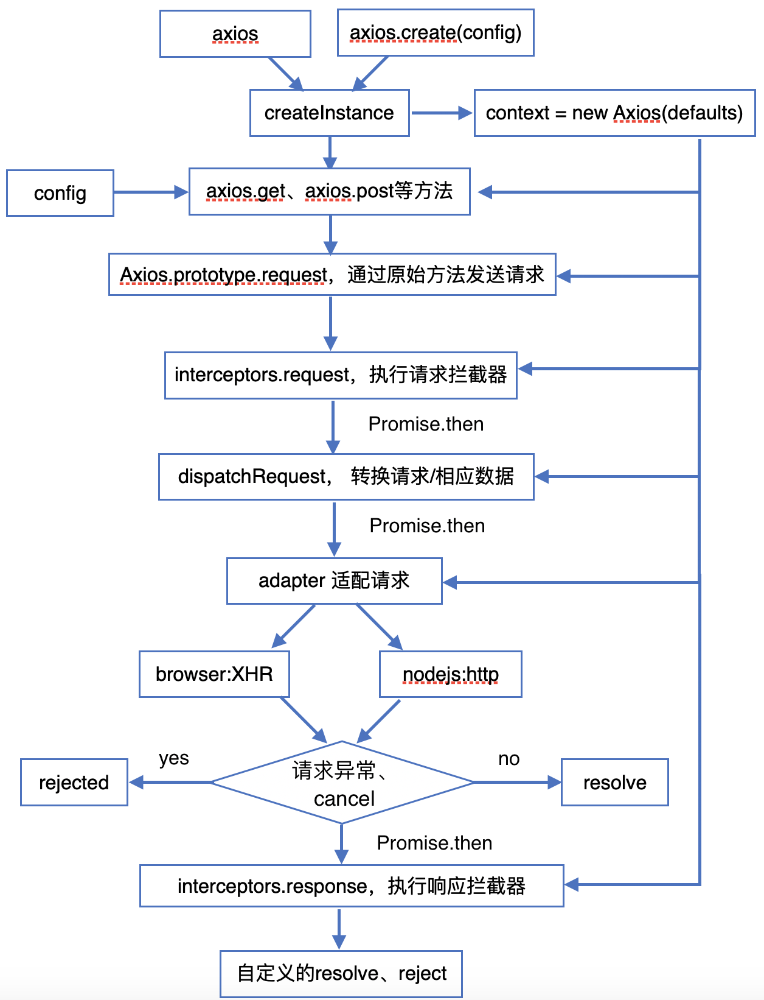
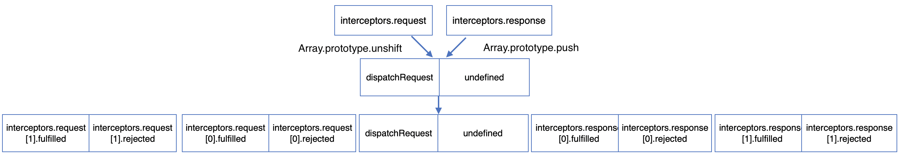

<span id="catalog"></span>
- 参考
    - https://www.bilibili.com/video/BV1NJ41197u6

### 目录-axios
- [axios的特性](#axios的特性)
- [axios常用方法](#axios常用方法)
- [分别使用xhr和axios发送请求](#分别使用xhr和axios发送请求)
- [使用xhr封装axios的基本实现](#使用xhr封装axios的基本实现)
- [自定义axios函数对象---二次封装](#自定义axios函数对象---二次封装)
- [拦截器](#拦截器)
- [取消请求](#取消请求)
    - [取消请求的步骤](#取消请求的步骤)
    - [使用拦截器简化取消操作](#使用拦截器简化取消操作)
- [axios源码分析](#axios源码分析)
    - [整体结构分析](#整体结构分析)
    - [axios与Axios](#axios与Axios)
    - [axios与自定义axios函数对象的区别](#axios与自定义axios函数对象的区别)
    - [axios运行的整体流程](#axios运行的整体流程)
    - [发送请求时的三个主要流程](#发送请求时的三个主要流程)
        - [三个主要流程](#三个主要流程)
        - [request的处理过程](#request的处理过程)
        - [dispatchRequest的处理过程](#dispatchRequest的处理过程)
        - [xhrAdapter的处理过程](#xhrAdapter的处理过程)
- [](#)

# axios的特性
[top](#catalog)
- axios 比 jquery 更轻量
- axios 的特性
    - 基于 promise 的异步ajax请求库
    - 浏览器端和node端都可以使用
        - node端发送的就是普通http请求
    - <span style='color:red'>支持请求/响应拦截器</span>
    - 支持取消请求
    - 自动进行 请求/响应 的数据转换
    - 可以批量发送多个请求
        - 就是 `Promise.all`
    - 能够防止 XSRF

# axios常用方法
[top](#catalog)
- 发送请求的方法

    |方法|功能|
    |-|-|
    |`axios(config)`|最基本的请求发送发放，可以发送各种方式的请求|
    |`axios(url [, config])`|向url发送get请求|
    |`axios.request(config)`|就是 `axios(config)`|
    |`axios.get(url [, config])`|向url发送get请求|
    |`axios.delete(url [, config])`|向url发送delete请求|
    |`axios.post(url [, data, config])`|向url发送post请求|
    |`axios.put(url [, data, config])`|向url发送put请求|

- 添加拦截器

    |方法|功能|
    |-|-|
    |`axios.interceptors.request.use()`|添加请求拦截器|
    |`axios.interceptors.response.use()`|添加响应拦截器|

- 取消请求的方法

    |方法|功能|
    |-|-|
    |`axios.Cancel()`|创建取消请求的错误对象|
    |`new axios.CancelToken()`|用于创建取消请求的 `token` 函数对象|
    |`axios.isCancel()`|判断是否是一个取消请求的错误|

- 批量发送请求的方法

    |方法|功能|
    |-|-|
    |`axios.all(promises)`|批量执行多个异步请求，类似于`Promise.all()`|
    |`axios.spread()`|指定接收所有成功数据的回调函数|

- 其他方法

    |方法|功能|
    |-|-|
    |`axios.defaults.xxx`|请求的默认全局配置|
    |`axios.create([config])`|自定义一个新的 axios 函数对象|

- config对象的配置

    |属性|功能|
    |-|-|
    |url|请求地址|
    |method|请求方式|
    |params|get、delete 请求参数|
    |data|post、put 请求参数|
    |||

# 分别使用xhr和axios发送请求
[top](#catalog)
- 浏览器端实现
    - 参考代码
        - [src/base-server/public/html/base/base.html](src/base-server/public/html/base/base.html)
    - 浏览器访问地址
        - http://localhost:3333/html/base/base.html
    - 原生xhr发送请求
        ```js
        // 为按钮注册发送ajax请求的事件
        document.getElementById('get').onclick = function () {
            var xhr = new XMLHttpRequest();
            xhr.open('get', '/base/handle?aaa=123&bbb=234');
            xhr.send();
            xhr.onload = function () {
                console.log(JSON.parse(xhr.responseText));
            }
        }

        document.getElementById('put').onclick = function () {
            var xhr = new XMLHttpRequest();
            xhr.open('put', '/base/handle');
            xhr.setRequestHeader('Content-type', 'application/json')
            xhr.send(JSON.stringify({ name: 123, age: 345 }));
            xhr.onload = function () {
                console.log(JSON.parse(xhr.responseText));
            }
        }

        document.getElementById('post').onclick = function () {
            var xhr = new XMLHttpRequest();
            xhr.open('post', '/base/handle');
            xhr.setRequestHeader('Content-type', 'application/json')
            xhr.send(JSON.stringify({ name: 123, age: 345 }));
            xhr.onload = function () {
                console.log(JSON.parse(xhr.responseText));
            }
        }

        document.getElementById('delete').onclick = function () {
            var xhr = new XMLHttpRequest();
            xhr.open('delete', '/base/handle/123');
            xhr.setRequestHeader('Content-type', 'application/json')
            xhr.send();
            xhr.onload = function () {
                console.log(JSON.parse(xhr.responseText));
            }
        }
        ```
    - axios发送请求
        1. 使用axios中指定的请求方式发送请求
            ```js
            // 为按钮注册发送ajax请求的事件
            document.getElementById('get').onclick = function () {
                axios.get('/base/handle?aaa=123&bbb=234').then(resp => {
                    console.log(resp.data)
                });
            }

            document.getElementById('post').onclick = function(){
                axios.post('/base/handle', { name: 123, age: 345 }).then(resp => {
                    console.log(resp.data)
                });
            }

            document.getElementById('put').onclick = function(){
                axios.put('/base/handle', { name: 256, age: 345 }).then(resp => {
                    console.log(resp.data)
                });
            }

            document.getElementById('delete').onclick = function(){
                axios.delete('/base/handle/001').then(resp => {
                    console.log(resp.data)
                });
            }
            ```
        2. 直接使用 `axios` 函数对象发送请求
            ```js
            document.getElementById('getAxios').onclick = function(){
                axios({
                    url:'/base/handle',
                    params:{
                        name: 'tom',
                        age:22
                    }
                }).then(resp => console.log(resp.data));
            }

            document.getElementById('postAxios').onclick = function(){
                axios({
                    url:'/base/handle',
                    method: 'post',
                    data:{
                        name: 'tom',
                        age:22
                    }
                }).then(resp => console.log(resp.data));
            }
            ```
- 服务端代码
    - 参考代码
        - [src/base-server/router/base.js](src/base-server/router/base.js)
    - 代码内容
        ```js
        // 使用 ctx.query 获取请求参数-------------------
        router.get('/handle', async ctx => {
            ctx.query.type = 'get';
            ctx.body = ctx.query;
        })

        router.delete('/handle/:id', async ctx => {
            ctx.query.type = 'delete';
            ctx.query.param = ctx.params.id;
            ctx.body = ctx.query;
        })

        // 使用 ctx.request.body 获取请求参数-------------------
        router.post('/handle', async ctx => {
            ctx.request.body.type = 'post';
            ctx.body = ctx.request.body
        })

        router.put('/handle', async ctx => {
            ctx.request.body.type = 'put';
            ctx.body = ctx.request.body
        })
        ```

# 使用xhr封装axios的基本实现
[top](#catalog)
- 封装函数的特点
    1. 函数的返回值为 promise，成功的结果为 response，异常的结果为error
    2. 能够处理多种类型的请求
        - get、post、put、delete
    3. 函数的参数是一个配置对象
        ```js
        {
            url:'',
            method:'',
            params:{},  // get、delete 请求的参数
            data:{}     // post put 请求的参数
        }
        ```
    4. 如果响应结果是JSON字符串，则自动解析为JS对象

- 函数的响应结果
    - 正常响应
        - 参考
            - https://github.com/axios/axios#response-schema
        - 包括
            ```js
            {
                data: {},   // 响应数据
                status: 200,    // http状态码
                statusText: 'OK',   // http状态码的描述
                headers: {},    // 所有请求头
                config: {}, // axios 的请求配置
                request: {} // xhr对象
            }
            ```
    - 异常响应
        - 返回一个 `Error()` 对象
- 判断响应成功的方法
    1. 使用 `onreadystatechange` 来监听ajax状态码的变化，知道变为`4`
        - 不使用 `onload`，需要同时监听成功和失败
    2. 响应结束后，根据http状态码来判断请求是否成功
        - http状态是 `[200, 300)` 之间的整数时，则请求成功

- 示例
    - 参考代码
        - axios封装
            - [src/base-server/public/js/myaxios.js](src/base-server/public/js/myaxios.js)
        - 测试代码
            - [src/base-server/public/html/myaxios/base.html](src/base-server/public/html/myaxios/base.html)
    - 浏览器访问地址
        - http://localhost:3333/html/base/base.html
    - axios封装代码
        ```js
        // 使用原生xhr对象封装axios
        function axios({
            url,
            method = 'GET',
            params = {},  // get、delete 请求的参数
            data = {}     // post put 请求的参数
        }) {
            return new Promise((resolve, reject) => {
                // 1. 创建xhr对象
                const request = new XMLHttpRequest();

                // 2. 监听请求响应
                request.onreadystatechange = function () {
                    // 2.1 知道请求完成才响应
                    if (request.readyState !== 4) {
                        return;
                    }

                    const { status, statusText } = request;
                    // 2.2 检查status。如果status在 [200,300)的区间内，则resolve
                    if (200 <= status && status < 300) {
                        // 2.3 创建响应头对象
                        let headers = {}, h_key, h_value
                        request.getAllResponseHeaders()
                            .trim()
                            .split(/[\r\n]+/)
                            .forEach(line => {
                                [h_key, h_value] = line.split(': ');
                                headers[h_key] = h_value;
                            });

                        // 2.4 检查响应数据格式是否是JSON
                        let data = request.responseText;
                        if (headers['content-type'].indexOf('application/json') !== -1) {
                            data = JSON.parse(data);
                        }

                        // 2.5 创建响应数据，并返回
                        resolve({
                            data,
                            status,
                            statusText,
                            headers,
                            request
                        });
                    } else {
                        // 2.6 否则出现异常，reject
                        reject(new Error(`error status is ${status}`))
                    }
                }

                // 将请求方式转换为大写，再进行请求方式的判断
                method = method.toUpperCase();

                // 3. 设置请求方式，统一使用异步方式发送请求
                if (method === 'GET' || method === 'DELETE') {
                    // 拼接请求参数
                    const entries = Object.entries(params);
                    if (entries.length > 0) {
                        url += '?' + entries.map(elem => `${elem[0]}=${elem[1]}`).reduce((prev, cur) => `${prev}&${cur}`);
                    }
                    request.open(method, url, true);
                    request.send();
                } else if (method === 'POST' || method === 'PUT') {
                    request.open(method, url, true);

                    // 如果参数不为空，则发送参数
                    if (Object.keys(data).length > 0) {
                        // 默认使用json发送请求
                        request.setRequestHeader('Content-Type', 'application/json;charset=utf-8');
                        request.send(JSON.stringify(data));
                    } else {
                        request.send();
                    }
                }
            })
        }
        ```
    - 测试代码
        ```js
        document.getElementById('get').onclick = function () {
            axios({
                url: '/base/handle',
                method: 'get',
                params: { name: 123, age: 345 },    // get请求使用 params 发送参数
            }).then(resp => {
                console.log(resp.data)
            });
        }
        ```

# 自定义axios函数对象---二次封装
[top](#catalog)
- `axios.create(config)`
    - 根据指定配置，创建一个axios，
    - 新的 axios 函数对象**没有取消请求和批量发送请求的方法**，其他方法全部包含
    - 实际开发中，通过二次开发，可以为不同的请求接口或业务请求，定制 axios

- 示例
    - 参考代码
        - [src/base-server/public/html/create/base.html](src/base-server/public/html/create/base.html)
    - 浏览器访问地址
        - http://localhost:3333/html/create/base.html
    - 代码内容
        - 自定义 axios
            ```js
            // 根据请求的基础路径，创建自定义 axios
            const instance3333 = axios.create({
                // 指定基础请求路径
                baseURL: 'http://localhost:3333',
            });

            const instance5555 = axios.create({
                // 指定基础请求路径
                baseURL: 'http://localhost:5555',
            });
            ```
        - 使用自定义axios发送请求
            ```js
            // 向 3333 发送请求
            document.getElementById('get3333').onclick = function(){
                instance3333({
                    url: '/base/handle',
                    params: {
                        name:'bob',
                        age:13
                    }
                }).then(resp => console.log(resp.data));
            }

            // 向 5555 发送请求
            document.getElementById('get5555').onclick = function(){
                instance5555({
                    url: '/base/handle',
                    params: {
                        name:'tom',
                        age:24
                    }
                }).then(resp => console.log(resp.data));
            }
            ```

# 拦截器
[top](#catalog)
- 请求/响应拦截器都可以设置多个
- 添加拦截器之后，整体的执行顺序
    - 基本执行顺序
        1. 调用 `axios` 函数，并构造 `config` 对象
        2. 执行请求拦截器
        3. 发送请求
        4. 服务器返回响应
        5. 执行响应拦截器`
        6. 执行 `then()`，或 `catch`

    - 多个拦截器间的执行顺序
        - 多个**请求拦截器**
            - <span style='color:red'>倒序执行</span>，即: 先添加后执行
        - 多个**响应拦截器**
            - <span style='color:red'>正序执行</span>，即: 先添加先执行

- 请求拦截器的设置
    - 可以同时设置正常和异常的拦截器
    - 设置说明
        ```js
        axios.interceptors.request.use(
            // 接收 config 参数，并且必须返回 config
            // config 就是 axios 发送请求时所需的 config对象
            config =>{  // 正常处理的拦截器
                // ...
                return config;
            },
            // 接收一个异常对象，并且必须返回一个异常的Promise对象
            error =>{
                // ...
                return Promise.reject(error);
            }
        )
        ```
    - 注意事项
        - 正常响应 `config => {...}` 中，必须主动返回 `config`，否则会异常
            - `config` 对象就是 axios 发送请求时使用的配置内容
            - 如果没有返回 `config`，则无法正常发送请求

- 响应拦截器的设置
    - 可以同时设置正常和异常的拦截器
    - 设置说明
        ```js
        axios.interceptors.response.use(
            // 接收 response 参数，并且必须返回 response
            resp =>{  // 正常处理的拦截器
                console.log('response interceptors01 success');
                return resp;
            },
            error =>{   // 接收一个异常对象，并且必须返回一个异常的Promise对象
                console.log('request interceptors01 error');
                // return Promise.reject(error);
            }
        )
        ```
    - 注意事项
        - 正常响应 `resp => {...}`中，必须主动返回 `response`
            - 否则 `then()` 中将无法获得 `response` 对象
        - 异常响应 `error => {...}`中，必须主动返回一个异常的 Promise 对象
            - 否则，后续的拦截器将执行**正常响应**。不会执行 `catch`，而是执行 `then`

- 示例
    - 参考代码
        - [src/base-server/public/html/interceptor/base.html](src/base-server/public/html/interceptor/base.html)
    - 浏览器访问地址
        - http://localhost:3333/html/interceptor/base.html
    - 代码内容
        1. 设置 请求拦截器
            ```js
            axios.interceptors.request.use(
                // 接收 config 参数，并且必须返回 config
                // config 就是 axios 发送请求时所需的 config对象
                config =>{
                    console.log('request interceptors01 success');
                    return config;
                },
                // 接收一个异常对象，并且必须返回一个异常的Promise对象
                error =>{
                    console.log('request interceptors01 error');
                    return Promise.reject(error);
                }
            )
            axios.interceptors.request.use(
                config =>{
                    console.log('request interceptors02 success');
                    return config;
                },
                error =>{
                    console.log('request interceptors02 error');
                    return Promise.reject(error);
                }
            )
            ```
        2. 设置 响应拦截器
            ```js
            axios.interceptors.response.use(
                // 正常处理的拦截器
                // 接收 response 参数，并且必须返回 response
                resp =>{
                    console.log('response interceptors01 success');
                    return resp;
                },
                // 接收一个异常对象，并且必须返回一个异常的Promise对象
                error =>{
                    console.log('request interceptors01 error');
                    return Promise.reject(error);
                }
            )
            axios.interceptors.response.use(
                resp =>{
                    console.log('response interceptors02 success');
                    return resp;
                },
                error =>{
                    console.log('request interceptors02 error');
                    return Promise.reject(error);
                }
            )
            ```
        3. 发送正常请求
            ```js
            document.getElementById('success').onclick = function(){
                axios.post('/base/handle', {
                    name:'bob',
                    age:13
                }).then(resp => {
                    console.log(resp.data);
                }).catch(error => console.log(error))
            }
            // 输出
            // request interceptors02 success  <<<<<<<< 请求拦截器倒序输出
            // request interceptors01 success
            // response interceptors01 success <<<<<<<< 响应拦截器正序输出
            // response interceptors02 success
            // {name: "bob", age: 13, type: "post"}
            ```
        4. 发送异常请求
            ```js
            document.getElementById('error').onclick = function(){
                axios.get('/base/error').then(resp => {
                    console.log(resp.data);
                }).catch(error => console.log(error))
            }
            // 输出
            // request interceptors02 success
            // request interceptors01 success
            // GET http://localhost:3333/base/error 404 (Not Found)
            // request interceptors01 error
            // request interceptors02 error
            // Error: Request failed with status code 404
            ```

# 取消请求
## 取消请求的步骤
[top](#catalog)
- 基本使用步骤
    1. 设置一个全局变量 `cancel`，用于保存请求取消函数对象
        ```js
        let cancel;
        ```
        ```js
        ```js
    2. 创建`axios.CancelToken()`对象，并保存在`config`对象中。在实例化时，将取消函数对象保存到`cancel`
        ```js
        axios({
            url: '...',
            // 创建 `axios.CancelToken()` 对象
            // 将 取消函数对象 保存到cancel对象
            cancelToken: new axios.CancelToken(function executor(c){
                cancel = c;
            })
        })
        ```
    3. 为了防止重复发送相同请求，可以判断`cancel`对象是否存在
        - 如果存在，则说明正在重复发送请求，需要取消上一次请求
        - 判断方法
            ```js
            // 如果 cancel 存在，并且是一个函数对象，则取消请求
            if (typeof cancel === 'function'){
                cancel('init cancel');
            }
            ```
    4. 请求结束时，清空取消函数
        ```js
        axios(config).then(resp => {
            cancel = null;  // 3. 请求结束时，清空取消函数
        }).catch(error=>{
            // 如果是请求取消导致的异常，则不清空
            // 如果清空则会情况当前的新创建的对象，而不是上一次请求产生的对象
            if (axios.isCancel(error)){
                console.log(error)
            } else {
                cancel = null;  // 3. 请求结束时，清空取消函数
            }
        })
        ```
    5. 手动取消，和 第 3 步相同
        ```js
        // 如果 cancel 存在，并且是一个函数对象，则取消请求
        if (typeof cancel === 'function'){
            cancel('button cancel');
        }
        ```
- 执行取消函数后的执行流程
    - 无论实在发送请求前，还是发送请求后，执行取消函数后，都会执行 `catch()`
    - 在 `catch()` 中可以通过 `axios.isCancel(error)` 来判断是不是取消异常
- 什么时候清除全局变量 `cancel`?
    - 执行 `then()` 时清除
    - 执行 `catch()` 时，并且不是执行取消操作触法的 `catch`时，清除 `cancel`

- `cancel('取消信息')`
    - 执行取消时，可以携带取消信息
    - 取消信息可以在 `catch` 中，通过 `error.message` 来获取

- 示例
    - 参考代码
        - [src/base-server/public/html/abort/base.html](src/base-server/public/html/abort/base.html)
    - 浏览器访问地址
        - http://localhost:3333/html/abort/base.html
    - 代码内容
        ```js
        // 1. 设置一个全局变量，用于保存请求取消函数对象
        let cancel;
        function sendTimeOut() {
            if (typeof cancel === 'function'){
                cancel('init cancel');
            }
            axios({
                url: '/base/timeout',
                params: { name: 'bob', age: 22 },
                // 2. 保存请求取消函数对象
                cancelToken: new axios.CancelToken(function executor(c){
                    cancel = c;
                })
            }).then(resp => {
                cancel = null;  // 3. 请求结束时，清空取消函数
                console.log(resp.data);
            }).catch(error=>{
                if (axios.isCancel(error)){
                    console.log(error)
                } else {
                    cancel = null;  // 3. 请求结束时，清空取消函数
                    console.log(error)
                }
            })
        }

        // 取消请求事件
        function abort() {
            // 4. 如果 cancel 存在，并且是一个函数对象，则取消请求
            if (typeof cancel === 'function'){
                cancel('button cancel');
            }
        }
        ```

## 使用拦截器简化取消操作
[top](#catalog)
- 参考代码
    - http://localhost:3333/html/abort/abort_interceptor.html
- 拦截器实现
    ```js
    // 1. 设置一个全局变量，用于保存请求取消函数对象
    let cancel;

    // 2. 设置请求拦截器
    axios.interceptors.request.use(config => {
        // 2.1 检查 cancel 是否是函数对象，防止重复发送请求
        if (typeof cancel === 'function') {
            cancel('init cancel');
        }

        /* 2.2
            设置 cancel 对象，此时 config已经创建完了
            必须在这里 (检查完 cancel 之后) 设置

            如果在 axios(config) 内部设置，
            执行顺序会变成 先设置 cancel，然后检查 cancel 是否是函数对象，
            这样每次都会因为已经创建了 cancel 而取消操作，导致永远无法发送请求
        */
        config.cancelToken = new axios.CancelToken(function executor(c) {
            cancel = c;
        })
        return config;
    })

    // 3. 设置响应拦截器
    axios.interceptors.response.use(
        resp => {
            cancel = null;  // 3.1 成功响应后，清除 cancel
            return resp;
        },
        error => {
            if (axios.isCancel(error)) {
                // 3.2 如果是 cancel 造成的异常，返回一个包含空对象的 Promise 对象
                console.log(error.message);
                return Promise.resolve({});
            } else {
                // 3.3 如果是异常，则清空 cancel， 并返回一个包含异常的 Promise 对象
                cancel = null;
                return new Promise.reject(error);
            }
        }
    )
    ```
- 按照正常的方式发送请求
    ```js
    function sendTimeOut() {
        axios({
            url: '/base/timeout',
            params: { name: 'bob', age: 22 },
        }).then(resp => {
            console.log(resp.data);
        }).catch(error => {
            console.log(error)
        })
    }
    ```
- 取消发送请求
    ```js
    function abort() {
        if (typeof cancel === 'function') {
            cancel('button cancel');
        }
    }
    ```

# axios源码分析
## 整体结构分析
[top](#catalog)

```
├─ axios.js     <<<<<< 引入 core/Axios，并向外部导出 axios
├─ defaults.js  <<<<<< 保存一些默认配置
├─ utils.js
│
├─adapters
│   ├─ http.js  <<<<<< 发送http请求
│   ├─ README.md
│   └─ xhr.js   <<<<<< 构造XHR发送请求
│
├─cancel        <<<<<< 取消操作
│   ├─ Cancel.js
│   ├─ CancelToken.js
│   └─ isCancel.js
│
├─core
│   ├─ Axios.js                 <<<<<< axios函数
│   ├─ buildFullPath.js
│   ├─ createError.js
│   ├─ dispatchRequest.js       <<<<<< 请求分发器
│   ├─ enhanceError.js
│   ├─ InterceptorManager.js    <<<<<< 拦截器管理
│   ├─ mergeConfig.js
│   ├─ README.md
│   ├─ settle.js
│   └─ transformData.js
│
└─helpers                       <<<<<< 工具类
    ├─ bind.js
    ├─ buildURL.js
    ├─ combineURLs.js
    ├─ cookies.js
    ├─ deprecatedMethod.js
    ├─ isAbsoluteURL.js
    ├─ isURLSameOrigin.js
    ├─ normalizeHeaderName.js
    ├─ parseHeaders.js
    ├─ README.md
    └─ spread.js
```

## axios与Axios
[top](#catalog)
- axios 在**语法上**不是 Axios 的实例，因为axios是一个函数
- axios 在**功能上**是 Axios 的实例，因为 axios 拥有 Axios 的所有方法、所有属性
- axios 是如何设置的？
    1. axios 是 `Axios.prototype.request` 函数的绑定，绑定的对象是 `new Axios(默认配置)`
    2. 将 `Axios.prototype` 的所有方法绑定到 axios
- `axios(config)` 与 `axios.request(config)` 的行为是相同的，原因是:
    1. axios 是 `Axios.prototype.request` 经过函数绑定得到的
    2. axios 上又添加了 `Axios.prototype.request` 方法，所以**两者的行为相同**
- <span style='color:red'>创建 axios 的思路</span>
    1. 按照正常流程开发主要的类/构造函数 `Axios`
    2. 实例化一个 `Axios` 的对象 `context`
    3. 通过绑定 `Axios.prototype` 中的主要方法创建一个函数对象，即 axios
        - 绑定的对象是实例化的 `context`
            - 这样虽然使用的是 axios，但方法内部实际使用的仍然是 `context`
            - 在保持易用性的同时，仍然能够保证通过真正的实例对象调用方法
        - 这里是 `request()` 方法
    4. 将 axios 作为最终结果导出
    5. 导出之前，将 `Axios.prototype` 上的方法添加到 axios，同时每个方法仍然绑定到 `context`
        - 通过这种方式，保持了完整的功能，又提高了易用性

- 从 `Axios.prototype` 拷贝到 `axios` 上的方法包括
    - `request`
    - `getUri`
    - `get`
    - `delete`
    - `post`
    - `put`
    - `head`
    - `options`
    - `patch`

- 实现方式
    1. 在 `axios.js` 中创建 `axios` 函数对象
        ```js
        var defaults = require('./defaults');

        function Axios(instanceConfig) {
          this.defaults = instanceConfig;
          this.interceptors = {
            request: new InterceptorManager(),
            response: new InterceptorManager()
          };
        }

        function createInstance(defaultConfig) {
          // 1. 使用默认配置实例化 Axios 对象
          var context = new Axios(defaultConfig);
          /*
            2. 设置 Axios.prototype.request 的执行期 this 为 context
                并将返回的函数对象作为 axios ，导出使用

                所以使用时，可以通过 axios(config) 的方式调用，
                这与 new Axios().request(config) 的调用结果相同
          */
          var instance = bind(Axios.prototype.request, context);

          /*
            3.1 将 Axios.prototype 原型对象上的所有方法拷贝到 axios 上，
               包括创建 axios 函数对象的 Axios.prototype.request()

               所以在使用时，也可以调用 axios.request(config)，
               并且 axios(config) 和 axios.request(config) 的【效果是一样的】
          */
          utils.extend(instance, Axios.prototype, context);

          /*
            3.2 将 function Axios(...){} 中为实例对象添加的
                - defaults 默认配置
                - interceptors 拦截器管理器
               设置到 axios
          */
          utils.extend(instance, context);

          return instance;
        }

        // 使用默认配置创建对象
        var axios = createInstance(defaults);

        // 将 axios 导出
        module.exports = axios;
        ```
    2. `helpers/bind.js`，设置函数对象的 this
        ```js
        // 将执行 fn 的 this 对象设置为 thisArg，并返回新的 fn
        module.exports = function bind(fn, thisArg) {
          // 返回一个可执行的方法
          return function wrap() {
            // 执行之前创建一个数组，从 arguments 中吸收参数
            var args = new Array(arguments.length);
            for (var i = 0; i < args.length; i++) {
              args[i] = arguments[i];
            }
            return fn.apply(thisArg, args);
          };
        };
        ```
    3. `utils.js`，使用`extend`将对象上的方法拷贝到 axios 上
        ```js
        /*
            1. 将 Axios.prototype 原型对象上的【方法】添加到 axios 对象，
                并且将每个方法的执行期 this 替换成 new Axios (defaultConfig)

            执行后
        */
        utils.extend(instance, Axios.prototype, context);
        utils.extend(instance, context);
        ```
        ```js
        /*
            用于将 b 的所有自有成员添加到 a
            实现继承效果
        */
        function extend(a, b, thisArg) {
          // 遍历 b 的所有自有成员，并将这些自有成员添加到 a 上
          forEach(b, function assignValue(val, key) {
            if (thisArg && typeof val === 'function') {
              // 如果 val 是函数，并且传递了新的执行时 this 对象 thisArg
              // 则使用 bind 设置函数的执行期 this，并返回新的 fn
              a[key] = bind(val, thisArg);
            } else {
              // 如果 val 不是函数，并且没有传递 thisArg
              // 则作为普通成员直接添加到 a
              a[key] = val;
            }
          });
          return a;
        }
        ```
        ```js
        /*
            功能: 遍历对象的自有属性，并执行函数fn。如果obj不是对象，则将obj放到一个数组中

            obj 需要遍历的对象
            fn (val, key)=>{...}
                val 是obj的属性值
                key 是obj的属性名
        */
        function forEach(obj, fn) {
          //1. 如果obj是空则取消处理
          if (obj === null || typeof obj === 'undefined') {
            return;
          }

          // 2. 如果不是对象，为了能够迭代，将数据包在数组中
          if (typeof obj !== 'object') {
            obj = [obj];
          }

          if (isArray(obj)) {
            // 3. 如果是数组，按照数组的方式迭代
            for (var i = 0, l = obj.length; i < l; i++) {
              // 相当于执行: fn(obj[i], i, obj)
              fn.call(null, obj[i], i, obj);
            }
          } else {
            // 4. 遍历对象的所有属性
            for (var key in obj) {
              // 如果 key 是 obj 的自有成员
              if (Object.prototype.hasOwnProperty.call(obj, key)) {
                // 然后以 fn(value, key, obj) 方式调用
                fn.call(null, obj[key], key, obj);
              }
            }
          }
        }
        ```
    4. `axios.js`，创建 `axios` 后，再附加其他功能
        ```js
        // 1. 创建 axios
        var axios = createInstance(defaults);

        // 2. 添加 Axios
        axios.Axios = Axios;

        // 3. 添加 create 方法
        axios.create = function create(instanceConfig) {
          return createInstance(mergeConfig(axios.defaults, instanceConfig));
        };

        // 4. 添加取消请求的方法
        axios.Cancel = require('./cancel/Cancel');
        axios.CancelToken = require('./cancel/CancelToken');
        axios.isCancel = require('./cancel/isCancel');

        // 5. 添加批量处理请求的方法
        axios.all = function all(promises) {
          return Promise.all(promises);
        };

        // 6. 设置统一处理响应的方法
        axios.spread = require('./helpers/spread');

        // 7. 导出
        module.exports = axios;
        ```

## axios与自定义axios函数对象的区别
[top](#catalog)
- 自定义 axios 没有以下成员
    - Axios
    - create
    - Cancel
    - CancelToken
    - isCancel
    - all
    - spread
- 原因
    - 所有这些方法都只设置在原生的 axios 对象上
    - 自定义 axios 是通过重新执行 `createInstance` 函数得到的，所以无法共享这些方法
    - 参考: `axios.js`
        ```js
        // 1. 创建 axios
        var axios = createInstance(defaults);

        // 2. 附加额外的方法
        axios.Axios = Axios;
        axios.create = function create(instanceConfig) {
          // 3. 重新执行 createInstance，创建自定义的 axios，但是无法共享附加方法
          return createInstance(mergeConfig(axios.defaults, instanceConfig));
        };
        axios.Cancel = require('./cancel/Cancel');
        axios.CancelToken = require('./cancel/CancelToken');
        axios.isCancel = require('./cancel/isCancel');
        axios.all = function all(promises) {
          return Promise.all(promises);
        };
        axios.spread = require('./helpers/spread');
        ```

## axios运行的整体流程
[top](#catalog)
- 

## 发送请求时的三个主要流程
### 三个主要流程
[top](#catalog)
- 三个主要流程
    1. `request(config)`
        - 就是 `axios(config)`，或者 `Axios.prototype.request(config)`
        - 功能
            - 构建 request 链: `请求拦截器 | dispatchRequest | 响应拦截器`
            - 串联整个请求过程中的各个步骤
            - 发送请求，完成 promise 对象的链式调用
    2. `dispatchRequest(config)`
        - 功能
            - 转换请求数据
            - 调用 `xhrAdapter` 发送请求
            - 转换响应数据
    3. `xhrAdapter(config)`
        - 功能
            - 创建XHR对象，根据config进行设置，并发送请求
            - 接收响应数据，返回 Promise 对象

- 流程间的调用关系
    ```
    request(config){
        dispatchRequest(config){
            转换请求数据

            xhrAdapter(config){
                发送请求
                返回响应数据

                return promise
            }

            转换响应数据
        }
    }
    ```

### request的处理过程
[top](#catalog)
- `request(config)`的功能
    - 构建 request 链: `请求拦截器 | dispatchRequest | 响应拦截器`
    - 发送请求，完成 promise 对象的链式调用

- 执行流程分析流程，参考: `core/Axios.js`
    ```js
    Axios.prototype.request = function request(config) {
      // 可以通过 axios('example/url'[, config]) 的方式发送请求
      if (typeof config === 'string') {
        config = arguments[1] || {};
        config.url = arguments[0];
      } else {
        config = config || {};
      }
      // 合并自定义配置和默认配置
      config = mergeConfig(this.defaults, config);
      // 设置请求方法
      if (config.method) {
        config.method = config.method.toLowerCase();
      } else if (this.defaults.method) {
        config.method = this.defaults.method.toLowerCase();
      } else {
        config.method = 'get';
      }
      // 1. 【设置 request 链】
      /*
        1. 【设置 request 链】: step--01
            将 dispatchRequest 保存到数组中，初始化 request 链
            初始化时，同时保存 dispatchRequest 和一个 undefined
            来作为最终 Promise 调用时的 fulfilled 和 rejected 的响应函数
      */
      var chain = [dispatchRequest, undefined];
      // 2. 创建 Promise 异步请求的起点，将 配置信息 作为数据发送给响应函数
      var promise = Promise.resolve(config);
      /*
        1. 【设置 request 链】: step--02
            取出请求拦截器，并循环添加到request的【头部】
            如:
                - 请求拦截器:
                    [
                        {request00--fulfilled, request00--rejected},
                        {request01--fulfilled, request01--rejected}
                    ]
                - 请求拦截器添加到 request 链中
                    [
                        request01--fulfilled,     <<<<< 倒序插入
                        request01--rejected,
                        request00--fulfilled,     <<<<< 倒序插入
                        request00--rejected,
                        dispatchRequest,
                        undefined
                    ]
      */
      this.interceptors.request.forEach(function unshiftRequestInterceptorserceptor) {
        chain.unshift(interceptor.fulfilled, interceptor.rejected);
      });
      /*
        1. 【设置 request 链】: step--03
            取出响应拦截器，并循环添加到request的【尾部】
            如:
                - 响应拦截器:
                    [
                        {response00--fulfilled, response00--reject}
                        {response01--fulfilled, response01--reject},
                    ]
                - 请求拦截器添加到 request 链中
                    [
                        request01--fulfilled,     <<<<< 倒序插入
                        request01--rejected,
                        request00--fulfilled,     <<<<< 倒序插入
                        request00--rejected,
                        dispatchRequest,
                        undefined
                        response00--resolve,    <<<<< 正序插入
                        response00--rejected,
                        response01--resolve,    <<<<< 正序插入
                        response01--rejected
                    ]
      */
      this.interceptors.response.forEach(function pushResponseInterceptorserceptor) {
        chain.push(interceptor.fulfilled, interceptor.rejected);
      });
      /*
        3. 循环整个 request 链，并通过 promise 来处理
            执行流程
                - config
                - promise.then(request01--fulfilled, request01--rejected)   <<<倒序执行
                - promise.then(request00--fulfilled, request00--rejected)   <<<倒序执行
                - promise.then(dispatchRequest, undefined)
                - promise.then(response00--fulfilled, response00--rejected) <<<正序执行
                - promise.then(response01--fulfilled, response01--rejected) <<<正序执行
      */
      while (chain.length) {
        // 每次都从 request 链中取两个函数，分别作为 fulfilled 和 rejected 的响应函数
        promise = promise.then(chain.shift(), chain.shift());
      }
      // 4. request 链执行完成，返回 promise 对象，执行自定义的 then、catch
      return promise;
    };
    ```

- `request()`执行的前提: 如何**构建request链**
    - request链的特性
        - 本质是一个数组
        - 每次向数组中保存两个函数对象，分别对应 `fulfilled` 和 `rejected` 的响应函数
            - 必须同时保存两个
            - 因为使用时会每次取出两个，如果数量不对，会导致处理异常
    - request 链的组成示意图
        - 
    - request链的初始化: `[dispatchRequest, undefined]`
        - 初始化时，保存`请求分发器`
        - 因为该操作没有异常处理，但是为了保证数量，所以又保存了一个 `undefined`
    - 将拦截器添加到 request 链
        - 请求拦截器
            - 添加方法
                ```js
                this.interceptors.request.forEach(function unshiftRequestInterceptorserceptor) {
                  chain.unshift(interceptor.fulfilled, interceptor.rejected);
                });
                ```
            - 遍历拦截器，通过数组对象 `unshift` 方法，将拦截器添加到 **request链的头部**
            - 每次都从<span style='color:red'>头部插入</span>，所以<span style='color:red'>多个请求拦截器是倒序执行的</span>
        - 响应拦截器
            - 添加方法
                ```js
                this.interceptors.response.forEach(function pushResponseInterceptorserceptor) {
                  chain.push(interceptor.fulfilled, interceptor.rejected);
                });
                ```
            - 遍历拦截器对象，通过数组对象 `push` 方法，将拦截器添加到 **request链的尾部**
            - 每次都从<span style='color:red'>尾部插入</span>，所以<span style='color:red'>多个请求拦截器是正序执行的</span>

- 启动 Promise 对象的链式调用
    1. 调用的起点，将 `config` 配置信息作为**初始数据**发送给 `fulfilled` 的响应
        ```js
        var promise = Promise.resolve(config);
        ```
    2. 迭代 request链，完成Promise的链式调用
        - 开始时，执行请求拦截器，还未发送请求，所以需要执行: `return config`
        - 发送请求后，就不再需要 config 了
        - 接收到响应后，需要执行: `return response`，将服务端响应传给下一个处理函数
        - 处理代码
            ```js
            while (chain.length) {
                // 每次都从 request 链中取两个函数，分别作为 fulfilled 和 rejected 的响应函数
                promise = promise.then(chain.shift(), chain.shift());
            }
            ```
    3. 最后，将 promise 对象返回 `return promise;`
        - 此时，已经执行完了以下内容
            1. 请求拦截器
            2. 创建并发送请求
            3. 响应拦截器
    4. promise 对象返回后，就可以自定义的 `then`、`catch` 响应函数了

### dispatchRequest的处理过程
[top](#catalog)
- `dispatchRequest(config)`的功能
    - 转换请求数据
    - 调用 `xhrAdapter` 发送请求
    - 转换响应数据

- 执行流程分析流程，参考: `core/dispatchRequest.js`
    ```js
    module.exports = function dispatchRequest(config) {
      // 3. 根据请求头转换请求数据
      config.data = transformData(
        config.data,
        config.headers,
        config.transformRequest
      );

      // 处理请求头
      // ...

      // 1. 设置 adapter，没有配置adapter时，使用默认的adapter
      // 浏览器使用XHR，Nodejs使用process
      var adapter = config.adapter || defaults.adapter;
      
      // 2. 调用xhrAdapter发送请求，并封装成Promise
      return adapter(config).then(function onAdapterResolution(response) {
        throwIfCancellationRequested(config);
    
        // 4. 转换响应数据
        response.data = transformData(
          response.data,
          response.headers,
          config.transformResponse
        );
    
        return response;
      }, function onAdapterRejection(reason) {
        if (!isCancel(reason)) {
          throwIfCancellationRequested(config);
    
          // 4. 转换响应数据
          if (reason && reason.response) {
            reason.response.data = transformData(
              reason.response.data,
              reason.response.headers,
              config.transformResponse
            );
          }
        }
    
        return Promise.reject(reason);
      });
    };
    ```
- 转换数据的方法: `lib/core/transformData.js`
    ```js
    /*
        对数据调用所有转换函数，并根据头信息转换数据
        data: 请求/响应数据
        headers: 请求/响应头
        fns: 转换函数
    */
    module.exports = function transformData(data, headers, fns) {
      /*eslint no-param-reassign:0*/
      utils.forEach(fns, function transform(fn) {
        data = fn(data, headers);
      });
    
      return data;
    };
    ```

- 数据转换方法`lib/defaults.js`
    - 转换请求数据
        ```js
        transformRequest: [function transformRequest(data, headers) {
          normalizeHeaderName(headers, 'Accept');
          normalizeHeaderName(headers, 'Content-Type');
          if (utils.isFormData(data) ||
            utils.isArrayBuffer(data) ||
            utils.isBuffer(data) ||
            utils.isStream(data) ||
            utils.isFile(data) ||
            utils.isBlob(data)
          ) {
            return data;
          }
          if (utils.isArrayBufferView(data)) {
            return data.buffer;
          }
          // 如果是拼接的请求参数，则使用 x-www-form-urlencoded 请求头发送请求
          if (utils.isURLSearchParams(data)) {
            setContentTypeIfUnset(headers, 'application/x-www-form-urlencoded;charset=utf-8');
            return data.toString();
          }
          // 如果数据是对象，则转换为JSON字符串，并通过 application/json 请求头发送请求
          if (utils.isObject(data)) {
            setContentTypeIfUnset(headers, 'application/json;charset=utf-8');
            return JSON.stringify(data);
          }
          return data;
        }],
        ```
    - 转换响应数据
        ```js
        transformResponse: [function transformResponse(data) {
          /*
            无论返回的是何种类型的数据，只要是string，都尝试作为JSON字符串转换为对象类型。
            如果无法正常转换，则直接返回原始数据
          */
          if (typeof data === 'string') {
            try {
              data = JSON.parse(data);
            } catch (e) { /* Ignore */ }
          }
          return data;
        }],
        ```

### xhrAdapter的处理过程
[top](#catalog)
- `xhrAdapter(config)`的功能
    - 创建XHR对象，根据config进行设置，并发送请求
    - 接收响应数据，返回 Promise 对象

- 流程分析
    ```js
    module.exports = function xhrAdapter(config) {
      // 封装Promise，在内部发送请求
      return new Promise(function dispatchXhrRequest(resolve, reject) {
        var requestData = config.data;
        var requestHeaders = config.headers;
    
        if (utils.isFormData(requestData)) {
          delete requestHeaders['Content-Type']; // Let the browser set it
        }
    
        if (
          (utils.isBlob(requestData) || utils.isFile(requestData)) &&
          requestData.type
        ) {
          delete requestHeaders['Content-Type']; // Let the browser set it
        }
    
        // 1. 创建 XHR 对象
        var request = new XMLHttpRequest();
    
        // HTTP basic authentication
        if (config.auth) {
          var username = config.auth.username || '';
          var password = unescape(encodeURIComponent(config.auth.password)) || '';
          requestHeaders.Authorization = 'Basic ' + btoa(username + ':' + password);
        }
    
        // 2. 建立请求
        var fullPath = buildFullPath(config.baseURL, config.url);
        request.open(config.method.toUpperCase(), buildURL(fullPath, config.params, config.paramsSerializer), true);
    
        // 3. 设置超时时间，单位ms
        request.timeout = config.timeout;
    
        // 4. 监听响应是否返回，需要检查 XHR 对象是否存在、并且ajax状态码为 4
        request.onreadystatechange = function handleLoad() {
          if (!request || request.readyState !== 4) {
            return;
          }
    
          // The request errored out and we didn't get a response, this will be
          // handled by onerror instead
          // With one exception: request that using file: protocol, most browsers
          // will return status as 0 even though it's a successful request
          if (request.status === 0 && !(request.responseURL && request.responseURL.indexOf('file:') === 0)) {
            return;
          }
    
          // 构建响应结果
          var responseHeaders = 'getAllResponseHeaders' in request ? parseHeaders(request.getAllResponseHeaders()) : null;
          var responseData = !config.responseType || config.responseType === 'text' ? request.responseText : request.response;
          var response = {
            data: responseData,
            status: request.status,
            statusText: request.statusText,
            headers: responseHeaders,
            config: config,
            request: request
          };
    
          settle(resolve, reject, response);
    
          // Clean up request
          request = null;
        };
    
        // 5. 设置取消响应事件
        request.onabort = function handleAbort() {
          if (!request) {
            return;
          }

          // 创建异常并返回
          reject(createError('Request aborted', config, 'ECONNABORTED', request));
    
          // 取消响应之后，删除 request
          request = null;
        };
    
        // 添加异常响应
        request.onerror = function handleError() {
          // Real errors are hidden from us by the browser
          // onerror should only fire if it's a network error
          reject(createError('Network Error', config, null, request));
    
          // Clean up request
          request = null;
        };
    
        // 设置超时响应事件
        request.ontimeout = function handleTimeout() {
          var timeoutErrorMessage = 'timeout of ' + config.timeout + 'ms exceeded';
          if (config.timeoutErrorMessage) {
            timeoutErrorMessage = config.timeoutErrorMessage;
          }
          reject(createError(timeoutErrorMessage, config, 'ECONNABORTED',
            request));
    
          // Clean up request
          request = null;
        };
    
        // Add xsrf header
        // This is only done if running in a standard browser environment.
        // Specifically not if we're in a web worker, or react-native.
        if (utils.isStandardBrowserEnv()) {
          // Add xsrf header
          var xsrfValue = (config.withCredentials || isURLSameOrigin(fullPath)) && config.xsrfCookieName ?
            cookies.read(config.xsrfCookieName) :
            undefined;
    
          if (xsrfValue) {
            requestHeaders[config.xsrfHeaderName] = xsrfValue;
          }
        }
    
        // 设置请求头
        if ('setRequestHeader' in request) {
          utils.forEach(requestHeaders, function setRequestHeader(val, key) {
            if (typeof requestData === 'undefined' && key.toLowerCase() === 'content-type') {
              // Remove Content-Type if data is undefined
              delete requestHeaders[key];
            } else {
              // Otherwise add header to the request
              request.setRequestHeader(key, val);
            }
          });
        }
    
        // Add withCredentials to request if needed
        if (!utils.isUndefined(config.withCredentials)) {
          request.withCredentials = !!config.withCredentials;
        }
    
        // Add responseType to request if needed
        if (config.responseType) {
          try {
            request.responseType = config.responseType;
          } catch (e) {
            // Expected DOMException thrown by browsers not compatible XMLHttpRequest Level 2.
            // But, this can be suppressed for 'json' type as it can be parsed by default 'transformResponse' function.
            if (config.responseType !== 'json') {
              throw e;
            }
          }
        }
    
        // Handle progress if needed
        if (typeof config.onDownloadProgress === 'function') {
          request.addEventListener('progress', config.onDownloadProgress);
        }
    
        // Not all browsers support upload events
        if (typeof config.onUploadProgress === 'function' && request.upload) {
          request.upload.addEventListener('progress', config.onUploadProgress);
        }
    
        if (config.cancelToken) {
          // Handle cancellation
          config.cancelToken.promise.then(function onCanceled(cancel) {
            if (!request) {
              return;
            }
    
            request.abort();
            reject(cancel);
            // Clean up request
            request = null;
          });
        }
    
        if (!requestData) {
          requestData = null;
        }
    
        // 6. 发送请求
        request.send(requestData);
      });
    };
    ```

[top](#catalog)