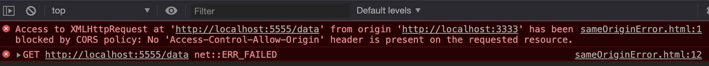

<span id="catalog"></span>

### 目录
- [ajax概述](#ajax概述)
    - [什么是ajax](#什么是ajax)
    - [ajax的优点与缺点](#ajax的优点与缺点)
    - [ajax与传统网站请求方式的比较](#ajax与传统网站请求方式的比较)
    - [ajax的应用场景](#ajax的应用场景)
    - [ajax的运行环境](#ajax的运行环境)
- [ajax对象内容速查](#ajax对象内容速查)
- [测试服务器搭建](#测试服务器搭建)
- [ajax的使用步骤](#ajax的使用步骤)
- [响应数据格式](#响应数据格式)
- [传递请求参数](#传递请求参数)
    - [传统网站与ajax的参数传递方式对比](#传统网站与ajax的参数传递方式对比)
    - [post和get请求传参的区别](#post和get请求传参的区别)
    - [ajax的get请求参数](#ajax的get请求参数)
    - [ajax的post请求参数--普通格式参数](#ajax的post请求参数--普通格式参数)
    - [ajax的post请求参数--JSON格式参数](#ajax的post请求参数--JSON格式参数)
- [ajax状态码](#ajax状态码)
    - [ajax状态码的含义与作用](#ajax状态码的含义与作用)
    - [使用属性状态码](#使用属性状态码)
- [响应数据](#响应数据)
    - [响应数据的格式](#响应数据的格式)
    - [获取服务器端响应的两种方式](#获取服务器端响应的两种方式)
- [ajax的错误处理](#ajax的错误处理)
- [ajax在低版本IE浏览器中的缓存问题](#ajax在低版本IE浏览器中的缓存问题)
- [ajax的超时处理](#ajax的超时处理)
- [终止已发送的ajax请求](#终止已发出ajax请求)
- [处理重复发送的ajax请求](处理重复发送的ajax请求)
    - [处理方式1--终止旧请求、发送新请求](#处理方式1--终止旧请求、发送新请求)
    - [处理方式2--延迟发送请求](#处理方式2--延迟发送请求)
- [封装ajax](#封装ajax)
    - [封装ajax的思路](#封装ajax的思路)
    - [ajax封装的实现](#ajax封装的实现)
- [FormData](#FormData)
    - [FormData的功能](#FormData的功能)
    - [通过FormData发送post请求](#通过FormData发送post请求)
    - [FormData对象的实例方法](#FormData对象的实例方法)
    - [使用FormData上传二进制文件](#使用FormData上传二进制文件)
        - [上传二进制的文件的步骤](#上传二进制的文件的步骤)
        - [显示FormData文件上传进度](#显示FormData文件上传进度)
        - [FormData文件上传图片及时预览](#FormData文件上传图片及时预览)
- [Ajax请求限制](#Ajax请求限制)
    - [同源策略导致的ajax请求限制](#同源策略导致的ajax请求限制)
    - [解决方案1--使用JSONP](#解决方案1--使用JSONP)
        - [JSONP简介](#JSONP简介)
        - [JSONP的基本实现](#JSONP的基本实现)
        - [JSONP的优化1--动态发送请求](#JSONP的优化1--动态发送请求)
        - [JSONP的优化2--函数名优化](#JSONP的优化2--函数名优化)
        - [JSONP的优化3--JSONP函数封装](#JSONP的优化3--JSONP函数封装)
    - [解决方案2--CORS跨域资源共享](#解决方案2--CORS跨域资源共享)
        - [CORS说明](#CORS说明)
        - [CORS的实现](#CORS的实现)
    - [解决方案3--在服务端发请求绕过同源策略](#解决方案3--在服务端发请求绕过同源策略)
    - [在跨域请求中携带cookie](#在跨域请求中携带cookie)
- [使用jquery发送ajax请求](#使用jquery发送ajax请求)
    - [$.ajax的基本用法](#$.ajax的基本用法)
    - [简化用法--$.get、$.post](#简化用法--$.get、$.post)
    - [将表达数据转换为data](#将表达数据转换为data)
    - [jquery发送JSONP请求](#jquery发送JSONP请求)
    - [jquery中的ajax全局事件](#jquery中的ajax全局事件)
- [](#)

# ajax概述
## 什么是ajax
[top](#catalog)
- AJAX全称: Asynchronous JavaScript And XML
- ajax就是异步的js和xml
- 通过ajax，可以在浏览器端发送异步请求，**可以无刷新获取数据**
- ajax不是新的变成语言，而是一种将现有的标准组合在一起使用的新方式
- ajax是由浏览器的ajax引擎发送的
- 服务端无法区分普通的http请求和ajax发送的http请求，区别只存在于浏览器端

## ajax的优点与缺点
[top](#catalog)
- 优点
    - 可以无刷新页面与服务端进行通信
    - 允许根据事件来更新部分页面的内容
- 缺点
    - 没有浏览历史
    - 存在跨域问题（同源策略的限制）
    - SEO（搜索引擎优化）不友好

## ajax与传统网站请求方式的比较
[top](#catalog)
- 传统网站中存在的问题
    - 单一的交互过程
        - 任何请求只能有浏览器发起，有服务端响应
        - 发起请求后，只能等待响应然后显示页面。网速较慢的情况下，页面加载时间长，只能等待
        - 等待的过程中，代码无法控制
    - 表单提交的验证问题
        - 表单提交后，如果一项内容不合格，需要重新回到填写页面显示错误信息，**并重新填写提交内容**
    - 重复获取相同的资源
        - 在一个大型的web应用中，页面中的很多组成元素是相同的
        - 页面跳转时，需要**重新加载整个页面**，造成资源浪费，增加用户的等待时间

- 传统网站与ajax的交互过程比较
    - 传统网站: 浏览器与服务器的交互过程
        ```
                请求---->
        浏览器              服务器
           │  　<----响应　　　│
           └──────────────────┘
              交互过程无法控制
        ```
    - 使用 ajax 后的交互过程
        ```
               创建---->      请求---->
        浏览器           ajax             服务器
          │    <----响应      <----响应   　　│
          │                                  │
          └──────────────────────────────────┘
                 交互过程可以控制
        ```


- ajax 相较于浏览器与服务器直接交互的优点
    1. 不刷新页面
    2. 基于第 1 点，可以控制交互过程
        - 如显示一个等待界面，提升使用体验
        - 如果只是用浏览器与服务器直接交互，是无法控制的

## ajax的应用场景
[top](#catalog)
- 页面上拉加载更多数据
- 列表数据无刷新分页
- 表单项离开焦点时，执行数据验证
- 搜索框在输入文字时的提示列表

## ajax的运行环境
[top](#catalog)
- 运行 ajax 的 html 页面需要网站服务器下运行，并能以`localhost`域名的方式打开页面
- 直接打开html文件，无法运行 ajax

# ajax对象内容速查
[top](#catalog)
- 属性

    |属性名|含义|
    |-|-|
    |status|http 状态码|
    |responseText|响应数据|
    |readyState|ajax 状态码|
    |upload|一个对象，用于处理与文件上传相关的内容|
    |withCredentials|是否可以携带cookie|
    |timeout|请求的超时时间，单位: 毫秒|

- 方法

    |方法名|功能|
    |-|-|
    |open|设置请求方式，和请求地址|
    |send|发送请求|
    |setRequestHeader|设置请求头|
    |getResponseHeader|获取响应头|
    |abort|终止**已发送的**ajax请求|

- 事件

    |事件名|触发时间|
    |-|-|
    |onload|响应返回时触发|
    |onreadystatechange|ajax 状态码发生变化时触发|
    |onerror|网络异常|
    |ontimeout|请求超时时触发|

- 与文件上传相关的内容
    - `xhr.upload`，所有与文件上传相关的内容都保存在该对象中
    - `xhr.upload.onprogress`，文件上传时会**持续触发**的事件

- 相关请求头
    - `Content-Type: application/x-www-form-urlencoded`，请求参数为分隔符类型
    - `Content-Type: application/json`，请求参数为JSON类型
    - `Content-Type: multipart/form-data`，上传文件

- （服务端需要设置的）相关响应头
    - 设置允许的访问的跨域地址
        - `Access-Control-Allow-Origin: 跨域地址`
        - `Access-Control-Allow-Origin: *`，所有的都可以访问
            - 如果需要携带cookie，则不能使用 `*`
    - 设置允许的跨域请求类型
        - `Access-Control-Allow-Methods`
    - 设置跨域请求是否可以携带cookie
        - `Access-Control-Allow-Credentials: true`

# 测试服务器搭建
[top](#catalog)
- 主要服务器代码
    - [src/ajax-test-server/app.js](src/ajax-test-server/app.js)
- 非同源测试服务器代码
    - [src/ajax-test-server/origin5555.js](src/ajax-test-server/origin5555.js)
- 启动服务
    - 需要在[src/ajax-test-server](src/ajax-test-server) 下同时启动两个服务器
    - 主要服务器: `npm run 3333`
    - 非同源测试服务器: `npm run 5555`
- 使用端口
    - 主要服务器代码: 3333
    - 非同源测试服务器: 5555

# ajax的使用步骤
[top](#catalog)
- 基本使用步骤
    1. 创建ajax对象
    2. 声明请求地址和请求方式
    3. 发送请求
    4. 监听服务器返回的响应
    5. 获取服务端返回的数据
- 使用步骤详解
    1. 创建ajax对象
        - 使用JS内建对象创建ajax对象
            ```js
            var xhr = new XMLHttpRequest();
            ```
        - 请求格式
            - XML指服务端与浏览器端的数据交互格式
            - 一般开发中都会使用 JSON 作为数据交互格式，很少会使用XML
        - 使用 HTTP 请求协议
    2. 声明请求地址和请求方式
        - 使用xhr对象的 open 方法
            ```js
            xhr.open('请求方式', '请求地址');
            ```
        - 请求地址的写法
            - 完整的http请求地址，如: `http://localhost:8080/xxxx`
            - 服务端对应的路由地址，如: `/xxxx`
    3. 发送请求
        - 通过 send 方法发送
            ```js
            xhr.send();
            ```
        - 如果不调用 send，是不会发送的
    4. 监听服务器返回的响应
        - 为 xhr 对象绑定 `onload` 事件，来处理客户端的响应
            ```js
            xhr.onload = function (){
                console.log(xhr.responseText);
            }
            ```
        - 当响应返回时，浏览器会自动调用 xhr 对象的 `onload` 事件
    5. 获取服务端返回的数据
        - 在onload 事件中通过 `xhr.responseText` 来获取返回的数据
            ```js
            xhr.onload = function (){
                console.log(xhr.responseText);
            }
            ```
- 示例
    - 参考代码
        - html
            - [src/ajax-test-server/public/html/usage/steps.html](src/ajax-test-server/public/html/usage/steps.html)
        - 服务端路由
            - [src/ajax-test-server/routers/data.js](src/ajax-test-server/routers/data.js)
    - 浏览器访问地址
        - http://localhost:3333/html/usage/steps.html
    - html使用ajax发送请求
        ```js
        // 1. 创建ajax对象
        let xhr = new XMLHttpRequest();
        // 2. 声明请求地址和请求方式
        // xhr.open('get', 'http://localhost:3333/data/usage-step-data');
        xhr.open('get', '/data/usage-step-data');
        // 3. 发送请求
        xhr.send();
        // 4. 监听服务器返回的响应
        xhr.onload = function(){
            // 5. 获取服务端返回的数据
            let result = xhr.responseText;
            console.log(typeof result);
            console.log(result);
            document.write(result);
        }
        ```
    - 服务端的路由
        ```js
        router.get('/usage-step-data', async ctx=>{
            console.log(ctx.req.url);
            ctx.body = {name:'testName', age:22};
        });
        ```

# 传递请求参数
## 传统网站与ajax的参数传递方式对比
[top](#catalog)
- 传统网站的请求参数设置

    ||参数形式|请求路径|如何添加参数|
    |-|-|-|-|
    |get 请求   |`参数1=值1&参数2=值2`          |`请求地址?参数1=值1&参数2=值2`|浏览器自动添加|
    |post 请求  |保存在请求头的 `Form Data` 中  |请求的原始地址                |浏览器自动添加|

- ajax中的参数设置

    ||参数形式|请求路径|如何添加参数|
    |-|-|-|-|
    |get 请求                |`参数1=值1&参数2=值2`          |`请求地址?参数1=值1&参数2=值2`|需要**手动**在请求地址后**拼接请求参数**|
    |post 请求--普通格式参数  |保存在请求头的 `Form Data` 中  |请求的原始地址                |<ul><li>`xhr.setRequestHeader()`设置http请求头</li><li>`xhr.send('参数1=值1&参数2=值2')` 设置请求参数</li></ul>|
    |post 请求--JSON格式参数  |保存在请求头的 `Request Payload` 中  |请求的原始地址                |`xhr.send('JSON字符串')` 设置请求参数|

- ajax的参数传递，本质上就是在**模拟传统网站**在发送请求时的`url`和请求头
- 传统网站的form是不支持 JSON 格式的请求参数

## post和get请求传参的区别
[top](#catalog)
- get 的请求参数通过请求路径设置
    - 即参数在路径中: `请求地址?参数1=值1&参数2=值2`
- post 的参数通过 `xhr.send()` 方式发送
    - 即: 通过附加http请求内容来设置请求参数

## ajax的get请求参数
[top](#catalog)
- get 请求的参数设置
    - **手动**在请求地址后**拼接请求参数**
        ```
        http://请求地址?参数1=值1&参数2=值2
        ```

- 示例
    - 参考代码
        - [src/ajax-test-server/public/html/usage/get-param.html](src/ajax-test-server/public/html/usage/get-param.html)
        - [src/ajax-test-server/routers/data.js](src/ajax-test-server/routers/data.js)
    - 浏览器访问地址
        - http://localhost:3333/html/usage/get-param.html
    - 在浏览器端发送get请求
        ```js
        // 1. 封装函数用于向请求路径后拼接请求参数，并通过ajax发送 get 请求
        function $get(url, data){
            const xhr = new XMLHttpRequest();

            // 1.1 在请求路径后面拼接请求参数
            // 拼接参数
            let paramStr = '';
            for(let key in data){
                paramStr += `${key}=${data[key]}&`;
            }
            paramStr = paramStr.replace(/&+$/, '');

            // 输出路径
            console.log(`${url}?${paramStr}`);

            // 设置路径
            xhr.open('get', `${url}?${paramStr}`);

            // 1.2 发送请求
            xhr.send();
            xhr.onload = function(){
                // 将响应数据设置到页面中
                document.getElementById('result').innerHTML = xhr.responseText;
            }
        }

        // 2. 初始化时执行
        $get(
            '/data/usage-get-param',
            { name:'Tom', address:'aaaaaa', age:12 }
        );
        ```
    - 服务器端的路由
        ```js
        router.get('/usage-get-param', async ctx=>{
            // 获取请求参数字符串
            console.log(ctx.querystring);
            // 获取请求参数对象
            console.log();
            // 直接将请求参数对象返回
            ctx.body = ctx.request.query;
        });
        ```

## ajax的post请求参数--普通格式参数
[top](#catalog)
- post 请求的参数设置
    1. `open()` **必须先设置**请求方式和请求地址
        ```js
        xhr.open('post', '请求地址');
        ```
    2. 设置请求头，<span style='color:red'>这是一个固定写法</span>
        ```js
        xhr.setRequestHeader('Content-Type', 'application/x-www-form-urlencoded');
        ```
    3. 在 `xhr.send()` 中设置请求参数，设置方式与 get 请求相同
        ```js
        xhr.send('参数1=值1&参数2=值2');
        ```
- 示例
    - 参考代码
        - [src/ajax-test-server/public/html/usage/post-param.html](src/ajax-test-server/public/html/usage/post-param.html)
        - [src/ajax-test-server/routers/data.js](src/ajax-test-server/routers/data.js)
    - 浏览器访问地址
        - http://localhost:3333/html/usage/post-param.html
    - 在浏览器端发送post请求
        ```js
        // 1. 封装函数用于向请求路径后拼接请求参数，并通过ajax发送 post 请求
        function $post(url, data){
            const xhr = new XMLHttpRequest();
            // 1.1. `open()` 不需要需改请求地址
            xhr.open('post', url);
            // 1.2. 设置请求头，这是一个固定写法
            xhr.setRequestHeader('Content-Type', 'application/x-www-form-urlencoded');

            // 1.3. 设置参数
            // 1.3.1 拼接参数
            let paramStr = '';
            for(let key in data){
                paramStr += `${key}=${data[key]}&`;
            }
            paramStr = paramStr.replace(/&+$/, '');

            // 1.3.2 设置请求参数，并发送请求
            xhr.send(paramStr);

            xhr.onload = function(){
                // 将响应数据设置到页面中
                document.getElementById('result').innerHTML = xhr.responseText;
            }
        }

        // 2. 初始化时执行
        $post(
            '/data/usage-post-param',
            { name:'Tom', address:'aaaaaa', age:12 }
        );
        ```
    - 服务器端的路由
        ```js
        router.post('/usage-post-param', async ctx=>{
            // 获取请求参数对象
            console.log(ctx.request.body);

            // 直接将请求参数对象返回
            ctx.body = ctx.request.body;
        });
        ```

### ajax的post请求参数--JSON格式参数
[top](#catalog)
- JSON格式参数的设置方法
    1. 设置JSON参数的请求头
        ```js
        xhr.setRequestHeader('Content-Type', 'application/json');
        ```
    2. 将请求参数组合成对象，转换成JSON字符串，作为请求参数
        ```js
        xhr.send(JSON.stringify(paramObj));
        ```
- 注意事项
    - 需要客户端解析路由时，能够识别 `application/json` 的请求头
        - `koa-body` 默认两种格式的参数都支持
- 示例
    - 参考代码
        - [src/ajax-test-server/public/html/usage/post-json-param.html](src/ajax-test-server/public/html/usage/post-json-param.html)
        - [src/ajax-test-server/routers/data.js](src/ajax-test-server/routers/data.js)
    - 浏览器访问地址
        - http://localhost:3333/html/usage/post-json-param.html
    - 在浏览器端发送post请求
        ```js
        function $post(url, data){
            const xhr = new XMLHttpRequest();
            xhr.open('post', url);

            // 1.1. 设置JSON参数的请求头
            xhr.setRequestHeader('Content-Type', 'application/json');

            // 1.2. 将JSON字符串设置为请求参数，并发送请求
            xhr.send(JSON.stringify(data));

            xhr.onload = function(){
                // 将响应数据设置到页面中
                document.getElementById('result').innerHTML = xhr.responseText;
            }
        }
        ```

# ajax状态码
## ajax状态码的含义与作用
[top](#catalog)
- 什么是ajax状态码
    - 从创建ajax对象到浏览器端响应，每一个步骤都会对应一个数值
    - 这个数值就是状态码
- 状态码的作用
    - 通过状态码可以了解当前ajax处理进行到了哪一步

- 状态码及其含义

    |状态码|含义|对应的代码|
    |-|-|
    |`0`|请求未初始化|`var xhr = new XMLHttpRequest();`|
    |`1`|请求已经建立、未发送|`xhr.open();`|
    |`2`|请求已经发送|`xhr.send();`|
    |`3`|请求正在处理中，**通常响应中已经有部分数据可以使用了**|服务端代码执行|
    |`4`|响应完成，可以获取响应数据|`xhr.onload = function(){xhr.responseText;}`|

## 使用属性状态码
[top](#catalog)
- `xhr.readyState` 属性获取状态码
    - <span style='color:red'>数据类型是: `number` </span>
    - 该属性在 ajax 不同阶段获取到的值

        |阶段|`xhr.readyState`的值|
        |-|-|
        |`new XMLHttpRequest();`|0|
        |`xhr.open`|1|
        |`xhr.send`|在 `send()` 之后，只能获取到1，无法获取其他状态|
        |`xhr.onreadystatechange`事件|可以监听到状态码: 2、3、4|

- `xhr.onreadystatechange`事件，监听 `xhr.send()` 执行后的状态码变化
    - 该事件的监听，必须在 `xhr.send()` 执行之前设置，否则可能无效
    - 当ajax状态码发生变化时，将自动触发该事件
    - 该事件只会在状态码变为: 2、3、4 时，自动触发

- 示例
    - 参考代码
        - [src/ajax-test-server/public/html/usage/readystate.html](src/ajax-test-server/public/html/usage/readystate.html)
        - [src/ajax-test-server/routers/data.js](src/ajax-test-server/routers/data.js)
    - 浏览器访问地址
        - http://localhost:3333/html/usage/readystate.html
    - 在浏览器端发送get请求
        ```js
        const xhr = new XMLHttpRequest();
        console.log(typeof xhr.readyState); // number
        console.log('new XHR, readyState = ', xhr.readyState);      // 1. new XHR, readyState =  0
        xhr.open('get', '/data/usage-ready-state');
        console.log('xhr.open, readyState = ', xhr.readyState);     // 2. xhr.open, readyState =  1

        // 监听状态码变化事件
        xhr.onreadystatechange = function(){
            console.log('onreadystatechange, readyState = ', xhr.readyState);
            console.log('responseTest = ', xhr.responseText);
            // 4. onreadystatechange, readyState =  2
            // responseTest =  
            // 5. onreadystatechange, readyState =  3
            // responseTest =  usage-ready-state-data   <<<< 在状态码 3 时，已经有数据返回
            // 6. onreadystatechange, readyState =  4
            // responseTest =  usage-ready-state-data
        }

        xhr.send();
        console.log('after xhr.send(), readyState = ', xhr.readyState); // 3. after xhr.send(), readyState =  1
        ```
    - 服务器端的路由
        ```js
        router.get('/usage-ready-state', async ctx=>{
            ctx.body = 'usage-ready-state-data';
        });
        ```

# 响应数据
## 响应数据的格式
[top](#catalog)
- `xhr.getResponseHeader('Content-type')`，从响应头中获取响应数据格式
- 服务端的两种响应格式
    - 文本类型: `text/plain`
    - JSON类型: `application/json`

- 注意事项
    - 从响应头中获取的数据会包含很多其他信息，如: `text/plain; charset=utf-8`
    - 在判断类型时，不能用 `===` 来判断，应该通过 `indexOf(...) != -1` 来判断
        - 也可以使用 `includes`，但是兼容性更差

- 服务器端一般会以 JSON 对象作为响应数据的格式
- 客户端的处理
    - 当响应数据是 JSON格式时，数据只是一个 JSON 字符串，需要通过 `JSON.parse()` 将字符串转换为JS对象
    - 一般会将解析后的对象混合 html 代码，然后在页面中进行显示

- 示例
    - 参考代码
        - html
            - [src/ajax-test-server/public/html/usage/res-data.html](src/ajax-test-server/public/html/usage/res-data.html)
        - 服务端路由
            - [src/ajax-test-server/routers/data.js](src/ajax-test-server/routers/data.js)
    - 浏览器访问地址
        - http://localhost:3333/html/usage/res-data.html
    - 浏览器端解析响应数据，并混合 html 代码进行显示
        ```js
        function $get(url) {
            const xhr = new XMLHttpRequest();
            xhr.open('get', url);
            xhr.send();
            xhr.onload = function () {
                // 根据响应类型处理响应数据
                const contentType = xhr.getResponseHeader('Content-type');
                console.log(contentType);
                if (contentType.indexOf('text/plain') != -1) {
                    // 1. 处理文本型的响应数据
                    document.getElementById('app').innerHTML= xhr.responseText;
                } else if (contentType.indexOf('application/json') != -1) {
                    // 2. 处理 JSON类型数据
                    // 2.1 将服务端的返回的 JSON 字符串解析为 JS 对象
                    let reqObj = JSON.parse(xhr.responseText);

                    // 2.2 将 JS 对象混合 html 代码然后显示
                    // 此处将数组展开为 <li>
                    let liStr = '';
                    for (let n of reqObj.array) {
                        liStr += `<li>${n}</li>`;
                    }
                    // 2.3 在页面显示
                    document.getElementById('app').innerHTML = '<ul>' + liStr + "</ul>";
                }
            }
        }

        // 获取文本格式的响应
        document.getElementById('textBtn').onclick = () => $get('/data/usage-res-text-data');
        // 获取JSON格式的响应
        document.getElementById('jsonBtn').onclick = () => $get('/data/usage-res-json-data');
        ```
    - 服务端的路由
        ```js
        // 返回JSON格式的响应数据
        router.get('/usage-res-json-data', async ctx=>{
            ctx.body = {array:[111,222,333,444]};
        });
        // 返回文本格式的响应数据
        router.get('/usage-res-text-data', async ctx=>{
            ctx.body = 'abcdefg';
        });
        ```

## 获取服务器端响应的两种方式
[top](#catalog)
- 方式1: `xhr.onload` 事件
    - 监听服务端响应，通过 `xhr.responseText` 获取响应数据
- 方式2: `xhr.onreadystatechange` 事件
    - 用该事件监听状态码的变化
    - 当 `状态码 = 4` 时，可以通过 `xhr.responseText` 获取完整的响应数据
    - 示例
        - 参考代码
            - [src/ajax-test-server/public/html/usage/readystate-resdata.html](src/ajax-test-server/public/html/usage/readystate-resdata.html)
        - 浏览器访问地址
            - http://localhost:3333/html/usage/readystate-resdata.html
        - 代码内容
            ```js
            const xhr = new XMLHttpRequest();
            xhr.open('get', '/data/usage-ready-state');

            // 监听状态码变化事件
            xhr.onreadystatechange = function(){
                // 当状态码为 4 时，获取响应数据
                if (xhr.readyState === 4){
                    console.log('responseTest = ', xhr.responseText);
                }
            }

            xhr.send();
            ```

- 两种方式的比较

    ||onload|onreadystatechange|
    |-|-|-|
    |是否兼容低版本|No|Yes|
    |是否需要判断状态码|No|Yes|
    |被调用次数|一次|多次|

- `onload` 的优点
    - onload更简洁执行效率更高
    - 不需要低版本浏览器时，应该使用 `onload`

# ajax的错误处理
[top](#catalog)

|网络状态|服务器状态|异常原因|http状态码|可触发的事件|异常处理方式|
|-|-|-|-|-|-|
|畅通|接收到有效请求|服务端没有返回预期结果<br>如: 参数不合格等问题|非 `200`|`onload`<br>`onreadystatechange`(2,3,4)|根据http状态码做处理|
|畅通|接收到无效请求|可能是请求地址错误|`404`|-|检查地址|
|畅通|接收到有效请求|服务端程序出现执行异常|`500`|`onload`<br>`onreadystatechange`(2,3,4)|由服务端人员处理|
|中断|未接受到请求|网络中断|-|`onerror`<br>`onreadystatechange`(只有4)|在`onerror`事件中进行处理|

- `xhr.status` 属性，可以获取 http 状态码
- `xhr.responseText`，在异常时，可以获取响应中的异常信息
- 在获取响应数据时，应该同时判断 http 状态码 和 ajax 状态码

- 示例
    1. 服务器没有返回预期结果
        - 参考代码
            - [src/ajax-test-server/public/html/error/status400.html](src/ajax-test-server/public/html/error/status400.html)
            - [src/ajax-test-server/routers/errtest.js](src/ajax-test-server/routers/errtest.js)
        - 浏览器访问地址
            - http://localhost:3333/html/error/status400.html
        - ajax 代码
            ```js
            const xhr = new XMLHttpRequest();
            xhr.open('get', '/errtest/status400');
            xhr.send();
            xhr.onload = function(){
                // 输出 http 状态码
                console.log(xhr.status);        // 2. 输出: 400
                // 输出异常信息
                console.log(xhr.responseText);  // 3. 输出: error data
            }

            xhr.onreadystatechange = function(){
                console.log('readystate = ', xhr.readyState);
                // 1. 输出
                // readystate =  2
                // readystate =  3
                // readystate =  4
            }

            xhr.onerror = function(){
                console.log('onerror = ', xhr.status);  // 不会有输出
            }
            ```
        - 服务端的路由
            ```js
            // 将 http 状态码设置为非 200
            router.get('/status400', async ctx=>{
                ctx.status = 400;
                ctx.body = 'error data';
            })
            ```

    2. 服务端程序出现执行异常
        - 参考代码
            - [src/ajax-test-server/public/html/error/status500.html](src/ajax-test-server/public/html/error/status500.html)
            - [src/ajax-test-server/routers/errtest.js](src/ajax-test-server/routers/errtest.js)
        - 浏览器访问地址
            - http://localhost:3333/html/error/status500.html
        - ajax代码
            ```js
            const xhr = new XMLHttpRequest();
            xhr.open('get', '/errtest/status500');
            xhr.send();
            xhr.onload = function(){
                // 输出 http 状态码
                console.log(xhr.status);        // 2. 输出: 500
                // 输出异常信息
                console.log(xhr.responseText);  // 3. 输出: Internal Server Error
            }

            xhr.onreadystatechange = function(){
                console.log('readystate = ', xhr.readyState);
                // 1. 输出
                // readystate =  2
                // readystate =  3
                // readystate =  4
            }

            xhr.onerror = function(){
                console.log('onerror = ', xhr.status);  // 不会有输出
            }
            ```
        - 服务端的路由
            ```js
            // 构造一个服务端执行异常，使用 http 状态码被设置为 500
            router.get('/status500', async ctx=>{
                // 因为会抛出异常，所以返回数据的设置无效
                ctx.body = 'test data';
                // 模块内处于严格模式，无法使用未声明的变量，抛出一个执行异常
                console.log(abc);
            })
            ```
    3. 网络中断测试，需要手动将浏览器设置为 `offline` 状态
        - 参考代码
            - [src/ajax-test-server/public/html/error/net-disconnected.html](src/ajax-test-server/public/html/error/net-disconnected.html)
        - 浏览器访问地址
            - http://localhost:3333/html/error/net-disconnected.html
        - ajax代码
            ```js
            const xhr = new XMLHttpRequest();
            xhr.open('get', '/errtest/status500');
            xhr.send();
            xhr.onload = function(){        // 没有输出
                console.log(xhr.status);
            }

            xhr.onreadystatechange = function(){
                console.log('readystate = ', xhr.readyState);       // 1. 输出: readystate =  4
                console.log('responseText = ', xhr.responseText);   // 2. 输出: responseText =  
            }

            xhr.onerror = function(){
                console.log('internet error');  // 3. 输出: internet error
            }
            ```

# ajax在低版本IE浏览器中的缓存问题
[top](#catalog)
- 低版本浏览器的缓存问题
    - 当请求地址不变时，只有第一次请求会真正发送到服务端
    - 后续发送相同请求时，都会从浏览器缓存中获取响应数据
    - 即使服务端更新了数据，获取到的也是旧数据
- 问题的原因
    - 当IE浏览器发现在请求重复的地址时，<span style='color:red'>不会再次发送请求</span>，会直接将缓存中的数据返回给用户

- 解决方法
    - 在请求地址中添加一个参数，使每次的请求地址都不同
        - 可以添加一个随机数，或者时间戳
    - 附加的参数名**不能**与请求所需的参数名相同

- 示例
    - 参考代码
        - 问题测试
            - [src/ajax-test-server/public/html/iecache/problem.html](src/ajax-test-server/public/html/iecache/problem.html)
        - 附加参数解决问题
            - [src/ajax-test-server/public/html/iecache/req-with-date.html](src/ajax-test-server/public/html/iecache/req-with-date.html)
        - 服务端处理
            - [src/ajax-test-server/routers/iecache.js](src/ajax-test-server/routers/iecache.js)
    - 浏览器访问地址
        - http://localhost:3333/html/iecache/problem
        - http://localhost:3333/html/iecache/req-with-date.html
    - ajax处理
        ```js
        var xhr = new XMLHttpRequest();

        // 为ajax请求附加时间戳，来解决缓存问题
        xhr.open('get', '/iecache/random-data?datestamp=' + Date.now());
        xhr.onreadystatechange = function(){
            if (xhr.readyState === 4 && xhr.status === 200){
                console.log(xhr.responseText);
            }
        }
        xhr.send();
        ```

# ajax的超时处理
[top](#catalog)
- `xhr.timeout = 超时时间`
    - 通过 `timeout` 属性来设置请求的超时时间
    - 最好在 `xhr.send()` 发送请求之前设置超时时间
    - 如果请求超时，在控制台中，请求状态会变成 `canceled`
- `xhr.ontimeout = function(){...}`
    - 设置请求超时的响应事件
- 示例
    - 参考代码
        - 浏览器端代码
            - [src/ajax-test-server/public/html/timeout/base.html](src/ajax-test-server/public/html/timeout/base.html)
        - 服务端代码
            - [src/ajax-test-server/routers/timeout.js](src/ajax-test-server/routers/timeout.js)
    - 浏览器访问地址
        - http://localhost:3333/html/timeout/base.html
    - 浏览器请求代码
        ```js
        document.getElementById('timeout').onclick = function(){
            var xhr = new XMLHttpRequest();
            xhr.open('get', '/timeout/test');
            // 设置请求超时的时间
            xhr.timeout = 2000;
            // 设置请求超时的响应事件
            xhr.ontimeout = function(){
                alert('timeout! please try again');
            }
            xhr.send();
            xhr.onload = function(){
                console.log(xhr.requestText);
            }
        }
        ```
    - 服务端代码
        ```js
        router.get('/test', async ctx=>{
            // 设置一个比较长的等待时间
            await new Promise( (resolve)=>{
                setTimeout(()=>{resolve()}, 3000)
            })
            ctx.body = {msg:'success'};
        });
        ```

# 终止已发送的ajax请求
[top](#catalog)
- `xhr.abort()`
    - 通过该方法终止**已发送的**ajax请求
        - 如果在 `xhr.send()` 之前使用，该方法无效
    - 请被终止后，控制台中的请求状态会变成 `canceled`
- 注意事项
    - 如果发送请求和终止请求在不同的事件中，需要设置全局的 `xhr` 对象来处理
- 示例
    - 参考代码
        - 浏览器端代码
            - [src/ajax-test-server/public/html/abort/base.html](src/ajax-test-server/public/html/abort/base.html)
        - 服务端代码
            - [src/ajax-test-server/routers/timeout.js](src/ajax-test-server/routers/timeout.js)
    - 浏览器访问地址
        - http://localhost:3333/html/abort/base.html
    - 浏览器端代码
        1. 设置全局 xhr 对象，并发送请求
            ```js
            // 设置全局 xhr 对象
            var xhr;
            // 发送ajax请求
            document.getElementById('send').onclick = function(){
                xhr = new XMLHttpRequest();
                xhr.open('get', '/timeout/test');
                xhr.send();
                xhr.onload = function(){
                    console.log(xhr.responseText);
                    // 响应成功后，将全局 xhr 对象清空
                    xhr = null;
                }
            }
            ```
        2. 终止ajax请求
            ```js
            document.getElementById('abort').onclick = function(){
                // 如果全局xhr对象存在，并且状态码不等于 4，则终止ajax请求
                if (xhr && xhr.readyState !== 4){
                    xhr.abort();
                    // 终止请求后，将全局 xhr 对象清空
                    xhr = null;
                    console.log('request has been aborted');
                }
            }
            ```

# 处理重复发送的ajax请求
## 处理方式1--终止旧请求、发送新请求
[top](#catalog)
- 使用场景
    - 按钮等页面事件的连续触发
- 处理思路
    1. 将 xhr 对象设置为全局的或能够共享的对象
    2. 正常发送请求
    3. 重复发送相同请求时，检查xhr对象的状态
        - 如果: `ajax状态码 === 4`，即请求已完成，可以在此发送
        - 如果: `ajax状态码 !== 4`，即请求未完成，终止旧请求，并发送新请求
- 示例
    - 参考代码
        - 浏览器端代码
            - [src/ajax-test-server/public/html/repeatSend/cancelByAbort.html](src/ajax-test-server/public/html/repeatSend/cancelByAbort.html)
        - 服务端代码
            - [src/ajax-test-server/routers/timeout.js](src/ajax-test-server/routers/timeout.js)
    - 浏览器访问地址
        - http://localhost:3333/html/repeatSend/cancelByAbort.html
    - 浏览器端代码
        ```js
        // 1. 设置全局共享的ajax对象
        var xhr;
        document.getElementById('repeat').onclick = function(){
            // 2. 检查xhr的状态
            if (xhr && xhr.readyState !== 4){
                // 旧请求未完成，则终止就请求，并重新发送新请求
                xhr.abort();
            }

            /*
                执行到此处的几种可能
                    - 尚未发送过请求
                    - 旧请求已经响应完成，重新发送情趣
                    - 旧请求已被终止，重新发送请求
            */
            // 3. 发送请求
            xhr = new XMLHttpRequest();
            xhr.open('get', '/timeout/test');
            xhr.send();
            xhr.onload = function(){
                console.log(xhr.responseText);
                // 4. 响应成功后，情况xhr对象
                xhr = null;
            }
        }
        ```

## 处理方式2--延迟发送请求
[top](#catalog)
- 适用场景
    - 检索输入框的提示列表

- 处理思路
    1. 在全局作用域中设置一个 延时器`setTimeout` 对象的标识
    2. 在可能会连续触发的事件中，将用于发送 ajax 请求的函数，包在 `setTimeout` 中，并设置一定的延迟
    3. 如果事件连续触发，**在事件处理开始前**，清除旧的`setTimeout`，创建一个新的`setTimeout`
    4. 在一定时间内，如果事件没有再次发生，则触发延时器，发送请求

- 参考
    - [检索输入框提示列表](../inaction/02searchList.md#实现代码)

# 封装ajax
## 封装ajax的思路
[top](#catalog)
- 封装ajax的思路
    - 将只有在发送ajax请求时才能确定的部分转换为参数
    - 在调用封装函数时，决定相关步骤的具体处理
- 可转换为参数的部分有
    - 请求类型: get、post
    - 请求地址: url
    - 超时处理
        - 超时的时间
        - 超时响应函数
    - 请求参数及其格式
    - 成功时的处理方法
    - 失败时的处理方法
- 需要额外处理的部分
    1. 提高成功和失败的处理的扩展性
        - 为了使成功和失败的处理更具扩展性，应该将 ajax对象 本身也作为参数
        - 使用者可以通过 ajax对象 来获取更多的响应信息
    2. 将响应数据转换为对象
        - 一般的服务端返回的响应数据都是JSON格式的
        - 为了方便使用，可以在方法内部将数据转换为对象类型
    3. 参数默认值
        - 可选择的部分非常多，需要设置默认值
        - 在使用时，只设置必要的参数即可完成调用
- 期望的调用方式
    ```js
    ajax({
        type: 'get',
        url: 'http://.....',
        data:{
            name:'testName',
            age:12,
        },
        contentType:'application/json',
        success: function(data, xhr){
            // data是响应成功时的 xhr.responseText, xhr是ajax对象本身
            // ...
        },
        error: function(data, xhr){
            // data是响应成功时的 xhr.responseText, xhr是ajax对象本身
            // ...
        },
        timeout: '超时时间',
        timeoutHandle: function(){} // 超时响应函数
    })
    ```

## ajax封装的实现
[top](#catalog)
- 参考代码
    - ajax封装
        - [src/ajax-test-server/public/js/ajax.js](src/ajax-test-server/public/js/ajax.js)
    - ajax调用页面
        - [src/ajax-test-server/public/html/ajaxfn/ajaxfn.html](src/ajax-test-server/public/html/ajaxfn/ajaxfn.html)
    - 服务端响应
        - [src/ajax-test-server/routers/ajaxfn.js](src/ajax-test-server/routers/ajaxfn.js)
- 浏览器访问地址
    - http://localhost:3333/html/ajaxfn/ajaxfn.html
- 封装内容
    ```js
    function ajax(options) {
        // 1. 设置默认对象
        var defaults = {
            type: 'get',
            url: '',
            data: {},
            timeout:null,
            timeoutHandle:function(){},
            contentType: ajax.PARAM_TYPE_COMMON,
            success: function(){},
            error: function(){},
        }

        // 2. 将选项参数拷贝到默认对象中，后续只使用默认对象
        Object.assign(defaults, options);

        // 3. 初始化 ajax 请求对象
        var xhr = new XMLHttpRequest();

        // 4. 设置请求超时处理
        if (defaults.timeout){
            xhr.timeout = defaults.timeout;
            xhr.ontimeout = defaults.timeoutHandle;
        }

        // 5. 根据请求类型，来处理路径、参数、http请求头
        if (defaults.type === 'get') {
            var url = defaults.url;
            // 如果包含 data 选项，并且参数个数不为0，则在地址后面拼接请求参数
            if (Object.keys(defaults.data).length > 0) {
                url += '?' + ajax.paramFormat(ajax.PARAM_TYPE_COMMON, defaults.data);
            }

            // 设置请求方式和请求路径，并发送请求
            xhr.open('get', url);
            xhr.send();
        } else if (defaults.type === 'post') {
            var contentType = defaults.contentTyp || ajax.PARAM_TYPE_COMMON;
            var params = '';
            // 如果包含 data 选项，并且参数个数不为0，则在地址后面拼接请求参数
            if (Object.keys(defaults.data).length > 0) {
                params = ajax.paramFormat(contentType, defaults.data);
            }

            // 设置请求方式、请求路径、请求参数，并发送请求
            xhr.open('post', defaults.url);
            // 设置请求头
            xhr.setRequestHeader('Content-Type', contentType);
            xhr.send(params);
        }

        // 6. 监听服务器返回的响应
        xhr.onload = function () {
            // 6.1 获取响应头信息，如果是JSON格式，则转换为对象类型
            var resData = xhr.responseText;
            if (xhr.getResponseHeader('Content-Type').indexOf(ajax.RES_TYPE_JSON) !== -1){
                resData = JSON.parse(resData);
            }

            // 6.2 根据http状态码，调用不同的处理函数
            if (xhr.status === 200) {
                defaults.success(resData, xhr);
            } else {
                defaults.error(resData, xhr);
            }
        }
    }

    // 静态变量: 请求头类型
    ajax.PARAM_TYPE_COMMON = 'application/x-www-form-urlencoded';
    ajax.PARAM_TYPE_JSON = 'application/json';
    // 静态变量: 响应头类型
    ajax.RES_TYPE_COMMON = 'text/plain';
    ajax.RES_TYPE_JSON = 'application/json';

    // 静态方法: 格式化请求参数
    ajax.paramFormat = function (contentType, data) {
        if (contentType === ajax.PARAM_TYPE_COMMON) {
            // 普通格式
            var params = '';
            for (var k in data) {
                params += `${k}=${data[k]}&`;
            }
            return params.replace(/&$/, '');
        } else if (contentType === ajax.PARAM_TYPE_JSON) {
            // JSON格式
            return JSON.stringify(data);
        } else {
            throw 'Unknown ContentType';
        }
    }
    ```

# FormData
## FormData的功能
[top](#catalog)
- FormData的功能
    - 模拟表单，将数据拼接为请求参数格式
        - 相当于将html表单映射成表单对象，**自动将表单对象中的数据拼接成请求参数的格式**
        - 用于控件多、请求参数多的情况
        - 可以省去获取控件、获取数据、拼接请求参数的操作
    - 异步上传二进制文件
        - 如图片文件、视频文件

- FormData <span style='color:red'>只能用于 post 请求</span>，不能用于 get 请求
- FormData 是 Html5 开始提供的，会有兼容性问题

## 通过FormData发送post请求
[top](#catalog)
- 浏览器端发送 FormData
    1. 在 HTML 中，准备表单
        - `<form>` 标签中不需要 `action` 属性、`method` 属性
        - 不能使用 `submit` 类型的提交按钮，否则点击后会提交请求
        - 每个表单项都需要设置 name 属性
        - 示例
            ```html
            <form id='form'>
                <input type='text' name='username'>
                <input type='text' name='age'>
                <input type='button'>
            </form>
            ```
    2. 通过 `FromData(form的DOM对象)` 构造函数，将 HTML 表单转换为 `FormData` 对象
        ```js
        var form = document.getElementById('form');
        var formData = new FormData(form);
        ```
    3. 提交表单对象
        ```js
        xhr.send(formData);
        ```

- 因为请求参数需要通过 `xhr.send()` 发送，所以 FormData 只能用于 post 请求

- 在服务端解析 FormData
    - `koa-body`，需要附加选项: `{ multipart: true }`，才能解析 FormData 数据

- 示例
    - 参考代码
        - [src/ajax-test-server/public/html/formData/usage.html](src/ajax-test-server/public/html/formData/usage.html)
        - [src/ajax-test-server/routers/formData.js](src/ajax-test-server/routers/formData.js)
    - 浏览器访问地址
        - http://localhost:3333/html/formData/usage.html
    - 在浏览器端发送post请求
        ```js
        // 获取 form 的 dom 对象
        const btn = document.getElementById('btn');
        btn.onclick = function(){
            // 1. 创建ajax对象
            const xhr = new XMLHttpRequest();
            // 2. 声明请求地址和请求方式
            xhr.open('post', '/formData/usageTest');

            // 3. 通过 form 的dom对象创建 FormData
            const form = document.getElementById('form');
            const formData = new FormData(form);

            // 4. 将 FormData 作为请求数据，发送请求
            xhr.send(formData);
            // 5. 监听服务器返回的响应
            xhr.onload = function(){
                // 6. 获取服务端返回的数据
                console.log(xhr.responseText);
            }
        }
        ```
    - 服务端的路由
        ```js
        router.post('/usageTest', ctx=>{
            // 直接将请求参数返回
            ctx.body=ctx.request.body;
        })
        ```

## FormData对象的实例方法
[top](#catalog)
- FormData对象的实例方法可以操作表单中的数据
- 使用场景
    - 从FormData获取表单数据，执行数据校验
    - 根据不同的表单数据，向FormData中添加额外的数据

- 实例的方法
    - `formData.get('表单控件的name属性')`，获取表单控件的值
    - `formData.set('表单控件的name属性', newValue)`，设置指定控件的值
        - 只会修改该FormData对象中的数据，不会影响页面显示的数据
        - 如果指定控件不存在，则添加一个属性并赋值
        - 如果指定控件存在，则更新为新的属性值
    - `formData.delete('表单控件的name属性')`，从 FormData 中删除指定属性
    - `formData.append('表单控件的name属性', value)`，向表单对象中添加属性值
        - 如果属性名存在，会同时保留两个属性值
        - 通过 `formData.get()` 只能返回控件中的值，或 通过 `formData.set()` 设置的值
        - 如果在 `formData.append()` 后面执行了 `formData.set()`，则只会保留 `formData.set()` 设置的值

- set 与 append 的区别
    - 在属性名已经存在的情况下
        - set 会替换属性值
        - append 会同时保留两个属性值

- 示例
    - 参考代码
        - [src/ajax-test-server/public/html/formData/methods.html](src/ajax-test-server/public/html/formData/methods.html)
    - 浏览器访问地址
        - http://localhost:3333/html/formData/methods.html
    - 代码内容
        ```js
        const xhr = new XMLHttpRequest();
        xhr.open('post', '/formData/usageTest');

        const formData = new FormData(form);
        // 1. 获取控件属性
        const age = formData.get('age');
        console.log(age);

        // 2. 设置已存在控件的值
        formData.set('age', 22);

        // 3. 设置不存在的控件的值
        formData.set('school', 'abcdefg');

        // 4. 删除某个控件的值
        formData.delete('address');

        // 5. 添加属性
        formData.set('username', 'qwert');
        formData.append('username', 'testName');
        console.log(formData.get('username'))   // 输出 qwert

        xhr.send(formData)
        xhr.onload = function(){
            console.log(xhr.responseText)
        }
        ```

## 使用FormData上传二进制文件
### 上传二进制的文件的步骤
[top](#catalog)
- 实现步骤
    1. 在表单中准备一个 `文件选择控件`
        ```html
        <input type='file' id='file'/>
        ```
    2. 创建 FormData 对象
        ```js
        const formData = new FormData();
        ```
    3. 将选择的文件作为请求参数添加到 FormData 对象中
        - 需要获取文件选择控件，通过 `files[0]` 属性获取当前选择的文件
            ```js
            formData.append('attr', file.files[0]);
            ```
    4. 发送请求
        ```js
        xhr.send(formData);
        ```

    5. 在服务器端接收二进制数据，并保存文件

- 上传文件时的请求头
    - `Content-Type: multipart/form-data`
    - 该请求头将由浏览器自动添加

- 示例
    - 参考代码
        - [src/ajax-test-server/public/html/formData/binaryUpload.html](src/ajax-test-server/public/html/formData/binaryUpload.html)
        - [src/ajax-test-server/routers/formData.js](src/ajax-test-server/routers/formData.js)
    - 浏览器访问地址
        - http://localhost:3333/html/formData/binaryUpload.html
    - 在浏览器端选择文件，并上传
        ```html
        <!-- 1. 在表单中准备一个 `文件选择控件` -->
        <input type="file" id='file' style='border:1px black solid; padding: 10px;'><br>
        <input type="button" value="upload" id='upload'>
        <script>
            const file = document.getElementById('file');
            const uploadBtn = document.getElementById('upload');
            // 点击按钮后，上传文件
            uploadBtn.onclick = function(){
                // 2. 创建 FormData 对象
                const formData = new FormData();
                // 3. 将选择的文件作为请求参数添加到 FomrData 对象中
                formData.append('attr', file.files[0]);
                console.log(formData.get('attr'));

                // 开始创建ajax请求
                const xhr = new XMLHttpRequest();
                xhr.open('post', '/formData/upload');

                // 4. 将选择的文件作为请求参数添加到 FomrData 对象中，并发送请求
                xhr.send(formData);

                xhr.onload = function(){
                    console.log(xhr.responseText)
                }
            }
        </script>
        ```
    - 服务器端代码
        ```js
        // 接受上传的文件，并将文件保存到 upload 目录下
        // 浏览器端上传的文件会默认保存到一个临时目录下，需要开启临时文件和一个新文件进行文件读写
        router.post('/upload', ctx=>{
            // 默认上传的文件数据保存在 ctx.request.files 中
            const file = ctx.request.files.attr;
            const reader = fs.createReadStream(file.path)

            const staticPath = '/upload/' + file.name;
            const serverPath = resolve(__dirname, '../public' + staticPath);
            const writer = fs.createWriteStream(serverPath);
            reader.pipe(writer);

            // 将服务端保存的地址返回给浏览器
            ctx.body = {staticPath};
        })
        ```

### 显示FormData文件上传进度
[top](#catalog)
- 与文件上传相关的事件
    - `xhr.upload.onprogress`
        - 在文件上传时，会持续触发该事件
    - 通过该事件的 `event` 对象，可以获得
        - `event.total`，当前文件的总大小
        - `event.loaded`，已经上传的文件大小
- 显示上传进度的方法
    - 监听 `onprogress` 事件
    - 通过 `event.total` 和 `event.loaded` 计算已经上传部分的百分比
    - 用计算的百分比设置控件的 `width` 属性

- 示例
    - 参考代码
        - [src/ajax-test-server/public/html/formData/uploadWithProgress.html](src/ajax-test-server/public/html/formData/uploadWithProgress.html)
    - 浏览器启动地址
        - http://localhost:3333/html/formData/uploadWithProgress.html
    - 代码内容
        - 页面控件
            ```html
            <!-- 在表单中准备一个 `文件选择控件` -->
            <input type="file" id='file' style='border:1px black solid; padding: 10px;'>
            <input type="button" value="upload" id='upload'>

            <!-- 1. 进度条控件 -->
            <div class='progress-bar'>
                <span class='progress-bar__text'>0%</span>
                <div class='progress-bar__schedule'></div>
            </div>
            ```
        - ajax代码
            ```js
            // 获取文件选择控件
            const file = document.getElementById('file');
            // 获取进度条控件
            const progressText = document.querySelector('.progress-bar__text');
            const progressSchedule = document.querySelector('.progress-bar__schedule');

            // 点击按钮后，上传文件
            document.getElementById('upload').onclick = function () {
                // 3. 点击后，将进度条的长度清0
                progressText.innerHTML = '0%';
                progressSchedule.style.width = '0%';

                const formData = new FormData();
                formData.append('attr', file.files[0]);

                const xhr = new XMLHttpRequest();
                xhr.open('post', '/formData/upload');

                // 2. 监听 progress 事件
                xhr.upload.onprogress = function (event) {
                    // 3. 计算上传部分的百分比
                    const percent = (event.loaded / event.total * 100) + '%';

                    // 4. 将计算结果设置到控件中
                    progressText.innerHTML = percent;
                    progressSchedule.style.width = percent;
                }

                xhr.send(formData);
                xhr.onload = function () {
                    console.log(xhr.responseText)
                }
            }
            ```

### FormData文件上传图片及时预览
[top](#catalog)
- 实现步骤
    1. 在图片上传后，服务端将上传内容保存到**静态资源目录**下
    2. 保存结束后，服务端将图片的保存地址作为响应数据返回给浏览器
    3. 浏览器获取到图片地址后，因为是静态资源目录，所以可以直接通过url获取图片数据
        - 返回的路径是从静态资源目录开始的，所以可以作为 `` 标签的 `src` 属性值
    4. 显示图片数据
        - 图片加载需要花费一定时间，直接创建 `` 标签会产生一定的延迟
        - 应该在浏览器加载完成后再显示
- 示例
    - 参考代码
        - [src/ajax-test-server/public/html/formData/uploadAndShowImg.html](src/ajax-test-server/public/html/formData/uploadAndShowImg.html)
    - 浏览器启动地址
        - http://localhost:3333/html/formData/uploadAndShowImg.html
    - 代码内容
        1. 图片控件
            ```html
            <div class='img-box'>
                <!--  -->
            </div>
            ```
        2. ajax代码
            ```js
            // 获取文件选择控件
            const file = document.getElementById('file');

            // 2. 获取图片显示控件
            const imgBox = document.querySelector('.img-box');

            // 点击按钮后，上传文件
            document.getElementById('upload').onclick = function(){
                const formData = new FormData();
                formData.append('attr', file.files[0]);
                console.log(formData.get('attr'));

                // 3. 创建ajax请求，上传图片
                const xhr = new XMLHttpRequest();
                xhr.open('post', '/formData/upload');
                xhr.send(formData);

                xhr.onload = function(){
                    // 4. 获取响应数据中的路径
                    const staticPath = JSON.parse(xhr.responseText).staticPath;
                    // 5. 拼接 img 路径
                    const imgSrc = 'http://localhost:3333' + staticPath;
                    // 6. 创建img控件
                    const img = document.createElement('img');
                    // 7. 设置img控件的响应函数，在图片加载完成后，在将dom对象添加到控件中
                    img.onload = function(){
                        imgBox.appendChild(img);
                    }
                    // 8. 设置图片的地址，并准备显示图片
                    img.src = imgSrc;
                }
            }
            ```

# Ajax请求限制
## 同源策略导致的ajax请求限制
[top](#catalog)
- 浏览器存的同源策略对ajax请求的限制
    - ajax只能向当前网页所在的服务器发送请求
    - 示例
        - 如当前访问静态资源时，使用网站A，则网站A中的ajax只能向 服务器A 发送请求
        - 如果网站 A 中使用资源在网站 B，ajax无法向 服务器B 发送请求

- ajax请求限制的实际执行情况
    1. 请求可以正常发出
    2. 浏览器拒绝接收服务端的返回结果
    3. 最终导致请求失败

- 示例
    - 参考代码
        - [src/ajax-test-server/public/html/crossOrigin/origin5555Error.html](src/ajax-test-server/public/html/crossOrigin/origin5555Error.html)
    - 浏览器访问地址
        - http://localhost:3333/html/crossOrigin/origin5555Error.html

    - 从端口 3333 向 端口 5555 发送请求
        ```js
        const xhr = new XMLHttpRequest();
        // 向非同源服务器发送请求
        xhr.open('get', 'http://localhost:5555/data');
        xhr.send();
        xhr.onload = function(){
            console.log(xhr.responseText);
        }
        ```
    - 控制台的监视结果
        - 有request，有respponse，但是浏览器拒绝接受服务器响应
        - 

## 解决方案1--使用JSONP
### JSONP简介
- JSONP: json with padding
- JSONP 不属于 ajax 请求，但可以模拟 ajax 请求
- JSONP的实现比较麻烦，需要前端、后端相互配合
- JSONP 的核心思想
    - 通过 `<script src='...'>` 发送非同源的请求，然后执行携带数据的js代码
    - 本质上是绕过同源策略，并且也不是ajax请求
- JSONP 的缺点
    - 需要前后端相互配合
    - 只能发送 `get` 请求

### JSONP的基本实现
[top](#catalog)
- JSONP的使用方法
    1. 将不同源的服务器端请求地址写在 `<script>` 的 `src` 属性中
        - 示例
            ```html
            <script src='http://localhost:5555/xxx'></script>
            ```
    2. 在**非同源服务器端**，接受 `<script>` 发送的请求后，返回一段可以执行的JS代码
        - 对该段代码的要求
            1. 为了让 `<script>` 能够执行，所以返回的是**字符串形式**的代码
            2. 这段代码需要是一个**函数的调用** 片段
            3. 请求的数据需要作为函数调用的**实参**
        - 示例
            ```js
            const responseCode = 'loadData({data1:1234, data2:"abcd", data3:"testData"})'
            ```
    3. 在客户端的全局作用域下定义函数，使 `<script src='...'>` 在接受到代码后可以正常执行
        - 对该全局函数的要求
            1. 需要与服务端返回的代码中定义的函数名相同
            2. 函数的参数也必须与返回的代码相同
            3. 需要在函数内部处理数据
            4. 该函数必须定义在 `<script src='...'>` 前面
        - 示例
            ```js
            function loadData(data){
                // 处理数据
            }
            ```

- 为什么使用 `<script src='...'>` ?
    - 在浏览器中，不是所有发送请求的方式都受同源策略的影响
    - `<script>` 的 `src` 属性可以正常发送请求，不受同源策略影响

- 示例
    - 参考代码
        - [src/ajax-test-server/public/html/crossOrigin/JSONP/base.html](src/ajax-test-server/public/html/crossOrigin/JSONP/base.html)
        - [src/ajax-test-server/origin5555.js](src/ajax-test-server/origin5555.js)
    - 浏览器访问地址
        - http://localhost:3333/html/crossOrigin/JSONP/base.html
    - 浏览器端代码
        ```html
        <!-- 1. 在 sricpt 标签之前，创建响应函数 -->
        <script>
            function loadData(data){
                console.log(`data1 = ${data.data1}`)
                console.log(`data2 = ${data.data2}`)
                console.log(`data3 = ${data.data3}`)
            }
        </script>
        <!-- 2. 向非同源服务器发送请求
                获取请求后，自动调用上面声明的响应函数 -->
        <script src='http://localhost:5555/jsonpData'></script>
        ```
    - 非同源服务端代码
        ```js
        // 返回 JSONP 所需的代码字符串
        router.get('/jsonpData', async ctx=>{
            // 创建代码片段，调用前端的响应函数，并设置数据设为实参
            const responseCode = 'loadData({data1:1234, data2:"abcd", data3:"testData"})'
            // 直接返回字符串格式的代码片段
            ctx.body = responseCode;
        });
        ```

### JSONP的优化1--动态发送请求
[top](#catalog)
- 基本实现方式的问题
    1. 是在html初始化时发送的请求
    2. 存在无意义的请求
        - 有的请求获取之后未被利用，页面就关闭了
        - 这些数据的请求没有实际意义
- 优化目标
    1. 将 `<script>` 变成动态请求，在需要时发送
- 实现方式
    1. 为某些事件添加监听函数
    2. 事件触发后，用JS创建 `<script>` 元素，并设置 `src` 属性
    3. 将 `<script>` 元素添加到页面中
        - `<script>` 元素添加到页面后，会自动发送请求
    4. 当 `<script>` 标签加载完成后，将该标签删除
        - 为什么要删除标签?
            - 如果事件被重复触发，页面中会出现很多 `<script>` 标签
            - 重复的标签实际上已经被执行完了，不需要继续存在，可以直接删除
        - 监听 `<script>` 元素的 `onload` 事件
            - 在JS代码加载完成之后会自动触发该事件
            - 在该事件内部将自身删除

- 示例
    - 参考代码
        - [src/ajax-test-server/public/html/crossOrigin/JSONP/dynamic_request.html](src/ajax-test-server/public/html/crossOrigin/JSONP/dynamic_request.html)
    - 浏览器访问地址
        - http://localhost:3333/html/crossOrigin/JSONP/dynamic_request.html
    - 浏览器端代码
        ```js
        const getBtn = document.getElementById('getBtn');
        // 1. 设置按钮的点击事件。点击后发送请求
        getBtn.onclick = function(){
            // 2. 创建 <script> 元素
            const script = document.createElement('script');
            // 3. 设置请求地址
            script.src = 'http://localhost:5555/jsonpData';
            // 4. 设置 <script> 元素的监听事件
            // 加载完成之后，删除当前节点
            script.onload = function(){
                // 两种删除方式都可以
                // script.remove();
                document.body.removeChild(this);
            }

            // 5. 将元素添加到页面中，开始发送请求
            document.body.appendChild(script);
        }

        // 服务端响应函数
        function loadData(data){
            console.log(`data1=${data.data1}, data2=${data.data2}, data3=${data.data3}`);
        }
        ```

### JSONP的优化2--函数名优化
[top](#catalog)
- 当前函数名的问题
    1. 前端、后端所使用的函数名必须相同，否则无法调用函数来处理数据
    2. 在前端，如果函数名和已有的函数发生冲突，不是很好修改

- 优化目标
    - 将函数名发送给服务端，服务端根据函数名返回最新的代码片段

- 实现方式
    1. 将函数以 `get` 请求参数的方式附加到请求地址中
    2. 服务端接受请求后，根据函数名返回不同的代码片段
        - 请求参数一般被声明为 `callback`

- 示例
    - 参考代码
        - [src/ajax-test-server/public/html/crossOrigin/JSONP/funcName.html](src/ajax-test-server/public/html/crossOrigin/JSONP/funcName.html)
        - [src/ajax-test-server/origin5555.js](src/ajax-test-server/origin5555.js)
    - 浏览器访问地址
        - http://localhost:3333/html/crossOrigin/JSONP/funcName.html
    - 浏览器端代码
        ```js
        // 1. 设置两个不同的服务端响应函数
        function printData(data){
            console.log(`data1=${data.data1}, data2=${data.data2}, data3=${data.data3}`);
        }
        function concatData(data){
            const result = data.data1 + data.data2 + data.data3;
            console.log(`concatResult = ${result}`)
        }

        // 2. 为按钮绑定事件，不同的按钮使用不同的响应函数
        const printBtn = document.getElementById('printBtn');
        const concatBtn = document.getElementById('concatBtn');

        // 3. 每个按钮使用不同的响应函数
        const url = 'http://localhost:5555/jsonpByFuncName';
        printBtn.onclick = btnClick(url + '?' + 'callback=printData');
        concatBtn.onclick = btnClick(url + '?' + 'callback=concatData');

        // 4. 通用按钮点击事件，根据请求地址参数发送请求
        function btnClick(src){
            return function (){
                const script = document.createElement('script');
                script.src = src;
                script.onload = function(){
                    document.body.removeChild(this);
                }
                document.body.appendChild(script);
            }
        }
        ```
    - 非同源服务端代码
        ```js
        // 根据不同的函数名返回不同的代码片段
        const CBStrs = {
            printData: 'printData({data1:1234, data2:"abcd", data3:"testData"})',
            concatData: 'concatData({data1:1234, data2:"abcd", data3:"testData"})',
        }
        router.get('/jsonpByFuncName', async ctx=>{
            const cbName = ctx.query.callback;
            if (!CBStrs.hasOwnProperty(cbName)){
                ctx.status = 400;
                ctx.body = 'no func';
            }

            ctx.body = CBStrs[cbName];
        });
        ```

### JSONP的优化3--JSONP函数封装
[top](#catalog)
- 优化目标
    - 封装 `<script>` 标签的创建与销毁
    - 除了函数名，还需要能够发送更多的参数
    - 响应函数与JSONP封装函数聚合，增强封装性

- 希望的调用方式
    ```js
    jsonp({
        url: 'http:.....',
        data:{
            param1:...,
            param2:...,
        }
        success(){
            ....
        }
    })
    ```

- 响应函数与JSONP封装函数如何聚合?
    - 直接聚合的问题
        1. 响应函数变成了匿名函数，如何设置匿名函数的名字
        2. 响应函数是一个局部函数，不是全局函数，返回的JS代码无法调用
    - 解决方法
        1. 每次发送前，随机生成一个函数名
        2. 将匿名函数保存到 `window` 对象中，并使用 1 中生成的随机函数名来标识
        3. 为了防止响应函数暴露，每次响应结束之后，应该使用 `delete` 将 `window` 对象中的函数删除

- 示例
    - 函数封装
        - 参考代码
            - [src/ajax-test-server/public/js/jsonpfn.js](src/ajax-test-server/public/js/jsonpfn.js)
        - 代码内容
            ```js
            function jsonp(options){
                // 0. 创建默认值
                let defaults = {
                    url:'',
                    data:{},
                    success:function(){}
                };

                Object.assign(defaults, options);

                // 1. 生成随机函数名: fn + 随机数，需要去除随机数中的小数点
                const randomName = 'fn' + (Math.random().toString().replace('.', ''));

                // 2. 将函数绑定到 window 对象，变成全局对象
                window[randomName] = defaults.success;

                // 3. 设置参数
                let paramStr = 'callback=' + randomName;
                for(let k in defaults.data){
                    paramStr += `&${k}=${defaults.data[k]}`;
                }

                // 4. 创建 script 标签
                const script = document.createElement('script');
                script.src = `${defaults.url}?${paramStr}`
                script.onload = function(){
                    // 5. 删除 script 标签
                    document.body.removeChild(this);
                    // 6. 从 window 对象中删除函数
                    delete window[randomName];
                };

                // 5. 发送请求
                document.body.appendChild(script);
            }
            ```
    - 服务端响应
        - 参考代码
            - [src/ajax-test-server/origin5555.js](src/ajax-test-server/origin5555.js)
        - 代码内容
            ```js
            // 处理优化后的JSONP请求，需要处理随机函数名和请求参数
            router.get('/getJsonp', async ctx=>{
                // 获取函数名
                const cbName = ctx.query.callback;
                // 创建代码片段，如果数据是对象需要转换为JSON字符串
                const resultCode = `${cbName}(${JSON.stringify(ctx.query)})`
                ctx.body = resultCode;
            });
            ```
    - 测试代码
        - 参考代码
            - [src/ajax-test-server/public/html/crossOrigin/JSONP/jsonpfn.html](src/ajax-test-server/public/html/crossOrigin/JSONP/jsonpfn.html)
        - 浏览器访问地址
            - http://localhost:3333/html/crossOrigin/JSONP/jsonpfn.html
        - 代码内容
            ```js
            document.getElementById('btn01').onclick = function(){
                jsonp({
                    url:'http://localhost:5555/getJsonp',
                    data:{
                        username:username.value,
                        age:age.value,
                        address:address.value,
                    },
                    success(data){
                        console.log(data);
                    }
                })
            }
            ```

## 解决方案2--CORS跨域资源共享
### CORS说明
[top](#catalog)
- CORS，Cross-origin resource sharing，跨域资源共享
- CORS 允许浏览器向跨域服务器发送Ajax请求
- 跨域请求过程
    1. 客户端向服务端发送一个跨域请求
    2. 浏览器检测到跨域请求后，会在请求头中添加 `origin` 字段，保存当前页面的域名信息
        - 如: A 向 B 发送跨域请求，则 `origin` 中保存的是 A 的域名信息
        - 域名信息包括: 协议、域名、端口号
    3. 服务器端会根据该字段来决定是否同一这次跨域请求
        - 无论服务端是否响应，都会给浏览器一个响应
        - 服务端需要添加两个响应头
            - `Access-Control-Allow-Origin`
            - `Access-Control-Allow-Methods`
    4. 浏览器接受响应，检查响应头中是否包含  `Access-Control-Allow-Origin` 字段

- `Access-Control-Allow-Origin`，表示允许哪些客户端访问服务端
    - 作用
        - 类似一个保存在服务端的白名单
        - 每次出现跨域请求时，服务端都会检查白名单
            - 如果域名信息在白名单中，会做出响应
            - 如果不在，则不做出正常的响应
    - 该属性如果包含当前发出请求的页面的域名，则合格
    - 该字段的值
        - `Access-Control-Allow-Origin: 域名信息`
        - `Access-Control-Allow-Origin: *`，表示允许所有跨域请求

- `Access-Control-Allow-Methods`，表示可以通过哪些请求方式访问服务端
    - `get`
    - `post`
    - `get,post`

### CORS的实现
[top](#catalog)
- 实现方式
    1. CORS 不需要修改前端的ajax代码。请求头中的 `origin` 字段由浏览器自动添加
    2. 需要在服务端做 2项 配置
        - 配置内容
            1. 允许哪些客户端访问服务端
            2. 设置客户端可以通过哪些请求方式访问服务端
                - get，或者 post，或者两者都可以
        - 本质上就是添加 `Access-Control-Allow-Methods` 和 `Access-Control-Allow-Origin` 响应头
        - 为了减少代码复杂度，应该通过中间件为所有或大部分请求设置响应头

- 示例
    - 参考代码
        - [src/ajax-test-server/public/html/crossOrigin/CORS/base.html](src/ajax-test-server/public/html/crossOrigin/CORS/base.html)
        - [src/ajax-test-server/origin5555.js](src/ajax-test-server/origin5555.js)
    - 浏览器访问地址
        - http://localhost:3333/html/crossOrigin/CORS/base.html
    - 浏览器端代码
        ```js
        ajax({
            type:'get',
            url:'http://localhost:5555/corsData',
            success(data){
                console.log(data);
            }
        })
        ```
    - 服务端代码
        ```js
        // 通过中间件为所有请求设置请求头
        app.use(async (ctx, next)=>{
            // 设置请求头
            // 1. 允许哪些客户端访问服务端
            ctx.set('Access-Control-Allow-Origin', '*')
            // 2. 设置客户端可以通过哪些请求方式访问服务端
            ctx.set('Access-Control-Allow-Methods', 'get')
            await next()
        })
        // 处理 CORS 请求
        router.get('/corsData', async ctx=>{
            ctx.body = 'corsData';
        })
        ```

## 解决方案3--在服务端发请求绕过同源策略
[top](#catalog)
- 同源策略是浏览器的限制，服务器端没有这个限制
- 从服务器端绕过同源策略的思路
    1. `浏览器A` ---> `服务端A`，发送请求，请求`服务端B`上的数据
    2. `服务端A` ---> `服务端B`，在后端向 `服务端B` 发送请求
    3. `服务端B` ---> `服务端A`，非同源服务器返回响应
    4. `服务端A` ---> `浏览器A`，同源服务器接收非同源服务器的响应，并返回给浏览器
    5. `浏览器A` 接受响应，得到了 `服务端B` 的数据

- 示例
    - 参考代码
        - 浏览器代码
            - [src/ajax-test-server/public/html/crossOrigin/serverCross.html](src/ajax-test-server/public/html/crossOrigin/serverCross.html)
        - 服务端代码
            - [src/ajax-test-server/routers/serverCross.js](src/ajax-test-server/routers/serverCross.js)
        - 非同源服务端代码
            - [src/ajax-test-server/origin5555.js](src/ajax-test-server/origin5555.js)

    - 浏览器访问地址
        - http://localhost:3333/html/crossOrigin/serverCross.html
    - 代码内容
        1. 浏览器代码
            ```js
            // 向同源服务器发送请求
            ajax({
                type:'get',
                url: 'http://localhost:3333/serverCross/data',
                success(data){
                    console.log(data);
                }
            })
            ```
        2. 非同源服务端代码
            ```js
            // 返回一个字符串
            router.get('/corsData', async ctx=>{
                ctx.body = 'corsData';
            })
            ```
        3. 同源服务端代码
            ```js
            // 向非同源发送请求，获取到响应字符串: corsData，并作为响应返回给浏览器

            // 通过服务器绕过同源策略
            router.get('/data', async ctx=>{
                //  4. 向其他服务器发送请求
                ctx.body = await sendOther();
            });

            // 1. 发送异步请求
            async function sendOther(){
                return new Promise( (resolve, reject)=> {
                    // 2. 向非同源服务器发送请求
                    request('http://localhost:5555/corsData', function(error, response, body){
                        // 3. 将请求数据返回
                        resolve(body);
                    });
                })
            }
            ```

## 在跨域请求中携带cookie
[top](#catalog)
- 使用ajax发送跨域请求时，在请求中，**默认不会携带cookie信息**

- 解决方法
    - 客户端
        - 发送ajax请求时，添加 `xhr.withCredentials = true` 属性
        - 如登录与访问请求
            - 从登录开始就需要添加该属性
    - 服务器端
        - 设置session，来验证cookie
        - 添加响应头 `Access-Control-Allow-Credentials: true`
        - 添加响应头 `Access-Control-Allow-Origin: 跨域地址`
            - <label style='color:red'>该响应头不能设置为 `*`，会产生请求异常</label>
- ajax选项 `withCredentials`
    - 设置在跨域请求时，是否携带Cookie信息，默认值为false

- 添加响应头 `Access-Control-Allow-Credentials`
    - true 表示: 允许客户端发送请求时携带cookie

- 示例：向非同源服务器发送登录请求
    - 参考代码
        - 浏览器代码
            - [src/ajax-test-server/public/html/cookie/base.html](src/ajax-test-server/public/html/cookie/base.html)
        - 非同源服务端代码
            - [src/ajax-test-server/origin5555.js](src/ajax-test-server/origin5555.js)
    - 浏览器代码
        ```js
        var loginBtn = document.getElementById('login');
        // 1. 发送登录请求
        loginBtn.onclick = function(){
            var form = document.getElementById('form');
            var fd = new FormData(form);
            var xhr = new XMLHttpRequest();
            // 向非同源的服务器发送登录请求
            xhr.open('post', 'http://localhost:5555/cookieLogin');
            xhr.withCredentials = true; // 在登录时，就需要携带cookies
            xhr.send(fd);
            xhr.onload = function(){
                console.log(xhr.responseText);
            }
        }
        // 2. 登录后检查登录状态
        var loginCheckBtn = document.getElementById('loginCheck');
        loginCheckBtn.onclick = function(){
            var xhr = new XMLHttpRequest();
            // 向非同源的服务器发送登录请求
            xhr.open('get', 'http://localhost:5555/loginCheck');
            xhr.withCredentials = true; // 登录后的每次请求都需要携带cookie
            xhr.send();
            xhr.onload = function(){
                console.log(xhr.responseText);
            }
        }
        ```
    - 服务端代码
        1. 设置session
            ```js
            app.keys = ['some secret hurr'];
            const CONFIG={
                key: 'koa:sess',
                maxAge:86400000,
                overwrite:true,
                httpOnly:true,
                signed:true,
                rolling:false,
                renew:false,
            }
            app.use(session(CONFIG, app));
            ```
        2. 设置请求头
            ```js
            // 通过中间件为所有请求设置请求头
            app.use(async (ctx, next)=>{
                // 设置请求头
                // 1. 允许哪些客户端访问服务端
                ctx.set('Access-Control-Allow-Origin', 'http://localhost:3333')
                // 2. 设置客户端可以通过哪些请求方式访问服务端
                ctx.set('Access-Control-Allow-Methods', 'get,post')
                // 3. 设置可以携带cookie
                ctx.set('Access-Control-Allow-Credentials', true);
                await next()
            })
            ```
        3. 设置路由
            ```js
            router.post('/cookieLogin', async ctx=>{
                var username = ctx.request.body.username;
                var pwd = ctx.request.body.pwd;
                ctx.session.islogin = true;
                ctx.body = 'success';
            })
            ```

# 使用jquery发送ajax请求
## $.ajax的基本用法
[top](#catalog)
- 发送方式
    ```js
    $.ajax({
        type: '请求方式',
        url: '请求地址',
        data: ...,
        contentType: '',
        beforeSend(){
            // 发送请求之前需要调用的方法
        },
        success(data){
            // 成功处理
        },
        error(xhr){
            // 失败处理
        }
    })
    ```
- 注意事项
    - data的格式
        - 对象类型，默认会转换为 `&属性名=属性值` 的形式
        - 字符串类型，将编辑好的参数: `&属性名=属性值` 作为data
        - JSON字符串，需要手动调用 `JSON.stringify(obj)`, 调用结果作为data
            - contentType 需要设置为 `application/json`
    - 在 `beforeSend()` 中，`return false` 会终止发送请求

- 示例
    - 参考代码
        - 浏览器代码
            - [src/ajax-test-server/public/html/jquery/base.html](src/ajax-test-server/public/html/jquery/base.html)
        - 服务端代码
            - [src/ajax-test-server/routers/jqueryTest.js](src/ajax-test-server/routers/jqueryTest.js)
    - 浏览器端代码
        1. 发送get请求
            ```js
            $('#get').on('click', function(){
                $.ajax({
                    type: 'get',
                    url: '/jquery/getbase',
                    data: { name: 'testName', age: 222 },
                    beforeSend(){ console.log('this is before send get'); },
                    success(data){ console.log(data); },
                    error(xhr){ console.log(xhr); }
                })
            });
            ```
        2. 使用JSON发送post请求
            ```js
            $('#post').on('click', function(){
                $.ajax({
                    type:'post',
                    url: '/jquery/postbase',
                    data: JSON.stringify({ name:'testName', age:33 }),
                    contentType: 'application/json',
                    beforeSend(){ console.log('this is before send post'); },
                    success(data){ console.log(data); },
                    error(xhr){ console.log(xhr); }
                })
            });
        3. 测试异常
            ```js
            $('#getError').on('click', function(){
                $.ajax({
                    type: 'get',
                    url: '/jquery/errorbase',
                    data: { name: 'testName', age:44 },
                    error(xhr){ console.log(xhr) }
                });
            });
            ```
        4. beforeSend 取消发送请求
            ```js
            $('#cancelSend').on('click', function(){
                $.ajax({
                    type:'get',
                    url:'/jquery/getbase',
                    data: { name: 'testName', age: 55},
                    beforeSend(){
                        // 取消发送请求
                        console.log('cancel send');
                        return false;
                    },
                    success(data){ console.log(data); },
                    error(xhr){ console.log(xhr); }
                });
            })
            ```
    - 服务端代码
        ```js
        // $.ajax 基本使用测试
        router.get('/getbase', async ctx=>{
            ctx.body = {msg: 'success', ...ctx.query}
        })

        router.post('/postbase', async ctx=>{
            ctx.body = {msg: 'success', ...ctx.request.body}
        })

        // 返回一个异常，测试 error()
        router.get('/errorbase', async ctx=>{
            ctx.status = 400;
            ctx.body = {msg: 'error', ...ctx.query}
        })
        ```

## 简化用法--$.get、$.post
[top](#catalog)
- `$.get(url, data, success)`
- `$.post(url, data, success)`
- data可以省略
    - `$.get(url, success)`
    - `$.post(url, success)`
- 示例
    - 参考代码
        - [src/ajax-test-server/public/html/jquery/get_post.html](src/ajax-test-server/public/html/jquery/get_post.html)
    - 代码内容
        1. 发送get请求
            ```js
            $('#get').on('click', function(){
                $.get(
                    '/jquery/getbase',
                    { name: 'testName', age: 222 },
                    function(data){ console.log(data); }
                )
            });
            ```
        2. 使用JSON发送post请求
            ```js
            $('#post').on('click', function(){
                $.post(
                    '/jquery/postbase',
                    { name:'testName', age:33 },
                    function (data){ console.log(data); }
                )
            });
            ```

## 将表达数据转换为data
[top](#catalog)
- 两种转换方式
    1. jquery对象的 `serialize()`，将数据转换为 `name=value&name=value` 的格式
    2. jquery对象的 `serializeArray()`，将数据转换为对象数组格式
        ```js
        [
            {name: '...', value: '...'},
            {name: '...', value: '...'},
            {name: '...', value: '...'},
        ]
        ```
- 使用 `serializeArray()` 将form转换为数据对象，并用于发送请求
    - 参考代码
        - [src/ajax-test-server/public/html/jquery/serialize.html](src/ajax-test-server/public/html/jquery/serialize.html)
    - 代码内容
        ```js
        // 1. 接受一个使用jquery获取的form对象，并返回由form数据组成的对象
        function serializeObject($form){
            var data = {};

            // serializeArray() 方法的返回内容
            // [{name: "...", value: ""}, {name: "...", value: "..."}]
            for (let prop of $form.serializeArray()){
                data[prop.name] = prop.value;
            }
            return data;
        }

        // 2. 发送请求
        $('#submit').on('click', function(){
            console.log($('#form').serialize());
            $.ajax({
                type: 'get',
                url: '/jquery/getbase',
                data: serializeObject($('#form')), // 获取form中的数据对象
                success(data){
                    console.log(data)
                }
            });
        })
        ```

## jquery发送JSONP请求
[top](#catalog)
- 基本发送方式
    ```js
    $.ajax({
        url: '请求地址',
        dataType: 'jsonp',
        success(data){
            ....
        }
    })
    ```
- 自定义请求函数名和函数
    ```js
    $.ajax({
        url: '请求地址',
        dataType: 'jsonp',
        jsonp: '函数名参数对应的请求参数名 默认是 callback',
        jsonpCallback: '自定义函数的函数名'
        // success(data){
        //     ....
        // }
    })
    ```
- 示例
    - 参考代码
        - [src/ajax-test-server/public/html/jquery/jsonp.html](src/ajax-test-server/public/html/jquery/jsonp.html)
    - 代码内容
        1. 基本使用方法，发送跨域请求
            ```js
            $('#base').on('click', function(){
                $.ajax({
                    url: 'http://localhost:5555/getJsonp',
                    dataType: 'jsonp',
                    data:{
                        name:'testName',
                        age:12
                    },
                    success(data){
                        console.log(data)
                    }
                })
            });
            ```
        2. 发送自定义的JSONP请求
            ```js
            $('#customize').on('click', function(){
                $.ajax({
                    url: 'http://localhost:5555/getJsonp',
                    dataType: 'jsonp',
                    data:{
                        name:'testName',
                        age:24
                    },
                    jsonp: 'callback',
                    jsonpCallback: 'customizeFn',
                });
            });
            // 自定义响应函数
            function customizeFn(data){
                console.log(data);
            }
            ```

## jquery中的ajax全局事件
[top](#catalog)
- 两个全局事件
    - `ajaxStart`，当前请求开始发送时触发
    - `ajaxComplete`，当前请求完成时触发
- 全局事件需要绑定在 `document` 上
    ```js
    // 当页面中有ajax请求发送时触发
    $(document).on('ajaxStart', function(){});
    // 当页面中有ajax请求完成时触发
    $(document).on('ajaxComplete', function(){});
    ```

[top](#catalog)