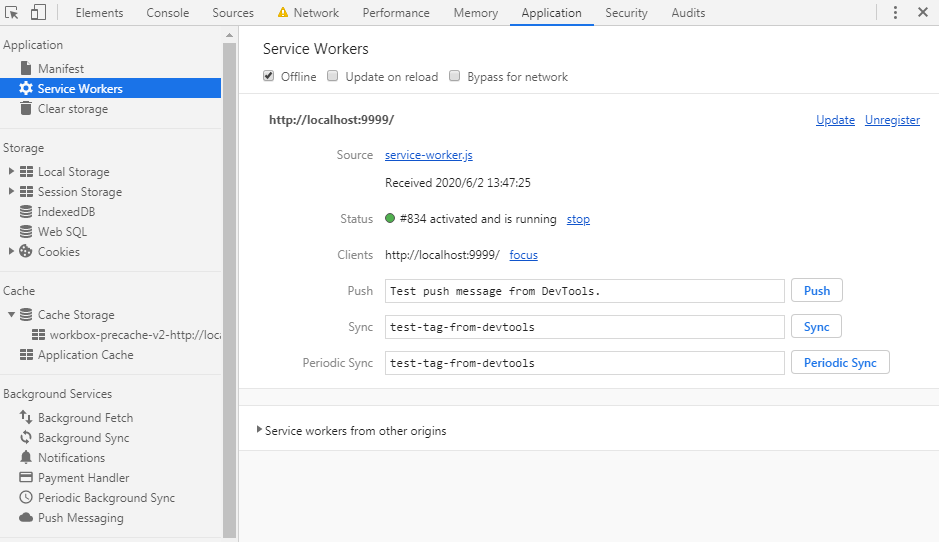
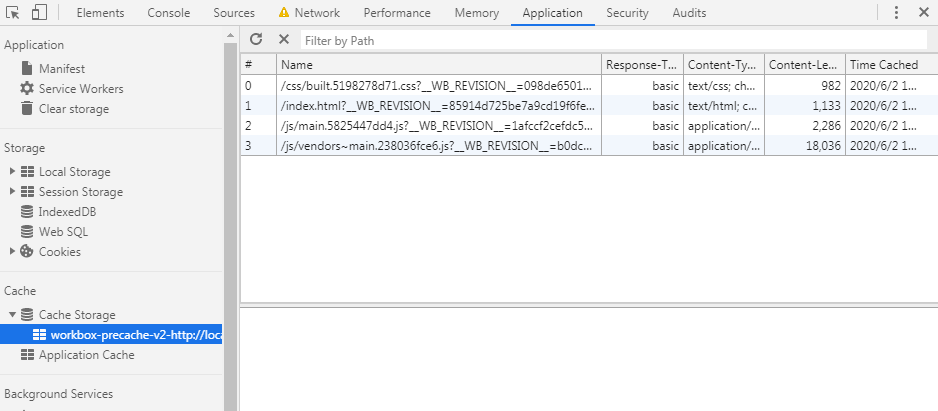
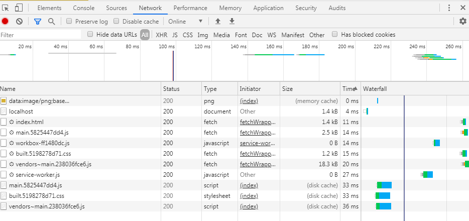
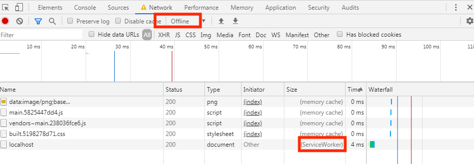

<span id="catalog"></span>

### 目录
- [速查](#速查)
- [Webpack概述](#Webpack概述)
- [相关安装内容](#相关安装内容)
- [webpack的基本知识](#webpack的基本知识)
    - [webpack的两种模式](#webpack的两种模式)
    - [常用开发目录结构](#常用开发目录结构)
    - [两种模块化开发规范共存](#两种模块化开发规范共存)
    - [webpack的5个核心概念](#webpack的5个核心概念)
    - [webpack的编译与启动](#webpack的编译与启动)
- [不同类型资源的打包](#不同类型资源的打包)
- [开发环境构建](#开发环境构建)
    - [开发模式的配置方法](#开发模式的配置方法)
    - [开发服务器devServer](#开发服务器devServer)
    - [开发模式打包产生的问题](#开发模式打包产生的问题)
    - [开发环境基本配置参考](#开发环境基本配置参考)
- [生产环境构建](#生产环境构建)
    - [生产环境的css处理](#生产环境的css处理)
        - [将css提取为独立文件](#将css提取为独立文件)
        - [css兼容性处理](#css兼容性处理)
        - [css压缩](#css压缩)
    - [生产环境的js处理](#生产环境的js处理)
        - [eslint-js语法检查](#eslint-js语法检查)
        - [eslint的特殊对象支持](#eslint的特殊对象支持)
        - [js的兼容性处理](#js的兼容性处理)
        - [js压缩](#js压缩)
    - [html压缩](#html压缩)
    - [生产环境基本配置参考](#生产环境基本配置参考)
- [性能优化配置](#性能优化配置)
    - [SourceMap--性能与调试](#SourceMap--性能与调试)
        - [SourceMap的使用](#SourceMap的使用)
        - [开发环境下的SourceMap折中方案](#开发环境下的SourceMap折中方案)
        - [生产环境下的SourceMap折中方案](#生产环境下的SourceMap折中方案)
    - [oneOf--避免多个loader重复处理同一文件](#oneOf--避免多个loader重复处理同一文件)
    - [code_split--文件分割](#code_split--文件分割)
        - [code_split--使用方法](#code_split--使用方法)
        - [code_split--示例](#code_split--示例)
    - [开发环境性能优化](#开发环境性能优化)
        - [性能优化目标--开发环境](#性能优化目标--开发环境)
        - [HMR-模块热替换](#HMR-模块热替换)
        - [SourceMap配置--开发环境](#SourceMap配置--开发环境)
        - [oneOf配置--开发环境](#oneOf配置--开发环境)
        - [code_split配置--开发环境](#code_split配置--开发环境)
    - [生产环境性能优化](#生产环境性能优化)
        - [性能优化目标--生产环境](#性能优化目标--生产环境)
        - [SourceMap配置--生产环境](#SourceMap配置--生产环境)
        - [oneOf配置--生产环境](#oneOf配置--生产环境)
        - [缓存配置](#缓存配置)
        - [tree_shaking--排除未使用代码](#tree_shaking--排除未使用代码)
        - [code_split配置--生产环境](#code_split配置--生产环境)
        - [懒加载与预加载](#懒加载与预加载)
        - [PWA](#PWA)
        - [多进程打包](#多进程打包)
        - [externals--配置不参与打包的依赖](#externals--配置不参与打包的依赖)
        - [dll--单独编译某些依赖](#dll--单独编译某些依赖)
        - [optimization优化配置](#optimization优化配置)
- [webpack配置文件内容说明](#webpack配置文件内容说明)
    - [webpack的基本配置](#webpack的基本配置)
    - [entry](#entry)
    - [output](#output)
    - [resolve](#resolve)
    - [devServer](#devServer)
    - [optimization](#optimization)
- [](#)


# 速查
[top](#catalog)

- 运行指令
    - 参考: [webpack的编译与启动](#webpack的编译与启动)
    - 不依赖与配置文件运行

        |环境|指令|
        |-|-|
        |开发环境|`webpack ./src/index.js -o ./build/built.js --mode=development`|
        |生产环境|`webpack ./src/index.js -o ./build/built.js --mode=production`|

    - 通过 `webpack.config.js` 文件来执行: `webpack`
    - 使用指定的配置文件来执行: `webpack --config <配置文件名>`

- 开发模式下启动devServer
    - 参考：[开发服务器devServer](#开发服务器devServer)
    - `npx webpack-dev-server`
- source-map 折中方案
    - 参考
        - [开发环境下的SourceMap折中方案](#开发环境下的SourceMap折中方案)
        - [生产环境下的SourceMap折中方案](#生产环境下的SourceMap折中方案)
    - 开发环境
        1. `eval-source-map`，速度足够快，调试最友好
        2. `eval-cheap-source-map`，速度最快，调试不够友好，只能精确到行
    - 生产环境
        1. `source-map`，调试友好
        2. `cheap-module-source-map`，构建速度快，调试友好
        3. 需要隐藏代码时，可以使用：`hidden-` 或 `nosources-`

- webpack中同时存在 ES6 和 commonJS规范
    - 参考: [两种模块化开发规范共存](#两种模块化开发规范共存)
    - `src/` 目录，使用ES6规范解析，用于页面开发等
    - `webpack.config.js`，commonJS规范，用于从nodejs启动

- 图片处理loader的问题: html-loader、url-loader
    - 参考: [不同类型资源的打包](#不同类型资源的打包) --img打包
    - html-loader 使用 commonJS 规范
    - url-loader 使用 ES6 规范
    - html-loader 会将提取的图片交给 url-loader 处理，默认情况下无法处理
    - 需要在 url-loader 中添加属性，关闭 ES6 规范，使其能够处理 html-loader 提取的图片
        ```js
        options:{
            esModule: false,
        }
        ```

- 入口chunk与非入口chunk
    - 参考: [entry](#entry)
    - 所有在entry中指定的js文件都是**入口chunk**
        - 如果是array形式，则**入口chunk**是数组的第一个元素
    - entry中没有指定的文件都是非入口chunk

# Webpack概述
[top](#catalog)
- 现有的开发问题
    - css
        - 一般会使用less、sass等工具进行开发
        - 这些工具开发的结果，如 `*.less` 文件，浏览器无法识别
    - 包管理规范
        - 如：CommonJS 的 require、ES6的 import 等关键字，浏览器无法识别
        - 开发结果需要借助：`babel`、`browserify` 等工具进行转换
    - 开发过程中，需要同时维护代码，和编译结构，比较麻烦

- 问题说明
    - html示例
        ```html
        <head>
            <meta charset='utf-8'>
            <title>hello</title>
            <!-- 直接引入less文件 -->
            <link rel='stylesheet' href='./hello.less'>
        </head>
        <body>
            <div class="box01"></div>
            <script type='text/javascript' src='./hello.js'></script>
        </body>
        ```
    - js文件示例
        ```js
        // 不做转换，直接在html中引用，浏览器无法识别
        import $ from 'jquery'

        $('.box01').click(function(){
            this.style.backgroundColor='#bbb'
        })
        ```

- 什么是webpack?
    - 一种前端资源构建工具
        - 用于统一管理 css编译，js编译等问题，一次性解决所有管理问题
    - 一个静态模块打包器 -- module bundler
        - 前端所有资源文件：js、json、css、img、less 等都会作为模块处理
        - webpack会根据依赖关系进行静态分析，打包生成静态资源：bundler

- webpack是基于nodejs运行的，所以**必须要有nodejs环境**

- webpack编译的主要功能
    - 将ES6语法编译成浏览器能识别的代码
    - 将不同类型的资源打包，统一发布、统一管理
    - 通过配置文件来设定资源的打包方式

# 相关安装内容
[top](#catalog)

|类别|安装内容|指令|
|-|-|-|
|编译基础|webpack + 脚手架<br>必须安装|`npm i webpack webpack-cli -g`|
|编译基础|webpack + 脚手架<br>必须安装|`npm i webpack webpack-cli -D`|
|开发配置|css打包|`npm i style-loader -D`|
|开发/生产配置|css打包|`npm i css-loader -D`|
|开发/生产配置|less打包|`npm i less-loader -D`|
|开发/生产配置|html打包|`npm i html-webpack-plugin -D`|
|开发/生产配置|img打包|`npm i url-loader -D`|
|开发/生产配置|img打包，其他资源|`npm i file-loader -D`|
|开发/生产配置|img打包|`npm i html-loader -D`|
|开发配置|开发服务器，devServer|`npm i webpack-dev-server -D`|
|生产配置|提取css|`npm i mini-css-extract-plugin -D`|
|生产配置|css兼容性处理loader|`npm i postcss-loader -D`|
|生产配置|css兼容性处理，postcss-loader 辅助插件|`npm i postcss-preset-env -D`|
|生产配置|css压缩插件|`npm i optimize-css-assets-webpack-plugin -D`|
|生产配置|eslint 组件|`npm i eslint-loader -D`|
|生产配置|eslint 组件 loader|`npm i eslint -D`|
|生产配置|airbnb规则检查支持|`npm i eslint-plugin-import -D`|
|生产配置|airbnb规则检查支持|`npm i eslint-config-airbnb-base -D`|
|生产配置|js兼容性处理loader|`npm i babel-loader -D`|
|生产配置|js兼容性处理、babel核心库|`npm i @babel/core -D`|
|生产配置|js兼容性处理、babel预设|`npm i @babel/preset-env -D`|
|生产配置|js兼容性处理、babel按需处理|`npm i core-js -D`|
|生产配置|js兼容性处理、babel全部兼容|`npm i @babel/polyfill -D`|
|生产配置|PWA（离线访问）支持|`npm i workbox-webpack-plugin -D`|
|生产配置|多进程打包|`npm i thread-loader -D`|
|生产配置|将指定文件输出到打包结果中<br>用途dll打包|`npm i add-asset-html-webpack-plugin -D`|
|生产配置|terser 压缩方案支持|`npm i terser-webpack-plugin -D`|
||||


# webpack的基本知识
## webpack的两种模式
[top](#catalog)
- 两种模式
    - 生产模式
    - 开发模式

- 两种模式的区别
    - 在 `生产模式`下，会自动压缩 html、js 代码

## 常用开发目录结构
- 一般开发的目录结构
    ```
    ├─ build                保存打包结果
    ├─ src                  开发资源
    │   └─ index.js         入口文件
    └─ webpack.config.js    webpack配置文件
    ```

## 两种模块化开发规范共存
[top](#catalog)

|目录/文件|规范|原因|
|-|-|-|
|src|ES6|使用ES6方便开发|
|webpack.config.js|commonjs |通过nodejs启动webpack进行编译时使用的文件，所以只能使用commonjs规范|

## webpack的5个核心概念
[top](#catalog)

- 5个核心概念

    |概念|描述|
    |-|-|
    |Entry，入口|指示webpack以哪个文件为入口起点开始打包，分析**构建内部依赖图**|
    |Output，输出|指示webpack打包后的资源 `bundler` 输出到哪里、如何命名|
    |Loader|处理非javascript文件，编译成webpack能识别的资源（webpack自身只能处理js文件）|
    |Plugins，插件|用于执行范围更广的任务<br>插件范围包括：打包优化、压缩、重定义环境变量等|
    |Mode|指示webpack使用相应模式的配置|

- 内置Model

    |选项|用途|描述|
    |-|-|-|
    |development|用于本地开发调试|<ul><li>设置 `process.env.NODE_ENV = 'development'`</li><li>启用插件 <ul><li>`NamedChunksPlugin`</li><li>`NamedModulesPlugin`</li></ul> </li></ul>|
    |production|用于生产环境、上线运行|<ul><li>设置 `process.env.NODE_ENV = 'production'`</li><li>启用插件 <ul><li>`FlagDependencyUsagePlugin`</li><li>`FlagIncludedChunksPlugin`</li><li>`ModuleConcatenationPlugin`</li><li>`NoEmitOnErrorsPlugin`</li><li>`OccurrenceOrderPlugin`</li><li>`SideEffectsFlagPlugin`</li><li>`UglifyJsPlugin`</li></ul> </li></ul>|

## webpack的编译与启动
[top](#catalog)
- 运行指令
    - 不依赖与配置文件运行

        |环境|指令|
        |-|-|
        |开发环境|`webpack ./src/index.js -o ./build/built.js --mode=development`|
        |生产环境|`webpack ./src/index.js -o ./build/built.js --mode=production`|
    - 通过读取配置文件运行: `webpack`

- 开发环境的控制台运行结果
    ```
    Hash: af8b2a05d02695e5cfb0             <<<<<< 每次打包都会生成一个唯一的hash值
    Version: webpack 4.43.0                <<<<<< webpack的版本
    Time: 1017ms
    Built at: 2020-05-19 10:41:29
    Asset         Size  Chunks             Chunk Names    <<<<<< 一个表格，表示：
    built.js  3.84 KiB    main  [emitted]  main
    <<<<<<<<<<<<<<<<<<<<<<<<<<<<<<<<<<<<<<<<<<<<<输出资源|体积|所属chunk|chunk名
    Entrypoint main = built.js
    [./src/index.js] 69 bytes {main} [built]   <<<<<<< 表示参与打包的资源
    ```

- 生产环境的控制台运行结果
    ```
    index.js -o ./build/built.js --mode=production
    Hash: 1c6ca723c05806f08a7a
    Version: webpack 4.43.0
    Time: 263ms
    Built at: 2020-05-19 10:49:20
    Asset       Size  Chunks             Chunk Names
    built.js  946 bytes       0  [emitted]  main    <<<<< 文件更小、压缩率比开发环境更高
    Entrypoint main = built.js
    [0] ./src/index.js 94 bytes {0} [built]
    ```

- 编译后，可以使用 `node 编译结果.js` 来启动

# 不同类型资源的打包
[top](#catalog)
- js 文件
    - 直接编译到最终结果文件中
- json 文件
    - **在入口文件 `index.js` 中引入 json 文件**
        ```js
        import <自定义导入名> from '<json文件路径>'
        ```
    - 打包方式
        1. 读取json文件，并将 `json字符串` 写入编译结果
        2. 在编译结果中添加代码：`e.exports = JSON.parse(json字符串)`
    - 不需要配置loader

- html 文件
    - 引入文件
        - 在插件中指定html文件的位置
    - 打包方式
        - 拷贝html文件，解析内部引入的外部资源路径，然后替换为编译后的结果
        - 在文件的最后，会引入编译结果
            ```html
            <body>
                <!-- ... -->
                <!-- ... -->
                <!-- 自动导入编译结果 -->
                <script src="built.js"></script>
            </body>
            ```

    - 插件配置
        - 使用插件来处理
            - 安装插件: `npm i html-webpack-plugin -D`
        - 引入插件
            ```js
            const HtmlWebpackPlugin = require('html-webpack-plugin')
            ```
        - 方式1: 默认配置
            - 插件会创建一个无body结构的html文件，并自动引入打包生成的所有资源
            - 配置内容
                ```js
                module.exports={
                    plugins: [new HtmlWebpackPlugin()]
                }
                ```
        - 方式2: 指定html路径
            - 打包时，将会复制指定的html，并自动引入打包生成的所有资源
            - 配置内容
                ```js
                module.exports={
                    plugins: [new HtmlWebpackPlugin({
                        template: 'html文件路径'
                    })]
                }
                ```

- css 文件
    - 引入文件
        - **在入口文件 `index.js` 中引入 css 文件**
    - 打包方式
        - 将css文件内容编码到构建后的js文件中
    - loader配置:
        ```js
        rules: [
            {
                test: /\.css$/,
                use: [
                    'style-loader', // 在html的head中创建style标签，将js中的样式资源插入
                    'css-loader', // 将css文件变成 commonjs模块加载到js中。模块中的内容是字符串
                ],
            }
        ]
        ```
    - 需要下载loader的包
        - `npm i style-loader -D`
        - `npm i css-loader -D`
    - 在html中引入生成的js文件，页面启动后，会在html中添加`<style>`标签和css

- less 文件
    - 引入文件
        - **在入口文件 `index.js` 中引入 less 文件**
    - 打包方式
        - 将less文件内容编码到构建后的js文件中
    - loader配置:
        ```js
        rules: [
            {
                test:/\.less$/,
                use:[
                    'style-loader',
                    'css-loader',
                    'less-loader',
                ]
            }
        ]
        ```
    - 需要下载loader的包
        - `npm i style-loader -D`
        - `npm i css-loader -D`
        - `npm i less-loader -D`
    - 在html中引入生成的js文件，页面启动后，会在html中添加`<style>`标签和css

- img 文件
    - 引入img文件
        - html中使用 `img` 标签引入
        - css、js中使用 `url()` 引入
    - 打包方式
        - 大文件会被作为资源引入，并且文件名会被转换为一个 **hash值**
        - 小文件会执行base64，并自动修改各文件中的图片路径为 base64码
    - loader配置
        ```js
        rules: [
            // 调整图片资源的打包配置
            {
                // 配置处理哪些类型的图片
                test: /\.(jpg|png|gif)$/,
                // 使用一个loader进行处理
                loader: "url-loader",
                options: {
                    // 当图片小于 8kb 时，由base64处理
                    // 优点：减少请求数量，图片体积会变大
                    // 一般只针对 8kb - 12kb 的图片进行处理
                    limit: 8 * 1024,

                    // url-loader 默认使用es6规范，html-loader引入图片是commonjs规范
                    // 解析时会出现问题：[object Module]
                    // 关闭 url-loader 的es6规范，使用commonjs规范解析
                    esModule: false

                    // 为图片重命名
                    // [hash:10]: 取hash值的前10位
                    // [ext]: 使用文件原来的扩展名
                    name: "[hash:10].[ext]"
                },
                // 定义保存生成结果的子目录
                options:{
                    // 定义保存生成结果的子目录
                    outputPath: "img"
                }
            },
            // 处理html中的引用的图片
            {
                test: /\.html$/,
                // 处理html中引用的图片，从而能被url-loader处理
                loader: "html-loader",
                options: {
                    // 为文件重命名
                    // [hash:10]: 取hash值的前10位
                    // [ext]: 使用文件原来的扩展名
                    name:"[hash:10].[ext]"
                },
            }
        ]
        ```
    - 需要下载loader包
        - `npm i url-loader -D`
        - `npm i file-loader -D`
        - `npm i html-loader -D`

- 其他资源打包，如：字体图标
    - 引入文件
        - **在入口文件 `index.js` 中引入字体图标的 css 文件**
    - 打包方式
        - 对于这类资源，不需要做任何特殊处理，只要完整的输出即可
        - 编译时，通过 `index.js` 引入 字体图标的 css 文件，扫描后如果发现其他文件，则使用loader进行处理
    - loader配置
        ```js
        rules: [
            // 打包其他资源
            {
                // 排除 之前所有已经被处理过的文件类型，
                // 否则会出现异常
                exclude: /\.(html|css|js|less|json|jpg|png|gif)$/,
                loader: "file-loader",
            },
        ]
        ```
    - 需要下载loader包
        - `npm i file-loader -D`

# 开发环境构建
## 开发环境的配置方法
[top](#catalog)
- 基本配置方法参考：[不同类型资源的打包](#不同类型资源的打包)
- 需要配置的内容
    - css、less的处理
    - 图片的处理
    - 其他资源的处理
    - 配置开发服务器

## 开发服务器devServer
[top](#catalog)
- 开发时，使用devServer可以
    - 自动编译
    - 自动打包
    - 自动刷新页面
- devServer的**打包结果都保存在内存中**，本地目录中不会有任何输出
- 需要下载包: `npm i webpack-dev-server -D`
- 启动指令: `npx webpack-dev-server`
- 每次修改 `webpack.config.js` 文件后，**必须重新启动才能生效**

- 在 `webpack.config.js` 中添加配置
    ```js
    module.exports={
        devServer:{
            // 指定编译结果目录
            contentBase: resolve(__dirname, "build"),
            // 开启gzip压缩，使结果更小更快
            compress:true,
            // 指定服务器的端口号
            port:8888,
            // 启动后，自动打开浏览器
            open: true,
        }
    }
    ```

## 开发模式打包产生的问题
[top](#catalog)
- 开发模式代码打包产生的问题
    - css打包产生的问题
        1. 请求时间延长
            - css被 css-loader 打包到js后，导致js文件体积过大，请求时间延长
        2. 闪屏
            - css是通过js操作dom对象，添加到html中的，所以会出现闪屏问题
    - 兼容性问题
        - 部分 css、js代码有兼容性问题
- 解决方法
    - 代码压缩
    - 兼容处理

- 兼容、压缩的工作量比较大，打包速度较慢，会影响开发，所以<label style="color:red">应该只在生产环境中执行</label>

## 开发环境基本配置参考
[top](#catalog)
- 参考工程
    - [javascript/module/webpack/src/development](javascript/module/webpack/src/development)

- 工程结构
    ```
    development
        ├─ build
        │   ├─ media/
        │   │
        │   ├─ js
        │   │   └─ built.js
        │   │
        │   └─ index.html
        │
        └─ src
            ├─ hello.html
            │
            ├─ css/
            │   ├─ hello.less
            │   └─ hello.css
            │
            ├─ font/
            │
            ├─ img/
            │   └─ img.png
            │
            ├─ js/
            │   ├─ hello.js
            │   └─ index.js
            │
            └─ json/
                └─ test.json
    ```

- `package.json` 配置
    - 参考配置
        - [configs/devconfig_base/package.json](configs/devconfig_base/package.json)
    - 配置内容
        ```json
        {
          "name": "introduction",
          "version": "1.0.0",
          "description": "",
          "main": "index.js",
          "scripts": {
            "test": "echo \"Error: no test specified\" && exit 1"
          },
          "devDependencies": {
            "css-loader": "^3.5.3",
            "file-loader": "^6.0.0",
            "html-loader": "^1.1.0",
            "html-webpack-plugin": "^4.3.0",
            "less-loader": "^6.1.0",
            "style-loader": "^1.2.1",
            "url-loader": "^4.1.0",
            "webpack": "^4.43.0",
            "webpack-cli": "^3.3.11",
            "webpack-dev-server": "^3.11.0"
          }
        }
        ```

- `webpack.config.js` 配置
    - 参考配置
        - 无注释版: [configs/devconfig_base/webpack.config.js](configs/devconfig_base/webpack.config.js)
        - 有注释版: [configs/devconfig_base/webpack_with_comment.config.js](configs/devconfig_base/webpack_with_comment.config.js)

    - 配置内容
        ```js
        const { resolve } = require("path");
        const HtmlWebpackPlugin = require('html-webpack-plugin')

        module.exports={
            entry:'./src/js/index.js',
            output:{
                path: resolve( __dirname, 'build'),
                filename: 'js/built.js'
            },

            module: {
                rules: [
                    { // css
                        test: /\.css$/,
                        use: [
                            'style-loader',
                            'css-loader',
                        ]
                    },

                    { // less
                        test:/\.less$/,
                        use:[
                            'style-loader',
                            'css-loader',
                            'less-loader',
                        ]
                    },

                    { // img
                        test: /\.(jpg|png|gif)$/,
                        loader: "url-loader",
                        options: {
                            limit: 8 * 1024,
                            esModule: false,
                            name: "[hash:10].[ext]",
                            outputPath: "img"
                        }
                    },

                    { // html-img
                        test: /\.html$/,
                        loader: "html-loader",
                    },

                    { // others
                        exclude: /\.(html|css|js|less|json|jpg|png|gif)$/,
                        loader: "file-loader",
                        options:{
                            outputPath: "media"
                        }
                    },
                ]
            },

            plugins: [
                new HtmlWebpackPlugin({
                    template: './src/hello.html'
                }),
            ],

            mode: 'development',

            devServer:{
                contentBase: resolve(__dirname, "build"),
                compress: true,
                port: 8888,
                // open: true,
            }
        }
        ```

# 生产环境构建
## 生产环境的css处理
### 将css提取为独立文件
[top](#catalog)
- 需要插件: `mini-css-extract-plugin`

- 使用方法
    1. 下载包
        - `npm i mini-css-extract-plugin -D`
    2. `webpack.config.js` 配置
        - 引入插件、配置插件
            ```js
            // css提取插件
            const MiniCssExtractPlugin = require('mini-css-extract-plugin');

            module.exports={
                plugins: [
                    // 引入css提取插件
                    new MiniCssExtractPlugin({
                        // 1. 默认生成 main.css
                        // 2. 可以指定生成结果的子目录与文件名
                        filename:'css/built.css'
                    }),
                ],
            }
            ```
    3. `webpack.config.js` 配置
        - 使用插件内部的 loader **替换** 处理css、less文件的 `style-loader`
            ```js
            rules: [
                // 处理css的loader
                {
                    test: /\.css$/,
                    use: [
                        //'style-loader',
                        // 替换 style-loader，从打包后的js文件中提取css成单独文件
                        MiniCssExtractPlugin.loader,
                        'css-loader',
                    ]
                },
                // 处理less的loader
                {
                    test:/\.less$/,
                    use:[
                        // 'style-loader',
                        // 替换 style-loader，从打包后的js文件中提取css成单独文件
                        MiniCssExtractPlugin.loader,
                        'css-loader',
                        'less-loader',
                    ]
                },
            ]
            ```
    4. 执行打包
    5. 打包结果
        - **默认情况下**生成一个 `main.css` 文件所有的css都在该文件中
        - 在生成的 `index.html` 中自动引入
            ```html
            <link href="main.css" rel="stylesheet"></head>
            ```


### css兼容性处理
[top](#catalog)
- 需要使用：
    - loader: postcss-loader
    - postcss-loader 的辅助插件: postcss-preset-env
        - 可以帮助 postcss 识别环境，加载指定配置，可以使兼容性**精确到某个浏览器版本**
        - 帮助 postcss 找到 `package.json` 中 `browserslist` 的配置，通过配置加载指定的css兼容性样式

- 使用方法
    1. 下载包
        - `npm i postcss-loader -D`
        - `npm i postcss-preset-env -D`
    2. `package.json` 配置
        - 添加 `browserslist` 配置
            ```json
            "browserslist":{
                // 开发环境配置
                "development":[
                    "last 1 chrome version", // 兼容最近版本的chrome浏览器
                    "last 1 firefox version", // 兼容最近版本的firefox浏览器
                    "last 1 safari version" // 兼容最近版本的safari浏览器
                ],
                // 生产环境配置
                "production":[
                    ">0.2%",    // 兼容绝大部分浏览器
                    "not dead",   // 不兼容已死的浏览器
                    "not op_mini all" // 不兼容 op_mini
                ]
            }
            ```
    3. `webpack.config.js` 配置
        - 配置 postcss 读取 package.json 中哪种环境的配置
            - 默认读取 `production` 生产环境的配置
            - 可以手动设置读取 `development` 环境的配置
                ```js
                process.env.NODE_ENV = "development"
                ```
    4. `webpack.config.js` 配置
        - 在css、less文件的处理中，配置 postcss-loader 及 插件
            ```js
            module.exports={
                module: {
                    rules: [
                        // 处理css的loader
                        {
                            test: /\.css$/,
                            use: [
                                MiniCssExtractPlugin.loader,
                                'css-loader',
                                // 使用 postcss 执行兼容性处理
                                // 使用 postcss 的默认配置
                                // 'postcss-loader'
                                // 修改 postcss 的默认配置
                                {
                                    loader: 'postcss-loader',
                                    options: {
                                        ident: 'postcss',
                                        plugins: ()=> [
                                            // process 的插件
                                            require('postcss-preset-env')()
                                        ]
                                    }
                                }
                            ]
                        },
                        // 处理less的loader
                        {
                            test:/\.less$/,
                            use:[
                                MiniCssExtractPlugin.loader,
                                'css-loader',

                                // 使用 postcss 执行兼容性处理
                                // 使用 postcss 的默认配置
                                // 'postcss-loader'
                                // 修改 postcss 的默认配置
                                {
                                    loader: 'postcss-loader',
                                    options: {
                                        ident: 'postcss',
                                        plugins: ()=> [
                                            // process 的插件
                                            require('postcss-preset-env')()
                                        ]
                                    }
                                },
                                'less-loader',
                            ]
                        },
                    ]
                },
            }
            ```
    5. 执行打包
    6. 打包后，css文件中会包含兼容性代码


### css压缩
[top](#catalog)
- 需要使用插件: optimize-css-assets-webpack-plugin

- 使用方法
    1. 下载包
        - `npm i optimize-css-assets-webpack-plugin -D`
    2. `webpack.config.js` 配置
        - 引入插件、配置插件
            ```js
            const OptimizeCssAssetsWebpackPlugin = require('optimize-css-assets-webpack-plugin')

            module.exports={
                plugins: [
                    // css压缩
                    new OptimizeCssAssetsWebpackPlugin(),
                ],
            }
            ```
    3. 执行打包

## 生产环境的js处理
### eslint-js语法检查
[top](#catalog)
- 需要使用:
    - eslint组件
    - eslint-loader
    - airbnb规则检查支持
- 注意事项
    - 打包时，可能会有多个处理 js 文件的loader，应该由 eslint 优先进行处理，防止检查的不是源代码
    - 在 `rules` 中添加 `enforce: 'pre'` 属性来提高eslint的优先级
- 使用方法
    1. 下载包
        - eslint 组件
            - `npm i eslint-loader -D`
        - eslint 组件 loader
            - `npm i eslint -D`
        - airbnb规则检查支持
            - `npm i eslint-plugin-import -D`
            - `npm i eslint-config-airbnb-base -D`

    2. `package.json` 配置
        - `eslintConfig` 属性中，配置 airbnb 规范
            ```json
            "eslintConfig":{
                // 继承：eslint-config-airbnb-base
                "extends": "airbnb-base"
            }
            ```
    3. `webpack.conf.js` 配置
        - 配置 eslint-loader
            ```js
            module.exports={
                module: {
                    rules: [
                        // eslint 语法检查
                        {
                            test: /\.js$/,
                            // 排除第三方代码的检查
                            exclude: /node_modules/,
                            loader: 'eslint-loader',
                            // 需要在 package.json 中指定检查规则
                            // 自动修复eslint语法问题，将直接在原代码中进行修改
                            options: {
                                fix: true,
                            },
                            // 提升 eslint 处理的优先级
                            enforce: 'pre',
                        },
                    ]
                },
            }
            ```
    4. 在源代码中添加 eslint 注释来忽略检查
        - 注释内容: `// eslint-disable-next-line`
        - 示例
            ```js
            // 忽略 eslint 检查
            // eslint-disable-next-line
            console.log(add(5, 3));
            ```
    5. 执行打包
    6. 打包时，如果出现 `eslint error`，需要修改代码；出现 `eslint warning` 可以不修改

### eslint的特殊对象支持
[top](#catalog)
- 对于浏览器对象、nodejs对象等特殊对象，eslint无法识别。如果不做配置会产生打包异常
- 在 `package.json` 中添加配置
    ```js
    "eslintConfig":{
        // 其他配置

        // 
        "env": {
            "browser": true,    //支持浏览器全局变量
            "node": true        //支持nodejs全局变量
        }
    }
    ```


### js的兼容性处理
[top](#catalog)
- 需要使用
    - loader: babel-loader
    - babel的预设，用于指示babel如何做兼容性处理
        - 3 种处理方式
            1. 只能转换基本的es6语法: `@babel/preset-env`
            2. 可以转换所有的es6语法: `@babel/polyfill`
                - 使用时，直接在 js 文件中进行引入，不需要配置
                - 使用 2 就不能使用 3
                - 缺点
                    - 会引入**所有**兼容性代码，导致文件体积过大
                    - 无法只针对代码内容做部分兼容
            3. 按需处理: `core-js`
                - 使用 3 就不能使用 2
                - 兼容的同时可以减小构建后的代码体积
        - 一般使用 `@babel/preset-env` + `core-js` 来完成预处理

- 推荐使用方法: `@babel/preset-env` + `core-js`
    1. 下载包
        - loader
            - `npm i babel-loader -D`
        - babel核心库
            - `npm i @babel/core -D`
        - babel预设
            - `npm i @babel/preset-env -D`
        - 按需处理
            - `npm i core-js -D`
    2. `webpack.config.js` 配置
        - 配置：`@babel/preset-env` + `core-js` 来完成预处理
            ```js
            module.exports={
                module: {
                    rules: [
                        // js 兼容性处理
                        {
                            test: /\.js$/,
                            // 排除第三方代码的检查
                            exclude: /node_modules/,
                            loader: 'babel-loader',
                            options: {
                                // 预设：指示babel如何做兼容性处理
                                // 1. 只转换基本的es6语法
                                // presets: ['@babel/preset-env'],

                                // 2. `@babel/preset-env` + `core-js`
                                presets: [
                                    [
                                        '@babel/preset-env', // 只能转换基本的es6语法
                                        // 按需加载
                                        {
                                            useBuiltIns:'usage',
                                            corejs: {
                                                version:3
                                            },
                                            // 指定兼容性做到浏览器的哪个版本
                                            targets: {
                                                chrome: '60',
                                                firefox: '60',
                                                ie: '9'
                                            }
                                        }
                                    ]
                                ]
                            }
                        }
                    ]
                },
            }
            ```
    3. 执行打包

- `@babel/polyfill` 使用方法
    1. 下载包
        - `npm i @babel/polyfill -D`
    2. 在 `index.js` 文件中引入，不需要其他配置
        ```js
        import '@babel/polyfill';
        ```
    3. 执行打包

### js压缩
[top](#catalog)
- 需要配置生产模式mode，打包时会自动压缩js文件
- 开启 生产模式后，`UglifyJsPlugin` 插件将会自动执行js代码压缩

## html压缩
[top](#catalog)
- 在html插件中添加html压缩配置
    ```js
    module.exports={
        plugins: [
            new HtmlWebpackPlugin({
                template: './src/hello.html',
                // html压缩配置
                minify: {
                    // 移除空格
                    collapseWhitespace: true,
                    // 移除注释
                    removeComments: true,
                }
            }),
        ],
    }
    ```

## 生产环境基本配置参考
[top](#catalog)
- 参考工程
    - [javascript/module/webpack/src/product](javascript/module/webpack/src/product)
- 工程结构
    ```
    product
        ├─ build
        │   ├─ media/
        │   │
        │   ├─ js
        │   │   └─ built.js
        │   │
        │   ├─ css
        │   │   └─ built.css
        │   │
        │   └─ index.html
        │
        └─ src
            ├─ hello.html
            │
            ├─ css/
            │   ├─ hello.less
            │   └─ hello.css
            │
            ├─ img/
            │   └─ img.png
            │
            ├─ js/
            │   ├─ hello.js
            │   └─ index.js
            │
            └─ json/
                └─ test.json
    ```

- `package.json` 配置
    - 参考配置
        - [configs/productconfig_base/package.json](configs/productconfig_base/package.json)
    - 配置内容
        ```json
        {
          "name": "product",
          "version": "1.0.0",
          "description": "",
          "main": "index.js",
          "scripts": {
            "test": "echo \"Error: no test specified\" && exit 1"
          },
          "devDependencies": {
            "@babel/core": "^7.9.6",                // js兼容性处理
            "@babel/preset-env": "^7.9.6",          // js兼容性处理
            "babel-loader": "^8.1.0",               // js兼容性处理
            "core-js": "^3.6.5",                    // js兼容性处理
            "eslint": "^7.1.0",
            "eslint-config-airbnb-base": "^14.1.0",
            "eslint-loader": "^4.0.2",
            "eslint-plugin-import": "^2.20.2",
            "file-loader": "^6.0.0",
            "html-loader": "^1.1.0",
            "html-webpack-plugin": "^4.3.0",
            "css-loader": "^3.5.3",
            "less-loader": "^6.1.0",
            "mini-css-extract-plugin": "^0.9.0",    // css提取
            "optimize-css-assets-webpack-plugin": "^5.0.3", // css压缩
            "postcss-loader": "^3.0.0",             // css兼容性处理
            "postcss-preset-env": "^6.7.0",         // css兼容性处理
            "url-loader": "^4.1.0",
            "webpack": "^4.43.0",
            "webpack-cli": "^3.3.11"
          },
          "browserslist": { // 配置css兼容性策略
            "development": [
              "last 1 chrome version",
              "last 1 firefox version",
              "last 1 safari version"
            ],
            "production": [
              ">0.2%",
              "not dead",
              "not op_mini all"
            ]
          },
          "eslintConfig": {
            // eslint 继承 airbnb-base，并使用airbnb语法来检查代码
            "extends": "airbnb-base"
          }
        }
        ```

- `webpack.config.js` 配置
    - 参考配置
        - 无注释版: [configs/productconfig_base/webpack.config.js](configs/productconfig_base/webpack.config.js)
        - 有注释版: [configs/productconfig_base/webpack_with_comment.config.js](configs/productconfig_base/webpack_with_comment.config.js)
    - 配置内容
        ```js
        const { resolve } = require("path");
        const HtmlWebpackPlugin = require('html-webpack-plugin')
        const MiniCssExtractPlugin = require('mini-css-extract-plugin');
        const OptimizeCssAssetsWebpackPlugin = require('optimize-css-assets-webpack-plugin')

        // process.env.NODE_ENV = "development"

        const commonCssLoader = [
            MiniCssExtractPlugin.loader,
            'css-loader',
            {
                loader: 'postcss-loader',
                options: {
                    ident: 'postcss',
                    plugins: ()=> [
                        require('postcss-preset-env')()
                    ]
                }
            },
        ]

        module.exports={
            entry:'./src/js/index.js',
            output:{
                path: resolve( __dirname, 'build'),
                filename: 'js/built.js'
            },

            module: {
                rules: [
                    { // css
                        test: /\.css$/,
                        use: [...commonCssLoader,]
                    },

                    { // less
                        test:/\.less$/,
                        use:[...commonCssLoader, 'less-loader']
                    },

                    { // img
                        test: /\.(jpg|png|gif)$/,
                        loader: "url-loader",
                        options: {
                            limit: 8 * 1024,
                            esModule: false,
                            name: "[hash:10].[ext]",
                            outputPath: "img"
                        }
                    },

                    { // html-img
                        test: /\.html$/,
                        loader: "html-loader",
                    },

                    { // others
                        exclude: /\.(html|css|js|less|json|jpg|png|gif)$/,
                        loader: "file-loader",
                        options:{
                            outputPath: "media"
                        }
                    },

                    { // eslint
                        test: /\.js$/,
                        exclude: /node_modules/,
                        loader: 'eslint-loader',
                        options: {
                            fix: true,
                        },
                        enforce: 'pre',
                    },

                    { // js兼容性处理
                        test: /\.js$/,
                        exclude: /node_module/,
                        loader: 'babel-loader',
                        options: {
                            presets: [
                                [
                                    '@babel/preset-env',
                                    {
                                        useBuiltIns:'usage',
                                        corejs: {
                                            version:3
                                        },
                                        targets: {
                                            chrome: '60',
                                            firefox: '60',
                                            ie: '9'
                                        }
                                    }
                                ]
                            ]
                        }
                    }
                ]
            },

            plugins: [
                new HtmlWebpackPlugin({
                    template: './src/hello.html',
                    minify: {
                        collapseWhitespace: true,
                        removeComments: true,
                    }
                }),
                new MiniCssExtractPlugin({
                    filename:'css/built.css'
                }),
                new OptimizeCssAssetsWebpackPlugin(),
            ],

            mode: 'production',
        }
        ```

# 性能优化配置

## SourceMap--性能与调试
### SourceMap的使用
[top](#catalog)
- SourceMap 功能与作用
    - 提供了源代码到构建后代码的映射
    - 如果构建后代码出错了，通过映射可以追踪源代码的错误
- 开启SourceMap
    - 添加配置
        ```js
        module.exports={
            devtool: 'source-map'
        }
        ```

- source-map 的可选参数
    - 参数分组
        - `[inline-|hidden-|eval-] [nosources-] [cheap-[module-]]source-map`
        - **各组参数可以进行组合，但是需要注意顺序**

    - 参数比较

        |参数|类型|构建结果|错误跟踪|
        |-|-|-|-|
        |source-map|外部||错误代码的准确信息 、 源代码的错误位置|
        |inline-source-map|内联|映射内容写入构建后的js文件<br>只生成一个内联source-map|错误代码的准确信息 、 源代码的错误位置|
        |hidden-source-map|外部|在浏览器中只隐藏源代码，构建代码可见|错误原因、构建后代码的错误位置|
        |eval-source-map|内联|每个文件都生成内联source-map|错误代码的准确信息 、源代码的错误位置|
        |nosources-source-map|外部|在浏览器中隐藏所有代码|错误代码的准确信息|
        |cheap-source-map|外部||错误代码的准确信息 、 源代码的错误位置(**只能精确到行，不能精确到列**)|
        |cheap-module-source-map|外部|`module- `会添加loader的source map，便于调试|错误代码的准确信息 、 源代码的错误位置(**只能精确到行，不能精确到列**)|

    - 各参数的构建速度
        - `eval > inline > cheap > 其他`
    - 内联的问题
        - 映射代码都在js文件中，会导致文件过大

### 开发环境下的SourceMap折中方案
[top](#catalog)
- 开发环境下的需求
    - 构建速度较快的参数设置
        1. `eval-cheap-source-map`
        2. `eval-source-map`

    - 调试友好的参数设置
        1. `source-map`
        2. `eval-module-source-map`
        3. `eval-source-map`

- 折中方案
    1. `eval-source-map`，速度足够快，调试最友好
    2. `eval-cheap-source-map`，速度最快，调试不够友好，只能精确到行

### 生产环境下的SourceMap折中方案
[top](#catalog)
- 生产环境下的需求
    - **必须使用外联，不能使用内联**，避免js文件过大
        - source-map
        - hidden-source-map
        - nosources-source-map
        - cheap-source-map
        - cheap-module-source-map
    - 是否隐藏源代码
        - hidden-source-map
        - nosources-source-map
    - 调试友好
        1. source-map
        2. cheap-source-map
        3. cheap-module-source-map
    - 构建速度
        1. cheap-source-map
        2. cheap-module-source-map

- 折中方案
    1. `source-map`，调试友好
    2. `cheap-module-source-map`，构建速度快，调试友好
    3. 需要隐藏代码时，可以使用：`hidden-` 或 `nosources-`

## oneOf--避免多个loader重复处理同一文件
[top](#catalog)
- 所有 loader 的配置方式与问题
    - 配置方式
        ```js
        module{
            rules:[
                {loader1},
                {loader2},
                {loader3},
                ...
            ]
        }
        ```
    - `module.rules` 数组配置方式的问题
        - 每个文件都会**执行所有loader**，影响性能
            - 如果第一个 loader 是 css，匹配到 css 文件之后，仍然会继续执行其他loader
        - 文件匹配成功之后，无法停止后续 loader 的匹配


- `oneOf` 处理
    - 将多个 loader 放在 oneOf 中，如果文件匹配成功，则不再执行其他 loader
    - 配置方法
        ```js
        module{
            rules:[
                {其他loader}
                {
                    oneOf:[
                        {loader1},
                        {loader2},
                        {loader3},
                        ...
                    ]
                }
            ]
        }
        ```

- `oneOf` 注意事项
    - **不能有两个loader处理同一类文件**
    - 如果有，则需要创建多个oneOf来保存不同的loader
    - 如：eslint-loader 和 babel-loader 同时处理 js文件，不能同时放在oneof中，需要将 eslint-loader 提取到rules中
        ```js
        module{
            rules:[
                {eslint-loader}
                {
                    oneOf:[
                        {babel-loader},
                        ...
                    ]
                }
            ]
        }
        ```

## code_split--文件分割
### code_split--使用方法
[top](#catalog)
- 为什么要做文件分割
    1. 将打包输出的一个chunk文件分割成多个文件，分别实现不同的功能
    2. 文件分割后，可以**并行加载**，提升加载速度
    3. 文件分割后，可以**按需加载**

- 文件分割主要针对 js 文件

- 三种配置方式
        - js入口文件内部，使用impot动态导入其他js模块

    |No|`webpack.config.js`配置|js入口文件的配置|
    |-|-|-|
    |配置方式1|多入口配置|-|
    |配置方式2|<ul><li>单入口配置/多入口配置</li><li>`optimization`  <ul><li>自动分析多文件中的node_modules公共引用</li><li>将公共引用单独打包为一个chunk</li></ul> </li></ul>|-|
    |配置方式3<br>推荐使用|<ul><li>单入口配置/多入口配置</li><li>`optimization`  <ul><li>自动分析多文件中的node_modules公共引用</li><li>将公共引用单独打包为一个chunk</li></ul> </li></ul>|使用 `import` 动态引入其他js模块|

- 配置方式1
    - 配置内容
        - `webpack.config.js` 多入口配置
    - 编译结果
        - 每个入口生成一个 js 文件
        - 引入的 node_module 资源会被编译到当前资源内部，不会单独打包
    - 该方式的问题
        - 很难一次性指定多个入口，需要经常修改，比较麻烦
        - node_module 资源不会单独打包，会导致代码体积过大
    - `webpack.config.js` 的配置方法
        ```js
        // 多入口配置--适用于多页面应用
        entry:{
            // 创建两个入口，并且可以在index中将引入的test删掉
            main:'./src/index.js',
            test：'./src/test.js',
        }

        // 设置每个入口文件的名字
        output:{
            path: resolve(__dirname, 'build'),
            //[name] 将会使用 entry中的属性名: main、test 等等
            filename:'js/[name].[contenthash:10].js',
        }
        ```

- 配置方式2
    - 配置内容
        - 单入口配置/多入口配置
        - `optimization`
            - 自动分析多文件中的node_modules公共引用
            - 将公共引用单独打包为一个chunk
    - `optimization`生效的前提
        - 公共引入的资源必须足够大，几十kb以上
    - 打包时，将会使用: `splitChunks-plugins` 插件进行处理
    - `webpack.config.js` 的配置方法
        ```js
        module.exports = {
            optimization:{
                splitChunks:{
                    chunks: 'all'
                }
            }
        }
        ```

- 配置方式3（推荐使用）
    - 配置内容
        - 单入口配置/多入口配置
        - `optimization` 自动分析、打包 node_modules 的公共引用
        - js入口文件内部，使用impot动态导入其他js模块
    - `webpack.config.js` 的配置方法
        ```js
        module.exports = {
            optimization:{
                splitChunks:{
                    chunks: 'all'
                }
            }
        }
        ```
    - 入口文件中，`import`动态导入其他js模块
        ```js
        import(/* webpackChunkName: '打包后的名字，即[name]' */'js资源路径(没有.js后缀)')
            .then((需要引入的内容)=>{
                // 加载成功的处理
            })
            .catch(()=>{
                // 加载失败的处理
            })
        ```

    - 注意事项
        - 如果使用: `import( 'js资源路径(没有.js后缀)' )` 的方式动态引入，打包后的文件名会从数字0开始自动命名
        - 使用 `webpackChunkName`设置名字时的 `output.filename` 配置
            - 开发环境
                - 没有特殊要求
                - 编译后能够按照 webpackChunkName 的值来为文件命名
            - <label style="color:red">生产环境</label>
                - 必须使用 `[name].js` 的方式配置，否则 webpackChunkName 无效，会从0开始自动命名
                    ```js
                    output:{
                        filename: 'js/[name].[contenthash:10].js'
                    },
                    ```

### code_split--示例
[top](#catalog)
- 配置方式1
    - 参考代码与配置
        - [src/testcode/code_split/type1/webpack.config.js](src/testcode/code_split/type1/webpack.config.js)
        - [src/testcode/code_split/type1/src/js/index.js](src/testcode/code_split/type1/src/js/index.js)
        - [src/testcode/code_split/type1/src/js/test.js](src/testcode/code_split/type1/src/js/test.js)
    - 配置内容
        ```js
        module.exports = {
            // 配置多入口
            entry:{
                'main':'./src/js/index.js',
                'test':'./src/js/test.js'
            },
            output:{
                path: resolve(__dirname, 'build'),
                filename: 'js/[name].[contenthash:10].js'
            },
            plugins:[
                new HtmlWebpackPlugin({
                    template: './src/hello.html'
                })
            ],
            mode:'development'
        }
        ```
    - js入口
        - index.js
            ```js
            import $ from 'jquery'
            console.log($)
            function add(x, y) {
            return x + y;
            }
            console.log(add(5, 3));
            ```
        - test.js
            ```js
            import $ from 'jquery'
            console.log($)
            export function mul(x, y) {
            return x * y;
            }
            export function minus(x, y) {
            return x - y;
            }
            ```
    - 编译结果
        - jquery 与 两个引入的js文件 被编译到了一起，导致编译结果比较大
            ```
                            Asset       Size  Chunks                         ChunkNames
                       index.html  389 bytes          [emitted]
            js/main.96a60fa8fa.js    322 KiB    main  [emitted] [immutable]  main
            js/test.8f78cb7fc5.js    323 KiB    test  [emitted] [immutable]  test
            ```
- 配置方式2
    - 参考代码与配置
        - [src/testcode/code_split/type2/webpack.config.js](src/testcode/code_split/type2/webpack.config.js)
        - [src/testcode/code_split/type2/src/js/index.js](src/testcode/code_split/type2/src/js/index.js)
        - [src/testcode/code_split/type2/src/js/test.js](src/testcode/code_split/type2/src/js/test.js)
    - 配置内容
        ```js
        module.exports = {
            // 配置多入口
            entry:{
                'main':'./src/js/index.js',
                'test':'./src/js/test.js'
            },
            output:{
                path: resolve(__dirname, 'build'),
                filename: 'js/[name].[contenthash:10].js'
            },
            plugins:[
                new HtmlWebpackPlugin({
                    template: './src/hello.html'
                })
            ],
            mode:'development',
            optimization:{
                splitChunks:{
                    chunks: 'all'
                }
            },
        }
        ```
    - js入口
        - index.js
            ```js
            import $ from 'jquery'
            import {others} from './others'
            console.log($)
            others()
            function add(x, y) {
            return x + y;
            }
            console.log(add(5, 3));
            ```
        - test.js
            ```js
            import $ from 'jquery'
            import {others} from './others'
            console.log($)
            others()
            export function mul(x, y) {
            return x * y;
            }
            export function minus(x, y) {
            return x - y;
            }
            ```
    - 编译结果
        - 公共引入jquery被单独打包为一个chunk
            ```
                                         Asset       Size            Chunks                         Chunk Names
                                    index.html  447 bytes                    [emitted]
                         js/main.c95a5c853b.js   7.71 KiB               main [emitted] [immutable]  main
                         js/test.c99d4c9ea9.js   7.97 KiB               test [emitted] [immutable]  test
            js/vendors~main~test.d7a24a7041.js    318 KiB  vendors~main~test [emitted] [immutable]      vendors~main~test
            ```
- 配置方式3
    - 参考代码与配置
        - [src/testcode/code_split/type3/webpack.config.js](src/testcode/code_split/type3/webpack.config.js)
        - [src/testcode/code_split/type3/src/js/index.js](src/testcode/code_split/type3/src/js/index.js)
        - [src/testcode/code_split/type3/src/js/test.js](src/testcode/code_split/type3/src/js/test.js)
    - 配置内容
        ```js
        const {resolve} = require('path')
        const HtmlWebpackPlugin = require('html-webpack-plugin')
        module.exports = {
            // 两种配置单入口的方式
            entry: './src/js/index.js',
            // entry:{
            //     'main':'./src/js/index.js',
            // },
            output:{
                path: resolve(__dirname, 'build'),
                filename: 'js/[name].[contenthash:10].js'
            },
            plugins:[
                new HtmlWebpackPlugin({
                    template: './src/hello.html'
                })
            ],
            mode:'production',
            optimization:{
                splitChunks:{
                    chunks: 'all'
                }
            },
        }
        ```
    - js入口
        ```js
        import $ from 'jquery'
        import {others} from './others'
        console.log($)
        others()
        // 使用import动态引入
        // import('./test') // 自动命名
        import(/* webpackChunkName: 'test' */'./test') // 手动命名
            .then(({mul, minus})=>{
                // 执行包内部的方法
                console.log(mul(1, 2))
                console.log(minus(3, 4))
            }).catch(()=>{
            console.log('import test failure')
            })
        function add(x, y) {
            return x + y;
        }
        console.log(add(5, 3));
    - 编译结果
        - 公共引入jquery被单独打包成一个chunk
        - test和main分别被打包成两个chunk
            ```
                                    Asset       Size  Chunks                        Chunk Names
                               index.html  194 bytes          [emitted]
                    js/main.003e471f38.js    2.6 KiB       0  [emitted] [immutable] main
                    js/test.5f949963bf.js  285 bytes       1  [emitted] [immutable] test
            js/vendors~main.38c0c666ed.js   87.9 KiB       2  [emitted] [immutable] vendors~main
            ```


## 开发环境性能优化
### 性能优化目标--开发环境
[top](#catalog)
- 优化打包速度
    - HRM，模块热替换
        - 只会重新编译发生修改的js模块，没有修改的js模块不参与编译，提升编译速度
- 优化调试功能
    - source-map
        - 生成源代码与构建后代码的映射

### HMR-模块热替换
[top](#catalog)
- 开发环境下的默认打包方式
    - 只要有一个文件发生修改，则**重新编译整个工程**
    - 可以使用webpack的HMR功能只处理发生修改的模块

- HMR
    - Hot Module Replacement，模块热替换
    - 只会重新打包**发生修改的模块**，可以**极大的提升**开发时的**编译速度**

- `webpack.config.js` 配置: 开启HMR功能
    ```js
    // 开发服务器 devServer
    devServer:{
        // 开启 模块热替换
        hot: true,
    }
    ```

- 各类型资源的HMR使用方法
    - 样式文件
        - HMR有效
        - 因为 `style-loader` 内部实现了HMR功能
    - js文件
        - 默认HMR无效，但是会重新打包，并自动刷新页面
        - HMR有效化
            - 在js内部添加代码
                ```js
                // HMR有效化
                // 在当前模块内搜索module变量，然后在module内搜索hot属性
                // 如果 module.hot 存在则说明，开启了HMR功能
                if (module.hot){
                    // 让HMR代码生效
                    // 方法会监听指定的 js 文件
                    // 如果发生变化，会执行后面的回调函数
                    module.hot.accept('文件路径.js', function(){
                        需要重新执行的函数()
                    })
                }
                ```
            - 参考代码
                - [src/development/src/js/index.js](src/development/src/js/index.js)

        - HMR功能只能处理**非入口js文件**

    - html
        - 默认HMR无效，也**不需要HMR功能**
        - 开启HMR之后，html的修改无法热更新了
        - 开启html的热更新，需要在配置文件的 `entry` 中添加目标html
            - 设置后，每次修改html都会自动刷新页面
            - 配置方式
                ```js
                module.exports={
                    entry: ['./src/js/index.js', './src/hello.html'],
                }
                ```

### SourceMap配置--开发环境
[top](#catalog)
- 参考
    - [SourceMap的使用](#SourceMap的使用)
    - [开发环境下的SourceMap折中方案](#开发环境下的SourceMap折中方案)
- 折中方案
    1. `eval-source-map`，速度足够快，调试最友好
    2. `eval-cheap-source-map`，速度最快，调试不够友好，只能精确到行

### oneOf配置--开发环境
[top](#catalog)
- 参考: [oneOf--避免多个loader重复处理同一文件](#oneOf--避免多个loader重复处理同一文件)

### code_split配置--开发环境
[top](#catalog)
- 开发环境、生产环境的配置相同
- 参考: [code_split--使用方法](#code_split--使用方法)--配置方式3
- 配置内容
    - `webpack.config.js`
        ```js
        module.exports = {
            // 配置多入口
            entry:{
                'main':'./src/js/index.js',
            },
            output:{
                path: resolve(__dirname, 'build'),
                filename: 'js/[name].[contenthash:10].js'
            },
            // 其他配置
            optimization:{
                splitChunks:{
                    chunks: 'all'
                }
            },
        }
        ```
    - 在js入口文件中动态引入其他js模块
        ```js
        import(/* webpackChunkName: '打包后的名字' */'js资源路径(没有.js后缀)')
            .then((需要引入的内容)=>{
                // 加载成功的处理
            })
            .catch(()=>{
                // 加载失败的处理
            })
        ```


## 生产环境性能优化
### 性能优化目标--生产环境
[top](#catalog)
- 优化打包速度
    - oneOf，避免所有loader的遍历
    - babel缓存
    - 多进程打包
    - dll
        - 提前打包，避免重复打包
    - externals
        - 禁止某些库参与打包，在html中可以使用CDN链接来获取资源

- 优化代码的运行性能
    - 资源缓存
        - 需要服务器设置静态资源的缓存时间
        - 为文件名设置hash值: hash、chunkhash、contenthash
        - 使用缓存后，可以提升二次访问的速度
    - tree-shaking
        - 去除不使用的代码、依赖库，降低代码体积
    - code-split
        - 拆分js文件，减小代码体积
        - 可以并行加载
    - dll
        - 提前打包，避免重复打包
        - 查分第三方库的打包结果，将一个文件拆分为多个文件
    - PWA
        - 离线可访问

- 代码性能优化的思路
    - 基本思路
        - 减小体积: 文件拆分、有层次的拆分、使用CDN资源
        - 页面加载方式: 资源的懒加载、预加载
    - 优化方法
        - 第三方库的优化: 减小体积
            1. 使用文件拆分，从开发代码中抽取第三方库，并单独编译为一个文件
            2. 使用dll打包，继续拆分第三方库的打包结果，将一个文件拆分为多个文件
            3. 使用externals，禁止某些库参与打包，在html中可以使用CDN链接来获取资源
        - 开发代码的优化: 减小体积 + 页面加载方式
            1. 使用文件拆分 + import语法，将某些js模块单独编译为一个文件
            2. 使用文件拆分 + import语法 + 懒加载/预加载，降低访问时的加载延迟

### SourceMap配置--生产环境环境
[top](#catalog)
- 参考
    - [SourceMap的使用](#SourceMap的使用)
    - [生产环境下的SourceMap折中方案](#生产环境下的SourceMap折中方案)
- 折中方案
    1. `source-map`，调试友好
    2. `cheap-module-source-map`，构建速度快，调试友好
    3. 需要隐藏代码时，可以使用：`hidden-` 或 `nosources-`

### oneOf配置--生产环境
[top](#catalog)
- 参考: [oneOf--避免多个loader重复处理同一文件](#oneOf--避免多个loader重复处理同一文件)

### 缓存配置
[top](#catalog)
- 缓存内容及目的

    |缓存内容|目的|
    |-|-|
    |babel缓存|让第二次打包的速度更快|
    |已加载的资源的缓存|<ul><li>客户端可以通过缓存提升访问速度</li><li>让代码在维护后可以跳过缓存，重新获取</li></ul>|

- babel缓存
    - 使用缓存的目的：一个js模块发生修改，只重新编译这一个，其他模块不变
    - 开启babel缓存后，会缓存各模块的编译结果，当某个模块发生改变时，**只重新编译这一个，其他模块使用缓存**
    - 配置方式: loader 的 options 配置中添加属性: `cacheDirectory`
        ```js
        {
            test: /\.js$/,
            exclude: /node_modules/,
            loader: 'babel-loader',
            options: {
                // 12. 缓存
                // 开启babel缓存
                // 在第二次构建时，会读取之前的缓存
                cacheDirectory: true,
                presets: [
                    ...
                ]
            }
        }
        ```

- 已加载的资源的缓存
    - 前提：需要在服务器设置**静态资源的缓存时间**
        - 在缓存期间，不会从服务器获取资源，会强制从缓存中获取资源
        - 如果某些资源发生了bug，在bug修复后，无法从服务器获取新的资源
        - 需要一些方法在资源更新时，能使浏览器**跳过缓存**，重新访问服务器获取
    - 解决方法：
        - 在资源名中添加一个 `hash值`
        - 如果资源发生修改，重新打包后会生成新的hash值，**html中的引入内容也会改变**，迫使浏览器**跳过缓存，重新从服务器获取资源**
    - webpack中的三种hash值

        |hash类型|能否解决问题|作用范围|hahs值的问题|
        |-|-|-|-|
        |`[hash:位数]`|不能|所有资源共享一个hash值|<ul><li>webpack打包时，所有资源共享一个hash值</li><li>修改某个资源并重新打包后，会更新hash值，**所有**使用了hash值的资源的缓存失效（资源还在缓存中，只是不再被html使用了）</li></ul>|
        |`[chunkhash:位数]`|不能|一个chunck下的资源共享一个hash值|<ul><li>js 和 css 的hash值仍然相同</li>  <ul><li>因为css是在js中被引入的，属于同一个chunk</li></ul> </ul>|
        |`[contenthash:位数]`|能|根据文件内容生成hash值||

    - 什么是chunk
        - 一个入口文件与文件内部引入的资源依赖，组合在一起称为一个chunk/代码块
        - **通过一个入口文件打包生成的资源会共享一个hash值**
    - 配置示例
        ```js
        module.exports={
            output:{
                path: resolve( __dirname, 'build'),
                //  缓存策略: 在文件名中添加一个 hash值
                filename: 'js/built.[contenthash:10].js'
            },
            plugins: [
                new MiniCssExtractPlugin({
                    // 缓存策略，在文件名中添加一个 hash值
                    filename:'css/built.[contenthash:10].css'
                }),
            ],
        }
        ```

- 示例
    - 参考代码
        - 服务端代码: [src/product/server.js](src/product/server.js)
        - 配置代码: [src/product/webpack.config.js](src/product/webpack.config.js)
    - 服务端代码
        ```js
        const Koa = require('koa')
        const Router = require('koa-router')
        const static = require('koa-static')

        let app = new Koa()
        let router = new Router()

        // 缓存资源 1小时
        app.use(static('build', {maxAge: 1000 * 3600}))

        app.use(router.routes())
        app.use(router.allowedMethods())
        app.listen(9999)
        ```
    - 配置内容
        ```js
        module.exports={
            // ... 其他配置

            output:{
                path: resolve( __dirname, 'build'),
                // 12. 缓存穿透策略，在文件名中添加一个 hash值
                filename: 'js/built.[contenthash:10].js'
            },

            module: {
                rules: [
                    {
                        oneOf:[
                            // ... 其他loader
                            {
                                test: /\.js$/,
                                exclude: /node_modules/,
                                loader: 'babel-loader',
                                options: {
                                    // 12. 缓存
                                    // 开启babel缓存
                                    // 在第二次构建时，会读取之前的缓存
                                    cacheDirectory: true,

                                    presets: [
                                        [
                                            '@babel/preset-env',
                                            {
                                                useBuiltIns:'usage',
                                                corejs: {
                                                    version:3
                                                },
                                                targets: {
                                                    chrome: '60',
                                                    firefox: '60',
                                                    ie: '9'
                                                }
                                            }
                                        ]
                                    ]
                                }
                            }
                        ]
                    },
                ]
            },

            plugins: [
                // ... 其他插件
                new MiniCssExtractPlugin({
                    // 12. 缓存穿透策略，在文件名中添加一个 hash值
                    filename:'css/built.[contenthash:10].css'
                }),
            ],
            // ... 其他配置
        }
        ```

### tree_shaking--排除未使用代码
[top](#catalog)
- tree shaking 的作用
    - 去除程序中**未使用**的代码，减小代码体积
- tree shaking 的使用前提
    1. 必须使用ES6模块化
    2. 必须是生产环境  `mode: 'production'`

- webpack 默认对**所有类型资源**都执行 tree shaking 操作

- 副作用文件处理
    - 在某些版本下，css等文件会被 tree shaking 处理当作副作用文件，导致文件不参与打包
    - `package.json` 文件中的属性: `sideEffects`
        - `"sideEffects": false`
            - 表示: **所有代码都没有副作用，都可以进行 tree shaking**
            - 此时一些文件会被当作副作用文件，包括
                - css
                - less
                - @babel/polyfill
        - `"sideEffects": ["文件路径1", "文件路径2", ...]`
            - 标注哪些文件不需要执行 tree shaking
            - 防止某些代码被误删，如样式代码等
    - **一般会在 `package.json` 文件中添加以下配置来跳过 css 等文件**
        ```js
        "sideEffects": ["*.css", "*.less*"]
        ```

### code_split配置--生产环境
[top](#catalog)
- 开发环境、生产环境的配置相同
- 参考: [code_split--使用方法](#code_split--使用方法)--配置方式3
- 配置内容
    - `webpack.config.js`
        ```js
        module.exports = {
            // 配置多入口
            entry:{
                'main':'./src/js/index.js',
            },
            output:{
                path: resolve(__dirname, 'build'),
                filename: 'js/[name].[contenthash:10].js'
            },
            // 其他配置
            optimization:{
                splitChunks:{
                    chunks: 'all'
                }
            },
        }
        ```
    - 在js入口文件中动态引入其他js模块
        ```js
        import(/* webpackChunkName: '打包后的名字' */'js资源路径(没有.js后缀)')
            .then((需要引入的内容)=>{
                // 加载成功的处理
            })
            .catch(()=>{
                // 加载失败的处理
            })
        ```

### 懒加载与预加载
[top](#catalog)
- 几种加载方式的比较

    |加载方式|加载时间|缺点|优点|
    |-|-|-|-|
    |正常加载|可以当作并行加载，同时加载多个js模块|如果某个js文件比较大，但是不会立刻使用，会增加页面的加载时间|-|
    |预加载|等待其他资源加载完毕，在浏览器空闲时，再进行加载|在PC端的旧版浏览器和移动端的**兼容性比较差**|<ul><li>在使用时已经加载好了，减少了页面的延迟</li><li>在浏览器空闲时加载，不会影响其他操作的执行</li></ul>|
    |懒加载|使用的时候加载|如果js文件比较大，第一次会产生延迟|-|

- 懒加载
    - 前提：必须配置代码分割
    - 懒加载的调用过程: 通过异步的方式加载
        - 启动浏览器后不会立即加载
        - 第一次触发指定事件后，加载js模块，并写入缓存
        - 之后在使用懒加载的js模块直接访问缓存
    - 在js模块中配置懒加载的方法
        - 加载方法：`import(/* webpackChunkName: '打包后的文件名' */'./js模块路径')`
        - 不需要在js文件头部使用 `import` 关键字来引入懒加载的模块
        - 在某个事件的响应函数中执行加载
            ```js
            // 绑定触发懒加载的事件
            document.querySelector('#lazybtn').onclick=function(){

                // 配置需要懒加载的js模块，及打包后的chunck名
                // 配置
                import(/* webpackChunkName: 'lazybtn' */'./lazybtn').then(
                    ({lazyBtnPrint})=>{ // 获取js模块中的资源
                        lazyBtnPrint()  // 执行相关的操作
                    }
                )
            }
            ```

- 预加载
    - 预加载的兼容性比较差，需要谨慎使用
    - 一般会和懒加载一起使用，减少第一次加载的时间
    - 在js模块中配置预加载的方法
        - 配置标识： `webpackPrefetch: true`
        - 不需要在js文件头部使用 `import` 关键字来引入懒加载的模块
        - 在某个事件的响应函数中执行加载
            ```js
            // 绑定触发懒加载的事件
            document.querySelector('#lazybtn').onclick=function(){

                // 配置需要懒加载、预加载 的js模块，及打包后的chunck名
                import(/* webpackChunkName: 'lazybtn', webpackPrefetch: true */'./lazybtn').then(
                    ({lazyBtnPrint})=>{ // 获取js模块中的资源
                        lazyBtnPrint()  // 执行相关的操作
                    }
                )
            }
            ```

- 示例
    - 参考代码及配置
        - [src/product/src/js/lazybtn.js](src/product/src/js/lazybtn.js)
        - [src/product/src/js/index.js](src/product/src/js/index.js)
        - [src/product/webpack.config.js](src/product/webpack.config.js)
    - 懒加载模块：`lazybtn.js`
        ```js
        console.log("load module lazybtn")
        export function lazyBtnPrint() {
            console.log('this is lazyBtn');
        }
        ```

    - 配置懒加载和预加载：`index.js`
        ```js
        // 11. 懒加载、预加载测试
        document.querySelector('#lazybtn').onclick=function(){
            import(/* webpackChunkName: 'lazybtn', webpackPrefetch: true */'./lazybtn').then(
                ({lazyBtnPrint})=>{
                    lazyBtnPrint()
                }
            )
        }
        ```

    - 文件分割配置
        ```js
        module.exports = {
            //... 其他配置
            // 14.3 公共引用打包
            optimization:{
                splitChunks:{
                    chunks: 'all'
                }
            }
        }
        ```

### PWA
[top](#catalog)
- 什么是PWA？
    - PWA，渐进式网络应用开发程序，是一种离线访问技术
    - 使页面的资源在离线的状态下，也可以访问
    - PWA的兼容性不好

- PWA的使用前提
    - **必须启动服务器**，并从服务器获取相关的页面资源

- 如何开启PWA
    - 一般通过 `workbox` 来使用PWA
    - 在webpack中需要插件: `workbox-webpack-plugin`
        - 需要下载包: `npm i workbox-webpack-plugin -D`

- 配置方法
    1. `webpack.config.js` 配置
        ```js
        const WorkboxWebpackPlugin = require('workbox-webpack-plugin');

        module.exports={
            // 其他配置
            plugins: [
                new WorkboxWebpackPlugin.GenerateSW({
                    // 删除旧的 serviceworker，使用最新的
                    clientsClaim:true,
                    // 帮助 serviceworker 快速启动
                    skipWaiting:true,
                })
            ]
        }
        ```
    2. `packgage.json` 配置
        ```js
        "eslintConfig": {
            "extends": "airbnb-base",

            // 配置eslint支持浏览器中的全局对象
            "env":{
                "browser": true
            }
        },
        ```
    3. 生成一个 serviceworker 的配置文件
    4. 在js入口文件中注册 serviceWorker
        ```js
        // 处理兼容性问题：
        //    如果浏览器有 serviceWorker 属性就配置，没有就不配置
        if ('serviceWorker' in navigator) {
            // 在所有资源加载完成之后，配置 serviceWorker
            window.addEventListener('load', () => {
                navigator.serviceWorker
                .register('/service-worker.js')
                .then(() => {
                    console.log('sw regist success'); // 配置成功
                })
                .catch(() => {
                    console.log('sw regist failure'); // 配置失败
                });
            });
        }
        ```

- 启动PWA
    1. 启动服务器
    2. 使用webpack重新编译打包
    3. 在浏览器中，通过服务器地址访问页面
    4. serviceWorker注册成功后，在浏览器控制台的：
        - Application/Service Workers 中可以看到注册的service资源
        - Application/Cache/Cache Storage 中可以看到保存在 workbox 中的资源
    5. 在Network中，将页面设为 offline 后，在访问时，一些资源会从 serviceWorker中获取

- 示例
    1. 启动服务器
        - 服务器代码: [src/product/server.js](src/product/server.js)
        - 启动服务: `node server.js`
    2. 执行webpack打包
    3. 通过浏览器访问: http://localhost:9999/
    4. 查看 Application/Service Workers 中的注册结果
        - 

    5. 查看 Application/Cache/Cache Storage 下缓存的资源
        - 

    6. 第一次访问页面，会获取 页面资源与ServiceWorkers相关的资源
        - 
    7. 再次访问，一部分资源会从缓存中获取
        - [browser_second_access](imgs/base/service_workers/browser_second_access.png)

    8. 将页面切换为 `offline`，刷新页面，将会从缓存和ServiceWorkers中获取资源
        - 


### 多进程打包
[top](#catalog)
- 需要下载loader包
    - `npm i thread-loader -D`

- 如何决定是否使用多进程打包
    - 进程的额外时间开销
        - 进程启动大约为600ms，进程间通信也需要一定的时间开销
    - 由于多进程的额外开销，只有在**编译时间比较长**的情况下，才需要使用多进程打包。否则会增加编译时间
    - 一般会给`babel-loader`使用，因为:
        - 开发中，js文件最多babel-loader对js文件的处理也多，
        - babel-loader对js文件的处理比较多，包括解析、转换、编译等等

- 每次多进程打包，默认会启动CPU核数-1个进程

- `webpack.config.js` 配置多线程打包
    - 使用默认配置
        ```js
        use:[
            'thread-loader',
            {
                loader: 'babel-loader',
                options: {...}
            }
        ]
        ```
    - 自定义进程数
        ```js
        use:[
            {
                loader: 'thread-loader',
                options:{
                    workers: 2, // 进程数
                }
            },
            {
                loader: 'babel-loader',
                options: {...}
            }
        ]
        ```

### externals--配置不参与打包的依赖
[top](#catalog)
- externals的作用
    - 打包时忽略某些包，使其不参与打包
    - 如：代码中引入了jquery的依赖
        1. 希望在页面中通过cdn链接来引入，而不参与打包
        2. 可以通过externals来禁止jquery依赖参与打包

- 使用场景
    - 依赖通过CDN链接在页面中引入

- 如果通过 externals 忽略了某些包，则需要**在 html 中手动引入**

- `webpack.config.js` 中配置 externals
    ```js
    module.exports={
        // 其他配置
        exteranls: {
            // 忽略的库名: "npm包名"
            jquery: "jQuery"
        }
    }
    ```

- 示例
    - 参考代码与配置
        - [src/testcode/externals/src/hello.html](src/testcode/externals/src/hello.html)
        - [src/testcode/externals/src/js/index.js](src/testcode/externals/src/js/index.js)
        - [src/testcode/externals/webpack.config.js](src/testcode/externals/webpack.config.js)
    - `index.js` 在js中引用jquery
        ```js
        import $ from 'jquery';

        console.log($)
        ```
    - `webpack.config.js` 中配置 externals
        ```js
        module.exports={
            entry:{
                'main':'./src/js/index.js'
            },
            output:{
                path: resolve(__dirname, 'build'),
                filename: 'js/[name].[contenthash:10].js'
            },
            plugins:[
                new HtmlWebpackPlugin({
                    template: './src/hello.html'
                })
            ],
            mode:'production',

            // externals配置，打包时忽略某些包
            externals:{
                jquery: "jQuery"
            }
        }
        ```
    - 在html中手动引入cdn链接
        ```html
        <!DOCTYPE html>
        <html>
        <head>
            <meta charset='utf-8'>
            <title>hello</title>
        </head>
        <body>
            <!-- externals测试 -->
            <script src="https://apps.bdimg.com/libs/jquery/2.1.4/jquery.min.js"></script>
        </body>
        </html>
        ```


### dll--单独编译某些依赖
[top](#catalog)
- dll的作用
    - 将一些库提前编译好，使用的时候作为依赖引入，编译的时候不用每次都参与打包
    - 单独打包一些第三方库，生成不同的chunk，降低打包结果的体积
        - 配置 `code-split` 之后，打包时所有外部依赖会单独打包成一个文件
        - 如果第三方依赖比较多，打包结果会比较大
        - 通过 dll，将第三方库拆分成不同的chunk，有利于性能优化

- 使用场景
    - 不依赖于外部链接，而是将部分依赖编译到一起，并放在服务器上，统一向外部提供

- 使用方法
    - 参考配置
        - [src/testcode/dll/webpack.dll.js](src/testcode/dll/webpack.dll.js)
        - [src/testcode/dll/webpack.config.js](src/testcode/dll/webpack.config.js)
    - 配置dll打包
        1. 创建文件 `webpack.dll.js`，用于dll打包
        2. `webpack.dll.js`配置
            ```js
            const {resolve} = require('path')
            const webpack = require('webpack');
            /*
                - 使用dll对某些库进行单独打包
                    - 一般是第三方库
            */
            module.exports={
                // 1.1 外部依赖打包为dll的配置
                entry:{
                    // jquery 表示最终打包生成的 [name] 是 jquery
                    // ['jquery'] 表示哪些库参与打包
                    jquery:['jquery', ],

                    // 实际应用时，可以将多个相关的包配置在一起，打包成一个文件
                    react: ['react', 'react-dom','react-router-dom'],
                },
                // 1.2 外部依赖打包为dll的配置，打包结果向外暴露的名字为: [name]_[hash:10]
                output:{
                    // 此处[name] 就是 entry 中配置的入口名
                    filename: '[name].js',
                    path: resolve(__dirname, 'dll'),

                    // 打包结果中向外暴露的名字
                    // 添加hash，保证每次编译结果的文件名不同
                    // 这样配置文件名后，就不能只通过 jquery来引用了，还需要附加 hash值
                    library: '[name]_[hash:10]',
                },

                /*
                    2.1 创建一个映射关系的json文件
                        - 提供的映射关系
                            - 编译后向外暴露的名字 [name]_[hash:10]: 参与打包的库
                        - 可以缓解 1.2 的问题
                            - 编译结果附加hash值后，不方便使用，每次重新编译都需要修改引用中的hash值
                            - 有了映射文件后，仍然以 [name] 的方式引用，编译时读取映射文件，找到真实的文件名
                */
                plugins:[
                    new webpack.DllPlugin({
                        // 映射库的暴露的内容的名称
                        name: '[name]_[hash:10]',
                        // 输出文件路径
                        path: resolve(__dirname, 'dll/manifest.json')
                    })
                ],
                mode:'production'
            }
            ```
        - 执行dll打包
            - `webpack --config webpack.dll.js`
        - 打包结果
            - 结果打包到 dll目录
                ```
                dll
                  ├── jquery.js
                  └── manifest.json
                ```
            - 在打包生成的 jquery.js 文件中，会将对象赋值给 `output.library` 中指定的以 `[name]_[hash:10]` 方式命名的对象
                ```js
                var jquery_41962fbb96=function(e){...};
                ```
            - 打包生成的映射文件 `manifest.json`
                ```json
                {
                    "name":"jquery_41962fbb96",
                    "content":{
                        "../node_modules/_jquery@3.5.1@jquery/dist/jquery.js":{
                            "id":1,
                            "buildMeta":{ "providedExports":true }
                        }
                    }
                }
                ```
    - 配置webpack打包
        1. 需要下载插件
            - `npm i add-asset-html-webpack-plugin -D`
        2. `webpack.config.js` 配置
            ```js
            const {resolve} = require('path')
            const HtmlWebpackPlugin = require('html-webpack-plugin')
            const webpack = require('webpack')
            // 在打包时，将某个文件输出到打包结果中，并在html中自动引入该文件
            const AddAssetHtmlWebpackPlugin = require('add-asset-html-webpack-plugin')

            module.exports={
                entry:{
                    'main':'./src/js/index.js'
                },
                output:{
                    path: resolve(__dirname, 'build'),
                    filename: 'js/[name].[contenthash:10].js'
                },
                plugins:[
                    new HtmlWebpackPlugin({
                        template: './src/hello.html'
                    }),

                    /*
                        - 告诉webpack哪些库不参与打包，并且引用时的名称需要改成映射文件中的名称
                        - 但是这些不参与打包的内容不会输出到打包结果中，所以页面还无法使用这些内容
                            - 还需要使用: add-asset-html-webpack-plugin 插件
                    */
                    new webpack.DllReferencePlugin({
                        manifest: resolve(__dirname, 'dll/manifest.json') // 读取dll的打包映射文件
                    }),

                    // 在打包时，将某个文件输出到打包结果中，并在html中自动引入该文件
                    new AddAssetHtmlWebpackPlugin({
                        filepath: resolve(__dirname, 'dll/jquery.js')   // 自动映入dll打包结果
                    })
                ],
                mode:'production',
            }
            ```
        3. 执行打包

### optimization优化配置
[top](#catalog)
- 参考: webpack配置文件内容说明--[optimization](#optimization)
- 优化内容
    1. 页面性能优化
        - hash值打包，防止页面缓存失效
        - 第三方公共引用提取
    2. 打包优化
        - 配置 js、css 的压缩策略

# webpack配置文件内容说明
## webpack的基本配置
[top](#catalog)
- 配置文件名: `webpack.config.js`
- 基本配置内容参考:
    - [开发环境基本配置参考](#开发环境基本配置参考)
    - [生产环境基本配置参考](#生产环境基本配置参考)
- 参考配置文件路径
    - 开发环境
        - [configs/devconfig_base/webpack_with_comment.config.js](configs/devconfig_base/webpack_with_comment.config.js)
    - 生产环境
        - [configs/productconfig_base/webpack_with_comment.config.js](configs/productconfig_base/webpack_with_comment.config.js)

## entry
[top](#catalog)
- entry 表示打包的入口
- 所有在entry中指定的js文件都是**入口chunk**
    - 如果是array形式，则**入口chunk**是数组的第一个元素
- entry的三种形式
    1. String
        - 单入口
        - 基本用法: `entry:'./src/index.js'`
        - 打包接口: 打包生成一个chunck，输出一个bundle文件
        - chunk名: 默认为 main
    2. Array
        - 多入口
        - 基本用法: `entry: ['./src/index.js', './src/add.js']`
        - 打包结果: 所有入口文件**最终都会被打包到第一个js中**，只会生成一个chunk，输出一个bundle文件
        - chunk名:  第一个js文件的chunk名默认为 main
        - 用途
            - HRM中，让html文件的热替换生效
    3. Object
        - 多入口
        - 基本用法: 一个key一个入口
            ```js
            entry: {
                index: './src/index.js',
                add: './src/add.js'
            },
            ```
        - 特殊用法: 一个key多个入口
            ```js
            entry: {
                // 使用Array形式声明多个入口，最终都会被编译到第一个js中
                // chunk名仍然是 index
                index: ['./src/index.js', './src/substract.js'],
                add: './src/add.js'
            },
            ```
        - 打包接口: 有几个入口文件就形成几个chunk，并生成几个bundle文件
        - chunk名: Object中的key
        - 用途
            - 基本用法:
                - code-split
            - 特殊用法:
                - dll，将多个相关第三方库编译成一个文件
                - 将多个开发好的js模块编译成一个文件

- 示例
    1. String型
        - 参考配置
            - [src\testcode\config_introduction\entry\entry_array\webpack.config.js](src\testcode\config_introduction\entry\entry_array\webpack.config.js)
        - 配置内容
            ```js
            module.exports={
                // 1. String型入口
                entry:'./src/index.js',
                output:{
                    path: resolve(__dirname, 'build'),
                    filename:'[name].js'
                },
                plugins:[
                    // 不指定 template，使用插件自动生成的空html
                    new HtmlWebpackPlugin()
                ],
                mode: 'development'
            }
            ```
        - 打包结果
            - 生成一个 `main.js` 文件
    2. Array型
        - 参考配置
            - [src\testcode\config_introduction\entry\entry_object\webpack.config.js](src\testcode\config_introduction\entry\entry_object\webpack.config.js)
        - 配置内容
            ```js
            module.exports={
                // 2. Array型入口
                entry: ['./src/index.js', './src/add.js'],

                output:{
                    path: resolve(__dirname, 'build'),
                    filename:'[name].js'
                },
                plugins:[
                    // 不指定 template，使用插件自动生成的空html
                    new HtmlWebpackPlugin()
                ],
                mode: 'development'
            }
            ```
        - 打包结果
            - 生成一个 `main.js` 文件
    3. Object型
        - 参考配置
            - [src\testcode\config_introduction\entry\entry_string\webpack.config.js](src\testcode\config_introduction\entry\entry_string\webpack.config.js)
        - 配置内容
            ```js
            module.exports={
                // 3. Object型入口
                // 3.1 基本用法: 一个key 一个入口
                // entry: {
                //     index: './src/index.js',
                //     add: './src/add.js'
                // },
                // 3.2 特殊用法: 一个key 多个入口
                entry: {
                    // 多个入口，最终都会被编译到第一个js中
                    index: ['./src/index.js', './src/substract.js'],
                    add: './src/add.js'
                },

                output:{
                    path: resolve(__dirname, 'build'),
                    filename:'[name].js'
                },
                plugins:[
                    // 不指定 template，使用插件自动生成的空html
                    new HtmlWebpackPlugin()
                ],
                mode: 'development'
            }
            ```
        - 打包结果
            - 生成两个js文件: `index.js`、`add.js`
                - `index.js` 内部包含 index.js 和 substract.js 的代码

## output
[top](#catalog)
- `filename`
    - 功能: 指定bundle输出的名称和目录
    - 示例: `filename:'[name].js'`
- `path`
    - 功能: 指定所有资源输出的公共目录
    - 示例: `path: resolve(__dirname, 'build'),`
- `publicPath`
    - 功能: 表示所有资源的公共路径**前缀**
    - 示例: `publicPath:'/'`
    - 使用场景
        - 一般用于生产环境
        - 如果写了该属性会在路径前添加该前缀，并写入html中
        - 如: index.js
            - 打包后为路径为 js/index.js
            - 如果 `publicPath:'/'`，则自动引入到html时的路径为
                ```html
                <script src="/main.js"></script>
                ```

- `chunkFilename`
    - 功能: 设置打包时**非入口chunk**文件的命名规则
        - entry中**未指定**的都是非入口chunk
    - 如果**没有配置** `chunkFilename`, 则**默认使用 `filename` 属性中的规则**
    - 生效的场景
        - 使用 `import` 在js文件内部动态导入其他 js 模块时，会使用 chunkFilename 规则命名打包结果
            - 动态导入的文件的`[name]`，默认是从 0 开始的数字
            - 在 `import` 中，可以通过 `webpackChunkName: 'xxx'` 来指定 name
        - 使用 `optimization` 打包多文件中的 `node_modules` 公共引用时，会使用 chunkFilename 规则命名打包结果

- `library`
    - 功能: 设置入口文件打包后，暴露给外部使用的变量名
    - 示例: `library: '[name]_[hash:10]',`
    - 编译后的结果
        ```js
        var main_95c8ce85cf = (function(modules){ ... });
        ```
    - 使用场景
        - dll编译，将某个或某些库单独打包，然后引用打包后的库就可以使用了

- `libraryTarget`
    - 功能: 将`library`暴露的变量名添加到某个对象上
    - 示例
        - browser使用: `libraryTarget: 'window'`
        - nodejs使用: `libraryTarget: 'global'`
    - 可以用的对象
        - "var", 默认值
        - "assign"
        - "this"
        - "window"
        - "self"
        - "global"
        - "commonjs"
        - "commonjs2"
        - "commonjs-module"
        - "amd"
        - "amd-require"
        - "umd"
        - "umd2"
        - "jsonp"
        - "system"
    - ??????
    - 使用场景
        - dll编译，将某个或某些库单独打包，然后引用使用

- 示例
    - 参考配置
        - [src/testcode/config_introduction/output/webpack.config.js](src/testcode/config_introduction/output/webpack.config.js)
    - 配置内容
        ```js
        module.exports={
            entry: './src/index.js',

            output:{
                path: resolve(__dirname, 'build'),  // 设置所有资源输出的公共目录
                filename:'[name].js',               // 指定bundle输出的名称和目录
                publicPath: '/',                    // 设置所有资源的公共路径前缀
                chunkFilename: '[name]_chunk.js',   // 设置非入口chunk文件的命名规则
                library: '[name]_[hash:10]',        // 设置入口文件打包后，暴露给外部使用的变量名
                libraryTarget: 'window',            // 将library暴露的变量名添加到 window 对象上
            },
            plugins:[
                new HtmlWebpackPlugin()
            ],
            mode: 'development'
        }
        ```

## module
[top](#catalog)
- module的常用属性
    - rules
        - 功能: 添加loader的处理规则

- loader的常用属性
    |属性|功能|
    |-|-|
    |test|指定当前loader处理的文件类型|
    |exclude|排除某些目录|
    |include|只检查指定目录下的文件|
    |enforce|<ul><li>设置执行顺序</li><li>pre 优先执行</li><li>post 延后执行</li></ul>|
    |oneOf|文件只会被多个loader匹配一次|
    |use|使用多个loader通过 use 属性来使用|
    |loader|使用单个loader通过 loader 属性来使用|
    |options|使用单个loader时，可以通过 options 来设置loader|

- 示例
    - 参考配置
        - [src/testcode/config_introduction/module/webpack.config.js](src/testcode/config_introduction/module/webpack.config.js)

    - 配置内容
        ```js
        module.exports={
            entry: ['./src/index.js', './src/add.js'],
            output:{
                path: resolve(__dirname, 'build'),
                filename:'[name].js'
            },
            module:{
                rules:[
                    {
                        oneOf: [    // 文件只会被多个loader匹配一次
                            {
                                test:/\.css$/,
                                use:['style-loader', 'css-loader'], // 使用多个个loader
                            },
                            {
                                test:/\.js$/,               // 设置需要处理的文件
                                exclude: /node_modules/,    // 排除目录
                                include: /src/,             // 只检查 src目录
                                enforce: 'pre',             // 提前执行
                                loader: 'eslint-loader',    // 使用单个loader
                                options:{                   // 设置单个loader的属性
                                    fix:true
                                }
                            }
                        ]
                    }
                ]
            },
            plugins:[
                new HtmlWebpackPlugin()
            ],
            mode: 'development'
        }
        ```

## resolve
[top](#catalog)
- resolve的功能: **配置模块的解析规则**

- `alias`
    - 功能: 配置解析模块的路径的别名
    - 使用场景
        - 用于解决在入口文件中引入资源时，**路径过深**的问题
    - 优点
        - 简写路径，使代码更清晰
    - 缺点
        - 写代码时，不会有代码提示
    - 示例
        - 配置alias
            ```js
            resolve: {
                alias: {
                    // 为 _dirname/src/css 创建一个别名 $css
                    $css: resolve(__dirname, 'src/css'),
                }
            }
            ```
        - 引用资源
            ```js
            // 不使用 alias，直接通过路径引入资源
            // import '../css/index.css'
            // 使用 $css 替换 ../css
            import '$css/index.css'
            ```
        - 编译时，通过 `$css` 找到绝对路径，然后到该路径下搜索资源

- `extensions`
    - 功能: 配置省略文件路径后缀名的规则
    - 示例:
        - 配置
            ```js
            extensions: ['.js', '.json']
            ```
        - 入口文件引入资源
            ```js
            // 省略后缀名 .json，由 resolve.extensions 自动匹配
            import testJson from  '$json/test_json'
            ```
    - 编译时，会按照数组中的顺序来匹配文件
        - 一般不会配置 '.css'
            - 因为css的名字一般会和html、js等同名
            - 如果入口文件中出现同名文件会导致编译异常
- modules
    - 功能: 提醒webpack，解析模块时，去哪个目录下搜索外部依赖
    - 示例:
        ```js
        // 第一个指定多层嵌套时的目标路径
        // 最后一个用 node_modules，以防止找不到的情况
        modules:[ resolve(__dirname, '../../node_modules'), "node_modules"]
        ```
    - 优点
        - 在一个多层嵌套的工程中，通过指定搜索路径可以提升打包速度
    - 不同的搜索流程比较
        - webpack的默认搜索流程
            1. 默认到同级的 node_modules 目录下搜索
            2. 如果当前路径下没有，则到上一级目录搜索
            3. 一直搜索到根目录，如果一直都没有搜索到，则报错
        - 指定 modules 后的搜索流程
            - 按照数组的元素顺序，直接到指定目录下搜索
    - **一般会在数组最后附加 node_modules，防止找不到的情况**

- 示例
    - 参考配置与代码
        - [src/testcode/config_introduction/resolve/webpack.config.js](src/testcode/config_introduction/resolve/webpack.config.js)
        - [src/testcode/config_introduction/resolve/src/js/index.js](src/testcode/config_introduction/resolve/src/js/index.js)

    - `webpack.config.js` 配置内容
        ```js
        const {resolve} = require('path')
        const HtmlWebpackPlugin = require('html-webpack-plugin')
        module.exports={
            entry: {
                main: './src/js/index.js',
            },

            output:{
                path: resolve(__dirname, 'build'),
                filename:'js/[name].js'
            },
            module:{
                rules:[
                    {
                        test:/\.css$/,
                        use:['style-loader', 'css-loader'],
                    },
                ]
            },
            plugins:[
                new HtmlWebpackPlugin()
            ],
            mode: 'development',
            // 配置模块解析规则
            resolve:{
                // 配置解析模块路径别名
                alias:{
                    $css: resolve(__dirname, 'src/css'),
                    $json: resolve(__dirname, 'src/json'),
                },

                // 配置省略文件路径后缀名的规则
                extensions: ['.js', '.json'],

                // 提醒webpack，解析模块时，去哪个目录下搜索外部依赖
                modules:[ resolve(__dirname, '../../node_modules'), "node_modules"]
            }
        }
        ```
    - `index.js`
        ```js
        // import '../css/index.css'
        import '$css/index.css'
        // 省略后缀名 .json，由 resolve.extensions 自动匹配
        import testJson from  '$json/test_json'

        console.log('this is config_introduction entry')
        for (let k in testJson) {
            console.log(`key=${k}, value=${testJson[k]}`)
        }
        console.log(testJson)
        ```

## devServer
[top](#catalog)
- 参考配置
    - [src/testcode/config_introduction/devServer/webpack.config.js](src/testcode/config_introduction/devServer/webpack.config.js)

- 配置内容及说明
    ```js
    devServer:{
        // 1. 代码运行及监视
        // 运行代码的目录
        contentBase: resolve(__dirname, 'build'),
        // 监视 contentBase 目录下的文件。一旦文件变化，就会reload
        watchContentBase: true,
        watchOptions:{
            // 监视文件时，忽略某些文件
            ignored: /node_modules/,
        },

        // 2. 控制日志输出
        // 不显示启动服务器的日志信息
        clientLogLevel:'none',

        /*
            除了一些基本的启动消息以外，其他内容都不显示
            clientLogLevel:'none' + quiet: true，控制台基本就不会显示什么信息了
        */
        // quiet: true,

        /*
            如果出错了，不要全屏提示，打印到控制台日志中
            如果配置了: clientLogLevel:'none' + quiet: true, 则不会打印到日志
        */
        overlay:false,

        // 3. 访问设置
        // 指定服务端口号
        port: 5000,
        // 指定域名
        host:'localhost',
        // 是否自动打开浏览器
        open: false,
        // 设置服务器代理 --> 用于解决开发环境的跨域问题
        proxy: {
            // 当devServer(5000)服务器接收到 /api/xxx 开头的请求，就会把请求转发到另一个服务器(3000)
            '/api': {
                target: 'http://localhost:3000',
                // 发送请求时，请求路径重写: 将 /api/xx 改成 /xxx
                pathRewrite:{
                    '^api':''
                }
            }
        },

        // 4. 优化设置
        // 是否开启gzip压缩
        compress: true,
        // 是否开启HMR功能
        hot: true,
    }
    ```

## optimization
[top](#catalog)
- `optimization` 配置只有在生成环境下才有意义
- 3种配置
    1. runtimeChunk
        - 功能: 将每个模块中记录的其他模块的hash单独打包为一个文件，防止页面缓存失效
    2. minimizer
        - 功能: 配置生产环境的压缩方案，包括: js、css
        - 默认使用 terser包 来执行 js 压缩
            - 如果要配置 terser，需要下载包
                - `npm i terser-webpack-plugin -D`
    3. splitChunks
        - 功能: 提取第三方的公共依赖

- 参考配置
    - [src/testcode/config_introduction/optimization/webpack.config.js](src/testcode/config_introduction/optimization/webpack.config.js)

- 主要配置内容及说明
    ```js
    const {resolve} = require('path')
    const HtmlWebpackPlugin = require('html-webpack-plugin')
    const TerserWebpackPlugin = require('terser-webpack-plugin')
    module.exports={
        entry: {
            main: './src/js/index.js',
        },

        output:{
            path: resolve(__dirname, 'build'),
            filename:'js/[name].[contenthash:10].js',
            chunkFilename:'js/[name].[contenthash:10]_chunk.js',
        },
        module:{...},
        plugins:[...],
        mode: 'production',

        optimization:{
            /*
                1. 将每个模块中记录的其他模块的hash单独打包为一个文件: runtime，防止页面缓存失效
                用于解决:
                    - 前提: 在 a 中引入 b。编译后，a 会包含 b 的hash值
                    - 修改 b 会导致 a 中包含的hash值发生变化，使 a 的页面缓存失效
            */
        runtimeChunk: {
                name: enrtypoint => `runtime-${enrtypoint.name}`
            },

            // 2. 配置生产环境的压缩方案，包括: js、css
            // 默认使用 terser包 来执行 js 压缩
            minimizer:[
                new TerserWebpackPlugin({
                    // 开启缓存
                    cache: true,
                    // 开启多进程打包
                    parallel: true,
                    // 使用source map，否则会被压缩掉
                    sourceMap: true
                })
            ],
            // 3. 提取第三方的公共依赖
            splitChunks: {
                chunks:'all',
                // 一下都是默认值，一般可以不写
                // chunk打包的公共规则
                minSize: 30 * 1024,             // 分割chunk的最小容量为30kb，小于minSize就不会分割
                maxSize: 0,                     // 分割chunk的最大容量，0 表示没有限制
                minChunks:1,                    // 如果要提取chunk，至少要被引用 1 次
                maxAsyncRequests: 5,            // 按需加载时，并行加载的最大文件数
                maxInitialRequests: 3,           // 入口js文件最大并行请求数量
                automaticNameDelimiter: '~',    // 提取后，文件名的连接符，如: vendors~main.238036fce6.js
                name: true,                     // 可以使用命名规则
                cacheGroups: {                  //分割 chunk 的组
                    // node_modules中的文件会被打包到 vendors 组的 chunk 中: vendors~xxx.js
                    // 打包到分组之前，需要满足之前的公共规则
                    vendors: {
                        test: /[\\/]node_modules[\\/]/,
                        // 打包优先级
                        priority: -10,
                    },
                    default: {
                        minChunks: 2,   // 如果要提取chunk，至少要被引用2次。会覆盖公共规则
                        // 打包优先级
                        priority: -20,

                        // 开启代码复用：
                        // 如果当前要打包的模块，和之前已经被提取的模块是同一个，就会复用
                        // 不会重新打包
                        reuseExistingChunk: true
                    }
                }
            },
        }
    }
    ```

[top](#catalog)
