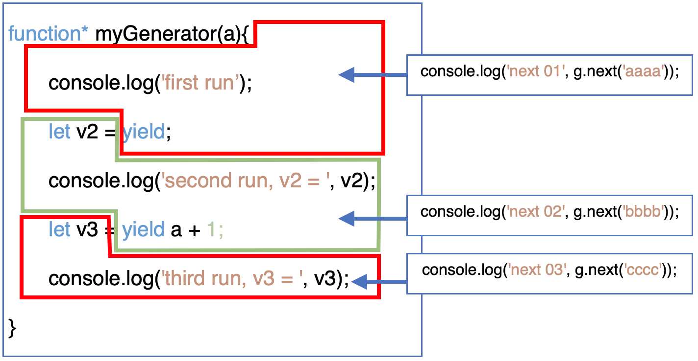

<span id="catalog"></span>
- 参考
    - 《JavaScript语言精髓与编程实战》

### 目录---迭代、可迭代对象、生成器
- [可迭代对象](#可迭代对象)
    - [什么是可迭代对象](#什么是可迭代对象)
    - [创建可迭代对象的方法](#创建可迭代对象的方法)
    - [可迭代对象的使用场景](#可迭代对象的使用场景)
    - [无法使用可迭代对象的场景](#无法使用可迭代对象的场景)
- [生成器](#生成器)
    - [生成器函数说明](#生成器函数说明)
    - [生成器对象](#生成器对象)
    - [yield和next---两个关键的操作](#yield和next---两个关键的操作)
    - [yield*---展开另一个可迭代对象](#yield*---展开另一个可迭代对象)
    - [生成器函数的返回值](#生成器函数的返回值)
    - [生成器函数内的this](#生成器函数内的this)
- [return、throw---可迭代对象的退出与异常处理](#return、throw---可迭代对象的退出与异常处理)
    - [return和throw的使用原则](#return和throw的使用原则)
    - [迭代异常](#迭代异常)
    - [return、throw的隐式调用](#return、throw的隐式调用)
    - [如何设置return、throw](#如何设置return、throw)
        - [生成器函数和生成器对象的设置](#生成器函数和生成器对象的设置)
        - [对象、类声明中的设置方法](#对象、类声明中的设置方法)
- [](#)


# 可迭代对象
## 什么是可迭代对象
[top](#catalog)
- 所有的对象都可以是可迭代对象，只要设置了 `[[Iterator]]` 内部槽
    - `[[Iterator]]` 由 `Symbol.iterator` 属性来设置
    - [生成器](#生成器) 创建的生成器对象也是可迭代对象

- 每个可迭代对象都有3个方法
    - `next()`，迭代下一个元素
    - `return(value)`，中断迭代
    - `throw(error)`，中断迭代，并抛出异常

## 创建可迭代对象的方法
[top](#catalog)
- 普通的生成器函数
    ```js
    function* method(){...}
    ```
- 在对象/类中声明
    - 方式1: `[Symbol.iterator]` 是生成器函数
        ```js
        var obj = {
            *[Symbol.iterator](){
                ...
            },

            // 或者
            [Symbol.iterator]: function* (){
                ...
            },
        }
        ```
    - 方式2: `[Symbol.iterator]` 是普通函数，需要在函数内部返回一个`可迭代对象`
        ```js
        var obj = {
            [Symbol.iterator](){
                // ... 创建其他可迭代对象
                return otherIterator;
            },
        }
        ```

- 将对象的`[[Iterator]]` 设置为**无参的**生成器函数，可以复用迭代逻辑
    ```js
    var a= {};
    // 将 [[Iterator]] 设置为生成器函数
    a[Symbol.iterator] = function*(){
        yield 111;
        yield 222;
        yield 333;
    }
    // 复用迭代逻辑
    for(let i of a) console.log(i);
    for(let i of a) console.log(i);
    ```

## 可迭代对象的使用场景
[top](#catalog)
- 使用 `for...of` 进行遍历
    ```js
    for( let n of ['a', 'b', 'c']) console.log(n);
    ```
- 作为参数展开
    ```js
    console.log(...'abc');
    ```
- 作为数组成员展开
    ```js
    console.log([...'abc'])
    ```
- 作为集合对象的初始数据，或者相互转换
    - 包括 `Set`、`Map`、`WeakSet`、`WeakMap`
    ```js
    new Set('abc');

    // 以可迭代对象作为数据源，将数据复制到数组中
    Array.from(new Set('abc'));
    ```
- 匹配解构时的参数
    ```js
    var [a, ...more] = 'cdef';
    console.log(a); // a
    console.log(more);  // [ 'd', 'e', 'f' ]
    ```
- `Promise.all()`、`Promise.race()` 会列举所有的promise对象
    ```js
    Promise.all(new Set('abcd')).then(console.log);  // [ 'a', 'b', 'c', 'd' ]
    ```

## 无法使用可迭代对象的场景
[top](#catalog)
- 数组的 `forEach`、`filter` 等方法是基于数组下标遍历的，所以不支持可迭代对象
- `对象展开`使用的是**对象属性存取，包括下标索引**，不是迭代器
    ```js
    var obj1 = {name:'bob'}
    var obj2 = {age:22, address:'wer'}
    // 1. 解构对象
    // 2. 解构数组， 数组将按照下标的方式分写
    // 3. 不支持可迭代对象，所以无法结构 Set 对象
    var obj3 = {...obj1, ...obj2, ...['dd','cc'], ...new Set('xyz')};

    // { '0': 'dd', '1': 'cc', name: 'bob', age: 22, address: 'wer' }
    ```

# 生成器
## 生成器函数说明
[top](#catalog)
- 生成器函数<span style='color:red'>不是构造器</span>
    - 生成器函数不能作为 `构造器` 使用
    - 生成器对象**不是**由生成器函数创建并初始化的
- 生成器函数的职责
    - 只负责提供执行逻辑，不用于产生实例

## 生成器对象
[top](#catalog)
- 生成器对象: `Generator`
- 调用生成器函数时，不执行函数体，只是返回一个: `Generator`
    - 该对象是一个可迭代对象: `Iterator`
- 生成器对象: `Generator` **可以被检测为生成器函数的实例**
    ```js
    function* foo(){}
    var g = foo();
    console.log(g instanceof foo);  // true
    ```
- 生成器对象的有效执行次数 = `yield次数 + 1`
- <span style='color:red'>生成器对象是一次性的</span>，再次使用时，必须创建一个新的对象

## yield和next---两个关键的操作
[top](#catalog)
- 两个关键的操作
    1. `yield`，暂停函数 ---> 保存函数现场 ---> 退出函数现场
    2. `next(arg)`，恢复函数现场 ---> 传入参数`arg` ---> 继续执行函数
- `yield` 运算符
    - `yield` 是只能在生成器函数内使用的运算符
    - 调用的结果与内部的结果
        - 外部调用的结果
            1. 调用 `next()` 执行到 `yield xxx` 时，运算后边的表达式
            2. `yield`的运算结果作为调用的结果返回
        - 内部得到的结果
            1. 如: `let v = yield xxx`
            2. `xxx` 的运算结果作为调用结果返回，**与函数内部无关**
            3. 并且 `yield xxx` 完成之后，会**暂停**
            4. <span style='color:red'>下一次</span>调用 `next(arg)` 时，继续执行函数，arg将作为 `yield` 在内部的值，赋值给变量`v`
    - 只使用 `yield`，将会给外部返回
        ```js
        { value: undefined, done: false/true }
        ```
    - 在生成器内部，`yield` 的结果，是**下一次** `next(arg)` 时传入的**第一个参数**
    - <span style='color:red'>第一次调用 `next()` 时，传入的参数无效</span>
        - 因为第一次调用是从: 函数体开始到第一个 `yield`
        - 因为是第一次执行到 `yield`，没有变量来接收第 `0` 次的 `yield` 的结果，导致传参无效
            - 本身也没有第 `0` 次的 `yield`
- 示例
    - 参考代码
        - [src/iterate/generator/yield.js](src/iterate/generator/yield.js)
    - 代码内容
        ```js
        function* myGenerator(a){
            console.log('first run');
            let v2 = yield;
            console.log('second run, v2 = ', v2);
            let v3 = yield a + 1
            console.log('third run, v3 = ', v3);
        }

        var g = myGenerator(100);
        console.log('next 01', g.next('aaaa'));
        console.log('next 02', g.next('bbbb'));
        console.log('next 03', g.next('cccc'));

        // 输出
        // first run                                    // 第一次调用 next()，第一次的参数无效
        // next 01 { value: undefined, done: false }    // 第一次调用 next() 的返回
        // second run, v2 =  bbbb                       // 第二次调用 next()
        // next 02 { value: 101, done: false }          // 第二次调用 next() 的返回
        // third run, v3 =  cccc                        // 第三次调用 next()
        // next 03 { value: undefined, done: true }     // 第三次调用 next() 的返回
        //                                   ^^^^ 生成器执行结束
        ```
    - 代码的执行流程图
        - 

## yield*---展开另一个可迭代对象
[top](#catalog)
- `yield* Iterator` 展开另一个可迭代的对象
    - 相当于循环执行 `yield`
    - 每次迭代出一个值后，会暂停展开，并返回这一次的迭代结果
    - ``yield*` 运算没有内部结果，只负责展开
- 示例
    - 参考代码
        - [src/iterate/generator/yield_spread.js](src/iterate/generator/yield_spread.js)
    - 代码内容
        ```js
        function* foo(){
            let a = yield* [1,2,3,4]
            console.log(`a = ${a}`);
        }
        var g = foo();
        console.log(g.next('aaa'));
        console.log(g.next('bbb'));
        console.log(g.next('ccc'));
        console.log(g.next('ddd'));
        console.log(g.next('eee'));

        // 输出
        // { value: 1, done: false }
        // { value: 2, done: false }
        // { value: 3, done: false }
        // { value: 4, done: false }
        // a = undefined    // yield* 没有内部结果
        // { value: undefined, done: true }
        ```

## 生成器函数的返回值
[top](#catalog)
- 不同的调用界面及其返回值

    |调用界面|获取到的结果|
    |-|-|
    |`next()`|第一次`done === true`时的 `value` 值: `{ value: '返回值', done: true }`|
    |`for...of`|无法获得返回值|

- 示例
    - 参考代码
        - [src/iterate/generator/return.js](src/iterate/generator/return.js)
    - 代码内容
        ```js
        function* foo(){
            yield 1;
            yield 2;
            return 'x';
        }

        // 1. 通过 `next()` 获取数据
        var f = foo();
        console.log(f.next());  // { value: 1, done: false }
        console.log(f.next());  // { value: 2, done: false }
        console.log(f.next());  // { value: 'x', done: true }  <<<< 迭代结束，第一次会获得返回值
        console.log(f.next());  // { value: undefined, done: true } <<<< 迭代结束，第二次之后，无法获得返回值

        // 2. for...of 无法获取生成器函数的返回值
        for(let n of foo()) console.log(n);
        // 1
        // 2
        ```

## 生成器函数内的this
[top](#catalog)
- 生成器函数内，`this`指向 `[[Iterator]]` 的调用者
    ```js
    var obj = {
        arr:[1,2,3,4],
        *[Symbol.iterator](){   // this 使用的是obj
            for(let n of this.arr) yield n;
        }
    }

    // for...of 相当于调用了 obj[Symbol.iterator]
    for (let n of obj) console.log(n);

    function* foo(){
        // 展开时，也相当于调用了 obj[Symbol.iterator]
        yield* obj  // this 使用的是obj
    }

    for(let i of foo()) console.log(i);
    ```

# return、throw---可迭代对象的退出与异常处理
## return和throw的使用原则
[top](#catalog)
- `return()`、`throw()` 的使用原则: **谁用谁负责**
- `return()`、`throw()` 方法将会终止迭代过程
- 两个方法都应该返回如下规格的对象
    ```js
    {value: <any>, done: <boolean>};
    ```

## 迭代异常
[top](#catalog)
- 不是所有的异常都会导致 `return()`、`throw()` 的触发
- 异常也不一定会触发 `throw()`
    - 如`for...of`中通过 `throw` 抛出异常，引擎只会当作 `for` 循环出错，迭代本身没有出错，而使用 `return()`

## return、throw的隐式调用
[top](#catalog)
- `throw()` 的隐式调用
    - 在 `yield*` 开启其他迭代器时，如果使用`return()`、`throw()`，引擎会隐式调用**被展开对象**的 `return()`、`throw()`
    - 这是**谁用谁负责**的一种应用
- `return()` 的隐式调用
    - 在迭代过程中使用 `break`，JS会调用 `return()` 来提前退出
    - 这是**谁用谁负责**的一种应用
- 示例
    - 参考代码
        - [src/iterate/iterator/return_throw/implicit_return_throw.js](src/iterate/iterator/return_throw/implicit_return_throw.js)
    - 代码内容
        ```js
        // 1. 创建生成器对象通用的 return / throw 方法
        var monitor = {
            return(value){
                console.log('>> return ',this&& this.name || '');
                return {value, done:true};
            },

            throw(err){
                console.log('>> throw', this && this.name || '');
                return {value:err, done:true};
            }
        }

        // 2. 设置 [[Iterator]]
        var arr = [100, 200, 300];
        arr[Symbol.iterator] = function(){
            // 创建一个迭代器对象
            var iter = Array.prototype[Symbol.iterator].call(this)
            // 将 return / throw 方法抄写到 生成器对象中
            return Object.assign(iter, monitor, {name:'target'});
        }

        // 3. 创建一个展开 arr 的生成器
        function* MyGenerator(){
            yield 'first';
            yield 'second';
            yield* arr;
            yield 'third';
        }

        // 4. MyGenerator抛出异常时，会隐式调用 arr 的 throw
        var g1 = MyGenerator();
        for(let i of g1) {
            console.log(`g1=${i}`);
            if (i===100){
                console.log(g1.throw());
            }
        }
        // 输出:
        // g1=first
        // g1=second
        // g1=100
        // >> throw target
        // { value: 'third', done: false }

        // 5. MyGenerator迭代时使用 break，会隐式调用 arr 的 return
        var g2 = MyGenerator();
        for(let i of g2) {
            console.log(`g2=${i}`);
            if (i===100){
                break;
            }
        }
        // 输出:
        // g2=first
        // g2=second
        // g2=100
        // >> return  target
        ```

## 如何设置return、throw
### 生成器函数和生成器对象的设置
[top](#catalog)
- 两种设置方式
    1. `return()`、`throw()` 可以设置在**生成器对象**上
    2. 或者附加在**生成器函数的原型对象**上
- 示例
    - 参考代码
        - [src/iterate/iterator/return_throw/set_generator_method.js](src/iterate/iterator/return_throw/set_generator_method.js)
    - 代码内容
        ```js
        function* foo(){
            yield 1;
            yield 2;
            yield 3;
            yield 4;
        }
        // 1. 将方法设置在生成器函数的原型上
        foo.prototype.return = function(value){
            console.log('function return');
            return {value, done:true};
        }

        for(let n of foo()){
            if (n === 3) break;
            console.log(n);
        }
        // 输出:
        // 1
        // 2
        // function return

        // 2. 将方法设置在生成器对象上
        var f = foo();
        f.return = function(value){
            console.log('obj return');
            return {value, done:true};
        }
        for(let n of f){
            if(n === 3) break;
            console.log(n);
        }
        // 输出
        // 1
        // 2
        // obj return
        ```

### 对象、类声明中的设置方法
[top](#catalog)
- 两种情况
    1. 如果 `[Symbol.iterator]` 是生成器，则只能无法设置    ?????
    2. 如果 `[Symbol.iterator]` 是普通函数
        - 一种可行的方式
            1. 可以将迭代逻辑封装到一个可迭代对象中
            2. 为可迭代对象添加 `return`、`throw` 方法
            3. 将可迭代对象返回
- 示例
    - 参考代码
        - [src/iterate/iterator/return_throw/set_obj_method.js](src/iterate/iterator/return_throw/set_obj_method.js)
    - 代码内容
        ```js
        var obj = {
            arr:[1,2,3,4],

            // 1. 如果 [Symbol.iterator] 是生成器，则无法设置 return、throw
            // *[Symbol.iterator](){
            //     for(let n of this.arr) yield n;
            // },


            // 2. 如果 [Symbol.iterator] 是普通函数
            [Symbol.iterator](){
                // 2.1 创建一个可迭代对象
                var iter = Array.prototype[Symbol.iterator].call(this.arr);

                // 2.2 为可迭代对象添加 `return` 方法
                iter['return'] = function(value){
                    console.log('function return');
                    return {value, done:true}
                };

                // 2.3 返回可迭代对象
                return iter;
            },
        }

        for(let i of obj) {
            if (i === 3) break;
            console.log(i);
        }
        // 输出:
        // 1
        // 2
        // function return
        ```
