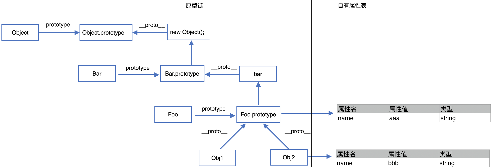

<span id="catalog"></span>
- 参考
    - https://segmentfault.com/a/1190000016278115
    - 《JavaScript语言精髓与编程实战》

### 目录--JS的面向对象特性
- [对象](#对象)
- [对象创建模式](#对象创建模式)
- [原型与原型链](#原型与原型链)
    - [原型prototype](#原型prototype)
    - [显式原型与隐式原型](#显式原型与隐式原型)
    - [原型链](#原型链)
    - [原型中的几个特殊性](#原型中的几个特殊性)
    - [自定义函数、Function、Object之间的原型关系](#自定义函数、Function、Object之间的原型关系)
    - [属性设置与原型链的访问](#属性设置与原型链的访问)
    - [instanceof原理](#instanceof原理)
    - [与原型相关的问题](#与原型相关的问题)
- [原型构造继承关系的几种方法](#原型构造继承关系的几种方法)
    - [原型链继承](#原型链继承)
    - [借用构造函数继承](#借用构造函数继承)
    - [组合继承](#组合继承)
    - [寄生组合继承](#寄生组合继承)
    - [保留父类的静态方法](#保留父类的静态方法)
    - [构建通用的继承关系设定方法](#构建通用的继承关系设定方法)
- [原型继承](#原型继承)
    - [JS中的继承实现方式](#JS的继承实现方式)
    - [空对象、空白对象](#空对象、空白对象)
    - [原型继承的实现与分析](#原型继承的实现与分析)
    - [原型对象的复制与对象的自有属性表](#原型对象的复制与对象的自有属性表)
    - [构造函数与普通函数的异同](#构造函数与普通函数的异同)
    - [对象的内置属性与方法](#对象的内置属性与方法)
    - [修改对象的隐式原型](#修改对象的隐式原型)
- [对象成员](#对象成员)
    - [成员的可枚举性](#成员的可枚举性)
    - [对象及其成员的检查](#对象及其成员的检查)
    - [成员的删除](#成员的删除)
    - [成员方法的调用](#成员方法的调用)
- [对象中的符号属性](#对象中的符号属性)
    - [符号属性](#符号属性)
    - [全局符号表](#全局符号表)
- [类继承的体系](#类继承的体系)
    - [声明类](#声明类)
    - [声明属性](#声明属性)
    - [类继承的声明](#类继承的声明)
    - [声明静态内容](#声明静态内容)
- [super关键字](#super关键字)
    - [super简介](#super简介)
    - [super的使用方式](#super的使用方式)
    - [super的注意事项](#super的注意事项)
    - [super的动态计算过程](#super的动态计算过程)
    - [通用函数---实例方法访问静态成员](#通用函数---实例方法访问静态成员)
- [类的特性](#类的特性)
    - [类声明是静态声明](#类声明是静态声明)
    - [类是由构造函数实现的](#类是由构造函数实现的)
    - [非子类、子类、原型继承中的this](#非子类、子类、原型继承中的this)
    - [父类是默认值](#父类是默认值)
    - [父类是null--纯静态类](#父类是null--纯静态类)
    - [类继承和原型继承的区别](#类继承和原型继承的区别)
- [与原型访问相关的操作](#与原型访问相关的操作)
- [JS的对象系统](#JS的对象系统)

# 对象
[top](#catalog)
- 什么是对象
    - 多个数据的封装
    - 一个对象往往代表现实世界的一个实体
- 为什么要使用对象
    - 统一管理多个数据
- 对象的组成
    - 属性：有属性名和属性值组成
        - 属性名本质是**字符串**，但是书写比较麻烦，一般开发中都会省略引号
            ```js
            // 一般开发中的写法
            var b = {name:"qwer", age:16};

            // 直接使用字符串作为属性名
            var a = {"name":"abcd", "age":16};
            ```
    - 方法：一种特殊的属性，属性值是函数
- 如何访问对象内部的数据
    - `obj.属性名`，书写简洁，但是有些场景无法使用
    - `obj["属性名"]`，书写麻烦，但是所有场景通用
        - 属性名中包含特殊字符
        - 变量名不确定
            - 如：属性名保存在变量中，只能通过：`obj[变量]`的方式来获取属性值

# 对象创建模式
[top](#catalog)
- 三种创建方式
    - Object 构造函数
    - 对象字面量
    - 自定义构造函数 + 原型函数


# 原型与原型链
## 原型prototype
[top](#catalog)
- 函数的protytype属性
    - 每个函数都有一个prototype属性，默认指向一个**空的Object实例对象**，即原型对象
        - 验证方法
            ```js
            function Fn(){}
            console.log(Fn.prototype instanceof Object) // 输出true
            ```
    - 原型对象中默认有一个属性：`constructor`，它指向函数对象
        - `constructor`属性是 原型对象 与 空对象的**本质区别**，空对象中默认不会有该属性
    - 示例
        ```js
        function fn(){};

        console.log(fn.prototype)
        // 输出：
        // {constructor: ƒ}
        // constructor: ƒ fn()
        // __proto__: Object

        console.log(typeof fn.prototype)
        // 输出：object

        // constructor属性 指向 函数对象
        console.log(fn.prototype.constructor === fn);
        // 输出：true
        ```

    - 属性关系图：constructor 与其 类型相互引用
        ```
        ┌─────────────────┐
        │       Type      │ <<───────────────────────────┐
        ├───┬─────────┬───┤      ┌───────────────────┐   │
        │   │prototype├───┼───>> │ Prototype of Type │   │
        └───┴─────────┴───┘      ├──┬─────────────┬──┤   │
                                 │  │ constructor ├──┼───┘
                                 └──┴─────────────┴──┘
        ```

- 为原型对象添加属性，可以在实例对象中共享
    - 示例
        ```js
        function Person(name, age){
            this.name = name
            this.age = age
        }

        Person.prototype.print = function(){
            console.log("name =", this.name, "age =", this.age);
        }

        var p1 = new Person("tom", 18);
        p1.print();
        // 输出：name = tom age = 18

        var p2 = new Person("jery", 20);
        p2.print();
        // 输出：name = jery age = 20
        ```

## 显式原型与隐式原型
[top](#catalog)

- 原型之间的关系
    - 显式原型（属性）：每个**函数对象**中的`prototype`属性
    - 隐式原型（属性）：每个**实例对象**的`__proto__`属性
    - 隐式原型 与 显式原型的关系
        - `实例对象.__proto__ === (构造)函数.prototype`
        - 两者指向相同的对象

    - js中的一个对象如果有显式原型对象，则它可以作为一个构造函数；如果有隐式对象，则它是某个构造函数的实例

- 原型对象是如何添加的？
    - 原型对象由js引擎自动添加
    - 原型对象的添加时间
        - 显式原型对象：创建函数对象时，创建一个空Object实例对象并赋值
            - 相对于在**创建函数对象时**执行了
                ```js
                函数对象.prototype = {};
                ```
        - 隐式原型对象：通过构造函数创建实例化对象时，使用显式原型对象进行赋值
            - 相当于在**构造函数内部**执行了
                ```js
                function 构造函数(...){
                    // js引擎隐式执行
                    this.__proto__ = 构造函数.prototype

                    // 其他业务
                    ...
                }
                ```

- 内存结构说明
    - 示例代码
        ```js
        function Fn (){}
        var myfn = new Fn()

        Fn.prototype.test = function(){
            console.log("this is test")
        }

        // 0x0005 --> 0x0004 --> 0x0001 --> 0x0001 --> test
        myfn.test()
        ```
    - 内存结构示意图
        ```
            内存：栈                内存：堆
        ┌────────────┐    ┌───────────────────────────────────────────────┐
        │            │    │     ┌────────────────┐                        │
        │ ┌────────┐ │    │     │  Fn instance   │                        │
        │ │ myfn:  │ │    │     ├────────────────┤                        │
        │ │ 0x0004 ├─┼────┼──>> │ __proto__:     ├────────────┐           │
        │ └────────┘ │    │     │    0x0001      │            │           │
        │   0x0005   │    │     └────────────────┘            V           │
        │            │    │         0x0004             ┌────────────────┐ │
        │            │    │                            │     Object     │ │
        │            │    │                            │ (Null Instance)│ │
        │            │    │                            ├────────────────┤ │
        │            │    │                            │ test=function()│ │
        │ ┌────────┐ │    │     ┌──────────────────┐   └────────────────┘ │
        │ │  Fn:   │ │    │     │  Fn function obj │        0x0001        │
        │ │ 0x0002 ├─┼────┼──>> ├──────────────────┤          ^           │
        │ └────────┘ │    │     │ prototype:       │          │           │
        │   0x0003   │    │     │     0x0001       ├──────────┘           │
        └────────────┘    │     └──────────────────┘                      │
                          │          0x0002                               │
                          └───────────────────────────────────────────────┘
        ```


## 原型链
[top](#catalog)
- 如何**读取**一个对象的属性/如何在原型链上**读取**属性？
    1. 先在当前对象自身的属性中查找，找到则返回
    2. 如果自身没有，再沿着 `__proto__` 链向上查找，找到则返回
    3. 如果查找到`Object函数的原型对象.__proto__ `，则返回 `undefined`

- 原型链的尽头
    - `Object函数的原型对象.__proto__ `，该值为 `null`，找到此处会返回 `undefined`

- 原型链的本质: **隐式原型**
    - 由对象所有父类和祖先类的原型对象构成的、可以向上访问的**链表**
    - 原型链的每个原型对象之间通过**隐式原型** `__proto__` 来连接，构成**链表**

- 原型链的访问方式
    - 访问方式1: 直接访问隐式原型
        ```js
        obj.__proto__
        ```
    - 访问方式2: 通过构造器间接访问
        - 访问代码
            ```js
            obj.constructor.prototype
            ```
        - `obj.constructor` 相当于 `obj.__proto__.constructor`
            - 因为对象自身一般不会有 `constructor` 属性，所以自动到隐式原型中搜索
            - 隐式原型与显示原型指向相同，所以 `obj.constructor` 就是 构造函数/类 本身
            - 在通过 `prototype` 即可访问到原型链的上一层原型对象
        - 本质上等同于 `构造函数.prototype`
    - 访问方式3: 使用内置函数
        - 访问代码
            ```js
            Object.getPrototypeOf(obj).constructor
            ```
        - 通过 `Object.getPrototypeOf` 准确的获取隐式原型对象，防止对象自身包含 `constructor` 属性

- 与原型链相关的操作
    - 这些操作主要还是操作对象的 **隐式原型** `__ptoto__`
    - 设置对象的隐式原型: `Object.setPrototypeOf(target, src)`
    - 获取对象的隐式原型: `Object.getPrototypeOf(obj)`

- 示例
    - 说明代码
        ```js
        // js启动后，js引擎默认创建 Object 函数 及其 原型对象

        function Fn(){
            this.test01 = function(){console.log("test01")}
        }

        Fn.prototype.test02 = function(){console.log("test02")}
        var myfn = new Fn();

        console.log(Fn.prototype);

        // 搜索顺序：myfn 内部存在 -- > 直接使用
        myfn.test01();

        // 搜索顺序：myfn 内部不存在 --> 原型对象Object中存在 --> 直接使用
        myfn.test02();

        // 搜索顺序：myfn 内部不存在 --> 原型对象Object中不存在
        //           --> Object的原型对象中存在 --> 直接使用
        myfn.toString();

        // 搜索顺序：myfn 内部不存在 --> 原型对象Object中不存在
        //        --> Object的原型对象中不存在 --> Object原型对象.__proto__ = null
        //        --> 所有位置都不存在 ---> 返回undefined
        myfn.test03();
        ```

    - 说明代码的内存结构
        ```
            内存：栈                内存：堆
        ┌────────────┐    ┌──────────────────────────────────────────────────────────────┐
        │            │    │     ┌─────────────────────┐        ┌─────────────────────┐   │
        │ ┌────────┐ │    │     │ Object Function obj │        │ Prototype of Object │   │
        │ │ Object:│ │    │     ├─────────────────────┤        ├─────────────────────┤   │
        │ │ 0x0002 ├─┼────┼──>> │ prototype:    ───>>─┼────>>  │ __proto__:          │   │
        │ └────────┘ │    │     │    0x0001           │        │     null            │   │
        │   0x0003   │    │     └─────────────────────┘        ├─────────────────────┤   │
        │            │    │         0x0002                     │ Method:             │   │
        │            │    │                                    │   toString()        │   │
        │            │    │                                    │   hasOwnProperty()  │   │
        │            │    │                                    │   valueOf()         │   │
        │            │    │                                    │   ......            │   │
        │            │    │                                    │                     │   │
        │            │    │                                    └─────────────────────┘   │
        │            │    │                                        0x0001      ^         │
        │            │    │                                                    ^         │
        │            │    │                                                    │         │
        │ ┌────────┐ │    │     ┌──────────────────────┐                       └──────┐  │
        │ │  Fn:   │ │    │     │  Fn function obj     │                              │  │
        │ │ 0x0005 ├─┼────┼──>> ├──────────────────────┤                              │  │
        │ └────────┘ │    │     │ prototype:           │       ┌───────────────────┐  │  │
        │   0x0006   │    │     │     0x0004     ───>>─┼────>> │     Object        │  │  │
        │            │    │     └──────────────────────┘       │ (Null Instance)   │  │  │
        │            │    │            0x0005                  ├───────────────────┤  │  │
        │            │    │                                    │ __proto__ :       │  │  │
        │            │    │     ┌──────────────────────┐       │     0x0001     ───┼──┘  │
        │            │    │     │  Fn instance         │       ├───────────────────┤     │
        │            │    │     ├──────────────────────┤       │ Method:           │     │
        │            │    │     │ __proto__:           │       │   test2=function()│     │
        │            │    │     │    0x0004      ───>>─┼────>> │                   │     │
        │ ┌────────┐ │    │     ├──────────────────────┤       └───────────────────┘     │
        │ │  myfn: │ │    │     │ Method:              │             0x0004              │
        │ │ 0x0007 ├─┼────┼──>> │   test01()=function()│                                 │
        │ └────────┘ │    │     └──────────────────────┘                                 │
        │   0x0008   │    │           0x0007                                             │
        └────────────┘    └──────────────────────────────────────────────────────────────┘
        ```

## 原型中的几个特殊性
[top](#catalog)
- 函数对象的特殊性
    - 函数对象中分别包含了显式原型和隐式原型
    - `函数对象.prototype = Object`
    - `函数对象._proto__ = Function`
        - 隐式原型来源于 `Function` ，因为所有的函数都可以改成
            ```js
            function Foo(){...}

            // 可以转换为
            var Foo = new Function("...")
            ```

- `Function` 函数对象的特殊性
    - 该对象的创建方式属于**自己创建自己**，可以理解为：
        ```js
        var Function = Function()
        ```
    - 这中特殊性的验证方式
        ```js
        console.log(Function.prototype === Function.__proto__)
        ```
    - Function 函数对象 与 Function函数的原型对象都相同，即
        - `Function对象.__proto__ === Function函数.__proto__`
        - `Function对象.prototype === Function函数.prototype`
        - `Function.prototype === Function.__proto__`
    - Function 函数对象的显式原型是 Object 函数对象的实例对象
        ```js
        console.log(Function.prototype instanceof Object) // 输出 true
        ```
    - 通过这个特殊性可以引申出：
        - <label style="color:red">任何函数对象都是 Function 的实例，包括Object函数对象和 Function函数对象自身</label>

- `Object` 函数对象的特殊性
    - `Object` 函数对象的原型**不是Object的实例**
        ```js
        console.log(Object.prototype instanceof Object) // 输出：false

        function Foo(){}
        console.log(Foo.prototype instanceof Object) // 输出：true
        ```

    - 由于这个特殊性，需要修改 prototype 的定义
        - <label style="color:red">每个函数对象都有一个prototype属性，默认指向一个空的Object实例对象，即原型对象。但是Object不满足</label>

## 自定义函数、Function、Object之间的原型关系
[top](#catalog)
- 自定义函数、Function、Object之间的原型关系图
    - `No.1`、`No.2` : Object函数对象.__proto__ === Function函数对象.prototype
        - 这两条线的组合表明： 任何函数对象都是 Function 的实例，包括Object函数对象
    - `No.3`: Function.prototype.__proto__ === Object.prototype
        - 这条线表明：每个函数对象都有一个prototype属性，默认指向一个空的Object实例对象，即原型对象。包括Function 函数对象
    - 图中包含了显式和隐式原型，看图时，需要分清当前要查询的对象类型是构造函数，还是实例对象。
        - 构造函数走显式原型：prototype的所有路径
        - 实例对象走隐式原型：__proto__的所有路径
    ```
    ┌─────────────────┐       __proto__
    │var f1 = new Foo ├──────────────────────────────┐
    └─────────────────┘                              │
                                                     V
          ┌───────────┐      prototype      ┌────────────────────────┐
          │ function  │   ───────────────>> │ Foo.prototype          │
    ┌──<<─┤ Foo()     │   <<─────────────── │ (Object Null Instance) │
    │     └───────────┘      constructor    └──────────────┬─────────┘
    │                                                      │
    V                                                      │
    V                                           __proto__  │
    │                                                      │
    │                                                      │
    │     ┌──────────────────────┐  __proto__              │         null
    │     │var obj = new Object()├──────────────────┐      │          ^
    │     └──────────────────────┘                  │      │          │
    │                                               │      │          │
    │                                               V      V      __proto__
    │                                               V      V          ^
    │     ┌───────────┐   [No.4]  prototype      ┌────────────┐       │
    │     │ function  │  ────────────────────>>  │ Object.    │       │
    │     │ Object()  │  <<────────────────────  │ prototype  ├───────┘
    │     └────┬──────┘         constructor      └────────────┘
    │          │                                      ^
    │          │                                      ^
    │          │                                      │  [No.3]
    V          │        __proto__                     │
    V          └──────────────────────────────────┐   │ __proto__
    │                      [No.1]                 │   │
    │                                             V   │
    │                                             V   │
    │     ┌────────────┐  [No.2]  prototype     ┌────────────────────────┐
    │     │ function   │  ───────────────────>> │ Function.prototype     │
    │     │ Function() │  <<─────────────────── │ (Object Null Instance) │
    │     └─────┬──────┘         constructor    └────────────────────────┘
    │           │                                  ^      ^
    │           │                                  ^      ^
    │           │        [No.5]   __proto__        │      │
    │           └──────────────────────────────────┘      │
    │                                                     │
    │                   __proto__                         │
    └────────>>─────────────────────────────>>────────────┘
                        ^ ^
                        ^ ^
                        │ │
                        │ │
            这条线表明：任何函数对象都是 Function 的实例
    ```

- 与原型关系图相关的 4 个判断
    ```js
    // 应用 隐式：No.1 ，显式：No.2
    // 任何函数对象都是 Function函数对象的实例对象
    console.log(Object instanceof Function) // true

    // 应用 隐式：No.1 + No.3 ，显式：No.4
    console.log(Object instanceof Object) // true

    // 应用 隐式：No.5 ，显式：No.2
    // Function函数对象是其自身的实例对象
    // 任何函数对象都是 Function函数对象的实例对象，包括其自身
    console.log(Function instanceof Function) // true

    // 应用 隐式：No.5 + No.3 ，显式：No.4
    console.log(Function instanceof Object) // true
    ```

## 属性设置与原型链的访问
[top](#catalog)
- 原型链的访问时机
    - 只有读取对象属性时，才会搜索原型链
    - 设置对象的属性值时，不会查找原型链，**只在当前对象内部进行操作**
        - 如果对象内部有某个属性，则进行修改；如果没有则添加该属性

- 原型对象中，设置属性的问题
    - 原型上的变量与方法是**类与实例对象**所**共享**的
    - 如果通过某个对象修改了原型上的东西，会影响其他对象的使用

- 由于属性的读写问题，引申出一个设计的原则
    - <label style="color:red">方法定义在原型中、属性在构造函数中设置</label>
    - 如果

- 示例
    ```js
    function Foo(){}
    Foo.prototype.param = "this is param";

    var f1 = new Foo();
    console.log("f1.param =", f1.param);
    // 输出：f1.param = this is param

    var f2 = new Foo();
    console.log("f2.param =", f2.param);
    // 输出：f2.param = this is param

    f2.param = "new param";
    console.log("f2.param =", f2.param);
    // 输出：f2.param = new param

    // 打印原型中的属性
    console.log("f2.__proto__.param =", f2.__proto__.param);
    // 输出：f2.__proto__.param = this is param
    ```

## instanceof原理
[top](#catalog)
- `A instanceof B` 是如何处理的？
    - 如果 B函数 的**显式原型**对象在 A对象 的**原型链**上，则返回 true，否则返回 false
- 本质上还是通过：`构造函数的显式原型 === 实例对象的隐式原型`这一标准来判断
- 构造函数和实例对象**唯一的关联是原型对象的指向相同**
    - 只要指向相同，则一定是对应的类与实例


## 与原型相关的问题
[top](#catalog)
1. 代码的输出内容是什么?
    - 代码
        ```js
        function A(){}
        A.prototype.n = 1
        var b = new A();

        A.prototype = {n:2, m:3}
        var c = new A();

        console.log(b.n, b.m, c.n, c.m)
        ```
    - 输出结果：1 undefined 2 3
    - 结果分析
        - 执行 `A.prototype = {n:2, m:3}` 时，只是修改了A的显式原型的指向，但是没有修改 b 的隐式原型的指向。所以 b.n仍然是 1，b.m是undefined
        - c 在 A 修改显式原型后创建，使用新的原型对象

2. 代码的输出内容是什么?
    - 代码
        ```js
        var F = function(){}
        Object.prototype.a = function(){
            console.log('a()')
        }

        Function.prototype.b = function(){
            console.log('b()')
        }

        var f = new F()
        f.a()
        f.b()
        F.a()
        F.b()
        ```
    - 输出结果：
        - a()
        - f.b = undefined，出现执行异常
        - a()
        - b()


# 原型构造继承关系的几种方法
## 原型链继承
[top](#catalog)
- 使用方法
    1. 定义父类型的构造函数
    2. 给父类型的原型添加方法
    3. 定义子类型的构造函数
    4. 重新构造子类型的原型关系
        1. 重新设置子类型的原型对象：创建父类型的对象赋值给子类型的原型对象
        2. 将子类型原型的`constructor`属性设置为子类型
    6. 给子类型原型添加方法
    7. 创建子类型的对象：可以调用父类型的方法

- 重点
    - 子类型的原型对象指向父对象的实例

- 缺点
    - 如果父类型的构造函数中有参数时，无法通过子类的构造函数来设置

- 示例
    - 参考代码
        - [src/oop/prototype_extends.html](src/oop/prototype_extends.html)
    - js内容
        ```js
        // 1. 定义父类型的构造函数
        function Supper(){
            this.supproperty = "this is super"
        }

        // 2. 给父类型的原型添加方法
        Supper.prototype.showSupper = function(){
            console.log(this.supproperty)
        }

        var supperObj = new Supper();


        // 3. 定义子类型的构造函数
        function Sub(){
            this.subproperty = "this is sub"
        }

        // 4. 重新构造子类型的原型关系
        // 4-1. 重新设置子类型的原型对象：创建父类型的对象赋值给子类型的原型对象
        Sub.prototype = supperObj;

        // 4-2. 将子类型原型的构造属性设置为子类型
        Sub.prototype.constructor = Sub

        // 5. 给子类型原型添加方法
        Sub.prototype.showSub = function(){
            console.log(this.subproperty)
        }

        // 6. 创建子类型的对象：可以调用父类型的方法
        var subObj = new Sub();

        subObj.showSub()
        subObj.showSupper()
        ```

## 借用构造函数继承
[top](#catalog)
- 使用方法
    1. 定义父类型的构造函数
    2. 定义子类型的构造函数
    3. 在子类型构造函数中通过 `call` 调用父类型的构造函数
        - 即：将父类构造函数中的 this对象 替换为 子类型的this
        - 执行后，无论是在子类型构造函数还是父类型构造函数中，附加的属性、函数就都在 this对象上了
        - 但是<label style="color:red">父类型在原型上添加的属性与方法，子类型无法共享</label>

- 缺点
    - 无法共享父类型原型对象上的方法
    - 不是真正的继承，只是借用父类型的构造函数来设置参数

- 示例
    - 参考代码
        - [src/oop/constructor_extends.html](src/oop/constructor_extends.html)
    - js内容
        ```js
        function Person(name, age){
            this.name = name
            this.age = age
        }

        Person.prototype.showSelf = function(){
            console.log('name ='+ this.name + ', age =' + this.age)
        }

        function Student(name, age, price){
            Person.call(this, name, age)
            this.price = price
        }

        var student = new Student("abc", 12, 86)
        console.log(student.name)
        console.log(student.age)
        console.log(student.price)
        student.showSelf() // TypeError: student.showSelf is not a function
        ```

## 组合继承
[top](#catalog)
- 原型链 + 借用构造函数，两种方式的组合继承
    1. 利用原型链实现对父类型对象的方法**继承**
    2. 利用super()借用父类型构造函数**初始化相同属性**
- 缺点
    - 额外调用了一次父类的构造函数
    - 如果父类的构造函数需要注入其他对象，或者内部有复杂的逻辑处理，可能会产生异常

- 组合继承的原型链
    ```
    ┌───────────┐  prototype    ┌─────────────────────────────┐
    │　　父类　　 ├────────────>> │       父类.prototype 　　　　 │
    └───────────┘               │    [Object Null Instance]   │
                                └─────────────────────────────┘
                                                ^
                                                ^
                                                │ __proto__
                                                │
                                ┌───────────────┴─────────────┐
                                │          new 父类(); 　　　　 │
                                └──┬──────────────────────────┘
                                   │   ^                  ^
                                   │   ^                  ^
                       constructor V   │ prototype        │ __proto__
                                   V   │                  │
                                ┌──────┴────┐     ┌───────┴──────────┐
                                │　　子类　　 │     │　　new 子类();　　 │
                                └───────────┘     └──────────────────┘
    ```

- 示例
    - 参考代码
        - [src/oop/compose_extends.html](src/oop/compose_extends.html)
    - 代码内容
        ```js
        function Person(name, age){
            this.name = name
            this.age = age
        }

        Person.prototype.showSelf = function(){
            console.log('name ='+ this.name + ', age =' + this.age)
        }

        function Student(name, age, price){
            // 2. 通过父类的构造函数，来初始化相同的属性
            Person.call(this, name, age)
            this.price = price
        }

        // 1. 构造继承关系
        // 创建Person时，不需要传递参数，只需要创建的对象即可
        Student.prototype = new Person()
        Student.prototype.constructor = Student

        var student = new Student("aaa", 20, 100)
        student.showSelf()
        ```

## 寄生组合继承
[top](#catalog)
- 继承方法
    1. 在组合继承的基础上进行修改
    2. 创建一个空的构造函数，作为寄生类
        ```js
        var 寄生类 = function(){};
        ```
    3. 将寄生类的原型设置为父类的原型。
        - 此时**寄生类几乎与父类相同**，与父类共享原型上的方法，只是没有父类中的初始化属性
        - 设置方法
            ```js
            寄生类.prototype = 父类.prototype;
            ```
    4. 将子类的原型设置为寄生类的实例，然后再重置子类原型的 `constructor`
        ```js
        子类.prototype = new 寄生类();
        子类.prototype.constructor = 子类;
        ```
    5. 在子类内部仍然需要调用父类，将父类中的属性添加在 `this` 对象中
        ```js
        function 子类(){
            父类.call(this, [父类构造器参数]);
        }
        ```

- 寄生组合继承的优势
    1. 保留了组合继承的优点
    2. 使用寄生类对象替换了父类生成的对象，避免了重复执行父类中的复杂逻辑
    3. 寄生类只是父类对象的替换，不会产生副作用

- 寄生组合继承的原型链
    ```
    ┌───────────┐  prototype    ┌─────────────────────────────┐
    │　　父类　　 ├────────────>> │       父类.prototype 　　　　 │
    └───────────┘       ┌────>> │    [Object Null Instance]   │
                        │       └─────────────────────────────┘
            prototype   │                    ^
                        │                    ^
                        │                    │ __proto__
                        │                    │
    ┌──────────────┐    │      ┌─────────────┴────────────────┐
    │   　寄生类　　 ├────┘      │          new 寄生类();  　　　 │
    └──────────────┘           └──────────────────────────────┘
                                    │  ^                  ^
                                    │  ^                  ^
                        constructor V  │ prototype        │ __proto__
                                    V  │                  │
                                ┌───────────┐     ┌─────────────────┐
                                │　　子类　　 │     │　　new 子类();　　│
                                └───────────┘     └─────────────────┘
    ```

- 示例
    - 参考代码
        - [src/oop/parasitic_extends.js](src/oop/parasitic_extends.js)
    - 代码内容
        ```js
        // 1. 创建父类
        function Foo(name){
            this.name = name;
        }
        Foo.prototype.run = function(){
            console.log(`this is ${this.name} run`);
        }

        // 2. 创建子类
        function FooEx(name){
            Foo.call(this, name);
        }

        // 3. 创建一个空的类作为寄生类
        function Super(){}

        // 4. 将寄生类对象的原型设置为父类的原型
        Super.prototype = Foo.prototype;

        // 5. 创建寄生类对象
        var superObj = new Super();

        // 6. 设置寄生类对象和当前类的原型关系
        FooEx.prototype = superObj;
        FooEx.prototype.constructor = FooEx;

        // 7.实例化对象，并调用父类的方法
        var fooex = new FooEx('fooexName');
        fooex.run();    // 输出: this is fooexName run
        ```


## 保留父类的静态方法
[top](#catalog)
- 通过设置子类的 `propertype` 只能使原型对象上的方法等到继承，但是父类自身的**静态方法无法被继承**
    - 示例
        ```js
        function A(){}
        A.test = function(){console.log('this is test')}

        function B(){}

        B.prototype = new A();

        // 异常: Uncaught TypeError: B.test is not a function
        B.test();
        ```
- 保留静态类的方法
    - 参考: https://developer.mozilla.org/zh-CN/docs/Web/JavaScript/Reference/Global_Objects/Object/setPrototypeOf
    - 3中设置方法
        1.  `Object.setPrototypeOf(子类, 父类)`
            - 示例
                ```js
                function A(){}
                A.test = function(){console.log('this is test')}

                function B(){}

                B.prototype = new A();
                Object.setPrototypeOf(B, A);

                B.test();  // 输出: this is test
                ```
        2. 兼容方法1 : `子类函数.__proto__ = 父类函数`

            - 示例
                ```js
                function A(){}
                A.test = function(){console.log('this is test')}

                function B(){}

                B.prototype = new A();
                B.__proto__ = A;

                B.test();  // 输出: this is test
                ```
        3. 兼容方法2: 使用 `hasOwnProperty(父类属性)` 遍历父类的所有属性，将静态方法（只属于父类自身的方法）添加到子类
            - 示例
                ```js
                function A(){}
                A.test = function(){console.log('this is test')}

                function B(){}

                B.prototype = new A();
                for (let p in A){
                    if (A.hasOwnProperty(p)){
                        B[p] = A[p];
                    }
                }

                B.test();  // 输出: this is test
                ```

## 构建通用的继承关系设定方法
[top](#catalog)
- 为了完成父类与子类之间的继承，需要同时完成两件工作
    1. 将子类的显示原型对象设置为父类的实例对象
    2. 将父类函数的静态方法绑定到子类函数
        - 一般会使用 `Object.setPrototypeOf`，但是该方法有兼容性问题，需要有相应的兼容性处理

- 构建后的原型链
    ```
             ┌───────────┐  prototype    ┌─────────────────────────────┐
    ┌────>>> │　　父类　　 ├───────────>>> │       父类.prototype 　　　　 │
    │        └───────────┘       ┌───>>> │    [Object Null Instance]   │
    │                            │       └─────────────────────────────┘
    │                prototype   │                    ^
    │                            │                    ^
    │                            │                    │ __proto__
    │                            │                    │
    │        ┌──────────────┐    │      ┌─────────────┴────────────────┐
    │        │   　寄生类　　 ├────┘      │          new 寄生类();  　　　 │
    │        └──────────────┘           └──────────────────────────────┘
    │                                        │  ^                  ^
    │                                        │  ^                  ^
    │                            constructor V  │ prototype        │ __proto__
    │                                        V  │                  │
    │         __proto__                 ┌───────────┐     ┌──────────────────┐
    └──────<<<──────────────────────────┤　　子类　　 │     │　　new 子类();　　 │
                                        └───────────┘     └──────────────────┘
    ```

- 示例
    - 参考代码
        - [src/oop/extends_method.html](src/oop/extends_method.html)
    - 通用设定方法
        ```js
        // 1. 为子类绑定父类中的静态方法
        function extendStatics (sub, parent) {

            // 简写: 参考 typescript 的 extends 关键字的编译结果
            // let fn = Object.setPrototypeOf ||
            //     ({ __proto__: [] } instanceof Array && function (d, b) { d.__proto__ = b; }) ||
            //     function (d, b) { for (var p in b) if (b.hasOwnProperty(p)) d[p] = b[p]; };

            if ( Object.setPrototypeOf ){
                // 1.1 方式1: 相当于 sub.__proto__ = parent 的封装
                Object.setPrototypeOf(sub, parent);
            } else {
                //  如果没有 setPrototypeOf，则创建兼容方法

                // 1.2 方式2: 手动设置 隐式原型
                if (sub.__proto__){
                    sub.__proto__ = parent;
                } else{
                    // 1.3 方式3: 搜索父类的静态方法并设置到子类中
                    for (let p in parent){
                        if (parent.hasOwnProperty(p)){
                            sub[p] = parent[p];
                        }
                    }
                }
            }
        };

        // 2. 设置继承关系
        function extend(sub, parent){
            // 2.1. 将父类中的静态方法设置到子类中
            extendStatics(sub, parent);

            // 2.2. 创建寄生类
            function Super(){
                // 相当于在创建寄生类对象的同时，
                // 执行: 子类.prototype.constructor = 子类
                this.constructor = sub;
            }

            // 2.3. 根据 父类 设置子类的原型
            if ( parent === null){
                // 如果父类是空，则实例化一个原型是空的对象，作为子类的原型
                sub.prototype = Object.create(null);
            } else {
                // 实例化一个寄生类对象，并设置为子类的原型
                // 设置寄生类的原型
                Super.prototype = parent.prototype;
                sub.prototype = new Super();
                // 子类.prototype.constructor = 子类; 这个操作在寄生类内部已经执行完成
            }
        }
        ```
    - 测试方法
        ```js
        // 3. 测试部分
        // 3.1 父类
        function Person(name, age){
            this.name = name
            this.age = age
        }
        // 父类的静态方法
        Person.run = function(){ console.log('this is a person'); }
        // 父类的原型方法
        Person.prototype.showSelf = function(){
            console.log('name ='+ this.name + ', age =' + this.age)
        };

        // 3.2 子类
        function Student(name, age, price){
            Person.call(this, name, age)
            this.price = price
        }

        // 3.3 设置继承关系
        extend(Student, Person);

        // 3.4 通过子类调用静态方法
        Student.run();  // 输出: this is a person

        // 3.5 实例化子类对象，并调用原型上的方法
        var student = new Student("aaa", 20, 100)
        student.showSelf();  // 输出: name =aaa, age =20
        ```


# 原型继承
## JS中的继承实现方式
[top](#catalog)
- 一般语言中对象系统的继承特性的实现方式
    - 基于类，class-based
    - 基于原型，prototype-based
    - 基于元类，metaclass-based
- JS 使用原型继承实现对象系统及其继承特性

## 空对象、空白对象
[top](#catalog)
- null-空 与 empty-空白对象
    - null
        - **null 不是由 `Object()` 构造函数创建的**，`instanceof` 判断会返回 false
            ```js
            var a = null instanceof Object;
            // a = false
            ```
        - 可枚举型
            - null 可以被 `for...in` 枚举。但因为是空值，没有任何成员
                ```js
                // 可以枚举，但是没有任何输出
                for(let a in null){
                    console.log(a);
                }
                ```
            - 无法通过 `Object.keys(null)` 获取键值列表
        - null 可以参与参与数值运算，会被自动转换为 `0`
    - empty
        - **`{}` 是由 `Object()` 构造函数创建的**，`instanceof` 判断会返回 true
            - 空白对象的创建
                ```js
                var empty01 = new Object(); // 通过构造函数创建
                var empty02 = {};   // 通过对象字面量创建，底层会调用 `Object()`
                console.log(empty01 instanceof Object); // true
                console.log(empty02 instanceof Object); // true
                ```
        - 默认情况下，空白对象只包含原生对象的一些`内置成员`
        - 可枚举性
            - 原生的`内置成员`不会被 `for...in` 枚举
                - `for (let k in {})` 不会有任何效果
        - <label style='color:red'>空白对象的本质</label>
            - 原型链上所有原型对象的自有属性表都为空的对象
            - 参考: [原型对象的复制与对象的自有属性表](原型对象的复制与对象的自有属性表)


- empty-空白对象，是所有对象的基础
    - `Object.prototype`，也是<label style='color:red'>空白对象</label>，只包含原生的内置成员
        - `Object.prototype` 可以遍历，但是没有任何效果
            ```js
            var num = 0
            for(let n in Object.prototype) num++;
            console.log(num);   // 输出0
            ```
    - 通过 `Object()` 构造函数创建的对象，也是<label style='color:red'>空白对象</label>，这表明
        - `new Object()`、`{}` 都是 `Object.prototype` 的一份复制

## 原型继承的实现与分析
[top](#catalog)
- 原型的含义
    - 如果 `构造器A` 有一个`原型对象A.prototype`，则由 `A` 创建的实例都必然是 `A.prototype` 的复制
        - 如 `Object()`，及其原型对象`Object.prototype`，创建的实例都是`Object.prototype`的赋值
    - 实例是原型的复制，会拥有原型对象的所有属性、方法等内容

- **空白对象是整个原型继承体系的基础**
    ```
                    __proto__
            null <<──────── {} 空白对象
                            ^
                            ^
                            │
        prototype           │          __proto__
    Object ───────>> Object.prototype <<─────── new Object()
                                                    ^
                                                    ^
                                                    │
                                prototype           │   __proto__
                            A ───────────>> A.prototype <<────── new A()
                                                                    ^
                                                                    ^
                                                                    │
                                                prototype           │   __proto__
                                            B ───────────>> B.prototype <<────── new B()
                                                                                    ^
                                                                                    ^
                                                                                    │
                                                                prototype           │   __proto__
                                                            C ───────────>> C.prototype <<────── new C()
    ```

- 通过原型实现**继承性**
    - 继承实现过程分析
        1. 创建构造函数 `A()`，并在原型上添加一些成员
            - 创建过程
                ```js
                function A(){}
                A.prototype.a1 = ...;
                A.prototype.a2 = ...;
                ```
            - 此时原型是`Object()` 的一个实例，即 `{}`
            - 在原型上添加的方法，实际上都添加在 `{}` 对象内
        2. 创建构造函数 `B()`，并重设原型
            - 重设方式
                ```js
                function B(){};
                var instanceA = new A();
                B.prototype = instanceA;
                B.prototype.constructor = B;
                ```
            - 重设时，实例化了一个 `A()` 的对象: `instanceA`
            - `instanceA` 实际上是 `{}` 对象的拷贝
                - 通过该对象，可以调用添加在 `{}` 上的方法: `instanceA.a1`、`instanceA.a2`
        3. 在 `B()` 的原型上添加一些成员
            - 添加过程
                ```js
                B.prototype.b1 = ...;
                B.prototype.b2 = ...;
                ```
            - 这些方法实际上都添加在 `instanceA` 对象内
            - 可以通过 `instanceA.b1`、`instanceA.b2` 来调用这些方法
        4. 实例化 `B()`
            ```js
            var instanceB = new B();
            ```
        5. `instanceB`，实际上是 `instanceA` 对象的拷贝
            - `instanceB` 可以调用 `instanceB.b1`、`instanceB.b2`
            - 因为 `instanceA` 能够调用 `instanceA.a1`、`instanceA.a2`，所以 `instanceB` 也可以调用 `instanceB.a1`、`instanceB.a2`
        6. 通过原型对象的层层拷贝，最终实现继承性
    - 示例
        - 参考代码
            - [src/oop/prototype_extend/inheritance.js](src/oop/prototype_extend/inheritance.js)
        - 代码内容
            ```js
            // 1. 创建构造函数 `A()`，并在原型上添加一些成员
            function A(){}  // A 的原型是 {}
            A.prototype.a1 = ()=> console.log('this is a1');
            A.prototype.a2 = ()=> console.log('this is a2');

            // 2. 创建构造函数 `B()`，并重设原型
            function B(){}
            var instanceA = new A();
            B.prototype = instanceA;
            B.prototype.constructor = B;

            // 3. 在 `B()` 的原型上添加一些成员
            B.prototype.b1 = ()=> console.log('this is b1');
            B.prototype.b2 = ()=> console.log('this is b2');

            // 这些方法实际上添加在 instanceA 对象内，可以通过 instanceA 调用这些方法
            instanceA.b1(); // this is b1
            instanceA.b2(); // this is b2
            // instanceA 是 A() 的实例，所以可以调用 A.prototype 上的方法
            instanceA.a1(); // this is a1
            instanceA.a2(); // this is a2

            // 4. 实例化 `B()`
            var instanceB = new B();

            // 5. `instanceB`，实际上是 `instanceA` 对象的拷贝
            // instanceB 可以访问 B.prototype 上的方法
            // instanceB 也可以访问 A.prototype 上的方法
            instanceB.b1(); // this is b1
            instanceB.b2(); // this is b2
            instanceB.a1(); // this is a1
            instanceB.a2(); // this is a2
            ```

- 构建原型继承关系的执行时间
    - 前提
        - 因为继承关系基于原型对象的修改，所以原型继承依赖于程序在**执行期**的执行过程
        - 子类依赖于父类的构造过程，所以**子类必须晚于父类构造**
    - 执行时间
        - 继承关系的实现是在执行期实现的
        - 构造函数声明是在语法分析期实现
    - 代码书写顺序的要求
        - 构造函数声明比继承关系的实现要早，所以两者在代码上**没有具体的顺序要求**
            - 最好先写声明，再写继承关系，方便维护

## 原型对象的复制与对象的自有属性表
[top](#catalog)
- JS中创建对象的方式
    - 创建一个对象的标识符，该标识符是**指向原型对象的引用**
    - 创建过程中不会复制原型对象的内存数据，所以创建过程很轻量

- 写对象属性时的处理方式
    - 发生属性的写操作时，会为该对象单独创建一个**自有属性表**
    - 属性写操作，只会访问**自有属性表**，不会干扰原型对象，也就不会干扰其他实例对象

- 读<label style='color:red'>对象</label>属性时的处理方式
    - 对属性时的两条规则
        1. 优先读取对象的自有属性表
        2. 如果自有属性表中没有，访问<label style='color:red'>隐式原型对象 _proto__ </label>
            - 访问原型对象时，也需要遵守着两条规则
                - 先检查原型对象的自有属性表
                - 再遍历原型对象的原型链
            - 返回结果
                - 如果找到则返回
                - 没有找到返回 `undefined`

- <label style='color:red'>重新定义空白对象（什么是空白对象?）</label>
    - 原型链上所有原型对象的自有属性表都为空的对象

- 对象赋值与属性访问示意图
    - 

## 构造函数与普通函数的异同
[top](#catalog)
- 相同点
    - 普通函数和构造函数没有明显的区别，都是函数对象
    - 构造函数与普通函数在创建时都会包含 `prototype` 属性
- 不同点
    - 构造函数的 `prototype` 是一个有特殊含义的值或对象。如父类的原型对象
    - 普通函数虽然也有 `prototype` 属性，但是是没有意义的

## 对象的内置属性与方法
[top](#catalog)
- 查看对象内置属性的方法
    1. 查看 `Object.prototype` 上的成员（显示 + 隐式）。这是所有实例对象所共有的
        ```js
        console.log(Object.getOwnPropertyNames(Object.prototype))
        ```
    2. 查看构造器函数 `Function` 中包含的成员（显示 + 隐式）
        ```js
        console.log(Object.getOwnPropertyNames(Function))
        console.log(Object.getOwnPropertyNames(Function.prototype))
        ```
    3. 查看 `Object` 自身的成员（显示 + 隐式）。如果类以 `Object` 为基类，实例 对象可以使用这些方法
        ```js
        console.log(Object.getOwnPropertyNames(Object))
        ```

## 修改对象的隐式原型
[top](#catalog)
- `Object.setPrototypeOf`，用于重写隐式原型
    - 可以切断对象与它的构造器或原型的关系
    - 可以使对象变成其他原型的实例，创建一个新的原型链

- 示例
    - 参考代码
        - [src/oop/prototype_extend/setPrototypeOf.js](src/oop/prototype_extend/setPrototypeOf.js)
    - 代码内容
        ```js
        // 1. 创建2层继承关系
        // 1.1 声明父类
        function Foo(){}
        Foo.prototype.run = ()=> console.log('this is run');

        // 1.2 创建第一层继承关系
        function FooEx(){}
        FooEx.prototype = new Foo();
        FooEx.prototype.constructor = FooEx;

        // 1.3 创建第二层继承关系
        function FooEx2(){}
        FooEx2.prototype = new FooEx();
        FooEx2.prototype.constructor = FooEx2;

        // 2.1 检查实例的继承关系
        var obj = new FooEx2();
        console.log(obj instanceof FooEx);  // true
        console.log(obj instanceof Foo);    // true
        // 2.2 调用父类中的方法
        obj.run();  // this is run

        // 3.1 修改对象的隐式原型
        Object.setPrototypeOf(obj, {});
        // 2.1 检查实例的继承关系
        console.log(obj instanceof FooEx);  // false
        console.log(obj instanceof Foo);    // false
        console.log(obj instanceof Object); // true
        ```

# 对象成员
## 成员的可枚举性
[top](#catalog)
- 成员的可枚举性属性: `enumerable`
- <label style='color:red'>显示与隐式</label>
    - 显示: `enumerable == true`
    - 隐式: `enumerable == false`
- 检查方法: `obj.propertyIsEnumerable('paramName')`
    - 检查属性是否是可枚举的
    - 如果属性不存在，会返回 false
    - 检查的范围：**对象的非继承属性**
- 枚举对象成员的方法

    |遍历范围|成员类型|语法|功能|
    |-|-|-|-|
    |对象本身、原型对象|显示成员|for...in|遍历可枚举的成员名|
    |对象本身、非symbol的|显示成员|Object.keys()|获取所有可枚举的成员名|
    |对象本身、非symbol的|显示成员|Object.values()|获取所有可枚举的成员值|
    |对象本身、非symbol的|显示成员|Object.entries()|获取所有可枚举的成员KV数据|
    |对象本身、非symbol的|显示+隐式|Object.getOwnPropertyNames()|获取对象自身的所有成员名|
    |对象本身、symbol的|显示+隐式|Object.getOwnPropertySymbols()|获取对象自身的所有Symbol成员名|

## 对象及其成员的检查
[top](#catalog)
- 在JS中，取一个<label style="color:red">不存在的属性</label>的值，<label style="color:red">不会导致异常，会返回 undefined</label>
- `in` 用来检查对象是否具有某个成员
    - 成员范围: 显示 + 隐士
    - 检查类型: 基本类型 + 对象类型
- `instanceof` 检查一个对象是不是一个类/构造器的实例

## 成员的删除
[top](#catalog)
- 通过`delete`关键字来删除一个对象的指定属性
- `delete` 的本质
    - <label style='color:red'>删除实例对象自身属性表中的属性描述符</label>

- `delete` 不能删除的内容
    1. 用 `var`、`let`、`const` 声明的变量与常量
    2. 函数、或具名函数
    3. 原型上的成员

- 如果在当前对象中设置了和原型成员相同的属性
    - 删除时，只会删除当前对象自身的成员。不会影响原型对象
    - 再次使用该属性时，会继续使用原型上的成员
    - 示例
        ```js
        function Foo(){}
        Foo.prototype.name = 'foo name';

        function FooEx(){
            this.name = 'FooEx name';
        }

        FooEx.prototype = new Foo();
        FooEx.prototype.constructor = FooEx;

        let a = new FooEx();
        // 输出对象自身的 name 属性
        console.log(a.name);    // 输出: FooEx name

        delete a.name;
        // 删除后，输出对象原型上的属性
        console.log(a.name);    // 输出: foo name

        delete a.name;
        // 再次删除后，仍然输出原型上的属性
        console.log(a.name);    // 输出: foo name
        ```

- `delete` 操作的返回值: true/false
    - 仅在删除一个不能删除的成员时，才会返回false
    - 返回false的情况
        - 删除对象的原型
        - 删除宿主对象
        - 删除宿主对象的成员
    - 在以下两种情况下，不能完成删除，但仍然会返回true
        - 删除不存在的成员
        - 删除继承自父类/原型的成员
    - 示例
        ```js
        function Foo(){}
        function FooEx(){}
        FooEx.prototype = new Foo();
        FooEx.prototype.name = 'foo name';
        FooEx.prototype.constructor = FooEx;

        // 删除原型对象
        let result = delete FooEx.prototype;
        console.log(result);    // 输出: false

        // 删除不存在的属性
        result = delete FooEx.abcd;
        console.log(result);    // 输出: true

        // 删除原型对象的成员
        result = delete FooEx.name;
        console.log(result);    // 输出: true
        ```

## 成员方法的调用
[top](#catalog)
- JS中方法的调用与其他面向对象语言的底层实现不同

    |语言|实现方式|
    |-|-|
    |其他语言|对自身语法进行扩展|
    |JS|通过 **运算** 实现|

- **运算**的实现
    1. 通过 `.`，或者 `['属性名']` 来获取方法
    2. 然后通过 `()` 调用
        ```js
        obj['method']()
        obj.method()
        ```
    3. 调用时，自动传入 `this` 对象

# 对象中的符号属性
## 符号属性
[top](#catalog)
- 符号类型数据的创建
    ```js
    var a = new Symbol(); 
    ```
- 符号数据也被称为**符号**
- 符号可以作为对象的属性
    - 符号属性无法被 `for ... in ` 枚举
    - 符号属性具有一般成员的全部性质
    - 符号属性可以被继承
    - 符号类型成员需要特殊的方式才能列举、存取、使用
- `Object.getOwnpropertySymbols(obj)`
    - 可以获取对象中，非继承的所有符号属性
    - 是唯一能有效列举符号属性的方法

- 一般对象自身没有符号属性
- 改变对象内部行为的符号属性
    - 所有对象的行为都受到一些**与内部行为相关的**符号属性的影响
    - 包括
        |符号|影响的行为|类型|
        |-|-|-|
        |Symobl.hasInstance|instanceof 的类型检查|function|
        |Symobl.iterator|for...of|function|
        |Symobl.unscopables|with(object){...}|object|
        |Symobl.toPrimitive|Object.prototype.valueOf()|function|
        |Symobl.toStringTag|Object.prototype.toString()|string|
    - 添加符号属性时，为了避免原型性质的影响，可以使用 `Object.defineProperty` 来添加
    - 示例
        - 参考代码
            - []()
        - 代码内容
            ```js
            var str = new String('hi');
            // 1. 修改符号属性，返回一个数字 1
            str[Symbol.toPrimitive] = ()=>1;
            console.log(100 + str); // 输出: 101

            // 2. 修改 instanceOf 的符号属性
            class Foo{}
            class FooEx{
                static [Symbol.hasInstance](){
                    return false;   // 无论什么类型，都会返回 false
                }
            }

            var fooex = new FooEx();
            console.log(fooex instanceof FooEx);    // 输出: false

            class Bar{}
            Object.defineProperty(Bar, Symbol.hasInstance, {value: ()=>false});
            var bar = new Bar();
            console.log(bar instanceof Bar);    // 输出: false
            ```

## 全局符号表
[top](#catalog)
- 引入问题: **模块中，对象内的符号属性在模块外无法直接访问**
    - 问题描述
        1. 在 `模块A` 中，创建一个对象 `obj`
        2. 创建一个符号数据 `mySymbol`
        3. 将 `mySymbol` 作为 `obj` 的属性名
        4. 导出 `obj`
        5. 在 `模块B` 中，导入并使用 `模块A` 中的内容
            - 可以使用 `模块A.obj`
            - 无法使用 `模块A.obj[mySymbol]`
                - 因为 `mySymbol` 没有导出，并且无法创建一个相同的符号数据，所以无法使用
    - 示例
        - temp.js
            ```js
            var mySymbol = Symbol();    // 不导出符号数据
            module.exports = {          // 只导出对象
                [mySymbol]: 'abcd'
            };
            ```
        - temp2.js
            ```js
            const obj = require('./temp')
            console.log(obj);   // 输出: { [Symbol()]: 'abcd' }
            // 但是无法直接访问属性
            ```
- `Symbol.for("符号名")`，创建全局符号表
    - 符号数据的创建与获取
        - 该方法**只在第一次调用**时创建符号数据
        - 第N次调用时，会直接返回已有的符号数据
    - 该方法的优点
        1. 该方法的**内建机制**保证了符号的<label style='color:red'>全局唯一性</label>
        2. 没有直接使用全局变量，避免了对其他模块和全局环境产生干扰
    - 解决引入问题
        - 参考代码
            - [src/datatype/symbol/globalTable/moduleA.js](#src/datatype/symbol/globalTable/moduleA.js)
            - [src/datatype/symbol/globalTable/moduleB.js](#src/datatype/symbol/globalTable/moduleB.js)
        - moduleA.js
            ```js
            var mySymbol = Symbol.for('mySymbol');    // 创建全局符号数据
            module.exports = {          // 只导出对象
                [mySymbol]: 'abcd'
            };
            ```
        - moduleB.js
            ```js
            // 导入模块A
            const obj = require('./moduleA');
            console.log(obj);   // 输出: { [Symbol(mySymbol)]: 'abcd' }

            // 通过全局符号表访问符号属性
            var mySymbol = Symbol.for("mySymbol");
            console.log(obj[mySymbol]); // 输出: abcd
            ```

- `Symbol.keyFor(符号数据)`，通过符号数据在全局符号表中**反查符号名**
    - 示例
        ```js
        var mySymbol = Symbol.for('testSymbol');
        var symbolName = Symbol.keyFor(mySymbol);
        console.log(symbolName);    // 输出: testSymbol
        ```

# 类继承的体系
## 声明类
[top](#catalog)
- 类声明是运行在**严格模式**中的
- 默认类继承自 内置的`Object()`
    ```js
    class Foo{}
    ```
- 通过 `new` 关键字实例化对象，与构造器实例化对象相同
    ```js
    class Foo{}
    var a = new Foo();
    ```
- 类的构造函数，相当于普通的函数
    ```js
    class Foo{
        constructor(param1, param2,...){
            this.param1 = param1;
            this.param2 = param2;
        }
    }
    var a = Foo('parma1', 'param2');

    // 相当于
    function Foo(param1, param2,...){
        this.param1 = param1;
        this.param2 = param2;
    }
    ```

## 声明属性
[top](#catalog)
- 声明读写属性，与方法
    ```js
    class Foo{
        // 属性的读方法
        get param1(){...}
        // 属性的写方法
        set param1(value){...}
        // 声明方法
        method(){...}
    }
    ```

- 声明所有实例对象共享的属性
    ```js
    class Foo{...}
    Foo.prototype.param1 = '...'
    ```

## 类继承的声明
[top](#catalog)
- 继承方式 `class 子类 extends 父类`
- 类的继承是运行在**严格模式**中的
- 继承无参构造的父类
    ```js
    class Foo{}

    class FooEx extends Foo{...}

    // 相当于
    function Foo(){};
    function FooEx(){};
    FooEx.prototype = new Foo();
    FooEx.prototype.constructor = FooEx;
    ```

- 继承有参构造的父类，需要通过 `super(参数类表)` 来调用父类的构造器
    - 无论父类的构造参数是否有参数，都应该显示调用 `super()`
        ```js
        class Foo{
            constructor(name, age){
                this.name = name;
                this.age = age;
            }
        }

        class FooEx extends Foo{
            constructor(name, age, address){
                super(name, age);
                this.address = address;
            }
        }

        // 相当于
        function Foo(name, age){
            this.name = name;
            this.age = age;
        }

        function FooEx(name, age, address){
            Foo.call(this, name, age);
            this.address = address;
        }

        // 实现对象成员的继承
        FooEx.prototype = new Foo();
        FooEx.prototype.constructor = FooEx;
        // 实现静态成员的继承
        Object.setPrototypeOf(FooEx, Foo);
        ```

- 通过 `super` 关键字调用父类方法。调用时，会隐士的传入`this`对象
    ```js
    class Foo{
        method01(x){...}
    }

    class FooEx extends Foo{
        // 相当于重写
        method01(x, y){
            super.method01(x); // 调用父类的方法
        }

        // 直接调用父类的方法
        method02(x, y){
            super.method01(x);
        }
    }
    ```

## 声明静态内容
[top](#catalog)
- 通过 `static` 关键字声明静态内容
- 发生类继承时，静态方法也会继承下来
    - 通过 `super.父类静态方法名()` 的方式调用
    - 通过 `super` 调用时，会自动将当前子类作为对象调用
- 在静态方法内部不能调用非静态成员
- 声明方式
    ```js
    class Foo{
        static get param1(){...}

        static foo(){...}
    }

    class FooEx extends Foo{
        static fooex(){
            // 调用父类的静态方法
            super.foo();
        }
    }

    // 相当于
    function Foo(){...}
    Foo.param1 = ...;
    Foo.foo = function(){...};

    function FooEx(){...}
    FooEx.prototype = new Foo();
    FooEx.prototype.constructor = FooEx;
    Object.setPrototypeOf(FooEx, Foo);
    FooEx.fooex = function(){
        // 调用父类的静态方法
        Foo.foo.call(FooEx); // 自动将当前类本身作为调用参数
    }
    ```

# super关键字
## super简介
[top](#catalog)
- super 是什么
    - super 不能称为运算符，只能称为关键字
    - super 是在执行期**动态计算**出来的，不同位置的运算结果不同
    - 无法使用 `typeof super` 来获取类型

- super的功能
    - 通过 super 可以调用父类的成员、构造函数

- 使用 super 时的附加效果
    - 通过 `super.xxx` 调用**方法**时，将会隐式地传入当前方法中的 `this` 对象
    - 如果调用的静态方法，`this` 对象就是当前类本身

## super的使用方式
[top](#catalog)
- 可以使用 super 的位置
    1. 类声明，包括
        - 构造器
        - 实例/静态--方法
        - 实例/静态--存取器
    2. 对象字面量
        - 只能在方法声明中使用
            ```js
            obj = {
                // 方法声明中可以使用
                foo(){
                    super.toString();
                },
                bar:function(){
                    // 成员式的声明中，无法使用super
                }
            }
            ```
- 使用的形式
    ```js
    // 1. 在 constructor 中调用父类的构造器
    constructor(){
        super(arguments)
    }

    // 2. 调用父类的成员
    // 2.1 直接通过名称调用
    super.propertyName
    // 2.2 通过 [] 获取
    super[expression]
    ```

## super的注意事项
[top](#catalog)
- 多级继承时的执行顺序
    - 先执行父类，再执行子类
    - 从上到下执行
- <label style='color:red'>在super之前，不能使用 `this` 对象</label>
- super 只能出现在方法声明内部
- 类继承与原型继承混用时，super将会回溯到第一个非类的构造器


## super的动态计算过程
[top](#catalog)
- `[[HomeObject]]` 内部槽
    - JS中的每一个方法都有一个名为 `[[HomeObject]]`的内部槽
    - 该内部槽用来: 在方法执行期找到对应的 super
    - 它可以保存一个在**语法分析阶段确定的**、**声明方法时所基于**的对象
        - 类中的对象方法是: `CurClass.prototype`
        - 类中的静态方法是: `CurClass`
        - 对象字面量中的方法: `this`，就是当前对象自身

- 动态计算的前提
    1. 开发时，super 只能出现在方法声明中
        - 语法分析阶段会进行检查，有问题会抛出异常
    2. 除了箭头函数之外，其他函数/方法都不会使用 `词法this绑定`
    3. 基于2，在执行栈中，自顶向下找到的第一个 `支持this的绑定环境` 必然是 `当前正在执行的方法/函数`

- super 的动态计算的过程
    1. 从执行栈中获取`当前正在执行的方法/函数` 和绑定的 `this对象`
    2. 读取方法/函数的 `[[HomeObject]]` 内部槽，获取该方法所基于的对象 `base`
    3. 通过 `Object.getPrototypeOf(base)` 获取到 super

- 动态计算中的特例: 构造函数的调用 `super()`
    - 特殊的原因
        1. 构造方法在语法上是对象方法，不是类的静态方法
        2. 它的 `[[HomeObject]]` 内部槽记录的是 `Class.prototype`
        3. 通过内部槽，只能找到 `SuperClass.prototype`， 无法找到父类本身 `SuperClass`
        4. 但是调用构造函数的时候不能用原型，只能用父类本身本身，所以会有不同计算方法
    - 对构造函数的处理
        1. 直接将**当前构造函数**当作 `base`，相当于 `CurClass`
        2. 然后在调用 `Object.getPrototypeOf(base)` 获取到 super，即父类本身

- super 的动态计算的结果
    - 完成了计算后，可以同时获得 this 和 super
    - 通过 this 和 super 就可以执行相关成员的绑定
    - 绑定完成后，就可以使用父类中的成员

- super 在运算后可以表示成什么
    - 在类声明中

        |使用方式|代码内容|计算结果/简化结果|super指向|
        |-|-|-|-|
        |构造函数|`super()`|`super = Object.getPrototypeOf(CurClass).bind(this)`<br>`super = SuperClass.bind(this)`|父类构造函数|
        |调用实例的成员|`super.xxx()`|`super.xxx = Object.getPrototypeOf(CurClass.prototype).xxx.bind(this)`<br>`super.xxx = SuperClass.prototype.xxx.bind(this)`|父类的原型对象|
        |调用静态成员|`super.yyy()`|`super.yyy = Object.getPrototypeOf(CurClass).yyy.bind(FooEx)`<br>`super.yyy = SuperClass.yyy.bind(FooEx)`|父类本身|

    - 在对象字面量中

        |使用方式|代码内容|表达结果|super指向的目标|
        |-|-|-|-|
        |方法内部调用父类方法|`super.xxx()`|`super.xxx = Object.getPrototypeOf(this).xxx.bind(this)`|当前对象的原型对象|

- **类声明与对象字面量中 super 的本质区别**
    - 区别
        ||super指向|
        |-|-|
        |类声明|指向与父类相关的内容，即类原型的原型（一级原型）|
        |对象字面量|当前对象的原型（一级原型）|
    - 两者的区别来源于 `[[HomeObject]]` 内部槽中保存的内容

- 示例
    - 类声明中的super计算
        - 参考代码
            - [src/oop/class/super/inClass.js](src/oop/class/super/inClass.js)
        - 代码内容
            ```js
            // 1. 父类、普通类，相当于继承了 Object
            class Foo{
                constructor(){
                    // 表示方式2: 调用实例的成员时，super指向父类的原型对象
                    // super 相当于: super.toString = Object.prototype.toString.bind(this)
                    console.log(super.toString())
                }

                static showMe(){
                    // 表示方式3: 在静态方法/存取器中，super指向父类本身
                    // super 相当于: super.toString = Object.toString.bind(this)
                    // 调用方式为 Foo.showMe()，调用者是类本身，所以 this 就是 Foo
                    console.log(super.toString())
                }

                run(){
                    console.log('this is foo run')
                }

                static do(){
                    console.log('this is foo static do')
                }
            }

            // 2. 子类
            class FooEx extends Foo{
                constructor(){
                    // 表示方式1: 调用构造函数时，super指向父类构造函数
                    // super 相当于: super = Foo.bind(this)
                    super();
                }
                foo(){
                    // 表示方式2: 调用实例的成员时，super指向父类的原型对象
                    // super 相当于: super.foo = Foo.prototype.foo.bind(this);
                    super.foo();
                }

                static doSomething(){
                    // 表示方式3: 在静态方法中，调用静态成员，super指向父类本身
                    // super 相当于: super.do = Foo.do.bind(FooEx)
                    super.do()
                }

                static get name(){
                    // 表示方式3: 在静态存取器中，调用静态成员，super指向父类本身
                    // super 相当于: super.do = Foo.do.bind(FooEx)
                    super.do()
                    return 'testName';
                }
            }

            // 3. 实例化父类对象
            var objA = new Foo();   // 输出: [object Object]
            objA.run();             // 输出: this is foo run
            Foo.showMe();           // 输出: class Foo{.....

            // 4. 实例化子类对象
            var objB = new FooEx(); // 输出: [object Object]
            objB.run();             // 输出: this is foo run
            FooEx.doSomething();    // 输出: this is foo static do
            FooEx.name;             // 输出: this is foo static do
            ```
    - 对象字面量中的super计算
        - 参考代码
            - [src/oop/class/super/inLiteral.js](src/oop/class/super/inLiteral.js)
        - 参考代码
            ```js
            var obj = {
                foo(){
                    /* super 相当于:
                    super.toString = Object.getPrototypeOf(this).toString.bind(this)
                    */
                    console.log(super.toString());
                },
                bar:function(){
                    // 无法使用 super
                }
            }

            obj.foo();  // 输出: [object Object]
            ```

## 通用函数---实例方法访问静态成员
[top](#catalog)
- 实例方法访问静态成员时的问题
    - 必须**显示的**通过类名来调用静态成员
    - 如果调用父类的静态成员，
    - 类代码中硬编码了类自身，会增加重构的难度
    - 示例
        ```js
        class Foo{
            static get count(){
                return 123;
            }

            printCount(){
                console.log('count = '+ Foo.count);
            }
        }

        var foo = new Foo();
        foo.printCount();   // 输出: count = 123
        ```
- 构造通用函数，解耦实例方法访与静态成员的调用
    ```js
    // 调用方法时的实参，应该是 this 对象
    function parent(instance){
        // 1. Object.getPrototypeOf(instance) 相当于 Class.prototype
        // instance是this对象，也相当于 this.__proto__

        // 2. 通过 Class.prototype.constructor 即可获取类本身
        return Object.getPrototypeOf(instance).constructor;
    }
    ```

- 示例
    - 参考代码
        - [src/oop/class/super/getParent.js](src/oop/class/super/getParent.js)
    - 代码内容
        ```js
        // 1. 创建通用函数，解析创建实例对象的类
        // 因为父类和子类实在一条原型链上，所以通过子类可以访问到父类中的静态成员
        function parent(instance){
            return Object.getPrototypeOf(instance).constructor;
        }

        // 2. 创建父类
        class Foo{
            // 设置父类的静态成员
            static get count(){
                return 123;
            }

        }

        // 3. 创建子类
        class FooEx extends Foo{
            // 设置子类的静态成员
            static print(){
                console.log('this is FooEX');
            }
            // 访问父类中的静态成员
            printParentStaticProperty(){
                console.log('count = '+ parent(this).count);
            }

            // 访问当前类中的静态成员
            printSelfStaticProperty(){
                parent(this).print()
            }
        }

        // 4. 实例化子类对象，并访问静态成员
        var fooEx = new FooEx();
        fooEx.printParentStaticProperty();  // 输出: count = 123
        fooEx.printSelfStaticProperty();    // 输出: this is FooEX
        ```


# 类的特性
## 类声明是静态声明
[top](#catalog)
- 类声明是一种**静态声明**
    - 类声明语法: `class`、`class...extends` 将构造函数和继承关系声明提前到了**语法分析阶段**
- 使用类声明语法，类之间不会再有执行顺序的限制
    - 无论写在哪，语法分析阶段就已经创建好了
- 因为类是静态的声明，所以内部的方法、属性存取器**只是声明，不是函数**，不能在声明内引用自己
    - `constructor` 是特例，仍然是函数
    ```js
    class Foo{
        constructor(){
            // 引用自身
            console.log( typeof constructor); // 输出: function
        }
        run(){
            // 引用自身
            console.log(typeof run);    // 输出: undefined
        }
    }
    var foo = new Foo();
    foo.run();
    ```

## 类是由构造函数实现的
[top](#catalog)
- <label style='color:red'>类标识符的本质</label>
    - 指向**构造方法**的引用
        ```js
        class Foo{}
        Foo === Foo.prototype.constructor; // true
        ```
    - 对于类的实例，可以通过 `constructor` 来找到当前类
        ```js
        class Foo{}
        var foo = new Foo();
        foo.constructor === Foo;    // true
        ```
- 类的类型是 `function`
    ```js
    class Foo{}
    console.log( typeof Foo );  // 输出 function
    ```
- 只要是类，一定会有一个**显示或隐式**的构造方法
- 当中没有声明**构造方法**时，引擎会添加一个**隐式**的构造方法
    - 没有父类的类
        ```js
        class Foo{}

        // 相当于
        class Foo{
            constructor(){}
        }
        ```
    - 某个类的子类
        ```js
        class FooEx extend Foo{}

        // 相当于
        class FooEx extend Foo{
            constructor(...args){
                super(...args);
            }
        }
        ```
- 继承关系的构造过程
    - 类的继承关系构造与原型继承不同
        1. 不会创建父类的实例对象，而是直接<label style='color:red'>设置原型的原型</label>
            - 准确说是: `子类.prototype.__proto__ = 父类.prototype`
        2. 为了保留静态成员的继承，会将子类的原型设为父类
    - 构造过程
        ```js
        class Foo{}
        class FooEx extends Foo{}

        // 实际的构造过程
        // 1. 创建构造函数
        function Foo(){}
        function FooEx(){}
        // 2. 实现对象方法继承，相当于: FooEx.prototype.__proto__ = Foo.prototype
        Object.setPrototypeOf(FooEx.prototype, Foo.prototype);
        // 3. 实现静态方法继承
        Object.setPrototypeOf(FooEx, Foo);
        ```
    - 构造后的原型链
        ```
                            {constructor:Foo, __proto__:{ Object() } }
                                        ^
                                        ^
                                        │
                        prototype       │
                    Foo ───────>> Foo.prototype
                                        ^
                                        ^
                                        │ __proto__ (通过 Object.setPrototypeOf 方法构建)
                                        │
                {constructor:FooEx, __proto__:{ Foo() } }
                                ^
                                ^
                                │  引用对象的指向
                prototype       │           __proto__
        FooEx  ─────────>> FooEx.prototype <<──────── new FooEx()
        ```

## 非子类、子类、原型继承中的this
[top](#catalog)
- 创建this的相关信息

    |来源                           |起点          |构造的结束时间|
    |-------------------------------|-------------|-------------|
    |非子类 `class Foo{}`            |基类 `Object`|进入构造方法之前，this 有引擎自动创建|
    |子类 `class FooEx extends Foo{}`|基类 `Object`|所有的super都调用完成|
    |原型继承                        |子类         |进入构造方法之前，this 有引擎自动创建|

- 类继承中的 `this` 实例是由 `Object()` 构造器创建的
- 类的构造过程说明
    - 构造过程
        1. 通过 `new 子类()` 创建实例对象
        2. 执行子类的 `constructor` 函数
        3. 调用 `constructor` 函数内部的 `super()` 函数（显示/隐式的）
        4. 动态计算 `super()`，得到父类的构造函数
        5. 执行父类的构造函数，遇到内部的 `super()` 函数（显示/隐式的）
        6. **顺着原型链**，重复步骤 4--5，直到最底层的基类: `Object()`
            - 此时已经构成了一个递归形式的调用链
        7. 调用 `Object()`，创建实例对象，该对象作为 `this` 对象
        8. 回溯 步骤 6 产生的调用链
            - 每次回溯通过 `子类.call(this)` 的方式调用子类的构造器
            - 调用后，子类中的属性会添加到 `this` 中
        9. 回溯完成后，对象构造完成
    - 构造过程示例
        ```js
        Object.constructor()  ─────────>>> this = new Object();  No.7
            ^                                   │
            │ super()                           │ No.8
            │                                   V
        Foo.constructor()     ─────────>>> Foo.call(this)
            ^                                   │
            │ super()                           │ No.8
            │ No.5                              V
        FooEx.constructor()   ─────────>>> FooEx.call(this)
            ^                                   │
            │ super()  No.4                     │ No.8
            │ No.3                              V
        FooNext.constructor() ─────────>>> FooNext.call(this)
            ^                                   │
            │ No.2                              │
            │                       No.9        │
        new FooNext();  No.1 <<<────────────────┘
        ```
- 类构造过程中的注意事项
    - `Object()` 最先创建实例 `this` 的前提
        - 必须让所有的构造方法都先调用 `super()`，回溯整个原型链
        - 必须在子类的 `constructor` 函数中主动调用 `super()`
            - 如果没有 `constructor`, JS会添加隐式的构造函数
    - <label style='color:red'>在super之前，不能使用 this </label>
        - 因为super之前还没有创建 this，所以无法使用

- 类继承和原型继承的混用
    - super 将会一直回溯到第一个非 `类声明` 构造器
    - 即使父类是通过原型继承方式创建的，也需要在构造器中**显示的调用super**
    - 示例
        - 参考代码
            - [src/oop/class/super/mixin.js](src/oop/class/super/mixin.js)

        - 代码内容
            ```js
            // 1. 创建父类
            class Foo{
                constructor(){
                    console.log('this is Foo')
                }
            }
            // 2. 创建子类，使用原型继承 Foo
            function FooEx(){
                console.log('this is FooEx')
            }
            FooEx.prototype = new Foo();    // 此时Foo的对象已经构造完成，不会被 super回溯
            FooEx.prototype.constructor = FooEx;

            // 3. 使用类创建FooEx的子类
            class FooNext extends FooEx{
                constructor(){
                    super() // 即使父类是通过原型继承方式创建的也需要显示的调用super
                    console.log('this is FooNext')
                }
            }

            var a = new FooNext();
            // 输出:
            // this is Foo
            // this is FooEx
            // this is FooNext
            ```

## 父类是默认值
[top](#catalog)
- 父类的默认值为 `Object`
- 两种效果相同的声明
    - 声明方式1
        - 如果有 `constructor`，一定不能使用 `super`
        ```js
        class Foo{
            constructor(){}
        }
        ```
    - 声明方式2
        - 如果有 `constructor`，必须使用 `super`
        ```js
        class Foo extends Object{
            constructor(){
                super()
            }
        }
        ```

## 父类是null--纯静态类
[top](#catalog)
- 父类是null
    ```js
    class Foo extends null{}
    ```
- 如果父类是null时，该类无法创建实例
    - 不能创建实例的原因: `super`、`this` 失效
        1. null 无法作为函数调用，所以 `super()` 是无效的
        2. 因为 `super()` 失效，所以无法创建对象，即无法创建 `this`
        3. `super` 做动态计算时，还需要 `this`，但是无法创建 `this`，导致创建过程失效
    - 失效的时间
        - 执行期
- 父类是null时，无法创建实例，所以只能当作`纯静态类`，**只能对外提供静态方法**
    - 可以有对象方法，但是无法创建对象，所以没有意义

- 纯静态了的构造方法
    - 纯静态类只是无法实例化，但仍然有默认的构造方法
        - 进行实例化时，会调用该方法
            - 但是调用内部的`super()` 时，回溯到了null导致了失败
    - 可以重写构造函数，并手动返回一个对象
        - 手动返回的构造方式，
            ```js
            constructor(){
                return Object.create(new.target.prototype)
            }
            ```
        - `new.target` 指向 调用 `new` 时的那个类，也就是静态类
        - `new.target.prototype` 用来保证原型链上的继承关系
            - 这里必须通过这种方式来保证
            - ?????
    - 实例
        - 参考代码
            - [src/oop/class/extends/extendsNull.js](src/oop/class/extends/extendsNull.js)
        - 代码内容
            ```js
            class Foo extends null{
                // 在构造器中手动返回一个对象
                constructor(){
                    return Object.create(new.target.prototype)
                }
                foo(){
                    console.log('call foo')
                }
            }

            // 实例化对象
            var foo = new Foo();
            foo.foo();  // call foo

            // 检查类型
            console.log(foo instanceof Foo);    // true
            // 对象隐式原型的隐式原型被删除了，无法找到Object
            // 不在是Object的子类
            console.log(foo instanceof Object); // false
            ```

## 类继承和原型继承的区别
[top](#catalog)
|不同点|类继承|原型继承|备注|
|-|-|-|-|
|`new` 操作|从基类开始构造实例|从子类开始构造实例||
|继承的实现方式|`Object.setPrototypeOf`|设置原型对象`prototype`<br>维护原型链||
|||||

# 与原型访问相关的操作
[top](#catalog)
- 访问显示原型
    - `Class.prototype`

- 访问隐式原型
    - `obj.__proto__`
    - 设置对象的隐式原型: `Object.setPrototypeOf(target, src)`
    - 获取对象的隐式原型: `Object.getPrototypeOf(obj)`
    - 检查`对象A`是不是`对象B`的原型对象: `objA.isPrototypeOf(objB)`

- 通过原型链获取**类/父类**的方法
    - 实例对象获取对象自身类的方法
        - `obj.constructor`
        - `Object.getPrototypeOf(obj).constructor`
    - 通过原型链访问父类的方法
        - `obj.constructor.prototype`
        - `Object.getPrototypeOf(obj).constructor.prototype`

- 遍历原型链
    ```js
    var proto = Object.getPrototypeOF(obj);
    // 会一直遍历到原型链的尽头: null
    while(proto){
        // 打印原型
        console.log(proto);
        // 访问上一层原型
        proto = Object.getPrototypeOf(proto);
    }
    ```

# JS的对象系统
[top](#catalog)
- 继承的最终目的都是构建一个对象系统，而不是系统
- 对象系统的三要素
    - 继承
    - 封装
    - 多态


----------------------------------------------------------------------

----------------------------------------------------------------------


