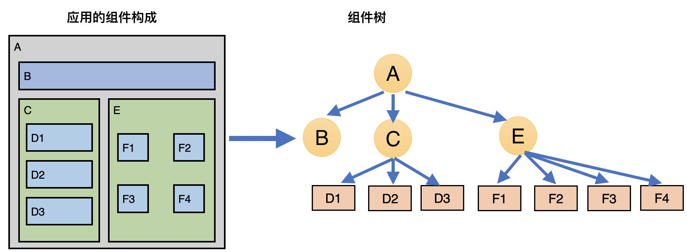
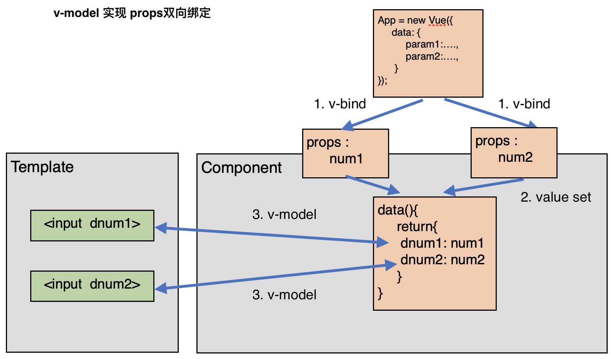
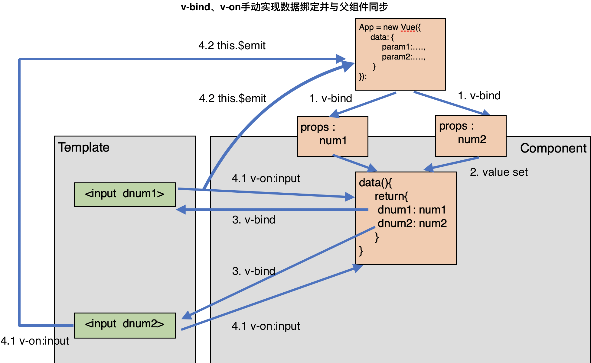
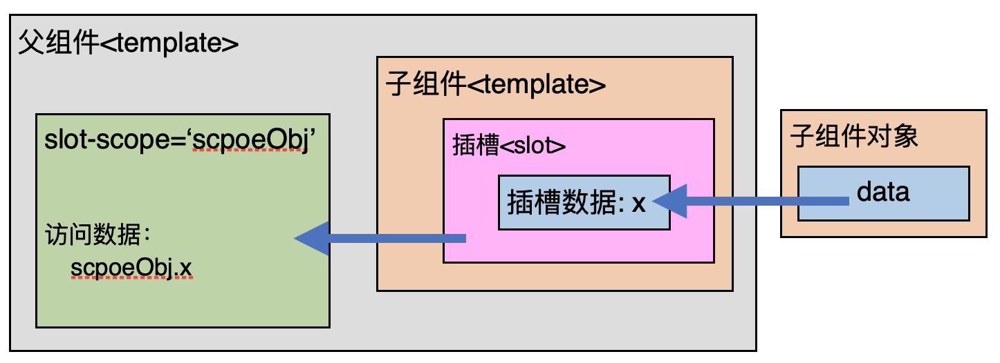

<span id="catalog"></span>

### 目录
- [Vuejs概述](#Vuejs概述)
- [Vuejs安装](#Vuejs安装)
- [helloworld程序](#helloworld程序)
    - [helloworld](#helloworld)
    - [列表展示示例](#列表展示示例)
    - [计数器示例](#计数器示例)
- [vue中的MVVM](#vue中的MVVM)
- [Vue的生命周期?????](#Vue的生命周期)
- [Vue基本指令](#Vue基本指令)
    - [Vue插值指令](#Vue插值指令)
        - [Mustache语法](#Mustache语法)
        - [v-once指令--一次性渲染](#v-once指令--一次性渲染)
        - [v-html指令--渲染html字符串](#v-html指令--渲染html字符串)
        - [v-text指令--绑定数据](#v-text指令--绑定数据)
        - [v-pre指令--显示原始代码](#v-pre指令--显示原始代码)
        - [v-cloak指令--临时属性遮盖](#v-cloak指令--临时属性遮盖)
    - [v-bind--绑定属性](#v-bind--绑定属性)
        - [v-bind的基本用法](#v-bind的基本用法)
        - [通过对象语法绑定class](#通过对象语法绑定class)
        - [通过数组语法绑定class](#通过数组语法绑定class)
        - [通过对象语法绑定style](#通过对象语法绑定style)
        - [通过数组语法绑定style](#通过数组语法绑定style)
        - [值绑定--v-bind在表单项中的应用](#值绑定--v-bind在表单项中的应用)
    - [v-on--事件监听](#v-on--事件监听)
        - [v-on的基本用法](#v-on的基本用法)
        - [v-on的修饰符](#v-on的修饰符)
    - [条件判断指令](#条件判断指令)
        - [条件判断指令的基本使用](#条件判断指令的基本使用)
        - [条件判断指令示例-登录切换](#条件判断指令示例-登录切换)
    - [v-show--控制元素渲染](#v-show--控制元素渲染)
    - [v-for--遍历数组和对象](#v-for--遍历数组和对象)
        - [v-for的基本使用方法](#v-for的基本使用方法)
        - [v-for列表展示示例](#v-for列表展示示例)
    - [v-model--表单绑定](#v-model--表单绑定)
        - [v-model的基本用法](#v-model的基本用法)
        - [v-model的实现原理](#v-model的实现原理)
        - [v-model与radio结合使用](#v-model与radio结合使用)
        - [v-model与checkbox结合使用](#v-model与checkbox结合使用)
        - [v-model与select结合使用](#v-model与select结合使用)
        - [v-model--修饰符](#v-model--修饰符)
    - [Vue基本指令--综合示例--图书购物车](#Vue基本指令--综合示例--图书购物车)
- [Vue-options中的选项](#Vue-options中的选项)
    - [常用options选项](#常用options选项)
    - [computed--计算属性](#computed--计算属性)
        - [计算属性的简介](#计算属性的简介)
        - [简写计算属性的使用示例](#简写计算属性的使用示例)
        - [计算属性getter和setter的示例](#计算属性getter和setter的示例)
        - [计算属性的缓存](#计算属性的缓存)
    - [filters--过滤器](#filters--过滤器)
- [组件化开发--基础](#组件化开发--基础)
    - [Vue组件简介](#Vue组件简介)
    - [组件的基本使用步骤](#组件的基本使用步骤)
    - [全局组件和局部组件](#全局组件和局部组件)
    - [父组件和子组件](#父组件和子组件)
    - [组件的注册方法](#组件的注册方法)
    - [组件模板抽离](#组件模板抽离)
    - [组件的数据](#组件的数据)
        - [组件数据的基本使用](#组件数据的基本使用)
        - [为什么组件的data必须是Function](#为什么组件的data必须是Function)
- [组件化开发--父子组件通信](#组件化开发--父子组件通信)
    - [父子组件通信的方法与应用场景](#父子组件通信的方法与应用场景)
    - [props--父级向子级传递](#props--父级向子级传递)
        - [props基本介绍](#props基本介绍)
        - [props的设置与传值方法](#props的设置与传值方法)
        - [使用字符串数组设置props](#使用字符串数组设置props)
        - [使用对象设置props](#使用对象设置props)
        - [处理子组件中使用驼峰命名的props名](#处理子组件中使用驼峰命名的props名)
    - [emit自定义事件--子级向父级传递](#emit自定义事件--子级向父级传递)
    - [props与emit的综合使用](#props与emit的综合使用)
        - [props属性与双向绑定](#props属性与双向绑定)
        - [props双向绑定同步修改父组件数据--手动实现](#props双向绑定同步修改父组件数据--手动实现)
        - [props双向绑定同步修改父组件数据--watch属性实现](#props双向绑定同步修改父组件数据--watch属性实现)
    - [父子组件间的访问](#父子组件间的访问)
        - [父子组件访问的本质](#父子组件访问的本质)
        - [父组件访问子组件--$children与$refs](#父组件访问子组件--$children与$refs)
        - [子组件访问父组件--$parent与$root](#子组件访问父组件--$parent与$root)
- [组件化开发--插槽slot](#组件化开发--插槽slot)
    - [插槽slot简介](#插槽slot简介)
    - [插槽的基本使用](#插槽的基本使用)
    - [具名插槽](#具名插槽)
    - [编译作用域](#编译作用域)
    - [作用域插槽](#作用域插槽)
- [在webpack中使用Vue](#在webpack中使用Vue)
    - [Vue的webpack配置](#Vue的webpack配置)
    - [Vue构建的一些知识](#Vue构建的一些知识)
    - [webpack打包Vue后的错误](#webpack打包Vue后的错误)
    - [app代码到template的转换](#app代码到template的转换)
        - [开发与转换的基本规则](#开发与转换的基本规则)
        - [app代码到template的演进过程](#app代码到template的演进过程)
- [](#)
- [](#)
- [](#)

# Vuejs概述
[top](#catalog)
- Vuejs是一个渐进式框架
    - 渐进式意味着可以将Vuejs作为应用的一部分嵌入其中，并逐步的将其他框架的应用改造成Vuejs的应用
    - 如果希望将更多的业务逻辑或使用Vue实现，可以考虑Vue核心库及其生态系统
        - 如: Core + Vuejs + Vuex

- Vue的特点和web开发场景中的高级功能
    - 解耦试图和数据
    - 可复用的组件
    - 前端路由技术
    - 状态管理
    - 虚拟DOM

- Vue提供响应式编程
    - 页面后台的数据发生修改时，可以立刻反应到页面
    - 页面中修改值时，也会立刻赋值到后台

# Vuejs安装
[top](#catalog)
- 安装方式
    - CDN引入
    - 下载和引入
    - **NPM安装管理**

- CDN引入
    - 开发环境引入
        ```html
        <script src='https://cdn.jsdelivr.net/npm/vue/dist/vue.js'></script>
        ```
    - 生产环境引入
        ```html
        <script src='https://cdn.jsdelivr.net/npm/vue'></script>
        ```

- 下载和引入
    - 开发环境: https://vuejs.org/js/vue.js
    - 生产环境: https://vuejs.org/js/vue.min.js

- NPM安装
    - 安装包: `npm i vue --save`
    - 一般vue需要在页面中使用，是**运行时依赖**，所以直接安装到 `dependencies` 下


# helloworld程序
## helloworld
[top](#catalog)
- 需要从 https://vuejs.org/js/vue.js 下载开发环境的vuejs
- 参考代码
    - [src/base/helloworld/hello.html](src/base/helloworld/hello.html)
- html内容
    - 在控制台，通过 `app.message`、`app.name`，修改数据后，即可通过双向绑定立刻显示到页面中
    ```html
    <!DOCTYPE HTML>
    <html>
        <head>
            <meta charset="UTF-8">
            <title>hello</title>
        </head>
        <body>
            <!-- 绑定数据 -->
            <div id="app">{{message}} : {{name}}</div>
            <script type='text/javascript' src="./js/vue.js"></script>
            <script>
                // 1. 创建一个vue实例，并传入一些参数
                let app = new Vue({
                    el:'#app', // 2. 挂载要管理的元素
                    data: { // 3. 定义数据
                            message: 'test msg',
                            name: 'helloworld',
                    }
                });
            </script>
        </body>
    </html>
    ```


## 列表展示示例
[top](#catalog)
- 需要从 https://vuejs.org/js/vue.js 下载开发环境的vuejs
- 参考代码
    - [src/base/helloworld/show_list.html](src/base/helloworld/show_list.html)
- html内容
    ```html
    <!DOCTYPE HTML>
    <html>
        <head>
            <meta charset="UTF-8">
            <title>show list</title>
        </head>
        <body>
            <div id="mylist">
                <!-- 显示方式1：手动循环 -->
                <section>show list method01:</section>
                <ul>
                    <li>{{tlist[0]}}</li>
                    <li>{{tlist[1]}}</li>
                    <li>{{tlist[2]}}</li>
                    <li>{{tlist[3]}}</li>
                </ul>

                <!-- 显示方式2：使用vue指令，自动遍历数组 -->
                <section>show list method02:</section>
                <ul>
                    <li v-for='item in tlist'>{{item}}</li>
                </ul>
            </div>
            <script type='text/javascript' src='./js/vue.js'></script>
            <script type='text/javascript'>
                let app = new Vue({
                    el: '#mylist',
                    data:{
                        tlist:[
                            'aaaaa',
                            'bbbb',
                            'cccc',
                            'ddddd',
                        ]
                    }
                });
            </script>
        </body>
    </html>
    ```
## 计数器示例
[top](#catalog)
- 需要从 https://vuejs.org/js/vue.js 下载开发环境的vuejs
- 参考代码
    - [src/base/helloworld/counter.html](src/base/helloworld/counter.html)
- html内容
    ```html
    <!DOCTYPE HTML>
    <html>
        <head>
            <meta charset="UTF-8">
            <title>counter</title>
        </head>
        <body>
            <div id="counter">
                <div>{{count}}</div>
                <!-- 绑定指令监听的事件 -->
                <!-- 1. 直接修改变量 -->
                <button v-on:click="count++">+</button>
                <button v-on:click="count--">-</button>
                <br>
                <!-- 2. 调用方法 -->
                <button v-on:click="incr">+</button>

                <!-- 3. 绑定方法的简写方式 -->
                <button @click="sub">-</button>
            </div>

            <script type='text/javascript' src='./js/vue.js'></script>
            <script type='text/javascript'>
                let counter = document.querySelector('#counter');

                // 将data从Vue对象中抽取处理，单独设置，形成model
                // 在Vue对象内部，通过代理的方式，使得 this 对象可以访问到内部的属性
                let app_data = { count:0, };

                // 通过 Vue对象构造 ViewModel
                let app = new Vue({
                    el: counter,// 直接挂载DOM对象
                    data: app_data,
                    methods:{
                        incr: function(){this.count++},
                        sub: function(){this.count--},
                    }
                });
            </script>
        </body>
    </html>
    ```

# vue中的MVVM
[top](#catalog)
- 什么是MVVM
    - View
    - Model
    - ViewModel

- MVVM各层的功能

    |层|层的类型|功能|
    |-|-|-|
    |View|视图层，对于前端就是DOM层|给用户展示各种信息|
    |Model|数据层|数据的来源<ul><li>固定的死数据</li><li>来自服务器，从网络上请求下来的数据</li></ul>|
    |ViewModel|视图模型层|相当于 View 和 Model 之间的桥梁，使 View 和 Model 之间能够通行<ul><li>负责 <label style="color:red">数据绑定（Data Binding）</label>，将Model的改变实时的反应到 View</li><li>负责 <label style="color:red">DOM监听（DOM Listener）</label>，当DOM发生一些事件时(点击、滚动、touch等)，可以监听到，并在需要的情况下改变对应的data</li></ul>|

- [计数器示例](#计数器示例) 中的MVVM
    - View层
        - 可以理解为html
            ```html
            <div id="counter">
                <div>{{count}}</div>
            </div>
            ```
        - 也可以理解为DOM对象
            ```js
            let counter = document.querySelector('#counter');
            ```

    - Model层
        ```js
        let app_data = { count:0, };
        ```

    - ViewModel层
        ```js
        // 1. 在创建 Vue 对象时，填充了数据，完成了【初始的 Data Binding】
        new Vue({...})
        ```
        ```html
        <!-- 2. html中的指令由 Vue 对象负责解析，并开始执行【DOM Listener】-->
        <button v-on:click="count++">+</button>
        <button v-on:click="count--">-</button>
        <button v-on:click="incr">+</button>
        <button @click="sub">-</button>
        ```
        ```js
        let app = new Vue({
            // ...
            // 3. DOM Listener 发现事件被触发，Vue 对象调用对应的回调函数
            methods:{
                // 4. 触发事件结束后，将数据重新绑定到页面，完成了【二次 Data Binding】
                incr: function(){this.count++},
                sub: function(){this.count--},
            }
        });
        ```

# Vue的生命周期
[top](#catalog)
- created: 一般会做网络请求
- mounted:
????

# Vue基本指令
## Vue插值指令
### Mustache语法
[top](#catalog)
- 语法
    <div>{{变量名}}</div>
- 功能
    1. 动态（双向）绑定**content部分**数据
    2. 可以同时应用多个Mustache语法来绑定多个数据
        ```html
        <div>{{param1}} - {{param2}}</div>
        ```
    3. 可以绑定表达式
        ```html
        <!-- 拼接内容 -->
        <div>{{param1 + ' ' + param2}}</div>
        <!-- 显示count的2倍 -->
        <div>{{count * 2}}</div>
        ```

- 示例
    - 参考代码
        - [src/base_cmd/insert_data/mustache.html](src/base_cmd/insert_data/mustache.html)
    - 代码内容
        ```html
        <div id="app">
            <!-- 拼接内容 -->
            <div>{{param1}} - {{param2}}</div>
            <div>{{param1 + ' ' + param2}}</div>
            <!-- 显示count的2倍 -->
            <div>{{count * 2}}</div>
        </div>
        ```
        ```js
        let app = new Vue({
            el:"#app",
            data:{
                count:4,
                param1:'12345',
                param2:'qwert',
            }
        });
        ```

### v-once指令--一次性渲染
[top](#catalog)
- 功能
    - 元素和组件**只渲染一次**，不会随着数据的改变而改变

- 使用方法
    - 该指令后面不需要任何表达式
    ```html
    <div v-once>{{text}}</div>
    ```

- 示例
    - 参考代码
        - [src/base_cmd/insert_data/v-once.html](src/base_cmd/insert_data/v-once.html)

    - 代码内容
        ```html
        <div id="app">
            <div>text01: {{msg}}</div>

            <!-- 1. 直接显示html源代码 -->
            <div v-once>text02: {{msg}}</div>
            <!-- 2. 使浏览器加载html -->
            <button v-on:click='change'>change</button>
        </div>
        ```
        ```js
        let app = new Vue({
            el:"#app",
            data:{
                msg:'testmsg'
            },
            methods:{
                change:function(){
                    this.msg='123456';
                }
            }
        });
        ```

### v-html指令--渲染html字符串
[top](#catalog)
- 功能
    - 使浏览器加载html代码并渲染
        - 如果通过 `{{}}` 语法，会直接显示变量内容，不会被渲染。v-html可以避免这个问题
    - 标签内部如果已经有其他信息，会被该指令覆盖

- 使用方法
    ```html
    <div v-html='变量名'></div>
    ```

- 示例
    - 参考代码
        - [src/base_cmd/insert_data/v-html.html](src/base_cmd/insert_data/v-html.html)

    - 代码内容
        ```html
        <div id="app">
            <div>show text: {{htmlData}}</div>

            <!-- 最终会被翻译为 <div><a></a></div> 的形式 -->
            show html: <div v-html='htmlData'></div>

        </div>
        ```
        ```js
        let app = new Vue({
            el:"#app",
            data:{
                // 模拟从服务器获取一段html代码
                htmlData:'<a href="https://www.baidu.com/">baidu</a>'
            }
        });
        ```

### v-text指令--绑定数据
[top](#catalog)
- 功能
    - 与mustache类似，动态（双向）绑定**content部分**的数据

- 使用方法
    ```html
    <div v-text='变量名'></div>
    ```

- 缺点
    - 不如mustache灵活
    - 会覆盖标签内已有的数据

- 示例
    - 参考代码
        - [src/base_cmd/insert_data/v-text.html](src/base_cmd/insert_data/v-text.html)
    - 代码内容
        ```html
        <div id="app">
            <div v-text='msg'>msg =</div>
            <button v-on:click='change'>change</button>
        </div>
        ```
        ```js
        let app = new Vue({
            el:"#app",
            data:{
                msg:'testmsg'
            },
            methods: {
                change: function(){
                    this.msg="changed msg";
                }
            }
        });
        ```

### v-pre指令--显示原始代码
[top](#catalog)
- 功能
    - 不对元素进行编译，直接显示数据内容
    - 常用于显示mustache语法

- 使用方法
    ```html
    <div v-pre>{{msg}}</div>
    ```

- 示例
    - 参考代码
        - [src/base_cmd/insert_data/v-text.html](src/base_cmd/insert_data/v-text.html)
    - 代码内容
        ```html
        <div id="app">
            <!-- 1. 执行数据绑定 -->
            <div>{{msg}}</div>
            <!-- 2. 跳过编译，直接在页面中显示 {{msg}} -->
            <div v-pre>{{msg}}</div>
        </div>
        ```

### v-cloak指令--临时属性遮盖
[top](#catalog)
- 功能
    - 隐藏未编译的 `{{}}` 标签直到 Vue对象准备完成
    - 可以防止页面加载时 `{{}}` 标签的闪烁

- 使用方法
    - html部分，将 `v-cloak` 作为标签的无属性值属性使用
        ```html
        <div id="app" v-cloak>
            {{msg}}
        </div>
        ```
    - css部分
        ```css
        [v-cloak]{
            display: none;
        }
        ```

- 语法的执行流程
    1. 在vue解析之前，标签中有 `v-cloak` 属性
    2. 在html中应用css，在页面中不显示
    3. 在vue解析之后，`v-cloak` 属性被删除，显示数据绑定后的结果，**避免了刷新页面时，屏幕闪烁的问题**

- 一般开发时，不会直接使用 v-cloak，而是使用 **虚拟DOM**

- 示例
    - 参考代码
        - 
    - 代码内容
        ```html
        <head>
            <meta charset='UTF-8'>
            <title>v-cloak</title>
            <style>
                /* 设置不显示包含 v-cloak 的属性 */
                [v-cloak]{
                    display: none;
                }
            </style>
        </head>
        <body>
            <div id="app" v-cloak>
                {{msg}}
            </div>
            <script src='../js/vue.js'></script>
            <script>
                let app = new Vue({
                    el:"#app",
                    data:{
                        msg:'testmsg'
                    }
                });
            </script>
        </body>
        ```

## v-bind--绑定属性
### v-bind的基本用法
[top](#catalog)
- 功能
    - 用于动态绑定一个或多个属性值
    - 向某个组件的props值传递数据
        - 参考: [props的设置与传值方法](#props的设置与传值方法)

- 使用方法
    - 基本写法
        ```html
        <div v-bind:属性名='变量名'></div>
        ```
    - 简化写法
        ```html
        <div :属性名='变量名'></div>
        ```

- 常用的需要绑定属性值的属性
    ```html
    <!-- 1. 图片的链接 -->
    
    <!-- 2. 超链接地址 -->
    <a   v-bind:href='动态绑定值'></a>
    <!-- 3. 动态绑定一些类、样式 -->
    <div v-bind:class='动态绑定值'></div>
    ```

- 示例
    - 参考代码
        - [src/base_cmd/v-bind/v-bind_base.html](src/base_cmd/v-bind/v-bind_base.html)
    - 代码内容
        ```css
        .box01{
            height: 20px;
            width: 20px;
            background-color: #aaa;
        }
        .box02{
            height: 20px;
            width: 20px;
            background-color: #bfa;
        }
        ```
        ```html
        <div id="app">
            <!-- 1. 使用 v-bind 的基本语法 -->
            <!-- 1.1. 为 class 属性动态绑定属性值 -->
            <div v-bind:class='boxType'></div>
            <!-- 1.2. 为按钮绑定click事件，单击后切换 div 的 class -->
            <button @click='changeBoxType'>change div</button>

            <br><br>

            <!-- 2. 使用 v-bind 的简写语法 -->
            <a :href="dynLink.href">{{dynLink.content}}</a>
        </div>
        ```
        ```js
        let app = new Vue({
            el:"#app",
            data:{
                boxType:'box01',
                dynLink:{
                    href:'https://www.baidu.com/',
                    content:'baidu'
                }
            },
            methods:{
                changeBoxType: function(){
                    if (this.boxType === 'box01'){
                        this.boxType = 'box02'
                    } else {
                        this.boxType = 'box01'
                    }
                }
            }
        });
        ```

### 通过对象语法绑定class
[top](#catalog)
- 对象语法
    - 单独使用
        - 直接使用对象
            ```html
            <div :class='{key1: value1, key2: value2, .....}'></div>
            ```
        - 使用某个 methods。调用的方法需要返回一个对象，并且调用时需要加`()`
            ```html
            <div :class='method()'></div>
            ```
        - 使用 computed--计算属性，不需要添加括号
            ```html
            <div :class='计算属性名'></div>
            ```
    - 和普通 class 共存
        ```html
        <div class='otherClass' :class='{key1: value1, key2: value2, .....}'></div>
        ```

- 功能
    - 每个 `key` 是一个 `class` 名
    - 每个 `value` 是一个 `boolean` 型的值
    - 当 `value == true` 时，对应的 `key` 生效
    - 如果有多个 key 生效，则按照 css 的编码顺序加载

- 示例
    - 参考代码
        - [src/base_cmd/v-bind/bind_class_by_obj.html](src/base_cmd/v-bind/bind_class_by_obj.html)
    - 代码内容
        ```css
        .text__active{
            color:red;
            font-size: 20px;
        }
        .text__line{
            color:black;
            font-size: 15px;
        }
        .bcbox{
            background-color: #aaa;
        }
        ```
        ```html
        <div id="app">
            <!-- 通过 对象语法 来设置属性值，
                 value 为 true 的属性会生效
            -->

            <!-- 1. 直接使用对象 -->
            <div>1. 直接使用对象</div>
            <div :class='{text__line: isLine, text__active: isActive}'>test content</div>

            <!-- 2. 使用某个 method -->
            <div>2. 使用某个 method</div>
            <div :class='setClass()'>test content</div>

            <!-- 3. 和其他 class 共存 -->
            <div>3. 和其他 class 共存</div>
            <div class='bcbox' :class='{text__line: isLine, text__active: isActive}'>test content</div>

            <button @click='changeClass'>change class</button>
        </div>
        ```
        ```js
        let app = new Vue({
            el:"#app",
            data:{
                isActive: false,
                isLine: true,
            },
            methods:{
                changeClass: function(){
                    this.isActive = !this.isActive;
                    this.isLine = !this.isLine;
                },
                setClass: function(){
                    return {text__line: this.isLine, text__active: this.isActive};
                }
            }
        });
        ```

### 通过数组语法绑定class
[top](#catalog)
- 数组语法
    - 单独使用
        - 直接使用对象
            ```html
            <div :class='[c1, c2, c3,...]'></div>
            ```
        - 使用某个 methods。调用的方法需要返回一个数组，并且调用时需要加`()`
            ```html
            <div :class='method()'></div>
            ```
        - 使用 computed--计算属性，不需要添加括号
            ```html
            <div :class='计算属性名'></div>
            ```
    - 和普通 class 共存
        ```html
        <div class='otherClass' :class='[c1, c2, c3,...]'></div>
        ```
- 示例
    - 参考代码
        - [bind_class_by_list](src/base_cmd/v-bind/bind_class_by_list.html)
    - 代码内容
        ```css
        .bcbox{
            background-color: #aaa;
        }
        .active{
            color: red;
        }
        .small_font{
            font-size: 10px;
        }
        .big_font{
            font-size: 20px;
        }
        ```
        ```html
        <div id="app">
            <!-- 通过 数组语法 来设置属性值 -->

            <!-- 1. 直接设置数组 -->
            <div> 1. 直接设置数组 </div>
            <div :class="['small_font', 'active']">test content</div>

            <!-- 2. 使用 methods 设置 -->
            <div :class='setClass()'>test content</div>

            <!-- 3. 和普通class共存 -->
            <div class='bcbox' :class="['small_font', 'active']">test content</div>
        </div>
        ```
        ```js
        let app = new Vue({
            el:"#app",
            methods:{
                changeClass: function(){
                    this.isActive = !this.isActive;
                    this.isLine = !this.isLine;
                },
                setClass: function(){
                    return ["big_font", 'bcbox']
                }
            }
        });
        ```

### 通过对象语法绑定style
[top](#catalog)
- 对象语法
    - key 表示: 样式名
        - 与js中使用样式名的方式类似，如果样式名中包含 `-`，需要将样式名转换为**驼峰命名**
    - value 表示: 样式值
    - 单独使用
        - 直接使用对象
            ```html
            <div v-bind:style='{key1: value1, key2: value2, .....}'></div>
            <div :style='{key1: value1, key2: value2, .....}'></div>
            ```
        - 使用某个 methods。调用的方法需要返回一个对象，并且调用时需要加`()`
            ```html
            <div :style='method()'></div>
            ```
        - 使用 computed--计算属性，不需要添加括号
            ```html
            <div :class='计算属性名'></div>
            ```
    - 和普通 class 共存
        ```html
        <div style='otherClass' :style='{key1: value1, key2: value2, .....}'></div>
        ```
- 示例
    - 参考代码
        - [v-bind_style](src/base_cmd/v-bind/bind_style_by_obj.html)
    - 代码内容
        ```html
        <div id="app">
            <!-- 直接设置需要加单引号 -->
            <div :style="{fontSize: '10px'}">{{msg}}</div>

            <!-- 使用变量 -->
            <div :style="{fontSize: finalSize}">{{msg}}</div>
            <!-- 使用方法 -->
            <div :style="getStyle()">{{msg}}</div>
            <!-- 与其他style共存 -->
            <div style='background-color: #aaa;' :style="getStyle()">{{msg}}</div>
        </div>
        <script src='../js/vue.js'></script>
        <script>
            let app = new Vue({
                el:'#app',
                data:{
                    msg:'testMsg',
                    finalSize: '10px',
                },
                methods:{
                    getStyle:function(){
                        return {fontSize: this.finalSize}
                    }
                }
            });
        </script>
        ```

### 通过数组语法绑定style
[top](#catalog)
- 数组语法
    - 单独使用
        - 直接使用对象
            ```html
            <div :style='[{样式名1: 样式值1}, {样式名2: 样式值2},...]'></div>
            ```
        - 使用某个 methods。调用的方法需要返回一个数组，并且调用时需要加`()`
            ```html
            <div :style='method()'></div>
            ```
        - 使用 computed--计算属性，不需要添加括号
            ```html
            <div :style='计算属性名'></div>
            ```
    - 和普通 class 共存
        ```html
        <div style='otherClass' :style='[{样式名1: 样式值1}, {样式名2: 样式值2},...]'></div>
        ```
- 示例
    - 参考代码
        - [bind_style_by_list](src/base_cmd/v-bind/bind_style_by_list.html)
    - 代码内容
        ```html
        <div id="app">
            <!-- 直接设置需要加单引号 -->
            <div :style="[{fontSize: '10px'},{color: 'red'}]">{{msg}}</div>

            <!-- 使用变量 -->
            <div :style="[style1, style2]">{{msg}}</div>
            <!-- 使用方法 -->
            <div :style="getStyle()">{{msg}}</div>
            <!-- 与其他style共存 -->
            <div style='color:#47e' :style="getStyle()">{{msg}}</div>
        </div>
        <script src='../js/vue.js'></script>
        <script>
            let app = new Vue({
                el:'#app',
                data:{
                    msg:'testMsg',
                    style1: {finalSize: '15px'},
                    style2: {backgroundColor: '#aaa'},
                },
                methods:{
                    getStyle:function(){
                        return [this.style1, this.style2]
                    }
                }
            });
        </script>
        ```

### 值绑定--v-bind在表单项中的应用
[top](#catalog)
- 设置页面数据时，数据不是固定的，需要根据从服务器获取的数据来动态绑定
- 示例：设置 多选checkbox
    - 参考代码
        - [src/base_cmd/v-bind/v-bind_input.html](src/base_cmd/v-bind/v-bind_input.html)
    - html代码
        ```html
        <div id="app">
            <!-- 使用数据，动态绑定 id、value、for属性 -->
            <label v-for='item in typeList' :for='item'>
                <input type="checkbox" :id='item' :value='item' v-model='types'>{{item}}
            </label>
            <div>seletedType: {{types}}</div>
        </div>
        ```
    - js代码
        ```js
        const app = new Vue({
            el:'#app',
            data:{
                // types用于双向绑定数据
                types:["type01"],
                // 通过该数据，来实现展示数据的动态绑定
                typeList:["type01", "type02", "type03", "type04"]
            }
        });
        ```


## v-on--事件监听
### v-on的基本用法
[top](#catalog)
- 作用
    - 为DOM元素的某个事件绑定 事件监听器/事件处理函数
- v-on 可以使用的值: `Function | Inline Statement | Object`

- 使用方法
    - Function，使用methods中的函数名
        1. 使用无参函数
            ```html
            <!-- 调用函数时，不需要加括号 -->
            <div v-on:事件名='<methods>中的函数名'></div>
            ```
        2. 使用带参数的函数
            ```html
            <!-- 1. 传递参数正常调用 -->
            <div v-on:事件名='<methods>中的函数名(参数)'></div>
            <!-- 2. 只添加了括号，没有传参，则参数默认为 undefined -->
            <div v-on:事件名='<methods>中的函数名()'></div>
            <!-- 3. 如果只写了函数名，则 Vue 会将 event 对象作为第一个参数传入方法 -->
            <div v-on:事件名='<methods>中的函数名'></div>
            ```
        3. **只使用** event 对象的函数
            ```html
            <!-- 直接通过函数名调用，Vue会自动将event对象做为参数传给方法 -->
            <div v-on:事件名='<methods>中的函数名'></div>
            ```
        4. 使用参数中包含**普通参数和event对象**的函数
            ```html
            <!-- 通过 $event，将event对象传入函数 -->
            <div v-on:事件名='<methods>中的函数名(其他参数, $event)'></div>
            ```
    - Inline Statement，内联语句
        ```html
        <div v-on:事件名='自定义语句'></div>
        ```
    - Object
        - Object类型很少使用

- v-on 的简写: `@`
    ```html
    <div @事件名='...'></div>
    ```

- 示例
    - 参考代码
        - [src/base_cmd/v-on/v-on_base.html](src/base_cmd/v-on/v-on_base.html)
    - html代码
        ```html
        <div id="app">
            <div>{{count}}</div>
            <!-- 1. Function -->
            <!-- 1.1 使用无参函数 -->
            <button v-on:click='add'>add1</button>
            <!-- 1.2 使用有参函数，并传递参数 -->
            <button v-on:click='addN(3)'>add + 3</button>
            <!-- 1.3 使用有参函数，但是没有传递参数
                参数的值默认为 undefined，0 + undefined = NaN
            -->
            <button v-on:click='addN()'>addN undefined</button>
            <!-- 1.4 只通过函数名使用有参函数 -->
            <button v-on:click='addN'>addN event</button>

            <!-- 2. 简写语法 -->
            <button @click='sub'>sub1</button>
            <br>
            <!-- 3. Inline Statement，内联语句 -->
            <button v-on:click='count=0'>clear</button>

            <br>
            <br>
            <!-- 1.5 使用参数中包含普通参数和event对象的函数 -->
            <button v-on:click='eventTest("clickTest", $event)'>eventTest</button>

        </div>
        ```
    - js代码
        ```js
        const app = new Vue({
            el:'#app',
            data:{
                count:0,
            },
            methods:{
                add(){
                    this.count++;
                },
                sub(){
                    this.count--;
                },
                addN(n){
                    this.count += n;
                },
                eventTest(p, event){
                    console.log(`p=${p}，event=${event}`)
                }
            }
        });
        ```

### v-on的修饰符
[top](#catalog)
- 修饰符的作用
    - 在某些情况下，拿到event对象的目的是进行一些事件处理
    - Vue提供了修饰符来辅助开发者方便的处理一些事件

        |修饰符|作用|
        |-|-|
        |`.stop`|调用 event.stopPropagation()，可用于阻止事件的冒泡|
        |`.prevent`|调用 event.preventDefault()，用于阻止浏览器的默认事件|
        |`.[keyCode|keyAlias]`|当事件是由特定按键触发时，才触发回调|
        |`.native`|监听组件根元素的原生事件 ?????|
        |`.once`|只触发一次回调，类似于jquery的once|

- 示例
    - 参考代码
        - [src/base_cmd/v-on/v-on_modifier.html](src/base_cmd/v-on/v-on_modifier.html)
    - html代码
        ```html
        <div id="app">
            <section>1. .stop，取消事件冒泡</section>
            <div class='boxA' @click='divClick01'>
                <button @click.stop='btnClick01'>btn01</button>
            </div>
            <br>

            <section>2. .prevent，取消submit的默认提交行为</section>
            <form action="">
                <input type="submit" value="submit" @click.prevent='submitClick'>
            </form>

            <br>
            <section>3. .[keyCode|keyAlias] 监听 enter事件</section>
            <input type="text" @keyup.13='inputEnter'>

            <br>
            <br>
            <section>4. .once 只触发一次监听事件</section>
            <button @click.once='onceClick'>oncebtn</button>
        </div>
        ```
    - js代码
        ```js
        const app = new Vue({
            el: '#app',
            methods:{
                divClick01(){
                    console.log('call divClick01');
                },
                btnClick01(){
                    console.log('call btnClick01');
                },
                submitClick(){
                    console.log('call submitClick');
                },
                inputEnter(event){
                    console.log(event.target.value);
                },
                onceClick(){
                    console.log('call onceClick');
                }
            }
        })
        ```

## 条件判断指令
### 条件判断指令的基本使用
[top](#catalog)
- 3种条件判断指令
    - v-if
    - v-else
    - v-else-if

- 作用
    - 根据变量或者表达式的结果，在DOM中渲染或销毁对象
    - 当变量或者表达式是false是，会将整个DOM元素从html中删除

- 使用方法
    1. 单独使用 `v-if`
        ```html
        <div v-if='boolean型变量'>...</div>
        <!-- 或者 -->
        <div v-if='表达式'>...</div>
        ```
    2. `v-else` 需要和 `v-if`一起使用
        ```html
        <div v-if='变量/表达式'>...</div>
        <!-- 当 v-if 条件不满足时，渲染 v-else 标识的元素 -->
        <div v-else>...</div>
        ```
    3. `v-else-if` 需要和 `v-if` 一起使用
        ```html
        <div v-if='条件1'>...</div>
        <div v-else-if='条件2'>...</div>
        <div v-else-if='条件3'>...</div>
        ...

        <!-- 如果没有 v-else，当所有条件都不满足时，不会渲染任何元素
             如果有   v-else，当所有条件都不满足时，渲染 v-else 标识的元素
          -->
        <div v-else>...</div>
        ```

- 一般不推荐直接在html中使用 `v-else-if`
    - 多个 `v-else-if` 会导致html代码混乱，逻辑不清晰
    - 如果逻辑判读过多，应该选择使用 **计算属性**，来遮盖负责的逻辑，使html代码更加清晰
- 示例
    - 参考代码
        - [src/base_cmd/v-if/v-if.html](src/base_cmd/v-if/v-if.html)
    - html代码
        ```html
        <div id="app">
            <div>{{count}}</div>
            <button @click='add'>add</button>
            <button @click='sub'>sub</button>
            <br>

            <!-- 1. 使用 v-if/ v-else， 通过 boolean型变量 控制元素是否显示 -->
            <div v-if='flg'>count > 5</div>
            <div v-else>count &lt;= 5</div>

            <br>
            <!-- v-if，v-else-if，v-else 的组合使用，根据count所处的范围，显示不同的等级 -->
            <div v-if='count>= 8'>A</div>
            <div v-else-if='count>= 6'>B</div>
            <div v-else-if='count>= 3'>C</div>
            <div v-else>D</div>
        </div>
        ```
    - js代码
        ```js
        const app = new Vue({
            el: '#app',
            data:{
                count: 0,
                flg: false,
            },
            methods:{
                add(){
                    this.count++;
                    this.flg = this.count > 5;
                },
                sub(){
                    this.count--;
                    this.flg = this.count > 5;
                },
            }
        });
        ```

### 条件判断指令示例-登录切换
[top](#catalog)
- 需求
    - 点击 `login by name` 按钮，切换为用户名登录
    - 点击 `login by email` 按钮，切换为邮箱登陆
- <label style='color:red'>登录切换操作中会出现的问题</label>
    - 如果 input 输入框中已经输入了数据，再点击按钮切换时，输入框中的数据不会被清空
    - 问题的原因
        1. vue在将DOM渲染到浏览器之前，处于性能的考虑，会尽可能的复用已经存在的元素，而不是创建新的元素
        2. 在示例中，Vue内部发现原来的input元素不再使用，直接作为v-else中的input来使用了
    - **解决方法**
        - 在input中添加**不同的key**，来避免DOM元素的复用
        - vue底层在发现key不同时，不会复用元素

- 参考代码
    - [demo_login_switch](src/base_cmd/v-if/demo_login_switch.html)
- html代码
    ```html
    <div id="app">
        <!-- 根据 boolean型变量来控制登录模式 -->
        <span v-if='loginType'>
            <label for="username">username: </label>
            <!-- 设置 key='username'，来防止DOM元素复用 -->
            <input type="text" id="username" key='username'>
        </span>
        <span v-else>
            <label for="useremail">useremail: </label>
            <!-- 设置 key='useremail'，来防止DOM元素复用 -->
            <input type="email" id="useremail" key='useremail'>
        </span>

        <br>
        <!-- 通过按钮来切换 boolean型变量的值 -->
        <button @click='loginByName'>login by name</button>
        <button @click='loginByEmail'>login by email</button>
    </div>
    ```
- js代码
    ```js
    const app = new Vue({
        el:'#app',
        data:{
            loginType: 'true', // true=username, false=useremail
        },
        methods:{
            loginByName(){
                this.loginType=true;
            },
            loginByEmail(){
                this.loginType=false;
            }
        }
    })
    ```

## v-show--控制元素渲染
[top](#catalog)
- 作用
    - 根据变量或表达式结果，来控制元素是否渲染
    - 当变量或表达式为 false 时，会为元素添加行内样式: `style='display:none'`，来隐藏元素

- 使用方法
    ```html
    <div v-show='boolean变量/表达式'></div>
    ```

- `v-show` 与 `v-if` 的异同
    - 相同点
        - 都可以控制元素是否渲染
    - 不同点
        - 不渲染元素时，v-if会删除DOM元素，v-show会使用行内样式隐藏元素

- 开发中如何选择 `v-show` 和 `v-if`
    - 当DOM元素的显示与隐藏切换比较频繁时，使用 `v-show`
        - `v-show` 通过内联样式控制元素，性能比较好
        - 如果使用 `v-if`，会造成重复的DOM元素的添加与删除，性能不好
    - 当只有一次切换时，可以使用 `v-if`

- 示例
    - 参考代码
        - [src/base_cmd/v-show/v-show.html](src/base_cmd/v-show/v-show.html)
    - 代码内容
        ```html
        <div id="app">
            <div v-show='flg'>v-show test</div>
            <button @click='changFlg'>change flg</button>
        </div>
        <script type='text/javascript' src='../js/vue.js'></script>
        <script type='text/javascript'>
            const app = new Vue({
                el: '#app',
                data:{
                    flg: true
                },
                methods:{
                    changFlg(){ this.flg = !this.flg; }
                }
            })
        </script>
        ```

## v-for--遍历数组和对象
### v-for的基本使用方法
[top](#catalog)
- 作用
    - 遍历数组和对象
- 使用方法
    - 遍历数组
        ```html
        <!-- 1. 只使用 数组元素 -->
        <li v-for='item in 数组变量名' :key=item>{{item}}</li>

        <!-- 2. 使用 数组元素 和 索引 -->
        <li v-for='(item, index) in 数组变量名' :key=item>{{item}}{{index}}</li>

        <!-- item、index 两个变量可以任意命名，但是顺序是不变的，
             元素在前，索引在后
         -->
        ```
    - 遍历对象
        ```html
        <!-- 1. 遍历时，只使用 value  -->
        <li v-for='item in 对象变量名' :key=item>{{item}}</li>

        <!-- 2. 遍历时，同时使用 value 和 key -->
        <li v-for='(item, key) in 对象变量名' :key=item>{{key}} : {{item}}</li>

        <!-- 3. 遍历时，同时使用 value、key、索引
                索引表示当前属性是对象中的第几个属性
            -->
        <li v-for='(item, key, index) in 对象变量名' :key=item>{{index}}--{{key}} : {{item}}</li>

        <!-- item、key、index 三个变量可以任意命名，但是顺序是不变的，
             属性值、属性名、属性的索引
         -->
        ```

- 为什么要添加绑定`:key`属性?
    - 为了提高更新虚拟DOM的效率
    - 当在数组中加插入一个元素时，会执行Diff算法，将原始数据向后移动然后将新数据写入到对应位置的DOM元素中
    - 绑定key之后，Diff会准确的找到数据的插入点，创建DOM元素并插入，性能更高

- 示例
    - 参考代码
        - [src/base_cmd/v-for/v-for_base.html](src/base_cmd/v-for/v-for_base.html)

    - js代码
        ```js
        const app = new Vue({
            el:'#app',
            data:{
                testList:['aaa', 'bbb', 'ccc', 'ddd'],
                testObj:{
                    k1:'v1',
                    k3:'v3',
                    k4:'v4',
                    k2:'v2',
                }
            }
        });
        ```
    - html代码
        ```html
        <div id="app">
            <section>1. 遍历数组</section>
            <ul>
                <!-- 1.1. 遍历时，只使用 value  -->
                <li v-for='item in testList' :key=item>{{item}}</li>
                <!-- 输出:
                    aaa
                    bbb
                    ccc
                    ddd
                -->
            </ul>

            <ul>
                <!-- 1.2. 遍历时，同时使用 value 和 索引 -->
                <li v-for='(item, index) in testList' :key=item>{{index}}--{{item}}</li>
                <!-- 输出:
                    0--aaa
                    1--bbb
                    2--ccc
                    3--ddd
                -->
            </ul>

            <section>2. 遍历对象</section>
            <ul>
                <!-- 2.1. 遍历时，只使用 value  -->
                <li v-for='item in testObj' :key=item>{{item}}</li>
                <!-- 输出:
                    v1
                    v3
                    v4
                    v2
                -->
            </ul>
            <ul>
                <!-- 2.2. 遍历时，同时使用 value 和 key -->
                <li v-for='(item, key) in testObj' :key=item>{{key}} : {{item}}</li>
                <!-- 输出:
                    k1 : v1
                    k3 : v3
                    k4 : v4
                    k2 : v2
                -->
            </ul>
            <ul>
                <!-- 2.3. 遍历时，同时使用 value、key、索引
                    索引表示当前属性是对象中的第几个属性
                -->
                <li v-for='(item, key, index) in testObj' :key=item>{{index}}--{{key}} : {{item}}</li>
                <!-- 输出:
                    0--k1 : v1
                    1--k3 : v3
                    2--k4 : v4
                    3--k2 : v2
                -->
            </ul>
        </div>
        ```

### 可以进行响应式更新的数组方法
[top](#catalog)
- 可以进行响应式更新的数组方法（Vue内部会进行监听）
    - push()
    - pop()
    - shift()
    - unshift()
    - splice()
    - sort()
    - reverse()
- 直接通过索引修改数组元素，不会响应式更新
- 通过Vue提供的方法实现响应式修改数组元素
    ```js
    Vue.set(this.数组变量名, index, 修改后的元素值);
    ```

### v-for列表展示示例
[top](#catalog)
- 需求  
    - 将数组中的数据以列表的形式展示
    - 页面显示后，默认第一行为红色
    - 之后，被点击的项目为红色，其他项目为黑色

- 实现方法
    - 通过 `v-for` 来实现列表展示
    - 设置一个变量，表示当前被选中元素的索引: `selectedIndex`
    - 通过v-bind 的对象绑定方式设置样式
        - 通过 `selectedIndex == 当前元素的index` 的结果来判断是否设置样式
    - 为每个元素绑定click事件，每次点击时修改 `selectedIndex`，保证每次只有被点击的元素是红色的

- 参考代码
    - [src/base_cmd/v-for/demo_show_list.html](src/base_cmd/v-for/demo_show_list.html)
- 代码内容
    ```html
    <ul>
        <!-- 通过比较当前元素的index 和被选中元素的index 是否相等来设置元素样式 -->
        <li v-for='(item, index) in testList'
            :class="{active: selectedIndex === index}"
            @click='itemClicked(index)' >
            {{item}}
        </li>
    </ul>
    ```
    ```js
    const app = new Vue({
        el: '#app',
        data: {
            testList:['aaa', 'bbb', 'ccc', 'ddd'],
            selectedIndex: 0,
        },
        methods:{
            itemClicked(index){
                this.selectedIndex = index
            }
        }
    });
    ```

## v-model--表单绑定
### v-model的基本用法
[top](#catalog)
- 作用
    - 实现（表单）元素和数据的**双向绑定**
- 使用方法
    ```html
    <input type="..." v-model='变量名'>
    ```
- 示例
    - 参考代码
        - [src/base_cmd/v-model/v-model_base.html](src/base_cmd/v-model/v-model_base.html)
    - html代码
        ```html
        <div id="app">
            <!-- 双向绑定数据: msg -->
            <input type="text" name="msg" v-model='msg'>

            <!-- 点击按钮输出当前 msg 的数据 -->
            <button @click='printMsg'>print</button>
            <!-- 点击按钮初始化 msg 的数据，页面也会同步显示 -->
            <button @click='initMsg'>init</button>
        </div>
        ```
    - js代码
        ```js
        const app = new Vue({
            el: '#app',
            data:{
                msg: 'initMsg',
            },
            methods:{
                printMsg(){ console.log(this.msg) },
                initMsg(){ this.msg='initMsg' },
            }
        });
        ```

### v-model的实现原理
[top](#catalog)
- v-model 指令可以转换为两个其他指令的结合
    1. `v-bind:value` 指令，数据绑定方向: `model --->>> view`
        ```html
        <input type="..."  v-bind:value='变量名'  ....>
        ```
    2. `v-on:input` 指令响应页面的输入，数据绑定方向: `view --->>> model`
        ```html
        <!-- 从 event 对象中获取页面修改后的值，并绑定到变量 -->
        <input type="..."  v-on:input='变量名 = $event.target.value'  ....>
        ```

- 示例
    - 参考代码
        - [src/base_cmd/v-model/v-model_principle.html](src/base_cmd/v-model/v-model_principle.html)
    - html代码
        ```html
        <div id="app">
            <!-- 只做: 将model数据绑定到view。
            修改文本框的数据后，再点击 init 按钮，页面不会将数据初始化，
            因为数据没有发生变化，所以不会重新绑定数据
            -->
            <!-- <input type="text" v-bind:value='msg'> -->


            <!-- 1. v-bind:value，将model数据绑定到view
                 2. v-on:input，将view中修改后的数据绑定到model
            -->
            <!-- 通过事件响应函数来实现绑定 -->
            <input type="text" v-bind:value='msg' v-on:input='inputHandle'>
            <br>
            <!-- 通过内联代码来实现绑定 -->
            <input type="text" v-bind:value='msg' v-on:input='msg = $event.target.value'>

            <!-- 点击按钮输出当前 msg 的数据 -->
            <button @click='printMsg'>print</button>
            <!-- 点击按钮初始化 msg 的数据，页面也会同步显示 -->
            <button @click='initMsg'>init</button>
        </div>
        ```
    - js代码
        ```js
        const app = new Vue({
            el: '#app',
            data:{
                msg: 'initMsg',
            },
            methods:{
                printMsg(){ console.log(this.msg) },
                initMsg(){ this.msg='initMsg' },

                // 响应输入框的输入，并将 view 的数据 绑定到 model
                // 每次按下按键都会触发 input 事件，所以可以完成实时的双向数据绑定
                inputHandle(event){
                    console.log('-----');
                    this.msg = event.target.value;
                }
            }
        });
        ```

### v-model与radio结合使用
[top](#catalog)
- 与 单选按钮 radio 结合
    - 默认情况下需要将多个 radio 的 `name` 属性相同，才能成组
    - 使用 `v-model` 绑定**相同变量**后，多个按钮会自动成组
        - 为了在submit时，能够将数据发送到服务端，`name` 仍需要保留

- 示例
    - 参考代码
        - [src/base_cmd/v-model/v-model_radio.html](src/base_cmd/v-model/v-model_radio.html)
    - html代码
        ```html
        <div id="app">
            <input type="radio" name='type' v-model='type' value='0'>type0
            <input type="radio" name='type' v-model='type' value='1'>type1
            <input type="radio" name='type' v-model='type' value='2'>type2
            <input type="radio" name='type' v-model='type' value='3'>type3
            <br>
            <div>selectedType: {{type}}</div>
            <br>

            <input type="radio" name='sex' v-model='sex' value='male'>male
            <input type="radio" name='sex' v-model='sex' value='female'>female
            <br>
            <div>selectedSex: {{sex}}</div>
        </div>
        ```
    - js代码
        ```js
        const app = new Vue({
            el: '#app',
            data:{
                type:0,
                sex:'',
            }
        });
        ```

### v-model与checkbox结合使用
[top](#catalog)
- 与checkbox结合
    - 单选框，需要绑定一个boolean型变量，不需要设置`value`属性
    - 多选框，需要绑定一个数组型变量，并设置`value`属性
- 示例
    - 参考代码
        - [src/base_cmd/v-model/v-model_chekbox.html](src/base_cmd/v-model/v-model_chekbox.html)
    - html代码
        ```html
        <div id="app">
            <!-- 1. 单选框，绑定一个boolean变量 -->
            <label for="agree">
                <input type="checkbox" name='agree' id="agree" v-model='isAgree'>agree
            </label>
            <br>
            <button :disabled='!isAgree'>next</button>

            <br>
            <br>
            <!-- 2. checkbox多选框，绑定一个数组-->
            <input type="checkbox" name='hobbies' value="hobby01" v-model='hobbies'>hobby01
            <input type="checkbox" name='hobbies' value="hobby02" v-model='hobbies'>hobby02
            <input type="checkbox" name='hobbies' value="hobby03" v-model='hobbies'>hobby03
            <div>selectedHobied: {{hobbies}}</div>
        </div>
        ```
    - js代码
        ```js
        const app = new Vue({
            el:'#app',
            data:{
                isAgree: false,
                hobbies: ['hobby02'], // 初始值默认会被选中
            }
        });
        ```

### v-model与select结合使用
[top](#catalog)
- 与select结合
    - 当选中一个option时，vue会将对应的value绑定到变量
    - 单选select，需要绑定到一个基本类型变量
    - 多选select，绑定到一个数组类型变量

- 示例
    - 参考代码
        - [src/base_cmd/v-model/v-model_select.html](src/base_cmd/v-model/v-model_select.html)
    - html代码
        ```html
        <div id="app">
            <!-- 1. 单选，绑定到一个基本类型 -->
            <select name="p1" v-model='p1'>
                <option value="aaaa">aaaa</option>
                <option value="bbbb">bbbb</option>
                <option value="cccc">cccc</option>
                <option value="dddd">dddd</option>
            </select>
            <div>{{p1}}</div>

            <!-- 2. 多选，绑定到一个数组 -->
            <select multiple name="p2" v-model='p2'>
                <option value="aaaa">aaaa</option>
                <option value="bbbb">bbbb</option>
                <option value="cccc">cccc</option>
                <option value="dddd">dddd</option>
            </select>
            <div>{{p2}}</div>
        </div>
        ```
    - js代码
        ```js
        const app = new Vue({
            el: '#app',
            data: {
                p1:'bbbb',
                p2:['cccc'],
            }
        });
        ```

### v-model--修饰符
[top](#catalog)
- 常用修饰符
    - lasy
        - 默认情况下，v-model会在input事件中同步输入框的数据，即数据的更新时实时的
        - lazy可以上数据在输入框**失去焦点或者按下回车后**才更新
    - number
        - 默认情况下，在输入框中输入的字母、数字都会被转换为字符串类型
            - 即使数据初始化为 number 型，在重新绑定后，也会变为 string 型
        - number可以将输入内容**自动转换成数字类型**
    - trim
        - 用于**去除输入内容首尾的空格**
        - trim 也具有 lasy 的性质

- 示例
    - 参考代码
        - [src/base_cmd/v-model/modifier.html](src/base_cmd/v-model/modifier.html)
    - html内容
        ```html
        <div id="app">
            <!-- 1. lazy 失去焦点或者按下回车后才更新数据 -->
            <input type="text" name="msg" id="msg" v-model.lazy='msg'>
            <div>{{msg}}</div>

            <!-- 2. 将输入内容自动转换成数字类型 -->
            <!-- 2.1 只有初始化时，是number型，数据更新后会变为string型 -->
            <input type="number" name="num1" id="num1" v-model='num1'>
            <div>{{ num1 + '----' +  (typeof num1) }}</div>
            <!-- 2.2 数据更新时，会自动变为string型 -->
            <input type="number" name="num2" id="num2" v-model.number='num2'>
            <div>{{ num2 + '----' +  (typeof num2) }}</div>

            <!-- 3. trim，用于去除输入内容首尾的空格 -->
            <input type="text" name="str" id="str" v-model.trim='str'>
            <button @click='showStr'>show str</button>
        </div>
        ```
    - js内容
        ```js
        const app = new Vue({
            el:"#app",
            data:{
                msg:'testmsg',
                num1:0,
                num2:1,
                str:'    dddd     ',
            },
            methods:{
                showStr(){
                    console.log(this.str)
                }
            }
        });
        ```
## Vue基本指令--综合示例--图书购物车
[top](#catalog)
- 需求
    - 每一行需要显示：当前购买数据的编号、书名、出版日期、价格、购买数量、删除操作按钮
    - 购买数量可以通过`+`、`-`按钮加减。但是每本图书的数量最少为1
    - 在购物车的列表下方显示书的总价
    - 图书价格 与 总价 保留两位小数
    - 点击删除按钮可以删除当前行
    - 当所有图书被删除后，不显示界面，只显示一行文字: 购物车为空
- 实现内容
    - 参考代码
        - [src/base_cmd/exercise/demo_shopping_cart.html](src/base_cmd/exercise/demo_shopping_cart.html)
    - html代码
        ```html
        <div id='shoppingCart'>
            <div v-show='!isShowCartTable'>empty shoppingCart</div>
            <div v-show='isShowCartTable'>

                <table class="cartTable" >
                    <!-- 表头 -->
                    <tr>
                        <th class='cartTable_cell cartTable_cell--small'></th>
                        <th class='cartTable_cell'>bookName</th>
                        <th class='cartTable_cell'>time</th>
                        <th class='cartTable_cell'>price</th>
                        <th class='cartTable_cell'>count</th>
                        <th class='cartTable_cell'>action</th>
                    </tr>
                    <!-- 循环显示 每个图书的数据 -->
                    <tr v-for='(item, index) in bookDetails'>
                        <td class="cartTable_cell cartTable_cell--small cartTable_cell--center">{{index + 1}}</td>
                        <td class="cartTable_cell cartTable_cell--center">{{item.bookName}}</td>
                        <td class="cartTable_cell cartTable_cell--center">{{item.time}}</td>
                        <td class="cartTable_cell">{{item.price | priceFormat}}</td>
                        <td class="cartTable_cell cartTable_cell--center">
                            <!-- 绑定disabled属性，当数量为1时，禁止使用 `-` 按钮 -->
                            <button :disabled="item.count <= 1" @click='subBookCount(index)'>-</button>
                            {{item.count}}
                            <button @click='addBookCount(index)'>+</button>
                        </td>
                        <td class="cartTable_cell cartTable_cell--center">
                            <button @click='deleteBook(index)'>delete</button>
                        </td>
                    </tr>
                </table>
                <div>totalPrice: {{totalPrice | priceFormat}}</div>
            </div>
        </div>
        ```
    - js代码
        ```js
        const app = new Vue({
            el:'#shoppingCart',
            data:{
                bookDetails:[
                    { bookName:'aaa', time:'aaat', price:12.50, count:1 },
                    { bookName:'bbb', time:'bbbt', price:45.60, count:1 },
                    { bookName:'ccc', time:'ccct', price:23.00, count:1 },
                ],
            },
            methods:{
                // 从数组中删除指定的index上的图书数据
                deleteBook(index){
                    this.bookDetails.splice(index, 1);
                },
                // 图书数量 + 按钮事件
                addBookCount(index){
                    this.bookDetails[index].count++;
                },
                // 图书数量 - 按钮事件
                subBookCount(index){
                    let book = this.bookDetails[index]
                    if (book.count > 1 ){
                        book.count--;
                    }
                    // this.bookDetails[index].count--;
                },
            },
            computed:{
                // 如果图书全部删除，则不显示购物车；有图书时才显示
                isShowCartTable(){
                    return this.bookDetails.length != 0;
                },

                // 显示总价
                totalPrice(){
                    if (this.bookDetails.length != 0){
                        return this.bookDetails.map(item => item.price*item.count)
                                        .reduce( (prev, cur)=> prev + cur);
                    } else {
                        return 0;
                    }
                }
            },
            filters:{
                // 设置金额的显示方式
                priceFormat(price){
                    return '￥' + price.toFixed(2);
                }
            }
        });
        ```

# Vue-options中的选项
## 常用options选项
[top](#catalog)
- el
    - 类型: `String | HTMLElement`
    - 作用: 将DOM对象挂在到一个Vue实例上，有Vue对象管理DOM对象
- data
    - 类型: `Object | Function`
    - 作用: Vue实例对应的数据对象
    - 在<label style="color:red">组件化开发</label>时，data<label style="color:red">必须是</label>一个<label style="color:red">函数</label>
- methods
    - 类型: `{[key String]: Function}`
        - Function如果使用**箭头函数**，需要考虑**是否有 this 以及 this 的作用域**
    - 定义属于Vue对象的一些方法，可以在其他地方调用，也可以在指令中使用
- computed
    - 类型: `{[key String]: Function}`
    - 作用: 计算属性
- filter
    - 类型: `{[key String]: Function}`
    - 作用: 数据转换
- components
    - 类型: `{[key String]: 组件构造器}`
    - 作用: 注册只能在当前Vue实例对象内部使用的**局部组件**
    - 参考: [全局组件和局部组件](#全局组件和局部组件)

## computed--计算属性
### 计算属性的简介
[top](#catalog)
- 什么是计算属性
    - 属性式调用
        - 以属性的方式调用方法，并在页面中显示方法的运算结果
    - 属性式命名
        - 计算属性本质仍然是**函数**，但是使用时是以属性的方式使用的。所以命名时需要注意使用名词命名
    - 缓存机制
        - 计算属性的结果会被保存到缓存中，在多次使用计算属性时，只会计算一次
        - 避免了使用插值语法，或方法时的重复计算
    - 简化html代码
        - 通过计算属性可以遮盖结果的运算逻辑，使 html 代码更加清晰
        - **避免插值操作中的复杂操作**
            - 当插值操作比较复杂时，html代码会很混乱，如: `{{firstName}}{{lastName}}`
            - 通过计算属性，可以使 html 代码更加直观

- 计算属性的定义
    - 完整定义: getter、setter定义
        - 定义的方式与 `Object.defineProperties` 方法类似
        - <label style='color:red'>一般不会实现 setter 方法，以防止从外部修改计算属性的结果</label>
        - 没有实现 setter 方法的属性一般被称为 **只读属性**
            ```js
            let app = new Vue({
                el:'#app',
                computed:{
                    属性名: {
                        get: function(){...},

                        // 一般不会实现 setter 方法，以防止从外部修改计算属性的结果
                        set: function(data){...}
                    }
                }
            });
            ```
    - 简写定义
        - 每一个定义计算都是一个函数
        - 简写定义的本质就是: 只定义了 getter 方法的**只读属性**
            ```js
            let app = new Vue({
                el:'#app',
                computed:{
                    属性名: function(){...},

                    // 等同与
                    // 属性名: {
                    //     get: function(){}
                    // }
                }
            });
            ```

- 计算属性的使用
    - 直接通过属性名调用即可，<label style='color:red'>属性名后面不需要加 `()` </label>
        ```html
        <div>{{计算属性名}}</div>
        ```

### 简写计算属性的使用示例
[top](#catalog)
- 基本使用
    - 参考代码
        - [src/base_cmd/computed/computed_base.html](src/base_cmd/computed/computed_base.html)

    - 代码内容
        ```html
        <div id="app">
            <!-- 1. 同时输出两个数据 -->
            <!-- 1.1 方法1: 使用两次 {{}} 语法 -->
            <div>{{msg01}}--{{msg02}}</div>

            <!-- 1.2 方法2: 在 {{}} 内部，使用 + 操作符来操作两个变量 -->
            <div>{{msg01 + '--' + msg02}}</div>

            <!-- 1.3 方法3: 在 {{}} 内部，调用注册的函数。
                函数调用时，函数名后面必须要加 () -->
            <div>{{getMsg()}}</div>

            <!-- 1.4 方法4: 在 {{}} 内部，使用计算属性 -->
            <div>{{fullMsg}}</div>

        </div>
        ```
        ```js
        let app = new Vue({
            el:'#app',
            data:{
                msg01:'start',
                msg02:'end'
            },
            methods:{
                getMsg: function(){
                    return this.msg01 + '--' + this.msg02;
                }
            },
            computed:{
                fullMsg: function(){
                    return this.msg01 + '--' + this.msg02;
                }
            }
        });
        ```

- 一个**必须使用计算属性的场景**
    - 数据是数组类型的，需要显示数值的合计
    - 参考代码
        - [src/base_cmd/computed/must_use_computed.html](src/base_cmd/computed/must_use_computed.html)
    - 代码内容
        ```html
        <div id="app">
            <!-- 通过计算属性获取书的总价 -->
            <div>totalPrice of books: {{booksTotalPrice}}</div>
        </div>
        ```
        ```js
        let app = new Vue({
            el:'#app',
            data:{
                books:[
                    {id:'0001', name:'book01', price:100},
                    {id:'0002', name:'book02', price:200},
                    {id:'0003', name:'book03', price:300},
                    {id:'0004', name:'book04', price:400},
                    {id:'0005', name:'book05', price:500},
                ]
            },
            computed:{
                booksTotalPrice: function(){
                    return this.books.map((item)=>item.price).reduce((prev, curr)=>prev + curr);
                }
            }
        });
        ```

### 计算属性getter和setter的示例
[top](#catalog)
- 参考代码
    - [src/base_cmd/computed/getter_setter.html](src/base_cmd/computed/getter_setter.html)

- 代码内容
    - html内容
        ```html
        <div id="app">
            <div>{{fullMsg}}</div>

            <div>{{fullName}}</div>

            <!-- 在此输入 newName -->
            newName: <input type="text" id="newName" placeholder="please write new name">
            <!-- 点击按钮后，从文本框 newName 中获取数据，并重新设置 fullName-->
            <button @click='changeName'>changeName</button>
        </div>
        ```
    - js内容
        ```js
        let app = new Vue({
            el:'#app',
            data:{
                msg1:'start',
                msg2:'end',

                firstName:'aaa',
                endName:'bbb'
            },
            computed:{
                // 1. 只包含 getter
                fullMsg:{
                    get: function(){
                        return this.msg1 + this.msg2;
                    },
                    // set: function(data){...}
                },

                // 2. 同时设置 getter、setter
                fullName:{
                    get: function(){
                        return this.firstName + ' ' + this.endName;
                    },
                    set: function(newName){
                        [this.firstName, this.endName] = newName.split(' ');
                    }
                }
            },
            methods:{
                // 重新设置 fullName
                changeName: function(){
                    this.fullName = document.querySelector('#newName').value;
                }
            }
        });
        ```

### 计算属性的缓存
[top](#catalog)
- 缓存机制
    - 计算属性在计算过一次之后，会将结果保存到缓存中
    - 如果通过方法来获取计算结果，每次调用都会重新计算，会浪费性能
- 重新计算
    - 当计算属性中使用的某个变量发生变化时，计算属性会重新计算
- 示例
    - 参考代码
        - [src/base_cmd/computed/computed_cache.html](src/base_cmd/computed/computed_cache.html)

    - html代码
        ```html
        <div id="app">
            <!-- 1. 第一次执行计算，在控制台输出: `call fullMsg` -->
            <div>{{fullMsg}}</div>

            <!-- 2. 之后的多次计算使用缓存，控制台不会有任何输出 -->
            <div>{{fullMsg}}</div>
            <div>{{fullMsg}}</div>
            <div>{{fullMsg}}</div>

            <!-- 3. 输入新的msg1，并点击按钮，会修改 msg1 的值。
                因为计算属性中使用了 this.msg1，所以会重新计算，
                并在控制台输出一次: `call fullMsg`。

                通过方法获取结果时，也会重新计算，因为没有缓存，
                方法会调用多次，在控制台会输出多次: `call getFullMsg`
            -->
            <input type="text" id='newMsg1'>
            <button @click='changeMsg1'>change msg1</button>

            <div>---------------------------------------</div>
            <!-- 4. 通过方法获取结果。方法没有缓存，每次都会重新计算
                在控制台会输出多次: `call getFullMsg`
            -->
            <div>{{getFullMsg()}}</div>
            <div>{{getFullMsg()}}</div>
            <div>{{getFullMsg()}}</div>
            <div>{{getFullMsg()}}</div>
        </div>
        ```
    - js代码
        ```js
        let app = new Vue({
            el: '#app',
            data:{
                msg1: 'start',
                msg2: 'end'
            },
            computed:{
                fullMsg: function(){
                    // 多次调用时只会打印一次
                    console.log('call fullMsg');
                    // 计算属性中使用了 data中的数据，当数据发生变化时，会重新计算
                    return this.msg1 + ' ' + this.msg2;
                }
            },
            methods:{
                // 修改 data 中的数据，来触发计算属性的重新计算
                changeMsg1: function(){
                    this.msg1 = document.querySelector('#newMsg1').value;
                },
                getFullMsg: function(){
                    console.log('call getFullMsg');
                    return this.msg1 + '---' + this.msg2;
                }
            }
        });
        ```

## filters--过滤器
[top](#catalog)
- filters 的作用，格式化数据
- filters的定义
    ```js
    const app = new Vue({
        el:'#app',
        filters:{
            // 过滤器可以有一个参数，也可以有多个参数
            过滤器名: function(参数){
                // 执行参数变换
                return 变换结果;
            },
            过滤器名: function(参数1, 参数2, 参数3, ....){
                // 执行参数变换
                return 变换结果;
            }
    });
    ```
- filters的使用方法
    - 参数 与 过滤器之间 通过 `|` 分割
    - 过滤器包含多个参数时，参数使用 逗号 分割
    ```html
    <!-- 一个参数的过滤器 -->
    <div>{{data | 过滤器名}}</div>

    <!-- 多个参数的过滤器 -->
    <div>{{data1, data2, data3,..... | 过滤器名}}</div>
    ```

- 示例
    - 参考代码
        - [src/base_cmd/filter/filter_base.html](src/base_cmd/filter/filter_base.html)
    - js代码
        ```js
        const app = new Vue({
            el:'#app',
            data:{
                testName: 'testName',
                testPrice: 1234,
            },
            filters:{
                // 一个参数的过滤器
                nameFormatter(name){
                    return 'Mr.'+name;
                },

                // 多个参数的过滤器
                priceFormatter(price, decimalSize){
                    return '￥' + price.toFixed(decimalSize);
                }
            }
        });
        ```
    - html代码
        ```html
        <div id="app">
            <!-- 输出: Mr.testName -->
            name: <p>{{testName | nameFormatter}}</p>
            <!-- 输出: ￥1234.00 -->
            price: <p>{{testPrice, 2 | priceFormatter}}</p>
        </div>
        ```

# 组件化开发--基础
## Vue组件简介
[top](#catalog)
- Vue的组件化
    - Vue组件化提供一种抽象，使开发者可以开发出可复用的组件来构成复杂的应用
    - 任何的应用都会被抽象成一颗: **组件树**
        - 

    - 通过组件化，可以让代码便于组织和管理，扩展型更强

- 组件化的应用
    - 开发时，将页面尽可能的拆分成多个小的、可复用的组件

- 组件与Vue实例
    - 组件中包含了template、data、methods 等属性，与Vue实例类似
    - 组件的原型是指向 `Vue` 的

## 组件的基本使用步骤
[top](#catalog)
- 组件使用的3个步骤
    1. 创建组件构造器，调用 `Vue.extend()`
    2. 注册组件，调用 `Vue.component()`
    3. 在Vue实例的作用范围内使用组件

- `Vue.extend()`
    - 调用 `Vue.extend()`，会创建一个 `组件构造器`
    - 通常在创建组件构造器时，会传入 `template`，即自定义的组件模板
        - `template` 是使用组件时，需要显示的html
    - 在Vue2.x以后，更推荐使用语法糖来创建组件构造器，但是底层调用的仍然是 `Vue.extend()`
        - 参考: [组件的注册方法](#组件的注册方法)

- `Vue.component('组件名', 组件构造器对象)`
    - 用于将 `组件构造器` 注册为一个全局组件，并为组件设置组件名

- 示例
    - 参考代码
        - [src/component/base/base.html](src/component/base/base.html)
    - 代码内容
        1. 创建组件构造器
            ```js
            const cpn = Vue.extend({
                template:`
                    <div>
                        <p>test1</p>
                        <p>test2</p>
                        <p>test3</p>
                    </div>
                `
            });
            ```
        2. 注册组件
            ```js
            Vue.component('new-cpn', cpn);

            const app = new Vue({
                el: '#app'
            });
            ```
        3. 使用组件
            ```html
            <div id="app">
                <!-- 3. 在Vue实例的作用范围，多次内使用组件 -->
                <new-cpn></new-cpn>
                <new-cpn></new-cpn>
            </div>
            ```

## 全局组件和局部组件
[top](#catalog)
- 全局组件
    - 在全局作用域中，通过 `Vue.component()` 注册的组件
    - 可以在多个Vue实例中使用
- 局部组件
    - 在某个Vue实例的 `components` 属性中**注册**的组件
    - 只能在Vue实例内部使用，外部无法使用
    - 注册方法
        ```js
        const app = new Vue({
            el: '#app1',
            // 在 components 属性内注册局部组件
            components: {
                // 组件名: 组件构造器
                '组件名': Vue.extend({
                        template:`...`
                    }),
            }
        });
        ```
- **局部组件和Vue实例可以看作一种特殊的父子组件**

- 示例
    - 参考代码
        - [src/component/base/global_loacl.html](src/component/base/global_loacl.html)
    - 代码内容
        - js代码
            ```js
            // 1. 创建全局组件，并注册
            const globalCpn = Vue.extend({
                template:`
                    <div>
                        <p>global test1</p>
                        <p>global test2</p>
                    </div>`
            });

            Vue.component('global-cpn', globalCpn);

            const app1 = new Vue({
                el: '#app1',
                // 2. 在 components 属性内注册局部组件
                components: {
                    // 组件名: 组件构造器
                    'local-cpn': Vue.extend({
                            template:`
                                <div>
                                    <p>local test1</p>
                                    <p>local test2</p>
                                </div>`
                        }),
                }
            });

            const app2 = new Vue({
                el: '#app2'
            });
            ```
        - html代码
            ```html
            <!-- 3. Vue实例1 -->
            <div id="app1">
                <div>---------this is app1---------</div>
                <!-- 使用全局组件 -->
                <global-cpn></global-cpn>
                <!-- 使用局部组件 -->
                <local-cpn></local-cpn>
            </div>

            <!-- 4. Vue实例2 -->
            <div id="app2">
                <div>---------this is app2---------</div>
                <!-- 使用全局组件 -->
                <global-cpn></global-cpn>
                <!-- 使用 app1 的局部组件。（浏览器无法识别标签，无法渲染 ）-->
                <local-cpn></local-cpn>
            </div>
            ```

## 父组件和子组件
[top](#catalog)
- 使用 `Vue.extend()` 创建组件构造器时，可以通过 `components` 属性注册子组件
    ```js
    Vue.extend({
        tempalte:`...`,
        components: {
            '子组件名': 子组件构造器
        }
    })
    ```
- 普通的Vue实例也可以**视作一种父组件---根组件**。它内部包含了其他组件
- 对于Vue实例，在使用父组件时，父组件的模板已经确定下来了，所以Vue示例无法感知到子组件的存在
    - 如果在Vue实例中使用了子组件，会报错

- 示例
    - 参考代码
        - [src/component/base/parent_child.html](src/component/base/parent_child.html)
    - js代码
        ```js
        // 创建一个子组件
        const child = Vue.extend({
            template:`
                <div>
                    <p>this is child</p>
                    <p>child test</p>
                </div>`
        })
        const parent = Vue.extend({
            template:`
                <div>
                    <p>this is parent</p>
                    <p>parent test</p>

                    <!-- 使用子组件 -->
                    <child-cpn></child-cpn>
                </div>`,
            // 在父组件中，注册子组件
            components:{
                'child-cpn':child,
            }
        })

        const app = new Vue({
            el:"#app",
            data:{
                msg:'testmsg'
            },
            // 注册父组件
            components:{
                'parent-cpn': parent,
            }
        });
        ```
    - html代码
        ```html
        <div id="app">
            <!-- 使用父组件 -->
            <parent-cpn></parent-cpn>
        </div>
        ```

## 组件的注册方法
[top](#catalog)
- 两种注册方法
    1. 原生方法：创建构造器对象--> 注册
        ```js
        // 创建组件构造器对象
        const 组件构造器对象 = Vue.extend({
            template: `...`,
            ...
        })
        // 注册
        Vue.component('组件名', 组件构造器对象)
        ```
    2. `Vue.component` 的语法糖：直接将`extend()` 方法中的对象作为参数注册组件
        - 底层使用的仍然是 `Vue.extend()`
        - 全局组件
            ```js
            Vue.component('组件名', {
                template: `...`,
                ...
            });
            ```
        - 局部组件
            ```js
            new Vue({
                el:'#app',
                components:{
                    '组件名':{
                        template: `...`,
                        ...
                    }
                }
            });
            ```
        - 子组件
            ```js
            new Vue({
                template:`...`,
                component:{
                    '组件名':{
                        template: `...`,
                        ...
                    }
                }
            });
            ```

- 示例
    - 参考代码
        - [src/component/base/registe_component.html](src/component/base/registe_component.html)
    - js代码
        ```js
        // 1. 原生方法创建并注册组件
        const cpn1 = Vue.extend({
            template:`
                <div>
                    <p>this is cpn1</p>
                </div>
            `
        });

        Vue.component('cpn1', cpn1);

        // 2. 使用语法糖创建并注册全局组件
        Vue.component('cpn2', {
            template:`
                <div>
                    <p>this is cpn2</p>
                    <cpn2-child></cpn2-child>
                </div>
            `,
            // 注册子组件
            components: {
                'cpn2-child':{
                    template:`
                        <div>
                            <p>this is cpn2 child</p>
                        </div>
                    `
                }
            }
        });

        // 3. 使用语法糖创建并注册局部组件
        const app = new Vue({
            el: '#app',
            components:{
                'main-cpn':{
                    template:`
                        <div>
                            <p>this is main cpn</p>
                        </div>
                    `
                }
            }
        })
        ```
    - html代码
        ```html
        <div id="app">
            <!-- 原生方法创建并注册组件 -->
            <cpn1></cpn1>
            <!-- 使用语法糖注册的全局组件 -->
            <cpn2></cpn2>

            <!-- 使用在Vue实例内部注册的局部组件 -->
            <main-cpn></main-cpn>
        </div>
        ```

## 组件模板抽离
[top](#catalog)
- 两种定义html模板的方式
    - 使用 script 标签
        ```html
        <script type='text/x-template' id='模板id'>
            模板内容...
        </script>
        <script type='text/javascript'>
            Vue.component('组件id', {
                template: '#模板id' // 通过 css选择器语法，关联模板和组件
            })
        </script>
        ```
    - 使用 template 标签，**推荐使用**
        ```html
        <template id='模板id'>
            模板内容...
        </template>
        <script type='text/javascript'>
            Vue.component('组件id', {
                template: '#模板id' // 通过 css选择器语法，关联模板和组件
            })
        </script>
        ```
- 示例
    - 参考代码
        - [src/component/base/exract_template.html](src/component/base/exract_template.html)
    - 代码内容
        ```html
        <div id="app">
            <!-- 4. 使用组件 -->
            <cpn01></cpn01>
            <cpn01></cpn01>
            <cpn02></cpn02>
            <cpn02></cpn02>
        </div>

        <!-- 1. 使用 script 标签创建模板 -->
        <script type='text/x-template' id='cpn01-template'>
            <div>
                <p>this is cpn01</p>
                <p>this is cpn01 test</p>
            </div>
        </script>

        <!-- 2. 使用 template 标签创建模板 -->
        <template id='cpn02-template'>
            <div>
                <p>this is cpn02</p>
                <p>this is cpn02 test</p>
            </div>
        </template>

        <script type='text/javascript' src='../js/vue.js'></script>
        <script type='text/javascript'>
            const app = new Vue({
                el: '#app',
                // 3. 关联模板和组件
                components:{
                    cpn01:{ template: '#cpn01-template'},
                    cpn02:{ template: '#cpn02-template'},
                }
            });
        </script>
        ```

## 组件的数据
### 组件数据的基本使用
[top](#catalog)
- 组件无法访问: Vue实例 或 父组件 中的data
    - 如果组件可以访问那些数据，Vue实例 或 父组件 会变得不好维护
- 组件数据的保存
    - 组件的 `data` 属性用于保存组件数据
- 组件 `data` 属性的类型
    - **必须是 `Function` 类型**，并返回一个实例对象，这个实例对象中保存数据
    - 实例对象中的**属性**可以通过 `{{}}` 语法插入到页面

- 示例
    - 参考代码
        - [src/component/data/component_data.html](src/component/data/component_data.html)
    - 代码内容
        ```html
        <div id="app">
            <div>{{msg}}</div>
            <cpn1></cpn1>
        </div>

        <!-- 组件模板，变量名与Vue实例同名，但是不会冲突 -->
        <template id='cpn1-template'>
            <div>{{msg}}</div>
        </template>

        <script type='text/javascript' src='../js/vue.js'></script>
        <script type='text/javascript'>
            // 关联组件与模板，并设置数据
            Vue.component('cpn1', {
                template: '#cpn1-template',
                data(){
                    return {
                        msg:'con1msg'
                    }
                }
            })
            const app = new Vue({
                el: '#app',
                data:{
                    msg:'appmsg',
                }
            });
        </script>
        ```

### 为什么组件的data必须是Function
[top](#catalog)
- <label style='color:red'>为什么组件的data必须是 Function</label>
    - 页面中，相同组件可以使用多次
        - 即: 相同组件可以有多个实例
    - 如果 data 是 Object类型，会导致**相同组件间共享一份数据，操作时会互相干扰**
    - 每个组件实例都通过调用 Function 返回一个 Object ，可以使组件间的数据相互隔离

- 相同组件的多个实例共享数据的方法
    - 共享方法
        1. 在组件的外部作用域创建一个通用的数据对象
        2. 在data中，每次调用都返回这个通用对象
    - 写法
        ```js
        const obj = {...};
        Vue.component('组件名', {
            template:'...',
            data(){ return obj; } // 每次调用都返回 obj，来共享数据
        })
        ```
    - 一般不推荐共享数据的写法，会导致组件间相互干扰

- 示例
    - 参考代码
        - [src/component/data/component_data_must_function.html](src/component/data/component_data_must_function.html)
    - 代码内容
        ```html
        <div id="app">
            <!-- 3. 多次使用相同组件，组件的数据不会互相干扰 -->
            <counter></counter>
            <counter></counter>
        </div>
        <!-- 1. 设置组件模板 -->
        <template id='counter-template'>
            <div>
                <p>{{count}}</p>
                <button @click='add'>+</button>
                <button @click='sub'>-</button>
            </div>
        </template>
        <script type='text/javascript' src='../js/vue.js'></script>
        <script type='text/javascript'>
            // 2. 创建组件，并设置组件的数据和方法
            Vue.component('counter', {
                template: '#counter-template',
                data(){
                    return {count:0}
                },
                methods:{
                    add(){ this.count++; },
                    sub(){ this.count--; }
                }
            })

            const app = new Vue({
                el:'#app',
                data:{},
            });
        </script>
        ```

# 组件化开发--父子组件通信
## 父子组件通信的方法与应用场景
[top](#catalog)
- 父子组件通信 的应用场景
    - 组件的数据一般是来自网络或者向服务器请求
    - 当多个组件都需要数据时，会将请求数据的操作封装到父组件中
    - 由父组件统一获取数据，然后交给子组件，减少网络请求数据量
- 父子组件通信的方法
    1. 通过 `props` 向子组件传递数据
    2. 通过 `emit event` 事件向父组件发送消息
        ```
               传送 Props
          ┌──────────────────────┐
          │                      │
          │                      V
        Parent(父组件)      Child(子组件)
          ^                      │
          ^                      │
          └──────────────────────┘
                emit event
        ```
- 在实际开发中，Vue实例与子组件(局部组件)通信、父组件和子组件的通信过程是一样的

## props--父级向子级传递
### props基本介绍
[top](#catalog)
- 在组件中，使用选项: `props`，来声明需要从父组件接收的数据
- props的值有两种方式
    1. 字符串数组
        - 每个字符串都是传递参数时的名称
    2. 对象
        - 最常用的方式，主要用于设置数据的验证方式

- props的使用方式
    - 在模版中，可以使用插值语法插入某个props
    - 通过 `this.props属性名` 来使用接收的数据

### props的设置与传值方法
[top](#catalog)
1. 在模版中定义需要使用的props
    ```html
    <!-- 在子组件模板中使用 props -->
    <template id='子组件模板'>
        <div>
            <p>{{props1}}</p>
            <p>{{props2}}</p>
        </div>
    </template>
    ```
2. 定义子组件构造器，可以直接在Vue实例或父组件中直接定义
    ```js
    const 子组件构造器 = {
        template: '#子组件模板',
        // 使用字符串数组设置 props
        props: ['参数1', '参数2'],
        // 或者使用对象设置 props
        // props: {参数1: 类型, 参数2: 类型},
    }
    ```
3. 在父组件中，设置数据、设置子组件
    ```js
    const app = new Vue({
        el: '#app',
        // 设置数据
        data:{
            父组件参数1: ...,
            父组件参数2: ...,
        },
        // 定义子组件
        components:{
            子组件名: 子组件构造器
        }
    });
    ```
4. 传递数据---在父组件的模板中，通过 props 向子组件传递数据
    - 通过 `v-bind` 将父组件数据传给子组件的 props
        ```html
        <!-- 父组件 -->
        <div id="app">
            <!-- 将父组件的数据传给子组件的props -->
            <子组件名 v-bind:参数1='父组件参数1' v-bind:参数1='父组件参数2'>
            </子组件名>
        </div>
        ```
    - 直接传递一个字符串，**一般不推荐这样使用**
        ```html
        <!-- 父组件 -->
        <div id="app">
            <!-- 使用字符串的方式传值 -->
            <子组件名 参数1='abcde' 参数1='12345'>
            </子组件名>
        </div>
        ```

### 使用字符串数组设置props
[top](#catalog)
- 字符串数组
    - 每个字符串都是传递参数时的名称
- 示例
    - 参考代码
        - [src/component/props/props_string_array.html](src/component/props/props_string_array.html)
    - 代码内容
        1. 在模版中定义需要使用的props
            ```html
            <template id='child-template'>
                <div>
                    <p>{{title}}</p>
                    <ul>
                        <li v-for='item in showlist'>{{item}}</li>
                    </ul>
                    <p>{{end}}</p>
                </div>
            </template>
            ```
        2. 定义子组件构造器
            ```js
            const child = {
                template: '#child-template',
                // 通过 字符串数组 设置子组件的 props，
                props:['showlist', 'title', 'end'],
            };
            ```
        3. 在父组件中，设置数据、设置子组件
            ```js
            const app = new Vue({
                el: '#app',
                data:{  // 设置父组件的数据
                    typeList:['aaa', 'bbb', 'ccc'],
                    title:'this is type list'
                },
                components:{    // 设置子组件
                    'child-cpn': child,
                }
            });
            ```
        4. 传递数据
            ```html
            <div id="app">
                <!-- 4. 使用子组件，依照 props 中设置的名字
                        4.1 通过 v-bind 的方式传递数据
                            将 Vue实例的 typeList 传递到子组件的 showlist
                            将 Vue实例的 title 传递到子组件的 title
                        4.2 不使用 v-bind，直接传递一个字符串
                            向 end 传递一个字符串
                -->
                <child-cpn v-bind:showlist='typeList' :title='title' end='this is end'></child-cpn>
            </div>
            ```

### 使用对象设置props
[top](#catalog)
- 对象设置 props
    - 通过对象可以设置传递时的类型，主要用于**类型验证**
        - 类型验证默认支持的数据类型
            - String
            - Number
            - Boolean
            - Array
            - Object
            - Date
            - Function
            - Symbol
        - 当有自定义**构造函数**时，验证也支持自定义的类型
    - 对象中的props可以设置默认值

- 对象的几种设置方法
    ```js
    // 自定义类型
    function Person(name, age){
        this.name = name;
        this.age = age;
    }

    const child = {
        template: '#child-template',
        props:{
            prop1: String,          // 方式1: 设置单一类型
            prop2: [String, Number],// 方式2: 设置多个可能的类型
            prop3: {                // 方式3: 使用对象设置某个属性的验证方式
                type: String,
                required: true,     // 必须传递数据
            },
            prop4: {
                type:Number,
                default: 123,       // 设置默认值
            },
            // Object类型的默认值，必须使用Function，并返回一个对象，防止多个组件实例相互干扰
            prop5: {
                type: Object,
                default(){
                    return {msg:'this is default prop5'};
                }
            },
            // Array类型的默认值，必须使用Function，并返回一个数组，防止多个组件实例相互干扰
            prop6: {
                type: Array,
                default(){
                    return ['pro6-1', 'pro6-2', 'pro6-3'];
                }
            },
            prop7: {                // 方式4: 使用自定义验证函数
                validator: function(value){
                    return ['yes', 'no', 'giveup'].indexOf(value) !== -1;
                }
            },
            prop8: Person,          // 方式5: 使用自定义类型
        },
        computed: {
            // 在计算属性中利用 props
            personStr(){
                return `name=${this.prop8.name}, age=${this.prop8.age}`
            }
        }
    };
    ```

- 示例
    - 参考代码
        - [src/component/props/props_obj.html](src/component/props/props_obj.html)
    - 说明内容
        1. 在模版中定义需要使用的props
            ```html
            <template id='child-template'>
                <div>
                    <p>prop1 : {{prop1}}</p>
                    <p>prop2 : {{prop2}}</p>
                    <p>prop3 : {{prop3}}</p>
                    <p>prop4 : {{prop4}}</p>
                    <p>prop5 : {{prop5}}</p>
                    <p>prop6 : {{prop6}}</p>
                    <p>prop7 : {{prop7}}</p>
                    <p>prop8 : {{personStr}}</p> <!-- 调用计算属性 -->
                </div>
            </template>
            ```
        2. 定义子组件构造器
            - 参考上面的：对象的几种设置方法
        3. 在父组件中，设置数据、设置子组件
            ```js
            const app = new Vue({
                el: '#app',
                data:{          // 设置父组件的数据
                    prop1Value: 'this is prop1Value',
                    prop2Value: 888,
                    prop3Value: 'abcde',
                    prop4Value: 5678,
                    prop5Value: {p1:'aaa', p2:'bbb', p3:'ccc'},
                    prop6Value: ['item1', 'item2', 'item3', 'item4'],
                    prop7Value: 'no',
                    prop8Value: new Person('testPerson', 22),
                },
                components:{    // 设置子组件
                    'child-cpn': child,
                }
            });
            ```
        4. 传递数据
            ```html
            <div id="app">
                <!-- 4. 父组件给子组件传递数据 -->
                <child-cpn :prop1='prop1Value' :prop2='prop2Value' :prop3='prop3Value'
                :prop4='prop4Value' :prop5='prop5Value' :prop6='prop6Value'
                :prop7='prop7Value' :prop8='prop8Value'>
                </child-cpn>

                <!-- prop3不传值，prop7传一个不符合规则的值
                    控制台会报错，但是页面仍然可以正常显示
                -->
                <child-cpn :prop1='prop1Value' prop2='prop2Value'
                :prop4='prop4Value' :prop5='prop5Value' :prop6='prop6Value'
                prop7='aaas' :prop8='prop8Value'>
                </child-cpn>
            </div>
            ```

### 处理子组件中使用驼峰命名的props名
[top](#catalog)
- 默认情况下，父组件**不能**为直接为子组件中使用驼峰命名的props传值

- 子组件中用驼峰命名的 props名，通过 `v-bind` 传递数据时，需要**将驼峰分解，并用 `-` 连接**
- 示例
    - 参考代码
        - [src/component/props/props_camel.html](src/component/props/props_camel.html)
    - 代码内容
        1. 创建子组件模板
            ```html
            <template id='cpn-template'>
                <div>
                    <!-- 在子组件中，仍然通过驼峰命名的方式使用props -->
                    <div>childObj: {{childObj}}</div>
                    <div>childCpnMsg: {{childCpnMsg}}</div>
                </div>
            </template>
            ```
        2. 创建子组件构造器
            ```js
            const childCpn = {
                template: '#cpn-template',
                props:{
                    // 在子组件中，使用驼峰命名的方式声明 props
                    childObj: {
                        type:Object
                    },
                    childCpnMsg:{
                        type: String
                    }
                }
            }
            ```
        3. 在父组件中注册子组件
            ```js
            const app = new Vue({
                el: '#app',
                data:{
                    obj: {name:'testName', age:22},
                    msg: 'testMsg'
                },
                components:{
                    child: childCpn,
                }
            });
            ```
        4. 父组件给子组件中 **驼峰命名的props** 传递数据
            ```html
            <div id="app">
                <!-- 将子组件中的驼峰命名的props名分解，并用 `-` 连接 -->
                <child :child-obj='obj' :child-cpn-msg='msg'></child>
            </div>
            ```

## emit自定义事件--子级向父级传递
[top](#catalog)
- 什么时候需要自定义事件
    - 最常见的传递：子组件产生某个事件时，希望父组件能够监听到，并响应
    - 子组件需要向父组件传递数据

- 如何自定义事件
    ```js
    this.$emit('自定义事件名' [, 数据参数])
    ```
- 通过 `v-on` 监听自定义事件
    ```html
    <div>
        <子组件 v-on:自定义事件名='组件的响应函数'></子组件>
    </div>
    ```

- <label style='color:red'>在不通过Vue脚手架，而是手写代码时，`自定义事件名` 不要使用驼峰命名，应该分解命名并使用 `-` 连接</label>

- 基本使用步骤
    1. 在子组件中的某个方法中，创建自定义事件。（方法可以是子组件的某个事件监听函数）
        ```js
        methods:{
            方法名(item){
                // 通过自定义事件，向父组件发射一个事件
                // 事件名称, 事件参数
                this.$emit('自定义事件名' [, 数据参数]);
            }
        }
        ```
    2. 在父组件中监听
        ```html
        <div>
            <子组件 v-on:自定义事件名='组件的响应函数'></子组件>
        </div>
        ```
    3. 在父组件中定义方法来处理子组件发射的事件
        ```js
        methods:{
            组件的响应函数([数据参数,...]){
                // ...
            }
        }
        ```

- 示例
    - 参考代码
        - [src/component/emit/emit_event.html](src/component/emit/emit_event.html)
    - 代码内容
        1. 定义子组件的模板
            ```html
            <template id='child-template'>
                <div>
                    <button v-for='item in categories' @click='btnClick(item)'>{{item.name}}</button><br>
                </div>
            </template>
            ```
        2. 创建子组件的组件构造器
            ```js
            const childCpn = {
                template: '#child-template',
                // 设置模板中按钮的显示数据
                data(){
                    return {
                        categories: [
                            {id:'01', name:'aaa'},
                            {id:'02', name:'bbb'},
                            {id:'03', name:'ccc'},
                            {id:'04', name:'ddd'},
                            {id:'05', name:'eee'},
                        ]
                    };
                },
                methods:{
                    // 设置按钮的Click事件，并在click事件内，向父对象发射一个自定义事件
                    btnClick(item){
                        console.log(`btnClick: item.id = ${item.id}, item.name = ${item.name}`);
                        // 向父组件发射一个自定义事件
                        this.$emit('item-click', item)
                    }
                }
            }
            ```
        3. 在父组件中注册子组件
            ```js
            const app = new Vue({
                el: '#app',
                components:{
                    child: childCpn,
                },
                methods:{
                    // 设置子组件自定义事件的响应函数，并接受自定义事件发送的数据
                    childItemClick(item){
                        console.log(`childItemClick: item.id = ${item.id}, item.name = ${item.name}`);
                    }
                }
            });
            ```
        4. 使用子组件并监听子组件的事件
            ```html
            <div id="app">
                <!-- 父组件通过 v-on 监听子组件发射的事件 -->
                <!-- 需要将驼峰命名的事件名分解，并用 `-` 连接 -->
                <child @item-click='childItemClick'></child>
            </div>
            ```

## props与emit的综合使用
### props属性与双向绑定
[top](#catalog)
- **不能直接对 `props` 做双向绑定。修改数据时，控制台会报错**
- `props` 属性值做双向绑定的方法
    1. 方法1: 将属性值设置到 `data` 里的属性，在对data中的属性做双向绑定
    2. 方法2: 使用计算属性，并同时设置getter和setter，来操作 props中的数据

- 绑定过程的示意图
    - 

- 示例
    - 参考代码
        - [src/component/props/vmodel_of_props.html](src/component/props/vmodel_of_props.html)
    - 代码内容
        1. 在父组件中设置数据
            ```js
            const app = new Vue({
                el: '#app',
                data:{
                    param1:'1234',
                    param2:'5678',
                },
                components:{
                    child: childCpn
                }
            });
            ```
        2. 在父组件将数据传递到子组件的 props 中
            ```html
            <div id="app">
                <child :num1='param1' :num2='param2'></child>
            </div>
            ```
        3. 在子组件中，将 props 的数据设置到data中
            ```js
            const childCpn = {
                template: '#child-template',
                props:{
                    num1: String,
                    num2: String,
                },
                data(){
                    return {
                        dnum1:this.num1,
                        dnum2:this.num2,
                    }
                }
            }
            ```
        4. 在子组件模板中，双向绑定属性
            ```html
            <template id='child-template'>
                <div>
                    <!-- 0. 如果直接对 props属性 做双向绑定，修改数据时，控制台会报错 -->
                    <!-- <p>num1: {{num1}}</p> -->
                    <!-- <input type="text" name="num1" id="num1" v-model="num1"> -->
                    <!-- <p>num2: {{num2}}</p> -->
                    <!-- <input type="text" name="num2" id="num2" v-model="num2"> -->

                    <!-- 2. 通过 data 属性的双向绑定，来操作父组件传给props的数据 -->
                    <p>num1: {{dnum1}}</p>
                    <input type="text" name="num1" id="num1" v-model="dnum1">
                    <p>num2: {{dnum2}}</p>
                    <input type="text" name="num2" id="num2" v-model="dnum2">
                </div>
            </template>
            ```

### props双向绑定同步修改父组件数据--手动实现
[top](#catalog)
- props双向绑定修改父组件数据的方法
    1. 在子组件中，将 v-model 拆分成 v-bind 和 v-on
        - `v-bind` 负责初期事件绑定
        - 在 `v-on` 的监听事件中，修改组件内和父组件的数据
            ```html
            <input type='...' :value="data中的属性名" @input='响应函数名'>
            ```
    2. 在响应函数中，将修改后的数据同步更新到: 当前组件内部 和 父组件
        ```js
        methods:{
            响应函数名(event){
                // 1. 将数据同步到当前组件内部
                this.data中的属性名 = event.target.value;
                // 2. 发射 emit 事件，将数组作为事件参数，同步到父组件中
                this.$emit('emit事件名', this.data中的属性名);
            },
        }
        ```
    3. 在父组件中，监听子组件的emit事件
        ```html
        <div id="app">
            <子组件 :props名='父组件中的数据' @emit事件名='emit事件响应函数'></子组件>
        </div>
        ```
    4. 在父组件中设置子组件emit事件的响应函数，将数据同步到父组件的 data 中
        ```js
        methods: {
            emit事件响应函数( [子组件发射的数据] ){
                // ...
            },
        }
        ```

- 绑定过程的示意图
    - 

- 示例
    - 参考代码
        - [src/component/props/vmodel_of_props&emit.html](src/component/props/vmodel_of_props&emit.html)
    - 代码内容
        1. 在子组件中，将 v-model 拆分成 v-bind 和 v-on
            ```html
                <template id='child-template'>
                <div>
                    <!-- 1. 在子组件中，将 v-model 拆分成 v-bind 和 v-on
                        在 v-on 的监听事件中，修改组件内和父组件的数据
                    -->
                    <p>num1: {{dnum1}}</p>
                    <input type="text" name="num1" id="num1" :value="dnum1" @input='num1Change'>
                    <p>num2: {{dnum2}}</p>
                    <input type="text" name="num2" id="num2" :value="dnum2" @input='num2Change'>
                </div>
            </template>
            ```
        2. 在响应函数中，将修改后的数据同步更新到: 当前组件内部 和 父组件
            ```js
            const childCpn = {
                template: '#child-template',
                props:{
                    num1: Number,
                    num2: Number,
                },
                // 将 props数据设置到 data 中，通过双向绑定来操作数据
                data(){
                    return {
                        dnum1:this.num1,
                        dnum2:this.num2,
                    }
                },
                methods:{
                    // 2. 监听输入框修改事件，将修改后的数据同步更新到当前组件内部 和 父组件
                    num1Change(event){
                        // 同步组件内部的数据
                        this.dnum1 = event.target.value;
                        // 发射 emit 事件，将数组同步到父组件
                        this.$emit('num1-change', this.dnum1);
                    },
                    num2Change(event){
                        this.dnum2 = event.target.value;
                        this.$emit('num2-change', this.dnum2);
                    },
                }
            }
            ```
        3. 在父组件中，监听子组件的emit事件
            ```html
            <div id="app">
                <p>param1: {{param1}}</p>
                <p>param2: {{param2}}</p>
                <!-- 3. 在父组件中，监听子组件的emit事件 -->
                <child :num1='param1' :num2='param2'
                    @num1-change='param1Change' @num2-change='param2Change'>
                </child>
            </div>
            ```
        4. 在父组件中设置子组件emit事件的响应函数，将数据同步到父组件的 data 中
            ```js
            const app = new Vue({
                el: '#app',
                data:{
                    param1: 1234,
                    param2: 5678,
                },
                components:{
                    child: childCpn
                },
                methods: {
                    // 4. 在父组件中设置子组件emit事件的响应函数
                    // 事件接受到的是字符串，需要手动执行类型转换
                    param1Change(data){
                        this.param1 = parseFloat(data);
                    },
                    param2Change(data){
                        this.param2 = parseFloat(data);
                    },
                }
            });
            ```
- 示例扩展
    - 需求: 两个变量: `dnum1`、`dnum2` 互为倍数关系，一个值被修改时，需要同步修改另一个变量
    - 参考代码

        - [src/component/props/vmodel_of_props&emit_data_sync.html](src/component/props/vmodel_of_props&emit_data_sync.html)
    - 扩展部分的代码
        ```js
        // 子组件构造器
        const childCpn = {
            template: '#child-template',
            props:{
                num1: Number,
                num2: Number,
            },
            data(){
                return {
                    dnum1:this.num1,
                    dnum2:this.num2,
                }
            },
            // 2. 监听输入框修改事件，将修改后的数据同步更新到当前组件内部 和 父组件
            methods:{
                num1Change(event){
                    this.dnum1 = event.target.value;
                    this.$emit('num1-change', this.dnum1);

                    // 同时修改另一个变量的值
                    this.dnum2 = this.dnum1/100;
                    this.$emit('num2-change', this.dnum2);
                },
                num2Change(event){
                    this.dnum2 = event.target.value;
                    this.$emit('num2-change', this.dnum2);

                    // 同时修改另一个变量的值
                    this.dnum1 = this.dnum2 * 100;
                    this.$emit('num1-change', this.dnum1);
                },
            }
        }
        ```

### props双向绑定同步修改父组件数据--watch属性实现
[top](#catalog)
- 通过 `v-model` 和 组件构造器中设置的`watch`属性，可以直接监听view层发生的变化，并同步到父元素
- 使用方法
    1. 在子组件的`watch`中，创建和 `data` 属性同名的方法，来监听数据的修改，并发射 emit事件
        ```js
        const 子组件构造器 = {
            template: '...',
            data(){
                return {
                    属性名1: ...
                }
            },

            // 在watch中创建和data中属性同名的方法
            watch:{
                // 每个方法可以有两个参数，分别表示：修改后的数据、修改前的数据
                属性名1(newValue [, oldValue]){
                    // 业务操作
                    // 发射emit事件，将数据发送到父组件的响应函数
                    this.$emit('emit事件名', newValue);
                }
            }
        };
        ```
    2. 在组件模板中，通过 `v-model` 来绑定数据
        ```html
        <input type="..." v-model='属性名1'>
        ```

- watch 的执行流程
    - ?????

- 示例
    - 参考代码
        - [src/component/props/props_watch.html](src/component/props/props_watch.html)
    - 代码内容
        1. 在子组件模板中，使用 v-model 完成数据的双向绑定
            ```html
            <template id='child-template'>
                <div>
                    <p>dnum1: {{dnum1}}</p>
                    <input type="text" name="dnum1" id="dnum1" v-model='dnum1'>
                    <p>dnum2: {{dnum2}}</p>
                    <input type="text" name="dnum2" id="dnum2" v-model='dnum2'>
                </div>
            </template>
            ```
        2. 在watch中创建和data中属性同名的方法
            ```js
            const childCpn = {
                template: '#child-template',
                props:{
                    num1:Number,
                    num2:Number,
                },
                data(){
                    return {
                        dnum1: this.num1,
                        dnum2: this.num2,
                    }
                },

                // 2. 在watch中创建和data中属性同名的方法
                watch:{
                    dnum1(newValue){
                        console.log('this is dnum1');
                        this.dnum2 = newValue / 100;
                        this.$emit('num1-change', newValue);
                        // 每次修改时，会输出:  ?????
                        // this is dnum1
                        // this is dnum2
                        // this is dnum1
                    },
                    dnum2(newValue){
                        console.log('this is dnum2');
                        this.dnum1 = newValue * 100;
                        this.$emit('num2-change', newValue);
                    }
                }
            };
            ```
        3. 在父组件中，监听子组件的emit事件
            ```html
            <div id="app">
                <p>param1: {{param1}}</p>
                <p>param2: {{param2}}</p>
                <child :num1='param1' :num2='param2'
                    @num1-change='param1Change' @num2-change='param2Change'
                ></child>
            </div>
        4. 在父组件中设置子组件emit事件的响应函数，将数据同步到父组件的 data 中
            ```js
            const app = new Vue({
                el: '#app',
                data:{
                    param1: 12345,
                    param2: 23456,
                },
                components:{ child: childCpn},
                // 4. 在父组件中设置子组件emit事件的响应函数，将数据同步到父组件的 data 中
                methods:{
                    param1Change(newValue){
                        this.param1 = parseFloat(newValue);
                    },
                    param2Change(newValue){
                        this.param2 = parseFloat(newValue);
                    }
                }
            });
            ```

## 父子组件间的访问
### 父子组件访问的本质
[top](#catalog)
- 获取父、子组件的实例对象
- 通过实例对象调用其自身的方法，或属性

### 父组件访问子组件--$children与$refs
[top](#catalog)
- 访问方式

    |访问方式/属性|类型|获取指定子组件|备注|
    |-|-|-|-|
    |`this.$children`|数组|`this.$children[子组件的索引]`|**不推荐**使用该属性<br>只能通过索引来获取具体的子组件。当组件顺序发生变化时，会增加维护的难度|
    |`this.$refs`|对象（默认为空对象）|`this.$refs.子组件的refs属性值`|只有添加 `ref` 属性的子组件才能通过该属性获取|


- 示例
    - 参考代码
        - [src/component/visit/$children&$refs.html](src/component/visit/$children&$refs.html)
    - 子组件
        ```html
        <template id='child-template'>
            <div>
                <p>child: {{id}}</p>
            </div>
        </template>
        ```
        ```js
        const childCpn = {
            template: '#child-template',
            data(){
                return {
                    id: Math.round(Math.random()*10),
                }
            },
            methods:{
                // 1. 创建子组件的方法
                showId(){
                    console.log('this is childCpn, childId = ' + this.id);
                }
            }
        };
        ```
    - 父组件，在父组件中获取子组件，并调用其方法和属性
        ```html
        <div id="app">
            <!-- 分别声明各个组件的 ref 属性 -->
            <child ref='child01'></child>
            <child ref='child02'></child>
            <child ref='child03'></child>
            <button @click='callChildren'>show by children</button>
            <button @click='callRefs'>show child02 by refs</button>
        </div>
        ```
        ```js
        const app = new Vue({
            el: '#app',
            components: { child: childCpn },
            methods:{
                callChildren(){
                    for(let c of this.$children){   // 获取所有的子组件并遍历
                        console.log(c.showId());    // 调用子组件的方法
                        console.log(c.id);          // 访问子组件的属性
                    }
                },
                callRefs(){
                    // 通过 ref属性值 访问指定的子组件
                    console.log(this.$refs.child02.showId());

                    // 输出属性本身：{child01: VueComponent, child02: VueComponent, child03: VueComponent}
                    console.log(this.$refs);
                }
            }
        });
        ```

### 子组件访问父组件--$parent与$root
[top](#catalog)
- 开发中很少使用到这个功能，并且也不推荐子组件访问父组件
- 子组件访问父组件的缺点
    - 使子组件与父组件产生耦合
    - 降低子组件的复用性
        - 如果子组件中调用了父组件中的某个方法或属性，当换成其他父组件时，这个子组件就不适用了

- 访问方式

    |访问方式|访问内容|返回值类型|
    |-|-|-|
    |`this.$parent`|上一级的父组件|<ul>  <li>`Vue`<ul><li>父组件是Vue实例</li></ul></li>   <li>`VueComponent`<ul><li>父组件是普通组件</li></ul></li>  </ul>|
    |`this.$root`|根组件，即最外层的Vue实例对象|`Vue`|

- 全局组件的父组件与父组件类型
    - 需要根据全局组件**所处的环境**来判断父组件即父组件的类型
    - 如果所在环境是**普通组件**，则 `this.$parent` 是 `VueComponent` 类型
    - 如果所在环境是**Vue实例对象**，则 `this.$parent` 是 `Vue` 类型

- 示例
    - 参考代码
        - [src/component/visit/$parent.html](src/component/visit/$parent.html)


# 组件化开发--插槽slot
## 插槽slot简介
[top](#catalog)
- 组件插槽的作用
    - 使组件更具有扩展性，防止组件部分的硬编码
    - 让使用者决定组件内部的一些内容

- 如何封装 插槽slot 和 组件component
    - 抽取通用部分，封装为组件component
    - 将一个组件中会经常发生变化，或可能会发生变化的部分向外暴露为插槽slot

## 插槽的基本使用
[top](#catalog)
- 插槽的使用方法
    1. 定义插槽
        - 在组件模板中定义插槽
            ```html
            <template>
                <div>
                    <!-- 定义插槽 -->
                    <slot></slot>
                </div>
            </template>
            ```
    2. 注入插槽的替换内容
        - 在父组件模板中，向子组件注入组件/html标签。注入的内容会自动替换插槽
            - 可以注入一个，也可以注入多个
            - 注入的内容会被视为一个整体替换插槽标签
        - 使用时，如果没有注入任何内容，则`<slot></slot>`不会被解析成html代码
            ```html
            <子组件名>
                <!-- 注入一个或多个 -->
                <需要注入的其他组件></需要注入的其他组件>
                <需要注入的html标签></需要注入的html标签>
            </子组件名>
            ```
    4. 设置插槽的默认内容
        - 声明插槽时，可以设置默认组件/html标签
        - 如果注入了自定义的组件/html标签，会使用注入内容
        - 如果没有注入，将使用默认组件/html标签
            ```html
            <template>
                <div>
                    <!-- 定义插槽 -->
                    <slot>
                        <默认组件/html标签></默认组件/html标签>
                    </slot>
                </div>
            </template>
            ```

- 这种基本定义方式的缺点
    - 对于子组件: 多插槽无法区分替换内容
        - 如果有多个插槽，在注入时，无法区分希望替换哪一个插槽
        - 最终注入内容会视为一个整体，替换所有的插槽
    - 对于父组件: 无法指定具体替换那个插槽

- 示例
    - 参考代码
        - [src/component/slot/slot_base.html](src/component/slot/slot_base.html)
    - 代码内容
        1. 定义插槽
            ```html
            <template id='cpn01-template'>
                <div>
                    <p>this is cpn01</p>
                    <slot><button>defaultBtn</button></slot>
                    <!-- <slot></slot> -->
                </div>
            </template>
            ```

            ```js
            const cpn01Constructor = {
                template: '#cpn01-template',
            };
            ```

        2. 使用组件，并注入相关内容
            ```html
            <div id="app">
                <p>------1. 向插槽中注入一个按钮----------</p>
                <cpn01><button>testBtn</button></cpn01>

                <p>------2. 向插槽中注入多个组件/标签-----</p>
                <cpn01>
                    <p>multi 01</p>
                    <p>multi 02</p>
                    <p>multi 03</p>
                </cpn01>

                <p>------3. 使用插槽的默认组件------------</p>
                <cpn01></cpn01>
            </div>
            ```

            ```js
            const app = new Vue({
                el: '#app',
                components: { cpn01: cpn01Constructor, }
            });
            ```

## 具名插槽
[top](#catalog)
- 什么是具名插槽？
    - 声明插槽时，添加`name`属性，来区分不同的插槽
    - 使用时，可以通过`name`指定需要替换的插槽
- 具名插槽的使用方法
    1. 定义插槽
        ```html
        <template>
            <div>
                <!-- 定义具名插槽 -->
                <slot name='插槽名1'></slot>
                <slot name='插槽名2'></slot>
                ...
                <!-- 普通插槽 -->
                <slot></slot>
            </div>
        </template>
        ```
    2. 通过插槽名向插槽注入内容
        ```html
        <子组件名>
            <!-- 注入一个或多个 -->
            <注入内容 slot='插槽名1'></注入内容>
            <注入内容 slot='插槽名2'></注入内容>
            ...
            <!-- 不指定插槽名，会自动替换普通插槽 -->
            <注入内容></注入内容>
        </子组件名>
        ```

- 示例
    - 参考代码
        - [src/component/slot/named_slot.html](src/component/slot/named_slot.html)
    - 代码内容
        1. 在子组件中定义插槽
            ```html
            <template id='cpn01-template'>
                <div>
                    <!-- 1.1 定义具名插槽 -->
                    <slot name='left'>
                        <p>left</p>
                    </slot>
                    <slot name='center'>
                        <p>center</p>
                    </slot>
                    <slot name='right'>
                        <p>right</p>
                    </slot>

                    <!-- 1.2 定义普通插槽 -->
                    <slot><p>default slot</p></slot>
                </div>
            </template>
            ```
            ```js
            const cpn01Constructor = {
                template: '#cpn01-template'
            };
            ```

        2. 在父组件中，注入插槽的替换内容
            ```html
            <div id="app">
                <p>------------1. 向插槽注入自定义内容------------</p>
                <cpn01>
                    <!-- 2.1 注入具名查插槽的内容 -->
                    <button slot='left'>leftBtn</button>
                    <input  slot='center' type=text name='inbox' style='width: 100px;'>
                    <button slot='right'>rightBtn</button>

                    <!-- 2.2 注入普通插槽的内容 -->
                    <button>btn01</button>
                    <button>btn02</button>
                </cpn01>

                <p>------------2. 使用插槽的默认内容------------</p>
                <cpn01></cpn01>
            </div>
            ```
            ```js
            const app = new Vue({
                el: '#app',
                components:{ cpn01: cpn01Constructor }
            });
            ```

## 编译作用域
[top](#catalog)
- 什么是编译作用域
    - 每个组件都有自己的作用域，只会到自己的实例对象中搜索数据和方法
    - 每个组件**不会主动跨作用域**，不会主动到子组件中搜索任何内容
        - 可以通过 `$children`、`$refs`，手动获取子组件实例对象，并使用子组件的数据或方法

- 示例
    - 参考代码
        - [src/component/slot/compile_scope.html](src/component/slot/compile_scope.html)
    - 代码内容
        1. 创建子组件构造器 和 一个Vue实例，两者都包含一个数据: `isShow`
            ```js
            const childCpn = {
                template: '#child-template',
                data(){
                    return { isShow:false }
                }
            };

            const app = new Vue({
                el: '#app',
                data: { isShow:true },
                components: { child: childCpn }
            });
            ```
        2. Vue实例模板
            ```html
            <div id="app">
                <!-- 2. 当前模板属于 Vue实例 的作用域 -->
                <div>
                    <p>this is app</p>
                    <!-- isShow将会使用 Vue实例 中的数据 -->
                    <child v-show='isShow'></child>
                </div>
            </div>
            ```
        3. Vue组件模板
            ```html
            <template id='child-template'>
                <!-- 3. 当前模板属于 组件child 的作用域 -->
                <div>
                    <p>this is child cpn</p>
                    <!-- isShow将会使用组件构造器 childCpn 中返回数据 -->
                    <button v-show='isShow'>childBtn</button>
                </div>
            </template>
            ```

## 作用域插槽
[top](#catalog)
- 什么是作用域插槽
    - 两个要点
        1. 数据由子组件提供
        2. 数据的使用方式由父组件提供，编译后替换插槽
    - 与一般的使用方式完全相反，一般的方式是:
        - 父组件提供数据，子组件提供数据的使用方式
        - 父组件需要通过 `v-bind` 向子组件的 `props` 传递数据
    - 为了完成这种使用方式，需要在父组件的作用域中获取子组件的数据

- 使用场景示例
    - 子组件中包含一些数据，如：`dataList:['aaa', 'bbb', 'ccc']`
    - 需要在多个界面进行展示子组件的数据，但是展示方式不同
        - 某些界面是水平方向展示的
        - 某些界面是列表形式展示的
        - 某些界面直接显示数组对象的字符串
    - 内容在子组件，需要父组件提供展示方式
        - 可以使用 `作用域插槽` 来实现

- 作用域插槽的使用方法
    1. 在子组件中创建作用域插槽
        - 最好使用具名插槽
        - 通过插槽向外部暴露数据
            1. 使用 `v-bind` 将子组件的数据绑定到 **插槽的某个属性**
            2. 绑定后就可以在父组件中使用子组件的数据
            ```html
            <template id='子组件模板id'>
                <div>
                    <slot name='插槽名' :插槽数据名='子组件数据名'>
                        <!-- 可以提供默认的插槽实现 -->
                    </slot>
                </div>
            </template>
            ```
    2. 在父组件模板中，使用作用域插槽
        - 作用域插槽是Vue 2.5.x之后出现的，所以最好使用 `<template>` 包裹自定义内容
            - `<template>` 和 `<div>` 都可以使用，但是 `<template>` 的兼容性更好
        - 使用具名插槽时，需要通过 `slot` 属性指定插槽名；如果使用普通插槽，不需要该属性
        - `自定义作用域对象名`，可以随意设置

            ```html
            <div id="app">
                <!-- 使用子组件的默认实现 -->
                <子组件></子组件>

                <子组件>
                    <!-- 使用 template 标签包裹，并获取插槽暴露的数据 -->
                    <template slot='插槽名' slot-scope='自定义作用域对象名'>
                        <!-- 使用插槽数据 -->
                        自定义作用域对象名.插槽数据名
                    </template>
                </子组件>
            </div>
            ```

- 数据传递关系图
    - 

- 示例
    - 参考代码
        - [src/component/slot/slot_scope.html](src/component/slot/slot_scope.html)
    - 代码内容
        1. 在子组件中创建作用域插槽
            ```html
            <!-- 1. 创建子组件 -->
            <template id='child-template'>
                <div>
                    <!-- 将子组件数据绑定到插槽数据: slist 中，同时暴露给外部使用 -->
                    <slot name='showBar' :slist='dataList'>
                        <ul>
                            <li v-for='item in dataList'>{{item}}</li>
                        </ul>
                    </slot>
                </div>
            </template>
            ```
            ```js
            const childCpn = {
                template: '#child-template',
                data(){
                    return {
                        dataList:['aaa', 'bbb', 'ccc', 'ddd']
                    }
                }
            };
            ```
        2. 在父组件模板中，使用作用域插槽
            ```html
            <!-- 2. 在父组件中使用 作用域插槽 -->
            <div id="app">
                <p>----- 1. 使用插槽的默认展示方式-----</p>
                <child></child>

                <p>----- 2. 使用子组件数据，自定义展示方式-----</p>
                <child>
                    <!-- 通过 slot-scope 属性，获取作用域对象，并通过该对象使用插槽数据 -->
                    <div slot='showBar' slot-scope='cdx'>
                        <span >{{cdx.slist.join(' | ')}}</span>
                    </div>
                </child>
            </div>
            ```
            ```js
            const app = new Vue({
                el: '#app',
                components: { child: childCpn },
            });
            ```

# 在webpack中使用Vue
## Vue的webpack配置
[top](#catalog)
- 需要下载loader
    - `npm i vue-loader -D`
    - `npm i vue-style-loader -D`
    - `npm i vue-template-compiler -D`

- 添加基本配置
    ```js
    const VueLoader = require('vue-loader');
    module.exports = {
        // 其他配置
        // ...

        // 配置loader
        module: {
            rules: [
                {
                    test: /\.vue$/,
                    loader: 'vue-loader',
                },
            ]
        },

        // 添加插件
        plugins: [
            new VueLoader.VueLoaderPlugin()
        ],

        resolve: {
            alias: {
                // 指定使用 `import Vue from 'vue'` 时，引入哪一个版本
                vue$: 'vue/dist/vue.esm.js',    // 引入 runtime-compiler 版本
            }
        }
    }
    ```

## Vue构建的一些知识
[top](#catalog)
- Vue在构建最终的发布版本时，会构建两类版本
    - `runtime-only`
        - 该版本下，不能有任何的 `template`
        - 这个版本表示: **只有运行时内容，对于如何编译 `template` 内容，是会略的**
    - `runtime-compiler`
        - 该版本下，可以有 `template`
            - 因为有 `complier`模块，可以编译 `template`

- Vue编译时，被视为 `template` 的内容
    - `<template>` 标签中的内容
    - 对于普通的Vue实例对象，`el`属性挂载的目标，也算作 `template`
        - 如:
            ```html
            <div id='app'>
                ...
            </div>
            ```

## webpack打包Vue后的错误
[top](#catalog)
- 默认情况下，不做特殊配置，直接使用Vue，两个模式都会产生异常。在开发模式下会有如下的错误
    ```
    [Vue warn]: You are using the runtime-only build of Vue where the template compiler is not available. Either pre-compile the templates into render functions, or use the compiler-included build.

    (found in <Root>)
    ```
- 该异常表示正在使用 `runtime-only` 版本的代码，无法编译 `template`
- 解决方法
    - 在 `webpack.config.js` 中，添加配置。生成模式、开发模式都有效
        ```js
        resolve: {
            alias: {
                vue$: 'vue/dist/vue.esm.js',
            }
        }
        ```
    - 配置的目的: **指定使用 `import Vue from 'vue'` 时，引入node_models/vue包下的哪一个版本**


## app代码到template的转换
### 开发与转换的基本规则
[top](#catalog)
1. 开发过程中，`#app` 部分的html代码不能随意修改，基本上只保留标签部分
    ```html
    <div id="app"></div>
    ```
2. Vue实例绑定 `#app` 后，添加 `template` 属性
    - 需要显示的内容全部写在 `template` 属性中
    - 发生代码修改时，也只修改 `template` 中的内容

3. `template` 中的内容如何显示？
    - 编译时，`template` 的内容会被拷贝到 `#app` 中

### app代码到template的演进过程
[top](#catalog)
- 演进过程
    1. 基本写法，所有内容写在html中，Vue实例负责提供数据和方法
    2. 从 `#app` 中抽取代码，保存到Vue实例的 `template` 属性中
    3. app组件化
        - 组件化方法
            1. 从Vue实例中，将 `template` 代码、数据、方法等抽取到一个组件中
            2. 在Vue实例中注册组件
            3. 在Vue实例的 `template` 中，使用组件
            4. 编译后，Vue实例 `template` 属性中的组件html会被拷贝到 `#app` 中
    4. app组件代码从`index.js`中剥离，形成模块
        - 将组件化的代码从 `index.js` 中抽取出来，单独做成一个模块，并将组件对象导出
        - 组件代码剥离后，再发生代码修改，只会修改模块，不会涉及到`index.js`
    5. **将应用模块改造成 `*.vue` 文件，进行组件化开发**
        - 将组件使用的html、js代码、css代码，分别细化到`*.vue` 文件的不同标签中
        - 将子组件也写入vue文件中，并且可以在主模块中引用

- 示例
    1. 基本写法，所有内容写在html中，Vue实例负责提供数据和方法
        - 参考代码
            - [src/vue-in-webpack/app-to-template/src/js/index_bk01.js](src/vue-in-webpack/app-to-template/src/js/index_bk01.js)

    2. 从 `#app` 中抽取代码，保存到Vue实例的 `template` 属性中
        - 参考代码
            - [src/vue-in-webpack/app-to-template/src/js/index_bk02.js](src/vue-in-webpack/app-to-template/src/js/index_bk02.js)
        - 代码内容
            ```js
            // 2. 从 #app 中抽取代码，保存到Vue实例的 template属性中
            new Vue({
                el: '#app',
                template:`
                <div>
                    msg: <p>{{msg}}</p>
                    <button @click='btnClick'>btn</button>
                </div>
                `,
                data: { msg: 'webpack test msg' },
                methods:{
                    btnClick(){
                        console.log('btn click');
                    }
                }
            });
            ```
    3. app组件化
        - 参考代码
            - [src/vue-in-webpack/app-to-template/src/js/index_bk03.js](src/vue-in-webpack/app-to-template/src/js/index_bk03.js)
        - 
            ```js
            // 1. 从Vue实例中，将 `template` 代码、数据、方法等抽取到一个组件中
            const App = {
                template:`
                <div>
                    msg: <p>{{msg}}</p>
                    <button @click='btnClick'>btn</button>
                </div>
                `,
                data(){
                    return { msg: 'webpack test msg' }
                },
                methods:{
                    btnClick(){
                        console.log('btn click')
                    }
                }
            }

            new Vue({
                el: '#app',
                // 2. 在Vue实例中注册组件
                components:{ App},

                // 3. 在Vue实例的 `template` 中，使用组件
                template: `<App></App>`
            });
            ```

    4. app组件代码从`index.js`中剥离，形成模块
        - 参考代码
            - [src/vue-in-webpack/app-to-template/src/js/app/app.js](src/vue-in-webpack/app-to-template/src/js/app/app.js)
            - [src/vue-in-webpack/app-to-template/src/js/index_bk04.js](src/vue-in-webpack/app-to-template/src/js/index_bk04.js)
        - 组件模块 `app.js`
            ```js
            // 将组件从 index.js 中剥离
            export default {
                template:`
                <div>
                    msg: <p>{{msg}}</p>
                    <button @click='btnClick'>btn</button>
                </div>
                `,
                data(){
                    return { msg: 'webpack test msg' }
                },
                methods:{
                    btnClick(){
                        console.log('btn click');
                    }
                }
            }
            ```
        - Vue实例 `index.js`
            ```js
            import Vue from 'vue';
            import App from './app/app'; // 引入组件模块

            new Vue({
                el: '#app',
                // 2. 在Vue实例中注册组件
                components:{ App },

                // 3. 在Vue实例的 `template` 中，使用组件
                template: `<App></App>`
            });
            ```
    5. **将应用模块改造成 `*.vue` 文件，进行组件化开发**
        - 参考代码
            - [src/vue-in-webpack/app-to-template/src/js/vue/App.vue](src/vue-in-webpack/app-to-template/src/js/vue/App.vue)
            - [src/vue-in-webpack/app-to-template/src/js/vue/Cpn.vue](src/vue-in-webpack/app-to-template/src/js/vue/Cpn.vue)
            - [src/vue-in-webpack/app-to-template/src/js/index.js](src/vue-in-webpack/app-to-template/src/js/index.js)
        - 子组件 `Cpn.vue`
            ```html
            <template>
                <div>
                    <p>this is Cpn</p>
                    <p>{{data}}</p>
                </div>
            </template>

            <script>
            export default {
                name:'Cpn',
                data(){
                    return { data:'test data' };
                }
            }
            </script>
            ```
        - App组件 `App.vue`
            ```html
            <!-- 将模版、js、样式分离 -->
            <template>
                <div class="msgbox">
                    msg: <p>{{msg}}</p>
                    <button @click='btnClick'>btn</button>

                    <!-- 使用子组件 -->
                    <child/>
                </div>
            </template>

            <script>
            // 引入其他的组件
            import Cpn from './Cpn.vue'
            export default {
                name:'App',
                data(){
                    return { msg: 'webpack test msg' }
                },
                methods:{
                    btnClick(){
                        console.log('btn click')
                    }
                },
                // 注册子组件
                components:{ child:Cpn }
            }
            </script>

            <style>
            .msgbox{
                color:#47e;
            }
            </style>
            ```
        - Vue实例 `index.js`
            ```js
            import Vue from 'vue';
            import App from './vue/App.vue'; // 引入vue模块

            new Vue({
                el: '#app',
                // 2. 在Vue实例中注册组件
                components:{ App },

                // 3. 在Vue实例的 `template` 中，使用组件
                template: `<App></App>`
            });
            ```


[top](#catalog)

## 其他
-  组件的搜索与渲染过程
    - 对于Vue实例和父组件
        - 先在内部的 `components` 属性中搜索已注册的组件
        - 如果内部没有，则开始搜索全局组件
        - 如果全局组件也没有，会报错