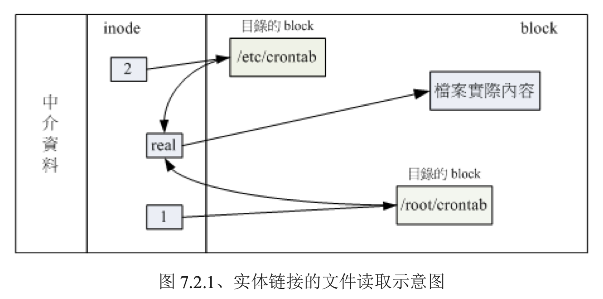
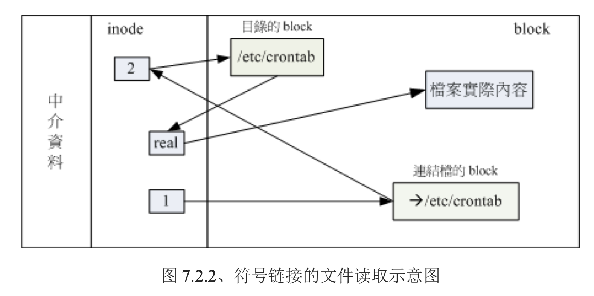

* 文件系统
    * 磁盘分区方式
        * MBR系统(Master Boot Record)
        * GPT
    * 文件系统
        * 每种操作系统所设定的文件属性/权限不相同，为了保存这些文件所需的数据，需要将分区槽进行格式化，变成操作系统能够利用的**文件系统格式**
            * 针对partition来格式化：一个分区槽一个文件系统
            * 非partition：一槽多系统，多槽合成一个系统
        * 通常说：一个可被挂载的数据=一个文件系统
* 其他文件系统
    * FAT
        * 内部全都是block，整体是由多个单向列表组成的
        * 每个block_ID都记录在前一个block中
        * 效率有点低，若想知道每个block在哪，需要遍历所有block
        * 如果block分散的太厉害，磁盘需要转很多圈才能读取到数据，效率变低
        * 可以进行**碎片整理**，降低离散程度
* Linux 文件系统 （Ext2）
    * 索引式文件系统
        * 三部分构成文件
            * inode和block都有各自的编号
            * inode=权限与属性+block的ID，一个文件一个inode，
            * data block=实际数据，数据量过大时会占用多个block
            * superblock=整个文件系统的整体信息=inode/block的总量、使用量、剩余量 + 文件系统的格式 + 相关信息
        * 文件系统将格式化出inode和block的区块，inode中的block_ID如指针一样指向各个block
    * 文件系统一开始就规划好了inode和block，基本不会变动。除非重新格式化，或利用resize2fs等指令**变更文件系统大小**。
    * 对于上百G的数据，inode/block放在一起不容易管理
    * Ext2在格式化时，会将整个文件系统划分为多个群组：block group，每个group中都有对立的inode/db/sb系统
        * 文件系统最前面又一个启动扇区：boot sector，这样，开机管理程序可以安装到各个文件系统中，而不用MBR中唯一的一个，同时可以做成多重引导的环境
        * 每个block group 的六个组成
            1. data block
                * 用来保存数据
                * 限制1:支持1k，2k，4k；在格式化时就固定了，每个block都有ID
                    * 不同的block大小导致了：最大磁盘容量、最大文件容量
                    * |-|1kb|2kb|4kb|
                      |-|-|-|-|
                      |最大文件|16GB|256GB|2TB|
                      |最大磁盘|2TB|8TB|16TB|
                    * 有些程序依然遵循旧规则，只能捕获到2GB以下的文件
                * 限制2:block的大小、数量在格式化后就不变了
                * 限制3:每个block中只能放一个文件的数据
                * 限制4:文件 > block，文件会占用多个
                    * 如果文件都比较大，格式化时使用了1kb，则每个文件会占用很多个block，使inode记录更多的block_ID，导致**读写性能低下**
                * 限制5:文件 < block, 剩余的部分就不会被使用了
                    * 如果文件都比较小，格式化时使用了4kb，则会**浪费很多空间**
            2. inode table（inode 表格）
                * inode记录的数据
                    * 权限rwx
                    * 用户+组
                    * 文件容量
                    * 建立/权限/属性改变的时间=ctime
                    * 最近一次读取时间=atime
                    * 最近修改时间=mtime
                    * 文件特殊权限=421=SUID，SGID，SBIT
                    * 实际文件内容的指向=block_ID
                * inode的特点
                    * 格式化时，大小/数量固定
                    * 每个文件占用一个inode
                    * 文件系统能够建立的文件数量与inode的数量有关
                    * 读取文件时，先读取inode，进行分析，权限相符才能使用
                * inode的组成
                    * 每个inode=128B，记录一个block使用4B
                    * 12个直接，一个间接，一个双间接，一个三间接记录区
                    * 剩余部分记录权限和属性
            3. superBlock
                * 记录的内容
                    * block、inode的总量
                    * 未使用/使用的 inode/block数量
                    * block/inode的大小（block=1、2、4KB，inode=128B、256B）
                    * 文件系统的挂载时间，最近一次写入数据的时间，最近一次检验磁盘的时间等
                    * valid bit，文件系统已挂载valid_bit=0,未挂载=1
                * 这个部分非常重要，不能坏
                * 一般大小=1024B
                * superblock记录的时文件系统整体的信息，所以一个文件系统应该只有一个superblock，但是整个block_group中可能会多于1个。所以第一个block_group会又一个，其他部分也可能有一个，是第一个的备份
                * 相关信息可以用dumpe2fs
            4. Filesystem Description 文件系统表述说明
                * 描述每个block_group的开始与结束block号码，前三种区段处于哪个block之间
                * 可以使用dumpe2f2
            5. block bitmap 区块对照表
                * 标记各block是否被使用
            6. inode bitmap inode对照表
                * 与block bitmap类似，负责记录inode
        * dumpe2fs 查询EXT系统 superblock信息
    * 目录树与文件系统的关系
        * 创建一个目录时分配一个inode和至少一个block
            * inode --> block -->{file inode:other file name}
            * 可以使用ls -li来观察文件所占用的inode号码
        * 创建文件时，分配一个inode+相对于文件大小的n个block
        * 目录树的读取
            * 从根目录开始读，系统通过挂载信息找到挂载点的inode，找到根目录的inode，用inode找到block，在一层层往下找
        * 文件系统过大，可能会使文件的分布归于离散，降低能效，此时可以将文件移出--格式化--再移动回来
    * EXT 系统 --文件的存取与日志式文件系统的功能
        * 新建一个文件或目录时的操作
            * 用户是否有wx权限，有才能新增
            * 从inode bitmap中搜索未使用的inode，将新文件的权限/属性写入
            * 从block bitmap中搜索未使用block，将数据写入block中，令inode中的block指向数据
            * 将使用的inode 和 block 号码更新到 bitmap中，更新superblock
        * 区域分类
            * 数据区：inode table，data block
            * 中介区meatdata：superblock,block bitmap,inode bitmap；这个区经常变动，增删改都可能影响这三个部分
        * 数据不一致
            * 系统突然中断时，如果只写入了inode和data，则实际数据与metadata不一致
            * 重启时借助valid bit 与 filesystem state来判断是否强制进行一致性检查
            * 文件系统比较大时，会浪费很多时间
        * 日志文件系统
            * 写入前：在日志区记录某个文件将要写入的的信息
            * 实际写入：写入文件的权限与数据，更新metadata
            * 结束：在日志区完成该文件的记录
    * Linux文件系统的运作
        * 常用文件放入内存-->内存用光，正常情况，加速系统
        * 异步写回文件，内存区会判断文件是否改动过
        * 可用sync强制写回
        * 正常关机，自动调用sync指令
        * 不正常关机，重启后检查
    * 挂载点
        * 文件系统与目录树的连接=挂载
        * 挂载点一定是目录，挂载后才能使用该文件系统
    * VFS （虚拟文件系统）
        * 通过该系统管理多个文件系统
* XFS文件系统
    * EXT的问题：格式化时预先规划inode、datablock，对于大容量的磁盘，在格式化时会消耗大量时间
    * XFS是一个日志文件系统，
    * 划分：一个资料区，一个日志区，一个实时运作区
        * 资料区类似于block group，分为多个存储区群组allocation groups，来存放数据
            * 每个区包含superblock，剩余空间管理机制，inode的分配与追踪。
            * inode/block需要使用时，动态分配
            * block容量：512k～64KB；由于内存控制，Linux下最多可以使用4KB
        * 实时运作区
            * 文件被建立时，在该区找到1～n个extent区块，将文件在时放在这里，分配完后，再写入数据区的inode和block
            * entent在格式化时指定，4K～1G；非磁盘阵列默认64k；有磁盘阵列的stripe时，最好extent=stripe
            * extent不要乱动，会影响磁盘效能
    * superblock查询指令
        * xfs_info 挂载点|装置文件名
* /dev/shm
    * 系统通过物理内存虚拟出来的，通常是物理内存的一半
    * 在该目录下，文件的访问速度非常快
    * 重启后消失
* 文件系统的操作
    * df [-ahikHTm] [目录/文件名]  =列出文件系统的整体**使用情况**
        * 该指令针对整个文件系统
        * 主要读取范围：superblock
        * 加入目录/文件名，会显示所在的partition的容量
        * 后面不接目录/文件时，列出系统内所有的文件系统
        * option
            * a=列出所有的文件系统，包括/proc等文件系统
            * k=kb显示
            * m=Mb显示
            * h=以更容易阅读的GB，MB，KB方式来显示
            * H= 单位M变为1000K来计算
            * T=同时列出该partition的文件系统名称
            * i=不用磁盘容量，用inode数量来显示
    * du [-ahskm] 文件/目录名 = 评估当前/指定目录的**使用量**
        * option
            * a=列出当前目录下的所有文件与目录的容量
            * h=以更容易阅读的GB，MB，KB方式来显示
            * s=只列出整体的总量
            * S=不包括子目录的总量
            * k=kb显示
            * m=Mb显示
    * ln 
        * option
            * s=创建快捷方式
            * f=如果新文件存在，则先删除，再创建
        * hard link 实体连接
            * ln 连接目标 新文件
            * 连接后文件的block指向连接目标的inode，来指向同一个datablock
            * 所做的修改都会写入到目标的inode和block中
            * 
            * 限制：
                * 不能跨文件系统
                * 不能link目录
                    * 如果连接目录，除了目录本身，还会与目录下的每个文件建立ln；在原目录下新建文件时，又会穿件连接，会增加环境的复杂度
            * 基本不会占用inode和block
            * 比较安全，删除时只是删除了连接，真正的文件还没有被删除
        * Symbolic Link 符号连接/快捷方式
            * ln -s 连接目标 新文件
            * 一个独立文件，执行目标
            * 
            * 创建的是一个新文件，会增加inode和block
        * 目录的link数量
            * 一个新目录的内容
                * /dir
                * /dir/.
                * /dir/..
            * 创建一个新目录后，新目录的link为2，上层目录的link+1
* 磁盘的分区、格式化、检验与挂载
    * 新增一个磁盘需要的操作
        1. 对磁盘进行分区，建立可用的partition
        2. 对partition进行格式化-->建立可用的文件系统
        3. 对文件系统进行检验
        4. 在Linux中建立挂载点，将文件系统进行挂载
    * 观察磁盘分区状态
        * 两种主要分区表：MBR，GPT
        * lsblk [-dfimpt] [device] =列出系统上的所有磁盘列表
            * option 
                * d=仅列出磁盘本身，并不会列出该磁盘的分区数据
                * f=同时列出该磁盘内的文件系统名称
                * i=使用ASCII的线段输出，不使用复制的编码
                * m=同时输出该装置在dev下的权限数据
                * p=列出装置的完整名称
                * t=列出磁盘的详细数据，包括磁盘队列机制、预读写的数据量大小
        * blkid 列出装置的UUID等参数
        * parted 列出磁盘分区表类型与分区信息
            * parted device_name print
    * 磁盘分区
        * 不同的分区表，使用不同的指令
        * MBR使用：fdisk
        * GPT使用：gdisk
        * gdisk 装置名称
        * partprobe 更新Linux核心的分区表信息
    * 格式化（创建文件系统）
        * mkfs.xfs
    * 挂载
        * mount
        * umount
    * 磁盘文件系统参数修改
        * mknod 装置文件名 [bcp] [Major] [Minor]
            * option
                * b=设定装置名称成为一个周边存储设备文件，如磁盘
                * c=设定装置名称成为一个周边输入设备文件，如鼠标/键盘
                * p=设定装置成为FIFO文件
            * Major=主要装置代码
            * Minor=次要装置代码
        * xfs_admin 修改XFS文件系统的UUID与Label name
* 设定开机挂载
    * 系统挂载的限制
        * `/`必须挂载，而且最先挂载
        * 其他挂载点必须是已建立的目录
        * 所有挂载点，同时只能挂载一次
        * 所有partition同时只能挂载一次
        * 卸载时，需要将工作目录移到挂载点之外
    * 开机挂载
        * /ect/fstab
            * 利用mount挂载时，选项与参数写入这个文件
            * 与开机时是否进行文件系统检验fsck等指令有关
            * 6个字段
                * [装置/UUID等][挂载点][文件系统][文件系统参数] [dump][fsck]
    * 特殊装置loop挂载
        * mount -o loop [装置]
        * 在不改变分区的情况下，使用大型文件代替磁盘装置
    