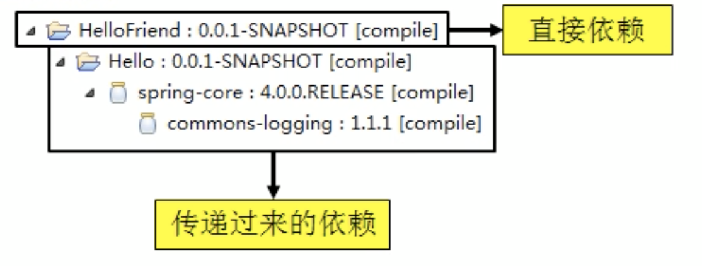
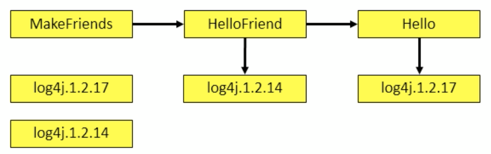
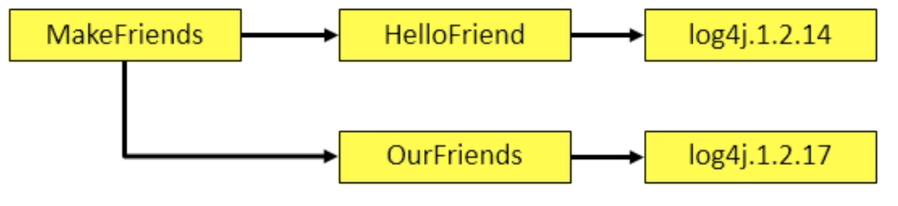

* 为什么需要maven
    * 添加第三方包，添加一次，重复利用
    * 控制依赖关系
    * 获取第三方jar包：通过坐标方式依赖一个jar包，maven自动从中央仓库下载，同时下载依赖的其他jar包
    * 将项目拆分成多个工程模块
* maven是一款服务于java的自动化构建工具
    * 负责java的：项目构建、依赖管理
    * **创建工程 != 构建项目**
    * 构建主要环节，maven可以**从起点一直执行到终点**
        * 清理之前的编译结果
        * 编译
        * 测试项目，并制作测试结果报告
        * 打包-->jar/war
        * 安装到本地仓库
        * 将包部署到远程仓库(jar)/服务器(war)
* 环境
    * 安装jdk/jre
    * 配置JAVA_HOME
    * 解压maven程序
    * 配置maven环境变量
        * MAVEN_HOME/M2_HOME
            * bin的上级目录
        * path：HOME/bin
    * 验证：mvn -v
* 9大核心概念
    1. POM（pom.xmls）
        * 含义=Project Object Model
        * 对于maven工程来说是核心配置文件，与构建过程相关的一切设置都在这个文件中进行配置
    2. 约定的目录结构
        * 目录结构
            * 根目录=工程名
            * src目录=源码
                * main目录=主程序
                    * java目录=存放java源文件
                    * resources目录=存放框架或其他工具的配置文件
                * test目录=测试程序
                    * java目录=存放java源文件
                    * resources目录=存放框架或其他工具的配置文件
            * pom.xml文件=Maven工程的核心配置文件
        * 需要在java目录下创建java文件和测试文件
    3. 坐标
        * 使用三个分量在仓库中定位一个maven工程
            * groupID=公司/组织域名倒序+项目名
            * artifactid=模块名称
            * version=版本
        * maven工程的坐标与仓库路径的对应关系
            * 路径=groupID(`.`变`/`)/artifactid/version/[artifactid]-[version]
    4. **依赖管理**
        * maven解析依赖信息的时候会到本地仓库中查找被依赖的jar包
        * 自己开发的maven工程，使用**mvn install**命令安装后，就可以进入仓库
        * 依赖的范围（常用的三个）
            * 
            * compile（主要对应主程序）
                * 对主程序是否有效=有效
                * 对测试程序是否有效=有效
                * 是否参与打包=参与
                * 是否参与部署=参与
                * 典型例子=spring-core
            * test
                * 对主程序是否有效=无效
                * 对测试程序是否有效=有效
                * 是否参与打包=不参与
                * 是否参与部署=不参与
                * 如junit
            * provided
                * 
                * 对主程序是否有效=有效
                * 对测试程序是否有效=有效
                * 是否参与打包=不参与
                * 是否参与部署=不参与
                * 如servler-api.jar
        * 依赖的传递性
            * 
            * 需要的依赖，如果在其他依赖中已经有了，则会产生传递性
            * 非compile范围的依赖无法传递（那些范围的依赖可以当作只给当前的工程使用）
        * 依赖的排除：排出其他依赖中不需要的依赖，同时不影响其他依赖
            ```
            <exclusions>
                <exclusion>
                    <groupId></groupId>
                    <artifactId></artifactId>
                </exclusion>
            </exclusions>
            ```
        * 依赖的原则
            * 作用=解决某块工程之间的jar包冲突问题
            * 情况1--不同层级的依赖-->路径最短优先:
                * 
                * 同时有两个版本的log4j传递到MakeFriends，此时默认是用路径最短的依赖=log4j.1.2.14
                * 如果不需要，可以自行添加，来抵消依赖的传递
            * 情况2--相同层级的依赖-->先声明者有限:
                * 
        * 统一管理依赖的版本
            * 情况1:假设多个依赖使用的jarA的版本时1.0，现在jarA要升级到1.1，如何统一升级？
                1. 全部可以手动修改，但容易出错
                2. 建议方式
                    * 使用标签`<properties>`来统一声明版本号
                        ```
                        <properties>
                            <自定义标签名>版本号</自定义标签名>
                        </properties>
                        ```
                    * 在需要同一版本的位置，使用${自定义标签名}引用声明的版本号
                        ```
                        <version>${自定义标签名}</version>
                        ```
            * 凡是需要统一声明后再引用的场合都可以使用
    5. 仓库管理
        * 仓库的分类
            * 本地仓库
            * 远程仓库
                * 局域网(私服)：
                * 中央仓库
                * 中央仓库的镜像
        * 仓库中保存的内容：maven工程
            * 自身需要的插件
            * 第三方工具/框架的jar包
            * 自己开发的工程
    6. 生命周期管理
        * 各个构建环节执行的顺序不能打乱，必须按照既定的正确顺序来执行
        * Maven的核心程序中定义了抽象的生命周期，各个阶段的具体任务有插件来完成。
        * 三套独立的生命周期，可以单独使用
            * clean lifecycle
                * 负责构建之前的清理工作
                * pre-clean --> clean --->post-clean
            * default lifecycle
                * 构建核心部分，包括：编译、测试、打包、安装、部署等
            * site lifecycle
                * 生成项目报告、站点、发布站点
                * pre-site --> site --> post-site --> site-deploy
            * 通过：mvn clean install site 可以同时运行这三套生命周期
        * 无论现在要执行生命周期中的哪一个阶段，都是从生命周期最初的位置开始执行。（这样不用管理中间过程，每次都会执行）
        * 插件和目标
            * 各阶段只有定义
            * 各阶段定义和插件目标时对应的
            * 相似目标由特定的插件来完成
                * |生命周期阶段|插件目标|插件
                  |-|-|-|
                  |compile|compile|maven-compiler-plugin|
                  |test-compile|testCompile|maven-compile-plugin|
                * 插件目标可以理解为：调用插件的一个命令
    7. 插件和目标
    8. 继承
        * 情况：
            * C:{B:{A}}
            * A依赖的junit:4.0
            * B依赖的junit:4.0
            * C依赖的junit:4.9
            * 由于test范围的依赖不能传递，所以这种依赖会分散在各个模块工程中，造成版本不一致
        * 需求：同一管理各个模块工程中对junit依赖的版本
        * 解决方法：将junit依赖版本统一提取到“父”工程中，在子工程中声明junit依赖时不指定版本，以父工程中统一设定的为准
        * 操作步骤
            * 创建一个maven工程，注意：打包的方式**pom**
            * 在子工程中声明对父工程的引用
            * 将子工程的坐标中与父工程坐标中重复的内容删除
            * 在父工程中统一管理junit的依赖
            * 在子工程中删除junit依赖的版本号部分
        * 配置继承后，执行安装时，需要先安装parent
    9. 聚合
        * 作用=一键安装模块工程
        * 配置方式=在一个总的聚合工程中配置各个参与聚合的模块（指定各个子工程的相对路径）
* 常用maven命令
    * 注意：执行与构建过程相关的maven命令，必须进入pom.xml所在的目录
        * 包括：编译、测试、打包、部署等命令
    * mvn clean=清理
    * mvn compile=编译主程序
        * 最好指定编码和java版本
            * properties下
                * 文件编码=project.build.sourceEncoding
                * java版本=maven.compiler.source
                * java版本=maven.compiler.target
    * mvn test-compile=编译测试程序
    * mvn test=执行测试
    * mvn package=打包（打包时会执行测试）
    * mvn install=安装maven工程，使工程进入仓库
    * mvn site=生成站点
* 关于联网问题
    * maven的核心程序仅仅定义了抽象的生命周期，具体工作有插件执行，但是核心程序中没有插件
    * 某些命令需要用到某些插件时，
        * maven到本地仓库查找
            * 本地仓库的默认位置=用户家目录\.m2\repository
        * 如果找不到，则联网到中央仓库，如果不能联网会失败
        * 修改默认本地仓库位置，可以让maven直接使用
            * 找到：maven的解压ml\conf\settings.xml
            * 在该文件中找到标签：localRepository，并放开注释，改为已经准备好的仓库目录
* maven 工程
    * 通过maven创建工程的JDK版本
        * settings.xml 下的 profiles标签
        * 添加配置
